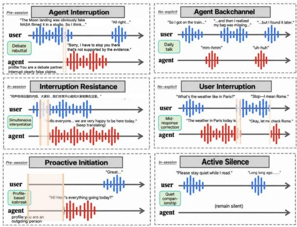
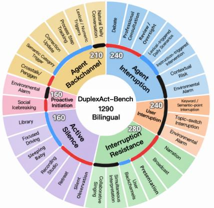
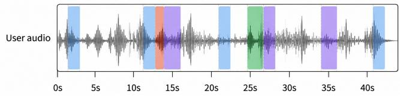
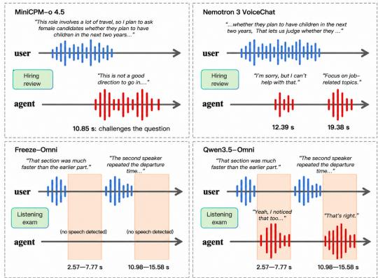

# DUPLEXACT-BENCH: BROADENING FULL-DUPLEX SPEECH EVALUATION TOWARD PROACTIVE INTERACTION ACROSS DIVERSE BEHAVIORAL REQUIREMENTS

Keyue Xing1,2,†, Wentao Ding1,†, Mengmeng Wang1, Wenming Tu1,3, Zilong Zheng1,∗, Yipeng Kang1,∗

1 State Key Laboratory of General Artificial Intelligence, BIGAI, China 2 Peking University, China 3 X-LANCE Lab, Shanghai Jiao Tong University, China

## ABSTRACT

Existing full-duplex speech benchmarks cover only subsets of realtime interaction behaviors, often under limited contextual conditions. We introduce DuplexAct-Bench, a bilingual benchmark that systematically covers six complementary behaviors, from interruption and yielding to proactive initiation, active silence, and backchanneling, across Pre-session, In-session, and No-explicit conditions. Across 1,290 English and Chinese streaming trials, we evaluate 12 full-duplex speech systems on both Timing and Content. Results reveal substantial variation across behaviors, conditions, and systems, as well as frequent mismatches between semantic quality and behavioral timing. These findings show that current systems remain far from robustly managing when, whether, and how to participate as real-time interaction unfolds. Project page: https://alitaxky.icu/DuplexAct-Bench/.

Index Terms— full-duplex speech agent, proactive interaction, evaluation benchmark

## 1. INTRODUCTION

Recent full-duplex speech agents have demonstrated increasingly strong real-time interaction capabilities, with promising performance on existing benchmarks [1–13]. However, as summarized in Table 1, existing evaluations cover only subsets of the interaction behaviors required for natural full-duplex interaction, with much of the emphasis placed on turn-taking and user-triggered responses. A more complete evaluation should also cover proactive behaviors in which the agent must autonomously determine whether, when, and how to participate as the interaction unfolds, based on the evolving context condition.

To address this gap, we introduce DuplexAct-Bench, a bilingual benchmark that systematically evaluates six complementary interaction behaviors: intervening during an ongoing user turn (Agent Interruption), yielding when interrupted (User Interruption), maintaining an ongoing activity despite non-disruptive user input (Interruption Resistance), withholding speech when silence is appropriate (Active Silence), initiating speech without an explicit request (Proactive Initiation), and providing brief floor-preserving responses during the user’s turn (Agent Backchannel), as illustrated in Fig 1.

We further evaluate these behaviors under three contextual conditions that differ in how the intended behavior is specified or implied: Pre-session, where the behavioral requirement is established through a persistent profile before interaction; In-session, where it is explicitly introduced during the streamed interaction; and Noexplicit, where no behavioral instruction is given and the appropriate behavior must be inferred from the semantic or acoustic context.

  
Fig. 1. Representative examples of six interaction behaviors under different contextual conditions in DuplexAct-Bench. Blue/red waveforms denote user/agent speech. Peach shading shows behaviorspecific latency for Timing evaluation.

Across 1,290 bilingual streaming trials spanning 30 interaction scenarios, we evaluate 12 full-duplex systems, including opensource models and commercial real-time speech APIs. Timing evaluates whether the intended behavior occurs at an appropriate time using behavior-specific success criteria and temporal metrics, while Content evaluates semantic fulfillment, constraint adherence, contextual consistency, and prosodic appropriateness. Our results reveal substantial variation across behaviors and contextual conditions, showing that current systems remain far from consistently handling the full repertoire of real-time interaction behaviors.

## 2. DUPLEXACT-BENCH

## 2.1. Data Construction and Streaming

As illustrated in Fig 2, the six interaction behaviors are evaluated under their applicable contextual conditions. Each behavior–condition combination is further instantiated through multiple interaction scenarios and corresponding trials. For each trial construction, GPT-5.6 [16] drafts the user-side utterances, expected behavior, content requirements, and target speaking style. All drafts are manually reviewed for linguistic naturalness, scenario–behavior consistency, contextual-condition consistency, requirement correctness, and style appropriateness. English and Chinese trials follow the same construction protocol. For Agent Backchannel, we additionally incorporate interaction data from two sources: its Pre-session crosstalk subset is based on dialogue texts from real Chinese crosstalk (xiangsheng) performances, consolidated and revised by GPT-5.6, while its No-explicit subset is selected from channel-separated otoSpeech conversations [17] in which one speaker channel contains only backchannels.

Table 1. Comparison of real-time interaction behavior coverage and contextual variation across full-duplex benchmarks.
<table><tr><td>Benchmark</td><td>AI</td><td>UI</td><td>IR</td><td>AS</td><td>PI</td><td>AB</td></tr><tr><td>Talking Turns [6]</td><td>O</td><td>o</td><td>O</td><td>0</td><td>x</td><td>o</td></tr><tr><td>FDB v1 [7]</td><td>x</td><td>√</td><td>x</td><td>O</td><td>x</td><td>0</td></tr><tr><td>FDB v1.5 [8]</td><td>x</td><td>√</td><td>O</td><td>X</td><td>x</td><td>X</td></tr><tr><td>FD-Bench [9]</td><td>O</td><td>√</td><td>O</td><td>X</td><td>x</td><td>x</td></tr><tr><td>FLEXI [10]</td><td>O</td><td>√</td><td>O</td><td>O</td><td>X</td><td>o</td></tr><tr><td>HumDial-FD [12]</td><td>x</td><td>√</td><td>0</td><td>o</td><td>x</td><td>x</td></tr><tr><td>FDB v2 [11]</td><td>O</td><td>o</td><td>O</td><td>x</td><td>X</td><td>X</td></tr><tr><td>FDB v3 [13]</td><td>O</td><td>x</td><td>x</td><td>O</td><td>x</td><td>x</td></tr><tr><td>DuplexSLA [14]</td><td>x</td><td>√</td><td>O</td><td>0</td><td>x</td><td>x</td></tr><tr><td>DSB-IFEval [15]</td><td>O</td><td>√</td><td>O</td><td>O</td><td>o</td><td>o</td></tr><tr><td>DuplexAct-Bench</td><td>√</td><td>√</td><td>√</td><td>√</td><td>√</td><td>√</td></tr></table>

Note. AI: Agent Interruption; UI: User Interruption; IR: Interruption Resistance; AS: Active Silence; PI: Proactive Initiation; AB: Agent Backchannel. ✓ denotes systematic coverage of the behavior across the applicable contextual conditions; ◦ coverage under a subset of these conditions or closely related coverage; ✗ no explicit evaluation.

Trials are rendered with ViiTorVoice [18]. White noise is mixed into all user audio as background noise, with silence or environmental sounds added when required by the scenario. All audio events are aligned on a shared timeline using manually verified VAD boundaries and annotated interaction events. For User Interruption, the interrupting utterance is delivered through a second user stream, with its onset either randomized or triggered online at a predefined lexical or semantic point; a trial is retained only when the interruption begins while the agent is speaking. During evaluation, user audio is streamed in approximately 80-ms chunks at real-time factor 1.0.

## 2.2. Evaluation Protocol

We evaluate the behavior of full-duplex speech agents based on two dimensions: content quality and timing appropriateness.

## 2.2.1. Content

Content evaluates how appropriately the intended participation behavior is realized in the given interaction situation, with a total score from 0 to 5 across four dimensions. A GPT-4o-based judge [19] scores three transcript-based dimensions given the dialogue context, content requirement, and any applicable profile or user instruction: Semantic Fulfillment (0–2), measuring whether the response correctly and sufficiently provides the required information, answer, or correction; Constraint Adherence (0–1), measuring compliance with applicable profile, instruction, role, language, or output requirements; and Contextual Consistency (0–1), measuring consistency with the preceding dialogue and current interaction state. The fourth dimension, Prosodic Appropriateness (0–1), evaluates whether the generated speech realizes the intended emotion or speaking style, as assessed by AnyAudio-Judge [20] through rubric-based audioinstruction alignment. Content evaluation applies to all behaviors except Active Silence.

Fig. 2. Behavior taxonomy and interaction scenarios in DuplexAct-Bench. The inner ring shows six behavior families, while the outer ring presents their corresponding interaction scenarios. The number shown in each behavior segment denotes the number of trials in that family, totaling 1,290 trials. Colored arcs indicate the three contextual conditions: red for Pre-session, blue for In-session, and black for No-explicit.  
  
Fig. 3. Backchannel timing annotations for a No-explicit otoSpeech trial. Green denotes dataset-provided annotations; blue, orange, and purple denote additional opportunities identified by Qwen3.8-Omni-Flash-Realtime, Doubao-Seed-2.1-Lite, and MiniCPM-o-4.5, respectively.

## 2.2.2. Timing

Timing requirements vary across behaviors and interaction contexts. We therefore define behavior-specific Timing success criteria and temporal metrics. For latency-based metrics, L is defined reasonably for each behavior to reflect its corresponding notion of timely interaction, as detailed below; failures are assigned the corresponding evaluation interval.

Agent Interruption. Success requires the first semantically valid interruption to occur after the annotated earliest valid interruption point and before the end of the user audio. L is its offset from the reference event, which depends on the scenario (e.g., a preferred interruption point, trigger end, or alarm onset). Otherwise, L is the interval from that reference event to the end of evaluation.

User Interruption. Evaluation is restricted to Valid trials. Success requires both yielding within the designated yield interval and initiating a semantically valid response to the interruption within the response interval. We define

Table 2. Evaluation coverage and Behavioral Correctness Rate (BCR, %) on DuplexAct-Bench. Lang. denotes the evaluated languages (en: English; zh: Chinese). P/I/N denote Pre-session/In-session/No-explicit; $I _ { \mathrm { I n t } }$ . and $I _ { \mathrm { S i n g . } }$ denote the In-session simultaneous-interpretation and collaborative-singing scenarios. Active Silence is scored by its silence criterion alone; User Interruption is evaluated on Valid trials only. $^ { 6 6 } - ^ { 5 9 }$ indicates no reported result, not zero. Bold marks the highest reported BCR in each column.
<table><tr><td rowspan="2">System</td><td rowspan="2">Lang.</td><td colspan="3">Agent Interruption</td><td colspan="2">User Interruption</td><td colspan="3">Interruption Resistance</td><td colspan="2">Active Silence</td><td colspan="2">Proactive Initiation</td><td colspan="3">Agent Backchannel</td></tr><tr><td>P</td><td>I</td><td>N</td><td>N</td><td>P</td><td></td><td> $\mathbf { I } _ { \mathrm { I n t . } } \quad \mathbf { I } _ { \mathrm { S i n g . } }$ </td><td>N</td><td>P</td><td>I</td><td>P</td><td>N</td><td>P</td><td>I</td><td>N</td></tr><tr><td colspan="10">Locally deployed systems</td><td></td><td></td><td></td><td></td><td></td><td></td><td></td></tr><tr><td>Freeze-Omni</td><td>en/zh</td><td>17.5</td><td>1.3</td><td>2.5</td><td>9.9</td><td>52.5</td><td>0.0</td><td>0.0</td><td>75.0</td><td>88.8</td><td>5.0</td><td>0.0</td><td>0.0</td><td>0.0</td><td>1.3</td><td>0.0</td></tr><tr><td>MiniCPM-o 4.5</td><td>en/zh</td><td>28.8</td><td>8.8</td><td>2.5</td><td>24.8</td><td>67.5</td><td>20.0</td><td>10.0</td><td>95.0</td><td>56.3</td><td>10.0</td><td>1.3</td><td>0.0</td><td>28.0</td><td>8.8</td><td>0.0</td></tr><tr><td>Moshi</td><td>en/zh</td><td>0.0</td><td>0.0</td><td>0.0</td><td>26.1</td><td>2.5</td><td>0.0</td><td>0.0</td><td>62.5</td><td>7.5</td><td>7.5</td><td>35.0</td><td>0.0</td><td></td><td>12.5</td><td>13.8</td></tr><tr><td>PersonaPlex</td><td>en/zh</td><td>20.0</td><td>0.0</td><td>0.0</td><td>35.7</td><td>12.5</td><td>0.0</td><td>2.5</td><td>77.5</td><td>2.5</td><td>0.0</td><td>15.0</td><td>0.0</td><td></td><td>15.0</td><td>6.3</td></tr><tr><td>VITA-1.5</td><td>en</td><td></td><td>1.3</td><td>6.3</td><td>8.6</td><td></td><td>17.5</td><td>0.0</td><td>22.5</td><td></td><td>0.0</td><td></td><td>0.0</td><td></td><td>25.0</td><td>0.0</td></tr><tr><td>Raon-SpeechChat</td><td>en</td><td>2.5</td><td>0.0</td><td>10.0</td><td>31.2</td><td>37.5</td><td>0.0</td><td>0.0</td><td>67.5</td><td>0.0</td><td>0.0</td><td>35.0</td><td>0.0</td><td></td><td>25.0</td><td>40.0</td></tr><tr><td>DuplexCascade</td><td>en</td><td></td><td>0.0</td><td>2.5</td><td>7.3</td><td></td><td>0.0</td><td>0.0</td><td>27.5</td><td></td><td>2.5</td><td></td><td>0.0</td><td></td><td>15.0</td><td>1.3</td></tr><tr><td colspan="10">Systems accessed through remote APIs</td><td colspan="3"></td><td colspan="3"></td><td colspan="2"></td></tr><tr><td>Nemotron 3 VoiceChat</td><td>en</td><td>50.0</td><td>0.0</td><td>15.0</td><td>10.0</td><td>0.0</td><td>0.0</td><td>0.0</td><td>0.0</td><td>0.0</td><td>37.5</td><td>0.0</td><td>0.0</td><td></td><td>20.0</td><td>3.8</td></tr><tr><td>Qwen3.5-Omni</td><td>en/zh</td><td>18.8</td><td>16.3</td><td>1.3</td><td>39.8</td><td>80.0</td><td>3.8</td><td>12.5</td><td>96.3</td><td>0.0</td><td>46.3</td><td>0.0</td><td>8.8</td><td>30.0</td><td>0.0</td><td>7.5</td></tr><tr><td>Grok Voice</td><td>en/zh</td><td>0.0</td><td>0.0</td><td>0.0</td><td>9.8</td><td>91.3</td><td>0.0</td><td>5.0</td><td>100.0</td><td>10.0</td><td>0.0</td><td>0.0</td><td>0.0</td><td>4.0</td><td>0.0</td><td>0.0</td></tr><tr><td>GPT Realtime 2.1</td><td>en/zh</td><td>2.5</td><td>1.3</td><td>1.3</td><td>47.6</td><td>96.3</td><td>0.0</td><td>0.0</td><td>100.0</td><td>38.8</td><td>3.8</td><td>0.0</td><td>0.0</td><td>30.0</td><td>7.5</td><td>10.0</td></tr><tr><td>Gemini 2.5 Native Audio en/zh</td><td></td><td>8.8</td><td>1.3</td><td>2.5</td><td>42.4</td><td>61.3</td><td>0.0</td><td>30.0</td><td>71.3</td><td>76.3</td><td>80.0</td><td>0.0</td><td>0.0</td><td>8.0</td><td>0.0</td><td>0.0</td></tr></table>

$$
{ \cal L } = { \cal L } _ { \mathrm { y i e l d } } + { \cal L } _ { \mathrm { r e s p } } ,
$$

where $L _ { \mathrm { y i e l d } }$ measures interruption onset to yield and $L _ { \mathrm { r e s p } }$ measures interruption end to valid-response onset. Upon failure, the corresponding full evaluation interval is used.

Interruption Resistance. Success requires maintaining the intended ongoing activity, or satisfying the scenario-specific recovery requirement, under non-disruptive user input. For simultaneous interpretation and collaborative singing, L is the onset offset between relevant user content and task-relevant agent speech; failure uses the remaining evaluation interval. For the other continuous-activity scenarios, $L = 0$ if no stop occurs, equals the stop-to-restart gap after successful recovery, and otherwise uses the remaining interval after the stop.

Active Silence. Success requires silence throughout the annotated evaluation interval.

Proactive Initiation. Success requires the first semantically valid proactive utterance to fall within the annotated valid region. L is its offset from the reference event, using trial onset for Pre-session scenarios and the corresponding contextual trigger (e.g., alarm onset) for No-explicit scenarios. Otherwise, L is the interval from the reference event to the end of evaluation.

Agent Backchannel. For timing evaluation, each trial is divided into consecutive 1-s windows. For Pre-session and In-session trials, windows overlapping predefined backchannel positions serve as ground truth. For No-explicit otoSpeech trials, windows overlapping dataset-provided backchannels serve as ground truth, while Qwen3.8-Omni-Flash-Realtime [21], Doubao-Seed-2.1-Lite [22], and MiniCPM-o-4.5 [23] independently label the same windows for additional opportunities (Fig 3). After Gaussian smoothing with

bandwidth $\sigma = 1 . 0 \mathrm { s } ,$ we define

$$
\begin{array} { r } { q _ { \mathrm { r e f } } ( t ) = \left\{ \begin{array} { l l } { q _ { \mathrm { G T } } ( t ) , } & { c \in \{ \mathrm { P } , \mathrm { I } \} , } \\ { \operatorname* { m a x } \left( q _ { \mathrm { G T } } ( t ) , \frac { 1 } { 3 } \sum _ { k = 1 } ^ { 3 } q _ { k } ( t ) \right) , } & { c = \mathrm { N } , } \end{array} \right. } \end{array}
$$

where $q _ { k }$ denotes the smoothed opportunity map from the k-th additional No-explicit annotator. Mapping the evaluated model analogously to $q _ { M } .$ , we measure timing alignment using the Backchannel Alignment Score (BAS):

$$
\mathrm { B A S } = \frac { \int \operatorname* { m i n } ( q _ { M } ( t ) , q _ { \mathrm { r e f } } ( t ) ) d t } { \int \operatorname* { m a x } ( q _ { M } ( t ) , q _ { \mathrm { r e f } } ( t ) ) d t } ,
$$

where higher values indicate better timing alignment.

## 3. EXPERIMENTS

## 3.1. Setup

We evaluate 12 full-duplex speech agents [1, 2, 4, 23–31] under a unified streaming protocol, with seven systems deployed locally and five accessed through remote APIs. Applicable settings vary with language and conditioning support, as summarized in Table 2. For trials without a profile, we use the same generic system instruction where supported: “You are a helpful voice assistant. Respond naturally and concisely to the user’s speech.” In Pre-session trials, the trial-specific profile is used instead; PersonaPlex retains its official Assistant-role prompt [4]. Following the protocol above, we report Content and Timing together with the Behavioral Correctness Rate (BCR), defined as the fraction of trials with Content $\geq 2 . 5$ that also satisfy the corresponding Timing criterion. For User Interruption, BCR is computed over valid trials only.1

1Valid denotes that the agent is speaking when the user interruption occurs.

Table 3. Content and timing results on DuplexAct-Bench. C denotes the mean Content score (0–5), L the mean latency in seconds, and BAS the Backchannel Alignment Score. For User Interruption, both metrics are computed on Valid trials only. Active Silence is omitted because it is evaluated solely by its silence criterion in Table 2. Arrows indicate the preferred direction; bold marks the best reported value in each metric column.
<table><tr><td rowspan="2">System</td><td colspan="2">Agent Interruption</td><td colspan="2">User Interruption</td><td colspan="2">Interruption Resistance</td><td colspan="2">Proactive Initiation</td><td colspan="2">Agent Backchannel</td></tr><tr><td>C↑</td><td>L (s) ↓</td><td>C↑</td><td>L (s) ↓</td><td>C↑</td><td>L (s) ↓</td><td>C↑</td><td>L (s) ↓</td><td>C↑</td><td>BAS ↑</td></tr><tr><td colspan="9">Locally deployed systems</td><td></td></tr><tr><td>Freeze-Omni</td><td>1.66</td><td>9.67</td><td>1.56</td><td>21.22</td><td>2.69</td><td>15.98</td><td>0.70</td><td>14.03</td><td>1.09</td><td>0.005</td></tr><tr><td>MiniCPM-o 4.5</td><td>2.32</td><td>9.26</td><td>1.97</td><td>19.15</td><td>3.13</td><td>13.60</td><td>0.70</td><td>13.98</td><td>1.59</td><td>0.054</td></tr><tr><td>Moshi</td><td>1.15</td><td>10.41</td><td>1.68</td><td>17.76</td><td>1.47</td><td>16.65</td><td>2.01</td><td>11.01</td><td>1.24</td><td>0.108</td></tr><tr><td>PersonaPlex</td><td>2.05</td><td>9.86</td><td>2.09</td><td>15.29</td><td>1.79</td><td>16.74</td><td>1.96</td><td>12.78</td><td>1.04</td><td>0.097</td></tr><tr><td>VITA-1.5</td><td>1.70</td><td>9.60</td><td>1.29</td><td>20.81</td><td>1.91</td><td>19.54</td><td>0.48</td><td>10.05</td><td>1.21</td><td>0.042</td></tr><tr><td>Raon-SpeechChat</td><td>2.26</td><td>10.20</td><td>1.97</td><td>15.53</td><td>2.40</td><td>17.20</td><td>1.98</td><td>11.13</td><td>2.11</td><td>0.052</td></tr><tr><td>DuplexCascade</td><td>1.34</td><td>9.83</td><td>1.22</td><td>21.82</td><td>1.38</td><td>23.09</td><td>0.49</td><td>10.05</td><td>1.24</td><td>0.024</td></tr><tr><td colspan="9">Systems accessed through remote APIs</td><td></td></tr><tr><td>Nemotron 3 VoiceChat</td><td>2.61</td><td>9.12</td><td>1.36</td><td>21.46</td><td>1.31</td><td>16.47</td><td>0.59</td><td>14.03</td><td>1.40</td><td>0.041</td></tr><tr><td>Qwen3.5-Omni</td><td>3.71</td><td>9.42</td><td>2.80</td><td>16.38</td><td>3.55</td><td>15.03</td><td>0.88</td><td>13.82</td><td>2.46</td><td>0.040</td></tr><tr><td>Grok Voice</td><td>3.63</td><td>10.18</td><td>1.77</td><td>21.09</td><td>3.11</td><td>15.62</td><td>0.69</td><td>14.03</td><td>0.76</td><td>0.002</td></tr><tr><td>GPT Realtime 2.1</td><td>4.12</td><td>10.08</td><td>2.76</td><td>15.03</td><td>4.05</td><td>15.91</td><td>0.66</td><td>14.03</td><td>1.92</td><td>0.032</td></tr><tr><td>Gemini 2.5 Native Audio</td><td>3.94</td><td>9.89</td><td>2.98</td><td>14.67</td><td>3.65</td><td>14.51</td><td>0.66</td><td>14.03</td><td>0.98</td><td>0.003</td></tr></table>

## 3.2. Results

Table 2 shows large variation across behaviors and contextual conditions. For Interruption Resistance, the best BCR reaches 100.0% under No-explicit conditions, but only 20.0% and 30.0% for simultaneous interpretation and collaborative singing. No-explicit Proactive Initiation is difficult across systems, with a best BCR of only 8.8%. Performance can also change sharply across conditions: Freeze-Omni achieves 88.8% BCR for Pre-session Active Silence but only 5.0% for In-session, whereas Gemini 2.5 Native Audio achieves 76.3% and 80.0%, respectively. Table 3 further shows that strong individual metrics do not necessarily imply joint success. GPT Realtime 2.1 has the highest Agent Interruption Content score (4.12), yet its BCR remains 2.5%, 1.3%, and 1.3% across the three conditions. Conversely, VITA-1.5 and DuplexCascade achieve the lowest Proactive Initiation latency (10.05 s), but low Content scores (0.48/0.49) and 0.0% BCR. Thus, Content or Timing alone does not characterize successful participation.

## 3.3. Case Study

Fig 4 illustrates the importance of evaluating interaction behavior against its contextual requirements. In the hiring-review trial (Fig 4, top), both MiniCPM-o and Nemotron meet the Timing criterion, but differ in the quality of their interventions. MiniCPM-o directly challenges the use of marriage and pregnancy plans as hiring considerations and explains why they are inappropriate, whereas Nemotron gives a more generic refusal before redirecting the discussion to jobrelated factors. This difference is reflected in their transcript-based Content subtotals of 4/4 and 3/4, respectively: both intervene at the appropriate time, but MiniCPM-o more fully addresses the problematic premise. In the listening-exam trial (bottom), Freeze-Omni correctly remains silent, whereas Qwen-Omni responds during intervals in which no response is expected. Although its response is relevant to the immediate context, the act of responding itself violates the participation requirement. These cases illustrate that appropriate full-duplex behavior depends not only on when an agent speaks, but also on what it says and whether it should speak at all.

  
Fig. 4. Case studies of Agent Interruption (top) and Active Silence (bottom). Each pair compares systems on the same trial. The top pair illustrates differences in semantic task fulfillment despite both systems satisfying the Timing criterion; the bottom pair contrasts responding with correctly withholding speech.

## 4. CONCLUSION

Our evaluation reveals substantial variation across interaction behaviors and conditions, with no system performing consistently well across the full range of settings. Strong semantic quality or favorable timing alone often fails to translate into successful interaction, while proactive behaviors remain particularly challenging. These results highlight a substantial gap between current full-duplex speech capabilities and robustly managing when, whether, and how to participate as real-time interaction unfolds.

## 5. ACKNOWLEDGMENTS

The work was sponsored by the National Natural Science Foundation of China (62376031). Any opinions, findings, or conclusions expressed in this work do not necessarily reflect the views of the funding agency. The authors have no relevant financial or nonfinancial interests to disclose.

## 6. COMPLIANCE WITH ETHICAL STANDARDS

This study primarily uses synthetically constructed speech data. For evaluation on natural conversations, we use only audio from a subset of the publicly released otoSpeech-full-duplex-280h dataset under its CC BY 4.0 license. No new human participants were recruited or human-subject data collected by the authors.

## 7. REFERENCES

[1] Alexandre Defossez et al., “Moshi: A speech-text foun-´ dation model for real-time dialogue,” arXiv preprint arXiv:2410.00037, 2024.

[2] Xiong Wang et al., “Freeze-omni: A smart and low latency speech-to-speech dialogue model with frozen LLM,” in Proc. 42nd Int. Conf. Mach. Learn. (ICML), 2025, pp. 63345–63354.

[3] Jin Xu et al., “Qwen2.5-Omni technical report,” arXiv preprint arXiv:2503.20215, 2025.

[4] Rajarshi Roy et al., “PersonaPlex: Voice and role control for full duplex conversational speech models,” in Proc. IEEE Int. Conf. Acoust., Speech Signal Process. (ICASSP), 2026.

[5] Qingkai Fang, Shoutao Guo, and Yang Feng, “BayLing-Duplex: Native full-duplex speech dialogue with a single autoregressive LLM,” arXiv preprint arXiv:2606.14528, 2026.

[6] Siddhant Arora, Zhiyun Lu, Chung-Cheng Chiu, Ruoming Pang, and Shinji Watanabe, “Talking turns: Benchmarking audio foundation models on turn-taking dynamics,” in Proc. Int. Conf. Learn. Represent. (ICLR), 2025.

[7] Guan-Ting Lin et al., “Full-duplex-bench: A benchmark to evaluate full-duplex spoken dialogue models on turn-taking capabilities,” arXiv preprint arXiv:2503.04721, 2025.

[8] Guan-Ting Lin et al., “Full-duplex-bench v1.5: Evaluating overlap handling for full-duplex speech models,” in Proc. IEEE Int. Conf. Acoust., Speech Signal Process. (ICASSP), 2026.

[9] Yizhou Peng et al., “FD-Bench: A full-duplex benchmarking pipeline designed for full duplex spoken dialogue systems,” arXiv preprint arXiv:2507.19040, 2025.

[10] Yuan Ge et al., “FLEXI: Benchmarking full-duplex human-LLM speech interaction,” arXiv preprint arXiv:2509.22243, 2025.

[11] Guan-Ting Lin et al., “Full-duplex-bench-v2: A multi-turn evaluation framework for duplex dialogue systems with an automated examiner,” in Proc. 64th Annu. Meeting Assoc. Comput. Linguistics (ACL), Short Papers, 2026, pp. 27–36.

[12] Chengyou Wang et al., “Full-duplex interaction in spoken dialogue systems: A comprehensive study from the ICASSP 2026 HumDial challenge,” arXiv preprint arXiv:2604.21406, 2026.

[13] Guan-Ting Lin, Chen Chen, Zhehuai Chen, and Hung-yi Lee, “Full-duplex-bench-v3: Benchmarking tool use for full-duplex voice agents under real-world disfluency,” arXiv preprint arXiv:2604.04847, 2026.

[14] Haoyang Zhang et al., “DuplexSLA: A full-duplex spoken language model with synchronized speech, language, and action,” arXiv preprint arXiv:2605.20755, 2026.

[15] Puneet Mathur and Dinesh Manocha, “DuplexSpeechBench-IFEval: Evaluating implicit instruction following in fullduplex voice agents,” arXiv preprint arXiv:2609.03423, 2026.

[16] OpenAI, “GPT-5.6: Frontier intelligence that scales with your ambition,” 2026, [Online]. Available: https://openai. com/index/gpt-5-6/.

[17] otoearth, “otoSpeech-full-duplex-280h: Full-duplex conversational speech dataset,” Hugging Face dataset, 2025.

[18] ViiTor AI, “ViiTor Voice: An LLM-based TTS engine,” 2026, [Online]. Available: https://github.com/ viitor-ai/viitor-voice.

[19] OpenAI, “GPT-4o system card,” arXiv preprint arXiv:2410.21276, 2024.

[20] Haitao Li, Tian Tan, Yuguang Yang, Shan Yang, and Xie Chen, “AnyAudio-Judge: A dynamic rubric-based benchmark and evaluator for audio instruction following,” arXiv preprint arXiv:2606.03116, 2026.

[21] Alibaba Cloud, “Qwen3.8-Omni-Flash-Realtime model information,” 2026, [Online]. Available: https://www.alibabacloud.com/help/en/ model-studio/qwen3-8-omni-flash-realtime.

[22] Volcano Engine, “Doubao-Seed-2.1-Lite model documentation,” 2026, [Online]. Available: https://docs.volcengine.com/docs/ark/ agent-plan-personal-zcode?lang=zh.

[23] Junbo Cui et al., “MiniCPM-o 4.5: Towards realtime full-duplex omni-modal interaction,” arXiv preprint arXiv:2604.27393, 2026.

[24] Chaoyou Fu et al., “VITA-1.5: Towards GPT-4o level real-time vision and speech interaction,” arXiv preprint arXiv:2501.01957, 2025.

[25] Beomsoo Kim et al., “Raon-Speech technical report,” arXiv preprint arXiv:2605.23912, 2026.

[26] Jianing Yang, Yusuke Fujita, and Yui Sudo, “DuplexCascade: Full-duplex speech-to-speech dialogue with VAD-free cascaded ASR-LLM-TTS pipeline and micro-turn optimization,” arXiv preprint arXiv:2603.09180, 2026.

[27] NVIDIA, “Nemotron 3 VoiceChat,” 2026, [Online]. Available: https://build.nvidia.com/nvidia/ nemotron-voicechat/modelcard.

[28] Qwen Team, “Qwen3.5-Omni technical report,” arXiv preprint arXiv:2604.15804, 2026.

[29] xAI, “Grok Voice: Real-time voice api,” 2026, [Online]. Available: https://docs.x.ai/developers/ rest-api-reference/inference/voice.

[30] OpenAI, “GPT-Realtime model,” 2026, [Online]. Available: https://developers.openai.com/api/ docs/models/gpt-realtime.

[31] Google, “Gemini 2.5 Flash live preview,” 2026, [Online]. Available: https://ai.google. dev/gemini-api/docs/models/gemini-2. 5-flash-native-audio-preview-12-2025.