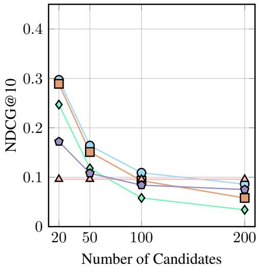
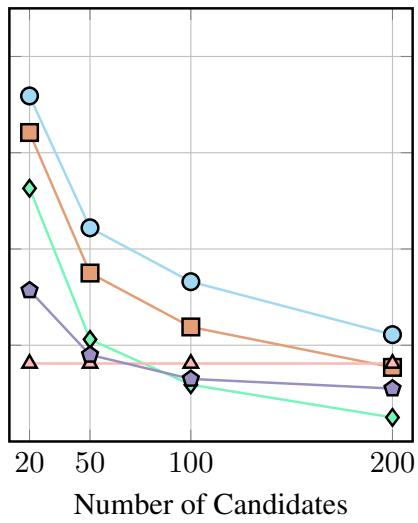
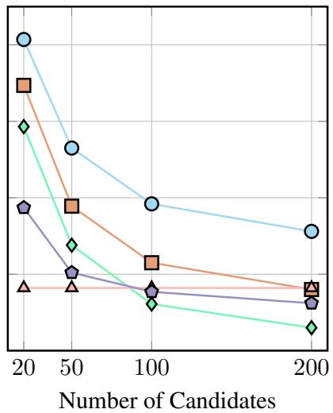
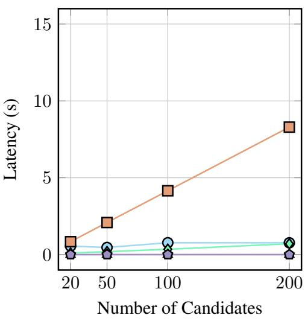
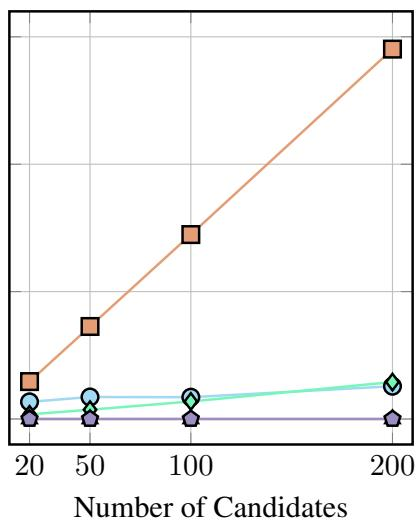
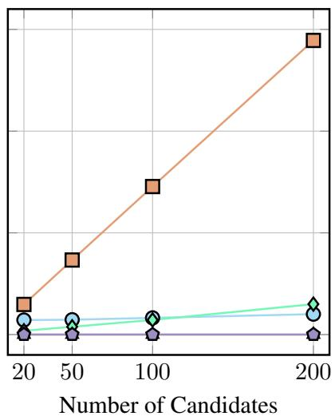
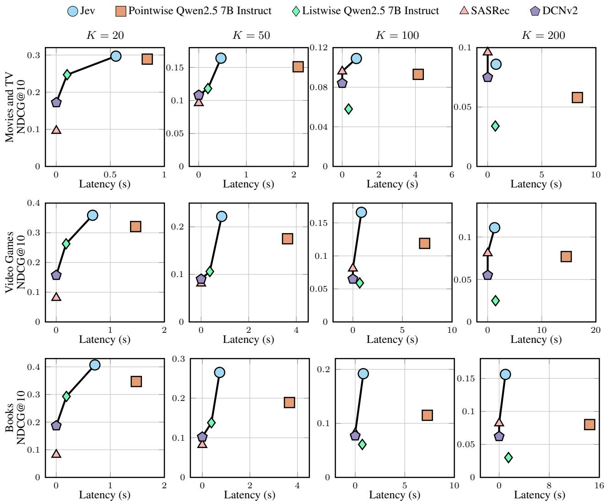

# Decision-Oriented Recommendation Reranking: An Empirical Study of Jev

Hanjia Lyu Singapore Management University hjlyu@smu.edu.sg

Yinglong Xia Meta AI yxia@meta.com

## Abstract

Large language models (LLMs) have shown promise for recommendation reranking, but their use introduces an important tradeoff between recommendation quality and serving efficiency. We investigate whether a decisionoriented model provides a useful alternative when the reranking task is fundamentally a structured choice among predefined candidate items. Specifically, we conduct a controlled empirical study of Jev, described by TypeSafe AI as a “System One Model,” for personalized recommendation reranking and compare it with recommendation-specific models and pointwise and listwise Qwen rerankers across multiple Amazon Reviews domains and candidateset sizes, evaluating both recommendation effectiveness and observed serving latency. Our results show that Jev maintains strong recommendation effectiveness relative to the evaluated baselines while exhibiting substantially more gradual latency growth than the pointwise Qwen rerankers, although its observed serving latency remains substantially higher than that of recommendation-specific models. Together, these characteristics place Jev in a distinct quality–latency operating regime across can didate sizes and domains. These findings motivate further investigation of decision-oriented models for recommendation and other ranking tasks with structured output spaces.

## 1 Introduction

Recommender systems commonly adopt multistage architectures in which an efficient retrieval model first identifies a manageable set of candidate items and a more expressive ranking model subsequently determines their final ordering (Covington et al., 2016). This separation allows the ranking stage to leverage richer representations and more computationally intensive models that are typically infeasible during large-scale retrieval. Sequential recommendation models such as SASRec capture users’ evolving preferences from interaction histories (Kang and McAuley, 2018), while feature-interaction models such as DCNv2 provide efficient mechanisms for learning complex relationships among ranking features (Wang et al., 2021). More recently, large language models (LLMs) have emerged as another approach to reranking because they can directly reason over textual representations of user histories and candidate items (Hou et al., 2024; Luo et al., 2025).

Despite their flexibility, LLM-based reranking introduces an important tension between recommendation quality and inference efficiency. Existing approaches formulate ranking in pointwise, pairwise, or listwise forms (Luo et al., 2025; Chao et al., 2024). A pointwise LLM reranker independently estimates the relevance of each candidate, enabling fine-grained item-level judgments but requiring computation to grow with the number of candidates. Listwise reranking instead evaluates multiple candidates jointly, reducing the number of model invocations but requiring the model to reason over increasingly long and complex candidate lists. Prior work has noted both the computational inefficiency of pointwise and pairwise LLM ranking and the challenges faced by listwise approaches in accurately modeling ordering relationships (Chao et al., 2024; Qin et al., 2024). These tradeoffs are particularly consequential in practical recommendation systems, where rerankers may need to process tens or hundreds of candidates under latency constraints.

The recent introduction of Jev suggests a different approach. TypeSafe AI describes Jev as its first “System One Model,” designed for fast, structured decision making rather than free-form text generation (Almeida, 2026). Instead of generating free-form text, Jev accepts contextual state and focused questions and returns typed probabilistic decisions. This interface maps naturally onto recommendation reranking: a user’s interaction history defines the decision state, candidate items define the available alternatives, and the resulting probabilities directly serve as ranking scores. This raises a broader question: can a decision-oriented model offer a distinct quality–latency tradeoff compared with recommendation-specific models and LLM-based rerankers?

In this work, we conduct a controlled empirical investigation of Jev for personalized recommendation reranking. Rather than evaluating end-to-end retrieval, we construct hard candidate sets in which the held-out next item is paired with behaviorally plausible negatives retrieved by SASRec (Kang and McAuley, 2018). This design isolates reranking ability from retrieval failure and ensures that all methods operate on the same users and candidate items. We vary the candidate-set size from K = 20 to K = 200 and evaluate recommendation quality using NDCG@10, Hit Rate@10, MRR, and observed serving latency. We compare Jev with recommendation-specific models, including SAS-Rec (Kang and McAuley, 2018) and DCNv2 (Wang et al., 2021), as well as pointwise and listwise rerankers based on Qwen2.5 7B Instruct (Qwen et al., 2025). We repeat the evaluation across Amazon Movies and TV, Video Games, and Books (Hou et al., 2026) to examine whether the observed patterns persist across domains.

Our results show that Jev consistently achieves strong recommendation quality relative to the evaluated baselines, while its observed serving latency grows substantially more gradually than that of pointwise Qwen reranking, although it remains substantially higher than that of recommendationspecific models. Across candidate sizes and domains, Jev frequently occupies a distinct region of the empirical quality–latency space among the methods considered. It is important to note that our results do not establish that Jev universally provides a better quality–latency tradeoff than LLMbased reranking; larger or proprietary LLMs may achieve different levels of quality and serving cost.

## 2 Related Work

## 2.1 Sequential and Text-Aware Recommendation

Sequential recommendation models user interaction histories to predict future preferences. Transformer-based approaches such as SASRec (Kang and McAuley, 2018) and BERT4Rec (Sun et al., 2019) capture dependencies among historical interactions and have become widely used sequential recommendation architectures. More recent text-aware methods incorporate semantic item information beyond learned item IDs. UniSRec (Hou et al., 2022) learns transferable item and sequence representations from textual descriptions, while RecFormer (Li et al., 2023) represents items and interaction sequences through language representations. These methods demonstrate the value of combining behavioral and semantic information for recommendation. Our study focuses specifically on the reranking stage and uses SAS-Rec and DCNv2 (Wang et al., 2021) as representative recommendation-specific baselines.

## 2.2 Large Language Models for Recommendation Reranking

Large language models have increasingly been applied to recommendation because they can reason directly over textual representations of users and items (Wu et al., 2024; Lin et al., 2025; Lyu et al., 2024). Particularly relevant to our setting, Hou et al. (2024) formulate recommendation as ranking a retrieved candidate set conditioned on a user’s interaction history, demonstrating the potential of LLMs for zero-shot recommendation ranking. Subsequent work has explored pointwise, pairwise, and listwise ranking formulations, including instruction-tuned approaches such as RecRanker (Luo et al., 2025). These formulations exhibit different computational characteristics: pointwise ranking evaluates candidates individually, whereas listwise ranking considers multiple candidates jointly. Our study compares pointwise and listwise Qwen rerankers under identical candidate sets and examines how their recommendation quality and observed latency change as candidate-set size increases. We treat these models as representative LLM-based reranking configurations rather than as an exhaustive characterization of LLM reranking.

## 2.3 Structured Decision Making

Recent work has explored the use of large pretrained models for structured decision making rather than only language generation. Decision Transformer (Chen et al., 2021) formulates reinforcement learning as conditional sequence modeling. Gato (Reed et al., 2022) similarly applies autoregressive sequence modeling to a multimodal, multitask policy that can emit both text and action tokens, while RT-2 (Zitkovich et al., 2023) co-fine-tunes pretrained vision-language models to produce robotic actions represented as tokens. Jev (Almeida, 2026) is particularly relevant to recommendation reranking, where a user history can provide decision context and retrieved items define a finite set of alternatives. Our work empirically investigates how this decision-oriented formulation behaves relative to recommendation-specific models and the evaluated LLM rerankers, with particular attention to recommendation quality, candidateset scaling, and observed serving latency.

## 3 Problem Formulation

We study controlled candidate reranking in a twostage recommendation setting. Our objective is not to introduce a new recommendation architecture, but to investigate how decision-oriented, LLMbased, and recommendation-specific models compare when reranking the same behaviorally plausible candidate sets.

## 3.1 Two-Stage Recommendation

Let U denote the set of users and I the item catalog. For each user $u \in \mathcal { U } .$ , we observe an ordered interaction history

$$
H _ { u } = [ i _ { u , 1 } , i _ { u , 2 } , \ldots , i _ { u , T _ { u } } ]\tag{1}
$$

where $i _ { u , t } \in \mathcal { T }$ is an item previously interacted with by user u. The recommendation task is to rank candidate items according to their likelihood of being the user’s next interaction.

We adopt a two-stage pipeline. A retrieval model first produces a ranked list of candidate items from the full catalog

$$
R _ { u } = [ r _ { u , 1 } , r _ { u , 2 } , . . . ]\tag{2}
$$

where items are ordered according to the retrieval score. In our experiments, SASRec serves as the retrieval model.

A second-stage reranker then receives a smaller candidate set

$$
C _ { u } ^ { K } = \{ c _ { u , 1 } , c _ { u , 2 } , . . . , c _ { u , K } \}\tag{3}
$$

and produces a new ranking

$$
\pi _ { u } ^ { ( K ) } = \operatorname { R a n k } \left( C _ { u } ^ { ( K ) } | H _ { u } \right)\tag{4}
$$

Here, K controls the size of the reranking problem. We study $K \in \{ 2 0 , 5 0 , 1 0 0 , 2 0 0 \}$ . The groundtruth next item for user u is denoted by $i _ { u } ^ { + }$ . Recommendation effectiveness is determined by the position assigned to $i _ { u } ^ { + }$ in $\pi _ { u } ^ { ( K ) }$

## 3.2 Controlled Hard Candidate Reranking

Candidate construction can substantially affect the difficulty of reranking. Randomly sampled negatives can yield artificially easy ranking problems because many sampled items may be semantically unrelated to the user’s interests. We therefore focus on a controlled hard candidate setting in which negative items are drawn from highly ranked retrieval results.

We first sample a fixed set of valid test users and retain those for whom the held-out item appears within SASRec’s top 200 predictions. The eligible evaluation population is therefore

$$
\mathcal { U } _ { \mathrm { e v a l } } = \left\{ u \in \mathcal { U } : \mathrm { r a n k } _ { R _ { u } } \left( i _ { u } ^ { + } \right) \leq K _ { \operatorname* { m a x } } \right\}\tag{5}
$$

where $K _ { \operatorname* { m a x } } = 2 0 0$ . For each eligible user and candidate size K, we construct

$$
C _ { u } ^ { K } = \{ i _ { u } ^ { + } \} \cup N _ { u } ^ { ( K - 1 ) }\tag{6}
$$

where $N _ { u } ^ { ( K - 1 ) }$ contains $K - 1$ highly ranked nontarget items from the retrieval model. This construction ensures that every evaluated reranker receives exactly one relevant item together with behaviorally plausible competing items. It also separates the reranking problem from retrieval failure: all evaluated methods are compared only when the relevant item has already been successfully retrieved within the top 200 candidates. It is important to note that this setting should not be interpreted as directly reranking the retriever’s top K items. For some users, the ground-truth item may have an original retrieval rank larger than K. Our goal is instead to create a controlled candidate set containing the ground-truth item and strong behavioral negatives while keeping the candidate set identical across reranking methods.

## 3.3 Reranking Paradigms

Given the same interaction history $H _ { u }$ and candidate set $C _ { u } ^ { ( K ) }$ , different model families can produce ranking scores in different ways. Recommendationspecific models primarily rely on learned item representations and behavioral interaction patterns. In our experiments, SASRec and DCNv2 serve as representative recommendation-specific baselines.

The evaluated language-based rerankers additionally operate on textual representations of user histories and candidate items. Let $x _ { i }$ denote the textual representation of item i, constructed from available metadata such as its title, description, and category information. The semantic user context is represented by the textual descriptions of the user’s recent interactions

$$
X _ { u } = [ x _ { i _ { u , T _ { u } - L + 1 } } , \dots , x _ { i _ { u , T _ { u } } } ]\tag{7}
$$

where L denotes the number of historical interactions exposed to the semantic reranker. A pointwise reranker estimates the relevance of each candidate independently,

$$
s _ { u , i } = f \left( X _ { u } , x _ { i } \right)\tag{8}
$$

A listwise reranker instead considers the complete candidate set jointly,

$$
\mathbf { s } _ { u } = f \left( X _ { u } , \left\{ x _ { i } : i \in C _ { u } ^ { ( K ) } \right\} \right)\tag{9}
$$

The final ranking is obtained by sorting candidates according to the resulting relevance scores. In our experiments, these two formulations are instantiated using Qwen-based LLM rerankers. They provide reference points for examining how independently scoring candidates versus jointly reasoning over the candidate set affects both recommendation quality and serving latency.

## 3.4 Reranking as a Structured Decision Problem

We additionally formulate candidate reranking as a structured decision problem. For a user $u ,$ we define the decision state as the user’s recent interaction history $S _ { u } = X _ { u }$ , and treat each candidate item $i \in C _ { u } ^ { ( K ) }$ as an available decision alternative. A decision-oriented model then estimates a distribution over candidate choices

$$
P \left( i | S _ { u } , C _ { u } ^ { ( K ) } \right) , i \in C _ { u } ^ { ( K ) }\tag{10}
$$

The resulting ranking is

$$
\pi _ { u } ^ { ( K ) } = \mathrm { a r g s o r t } _ { i \in C _ { u } ^ { ( K ) } } ^ { \downarrow } P \left( i | S _ { u } , C _ { u } ^ { ( K ) } \right)\tag{11}
$$

In our empirical study, we instantiate this formulation using Jev. The user’s interaction history is supplied as the state, while the candidate item descriptions are supplied as the available choices. Jev returns a probability for each candidate, which we directly use as its reranking score.

## 3.5 Study Objective

Our objective is to characterize how the evaluated recommendation-specific, Qwen-based, and decision-oriented approaches behave under the same controlled candidate reranking setting. We examine this question along three dimensions: effectiveness, measured by the quality of the resulting candidate ranking; efficiency, measured by observed serving latency; and scalability, measured by how both quality and latency change as the candidate-set size increases from K = 20 to K = 200. Together, these dimensions characterize the quality–latency tradeoffs of the different reranking paradigms under the same setting.

Table 1: Statistics of the Amazon Reviews 2023 datasets used in our experiments. The table reports the number of users, items, and interactions in each domain before constructing the controlled reranking evaluation set.
<table><tr><td>Domain</td><td># Users</td><td># Items</td><td># Interactions</td></tr><tr><td>Movies and TV</td><td>657,203</td><td>197,943</td><td>7,441,129</td></tr><tr><td>Video Games</td><td>94,762</td><td>25,612</td><td>814,586</td></tr><tr><td>Books</td><td>776,370</td><td>495,063</td><td>9,488,297</td></tr></table>

## 4 Experimental Framework

We design a controlled empirical evaluation to characterize how Jev, recommendation-specific models, and Qwen-based LLM rerankers behave under the same candidate reranking setting.

## 4.1 Datasets and Preprocessing

We conduct experiments on three domains from the Amazon Reviews 2023 benchmark (Hou et al., 2026): Movies and TV, Video Games, and Books. We use the 5-core leave-last-out configurations, 5core\_last\_out\_w\_his\_{domain}, which retain users and items with at least five interactions and provide temporally ordered user histories together with held-out next-item interactions. We use the predefined dataset splits without further resplitting.

For each user, the held-out item in the test split is treated as the ground-truth next interaction $i _ { u } ^ { + }$ Recommendation-specific models operate on item identifiers and behavioral histories. For languagebased methods, each item is represented using available textual metadata, including the title, main category, category information, and up to the first 250 characters of the item description. We expose the 10 most recent historical interactions to Jev and the Qwen rerankers and use the same textual representation procedure across these methods.

We use the same preprocessing and evaluation protocol across all domains. Dataset-specific statistics, including the number of users, items, and interactions, are reported in Table 1.

## 4.2 Candidate Retrieval and Controlled Hard Candidate Construction

We adopt SASRec as the first-stage retrieval model. SASRec is trained independently for each domain using the corresponding training split and produces a relevance score over the item catalog for each test user. Implementation details are in Appendix B.1.

To separate reranking performance from retrieval failure, we restrict the controlled reranking evaluation to users whose ground-truth next item is retrieved within the top 200 SASRec predictions, as shown in Equation 5. After applying this eligibility criterion, we evaluate 954 users for Movies and TV, 1,000 users for Video Games, and 626 users for Books. For Video Games, where more than 1,000 eligible users are available, we cap the evaluation at 1,000 users for computational efficiency. All methods are evaluated on the same selected users within each domain. We then construct candidate sets with $K \in \{ 2 0 , 5 0 , 1 0 0 , 2 0 0 \}$ . For each eligible user and candidate size K, the candidate set consists of the ground-truth next item together with K − 1 highly ranked non-target items from SASRec, as shown in Equation 6. The negative candidates are therefore behaviorally plausible alternatives rather than randomly sampled items.

Candidate membership is fixed before evaluating any reranker, and all methods operate over exactly the same candidate set for a given user and $K$ Candidate order is randomized deterministically so that the input does not reveal the SASRec ranking.

## 4.3 Compared Methods

We compare Jev with recommendation-specific models and two Qwen-based LLM reranking formulations. The evaluated LLM configurations are intended to provide representative pointwise and listwise reference points rather than an exhaustive characterization of LLM-based reranking.

SASRec SASRec (Kang and McAuley, 2018) serves both as the first-stage retriever and as a conventional behavioral recommendation baseline. For the reranking evaluation, we preserve the original SASRec scores of the items in each controlled candidate set and rank the candidates according to these scores. This baseline measures how much reranking changes recommendation quality relative to the behavioral model used to construct the hard

candidates.

DCNv2 We include DCNv2 (Wang et al., 2021) as a neural ranking baseline with explicit feature interaction modeling. We represent the user’s historical interactions through pooled item embeddings and combine this representation with the embedding of each candidate item. The resulting features are processed by the cross and deep networks to obtain candidate-level relevance scores. DCNv2 is trained separately for each domain and evaluated on the same frozen candidate sets as all other methods. See Appendix B.2 for more details.

Qwen Pointwise Reranking We evaluate pointwise LLM reranking using Qwen2.5 7B Instruct (Qwen et al., 2025). Each candidate is independently evaluated given the same textual user history. For candidate i, the model predicts whether the user is likely to interact with the item next. If $z _ { \mathrm { 0 } }$ and $z _ { 1 }$ denote the logits corresponding to the negative and positive decisions, respectively, we compute

$$
s _ { u , i } = \frac { \exp ( z _ { 1 } ) } { \exp ( z _ { 0 } ) + \exp ( z _ { 1 } ) }\tag{12}
$$

Candidates are ranked according to $s _ { u , i }$ . This formulation obtains a separate candidate-level relevance score for each of the K items. The prompt and implementation details are provided in Appendices A.1 and B.3, respectively.

Qwen Listwise Reranking We additionally evaluate a listwise formulation using the same Qwen2.5 7B Instruct backbone. All K candidates are presented jointly, with each candidate assigned a unique label. We obtain the logits corresponding to the candidate labels and normalize them across the available alternatives to derive the ranking. Unlike pointwise reranking, listwise reranking requires a single joint model evaluation per user, but the input becomes increasingly long and the decision space grows as K increases. The prompt and implementation details are provided in Appendices A.2 and B.3, respectively. Neither pointwise nor listwise reranking requires free-form text generation.

Jev Our primary object of investigation is Jev. We formulate reranking as a structured choice problem in which textual descriptions of the user’s recent interactions constitute the decision state and the K candidate items define the available alternatives. Jev returns a probability for each candidate:

$$
s _ { u , i } ^ { \mathrm { J e v } } = P \left( i | S _ { u } , C _ { u } ^ { ( K ) } \right)\tag{13}
$$

which we directly use as the reranking score. The input formulation is provided in Appendix A.3.

## 4.4 Evaluation Metrics

Because each evaluation instance contains a single held-out ground-truth item, we evaluate recommendation quality based on the rank assigned to this item. Our primary metric is NDCG@10. For a ground-truth item appearing at rank $r _ { u } ,$ NDCG@10 reduces to

$$
\mathrm { N D C G @ 1 0 } ( u ) = \left\{ \begin{array} { l l } { 1 } & { r _ { u } \leq 1 0 } \\ { \log _ { 2 } ( r _ { u } + 1 ) } & { r _ { u } > 1 0 } \end{array} \right.\tag{14}
$$

NDCG@10 rewards methods that place the groundtruth item near the top of the final recommendation list and is used as our principal measure of reranking effectiveness.

We additionally report Hit Rate@10,

$$
\mathrm { H R } @ 1 0 ( u ) = \mathbb { I } [ r _ { u } \le 1 0 ]\tag{15}
$$

which measures whether the target appears anywhere among the top 10 recommendations, and Mean Reciprocal Rank (MRR),

$$
\mathrm { M R R } = \frac { 1 } { \left| \mathcal { U } _ { \mathrm { e v a l } } \right| } \sum _ { u } \frac { 1 } { r _ { u } }\tag{16}
$$

which captures the overall position of the groundtruth item.

## 4.5 Latency Measurement

In addition to recommendation quality, we evaluate the serving efficiency of each reranker.

For locally executed methods, latency measures the wall-clock time from transferring preconstructed model inputs to the GPU through producing the final ranked candidate list, including model inference, score extraction, and ranking. Data loading, metadata construction, prompt construction, and item-ID preprocessing are excluded.

All local latency experiments are conducted on a single NVIDIA A800-SXM4-80GB GPU. The same hardware is used for SASRec, DCNv2, and Qwen-based rerankers to ensure consistent measurement across locally executed methods. Jev is evaluated using observed hosted API latency and is therefore not hardware normalized with the locally executed models.

For SASRec, latency includes transferring the preconstructed inputs to the GPU, encoding the user history, scoring the K candidate items, ranking the resulting scores, and transferring the final ranking back to the CPU. For DCNv2, latency similarly includes input transfer, candidate scoring, ranking, and result transfer. Input construction, item-ID conversion, disk I/O, and metric computation are excluded from the timed region.

For pointwise LLM reranking, latency includes tokenization, input transfer, the batched forward passes required to score all K candidates, logit and probability extraction, result transfer, and final candidate sorting. For listwise LLM reranking, latency includes tokenization, input transfer, the joint forward pass over the complete candidate set, candidate-label score extraction, result transfer, and final sorting. Prompt-string construction is excluded from the timed region.

Jev is accessed through the TypeSafe hosted API (see Appendix B.4) for implementation details. We record the elapsed time of the successful request as its primary latency measure. Because hosted inference also depends on network communication, gateway routing, and provider availability, we refer to this quantity as observed serving latency rather than intrinsic model inference time. We separately record end-to-end latency including failed requests, retry waiting, and subsequent attempts. Accordingly, latency results should be interpreted under our experimental deployment setting rather than as a hardware-normalized comparison of computational complexity.

## 4.6 Experimental Questions

Our experimental framework is designed to answer four questions:

• RQ1: Recommendation Effectiveness. How does Jev compare with recommendation-specific and LLM-based methods under controlled hardcandidate reranking?

• RQ2: Candidate-Set Scaling. How does recommendation effectiveness change as the candidateset size increases from K = 20 to K = 200, and how do pointwise and listwise LLM rerankers differ in this behavior?

• RQ3: Latency and Scalability. How does observed serving latency scale with candidateset size across recommendation-specific models, pointwise and listwise LLM rerankers, and Jev?

• RQ4: Quality–Latency Tradeoff and Cross-Domain Consistency. What quality–latency operating points do the different approaches provide, and are the observed patterns consistent across recommendation domains?

## 5 Results

## 5.1 Recommendation Effectiveness

Figure 1 reports NDCG@10 as the candidateset size increases from K = 20 to K = 200. Jev achieves consistently high recommendation effectiveness across all three domains. On Movies and TV, its performance is similar to the best-performing evaluated Qwen configuration at smaller candidate sizes and remains competitive as K increases. On Video Games and Books, Jev generally achieves higher NDCG@10 than the other evaluated methods across candidate sizes.

Among the Qwen rerankers, pointwise Qwen2.5 7B Instruct generally provides the highest recommendation quality. The listwise variant generally achieves lower effectiveness, particularly as the candidate set becomes large. DCNv2 provides lowcost recommendation-specific reference points but typically achieves lower NDCG@10 than Jev and the better-performing pointwise Qwen configuration. Increasing the candidate set does not affect SASRec because the candidate pool is derived from its own ranking, whereas reranking models must discriminate among an increasingly large set of plausible candidates.

Overall, the results show that Jev is not merely an efficiency-oriented alternative: under the evaluated controlled setting, it also maintains strong ranking effectiveness relative to the compared recommendation and Qwen-based methods.

## 5.2 Effect of Candidate-Set Size

Recommendation quality decreases for the reranking methods other than SASRec as the candidate set grows, reflecting the increasing difficulty of identifying one relevant item among a larger set of strong behavioral negatives. However, the rate of degradation differs substantially across the evaluated approaches.

Jev exhibits comparatively gradual degradation as K increases. This pattern is particularly visible on Video Games and Books, where its relative performance remains strong at $K = 1 0 0$ and

K = 200. Pointwise Qwen2.5 7B Instruct also degrades relatively smoothly, whereas the listwise Qwen variant shows substantially sharper declines as the candidate space expands.

These results indicate that conclusions drawn from a single small candidate set may not generalize to larger reranking problems. Results for MRR and Hit Rate@10 are reported in Appendix C.1 and show consistent trends. Candidateset size therefore represents an important experimental dimension when comparing reranking paradigms.

## 5.3 Pointwise and Listwise Qwen Reranking

The pointwise and listwise Qwen formulations exhibit distinct scaling behavior. Pointwise reranking produces a separate relevance score for each candidate and generally preserves recommendation quality more effectively as K grows.

Listwise reranking instead evaluates all candidates jointly. Although this reduces repeated candidate-level model computation, recommendation effectiveness deteriorates more sharply as the number of alternatives increases. The difference between pointwise and listwise ranking is relatively modest at smaller K but becomes much more pronounced at K = 100 and K = 200.

The latency behavior is reversed in Figure 2. Pointwise Qwen latency increases rapidly with candidate-set size, whereas listwise reranking scales substantially more gradually. Under our experimental setting, the two formulations therefore occupy different operating regimes: pointwise reranking better preserves recommendation quality but incurs higher serving cost, while listwise reranking reduces latency at the cost of greater quality degradation.

## 5.4 Latency and Scalability

Figure 2 shows substantial differences in observed serving latency across the evaluated approaches. SASRec and DCNv2 remain the lowest-latency methods as the candidate set expands, consistent with their lightweight recommendation-specific architectures.

Jev exhibits comparatively gradual latency growth. Across the three domains, its observed serving latency remains in the low-second range even at K = 200, producing an increasingly large latency gap relative to the evaluated pointwise Qwen reranker as the candidate set expands. This comparison should be interpreted as observed deployment latency rather than intrinsic computational efficiency, since Jev is accessed through a hosted API whereas the Qwen models are executed locally on a single GPU. The latency distribution statistics are reported in Appendix C.2.

  
(a) Movies and TV

  
(b) Video Games

  
(c) Books  
Figure 1: Recommendation quality as a function of candidate-set size across domains. Mean NDCG@10 is reported for controlled hard-candidate sets of K ∈ {20, 50, 100, 200} on Movies and TV, Video Games, and Books. Recommendation quality decreases as the candidate set grows for the reranking methods other than SASRec. Jev maintains consistently high NDCG@10 across candidate sizes and performs favorably relative to the compared recommendation-specific and Qwen-based rerankers, with particularly strong relative performance at larger K. Among the evaluated Qwen configurations, pointwise Qwen2.5 7B Instruct generally provides the strongest recommendation quality, while the listwise variant degrades more sharply as K increases.

## 5.5 Quality–Latency Tradeoff

Figure 3 jointly considers recommendation effectiveness and observed serving latency. Each column corresponds to a candidate-set size, while each row represents a recommendation domain. The black line connects the non-dominated methods among those evaluated, where lower latency and higher NDCG@10 are preferred.

The figure reveals several distinct operating regimes. SASRec and DCNv2 occupy the lowlatency region but generally provide lower recommendation quality. Pointwise Qwen reranking achieves stronger effectiveness, particularly with Qwen2.5 7B Instruct, but requires substantially greater latency as K increases. Listwise Qwen reranking reduces this latency burden but generally occupies lower-quality regions of the space, especially for larger candidate sets.

Jev frequently lies on the empirical nondominated boundary among the evaluated methods. This pattern is particularly evident at larger K, where pointwise Qwen reranking incurs substantially higher latency, while lower-latency recommendation-specific and listwise approaches generally achieve lower recommendation quality.

These results position Jev at a distinct quality– latency operating point within the evaluated setting. We do not interpret this as evidence that Jev defines a global Pareto frontier for recommendation systems; rather, the observed boundary reflects its position relative to the recommendation-specific and Qwen-based baselines considered in this study.

## 6 Discussion

Our experiments reveal a distinct quality–latency profile for Jev under controlled recommendation reranking. Across the evaluated domains and candidate-set sizes, Jev maintains strong ranking effectiveness while its observed serving latency grows substantially more gradually than the evaluated pointwise Qwen reranker. The listwise Qwen variant reduces latency further, but its recommendation quality degrades more sharply as the candidate set becomes large. Taken together, these results show that Jev occupies a different operating region from both recommendation-specific models and the evaluated LLM rerankers, motivating further study of decision-oriented formulations for recommendation tasks whose output is a structured choice among predefined alternatives.

  
(a) Movies and TV

  
(b) Video Games

  
(c) Books  
Figure 2: Ranking latency as a function of candidate-set size across domains. Mean observed latency per user is reported for K ∈ {20, 50, 100, 200}. SASRec, DCNv2, and the Qwen models are evaluated locally on a single GPU, while Jev is accessed through a hosted API and therefore includes network and remote-serving overhead. The evaluated pointwise Qwen reranker exhibits the steepest latency growth as K increases, whereas Jev, listwise Qwen, SASRec, and DCNv2 show substantially slower latency growth. As a result, the observed latency gap between Jev and the pointwise Qwen reranker widens as the candidate set becomes larger.

## 6.1 Decision-Oriented Models for Recommendation Reranking

Jev represents the ranking task directly as a choice among predefined alternatives. Under our experimental setting, Jev yields both strong recommendation effectiveness and comparatively gradual growth in observed serving latency as the candidate set expands.

However, our experiments do not expose Jev’s underlying architecture, training procedure, or serving implementation and therefore cannot establish why these differences arise. The latency behavior may reflect properties of the model, its serving system, or both. We consequently interpret our results as an empirical characterization of Jev under the evaluated deployment setting rather than as evidence of an inherent architectural advantage of decision-oriented models.

## 6.2 Implications for LLM-Based Recommendation

Our results also illustrate that different LLM reranking formulations can exhibit substantially different scaling behavior. Candidate-set size is therefore an important consideration when evaluating LLMbased rerankers, since conclusions drawn at small K may not persist as the reranking problem becomes larger.

More broadly, the results suggest that generalpurpose LLMs are not the only model family worth considering when textual understanding is used primarily to support a structured ranking decision. For applications in which the ranking itself is the primary output, decision-oriented models such as Jev may provide a useful alternative operating point.

## 6.3 Limitations

Our study has several limitations that define the scope of the conclusions.

First, we evaluate only one decision-oriented model. Jev provides an opportunity to study this modeling paradigm, but the observed results should not be generalized to decision-oriented models as a whole. Future work should examine whether similar quality–latency patterns emerge as additional models become available.

Second, our LLM evaluation is limited to Qwen2.5 7B Instruct. These configurations provide representative pointwise and listwise reranking baselines, but they do not characterize the maximum recommendation quality achievable by substantially larger or proprietary LLMs. Larger models may achieve stronger ranking effectiveness, potentially with different serving costs. Accordingly, our conclusions concern the evaluated Qwen configurations rather than LLM-based reranking as a whole. Similarly, we include representative sequential recommendation, and neural ranking approaches, but do not attempt to reproduce the full range of proprietary architectures and serving systems used in large-scale industrial recommender systems.

  
Figure 3: Quality–latency tradeoff across domains and candidate-set sizes. Each panel plots mean observed latency per user against NDCG@10 for one domain and candidate-set size $K \in \{ 2 0 , 5 0 , 1 0 0 , 2 0 0 \}$ ; rows correspond to Movies and TV, Video Games, and Books, and columns correspond to increasing K. The black line connects the non-dominated methods among those evaluated, i.e., methods for which no other evaluated method simultaneously achieves lower latency and higher NDCG@10. Jev frequently lies on this empirical non-dominated boundary, indicating that it occupies a distinct quality–latency operating point within the evaluated setting.

Third, the latency comparison is not hardware normalized. SASRec, DCNv2, and Qwen are evaluated locally on a single GPU, whereas Jev is accessed through a hosted API whose underlying hardware, batching strategy, and serving infrastructure are not exposed to us. Jev latency therefore includes network communication and remote-serving overhead. We interpret the reported values as observed serving latency under our experimental conditions rather than intrinsic computational cost.

## 7 Conclusion

Overall, our study provides an initial empirical characterization of Jev for controlled recommendation reranking and highlights the distinct scaling behaviors of recommendation-specific, pointwise and listwise LLM-based, and decision-oriented approaches. Within the evaluated setting, Jev occupies a distinct quality–latency operating regime, particularly as the candidate set grows. These findings do not establish decision-oriented models as universally preferable to general-purpose LLMs, but they suggest that structured decision formulations deserve further consideration for recommendation tasks whose primary output is a ranking over predefined alternatives. Future work should extend this investigation to larger and more diverse LLMs, additional decision-oriented models, alternative retrieval pipelines, and real-world recommendation environments.

## References

Diogo Almeida. 2026. Introducing system one models & jev. TypeSafe AI Blog.

Wen-Shuo Chao, Zhi Zheng, Hengshu Zhu, and Hao Liu. 2024. Make large language model a better ranker. In Findings of the Association for Computational Linguistics: EMNLP 2024, pages 918–929.

Lili Chen, Kevin Lu, Aravind Rajeswaran, Kimin Lee, Aditya Grover, Misha Laskin, Pieter Abbeel, Aravind Srinivas, and Igor Mordatch. 2021. Decision transformer: Reinforcement learning via sequence modeling. Advances in neural information processing systems, 34:15084–15097.

Paul Covington, Jay Adams, and Emre Sargin. 2016. Deep neural networks for youtube recommendations. In Proceedings of the 10th ACM conference on recommender systems, pages 191–198.

Yupeng Hou, Jiacheng Li, Xiangjun Fu, Zhankui He, An Yan, Xiusi Chen, and Julian McAuley. 2026. Bridging language and items for retrieval and recommendation: Benchmarking llms as semantic encoders. In Proceedings ofthe 64th Annual Meeting ofthe Associationfor Computational Linguistics (Volume 1: Long Papers), pages 3251–3265.

Yupeng Hou, Shanlei Mu, Wayne Xin Zhao, Yaliang Li, Bolin Ding, and Ji-Rong Wen. 2022. Towards universal sequence representation learning for recommender systems. In Proceedings of the 28th ACM SIGKDD conference on knowledge discovery and data mining, pages 585–593.

Yupeng Hou, Junjie Zhang, Zihan Lin, Hongyu Lu, Ruobing Xie, Julian McAuley, and Wayne Xin Zhao. 2024. Large language models are zero-shot rankers for recommender systems. In European conference on information retrieval, pages 364–381. Springer.

Wang-Cheng Kang and Julian McAuley. 2018. Selfattentive sequential recommendation. In 2018 IEEE international conference on data mining (ICDM), pages 197–206. IEEE.

Jiacheng Li, Ming Wang, Jin Li, Jinmiao Fu, Xin Shen, Jingbo Shang, and Julian McAuley. 2023. Text is all you need: Learning language representations for sequential recommendation. In Proceedings of the 29th

ACM SIGKDD conference on knowledge discovery and data mining, pages 1258–1267.

Jianghao Lin, Xinyi Dai, Yunjia Xi, Weiwen Liu, Bo Chen, Hao Zhang, Yong Liu, Chuhan Wu, Xiangyang Li, Chenxu Zhu, et al. 2025. How can recommender systems benefit from large language models: A survey. ACM Transactions on Information Systems, 43(2):1–47.

Sichun Luo, Bowei He, Haohan Zhao, Wei Shao, Yanlin Qi, Yinya Huang, Aojun Zhou, Yuxuan Yao, Zongpeng Li, Yuanzhang Xiao, et al. 2025. Recranker: Instruction tuning large language model as ranker for top-k recommendation. ACM Transactions on Information Systems, 43(5):1–31.

Hanjia Lyu, Song Jiang, Hanqing Zeng, Yinglong Xia, Qifan Wang, Si Zhang, Ren Chen, Chris Leung, Jiajie Tang, and Jiebo Luo. 2024. Llm-rec: Personalized recommendation via prompting large language models. In Findings ofthe Associationfor Computational Linguistics: NAACL 2024, pages 583–612.

Zhen Qin, Rolf Jagerman, Kai Hui, Honglei Zhuang, Junru Wu, Le Yan, Jiaming Shen, Tianqi Liu, Jialu Liu, Donald Metzler, et al. 2024. Large language models are effective text rankers with pairwise ranking prompting. In Findings of the Association for Computational Linguistics: NAACL 2024, pages 1504–1518.

Qwen, An Yang, Baosong Yang, Beichen Zhang, Binyuan Hui, Bo Zheng, Bowen Yu, Chengyuan Li, Dayiheng Liu, Fei Huang, Haoran Wei, Huan Lin, Jian Yang, Jianhong Tu, Jianwei Zhang, Jianxin Yang, Jiaxi Yang, Jingren Zhou, Junyang Lin, and 24 others. 2025. Qwen2.5 technical report. Preprint, arXiv:2412.15115.

Scott Reed, Konrad Zolna, Emilio Parisotto, Sergio Gomez Colmenarejo, Alexander Novikov, Gabriel Barth-Maron, Mai Gimenez, Yury Sulsky, Jackie Kay, Jost Tobias Springenberg, et al. 2022. A generalist agent. arXiv preprint arXiv:2205.06175.

Fei Sun, Jun Liu, Jian Wu, Changhua Pei, Xiao Lin, Wenwu Ou, and Peng Jiang. 2019. Bert4rec: Sequential recommendation with bidirectional encoder representations from transformer. In Proceedings of the 28th ACM international conference on information and knowledge management, pages 1441–1450.

Ruoxi Wang, Rakesh Shivanna, Derek Cheng, Sagar Jain, Dong Lin, Lichan Hong, and Ed Chi. 2021. Dcn v2: Improved deep & cross network and practical lessons for web-scale learning to rank systems. In Proceedings of the web conference 2021, pages 1785– 1797.

Likang Wu, Zhi Zheng, Zhaopeng Qiu, Hao Wang, Hongchao Gu, Tingjia Shen, Chuan Qin, Chen Zhu, Hengshu Zhu, Qi Liu, et al. 2024. A survey on large language models for recommendation. World Wide Web, 27(5):60.

Brianna Zitkovich, Tianhe Yu, Sichun Xu, Peng Xu, Ted Xiao, Fei Xia, Jialin Wu, Paul Wohlhart, Stefan Welker, Ayzaan Wahid, Quan Vuong, Vincent Vanhoucke, Huong Tran, Radu Soricut, Anikait Singh, Jaspiar Singh, Pierre Sermanet, Pannag R Sanketi, Grecia Salazar, and 35 others. 2023. RT-2: Visionlanguage-action models transfer web knowledge to robotic control. In 7th Annual Conference on Robot Learning.

## A Prompt and Input Templates

Across the language-based methods, the user history is represented using the same textual descriptions of the most recent interactions. Candidate item descriptions are constructed using the same metadata preprocessing procedure described in Section 4.1. Candidate order is deterministically randomized before inference and is held fixed across methods for each user and candidate-set size.

## A.1 Pointwise Qwen Prompt

For pointwise reranking, each candidate item is evaluated independently against the same user interaction history. We use the following system and user messages:

System:   
You are a recommendation model. Predict whether   
,→ the candidate item   
is likely to be the user's next interaction.   
User:   
User interaction history:   
{history\_text}   
Candidate item:   
{candidate\_text}   
Is this candidate likely to be the user's next   
,→ interaction?   
Answer with exactly one digit:   
1 = likely   
0 = unlikely

Here, {history\_text} contains the textual representations of the user’s recent interactions, while {candidate\_text} contains the textual representation of the candidate item. Rather than relying on generated text, we use the model logits associated with the tokens corresponding to 0 and 1.

## A.2 Listwise Qwen Prompt

For listwise reranking, all candidates in a candidate set are presented jointly. Each candidate is assigned a unique label, and the model is asked to identify the candidate most likely to correspond to the user’s next interaction. We use the following prompt:

System:   
You are a recommendation model. Given a user's   
,→ interaction history   
and a set of candidate items, determine which   
,→ candidate the user is   
most likely to interact with next.   
User:   
User interaction history:   
{history\_text}   
Candidate items:   
{candidate\_text}   
Which candidate is the user most likely to   
,→ interact with next?   
Answer with exactly one candidate label.

Here, {history\_text} is constructed in the same way as in the pointwise setting. The {candidate\_text} field contains all K candidate items, each associated with a unique candidate label. We obtain the logits corresponding to the candidate labels and normalize them across the available alternatives to derive candidate-level ranking scores. Thus, the model does not need to generate a free-form ranking; instead, ranking is derived directly from the scores assigned to the candidate labels.

## A.3 Jev Input Formulation

Jev uses a structured decision interface rather than a conventional system–user prompt format. For each user, the recent interaction history is supplied as the decision state, and candidate items are represented as the available alternatives in a choice-type question. The instruction is as follows:

Based on the user's interaction history, which   
candidate item is the user most likely to,→   
interact with next?,→

Jev returns a probability for each candidate alternative under the next\_item question. We directly use these probabilities as candidate ranking scores.

## B Implementation Details

This section provides additional implementation details for the evaluated methods. Unless otherwise stated, models are trained separately for each recommendation domain. All locally executed inference experiments are conducted on a single NVIDIA A800-SXM4-80GB GPU. Latency is measured according to the protocol described in Section 4.5.

## B.1 SASRec

We implement SASRec (Kang and McAuley, 2018) as both the first-stage retrieval model and a recommendation-specific baseline. Item identifiers are mapped to learned embeddings, and each user’s historical interactions are truncated to a maximum sequence length of 50.

The SASRec model uses an embedding dimension of 64, two self-attention blocks, two attention heads, and a dropout rate of 0.2. Training uses a batch size of 256 with 64 sampled negative items per positive interaction. The model is trained separately for each domain using the corresponding training split. The resulting checkpoint is used both to construct the controlled hard candidate sets and to score candidates in the SASRec baseline.

During inference, the preconstructed user sequence and candidate tensors are transferred to the GPU, after which SASRec encodes the user history, scores all K candidates, and ranks them according to their predicted relevance. The final ranking is transferred back to the CPU before timing ends. Input construction, item-ID conversion, disk I/O, and metric computation are excluded from the timed region.

## B.2 DCNv2

We implement DCNv2 (Wang et al., 2021) as an IDbased neural ranking baseline. Each item is represented using a 64-dimensional learned embedding. The user’s historical representation is obtained by pooling the embeddings of the non-padding items in the interaction history and is combined with each candidate-item embedding for ranking.

The ranking network contains a three-layer DCNv2 cross network together with a parallel deep network with hidden dimensions 256 and 128. We use a dropout rate of 0.2 in the deep component. The outputs of the cross and deep components are combined to produce a scalar relevance score for each candidate.

To maintain consistency with SASRec, DCNv2 uses the same domain-specific training split, item vocabulary construction, and negative-sampling procedure. Each positive training instance is paired with 64 sampled negatives. DCNv2 is trained separately for each domain and evaluated on the same frozen candidate sets as all other methods. DCNv2 uses the same 10 most recent user interactions exposed to the language-based rerankers for reranking evaluation.

During inference, the preconstructed history and candidate tensors are transferred to the GPU, all K candidates are scored in parallel, and the resulting scores are sorted to produce the final ranking. The ranking is transferred back to the CPU before timing ends. Input construction, item-ID conversion, disk I/O, and metric computation are excluded from the timed region.

Both SASRec and DCNv2 are optimized using AdamW with a learning rate of 10−3 and weight decay of 10−5, for a maximum of 20 epochs. We select the SASRec checkpoint with the highest validation NDCG@10 and the DCNv2 checkpoint with the lowest validation loss. For both models, training stops early if the corresponding validation criterion does not improve for three consecutive epochs.

## B.3 Qwen Rerankers

We evaluate Qwen2.5 7B Instruct (Qwen et al., 2025) in both pointwise and listwise reranking configurations. The model is executed locally on a single NVIDIA A800-SXM4-80GB GPU using bfloat16 precision. The same textual representation of the user’s 10 most recent interactions and the same candidate metadata are used.

For pointwise reranking, each candidate is paired with the user history using the prompt in Appendix A.1. Rather than generating a free-form response, we extract the next-token logits associated with the 0 and 1 decision tokens and normalize them using a two-way softmax. The probability assigned to 1 is used as the candidate relevance score. Candidate prompts are processed with a batch size of 16, and the final ranking is obtained by sorting candidates according to these scores. In preliminary experiments on a smaller evaluation subset, we varied the pointwise batch size and observed negligible differences in both ranking effectiveness and per-user latency; we therefore use a batch size of 16 throughout the main experiments.

For listwise reranking, all K candidates are presented jointly using the prompt in Appendix A.2. Each candidate is assigned a unique label corresponding to a single tokenizer token. We extract the next-token logits associated with these candidate labels and normalize them across the candidate set to obtain ranking scores. The complete candidate set is processed in a single model forward pass.

For both formulations, latency includes tokenization, transfer of tokenized inputs to the GPU, model inference, logit and probability extraction, transfer of the resulting scores to the CPU, and final candidate sorting. Prompt-string construction is excluded from the timed region. No sampling-based decoding parameters such as temperature or top-p are used because ranking scores are obtained directly from model logits.

Before running the final experiments, we verify that every pointwise and listwise input remains within the corresponding model context window, including all cases with K = 200; no evaluated prompt requires truncation.

## B.4 Jev

Jev is accessed through TypeSafe AI’s hosted API using jev-latest as of September 30, 2026. For each user, the textual representation of the 10 most recent interactions is supplied as the decision state, while the K candidate items are represented as alternatives in a choice-type question. The exact request structure is provided in Appendix A.3.

Jev returns a probability for each candidate alternative, which is used directly as its reranking score without additional calibration or post-processing. Candidate order is deterministically randomized before submission and is identical to that used for the corresponding evaluation cases.

Because Jev is accessed through a hosted service, its underlying hardware, numerical precision, batching strategy, and serving configuration are not available to us. We therefore report observed serving latency rather than intrinsic model inference time, following the protocol described in Section 4.5.

## C Additional Results

## C.1 MRR and Hit Rate@10

To assess whether the observed trends depend on the choice of ranking metric, we additionally evaluate all methods using MRR and Hit Rate. The corresponding results are reported in Table 2.

Overall, the results are consistent with those based on NDCG@10 in the main text. In particular, the relative behavior of the evaluated reranking methods changes as the candidate set grows, indicating that conclusions obtained from small candidate sets do not necessarily generalize to larger reranking settings. These results further suggest that the main findings are not specific to NDCG@10, but remain qualitatively similar under alternative ranking metrics. For SASRec, Hit Rate@10 remains unchanged across candidate-set sizes because the controlled candidate sets are constructed from its own ranking.

## C.2 Latency Distribution Statistics

To complement the average observed latency reported in the main text, we further examine the distribution of per-user latency. For each method, candidate-set size, and domain, Table 3 reports the median latency together with the 25th and 75th percentiles in milliseconds. The distributional results are consistent with the trends observed in Figure 2: recommendation-specific models operate at substantially lower latency than Jev and the Qwen rerankers, while Jev exhibits substantially lower latency than pointwise Qwen as the candidate set grows.

Table 2: Additional ranking results on the three Amazon Reviews 2023 domains. We report MRR and Hit Rate@10 across different candidate set sizes K. Qwen refers to Qwen2.5 7B Instruct.
<table><tr><td></td><td colspan="4">MRR</td><td colspan="4">Hit Rate@10</td></tr><tr><td>Method</td><td> $K = 2 0$ </td><td> $K = 5 0$ </td><td> $K = 1 0 0$ </td><td> $K = 2 0 0$ </td><td> $K = 2 0$ </td><td> $K = 5 0$ </td><td> $K = 1 0 0$ </td><td> $K = 2 0 0$ </td></tr><tr><td colspan="9">Movies and TV</td></tr><tr><td>SASRec</td><td>0.117</td><td>0.098</td><td>0.094</td><td>0.093</td><td>0.170</td><td>0.170</td><td>0.170</td><td>0.170</td></tr><tr><td>DCNv2</td><td>0.152</td><td>0.105</td><td>0.085</td><td>0.073</td><td>0.373</td><td>0.218</td><td>0.160</td><td>0.143</td></tr><tr><td>Jev</td><td>0.238</td><td>0.149</td><td>0.105</td><td>0.080</td><td>0.587</td><td>0.307</td><td>0.190</td><td>0.150</td></tr><tr><td>Qwen Pointwise</td><td>0.232</td><td>0.136</td><td>0.089</td><td>0.061</td><td>0.575</td><td>0.300</td><td>0.182</td><td>0.109</td></tr><tr><td>Qwen Listwise</td><td>0.199</td><td>0.107</td><td>0.061</td><td>0.039</td><td>0.519</td><td>0.251</td><td>0.123</td><td>0.065</td></tr><tr><td colspan="9">Video Games</td></tr><tr><td>SASRec</td><td>0.102</td><td>0.082</td><td>0.078</td><td>0.077</td><td>0.161</td><td>0.161</td><td>0.161</td><td>0.161</td></tr><tr><td>DCNv2</td><td>0.143</td><td>0.091</td><td>0.069</td><td>0.056</td><td>0.346</td><td>0.189</td><td>0.129</td><td>0.109</td></tr><tr><td>Jev</td><td>0.295</td><td>0.192</td><td>0.143</td><td>0.095</td><td>0.648</td><td>0.407</td><td>0.311</td><td>0.216</td></tr><tr><td>Qwen Pointwise</td><td>0.259</td><td>0.150</td><td>0.104</td><td>0.070</td><td>0.612</td><td>0.346</td><td>0.244</td><td>0.161</td></tr><tr><td>Qwen Listwise</td><td>0.213</td><td>0.102</td><td>0.063</td><td>0.033</td><td>0.535</td><td>0.220</td><td>0.121</td><td>0.050</td></tr><tr><td colspan="9">Books</td></tr><tr><td>SASRec</td><td>0.101</td><td>0.080</td><td>0.075</td><td>0.074</td><td>0.166</td><td>0.166</td><td>0.166</td><td>0.166</td></tr><tr><td>DCNv2</td><td>0.159</td><td>0.099</td><td>0.075</td><td>0.061</td><td>0.411</td><td>0.216</td><td>0.160</td><td>0.126</td></tr><tr><td>Jev</td><td>0.346</td><td>0.241</td><td>0.178</td><td>0.140</td><td>0.684</td><td>0.423</td><td>0.305</td><td>0.251</td></tr><tr><td>Qwen Pointwise</td><td>0.282</td><td>0.164</td><td>0.100</td><td>0.074</td><td>0.644</td><td>0.361</td><td>0.240</td><td>0.161</td></tr><tr><td>Qwen Listwise</td><td>0.245</td><td>0.134</td><td>0.063</td><td>0.035</td><td>0.551</td><td>0.251</td><td>0.129</td><td>0.062</td></tr></table>

Table 3: Distribution of observed per-user latency. Each entry reports Median [P25, P75] latency in milliseconds. Qwen refers to Qwen2.5 7B Instruct.
<table><tr><td>Method</td><td> $K = 2 0$ </td><td> $K = 5 0$ </td><td> $K = 1 0 0$ </td><td> $K = 2 0 0$ </td></tr><tr><td>Movies and TV</td><td></td><td></td><td></td><td></td></tr><tr><td>SASRec</td><td>1.165 [1.152, 1.183]</td><td>1.205 [1.194, 1.223]</td><td>1.184 [1.174, 1.200]</td><td>1.188 [1.173, 1.216]</td></tr><tr><td>DCNv2</td><td>0.565 [0.556, 0.569]</td><td>0.557 [0.552, 0.565]</td><td>0.548 [0.544, 0.555]</td><td>0.554 [0.549, 0.561]</td></tr><tr><td>Jev</td><td>458.993 [293.629, 708.235]</td><td>349.888 [314.541, 544.474]</td><td>609.803 [550.807, 877.349]</td><td>627.325 [581.734, 867.995]</td></tr><tr><td>Qwen Pointwise</td><td>606.545 [524.313, 1305.220]</td><td>1527.985 [1311.056, 3233.406]</td><td>3044.610 [2598.284, 6422.278]</td><td>6070.137 [5200.285, 12840.475]</td></tr><tr><td>Qwen Listwise</td><td>63.604 [61.785, 173.579]</td><td>120.403 [116.141, 363.336]</td><td>202.320 [196.552, 680.056]</td><td>398.461 [382.372, 1413.075]</td></tr><tr><td>Video Games</td><td></td><td></td><td></td><td></td></tr><tr><td>SASRec</td><td>1.177 [1.167, 1.193]</td><td>1.165 [1.155, 1.182]</td><td>1.183 [1.172, 1.199]</td><td>1.189 [1.179, 1.206]</td></tr><tr><td>DCNv2</td><td>0.550 [0.541, 0.556]</td><td>0.547 [0.543, 0.555]</td><td>0.563 [0.559, 0.570]</td><td>0.553 [0.549, 0.565]</td></tr><tr><td>Jev</td><td>569.942 [546.026, 617.548]</td><td>679.751 [499.168, 1034.735]</td><td>814.634[793.145,843.129]</td><td>967.347 [859.794, 1126.851]</td></tr><tr><td>Qwen Pointwise</td><td>1479.530 [1394.836, 1541.105]</td><td>3645.464 [3463.944, 3812.011]</td><td>7266.839 [6904.421, 7608.791]</td><td>14553.547 [13850.653, 15192.219]</td></tr><tr><td>Qwen Listwise</td><td>181.398 [178.804, 188.337]</td><td>368.393 [345.830, 374.243]</td><td>687.969 [672.479, 700.006]</td><td>1448.263 [1422.901, 1470.693]</td></tr><tr><td>Books</td><td></td><td></td><td></td><td></td></tr><tr><td>SASRec</td><td>1.161 [1.151, 1.176]</td><td>1.137 [1.123, 1.154]</td><td>1.200 [1.190, 1.218]</td><td>1.158 [1.146, 1.173]</td></tr><tr><td>DCNv2</td><td>0.560 [0.551, 0.564]</td><td>0.549 [0.544, 0.556]</td><td>0.553 [0.547, 0.561]</td><td>0.556 [0.547, 0.603]</td></tr><tr><td>Jev</td><td>541.615 [520.286, 721.923]</td><td>533.957 [504.690, 829.218]</td><td>795.265 [759.401, 817.691]</td><td>866.086 [839.422, 1060.915]</td></tr><tr><td>Qwen Pointwise</td><td>1524.835 [1395.821, 1617.516]</td><td>3769.366 [3466.504, 3986.260]</td><td>7491.778 [6913.072, 7929.331]</td><td>14868.048 [13754.646, 15732.938]</td></tr><tr><td>Qwen Listwise</td><td>193.406 [186.986, 199.496]</td><td>390.254 [380.122, 403.463]</td><td>731.226 [709.034, 759.620]</td><td>1530.139 [1482.892, 1584.416]</td></tr></table>