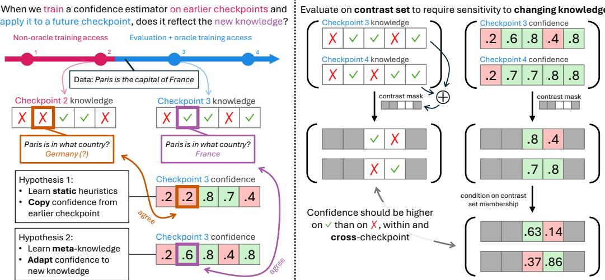
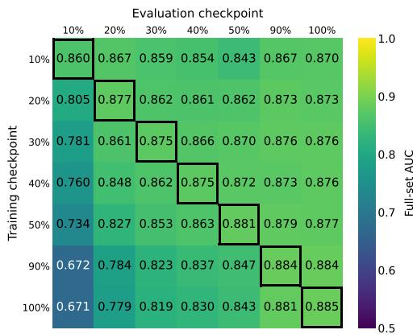
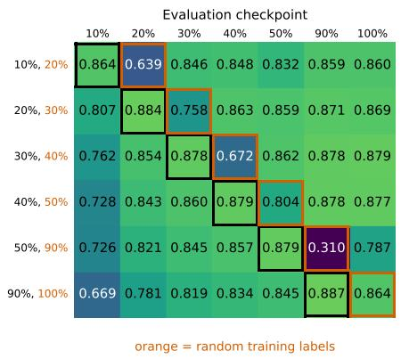
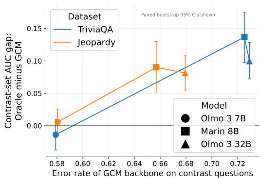
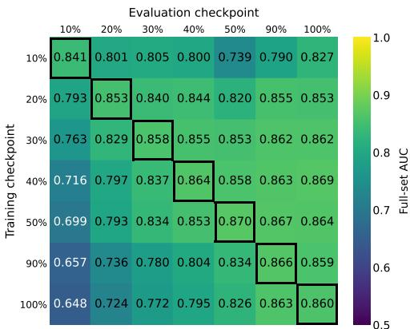
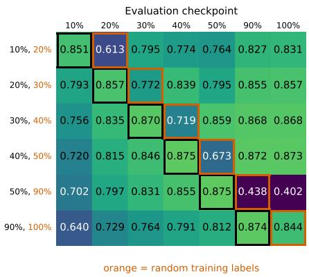

# EVALUATING PERSISTENT CALIBRATION UNDER EVOLVING MODEL KNOWLEDGE

Victor Wang1 Thomas Hofweber2 Mohit Bansal2 Elias Stengel-Eskin1

1University of Texas at Austin 2University of North Carolina at Chapel Hill

## ABSTRACT

As AI systems move from static repositories to agents that are capable of continual adaptation and learning, maintaining their trustworthiness means equipping the models backing them with the ability to produce confidence estimates that dynamically reflect their changing skills and knowledge. We introduce the problem of persistent calibration, which requires a confidence estimator to faithfully reflect the knowledge contained in a model as that knowledge changes, without recurring supervision. We operationalize this by examining persistent calibration across checkpoints of open models, asking whether confidence estimators trained on earlier checkpoints can generalize to later ones. Specifically, we aim to shed light on whether confidence is dependent on knowledge, a question with implications for the reliability of confidence estimates. To measure this relationship, we define and evaluate calibration on knowledge contrast sets: subsets containing questions that one checkpoint answers correctly and another checkpoint answers incorrectly, reflecting a change in knowledge. We show that both inference-time and fine-tuning methods fall short on contrast-set calibration compared to oracle methods trained on future checkpoints, even for methods that are well-calibrated on the full dataset. We provide evidence for the hypothesis that persistent calibration is challenging because there is a vast space of possible confidence functions that are well-calibrated on a given checkpoint, out of which only some rely on meta-knowledge features that would generalize to other checkpoints. Towards improving contrast-set calibration, we show that multi-checkpoint training helps, suggesting an avenue for identifying confidence features that remain robust across changing knowledge.1

## 1 INTRODUCTION

The models that back AI systems deployed in the real world must continually learn and explore (Ring, 1994; Shi et al., 2025). For example, novel events can override past knowledge (Kasai et al., 2023), and in domains like scientific discovery, models must internalize and build on an evolving literature (Zhang et al., 2025). Such continually learning models ought to remain aligned even as they further acquire knowledge over time (Bai et al., 2022; Wang et al., 2023; Wynn et al., 2024). One particularly critical alignment direction which pertains directly to their knowledge is epistemic humility: knowing the boundaries of one’s knowledge, communicated with calibrated confidence estimates that are indicative of the probability that a generated claim is correct (Zhou et al., 2024; Steyvers et al., 2025). This is a meta-capability that we would hope for our models – typically, large language models (LLMs) – to retain as their knowledge evolves, as it is critical in developing trustworthy AI systems. The goal of preserving calibration as a model’s knowledge evolves motivates our key research question about the relationship between continual learning and confidence calibration: Can a confidence estimator track a model’s knowledge such that, after a change in knowledge, the new confidence is calibrated with respect to the new knowledge?

To study this question, we introduce the notion of persistent calibration, which requires a model to produce confidence estimates calibrated to its dynamically evolving knowledge at any given point in its training trajectory, without requiring repeated re-calibration. As a testbed for persistent calibration, we use checkpoints of open models (Olmo et al., 2025; Marin Community, 2026). We test the persistent calibration of various confidence estimation methods: for training-based methods, we grant them access to earlier checkpoints and evaluate them on the later evaluation checkpoints, testing whether the learned features transfer to future, unseen checkpoints in which the model’s knowledge has evolved (Fig. 1, left); for inference-time methods (e.g. self-consistency), we directly apply them to the evaluation checkpoints. However, this evaluation is confounded by the fact that a given model’s predictions are highly correlated across checkpoints (e.g. common facts are learned first and tend not to be forgotten, while obscure ones are never learned (Mallen et al., 2023)), so strong future-checkpoint calibration can be at least partially explained by a high inter-checkpoint correlation in answer correctness rather than faithfully reflecting evolving knowledge.

  
Figure 1: (Left) Our setup for evaluating persistent calibration. During training, the model encounters the training data instance “Paris is the capital of France”, causing a change in knowledge between checkpoints $\mathrm { C } _ { 2 }$ and $\mathrm { C } _ { 3 } .$ . A confidence estimator that is faithful to the model’s evolving knowledge (Hypothesis 2) should produce a higher confidence on the checkpoint $\mathrm { C } _ { 3 }$ with increased knowledge; however, an estimator could instead capture Hypothesis 1, which performs equally well on the training distribution $\mathrm { C } _ { 2 }$ but fails to generalize to $\mathrm { C } _ { 3 } .$ . (Right) To measure the dependence of confidence on knowledge, we evaluate calibration on a contrast set consisting of questions that one checkpoint answers correctly and another checkpoint answers incorrectly, testing whether a change in knowledge is accompanied by a change in confidence.

With a view to controlling for this confounder, we introduce the notion of the knowledge contrast set, which consists of questions where answer correctness differs by checkpoint. This decorrelate the checkpoints and explicitly requires sensitivity to a given checkpoint’s knowledge set, since a single confidence value cannot capture why one checkpoint answers correctly while another checkpoint answers incorrectly (Fig. 1, right). Moreover, we argue that contrast sets help disentangle whether a method reflects meta-knowledge or static heuristics. Prior work has suggested that meta-knowledge (knowledge about knowledge, i.e., a model knowing it does/does not know something) may not be necessary to achieve confidence calibration, as it suffices to use heuristics such as question difficulty (Zhu et al., 2026; Xiao et al., 2026). We argue that such heuristics are unsuitable for persistent cal ibration and would have poor contrast-set calibration, since, for example, a question that is initially difficult may become easy after more training. On the other hand, a method that identifies metaknowledge features ought to have better contrast-set calibration: if it can identify fact-independent features that represent meta-knowledge of whether a fact is known or unknown, it should be able to adapt when the model’s knowledge about the fact changes.

We hypothesize that learning a confidence estimator capable of persistent calibration is challenging because of the vast space of confidence functions that are well-calibrated on a given checkpoint, out of which only some use meta-knowledge in a way that generalizes to other checkpoints; this intuition is illustrated in Fig. 1 (left). Understanding whether a confidence estimator reflects meta-knowledge has practical implications for intervening on a model’s knowledge via continual learning. When a model is trained over long time spans and encounters new topics or domains, it can undergo drastic changes in knowledge, making earlier performance no longer representative of current performance (Gururangan et al., 2020; Wang et al., 2025; Periodic Labs, 2026), yet we would still like to know how trustworthy the current model is. At a more granular level, we may seek to invest more resources into a target problem when uncertain, such as with retrieval (Asai et al., 2024), tool use (Wang et al., 2026), or reasoning (Guo et al., 2025). In such cases of adaptive effort, confidence estimates should reflect whether a given attempt has improved the probability of success, or whether the model should spend more effort or abstain. An estimator that is insensitive to the expansion or reduction of a model’s capabilities is bound to become obsolete as models continue to grow more capable.

Using our cross-checkpoint knowledge contrast sets on TriviaQA, Jeopardy, and BioASQ, we evaluate confidence estimation methods from various families, including fine-tuning (Kapoor et al., 2024; Li et al., 2026) and inference-time approaches (Kuhn et al., 2023; Manakul et al., 2023). Since fine-tuning methods typically operate on a single snapshot of a model, it is plausible that they learn heuristics that work specifically on the current model and do not robustly generalize to the knowledge sets of future model versions. Inference-time (training-free) methods like self-consistency sidestep the bias of checkpoint-specific feature representations by virtue of treating models as black boxes, making them appealing as a potential solution for persistent calibration. However, it is unclear whether inference-time methods access fine-grained meta-knowledge as opposed to shallow cues (Singh et al., 2026), and forgoing training typically means worse calibration than fine-tuning methods on in-distribution data. To quantify the room for improvement of these methods, we compare them to oracle methods that are allowed to train on the evaluation checkpoints. We find that existing methods obtain limited contrast-set calibration despite having strong full-set calibration. For example, for Marin 8B on Jeopardy, self-consistency matches oracle training on full-set AUC (0.886 vs. 0.890), despite being far behind on contrast-set AUC (0.760 vs. 0.825).

In both oracle and non-oracle settings, we find that contrast-set calibration improves when we introduce multi-checkpoint training. In particular, multi-checkpoint training in the oracle setting outperforms respective-checkpoint training (i.e. training one adapter per checkpoint), revealing that training a single adapter to learn confidence features that work on multiple checkpoints has a synergistic effect in identifying features that are sensitive to differences in knowledge across checkpoints. We further analyze the heterogeneity of confidence estimators that have the same performance on a given checkpoint, showing that such confidence estimators can have vastly different behaviors from each other on other checkpoints. This heterogeneity presents a challenge for identifying robust meta-knowledge features that are conducive to persistent calibration.

## 2 PERSISTENT CALIBRATION

We introduce persistent calibration as a criterion for confidence estimators: they should faithfully reflect a model’s knowledge as it changes, as this is critical for trustworthy, continually learning models. To tractably evaluate persistent calibration, we leverage the checkpoint trajectories of open models trained on trillions of tokens from diverse corpora (Olmo et al., 2025; Marin Community, 2026), offering a large-scale setup to study the evolution of knowledge over time. We evaluate both training-based methods and inference-time methods. For training-based methods, as shown in Fig. 1 (left), we grant them access to earlier checkpoints and evaluate them on the later evaluation checkpoints. For inference-time methods, we directly apply them to the evaluation checkpoints. By default, for both training and evaluation, the checkpoint that generated an answer is the same checkpoint that produces a confidence estimate for the answer. We describe generating answers for our experiments in Section 3.1.1.

Knowledge Contrast Sets. Our research question concerns whether a model’s current confidence estimates are faithful to its current knowledge as opposed to the knowledge of another model version. Due to the non-random overlap between different checkpoints’ knowledge sets (e.g. common facts are known by most checkpoints (Chang et al., 2024)), confidence estimates that are wellcalibrated with respect to one checkpoint’s knowledge may also be well-calibrated with respect to another checkpoint’s knowledge, so strong calibration is insufficient to show faithfulness. To address this confound, we evaluate calibration on a knowledge contrast set, which, for a given pair of checkpoints, consists of questions that one checkpoint answers correctly and the other checkpoint answers incorrectly, as shown in Fig. 1 (right). This construction means that learning to predict confidence based on checkpoint-agnostic question features (e.g. topic or difficulty) may improve full-set calibration but would not improve contrast-set calibration, because the predicted confidence should not change (as the question is the same across checkpoints) and thus the predicted confidence would only be consistent with one checkpoint’s correctness but not the other. Faithful confidence estimates should be higher on the checkpoint that predicts the correct answer, similar to how confidence should tend to be higher for correct answers than for incorrect answers within a checkpoint.

Conditioning on Contrast Set Membership. Confidences that are globally calibrated may appear miscalibrated within the contrast subset due to selection bias: the contrast set accuracy (pooled over the two checkpoints) is always 50%, regardless of the global accuracies. To correct for this, given a contrast-set question where checkpoints 1 and 2 have confidences $p _ { 1 }$ and $p _ { 2 }$ in their respective answers, we normalize them to $p _ { 1 } ( 1 - p _ { 2 } ) / Z$ and $p _ { 2 } ( 1 - p _ { 1 } ) / Z$ , where $Z = p _ { 1 } ( 1 - p _ { 2 } ) + p _ { 2 } ( 1 - p _ { 1 } )$ This restores contrast-set calibration if $p _ { 1 } , p _ { 2 }$ are calibrated and the correctness outcomes are conditionally independent given $p _ { 1 } , p _ { 2 }$ . We discuss this decision in Appendix A.1, and provide empirical support in Appendix B.1 by showing that our normalization function and a fitted normalization function produce similar results. Moreover, the metrics $\Delta _ { 0 } , \Delta _ { 0 } ^ { b }$ (defined below) simply compare whether $p _ { 1 } > p _ { 2 }$ (unaffected by normalization), and our results show that their trends track with the other metrics, which depend on normalization.

Evaluation Metrics. For both the full set and the contrast set, we report standard metrics for the discriminability and calibration of confidence estimates: area under the receiver operating characteristic curve (AUC; Hanley & McNeil, 1982), Brier score (BS; Brier, 1950), and Expected Calibration Error (ECE; Naeini et al., 2015), all on a [0, 1] scale. See Appendix A.2 for descriptions. We compute ECE with SmoothECE for its continuous and hyperparameter-free properties (Blasiok & Nakkiran, 2024). For the contrast set $\mathcal { D } _ { \mathrm { c o n } }$ , we also report metrics that compare, for a given question $q ^ { i }$ , the confidence $p _ { + } ^ { i }$ on the correct answer and the confidence $p _ { - } ^ { i }$ on the incorrect answer: $\begin{array} { r } { \Delta ~ = ~ \frac { 1 } { | \mathcal { D } _ { \mathrm { c o n } } | } \sum _ { i \in \mathcal { D } _ { \mathrm { c o n } } } { \dot { p } _ { + } ^ { i } } - p _ { - } ^ { i } } \end{array}$ and $\begin{array} { r } { \Delta _ { 0 } ~ = ~ \frac { 1 } { | \mathcal { D } _ { \mathrm { c o n } } | } \sum _ { i \in \mathcal { D } _ { \mathrm { c o n } } } \mathrm { s g n } ( p _ { + } ^ { i } - p _ { - } ^ { i } ) } \end{array}$ To control for performance coming from the prior that the later checkpoint tends to be correct, we also report class-balanced variants denoted $\Delta ^ { b } , \Delta _ { 0 } ^ { b }$ , where the two classes $\mathcal { D } _ { \mathrm { i m p } } , \mathcal { D } _ { \mathrm { r e g } }$ are improvement (i.e., the later checkpoint is correct) and regression (i.e., the later checkpoint is incorrect): $\begin{array} { r } { \Delta ^ { b } = \frac { 1 } { 2 } \left( \frac { 1 } { | \mathcal { D } _ { \mathrm { i m p } } | } \sum _ { i \in \mathcal { D } _ { \mathrm { i m p } } } ( p _ { + } ^ { i } - p _ { - } ^ { i } ) + \frac { 1 } { | \mathcal { D } _ { \mathrm { r e g } } | } \sum _ { i \in \mathcal { D } _ { \mathrm { r e g } } } ( p _ { + } ^ { i } - p _ { - } ^ { i } ) \right) } \end{array}$ and analogously for $\Delta _ { 0 } ^ { b }$ . These $\Delta$ metrics are on a scale of $[ - 1 , 1 ] , \mathrm { e . g }$ . random guessing gets $\Delta _ { 0 } \overset { \cdot } { = } 0$ , while always knowing which of the two answers is correct gets $\Delta _ { 0 } = 1$ . We evaluate on multiple future checkpoints for a robust evaluation. See Appendix A.3 for how we aggregate over them when reporting metrics.

## 3 EXPERIMENTS AND RESULTS

## 3.1 EXPERIMENTAL SETUP

Models. As we define persistent calibration as a multi-checkpoint property, we use open models that release multiple checkpoints. We evaluate on the pre-training checkpoints of Olmo 3 7B and 32B (Olmo et al., 2025) and Marin 8B (Marin Community, 2026). For Olmo 3 models, we use checkpoints at specified percentages of pre-training progress; we take [10%, 20%, 30%] as nonoracle training checkpoints, and [40%, 50%, 90%, 100%] as evaluation checkpoints; we place a gap in the evaluation checkpoints to induce a substantial accuracy difference for our contrast sets. For Marin 8B, we use all 6 available checkpoints: the first 3 for training and the last 3 for evaluation.

Datasets. We evaluate on TriviaQA (Joshi et al., 2017), Jeopardy (Open Access AI Collective, 2023), and BioASQ (Krithara et al., 2023), which test factual knowledge recall. See Appendix A.4 for details on data processing. TriviaQA and Jeopardy require diverse world knowledge, while BioASQ requires biomedical expertise. For each of TriviaQA and Jeopardy, we use 5K questions for training and 5K questions for evaluation. Due to the smaller size of BioASQ, we only run evaluation to test domain transfer from TriviaQA and Jeopardy. We use 5 fixed in-context examples from the respective dataset for answer generation. We use an LLM judge to label the correctness of a predicted answer with respect to the reference ground-truth answer (Wei et al., 2024); in our manual audit (Appendix A.5), we confirm that LLM and human judgments have high agreement, and that data quality is high for both contrast sets and full sets.

## 3.1.1 CONFIDENCE ESTIMATION METHODS

We evaluate representative confidence estimation methods for persistent calibration, using both full datasets and their contrast subsets. As a running example, we suppose a sequence of checkpoints $\mathrm { [ C _ { 1 } , C _ { 2 } , C _ { 3 } , C _ { 4 } ] }$ as in Fig. 1, where $[ \mathrm { C } _ { 1 } , \mathrm { C } _ { 2 } ]$ are for non-oracle training and $\mathrm { \dot { [ } C _ { 3 } , C _ { 4 } ] }$ are for evaluation and oracle training. To quantify the room for improvement of a confidence estimator, we compare to a confidence adapter trained on the eval checkpoints $\mathrm { [ C _ { 3 } , C _ { 4 } ] }$ . We refer to this as an oracle method as it allows directly learning confidence features from $\mathrm { [ C _ { 3 } , C _ { 4 } ] }$ , whereas non-oracle methods must learn meta-knowledge features (from $[ \mathrm { C } _ { 1 } , \mathrm { C } _ { 2 } ] .$ , if training) that generalize to $\mathrm { [ C _ { 3 } , C _ { 4 } ] }$

Self-Consistency (SC). SC quantifies a model’s confidence in an answer as its probability of generating it, typically estimated via sampling (Kuhn et al., 2023). Pre-trained LLMs often have wellcalibrated generation probabilities (Zhu et al., 2023; Luo et al., 2026), since they are trained to model the true data distribution with next-token prediction. While prior work has also explored verbalizing confidence from the model (Tian et al., 2023; Wang & Stengel-Eskin, 2026), this generally requires an instruction-tuned model, and – as confirmed by early experiments – does not perform well for pre-trained checkpoints of the kind we evaluate. Thus, we omit zero-shot verbalized confidence. We add two implementation details that improve $\mathrm { s c } \mathrm { \ ' } _ { \mathrm { s } }$ robustness: rather than sampling, we run beam search (beam size 10) and weight each beam by its sequence probability to efficiently cover the distribution of short-form generations (Fadeeva et al., 2026), and we use an off-the-shelf NLI model to group equivalent answers (Kuhn et al., 2023, see Appendix $_ { \mathrm { A } . 6 ) }$ . We define a candidate answer as a set of NLI-grouped beams, with generation probabilities summed. We take the top (i.e. highest probability) candidate answer as the model’s prediction, and its probability as the SC confidence.

LoRA + Verbalized Confidence. Although pre-trained models struggle to verbalize confidence zero-shot, we can fine-tune them to do so. We use LoRA (Hu et al., 2022) for its parameter efficiency and expressiveness (Kapoor et al., 2024). We prompt the model to verbalize its confidence on a scale of 0 to 9 and compute the confidence as a probability-weighted average over the tokens $0 , \ldots , 9$ (Li et al., 2026). See Appendix A.7 for the training configuration. We introduce multi-checkpoint and multi-answer training to learn a better confidence adapter. Multi-checkpoint training trains one adapter to produce calibrated confidence estimates for multiple checkpoints (using their respective predictions, by default). This is motivated by the intuition that a confidence adapter trained on a single checkpoint $\mathrm { C } _ { 2 }$ may pick up on features that are specific to $\mathrm { C } _ { 2 }$ , while multi-checkpoint training may encourage learning generalizable features. We apply multi-checkpoint training to $\mathrm { [ C _ { 1 } }$ ${ \mathrm { C } } _ { 2 } ]$ (non-oracle) or $\mathrm { [ C _ { 3 } , C _ { 4 } ] }$ (oracle). We use multi-checkpoint training in Tables 1 and 2 and ablate it in Table 3. Multi-answer training uses multiple top candidate answers for a given question. The motivation of this is to learn answer sensitivity, since seeing only $\mathrm { C } _ { 2 } \mathrm { ^ { * } s }$ top-1 predictions may lead the adapter to anticipate $\mathrm { C } _ { 2 } \mathrm { ^ { * } } { \bf s }$ answer and ignore the candidate answer, which may differ between $\mathrm { C } _ { 2 }$ and $\mathrm { [ C _ { 3 } , C _ { 4 } ] }$ . We compute a question’s loss as the average of its candidate answers’ losses (same batch), weighted by their generation probabilities. This ensures that each question’s total loss weight is a constant, and that the training distribution is representative of the model’s generation distribution. We train with 2 answers by default, and we ablate this in Appendix B.3. We ensure controlled comparisons: for a given training seed, all methods receive the same LoRA initialization and order of questions; for multi-checkpoint training, the checkpoints share the question shuffle and the loss is averaged over checkpoints so the effective learning rate is unaffected. Multi-checkpoint and multianswer training can be seen as data augmentation of the curated (question, reference answer) data.

End-correct Baseline. To control for the prior that accuracy increases over training, this baseline predicts a fixed confidence based just on checkpoint index. We linearly interpolate [0, 1] with the evaluation checkpoints; for three checkpoints $\mathrm { C } _ { 3 } , \mathrm { C } _ { 4 } , \mathrm { C } _ { 5 } ,$ , we would get fixed confidences [0, 1/2, 1].

Generalized Correctness Models (GCMs). Xiao et al. (2026) introduce GCMs to predict the correctness of other models’ answers. GCMs show similar or better calibration compared to using the other models themselves, challenging the premise that calibration requires meta-knowledge. We revisit this result using our contrast sets, which are designed to require meta-knowledge. We run the TriviaQA-trained GCM released by Xiao et al. (2026), using the model-agnostic prompt containing only the question and the candidate answer.

Table 1: SC and non-oracle training consistently fall short on contrast-set calibration compared to oracle training, even when full-set calibration is saturated. Results in Section 3 are averaged over 3 seeds. In each column, we bold the best result and underline results not significantly worse under a paired test $( \alpha = 0 . 0 5 ;$ see Appendix A.8 for tests); tables in Section 3 share this text styling. See Appendix B.2 for all evaluation metrics and Jeopardy results.
<table><tr><td rowspan="3"></td><td colspan="3">Olmo 3 7B</td><td colspan="3">Marin 8B</td><td colspan="3">Olmo 3 32B</td></tr><tr><td colspan="2">Contrast</td><td>Full</td><td colspan="2">Contrast</td><td>Full</td><td colspan="2">Contrast</td><td>Full</td></tr><tr><td> $\Delta _ { 0 } ^ { b } \uparrow$ </td><td>AUC↑</td><td>AUC↑</td><td> $\Delta _ { 0 } ^ { b } \uparrow$ </td><td>AUC ↑</td><td>AUC↑</td><td> $\Delta _ { 0 } ^ { b } \uparrow$ </td><td>AUC ↑</td><td>AUC↑</td></tr><tr><td colspan="10">TriviaQA</td></tr><tr><td>End-correct baseline</td><td>0.000</td><td>0.627</td><td>0.530</td><td>0.000</td><td>0.783</td><td>0.547</td><td>0.000</td><td>0.712</td><td>0.548</td></tr><tr><td>Self-consistency</td><td>0.297</td><td>0.733</td><td>0.884</td><td>0.263</td><td>0.823</td><td>0.897</td><td>0.362</td><td>0.808</td><td>0.903</td></tr><tr><td>Non-oracle training</td><td>0.333</td><td>0.748</td><td>0.880</td><td>0.227</td><td>0.806</td><td>0.834</td><td>0.285</td><td>0.688</td><td>0.860</td></tr><tr><td>Oracle training</td><td>0.379</td><td>0.795</td><td>0.890</td><td>0.349</td><td>0.840</td><td>0.901</td><td>0.384</td><td>0.827</td><td>0.898</td></tr><tr><td colspan="10"></td></tr><tr><td>End-correct baseline</td><td>0.000</td><td>0.633</td><td>0.540</td><td>0.000</td><td>0.735</td><td>0.549</td><td>0.000</td><td>0.653</td><td>0.549</td></tr><tr><td>Self-consistency</td><td>0.333</td><td>0.741</td><td>0.873</td><td>0.331</td><td>0.760</td><td>0.886</td><td>0.320</td><td>0.754</td><td>0.893</td></tr><tr><td>Non-oracle training</td><td>0.476</td><td>0.821</td><td>0.871</td><td>0.397</td><td>0.759</td><td>0.834</td><td>0.399</td><td>0.757</td><td>0.860</td></tr><tr><td>Oracle training</td><td>0.506</td><td>0.855</td><td>0.888</td><td>0.459</td><td>0.825</td><td>0.890</td><td>0.475</td><td>0.840</td><td>0.894</td></tr></table>

## 3.2 RESULTS

Confidence Estimators Struggle on Contrast Sets. Table 1 shows that SC and non-oracle training consistently have worse contrast-set calibration than oracle training, showing room for improvement. We highlight that even when SC matches oracle training on full-set AUC (e.g., SC 0.886 vs. oracle 0.890 on Marin 8B, Jeopardy), SC is often far behind on contrast-set AUC (SC 0.760 vs. oracle 0.825). Thus, full-set calibration does not reliably predict contrast-set calibration, establishing the latter as a distinct criterion for persistent calibration. Moreover, this supports our hypothesis that there are various confidence estimators that have the same aggregate (i.e. full-set) performance and yet substantially different behavior on knowledge changes featured in the contrast set (other full-set metrics do not explain this difference either, Appendix B.2), making it hard to learn a confidence estimator that is capable of persistent calibration. We discuss this further in Section 4.

Domain Transfer. In Appendix B.5, we find that the performance gain of oracle training over non-oracle training observed in-domain (Table 1) largely disappears when transferring to BioASQ, as both drop to similarly low performances. This clarifies the scope of the oracle’s advantage in our experiments as being limited to the training domain, consistent with prior work on the domain specificity of correctness signals (Sky et al., 2024).

Ablations to Test Nontrivial Transfer. Although we have seen that SC and non-oracle training have imperfect contrast-set calibration, it appears nontrivial, outperforming the end-correct baseline in almost all cases (Table 1). We examine this further with two ablations. The surrogate ablation uses $\mathrm { C } _ { 2 }$ to estimate confidence on $\mathrm { [ C _ { 3 } , C _ { 4 } ] }$ ’s answers. This ablation isolates the performance that can be achieved with the knowledge already contained in $\mathrm { C } _ { 2 } .$ , without needing to inspect the knowledge of $\mathrm { [ C _ { 3 } , C _ { 4 } ] }$ . The copy ablation uses $\mathrm { C } _ { 2 }$ to estimate confidence on its own answers and simply reuses these confidences for $\mathrm { [ C _ { 3 } , C _ { 4 } ] }$ answering the same questions. This ablation is oblivious to $\mathrm { [ C _ { 3 } , C _ { 4 } ] }$ and their answers, relying solely on the inter-checkpoint correlation in correctness. A confidence estimator must outperform these two ablations for a convincing demonstration of faithfulness to a given checkpoint’s (C or C ) changed knowledge that cannot be explained by prior knowledge.

Results. Table 2 shows that SC generally outperforms its ablations, while non-oracle training has mixed results. The faithfulness of SC is perhaps expected given that it treats models as black boxes, avoiding checkpoint-specific features. The mixed results for non-oracle training suggest that a confidence adapter trained on a set of checkpoints $\left[ \mathbf { C } _ { 1 } , \mathbf { C } _ { 2 } \right]$ sometimes but unreliably learns features that generalize beyond to $\mathrm { [ C _ { 3 } , C _ { 4 } ] }$ . Lastly, we observe that the copy ablations – with no awareness of $\mathrm { \bar { [ ( C _ { 3 } , C _ { 4 } ] } }$ or their answers – achieve strong full-set AUC (consistently over 0.8) but a trivial contrast-set AUC of 0.5. This highlights that full-set performance is a poor reflection of the faithfulness of a confidence estimator and is inflated by inter-checkpoint correlation of correctness.

Table 2: Comparing SC and non-oracle training with ablations controlling for knowledge already present in an earlier checkpoint. Beating these ablations is necessary for a nontrivial demonstration of persistent calibration. SC generally beats its ablations, while non-oracle training has mixed results. Results on TriviaQA; see Appendix B.2 for all metrics and Jeopardy results.
<table><tr><td></td><td colspan="3">Olmo 3 7B</td><td colspan="3">Marin 8B</td><td colspan="3">Olmo 3 32B</td></tr><tr><td></td><td colspan="2">Contrast</td><td>Full</td><td colspan="2">Contrast</td><td>Full</td><td colspan="2">Contrast</td><td>Full</td></tr><tr><td>Method</td><td> $\Delta _ { 0 } ^ { b } \uparrow$ </td><td>AUC↑</td><td>AUC↑</td><td> $\Delta _ { 0 } ^ { b } \uparrow$ </td><td>AUC↑</td><td>AUC↑</td><td> $\Delta _ { 0 } ^ { b } \uparrow$ </td><td>AUC↑</td><td>AUC↑</td></tr><tr><td>Self-consistency</td><td>0.297</td><td>0.733</td><td>0.884</td><td>0.263</td><td>0.823</td><td>0.897</td><td>0.362</td><td>0.808</td><td>0.903</td></tr><tr><td> Surrogate</td><td>0.211</td><td>0.637</td><td>0.859</td><td>0.277</td><td>0.695</td><td>0.871</td><td>0.288</td><td>0.688</td><td>0.883</td></tr><tr><td> Copy</td><td>0.000</td><td>0.500</td><td>0.832</td><td>0.000</td><td>0.500</td><td>0.829</td><td>0.000</td><td>0.500</td><td>0.846</td></tr><tr><td>Non-oracle training</td><td>0.333</td><td>0.748</td><td>0.880</td><td>0.227</td><td>0.806</td><td>0.834</td><td>0.285</td><td>0.688</td><td>0.860</td></tr><tr><td> Surrogate</td><td>0.318</td><td>0.729</td><td>0.869</td><td>0.318</td><td>0.748</td><td>0.866</td><td>0.290</td><td>0.716</td><td>0.858</td></tr><tr><td> Copy</td><td>0.000</td><td>0.500</td><td>0.839</td><td>0.000</td><td>0.500</td><td>0.830</td><td>0.000</td><td>0.500</td><td>0.832</td></tr></table>

Table 3: Multi-checkpoint training improves contrast-set and full-set calibration. Results on TriviaQA; see Appendix B.3 for Jeopardy.
<table><tr><td></td><td colspan="3">Olmo 3 7B</td><td colspan="3">Marin 8B</td><td colspan="3">Olmo 3 32B</td></tr><tr><td></td><td colspan="2">Contrast</td><td>Full</td><td colspan="2">Contrast</td><td>Full</td><td colspan="2">Contrast</td><td>Full</td></tr><tr><td>Method</td><td> $\Delta _ { 0 } ^ { b } \cdot$  t</td><td>AUC ↑</td><td>AUC↑</td><td> $\Delta _ { 0 } ^ { b } \uparrow$ </td><td>AUC↑</td><td>AUC↑</td><td> $\Delta _ { 0 } ^ { b }$  ←</td><td>AUC↑</td><td>AUC↑</td></tr><tr><td>Non-oracle</td><td></td><td></td><td></td><td></td><td></td><td></td><td></td><td></td><td></td></tr><tr><td>Multi-ckpt</td><td>0.333</td><td>0.748</td><td>0.880</td><td>0.227</td><td>0.806</td><td>0.834</td><td>0.285</td><td>0.688</td><td>0.860</td></tr><tr><td>Single-ckpt</td><td>0.332</td><td>0.750</td><td>0.876</td><td>0.221</td><td>0.642</td><td>0.783</td><td>0.251</td><td>0.673</td><td>0.849</td></tr><tr><td>Oracle</td><td></td><td></td><td></td><td></td><td></td><td></td><td></td><td></td><td></td></tr><tr><td>Multi-ckpt</td><td>0.379</td><td>0.795</td><td>0.890</td><td>0.349</td><td>0.840</td><td>0.901</td><td>0.384</td><td>0.827</td><td>0.898</td></tr><tr><td>Respective-ckpt</td><td>0.351</td><td>0.778</td><td>0.884</td><td>0.330</td><td>0.837</td><td>0.901</td><td>0.352</td><td>0.812</td><td>0.892</td></tr></table>

Multi-Checkpoint Training Improves Persistent Calibration. In Table 3, we ablate multicheckpoint training, which has been used so far. The baseline in the non-oracle setting is singlecheckpoint training on $\mathrm { C } _ { 2 } .$ . The baseline in the oracle setting is respective-checkpoint training, which trains one adapter for each of $\mathrm { [ C _ { 3 } , C _ { 4 } ] }$ (using the respective checkpoint’s data), thus holding constant the total training data; at inference, the respective adapter is used. Table 3 shows that multicheckpoint consistently matches or exceeds the baseline, in both oracle and non-oracle settings.

Ablation of Multi-Checkpoint Training Advantages. We analyze the potential factors contributing to the gains of multi-checkpoint training: (1) more data and (2) viewing multiple checkpoints weights. To remove (1), the single-checkpoint data ablation of multi-checkpoint training uses $\mathrm { C } _ { 3 } \mathrm { \ ' } _ { \mathbf { S } }$ data for both $\mathrm { C } _ { 3 }$ and $\mathrm { C _ { 4 } }$ . This limits the training data, while still giving one adapter access to multiple checkpoints’ weights, encouraging it to learn checkpoint-general features. To remove (2), the pooled data ablation performs respective-checkpoint training, but trains each adapter on the data pooled over $\mathrm { [ C _ { 3 } , C _ { 4 } ] }$ . This allows each adapter to see the same data as the multi-checkpoint training adapter, while still only allowing each adapter to see the feature representations of its own checkpoint $\mathrm { ( C _ { 3 } \ o r \ C _ { 4 } ) }$ . Table 4 shows that multi-checkpoint training outperforms both ablations, meaning that both the training data and the multiple checkpoint views contribute to its performance. Be tween the two ablations, single-checkpoint data performs better (and more clearly so on Jeopardy, Appendix B.3), suggesting that access to multiple checkpoints’ weights is most responsible for the gains of multi-checkpoint training.

Table 4: Ablating factors contributing to the gains of multi-checkpoint training (oracle). Single-checkpoint data uses only one checkpoint’s answers for multi-checkpoint training. Pooled data trains each checkpoint’s adapter on the same data as (unablated) multi-checkpoint training. Multi-checkpoint training beats both, meaning that both the training data and multiple checkpoint views contribute. Results on TriviaQA, Olmo 3 7B; see Appendix B.3 for Jeopardy.
<table><tr><td rowspan="2">Method</td><td colspan="7">Contrast</td><td colspan="3">Full</td></tr><tr><td> $\Delta _ { 0 } ^ { b } \uparrow$ </td><td> $\Delta _ { 0 } \uparrow$ </td><td> $\Delta ^ { b } \uparrow$ </td><td> $\Delta \uparrow$ </td><td> $\mathbf { A U C \uparrow }$ </td><td>BS↓</td><td>ECE↓</td><td>AUC ↑</td><td>BS↓</td><td>ECE↓</td></tr><tr><td>Multi-ckpt</td><td>0.379</td><td>0.424</td><td>0.255</td><td>0.285</td><td>0.795</td><td>0.185</td><td>0.061</td><td>0.890</td><td>0.131</td><td>0.032</td></tr><tr><td> Single-ckpt data</td><td>0.373</td><td>0.368</td><td>0.252</td><td>0.258</td><td>0.768</td><td>0.197</td><td>0.096</td><td>0.887</td><td>0.134</td><td>0.044</td></tr><tr><td>Resp-ckpt</td><td>0.351</td><td>0.396</td><td>0.241</td><td>0.274</td><td>0.778</td><td>0.193</td><td>0.070</td><td>0.884</td><td>0.133</td><td>0.030</td></tr><tr><td> Pooled data</td><td>0.360</td><td>0.357</td><td>0.248</td><td>0.251</td><td>0.757</td><td>0.203</td><td>0.104</td><td>0.887</td><td>0.132</td><td>0.035</td></tr></table>

  
Figure 3: (Left) Transfer between pairs of training and eval checkpoints (Olmo 3 7B, TriviaQA; Jeopardy in Appendix B.6). Forward transfer (top right) is strong, while backward transfer (bottom left) is weak. (Right) Transfer of multi-checkpoint training, where the second checkpoint gets random labels. The second-checkpoint AUC generally plummets, at no penalty to the first checkpoint.

GCMs Do Not Satisfy Persistent Calibration. Fig. 2 plots GCM’s headroom on contrast-set AUC relative to oracle training. Although GCM matches oracle performance on Olmo 3 7B, with a gap close to 0, we attribute this to the GCM knowing the correct answers to many contrast set questions, enabling it to distinguish correct and incorrect answers without needing access to the internal states of the checkpoints that generated the answers. Indeed, for the larger models (Marin 8B and Olmo 3 32B), the GCM backbone model (Qwen3-8B) has an increased error rate on contrast-set questions, and its gap from the oracle grows substantially. Thus, we argue that while an external verifier can achieve strong calibration on the predictions of a less or similarly capable model, this ability does not transfer to more capable models, which means that a static external verifier cannot satisfy persistent calibration for continually improving models.

## 4 ANALYSIS

  
Figure 2: GCM’s headroom on contrast-set AUC grows for larger models where the GCM backbone (Qwen3-8B) knows the answer less often. Thus, a static external verifier does not adapt to a model’s capability, motivating metaknowledge for persistent calibration.

The failure of non-oracle training to faithfully track knowledge (Section 3) may be due to the large hypothesis space of confidence functions that are well-calibrated on a training checkpoint, only a small subset of which depend sufficiently on the meta-knowledge required for transfer. Here, we consider a relaxed notion of transfer on the full set rather than the contrast set, given the positive full-set transfer result in Section 3. We aim to better understand the factors enabling this transfer, which may shed light on the feasibility of persistent calibration and the challenges preventing it.

Transfer Asymmetry. Table 3 found that an adapter trained on $\mathrm { C } _ { 2 }$ or $\lbrack \mathrm { C } _ { 1 } , \mathrm { C } _ { 2 } ]$ is usable on $\mathrm { C } _ { 3 }$ or $\mathrm { C _ { 4 } } ,$ which has been trained on far more data and contains very different weights (e.g. the cosine similarity between the flattened weights of Olmo 3 7B 10% and 100% is 0.37). To dissect this phenomenon, we compare forward transfer (i.e. our persistent calibration setup) with backward transfer, where an adapter is trained on $\mathrm { C } _ { 3 }$ or $\mathrm { C _ { 4 } }$ and tested on $\mathrm { C _ { 1 } }$ or $\mathrm { C } _ { 2 } .$ For efficiency in this analysis, we use single-answer training on Olmo 3 7B and one seed. Fig. 3 (left) reveals that although forward transfer is strong (e.g., AUC 0.870 on $1 0 \%  1 0 0 \% ) ,$ the reverse direction is much worse (0.671 for $1 0 0 \%  1 0 \% )$ ; this trend generally holds across checkpoints. The confidence adapters trained on 10% and 100% have nearly equal AUCs on 100% (0.870 vs. 0.885) but very different AUCs on 10% (0.860 vs. 0.671) – despite matched performance on one checkpoint, two confidence adapters can implement confidence estimation in functionally different ways, as evidenced by their divergent AUCs on another checkpoint. Fortuitously, this asymmetry is oriented in the forward direction that is relevant to persistent calibration. It may be that this asymmetry stems from the tendency for neural networks to be more plastic earlier and more stable later in training (Achille et al., 2018); this would suggest that features developed at certain points in time tend to remain after that point, but are not present before. An adapter trained on the later checkpoint may rely on those features, which are then absent in the earlier checkpoint, harming its performance, but an adapter trained on the earlier checkpoint can only learn to rely on the features present at that time, which are likely to persist into the later checkpoint. In Appendix B.7, we support this by showing that the variance, computed over confidence adapter training seeds, of hidden states for a given QA instance, tends to be higher on later checkpoints, suggesting that later checkpoints have developed a larger space of confidence features for confidence adapters to choose from.

Random Labels. We dig deeper into the heterogeneity of this feature space by testing if there exist confidence estimators with maintained performance on a given checkpoint but catastrophic performance on another checkpoint: can we train an adapter to perform on $\mathrm { C } _ { 2 }$ but not on $\mathrm { C } _ { 3 } \mathrm { : }$ If transfer is inevitable, a drop on $\bar { \mathrm { { C } } } _ { 3 }$ should be accompanied by a drop on $\mathrm { C } _ { 2 } .$ , i.e. one cannot optimize for $\mathrm { C } _ { 2 }$ without inadvertently optimizing for $\mathrm { C } _ { 3 }$ . To test this, we run multi-checkpoint training on $\left[ \mathbf { C } _ { 2 } , \mathbf { C } _ { 3 } \right]$ but with random labels for C3 – independent samples from Bernoulli(0.5). Fig. 3 (right) reveals that $\mathrm { C } _ { 3 }$ performance generally plummets, but at no penalty to $\mathrm { C } _ { 2 }$ performance. This shows the extreme heterogeneity of the hypothesis space of confidence features that are viable on a given checkpoint, which may hinder identifying generalizable meta-knowledge features for persistent calibration.

## 5 RELATED WORK

Confidence Estimation. The main families of LLM confidence estimation methods are based on generation consistency (Kuhn et al., 2023; Manakul et al., 2023), verbalized confidence (Kadavath et al., 2022; Wang & Stengel-Eskin, 2026), fine-tuning (Kapoor et al., 2024; Li et al., 2026), and external verifiers (Zhu et al., 2026; Xiao et al., 2026). While trained methods achieve the best calibration in-domain, they often struggle with domain transfer due to domain-specific signals (Sky et al., 2024; Srey et al., 2026; Ying et al., 2026). We highlight another dimension of brittleness arising from checkpoint-specific features, which multi-checkpoint training partially alleviates.

Continual Learning. As AI systems increasingly act as personalized assistants (Uddin et al., 2026), scientific collaborators (Zhang et al., 2025), and autonomous agents (Luo et al., 2025), they must continually adapt to new developments in human users, the scientific literature, and the world. The families of continual learning methods for LLMs include model editing, retrieval, and continued pre-training (Zheng et al., 2026). We focus on pre-training, as it is the phase in which LLMs acquire the vast majority of their knowledge (Gekhman et al., 2024; Chang et al., 2024). Hasegawa et al. (2025) find that model editing leads to underconfidence in token-probability–based confidence. Liu et al. (2026) use a frozen probe to monitor task performance during pre-training, showing viable forward transfer. Our key distinction is that we center our evaluation around knowledge contrast sets to isolate the dependence between knowledge and confidence. In Appendix $\mathrm { C } ,$ we discuss contrast sets (Gardner et al., 2020) and metacognition.

## 6 CONCLUSION

We motivate persistent calibration as a requirement for trustworthy, continually learning models. To see if confidence estimators can track the evolution of knowledge, we evaluate on knowledge contrast sets, which highlight changes in knowledge. We find substantial headroom, despite the gains from multi-checkpoint training. Our analysis finds that LLM training dynamics are encouraging for persistent calibration, although the vast space of checkpoint-specific confidence features may hinder identifying robust meta-knowledge features.

## ACKNOWLEDGMENTS

The authors acknowledge support from Coefficient Giving, and acknowledge the Texas Advanced Computing Center (TACC) at The University of Texas at Austin for providing computational resources that have contributed to the research results reported within this paper.

## REFERENCES

Alessandro Achille, Matteo Rovere, and Stefano Soatto. Critical learning periods in deep networks. In International conference on learning representations, 2018.

Akari Asai, Zeqiu Wu, Yizhong Wang, Avi Sil, and Hannaneh Hajishirzi. Self-rag: Learning to retrieve, generate, and critique through self-reflection. In International conference on learning representations, volume 2024, pp. 9112–9141, 2024.

Tomer Ashuach, Shai Gretz, Yoav Katz, Yonatan Belinkov, and Liat Ein-Dor. Masked by consensus: Disentangling privileged knowledge in llm correctness. In Proceedings ofthe 64th Annual Meeting ofthe Associationfor Computational Linguistics (Volume 1: Long Papers), pp. 10577–10596, 2026.

Yuntao Bai, Saurav Kadavath, Sandipan Kundu, Amanda Askell, Jackson Kernion, Andy Jones, Anna Chen, Anna Goldie, Azalia Mirhoseini, Cameron McKinnon, et al. Constitutional ai: Harmlessness from ai feedback. arXiv preprint arXiv:2212.08073, 2022.

Felix Jedidja Binder, James Chua, Tomek Korbak, Henry Sleight, John Hughes, Robert Long, Ethan Perez, Miles Turpin, and Owain Evans. Looking inward: Language models can learn about themselves by introspection. In International Conference on Learning Representations, volume 2025, pp. 3710–3756, 2025.

Yonatan Bitton, Gabriel Stanovsky, Roy Schwartz, and Michael Elhadad. Automatic generation of contrast sets from scene graphs: Probing the compositional consistency of gqa. In Proceedings of the 2021 conference of the North American chapter of the association for computational linguistics: human language technologies, pp. 94–105, 2021.

Jaroslaw Blasiok and Preetum Nakkiran. Smooth ece: Principled reliability diagrams via kernel smoothing. In International Conference on Learning Representations, volume 2024, pp. 1679– 1707, 2024.

Ralph Allan Bradley and Milton E Terry. Rank analysis of incomplete block designs: I. the method of paired comparisons. Biometrika, 39(3/4):324–345, 1952.

Glenn W. Brier. Verification of forecasts expressed in terms of probability. Monthly Weather Review, 78:1–3, 1950. URL https://api.semanticscholar.org/CorpusID:122906757.

Hoyeon Chang, Jinho Park, Seonghyeon Ye, Sohee Yang, Youngkyung Seo, Du-Seong Chang, and Minjoon Seo. How do large language models acquire factual knowledge during pretraining? Advances in neural information processing systems, 37:60626–60668, 2024.

Chi-Keung Chow. An optimum character recognition system using decision functions. IRE Transactions on Electronic Computers, (4):247–254, 1957.

Paul F Christiano, Jan Leike, Tom Brown, Miljan Martic, Shane Legg, and Dario Amodei. Deep reinforcement learning from human preferences. Advances in neural information processing systems, 30, 2017.

Alexander D’Amour, Katherine Heller, Dan Moldovan, Ben Adlam, Babak Alipanahi, Alex Beutel, Christina Chen, Jonathan Deaton, Jacob Eisenstein, Matthew D Hoffman, et al. Underspecification presents challenges for credibility in modern machine learning. Journal of Machine Learning Research, 23(226):1–61, 2022.

Ekaterina Fadeeva, Maiya Goloburda, Aleksandr Rubashevskii, Roman Vashurin, Artem Shelmanov, Preslav Nakov, Mrinmaya Sachan, and Maxim Panov. Don’t throw away your beams: Improving consistency-based uncertainties in llms via beam search. In International Conference on Learning Representations, volume 2026, pp. 139866–139895, 2026.

Matt Gardner, Yoav Artzi, Victoria Basmov, Jonathan Berant, Ben Bogin, Sihao Chen, Pradeep Dasigi, Dheeru Dua, Yanai Elazar, Ananth Gottumukkala, et al. Evaluating models’ local decision boundaries via contrast sets. In Findings of the Association for Computational Linguistics: EMNLP 2020, pp. 1307–1323, 2020.

Timur Garipov, Pavel Izmailov, Dmitrii Podoprikhin, Dmitry Vetrov, and Andrew G Wilson. Loss surfaces, mode connectivity, and fast ensembling of dnns. Advances in neural information processing systems, 31, 2018.

Robert Geirhos, Jorn-Henrik Jacobsen, Claudio Michaelis, Richard Zemel, Wieland Brendel,¨ Matthias Bethge, and Felix A Wichmann. Shortcut learning in deep neural networks. Nature Machine Intelligence, 2(11):665–673, 2020.

Zorik Gekhman, Gal Yona, Roee Aharoni, Matan Eyal, Amir Feder, Roi Reichart, and Jonathan Herzig. Does fine-tuning llms on new knowledge encourage hallucinations? In Proceedings of the 2024 conference on empirical methods in natural language processing, pp. 7765–7784, 2024.

Daya Guo, Dejian Yang, Haowei Zhang, Junxiao Song, Peiyi Wang, Qihao Zhu, Runxin Xu, Ruoyu Zhang, Shirong Ma, Xiao Bi, et al. Deepseek-r1: Incentivizing reasoning capability in llms via reinforcement learning. arXiv preprint arXiv:2501.12948, 2025.

Zifan Carl Guo, Laura Ruis, Jacob Andreas, and Belinda Z Li. Introspective coupling: Self-explanation training tracks behavioral change despite fixed supervision. arXiv preprint arXiv:2606.32038, 2026.

Todd M Gureckis and Douglas B Markant. Self-directed learning: A cognitive and computational perspective. Perspectives on Psychological Science, 7(5):464–481, 2012.

Suchin Gururangan, Ana Marasovic, Swabha Swayamdipta, Kyle Lo, Iz Beltagy, Doug Downey, and´ Noah A Smith. Don’t stop pretraining: Adapt language models to domains and tasks. In Proceedings of the 58th annual meeting of the association for computational linguistics, pp. 8342–8360, 2020.

James A Hanley and Barbara J McNeil. The meaning and use of the area under a receiver operating characteristic (roc) curve. Radiology, 143(1):29–36, 1982.

Ryo Hasegawa, Yusuke Sakai, Hidetaka Kamigaito, and Taro Watanabe. Knowledge editing induces underconfidence in language models. In Proceedings ofthe 14th Joint Conference on Lexical and Computational Semantics (\* SEM 2025), pp. 338–347, 2025.

Edward J Hu, yelong shen, Phillip Wallis, Zeyuan Allen-Zhu, Yuanzhi Li, Shean Wang, Lu Wang, and Weizhu Chen. LoRA: Low-rank adaptation of large language models. In International Conference on Learning Representations, 2022. URL https://openreview.net/forum? id=nZeVKeeFYf9.

Gao Huang, Yixuan Li, Geoff Pleiss, Zhuang Liu, John E. Hopcroft, and Kilian Q. Weinberger. Snapshot ensembles: Train 1, get m for free. In International Conference on Learning Representations, 2017. URL https://openreview.net/forum?id=BJYwwY9ll.

Kaixuan Huang, Jiacheng Guo, Zihao Li, Xiang Ji, Jiawei Ge, Wenzhe Li, Yingqing Guo, Tianle Cai, Hui Yuan, Runzhe Wang, Yue Wu, Ming Yin, Shange Tang, Yangsibo Huang, Chi Jin, Xinyun Chen, Chiyuan Zhang, and Mengdi Wang. MATH-perturb: Benchmarking LLMs’ math reasoning abilities against hard perturbations. In Aarti Singh, Maryam Fazel, Daniel Hsu, Simon Lacoste-Julien, Felix Berkenkamp, Tegan Maharaj, Kiri Wagstaff, and Jerry Zhu (eds.), Proceedings of the 42nd International Conference on Machine Learning, volume 267 of Proceedings of Machine Learning Research, pp. 25311–25328. PMLR, 13–19 Jul 2025. URL https://proceedings.mlr.press/v267/huang25k.html.

Mandar Joshi, Eunsol Choi, Daniel S Weld, and Luke Zettlemoyer. Triviaqa: A large scale distantly supervised challenge dataset for reading comprehension. In Proceedings ofthe 55th Annual Meeting of the Association for Computational Linguistics (Volume 1: Long Papers), pp. 1601–1611, 2017.

Saurav Kadavath, Tom Conerly, Amanda Askell, Tom Henighan, Dawn Drain, Ethan Perez, Nicholas Schiefer, Zac Hatfield-Dodds, Nova DasSarma, Eli Tran-Johnson, et al. Language models (mostly) know what they know. arXiv preprint arXiv:2207.05221, 2022.

Sanyam Kapoor, Nate Gruver, Manley Roberts, Katherine Collins, Arka Pal, Umang Bhatt, Adrian Weller, Samuel Dooley, Micah Goldblum, and Andrew G Wilson. Large language models must be taught to know what they don’t know. Advances in Neural Information Processing Systems, 37:85932–85972, 2024.

Jungo Kasai, Keisuke Sakaguchi, Ronan Le Bras, Akari Asai, Xinyan Yu, Dragomir Radev, Noah A Smith, Yejin Choi, Kentaro Inui, et al. Realtime qa: What’s the answer right now? Advances in neural information processing systems, 36:49025–49043, 2023.

Anastasia Krithara, Anastasios Nentidis, Konstantinos Bougiatiotis, and Georgios Paliouras. Bioasq-qa: A manually curated corpus for biomedical question answering. Scientific data, 10 (1):170, 2023.

Lorenz Kuhn, Yarin Gal, and Sebastian Farquhar. Semantic uncertainty: Linguistic invariances for uncertainty estimation in natural language generation. In The Eleventh International Conference on Learning Representations, 2023. URL https://openreview.net/forum?id= VD-AYtP0dve.

Chuanrong Li, Lin Shengshuo, Zeyu Liu, Xinyi Wu, Xuhui Zhou, and Shane Steinert-Threlkeld. Linguistically-informed transformations (lit): A method for automatically generating contrast sets. In Proceedings of the third BlackboxNLP workshop on analyzing and interpreting neural networks for NLP, pp. 126–135, 2020.

Yibo Li, Miao Xiong, Jiaying Wu, and Bryan Hooi. Conftuner: Training large language models to express their confidence verbally. Advances in Neural Information Processing Systems, 38: 53484–53513, 2026.

Zhichen Liu, Tianle Lun, Zhibin Wen, Hao An, Yulin Ou, Jianhui Xu, Hao Zhang, Wenyi Fang, Yang Zheng, and Yang Xu. Fast and accurate probing of in-training llms’ downstream performances. arXiv preprint arXiv:2604.01025, 2026.

Ilya Loshchilov and Frank Hutter. Decoupled weight decay regularization. arXiv preprint arXiv:1711.05101, 2017.

Beier Luo, Shuoyuan Wang, Sharon Li, and Hongxin Wei. Your pre-trained llm is secretly an unsupervised confidence calibrator. Advances in Neural Information Processing Systems, 38: 163514–163543, 2026.

Junyu Luo, Weizhi Zhang, Ye Yuan, Yusheng Zhao, Junwei Yang, Yiyang Gu, Bohan Wu, Binqi Chen, Ziyue Qiao, Qingqing Long, et al. Large language model agent: A survey on methodology, applications and challenges. arXiv preprint arXiv:2503.21460, 2025.

Alex Mallen, Akari Asai, Victor Zhong, Rajarshi Das, Daniel Khashabi, and Hannaneh Hajishirzi. When not to trust language models: Investigating effectiveness of parametric and non-parametric memories. In Proceedings of the 61st annual meeting of the association for computational linguistics (volume 1: Long papers), pp. 9802–9822, 2023.

Potsawee Manakul, Adian Liusie, and Mark Gales. Selfcheckgpt: Zero-resource black-box hallucination detection for generative large language models. In Proceedings ofthe 2023 conference on empirical methods in natural language processing, pp. 9004–9017, 2023.

Marin Community. Marin: Open-source framework for the research and development of foundation models. https://github.com/marin-community/marin, 2026.

Rebecca Marvin and Tal Linzen. Targeted syntactic evaluation of language models. In Proceedings of the 2018 conference on empirical methods in natural language processing, pp. 1192–1202, 2018.

Iman Mirzadeh, Keivan Alizadeh-Vahid, Hooman Shahrokhi, Oncel Tuzel, Samy Bengio, and Mehrdad Farajtabar. Gsm-symbolic: Understanding the limitations of mathematical reasoning in large language models. In International Conference on Learning Representations, volume 2025, pp. 94743–94765, 2025.

Mahdi Pakdaman Naeini, Gregory Cooper, and Milos Hauskrecht. Obtaining well calibrated probabilities using bayesian binning. In Proceedings of the AAAI conference on artificial intelligence, volume 29, 2015.

Jeremy Nixon, Mike Dusenberry, Ghassen Jerfel, Timothy Nguyen, Jeremiah Liu, Linchuan Zhang, and Dustin Tran. Measuring calibration in deep learning. arXiv preprint arXiv:1904.01685, 2019.

Team Olmo, Allyson Ettinger, Amanda Bertsch, Bailey Kuehl, David Graham, David Heineman, Dirk Groeneveld, Faeze Brahman, Finbarr Timbers, Hamish Ivison, et al. Olmo 3. arXiv preprint arXiv:2512.13961, 2025.

Open Access AI Collective. Jeopardy. Hugging Face Datasets, 2023. URL https: //huggingface.co/datasets/openaccess-ai-collective/jeopardy. Accessed: 2026-09-16.

Long Ouyang, Jeffrey Wu, Xu Jiang, Diogo Almeida, Carroll Wainwright, Pamela Mishkin, Chong Zhang, Sandhini Agarwal, Katarina Slama, Alex Ray, et al. Training language models to follow instructions with human feedback. Advances in neural information processing systems, 35: 27730–27744, 2022.

Periodic Labs. Nature is our learning environment. https://periodic.com/news/ nature-is-our-learning-environment, September 2026. Accessed: 2026-09-15.

Rafael Rafailov, Archit Sharma, Eric Mitchell, Christopher D Manning, Stefano Ermon, and Chelsea Finn. Direct preference optimization: Your language model is secretly a reward model. Advances in neural information processing systems, 36:53728–53741, 2023.

Mark Bishop Ring. Continual learning in reinforcement environments. The University of Texas at Austin, 1994.

Rachel Rudinger, Jason Naradowsky, Brian Leonard, and Benjamin Van Durme. Gender bias in coreference resolution. In Proceedings ofthe 2018 Conference ofthe North American Chapter of the Association for Computational Linguistics: Human Language Technologies, Volume 2 (Short Papers), pp. 8–14, 2018.

Keisuke Sakaguchi, Ronan Le Bras, Chandra Bhagavatula, and Yejin Choi. Winogrande: An adversarial winograd schema challenge at scale. Communications ofthe ACM, 64(9):99–106, 2021.

Ravi Shekhar, Sandro Pezzelle, Yauhen Klimovich, Aurelie Herbelot, Moin Nabi, Enver Sangineto,´ and Raffaella Bernardi. Foil it! find one mismatch between image and language caption. In Proceedings of the 55th Annual Meeting of the Association for Computational Linguistics (Volume 1: Long Papers), pp. 255–265, 2017.

Haizhou Shi, Zihao Xu, Hengyi Wang, Weiyi Qin, Wenyuan Wang, Yibin Wang, Zifeng Wang, Sayna Ebrahimi, and Hao Wang. Continual learning of large language models: A comprehensive survey. ACM Computing Surveys, 58(5):1–42, 2025.

Shashwat Singh, Tal Linzen, and Shauli Ravfogel. Can llms introspect? a reality check. arXiv preprint arXiv:2605.26242, 2026.

CH-Wang Sky, Benjamin Van Durme, Jason Eisner, and Chris Kedzie. Do androids know they’re only dreaming of electric sheep? In Findings of the Association for Computational Linguistics: ACL 2024, pp. 4401–4420, 2024.

Ponhvoan Srey, Xiaobao Wu, Cong-Duy Nguyen, Quang Minh Nguyen, Duc Anh Vu, and Anh Tuan Luu. From signals to transfer: A factorised study of probe-based uncertainty estimation in large language models. arXiv preprint arXiv:2606.27679, 2026.

Mark Steyvers and Megan AK Peters. Metacognition and uncertainty communication in humans and large language models. Current Directions in Psychological Science, 35(3):131–139, 2026.

Mark Steyvers, Heliodoro Tejeda, Aakriti Kumar, Catarina Belem, Sheer Karny, Xinyue Hu, Lukas W Mayer, and Padhraic Smyth. What large language models know and what people think they know. Nature Machine Intelligence, 7(2):221–231, 2025.

Hao Sun, Yunyi Shen, and Jean-Francois Ton. Rethinking bradley-terry models in preference-based reward modeling: Foundations, theory, and alternatives. arXiv preprint arXiv:2411.04991, 2024.

Katherine Tian, Eric Mitchell, Allan Zhou, Archit Sharma, Rafael Rafailov, Huaxiu Yao, Chelsea Finn, and Christopher D Manning. Just ask for calibration: Strategies for eliciting calibrated confidence scores from language models fine-tuned with human feedback. In Proceedings ofthe 2023 Conference on Empirical Methods in Natural Language Processing, pp. 5433–5442, 2023.

Md Nayem Uddin, Kumar Shubham, Eduardo Blanco, Chitta Baral, and Gengyu Wang. From recall to forgetting: Benchmarking long-term memory for personalized agents. In Findings ofthe Association for Computational Linguistics: ACL 2026, pp. 26814–26841, 2026.

Hongru Wang, Cheng Qian, Manling Li, Jiahao Qiu, Boyang XUE, Mengdi Wang, Heng Ji, Amos Storkey, and Kam-Fai Wong. Position: Agents should invoke external tools ONLY when epis temically necessary. In Forty-third International Conference on Machine Learning Position Paper Track, 2026. URL https://openreview.net/forum?id=5wTHg2zQRA.

Luping Wang, Sheng Chen, Linnan Jiang, Shu Pan, Runze Cai, Sen Yang, and Fei Yang. Parameterefficient fine-tuning in large language models: a survey of methodologies. Artificial Intelligence Review, 58(8):227, 2025.

Victor Wang and Elias Stengel-Eskin. Calibrating verbalized confidence with self-generated distractors. In International Conference on Learning Representations, volume 2026, pp. 121268– 121297, 2026.

Xiao Wang, Yuansen Zhang, Tianze Chen, Songyang Gao, Senjie Jin, Xianjun Yang, Zhiheng Xi, Rui Zheng, Yicheng Zou, Tao Gui, et al. Trace: A comprehensive benchmark for continual learning in large language models. arXiv preprint arXiv:2310.06762, 2023.

Jason Wei, Nguyen Karina, Hyung Won Chung, Yunxin Joy Jiao, Spencer Papay, Amelia Glaese, John Schulman, and William Fedus. Measuring short-form factuality in large language models. arXiv preprint arXiv:2411.04368, 2024.

Andrea H Wynn, Ilia Sucholutsky, and Thomas L Griffiths. Learning human-like representations to enable learning human values. Advances in Neural Information Processing Systems, 37:30230– 30260, 2024.

Hanqi Xiao, Vaidehi Patil, Hyunji Lee, Elias Stengel-Eskin, and Mohit Bansal. Generalized correctness models: Learning calibrated and cross-model correctness predictors from historical patterns. In Forty-third International Conference on Machine Learning, 2026. URL https: //openreview.net/forum?id=g9G7qyAzki.

Zhuofan Josh Ying, Shauli Ravfogel, Nikolaus Kriegeskorte, and Peter Hase. The truthfulness spectrum hypothesis. arXiv preprint arXiv:2602.20273, 2026.

Gal Yona, Mor Geva, and Yossi Matias. Position: Hallucinations undermine trust; metacognition is a way forward. In Forty-third International Conference on Machine Learning Position Paper Track, 2026. URL https://openreview.net/forum?id=I9CIvYaRmB.

Yanbo Zhang, Sumeer A Khan, Adnan Mahmud, Huck Yang, Alexander Lavin, Michael Levin, Jeremy Frey, Jared Dunnmon, James Evans, Alan Bundy, et al. Exploring the role of large language models in the scientific method: from hypothesis to discovery. npj Artificial Intelligence, 1 (1):14, 2025.

Junhao Zheng, Chengming Shi, Xidi Cai, Qiuke Li, Duzhen Zhang, Chenxing Li, Dong Yu, and Qianli Ma. Lifelong learning of large language model based agents: A roadmap. IEEE Transactions on Pattern Analysis and Machine Intelligence, 2026.

Kaitlyn Zhou, Jena Hwang, Xiang Ren, and Maarten Sap. Relying on the unreliable: The impact of language models’ reluctance to express uncertainty. In Proceedings of the 62nd Annual Meeting ofthe Associationfor Computational Linguistics (Volume 1: Long Papers), pp. 3623–3643, 2024.

Chiwei Zhu, Benfeng Xu, Quan Wang, Yongdong Zhang, and Zhendong Mao. On the calibration of large language models and alignment. In Findings of the Association for Computational Linguistics: EMNLP 2023, pp. 9778–9795, 2023.

Tracy Yixin Zhu, Yukai Yang, Marco Morucci, and Tim G. J. Rudner. A systematic assessment of weak-to-strong confidence prediction in large language models. Transactions on Machine Learning Research, 2026. ISSN 2835-8856. URL https://openreview.net/forum? id=xYSzkg5qPD.

## A EXPERIMENTAL SETUP

## A.1 CONDITIONING ON CONTRAST SET MEMBERSHIP

Since a contrast set derived from a full dataset is not a random subset but rather based on correctness labels, confidence estimates that are calibrated with respect to the full data distribution may not be calibrated with respect to the distribution that conditions on contrast set membership. For example, suppose that on each question in a dataset, two checkpoints each have an independent 80% chance of predicting the correct answer. The ideal confidence estimates are thus 80% on every predicted answer, and the expected accuracy is 80%. The contrast set consists of questions for which either checkpoint 1 is correct and checkpoint 2 is incorrect (0.8·0.2 = 0.16 of all instances), or checkpoint 1 is incorrect and checkpoint 2 is correct $( 0 . 2 \cdot 0 . 8 = 0 . 1 6$ of all instances), so each checkpoint has an expected accuracy of 50% on contrast set questions. Thus, the ideal global confidence estimates of 80% appear miscalibrated when viewed within the contrast set.

To account for the selection bias of the contrast set, it is necessary to normalize the confidence estimates for the two answers to a given question in the contrast set, as illustrated in Fig. 1 (right). This normalization should restore contrast-set calibration for confidence estimates that are calibrated with respect to the full dataset; accordingly, we treat confidence estimates as if they were calibrated. In the example above, every (0.8, 0.8) confidence pair should be normalized to (0.5, 0.5) because each answer has a 50% chance of being correct given that exactly one of the two answers is correct. Let checkpoint k’s answer have binary correctness $z _ { k }$ and calibrated confidence $p _ { k } = P ( z _ { k } = 1 )$ . We would like to find

$$
P ( z _ { 1 } = 1 | \underbrace { ( z _ { 1 } , z _ { 2 } ) \in \{ ( 1 , 0 ) , ( 0 , 1 ) \} } _ { \mathrm { c o n t r a s t } \mathrm { s e t m e m b e r s h i p } } ) = \frac { P ( ( z _ { 1 } , z _ { 2 } ) = ( 1 , 0 ) ) } { P ( ( z _ { 1 } , z _ { 2 } ) \in \{ ( 1 , 0 ) , ( 0 , 1 ) \} ) } .
$$

If we assume the checkpoints’ predictions are independent as in the example above, this becomes

$$
\frac { P ( ( z _ { 1 } , z _ { 2 } ) = ( 1 , 0 ) ) } { P ( ( z _ { 1 } , z _ { 2 } ) \in \{ ( 1 , 0 ) , ( 0 , 1 ) \} ) } = \frac { p _ { 1 } ( 1 - p _ { 2 } ) } { p _ { 1 } ( 1 - p _ { 2 } ) + ( 1 - p _ { 1 } ) p _ { 2 } } .\tag{1}
$$

In general, two checkpoints’ predictions are not independent because the later checkpoint originates from the earlier checkpoint, which means that predictions carry over by default. For example, if checkpoint 1 has 80% confidence in its answer to a question, and checkpoint 2 is obtained by further training on a negligible amount of unrelated data, it will have a nearly unchanged 80% confidence on the same answer. In this case, we should estimate the confidence that both answers are correct as 0.8 rather than the $0 . 8 ^ { 2 } = 0 . 6 4$ that independence would prescribe. Nonetheless, this “carryover” dependence is not present when the two checkpoints produce $d i f f { \epsilon }$ rent predictions, which is the case for contrast set questions by construction. Thus, we use the normalization given by Eq. 1, making the assumption that the relative probabilities of the contrast outcomes $\left( z _ { 1 } , z _ { 2 } \right) =$ $( \bar { 1 , 0 } ) , ( 0 , 1 )$ are the same as $\operatorname { i f } z _ { 1 }$ and $z _ { 2 }$ were independent. We provide empirical support for this decision in Appendix B.1 by showing that Eq. 1 and a fitted normalization function produce similar results. Moreover, the metrics $\Delta _ { 0 } , \bar { \Delta _ { 0 } ^ { b } }$ (Section 2) simply compare whether $p _ { 1 } > p _ { 2 }$ (unaffected by normalization), and our results show that they exhibit the same trends as the other metrics, which do depend on normalization.

## A.2 EVALUATION METRICS

Discriminability refers to how well confidence estimates separate correct answers from incorrect ones, which is useful for selective prediction, i.e. abstaining on uncertain questions while maintaining high recall and acc uracy of questions answered (Chow, 1957). Calibration refers to whether, for all $p ,$ the accuracy over answers with confidence p is p (Naeini et al., 2015).

AUC measures discriminability, as it can be characterized as the proportion of (correct, incorrect) pairs in which the correct answer is assigned a higher confidence, with ties given half credit, so trivial performance is 0.5 (Hanley & McNeil, 1982).

BS is the mean squared error between confidence estimates and the binary correctnesses (Brier, 1950). Since BS is a proper scoring rule, i.e. its expected value is minimized when confidence estimates match the ground truth probabilities of correctness, it measures calibration as well as discriminability (since it rewards a confidence estimate for being close to the correctness, per instance).

ECE measures calibration (Naeini et al., 2015): $\mathbb { E } _ { ( x , y , \hat { y } ) \sim \mathcal { D } , \ p = f ( x , \hat { y } ) } | P ( \hat { y } = y \mid p ) - p |$ , where D is a data distribution of (question $x ,$ reference answer y, predicted answer $\hat { y } )$ instances and $f$ is a confidence estimator. To empirically estimate ECE, it is necessary to bin or smooth the data; we use SmoothECE for its continuous and hyperparameter-free properties (Blasiok & Nakkiran, 2024).

## A.3 AGGREGATION OF METRICS OVER CHECKPOINTS

Since we evaluate on multiple future checkpoints for a robust evaluation, we must specify how we aggregate over them when reporting calibration metrics.

For full-set evaluation, we compute AUC and BS on the pooled data from all checkpoints, while we average the ECE computed on each checkpoint’s data. We do not pool data for ECE to avoid cancellation effects that hide miscalibration (Nixon et al., 2019); for example, if checkpoints 1 and 2 have 50% and 70% accuracy, respectively, a confidence estimator that outputs a constant 60% would be perfectly calibrated on the pooled data $( \mathrm { E C E } = 0 )$ , but evaluating on each checkpoint separately would expose the miscalibration $( \mathrm { E C E } = 0 . 1 ) . ^ { 2 }$

For contrast-set evaluation, we average a given metric computed on the contrast set of each pair of evaluation checkpoints. We do not pool data over different checkpoint pairs’ contrast sets because the normalization (Appendix A.1) assumes that a given answer pair contains exactly one correct answer. For a given contrast set, we compute AUC and BS on the (normalized) confidences from the two checkpoints, while we compute ECE on only one checkpoint’s confidences to avoid cancellation effects.3

Table 5: Jeopardy categories included in our evaluation.
<table><tr><td>19th Century America American History</td><td>3-Letter Words American Literature</td><td>4-Letter Words Americana</td></tr><tr><td>Animals</td><td>Annual Events</td><td>Architecture</td></tr><tr><td>Around The World</td><td>Art</td><td>Art &amp; Artists</td></tr><tr><td>Astronomy</td><td>Authors</td><td>Awards</td></tr><tr><td>Ballet</td><td>Biology</td><td>Bodies Of Water</td></tr><tr><td></td><td></td><td></td></tr><tr><td>Books &amp; Authors</td><td>Business &amp; Industry</td><td>Classical Music</td></tr><tr><td>Colleges &amp; Universities</td><td>Composers</td><td>European History</td></tr><tr><td>Explorers</td><td>Famous Americans</td><td>Fashion</td></tr><tr><td>Fictional Characters</td><td>First Ladies</td><td>Food</td></tr><tr><td>Food &amp; Drink</td><td>Fruits &amp; Vegetables</td><td>Geography</td></tr><tr><td>Historic Names</td><td>History</td><td>Hodgepodge</td></tr><tr><td>Holidays &amp; Observances</td><td>In The Dictionary</td><td>Islands</td></tr><tr><td>Languages</td><td>Literature</td><td>Magazines</td></tr><tr><td>Medicine</td><td>Mountains</td><td>Museums</td></tr><tr><td>Music</td><td>Musical Instruments</td><td>Mythology</td></tr><tr><td>Nature</td><td>Nonfiction</td><td>Opera</td></tr><tr><td>Organizations</td><td>People</td><td>Poets &amp; Poetry</td></tr><tr><td>Pop Music</td><td>Potent Potables</td><td>Potpourri</td></tr><tr><td>Quotations</td><td>Religion</td><td>Science</td></tr><tr><td>Science &amp; Nature</td><td>Scientists</td><td>Shakespeare</td></tr><tr><td>Sports</td><td>State Capitals</td><td>Television</td></tr><tr><td>The Bible</td><td>The Body Human</td><td>The Civil War</td></tr><tr><td>The Movies</td><td>Theatre</td><td>Transportation</td></tr><tr><td>Travel &amp; Tourism</td><td>U.S. Cities</td><td>U.S. Geography</td></tr><tr><td>U.S. History</td><td>U.S. Presidents</td><td>Vocabulary</td></tr><tr><td>Weights &amp; Measures</td><td>Word Origins</td><td>World Capitals</td></tr><tr><td>World Cities</td><td>World Geography</td><td>World History</td></tr><tr><td>Zoology</td><td></td><td></td></tr></table>

Table 6: BioASQ example questions. For list questions, an answer matching any of the reference answers is accepted.
<table><tr><td>Type</td><td>Question</td><td>Reference answer(s)</td></tr><tr><td>Factoid</td><td>What is the main use of ETD fragmentation?</td><td>Analysis of intact proteins</td></tr><tr><td>Factoid</td><td>Which disease can be treated with Delamanid?</td><td>tuberculosis</td></tr><tr><td>List</td><td>List approved radioprotective compounds. Just output one of the answers.</td><td>[[‘amifostine&#x27;],[palifer- min&#x27;]]</td></tr><tr><td>List</td><td>List the 5 different human immunoglobulin heavy chains. Just output one of the answers.</td><td>[[alpha&#x27;], [&#x27;delta&#x27;], [‘ep- silon&#x27;], [‘gamma&#x27;], [&#x27;mu&#x27;]]</td></tr></table>

To require sufficient sample size, we only use a contrast set if it contains at least some minimum number of questions. We set this threshold to 500 for TriviaQA and Jeopardy, and 300 for BioASQ due to its smaller size; see Appendix A.10 for data statistics.

## A.4 DATA PROCESSING

We use the datasets TriviaQA (Joshi et al., 2017), Jeopardy (Open Access AI Collective, 2023), and BioASQ (Krithara et al., 2023). Here, we describe how we process the data before use.

TriviaQA and Jeopardy. For each dataset, we shuffle the questions and remove duplicate questions. We use the validation split of the rc.nocontext subset of TriviaQA. The Jeopardy dataset contains many categories, not all of which are suitable for factual recall. We exclude questions containing HTML media links. We manually inspect the categories with at least 150 questions and check for the suitability of each category. We exclude the following categories: Before & After, Rhyme Time, Stupid Answers, Common Bonds, Homophones. See Table 5 for the list of included categories. We prepend the question category to the question. After deduplication, for each of Trivi aQA and Jeopardy, we reserve 10 questions for potential ICL use (excluding them from training and evaluation data), although we use 5 ICL examples in practice. TriviaQA is left with 9961 questions, which we split into a train set of 5000 questions and a test set of 4961 questions. Jeopardy has a train set of 5000 questions and a test set of 5000 questions. In a manual audit, we identified several low-quality questions, which we blacklisted. After blacklisting, TriviaQA’s train and test splits have sizes 4999 and 4960, respectively, and Jeopardy’s train and test splits have sizes 4997 and 4998, respectively.

BioASQ. We use the BioASQ 14b training data, retaining factoid and list questions only, as these are suitable for factual recall evaluation. Factoid questions have a short-form answer, and list questions request a list of multiple answers; see Table 6 for examples. We inspected reference answers for several list questions and found that they often do not produce an exhaustive list, so we only require models to provide any correct answer, by appending “Just output one of the answers.” to the question. After shuffling and deduplicating questions, we discard list questions with more than 10 answer groups in order to not overwhelm the LLM judge, which is tasked with checking if the candidate answer matches any of the reference answers. For each question type (factoid or list), we reserve 5 questions as ICL examples. For the list-type ICL examples, we set the example answer to the first answer in the reference list, as we find that this is generally the most noteworthy answer. For evaluation, we are left with 1690 factoid questions and 1029 list questions, for a total of 2719 questions.

## A.5 AUDIT OF DATA QUALITY

We use GPT 5.4 as an LLM judge to score the binary correctnesses of candidate answers for a given question and reference answer. For cases in which the LLM judge produced a refusal to judge, we performed judgments by hand.

To verify the quality of the LLM judgments as well as to check for idiosyncracies in the contrast sets, one author of this paper conducted a manual audit of a sample of full-set and contrast-set data from TriviaQA. We sampled 50 questions from a contrast set and 50 questions from a noncontrast set (25 correct and 25 incorrect). For each question, we checked whether the reference answer was correct by finding an online source. If the reference answer was correct, we annotated whether it was “incomplete”, i.e. other answers should also be acceptable even though they were not or would not be judged correct. The auditor agreed with the LLM judgment in every case excluding incomplete cases (which are due to ambiguities with the underlying dataset), showing high reliability of LLM judgments. The contrast set and non-contrast set had 50/50 and 47/50 correct reference answers, respectively. All 3 questions in the non-contrast set that had incorrect reference answers were answered incorrectly. The contrast set and non-contrast had 3/50 and 2/50 incomplete reference answers, respectively. This confirms that the contrast set has similarly high quality data to the full set. In fact, this audit suggests that the contrast set has even higher quality than the full set because the fact that at least one checkpoint answered a question correctly means that it is likely that the question was well-posed.

## A.6 SELF-CONSISTENCY IMPLEMENTATION

We implement SC with the following design decisions to improve robustness. Rather than sampling, we run beam search (beam size 10) and weight each beam by its sequence probability to efficiently cover the distribution of short-form generations (Fadeeva et al., 2026). Beams are terminated at the first new line. We use an off-the-shelf NLI model to group equivalent answers (Kuhn et al., 2023).4 Specifically, two answers are considered and equivalent and grouped together if each directed prediction has an argmax prediction of entailment (out of entailment, contradiction, and neutrality), following Kuhn et al. (2023). We define a candidate answer as a set of NLI-grouped beams, with generation probabilities summed. We take the top (i.e. highest probability) candidate answer as the model’s prediction, and its probability as the SC confidence.

For SC surrogate (Section 3.2), since C or C ’s predicted answer (i.e. top candidate answer) may not match C ’s predicted answer, we implement SC surrogate by using an NLI model to match C or $\mathrm { { C _ { 4 } } ^ { \prime } { s } }$ predicted answer against $\mathrm { C } _ { 2 } \mathrm { ^ { \bullet } } { \bf s }$ candidate answers, computing the confidence as the sum of the probabilities of the matching answers, or 0 if there is no match.

## A.7 LORA TRAINING CONFIGURATION

We train LoRA adapters (Hu et al., 2022) on all linear layers with $r = 8 , \alpha = 1 6 .$ , no dropout, no bias term, learning rate $2 \cdot 1 0 ^ { - 4 }$ , batch size of 16 questions, and one epoch. We use the binary cross entropy loss function. We schedule the learning rate to be stable at $2 \cdot 1 0 ^ { - 4 }$ for the first 80% of training and cosine-decay over the last 20% to $2 \cdot 1 0 ^ { - 5 }$ . We use the AdamW optimizer (Loshchilov & Hutter, 2017) with $\beta _ { 1 } = 0 . 9 , \beta _ { 2 } = 0 . 9 9 9 , { \epsilon } = 1 0 ^ { - 8 }$ , weight decay 0.01.

We use the prompt below. We compute the confidence as a probability-weighted average over the tokens $0 , \ldots , 9$ (scaled to [0, 1]), similar to Li et al. (2026). When applying a LoRA adapter to a model checkpoint, we use the checkpoint’s token embedding matrix and token unembedding matrix (i.e. the LM head) without modification. We found in early experiments that using the existing LM head rather than training and transferring a separate confidence head is crucial to achieve the forward transfer shown in Figs. 3 and 4.

Prompt for fine-tuning verbalized confidence.   
Rate your confidence on a scale of 0-9, where 0 is completely uncertain and 9 is completely   
,→ certain.   
Question: {question}   
Candidate answer: {candidate answer}   
Confidence:

## A.8 SIGNIFICANCE TESTING

We use a paired bootstrap test to check the statistical significance of the best reported result (bolded) outperforming another result (not bolded). We first give background on how we compute the reported value of a metric, which we then build on to define our bootstrapping procedure.

## A.8.1 BACKGROUND ON THE REPORTED METRIC

Suppose a metric m, confidence estimation method $f ,$ and base dataset $\tilde { \mathcal { D } } .$ . The base dataset $\tilde { \mathcal { D } }$ consists of (question, reference answer) instances, but without candidate answers and correctness labels. For a list of checkpoints $K ,$ each checkpoint $k \in K$ has an instantiation $\mathcal { D } _ { k }$ of $\tilde { \mathcal { D } }$ with its own candidate answers and correctness labels. Let $P$ be the set of unordered pairs of distinct checkpoints $p = ( k , k ^ { \prime } ) \in K \times K$ that have a sufficiently large contrast set (see Appendix $\mathbf { A . } 3 )$ For $p = ( k , k ^ { \prime } ) \in P _ {  } ( \cdot ,$ , we denote $\mathcal { D } _ { p }$ as the concatenation of its two checkpoints’ data $\mathcal { D } _ { k }$ and $\mathcal { D } _ { k ^ { \prime } }$ (restricted to questions where their correctnesses differ, and with confidences normalized, as shown in Fig. 1, right). We define the concatenation $\mathcal { D } = \{ \mathcal { D } _ { k } \} _ { k \in K }$ if m is a full-set metric, and $\mathcal { D } = \{ \mathcal { D } _ { p } \} _ { p \in P }$ if m is a contrast-set metric. We note that the data in $\mathcal { D }$ still carry information about the checkpoint identities $k ,$ as this is used in some metrics (Appendix A.3). To support stochastic confidence estimation methods, we suppose a set of random seeds $S$ and denote $f _ { s }$ as the confidence estimator resulting from training or running $f$ with seed $s \in S ;$ deterministic confidence estimators simply ignore s. The reported metric value is the metric value averaged over seeds:

$$
m ( f ; \mathcal { D } ) = \frac { 1 } { | S | } \sum _ { s \in S } m ( f _ { s } ; \mathcal { D } )\tag{2}
$$

## A.8.2 PAIRED BOOTSTRAP TEST

We describe how we construct a bootstrap replicate $\mathcal { D } ^ { b }$ of $\mathcal { D }$ . We then use this procedure to construct $B = 1 0 ^ { 4 }$ independent replicates $\dot { \{ \mathcal { D } ^ { b } \} } _ { b \in [ B ] }$ , giving us an empirical bootstrap distribution $\{ m ( f _ { \mathrm { { b e s t } } } ; \mathcal { D } ^ { b } ) - m ( f ; \mathcal { D } ^ { b } ) \} _ { b \in [ B ] }$ (with the sign flipped for metrics where lower is better). We underline the result if the one-sided 95% confidence interval contains 0.

We construct a given replicate in a way that accounts for data dependence and class stratification. We have to account for data dependence because different checkpoints are evaluated using the same underlying questions $\tilde { \mathcal { D } } ,$ so treating the data in $\mathcal { D }$ as independent would inflate statistical significance. We use class stratification so that each bootstrap replicate preserves certain statistics of the original data D. For full-set metrics, we use the classes [correct, incorrect], considered per checkpoint. In other words, for each checkpoint, the number of correct instances and the number of incorrect instances should match between the replicate $\mathcal { D } ^ { b }$ and the original data $\mathcal { D } .$ . As a corollary, the total number of instances for each checkpoint would match between $\mathcal { D } ^ { b }$ and D. For contrast-set metrics, we use the classes [improvement, regression] (i.e., the earlier checkpoint is incorrect and the later checkpoint is correct, or the earlier checkpoint is correct and the later checkpoint is incorrect), considered per checkpoint pair. In other words, for each checkpoint pair, the number of improvement instances and the number of regression instances should match between the replicate ${ \dot { \mathcal { D } } } ^ { b }$ and the original data D. As a corollary, the total number of contrast-set instances for each checkpoint pair would match between $\mathcal { D } ^ { b }$ and $\mathcal { D }$ . Thus, a replicate in the full-set case has $2 \cdot | K |$ constraints $( K$ is the set of checkpoints), and a replicate in the contrast-set case has $2 \cdot | P |$ constraints $( P$ is the set of checkpoint pairs).

For ease of presentation, we assume the full-set case of $\mathcal { D } = \{ \mathcal { D } _ { k } \} _ { k \in K }$ when describing our procedure for constructing a replicate; the contrast-set case is analogous by replacing K with $P .$ We sample an infinite sequence of questions $Q ^ { b } = \{ q _ { i } ^ { b } \} _ { i = 1 } ^ { \infty }$ , sampled independently and with replacement from the full set of questions $\tilde { \mathcal { D } }$ . We construct a replicate $\mathcal { D } _ { k } ^ { b }$ for each $\mathcal { D } _ { k }$ and then concatenate the results to get $\mathcal { D } ^ { b } = \{ \mathcal { D } _ { k } ^ { b } \} _ { k \in K }$ . We model dependence on a shared data pool by deriving $\mathcal { D } _ { k } ^ { b }$ for different $k \in K$ from the same sequence $Q ^ { b }$ . For a given checkpoint k, each question $q _ { i } ^ { b }$ belongs to class 1 (correct), class 2 (incorrect), or neither (only applicable to the contrast-set case). To construct $\mathcal { D } _ { k } ^ { b }$ , we begin with an empty (multi)set and iterate through the sequence $Q ^ { b }$ , adding a question if it belongs to class 1 or 2 and the class stratification quota for its class has not been met. We stop once both quotas have been met.

To connect the interpretation of our constructed replicate $\mathcal { D } ^ { b }$ to the original data D, we note that D can be viewed as being obtained from applying this procedure to a sequence of questions Q that begins with the unique (duplicate-free) questions in $\tilde { \mathcal { D } } .$ Since this prefix fills all the quotas, the rest of Q is ignored.

## A.9 MODEL CHECKPOINTS

For the checkpoints used in our experiments, Table 7 reports the checkpoint identities, training data sizes, and dataset accuracies.

## A.10 CONTRAST SET STATISTICS

Tables 8, 9, and 10 report contrast set size statistics for TriviaQA, Jeopardy, and BioASQ.

## B RESULTS AND ANALYSIS

For tables in Appendix B with bolded results, results are averaged over 3 seeds, and in each column, we bold the best result and underline results not significantly worse under a paired test $( \alpha = 0 . 0 5 ;$ see Appendix A.8 for tests).

## B.1 EMPIRICAL SUPPORT FOR CONDITIONING ON CONTRAST SET MEMBERSHIP

To provide empirical support for our method of conditioning confidence estimates on contrast set membership (Eq. 1), we show that a fitted normalization function and Eq. 1 produce similar results.

Suppose checkpoints 1 and 2 produce confidences $p _ { 1 }$ and $p _ { 2 }$ in their respective answers to a question that exactly one of them answers correctly. We use the Bradley-Terry (BT) model (Bradley & Terry, 1952) to parameterize the space of functions that map $( p _ { 1 } , p _ { 2 } )$ to the probability that checkpoint 1 is correct. The BT model can express a broad class of pairwise preferences functions (Sun et al., 2024) and has been widely used for preference optimization objectives (Christiano et al., 2017; Ouyang et al., 2022; Rafailov et al., 2023).

Table 7: Cumulative training data and performance for the checkpoints used in our experiments.
<table><tr><td rowspan="2">Short name</td><td rowspan="2">Checkpoint ID</td><td rowspan="2">Training data (trillions of tokens)</td><td colspan="3">Accuracy (%)</td></tr><tr><td>TriviaQA Jeopardy</td><td></td><td>BioASQ</td></tr><tr><td colspan="6">Olmo 3 7B</td></tr><tr><td>10%</td><td> $\mathtt { s t a g e 1 - s t e p 1 4 1 0 0 0 }$ </td><td>0.59</td><td>51.9</td><td>64.8</td><td>40.2</td></tr><tr><td>20%</td><td> $\mathtt { s t a g e 1 - s t e p 2 8 3 0 0 0 }$ </td><td>1.19</td><td>55.5</td><td>68.5</td><td>41.7</td></tr><tr><td>30%</td><td> $\mathtt { s t a g e 1 - s t e p 4 2 4 0 0 0 }$ </td><td>1.78</td><td>57.8</td><td>70.7</td><td>44.0</td></tr><tr><td>40%</td><td> $\mathtt { s t a g e 1 - s t e p 5 6 6 0 0 0 }$ </td><td>2.37</td><td>59.5</td><td>72.1</td><td>44.5</td></tr><tr><td>50%</td><td> $\mathtt { s t a g e 1 - s t e p 7 0 7 0 0 0 }$ </td><td>2.97</td><td>60.8</td><td>73.6</td><td>47.7</td></tr><tr><td>90%</td><td> $\mathtt { s t a g e 1 - s t e p 1 } 2 7 2 0 0 0$ </td><td>5.34</td><td>64.8</td><td>77.8</td><td>49.4</td></tr><tr><td>100%</td><td> $\mathtt { s t a g e 1 - s t e p 1 4 1 3 8 1 4 }$ </td><td>5.93</td><td>65.6</td><td>78.6</td><td>51.1</td></tr><tr><td colspan="6">Marin 8B</td></tr><tr><td></td><td>kestrel</td><td>2.7</td><td>65.9</td><td>78.9</td><td>37.8</td></tr><tr><td></td><td>ocelot</td><td>3.78</td><td>67.1</td><td>79.5</td><td>38.9</td></tr><tr><td></td><td> $\mathrm { j e l l y f i s h }$ </td><td>4.78</td><td>67.0</td><td>81.0</td><td>50.5</td></tr><tr><td></td><td>phoenix</td><td>11.1</td><td>68.4</td><td>80.4</td><td>42.5</td></tr><tr><td></td><td> $\mathtt { s t a r l i n g }$ </td><td>12.4</td><td>76.1</td><td>85.9</td><td>54.1</td></tr><tr><td></td><td> $\mathsf { d e e p e r - s t a r l i n g }$ </td><td>12.7</td><td>76.5</td><td>86.3</td><td>54.1</td></tr><tr><td colspan="6">Olmo 3 32B</td></tr><tr><td>10%</td><td> $\mathtt { s t a g e 1 - s t e p 6 6 0 0 0 }$ </td><td>0.55</td><td>62.7</td><td>75.4</td><td>46.9</td></tr><tr><td>20%</td><td> $\mathtt { s t a g e 1 - s t e p 1 3 1 0 0 0 }$ </td><td>1.10</td><td>67.3</td><td>80.0</td><td>50.3</td></tr><tr><td>30%</td><td> $\mathtt { s t a g e 1 - s t e p 1 9 7 0 0 0 }$ </td><td>1.65</td><td>68.5</td><td>81.8</td><td>52.2</td></tr><tr><td>40%</td><td> $\mathtt { s t a g e 1 - s t e p 2 6 2 0 0 0 }$ </td><td>2.20</td><td>69.7</td><td>83.7</td><td>53.8</td></tr><tr><td>50%</td><td> $\mathtt { s t a g e 1 - s t e p 3 2 8 0 0 0 }$ </td><td>2.75</td><td>71.2</td><td>84.2</td><td>53.5</td></tr><tr><td>90%</td><td> $\mathsf { s t a g e 1 - s t e p 5 9 0 1 } 2 0$ </td><td>4.95</td><td>76.8</td><td>87.6</td><td>59.5</td></tr><tr><td>100%</td><td> $\mathsf { s t a g e 1 - s t e p 6 5 6 0 0 0 }$ </td><td>5.50</td><td>77.7</td><td>88.8</td><td>61.5</td></tr></table>

For a given confidence estimator and a given contrast set, we fit a model to predict $r ( p _ { 1 } , p _ { 2 } )$ , the probability that checkpoint 1 is correct for a given contrast-set question. Importantly, we fit the model using the evaluation data (confidences and correctness labels), so the downstream results should be considered generous. The BT model parameterizes $r$ with a utility function $w ( p ) > 0 .$ where we can ensure positivity with a reparameterized $h ( p ) = \log w ( p )$

$$
r ( p _ { 1 } , p _ { 2 } ) = { \frac { w ( p _ { 1 } ) } { w ( p _ { 1 } ) + w ( p _ { 2 } ) } } = \sigma ( h ( p _ { 1 } ) - h ( p _ { 2 } ) )
$$

For example, Eq. 1 uses $\begin{array} { r } { h ( p ) = \mathrm { { l o g i t } } ( p ) = \log ( \frac { p } { 1 - p } ) } \end{array}$ . Since r is invariant to additive constants on $h ,$ we can set $h ( 0 . 5 ) = 0$ . Furthermore, we constrain $h$ to be antisymmetric about 0.5, i.e. $h ( 1 - p ) = - h ( p )$ , since negating both claims (i.e. the checkpoints’ claims that their answers are correct) should give $r ( 1 - p _ { 1 } , 1 - p _ { 2 } ) = 1 - r ( p _ { 1 } , p _ { 2 } )$ . Thus, we fit $h ( p )$ for $p \geq 0 . 5 ,$ , and define $h ( p )$ for $p < 0 . 5$ by $h ( p ) = - h ( 1 - p )$ . We fit a spline with knots at $0 . 5 = c _ { 0 } < c _ { 1 } < . . . < c _ { K } < 1$ using $K = 3 0$ knots. Each knot $c _ { k }$ is chosen as the $k / ( K + 1 )$ ) quantile of the empirical distribution of ${ \mathrm { m a x } } ( p , 1 - p )$ over the 2N confidence estimates produced in the given contrast set by the given confidence estimator, where N is the number of questions in the contrast set. We linearly interpolate between the knots, and define the slope between $c _ { K }$ and 1 to equal that between $c _ { K - 1 }$ and $c _ { K }$ . We fit $h ( c _ { 0 } ) , \ldots , h ( c _ { K } )$ to minimize the negative log likelihood of $r - { \mathrm { a } }$ convex objective with respect to $h ( c _ { 0 } ) , \ldots , h ( c _ { K } )$ – using LBFGS with 50 maximum iterations.

Table 12 shows the results using the fitted normalization functions. We find the same trends from Table 11: confidence estimation methods underperform oracle training, showing that our findings are robust to the specific implementation of normalization.

## B.2 ORACLE TRAINING VERSUS EXISTING METHODS

Table 11 is an expanded version of Table 1 showing the same trends of headroom between existing confidence estimation methods and oracle training.

Table 8: TriviaQA contrast-set sizes for each pair of evaluation checkpoints. The full-set size is 4960. In a cell, the first number is the total size of the contrast set, and the second number is the number of questions that the row checkpoint gets incorrect and the column checkpoint gets correct. Contrast-set sizes that are grayed out are too small (fewer than 500 questions) and are not used (Appendix A.3).
<table><tr><td colspan="5">Olmo 3 7B</td></tr><tr><td></td><td>40%</td><td>50%</td><td>90%</td><td>100%</td></tr><tr><td>40%</td><td></td><td>642 (354)</td><td>771 (516) 715 (455)</td><td>753 (527) 697 (466)</td></tr><tr><td>50% 90%</td><td>642 (288)</td><td>715 (260)</td><td></td><td>538 (289)</td></tr><tr><td>100%</td><td>771 (255) 753 (226)</td><td>697 (231)</td><td>538 (249)</td><td></td></tr><tr><td></td><td></td><td>Marin 8B</td><td></td><td></td></tr><tr><td colspan="5"></td></tr><tr><td></td><td>phoenix</td><td>starling 698 (540)</td><td></td><td>deeper-starling</td></tr><tr><td>phoenix starling deeper-starling</td><td>698 (158) 691 (144)</td><td></td><td>147 (63)</td><td>691 (547) 147 (84)</td></tr><tr><td></td><td></td><td>Olmo 3 32B</td><td></td><td></td></tr><tr><td colspan="3">40% 50%</td><td>90%</td><td>100%</td></tr><tr><td>40%</td><td></td><td>654 (364)</td><td>676 (514)</td><td>707 (551)</td></tr><tr><td>50%</td><td>654 (290)</td><td></td><td>660 (469)</td><td>639 (480)</td></tr><tr><td>90%</td><td>676 (162)</td><td>660 (191)</td><td></td><td>467 (255)</td></tr><tr><td></td><td></td><td></td><td></td><td></td></tr><tr><td>100%</td><td>707 (156)</td><td>639 (159)</td><td>467 (212)</td><td></td></tr></table>

Table 13 is an expanded version of Table 2 comparing SC and non-oracle training to their surrogate and copy ablations. Based on contrast-set AUC, SC outperforms its ablations in 5/6 cases, while non-oracle training outperforms its ablations in only 3/6 cases. We describe one intuition for why the surrogate ablations achieve higher contrast-set AUC than one might expect, given that they use an earlier checkpoint that often did not predict the correct answer. Although different checkpoints are generally not independent with regard to their predictions, it may be instructive to approximate them as such, especially for questions where some of them made different predictions. Since the checkpoints are similarly performant (Table 7), ensembling their predictions by taking the majority vote can be expected to achieve a higher accuracy than any individual checkpoint (Huang et al., 2017; Garipov et al., 2018). This would suggest that, for a question on which two evaluation checkpoints produce differing predictions, a third checkpoint (i.e. the surrogate checkpoint) can distinguish the correct answer from the incorrect answer with nontrivial probability, leading to a nontrivial contrastset performance. Intuitively, different checkpoints’ incorrect predictions tend to differ, so even if the surrogate checkpoint predicted an incorrect answer, it is likely to consider the correct answer more plausible than an incorrect answer that is different from its own.

## B.3 ABLATION OF MULTI-CHECKPOINT AND MULTI-ANSWER TRAINING

Tables 14 and 15 show that multi-checkpoint and multi-answer training often lead to substantial improvements in calibration.

Table 16 echoes Table 4 in showing that multi-checkpoint training outperforms its ablations, showing that its performance gain comes from both more data and access to multiple checkpoints weights. Furthermore, in Table 16, the single-checkpoint data ablation matches the unablated multicheckpoint training on the class-balanced metrics $\Delta _ { 0 } ^ { b } , \Delta ^ { b }$ , indicating that most of the performance gain comes from viewing multiple checkpoints’ weights to learn confidence features that generalize across checkpoints.

Table 9: Jeopardy contrast-set sizes for each pair of evaluation checkpoints. The full-set size is 4998. In a cell, the first number is the total size of the contrast set, and the second number is the number of questions that the row checkpoint gets incorrect and the column checkpoint gets correct. Contrast-set sizes that are grayed out are too small (fewer than 500 questions) and are not used (Appendix A.3).
<table><tr><td colspan="5">Olmo 3 7B</td></tr><tr><td></td><td>40%</td><td>50%</td><td>90%</td><td>100%</td></tr><tr><td>40% 50%</td><td>738 (332)</td><td>738 (406)</td><td>767 (526) 695 (453)</td><td>796 (559) 720 (484)</td></tr><tr><td>90% 100%</td><td>767 (241) 796 (237)</td><td>695 (242) 720 (236)</td><td>517 (240)</td><td>517 (277)</td></tr><tr><td></td><td></td><td>Marin 8B</td><td></td><td></td></tr><tr><td></td><td>phoenix</td><td></td><td>starling</td><td>deeper-starling</td></tr><tr><td>phoenix</td><td></td><td></td><td>604 (440)</td><td>613 (454)</td></tr><tr><td>starling deeper-starling</td><td>604 (164) 613 (159)</td><td></td><td>153 (67)</td><td>153 (86)</td></tr><tr><td></td><td></td><td>Olmo 3 32B</td><td></td><td></td></tr><tr><td></td><td>40%</td><td>50%</td><td>90%</td><td>100%</td></tr><tr><td>40%</td><td></td><td>587 (307)</td><td>613 (405)</td><td>584 (421)</td></tr><tr><td>50%</td><td>587 (280)</td><td></td><td>546 (358)</td><td>563 (397)</td></tr><tr><td>90%</td><td></td><td></td><td></td><td></td></tr><tr><td>100%</td><td>613 (208) 584 (163)</td><td>546 (188) 563 (166)</td><td>405 (172)</td><td>405 (233)</td></tr></table>

## B.4 GCM RESULTS

Table 17 shows all evaluation metrics for the GCM results summarized in Fig. 2. On full-set AUC, GCM consistently falls short of oracle training, especially for larger models. On contrast-set AUC, GCM matches oracle training only on the smallest model (Olmo 3 7B). We attribute GCM’s nontrivial contrast-set AUC to the GCM knowing the correct answers to many contrast-set questions, enabling it to distinguish correct and incorrect answers without needing access to the internal states of the checkpoints that generated the answers. This is supported by Fig. 2, which shows that for the larger models (Marin 8B and Olmo 32B), the GCM backbone model (Qwen3-8B) has an increased error rate on contrast-set questions, and its gap from the oracle grows substantially.

## B.5 DOMAIN TRANSFER

Table 18 shows that oracle training and other methods drop to similarly low performances when transferring from TriviaQA or Jeopardy to BioASQ (biomedical domain). This clarifies the scope of the oracle’s advantage in our experiments as being limited to the training domain, consistent with prior work on the domain-specificity of correctness signals (Sky et al., 2024; Srey et al., 2026; Ying et al., 2026).

## B.6 TRANSFER ASYMMETRY ANALYSIS

Fig. 4 shows the same trends as Fig. 3: Forward transfer is far more robust than backward transfer, and we can achieve catastrophic performance on a later checkpoint at no penalty to an earlier checkpoint.

Table 10: BioASQ contrast-set sizes for each pair of evaluation checkpoints. The full-set size is 2719. In a cell, the first number is the total size of the contrast set, and the second number is the number of questions that the row checkpoint gets incorrect and the column checkpoint gets correct. Contrast-set sizes that are grayed out are too small (fewer than 300 questions) and are not used (Appendix A.3).
<table><tr><td colspan="4">Olmo 3 7B</td></tr><tr><td></td><td>40%</td><td>50%</td><td>90% 100%</td></tr><tr><td>40%</td><td></td><td>457 (273)</td><td>490 (312) 475 (328)</td></tr><tr><td>50%</td><td>457 (184)</td><td>483 (264)</td><td>466 (279)</td></tr><tr><td>90%</td><td>490 (178)</td><td>483 (219)</td><td>389 (218)</td></tr><tr><td>100%</td><td>475 (147)</td><td>466 (187) 389 (171)</td><td></td></tr></table>

<table><tr><td colspan="4">Marin 8B</td></tr><tr><td></td><td>phoenix</td><td>starling</td><td>deeper-starling</td></tr><tr><td>phoenix</td><td></td><td>564 (440)</td><td>582 (449)</td></tr><tr><td>starling</td><td>564 (124)</td><td></td><td>172 (86)</td></tr><tr><td>deeper-starling</td><td>582 (133)</td><td>172 (86)</td><td></td></tr></table>

Olmo 3 32B
<table><tr><td></td><td>40%</td><td>50%</td><td>90%</td><td>100%</td></tr><tr><td>40%</td><td></td><td>413 (202)</td><td>486 (320)</td><td>492 (351)</td></tr><tr><td>50%</td><td>413 (211)</td><td></td><td>451 (307)</td><td>459 (339)</td></tr><tr><td>90%</td><td>486 (166)</td><td>451 (144)</td><td></td><td>356 (206)</td></tr><tr><td>100%</td><td>492 (141)</td><td>459 (120)</td><td>356 (150)</td><td>一</td></tr></table>

  
Figure 4: (Left) Transfer between pairs of training and eval checkpoints (Olmo 3 7B, Jeopardy, see Fig. 3 for TriviaQA). Forward transfer (top right) is strong, while backward transfer (bottom left) is weak. (Right) Transfer of multi-checkpoint training, where the second checkpoint gets random labels. The second-checkpoint AUC generally plummets, at no penalty to the first checkpoint.

## B.7 CROSS-SEED VARIANCE ON DIFFERENT CHECKPOINTS

We further investigate the hypothesis in Section 4 that later checkpoints have developed a larger space of confidence features for confidence adapters to choose from. Our hypothesis predicts that later checkpoints would have greater variance among separately trained confidence adapters. To quantify this, for each checkpoint $k \in K$ , we train 10 confidence adapters $f _ { k , s }$ with different seeds $s \in S$ . We run each adapter $f _ { k , s }$ on each evaluation question $q \in Q$ (using the respective checkpoint k and checkpoint k’s predicted answer), storing the hidden state $h _ { k , s , q , l }$ at each layer $l \in L .$ For each question q and layer l, we compute the Spearman correlation $\rho _ { q , l }$ between checkpoint index k and total variance (i.e. trace of the covariance matrix) of the hidden states $\{ h _ { k , s , q , l } \} _ { s \in S }$ . Importantly, the total variance is computed within a given question q, so the heterogeneity of questions in the dataset is not represented. The correlation tending to be high would mean that later checkpoints tend to have a higher total variance. For each layer l, we compute the mean and median of the Spearman correlations $\{ \rho _ { q , l } \} _ { q \in Q }$ . Table 19 shows that the mean correlation and the median correlation are positive for all layers, suggesting that later checkpoints tend to have a larger space of viable confidence features that confidence adapters can pick up on.

Table 11: Expanding on Table 1, we consistently find that SC and non-oracle training fall short on contrast-set calibration compared to oracle training, even when full-set calibration is saturated. Notably, even after applying post-hoc calibration to SC (isotonic regression via the pool adjacent violators algorithm fitted on the train set of the non-oracle checkpoints, applied with linear interpolation), full-set ECE becomes negligible and yet contrast-set AUC does not improve.
<table><tr><td rowspan="2"></td><td colspan="7">Contrast</td><td colspan="3">Full</td></tr><tr><td></td><td>d</td><td> $\Delta _ { 0 } \uparrow$ </td><td>∆↑ ←</td><td>AUC ↑</td><td>BS↓</td><td>ECE↓</td><td>AUC ↑</td><td>BS↓</td><td>ECE↓</td></tr><tr><td colspan="10">Olmo 3 7B, TriviaQA</td></tr><tr><td>End-correct baseline</td><td>0.000</td><td>0.254</td><td>0.000</td><td>0.236</td><td>0.627</td><td>0.355</td><td>0.340</td><td>0.530</td><td>0.370</td><td>0.308</td></tr><tr><td>Self-consistency</td><td>0.297</td><td>0.329</td><td>0.190</td><td>0.212</td><td>0.733</td><td>0.212</td><td>0.084</td><td>0.884</td><td>0.140</td><td>0.069</td></tr><tr><td> Post-hoc</td><td>0.298</td><td>0.330</td><td>0.210</td><td>0.234</td><td>0.734</td><td>0.215</td><td>0.097</td><td>0.884</td><td>0.133</td><td>0.019</td></tr><tr><td>Non-oracle training</td><td>0.333</td><td>0.324</td><td>0.236</td><td>0.239</td><td>0.748</td><td>0.206</td><td>0.104</td><td>0.880</td><td>0.136</td><td>0.032</td></tr><tr><td>Oracle training</td><td>0.379</td><td>0.424</td><td>0.255</td><td>0.285</td><td>0.795</td><td>0.185</td><td>0.061</td><td>0.890</td><td>0.131</td><td>0.032</td></tr><tr><td colspan="10">Olmo 3 7B, Jeopardy</td></tr><tr><td>End-correct baseline</td><td>0.000</td><td>0.266</td><td>0.000</td><td>0.246</td><td>0.633</td><td>0.350</td><td>0.334</td><td>0.540</td><td>0.369</td><td>0.362</td></tr><tr><td>Self-consistency</td><td>0.333</td><td>0.360</td><td>0.201</td><td>0.221</td><td>0.741</td><td>0.209</td><td>0.087</td><td>0.873</td><td>0.120</td><td>0.020</td></tr><tr><td> Post-hoc</td><td>0.333</td><td>0.360</td><td>0.215</td><td>0.236</td><td>0.742</td><td>0.211</td><td>0.092</td><td>0.873</td><td>0.119</td><td>0.016</td></tr><tr><td>Non-oracle training</td><td>0.476</td><td>0.476</td><td>0.360</td><td>0.365</td><td>0.821</td><td>0.177</td><td>0.094</td><td>0.871</td><td>0.119</td><td>0.038</td></tr><tr><td>Oracle training</td><td>0.506</td><td>0.536</td><td>0.379</td><td>0.402</td><td>0.855</td><td>0.156</td><td>0.057</td><td>0.888</td><td>0.111</td><td>0.020</td></tr><tr><td colspan="10">Marin 8B, TriviaQA</td></tr><tr><td>End-correct baseline</td><td>0.000</td><td>0.565</td><td>0.000</td><td>0.565</td><td>0.783</td><td>0.217</td><td>0.217</td><td>0.547</td><td>0.390</td><td>0.393</td></tr><tr><td>Self-consistency</td><td>0.263</td><td>0.482</td><td>0.196</td><td>0.349</td><td>0.823</td><td>0.172</td><td>0.098</td><td>0.897</td><td>0.115</td><td>0.052</td></tr><tr><td> Post-hoc</td><td>0.263</td><td>0.482</td><td>0.208</td><td>0.378</td><td>0.825</td><td>0.174</td><td>0.097</td><td>0.897</td><td>0.112</td><td>0.024</td></tr><tr><td>Non-oracle training</td><td>0.227</td><td>0.460</td><td>0.119</td><td>0.199</td><td>0.806</td><td>0.186</td><td>0.178</td><td>0.834</td><td>0.151</td><td>0.083</td></tr><tr><td>Oracle training</td><td>0.349</td><td>0.505</td><td>0.252</td><td>0.373</td><td>0.840</td><td>0.163</td><td>0.105</td><td>0.901</td><td>0.110</td><td>0.028</td></tr><tr><td colspan="10">Marin 8B, Jeopardy</td></tr><tr><td>End-correct baseline</td><td>0.000</td><td></td><td>0.469</td><td>0.000 0.469</td><td>0.735</td><td>0.265</td><td>0.265</td><td>0.549</td><td>0.397</td><td>0.433</td></tr><tr><td>Self-consistency</td><td>0.331</td><td>0.377</td><td>0.215</td><td>0.255</td><td>0.760</td><td>0.202</td><td>0.139</td><td>0.886</td><td>0.090</td><td>0.023</td></tr><tr><td> Post-hoc</td><td>0.331</td><td>0.377</td><td>0.226</td><td>0.267</td><td>0.755</td><td>0.207</td><td>0.136</td><td>0.886</td><td>0.089</td><td>0.015</td></tr><tr><td>Non-oracle training</td><td>0.397</td><td>0.394</td><td>0.137</td><td>0.139</td><td>0.759</td><td>0.205</td><td>0.200</td><td>0.834</td><td>0.124</td><td>0.129</td></tr><tr><td>Oracle training</td><td>0.459</td><td>0.503</td><td>0.350</td><td>0.377</td><td>0.825</td><td>0.175</td><td>0.123</td><td>0.890</td><td>0.088</td><td>0.027</td></tr><tr><td colspan="10">Olmo 3 32B, TriviaQA</td></tr><tr><td>End-correct baseline</td><td>0.000</td><td>0.423</td><td>0.000</td><td>0.390</td><td>0.712</td><td>0.273</td><td>0.248</td><td>0.548</td><td>0.364</td><td>0.350</td></tr><tr><td>Self-consistency</td><td>0.362</td><td>0.444</td><td>0.264</td><td>0.327</td><td>0.808</td><td>0.179</td><td>0.098</td><td>0.903</td><td>0.112</td><td>0.048</td></tr><tr><td> Post-hoc</td><td>0.363</td><td>0.445</td><td>0.274</td><td>0.342</td><td>0.806</td><td>0.183</td><td>0.102</td><td>0.903</td><td>0.108</td><td>0.018</td></tr><tr><td>Non-oracle training</td><td>0.285</td><td>0.235</td><td>0.163</td><td>0.144</td><td>0.688</td><td>0.224</td><td>0.199</td><td>0.860</td><td>0.131</td><td>0.064</td></tr><tr><td>Oracle training</td><td>0.384</td><td>0.484</td><td>0.274</td><td>0.341</td><td>0.827</td><td>0.169</td><td>0.093</td><td>0.898</td><td>0.111</td><td>0.027</td></tr><tr><td colspan="10">Olmo 3 32B, Jeopardy</td></tr><tr><td>End-correct baseline</td><td>0.000</td><td>0.306</td><td>0.000</td><td>0.281</td><td>0.653</td><td>0.327</td><td>0.307</td><td>0.549</td><td>0.373</td><td>0.417</td></tr><tr><td>Self-consistency</td><td>0.320</td><td>0.364</td><td>0.234</td><td>0.259</td><td>0.754</td><td>0.207</td><td>0.103</td><td>0.893</td><td>0.081</td><td>0.020</td></tr><tr><td> Post-hoc</td><td>0.320</td><td>0.364</td><td>0.246</td><td>0.274</td><td>0.755</td><td>0.209</td><td>0.106</td><td>0.893</td><td>0.081</td><td>0.018</td></tr><tr><td>Non-oracle training</td><td>0.399</td><td>0.374</td><td>0.228</td><td>0.218</td><td>0.757</td><td>0.201</td><td>0.140</td><td>0.860</td><td>0.092</td><td>0.063</td></tr><tr><td>Oracle training</td><td>0.475</td><td>0.513</td><td>0.342</td><td>0.370</td><td>0.840</td><td>0.163</td><td>0.075</td><td>0.894</td><td>0.081</td><td>0.029</td></tr></table>

Table 12: Analogous setup to Table 11, but using a fitted normalization function (Appendix B.1) instead of Eq. 1. The two tables share the finding that SC and non-oracle training underperform oracle training on contrast-set calibration, even when full-set calibration is saturated.
<table><tr><td rowspan="2">Method</td><td colspan="7">Contrast</td><td colspan="3">Full</td></tr><tr><td>∆b↑</td><td></td><td>∆b↑ ∆₀ ↑</td><td>∆↑</td><td>AUC ↑</td><td>BS↓</td><td>ECE↓</td><td>AUC ↑</td><td>BS↓</td><td>ECE↓</td></tr><tr><td colspan="10">Olmo 3 7B, TriviaQA</td></tr><tr><td>End-correct baseline</td><td>0.000</td><td>0.254</td><td>0.000</td><td>0.080</td><td>0.627</td><td>0.230</td><td>0.000</td><td>0.530</td><td>0.370</td><td>0.308</td></tr><tr><td>Self-consistency</td><td>0.297</td><td>0.329</td><td>0.161</td><td>0.180</td><td>0.739</td><td>0.205</td><td>0.080</td><td>0.884</td><td>0.140</td><td>0.069</td></tr><tr><td> Post-hoc</td><td>0.298</td><td>0.330</td><td>0.163</td><td>0.181</td><td>0.740</td><td>0.205</td><td>0.080</td><td>0.884</td><td>0.133</td><td>0.019</td></tr><tr><td>Non-oracle training</td><td>0.333</td><td>0.324</td><td>0.211</td><td>0.219</td><td>0.759</td><td>0.196</td><td>0.092</td><td>0.880</td><td>0.136</td><td>0.032</td></tr><tr><td>Oracle training</td><td>0.379</td><td>0.424</td><td>0.254</td><td>0.283</td><td>0.803</td><td>0.180</td><td>0.056</td><td>0.890</td><td>0.131</td><td>0.032</td></tr><tr><td colspan="10">Olmo 3 7B, Jeopardy</td></tr><tr><td>End-correct baseline</td><td>0.000</td><td>0.266</td><td>0.000</td><td>0.088</td><td>0.633</td><td>0.228</td><td>0.000</td><td>0.540</td><td>0.369</td><td>0.362</td></tr><tr><td>Self-consistency</td><td>0.333</td><td>0.360</td><td>0.176</td><td>0.193</td><td>0.750</td><td>0.202</td><td>0.086</td><td>0.873</td><td>0.120</td><td>0.020</td></tr><tr><td> Post-hoc</td><td>0.333</td><td>0.360</td><td>0.178</td><td>0.194</td><td>0.752</td><td>0.201</td><td>0.086</td><td>0.873</td><td>0.119</td><td>0.016</td></tr><tr><td>Non-oracle training</td><td>0.476</td><td>0.476</td><td>0.318</td><td>0.326</td><td>0.828</td><td>0.169</td><td>0.089</td><td>0.871</td><td>0.119</td><td>0.038</td></tr><tr><td>Oracle training</td><td>0.506</td><td>0.536</td><td>0.371</td><td>0.393</td><td>0.860</td><td>0.152</td><td>0.059</td><td>0.888</td><td>0.111</td><td>0.020</td></tr><tr><td colspan="10">Marin 8B, TriviaQA</td></tr><tr><td>End-correct baseline</td><td>0.000</td><td>0.565</td><td>0.000</td><td>0.320</td><td>0.783</td><td>0.170</td><td>0.000</td><td>0.547</td><td>0.390</td><td>0.393</td></tr><tr><td>Self-consistency</td><td>0.263</td><td>0.482</td><td>0.185</td><td>0.321</td><td>0.828</td><td>0.169</td><td>0.110</td><td>0.897</td><td>0.115</td><td>0.052</td></tr><tr><td> Post-hoc</td><td>0.263</td><td>0.482</td><td>0.179</td><td>0.320</td><td>0.827</td><td>0.170</td><td>0.108</td><td>0.897</td><td>0.112</td><td>0.024</td></tr><tr><td>Non-oracle training</td><td>0.227</td><td>0.460</td><td>0.162</td><td>0.340</td><td>0.833</td><td>0.166</td><td>0.080</td><td>0.834</td><td>0.151</td><td>0.083</td></tr><tr><td>Oracle training</td><td>0.349</td><td>0.505</td><td>0.248</td><td>0.361</td><td>0.847</td><td>0.159</td><td>0.112</td><td>0.901</td><td>0.110</td><td>0.028</td></tr><tr><td colspan="10">Marin 8B, Jeopardy</td></tr><tr><td>End-correct baseline</td><td>0.000</td><td>0.469</td><td></td><td>0.000 0.220</td><td>0.735</td><td>0.195</td><td>0.000</td><td>0.549</td><td>0.397</td><td>0.433</td></tr><tr><td>Self-consistency</td><td>0.331</td><td>0.377</td><td>0.191</td><td>0.226</td><td>0.771</td><td>0.193</td><td>0.152</td><td>0.886</td><td>0.090</td><td>0.023</td></tr><tr><td> Post-hoc</td><td>0.331</td><td>0.377</td><td>0.192</td><td>0.223</td><td>0.770</td><td>0.194</td><td>0.157</td><td>0.886</td><td>0.089</td><td>0.015</td></tr><tr><td>Non-oracle training</td><td>0.397</td><td>0.394</td><td>0.203</td><td>0.256</td><td>0.790</td><td>0.186</td><td>0.130</td><td>0.834</td><td>0.124</td><td>0.129</td></tr><tr><td>Oracle training</td><td>0.459</td><td>0.503</td><td>0.306</td><td>0.331</td><td>0.831</td><td>0.167</td><td>0.136</td><td>0.890</td><td>0.088</td><td>0.027</td></tr><tr><td colspan="10">Olmo 3 32B, TriviaQA</td></tr><tr><td>End-correct baseline</td><td>0.000</td><td>0.423</td><td>0.000</td><td>0.205</td><td>0.712</td><td>0.199</td><td>0.000</td><td>0.548</td><td>0.364</td><td>0.350</td></tr><tr><td>Self-consistency</td><td>0.362</td><td>0.444</td><td>0.246</td><td>0.303</td><td>0.814</td><td>0.174</td><td>0.100</td><td>0.903</td><td>0.112</td><td>0.048</td></tr><tr><td> Post-hoc</td><td>0.363</td><td>0.445</td><td>0.246</td><td>0.303</td><td>0.814</td><td>0.174</td><td>0.101</td><td>0.903</td><td>0.108</td><td>0.018</td></tr><tr><td>Non-oracle training</td><td>0.285</td><td>0.235</td><td>0.144</td><td>0.143</td><td>0.700</td><td>0.215</td><td>0.184</td><td>0.860</td><td>0.131</td><td>0.064</td></tr><tr><td>Oracle training</td><td>0.384</td><td>0.484</td><td>0.277</td><td>0.345</td><td>0.832</td><td>0.164</td><td>0.082</td><td>0.898</td><td>0.111</td><td>0.027</td></tr><tr><td colspan="10">Olmo 3 32B, Jeopardy</td></tr><tr><td>End-correct baseline Self-consistency</td><td>0.000 0.320</td><td>0.306 0.364</td><td>0.000 0.206</td><td>0.113 0.229</td><td>0.653 0.771</td><td>0.222 0.193</td><td>0.000 0.094</td><td>0.549 0.893</td><td>0.373 0.081</td><td>0.417 0.020</td></tr><tr><td> Post-hoc</td><td>0.320</td><td>0.364</td><td>0.202</td><td>0.225</td><td>0.769</td><td>0.194</td><td>0.094</td><td>0.893</td><td>0.081</td><td>0.018</td></tr><tr><td>Non-oracle training</td><td>0.399</td><td>0.374</td><td>0.225</td><td>0.224</td><td>0.768</td><td>0.194</td><td>0.128</td><td>0.860</td><td>0.092</td><td>0.063</td></tr><tr><td>Oracle training</td><td>0.475</td><td>0.513</td><td>0.342</td><td>0.369</td><td>0.848</td><td>0.158</td><td>0.070</td><td>0.894</td><td>0.081</td><td>0.029</td></tr></table>

## C RELATED WORK

Contrast Sets. Since neural networks are prone to learning spurious features for underspecified tasks (Geirhos et al., 2020; D’Amour et al., 2022), a line of work has investigated training or evaluating them on minimal pairs – instances with slight differences that affect the correct prediction – to expose reliance on spurious features (Shekhar et al., 2017; Marvin & Linzen, 2018; Rudinger et al.,

2018; Sakaguchi et al., 2021). Gardner et al. (2020) define a contrast set to contain minimal pair and show that models’ performance systematically drops on human-written contrast sets for several language tasks. Subsequent work has leveraged task-specific structure to automate the creation of contrast sets (Li et al., 2020; Bitton et al., 2021; Huang et al., 2025; Mirzadeh et al., 2025). Recently, Ashuach et al. (2026) use contrast sets derived from disagreements between models to evaluate privileged knowledge of LLM introspection, finding that self-probes outperform peer-probes in some domains. In this paper, we induce minimal pairs in knowledge by continually training a model and evaluate whether a confidence estimator faithfully tracks evolving knowledge.

Metacognition. Endowing AI models with metacognition – awareness of their own knowledge and behavior – would make them more transparent and auditable, promoting safety and alignment (Yona et al., 2026; Steyvers & Peters, 2026). For example, they would be able to communicate uncertainty upon identifying gaps in their knowledge, as well as seek out information to fill those gaps, which is relevant for active and continual learning (Gureckis & Markant, 2012). As a step towards generalizable metacognition, Binder et al. (2025) and Guo et al. (2026) show that a model trained to explain its behavior will explain its new behavior after we change the model to behave differently. Our results contribute to this line of work by showing that a confidence estimator trained to reflect one checkpoint’s knowledge can nontrivially reflect a future checkpoint’s knowledge even when the two knowledge sets differ, although this is not consistent across models. Since persistent calibration requires faithfully tracking knowledge, we hope that it serves future work as a testbed for metacognition.

Table 13: Expanded version of Table 2, for both TriviaQA and Jeopardy. A confidence estimator must outperform its ablations for a nontrivial demonstration of persistent calibration. Based on contrast-set AUC, SC outperforms its ablations in 5/6 cases, while non-oracle training outperforms its ablations in only 3/6 cases.
<table><tr><td></td><td colspan="6">Contrast</td><td colspan="3">Full</td></tr><tr><td>Method</td><td>∆b↑</td><td>∆₀ ↑</td><td>∆b↑</td><td>∆↑ AUC↑</td><td>BS↓</td><td>ECE↓</td><td>AUC↑</td><td>BS↓</td><td>ECE↓</td></tr><tr><td colspan="10">Olmo 3 7B, TriviaQA</td></tr><tr><td>Self-consistency</td><td>0.297</td><td>0.329</td><td>0.190</td><td>0.212</td><td>0.733</td><td>0.212 0.084</td><td>0.884</td><td>0.140</td><td>0.069</td></tr><tr><td> Surrogate</td><td>0.211</td><td>0.191</td><td>0.204</td><td>0.184</td><td>0.637 0.304</td><td>0.208</td><td>0.859</td><td>0.163</td><td>0.094</td></tr><tr><td> Copy</td><td>0.000</td><td>0.000</td><td>0.000</td><td>0.000</td><td>0.500 0.250</td><td>0.127</td><td>0.832</td><td>0.161</td><td>0.033</td></tr><tr><td>Non-oracle training</td><td>0.333</td><td>0.324</td><td>0.236</td><td>0.239</td><td>0.748</td><td>0.206 0.104</td><td>0.880</td><td>0.136</td><td>0.032</td></tr><tr><td> Surrogate</td><td>0.318</td><td>0.323</td><td>0.182</td><td>0.186</td><td>0.729</td><td>0.210 0.103</td><td>0.869</td><td>0.146</td><td>0.060</td></tr><tr><td> Copy</td><td>0.000</td><td>0.000</td><td>0.000</td><td>0.000</td><td>0.500</td><td>0.250 0.127</td><td>0.839</td><td>0.163</td><td>0.064</td></tr><tr><td colspan="10">Olmo 3 7B, Jeopardy</td></tr><tr><td>Self-consistency</td><td>0.333</td><td>0.360</td><td>0.201</td><td>0.221</td><td>0.741 0.209</td><td>0.087</td><td>0.873</td><td>0.120</td><td>0.020</td></tr><tr><td> Surrogate</td><td>0.309</td><td>0.302</td><td>0.280</td><td>0.271</td><td>0.700 0.261</td><td>0.176</td><td>0.869</td><td>0.154</td><td>0.138</td></tr><tr><td> Copy</td><td>0.000</td><td>0.000</td><td>0.000</td><td>0.000</td><td>0.500</td><td>0.250 0.133</td><td>0.815</td><td>0.146</td><td>0.046</td></tr><tr><td>Non-oracle training</td><td>0.476</td><td>0.476</td><td>0.360</td><td>0.365</td><td>0.821</td><td>0.177 0.094</td><td>0.871</td><td>0.119</td><td>0.038</td></tr><tr><td> Surrogate</td><td>0.444</td><td>0.437</td><td>0.317</td><td>0.312</td><td>0.805</td><td>0.181 0.102</td><td>0.864</td><td>0.127</td><td>0.051</td></tr><tr><td> Copy</td><td>0.000</td><td>0.000</td><td>0.000</td><td>0.000</td><td>0.500</td><td>0.250 0.133</td><td>0.800</td><td>0.158</td><td>0.071</td></tr><tr><td colspan="10">Marin 8B, TriviaQA</td></tr><tr><td>Self-consistency</td><td>0.263</td><td>0.482</td><td>0.196</td><td>0.349</td><td>0.823 0.172</td><td>0.098</td><td>0.897</td><td>0.115</td><td>0.052</td></tr><tr><td> Surrogate</td><td>0.277</td><td>0.283</td><td>0.268</td><td>0.266</td><td>0.695</td><td>0.275 0.224</td><td>0.871</td><td>0.161</td><td>0.127</td></tr><tr><td> Copy</td><td>0.000</td><td>0.000</td><td>0.000</td><td>0.000</td><td>0.500 0.250</td><td>0.283</td><td>0.829</td><td>0.146</td><td>0.053</td></tr><tr><td>Non-oracle training</td><td>0.227</td><td>0.460</td><td>0.119</td><td>0.199</td><td>0.806 0.186</td><td>0.178</td><td>0.834</td><td>0.151</td><td>0.083</td></tr><tr><td> Surrogate</td><td>0.318</td><td>0.339</td><td>0.225</td><td>0.239</td><td>0.748 0.206</td><td>0.207</td><td>0.866</td><td>0.140</td><td>0.082</td></tr><tr><td> Copy</td><td>0.000</td><td>0.000</td><td>0.000</td><td>0.000 0.500</td><td>0.250</td><td>0.283</td><td>0.830</td><td>0.159</td><td>0.092</td></tr><tr><td colspan="10">Marin 8B, Jeopardy</td></tr><tr><td>Self-consistency</td><td>0.331</td><td>0.377</td><td>0.215</td><td>0.255</td><td>0.760 0.202</td><td>0.139</td><td>0.886</td><td>0.090</td><td>0.023</td></tr><tr><td> Surrogate</td><td>0.515</td><td>0.478</td><td>0.448</td><td>0.425</td><td>0.806 0.203</td><td>0.182</td><td>0.896</td><td>0.122</td><td>0.126</td></tr><tr><td> Copy</td><td>0.000</td><td>0.000</td><td>0.000</td><td>0.000</td><td>0.500 0.250</td><td>0.235</td><td>0.831</td><td>0.112</td><td>0.053</td></tr><tr><td>Non-oracle training</td><td>0.397</td><td>0.394</td><td>0.137</td><td>0.139</td><td>0.759 0.205</td><td>0.200</td><td>0.834</td><td>0.124</td><td>0.129</td></tr><tr><td> Surrogate</td><td>0.504</td><td>0.496</td><td>0.400</td><td>0.388</td><td>0.843 0.163</td><td>0.154</td><td>0.877</td><td>0.098</td><td>0.048</td></tr><tr><td> Copy</td><td>0.000</td><td>0.000</td><td>0.000</td><td>0.000</td><td>0.500 0.250</td><td>0.235</td><td>0.806</td><td>0.128</td><td>0.074</td></tr><tr><td colspan="10">Olmo 3 32B, TriviaQA</td></tr><tr><td>Self-consistency</td><td>0.362</td><td>0.444</td><td>0.264</td><td>0.327 0.808</td><td>0.179</td><td>0.098</td><td>0.903</td><td>0.112</td><td>0.048</td></tr><tr><td> Surrogate</td><td>0.288</td><td>0.263</td><td>0.279</td><td>0.253</td><td>0.688 0.274</td><td>0.212</td><td>0.883</td><td>0.144</td><td>0.107</td></tr><tr><td>L Copy</td><td>0.000</td><td>0.000</td><td>0.000</td><td>0.000</td><td>0.500 0.250</td><td>0.212</td><td>0.846</td><td>0.137</td><td>0.040</td></tr><tr><td>Non-oracle training</td><td>0.285</td><td>0.235</td><td>0.163</td><td>0.144</td><td>0.688 0.224</td><td>0.199</td><td>0.860</td><td>0.131</td><td>0.064</td></tr><tr><td> Surrogate</td><td>0.290</td><td>0.296</td><td>0.157</td><td>0.161</td><td>0.716 0.215</td><td>0.175</td><td>0.858</td><td>0.136</td><td>0.068</td></tr><tr><td>L Copy</td><td>0.000</td><td>0.000</td><td>0.000</td><td>0.000</td><td>0.500 0.250</td><td>0.212</td><td>0.832</td><td>0.148</td><td>0.070</td></tr><tr><td colspan="10">Olmo 3 32B, Jeopardy</td></tr><tr><td>Self-consistency</td><td>0.320</td><td>0.364</td><td>0.234</td><td>0.259 0.754</td><td>0.207</td><td>0.103</td><td>0.893</td><td>0.081</td><td>0.020</td></tr><tr><td> Surrogate</td><td>0.312</td><td>0.298</td><td>0.284</td><td>0.272</td><td>0.704 0.271</td><td>0.200</td><td>0.889</td><td>0.115</td><td>0.117</td></tr><tr><td> Copy</td><td>0.000</td><td>0.000</td><td>0.000</td><td>0.000</td><td>0.500 0.250</td><td>0.153</td><td>0.834</td><td>0.102</td><td>0.051</td></tr><tr><td>Non-oracle training</td><td>0.399</td><td>0.374</td><td>0.228</td><td>0.218</td><td>0.757 0.201</td><td>0.140</td><td>0.860</td><td>0.092</td><td>0.063</td></tr><tr><td> Surrogate</td><td>0.417</td><td>0.398</td><td>0.262</td><td>0.251</td><td>0.764 0.200</td><td>0.133</td><td>0.866</td><td>0.095</td><td>0.056</td></tr><tr><td> Copy</td><td>0.000</td><td>0.000</td><td>0.000</td><td>0.000</td><td>0.500 0.250</td><td>0.153</td><td>0.817</td><td>0.113</td><td>0.064</td></tr></table>

Table 14: Multi-checkpoint and multi-answer training often yields substantial gains. TriviaQA results; see Table 15 for Jeopardy.
<table><tr><td rowspan="2"></td><td colspan="7">Contrast</td><td colspan="3">Full</td></tr><tr><td> $\Delta _ { 0 } ^ { b } \uparrow$ </td><td> $\Delta _ { 0 } \uparrow$ </td><td> $\Delta ^ { b } \cdot$  ←</td><td> $\Delta \uparrow$ </td><td>AUC ↑</td><td> ${ \mathrm { B S } } \downarrow$ </td><td>ECE↓</td><td>AUC ↑</td><td>BS↓</td><td>ECE↓</td></tr><tr><td>Non-oracle</td><td colspan="10">Olmo 3 7B</td></tr><tr><td>Multi-ckpt,  $\mathrm { n } _ { \mathrm { c a n d } } { = } 2$ </td><td>0.333</td><td>0.324</td><td>0.236</td><td>0.239</td><td>0.748</td><td>0.206</td><td>0.104</td><td>0.880</td><td>0.136</td><td>0.032</td></tr><tr><td>Multi-ckpt,  $\mathrm { \ n _ { c a n d } } { = } 1$ </td><td>0.332</td><td>0.335</td><td>0.223</td><td>0.233</td><td>0.749</td><td>0.204</td><td>0.094</td><td>0.877</td><td>0.137</td><td>0.032</td></tr><tr><td>Single-ckpt,  $\mathrm { n } _ { \mathrm { c a n d } } { = } 2$ </td><td>0.332</td><td>0.340</td><td>0.216</td><td>0.227</td><td>0.750</td><td>0.203</td><td>0.093</td><td>0.876</td><td>0.140</td><td>0.048</td></tr><tr><td>Single-ckpt,  $\mathrm { \ n _ { c a n d } } { = } 1$ </td><td>0.314</td><td>0.339</td><td>0.208</td><td>0.225</td><td>0.746</td><td>0.206</td><td>0.086</td><td>0.870</td><td>0.146</td><td>0.063</td></tr><tr><td>Oracle</td><td colspan="10"></td></tr><tr><td>Multi-ckpt,  $\mathrm { n } _ { \mathrm { c a n d } } { = } 2$ </td><td>0.379</td><td>0.424</td><td>0.255</td><td>0.285</td><td>0.795</td><td>0.185</td><td>0.061</td><td>0.890</td><td>0.131</td><td>0.032</td></tr><tr><td>Multi-ckpt,  $\mathrm { \ n _ { c a n d } } { = } 1$ </td><td>0.356</td><td>0.414</td><td>0.239</td><td>0.274</td><td>0.790</td><td>0.187</td><td>0.058</td><td>0.887</td><td>0.132</td><td>0.026</td></tr><tr><td>Resp-ckpt,  $\mathrm { n } _ { \mathrm { c a n d } } = 2$ </td><td>0.351</td><td>0.396</td><td>0.241</td><td>0.274</td><td>0.778</td><td>0.193</td><td>0.070</td><td>0.884</td><td>0.133</td><td>0.030</td></tr><tr><td>Resp-ckpt,  $\mathrm { \ n _ { c a n d } } = 1$ </td><td>0.317</td><td>0.357</td><td>0.219</td><td>0.246</td><td>0.756</td><td>0.203</td><td>0.083</td><td>0.880</td><td>0.136</td><td>0.033</td></tr><tr><td>Non-oracle</td><td colspan="10">Marin 8B</td></tr><tr><td>Multi-ckpt,  $\mathrm { n } _ { \mathrm { c a n d } } = 2$ </td><td colspan="10">0.227</td></tr><tr><td>Multi-ckpt, ncand=1</td><td>0.229</td><td>0.460 0.485</td><td>0.119 0.112</td><td>0.199 0.207</td><td>0.806 0.815</td><td>0.186 0.182</td><td>0.178 0.167</td><td>0.834 0.831</td><td>0.151 0.153</td><td>0.083 0.084</td></tr><tr><td>Single-ckpt,  $\mathrm { n } _ { \mathrm { c a n d } } = 2$ </td><td>0.221</td><td>0.213</td><td>0.050</td><td>0.044</td><td>0.642</td><td>0.237</td><td>0.274</td><td>0.783</td><td>0.175</td><td>0.086</td></tr><tr><td>Single-ckpt, ncand=1</td><td>0.213</td><td>0.212</td><td>0.047</td><td>0.045</td><td>0.647</td><td>0.236</td><td>0.272</td><td>0.780</td><td>0.175</td><td>0.085</td></tr><tr><td>Oracle</td><td></td><td></td><td></td><td></td><td></td><td></td><td></td><td></td><td></td><td></td></tr><tr><td></td><td colspan="10"></td></tr><tr><td>Multi-ckpt, ncand=2</td><td>0.349</td><td>0.505</td><td>0.252</td><td>0.373</td><td>0.840</td><td>0.163</td><td>0.105</td><td>0.901</td><td>0.110</td><td>0.028</td></tr><tr><td>Multi-ckpt, ncand=1</td><td>0.315</td><td>0.490</td><td>0.232</td><td>0.353</td><td>0.835</td><td>0.166</td><td>0.110</td><td>0.897</td><td>0.111</td><td>0.023</td></tr><tr><td>Resp-ckpt,  $\mathrm { n } _ { \mathrm { c a n d } } = 2$  Resp-ckpt, ncand=1</td><td>0.330 0.324</td><td>0.496 0.466</td><td>0.257</td><td>0.375</td><td>0.837</td><td>0.166</td><td>0.105</td><td>0.901</td><td>0.110</td><td>0.025</td></tr><tr><td></td><td></td><td></td><td>0.244</td><td>0.351</td><td>0.823</td><td>0.173</td><td>0.121</td><td>0.896</td><td>0.111</td><td>0.021</td></tr><tr><td>Non-oracle</td><td colspan="10">Olmo 3 32B</td></tr><tr><td>Multi-ckpt,  $\mathrm { n } _ { \mathrm { c a n d } } = 2$ </td><td>0.285</td><td>0.235</td><td>0.163</td><td>0.144</td><td>0.688</td><td>0.224</td><td>0.199</td><td>0.860</td><td>0.131</td><td>0.064</td></tr><tr><td>Multi-ckpt,  $\mathrm { \ n _ { c a n d } = 1 }$ </td><td>0.268</td><td>0.221</td><td>0.152</td><td>0.137</td><td>0.683</td><td>0.225</td><td>0.198</td><td>0.860</td><td>0.132</td><td>0.063</td></tr><tr><td>Single-ckpt,  $\mathrm { n } _ { \mathrm { c a n d } } = 2$ </td><td>0.251</td><td>0.208</td><td>0.140</td><td>0.125</td><td>0.673</td><td>0.228</td><td>0.201</td><td>0.849</td><td>0.138</td><td>0.070</td></tr><tr><td>Single-ckpt,  $\mathrm { \ n _ { c a n d } = 1 }$ </td><td>0.225</td><td>0.180</td><td>0.119</td><td>0.103</td><td>0.648</td><td>0.236</td><td>0.214</td><td>0.836</td><td>0.143</td><td>0.072</td></tr><tr><td>Oracle</td><td colspan="10"></td></tr><tr><td>Multi-ckpt,  $\mathrm { n } _ { \mathrm { c a n d } } = 2$ </td><td>0.384</td><td>0.484</td><td>0.274</td><td>0.341</td><td>0.827</td><td>0.169</td><td>0.093</td><td>0.898</td><td>0.111</td><td>0.027</td></tr><tr><td>Multi-ckpt,  $\mathrm { \ n _ { c a n d } = 1 }$ </td><td>0.345</td><td>0.478</td><td>0.249</td><td>0.330</td><td>0.824</td><td>0.170</td><td>0.085</td><td>0.892</td><td>0.114</td><td>0.028</td></tr><tr><td>Resp-ckpt,  $\mathrm { n } _ { \mathrm { c a n d } } = 2$ </td><td>0.352</td><td>0.459</td><td>0.258</td><td>0.327</td><td>0.812</td><td>0.176</td><td>0.097</td><td>0.892</td><td>0.113</td><td>0.024</td></tr><tr><td>Resp-ckpt,  $\mathrm { \ n _ { c a n d } = 1 }$ </td><td>0.324</td><td>0.459</td><td>0.226</td><td>0.315</td><td>0.808</td><td>0.178</td><td>0.087</td><td>0.884</td><td>0.118</td><td>0.027</td></tr></table>

Table 15: Multi-checkpoint and multi-answer training often yields substantial gains. Jeopardy results; see Table 14 for TriviaQA.
<table><tr><td rowspan="2">Method</td><td colspan="7">Contrast</td><td colspan="3">Full</td></tr><tr><td> $\Delta _ { 0 } ^ { b } \uparrow$ </td><td> $\Delta _ { 0 } \uparrow$ </td><td> $\Delta ^ { b } \uparrow$ </td><td> $\Delta \uparrow$ </td><td>AUC↑</td><td> ${ \mathrm { B S } } \downarrow$ </td><td>ECE↓</td><td>AUC↑</td><td>BS↓</td><td>ECE↓</td></tr><tr><td>Non-oracle</td><td colspan="10">Olmo 3 7B</td></tr><tr><td>Multi-ckpt,  $\mathrm { n } _ { \mathrm { c a n d } } { = } 2$ </td><td>0.476</td><td>0.476</td><td>0.360</td><td>0.365</td><td>0.821</td><td>0.177</td><td>0.094</td><td>0.871</td><td>0.119</td><td>0.038</td></tr><tr><td>Multi-ckpt,  $\mathrm { \ n _ { c a n d } } { = } 1$ </td><td>0.438</td><td>0.438</td><td>0.327</td><td>0.328</td><td>0.802</td><td>0.186</td><td>0.103</td><td>0.863</td><td>0.124</td><td>0.042</td></tr><tr><td>Single-ckpt,  $\mathrm { n } _ { \mathrm { c a n d } } { = } 2$ </td><td>0.447</td><td>0.457</td><td>0.318</td><td>0.327</td><td>0.808</td><td>0.181</td><td>0.094</td><td>0.860</td><td>0.124</td><td>0.039</td></tr><tr><td>Single-ckpt,  $\mathrm { \ n _ { c a n d } } { = } 1$ </td><td>0.418</td><td>0.441</td><td>0.278</td><td>0.294</td><td>0.796</td><td>0.185</td><td>0.090</td><td>0.851</td><td>0.130</td><td>0.050</td></tr><tr><td>Oracle</td><td colspan="10"></td></tr><tr><td>Multi-ckpt,  $\mathrm { n } _ { \mathrm { c a n d } } { = } 2$ </td><td>0.506</td><td>0.536</td><td>0.379</td><td>0.402</td><td>0.855</td><td>0.156</td><td>0.057</td><td>0.888</td><td>0.111</td><td>0.020</td></tr><tr><td>Multi-ckpt,  $\mathrm { \ n _ { c a n d } } { = } 1$ </td><td>0.478</td><td>0.518</td><td>0.343</td><td>0.372</td><td>0.845</td><td>0.161</td><td>0.055</td><td>0.880</td><td>0.117</td><td>0.033</td></tr><tr><td>Resp-ckpt,  $\mathrm { n _ { c a n d } } { = } 2$ </td><td>0.471</td><td>0.485</td><td>0.352</td><td>0.364</td><td>0.826</td><td>0.172</td><td>0.079</td><td>0.877</td><td>0.116</td><td>0.028</td></tr><tr><td>Resp-ckpt,  $\mathrm { \ n _ { c a n d } } = 1$ </td><td>0.436</td><td>0.456</td><td>0.311</td><td>0.326</td><td>0.806</td><td>0.182</td><td>0.087</td><td>0.864</td><td>0.123</td><td>0.038</td></tr><tr><td>Non-oracle</td><td colspan="10">Marin 8B</td></tr><tr><td>Multi-ckpt,  $\mathrm { n } _ { \mathrm { c a n d } } = 2$ </td><td colspan="10">0.397</td></tr><tr><td>Multi-ckpt,  $\mathrm { \ n _ { c a n d } = 1 }$ </td><td>0.318</td><td>0.394 0.398</td><td>0.137 0.120</td><td>0.139 0.146</td><td>0.759 0.776</td><td>0.205 0.200</td><td>0.200 0.178</td><td>0.834 0.826</td><td>0.124 0.121</td><td>0.129 0.111</td></tr><tr><td>Single-ckpt,  $\mathrm { n } _ { \mathrm { c a n d } } = 2$ </td><td>0.240</td><td>0.076</td><td>0.059</td><td>0.021</td><td>0.562</td><td>0.248</td><td>0.261</td><td>0.757</td><td>0.152</td><td>0.176</td></tr><tr><td>Single-ckpt,  $\mathrm { \ n _ { c a n d } = 1 }$ </td><td>0.235</td><td>0.092</td><td>0.054</td><td>0.023</td><td>0.571</td><td>0.246</td><td>0.256</td><td>0.756</td><td>0.149</td><td>0.167</td></tr><tr><td>Oracle</td><td></td><td></td><td></td><td></td><td></td><td></td><td></td><td></td><td></td><td></td></tr><tr><td></td><td colspan="10"></td></tr><tr><td>Multi-ckpt,  $\mathrm { n } _ { \mathrm { c a n d } } = 2$ </td><td>0.459</td><td>0.503</td><td>0.350</td><td>0.377</td><td>0.825</td><td>0.175</td><td>0.123</td><td>0.890</td><td>0.088</td><td>0.027</td></tr><tr><td>Multi-ckpt,  $\mathrm { \ n _ { c a n d } = 1 }$ </td><td>0.424</td><td>0.496</td><td>0.310 0.360</td><td>0.365</td><td>0.825</td><td>0.174</td><td>0.105</td><td>0.881</td><td>0.089</td><td>0.020</td></tr><tr><td>Resp-ckpt,  $\mathrm { n } _ { \mathrm { c a n d } } = 2$  Resp-ckpt,  $\mathrm { \ n _ { c a n d } } = 1$ </td><td>0.453 0.410</td><td>0.492 0.479</td><td>0.306</td><td>0.382 0.354</td><td>0.824</td><td>0.176</td><td>0.126</td><td>0.891</td><td>0.087</td><td>0.027</td></tr><tr><td></td><td></td><td></td><td></td><td></td><td>0.818</td><td>0.178</td><td>0.115</td><td>0.880</td><td>0.089</td><td>0.022</td></tr><tr><td>Non-oracle</td><td colspan="10">Olmo 3 32B</td></tr><tr><td>Multi-ckpt,  $\mathrm { n } _ { \mathrm { c a n d } } { = } 2$ </td><td>0.399</td><td>0.374</td><td>0.228</td><td>0.218</td><td>0.757</td><td>0.201</td><td>0.140</td><td>0.860</td><td>0.092</td><td>0.063</td></tr><tr><td>Multi-ckpt,  $\mathrm { \ n _ { c a n d } } { = } 1$ </td><td>0.363</td><td>0.369</td><td>0.200</td><td>0.204</td><td>0.755</td><td>0.202</td><td>0.131</td><td>0.853</td><td>0.092</td><td>0.053</td></tr><tr><td>Single-ckpt,  $\mathrm { n } _ { \mathrm { c a n d } } = 2$ </td><td>0.315</td><td>0.318</td><td>0.174</td><td>0.178</td><td>0.728</td><td>0.212</td><td>0.140</td><td>0.830</td><td>0.100</td><td>0.073</td></tr><tr><td>Single-ckpt,  $\mathrm { \ n _ { c a n d } } { = } 1$ </td><td>0.310</td><td>0.339</td><td>0.164</td><td>0.181</td><td>0.734</td><td>0.210</td><td>0.125</td><td>0.825</td><td>0.099</td><td>0.061</td></tr><tr><td>Oracle</td><td colspan="10"></td></tr><tr><td>Multi-ckpt,  $\mathrm { n } _ { \mathrm { c a n d } } = 2$ </td><td>0.475</td><td>0.513</td><td>0.342</td><td>0.370</td><td>0.840</td><td>0.163</td><td>0.075</td><td>0.894</td><td>0.081</td><td>0.029</td></tr><tr><td>Multi-ckpt,  $\mathrm { \ n _ { c a n d } } { = } 1$ </td><td>0.414</td><td>0.469</td><td>0.284</td><td>0.322</td><td>0.819</td><td>0.173</td><td>0.067</td><td>0.879</td><td>0.084</td><td>0.021</td></tr><tr><td>Resp-ckpt,  $\mathrm { n } _ { \mathrm { c a n d } } = 2$ </td><td>0.448</td><td>0.481</td><td>0.323</td><td>0.347</td><td>0.824</td><td>0.172</td><td>0.083</td><td>0.884</td><td>0.083</td><td>0.026</td></tr><tr><td>Resp-ckpt,  $\mathrm { \ n _ { c a n d } } = 1$ </td><td>0.375</td><td>0.450</td><td>0.254</td><td>0.305</td><td>0.805</td><td>0.181</td><td>0.067</td><td>0.866</td><td>0.087</td><td>0.022</td></tr></table>

Table 16: Counterpart to Table 4 (TriviaQA) for Jeopardy. Multi-checkpoint training continues to outperform its two ablations, although the single-checkpoint data ablation is able to match the unablated multi-checkpoint training on the class-balanced contrast-set metrics $\Delta _ { 0 } ^ { b } , \Delta ^ { b } .$ , suggesting that access to multiple checkpoints’ weights accounts for most of the performance gain of multicheckpoint training.
<table><tr><td></td><td colspan="7">Contrast</td><td colspan="3">Full</td></tr><tr><td>Method</td><td> $\Delta _ { 0 } ^ { b } \uparrow$ </td><td> $\Delta _ { 0 } \uparrow$ </td><td> $\Delta ^ { b } \uparrow$ </td><td> $\Delta \uparrow$ </td><td> $\mathbf { A U C \uparrow }$ </td><td> ${ \mathrm { \bf B } } { \mathrm { \bf S } } \mathrm { \bf \Delta } \downarrow$ </td><td>ECE↓</td><td> $\mathbf { A U C \uparrow }$ </td><td>BS↓</td><td>ECE↓</td></tr><tr><td>Multi-ckpt</td><td>0.506</td><td>0.536</td><td>0.379</td><td>0.402</td><td>0.855</td><td>0.156</td><td>0.057</td><td>0.888</td><td>0.111</td><td>0.020</td></tr><tr><td> Single-ckpt data</td><td>0.517</td><td>0.517</td><td>0.382</td><td>0.383</td><td>0.841</td><td>0.164</td><td>0.087</td><td>0.885</td><td>0.115</td><td>0.041</td></tr><tr><td>Resp-ckpt</td><td>0.471</td><td>0.485</td><td>0.352</td><td>0.364</td><td>0.826</td><td>0.172</td><td>0.079</td><td>0.877</td><td>0.116</td><td>0.028</td></tr><tr><td> Pooled data</td><td>0.506</td><td>0.499</td><td>0.380</td><td>0.376</td><td>0.833</td><td>0.169</td><td>0.094</td><td>0.884</td><td>0.113</td><td>0.027</td></tr></table>

Table 17: GCMs underperform oracle training, especially for larger models, highlighting that a static external verifier does not adapt to a model’s capability, motivating meta-knowledge for persistent calibration. This holds even with post-hoc calibration on GCM; see Table 11 for a description.
<table><tr><td rowspan="2"></td><td colspan="7">Contrast</td><td colspan="3">Full</td></tr><tr><td> $\Delta _ { 0 } ^ { b }$ </td><td> $\Delta _ { 0 } \uparrow$ </td><td> $\Delta ^ { b } \uparrow$ </td><td>∆↑</td><td>AUC↑</td><td>BS↓</td><td>ECE↓</td><td>AUC↑</td><td>BS↓</td><td>ECE↓</td></tr><tr><td colspan="10">Olmo 3 7B, TriviaQA</td></tr><tr><td>GCM</td><td>0.446</td><td>0.448</td><td>0.331</td><td>0.335</td><td>0.808</td><td>0.182</td><td>0.088</td><td>0.869</td><td>0.191</td><td>0.181</td></tr><tr><td> Post-hoc</td><td>0.446</td><td>0.448</td><td>0.333</td><td>0.337</td><td>0.812</td><td>0.179</td><td>0.085</td><td>0.869</td><td>0.142</td><td>0.035</td></tr><tr><td>Oracle training</td><td>0.379</td><td>0.424</td><td>0.255</td><td>0.285</td><td>0.795</td><td>0.185</td><td>0.061</td><td>0.890</td><td>0.131</td><td>0.032</td></tr><tr><td colspan="10"></td></tr><tr><td>GCM</td><td>0.512</td><td>0.523</td><td>0.376</td><td>0.382</td><td>0.849</td><td>0.159</td><td>0.079</td><td>0.828</td><td>0.152</td><td>0.120</td></tr><tr><td> Post-hoc</td><td>0.511</td><td>0.522</td><td>0.347</td><td>0.352</td><td>0.845</td><td>0.161</td><td>0.085</td><td>0.828</td><td>0.135</td><td>0.038</td></tr><tr><td>Oracle training</td><td>0.506</td><td>0.536</td><td>0.379</td><td>0.402</td><td>0.855</td><td>0.156</td><td>0.057</td><td>0.888</td><td>0.111</td><td>0.020</td></tr><tr><td colspan="10"></td></tr><tr><td>GCM</td><td>0.282</td><td>0.294</td><td>0.195</td><td>0.205</td><td>0.704</td><td>0.232</td><td>0.219</td><td>0.833</td><td>0.157</td><td>0.103</td></tr><tr><td> Post-hoc</td><td>0.287</td><td>0.294</td><td>0.180</td><td>0.189</td><td>0.705</td><td>0.225</td><td>0.224</td><td>0.833</td><td>0.143</td><td>0.046</td></tr><tr><td>Oracle training</td><td>0.349</td><td>0.505</td><td>0.252</td><td>0.373</td><td>0.840</td><td>0.163</td><td>0.105</td><td>0.901</td><td>0.110</td><td>0.028</td></tr><tr><td colspan="10">Marin 8B, Jeopardy</td></tr><tr><td>GCM</td><td>0.349</td><td>0.325</td><td>0.242</td><td>0.235</td><td>0.734</td><td>0.216</td><td>0.185</td><td>0.793</td><td>0.113</td><td>0.056</td></tr><tr><td> Post-hoc</td><td>0.347</td><td>0.325</td><td>0.210</td><td>0.204</td><td>0.734</td><td>0.210</td><td>0.193</td><td>0.793</td><td>0.111</td><td>0.034</td></tr><tr><td>Oracle training</td><td>0.459</td><td>0.503</td><td>0.350</td><td>0.377</td><td>0.825</td><td>0.175</td><td>0.123</td><td>0.890</td><td>0.088</td><td>0.027</td></tr><tr><td colspan="10">Olmo 3 32B, TriviaQA</td></tr><tr><td>GCM</td><td>0.333</td><td>0.328</td><td>0.225</td><td>0.227</td><td>0.727</td><td>0.220</td><td>0.171</td><td>0.833</td><td>0.152</td><td>0.092</td></tr><tr><td> Post-hoc</td><td>0.335</td><td>0.329</td><td>0.203</td><td>0.207</td><td>0.730</td><td>0.213</td><td>0.169</td><td>0.834</td><td>0.144</td><td>0.053</td></tr><tr><td>Oracle training</td><td>0.384</td><td>0.484</td><td>0.274</td><td>0.341</td><td>0.827</td><td>0.169</td><td>0.093</td><td>0.898</td><td>0.111</td><td>0.027</td></tr><tr><td colspan="10">Olmo 3 32B, Jeopardy</td></tr><tr><td>GCM</td><td>0.371</td><td>0.374</td><td>0.252</td><td>0.257</td><td>0.759</td><td>0.203</td><td>0.118</td><td>0.799</td><td>0.102</td><td>0.043</td></tr><tr><td> Post-hoc</td><td>0.370</td><td>0.374</td><td>0.213</td><td>0.218</td><td>0.757</td><td>0.201</td><td>0.120</td><td>0.799</td><td>0.104</td><td>0.050</td></tr><tr><td>Oracle training</td><td>0.475</td><td>0.513</td><td>0.342</td><td>0.370</td><td>0.840</td><td>0.163</td><td>0.075</td><td>0.894</td><td>0.081</td><td>0.029</td></tr></table>

Table 18: Transfer from TriviaQA or Jeopardy to BioASQ. The advantage of oracle training over other methods does not hold under domain transfer, consistent with prior work on the domainspecificity of correctness signals (Sky et al., 2024).
<table><tr><td rowspan="2">Method</td><td colspan="7">Contrast</td><td colspan="3">Full</td></tr><tr><td> $\Delta _ { 0 } ^ { b } \uparrow$ </td><td> $\Delta _ { 0 } \uparrow$ </td><td> $\Delta ^ { b } \uparrow$ </td><td>∆↑</td><td>AUC↑</td><td>BS↓</td><td>ECE↓</td><td>AUC ↑</td><td>BS↓</td><td>ECE↓</td></tr><tr><td colspan="10">Olmo 3 7B, TriviaQA → BioASQ</td></tr><tr><td>Self-consistency</td><td>0.122</td><td>0.137</td><td>0.075</td><td>0.083</td><td>0.602</td><td>0.260</td><td>0.121</td><td>0.738</td><td>0.216</td><td>0.087</td></tr><tr><td>Non-oracle training</td><td>0.223</td><td>0.239</td><td>0.149</td><td>0.163</td><td>0.680</td><td>0.234</td><td>0.106</td><td>0.805</td><td>0.189</td><td>0.090</td></tr><tr><td>Oracle training</td><td>0.211</td><td>0.256</td><td>0.131</td><td>0.155</td><td>0.691</td><td>0.223</td><td>0.072</td><td>0.805</td><td>0.184</td><td>0.054</td></tr><tr><td colspan="10"></td></tr><tr><td>Self-consistency</td><td>0.122</td><td>0.137</td><td>0.075</td><td>0.083</td><td>0.602</td><td>0.260</td><td>0.121</td><td>0.738</td><td>0.216</td><td>0.087</td></tr><tr><td>Non-oracle training</td><td>0.165</td><td>0.160</td><td>0.134</td><td>0.132</td><td>0.637</td><td>0.259</td><td>0.147</td><td>0.778</td><td>0.201</td><td>0.090</td></tr><tr><td>Oracle training</td><td>0.183</td><td>0.198</td><td>0.123</td><td>0.132</td><td>0.645</td><td>0.249</td><td>0.123</td><td>0.780</td><td>0.196</td><td>0.064</td></tr><tr><td colspan="10">Marin 8B, TriviaQA → BioASQ</td></tr><tr><td>Self-consistency</td><td>0.204</td><td>0.267</td><td>0.144</td><td>0.174</td><td>0.691</td><td>0.231</td><td>0.209</td><td>0.736</td><td>0.215</td><td>0.078</td></tr><tr><td>Non-oracle training</td><td>0.102</td><td>0.449</td><td>0.042</td><td>0.153</td><td>0.781</td><td>0.199</td><td>0.163</td><td>0.739</td><td>0.253</td><td>0.187</td></tr><tr><td>Oracle training</td><td>0.198</td><td>0.256</td><td>0.129</td><td>0.161</td><td>0.687</td><td>0.229</td><td>0.211</td><td>0.801</td><td>0.189</td><td>0.081</td></tr><tr><td colspan="10">Marin 8B, Jeopardy → BioASQ</td></tr><tr><td>Self-consistency</td><td>0.204</td><td>0.267</td><td>0.144</td><td>0.174</td><td>0.691</td><td>0.231</td><td>0.209</td><td>0.736</td><td>0.215</td><td>0.078</td></tr><tr><td>Non-oracle training</td><td>0.151</td><td>0.334</td><td>0.032</td><td>0.087</td><td>0.694</td><td>0.225</td><td>0.218</td><td>0.734</td><td>0.241</td><td>0.150</td></tr><tr><td>Oracle training</td><td>0.144</td><td>0.028</td><td>0.104</td><td>0.036</td><td>0.539</td><td>0.300</td><td>0.308</td><td>0.767</td><td>0.204</td><td>0.095</td></tr><tr><td colspan="10">Olmo 3 32B, TriviaQA → BioASQ</td></tr><tr><td>Self-consistency</td><td>0.139</td><td>0.151</td><td>0.088</td><td>0.099</td><td>0.616</td><td>0.258</td><td>0.151</td><td>0.751</td><td>0.201</td><td>0.048</td></tr><tr><td>Non-oracle training</td><td>0.169</td><td>0.167</td><td>0.076</td><td>0.075</td><td>0.619</td><td>0.246</td><td>0.152</td><td>0.774</td><td>0.206</td><td>0.108</td></tr><tr><td>Oracle training</td><td>0.198</td><td>0.207</td><td>0.112</td><td>0.121</td><td>0.651</td><td>0.241</td><td>0.135</td><td>0.805</td><td>0.180</td><td>0.055</td></tr><tr><td colspan="10">Olmo 3 32B, Jeopardy → BioASQ</td></tr><tr><td>Self-consistency</td><td>0.139</td><td>0.151</td><td>0.088</td><td>0.099</td><td>0.616</td><td>0.258</td><td>0.151</td><td>0.751</td><td>0.201</td><td>0.048</td></tr><tr><td>Non-oracle training</td><td>0.181</td><td>0.172</td><td>0.081</td><td>0.079</td><td>0.615</td><td>0.250</td><td>0.154</td><td>0.764</td><td>0.215</td><td>0.129</td></tr><tr><td>Oracle training</td><td>0.169</td><td>0.134</td><td>0.087</td><td>0.070</td><td>0.591</td><td>0.265</td><td>0.176</td><td>0.770</td><td>0.198</td><td>0.077</td></tr></table>

Table 19: Variance analysis (Appendix B.7). Spearman correlations between checkpoint index and adapter variance for Olmo 3 7B on TriviaQA. For each question and layer, we compute the total variance (i.e. trace of the covariance matrix) of the model’s hidden states across 10 confidence adapter training seeds, and we compute the correlation between this total variance and checkpoint index. We find that the mean/median correlation across questions is positive for all layers, suggesting that later checkpoints tend to have a larger space of viable confidence features that confidence adapters can pick up on.
<table><tr><td>Layer</td><td>Mean ρ</td><td>Median ρ</td></tr><tr><td>1</td><td>0.920</td><td>0.929</td></tr><tr><td>2</td><td>0.914</td><td>0.929</td></tr><tr><td>3</td><td>0.631</td><td>0.750</td></tr><tr><td>4</td><td>0.507</td><td>0.536</td></tr><tr><td>5</td><td>0.533</td><td>0.714</td></tr><tr><td>6</td><td>0.535</td><td>0.750</td></tr><tr><td>7</td><td>0.613</td><td>0.786</td></tr><tr><td>8</td><td>0.532</td><td>0.607</td></tr><tr><td>9</td><td>0.385</td><td>0.357</td></tr><tr><td>10</td><td>0.414</td><td>0.429</td></tr><tr><td>11</td><td>0.379</td><td>0.429</td></tr><tr><td>12</td><td>0.409</td><td>0.429</td></tr><tr><td>13</td><td>0.505</td><td>0.536</td></tr><tr><td>14</td><td>0.467</td><td>0.464</td></tr><tr><td>15</td><td>0.452</td><td>0.464</td></tr><tr><td>16</td><td>0.442</td><td>0.429</td></tr><tr><td>17</td><td>0.510</td><td>0.536</td></tr><tr><td>18</td><td>0.488</td><td>0.536</td></tr><tr><td>19</td><td>0.454</td><td>0.500</td></tr><tr><td>20</td><td>0.397</td><td>0.464</td></tr><tr><td>21</td><td>0.350</td><td>0.357</td></tr><tr><td>22</td><td>0.312</td><td>0.321</td></tr><tr><td>23</td><td>0.276</td><td>0.286</td></tr><tr><td>24</td><td>0.279</td><td>0.286</td></tr><tr><td>25</td><td>0.273</td><td>0.286</td></tr><tr><td>26</td><td>0.274</td><td>0.286</td></tr><tr><td>27</td><td>0.273</td><td>0.286</td></tr><tr><td>28</td><td>0.278</td><td>0.286</td></tr><tr><td>29</td><td>0.248</td><td>0.250</td></tr><tr><td>30</td><td>0.178</td><td>0.143</td></tr><tr><td>31</td><td>0.279</td><td>0.321</td></tr><tr><td>32</td><td>0.674</td><td>0.679</td></tr></table>