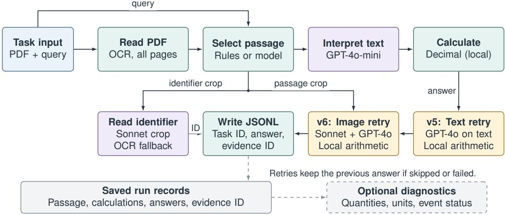

# Evidence First, Arithmetic Second: A System Report and Failure Analysis for DOCSEM\*

Divya Godara Independent Researcher San Jose, USA godaradivya@gmail.com

Sachin Gupta Independent Researcher San Jose, USA sachinkg12@gmail.com

## Abstract

EVICALC, our system for the DOCSEM shared task, achieved 8.61% joint accuracy on 1,730 tasks in the official final test evaluation. It reads a PDF, selects a passage, asks a language model to write an arithmetic expression, and evaluates that expression in local code. Saved intermediate results support inspection of failures. A separate public-validation run achieved 92.17% answer accuracy and 1.00 evidence F1. The configurations and metrics differ, so these scores are not a controlled comparison. Our manual, post-hoc analysis is descriptive: in one inspected case, optical character recognition (OCR) and block grouping merged the relevant passage into another block, and the system answered from unrelated text. An exploratory study of reading page images on 100 documents returned evidence identifiers for only 22 documents. These descriptive findings motivate further evaluation; they do not establish the causes of the overall score.

## 1 Introduction

Document question answering requires finding the relevant passage before reasoning about it. In DOC-SEM, built on GSM-SEM (Singh et al., 2026), each task provides an image-only PDF and a paraphrased query. A system must return both a numeric answer and the printed identifier of the supporting passage. We call that passage the evidence block. A correct calculation from the wrong block fails the joint answer-and-evidence requirement.

EVICALC obtained 8.61% joint accuracy in the official test evaluation. We report the submitted system and descriptive failure analyses. Saved passages, calculations, and answers support case-level inspection, not estimates of each error type’s contribution to the overall score.

Relation to earlier work. DocVQA introduced a benchmark for question answering over document images (Mathew et al., 2021). Program-aided language models delegate calculation to an interpreter after a model generates a program (Gao et al., 2023). Our system uses a restricted arithmetic expression for this step. The contribution here is an account of how this design behaved on DOCSEM, where both the answer and the evidence identifier matter.

## 2 Task and evaluation setting

The participant release contains 908 labeled training tasks and 217 validation tasks. Each task has an opaque instance identifier, a query, and a path to one PDF. The test release contains 1,730 tasks. The instructions require systems to solve from the supplied PDF rather than filenames, metadata, or an external source lookup. The output is JSONL: an instance identifier, an answer string, and one or more visible evidence block identifiers.

The public validation service reports answer accuracy and evidence scores. The test service reports joint accuracy: the fraction of tasks for which both the answer and the evidence are correct. Missing predictions count as wrong. The validation answer score and test joint score are therefore different measures.

We used public training labels and validation feedback for development. Predictions did not use organizer-held test answers, source solutions, or an answer table indexed by task ID. Test analysis used released PDFs, extracted text, saved runs, and aggregate submission feedback.

## 3 System design

Figure 1 shows the submitted test flow from task to prediction. Each task names its PDF; the system does not search a collection of unrelated documents. The reader, selector, model adapter, and calculator are replaceable components. Their implementations and settings varied across experiments.

  
Figure 1: Submitted adaptive v6 pipeline. Blue marks inputs, purple model calls, teal selection/calculation and output, amber conditional retries, and gray records and diagnostics. Arithmetic expressions are evaluated in local code. Crops come from the selected passage in the supplied PDF. The v5/v6 passes change only answers: unflagged rows and failed retries retain the prior answer (Section 3.3). Dashed arrows lead to saved records and optional checks, not a required verification step. Sonnet denotes claude-sonnet-5.

## 3.1 Document reading and evidence selection

The reader renders PDF pages as images. Tesseract OCR (Smith, 2007) extracts text and its position on each page, and local code groups the lines into blocks. Each block stores text, a page location, and an extracted identifier. The public-validation selector scores blocks for problem-introduction phrases, numbers, a question mark, and query words. It penalizes phrases associated with administrative notes and returns the highest-scoring block.

On public data, the selector considered blocks b06 to b13 on page 1. That assumption came from training documents and did not describe the test layout. The submitted test version processed all pages and used a selector that combined query words with topic words elsewhere in the document. Uncertain selections could be referred to a language model choosing from a short list of extracted blocks. It also cropped the selected block’s opening and used a vision model to reread its printed identifier. This changes the identifier reading, not the choice of passage.

## 3.2 Interpretation and arithmetic

The model receives the query and selected evidence text. In the structured configuration, it lists the requested quantity, facts quoted from the passage, units, assumptions, and an arithmetic expression. The expression uses numeric constants and a restricted set of operators and functions. Local Python code checks the syntax and evaluates it with Decimal, using 40-digit working precision. It rejects unsupported operations and non-finite results. It removes insignificant trailing zeros when formatting the answer.

Computation is repeatable for a given expression, but the model can choose the wrong quantities or operations. Optional rules check quantities, units, repeated values, and event status: for example, treating a promised payment as already paid. Withholding flagged answers was not mandatory in the reported runs.

## 3.3 Recorded configuration and reproducibility

The submitted 1,730-row adaptive v6 file began with gpt-4o-mini (OpenAI, n.d.b) for uncertain block selection and calculation, and claude-sonnet-5 (Anthropic, n.d.c) for identifier crops. Tesseract processed all pages at image scale 2 and page-segmentation mode 11. If the solver failed, it retried with the default and then a minimal instruction profile. The structured fact list described above was not required in this test run.

Two passes then revised answers without changing evidence IDs. First, gpt-4o (OpenAI, n.d.a) retried 242 rows with a failed-run flag, zero answer, or at least seven digits after the decimal point; 162 answers changed. Second, for 139 remaining zero or long-decimal answers, Sonnet transcribed the already-selected passage crop and gpt-4o solved it; 96 answers changed. Failed retries kept the previous answer. These are change counts, not measured corrections. The triggers came from publictraining answer patterns and test outputs; a zero or decimal answer is not necessarily wrong. Neither pass reconsidered passage selection.

Initial run records contain the passage, ranking, model settings and reply, calculation, and answer. Revision records reconstruct the final predictions but do not retain every crop transcription. Reconstruction is not a fresh model run. Prompts and calculator definitions accompany the source code.

## 4 Official test result

The final leaderboard result reported for adaptive v6 was 8.61% joint accuracy on 1,730 tasks. Its two revision passes left 207 answers different from the initial run, with all 1,730 evidence fields unchanged. We have no separate official score for each pass, so these changes do not establish an accuracy improvement.

Public validation observations. For the 92.17% validation run, we used claude-opus-5 (Anthropic, n.d.b) with xhigh effort, a 16,000- token output limit, and one allowed attempt per task. Its prompt required quoted facts, explicit assumptions, and a calculation. Rules selected additional reminders about units, repetitions, prices, or event order from the query and passage.

Table 1 records the relevant public-validation observations. The first three rows used the released validation PDFs. The last row applies a reading rule to previously saved model outputs, without rerunning the models or OCR. We report the recorded scores as development observations. They are not controlled comparisons: settings changed across runs, and the organizers corrected validation labels during the competition.

<table><tr><td>Run</td><td></td><td>Answer Evidence F1</td></tr><tr><td>Two model samples</td><td>90.32</td><td>1.00</td></tr><tr><td>Combined provider outputs</td><td>90.78</td><td>1.00</td></tr><tr><td>Prompt with problem-type checks</td><td>92.17</td><td>1.00</td></tr><tr><td>Reading rule on saved outputs</td><td>98.62</td><td>1.00</td></tr></table>

Table 1: Recorded public-validation feedback (percent except evidence F1). The first three rows came from PDF-based runs; the last recomputed saved outputs.

The reading-rule experiment addressed a repeated error: a stated value applied to each remaining item was interpreted as a total for those items. Recomputing saved outputs with a rule for this wording reached 98.62%. A separate comparison rejected a rule that forced comparative answers to be non-negative. These were useful error studies, but no new PDF-based run established that the revised rules would reproduce the recorded score.

## 5 Descriptive failure analysis

We compared rendered pages with extracted blocks and saved selections after observing failures. This manual, post-hoc analysis describes cases, not the causal contribution of each failure mode to the official score.

## 5.1 Observed document difficulties

We inspected the first 120 test PDFs using rendered pages and their OCR traces. Unlike the clean quantitative blocks in the public documents, inspected test PDFs included several story-like blocks, administrative notes, repeated topic words, stylized badges, and multiple pages.

Inspection highlighted three difficulties. Some queries supplied only broad topical cues, such as a person, object, or activity, that matched several passages. Some administrative notes echoed the query without containing the requested calculation. OCR traces also contained damaged story text and badge boundaries, while some unrelated notes remained readable. We did not count the frequency of these patterns across the full test split.

In task\_010565, the query referred to a virus spreading. The rendered page contained a virus-infection story and a printed badge. In the scale-2 OCR trace, that story was merged into a block headed “Purpose and reading note,” and its own identifier was absent. The selector’s threecandidate shortlist did not include this story. Downstream reasoning then solved an unrelated pottedflower passage. The calculation stage could not correct this because it never received the relevant evidence.

## 5.2 Identifier reading and passage selection

The 20-crop pilot assessed identifier transcription, not whether the selected paragraph answered the query. Correctly transcribing the wrong paragraph’s identifier still gives incorrect evidence.

<table><tr><td>Measure</td><td>Result</td></tr><tr><td>Stories selected</td><td>55 / 100</td></tr><tr><td>Correct story among selections</td><td>about 49 / 55</td></tr><tr><td>Evidence emitted</td><td>22 / 100</td></tr><tr><td>Exact badge among emissions</td><td>about 20–21 / 22</td></tr></table>

Table 2: Exploratory page-image study on 100 documents. Output counts are exact; correctness estimates are approximate local judgments, not organizer labels.

## 6 Exploratory page-image study

We tested a model that reads page images without the query and lists possible word problems, their page numbers, opening words, topics, and printed identifiers. Local code matches query words and OCR-derived topic cues to this list. The catalog model was claude-haiku-4-5-20251001 (Anthropic, n.d.a); claude-sonnet-5 reread cropped identifiers. Crops still required matching catalog entries to OCR block positions. The experiment produced evidence selections, not numerical answers, and was not a matched comparison with the submitted system.

Before running it, we sampled 100 test documents, excluding 181 used during design or earlier inspection. The fixed sample used seed docsem-visual-gate-n100-v1. The study notes describe grading by people and assistants reading rendered pages and crops, with the system’s selection hidden during the initial passage reading. These are local judgments, not organizer labels. The notes do not report agreement between independent graders.

The recorded local estimates exceeded the declared thresholds: 80% of selected passages judged correct and 70% of emitted identifiers transcribed correctly. However, neither threshold set a minimum number of outputs. Of the 100 documents, 45 had no selected passage, 18 had a selection but no usable crop location, and 15 had conflicting identifier readings. Only 22 returned an evidence identifier. We call this fraction coverage. Even perfect answers and identifiers for those 22 documents would give at most 22% joint accuracy on this sample if the other 78 were left unanswered. The experiment did not measure numerical answers, and we did not run it over the full test split.

More permissive matching on saved catalogs increased selections from 55 to 56, but admitted administrative notes in inspected cases. This used no new model calls and does not establish a limit for other selectors.

## 7 Lessons Learned

These observations motivate recommendations, not demonstrated remedies.

Check passage selection first. The virus case motivates inspecting the selected evidence before changing calculation instructions.

Test varied layouts. Compare readers or selectors on the same documents, changing one component at a time with the solver fixed. Report selection, identifier and answer accuracy, and coverage separately. Such controlled comparisons are needed to establish whether a change improves performance. Separate identifier and passage checks. A correctly read identifier can still belong to the wrong passage.

Report coverage. The page-image study returned evidence for 22 of 100 documents; correctness among outputs alone missed this limitation.

## 8 Conclusion

EVICALC obtained 8.61% official test joint accuracy. Our descriptive analyses document a case of missing relevant evidence and a page-image prototype that returned evidence for only 22 of 100 documents. They motivate testing extraction and selection changes, but do not establish a single cause of the test result or demonstrate that the proposed changes improve performance.

## Limitations

This report concerns one system and task. Models, prompts, readers, and metrics differed between public validation and test experiments. The score difference therefore cannot be attributed solely to document layout. The first 120 test documents were a convenience sample. Correctness judgments in the 100-document study are approximate, and raw annotation records would be needed to resolve the remaining uncertain cases. The rule applied to saved validation outputs was developed after inspecting errors. Its score is not a prospective test of a new PDF-based system. Hosted model calls can also vary between runs.

## Ethical considerations

Predictions use released PDFs without private answers or source solution lookup. A plausible calculation from an unrelated passage remains a practical risk. Saved passages and expressions support inspection, not a guarantee of correctness.

## References

Anthropic. n.d.a. Claude Haiku 4.5. Claude Platform model documentation. Accessed September 16, 2026.

Anthropic. n.d.b. Claude Opus 5. Claude Platform model documentation. Accessed September 16, 2026.

Anthropic. n.d.c. Claude Sonnet 5. Claude Platform model documentation. Accessed September 16, 2026.

Luyu Gao, Aman Madaan, Shuyan Zhou, Uri Alon, Pengfei Liu, Yiming Yang, Jamie Callan, and Graham Neubig. 2023. PAL: Program-aided language models. In Proceedings of the 40th International Conference on Machine Learning, volume 202 of Proceedings ofMachine Learning Research, pages 10764–10799. PMLR.

Minesh Mathew, Dimosthenis Karatzas, and C. V. Jawahar. 2021. DocVQA: A dataset for VQA on document images. In Proceedings ofthe IEEE/CVF Winter Conference on Applications ofComputer Vision (WACV), pages 2200–2209.

OpenAI. n.d.a. GPT-4o. OpenAI API model documentation. Accessed September 16, 2026.

OpenAI. n.d.b. GPT-4o Mini. OpenAI API model documentation. Accessed September 16, 2026.

Jyotika Singh, Fang Tu, Aziza Mirsaidova, Amit Agarwal, Hitesh Laxmichand Patel, Sandip Ghoshal, Miguel Ballesteros, Karan Dua, Yassine Benajiba, Weiyi Sun, Tao Sheng, Graham Horwood, Sujith Ravi, and Dan Roth. 2026. GSM-SEM: Benchmark and framework for generating semantically variant augmentations. arXiv preprint arXiv:2605.07053.

Ray Smith. 2007. An overview of the Tesseract OCR engine. In Proceedings of the Ninth International Conference on Document Analysis and Recognition, pages 629–633.