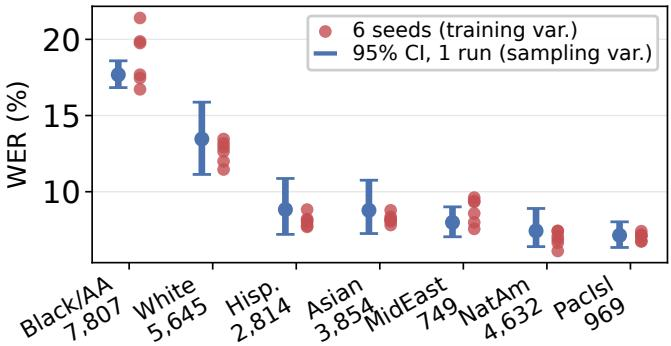
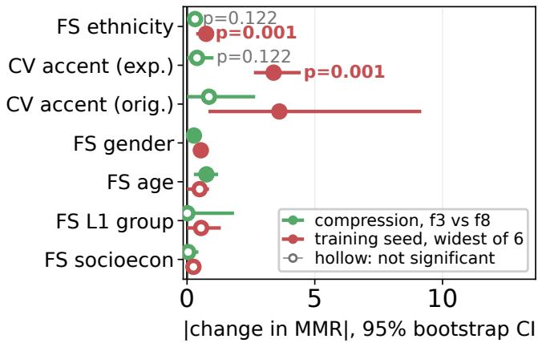

# FAIRNESS BEYOND A SINGLE RUN: TRAINING-SEED VARIABILITY IN SPEECH LLM ADAPTATION

Srishti Ginjala Eric Fosler-Lussier Srinivasan Parthasarathy

Department of Computer Science and Engineering The Ohio State University, Columbus, OH, USA

## ABSTRACT

Demographic fairness gaps in automatic speech recognition are almost always reported from a single training run. We fine-tune the Q-former projector and LoRA adapters of a speech LLM at five audio compression factors and six random seeds, holding the encoder, base decoder, data and decoding fixed, and evaluate every run on Common Voice and Fair-Speech. At 460 h of clean LibriSpeech, the seed moves fairness metrics more than compression does on most demographic axes. A balanced 3×3 decomposition attributes 85.3% of the variation in Fair-Speech ethnicity normalized gap to the seed against 8.3% to compression (p = 0.009), though compression explains more on age and gender. Heldout LibriSpeech word error rate spreads by 0.04 points across those seeds while Common Voice spreads by 8.57, so these are not failed runs, and the effect survives controlling for accuracy and dropout. Scaling and diversifying the adaptation set to 960 h damps the effect but does not remove it. On Fair-Speech ethnicity, two single-run systems must differ by more than 0.30 in normalized gap to exceed seed variability.

Index Terms: speech recognition, fairness, reproducibility, training variance, speech language models

## 1. INTRODUCTION

Demographic disparities in ASR are well documented, from race-linked gaps in commercial systems [1] to gender and accent gaps in open models [2]. Throughout, a fairness gap is the spread of word error rate across demographic groups for a single training run. The reporting convention in this literature is one trained system per configuration [3–10]. Uncertainty, when reported, is a bootstrap interval over evaluation utterances: it measures variation across samples, not across training runs.

In machine learning more broadly, this missing source of uncertainty is known to matter. Ganesh et al. [11] find that group fairness measures vary sharply across training runs, with data order the dominant source. D’Amour et al. [12] call this underspecification: a training objective can be satisfied equally well by models that behave differently out of distribution. The effect can be large enough to change a conclusion: in toxic text classification the seed alone moves a model from the best to the worst of a fairness-performance tradeoff [13].

Comparable evidence in speech is more limited. Batra et al. [14] train a low-resource ASR system at five seeds and find that several reported gains do not survive replication, but they measure aggregate word error rate and never break it out by speaker group. Haghbin et al. [15] do put seed error bars on subgroup rates, but for a speech classification task rather than transcription. Benchmarking work on the corpus we use reports only evaluation sampling variance and retrains nothing [16]. A survey of bias in speech systems does not discuss training randomness at all [17]. What is missing is a measurement of how much a per-group word error rate gap moves when the same system is trained again.

Measuring that requires a reference scale, and ours is audio token compression. The choice is not arbitrary. Group gaps already differ sharply across systems [1], and Ginjala et al. [18] report that compression predicts accent fairness more strongly than decoder scale. That comparison varied encoder, decoder, adapter and training data at the same time, so compression was one of several confounded differences. Here we rebuild that comparison under control: one model, one training set, one decoding path, and the projector’s receptive window as the only thing that moves. The knob is unusually clean: the projector’s parameter shapes are identical at every setting, so trainable capacity stays fixed while audio tokens per second vary by 2.7×. An effect is expected, since fewer tokens mean coarser acoustic evidence reaching the decoder, which should cost most on the speech the model already handles worst. We fine-tune the length adapter and LoRA modules of Granite-Speech-2B [19] across that sweep and repeat the native setting at six seeds.

To our knowledge this is the first such measurement for ASR. Failed runs, accuracy coupling and dropout do not explain the spread. It attenuates when the adaptation set is scaled and diversified, but not on every axis, and the measured spread gives a seed budget for when a fairness difference is worth interpreting.

## 2. EXPERIMENTAL SETUP

Model and design variable. Granite-Speech-2B couples a conformer encoder to a Granite 3.3 2B Instruct decoder through a Q-former projector that maps window size encoder frames to num queries audio tokens. The compression factor is their ratio; the released model uses $1 5 / 3 = 5 \quad$ We fine-tune the projector at factors 3, 4, 5, 6 and 8, corresponding to 168, 126, 102, 84 and 63 audio tokens per 10 s of speech, a 2.7× span. The projector parameter shapes are identical at every factor, so the sweep moves the Q-former receptive window while trainable capacity stays fixed.

Warm start. Training the projector from random initialization at our data scale collapses to the text prior, with fluent audio-independent transcripts and dev word error rate above 100%. The released projector was trained on roughly 90,000 h. We therefore warm-start every run from the released factor-5 projector and LoRA. Trainable parameters are 35.7 M projector plus 17.0 M LoRA (rank 64, $\alpha = 3 2$ , on the decoder $\mathtt { q \_ p r o j }$ and $\tt V - p r o j )$ . The encoder and the base decoder weights are frozen, but the decoder pathway is adapted, so this is not a projector-only comparison. Both warm starts are byte-identical across every seed and factor, so no trainable tensor is randomly initialized and the seed cannot act through initialization. That scopes the claim to adaptation of a production model, and it should reduce run-to-run variance relative to training from scratch.

Data and seeds. The primary rung is LibriSpeech [20] train-clean-100 plus train-clean-360, 132,553 utterances (460 h). We train for one epoch with batch 8, gradient accumulation 4, AdamW at $1 0 ^ { - 4 }$ , a 0.2 warmup ratio and bf16, on one A100 per run, and take the final checkpoint. Each rung holds 14 distinct runs in two overlapping arms. The factor arm is the full sweep {3, 4, 5, 6, 8} at seed 1234 and supplies every factor standard deviation $( n \ : = \ : 5 )$ . The seed grid crosses factors 3, 5 and 8 with seeds 1234, 2222 and 3333, and factor 5 adds 5678, 1111 and 4444, giving this arm 12 runs; the three runs at seed 1234 belong to both arms. Seed is therefore crossed with factor rather than nested in it, and factors 4 and 6 exist at seed 1234 alone. The same 14 runs are repeated at 960 h (adding train-other-500). Two further rungs, 100 h and a 460 h mixture containing train-other-500 at matched utterance count, are used in Section 3.4 only.

Evaluation. We evaluate on Common Voice 24 [21] test (16,398 utterances) and Fair-Speech [22] (26,471 utterances, labelled for ethnicity, gender, age, first language and socioeconomic status). The Common Voice accent subset has only 2,333 labelled utterances with one group at $n = 5 1$ , so we build a balanced expanded accent set of 8,998 utterances (1,500 per group, 25 per speaker) from the Common Voice train, dev and test splits, none of which appear in our adaptation data. Decoding is greedy and identical everywhere.

  
Fig. 1. Training variance against evaluation sampling variance. Per-group word error rate on Fair-Speech ethnicity at factor 5, 460 h. Points are the six training seeds (training variance); bars are the 95% bootstrap interval over utterances for one run (evaluation sampling variance). On the worst-served group the seeds span 4.68 points against a 1.76 point interval, so training variance is 2.7× wider than the uncertainty normally reported.

Metrics. With $w _ { g }$ the corpus-level word error rate of group g and W the overall rate, $\mathrm { M M R } = \left. \operatorname* { m a x } _ { g } w _ { g } \right/ \operatorname* { m i n } _ { g } w _ { g }$ and $\begin{array} { r } { \mathrm { N o r m G a p } = ( \operatorname* { m a x } _ { g } w _ { g } - \operatorname* { m i n } _ { g } w _ { g } ) / W ; } \end{array}$ we also report log MMR, worst-group rate and the Gini coefficient over $\{ w _ { g } \}$ Ratios average in log space across seeds, and seed standard deviations are $c _ { 4 } \cdot$ -corrected. Bootstrap intervals measure evaluation sampling variance, and seed spread measures training variance; we never pool them.

## 3. RESULTS

## 3.1. Seed spread against compression

Six runs that differ only in seed disagree on how unequally the model treats demographic groups. Figure 1 shows this per group on Fair-Speech ethnicity: on Black/AA speakers, the worst-served group at every compression factor, training spread is 2.7× wider than the bootstrap interval a single run would report. Conventional fairness tables show the narrower of the two.

Figure 2 places the compression and seed contrasts side by side. After Benjamini-Hochberg correction [23] within each family of seven axes, compression survives on two axes (Fair-Speech age, +0.757 MMR, $p _ { \mathrm { B H } } = 0 . 0 0 4$ , and gender, $- 0 . 2 6 9 , p _ { \mathrm { B H } } = 0 . 0 1 1 )$ . The two effects point in opposite directions, fall on secondary axes, and do not amount to a mechanism. The seed contrast is the widest pair among six runs, chosen after seeing the spread, so we read its interval as an effect size and not as a test; the omnibus evidence for the seed is the permutation test in Table 1, which uses every cell and selects no extreme pair. Across all axis-metric pairs at 460 h, seed standard deviation exceeds compression standard deviation on 23 of 30 pairs (six axes, five metrics), excluding overall word error rate.

  
Fig. 2. Absolute change in MMR from the widest compression pair (factor 3 versus 8) and from the widest of six seeds, with 95% bootstrap intervals over utterances, Benjamini-Hochberg corrected within each family of seven axes. The seed row is an effect-size display and not a test, for the reason given in Section 3. Compression survives on two secondary axes, in opposite directions.

## 3.2. Variance decomposition

Fair-Speech ethnicity NormGap is the primary axis and metric, fixed before any result was seen: the rule was to keep it only if its ratio of seed to compression standard deviation reached 1.5× at 460 h and held above 1.2× with any single seed dropped, and it reaches 2.82× and 2.26×. Its bootstrap interval [1.2, 11.4] is wide, six seeds against five factors, but excludes parity at 1. All other significance claims are secondary.

That ratio compares six training realizations at one design point against five deterministic design points at one seed; the two are different estimands. Table 1 therefore takes the primary inferential role, on the balanced $3 \times 3$ subset where the two sources are crossed on equal terms. The primary axis holds there and tightens: seed 85.3% against compression 8.3%, permutation $p = 0 . 0 0 9$ , the lowest in the table. Compression explains more than the seed on gender and age, taking 87.5% and 90.8%, and we report that rather than select around it.

## 3.3. Alternative explanations for the spread

In-domain performance. One seed might simply have trained badly. None did, and a seed’s in-domain performance does not predict its out-of-domain behavior. Across the six seeds at 460 h, held-out LibriSpeech dev-clean word error rate spans 0.04 points while Common Voice spans 8.57. Normalizing each set’s seed standard deviation by its own mean word error rate gives 1.1% in-domain easy, 4.7% indomain hard (test-other) and 18.6% on Common Voice, so difficulty explains part of that rise and domain shift most of it. The seed with the best in-domain word error rate is the worst on Common Voice. A Grubbs test finds no formal outlier. This is the underspecification signature of D’Amour et al. [12], and it reproduces at 4× the decoder scale (Granite-Speech-8B, 0.06 in-domain against 2.66 on Common Voice, three seeds).

Table 1. Balanced 3 × 3 factorial at 460 h: factors {3, 5, 8} crossed with seeds {1234, 2222, 3333}, one run per cell, additive two-way decomposition. One observation per cell makes the residual the factor × seed interaction rather than a separate error term, so no model carrying both is identifiable. The p value comes from permuting seed labels independently within each factor column 10,000 times, breaking the shared seed identity across columns and holding the factor margin fixed. The last column is the descriptive seed share from the unbalanced 12-run grid.
<table><tr><td>axis</td><td>metric</td><td>% fac.</td><td>% seed</td><td>p</td><td>12-run</td></tr><tr><td>FS ethnicity</td><td>NormGap</td><td>8.3</td><td>85.3</td><td>0.009</td><td>83.6</td></tr><tr><td>CV accent (exp.)</td><td>NormGap</td><td>1.1</td><td>91.0</td><td>0.064</td><td>91.6</td></tr><tr><td>FS ethnicity</td><td>MMR</td><td>40.6</td><td>53.2</td><td>0.073</td><td>68.9</td></tr><tr><td>FS L1 group</td><td>MMR</td><td>15.4</td><td>59.1</td><td>0.142</td><td>63.0</td></tr><tr><td>FS socioecon.</td><td>MMR</td><td>28.0</td><td>46.3</td><td>0.095</td><td>61.3</td></tr><tr><td>FS gender</td><td>NormGap</td><td>87.5</td><td>9.4</td><td>0.048</td><td>52.5</td></tr><tr><td>FS age</td><td>NormGap</td><td>90.8</td><td>4.9</td><td>0.272</td><td>17.8</td></tr></table>

Table 2. Effect size against accuracy dependence at 460 h. “ret.” is seed variance after residualizing on overall word error rate over seed variance before; the regression is fitted over all runs while the variance is taken over the six factor-5 seeds, so the ratio can exceed 1. Thresholds $( 1 . 0 \times , | r | < 0 . 5 )$ were fixed before inspection; “carries” marks cells clearing both.
<table><tr><td>axis</td><td>metric</td><td>ratio</td><td>|r|</td><td>ret.</td><td>quadrant</td></tr><tr><td>FS ethnicity</td><td>NormGap</td><td>2.82×</td><td>0.31</td><td>0.81</td><td>carries</td></tr><tr><td>FS socioecon. NormGap</td><td></td><td>1.43×</td><td>0.33</td><td>1.45</td><td>carries</td></tr><tr><td>CV accent</td><td>MMR</td><td>7.26×</td><td></td><td></td><td>0.94 0.04 confound.</td></tr></table>

A second check separates training variance from evaluation noise directly. Expanding the accent set from 2,333 to 8,998 utterances narrowed the MMR bootstrap interval by 9.0× and left the seed standard deviation essentially unchanged (1.273 to 1.219). Since utterances cluster by speaker, we also resampled speakers and took all their utterances. The expanded set draws 8,998 utterances from 6,048 speakers, so clustering is weak: intervals move by 0.97× (worst group) and 1.04× (MMR), leaving training spread at 8.9× the clustered interval. Fair-Speech provides no speaker identifier, so this check cannot be repeated on the primary axis.

Gap metrics and overall accuracy. MMR is a ratio of word error rates, so a seed that degrades accuracy can inflate it without treating any group differently. Table 2 puts that criticism inside the result. Expanded accent MMR carries the largest effect in the study at 7.26×, and is also the most confounded: it correlates 0.94 with overall word error rate and retains 0.04 of its seed variance after residualizing on accuracy. We therefore do not lead with it. The primary pair sits at $| r | = 0 . 3 1$ and retains 0.81 of its variance.

Accuracy dependence is axis-specific: correlation between MMR and overall word error rate ranges from 0.938 on expanded accent through 0.514 on ethnicity to 0.004 on gender. Any claim about MMR has to name the axis.

Dropout is not the source of the spread. Warm start removes initialization as a channel (Section 2), so the seed reaches the model through only two routes, data order and dropout masks. We retrained four matched seeds with every dropout probability zeroed and audited the model to confirm dropout was off. Disabling dropout retains 78% of the seed standard deviation on the primary axis and 92% to 96% on the other three tested, so dropout is not the dominant source. We stop short of naming data order the sole remaining cause: we did not force deterministic GPU kernels or dataloader workers, so reduction order is an uncontrolled residual. The result is consistent with data order dominating, as Ganesh et al. [11] report for classifiers.

## 3.4. Where the seed effect attenuates

Repeating the grid at 960 h removes the seed’s dominance almost everywhere: seed standard deviation exceeds compression standard deviation on 6 of 30 pairs, against 23 of 30 at 460 h. Common Voice accent survives, at 1.84× and 70.7% seed variance $( p = 0 . 0 3 2 )$ , as does Fair-Speech ethnicity NormGap, at 1.08×, barely above parity. The primary result is a 460 h claim.

The attenuation is not a simple volume law. Between 100 h and 460 h, both clean-only, seed σ goes up by 1.37× $( p = 0 . 0 2 6 )$ , which no account based on quantity alone predicts. A rung separating composition from volume at fixed utterance count points the same way, but neither leg reaches significance at $n = 6$ , so we do not rank them.

More epochs do not damp the effect either. At three epochs on the 460 h rung, seed σ rises rather than falls, by 1.20× on the primary axis and 1.68× on expanded accent over four matched seeds, with in-domain word error rate unchanged. Revisiting each utterance under three shuffles does not average the effect away, though epochs and total training length move together here.

## 4. A SEED BUDGET FOR FAIRNESS REPORTING

Table 3 converts the measured spread into a reporting rule. On the primary axis at 460 h two single-run systems must differ by more than 0.30 in normalized gap, or 0.77 in MMR, before the difference exceeds seed variability, and detecting a true MMR difference of 0.5 at 80% power needs five seeds; at 960 h the threshold falls to 0.28 and the requirement to one seed. All of this rests on a spread estimated from six runs, so the entries are accurate only to an order of magnitude: the 94 seeds listed for accent at d=0.5 mean “more than anyone will train”, not a plan. The requirement moves by more than a factor of two across two rungs of one ladder, so it has to be estimated per regime rather than borrowed.

Table 3. Seeds needed per configuration for 80% power at $\alpha = 0 . 0 5$ , and the smallest single-run difference exceeding the observed seed spread (2.77σ), from the six seeds at factor 5.
<table><tr><td>axis</td><td>metric</td><td>σ</td><td> $d { = } 0 . 5$ </td><td> $d { = } 1 . 0$ </td><td>min. diff.</td></tr><tr><td>FS ethnicity</td><td>NormGap</td><td>0.108</td><td>1</td><td>1</td><td>0.30</td></tr><tr><td>FS ethnicity</td><td>MMR</td><td>0.278</td><td>5</td><td>2</td><td>0.77</td></tr><tr><td>CV accent</td><td>MMR</td><td>1.219</td><td>94</td><td>24</td><td>3.38</td></tr><tr><td>FS gender</td><td>MMR</td><td>0.193</td><td>3</td><td>1</td><td>0.53</td></tr></table>

The cost of skipping that estimate shows in published work [3–10], ours included. In our prior benchmark [18] only 5 of 36 pairwise comparisons on Common Voice accent (14%) and 0 of 36 on gender have bootstrap intervals excluding zero, against 47% to 78% on Fair-Speech with roughly 11× the labelled data. Those are evaluation sampling intervals on released checkpoints, a strictly smaller source of uncertainty than the training variance measured here.

## 5. LIMITATIONS AND CONCLUSION

The study covers one architecture family, English only, adapter training under warm start, and two main data scales. The 8B replication varies scale within one family and leaves the second-architecture question open. Freezing the projector and LoRA against each other leaves each arm retaining at least 0.61 of the baseline seed spread on the primary axis, so the variance is not localised to one component. The main grid is a single epoch, with a three-epoch arm in Section 3.4; neither rung is industrial scale. Warm start removes the initialization channel, so our decomposition is narrower than the from-scratch case. The balanced cells hold one run each, so the residual in Table 1 is the interaction, not separable from error without replicates.

Subject to that scope, the training seed moves fairness metrics further than a 2.7× compression design variable does on most axes, and growing and diversifying the adaptation set damps the effect but does not remove it. Conventional validation identifies performance-unstable seeds, but not fairnessunstable ones. The reporting convention is what we would change: a per-group word error rate table without a seed floor has left out its error bars. Per-run metrics and code will be released upon publication.

AI use. AI assistance (Claude) was used for coding and for polishing the draft. The research idea, the experiments, the evaluation and the write-up are the authors’ own, and the authors take full responsibility for the content of this paper.

## 6. REFERENCES

[1] Allison Koenecke et al., “Racial disparities in automated speech recognition,” Proceedings ofthe National Academy ofSciences, vol. 117, no. 14, 2020.

[2] Rachael Tatman, “Gender and dialect bias in YouTube’s automatic captions,” in Proc. ACL Workshop on Ethics in NLP, 2017.

[3] Maliha Jahan et al., “FaiST: A benchmark dataset for fairness in speech technology,” in Proc. Interspeech, 2025.

[4] Jongsuk Kim et al., “FairASR: Fair audio contrastive learning for automatic speech recognition,” in Proc. Interspeech, 2025.

[5] Dana Serditova, Kevin Tang, and Jochen Steffens, “Automatic speech recognition biases in Newcastle English: An error analysis,” in Proc. Interspeech, 2025.

[6] Jose Giraldo et al., “Evaluating speech enhancement performance across demographics and language,” in Proc. Interspeech, 2025.

[7] Sheng-Lun Wei et al., “Bias in the ear of the listener: Assessing sensitivity in audio language models across linguistic, demographic, and positional variations,” in Findings ofEACL, 2026.

[8] Anand Rai et al., “ASR-FAIRBENCH: Measuring and benchmarking equity across speech recognition systems,” in Proc. Interspeech, 2025.

[9] Dena Mujtaba et al., “Lost in transcription: Identifying and quantifying the accuracy biases of automatic speech recognition systems against disfluent speech,” in Proc. NAACL, 2024.

[10] Tahir Javed et al., “Svarah: Evaluating English ASR systems on Indian accents,” in Proc. Interspeech, 2023.

[11] Prakhar Ganesh et al., “On the impact of machine learning randomness on group fairness,” in Proc. FAccT, 2023.

[12] Alexander D’Amour, Katherine Heller, Dan Moldovan, et al., “Underspecification presents challenges for credibility in modern machine learning,” Journal of Machine Learning Research, vol. 23, no. 226, 2022.

[13] Ioana Baldini et al., “Your fairness may vary: Pretrained language model fairness in toxic text classification,” in Findings ofthe Associationfor Computational Linguistics: ACL 2022, 2022.

[14] Karamvir Singh Batra et al., “Seeds before objectives: Rethinking evaluation for low-resource Garhwali ASR,” arXiv preprint arXiv:2608.10670, 2026, To appear, IC-NLSP 2026.

[15] Yasaman Haghbin et al., “The voice of equity: A systematic evaluation of bias mitigation techniques for speech-based cognitive impairment detection across architectures and demographics,” arXiv preprint arXiv:2601.16989, 2026.

[16] Felix E. Herron et al., “Responsible benchmarking of fairness for automatic speech recognition,” in Proc. SPEAKABLE Workshop at LREC, 2026.

[17] Yi-Cheng Lin et al., “Toward fair speech technologies: A comprehensive survey of bias and fairness in speech AI,” arXiv preprint arXiv:2605.01597, 2026.

[18] Srishti Ginjala, Eric Fosler-Lussier, and Srinivasan Parthasarathy, “Do LLM decoders listen fairly? Benchmarking how language model priors shape bias in speech recognition,” arXiv preprint arXiv:2604.21276, 2026.

[19] George Saon et al., “Granite-Speech: Open-source speech-aware LLMs with strong English ASR capabilities,” arXiv preprint arXiv:2505.08699, 2025.

[20] Vassil Panayotov et al., “LibriSpeech: An ASR corpus based on public domain audio books,” in Proc. ICASSP. IEEE, 2015.

[21] Rosana Ardila et al., “Common Voice: A massivelymultilingual speech corpus,” in Proc. LREC, 2020.

[22] Irina-Elena Veliche et al., “Towards measuring fairness in speech recognition: Fair-Speech dataset,” in Proc. Interspeech, 2024.

[23] Yoav Benjamini and Yosef Hochberg, “Controlling the false discovery rate: A practical and powerful approach to multiple testing,” Journal ofthe Royal Statistical Society: Series B, vol. 57, no. 1, 1995.