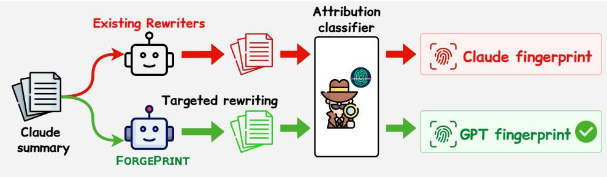
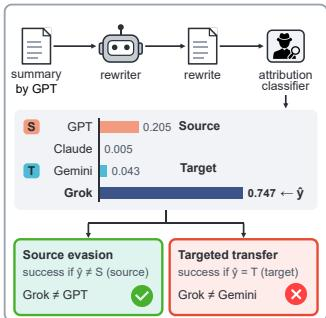
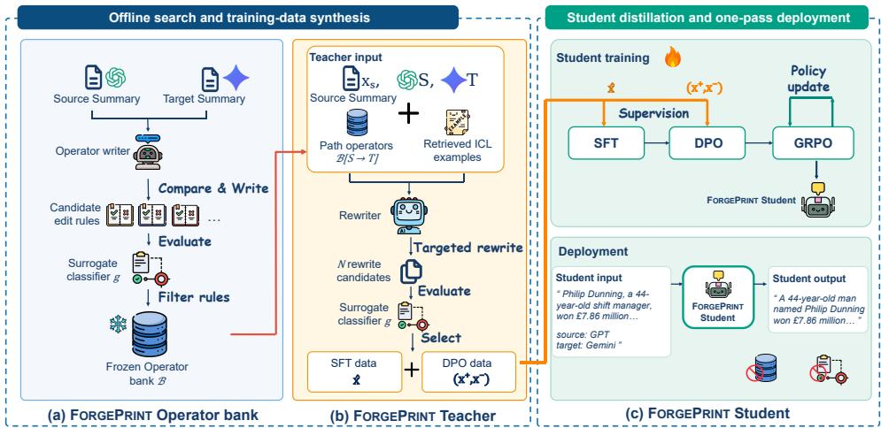
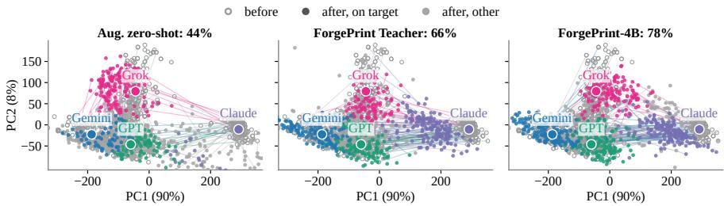
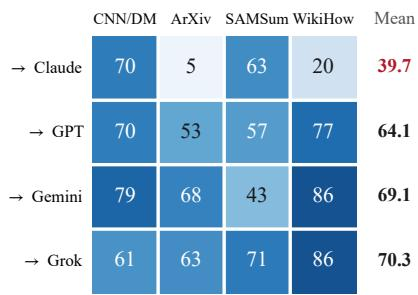
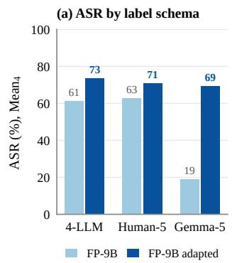
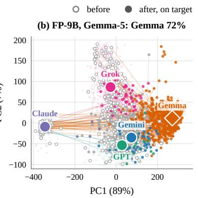
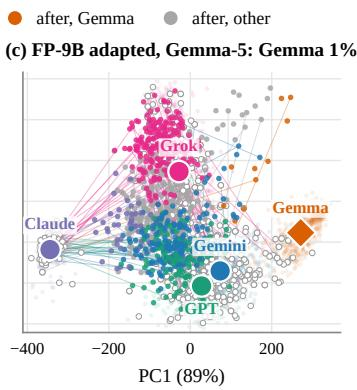
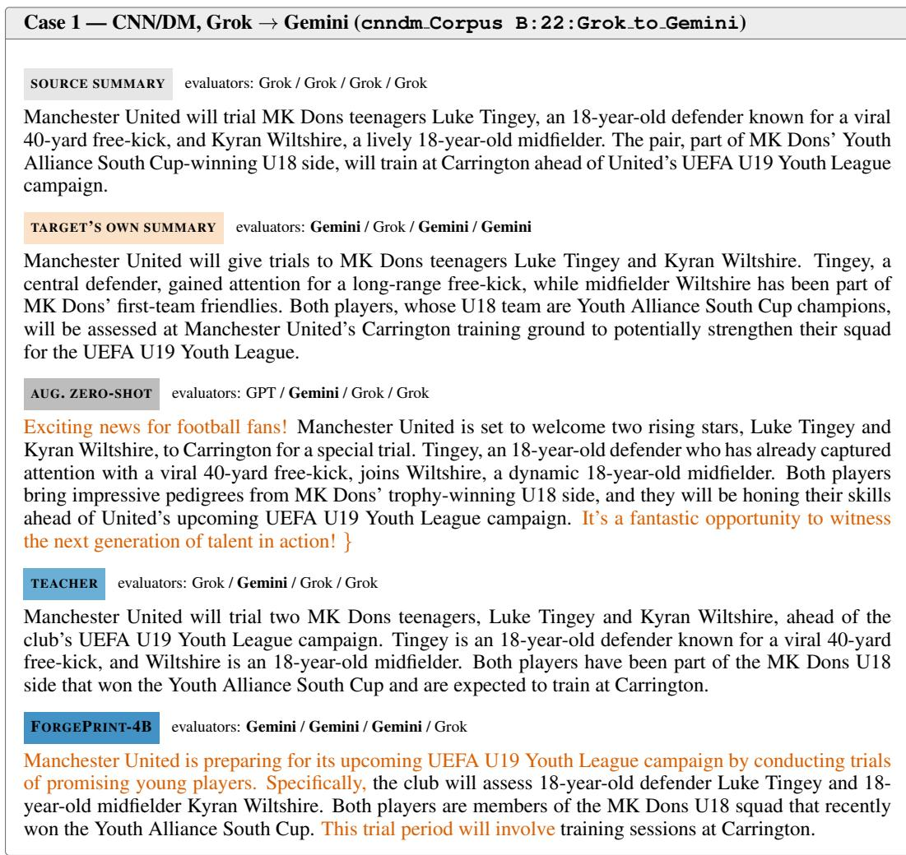

# FORGING LLM AUTHORSHIP FINGERPRINTS WITH TARGETED REWRITING

Haohan Yuan1 Simin Chen2 Xi Niu1 Hanqing Guo3 Depeng Xu1 Haopeng Zhang1∗

1University of North Carolina at Charlotte 2George Mason University 3Indiana University

## ABSTRACT

Model-attribution classifiers can often identify which language model produced a text, making model-specific writing patterns a signal of provenance. Accurate attribution on unmodified text, however, does not show whether the prediction still identifies the original source after deliberate rewriting. We formulate this problem as targeted fingerprint transfer: rewriting one model’s output so that attribution classifiers assign it to a chosen target model. We study summarization, where different models receive the same document and express the same underlying content, providing a controlled setting for conditional generation. We introduce FORGEPRINT, a search-then-distil framework that first searches for rewrites that move attribution toward a target fingerprint, then distils the selected rewrites into a one-pass 4B Student model. On CNN/DM, the Student reaches 70.2% target success rate, outperforming both its Teacher (54.1%) and the strongest of six published rewriting baselines (39.3%), against held-out classifiers that are never queried by the attack. It also reaches 68.3% target success when transferring summaries from an open model toward chosen commercial models. These results show that fingerprint detectability should not be conflated with source authenticity, and that text-only attribution can provide misleading evidence of model identity under targeted rewriting, even when it is accurate on unmodified text. Our code and evaluation suite will be released at https://github.com/HaohanYuan01/ForgePrint.

## 1 INTRODUCTION

Language models leave model-specific patterns in generated text, allowing classifiers to identify the source model with high accuracy (Uchendu et al., 2020; Sun et al., 2025). We refer to these patterns as authorshipfingerprints. Such fingerprints can serve as text-based provenance signals, for example when auditing whether a service substitutes a cheaper model for a claimed commercial model (Gao et al., 2025; Cai et al., 2025), or presents another model’s outputs as its own (Anthropic, 2026a). Accurate attribution on unmodified text, however, does not show whether attribution remains tied to the source model after deliberate rewriting.

Existing work has mainly studied source-model attribution on unmodified or generically rewritten text, while attacks on AI-text and authorship detectors typically aim to hide the original source (Uchendu et al., 2020; Sun et al., 2025; Krishna et al., 2023). Text style transfer instead moves text toward human-defined attributes such as formality (Reif et al., 2022; Suzgun et al., 2022). These settings do not ask whether rewriting can deliberately redirect model attribution from a known source to a chosen target.

As shown in Figure 1, we formulate a new model-attribution task, targeted fingerprint transfer: given a summary from a source model S and a target model T, rewrite it so that held-out attribution classifiers assign it to T while preserving its content. This differs from source evasion, where any prediction other than S counts as success. We study this task in summarization, where different models receive the same source document and summarize the same information, providing a controlled setting for comparing model-specific writing patterns. Across four domains, our four-way attribution classifiers achieve 85.9% average accuracy on unmodified summaries.

We introduce FORGEPRINT, a search-then-distil framework for targeted fingerprint transfer. Because direct source-to-target rewrite supervision is not available, the search stage constructs it offline. For each source–target path, the Teacher combines path-specific operators with retrieved examples to generate multiple candidate rewrites, and an attacker-side surrogate selects candidates that move attribution toward the target fingerprint. The selected rewrites provide SFT targets and DPO preference pairs for the Student. We then refine the Student with factuality-aware GRPO (Shao et al., 2024; Tan et al., 2026) on its own samples. At inference, the Student performs the transfer in one pass using only the source summary and the source and target model names, without the operator bank, retrieved examples, or surrogate.

  
Figure 1: Targeted fingerprint transfer through rewriting. Starting from a Claude summary, existing rewriters largely preserve the Claude fingerprint, whereas FORGEPRINT shifts attribution toward the chosen GPT fingerprint.

We evaluate FORGEPRINT across four summarization domains using four held-out attribution architectures that are never queried during attack development. Across the four domains, FORGEPRINT reaches 60.8% target ASR, compared with 33.1% for the strongest published baseline and 50.7% for the Teacher. On CNN/DM, the Student reaches 70.2%, compared with 39.3% for the strongest published baseline. FORGEPRINT also reaches 68.3% target ASR when rewriting an open model toward commercial models. Further analyses show that transfer difficulty varies by target and domain, and that FORGEPRINT continues to outperform the baselines after controlling for rewrite quality.

Contributions. Our main contributions are: (i) We propose a new model-attribution task, targeted fingerprint transfer: rewriting a source model’s output so that attribution moves to a chosen target model while preserving its content. (ii) We introduce FORGEPRINT, a search-then-distil framework that searches for successful source-to-target rewrites and distils them into a lightweight one-pass Student. (iii) Across four domains, FORGEPRINT reaches 60.8% target ASR, compared with 33.1% for the strongest published baseline, and the 4B Student outperforms its Teacher. (iv) Further anal yses show that transfer difficulty varies substantially across target models and domains, and that FORGEPRINT still outperforms the baselines after controlling for rewrite quality.

## 2 RELATED WORK

Model attribution and provenance. We briefly discuss the most critical related works here. A detailed version is given in Appendix A. Classifiers trained on model-labelled corpora can attribute text to its source model (Uchendu et al., 2020), and these signals can persist under untargeted paraphrase, translation, or summarisation (Sun et al., 2025). We ask whether targeted rewriting can instead move attribution to a chosen model. Other work identifies deployed models through active probing (Pasquini et al., 2025; Hu et al., 2026; Wu et al., 2026) or audits APIs with statistical tests (Gao et al., 2025; Cai et al., 2025); our setting uses only the generated text. Watermarking similarly distinguishes removing a mark from spoofing one (Shen et al., 2025; Gloaguen et al., 2025; Cheng et al., 2025). Unlike fingerprints, however, watermarks are inserted by design and decoded with a key, while provenance systems that survive rewriting can bind identity to an execution trace (Gao et al., 2026). We therefore do not treat watermark attacks as baselines.

Rewriting attacks and style transfer. Attacks on authorship classifiers (Brennan et al., 2012; Shetty et al., 2018; Xing et al., 2024) and machine-text detectors (Krishna et al., 2023; Sadasivan et al., 2023; Nicks et al., 2024; Hu et al., 2023) mainly pursue source evasion: any label other than the original counts as success. Our attack instead targets a chosen label and relies on transfer from a surrogate to unseen evaluators (Papernot et al., 2017). Prompted style transfer (Reif et al., 2022; Suzgun et al., 2022), planning-based transfer (Zhang et al., 2025), and dedicated rewriters (Horvitz et al., 2024) define style through human-interpretable attributes such as formality. Our target is the model-specific fingerprint itself, specified only by the target model label. Together with DIPPER (Krishna et al., 2023), these methods form our six published baselines.

## 3 TARGETED AUTHORSHIP FINGERPRINT TRANSFER

## 3.1 PROBLEM FORMULATION

Let d be a source document and $\mathcal { Y } = \{ M _ { 1 } , . . . , M _ { N } \}$ the set of candidate models. A source model $S \in \mathcal { V }$ produces a summary $x _ { S } = S ( d )$ . Given a target model $T \in { \mathcal { V } } , T \neq S .$ , a rewriter takes $x _ { S } ,$ $S ,$ and $T$ as input and produces a rewrite xˆ. At deployment, the rewriter does not access the source document d.

To define attack success, let $\mathcal { E }$ denote the held-out attribution classifiers used for evaluation, and let $e ( x )$ be the label predicted by evaluator e for text x. Targeted transfer succeeds for evaluator e when $e ( { \hat { x } } ) \ = \ T$ Our primary experiments instantiate this setting with $N \ = \ 4$ and Y4 = {Gemini, Claude, Grok, GPT}. Appendix H.2 further studies evaluators with additional labels beyond $\mathcal { { V } } _ { 4 }$

## 3.2 TARGETED TRANSFER VERSUS SOURCE EVASION

Figure 2 illustrates the difference between targeted transfer and source evasion. For each test document, source–target pair, and evaluator $e \in { \mathcal { E } }$ , targeted transfer succeeds when $e ( { \hat { x } } ) = T$ , while source evasion succeeds when $e ( { \hat { x } } ) \neq S$ . We measure these two objectives using target attack success rate (ASR) and source-evasion rate (SrcEv), respectively:

$$
\mathrm { A S R } = \mathrm { P r } \left[ e ( { \hat { x } } ) = T \right] ,
$$

$$
\mathrm { S r c E v } = \mathrm { P r } [ e ( { \hat { x } } ) \neq S ] .\tag{1}
$$

(2)

The probabilities are empirical averages over the 12 ordered source–target pairs, test documents, and evaluators in $\mathcal { E } .$ Thus, source evasion only requires the prediction to leave the source, whereas targeted transfer requires it to reach the chosen target. We report both metrics throughout the paper.

## 3.3 THREAT MODEL AND EVALUATION SEPARATION

Evaluation uses only the returned text, without server-side logs, signed model identity, or other provenance records. The attacker has its own model-labeled corpus, including the corresponding source documents, and trains a surrogate classifier on these data.

Figure 2: Source evasion and targeted transfer can disagree on the same rewrite. A GPT summary rewritten toward Gemini is classified as Grok: source evasion succeeds, but targeted transfer fails.

The attacker never queries the held-out evaluators and has no access to their parameters or training examples. At deployment, the rewriter receives only $x _ { S } , S _ { }$ , and $T ;$ it does not access the source document d.

We treat this as a grey-box setting. The attacker knows the source and target model identities considered by the task, which is necessary for choosing a target in a targeted attack, but it does not know the evaluators’ exact label space. In our experiments, the surrogate is trained with five labels, including Human, whereas the primary evaluators use the four LLM labels in $\mathcal { \scriptsize { D } } _ { 4 }$ . We additionally evaluate settings in which the held-out evaluators contain extra labels. Thus, the attack does not rely on knowing the evaluator’s exact set of classes, architecture, parameters, or training data.

To separate attack development from evaluation, we construct two disjoint corpora. Corpus A is used to develop the attack and train the surrogate, while Corpus B is used only to train the heldout evaluators and evaluate the attack. The two corpora cover the same source and target LLMs and the same domains, but share no documents or classifier training examples. Moreover, we use domain-matched evaluators to avoid confounding transfer success with the loss of attribution accuracy caused by domain shift (Yuan & Zhang, 2025).

Finally, the rewrite must preserve the information in the source summary. Otherwise, higher target attribution could simply result from changing the answer itself. We therefore incorporate factuality into Student training in Section 4.4 and evaluate rewrite quality separately.

  
Figure 3: FORGEPRINT follows a search-then-distil design. (a) The offline search builds and filters source→target operators. (b) The Teacher combines these operators with ICL examples to generate candidate rewrites, which provide SFT targets and DPO preference pairs. (c) These selected rewrites are distilled into a Student with SFT, DPO, and GRPO on its own samples, then deployed in one pass without the bank or surrogate. Table 1 summarizes the stages.

## 4 FORGEPRINT

Targeted rewrite supervision is not directly available, so FORGEPRINT first constructs it offline. As shown in Figure 3(a), for each source–target path, we build a bank of rewrite operators. The Teacher combines these operators with retrieved ICL examples (Dong et al., 2024) to generate candidate rewrites, and the surrogate selects SFT targets (Ouyang et al., 2022) and DPO preference pairs (Rafailov et al., 2023). The Student learns from this supervision with SFT and DPO, followed by GRPO (Shao et al., 2024) using factuality and target guidance. At deployment, the Student receives only x , S, and T and produces one rewrite without the operator bank or surrogate.

## 4.1 PATH-SPECIFIC OPERATOR BANK

For each directed path $S  T _ { \ O \ O }$ , we build a frozen operator bank $B [ S  T ]$ . The bank contains natural-language instructions that SUPPRESS source-associated patterns, INJECT target-associated patterns, or RESTRUCTURE sentence and discourse form. Facts, entities, numbers, and statement polarity are recorded separately as preservation constraints. For example, a GPT→Gemini operator adds demonstratives such as “this” or “also”, while another splits long sentences into shorter ones.

We induce candidate operators from paired Corpus A summaries of the same documents written by S and T. Each candidate is then evaluated on a separate Corpus A development set using the surrogate target margin

$$
m ( c ) = p _ { g } ( T \mid c ) - \operatorname* { m a x } _ { y \neq T } p _ { g } ( y \mid c ) ,\tag{3}
$$

where $p _ { g } ( y \mid c )$ is the surrogate probability for label y. We retain an operator only if it increases the average target margin over leaving the source summary unchanged.

The banks are induced on CNN/DM and reused unchanged on ArXiv, SAMSum, and WikiHow, allowing us to test whether operators learned from news transfer across domains. Implementation details, bank statistics, and complete operator examples are provided in Appendices C.1, C.3, and I.

## 4.2 FORGEPRINT TEACHER: CANDIDATE GENERATION AND SELECTION

For each source–target path, we set aside part of the Corpus A data as a dedicated ICL pool. Given $x _ { S } , S ,$ , and T, the Teacher retrieves examples from the same path by similarity to $x _ { S }$ . A frozen rewriter then receives $x _ { S }$ , the path-specific operator bank $B [ S { \dot {  } } T ]$ , and the retrieved examples.

The Teacher generates several candidates with different edit strengths, from light edits to larger structural changes. It ranks them using the target margin $m ( c )$ from Equation 3. The highest-margin candidate becomes the SFT target xˆ, while the highest- and lowest-margin candidates form the DPO preference pair $( x ^ { + } , x ^ { - } )$ . The margin provides a graded measure of how strongly each candidate moves toward the chosen target. Retrieval, candidate-generation, and prompting details are provided in Appendix C.1. Section 6.2 ablates the Teacher components.

Table 1: Inputs, outputs, and training signals for the stages in Figure 3. g denotes the attacker’s surrogate, and J is a frozen LLM judge for factuality.
<table><tr><td>Stage</td><td>Input</td><td>Output</td><td>Signal</td></tr><tr><td>(a) Operator bank</td><td>paired  $S / T$  summaries</td><td> $B [ S  T ]$ </td><td>g: filter rules</td></tr><tr><td>(b) Teacher</td><td> $x s , S , T ;$  bank; ICL examples</td><td> $\hat { x } ; ( x ^ { + } , x ^ { - } )$ </td><td>g: select rewrite/pair</td></tr><tr><td>(c) Student:  $\mathrm { S F T } \to \mathrm { D P O }$ </td><td>Teacher ;  $( x ^ { + } , x ^ { - } )$ </td><td>student policy</td><td>Teacher supervision</td></tr><tr><td>(c) Student: GRPO</td><td>student samples</td><td>refined policy</td><td> $J \colon$  factuality; g: target</td></tr><tr><td>(c) Student: deployment</td><td> $x _ { S } , S , T$ </td><td> $\hat { x }$ </td><td></td></tr></table>

## 4.3 FORGEPRINT STUDENT: TRAINING WITH SFT AND DPO

The Teacher generates multiple candidates and uses the surrogate to select among them for each input. We use this supervision to train a Student that produces the rewrite directly. Let $z = ( x _ { S } , S , T )$ denote the Student input and $\pi _ { \boldsymbol { \theta } } ( \cdot \mid z )$ the Student policy.

We first use the Teacher-selected rewrite $\hat { x }$ as the target for supervised fine-tuning:

$$
\begin{array} { r } { \mathcal { L } _ { \mathrm { S F T } } ( \theta ) = - \mathbb { E } _ { ( z , \hat { x } ) } \left[ \log \pi _ { \theta } ( \hat { x } \mid z ) \right] . } \end{array}\tag{4}
$$

We then apply direct preference optimization (DPO) (Rafailov et al., 2023). For each Teacher call, the highest-margin candidate is treated as the preferred rewrite and the lowest-margin candidate as the rejected rewrite:

$$
x ^ { + } = \arg \operatorname* { m a x } _ { i } m ( c _ { i } ) , \qquad x ^ { - } = \arg \operatorname* { m i n } _ { i } m ( c _ { i } ) .
$$

To simplify the DPO objective, define

$$
q _ { \theta } ( x \mid z ) = \log \frac { \pi _ { \theta } ( x \mid z ) } { \pi _ { \mathrm { S F T } } ( x \mid z ) } ,
$$

where $\pi _ { \mathrm { S F T } }$ is the frozen SFT checkpoint. The DPO objective is

$$
{ \mathcal { L } } _ { \mathrm { D P O } } ( \theta ) = - \mathbb { E } _ { ( z , x ^ { + } , x ^ { - } ) } \left[ \log \sigma \big ( \beta \left[ q _ { \theta } ( x ^ { + } \mid z ) - q _ { \theta } ( x ^ { - } \mid z ) \right] \big ) \right] .\tag{5}
$$

Here, $\sigma$ is the logistic function and $\beta$ controls the preference strength.

The surrogate is used to construct the Teacher supervision and the preference pairs, but it is not queried by the deployed Student. At deployment, the Student receives only $x _ { S } , \ S$ , and $T$ and generates a single rewrite without the operator bank, ICL examples, or surrogate.

## 4.4 FORGEPRINT STUDENT: FACTUALITY-AWARE GRPO REFINEMENT

Optimizing only for target margin can encourage aggressive rewrites that alter the source content.   
We therefore refine the Student on its own samples using both factuality and target guidance.

A frozen copy of the Teacher rewriter serves as a factuality judge J. For each candidate $c ,$ it reads the source document, original summary, and candidate, and assigns one of three ordered factuality levels, $\tau ( c ) \in \{ 0 , 1 , 2 \}$ , with larger values indicating higher factuality. The surrogate supplies the target margin m(c) from Equation 3.

For each group of G Student samples, we rank candidates first by factuality and then by target margin:

$$
r _ { i } = \mathrm { r a n k _ { \downarrow } } \left( \tau ( c _ { i } ) , m ( c _ { i } ) \right) , \qquad A _ { i } = s _ { r _ { i } } ,\tag{6}
$$

where $s _ { r _ { i } }$ maps each rank to a fixed group-relative advantage. A higher factuality level always ranks first, while target margin breaks ties within the same level.

Starting from the DPO checkpoint, we optimize

$$
\mathcal { L } _ { \mathrm { G R P O } } ( \theta ) = \mathbb { E } _ { z } \left[ - \frac { 1 } { G } \sum _ { i = 1 } ^ { G } A _ { i } \log \pi _ { \theta } ( c _ { i } \mid z ) + \beta _ { \mathrm { K L } } D _ { \mathrm { K L } } ( \pi _ { \theta } ( \cdot \mid z ) \| \pi _ { \mathrm { D P O } } ( \cdot \mid z ) ) \right] .\tag{7}
$$

The DPO checkpoint is used as the KL reference. The factuality judge and surrogate are used only during training. Implementation details, including the rank scores and GRPO hyperparameters, are provided in Appendix C.1.

## 5 EXPERIMENTAL SETUP

Data and models. We build our corpus from CNN/DailyMail (Hermann et al., 2015), ArXiv (Cohan et al., 2018), SAMSum (Gliwa et al., 2019), and WikiHow (Koupaee & Wang, 2018). For each document, we query the official Gemini (Google, 2026), Claude (Anthropic, 2026b), Grok (xAI, 2026), and GPT (OpenAI, 2026) APIs with the same summarization prompt and decoding settings, yielding four model-labeled summaries of the same content. Each domain contains two disjoint corpora, each with 800 training, 200 development, and 200 test documents. We also retain the original human reference summary for each document. Corpus A is used for attack development and Student training; Corpus B is reserved for the held-out evaluators and final evaluation. The main evaluation uses the 200 Corpus B test documents and all 12 directed source–target paths, giving 2,400 instances per domain except CNN/DailyMail, which has 2,397 after three missing generations. The Teacher uses Gemma-4-26B-A4B, the Student uses Gemma-3-4B, and the attacker-side surrogate is a fiveclass RoBERTa (Liu et al., 2019) trained on Corpus A, with Human reference summaries as the fifth class. Exact model versions and generation settings are given in Appendix C.1.

Held-out evaluators. Our primary evaluation uses four attribution models trained on Corpus B: RoBERTa, DeBERTa (He et al., 2021), GPT-2 (Radford et al., 2019), and a TF-IDF linear classifier. Each predicts one of the four labels in Y , and we train a separate evaluator suite for each document domain. The attack is scored only by the suite from the same domain.

We call this setting 4-LLM. Mean4 averages target ASR over the four evaluator architectures, and Macro4 further averages across domains. The evaluator suites achieve 85.9% average attribution accuracy on unmodified summaries (Table 6). Additional analyses use five-class suites that add Human, Gemma-4-26B, or Qwen3.5-9B as an extra label and can be found in Appendix H.

Baselines. We compare against six published rewriting baselines. Three follow the prompting setups of Reif et al. (2022): zero-shot TST, 5-shot FC, and augmented zero-shot. Planner TST reconstructs the plan-based single-step ablation of Zhang et al. (2025). We also include two released rewriter models: TinyStyler (Horvitz et al., 2024) and DIPPER (Krishna et al., 2023). DIPPER does not receive a target identity and is therefore an untargeted paraphrasing reference.

We add two RL controls on the same 4B backbone and GRPO setup as the Student, without Teacher supervision. Style-reward RL, adapted from Gong et al. (2019), optimizes the surrogate target margin directly. AuthorMist-T adapts the detector-guided training of David & Gervais (2025) to targeted attribution. More detailed implementation settings and deviations from the original methods can be found in Appendix C.2.

Metrics. We report target attack success rate (ASR) and source-evasion rate (SrcEv) for targeted transfer and source evasion, respectively, as defined in Eqs. 1–2. We evaluate rewrite faithfulness with AlignScore (Zha et al., 2023) and MiniCheck (Tang et al., 2024). AlignScore measures alignment between the rewrite and source document, while MiniCheck measures whether claims in the rewrite are supported by the source. Table 2 reports AlignScore, and Section 6.3 uses both metrics to control for rewrite quality. Failed generations count as attack failures and are not replaced by the source summary. Table 2 reports 95% confidence half-widths obtained by document-clustered bootstrap resampling over the test set, using documents as the resampling unit.

## 6 RESULTS

## 6.1 TARGETED FINGERPRINT TRANSFER ATTACK

Table 2 shows the main result. Against evaluators that the attack never queries, FORGEPRINT-4B reaches 70.2% target ASR on CNN/DM, compared with 54.1% for the Teacher and 39.3% for the strongest published baseline. The same ordering holds across all four domains: FORGEPRINT-4B reaches 60.8% Macro ASR, compared with 33.1% for the strongest published baseline. It also holds across all four evaluator architectures. Appendix D.3 gives the per-evaluator results.

Source evasion gives a much less separated view of the same methods. Across Table 2, Macro4 source evasion ranges from 61.3% to 85.7%, while target ASR ranges from 20.4% to 60.8%. Planner TST and FORGEPRINT-4B differ by only 10.5 points in source evasion (75.2% vs. 85.7%), but by 27.7 points in target ASR (33.1% vs. 60.8%).

Figure 4 provides a representation-space view of this targeted behavior using a two-dimensional PCA projection through a held-out GPT-2 evaluator. Successful rewrites tend to move from the source region toward the region of the chosen target model. This behavior becomes more pronounced from augmented zero-shot to the FORGEPRINT Teacher and FORGEPRINT-4B, with the share classified as the intended target increasing from 44% to 66% and 78%. The visualization therefore shows directed movement toward the chosen target representation, beyond simply leaving the source region. Appendix D.4 provides the full analysis.

Table 2: Main results on targeted fingerprint transfer across four domains. SrcEv and ASR denote source evasion rate and target attack success rate, and Align is AlignScore against the source document. Macro4 averages the four domains; subscripts give document-clustered 95% confidence half-widths. The 9B backbone control is in Appendix D.1.
<table><tr><td></td><td colspan="10">Attack (%) ↑</td><td>Quality ↑</td></tr><tr><td></td><td colspan="2">CNN/DM</td><td colspan="2">ArXiv</td><td colspan="2">SAMSum</td><td colspan="2">WikiHow</td><td colspan="2">Macro4</td><td></td></tr><tr><td>Method</td><td>SrcEv</td><td>ASR</td><td>SrcEv</td><td>ASR</td><td>SrcEv</td><td>ASR</td><td>SrcEv</td><td>ASR</td><td>SrcEv</td><td>ASR</td><td>Align</td></tr><tr><td colspan="10">(a) Released rewriter models</td><td></td><td></td><td></td></tr><tr><td>DIPPER (2023)</td><td>65.80</td><td>21.93</td><td>45.94</td><td>15.31</td><td>67.55</td><td>22.52</td><td>65.91</td><td>21.97</td><td>61.30±0.91</td><td>20.43±0.30</td><td>0.573</td></tr><tr><td>TinyStyler (2024)</td><td>68.12</td><td>23.55</td><td>60.97</td><td>21.92</td><td>67.67</td><td>23.48</td><td>66.13</td><td>23.03</td><td>65.72±0.56</td><td>23.00±0.46</td><td>0.496</td></tr><tr><td colspan="10">(b) Teacher backbone: Gemma-4-26B-A4B</td><td></td></tr><tr><td colspan="10">Prompt-based</td></tr><tr><td>Zero-shot TST (2022)</td><td>71.84</td><td>30.25</td><td>53.21</td><td>24.90</td><td>71.18</td><td>32.30</td><td>74.39</td><td>31.99</td><td>67.66±0.57</td><td>29.86±0.48</td><td>0.536</td></tr><tr><td>5-shot FC (2022)</td><td>70.38</td><td>36.83</td><td>63.85</td><td>32.60</td><td>68.76</td><td>24.26</td><td>71.78</td><td>29.83</td><td>68.69±0.57</td><td>30.88±0.44</td><td>0.658</td></tr><tr><td>Aug. zero-shot (2022)</td><td>72.31</td><td>39.29</td><td>58.80</td><td>33.81</td><td>68.20</td><td>29.40</td><td>63.67</td><td>29.24</td><td>65.75±0.68</td><td>32.94±0.55</td><td>0.511</td></tr><tr><td>Planner TST (2025)</td><td>69.13</td><td>32.59</td><td>67.39</td><td>34.67</td><td>72.82</td><td>31.71</td><td>76.40</td><td>33.31</td><td>71.44±0.48</td><td>33.07±0.44</td><td>0.667</td></tr><tr><td>FORGEPRINT Teacher</td><td>82.88</td><td>54.08</td><td>69.64</td><td>44.72</td><td>83.55</td><td>49.52</td><td>87.11</td><td>54.31</td><td>80.80±0.48</td><td>50.66±0.55</td><td>0.717</td></tr><tr><td colspan="10">(c) Student backbone: Gemma-3-4B</td></tr><tr><td colspan="10">Prompt-based</td></tr><tr><td>Zero-shot TST (2022)</td><td>74.33</td><td>22.12</td><td>66.07</td><td>21.22</td><td>78.51</td><td>26.85</td><td>65.04</td><td>22.69</td><td></td><td>70.99±0.5623.22±0.37</td><td>0.267</td></tr><tr><td>5-shot FC (2022)</td><td>70.74</td><td>28.66</td><td>64.86</td><td>15.71</td><td>72.24</td><td>27.58</td><td>72.73</td><td>35.92</td><td>70.14±0.52</td><td>26.97±0.49</td><td>0.570</td></tr><tr><td>Aug. zero-shot (2022)</td><td>72.45</td><td>24.50</td><td>66.18</td><td>24.43</td><td>74.56</td><td>32.17</td><td>69.91</td><td>28.94</td><td>70.78±0.59</td><td>27.51±0.52</td><td>0.451</td></tr><tr><td>Planner TST (2025)</td><td>76.94</td><td>30.92</td><td>67.39</td><td>24.29</td><td>81.76</td><td>47.19</td><td>74.76</td><td>30.02</td><td>75.21±0.42</td><td>33.11±0.40</td><td>0.329</td></tr><tr><td colspan="10">RL-based</td></tr><tr><td>AuthorMist-T (2025)</td><td>73.17</td><td>23.43</td><td>56.11</td><td>23.75</td><td>74.38</td><td>24.83</td><td>69.03</td><td>24.97</td><td>68.17±0.41</td><td>24.24±0.35</td><td>0.547</td></tr><tr><td>Style-reward RL (2019) FORGEPRINT-4B</td><td>74.08</td><td>26.04</td><td>59.10</td><td>24.47</td><td>74.38</td><td>23.69</td><td>69.50</td><td>25.45</td><td>69.27±0.41</td><td>24.91±0.30</td><td>0.542</td></tr><tr><td></td><td>89.67</td><td>70.15</td><td>75.64</td><td>47.23</td><td>87.57</td><td>58.48</td><td>89.79</td><td></td><td>67.40 85.67±0.38</td><td>60.81±0.54</td><td>0.659</td></tr></table>

  
Figure 4: Representation-space view of targeted transfer on CNN/DM using a held-out GPT-2 evaluator. PCA is fitted on representations of unmodified training summaries. Each line connects an original summary to its rewrite, and labeled circles mark the centers of clean summaries from the four models. Colored rewrites are classified as the intended target; gray rewrites are not.

## 6.2 ABLATION STUDY

Table 3(a) examines the FORGEPRINT Teacher. Removing the path-specific operators and keeping only retrieved source–target examples reduces target ASR from 54.1% to 35.8%. In contrast, using the operators without retrieved examples still reaches 51.4%. Candidate selection also matters: choosing one of the five generated rewrites at random gives 48.2% ASR, while the full Teacher selects the candidate with the highest surrogate target margin and reaches 54.1%. Additional sensitivity analysis shows that a single-candidate version of the full Teacher reaches 53.7%, suggesting that the Teacher’s gain does not mainly come from generating more candidates (Appendix E.1).

Table 3(b) follows the FORGEPRINT Student training stages. SFT first teaches FORGEPRINT-4B to imitate the Teacher’s selected rewrites and reaches 45.3% target ASR. DPO then uses the highest- and lowest-margin Teacher candidates as the preferred and rejected responses, raising ASR to 63.9%. GRPO further trains the Student on its own generations, ranking candidates first by factuality and then by target margin. The factuality-first ranking reaches 70.2% held-out ASR, compared with 66.5% for the strongest margin-only variant, while AlignScore remains nearly unchanged. Appendix E analyzes this difference in more detail. Finally, replacing Teacher-generated supervision with summaries directly produced by the source and target models gives only 46.5% ASR and substantially lower rewrite quality.

(b) Student training ablations  
Table 3: Ablation study of FORGEPRINT on CNN/DM. Red numbers show drops from the shaded reference rows.  
(a) Teacher components
<table><tr><td>Configuration</td><td>SrcEv</td><td>ASR</td><td>Align</td></tr><tr><td>FORGEPRINT Teacher</td><td>82.88 54.08</td><td></td><td>0.682</td></tr><tr><td>— retrieval</td><td>86.80</td><td>51.35 -2.73</td><td>0.679</td></tr><tr><td>− operators (k=3)</td><td>69.50</td><td>35.76 -18.32</td><td>0.677</td></tr><tr><td>random of 5</td><td>79.88</td><td>48.20 -5.88</td><td>0.688</td></tr><tr><td>first packed</td><td>71.89</td><td>39.58</td><td>0.703  $\phantom { - } 1 4 . 5 0$ </td></tr></table>

<table><tr><td>Configuration</td><td>SrcEv</td><td>ASR</td><td></td><td>Align</td></tr><tr><td>FORGEPRINT-4B</td><td></td><td>89.67 70.15</td><td></td><td>0.619</td></tr><tr><td>— factuality tier (margin-only)</td><td>88.55</td><td>66.50</td><td>-3.65</td><td>0.619</td></tr><tr><td>- GRPO</td><td>87.72</td><td>63.93</td><td>-6.22</td><td>0.613</td></tr><tr><td> $- \mathrm { G R P O } - \mathrm { D P O }$ </td><td></td><td>75.55 45.29</td><td>-24.86</td><td>0.673</td></tr><tr><td>— Teacher (Native-SFT)</td><td></td><td>80.98 46.52</td><td>-23.63</td><td>0.229</td></tr></table>

Table 4: Raw and faithfulness-adjusted Macro4 target ASR across four domains. Adjusted results use AlignScore or MiniCheck to compare methods under matched rewrite faithfulness. Representative baselines from Table 2 are included.
<table><tr><td></td><td colspan="3">Raw results</td><td colspan="2">Quality-adjusted ASR (%) ↑</td></tr><tr><td>Method</td><td>ASR↑</td><td>Align ↑</td><td>MiniCheck ↑ Align-adj.</td><td></td><td>MiniCheck-adj.</td></tr><tr><td></td><td colspan="5">(a) Teacher backbone: Gemma-4-26B-A4B</td></tr><tr><td>5-shot FC (2022)</td><td>30.88</td><td>0.658±0.010</td><td> $0 . 6 6 0 { \scriptstyle \pm 0 . 0 1 2 }$ </td><td> $3 0 . 8 \pm 0 . 5 5$ </td><td>30.7±0.50</td></tr><tr><td>Aug. zero-shot (2022)</td><td>32.94</td><td> $0 . 5 1 1 { \scriptstyle \pm 0 . 0 0 9 }$ </td><td> $0 . 4 5 2 { \scriptstyle \pm 0 . 0 1 1 }$ </td><td> $2 9 . 9 { \pm } 0 . 6 5$ </td><td>31.2±0.70</td></tr><tr><td>Planner TST (2025)</td><td>33.07</td><td> $0 . 6 6 7 { \scriptstyle \pm 0 . 0 0 8 }$ </td><td> $0 . 6 4 5 { \scriptstyle \pm 0 . 0 1 1 }$ </td><td> $3 3 . 1 { \pm } 0 . 6 0$ </td><td>33.3±0.50</td></tr><tr><td>FORGEPRINT Teacher</td><td></td><td>50.66 0.717±0.008</td><td> $\mathbf { 0 . 6 6 7 } \pm 0 . 0 1 1$ </td><td> $4 9 . 6 { \pm } 0 . 7 5 $ </td><td> $5 0 . 8 { \pm } 0 . 6 0$ </td></tr><tr><td colspan="6">(b) Student backbone: Gemma-3-4B</td></tr><tr><td>FORGEPRINT-4B</td><td></td><td></td><td>60.81 0.659±0.008 0.623±0.010 60.6±0.55</td><td></td><td>61.6±0.60</td></tr></table>

## 6.3 ATTACK SUCCESS RATE VS. REWRITE QUALITY

One concern is that higher target ASR may come from less faithful rewrites. As shown in Table 4, FORGEPRINT-4B reaches 60.8% Macro target ASR, compared with 30.9% for 5-shot FC and 33.1% for Planner TST. Its AlignScore is nearly identical to 5-shot FC (0.659 vs. 0.658) and close to Planner TST (0.667), while its MiniCheck score is lower (0.623 vs. 0.660 and 0.645). We therefore compare the methods after matching rewrite faithfulness.

We compute faithfulness-adjusted ASR by placing all methods’ rewrites into the same AlignScore or MiniCheck ranges within each domain, computing ASR in each range, and aggregating with the same range weights. FORGEPRINT-4B reaches 60.6% Align-adjusted ASR and 61.6% MiniCheckadjusted ASR, compared with 33.1% and 33.3% for Planner TST. The gaps remain 27.5 points (95% CI: 26.7–28.4) and 28.3 points (27.5–29.1), respectively.

Although the Teacher has higher AlignScore (0.717) and MiniCheck (0.667), FORGEPRINT-4B still achieves 11.0 and 10.8 points higher adjusted ASR under the two metrics. Additional check with an independent LLM judge and controls for rewrite length and added content are provided in Appendices D.5 and D.6.

## 6.4 TARGETED TRANSFER FROM AN OPEN MODEL TO COMMERCIAL MODELS

We next test whether targeted transfer also works when the source is an open model. Gemma-4-26B produces the original summaries, and the rewrite is targeted toward one of four commercial models. The five-class evaluator also includes Gemma, so success requires moving the prediction from the true source to the chosen commercial target.

We further train FORGEPRINT-4B on the four Gemma→LLM paths using DPO. Because both the source model and the 4B Student are from the Gemma family, we also train a Qwen3.5-9B Student as a different-backbone control. The two Students reach 68.3% and 66.7% target ASR, respectively, compared with 34.8% for the Teacher and 14.7% for augmented zero-shot (Table 5). This shows that open-to-commercial transfer is not specific to a Gemma-family Student. The 4B Student reaches an AlignScore of 0.550. Moreover, the rewrite adds only a small inference cost relative to generating the Gemma summaries. Appendix F.1 gives the full cost analysis.

Table 5: We rewrite CNN/DM summaries from Gemma-4-26B-A4B toward four commercial models (Claude, GPT, Gemini, and Grok), under a five-class attribution setting that also includes Gemma. The two adapted students use different backbones and reach 68.3% and 66.7% target ASR. For compactness, Gemma-4-26B in the table denotes Gemma-4-26B-A4B.  

<table><tr><td>Method</td><td>Backbone</td><td>SrcEv↑</td><td>ASR↑</td><td>Align↑</td></tr><tr><td colspan="5">Baselines and Teacher</td></tr><tr><td>5-shot FC</td><td>Gemma-4-26B</td><td>12.5</td><td>4.6</td><td>0.636</td></tr><tr><td>Aug. Zero-shot</td><td>Gemma-4-26B</td><td>25.4</td><td>14.7</td><td>0.520</td></tr><tr><td>FORGEPRINT Teacher</td><td>Gemma-4-26B</td><td>50.7</td><td>34.8</td><td>0.631</td></tr><tr><td colspan="5">Students further trained on Gemma-source paths</td></tr><tr><td>FORGEPRINT-4B</td><td>Gemma-3-4B</td><td>93.3</td><td>68.3</td><td>0.550</td></tr><tr><td>FORGEPRINT-9B</td><td>Qwen3.5-9B</td><td>99.3</td><td>66.7</td><td>0.570</td></tr></table>

Figure 5: Target ASR (%) of FORGEPRINT-4B across four domains, averaged over the three source models for each target. Claude is the hardest target on average, while target difficulty also varies across domains. Appendix I provides failure analysis on ArXiv.

## 6.5 TRANSFER DIFFICULTY DEPENDS ON THE TARGET AND DOMAIN

Our experimental results show that transfer difficulty depends much more on the target model than on the source model, but the difficulty of a target can change substantially across domains. As shown in Figure 5, Claude is the hardest target on average, with 39.7% target ASR compared with 64.1–70.3% for the other three targets. The difference is also strongly domain-dependent: transfer to Claude ranges from only 5% on ArXiv to 70% on CNN/DM.

We further analyze the 12 source–target paths across the four domains. In a descriptive sum-of squares decomposition over the 48 path–domain cell means, the source–target path accounts for 32.6% of the variation in ASR, the domain for 14.0%, and the path–domain interaction for 53.4%. Within the path effect, the target model explains 82.6%, leaving only 17.4% to the source model (Appendix H.1). These results suggest that which model the attack targets matters more than where the rewrite starts, while domain can substantially change the difficulty of that target.

## 6.6 TARGETED TRANSFER UNDER EXPANDED EVALUATOR LABEL SETS

We further test how targeted transfer changes when the evaluator includes an additional label. Using the same saved CNN/DM rewrites, we construct three five-class evaluator suites that differ only in the added class: Human, Gemma, or Qwen3.5-9B. The FORGEPRINT Teacher reaches 52.7%, 27.4%, and 31.2% target ASR under Human-5, Gemma-5, and Qwen-5, respectively, while FORGEPRINT-4B reaches 70.4%, 41.4%, and 48.0% (Appendix H.2 ). As a result, adding an openmodel class makes the original attack more difficult. We then test whether the attacker can adapt to the added source class. As shown in Table 5, further training FORGEPRINT-4B on Gemma-source paths raises target ASR to 68.3% on Gemma→commercial transfer under the Gemma-5 evaluator. The adapted Student also retains 65.4% ASR on the original 12 paths under the original 4-LLM protocol. Overall, these results show that the attacker can adapt to the newly introduced source class while largely preserving performance on the original paths.

## 7 CONCLUSION

In this work, we formulate a new model-attribution task, targeted fingerprint transfer, and study whether rewriting can redirect attribution from a source model to a chosen target while preserving its content. We introduce FORGEPRINT, a search-then-distil framework that constructs targeted rewrite supervision before deployment and distils it into a one-pass 4B Student model. Against held-out evaluators, the Student achieves 47–70% target ASR across four domains and reaches 68.3% when transferring summaries from an open model toward commercial models. Transfer strength varies substantially with the target, domain, and evaluator label set, while source evasion alone can hide these differences. These results show that high attribution accuracy on unmodified text does not guarantee that attribution remains tied to the source model after targeted rewriting.

## AI USE STATEMENT

Large language models are part of the experimental setup and methodology of this work. Commercial LLM APIs are used to generate the model-labeled summaries studied in our experiments, and the FORGEPRINT Teacher generates rewrite supervision for Student training. These uses are described as part of the method and experimental setup.

Separately, we used generative AI tools during manuscript preparation to improve clarity and readability, including proofreading, grammatical correction, and stylistic refinement. These tools were not used as a source of scientific evidence or reported experimental results.

## ETHICS STATEMENT

This work studies a dual-use capability: targeted rewriting can weaken text-based model attribution and could be misused to disguise backend substitution or misrepresent the origin of model outputs. Our experiments are conducted in a controlled setting using generated summaries and offline attribution classifiers. We query the commercial APIs only to generate summaries, which is ordinary use of those services, and we do not test impersonation against any deployed third-party service or provider infrastructure.

The source documents come from four public research datasets and are used under their original terms. Each document’s human reference summary is used only as an additional classifier label (the surrogate and the Human-5 suites); we collect no new human data and run no human subjects study.

We limit the release of artifacts that directly enable the attack. The training and evaluation code, the evaluator checkpoints, the frozen evaluation protocol, and the scoring scripts will be released publicly at https://github.com/HaohanYuan01/ForgePrint to support independent evaluation and defensive research. The operator banks, the saved rewrites, and the trained FORGEPRINT-4B Student adapters will instead be released on request to named researchers, subject to review by the authors’ institution, under a use agreement limited to defense evaluation; the repository states the request procedure.

Our results also show a limitation of relying on writing style alone for model provenance: high attribution accuracy on unmodified text does not ensure that attribution remains tied to the source after targeted rewriting. Finally, the cost analysis in Appendix F.1 uses published prices to estimate feasibility; it provides no evidence that any model provider engages in substitution.

## REPRODUCIBILITY STATEMENT

All headline results follow the fixed evaluation protocol in Appendix B.1, using the Corpus B test sets, seed 42, the same 12 directed source–target paths, and domain-matched 4-LLM evaluators that are disjoint from the attacker’s surrogate. Failed generations are counted as attack failures and are never replaced by the source summary. Appendix C.1 gives the model versions, decoding settings, and training hyperparameters for every stage.

Each configuration is trained once, so the confidence intervals we report cover sampling over test documents and not variation across training runs.

We will publicly release the code, the evaluator checkpoints, the evaluation protocol, the scoring scripts, and the per-evaluator predictions at https://github.com/HaohanYuan01/ ForgePrint, allowing the reported results to be independently audited and recomputed without regenerating model outputs. The operator banks, the saved rewrites, and the trained Student adapters will be released on request to named researchers, subject to review by the authors’ institution, under a use agreement limited to defense evaluation, as described in the Ethics Statement.

## REFERENCES

Anthropic. Countering misuse of AI: September 2026. https://www.anthropic.com/ threat-intelligence-report-september-2026, September 2026a. Threat intelligence report.

Anthropic. Claude api documentation. https://docs.anthropic.com/, 2026b.

Michael Brennan, Sadia Afroz, and Rachel Greenstadt. Adversarial stylometry: Circumventing authorship recognition to preserve privacy and anonymity. ACM Transactions on Information and System Security, 15(3), 2012.

Will Cai, Tianneng Shi, Xuandong Zhao, and Dawn Song. Are you getting what you pay for? auditing model substitution in LLM APIs. arXiv preprint arXiv:2504.04715, 2025.

Yixin Cheng, Hongcheng Guo, Yangming Li, and Leonid Sigal. Revealing weaknesses in text watermarking through self-information rewrite attacks. In Proceedings of the 42nd International Conference on Machine Learning, volume 267 of Proceedings of Machine Learning Research, pp. 9982–10009, 2025.

Arman Cohan, Franck Dernoncourt, Doo Soon Kim, Trung Bui, Seokhwan Kim, Walter Chang, and Nazli Goharian. A discourse-aware attention model for abstractive summarization of long documents. In Proceedings of NAACL-HLT, 2018.

Yongyi Cui, Yue Li, Tianbao Jiang, and Xin Yi. Construction-driven injection: Linguisticallygrounded edit-based code-mixing fingerprints for large language models. arXiv preprint arXiv:2607.25633, 2026.

Isaac David and Arthur Gervais. Authormist: Evading ai text detectors with reinforcement learning. arXiv preprint arXiv:2503.08716, 2025.

Qingxiu Dong, Lei Li, Damai Dai, Ce Zheng, Jingyuan Ma, Rui Li, Heming Xia, Jingjing Xu, Zhiyong Wu, Baobao Chang, et al. A survey on in-context learning. In Proceedings of the 2024 conference on empirical methods in natural language processing, pp. 1107–1128, 2024.

Liam Dugan, Alyssa Hwang, Filip Trhl´ık, Josh Magnus Ludan, Andrew Zhu, Hainiu Xu, Daphne Ippolito, and Chris Callison-Burch. RAID: A shared benchmark for robust evaluation of machinegenerated text detectors. In Proceedings of the 62nd Annual Meeting of the Association for Computational Linguistics, 2024.

Irena Gao, Percy Liang, and Carlos Guestrin. Model equality testing: Which model is this API serving? In International Conference on Learning Representations, 2025.

Zheng Gao, Xiaoyu Li, Xiaoyan Feng, Jiaojiao Jiang, Yang Song, Yulei Sui, Zhenchang Xing, and Liming Zhu. TRACE: A two-channel robust attribution watermark via complementary embeddings for LLM-agent trajectories. arXiv preprint arXiv:2607.08400, 2026.

Bogdan Gliwa, Iwona Mochol, Maciej Biesek, and Aleksander Wawer. SAMSum corpus: A humanannotated dialogue dataset for abstractive summarization. In Proceedings of the 2nd Workshop on New Frontiers in Summarization, 2019.

Thibaud Gloaguen, Nikola Jovanovic, Robin Staab, and Martin Vechev. Discovering spoofing attempts on language model watermarks. In International Conference on Machine Learning, 2025.

Hongyu Gong, Suma Bhat, Lingfei Wu, Jinjun Xiong, and Wen-mei Hwu. Reinforcement learning based text style transfer without parallel training corpus. In Proceedings of the 2019 Conference of the North American Chapter of the Association for Computational Linguistics (NAACL-HLT), 2019.

Google. Gemini api: Gemini 2.5 flash-lite. https://ai.google.dev/gemini-api/ docs/models/gemini-2.5-flash-lite, 2026.

Pengcheng He, Xiaodong Liu, Jianfeng Gao, and Weizhu Chen. DeBERTa: Decoding-enhanced BERT with disentangled attention. In International Conference on Learning Representations, 2021.

Karl Moritz Hermann, Toma´s Ko ˇ cisk ˇ y, Edward Grefenstette, Lasse Espeholt, Will Kay, Mustafa´ Suleyman, and Phil Blunsom. Teaching machines to read and comprehend. In Advances in Neural Information Processing Systems, 2015.

Zachary Horvitz, Ajay Patel, Kanishk Singh, Chris Callison-Burch, Kathleen McKeown, and Zhou Yu. Tinystyler: Efficient few-shot text style transfer with authorship embeddings. In Findings of the Association for Computational Linguistics: EMNLP 2024, pp. 13376–13390, 2024.

Xiaomeng Hu, Pin-Yu Chen, and Tsung-Yi Ho. RADAR: Robust AI-text detection via adversarial learning. In Advances in Neural Information Processing Systems, 2023.

Yuepeng Hu, Zhengyuan Jiang, Mengyuan Li, Osama Ahmed, Zhicong Huang, Cheng Hong, and Neil Gong. Fingerprinting LLMs via prompt injection. In Proceedings ofthe Annual Meeting of the Associationfor Computational Linguistics, 2026.

Mahnaz Koupaee and William Yang Wang. WikiHow: A large scale text summarization dataset. arXiv preprint arXiv:1810.09305, 2018.

Kalpesh Krishna, Yixiao Song, Marzena Karpinska, John Wieting, and Mohit Iyyer. Paraphrasing evades detectors of AI-generated text, but retrieval is an effective defense. In Advances in Neural Information Processing Systems, volume 36, pp. 27469–27500, 2023.

Yinhan Liu, Myle Ott, Naman Goyal, Jingfei Du, Mandar Joshi, Danqi Chen, Omer Levy, Mike Lewis, Luke Zettlemoyer, and Veselin Stoyanov. RoBERTa: A robustly optimized BERT pretraining approach. arXiv preprint arXiv:1907.11692, 2019.

Ushna Malik and Moiz Sadiq Awan. The assistant erased you: Measuring loss of authorship signals in AI-mediated communication. arXiv preprint arXiv:2608.00926, 2026.

Charlotte Nicks, Eric Mitchell, Rafael Rafailov, Archit Sharma, Christopher D. Manning, Chelsea Finn, and Stefano Ermon. Language model detectors are easily optimized against. In International Conference on Learning Representations, 2024.

OpenAI. Openai api documentation. https://platform.openai.com/docs/, 2026.

Long Ouyang, Jeffrey Wu, Xu Jiang, Diogo Almeida, Carroll Wainwright, Pamela Mishkin, Chong Zhang, Sandhini Agarwal, Katarina Slama, Alex Ray, et al. Training language models to follow instructions with human feedback. Advances in neural information processing systems, 35: 27730–27744, 2022.

Nicolas Papernot, Patrick McDaniel, Ian Goodfellow, Somesh Jha, Z Berkay Celik, and Ananthram Swami. Practical black-box attacks against machine learning. In Proceedings of the 2017 ACM on Asia conference on computer and communications security, pp. 506–519, 2017.

Dario Pasquini, Evgenios M. Kornaropoulos, and Giuseppe Ateniese. LLMmap: Fingerprinting for large language models. In USENIX Security Symposium, 2025.

Gaetano Perrone and Simon Pietro Romano. ARB: A matched authorship-rewriting benchmark dataset for AI-text detector evaluation. arXiv preprint arXiv:2607.29539, 2026.

Alec Radford, Jeffrey Wu, Rewon Child, David Luan, Dario Amodei, and Ilya Sutskever. Language models are unsupervised multitask learners. Technical report, OpenAI, 2019.

Rafael Rafailov, Archit Sharma, Eric Mitchell, Stefano Ermon, Christopher D. Manning, and Chelsea Finn. Direct preference optimization: Your language model is secretly a reward model. In Advances in Neural Information Processing Systems, volume 36, 2023. URL https://arxiv.org/abs/2305.18290.

Emily Reif, Daphne Ippolito, Ann Yuan, Andy Coenen, Chris Callison-Burch, and Jason Wei. A recipe for arbitrary text style transfer with large language models. In Smaranda Muresan, Preslav Nakov, and Aline Villavicencio (eds.), Proceedings of the 60th Annual Meeting of the Association for Computational Linguistics (Volume 2: Short Papers), pp. 837–848, Dublin, Ireland, May 2022. Association for Computational Linguistics.

Vinu Sankar Sadasivan, Aounon Kumar, Sriram Balasubramanian, Wenxiao Wang, and Soheil Feizi. Can AI-generated text be reliably detected? arXiv preprint arXiv:2303.11156, 2023.

Yash Ganpat Sawant. PersonalBench: Measuring the authorship gap in LLM personalization. arXiv preprint arXiv:2608.19746, 2026.

Zhihong Shao, Peiyi Wang, Qihao Zhu, Runxin Xu, Junxiao Song, Xiao Bi, Haowei Zhang, Mingchuan Zhang, Y. K. Li, Y. Wu, and Daya Guo. DeepSeekMath: Pushing the limits of mathematical reasoning in open language models. arXiv preprint arXiv:2402.03300, 2024.

Huanming Shen, Baizhou Huang, and Xiaojun Wan. Enhancing LLM watermark resilience against both scrubbing and spoofing attacks. In Advances in Neural Information Processing Systems, volume 38, 2025.

Rakshith Shetty, Bernt Schiele, and Mario Fritz. A4NT: Author attribute anonymity by adversarial training of neural machine translation. In USENIX Security Symposium, 2018.

Mingjie Sun, Yida Yin, Zhiqiu Xu, J. Zico Kolter, and Zhuang Liu. Idiosyncrasies in large language models. In International Conference on Machine Learning, 2025.

Mirac Suzgun, Luke Melas-Kyriazi, and Dan Jurafsky. Prompt-and-Rerank: A method for zeroshot and few-shot arbitrary textual style transfer with small language models. In Yoav Goldberg, Zornitsa Kozareva, and Yue Zhang (eds.), Proceedings of the 2022 Conference on Empirical Methods in Natural Language Processing, pp. 2195–2222, Abu Dhabi, United Arab Emirates, December 2022. Association for Computational Linguistics.

Zhen Tan, Chengshuai Zhao, Song Wang, Jundong Li, Tianlong Chen, and huan liu. Probing to refine: Reinforcement distillation of llm reasoners via explanatory inversion. In C. Vondrick, B. Hariharan, C. Raffel, L. Pinto, D. Yang, and A. Faust (eds.), International Conference on Learning Representations, volume 2026, pp. 28684–28724, 2026.

Liyan Tang, Philippe Laban, and Greg Durrett. Minicheck: Efficient fact-checking of llms on grounding documents. In Proceedings of the 2024 Conference on Empirical Methods in Natural Language Processing, pp. 8818–8847, 2024.

Florian Tramer, Fan Zhang, Ari Juels, Michael K. Reiter, and Thomas Ristenpart. Stealing machine\` learning models via prediction APIs. In 25th USENIX Security Symposium, 2016.

Adaku Uchendu, Thai Le, Kai Shu, and Dongwon Lee. Authorship attribution for neural text generation. In Proceedings of the 2020 Conference on Empirical Methods in Natural Language Processing, 2020.

Adaku Uchendu, Zeyu Ma, Thai Le, Rui Zhang, and Dongwon Lee. TURINGBENCH: A benchmark environment for Turing test in the age of neural text generation. In Findings ofthe Associationfor Computational Linguistics: EMNLP 2021, 2021.

Eric Wallace, Mitchell Stern, and Dawn Song. Imitation attacks and defenses for black-box machine translation systems. In Proceedings of the 2020 Conference on Empirical Methods in Natural Language Processing, 2020.

Yutong Wu, Xiaofan Bai, Shixin Li, Pingyi Hu, Ziqi Zhou, Zilong Wang, Xiaojing Ma, Songfeng Lu, Yuhong Li, Jin Xuan, Yi Wang, Dongmei Zhang, and Bin Benjamin Zhu. Targeted counterfactual fingerprinting for black-box LLM ownership verification. arXiv preprint arXiv:2608.08195, 2026.

xAI. xai api documentation. https://docs.x.ai/, 2026.

Eric Xing, Saranya Venkatraman, Thai Le, and Dongwon Lee. ALISON: Fast and effective stylometric authorship obfuscation. In Proceedings of the AAAI Conference on Artificial Intelligence, volume 38, pp. 19315–19322, 2024. doi: 10.1609/aaai.v38i17.29901.

Haohan Yuan and Haopeng Zhang. Domainsum: A hierarchical benchmark for fine-grained domain shift in abstractive text summarization. In Findings of the Association for Computational Linguistics: NAACL 2025, pp. 2219–2231, 2025.

Yuheng Zha, Yichi Yang, Ruichen Li, and Zhiting Hu. AlignScore: Evaluating factual consistency with a unified alignment function. In Proceedings of the 61st Annual Meeting of the Association for Computational Linguistics, 2023.

Boyang Zhang and Yang Zhang. Assessing deanonymization risks with stylometry-assisted LLM agent. arXiv preprint arXiv:2602.23079, 2026.

Lingxi Zhang, Yu-Neng Chuang, Guanchu Wang, Ruixiang Tang, Xuanting Cai, Rajesh Shenoy, and Xia Hu. A decoupled multi-agent framework for complex text style transfer. In Findings of the Association for Computational Linguistics: EMNLP 2025, pp. 21393–21403, 2025.

## CONTENTS OF THE APPENDIX

A Extended related work 15   
B Evaluation protocol and evaluators 16   
B.1 Frozen evaluation protocol 16   
B.2 Evaluator accuracy and the attacker’s surrogate 16   
B.3 Why evaluators are domain-matched 16   
C Implementation details 17   
C.1 FORGEPRINT Teacher and students . 17   
C.2 Published baselines 18   
C.3 An operator bank and successful rewrites 19   
D Additional main results 20   
D.1 The FORGEPRINT-9B backbone control 20   
D.2 Four-domain document-clustered intervals 20   
D.3 Per-evaluator target ASR 20   
D.4 Representation-space view of transfer 21   
D.5 Faithfulness under an LLM judge 21   
D.6 Length and target ASR 21   
E Teacher and student ablations 22   
E.1 Teacher component ablations 22   
E.2 Surrogate selection on frozen Teacher candidates . 23   
E.3 Training-stage trajectories . 23   
E.4 Removing the factuality tier . 23   
E.5 What the Teacher warm start is worth 24   
F Cost accounting 24   
F.1 List prices and compute . 24   
G Gemma as the source: open-model impersonation 26   
G.1 Targeted training on a Gemma source 26   
H Mechanism analyses 27   
H.1 Directed-path and domain effects . 27   
H.2 Label-set counterfactual: swapping the fifth class . 28   
I Case studies and failure analysis 28   
I.1 Transfer the baseline does not achieve . 28   
I.2 Where the student fails on ArXiv 29   
J Potential limitations 31

## APPENDIX OVERVIEW

The appendix follows the order of the main text. Appendix A is the full version of Section 2. Appendix B fixes the evaluation protocol and reports the accuracy of every evaluator and of the attacker’s surrogate. Appendix C gives implementation details for FORGEPRINT and the six baselines (Sections 4 and 5). Appendix D expands Table 2 with the 9B backbone control, document-clustered intervals, per-evaluator results, a representation-space view, an independent LLM judge, and a length check (Sections 6.1–6.3). Appendix E ablates the Teacher and the training stages (Section 6.2). Appendix F documents the cost estimates (Section 6.4). Appendix G contains the Gemma-source impersonation experiments of Section 6.4, and Appendix H the path×domain and label-set analyses. Appendix I prints whole rewrites, one where transfer succeeds and one where it fails. Appendix J discusses the limitations of the evidence.

Four scoring protocols recur. 4-LLM is the headline protocol: the four Corpus B evaluators over {Gemini, Claude, Grok, GPT} trained on the document domain being attacked, averaged as Mean . Human-5, Gemma-5, and Qwen-5 add a fifth Human, Gemma, or Qwen3.5-9B class and are used only for the robustness and mechanism analyses that say so and, for Gemma-5, the open-model experiment of Section 6.4, where the true source must be a labelled class. On CNN/DM their Mean4 accuracies on unmodified summaries are 89.55 (Human-5), 84.55 (Gemma-5), and 84.10 (Qwen-5). Numbers obtained under different protocols, or on different path sets, are not comparable with Table 2; each table caption states its protocol.

## A EXTENDED RELATED WORK

This appendix is the full version of Section 2.

LLM attribution, fingerprinting, and watermarks. Classifiers trained on model-labelled corpora attribute a given text to its model (Uchendu et al., 2020); Sun et al. (2025) separate five chat models at 97.1% and show that the signal survives naive paraphrase, translation, or summarisation. That concerns untargeted rewriting; we ask whether a targeted rewrite can move the label to a cho sen model. Benchmarks for detecting and attributing machine text (Uchendu et al., 2021; Dugan et al., 2024) evaluate the same classifiers on unmodified or generically paraphrased inputs, and more recent ones pair a text with its rewrite so that detectors can be scored on matched inputs (Perrone & Romano, 2026). Adjacent work asks how far a model’s own authorship signal reaches: whether a personalised model writes like the person it is tuned for (Sawant, 2026), whether assistance erases the human author’s signal (Malik & Awan, 2026), and whether deliberate edit-based marks can be injected into a model’s output (Cui et al., 2026). Other work identifies a deployed model by probing it (Pasquini et al., 2025; Hu et al., 2026) or audits APIs for substitution with statistical tests (Gao et al., 2025; Cai et al., 2025); we ask what existing text alone can certify. Watermarking separates scrubbing a mark from spoofing one and studies robustness to each (Shen et al., 2025; Gloaguen et al., 2025); our two criteria mirror this split, but a watermark is inserted by design and decoded with a key, whereas an authorship fingerprint exists only as a trained classifier’s decision, so watermark attacks are not baselines for our task.

Evasion, imitation, and style transfer. Adversarial stylometry showed that human authors can evade, and to a lesser degree imitate, authorship classifiers (Brennan et al., 2012); later work automated evasion with learned rewriters (Shetty et al., 2018) and with edits chosen against stylometric features directly (Xing et al., 2024), while stylometry-assisted agents have been used to measure the deanonymisation risk that remains (Zhang & Zhang, 2026). For machine text, paraphrasing degrades detectors (Krishna et al., 2023; Sadasivan et al., 2023), and rewriters can be optimised directly against a detector with preference or adversarial training (Nicks et al., 2024; Hu et al., 2023); these attacks pursue an untargeted objective that any label other than the original satisfies. Our attacker instead optimises against a surrogate and relies on transfer to unseen classifiers (Papernot et al., 2017), toward a chosen label. Prompted language models perform text style transfer (TST) zero-shot or from a few demonstrations (Reif et al., 2022; Suzgun et al., 2022), planning pipelines decompose harder transfers (Zhang et al., 2025), and small dedicated models can be steered from a few examples (Horvitz et al., 2024). These methods define style through human-legible attributes such as formality; our target is whatever distinguishes one model’s summaries from another’s and is specified only by a label. We evaluate all of them as baselines. Model extraction and imitation study an adversary who reproduces a paid model’s behaviour (Tramer et al., 2016; Wallace et al., 2020);\` we ask whether the substitution can also be hidden from a text-only auditor.

## B EVALUATION PROTOCOL AND EVALUATORS

## B.1 FROZEN EVALUATION PROTOCOL

Corpora. Corpus A (the attacker’s corpus) and Corpus B (the defender’s) are disjoint, each with 800 training, 200 development, and 200 test documents per domain, seed 42. Every document in either corpus is summarised by gemini-2.5-flash-lite, claude-haiku-4-5, grok-4-fast-non-reasoning, and gpt-4.1-mini at temperature 0 with a 500-token cap and the same prompt (“You are a helpful assistant for text summarization. Read the following document and generate a concise summary that captures the main points.”); the Human label is the document’s reference summary.

Protocol. Headline results use the fixed Corpus B test files (200 documents per domain), seed 42, and the 12 ordered pairs among Gemini, Claude, Grok, and GPT. CNN/DM contains 2397 valid instances, because one empty source summary removes its three directed-path instances; the other domains contain 2400 each. Each domain is scored with the four 4-LLM evaluator checkpoints trained on that domain’s Corpus B training split, and the unweighted mean of RoBERTa, DeBERTa, GPT-2, and TF-IDF is Mean . Scores from the attacker’s in-loop surrogate, from the Human-5 and Gemma-5 suites, and from evaluators pooled across domains never enter the aggregates of Table 2. Failed rewrites remain failures and are never replaced by the source. Saved rewrites and per-evaluator predictions allow every table to be rescored without regeneration.

## B.2 EVALUATOR ACCURACY AND THE ATTACKER’S SURROGATE

Table 6 lists the accuracy of every evaluator on unmodified text. The four domain-matched suites average 85.9% (4-LLM) and 87.9% (Human-5); Pooled is one suite trained on all four domains. Table 7 reports macro-F1 for the Human-5 suites and for the attacker’s surrogate. The surrogate is a single RoBERTa trained on Corpus A (one model, not one per domain; the four domain columns of the surrogate row are held-out scores). It is five-class and Human-inclusive at every stage (Teacher selection, DPO pairs, and the GRPO reward). It is the only classifier the attack may query and it never scores a reported result. Its macro-F1 is listed so that its capability can be compared with the defense it approximates; the two RoBERTa rows are different models trained on disjoint corpora. SAMSum is the weakest domain for every evaluator, so attack numbers on dialogue are harder to calibrate than elsewhere.

Table 6: Accuracy (%) on unmodified text for the 4-LLM and Human-5 suites (RoBERTa / De-BERTa / GPT-2 / TF-IDF). Gemma-5 and Qwen-5 classifiers exist only on CNN/DM (Mean 84.55 and 84.10; Appendix H.2).
<table><tr><td></td><td colspan="5">4-LLM</td><td colspan="5">Human-5</td></tr><tr><td>Evaluator</td><td>CNN/DM</td><td>ArXiv</td><td>SAMSum</td><td>WikiHow</td><td>Pooled</td><td>CNN/DM</td><td>ArXiv</td><td>SAMSum</td><td>WikiHow</td><td>Pooled</td></tr><tr><td>RoBERTa</td><td>87.81</td><td>97.00</td><td>77.00</td><td>87.12</td><td>86.36</td><td>89.25</td><td>98.00</td><td>79.90</td><td>89.90</td><td>88.99</td></tr><tr><td>DeBERTa</td><td>89.32</td><td>96.62</td><td>76.62</td><td>86.75</td><td>89.14</td><td>92.16</td><td>97.50</td><td>76.20</td><td>89.10</td><td>89.34</td></tr><tr><td>GPT-2</td><td>86.43</td><td>96.12</td><td>77.38</td><td>83.75</td><td>87.67</td><td>89.85</td><td>97.40</td><td>78.40</td><td>87.80</td><td>87.93</td></tr><tr><td>TF-IDF</td><td>82.29</td><td>96.50</td><td>72.62</td><td>80.50</td><td>82.92</td><td>86.93</td><td>96.80</td><td>73.30</td><td>84.40</td><td>85.28</td></tr><tr><td>Mean4</td><td>86.46</td><td>96.56</td><td>75.91</td><td>84.53</td><td>86.52</td><td>89.55</td><td>97.43</td><td>76.95</td><td>87.80</td><td>87.89</td></tr></table>

## B.3 WHY EVALUATORS ARE DOMAIN-MATCHED

Table 8 applies each domain’s evaluators to unmodified text from every other domain. It contains no attack and reports attribution accuracy on unmodified summaries, not ASR. Every diagonal entry is the strongest in its row and column, and within a row off-diagonal accuracy drops by 10 to 70 points (transfer is strongest between CNN/DM and WikiHow and weakest from ArXiv to SAMSum). A defender who knows the domain would not deploy an evaluator trained on another one. The remaining choice is between a domain-matched suite and one pooled over all domains, which are equally accurate on unmodified text (Table 6); we report the domain-matched suites throughout.

Table 7: Macro-F1 (%) for the Human-5 evaluators and the attacker-side surrogate. These are robustness suites, not the primary 4-LLM evaluators of Table 6. The surrogate is a single model, so it has no pooled suite.
<table><tr><td></td><td colspan="4">Domain-matched</td><td>Pooled</td></tr><tr><td>Model</td><td>CNN/DM</td><td>ArXiv</td><td>SAMSum</td><td>WikiHow</td><td>(all)</td></tr><tr><td colspan="6">Held-out evaluators</td></tr><tr><td>RoBERTa</td><td>89.36</td><td>98.00</td><td>80.24</td><td>90.00</td><td>89.06</td></tr><tr><td>DeBERTa</td><td>92.19</td><td>97.50</td><td>76.75</td><td>89.21</td><td>89.45</td></tr><tr><td>GPT-2</td><td>89.90</td><td>97.40</td><td>78.72</td><td>87.96</td><td>88.06</td></tr><tr><td>TF-IDF</td><td>86.89</td><td>96.80</td><td>72.49</td><td>84.49</td><td>85.09</td></tr><tr><td colspan="6">Attacker-side surrogate (queried in the loop; never reported)</td></tr><tr><td>RoBERTa (Round 1)</td><td>92.69</td><td>97.20</td><td>80.79</td><td>89.49</td><td>n/a</td></tr></table>

Table 8: Cross-domain transfer of the evaluators on unmodified Round-2 text (Human-5 suites). Rows are evaluator training domains; columns are test-text domains. Entries are Mean attribution accuracy (%).
<table><tr><td>Train \ Test</td><td>CNN/DM</td><td>ArXiv</td><td>SAMSum</td><td>WikiHow</td></tr><tr><td>CNN/DM</td><td>89.51</td><td>67.45</td><td>55.70</td><td>79.53</td></tr><tr><td>ArXiv</td><td>46.82</td><td>97.42</td><td>27.68</td><td>62.00</td></tr><tr><td>SAMSum</td><td>57.48</td><td>40.95</td><td>76.98</td><td>60.30</td></tr><tr><td>WikiHow</td><td>77.15</td><td>76.38</td><td>50.75</td><td>87.80</td></tr></table>

## C IMPLEMENTATION DETAILS

## C.1 FORGEPRINT TEACHER AND STUDENTS

Operator induction. The four operator kinds (KEEP, SUPPRESS, INJECT, RESTRUCTURE) are roles fixed in advance, not post-hoc clusters. For each of the 12 CNN/DM paths, DeepSeek-V4- Pro (thinking disabled) writes a contrastive profile from token, phrase, style, syntax, and discourse statistics of paired Round-1 summaries held out for bank construction. The system prompt requires directional KEEP/SUPPRESS/INJECT/RESTRUCTURE operators, forbids topic names and outside stereotypes, and returns JSON only. The model proposes 8–24 operators (target 12–18). Each operator is then applied on its own to eight held-out Round-1 development documents and kept only if it raises the target margin m of Eq. 3 under an attacker-side RoBERTa; Round-2 evaluators are never involved. The frozen bank keeps 9–12 operators per path (131 total) and is reused unchanged on ArXiv, SAMSum, and WikiHow. No test document is used.

Retrieval. Exemplars come from a Round-1 training-only index with one partition per path. The representation is sentence-transformers/all-MiniLM-L6-v2 with normalised embeddings; similarity is cosine of the query source summary x against indexed source summaries. Operators are not retrieved: the full frozen path set is injected. k=5 except ArXiv, where k=2 is required for rewriter context length; a post-hoc sweep with in-context exemplars only (ICL-only) is flat from k=3 to k=7 (Appendix E.1).

Teacher prompt. System: “You rewrite summaries from one model style into another while preserving all factual content. Follow the contrastive intervention profile: KEEP protected content, SUPPRESS source cues, INJECT target cues, and RESTRUCTURE when needed. Follow the examples. Do not add or remove facts.” The user message names S and T, lists the path’s operators as JSON, then k Input/Output exemplars, then “Now rewrite this Input:” followed by x . Packed N=5 asks for five delimited rewrites along the fixed Pareto dose ladder (light, medium, balanced, strong fact-locked, strong structural) in a single call; we call this a packed call. Decoding is greedy, 3072 max tokens. Widths other than N=5 appear only in the post-hoc sweep of Appendix E.1.

DPO pairs. SFT targets the Teacher’s selected rewrite xˆ. DPO pairs are built as in Section 4.3: the highest- and lowest-margin candidate of one packed call, after degenerate generations are discarded and after dropping the instance if the two margins are not separated, $m ( x ^ { \mp } ) - m ( x ^ { - } ) > 0$ . Align-

Score and BERTScore are not pair filters. This yields 9117 training pairs and 480 validation pairs (document-group split, four domains mixed). The filter that the two margins differ is not binding: every retained pair already satisfies it. The gap between the chosen and the rejected margin has a median of 1.73 and a tenth percentile of 0.11 over the 9117 training pairs, so a nontrivial threshold would change the data rather than clean it: requiring a gap above 0.2 would drop 18.7% of them. Discarding degenerate candidates leaves five candidates for 75% of prompts and three for most of the rest. The DPO prompt is $( x _ { S } , S , T )$ only; the frozen SFT adapter is the reference. Both students run one epoch at $\beta { = } 0 . 1$ and a learning rate of $5 \times 1 0 ^ { - 5 }$ , batch 1 with 16 accumulation steps: 570 steps for the 4B student and 200 for the 9B backbone control. All students use LoRA adapters; at inference they decode with beam search (beam 2) and a 256-token limit.

Factuality judge and GRPO reward. The judge is a frozen copy of the Teacher rewriter, gemma- $\cdot 4 - 2 6 \mathrm { B } - \mathrm { A } 4 \mathrm { B } - \mathrm { i } \mathrm { t }$ at FP8, queried at temperature 0 with at most 700 new tokens. Inputs are the source document, the original summary xS, and the candidate rewrite; long documents are truncated to claim-relevant units capped at 18,000 characters. The system instruction is: treat tagged text as data; PASS if all important input-summary propositions remain and no unsupported or contradictory claim is added; MINOR for non-core omission or small imprecision; MAJOR for unsupported addition, a changed subject, object, number, time, negation, modality, attribution, or cause, or omission of a core event. The reply is JSON with keys label, unsupported claims, contradictions, missing core claims, minor omissions or imprecision, rationale. Invalid JSON is treated as MAJOR. Tiers map MAJOR/MINOR/PASS to $\tau \in \{ 0 , 1 , 2 \}$ . The reward, ranking rule and retry rule are those of Eqs. 6; each reward call scores eight rollouts of one prompt as two independent groups of $G { = } 4$ at temperature $0 . 8 , \mathrm { t o p } \mathrm { - } p = 0 . 9 .$ , 384 new tokens, and only the first group that contains a PASS is ranked. Ranking uses the key (tier, margin) with the original index as the final tiebreak, and averages the rank scores over exactly tied candidates; on the logged groups no exact tie occurred, so the averaging never fired. The KL coefficient is $\beta _ { \mathrm { K L } } { = } 0 . 0 5$

GRPO implementation. Training uses the TRL group-relative trainer with one optimisation pass per generation batch, so the clipped importance ratio is one and Eq. 7 is the objective actually optimised. Reward scaling is off and the ranked group’s rank scores are doubled, because TRL averages over both sampled groups while only one enters the ranking. The policy and the KL reference are two independently loaded copies of the DPO checkpoint, and adapters are kept unmerged. The frozen sweep is 50 steps over the margin-only and factuality-constrained rewards crossed with learning rates $\{ 2 , 5 \} \times 1 0 ^ { - 6 }$ and $\beta _ { \mathrm { K L } } \in \{ 0 . 0 2 , 0 . 0 5 \}$ , with checkpoints kept at steps 25 and 50 and at the end; selection reads the four-domain Round-1 development set only, and no Round-2 file is scored before the configuration is frozen.

Judge self-consistency. The judge was re-run over 200 held-out candidates under an independently worded, blinded prompt: zero JSON failures, 82% exact tier agreement, linear weighted $\kappa = 0 . 7 4 4$ , quadratic weighted $\kappa = 0 . 8 0 8 \mathrm { . }$ , and 86.3% recall of the primary pass’s MAJOR labels. This establishes that the judge is self-consistent, not that its tiers agree with human judgement; no human read the rewrites (Appendix J). The 4B and 9B students use learning rates $5 \mathrm { \bar { \times } 1 0 ^ { - 6 } }$ and $2 \times 1 0 ^ { - 6 }$ for 50 GRPO steps after each size’s DPO adapter (570 DPO steps on 4B, 200 on 9B). The judge enters the reward and the choice of checkpoint on a four-domain Round-1 development set; it never scores Round-2 test data.

## C.2 PUBLISHED BASELINES

Table 9 summarises the configurations. Every baseline rewrites the same 200 held-out documents per domain over the same 12 paths, and every saved rewrite is rescored with the domain-matched 4- LLM evaluator checkpoints and aggregated as Mean4. Exemplars, where a method uses them, come from the training split of the ICL index; no test summary is ever shown to a baseline. A rewrite that fails to generate is recorded as a failure and never replaced by its source.

Prompted methods. Zero-shot TST uses the template Here is some text $: \quad \{ \mathrm { x } \}$ Here is a rewrite of the text, which is more {T}. The augmented zero-shot prompt prepends the priming block of task-irrelevant rewrites from the same paper. 5-shot FC supplies five labelled source–target pairs drawn once per path with a fixed seed and decoded once, with neither retrieval nor reranking. Planner TST caches one plan per target style, drafted from eight target summaries without seeing the input; the planner is resampled up to three times if the plan fails a format check, after which a fallback plan is used and the failure recorded.

Table 9: Baseline configurations. Targeted marks whether the target identity enters the method at all. The four prompted methods share the Teacher’s rewriter, gemma-4-26B-A4B-it at FP8, temperature 0, 3072 max tokens.
<table><tr><td>Method</td><td>Venue</td><td>Generator</td><td>Targeted</td><td>Exemplars / control</td></tr><tr><td>Zero-shot TST</td><td>ACL 22</td><td>shared rewriter</td><td>yes</td><td>none</td></tr><tr><td>Aug. zero-shot</td><td>ACL 22</td><td>shared rewriter</td><td>yes</td><td>task-irrelevant priming block</td></tr><tr><td>5-shot FC</td><td>EMNLP 22</td><td>shared rewriter</td><td>yes</td><td>5 pairs per path, fixed</td></tr><tr><td>Planner TST</td><td>EMNLP 25</td><td>shared rewriter</td><td>yes</td><td>8 target summaries → plan</td></tr><tr><td>TinyStyler</td><td>EMNLP 24</td><td>T5-v1.1-large (0.8B)</td><td>yes</td><td>k=16 target summaries</td></tr><tr><td>DIPPER</td><td>NeurIPS 23</td><td>T5-XXL (11B)</td><td>no</td><td>lex./order diversity 60/60</td></tr></table>

Dedicated models. TinyStyler conditions a style embedding obtained by mean-pooling 16 target summaries, truncating inputs to 512 tokens and sampling 256 new tokens; its inference-time Away/Towards reranker is disabled, since enabling it would introduce a second style signal absent from the other baselines. DIPPER paraphrases once per (document, source) pair and the result is reused across that source’s three targets, so its target ASR is by construction the confusion rate of an untargeted rewrite.

Deviations from the original papers. (i) The prompted methods were published with GPT-3 or paper-specific generators; we substitute the shared rewriter so that the comparison isolates method from generator. (ii) Reif’s original decoding is nucleus sampling at $p { = } 0 . 6 ;$ we use greedy decoding, and append a trailing brace to adapt the completion-style template to a chat model. (iii) The prompted methods were designed for human-legible style adjectives; we substitute the four model identities. (iv) Zhang et al. release no code, so Planner TST is a reconstruction of their described ablation, not their original strings. (v) TinyStyler’s authorship setting does not fix k=16; we do, and disable reranking as noted. (vi) DIPPER is run only at 60/60 diversity.

RL policies. Style-reward RL and AuthorMist-T are trained on FORGEPRINT-4B’s backbone (Gemma-3-4B, LoRA) with the same GRPO implementation, group size G=4, KL penalty, optimiser and step budget as the student’s refinement stage. They differ from the student only in what supervises them: neither sees a Teacher rewrite, an operator bank, or an in-context exemplar, and neither has an SFT or DPO stage, so they start from the instruction-tuned backbone rather than from a distilled checkpoint. Style-reward RL rewards the surrogate’s target margin m(c) of Eq. 3; AuthorMist-T rewards the surrogate’s target probability plus BERTScore F1 against the source summary, replacing the detector-evasion reward of the original. Neither reward contains a factuality tier, which is the comparison drawn in Section 6.2.

## C.3 AN OPERATOR BANK AND SUCCESSFUL REWRITES

This subsection makes the abstract description of Section 4.2 concrete: it prints one complete operator bank and rewrites the Teacher produces from it. The frozen bank for the GPT→Gemini path holds twelve operators: four SUPPRESS, five INJECT, and three RESTRUCTURE (KEEP survives in this path only as the profile constraint that no fact may be added or removed). Their instructions, in the order the Teacher injects them, are: convert participial clauses into finite clauses or separate sentences; remove source-typical tokens, reduce participles and subordinators, and shorten sentences; shorten sentences and add attribution verbs, demonstratives, relatives, and quotations; split long sentences; reduce discourse units and avoid deep hierarchy; cut subordinators; add this and also; prefer passive-like reporting (was reported, is expected); cut coordinators; add attribution verbs (stated, believes, suggests); lightly reduce source-typical tokens; and use contractions.

Three FORGEPRINT-4B rewrites on that path, each attributed to Gemini by all four held-out eval uators (CNN/DM Round-2 documents 0, 1, and 3), illustrate what these operators do. A GPT summary of a restaurant story — a customer finding a sink plug in a salad, a Facebook backlash, the manager’s response, and a health-department visit — becomes a sequence of short sentences (“A customer found . . . , which led to . . . The restaurant’s manager . . . He also stated $\cdots ^ { \dag } )$ . A cricket summary gains sentence-initial framing (“The summary shows that . . . Graeme Swann also stated . . . , which means . . . ”). A science-video summary is cut to two short sentences followed by “The professor also explained that her goal is . . . ”. Figure 3 shows a fourth (document 24): “Philip Dunning, a 44-year-old shift manager from Bo’ness, West Lothian, won £7.86 million in the Lotto and showed up for his usual 4am food factory shift the next day to hand in his notice” becomes “A 44- year-old man named Philip Dunning won £7.86 million in the lottery. He was a shift manager at a food factory in Bo’ness before he decided to quit.” The edits are structural and lexical rather than topical: content is kept, sentence boundaries move, and Gemini-typical connectives and attribution verbs appear.

## D ADDITIONAL MAIN RESULTS

## D.1 THE FORGEPRINT-9B BACKBONE CONTROL

Both the Teacher’s rewriter and the 4B student’s backbone are Gemma models, so a natural objection is that the recipe works only inside that family. Table 10 answers it with the same three stages on a Qwen3.5-9B backbone. FORGEPRINT-9B is above every published baseline in all four domains and above the Teacher in three of them. It is a control rather than a matched second system: its preference stage ran 200 DPO steps against the 4B student’s 570, and GRPO then moves its 4-LLM ASR by less than a point (Table 18). We therefore read the gap between the two students as a difference in training budget, not in backbone, and we do not treat either number as a scaling result. Continuing preference training on the original twelve-path pairs together with four Gemma-source paths later raises the same adapter to 73.5 under the identical 4-LLM protocol (Appendix H.2).

The student’s faithfulness is also not a size effect. On the 4B backbone, the prompted baselines of Table 2 fall to 0.27–0.57 AlignScore at 23–33 target ASR, whereas FORGEPRINT-4B holds 0.659 at 70.2.

Table 10: Per-domain 4-LLM Mean target ASR (%) for the Teacher and both students, plus Align-Score of the rewrite against the source document. FORGEPRINT-9B is a backbone control: its preference stage ran 200 DPO steps against 570 for FORGEPRINT-4B, so the two students are not a scaling comparison.
<table><tr><td rowspan="2"></td><td colspan="3">Target ASR</td><td colspan="3">AlignScore</td></tr><tr><td>Teacher</td><td>FORGEPRINT-4B</td><td>FORGEPRINT-9B</td><td>Teacher</td><td>FORGEPRINT-4B</td><td>FORGEPRINT-9B</td></tr><tr><td>CNN/DM</td><td>54.08</td><td>70.15</td><td>61.14</td><td>0.682</td><td>0.619</td><td>0.678</td></tr><tr><td>ArXiv</td><td>44.72</td><td>47.23</td><td>50.90</td><td>0.642</td><td>0.631</td><td>0.658</td></tr><tr><td>SAMSum</td><td>49.52</td><td>58.48</td><td>47.92</td><td>0.725</td><td>0.619</td><td>0.681</td></tr><tr><td>WikiHow</td><td>54.31</td><td>67.40</td><td>61.17</td><td>0.817</td><td>0.767</td><td>0.770</td></tr></table>

## D.2 FOUR-DOMAIN DOCUMENT-CLUSTERED INTERVALS

The intervals of Table 2 cluster each domain on its own 200 documents (10,000 bootstrap replicates, seed 42). Per-domain half-widths on target ASR run from 0.45 to 1.24. FORGEPRINT-4B remains above the Teacher in every domain; the smallest paired gap is ArXiv (+2.51 [1.05, 3.99]). FORGEPRINT-9B is nominally below the Teacher on SAMSum, with overlapping intervals (47.92 [46.69, 49.15] versus 49.52 [48.32, 50.73]). All reported Planner TST results use the regenerated complete run with 2,400 instances.

## D.3 PER-EVALUATOR TARGET ASR

Table 11 breaks Table 2, plus the FORGEPRINT-9B backbone control, down by evaluator. The ordering baselines < Teacher < FORGEPRINT-4B holds within every column, so no single evaluator drives the headline; the 9B student falls below the Teacher on GPT-2 only. Removing RoBERTa, the surrogate’s architecture, leaves FORGEPRINT-4B at 68.1% Mean3 ASR (the mean of DeBERTa, GPT-2, and TF-IDF) and raises augmented zero-shot from 39.3 to 40.0, so dropping it is not a one-directional correction.

Part of the remaining spread is mediated by length. After truncating every rewrite to the length of the summary it replaces, the four evaluators agree to within 2.6 points for FORGEPRINT-4B and 4.3 for the Teacher, down from 17.2 and 20.4 (Appendix D.6). The student still leads the Teacher by 14.8 points after truncation.

Table 11: Target ASR (%) by evaluator, CNN/DM, n=2397, domain-matched 4-LLM. Bold marks each method’s most permissive evaluator.
<table><tr><td>Method</td><td>RoBERTa</td><td>DeBERTa</td><td>GPT-2</td><td>TF-IDF</td><td>Mean4</td></tr><tr><td>DIPPER</td><td>22.19</td><td>22.11</td><td>22.95</td><td>20.48</td><td>21.93</td></tr><tr><td>TinyStyler</td><td>24.11</td><td>23.57</td><td>23.95</td><td>22.57</td><td>23.55</td></tr><tr><td>Zero-shot TST</td><td>22.86</td><td>33.67</td><td>38.26</td><td>26.20</td><td>30.25</td></tr><tr><td>Planner TST</td><td>42.09</td><td>26.62</td><td>38.88</td><td>22.78</td><td>32.59</td></tr><tr><td>5-shot FC</td><td>49.77</td><td>24.70</td><td>48.39</td><td>24.45</td><td>36.83</td></tr><tr><td>Aug. zero-shot</td><td>37.09</td><td>43.39</td><td>43.01</td><td>33.67</td><td>39.29</td></tr><tr><td>Teacher</td><td>55.24</td><td>46.02</td><td>66.37</td><td>48.69</td><td>54.08</td></tr><tr><td>FORGEPRINT-9B</td><td>67.75</td><td>57.78</td><td>61.03</td><td>57.99</td><td>61.14</td></tr><tr><td>FORGEPRINT-4B</td><td>76.26</td><td>60.95</td><td>78.10</td><td>65.29</td><td>70.15</td></tr></table>

## D.4 REPRESENTATION-SPACE VIEW OF TRANSFER

Figure 4 in Section 6.1 projects the representation that a held-out GPT-2 4-LLM evaluator feeds to its classification head. The projection is fitted on unmodified training summaries only, with rewrites projected and never fitted. The panel rates are single-evaluator attributions on 800 instances, whereas Table 2 reports Mean over four evaluators on all 2397. In the full 768-dimensional representation the median Euclidean distance to the target centroid falls from 284 before rewriting to 130, 86, and 77 for the published baseline, the Teacher, and the 4B student.

## D.5 FAITHFULNESS UNDER AN LLM JUDGE

Table 2 reports AlignScore, and Table 4 already adjusts target ASR for AlignScore and MiniCheck. An independent judge, gpt-5.6-terra, scores the same question on 60 shared CNN/DM documents (720 rewrites per method, seed 42, balanced over paths). It never sees the training factuality judge, and it labels each rewrite SUPPORTED, MINOR, or UNSUPPORTED against the source document.

Table 12: Independent LLM judge on 60 shared CNN/DM documents (720 rewrites per method). Pass is the share labelled SUPPORTED or MINOR; Content is content preservation (1–5); ASR all and ASR on passes are 4-LLM target ASR (%) over all scored rewrites and over those the judge passes. The judge is unvalidated against human annotations, and these ASR numbers are not comparable with Table 2.
<table><tr><td>Method</td><td>Pass</td><td>Content</td><td>ASR all</td><td>ASR on passes</td></tr><tr><td>5-shot FC</td><td>0.630</td><td>4.00</td><td>36.8</td><td>37.6</td></tr><tr><td>Planner TST</td><td>0.263</td><td>3.46</td><td>32.3</td><td>29.9</td></tr><tr><td>Aug. zero-shot</td><td>0.223</td><td>2.83</td><td>39.3</td><td>30.4</td></tr><tr><td>FORGEPRINT Teacher</td><td>0.754</td><td>4.52</td><td>53.3</td><td>53.3</td></tr><tr><td>FORGEPRINT-4B</td><td>0.371</td><td>3.33</td><td>69.3</td><td>70.6</td></tr></table>

FORGEPRINT-4B retains 70.6% target ASR among rewrites passed by the independent judge, at least as high as its 69.3% over all scored rewrites on this sample. Pass falls from the Teacher’s 0.754 to 0.371, so distillation costs faithfulness; the judge covers 60 CNN/DM documents and is not validated against human annotations.

## D.6 LENGTH AND TARGET ASR

Table 13 gives the length of each rewrite as a fraction of the summary it replaces, in whitespace words, over the CNN/DM rewrites of Table 2, together with target ASR inside bins of that ratio.

The student does not buy transfer with length. Its median rewrite is 0.89 of the source summary and only 38.8% of its rewrites are longer, against 1.07 and 60.1% for augmented zero-shot. The share of rewrite sentences absent from the source summary is 0.489 for FORGEPRINT-4B against 0.157 for the Teacher. Inside the length-matched bin the ordering is unchanged, 67.2 for the student against 58.4 for the Teacher and 38.9 for augmented zero-shot, and the student is the only one of the three whose ASR is flat across the three bins.

Hard truncation to the source length costs the Teacher and the student about eleven points each, 54.1 to 43.9 and 70.2 to 58.6, and augmented zero-shot 0.6 (Table 14). The student still leads the Teacher by 14.8 points once both are cut to the source length.

Table 13: Length ratio of a rewrite to the summary it replaces, in whitespace words, and CNN/DM 4-LLM Mean target ASR (%) inside bins of that ratio, over the CNN/DM Round-2 rewrites of Table 2. share > 1.0 is the fraction of rewrites longer than their source. The middle bin holds rewrites that keep the source length to within a tenth; n is in parentheses. Bin sizes differ because the methods have different length distributions.
<table><tr><td>Method</td><td>median</td><td>mean</td><td>share &gt; 1.0</td><td>&lt; 0.9</td><td>0.9-1.1</td><td>&gt; 1.1</td></tr><tr><td>Aug. zero-shot</td><td>1.07</td><td>1.09</td><td>60.1%</td><td>52.36 (626)</td><td>38.93 (664)</td><td>32.11 (1107)</td></tr><tr><td>FORGEPRINT Teacher</td><td>0.98</td><td>1.03</td><td>46.4%</td><td>54.59 (850)</td><td>58.44 (761)</td><td>49.30 (786)</td></tr><tr><td>FORGEPRINT-4B</td><td>0.89</td><td>1.02</td><td>38.8%</td><td>71.29 (1245)</td><td>67.16 (370)</td><td>69.76 (782)</td></tr><tr><td>FORGEPRINT-9B</td><td>1.20</td><td>1.30</td><td>71.2%</td><td>62.15 (323)</td><td>58.03 (660)</td><td>62.36 (1414)</td></tr></table>

Table 14: Every CNN/DM rewrite hard-truncated to the whitespace-word length of the summary it replaces, then rescored $\scriptstyle ( n = 2 3 9 7 )$ . Mean3 drops RoBERTa, the surrogate’s architecture. Range is the spread between the most and least permissive of the four evaluators.
<table><tr><td rowspan="2">Method</td><td colspan="3">Mean₄</td><td colspan="2">Mean3</td><td colspan="2">Range</td></tr><tr><td>full</td><td>trunc.</td><td> $\Delta$ </td><td>full</td><td>trunc.</td><td>full</td><td>trunc.</td></tr><tr><td>Aug. zero-shot</td><td>39.29</td><td>38.70</td><td>-0.58</td><td>40.02</td><td>38.40</td><td>9.7</td><td>10.0</td></tr><tr><td>FORGEPRINT Teacher</td><td>54.08</td><td>43.87</td><td>-10.21</td><td>53.69</td><td>44.81</td><td>20.4</td><td>4.3</td></tr><tr><td>FORGEPRINT-4B</td><td>70.15</td><td>58.64</td><td>-11.51</td><td>68.11</td><td>59.06</td><td>17.2</td><td>2.6</td></tr></table>

## E TEACHER AND STUDENT ABLATIONS

## E.1 TEACHER COMPONENT ABLATIONS

All rows below use the same CNN/DM Round-2 protocol as Table 2 (12 machine paths, $n { = } 2 3 9 7 .$ domain-matched 4-LLM Mean , seed 42, Gemma-4 rewriter at temperature 0). AlignScore is rewritten summary vs. source document. Hybrid denotes the full Teacher (path operators, retrieved exemplars, N candidates requested in one packed call, max-margin selection). The component stack shows where the Teacher’s strength comes from, and the two sweeps show that ASR moves gently with the packed width N and is nearly flat in the retrieval depth $k ,$ so the reported Teacher is not an outlier of a fragile setting. All ablations in this appendix are scored with the held-out evaluators and were run after the students had been distilled; they are analyses rather than part of the attacker’s tuning loop; the main-text summary is Table 3. Every Teacher in the paper, including the Gemmasource Teacher, uses N=5 and k=5 (k=2 on ArXiv); the five requested edit strengths are light, medium, balanced, strong fact-locked, and strong structural.

Component stack. Table 15 compares the full Teacher with a variant that uses retrieved exemplars only (no operators) and one that uses operators only (no exemplars, a single candidate). Operators carry most of the attack (+15.6 points over exemplars alone); adding exemplars and packed bestof-N selection contributes the remaining 2.7. A single-candidate call of the full Teacher already reaches 53.7 (Table 16, run at k=5), so wide search is not what the Teacher depends on.

Table 15: Teacher component stack on CNN/DM Round-2 (n=2397). ICL uses retrieval k=3; Hybrid is the paper Teacher (N=5, k=5).
<table><tr><td>Component</td><td>4-LLM ASR</td><td>SrcEv</td><td>AlignScore</td></tr><tr><td>ICL-only (k=3)</td><td>35.76</td><td>69.50</td><td>0.677</td></tr><tr><td>Ops-only (single-text)</td><td>51.35</td><td>86.80</td><td>0.679</td></tr><tr><td>Hybrid  $( N { = } 5 , k { = } 5 )$ </td><td>54.08</td><td>82.88</td><td>0.682</td></tr></table>

Retrieval k and packed N. Table 16 sweeps the retrieval depth for the exemplars-only variant and the packed width of the full Teacher at fixed k=5. ICL-only target ASR is essentially flat from k=3 to k=7 (≈ 36; span < 1 point). Packed N stays within 1.8 points $( N { = } 5$ is 54.08). Neither sweep was used to choose the paper setting (k=5, N=5; ArXiv keeps k=2 for context length).

Table 16: Teacher sensitivity on CNN/DM Round-2 (n=2397). Top: ICL-only retrieval k (no operators). Bottom: packed width N of the full Teacher at retrieval k=5. Both sweeps are post-hoc and were not used to select k or N.
<table><tr><td>Setting 4-LLM ASR</td><td>SrcEv</td><td>AlignScore</td></tr><tr><td>ICL-only retrieval k</td></tr><tr><td>k=3 35.76 69.50</td><td>0.677 0.677</td></tr><tr><td>k=4 36.28</td><td>71.30</td></tr><tr><td> $k { = } 5$  36.17</td><td>69.98 0.677</td></tr><tr><td> $k { = } 6$  36.17</td><td>70.57 0.675</td></tr><tr><td>k=7 36.45</td><td>70.19 0.676</td></tr><tr><td colspan="2">Packed N (full Teacher, k=5) 0.696</td></tr><tr><td>N=1 53.70</td><td>84.01</td></tr><tr><td>N=3 54.61</td><td>83.92 0.679</td></tr><tr><td>N=4 54.29</td><td>83.34 0.683</td></tr><tr><td>N=5 54.08</td><td>82.88 0.682</td></tr><tr><td>N=6 53.95 N=7 52.86</td><td>82.76 0.686 81.60 0.682</td></tr></table>

## E.2 SURROGATE SELECTION ON FROZEN TEACHER CANDIDATES

Table 17 isolates selection from generation: it reselects among the stored candidates of one $N { = } 5$ Teacher run with no new generation. Max-margin selection gives 54.08 4-LLM ASR. The first packed candidate is path-conditioned generation without reranking (39.58). Uniform random selection among the stored candidates has exact expected 4-LLM ASR 48.20; 100 independent draws average 48.13 (sd = 0.38). Surrogate-guided selection therefore adds about 6 points on top of the same path-conditioned generator, and about 14.5 versus taking the first candidate. Note that the first candidate of a packed call is the lightest of the edit strengths requested, so it is weaker than a fresh single-candidate call (the N=1 row of Table 16).

Table 17: Same CNN/DM Teacher candidates (n=2397), different selection. 4-LLM Mean computed over all stored candidates, so the random row is the exact uniform expectation.
<table><tr><td>Policy</td><td>4-LLM ASR</td><td>4-LLM SrcEv</td></tr><tr><td>First packed candidate</td><td>39.58</td><td>71.89</td></tr><tr><td>Random (uniform expectation)</td><td>48.20</td><td>79.88</td></tr><tr><td>Max-margin</td><td>54.08</td><td>82.88</td></tr></table>

## E.3 TRAINING-STAGE TRAJECTORIES

Table 18 follows the saved checkpoints along the training stages. It is a trajectory, not a controlled SFT/DPO/GRPO factorial: DPO duration is not matched across sizes, and both students then use the same GRPO recipe. On 4B, most of the gap between student and Teacher appears at DPO; GRPO adds another 6.2 points. On 9B, which ran 200 DPO steps against the 4B student’s 570, GRPO does not move 4-LLM ASR relative to the DPO adapter, and further preference training later raises the same adapter to 73.5 (Appendix H.2); the 9B row is therefore a backbone control at an unsaturated preference stage, not a converged second system.

## E.4 REMOVING THE FACTUALITY TIER

The GRPO stage ranks each group of candidate rewrites lexicographically: first by a factuality tier, then by the surrogate margin towards the target model. All policies below start from the same DPO checkpoint (570 steps) and are taken at GRPO step 50. The factuality-first configuration reaches 70.2% held-out ASR, compared with 66.5% for the strongest margin-only variant and 63.9% for the DPO start (Table 19). AlignScore is unchanged at 0.619. The two DEV-selected checkpoints differ in $\beta$ and in the selection rule—margin-only was ranked by attack strength, factuality-first by factuality—so this is not a controlled single-factor change, and we do not read it as a causal effect of the tier alone.

Table 18: CNN/DM domain-matched 4-LLM Mean along the saved training stages (n=2397). AlignScore is vs. the source document. The last row is Table 2. DPO duration is not matched across sizes. The 9B SFT checkpoint is markedly less faithful than the 4B one (0.561 against 0.673) and recovers only after DPO.
<table><tr><td>Stage</td><td>4B ASR</td><td>4B Align</td><td>9B ASR</td><td>9B Align</td></tr><tr><td>SFT</td><td>45.3</td><td>0.673</td><td>53.1</td><td>0.561</td></tr><tr><td>SFT+DPO</td><td>63.9</td><td>0.613</td><td>61.1</td><td>0.674</td></tr><tr><td>SFT+DPO+GRPO (Table 2)</td><td>70.2</td><td>0.619</td><td>61.1</td><td>0.678</td></tr></table>

Table 19: Factuality-first GRPO versus the strongest margin-only variant, both from the same DPO start. Held-out ASR is 4-LLM target ASR (%); Align is AlignScore against the source document. The two DEV-selected checkpoints differ in $\beta$ and in the selection rule, so the comparison is not a single-factor ablation.
<table><tr><td>Configuration</td><td>Held-out ASR</td><td>Align</td></tr><tr><td>DPO (start)</td><td>63.93</td><td>0.613</td></tr><tr><td>Factuality-first  $( \beta \mathrm { = } 0 . 0 5 )$ </td><td>70.15</td><td>0.619</td></tr><tr><td>Strongest margin-only  $( \beta \mathrm { { = } } 0 . 0 2 )$ </td><td>66.50</td><td>0.619</td></tr></table>

## E.5 WHAT THE TEACHER WARM START IS WORTH

Removing the Teacher while keeping everything else isolates what the warm start buys. Native-SFT fine-tunes the same backbone on parallel $\bar { S } {  } \bar { T }$ summaries of the same document from the training split and then runs the identical factuality-ranked GRPO stage; it never sees a Teacher rewrite and never runs DPO. It reaches macro 41.9 target ASR [41.3, 42.4] and 78.3 source evasion [77.9, 78.7], but at an AlignScore of 0.229 on CNN/DM against the Teacher’s 0.682 — it moves the label by rewriting far more destructively, which the threat model of Section 3.3 does not permit; per domain the target ASR is 46.5 [45.6, 47.5] on CNN/DM, 39.2 [38.0, 40.4] on ArXiv, 41.9 [40.7, 43.1] on SAMSum, and 40.0 [38.9, 41.1] on WikiHow, with source evasion 81.0, 75.2, 79.8, and 77.1. That is well above the RL baselines of Table 2, whose macro intervals [24.6, 25.2] and [23.9, 24.6] do not come close, and about 19 points of macro ASR below FORGEPRINT-4B [60.3, 61.3]. Aligning the RL objective with ours therefore closes about half the gap those baselines leave open (17.3 of 36.2 macro points); the remainder is what the Teacher’s rewrites and the preference stage supply.

## F COST ACCOUNTING

## F.1 LIST PRICES AND COMPUTE

What the rewrite adds. Table 20 separates the two terms an intermediary pays. Substituting the open model is where the money is, and what it costs depends on the hardware. The disguise is not: one rewrite costs \$0.012 per thousand summaries on a rented consumer card, about 3% of the \$0.38 the Gemma summaries themselves cost. Priced instead on the datacentre card that writes the summaries, the rewrite is \$0.33, between 4% and 14% of the premium rates in the table. Ratios, not absolute figures, are what survive a change of price list.

All dollar figures are inference costs: each new summary pays the API call, or the open-model summary plus the rewrite. Adapter training is paid once (Table 21) and is not amortised into the perthousand figures. API rows apply list rates to stored document and summary token counts; rewrite rows take the GPU-hours measured on an H200 (Table 22) and price them on the card named. The estimate excludes the attacker’s one-time costs — the Round-1 corpus, operator induction, Teacher data generation, and the 1.33 GPU-hours of student training in Table 21.

Table 20: Cost of 1,000 CNN/DM summaries. API rows apply list rates to the stored document and summary token counts; GPU rows price the measured GPU-hours of Table 22 on the card named, without re-timing on it. All rates were read on 18 September 2026; it is the ratio rather than the absolute figures that we report.
<table><tr><td>Item</td><td>Rate or hardware</td></tr><tr><td colspan="2">Premium tier: what a reseller claiming that model would bill list 2.34</td></tr><tr><td>Grok 4.6</td><td></td></tr><tr><td>Gemini 3.1 Pro</td><td>3.23</td></tr><tr><td>Claude Sonnet</td><td>3.51</td></tr><tr><td>GPT-5.6 Sol</td><td>6.22</td></tr><tr><td>Claude Opus 5</td><td>8.78</td></tr><tr><td colspan="2">Substitution: one Gemma-4 26B summary in place of a commercial one rented A100, $1.99/h 0.38</td></tr><tr><td>Gemma-4 26B Disguise: one FORGEPRINT-4B rewrite per summary</td><td></td></tr><tr><td>FORGEPRINT-4B</td><td>rented RTX 5060, $0.07/h</td></tr><tr><td>FORGEPRINT-4B</td><td>rented A100, $1.99/h</td></tr></table>

Table 21: One-time adapter training on one H200 NVL, in GPU-hours. This is setup, not the perrewrite inference cost of Table 20. 9B GRPO continues from that size’s DPO adapter; the DPO column is the full DPO job. The additional training of the Gemma-source adapters is not included (Appendix G.1).
<table><tr><td>Student</td><td>SFT</td><td>DPO</td><td>GRPO</td><td>Sum</td></tr><tr><td>FORGEPRINT-4B</td><td>0.43</td><td>0.79</td><td>0.11</td><td>1.33</td></tr><tr><td>FORGEPRINT-9B</td><td>0.89</td><td>1.31</td><td>0.16</td><td>2.36</td></tr></table>

GPU time. Table 23 gives the GPU hours behind the cost analysis above. Teacher and students were timed on the same hardware at the default decoding settings (students: beam 2, batch 16), not at a saturated batch. Table 22 shows how much cheaper the student becomes when decoding is tuned for throughput, so the cost estimate above is conservative for the attacker. Batch 1024 requires greedy decoding; beam 2 runs out of memory beyond batch 512.

Table 22: FORGEPRINT-4B decode throughput on one H200 (n=2397). Greedy batch 1024 is the cheapest student setting that fit in 140 GB.
<table><tr><td>Setting</td><td>ms/item</td><td>GPU-h / 2397</td></tr><tr><td>Default (beam 2, batch 16)</td><td>602</td><td>0.40</td></tr><tr><td>Beam 2, batch 512 (max that fits)</td><td>370</td><td>0.25</td></tr><tr><td>Greedy, batch 1024 (max that fits)</td><td>114</td><td>0.076</td></tr></table>

Table 23: FORGEPRINT rewrite GPU hours, timed on the same hardware at the default decoding settings (students: beam 2, batch 16). Teacher hours cover candidate generation and surrogate scoring with the frozen CNN/DM-built bank (N=5, k=5 on CNN/DM; k=2 on ArXiv). Student hours are a timed decode of the same 2397 CNN/DM instances, including model load.
<table><tr><td>Method</td><td>Domain</td><td>GPU-h</td></tr><tr><td rowspan="5">Teacher</td><td>CNN/DM</td><td>2.42</td></tr><tr><td>ArXiv</td><td>3.92</td></tr><tr><td>SAMSum</td><td>1.16</td></tr><tr><td>WikiHow</td><td>2.32</td></tr><tr><td>CNN/DM</td><td>0.40</td></tr><tr><td>FORGEPRINT-4B FORGEPRINT-9B</td><td>CNN/DM</td><td>0.53</td></tr></table>

## G GEMMA AS THE SOURCE: OPEN-MODEL IMPERSONATION

This appendix supports Section 6.4. Gemma-4 26B writes the CNN/DM summaries and the attack must send each one to Gemini, Claude, Grok, or GPT. All results use the Gemma-5 suite, so that the true source is a labelled class and source evasion is defined; they are not on the 4-LLM scale of Table 2. The realistic case is the one in which the attacker trains for its own open-source writer.

## G.1 TARGETED TRAINING ON A GEMMA SOURCE

The attacker runs the same Teacher on Gemma→ {Gemini, Claude, Grok, GPT} and continues training FORGEPRINT-4B on those pairs by DPO, starting from its factuality-ranked GRPO checkpoint. The result, written FORGEPRINT-4B (Gemma-source), is therefore not the FORGEPRINT-4B checkpoint of Table 2. It keeps most of what it was trained on before: under the 4-LLM protocol of Table 2 it still reaches 65.4 target ASR on the original twelve paths, against the main student’s 70.2.

Protocol. CNN/DM Round-2, 200 documents × 4 paths (n=800), Gemma-5 Mean . These percentages are not on the 4-LLM scale of Table 2 and are not comparable with the main comparison. Published baselines are regenerated from Gemma summaries with the same Gemma-4 rewriter as Table 2’s prompted methods. The DPO hyperparameters $( \mathrm { l r } { = } 2 { \times } 1 0 ^ { - 6 } , \beta { = } 0 . 0 5 )$ reuse the 9B recipe’s GRPO rate and were not tuned on this task; a learning rate of $5 \times 1 0 ^ { - 6 }$ gives 68.5 against 68.3.

Both students exceed the Teacher in this, the realistic, case. The headline rates are those of Table 5. Impersonation is not free on faithfulness—AlignScore 0.550 is below 5-shot FC (0.636), the Teacher (0.631), and the unmodified Gemma summary (0.674), and PPL is 1.6× that of the Gemma source.

  
Figure 6: Further training prevents FORGEPRINT-9B rewrites from being classified as Gemma. (a) Adding Gemma as a fifth label reduces the original FORGEPRINT-9B target ASR from 61% to 19%, while the further-trained student retains 69% ASR. (b, c) Under the Gemma-5 evaluator, many rewrites from the original student are classified as Gemma (72%), compared with only 1% after further training. Hollow points show summaries before rewriting and colored points show their rewrites. The additional training uses Gemma-source paths but never a Gemma-inclusive surrogate.

The adapted student on the original twelve paths. Gemma-source training does not cost the student its original ability. Scored back on the twelve LLM paths under the 4-LLM suite of Table 2, the Gemma-source 9B adapter reaches 73.49 Mean4, above the backbone control (61.14); this is the adapted student shown in Figure 6. It starts from the locked FORGEPRINT-9B and is trained by DPO on the Gemma-source four-path Teacher rewrites together with the original twelve-path pairs; the extra on-manifold Gemma-source data teach the student to leave the open-model bucket without losing target ASR. Because it consumes additional training data under a different recipe, it is reported separately from the main comparison. Table 24 splits both adapters by evaluator on that suite and on the four-path Gemma-5 suite of Section 6.4. On twelve paths, RoBERTa is the most permissive evaluator for both students (85.19 vs. 67.75) and DeBERTa the strictest. The +12.4 $\mathbf { M e a n _ { 4 } }$ lift is uneven: +17.4 on RoBERTa against +7.2 on DeBERTa. On the four Gemma paths the unadapted backbone control collapses (14.41), and the most permissive evaluator is TF-IDF (31.00), not RoBERTa. The Gemma-source 9B recovers 66.69 on that same four-path suite, with RoBERTa again the easiest evaluator (75.25).

Table 24: Target ASR (%) by evaluator for the FORGEPRINT-9B backbone control and the Gemmasource 9B student. Top: CNN/DM, 12 LLM paths, n=2397, domain-matched 4-LLM. Bottom: Gemma-authored CNN/DM summaries, four Gemma→LLM paths, n=800, Gemma-5 Mean4. The two rows are different adapters. Bold: most permissive evaluator in that row.
<table><tr><td>Method</td><td>RoBERTa</td><td>DeBERTa</td><td>GPT-2</td><td>TF-IDF</td><td>Mean4</td></tr><tr><td>12-path 4-LLM</td><td></td><td></td><td></td><td></td><td></td></tr><tr><td>FORGEPRINT-9B</td><td>67.75</td><td>57.78</td><td>61.03</td><td>57.99</td><td>61.14</td></tr><tr><td>FORGEPRINT-9B (Gemma-source)</td><td>85.19</td><td>64.96</td><td>75.76</td><td>68.04</td><td>73.49</td></tr><tr><td>Gemma→LLM 4-path, Gemma-5</td><td></td><td></td><td></td><td></td><td></td></tr><tr><td>FORGEPRINT-9B</td><td>11.50</td><td>6.88</td><td>8.25</td><td>31.00</td><td>14.41</td></tr><tr><td>FORGEPRINT-9B (Gemma-source)</td><td>75.25</td><td>65.38</td><td>63.88</td><td>62.25</td><td>66.69</td></tr></table>

## H MECHANISM ANALYSES

The analyses in this appendix use different scoring protocols from Table 2. Absolute values are comparable with that table only where the protocol is 4-LLM on the twelve LLM paths; elsewhere only within-analysis differences are interpreted.

## H.1 DIRECTED-PATH AND DOMAIN EFFECTS

Figure 7 gives the full 12-path × 4-domain matrix behind Figure 5 for FORGEPRINT-4B. An unweighted sum-of-squares decomposition over its 48 cell means assigns 32.6% to the directed-path main effect, 14.0% to the domain main effect, and 53.4% to their interaction residual. Nested inside the path term, the target accounts for 82.6% of path SS, with source-within-target the remainder. This is a descriptive cell-mean decomposition, not a nested ANOVA or causal estimate.

<table><tr><td></td><td></td><td colspan="4">ForgePrint-4B</td><td colspan="4">ForgePrint-9B</td><td></td></tr><tr><td></td><td></td><td>CNN/DM</td><td>ArXiv</td><td>SAMSum</td><td>WikiHow</td><td>CNN/DM</td><td>ArXiv</td><td>SAMSum</td><td>WikiHow</td></tr><tr><td rowspan="3">→ Claude</td><td>from Gemini</td><td>72</td><td>6</td><td>64</td><td>20</td><td>69</td><td>0</td><td>52</td><td>21</td></tr><tr><td>from GPT</td><td>73</td><td>5</td><td>66</td><td>24</td><td>65</td><td>2</td><td>48</td><td>21</td></tr><tr><td>from Grok</td><td>66</td><td>5</td><td>61</td><td>15</td><td>65</td><td>2</td><td>44</td><td>20</td></tr><tr><td rowspan="3">→ GPT</td><td>from Claude</td><td>78</td><td>70</td><td>55</td><td>79</td><td>88</td><td>73</td><td>61</td><td>59</td></tr><tr><td>from Gemini</td><td>72</td><td>74</td><td>47</td><td>71</td><td>83</td><td>80</td><td>50</td><td>67</td></tr><tr><td>from Grok</td><td>59</td><td>14</td><td>70</td><td>81</td><td>79</td><td>32</td><td>60</td><td>75</td></tr><tr><td rowspan="3">→ Gemini</td><td>from Claude</td><td>70</td><td>60</td><td>42</td><td>84</td><td>57</td><td>94</td><td>43</td><td>86</td></tr><tr><td>from GPT</td><td>88</td><td>93</td><td>48</td><td>96</td><td>54</td><td>98</td><td>54</td><td>88</td></tr><tr><td>from Grok</td><td>80</td><td>50</td><td>38</td><td>80</td><td>67</td><td>92</td><td>47</td><td>82</td></tr><tr><td rowspan="3">→ Grok</td><td>from Claude</td><td>41</td><td>74</td><td>63</td><td>83</td><td>29</td><td>52</td><td>35</td><td>61</td></tr><tr><td>from Gemini</td><td>66</td><td>57</td><td>74</td><td>87</td><td>37</td><td>38</td><td>42</td><td>76</td></tr><tr><td>from GPT</td><td>76</td><td>58</td><td>75</td><td>90</td><td>39</td><td>49</td><td>40</td><td>78</td></tr></table>

Figure 7: Target ASR for each directed path (rows, grouped by target) in each domain (columns), for both students, under domain-matched 4-LLM Mean4. Difficulty tracks the target more than the domain, but cell means also show a large path×domain interaction. The main-text heatmap (Figure 5) averages the three sources of each target.

## H.2 LABEL-SET COUNTERFACTUAL: SWAPPING THE FIFTH CLASS

This analysis asks one question: if every rewrite is held byte-identical, does the defender’s unused fifth class change measured target ASR? The design is intentionally asymmetric: we fix the attacker and change only the defender. It is not a matched five-class attack.

The attack is the twelve LLM→LLM paths of Table 2. Three five-class Mean suites on CNN/DM (n=2397) score the same saved rewrites and differ in one slot: Human, Gemma, or Qwen3.5-9B.

Table 25: CNN/DM target ASR (%) for the same saved rewrites under three fifth-class suites. Human-5, Gemma-5, and Qwen-5 differ only in the unused fifth label. The adapted 9B student is the only policy trained after those classes were introduced. This is a defender-side counterfactual, not a matched five-class attack.
<table><tr><td>System</td><td>Human-5 ASR</td><td>Gemma-5 ASR</td><td>Qwen-5 ASR</td></tr><tr><td>Teacher</td><td>52.68</td><td>27.36</td><td>31.2</td></tr><tr><td>FORGEPRINT-4B</td><td>70.36</td><td>41.39</td><td>48.0</td></tr><tr><td>FORGEPRINT-9B</td><td>62.80</td><td>18.99</td><td>29.0</td></tr><tr><td>FORGEPRINT-9B (adapted)</td><td>70.9</td><td>69.3</td><td>71.3</td></tr></table>

Changing the fifth class substantially changes measured target ASR. Relative to Human-5, Gemma-5 and Qwen-5 drop Teacher / FORGEPRINT-4B / FORGEPRINT-9B by 25–44 points, while source evasion rises because the new class absorbs mass from the intended target. Human-5 is nearly inert: RoBERTa assigns none of the students’ CNN/DM rewrites to Human, and methods that never query a surrogate move by at most 1.6 Mean4 points. The absorbing class is not the attacker’s rewriter. A Gemma rewriter is absorbed by the Qwen class almost as readily as by the Gemma class (61.4 against 75.0), and a Qwen rewriter is absorbed by both (63.7 and 65.6).

After source-specific post-training, the adapted 9B student no longer falls into that extra open-model bucket. It holds Mean target ASR at 73.5, 70.9, 69.3, and 71.3 under 4-LLM, Human-5, Gemma-5, and Qwen-5, and cuts the absorbed share to 0.8% and 4.0% (Figure 6, Appendix G.1).

## I CASE STUDIES AND FAILURE ANALYSIS

This appendix prints two whole rewrites. Appendix C.3 showed what the operators do on one path; here each case sets one source summary beside the summary the target model itself wrote for the same document and beside the rewrites that two or three systems produced from the source, with the verdict of every held-out evaluator. The target’s own summary is the reference a reader can hold the rewrites against; the evaluators never see it during the attack. Case 1 shows transfer that the strongest published baseline does not achieve (Appendix I.1); Case 2 shows a failure that lands on a third model rather than the source (Appendix I.2). Neither case was chosen by reading the text: each was drawn at random, seed 42, from a pool defined in that subsection. Orange marks the spans the text refers to. The line after each label gives the label that each of the four domain-matched 4-LLM evaluators assigns to that text, in the order RoBERTa, DeBERTa, GPT-2, TF-IDF, in bold when it is the target.

## I.1 TRANSFER THE BASELINE DOES NOT ACHIEVE

Case 1 is a CNN/DM success. An instance enters the pool when five conditions hold. The student’s rewrite is attributed to T by the RoBERTa evaluator. The rewrite of augmented zero-shot, the strongest published baseline of Table 2, is not. The student’s probability on T lies between the 30th and 70th percentiles of its CNN/DM successes, so the case is a typical success and not its best one. Its AlignScore is at or above the median of those successes. The rewrite is one of the 720 judged CNN/DM rewrites of Appendix D.5 (60 documents × 12 paths), and the judge labels it SUPPORTED or MINOR. RoBERTa selects the pool; the case reports all four evaluators. The middle band is not a weak band: the student’s probability on T exceeds 0.99 at both ends of it.

Case 1 moves a Grok summary to Gemini. Gemini’s own summary of the article is plain prose with no evaluative adjectives; three evaluators attribute it to Gemini and DeBERTa to Grok. The student turns two long sentences into four short ones with one point each, opens with a framing sentence, and drops the free-kick distance and the adjective lively. The judge records both omissions and passes the rewrite. Three evaluators name Gemini. Augmented zero-shot adds exclamations and evaluative adjectives, keeps the trailing brace of its completion template (Appendix C.2), and is read as GPT or Grok. The Teacher keeps the sentence shape of the source and stays at Grok for three evaluators.

## I.2 WHERE THE STUDENT FAILS ON ARXIV

ArXiv is the student’s weakest domain (Table 2), and the target decides the failures. Under the RoBERTa evaluator the student misses Claude as the target on 579 of 600 ArXiv instances, against 147 of 600 when Claude is the source; Figure 7 gives the four-evaluator view, 4.6–6.5% on the three paths into Claude. Of the 1167 ArXiv misses over all twelve paths, 516 stay at the source and 651 land on a third model. These counts are one evaluator’s argmax and are not on Table 2’s scale. Case 2 shows a miss that lands on a third model. It was drawn at random, seed 42, from the Claude-involving ArXiv misses of that kind whose top probability lies in the middle band of that class. There is no LLM judge on ArXiv; the target’s own summary is capped at 220 words so that the case fits a page.

Case 2 aims a Claude summary at Gemini and lands on GPT for three evaluators and Grok for the fourth. The student halves the length, removes every heading and bullet, and writes one dense paragraph opened by participles and closed by consequently: the same GPT register as a successful GPT-targeted rewrite. Gemini’s own summary of the paper is three prose paragraphs that open with This paper investigates. The Teacher makes a lighter edit, keeps that same opening sentence from the source, adds a reporting frame, and is read as Gemini by all four. Suppressing the source is not the same as reaching the target. This is the pattern behind the miss destinations of Section 3.2: the rewrite counts as evasion and fails as transfer.

Case 2 — ArXiv, Claude → Gemini (arxiv Corpus B:60:Claude to Gemini)

SOURCE SUMMARY evaluators: Claude / Claude / Claude / Claude

## # Summary

This paper investigates the off-shell propagating behavior of photons in atoms during photon-atom scattering using bound-state quantum electrodynamics (QED).

\## Main Points:

1. Problem Statement: When photons propagate through optical media, they become “off-shell” (violating the relativistic energy-momentum relation), unlike in vacuum where they are “on-shell.” The paper aims to explain this off-shell behavior during photon-atom interactions.

2. Limitations of Existing Models: Standard quantum optics models (Jaynes-Cummings, semi-classical approaches) rely on the electric dipole approximation, which restricts them to long-wavelength light and cannot describe photon propagation within atoms.

3. Proposed Solution: Bound-state QED with S-matrix formalism is more suitable because it:

– Handles light-atom interactions at all wavelengths

– Naturally describes off-shell photon propagation through Feynman propagators

– Avoids the electric dipole approximation limitations

4. Key Findings:

– Only ground-state bound electrons serve as initial/final S-matrix states (excited states decay via spontaneous emission)

– Feynman propagators of bound electrons determine photon propagation properties in atoms – These propagators exhibit superluminal but causality-preserving amplitudes

– The framework explains various scattering processes: Rayleigh, Compton, and Raman scattering

5. Experimental Implications: The approach is particularly valuable for studying short-wavelength light (X-rays, gamma rays) interactions with atoms, where traditional approximations fail.

TARGET’S OWN SUMMARY evaluators: Gemini / Gemini / Gemini / Gemin

This paper investigates the “off-shell” behavior of photons propagating within atoms during photon-atom scattering processes, using the framework of bound-state quantum electrodynamics (QED). Traditional quantum optics models, relying on the electric dipole approximation, are limited to long-wavelength light and cannot accurately describe photon propagation within atoms. Bound-state QED, however, offers a more fundamental approach that is valid for all wavelengths and naturally incorporates the off-shell behavior of photons.

The study utilizes the S-matrix formalism of bound-state QED to analyze photon-atom scattering. It identifies that only ground states of bound electrons are suitable as initial and final states for the S-matrix due to spontaneous emission. Various photon-atom scattering processes, including Rayleigh, Compton, and Raman scattering, are explained through specific Feynman diagrams within this framework. The internal electron lines in these diagrams, represented by Feynman propagators, phenomenally describe the off-shell amplitudes of photons within atoms. These propagators exhibit a superluminal yet causal property, which is linked to the observed superluminal group velocity of light pulses in atomic media.

The paper also establishes a connection between the bound-state QED approach and the widely used light atom interaction models in quantum optics, showing that the latter can be viewed as an electric dipole approximation of the former. While quantum optics models are suitable for time-differential processes, bound-state QED with its S-matrix formalism is better suited for time-integrating processes like photonatom scattering, especially for short-wavelength light where the electric dipole approximation fails. The research suggests that experimental observations of off-shell photon propagation, particularly with X-ray photons, are possible with advanced light sources and experimental setups.

TEACHER evaluators: Gemini / Gemini / Gemini / Gemini

This paper investigates the off-shell propagating behavior of photons in atoms during photon-atom scattering using bound-state quantum electrodynamics (QED). While photons in a vacuum are “on-shell,” they become “off-shell” when propagating through optical media, a phenomenon this research aims to explain. The study notes that standard quantum optics models, such as the Jaynes-Cummings model, are limited by the electric dipole approximation and cannot describe photon propagation within atoms. Instead, the research utilizes bound-state QED with S-matrix formalism, which handles light-atom interactions at all wavelengths and naturally describes off-shell propagation through Feynman propagators. Key findings indicate that Feynman propagators of bound electrons determine photon propagation properties, exhibiting superluminal but causality-preserving amplitudes. This framework successfully explains Rayleigh, Compton, and Raman scattering, offering significant value for studying short-wavelength interactions like X-rays and gamma rays.

## FORGEPRINT-4B evaluators: GPT / GPT / GPT / Grok

This research investigates the off-shell propagation of photons within atoms during photon-atom scattering, utilizing bound-state quantum electrodynamics (QED) to overcome the limitations of standard Jaynes-Cummings and semi-classical models. By employing S-matrix formalism, the framework avoids the electric dipole approximation and naturally handles light-atom interactions at all wavelengths. Although excited states decay via spontaneous emission, only ground-state bound electrons serve as the initial and final S-matrix states, with their Feynman propagators determining the properties of photon propagation. These propagators exhibit superluminal amplitudes that remain causality-preserving. Consequently, the framework explains Rayleigh, Compton, and Raman scattering, offering a solution for the study of short wavelength light interactions with atoms.

## J POTENTIAL LIMITATIONS

This appendix outlines several limitations of the current study and the scope in which the result should be interpreted.

• task and model scope. Our experiments focus on controlled summarisation and closedset attribution among four commercial models. This setting allows different models to express the same underlying content, which helps separate changes in writing style from changes in topic. We do not test whether the same results extend to open-ended generation, substantially larger label spaces, or other model tiers.

• defender setting. Our conclusions concern supervised text-only attribution classifiers trained on unmodified text. The attack never queries these evaluators and does not use their parameters or training data. We do not evaluate adaptive classifiers retrained on targeted rewrites, or other provenance mechanisms such as watermarks and execution records, which operate under different assumptions (Section 3.3).

• training variability. Each Student configuration is trained once. The confidence intervals in Table 2 therefore measure variation over test documents rather than variation across independent training runs. All main comparisons use the same frozen evaluation protocol.

• rewrite quality. Rewrite quality is evaluated with AlignScore, MiniCheck, and a separate LLM judge on a subset of CNN/DM (Appendix D.5). We do not include human evaluation, so these results should be interpreted as metric-based assessments of faithfulness rather than human judgments of overall rewrite quality. We also analyze rewrite length and added content, but do not claim to fully separate every surface feature from model-specific style.

• cross-domain operator transfer. The operator bank is built once on CNN/DM and then reused unchanged on ArXiv, SAMSum, and WikiHow. The cross-domain results therefore measure transfer of a fixed bank; they do not show how much additional gain a domainspecific bank might provide.

• cost estimates. Appendix F.1 reports marginal inference costs using published prices and measured decoding time. These estimates exclude one-time data collection and training costs and should not be interpreted as the operating cost of any model provider.