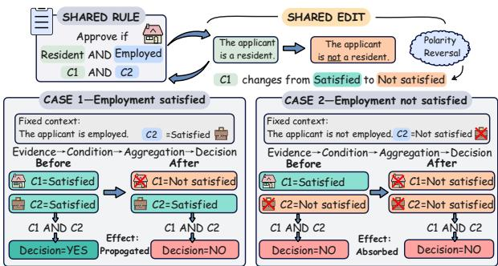
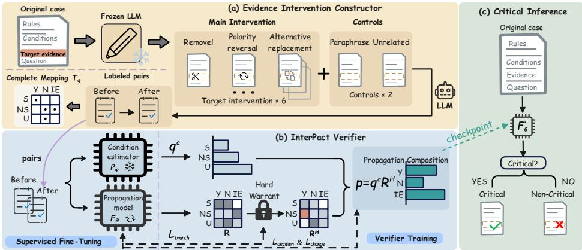
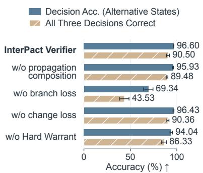
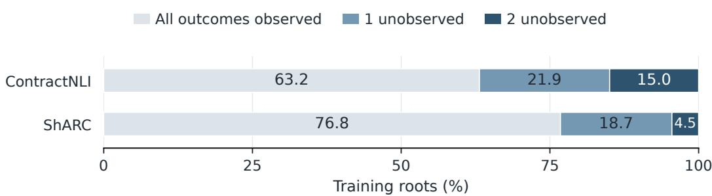
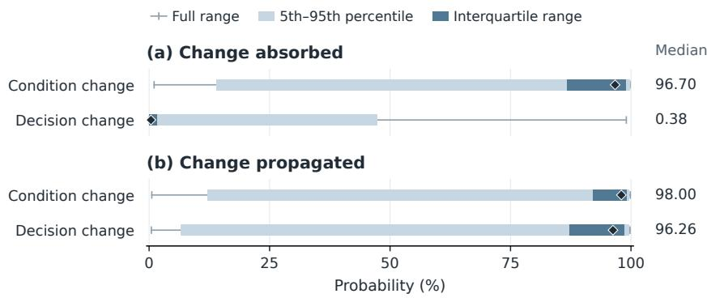
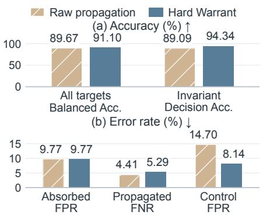
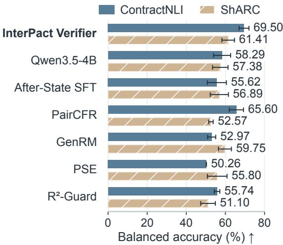

# IS THIS EVIDENCE DECISION-CRITICAL? LEARNING TO VERIFY RULE-GOVERNED DECISIONS

Haoyang Zhang1,†, Jianpeng Zhao1,†, Qi Hao1, Pengyang Wang1,\*

1State Key Laboratory of Internet of Things for Smart City and

Institute of Smart City Technologies, University of Macau, Macau SAR, China

## ABSTRACT

Rule-based reasoning, as in eligibility checks and contract reviews, requires language models to assess evidence against individual conditions and combine their judgments under explicit rules. Errors in evidence assessment can leave a decision unchanged, but misinterpreting or overlooking decision-critical evidence can reverse it. Identifying such evidence allows more capable models to focus on checking the corresponding condition judgments, supporting accurate and safe decisions. Recognizing the evidence’s criticality requires understanding how evidence affects a condition judgment and how that judgment affects the decision. To achieve the goal, we propose a INTERvention-based imPACT learning framework (INTERPACT), which enables counterfactual verification of evidence criticality in rule-governed decisions. Specifically, its evidence intervention constructor generates training pairs for a propagation verifier by editing case facts with a frozen language model while holding rules and non-target conditions fixed. Human-reviewed labels record the resulting condition and decision changes, while complete state-to-decision mappings supervise consequences beyond the observed edit. During training, the verifier weights learned conditional decision predictions by evidence-based condition probabilities through a fixed composition operation, propagating decision-change supervision into the base model. At inference, the trained base model directly judges criticality from the original case and target evidence, without human or stronger-model supervision. On single-case evidence criticality verification over adapted rule-governed decision cases, INTERPACT achieves 68.28% accuracy, outperforming all six baselines. These results support learned decision sensitivity as a basis for prioritizing evidence checks.

## 1 INTRODUCTION

Rule-based reasoning involves assessing whether evidence supports, contradicts, or leaves individual conditions unresolved and combining these judgments under explicit rules to reach a decision in tasks such as eligibility checks (Saeidi et al., 2018) and contract reviews (Koreeda & Manning, 2021). Errors in these judgments have different consequences: some leave the decision unchanged, whereas others can reverse it. Identifying decisioncritical evidence allows more capable models to concentrate their checks on the judgments that affect the outcome, helping improve decision reliability and safety.

Criticality depends on the surrounding evidence and rule context. Consider an application requiring both residency and em-

  
Figure 1: The same evidence change can have different decision consequences. A change in the target condition state changes the decision in one case but leaves it unchanged in the other because the remaining condition states differ.

ployment, as illustrated in Figure 1. A mistaken residency judgment can reverse approval when employment is satisfied, but leaves rejection unchanged when employment fails. Even a local omission may leave a condition unchanged if other evidence still supports it. A local evidence error therefore affects the outcome only when it changes a condition judgment that can change the decision. Recognizing critical evidence requires understanding both dependencies.

A model can predict a case’s decision correctly without recognizing which evidence changes could alter it. Final-decision labels leave this sensitivity unspecified; adding condition labels as parallel targets still does not require the decision to depend on those judgments (Koh et al., 2020). Learning criticality therefore calls for supervision of how evidence changes affect conditions and how those effects reach the decision. Controlled interventions make these effects observable. Holding rules and non-target conditions fixed, we compare the condition and decision before and after an evidence edit. The resulting contrasts provide a signal for learning decision sensitivity. This builds on counterfactual data augmentation (Kaushik et al., 2020; Qiu et al., 2024) and feedback (Hüyük et al., 2025), with supervision tracking both levels of consequence.

Our hypothesis is that learning these dependencies from interventions enables direct criticality judgments on original cases. We introduce INTERPACT, which trains a language model as a propagation verifier using supervision from an evidence intervention constructor. The constructor edits case facts with a frozen language model and records condition and decision changes; human review assesses annotation quality. Each edit yields one condition state. Complete state-to-decision mappings therefore supply consequences for the other candidate states, teaching how alternative judgments would affect the decision. During paired training, the verifier learns a decision distribution for each candidate condition state. A fixed composition weights these predictions by evidence-based condition probabilities from a frozen estimator, making decision-change supervision depend on the intermediate judgments. To test whether this learning supports direct verification, we query the trained language model alone with the original case and target evidence, asking whether any specified intervention could change the decision. This requires no edited cases or human or stronger-model supervision.

On this single-case task across structured adaptations of ContractNLI and ShARC (Koreeda & Manning, 2021; Saeidi et al., 2018), INTERPACT achieves 68.28% accuracy and outperforms all six baselines. Complementary paired ablations examine composition when predicting intervention outcomes. With condition estimates and supervision held fixed, composition improves decisionchange detection, supporting its role in connecting local judgments to their decision consequences.

Our contributions are threefold:

(1) We introduce INTERPACT, which turns the decision consequences of controlled evidence interventions into supervision for direct criticality judgments on original cases. The learned verifier supports prioritizing evidence checks in rule-based reasoning.

(2) We develop compositional training that links evidence assessment to rule-governed decisions, making decision-change supervision follow evidence–condition–decision dependencies.

(3) Our evaluation separates direct criticality verification from paired analyses of intervention consequences. Matched comparisons examine supervision and composition, showing that local judgment accuracy alone does not determine decision-change detection.

## 2 RELATED WORK

Evidence and Rule-based Reasoning. Studies of natural-language rule reasoning examine how conclusions follow from stated facts and rules (Clark et al., 2020; Tafjord et al., 2021), including rule application in practical settings (Zhou et al., 2025). Evidence-linked inference examines how text supports judgments (Koreeda & Manning, 2021). Conversational rule reasoning and conditional question answering examine how available evidence affects answers under rules (Saeidi et al., 2018; Sun et al., 2022). Together, these studies motivate our setting: assessing evidence against individual conditions and combining the resulting judgments under explicit rules. INTERPACT builds on this setting by using controlled evidence interventions to learn whether changing target evidence changes the target condition state and whether that state change alters the rule-required decision.

Counterfactual Reasoning and Verification. Belief-R evaluates conclusion revision after additional premises (Wilie et al., 2024), while DeltaLogic studies responses to minimal premise edits, including inertia and over-flips (Dhanda, 2026). Counterfactual feedback uses consistency across paired questions for fine-tuning (Hüyük et al., 2025), and PairCFR uses paired examples for contrastive learning (Qiu et al., 2024). Generative verification and weighted logical inference assess candidate decisions (Zhang et al., 2025; Kang & Li, 2025). To verify evidence criticality, the evidence intervention constructor in INTERPACT records the target condition state and rule-required decision before and after each intervention. It also computes the decision for every target condition state under the fixed rule context. These complete mappings supervise consequences beyond the observed edits and allow conditional predictions to be evaluated separately from final decisions.

Concept Bottlenecks and Intermediate Supervision. Concept bottleneck models distinguish prediction through intermediate concepts from auxiliary concept supervision (Koh et al., 2020; De Santis et al., 2026). Counterfactual extensions support concept interventions (Dominici et al., 2025). The INTERPACT Verifier learns context-dependent decision consequences from complete rule-derived mappings and composes them with local condition estimates. Hard Warrant constrains the known original condition-to-decision relation. Matched ablations hold condition predictions fixed to test composition beyond auxiliary supervision. Appendix G extends these comparisons.

## 3 PRELIMINARIES

Rule-based reasoning determines a decision for a case under a governing rule. The rule specifies conditions, each of which is assessed using the available evidence. An aggregation function then combines the condition states to answer the decision query. We represent the case as an instance

$$
x = ( r , Q , C , E , A ) ,\tag{1}
$$

where $r$ is the governing rule, $Q$ is the decision query, $C = \{ c _ { 1 } , \ldots , c _ { n } \}$ is the set of conditions, and $E$ is the available evidence. The function $A$ explicitly represents the aggregation logic of r as a mapping from condition states to a final decision. For each condition $\tilde { c _ { i } } , \bar { E _ { i } } \subseteq E$ denotes the set of evidence units associated with that condition. If $E _ { i }$ contains $m _ { i }$ evidence units, then $E _ { i } = \{ e _ { i 1 } , . . . , e _ { i m _ { i } } \}$ , where $e _ { i j }$ denotes an evidence unit associated with $c _ { i }$

Given an instance $x ,$ each condition $c _ { i }$ has a state $c _ { i } ( x )$ in the three-way state space ${ \boldsymbol { s } } \ =$ {SATISFIED, NOT SATISFIED, UNKNOWN}. SATISFIED means that the evidence supports condition $c _ { i } .$ NOT SATISFIED means that the evidence supports the negation of $c _ { i }$ . UNKNOWN means that the evidence is insufficient to determine whether $c _ { i }$ holds. The condition-state vector is

$$
C ( x ) = { \big ( } c _ { 1 } ( x ) , \dots , c _ { n } ( x ) { \big ) } .\tag{2}
$$

The aggregation function maps this vector to the decision required by r:

$$
D ( x ) = A { \bigl ( } C ( x ) { \bigr ) } ,\tag{3}
$$

where $D ( x ) \in \mathcal { D } = \{ \Upsilon \mathrm { { E S } }$ , NO, INSUFFICIENT EVIDENCE}. YES and NO denote positive and negative answers to $Q$ under r. INSUFFICIENT EVIDENCE means that the available evidence does not determine an answer.

## 4 INTERPACT

Overview. To identify decision-critical evidence from a single structured case, INTERPACT learns from controlled evidence interventions. The framework has two components. (1) The Evidence Intervention Constructor applies allowed interventions to a target evidence unit. During each intervention, the constructor keeps the governing rule and other evidence fixed. If an allowed intervention can change the decision, the target evidence unit is decision-critical. The constructor produces labeled intervention pairs and complete condition-to-decision mappings. However, a change in the target condition state does not always change the decision. (2) The INTERPACT Verifier therefore estimates the target condition state and predicts the decision for each possible state. The intervention pairs and mappings supervise verifier training. At inference, the trained language model judges whether the target evidence is decision-critical in the original case.

  
Figure 2: Overview of INTERPACT. (a) The Evidence Intervention Constructor produces labeled intervention pairs and complete condition-to-decision mappings. (b) The INTERPACT Verifier learns from these outputs through propagation composition and Hard Warrant. (c) The trained language model directly judges evidence criticality from the original case and target evidence unit.

## 4.1 EVIDENCE INTERVENTION CONSTRUCTOR

The constructor takes an original case $x _ { g }$ and a target evidence unit $e _ { g } \in E _ { t }$ associated with target condition $c _ { t }$ as input. The case, target evidence unit, and target condition together define a root $g .$ . The constructor uses the annotated condition states $C ( x _ { g } )$ and decision $D ( x _ { g } )$ during offline construction. For each root, the constructor generates controlled evidence interventions, determines the resulting target condition states and decisions, and computes a complete condition-to-decision mapping.

## 4.1.1 CONTROLLED EVIDENCE INTERVENTIONS

To examine how changes to a target evidence unit affect the target condition state and final decision, the constructor uses six target operations: removal, polarity reversal, alternative replacement, irrelevant replacement, weakening, and strengthening. While these operations test possible condition and decision changes, paraphrase and distractor insertion serve as invariance controls. For removal, the constructor deletes the target evidence unit directly. For the other operations, it prompts a frozen GPT-5.4 model to rewrite the target unit or insert a distractor as required by the operation. The constructor requires every intervention to preserve the governing rule, decision query, condition descriptions, aggregation function, and existing non-target evidence. If it can’t produce a suitable intervention, the constructor abstains. Appendix B.3 defines the operations and reports construction checks and retained pair counts.

## 4.1.2 INTERVENTION OUTCOME DETERMINATION AND RECORDS

The constructor excludes interventions that fail to follow the specified operation or change non-target condition states. Because other evidence may preserve the target condition state, it uses model assistance to judge the state of $c _ { t }$ from the full evidence after each accepted intervention. The model does not see the expected label or operation name. The constructor forms the condition-state vector after the intervention by replacing only the target entry of $C ( x _ { g } )$ with the judged state. It then uses A to compute the decision from the condition states, avoiding a separate model prediction that could conflict with the rule.

For accepted intervention $i , t _ { i }$ indexes the target condition and $j _ { i }$ indexes the target evidence unit $e _ { t _ { i } j _ { i } }$ within that condition. The constructor records $z _ { i } = ( x _ { i } ^ { \mathrm { b } } , x _ { i } ^ { \mathrm { a } } , t _ { i } , j _ { i } )$ , where $x _ { i } ^ { \mathrm { b } }$ and $\boldsymbol { x } _ { i } ^ { \mathrm { a } }$ are the cases before and after the intervention. It also records the target condition state and decision before and after the intervention, and whether the decision changes. An operation may yield no accepted intervention for a given original case and target evidence unit. Sampling across many original cases and target evidence units still provides varied condition and decision labels for training the INTERPACT Verifier.

## 4.1.3 COMPLETE CONDITION-TO-DECISION MAPPINGS

For each accepted intervention, the constructor judges one target condition state. To obtain decisions for all three states, the constructor computes

$$
T _ { g } ( c ) = A _ { g } ( C ( x _ { g } ) _ { t  c } ) , \qquad c \in \mathcal { S } .\tag{4}
$$

Here $A _ { g }$ is the aggregation function of the original case $x _ { g }$ . The condition-state vector $C ( x _ { g } ) _ { t  c }$ sets the state of target condition $c _ { t }$ to c and keeps all other states from $C ( x _ { g } )$ . This calculation does not edit the evidence.

For pair i, $g ( i )$ identifies the original case and target evidence unit. Thus $x _ { i } ^ { \mathrm { b } } = x _ { g ( i ) }$ , and pairs with the same $g ( i )$ share $T _ { g ( i ) }$ . The mapping serves as a training target and evaluation reference for conditional decision predictions, including states absent from sampled interventions. The verifier does not receive $T _ { g }$ as input. Appendix B.2 reports how the complete mappings extend supervision beyond the sampled interventions.

## 4.2 INTERPACT VERIFIER

A target condition change need not change the decision, because its effect depends on the rule and other conditions. The INTERPACT Verifier therefore separates condition estimation from conditional decision prediction. Figure 2(b) shows the verifier’s computation during paired training.

For pair $z _ { i } ,$ , write $t = t _ { i }$ for the target condition index. Let $c _ { i } ^ { \mathrm { b } } = c _ { t } ( x _ { i } ^ { \mathrm { b } } )$ and $d _ { i } ^ { \mathrm { b } } = D ( x _ { i } ^ { \mathrm { b } } )$ ) denote the target state and decision before the intervention. These annotations are supplied during paired training and paired evaluation. They are excluded from direct criticality inference, described in Section 4.2.4.

## 4.2.1 CONDITION ESTIMATION AND CONDITIONAL DECISION PREDICTION

Using the case after the intervention, a condition estimator $P _ { \phi }$ assigns a probability to each state of the target condition: $q _ { i } ^ { \mathrm { a } } [ c ] = P _ { \phi } ( c \mid x _ { i } ^ { \mathrm { a } } , c _ { t } )$ , for $c \in S$ . The row vector $q _ { i } ^ { \mathrm { a } }$ follows the state order in Section 3 and sums to one. It retains uncertainty about the target condition.

The aggregation function is known, but the non-target condition states are not given to the verifier. For each possible target condition state c, a language model $F _ { \theta }$ uses the pair record $z _ { i }$ and c to predict a decision distribution. The governing rule and non-target evidence remain fixed across these predictions. The model produces logits $Z _ { i } ~ \in ~ \mathbb { R } ^ { 3 \times 3 }$ and normalizes each row to obtain $R _ { i } = \operatorname { \bar { s o f t m a x } } _ { \operatorname { r o w } } ( Z _ { i } )$ . Rows index target states in $s$ and columns index decisions in $\mathcal { D }$ . The entry $R _ { i } [ c , d ]$ gives the predicted probability of decision d for target condition state c.

## 4.2.2 PROPAGATION COMPOSITION WITH HARD WARRANT

Under the fixed governing rule and non-target evidence, the original target state $c _ { i } ^ { \mathrm { b } }$ must yield the original decision $d _ { i } ^ { \mathrm { b } }$ . The model may otherwise predict a different decision for this known state. Hard Warrant fixes row $R _ { i } [ c _ { i } ^ { \mathrm { b } } , : ] \mathrm { t o } { \bf e } _ { d _ { i } ^ { \mathrm { b } } }$ , the one-hot decision vector for $d _ { i } ^ { \mathrm { b } }$ :

$$
R _ { i } ^ { H } [ c , : ] = \left\{ \begin{array} { l l } { \mathbf { e } _ { d _ { i } ^ { \mathrm { b } } } , } & { c = c _ { i } ^ { \mathrm { b } } , } \\ { R _ { i } [ c , : ] , } & { c \neq c _ { i } ^ { \mathrm { b } } . } \end{array} \right.\tag{5}
$$

This constraint uses only the annotated target state and decision before the intervention. It does not require the complete mapping $T _ { g ( i ) }$

Propagation composition weights the three rows of $R _ { i } ^ { H }$ by $q _ { i } ^ { \mathrm { a } }$ to obtain the decision distribution $p _ { i }$ after the intervention:

$$
p _ { i } [ d ] = \sum _ { c \in \cal S } q _ { i } ^ { \mathrm { a } } [ c ] R _ { i } ^ { H } [ c , d ] , \qquad p _ { i } = q _ { i } ^ { \mathrm { a } } R _ { i } ^ { H } .\tag{6}
$$

For pair i, the predicted probability of a decision change is

$$
s _ { i } = 1 - p _ { i } [ d _ { i } ^ { \mathrm { b } } ] .\tag{7}
$$

Under Hard Warrant, the row for $c _ { i } ^ { \mathrm { b } }$ cannot contribute to a decision change. A change in the target condition may still leave the decision unchanged, so $s _ { i }$ can remain low. Hard Warrant preserves the known relation but cannot correct errors in condition estimation or decision predictions for other target states. Appendix A derives these limits.

## 4.2.3 TRAINING OBJECTIVE

To learn target condition states and how they affect decisions, training proceeds in two stages. Supervised fine-tuning first trains a model to predict the target condition state and decision from a case after an intervention. The resulting parameters initialize the condition estimator $P _ { \phi }$ and language model $F _ { \theta }$ . The second stage updates θ while keeping ϕ fixed.

Let $c _ { i } ^ { \mathrm { a } } = c _ { t } ( x _ { i } ^ { \mathrm { a } } )$ and $d _ { i } ^ { \mathrm { a } } = D ( x _ { i } ^ { \mathrm { a } } )$ ) denote the target state and decision after the intervention. Because accepted interventions leave non-target condition states unchanged, $d _ { i } ^ { \mathrm { b } } ~ = ~ T _ { g ( i ) } ( c _ { i } ^ { \mathrm { b } } )$ and $d _ { i } ^ { \mathrm { a } } \ =$ $T _ { g ( i ) } ( c _ { i } ^ { \mathrm { a } } )$ . The decision-change label for pair i is $y _ { i } = \mathbf { 1 } [ d _ { i } ^ { \mathrm { a } } \neq d _ { i } ^ { \mathrm { b } } ]$ . Branch cross-entropy $\mathcal { L } _ { \mathrm { b r a n c h } }$ supervises every row of $R _ { i }$ before Hard Warrant with the decision $T _ { g ( i ) } ( c )$ . Decision cross-entropy $\mathcal { L } _ { \mathrm { d e c i s i o n } }$ supervises $p _ { i }$ with $d _ { i } ^ { \mathrm { a } }$ , while binary cross-entropy $\mathcal { L } _ { \mathrm { c h a n g e } }$ supervises $s _ { i }$ with $y _ { i }$ . Both use outputs computed after Hard Warrant. The training objective is

$$
\mathcal { L } _ { \mathrm { t r a i n } } = \mathcal { L } _ { \mathrm { d e c i s i o n } } + \lambda _ { \mathrm { b r a n c h } } \mathcal { L } _ { \mathrm { b r a n c h } } + \lambda _ { \mathrm { c h a n g e } } \mathcal { L } _ { \mathrm { c h a n g e } } .\tag{8}
$$

The coefficients $\lambda _ { \mathrm { b r a n c h } }$ and $\lambda _ { \mathrm { c h a n g e } }$ weight the branch and change losses. Propagation composition and Hard Warrant have no trainable parameters. The branch loss updates $F _ { \theta }$ directly, while gradients from the decision and change losses pass through these fixed computations to update $F _ { \theta }$ . Appendix D.1 gives the loss definitions, coefficient values, and paired prediction procedure. Algorithm 1 describes training.

## 4.2.4 DIRECT EVIDENCE CRITICALITY INFERENCE

The paired predictions above concern supplied intervention pairs. Direct evidence criticality inference asks whether an allowed change to the target evidence unit could alter the decision for the original case. For root $^ { g , }$ let ${ \mathcal { O } } _ { g }$ contain the valid interventions to $e _ { g }$ that follow the six target operations in Section 4.1. Each intervention keeps the governing rule, decision query, condition descriptions, aggregation function, and non-target evidence fixed. It also leaves non-target condition states unchanged. Allowed interventions are specified independently of their outcomes. For each $o \in \mathcal { O } _ { g }$ let $x _ { g , o } ^ { \mathrm { a } }$ denote the case after the intervention. The reference decisions before and after the intervention are $d _ { g } ^ { \mathrm { b } } = D ( x _ { g } )$ and $d _ { g , o } ^ { \mathrm { a } } = D ( x _ { g , o } ^ { \mathrm { a } } )$ . The reference label is

$$
y _ { g } = \mathbf { 1 } \left[ \exists o \in { \mathcal { O } } _ { g } : d _ { g , o } ^ { \mathrm { a } } \neq d _ { g } ^ { \mathrm { b } } \right] .\tag{9}
$$

For evaluation, a decision-changing accepted intervention establishes a positive label. Without an observed decision change, a negative label requires either a complete mapping that rules out a change or review of the rule and case evidence. Missing interventions alone do not establish a negative label. These negative labels do not require an exhaustive search of $\mathcal { O } _ { g }$ . The reference labels $y _ { g }$ evaluate direct inference, while the pair labels $y _ { i }$ supervise training.

Let $\theta ^ { * }$ denote the checkpoint selected from the second stage on development pairs (Appendix D.2). At inference, a natural-language prompt gives $F _ { \theta } { \mathrm { : } }$ ∗ the original case $x _ { g }$ and target evidence unit $e _ { g }$ It asks whether changing $e _ { g }$ could change the decision under the governing rule. The answers Yes and No concern evidence criticality, not the case decision $D ( x _ { g } )$ . They give $\hat { y } _ { g } = 1$ and $\hat { y } _ { g } = 0$ respectively. Other responses are recorded as invalid outputs. The prompt contains no condition-state labels, decision labels, edited case, or reference mapping. Direct inference runs only $F _ { \theta ^ { * } }$ and requires no intervention construction or human review. Evaluation compares $\hat { y } _ { g }$ with $y _ { g } .$ . The score $s _ { i }$ applies only to paired prediction.

## 5 EXPERIMENTS

This section examines four questions: direct criticality judgments from a single case, the training components that improve these judgments, decision prediction for each target condition state, and decision-change prediction for intervention pairs.

## 5.1 EXPERIMENTAL SETUP

Data and Reference Labels. We use 6,913 accepted intervention pairs from structured adaptations of ContractNLI and ShARC (Koreeda & Manning, 2021; Saeidi et al., 2018). The cases use threevalued conjunction or disjunction, and related documents, rule families, and near-duplicates remain in the same split. Direct evaluation covers 207 test roots: 85 critical and 122 non-critical. The criticality labels concern the six target operations in Section 4.1. An accepted intervention that changes the decision establishes a positive label. A negative label is assigned when the complete mapping gives the original decision for every target state, or when reviewers judge from the rule and case evidence that no allowed edit changes the decision. Missing interventions alone do not justify a negative label. Appendix B.3 details construction, operation counts, and data splits; Appendix B.4 explains the reference-label review.

Baselines and Evaluation. The baselines include Qwen3.5-4B without task-specific training, After-State SFT, and Predicted State Execution (PSE). We also adapt PairCFR (Qiu et al., 2024), GenRM (Zhang et al., 2025), and $\mathbb { R } ^ { 2 } .$ -Guard (Kang & Li, 2025) as reasoning baselines. All trainable models use Qwen3.5-4B with LoRA (Hu et al., 2022). For direct evaluation, every model receives the same prompt containing the original case with its target evidence unit identified. PSE and $\mathbb { R } ^ { 2 } .$ -Guard use only their trained language models; paired diagnostics use their complete systems. Trainable checkpoints are selected on paired development data without training on root criticality labels. We report Accuracy, Balanced Accuracy (BA), and Macro-F1 over test roots, counting invalid answers as errors. Unless stated otherwise, results are mean ± sample standard deviation over three runs. Appendix C describes the baseline adaptations, and Appendix D gives training and reporting details.

## 5.2 RQ1: CAN THE MODEL IDENTIFY CRITICAL EVIDENCE FROM A SINGLE CASE?

This section evaluates direct criticality judgments from the original case with the target evidence unit identified. At inference, the models receive no edited case or reference labels. Compared with the strongest baseline for each metric, INTERPACT improves mean accuracy by 4.51 percentage points (pp) over GenRM and balanced accuracy by 5.76 pp over PairCFR (Table 1). These gains show that the trained language model improves direct criticality judgments from a single case, the inference setting targeted by the framework.

Table 1: Direct criticality on 207 roots (%). Bold/Underline: best/second-best classification scores.
<table><tr><td rowspan="2">Method</td><td colspan="3">Criticality Judgment ↑</td><td rowspan="2">Invalid rate ↓</td></tr><tr><td>Acc.</td><td>BA</td><td>Macro-F1</td></tr><tr><td>LLM-based baselines</td><td></td><td></td><td></td><td></td></tr><tr><td>Qwen3.5-4B</td><td> $6 0 . 0 7 \pm 1 . 5 5$ </td><td> $5 8 . 6 9 \pm 2 . 1 5$ </td><td> $5 8 . 6 4 \pm 2 . 0 8$ </td><td>0.00</td></tr><tr><td>After-State SFT</td><td> $6 2 . 6 4 \pm 2 . 2 3$ </td><td> $5 7 . 1 3 \pm 3 . 7 0$ </td><td> $5 4 . 4 0 \pm 6 . 4 6$ </td><td>0.00</td></tr><tr><td>Predicted State Execution</td><td> $5 1 . 0 5 \pm 1 . 9 5$ </td><td> $5 1 . 6 3 \pm 1 . 7 6$ </td><td> $5 1 . 3 0 \pm 2 . 2 6$ </td><td> $1 . 6 1 \pm 1 . 3 9$ </td></tr><tr><td>Adapted reasoning baselines</td><td></td><td></td><td></td><td></td></tr><tr><td>PairCFR</td><td> $5 9 . 7 4 \pm 2 . 2 8$ </td><td> $6 0 . 8 5 \pm 1 . 5 8$ </td><td> $5 9 . 6 0 \pm 2 . 0 8$ </td><td>0.00</td></tr><tr><td>GenRM</td><td> $\underline { { 6 3 . 7 7 } } \pm 0 . 8 4$ </td><td> $5 7 . 1 9 \pm 0 . 9 2$ </td><td> $5 3 . 4 8 \pm 1 . 2 3$ </td><td>0.00</td></tr><tr><td> $\mathrm { \mathbf { R } } ^ { 2 } .$  -Guard</td><td> $5 2 . 9 8 \pm 1 . 1 2$ </td><td> $5 3 . 3 3 \pm 0 . 6 4$ </td><td> $5 2 . 9 5 \pm 1 . 1 7$ </td><td> $0 . 9 7 \pm 0 . 8 4$ </td></tr><tr><td>INTERPACT</td><td> ${ \bf 6 8 . 2 8 \pm 2 . 0 1 }$ </td><td> ${ \bf 6 6 . 6 1 \pm 1 . 9 6 }$ </td><td> ${ \bf 6 6 . 7 8 \pm 2 . 0 1 }$ </td><td>0.00</td></tr></table>

After-State SFT improves mean accuracy over Qwen3.5-4B by 2.57 pp but reduces balanced accuracy by 1.56 pp (Table 1). Higher accuracy alone therefore does not ensure more balanced criticality judgments. Across sources, INTERPACT improves mean balanced accuracy by 3.90 pp over PairCFR on ContractNLI and by 1.66 pp over GenRM on ShARC (Figure 7 and Table 10 in Appendix F.1). Both sources show a mean gain, but the gains differ in size and the results vary across runs. Since direct inference uses only the trained language model, we examine which training components contribute to these gains.

## 5.3 RQ2: WHICH TRAINING COMPONENTS IMPROVE DIRECT CRITICALITY JUDGMENTS?

We compare INTERPACT with four matched ablations (Appendix E). All variants answer from a single case. Propagation composition and Hard Warrant are used in paired training and checkpoint selection, but not at direct inference. INTERPACT has higher mean balanced accuracy and Macro-F1 than every ablation (Table 2). In the composition ablation, branch loss still supervises the conditional decision predictions, but these predictions do not determine the decision. Removing propagation composition lowers balanced accuracy by 9.76 pp, supporting its contribution beyond branch supervision.

Table 2: Training ablations on direct criticality (%). Bold marks the best mean.
<table><tr><td>Method</td><td> $\operatorname { A c c . \uparrow }$ </td><td>BA↑</td><td>Macro-F1 ↑</td></tr><tr><td>w/o propagation composition</td><td> $6 2 . 3 2 \pm 0 . 8 4$ </td><td> $5 6 . 8 5 \pm 1 . 0 7$ </td><td> $5 4 . 8 0 \pm 1 . 5 2 $ </td></tr><tr><td>w/o branch loss</td><td> $6 3 . 7 7 \pm 0 . 4 8$ </td><td> $6 0 . 4 6 \pm 0 . 6 0$ </td><td> $6 0 . 3 6 \pm 0 . 6 6$ </td></tr><tr><td>w/o Hard Warrant</td><td> $5 8 . 7 8 \pm 0 . 7 4$ </td><td> $5 1 . 6 5 \pm 0 . 7 1$ </td><td> $4 5 . 6 6 \pm 0 . 9 3$ </td></tr><tr><td>w/o change loss</td><td> $5 8 . 9 4 \pm 0 . 4 9$ </td><td> $5 4 . 1 6 \pm 0 . 7 2$ </td><td> $5 2 . 6 5 \pm 1 . 1 1$ </td></tr><tr><td>INTERPACT</td><td> ${ \bf 6 8 . 2 8 \pm 2 . 0 1 }$ </td><td> ${ \bf 6 6 . 6 1 \pm 1 . 9 6 }$ </td><td> ${ \bf 6 6 . 7 8 \pm 2 . 0 1 }$ </td></tr></table>

Removing branch loss lowers balanced accuracy by 6.15 pp, indicating that complete condition-todecision mappings provide useful supervision. Removing Hard Warrant or change loss lowers it by 14.96 and 12.45 pp, respectively. These decreases support preserving the known relation between the original target state and decision and explicitly supervising decision changes in paired training. The effect of branch loss differs by source: removing it raises balanced accuracy by 1.00 pp on ContractNLI but lowers it by 13.62 pp on ShARC (Table 10). Branch loss appears useful on ShARC.

## 5.4 RQ3: CAN THE VERIFIER PREDICT THE DECISION FOR EACH TARGET CONDITION STATE?

On 978 target pairs, we evaluate conditional decision predictions to test supervision from complete condition-to-decision mappings. The INTERPACT Verifier receives both evidence versions and the target condition state and decision before the intervention, but no after-intervention labels or reference mapping. We compare each decision predicted by $R _ { i }$ with the corresponding decision in $T _ { g ( i ) }$ before applying Hard Warrant. Decision Acc. (Alternative States) covers the two states other than the original target state, while All Three Decisions Correct requires correct predictions for all three states (Appendix D.3).

  
Figure 3: Conditional decision accuracy before Hard Warrant. Scores are averaged within roots and then equally across roots.

Compared with the variant without branch loss, the INTERPACT Verifier gains 27.26 pp in alternative-state decision accuracy and 46.97 pp in All Three Decisions Correct (Figure 3). Both measures evaluate $R _ { i }$ before

Hard Warrant, supporting the role of complete mapping supervision. Removing propagation composition lowers All Three Decisions Correct by 1.02 pp but lowers direct balanced accuracy by 9.76 pp (Figure 3; Table 2). Thus, accurate conditional decision predictions alone do not explain the gain in direct judgments. Using them in the paired decision computation also matters.

## 5.5 RQ4: CAN THE PAIRED VERIFIER CORRECTLY PREDICT DECISION CHANGES?

On the same 978 target pairs, we evaluate the paired verifier’s decision after an intervention and its decision-change prediction. Decision Change Balanced Acc. measures change detection; decision and condition accuracy assess the labels after the intervention where available. Each model’s decisionchange threshold is selected on development pairs and fixed for testing (Appendix D.2). Relative to GenRM, the strongest baseline on both decision measures, the INTERPACT Verifier improves decision-change balanced accuracy by 3.18 pp and decision accuracy by 2.96 pp (Table 3). The paired verifier thus improves change detection and decision accuracy.

Targets are invariant when the condition state stays fixed, absorbed when it changes without changing the decision, and propagated when both the condition state and decision change. The matched ablations share condition estimates within each run, allowing the comparison to focus on decision prediction. Relative to the variant without propagation composition, the full verifier improves decision-change balanced accuracy by 2.31 pp and decision accuracy on propagated targets by 5.28 pp (Table 4). Composition therefore helps when a condition change must alter the decision. Compared

Table 3: Paired predictions on 978 target interventions (%). Bold/Underline: best/second-best means; N/A: unavailable output.
<table><tr><td rowspan="2">Method</td><td>Decision Change ↑</td><td colspan="2">Decision ↑</td><td colspan="2">Condition ↑</td></tr><tr><td>Balanced Acc.</td><td>Acc.</td><td>Macro-F1</td><td>Acc.</td><td>Macro-F1</td></tr><tr><td colspan="6">LLM-based baselines</td></tr><tr><td>Prompted Qwen3.5-4B</td><td> $8 2 . 5 9 \pm 1 . 1 2$ </td><td> $7 3 . 3 1 \pm 0 . 3 7$ </td><td> $7 2 . 0 0 \pm 0 . 4 1$ </td><td> $6 4 . 3 1 \pm 0 . 6 4$ </td><td> $6 4 . 7 2 \pm 0 . 6 4$ </td></tr><tr><td>After-State SFT</td><td> $8 7 . 2 2 \pm 0 . 5 1 $ </td><td> $8 6 . 9 5 \pm 0 . 3 3$ </td><td> $8 5 . 9 6 \pm 0 . 2 8$ </td><td> $8 3 . 2 7 \pm 0 . 3 3$ </td><td> $8 3 . 2 4 \pm 0 . 3 8$ </td></tr><tr><td>Predicted State Execution</td><td> $8 6 . 2 2 \pm 1 . 2 3$ </td><td> $8 5 . 5 5 \pm 1 . 2 5$ </td><td> $8 4 . 2 8 \pm 1 . 3 9$ </td><td> $8 3 . 4 7 \pm 0 . 7 9$ </td><td> $8 3 . 4 3 \pm 0 . 7 0$ </td></tr><tr><td colspan="6">Adapted reasoning baselines</td></tr><tr><td>PairCFR</td><td> $8 3 . 7 5 \pm 0 . 6 2$ </td><td> $8 2 . 1 1 \pm 0 . 4 7$ </td><td> $8 1 . 4 3 \pm 0 . 4 1$ </td><td>N/A</td><td>N/A</td></tr><tr><td>GenRM</td><td> $\underline { { 8 7 . 6 5 } } \pm 0 . 9 3 $ </td><td> $8 8 . 4 5 \pm 0 . 7 2 $ </td><td> $8 7 . 5 3 \pm 0 . 9 0 $ </td><td>N/A</td><td>N/A</td></tr><tr><td> $\mathrm { R } ^ { 2 } { \ - } \mathrm { \ - G u a r d }$ </td><td> $8 7 . 2 5 \pm 1 . 0 6$ </td><td> $8 7 . 5 6 \pm 0 . 7 7$ </td><td> $8 6 . 5 5 \pm 0 . 8 5$ </td><td> $\underline { { 8 4 . 0 5 } } \pm 2 . 2 4 $ </td><td> $\underline { { 8 3 . 9 4 } } \pm 2 . 3 4$ </td></tr><tr><td>INTERPACT</td><td> ${ \bf 9 0 . 8 3 \pm 0 . 7 3 }$ </td><td> ${ \bf 9 1 . 4 1 \pm 0 . 6 7 }$ </td><td> ${ \bf 9 0 . 5 8 \pm 0 . 7 1 }$ </td><td> $\mathbf { 8 4 . 3 9 \pm 0 . 2 6 }$ </td><td> ${ \pm } 0 4 . 3 9 \pm 0 . 3 2$ </td></tr></table>

with the variant without Hard Warrant, the full verifier gains 4.17 pp in decision accuracy on absorbed targets and 4.16 pp overall, but loses 0.74 pp on propagated targets (Table 4). Hard Warrant appears to preserve unchanged decisions but may make required changes harder to predict; Appendix E.3 examines this at a fixed checkpoint.

Table 4: Matched ablations on 978 target pairs (%). Variants share condition estimates. The first three metrics use all pairs; the last two report accuracy on absorbed and propagated pairs, respectively.
<table><tr><td rowspan="2">Method</td><td>Decision Change ↑</td><td colspan="4">Decision ↑</td></tr><tr><td>Balanced Acc.</td><td>Acc.</td><td></td><td></td><td>Macro-F1 Absorbed Acc. Propagated Acc.</td></tr><tr><td>w/o propagation composition</td><td> $8 8 . 5 2 \pm 1 . 2 2 $ </td><td> $9 0 . 2 5 \pm 0 . 2 6$ </td><td> $8 9 . 4 7 \pm 0 . 1 6$ </td><td> $9 2 . 3 2 \pm 1 . 5 8$ </td><td> $7 6 . 5 1 \pm 3 . 5 3$ </td></tr><tr><td>w/o branch loss</td><td> $\underline { { 8 9 . 1 9 } } \pm 1 . 1 9$ </td><td> $9 0 . 6 3 \pm 0 . 8 2$ </td><td> $8 9 . 7 5 \pm 0 . 7 1$ </td><td> $9 1 . 2 8 \pm 1 . 1 3$ </td><td> $7 9 . 3 0 \pm 2 . 0 2$ </td></tr><tr><td>w/o change loss</td><td> $8 8 . 8 8 \pm 0 . 6 3$ </td><td> $9 0 . 8 3 \pm 0 . 8 7$ </td><td> $\underline { { 8 9 . 9 9 } } \pm 0 . 8 0$ </td><td> $9 1 . 5 4 \pm 2 . 0 0$ </td><td> $8 0 . 7 6 \pm 1 . 8 3$ </td></tr><tr><td>w/o Hard Warrant</td><td> $8 7 . 7 0 \pm 0 . 9 4$ </td><td> $8 7 . 2 5 \pm 0 . 7 7$ </td><td> $8 6 . 3 2 \pm 0 . 8 3$ </td><td> $8 9 . 3 2 \pm 2 . 7 7$ </td><td> $\mathbf { 8 } 2 . 5 3 \pm 0 . 2 5$ </td></tr><tr><td>INTERPACT</td><td> ${ \bf 9 0 . 8 3 \pm 0 . 7 3 }$ </td><td> ${ \bf 9 1 . 4 1 \pm 0 . 6 7 }$ </td><td> ${ \bf 9 0 . 5 8 \pm 0 . 7 1 }$ </td><td> ${ \pm } \mathbf { 3 . 4 9 \pm } \mathbf { 1 . 3 7 }$ </td><td> $\underline { { 8 1 . 7 9 } } \pm 2 . 2 6$ </td></tr></table>

Relative to GenRM, decision accuracy improves by 5.60 pp on ContractNLI but only 0.14 pp on ShARC, where GenRM has 0.10 pp higher decision-change balanced accuracy (Table 12 in Appendix F.3). On 381 paraphrase and distractor insertion controls, the verifier incorrectly predicts decision changes 6.30 pp more often than GenRM (Table 12). These results support better decision change predictions on target interventions, while false changes on controls remain a limitation.

## 6 CONCLUSION

Identifying decision-critical evidence in rule-based reasoning requires tracing how evidence affects condition states and how these states affect decisions. Final decision labels alone do not reveal these dependencies. The Evidence Intervention Constructor produces 6,913 accepted pairs and complete condition-to-decision mappings for training. During paired training, the INTERPACT Verifier learns from this supervision through propagation composition and Hard Warrant. At inference, the trained model judges criticality from the original case and target evidence, achieving 68.28% accuracy, 4.51 percentage points above GenRM. These results support intervention-derived process supervision for direct criticality judgments.

## 7 LIMITATIONS AND FUTURE WORK

Our experiments study evidence criticality in a controlled setting with textual evidence and threevalued conjunction or disjunction. Offline construction uses annotated condition states and decisions for original cases. Future work will explore other aggregation rules and interventions involving multiple evidence units, reduce annotation requirements for construction, and examine how direct criticality judgments support evidence review.

## AI USE STATEMENT

We used generative AI tools to assist data construction and annotation, language editing, and layout preparation. The authors take responsibility for the final content of this work, including all text, claims, and artifacts produced with AI assistance.

## REFERENCES

Peter Clark, Oyvind Tafjord, and Kyle Richardson. Transformers as soft reasoners over language. In Proceedings ofthe Twenty-Ninth International Joint Conference on Artificial Intelligence, IJCAI-20, pp. 3882–3890. International Joint Conferences on Artificial Intelligence Organization, 2020. doi: 10.24963/ijcai.2020/537. URL https://www.ijcai.org/proceedings/2020/537.

Benjamin Cohen-Wang, Harshay Shah, Kristian Georgiev, and Aleksander Madry. ContextCite: Attributing model generation to context. In Advances in Neural Information Processing Systems, volume 37, 2024. URL https://proceedings.neurips.cc/paper\_files/paper /2024/file/adbea136219b64db96a9941e4249a857-Paper-Conference.pdf.

Antonio De Santis, Schrasing Tong, Marco Brambilla, and Lalana Kagal. Learning concept bottleneck models from mechanistic explanations. In The Fourteenth International Conference on Learning Representations, 2026. URL https://openreview.net/forum?id=gdEWoxhb70.

Amit Dhanda. DeltaLogic: Minimal premise edits reveal belief-revision failures in logical reasoning models. arXiv preprint arXiv:2604.02733, 2026. URL https://arxiv.org/abs/2604.0 2733.

Gabriele Dominici, Pietro Barbiero, Francesco Giannini, Martin Gjoreski, Giuseppe Marra, and Marc Langheinrich. Counterfactual concept bottleneck models. In The Thirteenth International Conference on Learning Representations, 2025. URL https://proceedings.iclr.cc/ paper\_files/paper/2025/hash/0ff54b4ec4f70b3ae12c8621ca8a49f4-Abs tract-Conference.html.

Edward J. Hu, Yelong Shen, Phillip Wallis, Zeyuan Allen-Zhu, Yuanzhi Li, Shean Wang, Lu Wang, and Weizhu Chen. LoRA: Low-rank adaptation of large language models. In The Tenth International Conference on Learning Representations, 2022. URL https://openreview.net/f orum?id=nZeVKeeFYf9.

Alihan Hüyük, Xinnuo Xu, Jacqueline Maasch, Aditya V. Nori, and Javier González. Reasoning elicitation in language models via counterfactual feedback. In The Thirteenth International Conference on Learning Representations, 2025. URL https://proceedings.iclr.cc/ paper\_files/paper/2025/file/bf145010b30dc5f14fa87dc152074e4d-Pap er-Conference.pdf.

Mintong Kang and Bo Li. R2-Guard: Robust reasoning enabled LLM guardrail via knowledgeenhanced logical reasoning. In The Thirteenth International Conference on Learning Representations, 2025. URL https://proceedings.iclr.cc/paper\_files/paper/2025/f ile/a07e87ecfa8a651d62257571669b0150-Paper-Conference.pdf.

Divyansh Kaushik, Eduard Hovy, and Zachary C. Lipton. Learning the difference that makes a difference with counterfactually-augmented data. In The Eighth International Conference on Learning Representations, 2020. URL https://openreview.net/forum?id=Sklgs0 NFvr.

Eunji Kim, Dahuin Jung, Sangha Park, Siwon Kim, and Sungroh Yoon. Probabilistic concept bottleneck models. In Proceedings ofthe 40th International Conference on Machine Learning, volume 202 of Proceedings ofMachine Learning Research, pp. 16521–16540. PMLR, 2023. URL https://proceedings.mlr.press/v202/kim23g.html.

Pang Wei Koh, Thao Nguyen, Yew Siang Tang, Stephen Mussmann, Emma Pierson, Been Kim, and Percy Liang. Concept bottleneck models. In Proceedings ofthe 37th International Conference on Machine Learning, volume 119 of Proceedings ofMachine Learning Research, pp. 5338–5348. PMLR, 2020. URL https://proceedings.mlr.press/v119/koh20a.html.

Yuta Koreeda and Christopher Manning. ContractNLI: A dataset for document-level natural language inference for contracts. In Findings of the Association for Computational Linguistics: EMNLP 2021, pp. 1907–1919. Association for Computational Linguistics, 2021. doi: 10.18653/v1/2021.finding s-emnlp.164. URL https://aclanthology.org/2021.findings-emnlp.164/.

Hunter Lightman, Vineet Kosaraju, Yura Burda, Harri Edwards, Bowen Baker, Teddy Lee, Jan Leike, John Schulman, Ilya Sutskever, and Karl Cobbe. Let’s verify step by step. In The Twelfth International Conference on Learning Representations, 2024. URL https://proceedings. iclr.cc/paper\_files/paper/2024/file/aca97732e30bcf1303bc22ac3924 fd16-Paper-Conference.pdf.

Iman Mirzadeh, Keivan Alizadeh, Hooman Shahrokhi, Oncel Tuzel, Samy Bengio, and Mehrdad Farajtabar. GSM-Symbolic: Understanding the limitations of mathematical reasoning in large language models. In The Thirteenth International Conference on Learning Representations, 2025. URL https://proceedings.iclr.cc/paper\_files/paper/2025/hash/ec2e 7a896f8250986b3907f57621ce94-Abstract-Conference.html.

Sagnik Mukherjee, Abhinav Chinta, Takyoung Kim, Tarun Anoop Sharma, and Dilek Hakkani-Tür. Premise-augmented reasoning chains improve error identification in math reasoning with LLMs. In Proceedings of the 42nd International Conference on Machine Learning, volume 267 of Proceedings of Machine Learning Research, pp. 45109–45128. PMLR, 2025. URL https://proceedings.mlr.press/v267/mukherjee25a.html.

Xiaoqi Qiu, Yongjie Wang, Xu Guo, Zhiwei Zeng, Yu Yue, Yuhong Feng, and Chunyan Miao. PairCFR: Enhancing model training on paired counterfactually augmented data through contrastive learning. In Proceedings of the 62nd Annual Meeting of the Association for Computational Linguistics (Volume 1: Long Papers), pp. 11955–11971. Association for Computational Linguistics, 2024. doi: 10.18653/v1/2024.acl-long.646. URL https://aclanthology.org/2024.ac l-long.646/.

Marzieh Saeidi, Max Bartolo, Patrick Lewis, Sameer Singh, Tim Rocktäschel, Mike Sheldon, Guillaume Bouchard, and Sebastian Riedel. Interpretation of natural language rules in conversational machine reading. In Proceedings of the 2018 Conference on Empirical Methods in Natural Language Processing, pp. 2087–2097. Association for Computational Linguistics, 2018. doi: 10.18653/v1/D18-1233. URL https://aclanthology.org/D18-1233/.

Sungbin Shin, Yohan Jo, Sungsoo Ahn, and Namhoon Lee. A closer look at the intervention procedure of concept bottleneck models. In Proceedings ofthe 40th International Conference on Machine Learning, volume 202 of Proceedings ofMachine Learning Research, pp. 31504–31520. PMLR, 2023. URL https://proceedings.mlr.press/v202/shin23a.html.

Haitian Sun, William Cohen, and Ruslan Salakhutdinov. ConditionalQA: A complex reading comprehension dataset with conditional answers. In Proceedings of the 60th Annual Meeting of the Association for Computational Linguistics (Volume 1: Long Papers), pp. 3627–3637. Association for Computational Linguistics, 2022. doi: 10.18653/v1/2022.acl-long.253. URL https://aclanthology.org/2022.acl-long.253/.

Oyvind Tafjord, Bhavana Dalvi, and Peter Clark. ProofWriter: Generating implications, proofs, and abductive statements over natural language. In Findings of the Association for Computational Linguistics: ACL-IJCNLP 2021, pp. 3621–3634. Association for Computational Linguistics, 2021. doi: 10.18653/v1/2021.findings-acl.317. URL https://aclanthology.org/2021.fi ndings-acl.317/.

Bryan Wilie, Samuel Cahyawijaya, Etsuko Ishii, Junxian He, and Pascale Fung. Belief revision: The adaptability of large language models reasoning. In Proceedings ofthe 2024 Conference on Empirical Methods in Natural Language Processing, pp. 10480–10496, 2024. doi: 10.18653/v1/20 24.emnlp-main.586. URL https://aclanthology.org/2024.emnlp-main.586/.

Lunjun Zhang, Arian Hosseini, Hritik Bansal, Seyed Mehran Kazemi, Aviral Kumar, and Rishabh Agarwal. Generative verifiers: Reward modeling as next-token prediction. In The Thirteenth International Conference on Learning Representations, 2025. URL https://proceedings. iclr.cc/paper\_files/paper/2025/file/214308a2d5e3f83ef9ad2739e1cb c46d-Paper-Conference.pdf.

Chujie Zheng, Zhenru Zhang, Beichen Zhang, Runji Lin, Keming Lu, Bowen Yu, Dayiheng Liu, Jingren Zhou, and Junyang Lin. ProcessBench: Identifying process errors in mathematical reasoning. In Proceedings of the 63rd Annual Meeting of the Association for Computational Linguistics (Volume 1: Long Papers), pp. 1009–1024. Association for Computational Linguistics, 2025. doi: 10.18653/v1/2025.acl-long.50. URL https://aclanthology.org/2025.ac l-long.50/.

Ruiwen Zhou, Wenyue Hua, Liangming Pan, Sitao Cheng, Xiaobao Wu, En Yu, and William Yang Wang. RuleArena: A benchmark for rule-guided reasoning with LLMs in real-world scenarios. In Proceedings ofthe 63rd Annual Meeting ofthe Associationfor Computational Linguistics (Volume 1: Long Papers), pp. 550–572. Association for Computational Linguistics, 2025. doi: 10.18653/v 1/2025.acl-long.27. URL https://aclanthology.org/2025.acl-long.27/.

## A PROPERTIES OF HARD WARRANT

These properties apply to paired training and evaluation. Direct criticality inference in Section 4.2.4 does not execute Hard Warrant.

For root $^ { g , }$ the original target state $c _ { g } ^ { \mathrm { b } } = c _ { t } ( x _ { g } )$ and decision $d _ { g } ^ { \mathrm { b } } = D ( x _ { g } )$ satisfy

$$
T _ { g } ( c _ { g } ^ { \mathrm { b } } ) = d _ { g } ^ { \mathrm { b } } , \qquad R _ { g } ^ { * } [ c _ { g } ^ { \mathrm { b } } , : ] = { \bf e } _ { d _ { g } ^ { \mathrm { b } } } ,\tag{10}
$$

Here $\mathbf { e } _ { v }$ is the one-hot vector for a state or decision v. The matrix $R _ { a } ^ { * }$ is the one-hot table for the reference mapping $T _ { g }$ . Hard Warrant fixes this row of the learned table. For $p _ { i } ^ { \mathrm { r a w } } = q _ { i } ^ { \mathrm { a } } R _ { i }$ and $p _ { i } ^ { H } = q _ { i } ^ { \mathrm { a } } R _ { i } ^ { H }$

$$
p _ { i } ^ { \mathrm { r a w } } - p _ { i } ^ { H } = q _ { i } ^ { \mathrm { a } } [ c _ { i } ^ { \mathrm { b } } ] \big ( R _ { i } [ c _ { i } ^ { \mathrm { b } } , : ] - \mathbf { e } _ { d _ { i } ^ { \mathrm { b } } } \big ) .\tag{11}
$$

Thus an error in this row contributes in proportion to the predicted probability that the target condition remains unchanged.

Hard Warrant replaces only $R [ c ^ { \mathrm { b } } , : ]$ with ${ \bf e } _ { d ^ { \mathrm { b } } }$ in the row-stochastic table $R ,$ where $c ^ { \mathrm { b } } \in \mathcal { S }$ and $d ^ { \mathrm { b } } \in { \mathcal { D } }$ are the supplied original state and decision. The resulting $R ^ { H }$ remains row-stochastic, and $p ^ { H } = q ^ { \mathrm { a } } R ^ { H }$ is normalized for any condition probability row vector $q ^ { \mathrm { a } } . \mathrm { I f } q ^ { \mathrm { a } } = \mathbf { e } _ { c ^ { \mathrm { b } } }$ , then $p ^ { H } = \mathbf { e } _ { d ^ { \mathrm { b } } }$ if $q ^ { \mathrm { a } } = \mathbf { e } _ { c }$ for $c \neq c ^ { \mathrm { b } }$ , then $p ^ { H } = \mathbf { \check { \mathit { R } } } [ c , : ]$

The row fixed by Hard Warrant contributes no probability to a decision change. Expanding Equation 7 therefore gives

$$
s _ { i } = \sum _ { c \neq c _ { i } ^ { \mathrm { b } } } q _ { i } ^ { \mathrm { a } } [ c ] \bigl ( 1 - R _ { i } [ c , d _ { i } ^ { \mathrm { b } } ] \bigr ) .\tag{12}
$$

Each term combines the probability of an alternative target state with the probability that this state leads to a different decision. Since $\bar { 0 } \leq 1 - R _ { i } [ c , d _ { i } ^ { \mathrm { b } } ] \leq 1 , s _ { i } \leq 1 - q _ { i } ^ { \mathrm { a } } [ c _ { i } ^ { \mathrm { b } } ]$ . Confidence in a condition change alone therefore does not determine the probability of a decision change.

For $s ^ { \mathrm { r a w } } = 1 - p ^ { \mathrm { r a w } } [ d ^ { \mathrm { b } } ]$ and $s ^ { H } = 1 - p ^ { H } [ d ^ { \mathrm { b } } ]$ , Equation 11 gives

$$
0 \leq s ^ { \mathrm { r a w } } - s ^ { H } = q ^ { \mathrm { a } } [ c ^ { \mathrm { b } } ] ( 1 - R [ c ^ { \mathrm { b } } , d ^ { \mathrm { b } } ] ) \leq q ^ { \mathrm { a } } [ c ^ { \mathrm { b } } ] \leq 1 .\tag{13}
$$

At a fixed threshold, Hard Warrant cannot increase false predictions of a decision change, but it may increase missed changes. Improvements in decision accuracy or balanced accuracy are therefore empirical questions. An unchanged condition predicted by argmax alone does not guarantee $p ^ { H } = \mathbf { e } _ { d ^ { \mathrm { b } } }$ : alternative rows may still receive nonzero probability. Errors in condition estimation and alternative rows remain uncorrected.

The remaining rows depend on the governing rule and non-target condition states. Under conjunction, a Not satisfied non-target condition makes every target state yield No. If all non-target conditions are Satisfied, the three target states instead yield Yes, No, and Insufficient evidence, respectively. Thus the original target state and decision fix one row, while the other rows depend on the remaining conditions.

## B DATA AND INTERVENTION DETAILS

The constructed intervention data contain 6,913 pairs across 1,041 roots, with 3,680 pairs from ContractNLI and 3,233 from ShARC. Each root consists of an original case, a target evidence unit, and its associated condition; each pair records an accepted intervention. Table 5 reports the partition of pairs, roots, and connected components. The same component-disjoint splits are used by all methods.

Table 5: Intervention data splits, with related roots assigned to the same component.
<table><tr><td>Split</td><td>Pairs</td><td>Targets</td><td>Controls</td><td>Roots</td><td>Components</td></tr><tr><td>Train</td><td>4,168</td><td>3,020</td><td>1,148</td><td>628</td><td>116</td></tr><tr><td>Development</td><td>1,386</td><td>999</td><td>387</td><td>206</td><td>66</td></tr><tr><td>Test</td><td>1,359</td><td>978</td><td>381</td><td>207</td><td>52</td></tr><tr><td>Total</td><td>6,913</td><td>4,997</td><td>1,916</td><td>1,041</td><td>234</td></tr></table>

## B.1 SOURCE ADAPTATIONS

The intervention data use selected cases from structured adaptations of ContractNLI and ShARC. Each case supplies a governing rule, decision query, conditions, their states before intervention, an aggregation function, and a decision. The adaptations also associate evidence units with conditions.

ContractNLI. ContractNLI labels hypotheses about a contract and annotates supporting evidence spans (Koreeda & Manning, 2021). The structured adaptation groups hypotheses from the same contract into a case with multiple conditions. Each hypothesis becomes a condition. The source labels Entailment, Contradiction, and NotMentioned map to Satisfied, Not satisfied, and Unknown, respectively. Evidence units associated with each condition come from the annotated spans. The adaptation combines the condition states by conjunction to obtain a decision; this decision is not an original ContractNLI label.

ShARC. ShARC provides a rule snippet, question, scenario, and dialogue history (Saeidi et al., 2018). Its structured adaptation represents the rule’s requirements as conditions, associates them with scenario or dialogue evidence, and specifies how conjunction or disjunction combines them. The constructor uses these annotated original condition states and evidence associations; it does not reconstruct the conditions after editing the evidence. The human semantic audit in Appendix B.5 evaluates labels within this inherited representation.

## B.2 DECISION LABELS AND COMPLETE MAPPINGS

Both sources use the decision space D defined in Section 3. The ContractNLI adaptation maps its labels positive, negative, and insufficient evidence to Yes, No, and Insufficient evidence, respectively. The retained ShARC cases already use these three decisions.

The cases use three-valued conjunction and disjunction. Under conjunction, any Not satisfied condition yields No; all Satisfied conditions yield Yes; otherwise the decision is Insufficient evidence. Under disjunction, any Satisfied condition yields Yes; all Not satisfied conditions yield No; otherwise the decision is Insufficient evidence. After an accepted intervention, the judged target condition state replaces its original state in $C ( x _ { g } )$ while non-target states remain fixed. The aggregation function then determines the decision after the intervention and the decision-change label. Applying the same function to all three possible target states gives $T _ { g }$ in Equation 4. These rule-derived decisions are separate from judging which target state the edited evidence supports.

The complete mappings also supervise decisions not observed in the original cases or sampled interventions. We measure this coverage over all 628 training roots, including invariance controls. For 60.4% of these roots, the original case and sampled interventions cover fewer than three target condition states. For 31.1%, the complete mapping supplies decisions not observed in those examples. Figure 4 groups roots by the number of additional decisions. The original decision counts as observed even if no sampled intervention produces it. Additional decisions occur in 36.8% of ContractNLI roots and 23.2% of ShARC roots. These decisions follow from the aggregation function. This comparison measures supervision coverage; it does not establish a performance gain.

## B.3 INTERVENTION CONSTRUCTION AND CORPUS COMPOSITION

The constructor checks that the target evidence unit is present and that the original condition states agree with the original decision under the aggregation function. These checks establish structural consistency, not independent semantic correctness. The constructor uses source- and operationspecific prompts for textual rewrites and distractor insertion; removal deletes the target evidence unit directly. Construction prompts and configurations will accompany the code release.

Model-assisted judgments assess the target condition state from the complete evidence after each intervention, both directly and by comparing the cases before and after the intervention. The judgments do not receive the expected label or operation name; disagreements receive further review. Checks confirm evidence associations and preservation of non-target condition states. Assessments of operation fidelity and preservation of non-target evidence guide acceptance, review, and sample weighting. The aggregation function then determines the decision after intervention and the complete condition-to-decision mapping. Interventions from the same original case and target evidence unit share this mapping. The rule and non-target condition states remain fixed across them.

  
Figure 4: Additional decisions from complete condition-to-decision mappings. Segments show the within-source proportions of training roots with zero, one, or two decisions absent from the original cases and sampled interventions.

Table 6 defines the six target operations and two controls. For some roots, no valid intervention was obtained for one or more target operations. Missing interventions are not assigned an unchanged decision label, while accepted interventions with unchanged decisions still provide supervision. The table reports retained pairs, not attempted edits or reasons for missing interventions.

Table 6: Intervention operations and retained pair counts. Target operations may leave the target condition state unchanged.
<table><tr><td>Operation</td><td>Intended edit</td><td>Train</td><td>Dev</td><td>Test</td></tr><tr><td>Removal</td><td>Delete the designated evidence unit.</td><td>616</td><td>203</td><td>203</td></tr><tr><td>Polarity reversal</td><td>Reverse the polarity of the same core relation.</td><td>377</td><td>121</td><td>127</td></tr><tr><td>Alternative replacement</td><td>Substitute a different fact of the relevant type.</td><td>498</td><td>165</td><td>157</td></tr><tr><td>Irrelevant replacement</td><td>Replace the target with content unrelated to the conditions.</td><td>546</td><td>177</td><td>177</td></tr><tr><td>Weakening</td><td>Reduce evidential sufficiency without simply negating the assertion.</td><td>519</td><td>174</td><td>154</td></tr><tr><td>Strengthening</td><td>Add specificity or support while preserving the intended relation.</td><td>464</td><td>159</td><td>160</td></tr><tr><td>Distractor insertion (control)</td><td>Insert irrelevant content without replacing the evidence.</td><td>626</td><td>206</td><td>205</td></tr><tr><td>Paraphrase (control)</td><td>Change wording while preserving meaning and strength.</td><td>522</td><td>181</td><td>176</td></tr></table>

The six target operations in Table 6 yield 4,997 pairs, and the two controls yield 1,916 pairs. Of the 978 test target pairs, 495 are invariant, 256 are absorbed, and 227 are propagated. The source breakdown is 506 ContractNLI and 472 ShARC target pairs. The full test set, including controls, contains 716 ContractNLI and 643 ShARC pairs. Among target interventions that change the target condition state, 53.0% leave the decision unchanged. This fraction describes the constructed intervention pairs; it does not estimate how often evidence is decision-critical in naturally occurring cases.

Other evidence can preserve the target condition state after its designated evidence unit is removed. Weakening and strengthening also need not change the target condition state or decision. The judged state follows the full evidence after the intervention, and the decision follows the unchanged aggregation function. No retained root has Unknown as its original target condition state, although Unknown appears after some interventions and is included in complete mappings. Generalization to original cases with an Unknown target condition state therefore requires further evidence.

Roots linked by source document, rule family, or detected near-duplicates form connected components assigned wholly to one split, as reported in Table 5. The 349 initial groups contribute 210/69/70 groups to train/development/test. The final components also link related contexts. All methods use this partition.

A model-assisted construction review covered 400 pairs: one from each of the 349 initial groups, plus pairs from under-covered or error-prone operations. It checked operation fidelity, evidence associations, preservation of non-target evidence, and target condition states after intervention, taking the original labels as given. Label errors were corrected. Invalid evidence associations and clear operation mismatches were excluded. When an evidence association was invalid, other interventions from the same original case and target evidence unit were removed as well. This sample supports error discovery, not an unbiased estimate of label accuracy.

## B.4 REFERENCE CRITICALITY LABELS

Reference criticality labels for roots follow the six target operations in Table 6. Paraphrases and distractor insertions are controls and do not contribute to these labels. An accepted intervention that changes the reference decision establishes a positive label. Roots with no observed decision change undergo further review before receiving a negative label. Among the 207 test roots, the 122 with negative labels have 551 accepted target interventions. Of these roots, 36 cover all six operation types, while 86 have incomplete coverage. Even coverage of all six types does not exhaust the allowed text changes.

For 88 negative roots, the complete mapping gives the original decision for every target condition state: $T _ { g } ( \bar { c } ) = d _ { g } ^ { \mathrm { b } }$ for all $c \in S$ . Under the fixed rule and non-target context, changes to the target condition therefore cannot alter the decision. For the remaining 34 roots, reviewers examined the governing rule, the target and non-target evidence, and the 140 available interventions. They assessed whether changing only the target evidence could produce a target condition state that would change the decision required by the rule, while preserving the rule and non-target condition states. Based on this review, the 34 roots were labeled non-critical. These judgments reflect an assessment of the case evidence rather than an exhaustive enumeration of possible edits. The final evaluation contains 85 critical and 122 non-critical roots. ContractNLI contributes 117 roots, with 41 critical and 76 non-critical labels. ShARC contributes 90 roots, with 44 critical and 46 non-critical labels.

## B.5 HUMAN SEMANTIC AUDIT

A separate human audit sampled 400 pairs uniformly without replacement from the 6,913 accepted pairs. Three reviewers independently examined each pair before discussing disagreements. They saw the governing rule, decision query, conditions, target evidence unit and its condition, cases before and after the intervention, and original condition states and decision. The original labels were assumed correct. The reference condition state and decision after intervention, complete mapping, model judgments, and other reviewers’ answers were hidden. The intended operation was revealed only after the reviewers first judged the target condition state.

Reviewers checked the target evidence association, target condition state after intervention, preservation of non-target condition states, and operation fidelity. They resolved disagreements against the text and instructions, recording their reasons. They distinguished unresolved annotation ambiguity from the task state Unknown. The aggregation function determined decisions after intervention from the adjudicated target states and supplied non-target states. Pre-correction labels for the edited cases were revealed only after adjudication.

Table 7 reports validity and agreement with adjudicated labels before correction, each over 400 pairs. These rates are neither inter-reviewer agreement nor residual error rates in the experimental data. Approximate 95% Wilson intervals for the four rows, in table order, are [99.05, 100.00], [95.14, 98.46], [87.51, 93.21], and [93.91, 97.71]. The audit is conditional on the supplied original labels and aggregation; it does not establish correctness of every corpus label. Identified errors were corrected before all reported experiments.

Table 7: Human audit of 400 randomly sampled pairs before correction. Entries measure validity or agreement with adjudicated labels; original condition states and decisions are taken as given.
<table><tr><td>Aspect assessed</td><td> $n / N$ </td><td>Pass / agreement (%)</td></tr><tr><td>Case structure and evidence association</td><td>400/400</td><td>100.00</td></tr><tr><td>Intervention fidelity</td><td>389/400</td><td>97.25</td></tr><tr><td>Target condition state</td><td>363/400</td><td>90.75</td></tr><tr><td>Decision after intervention</td><td>385/400</td><td>96.25</td></tr></table>

## C BASELINE DEFINITIONS AND ADAPTATIONS

Direct evaluation queries each language model with the same single-case prompt in Appendix D.4. Paired evaluation instead uses each method’s complete system and a supplied intervention pair. This section specifies the training and paired inputs for each baseline.

Paired evaluation provides the governing rule, decision query, conditions, aggregation function, target evidence unit and condition, and cases before and after the intervention. Each method uses the inputs specified below. The original decision $d ^ { \mathrm { b } }$ is supplied and assumed correct. The target condition state before the intervention $c ^ { \mathrm { \tilde { b } } }$ is also available to the INTERPACT Verifier, its ablations, and the prompted baseline. Operation names, reference labels after the intervention, non-target condition states, and complete mappings are excluded from prediction inputs. Table 8 summarizes training targets and paired outputs; Appendix E defines the matched ablations.

Table 8: Training supervision and paired outputs. After-intervention reference labels and complete mappings are not prediction inputs. Target state denotes target condition state.
<table><tr><td>Method</td><td>Training supervision</td><td>Paired outputs</td></tr><tr><td>Prompted Qwen3.5-4B</td><td>None</td><td>Target state, decision</td></tr><tr><td>After-State SFT</td><td>Target state, decision</td><td>Target state, decision</td></tr><tr><td>Predicted State Execution</td><td>Target-state annotations for its estimator</td><td>Target state, decision from aggregation</td></tr><tr><td>PairCFR</td><td>Decisions and pair relation</td><td>Decision</td></tr><tr><td>GenRM</td><td>Answer generation, candidate correctness</td><td>Decision</td></tr><tr><td> $\mathrm { R } ^ { 2 } .$  -Guard</td><td>SFT estimator, decisions for rule weights</td><td>Target state, decision from weighted rules</td></tr><tr><td>w/o propagation composition</td><td>Shared estimator, decisions, complete mappings</td><td>Target state, direct decision, conditional decisions</td></tr><tr><td>w/o branch loss</td><td>Shared estimator, observed decisions</td><td>Target state, composed decision, conditional decisions</td></tr><tr><td>w/o change loss</td><td>Shared estimator, decisions, complete mappings</td><td>Target state, composed decision,</td></tr><tr><td>w/o Hard Warrant</td><td>Shared estimator, decisions,</td><td>conditional decisions Target state, composed decision,</td></tr><tr><td>INTERPACT</td><td>complete mappings Shared estimator, decisions, complete mappings</td><td>conditional decisions Target state, composed decision, conditional decisions</td></tr></table>

## C.1 PROMPT-ONLY BASELINE

Prompted Qwen3.5-4B receives both cases, the supplied original decision and target condition state before the intervention, and definitions of the three condition states and decisions. It reasons about the edit, then predicts the target condition state and decision after the intervention. No reference labels after the intervention or worked test examples are supplied. A fixed serialization of the nine condition-state and decision combinations gives a normalized distribution from label continuations, rather than verbalized confidence. Its marginals give $q ^ { \mathrm { a } }$ and $p .$ The same prompt template and reasoning budget are used throughout; examples remain in the evaluation when the reasoning budget is exhausted.

## C.2 AFTER-STATE SFT

The model reads the complete case after intervention $x ^ { \mathrm { a } }$ and learns to output the target condition state followed by the decision using next-token cross-entropy. Let $P _ { \theta }$ denote its normalized labelcontinuation probabilities. During paired evaluation, decision prediction marginalizes over the three candidate condition prefixes:

$$
p ( d \mid x ^ { \mathrm { a } } ) = \sum _ { c \in S } P _ { \theta } ( c \mid x ^ { \mathrm { a } } ) P _ { \theta } ( d \mid x ^ { \mathrm { a } } , c ) .\tag{14}
$$

The prefixes enumerate candidate target condition states, not the reference state after the intervention. The second factor predicts the next output; it is not trained against decisions for every candidate target state.

## C.3 GENRM ADAPTATION

GenRM jointly trains answer generation and generative verification (Zhang et al., 2025). We use its version without chain-of-thought targets. For each training pair, the reference decision after the intervention is a generation target. Each of the three candidate decisions is also a binary query about its correctness, labeled by ${ \bf 1 } [ d = d ^ { \mathrm { a } } ]$ . The Yes/No verification response concerns candidate correctness, not the case decision. The correct candidate receives half of the verification weight. The two incorrect candidates receive one quarter each. Response-token losses are averaged within a query, with generation and class-balanced verification weighted $1 / 4$ and $3 / 4$ , respectively. No complete mappings or reference reasoning traces are supplied.

During paired evaluation, GenRM judges each candidate decision using the case after the intervention. Let $v _ { \theta } ( x , d )$ be its Yes probability normalized over fixed Yes/No continuations for candidate d. We normalize the three candidate scores to obtain the decision distribution:

$$
p ^ { \mathrm { G e n R M } } ( d \mid x ) = { \frac { v _ { \theta } ( x , d ) } { \sum _ { d ^ { \prime } \in { \mathcal { D } } } v _ { \theta } ( x , d ^ { \prime } ) } } , \qquad s ^ { \mathrm { G e n R M } } ( x ) = 1 - p ^ { \mathrm { G e n R M } } ( d ^ { \mathrm { b } } \mid x ) .\tag{15}
$$

These normalized scores need not be calibrated. GenRM does not predict condition states or require a rationale at test time.

## C.4 PAIRCFR ADAPTATION

PairCFR combines decision classification with supervised contrastive learning from counterfactual examples (Qiu et al., 2024). Cases before and after intervention carry their reference decisions. The original case is deduplicated within each root. Cases with different decisions before and after intervention appear in the same contrastive batch. Edits with unchanged decisions remain classification examples and are not forced into negative pairs.

We retain the authors’ contrastive loss1, replacing the encoder classification representation with the decoder’s sequence representation. The contrastive weight and temperature follow the original NLI setting, and paired examples share a contrastive batch. During paired evaluation, the classifier predicts the three-class decision after the intervention and uses $d ^ { \mathrm { b } }$ to form $s = 1 - p [ d ^ { \mathrm { b } } ]$ . It does not output condition states.

## C.5 R2-GUARD AND PREDICTED-STATE EXECUTION

$\mathtt { R } ^ { 2 } .$ -Guard combines category likelihoods with weighted logical rules (Kang & Li, 2025). In our adaptation of its probabilistic formulation2, condition states replace safety categories and the known aggregation function replaces the safety policy. A frozen After-State SFT estimator supplies condition-state probabilities $q _ { j } \left( c _ { j } \mid x ^ { \mathrm { a } } \right)$ for conditions $j = 1 , \ldots , m$ and a directly predicted decision distribution $\bar { p } _ { 0 } ( d | x ^ { \mathrm { a } } )$ . No annotated non-target condition states are supplied at prediction.

Let $\boldsymbol { c } \in S ^ { m }$ be a condition-state assignment. For the three decisions $d _ { k } \in \mathcal { D }$ , the rule clauses are $\phi _ { k } ( \pmb { c } , d ) : A ( \pmb { c } ) = d _ { k } \Rightarrow d = d _ { k }$ . With real clause weights $w _ { k }$ , the normalized model is

$$
P _ { w } ( c , d \mid x ^ { \mathrm { a } } ) \propto p _ { 0 } ( d \mid x ^ { \mathrm { a } } ) \prod _ { j = 1 } ^ { m } q _ { j } ( c _ { j } \mid x ^ { \mathrm { a } } ) \exp \left( \sum _ { k = 1 } ^ { 3 } w _ { k } \mathbf { 1 } [ \phi _ { k } ( c , d ) ] \right) .\tag{16}
$$

Weights are shared by aggregation type and decision, giving six values for conjunction and disjunction. They are fitted to training decisions with the neural estimator fixed. Exact summation over $S ^ { m } \times \mathcal { D }$ gives the decision marginal. The product of state likelihoods is a modeling factorization, not a claim of independence between textual conditions.

Predicted State Execution uses its own frozen condition estimator, trained with the same architecture and training procedure as $\mathbf { R } ^ { 2 } \cdot$ -Guard’s estimator. With $q _ { j }$ denoting its condition-state probabilities, it directly applies the known aggregation function:

$$
p ^ { \mathrm { e x e c } } ( d \mid x ^ { \mathrm { a } } ) = \sum _ { c \in { \cal S } ^ { m } } \left( \prod _ { j = 1 } ^ { m } q _ { j } ( c _ { j } \mid x ^ { \mathrm { a } } ) \right) \mathbf { 1 } [ A ( c ) = d ] .\tag{17}
$$

It has neither learned rule weights nor a direct-decision prior. Both methods include Unknown and sum over predicted condition states rather than using annotated states or only the most likely state for each condition. Each method reports its own estimate of the target condition state. These comparisons test how systems that combine predicted states with explicit rule computations perform. The matched ablations in Appendix E examine propagation composition separately.

## D TRAINING, SELECTION, AND REPORTING

## D.1 TWO-STAGE TRAINING

Initialization and conditional queries. After-State SFT learns the target condition state and decision from cases after intervention. The checkpoint with the highest development decision-change average precision (AP) supplies the frozen estimator $P _ { \phi }$ and initializes $F _ { \theta }$ . The INTERPACT Verifier and its ablations share this initialization within each run. The standalone SFT baseline instead uses development decision negative log-likelihood (NLL) for selection, as do the second-stage models.

For each pair, three queries ask for the decision under each possible target condition state while the non-target context stays fixed. The queries share the same cases before and after the intervention and one forward pass. Their label logits define $R _ { i }$ . Answer positions contain fixed placeholders; reference answers serve only as loss targets. The frozen estimator supplies the target condition-state probabilities.

Training objective. The second stage supervises each row of $R _ { i }$ with $T _ { g ( i ) }$ and supervises the composed decision and decision-change predictions with the observed labels. All accepted interventions pass automated edit checks and checks that non-target condition states remain unchanged. Their condition and decision labels are resolved. A pair is marked extended when at least one assessment of operation fidelity, consistency of non-target context, or naturalness is flagged or unavailable. Such pairs receive weight $\omega _ { i } = 0 . 5$ for the decision and decision-change losses; all other accepted pairs receive $\omega _ { i } = 1$ . For a microbatch B, the losses are

$$
\mathcal { L } _ { \mathrm { b r a n c h } } = - \frac { 1 } { 3 | \mathcal { B } | } \sum _ { i \in \mathcal { B } } \sum _ { c \in \mathcal { S } } \log R _ { i } [ c , T _ { g ( i ) } ( c ) ] ,\tag{18}
$$

$$
\mathcal { L } _ { \mathrm { d e c i s i o n } } = - \frac { \sum _ { i \in \mathcal { B } } \omega _ { i } \log p _ { i } [ d _ { i } ^ { \mathrm { a } } ] } { \sum _ { i \in \mathcal { B } } \omega _ { i } } ,\tag{19}
$$

$$
{ \mathcal { L } } _ { \mathrm { c h a n g e } } = - { \frac { \sum _ { i \in B } \omega _ { i } [ y _ { i } \log s _ { i } + ( 1 - y _ { i } ) \log ( 1 - s _ { i } ) ] } { \sum _ { i \in B } \omega _ { i } } } ,\tag{20}
$$

$$
\mathcal { L } _ { \mathrm { t r a i n } } = 0 . 5 \mathcal { L } _ { \mathrm { b r a n c h } } + \mathcal { L } _ { \mathrm { d e c i s i o n } } + 0 . 5 \mathcal { L } _ { \mathrm { c h a n g e } } .\tag{21}
$$

We assign unit weight to the decision loss and weight 0.5 to each of the branch and change losses. Matched ablations retain these weights except when the corresponding loss is removed. The branch loss weights all three target states and all pairs equally. Its targets come from the fixed governing rule and non-target context. The decision and change losses use $p _ { i }$ and $s _ { i }$ after Hard Warrant, as defined in Equations 6 and 7. Normalized microbatch losses are averaged over each accumulation window, excluding padding. Only θ is updated; ϕ remains fixed. Table 9 gives the training settings, and Algorithm 1 summarizes the two stages.

Algorithm 1 Two-stage training of the INTERPACT Verifier.   
Require: Training pairs $z _ { i } ,$ labels $\left( c _ { i } ^ { \mathrm { b } } , d _ { i } ^ { \mathrm { b } } , c _ { i } ^ { \mathrm { a } } , d _ { i } ^ { \mathrm { a } } , y _ { i } \right)$ , mappings $T _ { g ( i ) }$ , quality weights $\omega _ { i }$ , and development   
pairs.   
Ensure: Parameters $\theta ^ { * }$ for direct inference; estimator $\phi$ and threshold $\tau ^ { * }$ for paired evaluation.   
1: Train After-State SFT on cases after intervention   
2: Select the SFT checkpoint with highest development decision-change $\mathbf { A P }$   
3: Freeze its parameters as ϕ and initialize θ from the same checkpoint   
4: for each training batch do   
5: Estimate $q _ { i } ^ { \mathrm { a } }$ with $P _ { \phi }$   
6: Predict $R _ { i }$ with $F _ { \theta }$ for all target condition states   
7: Apply Hard Warrant and compute $p _ { i }$ and $s _ { i }$ using Equations 5–7   
8: Update $\theta$ with Equation 21, keeping ϕ fixed   
9: end for   
10: Select $\theta ^ { * }$ by development decision NLL in Equation 22   
11: Select $\tau ^ { * }$ by development decision-change BA for the selected mode   
12: return $\theta ^ { * }$ for direct inference, and $( \phi , \theta ^ { * } , \tau ^ { * } )$ for paired evaluation

Table 9: Training and paired evaluation settings for the INTERPACT Verifier and its ablations.
<table><tr><td colspan="2">Setting Specification</td></tr><tr><td colspan="2">Verifier training</td></tr><tr><td>Backbone / adaptation</td><td>Qwen3.5-4B / LoRA</td></tr><tr><td>Initialization</td><td>Shared After-State SFT checkpoint</td></tr><tr><td>Condition estimator</td><td>Shared and fixed for matched controls</td></tr><tr><td>LoRA rank / scale / dropout</td><td>32 / 64 / 0.05</td></tr><tr><td>Trainable modules</td><td>Linear-layer adapters, embeddings and output layer</td></tr><tr><td>Learning rate / schedule</td><td> $5 \times 1 0 ^ { - 5 }$  , cosine decay, 3% warmup</td></tr><tr><td>Optimizer / weight decay</td><td>Adam / 0.1</td></tr><tr><td>Global / micro batch</td><td>16 /2</td></tr><tr><td>Training pair exposure</td><td>Two passes</td></tr><tr><td>Loss weights</td><td> $\lambda _ { \mathrm { b r a n c h } } = 0 . 5 , \lambda _ { \mathrm { c h a n g e } } = 0 . 5 ;$  decision weight 1</td></tr><tr><td>Loss averaging</td><td>Equation 21</td></tr><tr><td>Decision composition</td><td>Same in training and paired evaluation for each variant</td></tr><tr><td>Checkpoint count / cadence</td><td>11, every 50 updates and final update</td></tr><tr><td colspan="2">Evaluation and selection</td></tr><tr><td>Input truncation</td><td>None</td></tr><tr><td>Verifier checkpoint selection</td><td>Development decision NLL</td></tr><tr><td>Threshold</td><td>One global development threshold after selection</td></tr></table>

The condition estimator is learned from the pretrained backbone during the first training stage and remains fixed during INTERPACT Verifier training.

## D.2 CHECKPOINT AND THRESHOLD SELECTION

Verifier checkpoints are compared by decision NLL on development target pairs $\mathcal { T } _ { \mathrm { d e v } }$ :

$$
\mathcal { L } _ { \mathrm { v a l } } = - \frac { 1 } { | \mathcal { T } _ { \mathrm { d e v } } | } \sum _ { i \in \mathcal { T } _ { \mathrm { d e v } } } \log p _ { i } [ d _ { i } ^ { \mathrm { a } } ] .\tag{22}
$$

This criterion evaluates each variant’s final decision distribution, including Hard Warrant for variants that use it. The checkpoint with the lowest NLL supplies $\theta ^ { * }$ for direct criticality inference. Exact ties favor the earlier training step.

For paired evaluation only, a global threshold $\tau ^ { * }$ maximizes development balanced accuracy for ${ \hat { y } } _ { i } =$ $\mathbf { 1 } [ s _ { i } \stackrel { - } { = } \tau ^ { * } ]$ . Candidate thresholds cover every distinct set of predictions produced by the development scores, including all-positive and all-negative predictions. Ties favor the largest candidate threshold. Models without trained checkpoints also receive a development-selected threshold. Each model and threshold is then fixed across all paired test metrics, sources, operations, and change regimes. Direct inference uses generated Yes/No answers and no score threshold.

## D.3 METRICS AND REPORTING

Direct criticality judgments. Accuracy, BA, and Macro-F1 compare the binary prediction $\hat { y } _ { g }$ with the reference criticality label $y _ { g } ,$ , with equal root weights. Critical evidence is the positive class. BA averages recall for the two classes; Macro-F1 averages their F1 scores. Invalid-answer rate is the percentage of responses that cannot be parsed as Yes or No. Invalid answers remain in the denominator: each counts as an accuracy error and a missed instance of its reference class for recall and F1. They are not mapped to No. Predicted State Execution sometimes reports contradictions or says it cannot judge the case. $\mathbb { R } ^ { 2 } .$ -Guard sometimes analyzes the evidence without providing the requested Yes/No answer. Source results compute these metrics within each source before averaging across runs.

Paired prediction. Decision-change BA compares $\mathbf { 1 } [ s _ { i } \geq \tau ^ { * } ]$ with $y _ { i } = \mathbf { 1 } [ d _ { i } ^ { \mathrm { a } } \neq d _ { i } ^ { \mathrm { b } } ]$ . Predictions of the target condition state and decision after intervention are the argmax of $q _ { i } ^ { \mathrm { a } }$ and $p _ { i } ,$ respectively. Condition-state metrics assess only the target condition. Macro-F1 for each prediction averages over its three classes. Absorbed and propagated accuracies restrict decision accuracy to the corresponding reference subsets. Control FPR is the proportion of control pairs incorrectly predicted to change the decision. AP used for first-stage selection is non-interpolated Average Precision, with tied scores grouped.

Conditional decision predictions. Each row of $R _ { i }$ is evaluated against $T _ { g ( i ) } ( c )$ before Hard Warrant. Decision Acc. (Alternative States) averages correctness over the two states $c \neq c _ { i } ^ { \mathrm { b } } ; A l l$ Three Decisions Correct requires correct argmax predictions for all three states. Both metrics first average over target pairs within a root, then equally across roots.

Aggregation across runs. Each run uses the same configuration. Metrics are computed separately for each run before averaging, not from ensembled predictions. All percentages and their standard deviations use the same scale. Argmax ties follow the label orders in Section 3; an F1 score with zero denominator is set to zero. A subgroup metric lacking a required reference class is undefined, not zero.

## D.4 DIRECT CRITICALITY PROMPT

All models receive the same single-case prompt. The input fields are shown with placeholders below, followed by the exact evaluation question. No condition-state labels, decision labels, intervened evidence, or intervention outcomes are supplied.

Original case: <original case>

Decision rule: <decision rule>

All conditions: <condition descriptions>

Target condition: <target condition>

Target evidence location: <target evidence location>

Aggregation rule: <aggregation rule>

Would changing only the target evidence, while keeping all other case facts and

decision rules fixed, be capable of changing the final decision?

Answer exactly Yes or No.

The question asks whether a change to the target evidence could alter the decision required by the rule. Reference labels follow the intervention and review protocol in Appendix B.4.

## E CONTROLLED COMPARISONS AND ERROR ANALYSIS

Within each run, the ablations share the frozen condition estimator, SFT initialization, paired inputs, and training exposure. Their paired condition predictions are therefore identical. Table 4 evaluates downstream paired decisions, while Table 2 tests the trained language models on direct criticality judgments.

## E.1 MATCHED ABLATIONS

Composition ablation. w/o propagation composition retains the three conditional decision queries and branch loss but does not use their predictions to compute the decision after intervention. Instead, a direct decision query produces a three-class distribution $u _ { i }$ . To preserve the probability assigned to the original decision by Hard Warrant’s fixed row, this variant uses

$$
p _ { i } ^ { \mathrm { f l a t } } = q _ { i } ^ { \mathrm { a } } [ c _ { i } ^ { \mathrm { b } } ] \mathbf { e } _ { d _ { i } ^ { \mathrm { b } } } + ( 1 - q _ { i } ^ { \mathrm { a } } [ c _ { i } ^ { \mathrm { b } } ] ) u _ { i } , \qquad s _ { i } ^ { \mathrm { f l a t } } = 1 - p _ { i } ^ { \mathrm { f l a t } } [ d _ { i } ^ { \mathrm { b } } ] .\tag{23}
$$

Here $\mathbf { e } _ { d _ { i } ^ { \mathrm { b } } }$ is the one-hot distribution for the original decision. The variant retains the conditional decision queries and loss coefficients, but the decision and change losses use $p _ { i } ^ { \mathrm { { f a t } } }$ . No row of $R _ { i }$ enters this distribution. The comparison therefore tests propagation composition while retaining branch supervision and the known relation between the original target state and decision.

Branch-loss ablation. w/o branch loss retains the three conditional decision queries, the fixed condition estimator, and Hard Warrant. It changes only the branch-loss coefficient in Equation 21 to zero. The decision and change losses still train the conditional decision predictions through propagation composition. No complete-mapping label contributes directly to the loss.

Change-loss ablation. w/o change loss sets only the coefficient of $\mathcal { L } _ { \mathrm { c h a n g e } }$ to zero. Branch supervision, decision supervision, propagation composition, and Hard Warrant are retained. This comparison isolates the additional binary change objective from supervision of the full decision distribution.

Hard Warrant ablation. w/o Hard Warrant uses $p _ { i } ~ = ~ q _ { i } ^ { \mathrm { a } } R _ { i }$ throughout training and paired prediction, with all three training losses retained. Each ablation starts from the same run’s SFT initialization and uses development decision NLL for checkpoint selection.

## E.2 PREDICTED PROBABILITIES OF TARGET CONDITION AND DECISION CHANGES

  
Figure 5: Predicted probabilities of target condition and decision changes. Shown for test interventions whose reference target condition state changes. Lines show full ranges; light bands show the 5th–95th percentiles; dark bands show interquartile ranges; markers show medians. Runs, roots, and interventions within roots receive equal weight in each group. Bands are not confidence intervals.

Figure 5 uses all test target interventions whose reference target condition state changes, across the three main-model runs. Prediction errors remain included. It compares $1 - q _ { i } ^ { \mathrm { a } } [ c _ { i } ^ { \mathrm { b } } ]$ , the predicted probability of a target condition change, with the decision-change score $s _ { i } .$ The absorbed and propagated groups are normalized separately. Within each group, runs have equal weight, as do roots within a run and interventions within a root. Both groups have high median probabilities of a target condition change, but their median decision-change scores differ. These distributions describe predictions; the ablations test the contribution of propagation composition. The bound $s _ { i } \leq 1 - q _ { i } ^ { \mathrm { a } } [ c _ { i } ^ { \mathrm { b } } ]$ follows from Hard Warrant, independently of the observed separation.

## E.3 HARD WARRANT AT A FIXED CHECKPOINT

The diagnostic compares $p _ { i } ^ { \mathrm { r a w } } ~ = ~ q _ { i } ^ { \mathrm { a } } R _ { i }$ and $p _ { i } ^ { H } ~ =$ $q _ { i } ^ { \mathrm { a } } R _ { i } ^ { H }$ at the same selected checkpoint and threshold, without retraining or threshold reselection. Figure 6 reports point estimates: Hard Warrant raises decisionchange BA from 89.67% to 91.10% and invariant decision accuracy from 89.09% to 94.34%. Control FPR falls from 14.70% to 8.14%, but the missed-change rate on propagated targets rises from 4.41% to 5.29%. This trade-off is consistent with the score reduction in Appendix A.

This comparison isolates the effect of the constraint on paired predictions. It differs from the ablation above, which trains and selects a separate model without Hard Warrant. That ablation tests the constraint’s contribution during training to direct criticality judgments. Direct inference does not execute the constraint.

  
Figure 6: Hard Warrant with checkpoint and threshold fixed. Point estimates.

## F RESULTS BY SOURCE, OPERATION, AND CHANGE REGIME

The first comparison reports direct criticality judgments by source. The remaining comparisons evaluate supplied intervention pairs and reuse the models and global thresholds selected for paired evaluation.

## F.1 DIRECT CRITICALITY JUDGMENTS BY SOURCE

Figure 7 shows direct criticality balanced accuracy by source. Table 10 expands the comparison in Section 5.2 and the ablations in Section 5.3 to all three metrics. Each source uses the same runs as the overall evaluation, with metrics computed within each source before averaging across runs.

  
Figure 7: Direct criticality balanced accuracy by source. Error bars show standard deviations across three runs.

Table 10: Direct criticality judgments and training ablations by source (%).
<table><tr><td>Method</td><td>Acc. ↑</td><td>BA↑</td><td>Macro-F1 ↑</td></tr><tr><td colspan="4">ContractNLI: 117 roots</td></tr><tr><td>Qwen3.5-4B</td><td> $6 2 . 1 1 \pm \ : 3 . 5 6$ </td><td> $5 8 . 2 9 \pm \ : 4 . 3 5$ </td><td> $5 8 . 1 9 \pm \ : 4 . 1 3$ </td></tr><tr><td>After-State SFT</td><td> $6 6 . 6 7 \pm \ : 1 . 4 8$ </td><td> $5 5 . 6 2 \pm \ : 4 . 8 8$ </td><td> $5 1 . 7 0 \pm 1 0 . 6 8$ </td></tr><tr><td>PairCFR</td><td> $6 5 . 5 3 \pm \ : 4 . 8 6$ </td><td> $6 5 . 6 0 \pm \ : 3 . 6 2$ </td><td> $6 4 . 1 5 \pm \ : 4 . 2 5$ </td></tr><tr><td>GenRM</td><td> $6 6 . 3 8 \pm \ : 0 . 9 9$ </td><td> $5 2 . 9 7 \pm \ : 2 . 0 6$ </td><td> $4 6 . 5 7 \pm \ : 4 . 4 2$ </td></tr><tr><td>Predicted State Execution</td><td> $4 7 . 2 9 \pm \ : 0 . 4 9$ </td><td> $5 0 . 2 6 \pm \ : 0 . 0 6$ </td><td> $4 7 . 7 0 \pm \ : 0 . 0 7$ </td></tr><tr><td> $\mathrm { \mathbf { R } } ^ { 2 } .$  Guard</td><td> $5 4 . 4 2 \pm \ : 0 . 9 9$ </td><td> $5 5 . 7 4 \pm \ : 1 . 4 1$ </td><td> $5 4 . 1 8 \pm \ : 0 . 7 1$ </td></tr><tr><td> $\mathrm { I N T E R P A C T }$ </td><td> $7 3 . 5 0 \pm \ : 2 . 5 7$ </td><td> $6 9 . 5 0 \pm \ : 2 . 5 4$ </td><td> $7 0 . 0 1 \pm \ : 2 . 7 1$ </td></tr><tr><td>w/o propagation composition</td><td> $7 1 . 2 2 \pm \ : 0 . 9 8$ </td><td> $6 1 . 0 0 \pm \ : 0 . 7 6$ </td><td> $6 0 . 3 2 \pm \ : 0 . 7 9$ </td></tr><tr><td>w/o branch loss</td><td> $7 5 . 7 8 \pm \ : 0 . 9 9$ </td><td> $7 0 . 5 0 \pm \ : 1 . 4 1$ </td><td> $7 1 . 4 9 \pm \ : 1 . 4 1$ </td></tr><tr><td>w/o Hard Warrant</td><td> $6 4 . 3 9 \pm \ : 0 . 5 0$ </td><td> $5 0 . 4 9 \pm \ : 1 . 0 3$ </td><td> $4 2 . 6 2 \pm \ : 2 . 4 2$ </td></tr><tr><td>w/o change loss</td><td> $6 7 . 5 2 \pm \ : 2 . 2 6$ </td><td> $5 5 . 5 3 \pm \ : 2 . 0 6$ </td><td> $5 2 . 1 6 \pm \ : 2 . 3 3$ </td></tr><tr><td colspan="4">ShARC: 90 roots</td></tr><tr><td>Qwen3.5-4B</td><td> $5 7 . 4 1 \pm \ : 3 . 9 0$ </td><td> $5 7 . 3 8 \pm \ : 3 . 9 4$ </td><td> $5 7 . 3 7 \pm \ : 3 . 9 5$ </td></tr><tr><td>After-State SFT</td><td> $5 7 . 4 1 \pm \ : 4 . 4 9$ </td><td> $5 6 . 8 9 \pm \ : 4 . 6 4$ </td><td> $5 4 . 2 3 \pm \ : 6 . 1 8$ </td></tr><tr><td>PairCFR</td><td> $5 2 . 2 2 \pm \ : 1 . 1 1$ </td><td> $5 2 . 5 7 \pm \ : 1 . 1 7$ </td><td> $5 1 . 1 8 \pm \ : 0 . 8 8$ </td></tr><tr><td>GenRM</td><td> $6 0 . 3 7 \pm \ : 3 . 2 1$ </td><td> $5 9 . 7 5 \pm \ : 3 . 3 1$ </td><td> $5 6 . 5 0 \pm \ : 4 . 9 1$ </td></tr><tr><td>Predicted State Execution</td><td> $5 5 . 9 3 \pm \ : 5 . 1 3$ </td><td> $5 5 . 8 0 \pm \ : 5 . 0 2$ </td><td> $5 5 . 8 7 \pm \ : 5 . 0 9$ </td></tr><tr><td> $\mathrm { R } ^ { 2 } { \ - } \mathrm { \ - G u a r d }$ </td><td> $5 1 . 1 1 \pm \ : 3 . 8 5$ </td><td> $5 1 . 1 0 \pm \ : 3 . 7 4$ </td><td> $5 1 . 0 1 \pm \ : 3 . 8 6$ </td></tr><tr><td> $\mathrm { I N T E R P A C T }$ </td><td> $6 1 . 4 8 \pm \ : 3 . 2 0$ </td><td> $6 1 . 4 1 \pm \ : 3 . 2 1$ </td><td> $6 1 . 4 0 \pm \ : 3 . 2 1$ </td></tr><tr><td>w/o propagation composition</td><td> $5 0 . 7 4 \pm \ : 2 . 7 9$ </td><td> $5 0 . 2 0 \pm \ : 2 . 8 4$ </td><td> $4 7 . 2 6 \pm \ : 3 . 5 4$ </td></tr><tr><td>w/o branch loss</td><td> $4 8 . 1 5 \pm \ : 0 . 6 4$ </td><td> $4 7 . 7 9 \pm \ : 0 . 6 3$ </td><td> $4 6 . 6 0 \pm \ : 0 . 5 4$ </td></tr><tr><td>w/o Hard Warrant</td><td> $5 1 . 4 8 \pm \ : 1 . 2 8$ </td><td> $5 0 . 7 7 \pm \ : 1 . 2 2$ </td><td> $4 5 . 5 4 \pm \ : 0 . 4 3$ </td></tr><tr><td>w/o change loss</td><td> $4 7 . 7 8 \pm \ : 3 . 8 5$ </td><td> $4 7 . 5 8 \pm \ : 3 . 8 9$ </td><td> $4 7 . 2 2 \pm \ : 4 . 1 1$ </td></tr><tr><td></td><td></td><td></td><td></td></tr></table>

## F.2 PAIRED RESULTS BY INTERVENTION TYPE

In Table 11, INTERPACT has the highest mean decision-change balanced accuracy for all six operations and decision accuracy for five. On weakening, GenRM has higher decision accuracy, 92.64% versus 91.77%.

Table 11: Decision-change and decision accuracy by target operation (%).
<table><tr><td>Method</td><td>Removal</td><td>Polarity reversal</td><td>Alternative replacement replacement Weakening Strengthening</td><td>Irrelevant</td><td></td><td></td></tr><tr><td colspan="7">Decision Change Balanced Acc. ↑</td></tr><tr><td>Prompted Qwen3.5-4B</td><td> $7 8 . 8 5 \pm 1 . 2 5$ </td><td> $9 0 . 7 8 \pm 0 . 7 6$ </td><td> $7 8 . 2 2 \pm 2 . 5 0$ </td><td> $7 6 . 3 3 \pm 3 . 4 6$ </td><td> $7 6 . 6 6 \pm 1 . 1 1$ </td><td> $7 8 . 9 0 \pm \ : 0 . 1 9$ </td></tr><tr><td>After-State SFT</td><td> $8 6 . 4 4 \pm 1 . 0 0$ </td><td> $9 2 . 2 2 \pm 0 . 6 6$ </td><td> $\underline { { 8 3 . 9 0 \pm 3 . 3 5 } }$ </td><td> $8 8 . 9 7 \pm 2 . 0 3$ </td><td> $7 7 . 9 9 \pm 1 . 3 4$ </td><td> $7 8 . 9 7 \pm \ : 7 . 7 9$ </td></tr><tr><td>Predicted State Execution</td><td> $8 5 . 8 6 \pm 1 . 7 0$ </td><td> $9 0 . 8 9 \pm 1 . 9 1$ </td><td> $8 0 . 6 7 \pm 1 . 6 6$ </td><td> $8 9 . 2 4 \pm 1 . 2 0$ </td><td> $7 8 . 9 9 \pm 1 . 1 1 $ </td><td> $8 6 . 4 4 \pm \ : 5 . 1 6$ </td></tr><tr><td>PairCFR</td><td> $8 4 . 4 8 \pm 3 . 5 2$ </td><td> $9 2 . 2 4 \pm 0 . 8 2$ </td><td> $8 0 . 4 5 \pm 1 . 4 7$ </td><td> $8 5 . 5 5 \pm 0 . 9 8$ </td><td> $7 1 . 7 7 \pm 2 . 9 4$ </td><td> $6 4 . 2 9 \pm \ : 8 . 3 3$ </td></tr><tr><td> $\mathrm { G e n R M }$ </td><td> $8 5 . 1 1 \pm 0 . 5 3$ </td><td> $8 9 . 8 0 \pm 1 . 1 6$ </td><td> $8 1 . 3 6 \pm 3 . 0 2$ </td><td> $8 6 . 2 4 \pm 1 . 3 1$ </td><td> $\underline { { 8 4 . 7 1 \pm 4 . 1 8 } }$ </td><td> $8 1 . 3 9 \pm \ : 8 . 5 0$ </td></tr><tr><td> $\mathrm { R } ^ { 2 } { \ - } \mathrm { \ - G u a r d }$ </td><td> $\underline { { 8 7 . 1 3 } } \pm 0 . 3 6 $ </td><td> $9 1 . 9 0 \pm 1 . 7 2 $ </td><td> $8 1 . 4 7 \pm 2 . 5 1$ </td><td> $8 9 . 6 4 \pm 0 . 8 2$ </td><td> $7 6 . 7 5 \pm 5 . 7 3$ </td><td> $7 5 . 3 6 \pm 1 0 . 9 2$ </td></tr><tr><td>INTERPACT</td><td> ${ \bf 9 0 . 0 6 \pm 0 . 4 3 }$ </td><td> $\mathbf { 9 3 . 3 5 \pm 2 . 2 2 }$ </td><td> ${ \bf 8 6 . 2 4 \pm 3 . 2 8 }$ </td><td> ${ \bf 9 0 . 6 9 \pm 0 . 5 2 }$ </td><td> $\mathbf { 8 6 . 6 8 \pm 3 . 4 2 }$ </td><td> $\mathbf { 9 0 . 8 7 \pm \ : 5 . 3 8 }$ </td></tr><tr><td colspan="7">Decision Accuracy ↑</td></tr><tr><td>Prompted Qwen3.5-4B</td><td> $6 7 . 0 0 \pm 2 . 2 6$ </td><td> $8 3 . 7 3 \pm 2 . 7 7$ </td><td> $6 9 . 4 3 \pm 1 . 6 9$ </td><td> $6 5 . 9 1 \pm 0 . 3 3$ </td><td> $7 2 . 9 4 \pm 0 . 3 7$ </td><td> $8 5 . 4 2 \pm \ : 0 . 3 6$ </td></tr><tr><td>After-State SFT</td><td> $8 6 . 3 7 \pm 0 . 5 7$ </td><td> $\underline { { 8 7 . 9 3 } } \pm 0 . 4 5$ </td><td> $\underline { { 8 3 . 6 5 } } \pm 0 . 9 7$ </td><td> $8 6 . 8 2 \pm 0 . 8 6$ </td><td> $8 7 . 4 5 \pm 0 . 3 7$ </td><td> $8 9 . 7 9 \pm \ : 0 . 3 6$ </td></tr><tr><td>Predicted State Execution</td><td> $8 4 . 8 9 \pm 1 . 9 9$ </td><td> $8 6 . 8 8 \pm 0 . 9 1$ </td><td> $8 2 . 5 9 \pm 0 . 9 7$ </td><td> $8 6 . 6 3 \pm 1 . 1 8$ </td><td> $8 5 . 0 6 \pm 1 . 3 0$ </td><td> $8 7 . 5 0 \pm \ : 1 . 8 8$ </td></tr><tr><td>PairCFR</td><td> $8 0 . 3 0 \pm 0 . 9 9$ </td><td> $8 7 . 4 0 \pm 0 . 7 9$ </td><td> $7 8 . 3 4 \pm 1 . 1 0$ </td><td> $8 2 . 4 9 \pm 1 . 1 3$ </td><td> $8 1 . 8 2 \pm 0 . 6 5$ </td><td> $8 3 . 7 5 \pm \ : 1 . 0 8$ </td></tr><tr><td>GenRM</td><td> $8 5 . 5 5 \pm 1 . 4 2$ </td><td> $8 6 . 6 1 \pm 0 . 7 9$ </td><td> $8 3 . 0 1 \pm 0 . 9 7$ </td><td> $8 6 . 8 2 \pm 1 . 3 0$ </td><td> ${ \bf 9 2 . 6 4 } \pm 0 . 3 7$ </td><td> $9 6 . 6 7 \pm \ : 0 . 3 6$ </td></tr><tr><td> $\mathrm { R } ^ { 2 } { \ - } \mathrm { \ - G u a r d }$ </td><td> $8 7 . 5 2 \pm 1 . 4 2 $ </td><td> $8 7 . 1 4 \pm 1 . 2 0$ </td><td> $8 3 . 6 5 \pm 2 . 0 5$ </td><td> $8 8 . 5 1 \pm 1 . 4 2 $ </td><td> $8 8 . 9 6 \pm 0 . 6 5$ </td><td> $8 9 . 3 8 \pm \ : 1 . 2 5$ </td></tr><tr><td>INTERPACT</td><td> ${ \bf 9 0 . 8 0 \pm 1 . 4 2 }$ </td><td> $\mathbf { 8 8 . 7 1 \pm 1 . 2 0 }$ </td><td> ${ \bf 8 7 . 2 6 \pm 1 . 2 7 }$ </td><td> ${ \bf 9 0 . 9 6 \pm } 2 . 0 4$ </td><td> $\underline { { 9 1 . 7 7 } } \pm 0 . 7 5$ </td><td> $\mathbf { 9 8 . 5 4 \pm \delta 0 . 3 6 }$ </td></tr></table>

## F.3 PAIRED RESULTS BY SOURCE AND CONTROLS

Table 12 compares INTERPACT with GenRM by source and on control interventions, using the same selected models and thresholds. Control FPR measures false decision changes on paraphrases and distractor insertions.

Table 12: Decision-change and decision accuracy by source, with control false-positive rates (%).
<table><tr><td></td><td colspan="2">ContractNLI ↑</td><td colspan="2">ShARC ↑</td><td>Controls ↓</td></tr><tr><td>Method</td><td>Decision Change Balanced Acc.</td><td>Decision Acc.</td><td>Decision Change Balanced Acc.</td><td>Decision Acc.</td><td>FPR</td></tr><tr><td>GenRM</td><td> $8 5 . 7 1 \pm 1 . 4 2$ </td><td> $8 7 . 4 8 \pm 1 . 0 1$ </td><td> $8 9 . 4 1 \pm 0 . 6 2$ </td><td> $8 9 . 4 8 \pm 0 . 4 9$ </td><td> $0 . 0 9 \pm 0 . 1 5$ </td></tr><tr><td>INTERPACT</td><td> $9 2 . 2 5 \pm 0 . 6 2$ </td><td> $9 3 . 0 8 \pm 1 . 0 3$ </td><td> $8 9 . 3 1 \pm 0 . 9 2$ </td><td> $8 9 . 6 2 \pm 0 . 8 5$ </td><td> $6 . 3 9 \pm 1 . 6 0$ </td></tr></table>

Table 13 extends the source comparison to all methods.

Table 13: Paired results by source (%). BA: decision-change balanced accuracy; D-Acc.: decision accuracy after intervention; C-F1: target condition-state Macro-F1. N/A: unavailable output.
<table><tr><td rowspan="2">Method</td><td colspan="3">ContractNLI ↑</td><td colspan="3">ShARC ↑</td></tr><tr><td>BA</td><td>D-Acc.</td><td>C-F1</td><td>BA</td><td>D-Acc.</td><td>C-F1</td></tr><tr><td>Prompted Qwen3.5-4B</td><td> $8 0 . 7 0 \pm 2 . 3 6$ </td><td> $6 8 . 7 7 \pm 1 . 0 3 $ </td><td> $5 8 . 3 5 \pm 0 . 8 4$ </td><td> $8 4 . 4 6 \pm 0 . 4 9$ </td><td> $7 8 . 1 8 \pm 0 . 4 2$ </td><td> $7 0 . 8 0 \pm 0 . 6 3$ </td></tr><tr><td>After-State SFT</td><td> $8 7 . 3 9 \pm 0 . 3 5$ </td><td> $8 7 . 4 8 \pm 1 . 3 5$ </td><td> $8 4 . 8 6 \pm 1 . 0 8$ </td><td> $8 6 . 9 6 \pm 0 . 6 7$ </td><td> $8 6 . 3 7 \pm 1 . 5 0$ </td><td> $8 1 . 7 8 \pm 1 . 5 4$ </td></tr><tr><td>Predicted State Execution</td><td> $8 6 . 0 2 \pm 1 . 9 5$ </td><td> $8 6 . 1 0 \pm 1 . 0 9$ </td><td> $8 5 . 1 2 \pm 0 . 5 4$ </td><td> $8 6 . 2 5 \pm 0 . 7 2$ </td><td> $8 4 . 9 6 \pm 1 . 6 0$ </td><td> $8 1 . 6 6 \pm 1 . 8 0$ </td></tr><tr><td>PairCFR</td><td> $8 5 . 4 3 \pm 0 . 5 3$ </td><td> $8 3 . 4 0 \pm 0 . 5 9$ </td><td>N/A</td><td> $8 1 . 9 2 \pm 0 . 7 3$ </td><td> $8 0 . 7 2 \pm 0 . 3 7$ </td><td>N/A</td></tr><tr><td>GenRM</td><td> $8 5 . 7 1 \pm 1 . 4 2$ </td><td> $8 7 . 4 8 \pm 1 . 0 1$ </td><td>N/A</td><td> $\mathbf { 8 9 . 4 1 \pm 0 . 6 2 }$ </td><td> $\underline { { 8 9 . 4 8 } } \pm 0 . 4 9$ </td><td>N/A</td></tr><tr><td> $\mathrm { R ^ { 2 } \mathrm { - } G u a r d }$ </td><td> $\underline { { 8 8 . 3 6 } } \pm 3 . 1 1$ </td><td> $8 9 . 1 3 \pm 1 . 1 0$ </td><td> $8 5 . 5 4 \pm 2 . 6 7$ </td><td> $8 5 . 9 7 \pm 1 . 1 3$ </td><td> $8 5 . 8 8 \pm 0 . 8 6$ </td><td> $\mathbf { 8 } 2 . 4 7 \pm 2 . 5 2$ </td></tr><tr><td>INTERPACT</td><td> $\mathbf { 9 2 . 2 5 \pm 0 . 6 2 }$ </td><td> $\mathbf { 9 3 . 0 8 \pm 1 . 0 3 }$ </td><td> $\mathbf { 8 6 . 7 8 \pm 1 . 7 3 }$ </td><td> $\underline { { 8 9 . 3 1 } } \pm 0 . 9 2$ </td><td> ${ \bf 8 9 . 6 2 \pm 0 . 8 5 }$ </td><td> $8 2 . 0 2 \pm 1 . 2 9$ </td></tr></table>

The paired decision-accuracy advantage over GenRM is concentrated in ContractNLI: +5.60 percentage points, compared with +0.14 on ShARC. On ShARC, GenRM has slightly higher mean decision-change balanced accuracy, at 89.41% versus 89.31%. On ContractNLI, recall for Insufficient evidence is 85.78% for INTERPACT versus 63.11% for GenRM, with fewer cases mistaken for No.

Across all 978 target pairs, INTERPACT and GenRM have decision-change recalls of 94.57% and 88.25%, respectively. Their false-positive rates on unchanged targets are similar, at 12.92% and 12.96%. On control interventions, GenRM has a lower FPR: 0.09%, compared with 6.39% for INTERPACT. Higher overall accuracy therefore does not imply fewer errors in every setting.

Table 14 separates incorrect decision-change predictions when the target condition state is unchanged, incorrect changes after an absorbed condition change, and missed decision changes required by the rule. Unlike Control FPR, errors on absorbed targets test whether a real target condition change is mistaken for a decision-critical one. These rates complement the decision accuracies by change regime in Table 4.

Table 14: Decision-change errors by reference-defined regime (%). Each model uses its global development-selected threshold.
<table><tr><td>Method</td><td>Invariant FPR↓</td><td>Absorbed FPR↓</td><td>Propagated FNR↓</td><td>Controls FPR↓</td></tr><tr><td>Prompted Qwen3.5-4B</td><td> $2 2 . 2 9 \pm 2 . 4 7$ </td><td> $2 0 . 7 0 \pm 3 . 1 0$ </td><td> $1 3 . 0 7 \pm 2 . 6 9$ </td><td> $5 . 5 1 \pm 1 . 9 8$ </td></tr><tr><td>After-State SFT</td><td> $1 8 . 7 2 \pm 4 . 4 5$ </td><td> $1 3 . 8 0 \pm 3 . 8 3$ </td><td> $8 . 5 2 \pm 3 . 3 1$ </td><td> $1 5 . 2 2 \pm 2 . 3 3$ </td></tr><tr><td>Predicted State Execution</td><td> $2 1 . 6 2 \pm 3 . 4 3$ </td><td> $1 2 . 3 7 \pm 2 . 8 3$ </td><td> $9 . 1 0 \pm 1 . 4 2$ </td><td> $1 9 . 0 7 \pm 3 . 9 3$ </td></tr><tr><td>PairCFR</td><td> $2 4 . 0 4 \pm 0 . 6 1$ </td><td> $1 5 . 2 3 \pm 0 . 3 9$ </td><td> $1 1 . 4 5 \pm 0 . 7 6$ </td><td> $1 6 . 8 0 \pm 0 . 2 6$ </td></tr><tr><td>GenRM</td><td> ${ \bf 1 1 . 5 8 \pm 1 . 6 3 }$ </td><td> $1 5 . 6 2 \pm 2 . 3 8$ </td><td> $1 1 . 7 5 \pm 1 . 6 7$ </td><td> ${ \bf 0 . 0 9 \pm 0 . 1 5 }$ </td></tr><tr><td> $\mathrm { R } ^ { 2 } { \ - } \mathrm { \ - G u a r d }$ </td><td> $1 3 . 8 0 \pm 3 . 9 2$ </td><td> $1 2 . 3 7 \pm 2 . 1 5$ </td><td> $1 2 . 1 9 \pm 2 . 8 7$ </td><td> $1 1 . 2 9 \pm 2 . 9 8$ </td></tr><tr><td>w/o propagation composition</td><td> $1 5 . 4 2 \pm 5 . 3 8$ </td><td> ${ \bf 1 0 . 8 1 \pm } 2 . 3 5$ </td><td> $9 . 1 0 \pm 0 . 6 7$ </td><td> $6 . 8 2 \pm 2 . 7 8$ </td></tr><tr><td>w/o branch loss</td><td> $1 4 . 6 8 \pm 2 . 5 3$ </td><td> $1 3 . 9 3 \pm 0 . 8 1$ </td><td> $7 . 2 0 \pm 1 . 9 9$ </td><td> $5 . 6 0 \pm 1 . 4 5$ </td></tr><tr><td>w/o change loss</td><td> $1 6 . 1 6 \pm 3 . 9 3$ </td><td> $1 4 . 5 8 \pm 5 . 9 7$ </td><td> $6 . 6 1 \pm 2 . 6 4$ </td><td> $7 . 6 1 \pm 1 . 3 9$ </td></tr><tr><td>w/o Hard Warrant</td><td> $1 9 . 1 2 \pm 1 . 5 3$ </td><td> $1 5 . 3 6 \pm 2 . 3 9$ </td><td> $6 . 7 5 \pm 2 . 2 6$ </td><td> $1 3 . 7 4 \pm 3 . 0 4$ </td></tr><tr><td>INTERPACT</td><td> $1 3 . 8 7 \pm 0 . 5 1$ </td><td> ${ \underline { { 1 1 . 0 7 } } } \pm 1 . 3 7$ </td><td> ${ \pm } \ : 1 . 4 3 \pm 1 . 9 9$ </td><td> $6 . 3 9 \pm 1 . 6 0$ </td></tr></table>

## G EXTENDED RELATED WORK

Belief-R evaluates conclusion revision after additional contextual premises, including the tension between updating and retaining prior inferences (Wilie et al., 2024). DeltaLogic constructs minimal premise-edit episodes and measures revised-label accuracy, inertia, over-flips, and abstention (Dhanda, 2026). The Evidence Intervention Constructor records the target condition state and decision before and after each accepted intervention. These records distinguish interventions that leave the target condition unchanged, change it without changing the decision, or change both. The complete condition-to-decision mapping also gives the decision for each possible target condition state under the fixed governing rule and non-target condition states. We use this mapping to train conditional decision predictions and evaluate them separately from the decision after intervention.

Process supervision (Lightman et al., 2024) and ProcessBench (Zheng et al., 2025) focus on the correctness of intermediate reasoning. Premise-augmented chains expose dependencies for error identification (Mukherjee et al., 2025). Our task identifies evidence whose allowed changes can alter the decision under the governing rule. In paired evaluation, the GenRM and $\mathtt { R } ^ { 2 } .$ -Guard adaptations in Appendix C compare candidate-decision verification and explicit rule execution with propagation composition.

ContextCite attributes a fixed response to the context used to generate it (Cohen-Wang et al., 2024). Our criticality labels concern whether an allowed evidence change can alter the decision required by the supplied rule. Controlled variations expose reasoning behavior that aggregate accuracy can miss (Mirzadeh et al., 2025), while paired counterfactual examples support contrastive learning (Qiu et al., 2024). Hüyük et al. (2025) use paired factual/counterfactual questions and consistencybased feedback for fine-tuning, with an objective that goes beyond individual-answer accuracy. We additionally supervise conditional decision predictions with complete condition-to-decision mappings and combine them with target condition-state probabilities estimated from the case after intervention. Hard Warrant uses the supplied target condition state and decision before intervention during paired training and evaluation.

Concept bottleneck models predict through intermediate concepts and explicitly distinguish this computation from auxiliary concept prediction (Koh et al., 2020). Work on concept interventions (Shin et al., 2023), probabilistic concepts (Kim et al., 2023), and mechanistically derived concepts (De Santis et al., 2026) examines different aspects of this interface. Counterfactual concept bottlenecks also support concept interventions and generate concept changes for alternative predictions (Dominici et al., 2025). The Evidence Intervention Constructor derives a complete condition-to-decision mapping from the governing rule and non-target condition states. The INTERPACT Verifier learns conditional decision predictions from the intervention pairs. We evaluate these predictions separately from the estimated target condition state and decision after intervention. Direct criticality inference uses the trained language model alone, without supplied states or decisions. Our matched ablations test propagation composition while holding the condition estimator and branch loss fixed. They also test the contribution of branch loss to direct criticality judgments from a single case.