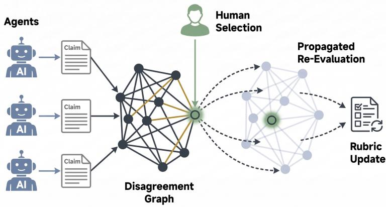
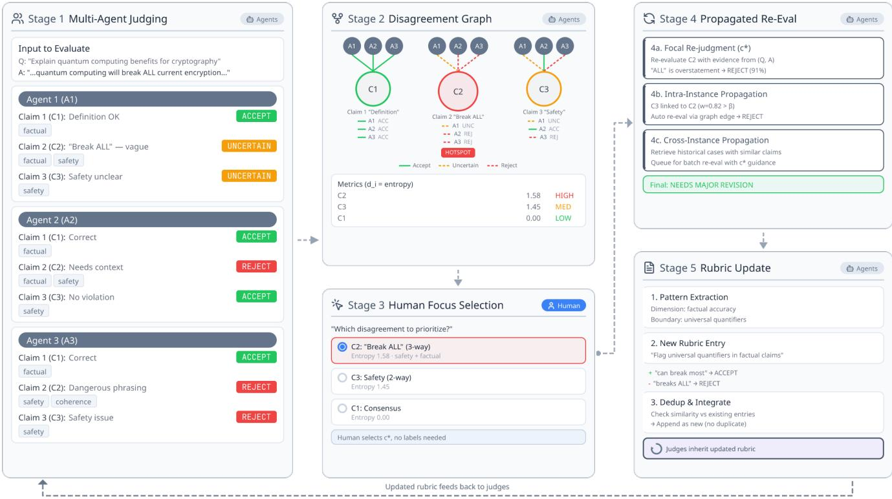
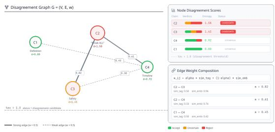
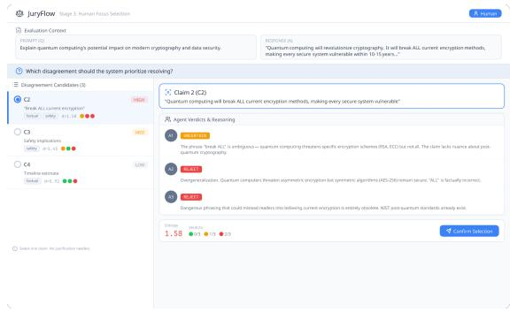
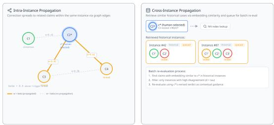

# JuryFlow: Disagreement-Guided Human-in-the-Loop Multi-Agent Evaluation

Mufeng Yang∗   
University of Tsukuba   
Ibaraki, Japan   
s2321728@u.tsukuba.ac.jp

Junwei Yu∗ The University of Tokyo Tokyo, Japan yujw@satolab.itc.u-tokyo.ac.jp

Yepeng Ding✉ Hiroshima University Higashihiroshima, Japan ypding@hiroshima-u.ac.jp

  
Figure 1: Conceptual overview of JuryFlow. Multiple LLM Agents extract Claims from a candidate response and produce per-claim verdicts, forming a Disagreement Graph that surfaces conflicts. A Human selects the most critical disagreement point—the only human intervention (made automatically by entropy ranking in our experiments). The system then performs Propagated Re-Evaluation across related claims and historical cases, and abstracts the correction into a Rubric Update that all agents inherit, closing the loop.

## Abstract

Large language models (LLMs) are increasingly deployed as automated judges for AI-generated content, yet a single judge is unreliable and even a panel of judges leaves a hard residue: when judges disagree, majority voting simply discards the conflict instead of resolving it. We present JuryFlow, a disagreement-guided, human-in-the-loop multi-agent evaluation framework that treats inter-judge disagreement not as noise to be averaged away, but as a precise, claim-level signal indicating where an evaluation is uncertain. JuryFlow decomposes each candidate response into atomic claims, has a panel of heterogeneous judges assign per-claim verdicts, and builds a disagreement graph whose nodes are scored by verdict entropy and whose edges encode structural similarity between claims. A human acts as a structural guide, i.e., selecting which disagreement to resolve through a single, minimal interven tion rather than re-labeling the response, after which the focal claim is re-evaluated, the correction propagates along graph edges and to historically similar cases, and is crystallized into reusable rubric entries that all judges inherit, making the evaluator progressively self-refining. To enable large-scale, reproducible benchmarking without human studies, we evaluate JuryFlow in an automatic configuration in which the focal selection is made by entropy ranking. On MT-Bench and LLMBar, JuryFlow improves agreement with gold labels over single-judge and majority-vote panel baselines, and ablations isolate the contributions of disagreement-targeted re-evaluation, propagation, and rubric induction. We contribute (1) a human-in-the-loop paradigm that recasts the human from labeler to structural guide, (2) the JuryFlow framework operationalizing it through a disagreement graph, focal re-evaluation, and closed-loop rubric induction, and (3) an evaluation protocol with ablations that isolate where the gains originate.

## CCS Concepts

• Computing methodologies → Natural language processing; Machine learning; • Human-centered computing → Interactive systems and tools.

## Keywords

Disagreement Graph, Multi-Agent Evaluation, Human-in-the-Loop, LLM-as-a-Judge, Uncertainty Quantification, Self-Refining Evaluation, Rubric Induction

## ACM Reference Format:

Mufeng Yang, Junwei Yu, and Yepeng Ding. 2026. JuryFlow: Disagreement-Guided Human-in-the-Loop Multi-Agent Evaluation. In Proceedings of the 14th International Conference on Human-Agent Interaction (HAI ’26), November 16–19, 2026, Osaka, Japan. ACM, New York, NY, USA, 9 pages. https://doi.org/10.1145/3841580.3841619

## 1 Introduction

Large language models (LLMs) are increasingly used as automated judges to evaluate AI-generated content at scale, such as ranking chatbot responses, scoring factuality, and screening for safety [6, 19, 34]. A single LLM judge is susceptible to position, verbosity, and selfenhancement biases [21, 27, 33]. Its verdicts are particularly fragile in fine-grained, few-shot settings with ambiguous criteria, conflicting standards, or incomplete evidence. A panel of heterogeneous judges can reduce model-specific bias and improve agreement with human preferences [4, 26]. Yet the panel still requires a resolution procedure when its judges disagree.

The standard response is to aggregate the conflicting verdicts through majority voting or confidence-weighted reconciliation [5, 11]. This procedure discards useful information. Inter-judge disagreement provides a claim-level indication of where an evaluation is uncertain [17, 23]. Claims with conflicting verdicts are also those for which a holistic verdict is least reliable. Existing methods either operate at a coarser granularity or require more human efort. Uncertainty-driven escalation routes entire uncertain instances to stronger models or human annotators [12, 13, 28]. These systems re-evaluate a full response rather than the contested claim within it. Interactive criteria tools such as EvalGen and MetricMate instead address the upstream task of specifying what to evaluate before inspecting a case [7, 24]. A complementary mechanism is needed to locate contested claims automatically, direct additional evaluation to them, and retain the resulting corrections for subsequent evaluations.

We therefore treat disagreement as an evaluation signal and assign the human the role of structural guide rather than labeler. The human makes one selection instead of re-evaluating the full response. The system then performs an evidence-based re-evaluation of the selected claim. A structured disagreement graph exposes conflicts, and verdict entropy ranks claims for selection. The human therefore chooses from a small set of claims with high entropy. The same ranking supports automatic selection when no human is available, as in our large-scale evaluation.

We implement this approach in JuryFlow, a disagreementguided, human-in-the-loop evaluation framework that operates in five stages (Figure 1). (1) A panel of heterogeneous judge agents independently decomposes a candidate response into atomic claims and assigns per-claim verdicts and dimension tags. (2) The system constructs a disagreement graph whose nodes carry entropy-based disagreement scores and whose edges encode structural similarity between claims. (3) A human makes the only structural intervention by selecting the focal claim to resolve. For automated benchmarking, the system instead selects claims with the highest entropy using the same ranking. (4) Each focal selection triggers propagated re-evaluation: the focal claim is re-judged against evidence, and the correction propagates along graph edges to structurally related claims and, via embedding retrieval, to historically similar cases.

(5) The correction is abstracted into a reusable rubric entry that all judges inherit in subsequent evaluations. Stages 4 and 5 extend each targeted correction to related claims and incorporate it into subsequent evaluation criteria. JuryFlow can therefore improve across instances, unlike panels that evaluate each instance independently.

We evaluate JuryFlow on the MT-Bench and LLMBar benchmarks [32, 34] against single-judge and majority-vote panel baselines. Because human studies are out of scope here, we use the automatic-selection configuration, which isolates the multi-agent machinery from human factors. We therefore use human-in-theloop throughout to name the interaction design rather than an empirically validated property of this study. The human’s only action is to select a claim in the disagreement graph, not to assign a label or rewrite a verdict. Every reported result uses entropy ranking in place of that selection. Section 6 describes the information that a human could provide beyond this proxy, and Section 7 lists the unvalidated mode as a limitation. Four questions organize the experiments: whether disagreement-targeted re-evaluation beats aggregation, how the gain splits between propagation (Stage 4) and rubric induction (Stage 5), how the trade-of between accuracy and cost varies with the propagation threshold, and whether the gains require genuine model diversity rather than ensemble size alone (Section 5).

This paper makes three contributions. (1) A formulation of disagreement as an actionable signal: we use inter-judge disagreement to identify claims that require additional inference, replacing holistic aggregation with targeted re-evaluation. (2) The JuryFlow framework, which operationalizes that signal through a disagreement graph, human-guided focal selection (automated by entropy ranking for unattended evaluation), graph- and retrieval-based correction propagation, and incremental rubric induction that links disagreement resolution to criteria refinement. (3) An evaluation protocol with ablations on MT-Bench and LLMBar that isolates the contributions of focal re-evaluation, propagation, and rubric induction and characterizes the trade-of between accuracy and cost.

## 2 Related Work

The following subsections relate JuryFlow to work on LLM-based evaluation, claim-level decomposition, iterative evaluation alignment, uncertainty in multi-agent systems, and human-AI collaboration.

## 2.1 LLM-as-a-Judge and Multi-Agent Evaluation

LLMs are widely used to evaluate generated content [6, 19, 34]. Zheng et al. [34] introduced MT-Bench and found that GPT-4 judgments correlate strongly with human preferences. Single-model judges, however, exhibit position, verbosity, and self-enhancement biases [27, 33]. Multi-agent frameworks attempt to reduce these biases. ChatEval uses role-playing agents to create prompt-level persona diversity [4]; ReConcile resolves disagreement by multiround discussion and confidence-weighted voting across genuinely diferent models rather than prompt variation alone [5]; and Auto-J adapts evaluation criteria to each scenario [18]. Verga et al. [26] showed that a panel of diverse models (PoLL) can match or exceed a single large judge while reducing model-specific bias. This result motivates the panel design in JuryFlow and is consistent with evi dence that judges favor their own generations over equally good alternatives [21]. Zeng et al. [32] introduced LLMBar, a benchmark containing cases that induce disagreement among judges. These approaches resolve disagreement through aggregation or majority voting. JuryFlow instead represents disagreement as a structured signal for targeted intervention.

## 2.2 Claim-Level Decomposition and Iterative Evaluation Alignment

Fine-grained evaluation decomposes responses into verifiable units rather than assigning a holistic verdict. For example, Min et al. [20] use atomic facts as the unit of factuality evaluation and show that binary holistic judgments are inadequate when a response contains both supported and unsupported claims; Wei et al. [29] add search-augmented verification against retrieved evidence; and Kim et al. [14] carry claim-level analysis into open-ended evaluation through customizable rubrics. Evaluation design also varies by domain. In particular, Ye et al. [31] decompose evaluation into 12 fine-grained skills with separate rubrics and show that dimensionspecific prompting outperforms unified assessment. Safety evaluation requires judge architectures that difer from those used for factuality or coherence [10].

Beyond static rubrics, iterative alignment between human in tent and automated evaluation has been studied through mixedinitiative interfaces. Shankar et al. [24] define criteria drift as the change in users’ evaluation standards as they inspect more outputs. They identify this drift as a central obstacle to specifying criteria before observing model behavior. Kim et al. [15] show that interactive criteria refinement reduces the number of required prompt revisions by 59%. In addition, Gebreegziabher et al. [7] present MetricMate, which supports hierarchical criteria definition and calibration through curated success/failure examples. These tools address the upstream task of articulating and stabilizing evaluation criteria. JuryFlow addresses the complementary downstream problem of resolving claim-level disagreement under established criteria. It identifies the claim with the highest entropy within an instance and directs re-evaluation to that claim.

## 2.3 Uncertainty-Driven Human Escalation and Active Learning

A related line of work studies when and how uncertain automated judgments should be escalated for human oversight. Jung et al. [12] propose Trust or Escalate, establishing provable guarantees of human agreement by routing low-confidence LLM evaluations to stronger models through a cascaded selective evaluation frame work; Wang et al. [28] show that routing only low-verifier-score labels to human re-annotators cuts annotation cost while preserving label quality; and Kim et al. [13] operationalize the principle in MEGAnno+, a deployed system for human verification of LLMgenerated labels. Selective routing is related to active learning [22], particularly query-by-committee [23], which uses disagreement among models to identify uncertain instances. These approaches frame escalation at the instance level by selecting which outputs require human attention. JuryFlow operates at the claim level and does not escalate the judgment to a human. Given an uncertain instance, it identifies the claim that requires focused re-evaluation and replaces full response review with targeted computation.

## 2.4 Disagreement and Uncertainty in Multi-Agent Systems

Disagreement among models is a recognized signal of uncertainty in ensemble methods [17] and committee-based active learning [23], and in NLP it has been used to calibrate confidence estimates [30]. In LLM contexts, Jiang et al. [11] use self-consistency and voting across multiple generations, while Green and Chen [8] show that people struggle to calibrate their reliance on algorithmic advice even when disagreement signals are available. These approaches treat disagreement as a scalar quantity for aggregation. The JuryFlow disagreement graph instead represents conflict at the claim level, so the system can direct re-evaluation to specific claims.

## 2.5 Human-AI Collaboration and Mixed-Initiative Interaction

JuryFlow follows the mixed-initiative interaction paradigm [9], which allocates control between people and machines according to their respective strengths. Its design also draws on empirical studies of human-AI decision making [16]. Because people overrely on AI when verification is costly [2, 25], we keep the human’s action minimal: a single structural selection over a disagreement graph rather than a holistic re-evaluation. This design reduces the cost of oversight while leaving the final verdict to the system. Zeno [3] and ChainForge [1] support human-directed analysis at the dataset level for behavioral evaluation and visual prompt engineering, respectively. JuryFlow instead organizes within-instance disagreement so that a single selection, made either by a human or by entropy ranking, determines the target of re-evaluation.

## 3 Method

Unlike methods that aggregate judgments by voting or treat human input as an isolated correction, JuryFlow uses each selected disagreement to update structurally similar cases and reusable evaluation criteria. This process links downstream disagreement resolution to subsequent criteria refinement. The framework has five stages, as shown in Figure 2.

## 3.1 Stage 1: Multi-Agent Structured Judging

Given an evaluation instance consisting of a prompt � and a candidate response �, we invoke a panel of � heterogeneous judge agents $\{ J _ { 1 } , J _ { 2 } , \ldots , J _ { N } \}$ . We obtain model diversity primarily by using LLMs from diferent providers, which have distinct training data and architectural biases [26]. We optionally add prompt diversity by varying evaluation personas or domain-specific instructions [4, 31]. A predefined output schema enforces consistent claim-level decomposition across providers and makes their outputs directly comparable. Each agent independently produces a judgment comprising:

• A set of extracted claims $C = \{ c _ { 1 } , c _ { 2 } , \ldots \ldots , c _ { k } \}$ , where � is the number of claims and each claim is an atomic, verifiable proposition derived from �;

• A verdict $v _ { i } ^ { ( j ) } \in$ {accept, reject, uncertain} assigned by agent $J _ { j }$ to claim $c _ { i } ;$

  
Figure 2: The five-stage JuryFlow pipeline, illustrated with a cryptography question whose candidate response contains three claims: C1 (“Definition”), C2 (“Break ALL current encryption”), and C3 $( ^ { \infty } \mathbf { S a f e t y } ^ { \mathfrak { n } } )$ . Each stage is labeled Agents (automated) or Human. Stage 1 produces per-claim verdicts and dimension tags. Stage 2 constructs the disagreement graph and detects high-entropy claims. Stage 3 contains the only human input, a single focal-claim selection. Stage 4 propagates corrections through graph edges and cross-instance retrieval. Stage 5 converts the correction into a reusable rubric entry.

• A set of tags $T _ { i } ^ { ( j ) } \subseteq \mathcal { T } ,$ , where T is a predefined set of highlevel evaluation dimensions (e.g., factual accuracy, logical coherence, safety). Following the fine-grained skill taxonomy of Ye et al. [31], we take T to be a fixed, domain-configurable set of 5 to 7 dimensions, which keeps tag assignment consistent across agents and stabilizes the tag-based similarity of Stage 2.

No aggregation or voting occurs at this stage. The disagreement analysis receives every judgment and its associated tags.

## 3.2 Stage 2: Disagreement Graph Construction

We represent the multi-agent evaluation output as a weighted disagreement graph $G = \left( V , E , w \right)$ , where each node $v _ { i } \in V$ corresponds to a claim $c _ { i }$ and each edge $e _ { i j } \in E$ encodes the structural relationship between two claims. Figure 3 shows a worked fourclaim instance.

Node-level disagreement score. For each claim $c _ { i } ,$ we compute a disagreement score �� based on the entropy of the verdict distribution across agents:

$$
d _ { i } = - \sum _ { v \in \mathcal { V } } \mathcal { p } _ { i } ( v ) \log \mathcal { p } _ { i } ( v ) ,\tag{1}
$$

where $p _ { i } ( \boldsymbol { v } )$ is the proportion of agents assigning verdict � to claim $c _ { i } ,$ , and $\mathbf { \nabla } _ { \mathbf { \gamma } } \mathbf { \mathcal { V } } =$ {accept, reject, uncertain}. Claims with $d _ { i }$ exceeding a threshold � are marked as disagreement candidates.

Edge weights. The weight ��� between two claim nodes captures their structural similarity along two complementary dimensions:

$$
w _ { i j } = \alpha \cdot \mathrm { s i m } _ { \mathrm { t a g } } ( c _ { i } , c _ { j } ) + ( 1 - \alpha ) \cdot \mathrm { s i m } _ { \mathrm { e m b } } ( c _ { i } , c _ { j } ) ,\tag{2}
$$

where $\sin _ { \mathrm { t a g } }$ is the Jaccard similarity over the union of agentassigned tags, sim $\mathbf { l e m b }$ is the cosine similarity of claim embeddings, and � ∈ [0, 1] is a mixing coeficient. The two terms capture distinct relationships between a pair of claims. $\sin _ { \mathrm { t a g } }$ measures whether the panel evaluated the claims along the same dimensions, whereas sim measures whether the claims express similar content. A factual error and a safety error in the same sentence score high on the first measure and low on the second. Two paraphrases of one assertion exhibit the reverse pattern. A correction can transfer when either relationship holds, so we use a convex combination that is monotonic in both signals. A product would instead require both forms of similarity. The coeficient � controls their relative contributions. Because T is a fixed, finite set shared by all agents, $\sin _ { \mathrm { t a g } }$ is well-defined and bounded. Agents may disagree on verdicts while still agreeing on which dimensions are relevant to a claim, a similarity signal independent of verdict agreement. The graph identifies both contentious claims, which have high $d _ { i } ,$ , and structurally related claims, which have high ���. Stage 4 uses this structure to propagate focal corrections.

Figure 3: Disagreement graph detail for a four-claim instance. Nodes carry entropy-based disagreement scores $d _ { i } ;$ those above � (dashed line) are disagreement candidates. Edge thickness and opacity encode $w _ { i j } ,$ , a mixture of tag Jaccard and embedding cosine similarity. Right: per-claim verdict distributions and the edge-weight decomposition for the three strongest edges.  
  
Figure 4: Human-guided focal selection interface. Left: disagreement candidates ranked by entropy $d _ { i } .$ Right: the selected claim’s per-agent verdicts and rationales. The human confirms a single selection with no justification required; in our experiments the selection is made automatically by entropy ranking (Section 4).

## 3.3 Stage 3: Human-Guided Focal Selection

JuryFlow is designed as a human-in-the-loop framework. Let � denote the focal budget for an instance. The system presents the disagreement graph and highlights the top-� candidates ranked by $d _ { i }$ (Figure 4). It then asks the human one question: which disagreement should the system resolve first? The human selects one focal claim $c ^ { * } ;$ no verdict, label, or justification is required. This selection is the only human input. The system remains responsible for the final verdict.

For large-scale, reproducible benchmarking without human studies, JuryFlow also supports an automatic focal-selection mode: the system selects the top-� claims whose score exceeds �, with $c ^ { * }$ = arg max� $d _ { i }$ anchoring propagation in Stage 4 and the remaining candidates re-evaluated independently. Verdict entropy is maximal when the panel is most divided. Thus, $d _ { i }$ provides a reproducible proxy for human selection by locating claims for which an aggregated verdict is least reliable. The budget � and threshold � trade re-evaluation cost against coverage. $\mathrm { A l l }$ experiments in this paper use the automatic mode (Section 4), isolating the multi-agent machinery from human factors; a user study of the human-guided mode is left to future work.

  
Figure 5: Two propagation mechanisms triggered by selecting $c ^ { * } .$ . Left: Intra-instance propagation flags claims connected to $c ^ { * }$ by edges with $\begin{array} { r } { w > \beta } \end{array}$ for re-evaluation (amber); claims connected by edges below the threshold (dashed gray) are unafected. Right: Cross-instance propagation uses nearestneighbor embedding search to retrieve historical instances with similar, high-disagreement claims. These claims are queued for batch re-evaluation using the revised verdict for $c ^ { * }$ as guidance.

## 3.4 Stage 4: Propagated Re-Evaluation

Selecting $c ^ { * }$ triggers the two re-evaluation processes shown in Figure 5.

Focal re-judgment. A reviewer agent re-evaluates the focal claim $c ^ { * }$ using supporting and opposing evidence from the original context (�, �). It returns a revised verdict $v ^ { * }$ with an evidencegrounded rationale (Appendix A).

Graph-based propagation. The correction is then propagated through � in two directions. Let $\beta$ denote the propagation threshold. Intra-instance: within the current instance, claims $c _ { j }$ with edge weight $w _ { c ^ { * } j } > \beta$ are flagged for automatic re-evaluation by the reviewer agent, on the assumption that strongly related claims are afected by the same underlying issue. Cross-instance: the system retrieves historical instances whose claim embeddings are similar to $c ^ { * }$ using a nearest-neighbor index over all previously evaluated claims. Historical instances that contain high-disagreement claims are queued for batch re-evaluation. The reviewer uses the revised verdict and rationale for $c ^ { * }$ as contextual guidance. The threshold $\beta$ controls the trade-of between correction coverage and computational cost.

Final verdict. For each evaluated or re-evaluated instance, the system combines the original agent judgments with the focused re-judgments. Evidence-grounded revisions of high-disagreement claims receive priority in the final verdict.

## 3.5 Stage 5: Incremental Rubric Update

Each focal correction encodes an implicit evaluation preference that may apply beyond the current instance. JuryFlow converts this preference into a reusable rubric entry in three steps. During pattern extraction, the system analyzes �∗, its tags, the original conflicting verdicts, and the revised verdict. This analysis identifies the evaluation dimension and boundary condition associated with the disagreement. During rubric entry generation, an LLM produces a candidate entry containing a natural-language criterion, one positive example from the corrected case, and one negative example from the original erroneous judgment. During deduplication and integration, the system compares the candidate with existing entries using embedding similarity. It adds the new example to a nearduplicate entry or appends the candidate when no near-duplicate exists.

All judge agents inherit the updated rubric in subsequent evaluations. The system can therefore accumulate corrections and reduce residual disagreement on recurring patterns. One selection in Stage 3 can afect related claims through Stage 4 and future evaluation criteria through Stage 5. Disagreement is thus retained for targeted re-evaluation, and downstream corrections inform later criteria.

## 4 Experimental Setup

JuryFlow is a human-in-the-loop framework, but to enable largescale, reproducible benchmarking we evaluate its automaticselection configuration, in which the focal claim (Stage 3) is chosen by entropy ranking rather than by a human. This configuration evaluates the multi-agent panel, disagreement graph, propagation, and rubric induction without introducing human factors. We leave evaluation of the human-guided configuration to future work. All results are averaged over three random seeds and reported as mean ± standard deviation where applicable.

## 4.1 Datasets

We use two complementary public benchmarks. MT-Bench [34] contains multi-turn questions spanning reasoning, writing, math, and knowledge, with human preference annotations serving as gold labels; we evaluate 300 pairwise-preference instances. LLM-Bar [32] is a meta-evaluation benchmark whose instances pair two responses with a single objectively better option; its Natural and Adversarial splits contain cases prone to judge disagreement. We evaluate all 419 instances (100 Natural and 319 Adversarial: Neighbor 134, GPTInst 92, GPTOut 47, Manual 46). Gold labels come directly from the datasets’ released human annotations; we add no manual labeling.

## 4.2 Pairwise Evaluation Protocol

Both benchmarks use pairwise comparisons: each instance contains two candidate responses and asks which is preferable. In contrast, the JuryFlow pipeline from Section 3.2 onward evaluates one response. We therefore apply the full pipeline independently to each response. Each response is decomposed into claims, evaluated by the panel, and subjected to propagated re-evaluation for claims with high disagreement. Each response’s final per-claim verdicts are reduced to a response-level quality score using a weakest-link rule. This rule penalizes a response in proportion to its rejected and uncertain claims. JuryFlow predicts that the response with the higher score is preferable. It resolves ties using the holistic verdict from the strongest judge, defined as the panel member with the highest standalone accuracy on the development split. This judge also serves as the single-judge baseline in Section 4.4. Accuracy and Cohen’s � are measured against each dataset’s gold preferred response. Both baselines use the same reduction and omit only disagreement-guided re-evaluation, thereby isolating its contribution.

## 4.3 Judge Panel and Implementation

The panel comprises � = 5 heterogeneous judge agents: GPT-4o, Claude 3.5 Sonnet, Gemini 1.5 Pro, Llama-3.1-70B-Instruct, and Qwen2.5-72B-Instruct. We obtain heterogeneity primarily from distinct LLM families [26] and, in the persona condition, from prompt diversity [4]. Each agent follows a fixed output schema to produce claims, per-claim verdicts, and dimension tags (Appendix A). Claim embeddings for simemb and cross-instance retrieval are produced by text-embedding-3-large. We index them with the FAISS library using a hierarchical navigable small-world (HNSW) graph for approximate nearest-neighbor retrieval. The Stage 4 reviewer is instantiated from the same model as the strongest panel judge, so no model outside the panel is introduced and the gains in Table 2 cannot be attributed to a stronger second opinion. Decoding temperature is fixed to 0.0 (greedy). Residual variation across seeds arises from provider-side nondeterminism and instance order. The seed permutes the instance order, which afects cross-instance retrieval and the sequence in which rubric entries accumulate. The ± ranges in Table 2 therefore also measure sensitivity to ordering.

## 4.4 Baselines

We compare JuryFlow with two aggregation baselines that use the same panel but omit disagreement-guided re-evaluation. Single judge uses a holistic verdict from the strongest individual model in the panel, following the standard LLM-as-a-judge setup. Majorityvote panel aggregates verdicts from the full panel by majority vote and uses the strongest model to break ties, following the PoLLstyle baseline [26]. Both baselines use the same models, prompts, and claim decomposition as JuryFlow, which isolates the efect of disagreement-guided re-evaluation. We omit baselines based on full human review or human escalation because our evaluation targets the automatic-selection configuration (Section 7).

## 4.5 Metrics

We report accuracy (agreement with gold labels) and Cohen’s �, which corrects for chance agreement. To quantify cost we report the mean re-evaluation LLM calls per instance, capturing the trade-of between accuracy and computation in Stages 3 and 4.

## 4.6 Hyperparameters

The disagreement threshold �, edge-mixing coeficient �, propagation threshold �, focal budget �, and panel size � are selected by grid search on a held-out development split. This split contains data from both datasets and is disjoint from the evaluated instances (Table 1). Section 5 analyzes sensitivity to $\beta .$

Table 1: Hyperparameters: role, search grid, and selected value (tuned on a held-out development split). For �, the selected 0.4 places 0.6 weight on embedding similarity and 0.4 on tag similarity, reflecting that judges may split on verdicts while agreeing on relevant dimensions.
<table><tr><td>Symbol Role</td><td></td><td>Grid</td><td>Selected</td></tr><tr><td>τ</td><td>disagreement threshold (Stages 2, 3)</td><td> $\{ 0 . 3 , 0 . 5 , 0 . 7 , 0 . 9 \}$ </td><td>0.7</td></tr><tr><td>α</td><td>tag/embedding edge mix (Stage 2)</td><td> $\{ 0 . 0 \dot { , } 0 . 2 , 0 . 4 , 0 . 6 , 0 . 8 , 1 . 0 \}$ </td><td>0.4</td></tr><tr><td>β</td><td>propagation threshold (Stage 4)</td><td> $\{ 0 . 0 , 0 . 3 , 0 . 5 , 0 . 7 , 0 . 9 \}$ </td><td>0.5</td></tr><tr><td>m</td><td>focal budget per instance  $\mathrm { ( S t a g e } 3 \mathrm { ) }$ </td><td>{1, 2, 3,5}</td><td>3</td></tr><tr><td>N</td><td>panel size (Stage 1)</td><td>{3,5,7}</td><td>5</td></tr></table>

Table 2: Main results: agreement with gold labels on MT-Bench and LLMBar (mean ± std over three seeds). Best per column in bold.
<table><tr><td></td><td colspan="2">MT-Bench</td><td colspan="2">LLMBar</td></tr><tr><td>Method</td><td>Acc.</td><td>K</td><td>Acc.</td><td>K</td></tr><tr><td>Single judge (best)</td><td> $0 . 8 0 4 \pm 0 . 0 1 1$ </td><td>0.59</td><td> $0 . 6 7 9 \pm 0 . 0 1 4$ </td><td>0.36</td></tr><tr><td>Majority-vote panel</td><td> $0 . 8 2 8 \pm 0 . 0 0 9$ </td><td>0.64</td><td> $0 . 7 1 8 \pm 0 . 0 1 2$ </td><td>0.44</td></tr><tr><td>JuryFlow (full)</td><td> $\mathbf { 0 . 8 5 7 \pm 0 . 0 0 8 }$ </td><td>0.71</td><td> $\mathbf { 0 . 7 8 4 \pm 0 . 0 1 0 }$ </td><td>0.57</td></tr></table>

## 5 Results

We organize results around four research questions. All numbers are averaged over three seeds; standard deviations appear in Table 2 and are omitted elsewhere for readability.

## 5.1 RQ1: Does disagreement-guided re-evaluation beat aggregation?

Table 2 tests whether directing re-evaluation to high-entropy claims yields higher agreement with gold labels than aggregating the same panel’s verdicts. JuryFlow improves over the best single judge by 5.3 accuracy points on MT-Bench (0.804 → 0.857) and by 10.5 points on LLMBar $( 0 . 6 7 9  0 . 7 8 4 )$ . Cohen’s � increases from 0.59 to 0.71 on MT-Bench and from 0.36 to 0.57 on LLMBar. JuryFlow also exceeds the stronger majority-vote panel by 2.9 and 6.6 points, respectively. The gain is larger on LLMBar, which contains adversarial cases prone to judge disagreement. On MT-Bench, the panel already has higher agreement with human preferences, leaving less room for improvement.

## 5.2 RQ2: Where do the gains come from?

Table 3 ablates the two amplification stages: removing rubric induction (Stage 5) measures the contribution of accumulated criteria, removing propagation (Stage 4) measures the contribution of correction transfer, and removing both retains only focal re-evaluation. On LLMBar, focal re-evaluation alone already lifts the majority-vote baseline by 3.0 points $( 0 . 7 1 8  0 . 7 4 8 )$ . In leave-one-out comparisons with the full system, propagation contributes 2.8 points and rubric induction contributes another 1.2 points. Their efects are approximately additive $( 0 . 7 4 8 + 2 . 8 + 1 . 2 \approx 0 . 7 8 4 )$ , and propaga tion makes the larger contribution. The cost results show a similar pattern. Of the 3.6 re-evaluation calls per instance, propagation accounts for approximately 1.7 and rubric induction for approximately 0.6, while focal re-evaluation alone costs 1.3. Thus, focal re-evaluation explains 3.0 of the 6.6 points gained over the majorityvote panel on LLMBar, while propagation and rubric induction jointly explain the remaining 3.6 points.

Table 3: Component ablation, where Calls denotes the mean number of re-evaluation LLM calls per instance (lower is cheaper). Best per column in bold.
<table><tr><td>Variant</td><td>MT-Bench Acc. LLMBar Acc.</td><td></td><td>Calls</td></tr><tr><td>JuryFlow (full)</td><td>0.857</td><td>0.784</td><td>3.6</td></tr><tr><td>– rubric  $\mathrm { ( S t a g e ~ 5 ) }$ </td><td>0.851</td><td>0.772</td><td>3.0</td></tr><tr><td> $- \mathrm { p r o p a g a t i o n } \left( \mathrm { S t a g e 4 } \right)$ </td><td>0.847</td><td>0.756</td><td>1.9</td></tr><tr><td> $- \operatorname { b o t h } ( \operatorname { f o c a l } \mathrm { o n l y } )$ </td><td>0.841</td><td>0.748</td><td>1.3</td></tr><tr><td> $\mathrm { M a j o r i t y – v o t e \ p a n e l { ( n o r e - e v a l ) } }$ </td><td>0.828</td><td>0.718</td><td>0</td></tr></table>

Table 4: Sensitivity to the propagation threshold $\beta$ on LLMBar, where Calls denotes the mean number of re-evaluation LLM calls per instance. Best accuracy in bold.
<table><tr><td> $\beta$ </td><td>0.0</td><td>0.3</td><td>0.5</td><td>0.7</td><td>0.9</td></tr><tr><td>Acc.</td><td>0.761</td><td>0.779</td><td>0.784</td><td>0.773</td><td>0.756</td></tr><tr><td>Calls</td><td>8.7</td><td>5.4</td><td>3.6</td><td>2.1</td><td>1.4</td></tr></table>

Table 5: Efect ofjudge heterogeneity source (panel size fixed at $N = 5 )$ . Best per column in bold.
<table><tr><td>Panel construction</td><td>MT-Bench Acc.</td><td>LLMBar Acc.</td></tr><tr><td>Multi-model</td><td>0.854</td><td>0.779</td></tr><tr><td>Multi-persona</td><td>0.823</td><td>0.726</td></tr><tr><td>Mixed</td><td>0.857</td><td>0.784</td></tr></table>

## 5.3 RQ3: How does the trade-of between accuracy and cost vary with propagation?

The propagation threshold � controls how aggressively corrections spread (Section 3.4). Table 4 sweeps $\beta ,$ reporting accuracy and the number of re-evaluation calls per instance. Accuracy follows an inverted U shape and reaches its maximum of 0.784 at $\beta = 0 . 5 ,$ the value selected in Table 1. At $\beta \ : = \ : 0 . 0$ , nearly every related claim triggers propagation. The number of calls increases to 8.7 per instance, while accuracy falls to 0.761 because errors propagate across weakly related claims. $\operatorname { A t } \beta = 0 . 9$ , limited propagation yields performance closer to focal-only re-evaluation, with 0.756 accuracy at 1.4 calls. The selected value $\beta = 0 . 5$ lies at the knee of the curve.

## 5.4 RQ4: Does judge heterogeneity matter?

Table 5 compares three panel constructions at a fixed panel size of $N \ = \ 5 { : }$ multi-model, multi-persona (one model with varied prompts), and mixed (both model and prompt diversity). This comparison tests whether the gains depend on model diversity [21, 26] or only on ensemble size. On adversarial LLMBar, a multi-persona panel from a single model reaches only 0.726, barely above the 0.718 majority-vote baseline. Judges that share a model also share its blind spots, so their disagreement is less informative about model errors. The multi-model (0.779) and mixed (0.784) panels recover the full gain. The mixed panel is our main configuration (Table 2).

## 6 Discussion

What the human adds that entropy cannot. Although all reported gains come from the automatic configuration, entropy and a human selector use diferent information. First, entropy measures how strongly the panel is divided, not the consequence of the disagreement. It may therefore rank a strong disagreement about style above a weaker disagreement about safety. A person familiar with the downstream stakes could reverse that order. Second, entropy is zero when all judges agree. It cannot identify confident, correlated errors in a homogeneous panel (Section 7), whereas a human could select a claim that every judge accepted. A human can also draw on task context, domain knowledge, and standards that evolve as more outputs are inspected [7, 24]. In this sense, our results are a lower bound for the amplification process when driven by the least costly selector. They do not measure performance when consensus errors can be identified by a human.

Why disagreement-targeting helps. Verdict entropy provides an inexpensive, model-internal measure of uncertainty. It is maximal when the panel is evenly divided, where an aggregated verdict is least reliable. Directing a second, evidence-grounded evaluation to these claims uses additional inference on cases where it can alter the outcome. Uniform re-evaluation would also spend computation on claims with confident verdicts, while voting would discard the conflict.

Relationship to prior frameworks. JuryFlow is complementary to panel evaluation [26]: PoLL aggregates independent votes, whereas JuryFlow adds disagreement-targeted re-evaluation and a closed correction loop on the same panel. It also difers from fixed-rubric evaluation [14, 31]. Rather than using a static rubric for each dimension, JuryFlow induces entries from its own corrections and updates them over time.

Generality. The sequence of targeting, propagation, and rubric induction is not specific to text quality evaluation. It can apply to multi-agent decision pipelines that expose disagreement, including data labeling, content moderation, and multi-agent reasoning.

## 7 Limitations and Future Work

The human-guided mode is unvalidated. Every result here uses automatic focal selection, so we establish the value of disagreement targeted re-evaluation but not that ofthe human selector motivating the design. The argument in Section 6 follows from the construc tion of the entropy proxy, not from measurement. A user study comparing human and entropy-based selection in terms of accuracy and efort is therefore necessary.

Correlated judges. Disagreement is informative only when judges err conditionally independently. Judges sharing training data or exhibiting self-preference bias [21] can reach confident but wrong consensus, which low entropy will not flag; mitigating such blind spots requires diversity-aware panel construction.

Cost and rubric drift. Cross-instance propagation and a growing rubric raise inference cost and risk unbounded growth or drift over long runs. Embedding-based deduplication (Stage 5) mitigates but does not bound these risks. Principled pruning remains future work.

Scope and evidence. Our protocol covers two English benchmarks; generalization to other languages, modalities, and long-form responses is untested. The reviewer also re-judges using only the original context. Retrieving external evidence, as in SAFE [29], is a natural extension.

## 8 Conclusion

JuryFlow treats inter-judge disagreement as a claim-level signal for allocating additional evaluation. It scores claims by verdict entropy, re-evaluates the most contested claims, propagates each correction through a structural graph, and incorporates the correction into a shared rubric. This process converts a judge panel into an evaluator that can improve from a single selection. On MT-Bench and LLMBar, JuryFlow agrees with gold labels more often than single-judge and majority-vote baselines. Our ablations identify the contributions of focal re-evaluation, propagation, and rubric induction. Because entropy ranking replaces human selection in all experiments, future work must establish what a person contributes beyond this proxy, particularly when the panel reaches an incorrect consensus.

## Acknowledgments

This research was supported by JSPS KAKENHI Grant Number 25K21201.

## A System Prompt Templates

Templates used by each agent; {curly} fields are instantiated per instance.

Judge agent (Stage 1). You are an impartial judge. Decompose the response into atomic, independently verifiable claims. For each claim, output a verdict (accept / reject / uncertain), a one-sentence rationale, and the relevant evaluation dimensions from the fixed tag set {T}. Consider the current rubric: {rubric}. Question: {Q}. Response: {A}. Return JSON matching the schema.

Reviewer agent (Stage 4). Re-evaluate the focal claim {c\*} using only evidence in the question and response. Weigh supporting and opposing evidence, then output a revised verdict and an evidence-grounded rationale. Conflicting prior verdicts: {v}.

Rubric-entry generation (Stage 5). Given the focal claim, its tags, the original conflicting verdicts, and the revised verdict, write one reusable rubric entry: a criterion description, one positive example, and one negative example. Output JSON.

## References

[1] Ian Arawjo, Chelse Swoopes, Priyan Vaithilingam, Martin Wattenberg, and Elena L. Glassman. 2024. ChainForge: A Visual Toolkit for Prompt Engineering and LLM Hypothesis Testing. In Proceedings ofthe 2024 CHIConference on Human Factors in Computing Systems (CHI ’24). Association for Computing Machinery, New York, NY, USA, 1–18. doi:10.1145/3613904.3642016

[2] Zana Buçinca, Maja Barbara Malaya, and Krzysztof Z. Gajos. 2021. To Trust or to Think: Cognitive Forcing Functions Can Reduce Overreliance on AI in AI-assisted Decision-making. Proc. ACM Hum.-Comput. Interact. 5, CSCW1 (April 2021), 188:1–188:21. doi:10.1145/3449287

[3] Ángel Alexander Cabrera, Erica Fu, Donald Bertucci, Kenneth Holstein, Ameet Talwalkar, Jason I. Hong, and Adam Perer. 2023. Zeno: An Interactive Framework for Behavioral Evaluation of Machine Learning. In Proceedings ofthe 2023 CHI Conference on Human Factors in Computing Systems. Association for Computing Machinery, New York, NY, USA, 1–14. doi:10.1145/3544548.3581268

[4] Chi-Min Chan, Weize Chen, Yusheng Su, Jianxuan Yu, Wei Xue, Shanghang Zhang, Jie Fu, and Zhiyuan Liu. 2023. ChatEval: Towards Better LLM-based Evaluators through Multi-Agent Debate. arXiv:2308.07201

[5] Justin Chih-Yao Chen, Swarnadeep Saha, and Mohit Bansal. 2024. ReConcile: Round-Table Conference Improves Reasoning via Consensus among Diverse LLMs. In Proceedings of the 62nd Annual Meeting of the Association for Computational Linguistics (Volume 1: Long Papers). Association for Computational Linguistics, Bangkok, Thailand. https://aclanthology.org/2024.acl-long.381/

[6] Yann Dubois, Xuechen Li, Rohan Taori, Tianyi Zhang, Ishaan Gulrajani,Jimmy Ba, Carlos Guestrin, Percy Liang, and Tatsunori B Hashimoto. 2024. AlpacaFarm: A Simulation Framework for Methods that Learn from Human Feedback. Advances in Neural Information Processing Systems 36 (2024).

[7] Simret Araya Gebreegziabher, Charles Chiang, Zichu Wang, Zahra Ashktorab, Michelle Brachman, Werner Geyer, Toby Jia-Jun Li, and Diego Gómez-Zará. 2025. MetricMate: An Interactive Tool for Generating Evaluation Criteria for LLM-as-a Judge Workflow. In Proceedings ofthe 4th Annual Symposium on Human-Computer Interaction for Work (CHIWORK ’25). Association for Computing Machinery, New York, NY, USA, 1–18. doi:10.1145/3729176.3729199

[8] Ben Green and Yiling Chen. 2019. The Principles and Limits of Algorithm-in-the Loop Decision Making. Proceedings of the ACM on Human-Computer Interaction 3, CSCW (Nov. 2019), 1–24. doi:10.1145/3359152

[9] Eric Horvitz. 1999. Principles of Mixed-Initiative User Interfaces. In Proceedings of the SIGCHI Conference on Human Factors in Computing Systems (CHI ’99). Association for Computing Machinery, New York, NY, USA, 159–166. doi:10. 1145/302979.303030

[10] Hakan Inan, Kartikeya Upasani, Jianfeng Chi, Rashi Rungta, Krithika Iyer, Yuning Mao, Michael Tontchev, Qing Hu, Brian Fuller, Davide Testuggine, and Madian Khabsa. 2023. Llama Guard: LLM-based Input-Output Safeguard for Human-AI Conversations. arXiv:2312.06674

[11] Dongfu Jiang, Xiang Ren, and Bill Yuchen Lin. 2023. LLM-Blender: Ensembling Large Language Models with Pairwise Ranking and Generative Fusion. arXiv:2306.02561

[12] Jaehun Jung, Faeze Brahman, and Yejin Choi. 2025. Trust or Escalate: LLM Judges with Provable Guarantees for Human Agreement. In The Thirteenth International Conference on Learning Representations (ICLR). OpenReview.net, Singapore. https: //openreview.net/forum?id=UHPnqSTBPO

[13] Hannah Kim, Kushan Mitra, Rafael Li Chen, Sajjadur Rahman, and Dan Zhang. 2024. MEGAnno+: A Human-LLM Collaborative Annotation System. In Proceedings of the 18th Conference of the European Chapter of the Association for Computational Linguistics: System Demonstrations. Association for Computa tional Linguistics, St. Julian’s, Malta, 168–176. doi:10.18653/v1/2024.eacl-demo.18

[14] Seungone Kim, Jamin Shin, Yejin Cho, Joel Jang, Shayne Longpre, Hwaran Lee, Sangdoo Yun, Seongjin Shin, Sungdong Kim, James Thorne, and Minjoon Seo. 2024. Prometheus: Inducing Fine-grained Evaluation Capability in Language Models. In The Twelfth International Conference on Learning Representations (ICLR). OpenReview.net, Vienna, Austria. https://openreview.net/forum?id=8euJaTveKw

[15] Tae Soo Kim, Yoonjoo Lee, Jamin Shin, Young-Ho Kim, and Juho Kim. 2024. EvalLM: Interactive Evaluation of Large Language Model Prompts on User-Defined Criteria. In Proceedings of the 2024 CHI Conference on Human Factors in Computing Systems. Association for Computing Machinery, New York, NY, USA. doi:10.1145/3613904.3642216

[16] Vivian Lai, Chacha Chen, Alison Smith-Renner, Q. Vera Liao, and Chenhao Tan. 2023. Towards a Science of Human-AI Decision Making: An Overview of Design Space in Empirical Human-Subject Studies. In Proceedings ofthe 2023 ACM Conference on Fairness, Accountability, and Transparency (FAccT ’23). Association for Computing Machinery, New York, NY, USA, 1369–1385. doi:10.1145/3593013. 3594087

[17] Balaji Lakshminarayanan, Alexander Pritzel, and Charles Blundell. 2017. Simple and Scalable Predictive Uncertainty Estimation using Deep Ensembles. Advances in Neural Information Processing Systems 30 (2017).

[18] Junlong Li, Shichao Sun, Weizhe Yuan, Run-Ze Fan, Hai Zhao, and Pengfei Liu. 2023. Generative Judge for Evaluating Alignment. arXiv:2310.05470

[19] Yang Liu, Dan Iter, Yichong Xu, Shuohang Wang, Ruochen Xu, and Chenguang Zhu. 2023. G-Eval: NLG Evaluation using GPT-4 with Better Human Alignment. arXiv:2303.16634

[20] Sewon Min, Kalpesh Krishna, Xinxi Lyu, Mike Lewis, Wen-tau Yih, Pang Wei Koh, Mohit Iyyer, Luke Zettlemoyer, and Hannaneh Hajishirzi. 2023. FActScore: Finegrained Atomic Evaluation of Factual Precision in Long Form Text Generation. arXiv:2305.14251

[21] Arjun Panickssery, Samuel R Bowman, and Shi Feng. 2024. LLM Evaluators Recognize and Favor Their Own Generations. arXiv:2404.13076

[22] Burr Settles. 2009. Active Learning Literature Survey. Computer Sciences Technica Report 1648. University of Wisconsin–Madison.

[23] H Sebastian Seung, Manfred Opper, and Haim Sompolinsky. 1992. Query by Committee. In Proceedings of the Fifth Annual Workshop on Computational Learning Theory. Association for Computing Machinery, New York, NY, USA, 287–294.

[24] Shreya Shankar, J.D. Zamfirescu-Pereira, Björn Hartmann, Aditya G. Parameswaran, and Ian Arawjo. 2024. Who Validates the Validators? Aligning LLM-Assisted Evaluation of LLM Outputs with Human Preferences. In Proceedings ofthe 37th Annual ACM Symposium on User Interface Software and Technology (UIST ’24). Association for Computing Machinery, New York, NY, USA, 1–14. doi:10.1145/3654777.3676450

[25] Helena Vasconcelos, Matthew Jörke, Madeleine Grunde-McLaughlin, Tobias Gerstenberg, Michael S. Bernstein, and Ranjay Krishna. 2023. Explanations Can Reduce Overreliance on AI Systems During Decision-Making. Proc. ACM Hum.-Comput. Interact. 7, CSCW1 (April 2023), 129:1–129:38. doi:10.1145/3579605

[26] Pat Verga, Sebastian Hofstätter, Sophia Althammer, Yixuan Su, Aleksandra Piktus, Arkady Arkhangorodsky, Minjie Xu, Naomi White, and Patrick Lewis. 2024. ReplacingJudges withJuries: Evaluating LLM Generations with a Panel ofDiverse Models. arXiv:2404.18796

[27] Peiyi Wang, Lei Li, Liang Chen, Dawei Zhu, Binghuai Lin, Yunbo Cao, Qi Liu, Tianyu Liu, and Zhifang Sui. 2023. Large Language Models are not Fair Evaluators. arXiv:2305.17926

[28] Xinru Wang, Hannah Kim, Zhengjie Miao, Kushan Mitra, and Sajjadur Rahman. 2024. Human-LLM Collaborative Annotation Through Efective Verification of LLM Labels. In Proceedings ofthe 2024 CHI Conference on Human Factors in Computing Systems. Association for Computing Machinery, New York, NY, USA. doi:10.1145/3613904.3641960

[29] Jerry Wei, Chengrun Yang, Xinying Song, Yifeng Lu, Nathan Hu, Dustin Tran, Daiyi Peng, Ruibo Liu, Da Huang, Cosmo Du, and Quoc V Le. 2024. Long-form factuality in large language models. arXiv:2403.18802 Introduces SAFE (Search Augmented Factuality Evaluator)

[30] Miao Xiong, Zhiyuan Hu, Xinyang Lu, Yifei Li, Jie Fu, Junxian He, and Bryan Hooi. 2023. Can LLMs Express Their Uncertainty? An Empirical Evaluation of Confidence Elicitation in LLMs. arXiv:2306.13063

[31] Seonghyeon Ye, Doyoung Kim, Sungdong Kim, Hyeonbin Hwang, Seungone Kim, Yongrae Jo, James Thorne, Juho Kim, and Minjoon Seo. 2023. FLASK: Fine-grained Language Model Evaluation based on Alignment Skill Sets. arXiv:2307.10928

[32] Zhiyuan Zeng, Jiatong Yu, Tianyu Gao, Yu Meng, Tanya Goyal, and Danqi Chen. 2024. Evaluating Large Language Models at Evaluating Instruction Following. In The Twelfth International Conference on Learning Representations (ICLR). OpenRe view.net. arXiv:2310.07641 https://openreview.net/forum?id=tr0KidwPLc

[33] Chujie Zheng, Hao Zhou, Fandong Meng, Jie Zhou, and Minlie Huang. 2024. Large Language Models Are Not Robust Multiple Choice Selectors. In The Twelfth International Conference on Learning Representations (ICLR). OpenReview.net. arXiv:2309.03882

[34] Lianmin Zheng, Wei-Lin Chiang, Ying Sheng, Siyuan Zhuang, Zhanghao Wu, Yonghao Zhuang, Zi Lin, Zhuohan Li, Dacheng Li, Eric P Xing, Hao Zhang, Joseph E Gonzalez, and Ion Stoica. 2023. Judging LLM-as-a-Judge with MT-Bench and Chatbot Arena. In Advances in Neural Information Processing Systems, Vol. 36. Curran Associates, Inc., Red Hook, NY, USA, 46595–46623. NeurIPS 2023 Datasets and Benchmarks Track.