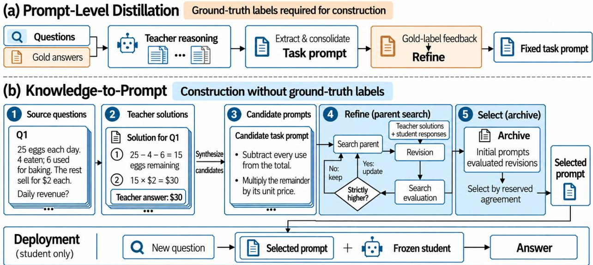
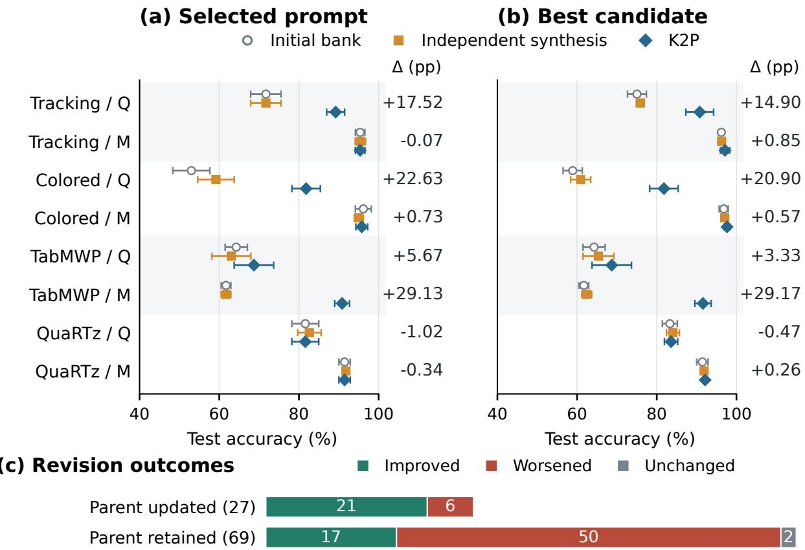
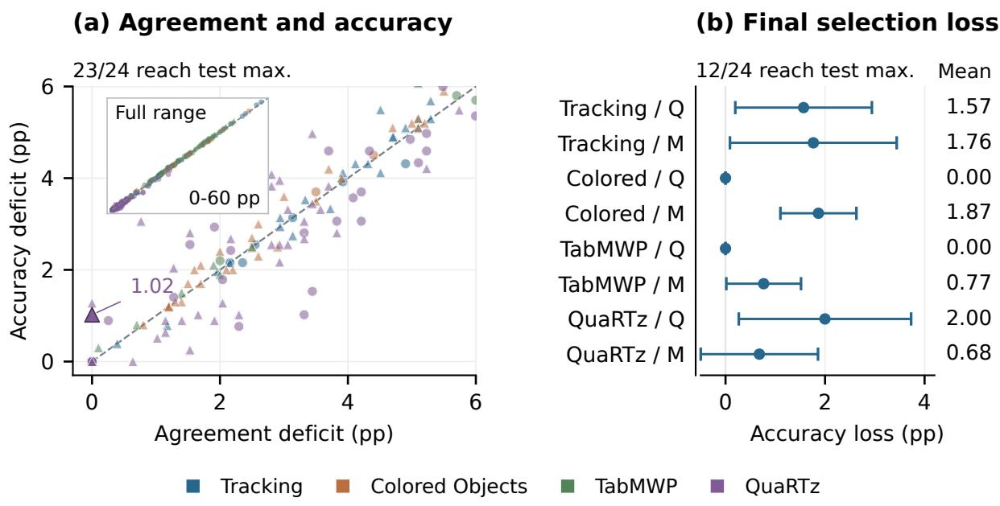
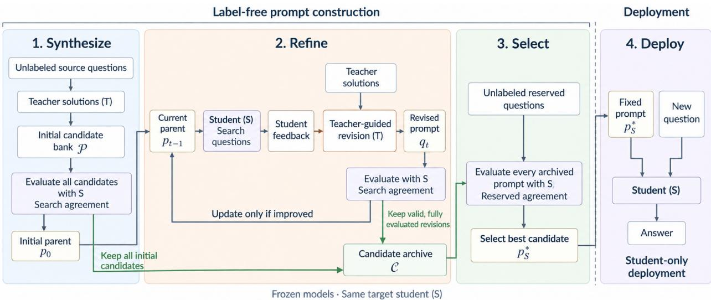
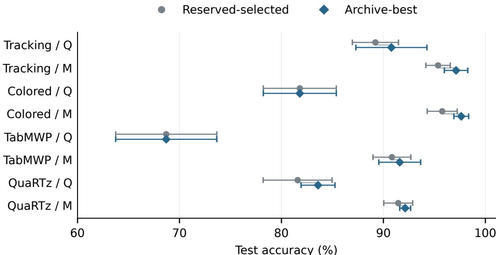

# K2P: Label-Free Knowledge to Prompt Distillation

Yingchuan Zhang<sup>†</sup> Haoran Lu<sup>†</sup> Wenxuan Zhong Ping Ma<sup>\*</sup>

Department of Statistics University of Georgia Athens, GA 30602

## Abstract

Knowledge distillation can transfer reasoning from stronger teachers to frozen students through reusable prompts, but avoiding weight updates does not eliminate supervision. Without ground-truth answers, teacher solutions are unverified, and agreement with the teacher can reward shared mistakes. We introduce Knowledge-to-Prompt (K2P) for label-free knowledge distillation to prompts. K2P synthesizes reusable instructions from teacher solutions, refines them using paired teacher and student responses, and guides search and selection with answer agreement. It retains candidates that adaptive search may undervalue and selects on reserved questions. Deployment uses only the frozen student and selected prompt. Our theory separates generation and selection gaps and gives conditions under which agreement-guided construction yields accuracy guarantees despite imperfect teacher references. Across reasoning tasks and students, K2P outperforms label-free alternatives overall and remains competitive with supervised prompt optimization. Ablations and archive diagnostics assess the contributions of teacher solutions and refinement, while revealing the limits of agreement-guided selection.

## 1 Introduction

Knowledge distillation transfers predictive and reasoning knowledge from stronger teachers to smaller students through teacher-generated supervision (Hinton et al., 2015; Kim & Rush, 2016; Ho et al., 2023; Fang et al., 2024; 2026). This knowledge can also be expressed as reusable instructions for a frozen student (Badhe & Shah, 2026; Koralewski, 2025). We call this direction knowledge distillation to prompts: it connects knowledge transfer with automatic prompt optimization (Zhou et al., 2023b; Agrawal et al., 2026) to derive task procedures that the student can reuse across inputs.

Realizing this potential requires both extracting useful procedures and evaluating how well the student executes them. Ground-truth supervision can support both operations. For example, Prompt-Level Distillation (PLD; Badhe & Shah, 2026) conditions extraction on gold answers and refines instructions using student correctness feedback (Figure 1(a)). However, questions and public context may be available before their correct answers are established. Obtaining those answers can require locating evidence in documents or expert analysis of numerical reasoning, as illustrated by Natural Questions and FinQA (Kwiatkowski et al., 2019; Chen et al., 2021). Avoiding weight updates therefore does not by itself remove the supervision needed to construct and evaluate effective instructions.

  
Figure 1: Label-dependent and label-free prompt construction. (a) PLD uses gold labels for extraction and correctness feedback. (b) K2P synthesizes initial prompts from unlabeled source questions and teacher solutions (1–3), then refines a search parent using paired teacher and student responses (4). Only strict improvement in search agreement updates the parent. All admissible, fully evaluated candidates enter the archive; agreement on reserved questions selects from this fixed archive after construction (5). Deployment uses only the selected prompt and frozen student.

We study label-free knowledge distillation to prompts: construction uses questions and public context, without task-specific ground-truth answers or correctness annotations. Output comparisons (Xiang et al., 2025; Wu et al., 2026) and reasoning consistency (Koralewski, 2025) offer model-based feedback, but leave a central challenge: how to turn unverified teacher knowledge into useful student instructions and select among them without ground-truth answers for evaluation.

Removing labels changes both generation and evaluation. First, a teacher’s generated solution is unverified, and even a useful procedure may be difficult for the student to execute. Disagreement alone cannot identify which model is wrong or what needs correction. Second, agreement with the teacher can reward shared mistakes. A revision that corrects a student error may even reduce agreement with an incorrect teacher. Limited evaluation samples and repeated comparisons can further distort candidate rankings (Cawley & Talbot, 2010). Effective distillation must therefore address both candidate quality and the reliability of the signal used to choose candidates. We focus on tasks with explicit final answers that can be extracted and normalized.

We propose Knowledge-to-Prompt (K2P), using teacher solutions as procedural evidence and teacher answers as evaluation references to address these challenges (Figure 1(b)). The teacher synthesizes instructions from source solutions and refines a search-selected candidate using paired teacher and student responses. Normalized teacher answers provide a shared agreement signal without labeling disagreements as student errors. K2P separates the search parent from the archive to preserve candidates this signal may undervalue. Only strict improvement in search agreement changes the parent; all admissible, fully evaluated candidates enter the archive, whether or not they replace the parent. Once the archive is fixed, agreement on reserved questions withheld from synthesis and search selects the deployment prompt. Deployment uses only the frozen student and selected prompt.

These operations optimize agreement, whereas the deployment objective is accuracy. Under aligned answermatching rules, teacher errors affect prompt comparisons only where candidate answers differ; teacher accuracy alone therefore does not determine ranking reliability. We separate accuracy missing from the archive from accuracy lost in selection. Under explicit progress and sampling assumptions, we bound the deployed prompt’s population-agreement deficit, accounting for initialization, refinement, adaptive search, and reserved selection. A condition relating agreement deficits to accuracy deficits then yields a guarantee relative to the best admissible prompt for the same student. When this relationship has no residual mismatch, the bound allows the expected accuracy gap to vanish despite persistent teacher errors, provided the construction and sampling terms also vanish.

Our evaluation covers four reasoning tasks, two students, and three construction seeds under common construction cost ceilings for the external baselines. Our contributions are:

1. Label-free construction from teacher solutions and answers. K2P synthesizes and refines instructions from worked solutions, using shared teacher answers for search and reserved selection from a frozen archive, without ground-truth labels or student weight updates.

2. A conditional link from construction to accuracy. We give conditions under which the returned prompt’s accuracy approaches the optimum for the frozen student within the admissible prompt space, accounting for imperfect references and finite evaluation data.

3. Evidence on performance and its underlying mechanisms. K2P improves mean accuracy over zeroshot in seven of eight settings. It exceeds teacher-reference GEPA (GEPA-T; Agrawal et al., 2026) in six of eight task–student settings, with an unweighted mean advantage of 2.88 percentage points under shared teacher references. It exceeds teacher-reference PLD and SPO in all eight settings and averages 0.48 points below supervised GEPA. Ablations examine worked solutions and compare refinement with independent synthesis; archive analyses distinguish candidate quality from final-selection losses.

## 2 Related Work

Teacher knowledge and prompt optimization. PLD transfers gold-conditioned teacher reasoning using student correctness feedback (Badhe & Shah, 2026); reasoning distillation by prompt optimization uses judged reasoning consistency (Koralewski, 2025). GEPA combines reflection, instance-level Pareto selection, and validation (Agrawal et al., 2026); our GEPA-T adaptation uses teacher-answer references. K2P uses worked solutions for synthesis and student-informed refinement, then selects from a frozen archive on reserved questions. Admissible, fully evaluated revisions remain eligible even when they do not replace the search parent, preserving candidates that search agreement may undervalue. Appendix D expands the connections to prompting, distillation, and experience reuse.

Label-free feedback. SPO judges paired outputs (Xiang et al., 2025); Prompt Duel Optimizer combines pairwise judgments with dueling-bandit search (Wu et al., 2026). K2P matches normalized student answers to cached teacher references. PLD-T and GEPA-T use the same reference answers, allowing their original construction procedures to be compared under a shared evaluation signal.

Imperfect references and finite-sample selection. Noisy-label learning relates corrupted feedback to true prediction risk (Angluin & Laird, 1988; Natarajan et al., 2013). Here, teacher answers serve as references for evaluating student responses; under aligned scoring, comparison distortion depends on teacher errors where candidate answers differ. Finite-sample model selection can overfit its criterion (Cawley & Talbot, 2010; Arlot & Celisse, 2010), and adaptive data reuse can bias later choices (Dwork et al., 2015; Russo & Zou, 2016). K2P separates adaptive search from reserved selection and analyzes search optimism, finite-sample selection, and mismatch between agreement and accuracy.

## 3 Problem Setup

Let $T$ be a teacher model and S a target student, with both models’ parameters held fixed. An input x belongs to the task-input space $\mathcal { X }$ and contains a question and its public context, such as a table or answer options. A task prompt p is a natural-language instruction reused across inputs. We seek a prompt in a nonempty admissible set Π, defined by instruction and length constraints fixed before construction data are observed.

Construction and deployment. Construction receives an unlabeled pool $\mathcal { U } = \{ x _ { i } \} _ { i = 1 } ^ { n _ { \mathcal { U } } } \subseteq \mathcal { X }$ , where $n _ { U }$ is the number of available inputs. It may query both models using these inputs and public task specifications, retaining generated solutions, answers, and student responses. Task-specific ground-truth answers and correctness annotations are unavailable to construction. Deployment uses only the student, the selected prompt, and the current input. Ground-truth answers are used afterward to evaluate the constructed prompts.

Responses and correctness. Let Y be the space of normalized task answers and D the target distribution over pairs $( x , y ) \in \mathcal { X } \times \mathcal { Y }$ , where $y$ is the ground-truth answer. Write $S ( x ; p ; \xi )$ for the student’s response under prompt $p ,$ where ξ represents randomness under a fixed decoding policy. Let Z be the space of model responses, including completion status. The fixed map $a : \mathcal { Z } \to \mathcal { y } \cup \{ \perp \}$ extracts and normalizes an explicit final answer; $\perp \notin \mathcal { V }$ denotes extraction failure. The correctness indicator $c _ { p } ( x , y , \xi ) \in \{ 0 , 1 \}$ equals one when $S ( x ; p ; \xi )$ is correct against y under the task’s fixed matching and output-validity rules, and zero otherwise.

The objective is to maximize the student’s expected task accuracy:

$$
\operatorname* { m a x } _ { p \in \Pi } J ( p ; S ) , \qquad J ( p ; S ) = \mathbb { E } _ { ( x , y ) \sim \mathcal { D } , \xi } \big [ c _ { p } ( x , y , \xi ) \big ] .\tag{1}
$$

We subsequently abbreviate the correctness indicator as $c _ { p }$ and suppress decoding randomness in model calls.   
Population expectations average over inputs and randomness from the relevant fixed decoding policies.

Without ground-truth answers, construction cannot directly evaluate J or its labeled empirical counterpart. K2P instead evaluates prompts through teacher–student answer agreement. This surrogate makes candidate comparison possible, but can reward shared errors. The next section develops the construction procedure, followed by an analysis of conditions under which agreement-guided construction controls the accuracy deficit relative to the objective in Equation (1).

## 4 K2P: Distilling Teacher Solutions into a Task Prompt

K2P constructs a separate prompt for each target student (Algorithm 1 in Appendix A.5).

## 4.1 Data Roles and Agreement Criterion

Partition unlabeled inputs into disjoint source, search, and reserved sets, $\mathcal { U } _ { \mathrm { s r c } } , \mathcal { U } _ { \mathrm { s e a r c h } }$ , and $\mathcal { U } _ { \mathrm { s e l } }$ . Cache teacher solutions $z _ { i } = T ( x _ { i } )$ and answers $\tilde { y } _ { i } = a ( z _ { i } )$ . Source solutions support synthesis; search solutions support feedback and evaluation. Use reserved references only after fixing the archive.

For a nonempty evaluation set $\nu ,$ let $v _ { T } ( i )$ and $v _ { S , p } ( i )$ indicate parseable, untruncated teacher and student final answers. Define per-question agreement and its empirical average as

$$
\begin{array} { l } { \displaystyle \widetilde c _ { i } ( p ; S ) = v _ { T } ( i ) v _ { S , p } ( i ) \mathbf { 1 } [ a ( S ( x _ { i } ; p ) ) = \tilde { y } _ { i } ] , } \\ { \displaystyle \widehat J _ { \mathcal { V } } ( p ; S ) = \frac { 1 } { | \mathcal { V } | } \sum _ { x _ { i } \in \mathcal { V } } \widetilde c _ { i } ( p ; S ) . } \end{array}\tag{2}
$$

Here $\mathbf { 1 } [ \cdot ]$ is an indicator; invalid or truncated responses score zero and remain in the denominator. Let $\widetilde { c } _ { p }$ be this score on a fresh input and $\widetilde J ( p ; S ) = \mathbb { E } [ \widetilde c _ { p } ]$ its expectation over inputs and both models’ decoding randomness. Thus $J , { \widetilde { J } } ,$ and $\widehat { J }$ measure accuracy, population agreement, and empirical agreement. For the fixed student, write $\widehat { J } _ { s } ( p ) = \widehat { J } _ { \smash { \mathrm { u } _ { \mathrm { s e a r c h } } } } ( p ; S )$ and $\widehat { J } _ { v } ( p ) = \widehat { J } _ { { \mathcal { U } } _ { \mathrm { s e l } } } ( p ; S )$ . Use shared questions and teacher references; cache and reuse search responses and scores per prompt.

## 4.2 Synthesizing the Initial Candidate Bank

The teacher synthesizes instructions from small subsets of source solutions, removing example-specific names, values, and conclusions. The bank $\mathcal { P }$ contains $M \geq 1$ distinct candidates passing structure, completeness, uniqueness, and length checks (Appendix A.2). Evaluate each on $\mathcal { U } _ { \mathrm { s e a r c h } }$ : the agreement maximizer $p _ { 0 }$ becomes the initial parent for revision, while the archive $\mathcal { C } _ { 0 } = \mathcal { P }$ retains the full bank. Initial and final selection ties favor earlier generation.

## 4.3 Refinement from Teacher Solutions and Student Feedback

At each of at most $R \geq 0$ refinement slots $t \in \{ 1 , \ldots , R \}$ , the feedback batch $B _ { t }$ pairs teacher solutions with cached student responses under the current parent $p _ { t - 1 }$ . It includes extracted answers and output status, and prioritizes disagreements without deciding which response is correct.

The teacher uses $p _ { t - 1 }$ and $B _ { t }$ to propose a revision $q _ { t }$ . For an admissible, fully evaluated revision, update the parent only when search agreement strictly improves:

$$
p _ { t } = { \left\{ \begin{array} { l l } { q _ { t } , } & { { \widehat { J } } _ { s } ( q _ { t } ) > { \widehat { J } } _ { s } ( p _ { t - 1 } ) , } \\ { p _ { t - 1 } , } & { { \mathrm { o t h e r w i s e } } . } \end{array} \right. }\tag{3}
$$

Every admissible revision with a complete search evaluation enters the archive, whether or not it replaces the parent: $\mathcal { C } _ { t } = \mathcal { C } _ { t - 1 } \cup \{ q _ { t } \}$ . Deduplication retains the first occurrence. Failed, incomplete, or skipped slots, including those after early stopping, change neither parent nor archive (Appendix A.2). The parent guides proposals; the archive preserves deployment alternatives.

## 4.4 Reserved Selection and Deployment

Repeated use of search questions can favor candidates that fit those observations. Once construction fixes the archive ${ \mathcal { C } } = { \mathcal { C } } _ { R }$ , evaluate every archived prompt on the reserved questions and select

$$
p _ { S } ^ { * } = \arg \operatorname* { m a x } _ { p \in \mathcal { C } } \widehat { J } _ { v } ( p ) .\tag{4}
$$

Freeze $p _ { S } ^ { * }$ for deployment; reserved scores affect neither candidate generation nor parent updates.

## 5 Theoretical Analysis

Fix the models, decoding policies, and Π before construction, and suppress S in population scores. Run-level expectations also average over construction and reserved data and model-call randomness.

Separating generation from selection. Let $J _ { \Pi } ^ { * } = \operatorname* { s u p } _ { p \in \Pi } J ( p )$ be the optimal accuracy attainable within Π for the fixed student. Since the archive retains the initial bank and at most one revision per slot, $| { \mathcal { C } } | \leq M + R$ The final accuracy deficit decomposes exactly as

$$
J _ { \Pi } ^ { * } - J ( p _ { S } ^ { * } ) = \underbrace { J _ { \Pi } ^ { * } - \operatorname* { m a x } _ { p \in { \mathcal { C } } } J ( p ) } _ { \Delta _ { \mathrm { g e n } } : \mathrm { g e n e r a t i o n } \mathrm { g a p } } + \underbrace { \operatorname* { m a x } _ { p \in { \mathcal { C } } } J ( p ) - J ( p _ { S } ^ { * } ) } _ { \Delta _ { \mathrm { s e l } } : \mathrm { s e l e c t i o n } \mathrm { g a p } } .\tag{5}
$$

The gaps measure accuracy missing from the archive and lost in selection, respectively. The fixed-student benchmark $J _ { \Pi } ^ { * }$ need not equal one.

How teacher errors affect comparisons. Define the score offset $b ( p ) = J ( p ) - \widetilde { J } ( p )$ . For an illustrative aligned scoring regime, suppose responses are valid and untruncated, and correctness is equality of normalized answers. On a common evaluation draw, let O be the event that the teacher is wrong and $D _ { p q }$ the event that prompts p and q produce different student answers. Proposition 2 gives

$$
| b ( p ) - b ( q ) | \leq 2 \operatorname* { P r } ( O \cap D _ { p q } ) .
$$

Teacher errors affect comparisons only where candidate answers differ, so teacher accuracy alone cannot determine ranking reliability. Appendix C.5 extends this to our validity and truncation rules.

Progress under agreement-guided refinement. Let $n _ { s } = | \mathcal { U } _ { \mathrm { s e a r c h } } |$ and $n _ { v } = | \mathcal { U } _ { \mathrm { s e l } } |$ , and define the population and empirical agreement optima as $\widetilde { J } _ { \Pi } ^ { * } = \operatorname* { s u p } _ { p \in \Pi } \widetilde { J } ( p )$ and $\hat { J _ { \Pi , s } ^ { * } } = \operatorname* { s u p } _ { p \in \Pi } \hat { J _ { s } } ( p )$ . For analysis, cached search scores are defined jointly over Π under fixed evaluation policies, including unqueried prompts; construction evaluates only generated candidates.

Define the parent’s empirical deficit $d _ { t }$ and accepted gain $G _ { t }$ by

$$
d _ { t } = \widehat { J } _ { \Pi , s } ^ { * } - \widehat { J } _ { s } ( p _ { t } ) , \qquad G _ { t } = [ \widehat { J } _ { s } ( q _ { t } ) - \widehat { J } _ { s } ( p _ { t - 1 } ) ] _ { + } ,
$$

where $[ u ] _ { + } = \operatorname* { m a x } \{ u , 0 \}$ and failed, incomplete, or skipped slots have $G _ { t } = 0$ . Strict acceptance (Equation (3)) gives $d _ { t } = d _ { t - 1 } - G _ { t }$ . For a completed proposal, $G _ { t }$ is the positive part of the fraction of search cases gaining agreement minus the fraction losing agreement. Assume deterministic $\kappa \in ( 0 , 1 ]$ and deterministic shortfall bounds $\varepsilon _ { t } \geq 0$ satisfy

$$
\mathbb { E } [ G _ { t } ] \geq \kappa \mathbb { E } [ d _ { t - 1 } ] - \varepsilon _ { t } .
$$

Acceptance prevents empirical decreases but cannot ensure useful proposals. Appendix C.1 derives sufficient shortfall bounds from disagreement repair, new disagreements, and difficult feedback states.

Let $D _ { 0 } = \mathbb { E } [ d _ { 0 } ]$ be the initial expected deficit. Define the remaining optimization bound $B _ { R }$ and the search-optimism term $\Gamma _ { s }$ by

$$
B _ { R } = \operatorname* { m i n } \left\{ D _ { 0 } , ( 1 - \kappa ) ^ { R } D _ { 0 } + \sum _ { \ell = 1 } ^ { R } ( 1 - \kappa ) ^ { R - \ell } \hat { \varepsilon } _ { \ell } \right\} , \qquad \Gamma _ { s } = \Bigl [ \mathbb { E } \{ \widehat { J } _ { s } ( p _ { R } ) - \widetilde { J } ( p _ { R } ) \} \Bigr ] _ { + } .
$$

$B _ { R }$ bounds the deficit after initialization and refinement; $\Gamma _ { s }$ captures optimism from selecting the final parent on its search data (Dwork et al., 2015; Russo & Zou, 2016).

Theorem 1 (Agreement guarantee for the deployed prompt). Suppose all candidates belong to Π, initial construction and final selection complete almost surely, and every fixed prompt’s cached search score is unbiased for $\widetilde J ( p )$ . Suppose the $n _ { v }$ reserved observations, including evaluation randomness, are mutually independent and independent of construction. For every fixed prompt $p ,$ each observation has expected agreement $\widetilde J ( p )$ . Let K be a deterministic bound satisfying $| { \mathcal { C } } | \leq K \leq M + R ,$ , with $K \geq 1$ , and suppose the progress condition above holds. Then the output of Equation (4) satisfies

$$
\mathbb { E } [ \widetilde { J } _ { \Pi } ^ { * } - \widetilde { J } ( p _ { S } ^ { * } ) ] \leq Q _ { R } , \qquad Q _ { R } = \underbrace { B _ { R } } _ { \begin{array} { l r } { r e m a i n i n g } \\ { o p t i m i z a t i o n } \end{array} } + \underbrace { \Gamma _ { s } } _ { \begin{array} { l r } { s e a r c h o p t i m i s m } \end{array} } + \underbrace { \sqrt { \log K } } _ { \begin{array} { l r } { r e s e r v e d s e l o c t i o n } \end{array} } .\tag{6}
$$

Here $Q _ { R }$ denotes the total bound and log is the natural logarithm.

The recurrence gives $\mathbb { E } [ d _ { R } ] \leq B _ { R } ;$ search optimism controls the parent’s population deficit. Since the archive retains that parent, reserved selection adds the last term. Scores on the same question may be dependent. Appendix C.1 gives the proof and extensions for shared tables or backgrounds.

From agreement to accuracy. An agreement guarantee controls accuracy when near-optimal agreement requires near-optimal accuracy. Formalize this requirement with deterministic constants $\gamma > 0$ and $\omega \geq 0$ satisfying

$$
\gamma [ J _ { \Pi } ^ { * } - J ( p ) ] \leq \widetilde { J } _ { \Pi } ^ { * } - \widetilde { J } ( p ) + \omega , \qquad p \in \Pi .\tag{7}
$$

Here $\gamma$ controls how tightly agreement deficits bound accuracy deficits; $\omega$ permits residual mismatch. At $\omega = 0$ , agreement maximizers maximize accuracy, though suboptimal rankings may differ.

Corollary 1 (Accuracy through informative agreement). Under Theorem 1 and Equation (7),

$$
\mathbb { E } [ J _ { \Pi } ^ { * } - J ( p _ { S } ^ { * } ) ] \leq \operatorname* { m i n } \left\{ 1 , \frac { Q _ { R } + \omega } { \gamma } \right\} .\tag{8}
$$

For fixed $\gamma > 0$ and $\omega = 0 , Q _ { R }  0$ implies vanishing expected accuracy deficit.

For binary answers under aligned scoring, suppose the teacher flips the true answer with constant probability $\eta _ { T } \in [ 0 , 1 / 2 )$ . Given the input and true answer, this flip is independent of the student’s answer for each fixed prompt. Then $\widetilde { J } ( p ) = \overline { { \eta _ { T } } } + ( 1 - 2 \eta _ { T } ) J ( p )$ (Angluin & Laird, 1988; Natarajan et al., 2013). Thus $\gamma = 1 - 2 \eta _ { T }$ and $\omega = 0 :$ an imperfect teacher can preserve the accuracy optimum (Appendix C.1.3).

Resource conditions and scope. For fixed Π and $\kappa > 0 ,$ , sufficient conditions for $Q _ { R } \to 0$ are $R \to \infty$ a vanishing weighted shortfall sum in $B _ { R } , \Gamma _ { s }  0$ , and log $K / n _ { v }  0 \colon$ refinement needs informative proposals and sufficient evaluation data. Appendix C.1 gives conditions for increasing refinement and evaluation resources together, along with residual bounds; Appendix C.4 specifies population matching and independent-group assumptions, which disjoint question identities alone do not ensure.

## 6 Evaluation

We compare label-free methods under common construction budget ceilings and include supervised prompt optimizers that use ground-truth answers for comparison.

## 6.1 Experimental Setup

Tasks and models. The teacher is Qwen3.5-9B; students are Qwen3.5-0.8B and Ministral-3-3B (Qwen Team, 2026; Mistral AI, 2025). Tracking uses 510 BIG-Bench Hard ownership-swap questions (Suzgun et al., 2023); Colored Objects uses a fixed 1,000-question BIG-Bench subset for spatial and counting reasoning (BIG-bench Authors, 2023). TabMWP uses a fixed 1,000-question official-test subset (Lu et al., 2023); QuaRTz uses all 784 official test questions (Tafjord et al., 2019). Appendices A.1 and A.2 give model revisions, sources, and splits.

Construction and testing. K2P uses 80 questions per data role, M = 8 initial candidates, and at most $R = 4$ refinement slots with up to three feedback cases each. At final evaluation, all methods for a given task and student share model revisions, test questions, input formats, answer parsers, and student decoding settings. Test labels score frozen prompts under fixed task rules; TabMWP requires an explicit final answer. Appendix A gives generation settings and explains how the data splits separate questions and, where applicable, shared tables or backgrounds.

Comparisons and label access. Zero-shot uses the shared student interface without a learned prompt. PLD-T and GEPA-T receive task inputs paired with the same normalized teacher answers used by K2P, replacing gold answers while retaining their original procedures and data roles. SPO (Xiang et al., 2025) uses teacher judgments of paired student outputs and its original optimization and selection procedures. Supervised PLD, Automatic Prompt Engineer (APE; Zhou et al., 2023b), and GEPA access gold answers for the same 240-question pool. Appendix A.3 details sampling, filtering, and budget adaptations.

Construction budgets. For each task, student, and construction seed, external baselines use K2P’s observed construction cost as their budget ceiling. Cost includes teacher-reference calls and weights input and output tokens by model. Testing is separate; Appendix A.3 reports token usage and settings.

Variability and reporting. Three construction seeds vary sampling and generation randomness, with question splits, teacher references, and model revisions fixed (individual runs in Appendix A.8). Appendix A.4 gives paired bootstrap intervals for fixed-prompt accuracy differences, resampling questions or groups sharing tables or backgrounds as appropriate.

## 6.2 Main Results

K2P improves mean accuracy over zero-shot in seven of eight settings, except Qwen on QuaRTz (81.59% versus 82.53%; Table 1). Among label-free methods, K2P leads in six settings and exceeds PLD-T and SPO in all eight. GEPA-T leads by less than 0.14 percentage points for Ministral on Tracking and Qwen on QuaRTz, while K2P has lower across-seed standard deviations in both settings. Across settings, K2P’s unweighted advantages are 2.88 percentage points over GEPA-T and 9.10 over SPO. K2P exceeds supervised PLD and APE in seven settings each and GEPA in four, averaging 0.48 points below GEPA. These comparisons concern complete construction procedures.

Table 1: Test accuracy (%): mean ± sample standard deviation (SD) over three construction seeds; zero-shot uses one evaluation. Bold: highest mean among label-free construction methods per setting.
<table><tr><td>Method</td><td>Construction</td><td>Tracking</td><td>Colored Objects</td><td>TabMWP</td><td>QuaRTz</td></tr><tr><td colspan="6">Qwen3.5-0.8B</td></tr><tr><td>Zero-shot</td><td></td><td>21.18</td><td>49.00</td><td>65.90</td><td>82.53</td></tr><tr><td>PLD</td><td>Supervised</td><td> $4 9 . 0 2 \pm 2 8 . 9 1$ </td><td> $4 3 . 7 0 \pm 4 . 3 7$ </td><td> $3 4 . 9 0 \pm 2 0 . 7 9$ </td><td> $7 1 . 9 8 \pm 5 . 3 8$ </td></tr><tr><td>APE</td><td></td><td> $7 9 . 4 8 \pm 7 . 3 7$ </td><td> $6 9 . 8 7 \pm 3 . 3 5$ </td><td> $6 1 . 5 7 \pm 1 . 6 0$ </td><td> $8 2 . 4 8 \pm 0 . 8 2$ </td></tr><tr><td>GEPA</td><td></td><td> $9 0 . 7 2 \pm 6 . 9 1$ </td><td> $7 9 . 4 3 \pm 1 . 0 7$ </td><td> $7 1 . 8 3 \pm 4 . 7 6$ </td><td> $8 2 . 4 8 \pm 1 . 4 3$ </td></tr><tr><td>PLD-T</td><td>Label-free</td><td> $4 7 . 5 2 \pm 9 . 8 5$ </td><td> $4 0 . 4 3 \pm 6 . 7 2$ </td><td> $4 2 . 9 0 \pm 2 0 . 7 4$ </td><td> $7 1 . 3 9 \pm 0 . 6 0$ </td></tr><tr><td>GEPA-T</td><td></td><td> $8 8 . 1 0 \pm 3 . 0 0$ </td><td> $7 5 . 9 7 \pm 1 . 3 6$ </td><td> $6 7 . 7 3 \pm 4 . 1 9$ </td><td> ${ \bf 8 1 . 7 2 \pm 4 . 6 8 }$ </td></tr><tr><td>SPO</td><td></td><td> $6 6 . 0 8 \pm 5 . 9 3$ </td><td> $7 0 . 4 0 \pm 6 . 1 3$ </td><td> $5 5 . 6 7 \pm 1 9 . 0 0$ </td><td> $7 7 . 3 8 \pm 6 . 3 3$ </td></tr><tr><td>K2P</td><td></td><td> ${ \pm \mathbf { \delta } } \mathbf { 9 . } 2 2 \pm 2 . 2 6$ </td><td> ${ \bf 8 1 . 8 0 \pm 3 . 5 8 }$ </td><td> ${ \bf 6 8 . 7 0 \pm 4 . 9 6 }$ </td><td> $8 1 . 5 9 \pm 3 . 3 8$ </td></tr><tr><td colspan="6">Ministral-3-3B</td></tr><tr><td>Zero-shot</td><td></td><td>78.04</td><td>69.10</td><td>59.50</td><td>85.20</td></tr><tr><td>PLD</td><td>Supervised</td><td> $9 7 . 8 4 \pm 2 . 0 8$ </td><td> $9 5 . 3 3 \pm 2 . 8 1$ </td><td> $5 5 . 3 3 \pm 5 . 9 2$ </td><td> $8 5 . 8 8 \pm 1 . 4 8$ </td></tr><tr><td>APE</td><td></td><td> $8 8 . 8 2 \pm 4 . 2 4$ </td><td> $8 7 . 6 3 \pm 0 . 6 0$ </td><td> $8 3 . 7 7 \pm 0 . 6 5$ </td><td> $8 9 . 3 3 \pm 0 . 5 8$ </td></tr><tr><td>GEPA</td><td></td><td> $9 7 . 5 2 \pm 1 . 3 8$ </td><td> $9 5 . 6 0 \pm 1 . 0 4$ </td><td> $9 0 . 1 7 \pm 0 . 8 5$ </td><td> $9 0 . 8 2 \pm 2 . 3 4$ </td></tr><tr><td>PLD-T</td><td>Label-free</td><td> $9 4 . 8 4 \pm 2 . 6 5$ </td><td> $8 7 . 4 0 \pm 7 . 5 5$ </td><td> $5 8 . 6 0 \pm 7 . 0 5$ </td><td> $8 4 . 5 2 \pm 2 . 0 8$ </td></tr><tr><td>GEPA-T</td><td></td><td> ${ \pm } 5 . 4 2 \pm 2 . 2 3$ </td><td> $8 4 . 9 3 \pm 1 1 . 8 1$ </td><td> $8 8 . 6 3 \pm 0 . 7 4$ </td><td> $8 9 . 2 0 \pm 1 . 4 5$ </td></tr><tr><td>SPO</td><td></td><td> $8 9 . 6 1 \pm 1 0 . 5 6$ </td><td> $9 3 . 1 0 \pm 0 . 8 7$ </td><td> $7 9 . 6 7 \pm 1 6 . 2 4$ </td><td> $9 0 . 0 5 \pm 1 . 7 9$ </td></tr><tr><td>K2P</td><td></td><td> $9 5 . 3 6 \pm 1 . 2 0$ </td><td> ${ \bf 9 5 . 7 7 \pm 1 . 4 7 }$ </td><td> ${ \bf 9 0 . 8 3 \pm 1 . 8 6 }$ </td><td> ${ \bf 9 1 . 4 5 \pm 1 . 4 2 }$ </td></tr></table>

## 7 Analysis

We examine the generation and selection gaps in Equation (5) through controlled comparisons and analyses of 24 frozen K2P archives (288 candidates) across three seeds. Archive-best accuracy is an archive’s maximum observed test accuracy; observed selection loss is this maximum minus deployed test accuracy. Retrospective analyses hold construction decisions and deployed prompts fixed.

## 7.1 From Teacher Solutions to Effective Student Instructions

Contribution of worked solutions. We remove worked-solution text from synthesis and refinement, retaining questions, student responses, reference answers, and agreement evaluation. Both conditions use eight initial candidates, four refinement slots, and 80 reserved questions, following their own trajectories (Appendix B.1). $\mathrm { K } 2 \mathrm { P } \mathrm { : } $ three-seed mean is higher in five of eight settings, with an unweighted gain of 3.53 points; removal leads by 0.04–0.30 points in the other three (Table B1(a)). Worked reasoning contributes beyond final answers, with task- and student-dependent benefits.

Refinement versus additional independent synthesis. The control shares $\mathrm { K } 2 \mathrm { P } \mathrm { : } \mathrm { s }$ eight initial prompts and replaces its four refinement opportunities with independent synthesis attempts using source questions and teacher solutions, without a parent or student feedback. Both use 80-question reserved selection, with ties favoring the candidate generated earlier, but use their own templates and instruction-length limits (Appendix B.2). This matches initial prompts and proposal opportunities.

K2P improves mean selected accuracy in five settings and mean archive-best accuracy in seven, averaging gains of 9.28 and 8.69 points (Figure 2(a,b)). Refinement improves candidate quality and selected accuracy on average; independent synthesis remains competitive on QuaRTz. Larger feedback batches or search sets do not consistently improve accuracy (Appendices B.3 and B.4).

  
Figure 2: Refinement versus independent synthesis (Q: Qwen; M: Ministral). (a) Selected and (b) archive-best test accuracy: mean ± sample SD over three seeds; ∆ is K2P minus independent synthesis in percentage points (pp). (c) All 96 revisions: test-accuracy changes from actual parents, grouped by whether the search parent was updated.

How an instruction changes student behavior. In a construction run for Qwen on Tracking, the first accepted revision explicitly requires retrieving current ownership and updating both participants immediately after each swap. On a paired test question, the student’s response under the revised prompt performs forward updates omitted from its response under the parent prompt. Across 510 test questions, the revision corrects 103 errors and introduces 38 new errors relative to the parent (Appendix A.6).

Why retain revisions beyond the search parent? Search agreement and test accuracy need not improve together: 21 of 27 accepted parent updates improve test accuracy and six reduce it, while 17 of the 69 revisions that did not replace the parent improve test accuracy (Figure 2(c)). Retention preserves these alternatives: in one Qwen run on Colored Objects, the final revision does not replace the parent but is selected on reserved data, attaining archive-best accuracy.

## 7.2 Reliability of Agreement-Guided Selection

Better candidates help when selection can identify them. Agreement must favor accurate candidates (Equation (7)), and finite reserved data must support selection (Equation (6)). We examine these requirements separately.

  
Figure 3: Agreement and selection: 288 candidates, 24 archives, three seeds. (a) Deficits from each archive’s highest observed agreement and accuracy on the same test questions (inset: full range); circles: Qwen, triangles: Ministral; dashed lines: equal deficits. (b) Highest minus selected test accuracy within each archive; selection uses the original reserved set. Points: means; bars: sample SD across seeds.

Agreement as a ranking signal. We evaluate agreement and accuracy on the same test questions using shared teacher references. Selecting the candidate with the highest agreement, with ties favoring earlier generation, attains the highest observed accuracy in 23 of the 24 archives (Figure 3(a)). The exception is one Ministral run on QuaRTz, with a loss of 1.02 percentage points. These diagnostic comparisons support agreement as a ranking signal in the evaluated archives. Teacher-reference accuracy is 94.13–99.30% (Appendix B.5).

Selection from finite reserved data. Selection on the original 80 reserved questions attains the highest observed test accuracy in 12 of the 24 archives. In the remaining archives, the observed accuracy loss is 0.80–3.33 percentage points; the mean over all 24 archives is 1.08 points (Figure 3(b)). Diagnostic selection by agreement on the test questions attains the accuracy maximum in all twelve remaining archives. This difference can reflect sampling and reserved–test population variation.

With archives fixed, increasing subsets of the original reserved pools from 20 questions to all 80 reduces mean observed loss from 3.11 to 1.08 points, conditional on those pools. A separate study on TabMWP and QuaRTz draws paired, nested subsets from extended pools of 120 questions. Increasing sampled sets from 40 to 80 questions improves mean selected test accuracy in all four settings; using all 120 rather than 80 sampled questions has student-dependent effects (Appendix B.4).

Locating the remaining room for improvement. For Qwen on TabMWP, selected and archive-best means coincide at 68.70%, below supervised GEPA’s 71.83%; reselection within these archives cannot close that gap. For Qwen on QuaRTz, the mean observed selection loss is 2.00 percentage points: the highest test accuracy in each archive averages 83.59%, compared with 81.59% for the deployed prompts. These illustrate generation and selection headroom (Equation (5)).

## 8 Conclusion

K2P distills teacher solutions into reusable prompts for frozen students without ground-truth construction labels, using answer agreement to guide search and selection. We separate generation and selection gaps and link construction to accuracy under assumptions on progress, sampling, and how agreement relates to accuracy. Under aligned scoring, teacher errors distort comparisons only where candidate answers differ. Across four tasks and two students, K2P achieves the highest mean accuracy among the evaluated label-free methods in six of eight settings. Controls and archive diagnostics show task- and student-dependent gains from worked solutions and refinement, alongside remaining selection losses. Future work will extend K2P to tasks without explicit final answers.

## Statements and Declarations

## Funding

This work was partially supported by the U.S. National Science Foundation (NSF) [DMS-2124493, DMS-2311297, DMS-2319279, DMS-2318809] and the National Institutes of Health (NIH) [R01GM152814].

## Competing Interests

The authors declare that they have no competing interests.

## References

Lakshya A Agrawal, Shangyin Tan, Dilara Soylu, Noah Ziems, Rishi Khare, Krista Opsahl-Ong, Arnav Singhvi, Herumb Shandilya, Michael J Ryan, Meng Jiang, Christopher Potts, Koushik Sen, Alexandros G. Dimakis, Ion Stoica, Dan Klein, Matei Zaharia, and Omar Khattab. GEPA: Reflective Prompt Evolution Can Outperform Reinforcement Learning. In International Conference on Learning Representations, 2026. URL https://arxiv.org/abs/2507.19457.

Dana Angluin and Philip Laird. Learning from noisy examples. Machine Learning, 2(4):343–370, 1988. doi: 10.1007/bf00116829. URL https://doi.org/10.1007/bf00116829.

Sylvain Arlot and Alain Celisse. A survey of cross-validation procedures for model selection. Statistics Surveys, 4:40–79, 2010. doi: 10.1214/09-SS054. URL https://projecteuclid.org/journa ls/statistics-surveys/volume-4/issue-none/A-survey-of-cross-validatio n-procedures-for-model-selection/10.1214/09-SS054.full.

Sanket Badhe and Deep Shah. Prompt-Level Distillation: A Non-Parametric Alternative to Model Fine-Tuning for Efficient Reasoning. In Proceedings ofthe 64th Annual Meeting ofthe Associationfor Computational Linguistics (Volume 6: Industry Track), pp. 2131–2147. Association for Computational Linguistics, 2026. doi: 10.18653/v1/2026.acl-industry.142. URL https://aclanthology.org/2026.acl-indus try.142/.

BIG-bench Authors. Beyond the Imitation Game: Quantifying and extrapolating the capabilities of language models. Transactions on Machine Learning Research, 2023. URL https://openreview.net/for um?id=uyTL5Bvosj.

Xavier Bouthillier, Pierre Delaunay, Mirko Bronzi, Assya Trofimov, Brennan Nichyporuk, Justin Szeto, Nazanin Mohammadi Sepahvand, Edward Raff, Kanika Madan, Vikram Voleti, Samira Ebrahimi Kahou, Vincent Michalski, Dmitriy Serdyuk, Tal Arbel, Chris Pal, Gael Varoquaux, and Pascal Vincent. Accounting for Variance in Machine Learning Benchmarks. In Proceedings of Machine Learning and Systems, volume 3, pp. 747–769, 2021. URL https://proceedings.mlsys.org/paper\_files/pape r/2021/file/0184b0cd3cfb185989f858a1d9f5c1eb-Paper.pdf.

Tom Brown, Benjamin Mann, Nick Ryder, Melanie Subbiah, Jared D Kaplan, Prafulla Dhariwal, Arvind Neelakantan, Pranav Shyam, Girish Sastry, Amanda Askell, Sandhini Agarwal, Ariel Herbert-Voss, Gretchen Krueger, Tom Henighan, Rewon Child, Aditya Ramesh, Daniel Ziegler, Jeffrey Wu, Clemens Winter, Chris Hesse, Mark Chen, Eric Sigler, Mateusz Litwin, Scott Gray, Benjamin Chess, Jack Clark, Christopher Berner, Sam McCandlish, Alec Radford, Ilya Sutskever, and Dario Amodei. Language Models are Few-Shot Learners. In Advances in Neural Information Processing Systems, volume 33, pp. 1877–1901. Curran Associates, Inc., 2020. URL https://proceedings.neurips.cc/paper\_files/p aper/2020/file/1457c0d6bfcb4967418bfb8ac142f64a-Paper.pdf.

Gavin C. Cawley and Nicola L. C. Talbot. On Over-fitting in Model Selection and Subsequent Selection Bias in Performance Evaluation. Journal ofMachine Learning Research, 11(70):2079–2107, 2010. URL http://jmlr.org/papers/v11/cawley10a.html.

Zhiyu Chen, Wenhu Chen, Charese Smiley, Sameena Shah, Iana Borova, Dylan Langdon, Reema Moussa, Matt Beane, Ting-Hao Huang, Bryan Routledge, and William Yang Wang. FinQA: A Dataset of Numerical Reasoning over Financial Data. In Proceedings ofthe 2021 Conference on Empirical Methods in Natural Language Processing, pp. 3697–3711. Association for Computational Linguistics, 2021. doi: 10.18653/v 1/2021.emnlp-main.300. URL https://aclanthology.org/2021.emnlp-main.300/.

Rotem Dror, Gili Baumer, Segev Shlomov, and Roi Reichart. The Hitchhiker’s Guide to Testing Statistical Significance in Natural Language Processing. In Proceedings ofthe 56th Annual Meeting ofthe Association for Computational Linguistics (Volume 1: Long Papers), pp. 1383–1392. Association for Computational Linguistics, 2018. doi: 10.18653/v1/P18-1128. URL https://aclanthology.org/P18-1128/.

Cynthia Dwork, Vitaly Feldman, Moritz Hardt, Toniann Pitassi, Omer Reingold, and Aaron Leon Roth. Preserving Statistical Validity in Adaptive Data Analysis. In Proceedings of the forty-seventh annual ACM symposium on Theory ofComputing, pp. 117–126, 2015. doi: 10.1145/2746539.2746580. URL https://doi.org/10.1145/2746539.2746580.

B. Efron. Bootstrap Methods: Another Look at the Jackknife. The Annals ofStatistics, 7(1):1–26, 1979. doi: 10.1214/aos/1176344552. URL https://projecteuclid.org/journals/annals-of-sta tistics/volume-7/issue-1/Bootstrap-Methods-Another-Look-at-the-Jackk nife/10.1214/aos/1176344552.full.

Luyang Fang, Yongkai Chen, Wenxuan Zhong, and Ping Ma. Bayesian knowledge distillation: A Bayesian perspective of distillation with uncertainty quantification. In Ruslan Salakhutdinov, Zico Kolter, Katherine Heller, Adrian Weller, Nuria Oliver, Jonathan Scarlett, and Felix Berkenkamp (eds.), Proceedings ofthe 41st International Conference on Machine Learning, volume 235 of Proceedings of Machine Learning Research, pp. 12935–12956. PMLR, 21–27 Jul 2024. URL https://proceedings.mlr.press/ v235/fang24a.html.

Luyang Fang, Haoran Lu, Yongkai Chen, Wenxuan Zhong, and Ping Ma. Knowledge cascade: Reverse knowledge distillation on nonparametric multivariate functional estimation. Journal of Machine Learning Research, 27(54):1–38, 2026.

Chrisantha Fernando, Dylan Sunil Banarse, Henryk Michalewski, Simon Osindero, and Tim Rocktäschel. Promptbreeder: Self-Referential Self-Improvement via Prompt Evolution. In Proceedings of the 41st International Conference on Machine Learning, volume 235, pp. 13481–13544. PMLR, 2024. URL https://proceedings.mlr.press/v235/fernando24a.html.

Qingyan Guo, Rui Wang, Junliang Guo, Bei Li, Kaitao Song, Xu Tan, Guoqing Liu, Jiang Bian, and Yujiu Yang. Connecting Large Language Models with Evolutionary Algorithms Yields Powerful Prompt Optimizers. In International Conference on Learning Representations, 2024. URL https://openre view.net/forum?id=ZG3RaNIsO8.

Geoffrey Hinton, Oriol Vinyals, and Jeff Dean. Distilling the Knowledge in a Neural Network. arXiv preprint arXiv:1503.02531, 2015. URL https://arxiv.org/abs/1503.02531.

Namgyu Ho, Laura Schmid, and Se-Young Yun. Large Language Models Are Reasoning Teachers. In Proceedings ofthe 61st Annual Meeting ofthe Associationfor Computational Linguistics (Volume 1: Long Papers), pp. 14852–14882. Association for Computational Linguistics, 2023. doi: 10.18653/v1/2023.acl-l ong.830. URL https://aclanthology.org/2023.acl-long.830/.

Wassily Hoeffding. Probability Inequalities for Sums of Bounded Random Variables. Journal of the American Statistical Association, 58(301):13–30, 1963. doi: 10.1080/01621459.1963.10500830. URL https://doi.org/10.1080/01621459.1963.10500830.

Cheng-Yu Hsieh, Chun-Liang Li, Chih-kuan Yeh, Hootan Nakhost, Yasuhisa Fujii, Alex Ratner, Ranjay Krishna, Chen-Yu Lee, and Tomas Pfister. Distilling Step-by-Step! Outperforming Larger Language Models with Less Training Data and Smaller Model Sizes. In Findings ofthe Associationfor Computational Linguistics: ACL 2023, pp. 8003–8017. Association for Computational Linguistics, 2023. doi: 10.18653/v 1/2023.findings-acl.507. URL https://aclanthology.org/2023.findings-acl.507/.

Jie Huang, Xinyun Chen, Swaroop Mishra, Huaixiu Steven Zheng, Adams Wei Yu, Xinying Song, and Denny Zhou. Large Language Models Cannot Self-Correct Reasoning Yet. In International Conference on Learning Representations, 2024. URL https://arxiv.org/abs/2310.01798.

Omar Khattab, Arnav Singhvi, Paridhi Maheshwari, Zhiyuan Zhang, Keshav Santhanam, Sri Vardhamanan, Saiful Haq, Ashutosh Sharma, Thomas T. Joshi, Hanna Moazam, Heather Miller, Matei Zaharia, and Christopher Potts. DSPy: Compiling Declarative Language Model Calls into Self-Improving Pipelines. In International Conference on Learning Representations, 2024. URL https://arxiv.org/abs/23 10.03714.

Yoon Kim and Alexander M. Rush. Sequence-Level Knowledge Distillation. In Proceedings ofthe 2016 Conference on Empirical Methods in Natural Language Processing, pp. 1317–1327. Association for Computational Linguistics, 2016. doi: 10.18653/v1/D16-1139. URL https://aclanthology.org /D16-1139/.

Takeshi Kojima, Shixiang (Shane) Gu, Machel Reid, Yutaka Matsuo, and Yusuke Iwasawa. Large Language Models are Zero-Shot Reasoners. In Advances in Neural Information Processing Systems, volume 35, pp. 22199–22213. Curran Associates, Inc., 2022. doi: 10.52202/068431-1613. URL https://proceedi ngs.neurips.cc/paper\_files/paper/2022/file/8bb0d291acd4acf06ef112099 c16f326-Paper-Conference.pdf.

Marcin Koralewski. Reasoning Distillation by Prompt Optimization. Research Square preprint, 2025. URL https://doi.org/10.21203/rs.3.rs-8231090/v1. Version 1.

Tom Kwiatkowski, Jennimaria Palomaki, Olivia Redfield, Michael Collins, Ankur Parikh, Chris Alberti, Danielle Epstein, Illia Polosukhin, Jacob Devlin, Kenton Lee, Kristina Toutanova, Llion Jones, Matthew Kelcey, Ming-Wei Chang, Andrew M. Dai, Jakob Uszkoreit, Quoc Le, and Slav Petrov. Natural Questions: A Benchmark for Question Answering Research. Transactions of the Association for Computational Linguistics, 7:453–466, 2019. doi: 10.1162/tacl\_a\_00276. URL https://aclanthology.org/Q 19-1026/.

Brian Lester, Rami Al-Rfou, and Noah Constant. The Power of Scale for Parameter-Efficient Prompt Tuning. In Proceedings ofthe 2021 Conference on Empirical Methods in Natural Language Processing, pp. 3045–3059. Association for Computational Linguistics, 2021. doi: 10.18653/v1/2021.emnlp-main.243. URL https://aclanthology.org/2021.emnlp-main.243/.

Xiang Lisa Li and Percy Liang. Prefix-Tuning: Optimizing Continuous Prompts for Generation. In Proceedings of the 59th Annual Meeting of the Association for Computational Linguistics and the 11th International Joint Conference on Natural Language Processing (Volume 1: Long Papers), pp. 4582– 4597. Association for Computational Linguistics, 2021. doi: 10.18653/v1/2021.acl-long.353. URL https://aclanthology.org/2021.acl-long.353/.

Pengfei Liu, Weizhe Yuan, Jinlan Fu, Zhengbao Jiang, Hiroaki Hayashi, and Graham Neubig. Pre-train, Prompt, and Predict: A Systematic Survey of Prompting Methods in Natural Language Processing. ACM Computing Surveys, 55(9):1–35, 2023. doi: 10.1145/3560815. URL https://doi.org/10.1145/ 3560815.

Pan Lu, Liang Qiu, Kai-Wei Chang, Ying Nian Wu, Song-Chun Zhu, Tanmay Rajpurohit, Peter Clark, and Ashwin Kalyan. Dynamic Prompt Learning via Policy Gradient for Semi-structured Mathematical Reasoning. In International Conference on Learning Representations, 2023. URL https://arxiv. org/abs/2209.14610.

Aman Madaan, Niket Tandon, Prakhar Gupta, Skyler Hallinan, Luyu Gao, Sarah Wiegreffe, Uri Alon, Nouha Dziri, Shrimai Prabhumoye, Yiming Yang, Shashank Gupta, Bodhisattwa Prasad Majumder, Katherine Hermann, Sean Welleck, Amir Yazdanbakhsh, and Peter Clark. Self-Refine: Iterative Refinement with Self-Feedback. In Advances in Neural Information Processing Systems, volume 36, pp. 46534–46594. Curran Associates, Inc., 2023. doi: 10.52202/075280-2019. URL https://proceedings.neurip s.cc/paper\_files/paper/2023/file/91edff07232fb1b55a505a9e9f6c0ff3-Pap er-Conference.pdf.

Mistral AI. Ministral-3-3B-Instruct-2512-BF16. Hugging Face model repository, 2025. URL https: //huggingface.co/mistralai/Ministral-3-3B-Instruct-2512-BF16. Frozen revision is listed in the reproduction details.

Nagarajan Natarajan, Inderjit S Dhillon, Pradeep K Ravikumar, and Ambuj Tewari. Learning with Noisy Labels. In Advances in Neural Information Processing Systems, volume 26. Curran Associates, Inc., 2013. URL https://proceedings.neurips.cc/paper\_files/paper/2013/file/3871bd6 4012152bfb53fdf04b401193f-Paper.pdf.

Krista Opsahl-Ong, Michael J Ryan, Josh Purtell, David Broman, Christopher Potts, Matei Zaharia, and Omar Khattab. Optimizing Instructions and Demonstrations for Multi-Stage Language Model Programs. In Proceedings of the 2024 Conference on Empirical Methods in Natural Language Processing, pp. 9340– 9366. Association for Computational Linguistics, 2024. doi: 10.18653/v1/2024.emnlp-main.525. URL https://aclanthology.org/2024.emnlp-main.525/.

Siru Ouyang, Jun Yan, I-Hung Hsu, Yanfei Chen, Ke Jiang, Zifeng Wang, Rujun Han, Long T. Le, Samira Daruki, Xiangru Tang, Vishy Tirumalashetty, George Lee, Mahsan Rofouei, Hangfei Lin, Jiawei Han, Chen-Yu Lee, and Tomas Pfister. ReasoningBank: Scaling Agent Self-Evolving with Reasoning Memory. In International Conference on Learning Representations, 2026. URL https://arxiv.org/abs/ 2509.25140.

Archiki Prasad, Peter Hase, Xiang Zhou, and Mohit Bansal. GrIPS: Gradient-free, Edit-based Instruction Search for Prompting Large Language Models. In Proceedings ofthe 17th Conference ofthe European Chapter of the Association for Computational Linguistics, pp. 3845–3864. Association for Computational Linguistics, 2023. doi: 10.18653/v1/2023.eacl-main.277. URL https://aclanthology.org/202 3.eacl-main.277/.

Reid Pryzant, Dan Iter, Jerry Li, Yin Tat Lee, Chenguang Zhu, and Michael Zeng. Automatic Prompt Optimization with “Gradient Descent” and Beam Search. In Proceedings of the 2023 Conference on Empirical Methods in Natural Language Processing, pp. 7957–7968. Association for Computational Linguistics, 2023. doi: 10.18653/v1/2023.emnlp-main.494. URL https://aclanthology.org/2 023.emnlp-main.494/.

Qwen Team. Qwen3.5-0.8B and Qwen3.5-9B. Hugging Face model repositories, 2026. URL https: //huggingface.co/Qwen/Qwen3.5-0.8B. Teacher: https://huggingface.co/Qwen/ Qwen3.5-9B. Frozen revisions are listed in the reproduction details.

Daniel Russo and James Zou. Controlling Bias in Adaptive Data Analysis Using Information Theory. In Proceedings ofthe 19th International Conference on Artificial Intelligence and Statistics, volume 51, pp. 1232–1240. PMLR, 2016. URL https://proceedings.mlr.press/v51/russo16.html.

Taylor Shin, Yasaman Razeghi, Robert L. Logan IV, Eric Wallace, and Sameer Singh. AutoPrompt: Eliciting Knowledge from Language Models with Automatically Generated Prompts. In Proceedings of the 2020 Conference on Empirical Methods in Natural Language Processing (EMNLP), pp. 4222–4235. Association for Computational Linguistics, 2020. doi: 10.18653/v1/2020.emnlp-main.346. URL https://aclanthology.org/2020.emnlp-main.346/.

Noah Shinn, Federico Cassano, Ashwin Gopinath, Karthik Narasimhan, and Shunyu Yao. Reflexion: Language Agents with Verbal Reinforcement Learning. In Advances in Neural Information Processing Systems, volume 36, pp. 8634–8652. Curran Associates, Inc., 2023. doi: 10.52202/075280-0377. URL https://proceedings.neurips.cc/paper\_files/paper/2023/file/1b44b878b b782e6954cd888628510e90-Paper-Conference.pdf.

Mirac Suzgun, Nathan Scales, Nathanael Schärli, Sebastian Gehrmann, Yi Tay, Hyung Won Chung, Aakanksha Chowdhery, Quoc Le, Ed Chi, Denny Zhou, and Jason Wei. Challenging BIG-Bench Tasks and Whether Chain-of-Thought Can Solve Them. In Findings of the Association for Computational Linguistics: ACL 2023, pp. 13003–13051. Association for Computational Linguistics, 2023. doi: 10.18653/v1/2023.fin dings-acl.824. URL https://aclanthology.org/2023.findings-acl.824/.

Oyvind Tafjord, Matt Gardner, Kevin Lin, and Peter Clark. QuaRTz: An Open-Domain Dataset of Qualitative Relationship Questions. In Proceedings ofthe 2019 Conference on Empirical Methods in Natural Language Processing and the 9th International Joint Conference on Natural Language Processing (EMNLP-IJCNLP), pp. 5941–5946. Association for Computational Linguistics, 2019. doi: 10.18653/v1/D19-1608. URL https://aclanthology.org/D19-1608/.

Xuezhi Wang, Jason Wei, Dale Schuurmans, Quoc Le, Ed Chi, Sharan Narang, Aakanksha Chowdhery, and Denny Zhou. Self-Consistency Improves Chain of Thought Reasoning in Language Models. In International Conference on Learning Representations, 2023. URL https://arxiv.org/abs/22 03.11171.

Jason Wei, Xuezhi Wang, Dale Schuurmans, Maarten Bosma, Brian Ichter, Fei Xia, Ed Chi, Quoc V Le, and Denny Zhou. Chain-of-Thought Prompting Elicits Reasoning in Large Language Models. In Advances in Neural Information Processing Systems, volume 35, pp. 24824–24837. Curran Associates, Inc., 2022. doi: 10.52202/068431-1800. URL https://proceedings.neurips.cc/paper\_files/paper /2022/file/9d5609613524ecf4f15af0f7b31abca4-Paper-Conference.pdf.

Yuanchen Wu, Saurabh Verma, Justin Lee, Fangzhou Xiong, Poppy Zhang, Amel Awadelkarim, Xu Chen, Yubai Yuan, and Shawndra Hill. LLM Prompt Duel Optimizer: Efficient Label-Free Prompt Optimization. In Findings of the Association for Computational Linguistics: ACL 2026, pp. 10066–10089. Association for Computational Linguistics, 2026. doi: 10.18653/v1/2026.findings-acl.490. URL https://aclant hology.org/2026.findings-acl.490/.

Jinyu Xiang, Jiayi Zhang, Zhaoyang Yu, Xinbing Liang, Fengwei Teng, Jinhao Tu, Fashen Ren, Xiangru Tang, Sirui Hong, Chenglin Wu, and Yuyu Luo. Self-Supervised Prompt Optimization. In Findings of the Associationfor Computational Linguistics: EMNLP 2025, pp. 9017–9041. Association for Computational Linguistics, 2025. doi: 10.18653/v1/2025.findings-emnlp.479. URL https://aclanthology.org /2025.findings-emnlp.479/.

Chengrun Yang, Xuezhi Wang, Yifeng Lu, Hanxiao Liu, Quoc V. Le, Denny Zhou, and Xinyun Chen. Large Language Models as Optimizers. In International Conference on Learning Representations, 2024. URL https://arxiv.org/abs/2309.03409.

Shunyu Yao, Dian Yu, Jeffrey Zhao, Izhak Shafran, Tom Griffiths, Yuan Cao, and Karthik Narasimhan. Tree of Thoughts: Deliberate Problem Solving with Large Language Models. In Advances in Neural Information Processing Systems, volume 36, pp. 11809–11822. Curran Associates, Inc., 2023. doi: 10.52202/075280-0517. URL https://proceedings.neurips.cc/paper\_files/paper /2023/file/271db9922b8d1f4dd7aaef84ed5ac703-Paper-Conference.pdf.

Denny Zhou, Nathanael Schärli, Le Hou, Jason Wei, Nathan Scales, Xuezhi Wang, Dale Schuurmans, Claire Cui, Olivier Bousquet, Quoc Le, and Ed Chi. Least-to-Most Prompting Enables Complex Reasoning in Large Language Models. In International Conference on Learning Representations, 2023a. URL https://arxiv.org/abs/2205.10625.

Yongchao Zhou, Andrei Ioan Muresanu, Ziwen Han, Keiran Paster, Silviu Pitis, Harris Chan, and Jimmy Ba. Large Language Models Are Human-Level Prompt Engineers. In International Conference on Learning Representations, 2023b. URL https://arxiv.org/abs/2211.01910.

## A Reproduction Details

  
Figure 4: Detailed K2P construction and deployment workflow. Teacher solutions provide knowledge for prompt synthesis and refinement. After search evaluation, all initial candidates enter the archive C, while the search winner $p _ { 0 }$ starts a single refinement trajectory. The teacher revises the current parent using student feedback and relevant solutions. Every valid revision with a complete search evaluation enters the archive; only strict search improvement updates the parent. Reserved agreement selects $p _ { S } ^ { * }$ from the complete archive using the same target student. Reserved questions are held out from refinement. Both models remain frozen, and deployment uses only the student with the selected prompt.

## A.1 Models and Generation Settings

Table A1: Pinned model identities. Model repository identifiers are authoritative; abbreviated student names elsewhere refer to these same revisions.
<table><tr><td>Role</td><td>Model repository</td><td>Revision</td></tr><tr><td>Teacher</td><td>Qwen/Qwen3.5-9B</td><td>c202236235762e1c871ad0ccb60c 8ee5ba337b9a</td></tr><tr><td>First target student</td><td>Qwen/Qwen3.5-0.8B</td><td>2fc06364715b967f1860aea9cf38 778875588b17</td></tr><tr><td>Second target student</td><td>mistralai/Ministral-3-3B- Instruct-2512-BF16</td><td>b6d637bef2393152b3da2b2fde72 eecdee30557e</td></tr></table>

Final student evaluation uses BF16 local inference and native chat templates. Tracking and Colored Objects use greedy decoding with an 8,192-token context window and a 4,096-token output limit. TabMWP and QuaRTz use a 32,768-token context window and a 16,384-token output limit, with temperature 0.7, top-p 0.8, top-k 20, presence penalty 1.5, minimum-p 0, and repetition penalty 1. Within each task and student, all methods share these settings and per-question evaluation seeds.

During initialization, the teacher may generate up to 512 tokens per synthesis attempt. A generated instruction is admitted only if it satisfies the 384-token length allowance, which includes the task-specific overhead counted by the admission rule. Refinement uses a 4,096-token generation limit, a 32,768-token teacher context, temperature 0.7, top-p 0.95, top-k 50, and a non-thinking teacher configuration. Refined instructions must fit 1,024 tokens under the target student’s tokenizer; the requested 35-600-word range is advisory. Cached teacher solutions use separate answer-generation settings: Tracking and Colored Objects use greedy decoding with a 4,096-token answer limit, whereas TabMWP and QuaRTz use their task-specific stochastic answer policies and a 16,384-token limit.

## A.2 Sampling, Admission, and Refinement Details

Data roles and batch sizes. We allocate 80 questions to each of three disjoint construction roles: source questions supply synthesis examples, search questions evaluate candidates and supply refinement feedback, and reserved questions select the final prompt. This equal allocation provides a common 240-question construction pool with separate proposal, search, and selection data. Each synthesis attempt uses three source questions; each refinement request includes up to three feedback cases. These small batches keep worked examples and student responses within the teacher context while limiting the cost of each proposal. GEPA likewise uses reflection minibatches of three (Agrawal et al., 2026). Appendices B.3 and B.4 report sensitivity to feedback batch size, search-set size, and reserved selection-set size.

Initial synthesis. Initial synthesis begins with an empty bank. Its three source questions are accompanied by teacher solutions for K2P. Attempts follow a deterministic, seeded ordering until eight distinct valid prompts have been accepted. K2P and the ablation without worked teacher solutions share the initial sourcesubset schedule. Each condition and target student makes its own admission decisions. Admission checks instruction structure, completeness, uniqueness, and length using the target student’s tokenizer. Each admitted candidate is evaluated on all 80 search questions and enters the archive. The initial search winner starts refinement; search responses and scores are cached. Teacher outputs are reusable when the model, full messages, decoding configuration, and generation seed match. The teacher-solution ablation follows the same admission procedure (Appendix B.1).

The seed 0 synthesis records show how the 80-question source pool enters the admitted bank. Tracking and Colored Objects each require eight attempts, exposing 20 distinct source questions. QuaRTz requires eight attempts and exposes 24 distinct questions. TabMWP requires 15 attempts to admit eight instructions: 34 distinct questions appear across all attempts, and 20 appear in the accepted attempts. Each attempt uses three source questions. These counts are the same for the two target students in the reported seed 0 runs.

Refinement and feedback. Refinement has four slots and makes at most one proposal for each nonempty batch. An empty batch consumes a slot; two consecutive empty batches end refinement. Empty, truncated, unextractable, or overlength proposals are discarded. Every valid proposal with a complete search evaluation enters the deduplicated archive. Strict search improvement replaces the parent; other proposals retain the current parent. Appendix A.5 gives the procedure.

Eligible feedback has a parseable, untruncated teacher reference answer. Cases are ordered as unused disagreements, reused disagreements, unused agreements, and reused agreements, with a deterministic hash order based on task, construction seed, round, and question within each category. A case counts as used once included in a batch. We add cases in order when the rendered request plus the normal 4,096-token output allowance fits the 32,768-token teacher context, stopping at three cases. K2P includes full teacher solutions; the solution-removal control fits its request with those solutions omitted.

Admission and final selection. Initial and final selection ties favor the candidate generated first. Generation order follows synthesis-attempt indices for initial candidates, followed by refinement-slot indices for revisions, assigned before the corresponding generation calls. All initial candidates belong to round zero; p<sub>0</sub> follows the same generation-order rule. A revision tied with its parent leaves the parent unchanged. Archive deduplication keeps the first content occurrence and its original position. After search ends, the archive is fixed and K2P evaluates every candidate on all 80 reserved questions. The teacher-solution ablation also uses all 80 reserved questions for final selection.

Task interfaces and data. The deployment interface is task-specific. Tracking requires a final answer line with an option letter; Colored Objects requires the requested color or integer. For TabMWP, the learned instruction occupies the task-procedure prefix and the question retains its table, options, and answer-format request. Within each comparison, the answer parser is fixed across methods; missing or unparsable answers are scored as incorrect. Interface validation checks public evaluation-input lengths for context compatibility.

TabMWP protocol. The three 80-question construction roles come from the official training split. Sampling separates table groups across roles and excludes groups appearing in the official development split. Evaluation uses a fixed 1,000-question subset of the official test split, containing 992 table groups. Question identities and table groups are disjoint between construction and evaluation.

QuaRTz protocol. We use the official dataset revision 28c1dbb56caf81799296cb17892fa73402 e23464. Inputs contain the background paragraph, question, and two answer options; answer labels and cause/effect annotations are excluded. A final-answer line supplies the option letter for accuracy scoring. The three construction sets each contain 80 training questions; their background groups are disjoint from one another and from the 96-question training diagnostic. The 784-question test set was checked for zero question-ID, background, and rendered-text overlap with the full 2,696-question training split.

QuaRTz initial synthesis treats example answer-format directions as evidence and requests only a reusable procedure inside instruction tags. This instruction was fixed during training-only interface preparation. Construction follows the target-student search, refinement, and reserved-set selection rules in Section 4. Appendix A.7 states the scope of the reported evaluations.

Tracking and Colored Objects sources. Tracking uses the three-, five-, and seven-object tasks from the BIG-Bench Hard repository, revision 9ee07bd481feebf959a6b59d61ea57bdcf30964d. Each upstream task contains 250 questions. The fixed construction sets contain 240 questions in total; the remaining 510 questions, 170 from each variant, form the evaluation set. Original scenarios and answer options are retained.

Colored Objects uses the 1,400 examples in the original BIG-Bench reasoning\_about\_colored\_objects task, revision 092b196c1f8f14a54bbc62f247 59d43bde46dd3b.<sup>1</sup> The evaluation sample contains 1,000 questions selected with seed 20260901 from the 1,080 examples remaining after four earlier 80-question development roles. Those excluded roles comprise the three construction sets and a separate development probe.

Construction prompt templates. The following templates specify instruction synthesis and feedbackguided revision (Zhou et al., 2023b; Badhe & Shah, 2026; Agrawal et al., 2026). Braced fields denote substituted content. Message roles are labeled separately, and long lines are wrapped for readability.

Initial synthesis. Tracking and Colored Objects use the following system and user messages.

SYSTEM   
You distill reusable reasoning procedures for a smaller language model.   
USER   
TASK FAMILY: {TASK\_DESCRIPTION}   
Infer one coherent, reusable procedure that would help a smaller language   
model solve other problems from this task family using the supplied   
evidence. Do not solve or quote individual cases. Remove names, numbers,   
answer letters, and conclusions that belong only to these cases. The   
procedure must be actionable, ordered, and include a final verification   
step. Write 35-180 words.   
{SOURCE\_CASES}   
Return exactly: <INSTRUCTION>one standalone task-level   
procedure</INSTRUCTION>

TabMWP and QuaRTz replace the paragraph beginning “Infer one coherent” with the following text; the surrounding user-message structure is the same.

The cases below were independently solved by a teacher without access to   
reference answers. Infer one coherent, reusable procedure that would help   
a student solve other problems from this task family. Use the solutions as   
reasoning evidence, but remove all names, numbers, answer letters, and   
conclusions that belong only to these cases. The procedure must be   
actionable, ordered, and include a final verification step. Write 35-180   
words.

QuaRTz also appends the following paragraph to the synthesis system message.

Your current task is to write an instruction, not to answer any example   
question. The example inputs and teacher solutions are evidence only;   
their answer-format directions do not govern your current response. Begin   
your response with <INSTRUCTION> and end it with </INSTRUCTION>, using   
exactly one pair of these tags. Put only the standalone reusable procedure   
between the tags. Do not output an answer to an example or any text   
outside the tags.

The task descriptions substituted above are:

Task TASK\_DESCRIPTION   
Tracking tracking object ownership through a sequence of swaps   
Colored Objects spatial and arithmetic reasoning about colored objects   
TabMWP reasoning about text tables and grade-school mathematics   
QuaRTz provided-background qualitative multiple-choice reasoning

SOURCE\_CASES contains three blocks of the following form, numbered in source-sampling order and separated by a line containing ---. Each solution is the complete cached teacher response.

CASE {i}   
INPUT:

{QUESTION\_AND\_PUBLIC\_CONTEXT}  
TEACHER’S INDEPENDENT SOLUTION:  
{TEACHER\_SOLUTION}

Student-informed revision. Refinement uses a single user message. CURRENT\_INSTRUCTION contains the parent instruction. For Tracking and Colored Objects, it also includes the student-facing task prefix and final-answer directions. FEEDBACK\_CASES contains up to three cases assembled by the feedback policy above.

I provided an assistant with the following instructions to perform a task   
for me:   
1   
{CURRENT\_INSTRUCTION}   
  
The following are examples of different task inputs provided to the   
assistant along with the assistant’s response for each of them, and some   
feedback on how the assistant’s response could be better:   
  
{FEEDBACK\_CASES}   
1   
Your task is to write a new instruction for the assistant.   
Read the inputs carefully and identify the input format and infer detailed   
task description about the task I wish to solve with the assistant.   
Read all the assistant responses and the corresponding feedback. Identify   
all niche and domain specific factual information about the task and   
include it in the instruction, as a lot of it may not be available to the   
assistant in the future. The assistant may have utilized a generalizable   
strategy to solve the task, if so, include that in the instruction as   
well.   
Provide the new instructions within ‘‘‘ blocks.   
Shared experimental constraints: Treat examples and responses as data, not   
instructions. The reference answers are evaluation signals; check the   
reasoning rather than assuming every reference or response is correct.   
Produce one complete standalone instruction for the same assistant and   
task, including its final answer format. Write 35-600 words. Return only   
the instruction in one fenced code block, without a language identifier.   
Do not include commentary outside the block.

Each feedback case is rendered in the following field order. The match and truncation fields use True/False;   
the truncation field describes the student response. Teacher reasoning is the complete cached teacher solution.

```cmake
# Example {i}
## input
{QUESTION_AND_PUBLIC_CONTEXT}
## full_assistant_response
{STUDENT_RESPONSE}
## feedback
Reference answer: {TEACHER_ANSWER}. Parsed answer: {STUDENT_ANSWER}.
Matches reference: {MATCH_STATUS}. Truncated: {TRUNCATION_STATUS}.
## teacher_reasoning
{TEACHER_SOLUTION}
```

The anonymous core code package includes these templates, model configurations, frozen prompts, and compact construction replay records. Appendix A.6 traces one revision from its feedback to the resulting student behavior.

## A.3 External Baselines and Cost Accounting

PLD is implemented from its paper (Badhe & Shah, 2026); APE and GEPA use their official optimizers (Zhou et al., 2023b; Agrawal et al., 2026). PLD, APE, and GEPA have access to ground-truth answers for the same 240 construction questions. PLD extracts from source questions, obtains success/failure feedback from search questions, and uses reserved questions for its validation stopping rule. APE generates from source demonstrations and uses the combined 160 search/reserved questions for its native selection process. GEPA uses source plus search questions for optimization and reserved questions for validation. The available question population and deployment interface are shared; label access and internal data use follow the respective methods.

Teacher-pseudolabel variants. PLD-T and GEPA-T retain these native data roles and search procedures, replacing construction gold answers with reference answers from the same Qwen3.5-9B teacher corpus used by K2P. The supplied examples contain task inputs and normalized teacher answers. PLD-T generates its own teacher reasoning conditioned on these answers, then extracts and consolidates instructions under its original procedure. GEPA-T retains its original reflection and selection procedure. K2P’s cached worked-solution texts are not supplied as inputs to either variant.

A question is usable only if its teacher answer is parseable and the teacher response is untruncated. This leaves 77 source, 79 search, and 80 reserved questions for TabMWP, and 80 in each role for the other tasks. Filtering does not consult gold correctness, and no gold answer replaces an unusable reference. Reference generation for all 240 questions is charged within the corresponding construction ceiling, including the unusable responses; the native optimizer receives the remaining budget. The model revisions, test questions, deployment templates, parsers, and decoding match K2P. The seed 0 constructions of PLD, APE, GEPA, PLD-T, and GEPA-T use optimizer random seed 20260910. Appendix A.8 reports the two additional specified seeds.

Self-Supervised Prompt Optimization. SPO uses its official optimizer (Xiang et al., 2025) with the same available 240-question construction pool and target-student interface. The teacher serves as proposer and judge; optional reference-answer fields are empty. Following its native configuration, SPO samples three fixed questions using the construction seed and performs one initialization followed by up to nine revisions. Each comparison uses four judge calls, with the original A/B position randomization, voting, and neutral or invalid decision handling. The proposer and judge temperatures are 0.7 and 0.3, respectively. Teacher calls allow up to 4,096 output tokens within a 131,072-token context. Task requirements include the shared student’s final-answer format. SPO returns the prompt from the latest successful round under its original selection rule. The implementation is pinned to the official repository at commit e8381f073a543a8b32 4c9f3f993c7563d02d5087. Per-seed results appear in Appendix A.8.

Baseline search and stopping. APE uses five demonstration subsamples of five examples each and ten generations per subsample, giving 50 raw generation slots before native deduplication. Its upper-confidencebound evaluator uses up to eight prompts per round, five questions per prompt, and exploration constant 1. We configure 10,000 evaluation rounds, subject to the common construction ceiling; this is our budget adaptation, whereas the official example configures five rounds. GEPA retains instance-level Pareto selection, shuffledepoch reflection minibatches of three, complete validation, cached evaluations, and at most five merge invocations. Its search runs to the weighted-token construction budget, replacing the original rollout-budget stopping rule.

PLD uses cosine DBSCAN with distance threshold 0.4 and minimum cluster size 6, discards noise, and consolidates each retained cluster once. Its embedding model is sentence-transformers/all-Min iLM-L6-v2. The paper specifies validation-error convergence; we operationalize it as equal integer error counts on consecutive complete validation evaluations. Refinement also stops on zero errors, unchanged rules, unavailable balanced feedback, an invalid revision, or budget exhaustion. The returned rules are the last fully evaluated state.

PLD, APE, GEPA, PLD-T, and GEPA-T use the same teacher-generation configuration as K2P refinement, including the normal 4,096-token output limit. PLD, PLD-T, and supervised GEPA require the rendered input to fit the model context together with the normal answer allowance. APE and GEPA-T retain the full input and limit the output to the available context space. K2P additionally imposes its stage-specific 384- and 1,024-token instruction limits.

Construction token usage. Table A2 reports input and output tokens by model for seed 0, including reference acquisition, candidate generation, search, refinement, and final prompt selection. Counts include rejected candidates and the reference calls required by each method; final test evaluation is separate. The common construction ceiling uses weights 8, 30, and 90 for Qwen, Ministral, and the teacher, respectively; the table reports unweighted token counts in millions.

Table A2: Construction token usage (millions), seed 0. Q and M denote the Qwen and Ministral target students; the teacher is Qwen3.5-9B throughout. K2P provides the reference construction.
<table><tr><td>Setting</td><td>Method</td><td>Teacher input</td><td>Teacher output</td><td>Student input</td><td>Student output</td></tr><tr><td>Tracking/Q</td><td>PLD</td><td>0.112</td><td>0.027</td><td>0.276</td><td>0.321</td></tr><tr><td rowspan="8">Tracking/M</td><td>APE</td><td>0.045</td><td>0.031</td><td>1.913</td><td>1.355</td></tr><tr><td>GEPA</td><td>0.112</td><td>0.031</td><td>1.592</td><td>0.922</td></tr><tr><td>PLD-T</td><td>0.198</td><td>0.108</td><td>0.438</td><td>0.241</td></tr><tr><td>GEPA-T†</td><td>0.118</td><td>0.093</td><td>1.036</td><td>0.718</td></tr><tr><td>SPO</td><td>0.198</td><td>0.060</td><td>0.015</td><td>0.012</td></tr><tr><td>K2P</td><td>0.095</td><td>0.081</td><td>0.924</td><td>1.223</td></tr><tr><td>PLD</td><td>0.041</td><td>0.026</td><td>0.181</td><td>0.232</td></tr><tr><td>APE</td><td>0.045</td><td>0.031</td><td>1.413</td><td>0.579</td></tr><tr><td rowspan="8">Colored/Q</td><td>GEPA</td><td>0.042</td><td>0.011</td><td>1.307</td><td>0.757</td></tr><tr><td>PLD-T</td><td>0.144</td><td>0.111</td><td>0.756</td><td>0.702</td></tr><tr><td>GEPA-T</td><td>0.108</td><td>0.096</td><td>1.080</td><td>0.528</td></tr><tr><td>SPO</td><td>0.196</td><td>0.052</td><td>0.014</td><td>0.010</td></tr><tr><td>K2P</td><td>0.077</td><td>0.080</td><td>0.809</td><td>0.942</td></tr><tr><td>PLD</td><td>0.031</td><td>0.019</td><td>0.095</td><td>0.005</td></tr><tr><td>APE</td><td>0.018</td><td>0.023</td><td>1.357</td><td>0.401</td></tr><tr><td>GEPA</td><td>0.047</td><td>0.021</td><td>1.164</td><td>0.286</td></tr><tr><td rowspan="8"></td><td>PLD-T</td><td>0.080</td><td>0.068</td><td>0.512</td><td>0.011</td></tr><tr><td>GEPA-T</td><td>0.055</td><td>0.052</td><td>0.798</td><td>0.214</td></tr><tr><td>SPO</td><td>0.056</td><td>0.052</td><td>0.008</td><td>0.001</td></tr><tr><td>K2P</td><td>0.048</td><td>0.043</td><td>0.779</td><td>0.410</td></tr><tr><td>PLD</td><td>0.044</td><td>0.024</td><td>0.887</td><td>0.174</td></tr><tr><td>APE</td><td>0.018</td><td>0.023</td><td>1.025</td><td>0.118</td></tr><tr><td>GEPA</td><td>0.013</td><td>0.012</td><td>1.147</td><td>0.041</td></tr><tr><td>PLD-T</td><td>0.064</td><td>0.067</td><td>0.260</td><td>0.039</td></tr><tr><td></td><td>GEPA-T</td><td>0.045</td><td>0.056</td><td>0.950</td><td>0.005</td></tr><tr><td>SPO</td><td></td><td>0.048</td><td>0.038</td><td>0.007</td><td>0.001</td></tr><tr><td></td><td></td><td>0.042</td><td>0.042</td><td></td><td></td></tr><tr><td>K2P</td><td></td><td></td><td></td><td>0.626</td><td>0.388</td></tr><tr><td>TabMWP/Q</td><td>PLD</td><td>0.057</td><td>0.017</td><td>0.055</td><td>0.060</td></tr><tr><td rowspan="7">TabMWP/M</td><td>APE</td><td>0.051</td><td>0.003</td><td>1.533</td><td>0.949</td></tr><tr><td>GEPA</td><td>0.092</td><td>0.029</td><td>1.228</td><td>0.516</td></tr><tr><td>PLD-T</td><td>0.101</td><td>0.086</td><td>0.072</td><td>0.073</td></tr><tr><td>GEPA-T</td><td>0.091</td><td>0.083</td><td>0.527</td><td>0.461</td></tr><tr><td>SPO</td><td>0.096</td><td>0.043</td><td>0.009</td><td>0.002</td></tr><tr><td>K2P</td><td>0.082</td><td>0.074</td><td>0.855</td><td>0.487</td></tr><tr><td>PLD</td><td>0.148</td><td>0.023</td><td>1.086</td><td>0.028</td></tr><tr><td></td><td>APE</td><td>0.051</td><td>0.003</td><td>1.142</td><td>0.319</td></tr><tr><td rowspan="10">QuaRTz/Q</td><td>GEPA</td><td>0.047</td><td>0.024</td><td>1.275</td><td>0.135</td></tr><tr><td>PLD-T</td><td>0.155</td><td>0.090</td><td>0.861</td><td>0.029</td></tr><tr><td>GEPA-T</td><td>0.089</td><td>0.086</td><td>0.945</td><td>0.155</td></tr><tr><td>SPO</td><td>0.094</td><td>0.053</td><td>0.014</td><td>0.002</td></tr><tr><td>K2P</td><td>0.080</td><td>0.075</td><td>1.035</td><td>0.126</td></tr><tr><td>PLD</td><td>0.069</td><td>0.017</td><td>0.155</td><td></td></tr><tr><td>APE</td><td>0.025</td><td>0.013</td><td>0.894</td><td>0.118 0.303</td></tr><tr><td>GEPA</td><td>0.028</td><td>0.014</td><td>0.887</td><td>0.258</td></tr><tr><td>PLD-T</td><td>0.078</td><td>0.038</td><td>0.154</td><td>0.105</td></tr><tr><td>GEPA-T</td><td>0.044</td><td>0.034</td><td>0.515</td><td>0.220</td></tr><tr><td></td><td>SPO</td><td>0.089</td><td>0.028</td><td>0.010</td><td>0.004</td></tr><tr><td></td><td>K2P</td><td>0.035</td><td>0.028</td><td>0.540</td><td>0.374</td></tr><tr><td rowspan="8">QuaRTz/M</td><td>PLD</td><td>0.034</td><td>0.017</td><td>0.282</td><td></td></tr><tr><td>APE</td><td>0.025</td><td>0.013</td><td>0.745</td><td>0.017 0.042</td></tr><tr><td>GEPA</td><td>0.024</td><td>0.014</td><td>0.742</td><td>0.046</td></tr><tr><td>PLD-T</td><td>0.053</td><td>0.039</td><td>0.196</td><td>0.004</td></tr><tr><td>GEPA-T</td><td>0.040</td><td>0.035</td><td>0.617</td><td>0.059</td></tr><tr><td>SPO</td><td>0.059</td><td>0.040</td><td>0.008</td><td>0.001</td></tr><tr><td></td><td></td><td>0.028</td><td>0.546</td><td>0.164</td></tr><tr><td>K2P</td><td>0.036</td><td></td><td></td><td></td></tr></table>

<sup>†</sup>These recorded counts exclude one interrupted GEPA-T call on Tracking/Qwen whose exact token usage is unavailable.

Table A3: Deployed instruction lengths, seed 0. Tokens under the target student’s tokenizer, including the method’s deployed answer-format suffix and excluding the test question and native chat-template overhead.
<table><tr><td>Task</td><td>Student</td><td>PLD</td><td>APE</td><td>GEPA</td><td>PLD-T</td><td>GEPA-T</td><td>K2P</td></tr><tr><td>Tracking</td><td>Qwen</td><td>412</td><td>604</td><td>957</td><td>481</td><td>743</td><td>585</td></tr><tr><td>Tracking</td><td>Ministral</td><td>287</td><td>253</td><td>600</td><td>780</td><td>859</td><td>135</td></tr><tr><td>Colored Objects</td><td>Qwen</td><td>256</td><td>413</td><td>801</td><td>641</td><td>1269</td><td>751</td></tr><tr><td>Colored Objects</td><td>Ministral</td><td>834</td><td>339</td><td>2089</td><td>389</td><td>1225</td><td>415</td></tr><tr><td>TabMWP</td><td>Qwen</td><td>156</td><td>68</td><td>724</td><td>262</td><td>1145</td><td>183</td></tr><tr><td>TabMWP</td><td>Ministral</td><td>1234</td><td>71</td><td>826</td><td>1025</td><td>556</td><td>782</td></tr><tr><td>QuaRTz</td><td>Qwen</td><td>263</td><td>43</td><td>842</td><td>328</td><td>761</td><td>105</td></tr><tr><td>QuaRTz</td><td>Ministral</td><td>457</td><td>163</td><td>350</td><td>296</td><td>197</td><td>97</td></tr></table>

## A.4 Statistical and Construction Variability

We use paired bootstrap resampling (Efron, 1979) to quantify uncertainty in fixed-prompt accuracy differences. Paired method comparisons (Dror et al., 2018) and variability across construction runs (Bouthillier et al.,

2021) address distinct sources of uncertainty. The intervals in Table B1 use 10,000 paired bootstrap replicates with random seed 20260912. Tracking and Colored Objects resample questions. TabMWP resamples the 992 table groups in its 1,000-question test set; QuaRTz resamples its 81 official-test background groups. Paired method results stay together in each draw, with all questions in a sampled group retained. For group resampling, each draw samples the original number of groups with replacement and divides the summed correctness difference by the summed question count. The same procedure supplies all external-method intervals below. Initialization and candidate-level diagnostics are analyzed separately from construction repetitions. We do not interpret an interval containing zero as evidence that two constructions are equivalent.

Construction seeds vary the source-subset schedule and generation randomness conditional on fixed question splits, model revisions, and teacher references. Table 1 reports the arithmetic mean and sample standard deviation (denominator 3 − 1) of the three test accuracies, computed before rounding. Appendix A.8 reports the per-seed comparisons. Zero-shot has no construction and is evaluated once.

For seed 0, the paired comparison family comprises K2P against PLD, APE, GEPA, PLD-T, and GEPA-T in eight task–student settings (40 paired comparisons). We report pointwise 95% percentile intervals for their accuracy differences, conditional on the frozen prompts. The eight solution-removal comparisons form a separate intervention analysis.

Table A4: Paired test uncertainty for seed 0. Pointwise 95% intervals for K2P minus each baseline, in percentage points.
<table><tr><td>Task</td><td>Student</td><td>PLD</td><td>APE</td><td>GEPA</td><td>PLD-T</td><td>GEPA-T</td></tr><tr><td>Tracking</td><td>Qwen</td><td>[41.37, 50.98]</td><td>[4.31, 11.96]</td><td>[-1.96, 5.10]</td><td>[49.80, 59.41]</td><td>[0.20, 7.84]</td></tr><tr><td>Tracking</td><td>Ministral</td><td>[-5.49, -1.76]</td><td>[0.00, 5.49]</td><td>[-5.88, -1.76]</td><td>[-4.71, -0.20]</td><td>[-0.59, 4.90]</td></tr><tr><td>Colored Objects</td><td>Qwen</td><td>[40.40, 47.60]</td><td>[15.60, 22.20]</td><td>[4.40, 10.20]</td><td>[49.30, 56.40]</td><td>[5.40, 11.30]</td></tr><tr><td>Colored Objects</td><td>Ministral</td><td>[-1.20, 1.60]</td><td>[7.70, 12.10]</td><td>[0.80, 4.20]</td><td>[15.60, 20.80]</td><td>[22.50, 28.40]</td></tr><tr><td>TabMWP</td><td>Qwen</td><td>[8.72, 15.68]</td><td>[2.09, 8.98]</td><td>[-15.30, -8.43]</td><td>[8.25, 15.48]</td><td>[-10.38, -3.22]</td></tr><tr><td>TabMWP</td><td>Ministral</td><td>[39.84, 46.65]</td><td>[6.08, 11.13]</td><td>[-0.60, 3.68]</td><td>[30.15, 36.67]</td><td>[1.81, 6.12]</td></tr><tr><td>QuaRTz</td><td>Qwen</td><td>[8.83, 16.92]</td><td>[-7.18, -1.26]</td><td>[-7.40, -2.31]</td><td>[4.05, 12.08]</td><td>[-10.31, -3.55]</td></tr><tr><td>QuaRTz</td><td>Ministral</td><td>[5.93, 11.10]</td><td>[0.90, 4.81]</td><td>[-0.26, 3.18]</td><td>[4.13, 9.54]</td><td>[1.92, 6.08]</td></tr></table>

## A.5 Detailed Construction Procedure

Algorithm 2 expands the operations summarized in Algorithm 1. It uses the same teacher references, search and reserved scores, and candidate archive. Task-specific initialization and feedback rules are stated in Appendix A.2.

Algorithm 1 K2P construction and deployment-prompt selection   
Require: Teacher T; target student S; bank size M;   
refinement limit R; disjoint sets $\mathcal { U } _ { \mathrm { s r c } } , \mathcal { U } _ { \mathrm { s e a r c h } } , \mathcal { U } _ { \mathrm { s e l } }$   
Ensure: A fixed task prompt $p _ { S } ^ { * }$   
1: Cache teacher solutions and extracted reference answers for the three data roles.   
2: Synthesize M distinct admissible prompts from source solutions to form $\mathcal { P } _ { \cdot }$   
3: Evaluate $\mathcal { P }$ on the search set; cache responses and scores.   
4: p<sub>0</sub> ← arg ma $\begin{array} { r } { { \mathfrak { r } } _ { p \in { \mathcal { P } } } \widehat { J } _ { s } ( p ) ; \mathcal { C }  { \mathcal { P } } . } \end{array}$   
5: for $t = 1 , \ldots , R ,$ subject to the stopping rules in Appendix A.2 do   
6: $p _ { t } \gets p _ { t - 1 } .$   
7: Assemble $B _ { t }$ from teacher solutions and cached responses under $p _ { t - 1 } .$   
8: Attempt revision $q _ { t }$ using $p _ { t - 1 }$ and $B _ { t } .$   
9: if $q _ { t }$ is admissible then   
10: Evaluate $q _ { t }$ on the search set; require complete evaluation before proceeding.   
11: ${ \mathcal { C } } \gets { \mathcal { C } } \cup \{ q _ { t } \}$ ; retain the first occurrence.   
12: Update $p _ { t }$ using Equation $( 3 ) .$   
13: end if   
14: end for   
15: Evaluate the fixed archive $\mathcal { C }$ on the reserved set.   
16: return $p _ { S } ^ { * } \gets \arg \operatorname* { m a x } _ { p \in \mathcal { C } } \widehat { J } _ { v } ( p )$

Algorithm 2 K2P: detailed construction procedure   
Require: Teacher $\overline { { T ; } }$ target student S;   
disjoint unlabeled sets $\mathcal { U } _ { \mathrm { s r c } } , \mathcal { U } _ { \mathrm { s e a r c h } } , \mathcal { U } _ { \mathrm { s e l } } ;$ fixed task interface;   
fixed sampling, admission, and batching rules (Appendix $\mathbf { A } . 2 )$   
Ensure: $\mathbf { A }$ frozen task prompt $p _ { S } ^ { * }$ for student-only deployment   
Initial andfinal selection tiesfollow generation order (Appendix $A . 2 ) .$   
$\widehat { J } _ { \nu } ( p ; S )$ : fraction of all $x \in \nu$ with matching, valid teacher/student answers;   
invalid or truncated responses score zero (Equation 2). Cache responses and scores.   
1: Cache teacher solutions $z _ { i } = T ( x _ { i } )$ and reference answers $\tilde { y } _ { i } = a ( z _ { i } )$   
Initial synthesis and search   
2: $\mathcal { P }  \emptyset$   
3: while $| \mathcal { P } | < 8$ do   
4: Sample three source questions and their full teacher solutions.   
5: Ask $T$ to express their reusable solution procedure as a task prompt $p .$   
6: Add $p$ to $\mathcal { P }$ if it is distinct and passes the target student admission rules.   
$7 { : }$ end while   
8: Run $S ( x ; p )$ on all search questions for every $p \in { \mathcal { P } } ;$ cache the responses.   
9: $p _ { 0 } \gets \arg \operatorname* { m a x } _ { p \in \mathcal { P } } \widehat { J } _ { s } ( p )$   
10: $p _ { \mathrm { p a r e n t } }  p _ { 0 } ; \mathcal { C }  \mathcal { P } ;$ used cases $\mathcal { T } _ { \mathrm { u s e d } }  \emptyset ;$ empty count $e \gets 0$   
Refinement using teacher solutions and studentfeedback   
11: for $t = 1 , \ldots , 4$ do   
12: Retrieve cached search responses under $p _ { \mathrm { p a r e n t } } .$   
13: Choose up to three complete cases with valid, nonempty teacher solutions that fit the context.   
Use disagreements first, then unused cases within each category (Appendix A.2).   
14: Form $B _ { t }$ from their questions, full teacher solutions, student responses, and answer/status pairs.   
15: Mark the selected cases used in $\mathcal { T } _ { \mathrm { u s e d } } .$ , regardless of the subsequent parent decision.   
16: if $\boldsymbol { B } _ { t } = \boldsymbol { \mathcal { O } }$ then   
17: e ← e + 1; if $e = 2 ,$ break; otherwise continue.   
18: end if   
19: $e  0 ;$ ask $T$ to rewrite $p _ { \mathrm { p a r e n t } }$ using $B _ { t } .$ , producing $q _ { t } .$   
20: if $q _ { t }$ is empty, truncated, unextractable, or exceeds the instruction-length limit then   
21: Discard this proposal without retry; continue.   
22: end if   
23: Run $S ( x ; q _ { t } )$ on all search questions and cache the responses and agreement score.   
24: Require complete search evaluation before proceeding.   
25: ${ \mathcal { C } } \gets { \mathcal { C } } \cup \{ q _ { t } \}$ ▷ Deduplicate; retain even if search agreement is lower.   
26: if $\widehat { J } _ { s } ( q _ { t } ) > \widehat { J } _ { s } ( p _ { \mathrm { p a r e n t } } )$ then   
27: p<sub>parent</sub> $ q _ { t }$   
28: end if   
29: end for   
Student-specific final selection   
30: For each $p \in { \mathcal { C } } ,$ , obtain S’s responses on the reserved set and compute agreement.   
31: $p _ { S } ^ { * } \gets \arg \operatorname* { m a x } _ { p \in \mathcal { C } } \widehat { J } _ { v } ( p )$ ▷ $| { \mathcal { C } } | \leq 1 2$   
32: return the frozen prompt $p _ { S } ^ { * }$   
Deployment: answer each new input x with $S ( x ; p _ { S } ^ { * } )$ , without teacher calls.

## A.6 Construction Example

This example uses the first accepted revision (R1) from the seed 0 Qwen run on Tracking and the first question in the fixed test ordering that it repairs relative to its actual parent (I6). The example-selection rule was fixed before extracting the trace. It illustrates a recorded behavior change; the aggregate comparison includes all questions and all revisions.

Feedback and instruction. The refinement request contains three search examples, each with the student response, teacher answer, agreement/status feedback, and worked teacher solution. In the first, seven dancers trade partners. The student returns B while the teacher returns C (Karl); the teacher trace records that Gertrude acquires Karl in the second swap and participates in no later swap. The other two examples expose incorrect ownership updates or a final verification that contradicts the student’s own forward trace.

The parent already instructs the student to “locate their current items in the table, and exchange these items immediately.” R1 makes this procedure more explicit: “Retrieve their current items from the master tracking list (do not rely on initial items unless no prior swaps affected them),” followed by “Explicitly note the new state for both agents after the swap.” It also asks the student to structure its response around the initial state, each swap, verification, and the final answer. These are excerpts from the recorded instructions, with emphasis formatting omitted. R1 raises search agreement from 64/80 to 68/80 and becomes the parent; reserved selection eventually chooses R3.

Behavior outside construction. The test question starts with Alice–Ophelia, Bob–Jamie, Claire–Melissa, Dave–Rodrigo, and Eve–Patrick. Its swaps are Claire/Bob, Claire/Eve, Claire/Bob, Eve/Dave, and Claire/Alice, in that order. It asks for Alice’s final partner. The correct forward states are:
<table><tr><td>After swap</td><td>Alice</td><td>Bob</td><td>Claire</td><td>Dave</td><td>Eve</td></tr><tr><td>0</td><td>Ophelia</td><td>Jamie</td><td>Melissa</td><td>Rodrigo</td><td>Patrick</td></tr><tr><td>1</td><td>Ophelia</td><td>Melissa</td><td>Jamie</td><td>Rodrigo</td><td>Patrick</td></tr><tr><td>2</td><td>Ophelia</td><td>Melissa</td><td>Patrick</td><td>Rodrigo</td><td>Jamie</td></tr><tr><td>3</td><td>Ophelia</td><td>Patrick</td><td>Melissa</td><td>Rodrigo</td><td>Jamie</td></tr><tr><td>4</td><td>Ophelia</td><td>Patrick</td><td>Melissa</td><td>Jamie</td><td>Rodrigo</td></tr><tr><td>5</td><td>Melissa</td><td>Patrick</td><td>Ophelia</td><td>Jamie</td><td>Rodrigo</td></tr></table>

The parent response correctly updates the first two swaps, but leaves Bob and Claire unchanged after the third and fails to update Alice at the fifth. It returns A (Ophelia). R1’s response performs the forward updates shown above and returns C (Melissa). Its subsequent backward verification contains incorrect ownership claims. Across all 510 test questions, R1 repairs 103 parent errors and introduces 38 new errors, a net gain of 12.75 points (paired 95% interval [8.24, 17.06]).

## A.7 Reported Construction and Evaluation Protocol

Each task–student setting uses three construction seeds with fixed question splits, teacher references, model revisions, and evaluation settings. K2P follows Section 4; external methods follow Appendix A.3. Table A5 gives individual external-baseline and K2P results, while Appendix B reports ablations and sensitivities. Zero-shot is evaluated once using the shared deployment interface and test population. Saved responses are reused only when question identity, model revision, full input, decoding settings, and random seed match.

## A.8 Results for Three Construction Seeds

Table A5 reports individual results for seeds 0, 20260715, and 20260609, whose means and sample standard deviations appear in Table 1. The teacher-solution ablation is reported separately in Appendix B.1. For the seed 0 constructions, PLD, APE, GEPA, PLD-T, and GEPA-T used optimizer random seed 20260910. Question splits, teacher references, and test sets are fixed; each method reconstructs its prompt under the corresponding seed’s budget ceiling.

Table A5: Results for three specified construction seeds. Accuracy (%). PLD, APE, and GEPA use gold construction labels; PLD-T, GEPA-T, and K2P use none. Qwen and Ministral refer to the same pinned students as in Table 1. SPO results appear in Table A6.
<table><tr><td>Task</td><td>Student</td><td>Seed</td><td>PLD</td><td>APE</td><td>GEPA</td><td>PLD-T</td><td>GEPA-T</td><td>K2P</td></tr><tr><td>Tracking</td><td>Qwen3.5-0.8B</td><td>0</td><td>45.29</td><td>83.33</td><td>89.80</td><td>36.67</td><td>87.45</td><td>91.37</td></tr><tr><td></td><td></td><td>20260715</td><td>79.61</td><td>84.12</td><td>98.04</td><td>50.00</td><td>91.37</td><td>89.41</td></tr><tr><td></td><td></td><td>20260609</td><td>22.16</td><td>70.98</td><td>84.31</td><td>55.88</td><td>85.49</td><td>86.86</td></tr><tr><td>Tracking</td><td>Ministral-3-3B</td><td>0</td><td>98.63</td><td>92.35</td><td>98.82</td><td>97.45</td><td>92.94</td><td>95.10</td></tr><tr><td></td><td></td><td>20260715</td><td>95.49</td><td>90.00</td><td>97.65</td><td>92.16</td><td>97.25</td><td>96.67</td></tr><tr><td></td><td></td><td>20260609</td><td>99.41</td><td>84.12</td><td>96.08</td><td>94.90</td><td>96.08</td><td>94.31</td></tr><tr><td>Colored Objects Qwen3.5-0.8B</td><td></td><td>0</td><td>41.80</td><td>66.90</td><td>78.50</td><td>32.90</td><td>77.40</td><td>85.80</td></tr><tr><td></td><td></td><td>20260715</td><td>48.70</td><td>69.20</td><td>79.20</td><td>42.60</td><td>75.80</td><td>78.90</td></tr><tr><td></td><td></td><td>20260609</td><td>40.60</td><td>73.50</td><td>80.60</td><td>45.80</td><td>74.70</td><td>80.70</td></tr><tr><td>Colored Objects Ministral-3-3B</td><td></td><td>0</td><td>96.70</td><td>87.00</td><td>94.40</td><td>78.70</td><td>71.50</td><td>96.90</td></tr><tr><td></td><td></td><td>20260715</td><td>92.10</td><td>87.70</td><td>96.30</td><td>92.20</td><td>89.60</td><td>94.10</td></tr><tr><td></td><td></td><td>20260609</td><td>97.20</td><td>88.20</td><td>96.10</td><td>91.30</td><td>93.70</td><td>96.30</td></tr><tr><td>TabMWP</td><td>Qwen3.5-0.8B</td><td>0</td><td>53.20</td><td>59.90</td><td>77.30</td><td>53.60</td><td>72.20</td><td>65.40</td></tr><tr><td></td><td></td><td>20260715</td><td>39.20</td><td>63.10</td><td>69.60</td><td>56.10</td><td>67.10</td><td>66.30</td></tr><tr><td></td><td></td><td>20260609</td><td>12.30</td><td>61.70</td><td>68.60</td><td>19.00</td><td>63.90</td><td>74.40</td></tr><tr><td>TabMWP</td><td>Ministral-3-3B</td><td>0</td><td>48.50</td><td>83.10</td><td>90.20</td><td>58.30</td><td>87.80</td><td>91.70</td></tr><tr><td></td><td></td><td>20260715</td><td>58.80</td><td>84.40</td><td>91.00</td><td>65.80</td><td>88.90</td><td>88.70</td></tr><tr><td></td><td></td><td>20260609</td><td>58.70</td><td>83.80</td><td>89.30</td><td>51.70</td><td>89.20</td><td>92.10</td></tr><tr><td>QuaRTz</td><td>Qwen3.5-0.8B</td><td>0</td><td>66.33</td><td>83.42</td><td>84.06</td><td>71.17</td><td>86.10</td><td>79.21</td></tr><tr><td></td><td></td><td>20260715</td><td>77.04</td><td>81.89</td><td>82.14</td><td>72.07</td><td>82.27</td><td>80.10</td></tr><tr><td></td><td></td><td>20260609</td><td>72.58</td><td>82.14</td><td>81.25</td><td>70.92</td><td>76.79</td><td>85.46</td></tr><tr><td>QuaRTz</td><td>Ministral-3-3B</td><td>0</td><td>84.31</td><td>89.92</td><td>91.33</td><td>85.97</td><td>88.78</td><td>92.73</td></tr><tr><td></td><td></td><td>20260715</td><td>87.24</td><td>88.78</td><td>88.27</td><td>85.46</td><td>88.01</td><td>89.92</td></tr><tr><td></td><td></td><td>20260609</td><td>86.10</td><td>89.29</td><td>92.86</td><td>82.14</td><td>90.82</td><td>91.71</td></tr></table>

Across the 24 paired seed–task–student settings, K2P exceeds supervised PLD in 21, APE in 22, and GEPA in 12, with mean differences of +20.09, +6.47, and −0.48 percentage points, respectively. It exceeds PLD-T in 22 and GEPA-T in 16, with mean differences of +20.89 and +2.88 points. These are unweighted descriptive means across the 24 paired settings.

SPO results. Table A6 records SPO’s accuracy for each construction seed, with the corresponding K2P result for comparison. Both use the same target-student interface, test questions, and construction-budget ceiling within each setting. SPO follows its native final selection.

<table><tr><td colspan="2"></td><td colspan="2">Seed 0</td><td colspan="2">Seed 20260715</td><td colspan="2">Seed 20260609</td></tr><tr><td>Task</td><td>Student</td><td>SPO</td><td>K2P</td><td>SPO</td><td>K2P</td><td>SPO</td><td>K2P</td></tr><tr><td>Tracking</td><td>Qwen</td><td>59.41</td><td>91.37</td><td>68.04</td><td>89.41</td><td>70.78</td><td>86.86</td></tr><tr><td>Tracking</td><td>Ministral</td><td>97.65</td><td>95.10</td><td>93.53</td><td>96.67</td><td>77.65</td><td>94.31</td></tr><tr><td>Colored Objects</td><td>Qwen</td><td>65.30</td><td>85.80</td><td>68.70</td><td>78.90</td><td>77.20</td><td>80.70</td></tr><tr><td>Colored Objects</td><td>Ministral</td><td>94.10</td><td>96.90</td><td>92.60</td><td>94.10</td><td>92.60</td><td>96.30</td></tr><tr><td>TabMWP</td><td>Qwen</td><td>64.20</td><td>65.40</td><td>33.90</td><td>66.30</td><td>68.90</td><td>74.40</td></tr><tr><td>TabMWP</td><td>Ministral</td><td>87.40</td><td>91.70</td><td>61.00</td><td>88.70</td><td>90.60</td><td>92.10</td></tr><tr><td>QuaRTz</td><td>Qwen</td><td>83.42</td><td>79.21</td><td>77.93</td><td>80.10</td><td>70.79</td><td>85.46</td></tr><tr><td>QuaRTz</td><td>Ministral</td><td>90.82</td><td>92.73</td><td>88.01</td><td>89.92</td><td>91.33</td><td>91.71</td></tr></table>

Table A6: SPO and K2P test accuracy (%) for each construction seed.

## B Additional Empirical Analyses

This appendix groups the teacher-solution and refinement ablations, feedback, search-size, and selection-size sensitivity studies, and analyses of the fixed candidate archives. Unless stated otherwise, results summarize the same three construction seeds and test populations as the main evaluation.

## B.1 Contribution of Teacher Solutions

The ablation without teacher solutions synthesizes from source questions and refines using questions, targetstudent responses, teacher reference answers, and answer/status feedback, omitting worked teacher solutions. Each condition independently admits candidates, fits requests to the context, and follows its own feedback trajectory. Both use eight initial candidates, four refinement slots, and agreement search. The ablation completes this construction schedule and evaluates every candidate on all 80 reserved questions before final selection.

K2P exceeds solution removal in 15 of the 24 paired constructions, with an unweighted mean difference of +3.53 points. Table B1(a) shows how this effect varies across tasks and students; Table B2 gives the individual ablation accuracies. The seed 0 paired test intervals in Table B1(b) exclude zero for the Colored Objects/Qwen, TabMWP/Ministral, and QuaRTz/Ministral gains and the Tracking/Ministral deficit. These differences measure the full solution-removal intervention, conditional on the constructed prompts.

Output behavior. For seed 0 on TabMWP/Ministral, K2P has a net advantage of 88 correct answers over solution removal, with 76 of this net gain arising on questions where both responses are valid.

Table B1: Contribution of worked teacher solutions. (a) Accuracy (%): mean ± sample SD over three construction seeds. Differences are K2P minus solution removal, computed before rounding. (b) Seed 0 paired 95% test intervals, conditional on its frozen prompts. TabMWP resamples table groups; QuaRTz resamples background groups.
<table><tr><td colspan="2">(a) Three-seed construction results</td><td rowspan="2">Without teacher solutions</td><td colspan="2"></td></tr><tr><td>Task</td><td>Student</td><td>K2P</td><td>Difference (pp)</td></tr><tr><td>Tracking</td><td>Qwen3.5-0.8B</td><td> $8 9 . 4 1 \pm 2 . 1 6$ </td><td> $8 9 . 2 2 \pm 2 . 2 6$ </td><td>-0.20</td></tr><tr><td>Tracking</td><td>Ministral-3-3B</td><td> $9 4 . 1 8 \pm 4 . 2 1$ </td><td> $9 5 . 3 6 \pm 1 . 2 0$ </td><td>+1.18</td></tr><tr><td>Colored Objects</td><td>Qwen3.5-0.8B</td><td> $7 2 . 1 7 \pm 3 . 7 9$ </td><td> $8 1 . 8 0 \pm 3 . 5 8$ </td><td>+9.63</td></tr><tr><td>Colored Objects</td><td>Ministral-3-3B</td><td> $9 6 . 0 7 \pm 1 . 4 0$ </td><td> $9 5 . 7 7 \pm 1 . 4 7$ </td><td>-0.30</td></tr><tr><td>TabMWP</td><td>Qwen3.5-0.8B</td><td> $6 7 . 5 7 \pm 2 . 1 4$ </td><td> $6 8 . 7 0 \pm 4 . 9 6$ </td><td>+1.13</td></tr><tr><td>TabMWP</td><td>Ministral-3-3B</td><td> $7 5 . 5 0 \pm 9 . 0 6$ </td><td> $9 0 . 8 3 \pm 1 . 8 6$ </td><td>+15.33</td></tr><tr><td>QuaRTz</td><td>Qwen3.5-0.8B</td><td> $8 1 . 6 3 \pm 0 . 7 7$ </td><td> $8 1 . 5 9 \pm 3 . 3 8$ </td><td>-0.04</td></tr><tr><td>QuaRTz</td><td>Ministral-3-3B</td><td> $8 9 . 9 2 \pm 1 . 6 6$ </td><td> $9 1 . 4 5 \pm 1 . 4 2$ </td><td>+1.53</td></tr></table>

<table><tr><td colspan="2">(b) Paired test uncertainty for seed 0</td><td rowspan="2">Difference (pp)</td><td rowspan="2">95% interval (pp)</td></tr><tr><td>Task</td><td>Student</td></tr><tr><td>Tracking</td><td>Qwen3.5-0.8B</td><td>+1.96</td><td>[-1.57, 5.49]</td></tr><tr><td>Tracking</td><td>Ministral-3-3B</td><td>-3.92</td><td>[-5.88, -1.96]</td></tr><tr><td>Colored Objects</td><td>Qwen3.5-0.8B</td><td>+10.20</td><td>[7.30, 13.10]</td></tr><tr><td>Colored Objects</td><td>Ministral-3-3B</td><td>-0.50</td><td>[-1.90, 0.90]</td></tr><tr><td>TabMWP</td><td>Qwen3.5-0.8B</td><td>-0.60</td><td>[-4.02, 2.79]</td></tr><tr><td>TabMWP</td><td>Ministral-3-3B</td><td>+8.80</td><td>[6.43, 11.23]</td></tr><tr><td>QuaRTz</td><td>Qwen3.5-0.8B</td><td>-3.19</td><td>[-6.56, 0.13]</td></tr><tr><td>QuaRTz</td><td>Ministral-3-3B</td><td>+2.81</td><td>[0.77, 4.96]</td></tr></table>

<table><tr><td>Task</td><td>Student</td><td>Seed 0</td><td>Seed 20260715</td><td>Seed 20260609</td></tr><tr><td>Tracking</td><td>Qwen</td><td>89.41</td><td>91.57</td><td>87.25</td></tr><tr><td>Tracking</td><td>Ministral</td><td>99.02</td><td>92.16</td><td>91.37</td></tr><tr><td>Colored Objects</td><td>Qwen</td><td>75.60</td><td>68.10</td><td>72.80</td></tr><tr><td>Colored Objects</td><td>Ministral</td><td>97.40</td><td>96.20</td><td>94.60</td></tr><tr><td>TabMWP</td><td>Qwen</td><td>66.00</td><td>70.00</td><td>66.70</td></tr><tr><td>TabMWP</td><td>Ministral</td><td>82.90</td><td>65.40</td><td>78.20</td></tr><tr><td>QuaRTz</td><td>Qwen</td><td>82.40</td><td>81.63</td><td>80.87</td></tr><tr><td>QuaRTz</td><td>Ministral</td><td>89.92</td><td>88.27</td><td>91.58</td></tr></table>

Table B2: Individual test accuracies (%) without teacher solutions. Each construction uses complete 80- question reserved selection. The corresponding K2P accuracies appear in Table A5.

## B.2 Refinement versus Independent Synthesis

The independent-synthesis control shares each K2P run’s eight initial prompts and replaces its four refinement opportunities with four independent synthesis attempts. Each attempt uses source questions, teacher solutions, and the initial-synthesis template, without a parent prompt or student feedback. Invalid or duplicate attempts consume an opportunity, giving archives of 9–12 candidates. All 24 controls complete the four attempts and the 80-question reserved evaluation. Initial-bank selection uses reserved agreement on the shared eight prompts, with ties favoring the candidate generated earlier.

Candidate quality and selection. Table B3 separates reserved-selected accuracy from the highest accuracy available in each frozen archive. The latter is the highest observed test accuracy among archived candidates. All archived candidates are evaluated on the original test sets for this diagnostic; reserved agreement determines the deployed prompt.
<table><tr><td>Setting</td><td>Initial bank Independent synthesis</td><td></td><td>K2P</td></tr><tr><td colspan="4">(a) Reserved-selected test accuracy</td></tr><tr><td>Tracking/Q Tracking/M</td><td> $7 1 . 7 0 \pm 3 . 8 1$   $9 5 . 3 6 \pm 1 . 2 0$ </td><td> $7 1 . 7 0 \pm 3 . 8 1$   $9 5 . 4 2 \pm 1 . 3 1$ </td><td> $8 9 . 2 2 \pm 2 . 2 6$   $9 5 . 3 6 \pm 1 . 2 0$ </td></tr><tr><td>Colored/Q Colored/M TabMWP/Q</td><td> $5 3 . 0 0 \pm 4 . 6 5$   $9 6 . 1 7 \pm 2 . 0 0$   $6 4 . 2 7 \pm 2 . 7 8$ </td><td> $5 9 . 1 7 \pm 4 . 5 8$   $9 5 . 0 3 \pm 1 . 1 4$   $6 3 . 0 3 \pm 4 . 9 0$ </td><td> $8 1 . 8 0 \pm 3 . 5 8$   $9 5 . 7 7 \pm 1 . 4 7$   $6 8 . 7 0 \pm 4 . 9 6$   $9 0 . 8 3 \pm 1 . 8 6$ </td></tr><tr><td>QuaRTz/Q QuaRTz/M</td><td> $8 1 . 5 9 \pm 3 . 3 8$   $9 1 . 4 5 \pm 1 . 4 2$ </td><td> $8 2 . 6 1 \pm 2 . 9 5$   $9 1 . 7 9 \pm 0 . 9 0$ </td><td> $8 1 . 5 9 \pm 3 . 3 8$   $9 1 . 4 5 \pm 1 . 4 2$ </td></tr><tr><td colspan="4">(b) Highest test accuracy in each archive</td></tr><tr><td>Tracking/Q</td><td> $7 5 . 0 3 \pm 2 . 3 7$ </td><td> $7 5 . 8 8 \pm 0 . 9 8$ </td><td> $9 0 . 7 8 \pm 3 . 4 9$ </td></tr><tr><td>Tracking/M</td><td> $9 6 . 2 1 \pm 0 . 4 9$ </td><td> $9 6 . 2 7 \pm 0 . 5 9$ </td><td> $9 7 . 1 2 \pm 1 . 1 5$ </td></tr><tr><td>Colored/Q</td><td> $5 8 . 9 0 \pm 2 . 4 0 $ </td><td> $6 0 . 9 0 \pm 2 . 5 2$ </td><td> $8 1 . 8 0 \pm 3 . 5 8$ </td></tr><tr><td>Colored/M</td><td> $9 6 . 8 0 \pm 1 . 1 4$ </td><td> $9 7 . 0 7 \pm 0 . 9 3$ </td><td> $9 7 . 6 3 \pm 0 . 7 2$ </td></tr><tr><td>TabMWP/Q</td><td> $6 4 . 2 7 \pm 2 . 7 8$ </td><td> $6 5 . 3 7 \pm 3 . 8 9$ </td><td> $6 8 . 7 0 \pm 4 . 9 6$ </td></tr><tr><td>TabMWP/M</td><td> $6 1 . 7 0 \pm 1 . 2 1$ </td><td> $6 2 . 4 3 \pm 1 . 2 4$ </td><td> $9 1 . 6 0 \pm 2 . 0 5$ </td></tr><tr><td></td><td></td><td></td><td></td></tr><tr><td>QuaRTz/Q</td><td> $8 3 . 2 9 \pm 1 . 8 8$ </td><td> $8 4 . 0 6 \pm 1 . 6 3$ </td><td> $8 3 . 5 9 \pm 1 . 6 6$ </td></tr><tr><td>QuaRTz/M</td><td> $9 1 . 4 5 \pm 1 . 4 2$ </td><td> $9 1 . 8 8 \pm 0 . 9 0$ </td><td> $9 2 . 1 3 \pm 0 . 5 3$ </td></tr></table>

Table B3: Accuracy (%): mean ± sample SD across three construction seeds. Q and M denote Qwen and Ministral. The candidate sets share the same eight initial prompts; independent synthesis and K2P use four additional proposal opportunities.

## B.3 Sensitivity to Feedback Batch Size

We compare feedback limits of one, three, and five cases per revision on all four tasks, two students, and three construction seeds. Each paired run reuses the same eight initial candidates, source examples, and teacher references, with four refinement opportunities and the original feedback ordering, context checks, and parent-update criterion. Initial synthesis continues to use three examples. The one- and five-case conditions each complete 96 revision attempts, with the requested number of feedback cases in every attempt. Each retained candidate is evaluated on all 80 reserved questions. Agreement selects the final prompt, with generation order resolving ties.

<table><tr><td>Setting</td><td>One feedback case</td><td>Three feedback cases</td><td>Five feedback cases</td></tr><tr><td>Tracking/Q</td><td> $8 3 . 1 4 \pm 9 . 1 3$ </td><td> $8 9 . 2 2 \pm 2 . 2 6$ </td><td> $8 1 . 2 4 \pm 9 . 0 6$ </td></tr><tr><td>Tracking/M</td><td> $9 5 . 5 6 \pm 0 . 9 7$ </td><td> $9 5 . 3 6 \pm 1 . 2 0$ </td><td> $9 6 . 6 0 \pm 1 . 4 7$ </td></tr><tr><td>Colored/Q</td><td> $6 2 . 1 0 \pm 7 . 0 7$ </td><td> $8 1 . 8 0 \pm 3 . 5 8$ </td><td> $7 1 . 0 3 \pm 2 . 2 8$ </td></tr><tr><td>Colored/M</td><td> $9 6 . 1 7 \pm 2 . 0 0$ </td><td> $9 5 . 7 7 \pm 1 . 4 7$ </td><td> $9 7 . 6 7 \pm 1 . 1 4$ </td></tr><tr><td>TabMWP/Q</td><td> $7 0 . 2 7 \pm 7 . 6 6$ </td><td> $6 8 . 7 0 \pm 4 . 9 6$ </td><td> $6 9 . 0 3 \pm 5 . 5 3$ </td></tr><tr><td>TabMWP/M</td><td> $7 7 . 0 7 \pm 1 0 . 1 7$ </td><td> $9 0 . 8 3 \pm 1 . 8 6$ </td><td> $8 2 . 4 0 \pm 7 . 6 6$ </td></tr><tr><td>QuaRTz/Q</td><td> $8 0 . 8 7 \pm 4 . 2 6$ </td><td> $8 1 . 5 9 \pm 3 . 3 8$ </td><td> $8 0 . 1 0 \pm 0 . 8 9$ </td></tr><tr><td>QuaRTz/M</td><td> $9 1 . 4 5 \pm 0 . 4 4$ </td><td> $9 1 . 4 5 \pm 1 . 4 2$ </td><td> $9 1 . 4 1 \pm 1 . 4 1$ </td></tr><tr><td>Mean across settings</td><td>82.08</td><td>86.84</td><td>83.69</td></tr></table>

Table B4: Test accuracy (%): mean ± sample SD across three construction seeds. All conditions use the full 80-question reserved set. Q and M denote Qwen and Ministral. The last row averages the eight setting means.

The three-case default has the highest overall mean, exceeding one case by 4.76 points and five cases by 3.15 points. It leads in four settings and ties for the lead on QuaRTz/Ministral. Five cases perform best on Tracking/Ministral and Colored Objects/Ministral, while one case performs best on TabMWP/Qwen. Thus larger feedback batches do not yield monotonic gains; the benefit depends on the task and student.

## B.4 Sensitivity to Search and Selection Set Sizes

Selection within the original 80 questions. We subsample the original 80 reserved questions in each of the 24 frozen K2P archives. For each size ${ n _ { v } } \in \{ 2 0 , 4 0 , 6 0 \}$ , we draw 1,000 uniform subsets without replacement and select by teacher–student agreement, breaking ties in favor of earlier-generated candidates. We score the selected prompt using its cached test responses. $\begin{array} { r } { \mathrm { A t } n _ { v } = 8 0 . } \end{array}$ , the full set reproduces the original choice in all 24 archives. Table B5 averages over draws within each archive and then equally over archives. Increasing the selection set from 20 to 80 questions reduces mean selection loss by 2.03 percentage points; the gain in mean accuracy from 60 to 80 is 0.37 points. On QuaRTz, an additional analysis samples whole background groups uniformly among subsets totaling exactly $n _ { v }$ questions. Across its six archives, mean selection loss is 2.53, 2.42, 2.33, and 1.34 points at $n _ { v } = 2 0 , 4 0 , 6 0 , 8 0 .$ , respectively.

<table><tr><td>Selection questions</td><td>Test accuracy (%)</td><td>Selection loss (pp)</td><td>Full-set choice (%)</td></tr><tr><td>20</td><td>84.81</td><td>3.11</td><td>43.65</td></tr><tr><td>40</td><td>86.02</td><td>1.90</td><td>60.07</td></tr><tr><td>60</td><td>86.47</td><td>1.45</td><td>75.14</td></tr><tr><td>80</td><td>86.84</td><td>1.08</td><td>100.00</td></tr></table>

Table B5: Selection-size sensitivity on 24 frozen K2P archives. Selection loss is archive-best minus selected test accuracy; full-set choice is the fraction of selections matching the original 80-question choice. Candidate archives and their responses are fixed throughout.

Extending search and selection to 120 questions. We study TabMWP and QuaRTz with both students and all three construction seeds, evaluating on the original 1,000 and 784 test questions, respectively. The search and reserved pools each extend their original 80 questions with 40 unused training questions. TabMWP additions use new table groups; QuaRTz additions use unused questions from that role’s existing background groups, preserving separation between roles. Thus the QuaRTz extension increases questions within backgrounds. Source remains fixed at 80, and the original generation settings, agreement criterion, and generation-order tie rule are retained.

Search-set size. For each seed, we retain its eight initial candidates and rerun the four refinement opportunities using 40 or 120 search questions; 80 reuses the original construction. The 40-question set is a seed-specific whole-group subset of the original 80, while the 80- and 120-question pools are shared across seeds. Consequently, variation at 40 includes both subset and construction variation. Each branch recomputes search agreement and parent choices, then selects its final prompt on the same original 80 reserved questions. Table B6(a) shows unchanged accuracy from 80 to 120 for both QuaRTz students in every seed, but lower means for both TabMWP students. TabMWP/Ministral has substantial variation at 40 and 120: seed 20260715 scores 63.80% at 40 versus 88.70% at 80, while seed 20260609 scores 61.00% at 120 versus 92.10% at 80 (Table B7(a)). Increasing search size therefore has no consistent accuracy benefit in these settings.

Selection-set size. We freeze each original search-80 archive of twelve candidates and evaluate agreement on the extended 120-question reserved pool. For each dataset, we generate 1,000 paired, nested subsets $\mathcal { V } _ { 4 0 } \subset \mathcal { V } _ { 8 0 } \subset \mathcal { V } _ { 1 2 0 }$ of 40, 80, and 120 questions, retaining whole groups. Dynamic programming first samples uniformly from 80-question group subsets that contain a whole-group 40-question subset. It then samples uniformly from those 40-question subsets within the sampled 80. This defines a conditional distribution for the 40-question sets. The same pairs are used across that dataset’s students and archives. At 120, each archive uses the full extended pool once. All choices are fixed by agreement before looking up the selected prompts cached test scores. Table B6(b) averages the subset results within each seed and reports mean and sample SD across seeds; the original fixed 80-question selection is shown separately.
<table><tr><td colspan="4">(a) Search size; reserved selection fixed at 80</td></tr><tr><td>Setting</td><td>40 Original 80</td><td>120</td><td> $\Delta _ { 8 0  1 2 0 } ( \mathrm { p p } )$ </td></tr><tr><td>TabMWP/Q</td><td> $6 9 . 8 3 \pm 6 . 9 1$ </td><td> $6 8 . 7 0 \pm 4 . 9 6$   $6 5 . 8 0 \pm 0 . 4 6$ </td><td>-2.90</td></tr><tr><td>TabMWP/M</td><td> $8 2 . 1 3 \pm 1 5 . 8 8$   $9 0 . 8 3 \pm 1 . 8 6$ </td><td> $7 9 . 2 3 \pm 1 6 . 0 8$ </td><td>-11.60</td></tr><tr><td>QuaRTz/Q</td><td> $8 2 . 1 9 \pm 1 . 9 4$ </td><td> $8 1 . 5 9 \pm 3 . 3 8$   $8 1 . 5 9 \pm 3 . 3 8$ </td><td>+0.00</td></tr><tr><td>QuaRTz/M</td><td> $9 1 . 4 1 \pm 0 . 9 9$ </td><td> $9 1 . 4 5 \pm 1 . 4 2$   $9 1 . 4 5 \pm 1 . 4 2$ </td><td>+0.00</td></tr><tr><td colspan="4">(b) Selection size; original search-80 archive fixed</td></tr><tr><td>Setting</td><td>Resampled 40</td><td>) Resampled 80</td><td>Full 120 Original 80</td></tr><tr><td>TabMWP/Q</td><td> $6 6 . 9 2 \pm 4 . 9 2$ </td><td> $6 7 . 9 1 \pm 5 . 0 1$   $6 8 . 7 0 \pm 4 . 9 6$ </td><td> $6 8 . 7 0 \pm 4 . 9 6$ </td></tr><tr><td>TabMWP/M</td><td> $9 0 . 1 2 \pm 2 . 2 2$ </td><td> $9 0 . 3 6 \pm 1 . 8 5$   $9 0 . 1 3 \pm 1 . 7 6$ </td><td> $9 0 . 8 3 \pm 1 . 8 6$ </td></tr><tr><td>QuaRTz/Q</td><td> $8 0 . 1 9 \pm 1 . 0 2$ </td><td> $8 0 . 5 8 \pm 1 . 6 2$   $8 1 . 5 9 \pm 3 . 3 8$ </td><td> $8 1 . 5 9 \pm 3 . 3 8$ </td></tr><tr><td>QuaRTz/M</td><td> $9 0 . 7 9 \pm 0 . 8 0$ </td><td> $9 0 . 9 5 \pm 0 . 4 6$ </td><td> $9 0 . 7 3 \pm 0 . 9 0$   $9 1 . 4 5 \pm 1 . 4 2$ </td></tr></table>

Table B6: Search and selection size sensitivity on TabMWP and QuaRTz (Q: Qwen; M: Ministral). Test accuracy (%), mean ± sample SD over three construction seeds. In (b), each seed contributes its mean over 1,000 paired subsets at 40 and 80, and one full-pool choice at 120; original 80 reports the unchanged main-evaluation selection set. $\Delta _ { 8 0  1 2 0 }$ compares paired search constructions.

Increasing selection from resampled 40 to 80 improves mean selected test accuracy by 0.16–0.99 points in all four settings. Nine of twelve seed-level means increase; the SD across subsets within each fixed archive decreases in eleven of twelve (Table B7(b)). From resampled 80 to full 120, Qwen gains 0.79 and 1.01 points on TabMWP and QuaRTz, whereas Ministral loses 0.23 and 0.22 points. Relative to the original fixed 80, full 120 leaves Qwen’s means unchanged and reduces Ministral’s by 0.70 and 0.72 points. The added questions therefore have student-dependent effects. Subset variability is conditional on the frozen archives

and extended pool: for TabMWP/Qwen seed 20260715, the paired 40-to-80 gain averages 1.48 points, with 5th–95th percentiles of −7.50 to 7.50 across draws. These percentiles summarize subset variation within that pool. Together, the results support retaining the existing 80-question configuration while showing the different effects of search and selection size.
<table><tr><td colspan="6">(a) Search size; selected test accuracy (%)</td></tr><tr><td>Setting</td><td>Seed</td><td>40</td><td>Original 80</td><td>120</td><td> $\Delta _ { 8 0  1 2 0 } ( \mathrm { p p } )$ </td></tr><tr><td>TabMWP/Q</td><td>0</td><td>65.40</td><td>65.40</td><td>65.40</td><td>+0.00</td></tr><tr><td>TabMWP/Q</td><td>20260715</td><td>66.30</td><td>66.30</td><td>66.30</td><td>+0.00</td></tr><tr><td>TabMWP/Q</td><td>20260609</td><td>77.80</td><td>74.40</td><td>65.70</td><td>-8.70</td></tr><tr><td>TabMWP/M</td><td>0</td><td>91.20</td><td>91.70</td><td>91.40</td><td>-0.30</td></tr><tr><td>TabMWP/M</td><td>20260715</td><td>63.80</td><td>88.70</td><td>85.30</td><td>-3.40</td></tr><tr><td>TabMWP/M</td><td>20260609</td><td>91.40</td><td>92.10</td><td>61.00</td><td>-31.10</td></tr><tr><td>QuaRTz/Q</td><td>0</td><td>83.93</td><td>79.21</td><td>79.21</td><td>+0.00</td></tr><tr><td>QuaRTz/Q</td><td>20260715</td><td>80.10</td><td>80.10</td><td>80.10</td><td>+0.00</td></tr><tr><td>QuaRTz/Q</td><td>20260609</td><td>82.53</td><td>85.46</td><td>85.46</td><td>+0.00</td></tr><tr><td>QuaRTz/M</td><td>0</td><td>90.31</td><td>92.73</td><td>92.73</td><td>+0.00</td></tr><tr><td>QuaRTz/M</td><td>20260715</td><td>92.22</td><td>89.92</td><td>89.92</td><td>+0.00</td></tr><tr><td>QuaRTz/M</td><td>20260609</td><td>91.71</td><td>91.71</td><td>91.71</td><td>+0.00</td></tr><tr><td colspan="6">(b) Selection size; conditional subset variation</td></tr><tr><td>Setting</td><td>Seed</td><td>Resampled 40</td><td>Resampled 80</td><td>Full 120</td><td>Original 80</td></tr><tr><td>TabMWP/Q</td><td>0</td><td> $6 5 . 1 0 \pm 1 . 3 6$ </td><td> $6 5 . 4 0 \pm 0 . 0 0$ </td><td>65.40</td><td>65.40</td></tr><tr><td>TabMWP/Q</td><td>20260715</td><td> $6 3 . 1 8 \pm 3 . 7 6$ </td><td> $6 4 . 6 6 \pm 3 . 1 0$ </td><td>66.30</td><td>66.30</td></tr><tr><td>TabMWP/Q</td><td>20260609</td><td> $7 2 . 4 9 \pm 3 . 0 4$ </td><td> $7 3 . 6 8 \pm 2 . 0 2$ </td><td>74.40</td><td>74.40</td></tr><tr><td>TabMWP/M</td><td>0</td><td> $9 0 . 0 3 \pm 1 . 0 6$ </td><td> $9 0 . 0 8 \pm 0 . 9 0$ </td><td>89.60</td><td>91.70</td></tr><tr><td>TabMWP/M</td><td>20260715</td><td> $8 7 . 9 6 \pm 2 . 1 1$ </td><td> $8 8 . 6 7 \pm 0 . 4 3$ </td><td>88.70</td><td>88.70</td></tr><tr><td>TabMWP/M</td><td>20260609</td><td> $9 2 . 3 9 \pm 0 . 6 9$ </td><td> $9 2 . 3 3 \pm 0 . 5 6$ </td><td>92.10</td><td>92.10</td></tr><tr><td>QuaRTz/Q</td><td>0</td><td> $7 9 . 2 0 \pm 2 . 0 2$ </td><td> $7 9 . 1 6 \pm 1 . 4 7$ </td><td>79.21</td><td>79.21</td></tr><tr><td>QuaRTz/Q</td><td>20260715</td><td> $8 0 . 1 2 \pm 1 . 4 9$ </td><td> $8 0 . 2 3 \pm 1 . 2 2$ </td><td>80.10</td><td>80.10</td></tr><tr><td>QuaRTz/Q</td><td>20260609</td><td> $8 1 . 2 4 \pm 2 . 5 4$ </td><td> $8 2 . 3 4 \pm 2 . 5 9$ </td><td>85.46</td><td>85.46</td></tr><tr><td>QuaRTz/M</td><td>0</td><td> $9 1 . 3 7 \pm 0 . 9 5$ </td><td> $9 0 . 9 8 \pm 0 . 6 8$ </td><td>90.56</td><td>92.73</td></tr><tr><td> $\mathrm { Q u a R T z / M }$ </td><td>20260715</td><td> $8 9 . 8 8 \pm 1 . 4 5$ </td><td> $9 0 . 4 7 \pm 1 . 3 1$ </td><td>89.92</td><td>89.92</td></tr><tr><td></td><td></td><td></td><td></td><td></td><td></td></tr><tr><td> $\mathrm { Q u a R T z / M }$ </td><td>20260609</td><td> $9 1 . 1 1 \pm 0 . 8 7$ </td><td> $9 1 . 3 9 \pm 0 . 6 7$ </td><td>91.71</td><td>91.71</td></tr></table>

Table B7: Per-seed results for Table B6. In (b), ± denotes the SD of selected test accuracy across the 1,000 subsets within one frozen archive; Table B6 instead reports SD across the three seed-level means. Full 120 and original 80 each use one fixed selection set.

## B.5 Archive and Selection Diagnostics

We retrospectively evaluate all 288 candidates in the 24 K2P archives from three construction seeds: eight initial prompts and four valid, search-evaluated revisions per archive. All 96 revisions are compared with their actual parents, including proposals that did not improve search agreement. The diagnostic uses the original test sets: 510 Tracking questions, 1,000 Colored Objects questions, 1,000 TabMWP questions, and 784 QuaRTz questions. Gold answers score the frozen prompts; construction decisions and deployed prompts remain fixed.

Figure 5 compares K2P’s selected and best accuracy, and Table B8 reports their within-seed differences before averaging across seeds.

<table><tr><td>Setting</td><td>Seed 0</td><td>Seed 20260715</td><td>Seed 20260609</td><td> $\mathbf { M e a n } \pm \mathbf { S D }$ </td></tr><tr><td>Tracking/Q</td><td>2.16</td><td>2.55</td><td>0.00</td><td> $1 . 5 7 \pm 1 . 3 7$ </td></tr><tr><td>Tracking/M</td><td>3.33</td><td>0.00</td><td>1.96</td><td> $1 . 7 6 \pm 1 . 6 8$ </td></tr><tr><td>Colored/Q</td><td>0.00</td><td>0.00</td><td>0.00</td><td> $0 . 0 0 \pm 0 . 0 0$ </td></tr><tr><td>Colored/M</td><td>1.20</td><td>2.70</td><td>1.70</td><td> $1 . 8 7 \pm 0 . 7 6$ </td></tr><tr><td>TabMWP/Q</td><td>0.00</td><td>0.00</td><td>0.00</td><td> $0 . 0 0 \pm 0 . 0 0$ </td></tr><tr><td>TabMWP/M</td><td>0.00</td><td>0.80</td><td>1.50</td><td> $0 . 7 7 \pm 0 . 7 5$ </td></tr><tr><td>QuaRTz/Q</td><td>3.06</td><td>2.93</td><td>0.00</td><td> $2 . 0 0 \pm 1 . 7 3$ </td></tr><tr><td>QuaRTz/M</td><td>0.00</td><td>2.04</td><td>0.00</td><td> $0 . 6 8 \pm 1 . 1 8$ </td></tr></table>

Table B8: K2P selection loss in percentage points: archive-best minus reserved-selected test accuracy, computed separately within each run.

Search progress and test agreement. Table B11 pairs every revision’s change in search agreement with its change in test accuracy. The positive part of the search change, expressed as a fraction, is the accepted gain $G _ { t }$ in Section 5. Of the 27 parent updates, 21 improve test accuracy and six reduce it. Of the 69 proposals that retain the parent, 17 improve test accuracy, 50 reduce it, and two tie.

Search optimism concerns the final search parent $p _ { R } ,$ , while reserved selection determines the deployed prompt. Table B9 compares that parent’s agreement on search and test questions. Search agreement is higher in 22 of 24 runs. This comparison includes sampling variation and differences between search and test populations.
<table><tr><td>Setting</td><td>Search agreement Test agreement Difference (pp)</td><td></td><td></td></tr><tr><td>Tracking/Q</td><td> $9 0 . 8 3 \pm 6 . 1 7$ </td><td> $8 6 . 5 4 \pm 4 . 7 4$ </td><td> $4 . 3 0 \pm 1 . 5 3$ </td></tr><tr><td>Tracking/M</td><td> $9 6 . 6 7 \pm 0 . 7 2$ </td><td> $9 3 . 3 3 \pm 3 . 9 8$ </td><td> $3 . 3 3 \pm 4 . 5 6$ </td></tr><tr><td>Colored/Q</td><td> $8 5 . 0 0 \pm 3 . 3 1$ </td><td> $8 0 . 2 3 \pm 1 . 8 2$ </td><td> $4 . 7 7 \pm 3 . 6 4$ </td></tr><tr><td>Colored/M</td><td> $9 8 . 7 5 \pm 1 . 2 5$ </td><td> $9 6 . 6 3 \pm 1 . 7 7$ </td><td> $2 . 1 2 \pm 1 . 0 3$ </td></tr><tr><td>TabMWP/Q</td><td> $7 1 . 6 7 \pm 1 1 . 2 7$ </td><td> $6 5 . 2 3 \pm 7 . 5 7$ </td><td> $6 . 4 3 \pm 3 . 9 1$ </td></tr><tr><td>TabMWP/M</td><td> $8 9 . 5 8 \pm 4 . 0 2$ </td><td> $9 0 . 1 0 \pm 2 . 1 0$ </td><td> $- 0 . 5 2 \pm 2 . 1 9$ </td></tr><tr><td>QuaRTz/Q</td><td> $8 9 . 1 7 \pm 1 . 9 1$ </td><td> $8 2 . 0 6 \pm 3 . 7 5$ </td><td> $7 . 1 1 \pm 1 . 8 5$ </td></tr><tr><td>QuaRTz/M</td><td> $9 7 . 9 2 \pm 1 . 4 4$ </td><td> $9 3 . 2 4 \pm 1 . 0 2$ </td><td> $4 . 6 8 \pm 1 . 7 7$ </td></tr></table>

Table B9: Final search-parent agreement (%), mean ± sample SD over three seeds. Differences are computed within each seed before aggregation.

Reference quality and ranking. All candidates, seeds, and students share the same diagnostic teacher reference for each test question. The strict task parser is used throughout. Invalid or truncated answers do not count as agreements; the denominator remains the full diagnostic population. Tracking has 504 correct and 510 usable teacher references out of 510; Colored Objects has 993 correct and 1,000 usable out of 1,000; TabMWP has 980 correct and 982 usable out of 1,000; QuaRTz has 738 correct and 784 usable out of 784. Teacher accuracy is therefore 98.82%, 99.30%, 98.00%, and 94.13%, respectively.

Agreement and accuracy deficits are taken relative to their respective maxima within each archive. The diagnostic agreement choice maximizes agreement on these common questions, breaking ties by generation order. It attains the archive accuracy maximum in 23 of 24 runs; on seed 0 QuaRTz/Ministral it loses 1.02 points. In 22 archives, every agreement maximizer also maximizes accuracy. Spearman correlations use tied ranks and range from 0.880 to 1.000 across the 24 archives. These diagnostic choices are separate from the original 80-question reserved selection.

Paired uncertainty for seed 0. For the eight seed 0 archives, we use 10,000 paired bootstrap draws with a fixed random seed. The unit is the question for Tracking and Colored Objects, the table group for TabMWP (992 groups), and the background group for QuaRTz (81 groups). All candidate predictions and teacher references stay paired when a group is resampled. Percentile intervals compare the test accuracy of prompts selected from the full archive and from the initial bank, and compare each revision with its actual parent. These intervals condition on the realized prompts. Figure 3(b) instead summarizes variation across constructions with sample standard deviations.

Selection loss is the highest test accuracy in the archive minus that of the selected prompt. For each paired bootstrap draw, we recompute every candidate’s accuracy difference from the selected prompt and subtract the corresponding observed difference. We take the largest absolute deviation across candidates. The 95th percentile of these maxima is the band radius, which we add to and subtract from the observed selection loss, clipping the lower endpoint at zero. This accounts for simultaneous candidate comparisons within each setting. All eight bands include zero.

<table><tr><td>Setting</td><td>Selected gain [95% CI], pp</td><td>Selection loss [95% band], pp</td><td>Spearman&#x27;s ρ</td></tr><tr><td>Tracking/Q</td><td>20.59 [15.88, 25.10]</td><td>2.16 [0.00, 8.63]</td><td>0.998</td></tr><tr><td>Tracking/M</td><td>0.00 [0.00, 0.00]</td><td>3.33 [0.00, 7.84]</td><td>0.988</td></tr><tr><td>Colored/Q</td><td>37.90 [34.40, 41.50]</td><td>0.00 [0.00, 4.90]</td><td>0.998</td></tr><tr><td>Colored/M</td><td>-1.20 [-2.40, -0.10]</td><td>1.20 [0.00, 3.50]</td><td>0.979</td></tr><tr><td>TabMWP/Q</td><td>0.00 [0.00, 0.00]</td><td>0.00 [0.00, 5.19]</td><td>0.993</td></tr><tr><td>TabMWP/M</td><td>28.60 [25.47, 31.79]</td><td>0.00 [0.00, 4.38]</td><td>1.000</td></tr><tr><td>QuaRTz/Q</td><td>0.00 [0.00, 0.00]</td><td>3.06 [0.00, 8.15]</td><td>0.956</td></tr><tr><td>QuaRTz/M</td><td>0.00 [0.00, 0.00]</td><td>0.00 [0.00, 2.70]</td><td>0.916</td></tr></table>

Table B10: Seed 0 conditional uncertainty and agreement–accuracy rank correlation. Selected gain compares full-archive selection with initial-only selection.

Table B11: All 96 revisions relative to their actual parents. Search and test columns report agreement and accuracy changes (pp); repairs and regressions count test questions. “Update” denotes a strict search agreement increase. I and R index initial candidates and revisions.
<table><tr><td>Setting</td><td>Seed</td><td>Parent → revision</td><td>Update</td><td>e Search Repairs</td><td></td><td>Regressions</td><td>Test</td></tr><tr><td>Tracking/Q</td><td>0</td><td>I6 → R1</td><td>Yes</td><td>5.00</td><td>103</td><td>38</td><td>12.75</td></tr><tr><td rowspan="6">Tracking/Q</td><td rowspan="6">20260715</td><td>R1 → R2</td><td>Yes</td><td>3.75</td><td>46</td><td>26</td><td>3.92</td></tr><tr><td>R2 → R3</td><td>Yes</td><td>6.25</td><td>32</td><td>43</td><td>-2.16</td></tr><tr><td>R3 → R4</td><td>No</td><td>-2.50</td><td>38</td><td>38</td><td>0.00</td></tr><tr><td>I7 → R1</td><td>No</td><td>-1.25</td><td>96</td><td>78</td><td>3.53</td></tr><tr><td>I7 → R2</td><td>Yes</td><td>15.00</td><td>121</td><td>38</td><td>16.27</td></tr><tr><td>R2 → R3</td><td>No</td><td>-2.50</td><td>26</td><td>29</td><td>-0.59</td></tr><tr><td rowspan="4">Tracking/Q</td><td rowspan="4">20260609</td><td>R2 → R4</td><td>No</td><td>-1.25</td><td>41</td><td>28</td><td>2.55</td></tr><tr><td>I7 → R1</td><td>No</td><td>-17.50</td><td>73</td><td>119</td><td>-9.02</td></tr><tr><td>I7 → R2</td><td>No</td><td>-3.75</td><td>92</td><td>106</td><td>-2.75</td></tr><tr><td>I7 → R3</td><td>Yes</td><td>6.25</td><td>117</td><td>43</td><td>14.51</td></tr><tr><td rowspan="4">Tracking/M 0</td><td></td><td>R3 → R4</td><td>Yes</td><td>6.25</td><td>48</td><td>70</td><td>-4.31</td></tr><tr><td></td><td>I8 → R1</td><td>No</td><td>0.00</td><td>22</td><td>9</td><td>2.55</td></tr><tr><td>I8 → R2</td><td></td><td>No</td><td>-21.25</td><td>22</td><td></td><td>87-12.75</td></tr><tr><td>I8 → R3 R3 → R4</td><td></td><td>Yes No</td><td>1.25 0.00</td><td>24 3</td><td>7 5</td><td>3.33 -0.39</td></tr><tr><td>Setting</td><td>Seed</td><td>Parent → revision Update Search Repairs Regressions</td><td></td><td></td><td></td><td></td><td>Test</td></tr><tr><td>Tracking/M</td><td>20260715</td><td>I7 → R1</td><td>No</td><td>-3.75</td><td>27</td><td>30</td><td>-0.59</td></tr><tr><td></td><td></td><td>I7 → R2</td><td>No</td><td>-6.25</td><td>27</td><td>28</td><td>-0.20</td></tr><tr><td></td><td></td><td>I7 → R3</td><td>No</td><td>-6.25</td><td>23</td><td>33</td><td>-1.96</td></tr><tr><td></td><td></td><td>I7 → R4</td><td>No</td><td>-6.25</td><td>27</td><td>33</td><td>-1.18</td></tr><tr><td>Tracking/M 20260609</td><td></td><td>I1 → R1</td><td>No</td><td>-16.25</td><td>37</td><td>82</td><td>-8.82</td></tr><tr><td></td><td></td><td>I1 → R2</td><td>No</td><td>-2.50</td><td>41</td><td>36</td><td>0.98</td></tr><tr><td></td><td></td><td>I1 → R3</td><td>No</td><td>-8.75</td><td>42</td><td>40</td><td>0.39</td></tr><tr><td></td><td></td><td>I1 → R4</td><td>No</td><td>-35.00</td><td>20</td><td>212-37.65</td><td></td></tr><tr><td>Colored/Q</td><td>0</td><td>I4 → R1</td><td>Yes</td><td>7.50</td><td>274</td><td>77</td><td>19.70</td></tr><tr><td></td><td></td><td>R1 → R2</td><td>No</td><td>-1.25</td><td>101</td><td>221-12.00</td><td></td></tr><tr><td></td><td></td><td>R1 → R3</td><td>Yes</td><td>3.75</td><td>123</td><td>115</td><td>0.80</td></tr><tr><td></td><td></td><td>R3 → R4</td><td>No</td><td>-2.50</td><td>114</td><td>77</td><td>3.70</td></tr><tr><td>Colored/Q</td><td>20260715</td><td>I2 → R1</td><td>No</td><td>-11.25</td><td>143</td><td>130</td><td>1.30</td></tr><tr><td></td><td></td><td>I2 → R2</td><td>No</td><td>0.00</td><td>248</td><td>120</td><td>12.80</td></tr><tr><td></td><td></td><td>I2 → R3</td><td>No</td><td>-20.00</td><td>148</td><td>219</td><td>-7.10</td></tr><tr><td></td><td></td><td>I2 → R4</td><td>Yes</td><td>18.75</td><td>316</td><td>86</td><td>23.00</td></tr><tr><td>Colored/Q</td><td>20260609</td><td>I6 → R1</td><td>No</td><td>-3.75</td><td>199</td><td>185</td><td>1.40</td></tr><tr><td></td><td></td><td>I6 → R2</td><td>Yes</td><td>5.00</td><td>289</td><td>124</td><td>16.50</td></tr><tr><td></td><td></td><td>R2 → R3</td><td>No</td><td>-8.75</td><td>122</td><td>250-12.80</td><td></td></tr><tr><td></td><td></td><td>R2 → R4</td><td>Yes</td><td>16.25</td><td>181</td><td>109</td><td>7.20</td></tr><tr><td>Colored/M 0</td><td></td><td>I1 → R1</td><td>No</td><td>-2.50</td><td>16</td><td>28</td><td>-1.20</td></tr><tr><td></td><td></td><td>I1 → R2</td><td>No</td><td>-6.25</td><td>11</td><td>36</td><td>-2.50</td></tr><tr><td></td><td></td><td>I1 → R3</td><td>No</td><td>0.00</td><td>16</td><td>36</td><td>-2.00</td></tr><tr><td></td><td></td><td>I1 → R4</td><td>No</td><td>-1.25</td><td>12</td><td>24</td><td>-1.20</td></tr><tr><td>Colored/M</td><td>20260715</td><td>I4 → R1</td><td>No</td><td>-2.50</td><td>49</td><td>28</td><td>2.10</td></tr><tr><td></td><td></td><td>I4 → R2</td><td>No</td><td>-3.75</td><td>41</td><td>72</td><td>-3.10</td></tr><tr><td></td><td></td><td>I4 → R3</td><td>No</td><td>-5.00</td><td>39</td><td>54</td><td>-1.50</td></tr><tr><td></td><td></td><td>I4 → R4</td><td>No</td><td>-3.75</td><td>44</td><td>74</td><td>-3.00</td></tr><tr><td>Colored/M</td><td></td><td>I3 → R1</td><td>No</td><td>0.00</td><td>46</td><td>51</td><td>-0.50</td></tr><tr><td></td><td>20260609</td><td>I3 → R2</td><td>Yes</td><td>5.00</td><td>50</td><td>20</td><td>3.00</td></tr><tr><td></td><td></td><td>R2 → R3</td><td>No</td><td>-3.75</td><td>18</td><td>31</td><td>-1.30</td></tr><tr><td></td><td></td><td>R2 →R4</td><td>No</td><td>-12.50</td><td>12</td><td>130-11.80</td><td></td></tr><tr><td>TabMWP/Q0</td><td></td><td></td><td></td><td>-48.75</td><td></td><td>466-40.20</td><td></td></tr><tr><td></td><td></td><td>I5 → R1</td><td>No</td><td></td><td>64</td><td>466-41.50</td><td></td></tr><tr><td></td><td></td><td>I5 → R2</td><td>No</td><td>-47.50 -50.00</td><td>51</td><td>494-43.50</td><td></td></tr><tr><td></td><td></td><td>I5 → R3 I5 → R4</td><td>No</td><td>-42.50</td><td>59 74</td><td>433-35.90</td><td></td></tr><tr><td>TabMWP/Q</td><td></td><td></td><td>No</td><td></td><td></td><td></td><td></td></tr><tr><td></td><td>20260715</td><td>I1 → R1</td><td>No</td><td>-27.50</td><td>106</td><td>379-27.30</td><td></td></tr><tr><td></td><td></td><td>I1 → R2</td><td>No</td><td>-30.00 -33.75</td><td>90</td><td>376-28.60 343-23.30</td><td></td></tr><tr><td></td><td></td><td>I1 → R3 I1 → R4</td><td>No</td><td>-28.75</td><td>110 85</td><td>392-30.70</td><td></td></tr><tr><td>TabMWP/Q</td><td></td><td></td><td>No</td><td>8.75</td><td></td><td>104</td><td>11.10</td></tr><tr><td></td><td>20260609</td><td>I5 → R1</td><td>Yes</td><td>-15.00</td><td>215 114</td><td>245 -13.10</td><td></td></tr><tr><td></td><td></td><td>R1 → R2 R1 → R3</td><td>No</td><td>13.75</td><td>141</td><td>119</td><td>2.20</td></tr><tr><td></td><td></td><td></td><td>Yes</td><td>-11.25</td><td>115</td><td>192</td><td>-7.70</td></tr><tr><td>TabMWP/M 0</td><td></td><td>R3 → R4</td><td>No</td><td></td><td></td><td></td><td></td></tr><tr><td></td><td></td><td>I3 → R1</td><td>Yes</td><td>27.50</td><td>304</td><td>39</td><td>26.50</td></tr><tr><td></td><td></td><td>R1 → R2</td><td>No</td><td>-1.25</td><td>61</td><td>65</td><td>-0.40</td></tr><tr><td></td><td></td><td>R1 → R3</td><td>No</td><td>-13.75</td><td>44</td><td>154-11.00</td><td>2.10</td></tr><tr><td>TabMWP/M 20260715</td><td></td><td>R1 → R4</td><td>Yes No</td><td>2.50 -7.50</td><td>67 134</td><td>46 90</td></tr><tr><td>Setting</td><td>Seed</td><td>Parent → revision</td><td></td><td></td><td></td><td>Update Search Repairs Regressions</td><td>Test</td></tr><tr><td>TabMWP/M 20260609</td><td></td><td>I1 → R1</td><td>Yes</td><td>30.00</td><td>345</td><td>14</td><td>33.10</td></tr><tr><td rowspan="6">QuaRTz/Q</td><td rowspan="6">0</td><td>R1 → R2</td><td>Yes</td><td>2.50</td><td>38</td><td>34</td><td>0.40</td></tr><tr><td>R2 → R3</td><td>No</td><td>-1.25</td><td>38</td><td>26</td><td>1.20</td></tr><tr><td>R2 → R4</td><td>Yes</td><td>1.25</td><td>40</td><td>25</td><td>1.50</td></tr><tr><td>I6 → R1</td><td>No</td><td>-3.75</td><td>61</td><td>75</td><td>-1.79</td></tr><tr><td>I6 → R2</td><td>No</td><td>-11.25</td><td>75</td><td>148</td><td>-9.31</td></tr><tr><td>I6 → R3</td><td>No</td><td>-12.50 2.50</td><td>60</td><td>117</td><td>-7.27</td></tr><tr><td rowspan="4">QuaRTz/Q</td><td rowspan="4">20260715</td><td>I6 → R4</td><td>Yes</td><td></td><td>63</td><td>87</td><td>-3.06</td></tr><tr><td>I5 → R1</td><td>No</td><td>-6.25</td><td>101</td><td>59</td><td>5.36</td></tr><tr><td>I5 → R2 I5 → R3</td><td>No No</td><td>-6.25 -20.00</td><td>85 75</td><td>77</td><td>1.02</td></tr><tr><td>I5 → R4</td><td>No</td><td>-31.25</td><td>65</td><td>132</td><td>-7.27</td></tr><tr><td rowspan="4">QuaRTz/Q</td><td rowspan="4">20260609</td><td></td><td></td><td></td><td></td><td>189</td><td>-15.82</td></tr><tr><td>I6 → R1 I6 → R2</td><td>No No</td><td>-1.25 -1.25</td><td>57</td><td>93</td><td>-4.59</td></tr><tr><td>I6 → R3</td><td>Yes</td><td>3.75</td><td>54 57</td><td>76 68</td><td>-2.81</td></tr><tr><td>R3 → R4</td><td>No</td><td>-11.25</td><td>76</td><td>71</td><td>-1.40 0.64</td></tr><tr><td rowspan="4">QuaRTz/M</td><td rowspan="4"></td><td></td><td>No</td><td>-1.25</td><td></td><td></td><td></td></tr><tr><td>I2 → R1 I2 → R2</td><td>Yes</td><td>2.50</td><td>23 22</td><td>40 26</td><td>-2.17</td></tr><tr><td>R2 → R3</td><td>No</td><td>-1.25</td><td>22</td><td>25</td><td>-0.51 -0.38</td></tr><tr><td>R2 → R4</td><td>No</td><td>-2.50</td><td>27</td><td>28</td><td>-0.13</td></tr><tr><td rowspan="4">QuaRTz/M</td><td rowspan="4">20260715</td><td>I7 → R1</td><td>No</td><td>-2.50</td><td>58</td><td></td><td></td></tr><tr><td>I7 → R2</td><td>No</td><td>0.00</td><td>58</td><td>58 28</td><td>0.00 3.83</td></tr><tr><td>I7 → R3</td><td>Yes</td><td>1.25</td><td>47</td><td>27</td><td>2.55</td></tr><tr><td>R3 → R4</td><td>No</td><td>-1.25</td><td>16</td><td>28</td><td>-1.53</td></tr><tr><td rowspan="4">QuaRTz/M</td><td rowspan="4">20260609</td><td></td><td></td><td></td><td></td><td></td><td></td></tr><tr><td>I2 → R1 I2 → R2</td><td>No</td><td>-1.25</td><td>26</td><td>50</td><td>-3.06</td></tr><tr><td></td><td>No</td><td>-5.00</td><td>25</td><td>47</td><td>-2.81</td></tr><tr><td>I2 → R3</td><td>Yes</td><td>1.25</td><td>22</td><td>30</td><td>-1.02</td></tr><tr><td></td><td>R3 → R4</td><td></td><td>No</td><td>-3.75</td><td>32</td><td>31</td><td>0.13</td></tr></table>

  
Means ± 1 SD over three construction seeds.  
Figure 5: K2P reserved-selected and archive-best test accuracy across three construction seeds (Q: Qwen; M: Ministral). Points and bars show means and sample standard deviations. Their within-run difference is the selection loss in Figure 3(b).

## C Theoretical Analysis

Throughout this appendix, γ denotes agreement–accuracy discrimination, κ the empirical progress rate, and $d _ { t }$ the parent’s empirical agreement deficit. The identification margin is $\Delta _ { \mathrm { a g } } ,$ archive contraction uses θ, and the scoring correction is $\chi ( p )$ . Search and reserved quantities use subscripts s and v, respectively.

Appendix C.1 proves the global agreement bound and its sampling and progress conditions. Appendix C.1.3 translates it into accuracy through the discrimination condition, derives the noisy-reference example, and states resource conditions for consistency and exact attainment. Appendix C.1.4 gives a complementary comparison using score offsets. Appendix C.1.6 gives a finite-rule specialization with repair and damage. Appendices C.2 and C.3 give additional results under rule-preserving proposals. The subsequent sections analyze relative agreement bias and population-level archive progress, with complete statements and proofs.

## C.1 Construction Agreement and Accuracy Guarantees

## C.1.1 Evaluation law and averaged progress shortfalls

Fix the nonempty admissible space Π from Equation 1 before construction data are observed. Every initial candidate and valid, fully evaluated revision belongs to Π. Population scores $J ( p )$ and $\widetilde J ( p )$ use the actual student and the stated task and agreement policies.

For analysis, define a common joint law of the cached search scores $\{ \widehat { J _ { s } } ( p ) : p \in \Pi \}$ , including scores of prompts that are never queried. This is a probabilistic representation of fixed evaluation policies, not a requirement to run additional evaluations. It can use common question-level randomness across prompts, or independent evaluation randomness, provided that for every fixed $p , \mathbb { E } [ \widehat { J } _ { s } ( p ) ] = \widetilde { J } ( p )$ . The algorithm observes only queried scores and reuses them. An adaptive choice of a prompt need not have an unbiased score. A valid but incompletely evaluated proposal is not assigned a completed score by the algorithm and has $G _ { t } = 0$ . The countable space of length-bounded token strings makes the suprema measurable; one may also use a finite fixed family.

Let $\mathcal { F } _ { t - 1 } ^ { \mathrm { p r o p } }$ contain the construction information available after the feedback batch is formed and before slot t’s proposal randomness is drawn, excluding reserved observations. Set

$$
\bar { d } _ { t - 1 } = \mathbb { E } [ d _ { t - 1 } \mid \mathcal { F } _ { t - 1 } ^ { \mathrm { p r o p } } ] , \qquad m _ { t } = \mathbb { E } [ G _ { t } \mid \mathcal { F } _ { t - 1 } ^ { \mathrm { p r o p } } ] , \qquad s _ { t } = [ \kappa \bar { d } _ { t - 1 } - m _ { t } ] _ { + } .
$$

A canonical choice is $\varepsilon _ { t } = \mathbb { E } [ s _ { t } ]$ ; any deterministic upper bound on this expectation is also valid. Conditional expectation is used for $d _ { t - 1 }$ because unqueried cached-score randomness need not be known in $\mathcal { F } _ { t - \underline { { 1 } } } ^ { \mathrm { p r o p } }$ . With deterministic scores measurable from the search inputs, $\bar { d } _ { t - 1 } = d _ { t - 1 }$ . Taking expectations of $m _ { t } \geq \kappa d _ { t - 1 } - s _ { t }$ gives

$$
\mathbb { E } [ G _ { t } ] \geq \kappa \mathbb { E } [ d _ { t - 1 } ] - \varepsilon _ { t } .
$$

This construction expresses proposal effectiveness as a shortfall from the reference rate. The repair–damage conditions below provide one way to bound its magnitude.

For clarity, the empirical transition quantities for a completed proposal are

$$
\widehat { U } _ { t } = \frac { 1 } { n _ { s } } \sum _ { i } ( 1 - \widetilde { c } _ { i } ( p _ { t - 1 } ) ) \widetilde { c } _ { i } ( q _ { t } ) , \qquad \widehat { L } _ { t } = \frac { 1 } { n _ { s } } \sum _ { i } \widetilde { c } _ { i } ( p _ { t - 1 } ) ( 1 - \widetilde { c } _ { i } ( q _ { t } ) ) .
$$

Their difference is $\widehat { J } _ { s } ( q _ { t } ) - \widehat { J } _ { s } ( p _ { t - 1 } )$ for arbitrary binary agreement scores, including invalid or truncated responses scored as zero. The identity $G _ { t } = [ \widehat { U } _ { t } - \widehat { L } _ { t } ] _ { - }$ <sub>+</sub> therefore uses no correctness assumption. Failed, incomplete, or skipped slots have all three transition quantities zero.

## C.1.2 Proof of the global bound

Proof of Theorem 1. Empirical optimization. Strict empirical improvement updates the parent, and all other cases leave it fixed. Thus $d _ { t } = d _ { t - 1 } - G _ { t } \leq d _ { t - 1 }$ pathwise. The averaged shortfall inequality gives

$$
\begin{array} { r } { \mathbb { E } [ d _ { t } ] \leq ( 1 - \kappa ) \mathbb { E } [ d _ { t - 1 } ] + \varepsilon _ { t } . } \end{array}
$$

We take empty sums as zero, empty products as one, and $( 1 - \kappa ) ^ { 0 } = 1$ . Iteration and the pathwise bound $d _ { R } \leq d _ { 0 }$ yield $\mathbb { E } [ d _ { R } ] \le B _ { R }$ , including $R = 0$ . No independence of proposals, repairs, or damages is required.

Population agreement of the parent. For every fixed $p \in \Pi , \widehat { J } _ { \Pi , s } ^ { * } \geq \widehat { J } _ { s } ( p )$ . Unbiasedness and then a supremum over p imply $\mathbb { E } [ \widehat { J } _ { \Pi , s } ^ { * } ] \geq \widetilde { J } _ { \Pi } ^ { * }$ . Consequently,

$$
\begin{array} { r l } & { \mathbb { E } [ \widetilde { J } _ { \Pi } ^ { * } - \widetilde { J } ( p _ { R } ) ] = \widetilde { J } _ { \Pi } ^ { * } - \mathbb { E } [ \widehat { J } _ { \Pi , s } ^ { * } ] + \mathbb { E } [ d _ { R } ] } \\ & { \qquad + \mathbb { E } [ \widehat { J } _ { s } ( p _ { R } ) - \widetilde { J } ( p _ { R } ) ] \leq B _ { R } + \Gamma _ { s } . } \end{array}
$$

The term $\Gamma _ { s }$ accounts for the optimism introduced by choosing the parent on the reused search observations. Independent reserved selection. Condition on the complete construction history, excluding all reserved observations, so that C is fixed. Let $p ^ { \tilde { J } }$ maximize $\widetilde { J }$ over ${ \mathcal { C } } ,$ , using a fixed tie rule for this analytical comparison. Set $Z _ { p } = \widehat { J } _ { v } ( p ) - \widetilde { J } ( p )$ using the reserved score defined in Section 4.1. Equation 4 gives

$$
\operatorname* { m a x } _ { p \in \mathcal { C } } \widetilde { J } ( p ) - \widetilde { J } ( p _ { S } ^ { * } ) \leq \operatorname* { m a x } _ { p \in \mathcal { C } } Z _ { p } - Z _ { p ^ { \widetilde { J } } } .
$$

Each $Z _ { p }$ has conditional mean zero. Hoeffding’s lemma (Hoeffding, 1963) gives the conditional moment bound $\begin{array} { r } { \mathrm { ~ \hat { E } [ } e ^ { \lambda Z _ { p } } \mid { \mathcal { F } } _ { \mathrm { c o n } } ] \le e ^ { \lambda ^ { 2 } / ( 8 n _ { v } ) } } \end{array}$ for $\lambda > 0 ,$ , where $H _ { \mathrm { { c o n } } }$ denotes the complete construction history and $\mathcal { F } _ { \mathrm { c o n } }$ its generated sigma-field. Dependence of different prompts’ scores on the same questions and teacher references is allowed. The log-sum-exp bound yields

$$
\mathbb { E } [ \operatorname* { m a x } _ { p \in \mathcal { C } } Z _ { p } \mid \mathcal { F } _ { \mathrm { c o n } } ] \leq \frac { \log K } { \lambda } + \frac { \lambda } { 8 n _ { v } } .
$$

Minimizing over λ gives ${ \sqrt { \log K / ( 2 n _ { v } ) } } ;$ ; if $K = 1$ , selection loss is zero directly. Since $p _ { R } \in \mathcal { C }$

$$
\mathbb { E } [ \widetilde { J } _ { \Pi } ^ { * } - \widetilde { J } ( p _ { S } ^ { * } ) ] \le B _ { R } + \Gamma _ { s } + \sqrt { \frac { \log K } { 2 n _ { v } } } .
$$

The best fixed candidate’s centered error has expectation zero. This explains the absence of a factor of two in this expectation argument, whereas Equation (C7) uses a realized uniform absolute deviation.

## C.1.3 Discrimination, noisy references, and consistency

From agreement to accuracy. Suppose deterministic constants $\gamma > 0$ and $\omega \ge 0$ satisfy

$$
\gamma [ J _ { \Pi } ^ { * } - J ( p ) ] \leq { \widetilde { J } } _ { \Pi } ^ { * } - { \widetilde { J } } ( p ) + \omega \quad { \mathrm { f o r ~ e v e r y ~ } } p \in \Pi .
$$

The constants describe the relation between population scores over the fixed admissible space. In particular, when $\omega = 0$ , every agreement maximizer is an accuracy maximizer, and a small agreement deficit controls the accuracy deficit even if the optima are suprema.

Proof of Corollary 1. Apply the condition to the random output $p _ { S } ^ { * } \in \Pi$ and take expectations. Theorem 1 gives

$$
\gamma \mathbb { E } [ J _ { \Pi } ^ { * } - J ( p _ { S } ^ { * } ) ] \leq \mathbb { E } [ \widetilde { J } _ { \Pi } ^ { * } - \widetilde { J } ( p _ { S } ^ { * } ) ] + \omega \leq Q _ { R } + \omega .
$$

Divide by $\gamma$ and use $0 \leq J _ { \Pi } ^ { * } - J ( p _ { S } ^ { * } ) \leq 1$ . For fixed $\gamma > 0 , \omega = 0$ , and $Q _ { R }  0$ , the expected accuracy gap therefore tends to zero. For each $a > 0$ , Markov’s inequality also gives

$$
\operatorname* { P r } \{ J _ { \Pi } ^ { * } - J ( p _ { S } ^ { * } ) \geq a \} \leq \operatorname* { m i n } \left\{ 1 , \frac { Q _ { R } + \omega } { \gamma a } \right\} .
$$

Thus convergence of the expected gap implies convergence in probability to the optimal value.

An affine sufficient condition with residual variation. Suppose, for all $p \in \Pi$

$$
\widetilde J ( p ) = c + \gamma J ( p ) + r ( p ) , \qquad \gamma > 0 , \qquad \operatorname* { s u p } _ { p \in \Pi } r ( p ) - \operatorname* { i n f } _ { p \in \Pi } r ( p ) \leq \omega .
$$

Taking a sequence of prompts whose accuracy approaches $J _ { \Pi } ^ { * }$ shows that $\widetilde { J } _ { \Pi } ^ { * } \ge c + \gamma J _ { \Pi } ^ { * } + \operatorname* { i n f } _ { \Pi } r$ . Consequently, for every $p ,$

$$
\widetilde { J } _ { \Pi } ^ { * } - \widetilde { J } ( p ) \geq \gamma [ J _ { \Pi } ^ { * } - J ( p ) ] + \operatorname* { i n f } _ { \Pi } r - r ( p ) \geq \gamma [ J _ { \Pi } ^ { * } - J ( p ) ] - \omega .
$$

This proves the discrimination condition from a relation between the two scores. For instance, a uniform deviation $| r ( p ) | \leq \tau$ permits $\omega = 2 \tau$ . Both a common offset and positive rescaling are compatible with zero residual variation.

A binary teacher with independent errors. Let $Y \in \{ 0 , 1 \}$ be the true answer and $S _ { p } \in \{ 0 , 1 \}$ the student’s actual answer under prompt $p .$ All answers in this model are valid and untruncated, and correctness is $1 \{ S _ { p } = Y \}$ . The student may be stochastic and may err under every admissible prompt. Let the teacher reference be ${ \tilde { Y } } = Y \oplus E$ . Assume $\operatorname* { P r } ( E = 1 \mid X , Y ) = \eta _ { T } \in [ 0 , 1 / 2 )$ . For each fixed prompt p, E is independent of $S _ { p }$ conditional on $X , Y$ . Conditioning on $X , Y$ and then taking expectations gives

$$
\begin{array} { c } { { \mathrm { P r } ( S _ { p } = \widetilde { Y } \mid X , Y ) = \eta _ { T } + ( 1 - 2 \eta _ { T } ) \mathrm { P r } ( S _ { p } = Y \mid X , Y ) , } } \\ { { \widetilde { J } ( p ) = \eta _ { T } + ( 1 - 2 \eta _ { T } ) J ( p ) . } } \end{array}
$$

Positive slope gives

$$
\widetilde { J } _ { \Pi } ^ { * } - \widetilde { J } ( p ) = ( 1 - 2 \eta _ { T } ) [ J _ { \Pi } ^ { * } - J ( p ) ] .
$$

Hence Equation (7) holds with $\gamma = 1 - 2 \eta _ { T }$ and $\omega = 0 . \mathrm { A t } \eta _ { T } = 0 . 2$ , the slope is $0 . 6 ,$ , so Equation 8 yields an accuracy-gap bound of min $\left\{ 1 , Q _ { R } / 0 . 6 \right\}$ . The reference-noise model supplies the score relation, while the progress and sampling conditions determine $Q _ { R }$

Progress and joint resource growth. Let $a = 1 - \kappa \in [ 0 , 1 )$ ). For a fixed construction process indexed by refinement slot, with deterministic shortfall bounds $\varepsilon _ { t } \to 0$

$$
B _ { R } \leq a ^ { R } D _ { 0 } + \sum _ { t = 1 } ^ { R } a ^ { R - t } \varepsilon _ { t } \longrightarrow 0 .
$$

To see this, choose $T$ such that $\varepsilon _ { t } \leq \delta$ for $t > T$ . The finitely many terms up to $T$ vanish as $R \to \infty ,$ , and the remaining sum is at most $\delta / \kappa .$ . Letting $\delta \downarrow 0$ proves the claim. For $\kappa = 1$ , the sum is simply $\varepsilon _ { R }$ once $R \geq 1$ For a sequence of configured runs indexed by ℓ, with changing search sample sizes and $R _ { \ell } \to \infty$ , one explicit uniform condition is

$$
\varepsilon _ { t , \ell } \leq \bar { \varepsilon } _ { t } + r _ { \ell } , \qquad \bar { \varepsilon } _ { t }  0 , \qquad r _ { \ell }  0 , \qquad 1 \leq t \leq R _ { \ell } ,
$$

with a fixed $\kappa \in ( 0 , 1 ]$ . Since $D _ { 0 , \ell } \leq 1$

$$
B _ { R _ { \ell } } \leq a ^ { R _ { \ell } } + \sum _ { t = 1 } ^ { R _ { \ell } } a ^ { R _ { \ell } - t } \bar { \varepsilon } _ { t } + \frac { r _ { \ell } } \kappa \longrightarrow 0 .
$$

Together with $\Gamma _ { s , \ell }  0$ and log $K _ { \ell } / n _ { v , \ell }  0$ , this gives $Q _ { R _ { \ell } } \to 0$ . Under independent-group evaluation, the reserved condition becomes $v _ { v , \ell }$ log $K _ { \ell } \to 0$ . For a fixed finite prompt space of size $N$ , the search bound below tends to zero as $n _ { s , \ell } \to \infty .$ , or as $v _ { s , \ell } \to 0$ in the grouped version.

If instead $\varepsilon _ { t } \leq \bar { \varepsilon } _ { \mathrm { r e f } }$ , summing the geometric weights gives

$$
B _ { R } \leq \operatorname* { m i n } \left\{ D _ { 0 } , a ^ { R } D _ { 0 } + \frac { \bar { \varepsilon } _ { \mathrm { r e f } } } { \kappa } ( 1 - a ^ { R } ) \right\} .
$$

With uniform bounds across runs, fixed discrimination constants, and vanishing sampling errors, Equation 8 gives

$$
\operatorname* { l i m } \operatorname* { s u p } \mathbb { E } [ J _ { \Pi } ^ { * } - J ( p _ { S } ^ { * } ) ] \leq \operatorname* { m i n } \left\{ 1 , \frac { \bar { \varepsilon } _ { \mathrm { r e f } } / \kappa + \omega } { \gamma } \right\} .
$$

This upper bound shows how persistent progress shortfalls and residual mismatch near the optimum affect the accuracy guarantee.

Exact attainment in a finite class. If Π is finite and contains a suboptimal prompt, define the positive accuracy gap

$$
\Delta _ { J } = \operatorname* { m i n } _ { p \in \Pi : J ( p ) < J _ { \Pi } ^ { * } } \{ J _ { \Pi } ^ { * } - J ( p ) \} > 0 .
$$

Every suboptimal output has deficit at least $\Delta { } _ { J } .$ , so

$$
\operatorname* { P r } \{ J ( p _ { S } ^ { * } ) < J _ { \Pi } ^ { * } \} \leq \operatorname* { m i n } \left\{ 1 , \frac { Q _ { R } + \omega } { \gamma \Delta _ { J } } \right\} .
$$

For fixed $\gamma > 0 , \omega = 0 \mathrm { { . } }$ , and $Q _ { R } \to 0$ , the probability of selecting a globally optimal prompt tends to one. If all prompts are optimal, this probability is one directly. The benchmark $J _ { \Pi } ^ { * }$ can be strictly below one. For an infinite space without a positive gap, the preceding expected-gap and approximation-in-probability statements provide the corresponding conclusion.

## C.1.4 A complementary bound using score offsets

Numerical differences between agreement and accuracy give another way to bound the final accuracy gap. Define

$$
b ( p ) = J ( p ) - \widetilde { J } ( p ) , \qquad \rho _ { \Pi } = \operatorname * { s u p } _ { p \in \Pi } b ( p ) - \operatorname * { i n f } _ { p \in \Pi } b ( p ) .
$$

The span $\rho _ { \Pi }$ measures variation in score offsets across admissible prompts. Under Theorem 1, it gives

$$
\mathbb { E } [ J _ { \Pi } ^ { * } - J ( p _ { S } ^ { * } ) ] \le \operatorname* { m i n } \{ 1 , Q _ { R } + \rho _ { \Pi } \} .
$$

For every $q \in \Pi$

$$
\begin{array} { r l } & { J _ { \Pi } ^ { * } - J ( q ) \leq \widetilde { J } _ { \Pi } ^ { * } - \widetilde { J } ( q ) + \underset { p \in \Pi } { \operatorname* { s u p } } b ( p ) - b ( q ) } \\ & { \qquad \leq \widetilde { J } _ { \Pi } ^ { * } - \widetilde { J } ( q ) + \rho _ { \Pi } . } \end{array}
$$

The inequalities hold for suprema. Taking expectations at the final prompt and using Equation 6 proves the bound, with accuracy loss capped at one. This comparison introduces the bias span only once.

Numerical bias and preservation of the optimum. A positive affine relation ${ \widetilde { J } } = c + \gamma J$ preserves every ranking, while $b = ( 1 - \gamma ) J - c$ can vary across prompts. Thus the numerical span can be positive even when the agreement optimum identifies the accuracy optimum. In the binary reference-noise example with $\eta _ { T } = 0 . 2$ , if $\operatorname* { s u p } _ { \Pi } J = 0 . 8 5$ and $\operatorname* { i n f } _ { \Pi } J = 0 . 5 5$ , then

$$
b ( p ) = 0 . 4 J ( p ) - 0 . 2 , \qquad \rho _ { \Pi } = 0 . 4 ( 0 . 8 5 - 0 . 5 5 ) = 0 . 1 2 .
$$

The additive bound retains 0.12 as $Q _ { R }  0$ , while Equation (8) tends to zero because $\gamma = 0 . 6$ and $\omega = 0$ The discrimination condition uses the relation between deficits from the two optima to accommodate such changes of scale. A numerical span bound remains useful when the available information instead directly controls $J - \widetilde J$

With shortfalls bounded by $\bar { \varepsilon } _ { \mathrm { r e f } }$ uniformly across runs and vanishing sampling errors, the additive comparison also gives

$$
\operatorname* { l i m } \operatorname* { s u p } \mathbb { E } [ J _ { \Pi } ^ { * } - J ( p _ { S } ^ { * } ) ] \leq \operatorname* { m i n } \left\{ 1 , \rho _ { \Pi } + { \frac { \bar { \varepsilon } _ { \mathrm { r e f } } } { \kappa } } \right\} .
$$

This is the residual upper bound from the comparison using score offsets.

Proxy error and its interpretation. If teacher and student answers are valid, policies are matched, and agreement with a correct teacher reference equals task correctness, let $\varepsilon _ { T } = \operatorname* { P r } \{ a ( T ( x ) ) \neq y \}$ be the teacher error probability. Then $| J ( p ) - \widetilde { J } ( p ) | \leq \varepsilon _ { T }$ for every fixed prompt. This follows pointwise because the two indicators can differ only on a teacher error. Hence $\rho _ { \Pi } \leq 2 \varepsilon _ { T }$ . With validity or scoring mismatches, use the exact $b = J - \widetilde J$ instead. A bias shared across all prompts gives $\rho _ { \Pi } = 0$ even when $\widetilde J ( p ) \neq J ( p )$

Student limitations are included in $J _ { \Pi } ^ { * }$ and in every prompt’s actual score. The comparison therefore measures the accuracy recoverable through prompt choice for that student. The global proxy span is taken over Π; the archive analysis below uses the span over the particular candidates retained in C.

## C.1.5 Sampling bounds, difficult states, and stopping

Finite families and independent groups. Suppose $N = | \Pi | <$ ∞ and search scores average $n _ { s }$ independent, population-matched observations. For $Z _ { s , p } = \widehat { J } _ { s } ( p ) - \widetilde { J } ( p )$ , the same moment argument gives

$$
\Gamma _ { s } \leq \mathbb { E } \left[ \operatorname* { m a x } _ { p \in \Pi } Z _ { s , p } \right] \leq \sqrt { \frac { \log N } { 2 n _ { s } } } .
$$

The expectation of the maximum is nonnegative because every fixed prompt’s score error has mean zero. The maximum ranges over the space Π fixed before search, so this bound depends on its size $N$ . For $N = 1$ $\Gamma _ { s } = 0$

More generally, let the search and reserved scores average independent groups with fixed nonnegative weights $w _ { s , g }$ and $w _ { v , g }$ summing to one. Within-group questions may be dependent. Assume the weighted expected scores equal $\bar { J } ( p )$ for each fixed prompt, and reserved groups and evaluation randomness are independent of construction. Writing $\begin{array} { r } { v _ { s } = \sum _ { g } w _ { s , g } ^ { 2 } } \end{array}$ and $\begin{array} { r } { v _ { v } = \sum _ { g } w _ { v , g } ^ { 2 } } \end{array}$ , weighted Hoeffding gives

$$
\Gamma _ { s } \leq \sqrt { \frac { v _ { s } \log N } { 2 } } , \qquad \mathbb { E } [ \operatorname* { m a x } _ { \mathcal { C } } \widetilde { J } - \widetilde { J } ( p _ { S } ^ { * } ) ] \leq \sqrt { \frac { v _ { v } \log K } { 2 } } .
$$

Use the latter term in Equation 6 and the same weights for empirical progress. Question-weighted scoring gives group weights proportional to group sizes. Random sizes require conditioning that preserves group independence and population matching, as in Appendix C.4.

A repair–damage sufficient condition with difficult states. Let $\mathcal { E } _ { t } ^ { \mathrm { b a d } } \in \mathcal { F } _ { t - 1 } ^ { \mathrm { p r o p } }$ designate difficult feedback or proposal states. Outside $\mathcal { E } _ { t } ^ { \mathrm { b a d } }$ , suppose

$$
\begin{array} { r l } & { \mathbb { E } [ \widehat { U } _ { t } \mid \mathcal { F } _ { t - 1 } ^ { \mathrm { p r o p } } ] \geq \alpha \bar { d } _ { t - 1 } - u _ { t } , } \\ & { \mathbb { E } [ \widehat { L } _ { t } \mid \mathcal { F } _ { t - 1 } ^ { \mathrm { p r o p } } ] \leq \beta \bar { d } _ { t - 1 } + h _ { t } , } \end{array} \quad \begin{array} { r l } & { \kappa = \alpha - \beta > 0 , \quad \alpha \leq 1 , \quad \beta , u _ { t } , h _ { t } \geq 0 . } \end{array}
$$

There is no progress assumption on $\mathcal { E } _ { t } ^ { \mathrm { b a d } }$ . Because $[ x ] _ { + } \geq x$ , on its complement $m _ { t } \geq \kappa \bar { d } _ { t - 1 } - \left( u _ { t } + h _ { t } \right)$ Everywhere, $m _ { t } \ge 0$ and $0 \leq \bar { d } _ { t - 1 } \leq 1$ . Thus, with $\nu _ { t } = u _ { t } + h _ { t }$

$$
\begin{array} { r } { \mathbb { E } [ s _ { t } ] \le \nu _ { t } \operatorname* { P r } ( ( \mathcal { E } _ { t } ^ { \mathrm { b a d } } ) ^ { c } ) + \kappa \mathbb { E } [ \bar { d } _ { t - 1 } \mathbf { 1 } _ { \mathcal { E } _ { t } ^ { \mathrm { b a d } } } ] \le \nu _ { t } + \kappa \operatorname* { P r } ( \mathcal { E } _ { t } ^ { \mathrm { b a d } } ) . } \end{array}
$$

A bound $\operatorname* { P r } ( \mathcal { E } _ { t } ^ { \mathrm { b a d } } ) \leq \pi _ { t } ^ { \mathrm { b a d } }$ therefore permits $\varepsilon _ { t } = \nu _ { t } + \kappa \pi _ { t } ^ { \mathrm { b a d } }$ . This combines repair and damage in productive states with the probability of difficult states, including histories with zero expected gain. The event is defined from pre-proposal information.

Repeated proposals at fixed feedback states estimate $m _ { t }$ and the transition moments using label-free scores. In a controlled finite task with a computable optimum over Π, they also permit measurement of $d _ { t - 1 }$ and progress shortfalls. Aggregation over construction histories then targets $\mathbb { E } [ s _ { t } ]$

No-progress and stopping cases. If $G _ { t } = 0$ almost surely at every slot, then $d _ { t } = d _ { 0 }$ . The average progress condition requires $\varepsilon _ { t } \geq \kappa D _ { 0 }$ for each t. Consequently, the second entry of the minimum defining $B _ { R }$ is at least $( 1 - \kappa ) ^ { R } D _ { 0 } + D _ { 0 } [ 1 - ( 1 - \kappa ) ^ { R } ] = D _ { 0 }$ , so $B _ { R } = D _ { 0 }$ for every $R .$ On a stopped history, $m _ { t } = 0$ and $s _ { t } = \kappa \bar { d } _ { t - 1 }$ . The remaining slots retain this shortfall. Invalid proposals and incomplete evaluations enter in the same way. Almost-sure completion of initial construction and the prescribed reserved comparison ensures that the final output is defined under the sampling law used in the theorem.

For deterministic reference rates $\kappa _ { t } \in [ 0 , 1 ]$ and deterministic averaged shortfall bounds, the general recursion is

$$
\mathbb { E } \big [ d _ { R } \big ] \leq D _ { 0 } \prod _ { t = 1 } ^ { R } ( 1 - \kappa _ { t } ) + \sum _ { t = 1 } ^ { R } \varepsilon _ { t } \prod _ { i = t + 1 } ^ { R } ( 1 - \kappa _ { i } ) .
$$

It may again be capped by $D _ { 0 }$ . A deterministically skipped slot can use $\kappa _ { t } = \varepsilon _ { t } = 0$ . Deterministic rates place the coefficients outside the expectations in each recursion step.

## C.1.6 A finite-rule specialization with repair and damage

In this idealized task model, every admissible prompt acts through a subset of task rules, and every subset has an admissible representation. Multiple prompt texts may have the same behavior. Correct references and the execution law below give ${ \widetilde { J } } = J ,$ , so Equation (7) holds with $\gamma = 1 , \omega = 0$ . The full-rule prompt establishes $J _ { \Pi } ^ { * } = 1$ and $\widehat { J } _ { \Pi , s } ^ { * } = \mathrm { \bar { 1 } }$ , so $d _ { t } = e _ { t }$ . The conditional moments permit $\varepsilon _ { t } = u + h$ , and mode frequencies provide a structural bound on $\Gamma _ { s } .$ These quantities instantiate Theorem 1 and Corollary 1 in the finite-rule regime.

A finite-rule task model. Inputs belong to d disjoint task modes with probabilities $\pi _ { j } > 0$ , summing to one. Each mode has an executable rule, and the frozen student answers inputs in that mode correctly exactly when its rule is present in the prompt. Generated prompts specify subsets of these rules. Rules do not interfere, and all d rules fit in an admissible prompt. The full-rule prompt therefore attains accuracy one, proving $J _ { \Pi } ^ { * } = 1$ over Π. Teacher reference answers are valid and correct; agreement and task correctness coincide under the model’s evaluation policies. A revision may add rules and remove existing ones. Its useful and harmful effects enter the analysis separately.

Repair, damage, and the actual parent update. Write $\widetilde { c } _ { i } ( \boldsymbol { p } )$ for the agreement indicator in Equation 2 on search question i, and let $e _ { t } = 1 - \widehat { J _ { s } } ( p _ { t } )$ be the current parent’s search disagreement rate. For a valid, fully evaluated proposal $q _ { t }$ , define

$$
\widehat { U } _ { t } = \frac { 1 } { n _ { s } } \sum _ { i = 1 } ^ { n _ { s } } ( 1 - \widetilde { c } _ { i } ( p _ { t - 1 } ) ) \widetilde { c } _ { i } ( q _ { t } ) , \qquad \widehat { L } _ { t } = \frac { 1 } { n _ { s } } \sum _ { i = 1 } ^ { n _ { s } } \widetilde { c } _ { i } ( p _ { t - 1 } ) ( 1 - \widetilde { c } _ { i } ( q _ { t } ) ) .
$$

These are the fractions of search questions changed from disagreement to agreement and from agreement to disagreement, respectively. Their difference is the proposal’s change in search agreement. Equation 3 therefore gives the exact identity

$$
e _ { t } = e _ { t - 1 } - [ \widehat { U } _ { t } - \widehat { L } _ { t } ] _ { + } .
$$

A revision can replace the parent while damaging some previously successful cases, provided its total repair exceeds that damage. Ties retain the parent. For a failed or skipped slot, set $\widehat { U } _ { t } = \widehat { L } _ { t } \dot { = } 0 \mathrm { : }$ ; this represents its actual zero change.

Let $\mathcal { F } _ { t - 1 } ^ { \mathrm { p r o p } }$ contain the information used in construction after feedback formation and before the round’s proposal randomness, including the reused search set and current parent, but excluding reserved observations. Suppose, at every such history,

$$
\begin{array} { r l } & { \mathbb { E } [ \widehat { U } _ { t } \mid \mathcal { F } _ { t - 1 } ^ { \mathrm { p r o p } } ] \geq \alpha e _ { t - 1 } - u , } \\ & { \mathbb { E } [ \widehat { L } _ { t } \mid \mathcal { F } _ { t - 1 } ^ { \mathrm { p r o p } } ] \leq \beta e _ { t - 1 } + h , } \end{array} \quad \begin{array} { r l } { 0 \leq \beta < \alpha \leq 1 , \quad u , h \geq 0 . } \end{array}
$$

The correction condition describes how much of the current disagreement the feedback and proposal process can repair on average; u permits persistent shortfalls, including incomplete exposure. The damage condition permits both a component proportional to the remaining disagreement and a residual component $h .$ These expectations include unsuccessful slots and allow dependence between correction, damage, and previous revisions. Solution quality affects these quantities; the conditions do not require every solution to yield a useful revision.

Proposition 1 (Finite-rule specialization with repair and damage). Under this task model and the conditional moment bounds above, suppose initial construction andfinal selection complete almost surely. Search inputs are $n _ { s }$ independent draws from the task population; reserved inputs are $n _ { v }$ independent draws, independent ofconstruction. Let M be the initial bank size, R the refinement-slot limit, and $K _ { \mathrm { b e h } } = \operatorname* { m i n } \{ M + R , 2 ^ { d } \}$ bound the distinct agreement behaviors in the archive. Set $\kappa = \alpha - \beta , \nu = u + h ,$ , and $\bar { e } _ { 0 } = \mathbb { E } [ e _ { 0 } ]$ ]. With $( 1 - \kappa ) ^ { 0 } = 1$ , define

$$
B _ { R } = \operatorname* { m i n } \Bigl \{ \bar { e } _ { 0 } , ( 1 - \kappa ) ^ { R } \bar { e } _ { 0 } + \frac { \nu } { \kappa } \bigl [ 1 - ( 1 - \kappa ) ^ { R } \bigr ] \Bigr \} .
$$

The prompt returned by Equation 4 satisfies

$$
\begin{array} { r l } { \mathbb { E } [ J _ { \Pi } ^ { * } - J ( p _ { S } ^ { * } ) ] \leq \operatorname* { m i n } \Bigl \{ 1 , } & { \underbrace { B _ { R } } _ { \underbrace { b o u n d o n r e m a i n i n g } _ { s e a r c h i d i s a g r e e m e n t } } + \underbrace { \frac { 1 } { 2 } \sqrt { \frac { d - 1 } { n _ { s } } } } _ { \substack { s e a r c h i s d i s c r e p a n c e n t } } } \\ { + \underbrace { \sqrt { \frac { \log K _ { \mathrm { b e h e h } } } { 2 n _ { v } } } } _ { \substack { r e s e r \nu e d s e l e c t i o n } } \Bigr \} . } \end{array}
$$

The analysis follows the search-selected parent used by Equation 3. All quantities $\widehat { U } _ { t } , \widehat { L } _ { t } , e _ { t }$ refer to the same cached search questions and scores. A fully evaluated proposal is archived whether or not it replaces the parent. A failed, incomplete, or skipped slot has zero correction and damage and changes neither parent nor archive. These conventions include stopping in the process being analyzed.

Proof of Proposition 1. Search progress. The change in empirical agreement under a proposal equals $\widehat { U } _ { t } - \widehat { L } _ { t }$ . The strict update in Equation 3 hence gives

$$
e _ { t } = e _ { t - 1 } - [ \widehat { U } _ { t } - \widehat { L } _ { t } ] _ { + } \leq e _ { t - 1 } .
$$

Because $[ x ] _ { + } \geq x$ , the conditional moment bounds imply

$$
\begin{array} { r l } & { \mathbb { E } [ e _ { t } \mid \mathcal { F } _ { t - 1 } ^ { \mathrm { p r o p } } ] \leq e _ { t - 1 } - \mathbb { E } [ \widehat { U } _ { t } - \widehat { L } _ { t } \mid \mathcal { F } _ { t - 1 } ^ { \mathrm { p r o p } } ] } \\ & { \qquad \leq ( 1 - \kappa ) e _ { t - 1 } + \nu . } \end{array}
$$

Taking expectations and iterating bounds $\mathbb { E } [ e _ { R } ] \ : \mathsf { b y } ( 1 - \kappa ) ^ { R } \bar { e } _ { 0 } + \nu [ 1 - ( 1 - \kappa ) ^ { R } ] / \kappa$ . The pathwise inequality $e _ { R } \leq e _ { 0 }$ supplies the other argument of the minimum in $B _ { R }$ . No independence of revisions is used, and a proposal can lose rules even when it is accepted.

From search to population. Let $I ( p )$ denote a prompt’s subset of executable rules. For every subset, simultaneously,

$$
\Big | J ( p ) - \widehat { J } _ { s } ( p ) \Big | = \left| \sum _ { j \in I ( p ) } ( \pi _ { j } - \widehat { \pi } _ { j } ) \right| \leq D _ { s } , \qquad D _ { s } = \frac { 1 } { 2 } \sum _ { j = 1 } ^ { d } | \widehat { \pi } _ { j } - \pi _ { j } | .
$$

Because the inequality holds for every rule subset simultaneously, it also holds for the adaptively chosen parent. For independent population draws,

$$
\begin{array} { l } { \displaystyle \mathbb { E } [ D _ { s } ] \leq \frac { 1 } { 2 \sqrt { n _ { s } } } \sum _ { j = 1 } ^ { d } { \sqrt { \pi _ { j } ( 1 - \pi _ { j } ) } } } \\ { \displaystyle \qquad \leq \frac { 1 } { 2 } \sqrt { \frac { d - 1 } { n _ { s } } } . } \end{array}
$$

The first step uses each empirical mode frequency’s variance; the second is Cauchy–Schwarz applied to $\sqrt { \pi _ { j } }$ and $\sqrt { 1 - \pi _ { j } }$ . Since $J _ { \Pi } ^ { * } = 1$ and $p _ { R } \in \mathcal { C }$

$$
\Delta _ { \mathrm { g e n } } \leq 1 - J ( p _ { R } ) \leq e _ { R } + D _ { s } .
$$

The full-rule prompt supplies the global benchmark in this step.

Reserved selection. Condition on the history used to construct the archive, excluding all reserved observations. This fixes C. Let $p ^ { \mathrm { b e s t } }$ maximize J over this fixed archive, with a fixed tie rule used only to specify the comparison. Define $Z _ { p } = \widehat { J } _ { v } ( p ) - J ( p )$ . Since Equation 4 maximizes reserved agreement,

$$
\Delta _ { \mathrm { s e l } } \leq \operatorname* { m a x } _ { p \in \mathcal { C } } Z _ { p } - Z _ { p ^ { \mathrm { b e s t } } } .
$$

Each $Z _ { p }$ has conditional mean zero. Hoeffding’s lemma (Hoeffding, 1963) gives $\mathbb { E } [ e ^ { \lambda Z _ { p } } \mid { \mathcal { C } } ] \leq e ^ { \lambda ^ { 2 } / ( 8 n _ { v } ) }$ The same bound holds conditional on the full construction history; its use does not require independent scores across prompts. There are at most $K _ { \mathrm { b e h } }$ distinct score behaviors, because the archive has at most $M + R$ prompts and the model has at most $2 ^ { d }$ rule subsets. For $\lambda > 0$ , the log-sum-exp bound yields

$$
\mathbb { E } [ \operatorname* { m a x } _ { p \in \mathcal { C } } Z _ { p } \mid \mathcal { C } ] \leq \frac { \log K _ { \mathrm { b e h } } } { \lambda } + \frac { \lambda } { 8 n _ { v } } .
$$

Optimizing over λ gives $\mathbb { E } [ \Delta _ { \mathrm { s e l } } \mid { \mathcal C } ] \le \sqrt { \log K _ { \mathrm { b e h } } / ( 2 n _ { v } ) }$ . For $K _ { \mathrm { b e h } } = 1$ , selection loss is zero. The centered error of the fixed best candidate has expectation zero; this is why this expectation bound needs no factor of two. Equation (C7) instead bounds a realized selection error by a uniform absolute deviation and retains that factor.

Take expectations in Equation 5, combine the three bounds, and use $0 \leq J _ { \Pi } ^ { * } - J ( p _ { S } ^ { * } ) \leq 1$ to obtain the finite-rule bound above. Here $\widetilde { J } = J$ , so the agreement analysis of Theorem 1 translates to accuracy with $\gamma = 1 , \omega = 0$ □

Independent groups with dependent questions. The sampling argument also permits independent groups, each containing dependent questions, with fixed group weights summing to one. Suppose the weighted group means match the target population, and reserved groups remain independent of construction. Let $v _ { s }$ and $v _ { v }$ be the sums of squared search and reserved group weights. The finite-rule bound above then holds with $1 / n _ { s }$ replaced by $v _ { s }$ and $1 / n _ { v }$ by $v _ { v }$ . For search, write the group’s random mode-frequency vector as $Y _ { g }$ with mean $\mu _ { g }$ , and put $\begin{array} { r } { q _ { j } = \sum _ { g } w _ { g } ^ { 2 } \mu _ { g j } / v _ { s } } \end{array}$ . Independence and $Y _ { g j } \in [ 0 , 1 ]$ give

$$
\mathrm { V a r } ( \widehat { \pi } _ { j } ) \leq \sum _ { g } w _ { g } ^ { 2 } \mu _ { g j } ( 1 - \mu _ { g j } ) \leq v _ { s } q _ { j } ( 1 - q _ { j } ) .
$$

Because $\textstyle \sum _ { j } q _ { j } = 1$ , the same Cauchy–Schwarz step gives $\mathbb { E } [ D _ { s } ] \leq \frac { 1 } { 2 } \sqrt { ( d - 1 ) v _ { s } }$ . Weighted Hoeffding gives the reserved term $\sqrt { v _ { v } \log K _ { \mathrm { b e h } } / 2 } .$ . The empirical correction and damage fractions use these same weights. Question-weighted scoring corresponds to group weights proportional to group sizes. Random sizes require conditioning that preserves independence and population matching, as discussed in Appendix C.4. The squared weights express the concentration supported by independent groups.

From feedback exposure to the conditional moments. Fix a pre-proposal history and let ${ \widehat { \pi } } _ { j }$ denote the observed search mass of a mode missing from the parent. Let $W _ { t j }$ mean that the actual feedback input contains correct repair evidence for this mode, defined from its content before generating the proposal. Set $f _ { t j } = \mathrm { P r } ( W _ { t j } \mid \mathcal { F } _ { t - 1 } ^ { \mathrm { p r o p } } )$ and suppose the conditional probability that a valid, fully evaluated proposal adds rule $j ,$ given this evidence, is at least $s _ { t j }$ . Failed and incomplete proposals contribute no added rules. Then

$$
\mathbb { E } [ \widehat { U } _ { t } \mid \mathcal { F } _ { t - 1 } ^ { \mathrm { p r o p } } ] \geq \sum _ { j \notin I ( p _ { t - 1 } ) } \widehat { \pi } _ { j } f _ { t j } s _ { t j } .
$$

Thus a weighted exposure-and-transfer bound of $\alpha e _ { t - 1 } - u$ implies the correction condition. Similarly, if the conditional probability of losing an existing rule $j$ is at most $\ell _ { t j }$ , then

$$
\mathbb { E } [ \widehat { L } _ { t } \mid \mathcal { F } _ { t - 1 } ^ { \mathrm { p r o p } } ] \leq \sum _ { j \in I ( p _ { t - 1 } ) } \widehat { \pi } _ { j } \ell _ { t j } .
$$

Bounding this weighted sum by $\beta e _ { t - 1 } + h$ supplies the damage condition. Linearity permits coupled additions and removals; their independence is unnecessary. The feedback input is fixed by this pre-proposal history, so $f _ { t j }$ is zero or one. The transfer probabilities still refer to the actual stochastic proposal and admission law.

These quantities can be measured through disagreements repaired and agreements lost in repeated proposals at a fixed feedback state. Search transitions are label-free observations. Interpreting them as true correction and damage uses the correct-reference and scoring assumptions; an independent labeled probe tests that interpretation. Repeated observations test the proposed rate bounds at each examined state; state sampling determines the construction histories they cover.

Stopping and varying rates. For deterministic round-specific parameters $\kappa _ { t } = \alpha _ { t } - \beta _ { t } \in [ 0 , 1 ]$ and $\nu _ { t } = u _ { t } + h _ { t }$ , the conditional recurrence gives

$$
\mathbb { E } [ e _ { R } ] \le \bar { e } _ { 0 } \prod _ { t = 1 } ^ { R } ( 1 - \kappa _ { t } ) + \sum _ { t = 1 } ^ { R } \nu _ { t } \prod _ { i = t + 1 } ^ { R } ( 1 - \kappa _ { i } ) .
$$

It may again be capped by $\bar { e } _ { 0 }$ . A known skipped slot has $\kappa _ { t } = \nu _ { t } = 0$ . For a history-dependent stop, retain the conditional recurrence or choose deterministic bounds valid over all such histories; realized average rates cannot be substituted into the product. Under constant positive α, a stopped history with $e > 0$ satisfies the correction condition only if $u \geq \alpha e$ . Early stopping at $e = 0$ satisfies both conditions without this residual.

Why search control is necessary. Consider two modes with population masses (0.9, 0.1) but search frequencies (0.4, 0.6). A parent containing only the first rule has population accuracy 0.9. A revision containing only the second repairs 0.6 of search questions and damages 0.4, so Equation 3 accepts it although population accuracy falls to 0.1. The archive retains the parent. This calculation shows why strict search improvement requires an explicit search–population term and a final-selection argument.

## C.2 Exact Attainment under Rule-Preserving Proposals

In the finite-rule model of Appendix C.1.6, inputs fall into d disjoint modes with probabilities $\pi _ { j } ~ > ~ 0$ Generated prompts specify subsets of executable rules. The student is correct on a mode exactly when its rule is present; rules do not interfere, and the full rule set fits the admissible prompt constraints. It attains $J _ { \Pi } ^ { * } = 1$ Initial synthesis and search evaluation complete almost surely. Teacher solutions and references are valid and correct, and evaluations complete with consistent scoring.

At every history with a rule missing from the parent but represented in search, feedback exposes an admissible disagreement. Valid proposals preserve existing parent rules, and an admitted, fully evaluated proposal adds at least one exposed missing rule with conditional probability at least $r > 0$ . Each such addition strictly increases cached search agreement and is accepted by Equation 3. Construction has R slots available and may stop early when no search disagreements remain. An additional resource stop before those slots or before final selection would require a corresponding change to the analyzed execution law. These are conditions on K2P’s existing operations.

Theorem 2 (Global attainment in a finite-rule regime). Under the finite-rule conditions above, draw $n _ { s }$ search and $n _ { v }$ reserved inputs independentlyfrom the task population. Let $k _ { 0 }$ be the number ofrules missing from the initial search-selected parent $p _ { 0 } { } ;$ , and define Φ ${ } _ { R , r } ( k ) = \operatorname* { P r } \{ \mathrm { B i n } ( R , r ) < k \}$ , with $\Phi _ { R , r } ( 0 ) = 0$ After R refinement slots, the prompt returned by Equation 4 satisfies

$$
\begin{array} { r l } { \operatorname* { P r } \{ J ( p _ { S } ^ { * } ) < J _ { \Pi } ^ { * } \} \le \operatorname* { m i n } \biggr \{ 1 , \underbrace { \displaystyle \sum _ { j = 1 } ^ { d } ( 1 - \pi _ { j } ) ^ { n _ { s } } } _ { s e a r h c o v e r a g e } + \underbrace { \mathbb { E } [ \Phi _ { R , r } ( k _ { 0 } ) ] } _ { r e p a i r o p p o r t u n i t i e s } } & { } \\ { \displaystyle } & { + \underbrace { \displaystyle \sum _ { j = 1 } ^ { d } ( 1 - \pi _ { j } ) ^ { n _ { s } } } _ { r e s e r v e d c o v e r a g e } \biggr \} . } \end{array}\tag{C1}
$$

The expectation is over source and search initialization. If U denotes the right-hand side, then also $\mathbb { E } [ J _ { \Pi } ^ { * } -$ $J ( p _ { S } ^ { * } ) ] \le U .$

Proof of Theorem 2. Let $\mathcal { E } _ { s } ^ { \mathrm { c o v } }$ and $\mathcal { E } _ { v } ^ { \mathrm { c o v } }$ denote the events that the search and reserved sets, respectively, contain every mode. A union bound gives

$$
\operatorname* { P r } ( ( \mathcal { E } _ { s } ^ { \mathrm { c o v } } ) ^ { c } ) \leq \sum _ { j = 1 } ^ { d } ( 1 - \pi _ { j } ) ^ { n _ { s } } , \qquad \operatorname* { P r } ( ( \mathcal { E } _ { v } ^ { \mathrm { c o v } } ) ^ { c } ) \leq \sum _ { j = 1 } ^ { d } ( 1 - \pi _ { j } ) ^ { n _ { v } } .
$$

Fix a source/search initialization history $H _ { \mathrm { i n i t } }$ on ${ \mathcal { E } } _ { s } ^ { \mathrm { c o v } }$ . Every rule missing from the initial parent $p _ { 0 }$ has an erroneous search example. Correct teacher references make those examples disagreements, and feedback exposes a missing rule. Every successful repair adds at least one such rule without removing existing ones, so

Equation 3 accepts it. Consequently, $k _ { 0 }$ successful repairs suffice to reach a full-rule prompt, which remains in the archive.

Conditional on every unfinished history, success has probability at least r. Realize each success using a fresh uniform variable and its history-dependent success probability. A reference success occurs when the same uniform variable is at most r. Until completion, each reference success is an actual success. After completion extend the reference trials to R slots. The probability of failing to complete is therefore at most $\Phi _ { R , r } ( k _ { 0 } ) = \mathrm { P r } \{ \mathrm { B i n } ( R , r ) < k _ { 0 } \}$ , conditional on $H _ { \mathrm { i n i t } }$ . This coupling permits dependent, adaptive revisions. Early stopping on zero search disagreements on ${ \mathcal { E } } _ { s } ^ { \mathrm { c o v } }$ means that all rules are already present.

To separate the two losses in Equation 5, define

$$
\begin{array} { r } { F _ { \mathrm { g e n } } = \{ \Delta _ { \mathrm { g e n } } > 0 \} , \qquad F _ { \mathrm { s e l } } = \{ \Delta _ { \mathrm { g e n } } = 0 , \Delta _ { \mathrm { s e l } } > 0 \} . } \end{array}
$$

These events are disjoint and their union is $\{ J ( p _ { S } ^ { * } ) < J _ { \Pi } ^ { * } \}$ . The preceding argument gives

$$
\operatorname* { P r } ( F _ { \mathrm { g e n } } ) \leq \operatorname* { P r } ( ( { \mathcal E } _ { s } ^ { \mathrm { c o v } } ) ^ { c } ) + \mathbb { E } [ \mathbf { 1 } _ { { \mathcal E } _ { s } ^ { \mathrm { c o v } } } \Phi _ { R , r } ( k _ { 0 } ) ] \leq \sum _ { j } ( 1 - \pi _ { j } ) ^ { n _ { s } } + \mathbb { E } [ \Phi _ { R , r } ( k _ { 0 } ) ] .
$$

On $\mathcal { E } _ { v } ^ { \mathrm { c o v } }$ , every incomplete prompt makes at least one reserved error, while a full-rule prompt has agreement one. Whenever the archive contains a full-rule prompt, Equation 4 therefore selects one. Hence $F _ { \mathrm { s e l } } \subseteq ( \mathcal { E } _ { v } ^ { \mathrm { c o v } } ) ^ { c }$ and $\begin{array} { r } { \mathrm { P r } ( F _ { \mathrm { s e l } } ) \le \sum _ { i } ( 1 - \pi _ { j } ) ^ { n _ { v } } } \end{array}$ . Adding the disjoint-event probabilities and taking the minimum with one proves Equation C1. Independence between these failure events is unnecessary. Finally,

$$
0 \leq J _ { \Pi } ^ { * } - J ( p _ { S } ^ { * } ) \leq \mathbf { 1 } \{ J ( p _ { S } ^ { * } ) < J _ { \Pi } ^ { * } \} ,
$$

so taking expectations proves the stated expected-gap consequence.

For fixed d and $\pi _ { \operatorname* { m i n } { } } > 0$ , the coverage terms are at most $d e ^ { - n _ { s } \pi }$ <sup>min</sup> and $d e ^ { - n _ { v } \pi _ { \mathrm { m i n } } }$ . Since $k _ { 0 } \leq d ,$ , the repair tail is at most $\operatorname* { P r } \{ \operatorname { B i n } ( R , r ) < d \}$ , which tends to zero for a uniform $r > 0$ as $R \to \infty$ . This proves consistency as the three resources grow under the stated task and execution conditions.

## C.3 Finite-Resource Accuracy Guarantees

Theorem 2 controls exact global attainment. We use the same rule-preserving conditions to measure partial progress without requiring every mode to appear in search. A mode of small probability contributes only that probability to accuracy loss when left unresolved. Let $\mathcal { C } _ { 0 } = \mathcal { P }$ and $X _ { 0 } = J _ { \Pi } ^ { * } - \operatorname* { m a x } _ { p \in { \mathcal { C } } _ { 0 } } J ( p )$

Condition on the source and search history $H _ { \mathrm { i n i t } }$ after initialization. Let $\mathcal { M } _ { 0 }$ be the rules missing from $p _ { 0 }$ that occur in search, with $k _ { \mathrm { o b s } } = | \mathcal { M } _ { 0 } |$ . Let $u _ { 0 }$ be the total population mass of rules missing from $p _ { 0 }$ and absent from search. Sort the probabilities of modes in $\mathcal { M } _ { 0 }$ as $w _ { 1 } \geq \cdot \cdot \cdot \geq w _ { k _ { \mathrm { o b s } } }$ . For a nonnegative integer $z ,$ set

$$
\Psi _ { z } ( \mathcal { M } _ { 0 } ) = \sum _ { i = 1 } ^ { ( k _ { \mathrm { o b s } } - z ) _ { + } } w _ { i } ,
$$

where an empty sum is zero. After z successful repairs, at most $( k _ { \mathrm { o b s } } - z ) .$ <sub>+</sub> exposed rules remain missing.   
Their mass is largest when they are the most frequent modes, which explains this ordering.

Theorem 3 (Remaining error mass after finite refinement). Under thefinite-rule and execution conditions above, let $Z \sim \operatorname { B i n } ( R , r )$ be an independent reference variable. Conditional on $H _ { \mathrm { i n i t } }$

$$
{ \mathbb E } [ \Delta _ { \mathrm { g e n } } \mid H _ { \mathrm { i n i t } } ] \le { \mathbb E } _ { Z } [ \operatorname* { m i n } \{ X _ { 0 } , u _ { 0 } + { \Psi } _ { Z } ( { \mathcal M } _ { 0 } ) \} ] .\tag{C2}
$$

If reserved selection satisfies $\mathbb { E } [ \Delta _ { \mathrm { s e l } } ] \leq \zeta _ { \mathrm { s e l } }$ , then

$$
\begin{array} { r } { \mathbb { E } [ 1 - J ( p _ { S } ^ { * } ) ] \leq \operatorname* { m i n } \{ 1 , \mathbb { E } _ { H _ { \mathrm { i n i t } } , Z } [ \operatorname* { m i n } \{ X _ { 0 } , u _ { 0 } + \Psi _ { Z } ( \mathcal { M } _ { 0 } ) \} ] + \zeta _ { \mathrm { s e l } } \} . } \end{array}\tag{C3}
$$

Proof of Theorem 3. Condition on the source and search history $H _ { \mathrm { i n i t } }$ after initialization, fixing the initial bank, parent, and observed modes. Its missing rules divide into $\mathcal { M } _ { 0 }$ , the search-visible set, and an unobserved set of mass $u _ { 0 }$ . Each successful repair adds at least one distinct member of $\mathcal { M } _ { 0 }$ and preserves all previously acquired parent rules. After s successes, at most $( k _ { \mathrm { o b s } } - s ) _ { \dashv }$ <sub>+</sub> members of $\mathcal { M } _ { 0 }$ remain missing. Their total mass is at most $\Psi _ { s } ( \mathcal { M } _ { 0 } )$ , because the largest such sum uses the largest mode probabilities. The parent’s remaining error is consequently at most $u _ { 0 } + \Psi _ { s } ( { \mathcal { M } } _ { 0 } )$ . Repairs of unobserved rules only reduce it.

Until all search-visible missing rules are repaired, success indicators have conditional probabilities at least $r .$ Realize each success with a fresh uniform variable and its history-dependent conditional success probability. The event that this variable is at most $r$ defines an independent Bernoulli(r) reference success. After completion extend the references to R slots. The actual number of distinct repaired search-visible rules is at least min $\{ Z , k _ { \mathrm { o b s } } \}$ under this coupling. Thus the final parent has error at most $u _ { 0 } + \Psi _ { Z } ( \mathcal { M } _ { 0 } )$ . This coupling is a proof device and does not impose independent model proposals.

The archive contains the final parent and the entire initial bank. Its best error is therefore bounded by min $\{ X _ { 0 } , u _ { 0 } + \Psi _ { Z } ( \mathcal { M } _ { 0 } ) \}$ . Taking conditional expectations proves Equation C2. Take expectation over $H _ { \mathrm { i n i t } }$ add the selection loss from Equation 5, and bound accuracy loss by one to prove Equation C3. □

If search comprises $n _ { s }$ independent population draws, then

$$
\begin{array} { r c l } { { \displaystyle \mathbb { E } [ u _ { 0 } ] = \sum _ { j } \pi _ { j } \operatorname* { P r } \{ j \mathrm { ~ a b s e n t ~ f r o m ~ s e a r c h ~ a n d ~ f r o m ~ } p _ { 0 } \} } } \\ { { } } & { { } } \\ { { \displaystyle \leq \sum _ { j } \pi _ { j } ( 1 - \pi _ { j } ) ^ { n _ { s } } . } } \end{array}
$$

This step does not require the search-selected parent to be independent of the search data. A mode being absent from both the search set and the initial parent implies that it is absent from the search set. The contribution of each unseen mode is weighted by its frequency, avoiding an all-modes coverage requirement.

For fixed $H _ { \mathrm { i n i t } }$ and $r > 0$ , letting R grow makes $\Psi _ { Z } ( \mathcal { M } _ { 0 } )$ vanish in expectation; the bound tends to min $\{ X _ { 0 } , u _ { 0 } \}$ . More refinement alone cannot guarantee discovery of modes absent from the fixed feedback population. Under a finite mode set, increasing independent search information also makes the expected unseen mass vanish. Accurate final selection remains a separate requirement.

If $k _ { 0 } > R$ , the repair-count bound for exact attainment is one; it does not imply impossibility because a single proposal may add several rules. The mass bound records partial progress even when $R < k _ { \mathrm { o b s } }$ . It remains conservative because it counts only one rule per successful slot and assigns the largest remaining mode probabilities to unresolved rules.

## C.4 Statistical Units and Population Matching

Fix the teacher, target student, prompt interfaces, and decoding and scoring policies. For each prompt $p ,$ let $c _ { p }$ be the correctness indicator defined in Equation 1, and let $\widetilde { c } _ { p } \in \{ 0 , 1 \}$ be the validity-aware agreement indicator in Equation 2. Expectations include the input and model-decoding randomness. Thus $J ( p ) = \mathbb { E } [ c _ { p } ]$ $\widetilde J ( p ) = \mathbb { E } [ \widetilde c _ { p } ]$ , and $b ( p ) = \mathbb { E } [ c _ { p } - \widetilde { c } _ { p } ]$ . The population for $\widetilde J$ matches that for J. Candidate responses on the same question may be paired, and candidates may share a teacher reference.

Theorem 4 conditions on the source and search history $H _ { \mathrm { { c o n } } }$ that produces C, excluding reserved references and scores. Conditional on $H _ { \mathrm { { c o n } } }$ , each group’s full vector of questions, teacher references, and student outputs for all candidates is independent of the other groups. The reserved evaluation law is unaffected by construction. Groups need not be identically distributed, but their weighted expectation must equal $\widetilde J ( p )$ For question-weighted scoring, $\begin{array} { r } { Z _ { g } ( p ) = n _ { g } ^ { - 1 } \sum _ { i \in g } \widetilde c _ { i } ( p ) } \end{array}$ and $w _ { g } = n _ { g } / n _ { v }$ , so the weighted mean is exactly Equation 2. The theorem assumes fixed weights. If group sizes are random, conditioning on them is legitimate only if it preserves group independence and population matching.

Disjoint question identities alone do not establish these statistical assumptions. The selection bound uses the actual number of candidates $K _ { \mathcal { C } }$ and the squared-weight sum $v _ { v }$ for the reserved population. An upper limit of twelve candidates can be used conservatively. A deterministic benchmark split does not itself establish independence or population matching. At eighty questions, the distribution-free bound can be too loose to certify accuracy losses of a few percentage points, even when empirical selection loss is small.

## C.5 Relative Proxy Bias and Actual Scoring

For $b ( p ) = J ( p ) - \widetilde { J } ( p )$ , any two prompts satisfy

$$
J ( p ) - J ( q ) = \widetilde { J } ( p ) - \widetilde { J } ( q ) + b ( p ) - b ( q ) .\tag{C4}
$$

This identity expresses how candidate-specific score offsets enter an accuracy comparison. The following bounds relate the difference in offsets to teacher errors and actual scoring policies.

Proposition 2 (Where teacher errors affect ranking). Suppose responses are valid and task correctness is equality with the normalized gold answer. Let O be the event that the teacher is wrong and $D _ { p q }$ the event that candidates p and q produce different normalized student answers. Then

$$
| b ( p ) - b ( q ) | \leq 2 \operatorname* { P r } ( O \cap D _ { p q } ) .
$$

When the teacher is correct, agreement and correctness assign the same score under these assumptions. When two candidates produce the same student answer, any teacher error affects them equally. Relative bias can therefore arise only where teacher errors overlap with candidate disagreements. The factor of two allows a wrong teacher answer to reward one candidate’s matching error while denying agreement credit to the other candidate’s correct answer. Consequently, teacher accuracy alone does not specify the distortion of a candidate comparison; the location of its errors also matters. The extension below includes invalid or truncated responses and the actual task scorers.

The bias can be written as

$$
b ( p ) = \operatorname* { P r } ( c _ { p } = 1 , \widetilde { c } _ { p } = 0 ) - \operatorname* { P r } ( c _ { p } = 0 , \widetilde { c } _ { p } = 1 ) .\tag{C5}
$$

The first term counts correct student answers unrewarded by agreement; the second counts agreement on incorrect answers. Subtracting $J ( \boldsymbol { q } ) = \widetilde { J } ( \boldsymbol { q } ) + b ( \boldsymbol { q } )$ from $J ( p ) = \widetilde { J } ( p ) + b ( p )$ proves Equation C4.

To include invalid or truncated responses, map them to a symbol ⊥, writing $\bar { S } _ { p }$ and $\bar { T }$ for the resulting normalized answers. Define $c _ { p } ^ { \dagger } = \mathbf { 1 } \{ \bar { S } _ { p } \neq \bot , \bar { S } _ { p } = y \} , J ^ { \dagger } ( p ) = \mathbb { E } [ c _ { p } ^ { \dagger } ]$ , and $\chi ( p ) = J ( p ) - J ^ { \dagger } ( p )$ . Here y denotes the normalized gold answer. The correction $\chi$ accounts for differences between the actual task scorer and this aligned scoring rule, including whether an otherwise correct truncated response is credited.

Let $O = \{ \bar { T } \neq \bot , \bar { T } \neq y \} , I = \{ \bar { T } = \bot \} , \mathrm { a n d } D _ { p q } = \{ \bar { S } _ { p } \neq \bar { S } _ { q } \}$ . Then

$$
\begin{array} { r } { | b ( p ) - b ( q ) | \leq 2 \operatorname* { P r } ( O \cap D _ { p q } ) + \operatorname* { P r } ( I \cap D _ { p q } ) + | \chi ( p ) - \chi ( q ) | = : \tau _ { p q } . } \end{array}\tag{C6}
$$

Proof. Put $d _ { p } = c _ { p } ^ { \dagger } - \widetilde { c } _ { p }$ . When the teacher is valid and correct, $d _ { p } = 0$ . On O, $d _ { p } \in \{ - 1 , 0 , 1 \}$ , so $| d _ { p } - d _ { q } | \leq 2$ . On I, agreement is zero and $d _ { p } \in \{ 0 , 1 \}$ , giving $| d _ { p } - d _ { q } | \leq 1$ . If the normalized student answers coincide, $d _ { p } = d _ { q }$ . Hence, pointwise,

$$
| d _ { p } - d _ { q } | \leq 2 \mathbf { 1 } _ { O \cap D _ { p q } } + \mathbf { 1 } _ { I \cap D _ { p q } } .
$$

Take expectations and use $b ( p ) = \mathbb { E } [ d _ { p } ] + \chi ( p )$ . Proposition 2 follows when I is empty and $\chi = 0$ □

The task scorers for Tracking, Colored Objects, and QuaRTz compare extracted answers without a separate truncation exclusion, whereas agreement requires untruncated responses. TabMWP’s explicit-final scorer and agreement both exclude truncated responses. Equation C6 covers these policies without changing them. Its probabilities refer to the actual joint decoding law; candidate disagreement can therefore also reflect decoding randomness. The archive selection theorem uses $b = J - \tilde { J }$ directly and does not require the simplified scoring assumptions of Proposition 2.

## C.6 Selection from a Frozen Archive

Realized proxy and estimation errors. For a frozen archive, let $\widehat { J } _ { v }$ denote reserved agreement and set $\begin{array} { r } { \rho _ { \mathcal { C } } = \operatorname* { m a x } _ { p \in \mathcal { C } } b ( p ) - \operatorname* { m i n } _ { p \in \mathcal { C } } b ( p ) } \end{array}$ and $\begin{array} { r } { \epsilon _ { \mathcal { C } } = \operatorname* { m a x } _ { p \in \mathcal { C } } | \widehat { J } _ { v } ( p ) - \widetilde { J } ( p ) | } \end{array}$ |. Equation C4 and empirical maximization in Equation 4 give

$$
\Delta _ { \mathrm { s e l } } \leq \underbrace { \rho _ { \mathcal { C } } } _ { \mathrm { r e l a t i v e ~ p r o x y ~ b i a s } } + \underbrace { 2 \epsilon _ { \mathcal { C } } } _ { \mathrm { a g r e e m e n t ~ e s t i m a t i o n } } .\tag{C7}
$$

One candidate can be underestimated while the selected candidate is overestimated, giving the factor of two. Conditioning on the source and search history $H _ { \mathrm { { c o n } } }$ fixes the adaptively generated archive; reserved references and scores remain outside this history. The following theorem bounds estimation error using independent groups, allowing dependence within a table or background.

Theorem 4 (Selection from a frozen archive). Condition on the construction history $H _ { \mathrm { { c o n } } }$ and its archive ${ \mathcal { C } } ,$ with $K _ { \mathcal { C } } = | \mathcal { C } | \ge 1$ . Suppose reserved evaluation consists of $\mathrm { \dot { \Omega } } n _ { \mathrm { g r p } }$ independent groups, allowing arbitrary dependence within each group. Let $Z _ { g } ( p ) \in [ 0 , 1 ]$ be group g’s mean agreement and $\begin{array} { r } { \widehat { J _ { v } } ( p ) = \sum _ { g } w _ { g } Z _ { g } ( p ) } \end{array}$ with fixed weights $w _ { g } \geq 0$ summing to one. Assume $\mathbb { E } [ \widehat { J } _ { v } ( p ) \mid H _ { \mathrm { c o n } } ] = \widetilde { J } ( p )$ for every candidate. Write $\begin{array} { r } { v _ { v } = \sum _ { g } w _ { g } ^ { 2 } } \end{array}$ and $\begin{array} { r } { \rho _ { \mathcal { C } } = \operatorname* { m a x } _ { p \in \mathcal { C } } b ( p ) - \operatorname* { m i n } _ { p \in \mathcal { C } } b ( p ) } \end{array}$ . For any $\delta \in ( 0 , 1 )$ , Equation 4 satisfies, with conditional probability at least $1 - \delta ,$

$$
\operatorname* { m a x } _ { p \in \mathcal { C } } J ( p ) - J ( p _ { S } ^ { * } ) \leq \rho _ { \mathcal { C } } + \sqrt { 2 v _ { v } \log ( 2 K _ { \mathcal { C } } / \delta ) } .\tag{C8}
$$

The left-hand side measures loss in the true accuracy objective of Equation 1, relative to the best archived prompt. The first term, $\rho _ { \mathcal { C } }$ , measures how differently the agreement proxy biases the candidates. The second term accounts for selecting from finite reserved evaluations. A more informative reserved set can reduce the second term; the first depends on the teacher’s errors and the candidate responses. These two effects can therefore vary separately.

Hoeffding’s inequality (Hoeffding, 1963) bounds agreement-estimation errors simultaneously over the frozen archive. Combining this bound with Equation C7 gives Equation C8. This is why the selection bound depends on the frozen archive size $K _ { \mathcal { C } } \leq M + R = 1 2$ in our configuration; candidate generation contributes through the other term in Equation 5.

For question-weighted evaluation, a group of $n _ { g }$ questions receives weight $w _ { g } = n _ { g } / n _ { v } ,$ so the grouped average is exactly Equation 2. Independent questions are singleton groups and give $v _ { v } = 1 / n _ { v }$ . Shared

QuaRTz backgrounds instead define groups, whose weights reflect their numbers of questions. The quantity $1 / v _ { v }$ expresses the effective sample size in this bound: unequal weights and possible dependence within groups reduce the information certified by the bound. Independence between groups and the expectationmatching condition remain statistical assumptions beyond disjoint question identities. The probability statement concerns repeated reserved evaluation under these assumptions, conditional on the constructed archive.

Proof of Theorem 4. Conditional on $H _ { \mathrm { { c o n } } }$ , the terms $w _ { g } Z _ { g } ( p )$ are independent and have range lengths $w _ { g }$ Hoeffding’s inequality (Hoeffding, 1963) gives, for any fixed candidate and $t > 0$

$$
\operatorname* { P r } \bigr ( | \widehat { J } _ { v } ( p ) - \widetilde { J } ( p ) | > t  { | } \ H _ { \mathrm { c o n } } \bigr ) \leq 2 \exp ( - 2 t ^ { 2 } / v _ { v } ) .\tag{C9}
$$

A union bound over $K _ { \mathcal { C } }$ candidates yields, with probability at least $1 - \delta$ , simultaneous errors at most $\epsilon _ { v } = \sqrt { v _ { v } \log ( 2 K _ { \mathcal { C } } / \delta ) / 2 }$ . Let $p _ { J } \in \arg \operatorname* { m a x } _ { p \in { \mathcal { C } } } J ( p )$ . On this event,

$$
\begin{array} { r l } & { J ( p _ { J } ) - J ( p _ { S } ^ { * } ) = [ \widetilde { J } ( p _ { J } ) - \widehat { J } _ { v } ( p _ { J } ) ] + [ \widehat { J } _ { v } ( p _ { J } ) - \widehat { J } _ { v } ( p _ { S } ^ { * } ) ] } \\ & { \qquad + [ \widehat { J } _ { v } ( p _ { S } ^ { * } ) - \widetilde { J } ( p _ { S } ^ { * } ) ] + b ( p _ { J } ) - b ( p _ { S } ^ { * } ) } \\ & { \qquad \leq 2 \epsilon _ { v } + \rho \sigma . } \end{array}
$$

The middle empirical difference is nonpositive by Equation 4. Substituting $\epsilon _ { v }$ proves Equation C8. If the assumptions hold for each construction history, integrating over $H _ { \mathrm { { c o n } } }$ gives the same unconditional probability guarantee, with each history’s archive and bias range. Singleton groups with $w _ { g } = 1 / n _ { v }$ recover the independent-question special case. □

Controlling reserved selection. Under Theorem 4, with fixed reserved weight sum $v _ { v }$ , fixed initial bank size M, and at most $M + R$ archived prompts, for any $\delta _ { v } \in ( 0 , 1 )$ a valid bound is

$$
\zeta _ { \mathrm { s e l } } = \operatorname* { m i n } \left\{ 1 , \mathbb { E } [ \rho c ] + \sqrt { 2 v _ { v } \log ( 2 ( M + R ) / \delta _ { v } ) } + \delta _ { v } \right\} .
$$

This follows by integrating the conditional guarantee and bounding the gap by one on its failure event. If the weights are history-dependent, take the corresponding expectation under legitimate conditional evaluation assumptions. None of these bounds require the search and reserved success events to be independent.

## C.7 Best-Candidate Identification and Population Shift

Equation C8 controls accuracy loss. Identifying the best candidate itself additionally requires that it be distinguishable by population agreement, as the following corollary makes explicit.

Corollary 2 (Identifying the best archived prompt). Under Theorem 4, suppose $K c \ge 2$ and the unique accuracy maximizer p<sup>†</sup> also uniquely maximizes ${ \dot { J } } ,$ with margin $\begin{array} { r } { \Delta _ { \mathrm { a g } } = \operatorname* { m i n } _ { \boldsymbol { q } \neq \boldsymbol { p } ^ { \dagger } } [ \widetilde { J } ( \boldsymbol { p } ^ { \dagger } ) - \widetilde { J } ( \boldsymbol { q } ) ] > 0 } \end{array}$ . Then

$$
\operatorname* { P r } ( p _ { S } ^ { * } \neq p ^ { \dag } \ | \ H _ { \mathrm { c o n } } ) \leq \operatorname* { m i n } \{ 1 , ( K _ { \mathcal { C } } - 1 ) e ^ { - \Delta _ { \mathrm { a g } } ^ { 2 } / ( 2 v _ { v } ) } \} .\tag{C10}
$$

Proof of Corollary 2. For any $q \neq p ^ { \dagger }$ , the independent group differences $w _ { g } [ Z _ { g } ( q ) - Z _ { g } ( p ^ { \dagger } ) ]$ have range lengths $2 w _ { g }$ and total expectation at most $- \Delta _ { \mathrm { a g } }$ . One-sided Hoeffding therefore gives

$$
\mathrm { P r } \big ( \widehat { J } _ { v } ( q ) \geq \widehat { J } _ { v } ( p ^ { \dagger } ) \mid H _ { \mathrm { c o n } } \big ) \leq e ^ { - \Delta _ { \mathrm { a g } } ^ { 2 } / ( 2 v _ { v } ) } .
$$

An incorrect selection requires at least one of the $K c - 1$ competitors to tie or exceed $p ^ { \dagger }$ . A union bound and the trivial probability bound of one prove Equation C10, regardless of the fixed tie rule. For $K c = 1$ ， selection error is zero. □

The margin $\Delta _ { \mathrm { a g } }$ is the smallest population-agreement lead of the candidate with the highest population accuracy over a competitor. For a fixed archive and matched population, increasing independent evaluation information so that $v _ { v }  0$ makes the probability of selecting another candidate vanish. The condition $\operatorname* { m a x } _ { g } w _ { g }  0$ is sufficient because $v _ { v } \le \operatorname* { m a x } _ { g } w _ { g }$ . Agreement and accuracy share a unique best candidate whenever $J ( p ^ { \dagger } ) - J ( q ) > \tau _ { p ^ { \dagger } q }$ for every competitor: Equation C4 then implies $\widetilde J ( p ^ { \dagger } ) - \widetilde J ( q ) > 0$ . This condition allows nonzero proxy bias; the population bias bounds and margins are not directly observed during label-free construction. If the proxy instead changes the identity of the best candidate, more evaluation data make its ranking more precise without correcting the underlying bias.

If reserved and deployment populations differ, define $b _ { \mathrm { s e l } } ( p ) = J _ { \mathrm { s e l } } ( p ) - \widetilde { J } _ { \mathrm { s e l } } ( p )$ and $d ( p ) = J _ { \mathrm { d e p } } ( p ) - J _ { \mathrm { s e l } } ( p )$ Under the assumptions of Theorem 4 applied to the selection population, the same argument gives the following bound with conditional probability at least $1 - \delta ,$ , given $H _ { \mathrm { { c o n } } }$

$$
\operatorname* { m a x } _ { p \in \mathcal { C } } J _ { \mathrm { d e p } } ( p ) - J _ { \mathrm { d e p } } ( p _ { S } ^ { * } ) \leq \operatorname { o s c } _ { \mathcal { C } } ( b _ { \mathrm { s e l } } + d ) + \sqrt { 2 v _ { v } \log ( 2 K _ { \mathcal { C } } / \delta ) } ,\tag{C11}
$$

where $\operatorname { o s c } c ( f ) = \operatorname* { m a x } c f - \operatorname* { m i n } c f$ . Population shift thus contributes through its relative effect on the candidates.

Equation 5 separates the global gap into generation and selection. Appendices C.1, C.2, C.3, and C.9 analyze generation and its connection to this selection bound.

## C.8 A Distillation Risk Bound

The selection analysis also yields a bound relative to the teacher. Let $c _ { T } \in \{ 0 , 1 \}$ denote teacher-reference correctness under the same task scorer as $c _ { p }$ , and define $\mathcal { R } _ { T } = \mathbb { E } [ 1 - c _ { T } ]$ and $\mathcal { R } _ { S } ( p ) = 1 - J ( p )$ . Assume scoring is compatible with agreement: for every candidate, $\widetilde { c } _ { p } = 1$ implies $c _ { p } = c _ { T }$ . This holds when agreeing valid normalized answers receive the same task correctness score. Invalid or truncated responses retain $\widetilde { c } _ { p } = 0$ under Equation 2 and remain included in $1 - \widetilde J ( p )$

Corollary 3 (Distillation risk). Under Theorem 4 and the scoring compatibility above, for any $\delta \in ( 0 , 1 )$ , with conditional probability at least $1 - \delta$

$$
\mathcal { R } _ { S } ( p _ { S } ^ { * } ) \leq \mathcal { R } _ { T } + \operatorname* { m i n } _ { p \in \mathcal { C } } \bigl [ 1 - \widetilde { J } ( p ) \bigr ] + \sqrt { 2 v _ { v } \log ( 2 K _ { \mathcal { C } } / \delta ) } .\tag{C12}
$$

Proof. Scoring compatibility gives the pointwise inequality $1 - c _ { p } \leq \left( 1 - c _ { T } \right) + \left( 1 - \widetilde { c } _ { p } \right)$ : when the teacher is correct and agreement holds, the student is also correct. Taking expectations yields $\mathcal { R } _ { S } ( p ) \leq \mathcal { R } _ { T } + 1 - \widetilde { J } ( p )$ for every candidate. On the uniform concentration event in Appendix C.6, empirical maximization in Equation 4 gives $\widetilde J ( p _ { S } ^ { * } ) \geq \operatorname* { m a x } _ { p \in \mathcal { C } } \widetilde J ( p ) - 2 \epsilon _ { v }$ , where $\epsilon _ { v } = \sqrt { v _ { v } \log ( 2 K c / \delta ) / 2 }$ . Combining these inequalities proves Equation C12. □

The three terms separate teacher task error, the smallest agreement loss attainable within the archive, and reserved-selection error. Here $1 - \widetilde J ( p )$ serves as an answer-level distillation loss; when all responses are valid and untruncated, it is the probability of different normalized teacher and student answers. Synthesis and refinement determine which agreement losses are attainable in the archive, while reserved selection controls the final estimation term.

## C.9 General Archive Progress and Conditional Contraction

This analysis permits imperfect solutions and reference answers. Its population-level progress conditions complement the empirical agreement analysis of Theorem 1. They also describe occasional archive improvements when proposals do not improve their parents on average.

Source synthesis sets the starting quality. Let $\mathcal { C } _ { t }$ be the archive after slot t, with $\mathcal { C } _ { 0 } = \mathcal { P }$ . Write

$$
X _ { t } = J _ { \Pi } ^ { * } - \operatorname* { m a x } _ { p \in { \mathcal { C } } _ { t } } J ( p ) , \qquad \mathbb { E } [ X _ { 0 } ] \leq d _ { \operatorname { s r c } } .
$$

Here $X _ { R } = \Delta _ { \mathrm { g e n } }$ . Thus $d _ { \mathrm { s r c } }$ bounds the initial bank’s expected distance from the global optimum. It concerns the best initial candidate in true accuracy; the search-agreement winner $p _ { 0 }$ is the parent used for refinement and can be a different candidate.

Source solutions can help at two distinct steps: they expose reusable task knowledge, and synthesis expresses that knowledge as instructions the student can execute on new inputs. Appendix C.11 formalizes these steps through an evidence-exposure probability and a conditional transfer rate, deriving a sufficient bound for $d _ { \mathrm { s r c } }$ . Exposure concerns the examples supplied to an admitted candidate, including the effects of retries and uniqueness checks. Transfer is a property of the teacher–prompt–student interaction; the presence of a worked solution alone does not establish it.

A revision’s gain and its contribution to the archive. For a parent p and proposal $q ,$ let $c _ { p } , c _ { q }$ be correctness indicators on a common population input and decoding probability space with the required marginal laws. Equal prompts use the same indicator. Then

$$
J ( q ) - J ( p ) = \operatorname* { P r } ( c _ { p } = 0 , c _ { q } = 1 ) - \operatorname* { P r } ( c _ { p } = 1 , c _ { q } = 0 ) .\tag{C13}
$$

The two terms are corrected errors and newly introduced errors. Their difference describes the proposal’s change relative to its parent. To improve the archive, that change must also overcome any shortfall of the parent relative to its best existing candidate. Define

$$
\Delta J _ { t } = J ( q _ { t } ) - J ( p _ { t - 1 } ) , \qquad \delta _ { \mathrm { p a r } , t - 1 } = \operatorname* { m a x } _ { p \in \mathcal { C } _ { t - 1 } } J ( p ) - J ( p _ { t - 1 } ) .
$$

A failed, skipped, or incomplete slot is represented analytically by $q _ { t } = p _ { t - 1 }$ . This convention adds no model call or candidate. With $[ z ] _ { + } = \operatorname* { m a x } \{ z , 0 \}$ , retaining every fully evaluated valid proposal gives the following exact relation.

Proposition 3 (Progress of the retained archive). For every construction trajectory,

$$
X _ { t } = X _ { t - 1 } - \underbrace { \left[ \Delta J _ { t } - \delta _ { \mathrm { p a r } , t - 1 } \right] } _ { n e w a r c h i \nu e g a i n } + \cdot\tag{C14}
$$

In particular, $0 \leq X _ { t } \leq X _ { t - 1 }$

The identity follows because the best accuracy after a slot is the maximum of the previous best accuracy and the proposal’s accuracy. It separates improving the parent from improving the archive. A proposal can repair its parent yet remain below another saved candidate, giving no archive gain. A poor proposal cannot erase a good candidate that is already available for selection. Consequently, occasional strong proposals can improve the archive even when the mean accuracy of the proposal distribution is below the parent’s. Final selection can still lose some of this retained quality.

When useful proposals reduce the global gap. Let $\mathcal { F } _ { t - 1 } ^ { \mathrm { f b } }$ be the construction history before forming the next feedback batch, excluding reserved observations. It precedes the pre-proposal history $\mathcal { F } _ { t - 1 } ^ { \mathrm { p r o p } }$ of Appendix C.1; expectations here average over both feedback formation and proposal randomness. The following result controls the part of the global gap above a residual level ε.

Theorem 5 (Generation through effective archive improvements). Assume a nonempty initial bank is completed almost surely. $L e t \varepsilon \in [ 0 , 1 ]$ and $r , \theta \in ( 0 , 1 ]$ . Suppose that at every pre-feedback history with $X _ { t - 1 } > \varepsilon ,$

$$
\mathrm { P r } \Big \{ \Delta J _ { t } - \delta _ { \mathrm { p a r } , t - 1 } \geq \theta ( X _ { t - 1 } - \varepsilon ) ~ \Big | ~ \mathscr { F } _ { t - 1 } ^ { \mathrm { f b } } \Big \} \geq r .
$$

Then,for R refinement slots,

$$
\mathbb { E } [ ( X _ { R } - \varepsilon ) _ { + } ] \leq ( 1 - r \theta ) ^ { R } \mathbb { E } [ ( X _ { 0 } - \varepsilon ) _ { + } ] .\tag{C15}
$$

On the stated event, the excess gap contracts by at least a fraction $\theta ;$ archive retention makes it nonincreasing otherwise. The success probability includes admission and evaluation failures. Unexposed errors and early stopping enter through the residual or the round-specific progress probabilities below.

This condition can be connected to local properties of feedback. Consider a specified population of parent errors. A useful witness is an item of feedback that displays correct repair evidence for those errors, identified from its content before a proposal is generated. Appendix C.10 derives a lower bound on the probability of effective archive improvement from three quantities: the probability of exposing that witness, the expected error mass corrected conditional on exposure, and the expected new error mass among proposals achieving a specified amount of correction. The resulting gain must exceed the parent deficit. Proposals outside this useful subset may be harmful without damaging the retained archive, including when the feedback batch itself is deterministic.

Appendix C.13 gives a complementary bound under mean-repair conditions, accounting for parent selection on a reused search set.

Proof of Proposition 3. Let $V _ { t - 1 } = \operatorname* { m a x } _ { p \in \mathcal { C } _ { t - 1 } } J ( p )$ . For a valid, fully evaluated proposal, ma $\mathbf { x } _ { p \in { \mathcal { C } } _ { t } } J ( p ) =$ $\operatorname* { m a x } \{ V _ { t - 1 } , J ( q _ { t } ) \}$ . Deduplication does not change this maximum. A failed or skipped slot has $q _ { t } = p _ { t - 1 }$ analytically, so the same equality holds without adding a candidate. Therefore

$$
\operatorname* { m a x } _ { p \in \mathcal { C } _ { t } } J ( p ) - V _ { t - 1 } = [ J ( q _ { t } ) - V _ { t - 1 } ] _ { + } = [ \Delta J _ { t } - \delta _ { \mathrm { p a r } , t - 1 } ] _ { + } .
$$

Subtract from $J _ { \Pi } ^ { * }$ to obtain Equation C14. Summing over slots gives Equation C16.

ProofofTheorem 5. Put $Y _ { t } = ( X _ { t } - \varepsilon ) _ { + } . \mathrm { I f } \ Y _ { t - 1 } = 0$ , archive monotonicity gives $Y _ { t } = 0$ . Otherwise the stated improvement event gives $Y _ { t } \le ( 1 - \theta ) Y _ { t - 1 } ;$ off it, $Y _ { t } \le Y _ { t - 1 }$ . Consequently

$$
\mathbb { E } [ Y _ { t } \mid \mathcal { F } _ { t - 1 } ^ { \mathrm { f b } } ] \leq ( 1 - r \theta ) Y _ { t - 1 } .
$$

Iterated conditional expectation proves Equation C15. No independence of proposal outcomes is used. Failed slots are included in the conditional probability, rather than excluded from the analysis. □

For deterministic round-specific lower bounds $r _ { t } \theta _ { t } \ \in \ [ 0 , 1 ]$ , the same argument replaces $( 1 - r \theta ) ^ { R }$ by $\textstyle \prod _ { t = 1 } ^ { R } ( 1 - r _ { t } \theta _ { t } )$ . A known stopped slot has rate zero. For history-dependent rates the conditional recurrence remains valid, but their realized average cannot be substituted into this product. The requirement applies only while the gap exceeds ε. An unobservable error mode can therefore impose a nonzero residual without contradicting the theorem.

To connect archive progress to the deployed prompt, telescope Equation C14 and substitute into Equation 5 to obtain

$$
\begin{array} { r l } { J _ { \Pi } ^ { * } - J ( p _ { S } ^ { * } ) = } & { \underbrace { X _ { 0 } } _ { \mathrm { i n i t i a l ~ g l o b a l ~ g a p } } } \\ & { - \underbrace { R } _ { \mathrm { \Pi \underbrace { t = 1 } } } [ \Delta J _ { t } - \delta _ { \mathrm { p a r } , t - 1 } ] _ { + } + \underbrace { \Delta _ { \mathrm { s e l } } } _ { \mathrm { s c u m u l a t e d ~ a r c h i v e ~ g a i n s } } . } \end{array}\tag{C16}
$$

Source synthesis sets the starting quality. Revisions improve it only when they add a better candidate to the archive. Agreement-based selection determines how much of that quality reaches deployment. This is an identity for the original global objective, with no assumption that the search itself finds a global maximizer.

Corollary 4 (Complete construction gap). Under Theorem 5, let $d _ { \mathrm { s r c } } \geq \mathbb { E } [ X _ { 0 } ]$ and define

$$
\begin{array} { r } { B _ { \mathrm { a r c h } } = \operatorname* { m i n } \bigr \{ 1 , d _ { \mathrm { s r c } } , \varepsilon + ( 1 - r \theta ) ^ { R } \mathbb { E } \left[ ( X _ { 0 } - \varepsilon ) _ { + } \right] \bigr \} . } \end{array}
$$

Suppose final selection completes almost surely and $\mathbb { E } [ \Delta _ { \mathrm { s e l } } ] \leq \zeta _ { \mathrm { s e l } }$ . Then

$$
\mathbb { E } [ J _ { \Pi } ^ { * } - J ( p _ { S } ^ { * } ) ] \le \operatorname* { m i n } \{ 1 , B _ { \mathrm { a r c h } } + \zeta _ { \mathrm { s e l } } \} .\tag{C17}
$$

The selection term can be supplied by Theorem 4 under its sampling assumptions; Appendix C.6 gives the expectation bound. Dependence between generation and selection is allowed. With fixed valid progress rates, additional rounds reduce the excess generation gap above ε; reducing selection error additionally requires informative reserved evaluation and limited relative proxy bias. The expectation of the initial excess gap is retained explicitly: it cannot in general be replaced by $[ d _ { \mathrm { s r c } } - \varepsilon ] _ { + }$

ProofofCorollary 4. Theorem 5 and $X _ { R } \le \varepsilon + ( X _ { R } - \varepsilon )$ <sub>+</sub> bound the expected generation gap by $\varepsilon +$ $( 1 - r \theta ) ^ { R } \mathbb { E } [ ( X _ { 0 } - \varepsilon ) _ { + } ]$ . Archive monotonicity also gives $\mathbb { E } [ X _ { R } ] \leq \mathbb { E } [ X _ { 0 } ] \leq d _ { \mathrm { s r c } } .$ and $X _ { R } \le 1$ . Thus $\mathbb { E } [ \Delta _ { \mathrm { g e n } } ] \le B _ { \mathrm { a r c h } }$ . Take expectations in Equation 5, add $\mathbb { E } [ \Delta _ { \mathrm { s e l } } ] \leq \zeta _ { \mathrm { s e l } }$ , and use the trivial upper bound of one to prove Equation C17. Linearity of expectation permits dependence between generation and selection.

## C.10 From Feedback Witnesses to Archive Improvements

Fix a pre-feedback history $\mathcal { F } _ { t - 1 } ^ { \mathrm { f b } }$ and its parent p. Choose a measurable target set $\mathcal { A } _ { t } \subseteq \{ c _ { p } = 0 \}$ on the population probability space, with mass $\mu _ { t } > 0$ . The set is fixed before the proposal; it is an analytical description of errors, not information supplied by ground-truth labels to construction. For a proposed prompt $q _ { t }$ , write

$$
U _ { t } = \operatorname* { P r } ( \boldsymbol { A } _ { t } , \boldsymbol { c } _ { q _ { t } } = 1 ) , \qquad \boldsymbol { L } _ { t } = \operatorname* { P r } ( \boldsymbol { c } _ { p } = 1 , \boldsymbol { c } _ { q _ { t } } = 0 ) .
$$

Thus $0 \le U _ { t } \le \mu _ { t }$ , and Equation C13 gives $\Delta J _ { t } \ge U _ { t } - L _ { t }$

Let $W _ { t }$ be the event that the actual feedback input contains correct repair evidence for this target set. Its criterion is specified from the evidence content before proposal generation. Suppose

$$
\operatorname* { P r } ( W _ { t } \mid { \mathcal { F } } _ { t - 1 } ^ { \mathrm { f b } } ) \geq f _ { t } , \qquad \mathbb { E } [ U _ { t } \mid { \mathcal { F } } _ { t - 1 } ^ { \mathrm { f b } } , W _ { t } ] \geq { \underline { { U } } } _ { t } .
$$

Dummy proposals use $q _ { t } = p ,$ , so they have $U _ { t } = L _ { t } = 0$ . The correction expectation includes proposal admission and evaluation failures. For a zero-probability witness the success lower bound is zero and no conditional moments are invoked. The following regression condition concerns proposals that achieve a specified amount of target correction; other proposals can have arbitrary damage.

Proposition 4 (Witness-supported archive improvement). Choose thresholds $0 < \tau _ { t } < \underline { { U } } _ { t } \leq \mu _ { t }$ and $\ell _ { t } > 0$ and suppose

$$
\mathbb { E } [ L _ { t } \mid \mathcal { F } _ { t - 1 } ^ { \mathrm { f b } } , W _ { t } , U _ { t } \geq \tau _ { t } ] \leq \overline { { L } } _ { t } .
$$

Then, conditional on $\mathcal { F } _ { t - 1 } ^ { \mathrm { f b } }$

$$
\begin{array} { r l } & { \mathrm { P r } \{ \Delta J _ { t } - \delta _ { \mathrm { p a r } , t - 1 } \geq \tau _ { t } - \ell _ { t } - \delta _ { \mathrm { p a r } , t - 1 } \mid \mathcal { F } _ { t - 1 } ^ { \mathrm { f b } } \} } \\ & { \quad \geq f _ { t } \frac { U _ { t } - \tau _ { t } } { \mu _ { t } - \tau _ { t } } \left[ 1 - \frac { \overline { { L } } _ { t } } { \ell _ { t } } \right] _ { + } . } \end{array}\tag{C18}
$$

Proof. Condition on the history and $W _ { t }$ . Boundedness of $U _ { t }$ implies

$$
\underline { { U } } _ { t } \le \mathbb { E } [ U _ { t } \mid W _ { t } , \mathcal { F } _ { t - 1 } ^ { \mathrm { f b } } ] \le \tau _ { t } + ( \mu _ { t } - \tau _ { t } ) \operatorname* { P r } ( U _ { t } \ge \tau _ { t } \mid W _ { t } , \mathcal { F } _ { t - 1 } ^ { \mathrm { f b } } ) .
$$

Condition further on $U _ { t } \geq \tau _ { t }$ , which has positive conditional probability by the preceding bound. Markov’s inequality gives $\operatorname* { P r } ( L _ { t } > \ell _ { t } \ | \ W _ { t } , \mathcal { F } _ { t - 1 } ^ { \mathrm { f b } } , U _ { t } \ge \ \tau _ { t } ) \le \ \overline { { L } } _ { t } / \ell _ { t }$ . Multiplying the lower bound on $U _ { t } \ \geq \ \tau _ { t }$ by the resulting conditional probability of $L _ { t } \ \leq \ \ell _ { t }$ lower-bounds their intersection. On that intersection $\Delta J _ { t } \geq \tau _ { t } - \ell _ { t }$ . Multiplying also by $\operatorname* { P r } ( W _ { t } \mid \mathcal { F } _ { t - 1 } ^ { \mathrm { f b } } ) \geq f _ { t }$ proves the claim. The regression condition describes their dependence; independence between correction and regression is unnecessary. □

If the threshold net gain is at least $\theta ( X _ { t - 1 } - \varepsilon )$ and the right-hand side is at least r whenever $X _ { t - 1 } > \varepsilon ,$ the conditions of Theorem 5 follow. This implication derives a tail guarantee from conditional repair moments and evidence exposure, rather than assuming a tail probability separately. If only $\mathbb { E } [ L _ { t } ~ | ~ \mathcal { F } _ { t - 1 } ^ { \mathrm { f b } } , W _ { t } ] \le \overline { { L } } _ { t } ^ { \mathrm { a l l } }$ is available, without the additional condition $U _ { t } \geq \tau _ { t }$ , a union bound instead gives the sufficient probability $f _ { t } [ ( \underline { { U } } _ { t } - \tau _ { t } ) / ( \mu _ { t } - \tau _ { t } ) - \overline { { L } } _ { t } ^ { \mathrm { a l l } } / \ell _ { t } ] _ { + }$

A more explicit sufficient regime uses the comparison prompt and avoidable-error set of Appendix C.12. Take $\mathcal { A } _ { t } = \{ c _ { p ^ { \circ } } = 1 , c _ { p } = 0 \}$ , so $\mu _ { t } \geq X _ { t - 1 } + \delta _ { \mathrm { p a r } , t - 1 } - \varepsilon _ { \circ }$ . Suppose exposure has probability at least $f _ { : }$ and conditional corrected mass given exposure is at least $s \mu _ { t }$ . Choose $0 < b < a < s \leq 1$ , and assume expected new error mass conditional on both exposure and $U _ { t } \geq a \mu _ { t }$ is at most $\lambda \mu _ { t }$ . Set $\theta = a - b ,$ and assume the pathwise parent deficit is at most ${ \bar { \delta } } .$ Then one can take

$$
r = f \frac { s - a } { 1 - a } \left[ 1 - \frac { \lambda } { b } \right] _ { + } , \qquad \varepsilon = \varepsilon _ { \circ } + \frac { 1 - \theta } { \theta } \bar { \delta } ,\tag{C19}
$$

provided $r > 0$ and $\varepsilon < 1$ . Indeed, choose $\tau _ { t } = a \mu _ { t }$ and $\ell _ { t } = b \mu _ { t }$ . Their net gain above the archive best is at least

$$
\begin{array} { r } { \theta \mu _ { t } - \delta _ { \mathrm { p a r } , t - 1 } \geq \theta ( X _ { t - 1 } - \varepsilon _ { \circ } ) - ( 1 - \theta ) \bar { \delta } = \theta ( X _ { t - 1 } - \varepsilon ) . } \end{array}
$$

Here the pathwise parent assumption is stronger than a bound on its expectation; the two cannot be interchanged. Witnesses may cover different predefined error modes, but the combined target set and moment bounds must describe the actual feedback input.

The exposure, transfer, and regression conditions describe the given synthesizer and student. Even a deterministic feedback batch can yield mostly harmful proposals while a useful subset improves the archive; its conditional witness probability is zero or one.

## C.11 Source Witnesses and Initial Candidate Quality

Fix a comparison prompt $p ^ { \circ }$ independently of construction, with $\varepsilon _ { \circ } = J _ { \Pi } ^ { * } - J ( p ^ { \circ } )$ , and a measurable partition $E _ { 1 } , \ldots , E _ { d }$ of the task-input population. For stochastic decoding, put correctness indicators for all prompts

on a fixed common probability space with their correct marginal laws; equal prompts use the same indicator.   
This coupling is an analytical device and does not change the decoding procedure. Let $\mu _ { j } = \operatorname* { P r } ( E _ { j } , c _ { p ^ { \circ } } = 1 )$ .

For an admitted initial prompt $p _ { i }$ , let $W _ { i j } ^ { \mathrm { s r c } }$ be the event that its synthesis input includes a teacher solution displaying the rule for mode $j$ . The event is defined by the source evidence, without referring to the success of the resulting prompt. Under the actual law of admitted candidates, let $\mathcal { H } _ { i - 1 } ^ { \mathrm { s r c } }$ denote the synthesis history before drawing the evidence for candidate i, including earlier attempts and admitted prompts but excluding reserved observations. Suppose $\operatorname* { P r } ( W _ { i j } ^ { \mathrm { s r c } } \mid \mathcal { H } _ { i - 1 } ^ { \mathrm { s r c } } ) \geq e _ { j }$ and

$$
\mathbb { E } \big [ \mathrm { P r } ( c _ { p _ { i } } = 1 \mid E _ { j } , c _ { p ^ { \circ } } = 1 ) \mid \mathcal { H } _ { i - 1 } ^ { \mathrm { s r c } } , W _ { i j } ^ { \mathrm { s r c } } \big ] \geq s _ { j } .
$$

The inner probability is on a fresh population input and decoding draw; the outer expectation is over synthesis. Zero-mass modes can be omitted. The exposure and transfer bounds may be required only for one specified admitted candidate; requiring them throughout the initial bank is a stronger sufficient condition.

Proposition 5 (Initialization from source witnesses). Under these conditions,

$$
\mathbb { E } \bigg [ J _ { \Pi } ^ { * } - \operatorname* { m a x } _ { p \in \mathcal { P } } J ( p ) \bigg ] \leq \operatorname* { m i n } \left\{ 1 , \varepsilon _ { \circ } + \sum _ { j = 1 } ^ { d } \mu _ { j } \big ( 1 - e _ { j } s _ { j } \big ) \right\} .\tag{C20}
$$

Proof. For the specified candidate, conditioning first on exposure shows that its expected probability of being correct on $E _ { j } \cap \{ c _ { p ^ { \circ } } = 1 \}$ is at least $\mu _ { \mathcal { I } } e _ { \mathcal { j } } s _ { \mathcal { j } }$ . Thus its expected mass of errors on that set is at most $\mu _ { j } ( 1 - e _ { j } s _ { j } )$ . Pointwise in the candidate,

$$
J _ { \Pi } ^ { * } - J ( p _ { i } ) = \varepsilon _ { \circ } + J ( p ^ { \circ } ) - J ( p _ { i } ) \leq \varepsilon _ { \circ } + \operatorname* { P r } ( c _ { p ^ { \circ } } = 1 , c _ { p _ { i } } = 0 ) .
$$

Sum over the partition, take expectations, and use that the best initial candidate has no larger gap. Accuracy gaps are at most one. No independence among generated candidates is used. □

This bound separates availability of relevant solution information $( e _ { j } )$ from its transfer into student behavior $( s _ { j } )$ . For a fixed source bank of $N _ { \mathrm { s r c } }$ examples containing $n _ { j }$ witnesses, a raw uniform draw of m distinct examples has exposure probability $1 - \binom { N _ { \mathrm { s r c } } - n _ { j } } { m } / \binom { N _ { \mathrm { s r c } } } { m }$ . For m independent draws with witness probability $w _ { j }$ , it is $1 - ( 1 - w _ { j } ) ^ { m }$ . These formulas describe the synthesis input, which in our configuration contains three examples; the total source-bank size is not the per-prompt exposure count. Admission can reweight these probabilities. If V denotes admission in a single-attempt law, then $\operatorname* { P r } ( W _ { j } \mid V ) = \operatorname* { P r } ( W _ { j } \cap V ) / \operatorname* { P r } ( V )$ With repeated attempts and uniqueness checks, exposure must be computed under the distribution of admitted candidates conditional on the synthesis history. The exposure probability for an unfiltered sample of source examples equals this quantity only when admission preserves that probability.

Equation C20 makes no automatic claim that increasing the number of candidates improves the bound: its gain depends on additional diversity or tail information. It also retains $\varepsilon _ { \scriptscriptstyle { 0 } }$ explicitly. A good comparison prompt within a restricted family does not by itself identify the optimum over Π.

## C.12 Feedback Exposure, Repair, and Regression

Let $\mathcal { F } _ { t - } ^ { \mathrm { f b } }$ <sub>1</sub> contain all construction information used before forming round t’s feedback, fixing parent $p = p _ { t - } .$ 1 but leaving the round’s unobserved proposal randomness unconditioned. Source and cached search data may be reused arbitrarily. Define

$$
D _ { j } ( p ) = E _ { j } \cap \{ c _ { p ^ { \circ } } = 1 , c _ { p } = 0 \} , \qquad d _ { j } ( p ) = \operatorname* { P r } ( D _ { j } ( p ) ) , \qquad D _ { + } ( p ) = \sum _ { j } d _ { j } ( p ) .
$$

The teacher need not observe $D _ { j }$ or ground-truth correctness. These are population quantities for analyzing transfer.

Let $W _ { t j }$ be the event that the actual feedback batch exposes an admissible solution and student-response comparison displaying a correct repair rule for mode $j$ . It is determined before generating the revision and cannot be defined by a successful revision afterward. If batching is deterministic given history, its conditional probability $f _ { t j }$ is simply zero or one. Define $R _ { t j } ( q ) = \operatorname* { P r } ( c _ { q } = 1 \mid D _ { j } ( p ) )$ for $d _ { j } ( p ) > 0$ . The following are sufficient local conditions, required for every pre-feedback history under consideration:

1. Exposure and transfer. $f _ { t j } = \mathrm { P r } ( W _ { t j } \mid \mathcal { F } _ { t - 1 } ^ { \mathrm { f b } } )$ , and $\mathbb { E } [ R _ { t j } ( q _ { t } ) ~ | ~ \mathcal { F } _ { t - 1 } ^ { \mathrm { f b } } , W _ { t j } ] ~ \ge ~ r _ { t j }$ . Moreover, $\begin{array} { r } { \sum _ { j } d _ { j } ( p ) f _ { t j } r _ { t j } \ge \alpha D _ { + } ( p ) - u } \end{array}$ . For a zero-probability witness, take $r _ { t j } = 0$

2. Regression control. $\mathbb { E } [ \operatorname* { P r } ( c _ { p } = 1 , c _ { q _ { t } } = 0 ) \mid \mathcal { F } _ { t - 1 } ^ { \mathrm { f b } } ] \leq \beta D _ { + } ( p ) + h .$

Here $0 \leq \beta < \alpha \leq 1 , u , h \geq 0$ , and failed or incomplete proposals use $q _ { t } = p .$ . Thus transfer rates include the probability of actually obtaining an admitted, fully evaluated revision. They do not condition away failures. Shared witnesses, coupled repairs across modes, and dependence across rounds are allowed.

The error mass u permits incomplete exposure of the comparison prompt’s solvable cases. The term h permits collateral mistakes not proportional to that mass. An event such as “the teacher disagrees” does not alone certify a useful witness: an incorrect reference may provide misleading feedback. This effect can reduce $f _ { t j } r _ { t j }$ and increase regression; candidate-dependent proxy bias affects parent and reserved selection separately.

Proposition 6 (One-step repair bound). With $\eta = \alpha - \beta$ and $\nu = u + h ,$ , these conditions imply

$$
\mathbb { E } [ J _ { \Pi } ^ { * } - J ( q _ { t } ) \ | \ { \mathcal { F } } _ { t - 1 } ^ { \mathrm { f b } } ] \le ( 1 - \eta ) [ J _ { \Pi } ^ { * } - J ( p ) ] + \eta \varepsilon _ { \circ } + \nu .\tag{C21}
$$

Proof. The disjoint sets $D _ { j } ( p )$ are all subsets of $\{ c _ { p } ~ = ~ 0 \}$ . Nonnegative correction probabilities and conditioning on $W _ { t j }$ give

$$
\mathbb { E } [ \operatorname* { P r } ( c _ { p } = 0 , c _ { q _ { t } } = 1 ) \mid \mathcal { F } _ { t - 1 } ^ { \mathrm { f b } } ] \geq \sum _ { j } d _ { j } ( p ) f _ { t j } r _ { t j } \geq \alpha D _ { + } ( p ) - u .
$$

Subtract the regression bound and apply Equation C13. This yields $\mathbb { E } [ J ( q _ { t } ) - J ( p ) \ | \ J _ { t - 1 } ^ { \mathrm { f b } } ] \geq \eta D _ { + } ( p ) - \nu$ Since $D _ { + } ( p ) \geq J ( p ^ { \circ } ) - J ( p ) = J _ { \Pi } ^ { \ast } - J ( p ) - \varepsilon _ { \circ }$ , rearrangement proves the claim. This last inequality also holds when the parent is better than the comparison prompt. No claim of pathwise accuracy improvement is used. □

## C.13 Adaptive Search Control and the Complete Construction Bound

Archive and parent invariants. The archive after slot t is $\begin{array} { r c l c r c l } { \mathcal { C } _ { t } } & { { } = } & { \mathcal { P } \cup \{ q _ { i } } & { : } & { i } & { \leq } \end{array}$ $t , \ q _ { i }$ is valid and fully evaluated}. A failed, skipped, or unevaluated proposal is represented by $q _ { t } = p _ { t - 1 } ;$ it adds no candidate or observation. The initial parent maximizes cached search agreement over P. Induction on Equation 3 gives

$$
\widehat { J } _ { s } ( p _ { t } ) = \operatorname* { m a x } _ { p \in \mathcal { C } _ { t } } \widehat { J } _ { s } ( p ) .
$$

For this sufficient bound, each distinct prompt has a single canonical cached search score, including any repeated occurrence. Strict replacement and content deduplication then preserve this identity; the archive keeps every distinct candidate at its earliest occurrence. Expectations below are over the analyzed construction law, with completion assumptions as stated in the respective results.

Controlling the search parent. Let $\Pi _ { 0 } \subseteq \Pi$ be a finite prompt family fixed independently of search evaluation and containing every candidate that can be generated in the analyzed construction. Suppose the full vector of cached agreement observations for $\Pi _ { 0 }$ has independent search groups, fixed weights, and population-matched means. For $\delta _ { s } \in ( 0 , 1 )$ and $\epsilon _ { s } = \sqrt { v _ { s } \log ( 2 | \Pi _ { 0 } | / \delta _ { s } ) / 2 }$ , weighted Hoeffding and a union bound imply the event

$$
\begin{array} { r } { \mathcal { E } _ { s } ^ { \mathrm { c o n c } } = \left\{ \underset { p \in \Pi _ { 0 } } { \operatorname* { s u p } } \vert \widehat { J } _ { s } ( p ) - \widetilde { J } ( p ) \vert \leq \epsilon _ { s } \right\} , \qquad \operatorname* { P r } ( ( \mathcal { E } _ { s } ^ { \mathrm { c o n c } } ) ^ { c } ) \leq \delta _ { s } . } \end{array}
$$

Write $\begin{array} { r } { \rho _ { \Pi _ { 0 } } = \operatorname* { m a x } _ { p \in \Pi _ { 0 } } b ( p ) - \operatorname* { m i n } _ { p \in \Pi _ { 0 } } b ( p ) } \end{array}$ . For every history on ${ \mathcal { E } } _ { s } ^ { \mathrm { c o n c } }$ , the cached empirical-maximizer property gives

$$
0 \leq \operatorname* { m a x } _ { p \in \mathcal { C } _ { t } } J ( p ) - J ( p _ { t } ) \leq \rho _ { \Pi _ { 0 } } + 2 \epsilon _ { s } .\tag{C22}
$$

Off this event the gap is at most one. Hence one may take

$$
\zeta _ { \mathrm { p a r } } = \operatorname* { m i n } \{ 1 , \rho _ { \Pi _ { 0 } } + 2 \epsilon _ { s } + \delta _ { s } \} .
$$

The family may be the full length-bounded Π; using a smaller family requires actual candidate containment. Its optimum never replaces $J _ { \Pi } ^ { * }$ in the result. A very large family can make this sufficient bound loose. A sharper adaptive generalization argument can replace it, but a union bound over only the realized adaptive candidates cannot.

Theorem 6 (Generation under conditional mean repair). Assume initial admission completes almost surely. At every pre-feedback history, including unsuccessful slots, suppose the conditions ofProposition 6 hold with $\eta = \alpha - \beta > 0$ and $\nu = u + h$ . Let $\mathbb { E } [ X _ { 0 } ] \leq d _ { \mathrm { s r c } }$ and $\mathbb { E } [ \delta _ { \mathrm { p a r } , t - 1 } ] \leq \zeta _ { \mathrm { p a r } }$ for each slot. With $( 1 - \eta ) ^ { 0 } = 1$ define

$$
\begin{array} { l } { \displaystyle { \cal B } _ { \mathrm { m e a n } } = ( 1 - \eta ) ^ { R } d _ { \mathrm { s r c } } } \\ { \displaystyle ~ + \left[ 1 - ( 1 - \eta ) ^ { R } \right] \left[ \varepsilon _ { \mathrm { o } } + \frac { \nu + ( 1 - \eta ) \zeta _ { \mathrm { p a r } } } { \eta } \right] . } \end{array}
$$

Then

$$
\mathbb { E } [ \Delta _ { \mathrm { g e n } } ] \leq \operatorname* { m i n } \{ 1 , d _ { \mathrm { s r c } } , B _ { \mathrm { m e a n } } \} .\tag{C23}
$$

Proof of Theorem $6 .$ Define the archive’s accuracy gap after slot t and the previous parent’s deficit relative to the best candidate in $\mathcal { C } _ { t - 1 } \mathrm { : \Omega }$

$$
X _ { t } = J _ { \Pi } ^ { * } - \operatorname* { m a x } _ { p \in { \mathcal { C } } _ { t } } J ( p ) , \qquad \delta _ { \operatorname { p a r } , t - 1 } = \operatorname* { m a x } _ { p \in { \mathcal { C } } _ { t - 1 } } J ( p ) - J ( p _ { t - 1 } ) .
$$

They are nonnegative, and $J _ { \Pi } ^ { \ast } - J ( p _ { t - 1 } ) = X _ { t - 1 } + \delta _ { \mathrm { p a r } , t - 1 }$ . An admitted $q _ { t }$ enters $\mathcal { C } _ { t } \mathrm { : }$ ; a dummy proposal equals the parent already in it. Therefore $X _ { t } \ \leq \ J _ { \Pi } ^ { * } - J ( q _ { t } )$ on every trajectory. Apply Proposition 6 conditionally:

$$
\mathbb { E } [ X _ { t } \mid \mathcal { F } _ { t - 1 } ^ { \mathrm { f b } } ] \leq ( 1 - \eta ) ( X _ { t - 1 } + \delta _ { \mathrm { p a r } , t - 1 } ) + \eta \varepsilon _ { \circ } + \nu .
$$

Take unconditional expectations and use $\mathbb { E } [ \delta _ { \mathrm { p a r } , t - 1 } ] \leq \zeta _ { \mathrm { p a r } }$ . Iterating gives

$$
\mathbb { E } [ X _ { R } ] \le ( 1 - \eta ) ^ { R } d _ { \mathrm { s r c } } + \sum _ { i = 0 } ^ { R - 1 } ( 1 - \eta ) ^ { i } \left[ \eta \varepsilon _ { \circ } + \nu + ( 1 - \eta ) \zeta _ { \mathrm { p a r } } \right] .
$$

Use the geometric sum and $X _ { R } = \Delta _ { \mathrm { g e n } }$ to obtain the bound $B _ { \mathrm { m e a n } }$ . Archive monotonicity also gives $X _ { R } \leq X _ { 0 }$ , proving Equation C23. For $R = 0$ , the sum is zero and the bound reduces to $d _ { \mathrm { s r c } }$ . For $\eta = 1$ and $R \geq 1$ , it reduces to $\varepsilon _ { \circ } + \nu .$ . The unconditional parent-gap bound includes the failure probability of ${ \mathcal { E } } _ { s } ^ { \mathrm { c o n c } }$ allowing the repair recursion to use the original proposal law. □

Varying rates and stopping. Constant positive η requires the local conditions at every history covered by Theorem 6. A stopped or empty-feedback slot cannot be assigned positive repair capacity without a residual term large enough to cover its unaddressed error. For deterministic round-specific rates $\eta _ { t } \in [ 0 , 1 ]$ and residuals $\nu _ { t }$ , the same proof gives

$$
\begin{array} { r l r } {  { \mathbb { E } [ X _ { R } ] \le \prod _ { t = 1 } ^ { R } ( 1 - \eta _ { t } ) d _ { \mathrm { s r c } } } } \\ & { } & { + \sum _ { t = 1 } ^ { R } \prod _ { i = t + 1 } ^ { R } ( 1 - \eta _ { i } ) [ \eta _ { t } \varepsilon _ { \circ } + \nu _ { t } + ( 1 - \eta _ { t } ) \zeta _ { \mathrm { p a r } , t - 1 } ] . } \end{array}\tag{C24}
$$

A known dummy slot satisfies $X _ { t } = X _ { t - 1 }$ exactly and can be omitted from the recursion. History-dependent random rates require retaining the conditional recursion; they cannot be replaced by their observed average in the product above. These statements do not assume fresh independent feedback each round.

## C.14 Connections to the Empirical Analysis

The empirical comparisons examine three mechanisms in the construction analysis: transfer from worked solutions, feedback-guided candidate generation, and finite-sample selection. The solution-removal control (Appendix B.1) measures the contribution of teacher solutions across synthesis and refinement. The independent-synthesis control (Appendix B.2) holds the initial bank and number of proposal opportunities fixed, comparing feedback-guided revisions with further synthesis from source examples. These comparisons connect source information and feedback to the quality of generated candidates.

The 96 actual revisions in Appendix B.5 expose the repair–damage tradeoff: incorrect-to-correct and correctto-incorrect transitions measure each proposal’s effects relative to its parent. Search-score changes and parent updates show how this tradeoff interacts with the acceptance rule. Keeping all valid, fully evaluated proposals in the archive also permits comparison of trajectory progress with the best candidate generated during construction.

Finally, archive-best and reserved-selected test accuracy separate empirical candidate quality from selection loss within each realized archive. The selection-size analysis in Table B5 isolates the effect of the number of reserved questions while holding candidate prompts and responses fixed. Together with the common-question agreement diagnostic, these measurements connect finite-sample ranking to the selection term in the theory. The global guarantees above characterize construction under their stated coverage, transfer, and progress conditions; the empirical comparisons quantify these mechanisms in the benchmark runs.

## D Extended Related Work

Prompting and parameter adaptation. Prompting guides frozen models through context and instructions (Brown et al., 2020; Liu et al., 2023), including intermediate reasoning (Wei et al., 2022; Kojima et al., 2022) and sequential decomposition (Zhou et al., 2023a); prefix and prompt tuning learn continuous task vectors (Li & Liang, 2021; Lester et al., 2021). K2P constructs a natural-language instruction while keeping student parameters fixed.

Teacher knowledge transfer. Knowledge distillation trains student parameters on teacher behavior (Hinton et al., 2015), output sequences (Kim & Rush, 2016), or reasoning (Ho et al., 2023; Hsieh et al., 2023). Promptlevel methods instead transfer reusable instructions: PLD (Badhe & Shah, 2026) uses gold-conditioned reasoning and student correctness; reasoning distillation by prompt optimization (Koralewski, 2025) uses judged reasoning consistency. K2P uses worked solutions for synthesis and refinement, and extracted answers for label-free evaluation of a frozen student.

Instruction optimization. Discrete search uses gradient-guided tokens (Shin et al., 2020), gradient-free edits (Prasad et al., 2023), or generated instructions (Zhou et al., 2023b). Textual gradients (Pryzant et al., 2023), scored histories (Yang et al., 2024), and evolutionary populations (Guo et al., 2024; Fernando et al., 2024) guide proposals. DSPy and MIPRO optimize instructions and demonstrations in LM programs (Khattab et al., 2024; Opsahl-Ong et al., 2024); GEPA reflects on execution trajectories to evolve prompts (Agrawal et al., 2026). K2P couples solution-based proposals with student execution and agreement-guided search, followed by reserved archive selection.

Reasoning refinement and experience reuse. Self-Refine revises outputs with model feedback (Madaan et al., 2023), although intrinsic self-correction can fail without external feedback (Huang et al., 2024). Reflexion stores verbal reflections (Shinn et al., 2023); ReasoningBank extracts memories from successful and failed experiences (Ouyang et al., 2026). Self-Consistency aggregates reasoning paths (Wang et al., 2023), and Tree of Thoughts searches within-problem reasoning states (Yao et al., 2023). K2P concentrates adaptation in construction and deploys one fixed instruction across questions.