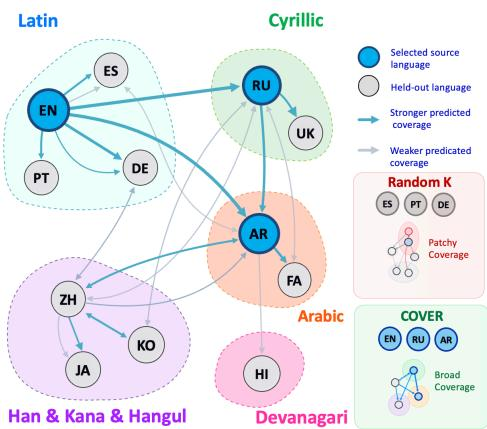
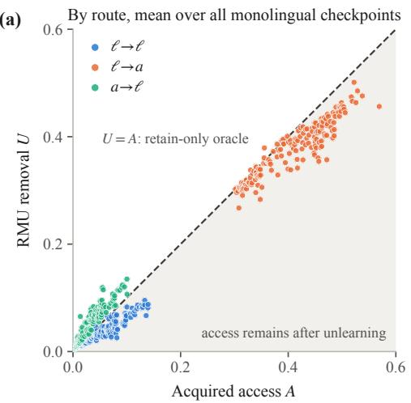
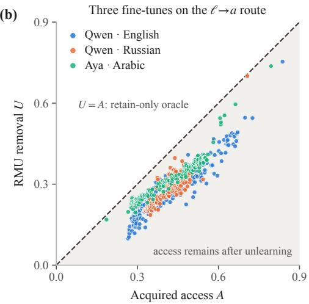
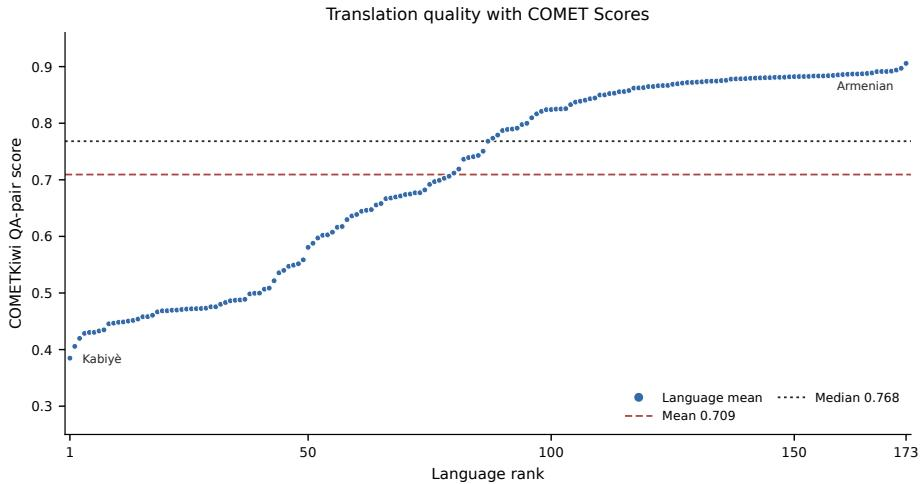
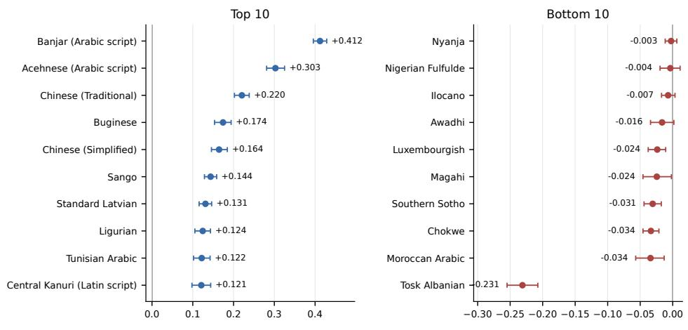
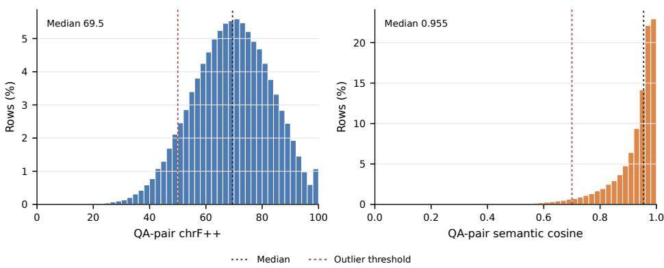
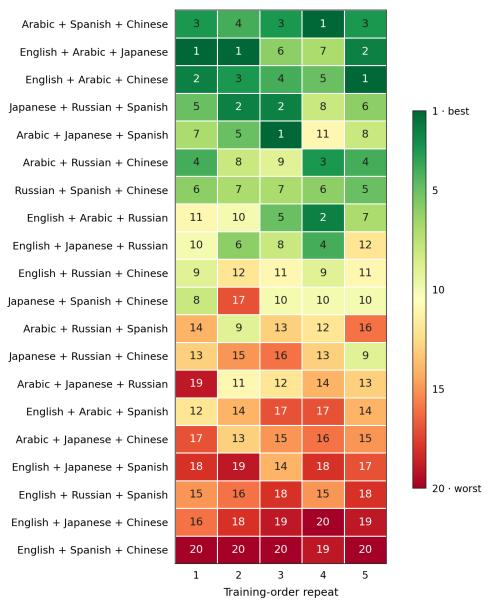
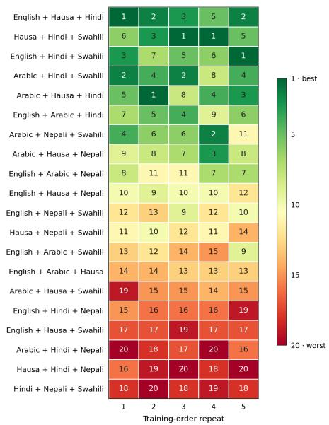
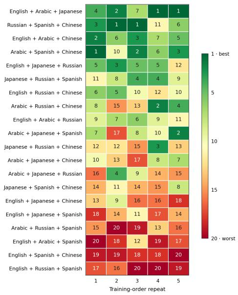
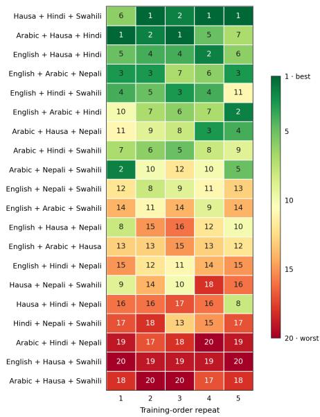

# LINGUISTIC LOOPHOLES IN LLM UNLEARNING: FROM A 174-LANGUAGE BENCHMARK TO COVERAGE-AWARE UNLEARNING

Tyler Skow, Shravan Chaudhari, Rama Chellappa & Abhay Yadav   
Johns Hopkins University   
tskow1@jh.edu

## ABSTRACT

Unlearning a fact in one language does not guarantee its removal in others as changing the query or even the requested answer language can reopen seemingly forgotten knowledge—a cross-lingual loophole. The most straightforward solution to this challenge – unlearning in all languages – is neither scalable nor desirable as it amplifies damage to unrelated model capabilities. We introduce the task of language budgeted multilingual unlearning where the goal is to select a subset of languages that maximizes cross-lingual erasure. To study this task we introduce CROSS-LINGUAL UNLEARNING TENSOR, an unlearning benchmark that spans 174 language–script pairs and 25 atomic paraphrase types to examine when forgetting generalizes across linguistic expressions of the same knowledge. We further propose COVER, which selects source languages to maximize predicted COVERage of languages receiving no forget supervision, enabling unlearning on a language budget. Surprisingly, we find naively selecting strong individual sources does not reliably compose into strong source sets motivating our development of COVER. At deployment COVER only requires benign calibration data and access to the frozen model. Across three model families and two disjoint forget sets, COVER reduces mean held-out residual access by 7.8–27.3% relative to uniform source selection. We find these gains extend beyond synthetic benchmarks to real news documents in low-resource language settings using human translated data from the Low Resource Languages for Emergent Incidents (LORELEI) corpus. 1

## 1 INTRODUCTION

Large language models can memorize and reproduce data seen during pretraining and fine tuning, including private content, copyrighted material, or knowledge that later becomes unsafe (Carlini et al., 2021; Lukas et al., 2023; Lee et al., 2023; Chang et al., 2023; Li et al., 2024). Guardrails and inference time interventions can mitigate unwanted behavior, but they provide limited protection when users have white-box access to model parameters. Retraining from scratch without the ofending data ofers the strongest possible remedy, but it’s typically impractical given the resources required. This motivates LLM unlearning: update a model trained on data D so that its behavior on a forget set F ⊆ D approximates a model trained without F while preserving utility on retained data R.

As frontier language models improve in multilingual generation and understanding, so too does the surface area for accessing memorized knowledge across languages (Zhao et al., 2024; Qi et al., 2023). This creates a potential challenge for Machine Unlearning (MU), as removal in one language may not guarantee forgetting in another. Recent works have documented this cross-lingual failure mode (Farashah et al., 2026; Xiang et al., 2026; Choi et al., 2024; Lu & Koehn, 2025), but existing studies cover a limited set of languages which tend to be high resource.

  
Figure 1: Language-budgeted unlearning. COVER selects K source languages (blue) to cover held-out languages (grey). Shaded regions group languages by script for visual orientation. Connection and spatial layout are schematic.

We release CROSS-LINGUAL UNLEARNING TENSOR, a multilingual unlearning dataset spanning 174 language–script pairs. Through the release of CROSS-LINGUAL UNLEARNING TENSOR, we study the dynamics of language and unlearning from five perspectives: the language the fact is learned in, the language(s) used to unlearn it, the language of the evaluation query, the language of the scored answer and how various same language paraphrases difer in terms of eliciting unlearned knowledge.

CROSS-LINGUAL UNLEARNING TENSOR shows that unlearning in one language can leave the same facts accessible through other query–answer routes. Full parallel forget data are often unavailable, and translating each request into every evaluation language increases cost. In our experiments, alllanguage supervision also increases damage to retained facts and multilingual generation (Table 21).

We therefore study language budgeted multilingual unlearning. Forget supervision is available only in a source subset ${ \mathcal { L } } _ { \mathrm { s r c } } \subset { \mathcal { L } }$ , with $| { \mathcal { L } } _ { \mathrm { s r c } } | = K$ . We evaluate forgetting in held-out languages $\mathcal { L } _ { \mathrm { h e l d } } =$ $\mathcal { L } \setminus \mathcal { L } _ { \mathrm { s r c } } .$ , alongside retained knowledge and multilingual capabilities.

We introduce COVER (COVerage-guided source selection for multilingual ERasure), which uses only benign calibration data to select sources for expected held-out coverage before applying an unlearning objective. It requires no held-out forget examples at deployment. COVER improves heldout forgetting and can reduce generated disclosure more than selecting the three strongest individual sources. Furthermore, we validate the performance of COVER on non-synthetic data and human generated translations through the Low Resource Languages for Emergent Incidents (LORELEI) corpus of news documents (Strassel & Tracey, 2016). On Aya (Salamanca et al., 2026) and Qwen (Yang et al., 2025) model families, source selection developed on CROSS-LINGUAL UNLEARNING TENSOR improves cross-lingual forgetting on our constructed LORELEI document removal task spanning eight languages. We summarize our contributions as follows:

1. Constructed CROSS-LINGUAL UNLEARNING TENSOR, a dataset with 174 language–script pairs (diverse scripts and resource levels), 25 atomic paraphrase types, translated paraphrases and evaluation on query and answer routes separately, enabling a systematic study of how language and wording afect unlearning.

2. Formalized the language-budgeted multilingual unlearning setting where we need to select K source languages for forgetting that generalizes to held-out languages while preserving retained knowledge and multilingual capabilities.

3. We show that meeting the removal criterion on a supervised route does not guarantee multilingual forgetting and characterize residual access across query and answer language routes.

4. We propose COVER, which selects sources without held-out forget examples at deployment and reduces held-out residual access across existing benchmarks and real-world lowresource settings.

## 2 PROBLEM FORMULATION AND EVALUATION PROTOCOL

Unlearning Let M be an LM trained on distribution D. In unlearning, we are given a forget set $\mathcal { F }$ $\subset D$ and a retain set $\mathcal { R } \subset D$ , with the goal of producing an unlearned model $M ^ { \prime }$ that behaves as if it had been trained on $D \backslash { \mathcal { F } }$ . We use R to measure drift from capabilities we wish the model to retain (Cao & Yang, 2015).

Multilingual Unlearning Let $x = ( q _ { \ell } , a _ { \ell } , s )$ denote a sample with query language $q _ { \ell } .$ , target answer language $^ { a \ell } \cdot$ and unlearning target s, where s groups paraphrases that query the same underlying fact. Under a language budgeted unlearning request, forget examples are available only in source languages ${ \mathcal { L } } _ { \mathrm { s r c } } \subset { \mathcal { L } }$ , where $\mathcal { L }$ is a set of all languages $\ell , | \mathcal { L } _ { \mathrm { s r c } } | = K$ , while evaluation covers both $\mathcal { L } _ { \mathrm { s r c } }$ and held out languages $\mathcal { L } _ { \mathrm { h e l d } } = \mathcal { L } \setminus \mathcal { L } _ { \mathrm { s r c } \cdot } \cup$ route $\ell _ { q } \to \ell _ { a }$ specifies the query and answer languages; a native route uses the same language for both.

Notation For an example x let $p _ { \mathrm { M } } ( x )$ be the teacher forced answer likelihood of the gold answer. For an evaluation route, $p _ { \mathrm { M } }$ denotes the mean of these scores. FT, O and U denote the finetuned, retain only oracle and unlearned models. We define oracle normalized residual access as $\begin{array} { r } { R = \frac { p _ { \mathrm { U } } - p _ { 0 } } { p _ { \mathrm { F T } } - p _ { 0 } } } \end{array}$ , and oracle normalized removal = 1 − R. R = 0 matches oracle, $R = 1$ matches finetuned model. 100R expresses remaining likelihood gap above retain oracle as a percentage of original vs. finetunedoracle gap.

Evaluation protocol We use a matched source forget protocol so methods are compared after reaching the same amount of source-language forgetting. Without this control, a method can look efective because it overforgets and produces gibberish output, or appear to preserve retained knowledge because it has not forgotten. We evaluate checkpoints at dense intervals up to a fixed number of optimization steps and select the first checkpoint reaching an oracle normalized progress threshold, inspired by MU95 in (Lee et al., 2025). Source progress measures the fraction of the finetuned vs. oracle likelihood gap removed at a checkpoint. Let $S \ = \ C _ { \mathrm { s r c } } ,$ t index a checkpoint, and $p _ { t , \ell }$ denote mean forget answer likelihood on the source route $\ell \ \to \ \ell .$ Define $\mathrm { P r o g r e s s } _ { t , \ell } =$ $( p _ { \mathrm { F T } , \ell } - p _ { t , \ell } ) / ( p _ { \mathrm { F T } , \ell } - p _ { 0 , \ell } + \epsilon )$ . We select the first checkpoint satisfying

$$
\frac { 1 } { | { \cal S } | } \sum _ { \ell \in { \cal S } } \mathrm { P r o g r e s s } _ { t , \ell } \ge 0 . 9 5 , \qquad \operatorname* { m i n } _ { \ell \in { \cal S } } \mathrm { P r o g r e s s } _ { t , \ell } \ge 0 . 9 0 .\tag{1}
$$

Since forgetting is matched on source language the evaluation is mean and maximum oracle normalized residual access R across held-out routes. We also evaluate on extraction strength (Dorna et al., 2025) and finally open ended generation, which we classify as full leakage, partial leakage, codeswitching and gibberish output via an LLM judge. We also include chrF++ scores to measure text similarity (Popović, 2017). subsection A.6 details the generation judge and the extraction-strength score.

## 3 CROSS-LINGUAL UNLEARNING TENSOR

Table 1: The CROSS-LINGUAL UNLEARNING TENSOR at a glance. Coverage across language, expression, and model axes; scored routes are defined in the text.
<table><tr><td>Axis</td><td>Size</td><td>Composition</td></tr><tr><td>Language-script pairs</td><td>174</td><td>18 scripts; 27 high-, 46 medium-, 101 low-resource; scored in both roles</td></tr><tr><td>Question forms</td><td>25</td><td>ETPC atomic paraphrase types in seven meta-categories (Kovatchev et al., 2018); seven types translated into 40 languages (1,690 rows per language)</td></tr><tr><td>Fine-tuned checkpoints</td><td>103</td><td>81 monolingual (27 languages per model family) and 22 multilingual configurations over Tiny Aya (Salamanca et al., 2026), Qwen3 (Yang et al., 2025) and Llama 3 (Grattafiori et al., 2024), each with a matched retain-only oracle</td></tr><tr><td>Unlearned checkpoints</td><td>287</td><td>243 monolingual endpoints  $( 8 1 \times 3$  methods: SimNPO (Fan et al., 2025), RMU (Li et al., 2024), GradDiff (Dorna et al., 2025)) and 44 Aya trilingual endpoints, stopped at matched source forgetting</td></tr></table>

Our benchmark enables the study of multilingual unlearning with 174 language–script pairs across resource tiers. Moreover, we release forget samples re-expressed through 25 syntactically diverse paraphrase types and then translations of those paraphrases (translated paraphrases) into 40 of these languages. We use TOFU (Maini et al., 2024) and LUME (Ramakrishna et al., 2025) as the building blocks for our dataset. Task of Fictitious Unlearning (TOFU) Maini et al. (2024) is synthetic author-profile QA with 1%, 5%, and 10% forget splits and matching retain splits; we use 10%. LLM Unlearning with Multitask Evaluations (LUME) Ramakrishna et al. (2025) contains creative short novels, biographies with PII and real biographies from Wikipedia. We finetune on all of these tasks.

For external validation on natural text, we construct, to the best of our knowledge, the first unlearning benchmark on the Low Resource Languages for Emergent Incidents program (Strassel & Tracey, 2016). The subset of the LORELEI corpus we use consists of news web pages. Our LORELEI benchmark consists of 100 documents with human translations in English, Hindi, Spanish, Russian, Chinese, Swahili, Bengali, and Vietnamese. The translations provide matched content across languages, allowing us to study source-language choice beyond synthetic QA.

(a)  

  
Figure 2: Uneven RMU transfer across language routes. Points are evaluation languages; acquired access is $A = p _ { \mathrm { F T } } - p _ { 0 }$ and removal is $U = p _ { \mathrm { F T } } - p _ { \mathrm { U } }$ . Shading marks $U < A$ . (a) Means over monolingual checkpoints. (b) Qwen English, Qwen Russian, and Aya Arabic fine-tunes on $\ell \to a$

An entry in CROSS-LINGUAL UNLEARNING TENSOR is a forget fact, learned, unlearned, queried, and answered under diferent chosen languages, paraphrases and translated paraphrases. We colloquially refer to a given combination of query and answer representation as a route. The behavior of a route varies depending on languages used for learning and unlearning. Each cell stores $p _ { M } ( x )$ , the length normalized teacher forced probability of the gold answer for the sample $x = ( q _ { \ell _ { q } } , a _ { \ell _ { a } } , s )$ of section 2.

We sparsely score five query–answer grids through acquisition language a and English: $\ell \to a$ and $a  \ell$ vary the query and answer language, respectively, over 174 language–script pairs; ℓ → en and en → ℓ repeat these controls through English; and ℓ → ℓ tests native-language access in the 173 other language–script pairs.

In Table 1 we provide a breakdown of our full benchmark coverage and Table 7 summarizes our paraphrase taxonomy. The full language set and complete paraphrase type definitions are in Appendix A. We finetune each model family (Tiny Aya (Salamanca et al., 2026), Qwen3 (Yang et al., 2025) and Llama 3 (Grattafiori et al., 2024)) in 27 languages, generating 81 monolingual checkpoints. The 22 multilingual checkpoints comprise seven three-language mixtures for Tiny Aya and five shared five-/six-language mixtures per model family, bringing the total to 103 fine-tuned checkpoints, each with a matched retain-only oracle. Unlearning produces 287 checkpoints: 243 from the monolingual checkpoints (three methods per checkpoint) and 44 from the Aya trilingual checkpoints. Table 8 contains the details on these language sets. For the details on how we generated our translations and paraphrases, please refer to Appendix B and subsection A.3.

## 3.1 FINDINGS FROM THE CROSS-LINGUAL UNLEARNING TENSOR

Does unlearning transfer across languages? The first question we might ask of the CROSS-LINGUAL UNLEARNING TENSOR is when we finetune in one language, to what extent does that knowledge become accessible in our other 173 language–script pairs? We see in Table 2A that uplift across languages is broad but concentrated on the query side. Gains are much smaller when the answer must also be expressed in another language. In Table 16b and Table 16c we rank languages by how much access they gain when only the query language is allowed to change and when both query and answer language change from the fine-tuned language. In terms of acquisition languages that produce the largest mean gains across $\ell \to \ell$ routes, Spanish wins across all three model families Table 16a.

Table 2: Acquisition and unlearning transfer across language routes. (A) Gains over the base model after fine-tuning in $^ { a ; }$ suficient access requires $p _ { \mathrm { F T } } ~ \ge ~ 0 . 1 0$ and $\mathrm { g a i n } \ge 0 . 0 5$ . (B) Oraclenormalized removal after unlearning in a; final columns report languages reaching ≥ 90% removal and worst-language residual. Values above 100 indicate suppression below the retain-only oracle.
<table><tr><td colspan="6">(A) Acquisition: likelihood gain over base</td></tr><tr><td>Model</td><td>a→a</td><td>l→a</td><td>l→l</td><td>l → l with sufficient access</td><td></td></tr><tr><td>Aya</td><td>+0.85</td><td>+0.49</td><td>+0.14</td><td>65.3%</td><td></td></tr><tr><td>Qwen</td><td>+0.84</td><td>+0.47</td><td>+0.10</td><td>65.5%</td><td></td></tr><tr><td>Llama</td><td>+0.76</td><td>+0.45</td><td>+0.03</td><td>29.6%</td><td></td></tr><tr><td>Mean</td><td>+0.82</td><td>+0.47</td><td>+0.09</td><td>53.5%</td><td></td></tr><tr><td colspan="6">(B) Unlearning: oracle-normalized removal (%)</td></tr><tr><td>Method</td><td>a → a</td><td>l→a</td><td>l→l</td><td>Other languages ≥ 90% removed</td><td>Worst language: access left</td></tr><tr><td>SimNPO</td><td>97.2</td><td>91.0</td><td>81.8</td><td>30.0</td><td>49.2</td></tr><tr><td>GradDiff</td><td>99.7</td><td>96.4</td><td>110.5</td><td>71.1</td><td>26.2</td></tr><tr><td>RMU</td><td>100.2</td><td>91.1</td><td>63.5</td><td>18.0</td><td>75.4</td></tr></table>

Do languages that show strong transfer during learning also show strong forgetting during unlearning? We might next wonder to what extent unlearning in one language transfers to others, and second, if there is a relationship between languages that learn from each other and languages that unlearn from each other. In Table 2B we see that unlearning leaves behind residual access in a large number of side-door languages. Across the full tensor, less than 20% of alternative access routes reach the same closure level as a → a, suggesting a cross lingual asymmetry in learning vs unlearning. This asymmetry is well defined in Figure 2, where points below the diagonal show residual access remaining greater than the oracle matched acquisition language removal. In Table 17 we rank the greatest language bottlenecks, languages with the worst unlearning transfer across all unlearning methods. The languages we see in this list are varied. The majority are low resource, but Russian and Chinese also consistently rank as tricky removal cases. In Table 18 we examine if languages that gain more are also the ones that lose more. We see that stronger acquisition transfer generally goes hand in hand with larger absolute drops. Figure 2 illustrates this distinction for RMU. Points below the diagonal indicate that removal falls short of the acquired access above the retainonly reference. Panel (a) of Figure 2 shows the large discrepancy in access when query vs answer is varied.

Does the way we ask matter? As a motivating experiment to see how various representations of the same fact afect access, we look at Romanized vs native scripts in a fixed language setting. Consider the setting where we unlearn with native Hindi questions vs. unlearning with Romanized Hindi questions holding native Hindi answers fixed. After unlearning with Romanized Hindi questions, we see weak removal when evaluating with native Hindi script (and vice versa). See Table 20 for the full result. This suggests our evaluated unlearning methods suppress syntactic routes rather than semantic pathways, motivating our detailed examination of paraphrases. Accordingly, we report which of our paraphrase types leave the correct answer most accessible after unlearning. Modal verb paraphrases rank first in all three model families (Table 19). Subordination and sentence-modality variants also rank highly, although their ordering varies across models. Qualitatively, we observe that the stronge paraphrase types often change how information is requested (Figure 3).

## 4 LANGUAGE BUDGETED UNLEARNING WITH COVER

Our goal is to select K source languages eficiently, without held out forget data at deployment, and generalize to unseen deletion requests.

<table><tr><td colspan="2">(a) Script: unlearned with Romanized Hindi questions, native Hindi answers. Tell me which genre Kalkidan Abera mainly writes in.</td></tr><tr><td>Romanized Hindi Mujhē batāiē ki Kālkidān Aberā mukhya rūpa sē</td><td>Native-script Hindi 時羽市可3可市a並</td></tr><tr><td>kis vidhā mēm likhatī haim. 0.538 → &lt; 0.001</td><td>Ped 0.984 → 0.955</td></tr><tr><td colspan="2">(b) Phrasing: two paraphrases of one English question, after unlearning.</td></tr><tr><td>Direct request 0.827</td><td>Reordered question 0.621</td></tr><tr><td>Tell me the full name of the author born in Baku, Azerbaijan on October 12th, 1987.</td><td>What is the full name of the author born on October 12th, 1987 in Baku, Azerbaijan?</td></tr></table>

Figure 3: Residual access depends on expression. (a) Gold-answer likelihood before and after unlearning; changing script leaves the fact accessible. (b) Post-unlearning gold-answer likelihood varies across paraphrases.

## 4.1 METHOD

To achieve this goal, we measure how similarly the model represents calibration data across languages. The pairwise alignment between source and held out languages informs a candidate source set’s coverage, or how well we anticipate supervision on a source set will generalize to the held out set. We compare a fixed versus learned approach for scoring coverage. Fixed coverage uses crosslanguage similarities directly; learned coverage fits a scorer to historical unlearning outcomes. We draw inspiration from prior work that compares the similarity of semantically matched versus mis matched translated examples (Zeng et al., 2025). For each source to held out language pair we define a margin as an example’s similarity to its direct translation minus its similarity to the most similar non matching example in the held out calibration set. We compute cosine similarities of final prompt token hidden states across decoder blocks, using two disjoint calibration sets ${ \cal B } ^ { ( p ) } , p \in \{ 1 , 2 \}$ , drawn from the retain set to reduce sensitivity to individual samples. For example i in calibration set $p$ and language $\ell ,$ let $h _ { \theta , b } ( x _ { i , \ell } ^ { ( p ) } )$ denote decoder block $b \mathbf { \bar { s } }$ output at the final prompt token. Averaging over the $B _ { \theta }$ decoder blocks gives $\begin{array} { r } { \boldsymbol { a } _ { s , t } ^ { ( p ) } ( i , j ) = \frac { 1 } { B _ { \theta } } \sum _ { b = 1 } ^ { B _ { \theta } } \cos \Bigl ( h _ { \theta , b } ( \boldsymbol { x } _ { i , s } ^ { ( p ) } ) , h _ { \theta , b } ( \boldsymbol { x } _ { j , t } ^ { ( p ) } ) \Bigr ) } \end{array}$ . Here $a _ { s , t } ^ { ( p ) } ( i , j )$ compares example i in the source language with example j in the target language. We define the per example similarity margin as

$$
\delta _ { s \to t } ^ { ( p ) } ( i ) = a _ { s , t } ^ { ( p ) } ( i , i ) - \operatorname* { m a x } _ { 1 \leq j \leq n _ { p } } a _ { s , t } ^ { ( p ) } ( i , j ) , \qquad n _ { p } = | \boldsymbol { B } ^ { ( p ) } | .
$$

Averaging margins within each calibration set and weighting the sets equally gives $\begin{array} { r l } { M _ { s \to t } } & { { } = } \end{array}$ $\begin{array} { r } { \frac { 1 } { 2 } \sum _ { p = 1 } ^ { 2 } \frac { 1 } { n _ { p } } \sum _ { i = 1 } ^ { n _ { p } } \delta _ { s  t } ^ { ( p ) } ( i ) } \end{array}$ for s $\neq t$

Fixed coverage For candidate source sets $S _ { K } = \{ S \subseteq { \mathcal { L } } : | S | = K \}$ , let $T ( S ) = { \mathcal { L } } \backslash$ S. Fixed coverage averages each held-out language’s strongest source margin:

$$
c _ { t } ( S ) = \operatorname* { m a x } _ { s \in S } M _ { s  t } , \qquad F _ { \mathrm { F R } } ( S ) = \frac { 1 } { | T ( S ) | } \sum _ { t \in T ( S ) } c _ { t } ( S ) , \qquad \widehat { S } _ { \mathrm { F R } } = \operatorname* { a r g m a x } _ { S \in \mathcal { S } _ { K } } F _ { \mathrm { F R } } ( S ) .
$$

Learned coverage Inspired by LangRank (Lin et al., 2019), which implements a learned ranker from transfer languages to downstream task languages, COVER learns to rank source sets from historical unlearning outcomes. Our features capture weak or uneven target coverage and support from multiple sources with the mean, minimum, and standard deviation of $c _ { t } ( S )$ across held-out languages; the mean and minimum $M _ { s  t }$ over pairs of selected sources and held-out targets; and the target-averaged mean of each target’s two strongest source margins. We standardize each feature using its historical training mean and standard deviation to obtain $ { \widetilde { \phi } } ( S ) \in \mathbb { R } ^ { 6 }$ . We fit a linear scorer with weighted pairwise logistic loss and $\ell _ { 2 }$ regularization, comparing sets only within the same parent checkpoint, candidate inventory, and historical deletion request. The resulting score is $F _ { \mathrm { P W } } ( S ) = w ^ { \top } \widetilde { \phi } ( S )$ , selecting ${ \widehat { S } } _ { \mathrm { P W } } = \arg \operatorname* { m a x } _ { S \in { \mathcal { S } } _ { K } } F _ { \mathrm { P W } } ( S )$ . The learned ranker fits 180 subset e boutcomes from the nine development grids, each averaged over five orders.

Optional source language weighting COVER uses uniform weighting in the forget loss for each source language. We test if after fixing the source set, additional weightings can also improve performance on held-out language forgetting. We again restrict ourselves to using only benign calibration data to estimate source to held out language gradient afinities and choose source weights that maximize the minimum weighted afinity to held out languages. The resulting weights scale only the forget loss. See subsection D.5 for full method details.

## 4.2 EXPERIMENT DESIGN

We evaluate Tiny Aya, Qwen3, and Llama (subsection A.4) fine-tuned on three six-language sets. script-diverse (EN, AR, JA, RU, ES, ZH), Latin-script (EN, DE, ID, SW, TR, VI), and low-resource (EN, AR, HA, HI, NE, SW). For each of the nine checkpoints, we run SimNPO with uniform source weighting on all 41 subsets of sizes one through three. Repeated rankings focus on all 20 triples $( K = 3 )$ . Endpoints follow section 2; the primary metric is mean residual R over native routes in the 6 − K languages without forget supervision.

To generate empirical ranking we run every triple under five training data orderings. We rank the 20 triples separately within each order and summarize ranking agreement by the median pairwise Spearman correlation across orders. We also select the triple with lowest mean residual over four orders and evaluate it against uniform selection on the fifth, rotating across all five held-out orders. Across disjoint forget requests, we repeat the same grid and compute Spearman correlations between the order-averaged subset rankings. This tests whether useful rankings recur when the forget set changes.

We include as a baseline Individual top-3 which ranks six singleton sources by mean residual in the other five languages over three orders, then jointly unlearns on the three lowest residual sources. It requires 18 preliminary runs per model and target request data in all six languages; COVER uses benign calibration at deployment. A deletion request specifies the facts to remove. We label two additional TOFU forget sets A and B; each contains 400 QA pairs and is disjoint from the other and the development forget set. These sets were excluded from fitting.

## 4.3 RESULTS

Source selector performance. Our results support that selection choice matters. Across all checkpoints we observe that the best language subsets improve held out residual by 14.0-31.4% over uniform. In the low resource inventory, the worst subsets leave 2.04×, 1.94 × and 1.92 × the residual access of the best subsets for Aya, Llama, and Qwen. See Table 3 for the full breakdown of all model family-language set pairs. This establishes substantial headroom in the best versus worst source sets, but do ‘good’ empirical rankings generalize across disjoint forget requests? Table 23 shows the strong correlations both within requests where the orders vary and between disjoint sets. We see the weakest correlation in the Latin script inventory. Its smaller median pairwise gaps, 2.36-3.05 oracle normalized points versus 5.13-6.40 for script-diverse and 7.63-11.33 for low-resource, may make rankings harder to resolve. Overall, we observe that strong correlation does not guarantee a universal best subset. Qwen request B has cross-request $\rho = 0 . 6 6 8$ , but only one shared top-five subset. This supports recurring ranking structure more strongly than a universally reusable best source set. Figure 8 illustrates this shared structure well.

We next consider if COVER exploits the empirical headroom we observe on disjoint forget requests (Table 4a). COVER reduces mean residual access in held out languages without forget supervision by 7.8–27.3% relative to uniform selection. It chooses the same subsets as fixed coverage for Aya and Qwen. These results support useful source selection across forget requests.

We evaluate Qwen3-4B on a new LUME document-removal request of 173 document groups, disjoint from the earlier request and calibration data (Table 4b). Source choices are fixed before training. COVER selects the subset with the lowest held out residual access in both training runs on this forget set. It reduces mean residual access by 21.3% relative to uniform selection, compared with 3.9% for fixed coverage and 4.9% for reusing the best subset from the previous LUME forget request.

(c) LORELEI news documents with human translations  
Table 3: Source choice afects forgetting, with inventory-dependent ranking stability. Residuals average five training orders; best and worst triples minimize and maximize this mean. Uniform averages all 20 triples. Gains are point or relative reductions from uniform. ρ is the median pairwise Spearman correlation across order-specific rankings.
<table><tr><td></td><td></td><td colspan="3">Residual access 100R↓</td><td colspan="3">Gain over uniform ↑</td><td>Ranking consistency</td></tr><tr><td>Inventory</td><td>Model</td><td>Best</td><td>Uniform</td><td>Worst</td><td>Best (pts)</td><td>Worst (pts)</td><td>Best (%)</td><td>ρ</td></tr><tr><td>Script-diverse</td><td>Qwen</td><td>33.59</td><td>41.94</td><td>52.93</td><td>+8.35</td><td>-10.99</td><td>19.9</td><td>0.813</td></tr><tr><td></td><td>Aya</td><td>31.38</td><td>41.38</td><td>54.17</td><td>+10.00</td><td>-12.79</td><td>24.2</td><td>0.850</td></tr><tr><td></td><td>Llama</td><td>46.15</td><td>53.69</td><td>62.26</td><td>+7.53</td><td>-8.57</td><td>14.0</td><td>0.663</td></tr><tr><td>Low-resource</td><td>Qwen</td><td>34.32</td><td>48.60</td><td>65.92</td><td>+14.28</td><td>-17.32</td><td>29.4</td><td>0.886</td></tr><tr><td></td><td>Aya</td><td>28.89</td><td>39.85</td><td>58.97</td><td>+10.96</td><td>-19.12</td><td>27.5</td><td>0.875</td></tr><tr><td></td><td>Llama</td><td>33.40</td><td>48.71</td><td>64.96</td><td>+15.31</td><td>-16.25</td><td>31.4</td><td>0.805</td></tr><tr><td>Latin-script</td><td>Qwen</td><td>28.02</td><td>32.99</td><td>41.48</td><td>+4.97</td><td>-8.49</td><td>15.1</td><td>0.408</td></tr><tr><td></td><td>Aya</td><td>20.41</td><td>24.97</td><td>30.09</td><td>+4.56</td><td>-5.12</td><td>18.3</td><td>0.453</td></tr><tr><td></td><td>Llama</td><td>28.82</td><td>34.66</td><td>47.37</td><td>+5.84</td><td>-12.71</td><td>16.8</td><td>0.203</td></tr></table>

Table 4: Source selection across deletion requests and datasets. Gains are point reductions in 100R from uniform over all 20 triples; extra retain damage is in retained-probability points. (a) TOFU: mean ± SD over five orders; “= Fixed” marks identical subsets. (b) LUME request B: two realizations; all-six includes sources. (c) LORELEI: means over two orders; ∆chrF++ is on retained generations. Historical best reuses the best subset from an earlier request.

<table><tr><td colspan="2"></td><td colspan="3">Reduction in held-out 100R ↑</td></tr><tr><td>Model / request</td><td>Uniform 100R↓</td><td>Fixed coverage</td><td>Historical best</td><td>COVER</td></tr><tr><td>Aya / A</td><td>39.23</td><td> $+ 1 0 . 7 0 { \scriptstyle \pm 1 . 6 2 }$ </td><td> $+ 7 . 0 3 { \pm } 2 . 4 3$ </td><td>= Fixed</td></tr><tr><td>Aya /B</td><td>36.57</td><td> $+ 9 . 8 4 { \pm } 0 . 8 9$ </td><td> $+ 9 . 3 6 { \pm } 2 . 1 0$ </td><td>= Fixed</td></tr><tr><td>Qwen / A</td><td>49.94</td><td> $+ 6 . 7 2 \pm 3 . 1 3$ </td><td> $+ 5 . 6 5 { \pm } 1 . 8 7$ </td><td>= Fixed</td></tr><tr><td>Qwen / B</td><td>47.06</td><td> $+ 6 . 1 4 \pm 4 . 2 9$ </td><td> $+ 4 . 3 8 { \pm } 2 . 9 6$ </td><td>= Fixed</td></tr><tr><td>Llama / A</td><td>48.66</td><td> $+ 3 . 6 8 { \pm } 3 . 8 4$ </td><td> $+ 1 1 . 2 5 { \pm } 4 . 2 7$ </td><td>+3.80±6.94</td></tr><tr><td>Llama / B</td><td>49.91</td><td> $+ 6 . 1 8 { \pm } 3 . 9 6$ </td><td> $+ 7 . 5 0 { \pm } 4 . 0 3 $ </td><td> $+ 7 . 4 8 { \pm } 1 . 9 4$ </td></tr></table>

<table><tr><td colspan="7">(b) LUME, one held-out request</td></tr><tr><td>Selection policy</td><td>Sources</td><td>Rank r1/r2</td><td>Held-out 100R↓</td><td>Held-out reduction ↑</td><td>All-six reduction ↑</td><td>Extra retain damage ↓</td></tr><tr><td>Uniform</td><td>all 20 triples</td><td></td><td>40.84</td><td>0</td><td>0</td><td>0</td></tr><tr><td>Fixed coverage</td><td>JA/ES/ZH</td><td>7/10</td><td>39.26</td><td>+1.58</td><td>+0.90</td><td>-3.19</td></tr><tr><td>Historical best</td><td>AR/EN/JA</td><td>11/5</td><td>38.82</td><td>+2.02</td><td>+1.41</td><td>-1.75</td></tr><tr><td>COVER</td><td>EN/JA/RU</td><td>1/1</td><td>32.13</td><td>+8.71</td><td>+4.76</td><td>+1.30</td></tr></table>

<table><tr><td colspan="2"></td><td colspan="2">Held-out reduction ↑</td><td colspan="2"></td></tr><tr><td>Model</td><td>Policy</td><td>Document beginning</td><td>Document interior</td><td>Extra retain damage ↓</td><td>Retained  $\Delta \mathrm { c h r F + + } \uparrow$ </td></tr><tr><td>Aya</td><td>COVER (= Fixed)</td><td>+4.60</td><td>+1.45</td><td>-0.43</td><td>-5.57</td></tr><tr><td>Qwen</td><td>COVER (= Fixed)</td><td>+2.31</td><td>+0.79</td><td>+0.75</td><td>-1.75</td></tr></table>

Table 5: Generated-answer evaluation on the script-diverse inventory. ES and behavior (%), averaged over three orders and six native routes (retention: Aya six, Qwen/Llama five excluding Arabic). Random controls: EN/AR/ZH, EN/JA/ES, AR/JA/RU. Individual top-3 selects the strongest singleton sources. Metric definitions: subsection A.6.
<table><tr><td>Model</td><td>Policy</td><td>ES↓</td><td>Full leakage ↓</td><td>Any disclosure ↓</td><td>Retained recovery ↑</td><td>Gibberish ↓</td><td>Code- switching ↓</td></tr><tr><td>Aya</td><td>Controls</td><td>0.2572</td><td>29.35</td><td>52.28</td><td>69.48</td><td>1.52</td><td>6.70</td></tr><tr><td>Aya</td><td>Individual top-3</td><td></td><td>29.76</td><td>52.15</td><td>70.33</td><td>4.06</td><td>8.76</td></tr><tr><td>Aya</td><td>COVER</td><td>0.2319</td><td>25.57</td><td>47.13</td><td>71.44</td><td>4.39</td><td>9.41</td></tr><tr><td>Qwen</td><td>Controls</td><td>0.2433</td><td>27.32</td><td>50.93</td><td>75.24</td><td>2.41</td><td>7.92</td></tr><tr><td>Qwen</td><td>Individual top-3</td><td></td><td>25.22</td><td>49.63</td><td>72.93</td><td>1.72</td><td>8.22</td></tr><tr><td>Qwen</td><td>COVER</td><td>0.2215</td><td>25.22</td><td>48.13</td><td>71.60</td><td>2.91</td><td>6.52</td></tr><tr><td>Llama</td><td>Controls</td><td>0.2155</td><td>28.50</td><td>52.04</td><td>73.78</td><td>11.06</td><td>11.98</td></tr><tr><td>Llama</td><td>Individual top-3</td><td></td><td>32.37</td><td>56.70</td><td>74.13</td><td>7.11</td><td>10.89</td></tr><tr><td>Llama</td><td>COVER</td><td>0.1940</td><td>25.72</td><td>50.33</td><td>79.60</td><td>9.31</td><td>12.87</td></tr></table>

Behavioral and LORELEI performance. Do COVER’s gains translate to an actual reduction in leakage? Table 5 shows that they do with COVER beating controls on extraction strength, full leakage, partial leakage. Gibberish scores remain low as well suggesting these gains are not coming at the cost of model collapse. Compared to Individual top-3 COVER improves Llama’s leakage from 32.37% to 25.72%, Aya’s 29.76% to 25.57% and Qwen ties. Although gibberish increases for all three families, the fraction of answers with no disclosure, no judged gibberish and only the requested language increases by 5.6 percentage points for Llama and 4.6 percentage points for Aya. We also evaluate source selection on the human translated news documents in LORELEI (Table 4c). COVER reduces mean residual access in held out languages by 6.1% for Aya and 2.6% for Qwen when prompts begin at the start of a document. These improvements occur under both training orders. Improvements are smaller for prompts drawn from document interiors, at 2.0% and 0.9%, respectively. These results extend the evidence for useful source selection to natural documents, with smaller gains and measurable retention tradeofs.

Source weighting shows model dependent tradeofs. Finally we compare calibrated and uniform weights on a TOFU deletion request with three paired training orders with the script diverse language set. We find in Qwen with EN, AR, ZH source set, calibrated weights reduce leakage across all six languages from 34.44% to 25.65%. Retain also improves from 80.56% to 81.44% and gibberish decreases from 0.63% to 0.43%. Full leakage in held out JA, RU and ES decreases from 39.00% to 29.59% over uniform weighting. For Llama, improvements in leakage come at a sharp utility cost. Full disclosure falls from 31.76% to 26.33%, but gibberish jumps from 5.69% to 18.48%.

## 5 RELATED WORK

LLM unlearning MU is formalized in Cao & Yang (2015) and addresses the issue of removing the influence of targeted training data without requiring full retraining. For LLMs, methods for unlearning take a variety of forms including gradient ascent based methods (Jang et al., 2023), preference optimization methods (Zhang et al., 2024; Fan et al., 2025), representation based methods (Li et al., 2024) and localization interventions Jia et al. (2024); Wu et al. (2023).

Multilingual unlearning Early studies of multilingual unlearning include observations by Lu & Koehn (2025) that misinformation can propagate across languages in LMs and findings by Choi et al. (2024) that unlearning in one language can be insuficient. Since then a few works have continued the study of multilingual unlearning (Lizzo & Heck, 2026; Xiang et al., 2026; Farashah et al., 2026; Hwang et al., 2025; 2026a). Up until now though, these studies have only analyzed a small set of languages, typically high-medium resource. Some early methods have been developed to address these issues. LingTea changes the retention objective for cross-lingual unlearning (Choi et al., 2024). Others have tried localization for crosslingual generalization, selecting language-agnostic layers for multilingual erasure (Li et al., 2026). This asks where an update might transfer; we ask which source languages cover held out languages under a fixed budget while preserving retained facts and generation.

Multilingual unlearning benchmarks TOFU is our CROSS-LINGUAL UNLEARNING TENSOR’s primary English-only building block and it introduced controlled fictitious biography unlearning with forget, retain and world-fact sets (Maini et al., 2024). Farashah et al. (2026) provide a multilingual extension of this dataset and Savelli et al. (2025) also created an unlearning task of fictitious actors with language specific targets in English, French, German, Italian, and Spanish. These works use a limited language set. Our CROSS-LINGUAL UNLEARNING TENSOR includes 174 languages. Finally, we also note some concurrent work (Shao et al., 2026; Hwang et al., 2026b).

## 6 CONCLUSION

We introduced language budgeted multilingual unlearning, where forget supervision is available in only a small source-language set but erased facts must be removed in held out languages. CROSS-LINGUAL UNLEARNING TENSOR shows that successful forgetting in supervised languages does not rule out substantial residual access through other query and answer languages. COVER improves held out forgetting through coverage guided source selection. Source weighting results do not establish a generally superior calibration rule across models but show a promising direction for future work.

## ACKNOWLEDGMENTS

This research is based upon work supported in part by the Ofice of the Director of National Intelligence (ODNI), Intelligence Advanced Research Projects Activity (IARPA), via 56000026C0019. The views and conclusions contained herein are those of the authors and should not be interpreted as necessarily representing the oficial policies, either expressed or implied, of ODNI, IARPA, or the U.S. Government. The U.S. Government is authorized to reproduce and distribute reprints for governmental purposes notwithstanding any copyright annotation therein.

## AI USE STATEMENT

In this work, we used generative AI tools for generating synthetic data sets, assisting with translation, cleaning and reformatting datasets and implementing methods. We have not used generative AI tools for helping develop theoretical models or conceptual frameworks, formulating mathematical claims, providing critical ingredients for proving mathematical claims, assisting in the writing of proofs, proposing or refining hypotheses, designing or providing feedback on research methodology or experiments, supporting qualitative and thematic data analysis, interpreting results. Additionally, we used generative AI tools for creating or modifying scientific figures or images, creating or editing software code, editing a research paper to improve readability, proposing a title or keywords for a research paper and writing assistance. We have reviewed all AI-assisted work. We reviewed LLM generated text to ensure it was consistent with our findings. We take responsibility for the final content of this work, including text, claims or artifacts produced with the aid of generative AI.

ETHICS STATEMENT

No ethics concerns.

## REPRODUCIBILITY STATEMENT

The project site is

https://tskow99.github.io/crosslingual-unlearning-tensor/.

Code is available at

https://github.com/tskow99/crosslingual-unlearning-tensor. Benchmark construction and translation procedures are described in Appendix A and Appendix B. Appendix E documents training, endpoint selection, calibration. subsection A.6 describes behavioral scoring.

## REFERENCES

Lucas Bandarkar, Davis Liang, Benjamin Muller, Mikel Artetxe, Satya Narayan Shukla, Donald Husa, Naman Goyal, Abhinandan Krishnan, Luke Zettlemoyer, and Madian Khabsa. The belebele benchmark: a parallel reading comprehension dataset in 122 language variants. In Lun-Wei Ku, Andre Martins, and Vivek Srikumar (eds.), Proceedings of the 62nd Annual Meeting of the Association for Computational Linguistics (Volume 1: Long Papers), pp. 749–775, Bangkok, Thailand, August 2024. Association for Computational Linguistics. doi: 10.18653/v1/2024.acl-long.44. URL https://aclanthology.org/2024.acl-long.44/.

Yinzhi Cao and Junfeng Yang. Towards making systems forget with machine unlearning. In Proceedings of the 36th IEEE Symposium on Security and Privacy (IEEE S&P), pp. 463–480, May 2015. doi: 10.1109/SP.2015.35.

Nicholas Carlini, Florian Tramer, Eric Wallace, Matthew Jagielski, Ariel Herbert-Voss, Katherine Lee, Adam Roberts, Tom Brown, Dawn Song, Ulfar Erlingsson, Alina Oprea, and Colin Rafel. Extracting training data from large language models, 2021. URL https://arxiv.org/abs/ 2012.07805.

Kent K. Chang, Mackenzie Cramer, Sandeep Soni, and David Bamman. Speak, memory: An archaeology of books known to chatgpt/gpt-4, 2023. URL https://arxiv.org/abs/2305. 00118.

Minseok Choi, Kyunghyun Min, and Jaegul Choo. Cross-lingual unlearning of selective knowl edge in multilingual language models. In Yaser Al-Onaizan, Mohit Bansal, and Yun-Nung Chen (eds.), Findings of the Association for Computational Linguistics: EMNLP 2024, pp. 10732–10747, Miami, Florida, USA, November 2024. Association for Computational Linguistics. doi: 10.18653/v1/2024.findings-emnlp.630. URL https://aclanthology.org/2024. findings-emnlp.630/.

Vineeth Dorna, Anmol Mekala, Wenlong Zhao, Andrew McCallum, Zachary C. Lipton, J. Zico Kolter, and Pratyush Maini. Openunlearning: Accelerating llm unlearning via unified benchmarking of methods and metrics, 2025. URL https://arxiv.org/abs/2506.12618.

Chongyu Fan, Jiancheng Liu, Licong Lin, Jinghan Jia, Ruiqi Zhang, Song Mei, and Sijia Liu. Simplicity prevails: Rethinking negative preference optimization for LLM unlearning. In The Thirty-ninth Annual Conference on Neural Information Processing Systems, 2025. URL https: //openreview.net/forum?id=JbvSQm5h1l.

Alireza Dehghanpour Farashah, Aditi Khandelwal, Marylou Fauchard, Zhuan Shi, Negar Rostamzadeh, and Golnoosh Farnadi. Multilingual amnesia: On the transferability of unlearning in multilingual LLMs. In Vera Demberg, Kentaro Inui, and Lluís Marquez (eds.), Proceedings of the 19th Conference of the European Chapter of the Association for Computational Linguistics (Volume 1: Long Papers), pp. 5570–5589, Rabat, Morocco, March 2026. Association for Computational Linguistics. ISBN 979-8-89176-380-7. doi: 10.18653/v1/2026.eacl-long.260. URL https://aclanthology.org/2026.eacl-long.260/.

Aaron Grattafiori, Abhimanyu Dubey, Abhinav Jauhri, et al. The llama 3 herd of models, 2024. URL https://arxiv.org/abs/2407.21783.

Nuno M. Guerreiro, Duarte M. Alves, Jonas Waldendorf, Barry Haddow, Alexandra Birch, Pierre Colombo, and André F. T. Martins. Hallucinations in large multilingual translation mod els. Transactions of the Association for Computational Linguistics, 11:1500–1517, 2023. doi: 10.1162/tacl\_a\_00615. URL https://aclanthology.org/2023.tacl-1.85/.

Kyomin Hwang, Hyeonjin Kim, Seungyeon Kim, Sunghyun Wee, and Nojun Kwak. Uncovering the potential risks in unlearning: Danger of english-only unlearning in multilingual llms, 2025. URL https://arxiv.org/abs/2510.23949.

Kyomin Hwang, Hyeonjin Kim, Sangyeon Cho, and Nojun Kwak. Knowledge beyond language: Bridging the gap in multilingual machine unlearning evaluation. In Maria Liakata, Viviane P. Moreira, Jiajun Zhang, and David Jurgens (eds.), Proceedings of the 64th Annual Meeting of

the Association for Computational Linguistics (Volume 1: Long Papers), pp. 24085–24119, San Diego, California, United States, July 2026a. Association for Computational Linguistics. ISBN 979-8-89176-390-6. doi: 10.18653/v1/2026.acl-long.1105. URL https://aclanthology. org/2026.acl-long.1105/.

Kyomin Hwang, Hyeonjin Kim, Hyunho Lee, Yearim Kim, Yeji Song, and Nojun Kwak. µ2-bench: A multilingual machine unlearning benchmark, 2026b. URL https://arxiv.org/abs/ 2609.20945.

Joel Jang, Dongkeun Yoon, Sohee Yang, Sungmin Cha, Moontae Lee, Lajanugen Logeswaran, and Minjoon Seo. Knowledge unlearning for mitigating privacy risks in language models. In Anna Rogers, Jordan Boyd-Graber, and Naoaki Okazaki (eds.), Proceedings ofthe 61st Annual Meeting of the Association for Computational Linguistics (Volume 1: Long Papers), pp. 14389–14408, Toronto, Canada, July 2023. Association for Computational Linguistics. doi: 10.18653/v1/2023. acl-long.805. URL https://aclanthology.org/2023.acl-long.805/.

Jinghan Jia, Jiancheng Liu, Yihua Zhang, Parikshit Ram, Nathalie Baracaldo, and Sijia Liu. WAGLE: Strategic weight attribution for efective and modular unlearning in large language models. In The Thirty-eighth Annual Conference on Neural Information Processing Systems, 2024. URL https://openreview.net/forum?id=VzOgnDJMgh.

Tom Kocmi, Eleftherios Avramidis, Rachel Bawden, Ondřej Bojar, Anton Dvorkovich, Christian Federmann, Mark Fishel, Markus Freitag, Thamme Gowda, Roman Grundkiewicz, Barry Haddow, Marzena Karpinska, Philipp Koehn, Benjamin Marie, Christof Monz, Kenton Murray, Masaaki Nagata, Martin Popel, Maja Popović, Mariya Shmatova, Steinthór Steingrímsson, and Vilém Zouhar. Findings of the WMT24 general machine translation shared task: The LLM era is here but MT is not solved yet. In Barry Haddow, Tom Kocmi, Philipp Koehn, and Christof Monz (eds.), Proceedings of the Ninth Conference on Machine Translation, pp. 1–46, Miami, Florida, USA, November 2024. Association for Computational Linguistics. doi: 10.18653/v1/2024.wmt-1.1. URL https://aclanthology.org/2024.wmt-1.1/.

Venelin Kovatchev, M. Antònia Martí, and Maria Salamó. ETPC - a paraphrase identification corpus annotated with extended paraphrase typology and negation. In Nicoletta Calzolari, Khalid Choukri, Christopher Cieri, Thierry Declerck, Sara Goggi, Koiti Hasida, Hitoshi Isahara, Bente Maegaard, Joseph Mariani, Hélène Mazo, Asuncion Moreno, Jan Odijk, Stelios Piperidis, and Takenobu Tokunaga (eds.), Proceedings of the Eleventh International Conference on Language Resources and Evaluation (LREC 2018), Miyazaki, Japan, May 2018. European Language Resources Association (ELRA). URL https://aclanthology.org/L18-1221/.

Hwiyeong Lee, Uiji Hwang, Hyelim Lim, and Taeuk Kim. Does localization inform unlearning? a rigorous examination of local parameter attribution for knowledge unlearning in language models. In Christos Christodoulopoulos, Tanmoy Chakraborty, Carolyn Rose, and Violet Peng (eds.), Proceedings of the 2025 Conference on Empirical Methods in Natural Language Processing, pp. 21857–21869, Suzhou, China, November 2025. Association for Computational Linguistics. ISBN 979-8-89176-332-6. doi: 10.18653/v1/2025.emnlp-main.1109. URL https://aclanthology.org/2025.emnlp-main.1109/.

Jooyoung Lee, Thai Le, Jinghui Chen, and Dongwon Lee. Do language models plagiarize? In Proceedings ofthe ACM Web Conference 2023, WWW ’23, pp. 3637–3647. ACM, April 2023. doi: 10.1145/3543507.3583199. URL http://dx.doi.org/10.1145/3543507.3583199.

Nathaniel Li, Alexander Pan, Anjali Gopal, Summer Yue, Daniel Berrios, Alice Gatti, Justin D. Li, Ann-Kathrin Dombrowski, Shashwat Goel, Long Phan, Gabriel Mukobi, Nathan Helm-Burger, Rassin Lababidi, Lennart Justen, Andrew B. Liu, Michael Chen, Isabelle Barrass, Oliver Zhang, Xiaoyuan Zhu, Rishub Tamirisa, Bhrugu Bharathi, Adam Khoja, Zhenqi Zhao, Ariel Herbert-Voss, Cort B. Breuer, Samuel Marks, Oam Patel, Andy Zou, Mantas Mazeika, Zifan Wang, Palash Oswal, Weiran Lin, Adam A. Hunt, Justin Tienken-Harder, Kevin Y. Shih, Kemper Talley, John Guan, Russell Kaplan, Ian Steneker, David Campbell, Brad Jokubaitis, Alex Levinson, Jean Wang, William Qian, Kallol Krishna Karmakar, Steven Basart, Stephen Fitz, Mindy Levine, Ponnurangam Kumaraguru, Uday Tupakula, Vijay Varadharajan, Ruoyu Wang, Yan Shoshitaishvili,

Jimmy Ba, Kevin M. Esvelt, Alexandr Wang, and Dan Hendrycks. The wmdp benchmark: Measuring and reducing malicious use with unlearning, 2024. URL https://arxiv.org/abs/ 2403.03218.

Taoran Li, Varun Chandrasekaran, and Zhiyuan Yu. Layer-targeted multilingual knowledge erasure in large language models, 2026. URL https://arxiv.org/abs/2602.22562.

Yu-Hsiang Lin, Chian-Yu Chen, Jean Lee, Zirui Li, Yuyan Zhang, Mengzhou Xia, Shruti Rijhwani, Junxian He, Zhisong Zhang, Xuezhe Ma, Antonios Anastasopoulos, Patrick Littell, and Graham Neubig. Choosing transfer languages for cross-lingual learning. In Anna Korhonen, David Traum, and Lluís Màrquez (eds.), Proceedings ofthe 57th Annual Meeting ofthe Associationfor Computational Linguistics, pp. 3125–3135, Florence, Italy, July 2019. Association for Computational Linguistics. doi: 10.18653/v1/P19-1301. URL https://aclanthology.org/P19-1301/.

Tyler Lizzo and Larry Heck. Evaluating cross-lingual unlearning in multilingual language models, 2026. URL https://arxiv.org/abs/2601.06675.

TaiMing Lu and Philipp Koehn. Learn and unlearn: Addressing misinformation in multilingual LLMs. In Christos Christodoulopoulos, Tanmoy Chakraborty, Carolyn Rose, and Violet Peng (eds.), Proceedings of the 2025 Conference on Empirical Methods in Natural Language Processing, pp. 10180–10195, Suzhou, China, November 2025. Association for Computational Linguistics. ISBN 979-8-89176-332-6. doi: 10.18653/v1/2025.emnlp-main.516. URL https: //aclanthology.org/2025.emnlp-main.516/.

Nils Lukas, Ahmed Salem, Robert Sim, Shruti Tople, Lukas Wutschitz, and Santiago Zanella-Béguelin. Analyzing leakage of personally identifiable information in language models, 2023. URL https://arxiv.org/abs/2302.00539.

Pratyush Maini, Zhili Feng, Avi Schwarzschild, Zachary C. Lipton, and J. Zico Kolter. Tofu: A task of fictitious unlearning for llms, 2024. URL https://arxiv.org/abs/2401.06121.

Maja Popović. chrf++: words helping character n-grams. In Proceedings of the second conference on machine translation, pp. 612–618, 2017.

Jirui Qi, Raquel Fernández, and Arianna Bisazza. Cross-lingual consistency of factual knowledge in multilingual language models. In Houda Bouamor, Juan Pino, and Kalika Bali (eds.), Proceedings ofthe 2023 Conference on Empirical Methods in Natural Language Processing, pp. 10650–10666, Singapore, December 2023. Association for Computational Linguistics. doi: 10.18653/v1/2023. emnlp-main.658. URL https://aclanthology.org/2023.emnlp-main.658/.

Anil Ramakrishna, Yixin Wan, Xiaomeng Jin, Kai-Wei Chang, Zhiqi Bu, Bhanukiran Vinzamuri, Volkan Cevher, Mingyi Hong, and Rahul Gupta. LUME: LLM unlearning with multitask evaluations. In Christos Christodoulopoulos, Tanmoy Chakraborty, Carolyn Rose, and Violet Peng (eds.), Findings of the Association for Computational Linguistics: EMNLP 2025, pp. 6524–6535, Suzhou, China, November 2025. Association for Computational Linguistics. ISBN 979-8-89176- 335-7. doi: 10.18653/v1/2025.findings-emnlp.347. URL https://aclanthology.org/ 2025.findings-emnlp.347/.

Ricardo Rei, Marcos Treviso, Nuno M. Guerreiro, Chrysoula Zerva, Ana C Farinha, Christine Maroti, José G. C. de Souza, Taisiya Glushkova, Duarte Alves, Luisa Coheur, Alon Lavie, and André F. T. Martins. CometKiwi: IST-unbabel 2022 submission for the quality estimation shared task. In Philipp Koehn, Loïc Barrault, Ondřej Bojar, Fethi Bougares, Rajen Chatterjee, Marta R. Costajussà, Christian Federmann, Mark Fishel, Alexander Fraser, Markus Freitag, Yvette Graham, Roman Grundkiewicz, Paco Guzman, Barry Haddow, Matthias Huck, Antonio Jimeno Yepes, Tom Kocmi, André Martins, Makoto Morishita, Christof Monz, Masaaki Nagata, Toshiaki Nakazawa, Matteo Negri, Aurélie Névéol, Mariana Neves, Martin Popel, Marco Turchi, and Marcos Zampieri (eds.), Proceedings of the Seventh Conference on Machine Translation (WMT), pp. 634–645, Abu Dhabi, United Arab Emirates (Hybrid), December 2022. Association for Computational Linguistics. doi: 10.18653/v1/2022.wmt-1.60. URL https://aclanthology.org/2022. wmt-1.60/.

Alejandro R. Salamanca, Diana Abagyan, Daniel D’souza, Ammar Khairi, David Mora, Saurabh Dash, Viraat Aryabumi, Sara Rajaee, Mehrnaz Mofakhami, Ananya Sahu, Thomas Euyang, Brittawnya Prince, Madeline Smith, Hangyu Lin, Acyr Locatelli, Sara Hooker, Tom Kocmi, Aidan Gomez, Ivan Zhang, Phil Blunsom, Nick Frosst, Joelle Pineau, Beyza Ermis, Ahmet Üstün, Julia Kreutzer, and Marzieh Fadaee. Tiny aya: Bridging scale and multilingual depth, 2026. URL https://arxiv.org/abs/2603.11510.

Claudio Savelli, Moreno La Quatra, Alkis Koudounas, and Flavio Giobergia. Fame: Fictional actors for multilingual erasure, 2025. URL https://arxiv.org/abs/2512.15235.

Pengyang Shao, Chuanpeng Lu, Wei Qin, Yanzheng Jin, Xiaohao Liu, Xi Ai, Kenji Kawaguchi, and Richang Hong. Beyond cross-lingual transfer: Benchmarking propagation boundaries in multilingual llm unlearning. arXiv preprint arXiv:2609.05976, 2026.

Shivalika Singh, Angelika Romanou, Clémentine Fourrier, David Ifeoluwa Adelani, Jian Gang Ngui, Daniel Vila-Suero, Peerat Limkonchotiwat, Kelly Marchisio, Wei Qi Leong, Yosephine Susanto, Raymond Ng, Shayne Longpre, Sebastian Ruder, Wei-Yin Ko, Antoine Bosselut, Alice Oh, Andre Martins, Leshem Choshen, Daphne Ippolito, Enzo Ferrante, Marzieh Fadaee, Beyza Ermis, and Sara Hooker. Global MMLU: Understanding and addressing cultural and linguistic biases in multilingual evaluation. In Wanxiang Che, Joyce Nabende, Ekaterina Shutova, and Mohammad Taher Pilehvar (eds.), Proceedings of the 63rd Annual Meeting of the Association for Computational Linguistics (Volume 1: Long Papers), pp. 18761–18799, Vienna, Austria, July 2025. Association for Computational Linguistics. ISBN 979-8-89176-251-0. doi: 10.18653/v1/2025.acl-long.919. URL https://aclanthology.org/2025.acl-long.919/.

Stephanie Strassel and Jennifer Tracey. LORELEI language packs: Data, tools, and resources for technology development in low resource languages. In Nicoletta Calzolari, Khalid Choukri, Thierry Declerck, Sara Goggi, Marko Grobelnik, Bente Maegaard, Joseph Mariani, Helene Mazo, Asuncion Moreno, Jan Odijk, and Stelios Piperidis (eds.), Proceedings of the Tenth International Conference on Language Resources and Evaluation (LREC’16), pp. 3273–3280, Portorož, Slovenia, May 2016. European Language Resources Association (ELRA). URL https: //aclanthology.org/L16-1521/.

NLLB Team, Marta R. Costa-jussà, James Cross, Onur Çelebi, Maha Elbayad, Kenneth Heafield, Kevin Hefernan, Elahe Kalbassi, Janice Lam, Daniel Licht, Jean Maillard, Anna Sun, Skyler Wang, Guillaume Wenzek, Al Youngblood, Bapi Akula, Loic Barrault, Gabriel Mejia Gonzalez, Prangthip Hansanti, John Hofman, Semarley Jarrett, Kaushik Ram Sadagopan, Dirk Rowe, Shannon Spruit, Chau Tran, Pierre Andrews, Necip Fazil Ayan, Shruti Bhosale, Sergey Edunov, Angela Fan, Cynthia Gao, Vedanuj Goswami, Francisco Guzmán, Philipp Koehn, Alexandre Mourachko, Christophe Ropers, Safiyyah Saleem, Holger Schwenk, and Jef Wang. No language left behind: Scaling human-centered machine translation, 2022. URL https://arxiv.org/abs/ 2207.04672.

Jiayi Wang, David Ifeoluwa Adelani, Sweta Agrawal, et al. AfriMTE and AfriCOMET: Enhancing COMET to embrace under-resourced African languages. In Kevin Duh, Helena Gomez, and Steven Bethard (eds.), Proceedings ofthe 2024 Conference ofthe North American Chapter ofthe Associationfor Computational Linguistics: Human Language Technologies (Volume 1: Long Papers), pp. 5997–6023, Mexico City, Mexico, June 2024. Association for Computational Linguistics. doi: 10.18653/v1/2024.naacl-long.334. URL https://aclanthology.org/2024. naacl-long.334/.

Xinwei Wu, Junzhuo Li, Minghui Xu, Weilong Dong, Shuangzhi Wu, Chao Bian, and Deyi Xiong. DEPN: Detecting and editing privacy neurons in pretrained language models. In Houda Bouamor, Juan Pino, and Kalika Bali (eds.), Proceedings of the 2023 Conference on Empirical Methods in Natural Language Processing, pp. 2875–2886, Singapore, December 2023. Association for Computational Linguistics. doi: 10.18653/v1/2023.emnlp-main.174. URL https: //aclanthology.org/2023.emnlp-main.174/.

Chaoyi Xiang, Olga Ohrimenko, Benjamin I. P. Rubinstein, and Lea Frermann. Multilingual unlearning in LLMs: Transfer, dynamics, and reversibility. In Forty-third International Conference on Machine Learning, 2026. URL https://openreview.net/forum?id=PQqbcFehs4.

An Yang, Anfeng Li, Baosong Yang, Beichen Zhang, Binyuan Hui, Bo Zheng, Bowen Yu, Chang Gao, Chengen Huang, Chenxu Lv, Chujie Zheng, Dayiheng Liu, Fan Zhou, Fei Huang, Feng Hu, Hao Ge, Haoran Wei, Huan Lin, Jialong Tang, Jian Yang, Jianhong Tu, Jianwei Zhang, Jianxin Yang, Jiaxi Yang, Jing Zhou, Jingren Zhou, Junyang Lin, Kai Dang, Keqin Bao, Kexin Yang, Le Yu, Lianghao Deng, Mei Li, Mingfeng Xue, Mingze Li, Pei Zhang, Peng Wang, Qin Zhu, Rui Men, Ruize Gao, Shixuan Liu, Shuang Luo, Tianhao Li, Tianyi Tang, Wenbiao Yin, Xingzhang Ren, Xinyu Wang, Xinyu Zhang, Xuancheng Ren, Yang Fan, Yang Su, Yichang Zhang, Yinger Zhang, Yu Wan, Yuqiong Liu, Zekun Wang, Zeyu Cui, Zhenru Zhang, Zhipeng Zhou, and Zihan Qiu. Qwen3 technical report, 2025. URL https://arxiv.org/abs/2505.09388.

Hongchuan Zeng, Senyu Han, Lu Chen, and Kai Yu. Converging to a lingua franca: Evolution of linguistic regions and semantics alignment in multilingual large language models. In Owen Rambow, Leo Wanner, Marianna Apidianaki, Hend Al-Khalifa, Barbara Di Eugenio, and Steven Schockaert (eds.), Proceedings of the 31st International Conference on Computational Linguistics, pp. 10602–10617, Abu Dhabi, UAE, January 2025. Association for Computational Linguistics. URL https://aclanthology.org/2025.coling-main.707/.

Ruiqi Zhang, Licong Lin, Yu Bai, and Song Mei. Negative preference optimization: From catastrophic collapse to efective unlearning, 2024. URL https://arxiv.org/abs/2404. 05868.

Xin Zhao, Naoki Yoshinaga, and Daisuke Oba. Tracing the roots of facts in multilingual language models: Independent, shared, and transferred knowledge. In Yvette Graham and Matthew Purver (eds.), Proceedings ofthe 18th Conference ofthe European Chapter ofthe Associationfor Computational Linguistics (Volume 1: Long Papers), pp. 2088–2102, St. Julian’s, Malta, March 2024. Association for Computational Linguistics. doi: 10.18653/v1/2024.eacl-long.127. URL https://aclanthology.org/2024.eacl-long.127/.

## APPENDIX CONTENTS

The appendix follows the order of the main text and is grouped into four parts. The Supports column gives the main-text section that each appendix section backs up; all entries are links.

<table><tr><td colspan="2"></td><td>Supports Page</td><td></td></tr><tr><td colspan="2">PART I The benchmark</td><td></td><td></td></tr><tr><td></td><td>A Benchmark construction A.1 Source data · A.2 Languages · A.3 Paraphrases · A.4 Checkpoint zoo · A.5 Model choice and multilingual capability</td><td>§2, 3</td><td>17</td></tr><tr><td>B</td><td>A.6 Generation judge and extraction strength Translation generation and quality screening B.1 Translation model selection · B.2 Translation prompt · B.3 Quality evaluation · B.4 Language screening</td><td>§3</td><td>23</td></tr><tr><td>C</td><td>PART II Supplementary benchmark findings Benchmark findings C.1 Acquisition transfer and language rankings ·</td><td>§3.1</td><td>27</td></tr><tr><td></td><td>C.2 Unlearning transfer and remaining-access bottlenecks · C.3 Agreement between acquisition and unlearning transfer . C.4 Canonical, paraphrased, and translated questions · C.5 Hindi question form and answer-language policy details</td><td></td><td></td></tr><tr><td></td><td>PART III Language budgeted unlearning with COVER Source selection: full grids and supporting analyses</td><td>§4</td><td>30</td></tr><tr><td></td><td></td><td></td><td></td></tr><tr><td></td><td></td><td></td><td></td></tr><tr><td></td><td>D.2 Headroom at every budget · D.3 Cross-request ranking stability ·</td><td></td><td></td></tr><tr><td></td><td>D.1 All-language forget supervision·</td><td></td><td></td></tr><tr><td></td><td></td><td></td><td></td></tr><tr><td></td><td></td><td></td><td></td></tr><tr><td></td><td></td><td></td><td></td></tr><tr><td></td><td></td><td></td><td></td></tr><tr><td></td><td>D.4 Generation behavior of the selected source sets ·</td><td></td><td></td></tr><tr><td></td><td>D.5 Optional source weighting · D.6 Source-set rankings</td><td></td><td></td></tr><tr><td></td><td></td><td></td><td></td></tr><tr><td></td><td>PART IV Reproducibility</td><td></td><td></td></tr><tr><td></td><td></td><td></td><td></td></tr><tr><td></td><td></td><td></td><td></td></tr><tr><td>E</td><td></td><td>§2, 4</td><td></td></tr><tr><td></td><td></td><td></td><td>34</td></tr><tr><td></td><td></td><td></td><td></td></tr><tr><td></td><td>Reproducibility</td><td></td><td></td></tr><tr><td></td><td></td><td></td><td></td></tr><tr><td></td><td></td><td></td><td></td></tr><tr><td></td><td></td><td></td><td></td></tr><tr><td></td><td></td><td></td><td></td></tr><tr><td></td><td></td><td></td><td></td></tr><tr><td></td><td></td><td></td><td></td></tr><tr><td></td><td></td><td></td><td></td></tr><tr><td></td><td></td><td></td><td></td></tr><tr><td></td><td></td><td></td><td></td></tr><tr><td></td><td></td><td></td><td></td></tr><tr><td></td><td></td><td></td><td></td></tr><tr><td></td><td></td><td></td><td></td></tr><tr><td></td><td></td><td></td><td></td></tr><tr><td></td><td></td><td></td><td></td></tr><tr><td></td><td></td><td></td><td></td></tr><tr><td></td><td></td><td></td><td></td></tr><tr><td></td><td></td><td></td><td></td></tr><tr><td></td><td></td><td></td><td></td></tr><tr><td></td><td></td><td></td><td></td></tr><tr><td></td><td></td><td></td><td></td></tr><tr><td></td><td></td><td></td><td></td></tr><tr><td></td><td></td><td></td><td></td></tr><tr><td></td><td></td><td></td><td></td></tr></table>

## A BENCHMARK CONSTRUCTION

This appendix details how CROSS-LINGUAL UNLEARNING TENSOR is constructed (section 3).

## A.1 SOURCE DATA

Our English source data comes from TOFU (Maini et al., 2024) and LUME (Ramakrishna et al., 2025).

## A.2 LANGUAGES

Our inventory covers 174 NLLB language–script pairs spanning 18 scripts and three resource tiers (27 high, 46 medium, 101 low). Table 6 provides the complete language list. Languages in green have translated paraphrase variants available.

Table 6: Language coverage and paraphrases. The benchmark contains 174 language–script pairs spanning 18 scripts. The 40 languages shown in green have translated paraphrase variants available.
<table><tr><td>Script</td><td>Resource tier</td><td></td><td>Count Languages</td></tr><tr><td rowspan="8">Latin Latn·121</td><td rowspan="2">High</td><td rowspan="2">19</td><td>cat ces dan deu en est fin fra hrv hun ita nld nob pol por slk spa swe vie</td></tr><tr><td>afr als azj bos ceb cym epo eus gle glg hau ind</td></tr><tr><td rowspan="2"></td><td rowspan="2">25</td><td>isl jav lit lvs mlt nno ron slv swh tgl tur uzn</td></tr><tr><td>ace aka arb ast bam ban bem bjn bug cjk crh dik</td></tr><tr><td rowspan="6">Low</td><td rowspan="3">77</td><td>zsm</td></tr><tr><td>dyu ewe fao fon fur fuv gaz gla grn hat ibo ilo</td></tr><tr><td>kab kac kam kbp kea kin kmb knc kon lij lim lmo ltg ltz lua lug luo lus min mos mri nso nus nya</td></tr><tr><td></td><td>oci pag pap plt quy run sag scn smo sna som sot srd ssw sun szl taq tpi tsn tso tuk tum twi umb</td></tr><tr><td></td><td>vec war wol xho zul</td></tr><tr><td></td><td>1 arb</td></tr><tr><td rowspan="4">Arabic Arab · 20</td><td>High Medium</td><td></td><td>arz pes urd</td></tr><tr><td>Low</td><td>3 16</td><td>ace acm acq aeb ajp apc ars ary azb bjn kas knc</td></tr><tr><td></td><td></td><td>min pbt prs snd</td></tr><tr><td></td><td>2</td><td></td></tr><tr><td rowspan="3">Cyrillic Cyrl · 11</td><td>High Medium</td><td></td><td>bul rus bel kaz khk mkd srp ukr</td></tr><tr><td>Low</td><td>6 3</td><td>kirtat tgk</td></tr><tr><td></td><td></td><td></td></tr><tr><td rowspan="3">Devanagari Deva·7</td><td>High</td><td>1</td><td>hin mar</td></tr><tr><td>Medium Low</td><td>1</td><td>awa bho mag npi san</td></tr><tr><td></td><td>5</td><td></td></tr><tr><td rowspan="4">Other scripts 14 scripts · 15</td><td>High Medium</td><td>4 11</td><td>jpn_Jpan kor_Hang zho_Hans zho_Hant ben_Beng guj_Gujr heb_Hebr hye_Armn kan_Knda</td></tr><tr><td></td><td></td><td>kat_Geor mal_Mlym tam_Taml tel_Telu tha_Thai yue_Hant</td></tr><tr><td>Low</td><td>0</td><td></td></tr><tr><td></td><td>174</td><td>27 high-resource, 46 medium-resource, and 101 low-resource entries</td></tr></table>

## A.3 PARAPHRASES

We generate syntactically diverse paraphrases of every forget and retain question following the Extended Paraphrase Typology (Kovatchev et al., 2018). Table 7 lists the 25 atomic types under their seven parent categories and defines each with an example; the twenty-fifth type, identity, leaves the wording unchanged and serves as the control.

Paraphrases are generated in English with GPT-5.4 from the original TOFU question and its gold answer. Over the 4,000 forget10+retain90 questions this yields 52,916 applied question paraphrases, since not all paraphrase types were suitable for every data sample.

Translated paraphrases. English paraphrases are translated into the 40 languages marked in green in Table 6. This set includes 12 high resource languages, 27 medium resource languages, and one low resource language.

Table 7: The 25 atomic paraphrase types in the ETPC (Kovatchev et al., 2018). Examples are given per category; the second line is a paraphrase of the first.
<table><tr><td>Category</td><td>Paraphrase type</td><td>Definition</td></tr><tr><td rowspan="3">Morphology</td><td>Inflectional changes</td><td>Changes grammatical inflection, such as number, tense, or person.</td></tr><tr><td>Modal verb changes</td><td>Expresses the same proposition using a different modal construction.</td></tr><tr><td>Derivational changes</td><td>Uses a morphologically related word.</td></tr><tr><td colspan="3">Example How has Elvin Mammadov contributed to fiction literature?</td></tr><tr><td rowspan="3">Lexicon</td><td>How has Elvin Mammadov contributed to literary fiction?</td><td></td></tr><tr><td>Spelling changes Same polarity substitution (habitual)</td><td>Uses alternative spellings of the same word. Replaces an expression with an applicable synonym.</td></tr><tr><td>Same polarity substitution</td><td>Replaces an expression with one that has the same meaning.</td></tr><tr><td rowspan="3"></td><td>(contextual)</td><td>Replaces a named entity with another expression referring to the same entity.</td></tr><tr><td>Same polarity substitution (named entity)</td><td></td></tr><tr><td>Change of format What is Rajeev Majumdar&#x27;s birth date?</td><td>Represents the same information using a different textual format.</td></tr><tr><td colspan="3"></td></tr><tr><td rowspan="4">Lexico-syntax</td><td>Opposite polarity substitution</td><td>Uses a conventional opposite while restructuring the sentence.</td></tr><tr><td>(habitual) Opposite polarity substitution</td><td>Uses a context dependent opposite with structural changes.</td></tr><tr><td>(contextual) Synthetic/analytic substitution</td><td>Switches between a single lexical item and an equivalent multi word</td></tr><tr><td>Converse substitution</td><td>construction. Uses the converse of a relation while swapping the roles of its arguments.</td></tr><tr><td rowspan="2">Example</td><td colspan="2">What professions do Hina Ameen&#x27;s parents hold?</td></tr><tr><td>What occupations do Hina Ameen&#x27;s parents hold?</td><td></td></tr><tr><td rowspan="5">Syntax</td><td colspan="2"></td></tr><tr><td>Diathesis alternation Negation switching</td><td>Changes how semantic roles map to syntax, such as active to passive voice Changes the placement or expression of negation while preserving meaning.</td></tr><tr><td>Ellipsis</td><td>Omits material that can be recovered from context.</td></tr><tr><td>Coordination changes</td><td></td></tr><tr><td>Subordination and nesting changes</td><td>Changes how phrases or clauses are joined through coordination. Reorganizes information across main, subordinate or embedded clauses.</td></tr><tr><td rowspan="2">Example</td><td colspan="2"></td></tr><tr><td colspan="2">When did Behrouz Rohani publish his first Star Wars book? When was Behrouz Rohani&#x27;s first Star Wars book published?</td></tr><tr><td rowspan="4">Discourse</td><td></td><td></td></tr><tr><td>Punctuation changes</td><td>Changes punctuation.</td></tr><tr><td>Direct/indirect style alternations</td><td>Switches between direct quotation and reported speech.</td></tr><tr><td>Sentence modality changes</td><td>Changes sentence form, such as declarative, interrogative, or imperative. Reorganizes information across clauses or sentences.</td></tr><tr><td rowspan="2">Example</td><td colspan="2">Syntax/discourse structure changes What themes does Hina Ameen explore in her book, “Shale Stories&quot;?</td></tr><tr><td>What themes does Hina Ameen explore in her book, Shale Stories?</td><td></td></tr><tr><td rowspan="4">Other</td><td>Addition/Deletion</td><td>Adds or removes information while preserving approximately the same overall</td></tr><tr><td>Change of order</td><td>meaning.</td></tr><tr><td>Semantic (general inferences)</td><td>Reorders words, phrases, clauses, or information. Expresses equivalent information through semantic inference rather than surface</td></tr><tr><td></td><td>transformation.</td></tr><tr><td rowspan="2">Example</td><td colspan="2">How has Elvin Mammadov&#x27;s work impacted society and the literary world?</td></tr><tr><td>How has Elvin Mammadov&#x27;s work impacted the literary world and society? Identity</td><td>Leaves the wording unchanged; the control against which every other type is</td></tr></table>

## A.4 CHECKPOINT ZOO

Our results compare performance across a base model $M _ { \mathrm { B } } ;$ a fine-tuned checkpoint $M _ { \mathrm { F T } }$ trained on $D ;$ a retain-only oracle $M _ { 0 }$ trained on $D \setminus { \mathcal { F } } ;$ and unlearned endpoints $M ^ { \prime }$ produced from $M _ { \mathrm { F T } }$ . We use three model families: Tiny Aya Global, Qwen3-4B-Instruct, and Llama-3.2-3B-Instruct.

Table 8 records our checkpoint zoo: 103 fine-tuned checkpoints (81 monolingual, 22 multilingual), 103 matched oracles, and 287 unlearned checkpoints. The latter comprise 243 monolingual endpoints (three per fine-tuned checkpoint, one each for SimNPO, RMU, and GradDif) and 44 Aya trilingual endpoints.

Table 8: Model and checkpoint coverage. Panel A summarizes the saved checkpoints by model family. Panel B gives the multilingual language sets.
<table><tr><td>Checkpoint inventory</td><td></td><td></td><td>FT</td><td>Retain-90 oracle</td><td>Unlearned</td></tr><tr><td></td><td></td><td></td><td></td><td></td><td>checkpoints</td></tr><tr><td>Tiny Aya</td><td>Monolingual</td><td></td><td>27</td><td>27 7</td><td>81 44</td></tr><tr><td></td><td>Trilingual endpoint cohort</td><td>Additional five-/six-language mixtures</td><td>7 5</td><td>5</td><td></td></tr><tr><td></td><td></td><td></td><td></td><td></td><td>一</td></tr><tr><td>Qwen3</td><td>Monolingual</td><td></td><td>27</td><td>27</td><td>81</td></tr><tr><td></td><td colspan="2">Additional five-/six-language mixtures</td><td>5</td><td>5</td><td>一</td></tr><tr><td>Llama</td><td colspan="2">Monolingual</td><td>27 5</td><td>27 5</td><td>81</td></tr><tr><td>Total</td><td colspan="2">Additional five-/six-language mixtures</td><td>103</td><td>103</td><td>一 287</td></tr><tr><td colspan="7"></td></tr><tr><td colspan="7">Multilingual training configurations Lang. count</td></tr><tr><td colspan="7">Training mixture</td></tr><tr><td>Three-language mixtures</td><td></td><td></td><td></td><td></td><td></td></tr><tr><td colspan="7"> $\mathrm { D E } ~ + ~ \mathrm { E N } ~ + ~ \mathrm { N L }$ </td></tr><tr><td> $\mathrm { D E ~ + ~ \ E N ~ + ~ \ E S }$ </td><td></td><td>3 3</td><td> $\mathrm { F / O / U _ { 6 } }$   $\mathrm { F / O / U _ { 9 } }$ </td><td></td><td></td></tr><tr><td> $\mathrm { E N ~ + ~ \mathbb { R U } ~ + ~ \mathbb { Z } H }$ </td><td></td><td>3</td><td> $\mathrm { F / O / U _ { 9 } }$ </td><td></td><td></td></tr><tr><td> $\mathrm { \Delta B E ~ + ~ \mathbb { R } U ~ + ~ \mathbb { U } K }$ </td><td></td><td>3</td><td> $\mathrm { F / O / U _ { 4 } }$ </td><td></td><td></td></tr><tr><td> $\mathrm { I T ~ + ~ \mathbb { P } T ~ + ~ \mathbb { E } S }$ </td><td></td><td>3</td><td> $\mathrm { F / O / U _ { 4 } }$ </td><td></td><td></td></tr><tr><td> $\mathrm { E N ~ + ~ \ E S ~ + ~ \ Z H }$ </td><td></td><td>3</td><td> $\mathrm { F / O / U _ { 9 } }$ </td><td></td><td></td></tr><tr><td> $\mathrm { E N ~ + ~ \ I D ~ + ~ \ T R }$ </td><td></td><td>3</td><td> $\mathrm { F / O / U _ { 3 } }$ </td><td></td><td></td></tr><tr><td></td><td></td><td></td><td></td><td></td><td></td></tr><tr><td colspan="7"></td></tr><tr><td>Five- and six-language mixtures  $\mathrm { \mathbb { A } R ~ + ~ \ E N ~ + ~ \mathbb { J } \bar { A } ~ + ~ \mathbb { R } U ~ + ~ \mathbb { E } S ~ + ~ \mathbb { Z } H }$ </td><td></td><td>6</td><td>F/O</td><td>F/0</td><td>F/0</td></tr><tr><td> $\mathrm { D E ~ + ~ E N ~ + ~ \ F R ~ + ~ I T ~ + ~ E S }$ </td><td></td><td>5</td><td>F/O</td><td>F/O</td><td>F/O</td></tr><tr><td> $\mathrm { D E ~ + ~ \ E N ~ + ~ \bar { ~ } I D ~ + ~ \ S W ~ + ~ \bar { ~ } T R ~ + ~ \bar { ~ } V I }$ </td><td></td><td>6</td><td>F/O</td><td>F/O</td><td>F/O</td></tr><tr><td> $\mathrm { E N ~ + ~ \ F R ~ + ~ \ I T ~ + ~ \ P T ~ + ~ \ E S }$ </td><td></td><td>5</td><td>F/O</td><td>F/O</td><td>F/O</td></tr><tr><td> $\mathrm { E N ~ + ~ \mathbb { A } \mathbb { R } ~ + ~ \mathbb { H } \mathbb { A } ~ + ~ \mathbb { H } \mathbb { T } ~ + ~ \mathbb { N } \mathbb { E } ~ + ~ S \mathbb { W } }$ </td><td></td><td>6</td><td>F/O</td><td>F/O</td><td>F/O</td></tr><tr><td>Available multilingual F/O pairs</td><td></td><td></td><td>12</td><td>5</td><td>5</td></tr></table>

Each monolingual fine-tuned checkpoint has three unlearned checkpoints, one each for SimNPO, RMU, and GradDif. Trilingual counts include all saved method specific endpoints  
In Panel B, F denotes a fine-tuned checkpoint, O a retain-90 oracle, and $\mathbf { U } _ { n }$ n saved unlearned checkpoints.

## A.5 MODEL CHOICE AND MULTILINGUAL CAPABILITY

The purpose of this appendix is to justify the choice of Qwen3-4B-Instruct-2507 (Yang et al., 2025), Llama-3.2-3B-Instruct (Grattafiori et al., 2024) and Tiny Aya Global (Salamanca et al., 2026), as our multilingual LMs. Qwen3-4B reports proficiency in over 100 languages, while Tiny Aya Global is explicitly trained for stronger performance on many low resource languages. Llama-3.2-3B serves as a third control. We do not expect any model to be proficient in all 174 languages, but given that any user could query these models in any language, we see value in our design to evaluate in all languages.

We measure these models’ capabilities on Belebele (Bandarkar et al., 2024) and Global MMLU (Singh et al., 2025). Table 10 shows the Belebele results for the 46 evaluated languages. Table 9 shows each model family after fine-tuning in our language sets (script diverse, Latin only and low resource). The results demonstrate suficient retention and answer capabilities across all languages used in our source selection experiments.

Table 9: Capability of the language-set specific model families before unlearning. All entries are percentages.
<table><tr><td>Inventory</td><td>Acquisition parent</td><td>Mean full recovery</td><td>Lowest full recovery</td><td>Mean target-only</td></tr><tr><td rowspan="3">Original / script-diverse</td><td>Tiny Aya Global</td><td>88.56</td><td>76.00 (JA)</td><td>99.39</td></tr><tr><td>Qwen3-4B-Instruct-2507</td><td>91.17</td><td>76.33 (JA)</td><td>99.39</td></tr><tr><td>Llama-3.2-3B-Instruct</td><td>93.61</td><td>90.67 (AR)</td><td>99.33</td></tr><tr><td rowspan="3">Latin-script</td><td>Tiny Aya Global</td><td>92.33</td><td>86.00 (TR)</td><td>99.67</td></tr><tr><td>Qwen3-4B-Instruct-2507</td><td>94.33</td><td>92.00 (DE, ID)</td><td>98.67</td></tr><tr><td>Llama-3.2-3B-Instruct</td><td>97.00</td><td>92.00 (SW)</td><td>99.67</td></tr><tr><td rowspan="3">Lower-resource</td><td>Tiny Aya Global</td><td>88.50</td><td>77.98 (NE)</td><td>99.31</td></tr><tr><td>Qwen3-4B-Instruct-2507</td><td>81.84</td><td>75.44 (NE)</td><td>99.12</td></tr><tr><td>Llama-3.2-3B-Instruct</td><td>88.83</td><td>72.28 (NE)</td><td>99.13</td></tr></table>

Table 10: Released checkpoint Belebele accuracy across the 46 evaluated languages.
<table><tr><td>Language</td><td>Tiny Aya Global</td><td>Qwen3 4B</td><td>Llama 3.2 3B</td></tr><tr><td>Amharic</td><td>48.6</td><td>36.1</td><td>26.8</td></tr><tr><td>Arabic</td><td>63.0</td><td>85.4</td><td>58.3</td></tr><tr><td>Bengali</td><td>59.2</td><td>72.0</td><td>44.0</td></tr><tr><td>Czech</td><td>68.7</td><td>84.3</td><td>55.9</td></tr><tr><td>German</td><td>67.8</td><td>88.7</td><td>51.4</td></tr><tr><td>Greek</td><td>68.2</td><td>82.6</td><td>43.4</td></tr><tr><td>English</td><td>74.4</td><td>91.4</td><td>83.6</td></tr><tr><td>Spanish</td><td>67.2</td><td>86.7</td><td>57.3</td></tr><tr><td>Persian</td><td>62.6</td><td>78.3</td><td>58.4</td></tr><tr><td>Filipino/Tagalog</td><td>66.6</td><td>76.0</td><td>45.9</td></tr><tr><td>French</td><td>70.6</td><td>88.9</td><td>61.8</td></tr><tr><td>Hausa</td><td>50.1</td><td>28.1</td><td>30.1</td></tr><tr><td>Hebrew</td><td>64.1</td><td>77.8</td><td>33.0</td></tr><tr><td>Hindi</td><td>57.9</td><td>71.8</td><td>41.8</td></tr><tr><td>Indonesian</td><td>69.3</td><td>85.9</td><td>45.8</td></tr><tr><td>Igbo</td><td>40.1</td><td>27.4</td><td>25.7</td></tr><tr><td>Italian</td><td>68.6</td><td>86.2</td><td>37.1</td></tr><tr><td>Japanese</td><td>61.6</td><td>81.7</td><td>61.3</td></tr><tr><td>Korean</td><td>64.9</td><td>84.1</td><td>60.1</td></tr><tr><td>Kyrgyz</td><td>40.8</td><td>58.6</td><td>34.1</td></tr><tr><td>Lithuanian</td><td>69.1</td><td>78.8</td><td>40.4</td></tr><tr><td>Malagasy</td><td>53.7</td><td>35.4</td><td>25.7</td></tr><tr><td></td><td>69.0</td><td>83.3</td><td>50.9</td></tr><tr><td>Malay</td><td></td><td></td><td></td></tr></table>

<table><tr><td>Language</td><td>Tiny Aya Global</td><td>Qwen3 4B</td><td>Llama 3.2 3B</td></tr><tr><td>Nepali</td><td>56.7</td><td>64.9</td><td>32.4</td></tr><tr><td>Dutch</td><td>67.9</td><td>86.0</td><td>65.9</td></tr><tr><td>Nyanja/Chichewa</td><td>29.0</td><td>29.7</td><td>25.6</td></tr><tr><td>Polish</td><td>67.3</td><td>83.4</td><td>48.1</td></tr><tr><td>Portuguese</td><td>69.0</td><td>81.8</td><td>22.9</td></tr><tr><td>Romanian</td><td>69.1</td><td>85.7</td><td>45.4</td></tr><tr><td>Russian</td><td>71.2</td><td>85.0</td><td>70.1</td></tr><tr><td>Sinhala</td><td>30.6</td><td>56.3</td><td>27.3</td></tr><tr><td>Shona</td><td>49.6</td><td>33.9</td><td>27.0</td></tr><tr><td>Somali</td><td>30.3</td><td>29.9</td><td>25.2</td></tr><tr><td>Serbian</td><td>67.4</td><td>81.8</td><td>46.4</td></tr><tr><td>Swedish</td><td>69.9</td><td>86.2</td><td>61.2</td></tr><tr><td>Swahili</td><td>61.8</td><td>43.8</td><td>36.9</td></tr><tr><td>Telugu</td><td>54.1</td><td>63.6</td><td>37.2</td></tr><tr><td>Turkish</td><td>63.7</td><td>79.6</td><td>49.1</td></tr><tr><td>Ukrainian</td><td>67.9</td><td>82.2</td><td>58.4</td></tr><tr><td>Vietnamese</td><td>67.4</td><td>86.0</td><td>56.4</td></tr><tr><td>Yoruba</td><td>39.9</td><td>30.4</td><td>26.3</td></tr><tr><td>Chinese</td><td>67.9</td><td>90.0</td><td>70.7</td></tr><tr><td>Burmese/Myanmar</td><td>52.9</td><td>53.3</td><td>29.0</td></tr><tr><td>Tamil</td><td>59.3</td><td>67.2</td><td>41.4</td></tr><tr><td>Thai</td><td>61.9</td><td>81.3</td><td>54.4</td></tr><tr><td></td><td></td><td>71.1</td><td>48.7</td></tr><tr><td>Urdu</td><td>58.2</td><td></td><td></td></tr></table>

## A.6 GENERATION JUDGE AND EXTRACTION STRENGTH

Open ended generations are scored with an LLM as judge for semantic leakage and generation failures. The implementation extracts the question, gold answer, model generation, evaluation language, and expected answer language. We use Qwen3.5-27B as the judge with temperature zero. Each example is prompted with the question, gold answer, model generation, expected answer language, the failure definitions, decision rules, and few shot examples. Each gold answer is decomposed into atomic facts, and the judge grades every atomic fact of a generation independently as none, partial or full disclosure. The judge separately flags a generation as gibberish (unreadable or degenerate output) and as code-switching (an answer not in the requested language); the two flags can co-occur, and disclosure is counted regardless of them. Full leakage is the share of forget generations whose atomic facts are all judged full; any disclosure is the share with at least one fact judged partial or full; retained recovery applies the full criterion to retain facts, so higher is better. Extraction strength (ES) measures the fraction of the correct answer that is recoverable as an exact sufix under teacher forcing (Dorna et al., 2025).

Human calibration of the judge. We ran a human-LLM-judge three way calibration study. The human-LLM portion spanned 192 TOFU forget set facts. We employed a secondary LLM judge as well to measure agreement with Qwen3.5-27B covering 11,040judgments. The generations reviewed were produced by Llama-3.2-1B-Instruct checkpoints, labeled by Qwen3.5-27B and our secondjudge (GPT-5.4). We sampled 60 answers on which the two judges assign the same question-level label and 60 on which they difer, which is 8.8% of the set. Qwen3.5-27B matches the human on 81.8% of fact statuses (Cohen’s κ = 0.64). Agreement is highest for full leakage (κ = 0.86), where the judge’s rate is 4.1 points below the human’s ([−9.9, +0.4]).

Table 11: Agreement between Qwen3.5-27B and a blind human rater on 192 facts. Brackets: 95% stratified bootstrap intervals. Rate diference is the judge’s rate minus the human’s.
<table><tr><td>Label</td><td>Agree (%)</td><td>Cohen&#x27;s κ</td><td>Rate difference (pts)</td></tr><tr><td>Fact status (none/partial/ful1)</td><td>81.8</td><td>0.64 [0.50, 0.77]</td><td></td></tr><tr><td>Full leakage</td><td>94.7</td><td>0.86 [0.69, 0.98]</td><td> $- 4 . 1 \left[ - 9 . 9 , + 0 . 4 \right]$ </td></tr><tr><td>Any disclosure</td><td>88.6</td><td>0.77 [0.64, 0.87]</td><td>-11.4[−17.9, -6.2]</td></tr></table>

## B TRANSLATION GENERATION AND QUALITY SCREENING

LLMs are increasingly used for translation (Kocmi et al., 2024). This carries risks for fidelity and explainability, with hallucinations and errors remaining a concern, especially in low resource settings (Guerreiro et al., 2023). Nonetheless LLMs fill a gap that neural machine translation leaves for lowresource languages. We include in this appendix details on the choice of our translation engine and evaluations.

## B.1 TRANSLATION MODEL SELECTION

We evaluated nine frontier models: DeepSeek-V3, GPT-4o, GPT-4.1, GPT-5-mini, GPT-5-chat, GPT-5, GPT-5.1, GPT-5.2-chat, and GPT-5.4-nano. For each English TOFU QA pair, the candidate translation and the NLLB-200 translation (Team et al., 2022) were passed to a blinded pairwise judge (GPT-5.4), which selected its preferred translation. Table 12 reports the mean win rate against NLLB and the number of languages judged for each candidate on our 40-language set. We selected GPT-5.2-chat for its highest win rate and full language coverage. Table 13 shows performance across four judge criteria: meaning preservation, answer consistency, fluency, and preservation of names and numbers, each scored 1–5 against the English gold.

Table 12: For each language and translation model, win rate is the fraction of items where the model translation won relative to NLLB. GPT-5.2-chat had the highest reported mean while also providing full language coverage.
<table><tr><td>Translation model</td><td>Languages judged</td><td>Mean win rate vs. NLLB (%) ↑</td></tr><tr><td>GPT-5.2-chat</td><td>40</td><td>94.8%</td></tr><tr><td>GPT-5</td><td>30</td><td>94.4%</td></tr><tr><td>DeepSeek-V3</td><td>35</td><td>88.9%</td></tr><tr><td>GPT-4.1</td><td>40</td><td>88.3%</td></tr><tr><td>GPT-5.1</td><td>40</td><td>88.0%</td></tr><tr><td>GPT-5-mini</td><td>35</td><td>87.2%</td></tr><tr><td>GPT-40</td><td>40</td><td>87.1%</td></tr><tr><td>GPT-5.4-nano</td><td>40</td><td>84.9%</td></tr><tr><td>GPT-5-chat</td><td>40</td><td>82.4%</td></tr></table>

The 40 languages used for translation evaluation are listed in Table 13.

## B.2 TRANSLATION PROMPT

## B.3 QUALITY EVALUATION

The established win rate against NLLB says nothing about absolute quality. We face a challenge with assessing our full corpus since evaluating translation quality in under resourced languages is hard given the scarcity of high quality evaluation data (Wang et al., 2024).

We therefore combine four signals:

1. Reference-free quality estimation. COMETKiwi (Rei et al., 2022) on the translations (Figure 5).

2. Paired quality estimation. COMETKiwi on our translation minus COMETKiwi on the NLLB translation (Figure 6).

3. Round-trip fidelity. Back-translation to English with NLLB, compared with the original by chrF++ and embedding cosine similarity (Figure 7).

4. Pair-failure rate. The fraction of QA pairs for which translation failed or returned a malformed record.

## B.4 LANGUAGE SCREENING

We compare each language against the cross-language distribution of each metric. A score is an extreme negative outlier when it falls more than three scaled median absolute deviations (1.4826 MAD)

Table 13: GPT-5.2-chat translations beat NLLB on every criterion in every judged language. Judge grades (1–5, against the English gold) for meaning, answer consistency, fluency and names/numbers; each cell is the GPT-5.2-chat grade minus the NLLB grade, so positive favors GPT-5.2-chat. Languages are sorted by the mean of the four diferences.
<table><tr><td rowspan=1 colspan=5>Answer       Names/Language Mean.          Flu.cons.         num.</td></tr><tr><td rowspan=1 colspan=1>zho_Hant</td><td rowspan=1 colspan=1>3.44</td><td rowspan=1 colspan=1>3.25</td><td rowspan=1 colspan=1>3.76</td><td rowspan=1 colspan=1>2.17</td></tr><tr><td rowspan=1 colspan=1>zho_Hans</td><td rowspan=1 colspan=1>2.98</td><td rowspan=1 colspan=1>2.67</td><td rowspan=1 colspan=1>3.52</td><td rowspan=1 colspan=1>1.84</td></tr><tr><td rowspan=1 colspan=1>ukr_Cyrl</td><td rowspan=1 colspan=1>2.45</td><td rowspan=1 colspan=1>1.96</td><td rowspan=1 colspan=1>3.21</td><td rowspan=1 colspan=1>2.12</td></tr><tr><td rowspan=1 colspan=1>heb_Hebr</td><td rowspan=1 colspan=1>2.58</td><td rowspan=1 colspan=1>2.20</td><td rowspan=1 colspan=1>3.20</td><td rowspan=1 colspan=1>1.76</td></tr><tr><td rowspan=1 colspan=1>arb_Arab</td><td rowspan=1 colspan=1>2.27</td><td rowspan=1 colspan=1>1.82</td><td rowspan=1 colspan=1>3.03</td><td rowspan=1 colspan=1>1.83</td></tr><tr><td rowspan=1 colspan=1>jpn_Jpan</td><td rowspan=1 colspan=1>2.38</td><td rowspan=1 colspan=1>1.85</td><td rowspan=1 colspan=1>3.31</td><td rowspan=1 colspan=1>1.37</td></tr><tr><td rowspan=1 colspan=1>hye_Armn</td><td rowspan=1 colspan=1>2.21</td><td rowspan=1 colspan=1>1.70</td><td rowspan=1 colspan=1>2.96</td><td rowspan=1 colspan=1>1.71</td></tr><tr><td rowspan=1 colspan=1>bel_Cyrl</td><td rowspan=1 colspan=1>2.17</td><td rowspan=1 colspan=1>1.58</td><td rowspan=1 colspan=1>2.78</td><td rowspan=1 colspan=1>1.92</td></tr><tr><td rowspan=1 colspan=1>rus_Cyrl</td><td rowspan=1 colspan=1>2.07</td><td rowspan=1 colspan=1>1.46</td><td rowspan=1 colspan=1>2.92</td><td rowspan=1 colspan=1>1.97</td></tr><tr><td rowspan=1 colspan=1>kat_Geor</td><td rowspan=1 colspan=1>2.29</td><td rowspan=1 colspan=1>1.79</td><td rowspan=1 colspan=1>2.80</td><td rowspan=1 colspan=1>1.22</td></tr><tr><td rowspan=1 colspan=1>quy_Latn</td><td rowspan=1 colspan=1>2.34</td><td rowspan=1 colspan=1>2.50</td><td rowspan=1 colspan=1>2.08</td><td rowspan=1 colspan=1>0.83</td></tr><tr><td rowspan=1 colspan=1>kor_Hang</td><td rowspan=1 colspan=1>2.21</td><td rowspan=1 colspan=1>1.63</td><td rowspan=1 colspan=1>2.77</td><td rowspan=1 colspan=1>1.02</td></tr><tr><td rowspan=1 colspan=1>guj_Gujr</td><td rowspan=1 colspan=1>2.07</td><td rowspan=1 colspan=1>1.67</td><td rowspan=1 colspan=1>2.76</td><td rowspan=1 colspan=1>1.06</td></tr><tr><td rowspan=1 colspan=1>uig_Arab</td><td rowspan=1 colspan=1>2.19</td><td rowspan=1 colspan=1>1.92</td><td rowspan=1 colspan=1>2.31</td><td rowspan=1 colspan=1>1.11</td></tr><tr><td rowspan=1 colspan=1>ell_Grek</td><td rowspan=1 colspan=1>2.09</td><td rowspan=1 colspan=1>1.49</td><td rowspan=1 colspan=1>2.71</td><td rowspan=1 colspan=1>1.11</td></tr><tr><td rowspan=1 colspan=1>khm_Khmr</td><td rowspan=1 colspan=1>2.34</td><td rowspan=1 colspan=1>1.88</td><td rowspan=1 colspan=1>2.45</td><td rowspan=1 colspan=1>0.67</td></tr><tr><td rowspan=1 colspan=1>tur_Latn</td><td rowspan=1 colspan=1>2.00</td><td rowspan=1 colspan=1>1.56</td><td rowspan=1 colspan=1>2.76</td><td rowspan=1 colspan=1>0.97</td></tr><tr><td rowspan=1 colspan=1>tha_Thai</td><td rowspan=1 colspan=1>2.09</td><td rowspan=1 colspan=1>1.59</td><td rowspan=1 colspan=1>2.77</td><td rowspan=1 colspan=1>0.84</td></tr><tr><td rowspan=1 colspan=1>tel_Telu</td><td rowspan=1 colspan=1>2.03</td><td rowspan=1 colspan=1>1.64</td><td rowspan=1 colspan=1>2.66</td><td rowspan=1 colspan=1>0.94</td></tr><tr><td rowspan=1 colspan=1>tam_Taml</td><td rowspan=1 colspan=1>1.99</td><td rowspan=1 colspan=1>1.62</td><td rowspan=1 colspan=1>2.56</td><td rowspan=1 colspan=1>1.04</td></tr></table>

<table><tr><td rowspan=1 colspan=5>Answer       Names/Language Mean.          Flu.cons.         num.</td></tr><tr><td rowspan=1 colspan=1>wol_Latn</td><td rowspan=1 colspan=1>2.25</td><td rowspan=1 colspan=1>2.31</td><td rowspan=1 colspan=1>2.00</td><td rowspan=1 colspan=1>0.61</td></tr><tr><td rowspan=1 colspan=1>pes_Arab</td><td rowspan=1 colspan=1>1.85</td><td rowspan=1 colspan=1>1.39</td><td rowspan=1 colspan=1>2.69</td><td rowspan=1 colspan=1>1.23</td></tr><tr><td rowspan=1 colspan=1>ben_Beng</td><td rowspan=1 colspan=1>1.93</td><td rowspan=1 colspan=1>1.35</td><td rowspan=1 colspan=1>2.79</td><td rowspan=1 colspan=1>0.95</td></tr><tr><td rowspan=1 colspan=1>sin_Sinh</td><td rowspan=1 colspan=1>1.92</td><td rowspan=1 colspan=1>1.55</td><td rowspan=1 colspan=1>2.43</td><td rowspan=1 colspan=1>0.90</td></tr><tr><td rowspan=1 colspan=1>urd_Arab</td><td rowspan=1 colspan=1>1.81</td><td rowspan=1 colspan=1>1.34</td><td rowspan=1 colspan=1>2.71</td><td rowspan=1 colspan=1>0.90</td></tr><tr><td rowspan=1 colspan=1>amh_Ethi</td><td rowspan=1 colspan=1>1.68</td><td rowspan=1 colspan=1>1.49</td><td rowspan=1 colspan=1>1.92</td><td rowspan=1 colspan=1>1.28</td></tr><tr><td rowspan=1 colspan=1>npi_Deva</td><td rowspan=1 colspan=1>1.73</td><td rowspan=1 colspan=1>1.23</td><td rowspan=1 colspan=1>2.47</td><td rowspan=1 colspan=1>0.89</td></tr><tr><td rowspan=1 colspan=1>mya_Mymr</td><td rowspan=1 colspan=1>1.93</td><td rowspan=1 colspan=1>1.50</td><td rowspan=1 colspan=1>1.99</td><td rowspan=1 colspan=1>0.88</td></tr><tr><td rowspan=1 colspan=1>deu_Latn</td><td rowspan=1 colspan=1>1.70</td><td rowspan=1 colspan=1>1.19</td><td rowspan=1 colspan=1>2.45</td><td rowspan=1 colspan=1>0.82</td></tr><tr><td rowspan=1 colspan=1>yor_Latn</td><td rowspan=1 colspan=1>2.02</td><td rowspan=1 colspan=1>1.75</td><td rowspan=1 colspan=1>1.80</td><td rowspan=1 colspan=1>0.48</td></tr><tr><td rowspan=1 colspan=1>dzo_Tibt</td><td rowspan=1 colspan=1>1.75</td><td rowspan=1 colspan=1>1.64</td><td rowspan=1 colspan=1>1.59</td><td rowspan=1 colspan=1>0.87</td></tr><tr><td rowspan=1 colspan=1>fra_Latn</td><td rowspan=1 colspan=1>1.53</td><td rowspan=1 colspan=1>0.95</td><td rowspan=1 colspan=1>2.38</td><td rowspan=1 colspan=1>0.87</td></tr><tr><td rowspan=1 colspan=1>spa_Latn</td><td rowspan=1 colspan=1>1.49</td><td rowspan=1 colspan=1>0.98</td><td rowspan=1 colspan=1>2.12</td><td rowspan=1 colspan=1>0.78</td></tr><tr><td rowspan=1 colspan=1>por_Latn</td><td rowspan=1 colspan=1>1.39</td><td rowspan=1 colspan=1>0.91</td><td rowspan=1 colspan=1>2.19</td><td rowspan=1 colspan=1>0.80</td></tr><tr><td rowspan=1 colspan=1>lao_Laoo</td><td rowspan=1 colspan=1>1.66</td><td rowspan=1 colspan=1>1.21</td><td rowspan=1 colspan=1>1.89</td><td rowspan=1 colspan=1>0.38</td></tr><tr><td rowspan=1 colspan=1>hau_Latn</td><td rowspan=1 colspan=1>1.51</td><td rowspan=1 colspan=1>1.13</td><td rowspan=1 colspan=1>1.76</td><td rowspan=1 colspan=1>0.40</td></tr><tr><td rowspan=1 colspan=1>grn_Latn</td><td rowspan=1 colspan=1>1.54</td><td rowspan=1 colspan=1>1.49</td><td rowspan=1 colspan=1>1.25</td><td rowspan=1 colspan=1>0.35</td></tr><tr><td rowspan=1 colspan=1>ind_Latn</td><td rowspan=1 colspan=1>1.24</td><td rowspan=1 colspan=1>0.68</td><td rowspan=1 colspan=1>1.91</td><td rowspan=1 colspan=1>0.38</td></tr><tr><td rowspan=1 colspan=1>zsm_Latn</td><td rowspan=1 colspan=1>1.20</td><td rowspan=1 colspan=1>0.68</td><td rowspan=1 colspan=1>1.96</td><td rowspan=1 colspan=1>0.31</td></tr><tr><td rowspan=1 colspan=1>ibo_Latn</td><td rowspan=1 colspan=1>1.20</td><td rowspan=1 colspan=1>0.92</td><td rowspan=1 colspan=1>1.13</td><td rowspan=1 colspan=1>0.18</td></tr><tr><td rowspan=1 colspan=5>Mean (40)  1.99   1.59  2.47  1.04</td></tr></table>

## System message

You are a precise dataset translator. Translate question-answer records from   
English into the requested target language while preserving meaning and all   
placeholders. Return only the JSON object required by the schema.   
User message   
Target language: <LANGUAGE NAME> (<FLORES-200 CODE>)   
Translate each record's question and answer into the target language.   
Rules:   
- Keep every placeholder token exactly unchanged, for example ZXQPROTECTED000ZXQ.   
- Do not translate, modify, drop, or reorder placeholder tokens.   
- Translate all non-placeholder English text into <LANGUAGE NAME>; do not leave English clauses or boilerplate untranslated.   
- Do not change the answer choice/fact relationship.   
- Do not add commentary.   
- Return one translation object for every input id.   
Input records JSON:   
[{"id": "<record id>", "question": "<English question>", "answer": "<English answer>"}, ... one entry per record in the batch ...]

Figure 4: Translation prompt. <LANGUAGE NAME> and <FLORES-200 CODE> are substituted per language, e.g. Modern Standard Arabic and arb\_Arab.

  
Figure 5: Reference-free translation quality. Each point is one language’s mean COMETKiwi score over the sampled QA pairs, a pair score averaging its question and answer, sorted from lowest to highest. The panel mean is 0.709 and the median 0.768

GPT-5.2 advantage over NLLB across 171 languages  
  
Mean paired COMETKiwi diference (GPT-5.2 − NLLB)  
Figure 6: Mean paired COMETKiwi diference (our translation minus NLLB), in COMETKiwi score units, over 200 aligned segments per language, for the ten languages with the largest advantage and the ten with the smallest. Positive values favor our translation; negative values favor NLLB.

  
Figure 7: NLLB round-trip fidelity over 54 languages. Distributions over QA pairs of chrF++ between the original English and the NLLB back-translation (left, median 69.5) and of embedding cosine similarity between the same two texts (right, median 0.955). Dotted lines mark the median and dashed lines the outlier threshold of the screen in Appendix B.4.

below the cross-language median, or above it for the pair-failure rate. A language is pruned when it is an outlier on two or more metrics. Table 14 lists the cutof for each metric and how many languages it flags; Table 15 names the flagged languages. Four languages were pruned. “Pruned” means not eligible for selection for fine tuning.

Table 14: Screening rules and the number of languages flagged by each. Cutofs for the four primary metrics are set at the median minus 3×1.4826×MAD; the pair-failure screen uses the fixed criterion that more than half of QA pairs fail.
<table><tr><td>Metric</td><td>Screening rule</td><td>Languages flagged</td></tr><tr><td>Direct COMETKiwi</td><td>Score &lt; 0.300964</td><td>0</td></tr><tr><td>GPT-5.2 – NLLB COMETKiwi</td><td>Score  $< - 0 . 0 6 2 4 5 6$ </td><td>1</td></tr><tr><td>Back-translation chrF++</td><td>Score &lt; 42.834452</td><td>4</td></tr><tr><td>Back-translation semantic similarity</td><td>Score &lt; 0.789314</td><td>7</td></tr><tr><td>Back-translation pair-failure rate</td><td> $\mathrm { R a t e } > 5 0 \%$ </td><td>19</td></tr></table>

Table 15: Pruned languages are almost exclusively low resource but only a handful were ultimately ruled out. Outlier metrics are the four direct and back-translation metrics in Table 14.
<table><tr><td>Classification</td><td></td><td>Languages Language names</td></tr><tr><td>Outlier on two or more metrics</td><td></td><td>4 Chokwe, Dyula, Fon, Tosk Albanian</td></tr><tr><td>Outlier on one metric</td><td></td><td>3 Central Kanuri (Arabic), Jingpho, Southwestern Dinka</td></tr><tr><td>NLLB diagnostics unavailable</td><td></td><td>2 Minangkabau (Arabic), Modern Standard Arabic (Roman- ized)</td></tr><tr><td>No issues</td><td></td><td>152 See supplementary table</td></tr></table>

## C BENCHMARK FINDINGS

This appendix gives the full tables behind the benchmark findings in Section 3: how acquisition and unlearning transfer across languages, how the two agree, and how the form of the question changes what remains accessible.

## C.1 ACQUISITION TRANSFER AND LANGUAGE RANKINGS

Table 16: Acquisition transfer rankings. Mean fine-tuned-minus-base gold-answer likelihood gain per model family (common 21-language acquisition cohort, 50 forget facts per cell; no oracle subtraction or eligibility filter). (a) Top ten acquisition (source) languages by mean gain over the 173 other language–script pairs, with question and answer in the target language. (b) Top ten receiving question languages, with answers kept in the acquisition language. (c) Top ten receiving languages, with both question and answer in the named language.

<table><tr><td colspan="7">(a) Source languages: gain over 173 other language-script pairs</td></tr><tr><td>Rank</td><td>Language</td><td>Aya Gain</td><td>Qwen Language</td><td>Gain</td><td>Llama Language</td><td>Gain</td></tr><tr><td>1</td><td></td><td></td><td></td><td>0.1335</td><td>Spanish</td><td>0.0667</td></tr><tr><td>2</td><td>Spanish Norwegian Bokmål</td><td>0.1664 0.1621</td><td>Spanish Vietnamese</td><td>0.1264</td><td>German</td><td>0.0625</td></tr><tr><td>3</td><td>Indonesian</td><td>0.1616</td><td>Norwegian Bokmål</td><td>0.1262</td><td>Vietnamese</td><td>0.0596</td></tr><tr><td>4</td><td>Vietnamese</td><td>0.1558</td><td>Indonesian</td><td>0.1259</td><td>Thai</td><td>0.0531</td></tr><tr><td>5</td><td>Thai</td><td>0.1557</td><td>German</td><td>0.1235</td><td>Indonesian</td><td>0.0525</td></tr><tr><td>6</td><td>English</td><td>0.1537</td><td>Thai</td><td>0.1179</td><td>Turkish</td><td>0.0493</td></tr><tr><td>7</td><td>German</td><td>0.1508</td><td>Korean</td><td>0.1110</td><td>Korean</td><td>0.0480</td></tr><tr><td>8</td><td>Hausa</td><td>0.1482</td><td>Turkish</td><td>0.1104</td><td>Japanese</td><td>0.0447</td></tr><tr><td>9</td><td>Turkish</td><td>0.1438</td><td>English</td><td>0.1098</td><td>Norwegian Bokmål</td><td>0.0442</td></tr><tr><td>10</td><td>Zulu</td><td>0.1437</td><td>Tamil</td><td>0.1073</td><td>English</td><td>0.0412</td></tr><tr><td colspan="7">(b) Receiving question languages, answers in the acquisition language</td></tr><tr><td>Rank</td><td>Language</td><td>Gain</td><td>Language</td><td>Gain</td><td>Language</td><td>Gain</td></tr><tr><td>1</td><td>English</td><td>+0.6594</td><td>English</td><td>+0.6415</td><td>English</td><td>+0.6364</td></tr><tr><td>2</td><td>French</td><td>+0.6435</td><td>Spanish</td><td>+0.6162</td><td>Spanish</td><td>+0.5824</td></tr><tr><td>3</td><td>Portuguese</td><td>+0.6360</td><td>Traditional Chinese</td><td>+0.6136</td><td>Portuguese</td><td>+0.5719</td></tr><tr><td>4</td><td>Italian</td><td>+0.6353</td><td>Portuguese</td><td>+0.6128</td><td>Asturian</td><td>+0.5640</td></tr><tr><td>5</td><td>Spanish</td><td>+0.6343</td><td>French</td><td>+0.6009</td><td>French</td><td>+0.5576</td></tr><tr><td>6</td><td>Indonesian</td><td>+0.6282</td><td>Italian</td><td>+0.5996</td><td>Thai</td><td>+0.5575</td></tr><tr><td>7</td><td>Danish</td><td>+0.6272</td><td>Asturian</td><td>+0.5961</td><td>Italian</td><td>+0.5551</td></tr><tr><td>8</td><td>Galician</td><td>+0.6262</td><td>Vietnamese</td><td>+0.5928</td><td>Traditional Chinese</td><td>+0.5516</td></tr><tr><td>9</td><td>Swedish</td><td>+0.6255</td><td>Galician</td><td>+0.5904</td><td>Indonesian</td><td>+0.5478</td></tr><tr><td>10</td><td>Malay</td><td>+0.6215</td><td>Indonesian</td><td>+0.5841</td><td>Vietnamese</td><td>+0.5455</td></tr><tr><td colspan="7">(c) Receiving languages, question and answer in the named language</td></tr><tr><td>Rank</td><td>Language</td><td>Gain</td><td>Language</td><td>Gain</td><td>Language</td><td>Gain</td></tr><tr><td>1</td><td>Danish</td><td>+0.3044</td><td>Spanish</td><td>+0.2652</td><td>English</td><td>+0.2189</td></tr><tr><td>2</td><td>Vietnamese</td><td>+0.3006</td><td>Portuguese</td><td>+0.2623</td><td>Spanish</td><td>+0.1840</td></tr><tr><td>3</td><td>Swedish</td><td>+0.2983</td><td>French</td><td>+0.2606</td><td>French</td><td>+0.1801</td></tr><tr><td>4</td><td>Catalan</td><td>+0.2976</td><td>Italian</td><td>+0.2577</td><td>Italian</td><td>+0.1761</td></tr><tr><td>5</td><td>Romanian</td><td>+0.2950</td><td>English</td><td>+0.2463</td><td>Portuguese</td><td>+0.1684</td></tr><tr><td>6</td><td>Italian</td><td>+0.2936</td><td>German</td><td>+0.2426</td><td>German</td><td>+0.1659</td></tr><tr><td>7</td><td>Spanish</td><td>+0.2923</td><td>Vietnamese</td><td>+0.2342</td><td>Dutch</td><td>+0.1359</td></tr><tr><td>8</td><td>French</td><td>+0.2903</td><td>Indonesian</td><td>+0.2321</td><td>Vietnamese</td><td>+0.1349</td></tr><tr><td>9</td><td>Dutch</td><td>+0.2875</td><td>Thai</td><td>+0.2192</td><td>Romanian</td><td>+0.1213</td></tr><tr><td>10</td><td>Galician</td><td>+0.2844</td><td>Romanian</td><td>+0.2188</td><td>Norwegian Bokmål</td><td>+0.1182</td></tr></table>

## C.2 UNLEARNING TRANSFER AND REMAINING-ACCESS BOTTLENECKS

Table 17: A few languages are the recurring bottlenecks of unlearning transfer. For each acquisition-language unlearned checkpoint, the other language with the largest positive remaining acquired-access fraction $R = ( p _ { \mathrm { U } } - p _ { 0 } ) / ( p _ { \mathrm { F T } } - p _ { 0 } )$ , with question and answer both in that language, is its bottleneck. Entries count how often each language is the bottleneck over the 70 checkpoints (23 Aya, 21 Qwen, 26 Llama; per-model counts in parentheses), top five per method with ties. “None” counts checkpoints in which every eligible alternative is at or below the oracle.
<table><tr><td>Method</td><td>Most frequent bottleneck languages: checkpoints /70 (Aya/Qwen/Llama)</td><td>None</td></tr><tr><td>SimNPO</td><td>Kannada 5 (0/0/5), North Levantine Arabic 4 (1/2/1), Kamba 4 (2/0/2), Galician 3 (0/1/2), Gujarati 3 (3/0/0), Russian 3 (2/1/0), Simplified Chinese 3 (0/2/1)</td><td>0</td></tr><tr><td>GradDiff</td><td>North Levantine Arabic 4 (1/3/0), Russian 4 (1/1/2), Simplified Chinese 4 (0/3/1), Wolof 3 (3/0/0), Ta’izzi-Adeni Arabic 2 (1/0/1), Moroccan Arabic 2 (0/0/2), Crimean Tatar 2 (2/0/0), English 2 (0/0/2), Galician 2 (0/1/1), Occitan 2 (1/1/0)</td><td>12 (2/1/9)</td></tr><tr><td>RMU</td><td>Russian 27 (8/4/15), English 10 (0/2/8), Arabic 6 (6/0/0), Ta’izzi-Adeni Arabic 4 (2/2/0), Simplified Chinese 4 (0/4/0)</td><td>0</td></tr></table>

Eligible routes require $p _ { \mathrm { F T } } \geq 0 . 1 0$ and $p _ { \mathrm { F T } } - p _ { 0 } \ge 0 . 0 5 ;$ Aya’s Armenian parent has no eligible alternative. Counts are pooled checkpoint counts, not equal-family percentages or generated-answer disclosure rates.

## C.3 AGREEMENT BETWEEN ACQUISITION AND UNLEARNING TRANSFER

Table 18: Languages that gain the most access during learning also lose the most during unlearning. Median within-checkpoint Spearman rank correlation between fine-tuning gain over base pFT −pB and the subsequent correct-answer likelihood decrease $p _ { \mathrm { F T } } - p _ { \mathrm { U } }$ after unlearning in the same language, across 21 training-language checkpoints per model and the two answer-language settings shown.
<table><tr><td>Unlearning method</td><td>Aya</td><td>Qwen</td><td>Llama</td></tr><tr><td colspan="4">Question translated; answer stays in the training language</td></tr><tr><td>SimNPO</td><td>0.99</td><td>0.98</td><td>0.99</td></tr><tr><td>GradDiff</td><td>0.99</td><td>0.97</td><td>0.98</td></tr><tr><td>RMU</td><td>0.96</td><td>0.86</td><td>0.92</td></tr><tr><td colspan="4">Question and answer translated</td></tr><tr><td>SimNPO</td><td>0.86</td><td>0.76</td><td>0.71</td></tr><tr><td>GradDiff</td><td>0.90</td><td>0.77</td><td>0.60</td></tr><tr><td>RMU</td><td>0.74</td><td>0.45</td><td>0.35</td></tr></table>

Questions use an alternative language in both panels. Each correlation compares eligible destinations within one checkpoint; entries are medians across 21 training languages. Eligibility requires fine-tuned likelihood at least 0.10 and excess over the retain-only reference at least 0.05: all 173 alternatives in the first panel and 36–117 in the second, depending on the checkpoint. Values near 1 indicate similar language rankings, not percentages removed. Both diferences contain the fine-tuned score; agreement does not establish more complete forgetting.

Table 19: Modal-verb, subordination and sentence-modality paraphrases leave the most access after unlearning. English paraphrase types ranked by matched-question likelihood win rate, averaged over competing types and model families. Before/After denote acquisition/post-SimNPO; family ranks refer to After (1 = highest post-unlearning likelihood win rate).
<table><tr><td colspan="3"></td><td colspan="2">Mean win rate (%)</td><td colspan="3">Rank after SimNPO</td></tr><tr><td>Rank</td><td>Paraphrase type</td><td>QA</td><td>Before</td><td>After</td><td>Aya</td><td>Qwen</td><td>Llama</td></tr><tr><td>1</td><td>Modal verb</td><td>28</td><td>77.7</td><td>67.6</td><td>1</td><td>1</td><td>1</td></tr><tr><td>2</td><td>Subordination</td><td>63</td><td>54.5</td><td>58.8</td><td>3</td><td>3</td><td>2</td></tr><tr><td>3</td><td>Sentence modality</td><td>100</td><td>53.7</td><td>58.1</td><td>2</td><td>2</td><td>3</td></tr><tr><td>4</td><td>Same-polarity habitual</td><td>91</td><td>52.1</td><td>47.4</td><td>4</td><td>5</td><td>6</td></tr><tr><td>5</td><td>Same-polarity contextual</td><td>92</td><td>53.0</td><td>45.7</td><td>8</td><td>7</td><td>4</td></tr><tr><td>6</td><td>Syntax/discourse structure</td><td>89</td><td>37.3</td><td>44.2</td><td>5</td><td>4</td><td>8</td></tr><tr><td>7</td><td>Synthetic/analytic</td><td>61</td><td>45.3</td><td>43.4</td><td>7</td><td>9</td><td>5</td></tr><tr><td>8</td><td>Voice (diathesis)</td><td>26</td><td>38.8</td><td>43.0</td><td>6</td><td>6</td><td>9</td></tr><tr><td>9</td><td>Word order</td><td>80</td><td>37.6</td><td>41.7</td><td>9</td><td>8</td><td>7</td></tr><tr><td>一</td><td>Format</td><td>6</td><td>一</td><td>一</td><td>一</td><td>一</td><td></td></tr></table>

A win means higher correct-answer token likelihood on a shared question; ties count 1/2. QA is total type coverage; each pair shares 12–92 QA bundles. Format lacks complete pairwise coverage and is unranked.

## C.5 HINDI QUESTION FORM AND ANSWER-LANGUAGE POLICY DETAILS

Table 20: Question form changes which access routes are suppressed. The matched-form advantage is the mean additional answer-NLL increase when training and evaluation both use native Hindi questions or both use Romanized Hindi, compared with crossing the two forms. The contrast is in answer-NLL units; positive values indicate greater suppression with matched forms. Answers remain in native Hindi. The 16 runs cross two model families, two seeds, two methods and two training forms at a fixed 100-update budget. Intervals bootstrap the 20 authors in the 318-fact common assessment panel.

<table><tr><td>Method</td><td>Matched-form advantage (NLL) ↑</td><td>95% interval</td></tr><tr><td>SimNPO</td><td>6.05</td><td>[5.83, 6.27]</td></tr><tr><td>RMU</td><td>8.26</td><td>[7.66, 8.80]</td></tr></table>

## D SOURCE SELECTION: FULL GRIDS AND SUPPORTING ANALYSES

Supporting material for section 4. Residual R is defined in section 2; the primary score averages native routes of the held-out language set. Retain damage is pFT − pU averaged over the six native retain routes on 50 retain facts per language.

## D.1 ALL-LANGUAGE FORGET SUPERVISION

Supervising every acquired language is the naive fix to cross-lingual leakage. We ran it on all nine development parents under the same stopping rule and protocol as the $K \leq 3$ grids, and saved the selected endpoint. All nine met the rule, at 75–125 updates; none was censored at the cap. Table 21 compares it with English-only supervision and with the retain-constrained best triple.

Table 21: All-language forget supervision removes best but degrades every language’s generations. Forget supervision in K of the six acquired languages, averaged over the nine development parents. Supervising one language leaves the fact recoverable in the others; supervising all six re moves it, with more than five times the degenerate output.
<table><tr><td></td><td colspan="2">Forget generations</td><td></td></tr><tr><td>Forget supervision</td><td>Full leakage ↓</td><td>Gibberish↓</td><td>Retain damage ↓</td></tr><tr><td>English only  $( K = 1 )$ </td><td>0.553</td><td>0.031</td><td>0.129</td></tr><tr><td>Best triple  $( K = 3 )$ </td><td>0.196</td><td>0.129</td><td>0.105</td></tr><tr><td>All six (K = 6)</td><td>0.137</td><td>0.169</td><td>0.130</td></tr></table>

## D.2 HEADROOM AT EVERY BUDGET

Table 22: All 27 family/inventory/budget grids, seed 1. Uniform is the mean over all subsets at that budget. Residual columns report unscaled R (lower is better). Relative reduction is $1 0 0 ( R _ { \mathrm { U n i f o r m } } -$ $R _ { \mathrm { b e s t } } ) / R _ { \mathrm { U n i f o r m } } ,$ , in percent (higher is better). Gap CI low is the lower endpoint of the pointwise 95% paired-author bootstrap interval for $R _ { \mathrm { U n i f o r m } } - R _ { \mathrm { b e s t } }$ , in unscaled R units, with the empirical best subset held fixed. Bootstrap win rate is the percentage of 2,000 paired-author draws in which that subset remains first.
<table><tr><td>Inventory</td><td>Family</td><td>K</td><td>Best subset</td><td>Worst subset</td><td>Best R</td><td>Uniform R</td><td>Worst R</td><td>Relative reduction (%)</td><td>Gap CI low</td><td>Bootstrap win rate (%)</td></tr><tr><td rowspan="9">Script-diverse</td><td>Aya</td><td>1 EN</td><td></td><td>JA</td><td>0.718</td><td>0.793</td><td>0.909</td><td>9.4%</td><td>0.048</td><td>87%</td></tr><tr><td></td><td>2 JA+RU</td><td></td><td>JA+ZH</td><td>0.492</td><td>0.570</td><td>0.705</td><td>13.6%</td><td>0.033</td><td>43%</td></tr><tr><td></td><td>3</td><td>AR+JA+ES</td><td>EN+ES+ZH</td><td>0.285</td><td>0.383</td><td>0.505</td><td>25.5%</td><td>0.073</td><td>24%</td></tr><tr><td>Qwen</td><td>1</td><td>EN</td><td>JA</td><td>0.715</td><td>0.815</td><td>0.939</td><td>12.3%</td><td>0.076</td><td>100%</td></tr><tr><td></td><td>2</td><td>ES+ZH</td><td>AR+JA</td><td>0.469</td><td>0.589</td><td>0.730</td><td>20.4%</td><td>0.092</td><td>66%</td></tr><tr><td></td><td>3</td><td>AR+JA+ES</td><td>EN+ES+ZH</td><td>0.262</td><td>0.366</td><td>0.549</td><td>28.5%</td><td>0.066</td><td>31%</td></tr><tr><td>Llama</td><td>1</td><td>EN</td><td>JA</td><td>0.773</td><td>0.864</td><td>0.918</td><td>10.6%</td><td>0.067</td><td>100%</td></tr><tr><td></td><td>2</td><td>EN+RU</td><td>AR+JA</td><td>0.541</td><td>0.701</td><td>0.811</td><td>22.8%</td><td>0.124</td><td>99%</td></tr><tr><td></td><td>3</td><td>EN+AR+JA</td><td>EN+RU+ES</td><td>0.410</td><td>0.516</td><td>0.643</td><td>20.5%</td><td>0.061</td><td>50%</td></tr><tr><td rowspan="9">Latin-script</td><td>Aya</td><td>1 ID</td><td></td><td>TR</td><td>0.441</td><td>0.719</td><td>0.871</td><td>38.7%</td><td>0.227</td><td>100%</td></tr><tr><td></td><td>2 ID+SW</td><td></td><td>DE+TR</td><td>0.258</td><td>0.398</td><td>0.561</td><td>35.1%</td><td>0.094</td><td>88%</td></tr><tr><td></td><td>3</td><td>EN+DE+TR</td><td>EN+ID+VI</td><td>0.114</td><td>0.174</td><td>0.288</td><td>34.3%</td><td>0.009</td><td>49%</td></tr><tr><td>Qwen</td><td>1</td><td>EN</td><td>TR</td><td>0.642</td><td>0.778</td><td>0.909</td><td>17.5%</td><td>0.103</td><td>100%</td></tr><tr><td></td><td>2</td><td>DE+ID</td><td>ID+VI</td><td>0.367</td><td>0.479</td><td>0.609</td><td>23.4%</td><td>0.067</td><td>50%</td></tr><tr><td></td><td>3</td><td>EN+SW+TR</td><td>ID+SW+VI</td><td>0.209</td><td>0.305</td><td>0.410</td><td>31.4%</td><td>0.060</td><td>64%</td></tr><tr><td>Llama</td><td>1 EN</td><td></td><td>TR</td><td>0.746</td><td>0.845</td><td>0.903</td><td>11.8%</td><td>0.073</td><td>100%</td></tr><tr><td></td><td>2</td><td>EN+DE</td><td>SW+TR</td><td>0.396</td><td>0.530</td><td>0.760</td><td>25.3%</td><td>0.065</td><td>84%</td></tr><tr><td></td><td>3</td><td>EN+DE+VI</td><td>EN+ID+SW</td><td>0.093</td><td>0.282</td><td>0.515</td><td>67.0%</td><td>0.141</td><td>95%</td></tr><tr><td rowspan="9">Low-resource</td><td>Aya</td><td>1 EN</td><td></td><td>NE</td><td>0.746</td><td>0.840</td><td>0.918</td><td>11.2%</td><td>0.069</td><td>100%</td></tr><tr><td></td><td>2</td><td>AR+NE</td><td>HI+NE</td><td>0.500</td><td>0.600</td><td>0.765</td><td>16.7%</td><td>0.064</td><td>84%</td></tr><tr><td></td><td>3</td><td>EN+AR+NE</td><td>EN+HA+SW</td><td>0.256</td><td>0.387</td><td>0.613</td><td>33.8%</td><td>0.100</td><td>39%</td></tr><tr><td>Qwen</td><td>1 EN</td><td></td><td>HA</td><td>0.760</td><td>0.871</td><td>0.934</td><td>12.7%</td><td>0.079</td><td>100%</td></tr><tr><td></td><td>2</td><td>EN+HA</td><td>HI+NE</td><td>0.584</td><td>0.728</td><td>0.906</td><td>19.8%</td><td>0.097</td><td>93%</td></tr><tr><td></td><td>3</td><td>AR+NE+SW</td><td>HI+NE+SW</td><td>0.081</td><td>0.363</td><td>0.715</td><td>77.5%</td><td>0.217</td><td>65%</td></tr><tr><td>Llama</td><td>1</td><td>EN</td><td>NE</td><td>0.737</td><td>0.875</td><td>0.923</td><td>15.8%</td><td>0.079</td><td>100%</td></tr><tr><td></td><td>2</td><td>EN+HI</td><td>HI+NE</td><td>0.545</td><td>0.672</td><td>0.932</td><td>18.9%</td><td>0.086</td><td>58%</td></tr><tr><td></td><td>3</td><td>EN+HA+HI</td><td>AR+HI+NE</td><td>0.309</td><td>0.467</td><td>0.746</td><td>33.8%</td><td>0.111</td><td>29%</td></tr></table>

## D.3 CROSS-REQUEST RANKING STABILITY

Table 23: Source-set rankings recur across training orders and across disjoint forget requests (TOFU, low-resource inventory, K=3). Cross-request $\rho$ is the Spearman correlation between the rankings of two disjoint forget requests after averaging each subset over its five orders; within-request $\rho$ is the median of the ten pairwise correlations between order-specific rankings; shared top five counts subsets in both requests’ top five. Four-to-one selects the lowest-residual subset on four orders of the same request and evaluates it on the held-out fifth (gain in 100R over uniform).
<table><tr><td rowspan="2">Model / request</td><td colspan="3">Ranking agreement</td><td colspan="2">Leave-one-order-out</td></tr><tr><td>Cross-request ρ</td><td>Within-request ρ</td><td>Shared top five</td><td>Four-to-one gain mean [min, max]</td><td>Positive held-out orders</td></tr><tr><td>Qwen / A</td><td>0.929</td><td>0.802</td><td>3/5</td><td>+7.11 [+0.51, +11.97]</td><td>5/5</td></tr><tr><td>Qwen / B</td><td>0.668</td><td>0.760</td><td>1/5</td><td>+5.72 [+2.69, +10.75]</td><td>5/5</td></tr><tr><td>Tiny Aya / A</td><td>0.923</td><td>0.840</td><td>4/5</td><td>+10.55 [+5.77, +13.36]</td><td>5/5</td></tr><tr><td>Tiny Aya / B</td><td>0.950</td><td>0.838</td><td>5/5</td><td>+9.84 [+7.03, +12.88]</td><td>5/5</td></tr><tr><td>Llama / A</td><td>0.913</td><td>0.776</td><td>3/5</td><td>+9.24 [+4.16, +13.72]</td><td>5/5</td></tr><tr><td>Llama / B</td><td>0.892</td><td>0.815</td><td>3/5</td><td>+9.26 [+5.83, +12.30]</td><td>5/5</td></tr></table>

## D.4 GENERATION BEHAVIOR OF THE SELECTED SOURCE SETS

The behavioral scores in Table 5 are computed on free-form generations rather than on likelihoods. Generations are produced for the native routes of the six inventory languages (query language equal to the requested answer language) at the selected endpoint of each run, for the forget facts of 20 authors and for 50 retain facts per language, and scores are averaged over three training orders; retain scores use six languages for Aya and five (excluding Arabic) for Qwen and Llama. Generations are graded by the judge described in subsection A.6, which also defines full leakage, any disclosure, retained recovery and extraction strength (ES). ES is reported descriptively, without confidence intervals.

Individual top-3 protocol. This comparison uses TOFU and three paired training orders. Individual top-3 selects EN/RU/ES for Aya and EN/ES/ZH for Qwen and Llama; COVER selects JA/ES/ZH for Aya and EN/AR/JA for Qwen and Llama. Unlearning uses SimNPO, learning rate $2 \times 1 0 ^ { - 5 }$ Relative to Individual top-3, lower full leakage and higher retained recovery hold in all three orders for Llama and two of three for Aya; Qwen’s full-leakage diferences change sign across orders.

## D.5 OPTIONAL SOURCE WEIGHTING

Source set weighting. Here we weight the forget loss update according to cross-language gradient alignment. We measure gradients with the benign calibration data. Define $g _ { i , \ell , b }$ as the gradient of the mean answer-token NLL for sample i in language ℓ with respect to decoder block $b ,$ with $B _ { \theta }$ decoder blocks. We define

$$
C _ { s , t } = \frac { 1 } { n _ { G } B _ { \theta } } \sum _ { i = 1 } ^ { n _ { G } } \sum _ { b = 1 } ^ { B _ { \theta } } \operatorname* { m a x } \bigl ( 0 , \cos ( g _ { i , s , b } , g _ { i , t , b } ) \bigr ) .
$$

This measures shared loss sensitivity across languages, which we use as a proxy for transfer of forgetting updates. We then choose source weights to maximize the worst held out language’s weighted coverage:

$$
\pi ^ { \star } \in \arg \operatorname* { m a x } _ { \pi \in \mathcal { W } } \operatorname* { m i n } _ { t \in T ( \widehat { S } ) } \sum _ { s \in \widehat { S } } \pi _ { s } C _ { s , t } .
$$

Here W contains source weights in [0.20, 0.45] that sum to 1. We scale each forget example’s Sim-NPO loss by $K \pi _ { s } ^ { \star }$ , where s is its language.

Experimental setup. We compare Qwen and Llama on TOFU on three paired training orders, using the same source stopping criterion in section 2. English-heavy weights are (.45, .275, .275) for English, Arabic and Japanese. Our permutation control swaps the calibrated AR/JA weights.

Table 24: Source-weighting comparisons. Rates (%) averaged over three orders on TOFU. Retain uses all six languages in (a) and the indicated held-out languages in (b)  
(a) All six native routes
<table><tr><td>Allocation</td><td>Full ↓</td><td>Any ↓</td><td>Retain ↑</td><td>Gibberish ↓</td><td>Target-only ↑</td></tr><tr><td colspan="6">Qwen: EN/AR/JA</td></tr><tr><td>Uniform</td><td>34.33</td><td>57.02</td><td>82.78</td><td>2.26</td><td>87.94</td></tr><tr><td>Calibrated</td><td>29.61</td><td>52.07</td><td>83.78</td><td>3.91</td><td>90.31</td></tr><tr><td>English-heavy</td><td>31.67</td><td>53.94</td><td>80.67</td><td>3.11</td><td>88.24</td></tr><tr><td>AR/JA-permuted</td><td>30.94</td><td>52.74</td><td>85.00</td><td>2.17</td><td>86.72</td></tr><tr><td colspan="6">Llama: EN/AR/JA</td></tr><tr><td>Uniform</td><td>31.76</td><td>57.13</td><td>85.78</td><td>5.69</td><td>83.09</td></tr><tr><td>Calibrated</td><td>26.33</td><td>47.65</td><td>87.33</td><td>18.48</td><td>67.31</td></tr><tr><td colspan="6">Qwen: EN/AR/ZH</td></tr><tr><td>Uniform</td><td>34.44</td><td>60.09</td><td>80.56</td><td>0.63</td><td>90.63</td></tr><tr><td>Calibrated</td><td>25.65</td><td>51.65</td><td>81.44</td><td>0.43</td><td>91.91</td></tr><tr><td colspan="6">(b) Own omitted native routes</td></tr><tr><td>Allocation</td><td>Full ↓</td><td>Any ↓</td><td>Retain ↑</td><td>Gibberish↓</td><td>Target-only ↑</td></tr><tr><td colspan="6">Qwen: EN/AR/JA; targets RU/ES/ZH</td></tr><tr><td>Uniform</td><td>41.33</td><td>62.85</td><td>86.89</td><td>1.04</td><td>93.63</td></tr><tr><td>Calibrated</td><td>35.70</td><td>58.59</td><td>86.89</td><td>1.89</td><td>94.15</td></tr><tr><td>English-heavy</td><td>38.85</td><td>59.96</td><td>84.89</td><td>1.41</td><td>93.48</td></tr><tr><td>AR/JA-permuted</td><td>36.70</td><td>58.30</td><td>88.22</td><td>1.26</td><td>92.81</td></tr><tr><td colspan="6">Llama: EN/AR/JA; targets RU/ES/ZH</td></tr><tr><td>Uniform</td><td>42.59</td><td>67.74</td><td>90.00</td><td>0.48</td><td>91.78</td></tr><tr><td>Calibrated</td><td>37.00</td><td>61.44</td><td>90.44</td><td>6.44</td><td>81.33</td></tr><tr><td colspan="6">Qwen: EN/AR/ZH; targets JA/RU/ES</td></tr><tr><td>Uniform</td><td>39.00</td><td>63.63</td><td>81.78</td><td>0.07</td><td>93.89</td></tr><tr><td>Calibrated</td><td>29.59</td><td>56.63</td><td>81.11</td><td>0.04</td><td>93.19</td></tr></table>

## D.6 SOURCE-SET RANKINGS

  
(a) Qwen, script-diverse inventory

  
(b) Qwen, low-resource inventory

  
(c) Llama, script-diverse inventory

  
(d) Llama, low-resource inventory  
Figure 8: Good and bad source sets recur across training orders. Each panel ranks the 20 threelanguage subsets (rows, ordered by their mean rank) by held-out residual access under each of five training orders (columns); 1 is best and 20 worst. The script-diverse inventory is English, Arabic, Japanese, Chinese, Russian and Spanish; the low-resource inventory is English, Arabic, Hausa, Hindi, Nepali and Swahili. The top and bottom of each ranking recur across orders while the middle is less stable, and the low-resource inventory (b, d) is the more stable of the two, in line with the consistency values of Table 3.

## E REPRODUCIBILITY

## • Training.

– Models and acquisition. We use Tiny Aya Global, Qwen3-4B-Instruct-2507, and Llama-3.2-3B-Instruct. TOFU fine-tuning uses learning rate $2 \times 1 0 ^ { - 5 }$ , efective batch 64, and sequence length 512, with five epochs for multilingual checkpoints and six for translated monolingual checkpoints.

– Unlearning settings. We use paged AdamW with 32-bit optimizer states, weight decay 0.01, efective batch 16, and constant learning rates after warmup.

– TOFU monolingual benchmark. Training uses sequence length 512, 20 warmup updates, and a 400-update cap. SimNPO and GradDif use learning rate $2 \times 1 0 ^ { - 5 }$ ; RMU uses $1 0 ^ { - 5 }$ . SimNPO uses $\beta = 3 . 5 , \delta = 1$ , forget-loss coeficient 0.25, and retain-NLL coeficient 1. GradDif uses forget/retain coeficients $1 / 5$ . RMU targets decoder block 7 (zero-indexed), with steering norm 2 and equal forget/retain coeficients.

– TOFU source selection and weighting. Both use the same SimNPO loss settings above, sequence length 768, 50 warmup updates, and a 600-update cap. Learning rates are $2 \times 1 0 ^ { - 5 }$ for source selection and $1 0 ^ { - 5 }$ for weighting. Training uses FP32 parameters with BF16 autocast.

## • Endpoint selection.

– Stopping uses 100 forget facts per language;

## • Calibration

– COVER uses two disjoint panels of 100 retained examples each for TOFU and 60 for LUME.