# LatentHarness: Learning Latent Actions for Memory and Reasoning via Counterfactual Policy Distillation

Xiaoqiang Wang1,2, Suyuchen Wang1,2, Bang Liu1,2

1Université de Montréal 2Mila – Quebec AI Institute

Long-context reasoning faces two complementary bottlenecks: retaining evidence across long inputs and sustaining computation across many reasoning steps. Existing approaches largely address them separately, with external memory extending access to distant evidence and latent reasoning compressing multi-step computation. We introduce LatentHarness, which unifies memory access and latent reasoning as sequential latent action selection. At each internal step, the model chooses Think for further computation, Recall from a fast-weight memory of input evidence and intermediate reasoning states, or Exit to emit the next token. We train this policy with counterfactual policy distillation, which branches every action for one step and scores its efect on the emitted token. These gains teach the policy when memory is more useful than further reasoning, while gradients through counterfactual recall teach which intermediate states should be retained in memory for future use. Across six general and long-context reasoning benchmarks, LatentHarness at 1.4B improves on the strongest baselines by 2.8% and 10.0% relative, respectively, and runs 5.9× faster than the strongest long-context baseline.

{ Date: October 1, 2026 # Correspondence: bang.liu@umontreal.ca

Université m Mila de Montréal

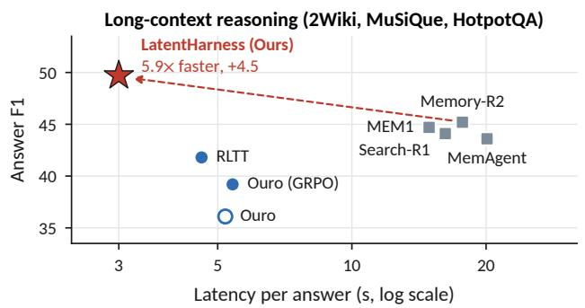

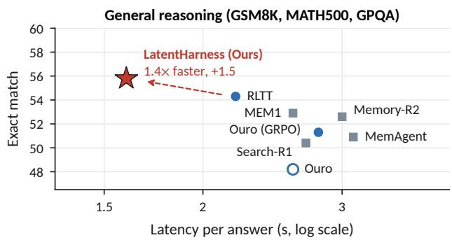  
Figure 1 Accuracy versus latency of LatentHarness on general and long-context reasoning with Ouro-1.4B-Thinking. The dashed arrow points from the strongest baseline to ours.

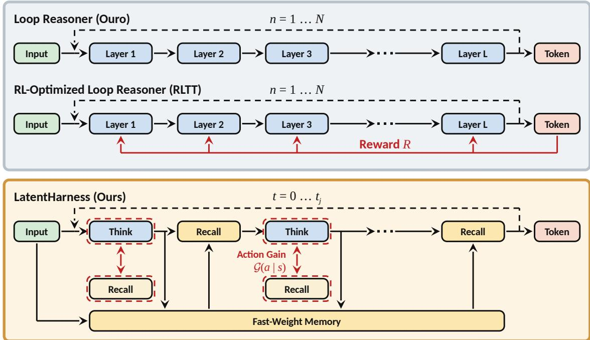  
Figure 2 Comparison of Ouro (Zhu et al., 2025b), a looped reasoner that recurs over one weight-tied block, RLTT (Williams and Tureci, 2026), the same loop trained with an outcome reward, and LatentHarness, which interleaves latent reasoning and memory, with Think writing the fast-weight memory that Recall reads, and learns each latent action from its action gain G(� | �) of Equation (7).

## 1 Introduction

Large language models (Achiam et al., 2023; Yang et al., 2025; Guo et al., 2025; Wang et al., 2024a) increasingly act as agents over long horizons (Yao et al., 2022; Yang et al., 2024a; Wang et al., 2024b; Wang and Liu, 2025; Li et al., 2025b; Luo et al., 2025; Liu et al., 2025; Ding et al., 2026; Shi et al., 2026), so their reasoning becomes a long-context problem as trajectories accumulate observations, tool outputs, and intermediate reasoning states (Wu et al., 2025; Ye et al., 2025; Lu et al., 2025). This problem involves two distinct forms of length. First, relevant evidence may be distributed across long inputs (Bertsch et al., 2025; Bai et al., 2024; Hsieh et al., 2024) or multi-turn interactions (Maharana et al., 2024; Wu et al., 2024). Second, solving the task may require many intermediate reasoning steps (Wei et al., 2022; Guo et al., 2025; Team et al., 2025), and these steps may be interleaved with retrieval of the necessary evidence (Li et al., 2025a; Jin et al., 2025).

Existing approaches largely address these two forms of length separately. External-memory agents (Yan et al., 2026; Yu et al., 2026; Zhou et al., 2025; Yu et al., 2025) retain and retrieve distant evidence across a trajectory, which extends access beyond the current context window. Latent-reasoning methods (Hao et al., 2024; Shen et al., 2025; Wang et al., 2026b; Zhu et al., 2025b) instead move long intermediate computation from decoded text into internal representations. More recent methods move toward learned memory management by training models to decide when to compress the context (Zhou et al., 2025; Wu et al., 2025; Sun et al., 2025), and when to read or write stored entries (Yan et al., 2025; Zhang et al., 2026b,a; Dong et al., 2026; Li et al., 2026). However, these policies still rely either on memory that remains external to the model and is read back through the context window, or on compression rules fixed in advance. This limitation motivates a more direct question: can memory access and reasoning be unified natively within the model’s latent computation?

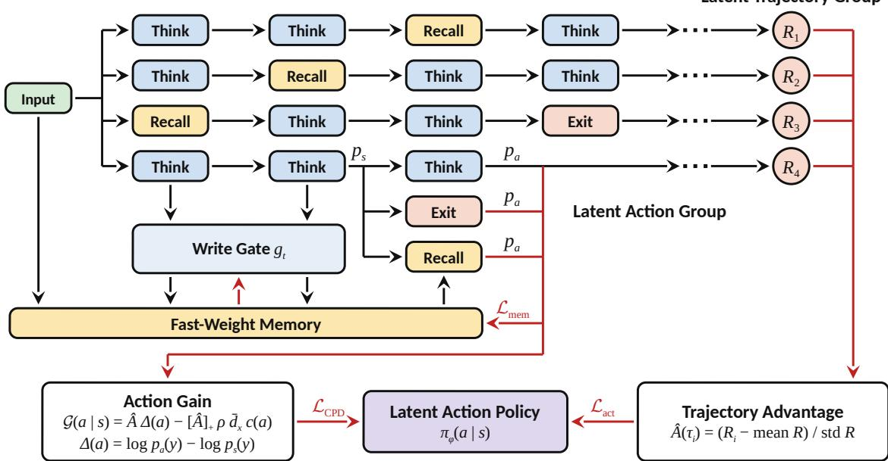  
Figure 3 Illustration of counterfactual policy distillation (CPD) in LatentHarness. The � latent trajectories sampled from one input form the latent trajectory group, and their rewards determine the trajectory advantage �ˆ(�). The one-step branches at each latent state form the latent action group, and scoring their decodes $p _ { a }$ against �� yields the action gain distilled into the latent action policy ��.

As illustrated in Figure 2, LatentHarness builds on the looped computation of latent-reasoning models and unifies memory access and reasoning as sequential latent action selection. At each internal step, a latent policy chooses Think to continue computation, Recall to access persistent memory, or Exit to emit the next token. These actions operate over a shared fast-weight associative memory that stores both input evidence and intermediate reasoning states, allowing Recall to recover distant evidence or reuse prior computation while Think deepens reasoning.

Learning such a policy requires assigning credit to individual latent decisions beyond the final task reward. Dense objectives such as RLTT (Williams and Tureci, 2026) supervise what each latent state predicts, but sampled action credit evaluates only the chosen action and vanishes when rollouts stop splitting across actions. We introduce counterfactual policy distillation, which branches every allowed latent action, including Exit, for one step at each latent state and measures the resulting change in the emitted token’s log-probability. These counterfactual branches serve two roles. As state-level action credit, their gains teach the policy whether a memory read, further reasoning, or exiting yields the largest advantage-signed, cost-charged one-step gain. As gain-credited memory writing, their recall changes, diferentiated through the fast-weight memory on positive-advantage trajectories, credit each earlier Think write by how much it raises or lowers later recalls, which teaches the write gate which derived states to write for later reuse.

LatentHarness improves both reasoning quality and eficiency across three general and three longcontext reasoning suites. It raises the six-suite average over the strongest baseline by 3.9 points at 1.4B and 4.1 points at 2.6B. At 1.4B, it improves on the strongest baseline in each family by 2.8% relative on general reasoning and 10.0% on long-context reasoning, while using 55% of the backbone’s full-depth compute. As Figure 1 previews, on long-context reasoning LatentHarness is 5.9× faster than Memory-R2 and 1.5× faster than RLTT.

## 2 LatentHarness: Latent Actions for Memory and Reasoning

LatentHarness augments looped latent reasoning with memory recall, so a latent state can read missing evidence or reuse an earlier result instead of recomputing it. At every latent state, a latent action policy chooses among three actions. Think applies the shared block once more and writes its result to a latent memory that also stores the memorized prompt, Recall injects a read from this memory into the hidden state, and Exit emits the next token. Because trajectory-level rewards credit latent actions and memory writes only coarsely, counterfactual policy distillation (CPD) branches every allowed action for one step at each latent state, as Figure 3 illustrates. The resulting action gains teach the policy which action to take, while the recall changes, diferentiated through memory, teach the write gate which results to store.

## 2.1 Latent Actions and Memory

A loop can only recompute from its current hidden state. LatentHarness therefore augments it with a latent memory, a fixed-size fast-weight matrix (Schlag et al., 2021; Behrouz et al., 2024; Sun et al., 2024; Behrouz et al., 2026) written by the forward pass, not by gradient descent. It then treats each output token as the outcome of a decision process over the hidden state, memory, and number of Think steps taken. Formally, given a prompt $x ,$ the model emits an answer $y = ( y _ { 1 } , \dots , y _ { J } )$ one position at a time. Within a position, latent steps are indexed by $t = 0 , 1 , \ldots$ . with the position index suppressed. The state at step � is $s _ { t } = ( h _ { t } , \mathbf { M } _ { t } , n _ { t } )$ , where $h _ { t } \in \mathbb { R } ^ { d }$ is the hidden state, $\mathbf { M } _ { t } \in \mathbb { R } ^ { d \times d }$ is the latent memory, and $n _ { t }$ counts the Think steps taken at the position. The latent action policy $\pi _ { \phi }$ with parameters $\phi$ selects $a _ { t } \in$ {Think, Recall, Exit}, the deterministic transition $T _ { a _ { t } }$ produces the next state, and Exit at step $t _ { j }$ leaves the state unchanged and emits the token at position �,

$$
a _ { t } \sim \pi _ { \phi } ( \cdot \mid s _ { t } ) , \qquad s _ { t + 1 } = T _ { a _ { t } } ( s _ { t } ) , \qquad y _ { j } \sim p ( \cdot \mid h _ { t _ { j } } ) ,\tag{1}
$$

where $p ( \cdot \mid h ) = \mathsf { s o f t m a x } ( W _ { \mathrm { L M } } h )$ decodes a hidden state through the output projection $W _ { \mathrm { L M } }$ . Each position starts from its input hidden state $h _ { 0 } , n _ { 0 } = 0$ , and the previous position’s memory ${ { \bf { M } } _ { 0 } }$

Think. When the prediction requires further computation, Think applies the shared block once more and stores the result under a key formed from the hidden state before the block, allowing a similar state to reuse it without another block application. Formally, a looped language model (Zhu et al., 2025b) applies one shared Transformer block $F _ { \theta }$ with backbone parameters $\theta$ up to � times at each position, so that depth grows without added parameters, and uses a learned exit. We leave the block’s attention over earlier positions implicit. After � applications from the input hidden state $h ^ { ( 0 ) }$ , its state $h ^ { ( n ) } = F _ { \theta } \circ \cdot \cdot \cdot \circ F _ { \theta } ( h ^ { ( 0 ) } )$ decodes at any depth. LatentHarness replaces the exit with the latent action policy and exposes each block application as Think. It also writes by the delta rule (Schlag et al., 2021; Yang et al., 2024b) with the normalized key $k _ { t } = W _ { k } h _ { t } / \lVert W _ { k } h _ { t } \rVert$ , the value $\upsilon _ { t } = W _ { \upsilon } h _ { t + 1 }$ of the block output $h _ { t + 1 }$ , and the write strength $g _ { t } = \sigma ( w ^ { \top } h _ { t + 1 } + \kappa n _ { t } / N )$

$$
h _ { t + 1 } = F _ { \theta } ( h _ { t } ) , \qquad n _ { t + 1 } = n _ { t } + 1 , \qquad { \bf M } _ { t + 1 } = { \bf M } _ { t } + g _ { t } \bigl ( \nu _ { t } - { \bf M } _ { t } k _ { t } \bigr ) k _ { t } ^ { \top } ,\tag{2}
$$

where $W _ { k } , \ W _ { \nu } ,$ , and the gate vector $w$ are learned, $\sigma$ is the sigmoid, and the learned scalar $\kappa \geq 0$ favors results derived after more Think steps. Without recalls, $h _ { t } = h ^ { ( n _ { t } ) }$ . Before generation, one block application over the prompt writes every prompt token in order into the zero matrix by the same rule at unit write strength, memorizing the prompt for the first position.

Recall. When the hidden state needs information already in memory, Recall reads it with one matrix-vector product, which is much cheaper than a block application. Formally, with the normalized query $q _ { t } = W _ { q } h _ { t } / \lVert W _ { q } h _ { t } \rVert$ and learned projections $W _ { q }$ and $W _ { o } .$ , the Recall transition is

$$
\begin{array} { r } { m _ { t } = \mathbf { M } _ { t } q _ { t } , \qquad h _ { t + 1 } = h _ { t } + W _ { o } m _ { t } , \qquad \mathbf { M } _ { t + 1 } = \mathbf { M } _ { t } , \quad n _ { t + 1 } = n _ { t } , } \end{array}\tag{3}
$$

where the read $m _ { t }$ superposes stored values whose keys resemble $q _ { t }$ .

Latent action policy. The policy must judge whether a recall would improve the prediction before the read changes the hidden state. It therefore observes the hidden state and a probe of the pending read. Computing this probe is not a latent step, whereas selecting Recall is. Formally, let $u _ { t } ~ =$ $( \| m _ { t } \| _ { 2 } , \cos ( m _ { t } , h _ { t } ) )$ be the probe of the read $m _ { t }$ in Equation (3). The learned linear head $W _ { \pi }$ defines $\pi _ { \phi } ( a \mid s _ { t } ) = \operatorname { s o f t m a x } ( W _ { \pi } \left[ h _ { t } ; u _ { t } \right] )$ over the three actions, where $\left[ h _ { t } ; u _ { t } \right]$ denotes concatenation. The selected action updates the hidden state as

$$
\begin{array} { r } { h _ { t + 1 } = \underbrace { \mathbb { 1 } \left[ a _ { t } { = } \mathrm { T H I N K } \right] F _ { \theta } ( h _ { t } ) } _ { \mathrm { c o m p u t e } } + \underbrace { \mathbb { 1 } \left[ a _ { t } { = } \mathrm { R E C A L I } \right] \left( h _ { t } + { W _ { o } } m _ { t } \right) } _ { \mathrm { r e c a l l } } + \underbrace { \mathbb { 1 } \left[ a _ { t } { = } \mathrm { E x I T } \right] h _ { t } } _ { \mathrm { e m i t } y _ { j } \sim p ( \cdot \mid h _ { t } ) } , } \end{array}\tag{4}
$$

where 1[·] is the indicator function. Think is masked when $n _ { t } = N .$ , and Recall is masked after � recalls at the position. An implicit per-position counter tracks recalls and is read by the admissible set $\mathcal { A } ( s _ { t } )$ of unmasked actions. Exit is forced when both alternatives are masked. $\pi _ { \phi }$ is renormalized over $\mathcal { A } ( s _ { t } )$ , rollouts sample from $\mathrm { i t } ,$ and inference selects the most probable action. No gradient passes through selection, so $\phi = \{ W _ { \pi } \}$ learns only through $\log \pi _ { \phi } .$ , while the backbone parameters � and memory parameters $\psi = \{ W _ { q } , W _ { o } , W _ { k } , W _ { \nu } , w , \kappa \}$ learn through realized states. The recall branches of Section 2.2 also train � and �.

## 2.2 Counterfactual Policy Distillation

Reinforcement learning over latent trajectories. We train whole latent trajectories with GRPO on the task reward. Formally, a rollout of Equation (1) over the positions $j = 1 , \dots , J$ of a prompt $x ,$ with the position index restored, produces the latent trajectory $\tau = \left( ( s _ { j , t } , a _ { j , t } ) _ { t = 0 } ^ { t _ { j } } , y _ { j } \right) _ { j = 1 } ^ { J }$ . Because every transition is deterministic given the state and earlier positions, its likelihood factors as

$$
\pi ( \tau \mid x ) = \prod _ { j = 1 } ^ { J } { \Big ( } \prod _ { t = 0 } ^ { t _ { j } } \pi _ { \phi } ( a _ { j , t } \mid s _ { j , t } ) { \Big ) } p ( y _ { j } \mid h _ { j , t _ { j } } ) ,\tag{5}
$$

where $a _ { j , t _ { j } } = \mathtt { E x t T }$ . The reward $R ( \tau ) = R _ { \mathrm { t a s k } } ( y )$ is the answer’s exact match or answer F1, without a length penalty, since a penalty could rank a short failure above a longer success. GRPO (Shao et al., 2024) samples $\tau _ { 1 } , \ldots , \tau _ { G }$ per prompt, as Figure 3 shows, and normalizes their rewards by the group mean and standard deviation into advantages $\hat { A } ( \tau _ { i } )$ . The loss $- \hat { A } ( \tau ) \log \pi ( \tau \mid x )$ , whose gradient at the on-policy point equals that of the clipped surrogate of PPO (Schulman et al., 2017), decomposes by Equation (5) into the sampled-action loss $\mathcal { L } _ { \mathrm { a c t } }$ and a token term $\begin{array} { r } { - \hat { A } ( \tau ) \sum _ { j } \log p ( y _ { j } \mid h _ { j , t _ { j } } ) } \end{array}$ , with each token and latent-action ratio clipped separately. Because the token term supervises only exit states, we follow RLTT (Williams and Tureci, 2026) and replace it with the dense latent loss $\mathcal { L } _ { \mathrm { l a t e n t } } ,$ yielding

$$
\mathcal { L } _ { \mathrm { a c t } } = - \hat { A } ( \tau ) \sum _ { j } \sum _ { t } \log \pi _ { \phi } ( a _ { j , t } \mid s _ { j , t } ) , \qquad \mathcal { L } _ { \mathrm { l a t e n t } } = - \hat { A } ( \tau ) \sum _ { j } \sum _ { t } \omega _ { n _ { j , t } } \log p ( y _ { j } \mid h _ { j , t } ) ,\tag{6}
$$

where the depth weights $\omega _ { n }$ follow RLTT, are shared by states that Recall reaches at the same Think count, and are normalized over the realized states of each position. Two decisions still receive only coarse credit. $\mathcal { L } _ { \mathrm { a c t } }$ assigns one advantage to every latent action in a trajectory, and the write gate, as a deterministic part of the transition, receives gradients only through predictions downstream of executed recalls, since the probe � feeds only the policy losses, which update only $\phi .$

State-level action credit. At one latent state, the shared advantage of $\mathcal { L } _ { \mathrm { a c t } }$ provides credit that fades. Its gradient on the logit of an action taken by a fraction $\hat { p }$ of the sampled continuations scales with $\hat { p } ( 1 - \hat { p } )$ , so it vanishes when they do not split and fades as the policy commits. CPD instead compares every admissible action from the same state using the one-step change it makes to the emitted token’s log-probability, scaled by trajectory quality and charged an action cost for its latent length on positive-advantage trajectories. Formally, for each $a \in { \mathcal { A } } ( s )$ , including Exit, the one-step change and the action gain are

$$
\Delta ( a \mid s ) = \log p _ { T _ { a } ( s ) } ( y ) - \log p _ { s } ( y ) , \quad { \mathcal { G } } ( a \mid s ) = { \hat { A } } ( \tau ) { \big ( } \Delta ( a \mid s ) - \mathbb { 1 } [ { \hat { A } } ( \tau ) > 0 ] \rho { \bar { d } } _ { x } c ( a ) { \big ) } ,\tag{7}
$$

where � is the token that � emits at this position, $p _ { s } ( y )$ and $p _ { T _ { a } ( s ) } ( y )$ are its probabilities decoded before and after $a , \rho$ is the cost weight, and $\bar { d } _ { x }$ is the median $| \Delta |$ over the Think and Recall branches of the prompt’s positive-advantage rollouts. The latent lengths are $c ( \mathrm { T H I N K } ) = 1 , c ( \mathrm { R E C A L L } ) = c _ { R } < 1$ and $c ( \mathrm { E x I T } ) = 0$ . Recall has a shorter latent length because it injects an existing read and applies no block. Because $T _ { \mathrm { E X I T } }$ is the identity, Think or Recall outscores Exit on a positive-advantage trajectory exactly when its $\Delta$ exceeds its cost. Without the indicator, a negative advantage would reward latent length.

The gains define a counterfactual teacher over ${ \mathcal { A } } ( s )$ as the Boltzmann policy $\pi ^ { * } ( a \mid s ) \propto \exp ( { \mathcal { G } } ( a \mid$ $s ) / \zeta )$ . CPD distills this teacher into the policy through policy distillation (Rusu et al., 2015),

$$
\mathcal { L } _ { \mathrm { C P D } } = \frac { 1 } { | S _ { \tau } | } \sum _ { s \in S _ { \tau } } D _ { \mathrm { K L } } \big ( \pi ^ { * } ( \cdot \mid s ) \big | \big | \pi _ { \phi } ( \cdot \mid s ) \big ) ,\tag{8}
$$

where $S _ { \tau }$ is the set of latent states of $\tau ,$ the gains are held under stop-gradient, and $\mathcal { L } _ { \mathrm { C P D } }$ is averaged over the group. The temperature $\zeta$ controls how sharply the teacher favors higher gains, approaching the hard label arg max� ${ \mathcal { G } } ( a \mid s )$ as $\zeta \to 0$ and the uniform distribution over ${ \mathcal { A } } ( s )$ as $\zeta  \infty$ . Because the teacher is fixed, $\mathcal { L } _ { \mathrm { C P D } }$ is cross-entropy to a soft label, with gradient $\pi _ { \phi } ( a \mid s ) - \pi ^ { * } ( a \mid s )$ on the logit of $^ { a , }$ so its credit does not fade as the policy commits. Each branch ends after one action and one decode. An untaken branch is never continued and does not commit its write, while the taken branch reuses its next state. The gains therefore provide immediate state-level credit at every latent state, while $\mathcal { L } _ { \mathrm { a c t } }$ carries the downstream credit of the sampled path.

Gain-credited memory writing. A write helps only when a later recall reads it and raises the emitted token’s probability. Standard delta-rule training therefore credits the gate only downstream of executed recalls, which are rare early in training. CPD provides denser credit through recall branches because every state where Recall is admissible measures Δ(Recall | �), whether or not the policy recalls there. This change depends on every earlier gate through M. Formally, we train the gate to increase the recall changes of positive-advantage trajectories,

$$
\mathcal { L } _ { \mathrm { m e m } } = - \frac { [ \hat { A } ( \tau ) ] _ { + } } { | S _ { \tau } | } \sum _ { s \in S _ { \tau } } \Delta ( \mathrm { R E c A L } \mid s ) ,\tag{9}
$$

where $[ \hat { A } ( \tau ) ]$ + is the positive part of $\hat { A } ( \tau )$ and masked states contribute zero. $\mathcal { L } _ { \mathrm { m e m } }$ updates only the gate parameters � and �, with every other quantity held fixed, so the token losses still train the keys and values. Restricting this signal to positive advantages is a design choice, since negative weights could make the gate lower recall changes by storing noise instead of correcting a harmful write.

The credit assigned to a write separates into whether its content improves a later prediction and whether the later query still addresses it after intervening writes. Formally, number the latent states of � by $r = 0 , 1 , \ldots$ . across positions. A realized Think write at step � changes the recall change at a later state $s _ { r ^ { \prime } }$ where Recall is admissible at the rate

$$
\frac { \partial \Delta \big ( \mathrm { R E C A L L } \mid s _ { r ^ { \prime } } \big ) } { \partial g _ { r } } = \underbrace { \left. \nabla _ { m } \log p _ { T _ { \mathrm { R E C A L L } } ( s _ { r ^ { \prime } } ) } \left( y _ { r ^ { \prime } } \right) , \ \nu _ { r } - \mathbf { M } _ { r } k _ { r } \right. } _ { \mathrm { c o n t e n t } } \underbrace { k _ { r } ^ { \top } P _ { r + 1 } \cdot \cdot \cdot P _ { r ^ { \prime } - 1 } q _ { r ^ { \prime } } } _ { \mathrm { a d d r e s s i n g } } ,\tag{10}
$$

Table 1 Quantitative results of LatentHarness with Ouro-1.4B-Thinking and Ouro-2.6B-Thinking. MATH, GPQA, 2WQA, MSQ, and HQA denote MATH500, GPQA-Diamond, 2WikiMultihopQA, MuSiQue, and HotpotQA, † marks an out-of-distribution suite, and Lat. is wall-clock seconds per answer. Bold, underline, and green mark the best, the second best, and the margin over the second best. Ouro is the released backbone at full depth.
<table><tr><td></td><td colspan="6">General reasoning</td><td colspan="6">Long-context reasoning</td></tr><tr><td>Method</td><td>GSM8K MATH GPQA†</td><td></td><td></td><td>Avg.</td><td>FLOPs Lat. 2WQA† MSQ†</td><td></td><td></td><td></td><td>HQA</td><td>Avg.</td><td></td><td>FLOPs Lat.</td></tr><tr><td colspan="9">Ouro-1.4B-Thinking</td><td></td><td></td><td></td><td></td></tr><tr><td>Ouro</td><td>74.6</td><td>42.8</td><td>27.3</td><td>48.2</td><td>100%</td><td>2.6</td><td>41.2</td><td>19.7</td><td>47.5</td><td>36.1</td><td>100%</td><td>5.2</td></tr><tr><td>Ouro (GRPO)</td><td>78.1</td><td>46.3</td><td>29.4</td><td>51.3</td><td>106%</td><td>2.8</td><td>44.8</td><td>22.1</td><td>50.6</td><td>39.2</td><td>108%</td><td>5.4</td></tr><tr><td>Token space</td><td></td><td></td><td></td><td></td><td></td><td></td><td></td><td></td><td></td><td></td><td></td><td></td></tr><tr><td>+ Search-R1</td><td>77.4</td><td>45.6</td><td>28.3</td><td>50.4</td><td>133%</td><td>2.7</td><td>50.4</td><td>27.1</td><td>54.9</td><td>44.1</td><td>339%16.2</td><td></td></tr><tr><td>+ MemAgent</td><td>78.0</td><td>45.7</td><td>29.0</td><td>50.9</td><td>130%</td><td>3.1</td><td>49.7</td><td>26.8</td><td>54.3</td><td>43.6</td><td></td><td>454%20.1</td></tr><tr><td>+ MEM1 + Memory-R2</td><td>79.6</td><td>48.1</td><td>31.0</td><td>52.9</td><td>121%</td><td>2.6</td><td>50.9</td><td>27.8</td><td>55.5</td><td>44.7</td><td></td><td>307%14.9</td></tr><tr><td>Latent space</td><td>79.4</td><td>47.6</td><td>30.8</td><td>52.6</td><td>125%</td><td>3.0</td><td>51.3</td><td>28.4</td><td>55.9</td><td>45.2</td><td>391%17.7</td><td></td></tr><tr><td>RLTT</td><td>81.5</td><td>49.6</td><td>31.8</td><td>54.3</td><td>86%</td><td>2.2</td><td>47.6</td><td>24.5</td><td>53.2</td><td>41.8</td><td>82%</td><td>4.6</td></tr><tr><td>LatentHarness</td><td>83.2</td><td>51.6</td><td>32.6</td><td>55.8 (+1.5)</td><td>62%</td><td>1.6</td><td>55.9</td><td>33.1</td><td>60.1</td><td>49.7(+4.5)</td><td>48%</td><td>3.0</td></tr><tr><td colspan="9">Ouro-2.6B-Thinking</td><td></td><td></td><td></td><td></td></tr><tr><td>Ouro</td><td>79.3</td><td>48.5</td><td>31.6</td><td>53.1</td><td>100%</td><td>4.4</td><td>45.9</td><td>23.4</td><td>51.8</td><td>40.4</td><td>100%</td><td>8.8</td></tr><tr><td>Ouro (GRPO)</td><td>82.7</td><td>52.0</td><td>33.9</td><td>56.2</td><td>105%</td><td>4.7</td><td>49.2</td><td>26.1</td><td>55.0</td><td>43.4</td><td>107%</td><td>9.3</td></tr><tr><td>Token space</td><td></td><td></td><td></td><td></td><td></td><td></td><td></td><td></td><td></td><td></td><td></td><td></td></tr><tr><td>+ Search-R1</td><td>82.1</td><td>51.0</td><td>32.8</td><td>55.3</td><td>131%</td><td>4.5</td><td>54.6</td><td>31.0</td><td>59.0</td><td>48.2</td><td></td><td>335% 27.1</td></tr><tr><td>+ MemAgent</td><td>82.6</td><td>51.5</td><td>33.6</td><td>55.9</td><td>128%</td><td>5.2</td><td>54.1</td><td>30.7</td><td>58.6</td><td>47.8</td><td></td><td>448%33.6</td></tr><tr><td>+ MEM1 + Memory-R2</td><td>84.3</td><td>53.5</td><td>35.3</td><td>57.7</td><td>120%</td><td>4.4</td><td>55.0</td><td>31.6</td><td>59.4</td><td>48.7</td><td></td><td>304%24.6</td></tr><tr><td>Latent space</td><td>84.0</td><td>53.3</td><td>35.2</td><td>57.5</td><td>123%</td><td>4.9</td><td>55.6</td><td>32.2</td><td>60.1</td><td>49.3</td><td>387%29.5</td><td></td></tr><tr><td>RLTT</td><td>85.4</td><td>55.3</td><td>36.2</td><td>59.0</td><td>87%</td><td>3.7</td><td>52.0</td><td>28.3</td><td>57.4</td><td>45.9</td><td>83%</td><td>7.7</td></tr><tr><td>LatentHarness</td><td>87.3</td><td>57.2</td><td>38.3</td><td> ${ \bf 6 0 . 9 } _ { ( + 1 . 9 ) }$ </td><td>64%</td><td>2.6</td><td>60.3</td><td>37.6</td><td>64.2</td><td> ${ \pmb 5 4 . 0 } _ { ( + 4 . 7 ) }$ </td><td>50%</td><td>5.0</td></tr></table>

where $y _ { r ^ { \prime } }$ is the token emitted at the position of $s _ { r ^ { \prime } , }$ the gradient is evaluated at the branch read $m = \mathbb { M } _ { r ^ { \prime } } q _ { r ^ { \prime } } , P _ { \ell } = I - g _ { \ell } k _ { \ell } k _ { \ell } ^ { \intercal }$ at each intervening Think step and $P _ { \ell } = I$ otherwise, and the empty product is �. After scaling by $[ \hat { A } ( \tau ) ] _ { + } / | S _ { \tau } | ,$ , a write receives the sum of these products over later admissible states. Its credit is exactly zero when $\upsilon _ { r } = \mathbf { M } _ { r } k _ { \ i }$ or when its addressing factor vanishes at every later admissible state. A later state contributes negatively when the addressed change lowers its prediction. Because hidden states are held fixed, Equation (10) is a partial derivative along the realized trajectory. It ignores how a gate would alter later keys, values, gates, queries, and actions, but requires only one backward pass through branches CPD already computes.

Final objective. The objective is $\mathcal { L } = \mathcal { L } _ { \mathrm { l a t e n t } } + \beta \mathcal { L } _ { \mathrm { a c t } } + \gamma \mathcal { L } _ { \mathrm { C P D } } + \lambda \mathcal { L } _ { \mathrm { m e m } } + \eta \mathcal { L } _ { \mathrm { r e f } }$ , where $\beta , \gamma , \lambda$ , and � are loss weights and $\mathcal { L } _ { \mathrm { r e f } }$ is the standard KL regularizer (Shao et al., 2024) from the token distribution at each emitting state to that of the frozen full-depth backbone. $\mathcal { L } _ { \mathrm { l a t e n t } }$ and $\mathcal { L } _ { \mathrm { r e f } }$ train the backbone � and the memory maps � through the realized states, $\mathcal { L } _ { \mathrm { a c t } }$ and ${ \mathcal { L } } _ { \mathrm { C P D } }$ train the policy �, and $\mathcal { L } _ { \mathrm { m e m } }$ trains the write gate � and �. We anneal � linearly from one to a tenth over the first 1.5k steps, so the teacher shapes the policy early and later only prevents commitment.

## 3 Experiments

Backbones. We evaluate the two released looped reasoners, Ouro-1.4B-Thinking and Ouro-2.6B-Thinking (Zhu et al., 2025b), at their trained recurrent depth $N = 4$ . The shared block $F _ { \theta }$ is the full stack of 24 or 48 layers. The memory maps � and latent action policy � are the only new parameters, adding 1.8% and 1.0% to the respective parameter counts.

Datasets. We train one model per backbone on the GSM8K (Cobbe et al., 2021) and MATH (Hendrycks et al., 2021) training splits. Following MemAgent (Yu et al., 2025) and Search-R1 (Jin et al., 2025), we also train on HotpotQA (Yang et al., 2018) questions with supporting passages embedded among distractors and padded to 4k, 8k, and 16k tokens. We test GSM8K, MATH500 (Lightman et al., 2023), and HotpotQA in distribution. Following RLTT (Williams and Tureci, 2026), we test GPQA-Diamond (Rein et al., 2023) out of distribution, along with 2WikiMultihopQA (Ho et al., 2020) and MuSiQue (Trivedi et al., 2022). Each long-context test set is padded to 4k, 8k, 16k, 32k, and 64k tokens, so the two longest lengths exceed every training input. We report exact match on the general suites and answer F1 on the long-context suites.

Baselines. GRPO (Shao et al., 2024) trains the Ouro backbone with outcome RL and no memory, and every token-space memory method is built on top of it. Search-R1 (Jin et al., 2025) interleaves retrieval and reasoning over the padded context, MemAgent (Yu et al., 2025) and Memory-R2 (Yan et al., 2026) write and read memory as generated text, and MEM1 (Zhou et al., 2025) combines memory and reasoning in one compact token-space state per turn. Latent-space methods include RLTT (Williams and Tureci, 2026), which gives the loop dense latent credit without memory, and LatentHarness. Every trained method uses the same backbone, training data, and number of RL steps. We report FLOPs relative to the full-depth backbone and per-answer latency following Wang et al. (2026b).

## 3.1 Main Results

LatentHarness achieves the highest accuracy at both model scales. In Table 1, averaging the two family averages gives six-suite means of 52.8 at 1.4B and 57.5 at 2.6B, exceeding Memory-R2 by 3.9 and 4.1 points, respectively. The gains hold within both task families, consistent with a latent action policy that distinguishes states needing further computation from those missing information.

The largest gains come from supplying missing information on long inputs. Relative to RLTT, which uses the same latent loop without memory, LatentHarness raises the general-reasoning average from 54.3 to 55.8 and the long-context average from 41.8 to 49.7. Its long-context margin grows from 2.3 points at 4k tokens to 14.3 at 64k. On the general suites, the hidden state already carries the evidence, so the policy mainly reallocates Think steps. On long inputs, Recall recovers evidence that further latent computation cannot reconstruct.

LatentHarness improves accuracy while reducing inference cost. At 1.4B, LatentHarness averages 55% of full-depth FLOPs across the two task families, compared with 84% for RLTT, and answers long-context questions 5.9× faster than Memory-R2 in Figure 1. In Table 2, removing the action cost (� = 0) raises FLOPs from 55% to 93% while improving each family average by only 0.3 points. Applying the action cost to the action gain instead of the trajectory return suppresses low-gain latent steps without allowing a shorter failure to outrank a longer success.

## 3.2 In-Depth Analysis

RQ1: Does state-level credit matter? We retrain the policy with GRPO only, GiGPO groups, and VinePPO branches on the same data and steps. We compare their family averages and training compute with ours in Table 2, and track the entropy of $\pi _ { \phi }$ and the recall change Δ(Recall | �) on test rollouts.

One-step counterfactual branches outperform completed branches at a third of the training compute. VinePPO branches complete each branched action to the answer (Kazemnejad et al., 2025), while GiGPO groups pool latent states by output position and action prefix (Feng et al., 2025). On the long-context suites, LatentHarness reaches 49.7 at 1.1× training compute, compared with 48.6 at 3.6× for VinePPO branches. Every latent state decodes, so a one-step branch scores each action without completing a rollout.

Table 2 Ablations of LatentHarness on action credit, action space, write gate, and action cost. Gen. and Long denote family averages, FLOPs denotes the two-family average relative to full depth, and parentheses mark the change from ours. Training compute is 1.1×, 1.2×, and 3.6× GRPO only for ours, GiGPO groups, and VinePPO.
<table><tr><td>Variant</td><td>Gen.</td><td>Long</td><td>FLOPs</td></tr><tr><td>LatentHarness</td><td>55.8</td><td>49.7</td><td>55%</td></tr><tr><td>Action credit</td><td></td><td></td><td></td></tr><tr><td>GRPO only</td><td>52.3 (-3.5)</td><td>44.3 (-5.4)</td><td>71%</td></tr><tr><td>GiGPO groups</td><td>52.9 (-2.9)</td><td>45.1 (-4.6)</td><td>68%</td></tr><tr><td>VinePPO branches</td><td>54.9 (-0.9)</td><td>48.6(-1.1)</td><td>58%</td></tr><tr><td>Action space</td><td></td><td></td><td></td></tr><tr><td>Think and Exit</td><td>53.6(-2.2)</td><td>42.0 (-7.7)</td><td>63%</td></tr><tr><td>Always read</td><td>54.1 (-1.7)</td><td>45.3 (-4.4)</td><td>58%</td></tr><tr><td>Write gate</td><td></td><td></td><td></td></tr><tr><td>Token-loss gate</td><td>55.5 (-0.3)</td><td>48.1 (-1.6)</td><td>57%</td></tr><tr><td>Write-time gate</td><td>55.4(-0.4)</td><td>47.6(-2.1)</td><td>58%</td></tr><tr><td>Action cost</td><td></td><td></td><td></td></tr><tr><td>No cost</td><td>56.1 (+0.3)</td><td>50.0 (+0.3)</td><td>93%</td></tr></table>

CPD keeps the latent action policy from collapsing because its credit does not depend on sampled exploration. Under GRPO only, which drops LCPD, the entropy of �� falls to 0.21 nats within 200 steps, whereas LatentHarness holds it at 0.68, and its Δ(Recall | �) from Equation (7) averages 0.36 nats at executed recalls against 0.03 at admissible states where it is not taken. Sampled credit fades as the policy commits, whereas counterfactual branches compare every action.

RQ2: When should the policy recall instead of think? We retrain the Think and Exit and Always read action-space ablations, and run RLTT at the full depth � = 4 as All-Think. A one-step Think probe marks each position’s settling step, and we count Think and Recall steps per position by that step and by input length. We measure each All-Think step’s I/O cosine and, at every latent state of LatentHarness, the pending read’s norm and cosines grouped by executed action.

Selective Recall is necessary on long inputs. Always read injects a memory read at every step. Removing Recall lowers the long-context average by 7.7 points to 42.0, while Always read remains 4.4 points below LatentHarness. An always-on read cannot distinguish missing evidence from missing computation, so the policy must decide when to read.

Full-depth thinking wastes loops yet leaves a third of long-context positions unsettled. The left panel of Figure 4 shows that 51% of loops change nothing on the general suites, while 33% of long-context positions never settle. Further loops are redundant after settlement and cannot recover evidence that the hidden state lacks, which only a read can supply.

Think converges toward the current hidden state, while Recall adds a direction unavailable to further Think steps. Following Zhang et al. (2026c), a step’s I/O cosine is the cosine between its input and output hidden states. Under All-Think, this cosine rises from 0.71 to 0.99 on the general suites but plateaus at 0.91 on the long-context suites. Later loops therefore rewrite either a converged state or one that cannot converge. In the first panel of Figure 5, the pending read at Recall states has a relative norm of 0.58 and a cosine of 0.12 with the pending Think update, compared with 0.14 and

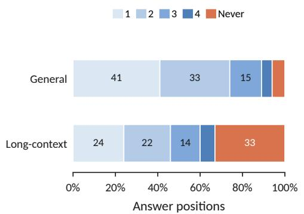

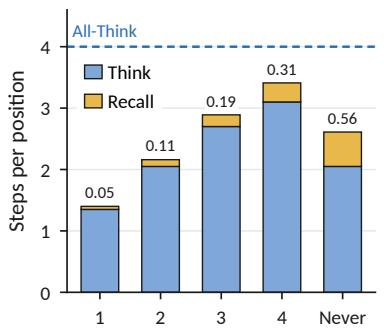  
All-Think setling step

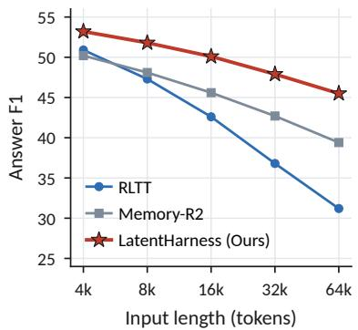  
Figure 4 All-Think settling, latent actions, and long-context F1 of LatentHarness, RLTT, and Memory-R2 on Ouro-1.4B-Thinking. The left, middle, and right panels show positions by All-Think settling step, latent steps per position by settling step, and F1 by input length, respectively.

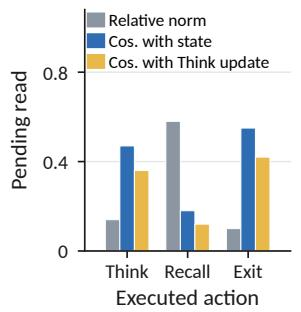

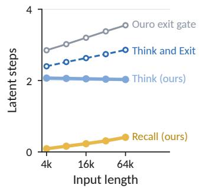

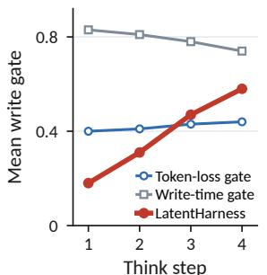

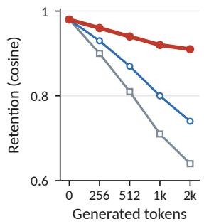  
Figure 5 Latent-step dynamics and write gates of LatentHarness on the Ouro-1.4B-Thinking long-context suites. From left to right, the panels show the pending read at latent states by executed action, latent steps per position by input length, the mean write gate by Think step under three gate objectives, and evidence retention by generated tokens.

0.36 at Think states. This larger, less aligned read adds a component that further computation from the same state cannot produce.

LatentHarness spends recalls, not extra Think steps, where evidence is missing. In the middle panel of Figure 4, positions settled at step 1 average 0.05 recalls, compared with 0.56 for positions that never settle. In the second panel of Figure 5, recalls rise from 0.09 to 0.41 per position, while Think steps remain near 2.0. Across the long-context suites in Table 3, LatentHarness takes 2.0 to 2.2 Think steps per position, compared with 2.5 to 3.0 for Think and Exit and 3.1 to 3.4 loops under Ouro’s exit gate. Each recall therefore replaces further computation. For unsettled positions and long inputs, evidence is missing from the hidden state, which gives Recall a larger one-step action gain than another Think.

RQ3: What does Recall read? We split every executed read into memorized-prompt and Thinkwritten components to label it as derived or evidence, match each evidence recall to its best-matching passage and score hits against supporting-fact annotations, define chance as the share of prompt tokens in supporting passages, report F1 by hop count, and rank passages at the final evidence recall for wrong MuSiQue answers with at least three hops.

Recall returns supporting evidence and increasingly reuses derived states. In Figure 6, evidence recalls achieve a hit rate of 63.9% at 64k tokens against a chance rate of 0.5%, and 55.6% at four hops against 4.1%. The derived share rises from 27.4% at 4k to 33.2% at 64k and from 29.5% at two hops to 40.8% at four. Prompt reads recover increasingly sparse evidence, while Think writes preserve intermediate results for reuse by later hops.

Table 3 LatentHarness task scores, latent steps per position, and recall sources on Ouro-1.4B-Thinking, grouped by suite, hop count, and input length. Think and Exit reports the Think steps of the ablation, while Ouro exit gate reports the loops of the released backbone under its own exit. Derived is the share of recalls that read a Think-written state, Hit is the share of evidence recalls that reach a supporting passage, and Chance is the share of prompt tokens contained in supporting passages. Score is exact match on the general suites and F1 otherwise. Hop and length rows pool over the other axis, and – marks suites without supporting-fact annotation.
<table><tr><td></td><td colspan="3">LatentHarness</td><td>Think and Exit</td><td>Ouro exit gate</td><td colspan="3">Recall sources (%)</td></tr><tr><td>Suite</td><td>Think</td><td>Recall</td><td>Score</td><td>Think</td><td>Loops</td><td>Derived</td><td>Hit</td><td>Chance</td></tr><tr><td colspan="9">General reasoning</td></tr><tr><td>GSM8K</td><td>2.10</td><td>0.03</td><td>83.2</td><td>2.14</td><td>2.70</td><td>39.2</td><td>一</td><td>一</td></tr><tr><td>MATH500</td><td>2.55</td><td>0.05</td><td>51.6</td><td>2.57</td><td>3.30</td><td>35.6</td><td>一</td><td>一</td></tr><tr><td>GPQA</td><td>2.40</td><td>0.07</td><td>32.6</td><td>2.43</td><td>3.20</td><td>33.2</td><td>一</td><td>一</td></tr><tr><td colspan="9">Long-context reasoning</td></tr><tr><td>2WQA</td><td>2.00</td><td>0.20</td><td>55.9</td><td>2.46</td><td>3.10</td><td>29.3</td><td>69.8</td><td>2.8</td></tr><tr><td>MuSiQue</td><td>2.15</td><td>0.32</td><td>33.1</td><td>2.95</td><td>3.40</td><td>34.7</td><td>65.9</td><td>2.8</td></tr><tr><td>HotpotQA</td><td>2.00</td><td>0.20</td><td>60.1</td><td>2.47</td><td>3.10</td><td>27.7</td><td>72.0</td><td>2.7</td></tr><tr><td colspan="9">MuSiQue by hop count</td></tr><tr><td>2-hop</td><td>2.09</td><td>0.24</td><td>42.1</td><td>2.78</td><td>3.24</td><td>29.5</td><td>74.0</td><td>2.2</td></tr><tr><td>3-hop</td><td>2.18</td><td>0.37</td><td>27.3</td><td>3.08</td><td>3.52</td><td>35.6</td><td>63.6</td><td>3.1</td></tr><tr><td>4-hop</td><td>2.27</td><td>0.50</td><td>16.4</td><td>3.25</td><td>3.67</td><td>40.8</td><td>55.6</td><td>4.1</td></tr><tr><td colspan="9">Long-context by input length</td></tr><tr><td>4k</td><td>2.07</td><td>0.09</td><td>53.2</td><td>2.40</td><td>2.85</td><td>27.4</td><td>78.4</td><td>7.0</td></tr><tr><td>8k</td><td>2.06</td><td>0.16</td><td>51.8</td><td>2.52</td><td>3.02</td><td>28.9</td><td>74.9</td><td>3.6</td></tr><tr><td>16k</td><td>2.05</td><td>0.23</td><td>50.1</td><td>2.63</td><td>3.20</td><td>30.3</td><td>71.1</td><td>1.8</td></tr><tr><td>32k</td><td>2.04</td><td>0.31</td><td>47.9</td><td>2.74</td><td>3.38</td><td>31.7</td><td>67.2</td><td>0.9</td></tr><tr><td>64k</td><td>2.03</td><td>0.41</td><td>45.5</td><td>2.86</td><td>3.55</td><td>33.2</td><td>63.9</td><td>0.5</td></tr></table>

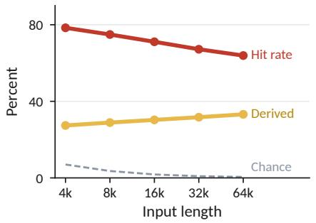

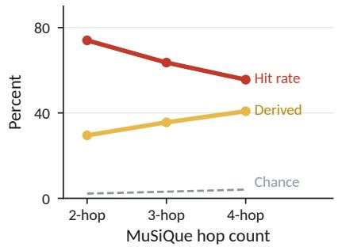

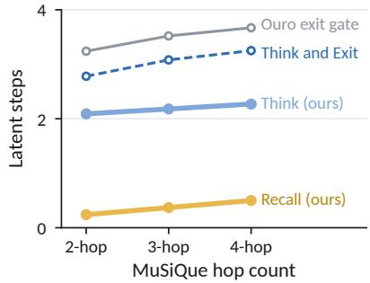  
Figure 6 LatentHarness recall sources and latent steps on the Ouro-1.4B-Thinking long-context suites. The left and middle panels show recall hit rate, derived share, and chance rate by input length and MuSiQue hop count. The right panel shows latent steps per position by hop count.

Memory addressing dominates the remaining multi-hop errors. When MuSiQue is split by hop count in Table 3, F1 falls from 42.1 at two hops to 16.4 at four, while recalls per position rise from 0.24 to 0.50. For wrong answers with three or more hops, a distractor outranks the supporting passage at the final evidence recall in 72% of cases, while the supporting passage ranks second. The query � scores the supporting key highly but fails to distinguish it from a nearby distractor.

RQ4: What does the write gate learn? We retrain the gate with the token-loss and write-time targets, record its value at each Think step and whether a later positive-change recall addresses each write, and measure retention as the cosine between a memorized prompt value and its read-back after 256 to 2k generated tokens.

Gain credit opens the write gate for derived states that later recalls reuse. The write-time gate trains � by whether Think beats Recall at the writing state. In Table 2, these gates lower the long-context average by 1.6 and 2.1 points. Under gain credit, 58% of reused writes have � > 0.7, against 6% of unread writes. Equation (10) credits a write only when a later Recall branch, executed or not, addresses its key and gains from its content, so redundant and unaddressed writes receive none.

A write-time target keeps the gate open and overwrites memorized evidence. In the third panel of Figure 5, the write-time gate remains high at every Think step. In the fourth panel, its retention after 2k generated tokens falls to 0.64 against 0.91 under gain credit. Because the target is scored only where computing already beats recalling, the gate remains open for most writes regardless of whether a later recall reads them.

## 4 Related Work

Memory for LLM reasoning. External memory systems (Packer et al., 2023; Xu et al., 2025a; Chhikara et al., 2025; Li et al., 2025c; Du, 2026) have progressed from preserving evidence beyond the model’s active context to learning how stored information should be retained, retrieved, and transformed for subsequent reasoning. One line of work learns memory-management policies for writing, retaining, retrieving, and post-processing stored information (Yu et al., 2025; Zhou et al., 2025; Wang et al., 2025c; Yuan et al., 2025; Shen et al., 2026; Yu et al., 2026; Yan et al., 2026; Zhang et al., 2026a; Li et al., 2026; Ma et al., 2026; Dong et al., 2026). For example, Memory-R1 (Yan et al., 2025) learns a policy over memory actions through reinforcement learning, while MemRL (Zhang et al., 2026b) applies runtime reinforcement learning to episodic memory. Mem-� (Wang et al., 2026a) complements these approaches by learning when and what to write as generated memory. Another line of work changes either the representation or the use of stored evidence. It compresses or reorganizes the evidence itself, or connects retrieval to reasoning through interleaved search and long-context RL over extended inputs (Li et al., 2025a; Song et al., 2025; Wan et al., 2025; Wang et al., 2025a). For example, R3Mem (Wang et al., 2025b) applies reversible compression, while Search-R1 (Jin et al., 2025) interleaves retrieval and reasoning over the extended input. These approaches manage stored information through external memory operations or extended token contexts. LatentHarness instead brings memory into recurrent latent computation, so recall and reasoning interleave within the same hidden-state trajectory and the latent action policy selects whether each state should recall missing evidence, continue computation, or exit.

Latent reasoning. Latent reasoning (Zhu et al., 2025a; Chen et al., 2025) carries intermediate computation in hidden states and has progressed toward adapting both the form and the amount of computation to the current state. One line of work constructs and trains latent chains through pauses, hidden-state feedback, distillation, compression, adaptive routing, specialized memory tokens, and outcome-based objectives (Goyal et al., 2023; Deng et al., 2023; Shen et al., 2025; Xu et al., 2025b; Zhang et al., 2025b; Tan et al., 2025; Wei et al., 2025; Butt et al., 2025; Aichberger and Hochreiter, 2026; Jung et al., 2026; Zou et al., 2026; Zhao et al., 2026). For example, Coconut (Hao et al., 2024) feeds hidden states back as continuous thoughts, while System-1.5 (Wang et al., 2026b) routes between language and latent computation. Another line of work scales latent computation through recurrent depth and learns how to allocate or halt that computation (Dehghani et al., 2019; Geiping et al., 2025; Saunshi et al., 2025; Popescu et al., 2026; Schwethelm et al., 2026; Lin et al., 2026). For example, Ouro (Zhu et al., 2025b) learns when to exit a weight-tied loop, while RLTT (Williams and Tureci, 2026) assigns each recurrent state dense credit from the trajectory reward. Complementary work develops latent memory mechanisms (Schlag et al., 2021; Yang et al., 2024b; Behrouz et al., 2024, 2025; Kang et al., 2025; Zhang et al., 2025a) that store and update hidden representations for later computation. LatentHarness difers by placing recurrent latent reasoning and fast-weight memory under one latent action policy over Think, Recall, and Exit. Think writes derived states to the same memory that stores input evidence, with the write gate credited by the gains of later recalls, while Recall returns either distant evidence or prior latent computation to the loop.

## 5 Conclusion

We propose LatentHarness, which unifies memory access and reasoning through latent action selection over Think, Recall, and Exit and one fast-weight memory of input evidence and derived states. Counterfactual policy distillation branches every latent action once to credit the policy, and gradients through the same branches credit the write gate. It outperforms token-space and latent space baselines at lower inference compute, recalls where further computation cannot converge, and retains the derived states that later recalls reuse.

## References

Josh Achiam, Steven Adler, Sandhini Agarwal, Lama Ahmad, Ilge Akkaya, Florencia Leoni Aleman, Diogo Almeida, Janko Altenschmidt, Sam Altman, Shyamal Anadkat, et al. Gpt-4 technical report. arXiv preprint arXiv:2303.08774, 2023.

Lukas Aichberger and Sepp Hochreiter. Unlocking the working memory of large language models for latent reasoning. arXiv preprint arXiv:2605.30343, 2026.

Yushi Bai, Shangqing Tu, Jiajie Zhang, Hao Peng, Xiaozhi Wang, Xin Lv, Shulin Cao, Jiazheng Xu, Lei Hou, Yuxiao Dong, Jie Tang, and Juanzi Li. Longbench v2: Towards deeper understanding and reasoning on realistic long-context multitasks. arXiv preprint arXiv:2412.15204, 2024.

Ali Behrouz, Peilin Zhong, and Vahab Mirrokni. Titans: Learning to memorize at test time. arXiv preprint arXiv:2501.00663, 2024.

Ali Behrouz, Zeman Li, Praneeth Kacham, Majid Daliri, Yuan Deng, Peilin Zhong, Meisam Razaviyayn, and Vahab Mirrokni. Atlas: Learning to optimally memorize the context at test time. arXiv preprint arXiv:2505.23735, 2025.

Ali Behrouz, Meisam Razaviyayn, Peilin Zhong, and Vahab Mirrokni. It’s all connected: A journey through test-time memorization, attentional bias, retention, and online optimization. In International Conference on Learning Representations, volume 2026, pages 131306–131333, 2026.

Amanda Bertsch, Adithya Pratapa, Teruko Mitamura, Graham Neubig, and Matthew R. Gormley. Oolong: Evaluating long context reasoning and aggregation capabilities. arXiv preprint arXiv:2511.02817, 2025.

Natasha Butt, Ariel Kwiatkowski, Ismail Labiad, Julia Kempe, and Yann Ollivier. Soft tokens, hard truths. arXiv preprint arXiv:2509.19170, 2025.

Xinghao Chen, Anhao Zhao, Heming Xia, Xuan Lu, Hanlin Wang, Yanjun Chen, Wei Zhang, Jian Wang, Wenjie Li, and Xiaoyu Shen. Reasoning beyond language: A comprehensive survey on latent chain-of-thought reasoning. arXiv preprint arXiv:2505.16782, 2025.

Prateek Chhikara, Dev Khant, Saket Aryan, Taranjeet Singh, and Deshraj Yadav. Mem0: Building productionready ai agents with scalable long-term memory. arXiv preprint arXiv:2504.19413, 2025.

Karl Cobbe, Vineet Kosaraju, Mohammad Bavarian, Mark Chen, Heewoo Jun, Lukasz Kaiser, Matthias Plappert, Jerry Tworek, Jacob Hilton, Reiichiro Nakano, Christopher Hesse, and John Schulman. Training verifiers to solve math word problems. arXiv preprint arXiv:2110.14168, 2021.

Mostafa Dehghani, Stephan Gouws, Oriol Vinyals, Jakob Uszkoreit, and Lukasz Kaiser. Universal transformers. In International Conference on Learning Representations (ICLR), 2019. arXiv:1807.03819.

Yuntian Deng, Kiran Prasad, Roland Fernandez, Paul Smolensky, Vishrav Chaudhary, and Stuart Shieber. Implicit chain of thought reasoning via knowledge distillation. arXiv preprint arXiv: 2311.01460, 2023.

Qianggang Ding, Xingyao Wang, Rui Feng, Zhibin Wang, Feixiang Wang, Kelong Mao, Hao Sun, Zhiyao Luo, Jiankai Tang, Lei Li, et al. Combodied agents: a new paradigm of human-centric agentic ai. arXiv preprint arXiv:2608.10915, 2026.

Jiajun Dong, Yutao Hu, Fengrui Fan, Shihan Dou, Yueming Wu, and Deqing Zou. MemArbiter: Decision-time memory arbitration for long-horizon LLM agents. arXiv preprint arXiv:2608.02113, 2026.

Pengfei Du. Memory for autonomous LLM agents: Mechanisms, evaluation, and emerging frontiers. arXiv preprint arXiv:2603.07670, 2026.

Lang Feng, Zhenghai Xue, Tingcong Liu, and Bo An. Group-in-group policy optimization for LLM agent training. In Advances in Neural Information Processing Systems, 2025. arXiv:2505.10978.

Jonas Geiping, Sean McLeish, Neel Jain, John Kirchenbauer, Siddharth Singh, Brian R. Bartoldson, Bhavya Kailkhura, Abhinav Bhatele, and Tom Goldstein. Scaling up test-time compute with latent reasoning: A recurrent depth approach. arXiv preprint arXiv:2502.05171, 2025.

Sachin Goyal, Ziwei Ji, Ankit Singh Rawat, Aditya Krishna Menon, Sanjiv Kumar, and Vaishnavh Nagarajan. Think before you speak: Training language models with pause tokens. arXiv preprint arXiv:2310.02226, 2023.

Daya Guo, Dejian Yang, Haowei Zhang, Junxiao Song, Ruoyu Zhang, Runxin Xu, Qihao Zhu, Shirong Ma, Peiyi Wang, Xiao Bi, et al. Deepseek-r1: Incentivizing reasoning capability in llms via reinforcement learning. arXiv preprint arXiv:2501.12948, 2025.

Shibo Hao, Sainbayar Sukhbaatar, DiJia Su, Xian Li, Zhiting Hu, Jason Weston, and Yuandong Tian. Training large language models to reason in a continuous latent space. arXiv preprint arXiv:2412.06769, 2024.

Dan Hendrycks, Collin Burns, Saurav Kadavath, Akul Arora, Steven Basart, Eric Tang, Dawn Song, and Jacob Steinhardt. Measuring mathematical problem solving with the math dataset. arXiv preprint arXiv:2103.03874, 2021.

Xanh Ho, Anh-Khoa Duong Nguyen, Saku Sugawara, and Akiko Aizawa. Constructing a multi-hop QA dataset for comprehensive evaluation of reasoning steps. In Proceedings of the 28th International Conference on Computational Linguistics, pages 6609–6625, 2020.

Cheng-Ping Hsieh, Simeng Sun, Samuel Kriman, Shantanu Acharya, Dima Rekesh, Fei Jia, Yang Zhang, and Boris Ginsburg. Ruler: What’s the real context size of your long-context language models? arXiv preprint arXiv:2404.06654, 2024.

Bowen Jin, Hansi Zeng, Zhenrui Yue, Jinsung Yoon, Sercan Arik, Dong Wang, Hamed Zamani, and Jiawei Han. Search-r1: Training llms to reason and leverage search engines with reinforcement learning. arXiv preprint arXiv:2503.09516, 2025.

Dongwon Jung, Peng Shi, Yi Zhang, Junshan Zhang, and Muhao Chen. Adaptive latent agentic reasoning. arXiv preprint arXiv:2606.02871, 2026.

Jikun Kang, Wenqi Wu, Filippos Christianos, Alex J. Chan, Fraser Greenlee, George Thomas, Marvin Purtorab, and Andy Toulis. Lm2: Large memory models. arXiv preprint arXiv:2502.06049, 2025.

Amirhossein Kazemnejad, Milad Aghajohari, Eva Portelance, Alessandro Sordoni, Siva Reddy, Aaron Courville, and Nicolas Le Roux. VinePPO: Refining credit assignment in RL training of LLMs. In International Conference on Machine Learning, 2025. arXiv:2410.01679.

Xiaoxi Li, Guanting Dong, Jiajie Jin, Yuyao Zhang, Yujia Zhou, Yutao Zhu, Peitian Zhang, and Zhicheng Dou. Search-o1: Agentic search-enhanced large reasoning models. arXiv preprint arXiv:2501.05366, 2025a.

Xiaoxi Li, Jiajie Jin, Guanting Dong, Hongjin Qian, Yongkang Wu, Ji-Rong Wen, Yutao Zhu, and Zhicheng Dou. Webthinker: Empowering large reasoning models with deep research capability. arXiv preprint arXiv:2504.21776, 2025b.

Yilong Li, Suman Banerjee, and Tong Che. EMBER: Eficient memory via budgeted evidence retention for long-horizon agents. arXiv preprint arXiv:2606.05894, 2026.

Zhiyu Li, Chenyang Xi, Chunyu Li, Ding Chen, Boyu Chen, Shichao Song, Simin Niu, Hanyu Wang, Jiawei Yang, Chen Tang, Qingchen Yu, Jihao Zhao, Yezhaohui Wang, Peng Liu, Zehao Lin, Pengyuan Wang, Jiahao Huo, Tianyi Chen, Kai Chen, Kehang Li, Zhen Tao, Huayi Lai, Hao Wu, Bo Tang, Zhengren Wang, Zhaoxin Fan, Ningyu Zhang, Linfeng Zhang, Junchi Yan, Mingchuan Yang, et al. Memos: A memory os for ai system. arXiv preprint arXiv:2507.03724, 2025c.

H. Lightman, V. Kosaraju, Yura Burda, Harrison Edwards, Bowen Baker, Teddy Lee, Jan Leike, John D. Schulman, I. Sutskever, and K. Cobbe. Let’s verify step by step. arXiv preprint arXiv:2305.20050, 2023. doi: 10.48550/arXiv.2305.20050.

Ruhai Lin, Yiyang Guo, Rui-Jie Zhu, Hao Ye, and Jason K. Eshraghian. Allocating recurrent compute in looped language models. arXiv preprint arXiv:2608.18230, 2026.

Bang Liu, Xinfeng Li, Jiayi Zhang, Jinlin Wang, Tanjin He, Sirui Hong, Hongzhang Liu, Shaokun Zhang, Kaitao Song, Kunlun Zhu, et al. Advances and challenges in foundation agents: From brain-inspired intelligence to evolutionary, collaborative, and safe systems. arXiv preprint arXiv:2504.01990, 2025.

Miao Lu, Weiwei Sun, Weihua Du, Zhan Ling, Xuesong Yao, Kang Liu, and Jiecao Chen. Scaling llm multi-turn rl with end-to-end summarization-based context management. arXiv preprint arXiv:2510.06727, 2025.

Junyu Luo, Weizhi Zhang, Ye Yuan, Yusheng Zhao, Junwei Yang, Yiyang Gu, Bohan Wu, Binqi Chen, Ziyue Qiao, Qingqing Long, Rongcheng Tu, Xiao Luo, Wei Ju, Zhiping Xiao, Yifan Wang, Meng Xiao, Chenwu Liu, Jingyang Yuan, Shichang Zhang, Yiqiao Jin, Fan Zhang, Xian Wu, Hanqing Zhao, Dacheng Tao, Philip S. Yu, and Ming Zhang. Large language model agent: A survey on methodology, applications and challenges. arXiv preprint arXiv:2503.21460, 2025.

Yiwen Ma, Songjun Tu, Qichao Zhang, Dong Li, Linjing Li, and Dongbin Zhao. MemChain: Learning interpretable memory traces for memory-augmented LLM agents. arXiv preprint arXiv:2607.24097, 2026.

Adyasha Maharana, Dong-Ho Lee, Sergey Tulyakov, Mohit Bansal, Francesco Barbieri, and Yuwei Fang. Evaluating very long-term conversational memory of llm agents. arXiv preprint arXiv:2402.17753, 2024.

Charles Packer, Sarah Wooders, Kevin Lin, Vivian Fang, Shishir G Patil, Ion Stoica, and Joseph E Gonzalez. Memgpt: Towards llms as operating systems. arXiv preprint arXiv:2310.08560, 2023.

Andrei Cristian Popescu, Haitz Sáez de Ocáriz Borde, and Pietro Liò. Adaptive depth in looped transformers: Diagnosing learned halting gates and trajectory readouts. arXiv preprint arXiv:2607.20519, 2026.

David Rein, Betty Li Hou, Asa Cooper Stickland, Jackson Petty, Richard Yuanzhe Pang, Julien Dirani, Julian Michael, and Samuel R Bowman. Gpqa: A graduate-level google-proof q&a benchmark. arXiv preprint arXiv:2311.12022, 2023.

Andrei A. Rusu, Sergio Gomez Colmenarejo, Çaglar Gülçehre, Guillaume Desjardins, J. Kirkpatrick, Razvan Pascanu, Volodymyr Mnih, K. Kavukcuoglu, and R. Hadsell. Policy distillation. arXiv preprint arXiv:1511.06295, 2015.

Nikunj Saunshi, Nishanth Dikkala, Zhiyuan Li, Sanjiv Kumar, and Sashank J. Reddi. Reasoning with latent thoughts: On the power of looped transformers. arXiv preprint arXiv:2502.17416, 2025.

Imanol Schlag, Kazuki Irie, and Jürgen Schmidhuber. Linear transformers are secretly fast weight programmers. In International Conference on Machine Learning (ICML), 2021.

John D. Schulman, Filip Wolski, Prafulla Dhariwal, Alec Radford, and Oleg Klimov. Proximal policy optimization algorithms. arXiv preprint arXiv:1707.06347, 2017.

Kristian Schwethelm, Daniel Rueckert, and Georgios Kaissis. Depth-adaptive inference of looped language models via continuous depth batching. arXiv preprint arXiv:2608.09444, 2026.

Zhihong Shao, Peiyi Wang, Qihao Zhu, Runxin Xu, Junxiao Song, Xiao Bi, Haowei Zhang, Mingchuan Zhang, Y. K. Li, Y. Wu, and Daya Guo. Deepseekmath: Pushing the limits of mathematical reasoning in open language models. arXiv preprint arXiv:2402.03300, 2024.

Zhenyi Shen, Hanqi Yan, Linhai Zhang, Zhanghao Hu, Yali Du, and Yulan He. Codi: Compressing chain-ofthought into continuous space via self-distillation. arXiv preprint arXiv:2502.21074, 2025.

Zhiyu Shen, Ziming Wu, Fuming Lai, Shaobing Lian, and Yanghui Rao. MemBuilder: Reinforcing LLMs for long-term memory construction via attributed dense rewards. arXiv preprint arXiv:2601.05488, 2026.

Haochen Shi, Xingdi Yuan, and Bang Liu. Evolving programmatic skill networks. arXiv preprint arXiv:2601.03509, 2026.

Huatong Song, Jinhao Jiang, Yingqian Min, Jie Chen, Zhipeng Chen, Wayne Xin Zhao, Lei Fang, and Ji-Rong Wen. R1-searcher: Incentivizing the search capability in llms via reinforcement learning. arXiv preprint arXiv:2503.05592, 2025.

Weiwei Sun, Miao Lu, Zhan Ling, Kang Liu, Xuesong Yao, Yiming Yang, and Jiecao Chen. Scaling long-horizon llm agent via context-folding. arXiv preprint arXiv:2510.11967, 2025.

Yu Sun, Xinhao Li, Karan Dalal, Jiarui Xu, Arjun Vikram, Genghan Zhang, Yann Dubois, Xinlei Chen, Xiaolong Wang, Sanmi Koyejo, et al. Learning to (learn at test time): Rnns with expressive hidden states. arXiv preprint arXiv:2407.04620, 2024.

Wenhui Tan, Jiaze Li, Jianzhong Ju, Zhenbo Luo, Ruihua Song, and Jian Luan. Think silently, think fast: Dynamic latent compression of llm reasoning chains. arXiv preprint arXiv:2505.16552, 2025.

Kimi Team, Angang Du, Bofei Gao, Bowei Xing, Changjiu Jiang, Cheng Chen, Cheng Li, Chenjun Xiao, Chenzhuang Du, Chonghua Liao, et al. Kimi k1. 5: Scaling reinforcement learning with llms. arXiv preprint arXiv:2501.12599, 2025.

Harsh Trivedi, Niranjan Balasubramanian, Tushar Khot, and Ashish Sabharwal. MuSiQue: Multihop questions via single-hop question composition. Transactions ofthe Associationfor Computational Linguistics, 10:539–554, 2022.

Fanqi Wan, Weizhou Shen, Shengyi Liao, Yingcheng Shi, Chenliang Li, Ziyi Yang, Ji Zhang, Fei Huang, Jingren Zhou, and Ming Yan. Qwenlong-l1: Towards long-context large reasoning models with reinforcement learning. arXiv preprint arXiv:2505.17667, 2025.

Siyuan Wang, Gaokai Zhang, Li Lyna Zhang, Ning Shang, Fan Yang, Dongyao Chen, and Mao Yang. Loongrl: Reinforcement learning for advanced reasoning over long contexts. arXiv preprint arXiv:2510.19363, 2025a.

Xiaoqiang Wang and Bang Liu. Oscar: Operating system control via state-aware reasoning and re-planning. In International Conference on Learning Representations, 2025.

Xiaoqiang Wang, Lingfei Wu, Tengfei Ma, and Bang Liu. FAC2E: Better understanding large language model capabilities by dissociating language and cognition. In Yaser Al-Onaizan, Mohit Bansal, and Yun-Nung Chen, editors, Proceedings of the 2024 Conference on Empirical Methods in Natural Language Processing, pages 13228–13243, Miami, Florida, USA, November 2024a. Association for Computational Linguistics. doi: 10.18653/v1/2024.emnlp-main.734. URL https://aclanthology.org/2024.emnlp-main.734/.

Xiaoqiang Wang, Suyuchen Wang, Yun Zhu, and Bang Liu. R3Mem: Bridging memory retention and retrieval via reversible compression. In Wanxiang Che, Joyce Nabende, Ekaterina Shutova, and Mohammad Taher Pilehvar, editors, Findings of the Association for Computational Linguistics: ACL 2025, pages 4541–4557, Vienna, Austria, July 2025b. Association for Computational Linguistics. ISBN 979-8-89176-256-5. doi: 10.18653/v1/2025.findings-acl.235. URL https://aclanthology.org/2025.findings-acl.235/.

Xiaoqiang Wang, Chao Wang, Hadi Nekoei, Christopher Pal, Alexandre Lacoste, Spandana Gella, Bang Liu, and Perouz Taslakian. Mem-�: Adaptive memory through learning when and what to generate. arXiv preprint arXiv:2605.21463, 2026a. doi: 10.48550/arXiv.2605.21463.

Xiaoqiang Wang, Suyuchen Wang, Yun Zhu, and Bang Liu. System-1.5 reasoning: Traversal in language and latent spaces with dynamic shortcuts. In Advances in Neural Information Processing Systems, volume 38, pages 65328–65351, 2026b.

Xingyao Wang, Boxuan Li, Yufan Song, Frank F. Xu, Xiangru Tang, Mingchen Zhuge, Jiayi Pan, Yueqi Song, Bowen Li, Jaskirat Singh, Hoang H. Tran, Fuqiang Li, Ren Ma, Mingzhang Zheng, Bill Qian, Yanjun Shao, Niklas Muennighof, Yizhe Zhang, Binyuan Hui, Junyang Lin, Robert Brennan, Hao Peng, Heng Ji, and Graham Neubig. Openhands: An open platform for ai software developers as generalist agents. arXiv preprint arXiv:2407.16741, 2024b.

Yu Wang, Ryuichi Takanobu, Zhiqi Liang, Yuzhen Mao, Yuanzhe Hu, Julian McAuley, and Xiaojian Wu. Mem-�: Learning memory construction via reinforcement learning. arXiv preprint arXiv:2509.25911, 2025c.

Jason Wei, Xuezhi Wang, Dale Schuurmans, Maarten Bosma, Brian Ichter, Fei Xia, Ed Chi, Quoc V Le, and Denny Zhou. Chain-of-thought prompting elicits reasoning in large language models. Advances in Neural Information Processing Systems, 35:24824–24837, 2022.

Xilin Wei, Xiaoran Liu, Yuhang Zang, Xiaoyi Dong, Yuhang Cao, Jiaqi Wang, Xipeng Qiu, and Dahua Lin. Sim-cot: Supervised implicit chain-of-thought. arXiv preprint arXiv:2509.20317, 2025.

Jonathan Williams and Esin Tureci. Prioritize the process, not just the outcome: Rewarding latent thought trajectories improves reasoning in looped language models. arXiv preprint arXiv:2602.10520, 2026.

Di Wu, Hongwei Wang, Wenhao Yu, Yuwei Zhang, Kai-Wei Chang, and Dong Yu. LongMemEval: Benchmarking chat assistants on long-term interactive memory. arXiv preprint arXiv:2410.10813, 2024.

Xixi Wu, Kuan Li, Yida Zhao, Liwen Zhang, Litu Ou, Huifeng Yin, Zhongwang Zhang, Xinmiao Yu, Dingchu Zhang, Yong Jiang, Pengjun Xie, Fei Huang, Minhao Cheng, Shuai Wang, Hong Cheng, and Jingren Zhou. Resum: Unlocking long-horizon search intelligence via context summarization. arXiv preprint arXiv:2509.13313, 2025.

Wujiang Xu, Zujie Liang, Kai Mei, Hang Gao, Juntao Tan, and Yongfeng Zhang. A-mem: Agentic memory for llm agents. arXiv preprint arXiv:2502.12110, 2025a.

Yige Xu, Xu Guo, Zhiwei Zeng, and Chunyan Miao. Softcot: Soft chain-of-thought for eficient reasoning with llms. arXiv preprint arXiv:2502.12134, 2025b.

Sikuan Yan, Xiufeng Yang, Zuchao Huang, Ercong Nie, Zifeng Ding, Zonggen Li, Xiaowen Ma, Jinhe Bi, Kristian Kersting, Jef Z Pan, et al. Memory-r1: Enhancing large language model agents to manage and utilize memories via reinforcement learning. arXiv preprint arXiv:2508.19828, 2025.

Sikuan Yan, Ahmed Bahloul, Ercong Nie, Susanna Schwarzmann, Riccardo Trivisonno, Volker Tresp, and Yunpu Ma. Memory-R2: Fair credit assignment for long-horizon memory-augmented LLM agents. arXiv preprint arXiv:2605.21768, 2026.

An Yang, Anfeng Li, Baosong Yang, Beichen Zhang, Binyuan Hui, Bo Zheng, Bowen Yu, Chang Gao, Chengen Huang, Chenxu Lv, Chujie Zheng, Dayiheng Liu, Fan Zhou, Fei Huang, Feng Hu, Hao Ge, Haoran Wei, Huan Lin, Jialong Tang, Jian Yang, Jianhong Tu, Jianwei Zhang, Jianxin Yang, Jiaxi Yang, Jing Zhou, Jingren Zhou, Junyang Lin, Kai Dang, Keqin Bao, Kexin Yang, et al. Qwen3 technical report. arXiv preprint arXiv:2505.09388, 2025.

John Yang, Carlos E. Jimenez, Alexander Wettig, Kilian Lieret, Shunyu Yao, Karthik Narasimhan, and Ofir Press. Swe-agent: Agent-computer interfaces enable automated software engineering. arXiv preprint arXiv:2405.15793, 2024a.

Songlin Yang, Bailin Wang, Yu Zhang, Yikang Shen, and Yoon Kim. Parallelizing linear transformers with the delta rule over sequence length. In Advances in Neural Information Processing Systems (NeurIPS), 2024b. arXiv:2406.06484.

Zhilin Yang, Peng Qi, Saizheng Zhang, Yoshua Bengio, William W. Cohen, Ruslan Salakhutdinov, and Christopher D. Manning. HotpotQA: A dataset for diverse, explainable multi-hop question answering. In Proceedings of the 2018 Conference on Empirical Methods in Natural Language Processing, pages 2369–2380, 2018.

Shunyu Yao, Jefrey Zhao, Dian Yu, Nan Du, Izhak Shafran, Karthik Narasimhan, and Yuan Cao. React: Synergizing reasoning and acting in language models. arXiv preprint arXiv:2210.03629, 2022.

Rui Ye, Zhongwang Zhang, Kuan Li, Huifeng Yin, Zhengwei Tao, Yida Zhao, Liangcai Su, Liwen Zhang, Zile Qiao, Xinyu Wang, Pengjun Xie, Fei Huang, Siheng Chen, Jingren Zhou, and Yong Jiang. Agentfold: Long-horizon web agents with proactive context management. arXiv preprint arXiv:2510.24699, 2025.

Hongli Yu, Tinghong Chen, Jiangtao Feng, Jiangjie Chen, Weinan Dai, Qiying Yu, Ya-Qin Zhang, Wei-Ying Ma, Jingjing Liu, Mingxuan Wang, et al. Memagent: Reshaping long-context llm with multi-conv rl-based memory agent. arXiv preprint arXiv:2507.02259, 2025.

Yi Yu, Liuyi Yao, Yuexiang Xie, Qingquan Tan, Jiaqi Feng, Yaliang Li, and Libing Wu. Agentic memory: Learning unified long-term and short-term memory management for large language model agents. arXiv preprint arXiv:2601.01885, 2026.

Qianhao Yuan, Jie Lou, Zichao Li, Jiawei Chen, Yaojie Lu, Hongyu Lin, Le Sun, Debing Zhang, and Xianpei Han. Memsearcher: Training llms to reason, search and manage memory via end-to-end reinforcement learning. arXiv preprint arXiv:2511.02805, 2025.

Guibin Zhang, Muxin Fu, and Shuicheng Yan. MemGen: Weaving generative latent memory for self-evolving agents. arXiv preprint arXiv:2509.24704, 2025a.

Qi Zhang, Shen Huang, Chu Liu, Shouqing Yang, Junbo Zhao, Haobo Wang, and Pengjun Xie. DeltaMem: Towards agentic memory management via reinforcement learning. arXiv preprint arXiv:2604.01560, 2026a.

Shengtao Zhang, Jiaqian Wang, Ruiwen Zhou, Junwei Liao, Yuchen Feng, Zhuo Li, Yujie Zheng, Weinan Zhang, Ying Wen, Zhiyu Li, et al. Memrl: Self-evolving agents via runtime reinforcement learning on episodic memory. arXiv preprint arXiv:2601.03192, 2026b.

Xuanming Zhang, Sining Zhoubian, Yuxuan Chen, Tian-Yi Tang, An Yang, Sean Du, Chujie Zheng, Fei Huang, Dayiheng Liu, Gao Huang, and Jingren Zhou. Deeper is not always better: Mitigating the alignment tax via confident layer decoding. arXiv preprint arXiv:2606.21906, 2026c. doi: 10.48550/arXiv.2606.21906.

Zhen Zhang, Xuehai He, Weixiang Yan, Ao Shen, Chenyang Zhao, Shuohang Wang, Yelong Shen, and Xin Eric Wang. Soft thinking: Unlocking the reasoning potential of llms in continuous concept space. arXiv preprint arXiv:2505.15778, 2025b.

Xuyang Zhao, Liting Zhang, Zichen Xu, Yong Chen, Wenjia Zeng, Shiwan Zhao, and Qicheng Li. Latent thought credit: Multi-answer credit assignment for latent reasoning. arXiv preprint arXiv:2608.01593, 2026.

Zijian Zhou, Ao Qu, Zhaoxuan Wu, Sunghwan Kim, Alok Prakash, Daniela Rus, Jinhua Zhao, Bryan Kian Hsiang Low, and Paul Pu Liang. MEM1: Learning to synergize memory and reasoning for eficient long-horizon agents. arXiv preprint arXiv:2506.15841, 2025.

Rui-Jie Zhu, Tianhao Peng, Tianhao Cheng, Xingwei Qu, Jinfa Huang, Dawei Zhu, Hao Wang, Kaiwen Xue, Xuanliang Zhang, Yong Shan, Tianle Cai, Taylor Kergan, Assel Kembay, Andrew Smith, Chenghua Lin, Binh Nguyen, Yuqi Pan, Yuhong Chou, Zefan Cai, Zhenhe Wu, Yongchi Zhao, Tianyu Liu, Jian Yang, Wangchunshu Zhou, Chujie Zheng, Chongxuan Li, Yuyin Zhou, Zhoujun Li, Zhaoxiang Zhang, Jiaheng Liu, Ge Zhang, Wenhao Huang, and Jason Eshraghian. A survey on latent reasoning. arXiv preprint arXiv:2507.06203, 2025a.

Rui-Jie Zhu, Zixuan Wang, Kai Hua, Tianyu Zhang, Ziniu Li, Haoran Que, Boyi Wei, Zixin Wen, Fan Yin, He Xing, Lu Li, Jiajun Shi, Kaijing Ma, Shanda Li, Taylor Kergan, Andrew Smith, Xingwei Qu, Mude Hui, Bohong Wu, Qiyang Min, Hongzhi Huang, Xun Zhou, Wei Ye, Jiaheng Liu, Jian Yang, Yunfeng Shi, Chenghua Lin, Enduo Zhao, Tianle Cai, Ge Zhang, Wenhao Huang, Yoshua Bengio, and Jason Eshraghian. Scaling latent reasoning via looped language models. arXiv preprint arXiv:2510.25741, 2025b.

Xiandong Zou, Jing Huang, Jianshu Li, and Pan Zhou. Latent thought flow: Eficient latent reasoning in large language models. arXiv preprint arXiv:2606.16222, 2026.