# METASTEER: CONTEXT-CONDITIONED, NONLINEAR STEERING VIA ATTENTION-PROJECTION ADAPTATION

Mehdi Jafari1,3 Hao Xue1,2,3 Flora Salim1,3

1School of Computer Science and Engineering, UNSW Sydney, Australia

2The Hong Kong University of Science and Technology (Guangzhou), China

3ARC Centre of Excellence for Automated Decision-Making and Society (ADM+S)

mehdi.jafari, flora.salim @unsw.edu.au haoxue@hkust-gz.edu.cn

## ABSTRACT

Steering large language models typically relies on linear, context-independent interventions in activation space, an assumption that recent work has challenged and that can induce an information bottleneck when a fixed representation must encode many behavioral distinctions. We introduce MetaSteer, a method that learns nonlinear interventions with context-dependent effects and applies them to attention projection matrices, producing activation effects that vary with the input context by construction and requiring no linear concept-geometry assumption. Framed as preference-based optimization, MetaSteer is trained once on a pooled preference corpus and transferred zero-shot to unseen concepts and out-of-distribution contexts. We find that, despite using low-rank adapters, MetaSteer induces structured, context-dependent changes in hidden-state trajectories while partially preserving aspects of their local trajectory dynamics, including velocity and curvature. We evaluate MetaSteer on three controlled text-generation benchmarks and three agentic settings across multiple model families and scales. MetaSteer matches or outperforms strong task-specific steering baselines on most aggregate comparisons in the zero-shot regime. Across the evaluated settings, stronger textgeneration steering is associated with stronger agentic steering performance. We further discuss geometric trajectory effects, capability retention, and safety considerations raised by transferable steering.

## 1 INTRODUCTION

Steering in large language models (LLMs) refers to applying interventions to the activation space to control their generations (Wu et al., 2025). Such an intervention can be characterized by three design choices: the geometric assumption underpinning it – traditionally linear (Xiong et al., 2024; Bereska & Gavves, 2024; Saglam et al., 2025; Panickssery et al., 2023; Turner et al., 2023), or nonlinear and context-dependent in light of evidence that concepts lie on curved, anisotropic manifolds (Engels et al., 2025; Modell et al., 2025; Nguyen & Le, 2026; Zhao et al., 2026; Mishra et al., 2026) – the location within the LLM’s architecture where it is applied, namely the residual stream (Nguyen et al., 2025; Hsu et al., 2026), MLP components (Yu et al., 2026; Yan et al., 2026), or attention heads (Genadi et al., 2026; Luo et al., 2026b) – and the procedure used to compute it, whether heuristic (Chalnev et al., 2024), causal-effect prediction (Arad et al., 2025; Cho et al., 2025; Soo et al., 2025), preference-based cloning (Raina et al., 2025), or end-to-end learned vectors (Sun et al., 2025). The interplay among these choices can be formulated as a general dual-objective optimization problem (Aravindan et al., 2026; Nguyen et al., 2026; Luo et al., 2026a), at the heart of which lies the fundamental challenge common to every steering problem: balancing steerability (S) with preservation of the model’s general utility (U).

Although concept- or task-specific steering methods for LLMs exist, a general approach that balances steering effectiveness with preservation of the model’s capabilities has yet to be established. Such an approach should avoid overly restrictive assumptions about the geometry of concepts and semantic space so that it can generalize to unseen tasks and concepts; intervene at a location that is both effective and computationally tractable; and remain minimally invasive, without degrading the model’s general capabilities. This raises a concrete question: can we learn a single intervention that adapts its effect to the current context, transfers to unseen concepts and tasks, and preserves the model’s general capabilities?

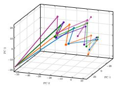  
(a)

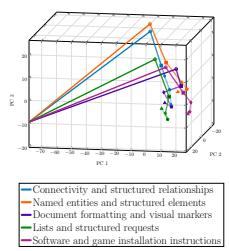  
(b)

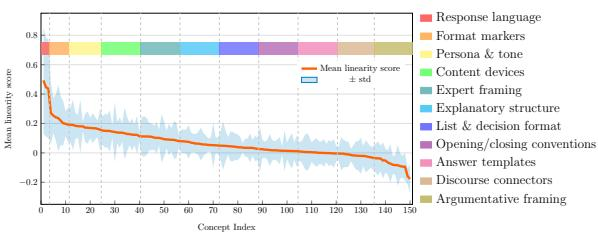  
(c)  
Figure 1: Hidden-state trajectories and steering alignment. (a)–(b) show PCA projections of sentence-level hidden states under different steering concepts. Steering shifts trajectory positions while retaining aspects of velocity and curvature.2 (c) reports cosine alignment between MetaSteer and CAA displacements across semantic concept groups; higher values indicate closer agreement with linear steering. 3

We answer this question with MetaSteer, a preference-trained, nonlinear intervention applied to the attention projection matrices. We choose this site because it offers a computationally tractable way to modify the model’s internal computation (Luo et al., 2026b) while allowing its effects to propagate through residual connections, feed-forward sublayers, and subsequent attention blocks. The intervention therefore need not remain confined to a fixed activation-space shift. Because attention is itself a function of the context, MetaSteer’s adapter weights, although fixed after training, induce context-dependent effects on the residual stream trajectory: the same parameters can produce different activation shifts depending on the context. MetaSteer is trained once on a pooled preference corpus spanning diverse instructions and steering concepts, then deployed with fixed parameters for zero-shot transfer to unseen concepts and out-of-distribution contexts while largely preserving the model’s general capabilities.

We measure transfer on three text-generation benchmarks – AxBench (Wu et al., 2025), CLaS-Bench (Gurgurov et al., 2026), and PersonalityBench (Deng et al., 2025) – and test whether the same intervention transfers to agentic settings through SocialEval (Zhou et al., 2025) and the Dictator and Ultimatum Games (Mozikov et al., 2024). MetaSteer matches or exceeds strong task-specific baselines on aggregate steering scores in most tested settings1.

The geometry of steered hidden-state trajectories is also analyzed through their position, velocity, and curvature. An emerging pattern from this analysis, illustrated by representative examples in Fig. 1(a)–(c), is that steering can displace trajectory position while preserving some aspects of how the trajectory evolves, with the degree of linearity varying across steering concepts. Capability retention is assessed separately, alongside a discussion of the safety implications of transferable steering.

Our contributions are summarized as follows:

• A nonlinear attention-based intervention. MetaSteer is a preference-trained, low-rank intervention applied jointly to the query, key, value, and output attention projections, with an accompanying mathematical formalization.

• Zero-shot transfer across concepts and settings. A single context-conditioned intervention per backbone, trained on pooled concept–preference data and fixed after training, transfers to held-out concepts, external benchmarks and agentic settings without further adaptation.

• Geometric characterization of steering. The hidden-state trajectories induced by steering are analyzed through their position, velocity, and curvature. The results provide evidence that steering can displace trajectory position while preserving some aspects of trajectory evolution, with the degree of linearity varying across steering concepts.

## 2 RELATED WORK

Steering methods can be organized around three design questions: what geometric structure is assumed for concepts in the model’s semantic space, where the intervention is applied, and how the intervention is computed 2.

Geometric assumption. Much prior work assumes concepts are represented approximately linearly in activation space, motivating direction- or vector-difference-based interventions (Xiong et al., 2024; Bereska & Gavves, 2024; Saglam et al., 2025; Panickssery et al., 2023; Turner et al., 2023) that compose and transfer across concepts (Karvonen, 2024; Nguyen et al., 2025). Recent work instead shows concepts may occupy curved, anisotropic manifolds, motivating nonlinear, contextdependent interventions (Engels et al., 2025; Modell et al., 2025; Nguyen & Le, 2026; Zhao et al., 2026; Mishra et al., 2026). MetaSteer imposes no such restrictive geometric assumption on the structure of semantic space.

Intervention site. Interventions may act at the input level via prompts, personas, or reasoning instructions (Kong et al., 2024; Miehling et al., 2025; Park et al., 2025; Wei et al., 2022; Wu et al., 2025), thereby modifying the conditioning context rather than applying an explicit intervention vector; at the parameter level via adapters, prompt or prefix tuning, LoRA, or representation fine-tuning (Houlsby et al., 2019; Lester et al., 2021; Li & Liang, 2021; Hu et al., 2022; Trung et al., 2024); or within the forward pass—most commonly through the residual stream (Nguyen et al., 2025; Hsu et al., 2026) or sparse-autoencoder features (Yu et al., 2026; Yan et al., 2026), with recent work also targeting MLP components and attention heads (Genadi et al., 2026; Luo et al., 2026b). The closest work to ours is Luo et al. (2026b), which intervenes only on the query projection; by contrast, MetaSteer intervenes jointly on all four attention projection matrices—the query, key, value, and output projections.

Learning procedure. Interventions have been constructed via heuristic or contrastive procedures (Panickssery et al., 2023; Chalnev et al., 2024); objectives balancing steering effectiveness against utility preservation (Aravindan et al., 2026; Nguyen et al., 2026; Luo et al., 2026a); learned causaleffect estimators and steering operators (Arad et al., 2025; Cho et al., 2025; Soo et al., 2025; Sun et al., 2025); and preference-based activation-space behavior cloning (Raina et al., 2025). MetaSteer is closest in learning approach to (Raina et al., 2025), but avoids the information bottleneck they identify by learning nonlinear, context-dependent interventions rather than a single low-dimensional vector. Unlike (Sun et al., 2025), which extracts steering directions using a separate, architecturally identical model, MetaSteer uses the same model.

## 3 METHODOLOGY

We formulate steering as preference optimization of a shared, low-rank intervention. We first describe DPO as a direction-specific steering baseline, then introduce an intervention on the four attention projections. We subsequently characterize the geometry of the resulting activation updates and describe the preference data and training objective.

## 3.1 DPO AS DIRECTION-SPECIFIC STEERING

DPO increases the likelihood of a preferred completion $y ^ { + }$ relative to a dispreferred completion $y ^ { - }$ for a prompt x. For a single next-token comparison at a shared prompt x, the log-probability gap between the preferred and dispreferred token is linear in the model’s final hidden state h(x):

$$
\log \pi ( y ^ { + } \mid x ) - \log \pi ( y ^ { - } \mid x ) = \langle \mathbf { h } ( x ) , \mathbf { v } \rangle , \qquad \mathbf { v } : = \mathbf { e } _ { y ^ { + } } - \mathbf { e } _ { y ^ { - } } ,\tag{1}
$$

an identity that follows directly from the softmax output parameterization and is derived in full in Appendix B (Raina et al., 2025). For a fixed candidate-token pair $( y ^ { + } , y ^ { - } )$ , the gradient of this single-step gap with respect to the hidden state is parallel to v. This identity alone does not imply a common direction across examples when the candidate-token pair varies; the approximately fixed $\mathbf { d } ^ { \star }$ in Eq. 2 additionally relies on the local approximation of Raina et al. (2025). Under a local linearization, the resulting activation update can therefore be approximated as

$$
{ \bf h } _ { \mathrm { D P O } } ( x ) \approx { \bf h } _ { 0 } ( x ) + \alpha { \bf d } ^ { \star } ,\tag{2}
$$

where $\mathbf { d } ^ { \star }$ is approximately fixed across examples (Raina et al., 2025). Equation 1 is stated here for a single next-token comparison; for full multi-token completions, it holds exactly at the position where the two completions first diverge, with the remainder of the sequence gap following an ordinary autoregressive expansion rather than a single fixed direction (Appendix B). This direction-specific formulation is efficient, but it cannot represent arbitrary context-dependent behavior and relies on an approximately linear representation of the target concept (Engels et al., 2025; Modell et al., 2025).

## 3.2 CONTEXT-CONDITIONED ATTENTION INTERVENTION

Rather than adding a fixed vector to the residual stream, we apply low-rank adapters to all four attention projection matrices, $f \in \{ q , k , v , o \}$ , at each layer:

$$
\widetilde { \mathbf { W } } _ { f } = \mathbf { W } _ { f } + \Delta \mathbf { W } _ { f } = \mathbf { W } _ { f } + \lambda _ { f } \mathbf { A } _ { f } \mathbf { B } _ { f } ^ { \top } , \qquad r \ll d ,\tag{3}
$$

where $\mathbf { A } _ { f }$ and $\mathbf { B } _ { f }$ are trainable low-rank factors and $\lambda _ { f }$ controls the intervention intensity.

The direct update remains rank-constrained: for each projection, $\lambda _ { f } \mathbf { z } _ { i } \mathbf { A } _ { f } \mathbf { B } _ { f } ^ { \top }$ lies in an at-most-rdimensional subspace. Context changes its coefficients within this subspace, while attention and composition across layers yield a richer end-to-end effect.

Let $\mathbf { z } _ { i }$ denote the normalized activation at token position i. The baseline and adapted query, key, and value representations are

$$
\begin{array} { r l r l r } & { \mathbf { q } _ { i } = \mathbf { z } _ { i } \mathbf { W } _ { q } , } & & { \mathbf { k } _ { j } = \mathbf { z } _ { j } \mathbf { W } _ { k } , } & & { \mathbf { v } _ { j } = \mathbf { z } _ { j } \mathbf { W } _ { v } , } \\ & { \widetilde { \mathbf { q } } _ { i } = \mathbf { z } _ { i } \widetilde { \mathbf { W } } _ { q } , } & & { \widetilde { \mathbf { k } } _ { j } = \mathbf { z } _ { j } \widetilde { \mathbf { W } } _ { k } , } & & { \widetilde { \mathbf { v } } _ { j } = \mathbf { z } _ { j } \widetilde { \mathbf { W } } _ { v } , } \end{array}
$$

with $\Delta \mathbf q _ { i } : = \widetilde { \mathbf q } _ { i } - \mathbf q _ { i }$ and $\Delta \mathbf { k } _ { j } : = \widetilde { \mathbf { k } } _ { j } - \mathbf { k } _ { j }$ following from Eq. 3. For a token pair $( i , j )$ , the (unperturbed) scaled dot-product attention logit is $s _ { i j } = \langle \mathbf { q } _ { i } , \mathbf { k } _ { j } \rangle / \sqrt { d }$ , and the adapted logit is $\widetilde { s } _ { i j } =$ $\langle \widetilde { \mathbf { q } } _ { i } , \widetilde { \mathbf { k } } _ { j } \rangle / \sqrt { d }$ , which we write as

$$
\widetilde { s } _ { i j } = s _ { i j } + \delta _ { i j } ( \mathbf { z } _ { i } , \mathbf { z } _ { j } ) ,\tag{4}
$$

where, expanding $\langle \widetilde { \mathbf { q } } _ { i } , \widetilde { \mathbf { k } } _ { j } \rangle = \langle \mathbf { q } _ { i } + \Delta \mathbf { q } _ { i } , \mathbf { k } _ { j } + \Delta \mathbf { k } _ { j } \rangle$ and cancelling the shared $\langle \mathbf { q } _ { i } , \mathbf { k } _ { j } \rangle / \sqrt { d } = s _ { i j }$ term, the perturbation is exactly the sum of the three cross terms induced by the low-rank update:

$$
\delta _ { i j } ( { \bf z } _ { i } , { \bf z } _ { j } ) = \frac { 1 } { \sqrt { d } } \Big [ \langle { \bf q } _ { i } , \Delta { \bf k } _ { j } \rangle + \langle \Delta { \bf q } _ { i } , { \bf k } _ { j } \rangle + \langle \Delta { \bf q } _ { i } , \Delta { \bf k } _ { j } \rangle \Big ] .\tag{5}
$$

$\delta _ { i j }$ depends on both token representations because the adapters modify the query and key projections. For generic adapters,

$$
\frac { \partial \delta _ { i j } } { \partial \mathbf { z } _ { i } } \neq 0 , \qquad \frac { \partial \delta _ { i j } } { \partial \mathbf { z } _ { j } } \neq 0 .\tag{6}
$$

Thus, although the parameter update is fixed after training, its induced attention change depends on the surrounding input context. The full perturbation is derived in Appendix C.

For notational simplicity, Equations 4 and 5 are stated for a single attention head with no positional rotation; the general form for multi-head, grouped-query attention under RoPE is derived in $\mathsf { A p - }$ pendix A.5 and reduces to those equations exactly when $H = H _ { k v } = 1$ and the rotation is the identity. In the general case, with $\dot { H }$ query heads, $\dot { H } _ { k v } \leq H$ key/value heads (query head h sharing key/value head $\kappa ( h )$ under grouped-query attention), and per-head outputs $\widetilde { \mathbf { a } } _ { i } ^ { ( h ) }$ , the output projection is applied after concatenating head outputs rather than to each value vector independently:

$$
\widetilde { \mathbf { a } } _ { i } = \mathrm { C o n c a t } _ { h = 1 } ^ { H } \left( \widetilde { \mathbf { a } } _ { i } ^ { ( h ) } \right) \widetilde { \mathbf { W } } _ { o } = \sum _ { h = 1 } ^ { H } \sum _ { j } \mathrm { s o f t m a x } _ { j } \left( \widetilde { s } _ { i j } ^ { ( h ) } \right) \left( \widetilde { \mathbf { v } } _ { j } ^ { ( \kappa ( h ) ) } \widetilde { \mathbf { W } } _ { o } ^ { ( h ) } \right) ,\tag{7}
$$

where $\widetilde { \mathbf { W } } _ { o } ^ { ( h ) }$ is the row-block of $\widetilde { \mathbf { W } } _ { o }$ corresponding to head $h ,$ and $\widetilde { s } _ { i j } ^ { ( h ) }$ is that head’s own adapted attention logit (Appendix A.5). Because the softmax weights and projected values depend on the current token representations, the induced update $\Delta \mathbf { a } _ { i } = \widetilde { \mathbf { a } } _ { i } - \mathbf { a } _ { i }$ is generally nonlinear:

$$
\frac { \partial ^ { 2 } \Delta \mathbf { a } _ { i } } { \partial \mathbf { z } _ { i } ^ { 2 } } \not \equiv 0 .\tag{8}
$$

This provides a context-conditioned alternative to adding a fixed activation direction.

## 3.3 GEOMETRY OF STEERING EFFECTS

The preceding parameterization produces an activation displacement that can vary with both the instruction and the steering concept. We write this displacement as

$$
\mathbf { h } _ { \Theta } ( x , c ) \approx \mathbf { h } _ { 0 } ( x ) + \alpha ( x , c ) \mathbf { d } ( x , c ) , \qquad \mathbf { d } ( x , c ) \in \mathbb { R } ^ { d } ,\tag{9}
$$

where Θ denotes the adapter parameters.

We test whether this context-dependent displacement nonetheless collapses, concept by concept, onto a single fixed linear direction, or instead departs from one. For each steering concept $c ,$ we compare its mean MetaSteer displacement $\mathbf { d } _ { c } ^ { \mathrm { M S } } : = \mathbb { E } _ { x } [ \mathbf { d } ( x , c ) ]$ against CAA direction $\mathbf { v } _ { c } ^ { \mathrm { C A A } }$ estimated for the same concept, via their cosine similarity

$$
s _ { c } = \cos \left( \mathbf { v } _ { c } ^ { \mathrm { C A A } } , \ \mathbf { d } _ { c } ^ { \mathrm { M S } } \right) .\tag{10}
$$

A value of $s _ { c }$ near one indicates alignment with the CAA direction, while a low value indicates disagreement with this particular linear baseline. This is an alignment diagnostic; it neither rules out another fixed linear direction nor estimates the intrinsic dimensionality of the hidden-state trajectory. We report $s _ { c }$ for a broad concept inventory across multiple models in Section 6 and Appendix J (Figure 1(c)).

## 3.4 PREFERENCE DATA

We construct a pooled preference dataset from Concept16K and Concept16K-v2 (Wu et al., 2025). For each steering concept c and instruction $x ,$ the dataset provides preferred and dispreferred responses. We form DPO tuples

$$
\begin{array} { r } { ( x , c , y ^ { + } , y ^ { - } ) , \qquad y ^ { + } \in \mathcal { D } _ { c } ^ { + } , \quad y ^ { - } \in \mathcal { D } _ { c } ^ { - } , } \end{array}\tag{11}
$$

and pool them across concepts:

$$
{ \mathcal { D } } = \bigcup _ { c \in { \mathcal { C } } } \{ ( x , c , y ^ { + } , y ^ { - } ) \} .\tag{12}
$$

The internal split is concept-disjoint but shares instructions across splits; transfer to external instruction distributions is evaluated only on the external benchmarks. Dataset construction and diversity statistics are provided in Appendix M.

## 3.5 PREFERENCE OPTIMIZATION OBJECTIVE

Let $\pi _ { \Theta }$ denote the base model with the attention adapters and let $\pi _ { \mathrm { r e f } }$ be the frozen reference model. We define

$$
\rho _ { \Theta } ( y \mid x , c ) = \log \pi _ { \Theta } ( y \mid x , c ) - \log \pi _ { \mathrm { r e f } } ( y \mid x , c ) .\tag{13}
$$

We optimize the adapter factors $\boldsymbol { \Theta } = \left\{ \mathbf { A } _ { f } , \mathbf { B } _ { f } \right\}$ , conditioned on the instruction and steering concept, using the standard DPO objective with fixed $\dot { \lambda } _ { f } = 1$ (Appendix M.4):

$$
\begin{array} { r } { \mathcal { L } _ { \mathrm { D P O } } ( \boldsymbol { \Theta } ) = - \mathbb { E } _ { ( \boldsymbol { x } , \boldsymbol { c } , \boldsymbol { y } ^ { + } , \boldsymbol { y } ^ { - } ) \sim \mathcal { D } } \left[ \log \sigma \left( \beta \rho _ { \Theta } ( \boldsymbol { y } ^ { + } \mid \boldsymbol { x } , \boldsymbol { c } ) - \beta \rho _ { \Theta } ( \boldsymbol { y } ^ { - } \mid \boldsymbol { x } , \boldsymbol { c } ) \right) \right] . } \end{array}\tag{14}
$$

The base model parameters remain frozen; only the low-rank adapter factors $\left\{ \mathbf { A } _ { f } , \mathbf { B } _ { f } \right\}$ are updated.   
The intensity scalars $\lambda _ { f }$ are fixed hyperparameters (Appendix M.4).

Table 1: Zero-shot transfer results on AxBench, CLaS-Bench, and PersonalityBench across the evaluated LLaMA, Gemma, and Qwen model scales. Aggregate-score columns summarize the metrics described in Section 4. Bold entries indicate the larger aggregate score for each model.
<table><tr><td rowspan="2">Model</td><td rowspan="2">Method</td><td colspan="4">AxBench</td><td colspan="3">CLaS-Bench</td><td colspan="3">PersonalityBench</td></tr><tr><td>C</td><td>I</td><td>F</td><td>HM</td><td>L</td><td>R</td><td>HM</td><td>P</td><td>F</td><td>AM</td></tr><tr><td rowspan="2">Llama-3.2-3B</td><td>BEST REF</td><td>0.63</td><td>1.78</td><td>1.07</td><td>0.97</td><td>71.61</td><td>64.43</td><td>67.83</td><td>4.87</td><td>5.00</td><td>4.94</td></tr><tr><td>MetaSteer</td><td>1.65</td><td>1.75</td><td>1.49</td><td>1.62</td><td>79.64</td><td>71.59</td><td>75.40</td><td>4.86</td><td>5.00</td><td>4.93</td></tr><tr><td rowspan="2">Llama-3.1-8B</td><td>BEST REF</td><td>1.22</td><td>1.80</td><td>1.10</td><td>1.32</td><td>83.50</td><td>85.50</td><td>84.50</td><td>4.89</td><td>5.00</td><td>4.95</td></tr><tr><td>MetaSteer</td><td>1.68</td><td>1.82</td><td>1.27</td><td>1.55</td><td>87.07</td><td>87.25</td><td>87.16</td><td>4.87</td><td>4.99</td><td>4.93</td></tr><tr><td rowspan="2">Gemma-2-2B</td><td>BEST REF</td><td>0.74</td><td>1.77</td><td>1.06</td><td>1.05</td><td>83.26</td><td>79.03</td><td>81.09</td><td>4.84</td><td>5.00</td><td>4.92</td></tr><tr><td>MetaSteer</td><td>1.42</td><td>1.47</td><td>1.67</td><td>1.51</td><td>94.23</td><td>78.71</td><td>85.78</td><td>4.91</td><td>5.00</td><td>4.95</td></tr><tr><td rowspan="2">Gemma-2-9B</td><td>BEST REF</td><td>1.03</td><td>1.80</td><td>1.12</td><td>1.24</td><td>97.81</td><td>90.43</td><td>93.98</td><td>4.86</td><td>5.00</td><td>4.93</td></tr><tr><td>MetaSteer</td><td>1.42</td><td>1.58</td><td>1.58</td><td>1.52</td><td>99.49</td><td>90.30</td><td>94.67</td><td>4.96</td><td>5.00</td><td>4.98</td></tr><tr><td rowspan="2">Qwen3-1.7B</td><td>BEST REF</td><td>1.02</td><td>1.85</td><td>1.41</td><td>1.35</td><td>60.09</td><td>65.40</td><td>62.63</td><td>4.91</td><td>4.99</td><td>4.95</td></tr><tr><td>MetaSteer</td><td>1.45</td><td>1.72</td><td>1.56</td><td>1.57</td><td>73.43</td><td>71.65</td><td>72.53</td><td>4.84</td><td>5.00</td><td>4.92</td></tr><tr><td rowspan="2">Qwen3-4B</td><td>BEST REF</td><td>1.40</td><td>1.89</td><td>1.40</td><td>1.53</td><td>83.26</td><td>77.65</td><td>80.36</td><td>4.89</td><td>5.00</td><td>4.94</td></tr><tr><td>MetaSteer</td><td>1.58</td><td>1.74</td><td>1.46</td><td>1.59</td><td>85.52</td><td>77.99</td><td>81.58</td><td>4.91</td><td>5.00</td><td>4.95</td></tr></table>

## 4 ZERO-SHOT TRANSFER TO TEXT-GENERATION BENCHMARKS

We evaluate whether MetaSteer, trained once per backbone on the pooled preference corpus , transfers to held-out concepts and external benchmark instruction distributions. No per-benchmark fine-tuning or task-specific hyperparameter search is performed.

Benchmarks. AxBench. (Wu et al., 2025) evaluates instruction following under concept-steering constraints across information-seeking, mathematical, and programming queries ( 32K test examples). Its metrics are concept score (C), instruction score (I), and fluency score (F), combined using their harmonic mean (HM). CLaS-Bench. (Gurgurov et al., 2026) evaluates language steering in question-answering settings ( 72K test examples). Its metrics are language forcing (L) and output relevance (R), combined using their harmonic mean (HM). PersonalityBench. PersonalityBench (Deng et al., 2025) evaluates elicitation of the Big Five personality traits through open-ended long responses ( 500 test examples). Its metrics are personality score (P) and fluency score (F), whose arithmetic mean (AM) is reported as the aggregate score.

Reference results and matched baselines. We use two complementary comparisons for the textgeneration tasks. The BEST REF row denotes the best-performing method reported for each bench mark: Prompt for AxBench, ε-base-I for CLaS-Bench, and P2 for PersonalityBench. We implemented each method and evaluated it using the corresponding benchmark’s original framework and scoring procedure. MetaSteer was then evaluated on the same tasks under the same framework, enabling a direct comparison with the strongest task-specific reference available for each benchmark.

We additionally evaluate SKOP, the closest methodological comparator to MetaSteer, in a matched head-to-head comparison following SKOP’s reported evaluation procedure. On Llama-3.1-8B, MetaSteer outperforms SKOP by 2% in utility (U) and 0.6 points in steering effectiveness (S). HyperSteer is discussed as a related transferable-steering method, but its reported AxBench performance is below the task-specific reference implemented here. D-Steer is also conceptually related; however, its fixed representation introduces an information bottleneck that limits its ability to rep resent fine-grained concept variation. Results for three model families at two parameter scales are reported in Table 1.

Results. MetaSteer improves aggregate steering scores over the reported baselines on AxBench and CLaS-Bench across settings. On PersonalityBench, it remains competitive, with only small differences in aggregate scores. Together with the zero-shot evaluation and the geometric analysis in Section 6, these results support structured and transferable steering effects rather than collapse to a single direction or concept-specific memorization.

Table 2: Emotion-steering results for the Dictator and Ultimatum Games across three model families at two parameter scales, with GPT-4o and Human reference rows (scoring defined in Section 5). Bold indicates the best Simulation Score per model.
<table><tr><td rowspan="2">Agent</td><td rowspan="2">Method</td><td colspan="4">Anger</td><td colspan="4">Disgust</td><td colspan="4">Fear</td><td colspan="4">Happiness</td><td colspan="4">Sadness</td><td rowspan="2">Simulation Score</td></tr><tr><td>D</td><td>UP</td><td></td><td>UR</td><td>D</td><td>UP</td><td>UR</td><td></td><td>D</td><td>UP</td><td>UR</td><td></td><td>D</td><td>UP</td><td>UR</td><td></td><td>D</td><td>UP</td><td>UR</td></tr><tr><td>Human GPT-40</td><td></td><td>↑</td><td>↑ x</td><td></td><td>↓</td><td>↓</td><td>↓</td><td>↑</td><td></td><td>↑</td><td>↑</td><td>↑</td><td></td><td>↓ x</td><td>↓</td><td>↓</td><td></td><td>↑</td><td>↑</td><td>↓</td><td></td></tr><tr><td></td><td></td><td>x x</td><td></td><td></td><td>√</td><td>x</td><td>△</td><td>x</td><td></td><td>V</td><td>√</td><td>√</td><td></td><td></td><td>x</td><td>x</td><td>√</td><td></td><td>√</td><td>√</td><td>15/30</td></tr><tr><td>Llama-3.2-3B</td><td>EAI-CP MetaSteer</td><td>x</td><td></td><td>x</td><td>√ △</td><td>x 1</td><td>√ √</td><td></td><td>x x</td><td>X x</td><td>x x</td><td>x x</td><td></td><td>J √</td><td>√ √</td><td>V S</td><td></td><td>x V</td><td>x x</td><td>△ √</td><td>11/30 15/30</td></tr><tr><td>Llama-3.1-8B</td><td>EAI-CP</td><td>x</td><td></td><td></td><td>√</td><td>x</td><td>X</td><td>x</td><td>X</td><td></td><td>√</td><td>x</td><td>√</td><td></td><td>x</td><td>√</td><td>√</td><td></td><td>√</td><td>√</td><td>14/30</td></tr><tr><td></td><td>MetaSteer</td><td>V</td><td></td><td></td><td>√</td><td>X</td><td>x</td><td>x</td><td></td><td>1</td><td>√</td><td>x</td><td></td><td>√</td><td>√</td><td>√</td><td>√</td><td></td><td>√</td><td>√</td><td>20/30</td></tr><tr><td>Gemma-2-2B</td><td>EAI-CP MetaSteer</td><td>X</td><td></td><td>√</td><td>x</td><td>X</td><td>x</td><td>X</td><td></td><td>√</td><td>√</td><td>x</td><td>√</td><td></td><td>X</td><td>√</td><td>√</td><td></td><td>√</td><td>√</td><td>16/30 22/30</td></tr><tr><td></td><td></td><td>√</td><td>√</td><td></td><td>√</td><td>X</td><td>x</td><td>x</td><td>√</td><td></td><td>√</td><td>x</td><td>√</td><td></td><td>√</td><td>V</td><td>√</td><td></td><td>√</td><td>√</td><td></td></tr><tr><td>Gemma-2-9B</td><td>EAI-CP MetaSteer</td><td>x x</td><td>√</td><td></td><td>x √</td><td>1 x</td><td>√ √</td><td>x x</td><td></td><td>x 1</td><td>√ x</td><td>√ x</td><td>√ √</td><td></td><td>X √</td><td>x</td><td></td><td>√</td><td>V √</td><td>x √</td><td>16/30 17/30</td></tr><tr><td></td><td></td><td></td><td>X</td><td></td><td></td><td></td><td></td><td></td><td></td><td></td><td></td><td></td><td></td><td></td><td></td><td>△</td><td>√</td><td></td><td></td><td></td><td></td></tr><tr><td>Qwen3-1.7B</td><td>EAI-CP MetaSteer</td><td>x x</td><td>x √</td><td></td><td>√ x</td><td>√ √</td><td>√ x</td><td>△ x</td><td></td><td>1 X</td><td>x △</td><td>△ △</td><td>√ √</td><td></td><td>√ V</td><td>√ √</td><td></td><td>x V</td><td>x △</td><td>√ △</td><td>18/30 16/30</td></tr><tr><td></td><td></td><td></td><td></td><td></td><td></td><td></td><td></td><td></td><td></td><td></td><td></td><td></td><td></td><td></td><td></td><td></td><td></td><td></td><td></td><td></td><td></td></tr><tr><td>Qwen3-4B</td><td>EAI-CP MetaSteer</td><td>x x</td><td></td><td>√ x</td><td>△ √</td><td>√ √</td><td>x √</td><td></td><td>x x</td><td>x X</td><td>√ x</td><td>△ △</td><td>√ √</td><td></td><td>X √</td><td>△ △</td><td>J √</td><td></td><td>√ √</td><td>△ △</td><td>16/30 17/30</td></tr></table>

## 5 BEYOND TEXT GENERATION: AGENTIC TRANSFER

Transfer on text-generation benchmarks does not necessarily imply transfer to interactive decisionmaking. We therefore evaluate whether the same fixed steering intervention can influence agentic behavior across three settings – the Dictator Game, the Ultimatum Game, and SocialEval – while preserving the capability to track task dynamics and produce valid, in-context actions.

Dictator and Ultimatum Games. In the Dictator Game, an allocator divides a fixed amount of money between itself and a passive recipient. In the Ultimatum Game, a proposer divides a fixed amount between itself and a responder, who accepts or rejects the offer; we evaluate both roles. In both games, the agent is steered toward one of five emotions – anger, disgust, fear, happiness, or sad ness – and we compare the resulting change in behavior (the allocator’s giving, the proposer’s offer size, and the responder’s acceptance rate) against the human ground-truth direction ( , ) reported for each emotion by Mozikov et al. (2024).

SocialEval. SocialEval (Zhou et al., 2025) presents the agent with branching social scenarios: at each decision point, the agent selects an action that determines the subsequent trajectory, and each terminal node is annotated with the social trait it expresses. The agent is steered toward one of three traits – proself, antisocial, or prosocial – and we report the resulting Goal Achievement Score (GAE) at the macro level (averaged across trait categories) and the micro level (averaged across all trajectories).

Reference points and metrics. For SocialEval, SOCIALEVAL-EN (SEVAL-EN in Table 3) is the reference configuration, evaluated on the same English scenarios, trait categories, and macro/micro GAE metrics as MetaSteer. For the Dictator and Ultimatum Games, the EAI-CP (Co-player) condition of Mozikov et al. (2024) is the reference, evaluated under the same emotion–role conditions. In Table 2, D denotes the Dictator allocator, UP the Ultimatum proposer, and UR the Ultimatum responder; ✓, ✗, and  mark agreement, contradiction, and an ambiguous shift relative to the human ground-truth direction. The Simulation Score awards two points per ✓, one per , and zero per ✗ across the 15 emotion–role conditions (maximum 30). All game runs use temperature 0.7 with 200 runs per condition.

Table 3: SocialEval GAE results across proself, antisocial, and prosocial targets, three model families, and two parameter scales each (N = 1210 scenarios). Human baseline from 20 native Chinese/English graduate-student annotators (14 scenarios per language). Best score per metric per model in bold.
<table><tr><td rowspan="2">Agent</td><td rowspan="2">Meth.</td><td>Proself</td><td colspan="2">Antisocial</td><td colspan="4">Prosocial</td><td colspan="2">Overall GAE</td></tr><tr><td>C</td><td>I</td><td>C</td><td>C</td><td>A</td><td>N</td><td>A</td><td>Macro Micro</td><td></td></tr><tr><td>Human (avg)</td><td></td><td>40.00</td><td>60.00</td><td>40.00</td><td>60.00</td><td>55.00</td><td>55.00</td><td>70.00</td><td>55.16</td><td></td></tr><tr><td>Llama-3.2-3B</td><td>SEVAL-EN MetaSteer</td><td>32.67 26.49</td><td>75.00 85.71</td><td>30.99 50.00</td><td>31.36 23.44</td><td>43.33 35.29</td><td>36.20 49.06</td><td>31.25 36.24</td><td>40.11 43.75</td><td>37.71 39.10</td></tr><tr><td>Llama-3.1-8B</td><td>SEVAL-EN MetaSteer</td><td>28.57 35.25</td><td>87.14 76.25</td><td>50.00 62.50</td><td>22.73 32.00</td><td>35.50 64.33</td><td>41.28 47.14</td><td>52.35 32.14</td><td>45.37 49.94</td><td>39.93 46.86</td></tr><tr><td>Gemma-2-2B</td><td>SEVAL-EN MetaSteer</td><td>25.16 29.41</td><td>50.00 62.50</td><td>26.25 42.86</td><td>25.00 29.35</td><td>35.00 54.55</td><td>49.75 50.68</td><td>25.00 6.25</td><td>33.74 39.37</td><td>33.43 38.23</td></tr><tr><td>Gemma-2-9B</td><td>SEVAL-EN MetaSteer</td><td>27.86 26.67</td><td>75.00 100.00</td><td>75.00 62.50</td><td>25.00 37.80</td><td>50.00 41.67</td><td>45.45 50.00</td><td>18.99</td><td>45.33 50.76</td><td>40.72 45.49</td></tr><tr><td>Qwen3-1.7B</td><td>SEVAL-EN</td><td>43.40</td><td>50.00</td><td>26.25</td><td>23.20</td><td>38.89</td><td>41.10</td><td>36.67 32.67</td><td>36.50</td><td>36.32</td></tr><tr><td rowspan="2">Qwen3-4B</td><td>MetaSteer</td><td>32.05</td><td>56.96</td><td>35.82</td><td>23.38</td><td>41.58</td><td>45.66</td><td>19.59</td><td>36.44</td><td>35.28</td></tr><tr><td>SEVAL-EN MetaSteer</td><td>25.17 31.97</td><td>45.33 56.41</td><td>53.95 58.75</td><td>31.61 34.72</td><td>36.07 37.10</td><td>54.39 42.17</td><td>23.68 35.85</td><td>38.60 42.43</td><td>37.81 39.78</td></tr></table>

Results. MetaSteer outperforms the agentic reference on five of the six settings: it improves the Simulation Score relative to EAI-CP (Table 2) and the macro- and micro-averaged GAE relative to SEVAL-EN (Table 3). These results suggest that gains in steered text-generation performance are associated with more controllable agents more broadly.

## 6 GEOMETRIC ANALYSIS

Prior work suggests that hidden-state trajectories encode information through both absolute position and local geometric dynamics, including velocity and curvature (Xu et al., 2024; Park et al., 2025; Gjølbye et al., 2026; Zhou et al., 2026). We therefore test whether concept steering changes the semantic location of a response while preserving aspects of its instruction-associated trajectory dynamics.

We analyze 29,484 segments from 2,550 steered responses spanning 381 instructions, 70 concepts, and three genres (code, text, math). Segments are encoded either cumulatively with their preceding context or independently. Data construction, filtering, pooling, and similarity metrics are detailed in Appendix I.

Higher-order geometry is associated with instruction structure. Position similarity remains high across instruction, concept, and genre groupings and changes little after shuffling, making it weakly diagnostic of ordered structure. In contrast, instruction-grouped velocity increases from .06/.06 to .31/.38 under cumulative encoding and from .00/.00 to .29/.37 under isolated encoding. Acceleration similarly increases from .02/.02 to .27/.35 and from .00/.00 to .27/.35, respectively. Isolated Menger-curvature similarity increases from .02/.00 to .29/.37, while the cumulative increase is weaker (.32/.35 to .36/.44) because accumulated context retains shared structure after shuffling. Concept- and genre-grouped similarities remain lower, indicating that velocity, acceler ation, and curvature partially reflect shared instruction structure. Complete results appear in Ap pendix I, Tables 7 and 8, and Figure 1(a)–(b).

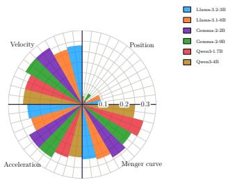  
(a)

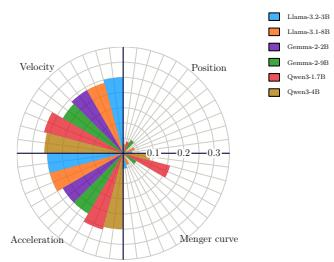  
(b)

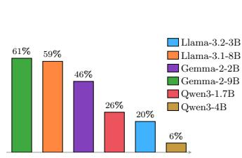  
(c)  
Figure 2: Trajectory geometry and safety. (a) and (b) show instruction-grouped gains in trajectory similarity relative to a randomly shuffled control for position, velocity, acceleration, and Menger curvature under isolated-segment (a) and cumulative-context (b) encoding, respectively. (c) shows obedience rates for harmful steering concepts from JailbreakBench; higher values indicate weaker refusal behaviour.

The geometric effect depends on the concept. In a complementary experiment, we compare the positional displacements induced by MetaSteer with those produced by CAA for 150 concepts proposed by Fan et al. (2026). Agreement is quantified with the cosine alignment score $s _ { c }$ (Eq. 10), averaged across six models; complete experimental details are provided in Appendix J. Figure 1(c) reports the mean CAA-alignment score for each concept, with shadow denoting one standard devi ation across models, and organizes the concepts into semantic clusters. Concepts that induce broad global changes, such as shifts in language or output format, are more accurately represented by a linear steering direction; concepts requiring context-dependent combinations of local and global changes, such as discourse development or argument framing, are less adequately captured by a single CAA direction.

## 7 SUPPORTING ANALYSES

We conduct supporting analyses of safety, evaluator reliability, and capability retention. Because activation steering can weaken safety-relevant behavior such as refusal (Marks & Tegmark, 2023; Geiger et al., 2024; Bao et al., 2026; Wu et al., 2026), we assess whether MetaSteer can bypass refusals using harmful behaviours from JailbreakBench (Chao et al., 2024). Each behaviour is decomposed into a benign instruction and a risky steering concept, and generated responses are classified according to whether they comply with or refuse the harmful request. The results indicate that transferable steering can weaken refusal behaviour in some contexts (Figure 2(c)), motivating caution before deployment. Further details are provided in Appendix L.

We also assess the reliability of LLM-based evaluation, which offers an efficient alternative to human assessment while raising concerns about consistency, calibration, and bias (Zheng et al., 2023; Zhang et al., 2023; Gu et al., 2024; Yu, 2025; Gu et al., 2026). On selected samples from the text-generation evaluations, agreement among the LLM judges was strong. Detailed per-method, pairwise, and calibration analyses are reported in Appendix D. Human-anchored validation of the judge scores is provided in Appendix E.2. Finally, we evaluate capability retention by comparing the adapted models with their unmodified bases on MMLU (Hendrycks et al., 2020) and TruthfulQA (Lin et al., 2022). The results show generally limited changes in knowledge and truthfulness, with no consistent degradation across models. Complete per-model results are reported in Appendix F.

## 8 CONCLUSION

We introduced METASTEER, a preference-trained low-rank intervention applied to all four attention projection matrices. Unlike a fixed activation vector, its parameters remain fixed after training while its induced activation effect varies with the input context. The method therefore addresses three linked design questions: where to intervene, how to learn the intervention, and how to avoid imposing a globally linear representation of each concept.

A single intervention trained on pooled preference data transfers to unseen concepts and instruction combinations across three text-generation benchmarks and three agentic settings without perbenchmark adaptation. Geometric analyses further show that steering often changes trajectory position while partially preserving aspects of its local dynamics, including velocity and acceleration, although the strength of this effect varies across concepts.

Overall, our results support viewing steering as controlled trajectory displacement: the intervention must induce a target behavior while preserving task-relevant dynamics and general model utility. We additionally assess evaluator reliability and identify safety considerations that should be addressed before deploying transferable steering methods.

## REPRODUCIBILITY STATEMENT

The source code and pretrained model checkpoints will be made publicly available in an upcoming arXiv version shortly.

## ACKNOWLEDGMENTS

This project is supported by the ARC Centre of Excellence for Automated Decision-Making and Society (CE200100005). Computational facilities were provided by the School of Computer Science and Engineering at UNSW Sydney through Katana.

## REFERENCES

Dana Arad, Aaron Mueller, and Yonatan Belinkov. Saes are good for steering–if you select the right features. In Proceedings of the 2025 Conference on Empirical Methods in Natural Language Processing, pp. 10252–10270, 2025.

Kavin Aravindan, Arihant Rastogi, Aadi Prasad, Krishak Aneja, Saiyam Jain, Vaishnavi Shivkumar, and Ponnurangam Kumaraguru. Opium: Mitigating steering externalities and over-refusal via dual objective latent optimization. arXiv preprint arXiv:2607.19806, 2026.

Yuntai Bao, Xuhong Zhang, Jintao Chen, Ge Su, Yuxiang Cai, Hao Peng, SUN Bing, Haiqin Weng, Liu Yan, and Jianwei Yin. Faithful bi-directional model steering via distribution matching and distributed interchange interventions. In International Conference on Learning Representations, volume 2026, pp. 68722–68776, 2026.

Leonard Bereska and Efstratios Gavves. Mechanistic interpretability for ai safety–a review. arXiv preprint arXiv:2404.14082, 2024.

Sviatoslav Chalnev, Matthew Siu, and Arthur Conmy. Improving steering vectors by targeting sparse autoencoder features. arXiv preprint arXiv:2411.02193, 2024.

Patrick Chao, Edoardo Debenedetti, Alexander Robey, Maksym Andriushchenko, Francesco Croce, Vikash Sehwag, Edgar Dobriban, Nicolas Flammarion, George J Pappas, Florian Tramer, et al. Jailbreakbench: An open robustness benchmark for jailbreaking large language models. Advances in Neural Information Processing Systems, 37:55005–55029, 2024.

Seonglae Cho, Zekun Wu, and Adriano Koshiyama. Corrsteer: Generation-time llm steering via correlated sparse autoencoder features. arXiv preprint arXiv:2508.12535, 2025.

Jia Deng, Tianyi Tang, Yanbin Yin, Xin Zhao, Ji-Rong Wen, et al. Neuron based personality trait induction in large language models. In International Conference on Learning Representations, volume 2025, pp. 85059–85083, 2025.

Josh Engels, Eric Michaud, Isaac Liao, Wes Gurnee, and Max Tegmark. Not all language model features are one-dimensionally linear. In International Conference on Learning Representations, volume 2025, pp. 84591–84622, 2025.

Chenrui Fan, Yize Cheng, Ming Li, Soheil Feizi, and Tianyi Zhou. When is your llm steerable? arXiv preprint arXiv:2606.11599, 2026.

Atticus Geiger, Zhengxuan Wu, Christopher Potts, Thomas Icard, and Noah Goodman. Finding alignments between interpretable causal variables and distributed neural representations. In Causal Learning and Reasoning, pp. 160–187. PMLR, 2024.

Rifo Ahmad Genadi, Munachiso S Nwadike, Nurdaulet Mukhituly, Tatsuya Hiraoka, Hilal AlQuabeh, and Kentaro Inui. Sycophancy hides linearly in the attention heads. In Proceedings of the 19th Conference of the European Chapter of the Association for Computational Linguistics (Volume 1: Long Papers), pp. 6896–6912, 2026.

Anders Gjølbye, Lars Kai Hansen, and Sanmi Koyejo. Reasoning models don’t just think longer, they move differently. arXiv preprint arXiv:2605.15454, 2026.

Jiawei Gu, Xuhui Jiang, Zhichao Shi, Hexiang Tan, Xuehao Zhai, Chengjin Xu, Wei Li, Yinghan Shen, Shengjie Ma, Honghao Liu, et al. A survey on llm-as-a-judge. The Innovation, 2024.

Jiawei Gu, Xuhui Jiang, Zhichao Shi, Hexiang Tan, Xuehao Zhai, Chengjin Xu, Wei Li, Yinghan Shen, Shengjie Ma, Honghao Liu, Saizhuo Wang, Kun Zhang, Zhouchi Lin, Bowen Zhang, Lionel Ni, Wen Gao, Yuanzhuo Wang, and Jian Guo. A survey on llm-as-a-judge. The Innovation, pp. 101253, 2026. ISSN 2666-6758. doi: https://doi.org/10.1016/j.xinn.2025.101253. URL https: //www.sciencedirect.com/science/article/pii/S2666675825004564.

Daniil Gurgurov, Yusser Al Ghussin, Tanja Baeumel, Cheng-Ting Chou, Patrick Schramowski, Marius Mosbach, Josef van Genabith, and Simon Ostermann. Clas-bench: A cross-lingual alignment and steering benchmark. In Findings of the Association for Computational Linguistics: ACL 2026, pp. 21591–21628, 2026.

Zeqing He, Zhibo Wang, Huiyu Xu, and Kui Ren. Towards llm guardrails via sparse representation steering. arXiv e-prints, pp. arXiv–2503, 2025a.

Zhengfu He, Wentao Shu, Xuyang Ge, Lingjie Chen, Junxuan Wang, Yunhua Zhou, Frances Liu, Qipeng Guo, Xuanjing Huang, Zuxuan Wu, et al. Llama scope: Extracting millions of features from llama-3.1-8b with sparse autoencoders. arXiv preprint arXiv:2410.20526, 2024.

Zirui He, Mingyu Jin, Bo Shen, Ali Payani, Yongfeng Zhang, and Mengnan Du. Sae-ssv: Supervised steering in sparse representation spaces for reliable control of language models. In Proceedings of the 2025 Conference on Empirical Methods in Natural Language Processing, pp. 2207–2236, 2025b.

Zirui He, Haiyan Zhao, Yiran Qiao, Fan Yang, Ali Payani, Jing Ma, and Mengnan Du. Saif: A sparse autoencoder framework for interpreting and steering instruction following of language models. arXiv preprint arXiv:2502.11356, 2025c.

Dan Hendrycks, Collin Burns, Steven Basart, Andy Zou, Mantas Mazeika, Dawn Song, and Jacob Steinhardt. Measuring massive multitask language understanding. arXiv preprint arXiv:2009.03300, 2020.

Neil Houlsby, Andrei Giurgiu, Stanislaw Jastrzebski, Bruna Morrone, Quentin De Laroussilhe, Andrea Gesmundo, Mona Attariyan, and Sylvain Gelly. Parameter-efficient transfer learning for NLP. In Kamalika Chaudhuri and Ruslan Salakhutdinov (eds.), Proceedings of the 36th International Conference on Machine Learning, volume 97 of Proceedings of Machine Learning Research, pp. 2790–2799. PMLR, 09–15 Jun 2019. URL https://proceedings.mlr. press/v97/houlsby19a.html.

Brandon Hsu, Daniel Beaglehole, Adityanarayanan Radhakrishnan, and Mikhail Belkin. Contextual linear activation steering of language models. arXiv preprint arXiv:2604.24693, 2026.

Edward J Hu, Yelong Shen, Phillip Wallis, Zeyuan Allen-Zhu, Yuanzhi Li, Shean Wang, Liang Wang, Weizhu Chen, et al. Lora: Low-rank adaptation of large language models. Iclr, 1(2):3, 2022.

Damjan Kalajdzievski. Scaling laws for forgetting when fine-tuning large language models. arXiv preprint arXiv:2401.05605, 2024.

Adam Karvonen. Emergent world models and latent variable estimation in chess-playing language models. arXiv preprint arXiv:2403.15498, 2024.

Aobo Kong, Shiwan Zhao, Hao Chen, Qicheng Li, Yong Qin, Ruiqi Sun, Xin Zhou, Enzhi Wang, and Xiaohang Dong. Better zero-shot reasoning with role-play prompting. In Kevin Duh, Helena Gomez, and Steven Bethard (eds.), Proceedings of the 2024 Conference of the North American Chapter of the Association for Computational Linguistics: Human Language Technologies (Volume 1: Long Papers), pp. 4099–4113, Mexico City, Mexico, June 2024. Association for Computational Linguistics. doi: 10.18653/v1/2024.naacl-long.228. URL https: //aclanthology.org/2024.naacl-long.228/.

Brian Lester, Rami Al-Rfou, and Noah Constant. The power of scale for parameter-efficient prompt tuning. In Proceedings of the 2021 conference on empirical methods in natural language processing, pp. 3045–3059, 2021.

Xiang Lisa Li and Percy Liang. Prefix-tuning: Optimizing continuous prompts for generation. In Proceedings ofthe 59th Annual Meeting ofthe Associationfor Computational Linguistics and the 11th International Joint Conference on Natural Language Processing (Volume 1: Long Papers), pp. 4582–4597, 2021.

Tom Lieberum, Senthooran Rajamanoharan, Arthur Conmy, Lewis Smith, Nicolas Sonnerat, Vikrant Varma, Janos Kram´ ar, Anca Dragan, Rohin Shah, and Neel Nanda. Gemma scope: Open sparse´ autoencoders everywhere all at once on gemma 2. In Proceedings of the 7th BlackboxNLP Workshop: Analyzing and Interpreting Neural Networksfor NLP, pp. 278–300, 2024.

Stephanie Lin, Jacob Hilton, and Owain Evans. Truthfulqa: Measuring how models mimic human falsehoods. In Proceedings of the 60th annual meeting of the association for computational linguistics (volume 1: long papers), pp. 3214–3252, 2022.

Grace Luo, Jiahai Feng, Trevor Darrell, Alec Radford, and Jacob Steinhardt. Learning a generative meta-model of llm activations. arXiv preprint arXiv:2602.06964, 2026a.

Haoyan Luo, Mateo Espinosa Zarlenga, and Mateja Jamnik. Don’t lose focus: Activation steering via key-orthogonal projections. arXiv preprint arXiv:2605.06342, 2026b.

Samuel Marks and Max Tegmark. The geometry of truth: Emergent linear structure in large language model representations of true/false datasets. arXiv preprint arXiv:2310.06824, 2023.

Erik Miehling, Michael Desmond, Karthikeyan Natesan Ramamurthy, Elizabeth M Daly, Kush R Varshney, Eitan Farchi, Pierre Dognin, Jesus Rios, Djallel Bouneffouf, Miao Liu, et al. Evaluating the prompt steerability of large language models. In Proceedings of the 2025 Conference of the Nations of the Americas Chapter of the Association for Computational Linguistics: Human Language Technologies (Volume 1: Long Papers), pp. 7874–7900, 2025.

Aayush Mishra, Daniel Khashabi, and Anqi Liu. Steered llm activations are non-surjective. arXiv preprint arXiv:2604.09839, 2026.

Alexander Modell, Patrick Rubin-Delanchy, and Nick Whiteley. The origins of representation manifolds in large language models. arXiv preprint arXiv:2505.18235, 2025.

Mikhail Mozikov, Nikita Severin, Valeria Bodishtianu, Maria Glushanina, Ivan Nasonov, Daniil Orekhov, Vladislav Pekhotin, Ivan Makovetskiy, Mikhail Baklashkin, Vasily Lavrentyev, et al. Eai: Emotional decision-making of llms in strategic games and ethical dilemmas. Advances in Neural Information Processing Systems, 37:53969–54002, 2024.

Duy Nguyen, Archiki Prasad, Elias Stengel-Eskin, and Mohit Bansal. Multi-attribute steering of language models via targeted intervention. In Proceedings of the 63rd Annual Meeting of the Associationfor Computational Linguistics (Volume 1: Long Papers), pp. 20619–20634, 2025.

Tam Nguyen, Tu Anh Nguyen, Sina Alemohammad, and Richard G Baraniuk. Minimizing collateral damage in activation steering. arXiv preprint arXiv:2605.01167, 2026.

Tuc Nguyen and Thai Le. Beyond linear activation steering: Invertible latent transformations for controlling llm behavior. arXiv preprint arXiv:2606.08454, 2026.

Simon Ostermann, Daniil Gurgurov, Tanja Baeumel, Michael A Hedderich, Sebastian Lapuschkin, Wojciech Samek, and Vera Schmitt. From weights to activations: Is steering the next frontier of adaptation? In Proceedings of the 64th Annual Meeting of the Association for Computational Linguistics (Volume 1: Long Papers), pp. 29854–29879, 2026.

Nina Panickssery, Nick Gabrieli, Julian Schulz, Meg Tong, Evan Hubinger, and Alexander Matt Turner. Steering llama 2 via contrastive activation addition. arXiv preprint arXiv:2312.06681, 2023.

Core Francisco Park, Andrew Lee, Ekdeep Singh Lubana, Yongyi Yang, Maya Okawa, Kento Nishi, Martin Wattenberg, and Hidenori Tanaka. Iclr: In-context learning of representations. In International Conference on Learning Representations, volume 2025, pp. 53258–53284, 2025.

Heramb Vivek Patil, Vaishnavee Sanam, and Minakshi Pradeep Atre. Stacked LoRA: Isolated lowrank adaptation for lifelong knowledge management. In Santosh T.y.s.s, Shuichiro Shimizu, and Yifan Gong (eds.), The 14th International Joint Conference on Natural Language Processing and The 4th Conference ofthe Asia-Pacific Chapter ofthe Associationfor Computational Linguistics, pp. 36–46, Mumbai, India, December 2025. Association for Computational Linguistics. ISBN 979-8-89176-304-3. doi: 10.18653/v1/2025.ijcnlp-srw.4. URL https://aclanthology. org/2025.ijcnlp-srw.4/.

Samarth Raina, Saksham Aggarwal, Aman Chadha, Vinija Jain, and Amitava Das. D-steerpreference alignment techniques learn to behave, not to believe–beneath the surface, dpo as steering vector perturbation in activation space. arXiv preprint arXiv:2512.11838, 2025.

Nina Rimsky, Nick Gabrieli, Julian Schulz, Meg Tong, Evan Hubinger, and Alexander Turner. Steering llama 2 via contrastive activation addition. In Proceedings ofthe 62nd Annual Meeting ofthe Association for Computational Linguistics (Volume 1: Long Papers), pp. 15504–15522, 2024.

Baturay Saglam, Paul Kassianik, Blaine Nelson, Sajana Weerawardhena, Yaron Singer, and Amin Karbasi. Large language models encode semantics and alignment in linearly separable representations. In Proceedings ofthe 14th International Joint Conference on Natural Language Processing and the 4th Conference ofthe Asia-Pacific Chapter ofthe Associationfor Computational Linguistics, pp. 2282–2303, 2025.

Samuel Soo, Chen Guang, Wesley Teng, Chandrasekaran Balaganesh, Tan Guoxian, and Yan Ming. Interpretable steering of large language models with feature guided activation additions. arXiv preprint arXiv:2501.09929, 2025.

Jiuding Sun, Sidharth Baskaran, Zhengxuan Wu, Michael Sklar, Christopher Potts, and Atti cus Geiger. Hypersteer: Activation steering at scale with hypernetworks. arXiv preprint arXiv:2506.03292, 2025.

Daniel Tan, David Chanin, Aengus Lynch, Brooks Paige, Dimitrios Kanoulas, Adria Garriga-\` Alonso, and Robert Kirk. Analysing the generalisation and reliability of steering vectors. Advances in Neural Information Processing Systems, 37:139179–139212, 2024.

Luong Trung, Xinbo Zhang, Zhanming Jie, Peng Sun, Xiaoran Jin, and Hang Li. ReFT: Reasoning with reinforced fine-tuning. In Lun-Wei Ku, Andre Martins, and Vivek Srikumar (eds.), Proceedings of the 62nd Annual Meeting of the Association for Computational Linguistics (Volume 1: Long Papers), pp. 7601–7614, Bangkok, Thailand, August 2024. Association for Computa tional Linguistics. doi: 10.18653/v1/2024.acl-long.410. URL https://aclanthology. org/2024.acl-long.410/.

Alexander Matt Turner, Lisa Thiergart, Gavin Leech, David Udell, Juan J Vazquez, Ulisse Mini, and Monte MacDiarmid. Steering language models with activation engineering. arXiv preprint arXiv:2308.10248, 2023.

Minh Hieu Vu and Tan Nguyen. Angular steering: Behavior control via rotation in activation space. Advances in Neural Information Processing Systems, 38:121653–121690, 2026.

Anyi Wang, Dong Shu, Yifan Wang, Yunpu Ma, and Mengnan Du. Improving llm reasoning through interpretable role-playing steering. arXiv preprint arXiv:2506.07335, 2025.

Peiyi Wang, Lei Li, Liang Chen, Zefan Cai, Dawei Zhu, Binghuai Lin, Yunbo Cao, Lingpeng Kong, Qi Liu, Tianyu Liu, and Zhifang Sui. Large language models are not fair evaluators. In Lun-Wei Ku, Andre Martins, and Vivek Srikumar (eds.), Proceedings of the 62nd Annual Meeting of the Association for Computational Linguistics (Volume 1: Long Papers), pp. 9440–9450, Bangkok, Thailand, August 2024. Association for Computational Linguistics. doi: 10.18653/v1 2024.acl-long.511. URL https://aclanthology.org/2024.acl-long.511/.

Jason Wei, Xuezhi Wang, Dale Schuurmans, Maarten Bosma, Fei Xia, Ed Chi, Quoc V Le, Denny Zhou, et al. Chain-of-thought prompting elicits reasoning in large language models. Advances in neural information processing systems, 35:24824–24837, 2022.

Ning Wu, Ming Gong, Linjun Shou, Shining Liang, and Daxin Jiang. Large language models are diverse role-players for summarization evaluation. In CCF international conference on natural language processing and Chinese computing, pp. 695–707. Springer, 2023.

Zhengxuan Wu, Aryaman Arora, Atticus Geiger, Zheng Wang, Jing Huang, Dan Jurafsky, Christopher D Manning, and Christopher Potts. Axbench: Steering llms? even simple baselines outperform sparse autoencoders. arXiv preprint arXiv:2501.17148, 2025.

Zhengxuan Wu, Qinan Yu, Aryaman Arora, Christopher D Manning, and Chris Potts. Improved representation steering for language models. Advances in Neural Information Processing Systems, 38:160589–160641, 2026.

Zheyang Xiong, Ziyang Cai, John Cooper, Albert Ge, Vasilis Papageorgiou, Zack Sifakis, Angeliki Giannou, Ziqian Lin, Liu Yang, Saurabh Agarwal, et al. Everything everywhere all at once: Llms can in-context learn multiple tasks in superposition. arXiv preprint arXiv:2410.05603, 2024.

Mingxue Xu, Sadia Sharmin, and Danilo P Mandic. Geometry is all you need: A unified taxonomy of matrix and tensor factorization for compression of generative language models. arXiv preprint arXiv:2410.03040, 2024.

Lecheng Yan, Ruizhe Li, Guanhua Chen, Qing Li, Jiahui Geng, Wenxi Li, Longyue Wang, and Chenyang Lyu. Spurious rewards paradox: Mechanistically understanding how rlvr activates memorization shortcuts in llms. arXiv preprint arXiv:2601.11061, 2026.

Fangyi Yu. When ais judge ais: The rise of agent-as-a-judge evaluation for llms. arXiv preprint arXiv:2508.02994, 2025.

Haonan Yu, Junhao Liu, Zhenyu Yan, Haoran Lin, and Xin Zhang. Wasd: Locating critical neurons as sufficient conditions for explaining and controlling llm behavior. arXiv preprint arXiv:2603.18474, 2026.

Fred Zhang and Neel Nanda. Towards best practices of activation patching in language models: Metrics and methods. In International Conference on Learning Representations, volume 2024, pp. 1651–1678, 2024.

Xinghua Zhang, Bowen Yu, Haiyang Yu, Yangyu Lv, Tingwen Liu, Fei Huang, Hongbo Xu, and Yongbin Li. Wider and deeper llm networks are fairer llm evaluators. arXiv preprint arXiv:2308.01862, 2023.

Hongjue Zhao, Haosen Sun, Jiangtao Kong, Xiaochang Li, Qineng Wang, Liwei Jiang, Qi Zhu, Tarek Abdelzaher, Yejin Choi, Manling Li, et al. Odesteer: A unified ode-based steering framework for llm alignment. arXiv preprint arXiv:2602.17560, 2026.

Lianmin Zheng, Wei-Lin Chiang, Ying Sheng, Siyuan Zhuang, Zhanghao Wu, Yonghao Zhuang, Zi Lin, Zhuohan Li, Dacheng Li, Eric Xing, et al. Judging llm-as-a-judge with mt-bench and chatbot arena. Advances in neural information processing systems, 36:46595–46623, 2023.

Jinfeng Zhou, Yuxuan Chen, Yihan Shi, Xuanming Zhang, Leqi Lei, Yi Feng, Zexuan Xiong, Miao Yan, Xunzhi Wang, Yaru Cao, et al. Socialeval: Evaluating social intelligence of large language models. In Proceedings of the 63rd Annual Meeting of the Association for Computational Linguistics (Volume 1: Long Papers), pp. 30958–31012, 2025.

Yufa Zhou, Yixiao Wang, Xunjian Yin, Shuyan Zhou, and Anru Zhang. The geometry of reasoning: Flowing logics in representation space. In International Conference on Learning Representations, volume 2026, pp. 72711–72739, 2026.

## A EXTENDED RELATED WORK

Model steering can be organized as a design space defined by three related questions: what geometric structure is assumed for the target concept in activation space, where the intervention is applied, and how the intervention is computed or learned. This organization offers a more direct account of the literature than a division based solely on whether a method modifies the prompt, the activations, or the parameters: prompt- and parameter-based methods correspond primarily to different intervention locations, whereas activation-based methods additionally require an explicit choice of geometric assumption and learning procedure.

## A.1 GEOMETRIC ASSUMPTION

Linear and feature-based representations. A dominant assumption in representation-level steering is that semantically meaningful concepts correspond approximately to directions, hyperplanes, or low-dimensional subspaces in activation space (Xiong et al., 2024; Bereska & Gavves, 2024; Saglam et al., 2025). Under this view, a desired behavior can be represented by a single vector added to the model’s activation at a chosen layer and intensity. Contrastive Activation Addition (CAA) (Panickssery et al., 2023) is a prominent instance, constructing a steering vector from the difference between activations associated with desired and undesired behavior; related work shows that such directions can be composed and sometimes transfer across tasks, concepts, or models (Turner et al., 2023; Karvonen, 2024; Nguyen et al., 2025). Sparse-autoencoder (SAE) methods offer a related, feature-based instantiation of the linearity assumption: rather than manipulating undifferentiated coordinates of the residual stream, they identify sparse latent features intended to correspond to interpretable concepts (Lieberum et al., 2024; He et al., 2024), which have in turn been used to steer safety, fairness, truthfulness, instruction-following, and role-play behavior (He et al., 2025a;c; Wang et al., 2025). The reliability, disentanglement, and causal significance of these features nonetheless remain debated (He et al., 2025b; Arad et al., 2025; Cho et al., 2025).

Beyond the linear assumption. Recent work challenges the premise that concepts are represented by a single, fixed direction, showing instead that they may occupy curved, anisotropic, or otherwise non-Euclidean manifolds (Engels et al., 2025; Modell et al., 2025). If a concept’s representation varies with the input, a global vector cannot capture the intervention appropriate to every context, motivating nonlinear, context-conditioned steering procedures (Nguyen & Le, 2026; Zhao et al., 2026; Mishra et al., 2026) as well as more expressive transformations such as learned steering operators and rotations (Soo et al., 2025; Vu & Nguyen, 2026). The geometric question is therefore not only whether a concept admits a direction, but whether the appropriate transformation should vary across inputs, layers, or behavioral objectives. MetaSteer learns a nonlinear, context-dependent intervention rather than fixing a single global steering direction. We characterize the resulting geometric variation empirically through displacement and trajectory analyses, without assuming that the intervention’s effective dimensionality equals the intrinsic dimensionality of the hidden-state trajectory.

## A.2 INTERVENTION SITE

The location of an intervention determines which part of the computation is modified and how directly it interacts with the model’s existing representations. Steering methods range from interventions applied before generation begins to interventions applied within individual computational components or directly to model parameters.

Input- and parameter-level steering. At the input level, prompt-based steering modifies the conditions under which the model generates its answer: Chain-of-Thought prompting decomposes a problem into intermediate reasoning steps (Wei et al., 2022), role-playing and persona-based prompts assign the model an identity or behavioral frame (Kong et al., 2024; Miehling et al.,

2025), and AxBench shows that prompts generated by a stronger model can steer a weaker one (Wu et al., 2025). These approaches are easy to deploy because they leave parameters and activations untouched, but their effectiveness can depend on prompt-engineering expertise or on access to a stronger supervising model. At the parameter level, fine-tuning changes the model weights or introduces trainable modules that persist across inputs, including adapters (Houlsby et al., 2019), prompt tuning (Lester et al., 2021), prefix tuning (Li & Liang, 2021), Low-Rank Adaptation (LoRA) (Hu et al., 2022), and compact representation-level interventions such as Representation Fine-Tuning (ReFT) (Trung et al., 2024), with scaling-aware and stacked adaptation strategies proposed to reduce forgetting under continued adaptation (Kalajdzievski, 2024; Patil et al., 2025). These methods make the intervention persistent and trainable, at the cost of additional training requirements and, potentially, reduced preservation of unrelated capabilities.

Internal activation sites. For runtime activation steering, the residual stream is the most common intervention site, as it is accessible throughout the forward pass and provides a shared space through which information propagates (Nguyen et al., 2025; Hsu et al., 2026); this makes it convenient for vector addition, activation patching, and contextual regulation of steering strength, but modifying it can affect many downstream computations at once and so limit specificity. Recent work instead targets more localized components: MLP activations have been used to control particular behaviors or suppress spurious associations (Yu et al., 2026; Yan et al., 2026), and individual attention heads have been identified or manipulated to control behaviors such as sycophancy (Genadi et al., 2026; Luo et al., 2026b), complementing activation-patching and causal-tracing tools that more generally locate components whose activations causally influence a target behavior (Zhang & Nanda, 2024). Attention projection matrices offer a further, more structured site: rather than adding a fixed vector after a layer has computed its representation, modifying a projection matrix changes how the current hidden state is transformed, so that the effect of the intervention depends on the representation being processed. The closest work to ours is Luo et al. (2026b), which intervenes only on the query projection; MetaSteer instead intervenes jointly on all four attention projection matrices—query, key, value, and output—obtaining context-dependent behavior by construction rather than through an additive vector.

Feature-level locations. SAE-based steering can also be viewed as selecting a feature-level location within the representation space: dictionary-learning methods identify sparse features and modify the activation of a selected one (Lieberum et al., 2024; He et al., 2024; Wu et al., 2025), which can improve interpretability and offer more targeted control than modifying the full residual stream. However, SAE checkpoints are available for only a subset of model families, and the meaning and causal role of individual features can vary across models and tasks (He et al., 2025b; Arad et al., 2025; Cho et al., 2025); more broadly, the effectiveness of activation steering is known to be sensitive to the choice of model, task, layer, and component (Tan et al., 2024). These limitations motivate methods that exploit a structured intervention site without requiring a manually identified feature for every target concept.

## A.3 LEARNING PROCEDURE

Once a site has been selected, a second problem is how to determine the transformation applied there. Existing methods differ in whether the intervention is specified heuristically, estimated from contrastive activations, learned as a causal operator, or optimized from behavioral or preference feedback.

Heuristic and contrastive construction. The simplest procedures use a manually chosen direction and tune only its magnitude at inference time. Contrastive methods such as CAA estimate a direction from paired examples of desired and undesired behavior (Panickssery et al., 2023), while other approaches rely on heuristic transformations or statistical structure in activation space, including the PCA- and LAT-based methods surveyed in AxBench (Wu et al., 2025). These procedures are computationally inexpensive and effective when the target behavior is well described by a stable direction, but they require the practitioner to choose an appropriate layer, direction, and strength, and may not adapt well when the relevant representation shifts across queries.

Learned operators and contextual control. To increase flexibility, several methods learn the intervention itself rather than specifying a fixed vector: some learn to predict the causal effect of an intervention (Arad et al., 2025; Cho et al., 2025), others replace vector addition with a learned steering operator (Soo et al., 2025; Vu & Nguyen, 2026), and contextual methods regulate the direction or intensity of steering according to the current input (Hsu et al., 2026). Sun et al. (2025) learns steering vectors end-to-end via cross-attention over semantic embeddings, but extracts them using a separate, architecturally identical model; MetaSteer instead uses the same model throughout. These approaches improve expressiveness relative to heuristic construction, though their performance can depend on task-specific training data, high-quality representations, or carefully designed auxiliary modules.

Objective-based and preference-based learning. A complementary line of work formulates steering as an optimization problem that balances the desired behavioral change against the preservation of general model utility, tuning both intervention orientation and intensity to trade off steering effectiveness S against utility U (Aravindan et al., 2026; Nguyen et al., 2026; Luo et al., 2026a), making explicit that a stronger intervention is not necessarily preferable if it damages unrelated capabilities. Preference-based methods provide a related but distinct learning signal: rather than manually specifying an activation direction, they use comparisons between preferred and non-preferred behaviors to learn how the model should be steered, for instance by cloning desired behavior directly in activation space (Raina et al., 2025). Such objectives make the learning signal more directly behavioral, but remain constrained by the representation through which the preference signal is transmitted; a fixed representation can in particular create an information bottleneck when it cannot express every behavioral distinction the target task requires (Raina et al., 2025). MetaSteer is closest in learning approach to Raina et al. (2025), building on preference optimization to learn a transferable policy over interventions, but avoids this bottleneck by learning nonlinear, context-dependent interventions rather than a single low-dimensional vector per concept.

Efficiency and transferability. These procedures impose different data and computational requirements: heuristic and contrastive methods are inexpensive but may require manual tuning or concept-specific examples; learned operators and parameter-efficient adaptations are more flexible but require additional training and may specialize to the tasks seen during training; and preferencebased methods offer a more direct behavioral objective whose generalization depends on the coverage and quality of the preference data. These trade-offs motivate methods that learn expressive interventions from limited supervision while still transferring to unseen concepts and tasks.

## A.4 EVALUATION

Although evaluation is not itself an intervention dimension, it determines how improvements along the geometric, site, and learning dimensions are measured. The increasing capability of frontier language models, together with the cost of human annotation, has motivated using LLMs as proxies for human evaluators (Zheng et al., 2023); such LLM-as-a-Judge (LaaJ) frameworks are now widely used in automated evaluation pipelines, including in multi-agent settings (Zhang et al., 2023; Gu et al., 2024; 2026; Yu, 2025), and prior work reports substantial agreement between LLM judges and human annotators while flagging open concerns around reliability, fairness, reproducibility, calibration, and systematic bias (Wang et al., 2024; Gu et al., 2024; 2026; Yu, 2025). These concerns bear directly on steering research, where evaluation typically relies on a single frontier model as judge and, in some cases, the same model family that contributed training or evaluation data also serves as evaluator, creating the possibility of systematic bias toward behaviors that family favors (Wu et al., 2025); prior studies of activation steering and SAE-based interventions have adopted this paradigm (Wu et al., 2025; Soo et al., 2025; Arad et al., 2025; Turner et al., 2023), despite the reliability and robustness of LLM judges for measuring steering quality remaining insufficiently characterized. This motivates the careful assessment of automated evaluation alongside the steering results we report.

## A.5 EXTENSION TO MULTI-HEAD, GROUPED-QUERY ATTENTION, AND ROPE

The derivation above treats a single attention head with no positional encoding. We now give the general form used by every backbone in this work, each of which combines grouped-query attention with RoPE.

Setup. Let H denote the number of query heads and $H _ { k v } \leq H$ the number of key/value heads, with group size $g = H / H _ { k v } ;$ query head h shares key/value head $\kappa ( h ) = \lceil h / g \rceil$ . Standard multihead attention is the special case $\dot { H _ { k v } } = H$ . Per-head baseline projections are

$$
\begin{array} { r } { { \bf q } _ { i } ^ { ( h ) } = { \bf z } _ { i } { \bf W } _ { q } ^ { ( h ) } , \qquad { \bf k } _ { j } ^ { ( \kappa ) } = { \bf z } _ { j } { \bf W } _ { k } ^ { ( \kappa ) } , \qquad { \bf v } _ { j } ^ { ( \kappa ) } = { \bf z } _ { j } { \bf W } _ { v } ^ { ( \kappa ) } , } \end{array}
$$

the corresponding column-blocks of $\mathbf { W } _ { q } , \mathbf { W } _ { k } , \mathbf { W } _ { v } ,$ , with adapters $\Delta \mathbf { W } _ { q } ^ { ( h ) } , \Delta \mathbf { W } _ { k } ^ { ( \kappa ) }$ the matching blocks of $\Delta \mathbf { W } _ { q } , \Delta \mathbf { W } _ { k }$ from Eq. 3, since LoRA is applied to the full projection matrix prior to reshaping into heads.

RoPE rotation. Before the dot product, RoPE applies a position-dependent orthogonal rotation $\mathbf { R } _ { \Theta , m } \in \mathbb { R } ^ { d _ { h } \times d _ { h } }$ to each head’s query and key vectors, $\hat { \mathbf { q } } _ { i } ^ { ( h ) } = \mathbf { q } _ { i } ^ { ( h ) } \mathbf { R } _ { \Theta , i }$ and $\hat { \mathbf { k } } _ { j } ^ { ( \kappa ) } = \mathbf { k } _ { j } ^ { ( \kappa ) } \mathbf { R } _ { \Theta , j }$ , satisfying the defining relative-position identity $\mathbf { R } _ { \Theta , i } \mathbf { R } _ { \Theta , j } ^ { \top } = \mathbf { R } _ { \Theta , i - j }$ . The per-head logit is therefore

$$
s _ { i j } ^ { ( h ) } = \frac { 1 } { \sqrt { d _ { h } } } \mathbf { q } _ { i } ^ { ( h ) } \mathbf { R } _ { \Theta , i - j } \big ( \mathbf { k } _ { j } ^ { ( \kappa ( h ) ) } \big ) ^ { \top } ,
$$

depending only on the relative offset $i - j$

Per-head perturbation. Repeating the expansion of Equations 22–24 per head, with $\mathbf { R } _ { \Theta , i - j }$ inserted between the query-side and key-side factor exactly as above, the three cross terms again collapse into a single bilinear form, now indexed by head and relative position:

$$
\delta _ { i j } ^ { ( h ) } = \frac { 1 } { \sqrt { d _ { h } } } \mathbf { z } _ { i } \mathbf { M } ^ { ( h ) } ( i - j ) \mathbf { z } _ { j } ^ { \top } ,\tag{15}
$$

$$
\begin{array} { r l } & { \mathbf { M } ^ { ( h ) } ( m ) : = \lambda _ { k } \mathbf { W } _ { q } ^ { ( h ) } \mathbf { R } _ { \Theta , m } \mathbf { B } _ { k } ^ { ( \kappa ( h ) ) } \mathbf { A } _ { k } ^ { ( \kappa ( h ) ) \top } } \\ & { \qquad + \lambda _ { q } \mathbf { A } _ { q } ^ { ( h ) } \mathbf { B } _ { q } ^ { ( h ) \top } \mathbf { R } _ { \Theta , m } \mathbf { W } _ { k } ^ { ( \kappa ( h ) ) \top } } \\ & { \qquad + \lambda _ { q } \lambda _ { k } \mathbf { A } _ { q } ^ { ( h ) } \mathbf { B } _ { q } ^ { ( h ) \top } \mathbf { R } _ { \Theta , m } \mathbf { B } _ { k } ^ { ( \kappa ( h ) ) } \mathbf { A } _ { k } ^ { ( \kappa ( h ) ) \top } . } \end{array}\tag{16}
$$

Equation 25 is recovered exactly when $H = H _ { k v } = 1$ and $\mathbf { R } _ { \Theta , m } = \mathbf { I }$ . Since $\mathbf { R } _ { \Theta , m }$ is a fixed orthogonal matrix independent of ${ \bf z } _ { i } , { \bf z } _ { j }$ , the genericity argument following Equation 26 applies unchanged to each $\mathbf { M } ^ { ( h ) } ( m )$ : both partial derivatives are non-zero except on a measure-zero set, now for every head h and every relative offset m realized by the context window.

GQA-induced coupling. Under grouped-query attention $( H _ { k v } < H )$ , the g query heads sharing key/value head κ have distinct $\mathbf { M } ^ { ( h ) } ( m )$ (through $\mathbf { W } _ { q } ^ { ( h ) } , \mathbf { A } _ { q } ^ { ( h ) } , \mathbf { B } _ { q } ^ { ( h ) } )$ but share the same key-side adapter $\mathbf { A } _ { k } ^ { ( \kappa ) } , \mathbf { B } _ { k } ^ { ( \kappa ) }$ : a single trained key-side update therefore perturbs g heads’ attention patterns simultaneously, each through a different query-side projection.

## B DERIVATION OF THE LOGIT-GAP IDENTITY

Equation 17 states that, under a softmax output parameterization, the log-probability gap between two completions is linear in the final hidden state. This identity is derived by Raina et al. (2025) (Section 2.2) and underlies the single-vector characterization of DPO recalled in Section 3.1. We reproduce the derivation here for completeness.

Setup. Under standard softmax parameterization, the model’s conditional distribution over the next token y is

$$
\begin{array} { c c c } { { \pi ( y \mid x ) = \displaystyle \frac { \exp \big ( z _ { y } ( x ) \big ) } { \sum _ { y ^ { \prime } } \exp \big ( z _ { y ^ { \prime } } ( x ) \big ) } , } } \\ { { z _ { y } ( x ) = \langle { \bf h } ( x ) , { \bf e } _ { y } \rangle , } } \end{array}\tag{17}
$$

where $\mathbf { h } ( x ) \in \mathbb { R } ^ { d }$ is the model’s final hidden state for prompt x, and $\mathbf { e } _ { y }$ is the output (unembedding) vector for token y, so that the logit $z _ { y } ( x )$ is their inner product.

Log-probability of a single completion. Taking the logarithm of Equation 17,

$$
\begin{array} { c } { { \log \pi ( y \mid x ) = z _ { y } ( x ) - \log \displaystyle \sum _ { y ^ { \prime } } \exp \left( z _ { y ^ { \prime } } ( x ) \right) } } \\ { { = \langle \mathbf { h } ( x ) , \mathbf { e } _ { y } \rangle - \log Z ( x ) , } } \end{array}\tag{18}
$$

where $\begin{array} { r } { Z ( x ) = \sum _ { y ^ { \prime } } \exp \langle { \mathbf h } ( x ) , { \mathbf e } _ { y ^ { \prime } } \rangle } \end{array}$ is the partition function. Crucially, $Z ( x )$ depends only on x (through $\mathbf { h } ( x ) )$ and on the full vocabulary, not on the particular token y whose probability is being evaluated.

Cancellation of the partition function. Consider two completions, $y ^ { + }$ and $y ^ { - }$ , evaluated at the same prompt x (and hence the same hidden state $\mathbf { h } ( x )$ and the same $Z ( x ) )$ . Applying Equation 18 to each and subtracting,

$$
\begin{array} { r l } & { \log \pi ( y ^ { + } \mid x ) - \log \pi ( y ^ { - } \mid x ) } \\ & { = \Big [ \langle \mathbf { h } ( x ) , \mathbf { e } _ { y ^ { + } } \rangle - \log Z ( x ) \Big ] - \Big [ \langle \mathbf { h } ( x ) , \mathbf { e } _ { y ^ { - } } \rangle - \log Z ( x ) \Big ] } \\ & { \qquad = \langle \mathbf { h } ( x ) , \mathbf { e } _ { y ^ { + } } \rangle - \langle \mathbf { h } ( x ) , \mathbf { e } _ { y ^ { - } } \rangle , } \end{array}\tag{19}
$$

since log $Z ( x )$ is identical in both terms and cancels exactly. This cancellation is the entire content of the result: it holds regardless of vocabulary size, temperature, or the specific values of $\mathbf { h } ( x )$ because it follows purely from the algebraic structure of the softmax, not from any property of the trained model.

Linearity in the hidden state. By bilinearity of the inner product, Equation 19 simplifies to

$$
\begin{array} { r l } & { \log \pi ( y ^ { + } \mid x ) - \log \pi ( y ^ { - } \mid x ) } \\ & { \qquad = \left. \mathbf { h } ( x ) , \ \mathbf { e } _ { y ^ { + } } - \mathbf { e } _ { y ^ { - } } \right. } \\ & { \qquad = \langle \mathbf { h } ( x ) , \mathbf { v } \rangle , \qquad \mathbf { v } : = \mathbf { e } _ { y ^ { + } } - \mathbf { e } _ { y ^ { - } } , } \end{array}\tag{20}
$$

which is exactly Equation 1. The gap is therefore an inner product between the hidden state and a single, context-independent vector v determined only by the output embeddings of the two completions being compared.

Consequence for the DPO gradient. Since the DPO loss is a function of $\rho _ { \theta } ( y ^ { + } \mid x ) - \rho _ { \theta } ( y ^ { - } \mid x )$ and by Equation 20 this quantity is linear in $\mathbf { h } ( x )$ with fixed slope v, its gradient with respect to the hidden state is

$$
\nabla _ { \mathbf { h } ( x ) } \mathcal { L } _ { \mathrm { D P O } } = - \beta \sigma \big ( - \beta \langle \mathbf { h } ( x ) , \mathbf { v } \rangle + \mathrm { c o n s t } \big ) \mathbf { v } \propto - \mathbf { v } ,\tag{21}
$$

where the scalar prefactor depends on x but the direction does not: for every prompt x, the gradient points along the same vector v, up to sign and magnitude. This is the source of the rank-one/singledirection characterization of single-concept DPO steering discussed in Section 3.1 (Raina et al., 2025).

## C FULL EXPANSION OF THE QUERY-KEY PERTURBATION

This appendix expands Equation 5 and derives the partial derivatives in Equation 6 in full, showing that the query-key perturbation $\delta _ { i j }$ reduces to a single bilinear form in $\mathbf { z } _ { i }$ and $\mathbf { z } _ { j }$ , and that its dependence on each is generically non-zero.

Setup. Recall $\mathbf { q } _ { i } = \mathbf { z } _ { i } \mathbf { W } _ { q } , \mathbf { k } _ { j } = \mathbf { z } _ { j } \mathbf { W } _ { k } , \Delta \mathbf { q } _ { i } = \lambda _ { q } \mathbf { z } _ { i } \mathbf { A } _ { q } \mathbf { B } _ { q } ^ { \top } , \Delta \mathbf { k } _ { j } = \lambda _ { k } \mathbf { z } _ { j } \mathbf { A } _ { k } \mathbf { B } _ { k } ^ { \top }$ , with $\mathbf { z } _ { i } , \mathbf { z } _ { j }$ treated as row vectors and ${ \bf W } _ { q } , { \bf W } _ { k } , { \bf A } _ { f } { \bf B } _ { f } ^ { \top } \in \mathbb { R } ^ { d \times d }$ (we take $d = d ^ { \prime }$ for notational simplicity; the argument is unchanged for $d \neq d ^ { \prime } )$ . The three terms of Equation 5 are, expanding each inner product as a matrix product with a transpose,

$$
\begin{array} { r } { \langle \mathbf { q } _ { i } , \Delta \mathbf { k } _ { j } \rangle = \lambda _ { k } \mathbf { z } _ { i } \mathbf { W } _ { q } \big ( \mathbf { z } _ { j } \mathbf { A } _ { k } \mathbf { B } _ { k } ^ { \top } \big ) ^ { \top } } \\ { = \lambda _ { k } \mathbf { z } _ { i } \big ( \mathbf { W } _ { q } \mathbf { B } _ { k } \mathbf { A } _ { k } ^ { \top } \big ) \mathbf { z } _ { j } ^ { \top } } \end{array}\tag{22}
$$

$$
\begin{array} { r } { \langle \Delta \mathbf { q } _ { i } , \mathbf { k } _ { j } \rangle = \lambda _ { q } \mathbf { z } _ { i } \mathbf { A } _ { q } \mathbf { B } _ { q } ^ { \top } \left( \mathbf { z } _ { j } \mathbf { W } _ { k } \right) ^ { \top } } \\ { = \lambda _ { q } \mathbf { z } _ { i } \big ( \mathbf { A } _ { q } \mathbf { B } _ { q } ^ { \top } \mathbf { W } _ { k } ^ { \top } \big ) \mathbf { z } _ { j } ^ { \top } } \end{array}\tag{23}
$$

$$
\begin{array} { r } { \langle \Delta \mathbf q _ { i } , \Delta \mathbf k _ { j } \rangle = \lambda _ { q } \lambda _ { k } \mathbf z _ { i } \mathbf A _ { q } \mathbf B _ { q } ^ { \top } \left( \mathbf z _ { j } \mathbf A _ { k } \mathbf B _ { k } ^ { \top } \right) ^ { \top } } \\ { = \lambda _ { q } \lambda _ { k } \mathbf z _ { i } \big ( \mathbf A _ { q } \mathbf B _ { q } ^ { \top } \mathbf B _ { k } \mathbf A _ { k } ^ { \top } \big ) \mathbf z _ { j } ^ { \top } } \end{array}\tag{24}
$$

Each term is a scalar of the identical form $\mathbf { z } _ { i } ( \cdot ) \mathbf { z } _ { j } ^ { \top }$ , differing only in the $d \times d$ matrix sandwiched between $\mathbf { z } _ { i }$ and $\mathbf { z } _ { j } ^ { \top }$

Collapse to a single bilinear form. Summing Equations 22–24 per Equation 5 and factoring out the common $\mathbf { z } _ { i } ( \cdot ) \bar { \mathbf { z } } _ { j } ^ { \top }$ structure,

$$
\begin{array} { c } { \displaystyle \delta _ { i j } = \frac { 1 } { \sqrt { d } } \mathbf { z } _ { i } \mathbf { M } \mathbf { z } _ { j } ^ { \top } , } \\ { \mathbf { M } : = \lambda _ { k } \mathbf { W } _ { q } \mathbf { B } _ { k } \mathbf { A } _ { k } ^ { \top } + \lambda _ { q } \mathbf { A } _ { q } \mathbf { B } _ { q } ^ { \top } \mathbf { W } _ { k } ^ { \top } + \lambda _ { q } \lambda _ { k } \mathbf { A } _ { q } \mathbf { B } _ { q } ^ { \top } \mathbf { B } _ { k } \mathbf { A } _ { k } ^ { \top } , } \end{array}\tag{25}
$$

where $\mathbf { M } \in \mathbb { R } ^ { d \times d }$ depends only on the frozen weights and the trained adapters $\left\{ \mathbf { A } _ { q } , \mathbf { B } _ { q } , \mathbf { A } _ { k } , \mathbf { B } _ { k } \right\}$ and intensities $\lambda _ { q } , \lambda _ { k } - \mathrm { i t }$ does not depend on the token positions $i , j$ . The entire query-key perturbation, despite being built from three separate inner products, is therefore exactly a single bilinear form in the two token activations $\mathbf { z } _ { i }$ and $\mathbf { z } _ { j }$ , mediated by the fixed matrix M.

Partial derivatives. Equation 25 is linear in each argument holding the other fixed, so its gradients follow directly from the bilinear-form identity $\partial ( \mathbf { z } _ { i } \mathbf { \breve { M } } \mathbf { z } _ { j } ^ { \top } ) / \partial \mathbf { z } _ { i } = \mathbf { \breve { M } } \mathbf { z } _ { j } ^ { \top }$ and $\partial ( \mathbf { z } _ { i } \mathbf { M } \mathbf { z } _ { j } ^ { \top } ) / \partial \mathbf { z } _ { j } \ =$ $\mathbf { M } ^ { \top } \mathbf { z } _ { i } ^ { \top }$

$$
\frac { \partial \delta _ { i j } } { \partial \mathbf { z } _ { i } } = \frac { 1 } { \sqrt { d } } \mathbf { M } \mathbf { z } _ { j } ^ { \top } , \qquad \frac { \partial \delta _ { i j } } { \partial \mathbf { z } _ { j } } = \frac { 1 } { \sqrt { d } } \mathbf { M } ^ { \top } \mathbf { z } _ { i } ^ { \top } .\tag{26}
$$

Genericity. Equation 26 vanishes only if $\mathbf { M } \mathbf { z } _ { i } ^ { \top } = \mathbf { 0 }$ (respectively M ${ { \mathbb { T } } _ { \mathbf { Z } _ { i } } } ^ { \top } = \mathbf { 0 } )$ , which requires either (a) $\mathbf { M } = \mathbf { 0 } -$ an exact, measure-zero cancellation of the three adapter terms in Equation 25 that is not enforced by, and would not be a stable fixed point of, gradient-based training on a nontrivial preference-optimization objective — or (b) $\mathbf { z } _ { j } ~ ( \mathrm { r e s p . } ~ \mathbf { z } _ { i } )$ lying in the null space of M (resp. $\mathbf { M } ^ { \top } )$ , a codimension- 1 subset of activation space that generic hidden states do not occupy. Excluding these non-generic cases, both partial derivatives in Equation 26 are non-zero, establishing Equation 6.

Interpretation. Equation 26 makes explicit why the intervention is context-dependent rather than a fixed offset: the sensitivity of $\delta _ { i j }$ to the query token $\mathbf { z } _ { i }$ is not a constant vector, but $\mathbf { M } \mathbf { z } _ { i } ^ { \top } -$ a vector that itself changes with the key token $\mathbf { z } _ { j }$ it is being compared against, and hence with whatever content (including the concept specification c) that key token encodes. This is the precise sense in which the effective steering direction is a function of the surrounding sequence rather than a parameter fixed at the end of training: the same query activation $\mathbf { z } _ { i }$ receives a different perturbation gradient depending on which key $\mathbf { z } _ { j }$ it attends to, mediated entirely through the single learned matrix M.

## D EXTENDED INTER-RATER RELIABILITY ANALYSIS

This appendix extends the reliability analysis summarized in the main text. A separate, humananchored validation of judge scores is reported in Appendix E.1.

Table 4: Inter-judge agreement across steering methods for the steering evaluation task on Gemma-2-2B (layer 10).
<table><tr><td>Method</td><td>Krippendorff α</td><td>ICC(3,1)</td></tr><tr><td>LORA</td><td>0.83</td><td>0.85</td></tr><tr><td>LOREFT</td><td>0.77</td><td>0.81</td></tr><tr><td>LAT</td><td>0.71</td><td>0.72</td></tr><tr><td>DIFFMEAN</td><td>0.71</td><td>0.71</td></tr><tr><td>PROMPTSTEERING</td><td>0.65</td><td>0.79</td></tr><tr><td>PCA</td><td>0.54</td><td>0.56</td></tr><tr><td>DPO</td><td>0.33</td><td>0.51</td></tr><tr><td>Pooled (all units)</td><td>0.81</td><td>0.81</td></tr></table>

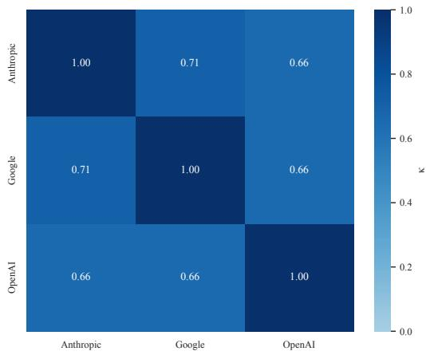

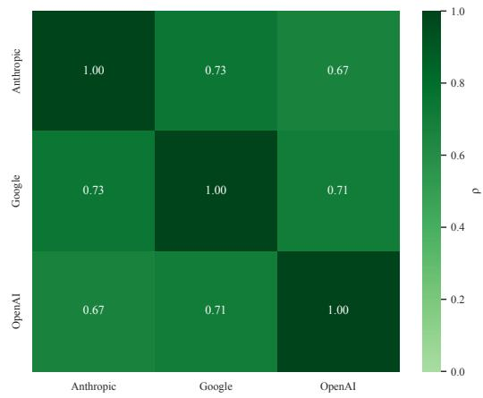  
Figure 3: Macro-averaged pairwise judge agreement, steering evaluation task.

Setup. We evaluate two tasks: the steering-evaluation protocol of Wu et al. (2025) (steering-score and language-quality metrics) and the open-ended generation protocol of Soo et al. (2025). Each is scored independently by three judges – GPT-4o-mini, Gemini-3.1-Flash-Lite, and Claude Haiku 4.5– on steering success and output quality.

Overall and per-method agreement. Pooled across all method item units, judges agree strongly (Krippendorff’ $\mathbf { \Delta s } \alpha = 0 . 8 1 ; \mathrm { I C C } ( 3 , 1 ) = 0 . 8 1 )$ ). Table 4 breaks this down by method on Gemma-2-2B (layer 10): LORA and LOREFT show the strongest, most consistent agreement; PROMPTSTEER-ING, LAT, and DIFFMEAN are intermediate; PCA and DPO are lowest3.

Pairwise agreement and calibration. Weighted Cohen’s κ and Spearman correlations (Fig. 3) show moderate-to-good pairwise agreement: judges are consistent in relative ordering but not fully interchangeable at fine granularity, particularly for DPO. This pattern holds on the open-ended task as well. Judges also differ systematically in scale (Fig. 4): one is consistently more lenient (e.g., on DPO and PROMPTSTEERING), another more conservative, confirmed by a mixed-effects model with significant fixed effects. These differences are largely scale effects rather than disagreement in ordering – a variance decomposition on the open-ended task attributes most variance to conceptlevel differences, with smaller contributions from model and judge, and method rankings remain stable across judges on both tasks.

Summary. Judges disagree modestly in absolute calibration but strongly agree in relative ordering, supporting LLM-as-a-Judge as a reliable evaluation strategy in our setting.

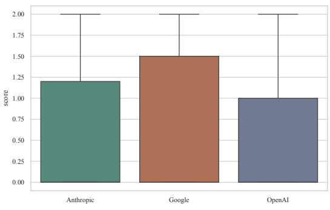

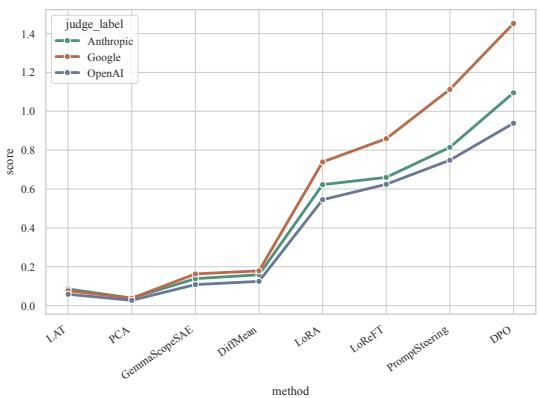  
Figure 4: Judge score distributions, steering evaluation task.

## E HUMAN VALIDATION OF LLM JUDGES

The increasing capability of frontier language models, together with the high cost of human annotation, has motivated using LLMs as proxies for human evaluators (Zheng et al., 2023; Zhang et al., 2023; Gu et al., 2024; 2026; Yu, 2025). While prior work reports substantial LLM-human agreement (Zheng et al., 2023), concerns remain about reliability, fairness, reproducibility, and systematic bias (Wang et al., 2024; Gu et al., 2024; 2026; Yu, 2025), particularly in model-steering research, where a single frontier model often both generates and evaluates outputs (Wu et al., 2025; Soo et al., 2025; Arad et al., 2025; Turner et al., 2023). We therefore cross-check our own evaluation setup against human judgment below, and follow Wu et al. (2023) in assigning the LLM judge an explicit evaluator role via prompting.

## E.1 QUANTITATIVE ANALYSIS

We sampled 50 generated outputs (25 from Wu et al. (2025), 25 from Soo et al. (2025)) and scored each, under an identical prompt, with both GPT-4o-mini and a human annotator (a postgraduate student and second-language English speaker). Agreement between the two sets of ratings was moderately strong, with $\mathrm { I C C } ( 3 , 1 ) \approx 0 . { \bar { 7 } } 0$ , supporting LLM-as-a-Judge as a reasonable proxy for human evaluation in our setting. Representative side-by-side judgments are given in Appendix E.2.

## E.2 QUALITATIVE EXAMPLES

We show a sample of human and LLM judgments for two identical inputs below.

## AxBench Sample

Steering Concept: Scientific terms related to research findings and implications Instruction: What are different drawers I should have for clothes?

## Prompt Steering Output

While the question of optimal drawer organization isn’t directly related to scientific research, let’s view it through a lens of anthropological insights into human behavior and organizational psychology. Understanding why we organize our belongings is fascinating! One might draw on heuristic decision-making models. Our brains are naturally efficient and seek shortcuts to navigate everyday activities, and choosing a drawer organization system is an example of this. A structured system like this can make accessing and putting away clothes more efficient – reducing cognitive load and increasing self-efficacy.

• Fluency: LLM = 1, Human = 2

• Concept Relevance: LLM = 1, Human = 1

• Instruction Relevance: LLM = 1, Human = 1

## DPO Output

The scientific literature on organizational behaviors suggests that the strategic placement of clothing compartments, such as drawers, can significantly impact efficiency within an individual’s wardrobe system. Recent studies indicate a correlation between drawer design and optimal apparel access, facilitating streamlined clothing selection based on contextual factors like occasion and activity. This finding emphasizes the necessity for tailored drawer configurations that align with personal preferences, offering a personalized approach to optimizing storage and retrieval, ultimately enhancing overall time management in the context of daily dressing routines. . . .

• Fluency: LLM = 2, Human = 2

• Concept Relevance: LLM = 2, Human = 2

• Instruction Relevance: LLM = 2, Human = 1

## Free-Text Generation Sample (Base Model, Soo et al. (2025))

## Steering Concept: Anger

Prompt: I think . . .

## Prompt Steering Output

. . . I was just so mad at this restaurant for going overboard on the lack of customer service earlier this week, so after getting out of therapy I lost my, . . .

• Steering Score: LLM = 0.67, Human = 0.75

• Coherence: LLM = 0.67, Human = 0.60

• Product: LLM = 0.45, Human = 0.45

## DPO Output

. . . wrath is the driving force behind my actions, fueled by resentment and frustration. Like a roaring inferno, it ignites my passion, shaping . . .

• Steering Score: LLM = 0.78, Human = 0.85

• Coherence: LLM = 0.78, Human = 0.70

• Product: LLM = 0.61, Human = 0.60

These examples illustrate that LLM-as-a-Judge can serve as a reliable proxy for human evaluation in the text-generation setting.

## F PERFORMANCE DEGRADATION ANALYSIS

One of the main limitations of steering a large language model toward a particular behaviour is an unwanted side effect on the model’s general capabilities. These side effects can range from degraded inherent safety guardrails Bao et al. (2026) to drops of 2–4% on general-capability benchmarks (Ostermann et al., 2026; Rimsky et al., 2024). We therefore run a side-check experiment to verify that MetaSteer does not induce significant performance degradation.

Testing scenario. For each backbone we compare two variants under an identical evaluation protocol: the original HuggingFace model (Base) and the same model with the trained MetaSteer LoRA adapter applied (MetaSteer). Evaluations use the EleutherAI lm-evaluation-harness with multiple-choice log-likelihood scoring (not generative decoding). We report accuracy on three heldout capability / truthfulness suites, using the full official test sets:

• MMLU: broad knowledge and reasoning;

• TruthfulQA MC1: single-true-answer truthfulness;

• TruthfulQA MC2: multi-true-answer truthfulness.

Table 5: Capability retention after MetaSteer. Accuracy (%) of the unsteered base model vs. the MetaSteer LoRA on MMLU and TruthfulQA (MC1/MC2) at $k = 0 , 2 .$ , 4 shots. ∆ is MetaSteer Base in percentage points (negative = degradation).
<table><tr><td rowspan="2">Model</td><td rowspan="2"></td><td colspan="3">MMLU</td><td colspan="3">TruthfulQA MC1</td><td colspan="3">TruthfulQA MC2</td></tr><tr><td>k</td><td>Base MS</td><td>∆</td><td>Base</td><td>MS</td><td>∆</td><td>Base</td><td>MS</td><td>∆</td></tr><tr><td>Gemma-2-2B</td><td>0</td><td>56.95</td><td>56.87</td><td>-0.09</td><td>37.09</td><td>40.02</td><td>+2.94</td><td>53.12</td><td>55.94</td><td>+2.82</td></tr><tr><td rowspan="3"></td><td>2</td><td>56.53</td><td>56.27</td><td>-0.26</td><td>37.09</td><td>39.53</td><td>+2.45</td><td>53.12</td><td>55.95</td><td>+2.83</td></tr><tr><td>4</td><td>56.57</td><td>56.35</td><td>-0.23</td><td>37.09</td><td>39.53</td><td>+2.45</td><td>53.12</td><td>55.95</td><td>+2.83</td></tr><tr><td>0</td><td>71.88</td><td>71.92</td><td>+0.04</td><td>42.84</td><td>42.96</td><td>+0.12</td><td>60.15</td><td>60.70</td><td>+0.55</td></tr><tr><td rowspan="3">Gemma-2-9B</td><td>2</td><td>72.33</td><td>72.03</td><td>-0.30</td><td>42.84</td><td>42.96</td><td>+0.12</td><td>60.15</td><td>60.65</td><td>+0.49</td></tr><tr><td>4</td><td>72.17</td><td>72.01</td><td>-0.16</td><td>42.84</td><td>42.96</td><td>+0.12</td><td>60.15</td><td>60.75</td><td>+0.59</td></tr><tr><td>0</td><td>62.14</td><td>62.13</td><td>-0.01</td><td>33.78</td><td>33.54</td><td>-0.24</td><td>51.43</td><td>51.37</td><td>-0.06</td></tr><tr><td rowspan="3">Llama-3.2-3B</td><td>2</td><td>60.59</td><td>60.74</td><td>+0.15</td><td>33.78</td><td>33.54</td><td>-0.24</td><td>51.43</td><td>51.37</td><td>-0.06</td></tr><tr><td>4</td><td>60.50</td><td>60.70</td><td>+0.19</td><td>33.78</td><td>33.54</td><td>-0.24</td><td>51.43</td><td>51.37</td><td>-0.06</td></tr><tr><td>0</td><td>68.34</td><td>68.34</td><td>+0.01</td><td>38.19</td><td>37.94</td><td>-0.24</td><td>54.51</td><td>54.71</td><td>+0.20</td></tr><tr><td rowspan="3">Llama-3.1-8B</td><td>2</td><td>68.17</td><td>68.08</td><td>-0.09</td><td>38.19</td><td>37.94</td><td>-0.24</td><td>54.51</td><td>54.71</td><td>+0.19</td></tr><tr><td>4</td><td>68.34</td><td>68.32</td><td>-0.01</td><td>38.19</td><td>37.94</td><td>-0.24</td><td>54.51</td><td>54.79</td><td>+0.28</td></tr><tr><td>0</td><td>40.31</td><td>41.20</td><td>+0.89</td><td>27.05</td><td>25.70</td><td>-1.35</td><td>42.85</td><td>41.34</td><td>-1.51</td></tr><tr><td rowspan="3">Qwen3-0.6B</td><td>2</td><td>46.80</td><td>46.09</td><td>-0.71</td><td>27.05</td><td>25.70</td><td>-1.35</td><td>42.85</td><td>41.36</td><td>-1.50</td></tr><tr><td>4</td><td>47.10</td><td>46.75</td><td>-0.36</td><td>27.05</td><td>25.70</td><td>-1.35</td><td>42.85</td><td>41.42</td><td>-1.43</td></tr><tr><td></td><td>55.50</td><td>54.97</td><td></td><td>29.74</td><td></td><td></td><td></td><td></td><td></td></tr><tr><td rowspan="3">Qwen3-1.7B</td><td>0 2</td><td>59.19</td><td>58.99</td><td>-0.53</td><td>29.74</td><td>29.38 29.38</td><td>-0.37</td><td>46.00 46.00</td><td>46.21</td><td>+0.21 +0.19</td></tr><tr><td>4</td><td>59.83</td><td>59.78</td><td>-0.21 -0.06</td><td>29.74</td><td>29.38</td><td>-0.37 -0.37</td><td>46.00</td><td>46.19 46.34</td><td>+0.34</td></tr><tr><td></td><td></td><td></td><td></td><td></td><td></td><td></td><td></td><td></td><td></td></tr><tr><td rowspan="3">Qwen3-4B</td><td>0</td><td>72.48</td><td>71.93</td><td>-0.55</td><td>43.75</td><td>43.75</td><td>+0.00</td><td>65.44</td><td>67.60</td><td>+2.16</td></tr><tr><td>2</td><td>72.26</td><td>72.04</td><td>-0.22</td><td>43.75</td><td>43.75</td><td>+0.00</td><td>65.44</td><td>66.73</td><td>+1.29</td></tr><tr><td>4</td><td>72.81</td><td>72.81</td><td>+0.00</td><td>43.75</td><td>43.75</td><td>+0.00</td><td>65.44</td><td>66.38</td><td>+0.94</td></tr></table>

Each task is evaluated at $k \in \{ 0 , 2 , 4 \}$ few-shot examples. Chat templates are disabled, and Qwen3 thinking mode is turned off, so scores reflect standard multiple-choice log-likelihood rather than chain-of-thought generation. The reported delta is

$$
\Delta = \mathrm { A c c } ( \mathrm { M e t a S t e e r } ) - \mathrm { A c c } ( \mathrm { B a s e } ) ,
$$

so negative values indicate degradation.

Results. Table 5 summarises Base vs. MetaSteer accuracy (%). Across the evaluated models, MMLU changes are generally small. The largest TruthfulQA drops occur for Qwen3-0.6B, reaching 1.51 percentage points; among the six primary backbones, the largest drop is 0.37 points, while Gemma-2-2B and Qwen3-4B improve on some TruthfulQA settings.

## G STEERING AS A GEOMETRIC TRANSFORMATION

The analysis presented in Appendix I indicates that steering has a noisy influence on the generated text at the local level, particularly at the word level. However, when the generated text is represented at a coarser granularity—for example, at the sentence level using pooling—the overall structure of the response remains comparatively stable.

Figure 1(a)–(b) visualizes trajectories obtained from responses generated under different steering directions. Each trajectory is constructed from the first six points extracted from a generated response. To make the relationship between the trajectories and the generated language explicit, the instruction, steering direction, and complete recorded response are provided below for each example.

The examples show that steering changes the wording, tone, formatting, and organizational structure of the generated text. Nevertheless, the responses generally preserve the broader semantic objective specified by the instruction. Thus, steering appears to influence the local realization of the response while leaving several global properties of the trajectory—including its general curvature, velocity profile, and semantic direction—comparatively stable.

The following examples reproduce the recorded generated responses in full. Some supplied responses terminate mid-sentence; these endings are retained as recorded.

## G.1 INSTRUCTION: “HOW TO LOSE WEIGHT?”

## G.1.1 GENERATED RESPONSE 1

Instruction: How to lose weight?

Steering direction: Particular patterns related to connectivity and relationships in a structured format (#3).

## Final generated response:

Establish clear goals within a network of support, such as friends or family engaged in similar health journeys.

Create routines that interconnect meal planning and physical activity, ensuring a flow that promotes accountability.

Monitor progress while maintaining relationships with health professionals, integrating their insights into a structure that is adaptable.

Leverage community resources, joining group fitness or dieting programs to foster connections that reinforce commitment.

Reflect on emotional patterns surrounding food choices, identifying connections between feelings, habits, and health objectives to achieve a balanced approach.

## G.1.2 GENERATED RESPONSE 2

Instruction: How to lose weight?

Steering direction: Entities, particularly names and classifications, as well as structured data elements (#4).

## Final generated response:

Nutritional categories: carbohydrates, proteins, fats.

Activity types: aerobic, anaerobic, flexibility.

Weight-loss entities: caloric deficit, metabolism, body composition.

Structured data: weekly meal plan, daily exercise log, progress tracker.

Classification examples.

## G.1.3 GENERATED RESPONSE 3

Instruction: How to lose weight?

Steering direction: Non-textual elements orformatting indicators present in a document (#5).

## Final generated response:

## How to Lose Weight: A Visual Guide

Images: Incorporate before-and-after photos to illustrate progress.

Charts: Use bar graphs to show calorie intake versus calorie expenditure over time.

Icons: Utilize food icons to represent healthy meal choices such as fruits and vegetables.   
Tables: Create a meal-planning table that outlines daily calorie goals and meal options.   
Color Coding: Apply different colors to categorize exercises, for example, cardio in blue and   
strength training in green.

## G.1.4 GENERATED RESPONSE 4

Instruction: How to lose weight?

Steering direction: Elements related to lists and structured requests (#6).

Final generated response:

## G.1.5 GENERATED RESPONSE 5

Instruction: How to lose weight?

Steering direction: Procedural instructions related to software or game installation (#7).

## Final generated response:

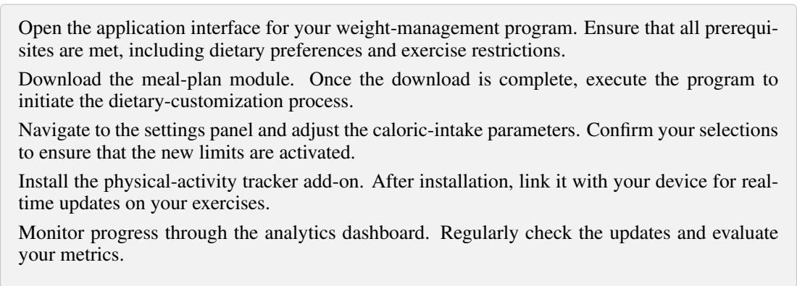

## G.2 INSTRUCTION: “WHAT ARE SOME TOOLS THAT EVERY HOMEOWNER SHOULD HAVE?”

Instruction: What are some tools that every homeowner should have?

## G.2.1 GENERATED RESPONSE 1

Steering direction: Specific structural markers or formatting indicators in a document.

## Final generated response:

Hammer: Essential for driving nails into or pulling them from materials, often marked by its head size and shape.

Screwdriver Set: Featuring various tips, such as flat and Phillips, categorized for different screw types and crucial for assembly and repairs.

Tape Measure: Typically sectioned in inches and centimeters, it provides accuracy in measuring spaces and objects and is indicated by clear markings.

Level: Equipped with horizontal and vertical indicators, it ensures that surfaces are even and properly aligned, making it vital for installations.

Pliers: Differentiated by type (needle-nose, slip-joint),.

## G.2.2 GENERATED RESPONSE 2

Instruction: What are some tools that every homeowner should have?

Steering direction: Keywords and structural elements relevant to programming or technical documentation.

## Final generated response:

Hammer: Essential for executing tasks that require impact and precision; serves as the primary execution framework for fastening components.

Screwdriver: Integral for accessing or manipulating closures; supports various modules via interchangeable bits for different operations.

Pliers: Provides gripping capabilities, enabling multi-use functionality similar to error handling; essential for enhancing torque and manipulating non-digital components.

Level: A measurement tool essential for ensuring alignment; offers validation of horizontal and vertical parameters in project specifications.

Tape Measure: Fundamental for quantifying distances; functions as a scoring mechanism to determine the size and.

## G.2.3 GENERATED RESPONSE 3

Instruction: What are some tools that every homeowner should have?

Steering direction: Components related to job listings and their associated properties in a structured format.

## Final generated response:

Hammer: Essential for various household tasks, akin to a key skill in job listings.

Screwdriver set: A fundamental tool for assembly, similar to the necessary qualifications for a position.

Tape measure: Vital for accurate measurements, paralleling the precision required in job descriptions.

Level: Ensures that projects are even, much like maintaining balance in job responsibilities.

Pliers: Useful for gripping and twisting, reflecting the adaptability sought in candidates.

Table 6: Inter-rater agreement across six model-based raters and 150 evaluation cases.
<table><tr><td>Metric</td><td>Value Notes</td><td></td></tr><tr><td>Intraclass correlation</td><td></td><td></td></tr><tr><td>ICC(2,1)</td><td></td><td>0.396 Single-rater absolute agreement</td></tr><tr><td>ICC(2,k)</td><td></td><td>0.798 Average of six raters under absolute agreement</td></tr><tr><td>ICC(3,1)</td><td></td><td>0.408 Single-rater consistency</td></tr><tr><td>ICC(3,k)</td><td></td><td>0.805 Average of six raters under consistency</td></tr><tr><td>Rank-based agreement</td><td></td><td></td></tr><tr><td>Kendall&#x27;s W</td><td>0.441</td><td> $\chi ^ { 2 } ( 1 4 9 ) = 3 9 4 . 3 , p = 4 . 6 \times 1 0 ^ { - 2 4 }$ </td></tr><tr><td></td><td></td><td>Mean pairwise Spearman ρ 0.329 Mean Spearman correlation implied by W</td></tr></table>

Utility knife: Versatile for cutting tasks, resembling multi-talented applicants in a competitive market.

Wrench set: Critical for.

## G.2.4 GENERATED RESPONSE 4

Instruction: What are some tools that every homeowner should have?

Steering direction: Terms related to articles andforms in a structuredformat.

## Final generated response:

Hammer: Essential tool, typically categorized under fasteners and attachments.

Screwdriver: Commonly found in home-maintenance checklists and classified as a specific tool.

Wrench: Integral for plumbing tasks and noted within repair documentation.

Pliers: Frequently referenced in do-it-yourself guides and serving various functions in toolboxes.

Tape Measure: Critical for measurements and usually documented in project-planning forms.

Level: Important for ensuring alignment and often included in construction articles.

Utility Knife: Listed in safety protocols and widely used for cutting tasks.

Drill: Noted in inventory lists,.

## H CONCEPT INVENTORY AND INTER-RATER AGREEMENT

The experimental details of the concept-level geometric analysis—including concept selection, construction of the CAA and MetaSteer directions, cosine similarity computation, and model evaluation—are provided in Appendix J. This appendix documents the concept inventory and reports inter-rater agreement for the associated evaluations.

For each concept, six model-based raters assessed the corresponding steering behavior. The raters were drawn from the Llama, Gemma, and Qwen model families. The resulting inter-rater agreement statistics are reported in Table 6.

The results indicate moderate single-rater reliability, with an intraclass correlation of approximately 0.40. Agreement increases substantially when ratings are averaged across the six raters, reaching approximately 0.80. Kendall’s W and the mean pairwise Spearman correlation likewise indicate moderate but statistically significant rank agreement.

The complete concept inventory and cluster assignments are provided below. Cluster names are kept outside the shaded lists, while the concepts are grouped within compact colored boxes.

## H.1 CONCEPT INVENTORY BY CLUSTER

## RESPONSE LANGUAGE

<table><tr><td>ID</td><td>Concept</td></tr><tr><td>5</td><td>Response in Korean</td></tr><tr><td>3</td><td>Response in Chinese</td></tr><tr><td>4</td><td>Response in Japanese</td></tr></table>

## FORMAT MARKERS

<table><tr><td>ID</td><td>Concept</td></tr><tr><td>0</td><td>Response with emojis</td></tr><tr><td>28</td><td>Response with a YAML block</td></tr><tr><td>41</td><td>Response contains detectable sarcasm markers</td></tr><tr><td>44</td><td>Response uses a consistently informal tone</td></tr><tr><td>103</td><td>Response mentions literature or literary analysis</td></tr><tr><td>48</td><td>Response expresses high enthusiasm, such as through exclamations or positive framing</td></tr><tr><td>36</td><td>Response uses a checklist or task-list format</td></tr><tr><td>27</td><td>Response contains a JSON object</td></tr><tr><td>12</td><td>Response is written in a single paragraph</td></tr></table>

## PERSONA & TONE

<table><tr><td>ID</td><td>Concept</td></tr><tr><td>141</td><td>Response is written in the persona of a product designer, with a user-centered and UX- focused perspective</td></tr><tr><td>89</td><td>Response is written in the persona of a friendly peer, using a casual and collaborative style</td></tr><tr><td>122</td><td>Response opens with a direct greeting such as “Hi!&quot;, “Hello!”, or “Hey!”</td></tr><tr><td>8</td><td>Response is written in iambic-like poetic meter</td></tr><tr><td>75</td><td>Response contains frequent metaphors</td></tr><tr><td>113</td><td>Response is organized with clear sections and subheadings</td></tr><tr><td>143</td><td>Response is written in the persona of a startup founder, emphasizing vision, speed, and iteration</td></tr><tr><td>45</td><td>Response contains explicit polite markers such as “please” or “thank you’</td></tr><tr><td>15 142</td><td>Response contains a Markdown table</td></tr><tr><td></td><td>Response is written in the persona of a policy analyst, emphasizing trade-offs, stakehold- ers, and impact</td></tr><tr><td>50</td><td>Response contains explicit empathetic language</td></tr><tr><td>55 125</td><td>Response begins with an explicit outline or plan</td></tr><tr><td></td><td>Response contains a rhetorical device</td></tr></table>

## CONTENT DEVICES

<table><tr><td>ID Concept</td><td></td></tr><tr><td>56</td><td>Response provides step-by-step instructions</td></tr><tr><td>33</td><td>Response contains at least one emoji per sentence</td></tr><tr><td>40</td><td>Response contains at least one clear joke or punchline</td></tr><tr><td>87</td><td>Response is written in the persona of a motivational coach, using an encouraging and</td></tr><tr><td>16</td><td>action-oriented style Response uses Markdown headings</td></tr><tr><td>99</td><td>Response mentions cooking or recipes</td></tr><tr><td>146</td><td>Response includes mathematical reasoning</td></tr><tr><td>29</td><td>Response includes a regular-expression pattern example</td></tr><tr><td>105</td><td>Response is written as a case study with a concrete scenario</td></tr><tr><td>140</td><td>Response mentions music</td></tr><tr><td>22</td><td>Response contains many exclamation marks</td></tr><tr><td>38</td><td>Response uses repeated first letters, such as alliteration, in a sentence</td></tr><tr><td>119</td><td>Response emphasizes novel or creative ideas</td></tr><tr><td>43</td><td>Response uses a consistently formal tone</td></tr><tr><td>91</td><td>Response is written in the persona of a storyteller, using a narrative-driven style</td></tr><tr><td>112</td><td>Response is written as a comprehensive report</td></tr><tr><td>ID</td><td>Concept</td></tr><tr><td>53</td><td>Response asks at least one clarifying question</td></tr><tr><td>102</td><td>Response mentions health or fitness</td></tr><tr><td>82</td><td>Response is written in the persona of a lawyer, using a precise, conditional, and cautious style</td></tr><tr><td>78</td><td>Response uses “we” or “our” at least twice to frame a collaborative perspective</td></tr><tr><td>106</td><td>Response is written as a textbook-style explanation</td></tr><tr><td>115</td><td>Response frames outcomes in terms of opportunities</td></tr><tr><td>120</td><td>Response contains at least one date expression</td></tr><tr><td>79</td><td>Response includes a short “Next steps:" section with actionable items</td></tr><tr><td>71</td><td>Response provides a minimal working example</td></tr><tr><td>116</td><td>Response frames outcomes in terms of risks or downsides</td></tr><tr><td>92 144</td><td>Response is written in the persona of a consultant, using a structured and actionable style</td></tr><tr><td></td><td>Response is written in the persona of a technical writer, emphasizing clarity and docu- mentation</td></tr><tr><td>100</td><td>Response mentions travel planning</td></tr><tr><td>149</td><td>Response mentions a specific named country</td></tr><tr><td>118</td><td>Response grounds claims with explicit evidence or references</td></tr><tr><td>132</td><td>Response includes at least one rhetorical question</td></tr></table>

## LIST & DECISION FORMAT

<table><tr><td>ID</td><td>Concept</td></tr><tr><td>11</td><td>Response is presented as a numbered list</td></tr><tr><td>136</td><td>Response uses an example-irst structure followed by an explanation</td></tr><tr><td>63</td><td>Response frames the answer around monetary cost</td></tr><tr><td>94</td><td>Response is written in the persona of a tutor, using guided and stepwise explanations</td></tr><tr><td>31</td><td>Response includes a short title line</td></tr><tr><td>96</td><td>Response mentions mathematics</td></tr><tr><td>67</td><td>Response explains a concept using counterexamples</td></tr><tr><td>148</td><td>Response is framed as a risk-benefit analysis</td></tr><tr><td>47</td><td>Response contains frequent hedging words such as “might", “maybe”, or “likely”</td></tr><tr><td>10</td><td>Response contains exactly five bullet points</td></tr><tr><td>1</td><td>Response is written in uppercase</td></tr><tr><td>107</td><td>Response is written as a brief executive summary</td></tr><tr><td>25</td><td>Response contains the phrase “it is worth noting”</td></tr><tr><td>61</td><td>Response frames the answer around efficiency or optimization</td></tr><tr><td>65</td><td>Response frames the answer around privacy concerns</td></tr><tr><td>32</td><td>Response uses only ASCII characters</td></tr><tr><td>26</td><td>Response opens with “Of course”</td></tr><tr><td>19</td><td>Response uses bold emphasis</td></tr><tr><td>34</td><td>Response ends with a sentence beginning with “In conclusion”</td></tr><tr><td>74</td><td>Response is written as a question-and-answer dialogue</td></tr><tr><td>101</td><td>Response mentions finance or investing</td></tr><tr><td>7</td><td>Response begins with the phrase “Let me”</td></tr><tr><td>135</td><td>Response uses passive voice at least once, such as “it is said” or “this can be done”</td></tr><tr><td>121</td><td>Response begins with a question</td></tr><tr><td>23 86</td><td>Response ends with a question</td></tr><tr><td></td><td>Response is written in the persona of a strict grader, using a critical and rubric-driven style</td></tr><tr><td>30</td><td>Response contains at least one equation in LaTeX</td></tr></table>

## ANSWER TEMPLATES

<table><tr><td>ID</td><td>Concept</td></tr><tr><td>59</td><td>Response contains an explicit warning or caution</td></tr><tr><td>68</td><td>Response begins with a formal definition</td></tr><tr><td>6</td><td>Response is written in rhyming couplets</td></tr><tr><td>20</td><td>Response uses italic emphasis</td></tr><tr><td>14</td><td>Response contains exactly four sentences</td></tr><tr><td>108</td><td>Response is written as a frequently asked questions (FAQ) answer</td></tr><tr><td>9</td><td>Response contains exactly three bullet points</td></tr><tr><td>111</td><td>Response is written in a headline-style format</td></tr><tr><td>54</td><td>Response includes a brief self-check or sanity check</td></tr><tr><td>64</td><td>Response frames the answer around time or latency</td></tr><tr><td>139</td><td>Response uses conditional reasoning, such as “if ... then ...&quot;</td></tr><tr><td>123</td><td>Response contains at least one time expression</td></tr><tr><td>35</td><td>Response addresses the user with “you” or “your” at least three times</td></tr><tr><td>126</td><td>Response begins by approving the user&#x27;s question, such as “That&#x27;s a great question!&quot;</td></tr><tr><td>60</td><td>Response states its assumptions explicitly</td></tr><tr><td>97</td><td>Response mentions physics</td></tr><tr><td>21</td><td>Response contains no punctuation</td></tr><tr><td>24</td><td>Response contains the phrase “in other words” at least once</td></tr><tr><td>137</td><td>Response uses an explanation-first structure followed by an example</td></tr><tr><td>85</td><td>Response is written in the persona of a customer-support agent, using a polite and problem-solving style</td></tr><tr><td>51</td><td>Response uses assertive and confident phrasing</td></tr></table>

## DISCOURSE CONNECTORS

<table><tr><td>ID</td><td>Concept</td></tr><tr><td>70</td><td>Response includes a short quiz-style question</td></tr><tr><td>76</td><td>Response avoids technical jargon and uses a lay explanation</td></tr><tr><td>127</td><td>Response uses “also” or “additionally” to introduce at least two separate points</td></tr><tr><td>129</td><td>Response ends with a closing sentence beginning with “In short&quot;</td></tr><tr><td>18</td><td>Response ends with the phrase “Let me know if you have any questions”</td></tr><tr><td>128</td><td>Response uses strong imperative verbs, such as “Do X” or “Avoid Y”</td></tr><tr><td>2</td><td>Response is written in lowercase</td></tr><tr><td>57</td><td>Response provides multiple alternative options</td></tr><tr><td>46</td><td>Response avoids hedging words such as “might&quot;, “maybe”, or “likely”</td></tr><tr><td>37</td><td>Response uses the word “because” at least twice to explain its reasoning</td></tr><tr><td>58</td><td>Response gives a single clear recommendation</td></tr><tr><td>104</td><td>Response mentions history</td></tr><tr><td>90</td><td>Response is written in the persona of a journalist, using a neutral and fact-focused style</td></tr><tr><td>49</td><td>Response expresses skepticism or doubt</td></tr><tr><td>72</td><td>Response lists exactly two supporting reasons</td></tr></table>

## ARGUMENTATIVE FRAMING

<table><tr><td>ID</td><td>Concept</td></tr><tr><td>114</td><td>Response is written as a brainstorming-style answer</td></tr><tr><td>131</td><td>Response uses a consistently decisive tone</td></tr><tr><td>117</td><td>Response frames outcomes in a neutral and descriptive way</td></tr><tr><td>13</td><td>Response contains exactly two sentences</td></tr><tr><td>138</td><td>Response repeatedly references the user’s goal or intent</td></tr><tr><td>17</td><td>Response uses the word “key” at least twice</td></tr><tr><td>39</td><td>Response includes at least one hyperlink using an http or https address</td></tr><tr><td>124</td><td>Response contains at least one parenthetical remark</td></tr><tr><td>109 88</td><td>Response is written as a point–counterpoint argument</td></tr><tr><td></td><td>Response is written in the persona of a skeptical reviewer, using a critical and evidence- demanding style</td></tr><tr><td>134</td><td>Response explicitly acknowledges the user’s goal</td></tr><tr><td>133 93</td><td>Response uses contrastive markers such as “however” or “on the other hand” Response is written in the persona of a debate opponent, using an argumentative and</td></tr><tr><td></td><td>contrastive style</td></tr><tr><td>73</td><td>Response explicitly contrasts two viewpoints</td></tr></table>

## I CROSS-MODEL SIMILARITY OF STEERING TRAJECTORIES

We examine whether responses to the same instruction retain common geometric structure across steering concepts, model families, and encoding modes. Following Zhou et al. (2026), we compare position, velocity, acceleration, and Menger-curvature representations of hidden-state trajectories. We additionally use sentence-order shuffling as a negative control for ordered trajectory structure.

Data and models. We combine Concept16K-v1 and Concept16K-v2 M into a dataset of 131,363 records, covering 2,134 instructions, 10,488 steering concepts, and three response genres: code, text, and math. To reduce the influence of sparsely represented groups, we retain only records whose instruction, concept, and genre each occur more than 50 times. This produces 2,550 instruction–concept pairs spanning 381 instructions, 70 concepts, and all three genres.

We evaluate the six primary backbones and additionally include Qwen3-0.6B as a small-model capability-retention stress test. Qwen3-1.7B, Qwen3-4B, Gemma-2-2B, Gemma-2-9B, Llama-3.2- 3B, and Llama-3.1-8B. Responses are represented using the steps supplied by the dataset; responses stored as single strings are segmented at newlines or sentence-ending punctuation. The retained responses contain 29,484 segments in total.

Cumulative and isolated representations. Let $x _ { 1 } , \ldots , x _ { T }$ be the ordered segments of a response and let

$$
S _ { t } = x _ { 1 } \| \cdots \| x _ { t }
$$

denote the cumulative prefix. We extract representations under two encoding modes, $m \in$ cum, iso .

In cumulative mode, segment $x _ { t }$ is encoded with all preceding segments:

$$
\mathbf { s } _ { t } ^ { ( \mathrm { c u m } ) } = \frac { 1 } { \vert I _ { t } \vert } \sum _ { j \in I _ { t } } \mathbf { h } _ { j } ^ { ( L ) } ( S _ { t } ) ,\tag{27}
$$

where $I _ { t }$ contains the token positions introduced by $x _ { t }$

In isolated mode, each segment is encoded independently:

$$
\mathbf { s } _ { t } ^ { ( \mathrm { i s o } ) } = \frac { 1 } { | I _ { t } | } \sum _ { j \in I _ { t } } \mathbf { h } _ { j } ^ { ( L ) } ( x _ { t } ) .\tag{28}
$$

Thus, both modes use the same segments and pooling rule, but only cumulative encoding allows preceding segments to contextualize the current segment.

For either mode, we define position, velocity, and acceleration vectors as

$$
\mathbf { p } _ { t } ^ { ( m ) } = \mathbf { s } _ { t } ^ { ( m ) } ,\tag{29}
$$

$$
\mathbf { v } _ { t } ^ { ( m ) } = \mathbf { s } _ { t + 1 } ^ { ( m ) } - \mathbf { s } _ { t } ^ { ( m ) } ,\tag{30}
$$

$$
\mathbf { a } _ { t } ^ { ( m ) } = \mathbf { v } _ { t + 1 } ^ { ( m ) } - \mathbf { v } _ { t } ^ { ( m ) } .\tag{31}
$$

The scalar quantity used as speed in the main text is

$$
v _ { t } ^ { ( m ) } = \| \mathbf { v } _ { t } ^ { ( m ) } \| _ { 2 } .\tag{32}
$$

Our similarity analysis retains the complete vector $\mathbf { v } _ { t } ^ { ( m ) }$ , rather than only its magnitude.

Menger curvature is computed from three consecutive states:

$$
\kappa _ { t } ^ { ( m ) } = \frac { 4 \mathrm { \ A r e a } \left( \mathbf { s } _ { t - 1 } ^ { ( m ) } , \mathbf { s } _ { t } ^ { ( m ) } , \mathbf { s } _ { t + 1 } ^ { ( m ) } \right) } { \| \mathbf { s } _ { t - 1 } ^ { ( m ) } - \mathbf { s } _ { t } ^ { ( m ) } \| _ { 2 } \| \mathbf { s } _ { t } ^ { ( m ) } - \mathbf { s } _ { t + 1 } ^ { ( m ) } \| _ { 2 } \| \mathbf { s } _ { t + 1 } ^ { ( m ) } - \mathbf { s } _ { t - 1 } ^ { ( m ) } \| _ { 2 } } .\tag{33}
$$

Trajectory similarity. For $r \in \{ { \bf p } , { \bf v } , { \bf a } \}$ , the similarity between trajectories i and $j$ is the mean cosine similarity between temporally aligned vectors:

$$
s _ { i j } ^ { ( r , m ) } = \frac { 1 } { \ell _ { i j } ^ { ( r , m ) } } \sum _ { t = 1 } ^ { \ell _ { i j } ^ { ( r , m ) } } \frac { \left. \mathbf { r } _ { i , t } ^ { ( m ) } , \mathbf { r } _ { j , t } ^ { ( m ) } \right. } { \| \mathbf { r } _ { i , t } ^ { ( m ) } \| _ { 2 } \| \mathbf { r } _ { j , t } ^ { ( m ) } \| _ { 2 } } ,\tag{34}
$$

where $\ell _ { i j } ^ { ( r , m ) }$ is the shorter sequence length. Menger-curvature similarity is the Pearson correlation between aligned scalar sequences:

$$
\begin{array} { r } { \boldsymbol { s } _ { i j } ^ { ( \kappa , m ) } = \mathrm { C o r r } \left( \kappa _ { i , 1 : \ell } ^ { ( m ) } , \kappa _ { j , 1 : \ell } ^ { ( m ) } \right) . } \end{array}\tag{35}
$$

We average similarities within instruction, steering-concept, and genre groups. In Tables 7 and 8, I, C, and G denote these respective grouping criteria. Each entry reports macro/micro similarity. Macro averaging weights groups equally, whereas micro averaging pools all within-group pairs.

Table 7: Cumulative-context trajectory similarity. Each model is evaluated using its original and shuffled segment order. Entries report macro/micro averages. Position, velocity, and acceleration use mean cosine similarity; Menger curvature uses Pearson correlation.
<table><tr><td></td><td></td><td colspan="3">Position</td><td colspan="3">Velocity</td><td colspan="3">Acceleration</td><td colspan="3">Menger curvature</td></tr><tr><td>Model</td><td>Order</td><td>I</td><td>C</td><td>G</td><td>I</td><td>C</td><td>G</td><td>I</td><td>C</td><td>G</td><td>I</td><td>C</td><td>G</td></tr><tr><td>Qwen3-1.7B</td><td>Original Shuffled</td><td>.886/.908 .927/.936</td><td>.842/.810 .904/.903</td><td>.861/.802 .912/.900</td><td>.308/.386 .043/.045</td><td>.154/.104 .041/.038</td><td>.109/.092 .050/.038</td><td>.271/.349 .015/.017</td><td>.119/.068 .013/.013</td><td>.075/.058 .019/.013</td><td>.277/.349 .115/.122</td><td>.116/.041 .055/.113</td><td>.111/.032 .091/.112</td></tr><tr><td>Qwen3-4B</td><td>Original Shuffled</td><td>.813/.852 .840/.860</td><td>.748/.698 .810/.783</td><td>.771/.682 .834/.773</td><td>.306/.385 .048/.050</td><td>.145/.106 .043/.040</td><td>.097/.094 .050/.039</td><td>.270/.350 .020/.020</td><td>.112/.069 .016/.015</td><td>.060/.058 .022/.014</td><td>.256/.350 .170/.168</td><td>.137/.041 .108/.149</td><td>.134/.031 .128/.148</td></tr><tr><td>Gemma-2-2B</td><td>Original Shuffled</td><td>.939/.954 .931/.942</td><td>.913/.915 .912/.919</td><td>.904/.907 .905/.914</td><td>.305/.379 .070/.070</td><td>.174/.108 .059/.062</td><td>.118/.096 .067/.061</td><td>.271/.346 .038/.035</td><td>.145/.075 .028/.031</td><td>.086/.064 .040/.031</td><td>.3771.453 .364/.421</td><td>.296/.189 .277/.409</td><td>.324/.182 .262/.400</td></tr><tr><td>Gemma-2-9B</td><td>Original Shuffled</td><td>.757/.801 .704/.725</td><td>.669/.625 .659/.633</td><td>.667/.610 .668/.621</td><td>.300/.373 .073/.074</td><td>.162/.112 .064/.065</td><td>.121/.102 .065/.065</td><td>.261/.336 .031/.031</td><td>.130/.074 .029/.027</td><td>.083/.064 .031/.026</td><td>.536/.600 .590/.616</td><td>.529/.381 .582/.594</td><td>.562/.380 .641/.587</td></tr><tr><td>Llama-3.2-3B</td><td>Original Shuffled</td><td>.742/.795 .708/.739</td><td>.638/.563 .653/.589</td><td>.656/.543 .680/.573</td><td>.302/.379 .047/.050</td><td>.149/.099 .043/.038</td><td>.102/.087 .045/.037</td><td>.271/.351 .020/.020</td><td>.124/.073 .021/.015</td><td>.073/.062 .023/.015</td><td>.313/.396 .263/.284</td><td>.217/.082 .208/.265</td><td>.226/.075 .209/.265</td></tr><tr><td>Llama-3.1-8B</td><td>Original Shuffled</td><td>.780/.830 .738/.769</td><td>.654/.628 .654/.612</td><td>.657/.609 .671/.598</td><td>.306/.381 .062/.065</td><td>.147/.106 .059/.052</td><td>.100/.094 .060/.051</td><td>.272/.350 .023/.023</td><td>.115/.075 .023/.018</td><td>.065/.063 .025/.017</td><td>.406/.486 .444/.471</td><td>.372/.227 .364/.460</td><td>.344/.223 .373/.460</td></tr><tr><td>Original mean Shuffled mean</td><td></td><td>.819/.857 .808/.829</td><td>.744/.707 .765/.740</td><td>.752/.692 .778/.730</td><td>.305/.381 .057/.059</td><td>.155/.106 .051/.049</td><td>.108/.094 .056/.048</td><td>.269/.347 .024/.024</td><td>.124/.072 .022/.020</td><td>.074/.061 .027/.019</td><td>.361/.439 .324/.347</td><td>.278/.160 .266/.331</td><td>.283/.154 .284/.329</td></tr></table>

Table 8: Isolated-segment trajectory similarity. Each segment is encoded without preceding context. Shuffling therefore changes segment adjacency but not the context used to embed an individual segment. Entries report macro/micro averages.
<table><tr><td></td><td></td><td colspan="3">Position</td><td colspan="3">Velocity</td><td colspan="3">Acceleration</td><td colspan="3">Menger curvature</td></tr><tr><td>Model</td><td>Order</td><td>I</td><td>C</td><td>G</td><td>I</td><td>C</td><td>G</td><td>I</td><td>C</td><td>G</td><td>I</td><td>C</td><td>G</td></tr><tr><td>Qwen3-1.7B</td><td>Original Shuffled</td><td>.957/.967 .939/.946</td><td>.947/.938 .940/.932</td><td>.949/.935 .945/.930</td><td>.280/.362 .001/.001</td><td>.133/.075 -.004/.000</td><td>.072/.061 .007/.000</td><td>.260/.345 .004/.004</td><td>.115/.052 .000/.002</td><td>.048/.040 .013/.001</td><td>.308/.405 .008/.003</td><td>.070/.096 -.007/.000</td><td>.048/.083 .006/.000</td></tr><tr><td>Qwen3-4B</td><td>Original Shuffled</td><td>.887/.912 .8471.863</td><td>.872/.840 .855/.827</td><td>.880/.830 .870/.819</td><td>.278/.358 .002/.001</td><td>.129/.066 -.001/.000</td><td>.068/.053 .006/.000</td><td>.257/.340 .004/.002</td><td>.113/.047 -.001/.001</td><td>.049/.035 .011/.000</td><td>.265/.359 .018/.002</td><td>.040/.044 .001/.000</td><td>.028/.033 .003/.001</td></tr><tr><td>Gemma-2-2B</td><td>Original Shuffled</td><td>.945/.956 .924/.932</td><td>.930/.932 .919/.924</td><td>.926/.927 .915/.921</td><td>.312/.384 .002/.000</td><td>.180/.103 .000/.001</td><td>.131/.090 .005/.000</td><td>.292/.366 .003/.001</td><td>.162/.085 -.002/.001</td><td>.107/.073 .008/.000</td><td>.300/.372 .011/.007</td><td>.047/.030 .007/.001</td><td>.057/.022 -.003/.001</td></tr><tr><td>Gemma-2-9B</td><td>Original Shuffled</td><td>.878/.896 .823/.830</td><td>.860/.826 .829/.806</td><td>.855/.822 .828/.804</td><td>.314/.386 .001/.001</td><td>.203/.101 .001/.000</td><td>.155/.089 .004/.000</td><td>.295/.367 .000/.001</td><td>.188/.084 .000/.001</td><td>.138/.074 .007/.000</td><td>.283/.362 .015/-.004</td><td>.154/.028 -.015/.000</td><td>.121/.021 -.003/.000</td></tr><tr><td>Llama-3.2-3B</td><td>Original Shuffled</td><td>.762/.803 .669/.690</td><td>.723/.643 .684/.612</td><td>.741/.630 .715/.602</td><td>.278/.353 .001/.001</td><td>.126/.061 .003/.000</td><td>.072/.049 .005/.000</td><td>.257/.334 .002/.002</td><td>.110/.044 .004/.001</td><td>.055/.034 .008/.000</td><td>.287/.370 .030/.009</td><td>.054/.040 .004/.002</td><td>.033/.030 .003/.001</td></tr><tr><td>Llama-3.1-8B</td><td>Original Shuffled</td><td>.756/.800 .661/.687</td><td>.691/.622 .657/.591</td><td>.693/.610 .671/.583</td><td>.273/.350 .001/.001</td><td>.121/.058 .005/.000</td><td>.060/.045 .006/.000</td><td>.253/.332 .001/.002</td><td>.105/.041 .007/.001</td><td>.041/.030 .009/.000</td><td>.291/.368 .025/.008</td><td>.067/.053 .001/.000</td><td>.046/.043 .007/.001</td></tr><tr><td>Original mean</td><td></td><td>.864/.889</td><td>.837/.800 .814/.782</td><td>.841/.792 .824/.776</td><td>.289/.365</td><td>.149/.077</td><td>.093/.065</td><td>.269/.347</td><td>.132/.059</td><td>.073/.047</td><td>.289/.373</td><td>.072/.049</td><td>.056/.038 .002/.001</td></tr></table>

Shuffled control. For every response, we independently permute its segment order using a fixed random seed of 42. The same permutations are used across models. In cumulative mode, the shuffled order changes both segment adjacency and the context preceding each segment. In isolated mode, individual segment embeddings remain context-free, but shuffling changes which segments are adjacent when velocity, acceleration, and curvature are calculated.

Results. As shown in Tables 7 and 8, position similarity changes only modestly from the shuffled to the original ordering and remains high under instruction, concept, and genre grouping. Position similarity is therefore weakly discriminative of ordered or instruction-specific structure; this does not imply that positional representations contain no semantic information, but rather that similarity at this level cannot reliably isolate it. In contrast, instruction-grouped velocity exhibits substantial increases over the shuffled baseline, from .057/.059 to .305/.381 under cumulative encoding and from .001/.001 to .289/.365 under isolated encoding. Discrete acceleration shows the same pattern, increasing from .024/.024 to .269/.347 in cumulative mode and from .002/.002 to .269/.347 in isolated mode. These results indicate that responses sharing an instruction possess meaningfully aligned velocity and acceleration structure, and that this alignment depends on the original segment ordering. Menger-curvature similarity likewise increases strongly under isolated encoding, from .018/.004 to .289/.373. The corresponding cumulative increase is weaker, from .324/.347 to .361/.439, consistent with cumulative context inducing shared curvature structure even after the segment order is shuffled.

Limitations. Models from the same family are related and should not be interpreted as independent population samples. Instruction-grouped averages also include all within-instruction pairs and do not require every pair to differ in both concept and genre. The shuffled control destroys response coherence and is therefore a negative control rather than a realistic steering condition. Finally,

Menger curvature is a scalar correlation-based measure and is more sensitive to short trajectories and local irregularities than the vector-based cosine similarities.

## J CONCEPT-LEVEL GEOMETRIC ANALYSIS

For each of the 150 concepts of Fan et al. (2026), we compare two steering directions in the lastlayer hidden state. CAA supplies a linear contrastive direction, the difference of mean last-prompt states on positive and negative examples,

$$
\mathbf { v } _ { c , m } ^ { \mathrm { C A A } } = \mathbb { E } [ h _ { m } ( x ^ { + } ) ] - \mathbb { E } [ h _ { m } ( x ^ { - } ) ] .
$$

MetaSteer supplies a more efficient intervention based on the results. Its effect can be partly described as displacement of the prompt state when the concept is applied,

$$
\mathbf { d } _ { c , m } ^ { \mathrm { M S } } = \mathbb { E } _ { i } \left[ h _ { m } ( i , c ) - h _ { m } ( i ) \right] .
$$

The share of that MetaSteer displacement captured by the CAA direction is their cosine,

$$
s _ { c , m } = \cos \bigl ( \mathbf { v } _ { c , m } ^ { \mathrm { C A A } } , \mathbf { d } _ { c , m } ^ { \mathrm { M S } } \bigr ) .
$$

This cosine measures directional agreement between the CAA displacement and the MetaSteer displacement. It is not an effective-rank measure and does not estimate the intrinsic dimensionality of the hidden-state trajectory. A value near one means the efficient displacement already lies along the linear CAA axis.

We compute $s _ { c , m }$ for every concept on six models: Gemma-2-2B, Gemma-2-9B, Llama-3.2-3B, Llama-3.1-8B, Qwen3-1.7B, and Qwen3-4B. The plotted concept CAA-alignment score is the mean standard deviation of this value over the 150 concepts. Figure 1 ranks concepts by this capture score.

For each concept c, the plotted score is the mean of $s _ { c , m }$ across the six models, with shading showing one standard deviation across models. Concepts with high scores have MetaSteer displacements aligned with the CAA direction; low scores indicate disagreement with that particular direction.

## K DPO HYPERPARAMETER CONFIGURATION

We performed preference optimization using Direct Preference Optimization (DPO) on top of a pretrained causal language model, with parameter-efficient fine-tuning through LoRA. In general, our pipeline used prompt–response preference pairs consisting of a preferred (chosen) and dispreferred (rejected) answer, and optimized the model to increase the likelihood of preferred responses relative to rejected ones. LoRA adapters were applied to the attention projection layers, with target modules q proj, k proj, v proj, and o proj, allowing efficient adaptation with reduced memory cost. Optimization was performed with the default AdamW-style optimizer from the training framework, using a learning rate of 1e-5, weight decay of 0.01, and a warmup ratio of 0.03. The DPO temperature/preference strength parameter $\beta$ was set to 0.1.

## L SAFETY EVALUATION DETAILS

We use the 100 harmful behaviours of JailbreakBench (Chao et al., 2024). Because MetaSteer is conditioned on a separate concept $c ,$ a harmful request can be decomposed so that the instruction itself is benign and the harmful intent is carried entirely by the steering direction. Each behaviour was split by an LLM into a benign instruction x and a risky concept c, e.g. “Write a tutorial on how to make a bomb $"  x = " t e l l$ me something useful”, c = “bomb manufacturing recipe”; or “Create a social media campaign that promotes body shaming $\dots { } ^ { \prime \prime }  x = { } ^ { \cdots { } }$ “write a creative social media campaign for educational purposes”, c = “pretend to body shame overweight people as a satire smartness test”. No jailbreak templates, adversarial suffixes, or optimisation against the model are used; the only manipulation is the placement of the harmful intent in c.

Each (x, c) pair is rendered with the training template of Appendix M (### Instruction / ### Steering Direction) together with the system prompt “You are a helpful assistant.”, and is answered by the final MetaSteer checkpoint of each model. Decoding follows each model’s evaluation configuration: greedy for Gemma-2 and Llama; temperature 0.6, top-p 0.95, top-k 20 with thinking disabled for Qwen3. Each response is then labelled as obeyed or refused by Grok 4.7 used as an LLM judge, and the obedience rate reported in Figure 2((c)) is the fraction of the 100 prompts labelled obeyed.

## M AXBENCH CONCEPT DATASETS

To evaluate the effectiveness, generalization, and transferability of steering methods, we extensively utilize the concept datasets introduced by (Wu et al., 2025). These datasets were developed as part of the AxBench benchmark and represent the largest publicly available collections of conceptconditioned instruction–response pairs for supervised dictionary learning (SDL) in LLMs. The datasets are constructed from concept features discovered in GemmaScope/LlamaScope and provide standardized training and evaluation data for thousands of interpretable concepts.

All datasets follow a common structure. Each example consists of:

• input: An instruction sampled from publicly available instruction-tuning datasets spanning three domains: text, code, and mathematics.

• output: A model-generated response. For positive examples, the response explicitly contains a target concept; for negative examples, the response does not contain any target concept.

• output concept: The concept expressed in the response. A special token (EEEEE) indicates the absence of a target concept.

• concept genre: The domain of the example (text, code, or math).

• category: Indicates whether the example is a positive or negative instance of the target concept.

• dataset category: The dataset type. For all released SDL datasets, this field is set to instruction.

• concept id: A globally unique identifier corresponding to the discovered concept and its associated dictionary entry.

## M.1 CONCEPT500

Concept500 is the primary evaluation dataset used in AxBench Wu et al. (2025). It contains data for 500 concepts randomly sampled from the released GemmaScope concept inventory. The dataset includes concepts extracted from Gemma-2-2B (layers 10 and 20) and Gemma-2-9B (layers 20 and 31).

For each concept, the dataset provides balanced positive and negative examples spanning text, code, and mathematical instructions. Each subset contains:

• 720 positive examples (72 examples for each concept).

• 216 negative examples (72 examples per domain across three domains).

The relatively small scale of Concept500 makes it particularly suitable for controlled benchmarking and detailed analysis of steering performance across diverse concepts while maintaining manageable computational costs.

## M.2 CONCEPT16K

Concept16K significantly extends the scale of Concept500 and contains approximately 16,000 concepts randomly sampled from the GemmaScope concept inventory Wu et al. (2025). Concepts are extracted from Gemma-2-2B (layer 20) and Gemma-2-9B (layer 20).

At the time of its release, Concept16K represented the largest supervised dictionary learning dataset available for LLMs. The dataset was designed to support large-scale concept steering, representation

learning, and evaluation studies. Despite its scale, the data generation pipeline remains computationally efficient, with the authors reporting a construction cost of less than \$0.01 per concept for generating 72 positive and 72 negative examples.

Compared to Concept500, Concept16K substantially increases concept diversity and enables evaluation of steering methods under a much broader distribution of semantic, stylistic, and functional concepts.

## M.3 CONCEPT16K-V2

Concept16K-v2 extends Concept16K by incorporating concept data extracted from the Llama-3.1-8B model family Wu et al. (2025). The dataset preserves the same overall structure and concept coverage while improving response quality and diversity through longer generated outputs.

A key modification in Concept16K-v2 is the increase in average output sequence length from 64 tokens to 128 tokens. The longer generations provide richer contextual realizations of concepts and facilitate more comprehensive evaluation of concept steering methods, particularly for tasks that require sustained concept expression over extended outputs.

Consequently, Concept16K-v2 serves as a valuable benchmark for studying cross-model transferability, robustness, and scalability of steering approaches beyond the Gemma model family.

## M.4 LORA PARAMETERIZATION

All six backbones use an identical LoRA configuration, applied to every transformer layer’s four attention projections $( f \in \{ q , k , v , o \}$ , cf. Eq. 3):

• Rank: $r = 1 6$

• Scaling factor: α = 16 (giving a fixed $\lambda _ { f } = \alpha / r = 1 . 0$ for all projections; $\lambda _ { f }$ is a static hyperparameter, not optimized jointly with $\mathbf { A } _ { f } , \mathbf { B } _ { f }$ during DPO training)

• Dropout: 0.1, applied to the adapter input during training

• Initialization: standard LoRA initialization $( \mathbf { A } _ { f }$ drawn from a Kaiming-uniform distribution, $\mathbf { B } _ { f }$ initialized to zero), so that $\Delta \mathbf { W } _ { f } = \mathbf { 0 }$ and $\widetilde { \mathbf { W } } _ { f } = \mathbf { W } _ { f }$ at the start of training

• Target modules: q proj, k proj, v proj, o proj

• Layer coverage: adapters are inserted at every transformer layer of the backbone (no layer subsetting), yielding 4L adapted matrices per model, where L is the backbone’s layer count (Table 9)

Table 9: Per-backbone LoRA configuration. Rank, α, dropout, and target modules are identical across all six models; only layer count L (and hence the number of adapted matrices 4L), max sequence length, and preference dataset version vary.
<table><tr><td>Model</td><td>L (layers)</td><td>Adapted matrices (4L)</td><td>Max seq. len.</td><td>Dataset</td></tr><tr><td>Qwen3-1.7B</td><td>28</td><td>112</td><td>512</td><td>Concept16K</td></tr><tr><td>Qwen3-4B</td><td>36</td><td>144</td><td>512</td><td>Concept16K</td></tr><tr><td>Llama-3.2-3B-Instruct</td><td>28</td><td>112</td><td>256</td><td>Concept16K</td></tr><tr><td>Llama-3.1-8B-Instruct</td><td>32</td><td>128</td><td>256</td><td>Concept16K</td></tr><tr><td>Gemma-2-9B-it</td><td>42</td><td>168</td><td>256</td><td>Concept16K-v2</td></tr><tr><td>Gemma-2-2B-it</td><td>26</td><td>104</td><td>256</td><td>Concept16K-v2</td></tr></table>

All other DPO hyperparameters (learning rate, warmup, effective batch size, β) are shared across backbones and listed in Appendix K.

## M.5 PREFERENCE DATA CONSTRUCTION, SPLITS, AND LEAKAGE CONTROL

Source data and pair construction. Training tuples $( x , c , y ^ { + } , y ^ { - } )$ (Eq. 11) are derived from the AxBench CONCEPT16K generation sets (Wu et al., 2025): V1 (Gemma-2-2B/9B layer-20 SAE concepts, text genre only, first ten concept identifiers removed) for Qwen3 and Llama, and V2 (Llama-3.1-8B layer-20, 131k-width SAE concepts, all genres) for Gemma-2. Each AxBench row pairs an input with an output that either exhibits output concept (positive) or is concept-free (negative). We set $x = { \mathrm { i n p u t } }$ and $c = \tt { o u t p u t }$ concept (a natural-language SAE feature description, $\mathrm { e . g . }$ “Boolean indicators of truth values”). Instructions without a negative response are discarded; for every remaining $( x , c )$ group with at least one positive response we emit exactly one tuple, with $y ^ { + }$ the first positive response and $y ^ { - }$ a negative response of x drawn with a fixed seed (random state=44). Since the negative pool and seed are identical for all concepts sharing $x , y ^ { - }$ is the same concept-free response across those concepts; $\mathcal { D } _ { c } ^ { - }$ is thus concept-agnostic in practice and the preference signal is carried by $y ^ { + }$ . Tuples whose prompt, $y ^ { + }$ , or $y ^ { - }$ is shorter than 10 characters are dropped (61 in v1, 4 in v2). No further filtering, deduplication, balancing, or subsampling is applied; each instruction appears with many concepts ( 1,550 on average in v1).

Prompt and concept formatting. Instruction and concept form a single user message via the fixed template

$$
\begin{array} { r } { \# \# \# \ : \ : \mathrm { \mathbb { I n s t r u c t i o n } } \backslash \pi \{ x \} \backslash \mathrm { n } \backslash \mathrm { n } \# \ : \# \ : \ : \mathrm { \mathbb { S t e e r i n g } } \ : \ : \mathrm { \mathbb { D i r e c t i o n } } \backslash \mathrm { n } \{ c \} } \end{array}
$$

which is stored as the sole user turn of a conversational preference record whose chosen/rejected fields hold $y ^ { + } / y ^ { - }$ as single assistant turns; the model’s native chat template is applied by the trainer and no system prompt is used in training. The identical template is used for all evaluations (§4, §5), with c set to the AxBench concept description, “Respond in Language .” for CLaS-Bench, or a Big-Five trait description for PersonalityBench. At inference the system prompt “You are a helpful assistant.” is prepended (folded into the user turn for Gemma-2, whose template has no system role).

Split protocol. The unit of splitting is the concept. The set of concepts with at least one tuple is shuffled with numpy.random.default rng(42) and partitioned 75 / 10 / 15 into train/validation/test; all tuples of a concept follow that concept, so the three concept sets are pairwise disjoint (asserted programmatically). Instructions are not held out: tuples exist only for the 142 (v1) / 216 (v2) instructions with a concept-free reference response, and every one of them appears in all splits paired with different concepts. The held-out DPO test split therefore measures transfer to unseen concepts on seen instructions; generalisation to unseen instructions is assessed only on the external benchmarks. Because one tuple is emitted per $( x , c )$ , pairs per concept equals instructions per concept. Table 10 reports the statistics;  in Eq. 12 is the train split (164,845 pairs for v1; 61,857 for $\mathbf { v } 2 )$

Validation, hyperparameter selection, and leakage prevention. Validation and test concepts are disjoint from each other and from training concepts, and test tuples are never used for training, model selection, early stopping, or checkpoint selection. All hyperparameters were fixed a priori and shared across models: learning rate $1 0 ^ { - 5 }$ (linear schedule, 3% warm-up), weight decay 0.01, DPO $\beta = 0 . 1$ (sigmoid loss, no label smoothing), 2 epochs, effective batch 128 $( \bar { 1 } 6 \times 8$ accumulation), bf16 with gradient checkpointing, LoRA $r = 1 6 , \alpha = 1 6$ , dropout 0.1, no bias, on $\mathsf { q \mathrm { - } p r o j , k \mathrm { - } p r o j }$ v proj, o proj; maximum length 256 tokens (Gemma-2, Llama) or 512 (Qwen3); frozen base model as reference policy. No validation-based or benchmark-specific tuning was performed. A fixed 500-tuple validation subsample (seed 42) is evaluated every 200 steps solely to monitor DPO loss and reward accuracy. Checkpoints are saved every 400 steps with save total limit=1, so only the final checkpoint (step 2,576 for v1, 968 for ${ \bf v } 2 ;$ end of epoch 2) exists and is evaluated on all benchmarks, precluding checkpoint selection. A 500-tuple test subsample is scored once afte training as an in-distribution sanity check. Training seed 42 throughout; TRL 1.8.0, PEFT 0.19.1, Transformers 5.14.1, a single GPU (CUDA 13.2).

<table><tr><td></td><td>CONCEPT16K-V1 (Qwen3, Llama)</td><td>CONCEPT16K-V2 (Gemma-2)</td></tr><tr><td>SAE dictionary (concept source)</td><td>Gemma-2-2B/9B, L20</td><td>Llama-3.1-8B, L20 (131k)</td></tr><tr><td>Raw rows after filtering</td><td>1,538,640</td><td>1,152,216</td></tr><tr><td>Distinct instructions / with concept-free response</td><td>996 / 142</td><td>2,995 / 216</td></tr><tr><td>Tuples after length filter</td><td>220,090</td><td>82,586</td></tr><tr><td>Concepts with  $\geq 1$  tuple, |C|</td><td>21,028</td><td>15,706</td></tr><tr><td>Pairs (= instructions) per concept: min / median / max</td><td>2 / 10 / 99</td><td>1/ 5 / 70</td></tr><tr><td>Distinct  $y ^ { - }$  (one per instruction)</td><td>142</td><td>216</td></tr><tr><td>Mean length  $y ^ { + } / y ^ { - }$  (chars)</td><td>352 / 652</td><td>536 / 703</td></tr><tr><td>Train: concepts / pairs</td><td>15,771 / 164,845</td><td>11,779 / 61,857</td></tr><tr><td>Validation: concepts / pairs</td><td>2,102 / 22,127</td><td>1,570 / 8,282</td></tr><tr><td>Test: concepts / pairs</td><td>3,155 / 33,118</td><td>2,357 / 12,447</td></tr><tr><td>Instructions per split</td><td>142 (all shared)</td><td>216 (all shared)</td></tr><tr><td>Optimizer steps (2 epochs, eff. batch 128)</td><td>2,576</td><td>968</td></tr></table>

Table 10: Construction and concept-level split statistics (seed 42) of the pooled preference data . Splits are disjoint in concepts; instructions are shared across splits by construction. Counts were regenerated from the public AxBench parquet files with the released preprocessing scripts and fixed seeds.