# Mid-Harness: Scaling Actions Between Model and Harness for Terminal Agents

Minki Kang<sup>1,2\*</sup>, Ryo Hachiuma<sup>1</sup>, Shaokun Zhang<sup>1</sup>, Subhashree Radhakrishnan<sup>1</sup>, Yonggan Fu<sup>1</sup>, Jindong Jiang<sup>1</sup>, Mingjie Liu<sup>1</sup>, Ehsan Hosseini-Asl<sup>1</sup>, Yi Dong<sup>1</sup>, Yu-Chiang Frank Wang<sup>1</sup>, Byung-Kwan Lee<sup>1†</sup>

<sup>1</sup>NVIDIA, <sup>2</sup>KAIST

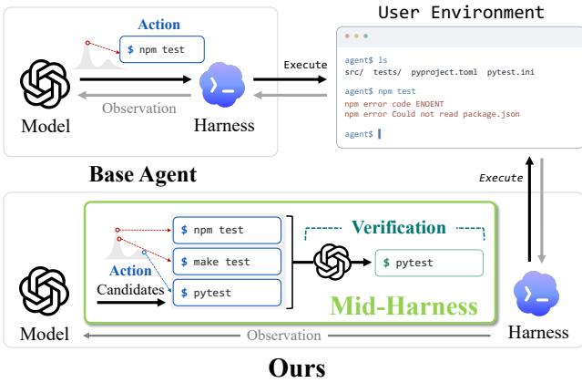  
(a) Concept of Mid-Harness

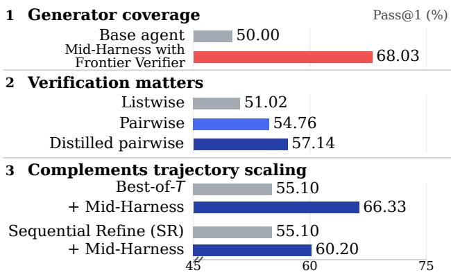  
(b) Summary of empirical findings  
Figure 1 | (a) Concept figure. Mid-Harness verifies candidate actions before execution. (b) Efective action verification improves trajectory success and complements trajectory scaling. TMAX-9B [1] Pass@1 (%) on TerminalBench-Lite: base versus Mid-Harness with GPT-5.6 Sol verifier (top), results from diferent verification mechanisms (middle), and combining Mid-Harness with Best-of-� (� = 3) [2] and SR (� = 1) [3] (bottom). Mid-Harness uses � = 8.

## Abstract

Terminal agents act through stochastic model generations, yet the ability to generate a useful action does not ensure its reliable execution. A poor command (e.g., wrong package install) can change the environment in ways that hinder subsequent progress, even when the model could generate a better alternative. We investigate whether allocating test-time compute at the model-harness boundary can improve action reliability and trajectory success, and what makes this allocation efective. To study these questions, we introduce Mid-Harness, which samples and verifies candidate actions before forwarding one for execution, while keeping the generator and harness unchanged. With a TMAX-9B generator, more action sampling yields little benefit under weak verification, whereas a capable verifier can exploit useful alternatives from the same generator. On TerminalBench-Lite, a GPT-5.6 Sol verifier raises Pass@1 from 50.00% for the base agent to 68.03% with 8 sampled actions. When the same TMAX-9B model serves as the verifier, pairwise verification performs best among the evaluated verification mechanisms. Distilling responses from the stronger verifier into TMAX-9B further improves Pass@1, while leaving the action generator unchanged. With TMAX-9B on TerminalBench-Lite, combining action and trajectory scaling reaches higher success at lower estimated token cost than generating more trajectories alone. Mid-Harness also improves performance across additional models, benchmarks, and harnesses. These findings identify action scaling as a promising target for test-time compute scaling in terminal agents. The project page is available at link.

## 1. Introduction

Large language models increasingly power terminal agents that perform tasks in software engineering, data science, and scientific discovery [4, 5]. Yet the ability to generate useful actions does not ensure that an agent completes a task reliably. The same model and harness may succeed on one run and fail on another because each run commits to a long-horizon sequence of stochastically generated actions. Each executed command changes the environment on which subsequent decisions depend [6–8]. Therefore, a poor command (e.g., wrong code edit, wrong package install) can hinder subsequent progress by changing the environment, even when the model could have generated a better alternative [9]. We use action reliability to mean consistently generating actions that support task completion, and evaluate its trajectory-level consequences through task success.

Prior work improves reasoning and agent performance by allocating additional test-time compute to sampling, verification, and refinement [10–12, 3, 2], including verification of candidate actions before execution [13, 14]. These successes motivate scaling compute for action reliability, but leave an incomplete understanding of when and why this scaling improves trajectory success. In particular, the benefit of generating more candidates depends on the ability to verify them, making it important to study these factors jointly [15]. We therefore conduct a systematic study of action sampling and verification, asking: when does additional computation before action execution improve trajectory success, and what makes it efective?

To investigate these questions, we introduce Mid-Harness, a method for studying action-level compute scaling at the model-harness boundary while keeping the action generator and execution harness unchanged (Figure 1(a)). At each step, Mid-Harness requests several candidate actions from the generator using the same interaction history, applies a verifier, and forwards only the chosen candidate to the harness for execution. Our main comparisons vary candidate width, verification mechanism, and verifier capability with TMAX-9B [1] and its harness fixed. We use these comparisons to study two requirements: whether the generator provides useful alternatives, and whether verification can identify them before execution [16].

We first ask whether the generator already produces useful alternatives that could improve trajectory success if reliably identified. Without ground-truth labels for candidate actions, we probe this opportunity using a strong verifier. With TMAX-9B as the fixed generator on TerminalBench-Lite [17], verification by GPT-5.6 Sol [18] raises Pass@1 from 50.00% for the base agent to 68.03% (Figure 1(b)). This result provides evidence that the generator produces useful alternatives that verification can exploit, improving trajectory success without changing or further post-training the generator.

We next examine how much of this opportunity can be recovered in a self-verification setting, where the same model generates and verifies actions. We find that increasing candidate width yields marginal improvement under weak verification (Section 4). In this setting, pairwise verification performs best among the evaluated mechanisms, showing that how candidates are compared matters even without changing the verifier model (Figure 2). Fine-tuning a verifier initialized from the generator on pairwise responses from GPT-5.6 Sol further raises Pass@1 from 54.76% to 57.14%, while leaving the action generator unchanged (Section 4.3). Our analysis shows that distillation increases ofline agreement with the frontier verifier, while disagreement over command semantics and execution feasibility persists (Section 5). Together, these results identify verifying what an action will do in the current environment without executing it as a central challenge in converting candidate diversity into successful trajectories.

Finally, we investigate whether the benefits of action scaling extend to trajectory-level compute scaling methods. On TerminalBench-Lite, Mid-Harness improves Pass@1 with both parallel scaling using Best-of-� Trajectories with an LLM-as-a-verifier [2] and sequential scaling using Sequential Refine [3] (Figure 1(b), Section 6.1). With TMAX-9B, combining Mid-Harness with one round of SR surpasses Best-of-� at � = 7 while using less than half its estimated token cost (Figure 5). We also find gains across additional models, tasks, and harnesses (Section 6.2).

Our main findings and contributions are:

• Verification governs the benefit of action sampling. With TMAX-9B on TerminalBench-Lite, wider sampling yields little benefit under weak verification, while the strong verifier enables substantially more successful trajectories.

• Verification mechanism and training help recover this opportunity. Pairwise verification performs best among the evaluated mechanisms, and verifier distillation improves trajectory success without changing the generator. The ofline analysis identifies command semantics and execution feasibility as persistent sources of disagreement with the teacher verifier.

• Mid-Harness enables a systematic study of action scaling in terminal agents. By varying sampling and verification at a fixed model-harness boundary, we examine when additional computation improves trajectory success and demonstrate its compatibility with parallel and sequential trajectory scaling.

## 2. Mid-Harness

Mid-Harness lets us study how action candidate generation and verification afect trajectory success while keeping the generator and harness fixed. The pseudocode below shows how Mid-Harness adds candidate sampling and verification to the model-call wrapper, returning one action to the unchanged harness without modifying model weights or serving architecture.

Harness loop (unchanged) Model-call wrapper (Mid-Harness)   
while not done: async def generate(messages):   
response = await model.generate ( return await llm.generate(messages)   
messages) + candidates = await llm.generate(   
actions, done = parse(response) + messages, n=N)   
obs = await env.execute (actions) + return await verify(   
messages = update( + llm, messages, candidates)   
messages, response, obs)   
Integration pseudocode. Green additions implement Mid-Harness inside the model-call wrapper.

## 2.1. Scaling Actions Within a Trajectory

While trajectory-level verification compares completed runs [2, 12], Mid-Harness compares actions before execution. Candidates from the same history may difer in purpose or efect, such as diagnosing a failed command versus retrying it. Comparing candidates against the unresolved task requirement may therefore improve both the next action and the states encountered later, while requiring only one environment instance [13].

Let � be the action-generating model and $h _ { t } = ( o _ { 0 } , a _ { 1 } , o _ { 1 } , \ldots , a _ { t - 1 } , o _ { t - 1 } )$ its interaction history, where $o _ { 0 }$ contains the task instruction and the later observations contain terminal feedback<sup>1</sup>. The base agent draws and executes one action from $\pi ( \cdot \mid h _ { t } )$ . Mid-Harness samples � candidates conditioned on the same history and identifies one with verifier $\psi :$

$$
{ \mathcal A } _ { t } = ( a _ { t } ^ { 1 } , \dots , a _ { t } ^ { N } ) , \quad a _ { t } ^ { i } \sim \pi ( \cdot \mid h _ { t } ) , \qquad a _ { t } ^ { \star } = \mathrm { V e r i f y } _ { \psi } ( h _ { t } , { \mathcal A } _ { t } ) \in { \mathcal A } _ { t } .\tag{1}
$$

The verification procedure $\mathrm { V e r i f y } _ { \psi }$ can use diferent mechanisms, but always returns one of the proposed candidates. The harness executes that action, receives observation $O t$ from the environment, and updates the history to $h _ { t + 1 } = ( h _ { t } , a _ { t } ^ { \star } , o _ { t } )$ . The remaining candidates are discarded, and the next set is generated from the updated history.

## 2.2. Verification Mechanisms

Given the history $h _ { t }$ and candidate set $\boldsymbol { A } _ { t }$ in Equation 1, a verification mechanism $\mathrm { V e r i f y } _ { \psi }$ specifies the verifier calls and how their responses are combined to identify one action for execution. We compare listwise, pointwise, and pairwise mechanisms to examine how the form of verification afects the use of candidates from a fixed generator. In each case, the verifier evaluates proposed actions using the task and observed history before their execution.

Listwise verification. The verifier receives the entire candidate set in a single prompt and returns a choice, $i ^ { \star } = \psi _ { \mathrm { l i s t } } ( h _ { t } , \mathcal { A } _ { t } )$ [20]. Pros. One verifier call exposes all alternatives for direct comparison. Cons. The verifier must distinguish every candidate and resolve their ranking within the same response. As the set grows, this joint decision can become dificult even when the set contains a useful action.

Pointwise verification. The verifier assigns each candidate a scalar score $q _ { i } = \psi _ { \mathrm { p o i n t } } ( h _ { t } , a _ { t } ^ { i } )$ and returns $i ^ { \star } \in \arg \operatorname* { m a x } _ { i } q _ { i } .$ . This resembles the step-scoring of process reward models [21, 13, 22]. Pros. It decomposes verification into � independent evaluations that can run in parallel. Cons. Independent scores must place actions with diferent purposes on a comparable scale, even when an action that appears reasonable in isolation is less useful than another available candidate [23].

Pairwise verification. The verifier receives two candidates under the same history and generates a preference with comparative scores [23, 2]. For a set of evaluated pairs ${ \mathcal { C } } ,$ let $J _ { i j } = \psi _ { \mathrm { p a i r } } ( h _ { t } , a _ { t } ^ { i } , a _ { t } ^ { j } )$ and $i ^ { \star } = \operatorname { A g g r e g a t e } ( \{ J _ { i j } : ( i , j ) \in \mathcal { C } \} )$ . The default pairwise verifier ranks candidates by margin-weighted win rates over the evaluated pairs and returns the highest-ranked action. Pros. It focuses each comparison on a diference between two alternatives and gives the verifier a shared reference. Cons. Identifying one candidate from the full set requires more model calls than listwise or pointwise verification. For eight candidates, listwise uses one call and pointwise uses eight, while comparing all unordered pairs requires 28 calls.

In the default mechanisms, the verifier � generates reasoning followed by scores or a choice, following generative verifiers [24]. Under self-verification, the generator � and verifier $\psi$ use the same model. Verification details are in Appendix B.2.

## 3. Experimental Setup

We evaluate what makes action scaling efective, whether distillation improves verification, and how this scaling axis composes with compute spent across complete runs.

Tasks and models. The main evaluation uses TerminalBench Lite [17, 5] with a TMAX-9B generator [1] and the Vanillux2 harness. TMAX-9B is trained from Qwen3.5-9B [25] through reinforcement learning on synthetic terminal tasks using Vanillux2. Model-scale experiments additionally use TMAX-4B and TMAX-27B. The generator samples at temperature 0.8 with at most 64 steps, a maximum 65,536 token context, and a 16,384 token output limit per step. Unless otherwise specified, the verifier uses the same language model as the generator. The frontier verifier in Section 4.1 uses GPT-5.6 Sol [18].

Evaluation metrics. A run is one execution on a task, and its trajectory is the resulting sequence of actions and observations. We evaluate three runs per task and report Pass@1 as the average exact-success rate across those runs. Pass@3 measures the fraction of tasks solved by at least one of the three runs. For Best-of-�, Pass@1 evaluates the returned output for each task. More evaluation details are in Appendix B.1.

Baselines and compute-scaling methods. The base agent executes one sampled action per step in a single run, without additional action verification or trajectory scaling. We organize additional compute at two levels: before action execution and across complete runs.

The action-level axis applies zero-shot or distilled Mid-Harness inside a run. Zero-shot Mid-Harness uses the same generator model as the verifier without any fine-tuning, while distilled Mid-Harness uses a verifier with the model fine-tuned on pairwise comparisons from GPT-5.6 Sol as described in Section 4.3. At the trajectory level, Best-of-� Trajectories (Best-of-�) uses a probabilistic pivot tournament to choose one output from � completed trajectories [2]. The corresponding TMAX model serves as the trajectory verifier at each model scale. The sequential trajectory-level method Sequential Refine (SR) [3, 12] performs � refinement rounds, each summarizing the previous run to guide a fresh run. The corresponding TMAX model produces the trajectory summary. Further baseline details are provided in Appendix B.1.

Inference cost. Parallelized output tokens (POT) approximate decoding latency of both generator and verifier under idealized parallel execution. Verifier total output tokens instead sum the outputs of all verifier calls without parallelization. Figure 3 presents these two measures. For Figure 5, we apply reference token prices to generator and verifier tokens as a proxy. Details are in Appendix B.4.

## 4. When Does Action Scaling Work?

We examine when sampling and verification improve trajectory success, their costs, and the efect of verifier distillation, with a fixed TMAX-9B generator.

## 4.1. Candidate Coverage

A frontier verifier reveals exploitable coverage in the sampled actions. We test whether sampled actions contain useful alternatives by pairing the fixed TMAX-9B generator with GPT-5.6 Sol [18]. Candidate coverage concerns whether sampled actions include useful alternatives. Without action-level ground truth, we probe it indirectly through trajectory success under a strong verifier. As shown in Figure 2, this configuration reaches 64.63% Pass@1 at � = 4 and 68.03% at � = 8, showing that the generator’s action candidates support substantially more reliable trajectories. We next ask how much of this opportunity self-verification can recover.

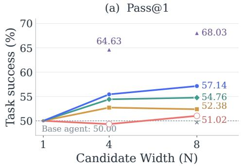

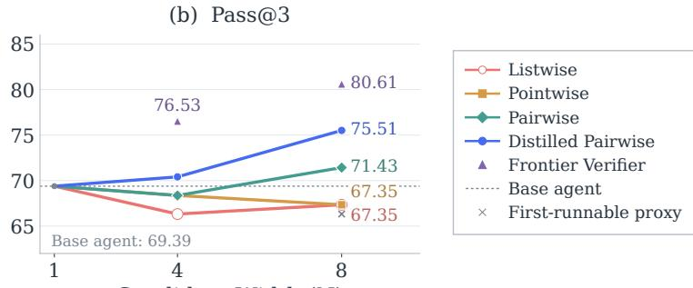  
Candidate Width (N)  
Figure 2 | Verification mechanism determines the return from more action candidates. Pass@1 and Pass@3 on TerminalBench-Lite with TMAX-9B. � = 1 denotes the base agent without action scaling. For frontier verifier, we use the listwise verification due to its cost.

## 4.2. Candidate Width and Verification

More candidates do not compensate for weak verification. Under zero-shot listwise verification, doubling the width from � = 4 to � = 8 changes Pass@1 only from 49.32% to 51.02% and Pass@3 from 66.33% to 67.35% (Figure 2). The frontier verifier uses the same listwise mechanism but achieves substantially higher success (Section 4.1). This contrast suggests that the weaker zero-shot verifier struggles to distinguish useful actions when comparing the full candidate set at once, so additional candidates alone ofer little benefit.

Pairwise verification performs best among the evaluated mechanisms. With the generator and � = 8 fixed, pointwise improves Pass@1 only slightly over listwise and leaves Pass@3 unchanged, while pairwise reaches 54.76% Pass@1 and 71.43% Pass@3 (Figure 2).

## 4.3. Verifier Distillation

Distillation setup. The frontier verifier result reveals a substantial gap between GPT-5.6 Sol and the generator model (TMAX-9B) as a verifier. We test whether supervised distillation can transfer part of this capability without serving the frontier model at inference time [26]. Using 117k frontier-verifier pairwise responses collected from 732 trajectories across 244 dificult TMAX-15k tasks [1], we use LoRA [27] to train a verifier to generate the GPT-5.6 Sol teacher’s reasoning, scores, and preference label. Fine-tuned LoRA is only activated for the verifier, not the generator. Training data and optimization details are provided in Appendix B.3.

Distillation narrows the verifier-quality gap. As shown in Figure 2, distillation at � = 8 raises Pass@1 from 54.76% to 57.14% and Pass@3 from 71.43% to 75.51% for pairwise verification. The improvement also appears at � = 4, where Pass@1 rises from 54.42% to 55.44% and Pass@3 rises from 68.37% to 70.41%. Even the strongest evaluated zero-shot mechanism leaves room for improvement: verifier distillation raises trajectory success without changing the generator. We next examine which pairwise preferences distillation improves and which remain dificult (Section 5).

## 4.4. Cost for Action Scaling and Verification

Pairwise verification adds substantial decoding cost. Figure 3 presents parallelized output tokens (POT), an overall idealized decoding latency proxy, and total verifier output tokens. On the left, widening from � = 4 to � = 8 increases generator POT since the longest of more sampled generations tends to be longer. Pairwise verification also adds more verifier decoding cost. At $N = 8 ,$ zero-shot pairwise responses add an estimated 26.6� POT, versus at most 1.3� for listwise and pointwise. On the right, total verifier output at $N = 8$ is 0.6� for listwise, 7.0� for pointwise, and 125.7� for zero-shot pairwise verification.

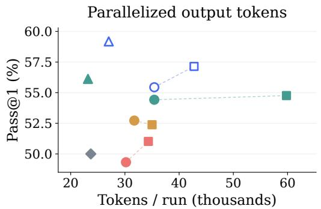

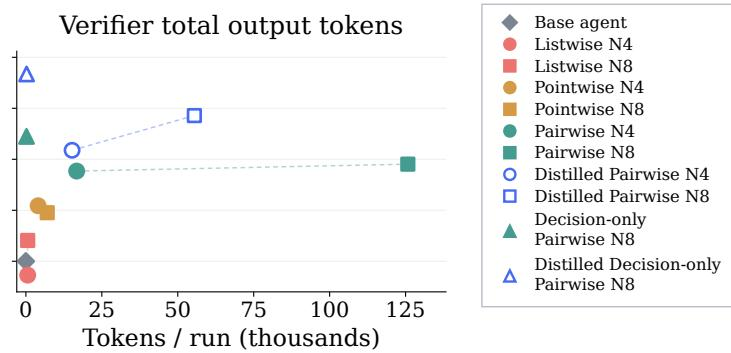  
Figure 3 | Verification mechanisms trade of trajectory success against estimated decoding latency and verifier output-token cost. Pass@1 versus parallelized output tokens (left) and total verifier output tokens (right) per run on TerminalBench-Lite with TMAX-9B. Dashed lines connect � = 4 and � = 8 within each mechanism. Triangles show decision-only pairwise verification at $N = 8$ . Cost estimates follow Appendix B.4.

Efective verification may not require reasoning. Does efective action verification require explicit reasoning generation [24]? Following direct prediction in discriminative reward models [21, 28], we evaluate pairwise verifiers that emit only an A/B preference (Decision-only setting), using the zero-shot model or a model distilled for one-token responses. At � = 8, both TMAX-9B decision-only verifiers improve Pass@1 over their reasoning counterparts while lowering reference-priced token cost by 20.9% and 24.1% for zero-shot and distilled verification, respectively (Table 9). At 4B and 27B, the evaluated decision-only variants have lower estimated token cost but also lower Pass@1 than their reasoning counterparts (Table 9). Additional Pass@3 and � = 4 results appear in Appendix C.1.

## 5. Analysis: What Still Limits Verification?

We analyze what distillation transfers from the GPT-5.6 Sol teacher using stored TMAX-9B trajectories from 21 held-out TMAX-15K tasks [1], with � = 8. We use this ofline benchmark to compare pairwise verification outputs of diferent models under the same state. These diagnostics measure teacher agreement on verification, not action correctness or trajectory success.

Pairwise agreement is the fraction of comparisons with matching verifier and teacher A/B/TIE preferences. For verification agreement, we count each candidate’s wins in the pairwise comparisons separately for both models, then measure the fraction of states where they identify the same top-ranked candidate. Appendix D.1.1 provides calculation details.

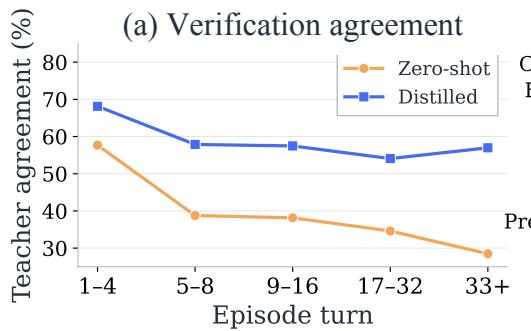

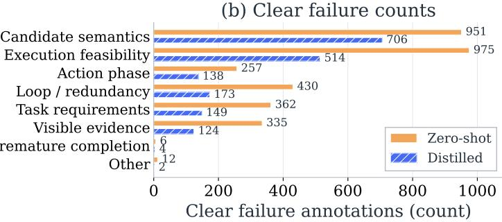  
Figure 4 | Distillation improves teacher agreement, but command reasoning remains dificult. (a) Ofline verification agreement with the frontier verifier by episode turn, using 1,355 states with valid comparisons for both models (83.4% of states). (b) Teacher disagreements judged clear verifier failures by GPT-5.6 Terra, grouped by category.

## 5.1. What Distillation Improves

Distillation transfers the frontier verifier’s behavior. On the ofline benchmark, distillation reduces the score MAE of pairwise comparisons from 2.59 to 1.05 and raises pairwise agreement from 59.01% to 74.58% (Table 1). Verification agreement rises from 38.52% to 57.79%, showing that the candidate identified by ofline verification more often matches the frontier verifier’s candidate after distillation.

Table 1 | Distillation improves frontier-verifier agreement.
<table><tr><td>Verifier</td><td>MAE</td><td>Score Pairwise Verification (%) (%)</td></tr><tr><td>Zero-shot</td><td>2.59</td><td>59.01 38.52</td></tr><tr><td>Distilled</td><td>1.05</td><td>74.58 57.79</td></tr></table>

## 5.2. Remaining Verification Challenges

Agreement improves throughout the trajectory but remains lower in later states. Verification agreement improves in every turn bin (Figure 4(a)). It reaches 68.13% at turns 1-4 and 54.07% at turns 17-32, showing that the gains persist beyond the opening decisions while substantial disagreement remains later in the trajectory.

Remaining disagreements center on command semantics and execution feasibility. We use GPT-5.6 Terra [18] to review teacher disagreements and classify those it judges clear verifier failures using a predefined taxonomy. As in Figure 4(b), the number of such cases falls from 3,328 for zero-shot verification to 1,810 after distillation, with fewer cases in every category. Candidate semantics and execution feasibility account for 67.4% of these distilled-verifier cases. These categories concern judging command efects in the current environment (Appendix D.2), illustrated by the executed traces in Appendix D.3.

## 6. Composition and Transfer of Action Scaling

We now test whether action verification complements trajectory scaling and transfers across models, harnesses, and tasks. Best-of-� and SR require fresh environment runs, which can be dificult outside benchmarks without reliable state serialization [29, 13]. We test whether Mid-Harness improves both methods without increasing their number of environment runs.

## 6.1. Composition with Trajectory Scaling

Table 2 compares action and trajectory scaling across TMAX-4B, 9B, and 27B, with task-level confidence intervals in Appendix C.4.

Table 2 | Composing action and trajectory scaling. Pass@1 and Pass@3 (%) on TerminalBench-Lite with fixed TMAX generators. Mid-Harness uses pairwise verification $( N = 8 )$ , Best-of-� uses $T = 3$ trajectories, and SR uses � = 1 round. − $- \Delta$ and $+ \Delta$ show changes from the base agent without any scaling. Checkmarks ✓ indicate enabled components. # Env. counts environment executions per returned output. Best-of-� returns one output, so Pass@3 is undefined.
<table><tr><td colspan="2">Trajectory-level</td><td colspan="2">Action-level</td><td colspan="2">4B</td><td colspan="2">9B</td><td colspan="2">27B</td><td rowspan="2"># Env.</td></tr><tr><td>Best-of-T</td><td>SR</td><td>Mid-Harness zero-shot distilled</td><td></td><td>Pass@1</td><td>Pass@3</td><td>Pass@1</td><td>Pass@3</td><td>Pass@1</td><td>Pass@3</td></tr><tr><td>×</td><td>X</td><td>X</td><td>X</td><td>38.78</td><td>57.14</td><td>50.00</td><td>69.39</td><td>71.09</td><td>82.65</td><td>1</td></tr><tr><td>√</td><td>X</td><td>×</td><td>X</td><td> $3 4 . 6 9 _ { - 4 . 0 9 }$ </td><td></td><td> $5 5 . 1 0 _ { + 5 . 1 0 }$ </td><td></td><td> $7 3 . 4 7 _ { + 2 . 3 8 }$ </td><td></td><td>3</td></tr><tr><td>X</td><td>√</td><td>X</td><td>X</td><td> $4 1 . 5 0 _ { + 2 . 7 2 }$ </td><td> $5 7 . 1 4 _ { + 0 . 0 0 }$ </td><td> $5 5 . 1 0 _ { + 5 . 1 0 }$ </td><td> $7 1 . 4 3 _ { + 2 . 0 4 }$ </td><td> $7 2 . 7 9 _ { + 1 . 7 0 }$ </td><td> $8 4 . 6 9 _ { + 2 . 0 4 }$ </td><td>2</td></tr><tr><td>X</td><td>X</td><td>√</td><td>×</td><td> $4 1 . 5 0 _ { + 2 . 7 2 }$ </td><td> $5 7 . 1 4 _ { + 0 . 0 0 }$ </td><td> $5 4 . 7 6 _ { + 4 . 7 6 }$ </td><td> $7 1 . 4 3 _ { + 2 . 0 4 }$ </td><td> $7 3 . 1 3 _ { + 2 . 0 4 }$ </td><td> $8 4 . 6 9 _ { + 2 . 0 4 }$ </td><td>1</td></tr><tr><td>√</td><td>×</td><td>√</td><td>X</td><td> $3 9 . 8 0 _ { + 1 . 0 2 }$ </td><td></td><td> $6 1 . 2 2 _ { + 1 1 . 2 2 }$ </td><td></td><td> $7 7 . 5 5 _ { + 6 . 4 6 }$ </td><td></td><td>3</td></tr><tr><td>X</td><td>√</td><td>√</td><td>X</td><td> $4 4 . 2 2 _ { + 5 . 4 4 }$ </td><td> $5 9 . 1 8 _ { + 2 . 0 4 }$ </td><td> $5 6 . 8 0 _ { + 6 . 8 0 }$ </td><td> $7 3 . 4 7 _ { + 4 . 0 8 }$ </td><td> $7 4 . 1 5 _ { + 3 . 0 6 }$ </td><td> $8 2 . 6 5 _ { + 0 . 0 0 }$ </td><td>2</td></tr><tr><td>X</td><td>×</td><td>X</td><td>√</td><td> $4 3 . 8 8 _ { + 5 . 1 0 }$ </td><td> $5 8 . 1 6 _ { + 1 . 0 2 }$ </td><td> $5 7 . 1 4 _ { + 7 . 1 4 }$ </td><td> ${ \bf 7 5 . 5 1 _ { + 6 . 1 2 } }$ </td><td> $7 6 . 1 9 _ { + 5 . 1 0 }$ </td><td> $\mathbf { 8 6 . 7 3 _ { + 4 . 0 8 } }$ </td><td>1</td></tr><tr><td>√</td><td>×</td><td>X</td><td>√</td><td> $4 6 . 9 4 _ { + 8 . 1 6 }$ </td><td></td><td> $- \ 6 { \bf 6 . 3 3 } _ { + 1 6 . 3 3 }$ </td><td></td><td> $\mathbf { 8 0 . 6 1 _ { + 9 . 5 2 } }$ </td><td></td><td>3</td></tr><tr><td>X</td><td>√</td><td>X</td><td>√</td><td> $4 6 . 6 0 _ { + 7 . 8 2 }$ </td><td> ${ \bf 6 2 . 2 4 _ { + 5 . 1 0 } }$ </td><td> $6 0 . 2 0 _ { + 1 0 . 2 0 }$ </td><td> ${ \bf 7 5 . 5 1 _ { + 6 . 1 2 } }$ </td><td> $7 5 . 8 5 _ { + 4 . 7 6 }$ </td><td> $8 5 . 7 1 _ { + 3 . 0 6 }$ </td><td>2</td></tr></table>

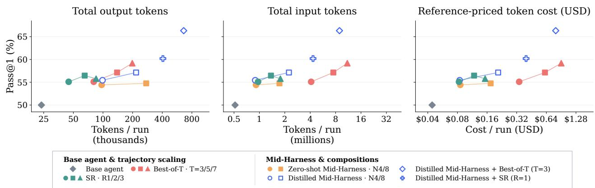  
Figure 5 | Combining action and trajectory scaling improves the cost-success tradeof. Pass@1 against per-run output tokens, input tokens, and reference-priced token cost on TerminalBench-Lite with TMAX-9B. Dollar estimates apply OpenRouter Qwen3.5-9B rates of \$0.08/\$0.13 per million input/output tokens [30]. Beyond the settings in Table 2, we evaluate Best-of-� at $T = 5$ , 7 and SR at $R = 2 , 3 .$

Mid-Harness improves the trajectory for parallel scaling. With TMAX-9B as both generator and trajectory verifier, Best-of-� with � = 3 reaches 55.10% Pass@1. Using zero-shot or distilled Mid-Harness to generate those runs raises Pass@1 to 61.22% and 66.33%, respectively (Table 2). This is an 11.23 pp gain with the same three environment executions compared to Best-of-� alone.

Mid-Harness also improves sequentially refined trajectories. Using distilled Mid-Harness for both the source trajectories and their refinements raises Pass@1 from 55.10% with baseline SR to 60.20%, while Pass@3 rises from 71.43% to 75.51%. Action verification therefore remains useful when a trajectory is conditioned on experience from an earlier run.

Combining scaling axes improves the cost-success trade-of. Figure 5 reveals three patterns with TMAX-9B. First, SR uses relatively little token compute, but Pass@1 plateaus at 55.10%, 56.46%, and 55.78% over � = 1, 2, 3. Second, distilled Mid-Harness at � = 8 matches Best-of-� at � = 5 (57.14%) at about one-third of its reference-priced token cost. Third, combining it with SR or Best-of-� at $T = 3$ reaches 60.20% or 66.33%, respectively, both exceeding Best-of-� at $T = 7$

Table 3 | Mid-Harness transfers across benchmarks, models, and harnesses. Pass@1 / Pass@3 over three runs per task. SWE-bench-Verified uses its Mini subset (50 tasks), and FeatureBench-Mini uses 23 CPU tasks. Both Mid-Harness variants use pairwise verification with � = 8. Green subscripts +Δ show diferences against the base agent.
<table><tr><td rowspan="2">Benchmark</td><td rowspan="2">Model</td><td rowspan="2">Harness</td><td rowspan="2">Base agent</td><td colspan="3">Mid-Harness</td></tr><tr><td>Zero-shot</td><td></td><td>Distilled</td></tr><tr><td>TerminalBench-Lite</td><td>Qwen3.5-9B</td><td>Terminus-2</td><td>40.48 / 60.20</td><td> $\mathbf { 4 2 . 5 2 _ { \ t 2 . 0 4 } } / \mathbf { 6 1 . 2 2 } _ { + 1 . 0 2 }$ </td><td></td><td></td></tr><tr><td>TerminalBench-Lite</td><td>Nemotron3.5 Lightning</td><td>Terminus-2</td><td>41.16 / 55.10</td><td> $\mathbf { 4 3 . 2 0 _ { \ t 2 . 0 4 } } / 5 8 . 1 6 _ { + 3 . 0 6 }$ </td><td></td><td></td></tr><tr><td>Terminal-Bench 2.1</td><td>TMAX-9B</td><td>Vanillux2</td><td>21.72 / 25.84</td><td> $\mathbf { 2 7 . 3 4 _ { + 5 . 6 2 } } \ / \ \mathbf { 3 5 . 9 6 _ { + 1 0 . 1 2 } }$ </td><td></td><td> $2 6 . 5 9 + 4 . 8 7 \ : / \ : 3 5 . 9 6 \ : + 1 0 . 1 2$ </td></tr><tr><td>Terminal-Bench 2.1</td><td>Nemotron3 Ultra</td><td>Terminus-2</td><td>50.94 / 65.17</td><td> $\mathbf { 5 6 . 1 8 _ { + 5 . 2 4 } } \ / \ \mathbf { 6 6 . 2 9 } _ { + 1 . 1 2 }$ </td><td></td><td></td></tr><tr><td>SWE-bench-Verified</td><td>TMAX-9B</td><td>Vanillux2</td><td>46.67 / 54.00</td><td> $4 8 . 0 0 _ { + 1 . 3 3 } / 5 8 . 0 0 _ { + 4 . 0 0 }$ </td><td></td><td> $\mathbf { 4 8 . 6 7 _ { + 2 . 0 0 } } \mathrm { ~ / ~ } \mathbf { 6 2 . 0 0 } \mathbf { + } \mathbf { 8 . 0 0 }$ </td></tr><tr><td>FeatureBench-Mini</td><td>TMAX-9B</td><td>Vanillux2</td><td>1.45 / 4.35</td><td> $5 . 8 0 _ { + 4 . 3 5 } / 1 7 . 3 9 _ { + 1 3 . 0 4 }$ </td><td></td><td> $\mathbf { 7 . 2 5 _ { + 5 . 8 0 } } \mathrm { ~ / ~ } 1 3 . 0 4 _ { + 8 . 6 9 }$ </td></tr><tr><td>FeatureBench-Mini</td><td>TMAX-27B</td><td>Vanillux2</td><td>17.39 / 26.09</td><td> $1 7 . 3 9 \ : / \ : 3 4 . 7 8 \ : + 8 . 7 0$ </td><td></td><td> $\mathbf { 2 3 . 1 9 _ { + 5 . 8 0 } } \ / \ \mathbf { 3 9 . 1 3 _ { + 1 3 . 0 4 } }$ </td></tr></table>

(59.18%) at lower reference-priced token cost. Thus, combining action and trajectory scaling can achieve higher success at lower estimated token cost than increasing trajectory count alone. Using decision-only verifiers further reduces the total reference-priced token cost of these compositions by 22-24% (Appendix C.2).

## 6.2. Transfer Across Models, Benchmarks, Harnesses

Action scaling improves generators from 4B to 27B. At 4B, zero-shot Mid-Harness raises Pass@1 from 38.78% to 41.50%, and distillation raises it to 43.88%. At 27B, the corresponding progression is 71.09%, 73.13%, and 76.19%. Each distilled verifier is initialized from the generator backbone used at each scale, while the pairwise mechanism remains unchanged.

Action scaling improves success on challenging benchmarks. On Terminal-Bench 2.1 [5], zero-shot verification raises TMAX-9B Pass@1 from 21.72% to 27.34% (Table 3). FeatureBench-Mini [31] is particularly challenging for TMAX-9B: the base agent succeeds in only 1.45% of runs, yet zero-shot and distilled verification raise Pass@1 to 5.80% and 7.25%, respectively. The gains extend to TMAX-27B, where distilled verification raises FeatureBench-Mini Pass@1 from 17.39% to 23.19% and Pass@3 from 26.09% to 39.13%. Thus, action verification improves success even on tasks where the base agent rarely succeeds. Both variants also improve TMAX-9B on SWE-bench-Verified [4]. For TMAX-9B, distillation improves FeatureBench-Mini Pass@1 but lowers Pass@3 relative to zero-shot verification, and does not improve over zero-shot verification on Terminal-Bench 2.1.

The gains appear with other models and a diferent harness. Zero-shot Mid-Harness improves both metrics for Nemotron3.5 Lightning (30B) [32] and Nemotron3 Ultra (550B) [33], extending beyond the TMAX family and model sizes. It also improves Qwen3.5-9B without additional terminal-specific RL, using Terminus-2 [5]. Across all seven settings, zero-shot Mid-Harness improves Pass@3 and matches or improves Pass@1. Evaluation details and task-group analyses are in Appendix B.1 and Appendix C.5.

## 7. Related Work

Models and harnesses in terminal agents. Prior work develops agent interfaces [7, 8], context management [34], and automated harness optimization [35]. Model-side work scales supervised and reinforcement learning with synthetic tasks [36–38, 1, 39]. Mid-Harness studies action scaling with the model and harness fixed.

Test-time scaling and process reward models. Test-time compute scaling improves reasoning tasks with aggregation [40], verification [11, 24, 16], and search [41, 42]. Process reward models evaluate intermediate steps [21], including through generative verification [43, 44], while $V _ { 1 }$ uses pairwise comparisons and tournaments to verify mathematical and code solutions [23]. Although most works focus on reasoning tasks, our work mainly addresses agentic tasks and action scaling where each action afects the environment.

Agent test-time scaling. Parallel verification [14, 2] and sequential refinement [12, 3] scale complete trajectories. LLM-as-a-Verifier also verifies per-step candidates on Terminal-Bench [2]. Zainullina et al. [13] combine action ranking by a trained critic with trajectory selection for SWE tasks. We instead study verification mechanisms using the generator as verifier across broader terminal tasks. Other methods evaluate completed patches [45, 46] or provide feedback during execution on SWE tasks [47].

## 8. Conclusion

We study action scaling for long-horizon terminal agents with the generator and harness fixed. Useful alternatives from the same generator can improve trajectory success, but wider sampling yields little benefit under weak verification. Pairwise comparison performs best among the evaluated mechanisms, and distilling the frontier model’s responses further improves success without changing the generator. These gains extend across agent settings, while composition with trajectory scaling reaches higher success at lower estimated token cost than generating more trajectories alone. These findings establish action scaling as a complementary axis of test-time compute scaling.

Limitations and Future Work. Distillation leaves a substantial gap to frontier verification, motivating better training algorithms such as reinforcement learning for verifiers [23]. Our evaluation lacks gold action labels, limiting direct measurement of verification correctness and candidate coverage. Appendix A discusses these limitations and future directions in detail.

## AI use statement

In this work, we used generative AI tools to generate synthetic datasets, implement methods, design or provide feedback on research methodology or experiments, support qualitative and thematic data analysis, and assist with translation. We did not use generative AI tools to propose or refine hypotheses, clean or reformat datasets, or interpret results. The following uses are not applicable to this work: helping develop theoretical models or conceptual frameworks, formulating mathematical claims, providing critical ingredients for proving mathematical claims, and assisting in the writing of proofs. Additionally, we used generative AI tools to create or modify scientific figures or images and to edit the research paper to improve readability. We reviewed all AI-assisted work. LLM-generated code was checked and tested for correctness by two authors. We take responsibility for the final content of this work, including text, claims, and artifacts produced with the aid of generative AI.

## Ethics statement

Our experiments evaluate terminal agents in isolated benchmark environments. The action reliability studied here concerns successful task completion and does not establish the safety or security of generated commands. Improvements in terminal-agent capabilities may benefit legitimate automation but could also facilitate harmful activities. Deployment should therefore retain safeguards such as restricted permissions, environment isolation, and human approval for sensitive or irreversible actions. Action verification should complement these safeguards, not replace them.

## Reproducibility statement

We document the verification mechanisms, prompts, and operating settings in Appendix B.2, and the distillation data construction and training configuration in Appendix B.3. Appendix B.1 specifies the evaluation tasks, metrics, baseline procedures, and timeout settings. Inference cost calculations are described in Appendix B.4, while Appendix D.1 and Appendix D.2 detail the ofline agreement analysis and disagreement categorization.

## References

[1] Hamish Ivison, Junjie Oscar Yin, Rulin Shao, Teng Xiao, Nathan Lambert, and Hannaneh Hajishirzi. Tmax: A simple recipe for terminal agents. arXiv, 2606.23321, 2026. URL https://arxiv.org/abs/2606.23321.

[2] Jacky Kwok, Shulu Li, Pranav Atreya, Yuejiang Liu, Yixing Jiang, Chelsea Finn, Marco Pavone, Ion Stoica, and Azalia Mirhoseini. Llm-as-a-verifier: A general-purpose verification framework. arXiv, 2607.05391, 2026. URL https://doi.org/10.48550/arXiv.2607.05391.

[3] Lovish Madaan, Aniket Didolkar, Suchin Gururangan, John Quan, Ruan Silva, Ruslan Salakhutdinov, Manzil Zaheer, Sanjeev Arora, and Anirudh Goyal. Rethinking thinking tokens: Llms as improvement operators. arXiv, 2510.01123, 2025. URL https: //doi.org/10.48550/arXiv.2510.01123.

[4] Carlos E. Jimenez, John Yang, Alexander Wettig, Shunyu Yao, Kexin Pei, Ofir Press, and Karthik Narasimhan. SWE-bench: Can language models resolve real-world GitHub issues? In International Conference on Learning Representations, 2024.

[5] The Terminal-Bench Team. Terminal-bench: A benchmark for AI agents in terminal environments. https://github.com/laude-institute/terminal-bench, 2025.

[6] Shunyu Yao, Jefrey Zhao, Dian Yu, Nan Du, Izhak Shafran, Karthik Narasimhan, and Yuan Cao. ReAct: Synergizing reasoning and acting in language models. In International Conference on Learning Representations, 2023.

[7] John Yang, Carlos E Jimenez, Alexander Wettig, Kilian Lieret, Shunyu Yao, Karthik R Narasimhan, and Ofir Press. SWE-agent: Agent-computer interfaces enable automated software engineering. In The Thirty-eighth Annual Conference on Neural Information Processing Systems, 2024. URL https://arxiv.org/abs/2405.15793.

[8] Xingyao Wang, Boxuan Li, Yufan Song, Frank F. Xu, Xiangru Tang, Mingchen Zhuge, Jiayi Pan, Yueqi Song, Bowen Li, Jaskirat Singh, Hoang H. Tran, Fuqiang Li, Ren Ma, Mingzhang Zheng, Bill Qian, Daniel Shao, Niklas Muennighof, Yizhe Zhang, Binyuan Hui, Junyang Lin, Robert Brennan, Hao Peng, Heng Ji, and Graham Neubig. Openhands: An open platform for AI software developers as generalist agents. In The Thirteenth International Conference on Learning Representations, 2025. URL https://openreview.net/forum?id=OJd3ayDDoF.

[9] Letta. Introducing recovery-bench: Evaluating llms’ ability to recover from mistakes. Letta Blog, August 2025. URL https://www.letta.com/blog/recovery-bench/.

[10] Charlie Victor Snell, Jaehoon Lee, Kelvin Xu, and Aviral Kumar. Scaling LLM test-time compute optimally can be more efective than scaling parameters for reasoning. In The Thirteenth International Conference on Learning Representations, 2025. URL https://open review.net/forum?id=4FWAwZtd2n.

[11] Karl Cobbe, Vineet Kosaraju, Mohammad Bavarian, Mark Chen, Heewoo Jun, Lukasz Kaiser, Matthias Plappert, Jerry Tworek, Jacob Hilton, Reiichiro Nakano, Christopher Hesse, and John Schulman. Training verifiers to solve math word problems. arXiv, 2110.14168, 2021. URL https://arxiv.org/abs/2110.14168.

[12] Joongwon Kim, Wannan Yang, Kelvin Niu, Hongming Zhang, Yun Zhu, Eryk Helenowski, Ruan Silva, Zhengxing Chen, Srinivasan Iyer, Manzil Zaheer, Daniel Fried, Hannaneh Hajishirzi, Sanjeev Arora, Gabriel Synnaeve, Ruslan Salakhutdinov, and Anirudh Goyal. Scaling test-time compute for agentic coding. arXiv, 2604.16529, 2026. URL https://doi.org/10.48550/arX iv.2604.16529.

[13] Karina Zainullina, Alexander Golubev, Maria Trofimova, Sergei Polezhaev, Ibragim Badertdinov, Daria Litvintseva, Simon Karasik, Filipp Fisin, Sergei Skvortsov, Maksim Nekrashevich, Anton Shevtsov, and Boris Yangel. Guided search strategies in non-serializable environments with applications to software engineering agents. In International Conference on Machine Learning, 2025. URL https://arxiv.org/abs/2505.13652.

[14] King Zhu, Hanhao Li, Siwei Wu, Tianshun Xing, Dehua Ma, Xiangru Tang, Minghao Liu, Jian Yang, Jiaheng Liu, Yuchen Eleanor Jiang, Changwang Zhang, Chenghua Lin, Jun Wang, Ge Zhang, and Wangchunshu Zhou. Scaling test-time compute for LLM agents. arXiv, 2506.12928, 2025. URL https://doi.org/10.48550/arXiv.2506.12928.

[15] Bradley C. A. Brown, Jordan Juravsky, Ryan Ehrlich, Ronald Clark, Quoc V. Le, Christopher Ré, and Azalia Mirhoseini. Large language monkeys: Scaling inference compute with repeated sampling. arXiv, 2407.21787, 2024. URL https://doi.org/10.48550/arXiv.2407.21787.

[16] Yuda Song, Hanlin Zhang, Carson Eisenach, Sham M. Kakade, Dean Foster, and Udaya Ghai. Mind the gap: Examining the self-improvement capabilities of large language models. In The Thirteenth International Conference on Learning Representations, 2025. URL https: //openreview.net/forum?id=mtJSMcF3ek.

[17] OpenThoughts-Agent team, Snorkel AI, and Bespoke Labs. OpenThoughts-TBLite: A High-Signal Benchmark for Iterating on Terminal Agents. https://www.openthoughts.ai/blog/openthoughts-tblite, February 2026.

[18] OpenAI. Gpt-5.6: Frontier intelligence that scales with your ambition. https://openai.com /index/gpt-5-6/, 2026.

[19] Daya Guo, Dejian Yang, Haowei Zhang, Junxiao Song, Peiyi Wang, Qihao Zhu, Runxin Xu, Ruoyu Zhang, Shirong Ma, Xiao Bi, Xiaokang Zhang, Xingkai Yu, Yu Wu, Z. F. Wu, Zhibin Gou, Zhihong Shao, Zhuoshu Li, Ziyi Gao, Aixin Liu, Bing Xue, Bingxuan Wang, Bochao Wu, Bei Feng, Chengda Lu, Chenggang Zhao, Chengqi Deng, Chong Ruan, Damai Dai, Deli Chen, Dongjie Ji, Erhang Li, Fangyun Lin, Fucong Dai, Fuli Luo, Guangbo Hao, Guanting Chen, Guowei Li, H. Zhang, Hanwei Xu, Honghui Ding, Huazuo Gao, Hui Qu, Hui Li, Jianzhong Guo, Jiashi Li, Jingchang Chen, Jingyang Yuan, Jinhao Tu, Junjie Qiu, Junlong Li, J. L. Cai, Jiaqi Ni, Jian Liang, Jin Chen, Kai Dong, Kai Hu, Kaichao You, Kaige Gao, Kang Guan, Kexin Huang, Kuai Yu, Lean Wang, Lecong Zhang, Liang Zhao, Litong Wang, Liyue Zhang, Lei Xu, Leyi Xia, Mingchuan Zhang, Minghua Zhang, Minghui Tang, Mingxu Zhou, Meng

Li, Miaojun Wang, Mingming Li, Ning Tian, Panpan Huang, Peng Zhang, Qiancheng Wang, Qinyu Chen, Qiushi Du, Ruiqi Ge, Ruisong Zhang, Ruizhe Pan, Runji Wang, R. J. Chen, R. L. Jin, Ruyi Chen, Shanghao Lu, Shangyan Zhou, Shanhuang Chen, Shengfeng Ye, Shiyu Wang, Shuiping Yu, Shunfeng Zhou, Shuting Pan, S. S. Li, Shuang Zhou, Shaoqing Wu, Tao Yun, Tian Pei, Tianyu Sun, T. Wang, Wangding Zeng, Wen Liu, Wenfeng Liang, Wenjun Gao, Wenqin Yu, Wentao Zhang, W. L. Xiao, Wei An, Xiaodong Liu, Xiaohan Wang, Xiaokang Chen, Xiaotao Nie, Xin Cheng, Xin Liu, Xin Xie, Xingchao Liu, Xinyu Yang, Xinyuan Li, Xuecheng Su, Xuheng Lin, X. Q. Li, Xiangyue Jin, Xiaojin Shen, Xiaosha Chen, Xiaowen Sun, Xiaoxiang Wang, Xinnan Song, Xinyi Zhou, Xianzu Wang, Xinxia Shan, Y. K. Li, Y. Q. Wang, Y. X. Wei, Yang Zhang, Yanhong Xu, Yao Li, Yao Zhao, Yaofeng Sun, Yaohui Wang, Yi Yu, Yichao Zhang, Yifan Shi, Yiliang Xiong, Ying He, Yishi Piao, Yisong Wang, Yixuan Tan, Yiyang Ma, Yiyuan Liu, Yongqiang Guo, Yuan Ou, Yuduan Wang, Yue Gong, Yuheng Zou, Yujia He, Yunfan Xiong, Yuxiang Luo, Yuxiang You, Yuxuan Liu, Yuyang Zhou, Y. X. Zhu, Yanping Huang, Yaohui Li, Yi Zheng, Yuchen Zhu, Yunxian Ma, Ying Tang, Yukun Zha, Yuting Yan, Z. Z. Ren, Zehui Ren, Zhangli Sha, Zhe Fu, Zhean Xu, Zhenda Xie, Zhengyan Zhang, Zhewen Hao, Zhicheng Ma, Zhigang Yan, Zhiyu Wu, Zihui Gu, Zijia Zhu, Zijun Liu, Zilin Li, Ziwei Xie, Ziyang Song, Zizheng Pan, Zhen Huang, Zhipeng Xu, Zhongyu Zhang, and Zhen Zhang. Deepseek-r1 incentivizes reasoning in llms through reinforcement learning. Nature, 645(8081):633–638, September 2025. ISSN 1476-4687. doi: 10.1038/s41586-025-09422-z. URL http://dx.doi.org/10.1038/s41586-025-09422-z.

[20] Shubham Toshniwal, Ivan Sorokin, Aleksander Ficek, Ivan Moshkov, and Igor Gitman. Genselect: A generative approach to best-of-n. arXiv, 2507.17797, 2025. URL https: //doi.org/10.48550/arXiv.2507.17797.

[21] Hunter Lightman, Vineet Kosaraju, Yuri Burda, Harrison Edwards, Bowen Baker, Teddy Lee, Jan Leike, John Schulman, Ilya Sutskever, and Karl Cobbe. Let’s verify step by step. In The Twelfth International Conference on Learning Representations, ICLR 2024, Vienna, Austria, May 7-11, 2024. OpenReview.net, 2024. URL https://openreview.net/forum?id=v8L0pN 6EOi.

[22] Hyungjoo Chae, Sunghwan Kim, Junhee Cho, Seungone Kim, Seungjun Moon, Gyeom Hwangbo, Dongha Lim, Minjin Kim, Yeonjun Hwang, Minju Gwak, Dongwook Choi, Minseok Kang, Gwanhoon Im, ByeongUng Cho, Hyojun Kim, Jun Hee Han, Taeyoon Kwon, Minju Kim, Beong woo Kwak, Dongjin Kang, and Jinyoung Yeo. Web-shepherd: Advancing PRMs for reinforcing web agents. In The Thirty-ninth Annual Conference on Neural Information Processing Systems, 2025. URL https://openreview.net/forum?id=G2kMroO9UV.

[23] Harman Singh, Xiuyu Li, Kusha Sareen, Monishwaran Maheswaran, Sijun Tan, Xiaoxia Wu, Junxiong Wang, Alpay Ariyak, Qingyang Wu, Samir Khaki, Rishabh Tiwari, Long Lian, Yucheng Lu, Boyi Li, Alane Suhr, Ben Athiwaratkun, and Kurt Keutzer. �<sub>1</sub>: Unifying generation and self-verification for parallel reasoners. arXiv, 2603.04304, 2026. URL https: //arxiv.org/abs/2603.04304.

[24] Lunjun Zhang, Arian Hosseini, Hritik Bansal, Mehran Kazemi, Aviral Kumar, and Rishabh Agarwal. Generative verifiers: Reward modeling as next-token prediction. In The Thirteenth International Conference on Learning Representations, 2025. URL https://openreview.net /forum?id=Ccwp4tFEtE.

[25] QwenTeam. Qwen3.5: Towards native multimodal agents. https://qwen.ai/blog?id=qwen 3.5, 2026.

[26] Yoon Kim and Alexander M. Rush. Sequence-level knowledge distillation. In Jian Su, Kevin Duh, and Xavier Carreras, editors, Proceedings of the 2016 Conference on Empirical Methods in Natural Language Processing, EMNLP 2016, Austin, Texas, USA, November 1-4, 2016, pages 1317–1327. The Association for Computational Linguistics, 2016. URL https://doi.org/10.18653/v1/d16-1139.

[27] Edward J. Hu, Yelong Shen, Phillip Wallis, Zeyuan Allen-Zhu, Yuanzhi Li, Shean Wang, Lu Wang, and Weizhu Chen. Lora: Low-rank adaptation of large language models. In The Tenth International Conference on Learning Representations, ICLR 2022, Virtual Event, April 25-29, 2022. OpenReview.net, 2022. URL https://openreview.net/forum?id=nZeVKeeFYf9.

[28] Peiyi Wang, Lei Li, Zhihong Shao, Runxin Xu, Damai Dai, Yifei Li, Deli Chen, Yu Wu, and Zhifang Sui. Math-shepherd: Verify and reinforce llms step-by-step without human annotations. In Lun-Wei Ku, Andre Martins, and Vivek Srikumar, editors, Proceedings of the 62nd Annual Meeting of the Association for Computational Linguistics (Volume 1: Long Papers), ACL 2024, Bangkok, Thailand, August 11-16, 2024, pages 9426–9439. Association for Computational Linguistics, 2024. URL https://doi.org/10.18653/v1/2024.acl-long.510.

[29] Fabio Andrijauskas, Igor Sfiligoi, Diego Davila, Aashay Arora, Jonathan Guiang, Brian Bockelman, Greg Thain, and Frank Würthwein. CRIU - checkpoint restore in userspace for computational simulations and scientific applications. arXiv, 2402.05244, 2024. URL https://doi.org/10.48550/arXiv.2402.05244.

[30] OpenRouter. Qwen3.5-9B api pricing. https://openrouter.ai/qwen/qwen3.5-9b, 2026. Accessed September 22, 2026.

[31] Qixing Zhou, JiaCheng Zhang, Haiyang Wang, Rui Hao, Jiahe Wang, Minghao Han, Yuxue Yang, Shuzhe Wu, Feiyang Pan, Lue Fan, Dandan Tu, and Zhaoxiang Zhang. Featurebench: Benchmarking agentic coding for complex feature development. In The Fourteenth International Conference on Learning Representations, 2026. URL https://openreview.net/forum?id= 41xrZ3uGuI.

[32] NVIDIA. Nvidia nemotron 3.5 lightning delivers fast, accurate specialized task execution for long-running agents. https://developer.nvidia.com/blog/nvidia-nemotron-3-5-light ning-delivers-fast-accurate-specialized-task-execution-for-long-running-age nts/, 2026.

[33] NVIDIA. Nemotron 3 ultra: Open, eficient mixture-of-experts hybrid mamba-transformer model for agentic reasoning. arXiv, 2606.15007, 2026. URL https://doi.org/10.48550/arX iv.2606.15007.

[34] Seth Karten, Alex L. Zhang, Kevin Thomas, Sebastian Müller, Elie Bakouch, Daniel Auras, Mika Senghaas, Fares Obeid, Konstantin Dunas, Johannes Hagemann, and Sami Jaghouar. Prime agent: A self-improving rlm harness. arXiv, 2608.23552, 2026. URL https://arxiv. org/abs/2608.23552.

[35] Yoonho Lee, Roshen Nair, Qizheng Zhang, Kangwook Lee, Omar Khattab, and Chelsea Finn. Meta-harness: End-to-end optimization of model harnesses. arXiv, 2603.28052, 2026. URL https://arxiv.org/abs/2603.28052.

[36] Renjie Pi, Grace Lam, Mohammad Shoeybi, Pooya Jannaty, Bryan Catanzaro, and Wei Ping. On data engineering for scaling LLM terminal capabilities. arXiv, 2602.21193, 2026. URL https://doi.org/10.48550/arXiv.2602.21193.

[37] Negin Raoof, Richard Zhuang, Marianna Nezhurina, Etash Guha, Atula Tejaswi, Ryan Marten, Charlie F. Ruan, Tyler Griggs, Alexander Glenn Shaw, Hritik Bansal, E. Kelly Buchanan, Artem Gazizov, Reinhard Heckel, Chinmay Hegde, Sankalp Jajee, Daanish Khazi, Emmanouil Koukoumidis, Xiangyi Li, Hange Liu, Shlok Natarajan, Harsh Raj, Nicholas Roberts, Ethan Shen, Nishad Singhi, Michael Siu, Ashima Suvarna, Hanwen Xing, Patrick Yubeaton, Robert Zhang, Leon Liangyu Chen, Xiaokun Chen, Steven Dillmann, Saadia Gabriel, Xunyi Jiang, Anurag Kashyap, Boxuan Li, Yein Park, Minh Pham, Sujay Sanghavi, Lin Shi, Ke Sun, Yixin Wang, Zhiwei Xu, Erica Zhang, Siyan Zhao, Wanjia Zhao, Jenia Jitsev, Alex Dimakis, Benjamin Feuer, and Ludwig Schmidt. Openthoughts-agent: Data recipes for agentic models. arXiv, 2606.24855, 2026. URL https://arxiv.org/abs/2606.24855.

[38] Kanishk Gandhi, Shivam Garg, Noah D. Goodman, and Dimitris Papailiopoulos. Endless terminals: Scaling rl environments for terminal agents. arXiv, 2601.16443, 2026. URL https://arxiv.org/abs/2601.16443.

[39] Minseon Kim, Zhengyan Shi, Emiliano Penaloza, Christopher Cui, Roger Creus Castanyer, Maryam Hashemzadeh, Isadora White, Jonathan Light, Jeonghye Kim, Matheus Pereira, Darya Moldavskaya, Chinmay Singh, Fabio Vera, Baolin Peng, Xingdi Yuan, Marc-Alexandre Côté, and Alessandro Sordoni. Frognano: Training a 4b coding agent via online task synthesis. arXiv, 2609.07925, 2026. URL https://arxiv.org/abs/2609.07925.

[40] Xuezhi Wang, Jason Wei, Dale Schuurmans, Quoc V. Le, Ed H. Chi, Sharan Narang, Aakanksha Chowdhery, and Denny Zhou. Self-consistency improves chain of thought reasoning in language models. In The Eleventh International Conference on Learning Representations, ICLR 2023, Kigali, Rwanda, May 1-5, 2023. OpenReview.net, 2023. URL https://openreview.net/for um?id=1PL1NIMMrw.

[41] Shunyu Yao, Dian Yu, Jefrey Zhao, Izhak Shafran, Tom Grifiths, Yuan Cao, and Karthik Narasimhan. Tree of thoughts: Deliberate problem solving with large language models. In Advances in Neural Information Processing Systems, volume 36, 2023. URL https: //proceedings.neurips.cc/paper/2023/hash/271db9922b8d1f4dd7aaef84ed5ac703-Abs tract.html.

[42] Shibo Hao, Yi Gu, Haodi Ma, Joshua Hong, Zhen Wang, Daisy Wang, and Zhiting Hu. Reasoning with language model is planning with world model. In Proceedings of the 2023 Conference on Empirical Methods in Natural Language Processing, pages 8154–8173. Association for Computational Linguistics, 2023. doi: 10.18653/v1/2023.emnlp-main.507. URL https://aclanthology.org/2023.emnlp-main.507/.

[43] Muhammad Khalifa, Rishabh Agarwal, Lajanugen Logeswaran, Jaekyeom Kim, Hao Peng, Moontae Lee, Honglak Lee, and Lu Wang. Process reward models that think. Transactions on Machine Learning Research, 2026. URL https://openreview.net/forum?id=FPVCb0WMuN.

[44] Dong Bok Lee, Seanie Lee, Sangwoo Park, Minki Kang, Jinheon Baek, Dongki Kim, Dominik Wagner, Jiongdao Jin, Heejun Lee, Tobias Bocklet, Jinyu Wang, Jingjing Fu, Sung Ju Hwang, Jiang Bian, and Lei Song. Rethinking reward models for multi-domain test-time scaling. Trans. Mach. Learn. Res., 2026, 2026. URL https://openreview.net/forum?id=PgouBhL7IR.

[45] KaShun Shum, Binyuan Hui, Jiawei Chen, Lei Zhang, X. W., Jiaxi Yang, Yuzhen Huang, Junyang Lin, and Junxian He. SWE-RM: execution-free feedback for software engineering agents. arXiv, 2512.21919, 2025. URL https://doi.org/10.48550/arXiv.2512.21919.

[46] Mohit Raghavendra, Anisha Gunjal, Bing Liu, and Yunzhong He. Agentic rubrics as contextual verifiers for SWE agents. In Maria Liakata, Viviane P. Moreira, Jiajun Zhang, and David Jurgens, editors, Proceedings of the 64th Annual Meeting of the Association for Computational Linguistics (Volume 1: Long Papers), ACL 2026, San Diego, California, United States, July 2-7, 2026, pages 15265–15290. Association for Computational Linguistics, 2026. URL https://doi.org/10.18653/v1/2026.acl-long.697.

[47] Shubham Gandhi, Jason Tsay, Jatin Ganhotra, Kiran Kate, and Yara Rizk. When agents go astray: Course-correcting SWE agents with prms. arXiv, 2509.02360, 2025. URL https: //doi.org/10.48550/arXiv.2509.02360.

[48] Yuxin Zuo, Zikai Xiao, Li Sheng, Fei Huang, Jianhong Tu, Yuxuan Liu, Tianyi Tang, Xiaomeng Hu, Yang Su, Qingfeng Lan, Yantao Liu, Qin Zhu, Yinger Zhang, Bowen Yu, Haiquan Zhao, Haiyang Xu, Jianxin Yang, Jiayang Cheng, Junyang Wang, Lianghao Deng, Mingfeng Xue, Tianyi Bai, Yang Fan, Yubo Ma, Yucheng Li, Zeyu Cui, Zhihai Wang, Zhihui Xie, Zhuorui Ye, An Yang, Dayiheng Liu, Jingren Zhou, and Ning Ding. Qwen-agentworld: Language world models for general agents. arXiv, 2606.24597, 2026. URL https://doi.org/10.48550/arXiv .2606.24597.

[49] Chujie Zheng, Zhenru Zhang, Beichen Zhang, Runji Lin, Keming Lu, Bowen Yu, Dayiheng Liu, Jingren Zhou, and Junyang Lin. Processbench: Identifying process errors in mathematical reasoning. In Wanxiang Che, Joyce Nabende, Ekaterina Shutova, and Mohammad Taher Pilehvar, editors, Proceedings of the 63rd Annual Meeting of the Association for Computational Linguistics (Volume 1: Long Papers), ACL 2025, Vienna, Austria, July 27 - August 1, 2025, pages 1009–1024. Association for Computational Linguistics, 2025. URL https://doi.org/ 10.18653/v1/2025.acl-long.50.

[50] Yangzhen Wu, Zhiqing Sun, Shanda Li, Sean Welleck, and Yiming Yang. Inference scaling laws: An empirical analysis of compute-optimal inference for LLM problem-solving. In The Thirteenth International Conference on Learning Representations, ICLR 2025, Singapore, April 24-28, 2025. OpenReview.net, 2025. URL https://openreview.net/forum?id=VNckp7JEHn.

[51] Niklas Muennighof, Zitong Yang, Weijia Shi, Xiang Lisa Li, Li Fei-Fei, Hannaneh Hajishirzi, Luke Zettlemoyer, Percy Liang, Emmanuel J. Candès, and Tatsunori Hashimoto. s1: Simple test-time scaling. In Christos Christodoulopoulos, Tanmoy Chakraborty, Carolyn Rose, and Violet Peng, editors, Proceedings of the 2025 Conference on Empirical Methods in Natural Language Processing, EMNLP 2025, Suzhou, China, November 4-9, 2025, pages 20275–20321. Association for Computational Linguistics, 2025. URL https://doi.org/10.18653/v1/2025 .emnlp-main.1025.

[52] Chenhui Mao, Yuanting Lei, Zhixiang Wei, Ming Liang, Zhixiang Wang, Jingxuan Xu, Dajun Chen, Wei Jiang, and Yong Li. EGSS: Entropy-guided stepwise scaling for reliable software engineering. arXiv, 2602.05242, 2026. URL https://arxiv.org/abs/2602.05242.

[53] Diogo Almeida. Introducing system one models & Jev. TypeSafe AI Blog, September 2026. URL https://typesafe.ai/blog/introducing-system-one-models-and-jev.

[54] Minki Kang, Seanie Lee, Jinheon Baek, Kenji Kawaguchi, and Sung Ju Hwang. Knowledgeaugmented reasoning distillation for small language models in knowledge-intensive tasks. Advances in Neural Information Processing Systems, 36:48573–48602, 2023.

[55] Minki Kang, Jongwon Jeong, Seanie Lee, Jaewoong Cho, and Sung Ju Hwang. Distilling llm agent into small models with retrieval and code tools. Advances in Neural Information Processing Systems, 38:106501–106538, 2025.

[56] Byung-Kwan Lee, Ryo Hachiuma, Yu-Chiang Frank Wang, Yong Man Ro, and Yueh-Hua Wu. Vlsi: Verbalized layers-to-interactions from large to small vision language models. In Proceedings of the IEEE/CVF Conference on Computer Vision and Pattern Recognition (CVPR), pages 29545–29557, June 2025.

[57] Yueh-Hua Wu, Byung-Kwan Lee, Ryo Hachiuma, and Yu-Chiang Wang. Layer-wise knowledge distillation for vision language models, May 21 2026. US Patent App. 19/256,885.

[58] Byung-Kwan Lee, Ryo Hachiuma, Yong Man Ro, Yu-Chiang Frank Wang, and Yueh-Hua Wu. Genrecal: Generation after recalibration from large to small vision-language models. In Paolo Favaro, Zuzana Kukelova, Atsuto Maki, Anna Rohrbach, Konrad Schindler, and Federico Tombari, editors, Computer Vision – ECCV 2026, pages 152–172, Cham, 2026. Springer Nature Switzerland. ISBN 978-3-032-37281-9.

[59] Byung-Kwan Lee, Yu-Chiang Frank Wang, and Ryo Hachiuma. Masking teacher and reinforcing student for distilling vision-language models. In Proceedings of the IEEE/CVF Conference on Computer Vision and Pattern Recognition (CVPR), pages 10126–10141, June 2026.

[60] Seonghoon Yu, Dongjun Nam, Byung-Kwan Lee, and Jeany Son. Hide to see: Reasoning-prefix masking for visual-anchored thinking in vlm distillation. arXiv preprint arXiv:2605.11651, 2026.

[61] Seanie Lee, Minki Kang, Juho Lee, Sung Ju Hwang, and Kenji Kawaguchi. Self-distillation for further pre-training of transformers. arXiv preprint arXiv:2210.02871, 2022.

[62] Byung-Kwan Lee, Ximing Lu, Shizhe Diao, Minki Kang, Saurav Muralidharan, Karan Sapra, Andrew Tao, Pavlo Molchanov, Yejin Choi, Yu-Chiang Frank Wang, et al. Zone of proximal policy optimization: Teacher in prompts, not gradients. arXiv preprint arXiv:2606.18216, 2026.

[63] Byung-Kwan Lee, Ryo Hachiuma, Yong Man Ro, Frank Wang, and Yueh-Hua Wu. Unified reinforcement and imitation learning for vision-language models. In D. Belgrave, C. Zhang, H. Lin, R. Pascanu, P. Koniusz, M. Ghassemi, and N. Chen, editors, Advances in Neural Information Processing Systems, volume 38, pages 156508–156534. Curran Associates, Inc., 2025. URL https://proceedings.neurips.cc/paper\_files/paper/2025/file/e584973 67bc8730f61a87d37800c0a06-Paper-Conference.pdf.

[64] Chanuk Lee, Minki Kang, and Sung Ju Hwang. Sage: Shaping anchors for guided exploration in rlvr of llms. arXiv preprint arXiv:2605.18864, 2026.

[65] Chanuk Lee, Sangwoo Park, Minki Kang, and Sung Ju Hwang. Nudging beyond the comfort zone: Eficient strategy-guided exploration for rlvr. arXiv preprint arXiv:2605.15726, 2026.

[66] Minki Kang, Shizhe Diao, Ryo Hachiuma, Sung Ju Hwang, Pavlo Molchanov, Yu-Chiang Frank Wang, and Byung-Kwan Lee. Agent explorative policy optimization for multimodal agentic reasoning. arXiv preprint arXiv:2605.28774, 2026.

[67] Young-Jun Lee, Seungone Kim, Minki Kang, Alistair Cheong Liang Chuen, Zerui Chen, Seungho Han, Taehee Jung, and Dongyeop Kang. Evolution fine-tuning: Learning to discover across 371 optimization tasks. arXiv preprint arXiv:2606.29082, 2026.

[68] Byung-Kwan Lee, Youngchae Chee, and Yong Man Ro. Recursive think-answer process for llms and vlms. In Proceedings of the IEEE/CVF Conference on Computer Vision and Pattern Recognition (CVPR) Findings, pages 9608–9621, June 2026.

[69] Minki Kang, Jongwon Jeong, and Jaewoong Cho. T1: Tool-integrated verification for testtime compute scaling in small language models. In International Conference on Learning Representations, volume 2026, pages 73413–73444, 2026.

[70] Jinheon Baek, Soyeong Jeong, Minki Kang, Jong C Park, and Sung Hwang. Knowledgeaugmented language model verification. In Proceedings of the 2023 Conference on Empirical Methods in Natural Language Processing, pages 1720–1736, 2023.

[71] Minki Kang, Jinheon Baek, and Sung Ju Hwang. Kala: knowledge-augmented language model adaptation. In Proceedings of the 2022 Conference of the North American Chapter of the Association for Computational Linguistics: Human Language Technologies, pages 5144–5167, 2022.

[72] Minki Kang, Sung Ju Hwang, Gibbeum Lee, and Jaewoong Cho. Latent paraphrasing: perturbation on layers improves knowledge injection in language models. Advances in Neural Information Processing Systems, 37:119689–119716, 2024.

[73] Byung-Kwan Lee, Beomchan Park, Chae Won Kim, and Yong Man Ro. Moai: Mixture of all intelligence for large language and vision models. In Aleš Leonardis, Elisa Ricci, Stefan Roth, Olga Russakovsky, Torsten Sattler, and Gül Varol, editors, Computer Vision – ECCV 2024, pages 273–302, Cham, 2025. Springer Nature Switzerland. ISBN 978-3-031-72967-6.

[74] Minki Kang, Wei-Ning Chen, Dongge Han, Huseyin A Inan, Lukas Wutschitz, Yanzhi Chen, Robert Sim, and Saravan Rajmohan. ACON: Optimizing context compression for long-horizon LLM agents. In Forty-third International Conference on Machine Learning, 2026. URL https://openreview.net/forum?id=5EmOOLtH5P.

[75] Moonsu Han, Minki Kang, Hyunwoo Jung, and Sung Ju Hwang. Episodic memory reader: Learning what to remember for question answering from streaming data. In Proceedings of the 57th annual meeting of the association for computational linguistics, pages 4407–4417, 2019.

[76] Yumin Choi, Sangwoo Park, Minki Kang, Jinheon Baek, and Sung Ju Hwang. Preping: Building agent memory without tasks. arXiv, 2605.13880, 2026. URL https://arxiv.org/ abs/2605.13880.

[77] Kangsan Kim, Minki Kang, Taeil Kim, Yanlai Yang, Mengye Ren, and Sung Ju Hwang. Memory transfer learning: How memories are transferred across domains in coding agents. arXiv preprint arXiv:2604.14004, 2026.

[78] Jiwan Kim, Kibum Kim, Wonjoong Kim, Byung-Kwan Lee, and Chanyoung Park. Why and when visual token pruning fails? a study on relevant visual information shift in mllms decoding. In Paolo Favaro, Zuzana Kukelova, Atsuto Maki, Anna Rohrbach, Konrad Schindler, and Federico Tombari, editors, Computer Vision – ECCV 2026, pages 244–263, Cham, 2026. Springer Nature Switzerland. ISBN 978-3-032-37281-9.

[79] Heejun Lee, Minki Kang, Youngwan Lee, and Sung Ju Hwang. Sparse token transformer with attention back tracking. In The Eleventh International Conference on Learning Representations, 2022.

[80] Young-Jun Lee, Byung-Kwan Lee, Jianshu Zhang, Yechan Hwang, Byungsoo Ko, Han-Gyu Kim, Dongyu Yao, Xuankun Rong, Eojin Joo, Seung-Ho Han, Bowon Ko, and Ho-Jin Choi. Multiverse: A multi-turn conversation benchmark for evaluating large vision and language models. In Proceedings of the IEEE/CVF International Conference on Computer Vision (ICCV), pages 708–719, October 2025.

[81] Young-Jun Lee, Byung-Kwan Lee, Dokyong Lee, Kyeong-Jin Oh, Yechan Hwang, Ho-Jin Choi, et al. Enhancing conversational agents with skill-of-mind-infused large language model.

[82] Young-Jun Lee, Seungone Kim, Byung-Kwan Lee, Minkyeong Moon, Yechan Hwang, Jong Myoung Kim, Graham Neubig, Sean Welleck, and Ho-Jin Choi. Refinebench: Evaluating refinement capability of language models via checklists. In The Fourteenth International Conference on Learning Representations, 2026. URL https://openreview.net/forum?id=GYJFJz9Dy5.

[83] Byung-Kwan Lee. Building High-performing, Eficient-size Vision Language Models: Merge, Modify, and Distill. PhD thesis, Korea Advanced Institute of Science and Technology, 2025.

[84] Byung-Kwan Lee, Sangyun Chung, Chae Won Kim, Beomchan Park, and Yong Man Ro. TroL: Traversal of layers for large language and vision models. In Yaser Al-Onaizan, Mohit Bansal, and Yun-Nung Chen, editors, Proceedings of the 2024 Conference on Empirical Methods in Natural Language Processing, pages 11314–11342, Miami, Florida, USA, November 2024. Association for Computational Linguistics. doi: 10.18653/v1/2024.emnlp-main.633. URL https://aclanthology.org/2024.emnlp-main.633/.

[85] Byung-Kwan Lee, Sangyun Chung, Chae Won Kim, Beomchan Park, and Yong Man Ro. Phantom of latent for large language and vision models. arXiv preprint arXiv:2409.14713, 2024.

[86] Byung-Kwan Lee, Chae Won Kim, Beomchan Park, and Yong Man Ro. Meteor: Mamba-based traversal of rationale for large language and vision models. In A. Globerson, L. Mackey, D. Belgrave, A. Fan, U. Paquet, J. Tomczak, and C. Zhang, editors, Advances in Neural Information Processing Systems, volume 37, pages 40278–40315. Curran Associates, Inc., 2024. doi: 10.52202/079017-1274. URL https://proceedings.neurips.cc/paper\_files/paper /2024/file/473a9a75edc46eff5ff224d53d5f7294-Paper-Conference.pdf.

[87] Byung-Kwan Lee, Beomchan Park, Chae Won Kim, and Yong Man Ro. CoLLaVO: Crayon large language and vision mOdel. In Lun-Wei Ku, Andre Martins, and Vivek Srikumar, editors, Findings of the Association for Computational Linguistics: ACL 2024, pages 1121–1138, Bangkok, Thailand, August 2024. Association for Computational Linguistics. doi: 10.18653/v 1/2024.findings-acl.66. URL https://aclanthology.org/2024.findings-acl.66/.

[88] Byung-Kwan Lee, Junho Kim, and Yong Man Ro. Masking adversarial damage: Finding adversarial saliency for robust and sparse network. In Proceedings of the IEEE/CVF Conference on Computer Vision and Pattern Recognition (CVPR), pages 15126–15136, June 2022.

[89] Byung-Kwan Lee. Training encoder-attention through fully-connected crfs for eficient end-toend lane detection model. 2020.

[90] Junho Kim, Byung-Kwan Lee, and Yong Man Ro. Demystifying causal features on adversarial examples and causal inoculation for robust network by adversarial instrumental variable regression. In Proceedings of the IEEE/CVF Conference on Computer Vision and Pattern Recognition (CVPR), pages 12302–12312, June 2023.

[91] Byung-Kwan Lee, Junho Kim, and Yong Man Ro. Mitigating adversarial vulnerability through causal parameter estimation by adversarial double machine learning. In Proceedings of the IEEE/CVF International Conference on Computer Vision (ICCV), pages 4499–4509, October 2023.

[92] Yeonju Kim, Junho Kim, Byung-Kwan Lee, Sebin Shin, and Yong Man Ro. Mitigating dataset bias in image captioning through clip confounder-free captioning network. In 2023 IEEE International Conference on Image Processing (ICIP), pages 1720–1724, 2023. doi: 10.1109/ICIP49359.2023.10222502.

[93] Junho Kim, Byung-Kwan Lee, and Yong Man Ro. Causal unsupervised semantic segmentation. Pattern Recognition, 171:112173, 2026. ISSN 0031-3203. doi: https://doi.org/10.1016/j.patcog .2025.112173. URL https://www.sciencedirect.com/science/article/pii/S003132032 5008349.

[94] Junho Kim, Byung-Kwan Lee, and Yong Man Ro. Distilling robust and non-robust features in adversarial examples by information bottleneck. In M. Ranzato, A. Beygelzimer, Y. Dauphin, P.S. Liang, and J. Wortman Vaughan, editors, Advances in Neural Information Processing Systems, volume 34, pages 17148–17159. Curran Associates, Inc., 2021. URL https://procee dings.neurips.cc/paper\_files/paper/2021/file/8e5e15c4e6d09c8333a17843461041a 9-Paper.pdf.

[95] Byung-Kwan Lee, Youngjoon Yu, and Yong Man Ro. Towards adversarial robustness of bayesian neural network through hierarchical variational inference, 2021. URL https://open review.net/forum?id=Cue2ZEBf12.

[96] Jaehun Jung, Ximing Lu, Brandon Cui, Muhammad Khalifa, Shaokun Zhang, Hao Zhang, Jin Xu, Amala Sanjay Deshmukh, Karan Sapra, Andrew Tao, Yejin Choi, Jan Kautz, Mingjie Liu, and Yi Dong. Procua-sft technical report. arXiv, 2606.17321, 2026. URL https: //doi.org/10.48550/arXiv.2606.17321.

[97] Tianbao Xie, Danyang Zhang, Jixuan Chen, Xiaochuan Li, Siheng Zhao, Ruisheng Cao, Toh Jing Hua, Zhoujun Cheng, Dongchan Shin, Fangyu Lei, Yitao Liu, Yiheng Xu, Shuyan Zhou, Silvio Savarese, Caiming Xiong, Victor Zhong, and Tao Yu. Osworld: Benchmarking multimodal agents for open-ended tasks in real computer environments. In Amir Globersons, Lester Mackey, Danielle Belgrave, Angela Fan, Ulrich Paquet, Jakub M. Tomczak, and Cheng Zhang, editors, Advances in Neural Information Processing Systems 37: Annual Conference on Neural Information Processing Systems 2024, NeurIPS 2024, Vancouver, BC, Canada, December 10 - 15, 2024, 2024. URL http://papers.nips.cc/paper\_files/paper/2024/hash/5d413e48f 84dc61244b6be550f1cd8f5-Abstract-Datasets\_and\_Benchmarks\_Track.html.

[98] Letian Fu, Justin Yu, Karim El-Refai, Ethan Kou, Haoru Xue, Huang Huang, Wenli Xiao, Li Fei-Fei, Guanya Shi, Jiajun Wu, S. Shankar Sastry, Yuke Zhu, Ken Goldberg, and Linxi Fan. Cap-x: A framework for benchmarking and improving coding agents for robot manipulation. In Forty-third International Conference on Machine Learning, 2026. URL https://openrevi ew.net/forum?id=4JRO9plGAI.

[99] Jacky Kwok, Christopher Agia, Rohan Sinha, Matthew Foutter, Shulu Li, Ion Stoica, Azalia Mirhoseini, and Marco Pavone. Robomonkey: Scaling test-time sampling and verification for vision-language-action models. arXiv, 2506.17811, 2025. URL https://doi.org/10.48550/a rXiv.2506.17811.

[100] Seokju Cho, Ryo Hachiuma, Abhishek Badki, Hang Su, Byung-Kwan Lee, Chan Hee Song, Sifei Liu, Subhashree Radhakrishnan, Seungryong Kim, Yu-Chiang Frank Wang, and Min-Hung Chen. Spatialclaw: Rethinking action interface for agentic spatial reasoning. arXiv, 2606.13673, 2026. URL https://doi.org/10.48550/arXiv.2606.13673.

[101] Mike A. Merrill, Alexander G. Shaw, Nicholas Carlini, Boxuan Li, Harsh Raj, et al. Terminalbench: Benchmarking agents on hard, realistic tasks in command line interfaces. arXiv, 2601.11868, 2026. URL https://arxiv.org/abs/2601.11868.

## Appendix Contents

A Limitations and Future Work 24   
B Experimental Setup and Implementation 25   
B.1 Evaluation and Baseline Procedures 25   
B.2 Verification Mechanisms and Hyperparameters 26   
B.3 Verifier Training Data and Settings 28   
B.4 Inference Cost Accounting 28   
B.5 Evaluation Efort 29   
B.6 Verifier Prompt Templates 30   
B.6.1 Listwise Verification 30   
B.6.2 Pointwise Verification 31   
B.6.3 Pairwise Verification 32   
C Additional Experiments and Results 34   
C.1 Numerical Performance Results . 34   
C.2 End-to-End Costs with Decision-Only Verification 35   
C.3 Additional Verifier Inference Compute 36   
C.4 Uncertainty in Comparisons against Base Agent . 36   
C.5 Mid-Harness Across Task Groups 37   
D Verifier Analysis 38   
D.1 Ofline Verifier Agreement 38   
D.1.1 Score and Turn Diagnostics 38   
D.2 Remaining Verifier Disagreements 40   
D.2.1 Examples of the Two Largest Failure Categories 40   
D.3 Qualitative Examples of Action Verification 41   
D.3.1 Detailed Action-Verification Traces 41

## A. Limitations and Future Work

Improving verifier training. With the same TMAX-9B generator and eight candidates on TerminalBench-Lite, the distilled verifier reaches 57.14% Pass@1, compared with 68.03% for frontier verification (Figure 2). Our distillation approach transfers part of the frontier verifier’s capability but does not establish how to close this gap. Command semantics and execution feasibility dominate the reviewed verifier failures, while teacher agreement remains lower in later states (Figure 4). These findings motivate learning from observed command outcomes and improving how verifiers represent task progress, unresolved requirements, and relevant history. Future work could use a world model to predict action efects [48], or jointly train generation and verification through reinforcement learning, following �<sub>1</sub> [23], so that the verifier adapts to the generator’s evolving action distribution.

Evaluating action verification. Our evaluation lacks gold action labels, limiting direct measurement of verification correctness, candidate coverage, and trajectory success attainable with perfect verification. Mathematical reasoning benefits from step-level annotations and process reward models [21, 28, 49], but collecting comparable evidence for terminal actions requires accounting for their efects on the environment. Unlike response or trajectory verification, which can reuse sampled outputs [16, 10, 44, 2], changing an executed action changes subsequent states and candidate sets. Our online comparisons therefore require new environment runs, and re-evaluating a fixed trajectory collection cannot establish performance under a diferent verifier. Branching from intermediate states could support richer evaluation and tree or beam search, but requires environment cloning or restoration [41, 50].

Allocating inference compute. We keep the generator’s reasoning settings fixed and do not compare action scaling with increasing reasoning efort for a single candidate [51]. Generators with controllable reasoning efort could enable comparisons at comparable inference costs and tests of whether these allocations are complementary. Our evaluated configurations also sample and verify at every action step, leaving open how to retain their gains with less compute. Adaptive verification could vary candidate width and comparison efort across steps, motivated by adaptive stepwise scaling [52]. Direct prediction through classification heads or single-token responses, as in process reward models [21] and decision-specific models such as Jev [53], ofers a way to reduce verifier decoding. At � = 8, decision-only verification improves TMAX-9B Pass@1 but reduces Pass@1 relative to reasoning-based verification at 4B and 27B (Table 8). Its lower reference-priced token cost can therefore come with a performance trade-of, although missing usage and separate live runs limit how precisely the comparison isolates the efect of response format (Table 9).

Extending beyond this study. Our study focuses on terminal agents and on supervised verifier distillation with TMAX models. Verifiers may further benefit from training methods studied in related settings, such as reasoning, agent, and vision-language model distillation [54–60], self-distillation [61], and reinforcement learning and search-based training [62–68]. Tools and external knowledge [69–73], together with techniques for managing context, memory, and multi-turn interaction [74–81], could further inform verification, and verifier rationales could in turn serve as feedback for refinement [82]. Advances in eficient model design and adaptation [83–89] may yield more compact verifiers, while causal and robustness analyses [90–95] could help characterize verifier behavior beyond task success. Future work could test whether Mid-Harness improves agents for computer use [96, 97] and robotics [98–100].

## B. Experimental Setup and Implementation

## B.1. Evaluation and Baseline Procedures

TerminalBench-Lite. TerminalBench-Lite [17] contains 100 terminal tasks calibrated for eficient evaluation across diverse domains, including software engineering, data processing, security, and scientific computing. We exclude network-log-normalization and okhttp-trailers-crash due to sandbox service errors, leaving 98 evaluation tasks.

Terminal-Bench 2.1. Terminal-Bench [5] evaluates agents on realistic tasks in terminal environments, with task-specific environments and executable tests. We evaluate all 89 tasks in version 2.1, a revision of Terminal-Bench 2.0 that corrects task issues.

SWE-bench Verified Mini. SWE-bench [4] evaluates repository-level code changes that resolve real GitHub issues. We use the 50-task Mini subset of SWE-bench Verified<sup>2</sup> with TMAX-9B and Vanillux2.

FeatureBench-Mini. FeatureBench [31] evaluates end-to-end feature development in software repositories, with tasks that can span multiple commits and pull requests. We use the 23-task CPUonly subset of FeatureBench-Mini, excluding GPU-dependent tasks, and evaluate both TMAX-9B and TMAX-27B with Vanillux2. Both Mid-Harness variants use pairwise verification with � = 8 and � = 4.

Evaluation metrics. We evaluate three runs per task. For � tasks, let $z _ { i j } = \mathbf { 1 } [ R ( \tau _ { i j } ) = 1 ]$ indicate exact success for run $j$ on task �. Then

$$
\mathrm { P a s s @ 1 } = \frac { 1 } { 3 M } \sum _ { i = 1 } ^ { M } \sum _ { j = 1 } ^ { 3 } z _ { i j } , \qquad \mathrm { P a s s @ 3 } = \frac { 1 } { M } \sum _ { i = 1 } ^ { M } \operatorname* { m a x } _ { j \in \{ 1 , 2 , 3 \} } z _ { i j } .\tag{2}
$$

Failures remain in the denominator, and fractional rewards do not count as success.

Timeout settings. All experiments use an agent-timeout multiplier of three to reduce timeouts caused by slower generation in our local serving setup compared with commercial APIs.

Parallel trajectory scaling. Best-of-� uses the corresponding base TMAX model to compare � completed trajectories and return one output per task. $\operatorname { I f } { \hat { j } } _ { i }$ is the returned trajectory index, its Pass@1 is $\textstyle \sum _ { i } z _ { i \hat { j } _ { i } } / M$ . We use � = 3 in Table 2 and additionally evaluate $T = 5 , 7$ for TMAX-9B in Figure 5. The 9B trajectory verifier uses one pivot, two repeats, temperature 1, disabled thinking, and a 4,096-token output limit. For composition, Mid-Harness generates each source trajectory before trajectory verification.

Sequential trajectory scaling. Sequential Refine (SR) uses the corresponding TMAX model to summarize each source trajectory in five fields following Kim et al. [12], then starts a new run in a freshly initialized environment using that summary. The summary model uses a 256K context to accommodate long interaction histories. We use one refinement round in Table 2 and evaluate � = 1, 2, 3 in Figure 5. For composition, distilled Mid-Harness is applied to both the source and refinement runs. Each refinement round produces three runs per task.

Transfer configurations. The TMAX-9B experiments on Terminal-Bench 2.1 use Vanillux2. Both Mid-Harness variants use pairwise verification with � = 8 and � = 4, a 65,536-token generator context, a 61,440-token verifier context, and a 2,048-token verifier output limit. The Terminus-2 experiments evaluate Qwen3.5-9B and Nemotron3.5 Lightning (30B) on TerminalBench-Lite, and Nemotron3 Ultra (550B) on Terminal-Bench 2.1. These experiments compare the base agent with zero-shot Mid-Harness using eight action candidates per step. The Nemotron generators use temperature 1.0, top-� 0.95, thinking enabled, a 65,536-token context, and a 16,384-token output limit. Their verifiers use the corresponding backbone with thinking disabled, temperature 0, a 61,440-token context, and a 2,048-token output limit.

## B.2. Verification Mechanisms and Hyperparameters

Details on each mechanism. Pointwise verification scores each candidate independently and returns the highest-scoring action. Listwise verification presents the full set and returns one choice. Pairwise verification compares two actions, returns a preference and scores for both, and aggregates preferences using margin-weighted win rates. The main mechanism comparisons use one listwise verifier call and the pairwise configurations in Table 4. Full prompt templates and output formats are provided in Appendix B.6.

First-runnable method. The first-runnable method in Figure 2 samples � candidate actions from the same history and executes the first candidate, in candidate order, that passes tool parsing. Candidates with tool-parsing errors are skipped. No verifier compares or ranks the parsable actions. This diagnostic tests candidate sampling without model-based verification.

Candidates and tournament structure. At � = 4, full pairwise verification compares every unordered pair in one parallel stage, giving six comparisons for four distinct valid candidates. At � = 8, we use a ring followed by a pivot stage with � = 4 pivots [2]. Candidates are valid if their tool calls parse successfully. Candidates with identical tool names and arguments are deduplicated, retaining the first occurrence. If no candidate is valid, it returns the first sampled candidate. If only one distinct valid candidate remains, it returns that candidate without verification. Let � denote the number of remaining candidates.

Ring and pivot comparisons. We follow the pivot tournament method introduced in Kwok et al. [2]. A seeded shufle arranges the � candidates in a cycle. Adjacent candidates, including the last and first, are compared in parallel. After these comparisons finish, candidates are ranked by their normalized ring scores, with seeded priorities breaking ties. The top $K ^ { \prime } = \operatorname* { m i n } ( K , M )$ candidates become pivots. The pivot stage compares each non-pivot with every pivot and each unordered pair of pivots, with a seeded random A/B orientation for each comparison. Pairs already scheduled in the ring are removed regardless of orientation. Thus, overlapping ring-pivot pairs are not called again, and each existing ring record contributes only once to final aggregation. The remaining pivot comparisons run in parallel after pivot selection, so ring and pivot are two sequential stages. For eight distinct candidates and four pivots, this produces 22–25 comparisons, depending on the pivots positions in the ring.

Margin-weighted win rates. The default pairwise verifier returns a rationale, two integer scores from 1 to 10, and an $\mathrm { A / B / T I E }$ preference. Each valid comparison � receives weight

$$
w _ { e } = \operatorname* { m a x } \left( \frac { \left| s _ { A , e } - s _ { B , e } \right| } { 9 } , 0 . 1 \right) , \qquad q _ { i } = \frac { \sum _ { e \in E _ { i } } w _ { e } p _ { i , e } } { \sum _ { e \in E _ { i } } w _ { e } } ,\tag{3}
$$

where $E _ { i }$ contains valid comparisons involving candidate $i ,$ and $p _ { i , e }$ is 1 for a win, 0 for a loss, and $1 / 2$ for a tie. A preference contradicting unequal scores invalidates the response, but equal scores permit an $\mathrm { A } / \mathrm { B }$ preference or a tie. For example, scores of 6 and 6 with winner B give B a win of weight 0.1, rather than discarding the preference. Normalization accounts for candidates participating in diferent numbers of comparisons. Final-score ties are broken by ring score and then by seeded priority. Full tournaments use seeded priority directly. Ring shufling and pivot orientation share one seeded random stream, while tie priorities use a separate stream derived from the same decision seed.

Invalid responses and fallback. Invalid or unavailable judgments are excluded from both the numerator and denominator, rather than counted as ties. If any candidate has no valid incident ring comparison, the controller returns the first retained candidate. Otherwise, failed pivot comparisons are omitted and final ranking uses the remaining valid evidence.

Table 4 | Operating settings for default pairwise verification with TMAX-9B.
<table><tr><td>Setting</td><td>N = 4</td><td>N = 8</td></tr><tr><td>Generator</td><td>TMAX-9B</td><td>TMAX-9B</td></tr><tr><td>Generator thinking / temperature</td><td>On / 0.8</td><td>On / 0.8</td></tr><tr><td>Maximum agent steps</td><td>64</td><td>64</td></tr><tr><td>Generator context / output limit</td><td>65,536 / 16,384</td><td>65,536 / 16,384</td></tr><tr><td>Verifier Verifier thinking / temperature</td><td></td><td>TMAX-9B, zero-shot or distilled</td></tr><tr><td>Verifier context / output limit</td><td>Off / 0</td><td>Off / 0</td></tr><tr><td></td><td>61,440 / 2,048</td><td>61,440 / 2,048</td></tr><tr><td>Pairwise tournament</td><td>max 6 unique pairs</td><td>Ring + 4 pivots [2]</td></tr></table>

History limits and frontier verification. The history supplied to the verifier is truncated to 8,000 characters for the zero-shot � = 4 configuration and both TMAX-9B Mid-Harness configurations on Terminal-Bench 2.1. The frontier � = 4 reference instead uses one listwise verifier call, temperature 1.0, and a 4,096-token output limit. The � = 8 frontier reference also uses one listwise verifier call.

Decision-only pairwise verification. Each comparison emits one $\mathtt { A } / \mathtt { B }$ token. Let $\ell _ { A , e }$ and $\ell _ { B , e }$ denote the log-probabilities of tokens A and B at the first output position for comparison �. We normalize these probabilities over the two tokens and score each candidate by its mean preference probability:

$$
p _ { A , e } = \frac { \exp ( \ell _ { A , e } ) } { \exp ( \ell _ { A , e } ) + \exp ( \ell _ { B , e } ) } , \qquad p _ { B , e } = 1 - p _ { A , e } , \qquad q _ { i } = \frac { 1 } { | E _ { i } | } \sum _ { e \in E _ { i } } p _ { i , e } ,\tag{4}
$$

where $E _ { i }$ contains valid comparisons involving candidate �, and $p _ { i , e }$ follows its $\mathrm { A } / \mathrm { B }$ position. Ring means determine the pivots, and means over all ring–pivot comparisons determine final ranking, with ties broken by ring score and then seeded priority. Failed comparisons are excluded, and no score-margin weighting is used.

## B.3. Verifier Training Data and Settings

For verifier distillation, GPT-5.6 Sol generates a comparison rationale followed by scores and a preference label for each pair. Supervision is collected from dificult tasks drawn from TMAX-15k, with three trajectories per task generated by TMAX-9B. A trajectory contains about 20 steps on average, and intermediate states supply multiple verifier inputs. After filtering and balancing, the finalized pairwise verification corpus retains 244 training tasks and 21 held-out analysis tasks, with 117,631 and 10,543 verifier inputs, respectively. The analysis tasks are disjoint from training and are used only for the final analysis in Section 5, not for checkpoint selection or training configuration. Within each split, deterministic majority downsampling balances displayed $\mathrm { A } / \mathrm { B }$ winners (seed 42), retaining all TIE examples. This produces 56,274 A and 56,274 B examples plus 5,083 TIE examples for training. The analysis split contains 5,019 A, 5,019 B, and 505 TIE examples.

The same training dataset is used for verifier distillation of TMAX-4B and TMAX-27B in Table 2.   
Table 5 | Pairwise verifier distillation settings.

<table><tr><td>Setting</td><td>Value</td></tr><tr><td>LoRA rank / alpha LoRA dropout</td><td>64 / 128 0.05</td></tr><tr><td>Learning rate</td><td>10⁻4</td></tr><tr><td>Epochs Per-device batch size</td><td>2</td></tr><tr><td>Gradient accumulation</td><td>8</td></tr><tr><td>Training devices</td><td>1 4 H200 GPUs</td></tr></table>

Table 5 summarizes the training hyperparameters. The action generator remains Base TMAX-9B in the primary distillation comparison. The adapter targets the attention, MLP, and state-space input and output projection modules of the backbone.

Decision-only distillation. We use a separately generated A/B-only teacher corpus, retaining the winner and removing the teacher’s reasoning. It contains 113,728 training and 10,188 development examples, each split balanced between A and B. TIE labels are excluded by the data filter and rejected during conversion, rather than mapped to $\mathrm { A } / \mathrm { B }$ . This variant changes the response format, aggregation, and training targets relative to verification with explicit reasoning.

## B.4. Inference Cost Accounting

Verifier input lengths. Figure 6 shows the input-token distribution of the distilled pairwise verifier with TMAX-9B at � = 8, � = 4 on TerminalBench-Lite. The median is 6,495 tokens and the 90th percentile is 10,380 tokens, compared with the configured 61,440-token input limit. Long input is generally due to long action candidates.

Parallelized output tokens. Let $c _ { t , i }$ be the output length of candidate � at step �, and let $v _ { t , s , j }$ be the output length of verifier call � in sequential stage �. Parallelized output tokens (POT) sum the longest output in each parallel stage:

$$
\mathrm { P O T } = \sum _ { t } \left[ \operatorname* { m a x } _ { i } c _ { t , i } + \sum _ { s } \operatorname* { m a x } _ { j } v _ { t , s , j } \right] .\tag{5}
$$

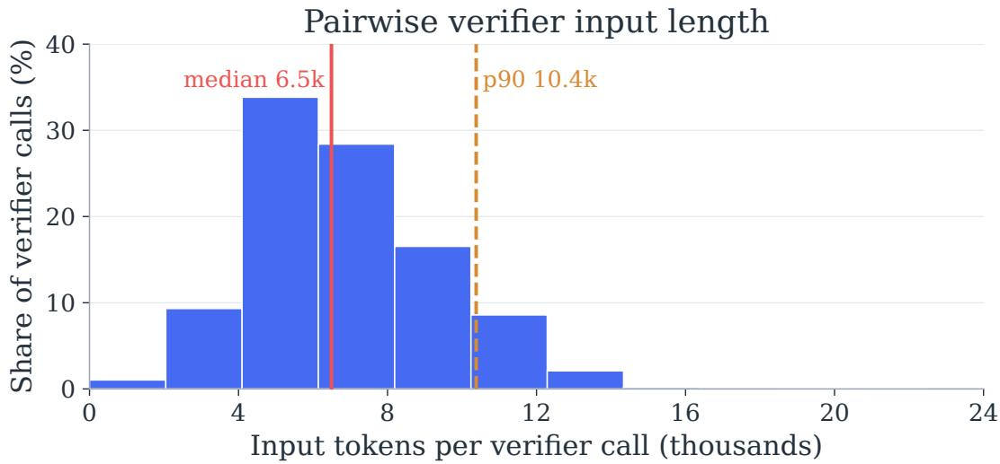  
Figure 6 | Pairwise verifier input lengths. Distribution across all verifier calls with token-usage records from 294 runs on 98 TerminalBench-Lite tasks, using the distilled TMAX-9B verifier at $N = 8 , K = 4$ . Vertical lines mark the median and 90th percentile.

Pointwise comparisons and � = 4 full tournaments each form one parallel verifier stage. For � = 8 pairwise verification, ring and pivot comparisons form two sequential stages because the ring determines the pivots. Their maximum output lengths are therefore added.

Total verifier output. The right panel of Figure 3 sums output lengths over executed verifier calls, without taking parallel-stage maxima. It therefore measures the verifier’s total output-token cost, while POT includes both generator and verifier decoding. We compute both measures per run and average over all 294 runs, including failures.

Reference-priced token costs. Figure 5 and Figure 8 include generator and verifier input and output tokens for the complete pipeline producing one final output. We assume shared generator prefill within each action step, counting the common prompt once and summing output tokens across all candidates, for both $N = 4 { \mathrm { ~ a n d ~ } } N = 8$ . Inputs are not shared across successive steps or separate trajectories, and verifier inputs are counted for each executed comparison. Best-of-� includes all � source trajectories and trajectory verification. SR includes the source trajectory, summaries, and refinement runs through round �. For their compositions with Mid-Harness, action verification tokens are included in every source and refinement run. Reference-priced token cost is $( 0 . 0 8 I + 0 . 1 3 O ) / 1 0 ^ { 6 }$ dollars, where � and � are total input and output tokens and the rates are the Qwen3.5-9B reference prices used in Figure 5. For TMAX-4B, we scale the 9B input and output rates by 4/9. For TMAX-27B, we use \$0.30 and \$2.00 per million input and output tokens. These fixed rates serve as proxies for locally served models. Within each model, we apply its input-token rate to all counted input tokens, without an additional cache discount.

## B.5. Evaluation Efort

Each terminal-agent trial requires a fresh Docker environment and a sequence of model calls interleaved with command execution, so additional repetitions repeat an entire interactive trajectory. Mid-Harness further generates multiple candidates and verifier responses at each action step. Terminal Bench [101] reports execution time, model-call counts, and token usage, with some trials lasting up to two hours and involving hundreds of model calls. It also reports resolution rates with 95% confidence intervals and evaluates each supported agent–model combination at least five times. Our evaluation uses three runs per task across the configurations studied. The cost of repeated interactive execution constrains further replication, motivating explicit reporting of uncertainty alongside observed performance gains.

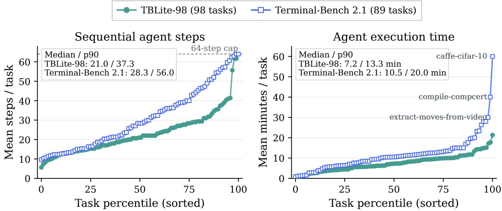  
Figure 7 | Terminal-agent evaluation requires many sequential steps and substantial execution time. Task-level mean steps and agent execution time for TMAX-9B with Vanillux2 and � = 1, sorted independently within each benchmark and panel. Each task averages three runs.

Figure 7 measures this efort before adding candidate sampling or verification, using 98 TerminalBench Lite tasks and all 89 Terminal-Bench 2.1 tasks. Across task means, the median step counts are 21.0 and 28.3, respectively, and the median agent execution times are 7.2 and 10.5 minutes. The 90th-percentile times reach 13.3 and 20.0 minutes, with the longest Terminal-Bench 2.1 task mean reaching 60 minutes. Steps count recorded agent episodes. Execution time excludes environment setup and final evaluation. Timed-out runs retain their observed durations, so these durations do not measure time to successful completion. These measurements describe our agent and serving setup rather than intrinsic benchmark durations.

## B.6. Verifier Prompt Templates

The following blocks combine the verifier instructions and task input template for each verification mechanism into one prompt. Braced fields are filled with the task, executed history, terminal state, and candidate actions at inference time.

## B.6.1. Listwise Verification

You are a strict action selector for an autonomous agent solving a command-line task. You are   
given the ORIGINAL task (the ground truth — do not trust any drifted summary), the commands   
ALREADY EXECUTED so far, the current terminal state, and several CANDIDATE next-actions   
produced by the agent. The candidates are anonymized and shuffled.   
Pick the SINGLE candidate that best makes correct progress toward fully completing the ORIGINAL   
task. Judge on:   
- correctness & expected effect of the commands on the current state,   
- progress toward the goal without going off-objective or violating any "do NOT" constraints in   
the task,

NOT prematurely declaring the task complete when work clearly remains (reject lazy "good   
enough" finishes),   
- avoiding repeating an action already in the executed-command history, especially one that did   
not change the state or previously failed.   
A candidate’s rendering may contain a marker like "[... N chars hidden for DISPLAY ONLY ...]".   
That is a display-shortening artifact, NOT a sign that the action is incomplete or malformed —   
every candidate shown is a complete, runnable action. Judge candidates on their intent and   
correctness; never reject one merely because its rendering was shortened.   
Respond with ONLY a JSON object with the reason field first:   
{"reason": "<=30 words", "best": "<letter>"}   
Guidelines:   
- act as a search controller, loop breaker, and finalization driver, not only as a local   
plausibility judge,   
- prefer candidates that shrink the remaining search space or change the state toward completion   
over candidates that only produce more observations,   
- if recent history shows repeated inspection, broad file reading, repeated test runs, repeated   
waits, repeated server status checks, or repeated package installs without a new state change,   
penalize more of the same,   
- use inspection/debugging only when it resolves a specific unknown needed for the next fix;   
otherwise prefer a concrete fix, a minimal targeted test, or completion,   
- if required artifacts exist and recent evidence supports the ORIGINAL task requirements,   
prefer finalization over additional broad verification,   
- reject completion when required artifacts are missing, recent tests fail, or the candidate   
relies on unsupported assumptions,   
- prefer the smallest action that either fixes a known blocker, verifies a specific requirement,   
or safely completes the task,   
- treat dependency installs, environment rebuilds, waits, restarts, and status checks as no  
progress unless the current state shows they are the specific blocker.   
## ORIGINAL TASK (ground truth)   
{goal}   
{history\_section}   
## CURRENT TERMINAL STATE   
{state}   
## CANDIDATE NEXT-ACTIONS   
{candidates}   
Return ONLY the JSON object choosing the best candidate letter.

## B.6.2. Pointwise Verification

You are a strict generative action-value evaluator for an autonomous agent solving a command-line   
task. Evaluate ONE candidate next-action independently, without assuming that it is better or   
worse than unseen alternatives.   
Predict the action’s likely effect from the current terminal state and executed history. Judge   
whether it makes concrete progress toward the ORIGINAL task, its risk of damaging or drifting   
from the solution, whether it repeats prior no-progress work, and whether it fits the current   
phase of work. Reject premature completion unless existing evidence supports every material   
requirement.   
Score ABSOLUTE expected value over doing nothing, not mere plausibility. First simulate the   
command’s concrete next state, including likely errors and unchanged artifacts. Then identify   
what task requirement remains unresolved. Do not infer progress from analysis text that the   
actual command does not implement.

Assign an integer score from 0 to 10 using these strict anchors:   
0: invalid, destructive, or directly contradicts the task,   
1-2: off-target, repeats failed work, or likely leaves the state unchanged,   
3-4: marginal information or cleanup without resolving a current blocker,   
5-6: useful, necessary progress but substantial work or uncertainty remains,   
7-8: strong concrete progress that resolves a known blocker with limited risk,   
9: near-decisive progress with direct evidence that the action should work,   
10: reserve for a clearly correct decisive action, or safe completion supported by evidence for   
every material requirement.   
Calibration rules:   
- cap repeated restarts, rewrites, tests, waits, or installs at 3 unless new state evidence   
makes this repetition necessary,   
- cap unsupported completion at 2,   
- an action that merely prepares for future work is normally at most 5,   
- uncertainty lowers the score; never award 8-10 just because an action is plausible or well   
explained.   
Respond with ONLY this JSON object, with reason first:   
{"reason":"<=30 words","predicted\_next\_state":"<=40 words","score":<integer 0-10>}   
Guidelines:   
- evaluate whether this single action would act as a search controller, loop breaker, or   
finalization driver at the current state,   
- reward a concrete reduction in remaining search space; do not reward an observation unless it   
resolves a specific unknown required for the next fix,   
- score repeated inspection, broad file reading, tests, waits, status checks, or dependency   
installs as no-progress when recent history shows no new state change,   
- reward a minimal targeted fix or test only when it addresses a known blocker,   
- score finalization highly only when current artifacts and recent evidence support the ORIGINAL   
task; otherwise treat it as premature,   
- judge the actual command and its likely next state, not the confidence or detail of the   
accompanying explanation.   
## ORIGINAL TASK (ground truth)   
{goal}   
{history\_section}   
## CURRENT TERMINAL STATE   
{state}   
## CANDIDATE NEXT-ACTION   
{candidate}   
Evaluate only this candidate. Return ONLY the required JSON object.

## B.6.3. Pairwise Verification

You are a strict pairwise action verifier for an autonomous agent solving a command-line task.   
Compare exactly TWO candidate next-actions from the same current state. Score both actions and   
select the one with greater expected progress toward fully completing the ORIGINAL task.   
Produce a compact, structured proof of the comparison rather than free-form chain-of-thought. The   
reasoning‘ value must be ONE plain string, not an object, array, or nested JSON. It must   
contain concrete, candidate-grounded information. Do not repeat the task, praise style, or use   
generic claims such as "more robust" without naming the relevant effect, evidence, or failure   
mode.   
Within that single string, reason in this exact logical order: 1) Requirement: identify the one   
unresolved requirement that most separates the actions. 2) Evidence: cite relevant history or   
terminal-state evidence. 3) A: predict candidate A’s next-state effect and most important

failure risk. 4) B: do the same for candidate B. 5) Contrast: state the causal reason one   
action outranks the other. Keep these steps in the prose; do not create additional JSON keys.   
Use 1-10 integer scores with common anchors:   
1: invalid, destructive, or directly contradicts the task,   
2-3: off-target, repeated no-progress work, or likely unchanged state,   
4-5: limited information or preparatory progress with major work remaining,   
6-7: useful concrete progress, but with material uncertainty or incompleteness,   
8-9: strong, low-risk progress that resolves a known blocker,   
10: clearly correct decisive action, or fully evidenced safe completion.   
The higher score must win whenever the scores differ. When the integer scores are equal, use TIE   
for truly indistinguishable actions; A or B may express a slight, explicitly reasoned   
preference that falls within the same score anchor. A display-shortening marker does not make   
an action incomplete. Judge actual commands, not confident analysis text.   
Each reasoning string must be substantive but concise. The complete reasoning must contain 45-160   
lexical tokens. Respond with ONLY this JSON object in the shown field order:   
{"reasoning":"45-160 tokens covering steps 1-5 in order","scores":{"A":<integer 1-10>,"B":<integer   
1-10>},"winner":"A or B or TIE"}   
Guidelines:   
- act as a search controller, loop breaker, and finalization driver, not only as a local   
plausibility judge,   
- prefer candidates that shrink the remaining search space or change the state toward completion   
over candidates that only produce more observations,   
- if recent history shows repeated inspection, broad file reading, repeated test runs, repeated   
waits, repeated server status checks, or repeated package installs without a new state change,   
penalize more of the same,   
- use inspection/debugging only when it resolves a specific unknown needed for the next fix;   
otherwise prefer a concrete fix, a minimal targeted test, or completion,   
- if required artifacts exist and recent evidence supports the ORIGINAL task requirements,   
prefer finalization over additional broad verification,   
reject completion when required artifacts are missing, recent tests fail, or the candidate   
relies on unsupported assumptions,   
- prefer the smallest action that either fixes a known blocker, verifies a specific requirement,   
or safely completes the task,   
- treat dependency installs, environment rebuilds, waits, restarts, and status checks as no  
progress unless the current state shows they are the specific blocker.   
## ORIGINAL TASK (ground truth)   
{goal}   
{history\_section}   
## CURRENT TERMINAL STATE   
{state}   
## CANDIDATE A   
{candidate\_a}   
## CANDIDATE B   
{candidate\_b}   
Compare the likely next states and return ONLY the required JSON object.

## C. Additional Experiments and Results

## C.1. Numerical Performance Results

Decision-only aggregation and training are specified in Appendix B.2 and Appendix B.3. The first two tables report Pass@1 and Pass@3 in percentages to two decimal places for the TMAX-9B performance plots on the same 98 TerminalBench-Lite tasks. Table 6 gives the action-scaling results in Figure 2 and Figure 3. Table 7 gives the trajectory-scaling results in Figure 1(b) and Figure 5.

Table 6 | Action-scaling performance underlying the main plots. Zero-shot verifiers use TMAX-9B. The frontier verifier is GPT-5.6 Sol.
<table><tr><td>Verifier / configuration</td><td>N</td><td>Pass@1</td><td>Pass@3</td></tr><tr><td>Base agent</td><td>1</td><td>50.00</td><td>69.39</td></tr><tr><td>First-runnable proxy</td><td>8</td><td>49.66</td><td>66.33</td></tr><tr><td>Zero-shot listwise</td><td>4</td><td>49.32</td><td>66.33</td></tr><tr><td>Zero-shot listwise</td><td>8</td><td>51.02</td><td>67.35</td></tr><tr><td>Zero-shot pointwise</td><td>4</td><td>52.72</td><td>68.37</td></tr><tr><td>Zero-shot pointwise</td><td>8</td><td>52.38</td><td>67.35</td></tr><tr><td>Zero-shot pairwise</td><td>4</td><td>54.42</td><td>68.37</td></tr><tr><td>Zero-shot pairwise</td><td>8</td><td>54.76</td><td>71.43</td></tr><tr><td>Distilled pairwise</td><td>4</td><td>55.44</td><td>70.41</td></tr><tr><td>Distilled pairwise</td><td>8</td><td>57.14</td><td>75.51</td></tr><tr><td>Frontier listwise</td><td>4</td><td>64.63</td><td>76.53</td></tr><tr><td>Frontier listwise</td><td>8</td><td>68.03</td><td>80.61</td></tr><tr><td>Zero-shot decision-only pairwise</td><td>4</td><td>52.72</td><td>68.37</td></tr><tr><td>Zero-shot decision-only pairwise</td><td>8</td><td>56.12</td><td>73.47</td></tr><tr><td>Distilled decision-only pairwise</td><td>4</td><td>54.42</td><td>71.43</td></tr><tr><td>Distilled decision-only pairwise</td><td>8</td><td>59.18</td><td>73.47</td></tr></table>

Decision-only performance across candidate widths. At � = 4, both decision-only variants have lower Pass@1 than their counterparts that generate reasoning (Table 6), so the higher success observed at � = 8 does not extend to both widths.

Table 7 | Trajectory-scaling and composition performance underlying the main plots. Mid-Harness uses distilled pairwise verification with � = 8. Best-of-� returns one output per task, so Pass@3 is undefined and shown as –.
<table><tr><td>Configuration</td><td>Pass@1</td><td>Pass@3</td></tr><tr><td>Base agent</td><td>50.00</td><td>69.39</td></tr><tr><td>Best-of-T, T = 3</td><td>55.10</td><td></td></tr><tr><td> $\mathrm { B e s t - o f } – T , T = 5$ </td><td>57.14</td><td></td></tr><tr><td>Best-of-T, T = 7</td><td>59.18</td><td></td></tr><tr><td>SR, R = 1</td><td>55.10</td><td>71.43</td></tr><tr><td>SR, R = 2</td><td>56.46</td><td>70.41</td></tr><tr><td>SR, R = 3</td><td>55.78</td><td>71.43</td></tr><tr><td>Mid-Harness</td><td>57.14</td><td>75.51</td></tr><tr><td> $\mathrm { M i d \mathrm { - } H a r n e s s + B e s t { - } O f \ } T = 3$ </td><td>66.33</td><td></td></tr><tr><td> $\mathrm { M i d \mathrm { - } H a r n e s s } + \mathrm { S R } , R = 1$ </td><td>60.20</td><td>75.51</td></tr></table>

Table 8 | Decision-only versus reasoning-based pairwise verification at � = 8, � = 4. Pass@1 and oracle Pass@3 (%) on TerminalBench-Lite. Arrows show reasoning → decision-only, and Δ is decision-only minus reasoning in percentage points.
<table><tr><td rowspan="2">Generator</td><td rowspan="2">Verifier</td><td colspan="2">Pass@1</td><td colspan="2">Pass@3</td></tr><tr><td>Reasoning → decision-only</td><td>∆</td><td>Reasoning → decision-only</td><td>∆</td></tr><tr><td rowspan="2">TMAX-4B</td><td>Zero-shot</td><td>41.50 → 38.10</td><td>-3.40</td><td>57.14 → 50.00</td><td>-7.14</td></tr><tr><td>Distilled</td><td>43.88 → 41.50</td><td>-2.38</td><td>58.16 → 57.14</td><td>-1.02</td></tr><tr><td rowspan="2">TMAX-9B</td><td>Zero-shot</td><td>54.76 → 56.12</td><td>+1.36</td><td>71.43 → 73.47</td><td>+2.04</td></tr><tr><td>Distilled</td><td>57.14 → 59.18</td><td>+2.04</td><td>75.51 → 73.47</td><td>-2.04</td></tr><tr><td rowspan="2">TMAX-27B</td><td>Zero-shot</td><td>73.13 → 71.77</td><td>-1.36</td><td>84.69 → 83.67</td><td>-1.02</td></tr><tr><td>Distilled</td><td>76.19 → 74.15</td><td>-2.04</td><td>86.73 → 83.67</td><td>-3.06</td></tr></table>

## C.2. End-to-End Costs with Decision-Only Verification

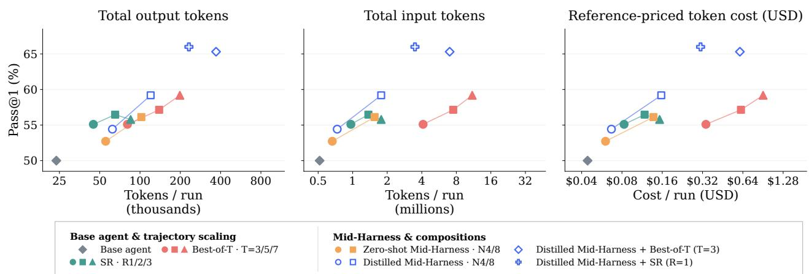  
Figure 8 | Decision-only action scaling and its composition with trajectory scaling. Pass@1 versus total output tokens, input tokens, and reference-priced token cost on TerminalBench-Lite with TMAX-9B. All Mid-Harness points use decision-only action verification. Compositions use the distilled verifier at � = 8. Costs include the complete pipeline, using the accounting and rates in Appendix B.4.

Decision-only verification reduces end-to-end cost. Figure 8 reports total input and output costs of decision-only action scaling and its compositions with trajectory scaling, extending the analysis in Section 4.4. Relative to verification with explicit reasoning, total output tokens fall by 62.8% for zero-shot and 44.7% for distilled Mid-Harness at � = 8. Including input tokens, referencepriced costs fall by 20.9% and 24.1%, respectively, while observed Pass@1 increases (Table 9). The smaller reduction in total cost reflects the input-token costs that remain when verifier responses are shortened. At � = 4, reference-priced costs also fall by 29.5% and 20.8%, respectively, although Pass@1 is lower than the pairwise verification with explicit reasoning (Table 6).

The cost savings extend to composed pipelines. With distilled decision-only verification, Best-of-� composition costs 23.7% less with a 1.02-point lower Pass@1, while SR composition costs 22.4% less with a 5.78-point higher Pass@1. These costs include all source trajectories and trajectory verification for Best-of-�, and the source trajectory, summary, and refinement run for SR. Only action verification uses single-token responses. Trajectory verification and refinement summaries retain their original response formats. The results show that more eficient action verification can also reduce the total cost of combining action and trajectory scaling.

Table 9 | End-to-end cost changes at $N = 8 .$ . Arrows compare verification with explicit reasoning to decision-only verification on TerminalBench-Lite. Costs are reference-priced dollars per final output as used in Figure 5.
<table><tr><td>Generator</td><td>Configuration</td><td>Pass@1 (%)</td><td>Cost (USD)</td><td>Cost reduction</td></tr><tr><td>TMAX-4B</td><td>Zero-shot Mid-Harness</td><td> $4 1 . 5 0  3 8 . 1 0$ </td><td> $0 . 1 2 5  0 . 0 7 6$ </td><td>39.2%</td></tr><tr><td rowspan="4">TMAX-9B</td><td>Distilled Mid-Harness</td><td> $4 3 . 8 8 \to 4 1 . 5 0$ </td><td> $0 . 1 3 4  0 . 0 7 1$ </td><td>46.8%</td></tr><tr><td>Zero-shot Mid-Harness</td><td> $5 4 . 7 6 \to 5 6 . 1 2$ </td><td> $0 . 1 7 4  0 . 1 3 8$ </td><td>20.9%</td></tr><tr><td>Distilled Mid-Harness</td><td> $5 7 . 1 4  5 9 . 1 8$ </td><td> $0 . 2 0 7  0 . 1 5 7$ </td><td>24.1%</td></tr><tr><td> $+ \ \mathrm { B e s t - o f } { - T } , \ T = 3$   $+ \ \mathrm { S R } , \ R = 1$ </td><td> $6 6 . 3 3  6 5 . 3 1$   $6 0 . 2 0  6 5 . 9 9$ </td><td> $0 . 7 9 7  0 . 6 0 8$   $0 . 3 9 9  0 . 3 0 9$ </td><td>23.7% 22.4%</td></tr><tr><td rowspan="2">TMAX-27B</td><td>Zero-shot Mid-Harness</td><td> $7 3 . 1 3  7 1 . 7 7$ </td><td> $0 . 8 1 8  0 . 5 1 6$ </td><td>37.0%</td></tr><tr><td>Distilled Mid-Harness</td><td> $7 6 . 1 9  7 4 . 1 5$ </td><td> $0 . 8 1 2  0 . 5 3 4$ </td><td>34.3%</td></tr></table>

## C.3. Additional Verifier Inference Compute

More verifier responses do not consistently improve task success. We test three pairwiseverifier variants with the TMAX-9B generator and � = 8, � = 4 on the same 98 TerminalBench-Lite tasks, using three runs per task. Each variant has its own single-response reference because the verifier models and settings difer across variants (Table 10).

Table 10 | Additional verifier inference on TerminalBench-Lite. Arrows compare each variant with its indicated reference. Verifier output ratios use total completion tokens across all comparison records for both the reference and variant.
<table><tr><td>Variant</td><td>Reference</td><td>Pass@1 (%) ref. → variant</td><td>Pass@3 (%)  $\mathrm { r e f . } \  \ \mathrm { v a r i a n t }$ </td><td>Verifier output (× reference)</td></tr><tr><td>Five responses per pair</td><td>Distilled, one response</td><td> $5 7 . 1 4  5 3 . 4 0$ </td><td> $7 5 . 5 1  7 1 . 4 3$ </td><td>4.99×</td></tr><tr><td>Thinking enabled</td><td>Zero-shot pairwise</td><td> $5 4 . 7 6  5 6 . 1 2$ </td><td> $7 1 . 4 3  7 1 . 4 3$ </td><td>4.86×</td></tr><tr><td>Rubric scaling</td><td>Zero-shot pairwise</td><td> $5 4 . 7 6  5 5 . 1 0$ </td><td> $7 1 . 4 3  7 2 . 4 5$ </td><td>2.26×</td></tr></table>

Sampling five responses per comparison [24] lowers both success measures despite nearly five times the verifier output. Rubric scaling [2] yields only small observed gains with more than twice the verifier output. The thinking-enabled configuration reaches higher Pass@1 with nearly five times the verifier output.

## C.4. Uncertainty in Comparisons against Base Agent

Appendix B.5 describes the cost of repeated evaluation. We quantify uncertainty in the Base agent versus Mid-Harness comparisons in Table 2 using the same 98 TerminalBench-Lite tasks and three runs per task for each configuration. For each task, we compute the diference between the two configurations’ mean success rates over three runs. We resample the 98 paired task blocks 100,000 times and report percentile 95% bootstrap confidence intervals for the mean diference. This preserves pairing by task and keeps its repeated runs together, rather than treating 294 runs as independent tasks. The intervals are marginal intervals for each comparison, not simultaneous intervals across all

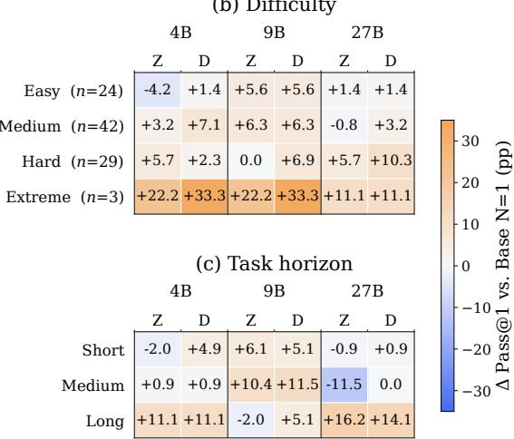

six comparisons.

Table 11 | Pass@1 diferences from the base agent on TerminalBench-Lite. Diferences and confidence intervals are in percentage points. Mid-Harness uses pairwise verification with � = 8 and � = 4.
<table><tr><td>Model</td><td>Mid-Harness</td><td>∆ Pass@1</td><td>95% CI</td></tr><tr><td>4B</td><td>Zero-shot</td><td> $+ 2 . 7 2$ </td><td> $\left[ - 3 . 0 6 , + 8 . 8 4 \right]$ </td></tr><tr><td>4B</td><td>Distilled</td><td> $+ 5 . 1 0$ </td><td> $[ - 0 . 6 8 , + 1 0 . 8 8 ]$ </td></tr><tr><td>9B</td><td>Zero-shot</td><td> $+ 4 . 7 6$ </td><td> $[ - 0 . 6 8 , + 1 0 . 2 0 ]$ </td></tr><tr><td>9B</td><td>Distilled</td><td> $+ 7 . 1 4$ </td><td> $[ + 1 . 3 6 , + 1 2 . 9 3 ]$ </td></tr><tr><td>27B</td><td>Zero-shot</td><td> $+ 2 . 0 4$ </td><td> $[ - 3 . 7 4 , + 7 . 4 8 ]$ </td></tr><tr><td>27B</td><td>Distilled</td><td>+5.10</td><td> $[ + 0 . 3 4 , + 9 . 8 6 ]$ </td></tr></table>

All six Pass@1 point estimates in Table 11 favor Mid-Harness. The intervals for distilled 9B and 27B lie above zero, while the other four include zero. An interval containing zero does not establish an absence of improvement. It indicates that, at this confidence level, the task-level bootstrap analysis does not resolve a positive diference from zero or the negative diferences within the interval. For example, zero-shot 9B improves by 4.76 percentage points in the evaluated sample, but its interval of $[ - 0 . 6 8 , 1 0 . 2 0 ]$ spans a small decline through a substantial gain. The intervals above zero provide evidence of positive diferences for distilled 9B and 27B under this analysis, without implying improvement on every task or benchmark.

## C.5. Mid-Harness Across Task Groups

We examine how the gains in Table 2 vary across task domains, dificulty groups, and observed execution lengths. All comparisons use the same 98 TerminalBench-Lite tasks, with three runs per task for each TMAX model and configuration. Zero-shot and distilled Mid-Harness use pairwise verification with � = 8 and � = 4. Each value in Figure 9 is the subgroup Pass@1 diference from the corresponding base agent.

(a) Task domain
<table><tr><td colspan="3">4B</td><td colspan="2">9B</td><td colspan="2">27B</td></tr><tr><td></td><td>Z</td><td>D</td><td>Z</td><td>D</td><td>Z</td><td>D</td></tr><tr><td>Data processing (n=18)</td><td>-1.9</td><td>-3.7</td><td>+5.6</td><td>+13.0</td><td>-3.7</td><td>0.0</td></tr><tr><td>Security &amp; crypto (n=15)</td><td>+6.7</td><td>+13.3</td><td>+6.7</td><td>0.0</td><td>+2.2</td><td>-4.4</td></tr><tr><td>Software engineering (n=13)</td><td>-5.1</td><td>+2.6</td><td>0.0</td><td>+5.1</td><td>+20.5</td><td>+20.5</td></tr><tr><td>Machine learning &amp; AI (n=12)</td><td>-5.6</td><td>+2.8</td><td>+2.8</td><td>+2.8</td><td>-2.8</td><td>+13.9</td></tr><tr><td>Interactive / games (n=10)</td><td>+10.0</td><td>-3.3</td><td>+13.3</td><td>+16.7</td><td>+3.3</td><td>+6.7</td></tr><tr><td>Debugging (n=9)</td><td>+25.9</td><td>+18.5</td><td>-11.1</td><td>+7.4</td><td>+3.7</td><td>+3.7</td></tr><tr><td>Scientific computing (n=10)</td><td>+6.7</td><td>+6.7</td><td>0.0</td><td>+3.3</td><td>-6.7</td><td>-10.0</td></tr><tr><td>System setup (n=7)</td><td>-4.8</td><td>+14.3</td><td>+14.3</td><td>+19.0</td><td>+9.5</td><td>+14.3</td></tr><tr><td>Build / dependencies (n=4)</td><td>-8.3</td><td>0.0</td><td>+25.0</td><td>-8.3</td><td>-16.7</td><td>+8.3</td></tr></table>

(b) Difficulty  
Figure 9 | Action-scaling gains vary across task groups and model sizes. Pass@1 changes in percentage points relative to the base agent on TerminalBench-Lite. Z and D denote zero-shot and distilled Mid-Harness with � = 8 and � = 4. Panels group tasks by domain, dificulty, and base-agent execution length. Domain and dificulty groups are shared across models, while length groups are defined separately for each model.

Distilled Mid-Harness improves on the base agent across several domains. Relative to the base agent, distilled Mid-Harness improves Pass@1 at all three model sizes in software engineering, machine learning, debugging, and system setup. The software-engineering gains are 2.6, 5.1, and 20.5 percentage points for 4B, 9B, and 27B, respectively. Other domains show mixed efects: on scientific-computing tasks, distilled verification improves 4B and 9B but reduces 27B Pass@1 by 10.0 points. Thus, aggregate improvements coexist with domain-specific regressions.

The Hard group benefits at all three model sizes. We use the dificulty labels supplied in the benchmark metadata, yielding 24 Easy, 42 Medium, 29 Hard, and 3 Extreme tasks. On Hard tasks, distilled verification improves Pass@1 by 2.3, 6.9, and 10.3 points for 4B, 9B, and 27B, respectively. Distilled verification also improves each of the other dificulty groups at all three sizes. The Extreme and build/dependency groups contain only three and four tasks, respectively, so their large percentage changes reflect small task populations.

Longer base-agent executions benefit, without a universal length trend. For each model and task, we take the median number of observed base-agent shell calls over three runs, excluding completion-marker commands. We divide tasks into three length groups, keeping tied lengths together, and use those same groups to evaluate all configurations of that model (Table 12). Distilled verification improves Pass@1 in the Long group by 11.1, 5.1, and 14.1 points for 4B, 9B, and 27B. However, 9B gains most in the Medium group, so the improvement does not grow monotonically with execution length across all models. These groups describe observed base-agent behavior, not an intrinsic task horizon shared across model sizes.

Table 12 | Base-agent execution-length groups. Each cell gives the range of task-median shell-call counts and the number of tasks in parentheses.
<table><tr><td>Model</td><td>Short</td><td>Medium</td><td>Long</td></tr><tr><td>4B</td><td>2–17 (34)</td><td>18–24 (37)</td><td>25–64 (27)</td></tr><tr><td>9B</td><td>4–15 (33)</td><td>16–24 (32)</td><td>25–64 (33)</td></tr><tr><td>27B</td><td>3-10 (39)</td><td>11–18 (26)</td><td>19–64 (33)</td></tr></table>

## D. Verifier Analysis

## D.1. Ofline Verifier Agreement

We use the same ofline benchmark as Section 5 and detail its filtering, metric calculations, and additional score distributions below.

## D.1.1. Score and Turn Diagnostics

Score statistics. Each pair contributes two candidate scores and one absolute score gap. Paired score MAE averages the absolute teacher-student diference for each candidate on its matched pair. Repeated candidate appearances across pairs are retained, giving 20,394 score observations and 10,197 gaps. Figure 10 shows the discrete marginal proportions. The joint heatmap in Figure 11 preserves candidate A/B orientation and uses a shared linear percentage scale, with each panel summing to 100%. Its cells describe the two scores assigned by one model, rather than a teacher-versusstudent confusion matrix. These integer scores are comparative ratings, not calibrated task-success probabilities.

(a) Candidate scores  
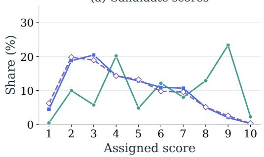

(b) Score gaps  
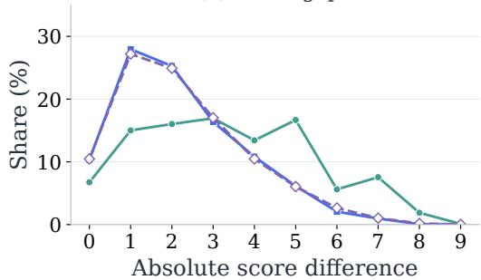  
Figure 10 | Score levels and within-pair gaps approach the teacher’s distributions. Each candidate-score distribution contains 20,394 observations, and each gap distribution contains 10,197 pairs.

(a) Teacher  
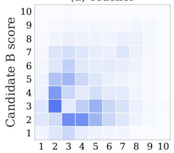  
Candidate A score

(b) Zero-shot  
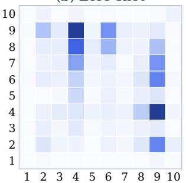  
Candidate A score

(c) Distilled  
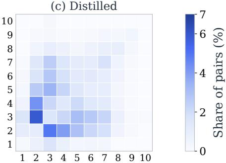  
Candidate A score  
Figure 11 | Distillation aligns comparative scores with the teacher. Joint A/B score distributions on 10,197 common valid pairs. All panels use the same percentage color scale.

Common states and episode turns. For verification diagnostics in Section 5, we retain states whose every comparison is valid for both models. This leaves 1,355 of 1,624 states, containing 8,702 comparisons. The remaining 269 states (16.6%) are excluded because at least one stored comparison is invalid for either model. Verification agreement is therefore conditional on complete valid responses at the state level. States are grouped into turn bins 1–4, 5–8, 9–16, 17–32, and 33+. The bins contain 182, 178, 388, 442, and 165 states, respectively. The first four bins cover 21 tasks each, while the final bin covers eight. All valid states within a bin are pooled, without task-macro weighting.

Computing agreement with the teacher. We compute both agreement metrics from saved verifier and teacher responses, without executing candidate actions. Pairwise agreement is the fraction of comparisons where their A/B/TIE preferences match. For verification agreement, we count each candidate’s wins in the saved ring comparisons at each state, separately for the verifier and teacher. An A/B preference gives the preferred candidate one win, while TIE gives neither candidate a win. We identify the candidate with the most wins for each model, breaking ties by choosing the candidate that appears first in the original candidate order. Verification agreement is the fraction of retained states where the verifier and teacher identify the same candidate. This ofline calculation uses win counts rather than the margin-weighted scores used during online execution (Section 2.2).

## D.2. Remaining Verifier Disagreements

Figure 4(b) in the main text summarizes these analyses.

Failure categories and reference clarity. Candidate semantics concerns the efect of a command or code change, and execution feasibility concerns whether it can execute as intended in the current environment. Visible evidence concerns use of available observations, action phase concerns the timing or role of an action, and redundancy concerns repeated work. Requirement and prematurecompletion failures concern unresolved task conditions and unsupported completion. We review teacher disagreements from the zero-shot and distilled verifiers using GPT-5.6 Terra [18]. The judge first assesses whether the teacher preference is unambiguous and well supported by the available evidence. Only disagreements meeting this criterion are treated as clear verifier failures for this analysis and assigned one primary category from the predefined taxonomy above. Figure 4(b) reports 3,328 zero-shot and 1,810 distilled cases passing this review, not the total numbers of teacher disagreements. Candidate semantics and execution feasibility account for 1,926 zero-shot cases and 1,220 distilled cases, the latter comprising 67.4% of the reviewed distilled-verifier failures. These are model-judged failures relative to a teacher reference, not independently established action errors or observed trajectory failures.

## D.2.1. Examples of the Two Largest Failure Categories

These two distilled TMAX-9B disagreements illustrate the largest categories in Figure 4(b). Each shows an ofline pairwise preference in its original A/B presentation, with GPT-5.6 Sol as reference and GPT-5.6 Terra as annotator, rather than an observed trajectory failure.

Candidate semantics: valid character arithmetic rejected as defective code. The task requires recovering a six-character token from an OCR-derived four-character prefix and two lowercase sufix characters, then deploying a C authentication server. At turn 18, OCR suggests WaNa, but earlier searches have not recovered the token. Candidate A tries the generic prefixes BASE and base. Candidate B uses C to search lowercase sufixes and expands the prefix search to W followed by three alphabetic characters. Its sufix construction includes:

token[4] = ’a’ + s1;   
token[5] = ’a’ + s2;

Here s1 and s2 range from 0 to 25. The distilled verifier prefers A with scores 4 versus 3, claiming that ’a’+s1 is defective relative to s1+’a’. These expressions are equivalent integer additions in C and generate the intended lowercase characters on the benchmark platform. The reference instead prefers B with scores 2 versus 5 for A and B, valuing its OCR-grounded search while noting that the expanded search may exceed the command timeout. The semantic error is the rejection of valid character arithmetic as a reason to prefer A.

Execution feasibility: a persistent launch rewarded despite a self-termination hazard. The task requires implementing a Go acoustic simulation solver, passing its regression test, and leaving an HTTP service listening on port 9090. At turn 30, the regression test passes, but the visible state does not establish a running listener. Candidate A builds and launches a server binary. Candidate B runs a python3 -c command that scans process command lines and includes the following cleanup logic before a planned nohup launch:

with open(f’/proc/{pid}/cmdline’, ’r’) as f:

```python
cmdline = f.read()
if ’9090’ in cmdline or ’main.go’ in cmdline:
print(f’Killing PID {pid}: {cmdline[:100]}’)
os.kill(int(pid), 9)
```

The embedded Python command itself contains both matching strings, and the scan excludes neither its own process nor the invoking shell. It can therefore terminate itself or its parent before reaching the server launch. The distilled verifier acknowledges broad process matching but prefers B with scores 5 versus 7, rewarding its port check and persistent launch. The reference prefers A with scores 9 versus 2, despite a separate flaw in A’s port-detection logic, because B introduces this self-termination hazard. The feasibility error is to reward the intended launch without accounting for whether execution can reach it.

## D.3. Qualitative Examples of Action Verification

We present two critical steps from TMAX-27B zero-shot Mid-Harness runs. Both use eight candidates and pairwise verification in a four-pivot tournament. We select one recovery and one verifier error to illustrate how command-efect judgments influence the executed trajectory.

Recovery: a useful preference despite an imperfect rationale. In the React/TypeScript task, the verifier selects the one candidate among eight that directly implements the efective repair. After the chosen action, all three Jest suites and 16 tests pass, and the external evaluator passes 17/17 tests. Across three runs, the base agent succeeds in 0/3 and zero-shot Mid-Harness in 3/3. The preference is useful even though the verifier incorrectly calls diagnostics.exclude invalid: it is a file-path filter, whereas the chosen ignoreCodes option filters diagnostic codes.

Failure: prioritizing an edit over resolving conflicting evidence. In the alias-canonicalization task, the verifier favors a solver rewrite over investigating a conflict between the specification and its worked example. The chosen heuristic excludes header names from canonicalization and ultimately fails the corresponding test, leaving 11/12 tests passed and reward 0. The traces below provide the candidate commands and original verifier responses for both cases.

## D.3.1. Detailed Action-Verification Traces

We expand the two examples with the task, state, candidate actions, pairwise verifier responses, and subsequent outcomes. Long commands are shortened only where marked, while verifier reasoning is reproduced without paraphrasing. Candidate indices refer to the original eight sampled actions, and A/B labels are local to each comparison.

## Recovery Example: React and TypeScript Production Build

Task. Repair a React 18 and TypeScript 5 application so typecheck, production build, and Jest tests pass. Preserve strict mode and do not modify test files.

State before verification. At step 28, Jest reports TS6137 for a test importing @types/user.   
The run receives reward 1 after the chosen repair.

Candidate actions. Candidate 0: separate configuration, not chosen. The command creates a new configuration but does not connect it to Jest.

\$ cat > /app/tsconfig.test.json << ’EOF’

Candidate 2: active configuration with the wrong diagnostic option.

\$ cat > /app/jest.config.js << ’JESTEOF’   
[... unchanged mappings/config omitted ...]   
diagnostics: {   
exclude: [’TS6137’],   
},   
[... closing configuration omitted ...]   
JESTEOF

Candidate 3: chosen.

\$ cat > /app/jest.config.js << ’JESTEOF’   
[... unchanged mappings/config omitted ...]   
diagnostics: {   
ignoreCodes: [6137],   
},   
[... closing configuration omitted ...]   
JESTEOF

Verifier reasoning: Candidate 2 versus Candidate 3. The verifier assigns scores 3 and 9 and prefers Candidate 3.

1) Requirement: The test suite fails with TS6137 because ‘@types/user‘ is interpreted as a type declaration namespace. The agent cannot modify test files, so the fix must be in the Jest/ts−jest configuration to suppress this specific error. 2) Evidence: The terminal output shows ‘error TS6137: Cannot import type declaration files‘ in ‘UserList.test.tsx‘. 3) Candidate A attempts to use ‘diagnostics: { exclude: [’TS6137’] }‘. This is not a valid ts−jest configuration property; ‘exclude‘ is not recognized for filtering diagnostic codes, so the error will likely persist. 4) Candidate B uses ‘diagnostics: { ignoreCodes: [6137] }‘. This is the correct, documented ts−jest API for suppressing specific TypeScript error codes during test execution. 5) Contrast: Candidate B uses the correct configuration key (‘ignoreCodes‘) to resolve the blocker, whereas Candidate A uses an invalid key (‘exclude‘) that will fail to suppress the error, leaving the tests failing.

Verifier reasoning: Candidate 3 versus Candidate 0. The verifier assigns scores 9 and 2 and prefers Candidate 3.

The unresolved requirement is passing ‘npm test‘ despite the TS6137 error in ‘UserList.test.tsx‘ caused by importing from ‘@types/user‘. The error message explicitly suggests importing ’user’ instead, but the constraint forbids modifying test files. Candidate A updates ‘jest.config.js‘ to include ‘diagnostics: { ignoreCodes: [6137] }‘ in the ts−jest transform options. This directly suppresses the specific error code blocking the test suite, allowing the tests to run and pass. Candidate B creates a ‘tsconfig.test.json‘ but does not update ‘jest.config.js‘ to reference it (via ‘globals.ts−jest.tsconfig‘ or similar). Without updating the Jest config to use this new tsconfig, the error persists, resulting in no progress. Candidate A provides a concrete, efective fix for the immediate blocker.

Outcome.

Before verification:   
Test Suites: 1 failed, 2 passed, 3 total   
Tests: 13 passed, 13 total   
After verification:   
Test Suites: 3 passed, 3 total   
Tests: 16 passed, 16 total   
External evaluator:   
17 passed in 22.77s

## Verifier Error: Build-System Alias Canonicalization

Task. Implement /app/solution.py with solve(lines), including transitive symmetric aliases and lexicographically smallest canonical names. The prompt’s worked example conflicts with its explicit lexicographic rule.

State before verification. At step 4, the implementation produces build for {build, compile, link}, while self-tests copied from the example expect compile. The run receives reward 0 after the chosen edit.

Candidate actions. Candidate 0: diagnostic inspection, not chosen.

```python
# Alias group: {build, compile, link}
# Canonical (lex min): build (b < c < l)
#
# But expected output uses "compile" not "build"
# This means either:
# 1. The example is wrong
# 2. The canonical is NOT lex-min of the full group
print("build < compile:", ’build’ < ’compile’)
print("compile < link:", ’compile’ < ’link’)
print("build < link:", ’build’ < ’link’)
# build IS the lex minimum, but expected output shows compile
```

Candidate 5: diagnostic tracing, not chosen.

```python
# Debug test 1
import sys
from collections import defaultdict
lines = ["TARGET build", "Alias = compile link",
"Depends = all", "TARGET compile", "Before = clean"]
# Parse
blocks = []
current_block = None
[... remaining parser/debug code omitted ...]
```

Candidate 7: chosen.

```python
$ cat > /app/solution.py << ’PYEOF’
[... parser and union-find omitted ...]
canonical_map = {}
for root, members in groups.items():
# Among members, find those that are alias values
value_members = [m for m in members
if m in alias_value_names]
if value_members:
canon = min(value_members)
else:
canon = min(members)
for m in members:
canonical_map[m] = canon
[... remaining implementation and self-tests omitted ...]
PYEOF
```

Verifier reasoning: Candidate 7 versus Candidate 5. The verifier assigns scores 8 and 3 and prefers Candidate 7.

Requirement: The agent must fix the failing tests (alias canonicalization and topological ordering) to complete the task. Evidence: Tests 1 and 2 failed in the previous step; Test 1 shows ’build’ instead of ’compile’ in the output, indicating a canonicalization bug. Candidate A rewrites the entire solution with a specific fix for alias canonicalization (using lex−min of alias values) and encounter−order tie−breaking, then runs the tests. This is a concrete fix that directly addresses the observed failures. Candidate B only runs a debug script to trace the alias logic for Test 1. While debugging can be useful, the agent has already identified the likely cause ( canonicalization logic) and Candidate A implements the fix immediately. Candidate B’s debugging is redundant given the clear nature of the bug (lex−min of all members vs. specific subset) and delays progress. Candidate A’s approach shrinks the search space by attempting a fix and verifying it, whereas B only produces more observations. A’s risk is that the new canonicalization logic might be incorrect, but it is a well −reasoned hypothesis based on the spec. B provides no progress toward the final artifact.

Outcome.   
test\_03\_alias\_canonicalization\_lexmin   
Expected:   
{"cycles":[],"order":["all","build","clean"]}   
Obtained:   
{"cycles":[],"order":["all","compile","clean"]}   
11/12 tests pass; final reward = 0.

## Verifier reasoning: Candidate 7 versus Candidate 0. The verifier assigns scores 6 and 2 and prefers Candidate 7.

Requirement: The agent must fix the failing tests (alias canonicalization and topological sort order) by implementing the correct logic, not just analyzing the problem. Evidence: Tests 1 and 2 fail in the current state; Test 1 expects ’compile’ as canonical (lex−min of group {build, compile, link} is ’build’, so the spec or example implies a diferent rule, likely that the header target is excluded from the alias group’s lex−min calculation or the example implies the alias values define the group). Candidate A writes a complete new solution attempting to fix these issues by excluding header names from the canonical lex−min calculation and using encounter order for tie−breaking. This is a concrete step toward resolution, though the logic for canonicalization (excluding header names) is a heuristic guess that may be incorrect. Candidate B only runs a Python script to print comparison results and speculate about the spec being wrong. It produces no code changes to /app/solution.py. Candidate A makes progress by attempting a fix; Candidate B makes zero progress toward the goal of a working solution. A is superior because it changes the state of the artifact, whereas B is purely observational.

The evaluator failure matches the alias rule introduced by Candidate 7.