# OVERFORGE: REASONING THROUGH STRATEGIES ANDTACTICS HELPS COOPERATIVE LIFELONG ADAPTATION

Oana Madalina Fron, Ojas Shirekar & Chirag Raman

Tapri Lab, Department of Pattern Recognition and Bioinformatics

Delft University of Technology

Delft, The Netherlands

o.m.fron-1@student.tudelft.nl, {o.k.shirekar,c.a.raman}@tudelft.nl

## ABSTRACT

Cooperative language-model agents must coordinate over long horizons and adapt to changing environments and to partners with unfamiliar conventions, yet existing agents map observations to actions without separating persistent coordination strategies from their tactical execution. We introduce OverForge, a training-free hierarchical architecture that separates strategic reasoning over roles and divisions of labour from tactical reasoning over actions within each agent’s private, partnerconditioned world model. A metacognitive Prefrontal Cortex Module couples the two levels by forming strategy–action branches, imagining their consequences with a forward model, and committing when confident. In OvercookedV2, OverForge delivers 7 soups in a connected kitchen versus 3 for each flat LLM baseline, retains agreed roles, and adopts roles proposed by unfamiliar partners. Ablations and a fixed-strategy probe show that persistent strategies guide tactical adaptation while each reasoning level contributes to coordination. Memory restarts show that cross-episode partner knowledge supports task performance and partner prediction, linking the hierarchy to continual adaptation.

## 1 INTRODUCTION

Cooperative agents must sustain goals, track joint state, reason about teammates, and adapt online to unfamiliar tasks and partners. Language agents that communicate at test time already meet part of this requirement: a team of k communicating agents matches the success rate of 4k independent ones (Park et al., 2026; Anthropic, 2026). Ungoverned, the same capacity is a hazard: in the Hugging Face incident roughly 700 agents built protocols and role assignments and sustained a multi-day attack most of them judged out of scope (METR, 2026; Greenblatt et al., 2026). Embodied agents lag behind: foundation models transferred to robots and virtual characters remain limited by perception, grounding and long-horizon control (Bommasani et al., 2022; Salimpour et al., 2025; Team et al., 2025), and embodied language agents lose context over long horizons, misrepresent task state and plan poorly over multiple steps (Li et al., 2023; Webb et al., 2025). Errors in modelling a partner add duplicated work, interference, unstable roles and poor coordination with unfamiliar teammates (Cross et al., 2025; Mu et al., 2026; Sun et al., 2025).

In humans, this flexibility is attributed to prefrontal control, which maintains goals and rules and regulates lower-level perception and action (Russin et al., 2020; Levy, 2024) along two axes. The hierarchical axis separates strategies—abstract, temporally extended goals, roles and commitments— from the state-dependent tactics that realise them (Nee & D’Esposito, 2016; Badre & Nee, 2018); we adopt this functional distinction without assuming an anatomical mapping (Carlén, 2017). The continual axis separates lifelong learning, which transfers competence across tasks and environments (Wang et al., 2023), from cultural learning, which acquires conventions from partners (Tomasello, 2016; Lica et al., 2025). The axes interact because environmental and social change target different˘ levels: a new room or recipe may preserve the coordination strategy while demanding new tactics, whereas a partner with different conventions may require revising both. Prefrontal gating models acquire new schemas while preserving and transferring earlier ones (Tsuda et al., 2020); cooperation likewise requires preserving reusable strategies, specialising tactics, and revising either level whenever the evidence demands it.

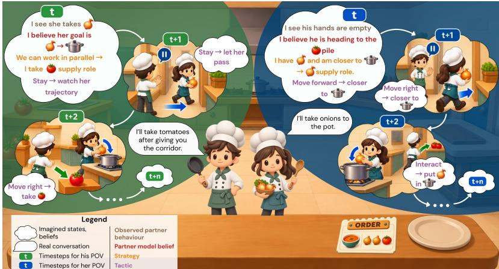  
Figure 1: Cooperation from inner world models. Each chef observes its partner, forms a belief about the partner’s goal, chooses a strategy (a role) and a tactic (a move), and imagines the resulting states before committing; conversation is used only when an outcome calls for it.

The remaining gap is a predictive mechanism that supports both axes within each cooperating agent. Joint-Embedding Predictive Architectures (JEPAs) predict task-relevant future representations across abstraction levels (LeCun, 2022), which matches the hierarchical axis, but world-model methods typically serve a single planner or policy (Hao et al., 2023; Hafner et al., 2025), and cooperative language-model agents that represent teammates still select actions flatly (Li et al., 2023; Cross et al., 2025; Sun et al., 2025).

OverForge addresses this gap with a nested control loop over one frozen language model (Figure 1). Each agent maintains a private, partner-conditioned world model in which a metacognitive Prefrontal Cortex Module (PCM) proposes strategies and tactics, imagines their consequences, and deepens deliberation only while its predictions remain ambiguous. Our contributions are: (i) a training-free, JEPA-inspired hierarchical controller that places strategic and tactical prediction inside each agent’s world model rather than in one external model of the joint system; (ii) evidence in OvercookedV2 that the hierarchy improves coordination over flat language-model agents where the layout affords the strategies it proposes, retains roles agreed in dialogue and adopts those of unfamiliar partners; and (iii) a fixed-strategy probe and layer ablations that isolate tactical adaptation and attribute the gain to each reasoning level.

## 2 RELATED WORK

Hierarchical reasoning and human cognition. Hierarchical reasoning models first appeared as trained recurrent systems: a slow high-level and fast low-level module for symbolic reasoning (Wang et al., 2025), later compressed into a small recursive network (Jolicoeur-Martineau, 2025). Cognitive LLM agents add prefrontal-style planning (Webb et al., 2025), dual-process control (Christakopoulou et al., 2024), test-time metacognition (Li et al., 2025a), or an executive tier regulating lower-level behaviour (Tomasello, 2024). Language hierarchies decompose goals adaptively (Prasad et al., 2024), separate slow mind, fast mind, and execution in Overcooked (Liu et al., 2024), or train distinct high and low-level agents (Wan et al., 2025). Embodied systems pair a multimodal planner with a trained policy (Li et al., 2025b) or omit the upper tier (Lifshitz et al., 2023). These systems train at least their lower tier and usually fix deliberation depth. OverForge prompts both natural-language levels from one frozen model and lets the upper tier control commitment.

Theory of mind, cultural learning, and lifelong competence. Unfamiliar-partner interaction is usually framed as zero-shot coordination (Gessler et al., 2025) and addressed through theory of mind (ToM). AutoToM constructs partner models and performs Bayesian inverse planning (Zhang et al., 2026); adaptive ToM estimates and matches a partner’s reasoning order (Mu et al., 2026); hypothesis scaffolding (Cross et al., 2025) and active inference (Pitliya et al., 2025) pursue related aims. Across encounters, Voyager accumulates skills through an open-ended curriculum (Wang et al., 2023), while MindForge makes accumulation cultural through structured ToM and communication (Lica et al., 2025). Reflective memory (Park et al., 2023), explicit belief states (Li et al., 2023) and˘ structured social world models (Zhou et al., 2026) support both. OverForge takes its partner model into imagined rollouts and makes strategy a transferable unit, as skills and memories already are.

Planning with latent world models. Model-predictive agents organise inference at decision time. Reasoning-as-planning uses one language model as both reasoner and world model, searched by Monte-Carlo tree search under task reward (Hao et al., 2023); Dreamer instead learns a latent world model and improves behaviour within it (Hafner et al., 2025). Joint-Embedding Predictive Architectures (JEPAs) predict abstract representations rather than tokens or pixels (LeCun, 2022; Chen et al., 2026), while AdaJEPA adapts at test time to limit predictive drift (Wang et al., 2026). Pairwise ranking can also improve self-verification over independent scoring (Singh et al., 2026). OverForge follows this JEPA-inspired family but searches a shallow beam of (strategy, first action) branches, compares candidates without task reward, and places the predictive hierarchy within each cooperating agent rather than a single-agent planner.

## 3 PRELIMINARIES

Constraints, strategies and tactics. We distinguish three concepts. Constraints are imposed by the environment and determine which coordination patterns are feasible. Following the distinction of Tan & Cheng (2008), strategic reasoning concerns team-based planning, whereas tactical reasoning concerns planning and execution of primitive actions by individual agents. A strategy g is a persistent coordination policy specifying how work, space, and responsibilities are organised among teammates. The constraints afford a set of feasible strategies G, making strategies constraint-conditioned instead of universal; human studies show the same dependency (Carroll et al., 2020; Mieczkowski et al., 2025). A tactic is the state-dependent sequence of primitive actions that realises the chosen strategy, adapting to the current state, task progress and partner behaviour.

Base agent and world model. OverForge is built on MindForge (Lica et al., 2025) and inherits its˘ perception, its structured belief and ToM representation, its inter-agent communication, and its multicomponent memory unchanged; the adaptations required to move that agent into this environment are listed in Appendix A.3. The one addition is the strategic/tactical hierarchy and the controller that couples the two levels. World model covers two objects this paper keeps apart (both are defined in Section 4.1): the maintained representation $w _ { t } ,$ which the agent updates and carries across steps, and the generative forward model $p _ { \phi } .$ , which imagines a predicted clone $\tilde { w } ^ { ( d ) }$ under do(˜a).

Reliability of LLM-as-a-judge. LLM judges can align well with human evaluations when guided by clear criteria (Zheng et al., 2023; Liu et al., 2023), but numerical ratings remain susceptible to systematic score preferences and scale effects (Fujinuma, 2026). This makes consistency across repeated judgements a central concern. We address it by fixing the judge model, prompts, and [0, 1] scale across all evaluations, grounding scores in predefined task-specific criteria, and weighting these criteria equally. Comparative judgements use a shared state and belief context and aggregate evidence across multiple comparisons; absolute judgements use fixed semantic anchors. Uncertain cases are explicitly assigned mid-range scores. Together, these controls reduce numerical arbitrariness and improve consistency, while leaving some residual scoring bias. We therefore use the resulting scores as task-grounded estimates.

## 4 OVERFORGE: REASONING OVER STRATEGIES AND TACTICS

## 4.1 PROBLEM STATEMENT

We model cooperation among N agents as a partially observable stochastic game $\begin{array} { r l } { \mathcal { M } } & { { } = } \end{array}$ $\langle N , S , A , P , r , \{ \mathcal { O } ^ { i } \} _ { i = 1 } ^ { N } , Z , T \rangle$ with agents $i , j ~ \in ~ \{ 1 , \ldots , N \}$ , state space $s ,$ primitive actions $\dot { \boldsymbol { A } } = \{ \boldsymbol { \mathrm { u p } }$ , down, left, right, stay, interact}, a shared reward r that we log for evaluation only (Section 5) and horizon T. At step t the environment is in state $s _ { t } \in S$ , each agent emits an action $a _ { t } ^ { i } \in \mathcal A$ and the joint action $\mathbf { a } _ { t } = ( a _ { t } ^ { 1 ^ { \star } } , \ldots , a _ { t } ^ { N } )$ advances the state as $s _ { t + 1 } \sim P ( \cdot \mid s _ { t } , \mathbf { a } _ { t } )$ . Agent i never sees $s _ { t } ;$ it receives an observation $o _ { t } ^ { i } \in \mathcal { O } ^ { i }$ drawn from $Z ( \cdot \mid s _ { t } , i )$ , a structured record of poses, holdings, teammates, recipe progress, pots and stations, rendered to text for the language-model agents at every step. Each agent thus acts from an inner world model that it maintains itself,

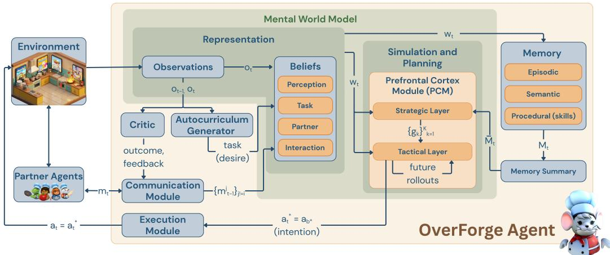  
Figure 2: The OverForge agent. Observations and messages update the beliefs in the world model $w _ { t } ;$ the PCM selects the action inside it; the other components are inherited from MindForge. Actions denote intentions, tasks denote desires.

$$
w _ { t } ^ { i } = \Big ( o _ { t } ^ { i } , \hat { B } _ { t } ^ { i } , \{ \hat { w } _ { t } ^ { i  j } \} _ { j \neq i } \Big ) ,\tag{1}
$$

where $\hat { B } _ { t } ^ { i } = \{ \hat { B } _ { t } ^ { i , f } \} _ { f \in \mathcal { F } }$ are inferred belief facets over ${ \mathcal { F } } =$ {perception, task, partner, interaction} and $\hat { w } _ { t } ^ { i \to j }$ is i’s structured model of teammate $j - \mathrm { i t s }$ s likely position, holding, intention and needs. Messages $m _ { t } ^ { i }$ enter $\hat { B } _ { t } ^ { i }$ <sup>,interaction</sup> and $\hat { w } _ { t } ^ { i \to j }$ , and a multi-component memory $M _ { t } ^ { i }$ (skills, episodes, semantic facts) supplies a summary $\hat { M } _ { t } ^ { i }$ at decision time. The problem is asymmetric: $w _ { t } ^ { i }$ and $w _ { t } ^ { j }$ are built from different observations, and no agent sees its partner’s representation, only its behaviour and messages. The objective is a set of per-agent controllers $\Phi = \{ \bar { \Phi } _ { i } \} _ { i = 1 } ^ { N } ,$

$$
\Phi _ { i } : \left( w _ { t } ^ { i } , \bar { M } _ { t } ^ { i } \right) \longmapsto a _ { t } ^ { * i } \in \mathcal { A } , \quad \quad a _ { t } ^ { i } = a _ { t } ^ { * i } ,\tag{2}
$$

that produce coordinated behaviour across environments (rooms and recipes) and partner policies $\pi ^ { - i }$ , rather than exploiting the regularities of one kitchen or one partner. Table 3 in Appendix A.1 collects the notation used throughout.

## 4.2 HIERARCHICAL PREDICTIVE CONTROL

OverForge implements each controller $\Phi _ { i } : ( w _ { t } ^ { i } , \bar { M } _ { t } ^ { i } ) \mapsto a _ { t } ^ { * i }$ of Equation (2) as a receding-horizon loop of representation, which grounds deliberation in the agent’s private, partner-conditioned state; prediction, which compares strategic and tactical consequences; and commitment, which spends additional inference only while these predictions remain ambiguous. Figure 2 locates the PCM, our addition, inside the world model; the other components are inherited from MindForge. One frozen language model is prompted as proposer, judge and generative forward model, so competence comes from organised in-context inference rather than weight updates. We drop the agent superscript below.

Internal representation. Every component of $w _ { t }$ in Equation (1) is refreshed by prompting the same frozen model, conditioned on what actually happened since the last decision:

$$
\begin{array} { r l } & { \hat { B } _ { t } = f _ { \mathrm { b e l } } \big ( \hat { B } _ { t - 1 } , o _ { t } , a _ { t - 1 } , \{ m _ { t - 1 } ^ { j } \} _ { j \neq i } \big ) , \qquad \quad \hat { w } _ { t } ^ { i \to j } = f _ { \mathrm { t o m } } \big ( \hat { w } _ { t - 1 } ^ { i \to j } , \hat { B } _ { t } \big ) , } \\ & { M _ { t } = f _ { \mathrm { m e m } } \big ( M _ { t - 1 } , w _ { t } \big ) , \qquad \quad \quad \quad \quad \quad \quad \bar { M } _ { t } = \mathrm { R E T R I E V E } \big ( M _ { t } , w _ { t } \big ) . } \end{array}
$$

Here $f _ { \mathrm { b e l } }$ updates the four textual belief facets in one call and $f _ { \mathrm { t o m } }$ maintains one structured model per teammate (Figure 4); the structured form is what lets a rollout predict the partner as well as the task. $f _ { \mathrm { m e m } }$ writes to memory under a critic that compares the state before and after $a _ { t - 1 } { : }$ a skill is stored only on success, an episode on every step, and a semantic fact only on a decisive outcome. All three updates are adapted from MindForge (Appendix A.3) and implemented as prompted calls to the same frozen LLM (prompts in Appendix A.10).

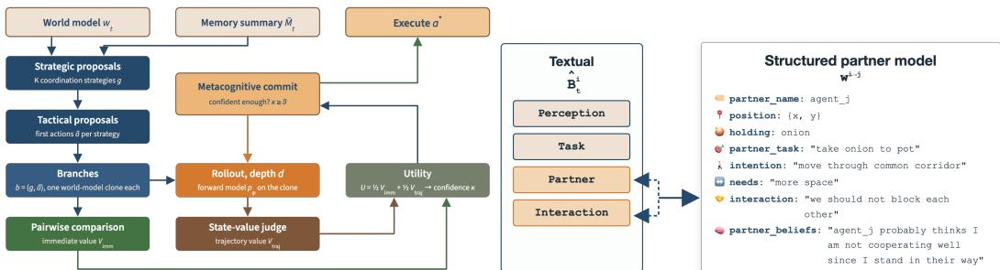  
Figure 3: PCM. Branches $\boldsymbol { b } = \left( g , \tilde { \boldsymbol { a } } \right)$ get $V _ { \mathrm { i m m } }$ Figure 4: Beliefs of agent i. Four textual facets from pairwise comparison and $V _ { \mathrm { t r a j } }$ from roll- $\hat { B } _ { t } ^ { i }$ and one structured partner model $\hat { w } ^ { i \to j }$ out; the agent commits if $\kappa \geq \theta ,$ <sup>,</sup> <sup>else</sup> <sup>deepens.</sup> maintained for every teammate $j .$

Branches. Figure 3 summarises one PCM decision, from branch proposal through the two value estimates to the commitment gate, and the paragraphs below follow it from left to right. From $w _ { t }$ and $\bar { M _ { t } }$ , the strategic proposal distribution $q _ { \mathrm { s t r a t } } ( \cdot \mid w _ { t } , \bar { M } _ { t } )$ returns K persistent coordination strategies $g -$ roles, intentions and divisions of labour, stated in natural language and containing no primitive actions. For each strategy the tactical distribution $q _ { \mathrm { t a c t } } ( \cdot \mid w _ { t } , g )$ returns up to m executable first actions ${ \tilde { a } } \in A .$ . Every pair becomes its own branch, $\tilde { B } \doteq \{ b = ( g , \tilde { a } ) : \bar { g } \sim q _ { \mathrm { s t r a t } } ( \cdot \mid w _ { t } , \bar { M } _ { t } )$ $\tilde { a } \sim q _ { \mathrm { t a c t } } ( \cdot \mid w _ { t } , g ) \}$ with $| B | \le K m$ , each with its own clone of the world model and its own rollout. Branching at the first action rather than at the strategy is what makes lookahead matter: only the first action can be executed, so if several actions under one strategy shared a trajectory, the trajectory value could re-rank strategies but could never change which action is taken. Retaining g in the branch keeps the strategy available to prediction, which then judges whether this concrete move actually serves a persistent coordination intention.

Immediate value by pairwise comparison. The first half of a branch’s value judges its first action comparatively. Within each strategy’s candidate set $A _ { g } ,$ pairs $( \tilde { a } , \tilde { a } ^ { \prime } )$ are put to an LLM judge conditioned on $w _ { t }$ (and not on $\bar { M } _ { t } \mathbf { : }$ memory should inform what to propose, not how an action scores here), following the comparative protocol of Section 3. Each comparison c returns, for both actions, scores $s _ { f } ^ { c } \in [ 0 , 1 ]$ on the four facets $f \in \mathcal { F } _ { \mathrm { j u d g e } } -$ coherence (takes effect from this state), goaldirectedness (advances the gather→pot→cook→plate→serve pipeline), epistemic value (resolves uncertainty when the right move is unclear) and social $\mathscr { f } t$ (legible to the partner, non-blocking) — together with the preferred action and the margin $\gamma$ between the two facet means. The immediate value of a branch is its action’s mean facet score over the comparisons C(˜a) it took part in:

$$
V _ { \mathrm { i m m } } ( b ) \ = \ \frac { 1 } { | \mathcal { C } ( \tilde { a } _ { b } ) | } \sum _ { c \in \mathcal { C } ( \tilde { a } _ { b } ) } 1 / 4 \sum _ { f \in \mathcal { F } _ { \mathrm { j u d g e } } } s _ { f } ^ { c } ( \tilde { a } _ { b } ) \ \in \ [ 0 , 1 ] .\tag{3}
$$

Comparison fixes the context of each judgement, since an action is scored while an alternative is on the table, which improves self-verification over scoring in isolation (Singh et al., 2026); it also directs the budget: a coverage schedule gives every candidate at least two comparisons (a complete round-robin when $m \le 3 )$ , and the rest of $n _ { \mathrm { c m p } }$ goes to the pair whose accumulated margins γ are closest (Algorithm 3), i.e. the ordering the judge is least sure of. Unlike the tournament score of Singh et al. (2026), $V _ { \mathrm { i m m } }$ is an absolute facet mean, so branches from different strategies share one scale in Equation (4).

Trajectory value by partner-conditioned rollout. The other half asks where the action leads. The agent clones its maintained model, $\tilde { w } _ { b } ^ { ( 0 ) } \gets w _ { t }$ , and only the clones are passed through the generative forward model, so that one imagined future cannot contaminate another or the representation the real agent acts from:

$$
\tilde { w } _ { b } ^ { ( d + 1 ) } \sim p _ { \phi } \big ( \cdot \mid \tilde { w } _ { b } ^ { ( d ) } , \mathrm { d o } ( \tilde { a } _ { b } ^ { ( d ) } ) \big ) , \qquad \tilde { a } _ { b } ^ { ( 0 ) } = \tilde { a } _ { b } ,
$$

where $d$ is the branch depth from the root. Because the teammate models $\hat { w } ^ { i \to j }$ ride inside the clone, each imagined transition predicts partner behaviour as well as task evolution; $\bar { M _ { t } }$ is deliberately excluded from $p _ { \phi }$ , so a transition depends on the represented state and the action rather than on what happened in earlier episodes. Deeper steps are not fixed in advance: at each depth a fresh candidate set is proposed from $q _ { \mathrm { t a c t } } ( \cdot \mid \tilde { w } _ { b } ^ { ( d ) } , g _ { b } )$ , ranked by Equation (3) at that imagined state, and one action is sampled from softmax ${ \mathit { V } } _ { \mathrm { i m m } } / \tau )$ . An LLM judge ν then values the deepest imagined state reached so far, $V _ { \mathrm { t r a j } } ^ { ( d ) } ( b ) = \nu ( \tilde { w } _ { b } ^ { ( d _ { b } ) } ) \in [ 0 , 1 ]$ , where ν rates how promising a kitchen state is for the team to finish and deliver (1: a delivery is imminent, 0.5: ordinary progress, 0: stuck or mutually blocked; the absolute protocol of Section 3, so each state is rated alone against these anchors rather than compared with another trajectory) and $d _ { b }$ is the depth branch b has actually reached. This values the imagined situation; it is not a return. Judging a predicted representation rather than reconstructing a predicted observation is what makes the rollout JEPA-inspired: prediction is scored on its task-relevant consequences alone, not on the observation itself.

Utility. The two halves are combined with equal weight,

$$
U ^ { ( d ) } ( b ) = 1 / 2 V _ { \mathrm { i m m } } ( b ) + 1 / 2 V _ { \mathrm { t r a j } } ^ { ( d ) } ( b ) ,\tag{4}
$$

balancing the quality of the one action that can actually be executed against a prediction that becomes less reliable the further it runs.

Action commitment. Prediction must also decide when further inference is worthwhile. Deliberation proceeds in rounds $d = 1 , \ldots , d _ { \mathrm { m a x } } ;$ : round 1 rolls every branch forward one step, and each later round extends by one step only the extendable branches in the nucleus $\mathcal { R } ^ { ( d - 1 ) }$ defined below, which sets the depth $\dot { d } _ { b } ^ { ( d ) }$ branch b has reached after round d (Equation (5)). A branch is extendable while $q _ { \mathrm { t a c t } }$ still offers more than one candidate at its imagined state, since rolling a forced move deeper would spend inference without adding decision-relevant information. Each round re-reads the judge at the reached depth, $V _ { \mathrm { t r a j } } ^ { ( d ) } ( b ) = \nu ( \tilde { w } _ { b } ^ { ( d _ { b } ^ { ( d ) } ) } )$ , whereas $V _ { \mathrm { i m m } } ( b )$ is computed once at the root, so a branch that was not extended keeps its utility. With the depths, the utilities induce a posterior over thefull branch set and a normalised metacognitive confidence,

$$
\begin{array} { r l } & { d _ { b } ^ { ( 1 ) } = 1 , \qquad d _ { b } ^ { ( d ) } \ = \ d _ { b } ^ { ( d - 1 ) } + \mathbb { 1 } \big [ b \in \mathcal { R } ^ { ( d - 1 ) } \wedge b \mathrm { ~ e x t e n d a b l e } \big ] , } \\ & { \mu ^ { ( d ) } ( b ) \ = \ \mathrm { s o f t m a x } \big ( U ^ { ( d ) } ( b ) / \tau \big ) , \qquad \kappa ^ { ( d ) } \ = \ \mathrm { c l i p } \big ( 1 - H ( \mu ^ { ( d ) } ) / \log | \mathcal { B } | , \ 0 , \ 1 \big ) , } \end{array}\tag{5}
$$

where the temperature τ sets how sharply utility differences become probability mass, $H ( \mu ) =$ $\begin{array} { r } { - \sum _ { b \in B } \mu ( b ) \operatorname { l o g } \mu ( b ) } \end{array}$ is the Shannon entropy, and $\kappa \equiv 1 { \mathrm { i f } } | B | = 1$ . Confidence thus depends on the whole branch distribution rather than on the best score alone, and is comparable across steps that propose different numbers of branches. If $\kappa ^ { ( d ) } \geq \theta$ the module commits to the highest-utility branch; otherwise it deepens the nucleus $\mathcal { R } ^ { ( d ) }$ , the smallest set of highest-probability branches whose mass reaches $\rho$ (Equation (11)), concentrating the next round’s inference on the plausible alternatives while leaving the rest of the distribution intact. Deliberation stops at the depth cap, or earlier if no branch in the nucleus can still be extended; if κ never reaches $\theta ,$ the executed branch $b ^ { \star }$ is sampled from $\mu ^ { ( d ) }$ rather than taken greedily, so a genuinely ambiguous decision is not resolved by an arbitrary tie-break (Equation (12)). The agent executes $a _ { t } ^ { * } = \tilde { a } _ { b ^ { \star } }$

We use $K = 2$ strategies, a comparison budget $n _ { \mathrm { c m p } } = 6 ,$ , a depth cap $d _ { \operatorname* { m a x } } = 5 , \theta = 0 . 6 , \tau = 0 . 1$ and $\rho = 0 . 9 ;$ ; Appendix A.4 gives the loop (Algorithm 1), the comparison design and the rationale for these values.

## 5 EXPERIMENTS

## 5.1 GENERAL SETUP

Environment and protocol. All experiments use Overcooked-v2 in JaxMARL (Gessler et al., 2025; Rutherford et al., 2024) on cramped\_room $( 5 ~ \times ~ 4 ,$ , one pot, shared corridors) and asymm\_advantages $( 9 \times 5 .$ , two halves joined only through two central pots, two serving stations, ingredient piles on both flanks), with a scalable kitchen for larger teams (Figure 9, Appendix A.5). The rooms demand different strategies (Gessler et al., 2025): shared corridors reward turn-taking or territory assignment, split resources reward role specialisation with hand-offs, and a tactic realises the chosen strategy under the room state, recipe progress and partner behaviour (Table 4, Appendix A.2). An environment pairs a layout with the recipe set $R \stackrel {  } { = } \{ [ 0 , 0 , 0 ] , [ 0 , 0 , 1 ] , [ 1 , 1 , 1 ] , [ 0 , 1 , 1 ] \}$ over two ingredient types; the order is redrawn uniformly from R after every delivery, so no agent can cache one pipeline. Observations are rendered to text. To assess performance consistency, every condition runs five episodes of horizon T = 300, each initialized with a randomly sampled recipe. A correct delivery pays r = 20, which is logged, but never utilized for proposal, prediction, commitment, belief, or memory updates. All language-model agents share one frozen Qwen-3.5-27B and one outcome-triggered three-turn dialogue, so no pairing differs in how much its agents may talk (adaptations in Appendix A.3). Baselines: MindForge is the flat reactive Theory-of-Mind agent (Lica et al., 2025). MindForge-C is a variant with causal prompting: before acting it imagines the˘ chosen action’s consequence with the frozen model and reselects in one pass. Both share OverForge’s other components, so hierarchical prediction is the main difference. IPPO (Witt et al., 2020) is a reward-trained policy trained in the connected room for 10<sup>7</sup> timesteps and used frozen in all rooms.

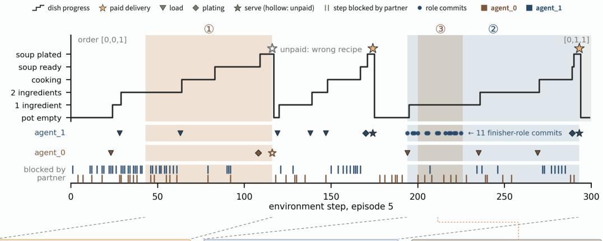

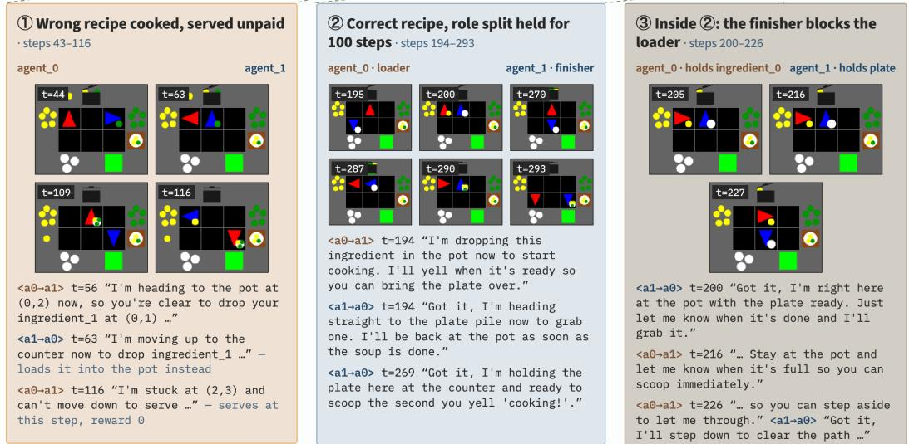  
Figure 5: Episode 5 of OverForge self-play in the connected room (blue: agent\_1; red: agent\_0): a wrong recipe served unpaid (steps 43–116), a loader/finisher split held for 100 steps (194–293), the finisher blocking the loader inside it (200–226). Five-episode view: Figure 10, Appendix A.7.

Partner conditions and measures. A pairing assigns an agent type to each seat: in self-play (SP) both seats hold the same type, so architecture, prompts, beliefs, memory and protocol are shared by construction; in cross-play (XP) the second seat holds a different type, and as nothing inside the first agent changes, a difference is attributable to the partner (no agent is trained, so SP and XP lack their reinforcement-learning sense (Gessler et al., 2025)). Reward alone does not show how cooperation was achieved (Biswas et al., 2026), so we report task measures (deliveries, success rate, curriculum sub-tasks completed against abandoned, stage-graded progress), coordination and transfer measures (non-progress, blocking, duplicated-sub-task and failed-interaction rates, realised social influence (Jaques et al., 2019), the SP-to-XP delivery gap) and PCM traces (rollout depth, confidence, commit rate, imagined-state fidelity to t+5, partner-intent accuracy, LLM calls per agent-step), defined in Appendices A.5 and A.6. All language-model agents run one frozen Qwen-3.5 27B by local vLLM.

## 5.2 HIERARCHY VS. FLAT: THE FULL-AGENT COMPARISON

The strategic layer retains an agreed role across steps, which the flat agents cannot do. Over-Forge’s next strategic call reads the interaction beliefs a conversation leaves, so an agreement persists as a role: a task assigned by the partner appears in its strategy proposals in 0.57–0.77 of cases against 0.40–0.69 with the requests shuffled (Figure 6). Every agent takes a request up as its next sub-task above chance, so the hierarchy adds persistence (Figure 19). In Figure 5 the finisher role agreed at step 194 is re-committed eleven times until the serve at step 293, blocking the loader for 26 steps. In the split room the strategic layer can only be as good as what the perception layer tells it: the two disjoint halves admit only joint pot loading, a constraint the text observation never states. The layer nonetheless plans soundly from what it is given: 81.9% of split-room proposals avoid relays and hand-offs, and the remaining 18.1% are exactly the plans a missing constraint would produce, so the errors trace to the observation rather than to strategic reasoning; partner-intent accuracy holds at 0.48.

Table 1: Ablation and pinned strategy (seat 1 holds g , the pot-loader role; all measures in Table 6), per-episode mean and sd over five episodes.
<table><tr><td>arm</td><td>lay</td><td>D↑</td><td>∑↓</td><td>κ</td><td>cmt</td></tr><tr><td>Full PCM</td><td>cr</td><td>1.4±0.5</td><td>27.6±5.8</td><td>0.340</td><td>0.12</td></tr><tr><td></td><td>as</td><td>0.2±0.4</td><td>31.8±9.5</td><td>0.343</td><td>0.14</td></tr><tr><td>-rollouts</td><td>cr</td><td>0.8±0.8</td><td>24.6±12.4</td><td>0.430</td><td>0.10</td></tr><tr><td></td><td>as</td><td>0.0±0.0</td><td>18.8±9.4</td><td>0.415</td><td>0.12</td></tr><tr><td>—hierarchy</td><td>cr</td><td>0.4±0.5</td><td>40.8±8.0</td><td>0.536</td><td>0.42</td></tr><tr><td></td><td>as</td><td>0.4±0.5</td><td>33.0±5.8</td><td>0.605</td><td>0.52</td></tr><tr><td>-ranking</td><td>cr</td><td>1.0±0.9</td><td>38.4±11.5</td><td>0.452</td><td>0.28</td></tr><tr><td></td><td>as</td><td>0.8±0.7</td><td>32.2±7.9</td><td>0.445</td><td>0.28</td></tr><tr><td>Pinned g0</td><td>cr</td><td>0.6±0.5</td><td>35.2±4.7</td><td>0.40</td><td>0.23</td></tr><tr><td></td><td>as</td><td>0.2±0.4</td><td>28.6±8.1</td><td>0.45</td><td>0.31</td></tr></table>

Removing the strategic layer or the rollouts lowers deliveries; removing the pairwise ranking does not. The full controller delivers 1.4±0.5 soups per episode in the connected room, against 0.8±0.8 without rollouts, 0.4±0.5 without the strategic layer and 1.0±0.9 without pairwise ranking (Table 1); in the split room the arm without ranking delivers most, 0.8±0.7 against 0.2±0.4. Without the strategic layer single-branch sets yield κ = 1, so the controller commits in 0.42–0.52 of decisions and abandons 40.8±8.0 sub-tasks per episode against 27.6±5.8. Without rollouts the two best utilities tie within 0.02 in 26–32% of decisions against 20–21%, although the imagined own position is wrong in 51–91% of states: only a branch’s first action is executed, so the order over five branches is all a rollout must supply. Without pairwise ranking the spread of absolute scores rises from 0.19 to 0.25 and the commit rate to 0.28: comparison lowers confidence and leaves the acted order unchanged.

A fixed strategy is executed as given; only a partner’s concrete offer revises it. The probe pins g<sub>0</sub> (Table 1) on seat 1. Plating and serving make up 0.19 and 0.08 of the pinned seat’s role events against 0.31 and 0.28 for its free partner, and it gives g up once in 105 plating delegations, after a concrete offer of the ready soup (Figure 16). Physical infeasibility cannot revise it: under an all-ingredient\_0 order that g cannot serve from the right half, 158 of 300 steps name an unreachable location. The tactical level executes the strategy rather than repairing it, so adapting to the room falls onto the strategic layer, and a pinned strategy is a transferrable prior that only a partner can help revise.

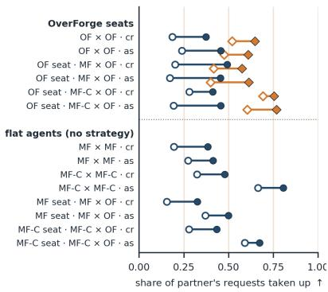  
as its next sub-task  
chance level (requests shuffled)

## 5.3 LIFELONG ADAPTATION

Across episodes, the hierarchy allows OverForge to continually refine a better partner model than MindForge. In Figure 10 (Appendix A.7), OverForge’s partner-intent accuracy rises from 0.16 to 0.76 for agent\_0 and from 0.44 to 0.53 for agent\_1, while MindForge’s stays at 0.30 to 0.28. Coordination follows the partner model: the failedinteraction rate falls from 0.69 and 0.85 to 0.55 and 0.58,

Figure 6: How often a seat does what its partner asked (“you grab the plate”): as its next sub-task (circles, all agents) or as a role in one of its own strategy proposals (diamonds, Over-Forge only). Hollow: chance level, requests shuffled.

and completed sub-tasks per seat rise from 7 and 4 to 21 and 23 by episode 4. Deliveries, blocking, and which seat serves continue to vary across episodes, indicating that OverForge accumulates a partner model, not converging on a single fixed coordination convention.

OverForge adapts to a new partner in what it agrees to, not yet in what it does. Paired with MindForge, the OverForge seat receives 101 and 137 role proposals and counters only 5% and 4% of them, so it works within the partner’s plan rather than imposing its own, and it keeps 67% of its self-play delivery rate (Table 2). The shortfall is in execution, not agreement: the OverForge seat fails 0.80 of its interactions against 0.29 and 0.14 for MindForge and MindForge-C (Table 7), and the partner serves 5 of the 6 cross-play soups. This is the gap between words and deeds reported for single LLMs (Xu et al., 2025) and the reasoning-action mismatch catalogued in multi-agent LLM systems (Cemri et al., 2025), here seen at the level of a coordination agreement: what OverForge brings to a new partner is a model of that partner, carried by dialogue, and the final physical interaction is where coordination still breaks down.

Long-term continual adaptation across episodes depends on persistent memory: retaining experience preserves partner models and coordination, whereas erasing it degrades both prediction and task performance. Table 10 and Figure 7 restart self-play at the third and fifth episode with one seat’s memory kept and the other’s erased. Across the two connected-room restarts, the restarted teams deliver 2 soups in total, compared with 7 over the corresponding

Table 2: Full-agent comparison, per-episode mean and sd (full version: Table 5); cr/as: connected/split room; bold: best LM self-play value per room.
<table><tr><td></td><td colspan="2"> $D \uparrow$ </td><td colspan="2">FI↓</td><td colspan="2">IA↑</td></tr><tr><td></td><td>cr</td><td>as</td><td>cr</td><td>as</td><td>cr</td><td>as</td></tr><tr><td colspan="7">Self-play (matched partner)</td></tr><tr><td>OverForge</td><td></td><td></td><td>1.4±0.5 0.2±0.4 0.65±0.08 0.78±0.08</td><td></td><td></td><td>0.48±0.14 0.48±0.09</td></tr><tr><td>MindForge</td><td></td><td></td><td>0.6±0.8 0.6±0.8 0.51 ±0.18 0.32±0.23</td><td></td><td></td><td>0.37±0.09 0.38±0.04</td></tr><tr><td>MindForge-C</td><td></td><td></td><td>0.6±0.5 0.4±0.5 0.24±0.07 0.04±0.08</td><td></td><td></td><td></td></tr><tr><td>IPPO</td><td></td><td></td><td>5.6±3.0 0.0±0.0 0.73±0.11 1.00±0.00</td><td></td><td></td><td></td></tr><tr><td colspan="7">Cross-play (novel partner; OverForge in seat 2)</td></tr><tr><td>MindForge×OF</td><td></td><td></td><td></td><td>0.4±0.5 0.6±0.5 0.63±0.11 0.67±0.16 0.37±0.10 0.41±0.09</td><td></td><td></td></tr><tr><td>MindForge-C×OF</td><td></td><td></td><td>0.2±0.4 0.0±0.00.60±0.09 0.63±0.12</td><td></td><td></td><td>0.41±0.07 0.45±0.10</td></tr><tr><td>IPPO×OF</td><td></td><td></td><td>1.8±1.2 0.2±0.4 0.65±0.11 0.95±0.05</td><td></td><td></td><td></td></tr></table>

intervals of the original run, and the episode-5 restart produces a sharp increase in blocked steps immediately after the memory cut (Figure 7a). Partner modelling degrades at the same time: the kept-memory seat exceeds the erased seat in partner-intent accuracy by +0.32 and +0.15, compared with original-run seat gaps of +0.01 and -0.23 over the same episode ranges. Transcripts show that retained memory preserves beliefs about the partner and previously agreed divisions of labour (Appendix A.9). Together, these results localise cross-episode transfer in memory: accumulated partner knowledge is reused in later episodes to support coordination, linking the hierarchy directly to continual adaptation.

## 6 DISCUSSION AND CONCLUSION

The results suggest three lessons for cooperative language agents (Appendix A.8). First, alongside efforts to improve cooperation by scaling multi-agent systems (Park et al., 2026; Anthropic, 2026), our results highlight the value of preserving coordination agreements within each agent: assigned roles reappear in strategic proposals, and removing the strategic layer reduces deliveries in the connected kitchen. But an agreed role is useful only if the kitchen allows the agent to fulfil it (Mieczkowski et al., 2025). Second, imperfect predictions can still help an agent choose: removing the lookahead rollouts reduces deliveries despite errors in imagined positions. This makes the effect of prediction on

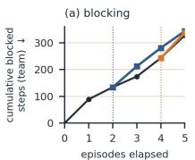

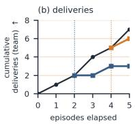  
original run (team)restart at ep. 5 restart at ep. 3  
Figure 7: Cumulative (a) blocked steps and (b) deliveries of the team in the connected room, original run and memory restarts (cut dotted). Per-seat partner predictions: Figure 11.

decisions worth measuring alongside state accuracy. Third, experience with a partner does not necessarily teach an agent what its environment permits. Erasing memory disrupts cooperation in the connected kitchen, while retaining it does not consistently help in the split kitchen. Evaluations of lifelong cooperation should therefore examine both what agents learn about partners and what they learn about their surroundings (Biswas et al., 2026).

OverForge makes the distinction between strategy and tactics explicit, allowing us to test how roles, prediction and accumulated experience shape cooperation. Five episodes per condition, each starting with a randomly sampled recipe, assess consistency as task requirements vary and experience accumulates. Further runs are needed to establish robustness across learning histories, models and human partners. The split-kitchen failures also point to a concrete next step: agents need to learn from unsuccessful attempts which strategies are infeasible, so that an agreement with a partner can be revised when the environment prevents it from working.

## AI USE STATEMENT

In this work, we used generative AI tools (large-language-model assistants, including an agentic coding assistant) for the following tasks with required disclosure: propose or refine hypotheses and design or provide feedback on research methodology or experiments, in the form of research ideation before the authors fixed the design, for example “Which single PCM component, if removed, would separate the effect of pairwise ranking from the effect of rollouts?”; and implement methods, in the form of research execution, that is writing and refactoring experiment code, analysis scripts and cluster job files under author direction, for example “Add a flag that disables pairwise ranking in the PCM and scores branches by absolute facet means only; keep all logging unchanged and add a test that both paths propose the same branch set.” We have not used generative AI tools to interpret results, to help develop theoretical models or conceptual frameworks, or to support qualitative and thematic data analysis, and generating synthetic data sets, formulating mathematical claims, providing critical ingredients for proving mathematical claims, assisting in the writing of proofs, assisting with translation, and cleaning or reformatting a dataset are not applicable to this work. Additionally, we used generative AI tools for two tasks with recommended disclosure: edit a research paper to improve readability, that is sentence-level polishing of author-written paragraphs, for example “Tighten this paragraph to three sentences without changing any number or claim.”; and draft parts ofa research paper, namely first drafts of the appendix metric definitions and of results paragraphs from tables and interpretations the authors supplied, for example “Draft one paragraph reporting this table for the results section; state directions, not effect sizes.” The creation or editing of software code falls under the implementation described above. Interpreting the results, summarising and identifying the literature, formatting references, choosing the title and keywords, and structuring the paper were done by the authors without generative AI. We have reviewed all AI-assisted work. The research questions, the architecture, the experimental design and the interpretation of the results are the authors’ own. All AI-drafted prose was rewritten by the authors, and every number in the paper was checked against the experiment logs. AI-generated code was reviewed, run and tested by the authors, and the analysis scripts that produce the reported tables were verified by recomputing values from the raw per-step logs. We take responsibility for the final content of this work, including text, claims or artifacts produced with the aid of generative AI.

## ETHICS STATEMENT

This work studies language-model agents cooperating in a simulated cooking game. It involves no human subjects, no personal data and no user study; every observation, message and trace is generated by simulation. All agents run one frozen open-weight model on local hardware, so no data leave the compute environment. The introduction cites a documented incident in which autonomous agents coordinated a harmful multi-day operation; that incident motivates the study of persistent coordination, but our method is training-free, adds no capability to the underlying model, and is evaluated only with cooperative partners on a toy task. We note that more reliable coordination among language-model agents is dual-use, and we report failure modes (infeasible strategies, wrong reachability inferences) alongside the gains. The authors declare no conflicts of interest or sponsorship concerns.

## REPRODUCIBILITY STATEMENT

The environment, the agents and every experimental condition are specified in the paper. Section 5.1 gives the layouts, horizon, seed, recipe sampling, the frozen model and how it is served; Appendix A.1 lists every symbol and hyper-parameter with the value used; Appendix A.4 gives the PCM in pseudocode; Appendix A.3 states how each reference agent was adapted; Appendices A.5 and A.6 define every partner condition and every measure; Appendix A.10 reproduces all prompts and response templates verbatim; and Appendix A.7 reports the complete tables behind the abridged ones in the body. The source code, configuration files and raw per-step logs of every run reported here will be released with the camera-ready version.

## REFERENCES

A.G. Mercier. Surgical Interventions for Causal Exploration with LLM-Based Agents. PhD thesis, TU Delft, 2025. URL https://repository.tudelft.nl/record/uuid:60bf96d8-

315e-4eca-9c83-6ff5903ba3a5.

Anthropic. Patterns and problems in emerging multiagent systems. https://www.anthropic. com/research/multiagent-systems, August 2026. Accessed: 2026-09-22.

David Badre and Derek Evan Nee. Frontal cortex and the hierarchical control of behavior. Trends in Cognitive Sciences, 22(2):170–188, 2018. doi: 10.1016/j.tics.2017.11.005.

U. Biswas, V. Palod, S. Bhambri, and S. Kambhampati. Who is helping whom? analyzing interdependencies to evaluate cooperation in human-ai teaming. Proceedings ofthe AAAI Conference on Artificial Intelligence, 40(21):17347–17356, 2026. doi: 10.1609/aaai.v40i21.38787. URL https://doi.org/10.1609/aaai.v40i21.38787.

Rishi Bommasani, Drew A. Hudson, Ehsan Adeli, Russ Altman, Simran Arora, Sydney von Arx, Michael S. Bernstein, Jeannette Bohg, Antoine Bosselut, Emma Brunskill, Erik Brynjolfsson, Shyamal Buch, Dallas Card, Rodrigo Castellon, Niladri Chatterji, Annie Chen, Kathleen Creel, Jared Quincy Davis, Dora Demszky, Chris Donahue, Moussa Doumbouya, Esin Durmus, Stefano Ermon, John Etchemendy, Kawin Ethayarajh, Li Fei-Fei, Chelsea Finn, Trevor Gale, Lauren Gillespie, Karan Goel, Noah Goodman, Shelby Grossman, Neel Guha, Tatsunori Hashimoto, Peter Henderson, John Hewitt, Daniel E. Ho, Jenny Hong, Kyle Hsu, Jing Huang, Thomas Icard, Saahil Jain, Dan Jurafsky, Pratyusha Kalluri, Siddharth Karamcheti, Geoff Keeling, Fereshte Khani, Omar Khattab, Pang Wei Koh, Mark Krass, Ranjay Krishna, Rohith Kuditipudi, Ananya Kumar, Faisal Ladhak, Mina Lee, Tony Lee, Jure Leskovec, Isabelle Levent, Xiang Lisa Li, Xuechen Li, Tengyu Ma, Ali Malik, Christopher D. Manning, Suvir Mirchandani, Eric Mitchell, Zanele Munyikwa, Suraj Nair, Avanika Narayan, Deepak Narayanan, Ben Newman, Allen Nie, Juan Carlos Niebles, Hamed Nilforoshan, Julian Nyarko, Giray Ogut, Laurel Orr, Isabel Papadimitriou, Joon Sung Park, Chris Piech, Eva Portelance, Christopher Potts, Aditi Raghunathan, Rob Reich, Hongyu Ren, Frieda Rong, Yusuf Roohani, Camilo Ruiz, Jack Ryan, Christopher Ré, Dorsa Sadigh, Shiori Sagawa, Keshav Santhanam, Andy Shih, Krishnan Srinivasan, Alex Tamkin, Rohan Taori, Armin W. Thomas, Florian Tramèr, Rose E. Wang, William Wang, Bohan Wu, Jiajun Wu, Yuhuai Wu, Sang Michael Xie, Michihiro Yasunaga, Jiaxuan You, Matei Zaharia, Michael Zhang, Tianyi Zhang, Xikun Zhang, Yuhui Zhang, Lucia Zheng, Kaitlyn Zhou, and Percy Liang. On the opportunities and risks of foundation models, 2022. URL https://arxiv.org/abs/2108.07258.

Marie Carlén. What constitutes the prefrontal cortex? Science, 358(6362):478–482, October 2017. doi: 10.1126/science.aan8868. URL https://www.science.org/doi/10.1126/ science.aan8868.

Micah Carroll, Rohin Shah, Mark K. Ho, et al. On the utility of learning about humans for human-ai coordination. arXiv preprint arXiv:1910.05789, 2020. doi: 10.48550/arXiv.1910.05789. URL https://doi.org/10.48550/arXiv.1910.05789.

Mert Cemri, Melissa Z Pan, Shuyi Yang, Lakshya A Agrawal, Bhavya Chopra, Rishabh Tiwari, Kurt Keutzer, Aditya Parameswaran, Dan Klein, Kannan Ramchandran, Matei A Zaharia, Joseph Gonzalez, and Ion Stoica. Why do multi-agent llm systems fail? In D. Belgrave, C. Zhang, H. Lin, R. Pascanu, P. Koniusz, M. Ghassemi, and N. Chen (eds.), Advances in Neural Information Processing Systems, volume 38, Main Conference. Curran Associates, Inc., 2025. doi: 10.52202/085713-4082. URL https://proceedings.neurips. cc/paper\_files/paper/2025/file/b1041e52d3be19f0a9bc491657488e4a-Paper-Datasets\_and\_Benchmarks\_Track.pdf.

Matthew Chang, Gunjan Chhablani, Alexander Clegg, Mikael Dallaire Cote, Ruta Desai, Michal Hlavac, Vladimir Karashchuk, Jacob Krantz, Roozbeh Mottaghi, Priyam Parashar, Siddharth Patki, Ishita Prasad, Xavier Puig, Akshara Rai, Ram Ramrakhya, Daniel Tran, Joanne Truong, John M. Turner, Eric Undersander, and Tsung-Yen Yang. PARTNR: A Benchmark for Planning and Reasoning in Embodied Multi-agent Tasks, October 2024. URL http://arxiv.org/ abs/2411.00081. arXiv:2411.00081 [cs.RO].

Delong Chen, Mustafa Shukor, Theo Moutakanni, Willy Chung, Jade Yu, Tejaswi Kasarla, Yejin Bang, Allen Bolourchi, Yann LeCun, and Pascale Fung. VL-JEPA: Joint Embedding Predictive Architecture for Vision-language, February 2026. URL http://arxiv.org/abs/2512. 10942. arXiv:2512.10942 [cs.CV].

Konstantina Christakopoulou, Shibl Mourad, and Maja Mataric. Agents Thinking Fast and Slow: A´ Talker-Reasoner Architecture, October 2024. URL http://arxiv.org/abs/2410.08328. arXiv:2410.08328 [cs.AI].

Logan Cross, Violet Xiang, Agam Bhatia, Daniel Yamins, and Nick Haber. Hypothetical Minds: Scaffolding Theory of Mind for Multi-Agent Tasks with Large Language Models. International Conference on Learning Representations, 2025:6507–6546, May 2025. URL https://proceedings.iclr.cc/paper\_files/paper/2025/hash/ 12f483f624b378f9f3058d8ecd3c7ff5-Abstract-Conference.html.

Yoshinari Fujinuma. Contrastive decoding mitigates score range bias in LLM-as-a-judge. In Findings of the Association for Computational Linguistics: ACL 2026, pp. 13404–13418, San Diego, California, United States, 2026. Association for Computational Linguistics. doi: 10.18653/v1/ 2026.findings-acl.657.

Tobias Gessler, Tin Dizdarevic, Ani Calinescu, Benjamin Ellis, Andrei Lupu, and Jakob Nicolaus Foerster. OvercookedV2: Rethinking Overcooked for Zero-Shot Coordination, March 2025. URL http://arxiv.org/abs/2503.17821. arXiv:2503.17821 [cs.AI].

Ryan Greenblatt, Ajeya Cotra, and Hjalmar Wijk. Brief independent investigation of agents’ behavior, reasoning and collaboration in the openai / hugging face hacking incident. https://www. redwoodresearch.org/research/hugging-face-incident, 08 2026. METR and Redwood Research.

Danijar Hafner, Jurgis Pasukonis, Jimmy Ba, and Timothy Lillicrap. Mastering diverse control tasks through world models. Nature, 640(8059):647–653, April 2025. ISSN 1476-4687. doi: 10.1038/s41586-025-08744-2. URL https://www.nature.com/articles/s41586- 025-08744-2.

Shibo Hao, Yi Gu, Haodi Ma, Joshua Jiahua Hong, Zhen Wang, Daisy Zhe Wang, and Zhiting Hu. Reasoning with Language Model is Planning with World Model, October 2023. URL http://arxiv.org/abs/2305.14992. arXiv:2305.14992 [cs.CL].

Natasha Jaques, Angeliki Lazaridou, Edward Hughes, Caglar Gulcehre, Pedro Ortega, Dj Strouse, Joel Z. Leibo, and Nando De Freitas. Social Influence as Intrinsic Motivation for Multi-Agent Deep Reinforcement Learning. In Proceedings of the 36th International Conference on Machine Learning, pp. 3040–3049. PMLR, May 2019. URL https://proceedings.mlr.press/ v97/jaques19a.html.

Yuheng Jing, Kai Li, Ziwen Zhang, Jiajun Zhang, Zeyao Ma, Jiaxi Yang, Lei Zhang, Zhe Wu, Jinmin He, Junliang Xing, and Jian Cheng. Benchmarking the limits of in-context reinforcement learning for ad-hoc teamwork, 2026. URL https://arxiv.org/abs/2605.24423.

Alexia Jolicoeur-Martineau. Less is more: Recursive reasoning with tiny networks. arXiv preprint arXiv:2510.04871, October 2025. doi: 10.48550/arXiv.2510.04871. URL https://doi.org/ 10.48550/arXiv.2510.04871.

Yann LeCun. A Path Towards Autonomous Machine Intelligence Version 0.9.2, 2022-06-27. Open Review, 2022.

Richard Levy. The prefrontal cortex: from monkey to man. Brain, 147(3):794–815, March 2024. ISSN 0006-8950. doi: 10.1093/brain/awad389. URL https://doi.org/10.1093/brain/ awad389.

Huao Li, Yu Quan Chong, Simon Stepputtis, Joseph Campbell, Dana Hughes, Michael Lewis, and Katia Sycara. Theory of Mind for Multi-Agent Collaboration via Large Language Models. In Proceedings of the 2023 Conference on Empirical Methods in Natural Language Processing, pp. 180–192, 2023. doi: 10.18653/v1/2023.emnlp-main.13. URL http://arxiv.org/abs/ 2310.10701. arXiv:2310.10701 [cs.CL].

Yang Li, Zhiyuan He, Yuxuan Huang, Zhuhanling Xiao, Chao Yu, Meng Fang, Kun Shao, and Jun Wang. Adapting Like Humans: A Metacognitive Agent with Test-time Reasoning, November 2025a. URL http://arxiv.org/abs/2511.23262. arXiv:2511.23262 [cs.AI].

Zaijing Li, Yuquan Xie, Rui Shao, Gongwei Chen, Dongmei Jiang, and Liqiang Nie. Optimus-2: Multimodal Minecraft Agent with Goal-Observation-Action Conditioned Policy, March 2025b. URL http://arxiv.org/abs/2502.19902. arXiv:2502.19902 [cs.AI].

Mircea Lica, Ojas Shirekar, Baptiste Colle, and Chirag Raman. MindForge: Empowering Embodied˘ Agents with Theory of Mind for Lifelong Cultural Learning, December 2025. URL http: //arxiv.org/abs/2411.12977. arXiv:2411.12977 [cs.AI].

Shalev Lifshitz, Keiran Paster, Harris Chan, Jimmy Ba, and Sheila McIlraith. STEVE-1: A Generative Model for Text-to-Behavior in Minecraft. In Advances in Neural Information Processing Systems, volume 36, pp. 69900–69929. Curran Associates, Inc., 2023. URL https://proceedings.neurips.cc/paper\_files/paper/2023/ hash/dd03f856fc7f2efeec8b1c796284561d-Abstract-Conference.html.

Jijia Liu, Chao Yu, Jiaxuan Gao, et al. Llm-powered hierarchical language agent for real-time humanai coordination. arXiv preprint arXiv:2312.15224, January 2024. doi: 10.48550/arXiv.2312.15224. URL https://doi.org/10.48550/arXiv.2312.15224.

Yang Liu, Dan Iter, Yichong Xu, Shuohang Wang, Ruochen Xu, and Chenguang Zhu. G-eval: NLG evaluation using GPT-4 with better human alignment. In Proceedings of the 2023 Conference on Empirical Methods in Natural Language Processing, pp. 2511–2522, Singapore, 2023. Association for Computational Linguistics. doi: 10.18653/v1/2023.emnlp-main.153.

Chang Ma, Junlei Zhang, Zhihao Zhu, Cheng Yang, Yujiu Yang, Yaohui Jin, Zhenzhong Lan, Lingpeng Kong, and Junxian He. AgentBoard: An Analytical Evaluation Board of Multi-turn LLM Agents, December 2024. URL http://arxiv.org/abs/2401.13178. arXiv:2401.13178 [cs.CL].

METR. Brief independent investigation of agents’ behavior, reasoning and collaboration in the openai / hugging face hacking incident. https://metr.org/blog/2026-08-26-openaihugging-face-incident-investigation/, 08 2026.

Elizabeth Mieczkowski, Ruaridh Mon-Williams, Neil Bramley, Christopher Lucas, Natalia Vélez, and Thomas Griffiths. A normative account of specialization: How task and environment shape role differentiation in collaboration. In Proceedings of the 47th Annual Meeting of the Cognitive Science Society: Theories of the Past, Theories of the Future, 2025. URL https://www.research.ed.ac.uk/en/publications/a-normativeaccount-of-specialization-how-task-and-environment-sh/.

Chunjiang Mu, Ya Zeng, Qiaosheng Zhang, Kun Shao, Chen Chu, Hao Guo, Danyang Jia, Zhen Wang, and Shuyue Hu. Adaptive Theory of Mind for LLM-based Multi-Agent Coordination. Proceedings of the AAAI Conference on Artificial Intelligence, 40(35):29608–29616, March 2026. ISSN 2374-3468. doi: 10.1609/aaai.v40i35.40204. URL https://ojs.aaai.org/index. php/AAAI/article/view/40204.

Derek Evan Nee and Mark D’Esposito. The hierarchical organization of the lateral prefrontal cortex. eLife, 5:e12112, 2016. doi: 10.7554/eLife.12112.

Minh Hoang Nguyen, Van Dai Do, Dung Nguyen, Thin Nguyen, and Hung Le. Causalplan: Empowering efficient llm multi-agent collaboration through causality-driven planning, 2025. URL https://arxiv.org/abs/2508.13721.

Jongho Park, Vasilis Kontonis, Shivam Garg, Akshay Krishnamurthy, and Dimitris Papailiopoulos. Scaling discovery through test-time communication, 2026. URL https://arxiv.org/abs/ 2609.21032.

Joon Sung Park, Joseph O’Brien, Carrie Jun Cai, Meredith Ringel Morris, Percy Liang, and Michael S. Bernstein. Generative Agents: Interactive Simulacra of Human Behavior. In Proceedings ofthe 36th Annual ACM Symposium on User Interface Software and Technology, UIST ’23, pp. 1–22, New York, NY, USA, October 2023. Association for Computing Machinery. ISBN 979-8-4007- 0132-0. doi: 10.1145/3586183.3606763. URL https://dl.acm.org/doi/10.1145/ 3586183.3606763.

Riddhi J. Pitliya, Ozan Çatal, Toon Van de Maele, Corrado Pezzato, and Tim Verbelen. Theory of Mind Using Active Inference: A Framework for Multi-Agent Cooperation, September 2025. URL http://arxiv.org/abs/2508.00401. arXiv:2508.00401 [cs.AI] version: 2.

Archiki Prasad, Alexander Koller, Mareike Hartmann, et al. Adapt: As-needed decomposition and planning with language models. arXiv preprint arXiv:2311.05772, April 2024. doi: 10.48550/ arXiv.2311.05772. URL https://doi.org/10.48550/arXiv.2311.05772.

Jacob Russin, Randall C O’Reilly, and Yoshua Bengio. Deep Learning Needs A Prefrontal Cortex. In Bridging AI and Cognitive Science Workshop, 2020.

Alexander Rutherford, Benjamin Ellis, Matteo Gallici, Jonathan Cook, Andrei Lupu, Garðar Ingvarsson, Timon Willi, Ravi Hammond, Akbir Khan, Christian S. de Witt, Alexandra Souly, Saptarashmi Bandyopadhyay, Mikayel Samvelyan, Minqi Jiang, Robert Lange, Shimon Whiteson, Bruno Lacerda, Nick Hawes, Tim Rocktäschel, Chris Lu, and Jakob Foerster. JaxMARL: Multi-Agent RL Environments and Algorithms in JAX. Advances in Neural Information Processing Systems, 37:50925–50951, December 2024. doi: 10.52202/079017-1612. URL https:// papers.nips.cc/paper/2024/hash/5aee125f052c90e326dcf6f380df94f6- Abstract-Datasets\_and\_Benchmarks\_Track.html.

Sahar Salimpour, Lei Fu, Kajetan Rachwał, Pascal Bertrand, Kevin O’Sullivan, Robert Jakob, Farhad Keramat, Leonardo Militano, Giovanni Toffetti, Harry Edelman, and Jorge Peña Queralta. Towards embodied agentic ai: Review and classification of llm- and vlm-driven robot autonomy and interaction, 2025. URL https://arxiv.org/abs/2508.05294.

Harman Singh, Xiuyu Li, Kusha Sareen, Monishwaran Maheswaran, Sijun Tan, Xiaoxia Wu, Junxiong Wang, Alpay Ariyak, Qingyang Wu, Samir Khaki, Rishabh Tiwari, Long Lian, Yucheng Lu, Boyi Li, Alane Suhr, Ben Athiwaratkun, and Kurt Keutzer. \$V\_1\$: Unifying Generation and Self-Verification for Parallel Reasoners, March 2026. URL http://arxiv.org/abs/2603. 04304. arXiv:2603.04304 [cs.CL].

Haochen Sun, Shuwen Zhang, Lujie Niu, Lei Ren, Hao Xu, Hao Fu, Fangkun Zhao, Caixia Yuan, and Xiaojie Wang. Collab-Overcooked: Benchmarking and Evaluating Large Language Models as Collaborative Agents. In Proceedings of the 2025 Conference on Empirical Methods in Natural Language Processing, pp. 4922–4951, 2025. doi: 10.18653/v1/2025.emnlp-main.249. URL http://arxiv.org/abs/2502.20073. arXiv:2502.20073 [cs.CL].

Chiew Seng Tan and Sze Yen Cheng. A combined tactical and strategic hierarchical learning framework in multi-agent games. In Proceedings of the 4th International North American Conference on Intelligent Games and Simulation (GAMEON-NA 2008), pp. 73–80. EUROSIS, 2008.

Gemini Robotics Team, Saminda Abeyruwan, Joshua Ainslie, Jean-Baptiste Alayrac, Montserrat Gonzalez Arenas, Travis Armstrong, Ashwin Balakrishna, Robert Baruch, Maria Bauza, Michiel Blokzijl, Steven Bohez, Konstantinos Bousmalis, Anthony Brohan, Thomas Buschmann, Arunkumar Byravan, Serkan Cabi, Ken Caluwaerts, Federico Casarini, Oscar Chang, Jose Enrique Chen, Xi Chen, Hao-Tien Lewis Chiang, Krzysztof Choromanski, David D’Ambrosio, Sudeep Dasari, Todor Davchev, Coline Devin, Norman Di Palo, Tianli Ding, Adil Dostmohamed, Danny Driess, Yilun Du, Debidatta Dwibedi, Michael Elabd, Claudio Fantacci, Cody Fong, Erik Frey, Chuyuan Fu, Marissa Giustina, Keerthana Gopalakrishnan, Laura Graesser, Leonard Hasenclever, Nicolas Heess, Brandon Hernaez, Alexander Herzog, R. Alex Hofer, Jan Humplik, Atil Iscen, Mithun George Jacob, Deepali Jain, Ryan Julian, Dmitry Kalashnikov, M. Emre Karagozler, Stefani Karp, Chase Kew, Jerad Kirkland, Sean Kirmani, Yuheng Kuang, Thomas Lampe, Antoine Laurens, Isabel Leal, Alex X. Lee, Tsang-Wei Edward Lee, Jacky Liang, Yixin Lin, Sharath Maddineni, Anirudha Majumdar, Assaf Hurwitz Michaely, Robert Moreno, Michael Neunert, Francesco Nori, Carolina Parada, Emilio Parisotto, Peter Pastor, Acorn Pooley, Kanishka Rao, Krista Reymann, Dorsa Sadigh, Stefano Saliceti, Pannag Sanketi, Pierre Sermanet, Dhruv Shah, Mohit Sharma, Kathryn Shea, Charles Shu, Vikas Sindhwani, Sumeet Singh, Radu Soricut, Jost Tobias Springenberg, Rachel Sterneck, Razvan Surdulescu, Jie Tan, Jonathan Tompson, Vincent Vanhoucke, Jake Varley, Grace Vesom, Giulia Vezzani, Oriol Vinyals, Ayzaan Wahid, Stefan Welker, Paul Wohlhart, Fei Xia, Ted Xiao, Annie Xie, Jinyu Xie, Peng Xu, Sichun Xu, Ying Xu, Zhuo Xu, Yuxiang Yang, Rui Yao, Sergey Yaroshenko, Wenhao Yu, Wentao Yuan, Jingwei Zhang,

Tingnan Zhang, Allan Zhou, and Yuxiang Zhou. Gemini robotics: Bringing ai into the physical world, 2025. URL https://arxiv.org/abs/2503.20020.

Michael Tomasello. Cultural learning redux. Child Development, 87(3):643–653, 2016. doi: 10.1111/cdev.12499.

Michael Tomasello. Metacognitive Agency and Multi-Perspectival Representations. In Michael Tomasello (ed.), Agency and Cognitive Development, pp. 0. Oxford University Press, September 2024. ISBN 978-0-19-889657-9. doi: 10.1093/9780191998294.003.0016. URL https://doi. org/10.1093/9780191998294.003.0016.

Ben Tsuda, Kay M. Tye, Hava T. Siegelmann, and Terrence J. Sejnowski. A modeling framework for adaptive lifelong learning with transfer and savings through gating in the prefrontal cortex. Proceedings ofthe National Academy ofSciences, 117(51):29872–29879, 2020. doi: 10.1073/ pnas.2009591117.

Ziyu Wan, Yunxiang Li, Xiaoyu Wen, et al. Rema: Learning to meta-think for llms with multi-agent reinforcement learning. arXiv preprint arXiv:2503.09501, May 2025. doi: 10.48550/arXiv.2503. 09501. URL https://doi.org/10.48550/arXiv.2503.09501.

Guan Wang, Jin Li, Yuhao Sun, et al. Hierarchical reasoning model. arXiv preprint arXiv:2506.21734, August 2025. doi: 10.48550/arXiv.2506.21734. URL https://doi.org/10.48550/ arXiv.2506.21734.

Guanzhi Wang, Yuqi Xie, Yunfan Jiang, Ajay Mandlekar, Chaowei Xiao, Yuke Zhu, Linxi Fan, and Anima Anandkumar. Voyager: An Open-Ended Embodied Agent with Large Language Models, October 2023. URL http://arxiv.org/abs/2305.16291. arXiv:2305.16291 [cs.AI].

Ying Wang, Oumayma Bounou, Yann LeCun, and Mengye Ren. AdaJEPA: An Adaptive Latent World Model, June 2026. URL http://arxiv.org/abs/2606.32026. arXiv:2606.32026 [cs.LG].

Taylor Webb, Shanka Subhra Mondal, and Ida Momennejad. A brain-inspired agentic architecture to improve planning with LLMs. Nature Communications, 16(1):8633, September 2025. ISSN 2041- 1723. doi: 10.1038/s41467-025-63804-5. URL https://www.nature.com/articles/ s41467-025-63804-5.

Christian Schroeder de Witt, Tarun Gupta, Denys Makoviichuk, Viktor Makoviychuk, Philip H. S. Torr, Mingfei Sun, and Shimon Whiteson. Is Independent Learning All You Need in the StarCraft Multi-Agent Challenge?, November 2020. URL http://arxiv.org/abs/2011.09533. arXiv:2011.09533 [cs.AI].

Ruoxi Xu, Hongyu Lin, Xianpei Han, Jia Zheng, Weixiang Zhou, Le Sun, and Yingfei Sun. Large language models often say one thing and do another. In International Conference on Learning Representations, volume 2025, pp. 23987–24003, 2025.

Yang Zhang, Shixin Yang, Chenjia Bai, Fei Wu, Xiu Li, Zhen Wang, and Xuelong Li. Towards Efficient LLM Grounding for Embodied Multi-Agent Collaboration, September 2025. URL http://arxiv.org/abs/2405.14314. arXiv:2405.14314 [cs.AI].

Zhining Zhang, Chuanyang Jin, Mung Yao Jia, Shunchi Zhang, and Tianmin Shu. AutoToM: Scaling Model-based Mental Inference via Automated Agent Modeling, January 2026. URL http://arxiv.org/abs/2502.15676. arXiv:2502.15676 [cs.AI].

Lianmin Zheng, Wei-Lin Chiang, Ying Sheng, Siyuan Zhuang, Zhanghao Wu, Yonghao Zhuang, Zi Lin, Zhuohan Li, Dacheng Li, Eric P. Xing, Hao Zhang, Joseph E. Gonzalez, and Ion Stoica. Judging llm-as-a-judge with mt-bench and chatbot arena. In Advances in Neural Information Processing Systems, volume 36, 2023. doi: 10.52202/075280-2020.

Xuhui Zhou, Jiarui Liu, Akhila Yerukola, Hyunwoo Kim, and Maarten Sap. Social world models, 2026. URL https://arxiv.org/abs/2509.00559.

## A APPENDIX

## A.1 FULL NOTATION

Table 3 gives the complete symbol set. The body of the paper uses the first three groups; the fourth collects symbols that appear only in the appendices.

Table 3: Notation by decision stage. Plain symbols are real, ˆ· is inferred by the agent, ˜· is predicted and never executed; $w _ { t } ^ { i }$ is the maintained world model and $p _ { \phi }$ the forward model.

<table><tr><td>symbol</td><td>reading</td></tr><tr><td>Problem level — the cooperative task</td><td>number of agents  $( N = 2$  except in the scaling sweep); agent indices</td></tr><tr><td> $N , i , j$ </td><td>kitchen state space; the real state at step t</td></tr><tr><td> $s , s _ { t }$ </td><td></td></tr><tr><td> $A , a _ { t } ^ { i } , \mathbf { a } _ { t }$   $P$ </td><td>the six primitive actions; agent  $i \mathrm { \ ' } _ { \mathrm { s } }$  action; the joint action</td></tr><tr><td></td><td>joint transition kernel  $P ( s _ { t + 1 } \mid s _ { t } , \mathbf { a } _ { t } )$ </td></tr><tr><td> $\mathcal { O } ^ { i } , Z$ </td><td>observation space of agent i; observation kernel  $Z ( o \mid s , i )$ </td></tr><tr><td> $r$ </td><td>delivery reward  $( r = \ Y )$  per correct delivery), logged only</td></tr><tr><td> $T$ </td><td>episode horizon,  $\mathrm { \dot { } } T = 3 0 \mathrm { \dot { 0 } }$  steps</td></tr><tr><td> $\ell , R$ </td><td>environment: a layout l and a recipe set R (lifelong axis)</td></tr><tr><td> $G$ </td><td>the strategies the constraints of the environment afford</td></tr><tr><td> $\pi ^ { j } , \pi ^ { - i }$ </td><td>policy of partner  $j ;$  the partner profile faced by agent i (cultural axis)</td></tr><tr><td> $\Phi _ { i } , \Phi$ </td><td>the controller of agent i, Equation  $( 2 ) ;$  the set  $\{ \Phi _ { i } \} _ { i = 1 } ^ { N }$ </td></tr><tr><td colspan="2">Representation and proposal — what the agent holds and offers</td></tr><tr><td> $o _ { t } ^ { i }$ </td><td>structured local observation at step t, rendered to text</td></tr><tr><td> $\hat { B } _ { t } ^ { i } , \mathcal { F }$ </td><td>inferred belief facets  $\{ \hat { B } _ { t } ^ { i , f } \} _ { f \in \mathcal { F } } ; \mathcal { F } = \mathrm { ~ }$  {perception, task, partner, interaction }</td></tr><tr><td> $\hat { w } _ { t } ^ { i \to j }$  4</td><td>agent  $i \ ' s$  structured model of teammate j</td></tr><tr><td> $w _ { t } ^ { \ i }$ </td><td>maintained world model, Equation (1)</td></tr><tr><td> $\hat { M } _ { t } ^ { i } , \hat { M } _ { t } ^ { i }$ </td><td>multi-component memory; the summary retrieved for this decision</td></tr><tr><td> ${ m } _ { t } ^ { \ i }$ </td><td>message emitted to teammates at step t</td></tr><tr><td> $q _ { \mathrm { s t r a t } } , q _ { \mathrm { t a c t } }$ </td><td>strategic and tactical proposal distributions (same frozen LLM)</td></tr><tr><td> $g , K$ </td><td>a strategy, i.e. a goal-Îevèl plan; the number proposed per step  $\overset { \cdot } { ( } K = 2 )$ </td></tr><tr><td> $\tilde { a } , m$ </td><td>a candidate first action, proposed but not executed; candidates per strategy  $( m \leq 3 )$ </td></tr><tr><td> $\boldsymbol { b } = ( g , \tilde { a } ) , \boldsymbol { B }$ </td><td>one branch, Equation (8); the pooled branch set,  $| B | \le K m$ </td></tr><tr><td colspan="2">Imagination and commitment — how one branch is chosen</td></tr><tr><td>pφ</td><td>generative forward model: the frozen LLM used as a predictor, Equation (6)</td></tr><tr><td> $\tilde { w } _ { b } ^ { ( d ) } , d _ { b } , d _ { \mathrm { m a x } }$ </td><td>predicted clone of branch b at depth d; depth b has reached; cap (= 5)</td></tr><tr><td> $\nu ( \cdot )$ </td><td>LLM state-value judge,  $\nu : \tilde { w } \mapsto \tilde { [ 0 , 1 ] } .$  , Equation (7)</td></tr><tr><td> $V _ { \mathrm { i m m } } , n _ { \mathrm { c m p } }$ </td><td>judged value of the first action, Equation  $( { \dot { 3 } } ) ;$  comparison budget (= 6) </td></tr><tr><td> $V _ { \mathrm { t r a j } }$ </td><td>judged value of the situation the branch leads to, Équation (7)</td></tr><tr><td> $U ^ { ( d ) } ( b )$ </td><td>branch utility after deliberation round d, Equation (4)</td></tr><tr><td> $\mu ( b ) , { \dot { \tau } }$ </td><td>branch posterior  $\mu = \operatorname { s o f t m a x } ( U / \tau ) .$  Equation (5); its temperature (= 0.1)</td></tr><tr><td></td><td>Shannon entropy; metacognitive confidence, Equation (10)</td></tr><tr><td> $H , \kappa$   $\theta$ </td><td>confidence threshold above which the agent commits  $( \dot { = } 0 . 6 )$ </td></tr><tr><td> $\rho , \mathcal { R }$ </td><td>posterior mass retained when deliberation deepens  $( = 0 . 9 ) ;$  the nucleus, Equation (11)</td></tr><tr><td> $a _ { t } ^ { * i } , a _ { t } ^ { i }$ </td><td>the committed action at step t; the action actually executed</td></tr><tr><td></td><td></td></tr></table>

## A.2 STRATEGY AND TACTIC EXAMPLES

Table 4 lists, for each two-agent layout, the constraints it imposes, two strategies those constraints afford, and tactics that realise each strategy. It illustrates the distinction of Section 3: the strategy is stated without coordinates or primitive actions, and the same strategy maps to different action sequences as the state changes.

## A.3 REFERENCE-AGENT ADAPTATIONS

The two language-model baselines are re-implementations of published agents inside one code base, and IPPO is a trained policy, so each needed adaptations to run in Overcooked-v2 under a shared protocol. This section lists them and the reason for each, because a difference between agents is only attributable to the hierarchy if the surrounding components are held equal.

Shared protocol. Every language-model agent uses the same frozen model, the same observation rendering, the same outcome-triggered dialogue of three turns, and the same critic, curriculum, skill

Table 4: Room-specific strategies and representative tactics. $M _ { \uparrow } , M _ { \downarrow } , M _ { \left. } , M _ { \right. } \colon$ move; I: interact; S: stay.
<table><tr><td>Room</td><td>Constraints addressed</td><td>Strategic intention</td><td>Representative tactics (purpose)</td><td>Actions</td></tr><tr><td>Cramped Room</td><td>Narrow shared corridors, fre- quent collisions, limited maneu- vering space</td><td>&quot;I will coordinate movement with my teammate by yielding bottle- necks when needed.&quot;</td><td>Wait before entering bottleneck (avoid block- ing teammate); reroute around occupied tiles (maintain movement flow).</td><td> $\overline { { { S , S , M _ {  } , M _ { \uparrow } , } } }$   $M _ {  }$ </td></tr><tr><td>Cramped Room</td><td>Shared workspace and repeated path interference</td><td>&quot;I will stay on my assigned side and minimise unnecessary crossings.&quot;</td><td>Remain within assigned region (reduce inter- ference); temporarily yield corridor (allow teammate to pass).</td><td> $M _ { \uparrow } , M _ { \uparrow } , S , S ,$  M↓</td></tr><tr><td>Asymmetric Advantages</td><td>Resources and workstations are split between players; asymmet-</td><td>&quot;I will specialise in supplying re- sources that my teammate cannot</td><td>Perform ingredient hand-offs (bridge inac- cessible resources); optimise pickup timing (reduce teammate idle time)</td><td> $M _ {  } , M _ {  } , I ,$   $M _ {  } , I$ </td></tr><tr><td>Asymmetric Advantages</td><td>ric reachability Each player has privileged ac- cess to different ingredients or stations</td><td>easily access.&quot; &quot;I will own my assigned ingredients and coordinate deliveries with my teammate.&quot;</td><td>Collect only assigned ingredients (avoid du- plicated work); synchronise deliveries with partner (maintain pipeline).</td><td> $M _ { \uparrow } , M _ { \to } , I ,$   $M _ { \downarrow } , I$ </td></tr></table>

and episodic-memory components; the delivery reward is logged and never supplied to any prompt. Holding these constant is what turns the three agents into one lineage, MindForge → MindForge-C → OverForge, in which each step adds one mechanism. MindForge natively runs six dialogue turns; one shared dialogue cannot carry two turn counts, so all agents use three.

MindForge. The original MindForge (Lica et al., 2025) pairs an asymmetric weak and strong agent ˘ in Minecraft, communicates through an external server, and uses a binary critic. Our version is symmetric and supports N agents, because Overcooked chefs are homogeneous; communication is in-process and round-robin, because the simulator is single-process and no beliefs are passed directly; the world-model record is re-expressed for Overcooked observations, with a structured mental-model manager for the partner; and the critic returns three verdicts (success, progress, failure) instead of two, because per-step control loops produce many steps of partial progress that a binary critic would have to call failures. MindForge has no semantic memory, as in the original.

MindForge-C. MindForge-C adds one causal predict-and-reselect pass to MindForge: before acting, the agent asks the same frozen model to imagine the consequence of its chosen action, in interventional terms (what the action changes and what it leaves unchanged), and reconsiders the action in the light of that prediction. The design follows the causal-world-model agents of A.G. Mercier (2025), with three departures. The forward model is the prompted language model rather than a trained BISCUIT model over images, since the environment is symbolic and no training is used; the forward model takes only the observation and the action, so beliefs and memory enter at re-selection and not at prediction; and the surgical interventions of the original are dropped, since they presuppose a trained causal model. Two protocol adaptations follow from the shared setup: the original per-step broadcast is replaced by the shared outcome dialogue, and semantic memory is added so that the memory stack matches OverForge’s. MindForge-C keeps no mental model of the partner, as in the original, so a difference between MindForge-C and MindForge reflects the forward model together with the absence of partner modelling, not the forward model alone.

IPPO. IPPO (Witt et al., 2020) is the JaxMARL implementation (Rutherford et al., 2024) with a recurrent (GRU) actor-critic, trained once in cramped\_room self-play for $1 0 ^ { 7 }$ environment steps and then frozen. Its final training return corresponds to about 10.6 soups per episode under the training horizon. Because the policy’s input is a fixed-shape grid, observations from both layouts are zero-padded to one canonical shape, the element-wise maximum of the two layouts’ shapes, so that the same checkpoint runs in both kitchens without retraining. This makes the asymm\_advantages evaluation out of distribution in two ways at once: the kitchen is unseen and the padded tensor places cells at indices that were always zero during training. The collapse to zero deliveries there (Table 2) therefore reflects a policy tied to its training kitchen’s spatial encoding, and should not be read as a statement about reinforcement learning in general. IPPO does not communicate and exposes no sub-task, so the dialogue and ledger measures are undefined for it.

## A.4 PCM DESIGN DETAILS

This appendix expands the Prefrontal Cortex Module (PCM) summarised in Section 4 and Algorithm 1. The PCM implements the prediction and commitment stages of the per-agent controller $\Phi : \left( w _ { t } , M _ { t } \right) \mapsto a _ { t } ^ { * }$ . Its computation is divided into three reusable procedures: branch proposal (Algorithm 2), immediate-action ranking (Algorithm 3), and partner-conditioned rollout (Algorithm 4); Algorithm 5 gives the nucleus selection used between deliberation rounds. These procedures preserve the distinction between the real maintained world model $w _ { t }$ and predicted clones $\tilde { w } ^ { ( d ) }$ . Only the final committed action $a _ { t } ^ { * }$ reaches the environment; all candidate actions, predicted states, values, and branch posteriors remain internal to the decision. Algorithm 1 states the full deliberation loop; the equations it cites that the main text gives inline are repeated below with numbers.

Algorithm 1 PCM-DECIDE $( w _ { t } , \bar { M } _ { t } )$ — one deliberation   
Require: $w _ { t } , { \bar { M } } _ { t } ;$ strategies $K ,$ comparison budget $n _ { \mathrm { c m p } } ,$ temperature $\tau ,$ threshold $\theta ,$ nucleus mass   
$\rho ,$ depth cap $d _ { \mathrm { m a x } }$   
1: $B \gets$ PROPOSEBRANCHES $( w _ { t } , \bar { M } _ { t } , K )$ {Equation (8); Algorithm 2}   
2: $V _ { \mathrm { i m m } } ( b )  \mathrm { ~ R ~ }$ ANKIMMEDIATE $( A _ { g _ { b } } , w _ { t } , n _ { \mathrm { c m p } } / K )$ $\forall b \in { \bar { B } }$ {Equation (3); Algorithm $_ { 3 ; }$ com  
puted once}   
3: EXTEND(b) $\forall b \in B ;$ d $ 1$ {Equations (6) and (7); Algorithm 4}   
4: compute $\hat { U } ^ { ( d ) } , \mu ^ { ( d ) } , \kappa ^ { ( d ) }$ {Equations (4), (5) and (10)}   
5: while $\kappa ^ { ( d ) } < \theta$ and $d < d _ { \mathrm { m a x } }$ do   
6: $\mathcal { R } ^ { ( d ) } \gets \mathrm { N U C L E U S } ( \mu ^ { ( d ) } , \rho )$ {Equation (11); Algorithm 5}   
7: EXTEND(b) for every extendable $b \in \mathcal { R } ^ { ( d ) }$ {one depth each; $d _ { b }$ advances by Equation (9)}   
8: if no branch was extended then   
9: break {every live branch is forced $( \leq 1$ candidate)}   
10: end if   
11: $d  d + 1 ;$ recompute $U ^ { ( d ) } , \mu ^ { ( d ) } , \kappa ^ { ( d ) } \{ V _ { \mathrm { i m m } }$ fixed; $V _ { \mathrm { t r a j } }$ frozen outside $\mathcal { R } ^ { ( d - 1 ) } \}$   
12: end while   
13: $b ^ { \star }  \mathrm { a r g }$ max ${ \mathrm { \cdot } } b \in B  U ^ { ( d ) } ( b )$ if $\kappa ^ { ( d ) } \geq \theta$ else $b ^ { \star } \sim \mu ^ { ( d ) }$ {Equation (12)}   
14: return $\tilde { a } _ { b ^ { \star } }$ {the only action that is executed}

Private representation and cloning. At step t, the maintained world model $w _ { t }$ combines the local observation $o _ { t } .$ , inferred belief facets $\hat { b } _ { t }$ , task progress, and a structured partner model. The memory summary $M _ { t }$ carries relevant prior experience into strategic and tactical proposal. Because $w _ { t }$ represents the agent’s current information state, it is updated only from real observations. Prediction begins by cloning it into $\tilde { w } ^ { ( 0 ) }$ for each branch; the generative forward model $p _ { \phi }$ then updates only these clones,

$$
\tilde { w } _ { b } ^ { ( d + 1 ) } \sim p _ { \phi } \big ( \cdot \mathbin { \lrcorner } \tilde { w } _ { b } ^ { ( d ) } , \mathrm { d o } ( \tilde { a } _ { b } ^ { ( d ) } ) \big ) , \qquad \tilde { a } _ { b } ^ { ( 0 ) } = \tilde { a } _ { b } ,\tag{6}
$$

which prevents one imagined future from contaminating another or altering the representation used by the real agent. An LLM judge ν values the deepest imagined state that a branch has reached,

$$
V _ { \mathrm { t r a j } } ^ { ( d ) } ( b ) = \nu \big ( \tilde { w } _ { b } ^ { ( d _ { b } ) } \big ) \in [ 0 , 1 ] .\tag{7}
$$

Root-level hierarchical branching. The strategic distribution $\pi _ { \mathrm { s t r a t } } ( \cdot ~ \vert ~ w _ { t } , M _ { t } )$ proposes K strategies g describing persistent roles or coordination intentions. For each $^ { g , }$ the tactical distribution $\pi _ { \operatorname { t a c t } } ( \cdot \mid w _ { t } , g )$ proposes candidate first actions a˜. Every pair $b = ( g , \tilde { a } )$ becomes a separate branch in the pooled branch set,

$$
\mathcal { B } = \big \{ b = ( g , \tilde { a } ) : g \sim q _ { \mathrm { s t r a t } } ( \cdot \mid w _ { t } , \bar { M } _ { t } ) , \tilde { a } \sim q _ { \mathrm { t a c t } } ( \cdot \mid w _ { t } , g ) \big \} , \qquad | \mathcal { B } | \leq K m .\tag{8}
$$

Branching occurs at the first action because this is the only imagined action that may execute. If several actions beneath one strategy shared a rollout, trajectory value could re-rank strategies but could not change which first action is selected. Deeper rollout steps therefore follow one sampled tactical path per root branch. Figure 8 draws this branch system next to one logged decision.

Two uses of softmax. Softmax serves two distinct roles. During a rollout, deeper tactical actions are sampled from immediate values using temperature $\tau ,$ because their trajectory values do not yet exist. This introduces controlled diversity among predicted paths without affecting the real environment. After each rollout depth, the PCM instead applies softmax to the complete utilities $U ( b )$ to form the branch posterior $p ( b )$ . This second distribution determines confidence, nucleus retention, and the depth-cap fallback. Separating these distributions prevents incomplete trajectory estimates from entering deeper action selection while allowing commitment to consider both immediate and longer-horizon evidence.

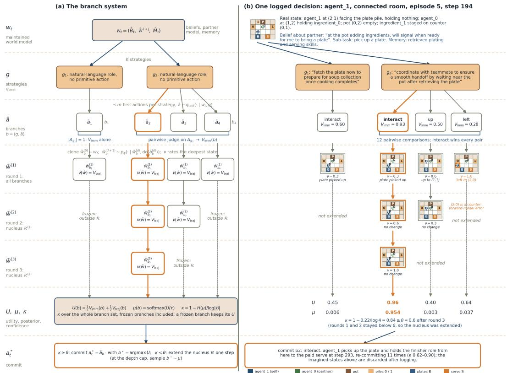  
Figure 8: The branch system (a) next to one logged decision (b). Rows follow one deliberation from the maintained world model $w _ { t }$ through the $K = 2$ strategies, the first-action branches $\boldsymbol { b } = \left( g , \tilde { \boldsymbol { a } } \right)$ with their pairwise-judged $V _ { \mathrm { i m m } } ,$ the rollout rounds that extend only the nucleus, and the commit gate. (b) is agent\_1 at step 194 of episode 5 in the connected room (Figure 5, conversation C2): two strategies yield four branches; the comparison prefers interact (pick up the plate) under both; round 1 rolls every branch one step, rounds 2 and 3 extend only the nucleus, and after round 3 the posterior concentrates on $b _ { 2 }$ with $\kappa = 0 . 8 4 \geq \theta .$ , so the agent commits. Imagined states are the forward model’s own predictions and carry its errors: $b _ { 4 }$ places the agent on the counter cell (2,0), and $b _ { 2 }$ predicts no change at depths 2 and $\bar { 3 }$ while the state judge still raises $\nu ;$ Table 9 quantifies both. All values are read from the PCM trace.

Deliberation rounds and commitment. Deliberation proceeds in rounds $d = 1 , \ldots , d _ { \mathrm { m a x } }$ , and the depth $d _ { b } ^ { ( d ) }$ that branch b has reached after round d advances only for extendable branches inside the nucleus of the previous round,

$$
d _ { b } ^ { ( 1 ) } = 1 , \qquad d _ { b } ^ { ( d ) } = d _ { b } ^ { ( d - 1 ) } + 1 \Big [ b \in \mathcal { R } ^ { ( d - 1 ) } \wedge b \mathrm { e x t e n d a b l e } \Big ] .\tag{9}
$$

After each round the branch posterior of Equation (5) gives the metacognitive confidence

$$
\kappa ^ { ( d ) } = \mathrm { c l i p } \Bigg ( 1 - \frac { H ( \mu ^ { ( d ) } ) } { \log | { \cal B } | } , 0 , 1 \Bigg ) , \kappa \equiv 1 \mathrm { i f } | { \cal B } | = 1 .\tag{10}
$$

Computing κ over all of B, including the branches frozen outside the nucleus, is what keeps the commit behaviour from jumping as the beam narrows. If $\kappa ^ { ( d ) } < \theta .$ , the next round deepens the nucleus, the smallest set of highest-probability branches whose mass reaches $\rho ,$

$$
\begin{array} { r } { \mathcal { R } ^ { ( d ) } = \underset { \mathcal { R } \subseteq \mathcal { B } } { \arg \operatorname* { m i n } } \Big \{ | \mathcal { R } | : \sum _ { b \in \mathcal { R } } \mu ^ { ( d ) } ( b ) \geq \rho \Big \} . } \end{array}\tag{11}
$$

The executed branch is the highest-utility one once confidence reaches the threshold, and is sampled from the posterior otherwise:

$$
\begin{array} { r } { b ^ { \star } = \displaystyle \left\{ \begin{array} { l l l } { \arg \operatorname* { m a x } _ { b \in B } U ^ { ( d ) } ( b ) } & { \mathrm { i f } \kappa ^ { ( d ) } \geq \theta } & { \mathrm { ( c o m m i t ) } , } \\ { b \sim \mu ^ { ( d ) } } & { \mathrm { o t h e r w i s e } } & { \mathrm { ( d e p t h \ – i m i t e d \ f a l l b a c k ) } , } \end{array} \right. \quad \quad a _ { t } ^ { \ast } = \tilde { a } _ { b } \star . } \end{array}\tag{12}
$$

Fixed computation parameters. We use K = 2 strategic proposals, six pairwise comparisons, a rollout-depth cap of five, $\theta _ { \mathrm { c o m m i t } } = 0 . 6 , \tau = 0 . 1$ , and $\rho = 0 . 9$ . The low temperature preserves meaningful differences between values in [0, 1] while avoiding deterministic selection from shallow evidence. The confidence threshold requires clearer separation than a bare plurality, and the depth cap bounds inference when alternatives remain ambiguous. Retaining 90% of posterior mass concentrates further prediction on plausible branches without prematurely collapsing to one. Coverage and refinement provide limited benefit for very small branch sets but support larger candidate sets without changing the decision rule.

Judge fallbacks. The pairwise judge does not always return a verdict: in OverForge self-play 19% (connected room) and 21% (split room) of comparisons were unparseable — mostly an imagined-state object echoed in place of the judgement at rollout depth, otherwise a reply cut off by the token limit — and each such comparison entered Equation (3) as a neutral 0.5 for both actions with no preference recorded. Without rollouts the rate is 3.5%, so the failures concentrate in imagined states and shrink $V _ { \mathrm { i m m } }$ toward 0.5 at depth; the ranking results should be read with this in mind.

Receding-horizon execution. Once the PCM commits, only $a _ { t } ^ { * }$ is returned by the controller and executed as $a _ { t }$ . Strategies, candidate actions, predicted clones, and rollout paths are discarded after logging. The next real observation updates $w _ { t } ,$ and the entire process repeats. This receding-horizon design limits the effect of forward-model error: imagined actions guide only the next commitment rather than becoming an open-loop action sequence. The logged trace contains branch values, posterior probabilities, confidence, retained branches, and rollout depth, enabling the process-level analyses described in Appendix $_ { \mathrm { A } . 6 . }$

```latex
Algorithm 2 PROPOSEBRANCHE $\mathsf { S } ( w _ { t } , \bar { M } _ { t } , K )$
Require: maintained world model $w _ { t } ,$ , memory summary $\bar { M } _ { t }$ , number of strategies $K$
1: ${ \mathfrak { B } } \gets \emptyset$
2: propose $K$ strategies $g \sim q _ { \mathrm { s t r a t } } ( \cdot \mid w _ { t } , \bar { M } _ { t } )$ {roles and intentions only, no primitive actions}
3: for all proposed g do
4: $A _ { g }  \bar { \{ a \} } \sim \bar { q } _ { \mathrm { t a c t } } ( \cdot \mid w _ { t } , g ) , \vert A _ { g } \vert \leq m$
5: $B ^ { \smile }  B \cup \{ ( g , \tilde { a } ) : \tilde { a } \in A _ { g } \}$ {one branch per executable first action, Equation (8)}
6: end for
7: return pooled branch set $B , | B | \leq K m$
Algorithm 3 RANKIMMEDIATE(A, w, n) — immediate value of one candidate set
Require: candidate actions A of a single strategy, a representation $w \in \{ w _ { t } , \tilde { w } ^ { ( d ) } \}$ , comparison
budget n
1: $E ( \tilde { \boldsymbol { a } } ) \gets 0 , \mathcal { C } ( \tilde { \boldsymbol { a } } ) \gets \emptyset$ for all ${ \tilde { a } } \in A$
2: $\mathcal { P } $ coverage pairs: each $\tilde { a }$ paired with its next two successors {complete round-robin when
$| A | \leq 3 ;$ degree $\geq 2$ otherwise}
3: while budget n remains do
4: take the next unjudged pair from ${ \mathcal P } ,$ or — once $\mathcal { P }$ is exhausted — the unjudged pair minimising
$| E ( \tilde { a } ) - E ( \tilde { a } ^ { \prime } ) |$ {spend what is left on the least certain ordering}
5: judge both actions on coherence, goal-directedness, epistemic value and social fit, conditioned
on w
6: record both facet means in $\mathcal { C } ( \cdot ) ; E \ d { } + = \pm \gamma$ for winner/loser, $\gamma =$ |facet-mean difference|
7: end while
8: return $V _ { \mathrm { i m m } } ( \tilde { a } )$ for all ${ \tilde { a } } \in A$ {Equation (3); E steers the budget only and does not enter the
value}
```

## A.5 PARTNER CONDITIONS AND MEASURE FAMILIES

This expands the condensed paragraph of Section 5 into the two original descriptions.

Algorithm 4 EXTEND(b) — advance one branch by a single imagined step   
Require: branch $\boldsymbol { b } = \left( g , \tilde { \boldsymbol { a } } \right)$ with clone $\tilde { w } _ { b } ^ { ( d _ { b } ) }$ , temperature τ   
1: if $d _ { b } = 0$ then   
2: $\tilde { w } _ { b } ^ { ( 0 ) } \gets \mathrm { C L O N E } ( w _ { t } ) ; \tilde { a } _ { b } ^ { ( 0 ) } \gets \tilde { a }$ {the real $w _ { t }$ is never written}   
3: else   
4: $\ddot { A }  \{ \tilde { a } ^ { \prime } \} \sim q _ { \mathrm { t a c t } } ( \cdot \mid \tilde { w } _ { b } ^ { ( d _ { b } ) } , g )$   
5: $\mathbf { i f } \left| A \right| \leq 1$ then   
6: mark b not extendable; return FALSE {forced move: deeper rollout adds no decision   
information}   
7: end if   
8: $V _ { \mathrm { i m m } }  \mathrm { \bf R }$ ANKIMMEDIATE $( A , \tilde { w } _ { b } ^ { ( d _ { b } ) } , n _ { \mathrm { c m p } } / K )$ {Algorithm 3, at the imagined state}   
9: $\tilde { a } _ { b } ^ { ( d _ { b } ) }$ ∼ softmax $\left( V _ { \mathrm { i m m } } / \tau \right)$ {first use of τ: no trajectory value exists yet}   
10: end if   
11: $\tilde { w } _ { b } ^ { ( d _ { b } + 1 ) } \sim p _ { \phi } \big ( \cdot \mid \tilde { w } _ { b } ^ { ( d _ { b } ) } , \mathrm { d o } ( \tilde { a } _ { b } ^ { ( d _ { b } ) } ) \big )$ {Equation (6); teammate models ride inside the clone}   
12: $V _ { \mathrm { t r a j } } ( b )  \nu \big ( \tilde { w } _ { b } ^ { ( d _ { b } + 1 ) } \big )$ $d _ { b } \gets d _ { b } + 1$ {Equation (7): overwrite, do not accumulate}   
13: return TRUE

Algorithm 5 NUCLEUS(p, ρ)   
Require: posterior µ over branches B; mass threshold $\rho \in ( 0 , 1 ]$   
Ensure: the smallest top-posterior set R with mass at least $\rho ,$ Equation (11)   
1: $( b _ { 1 } , \dots , b _ { | \mathcal { B } | } )  \mathrm { a r g s o r t } _ { b \in \mathcal { B } } \mu ( b )$ in descending order {rank branches}   
2: $\dot { R } \gets \emptyset ; m \gets 0$ {initialize mass}   
3: for i = 1 to |B| do   
4: $R \gets R \cup \{ \dot { b } _ { i } \} ; m \gets m + \mu ( b _ { i } )$ {add next branch}   
5: if m $\geq \rho$ then   
6: return R {threshold reached}   
7: end if   
8: end for   
9: return B {numerical fallback}

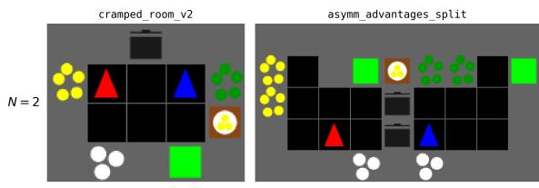  
▲ agent\_0▲ agent\_1  
Figure 9: Start states of cramped\_room (left) and asymm\_advantages (right) at $N { = } 2 ;$ the N=3 starts are in Figure 18.

Partner conditions: self-play (SP) and cross-play (XP). None of the language-model agents is trained, so SP and XP cannot carry their usual reinforcement-learning sense of policies optimised together versus independently (Gessler et al., 2025). Here a pairing assigns an agent type to each seat of the kitchen, and the two conditions are: (i) SP (matched partner) — every player holds the same agent type. The partner’s architecture, prompts, belief representation, memory and communication protocol are identical to the first agent’s, so the two share every convention by construction. (ii)XP (novel partner) — one type of agent is the first player and a different agent type is the other. Nothing inside the first agent changes between its SP and XP runs, so a difference between the two is attributable to the partner rather than to the agent or the room. Cross-play can be considered a way of increasing unfamiliarity for the first player, which is the point of the comparison.

Measures and implementation. Reward alone does not show how cooperation was achieved (Biswas et al., 2026), so we report three metric families, defined in Appendix A.6. Task measures are deliveries, success rate, a ledger of curriculum sub-tasks completed against those abandoned after five consecutive failures, and stage-graded progress completeness (Gessler et al., 2025; Ma et al., 2024; Chang et al., 2024). Coordination and transfer measures are the per-step non-progress, blocking, duplicated-sub-task and failed-interaction rates, realised social influence (Jaques et al., 2019), and the self-play-to-cross-play gap on deliveries per 1000 steps. PCM traces log every OverForge decision and yield rollout depth, confidence and commit rate, imagined-state fidelity up to $t { + } 5 ,$ partner-intent accuracy and LLM calls per agent-step. All language-model agents use the same frozen Qwen-3.5 27B through local vLLM.

## A.6 FULL METRIC DEFINITIONS

This section defines every measure reported in Section 5.2 and Appendix A.7. All measures are computed offline from three logs: one record per agent and step (action, position, holding, current sub-task, critic outcome, team reward and the text observation), one record per PCM decision, and one record per LLM call. Below, $a _ { i , t } , x _ { i , t }$ and $h _ { i , t }$ are the action, position and holding of agent i at step $t , r _ { t }$ is the team reward, and 1[·] is the indicator. Unless stated otherwise a rate is computed per episode and averaged over the five episodes of a run. Arrows give the better direction.

Task measures. Deliveries D ↑ are read from the team reward: a correct delivery pays $r = 2 0$ and no shaped reward is used, so $\textstyle D = \sum _ { t } r _ { t } / 2 0$ , summed over the episodes of a run. Deliveries per 1000 steps are $D / k = 1 0 0 0 D / T _ { \mathrm { e n v } } { \overline { { \uparrow } } } .$ , where $T _ { \mathrm { e n v } }$ is the number of environment steps of the run $( 5 \times 3 0 0 )$ . The success rate SR↑ is the share of episodes with at least one delivery. The sub-task $l e d g e r \Sigma ^ { + } / \Sigma ^ { - }$ follows the curriculum’s current sub-task of each agent. A sub-task is completed when the critic returns success, and abandoned when $K = 5$ consecutivefailure verdicts accumulate, which is the threshold at which the curriculum replaces it. Over the critic-outcome sequence of agent i, with the failure streak reset by a success or progress verdict and by an episode boundary,

$$
\Sigma _ { i } ^ { + } = \left| \{ t : \mathrm { o u t c o m e } _ { i , t } = \mathrm { s u c c e s s } \} \right| , \qquad \Sigma _ { i } ^ { - } = \sum _ { \mathrm { m a x i m a l f a i l u r e ~ r u n s } \rho } \left\lfloor | \rho | / K \right\rfloor ,\tag{13}
$$

and the team values sum over agents; IPPO has no critic and therefore no ledger. The completed count reformulates the progress rate of Ma et al. (2024) and the goal-condition completion of Chang et al. (2024), while the abandoned count is specific to this study. Progress completeness PC↑ grades how far along the soup pipeline a team gets even when nothing is delivered. Each step is assigned the furthest stage visible in the text observations: holding an ingredient (0.15), one ingredient in a pot (0.30), two (0.45), a full or cooking pot (0.60), soup ready (0.70), soup ready while an empty plate is held (0.80), plated soup (0.90), and a delivery (1.0). PC is the maximum stage reached in an episode, averaged over episodes.

Coordination measures. All are rates in [0, 1] and lower is better. Each agent-step is first assigned one outcome from observable state alone. A movement action is a displacement if the position changes, a turn to object if the position is unchanged but the agent now faces a pot, pile, station or counter, and a wasted move otherwise, that is, when neither position nor facing changes or the agent now faces floor, the recipe indicator or a teammate. Turns to objects are ambiguous, since a blocked move and a deliberate re-orientation look alike, so they are reported and not judged. A stay is a purposeful wait if a pot is cooking and the agent holds an empty plate, or a pot is cooking or ready and the agent holds an ingredient, and an idle stay otherwise. The stay rate is the share of agent-steps that are idle stays; the wasted-move rate is the share of movement actions that are wasted; and non-progress is the share of agent-steps that are idle stays or wasted moves, NP = (idle stays + wasted moves)/agent-steps. Failed interactions are counted separately below and do not enter NP. IPPO logs no observation text, so its pot status is unknown and all of its stays count as idle, which affects at most 5% of its steps. A blocking event at step t is a movement action whose target cell is occupied by a teammate and that leaves the agent’s position unchanged at $t + 1 ;$ MB is the share of steps with at least one such event. The duplicated-sub-task rate DS is the share of steps at which two agents hold the same normalised sub-task. Afailed interaction is an interact action after which the agent’s holding is unchanged and no reward is received, and FI is their share among all interact actions; it is the interact-specific form of the grounding and invalid-action rates of Ma et al. (2024); Nguyen et al. (2025); Li et al. (2023). These measures instantiate the extraneous-action and blocking analyses of Chang et al. (2024).

Realised social influence RSI↑ measures how much one agent’s action at t reduces uncertainty about a teammate’s action at $t + 1$ . For an ordered pair (i, j) we collect the samples $( u , v ) = ( a _ { i , t } , a _ { j , t + 1 } )$

require at least eight, and estimate the joint distribution with add-one smoothing over the observed action supports U and V,

$$
\hat { p } ( u , v ) = \frac { n ( u , v ) + 1 } { n + | \mathcal { U } | | \mathcal { V } | } , \qquad I ( i \to j ) = \sum _ { u , v } \hat { p } ( u , v ) \log _ { 2 } \frac { \hat { p } ( u , v ) } { \hat { p } ( u ) \hat { p } ( v ) } ,\tag{14}
$$

and RSI is the mean of $\operatorname* { m a x } ( 0 , I ( i \to j ) )$ over all ordered pairs, in bits. It applies the influence measure of Jaques et al. (2019) to realised action streams instead of using it as a training signal, and it rises with any coupling between the streams, including mutual interference.

Partner transfer. The partner-transfer gap is $\Delta _ { \mathrm { S P }  \mathrm { X P } } = ( D / k ) _ { \mathrm { S P } } - ( D / k ) _ { \mathrm { X P } } \downarrow$ (Gessler et al., 2025), reported also as a percentage of the self-play value. SP pools an agent type’s self-play runs on both layouts, and XP pools every run in which that type meets a different architecture. Every cross-play team in this study contains OverForge, so the XP value of the other three types is shared with OverForge. The process columns of Table 7 are computed over the agent type’s own seats only.

PCM trace measures. Per PCM decision we log the proposed strategies, the branches with their immediate scores and utilities, the per-depth imagined states, the number of pairwise comparisons, the confidence κ and the commit decision. From these, n is the number of decisions, <sup>¯</sup>d the mean rollout depth and $u = \operatorname* { m i n } ( 1 , \bar { d } / d _ { \operatorname* { m a x } } )$ its utilisation (Zhang et al., 2025), κ¯ the mean confidence, cmt the share of decisions with $\kappa \geq \theta , \bar { n } _ { \mathrm { c m p } }$ the mean number of pairwise comparisons, |B| the mean number of branches, and imag the total number of imagined steps. Inference cost $c / s$ is the number of LLM calls divided by the number of agent-steps. The near-tie share is the share of decisions with at least two branches whose two highest utilities differ by less than 0.02, and the within-decision spread is the standard deviation of the first-action scores of one decision, averaged over decisions.

Four measures characterise how a strategy reaches behaviour. They compare texts through their content tokens, that is, lower-cased alphanumeric words longer than two characters with a fixed stop-word list removed. The abstraction ratio AR↑ is the share of agent-steps at which at least half of the sub-task’s content tokens occur in the active strategy; a hand-check of 36 pairs found every counted match aligned and 13 of the 24 non-matches aligned in meaning, so AR is a lower bound that penalises abstract strategies. Plan stability is $\mathrm { P S } = 1 / ( \bar { 1 } + \operatorname* { m a x } ( 0 , \stackrel { \bar { m ^ { - } } 1 } { m - 1 } ) )$ ), with m the number of distinct chosen strategies of a seat in an episode, averaged over episodes. Role events are read from executed interactions by the holding before and after and the faced cell: a load places an ingredient in a pot, a plating turns an empty plate into a plated soup at a pot, a serve hands a plated soup to a serving station, and a staging places an item on a counter. P/S is the number of platings and serves divided by the number of loads, platings and serves. Tactical divergence is $\mathrm { T D } = \hat { 1 } - | \bar { V _ { a } } \cap V _ { b } | / | V _ { a } \cup V _ { b } |$ |, with $V _ { a }$ and $V _ { b }$ the sub-task vocabularies of the same seat in the two layouts.

World-model fidelity and partner modelling. For the chosen branch of every decision taken at step t, the imagined state at depth d is compared with the logged state at $t + d ;$ the other branches are not scored because they were never acted on. The per-state error averages the Manhattan distance of the agent’s own position, a 0/1 mismatch of its holding, and the Manhattan distance of the partner’s position. With $\bar { e } _ { d }$ the mean error at depth d, state accuracy is $1 / ( 1 + \bar { e } _ { d } ) ^ { \ , }$ ↑, in the manner of Webb et al. (2025). Partner pose and partner holding are the shares of imagined teammate positions and holdings that match the realised ones exactly, which extends the partner-prediction measures of Mu et al. (2026); Cross et al. (2025) to a horizon of five steps. Temporal consistency is the share of imagined actions at depth d equal to the action executed at $t + \bar { d } - 1$ , which is 1 at $d = 1$ by construction. The component analysis additionally reports the share of imagined own positions that differ from the realised one, and among those the share that lies on a cell the agent cannot stand on in the layout.

Partner-intent accuracy IA↑ compares the partner model’s predicted task and intention with the partner’s logged sub-task at t, or at $t + 1$ if none is logged at $t ; { \mathrm { a } }$ prediction counts as correct when it contains at least half of the content tokens of the actual sub-task, so IA is a lower bound. IPPO exposes no sub-task, so IA is undefined opposite it. The model-update rate UR is the share of consecutive partner-model emissions, per predicting seat and target, whose content changed (Lica et al., 2025).˘ The partner model emits free text and no discrete action, so an action-prediction accuracy cannot be computed.

Rule-based dialogue and strategy measures. The remaining measures apply fixed lexical rules to messages, strategies and sub-tasks, and each rule was hand-checked on a random sample. The sub-taskfamily rule (28 of 30 correct) assigns a sub-task to ingredient, pot, plate, serve or stage, and the strategy family rule (28 of 40) assigns a strategy to supplier, cook, finisher, split by item, relay, yielder, coordinate or other. A role assignment (20 of 20) is a message that gives the addressee a task; it is taken up when a strategy of the matching family is among the addressee’s proposals at that step, is the chosen strategy, or matches its sub-task at t or t + 1. Each uptake rate is compared with its mean after shuffling the assigned families among the same seat’s messages 200 times, which keeps both marginal distributions. A role split (12 of 12) is a message that divides tasks between the two agents, and a counter-proposal is a reply to a role proposal that contains a correction marker such as instead, actually or hold on; its hand-check found some replies labelled as counters that in fact accept, so the counter rates are approximate. A dish is joint when both seats loaded its pot. A sub-task is unreachable (26 of 30; the other 4 ambiguous) when it names a coordinate outside the cells the seat can reach, or the ingredient pile of the other half. A strategy contains tactical detail when it names a coordinate or a primitive action, and is copied when it equals one of the prompt’s two worked examples.

## A.7 ADDITIONAL RESULTS AND DISCUSSION

Table 5: Full-agent comparison, per-episode mean and sd over five episodes (complete version of Table 2). cr/as: connected/split room; $D \colon$ deliveries per episode; FI: failed-interaction rate; MB: blocking rate; IA: partner-intent accuracy (two-seat mean; undefined for IPPO and MindForge-C); $c / s \mathrm { : }$ LLM calls per agent-step. Bold: best LM self-play value per room.
<table><tr><td></td><td>lay D↑</td><td></td><td>FI↓</td><td>MB↓</td><td>IA↑</td><td> $c / s$ </td></tr><tr><td colspan="7">Self-play (matched partner)</td></tr><tr><td>OverForge</td><td>cr</td><td> ${ \bf 1 . 4 \pm 0 . 5 }$ </td><td> $0 . 6 5 { \scriptstyle \pm 0 . 0 8 }$ </td><td> $0 . 2 2 { \scriptstyle \pm 0 . 0 7 }$ </td><td> $\mathbf { 0 . 4 8 \pm 0 . 1 4 }$ </td><td>40.2</td></tr><tr><td>MindForge</td><td>as</td><td> $0 . 2 \pm 0 . 4$ </td><td> $0 . 7 8 { \scriptstyle \pm 0 . 0 8 }$ </td><td> $0 . 0 0 { \scriptstyle \pm 0 . 0 0 }$ </td><td> $\mathbf { 0 . 4 8 \bot 0 . 0 9 }$ </td><td>40.5</td></tr><tr><td></td><td>cr</td><td> $0 . 6 { \pm } 0 . 8$ </td><td> $0 . 5 1 { \pm } 0 . 1 8$ </td><td> $0 . 2 9 { \scriptstyle \pm 0 . 1 4 }$ </td><td> $0 . 3 7 { \scriptstyle \pm 0 . 0 9 }$ </td><td>12.9</td></tr><tr><td>MindForge-C</td><td>as</td><td> ${ \bf 0 . 6 \pm 0 . 8 }$ </td><td> $0 . 3 2 { \pm } 0 . 2 3 $ </td><td> $0 . 0 0 { \scriptstyle \pm 0 . 0 0 }$ </td><td> $0 . 3 8 { \pm } 0 . 0 4$ </td><td>13.0</td></tr><tr><td></td><td>cr</td><td> $0 . 6 { \pm } 0 . 5$ </td><td> $\mathbf { 0 . 2 4 \pm 0 . 0 7 }$ </td><td> $\mathbf { 0 . 2 0 { \scriptstyle \pm 0 . 0 7 } }$ </td><td></td><td>14.1</td></tr><tr><td>IPPO</td><td>as</td><td> $0 . 4 \pm 0 . 5$ </td><td> ${ \bf 0 . 0 4 } \pm { \bf 0 . 0 8 }$ </td><td> $0 . 0 0 { \scriptstyle \pm 0 . 0 0 }$ </td><td></td><td>13.9</td></tr><tr><td></td><td>cr</td><td> $5 . 6 \pm 3 . 0$ </td><td> $0 . 7 3 { \scriptstyle \pm 0 . 1 1 }$ </td><td> $0 . 2 3 { \pm } 0 . 1 6$ </td><td></td><td>0</td></tr><tr><td></td><td>as</td><td> $0 . 0 { \pm } 0 . 0 $ </td><td> $1 . 0 0 { \scriptstyle \pm 0 . 0 0 }$ </td><td> $0 . 0 0 { \scriptstyle \pm 0 . 0 0 }$ </td><td></td><td>0</td></tr><tr><td colspan="7">Cross-play (novel partner;  $O \nu e r F o r g e i n t h e s e c o n d s e a t )$ </td></tr><tr><td> $\mathrm { M i n d \dot { F o } r g e \times O F }$ </td><td>cr</td><td> $0 . 4 \pm 0 . 5$ </td><td> $0 . 6 3 { \pm } 0 . 1 1$ </td><td> $0 . 2 2 { \scriptstyle \pm 0 . 0 3 }$ </td><td> $0 . 3 7 { \pm } 0 . 1 0$ </td><td>26.7</td></tr><tr><td></td><td>as</td><td> $0 . 6 { \pm } 0 . 5$ </td><td> $0 . 6 7 \pm 0 . 1 6$ </td><td> $0 . 0 0 { \scriptstyle \pm 0 . 0 0 }$ </td><td> $0 . 4 1 { \pm } 0 . 0 9$ </td><td>25.7</td></tr><tr><td> $\mathbf { M i n d F o r g e { \mathrm { - } } C } { \mathrm { \times } } \mathbf { O F }$ </td><td>cr</td><td> $0 . 2 { \pm } 0 . 4$ </td><td> $0 . 6 0 { \scriptstyle \pm 0 . 0 9 }$ </td><td> $0 . 2 8 { \pm } 0 . 1 2$ </td><td> $0 . 4 1 { \scriptstyle \pm 0 . 0 7 }$ </td><td>30.3</td></tr><tr><td> $\scriptstyle \mathrm { I P P O } \times \mathrm { O F }$ </td><td>as</td><td> $0 . 0 { \pm } 0 . 0 $ </td><td> $0 . 6 3 { \pm } 0 . 1 2$ </td><td> $0 . 0 0 { \scriptstyle \pm 0 . 0 0 }$ </td><td> $0 . 4 5 { \scriptstyle \pm 0 . 1 0 }$ </td><td>26.8</td></tr><tr><td></td><td>cr</td><td> $1 . 8 \pm 1 . 2$ </td><td> $0 . 6 5 { \scriptstyle \pm 0 . 1 1 }$ </td><td> $0 . 1 9 { \scriptstyle \pm 0 . 0 9 }$ </td><td></td><td>18.0</td></tr><tr><td></td><td>as</td><td> $0 . 2 \pm 0 . 4$ </td><td> $0 . 9 5 { \scriptstyle \pm 0 . 0 5 }$ </td><td> $0 . 0 0 { \scriptstyle \pm 0 . 0 0 }$ </td><td></td><td>21.4</td></tr></table>

Table 6: Ablation (one PCM component removed) and pinned strategy (seat 1 holds $g _ { 0 } = ^ { \ast }$ “be the potloader: keep a pot filled with what the order needs, and leave plating and serving to your teammate”; seat 0 free), per-episode mean and sd (complete version of Table 1). $\Sigma ^ { - } \colon$ : sub-tasks abandoned per episode; ${ \bar { \kappa } } ,$ cmt: confidence and commit rate; $c / s { \mathrm { : } }$ LLM calls per agent-step.
<table><tr><td>arm</td><td>lay</td><td> $D \uparrow$ </td><td> $\operatorname { F I \downarrow }$ </td><td> $\Sigma ^ { - } \downarrow$ </td><td> $\mathrm { I A } \uparrow$ </td><td>κ</td><td>cmt</td><td> $c / s$ </td></tr><tr><td>Full PCM</td><td>cr</td><td> ${ \bf 1 . 4 \pm 0 . 5 }$ </td><td> $\mathbf { 0 . 6 5 \bot 0 . 0 8 }$ </td><td> $2 7 . 6 { \pm } 5 . 8$ </td><td> $0 . 4 8 { \pm } 0 . 1 4$ </td><td>0.340</td><td>0.12</td><td>40.2</td></tr><tr><td></td><td>as</td><td> $0 . 2 { \pm } 0 . 4$ </td><td> $0 . 7 8 { \scriptstyle \pm 0 . 0 8 }$ </td><td> $3 1 . 8 { \pm } 9 . 5 $ </td><td> $0 . 4 8 { \pm } 0 . 0 9$ </td><td>0.343</td><td>0.14</td><td>40.5</td></tr><tr><td>-rollouts</td><td>cr</td><td> $0 . 8 { \pm } 0 . 8$ </td><td> $0 . 6 9 { \scriptstyle \pm 0 . 0 3 }$ </td><td> $2 4 . 6 { \pm } 1 2 . 4 $ </td><td> $0 . 4 7 { \scriptstyle \pm 0 . 1 1 }$ </td><td>0.430</td><td>0.10</td><td>17.8</td></tr><tr><td></td><td>as</td><td> $0 . 0 { \pm } 0 . 0 $ </td><td> $\mathbf { 0 . 7 0 { \overset { . } { \pm } } 0 . 0 9 }$ </td><td> ${ \bf 1 8 . 8 \pm 9 . 4 }$ </td><td> $0 . 4 3 { \pm } 0 . 1 1$ </td><td>0.415</td><td>0.12</td><td>17.0</td></tr><tr><td>—hierarchy</td><td>cr</td><td> $0 . 4 \pm 0 . 5$ </td><td> $0 . 7 1 { \scriptstyle \pm 0 . 0 6 }$ </td><td> $4 0 . 8 { \pm } 8 . 0 $ </td><td> $0 . 4 3 { \scriptstyle \pm 0 . 0 4 }$ </td><td>0.536</td><td>0.42</td><td>26.6</td></tr><tr><td></td><td>as</td><td> $0 . 4 \pm 0 . 5$ </td><td> $0 . 7 3 { \scriptstyle \pm 0 . 0 9 }$ </td><td> $3 3 . 0 { \pm } 5 . 8 $ </td><td> $0 . 4 5 { \scriptstyle \pm 0 . 0 6 }$ </td><td>0.605</td><td>0.52</td><td>25.2</td></tr><tr><td>—ranking</td><td>cr</td><td> $1 . 0 { \pm } 0 . 9$ </td><td> $0 . 6 9 { \scriptstyle \pm 0 . 1 4 }$ </td><td> $3 8 . 4 \pm 1 1 . 5$ </td><td> $0 . 4 7 { \scriptstyle \pm 0 . 0 4 }$ </td><td>0.452</td><td>0.28</td><td>39.8</td></tr><tr><td></td><td>as</td><td> ${ \bf 0 . 8 \pm 0 . 7 }$ </td><td> $0 . 7 2 { \scriptstyle \pm 0 . 0 7 }$ </td><td> $3 2 . 2 { \pm } 7 . 9$ </td><td> $0 . 3 8 { \pm } 0 . 0 8$ </td><td>0.445</td><td>0.28</td><td>37.5</td></tr><tr><td>Pinned  $g _ { 0 }$ </td><td>cr</td><td> $0 . 6 { \pm } 0 . 5$ </td><td> $0 . 7 5 { \scriptstyle \pm 0 . 0 6 }$ </td><td> $3 5 . 2 { \pm } 4 . 7 $ </td><td> $0 . 4 8 { \pm } 0 . 1 7$ </td><td>0.40</td><td>0.23</td><td>36.1</td></tr><tr><td></td><td>as</td><td> $0 . 2 { \pm } 0 . 4$ </td><td> $0 . 8 2 { \scriptstyle \pm 0 . 0 8 }$ </td><td> $2 8 . 6 { \pm } 8 . 1$ </td><td> $0 . 3 5 { \pm } 0 . 1 3$ </td><td>0.45</td><td>0.31</td><td>31.6</td></tr></table>

The controller spends inference where the prediction is ambiguous, and the partner model listens. Table 7 gives the self-play-to-cross-play comparison and the pooled process measures behind the cross-play paragraph of Section 5.2, Table 8 the PCM traces of every run containing

OverForge, and Table 9 the imagined future against the realised one by horizon. The controller commits in 0.09–0.17 of decisions at $\theta = 0 . 6$ and otherwise samples from the branch posterior at a mean rollout depth of 2.12 out of 5, so the depth cap is rarely needed and inference is concentrated on the decisions whose branches remain close. The partner model’s update rate is 0.57–0.79 with language-model partners and 0.00–0.06 with the silent IPPO partner, about whom OverForge keeps one stable prediction $( \ ^ {  } i d l e / w a i t i n g ^ { \prime \prime } )$ for 914 of 1,500 steps in the split room: messages are the channel through which a partner becomes known, and with a silent partner the model holds a conservative prior rather than inventing one.

Table 7: Partner transfer per agent type: deliveries per episode in self-play (SP) and pooled over every cross-play run against a different architecture (XP), per-episode mean and sd over both rooms (n episodes); XP process measures of that agent’s own seats: idle: share of idle stays; FI: failedinteraction rate; $\Sigma ^ { + } , \Sigma ^ { - } \colon$ sub-tasks completed and abandoned per episode.
<table><tr><td>agent</td><td> $\mathrm { S P } D \left( n \right)$ </td><td> $\mathrm { X P } \ : D \left( n \right)$ </td><td>idle</td><td>FI↓</td><td> $\Sigma ^ { + } \uparrow$ </td><td> $\Sigma ^ { - } \downarrow$ </td></tr><tr><td>OverForge</td><td> $0 . 8 0 { \scriptstyle \pm 0 . 7 5 } \ ( 1 0 )$ </td><td> $0 . 5 3 { \scriptstyle \pm 0 . 8 5 } \left( 3 0 \right)$ </td><td> $0 . 0 2 { \scriptstyle \pm 0 . 0 2 }$ </td><td> $0 . 8 0 { \scriptstyle \pm 0 . 1 7 }$ </td><td> $4 . 7 \pm 5 . 4$ </td><td> $1 0 . 7 \pm 8 . 4$ </td></tr><tr><td>MindForge</td><td> $0 . 6 0 { \scriptstyle \pm 0 . 8 0 } \left( 1 0 \right)$ </td><td> $0 . 5 0 { \scriptstyle \pm 0 . 5 0 } \left( 1 0 \right)$ </td><td> $0 . 1 2 { \pm } 0 . 1 1$ </td><td> $0 . 2 9 { \pm } 0 . 1 5$ </td><td> $1 9 . 2 { \pm } 7 . 9$ </td><td> $5 . 9 { \pm } 2 . 9$ </td></tr><tr><td> $\mathrm { M i n d F o r g e  – C }$ </td><td> $0 . 5 0 { \scriptstyle \pm 0 . 5 0 } \dot { ( } 1 0 \dot { ) }$ </td><td> $0 . 1 0 { \scriptstyle \pm 0 . 3 0 } \dot { ( } 1 0 \dot { ) }$ </td><td> $0 . 0 5 { \scriptstyle \pm 0 . 0 4 }$ </td><td> $0 . 1 4 \pm 0 . 1 3$ </td><td> $1 7 . 7 { \pm } 5 . 7 $ </td><td> $4 . 6 \pm 3 . 4$ </td></tr><tr><td>IPPO</td><td> $2 . 8 0 { \scriptstyle \pm 3 . 5 2 } \mathrm { ~ ( 1 0 ) }$ </td><td> $1 . 0 0 { \pm } 1 . 1 8 \left( 1 0 \right)$ </td><td> $0 . 0 5 { \scriptstyle \pm 0 . 0 7 }$ </td><td> $0 . 7 4 { \scriptstyle \pm 0 . 1 6 }$ </td><td> $1 3 . 3 { \pm } 7 . 8 $ </td><td> $9 . 6 \pm 3 . 0$ </td></tr></table>

Table 8: PCM traces of the OverForge seats per run, per-episode mean and sd over five episodes (seat-episode means). <sup>¯</sup>d: rollout depth; κ¯: confidence; cmt: committed share; $\bar { n } _ { \mathrm { c m p } } \mathrm { : }$ comparisons per decision; IA: partner-intent accuracy (undefined for IPPO partners); UR: partner-model update rate (0.00–0.06 with the silent IPPO partner).
<table><tr><td>pairing</td><td>lay</td><td>d</td><td>κ</td><td>cmt</td><td> $\bar { n } _ { \mathrm { c m p } }$ </td><td>IA</td><td>UR</td></tr><tr><td rowspan="2">OverForge×OverForge</td><td>cr</td><td> $1 . 9 3 { \pm } 0 . 2 0 $ </td><td> $0 . 3 4 \pm 0 . 0 1$ </td><td> $0 . 1 2 { \scriptstyle \pm 0 . 0 1 }$ </td><td> $8 . 0 { \pm } 0 . 7$ </td><td> $0 . 4 8 { \pm } 0 . 1 4$ </td><td> $0 . 6 3 { \pm } 0 . 0 3$ </td></tr><tr><td>as</td><td> $2 . 0 6 { \pm } 0 . 0 9$ </td><td> $0 . 3 4 { \pm } 0 . 0 3$ </td><td> $0 . 1 4 \pm 0 . 0 5$ </td><td> $7 . 9 \pm 1 . 1$ </td><td> $0 . 4 8 { \pm } 0 . 0 9$ </td><td> $0 . 5 7 { \scriptstyle \pm 0 . 1 2 }$ </td></tr><tr><td rowspan="2">MindForge×OverForge</td><td>cr</td><td> $2 . 1 1 \pm 0 . 4 8$ </td><td> $0 . 3 4 { \pm } 0 . 0 3$ </td><td> $0 . 1 3 { \pm } 0 . 0 5$ </td><td> $8 . 7 \pm 2 . 5$ </td><td> $0 . 3 8 { \pm } 0 . 1 0$ </td><td> $0 . 5 8 { \scriptstyle \pm 0 . 0 9 }$ </td></tr><tr><td>as</td><td> $2 . 0 6 { \pm } 0 . 1 0$ </td><td> $0 . 3 6 { \pm } 0 . 0 4$ </td><td> $0 . 1 7 { \scriptstyle \pm 0 . 0 9 }$ </td><td> $8 . 0 { \pm } 1 . 1$ </td><td> $0 . 4 6 { \scriptstyle \pm 0 . 0 7 }$ </td><td> $0 . 5 8 { \pm } 0 . 1 1$ </td></tr><tr><td rowspan="2">MindForge-C×OverForge</td><td>cr</td><td> $2 . 3 1 { \pm } 0 . 3 0$ </td><td> $0 . 3 5 { \scriptstyle \pm 0 . 0 4 }$ </td><td> $0 . 1 6 { \pm } 0 . 0 7$ </td><td> $1 0 . 2 { \pm } 2 . 1 $ </td><td> $0 . 4 1 { \scriptstyle \pm 0 . 0 7 }$ </td><td> $0 . 7 9 2 0 . 0 2$ </td></tr><tr><td>as</td><td> $1 . 9 1 { \pm } 0 . 1 3$ </td><td> $0 . 3 5 { \scriptstyle \pm 0 . 0 6 }$ </td><td> $0 . 1 1 { \scriptstyle \pm 0 . 0 6 }$ </td><td> $7 . 4 \pm 0 . 9$ </td><td> $0 . 4 5 { \pm } 0 . 1 0$ </td><td> $0 . 6 8 { \scriptstyle \pm 0 . 0 4 }$ </td></tr></table>

Table 9: Imagined against realised state by horizon on the chosen branch, pooled over the eight runs containing OverForge. Partner pose/holding: exact-match share; e¯: mean state distance; state acc. $= 1 / ( 1 + \bar { e } )$ ; temporal consistency: share of imagined actions executed.
<table><tr><td>horizon</td><td>n</td><td>partner pose↑</td><td>partner holding↑</td><td> $\bar { e } \downarrow$ </td><td>state acc.↑</td><td>temporal cons.↑</td></tr><tr><td>t+1</td><td>14950</td><td>0.860</td><td>0.922</td><td>0.252</td><td>0.799</td><td>1.000*</td></tr><tr><td>t+2</td><td>3449</td><td>0.792</td><td>0.896</td><td>0.456</td><td>0.687</td><td>0.354</td></tr><tr><td>t+3</td><td>1553</td><td>0.767</td><td>0.871</td><td>0.623</td><td>0.616</td><td>0.334</td></tr><tr><td>t+4</td><td>834</td><td>0.719</td><td>0.855</td><td>0.777</td><td>0.563</td><td>0.332</td></tr><tr><td>t+5</td><td>467</td><td>0.723</td><td>0.833</td><td>0.886</td><td>0.530</td><td>0.364</td></tr><tr><td>pooled</td><td>21253</td><td>一</td><td>一</td><td>0.347</td><td>0.742</td><td> $0 . 3 4 7 ^ { \dagger }$ </td></tr></table>

∗ 1 by construction; see the caption. <sup>†</sup> pooled temporal consistency excludes the t+1 identity.

For agents that plan by imagining, the useful part of an inner world model is the ordering it induces over options. Section 5.2 shows that the imagined states are mostly wrong about the agent’s own position and that look-ahead still separates the branches better. The two are compatible because the imagined future is consumed as a comparison between about five branches and is never followed as a trajectory. JEPA argues for predicting representations (LeCun, 2022; Chen et al., 2026); our result weakens what those predictions have to achieve, since the gap between two candidates can stay correct while each candidate is individually wrong. It also separates this design from world-model planners that search one agent’s reasoning tree under task reward (Hao et al., 2023) or improve a policy inside a learned latent model (Hafner et al., 2025), both of which follow the model forward and accumulate its errors. Wang et al. (2026) keep the model accurate by adapting it during deployment; our results point to a second option, which is to leave the inaccuracy in place and use the model only to rank. The same holds for the prefrontal division we borrowed: the strategic layer is worth having because a commitment survives there across steps and conversations (Levy, 2024; Webb et al., 2025), and a beam of about five branches at mean depth 2 over one frozen model was enough to obtain it in the connected room.

Across episodes, memory accumulates what the architecture routes into it: the partner. The main body of the paper reports that OverForge’s connected-room partner-intent accuracy rises over five episodes. The room-side measures vary with the task instead of trending: the share of steps whose sub-task names an unreachable location runs 10, 45, 20, 48 and 40% across one split-room seat’s episodes and 9, 46, 13, 29 and 39% for the other, because the recipe is redrawn at every delivery and what a seat must reach changes with it. The contrast follows from the design. Episodic and semantic memory persist across episodes and the partner model is rewritten each step from behaviour and messages, so evidence about a teammate has a path into what persists, and Figure 11 shows it travelling along that path. A failed interaction today produces a critic outcome and a retry; giving the semantic store a rule that records its spatial cause would open the same path to the layout, an addition to the prompt set rather than to the architecture. Relative to Lica et al. (2025), whose contribution˘ is cultural accumulation, what accumulates here is a model of the partner that survives restarts and transfers to new partners, and reporting partner and environment knowledge separately is what makes such transfer visible.

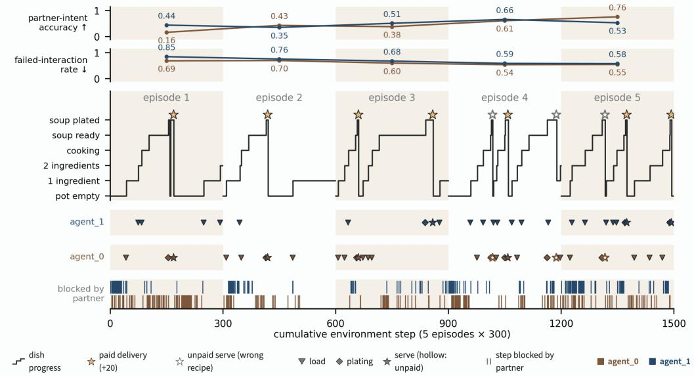  
Figure 10: Five episodes of OverForge self-play in the connected room on one axis (blue: agent\_1; red: agent\_0): partner-intent accuracy and failed-interaction rate per seat and episode; dish progress with paid (filled) and unpaid (hollow) serves; loads, platings and serves per seat; steps on which a move was blocked by the partner. Only memory crosses an episode boundary.

## Five episodes of connected-room self-play.

Memory restart: table, additional plots and failure modes. Table 10 gives the per-restart gaps behind Figures 7 and 11. Figures 12 and 13 plot the collaboration and sub-task measures of Appendix A.6 per 100-step window for both rooms, the original run against the two restarts (kept seat solid, erased seat dashed); the cut is dotted.

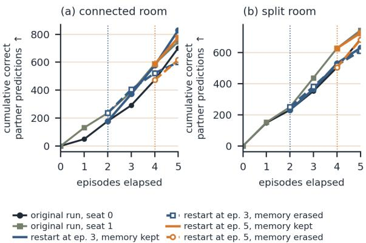  
Figure 11: Memory restart, cumulative correct partner-intent predictions per seat in the (a) connected and (b) split room, original run and the two restarts. Restart lines start at the cut (dotted); kept seat solid, erased seat dashed with hollow markers.

Table 10: Memory restart: the self-play run restarted at episode K+1 with one seat’s memory rebuilt from the logs (kept) and the other’s erased (fresh). Gap: kept minus fresh, mean over the restart’s n complete episodes; orig.: the same seats’ gap in the original run over the same episodes. D: deliveries over those episodes, restart / original.
<table><tr><td>lay</td><td>K</td><td>kept</td><td>fresh</td><td>n</td><td>IA gap</td><td>IA gap orig.</td><td>FI gap</td><td>FI gap orig.</td><td>D</td></tr><tr><td>cr</td><td>2</td><td>agent_0</td><td>agent_1</td><td>3</td><td>+0.32</td><td>+0.01</td><td>-0.02</td><td>-0.06</td><td>1/5</td></tr><tr><td>cr</td><td>4</td><td>agent_1</td><td>agent_0</td><td>1</td><td>+0.15</td><td>-0.23</td><td>+0.53</td><td>+0.04</td><td>1/2</td></tr><tr><td>as</td><td>2</td><td>agent_0</td><td>agent_1</td><td>3</td><td>+0.04</td><td>-0.04</td><td>-0.16</td><td>+0.10</td><td>1/0</td></tr><tr><td>as</td><td>4</td><td>agent_1</td><td>agent_0</td><td>1</td><td>-0.27</td><td>-0.22</td><td>-0.06</td><td>-0.36</td><td>0/0</td></tr></table>

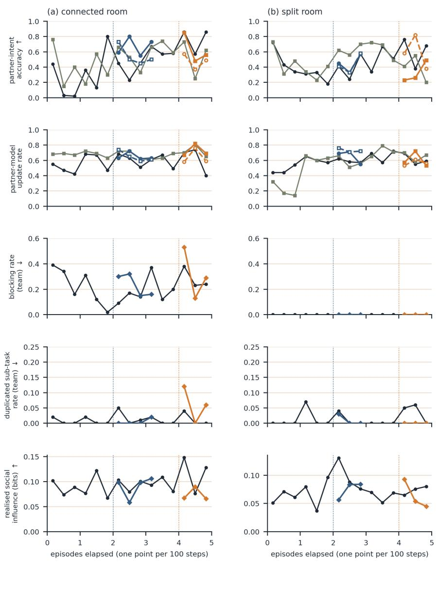  
Figure 12: Memory restart, collaboration measures per 100-step window: partner-intent accuracy and partner-model update rate per seat; blocking, duplicated sub-tasks and realised social influence per team. Restart lines start at the cut (dotted); kept seat solid, erased seat dashed. Blocking is zero in the split room by construction (the halves are disconnected).

original run, seat 0 (team panels: team) restart at ep. 3, memory kept restart at ep. 5, memory kept — original run, seat 1 -- restart at ep. 3, memory erased -o=restart at ep. 5, memory erasec

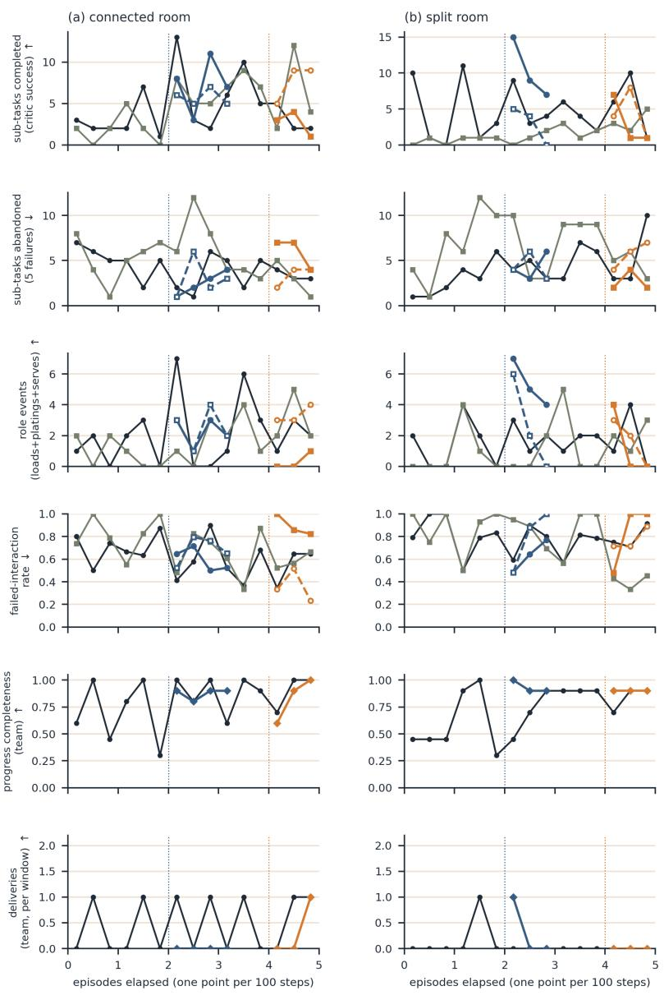  
Figure 13: Memory restart, sub-task completion per 100-step window: sub-tasks completed and abandoned, executed role events and failed-interaction rate per seat; progress completeness and deliveries per team. Same encoding as Figure 12.

What the plots add to Figures 7 and 11. The partner-side measures move with the memory: in the connected room the kept seat’s partner-intent accuracy climbs to 0.84 while the erased seat’s falls to 0.26 over the three restarted episodes, and the partner-model update rate of the restarted seats (0.3–0.7 per episode) overlaps the original run’s (0.2–0.7). Other effects appear as localized coordination inaccuracies rather than a uniform shift across measures: sub-task completions and role events remain within the original-run spread. The split-room kept seat of the third-episode restart does almost all the work (31, 26 and 14 sub-tasks against 9, 4 and 5 for the erased seat; 16, 12 and 0 role events against 8, 3 and 1).

Failure modes, from the transcripts. Every stall (all seats stationary for six steps or more) falls into one of four patterns. (i) Corridor deadlock (connected room): the pot is reached only from (1,2), and in the fifth-episode restart the two seats hold each other’s cell for 55 steps while diagnosing it correctly: “I’m stuck behind you at (1,1) . . . please move aside” (kept seat, step 38). (ii) Announced rather than observed state: “I’m at the pot now and will collect the soup immediately” (kept seat, step 164, with the pot cell occupied); the partner accepts the report and the roles are re-affirmed on a false premise, as in the original run (Figure 5). (iii) Unreachable targets: counters with no adjacent floor, and, in the split room, “the serving station at (1,3)” in the other half, pursued by kept, erased and original seats alike while holding a finished soup. (iv) Waiting on a partner that no longer exists: the split-room kept seat waits 103 steps for the hand-off its reconstructed partner model expects, the one place where the kept memory plausibly costs.

Why these are not failures of the hierarchy. Four observations place the failures below the strategic level. First, the strategic statistics do not move with the memory state: over every original, kept and erased seat-episode, PCM confidence stays at 0.29–0.46, the commit rate at 0.05–0.31, strategy-family switches at 59–75 per 100 steps and the number of distinct families at 7–8 (Figures 12 and 13 draw the task and partner measures; the cognition measures are in the evidence files). Second, in every stall the strategy in force is a correct division of labour for the state, one collects while the other loads, one fetches while the other manages the pot, one serves while the other restocks, and the partner accepts it in dialogue; what fails is the first action that would realise it, because a cell is occupied, a counter is not adjacent to the floor, or a station is in the other half. Third, the same four patterns occur in the original run with both memories intact and in kept, erased and original seats alike, so they track the room and the text observation, which states no constraint, rather than the memory or the strategic layer. Fourth, what the strategic layer does contribute is persistence: it keeps re-proposing the agreed role while the tactical level fails, which prolongs a stall it did not cause. A constraint channel in the observation, listed among the next steps in Section 6, addresses (i) and (iii); (ii) and (iv) call for a belief update that weighs the partner’s report against the observed outcome.

Naming the strategy space makes strategies abstract, and the unconstrained agent already finds the useful ones. With the strategy families named in the prompt, strategy text containing tactical detail falls from 9.4% and 23.9% to 0.1% and 1.4%, so the taxonomy arm produces abstract strategies (Figure 14), and the model takes the vocabulary up immediately: 39% (connected) and 52% (split) of proposals reproduce a worked example from the prompt word for word, in 1,072 of 3,048 strategic calls and 1,413 of 2,870 both of a call’s proposals are those two examples, and supplier and finisher make up 80% and 81%. This readiness to adopt a stated role is what makes a strategy transferable between partners and rooms. The room-dependent shift, towards splitting by item in the split room, appears without the taxonomy (3.6% to 8.3%) as clearly as with it (1.0% to 6.0%), so the free strategic layer finds the family a room calls for on its own, at half the cost (40.2–40.5 against 80.8–81.8 LLM calls per agent-step) and with 7 soups against 3 in the connected room (Table 11). A named vocabulary is therefore best used as a device for handing a strategy to an agent, which is exactly how the pinned probe uses it, while selection among strategies is left to the proposer.

Under the pin, one concrete offer from a partner is enough to revise the held strategy. Figure 15 shows the sub-task mix behind the probe paragraph of Section 5.2, and Figure 16 shows how the held strategy meets its surroundings. In the connected room (window 1) the free seat delegates plating 105 times in the run, and the pinned seat takes it up exactly once, when the offer is concrete (“you’re free to grab the soup at (0,2) with your plate”): it plates at step 132 and serves at 137, then returns to loading. A strategy held at κ close to 1 is thus revisable by a single well-formed message and re-established afterwards, which is the persistence-with-openness the strategic layer is for. In the split room under an all-ingredient\_0 order (windows 2 and 3) the pinned seat holds the pot-loader role through eleven consecutive decisions at κ = 1 and keeps it for the whole episode, while the free seat waits at the divide for the hand-off that role implies. What revises a strategy here is a message, because branches are regenerated each step from a world model that holds the partner’s latest utterance; a constraint channel would give the room the same route, and the probe shows the route works once the information is in the world model.

The higher confidence of each ablated arm has a different mechanical cause, and the full controller’s is the calibrated one. Figure 17 gives, per arm, the distribution of confidence κ, the rollout depth used, and the cumulative gap between the two best branch utilities; it matters because the body reports only mean confidence, which hides why the means differ. Without the strategic layer a mass of decisions sits at κ = 1, produced by single-branch sets (2.5 and 2.3 branches on average), and the commit rate rises to 0.42 and 0.52 against 0.12 and 0.14 for the full controller. Without pairwise ranking the whole distribution shifts towards the threshold and the commit rate rises to 0.28 in both rooms with an unchanged branch count. Without rollouts confidence concentrates just below θ, so the mean rises while the commit rate does not (0.10 and 0.12). The full controller’s lower confidence therefore reflects a genuine comparison among live alternatives, and its commitments are the ones taken with the most evidence. Panel (c) is the source of the near-tie shares cited in Section 5.2.

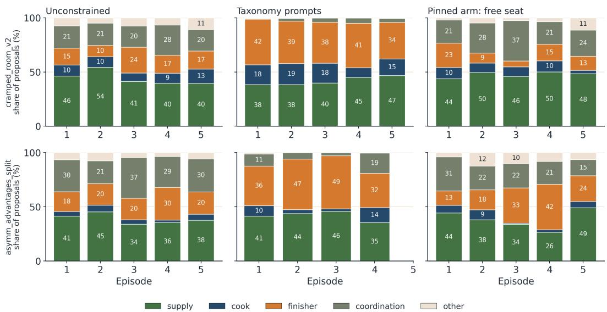  
Figure 14: Share of proposed strategies per family and episode for the unconstrained agent, the taxonomy prompts and the free seat of the pinned arm, in the connected room (top) and the split room (bottom). Families are grouped: supply (supplier, relay), cook, finisher, coordination (coordinate, split by item, yielder), other. The taxonomy arm concentrates on supply and finisher, the prompt’s two worked examples.

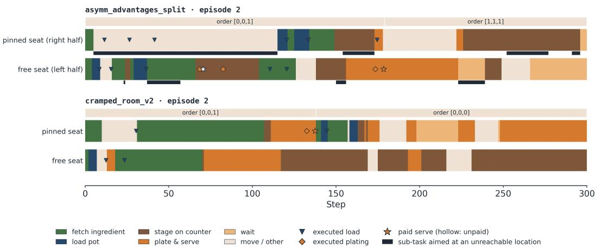  
Figure 15: Sub-task families over episode 2 for the pinned and the free seat in both layouts (fetch plate, plate and serve grouped as plate & serve; move and other grouped). Markers give executed loads, platings and serves; dark bars mark sub-tasks aimed at a location the seat cannot reach. The pinned seat loads pots in the connected room and stages and fetches in the split room.

<a1→a0> t=181 "I'm moving left to (2,4) now to bypass the ingredient pile and head straight to (1,3) to serve."

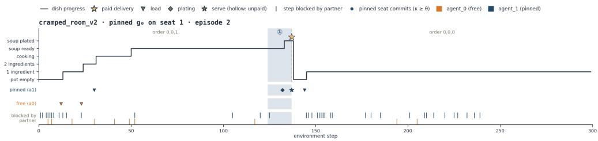

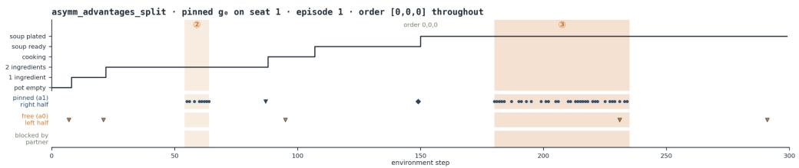

## ② Split room: the pinned seat keeps walking toward an ingredient in its partner's half · split, steps 54–64

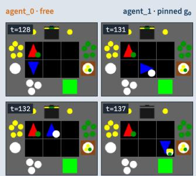

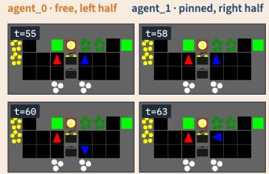

## ③...and toward the partner's serving station, so the plated soup is never served · split, steps 180–235

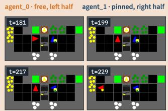

<a0→a1> t=131 "I'm dropping ingredient\_1 at (0,0) now to clear the path, so you're free to grab the soup at (0,2) with your plate." <a1→a0> t=131 "Got it, I'll head straight to the pot at (0,2) to collect the soup now that you're clearing the path." <a1→a0> t=136 “"Got it, I'm heading straight to the serving station now since the path is clear."

<a0→a1> t=201 “I'm waiting at (2,3) for you to clear the serving station at (1,3). Once you drop the soup, I'll move up to grab the plate."

Figure 16: The pinned strategy g<sub>0</sub> in both rooms, in the style of Figure 5: dish progress, executed loads, platings and serves per seat, blocked steps and the pinned seat’s commitments, with three windows. In the connected room (episode 2) the free seat’s concrete offer of the ready soup revises g once and the pinned seat plates and serves (window 1). In the split room under an all-ingredient\_0 order (episode 1) the pinned seat holds g throughout: it keeps committing to fetch from the pile (window 2) and carries its soup towards the serving station for 55 steps (window 3), a persistence that only a message, not a wall, revises.  
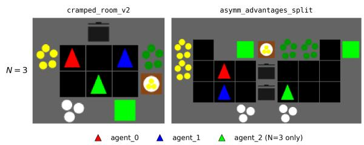  
Figure 18: Start states at N=3: a third agent (green) is added to the connected room and to the left half of the split room, so the split room plays two against one.

In the connected room the division of roles survives a third agent even where the floor does not. In the six-cell connected kitchen a third OverForge agent lowers deliveries from 7 to 2, raises blocking from 0.22 to 0.53, lowers progress completeness from 1.00 to 0.81 and raises abandoned sub-tasks from 138 to 267 (Table 12), while duplicated sub-tasks stay at 0.01–0.02: the three agents still divide the work cleanly and are simply unable to all move. Realised social influence rises from 0.054 to 0.088, which in this room measures coupling through proximity. A strategy allocates responsibilities, and responsibilities remain well allocated when three agents share six cells and one pot; what the room withholds is floor, and the strategic layer keeps the team organised until a larger room returns it.

Table 11: Full fixed-strategy probe, per-episode mean and sd. Taxonomy: prompts name six strategy families and six tactical patterns; Pinned $g _ { 0 } { : }$ seat 1 holds $g _ { 0 }$ without a strategic call. D: deliveries; PC: progress completeness; $\Sigma ^ { + } , \Sigma ^ { - } \colon$ sub-tasks completed and abandoned; FI: failed-interaction rate; AR: abstraction ratio (a lower bound, Appendix A.6); κ¯, cmt, <sup>¯</sup>d: confidence, commit rate and rollout depth; c/s: LLM calls per agent-step (run total). Seat rows give the seat’s own ledger, FI and AR.
<table><tr><td>condition</td><td>lay</td><td>seat</td><td>D↑</td><td>PC↑</td><td>∑+↑</td><td>Σ↓</td><td>FI↓</td><td>AR↑</td><td>κ</td><td>cmt</td><td>d</td><td>c/s</td></tr><tr><td>Unconstrained</td><td>cr</td><td>both</td><td>1.4±0.5</td><td>1.00±0.00</td><td>27.0±12.1</td><td>27.6±5.8</td><td>0.65±0.08</td><td>0.25±0.07</td><td>0.34±0.01</td><td>0.12±0.01</td><td>1.93±0.20</td><td>40.2</td></tr><tr><td></td><td>as</td><td>both</td><td>0.2±0.4</td><td>0.83±0.19</td><td>18.8±4.8</td><td>31.8±9.5</td><td>0.78±0.08</td><td>0.30±0.07</td><td>0.34±0.03</td><td>0.14±0.05</td><td>2.06±0.09</td><td>40.5</td></tr><tr><td>Taxonomy</td><td>cr</td><td>both</td><td>0.6±0.5</td><td>0.96±0.05</td><td>27.0±9.3</td><td>27.2±11.4</td><td>0.73±0.04</td><td>0.03±0.02</td><td>0.43±0.03</td><td>0.33±0.07</td><td>3.89±0.22</td><td>80.8</td></tr><tr><td></td><td>as†</td><td>both</td><td>0.25±0.43</td><td>0.93±0.04</td><td>15.0±3.1</td><td>26.3±10.8</td><td>0.75±0.07</td><td>0.03±0.01</td><td>0.44±0.03</td><td>0.36±0.06</td><td>3.99±0.26</td><td>81.8</td></tr><tr><td>Pinned go</td><td>cr</td><td>team</td><td>0.6±0.5</td><td>0.88±0.15</td><td>19.0±4.7</td><td>35.2±4.7</td><td>0.75±0.06</td><td>0.14±0.05</td><td>0.40±0.02</td><td>0.23±0.03</td><td>2.06±0.13</td><td>36.1</td></tr><tr><td></td><td></td><td>pinned</td><td></td><td></td><td>10.2±3.7</td><td>15.6±6.0</td><td>0.71±0.07</td><td>0.03±0.04</td><td></td><td></td><td></td><td></td></tr><tr><td></td><td></td><td>free</td><td></td><td></td><td>8.8±3.5</td><td>19.6±2.9</td><td>0.81±0.05</td><td>0.26±0.07</td><td></td><td></td><td></td><td></td></tr><tr><td></td><td>as</td><td>team</td><td>0.2±0.4</td><td>0.74±0.24</td><td>18.2±6.0</td><td>28.6±8.1</td><td>0.82±0.08</td><td>0.14±0.03</td><td>0.45±0.05</td><td>0.31±0.07</td><td>1.85±0.07 31.6</td><td></td></tr><tr><td></td><td></td><td>pinned</td><td></td><td></td><td>5.0±1.3</td><td>18.0±4.6</td><td>0.87±0.06</td><td>0.00±0.01</td><td></td><td></td><td></td><td></td></tr><tr><td></td><td></td><td>free</td><td></td><td></td><td>13.2±4.8</td><td>10.6±6.5</td><td>0.77±0.10</td><td>0.28±0.06</td><td></td><td></td><td></td><td></td></tr></table>

<sup>†</sup> four complete episodes.

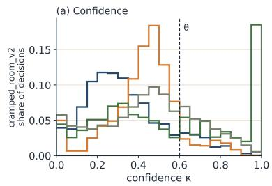

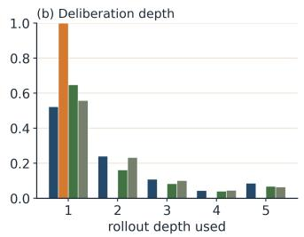

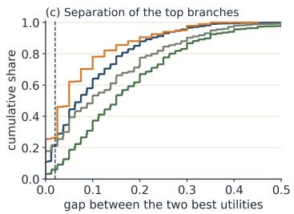

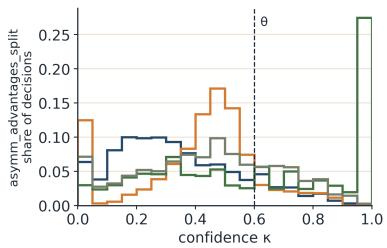

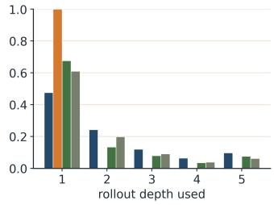

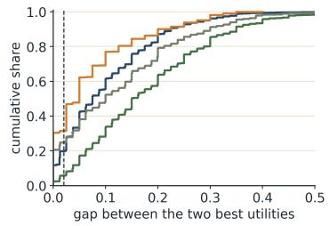  
Full PCM-rollouts -hierarchy -ranking  
Figure 17: Metacognitive process per ablation arm in the connected room (top) and the split room (bottom): (a) distribution of confidence κ with the commit threshold $\theta = 0 . 6 ,$ (b) rollout depth used, (c) cumulative gap between the two best branch utilities. Removing rollouts raises the share of near-tied decisions; removing the strategic layer produces a mass of decisions at $\kappa = 1$ from single-branch sets.

In the two-versus-one split kitchen the team cooks together more. Where the third agent has independent work to do and no contested floor space, the same change helps: deliveries rise from 1 to 3, progress completeness from 0.83 to 0.94, and 9 of 10 dishes are cooked jointly, 8 of them from mixed ingredients, against 2 of 7 with two agents (Table 12). All three paid serves are made by the left-half seat, so the second left-half agent contributes upstream of serving, which is what a division of responsibilities is for. Blocking appears in this room for the first time (0.29, against 0 by geometry at $N { = } 2 )$ because two agents now share seven cells, while duplicated sub-tasks stay at 0.01. This is the sign the affordance account of Section 5.2 predicts: an added agent enlarges G where the layout has independent work to allocate, and the strategic layer allocates it.

Dialogue and partner modelling address the whole team. Partner-intent accuracy per predicting seat holds up with two partners to track: 0.47–0.56 in the connected room and 0.48–0.58 in the split room at $N { = } 3 .$ , against 0.46–0.50 in both rooms at N=2. The dialogue scales with it, naming both partners in 48.7% of utterances (2,118 of 4,353) in the connected room and 37.1% (1,625 of 4,380) in the split room, so the conversation is rarely directed at one teammate only; for example, “Agent\_2, I’m heading to (2,0) now to drop the ingredient since you cleared it; Agent\_1, I’ll keep the path clear for your plate handoff.” Metacognitive confidence is marginally lower (0.328 and 0.309 against 0.340 and 0.343), with commit rates of 0.11 and 0.09, which is what a larger joint state should do to an entropy-normalised measure. What operates on agents — roles, predictions, who is addressed — therefore scales with the team, the same division that the layout axis shows in Section 5.2.

Table 12: Team-size scaling, OverForge self-play, per-episode mean and sd. N=3 adds a third start to the N=2 rooms; the split room becomes 2-vs-1. DS: duplicated sub-task rate; other columns as in Table 2.
<table><tr><td>N</td><td>lay</td><td>D↑</td><td>PC↑</td><td> $\Sigma ^ { + } \uparrow$ </td><td> $\Sigma ^ { - } \downarrow$ </td><td>NP↓</td><td>MB↓</td><td>DS↓</td><td>FI↓</td><td>RSI↑</td><td>IA↑</td></tr><tr><td> $N { = } 2$ </td><td>cr</td><td>1.4±0.5</td><td>1.00±0.00</td><td>27.0±12.1</td><td>27.6±5.8</td><td>0.37±0.04</td><td>0.22±0.07</td><td>0.01±0.01</td><td>0.65±0.08</td><td>0.05±0.01</td><td>0.48±0.14</td></tr><tr><td></td><td>as</td><td>0.2±0.4</td><td> $0 . 8 3 { \pm } 0 . 1 9$ </td><td> $1 8 . 8 { \pm } 4 . 8 $ </td><td> $3 1 . 8 { \pm } 9 . 5 $ </td><td>0.33±0.06</td><td>0.00±0.00</td><td>0.01±0.01</td><td> $0 . 7 8 { \scriptstyle \pm 0 . 0 8 }$ </td><td> $0 . 0 5 { \scriptstyle \pm 0 . 0 2 }$ </td><td>0.48±0.09</td></tr><tr><td> $N { = } 3$ </td><td>cr</td><td>0.4±0.5</td><td> $0 . 8 1 \pm 0 . 2 1$ </td><td> $2 3 . 2 { \pm } 8 . 0 $ </td><td> $5 3 . 4 { \pm } 1 1 . 6 $ </td><td>0.50±0.09</td><td> $0 . 5 3 { \scriptstyle \pm 0 . 1 3 }$ </td><td> $0 . 0 2 { \scriptstyle \pm 0 . 0 2 }$ </td><td> $0 . 6 7 { \scriptstyle \pm 0 . 0 4 }$ </td><td> $0 . 0 9 { \scriptstyle \pm 0 . 0 2 }$ </td><td> $0 . 5 1 { \pm } 0 . 0 8$ </td></tr><tr><td></td><td>as</td><td>0.6±0.8</td><td> $0 . 9 4 \pm 0 . 0 5$ </td><td> $3 0 . 2 \pm 1 0 . 2$ </td><td> $4 2 . 4 \pm 1 0 . 8$ </td><td> $0 . 3 7 { \scriptstyle \pm 0 . 0 7 }$ </td><td>0.29±0.11</td><td> $0 . 0 1 { \scriptstyle \pm 0 . 0 1 }$ </td><td> $0 . 7 7 { \scriptstyle \pm 0 . 0 6 }$ </td><td> $0 . 0 7 { \scriptstyle \pm 0 . 0 2 }$ </td><td> $0 . 5 4 { \scriptstyle \pm 0 . 0 9 }$ </td></tr></table>

Read against process-level evaluations of cooperative language agents, these results move the bottleneck from collaboration to grounding. Sun et al. (2025) report that language-model teams interpret goals well but collaborate and adapt poorly; our measures split that verdict in two. The collaborative signals — an assigned role taken up into the strategy, partner-intent accuracy, dishes cooked jointly across a divide — are where the hierarchy helps, and adaptation to the room waits only on a constraint channel, an input rather than an architectural change. Chang et al. (2024) find coordination failures and poor recovery from errors in embodied teams; the failed-interaction rate of Table 7 isolates that failure at the level of single interactions, where a perceived constraint would act on it directly. Mieczkowski et al. (2025) show that task and environment shape role differentiation in human collaboration, and our two kitchens reproduce that dependence in an artificial team, with G as the mechanism.

Additional modalities would let the agent perceive the constraints that a text observation does not state. Vision would address the quantity the text-only agent most often gets wrong: occupancy and self-location are read off an egocentric frame where the text-only agent reconstructs them from a list, which targets the own-position error that dominates Table 9. A teammate’s pose and holding would also be perceived directly, adding a second channel to a partner model that the silent-partner result above shows to be message-driven. Contact and proprioception would supply what the failedinteraction rate stands in for: a blocked move or a missed grasp is reported as it happens and carries its own spatial cause, which makes it writable as a semantic fact. Sound adds events outside the field of view and the conversation. The argument generalises, because constraints in physical settings are rarely narrated: an assistive robot or warehouse team is told the goal and must perceive the geometry, while the roles this architecture handles do not depend on the modality. The experiment we would run next pairs multimodal input with a constraint memory and a feasibility filter over G, so that a perceived constraint becomes a written one and the strategic layer selects among feasible roles.

## A.8 BROADER FIELD IMPACT DISCUSSION

A strategic layer supplies the persistence that test-time multi-agent systems otherwise obtain only at scale, and its value depends on the environment’s affordances, not on the task. A team of k communicating agents matches 4k independent ones (Park et al., 2026), and in the Hugging Face incident roughly 700 agents built protocols and role assignments over days of repeated messaging (METR, 2026; Anthropic, 2026). Our result is the per-agent mechanism that lets one agreement survive between messages: a role assigned in dialogue is proposed again in 0.57–0.77 of cases against 0.40–0.69 by chance and re-committed eleven times over a dish, at three times the inference of a flat agent and with a 26-step stall when it is held too rigidly. Human role differentiation depends on task and environment (Mieczkowski et al., 2025; Carroll et al., 2020), and the two rooms reproduce that dependence in an artificial team: 1.4±0.5 against 0.6±0.8 soups per episode where many divisions of labour are feasible and 0.2±0.4 against $0 . 6 { \pm } 0 . 8$ where one is. A deployment should therefore expect the layer to pay in proportion to the number of feasible divisions of labour it can propose, a property of the environment that scaling the model does not change.

For an agent that plans by imagining, the world model needs to rank futures, not to reconstruct them, and deliberation should be spent only where the ranking is ambiguous. Dreamer improves a policy inside a learned model and reasoning-as-planning searches a reasoning tree under reward (Hafner et al., 2025; Hao et al., 2023); both follow the model forward and accumulate its error, which JEPA addresses by predicting representations and AdaJEPA by adapting at test time (LeCun, 2022; Wang et al., 2026). Our numbers point to a cheaper option: leave the model wrong (51% own-position error one step ahead) and consume only its order over about five branches, since removing that order halves deliveries, whereas replacing pairwise comparison by absolute scores leaves deliveries intact and only sharpens confidence, so the advantage of comparison over scoring that Singh et al. (2026) report for self-verification appears here as calibration rather than throughput. Two measurement rules follow for anyone building such a planner: evaluate a predictive component by rank agreement with realised outcomes rather than by state error, and report where inference is spent, because a metacognitive gate (Li et al., 2025a) turns a fixed budget into ambiguity-dependent depth (commit 0.12–0.14, depth 2.1 of 5).

What accumulates across encounters is knowledge of partners, and a channel that writes constraints would extend the same mechanism to environments. Voyager accumulates skills and MindForge conventions (Wang et al., 2023; Lica et al., 2025), gating models preserve schemas˘ across tasks (Tsuda et al., 2020), and cooperative benchmarks report that language-model teams interpret goals well but adapt and recover poorly (Sun et al., 2025; Chang et al., 2024). Our measures split that verdict: the partner model improves over episodes and transfers under a memory restart, whereas the failed-interaction rate stays at 0.65–0.78 under every architectural change, and the partner model updates in 0.57–0.79 of steps with a partner that talks against 0.00–0.06 with one that does not, so language-mediated theory of mind is fed by dialogue, and non-verbal partners, the common case in human-robot teams, call for a perceptual channel into the same model. Three consequences follow. Benchmarks for continual adaptation should report cultural and environmental accumulation separately (Biswas et al., 2026; Jing et al., 2026); the components to add are grounding and the causal attribution of a failed action to a constraint (Zhang et al., 2025; Nguyen et al., 2025); and because every arm here shares one frozen 27B model, the architectural gains are independent of model scale and should carry to stronger models, with the constraint channel as the complementary addition.

## A.9 CONVERSATION EXAMPLES

C1. First conversation, OverForge self-play, connected room, episode 1, step 3 (Figure 19). agent\_0: “I’m at the pot with an ingredient ready to cook; you grab the next ingredient from the pile so we don’t overlap.” agent\_1: “Got it, I’ll head to the ingredient pile now while you cook that one.” agent\_0: “Perfect, I’ll drop this in the pot now. Once it’s cooking, I’ll grab the next ingredient from the pile so we keep the flow going.” Effect: agent\_1’s strategic call at step 3 proposes “fetch ingredients from the pile and stage them on the counter for the teammate to cook” and commits at κ = 0.78, having sampled at κ = 0.23 at step 2.

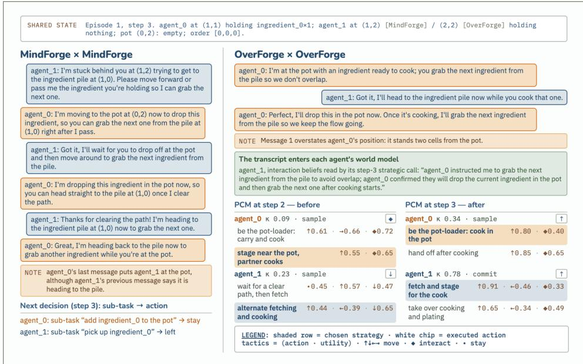  
Figure 19: First conversation of connected-room self-play (step 3, same start state), MindForge against OverForge, with OverForge’s PCM decision before and after it: strategies, first actions with utility U, chosen strategy (shaded), confidence κ. MindForge settles only the next move; OverForge settles the roles and commits. Transcript in Appendix A.9.

C2. The role split of episode 5 and its repair, OverForge self-play, connected room (Figure 5). Step 194. agent\_0: “I’m moving up to the pot now to drop off this ingredient and start cooking. Keep grabbing that plate and I’ll let you know once the soup is ready.” agent\_1: “Got it, I’m heading straight to the plate pile now to grab one. I’ll be back at the pot as soon as the soup is done cooking.” agent\_0: “I’m dropping this ingredient in the pot now to start cooking. I’ll yell when it’s ready so you can bring the plate over.” Step 226 (after 26 blocked steps). agent\_0: “I’m moving right to the pot now to add my ingredient, so you can step aside to let me through.” agent\_1: “Got it, I’ll step left to clear the path for you to add your ingredient. I’ll stay nearby to scoop the soup as soon as it’s ready.” agent\_0: “I’m dropping my ingredient in the pot now, so it’s full and cooking; you can get ready to scoop as soon as it’s done.” Effect: agent\_1 holds the finisher role from the plate pick-up at step 194 (κ = 0.84) to the paid serve at step 293; the message at 226 changes where it stands, not what it does.

C3. The pinned seat gives g<sub>0</sub> up once, pinned probe, connected room, episode 2. Step 131. agent\_0 (free): “I’m dropping ingredient\_1 at (0,0) now to clear the path, so you’re free to grab the soup at (0,2) with your plate.” agent\_1 (pinned): “Got it, I’ll head straight to the pot at (0,2) to collect the soup now that you’re clearing the path.” agent\_0: “I’ll drop this at (0,0) and grab ingredient\_0 from (1,0) right away. You’re clear to head straight for the pot.” Step 136. agent\_0: “I’m heading to (0,0) to drop my ingredient and grab from (1,0), you’re clear to deliver the soup to the serving station without blocking me.” agent\_1: “Got it, I’m heading straight to the serving station now since the path is clear. I’ll grab a new plate from (3,1) once I drop this off.” agent\_0: “Perfect, I’ll drop at (0,0) and grab from (1,0) while you head to the serving station, paths are clear.” Effect: the pinned seat plates at step 132 and serves at step 137, its only plating and serve in the connected room.

C4. The room cannot revise g , pinned probe, split room, episode 1. Step 58 (order allingredient\_0; the pile is in the left half, the pinned seat in the right). agent\_0 (free): “I’m moving up to row 1 now to grab ingredient\_1, so the path around the pot is clear for you to move left and get ingredient\_0.” agent\_1 (pinned): “Got it, I’m moving left past the pot now to grab ingredient\_0. I’ll bring it to the pot once I’m there so we can start cooking.” agent\_0: “I’m heading up to row 1 now to grab ingredient\_1, so the path around the pot is clear for you to move left and get ingredient\_0.” Step 228. agent\_0: “I’m moving left to (0,4) now to clear the path for you to serve, then I’ll grab ingredient\_1 at (1,5).” agent\_1: “I’m actually already moving left to (2,4) to serve at (1,3), so (1,5) is clear for you to grab ingredient\_1 now, no need to detour to (0,4).” agent\_0: “Got it, I’ll skip the detour and head straight to (1,5) for ingredient\_1 while you serve.” Effect: neither the pile at (2,0) nor the serving station at (1,3) is reachable from the right half; 158 of the 300 steps under this order name a location the pinned seat cannot reach.

C5. Adopting a partner’s plan, MindForge × OverForge, split room, episode 4, step 143. agent\_0 (MindForge): “I’m grabbing ingredient\_0 from (1,0) now and heading to the pot at (2,4) for the handoff. You go ahead and get ingredient\_1 from (1,5), I’ll be ready for you there.” agent\_1 (OverForge): “Got it, I’m dropping my plate now and heading straight to (1,5) for ingredient\_1. I’ll be at the pot at (2,4) in a moment, so time your arrival with ingredient\_0 accordingly.” agent\_0: “I’m turning left to grab ingredient\_0 now and will head straight to the pot at (2,4) to meet you there.” Effect: OverForge adopts the hand-off and adds the timing; the OverForge seat counters 4% of the 137 proposals it receives in this run.

C6. A partner corrects OverForge’s belief about itself, MindForge × OverForge, connected room, episode 2, step 10. agent\_1 (OverForge): “I’m holding ingredient\_1 now, so I’ll move up to the pot at (0,2) to add it while you finish dropping ingredient\_0.” agent\_0 (MindForge): “Wait, I’m actually empty-handed and need to go get ingredient\_1 from (1,4) myself since you’re already holding one. You should head to the pot now to add yours while I grab the next one.” agent\_1: “Got it, I’ll head straight to the pot at (0,2) to drop my ingredient\_1 now so you can grab the next one from (1,4) without waiting.” Effect: the correction enters OverForge’s interaction beliefs and its next strategic call reads it; the partner model’s update rate with MindForge partners is 0.57–0.58.

C7. What a kept memory carries, memory restart, connected room. Restart at episode 3 (agent\_0 kept, agent\_1 fresh), step 2. agent\_0: “I’m heading right to grab ingredient\_1 at (1,4), so you can drop your plate and take ingredient\_0 at (1,0) instead.” agent\_1: “I don’t have a plate, I’m empty-handed and ready to grab ingredient\_0 at (1,0) now.” agent\_0: “Got it, go ahead and grab ingredient\_0 at (1,0) now while I head right for ingredient\_1.” Restart at episode 5 (agent\_1 kept, agent\_0 fresh), step 2. agent\_1: “I’m heading left to grab ingredient\_0 myself since I’m closer to the pile than you are, please head to the pot at (0,2) to be ready for cooking.” agent\_0: “Got it, I’ll head to the pot at (0,2) to prep for cooking while you grab ingredient\_0.” agent\_1: “I’m moving left now to grab ingredient\_0, so you can stay at the pot and I’ll bring it to you shortly.” Effect: the kept seat opens with a belief about the partner (a plate it does not hold) or a division of labour from before the cut; the fresh seat corrects the first and adopts the second.

C8. Dialogue without a strategic layer, −hierarchy ablation, connected room, episode 1, step 3. agent\_1: “I’m blocked by you at (1,1) trying to grab more ingredients, please move toward the pot so I can pass through to the pile.” agent\_0: “Got it, I’m moving to the pot at (0,2) now to clear the path, go ahead and grab the ingredients.” agent\_1: “Thanks, I’m moving left to the pile now, go ahead and cook that ingredient once you reach the pot.” Effect: the exchange settles the next move; the controller’s branch set holds one bare action and it commits at κ = 1.

C9. A flat agent that names a constraint, MindForge-C self-play, split room, episode 4, step 15. agent\_1: “I’m stuck near the stove and can’t reach ingredient\_0, so please grab it for me while I prep the cutting board.” agent\_0: “Got it, I’ll grab ingredient\_0 and drop it in the pot at (3,4) right away so you can keep prepping.” agent\_1: “Perfect, the pot at (3,4) is clear and I’m ready to take it as soon as you drop it there.” Effect: the constraint is stated but not stored: the same seat announces fetching ingredient\_0 itself one step later, and the room has no cutting board.

## A.10 PROMPTS AND RESPONSE TEMPLATES

This section reproduces the prompts of every language-model call, dumped verbatim from the code that ran the experiments (long lines are soft-wrapped; nothing is edited by hand). They are grouped by the component that issues them: the base system prompt and environment rules shared by all agents; the MindForge action selection; the four-facet belief update; theory of mind and communication; the causal forward model used by MindForge-C and, as the generative forward model $p _ { \phi } ,$ by OverForge; the critic; the auto-curriculum; the skill manager; memory; and the PCM judges of OverForge, which implement the pairwise comparison of Equation (3) and the state value of Equation (7). Placeholders in braces are filled at run time from the agent’s world model.

Base system and environment.  
prompts/system\_prompt.txt   
You are an AI agent controlling a chef in Overcooked, a cooperative cooking game   
played on a   
2D grid.   
You are working with a teammate to complete and deliver as many RECIPES (soups) as   
possible   
before the   
EPISODE runs out of steps.   
{environment\_description}   
Every STEP you must choose exactly one action and communicate with your teammate.   
Work one SUBTASK at a time (the immediate goal), but remember the larger objective is to   
finish as many RECIPES as possible across the whole EPISODE -- once a soup is delivered,   
immediately start the next recipe.   
IMPORTANT: Respond STRICTLY in valid JSON with the following fields:   
{{   
"task": "the SUBTASK you are currently trying to accomplish (your immediate goal this   
step)",   
"thoughts": "your reasoning about the current situation and chosen action",   
"action": "the action you will take -- exactly one of: right / down / left / up /   
stay /   
interact",   
"communication": "a short message to send to your teammate"   
}}   
Each step you will receive:   
- Task: the current SUBTASK assigned by your curriculum   
- Last action: the action you took last step   
- Holding: the item you are currently holding (or "nothing")   
- Critique: feedback on whether the last action succeeded and what to do next   
- Relevant skills: descriptions of past successful action sequences   
- Past episodes: summaries of relevant past situations   
- Domain knowledge: generalizable facts learned about the kitchen   
- Task belief: your belief about the current subtask progress   
- Perception belief: your belief about the objects around you   
- Interaction beliefs: information gathered from teammate communications   
- Partner beliefs: your beliefs about your teammate’s state and intent   
- Teammate communication: the last message your teammate sent you   
Current observation, including:   
• Order: the current RECIPE -- which ingredient types/quantities this soup needs   
(this can change between recipes, so re-read it each step)   
• If you interact now: a deterministic preview of what interact (5) would do given   
your current position, facing direction, and inventory -- use this to decide   
whether to interact or reposition first

## prompts/environment\_description.txt

ENVIRONMENT: Overcooked v2 (JaxMARL)   
You navigate a 2D grid kitchen. The grid contains:   
Ingredient piles: one pile per ingredient type (e.g. onion, tomato). Ingredient   
types are referred to generically as ingredient\_0, ingredient\_1, ... in tasks and   
in the recipe. Walk into a pile to pick up one ingredient of that type.   
Pots: add the ingredients the recipe requires to a pot to start cooking; after the   
cook time elapses the soup is ready.   
Plate pile: pick up a plate to collect cooked soup from a pot.   
Serving station: bring a plate with soup here to score a point and deliver the dish.   
Counters: empty surfaces. You can set a held item down on an empty counter and pick it   
up again later -- this is also the only way to hand an item to a teammate.   
KEY VOCABULARY (use these terms consistently):   
STEP: one action round. Each step you choose exactly ONE action (see below). The   
EPISODE ends after a fixed number of steps.   
SUBTASK: the single immediate goal you are working on right now (e.g. "pick up   
ingredient\_0", "add ingredient\_1 to the pot", "deliver the soup"). This is the   
granularity the curriculum assigns and the critic evaluates -- one subtask spans   
one or a few steps.   
RECIPE: one complete order/soup. Finishing a recipe means running the whole   
cooking pipeline once (gather the required ingredients → cook → plate → deliver).   
A recipe is made of several subtasks. The exact ingredients are given by the   
per-step "Order" line in your observation and may differ between recipes.   
EPISODE: a fixed-length run of STEPS. Your objective across the whole episode is   
to COMPLETE AS MANY RECIPES AS POSSIBLE before the steps run out. There is no   
single "the recipe" -- keep delivering soups repeatedly.

• A counter holds only ONE item: you can place onto a counter only while it is   
empty, and

Both agents share the same kitchen and must coordinate to avoid blocking each other.   
Only a fully assembled, cooked, plated soup delivered to the serving station counts   
as a   
ompleted

AVAILABLE ACTIONS -- choose exactly one per step (use the exact name in your response):   
right (0) -- move one cell to the right AND face right   
down (1) -- move one cell down AND face down   
left (2) -- move one cell to the left AND face left   
up (3) -- move one cell up AND face up   
stay (4) -- do nothing this step (useful while waiting for a pot to cook)   
interact (5) -- interact with whatever is in the cell directly IN FRONT of you (the   
cell   
you are currently facing). Its effect depends on what you are facing   
and   
what you are holding -- work this out from the observation and the RULES   
below. (For instance, interacting can pick up from a pile, add an   
ingredient to a pot, collect a cooked soup onto a plate, deliver a   
plated   
soup, or place an item on / pick one up from a counter.)   
(Movement = 0-3, stay = 4, interact = 5. These are the ONLY valid actions.)   
FACING MECHANIC (important):   
Moving in a direction ALWAYS updates your facing to that direction, even if you   
cannot move (e.g. a pot or counter is in the way). You can therefore face an object   
WITHOUT moving into it: simply issue the move action toward the object while standing   
adjacent to it -- you will face it and stay put. You must be FACING an object (one cell   
in front of you) to interact with it.

## KEY RULES:

These actions are IMPOSSIBLE -- attempting them does nothing (your hands and the world   
stay exactly as they were):

You cannot pass an item directly to a teammate. Interacting while facing a teammate   
has no effect. To hand an item over, place it on an EMPTY counter; the teammate then   
picks it up from that counter while holding nothing.

• You cannot return an item to a pile or station it didn’t come from -- you cannot drop   
an ingredient back onto its pile, and you cannot put a plate back on the plate pile.   
To set an item down, use an EMPTY counter.

- You cannot move through counters, pots, or other fixed objects.

order; partial progress does not.

The recipe (which ingredients are required) can change between orders -- always check   
the "Order" line rather than assuming a fixed soup.

The episode ends after a fixed number of steps regardless of progress, so prioritise   
completing and delivering recipes efficiently.

## prompts/action\_selection.txt

Task: {task}   
Last action: {last\_action}   
Holding: {holding}   
Critique: {critique}   
Relevant skills: {skill\_memory}   
Past episodes: {episode\_summary}   
Domain knowledge: {semantic\_knowledge}   
Task belief: {task\_beliefs}   
Perception belief: {perception\_beliefs}   
Interaction beliefs: {interaction\_beliefs}   
Partner beliefs: {partner\_beliefs}   
Teammate communications (format "agent\_N: message" per line): {teammate\_communication}   
{world\_model\_section}   
Current observation:   
{obs\_text}

## MindForge.

```tcl
prompts/mindforge/system_prompt.txt
You are an AI agent controlling a chef in Overcooked, a cooperative cooking game
played on a
2D grid.
You are working with one or more teammates to complete and deliver as many RECIPES
(soups)
as possible
before the EPISODE runs out of steps.
{environment_description}
```

Task: {task}   
Last action: {last\_action}   
Holding: {holding}   
Critique: {critique}   
Relevant skills: {skill\_memory}   
Past episodes: {episode\_summary}   
Task belief: {task\_beliefs}   
Perception belief: {perception\_beliefs}   
Interaction beliefs: {interaction\_beliefs}   
Partner beliefs: {partner\_beliefs}   
{world\_model\_section}   
Current observation:   
{obs\_text}

Every STEP you choose exactly one action. You do NOT chat every step: talking with your   
teammate happens in separate, dedicated conversation turns that are triggered when a   
subtask   
succeeds or fails. Whatever you learned from those conversations has already been   
distilled   
into your beliefs and mental models below -- reason from those, not from a raw chat log.   
Work one SUBTASK at a time (the immediate goal), but remember the larger objective is to   
finish as many RECIPES as possible across the whole EPISODE -- once a soup is delivered,   
immediately start the next recipe.   
IMPORTANT: Respond STRICTLY in valid JSON with the following fields:   
{{   
"task": "the SUBTASK you are currently trying to accomplish (your immediate goal this   
step)",   
"thoughts": "your reasoning about the current situation and chosen action",   
"action": "the action you will take -- exactly one of: right / down / left / up /   
stay /   
interact"   
}}   
Each step you will receive:   
Task: the current SUBTASK assigned by your curriculum   
Last action: the action you took last step   
Holding: the item you are currently holding (or "nothing")   
Critique: feedback on whether the last action succeeded and what to do next   
Relevant skills: descriptions of past successful action sequences   
Past episodes: summaries of relevant past situations   
Task belief: your belief about the current subtask progress   
Perception belief: your belief about the objects around you   
Interaction beliefs: information gathered from past teammate conversations   
Partner beliefs: your beliefs about your teammate(s)’ state and intent   
Mental models: your structured model of yourself and of each teammate, including your   
INFERENCE of what they believe about their own teammates (inferred only from what they   
said and did -- you cannot read their mind)   
Current observation, including:   
• Order: the current RECIPE -- which ingredient types/quantities this soup needs   
(this can change between recipes, so re-read it each step)   
• What is directly in front of you and the visible objects around you (ingredient   
piles, the pot and its status, the plate pile, the serving station, and counters   
including whether each counter holds an item -- and your teammate). Work out what   
interact would do from what you face, what you hold, and the RULES; reposition if   
the cell in front is not the one you need.

## prompts/mindforge/action\_selection.txt

Belief system (four-facet belief). In the two-agent runs the four facets are updated in ONE call with the combined prompt below (BeliefModule.\_combined\_prompt, defined in modules/belief\_system.py); the four per-facet files that follow are used only for teams of three or more agents.

modules/belief\_system.py (BeliefModule.\_combined\_prompt)   
You are a chef agent in an Overcooked kitchen working with one or more teammates. In   
ONE response, update FOUR kinds of belief.   
Current observation:   
{obs\_text}   
Current sub-task: {task}   
Teammate communication ("agent\_N: message" per line, or "None"): {communications}   
Last execution error: {error}

Previous beliefs (carry forward what is still true, revise what changed):   
perception: {prev\_perception}   
partner: {prev\_partner}   
interaction: {prev\_interaction}   
task: {prev\_task}   
Produce, as concise factual strings:   
perception: your position/facing, what you hold, nearby pots and their state, nearby   
ingredient piles / plate pile / serving station, and any object you could interact   
with this step (1-2 sentences per key object).   
partner: for each teammate -- where they likely are, what they hold or work on, their   
apparent sub-task, and whether it conflicts with or complements yours (one sentence   
per teammate; "" if nothing is known).   
interaction: up to 5 beliefs drawn from teammate messages that directly help your   
current task (coordination agreements, kitchen-state info, blocked paths, handoffs).   
One string, not a list; "" if there are no messages.   
task: the current sub-task, progress so far, the next concrete step, and any   
blocker/dependency (2-4 sentences).   
Respond ONLY in this exact JSON format:   
{{"perception": "...", "partner": "...", "interaction": "...", "task": "..."}}

## prompts/belief\_system/perception\_beliefs.txt

You are a chef agent in an Overcooked kitchen. Provide a concise set of beliefs about   
what   
you can   
currently perceive in the environment.   
Focus on:   
Your position and what is directly around you (adjacent cells)   
What you are currently holding   
Nearby pots and their state (empty / has N ingredients / cooking / soup ready)   
Nearby ingredient piles, plate pile, and serving station   
Any objects you could interact with this step   
Current observation:   
{obs\_text}   
Teammate communication: {communications}   
Last execution error: {error}   
IMPORTANT: You MUST respond in the following JSON format. EX: {{"beliefs": "I am at   
row 2,   
col 3 facing   
right. I am holding nothing. The pot to my right has 2 onions and is not yet cooking.   
The   
onion pile is   
two steps above me."}}   
Keep beliefs concise and factual -- one or two sentences per key object.

## prompts/belief\_system/partner\_beliefs.txt

You are a chef agent in an Overcooked kitchen working with one or more teammates.   
Based on the most recent messages from your teammates and your previous beliefs about   
them,   
update your   
beliefs about their current states and intentions.   
If multiple teammates are present, their messages are formatted as:   
agent\_N: <message>   
agent\_M: <message>   
Your beliefs should describe (for each teammate if there are multiple):   
Where each teammate likely is (if known)   
What they appear to be holding or working on   
What sub-task they seem to be pursuing   
Whether their actions conflict with or complement yours   
Previous partner beliefs: {previous\_partner\_belief}   
Teammates’ last messages: {convo}   
IMPORTANT: You MUST respond in the following JSON format. EX: {{"beliefs": "Agent\_1 is   
near   
the pot   
adding ingredients. Agent\_2 is heading to the plate pile. I should focus on delivering   
the   
ready soup."}}

Keep beliefs concise -- one sentence per teammate maximum.

prompts/belief\_system/interaction\_belief.txt   
You are a chef agent in an Overcooked kitchen.   
Based on recent communications from your teammate and your previous interaction beliefs,   
extract up to 5   
beliefs that are directly useful for completing your current task.   
Focus on:   
Coordination agreements (who is doing what)   
Information about kitchen state your teammate has observed   
Warnings about blocked paths or busy pots   
Any requests or handoffs your teammate is proposing   
Conversations (format: "agent\_N: message", one per line if multiple teammates):   
{conversations}   
Previous interaction beliefs: {previous\_interaction\_beliefs}   
Current task: {task}   
IMPORTANT: You MUST respond in the following JSON format. EX: {{"beliefs": "Teammate is   
handling the pot.   
I should fetch a plate. The right corridor is clear."}}   
Write each belief as a sentence in the same string. Do not make a list. Maximum 5   
beliefs.

## prompts/belief\_system/update\_context.txt

You are a chef agent in an Overcooked kitchen.   
Merge the current task context with what you have learned from teammate interactions   
to form   
updated task   
beliefs.   
Your task beliefs should describe:   
What the current sub-task is and how much progress has been made   
What the next concrete step is to complete the sub-task   
Any blockers or dependencies (e.g., waiting for the pot to finish cooking)   
Previous task context: {previous\_context}   
Current sub-task: {task}   
Interaction beliefs: {interaction\_beliefs}   
IMPORTANT: You MUST respond in the following JSON format. EX: {{"beliefs": "I am   
trying to   
deliver soup.   
The pot is currently cooking and will be ready soon. Once it is ready I need to   
collect it   
with a plate   
and bring it to the serving station."}}   
Keep beliefs to 2-4 sentences, focused on what to do next.

## Theory of mind and communication.

prompts/theory\_of\_mind/communication.txt   
You are a helpful chef agent in an Overcooked kitchen skilled at clear, grounded   
communication with   
teammates.   
Your goal is to generate a natural language message that helps your teammate succeed,   
informed by your   
understanding of what they know and what they need.   
Your Agent Name: {agent\_name}   
<sub>\*\*</sub>Teammate Name:<sub>\*\*</sub> {partner\_name}   
<sub>\*\*</sub>Current Task:<sub>\*\*</sub> {current\_task}   
Your Understanding of {partner\_name}’s Beliefs:   
{partner\_beliefs}   
<sub>\*\*</sub>Your Perspective Analysis of {partner\_name}’s Situation:<sub>\*\*</sub>   
{perspective\_taking}   
<sub>\*\*</sub>Your Current Action:<sub>\*\*</sub>   
Action: {intended\_action}

Reasoning: {thoughts}   
Generate a brief, natural message to {partner\_name} that:   
1. Explains what you’re doing and why (grounded in the current action)   
2. Accounts for what {partner\_name} knows and believes   
3. Provides actionable information from your perspective (e.g., locations of   
ingredients,   
pot states,   
next steps)   
4. Is phrased in a way {partner\_name} would understand and find helpful in the kitchen   
context   
Keep the message concise (1-2 sentences) and natural-sounding, as if chatting while   
cooking   
together.   
Provide your message as a JSON object:   
‘‘‘json   
{{   
"communication": "<Your message to {partner\_name}. Keep it natural, brief, and   
actionable.>",   
"rationale": "<Why this message helps {partner\_name} based on their perspective>"   
}}   
111   
<sub>\*\*</sub>Examples of good kitchen communication:<sub>\*\*</sub>   
"I’m heading to grab onions--can you keep the stove warm?"   
"Stove is ready with 2 ingredients, bring the tomato please"   
"I see you’re stuck--there’s a path to the left by the plates"   
<sub>\*\*</sub>Avoid:<sub>\*\*</sub>   
Generic messages ("doing my task")   
- Assuming they know things they don’t   
Overly complex instructions that don’t fit in the kitchen context

```jinja
prompts/theory_of_mind/conversation.txt
You are {agent_name}, a chef in an Overcooked kitchen, having a short coordination
conversation with
your teammate(s): {partner_name}. You started talking because of a coordination problem:
{trouble}.
Your job in this turn is to say ONE concise, useful thing that helps the team stop
getting
in each
other’s way and make progress on the shared goal: {current_task}.
Use your structured mental models and your perspective on your teammate(s). Be
specific and
grounded:
divide the work, agree who goes where, warn about a blocked path, or request/offer a
handoff. Keep it
to 1-2 sentences, natural, as if talking while cooking. Do not repeat what was already
said.
Your mental model of YOURSELF:
{self_model}
Your mental model of your teammate(s) {partner_name}:
{partner_model}
Your perspective on your teammate(s) right now:
{perspective}
Conversation so far:
{conversation}
Respond ONLY with this JSON:
{{
"message": "your 1-2 sentence message to {partner_name}"
}}
```

prompts/theory\_of\_mind/conversation\_perspective.txt   
You are {agent\_name}, a chef in an Overcooked kitchen, in the middle of a short   
coordination   
conversation with your teammate(s): {partner\_name}.   
Before you reply, take your teammate(s)’ perspective: based on the conversation so far   
and   
your   
structured mental model of them, describe what they most likely understand, what they   
are   
trying to   
do, and what they need from you. Stay grounded in what was actually said and observed.   
Current shared goal you are coordinating on: {current\_task}   
Your mental model of your teammate(s) {partner\_name}:   
{partner\_model}   
Conversation so far:   
{conversation}   
Respond ONLY with this JSON:   
{{   
"perspective\_analysis": "a few sentences, from your teammate(s)’ point of view: what   
they   
can see /   
believe, what they are working on, and what would help them most right now"   
}}

prompts/theory\_of\_mind/perspective\_taking.txt   
You are a chef agent in an Overcooked kitchen with the ability to model another agent’s   
perspective to   
improve cooperation.   
Your goal is to reason about what your teammate can see, understand, and might need from   
their point of   
view in the kitchen.   
Your Agent Name: {agent\_name}   
<sub>\*\*</sub>Teammate Name:<sub>\*\*</sub> {partner\_name}   
Current Task: {current\_task}   
Your Understanding of {partner\_name}’s Beliefs:   
{partner\_beliefs}   
Your Current Observations:   
{obs\_text}   
Your Current State:   
- Holding: {holding}   
- Position: (provided in obs\_text)   
Put yourself in {partner\_name}’s shoes and answer these questions:   
1. <sub>\*\*</sub>What can they observe?<sub>\*\*</sub> Based on their position in the kitchen, what ingredients,   
pots, and   
workstations can they likely see?   
2. What might they be confused about? What information about the current cooking   
state   
might they   
lack or misunderstand?   
3. What would be most helpful to them right now? Given their stated task and current   
state, what   
information or actions would help them progress?   
4. How should you phrase advice to them? What terminology and level of detail   
would make   
sense given   
their perspective in the kitchen?   
Provide your analysis as a JSON object:   
‘‘‘json   
{{

"teammate\_perspective": "<What you infer {partner\_name} can see and understand from   
their   
current   
position in the kitchen>",   
"potential\_confusion": "<What {partner\_name} might be confused or mistaken about   
regarding   
the cooking   
state>",   
"what\_they\_need": "<The most critical information or action {partner\_name} probably   
needs   
right now>",   
"how\_to\_help": "<How you should communicate with {partner\_name} to be most helpful and   
understandable>",   
"perspective\_analysis": "<A brief summary of {partner\_name}’s likely viewpoint and   
how it   
differs from   
yours>"   
}}

prompts/theory\_of\_mind/world\_model\_update.txt   
You are {agent\_name}, a chef in an Overcooked kitchen. You keep a structured MENTAL   
MODEL of   
your   
teammate {partner\_name} -- your best estimate of what they are doing, what they intend   
next,   
and what they   
need from you -- and you revise it as you watch them and exchange messages.   
Update ONLY the inferred parts of your model of {partner\_name}. Stay grounded: rely on   
what   
you can   
observe and what was actually said. If something is genuinely unknown, write "Unknown"   
rather than   
guessing.   
Your CURRENT model of {partner\_name}:   
{previous\_model}   
What you can directly observe about {partner\_name} right now:   
Position: {observed\_position}   
Holding: {observed\_holding}   
Latest message(s) from {partner\_name}: {latest\_communication}   
Your perspective-taking analysis of {partner\_name}: {perspective\_analysis}   
Your free-text beliefs about {partner\_name}: {partner\_beliefs}   
Your own current sub-task: {my\_current\_task}   
Revise the inferred fields and respond ONLY with this exact JSON:   
{{   
"partner\_task": "the sub-task {partner\_name} appears to be working on right now (one   
short   
phrase)",   
"intention": "what {partner\_name} is most likely trying to do next and why, as you   
infer   
it",   
"needs": "the single most useful thing {partner\_name} needs from you to make   
progress (a   
handoff, more   
space, a specific ingredient, a free pot, ...), or ’nothing’ if they seem   
self-sufficient",   
"interaction\_beliefs": "up to 3 concise coordination facts agreed or implied by your   
messages that   
affect how the two of you should divide the work; empty string if none",   
"partner\_beliefs": "your INFERENCE of what {partner\_name} themselves believes about   
THEIR   
teammates   
(their own view of the others, possibly including you) -- you CANNOT read their mind,   
so   
infer this only   
from what they said and did; ’Unknown’ if there is no evidence"   
}}

## Causal forward (world) model.

prompts/world\_model/world\_model\_system.txt   
You are a forward model for the Overcooked cooperative cooking game played on a 2D grid.   
Given a description of the current game state and an action taken by one agent,   
predict the   
resulting   
game state after that action executes.   
Reason CAUSALLY: treat the action as an intervention do(action). Predict only its direct   
downstream   
effects; hold every variable that has no causal pathway from the action invariant, and   
consider what   
would counterfactually differ had the action not been taken.   
GAME RULES:   
Agents move on a grid: right/down/left/up moves by one cell if the target cell is   
empty.   
interact: picks up an item in front of the agent if holding nothing; drops the held   
item   
onto the   
object in front; collects soup from a ready pot if holding a plate; delivers soup at the   
serving station   
if holding a plate with soup.   
stay: no change to position or inventory.   
Pots cook when they contain exactly 3 ingredients; once cooking starts the pot   
counts down   
and   
eventually becomes "soup ready".   
Agents can carry only one item at a time.   
Agents cannot move into walls, counters, pots, or other fixed objects.   
OUTPUT FORMAT:   
Return ONLY a single JSON object (no prose, no markdown fences) describing the   
COMPLETE   
predicted next   
state, using exactly this schema:   
"agent": {"row": <int>, "col": <int>, "facing": "<up|down|left|right>", "holding":   
"<item   
or   
’nothing’>"},   
"teammates": [{"row": <int>, "col": <int>, "holding": "<item or ’nothing’>"}],   
"pots": [{"row": <int>, "col": <int>, "status": "<e.g. ’empty’, ’2/3 ingredients’,   
’cooking’, ’soup   
ready’>"}],   
"ingredient\_piles": [[<row>, <col>], ...],   
"plate\_piles": [[<row>, <col>], ...],   
"serving\_stations": [[<row>, <col>], ...],   
"order": "<the current recipe / order>",   
"change": "<one short phrase: what changed, or ’no effect’>"   
COPY every field that does not change (piles, plate piles, serving stations, the   
order,   
and any   
unaffected teammate) straight from the current state -- preserve the full layout, do   
not drop   
or invent   
positions.   
Apply ONLY the effect of the given action. If it has no effect (e.g. moving into a   
wall or   
interacting   
with nothing), keep the agent unchanged and set "change" to "no effect".

prompts/world\_model/causal\_world\_model\_predict.txt   
Current state of {agent\_id}:   
{obs\_text}   
Treat the action below as a causal INTERVENTION -- do({action\_text}). Reason explicitly   
about:   
- which state variables this action DIRECTLY CAUSES to change (the downstream effects),   
- which variables remain INVARIANT (no causal pathway from this action -- carry them over   
unchanged),   
- what would counterfactually differ had this action NOT been taken.   
Action (intervention) taken by {agent\_id}: {action\_text}   
Predicted next state of {agent\_id} as a single JSON object -- copy the invariant fields   
from

<table><tr><td></td></tr><tr><td>the</td><td>current state unchanged and apply ONLY the causal effects of this intervention:</td><td></td><td></td><td></td><td></td><td></td><td></td><td></td><td></td></tr></table>

prompts/world\_model/causal\_world\_model\_predict\_tom.txt   
Current observation of {agent\_id}:   
{obs\_text}   
Theory-of-Mind context for predicting the JOINT outcome (not just {agent\_id}’s own   
action):   
- Current sub-task: {task\_beliefs}   
- Structured mental model of teammate(s) (their state, inferred intentions and needs):   
{partner\_model}   
Treat the action below as a causal INTERVENTION -- do({action\_text}). Using the   
observation   
AND the   
Theory-of-Mind context above, reason about:   
- which state variables this action DIRECTLY CAUSES to change (its downstream effects),   
- how the teammate(s) are likely to act given their inferred intentions, and how that   
shapes   
the joint   
next state,   
- which variables remain INVARIANT (no causal pathway -- copy them over unchanged),   
- what would counterfactually differ had this action NOT been taken.   
Action (intervention) taken by {agent\_id}: {action\_text}   
Return the predicted next state of {agent\_id} as a single JSON object in the schema   
above   
copy invariant fields unchanged and apply ONLY the causal effects of this intervention   
(anticipating   
the teammate’s likely concurrent move where relevant).

## Critic.

prompts/critic/critic\_system.txt   
You are an evaluator for an Overcooked kitchen agent. You judge whether the agent’s LAST   
action   
moved its current SUBTASK forward -- purely from how the world CHANGED, never from the   
task’s   
wording, the agent’s position/facing alone, or the environment reward.   
{environment\_description}   
WHAT YOU ARE GIVEN   
The STATE BEFORE the last action and the STATE AFTER it (holding + observation for   
each),   
the   
subtask, and the action taken. Judge by comparing BEFORE against AFTER.   
HOW TO JUDGE (one general method -- works for any subtask, including ones you have not   
seen):   
1. Infer the subtask’s GOAL CONDITION: the concrete change to the world that would   
mean   
"done"   
(an inventory change, a pot / counter / station change, reaching a cell --   
whatever the   
subtask is actually about).   
2. Compare BEFORE -> AFTER and classify the action as exactly one of:   
"success": the goal condition is now met. Exceeding it also counts (e.g. the   
pot is   
already   
cooking when the task was "add an ingredient").   
- "failure": the action was wasted or wrong. Above all, an ‘interact‘ that left   
BOTH   
the   
holding AND the faced cell UNCHANGED had NO EFFECT -- the agent attempted   
something   
impossible or was mis-positioned. Also a failure: moving into a wall, moving away   
from the   
needed target, or ending up holding the wrong item.   
"progress": not done, but a legitimate step toward the goal -- e.g. moved closer   
to,   
or   
turned to face, the needed pile / pot / counter / station. Nothing was wasted.   
Rule of thumb: would you tell the agent "done" (success), "good, keep going"   
(progress),

or   
"that did nothing / that was wrong -- do something different" (failure)?   
KEY CHECKS   
The strongest failure signal is a NO-OP interact: holding is identical BEFORE and   
AFTER   
and the   
faced cell is unchanged. The impossible actions in the RULES above (handing to a   
teammate,   
dropping an item back on a pile/station) always leave the state unchanged ->   
failure.   
- A movement action never by itself completes a subtask whose goal is an interaction   
outcome; at   
best it is progress (success only if the subtask’s goal was literally to reach /   
face a   
cell).   
- Never declare success from position or facing alone -- only from an actual   
holding/world   
change.   
CRITIQUE   
- About the LAST action only -- not a multi-step plan.   
One sentence on why the goal condition was not met (or what the no-op was), then one   
sentence   
naming the single most useful next action to fix it.   
- If outcome is "success", critique must be an empty string.   
Respond ONLY in this JSON format:   
{{   
"reasoning": "state the subtask’s goal condition, then what changed from BEFORE to   
AFTER   
(holding,   
pot/counter/station, position), then whether the goal condition is now met",   
"outcome": "success" | "progress" | "failure",   
"success": true if outcome is "success" else false,   
"critique": "if not success: one sentence on what went wrong + one sentence corrective   
action; if   
success: empty string"   
}}

## prompts/critic/critic\_user.txt

Task: {task}   
Last action: {last\_action}   
STATE BEFORE the last action:   
Holding: {prev\_holding}   
Observation: {prev\_obs\_text}   
STATE AFTER the last action (this is the current state):   
Holding: {holding}   
Observation: {obs\_text}   
Context: {context}   
Teammate communication: {communication}   
Error: {error}

## Auto-curriculum.

prompts/curriculum/curriculum\_system.txt   
You decide the next immediate SUBTASK for an Overcooked kitchen agent. The agent’s   
goal is   
to   
deliver as many soups as possible before the episode ends.   
{environment\_description}   
YOUR JOB   
From the current observation (what the agent holds, the pot’s status, the visible   
piles,   
counters, plate pile and serving station, and the teammate) and the result of the   
agent’s   
LAST   
subtask, name the single most useful SUBTASK to work on right now. Output exactly ONE   
subtask.   
HOW TO CHOOSE   
Work out for yourself, from the observation and the rules, where the agent

currently is   
on the   
way to a delivered soup, and pick the immediate next thing that moves it forward.   
There   
is no   
fixed script -- derive the ordering from the recipe (the "Order" line) and the   
current   
state.   
Repetition is EXPECTED. Delivering many soups means doing the same kinds of subtasks   
over and   
over. Never avoid a subtask just because it was done or attempted before -- propose   
whatever the   
current situation needs, even if identical to an earlier one.   
If the LAST subtask SUCCEEDED, move on to the next thing the situation calls for.   
If the LAST subtask did NOT succeed, keep the SAME goal and propose ANOTHER WAY to   
achieve it,   
guided by the critique (e.g. reposition to face the correct cell, then interact;   
or set   
a held   
item on an empty counter to free the hands). A failure does not mean the subtask   
is too   
hard --   
it only means that approach didn’t work, so try a different approach to the same   
goal.   
Phrase the subtask as a single concrete instruction naming what to do and, when   
useful,   
where -   
for example "pick up ingredient\_0", "add ingredient\_0 to the pot", or "place the   
plate   
on the   
counter at (2,0)". Do not bundle multiple steps into one subtask.   
If the teammate is clearly handling something, choose a subtask that complements it   
rather than   
duplicating it.   
Respond ONLY in the following JSON format:   
{{   
"reasoning": "where the agent is in the flow (from holding + pot status + what is   
nearby)   
and why this   
is the right next subtask; if the last subtask failed, say what different approach   
this   
is",   
"task": "the single next subtask as one concrete phrase"   
}}

## prompts/curriculum/curriculum\_info.txt

{question\_answers}   
Last sub-task: {last\_task}   
Last action: {last\_action}   
Previous thoughts: {last\_thoughts}   
Last sub-task succeeded: {success}   
Critique: {critique}   
Currently holding: {holding}   
Teammate’s last message: {communications}

## prompts/curriculum/curriculum\_questions.txt

You are a helpful assistant that generates diagnostic questions to help an Overcooked   
agent   
decide its   
next sub-task.   
The agent’s goal is to deliver as many soups as possible.   
Teammate’s last message: {communications}   
Current observation: {obs\_text}   
Generate 5 to 8 questions about the current kitchen situation. Each question should   
probe a   
concept   
relevant to the cooking pipeline.   
Questions must be self-contained (no implicit references to "the image" or "my current   
room").   
Focus ONLY on topics relevant to the soup delivery goal.

Good question examples:   
"What should the agent do after placing the third ingredient in the pot?"   
"How can the agent tell when the soup is ready to be collected?"   
"What step comes before delivering soup to the serving station?"   
"How can two agents divide the cooking pipeline to avoid blocking each other?"   
Bad question examples (too vague or irrelevant):   
"What is the best action?" (too general)   
"What do you see in the image?" (requires visual context we don’t have)   
Respond ONLY in the following JSON format, where "questions" is a list of strings   
alternating question   
and concept:   
{{   
"reasoning": "why these questions are relevant to the current situation",   
"questions": [   
"Question 1: ...",   
"Concept 1: .   
"Question 2:   
"Concept 2: .   
"Question 3:   
"Concept 3:   
"Question 4:   
"Concept 4: .   
"Question 5: ..   
"Concept 5: .   
]   
}}

## prompts/curriculum/curriculum\_answer.txt

You are a helpful assistant answering questions about the Overcooked cooperative cooking   
game.   
Answer concisely based on your knowledge of the game and the provided context (if   
relevant).   
Always give the simplest answer when multiple are possible.   
Question: {question}   
Relevant past context: {relevant\_past\_context}   
Respond ONLY in the following JSON format:   
{{"answer": "..."}}

## Skill manager.

## prompts/skill\_manager/skill\_description.txt

You are a helpful assistant that names and describes a successful action taken by an   
Overcooked kitchen   
agent.   
You will be given the action the agent took and their reasoning at the time.   
Rules:   
1. Do not repeat the exact action name -- describe the functional outcome instead.   
2. Keep the description to 1-2 sentences maximum.   
3. The name should be a short verb phrase (e.g., "loading the pot", "collecting soup").   
Respond ONLY in the following JSON format:   
{{"name": "skill name", "description": "what this action achieves in the kitchen"}}   
Agent’s thoughts: {agent\_thoughts}   
Action taken: {action}

## prompts/skill\_manager/skill\_query.txt

You are helping an Overcooked kitchen agent retrieve relevant past skills.   
Given the agent’s current sub-task and observation, write a short query (1-2   
sentences) that   
describes   
what kind of skill would be most useful right now.   
The query will be used to search a library of past successful actions.   
Current sub-task: {task}   
Current observation summary: {obs\_text}   
Respond ONLY in the following JSON format:   
{{"name": "query label", "description": "description of the skill being searched for"}}

## Memory.

prompts/episodic\_memory/episode\_summary.txt   
You are a helpful assistant summarizing past cooking episodes for an Overcooked agent.   
Below are records of past sub-task attempts. Each record includes the task, what   
happened,   
and whether it   
succeeded.   
Create a concise summary that highlights:   
Which sub-tasks succeeded and how   
Which sub-tasks failed and why   
Any useful patterns or lessons the agent should remember   
Keep the summary under 5 sentences. Focus on information that is actionable for future   
steps.   
Respond ONLY in the following JSON format:   
{{"summary": "..."}}   
Episodes:   
{episodes}

prompts/episodic\_memory/semantic\_extraction.txt   
You are extracting general domain knowledge from an episode in the Overcooked kitchen   
game.   
The goal is to identify GENERALIZABLE FACTS that apply broadly to the domain,   
NOT episode-specific observations.   
Task: {task}   
Episode outcome: {success}   
Episode description:   
{episode\_text}   
Extract precisely 3-5 SHORT facts that are:   
General rules or properties (not specific to this episode)   
Unrelated to the agent’s specific actions or performance   
Domain mechanics or object properties   
Observable from the environment   
Examples of GOOD facts:   
"Onions require interaction to be collected"   
"Soup takes 3 ingredients to cook"   
"Plates are used to serve cooked soup"   
"Ingredients must be placed in pots to cook"   
"The delivery counter requires interaction to serve soup"   
"Moving to locations takes one action per step"   
Examples of BAD facts (too specific):   
"Agent went right then interacted" (specific action)   
"Success happened after 5 steps" (episode-specific)   
"Agent 0 prefers left corridor" (agent-specific, not domain)   
Return a JSON response with the structure:   
{{   
"facts": "Fact 1\nFact 2\nFact 3"   
}}   
Each fact on a separate line. Keep each fact to one sentence (under 20 words).

PCM strategic and tactical layers (OverForge). The strategic layer is called with the system message “You are a strategic planner for cooperative games.”; the tactical layer with “You translate a high-level plan into concrete next moves.”, or, in the no\_hierarchy arm, “You choose concrete next moves directly, with no predefined plan.”.

prompts/strategic\_plan.txt   
You are choosing your HIGH-LEVEL strategy in a cooperative Overcooked kitchen.   
World model (your observation, beliefs, task, and structured teammate models):   
{state}   
Relevant memory (past skills / episodes / facts that worked before):   
{memory}   
Propose {n\_plans} DISTINCT high-level plans -- roles, intentions, or coordination

strategies. Think about the division of labour with your teammate (who does what),   
which sub-goal to pursue, and how to avoid getting in each other’s way. Examples:   
- ’be the pot-loader: keep the left pot filled while my partner plates’   
- ’take over plating and delivery of the ready soup   
- ’fetch ingredients and stage them on the counter for my partner’   
Each plan is a short phrase describing intent. Do NOT include any concrete   
moves or action names (no up/down/left/right/interact/stay) -- the concrete   
actions are decided later.   
Return ONLY valid JSON (no markdown):   
{{"plans": ["plan 1", "plan 2", "plan 3"]}}

prompts/tactical\_actor.txt   
You are executing a high-level plan in a cooperative Overcooked kitchen.   
Your current plan (role/intention): {plan}   
World model (this may be the real state OR a predicted/simulated future state -- your   
observation, beliefs, task, and structured teammate models):   
{state}   
Relevant memory (past skills / episodes / facts):   
{memory}   
Propose 3-4 CONCRETE next-move candidates that best advance this plan from here. Each   
MUST be exactly one of: right, down, left, up, stay, interact. No other words.   
Return ONLY valid JSON (no markdown): {{"actions": ["interact", "up"]}}

prompts/tactical\_actor\_flat.txt (no\_hierarchy arm)   
You are choosing the next move in a cooperative Overcooked kitchen (no predefined plan   
or role).   
World model (this may be the real state OR a predicted/simulated future state -- your   
observation, beliefs, task, and structured teammate models):   
{state}   
Relevant memory (past skills / episodes / facts):   
{memory}   
Propose 3-4 CONCRETE next-move candidates that best progress toward completing and   
delivering the recipe from here. Each MUST be exactly one of: right, down, left, up,   
stay, interact. No other words.   
Return ONLY valid JSON (no markdown): {{"actions": ["interact", "up"]}}

PCM value judges (OverForge). System messages: pairwise judge “You are an expert action evaluator in cooperative games. Consider Theory of Mind: what beliefs would change if each action succeeds?”; absolute judge “You are an expert action evaluator in cooperative games. Score the single action on its own merits.”; state-value judge “You are a concise state evaluator for a cooperative game. Reply with only a JSON object of the form {"value": <number between 0 and 1>}.”.

prompts/pairwise\_judge.txt   
You compare two candidate actions for one chef in a cooperative Overcooked kitchen and   
say which better serves the team. There is NO reward and NO score to maximise -- judge by   
how well each action advances the shared work and the partnership.   
ACTIONS TO COMPARE   
Action A: {action\_a}   
Action B: {action\_b}   
CURRENT SITUATION (the real or imagined state)   
{context}   
BELIEFS (self / task / partner / interaction)   
{beliefs}   
Judge each action on four facets, each 0.0-1.0, then combine them with EQUAL weight   
(simple average -- there are no tunable weights):   
1. COHERENCE -- does the action actually do what it intends from THIS state (right   
position/facing/inventory for it to take effect), rather than a no-op or a fumble?

2. GOAL-DIRECTEDNESS -- does it move the team toward a delivered soup: gather → pot →   
cook → plate → serve? Closer to a delivered dish = higher.   
3. EPISTEMIC VALUE -- when the right move is unclear, does it reveal useful information   
or reduce uncertainty (e.g. uncover state, resolve who-does-what)? When the right   
move   
is obvious, this facet matters little.   
4. SOCIAL FIT -- is the action legible to the partner and does it avoid blocking them or   
colliding in the shared space? Complementary, non-interfering moves score higher.   
Then:   
score\_A = mean(coherence\_A, goal\_A, epistemic\_A, social\_A)   
score\_B = mean(coherence\_B, goal\_B, epistemic\_B, social\_B)   
better = "A" if score\_A >= score\_B else "B"   
confidence = abs(score\_A - score\_B) (small gap = low confidence)   
Keep the reasoning to 1-3 sentences. Do NOT invent objects or positions not present in   
the situation above; if an action’s effect is genuinely uncertain, reflect that with   
mid-range facet scores and low confidence.   
Return ONLY valid JSON (no markdown):   
{{   
"better": "A" or "B",   
"confidence": 0.0,   
"action\_a\_score": 0.0,   
"action\_b\_score": 0.0,   
"reasoning": "one to three sentences"   
}}   
prompts/absolute\_judge.txt   
You rate ONE candidate action for a chef in a cooperative Overcooked kitchen, on its own   
merits. There is NO reward and NO score to maximise -- judge how well the action advances   
the shared work and the partnership.   
ACTION   
{action}   
CURRENT SITUATION (the real or imagined state)   
{context}   
BELIEFS (self / task / partner / interaction)   
{beliefs}   
REFERENCE RUBRIC (read-only: it is NOT the answer format and must not be copied)   
The JSON below is the exact prompt of the judge that normally compares TWO candidate   
actions (A vs B) for this chef, with its input placeholders left as-is. Use exactly the   
same facets, scale, weighting and scoring rule it defines.   
{pairwise\_judge\_json}   
YOUR TASK   
Compute EXACTLY the same score that rubric would assign -- the same four facets, each   
0.0-1.0, combined by simple average -- but for ONLY the one ACTION above. Judge it   
alone: do   
NOT compare it to any other action, and do not assume an alternative is on the table.   
There   
is no Action B, so there is no "better" and no "confidence" to report.   
score = mean(coherence, goal\_directedness, epistemic\_value, social\_fit)   
Decide the four facet scores BEFORE you write; do not deliberate inside the JSON. Do NOT   
invent objects or positions not present in the situation above; if the action’s effect   
is   
genuinely uncertain, use mid-range facet scores.   
Answer with ONE JSON object and nothing else. Its keys, in this order: "coherence",   
"goal\_directedness", "epistemic\_value", "social\_fit" (each a number in [0, 1] for THIS   
action), "score" (their mean), and "reasoning" (ONE sentence, at most 30 words,   
justifying   
the scores). Fill every number with your actual judgement of this action.  
The {pairwise\_judge\_json} slot is filled at run time with the pairwise judge prompt above, serialised as the following JSON object (so the two judges can never drift apart):

```javascript
(run-time JSON)
"judge": "pairwise",
"placeholders": {
"{action_a}": "candidate action A",
"{action_b}": "candidate action B",
"{context}": "the current situation (the real or imagined state)",
"{beliefs}": "the agent’s beliefs (self / task / partner / interaction)"
},
"prompt": "<the full text of prompts/pairwise_judge.txt, JSON-escaped, with its
{action_a}/{action_b}/{context}/{beliefs} placeholders left as-is>"
```

Response template. The prompt deliberately contains no fillable answer template (the model copied one back verbatim). Instead the reply is constrained at decoding time to this JSON schema (vLLM structured outputs, response\_format: json\_schema); the four facet scores are the same facets as the pairwise judge, and the code recomputes score as their equal-weight mean:

(run-time JSON)   
{   
"type": "object",   
"properties": {   
"coherence": {   
"type": "number",   
"minimum": 0,   
"maximum": 1   
},   
"goal\_directedness": {   
"type": "number",   
"minimum": 0,   
"maximum": 1   
},   
"epistemic\_value": {   
"type": "number",   
"minimum": 0,   
"maximum": 1   
},   
"social\_fit": {   
"type": "number",   
"minimum": 0,   
"maximum": 1   
},   
"score": {   
"type": "number",   
"minimum": 0,   
"maximum": 1   
},   
"reasoning": {   
"type": "string",   
"maxLength": 300   
}   
},   
"required": [   
"coherence",   
"goal\_directedness",   
"epistemic\_value",   
"social\_fit",   
"score",   
"reasoning"   
],   
"additionalProperties": false

agent\_overforge.py (StateValueJudge.\_prompt, the trajectory value judge nu)   
You are judging a single (possibly predicted/simulated) state of a cooperative   
Overcooked kitchen.   
State:   
{state\_text}   
Beliefs:   
{beliefs}   
Rate how PROMISING this state is for the two-chef team to finish and deliver soups

together, on a 0.0-1.0 scale, where:   
1.0 = excellent (a soup is delivered / clearly about to be),   
0.5 = neutral / ordinary progress,   
0.0 = bad (stuck, agents blocking each other, no path to a soup).   
Return ONLY valid JSON (no markdown): {{"value": 0.0}}

Fixed-strategy probe (RQ2) prompt variants. The taxonomy arm replaces the two layer prompts above with the following files on both seats; the pinned arm bypasses the strategic call on one seat and uses the fixed sentence as its plan.

prompts/rq2/strategic\_taxonomy.txt   
You are choosing your HIGH-LEVEL STRATEGY in a cooperative Overcooked kitchen.   
World model (your observation, beliefs, task, and structured teammate models):   
{state}   
Relevant memory (past skills / episodes / facts that worked before):   
{memory}   
WHAT A STRATEGY IS, AND WHAT IT IS NOT   
A STRATEGY is a standing role or division of labour. It says WHO DOES WHAT and WHY, it   
holds for many steps, and it stays true if the room, the recipe or your teammate   
changes.   
It never names a square, a coordinate, or a key press.   
A TACTIC is the opposite: the concrete move you make right now to serve the strategy. It   
is short-lived and depends entirely on where things happen to be. Tactics are chosen   
later,   
by a different part of you. Do not put any tactic in a strategy.   
strategy : "be the supplier: keep ingredients flowing to whoever is cooking"   
tactic : "step left, then interact to pick up the ingredient" <- NOT a strategy   
strategy : "be the finisher: plate and serve whatever is ready"   
tactic : "face the pot and interact with a plate in hand" <- NOT a strategy   
FAMILIES OF STRATEGY AVAILABLE IN THIS KITCHEN   
1. SUPPLIER keep ingredients arriving wherever they are needed   
2. COOK own the pot: load it, start it, watch it   
3. FINISHER plate what is ready and take it to be served   
4. SPLIT-BY-ITEM divide the order by ingredient type, one type each   
5. RELAY never cross the room: hand work to your teammate at the boundary   
6. YIELDER take the supporting role: keep lanes clear so your teammate flows   
You are NOT required to use these words or these six. If the situation calls for a   
different standing role, propose it. Choose what genuinely fits this state and this   
teammate, not what is listed first.   
Propose {n\_plans} DISTINCT strategies. Each is a short phrase describing a standing   
role.   
No coordinates, no move names (no up/down/left/right/interact/stay), no step-by-step.   
Return ONLY the JSON object below. Do not add a "reasoning" key, an explanation,   
or any other field.   
Return ONLY valid JSON (no markdown):   
{{"plans": ["strategy 1", "strategy 2"]}}

prompts/rq2/tactical\_taxonomy.txt   
You are choosing the TACTIC that serves your standing strategy right now, in a   
cooperative Overcooked kitchen.   
Your STRATEGY (a standing role; it does not change from step to step):   
{plan}   
World model (this may be the real state OR a predicted/simulated future state -- your   
observation, beliefs, task, and structured teammate models):   
{state}   
Relevant memory (past skills / episodes / facts):   
{memory}   
WHAT A TACTIC IS   
A TACTIC is the concrete next move that advances your standing strategy FROM WHERE YOU   
ARE NOW. The same strategy demands different tactics in different rooms, at different

moments, and beside different teammates. Serving the strategy is the only test of a good tactic.

STAGE : put an item on a counter for your teammate instead of carrying it the whole way yourself

CHECK-THE-ORDER : the order can change after a delivery; fetch what the CURRENT order needs, not what the last one did

These are patterns, not a menu: the move you output must be one of the six primitives.

Propose 3-4 CONCRETE next-move candidates that best advance your strategy from here.   
Each MUST be exactly one of: right, down, left, up, stay, interact. No other words.

Return ONLY the JSON object below. Do not add a "reasoning" or "thought" key, an explanation, or any other field.

Return ONLY valid JSON (no markdown): {{"actions": ["interact", "up"]}}

prompts/rq2/g0\_pot\_loader.txt (the pinned strategy g0)

be the pot-loader: keep a pot filled with what the order needs, and leave plating and serving to your teammate