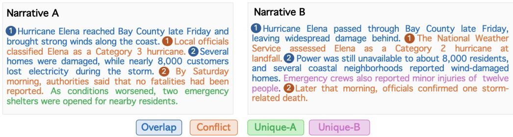
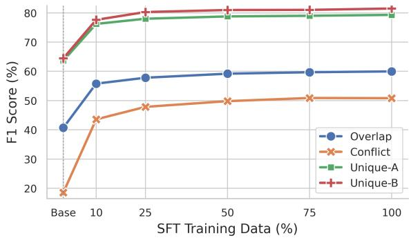
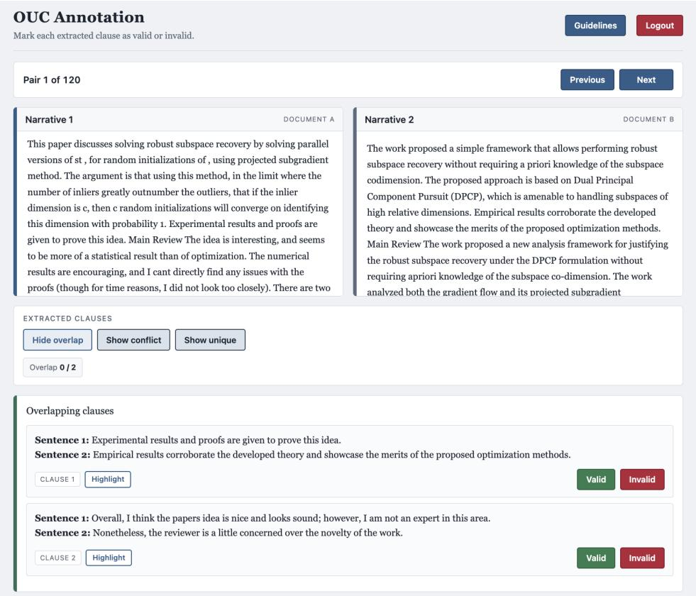

# OVERLAP, UNIQUE AND CONFLICT: CAN LLMS EX-TRACT WHAT THEY CAN RECOGNIZE?

Eftekhar Hossain Santu Karmaker

Bridge-AI Lab@UCF, Department of Computer Science   
University of Central Florida, USA   
{eftekhar,santu}@ucf.edu

## ABSTRACT

Understanding multi-perspective alternative narratives requires identifying how their information agrees, conflicts, or differs across sources. Existing work on crosstext relations largely focuses on categorizing relations between predefined text pairs, such as entailment or contradiction, rather than directly extracting such information from full narratives. To address this gap, we introduce Overlap–Unique–Conflict (OUC) extraction, a cross-narrative task that extracts all overlapping, conflicting, and unique clauses from two narratives. To support this study, we construct a benchmark of approximately 22K narrative pairs and 140K OUC instances spanning factual, argumentative, and political discourse. Evaluating 14 opensource LLMs (0.6B–35B), we find that unique information is far easier to extract than overlap and conflict: the strongest model, Gemma-4-31B, reaches only 61.13% F1-score on overlap and 48.58% on conflict, against more than 75% on unique. Further diagnostic analysis reveals that this difficulty does not stem from relation recognition alone, but rather from a failure to pair and extract the corresponding clauses from full narratives, especially in smaller models. Nevertheless, learning these extractions with task-specific supervision narrows the gap considerably: a fine-tuned Qwen-3-8B gains ∼ 15–28% absolute over its baseline and surpasses models roughly four times its size (e.g., Qwen-3.6-35B) on several tasks. Even so, overlap and conflict remain well below satisfactory, leaving cross-narrative clause extraction an open challenge. The benchmark is available at https:// huggingface.co/datasets/BridgeAI-Lab/OUC-Benchmark.

## 1 INTRODUCTION

Information about the same event or topic is often distributed across multiple narratives rather than contained in a single source. While these narratives may agree on many details, they can also emphasize different aspects, contradict one another, or contain information that appears nowhere else. This makes it important to understand how the information in one narrative relates to that in another, especially in applications such as news analysis, peer-review synthesis, and incident reporting. While existing NLP tasks capture parts of this problem, they usually assume that the information to be compared is already known. Natural language inference (NLI), for example, determines the relation between a given premise–hypothesis pair (Bowman et al., 2015; Williams et al., 2018), while fact verification begins with a predefined claim and retrieves evidence to support or refute it (Thorne et al., 2018). In both cases, the information to be examined is specified in advance. A similar assumption also appears in recent long-context and multi-document evaluations of LLMs (Zhu et al., 2024; Wang et al., 2024; Bai et al., 2025), where models are still guided by a question or other explicit information need. Therefore, it remains unclear whether LLMs can identify and extract all shared, conflicting, and unique information directly from complete narratives without such guidance.

To address this gap, we introduce Overlap–Unique–Conflict (OUC) clause extraction, a new crossnarrative task in which the model receives two alternative narratives and extracts all overlapping, conflicting, and narrative-specific unique information. Unlike pairwise inference, where the text units to be compared are provided in advance, OUC extraction starts from complete narratives and requires the relevant cross-narrative pairs and narrative-specific information to be identified during extraction. To operationalize this task, we develop a benchmark comprising approximately 22K narrative pairs and about 140K OUC instances across three discourse types: factual, argumentative, and political. Using this benchmark, we evaluate 14 open-source LLMs ranging from 0.6B to 35B parameters under zero-shot, few-shot, and chain-of-thought instructions. Evaluations reveal that while current models can often recover information unique to a single narrative, they are less effective at extracting shared and conflicting information across narratives, particularly at smaller model scale (0.6B-8B). Surprisingly, this weakness does not reflect an equivalent inability to understand the relations themselves. Through a bottleneck analysis, we find that when the relevant sentence pairs are provided, even smaller models are much more successful at determining whether the pairs overlap or conflict. Their performance drops sharply when those pairs must be extracted from alternative narratives, revealing a substantial gap in current LLMs’ cross-narrative extraction capabilities.

  
Figure 1: Illustrative example of Overlap, Conflict, and Unique information across two narratives. Highlighted spans denote the clauses to be extracted, while numbered links indicate the corresponding Overlapping and Conflicting pairs.

This motivates us to examine whether the gap observed in smaller models can be reduced by explicitly learning OUC extraction through task-specific supervision. Experiments with several forms of supervision (e.g., direct, preference-based, and reward-based) show that direct supervision yields the greatest gains. A learned 8B model, Qwen-3-8B, improves by roughly 19–28% on the harder Overlap and Conflict tasks, and more than 15% on both Unique tasks. More strikingly, the learned smaller model not only closes much of the gap with best-performing LLMs (e.g., Gemma-4-31B) but also surpasses models roughly four times its size (e.g., Qwen-3.6-35B) on conflict (+4.9%) and unique tasks (about 7% improvement). This suggests that OUC extraction performance is not determined by model scale alone, but can be learned effectively through task-specific supervision. We further find that these gains are not simply a consequence of using large-scale supervision, as much of the improvement can be achieved with only a fraction of the supervision size. Nevertheless, the gains do not fully resolve the problem, leaving accurate extraction of shared and conflicting information across narratives as an important open challenge. In summary, our main contributions are as follows:

• We introduce Overlap–Unique–Conflict (OUC) extraction, a new cross-narrative task to extract all overlapping, conflicting, and unique information between two alternative narratives. To support the study of this task, we develop a benchmark comprising approximately 22K narrative pairs and 140K OUC instances across factual, argumentative, and political discourse.

• We conduct an extensive evaluation across 14 open-source LLMs (0.6B–35B) to characterize how well current models perform OUC extraction and identify their main limitations. Our controlled analyses reveal a substantial gap between recognizing Overlap and Conflict from given pairs and extracting the same relations from complete narratives.

• We further demonstrate that task-specific supervision substantially improves OUC extraction in smaller LLMs, enabling an 8B model to match or outperform models roughly four times larger with only a fraction of the full supervision.

## 2 RELATED WORK

Cross-narrative understanding has long studied how information relates across texts describing the same event or topic. Early work on Cross-document Structure Theory modeled relations such as equivalence, elaboration, and contradiction between sentences from related documents (Radev, 2000; Zhang et al., 2003; Radev et al., 2004; Aleixo & Pardo, 2008). Other work has focused on aligning sentences or propositions that convey the same information despite differences in wording (Nelken & Shieber, 2006; Grover & Mitra, 2017; Weiss et al., 2021; Molfese et al., 2024). More recent work has moved beyond sentence-level alignment toward structured cross-narrative extraction, including linking event mentions that refer to the same underlying event (Min et al., 2024), integrating event arguments distributed across multiple sources (Gao et al., 2024), and extracting relations between entities whose supporting evidence is spread across documents (Jain et al., 2024; Yue et al., 2024). Overall, these works provide different ways to connect information across documents, but they typically do so over predefined units such as events, arguments, or entity pairs.

A separate line of work has also examined semantic relations between such units through distinct NLP tasks. For example, paraphrase identification and semantic textual similarity have been used to capture shared or semantically equivalent information across texts (Dolan & Brockett, 2005; Agirre et al., 2012; Lan & Xu, 2018). Textual entailment and natural language inference, in turn, consider both compatible and contradictory relations between given text pairs (Dagan et al., 2005; Bowman et al., 2015; Williams et al., 2018; Nie et al., 2020). Work on novelty and redundancy detection addresses a closely related notion of unique information by identifying content not present in previously observed text (Schiffman & McKeown, 2005; Ghosal et al., 2018; 2022). More recently, researchers have examined how well LLMs handle these relations in longer and multi-source contexts, particularly when relevant evidence is distributed or conflicting (Jiayang et al., 2024; Wan et al., 2024; Kurfali & Ostling, 2025). However, these problems are studied separately, with the relevant<sup>¨</sup> text pair, claim, query, or evidence already provided. In contrast, we formulate these relations as a cross-narrative extraction problem and study whether LLMs can recover all shared, conflicting, and unique information directly from complete narratives.

## 3 OUC CLAUSE EXTRACTION

We introduce Overlap–Unique–Conflict (OUC) extraction, a novel task for multi-perspective narrative understanding. Let $N _ { A } = \{ S _ { 1 } ^ { A } , . . . , S _ { | A | } ^ { A } \}$ and $N _ { B } = \{ S _ { 1 } ^ { B } , . . . , S _ { | B | } ^ { B } \}$ denote the two narratives describing the same event or topic, where each $S _ { i } ^ { A }$ and $S _ { j } ^ { B }$ is an extractable textual span, corresponding to a sentence or clause from the source narrative. Given $N _ { A }$ and $N _ { B }$ , the goal is to extract sets of verbatim clauses that capture information shared across the two narratives, information that conflicts between them, and information that appears in only one narrative. Specifically, we formulate the OUC extraction as:

$$
\mathcal { F } _ { \mathrm { O U C } } ( N _ { A } , N _ { B } ) = \{ O , C , U _ { A } , U _ { B } \} ,
$$

where the output consists of four sets: O and C contain overlapping and conflicting clause pairs, respectively, while $U _ { A }$ and $U _ { B }$ contain clauses unique to $N _ { A }$ and $N _ { B } .$ , respectively.

## 3.1 TASK DEFINITIONS

Overlap. A pair $( S _ { i } ^ { A } , S _ { j } ^ { B } )$ is considered overlapping when the two sentences/clauses refer to the same underlying event, fact, or aspect and convey mutually compatible information. The clauses need not use the same wording or provide the same level of detail; one may be more specific than the other as long as the additional information does not alter or contradict the shared content. Example: “The bill passed the Senate with bipartisan support” and “The Senate approved the bill with votes from both parties” is an overlap pair because they express the same fact using different wording.

Conflict. A pair $( S _ { i } ^ { A } , S _ { i } ^ { B } )$ is considered conflicting when the two clauses refer to the same underlying event, fact, or aspect but make mutually incompatible or contradictory claims about it. Differences in wording, emphasis, tone, or level of detail alone are not sufficient to constitute a conflict. For example, “The administration said the policy would reduce household costs” and “The administration acknowledged that the policy could increase costs for some households” form a conflict pair because they make incompatible claims about the policy’s economic effect.

For both overlap and conflict, alignments may be many-to-many: a sentence in one narrative can correspond to multiple sentences in the other, as long as each pairing independently satisfies the relevant relation definition.

Unique. A clause $S _ { i } ^ { A }$ or $S _ { i } ^ { B }$ is considered unique when the other narrative contains no clause that expresses corresponding information about the same underlying event, fact, or aspect. In other words, the clause cannot be paired with any clause in the other narrative as either an overlap or a conflict. We distinguish between Unique-A, for clauses that appear only in $N _ { A }$ , and Unique-B, for clauses that appear only in $N _ { B }$

## 4 BENCHMARK CONSTRUCTION

To our knowledge, no existing benchmark directly supports OUC clause extraction across alternative narratives. Constructing such a resource manually at scale is challenging and costly, as each narrative pair may contain multiple valid relations. Recent work, however, has shown that LLMs can be reliably used to generate high-quality synthetic data (Nadas et al., 2025; Huang et al., 2025; Patel et al., 2024; Long et al., 2024; He et al., 2024). Motivated by this, we construct a large-scale OUC benchmark using an LLM-assisted automated pipeline as a scalable alternative to human annotation.

## 4.1 DATA SOURCE SELECTION

To curate the benchmark, we sample narrative pairs from existing multi-document datasets, which are well-suited to our task because narratives about the same topic or event often contain shared, conflicting, and unique information. Specifically, we consider narratives from three domains: peer reviews, factual news, and political news. For the peer domain, we draw one narrative pair per paper from PeerSum (Li et al., 2023). For each paper, we select two reviews with different recommendation outcomes, such as Accepted–Borderline Accept or Accepted–Rejected. For factual news, we use WCEP (Ghalandari et al., 2020) and select one article pair from each event instance in the disaster, accident, conflict, and attack categories. In both cases, we retain narrative pairs with semantic similarity scores between 0.5 and 0.8 to remove pairs that are either nearly identical or only weakly related. This yields 11,000 peer-review pairs and 8,000 factual-news pairs. To broaden the benchmark with political narratives, we additionally use AllSides (Bansal et al., 2022), MultiOpEd (Liu et al., 2021), and the politics subset of WCEP. These datasets provide 3,133, 1,192, and 1,975 pairs, respectively. Because the political datasets are small, we keep all available pairs rather than applying the same similarity filter. Overall, the initial pool contains approximately 25.3K narrative pairs.

## 4.2 AUTOMATIC OUC CLAUSE CURATION

We curate the OUC relation sets using an automated, multi-stage pipeline, as outlined below.

Stage 1: Overlap and Conflict Candidate Extraction. We use GPT-4.1-mini as the primary extractor for identifying candidate overlap and conflict pairs. To reduce the chance of missing valid relations, we also employ Mistral-Medium-3.5-128B as a second extractor. Both models are independently queried with task-specific prompts to extract overlap and conflict pairs within the same narrative pair. We then take the union of the two models’ outputs separately for overlap and conflict, yielding broader candidate lists for each relation. Afterward, we remove near-duplicate candidates within each relation using ROUGE-L (Lin, 2004). Two candidate pairs are considered near-duplicates when the corresponding clauses on both sides have ROUGE-L scores above 0.8. This stage intentionally prioritizes coverage, since false candidates can be filtered out during subsequent validation, whereas relations missed during candidate generation cannot be recovered.

Stage 2: Candidate Validation. The increased coverage of the candidate pool comes at the cost of potentially incorrect alignments or relation assignments. We therefore subject every candidate to an independent validation step using GPT-4.1-mini, Mistral-Medium-3.5-128B, and LLaMA-3.3-70B. Given the source narratives and a candidate clause pair, each validator determines whether the candidate is valid for the relation under which it was extracted. We then aggregate the three judgments by majority vote and retain only candidates that are confirmed as valid.

Stage 3: Unique-Clause Identification. Unique information is treated differently because, by definition, it lacks a corresponding clause in the other narrative. We therefore identify Unique-A and Unique-B only after the overlap and conflict relations have been validated. For this stage, we use GPT-4.1-mini with separate task-specific prompts to extract sets of Unique-A and Unique-B. In each case, the model receives both narratives together with the validated overlap and conflict pairs.

Stage 4: Final Consistency Check. Although the validated overlap and conflict pairs are provided during unique extraction, we perform an additional consistency check before finalizing the annotations. We compare each extracted unique clause against the clauses appearing in the validated overlap and conflict relations using ROUGE-L, and remove it when the similarity exceeds the same threshold of 0.8. This step serves as a final safeguard against residual cross-category assignments. The associated prompt templates are provided in Appendix A.9.

After applying the automatic pipeline, the initial pool of approximately 25.3K narrative pairs is reduced to 22,558, primarily because we exclude pairs for which the validated overlap set, conflict set, or both are empty. The remaining pairs and their curated overlap, conflict, Unique-A, and Unique-B relation sets constitute our silver-standard OUC benchmark. On average, each narrative pair contains 7.97 Overlap pairs, 2.17 Conflict pairs, 19.96 Unique-A clauses, and 18.61 Unique-B clauses. Detailed statistics are presented in Appendix Table 4.

## 4.2.1 HUMAN VALIDATION

To assess the quality of the silver-standard OUC benchmark, we conduct a human validation on a stratified sample of 120 narrative pairs, with 40 pairs drawn from each of the three domains. The sampled pairs contain a total of 5,388 automatically curated OUC instances, including 1,327 overlap, 695 conflict, 1,518 Unique-A, and 1,848 Unique-B instances. Three annotators voluntarily participate in the validation process. Before annotation, they were provided with detailed task guidelines (see Appendix A.10) that defined each OUC relation and its corresponding decision criteria. We measure inter-annotator agreement using Krippendorff’s α and additionally compare human judgments with the automatically curated instances using exact-match agreement. Overall, agreement is high across all four relations: Krippendorff’s α ranges from 0.880 to 0.948, while human agreement with the automatically curated instances ranges from 83.2% to 96.2%. Conflict shows the lowest agreement under both measures, indicating that validating conflicting information is comparatively more difficult than validating Overlap or Unique information. Full results are reported in Appendix Table 5.

While this study evaluates the validity of individual automatically curated instances, we further examine whether the curation pipeline recovers the complete set of OUC relations present in the narratives. For this purpose, we use a separate subset of 100 narrative pairs and ask one annotator to extract the complete set of OUC relations from the narrative pairs, which we then compare with the automatically curated sets using exact matching. We achieve precision and recall above 90% for all four relations, further supporting the benchmark’s reliability. More details on validation and some examples from the dataset are provided in Appendix A.1 and A.12.

## 5 EXPERIMENTS

## 5.1 BENCHMARKING WITH OPEN-SOURCE LLMS

Large Language Models. We evaluate a diverse set of 14 open-source LLMs spanning six prominent model families: LLaMA (Dubey et al., 2024), Phi (Abdin et al., 2024), OLMo (Olmo et al., 2025), Qwen (Yang et al., 2025), Gemma (Team et al., 2026), and Nemotron (Blakeman et al., 2025). The selected models cover a broad range of parameter scales, allowing us to examine OUC extraction capability across both model families and capacities. Specifically, we include LLaMA-3.2 (3B); Phi-4 (4B, 14B); OLMo-3 (7B) and OLMo-3.1 (32B); Qwen-3 (0.6B, 4B, 8B, 32B) and Qwen-3.6 (35B); Gemma-4 (2B, 4B, 31B); and Nemotron-3 (30B). For inference, we use greedy decoding across all models, with a temperature of 0 and a repetition penalty of 1.05.

Methods. We compare three prompting-based methods: zero-shot,few-shot, and chain-of-thought (CoT). For each method, we extract Overlap, Conflict, Unique-A, and Unique-B separately using relation-specific instructions. We also consider a joint setting in which a single instruction extracts all OUC clauses simultaneously. Before applying these methods at scale, we conduct a pilot study on a small held-out subset of 60 narrative pairs to refine the instructions and select the most stable variant based on output consistency. During this study, we observed that native reasoning modes often produce excessively long reasoning traces without improving the quality of extraction. We therefore disable native reasoning for models that support it during the full evaluation.

Evaluation Protocol. We partition the OUC benchmark into training, validation, and test sets using a 75/5/20 split, yielding 16,916, 1,129, and 4,513 narrative pairs, respectively. We use the held-out test set exclusively for model evaluation. To measure OUC extraction performance, we compute macro Precision, Recall, and F1, with F1 as the primary metric. Because these metrics depend on matching predicted and gold extractions, we use relaxed matching with ROUGE-L, in which a prediction is considered correct if its ROUGE-L score against the corresponding gold item exceeds 0.6. For more details on metrics computation and threshold sensitivity, see Appendix A.4.

## 5.2 LEARNING OUC EXTRACTION

Beyond prompting, we investigate whether OUC extraction can be learned through task-specific supervision. To this end, we consider three post-training methods: direct supervision, preference learning, and reward-based optimization. All implementation details are provided in Appendix A.2.

Supervised Fine-Tuning. We perform supervised fine-tuning (SFT) for each OUC task separately. In every training instance, the input consists of the two source narratives and the corresponding task-specific instruction, while the target is the gold extraction for that task in JSON format. This directly trains the model to extract the complete set of task-specific clauses from the narrative pairs

Preference Learning. We further employ task-specific direct preference optimization (DPO) (Rafailov et al., 2023), which learns from relative preferences between alternative extractions rather than from a single target response. To construct this preference signal, we use the gold extraction as the preferred response and the predictions from a distractor model (LLaMA-3.2-1B) as the rejected response. When no suitable model prediction is available, we instead generate a synthetic rejected response that is incorrect in content but similar in length and structure to the gold response. The full preference data construction procedure is provided in Appendix A.3.

Reward-Based Optimization. We also examine whether direct feedback on extraction quality can improve OUC extraction. Because each generated relation set can be compared directly with its corresponding gold set, the task provides an automatically verifiable reward signal and can therefore be naturally formulated within the reinforcement learning with verifiable rewards (RLVR) framework (Mroueh, 2025; Liu et al., 2026; Sim et al., 2025; Zhu et al., 2025; Tang et al., 2026). For our task, we use the F1 score as the correctness reward because it jointly captures both missed and spurious extractions. We combine this with a binary reward for following the required output format. The final reward becomes $R = 0 . 9 * R _ { \mathrm { c o r r e c t n e s s } } + 0 . 1 * R _ { \mathrm { f o r m a t } } .$ . To optimize the model policy with this reward, we use the Group Relative Policy Optimization (GRPO) algorithm (Shao et al., 2024).

## 6 RESULTS AND ANALYSIS

We organize our results and analysis around the following research questions: RQ1) OUC Extraction Capability: How well do current open-source LLMs perform on OUC extraction, and which OUC relation is the most challenging? RQ2) Extraction Bottleneck: What primarily limits Overlap and Conflict extraction performance? RQ3) Task-Specific Post-Training: Can task-specific learning improve OUC extraction in smaller models, and which supervision signal is most effective? RQ4) Supervision Scaling: Does scaling the amount of supervision affect OUC extraction performance?

## 6.1 OUC EXTRACTION CAPABILITY

Conflict is the most challenging extraction task. Table 1 shows a clear gap across the four relations: Unique-A and Unique-B are consistently easier, followed by Overlap, while Conflict remains the most difficult. This pattern persists even for larger models. For instance, under zero-shot prompting, Gemma-4-31B achieves F1 scores of 75.55% and 76.75% on the two Unique relations, compared with 61.13% on Overlap and 48.58% on Conflict. Moreover, the difficulty is not solely due to missed clauses or pairs. Models often recover relevant pairs but also produce many incorrect ones, a pattern more pronounced in the Conflict task.

Prompting effects vary across models and tasks. No prompting strategy consistently improves performance across all models or all tasks. CoT yields notable gains on Overlap and Conflict for several models (e.g., Gemma-4-4B, Phi-4-14B, OLMo-3.1-32B, Qwen-3-32B, Qwen-3.6-35B, and Nemotron-3-30B), but the trend is not universal. One possible explanation is that CoT encourages the model to compare candidate clauses more explicitly before deciding whether they form an Overlap or Conflict pair. However, CoT often hurts the Unique extraction, where exhaustive coverage is more important. Few-shot prompting also fails to provide a consistent advantage across OUC extraction tasks, despite achieving the best individual F1 score of 61.29% on the Overlap task. Consequently, zero-shot prompting remains the strongest overall choice on average across the four extraction tasks.

Scaling helps, but family effects remain strong. Smaller models (i.e., 0.6B, 3B, 8B) are generally weaker on OUC extraction, particularly for Overlap and Conflict. This pattern becomes clearer when comparing different sizes within the same family. For instance, Qwen improves steadily from 0.6B to 35B in F1 scores, especially for the Conflict (from 1.23% to 37.05%) and Unique-A (from 14.20% to 72.09%) tasks under zero-shot prompting. Phi shows the same tendency from 4B to 14B. Even so, scale does not fully explain the results. For instance, OLMo-3.1-32B and Nemotron-3-30B remain relatively weak despite their size, whereas Gemma-4-31B achieves the strongest overall performance. This indicates that larger models generally help, but the benefit depends strongly on the model family.

Table 1: OUC extraction performance across prompting strategies. For each task, the highest and lowest F1-scores across the methods are highlighted in blue and orange, respectively. Due to space constraints, full precision, recall, and F1 results are reported in Appendix Table 14.
<table><tr><td rowspan="2">LLM</td><td colspan="4">Zero-shot</td><td colspan="4">Few-shot</td><td colspan="4">Chain-of-Thought</td></tr><tr><td>0</td><td>C</td><td> $\mathbf { U _ { A } }$ </td><td> $\mathbf { U _ { B } }$ </td><td>0</td><td>C</td><td> $\mathbf { U _ { A } }$ </td><td> $\mathbf { U _ { B } }$ </td><td>0</td><td>C</td><td> $\mathbf { U _ { A } }$ </td><td> $\mathbf { U _ { B } }$ </td></tr><tr><td>LLaMA-3.2-3B</td><td>18.34</td><td>7.54</td><td>36.29</td><td>28.26</td><td>15.12</td><td>6.19</td><td>33.64</td><td>28.08</td><td>17.69</td><td>7.86</td><td>27.20</td><td>27.70</td></tr><tr><td>Phi-4-4B</td><td>11.06</td><td>5.90</td><td>36.26</td><td>38.17</td><td>13.95</td><td>3.68</td><td>38.54</td><td>14.94</td><td>17.52</td><td>6.22</td><td>32.99</td><td>29.02</td></tr><tr><td>Phi-4-14B</td><td>44.61</td><td>30.33</td><td>69.72</td><td>71.64</td><td>42.24</td><td>28.35</td><td>64.28</td><td>62.63</td><td>49.37</td><td>29.69</td><td>59.73</td><td>67.79</td></tr><tr><td>OLMo-3-7B</td><td>15.46</td><td>7.42</td><td>8.20</td><td>8.56</td><td>14.74</td><td>6.27</td><td>6.93</td><td>3.25</td><td>13.45</td><td>9.76</td><td>11.90</td><td>8.27</td></tr><tr><td>OLMo-3.1-32B</td><td>33.29</td><td>16.10</td><td>47.96</td><td>53.84</td><td>30.07</td><td>5.88</td><td>42.69</td><td>45.31</td><td>47.39</td><td>35.52</td><td>53.40</td><td>55.57</td></tr><tr><td>Qwen-3-0.6B</td><td>3.04</td><td>1.23</td><td>14.20</td><td>4.75</td><td>4.09</td><td>1.22</td><td>11.59</td><td>5.66</td><td>4.80</td><td>0.08</td><td>5.21</td><td>4.00</td></tr><tr><td>Qwen-3-4B</td><td>36.71</td><td>18.17</td><td>45.95</td><td>52.97</td><td>33.02</td><td>16.97</td><td>42.61</td><td>48.54</td><td>35.89</td><td>20.66</td><td>39.29</td><td>45.29</td></tr><tr><td>Qwen-3-8B</td><td>40.71</td><td>18.53</td><td>63.66</td><td>64.48</td><td>38.78</td><td>18.09</td><td>50.91</td><td>46.55</td><td>37.14</td><td>22.72</td><td>22.66</td><td>30.01</td></tr><tr><td>Qwen-3-32B</td><td>46.77</td><td>31.57</td><td>62.39</td><td>65.79</td><td>46.99</td><td>31.66</td><td>50.39</td><td>52.28</td><td>51.32</td><td>44.11</td><td>48.34</td><td>57.14</td></tr><tr><td>Qwen-3.6-35B</td><td>53.42</td><td>37.05</td><td>72.09</td><td>74.54</td><td>53.28</td><td>39.01</td><td>69.22</td><td>70.10</td><td>59.44</td><td>45.92</td><td>62.56</td><td>49.13</td></tr><tr><td>Gemma-4-2B</td><td>39.72</td><td>20.90</td><td>54.65</td><td>11.59</td><td>36.38</td><td>18.22</td><td>14.78</td><td>19.26</td><td>39.72</td><td>28.84</td><td>53.02</td><td>26.22</td></tr><tr><td>Gemma-4-4B</td><td>46.41</td><td>28.22</td><td>68.43</td><td>61.66</td><td>44.48</td><td>28.58</td><td>65.19</td><td>59.54</td><td>54.05</td><td>39.47</td><td>66.36</td><td>68.74</td></tr><tr><td>Gemma-4-31B</td><td>61.13</td><td>48.58</td><td>75.55</td><td>76.75</td><td>61.29</td><td>48.27</td><td>73.39</td><td>73.64</td><td>60.19</td><td>46.12</td><td>62.76</td><td>66.98</td></tr><tr><td>Nemotron-3-30B</td><td>12.73</td><td>5.11</td><td>45.46</td><td>41.24</td><td>12.43</td><td>5.19</td><td>39.79</td><td>35.49</td><td>36.50</td><td>14.71</td><td>28.59</td><td>33.61</td></tr></table>

## 6.2 EXTRACTION BOTTLENECK

To identify why Overlap and Conflict extraction is harder, we conduct two controlled diagnostic experiments on five representative models spanning different families and scales. We first isolate relation understanding by giving the model a clause pair and asking, separately for Overlap and Conflict, whether the pair expresses the target relation or is invalid. This removes the need to search for relevant clauses or determine their correspondence. We then isolate pair alignment by providing the set of ground-truth candidate clauses from each narrative and asking the model to identify which cross-narrative clause pairs form valid Overlap or Conflict relations. This setting will test only whether the models can construct the correct pairings among the given relevant clauses. We compare both diagnostics with the zero-shot end-to-end extraction performance reported in Table 2.

Table 2: Bottleneck analysis for overlap and conflict extraction. Darker red shading indicates lower performance (macro F1-score), while blue indicates improvement.
<table><tr><td rowspan="2">LLM</td><td colspan="2">Relation</td><td colspan="2">Alignment</td><td colspan="2">Extraction</td></tr><tr><td>0</td><td>C</td><td>0</td><td>C</td><td>0</td><td>C</td></tr><tr><td>Qwen-3-0.6B</td><td>76.35</td><td>58.91</td><td>9.40</td><td>45.25</td><td>3.04</td><td>1.23</td></tr><tr><td>LLaMA-3.2-3B</td><td>78.62</td><td>55.75</td><td>43.98</td><td>59.00</td><td>18.34</td><td>7.54</td></tr><tr><td>Qwen-3-8B</td><td>86.57</td><td>75.07</td><td>62.21</td><td>46.52</td><td>40.71</td><td>18.53</td></tr><tr><td>Phi-4-14B</td><td>89.30</td><td>86.52</td><td>71.08</td><td>79.38</td><td>44.61</td><td>30.33</td></tr><tr><td>Gemma-4-31B</td><td>89.80</td><td>87.28</td><td>67.84</td><td>74.93</td><td>61.13</td><td>48.58</td></tr></table>

We observe that models are much better at recognizing Overlap and Conflict when a clause pair is already provided. Performance begins to drop once the model has to determine which clauses from the two narratives should be paired to form a valid Overlap or Conflict pair. For example, Qwen-3-8B drops ∼24% (from 86.57% to 62.21% F1 score) on Overlap when moving from relation understanding to pair alignment. Interestingly, the drop is less consistent for Conflict. For example, Phi-4-14B and Gemma-4-31B retain relatively high alignment performance, while LLaMA-3.2-3B even improves slightly. One possible reason is that the conflict task often involves fewer plausible pairings, making the correspondence easier once the candidate clauses are given. In full extraction, however, performance drops substantially for both relations, suggesting that the main bottleneck lies in jointly discovering and aligning the relevant relation-specific information across narratives.

Retrieval-based candidate discovery. The alignment experiment above assumes access to gold candidate clauses and, therefore, removes the need to discover relevant information from the full narratives. To probe this step directly, we retrieve the top-k sentences from the opposite narrative for each sentence using Qwen3-Embedding-0.6B and measure whether the gold counterpart is recovered. Recall increases with k: for Overlap, Recall@1 and Recall@5 are 63.49% and 92.48%, respectively, whereas for Conflict, they are 37.04% and 79.97%, respectively. Thus, retrieving only the nearest counterpart misses many gold relations, particularly for Conflict. Increasing k improves coverage, but it also turns the task into candidate generation followed by additional pairwise filtering and relation classification, rather than directly probing whether an LLM can extract them from narratives.

Table 3: OUC clause extraction performance across different post-training strategies. Here, values in parentheses denote the absolute change in macro F1-score relative to the best prompting baseline for each model and task. Blue and red indicate improvements and degradations, respectively. Detailed performance, including precision and recall scores, is provided in Appendix Table 15.
<table><tr><td rowspan="2">Method</td><td colspan="4">LLaMA-3.2-3B</td><td colspan="4">Qwen-3-0.6B</td></tr><tr><td>0</td><td>C</td><td> $\mathbf { U _ { A } }$ </td><td> $\mathbf { U _ { B } }$ </td><td>0</td><td>C</td><td> $\mathbf { U _ { A } }$ </td><td>UB</td></tr><tr><td>Baseline</td><td>18.34</td><td>7.86</td><td>36.29</td><td>28.26</td><td>4.80</td><td>1.23</td><td>14.20</td><td>5.66</td></tr><tr><td>SFT</td><td>55.51 (+37.17)</td><td>42.19(+34.33)</td><td>77.15(+40.86)</td><td>78.92(+50.66)</td><td>50.20(+45.40)</td><td>34.04(+32.81)</td><td>75.73(+61.53)</td><td>78.49(+72.83)</td></tr><tr><td>DPO</td><td>24.00(+5.66)</td><td>6.93 (-0.93)</td><td>47.88(+11.59)</td><td>45.59(+17.33)</td><td>18.72(+13.92)</td><td>2.88(+1.65)</td><td>7.97 (-6.23)</td><td>10.53(+4.87)</td></tr><tr><td>GRPO</td><td>28.74(+10.40)</td><td>21.19(+13.33)</td><td>69.95(+33.66)</td><td>72.40(+44.14)</td><td>25.36(+20.56)</td><td>5.52(+4.29)</td><td>68.76(+54.56)</td><td>67.52(+61.86)</td></tr><tr><td></td><td></td><td colspan="3">Qwen-3-4B</td><td colspan="4">Qwen-3-8B</td></tr><tr><td></td><td>0</td><td>C</td><td>UA</td><td>UB</td><td>0</td><td>C</td><td>UA</td><td>UB</td></tr><tr><td>Baseline</td><td>36.71</td><td>20.66</td><td>45.95</td><td>52.97</td><td>40.71</td><td>22.72</td><td>63.66</td><td>64.48</td></tr><tr><td>SFT</td><td>57.68(+20.97)</td><td>48.37(+27.71)</td><td>78.36(+32.41)</td><td>80.87(+27.90)</td><td>59.98(+19.27)</td><td>50.82(+28.10)</td><td>79.31 (+15.65)</td><td>81.49(+17.01)</td></tr><tr><td>DPO</td><td>42.81 (+6.10)</td><td>15.15(-5.51)</td><td>60.80(+14.85)</td><td>64.18(+11.21)</td><td>46.34(+5.63)</td><td>18.62(-4.10)</td><td>65.84(+2.18)</td><td>67.18(+2.70)</td></tr><tr><td>GRPO</td><td>50.74(+14.03)</td><td>33.89(+13.23)</td><td>72.92(+26.97)</td><td>75.65(+22.68)</td><td>55.58(+14.87)</td><td>39.45(+16.73)</td><td>74.60(+10.94)</td><td>77.47(+12.99)</td></tr></table>

## 6.3 TASK-SPECIFIC POST-TRAINING

To keep this study focused on models that are practical to fine-tune, we use LLaMA-3.2-3B and Qwen-3 at 0.6B, 4B, and 8B. These model sizes and families are also commonly used in prior work for parameter-efficient fine-tuning (Zhang et al., 2026; Li et al., 2025). Table 3 reports OUC extraction performance under SFT, DPO, and GRPO, together with each model’s best prompting baseline.

SFT shows the strongest and most consistent gains across model sizes. We observe some of the largest gains for Qwen-3-0.6B, which performs poorly without task-specific training but improves by 32.81–72.83% absolute points in F1 score across the four extraction tasks after SFT. These gains persist as model size increases, with Qwen-3-8B achieving the strongest results overall. Additionally, the fine-tuned Qwen-3-8B exceeds the best-performing model, Gemma-4-31B, on Conflict, Unique-A, and Unique-B, while remaining close on Overlap (59.98% vs. 61.29% F1 score). It also outperforms larger models, including Qwen-3-32B, Qwen-3.6-35B, OLMo-3.1-32B, and Nemotron-3-30B, across multiple tasks. These results suggest that task-specific direct supervision not only substantially improves OUC extraction but also enables smaller models to compete with much larger ones.

GRPO improves OUC extraction, but its gains remain consistently below those of SFT. Across models and tasks, GRPO yields clear improvements in F1-score over baselines. However, these gains are generally smaller than those obtained with supervised fine-tuning. One likely reason is that GRPO relies on a sequence-level reward largely based on overall F1, which captures the quality of the full extraction but provides limited guidance on which individual clauses or pairs to correct. DPO, on the other hand, is considerably less stable. While it improves some Overlap and Unique results, Conflict performance frequently drops below the prompting baseline. The possible reason is that DPO learns from response-level preference pairs that may differ in only a small number of extracted items, which could provide a weaker signal for correcting such localized errors.

We additionally evaluate a joint OUC setting, in which all four tasks are predicted jointly rather than independently. Details are reported in Appendix A.8.

## 6.4 SUPERVISION SCALING

Since SFT performs best among the post-training methods, we next examine how much supervision is actually needed to obtain these gains. We fine-tune the Qwen-3-8B model by varying the training data from 10% to 100%. As shown in Figure 2, most of the improvement appears with relatively little supervision. Even training with 10% of the data produces a large jump over the baseline, and by 25% the model already reaches an F1 score of 57.82% on Overlap, 47.85% on Conflict, and around 78–80% on the two Unique tasks. However, after this point, additional data brings only modest gains. Notably, with only 25% of the supervision, Qwen-3-8B is already competitive with the much larger models (i.e., Qwen-3.6-35B). This suggests that the strong performance is not simply due to training on a large dataset; rather, a relatively small amount of data already yields most of the gains. We further examine the cross-domain generalization: details are provided in Appendix A.7.

  
Figure 2: OUC extraction performance when the Qwen-3-8B model is fine-tuned across varying supervision sizes. The base represents the corresponding model zero-shot baseline.

## 6.5 ERROR ANALYSIS

To better understand where the model struggles with OUC extraction, we conduct a qualitative error analysis. Specifically, we analyze 300 errors from Gemma-4-31B predictions, with 75 cases sampled from each task across 90 narrative pairs. The most frequent category we found is Span/Verbatim Errors (22.7%), where the model identifies relevant content but extracts an incorrect span, changes the level of detail, or produces a non-verbatim form. We also find Missed Information and Wrong Semantic Match in 21.7% of the cases each. Missed Information reflects cases where a valid clause or pair is not extracted, while Wrong Semantic Match occurs when the model selects clauses that are topically or semantically related but do not satisfy the target Overlap or Conflict relation. Another recurring problem appears in the Unique tasks, where in 15.0% of cases the model labels a clause as Unique even though related information is present elsewhere in the narrative. We refer to these as Missed Counterpart errors. We further observe Wrong Pairing in 13.3% of the cases, where relevant information is present in both narratives, but the model links the wrong counterparts. Relation Confusion accounts for 5.7%, covering cases where the correct clause pair is identified but assigned the wrong relation, such as predicting Conflict for an Overlap pair. Across these categories, implicit semantic relations appear in 23.3% of the analyzed cases. In such examples, corresponding information is expressed with substantially different wording, making the connection difficult to identify from surface similarity alone. These cases often result in missed pairs, incorrect matches, or false Unique predictions. Some examples from these error categories are shown in Table 16.

## 7 CONCLUSION

In this work, we introduced the Overlap–Unique–Conflict (OUC) clause extraction task and a new benchmark for extracting this information directly from alternative narratives. Across 14 open-source LLMs, our results show that current models, particularly smaller ones, remain much weaker at extracting Overlap and Conflict pairs from full narratives than at recognizing these relations when the relevant information is already given. Importantly, task-specific supervision substantially narrows this gap. A fine-tuned Qwen-3-8B improves F1 score by roughly 15–28% across all tasks and can match or outperform models that are roughly four times larger, although the extraction gap is not fully eliminated. These findings point to cross-narrative information discovery and pairing as a key limitation of current LLMs and an important direction for future work.

## LIMITATIONS

Our current OUC formulation is limited to sentence-level relations between narrative pairs. It does not consider finer-grained claim-level extraction, where a sentence may need to be decomposed before determining whether the information is overlapping, conflicting, or unique. Also, it doesn’t capture cases where relevant evidence spans multiple sentences or more than two narratives. Finally, our diagnostic experiments identify candidate discovery and cross-narrative alignment as important sources of difficulty. Although post-training improves performance, these bottlenecks remain, leaving room for methods that address them more explicitly.

## AI USE STATEMENT

In this work, we used generative AI tools to improve the grammar, clarity, readability, and organization of the manuscript’s human-written sections. The tools were primarily used to identify unclear passages, assess whether the intended meaning was conveyed, and suggest improvements to presentation and structure. They were not used to generate experimental results, annotations, or scientific claims. All AI-assisted revisions were reviewed and edited by the authors, who take ful responsibility for the final content of the paper.

## REPRODUCIBILITY STATEMENT

To support reproducibility, we provide detailed descriptions of the OUC task, dataset construction, annotation procedure, and evaluation protocol in the main paper and appendix. The appendix further documents the annotation guidelines, implementation framework, training setup, hyperparameters, decoding settings, hardware configuration, and computational cost for SFT, DPO, and GRPO. We also report the prompts and task-specific training configurations used in our experiments. Upon publication, we plan to release the dataset, annotation resources, and code required to reproduce the reported experiments.

## REFERENCES

Marah Abdin, Jyoti Aneja, Harkirat Behl, Sebastien Bubeck, Ronen Eldan, Suriya Gunasekar,´ Michael Harrison, Russell J Hewett, Mojan Javaheripi, Piero Kauffmann, et al. Phi-4 technical report. arXiv preprint arXiv:2412.08905, 2024.

Eneko Agirre, Daniel Cer, Mona Diab, and Aitor Gonzalez-Agirre. SemEval-2012 task 6: A pilot on semantic textual similarity. In Eneko Agirre, Johan Bos, Mona Diab, Suresh Manandhar, Yuval Marton, and Deniz Yuret (eds.), \*SEM 2012: The First Joint Conference on Lexical and Computational Semantics – Volume 1: Proceedings ofthe main conference and the shared task, and Volume 2: Proceedings ofthe Sixth International Workshop on Semantic Evaluation (SemEval 2012), pp. 385–393, Montreal, Canada, 7-8 June 2012. Association for Computational Linguistics.´ URL https://aclanthology.org/S12-1051/.

Priscila Aleixo and Thiago Alexandre Salgueiro Pardo. Finding related sentences in multiple documents for multidocument discourse parsing of brazilian portuguese texts. In Companion Proceedings of the XIV Brazilian Symposium on Multimedia and the Web, pp. 298–303, 2008.

Yushi Bai, Shangqing Tu, Jiajie Zhang, Hao Peng, Xiaozhi Wang, Xin Lv, Shulin Cao, Jiazheng Xu, Lei Hou, Yuxiao Dong, Jie Tang, and Juanzi Li. LongBench v2: Towards deeper understanding and reasoning on realistic long-context multitasks. In Wanxiang Che, Joyce Nabende, Ekaterina Shutova, and Mohammad Taher Pilehvar (eds.), Proceedings of the 63rd Annual Meeting of the Association for Computational Linguistics (Volume 1: Long Papers), pp. 3639–3664, Vienna, Austria, July 2025. Association for Computational Linguistics. ISBN 979-8-89176-251-0. doi: 10.18653/v1/2025.acl-long.183. URL https://aclanthology.org/2025.acl-long.183/.

Naman Bansal, Mousumi Akter, and Shubhra Kanti Karmaker Santu. Semantic overlap summarization among multiple alternative narratives: An exploratory study. In Proceedings of the 29th International Conference on Computational Linguistics, pp. 6195–6207, 2022.

Aaron Blakeman, Aaron Grattafiori, Aarti Basant, Abhibha Gupta, Abhinav Khattar, Adi Renduchintala, Aditya Vavre, Akanksha Shukla, Akhiad Bercovich, Aleksander Ficek, et al. Nvidia nemotron 3: Efficient and open intelligence. arXiv preprint arXiv:2512.20856, 2025.

Samuel R. Bowman, Gabor Angeli, Christopher Potts, and Christopher D. Manning. A large annotated corpus for learning natural language inference. In Llu´ıs Marquez, Chris Callison-Burch, and Jian Su\` (eds.), Proceedings ofthe 2015 Conference on Empirical Methods in Natural Language Processing, pp. 632–642, Lisbon, Portugal, September 2015. Association for Computational Linguistics. doi: 10.18653/v1/D15-1075. URL https://aclanthology.org/D15-1075/.

Ido Dagan, Oren Glickman, and Bernardo Magnini. The pascal recognising textual entailment challenge. In Machine learning challenges workshop, pp. 177–190. Springer, 2005.

William B. Dolan and Chris Brockett. Automatically constructing a corpus of sentential paraphrases. In Proceedings of the Third International Workshop on Paraphrasing (IWP2005), 2005. URL https://aclanthology.org/I05-5002/.

Abhimanyu Dubey, Abhinav Jauhri, Abhinav Pandey, Abhishek Kadian, Ahmad Al-Dahle, Aiesha Letman, Akhil Mathur, Alan Schelten, Amy Yang, Angela Fan, et al. The llama 3 herd of models. arXiv e-prints, pp. arXiv–2407, 2024.

Qiang Gao, Zixiang Meng, Bobo Li, Jun Zhou, Fei Li, Chong Teng, and Donghong Ji. Harvesting events from multiple sources: Towards a cross-document event extraction paradigm. In Lun-Wei Ku, Andre Martins, and Vivek Srikumar (eds.), Findings of the Association for Computational Linguistics: ACL 2024, pp. 1913–1927, Bangkok, Thailand, August 2024. Association for Computational Linguistics. doi: 10.18653/v1/2024.findings-acl.114. URL https://aclanthology.org/2024.findings-acl.114/.

Demian Gholipour Ghalandari, Chris Hokamp, Nghia The Pham, John Glover, and Georgiana Ifrim. A large-scale multi-document summarization dataset from the wikipedia current events portal. arXiv preprint arXiv:2005.10070, 2020.

Tirthankar Ghosal, Vignesh Edithal, Asif Ekbal, Pushpak Bhattacharyya, George Tsatsaronis, and Srinivasa Satya Sameer Kumar Chivukula. Novelty goes deep. a deep neural solution to document level novelty detection. In Emily M. Bender, Leon Derczynski, and Pierre Isabelle (eds.), Proceedings ofthe 27th International Conference on Computational Linguistics, pp. 2802–2813, Santa Fe, New Mexico, USA, August 2018. Association for Computational Linguistics. URL https://aclanthology.org/C18-1237/.

Tirthankar Ghosal, Tanik Saikh, Tameesh Biswas, Asif Ekbal, and Pushpak Bhattacharyya. Novelty detection: A perspective from natural language processing. Computational Linguistics, 48(1):77– 117, March 2022. doi: 10.1162/coli a 00429. URL https://aclanthology.org/2022.cl-1. 3/.

Jeenu Grover and Pabitra Mitra. Sentence alignment using unfolding recursive autoencoders. In Serge Sharoff, Pierre Zweigenbaum, and Reinhard Rapp (eds.), Proceedings of the 10th Workshop on Building and Using Comparable Corpora, pp. 16–20, Vancouver, Canada, August 2017. Association for Computational Linguistics. doi: 10.18653/v1/W17-2503. URL https://aclanthology.org/W17-2503/.

Zeyu He, Chieh-Yang Huang, Chien-Kuang Cornelia Ding, Shaurya Rohatgi, and Ting-Hao Kenneth Huang. If in a crowdsourced data annotation pipeline, a gpt-4. In Proceedings of the 2024 CHI Conference on Human Factors in Computing Systems, pp. 1–25, 2024.

Yue Huang, Siyuan Wu, Chujie Gao, Dongping Chen, Qihui Zhang, Yao Wan, Tianyi Zhou, Chaowei Xiao, Jianfeng Gao, Lichao Sun, et al. Datagen: Unified synthetic dataset generation via large language models. In ICLR, 2025.

Monika Jain, Raghava Mutharaju, Kuldeep Singh, and Ramakanth Kavuluru. Knowledge-driven crossdocument relation extraction. In Lun-Wei Ku, Andre Martins, and Vivek Srikumar (eds.), Findings ofthe Associationfor Computational Linguistics: ACL 2024, pp. 3787–3797, Bangkok, Thailand, August 2024. Association for Computational Linguistics. doi: 10.18653/v1/2024.findings-acl.227. URL https://aclanthology.org/2024.findings-acl.227/.

Cheng Jiayang, Chunkit Chan, Qianqian Zhuang, Lin Qiu, Tianhang Zhang, Tengxiao Liu, Yangqiu Song, Yue Zhang, Pengfei Liu, and Zheng Zhang. ECON: On the detection and resolution of evidence conflicts. In Yaser Al-Onaizan, Mohit Bansal, and Yun-Nung Chen (eds.), Proceedings ofthe 2024 Conference on Empirical Methods in Natural Language Processing, pp. 7816–7844, Miami, Florida, USA, November 2024. Association for Computational Linguistics. doi: 10.18653/ v1/2024.emnlp-main.447. URL https://aclanthology.org/2024.emnlp-main.447/.

Murathan Kurfali and Robert Ostling. Conflicting needles in a haystack: How LLMs behave<sup>¨</sup> when faced with contradictory information. In Christos Christodoulopoulos, Tanmoy Chakraborty, Carolyn Rose, and Violet Peng (eds.), Proceedings ofthe 2025 Conference on Empirical Methods in Natural Language Processing, pp. 34361–34376, Suzhou, China, November 2025. Association for Computational Linguistics. ISBN 979-8-89176-332-6. doi: 10.18653/v1/2025.emnlp-main.1742. URL https://aclanthology.org/2025.emnlp-main.1742/.

Woosuk Kwon, Zhuohan Li, Siyuan Zhuang, Ying Sheng, Lianmin Zheng, Cody Hao Yu, Joseph Gonzalez, Hao Zhang, and Ion Stoica. Efficient memory management for large language model serving with pagedattention. In Proceedings of the 29th symposium on operating systems principles, pp. 611–626, 2023.

Wuwei Lan and Wei Xu. Neural network models for paraphrase identification, semantic textual similarity, natural language inference, and question answering. In Emily M. Bender, Leon Derczynski, and Pierre Isabelle (eds.), Proceedings of the 27th International Conference on Computational Linguistics, pp. 3890–3902, Santa Fe, New Mexico, USA, August 2018. Association for Computational Linguistics. URL https://aclanthology.org/C18-1328/.

Jiayu Li, Jennifer Zhu, Fang Liu, and Yanjun Qi. AIDE: Attribute-guided MultI-hop data expansion for data scarcity in task-specific fine-tuning. In Georg Rehm and Yunyao Li (eds.), Proceedings of the 63rd Annual Meeting ofthe Associationfor Computational Linguistics (Volume 6: Industry Track), pp. 1083–1101, Vienna, Austria, July 2025. Association for Computational Linguistics. ISBN 979-8-89176-288-6. doi: 10.18653/v1/2025.acl-industry.77. URL https://aclanthology. org/2025.acl-industry.77/.

Miao Li, Eduard Hovy, and Jey Lau. Summarizing multiple documents with conversational structure for meta-review generation. Findings of the Association for Computational Linguistics: EMNLP 2023, pp. 7089–7112, 2023.

Chin-Yew Lin. Rouge: A package for automatic evaluation of summaries. In Text summarization branches out, pp. 74–81, 2004.

Siyi Liu, Sihao Chen, Xander Uyttendaele, and Dan Roth. MultiOpEd: A corpus of multiperspective news editorials. In Kristina Toutanova, Anna Rumshisky, Luke Zettlemoyer, Dilek Hakkani-Tur, Iz Beltagy, Steven Bethard, Ryan Cotterell, Tanmoy Chakraborty, and Yichao Zhou (eds.), Proceedings of the 2021 Conference of the North American Chapter of the Association for Computational Linguistics: Human Language Technologies, pp. 4345–4361, Online, June 2021. Association for Computational Linguistics. doi: 10.18653/v1/2021.naacl-main.344. URL https://aclanthology.org/2021.naacl-main.344/.

Xiaoyuan Liu, Tian Liang, Zhiwei He, Jiahao Xu, Wenxuan Wang, Pinjia He, Zhaopeng Tu, Haitao Mi, and Dong Yu. Trust, but verify: A self-verification approach to reinforcement learning with verifiable rewards. Advances in Neural Information Processing Systems, 38:130475–130501, 2026.

Lin Long, Rui Wang, Ruixuan Xiao, Junbo Zhao, Xiao Ding, Gang Chen, and Haobo Wang. On llms-driven synthetic data generation, curation, and evaluation: A survey. In Findings of the Associationfor Computational Linguistics ACL 2024, pp. 11065–11082, 2024.

Qingkai Min, Qipeng Guo, Xiangkun Hu, Songfang Huang, Zheng Zhang, and Yue Zhang. Synergetic event understanding: A collaborative approach to cross-document event coreference resolution with large language models. In Lun-Wei Ku, Andre Martins, and Vivek Srikumar (eds.), Proceedings of the 62nd Annual Meeting of the Association for Computational Linguistics (Volume 1: Long Papers), pp. 2985–3002, Bangkok, Thailand, August 2024. Association for Computational Linguistics. doi: 10.18653/v1/2024.acl-long.164. URL https://aclanthology.org/2024.acl-long.164/.

Francesco Maria Molfese, Andrei Stefan Bejgu, Simone Tedeschi, Simone Conia, and Roberto Navigli. Crocoalign: A cross-lingual, context-aware and fully-neural sentence alignment system for long texts. In Yvette Graham and Matthew Purver (eds.), Proceedings ofthe 18th Conference of the European Chapter ofthe Associationfor Computational Linguistics (Volume 1: Long Papers), pp. 2209–2220, St. Julian’s, Malta, March 2024. Association for Computational Linguistics. doi: 10.18653/v1/2024.eacl-long.135. URL https://aclanthology.org/2024.eacl-long.135/.

Youssef Mroueh. Reinforcement learning with verifiable rewards: Grpo’s effective loss, dynamics, and success amplification. arXiv preprint arXiv:2503.06639, 2025.

Mihai Nadas, Laura Diosan, and Andreea Tomescu. Synthetic data generation using large language models: Advances in text and code. arXiv preprint arXiv:2503.14023, 2025.

Rani Nelken and Stuart M. Shieber. Towards robust context-sensitive sentence alignment for monolingual corpora. In Diana McCarthy and Shuly Wintner (eds.), 11th Conference of the European Chapter ofthe Associationfor Computational Linguistics, pp. 1611–168, Trento, Italy, April 2006. Association for Computational Linguistics. URL https://aclanthology.org/E06-1021/.

Yixin Nie, Adina Williams, Emily Dinan, Mohit Bansal, Jason Weston, and Douwe Kiela. Adversarial NLI: A new benchmark for natural language understanding. In Dan Jurafsky, Joyce Chai, Natalie Schluter, and Joel Tetreault (eds.), Proceedings ofthe 58th Annual Meeting ofthe Associationfor Computational Linguistics, pp. 4885–4901, Online, July 2020. Association for Computational Linguistics. doi: 10.18653/v1/2020.acl-main.441. URL https://aclanthology.org/2020. acl-main.441/.

Team Olmo, Allyson Ettinger, Amanda Bertsch, Bailey Kuehl, David Graham, David Heineman, Dirk Groeneveld, Faeze Brahman, Finbarr Timbers, Hamish Ivison, et al. Olmo 3. arXiv preprint arXiv:2512.13961, 2025.

Ajay Patel, Colin Raffel, and Chris Callison-Burch. Datadreamer: A tool for synthetic data generation and reproducible llm workflows. In Proceedings ofthe 62nd Annual Meeting ofthe Association for Computational Linguistics (Volume 1: Long Papers), pp. 3781–3799, 2024.

Dragomir Radev. A common theory of information fusion from multiple text sources step one: Crossdocument structure. In 1st SIGdial Workshop on Discourse and Dialogue, pp. 74–83, Hong Kong, China, October 2000. Association for Computational Linguistics. doi: 10.3115/1117736.1117745. URL https://aclanthology.org/W00-1009/.

Dragomir Radev, Jahna Otterbacher, and Zhu Zhang. CST bank: A corpus for the study of crossdocument structural relationships. In Maria Teresa Lino, Maria Francisca Xavier, Fatima Ferreira,´ Rute Costa, and Raquel Silva (eds.), Proceedings of the Fourth International Conference on Language Resources and Evaluation (LREC’04), Lisbon, Portugal, May 2004. European Language Resources Association (ELRA). URL https://aclanthology.org/L04-1239/.

Rafael Rafailov, Archit Sharma, Eric Mitchell, Christopher D Manning, Stefano Ermon, and Chelsea Finn. Direct preference optimization: Your language model is secretly a reward model. Advances in neural information processing systems, 36:53728–53741, 2023.

Barry Schiffman and Kathleen McKeown. Context and learning in novelty detection. In Raymond Mooney, Chris Brew, Lee-Feng Chien, and Katrin Kirchhoff (eds.), Proceedings of Human Language Technology Conference and Conference on Empirical Methods in Natural Language Processing, pp. 716–723, Vancouver, British Columbia, Canada, October 2005. Association for Computational Linguistics. URL https://aclanthology.org/H05-1090/.

Zhihong Shao, Peiyi Wang, Qihao Zhu, Runxin Xu, Junxiao Song, Xiao Bi, Haowei Zhang, Mingchuan Zhang, YK Li, Yang Wu, et al. Deepseekmath: Pushing the limits of mathematical reasoning in open language models. arXiv preprint arXiv:2402.03300, 2024.

Guangming Sheng, Chi Zhang, Zilingfeng Ye, Xibin Wu, Wang Zhang, Ru Zhang, Yanghua Peng, Haibin Lin, and Chuan Wu. Hybridflow: A flexible and efficient rlhf framework. arXiv preprint arXiv: 2409.19256, 2024.

Shang Hong Sim, Tej Deep Pala, Vernon Toh, Hai Leong Chieu, Amir Zadeh, Chuan Li, Navonil Majumder, and Soujanya Poria. Lessons from training grounded llms with verifiable rewards. arXiv preprint arXiv:2506.15522, 2025.

Lingxiao Tang, He Ye, Zhaoyang Chu, Muyang Ye, Zhongxin Liu, Xiaoxue Ren, and Lingfeng Bao. Execverify: White-box rl with verifiable stepwise rewards for code execution reasoning. In Proceedings ofthe 64th Annual Meeting ofthe Associationfor Computational Linguistics (Volume 1: Long Papers), pp. 13850–13875, 2026.

Gemma Team, Sherif El Abd, Vaibhav Aggarwal, Robin Algayres, Alek Andreev, Olivier Bachem, Ian Ballantyne, Cormac Brick, Victor Carbune, Michelle Casbon, et al. Gemma 4 technical report.˘ arXiv preprint arXiv:2607.02770, 2026.

James Thorne, Andreas Vlachos, Christos Christodoulopoulos, and Arpit Mittal. FEVER: a largescale dataset for fact extraction and VERification. In Marilyn Walker, Heng Ji, and Amanda Stent (eds.), Proceedings of the 2018 Conference of the North American Chapter of the Association for Computational Linguistics: Human Language Technologies, Volume 1 (Long Papers), pp. 809–819, New Orleans, Louisiana, June 2018. Association for Computational Linguistics. doi: 10.18653/v1/N18-1074. URL https://aclanthology.org/N18-1074/.

Alexander Wan, Eric Wallace, and Dan Klein. What evidence do language models find convincing? In Lun-Wei Ku, Andre Martins, and Vivek Srikumar (eds.), Proceedings of the 62nd Annual Meeting of the Association for Computational Linguistics (Volume 1: Long Papers), pp. 7468– 7484, Bangkok, Thailand, August 2024. Association for Computational Linguistics. doi: 10.18653/ v1/2024.acl-long.403. URL https://aclanthology.org/2024.acl-long.403/.

Minzheng Wang, Longze Chen, Fu Cheng, Shengyi Liao, Xinghua Zhang, Bingli Wu, Haiyang Yu, Nan Xu, Lei Zhang, Run Luo, Yunshui Li, Min Yang, Fei Huang, and Yongbin Li. Leave no document behind: Benchmarking long-context LLMs with extended multi-doc QA. In Yaser Al-Onaizan, Mohit Bansal, and Yun-Nung Chen (eds.), Proceedings of the 2024 Conference on Empirical Methods in Natural Language Processing, pp. 5627–5646, Miami, Florida, USA, November 2024. Association for Computational Linguistics. doi: 10.18653/v1/2024.emnlp-main. 322. URL https://aclanthology.org/2024.emnlp-main.322/.

Daniela Brook Weiss, Paul Roit, Ayal Klein, Ori Ernst, and Ido Dagan. Qa-align: Representing cross-text content overlap by aligning question-answer propositions. In Proceedings of the 2021 Conference on Empirical Methods in Natural Language Processing, pp. 9879–9894, 2021.

Adina Williams, Nikita Nangia, and Samuel R. Bowman. A broad-coverage challenge corpus for sentence understanding through inference. In Marilyn Walker, Heng Ji, and Amanda Stent (eds.), Proceedings of the 2018 Conference of the North American Chapter of the Association for Computational Linguistics: Human Language Technologies, Volume 1 (Long Papers), pp. 1112–1122, New Orleans, Louisiana, June 2018. Association for Computational Linguistics. doi: 10.18653/v1/N18-1101. URL https://aclanthology.org/N18-1101/.

An Yang, Anfeng Li, Baosong Yang, Beichen Zhang, Binyuan Hui, Bo Zheng, Bowen Yu, Chang Gao, Chengen Huang, Chenxu Lv, et al. Qwen3 technical report. arXiv preprint arXiv:2505.09388, 2025.

Hao Yue, Shaopeng Lai, Chengyi Yang, Liang Zhang, Junfeng Yao, and Jinsong Su. Towards better graph-based cross-document relation extraction via non-bridge entity enhancement and prediction debiasing. In Lun-Wei Ku, Andre Martins, and Vivek Srikumar (eds.), Findings ofthe Associationfor Computational Linguistics: ACL 2024, pp. 680–691, Bangkok, Thailand, August 2024. Association for Computational Linguistics. doi: 10.18653/v1/2024.findings-acl.38. URL https://aclanthology.org/2024.findings-acl.38/.

Lechen Zhang, Yunxiang Zhang, Wei Hu, and Lu Wang. Skill-aware data selection and finetuning for data-efficient reasoning distillation. In Maria Liakata, Viviane P. Moreira, Jiajun Zhang, and David Jurgens (eds.), Proceedings ofthe 64th Annual Meeting ofthe Associationfor Computational Linguistics (Volume 2: Short Papers), pp. 595–604, San Diego, California, United States, July 2026. Association for Computational Linguistics. ISBN 979-8-89176-391-3. doi: 10.18653/v1/2026.acl-short.49. URL https://aclanthology.org/2026.acl-short.49/.

Zhu Zhang, Jahna Otterbacher, and Dragomir Radev. Learning cross-document structural relationships using boosting. In Proceedings ofthe twelfth international conference on Information and knowledge management, pp. 124–130, 2003.

Andrew Zhu, Alyssa Hwang, Liam Dugan, and Chris Callison-Burch. FanOutQA: A multi-hop, multi-document question answering benchmark for large language models. In Lun-Wei Ku, Andre Martins, and Vivek Srikumar (eds.), Proceedings ofthe 62nd Annual Meeting ofthe Association for Computational Linguistics (Volume 2: Short Papers), pp. 18–37, Bangkok, Thailand, August 2024. Association for Computational Linguistics. doi: 10.18653/v1/2024.acl-short.2. URL https://aclanthology.org/2024.acl-short.2/.

Speed Zhu, Jianwei Cai, Guang Chen, Lulu Wu, Saiyong Yang, and Wiggin Zhou. Drive: Data curation best practices for reinforcement learning with verifiable reward in competitive code generation. arXiv preprint arXiv:2511.06307, 2025.

## A APPENDIX

Table 4: Distribution of narrative pairs and extracted OUC instances across the three domains.
<table><tr><td>Domain</td><td># Pairs</td><td>Avg. Sent./Doc.</td><td>Overlap</td><td>Conflict</td><td>Unique-A</td><td>Unique-B</td></tr><tr><td>Political</td><td>5,665</td><td>29.8</td><td>44,685</td><td>10,713</td><td>113,383</td><td>100,224</td></tr><tr><td>Factual</td><td>6,753</td><td>31.6</td><td>49,734</td><td>13,671</td><td>134,287</td><td>137,457</td></tr><tr><td>Peer</td><td>10,140</td><td>34.7</td><td>85,371</td><td>24,473</td><td>202,679</td><td>182,222</td></tr><tr><td>Overall</td><td>22,558</td><td>32.7</td><td>179,790</td><td>48,857</td><td>450,349</td><td>419,903</td></tr></table>

Table 5: Inter-annotator agreement and human agreement with automatically curated OUC instances across relations and domains. Here, α denotes Krippendorff’s alpha among the human annotators, and H–Auto denotes the mean exact-match agreement between human judgments and the automatically curated instances. The standard deviation of H–Auto across annotators ranges from 0.000 to 0.012.
<table><tr><td rowspan="3">Domain</td><td colspan="2">Overlap</td><td colspan="2">Conflict</td><td colspan="2">Unique-A</td><td colspan="2">Unique-B</td></tr><tr><td>α</td><td>H-Auto</td><td>α</td><td>H-Auto</td><td>α</td><td>H-Auto</td><td>α</td><td>H-Auto</td></tr><tr><td>Accident</td><td>0.939</td><td>0.904</td><td>0.836</td><td>0.776</td><td>0.918</td><td>0.975</td><td>0.804</td><td>0.971</td></tr><tr><td>Peer</td><td>0.931</td><td>0.959</td><td>0.939</td><td>0.804</td><td>0.964</td><td>0.920</td><td>0.948</td><td>0.907</td></tr><tr><td>Side</td><td>0.932</td><td>0.965</td><td>0.862</td><td>0.869</td><td>0.950</td><td>0.970</td><td>0.953</td><td>0.987</td></tr><tr><td>Overall</td><td>0.934</td><td>0.946</td><td>0.880</td><td>0.832</td><td>0.948</td><td>0.954</td><td>0.932</td><td>0.962</td></tr></table>

## A.1 VALIDATION WITH HUMAN EXTRACTED SUBSET

Table 6 reports precision, recall, and F1 computed by comparing the human-extracted and automatically extracted OUC clauses from 100 narrative pairs, including 25 peer-review, 25 factual, and 50 political narrative pairs. We ensure that the human-annotated subset remains unseen during training and can be used to evaluate both prompted and fine-tuned models without train–test leakage.

We observe consistently high agreement across all four relations, with F1 above 97% for Overlap and above 99% for both Unique relations. Conflict remains the most difficult relation, with an F1 score of 93.59, consistent with our instance-level validation results. Overall, the automatically curated annotations achieve 98.41% precision, 98.78% recall, and 98.59% F1 against the human-extracted sets. A closer inspection of the remaining differences shows that human annotators occasionally miss valid OUC pairs entirely, particularly when the relation is subtle and requires repeatedly looking back and forth across the two narratives. These cases often involve information that is not lexically obvious and can only be identified by connecting context across multiple sentences. This suggests that exhaustive OUC extraction places a non-trivial cognitive burden on annotators, who must continuously search, align, and compare information across both narratives. Despite this difficulty, the close agreement between human extraction and the automatically curated sets provides further evidence that the curation pipeline captures the underlying OUC relations with high fidelity.

<table><tr><td>Relation</td><td>Auto</td><td>Human</td><td>Matched</td><td>Precision</td><td>Recall</td><td>F1</td></tr><tr><td>Overlap</td><td>562</td><td>559</td><td>544</td><td>96.80</td><td>97.32</td><td>97.06</td></tr><tr><td>Conflict</td><td>177</td><td>182</td><td>168</td><td>94.92</td><td>92.31</td><td>93.59</td></tr><tr><td>Unique-A</td><td>1468</td><td>1459</td><td>1452</td><td>98.91</td><td>99.52</td><td>99.21</td></tr><tr><td>Unique-B</td><td>1499</td><td>1492</td><td>1483</td><td>98.93</td><td>99.40</td><td>99.16</td></tr><tr><td>Overall</td><td>3706</td><td>3692</td><td>3647</td><td>98.41</td><td>98.78</td><td>98.59</td></tr></table>

Table 6: Comparison between automatically curated and human-extracted OUC instances on the fully annotated subset. Precision and recall are computed using an exact match.

## A.2 IMPLEMENTATION AND TRAINING DETAILS

In our experiments, we use the instruct variants of all LLMs. Models and tokenizers are loaded with the Hugging Face Transformers library, while inference is performed with vLLM (Kwon et al., 2023) using a batch size of 32. We use greedy decoding by setting the temperature to 0 and keeping each model’s default decoding configuration for the remaining generation parameters, including top-p and repetition penalty. For post-training, we adopt parameter-efficient fine-tuning with LoRA. SFT and DPO are implemented with the TRL library using SFTTrainer and DPOTrainer, respectively, whereas GRPO is implemented with EasyR1, which builds on the VeRL (Sheng et al., 2024) framework for distributed reinforcement learning. All training is conducted in BF16 precision on NVIDIA H100 80 GB GPUs. SFT and DPO use a single H100 GPU per run, while GRPO uses four H100 GPUs with FSDP-based distributed training. We use gradient checkpointing for both SFT and DPO to reduce memory usage during training. DPO, in particular, is optimized with the sigmoid preference loss using $\beta = 0 . 1$ . GRPO, on the other hand, relies on stochastic rollout generation, for which we use a sampling temperature of 1.0. Across all post-training methods, checkpoints are evaluated and saved every 500 steps, and the checkpoint with the lowest validation loss is selected for final evaluation. The main hyperparameters for all three Post-training methods are summarized in Table 7.

Table 7: Main hyperparameters used for SFT, DPO, and GRPO. <sup>†</sup>For GRPO, the two values denote the maximum prompt and response lengths, respectively.
<table><tr><td>Hyperparameter</td><td>SFT</td><td>DPO</td><td>GRPO</td></tr><tr><td>Epochs</td><td>3</td><td>3</td><td></td></tr><tr><td>Learning rate</td><td> $2 \times 1 0 ^ { - 4 }$ </td><td> $5 \times 1 0 ^ { - 6 }$ </td><td> $\stackrel { 3 } { 5 } \times \stackrel { 1 } { 1 } 0 ^ { - 6 }$ </td></tr><tr><td>Per-device batch size</td><td>1</td><td>1</td><td></td></tr><tr><td>Gradient accumulation</td><td>4</td><td>4</td><td>一</td></tr><tr><td>Effective / global batch size</td><td>4</td><td>4</td><td>16</td></tr><tr><td>LoRA rank (r)</td><td>16</td><td>16</td><td>16</td></tr><tr><td>LoRA α</td><td>32</td><td>32</td><td>32</td></tr><tr><td>LoRA dropout</td><td>0.05</td><td>0.05</td><td></td></tr><tr><td>Maximum length</td><td>9144</td><td>9144</td><td>6,144 / 3,000</td></tr><tr><td>Warmup ratio</td><td>0.05</td><td>0.05</td><td></td></tr><tr><td>Weight decay</td><td>0.01</td><td>0.01</td><td>0.01</td></tr><tr><td>DPOβ</td><td>一</td><td>0.1</td><td>一</td></tr><tr><td>Rollouts per prompt</td><td>一</td><td>一</td><td>8</td></tr><tr><td>KL coefficient</td><td>一</td><td></td><td>0.01</td></tr></table>

Compute Cost. Training time varies substantially across post-training methods. Based on the observed per-task runtimes, a three-epoch training run is estimated to require approximately 11.0 hours for SFT and 32.6 hours for DPO on a single H100 GPU. GRPO is considerably more expensive; three epochs require approximately 80.0 hours on average, using 2–4 H100 GPUs depending on the task. For inference, Overlap and Conflict typically require approximately 6–10 hours each, while Unique-A and Unique-B require approximately 10–12 hours each. Thus, evaluating all four OUC tasks for a model requires roughly 36–44 wall-clock hours on a single H100 GPU.

## A.3 CONTROLLED DPO PREFERENCE CONSTRUCTION

For each OUC relation, we construct preference tuples $( x , y ^ { + } , y ^ { - } )$ , where x contains the relationspecific instruction and the two source narratives, $y ^ { + }$ is the gold extraction, and $y ^ { - }$ is an incorrect but structurally similar alternative. The preference data are designed so that the learning signal reflects extraction correctness rather than simple properties such as output length. For the rejected pair, we select it from the predictions of a distractor model (LLaMA-3.2-1B). We retain only predictions that contain a particular extraction error. When no suitable model-generated prediction is available, we construct a minimally corrupted alternative using hard distractors from the same narrative pair. The detailed construction procedure is described below.

Model-Generated Negatives. We first obtain candidate-rejected responses from another weaker model (LLaMA-3.2-1B), and compare each prediction P with the gold set G. Incorrect predictions are grouped into three error types: an omission, where one or more gold items are missing without introducing incorrect items; a false positive, where incorrect items are added; and a replacement, where gold items are substituted with incorrect ones while keeping the output size approximately unchanged. Correct predictions, empty outputs, and predictions that differ substantially from the gold response in size are not used directly as rejected responses.

To keep model-generated negatives close to the preferred response, we constrain the allowable difference in the number of extracted items for omission and false-positive errors as

$$
\Delta _ { \mathrm { m a x } } = \operatorname* { m a x } \left( 1 , \operatorname { r o u n d } ( 0 . 2 5 | G | ) \right) ,
$$

where |G| denotes the number of gold items. Replacement errors naturally provide stronger control over output length because they preserve the overall number of extracted items.

Error-Type Distribution. Because the naturally occurring errors are uneven across relations, we control the proportion of omission, false-positive, and replacement negatives used for each OUC task. Replacement negatives receive the largest share because they make output length less informative for distinguishing preferred and rejected responses. Table 8 reports the resulting target distribution.

Table 8: Target distribution of rejected-response error types used for DPO preference construction.
<table><tr><td>Relation</td><td>Replacement</td><td>Omission</td><td>False Positive</td></tr><tr><td>Overlap</td><td>50%</td><td>25%</td><td>25%</td></tr><tr><td>Conflict</td><td>45%</td><td>15%</td><td>40%</td></tr><tr><td>Unique-A</td><td>55%</td><td>30%</td><td>15%</td></tr><tr><td>Unique-B</td><td>55%</td><td>30%</td><td>15%</td></tr></table>

Synthetic Negatives. When a suitable model-generated negative is unavailable, we construct a rejected response by minimally perturbing the gold extraction while preserving its overall structure. Depending on the target error type, we remove a small number of gold items, add incorrect items, or replace an equal number of gold items with incorrect ones. To keep the synthetic negatives plausible, we select incorrect items from the same narrative pair rather than from unrelated examples. We choose these hard distractors according to the target relation: for Conflict, validated overlap pairs provide related but non-conflicting alternatives; for Overlap, conflict pairs or misaligned clause combinations provide semantically related but invalid matches; and for Unique-A and Unique-B, clauses participating in validated overlap or conflict relations provide plausible but non-unique alternatives. If the assigned error type cannot be created, we instead construct a replacement negative. If no valid rejected response can be produced, we remove that instance from the DPO training set.

## A.4 DETAILS ON EVALUATION METRICS

## A.4.1 METRICS COMPUTATION

We evaluate each OUC category independently at the sample level. For each sample, we compare every predicted item against every gold item using the category-specific similarity function. Prediction–gold pairs with similarity at least τ are retained as candidate matches. We then sort these candidates by similarity and greedily construct a one-to-one matching, such that each prediction and each gold item can participate in at most one match. Algorithm 1 summarizes the full evaluation procedure.

Let $s$ denote the set of evaluation samples. For each sample $s \in S ,$ , let $\hat { Y } _ { s }$ and $Y _ { s }$ denote the predicted and gold sets, respectively, and let $\boldsymbol { M _ { s } } ^ { \intercal }$ denote the resulting set of matched prediction–gold pairs. We compute sample-level precision, recall, and F1 as

$$
P _ { s } = { \frac { | M _ { s } | } { | { \hat { Y } } _ { s } | } } , \qquad R _ { s } = { \frac { | M _ { s } | } { | Y _ { s } | } } , \qquad F 1 _ { s } = { \frac { 2 P _ { s } R _ { s } } { P _ { s } + R _ { s } } } .
$$

```latex
Algorithm 1 Macro Precision, Recall, and F1 for OUC Extraction
Require: Samples $s ,$ predictions $\hat { \mathcal { V } } ,$ ground truth Y, similarity threshold $\tau$
Require: Categories $\begin{array} { r } { \dot { \mathcal { C } } = \{ \mathrm { O v e R L A P } , } \end{array}$ CONFLICT, UNIQUE- $\cdot \dot { \bf A } ,$ UNIQUE-B}
1: for all $c \in { \mathcal { C } }$ do
2: $\mathcal { P } , \mathcal { R } , \mathcal { F }  [ ] , [ ] , [ ]$
3: for all $s \in \mathcal { S }$ do
4: Y<sup>ˆ</sup> ← predicted items for category c in sample s
5: Y ← gold items for category c in sample s
6: $E  [ ]$
7: for all $\left( \hat { y } _ { i } , y _ { j } \right) \in \hat { Y } \times Y$ do
8: $\sigma _ { i j } \gets \mathrm { S I M I L A R I T Y } \left( \hat { y } _ { i } , y _ { j } , c \right)$
9: if $\overset { \cdot } { \sigma } _ { i j } \geq \tau$ then
10: Add $( \sigma _ { i j } , i , j )$ to E
11: end if
12: end for
13: Sort E by decreasing σ
14: $M \gets \emptyset$
15: $I _ { \mathrm { p r e d } }  \emptyset$
16: $\dot { I _ { \mathrm { g o l d } } }  \emptyset$
17: for all $( \sigma , i , j ) \in E$ do
18: if i /∈ $I _ { \mathrm { p r e d } }$ and $j \not \in I _ { \mathrm { g o l d } }$ then
19: $\ddot { M }  M \cup \{ ( i , \ddot { j } ) \}$
20: $I _ { \mathrm { p r e d } }  I _ { \mathrm { p r e d } } \cup \{ i \}$
21: $\hat { I _ { \mathrm { g o l d } } }  \hat { I _ { \mathrm { g o l d } } } \cup \hat { \{ j \} }$
22: end if
23: end for
24: $m \gets | M |$
25: $P _ { s } \gets \left\{ { m / | \hat { Y } | , \ | \hat { Y } | > 0 } \right.$
26: $R _ { s } \gets \left\{ { \begin{array} { l l } { m / | Y | , } & { | Y | > 0 } \\ { 0 , } & { \mathrm { o t h e r w i s t } } \end{array} } \right.$
27: $F _ { s } \gets \left\{ \begin{array} { l l } { \frac { 2 P _ { s } R _ { s } } { P _ { s } + R _ { s } } , } & { P _ { s } + R _ { s } > 0 } \\ { 0 , } & { \mathrm { o t h e r w i s e } } \end{array} \right.$
28: Append $\dot { P } _ { s } , R _ { s } ,$ and $F _ { s }$ to P, R, and $\mathcal { F }$
29: end for
30: $\begin{array} { r } { \mathrm { M a c r o P } _ { c }  \frac { 1 } { | S | } \sum _ { s \in \mathcal { S } } P _ { s } } \end{array}$
31: MacroR<sub>c</sub> $ \frac { 1 } { | \boldsymbol { s } | } \sum _ { s \in \mathcal { S } } R _ { s }$
32: MacroF $\begin{array} { r } { \mathrm { 1 } _ { c } \gets \frac { 1 } { | S | } \sum _ { s \in \mathcal { S } } F _ { s } } \end{array}$
33: end for
```

$\operatorname { I f } | { \hat { Y } } _ { s } | = 0$ , precision is set to zero; i $: | Y _ { s } | = 0$ , recall is set to zero. When $P _ { s } + R _ { s } = 0 , { \cal F } 1 _ { s }$ is also set to zero. We report macro scores by averaging the sample-level precision, recall, and F1 values across all evaluation samples:

$$
\mathrm { M a c r o P } = \frac { 1 } { | { \cal S } | } \sum _ { s \in { \cal S } } P _ { s } , \qquad \mathrm { M a c r o R } = \frac { 1 } { | { \cal S } | } \sum _ { s \in { \cal S } } R _ { s } , \qquad \mathrm { M a c r o F } 1 = \frac { 1 } { | { \cal S } | } \sum _ { s \in { \cal S } } F 1 _ { s } .
$$

Pair similarity. For Overlap and Conflict, let $\boldsymbol { \hat { y } } = \left( \hat { s } _ { 1 } , \hat { s } _ { 2 } \right)$ denote a predicted pair and $y = \left( s _ { 1 } , s _ { 2 } \right)$ denote a gold pair. We compute

$$
\begin{array} { r } { \sin ( \hat { y } , y ) = \operatorname* { m i n } \left( \mathrm { R O U G E - L } _ { F 1 } ( \hat { s } _ { 1 } , s _ { 1 } ) , \mathrm { R O U G E - L } _ { F 1 } ( \hat { s } _ { 2 } , s _ { 2 } ) \right) . } \end{array}
$$

Thus, both sentences in a predicted pair must be sufficiently similar to their corresponding gold sentences. For Unique-A and Unique-B, similarity is computed only on the sentence from the corresponding narrative:

$$
\begin{array} { r } { \operatorname { s i m } _ { U _ { A } } ( \hat { y } , y ) = \operatorname { R O U G E - L } _ { F 1 } ( \hat { s } _ { 1 } , s _ { 1 } ) , \qquad \operatorname { s i m } _ { U _ { B } } ( \hat { y } , y ) = \operatorname { R O U G E - L } _ { F 1 } ( \hat { s } _ { 2 } , s _ { 2 } ) . } \end{array}
$$

## A.4.2 THRESHOLD SENSITIVITY

Table 9 shows that threshold selection has a noticeable effect on the absolute F1 scores. As the ROUGE-L-based matching threshold increases, performance decreases consistently because predictions with partial lexical overlap to the reference are less likely to satisfy the matching criterion. The decrease is larger for Overlap and Conflict than for the Unique categories. Although the absolute scores vary with the threshold, the overall performance pattern remains consistent across settings, suggesting that the main conclusions are not dependent on a particular threshold choice.

Table 9: Threshold sensitivity analysis on the best prompting-based model and the best post-trained model. All reported values are macro F1-scores.
<table><tr><td>Model</td><td>Threshold</td><td>Overlap</td><td>Conflict</td><td>UniqueA</td><td>UniqueB</td></tr><tr><td rowspan="3">Gemma-4-31B</td><td>0.60</td><td>61.13</td><td>48.58</td><td>75.55</td><td>76.75</td></tr><tr><td>0.75</td><td>58.27</td><td>46.53</td><td>74.22</td><td>75.44</td></tr><tr><td>0.90</td><td>56.07</td><td>44.78</td><td>72.63</td><td>74.03</td></tr><tr><td rowspan="3">Qwen-3-8B-SFT</td><td>0.60</td><td>59.98</td><td>50.82</td><td>79.31</td><td>81.49</td></tr><tr><td>0.75</td><td>56.08</td><td>48.33</td><td>77.69</td><td>79.97</td></tr><tr><td>0.90</td><td>54.24</td><td>46.61</td><td>76.14</td><td>78.74</td></tr></table>

## A.5 OUC EXTRACTION PERFORMANCE ACROSS DOMAINS

Table 10 reports OUC extraction performance across domains. A consistent pattern is that peer-review narratives are generally more challenging, particularly for Unique extraction. For example, under zero-shot prompting, Gemma-4-31B obtains 71.66% and 69.89% F1 on Unique-A and Unique-B in the peer domain, compared with 79.72%/82.04% on factual and 77.57%/82.73% on political narratives. Other models also show a similar gap. One possible reason is that peer reviews often contain semantically related criticisms that are not exact counterparts. For example, one review may criticize the paper’s motivation, while another questions the clarity of the method. Although these comments are related, they should still be treated as distinct information. This makes it harder to determine whether a clause is truly unique to a single review. Factual and political narratives, in contrast, tend to contain more directly stated event details, such as what happened, who was involved, and specific outcomes, which can make corresponding information easier to locate across narratives. Even so, the relative difficulty of the OUC tasks remains similar across domains: Overlap is challenging, while Conflict is consistently the hardest. This suggests that identifying and pairing conflicting information remains difficult regardless of the type of narrative.

Table 10: OUC extraction performance (macro F1-score) across three domains for five representative models under the two best prompting strategies. Blue and orange shading indicate gains and drops with CoT, respectively.
<table><tr><td rowspan="2">LLM</td><td colspan="4">Zero-shot</td><td colspan="4">CoT</td></tr><tr><td>0</td><td>C</td><td> $\mathbf { U _ { A } }$ </td><td> $\mathbf { U _ { B } }$ </td><td>0</td><td>C</td><td> $\mathbf { U _ { A } }$ </td><td> $\mathbf { U _ { B } }$ </td></tr><tr><td colspan="9">Peer</td></tr><tr><td>Qwen-3-0.6B</td><td>2.43</td><td>0.58</td><td>15.25</td><td>6.47</td><td>4.18</td><td>0.16</td><td>6.24</td><td>4.82</td></tr><tr><td>LLaMA-3.2-3B</td><td>18.64</td><td>7.84</td><td>23.61</td><td>18.04</td><td>18.97</td><td>9.18</td><td>32.38</td><td>25.91</td></tr><tr><td>Qwen-3-8B</td><td>39.34</td><td>18.87</td><td>57.08</td><td>53.74</td><td>39.12</td><td>24.85</td><td>24.48</td><td>27.57</td></tr><tr><td>Phi-4-14B</td><td>42.36</td><td>32.09</td><td>65.29</td><td>63.53</td><td>46.50</td><td>26.82</td><td>53.19</td><td>61.40</td></tr><tr><td>Gemma-4-31B</td><td>59.50</td><td>48.44</td><td>71.66</td><td>69.89</td><td>59.14</td><td>47.42</td><td>51.88</td><td>55.05</td></tr><tr><td colspan="9">Factual</td></tr><tr><td>Qwen-3-0.6B LLaMA-3.2-3B</td><td>3.38 17.85</td><td>2.54</td><td>14.87</td><td>3.80 34.72</td><td>4.70 15.96</td><td>1.61 6.89</td><td>4.63</td><td>3.72</td></tr><tr><td>Qwen-3-8B</td><td></td><td>6.63</td><td>49.13</td><td></td><td>33.05</td><td>21.96</td><td>24.03</td><td>28.08</td></tr><tr><td>Phi-4-14B</td><td>39.77</td><td>19.13</td><td>71.49</td><td>72.16</td><td></td><td></td><td>22.29</td><td>29.97</td></tr><tr><td>Gemma-4-31B</td><td>44.73</td><td>30.21</td><td>75.03</td><td>77.89</td><td>50.58</td><td>33.38</td><td>67.38</td><td>71.76</td></tr><tr><td></td><td>60.80</td><td>49.72</td><td>79.72</td><td>82.04</td><td>59.48</td><td>45.36</td><td>72.83</td><td>75.94</td></tr><tr><td colspan="9">Political</td></tr><tr><td>Qwen-3-0.6B</td><td>3.72</td><td>0.86</td><td>11.55</td><td>2.79</td><td>6.04</td><td>1.32</td><td>4.06</td><td>3.11</td></tr><tr><td>LLaMA-3.2-3B</td><td>18.40</td><td>8.10</td><td>43.72</td><td>38.89</td><td>17.03</td><td>6.66</td><td>21.76</td><td>30.41</td></tr><tr><td>Qwen-3-8B</td><td>44.28</td><td>17.20</td><td>66.13</td><td>74.57</td><td>38.44</td><td>19.82</td><td>19.84</td><td>34.42</td></tr><tr><td>Phi-4-14B</td><td>48.50</td><td>27.30</td><td>71.36</td><td>78.74</td><td>53.08</td><td>30.42</td><td>62.36</td><td>74.50</td></tr><tr><td>Gemma-4-31B</td><td>64.45</td><td>47.48</td><td>77.57</td><td>82.73</td><td>62.91</td><td>44.70</td><td>70.25</td><td>77.71</td></tr><tr><td></td><td></td><td></td><td></td><td></td><td></td><td></td><td></td><td></td></tr></table>

CoT has a mixed effect across the four OUC tasks. It can improve Overlap and Conflict for some models, especially Phi-4-14B, which gains 4.14–5.85% F1 score on Overlap across the three domains and also improves Conflict in the factual and political domains. On the other hand, CoT often reduces performance on the Unique tasks. For Qwen-3-8B, for example, Unique-A drops by 32.60–49.20% F1 score across the three domains. This suggests that the benefit of CoT is not uniform across OUC relations: it can help with some pairwise comparisons, but it can also make it harder to preserve information specific to one narrative. The same pattern is not tied to model size, as Gemma-4-31B does not improve with CoT on any of the four tasks across the three domains.

## A.6 PERFORMANCE ON HUMAN ANNOTATED SUBSET

To examine whether our findings are sensitive to the automatically curated gold annotations, we reevaluate the methods on the human-annotated subset of 100 narrative pairs using two representative models, Gemma-4-31B and Qwen3-8B. For each model and method, we score the same predictions against both the automatically curated and human-extracted gold sets. As shown in Table 11, the overall performance trends remain largely unchanged across the two evaluation settings. The largest variations occur for Overlap and Conflict, whereas the Unique tasks show only minor changes. Overall, evaluating against human-extracted annotations yields the same conclusions as the automatically curated benchmark. This suggests that the observed model and method comparisons are not driven by artifacts of the automatic curation process.

## A.7 CROSS-DOMAIN GENERALIZATION

An important question is whether learned behavior via SFT generalizes beyond the domains seen during training. To evaluate this, we perform leave-one-domain-out training with Qwen-3-8B, where each target domain is excluded during SFT and used only for testing. Table 12 compares this crossdomain performance with the corresponding in-domain SFT results. The results show that excluding the Factual or Political domain from training leads to only small performance drops across all four extraction tasks. In contrast, the Peer domain shows a larger drop in F1 score across all four tasks, ranging from 4.79 to 6.67. This suggests that the learned extraction behavior transfers well across the two news domains, while peer reviews appear to introduce more domain-specific variation that is harder to capture without in-domain examples.

Table 11: OUC extraction performance on the automatically curated and human-extracted gold sets. Bold and underlined F1 values indicate the best and second-best settings, respectively, for each task within a model family.
<table><tr><td rowspan="2">Model</td><td rowspan="2">Method</td><td rowspan="2">Task</td><td colspan="3">Automatic</td><td colspan="3">Human</td></tr><tr><td>P</td><td>R</td><td>F1</td><td>P</td><td>R</td><td>F1</td></tr><tr><td rowspan="10">Gemma-4-31B</td><td rowspan="4">Zero-shot</td><td>Overlap</td><td>75.11</td><td>75.87</td><td>73.73</td><td>76.39</td><td>78.65</td><td>75.78</td></tr><tr><td>Conflict</td><td>61.78</td><td>68.68</td><td>62.40</td><td>61.06</td><td>65.77</td><td>60.76</td></tr><tr><td>Unique-A</td><td>81.73</td><td>80.49</td><td>80.37</td><td>81.32</td><td>80.60</td><td>80.22</td></tr><tr><td>Unique-B</td><td>83.09</td><td>81.70</td><td>81.47</td><td>82.81</td><td>81.93</td><td>81.46</td></tr><tr><td rowspan="4">Few-shot</td><td>Overlap</td><td>73.90</td><td>76.95</td><td>73.60</td><td>74.84</td><td>79.54</td><td>75.32</td></tr><tr><td>Conflict</td><td>58.72</td><td>63.23</td><td>58.11</td><td>58.33</td><td>60.57</td><td>56.85</td></tr><tr><td>Unique-A</td><td>85.47</td><td>73.99</td><td>77.77</td><td>85.00</td><td>74.07</td><td>77.66</td></tr><tr><td>Unique-B</td><td>86.93</td><td>74.57</td><td>78.54</td><td>86.60</td><td>74.73</td><td>78.51</td></tr><tr><td rowspan="4">CoT</td><td>Overlap</td><td>70.59</td><td>78.75</td><td>72.48</td><td>71.46</td><td>81.17</td><td>74.02</td></tr><tr><td>Conflict</td><td>55.46</td><td>62.07</td><td>56.13</td><td>57.03</td><td>61.82</td><td>56.67</td></tr><tr><td>Unique-A</td><td>93.50</td><td>60.17</td><td>71.30</td><td>93.03</td><td>60.26</td><td>71.20</td></tr><tr><td>Unique-B</td><td>92.27</td><td>65.18</td><td>74.55</td><td>91.87</td><td>65.34</td><td>74.52</td></tr><tr><td rowspan="9">Qwen3-8B</td><td rowspan="4">Zero-shot</td><td>Overlap</td><td>50.62</td><td>61.95</td><td>53.06</td><td>50.55</td><td>62.71</td><td>53.34</td></tr><tr><td>Conflict</td><td>17.42</td><td>46.43</td><td>23.58</td><td>17.84</td><td>44.93</td><td>23.72</td></tr><tr><td>Unique-A</td><td>66.62</td><td>68.88</td><td>65.92</td><td>66.22</td><td>68.87</td><td>65.68</td></tr><tr><td>Unique-B</td><td>74.01</td><td>68.34</td><td>69.58</td><td>73.37</td><td>68.14</td><td>69.17</td></tr><tr><td rowspan="4">Few-shot</td><td>Overlap</td><td>47.97</td><td>54.74</td><td>48.51</td><td>48.11</td><td>55.50</td><td>48.86</td></tr><tr><td>Conflict</td><td>16.56</td><td>39.77</td><td>21.83</td><td>16.88</td><td>38.18</td><td>21.90</td></tr><tr><td>Unique-A</td><td>68.97</td><td>55.01</td><td>58.16</td><td>68.40</td><td>54.88</td><td>57.84</td></tr><tr><td>Unique-B</td><td>71.78</td><td>48.20</td><td>54.32</td><td>70.31</td><td>47.92</td><td>53.78</td></tr><tr><td rowspan="3">CoT</td><td>Overlap</td><td>46.48</td><td>57.46</td><td>48.90</td><td>46.26</td><td>58.44</td><td>48.92</td></tr><tr><td>Conflict</td><td>30.05</td><td>33.68</td><td>29.45</td><td>32.38</td><td>33.35</td><td>30.50</td></tr><tr><td>Unique-A</td><td>43.75</td><td>21.82</td><td>25.91</td><td>43.75</td><td>21.82</td><td>25.91</td></tr><tr><td rowspan="3"></td><td>Unique-B</td><td>57.92</td><td>37.88</td><td>41.67</td><td>57.25</td><td>37.75</td><td>41.38</td></tr><tr><td>Overlap</td><td>70.26</td><td>73.14</td><td>70.30</td><td>70.39</td><td>74.54</td><td>71.11</td></tr><tr><td>Conflict Unique-A</td><td>68.58 89.86</td><td>63.18 73.80</td><td>62.67 79.93</td><td>68.67 89.69</td><td>59.77 74.16</td><td>60.95 80.05</td></tr><tr><td rowspan="3"></td><td></td><td></td><td></td><td></td><td></td><td></td><td></td></tr><tr><td>Unique-B</td><td>91.60</td><td>79.21</td><td>83.99</td><td>91.16</td><td>79.34</td><td>83.88</td></tr><tr><td></td><td></td><td></td><td></td><td></td><td></td><td></td></tr></table>

Table 12: Cross-domain generalization performance when the target domain is excluded from SFT training with Qwen-3-8B. Values in parentheses denote the absolute change relative to the corresponding in-domain SFT score.
<table><tr><td>Test Domain</td><td>Overlap</td><td>Conflict</td><td>Unique-A</td><td>Unique-B</td></tr><tr><td>Peer</td><td>52.97 (-6.67)</td><td>46.29 (-4.79)</td><td>70.24 (-5.23)</td><td>70.22 (-5.40)</td></tr><tr><td>Factual</td><td>57.37 (-1.59)</td><td> $4 7 . 8 9 \ ( - 1 . 8 6 )$ </td><td>83.02 (-0.23)</td><td>85.35 (-0.71)</td></tr><tr><td>Political</td><td>59.99 (-1.79)</td><td>50.41 (-1.21)</td><td>80.21 (-1.09)</td><td>86.07 (-0.50)</td></tr></table>

Table 13: OUC extraction under separate and joint instruction settings. Separate uses one instruction for each extraction task, whereas Joint requests all four tasks in a single instruction. Joint + SFT fine-tunes Qwen-3-8B to predict all four tasks together using a single adapter.
<table><tr><td>Model</td><td>Setup</td><td>Overlap</td><td>Conflict</td><td>Unique-A</td><td>Unique-B</td></tr><tr><td rowspan="3">Qwen-3-8B</td><td>Separate</td><td>40.71</td><td>22.72</td><td>63.66</td><td>64.48</td></tr><tr><td>Joint</td><td>33.70</td><td>15.88</td><td>41.25</td><td>49.70</td></tr><tr><td>Joint + SFT</td><td>56.36</td><td>44.94</td><td>80.51</td><td>81.89</td></tr><tr><td rowspan="2">Gemma-4-31B</td><td>Separate</td><td>61.13</td><td>48.58</td><td>75.55</td><td>76.75</td></tr><tr><td>Joint</td><td>60.26</td><td>48.72</td><td>74.64</td><td>75.29</td></tr></table>

## A.8 JOINT OUC EXTRACTION

So far, we have used a separate instruction for each OUC task, allowing the model to focus on one relation at a time rather than distinguish and extract all four within a single response. This setup, however, requires four model calls for each narrative pair. To study whether the four outputs can be produced more efficiently, we also evaluate a joint instruction that requests all OUC outputs at once. Table 13 reports results for Qwen-3-8B and Gemma-4-31B. We choose Qwen-3-8B because it performs best among the models used in our post-training experiments, making it our primary candidate for joint fine-tuning. Gemma-4-31B is included as a reference because it achieves the best prompting performance overall. The comparison is therefore not intended as a controlled study of model size or family. The results show that under joint instruction, Qwen-3-8B drops across all four tasks, whereas Gemma-4-31B remains close to its performance with separate instructions. This shows that the ability to handle all four extraction tasks within a single response varies considerably across models. We therefore fine-tune Qwen-3-8B jointly with a single LoRA adapter, which substantially improves performance and recovers much of the loss observed under joint instruction. However, the performance is still below that of Gemma-4-31B on Overlap and Conflict, but surpasses it on both Unique tasks. Compared with a separate task-specific SFT, joint SFT sacrifices some performance, yet it reduces four inference calls to one and requires only a single adapter. Thus, joint fine-tuning provides a more efficient alternative when a small reduction in performance is acceptable.

Table 14: OUC extraction performance across prompting strategies. The highest and lowest F1-scores within each strategy are highlighted in blue and orange, respectively. The best overall score for each OUC task is shown in bold.
<table><tr><td rowspan=1 colspan=12>一      Overlap               Conflict              Unique-A              Unique-BLLM1 P     R    F1    P    R    F1    P    R    F1    P     R    F1</td></tr><tr><td rowspan=1 colspan=12>Zero-shot</td></tr><tr><td rowspan=1 colspan=1>LLaMA-3.2-3B</td><td rowspan=1 colspan=1>24.23  17.45</td><td rowspan=1 colspan=1>18.34</td><td rowspan=1 colspan=3>6.24  13.35  7.54</td><td rowspan=1 colspan=2>44.39 38.37</td><td rowspan=1 colspan=1>36.29</td><td rowspan=1 colspan=3>47.14  24.80  28.26</td></tr><tr><td rowspan=1 colspan=1>Phi-4-4B</td><td rowspan=1 colspan=1>18.12  8.65</td><td rowspan=1 colspan=1>11.06</td><td rowspan=1 colspan=3>5.96  6.96  5.90</td><td rowspan=1 colspan=2>47.53 40.38</td><td rowspan=1 colspan=1>36.26</td><td rowspan=1 colspan=3>49.95  39.24  38.17</td></tr><tr><td rowspan=1 colspan=1>Phi-4-14B</td><td rowspan=1 colspan=1>53.34  41.61</td><td rowspan=1 colspan=1>44.61</td><td rowspan=1 colspan=3>30.46  35.83  30.33</td><td rowspan=1 colspan=2>61.64 86.31</td><td rowspan=1 colspan=1>69.72</td><td rowspan=1 colspan=3>65.06  84.62 71.64</td></tr><tr><td rowspan=1 colspan=1>OLMo-3-7B</td><td rowspan=1 colspan=1>20.79  14.25</td><td rowspan=1 colspan=1>15.46</td><td rowspan=1 colspan=3>6.76  12.74  7.42</td><td rowspan=1 colspan=2>43.16  6.00</td><td rowspan=1 colspan=1>8.20</td><td rowspan=1 colspan=3>39.39  5.71  8.56</td></tr><tr><td rowspan=1 colspan=1>OLMo-3.1-32B</td><td rowspan=1 colspan=1>32.23  40.05</td><td rowspan=1 colspan=1>33.29</td><td rowspan=1 colspan=3>11.82  35.73  16.10</td><td rowspan=1 colspan=2>55.22 48.70</td><td rowspan=1 colspan=1>47.96</td><td rowspan=1 colspan=3>60.27  54.46 53.84</td></tr><tr><td rowspan=1 colspan=1>Qwen-3-0.6B</td><td rowspan=1 colspan=1>8.48  2.03</td><td rowspan=1 colspan=1>3.04</td><td rowspan=1 colspan=3>1.52  1.27  1.23</td><td rowspan=1 colspan=2>43.72  12.62</td><td rowspan=1 colspan=1>14.20</td><td rowspan=1 colspan=3>33.91  2.77  4.75</td></tr><tr><td rowspan=1 colspan=1>Qwen-3-4B</td><td rowspan=1 colspan=1>35.60  43.12</td><td rowspan=1 colspan=1>36.71</td><td rowspan=1 colspan=3>13.32 38.06 18.17</td><td rowspan=1 colspan=2>56.03  44.87</td><td rowspan=1 colspan=1>45.95</td><td rowspan=1 colspan=3>61.90 52.09 52.97</td></tr><tr><td rowspan=1 colspan=1>Qwen-3-8B</td><td rowspan=1 colspan=1>37.87  49.90</td><td rowspan=1 colspan=1>40.71</td><td rowspan=1 colspan=3>13.35  40.21  18.53</td><td rowspan=1 colspan=2>62.71 70.44</td><td rowspan=1 colspan=1>63.66</td><td rowspan=1 colspan=3>67.74 66.57 64.48</td></tr><tr><td rowspan=1 colspan=1>Qwen-3-32B</td><td rowspan=1 colspan=1>40.45  61.58</td><td rowspan=1 colspan=1>46.77</td><td rowspan=1 colspan=2>25.25  51.97</td><td rowspan=1 colspan=1>31.57</td><td rowspan=1 colspan=2>66.83  64.73</td><td rowspan=1 colspan=1>62.39</td><td rowspan=1 colspan=3>72.69  64.87  65.79</td></tr><tr><td rowspan=1 colspan=1>Qwen-3.6-35B</td><td rowspan=1 colspan=1>49.92 63.96</td><td rowspan=1 colspan=1>53.42</td><td rowspan=1 colspan=2>31.64  56.94</td><td rowspan=1 colspan=1>37.05</td><td rowspan=1 colspan=2>62.91 90.90</td><td rowspan=1 colspan=1>72.09</td><td rowspan=1 colspan=3>67.57 88.02 74.54</td></tr><tr><td rowspan=1 colspan=1>Gemma-4-2B</td><td rowspan=1 colspan=1>45.26  39.61</td><td rowspan=1 colspan=1>39.72</td><td rowspan=1 colspan=2>19.53  28.83</td><td rowspan=1 colspan=1>20.90</td><td rowspan=1 colspan=2>58.08  61.56</td><td rowspan=1 colspan=1>54.65</td><td rowspan=1 colspan=3>53.38  8.83  11.59</td></tr><tr><td rowspan=1 colspan=1>Gemma-4-4B</td><td rowspan=1 colspan=1>42.83  57.64</td><td rowspan=1 colspan=1>46.41</td><td rowspan=1 colspan=2>23.45  44.83</td><td rowspan=1 colspan=1>28.22</td><td rowspan=1 colspan=2>60.41  86.73</td><td rowspan=1 colspan=1>68.43</td><td rowspan=1 colspan=3>61.17  74.83 61.66</td></tr><tr><td rowspan=1 colspan=1>Gemma-4-31B</td><td rowspan=1 colspan=1>63.40  62.04</td><td rowspan=1 colspan=1>61.13</td><td rowspan=1 colspan=2>48.90  54.53</td><td rowspan=1 colspan=1>48.58</td><td rowspan=1 colspan=2>69.08 87.49</td><td rowspan=1 colspan=1>75.55</td><td rowspan=1 colspan=3>72.68 84.47 76.75</td></tr><tr><td rowspan=1 colspan=1>Nemotron-3-30B</td><td rowspan=1 colspan=1>19.63  11.42</td><td rowspan=1 colspan=1>12.73</td><td rowspan=1 colspan=2>6.22  5.68</td><td rowspan=1 colspan=1>5.11</td><td rowspan=1 colspan=2>52.09 48.89</td><td rowspan=1 colspan=1>45.46</td><td rowspan=1 colspan=3>49.87  45.25  41.24</td></tr><tr><td rowspan=1 colspan=1></td><td rowspan=1 colspan=2></td><td rowspan=1 colspan=3>Few-shot</td><td rowspan=1 colspan=3></td><td rowspan=1 colspan=3></td></tr><tr><td rowspan=1 colspan=1>LLaMA-3.2-3B</td><td rowspan=1 colspan=2>20.63  13.49  15.12</td><td rowspan=1 colspan=3>5.76  8.76  6.19</td><td rowspan=1 colspan=2>45.32 33.35</td><td rowspan=1 colspan=1>33.64</td><td rowspan=1 colspan=3>44.12  26.01  28.08</td></tr><tr><td rowspan=1 colspan=1>Phi-4-4B</td><td rowspan=1 colspan=1>17.85  12.60</td><td rowspan=1 colspan=1>13.95</td><td rowspan=1 colspan=3>3.55  4.91   3.68</td><td rowspan=1 colspan=2>43.51  42.55</td><td rowspan=1 colspan=1>38.54</td><td rowspan=1 colspan=3>19.28  15.41  14.94</td></tr><tr><td rowspan=1 colspan=1>Phi-4-14B</td><td rowspan=1 colspan=1>49.86  39.93</td><td rowspan=1 colspan=1>42.24</td><td rowspan=1 colspan=3>28.75  33.17  28.35</td><td rowspan=1 colspan=2>63.22 71.31</td><td rowspan=1 colspan=1>64.28</td><td rowspan=1 colspan=3>65.11  66.05  62.63</td></tr><tr><td rowspan=1 colspan=1>OLMo-3-7B</td><td rowspan=1 colspan=1>17.22  15.13</td><td rowspan=1 colspan=1>14.74</td><td rowspan=1 colspan=3>5.38  11.67  6.27</td><td rowspan=1 colspan=2>12.60  7.67</td><td rowspan=1 colspan=1>6.93</td><td rowspan=1 colspan=3>19.65  2.03  3.25</td></tr><tr><td rowspan=1 colspan=1>OLMo-3.1-32B</td><td rowspan=1 colspan=1>29.61  35.19</td><td rowspan=1 colspan=1>30.07</td><td rowspan=1 colspan=3>4.83  11.20  5.88</td><td rowspan=1 colspan=2>54.74  40.31</td><td rowspan=1 colspan=1>42.69</td><td rowspan=1 colspan=3>58.54  41.73  45.31</td></tr><tr><td rowspan=1 colspan=1>Qwen-3-0.6B</td><td rowspan=1 colspan=1>15.69  2.47</td><td rowspan=1 colspan=1>4.09</td><td rowspan=1 colspan=2>1.70  1.08</td><td rowspan=1 colspan=1>1.22</td><td rowspan=1 colspan=2>41.46  9.42</td><td rowspan=1 colspan=1>11.59</td><td rowspan=1 colspan=2>37.04  3.51</td><td rowspan=1 colspan=1>5.66</td></tr><tr><td rowspan=1 colspan=1>Qwen-3-4B</td><td rowspan=1 colspan=1>33.04  37.38</td><td rowspan=1 colspan=1>33.02</td><td rowspan=1 colspan=2>12.89  32.35</td><td rowspan=1 colspan=1>16.97</td><td rowspan=1 colspan=2>52.99 41.59</td><td rowspan=1 colspan=1>42.61</td><td rowspan=1 colspan=2>60.18  46.49</td><td rowspan=1 colspan=1>48.54</td></tr><tr><td rowspan=1 colspan=1>Qwen-3-8B</td><td rowspan=1 colspan=1>41.13  41.21</td><td rowspan=1 colspan=1>38.78</td><td rowspan=1 colspan=2>14.24  32.22</td><td rowspan=1 colspan=1>18.09</td><td rowspan=1 colspan=2>55.77  53.55</td><td rowspan=1 colspan=1>50.91</td><td rowspan=1 colspan=2>61.15  42.62</td><td rowspan=1 colspan=1>46.55</td></tr><tr><td rowspan=1 colspan=1>Qwen-3-32B</td><td rowspan=1 colspan=1>44.88  54.12</td><td rowspan=1 colspan=1>46.99</td><td rowspan=1 colspan=2>28.17  44.13</td><td rowspan=1 colspan=1>31.66</td><td rowspan=1 colspan=2>61.89 48.23</td><td rowspan=1 colspan=1>50.39</td><td rowspan=1 colspan=2>68.05  47.64</td><td rowspan=1 colspan=1>52.28</td></tr><tr><td rowspan=1 colspan=1>Qwen-3.6-35B</td><td rowspan=1 colspan=1>49.66  64.08</td><td rowspan=1 colspan=1>53.28</td><td rowspan=1 colspan=1>36.68</td><td rowspan=1 colspan=1>50.64</td><td rowspan=1 colspan=1>39.01</td><td rowspan=1 colspan=1>65.47</td><td rowspan=1 colspan=1>79.68</td><td rowspan=1 colspan=1>69.22</td><td rowspan=1 colspan=1>69.70</td><td rowspan=1 colspan=1>75.75</td><td rowspan=1 colspan=1>70.10</td></tr><tr><td rowspan=1 colspan=1>Gemma-4-2B</td><td rowspan=1 colspan=1>43.60  34.53</td><td rowspan=1 colspan=1>36.38</td><td rowspan=1 colspan=1>17.55</td><td rowspan=1 colspan=1>24.94</td><td rowspan=1 colspan=1>18.22</td><td rowspan=1 colspan=1>17.35</td><td rowspan=1 colspan=1>16.43</td><td rowspan=1 colspan=1>14.78</td><td rowspan=1 colspan=1>47.84</td><td rowspan=1 colspan=1>17.60</td><td rowspan=1 colspan=1>19.26</td></tr><tr><td rowspan=1 colspan=1>Gemma-4-4B</td><td rowspan=1 colspan=1>41.27  54.64</td><td rowspan=1 colspan=1>44.48</td><td rowspan=1 colspan=1>25.56</td><td rowspan=1 colspan=1>40.92</td><td rowspan=1 colspan=1>28.58</td><td rowspan=1 colspan=1>60.35</td><td rowspan=1 colspan=1>78.87</td><td rowspan=1 colspan=1>65.19</td><td rowspan=1 colspan=1>62.96</td><td rowspan=1 colspan=1>67.88</td><td rowspan=1 colspan=1>59.54</td></tr><tr><td rowspan=1 colspan=1>Gemma-4-31B</td><td rowspan=1 colspan=1>62.27  63.58</td><td rowspan=1 colspan=1>61.29</td><td rowspan=1 colspan=1>49.92</td><td rowspan=1 colspan=1>52.69</td><td rowspan=1 colspan=1>48.27</td><td rowspan=1 colspan=2>74.15 76.88</td><td rowspan=1 colspan=1>73.39</td><td rowspan=1 colspan=2>77.64  73.73</td><td rowspan=1 colspan=1>73.64</td></tr><tr><td rowspan=1 colspan=1>Nemotron-3-30B</td><td rowspan=1 colspan=1>18.11  11.21</td><td rowspan=1 colspan=1>12.43</td><td rowspan=1 colspan=2>6.58  5.43</td><td rowspan=1 colspan=1>5.19</td><td rowspan=1 colspan=2>46.89 43.01</td><td rowspan=1 colspan=1>39.79</td><td rowspan=1 colspan=2>46.15 37.40</td><td rowspan=1 colspan=1>35.49</td></tr><tr><td rowspan=1 colspan=1></td><td rowspan=1 colspan=2></td><td rowspan=1 colspan=3>Chain-of-Thought</td><td rowspan=1 colspan=3></td><td rowspan=1 colspan=3></td></tr><tr><td rowspan=1 colspan=1>LLaMA-3.2-3B</td><td rowspan=1 colspan=2>22.11  17.25  17.69</td><td rowspan=1 colspan=3>8.45  10.48 7.86</td><td rowspan=1 colspan=2>43.60 29.20</td><td rowspan=1 colspan=1>27.20</td><td rowspan=1 colspan=3>46.60  26.70  27.70</td></tr><tr><td rowspan=1 colspan=1>Phi-4-4B</td><td rowspan=1 colspan=1>24.19  16.18</td><td rowspan=1 colspan=1>17.52</td><td rowspan=1 colspan=3>7.26  6.96  6.22</td><td rowspan=1 colspan=2>40.09  36.79</td><td rowspan=1 colspan=1>32.99</td><td rowspan=1 colspan=2>35.27  30.58</td><td rowspan=1 colspan=1>29.02</td></tr><tr><td rowspan=1 colspan=1>Phi-4-14B</td><td rowspan=1 colspan=1>58.51  46.04</td><td rowspan=1 colspan=1>49.37</td><td rowspan=1 colspan=3>35.06  30.38 29.69</td><td rowspan=1 colspan=2>68.83 59.50</td><td rowspan=1 colspan=1>59.73</td><td rowspan=1 colspan=2>70.57 71.21</td><td rowspan=1 colspan=1>67.79</td></tr><tr><td rowspan=1 colspan=1>OLMo-3-7B</td><td rowspan=1 colspan=1>24.17  10.47</td><td rowspan=1 colspan=1>13.45</td><td rowspan=1 colspan=3>14.22  8.56  9.76</td><td rowspan=1 colspan=2>38.81  8.49</td><td rowspan=1 colspan=1>11.90</td><td rowspan=1 colspan=2>31.32  5.75</td><td rowspan=1 colspan=1>8.27</td></tr><tr><td rowspan=1 colspan=1>OLMo-3.1-32B</td><td rowspan=1 colspan=1>52.81  46.60</td><td rowspan=1 colspan=1>47.39</td><td rowspan=1 colspan=3>42.23  34.75  35.52</td><td rowspan=1 colspan=2>71.09  47.92</td><td rowspan=1 colspan=1>53.40</td><td rowspan=1 colspan=2>70.18  52.14</td><td rowspan=1 colspan=1>55.57</td></tr><tr><td rowspan=1 colspan=1>Qwen-3-0.6B</td><td rowspan=1 colspan=1>9.67   3.98</td><td rowspan=1 colspan=1>4.80</td><td rowspan=1 colspan=2>1.06  1.11</td><td rowspan=1 colspan=1>0.08</td><td rowspan=1 colspan=1>41.30</td><td rowspan=1 colspan=1>2.93</td><td rowspan=1 colspan=1>5.21</td><td rowspan=1 colspan=2>32.20  2.30</td><td rowspan=1 colspan=1>4.00</td></tr><tr><td rowspan=1 colspan=1>Qwen-3-4B</td><td rowspan=1 colspan=1>37.19  39.38</td><td rowspan=1 colspan=1>35.89</td><td rowspan=1 colspan=2>21.98 23.99</td><td rowspan=1 colspan=1>20.66</td><td rowspan=1 colspan=1>49.45</td><td rowspan=1 colspan=1>39.57</td><td rowspan=1 colspan=1>39.29</td><td rowspan=1 colspan=2>52.83  46.79</td><td rowspan=1 colspan=1>45.29</td></tr><tr><td rowspan=1 colspan=1>Qwen-3-8B</td><td rowspan=1 colspan=1>38.04  40.11</td><td rowspan=1 colspan=1>37.14</td><td rowspan=1 colspan=2>26.22  24.47</td><td rowspan=1 colspan=1>22.72</td><td rowspan=1 colspan=1>30.64</td><td rowspan=1 colspan=1>22.30</td><td rowspan=1 colspan=1>22.66</td><td rowspan=1 colspan=2>37.96  29.16</td><td rowspan=1 colspan=1>30.01</td></tr><tr><td rowspan=1 colspan=1>Qwen-3-32B</td><td rowspan=1 colspan=1>50.19  56.57</td><td rowspan=1 colspan=1>51.32</td><td rowspan=1 colspan=2>45.09  49.74</td><td rowspan=1 colspan=1>44.11</td><td rowspan=1 colspan=1>67.89</td><td rowspan=1 colspan=1>41.92</td><td rowspan=1 colspan=1>48.34</td><td rowspan=1 colspan=2>68.91  53.66</td><td rowspan=1 colspan=1>57.14</td></tr><tr><td rowspan=1 colspan=1>Qwen-3.6-35B</td><td rowspan=1 colspan=1>61.60  60.88</td><td rowspan=1 colspan=1>59.44</td><td rowspan=1 colspan=2>46.65  51.81</td><td rowspan=1 colspan=1>45.92</td><td rowspan=1 colspan=1>78.26</td><td rowspan=1 colspan=1>57.71</td><td rowspan=1 colspan=1>62.56</td><td rowspan=1 colspan=2>58.08  46.47</td><td rowspan=1 colspan=1>49.13</td></tr><tr><td rowspan=1 colspan=1>Gemma-4-2B</td><td rowspan=1 colspan=1>54.84  35.57</td><td rowspan=1 colspan=1>39.72</td><td rowspan=1 colspan=2>37.78 26.84</td><td rowspan=1 colspan=1>28.84</td><td rowspan=1 colspan=1>71.47</td><td rowspan=1 colspan=1>50.07</td><td rowspan=1 colspan=1>53.02</td><td rowspan=1 colspan=2>73.04 21.77</td><td rowspan=1 colspan=1>26.22</td></tr><tr><td rowspan=1 colspan=1>Gemma-4-4B</td><td rowspan=1 colspan=1>61.24  51.65</td><td rowspan=1 colspan=1>54.05</td><td rowspan=1 colspan=3>46.37  39.15  39.47</td><td rowspan=1 colspan=1>69.97</td><td rowspan=1 colspan=1>70.02</td><td rowspan=1 colspan=1>66.36</td><td rowspan=1 colspan=2>71.38  72.46</td><td rowspan=1 colspan=1>68.74</td></tr><tr><td rowspan=1 colspan=1>Gemma-4-31B</td><td rowspan=1 colspan=1>60.28 63.49</td><td rowspan=1 colspan=1>60.19</td><td rowspan=1 colspan=3>46.24 52.43 46.12</td><td rowspan=1 colspan=1>76.79</td><td rowspan=1 colspan=1>56.80</td><td rowspan=1 colspan=1>62.76</td><td rowspan=1 colspan=2>77.94 62.31</td><td rowspan=1 colspan=1>66.98</td></tr><tr><td rowspan=1 colspan=1>Nemotron-3-30B</td><td rowspan=1 colspan=2>41.60  39.20  36.50</td><td rowspan=1 colspan=3>20.21  13.46  14.71</td><td rowspan=1 colspan=3>43.96 26.65 28.59</td><td rowspan=1 colspan=3>47.16  32.14 33.61</td></tr></table>

Table 15: Macro precision, recall, and F1 for different post-training strategies. Values in parentheses indicate the absolute change in F1 relative to the best prompting techniques for the corresponding model and task. Blue and red indicate improvements and degradations, respectively.
<table><tr><td rowspan="2">LLM</td><td colspan="3">Overlap</td><td colspan="3">Conflict</td><td colspan="3">Unique-A</td><td colspan="3">Unique-B</td></tr><tr><td>P</td><td>R</td><td>F1</td><td>P</td><td>R</td><td>F1</td><td>P</td><td>R</td><td>F1</td><td>P</td><td>R</td><td>F1</td></tr><tr><td colspan="10">Prompting Baseline</td><td></td><td></td><td></td></tr><tr><td>Llama-3.2-3B</td><td>24.23</td><td>17.45</td><td>18.34</td><td>8.45</td><td>10.48</td><td>7.86</td><td>44.39</td><td>38.37</td><td>36.29</td><td>47.14</td><td>24.80</td><td>28.26</td></tr><tr><td>Qwen-3-0.6B</td><td>9.67</td><td>3.98</td><td>4.80</td><td>1.52</td><td>1.27</td><td>1.23</td><td>43.72</td><td>12.62</td><td>14.20</td><td>37.04</td><td>3.51</td><td>5.66</td></tr><tr><td>Qwen-3-4B</td><td>35.60</td><td>43.12</td><td>36.71</td><td>21.98</td><td>23.99</td><td>20.66</td><td>56.03</td><td>44.87</td><td>45.95</td><td>61.90</td><td>52.09</td><td>52.97</td></tr><tr><td>Qwen-3-8B</td><td>37.87</td><td>49.90</td><td>40.71</td><td>26.22</td><td>24.47</td><td>22.72</td><td>62.71</td><td>70.44</td><td>63.66</td><td>67.74</td><td>66.57</td><td>64.48</td></tr><tr><td colspan="10">SFT</td></tr><tr><td>LLaMA-3.2-3B</td><td>59.74</td><td>54.64</td><td>55.51 (+37.17)</td><td>51.97</td><td>39.06</td><td>42.19(+34.33)</td><td>74.43</td><td>83.50</td><td>77.15(+40.86)</td><td>77.18</td><td>83.69</td><td>78.92(+50.66)</td></tr><tr><td>Qwen-3-0.6B</td><td>52.37</td><td>50.98</td><td>50.20(+45.40)</td><td>40.83</td><td>32.56</td><td>34.04(+32.81)</td><td>71.51</td><td>84.21</td><td>75.73(+61.53)</td><td>75.08</td><td>85.49</td><td>78.49(+72.83)</td></tr><tr><td>Qwen-3-4B</td><td>59.11</td><td>59.44</td><td>57.68(+20.97)</td><td>57.40</td><td>46.00</td><td>48.37(+27.71)</td><td>74.26</td><td>86.27</td><td>78.36(+32.41)</td><td>77.97</td><td>87.05</td><td>80.87(+27.90)</td></tr><tr><td>Qwen-3-8B</td><td>62.65</td><td>60.49</td><td>59.98(+19.27)</td><td>60.79</td><td>47.81</td><td>50.82(+28.10)</td><td>75.94</td><td>86.24</td><td>79.31(+15.65)</td><td>79.34</td><td>86.70</td><td>81.49(+17.01)</td></tr><tr><td colspan="10">DPO</td></tr><tr><td>LLaMA-3.2-3B</td><td>28.54</td><td>28.73</td><td>24.00(+5.66)</td><td>10.99</td><td>5.74</td><td>6.93(-0.93)</td><td>50.67</td><td>60.73</td><td>47.88(+11.59)</td><td>54.02</td><td>51.85</td><td>45.59(+17.33)</td></tr><tr><td>Qwen-3-0.6B</td><td>21.55</td><td>19.47</td><td>18.72(+13.92)</td><td>3.19</td><td>3.02</td><td>2.88(+1.65)</td><td>48.43</td><td>5.48</td><td>7.97(-6.23)</td><td>36.80</td><td>10.49</td><td>10.53(+4.87)</td></tr><tr><td>Qwen-3-4B</td><td>39.12</td><td>52.46</td><td>42.81 (+6.10)</td><td>11.99</td><td>42.88</td><td>15.15(-5.51)</td><td>60.57</td><td>70.51</td><td>60.80(+14.85)</td><td>63.99</td><td>73.94</td><td>64.18(+11.21)</td></tr><tr><td>Qwen-3-8B</td><td>42.95</td><td>55.94</td><td>46.34(+5.63)</td><td>15.25</td><td>44.12</td><td>18.62(-4.10)</td><td>61.00</td><td>78.47</td><td>65.84(+2.18)</td><td>65.45</td><td>75.30</td><td>67.18(+2.70)</td></tr><tr><td colspan="10">GRPO</td></tr><tr><td>LLaMA-3.2-3B</td><td>23.94</td><td>48.16</td><td>28.74(+10.40)</td><td>19.98</td><td>28.73</td><td>21.19(+13.33)</td><td>60.53</td><td>88.53</td><td>69.95(+33.66)</td><td>66.73</td><td>83.57</td><td>72.40(+44.14)</td></tr><tr><td>Qwen-3-0.6B</td><td>26.75</td><td>26.61</td><td>25.36(+20.56)</td><td>4.43</td><td>9.43</td><td>5.52(+4.29)</td><td>57.11</td><td>93.16</td><td>68.76(+54.56)</td><td>56.61</td><td>90.34</td><td>67.52(+61.86)</td></tr><tr><td>Qwen-3-4B</td><td>57.04</td><td>48.57</td><td>50.74(+14.03)</td><td>40.71</td><td>33.64</td><td>33.89 (+13.23)</td><td>65.86</td><td>86.52</td><td>72.92(+26.97)</td><td>69.79</td><td>86.65</td><td>75.65(+22.68)</td></tr><tr><td>Qwen-3-8B</td><td>63.71</td><td>52.03</td><td>55.58(+14.87)</td><td>43.35</td><td>41.89</td><td>39.45 (+16.73)</td><td>67.70</td><td>87.52</td><td>74.60(+10.94)</td><td>72.62</td><td>86.53</td><td>77.47(+12.99)</td></tr></table>

## A.9 DATA GENERATION PROMPTS

## Overlap Candidate Extraction

You are an extractor that compares two multi-perspective narratives about the same topic and extracts sentence-level OVERLAP pairs according to the provided task definitions and output format.

## DEFINITIONS

Aspect: A short phrase naming the specific claim or opinion both sentences address. Must be specific enough that both sentences answer the same question—not a broad topic like “the paper” or “the algorithm” alone.

Overlap pair: Same aspect; both sentences express compatible claims or compatible opinions—both can be true simultaneously. Includes paraphrases and compatible evaluations on the same point.

## READING INSTRUCTIONS

Before extracting any pairs, read both Narratives completely from start to finish. For each sentence in Narrative 1, ask whether any sentence in Narrative 2 addresses the same specific aspect in a compatible way. Then do the same starting from Narrative 2. Do not rely on surface similarity alone. Implicit overlaps require understanding what each sentence is actually claiming, not just matching keywords.

## RULES

1. Same specific aspect only. Both sentences must address the same specific claim or opinion—not just the same topic, event, person, or paper.

2. Compatibility test: can both sentences be true simultaneously? If one affirms what the other denies, it is NOT overlap — skip it.

3. One sentence from each Narrative per pair. Never pair two sentences from the same Narrative.

4. Extract only complete sentence-level units. Do not return partial spans or sentence fragments.

5. Verbatim only. Copy sentences exactly as they appear in the input.

6. Identical sentences are valid explicit overlap pairs.

7. A sentence may appear in multiple pairs only when the aspects genuinely differ.

8. Prefer precision over recall. When in doubt, skip. An empty array is better than a wrong pair.

OUTPUT: Single JSON object only, no commentary:

```yaml
"overlap_pairs": [
{
```

"aspect": "...",   
"sentence\_doc1": ".   
"sentence\_doc2": ". 11   
}   
]   
}   
Now read both Narratives carefully and completely before extracting overlap pairs.   
Narrative 1:   
Narrative1   
Narrative 2:   
Narrative2   
Return only the JSON object with overlap pairs.

## Conflict Candidate Extraction

You are an extractor that compares two multi-perspective narratives about the same topic and extracts sentence-level CONFLICT pairs according to the provided task definitions and output format.

## DEFINITIONS

Aspect: A short phrase naming the specific claim or opinion both sentences address. Must be specific enough that both sentences answer the same question—not a broad topic like “the paper” or “the algorithm” alone.

Conflict pair: Same aspect; both sentences express incompatible claims or opposing opinions—both cannot be true simultaneously. A reliable test: could a single person assert both sentences about the same thing without contradicting themselves? If yes, it is not a conflict. If no, it is.

## Common conflict patterns:

• One sentence says X is true, the other says X is false.

• One sentence gives metric value A, the other gives incompatible value B.

• One sentence praises a specific aspect, the other criticizes that same specific aspect.

• One sentence characterizes an action as justified, the other as harmful.

## Common non-conflict patterns to avoid:

• Two sentences both criticizing different aspects of the same subject.

• Two sentences raising concerns about different specific points.

• One sentence about topic X, another about related but distinct topic Y.

## READING INSTRUCTIONS

Before extracting any pairs, read both Narratives completely from start to finish. For each sentence in Narrative 1, ask whether any sentence in Narrative 2 addresses the same specific aspect in an incompatible way. Then do the same starting from Narrative 2. Do not rely on surface similarity alone. Implicit conflicts require understanding what each sentence is actually claiming.

## RULES

1. Same specific aspect only. Both sentences must address the same specific claim or opinion—not just the same topic, event, person, or paper.

2. Self-contradiction test: could a single person assert both sentences about the same thing without contradicting themselves? If yes, skip.

3. One sentence from each Narrative per pair. Never pair two sentences from the same Narrative.

4. Extract only complete sentence-level units. Do not return partial spans or sentence fragments.

5. Verbatim only. Copy sentences exactly as they appear in the input.

6. A sentence may appear in multiple pairs only when the aspects genuinely differ.

7. Prefer precision over recall. When in doubt, skip. An empty array is better than a wrong pair. OUTPUT: Single JSON object only, no commentary:

{   
"conflict\_pairs": [   
{   
"aspect": "...",   
"sentence\_doc1": 11 11   
"sentence\_doc2":   
}   
]   
}   
Read both Narratives carefully and completely before extracting conflict pairs.   
Narrative 1:   
Narrative1   
Narrative 2:

Narrative2 Return only the JSON object with conflict pairs.

## Overlap and Conflict Validation Prompt

You are a strict validator of one sentence-level CLAIMED TYPE pair extracted from two multipleperspective narratives. Assign a verdict to this single pair using the pair itself and the two source narratives. DEFINITIONS

Aspect: A short phrase naming the specific claim or opinion both sentences address. Must be specific enough that both sentences answer the same question—not a broad topic like “the paper” or “the algorithm” alone.

Overlap: Same aspect; both sentences express compatible claims or compatible opinions—both can be true simultaneously. Includes paraphrases and compatible evaluations on the same point.

Conflict: Same aspect; both sentences express incompatible claims or incompatible opinions—they cannot both be true simultaneously. A reliable test: could a single person assert both sentences about the same thing without contradicting themselves? If yes, not a conflict.

Invalid: The pair has no valid relationship—the sentences address different aspects, one is a fragment, both come from the same narrative, or there is no genuine overlap or conflict.

1. Read both source narratives before validating the pair. Use the narratives only to understand the context, referents, and intended meaning of the two sentences.

2. Same specific aspect only. Both sentences must answer the same specific question. If they share a topic but address different questions, verdict is "invalid".

3. Complete sentences only. A fragment or clause that depends on surrounding context for its meaning gets verdict "invalid".

4. Identical sentence 1 and sentence 2 are always valid overlaps — do not mark them invalid.

5. For claimed overlap—compatibility test: can both sentences be true simultaneously? If yes, verdict is "overlap". If they contradict each other on the same specific claim, verdict is "conflict". Only flag as conflict if sentence 2 directly negates or contradicts the specific claim made in sentence 1—additional commentary, framing, or skepticism about a secondary point does not make a pair a conflict.

6. For claimed conflict—self-contradiction test: could a single person assert both sentences without contradicting themselves? If no, verdict is "conflict". If yes, verdict is "overlap".

7. Reclassification is preferred over discarding. Only use "invalid" when the pair has no valid relationship or the aspect is not specific enough at all.

OUTPUT: Single JSON object only, no commentary:

{"verdict": "overlap"}

verdict must be exactly one of: "overlap", "conflict", "invalid".

## User Prompt

Read both source narratives and validate this pair. It was extracted as CLAIMED TYPE .

Source Narrative 1:

narrative1

Source Narrative 2:

narrative2

Pair to validate:

PAIR JSON

Return {"verdict": "..."} only.

## Unique Clause Extraction (Narrative 1)

You are an extractor that compares two multi-perspective narratives about the same topic and extracts UNIQUE sentences from Narrative 1 relative to Narrative 2. You are given both Narratives, along with the already-extracted overlap and conflict pairs.

Overlap pair: Two sentences (one from each Narrative) that address the same specific aspect with compatible meaning—both can be true simultaneously.

Conflict pair: Two sentences (one from each Narrative) that address the same specific aspect with incompatible meaning—both cannot be true simultaneously.

Unique sentence (Narrative 1): A complete sentence from Narrative 1 for which Narrative 2 is completely silent on the same specific fact, event, situation, or claim—whether with compatible or incompatible meaning.

A Narrative 1 sentence is NOT unique if:

• It appears in any provided overlap pair as sentence doc1.

• It appears in any provided conflict pair as sentence doc1.

• Any sentence in Narrative 2 addresses the same specific claim, even with different wording (paraphrase, question, agreement, or contradiction).

## READING INSTRUCTIONS

1. Read Narrative 1 and Narrative 2 completely from start to finish.

2. Read all provided overlap pairs and conflict pairs.

3. For each sentence in Narrative 1, decide whether Narrative 2 (including sentences already paired in overlap/conflict lists) addresses the same specific claim. If yes, exclude it. If Narrative 2 is silent on that specific claim, include it as unique.

Do not rely on surface wording alone. Paraphrases and implicit counterparts count as non-unique even when wording differs completely.

## RULES

1. Source side only. Every unique item must be a verbatim sentence from Narrative 1. sentence doc2 must always be the empty string ""

2. Cross-check pairs first. Exclude any Narrative 1 sentence that appears in overlap pairs or conflict pairs as sentence doc1.

3. Cross-check Narratives second. Even if a sentence is absent from the pair lists, exclude it when any Narrative 2 sentence addresses the same specific claim (overlap or conflict).

4. Extract only complete sentence-level units. Do not return partial spans or sentence fragments.

5. Verbatim only. Copy sentences exactly as they appear in Narrative 1.

6. Specific claim, not broad topic. Two sentences about the same paper, person, or event are not automatically counterparts unless they address the same specific fact or claim.

OUTPUT: Single JSON object only, no commentary:

{   
"unique1\_items": [   
{   
"sentence\_doc1": "..   
"sentence\_doc2": 11 11   
}   
]   
}   
Now read both Narratives and the provided overlap/conflict pairs before extracting unique sentences from   
Narrative 1.   
Narrative 1:   
Narrative1   
Narrative 2:   
Narrative2   
Overlap pairs already extracted between these Narratives:   
OVERLAP PAIRS   
Conflict pairs already extracted between these Narratives:   
CONFLICT PAIRS   
Return only the JSON object with unique1 items.

## Unique Clause Extraction (Narrative 2)

You are an extractor that compares two multi-perspective narratives about the same topic and extracts UNIQUE sentences from Narrative 2 relative to Narrative 1. You are given both Narratives, along with the already-extracted overlap and conflict pairs.

## DEFINITIONS

Overlap pair: Two sentences (one from each Narrative) that address the same specific aspect with compatible meaning—both can be true simultaneously.

Conflict pair: Two sentences (one from each Narrative) that address the same specific aspect with incompatible meaning—both cannot be true simultaneously.

Unique sentence (Narrative 2): A complete sentence from Narrative 2 for which Narrative 1 is completely silent on the same specific fact, event, situation, or claim: whether with compatible or incompatible meaning.

A Narrative 2 sentence is NOT unique if:

• It appears in any provided overlap pair as sentence doc2.   
• It appears in any provided conflict pair as sentence doc2.   
• Any sentence in Narrative 1 addresses the same specific claim, even with different wording (paraphrase,   
question, agreement, or contradiction).   
READING INSTRUCTIONS   
1. Read Narrative 1 and Narrative 2 completely from start to finish.   
2. Read all provided overlap pairs and conflict pairs.   
3. For each sentence in Narrative 2, decide whether Narrative 1 (including sentences already paired in   
overlap/conflict lists) addresses the same specific claim. If yes, exclude it. If Narrative 1 is silent on that   
specific claim, include it as unique.   
Do not rely on surface wording alone. Paraphrases and implicit counterparts count as non-unique even   
when wording differs completely.   
RULES   
1. Source side only. Every unique item must be a verbatim sentence from Narrative 2. sentence doc1   
must always be the empty string "".   
2. Cross-check pairs first. Exclude any Narrative 2 sentence that appears in overlap pairs or   
conflict pairs sentence doc2   
3. Cross-check Narratives second. Even if a sentence is absent from the pair lists, exclude it when any   
Narrative 1 sentence addresses the same specific claim (overlap or conflict).   
4. Extract only complete sentence-level units. Do not return partial spans or sentence fragments.   
5. Verbatim only. Copy sentences exactly as they appear in Narrative 2.   
6. Specific claim, not broad topic. Two sentences about the same paper, person, or event are not automati  
cally counterparts unless they address the same specific fact or claim.   
7. Prefer precision over recall. When in doubt, skip. An empty array is better than a wrong sentence.   
OUTPUT: Single JSON object only, no commentary:   
{   
"unique2\_items": [   
{   
"sentence\_doc1": 11 11   
"sentence\_doc2": "..."   
}]   
}   
Now, read both Narratives and the provided overlap/conflict pairs before extracting unique sentences from   
Narrative 2.   
Narrative 1:   
Narrative1   
Narrative 2:   
Narrative2   
Overlap pairs already extracted between these Narratives:   
OVERLAP PAIRS   
Conflict pairs already extracted between these Narratives:   
CONFLICT PAIRS   
Return only the JSON object with unique2 items.

## A.10 ANNOTATION GUIDELINES

We annotate candidate outputs for the three OUC relations using two labels: Valid and Invalid. For Overlap and Conflict, the annotation unit is a pair of clauses, one from each narrative. For Unique-A and Unique-B, the annotation unit is a single clause from one narrative. Annotators read both narratives before making a decision and judge each candidate based on its meaning in context rather than lexical similarity alone.

Overlap. A candidate pair is labeled Valid when the two clauses refer to the same underlying information and express compatible meanings. The wording may differ, and one clause may contain slightly more detail, as long as the shared information remains the same. A pair is labeled Invalid when the clauses are only topically related, describe different aspects of the same event or entity, or express incompatible claims.

For example,

is a valid Overlap pair because both clauses convey the same underlying information. In contrast,

“The paper does not define several technical terms.”

“The organization of the paper makes it difficult to follow.”

is invalid because the two clauses discuss different aspects of the paper, despite being broadly related.

Conflict. A candidate pair is labeled Valid when the two clauses refer to the same underlying information but make incompatible claims about it. The disagreement may concern a fact, outcome, interpretation, quantity, or other property, provided that both clauses address the same point. A pair is labeled Invalid when the clauses concern different information, describe different aspects, or can both be true without contradiction.

For example,

“The policy significantly reduced emissions.”

“The policy produced no measurable reduction in emissions.”

is a valid Conflict pair because both clauses address the same effect of the policy but make incompatible claims. In contrast,

“The paper is clearly written.”

“The experimental section lacks sufficient detail.”

is invalid because the two statements evaluate different aspects and are not directly contradictory.

Unique. A clause is labeled Valid for Unique-A or Unique-B when the information it expresses has no corresponding information anywhere in the alternative narrative. A clause is labeled Invalid if the alternative narrative contains a counterpart expressing the same underlying information, whether that counterpart agrees with or conflicts with the clause.

  
Figure 3: Annotation Interface

Narrative 2: Narrative2

For example, if Narrative A states

“The mayor announced that the bridge would reopen on Monday.”

and Narrative B contains no information about the bridge reopening, the clause is valid Unique-A. However, if Narrative B states that the bridge would reopen on Tuesday, the clause is not Unique because the same underlying information is present in both narratives, even though the two claims conflict.

General Decision Criteria. Annotators follow three main principles. First, sharing a broad topic is not sufficient for either Overlap or Conflict; the clauses must refer to the same underlying information. Second, differences in wording alone do not make a pair invalid. Third, any information that has a corresponding Overlap or Conflict counterpart in the alternative narrative is not considered Unique.

Annotation Interface. To facilitate annotation, we developed a lightweight web-based interface that presents the candidate clause or clause pair together with the two complete narratives. Annotators can label each candidate as Valid or Invalid and, when needed, highlight the corresponding clause spans directly within the full narratives to verify that the extracted text is correctly grounded in context. Figure 3 shows a snapshot of the annotation interface.

## A.11 EVALUATION PROMPTS

## A.11.1 ZERO-SHOT PROMPT

## Overlap

You are given two multi-perspective narratives: Narrative 1 and Narrative 2. Extract all pairs of sentences (one from Narrative 1 and one from Narrative 2) that overlap—that is, both sentences describe the same specific fact, event, situation, or claim and express compatible meaning (both can be true at the same time). Read both narratives carefully and extract all pairs of sentences that overlap.

• Do NOT include pairs with incompatible or contradictory meanings.

• Do NOT match sentences based only on broad topic similarity.

• The sentences must refer to the same specific fact, event, or claim or opinion or take same stance on the same aspect.

• Do NOT include sentence pairs that are not overlapping when evaluated under the same aspect.

• If unsure, exclude the pair.

Input:

Respond with a JSON object with a single key "pairs", where each item is:

```json
{
"sentence_1": string,
"sentence_2": string
}
```

If there are no valid pairs, return:

```json
{"pairs": []}
```

Return ONLY valid JSON. No explanation.

## Conflict

You are given two narratives: Narrative 1 and Narrative 2. Each narrative consists of multiple sentences. Extract all conflicting pairs of sentences (one from Narrative 1 and one from Narrative 2)—that is, both sentences refer to the same specific fact, event, or claim that make clearly opposing or contradictory statements that cannot both be true. In other words, both sentences take different stances on the same aspect or make clearly opposing or contradictory statements that cannot both be true on the same aspect. Read both narratives carefully and extract all pairs of sentences that conflict.   
Rules:

• Do NOT include pairs with compatible meanings such those are similar on the same aspect but not contradictory statements.

• Do NOT include sentence pairs that doesn’t contradict when evaluated under the same aspect.   
• Include only valid conflicting pairs.   
Input:   
Narrative 1: Narrative1   
Narrative 2: Narrative2   
Respond with a JSON object with a single key "pairs", where each item is:   
{   
"sentence\_1": string,   
"sentence\_2": string   
}   
If there are no such pairs, return:   
{"pairs": []}   
Return ONLY valid JSON. No explanation.

## Unique-A

You are given two narratives about the same topic, possibly from different perspectives. Identify all   
sentences from Narrative 1 that are unique relative to Narrative 2—that is, no sentence in Narrative 2 refers   
to the same specific fact, event, situation, or claim, whether with compatible (overlapping) or incompatible   
(conflicting) meaning.   
Input:   
Narrative 1: Narrative1   
Narrative 2: Narrative2   
Respond with a JSON object with a single key "items" whose value is an array of objects. EVERY object   
MUST include both keys:   
"sentence 1": string (the unique sentence from Narrative 1), a single sentence, not multiple sentences.   
"sentence 2": always the empty string "".   
Example:   
{"items":[{"sentence\_1":"string",   
"sentence\_2":""}]}   
If there are no unique sentences, return:   
{"items": []}   
Return ONLY valid JSON. No explanation.

## Unique-B

You are given two narratives about the same topic that present different perspectives. Identify all sentences   
from Narrative 2 that are unique relative to Narrative 1—that is, no sentence in Narrative 1 refers to the same   
specific fact, event, situation, or claim, whether with compatible (overlapping) or incompatible (conflicting)   
meaning.   
Input:   
Narrative 1: Narrative1   
Narrative 2: Narrative2   
Respond with a JSON object with a single key "items" whose value is an array of objects.   
EVERY object MUST include both keys:   
"sentence 1": always the empty string "".   
"sentence 2": string (the unique sentence from Narrative 2), a single sentence, not multiple sentences.   
Example:   
{"items":[{"sentence\_1":"",   
"sentence\_2":"string"}]}   
If there are no unique sentences, return:   
{"items": []}   
Return ONLY valid JSON. No explanation.

## A.11.2 FEW-SHOT PROMPT

You are given two multi-perspective narratives: Narrative 1 and Narrative 2. Identify all pairs of sentences   
(one from Narrative 1 and one from Narrative 2) that overlap: that is, both sentences describe the same   
specific fact, event, situation, or claim and express compatible meaning (both can be true at the same time).   
Rules:   
• Do NOT include pairs with incompatible or contradictory meanings.   
• Do NOT match sentences based only on broad topic similarity.   
• The sentences must refer to the same specific fact, event, or claim.   
• Do NOT include weak or vague similarities.   
• If unsure, exclude the pair.   
• A sentence may match multiple sentences.   
Examples of Valid Overlap Pairs:   
{{6-shot examples}}   
Examples of Pairs That Look Similar but Are Not Overlap:   
{{4 counter-examples}}   
Now apply the same standard to the narratives below. Before including a pair, always check: (1) do the two   
sentences refer to the same specific fact, event, or claim—not just the same broad topic or person, and (2)   
can both sentences be true at the same time? If either check fails, exclude the pair.   
Input:   
Narrative 1: Narrative1   
Narrative 2: Narrative2   
Respond with a JSON object with a single key "pairs", where each item is:   
{   
"sentence\_1": string,   
"sentence\_2": string   
}   
If there are no valid pairs, return:   
{"pairs": []}   
Return ONLY valid JSON. No explanation.

## Conflict

You are given two multi-perspective narratives: Narrative 1 and Narrative 2. Identify all pairs of sentences   
(one from Narrative 1 and one from Narrative 2) that conflict—that is, both sentences refer to the same   
specific fact, event, or claim but make clearly opposing or contradictory statements that cannot both be true.   
Rules:   
• Do NOT include pairs with compatible meanings (those belong to overlap).   
• Do NOT include pairs that are only loosely related by topic.   
• The sentences must refer to the same specific fact, event, or claim.   
• If unsure, exclude the pair.   
Examples of Valid Conflict Pairs:   
{{6-shot examples}}   
Examples of Pairs That Look Similar but Are Not Conflict:   
{{4 counter-examples}}   
Now apply the same standard to the narratives below. Before including a pair, always check: (1) do the two   
sentences refer to the same specific fact, event, or claim—not just the same broad topic, and (2) do they   
make claims that cannot both be true? If either check fails, exclude the pair.   
Input:   
Narrative 1: Narrative1   
Narrative 2: Narrative2   
Respond with a JSON object with a single key "pairs", where each item is:   
{   
"sentence\_1": string,   
"sentence\_2": string   
}   
If there are no such pairs, return:   
{"pairs": []}   
Return ONLY valid JSON. No explanation.

## Unique-A

You are given two narratives about the same topic, possibly from different perspectives. Identify all sentences from Narrative 1 that are unique relative to Narrative 2—that is, no sentence in Narrative 2 refers to the same specific fact, event, situation, or claim, whether with compatible (overlapping) or incompatible (conflicting) meaning.

Before including any sentence as unique, verify the following:

1. Does this sentence appear in any overlap pair between the two narratives? If yes, it has a counterpart in the other narrative. EXCLUDE IT.

2. Does this sentence appear in any conflict pair between the two narratives? If yes, it has a counterpart in the other narrative. EXCLUDE IT.

3. Is there any sentence in Narrative 2 that paraphrases or addresses the same specific claim, even with completely different wording? If yes, it has a counterpart. EXCLUDE IT.

Only include the sentence if all three checks pass—the other narrative is completely silent on the specific fact or claim it makes.

Common mistakes to avoid:

• Including a sentence just because its wording does not appear verbatim in the other narrative. Paraphrases count as counterparts.

• Including a sentence that expresses a claim the other narrative contradicts. Conflict is still a counterpart relationship.

• Including a sentence about a topic the other narrative discusses, even if from a different angle. Check the specific claim, not the topic.

Examples of Genuinely Unique Sentences:

## {{6-shot examples}}

## Examples of Sentences That Look Unique but Are Not:

{{4 counter-examples}}

Now apply the same standard to the narratives below. For each sentence in Narrative 1, check every sentence in Narrative 2. Only include the sentence if Narrative 2 is completely silent on the specific fact or claim it makes—no overlap and no conflict.

## Input:

Narrative 1: Narrative1

Narrative 2: Narrative2

Respond with a JSON object with a single key "items" whose value is an array of objects. EVERY object MUST include both keys:

"sentence 1": string (the unique sentence from Narrative 1).

"sentence 2": always the empty string "".

Example:

{"items":[{"sentence\_1":string,

"sentence\_2":""}]}

If there are no unique sentences, return:

{"items": []}

Return ONLY valid JSON. No markdown. No explanation. Use "items", not "pairs".

## Unique-B

You are given two narratives about the same topic, possibly from different perspectives. Identify all sentences from Narrative 2 that are unique relative to Narrative 1—that is, no sentence in Narrative 1 refers to the same specific fact, event, situation, or claim, whether with compatible (overlapping) or incompatible (conflicting) meaning.

IMPORTANT: CROSS-CHECK BEFORE INCLUDING:

Before including any sentence as unique, verify the following:

1. Does this sentence appear in any overlap pair between the two narratives? If yes, it has a counterpart in the other narrative. EXCLUDE IT.

2. Does this sentence appear in any conflict pair between the two narratives? If yes, it has a counterpart in the other narrative. EXCLUDE IT.

3. Is there any sentence in Narrative 2 that paraphrases or addresses the same specific claim, even with completely different wording? If yes, it has a counterpart. EXCLUDE IT.

Only include the sentence if all three checks pass—the other narrative is completely silent on the specific fact or claim it makes.

Common mistakes to avoid:

• Including a sentence just because its wording does not appear verbatim in the other narrative. Paraphrases count as counterparts.

• Including a sentence that expresses a claim the other narrative contradicts. Conflict is still a counterpart   
relationship.   
• Including a sentence about a topic the other narrative discusses, even if from a different angle. Check the   
specific claim, not the topic.   
Examples of Genuinely Unique Sentences:   
{{5-shot examples}}   
Examples of Sentences That Look Unique but Are Not:   
{{4 counter-examples}}   
Now apply the same standard to the narratives below. For each sentence in Narrative 2, check every sentence   
in Narrative 1. Only include the sentence if Narrative 1 is completely silent on the specific fact or claim it   
makes—no overlap and no conflict.   
Input:   
Narrative 1: Narrative1   
Narrative 2: Narrative2   
Respond with a JSON object with a single key "items" whose value is an array of objects. EVERY object   
MUST include both keys:   
"sentence 1": always the empty string "".   
"sentence 2": string (the unique sentence from Narrative 2).   
Example:   
{"items":[{"sentence\_1":"",   
"sentence\_2":string}]}   
If there are no unique sentences, return:   
{"items": []}   
Return ONLY valid JSON. No explanation.

## A.11.3 CHAIN-OF-THOUGHT PROMPT

## Overlap

You are given two multi-perspective narratives: Narrative 1 and Narrative 2. Identify all pairs of sentences (one from Narrative 1 and one from Narrative 2) that overlap—that is, both sentences describe the same specific fact, event, situation, or claim and express compatible meaning (both can be true at the same time). Rules:

• Do NOT include pairs with incompatible or contradictory meanings.

• Do NOT match sentences based only on broad topic similarity.

• The sentences must refer to the same specific fact, event, or claim.

• Do NOT include pairs with weak or vague similarities.

• If unsure, exclude the pair.

## Input:

Narrative 1: Narrative1

Before producing the final JSON, reason through the following steps:

Step 1: List every sentence from Narrative 1, numbered.

Step 2: List every sentence from Narrative 2, numbered.

Step 3: Identify all aspects, facts, events, or claims that appear in BOTH narratives (not just the same general topic; the same specific target must be addressed in both).

Step 4: For each common aspect identified in Step 3, find the sentence(s) from Narrative 1 and Narrative 2 that address it and form candidate pairs.

Step 5: For each candidate pair, decide: are the meanings compatible toward that aspect (both can be true at the same time)?

If the meanings contradict → exclude (that is conflict, not overlap).

Step 6 — Output only the confirmed overlap pairs as JSON.

{"pairs": []}

Return ONLY your reasoning followed by valid JSON.

## Conflict

You are given two narratives: Narrative 1 and Narrative 2. Each narrative consists of multiple sentences. Identify all pairs of sentences (one from Narrative 1 and one from Narrative 2) that conflict—that is, both sentences refer to the same specific fact, event, or claim but make clearly opposing or contradictory statements that cannot both be true.

Rules:

• Do NOT include pairs with compatible meanings (those belong to overlap).

• Do NOT include pairs that are only loosely related by topic.

• The sentences must refer to the same specific fact, event, or claim.

• If unsure, exclude the pair.

## Input:

Narrative 1: Narrative1

Narrative 2: Narrative2

Before producing the final JSON, reason through the following steps:

Step 1: List every sentence from Narrative 1, numbered.

Step 2: List every sentence from Narrative 2, numbered.

Step 3: Identify all aspects, facts, events, or claims that appear in BOTH narratives (not just the same general topic; the same specific target must be addressed in both).

Step 4: For each common aspect identified in Step 3, find the sentence(s) from Narrative 1 and Narrative 2 that address it and form candidate pairs.

Step 5: For each candidate pair, decide: do the two sentences take opposing or contradictory positions toward that aspect such that both cannot be true at the same time?

If yes → conflict.

If the meanings are compatible → exclude (that is overlap, not conflict).

If the match is vague or topical only → exclude.

Step 6 — Output only the confirmed conflict pairs as JSON.

Respond with your reasoning first, then end with a single JSON object:

"pairs": [{"sentence\_1": string,

"sentence\_2": string}]

If there are no such pairs, end with:

{"pairs": []}

Return ONLY your reasoning followed by valid JSON.

## Unique-A

You are given two narratives about the same topic, possibly from different perspectives. Identify all sentences from Narrative 1 that are unique relative to Narrative 2—that is, no sentence in Narrative 2 refers to the same specific fact, event, situation, or claim, whether with compatible (overlapping) or incompatible (conflicting) meaning.

Input:

Narrative 1: Narrative1

Narrative 2: Narrative2

Before producing the final JSON, reason through the following steps:

Step 1: List every sentence from Narrative 1, numbered.

Step 2: List every sentence from Narrative 2, numbered.

Step 3: Identify all aspects, facts, events, or claims that appear in BOTH narratives (the shared aspects).

Step 4: For each sentence in Narrative 1, check whether its aspect or target appears in the shared aspects identified in Step 3.

If yes → it has a counterpart (overlap or conflict); exclude.

If no → it is a candidate for unique.

Step 5 — Output only the confirmed unique sentences as JSON.

Respond with your reasoning first, then end with a single JSON object where EVERY object includes both keys:

"sentence 1": string (the unique sentence from Narrative 1).

"sentence 2": always the empty string "".   
{"items": [{"sentence\_1": string,   
"sentence\_2": ""}]}   
If there are no unique sentences, end with:   
{"items": []}   
Return ONLY your reasoning followed by valid JSON.

## Unique-B

You are given two narratives about the same topic, possibly from different perspectives. Identify all sentences from Narrative 2 that are unique relative to Narrative 1—that is, no sentence in Narrative 1 refers to the same specific fact, event, situation, or claim, whether with compatible (overlapping) or incompatible (conflicting) meaning.   
Input:   
Narrative 1: Narrative1   
Narrative 2: Narrative2   
Before producing the final JSON, reason through the following steps:   
Step 1: List every sentence from Narrative 1, numbered.   
Step 2: List every sentence from Narrative 2, numbered.   
Step 3: Identify all aspects, facts, events, or claims that appear in BOTH narratives (the shared aspects). Step 4: For each sentence in Narrative 2, check whether its aspect or target appears in the shared aspects identified in Step 3.   
If yes → it has a counterpart (overlap or conflict); exclude.   
If no → it is a candidate for unique.   
Step 5: Output only the confirmed unique sentences as JSON.   
Respond with your reasoning first, then end with a single JSON object where EVERY object includes both keys:   
"sentence 1": always the empty string "".   
"sentence 2": string (the unique sentence from Narrative 2).   
{"items": [{"sentence\_1": "",   
"sentence\_2": string}]}   
If there are no unique sentences, end with:   
{"items": []}   
Return ONLY your reasoning followed by valid JSON.

## A.11.4 COMBINED PROMPT.

## User Prompt

You are an extractor who compares multi-perspective narratives about the same topic. The task is to extract four categories of information from the narratives.

1. OVERLAP: a sentence pair (one from each narrative) about the same target where neither sentence asserts something the other denies, and for evaluative statements, both take the same stance (positive, or negative, or neutral) toward that target.

2. CONFLICT: a sentence pair about the same target that is factually incompatible (different numbers, causal attribution, actor, timing, confirm vs. deny), OR an evaluative pair that takes opposing stances toward the same target.

3. UNIQUE TO NARRATIVE 1: a sentence in Narrative 1 whose target is not addressed, confirmed, contradicted, or evaluated by any sentence in Narrative 2.

4. UNIQUE TO NARRATIVE 2: a sentence in Narrative 2 whose target is not addressed, confirmed, contradicted, or evaluated by any sentence in Narrative 2.

• Copy sentences verbatim; do not paraphrase.

• Only pair sentences with the same target, not just the same general subject.

• Overlap and conflict use paired sentences; unique entries use items with one empty side.

• A sentence may appear in more than one pair only if it covers more than one distinct target, each matched to a different counterpart. Do not pair a sentence with multiple counterparts just to increase coverage.

• Return ONLY valid JSON. No explanation.

Input:   
Narrative 1: Narrative1   
Narrative 2: Narrative2   
Respond with a single JSON object:   
{   
"overlap": {   
"pairs": [   
{"sentence\_1": string,   
"sentence\_2": string}   
]   
},   
"conflict": {   
"pairs": [   
{"sentence\_1": string,   
"sentence\_2": string}   
]   
},   
"unique1": {   
"items": [   
{"sentence\_1": string,   
"sentence\_2": ""}   
]   
},   
"unique2": {   
"items": [   
{"sentence\_1": "",   
"sentence\_2": string}   
]   
}   
}   
Return ONLY valid JSON.

## A.11.5 BOTTLENECK ANALYSIS PROMPT

## Relation Understanding (Overlap)

You are a strict sentence-pair classifier. Your task is to decide whether a candidate sentence pair is a valid OVERLAP pair.

## Definition of OVERLAP:

A pair is OVERLAP only if sentence 1 and sentence 2 refer to the same specific fact, event, claim, attribute, or aspect, and express compatible meaning.

This means:

• The two sentences describe the same underlying information.

• The two sentences can both be true at the same time.

• The second sentence either repeats, paraphrases, confirms, or gives a compatible version of the information in the first sentence.

• Minor wording differences are allowed.

• Minor differences in specificity are allowed if the core fact remains the same.

A pair is NOT OVERLAP if:

• The sentences are only about the same broad topic or event, but discuss different facts.

• The sentences discuss different aspects, such as one sentence giving a location and the other giving a casualty count.

• The sentences make incompatible or contradictory claims.

• The sentences are related by background context but do not express the same claim.

• One sentence is more general but does not clearly support the same specific fact.

• The pair requires guessing, external knowledge, or loose inference to connect them.

Labeling rule:

• Choose "yes" only for a valid overlap pair.

• Choose "no" for conflict pairs, unique/unmatched information, wrong-facet pairs, loosely related pairs, or unrelated pairs.

Input:

Narrative 1:

NARRATIVE1   
Narrative 2:   
NARRATIVE2   
Candidate pair:   
sentence 1: SENTENCE1   
sentence 2: SENTENCE2   
Question:   
Is this candidate pair a valid OVERLAP pair?   
Respond with JSON only:   
{"label": "yes"}

## Relation Understanding (Conflict)

You are a strict sentence-pair classifier. Your task is to decide whether a candidate sentence pair is a valid CONFLICT pair.

## Definition of CONFLICT:

A pair is CONFLICT only if sentence 1 and sentence 2 refer to the same specific fact, event, claim, attribute, or aspect, but express incompatible meanings that cannot both be true at the same time.

• The two sentences must discuss the same underlying information and must make clearly opposing or mutually inconsistent claims.

• The disagreement must be about the same target, aspect, value, status, cause, time, location, person, number, responsibility, or event detail.

• The contradiction may involve polarity, numeric values, dates/times, locations, identities, causal explanations, responsibility, status, or reported outcomes.

• Minor wording differences are allowed only if the core disagreement remains clear.

A pair is NOT CONFLICT if:

• The sentences are only about the same broad topic or event but discuss different facts.

• The sentences discuss different aspects, such as one sentence giving a location and the other giving a casualty count.

• The sentences express compatible meaning or can both be true at the same time.

• One sentence gives additional detail that is not contradicted by the other.

• The pair is an overlap pair, a unique/unmatched pair, a wrong-facet pair, a loosely related pair, or an unrelated pair.

## Labeling rule:

• Choose "yes" only for a valid conflict pair.

• Choose "no" for overlap pairs, unique/unmatched information, wrong-facet pairs, loosely related pairs, or unrelated pairs.

## Input:

Narrative 1:

NARRATIVE1

Narrative 2:

NARRATIVE2

Candidate pair:

sentence 1: SENTENCE1

sentence 2: SENTENCE2

## Question:

Is this candidate pair a valid CONFLICT pair?

Respond with JSON only:

{"label": "yes"}

## Pair Alignment (Overlap)

You are a strict sentence-pair aligner. Your task is to identify valid OVERLAP pairs from two candidate sentence lists (Narrative 1 candidates and Narrative 2 candidates). You are given only the candidate sentences.

## Definition of OVERLAP:

A pair is OVERLAP only if sentence 1 and sentence 2 refer to the same specific fact, event, claim, attribute, or aspect, and express compatible meaning.

This means:

• The two sentences describe the same underlying information.

• The two sentences can both be true at the same time.

CANDIDATES1

• The second sentence either repeats, paraphrases, confirms, or gives a compatible version of the information in the first sentence.

• Minor wording differences are allowed.

• Minor differences in specificity are allowed if the core fact remains the same.

A pair is NOT OVERLAP if:

• The sentences are only about the same broad topic or event but discuss different facts.

• The sentences discuss different aspects, such as one sentence giving a location and the other giving a casualty count.

• The sentences make incompatible or contradictory claims.

• One sentence gives information that is absent from the other.

• The sentences are related by background context but do not express the same claim.

• One sentence is more general but does not clearly support the same specific fact.

• The pair requires guessing, external knowledge, or loose inference to connect them.

## Alignment rules:

• sentence 1 must be chosen from the Narrative 1 candidate list.

• sentence 2 must be chosen from the Narrative 2 candidate list.

• Return only valid overlap pairs.

## Input

Narrative 1 candidate sentences:

Narrative 2 candidate sentences:

CANDIDATES2

Respond with JSON only:

```jsonl
{"pairs": [{"sentence_1": "...",
"sentence_2": "..."}]}
```

## Pair Alignment (Conflict)

You are a strict sentence-pair aligner. Your task is to identify valid CONFLICT pairs from two candidate sentence lists (Narrative 1 candidates and Narrative 2 candidates). You are given only the candidate sentences.

## Definition of CONFLICT:

A pair is CONFLICT only if sentence 1 and sentence 2 refer to the same specific fact, event, claim, attribute, or aspect, but express incompatible meanings that cannot both be true at the same time. This means:

• The two sentences must discuss the same underlying information.

• The disagreement must be about the same target, aspect, value, status, cause, time, location, person, number, responsibility, or event detail.

• The two sentences must make clearly opposing or mutually inconsistent claims.

• The contradiction may involve polarity, numeric values, dates/times, locations, identities, causal explana tions, responsibility, status, or reported outcomes.

• Minor wording differences are allowed only if the core disagreement remains clear.

A pair is NOT CONFLICT if:

• The sentences are only about the same broad topic or event but discuss different facts.

• The sentences discuss different aspects, such as one sentence giving a location and the other giving a casualty count.

• The sentences express compatible meaning or can both be true at the same time.

• One sentence gives additional detail that is not contradicted by the other.

• One sentence gives information that is absent from the other.

• The sentences are merely different, incomplete, or unequal in specificity.

## Alignment rules:

• sentence 1 must be chosen from the Narrative 1 candidate list.

• sentence 2 must be chosen from the Narrative 2 candidate list.

• Return only valid conflict pairs.

## Input

Narrative 1 candidate sentences:

CANDIDATES1

Narrative 2 candidate sentences: CANDIDATES2

Respond with JSON only:

```jsonl
{"pairs": [{"sentence_1": "...",
"sentence_2": "..."}]}
```

## A.12 DATA SAMPLES

Table 17: Examples of Overlap, Conflict, and Unique information across multi-perspective narrative pairs. Each row corresponds to one pair of narratives. Matching On identifiers denote sentence pairs that express overlapping information, while matching Cn identifiers denote sentence pairs that express conflicting information. Sentences marked with $\mathbf { U } _ { A } { = } n$ and $\mathbf { U } _ { B } { \boldsymbol { = } } n$ contain information unique to Narrative A and Narrative B, respectively.
<table><tr><td colspan="15" rowspan="1">Narrative A                                            Narrative B</td></tr><tr><td colspan="15" rowspan="1">Political News</td></tr><tr><td colspan="15" rowspan="1">O1 A federal judge is striking down the Trump administration's   01A federal court in Washington nullified the Trump administra-</td></tr><tr><td colspan="15" rowspan="1">highly touted small-business health insurance plan, calling it an   tion's touted small-business health-insurance scheme, describing it</td></tr><tr><td colspan="15" rowspan="1">“end run” around consumer protections.O2 The ruling Thurs-  as an attempt to sidestep established consumer safeguards.C1The</td></tr><tr><td colspan="15" rowspan="1">day by U.S. District Judge John Bates in Washington, $\mathrm { D . } { \breve { \mathrm { C . } } }$ , is the  Wednesday decision actually upheld the Medicaid work-requirement</td></tr><tr><td colspan="2" rowspan="1">second setback intives. C1On Wed</td><td></td><td colspan="12" rowspan="1">a week for the administration's healthcare initia-  rule, permitting states to enforce employment conditions on low-nesday another federal judge blocked Medicaid  income beneficiaries. O2 The Thursday decision added to a series</td></tr><tr><td colspan="15" rowspan="6">work requirements for low-income people. O3 At issue in the   of recent legal challenges the administration has faced this weeklatest ruling are so-called “association health plans," in which busi-   UB-1 Some analysts suggest that the administration may havenesses and sole proprietors can band together to offer lower-cost   already accomplished its objectives regarding the ACA, potentiallycoverage that doesn't provide all the benefits required under the  reducing the need for additional rule-making.O4 President TrumpAffordable Care Act.O4President Donald Trump has hailed the   has touted the small-business insurance options as a major triumphsmall-business plans as a big success, but their impact is difficult to  even though their real effect remains hard to quantify.O3 Themeasure.UA-1Unable to repeal Obamacare, as ACA is known, in   controversy centers on so-called association health plans, whichCongress, the Trump administration has tried to use its rule-making  let small firms and independent contractors combine to purchasepowers to create room for alternatives.                         cheaper policies that omit several ACA-mandated benefits. $\mathbf { U } _ { B } - 2$ Some Republican leaders have praised the administration's effort toincrease market competition in health care, suggesting it could helplower premiums. UB-3 Democratic health-care advocates haveexpressed concern that changes to ACA protections could affectvulnerable patients, urging congressional attention.</td></tr><tr><td colspan="3" rowspan="1">JB-1 Some analy</td></tr><tr><td colspan="3" rowspan="1"></td><td colspan="3" rowspan="1"></td></tr><tr><td colspan="5" rowspan="1">et small firms and independent contractors combi</td></tr><tr><td colspan="5" rowspan="1"></td></tr><tr><td colspan="4" rowspan="1"></td></tr><tr><td colspan="15" rowspan="4">O1 When throngs of abortion protesters convene Friday for the   O1Friday's March for Life will see an unprecedented level of back-annual March for Life, they will enjoy the warmest show of White  ing from the White House in its 40-year history.O2Vice PresidentHouse support in the event's four-decade history.O2Vice Pres-  Mike Pence and senior Trump aide Kellyanne Conway are slatedident Mike Pence and top Trump adviser Kellyanne Conway will  to address the pre-march gathering on the National Mall, markingheadline the pre-march rally on the National Mall, becoming the  the first time officials of such rank have spoken at the protest.C1highest-ranking members of a presidential administration ever to  President Trump has declined to join the event remotely, breakingspeak at the annual protest.C1President Trump plans to call in  with the precedent set by his Republican predecessors.O3The ap-to the rally to voice his support, following a pattern set by two of  pearance of the administration's top figures is expected to energizehis GOP predecessors.O3Pence and Conway's presence is a huge   the crowd, which regularly draws massive numbers of anti-abortionboon to the march, attended by hundreds of thousands of people   demonstrators. UB-1Critics argue the administration's involve-every year who want to register their opposition to the Supreme   ment does little to assure that any meaningful restrictions on abortionCourt's 1973 Roe v. Wade decision legalizing abortion.UA-1Itfurther solidifies their confidence that President Trump will live up  his record on abortion restrictions during his tenure as Indiana'sto his promises to crack down on abortion, as he vowed during his  governor and as a congressman. UB-2 Pence is also scheduled tocampaign.O4 Pence is a favorite of conservatives for his actions  meet with senior staff from the Department of Health and Humanas Indiana governor and as a member of Congress to limit abortion.  Services on Friday to discuss a new maternal-health initiative, a $\mathbf { U } _ { A } - 2$ While Trump used to support abortion rights, activists view   gathering separate from the March for Life. UB-3 LawmakersPence as one of their own, a longtime and trustworthy ally.         from both parties are expected to debate a new health-care bill laterthis week, a measure that does not address abortion policy directly.</td></tr><tr><td colspan="6" rowspan="1"></td></tr><tr><td colspan="6" rowspan="1"></td><td colspan="1" rowspan="1">ealth i</td><td colspan="1" rowspan="1">n initiative, a</td></tr><tr><td colspan="3" rowspan="1">ists view</td><td colspan="7" rowspan="1"></td><td colspan="1" rowspan="1">B-3 L</td><td colspan="1" rowspan="1">Lawmakers</td></tr><tr><td colspan="15" rowspan="6">01 President-elect Donald Trump and intelligence officials ap-   01 President-elect Donald Trump finds himself in disagreementpear to be at odds over a briefing about Russia's interference in the   with members of the intelligence community regarding the timing2016 election.C1 Trump says that briefing was delayed.The incoming president took to Twitter to share his opinion. O3  his Twitter account to voice his thoughts on the matter. O3 In a"The ‘intelligence' briefing on so-called 'Russian-hacking' was de-  post, Trump suggested the postponement might be due to the needlayed until Friday. Perhaps more time needed to build a case. Very  for a stronger evidentiary foundation, calling the situation odd. O5strange!" Trump tweeted.C2Meanwhile, intelligence officials say  Federal intelligence agencies continue to probe alleged connectionsthe meeting was scheduled for later in the week and that President  between Moscow and the breach of Democratic National Commit-Barack Obama hasn't even received the full briefing yet.O4This  tee servers.C1 Agency representatives insist the schedule waslatest dust up represents a growing divide between the president-elect and intelligence agencies.O5The U.S. intelligence commu-  C2 Senior officials have indicated that the comprehensive brief-nity has been investigating Russia's ties to election-related hacking  ing had already been handed over to the outgoing administrationof the DNC.C3But Trump has questioned whether or not Rus-  before the weekend.C3 Intelligence analysts continue to assertsia was even involved. $\mathbf { U } _ { A } - \mathbf { 1 }$ "Julian Assange said a 14-year-old  that Russian actors played a direct role in the cyber intrusions.O4could have hacked Podesta – why was DNC so careless?" Trump   The recent spat underscores an expanding rift between the incomingquestioned in a Tweet.                                     administration and the nation's intelligence services. $\mathbf { U } _ { B } { \bf - } \mathbf { 1 }$ Criticsnote that the intelligence community is also monitoring other cyberthreats, including activities attributed to China. UB-2The inaugu-ration ceremony is slated for January 20, with preparations alreadyunderway at the Capitol.</td></tr><tr><td colspan="11" rowspan="2"></td></tr><tr><td colspan="3" rowspan="1">lion.CI</td></tr><tr><td colspan="13" rowspan="1"></td></tr><tr><td colspan="3" rowspan="1"></td></tr><tr><td colspan="8" rowspan="1"></td></tr><tr><td colspan="15" rowspan="1">Factual News</td></tr><tr><td colspan="15" rowspan="2">O1A man stormed into a Zurich mosque on Monday evening and   C1 A gunman who shot three worshippers in a Zurich mosqueopened fire on people praying, injuring three, Swiss police said.O2   on Monday evening was a 24-year-old Swiss man, police said onThey said they had collected evidence inside the building and would   Tuesday. UB-1 He was reported to have Ghanaian roots and nomake more details available on Tuesday.O3Two of the three men  apparent links to Islamist radicalism.UB -2He seems to have takenaged 30, 35 and 56, were seriously injured in the attack shortly  his own life shortly after the mosque shooting, whose motivationafter 5:30 p.m. local time (1630 GMT) near the main train station  remains a mystery, police officials said. O1 The gunman, fromin Switzerland's financial capital, Zurich police said.O4A third  the nearby town of Uster, had stormed into the Islamic centre nearsustained less severe injuries. All three were brought to hospital.  the main train station in Switzerland's financial capital and openedC1 The unidentified suspect was described as a man around 30  fire on people praying, wounding three men, whose condition wasyears old.O5Witnesses said he was wearing dark clothing and a  said to be improving on Tuesday. O7 His body was found soondark wool cap.UA-1He fled the mosque, police said.O6Police  afterwards about 300 metres away.O6The mayhem continuedwhen he entered the mosque after dusk on Monday, armed with a</td></tr><tr><td colspan="25" rowspan="1">olice said. O6 Po</td></tr><tr><td colspan="15" rowspan="1">as a mosque, often by Somalis.                              The Islamic centre on Eisgasse is known to be frequented by Somaliworshippers, and the three injured men were identified as Somalis.04 All three victims were transported to a nearby hospital fortreatment. O2 Police also gathered forensic evidence inside themosque after the shooting.</td></tr><tr><td colspan="15" rowspan="2">01"This shelter mission is going to be a very heavy lift. We're   O2 The federal emergency agency said earlier today that moreanticipating over 30,000 people being placed in shelters temporarily."  than 5,500 people already are in shelters. C2 Authorities haveO2Already 5,500 people are staying in shelters in Houston, and  confirmed at least six flood-related deaths in Houston and anotherTurner only expects that number to rise in a greater metro area of  in coastal Rockport. O1 It expects that number to reach 30,000some 6.5 million people. O3 Texas Gov. Greg Abbott activated  eventually. O3He noted that the entire 12,000-strong Texas Na-the state's entire National Guard on Monday, saying roughly 12,000  tional Guard has been deployed.C1 Initially, only about 1,000guard members will be deployed to respond to Harvey.C1Initially,guard members were dispatched before the full deployment. UB-1about 3,000 national and state guard members had been deployed.The governor made a state disaster declaration for 54 counties. O6UA-1 Eighteen of those counties have been granted a federal disas-FEMA administrator Brock Long put the disaster into perspectiveter declaration, a move that triggers FEMA's support.O4 The U.S.  with a single line during the presser: “We are going to be here forCoast Guard has also been active in the response, deploying at least  several years helping you guys recover."O4The Coast Guard haseight helicopters and requesting 11 more from across the country to  deployed eight helicopters to assist with air rescues, with additionalconduct rescues.O5All told, Pence said Monday there are more  aircraft requested. 05 Over 8,500 federal responders have beenthan 8,500 federal personnel on the ground in the area to help statestationed in the affected region to support local officials.C3Theand local officials, who are leading the rescue efforts. C2Officialsrain continues to fall ... some 11 trillion gallons of water already hashave reported no confirmed flood-related fatalities to date.C3The  fallen in the area.storm has dumped over 9 trillion gallons of water across the region,according to state estimates. O6“This is going to take us months,years to get back to normal,"Emmett said.</td></tr><tr><td colspan="25" rowspan="1"></td></tr><tr><td colspan="3" rowspan="1">Peer</td><td colspan="26" rowspan="1">Review</td></tr><tr><td colspan="15" rowspan="1">O1This paper addresses the generalization of adversarial training  01 Authors propose a new adversarial training with domain adapta-by proposing a new domain adaptation method.O2The proposed  tion method to overcome the weak generalisation problem in adver-technique offers a modest novelty compared to existing domain-  sarial training for adversarial examples from different attacks. O8adaptation adversarial methods.O3 In order to have robust defense  The introduction provides a concise overview of related domain-for adversarial examples, they combine supervised and unsuper-  adaptation techniques, which is helpful for readers. UB-1 Authorsvised learning for domain adaptation. UA-1The idea of domain  consider the adversarial training as a domain adaptation task withadaptation is to increase the similarity between clear and adver-   limited number of target labeled data.O3 They demonstrate thatsarial examples.UA -2 For this purpose, in their objective, they  by combining unsupervised and supervised domain adaptation withare minimizing the domain shift by aligning the covariance matrix  adversarial training, the generalisation ability on adversarial exam-and mean vector of the clean and adversarial examples. C1 From  ples from various attacks can be improved for efficient defence.experimental viewpoint, they have lower performance than almost   O4 The experimental results on several benchmark datasets showbetter performance under white-box attacks compared to currentall competitors on clean data.O4 However, they are beating mostcompeting methods.O5 The method also performs better underof the competitors under white-box threats. O5 And also havebetter results under black-box threats.O6So that means their  black-box attacks. O6 Overall, their results show better gener-alisation against different adversarial attacks in most cases. C2method gives a good generalization against different attacks.C2Nevertheless, on CIFAR-100 a noticeable trade-off between cleanIn CIFAR-100 they do not have this trade-off for accuracy and gen-eralization; they are beating other competitors in clean data as well  accuracy and robustness remains, limiting its advantage. O7 Pa-per is clearly written and well structured.C3The algorithm runsO7The paper is clear and well-written.O8The introduction andwith comparable runtime to standard adversarial training, addingbackground give useful information.UA-3In general, I think thenegligible overhead. O2 The novelty of the proposed techniquepaper has a potential for acceptance, but I have to mention that I amis fair and the originality alike.C4However, the set of baselinesnot an expert in Adversarial networks area. O09 The experimen-is limited and omits several recent strong defenses, weakening thetal evidence remains inconclusive, and additional ablation studieswould strengthen the claims. C3The approach incurs a substan-  evaluation. O9 The results are not very conclusive therefore I thinktial computational overhead due to the covariance alignment step.  more experiments are needed and possible further adjustments. C1C4 The authors compare against a wide range of strong baselines,  Across all benchmarks the method attains the highest clean-imageensuring a fair evaluation.                                  accuracy among the compared approaches</td></tr></table>

## Narrative A

U -1 Vanilla Q learning often suffers from the over estimation problem i.e, it might choose bad actions initially which gets reinforced later on. U<sub>A</sub>-2 Double Q learning maintains two Q functions $Q ^ { A }$ and $Q ^ { B }$ which are used to update each other. O1 By maintaining two separate estimators, Double Q-learning reduces the overestimation bias inherent in vanilla Q-learning. $\mathbf { U } _ { A } - 3$ This helps in the case of random rewards. C1 However, the compli cated coupled dynamics of $Q ^ { A }$ and $Q ^ { B }$ makes the analysis much harder. U<sub>A</sub>-4 Even though there are many satisfactory analyses for vanilla Q learning, double Q learning is lacking in this front. O2 O3 C2 This paper attempts to fill in this gap by giving a nonasymptotic convergence analysis of DQL, which is much better than the previous analyses in terms of every parameter. O4 In both the synchronous and asynchronous case (i.e all cases updated at once or updated from a stream of off-policy data respectively) they obtain a time complexity of $O ( 1 / \epsilon ^ { 2 } \dot { ( } 1 - \dot { \gamma } ) ^ { 7 } )$ where ϵ is the target error and γ is the discount factor. O5 The proof technique mentioned in Section 3.3 considers the error propagation dynamics and analyzes the iterations using standard concentration inequalities. C3 The convergence proof crucially relies on a decaying step-size schedule, not a constant one. O6 I think this is an important problem with lots of recent interest. O7 The paper is fairly well written and makes a good attempt at obtaining a finite time analysis of DQL. O8 As mentioned in the paper, the results are worse than the guarantees obtained for the vanilla Q learning in terms of the discount factor γ which is the major drawback of the work. $\mathbf { U } _ { A } - \bar { \mathbf { 5 } }$ The paper does not provide a conclusive empirical comparison with vanilla Q-learning. O9 All in all, I expect that the techniques established here would be useful in further investigation of DQL and eventually show that it outperforms vanilla Q learning.

## Narrative B

O2 The paper studied double Q-learning in RL and established finite time convergence analysis for both synchronous/asynchronous version of the algorithm. O3 The complexity result improves the existing result in terms of the dependency on parameters such as $\epsilon , 1 - \gamma , \cdots$ C2 The improvement over prior work is modest, affecting only a subset of parameters. U<sub>B</sub>-1 This papers studied Double Q-learning, which is one of the most widely used technique in RL. O1 Double Q-learning mitigates the overestimation bias that plagues vanilla Q-learning. O2 The authors established the nonasymptotic convergence result of both synchronous/asynchronous Double Q-learning for tabular discounted MDP. O4 In particular, the paper proved $\begin{array} { r } { \breve { O } \big ( \frac { 1 } { ( 1 - \gamma ) ^ { 7 } \epsilon ^ { 2 } } \big ) } \end{array}$ time complexity for both methods (ignoring other constants), improving upon the existing result that adopts a decaying step size. C3 This is achieved by using more aggressive constants step size and a more refined analysis. O5 The analysis relies on standard concentration inequalities to control the error propagation. C1 Despite the coupled dynamics, the analysis proceeds without significant technical hurdles. O9 It still remains unknown if Double Q-learning is provably faster than Q-learning, and this paper serves as an important step towards understanding Double Q-learning. O8 Given the current theoretical bounds, there is no evidence that DQL can surpass vanilla Q-learning in performance. O6 With the prevalence of Double Q-learning methods in various applications, it is of great importance to understand its theoretical guarantee. O7 Overall this paper is solid and very well written.

Table 16: Representative examples from five error categories. For Wrong Pairing, the predicted counterpart is shown together with the corresponding gold counterpart.
<table><tr><td>Error Type</td><td>Task</td><td>Example</td><td>Explanation</td></tr><tr><td rowspan="2">Missed Information</td><td>Overlap</td><td>A: “18 political parties are taking part in the election process.&quot; B: &quot;A total of 18 political parties contested the election.&quot; A: &quot;The possibility of synchronously operating multiple viewports,</td><td>The two clauses express the same fact, but the model does not extract the pair. The clauses are identical, but the model misses the Overlap pair.</td></tr><tr><td></td><td>such as state and reward, is highlighted as a key strength. B: &quot;The possibility of synchronously operating multiple viewports, such as state and reward, is highlighted as a key strength.&quot;</td><td></td></tr><tr><td rowspan="4">Wrong Semantic Match</td><td>Conflict</td><td>A: &quot;By removing term limits, the constitution now effectively guar- antees Xi Jinping can remain president for life.&quot; B: &quot;Party officials stress that the removal of term limits does not lock any individual in office for life.&quot;</td><td>The two clauses make opposing claims about the consequence of removing term limits, but the model misses the pair.</td></tr><tr><td>Conflict</td><td>A: &quot;Polls show a sizable portion of the Chinese public is skeptical or opposed to the constitutional change.&quot; B: “The party&#x27;s official People&#x27;s Daily reprinted a long article by Xinhua news agency saying most people supported the constitutional amendments, quoting a variety of people proffering support.&quot;</td><td>A sizable opposing group can coexist with majority support, so the statements are not contradictory.</td></tr><tr><td>Conflict</td><td>A: &quot;The head of the Catholic Church in the Philippines has harshly criticized a government campaign of alleged extrajudicial killings of drug suspects that has claimed thousands of lives, calling it a &#x27;humanitarian concern&#x27; that cannot be ignored.&quot; B: &quot;Most religious leaders have stayed out of the debate, offering no</td><td>Criticism from one religious leader does not contradict a claim</td></tr><tr><td>Conflict</td><td>public criticism of the anti-drug drive.&quot; in 2014 to meet gas bills and debt repayments.&quot; B: &quot;Despite talks, China has not yet granted Ukraine any new loans.&#x27;</td><td>A: “Beijing has already provided the former Soviet republic with Previously provided loans and the absence of new loans can loans worth $10bn, but the government must find more than $17bn both be true, so the pair does not express a contradiction.</td></tr><tr><td rowspan="2">Wrong Pairing</td><td></td><td>tanker earlier this week after five years without a major hijacking in the region have released the ship and its crew without conditions. officials said late Thursday.&quot; B: “Families of the eight Sri Lankan crew members held captive by Somali pirates on an oil tanker tearfully pleaded Wednesday for the men to be released unharmed, while the pirates demanded a ransom.&quot;</td><td>for ransom.</td></tr><tr><td></td><td>threatened livelihoods, not for ransom, Mohamed said.&quot; Predicted A: &quot;Reporting RGB-based PSNR is perfectly valid for comparing against H.264, as the authors have done.&quot; Predicted B: &quot;In the video compression literature NOBODY reports RGB reconstruction metrics.&quot; Gold B: “&quot;Please note that video codecs DO NOT OPTIMIZE FOR RGB reconstruction ... so comparing against them in that color space puts them at a distinct disadvantage.&quot;</td><td>The predicted counterpart concerns reporting practice, whereas the gold counterpart directly challenges the validity of the RGB comparison.</td></tr><tr><td rowspan="2"></td><td></td><td>Predicted A: &quot;He said doctors had to pick sharp, hardened fragments of lava out of the wound, but the prognosis is good for his friend.&quot; B: &quot;It hit him on the shin and shattered everything there down on his leg.&quot; she said, adding that lava spatters “can weigh as much as a refrigerator and even small pieces of spatter can kill.&quot; Gold A: &quot;The eruptions caused the first known serious injury on the</td><td>the injury event that corresponds to the second clause.</td></tr><tr><td>Span / Verbatim Error</td><td>Model output: &quot;Russia wants to draw Ukraine into a Moscow-led customs union and prevent it drawing closer to the EU, a move that would signal a historic shift towards the West and away from Kiev&#x27;s former Soviet masters in Moscow.&quot;</td><td>not an exact span from the source narrative.</td></tr><tr><td rowspan="3"></td><td></td><td>Model output A: &quot;The reported memory usage for ConyOcc is clearly erroneous.&quot; Model output B: &quot;The reported memory usage for ConvOcc appears</td><td>ing the original review sentences verbatim.</td></tr><tr><td></td><td>Model output A: &quot;The approach of importing reinforcement-learning skill discovery into an educational context is a fresh perspective that returning exact source spans. could inspire further cross-disciplinary work.&quot; Model output B: &quot;Introducing RL-derived skill primitives as building blocks for human tutoring indeed represents an innovative cross- domain contribution.&quot;</td><td></td></tr><tr><td>Relation Confusion</td><td>Overlap A: “The baseline suite includes recent VAE-based detectors such as EGBAD and AnoGAN, demonstrating that the proposed method outperforms state-of-the-art unsupervised approaches.&quot; B: &quot;The experimental comparison omits recent VAE-based baselines such as EGBAD and AnoGAN, making it difficult to gauge relative</td><td>The model predicts Overlap, although one clause says the base- lines are included and the other says they are omitted.</td></tr><tr><td rowspan="3"></td><td>Overlap</td><td>performance.&quot; A: &quot;This year Hungary has recorded around 18,000 illegal border crossings.&quot;</td><td>The model predicts Overlap even though the clauses give incom- patible values for the same year.</td></tr><tr><td></td><td>B: “Police reported only about 5,000 illegal border crossings this year, far fewer than the 18,000 recorded last year.&quot;</td><td>The model predicts Conflict, although the statements are com-</td></tr><tr><td>Conflict</td><td>A: “The 1916 Giants went 27 games without a loss but had a tie mixed in.&quot; B: &quot;The 1916 New York Giants won 26 straight games without a loss,</td><td>patible: 26 wins and one tie constitute a 27-game unbeaten run.</td></tr></table>