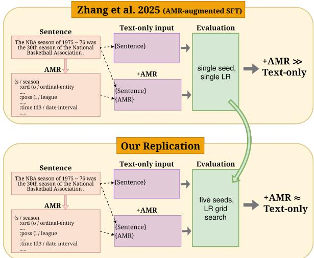
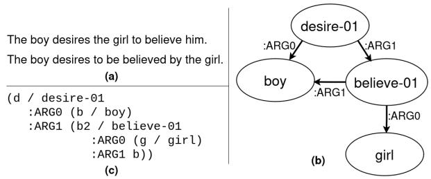
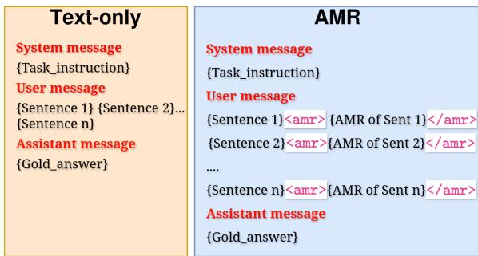
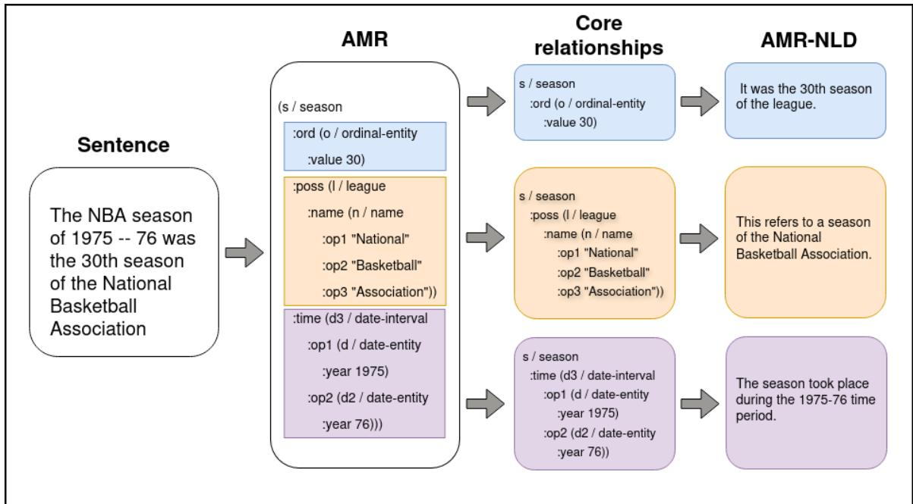

# On the (In)effectiveness of AMR Augmentation for Large Language Models

Hoa Quynh Nhung Nguyen\*<sup>†</sup>, Jacopo Staiano<sup>♢</sup>, Michael Sullivan<sup>†</sup>

<sup>†</sup>Saarland University, <sup>♢</sup>University of Trento

nhungnhq98@gmail.com, jacopo.staiano@unitn.it, msullivan@lst.uni-saarland.de

## Abstract

While Abstract Meaning Representation (AMR) has historically improved performance on a range of NLP tasks, the benefit—or lack thereof—of AMR augmentation for modern LLMs is thus far unclear. In this paper, we attempt to reproduce recent work that reported substantial downstream gains from AMR augmentation, finding that these are likely due to specific choices in the experimental settings used: using a consistent and unified protocol for hyperparameter selection, we observe that text-only baselines consistently match or exceed the performance of AMR-augmented models. To investigate this null result, we introduce a perplexity-based probe measuring the degree to which AMR provides an LLM with supplemental relational knowledge not already available to the model. We find that AMR augmentation does not help LLMs improve their understanding of relational content in the sentence, indicating that augmenting these models with AMR offers no clear benefit on downstream tasks.

## 1 Introduction

The Abstract Meaning Representation (AMR; Banarescu et al., 2013) framework is designed to provide structured, interpretable encodings of sentence meaning. AMR makes explicit the individual relations between entities and events that are represented in a given sentence, breaking down complex meaning into more atomic relations. In addition, AMR strips away stylistic and other aspects of plain text that are irrelevant to meaning, exposing only the semantically relevant information.

This popular semantic representation (SR) format has historically been used to improve performance across various NLP tasks, including Information Retrieval and Extraction (Xu et al., 2022; Zhang and Ji, 2021), Question Answering (Bonial et al., 2020), Summarization (Hua et al., 2023, 2022), and Paraphrase Generation (Huang et al., 2022)—in particular in systems built on earlier generations of language models (LMs), such as BERT (Devlin et al., 2019) and T5 (Raffel et al., 2020).

  
Figure 1: Prior work (Zhang et al., 2025; top) reports substantial improvement over a text-only baseline from AMR-augmentation. We revisit this method under a more robust evaluation (bottom), finding that AMR augmentation yields no improvement.

However, the raw capabilities of modern Large Language Models (LLMs) call into question the benefit of SRs such as AMR for NLP tasks. It is thus far unclear whether SRs can be used to meaningfully augment current, SoTA LLMs: while prior work has shown that AMR representations do not improve the performance of GPT-4 (OpenAI, 2023) in a zero-/few-shot setting (Jin et al., 2024), Zhang et al. (2025) indicate that AMR augmentation can benefit Llama-3.1-8B-Instruct<sup>1</sup> (Grattafiori et al., 2024) via supervised fine-tuning (SFT).

In this work, we analyze in-depth the effectiveness of AMR augmentation for open-weight LLMs.

First, we find that the results reported by Zhang et al. (2025) are not generally reproducible when reimplementing their experiments (see Figure 1): the observed performance gains from AMR over the base LLM in that work likely arose from highly specific experimental configurations and custom datasets. In particular, we find no clear improvement from AMR integration, despite substantial fine-tuning using multiple fine-tuning strategies.

Furthermore, we evaluate AMR integration for more complex, long-text tasks such as multisentence event argument extraction, to control for the possibility that the observed failure of AMR integration to improve performance on the simple, single-sentence tasks of Zhang et al. (2025) may be due to saturation on those benchmarks: if the models have already reached peak performance on these tasks, we do not expect any method—including AMR integration—to further increase their scores. However, we find that even on these more complex, multi-sentence tasks, AMR integration fails to yield any improvement over the base models.

Given that AMR consistently fails to improve LLM performance across integration strategies and task types, we hypothesize that AMR does not provide an LLM with any relational information that is not already available to the model. To evaluate this hypothesis, we conducted a perplexity-based probe over relational information in AMR graphs. Our findings support our hypothesis, indicating that AMR augmentation does not provide any relational information that LLMs are not already capable of extracting from plain text.

Our contributions are as follows:

1. A reimplementation of Zhang et al. (2025), indicating that the reported results are not generally reproducible and are likely due to specific experimental configurations.

2. An extension of those experiments and results to more complex, multi-sentence tasks.

3. An empirical analysis indicating that AMR augmentation does not provide additional relational knowledge to LLMs beyond what they can obtain from text alone.

We make all code used in these experiments available on GitHub<sup>2</sup>.

  
Figure 2: Abstract Meaning Representation for two different input sentences (a) with the same semantics. (b) shows the AMR graph and (c) represents the corresponding linearization using PENMAN notation. Example adapted from the AMR Guidelines (https://github.com/amrisi/amr-guidelines).

## 2 Related Work

Abstract Meaning Representation (AMR). AMR (Banarescu et al., 2013) is a semantic representation framework that is specifically designed to reflect “who does what to whom”: the schema centers on predicate-argument relations. Using AMR, each sentence is represented as a labeled, rooted directed acyclic graph, with nodes representing concepts and edges encoding the relations between those concepts (see Figure 2). Among graph-based semantic representations such as EDS (Oepen and Lønning, 2006) and UCCA (Abend and Rappoport, 2013), AMR is the most popular and well-resourced (Wein and Opitz, 2024).

Each AMR graph can be converted into a plaintext format using PENMAN notation (Kasper, 1989; see Figure 2): this textual form is referred to as linearized AMR. The PENMAN format allows AMR to be processed using standard language models, which would otherwise require graph-specific architectural modifications.

AMR Applications. A substantial body of work leveraged AMR to improve model performance on downstream NLP tasks for older generations of LMs. The most prevalent application domains are Information Extraction (Xu et al., 2022; Zhang and Ji, 2021), Question Answering (Bonial et al., 2020; Xu et al., 2021), and Summarization (Hua et al., 2023, 2022). AMR has also been applied to specialized domains such as mathematics (Mansouri et al., 2022) and Spatial/Situated Dialogue (Bonial et al., 2019, 2023).

Several studies have explored AMR integration into systems revolving around modern LLMs:

Jin et al. (2024) incorporated AMR into chain-ofthought prompts; Yao et al. (2024) combined AMR with LLMs for sentence simplification; Shi et al. (2024) used AMR to enhance retrieval-augmented generation; Raut et al. (2025) systematically evaluated LLMs on linearized AMR-incorporated fewshot prompts; and Zhang et al. (2025) incorporated linearized AMR into supervised fine-tuning.

Analysis of AMR Augmentation. While the utility of AMR augmentation for older LMs is wellestablished, the question of its value for modern LLMs remains unanswered.

Jin et al. (2024) first investigated the effect of integrating AMR into LLMs: they conducted training-free prompting experiments in which the input text is supplemented with its corresponding linearized AMR. Empirical results with GPT-3.5 and GPT-4 across multiple tasks show that incorporating AMR into LLMs degrades model performance on average, and that it is difficult to predict for a given input whether AMR augmentation will be beneficial.

Zhang et al. (2025), however, argue that augmenting the LLMs’ inputs with linearized AMR—without fine-tuning the models themselves—is insufficient to determine the effectiveness of AMR augmentation, as LLMs are not necessarily inherently familiar with this data format. The authors conduct experiments on fine-tuning LLMs with AMR-augmented training data and evaluate their approach on ten tasks—five of which overlap with Jin et al. (2024)—showing that jointly training an LLM on text augmented with linearized AMR data yields improvements of up to 12 F1 points.

Our findings directly contradict those of Zhang et al. (2025): we are unable to reproduce their results in our reimplementation, despite testing under a broad range of experimental conditions. We instead find evidence extending to fine-tuned settings the findings of Jin et al. (2024) that AMR augmentation does not benefit modern LLMs on downstream tasks.

Additionally, to the best of our knowledge, our experiments in Section 5 represent the first investigation into the reason for the inability of AMR augmentation to improve the downstream performance of LLMs, thereby providing additional support to the findings of Jin et al. (2024).

## 3 Single-Sentence Tasks

We first reimplemented the experiments in Zhang et al. (2025)—simple tasks involving a single<sup>3</sup> input sentence—in an attempt to reproduce the findings reported in that work. Furthermore, we introduced additional fine-tuning regimens not included in Zhang et al. (2025), in order to maximize the likelihood of successful AMR augmentation (see e.g. Section 3.1.2).

## 3.1 Methodology

Although the code for the experiments in Zhang et al. (2025) is not publicly available, and some experimental settings are under-specified, we mirrored the methodology as closely as possible. Additionally, while Zhang et al. (2025) only conducted experiments with Llama-3.1-8B-Instruct, we included Qwen3-8B<sup>4</sup> (Yang et al., 2025) in our analysis, to verify the generalizability of the approach to other model families.

All models were fine-tuned using LoRA (Hu et al., 2021) with r = 64, α = 128, and dropout = 0.05, applied to seven target modules: q\_proj, k\_proj, v\_proj, o\_proj, gate\_proj, up\_proj, and down\_proj. Optimal learning rates were selected via grid search for each experimental condition. Additional experimental details are provided in Appendix A.

## 3.1.1 Datasets

Zhang et al. (2025) fine-tuned and evaluated on a total of ten datasets: PAWS for paraphrase detection (Zhang et al., 2019), SNLI for entailment detection (Bowman et al., 2015), WMT16 for machine translation (Bojar et al., 2016), CoNLL2003 for named entity recognition (Tjong Kim Sang and De Meulder, 2003), SST-2 for sentiment analysis (Socher et al., 2013), PubMed45 for event extraction (Garg et al., 2016), WiC for word sense disambiguation (Pilehvar and Camacho-Collados, 2019), SPIDER for text-to-SQL generation (Yu et al., 2018), AG-News for text classification (Zhang et al., 2015), and Logic for logical fallacy detection (Jin et al., 2022).

However, the Logic dataset was synthetically generated by Zhang et al. (2025) using GPT-4oturbo. As the exact prompts used to create this data were not made available, we were unable to reconstruct the Logic dataset, and thus excluded it from our experiments.

<table><tr><td>Format</td><td>Example</td></tr><tr><td>Text-only</td><td>{sys} You are an expert in machine translation... {user} Obama receives Netanyahu {asst} Obama empfängt Netanyahu</td></tr><tr><td>+AMR</td><td>{sys} You are an expert in machine translation... {user} Sentence: Obama receives Netanyahu AMR: (r / receive-01 :ARG0 (p / person :name (n / name :op1&quot;Obama&quot;))</td></tr></table>

Table 1: Examples of the text-only (top) and AMRaugmented (bottom) prompt formats for the WMT16 translation task. System messages truncated for illustration; the full prompts are located in Appendix A.2.

For the other nine datasets, we kept the number of training samples as close as possible to those of Zhang et al. (2025). For each dataset, we parsed each instance into PENMAN-linearized AMR using AMR3-structbart-L (Drozdov et al., 2022), a SoTA AMR parser, to ensure high-quality, consistent AMR annotation.

## 3.1.2 Fine-Tuning

Joint Fine-Tuning. Following Zhang et al. (2025), we jointly fine-tuned the models on the training splits of all nine datasets. We fine-tuned baseline models on the original, text-only training data, and fine-tuned AMR-augmented models on a 50:50 mixture of text+AMR and text-only data (see Table 1): this mixture of text-only and AMRaugmented data yielded the best results in Zhang et al. (2025). At test time, the AMR-tuned models were evaluated only on AMR-augmented examples, as in Zhang et al. (2025).

We fine-tuned each model across five seeds, and report the averaged results for evaluation.

Individual Fine-Tuning. In addition to the joint fine-tuning procedure employed by Zhang et al. (2025), we further fine-tuned and evaluated baseline (text only) and AMR-augmented models on each dataset individually.

AMR-to-Text Intermediate Objective. To control for the possibility that the AMR-augmented models may fail to leverage the AMR structures present in their fine-tuning data—i.e. they may simply ignore the AMR—we additionally implemented an intermediate fine-tuning procedure to familiarize the models with this representational format.

Specifically, we first fine-tuned Llama-3.1-8B-Instruct and Qwen3-8B models on AMR-to-text generation, using the AMR 3.0 corpus (Knight et al., 2020) for training and evaluation (full training details and evaluation results for AMR-totext are provided in Appendix B). We then performed the AMR-augmented joint and individual fine-tuning, starting from the checkpoints trained on the intermediate AMR-to-text objective.

## 3.2 Results

Table 2 presents the joint and individual fine-tuning results for the text-only, AMR-augmented, and intermediate AMR-to-text (see Section 3.1.2) Llama-3.1-8B-Instruct and Qwen3-8B models. The joint fine-tuned, AMR-augmented Llama-3.1 model (Llama-3.1, Joint, +AMR in Table 2) is a direct reimplementation of the configuration used in Zhang et al. (2025). We additionally include the results reported by Zhang et al. (2025) for reference. Note that their +SR scores are averaged over three separate SR frameworks, including AMR, as Zhang et al. (2025) do not report a full performance breakdown by SR type. However, Zhang et al. (2025) report that AMR yields the greatest performance gains out of the SRs in their experiments (see their Table 11): if anything, the averaged figures in Table 2 understate the +AMR performance recorded by those authors.

In contrast to Zhang et al. (2025), we find no consistent improvement from AMR augmentation across models, tasks, or training settings. Under a two-sided t-test, we only find significant (p < 0.05) differences between text-only and AMR-augmented performance on two of 36 configurations (see Table 3): Qwen3-8B under the individual training regime on SNLI (in favor of text-only) and for Llama-3.1-8B under the joint regime on SPIDER (in favor of +AMR).

The observed discrepancy between our results and those of Zhang et al. (2025) is not due to a drastic decrease in our AMR-augmented models performance relative to the AMR-augmented results reported by those authors: in most cases, our AMR-augmented models actually perform better than in the experiments of Zhang et al. (2025).

Rather, the performance of the baseline, text-

<table><tr><td>Model</td><td>Training</td><td>Setup</td><td>WiC (F1)</td><td>SST (F1)</td><td>SNLI (F1)</td><td>PM (F1)</td><td>PAWS (F1)</td><td>AGN (Fl)</td><td>SPD (EM)</td><td>CNL (F1)</td><td>WMT (BLEU)</td></tr><tr><td rowspan="4">Qwen3-8B</td><td rowspan="2">Joint</td><td>Text +AMR</td><td> $7 6 . 8 { \scriptstyle \pm 0 . 3 }$   $7 6 . 4 \pm 0 . 4$ </td><td> ${ \bf 9 6 . 5 { \scriptstyle \pm 1 . 2 } }$   $9 6 . 1 \pm 1 . 9$ </td><td> $9 2 . 3 { \pm } 0 . 8 $   $9 2 . 1 \pm 1 . 2 $ </td><td> ${ \bf 7 0 . 4 } \pm 2 . 1$   $6 8 . 3 { \scriptstyle \pm 2 . 5 }$ </td><td> $9 2 . 9 2 6 2 \ - $   ${ \bf 9 3 . 0 { \scriptstyle \pm 0 . 4 } }$ </td><td> $9 2 . 3 { \pm } 0 . 5 $   $9 1 . 2 { \pm } 0 . 3 $ </td><td> $5 9 . 2 { \pm } 1 . 1 $   ${ \bf 6 1 . 9 } \pm 1 . 2$ </td><td> ${ \bf 9 2 . 4 } _ { \pm 0 . 3 }$ </td><td> $\mathbf { 2 8 . 2 \bot } _ { \pm 0 . 5 }$   $\mathbf { 2 8 . 2 \bot } _ { \pm 0 . 8 }$ </td></tr><tr><td> $+ { \mathrm { A M R } } + { \mathrm { I n t e r } } .$ </td><td> ${ \bf 7 7 . 5 { \pm } } 1 . 7$ </td><td></td><td></td><td></td><td></td><td></td><td></td><td> $9 2 . 1 \pm 0 . 6 $ </td><td></td></tr><tr><td rowspan="2">Individual</td><td></td><td></td><td> $9 6 . 2 { \scriptstyle \pm 0 . 3 }$ </td><td> $\mathbf { 9 2 . 4 } { \scriptstyle \pm 1 . 3 }$ </td><td> $6 7 . 2 { \pm } 4 . 8 $ </td><td> $9 2 . 7 { \scriptstyle \pm 0 . 7 }$ </td><td> ${ \bf 9 2 . 5 { \scriptstyle \pm 0 . 3 } }$ </td><td> $5 8 . 8 { \scriptstyle \pm 1 . 5 }$ </td><td> $9 2 . 3 { \pm } 1 . 6 $ </td><td> $2 7 . 6 { \scriptstyle \pm 0 . 7 }$ </td></tr><tr><td>Text +AMR</td><td> ${ \bf 7 5 . 9 } _ { \pm 2 . 1 }$ </td><td> $9 6 . 2 { \scriptstyle \pm 0 . 5 }$ </td><td> $\mathbf { 9 2 . 4 } { \scriptstyle \pm 1 . 2 }$ </td><td> $8 0 . 2 { \scriptstyle \pm 2 . 5 }$ </td><td> $\mathbf { 9 4 . 3 } \mathrm { \pm 0 . 3 }$ </td><td> $9 3 . 2 { \pm } 0 . 8 $ </td><td> $\mathbf { 5 7 . 8 } \pm \mathrm { 1 . 2 }$ </td><td> $9 3 . 2 { \pm } 0 . 5 $ </td><td> $2 8 . 3 { \scriptstyle \pm 0 . 2 }$ </td></tr><tr><td rowspan="4"></td><td rowspan="2"></td><td>+AMR +Inter.</td><td> $7 4 . 6 { \scriptstyle \pm 1 . 7 }$   $7 5 . 1 \pm 1 . 8$ </td><td> $\mathbf { 9 6 . 8 \pm } 1 . 4$   $9 6 . 3 { \scriptstyle \pm 0 . 2 }$ </td><td> $9 1 . 2 { \pm } 1 . 3 $   $9 1 . 0 { \pm } 1 . 4 $ </td><td> $8 1 . 3 { \pm } 1 . 4$   ${ \bf 8 2 . 9 2 } _ { \pm 1 . 2 }$ </td><td> $9 4 . 1 \pm 0 . 4 $ </td><td> ${ \bf 9 3 . 4 } { \scriptstyle \pm 0 . 5 }$   $9 3 . 2 { \scriptstyle \pm 0 . 2 }$ </td><td> $5 7 . 6 { \pm } 1 . 3$   $5 7 . 3 { \pm } 1 . 3 $ </td><td> $9 3 . 3 { \scriptstyle \pm 0 . 3 }$   $\mathbf { 9 3 . 4 } { \scriptstyle \pm 0 . 9 }$ </td><td> ${ \bf 2 8 . 5 { \scriptstyle \pm 0 . 1 } }$   $2 8 . 1 \pm 0 . 1$ </td></tr><tr><td></td><td></td><td></td><td></td><td></td><td> $\mathbf { 9 4 . 3 } \mathrm { \pm 0 . 3 }$ </td><td></td><td></td><td></td><td></td></tr><tr><td rowspan="2">Text</td><td></td><td> ${ \bf 7 6 . 7 \pm } 1 . 3$ </td><td> $9 6 . 2 { \scriptstyle \pm 0 . 8 }$ </td><td> $9 0 . 9 \pm 1 . 2 $ </td><td> $7 2 . 1 { \pm } s . 1$ </td><td> ${ \bf 9 3 . 1 { \scriptstyle \pm 0 . 1 } }$ </td><td> ${ \bf 9 1 . 2 } _ { \pm 1 . 1 }$ </td><td> $5 7 . 1 { \pm } 1 . 4 $ </td><td> $9 2 . 3 { \pm } 1 . 6 $ </td><td> $2 9 . 0 { \scriptstyle \pm 0 . 5 }$ </td></tr><tr><td>+AMR</td><td> $7 5 . 4 \pm 2 . 1$ </td><td> ${ \bf 9 6 . 5 { \scriptstyle \pm 0 . 7 } }$ </td><td> ${ \bf 9 1 . 3 { \scriptstyle \pm 1 . 8 } }$ </td><td> $7 1 . 7 { \scriptstyle \pm 7 . 3 }$ </td><td> $9 2 . 6 { \pm } 0 . 4$ </td><td> $9 0 . 4 \pm 1 . 2 $ </td><td> ${ \bf 5 8 . 3 2 . 8 }$ </td><td> ${ \bf 9 3 . 8 { \scriptstyle \pm 0 . 2 } }$ </td><td> $\mathbf { 2 9 . 2 } _ { \pm 0 . 7 }$ </td></tr><tr><td rowspan="4"></td><td rowspan="2">Individual</td><td>+AMR +Inter.</td><td> $7 4 . 9 { \scriptstyle \pm 3 . 2 }$ </td><td> $9 6 . 1 \pm 0 . 9$ </td><td> $9 0 . 2 \pm 1 . 3 $ </td><td> $7 2 . 4 { \scriptstyle \pm 7 . 2 }$ </td><td> $9 2 . 2 { \pm } 0 . 8 $ </td><td> $9 0 . 1 \pm 1 . 5 $ </td><td> $5 5 . 2 { \pm } 1 . 7 $ </td><td> $9 2 . 4 \pm 0 . 7 $ </td><td> $2 7 . 4 { \pm } 0 . 5$ </td></tr><tr><td>Text +AMR</td><td> ${ \bf 7 5 . 4 } \pm 2 . 3 $ </td><td> $\mathbf { 9 6 . 3 2 } 0 . 9 $ </td><td> $9 1 . 2 { \scriptstyle \pm 0 . 3 }$ </td><td> ${ \mathbf { 8 4 . 1 } } _ { \pm 0 . 8 }$ </td><td> ${ \bf 9 3 . 9 { \scriptstyle \pm 0 . 3 } }$ </td><td> $\mathbf { 9 3 . 6 { \scriptstyle \pm 1 . 1 } }$ </td><td> $\mathbf { 5 6 . 8 } \pm 2 . 5$ </td><td> $9 3 . 2 { \scriptstyle \pm 0 . 2 }$ </td><td> $\mathbf { 2 9 . 8 { \scriptstyle \pm 0 . 3 } }$ </td></tr><tr><td rowspan="2"></td><td></td><td> $7 5 . 2 { \pm 2 . 1 }$ </td><td> $9 6 . 1 \pm 0 . 6 $ </td><td> ${ \bf 9 1 . 3 { \scriptstyle \pm 0 . 5 } }$ </td><td> $8 2 . 4 \pm 3 . 2$ </td><td> $9 3 . 5 { \pm } 0 . 5 $ </td><td> $9 3 . 2 { \pm } 1 . 2$ </td><td> $5 6 . 1 \pm 1 . 3$ </td><td> $\mathbf { 9 3 . 7 } _ { \pm 1 . 2 }$ </td><td> $2 9 . 6 { \scriptstyle \pm 0 . 3 }$ </td></tr><tr><td>+AMR +Inter.</td><td> $7 3 . 8 { \scriptstyle \pm 3 . 1 }$ </td><td> $9 5 . 3 { \pm } 1 . 2 $ </td><td> $9 0 . 1 \pm 1 . 4$ </td><td> $8 2 . 6 { \scriptstyle \pm 1 . 6 }$ </td><td> $9 3 . 6 { \scriptstyle \pm 0 . 3 }$ </td><td> $9 3 . 3 { \scriptstyle \pm 0 . 2 }$ </td><td> $5 4 . 5 { \pm } 1 . 8 $ </td><td> $9 3 . 1 \pm 0 . 9 $ </td><td> $2 9 . 3 { \scriptstyle \pm 0 . 2 }$ </td></tr><tr><td rowspan="2">Zhang et al. (2025) (Llama-3.1-8B)</td><td rowspan="2">Joint</td><td>Text</td><td>67.0</td><td>75.6</td><td>35.5</td><td>78.9</td><td>68.9</td><td>76.5</td><td>41.2</td><td>75.8</td><td>29.1</td></tr><tr><td>+SR</td><td>74.7</td><td>83.7</td><td>54.9</td><td>81.9</td><td>81.0</td><td>82.6</td><td>48.9</td><td>76.7</td><td>30.3</td></tr></table>

Table 2: Joint and individual training results on the nine single-sentence task datasets for Llama-3.1-8B-Instruct and Qwen3-8B, compared to the results reported in Zhang et al. (2025) for Llama-3.1-8B. The +SR scores from Zhang et al. (2025) are averaged over multiple SR frameworks, including AMR (see the discussion in Section 3.2). Each cell reports mean ± standard deviation over runs with different random seeds. The best-performing Setup within each Model, Training type, and dataset is indicated in bold. PM=PubMed45, AGN=AGNews, SPD=SPIDER, CNL=CoNLL2003, WMT=WMT16.

<table><tr><td>Dataset</td><td>Llama</td><td>Qwen</td><td>Pooled</td></tr><tr><td>Individual training</td><td></td><td></td><td></td></tr><tr><td>WMT</td><td>0.370</td><td>0.067</td><td>0.985</td></tr><tr><td>PAWS</td><td>0.166</td><td>0.273</td><td>0.064</td></tr><tr><td>WiC</td><td>0.954</td><td>0.631</td><td>0.717</td></tr><tr><td>SPIDER</td><td>0.790</td><td>0.614</td><td>0.901</td></tr><tr><td>AGNews</td><td>0.590</td><td>0.297</td><td>0.211</td></tr><tr><td>CoNLL</td><td>0.433</td><td>0.110</td><td>0.750</td></tr><tr><td>SNLI</td><td>0.489</td><td>0.033</td><td>0.234</td></tr><tr><td>SST</td><td>0.999</td><td>0.789</td><td>0.773</td></tr><tr><td>PubMed45</td><td>0.244</td><td>0.206</td><td>0.787</td></tr><tr><td>Joint training</td><td></td><td></td><td></td></tr><tr><td>WMT</td><td>0.644</td><td>0.842</td><td>0.718</td></tr><tr><td>PAWS</td><td>0.180</td><td>0.844</td><td>0.813</td></tr><tr><td>WiC</td><td>0.615</td><td>0.226</td><td>0.904</td></tr><tr><td>SPIDER</td><td>0.017</td><td>0.191</td><td>0.199</td></tr><tr><td>AGNews</td><td>0.279</td><td>0.180</td><td>0.150</td></tr><tr><td>CoNLL</td><td>0.064</td><td>0.256</td><td>0.262</td></tr><tr><td>SNLI</td><td>0.987</td><td>0.866</td><td>0.952</td></tr><tr><td>SST</td><td>0.491</td><td>0.136</td><td>0.550</td></tr><tr><td></td><td></td><td></td><td></td></tr><tr><td>PubMed45</td><td>0.190</td><td>0.350</td><td>0.504</td></tr></table>

Table 3: Results (p-values) for two-sided t-tests comparing the text-only and AMR-augmented $( ^ { 6 6 } { + } \mathbf { A M R } ^ { 3 3 } )$ 1 scores in Table 2—significant values $( p < 0 . 0 5 )$ are indicated in bold. The “Pooled” column denotes a t-test over the combined Llama and Qwen results for each task.

racy on SNLI (Nie et al., 2020).

We therefore conclude that the results reported in Zhang et al. (2025) are likely due to a faulty experimental configuration: the performance of text-only and AMR-augmented LLMs is roughly equal regardless of the choice of fine-tuning regimen.

## 4 Multi-Sentence Tasks

The baseline models’ performance on many of the tasks in Section 3 is near saturation: on SST-2, SNLI, PAWS, AGNews, and CoNLL2003, the textonly Llama-3.1 and Qwen3 models already achieve accuracy/F1 scores over 90%. It is therefore possible that AMR augmentation is simply unable to improve model performance on these tasks because there is no more room for improvement.

only models in Zhang et al. (2025) is substantially lower than the performance of our text-only models. As an example, Zhang et al. (2025) report an F1 score of 35.5 on SNLI for their text-only, fine-tuned Llama-3.1-8B-Instruct model—this is far lower than we would expect given that even BERT (Devlin et al., 2019) reaches ∼91% accu-

To account for this possibility, we extended our evaluation of AMR-augmented models to more difficult, multi-sentence tasks—such as passagelevel summarization—where inputs involve richer and more complex linguistic structures.

## 4.1 Methodology

Datasets. We selected four multi-sentence datasets that require understanding complex linguistic and semantic structures: RAMS for event argument extraction (Ebner et al., 2020), CNN/DailyMail for summarization (See et al., 2017), ANLI for adversarial natural language inference (Nie et al., 2020), and LogiQA for reading comprehension (Liu et al., 2020). Dataset statistics are provided in Table 4.

  
Figure 3: Templates for text-only (left) and AMRaugmented (right) prompts for the multi-sentence tasks.

As discussed in Section 2, prior work has demonstrated notable improvement from AMR augmentation for earlier generations of LMs on event argument extraction and summarization in particular (Xu et al., 2022; Hua et al., 2023). If modern LLMs can in fact benefit from AMR augmentation, it therefore stands to reason that we would expect to see the most substantial benefits on such tasks.

AMR-Text Integration. To incorporate AMR structures into the multi-sentence inputs, we interleaved the AMR into the text: each linearized AMR graph is placed immediately after its corresponding sentence, encapsulated within special delimiter tokens (<amr> . . . </amr>) to clearly distinguish AMR from natural language content (see Figure 3). Full example prompts are provided in Appendix C.

Experimental Setup. The setup follows that of the single-sentence experiments of Section 3. As in Section 3, we experimented with joint and individual-task fine-tuning regimens, and evaluated standard fine-tuning along with a two-phase, intermediate AMR-to-text approach (see Section 3.1.2).

## 4.2 Results

The results of these experiments are given in Table 5. Consistent with our single-sentence findings, we observe no meaningful improvement from AMR augmentation across all fine-tuning strategies and models: the performance of the AMR-augmented models remains on par with or below that of the text-only baseline across all four tasks.

Furthermore, note that the performance of the baseline, text-only models on these tasks is not near saturation (perhaps with the exception of ANLI). This indicates that the observed failure in Section 3 of AMR augmentation to improve LLMs’ downstream performance was not due to saturation on those tasks: across varying model types, finetuning regimens, and task difficulties, AMR augmentation consistently fails to markedly improve the performance of modern LLMs.

<table><tr><td>Dataset</td><td>Task</td><td>Train</td><td>Dev</td><td>Test</td></tr><tr><td>RAMS</td><td>Event Argument Extraction</td><td>7000</td><td>849</td><td>817</td></tr><tr><td>CNN/DM</td><td>Abstractive Summarization</td><td>5000</td><td>500</td><td>500</td></tr><tr><td>ANLI</td><td>Natural Language Inference</td><td>7000</td><td>700</td><td>1200</td></tr><tr><td>LogiQA</td><td>Reading Comprehension</td><td>3828</td><td>478</td><td>480</td></tr></table>

Table 4: Split sizes for the multi-sentence task datasets.

## 5 Relational Knowledge Analysis

As the AMR representation $A _ { S }$ of a sentence S is derived solely from S itself—without the use of any other external source of information— ${ \bf \nabla } \cdot { \cal A } _ { S }$ cannot possibly encode any more information than S already contains. The utility of AMR lies instead in its explicit representation of structure: by making semantic relationships between entities overt and symbolic, AMR has the potential to help a model better extract the latent relational content already present in the text.

The observed failure of AMR augmentation to meaningfully improve downstream performance in the experiments of Sections 3-4 therefore raises the question as to whether modern LLMs require the structural guidance provided by AMR to infer semantic relationships encoded in the text. We posit that AMR does not improve the downstream performance of a modern LLM because it does not provide any relevant relational information not already available to the model.

In this section, we directly evaluate this conjecture (Section 5.1), and find evidence in support of our hypothesis that AMR augmentation does not improve LLMs’ understanding of sentence-level relational knowledge (Section 5.2).

## 5.1 Methodology

Given a sentence S with its corresponding AMR $A _ { S } ,$ let $R _ { S }$ denote a representation of the relational content of S that is encoded by $A _ { S } \colon$ an encoding of the properties of entities and relations between entities that are expressed by S and represented in $A _ { S }$ If AMR augmentation does in fact provide an LLM M with additional understanding of the relational content of S that M does not already possess, we would expect that the probability assigned to $R _ { S }$ by M would be substantially higher when given both S and its AMR $A _ { S }$ , than when given S alone

<table><tr><td>Model</td><td>Training</td><td>Setup</td><td>RAMS (F1)</td><td>LogiQA (Acc.)</td><td>ANLI (F1)</td><td>CNN (ROUGE-L)</td></tr><tr><td rowspan="6">Llama-3.1-8B</td><td rowspan="2">Joint</td><td>Text</td><td> ${ \bf 5 0 . 0 _ { \pm 0 . 6 } }$ </td><td> ${ \bf 5 4 . 9 _ { \pm 0 . 5 } }$ </td><td> ${ \bf 8 8 . 5 _ { \pm 0 . 5 } }$ </td><td> $3 1 . 5 _ { \pm 0 . 4 }$ </td></tr><tr><td>+AMR</td><td> $4 9 . 1 _ { \pm 0 . 5 }$ </td><td> $5 3 . 6 { \scriptstyle \pm 0 . 5 }$ </td><td> $8 8 . 1 _ { \pm 0 . 4 }$ </td><td> $3 1 . 2 { \scriptstyle \pm 0 . 4 }$ </td></tr><tr><td rowspan="3"></td><td>+AMR +Inter.</td><td> $4 9 . 5 _ { \pm 0 . 7 }$ </td><td> $5 3 . 8 { \scriptstyle \pm 0 . 5 }$ </td><td> $8 6 . 8 { \scriptstyle \pm 0 . 6 }$ </td><td> $3 1 . 4 _ { \pm 0 . 4 }$ </td></tr><tr><td>Text</td><td> $4 9 . 4 _ { \pm 0 . 7 }$ </td><td> $5 5 . 7 _ { \pm 1 . 5 }$ </td><td> $\mathbf { 8 7 . 7 \bot 0 . 9 }$ </td><td> ${ \bf 3 1 . 0 _ { \pm 0 . 7 } }$ </td></tr><tr><td>+AMR</td><td> ${ \bf 5 0 . 1 { \bf _ { \pm 0 . 6 } } }$ </td><td> $5 7 . 2 { \scriptstyle \pm 0 . 7 }$ </td><td> $8 7 . 4 { \scriptstyle \pm 0 . 5 }$ </td><td> $3 0 . 7 { \scriptstyle \pm 0 . 5 }$ </td></tr><tr><td rowspan="5">Joint</td><td rowspan="3"></td><td>+AMR +Inter.</td><td> $4 9 . 9 _ { \pm 0 . 4 }$ </td><td> $5 3 . 1 _ { \pm 1 . 1 }$ </td><td> $8 6 . 0 { \scriptstyle \pm 0 . 6 }$ </td><td> $3 0 . 7 _ { \pm 0 . 4 }$ </td></tr><tr><td>Text</td><td> $4 4 . 2 _ { \pm 0 . 8 }$ </td><td> ${ 7 0 . 7 \pm 0 . 5 }$ </td><td> ${ \bf 8 7 . 2 _ { \pm 0 . 6 } }$ </td><td> ${ \bf 3 0 . 6 { \bf _ { \pm 0 . 5 } } }$ </td></tr><tr><td>+AMR</td><td> $4 4 . 5 { \scriptstyle \pm 0 . 6 }$ </td><td> $6 8 . 8 { \scriptstyle \pm 0 . 7 }$ </td><td> $8 6 . 7 \pm 0 . 4$ </td><td> ${ \bf 3 0 . 6 { \bf _ { \pm 0 . 5 } } }$ </td></tr><tr><td rowspan="3"></td><td>+AMR +Inter.</td><td> $4 4 . 7 _ { \pm 0 . 4 }$ </td><td> $6 7 . 1 _ { \pm 1 . 1 }$ </td><td> $8 6 . 3 { \scriptstyle \pm 0 . 5 }$ </td><td> $3 0 . 2 { \scriptstyle \pm 0 . 4 }$ </td></tr><tr><td rowspan="2">Text Individual</td><td></td><td> $4 8 . 2 _ { \pm 0 . 7 }$ </td><td> $\mathbf { 7 0 . 9 } _ { \pm 0 . 7 }$ </td><td> ${ \bf 8 8 . 0 _ { \pm 0 . 6 } }$ </td><td> $\mathbf { 3 0 . 7 } _ { \pm 0 . 4 }$ </td></tr><tr><td>+AMR</td><td> $4 8 . 2 _ { \pm 0 . 2 }$   $4 7 . 5 { \pm } 1 . 1$ </td><td> $6 9 . 9 { \scriptstyle \pm 0 . 9 }$   $6 8 . 6 { \scriptstyle \pm 1 . 1 }$ </td><td> $8 7 . 8 { \scriptstyle \pm 0 . 5 }$   $8 6 . 2 { \scriptstyle \pm 0 . 5 }$ </td><td> $\mathbf { 3 0 . 7 } _ { \pm 0 . 5 }$ </td></tr></table>

Table 5: Joint and individual training results on the four multi-sentence task datasets for Llama-3.1-8B-Instruct and Qwen3-8B. Each cell reports mean ± standard deviation over five runs with different random seeds. The best-performing setup within each model, training type, and dataset is indicated in bold.

<table><tr><td>Input Type</td><td colspan="6">User Prompt</td></tr><tr><td>Text-only</td><td>Input Sentence: 1975-76 was the National Basketball Association.&quot;</td><td></td><td>&quot;The 30th &quot;The</td><td>NBA season</td><td>season of season</td><td>of the of</td></tr><tr><td>Text+AMR</td><td colspan="6">Input Sentence: NBA 1975-76 was the 30th season of National Basketball Association.&quot; Input AMR: (s / season :ord (o / ordinal-entity :value 30) :poss (1 / league :name (n / name :op1...)))</td></tr><tr><td>Text+AMR-nodes</td><td colspan="6">Input Sentence: &quot;The NBA season of 1975-76 was the 30th season of the National Basketball Association.&quot; Supplement: season, ordinal-entity, 30, league,name, National, Basketball, Association, date-interval, date-entity, 1975, date-entity, 76</td></tr></table>

Table 6: Input types and their corresponding user prompts. AMR is truncated for presentability. Full example prompts are provided in Appendix E.2.

(Equation 1).

$$
P _ { M } ( R _ { S } \mid S , A _ { S } ) \gg P _ { M } ( R _ { S } \mid S )\tag{1}
$$

On the other hand, if our hypothesis holds and LLMs already implicitly encode all of the relational information provided by AMR, we would expect that $P _ { M } ( R _ { S } \mid S , A _ { S } ) \approx P _ { M } ( R _ { S } \mid S )$

## 5.1.1 AMR-NLD

As the relational content of an AMR graph is a structured symbolic object, it cannot be directly fed to a language model for likelihood evaluation. To empirically test our hypothesis, it is therefore necessary to transform the linearized AMR graphs of Sections 3-4 into AMR natural language descriptions (AMR-NLD; Zhang et al., 2025): natural language descriptions of the relational content of an AMR graph.

The AMR-NLD generation procedure that we employed is illustrated in Figure 4: we first decomposed the AMR into core relational branches, then mapped each to a natural language sentence using Claude Sonnet 4.6 (Anthropic, 2025)—the exact prompt used is provided in Appendix E.3.

## 5.1.2 Experimental Setup

We first randomly sampled 300 AMR-sentence pairs and then filtered to 178 pairs (Appendix E.1) from the PAWS test split used in our experiments in Section 3, and used the procedure described in Section 5.1.1 to generate the AMR-NLD for each AMR, resulting in a dataset of 178 text, AMR, AMR-NLD triples $( S _ { i } , A _ { S _ { i } } , R _ { S _ { i } } )$

We then evaluated a series of Llama-3.1-8B and Qwen3-8B models (see below), computing the perplexity of the AMR-NLD $R _ { S _ { i } }$ for each example conditioned on (i) the text $S _ { i }$ alone and (ii) $S _ { i }$ and its AMR $A _ { S _ { i } }$

The addition of the AMR $A _ { S _ { i } }$ may have a priming effect: it is possible that, for example, the formal, structured AMR representation increases the likelihood that the model assigns to short, declarative sentences such as AMR-NLD—regardless of the informational content of the AMR. To control for this possibility, we additionally evaluated the models on a third condition, in which we computed the perplexity of the AMR-NLD $R _ { S _ { i } }$ conditioned on $S _ { i }$ and a stripped version of the AMR $A _ { S _ { i } }$ in which all relations have been removed, leaving only node (entity) labels (AMR-nodes; see Table 6).

  
Figure 4: Our AMR-NLD generation pipeline, illustrated with an example sentence. The AMR graph for the input sentence is decomposed into core relational branches (e.g. :ord, :poss, :time), each of which is mapped to an individual description in natural language.

<table><tr><td>Model</td><td>Text</td><td>+AMR</td><td>+AMR-Nodes</td></tr><tr><td>Llama</td><td></td><td></td><td></td></tr><tr><td>Base</td><td>4.42</td><td>3.64</td><td>3.72</td></tr><tr><td>Text-FT</td><td> $3 . 5 8 _ { \pm 0 . 0 9 }$ </td><td> $3 . 0 6 _ { \pm 0 . 1 1 }$ </td><td> $3 . 1 6 _ { \pm 0 . 1 3 }$ </td></tr><tr><td>AMR-FT</td><td> $3 . 6 6 { \scriptstyle \pm 0 . 1 0 }$ </td><td> $3 . 2 4 { \scriptstyle \pm 0 . 1 7 }$ </td><td> $3 . 3 3 { \scriptstyle \pm 0 . 1 0 }$ </td></tr><tr><td>Inter-FT</td><td> $4 . 6 6 _ { \pm 0 . 1 5 }$ </td><td> $4 . 2 0 _ { \pm 0 . 1 4 }$ </td><td> $4 . 2 4 _ { \pm 0 . 1 3 }$ </td></tr><tr><td colspan="4">Qwen</td></tr><tr><td>Base</td><td>19.11</td><td>14.91</td><td>14.34</td></tr><tr><td>Text-FT</td><td> $5 . 1 0 { \scriptstyle \pm 0 . 2 2 }$ </td><td> $4 . 4 7 _ { \pm 0 . 3 1 }$ </td><td> $4 . 5 5 { \scriptstyle \pm 0 . 2 5 }$ </td></tr><tr><td>AMR-FT</td><td> $5 . 0 7 { \scriptstyle \pm 0 . 3 0 }$ </td><td> $4 . 2 9 { \scriptstyle \pm 0 . 3 5 }$ </td><td> $4 . 3 7 { \scriptstyle \pm 0 . 3 3 }$ </td></tr><tr><td>Inter-FT</td><td> $3 . 9 8 _ { \pm 0 . 0 6 }$ </td><td> $3 . 7 9 _ { \pm 0 . 0 4 }$ </td><td> $3 . 7 9 _ { \pm 0 . 0 4 }$ </td></tr></table>

Table 7: Mean perplexity (± std) across model configurations and input conditions.

For each model family (Llama-3.1-8B-Instruct and Qwen3-8B), we evaluated four model types: (i) a baseline, off-the-shelf model with no additional fine-tuning; (ii) a model fine-tuned on the text-only version of the PAWS train split (i.e. the original data); (iii) a model fine-tuned on the AMR-augmented PAWS train split following our approach in Section 3.1.2; and (iv) a model intermediate-fine-tuned on AMR-to-text translation, then fine-tuned on AMR-augmented PAWS, as in our approach outlined in Section 3.1.2.

For types (ii)–(iv), the models were each trained with five different random seeds: we report the mean and standard deviation across all five seeds.

## 5.2 Results

Perplexity scores by model configuration and input type are given in Table 7.

AMR augmentation consistently decreases perplexity for all model configurations, seemingly indicating that AMR does in fact provide the LLMs with additional relational information. However, there is no substantial difference between AMRaugmented perplexity and that of the AMR-nodes control condition: recall that this control condition consists of AMR structures that have been stripped of all relational information. This indicates that the observed differences in perplexity between the text-only and AMR-augmented conditions are due to spurious factors—for example the association of formal-logical structures with short, matter-of-fact statements.

These results therefore support the hypothesis that AMR does not supply relational knowledge beyond what LLMs already infer from text, which is consistent with our results in Sections 3 and 4: AMR augmentation offers no benefit to those models on downstream tasks.

## 6 Conclusion

In this paper, we investigated whether augmenting LLM inputs with linearized AMR improves downstream performance. Across two model families, thirteen tasks spanning single- and multisentence settings, and several fine-tuning strategies, we found no consistent improvement over text-only baselines: this indicates that the AMR-augmented performance gains reported in prior work are likely due to specific experimental conditions or hyperparameter selection.

We then investigated why AMR augmentation does not benefit modern LLMs. A perplexity-based analysis indicated that AMR does not reduce an LLM’s uncertainty about the relational content of a sentence beyond the structure-free control. In other words, AMR augmentation does not provide relational knowledge beyond what is already extractable from text alone for modern LLMs.

## Limitations

Our multi-seed experiments are limited to 8B parameter models (we conduct a single-seed 70B experiment in Appendix A.4); future work should assess the generalization of our findings to models of different sizes, and in particular examine whether there exists a relationship between model size and the effectiveness of SR integration.

We focus exclusively on the AMR semantic representation format. However, while AMR is the most popular and well-resourced SR format (Wein and Opitz, 2024), it is but one of many such formalisms: other SRs such as UCCA and UDS may interact differently with LLMs. Future work should extend our experiments to a broader range of semantic representations.

Additionally, we do not study the potential effect of parser errors on the AMR-augmented models. While the observed performance of AMRaugmented models might be affected by parser errors, we argue that any AMR integration technique will also confront this same issue: it is an inherent limitation of AMR augmentation.

Finally, our study is limited to AMR integration at the fine-tuning stage, and there remains an open question as to whether semantic representations could be more effectively integrated at a more fundamental level such as during pretraining.

## References

Omri Abend and Ari Rappoport. 2013. Universal Conceptual Cognitive Annotation (UCCA). In Proceedings of the 51st Annual Meeting of the Association for Computational Linguistics (Volume 1: Long Papers), pages 228–238, Sofia, Bulgaria. Association for Computational Linguistics.

Anthropic. 2025. Claude sonnet 4.6. https://www. anthropic.com/claude/sonnet.

Xuefeng Bai, Yulong Chen, and Yue Zhang. 2022. Graph pre-training for AMR parsing and generation. In Proceedings of the 60th Annual Meeting of the Associationfor Computational Linguistics (Volume 1: Long Papers), pages 6001–6015, Dublin, Ireland. Association for Computational Linguistics.

Laura Banarescu, Claire Bonial, Shu Cai, Madalina Georgescu, Kira Griffitt, Ulf Hermjakob, Kevin Knight, Philipp Koehn, Martha Palmer, and Nathan Schneider. 2013. Abstract Meaning Representation for sembanking. In Proceedings ofthe 7th Linguistic Annotation Workshop and Interoperability with Discourse, pages 178–186, Sofia, Bulgaria. Association for Computational Linguistics.

Ondˇrej Bojar, Rajen Chatterjee, Christian Federmann, Yvette Graham, Barry Haddow, Matthias Huck, Antonio Jimeno Yepes, Philipp Koehn, Varvara Logacheva, Christof Monz, Matteo Negri, Aurélie Névéol, Mariana Neves, Martin Popel, Matt Post, Raphael Rubino, Carolina Scarton, Lucia Specia, Marco Turchi, Karin Verspoor, and Marcos Zampieri. 2016. Findings of the 2016 conference on machine translation. In Proceedings of the First Conference on Machine Translation: Volume 2, Shared Task Papers, pages 131–198, Berlin, Germany. Association for Computational Linguistics.

Claire Bonial, Lucia Donatelli, Stephanie M. Lukin, Stephen Tratz, Ron Artstein, David Traum, and Clare Voss. 2019. Augmenting Abstract Meaning Representation for human-robot dialogue. In Proceedings of the First International Workshop on Designing Meaning Representations, pages 199–210, Florence, Italy. Association for Computational Linguistics.

Claire Bonial, Julie Foresta, Nicholas C. Fung, Cory J. Hayes, Philip Osteen, Jacob Arkin, Benned Hedegaard, and Thomas Howard. 2023. Abstract Meaning Representation for grounded human-robot communication. In Proceedings ofthe Fourth International Workshop on Designing Meaning Representations, pages 34–44, Nancy, France. Association for Computational Linguistics.

Claire Bonial, Stephanie M. Lukin, David Doughty, Steven Hill, and Clare Voss. 2020. InfoForager: Leveraging semantic search with AMR for COVID-19 research. In Proceedings of the Second International Workshop on Designing Meaning Representations, pages 67–77, Barcelona Spain (online). Association for Computational Linguistics.

Samuel R. Bowman, Gabor Angeli, Christopher Potts, and Christopher D. Manning. 2015. A large annotated corpus for learning natural language inference. In Proceedings of the 2015 Conference on Empirical Methods in Natural Language Processing, pages 632–642, Lisbon, Portugal. Association for Computational Linguistics.

Ziming Cheng, Zuchao Li, and Hai Zhao. 2022. BiBL: AMR parsing and generation with bidirectional Bayesian learning. In Proceedings ofthe 29th International Conference on Computational Linguistics, pages 5461–5475, Gyeongju, Republic of Korea. International Committee on Computational Linguistics.

Jacob Devlin, Ming-Wei Chang, Kenton Lee, and Kristina Toutanova. 2019. BERT: Pre-training of deep bidirectional transformers for language understanding. In Proceedings ofthe 2019 Conference of the North American Chapter ofthe Associationfor Computational Linguistics: Human Language Technologies, Volume 1 (Long and Short Papers), pages 4171–4186, Minneapolis, Minnesota. Association for Computational Linguistics.

Andrew Drozdov, Jiawei Zhou, Radu Florian, Andrew McCallum, Tahira Naseem, Yoon Kim, and Ramón Astudillo. 2022. Inducing and using alignments for transition-based AMR parsing. In Proceedings of the 2022 Conference of the North American Chapter of the Association for Computational Linguistics: Human Language Technologies, pages 1086–1098, Seattle, United States. Association for Computational Linguistics.

Seth Ebner, Patrick Xia, Ryan Culkin, Kyle Rawlins, and Benjamin Van Durme. 2020. Multi-sentence argument linking. In Proceedings of the 58th Annual Meeting of the Association for Computational Linguistics, pages 8057–8077, Online. Association for Computational Linguistics.

Sahil Garg, Aram Galstyan, Ulf Hermjakob, and Daniel Marcu. 2016. Extracting biomolecular interactions using semantic parsing of biomedical text. In Proceedings ofthe AAAI Conference on Artificial Intelligence, volume 30.

Aaron Grattafiori, Abhimanyu Dubey, Abhinav Jauhri, Abhinav Pandey, Abhishek Kadian, Ahmad Al-Dahle, Aiesha Letman, Akhil Mathur, Alan Schelten, Alex Vaughan, et al. 2024. The llama 3 herd of models. arXiv preprint arXiv:2407.21783.

Edward J. Hu, Yelong Shen, Phillip Wallis, Zeyuan Allen-Zhu, Yuanzhi Li, Shean Wang, Lu Wang, and Weizhu Chen. 2021. Lora: Low-rank adaptation of large language models. Preprint, arXiv:2106.09685.

Yilun Hua, Zhaoyuan Deng, and Kathleen McKeown. 2023. Improving long dialogue summarization with semantic graph representation. In Findings of the Association for Computational Linguistics: ACL 2023, pages 13851–13883, Toronto, Canada. Association for Computational Linguistics.

Yilun Hua, Zhaoyuan Deng, and Zhijie Xu. 2022. AM-RTVSumm: AMR-augmented hierarchical network for TV transcript summarization. In Proceedings of the Workshop on Automatic Summarizationfor Creative Writing, pages 36–43, Gyeongju, Republic of Korea. Association for Computational Linguistics.

Kuan-Hao Huang, Varun Iyer, Anoop Kumar, Sriram Venkatapathy, Kai-Wei Chang, and Aram Galstyan. 2022. Unsupervised syntactically controlled paraphrase generation with Abstract Meaning Representations. In Findings of the Association for Computational Linguistics: EMNLP 2022, pages 1547–1554, Abu Dhabi, United Arab Emirates. Association for Computational Linguistics.

Zhijing Jin, Yuen Chen, Fernando Gonzalez Adauto, Jiarui Liu, Jiayi Zhang, Julian Michael, Bernhard Schölkopf, and Mona Diab. 2024. Analyzing the role of semantic representations in the era of large language models. In Proceedings of the 2024 Conference ofthe North American Chapter ofthe Associationfor Computational Linguistics: Human Language Technologies (Volume 1: Long Papers), pages 3781–3798, Mexico City, Mexico. Association for Computational Linguistics.

Zhijing Jin, Abhinav Lalwani, Tejas Vaidhya, Xiaoyu Shen, Yiwen Ding, Zhiheng Lyu, Mrinmaya Sachan, Rada Mihalcea, and Bernhard Schoelkopf. 2022. Logical fallacy detection. In Findings ofthe Associationfor Computational Linguistics: EMNLP 2022, pages 7180–7198, Abu Dhabi, United Arab Emirates. Association for Computational Linguistics.

Robert T. Kasper. 1989. A flexible interface for linking applications to Penman‘s sentence generator. In Speech and Natural Language: Proceedings of a Workshop Held at Philadelphia, Pennsylvania, February 21-23, 1989.

Kevin Knight, Bianca Badarau, Laura Baranescu, Claire Bonial, Madalina Bardocz, Kira Griffitt, Ulf Hermjakob, Daniel Marcu, Martha Palmer, Tim O’Gorman, and Nathan Schneider. 2020. Abstract Meaning Representation (AMR) Annotation Release 3.0. LDC2020T02.

Junnan Li, Dongxu Li, Silvio Savarese, and Steven Hoi. 2023. Blip-2: Bootstrapping language-image pretraining with frozen image encoders and large language models. In International conference on machine learning, pages 19730–19742. PmLR.

Jian Liu, Leyang Cui, Hanmeng Liu, Dandan Huang, Yile Wang, and Yue Zhang. 2020. Logiqa: A challenge dataset for machine reading comprehension with logical reasoning. arXiv preprint arXiv:2007.08124.

Behrooz Mansouri, Douglas W Oard, and Richard Zanibbi. 2022. Contextualized formula search using math abstract meaning representation. In Proceedings ofthe 31st ACM International Conference on Information & Knowledge Management, pages 4329–4333.

Yixin Nie, Adina Williams, Emily Dinan, Mohit Bansal, Jason Weston, and Douwe Kiela. 2020. Adversarial NLI: A new benchmark for natural language understanding. In Proceedings of the 58th Annual Meeting ofthe Associationfor Computational Linguistics,

pages 4885–4901, Online. Association for Computational Linguistics.

Stephan Oepen and Jan Tore Lønning. 2006. Discriminant-based MRS banking. In Proceedings of the Fifth International Conference on Language Resources and Evaluation (LREC‘06), Genoa, Italy. European Language Resources Association (ELRA).

OpenAI. 2023. Gpt-4 technical report. arXiv preprint arXiv:2303.08774.

Mohammad Taher Pilehvar and Jose Camacho-Collados. 2019. WiC: the word-in-context dataset for evaluating context-sensitive meaning representations. In Proceedings of the 2019 Conference of the North American Chapter of the Association for Computational Linguistics: Human Language Technologies, Volume 1 (Long and Short Papers), pages 1267–1273, Minneapolis, Minnesota. Association for Computational Linguistics.

Colin Raffel, Noam Shazeer, Adam Roberts, Katherine Lee, Sharan Narang, Michael Matena, Yanqi Zhou, Wei Li, and Peter J Liu. 2020. Exploring the limits of transfer learning with a unified text-to-text transformer. Journal ofmachine learning research, 21(140):1–67.

Ankush Raut, Xiaofeng Zhu, and Maria Leonor Pacheco. 2025. Can LLMs interpret and leverage structured linguistic representations? a case study with AMRs. In Proceedings of the 1st Joint Workshop on Large Language Models and Structure Modeling (XLLM 2025), pages 173–185, Vienna, Austria. Association for Computational Linguistics.

Michael Schlichtkrull, Thomas N Kipf, Peter Bloem, Rianne Van Den Berg, Ivan Titov, and Max Welling. 2018. Modeling relational data with graph convolutional networks. In European semantic web conference, pages 593–607. Springer.

Abigail See, Peter J Liu, and Christopher D Manning. 2017. Get to the point: Summarization with pointergenerator networks. In Proceedings of the 55th Annual Meeting of the Association for Computational Linguistics (Volume 1: Long Papers), pages 1073– 1083.

Kaize Shi, Xueyao Sun, Qing Li, and Guandong Xu. 2024. Compressing long context for enhancing rag with amr-based concept distillation. arXiv preprint arXiv:2405.03085.

Richard Socher, Alex Perelygin, Jean Wu, Jason Chuang, Christopher D. Manning, Andrew Ng, and Christopher Potts. 2013. Recursive deep models for semantic compositionality over a sentiment treebank. In Proceedings of the 2013 Conference on Empirical Methods in Natural Language Processing, pages 1631–1642, Seattle, Washington, USA. Association for Computational Linguistics.

Erik F. Tjong Kim Sang and Fien De Meulder. 2003. Introduction to the CoNLL-2003 shared task:

Language-independent named entity recognition. In Proceedings of the Seventh Conference on Natural Language Learning at HLT-NAACL 2003, pages 142– 147.

Shira Wein and Juri Opitz. 2024. A survey of AMR applications. In Proceedings ofthe 2024 Conference on Empirical Methods in Natural Language Processing, pages 6856–6875, Miami, Florida, USA. Association for Computational Linguistics.

Runxin Xu, Peiyi Wang, Tianyu Liu, Shuang Zeng, Baobao Chang, and Zhifang Sui. 2022. A two-stream AMR-enhanced model for document-level event argument extraction. In Proceedings of the 2022 Conference of the North American Chapter of the Association for Computational Linguistics: Human Language Technologies, pages 5025–5036, Seattle, United States. Association for Computational Linguistics.

Weiwen Xu, Huihui Zhang, Deng Cai, and Wai Lam. 2021. Dynamic semantic graph construction and reasoning for explainable multi-hop science question answering. In Findings of the Association for Computational Linguistics: ACL-IJCNLP 2021, pages 1044–1056, Online. Association for Computational Linguistics.

An Yang, Anfeng Li, Baosong Yang, Beichen Zhang, Binyuan Hui, Bo Zheng, Bowen Yu, Chang Gao, Chengen Huang, Chenxu Lv, Chujie Zheng, Dayiheng Liu, Fan Zhou, Fei Huang, Feng Hu, Hao Ge, Haoran Wei, Huan Lin, Jialong Tang, Jian Yang, Jianhong Tu, Jianwei Zhang, Jianxin Yang, Jiaxi Yang, Jing Zhou, Jingren Zhou, Junyang Lin, Kai Dang, Keqin Bao, Kexin Yang, Le Yu, Lianghao Deng, Mei Li, Mingfeng Xue, Mingze Li, Pei Zhang, Peng Wang, Qin Zhu, Rui Men, Ruize Gao, Shixuan Liu, Shuang Luo, Tianhao Li, Tianyi Tang, Wenbiao Yin, Xingzhang Ren, Xinyu Wang, Xinyu Zhang, Xuancheng Ren, Yang Fan, Yang Su, Yichang Zhang, Yinger Zhang, Yu Wan, Yuqiong Liu, Zekun Wang, Zeyu Cui, Zhenru Zhang, Zhipeng Zhou, and Zihan Qiu. 2025. Qwen3 technical report. arXiv preprint arXiv:2505.09388.

Peiran Yao, Kostyantyn Guzhva, and Denilson Barbosa. 2024. Semantic graphs for syntactic simplification: A revisit from the age of LLM. In Proceedings of TextGraphs-17: Graph-based Methods for Natural Language Processing, pages 105–115, Bangkok, Thailand. Association for Computational Linguistics.

Tao Yu, Rui Zhang, Kai Yang, Michihiro Yasunaga, Dongxu Wang, Zifan Li, James Ma, Irene Li, Qingning Yao, Shanelle Roman, Zilin Zhang, and Dragomir Radev. 2018. Spider: A large-scale human-labeled dataset for complex and cross-domain semantic parsing and text-to-SQL task. In Proceedings of the 2018 Conference on Empirical Methods in Natural Language Processing, pages 3911–3921, Brussels, Belgium. Association for Computational Linguistics.

Jiahuan Zhang, Tianheng Wang, Hanqing Wu, Ziyi Huang, Yulong Wu, Dongbai Chen, Linfeng Song,

Yue Zhang, Guozheng Rao, and Kaicheng Yu. 2025. SR-LLM: Rethinking the structured representation in large language model. In Proceedings ofthe 63rd Annual Meeting of the Association for Computational Linguistics (Volume 1: Long Papers), pages 3443– 3462, Vienna, Austria. Association for Computational Linguistics.

Xiang Zhang, Junbo Zhao, and Yann LeCun. 2015. Character-level convolutional networks for text classification. Advances in neural information processing systems, 28.

Yuan Zhang, Jason Baldridge, and Luheng He. 2019. PAWS: Paraphrase adversaries from word scrambling. In Proceedings ofthe 2019 Conference ofthe North American Chapter of the Association for Computational Linguistics: Human Language Technologies, Volume 1 (Long and Short Papers), pages 1298–1308, Minneapolis, Minnesota. Association for Computational Linguistics.

Zixuan Zhang and Heng Ji. 2021. Abstract Meaning Representation guided graph encoding and decoding for joint information extraction. In Proceedings of the 2021 Conference of the North American Chapter ofthe Associationfor Computational Linguistics: Human Language Technologies, pages 39–49, Online. Association for Computational Linguistics.

## A Single-sentence Experiment

## A.1 Dataset construction

Table 8 shows data statistics for 10 datasets used in Zhang et al. (2025)’s work and 9 datasets used in our study. Note that Zhang et al. (2025) do not mention the usage of validation set in their experiment.

PAWS, WMT16, Pubmed45, SNLI, CoNLL2003, SST-2, AGNEWS These datasets contain a large number of records. Following Zhang et al. (2025), we randomly sample 10,000 examples from each as the training set. Note that since the random seed used in Zhang et al. (2025) was not published, the degree of overlap between the sampled examples in the two studies remains unknown.

LOGIC Zhang et al. (2025) synthetically generated 10,000 logic examples using GPT-4o-turbo to construct the training set for LOGIC. As the prompts used for data generation were not released, we were unable to reconstruct this dataset and therefore exclude LOGIC from our experiments.

SPIDER The official SPIDER test set is not publicly available. Zhang et al. (2025) used the original 7,000 training examples for training and the 1,034 validation examples as the test set. We follow the same test set split, but partition the 7,000 training examples into 6,300 for training and 700 for validation.

WiC Zhang et al. (2025) augmented the original training set with 648 validation examples, yielding a total of 5,066 training samples. We instead retain the original training and validation splits without modification.

## A.2 Examples Prompt

In this section, we present complete examples of text-only prompts for all tasks in our singlesentence fine-tuning experiments. AMR-based prompts follow the same structure, with minor modifications to the system message to introduce the AMR formalism. AMR prompt examples are available in our GitHub repository.

agnews [system] You are an expert in news article classification for the AG News dataset. Your goal is to categorize news articles into one of four topics based on their content. You will be given a news article text. Analyze the content carefully and determine which category it belongs to. Respond only with one of these four labels: World, Sports, Business, or Sci/Tech. Do not include explanations, punctuation, or any additional text in your output.

[user] Unions representing workers at Turner Newall say they are ‘disappointed’ after talks with stricken parent firm Federal Mogul.

[assistant] Business

conll [system] You are an expert in Named Entity Recognition for the CoNLL-2003 dataset. Your goal is to identify and classify named entities in text. You will be given a sentence and a list of its tokens. For each token, assign the appropriate NER tag using the IOB2 format. The tag set includes: B-PER (beginning of person name), I-PER (inside person name), B-ORG (beginning of organization), I-ORG (inside organization), B-LOC (beginning of location), I-LOC (inside location), B-MISC (beginning of miscellaneous entity), I-MISC (inside miscellaneous entity), and O (outside any named entity). Respond only with a list of tags in the same order as the input tokens, formatted as a Python list $( { \mathrm { e . g . , } } , [ { } ^ { \prime } { \mathsf { B } } { \mathrm { - } } { \mathsf { L } } 0 { \mathsf { C } } ^ { \prime } , { } ^ { \prime } 0 ^ { \prime } , { } ^ { \prime } { \mathsf { B } } { \mathrm { - } } { \mathsf { P } } { \mathsf { E } } { \mathsf { R } } ^ { \prime } ] )$ . Do not include explanations, punctuation, or any additional text in your output.

[user] Japan began the defence of their Asian Cup title with a lucky 2-1 win against Syria in a Group C championship match on Friday .

$/ a s s i s t a n t J \ ^ { \prime } \mathsf { B ^ { - } L O C ^ { \prime } } , \quad ^ { \prime } 0 ^ { \prime } , \quad ^ { \prime } 0 ^ { \prime } , \quad ^ { \prime } 0 ^ { \prime } , \quad ^ { \prime } 0 ^ { \prime } , \quad ^ { \prime } 0 ^ { \prime } ,$ $^ { \prime } 0 ^ { \prime } , \quad ^ { \prime } \mathsf { B } \mathrm { - } \mathsf { M I S C } ^ { \prime } , \quad ^ { \prime } \mathsf { I } \mathrm { - } \mathsf { M I S C } ^ { \prime } , \quad ^ { \prime } 0 ^ { \prime } , \quad ^ { \prime } 0 ^ { \prime } , \quad ^ { \prime } 0 ^ { \prime } ,$ $^ { \prime } 0 ^ { \prime } , \quad ^ { \prime } 0 ^ { \prime } , \quad ^ { \prime } 0 ^ { \prime } , \quad ^ { \prime } 0 ^ { \prime } , \quad ^ { \prime } \mathsf { B } \mathrm { - } \mathsf { L } 0 \mathsf { C } ^ { \prime } , \quad ^ { \prime } 0 ^ { \prime } , \quad ^ { \prime } 0 ^ { \prime }$ $^ { , } 0 ^ { , } , ^ { , } 0 ^ { , } , ^ { , } 0 ^ { , } , ^ { , } 0 ^ { , } , ^ { , } 0 ^ { , } , ^ { , } 0 ^ { , } , ^ { , } 0 ^ { , } , ^ { , } 0 ^ { , } ]$

paws [system] You are an expert in paraphrase identification for the PAWS dataset. Your goal is to determine whether two sentences express the same meaning despite differences in wording or structure. You will be given two sentences. Analyze their semantics carefully and determine whether the two sentences convey the same meaning. Respond only with one of these two labels: Yes or No. Do not include explanations, punctuation, or any additional text in your output.

[user] Sentence 1: It is situated south of Köroglu˘ Mountains and to the north of Bolu. Sentence 2: It is situated south of Köroglu-mountains and north˘ of the Bolu.

[assistant] Yes

pubmed [system] You are an expert in biomedical relation extraction for the PubMed 45 dataset. Your goal is to validate protein interaction tuples extracted from biomedical literature. You will be given an interaction tuple and the source sentence from which it was extracted. The interaction tuple contains an interaction type, a catalyst protein, and one or two other proteins involved in the interaction. Analyze whether the tuple correctly represents a valid interaction as described in the sentence. Respond only with one of these three labels: 0, 1, or 2. Label 1 means the interaction tuple is valid. Label 0 means it is invalid. Label 2 means that swapping the catalyst role with one of the other proteins would make the interaction valid. Do not include explanations, punctuation, or any additional text in your output.

<table><tr><td rowspan=2 colspan=1>Dataset</td><td rowspan=2 colspan=1>Task</td><td rowspan=1 colspan=3>Zhang et al. 2025</td><td rowspan=1 colspan=3>Our Experiment</td></tr><tr><td rowspan=1 colspan=1>Train</td><td rowspan=1 colspan=1>Val</td><td rowspan=1 colspan=1>Test</td><td rowspan=1 colspan=1>Train</td><td rowspan=1 colspan=1>Val</td><td rowspan=1 colspan=1>Test</td></tr><tr><td rowspan=1 colspan=1>PAWS</td><td rowspan=1 colspan=1>Paraphrase Detection</td><td rowspan=1 colspan=1>10,000</td><td rowspan=1 colspan=1>N/A</td><td rowspan=1 colspan=1>8,000</td><td rowspan=1 colspan=1>10,000</td><td rowspan=1 colspan=1>1,000</td><td rowspan=1 colspan=1>8,000</td></tr><tr><td rowspan=1 colspan=1>SNLI</td><td rowspan=1 colspan=1>Textual Entailment</td><td rowspan=1 colspan=1>10,000</td><td rowspan=1 colspan=1>N/A</td><td rowspan=1 colspan=1>10,000</td><td rowspan=1 colspan=1>10,000</td><td rowspan=1 colspan=1>1,000</td><td rowspan=1 colspan=1>10,000</td></tr><tr><td rowspan=1 colspan=1>WMT16</td><td rowspan=1 colspan=1>Translation</td><td rowspan=1 colspan=1>10,000</td><td rowspan=1 colspan=1>N/A</td><td rowspan=1 colspan=1>5,999</td><td rowspan=1 colspan=1>10,000</td><td rowspan=1 colspan=1>1,000</td><td rowspan=1 colspan=1>5,999</td></tr><tr><td rowspan=1 colspan=1>CoNLL2003</td><td rowspan=1 colspan=1>Named Entity Recog.</td><td rowspan=1 colspan=1>10,000</td><td rowspan=1 colspan=1>N/A</td><td rowspan=1 colspan=1>3,453</td><td rowspan=1 colspan=1>10,000</td><td rowspan=1 colspan=1>1,000</td><td rowspan=1 colspan=1>3,453</td></tr><tr><td rowspan=1 colspan=1>LOGIC</td><td rowspan=1 colspan=1>Logical Fallacy Det.</td><td rowspan=1 colspan=1>10,000</td><td rowspan=1 colspan=1>N/A</td><td rowspan=1 colspan=1>2,449</td><td rowspan=1 colspan=1>N/A</td><td rowspan=1 colspan=1>N/A</td><td rowspan=1 colspan=1>N/A</td></tr><tr><td rowspan=1 colspan=1>SST-2</td><td rowspan=1 colspan=1>Sentiment Analysis</td><td rowspan=1 colspan=1>10,000</td><td rowspan=1 colspan=1>N/A</td><td rowspan=1 colspan=1>872</td><td rowspan=1 colspan=1>10,000</td><td rowspan=1 colspan=1>1,000</td><td rowspan=1 colspan=1>872</td></tr><tr><td rowspan=1 colspan=1>Pubmed45</td><td rowspan=1 colspan=1>Event Extraction</td><td rowspan=1 colspan=1>10,000</td><td rowspan=1 colspan=1>N/A</td><td rowspan=1 colspan=1>5,000</td><td rowspan=1 colspan=1>10,000</td><td rowspan=1 colspan=1>1,000</td><td rowspan=1 colspan=1>5,000</td></tr><tr><td rowspan=1 colspan=1>WiC</td><td rowspan=1 colspan=1>Lexical Disambig.</td><td rowspan=1 colspan=1>5,066</td><td rowspan=1 colspan=1>N/A</td><td rowspan=1 colspan=1>1,048</td><td rowspan=1 colspan=1>4,418</td><td rowspan=1 colspan=1>648</td><td rowspan=1 colspan=1>1,048</td></tr><tr><td rowspan=1 colspan=1>SPIDER</td><td rowspan=1 colspan=1>Text2SQL Code Gen.</td><td rowspan=1 colspan=1>7,000</td><td rowspan=1 colspan=1>N/A</td><td rowspan=1 colspan=1>1,034</td><td rowspan=1 colspan=1>6,300</td><td rowspan=1 colspan=1>700</td><td rowspan=1 colspan=1>1,034</td></tr><tr><td rowspan=1 colspan=1>AGNEWS</td><td rowspan=1 colspan=1>Text Classification</td><td rowspan=1 colspan=1>10,000</td><td rowspan=1 colspan=1>N/A</td><td rowspan=1 colspan=1>7,600</td><td rowspan=1 colspan=1>10,000</td><td rowspan=1 colspan=1>1,000</td><td rowspan=1 colspan=1>7,600</td></tr></table>

Table 8: Data statistics for Zhang et al. (2025)’s fine-tuning experiment and our fine-tuning experiment

[user] Sentence: High molecular mass species containing CCR5 and CXCR4 simultaneously are not detected, as shown when cells are stimulated with SDF-1α or RANTES and (AOP)- RANTES, and when immunoprecipitation and Western blot are performed using anti-CCR5 or anti-CXCR4 antibodies, respectively. Interaction tuple: [’stimulate’, ’AOP’, ’CXCR4’]

## [assistant] 0

snli [system] You are an expert in the Natural Language Inference task for the SNLI dataset. Your goal is to determine the logical relationship between a premise and a hypothesis. You will be provided with a premise and a hypothesis statement. Carefully analyze their meanings and classify their relationship into one of the following three categories: entailment (the hypothesis is definitely true given the premise), neutral (the hypothesis might be true but is not guaranteed by the premise), or contradiction (the hypothesis is false or incompatible with the premise). Respond only with one of these three labels: entailment, neutral, or contradiction. Do not include explanations, punctuation, or any additional text in your output.

[user] Premise: This church choir sings to the masses as they sing joyous songs from the book at a church. Hypothesis: The church has cracks in the ceiling.

## [assistant] neutral

spider [system] You are an expert in text-to-SQL generation for the Spider dataset. Your goal is to convert natural language questions into accurate SQL queries. You will be given a natural language question and a database schema. Write an SQL query that retrieves the requested information based on the given question. Use proper SQL syntax and consider any necessary table joins, conditions, aggregations, and sorting operations. Respond only with the SQL query.

[user] Question: How many singers do we have? Database schema: {database\_schema}

[assistant] SELECT count(\*) FROM singer

sst-2 [system] You are an expert in sentiment analysis for the SST-2 dataset. Your goal is to determine the sentiment expressed in movie reviews. You will be given a sentence from a movie review. Analyze the sentiment carefully and determine whether it expresses a positive or negative opinion. Respond only with one of these two labels: positive or negative. Do not include explanations, punctuation, or any additional text in your output.

[user] it ’s a charming and often affecting journey .

[assistant] positive

wic [system] You are an expert in word sense disambiguation for the WiC dataset. Your goal is to identify whether a target word has the same meaning across two different contexts. You will be given a target word (either a noun or a verb) and two sentences, each containing that word. Analyze whether the target word is used with the same meaning in both contexts. Respond only with one of these two labels: True or False. True means the word has the same meaning in both contexts. False means the word has different meanings in the two contexts. Do not include explanations, punctuation, or any additional text in your output.

[user] Sentence 1: It was a narrow defeat. Sentence 2: The army’s only defeat. Target: defeat [assistant] True

wmt [system] You are an expert in machine translation for the WMT dataset. Your goal is to translate English sentences into German accurately and fluently. You will be given an English sentence. Translate the sentence into German, ensuring that the translation preserves the meaning, style, and nuances of the original text. Respond only with the German translation.

[user] Obama receives Netanyahu

[assistant] Obama empfängt Netanyahu

## A.3 Fine-tuning Configuration

We perform a grid search to select the optimal learning rate for each configuration, using validation loss as the selection criterion. For joint fine-tuning, we search over five candidate values: $\{ 1 e - 5 , 3 e - 5 , 5 e - 5 , 7 e - 5 , 1 e - 4 \}$ . For individual fine-tuning, due to the large number of runs, we reduce the search pool to three values: {1e−5, 5e−5, 1e−4}. Tables 9 and 10 report the best learning rate found for LLaMa and Qwen, respectively.

The rest of training configuration are presented in Table 11.

## A.4 Scaling to 70B

Due to compute constraints, we ran each configuration with a single seed and did not evaluate the intermediate AMR-to-text condition. Results are given in Table 12.

## B AMR-to-text generation

## B.1 Experimental details

Figure 5 presents the prompt template used for training. The model is loaded in bfloat16 precision and fine-tuned using LoRA with rank r = 64, α = 128, and a dropout of 0.05. LoRA adapters are applied to all seven projection layers: query, key, value, output, gate, up, and down projections.

Training runs for 10 epochs with a batch size of 8 on a single GPU. The AdamW optimiser is used with a learning rate of $1 \times 1 0 ^ { - 4 }$ and weight decay of 0.01. Random seed is set to 42. Best model selected based on lowest validation loss.

<table><tr><td rowspan=1 colspan=3>Train  Dataset   Setup   LR</td></tr><tr><td rowspan=1 colspan=3>Text   5e-5</td></tr><tr><td rowspan=1 colspan=3>PubMed    AMR   5e-5</td></tr><tr><td rowspan=1 colspan=3>AMR-i.  5e-5</td></tr><tr><td rowspan=1 colspan=3>Text   5e-5</td></tr><tr><td rowspan=1 colspan=3>WMT      AMR   5e-5</td></tr><tr><td rowspan=1 colspan=3>AMR-i.  5e-5</td></tr><tr><td rowspan=1 colspan=3>Text   5e-5</td></tr><tr><td rowspan=1 colspan=2>PAWS     AMR</td><td rowspan=1 colspan=1>5e-5</td></tr><tr><td rowspan=1 colspan=2>AMR-i.</td><td rowspan=1 colspan=1>5e-5</td></tr><tr><td rowspan=1 colspan=2>Text</td><td rowspan=1 colspan=1>5e-5</td></tr><tr><td rowspan=1 colspan=2>WiC       AMR</td><td rowspan=1 colspan=1>5e-5</td></tr><tr><td rowspan=1 colspan=2>AMR-i.</td><td rowspan=1 colspan=1>5e-5</td></tr><tr><td rowspan=1 colspan=2>Text</td><td rowspan=1 colspan=1>5e-5</td></tr><tr><td rowspan=1 colspan=2>Indiv.  CoNLL    AMR</td><td rowspan=1 colspan=1>5e-5</td></tr><tr><td rowspan=1 colspan=2>AMR-i.</td><td rowspan=1 colspan=1>5e-5</td></tr><tr><td rowspan=1 colspan=2>Text</td><td rowspan=1 colspan=1>5e-5</td></tr><tr><td rowspan=1 colspan=2>SST       AMR</td><td rowspan=1 colspan=1>5e-5</td></tr><tr><td rowspan=1 colspan=2>AMR-i.</td><td rowspan=1 colspan=1>5e-5</td></tr><tr><td rowspan=1 colspan=2>Text</td><td rowspan=1 colspan=1>5e-5</td></tr><tr><td rowspan=1 colspan=2>Spider     AMR</td><td rowspan=1 colspan=1>5e-5</td></tr><tr><td rowspan=1 colspan=2>AMR-i.</td><td rowspan=1 colspan=1>5e-5</td></tr><tr><td rowspan=1 colspan=2>Text</td><td rowspan=1 colspan=1>5e-5</td></tr><tr><td rowspan=1 colspan=2>AGNews   AMR</td><td rowspan=1 colspan=1>5e-5</td></tr><tr><td rowspan=1 colspan=2>AMR-i.</td><td rowspan=1 colspan=1>5e-5</td></tr><tr><td rowspan=1 colspan=3>Text   5e-5</td></tr><tr><td rowspan=1 colspan=3>AMR-i.  5e-5</td></tr><tr><td rowspan=1 colspan=3>一            Text   7e-5</td></tr><tr><td rowspan=1 colspan=3>Joint   一           AMR.  5e-5</td></tr><tr><td rowspan=1 colspan=3>一          AMR-i.  5e-5</td></tr></table>

Table 9: Learning rates for Llama per training configuration. AMR-i. stands for AMR-Intermediate. Dataset names are simplified for illustration purposes.

{System} Generate a sentence for the given Abstract Mean  
ing Representation.   
{User} (r / receive-01 :ARG0 (p / person   
:name :op1 “Obama”) :ARG1 (p2 / person :name   
“Netanyahu”))   
{Assistant} Obama receives Netanyahu  
Figure 5: Prompt template used for AMR-to-text generation.

## B.2 Results

We report BLEU scores on the AMR 3.0 test split after intermediate fine-tuning in Table 13. Our approach enables 8B models to achieve strong AMRto-text performance after Phase 1, competitive with state-of-the-art model (Cheng et al., 2022). After Phase 2, performance drops moderately — from 46 to 43.9 BLEU — an expected consequence of catastrophic forgetting when adapting to new tasks. Nevertheless, the retained score of 43.9 BLEU indicates that the model preserves substantial AMR comprehension after Phase 2 training.

<table><tr><td rowspan=1 colspan=2>Train  Dataset   Setup   LR</td></tr><tr><td rowspan=1 colspan=2>Text   5e-5</td></tr><tr><td rowspan=1 colspan=2>PubMed   AMR   5e-5</td></tr><tr><td rowspan=1 colspan=2>AMR-i.  5e-5</td></tr><tr><td rowspan=1 colspan=2>Text   5e-5</td></tr><tr><td rowspan=1 colspan=2>WMT      AMR   5e-5</td></tr><tr><td rowspan=1 colspan=1>AMR-i.</td><td rowspan=1 colspan=1>5e-5</td></tr><tr><td rowspan=1 colspan=1>Text</td><td rowspan=1 colspan=1>5e-5</td></tr><tr><td rowspan=1 colspan=1>PAWS     AMR</td><td rowspan=1 colspan=1>5e-5</td></tr><tr><td rowspan=1 colspan=1>AMR-i.</td><td rowspan=1 colspan=1>5e-5</td></tr><tr><td rowspan=1 colspan=1>Text</td><td rowspan=1 colspan=1>5e-5</td></tr><tr><td rowspan=1 colspan=1>WiC       AMR</td><td rowspan=1 colspan=1>5e-5</td></tr><tr><td rowspan=1 colspan=1>AMR-i.</td><td rowspan=1 colspan=1>5e-5</td></tr><tr><td rowspan=1 colspan=1>Text</td><td rowspan=1 colspan=1>5e-5</td></tr><tr><td rowspan=1 colspan=1>Indiv.  CoNLL    AMR</td><td rowspan=1 colspan=1>5e-5</td></tr><tr><td rowspan=1 colspan=1>AMR-i.</td><td rowspan=1 colspan=1>5e-5</td></tr><tr><td rowspan=1 colspan=1>Text</td><td rowspan=1 colspan=1>5e-5</td></tr><tr><td rowspan=1 colspan=1>SST       AMR</td><td rowspan=1 colspan=1>5e-5</td></tr><tr><td rowspan=1 colspan=1>AMR-i.</td><td rowspan=1 colspan=1>5e-5</td></tr><tr><td rowspan=1 colspan=1>Text</td><td rowspan=1 colspan=1>5e-5</td></tr><tr><td rowspan=1 colspan=1>Spider     AMR</td><td rowspan=1 colspan=1>5e-5</td></tr><tr><td rowspan=1 colspan=1>AMR-i.</td><td rowspan=1 colspan=1>5e-5</td></tr><tr><td rowspan=1 colspan=1>Text</td><td rowspan=1 colspan=1>5e-5</td></tr><tr><td rowspan=1 colspan=1>AGNews   AMR</td><td rowspan=1 colspan=1>5e-5</td></tr><tr><td rowspan=1 colspan=1>AMR-i.</td><td rowspan=1 colspan=1>5e-5</td></tr><tr><td rowspan=1 colspan=1>Text</td><td rowspan=1 colspan=1>5e-5</td></tr><tr><td rowspan=1 colspan=2>5e-5AMR-i.  5e-5</td></tr><tr><td rowspan=1 colspan=2>Text   7e-5</td></tr><tr><td rowspan=1 colspan=1>Joint   一           AMR.</td><td rowspan=1 colspan=1>5e-5</td></tr><tr><td rowspan=1 colspan=2>一          AMR-i.  5e-5</td></tr></table>

Table 10: Learning rates for Qwen per training configu ration. AMR-i. stands for AMR-Intermediate.

## C Multi-sentence Experiment

## C.1 Dataset Construction

RAMS The original RAMS dataset contains 7329, 924, and 827 samples for the train, development, and test splits, respectively. Each example consists of a passage of 3–5 sentences. We use the complete dataset without additional filtering, except for excluding samples that fail AMR parsing, resulting in 7000, 849, and 817 samples for the train, development, and test splits.

CNN/DailyMail The original dataset contains 287k, 13.4k, and 11.5k samples for the train, development, and test splits, with considerable variation in passage length. We first filter out examples with more than 10 sentences, then randomly sample 5000, 500, and 500 samples for the train, development, and test sets, respectively.

ANLI The original dataset contains 100k, 1.2k, and 1.2k samples for the train, development, and test splits, respectively. We randomly sample 7000 and 700 samples for the train and development sets.

<table><tr><td>Parameter</td><td>Value</td></tr><tr><td>LLM Related Attention impl. Dtype</td><td>flash_attention_2 bfloat16</td></tr><tr><td>LoRA Configuration</td><td></td></tr><tr><td>Rank (r)</td><td>64</td></tr><tr><td>Alpha</td><td>128</td></tr><tr><td>Dropout</td><td>0.05</td></tr><tr><td>Target modules</td><td>q_proj, k_proj,</td></tr><tr><td></td><td>o_proj, gate_proj, down_proj</td></tr><tr><td>Training</td><td></td></tr><tr><td>Random seed</td><td>0,1,2,3,4</td></tr><tr><td>Batch size</td><td>8</td></tr><tr><td>Weight decay</td><td>0.01</td></tr><tr><td>Early stopping pa- tience</td><td>3</td></tr><tr><td>Grad. accum. steps</td><td>4</td></tr><tr><td>Training epochs</td><td>10</td></tr><tr><td>Inference</td><td></td></tr><tr><td>Max new tokens</td><td>50</td></tr><tr><td>Do sample</td><td>False</td></tr><tr><td>GPU</td><td></td></tr><tr><td>Number of GPUs</td><td>1</td></tr></table>

Table 11: Configuration for single-sentence fine-tuning.

LogiQA The original dataset comprises 7,380, 651, and 651 samples for the train, development, and test splits, respectively. We exclude singlesentence samples as they do not satisfy the multisentence requirement of our experimental setup and samples that fail AMR parsing, leaving 3828, 478, and 480 samples for the train, development, and test splits, respectively.

## C.2 Example prompts

In this section, we present complete examples of text-only prompts for all tasks in our multi-sentence fine-tuning experiments. AMR-based prompts follow the same structure, with minor modifications to the system message to introduce the AMR formalism. AMR prompt examples are available in our GitHub repository.

RAMS [system] You are an expert in event argument extraction task for RAMS dataset. Your task is to find argument for specific events.

## ## Task Definition

Given a text passage, an event trigger word/phrase, an event type, and all the argument roles associated with that event type, you must extract the exact text spans from the passage that fill each role.

## ## Instructions

• Process each argument role individually.

<table><tr><td>Training</td><td>Setup</td><td>WiC (F1)</td><td>SST (F1)</td><td>SNLI (F1)</td><td>PM (F1)</td><td>PAWS (F1)</td><td>AGN (F1)</td><td>SPD (EM)</td><td>CNL (F1)</td><td>WMT (BLEU)</td></tr><tr><td>Joint</td><td>Text +AMR</td><td>76.2 78.1</td><td>96.1 96.7</td><td>92.1 92.0</td><td>67.4 73.9</td><td>93.9 93.5</td><td>92.6 92.1</td><td>59.1 61.5</td><td>93.0 92.4</td><td>30.2 31.3</td></tr><tr><td>Individual</td><td>Text +AMR</td><td>78.0 78.5</td><td>96.7 97.0</td><td>92.2 92.0</td><td>83.9 85.2</td><td>94.2 93.7</td><td>93.6 93.2</td><td>59.4 58.8</td><td>92.9 93.6</td><td>31.3 28.2</td></tr></table>

Table 12: Joint and individual training results on the nine single-sentence task datasets for Llama-3.1-70B-Instruct. The best-performing setup within each training type and dataset is indicated in bold.

<table><tr><td rowspan=1 colspan=1>Model Strategy</td><td rowspan=1 colspan=1>BLEU Score</td></tr><tr><td rowspan=1 colspan=1>LLaMA3.1-8B-Ins</td><td rowspan=1 colspan=1></td></tr><tr><td rowspan=1 colspan=1>Phase 1 checkpoint</td><td rowspan=1 colspan=1>46.0</td></tr><tr><td rowspan=1 colspan=1>Phase 2 checkpoint</td><td rowspan=1 colspan=1>43.9</td></tr><tr><td rowspan=1 colspan=1>Qwen3-8B</td><td rowspan=1 colspan=1></td></tr><tr><td rowspan=1 colspan=1>Phase 1 checkpoint</td><td rowspan=1 colspan=1>45.7</td></tr><tr><td rowspan=1 colspan=1>Phase 2 checkpoint</td><td rowspan=1 colspan=1>43.1</td></tr><tr><td rowspan=1 colspan=1>State-of-the-Art (Ref</td><td rowspan=1 colspan=1>erence)</td></tr><tr><td rowspan=1 colspan=1>BiBL</td><td rowspan=1 colspan=1>47.4</td></tr></table>

Table 13: AMR-to-text generation performance (BLEU) for LLaMA and Qwen models

• For each role:

– Find corresponding text span in the passage.

– A span must be a contiguous, exact quote from the passage and within a sentence. A span cannot cross sentence boundaries.

– If the role cannot be filled based on the given passage, don’t include it in your answer.

## ## Output Format

Provide your response as a list of role-span pairs, one per line:

role\_name1:exact\_text\_span1

role\_name2:exact\_text\_span2

## ## Important Notes

• Event types are provided in hierarchical format using dot notation, where each level represents increasing specificity: main\_type.sub\_type.sub\_sub\_type

• Do not include explanations or additional commentary.

## [user]

• Passage: Three specific points illustrate why Americans see Trump as the problem: 1) Trump has trouble working with people beyond his base. In Saddam Hussein’s Iraq that might work when opponents can be thrown in jail or exterminated. In the United States that won’t fly: presidents must build bridges within and beyond their core support to resolve challenges. Without alliances, a president can’t get approval to get things done.

• Event trigger: exterminated

• Event type: life.die.n/a

• Argument roles: victim, place

[assistant] victim:opponents place:Iraq

CNN [system] You are an expert in summarization task for CNN dataset.

## ## Task Definition

Given a passage, generate a concise and accurate summary. Your response should consist only of the summary — do not include any introductory or explanatory text.

[user]

• Passage: Baghdad (CNN) – Radical Iraqi cleric Muqtada al-Sadr has returned to the country after more than three years in Iran, according to Iraqi state television and websites maintained by al-Sadr’s followers. The Shiite cleric has been in Iran since early 2007, apart from a public appearance in Iraq in May 2007. He has been studying in the Iranian city of Qom to become an ayatollah, the title given to high-ranking Shiite Muslim religious scholars. Al-Sadr commanded one of Iraq’s most formidable private armies after the fall of Saddam Hussein, which contributed to violence and instability in the country for several years. His political bloc has now joined forces with a former rival, Prime Minister Nuri al-Maliki. The Sadr movement emerged as one of the kingmakers in Iraqi politics in March, when it won 39 parliamentary seats. The bloc’s support played a major role in al-Maliki getting his second term in office.

[assistant] Muqtada al-Sadr has been in Iran since 2007. He’s been studying to be an ayatollah. His political bloc was a kingmaker after elections in March.

LogiQA [system] You are an expert in logical reasoning for LogiQA dataset. You will be provided with a context and a question and multiple answer options. Your task is to select the correct answer. Output only the index number (starting from 0) of the correct option. Do not include explanations, punctuation, or additional text in your output.

## [user]

• Passage: Continuous exposure to indoor fluorescent lights is beneficial to the health of hamsters with heart disease. One group of hamsters exposed to continuous exposure to fluorescent lights has an average lifespan that is 2.5% longer than another one of the same species but living in a black wall.

• Question: Which of the following questions was the initial motivation for conducting the above experiment?

• Options: [“Can hospital light therapy be proved to promote patient recovery?”, “Which one lives longer, the hamster living under the light or the hamster living in the dark?”, “What kind of illness does the hamster have?”, “Do some hamsters need a period of darkness?”]

## [assistant] 0

ANLI [system] You are an expert in the Adversarial Natural Language Inference (ANLI) task. Your goal is to determine the logical relationship between a premise and a hypothesis. You will be provided with a passage as the premise and a hypothesis statement. Carefully analyze their meanings and classify their relationship into one of the following three categories: entailment (the hypothesis is definitely true given the premise), neutral (the hypothesis might be true but is not guaranteed by the premise), or contradiction (the hypothesis is false or incompatible with the premise). Respond only with one of these three labels: entailment, neutral, or contradiction. Do not include explanations, punctuation, or any additional text in your output.

[user]

• Premise: McGee (lower body) has been cleared for Friday’s tilt with the Grizzlies. McGee will play through a glute contusion Friday night, but the injury will definitely be something to keep an eye on. He may see his minutes monitored more closely, in which case expect Damian Jones to see increased action.

<table><tr><td>Train</td><td>Model</td><td>Dataset</td><td>Setup</td><td>LR</td></tr><tr><td rowspan="8"></td><td rowspan="8">Llama Qwen</td><td>RAMS</td><td>Text AMR</td><td>5e-5</td></tr><tr><td></td><td>AMR-i.</td><td>1e-5 3e-5</td></tr><tr><td></td><td>Text</td><td>1e-5</td></tr><tr><td>LogiQA</td><td>AMR</td><td>1e-5</td></tr><tr><td></td><td>AMR-i.</td><td>3e-5</td></tr><tr><td></td><td>Text</td><td>1e-5</td></tr><tr><td>ANLI</td><td>AMR</td><td>1e-5</td></tr><tr><td></td><td>AMR-i.</td><td>1e-5</td></tr><tr><td rowspan="6">Indiv.</td><td>CNN</td><td>Text AMR AMR-i.</td><td>3e-5 1e-5</td></tr><tr><td>RAMS</td><td>Text AMR</td><td>1e-5 3e-5 1e-5</td></tr><tr><td>LogiQA</td><td>AMR-i. Text AMR</td><td>3e-5 1e-5</td></tr><tr><td></td><td>AMR-i. Text</td><td>1e-5 1e-5</td></tr><tr><td>ANLI</td><td>AMR AMR-i.</td><td>1e-5 1e-5</td></tr><tr><td>CNN</td><td>Text</td><td>1e-5 1e-5</td><td></td></tr><tr><td rowspan="4"></td><td rowspan="2"></td><td></td><td>AMR AMR-i.</td><td>3e-5 1e-5</td></tr><tr><td></td><td></td><td></td></tr><tr><td rowspan="2">Llama</td><td>一 一</td><td>Text</td><td>1e-5</td></tr><tr><td></td><td>AMR</td><td>1e-5</td></tr><tr><td rowspan="4">Joint</td><td rowspan="2"></td><td>一</td><td>AMR-i.</td><td>1e-5</td></tr><tr><td></td><td></td><td></td></tr><tr><td rowspan="2">Qwen 1</td><td>一</td><td>Text</td><td>1e-5</td></tr><tr><td></td><td>AMR AMR-i.</td><td>1e-5 1e-5</td></tr></table>

Table 14: Learning rates per training configuration for RAMS, CNN, LogiQA, and ANLI. AMR-i. stands for AMR-Intermediate

• Hypothesis: The glute is the injured part of him.

[assistant] entailment

## C.3 Fine-tuning configuration

We perform a grid search to select the optimal learning rate for each configuration, using validation loss as the selection criterion. We search over five candidate values: {1e−5, 3e−5, 5e−5, 7e−5, 1e−4}. Tables 14 report the best learning rate found for Llama and Qwen.

The rest of training configuration are presented in Table 15.

## D Alternative Integration Strategies

GNN encoder. We encode each sentence-level AMR graph with a 3-layer relational graph convolutional network (Schlichtkrull et al., 2018) of hidden dimension 768, using 17 relation types obtained by bucketing the AMR edge labels. Node features are initialized from the LLM’s own input embedding table by mean-pooling the subword embeddings of each concept label, so the graph encoder and the language model share an input space. To project the resulting node representations into the LLM’s embedding space we use a querying transformer (Q-Former) in the style of BLIP-2 (Li et al., 2023): K learnable query vectors self-attend and then crossattend to the node representations of a single graph, yielding a fixed number of K outputs per graph regardless of graph size, which a final linear layer maps to the LLM embedding dimension. We place graph tokens immediately after its corresponding sentence. The graph encoder and Q-Former are trained jointly with the LoRA adapters, while the base LLM remains frozen.

<table><tr><td>Parameter</td><td>Value</td></tr><tr><td>LLM Related Attention impl.</td><td>flash_attention_2</td></tr><tr><td>Dtype</td><td>bfloat16</td></tr><tr><td>LoRA Configuration Rank (r)</td><td></td></tr><tr><td>Alpha</td><td>64 128</td></tr><tr><td>Dropout</td><td>0.05</td></tr><tr><td>Target modules</td><td>q_proj, k_proj,</td></tr><tr><td></td><td>o_proj, gate_proj, down_proj</td></tr><tr><td>Training</td><td></td></tr><tr><td>Random seed</td><td>0,1,2,3,4</td></tr><tr><td>Batch size</td><td>4</td></tr><tr><td>Weight decay</td><td>0.01</td></tr><tr><td>Early stopping pa-</td><td></td></tr><tr><td>tience Grad. accum. steps</td><td>4</td></tr><tr><td>Training epochs</td><td>10</td></tr><tr><td>Inference</td><td></td></tr><tr><td>Max new tokens</td><td>50</td></tr><tr><td>Do sample</td><td>False</td></tr><tr><td>GPU</td><td></td></tr><tr><td>Number of GPUs</td><td>1</td></tr></table>

Table 15: Configuration for multi-sentence fine-tuning.

AMRBART encoder. We use the encoder of AMRBART (Bai et al., 2022), a BART-based sequence-to-sequence model pre-trained on AMR, to encode the linearized graph. Graphs are serialized in AMRBART’s own format and tokenized with its graph-aware vocabulary. These vectors are then projected into the LLM’s embedding space by exactly the same Q-Former architecture as in GNN encoder approach. The AMRBART encoder is kept frozen and only the Q-Former is trained, alongside the LoRA adapters.

Due to compute constraints, we ran each configuration with a single seed. Results are given in Tables 17 and 16. Both strategies show no consistent improvement over the text-only baselines reported in Section 3 and Section 4.

<table><tr><td>Strategy</td><td>Training</td><td>RAMS (F1)</td><td>LogiQA (Acc.)</td><td>ANLI (F1)</td><td>CNN (R-L)</td></tr><tr><td rowspan="2">GNN</td><td>Joint</td><td>50.2</td><td>54.6</td><td>88.8</td><td>31.0</td></tr><tr><td>Indiv.</td><td>50.7</td><td>57.5</td><td>88.1</td><td>31.2</td></tr><tr><td rowspan="2">AMRBART</td><td>Joint</td><td>49.5</td><td>56.9</td><td>88.7</td><td>32.1</td></tr><tr><td>Indiv.</td><td>49.4</td><td>56.9</td><td>87.7</td><td>31.2</td></tr></table>

Table 16: Multi-sentence task results for Llama-3.1-8B-Instruct with GNN- and AMRBART-encoded AMR soft prompts.

## E Relational Knowledge Analysis

## E.1 Dataset Construction

We first randomly sample 300 sentences from the PAWS dataset. We then filter out sentences whose semantic content is too simple to yield a meaningful AMR-NLD — for example, sentences such as “I saw a dog”, whose AMR-NLD would be largely identical to the sentence itself and thus uninformative for our analysis. Filtering is performed using Claude Sonnet 4.6, resulting in a final set of 178 sentences for AMR-NLD generation.

## E.2 Prompt For Relational Knowledge Analysis

Table 18 presents the system prompts used for getting perplexity.

## E.3 AMR-NLD

Figure 6 presents the full system prompt used for generating AMR-NLD.

<table><tr><td>Strategy</td><td>Training</td><td>WiC (F1)</td><td>SST (F1)</td><td>SNLI (F1)</td><td>PM (F1)</td><td>PAWS (F1)</td><td>AGN (F1)</td><td>SPD (EM)</td><td>CNL (F1)</td><td>WMT (BLEU)</td></tr><tr><td>GNN</td><td>Joint Individual</td><td>74.0 74.7</td><td>95.8 96.2</td><td>90.9 91.0</td><td>71.3 74.4</td><td>93.2 93.5</td><td>88.8 93.0</td><td>53.4 52.1</td><td>90.9 92.4</td><td>27.7 26.6</td></tr><tr><td>AMRBART</td><td>Joint Individual</td><td>72.3 75.0</td><td>96.0 96.3</td><td>91.0 91.5</td><td>81.7 84.4</td><td>93.7 93.9</td><td>74.9 91.4</td><td>52.8 49.8</td><td>93.0 92.2</td><td>26.1 28.4</td></tr></table>

Table 17: Single-sentence task results for Llama-3.1-8B-Instruct with GNN- and AMRBART-encoded AMR soft prompts.

<table><tr><td>Type of Prompt Text-only</td><td>System Prompt</td><td>User Prompt</td></tr><tr><td>Example:</td><td>Task: Deconstruct the following sentence into its underlying logical structure. Describe the meaning by identifying core events, the entities involved, and how they relate to one another. Input Sentence: &quot;The NBA season of 1975 - 76 was the 30th season of the National Basketball Association .&quot;</td><td>Sentence: &quot;Captain&quot; was hulked in 1739 eventually broken up in 1762 .</td></tr><tr><td>time period. Text + AMR by identifying core events, the entities involved, and how they relate to one another. You may use the provided AMR (Abstract Meaning Representation) as a supplement to guide you through generation. Example:</td><td>Output: This refers to a season of the National Basketball Association. It was the 30th season of the league. The season took place during the 1975-76 Task: Deconstruct the following sentence into its Sentence: &quot;Captain&quot; was hulked underlying logical structure. Describe the meaning eventually broken up in 1762 .</td></tr><tr><td>Input AMR: (s / season~2 :value 30~9) :poss (1 / league~13</td><td>in 1739 and AMR:</td></tr><tr><td></td><td></td></tr><tr><td></td><td>(a  / and :op1 (h / hulk-01</td></tr><tr><td>Input Sentence: &quot;The NBA season of 1975 - 76 was the 30th season of the National Basketball Association .&quot;</td><td>:ARG1 (s / ship :name (n / name :op1 &quot;Captain&quot;))</td></tr><tr><td>:ord (o / ordinal-entity~10 :name (n / name~13</td><td>:time (d / date-entity :year 1739)) :op2 (b / break-up-08 :ARG1 S :time (e / eventual) :time (d2 / date-entity :year 1762)))</td></tr><tr><td>:op1 &quot;National&quot;~13 :op2 &quot;Basketball&quot;~14</td><td></td></tr><tr><td>:op3 &quot;Association&quot;~15)) :time (d3 / date-interval~4 :op1 (d / date-entity~4 :year 1975~4) :op2 (d2 / date-entity~6 :year 76~6))) Output: This refers to a season of the National</td><td></td></tr><tr><td></td><td></td></tr><tr><td></td><td></td></tr><tr><td>Basketball Association. It was the 30th season of</td><td></td></tr><tr><td>the league. The season took place during the 1975-76 time period.</td><td></td></tr><tr><td></td><td></td></tr><tr><td></td><td></td></tr><tr><td>Text + AMR nodes</td><td>and</td></tr><tr><td>Task: Deconstruct the following sentence into its underlying logical structure. Describe the meaning by identifying core events, the entities involved,</td><td></td></tr><tr><td></td><td></td></tr><tr><td></td><td></td></tr><tr><td></td><td>Sentence: &quot;Captain&quot; was hulked in 1739 eventually broken up in 1762</td></tr><tr><td>and how they relate to one another. You may use the supplement provided if you find it helpful.</td><td></td></tr><tr><td></td><td></td></tr><tr><td></td><td>&quot;Captain&quot;,</td></tr><tr><td></td><td>Supplement: and, hulk-01, ship, name,</td></tr><tr><td>Example:</td><td></td></tr><tr><td></td><td></td></tr><tr><td></td><td>date-entity,1739, break-up-08, S, eventual, date-entity, 1762</td></tr><tr><td>Input Sentence: &quot;The NBA season of 1975 - 76 was the</td><td></td></tr><tr><td></td><td></td></tr><tr><td>30th season of the National Basketball Association .&quot; time period.</td><td></td></tr><tr><td></td><td></td></tr><tr><td>Supplement: season, ordinal-entity, 30, league, name,</td><td></td></tr><tr><td>&quot;National&quot;, &quot;Basketball&quot;, &quot;Association&quot;,</td><td></td></tr><tr><td></td><td></td></tr><tr><td></td><td></td></tr><tr><td>date-interval, date-entity, 1975, date-entity, 76</td><td></td></tr><tr><td></td><td></td></tr><tr><td></td><td></td></tr><tr><td></td><td></td></tr><tr><td>Output: This refers to a season of the National Basketball Association. It was the 30th season of</td><td></td></tr><tr><td>the league. The season took place during the 1975-76</td><td></td></tr><tr><td></td><td></td></tr></table>

Table 18: Prompt types and their corresponding system prompt

## Full system prompt for AMR-to-NLD generation

You are an expert at reading AMR graphs and describing them in plain natural language. Given an AMR graph, decompose it into its core relational branches (such as :ord, :poss, :time, :ARG0, :ARG1, :location, etc.), map each branch to an individual natural language description, then aggregate all descriptions into a final coherent AMR-NLD (Natural Language Description).

## Rules:

• No technical terms like ARG0, ARG1, op1, variable names, etc.

• Decompose the AMR into its relational branches first, then map each to a sentence.

• Each sentence should capture one relationship or branch from the AMR.

• Aggregate the individual descriptions into a coherent, flowing final output.

• Use natural pronouns and nouns to handle repeated entities.

• If an argument is missing, skip it; do not mention it is absent.

• Keep sentences simple and direct.

• Ignore all index markers like \~1, \~2, \~3 in the AMR.

• Output ONLY the final aggregated sentences, no preamble, no intro like “Here are the sentences...” or any other meta-commentary.

## Example 1:

## AMR:

```lisp
(g / give-01
:ARG0 (p / person :name (n / name :op1 "John"))
:ARG1 (b / book)
:ARG2 (p2 / person :name (n2 / name :op1 "Mary")))
```

## Branch decomposition:

• :ARG0 → John is the giver

• :ARG1 → a book is what was given

• :ARG2 → Mary is the recipient

## Output:

John gave a book. The recipient of the book was Mary.

## Example 2:

## AMR:

(s / season :ord (o / ordinal-entity :value 30) :poss (l / league :name (n / name :op1 "National" :op2 "Basketball" :op3 "Association")) :time (d / date-entity :year 1975 :year2 1976))

## Branch decomposition:

• :poss → belongs to the National Basketball Association

• :ord → it was the 30th season

• :time → it took place in the 1975–76 period

## Output:

This refers to a season of the National Basketball Association. It was the 30th season of the league. The season took place during the 1975–76 time period.

## Example 3:

## AMR:

```lisp
(s / sell-off-04
:ARG0 (g3 / group
:consist-of (p / person :ARG0-of (h / hack-04))
:mod (c3 / criminal-organization :name (n / name :op1 "Shadow" :op2 "Brokers")))
:ARG1 (t / tool
:purpose (s2 / spy-01 :mod (c5 / cyber))
:ARG0-of (b / belong-01
:ARG1 (g2 / government-organization
:ARG0-of (g / govern-01 :ARG1 (c2 / country :name (n2 / name :op1 "U.S."))))
:ARG1-of (c / claim-01 :ARG0 g3)))
:manner (a / auction-02 :mod (o / online))
:time (c4 / current))
```

## Branch decomposition:

• :ARG0 → a criminal organization called the Shadow Brokers, consisting of hackers

• :ARG1 → cyberspy tools claimed to belong to the U.S. government

• :manner → conducted via online auction

• :time → currently ongoing

## Output:

A criminal organization called the Shadow Brokers conducted a sell-off. The group consisted of hackers. They sold cyberspy tools. The Shadow Brokers claimed these tools belonged to the U.S. government. The auction was conducted online. This sell-off is currently ongoing.

## Example 4:

## AMR:

```lisp
(e / exterminate-01
:ARG0 (p / person :name (n / name :op1 "Saddam" :op2 "Hussein"))
:ARG1 (o / person :ARG0-of (o2 / oppose-01))
:location (c / country :name (n2 / name :op1 "Iraq")))
```

## Branch decomposition:

• :ARG0 → Saddam Hussein is the one who exterminated

• :ARG1 → the targets were people who opposed him

• :location → this took place in Iraq

## Output:

Saddam Hussein carried out an extermination. The targets of this extermination were people who opposed him. This took place in Iraq.

## Example 5:

AMR:

```lisp
(d / decry-01
:ARG0 (p2 / person :name (n / name :op1 "Trump"))
:ARG1 (a / and
:op1 (p4 / protect-01
:ARG0 (c / country :name (n2 / name :op1 "US"))
:ARG1 (c2 / country :name (n3 / name :op1 "Saudi" :op2 "Arabia")))
:op2 (r / reimburse-01
:ARG1 (p / penny
:ARG3-of (s2 / spend-01 :ARG0 (w / we)
:time (s / sit-01 :ARG1 c2
:ARG2 (m2 / multiple
:op1 (m / monetary-quantity :quant 1000000000000 :unit (d2 / dollar))))))
:mod (e / every))
:ARG2 c
:manner (p3 / proper)
:polarity -))
```

## Branch decomposition:

• :ARG0 → Trump is the one decrying

• :ARG1 :op1 → the US protecting Saudi Arabia

• :ARG1 :op2 → Saudi Arabia not properly reimbursing the US for every penny spent

• (context) → Saudi Arabia sits on over a trillion dollars

## Output:

Trump decried two things. First, he decried the fact that the US was protecting Saudi Arabia. Second, he decried that Saudi Arabia had not properly reimbursed the US for every penny that the US spent on protecting Saudi Arabia. This was particularly troubling given that Saudi Arabia was sitting on over a trillion dollars.

Figure 6: Full system prompt for AMR-to-NLD generation