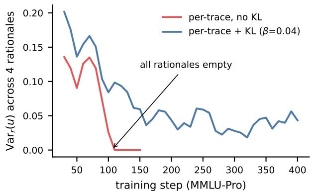
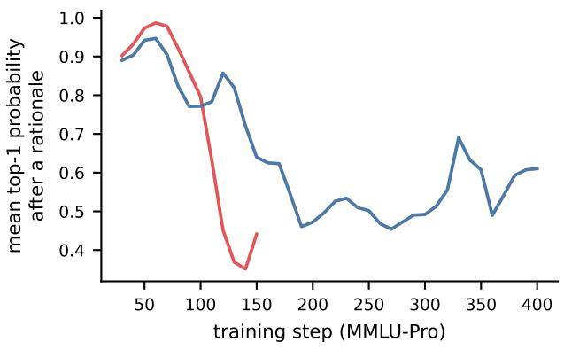
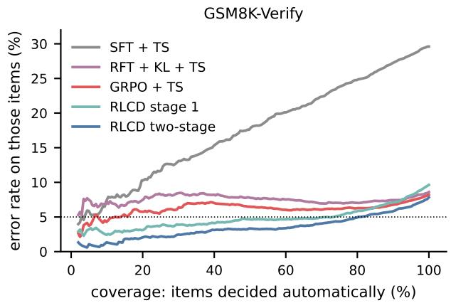
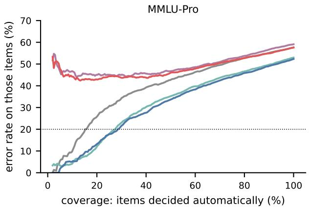
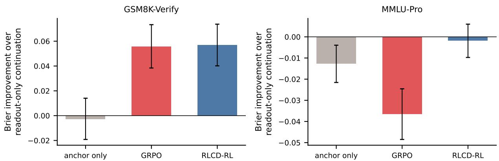

# OpenJev-RLCD: A Working RLCD Implementation

Zhimin Gao and Pichao Wang zhimingao113@gmail.com; pichaowang@gmail.com

## Abstract

Decision models such as Jev answer questions about an agent’s state with probabilities, and those probabilities are only useful if they are calibrated: a system that automates the decisions it is confident about must be right when it says it is. The open-source reproductions of this idea are trained by supervised fine-tuning and repaired with temperature scaling, while standard reinforcement learning from verifiable rewards makes reasoning models sharply overconfident. We describe a working implementation of reinforcement learning for calibrated decisions (RLCD) for reasoning models and the analysis that led to it. The model samples a rationale and we read the answer distribution it commits to afterwards; every rationale is scored by a strictly proper scoring rule of that distribution. A one-line variance identity explains why the popular alternative—scoring the mixture of several samples—rewards rationales for disagreeing and degenerates the reasoning, and shows that RLVR is exactly the mixture objective without its diversity term. The per-rationale objective has a calibrated optimum, but optimized naively it either switches reasoning of or is drowned out by high-variance policy gradients. The resulting recipe is calibrate, then reinforce: first train the post-rationale decision with a proper score on the model’s own rationales, then optimize the reasoning with the same proper score as reward. With Qwen3-1.7B on two real reasoning tasks (3 seeds, paired tests), RLCD matches or beats SFT, RFT/STaR and GRPO—each followed by temperature scaling—in accuracy and beats all of them in selective prediction (area under the risk–coverage curve); on GSM8K answer verification a single RLCD query can decide 81% of the items at ≤5% error, versus 19% for GRPO. On a task whose uncertainty is annotator disagreement, the same objective provably cannot beat cross entropy and, left alone, discovers that it should stop reasoning. We release code, all run logs and an API-compatible server. Codes are available at: https://github.com/ZimmyGao/openjev-rlcd.

## 1 Introduction

A calibrated decision model returns, for a question about a state (“will this plan succeed?”, “is this answer correct?”, “which option is right?”), a probability distribution over answers whose confidence matches its accuracy. The value of such a model lies less in its accuracy than in what calibration enables: a downstream agent can automate the decisions the model is sure about and escalate the rest, and it can do so from the model’s own confidence, without labels. TypeSafe AI’s Jev [17] markets exactly this capability under the name reinforcement learning for calibrated decisions (RLCD), without disclosing a training algorithm. The open-source ecosystem that followed (several hundred repositories within weeks) trains scorers by supervised fine-tuning (SFT) and fixes their confidence post hoc with temperature scaling (TS) [8].

Reinforcement learning is the natural tool for decisions whose outcomes are only observed after the fact, and it is how reasoning models are trained today [15]. But the reward used for reasoning—1 if the answer is correct—is not a proper scoring rule of anything the model reports, and RL with it produces models that are confidently wrong. A number of recent works therefore reward sets of samples (duplicate penalties, collision terms, group calibration rewards). This paper asks what a working RLCD for reasoning models is, and answers it with an analysis, a recipe and a controlled empirical study.

## Contributions.

• A readout formulation and a variance identity (§3). We score the answer distribution $u ( r )$ that a reasoning model commits to after its own rationale r. For the Brier score, $J ( \mathbb { E } _ { r } u ) =$ $\mathbb { E } _ { r } J ( u ) + \mathrm { V a r } _ { r } ( u )$ : scoring the mixture of samples pays a bonus for rationales that disagree, whether or not the disagreement is grounded. With one-hot answers the same identity writes the calibrated group reward as RLVR plus a Gini-diversity bonus whose coeficient must be exactly one. Scoring each rationale’s own distribution removes the bonus and has the calibrated optimum $u ( r ) = q ( x )$ for every rationale, so a single query is calibrated.

• Two failure modes and the recipe that avoids them (§3.2). Optimized end to end, the per-rationale objective either abandons reasoning (the “System-One” collapse; prevented by a KL anchor) or is drowned by the policy-gradient term, whose gradient is $7 \mathrm { - } 1 2 \times$ larger than the readout’s and dominates the optimizer. Calibrate, then reinforce: train the readout first, then reinforce the reasoning with the proper score as reward, anchored at the calibrated model.

• A controlled comparison on real tasks (§5). On MMLU-Pro and on GSM8K answer verification, with three seeds and paired tests on every test item, RLCD matches or beats SFT+TS, RFT/STaR+TS (with and without KL) and GRPO+TS in accuracy and Brier score, and beats all of them in area under the risk–coverage curve. Forked-checkpoint controls show when reinforcing the reasoning helps (when reasoning is computation) and why its reward must be proper (a correctness reward undoes the calibrated readout).

• Where RL cannot help (§5.3). When the uncertainty is annotator disagreement (ChaosNLI), reasoning cannot reduce it; the per-rationale objective discovers this and turns reasoning of, and no RL variant beats cross-entropy on the same labels.

## 2 Setting

A question x has K answer options and an outcome $Y \sim q ( \cdot \mid x ) ;$ q is one-hot when there is a right answer (epistemic uncertainty) and spread when humans disagree (aleatoric uncertainty). A reasoning model with parameters θ samples a rationale $r \sim \pi _ { \theta } ( \cdot \mid x )$ , which ends in the marker Answer:; we then read its next-token distribution over the K option tokens,

$$
u _ { \theta } ( x , r ) = \mathrm { s o f t m a x } \left( \mathrm { l o g i t s } _ { \theta } ( x , r ) \mathrm { [ o p t i o n ~ t o k e n s ] } \right) \in \Delta _ { K } ,
$$

instead of sampling an answer from it. The model’s decision distribution is the mixture $p _ { \theta } ( x ) =$ $\mathbb { E } _ { r } u _ { \theta } ( x , r )$ ; a single query returns $u _ { \boldsymbol { \theta } } ( \boldsymbol { x } , \boldsymbol { r } )$ for one sampled rationale. We use the (shifted, negated) Brier score $J ( u , y ) = 2 u _ { y } - \| u \| ^ { 2 } = 1 - \| u - e _ { y } \| ^ { 2 }$ , whose expectation $J ( u , q ) = \mathbb { E } _ { Y \sim q } J ( u , Y ) =$ $2 u ^ { \top } q - \| u \| ^ { 2 }$ is uniquely maximized at $u = q \ [ 2 , \ 7 ] ;$ the log score behaves the same way in our experiments.

## 3 Method

## 3.1 What to score: the mixture or each rationale

Proposition 1 (Variance decomposition). For any distribution over rationales and any q, with $p = \mathbb { E } _ { r } u ( r )$ ，

$$
J ( p , q ) \ = \ \mathbb { E } _ { r } J ( u ( r ) , q ) \ + \ \mathbb { E } _ { r } \big \| u ( r ) - p \big \| ^ { 2 } .
$$

$\begin{array} { r l } & { P r o o f . \ J ( p , q ) - \mathbb { E } _ { r } J ( u ( r ) , q ) = \mathbb { E } _ { r } \| u ( r ) \| ^ { 2 } - \| p \| ^ { 2 } = \mathbb { E } _ { r } \| u ( r ) - p \| ^ { 2 } . } \\ & { - \| u \| ^ { 2 } . } \end{array}$ , since J is afine in u except for □

The mixture objective $J ( p , q )$ —the objective behind scoring groups of samples—therefore equals the average per-rationale score plus a bonus for rationales that disagree. Nothing in the bonus asks the disagreement to be grounded: a policy can collect it by randomizing its conclusions. Two consequences follow.

Corollary 1 (RLVR is the mixture objective without its diversity term). If the answer is sampled, $u ( r ) = e _ { A }$ with $A \sim p$ , then $\mathbb { E } _ { A } J ( e _ { A } , q ) = 2 p ^ { \top } q - 1 = 2 { \operatorname* { P r } } ( A = Y ) - 1$ is the RLVR objective and $\mathrm { V a r } = 1 - \| p \| ^ { 2 }$ is the Gini impurity of p: the calibrated group reward is $^ { 6 } R L V R ~ +$ Gini bonus”. With any coeficient $\lambda < 1$ on the bonus the optimum is no longer $p = q ;$ with $\lambda = 0 ~ ( R L V R )$ it is the mode.

Proposition 2 (Per-rationale objective). Let $J _ { \lambda } ( \theta ) = \mathbb { E } _ { x } \mathbb { E } _ { r } J ( u _ { \theta } ( x , r ) , q ( x ) ) + \lambda \mathbb { E } _ { x } \mathrm { V a r } _ { r } ( u _ { \theta } )$ . If the outcome is independent of the model’s own rationale given the question $( Y \perp r \mid x ,$ , true whenever Y is produced by the world), then for every $\lambda < 1$ the unique maximizer over readouts is $u ( x , r ) = q ( x )$ for every rationale $r ; f o r \lambda = 1$ every readout with $\mathbb { E } _ { r } u ( x , r ) = q ( x )$ is optimal.

Proof. $J _ { \lambda } = ( 1 - \lambda ) \mathbb { E } _ { r } J ( u ( r ) , q ) + \lambda J ( p , q )$ by Proposition 1. Both terms are maximized by $u ( r ) \equiv q ;$ the first is strictly concave in each $u ( r )$ , which gives uniqueness for $\lambda < 1$ □

We therefore use the per-rationale objective $( \lambda = 0 )$ : a single query is calibrated at the optimum, and the objective no longer pays for disagreement. Rationales still matter—a better rationale lets a finite-capacity model compute $q ( x )$ more accurately—but they are never rewarded for being random.

Estimator. With M rationales per question and one outcome Y , write $R _ { i } = J ( u _ { \theta } ( x , r _ { i } ) , Y )$ . The gradient of ErJ splits into a pathwise part through the readout and a score-function part for the rationales,

$$
\widehat { \nabla } = \frac { 1 } { M } \sum _ { i = 1 } ^ { M } \nabla _ { \theta } R _ { i } \ + \ \frac { 1 } { M } \sum _ { i = 1 } ^ { M } \Big ( R _ { i } - \frac { 1 } { M - 1 } \sum _ { j \neq i } R _ { j } \Big ) \nabla _ { \theta } \log \pi _ { \theta } ( r _ { i } \mid x ) ,
$$

with a leave-one-out baseline [1, 10]. The estimator is unbiased; so are its variants with a KL penalty or per-rationale costs added as shaping terms, and the Rao-Blackwellized estimator of the mixture objective $( { \mathrm { A p p e n d i x ~ A } } )$ . We verified all of them against exact enumeration on tabular models (maximum error $< 1 0 ^ { - 1 5 } )$ . Reading u instead of sampling the answer is a Rao-Blackwellization of the sample-only estimator [11]; with an empty rationale it reduces to training a direct scorer with the Brier score.

## 3.2 Two ways the per-rationale objective fails

It switches reasoning of. Reasoning models conclude their rationales decisively, so u after a rationale is nearly one-hot and the Brier score punishes every confident mistake. Hedging after an empty rationale is learned faster than hedging after reasoning, and the policy gradient moves all mass to the empty rationale. On MMLU-Pro this happens within about 100 steps (Figure 1, red): all four rationales become the bare marker and the model turns into a direct scorer. A KL anchor to the reasoning model $( \beta = 0 . 0 4 , \mathrm { b l u e } )$ prevents the collapse and lets the model learn to hedge after reasoning.

Figure 1: The System-One collapse (MMLU-Pro, per-rationale objective, trained end to end). Without a KL anchor the four rationales per question become identical and empty after ∼100 steps (left: variance of u across rationales) while the readout learns to hedge (right). With a KL anchor the model keeps reasoning and learns to hedge after it. The no-KL run was stopped at step 150, after the collapse.  
Algorithm 1 RLCD for a reasoning model (one step; M rationales for each question in the batch)   
1: sample $r _ { 1 } , . . . , r _ { M } \sim \pi _ { \theta } ( \cdot \ |$ x) until Answer:; read $u _ { i } = u _ { \theta } ( x , r _ { i } ) ;$ observe $Y$   
2: $R _ { i } \gets J ( u _ { i } , Y )$ ▷ any strictly proper score of the read-out distribution   
3: if stage 1 (calibrate the decision) then   
4: $\begin{array} { r } { \mathcal { L }  - \frac { 1 } { M } \sum _ { i } R _ { i } } \end{array}$ ▷ pathwise only: rationales are sampled on-policy but not reinforced   
5: else stage 2 (reinforce the reasoning), starting from the stage-1 model $\theta _ { 1 }$   
6: $\begin{array} { r } { A _ { i } \gets \frac { 1 } { M } \big ( R _ { i } - \beta \log \frac { \pi _ { \theta } ( r _ { i } ) } { \pi _ { \theta _ { 1 } } ( r _ { i } ) } \big ) } \end{array}$ − leave-one-out mean   
7: $\begin{array} { r } { \mathcal { L }  - \frac { 1 } { M } \sum _ { i } R _ { i } - c \sum _ { i } ^ { \cdot } \mathrm { s g } ( A _ { i } ) \log \pi _ { \theta } ( r _ { i } \mid x ) } \end{array}$ ▷ $c = 0 . 3 , \beta = 0 . 0 4$   
8: end if   
9: update θ with Adam on $\mathcal { L }$

It is drowned by the policy gradient. Even with the anchor, adding the score-function term to training from scratch makes every metric worse than training the readout alone, monotonically in its weight (Table 4). The gradient norm of the score-function term is 7–12× that of the pathwise term (RMS over training), so it dominates Adam’s second-moment estimate: the useful, low-variance readout signal is taken in steps sized by the noise. Its direction is also unhelpful early on: while the readout is still miscalibrated, the reward mostly teaches rationales to sound certain.

## 3.3 The recipe: calibrate, then reinforce

Algorithm 1 separates the two roles. Stage 1 trains the decision the model reports after its own reasoning with a proper score; it is the pathwise half of the RLCD gradient, i.e. the deterministic policy gradient of the proper-score reward with respect to the reported distribution, with the rationale treated as an on-policy latent variable. Stage 2 then reinforces the reasoning with the same proper score as reward, a down-weighted score-function term, and a KL anchor at the calibrated model, so that the reward is informative and the anchor protects what stage 1 learned. Both stages observe exactly the outcome Y of each question, like every baseline.

<table><tr><td></td><td colspan="5">GSM8K-Verify (reasoning-essential)</td><td colspan="5">MMLU-Pro (knowledge-heavy)</td></tr><tr><td>Method</td><td>Acc↑</td><td>Brier↓</td><td>AURC↓</td><td>Cov@5%↑</td><td>T</td><td>Acc↑</td><td>Brier↓</td><td>AURC↓</td><td>Cov@20%↑</td><td>T</td></tr><tr><td>base (zero-shot reasoning)</td><td>84.1</td><td>0.211</td><td>0.073</td><td>14.9</td><td>9.1</td><td>38.9</td><td>0.786</td><td>0.516</td><td>0.0</td><td>10.9</td></tr><tr><td>SFT + TS (direct answer)</td><td>70.4±0.2</td><td>0.382±0.009</td><td>0.174±0.010</td><td>6.2±2.0</td><td>2.1</td><td>42.3±0.4</td><td>0.711±0.002</td><td>0.386±0.005</td><td>15.6±0.7</td><td>1.6</td></tr><tr><td>RFT/STaR + TS</td><td>89.0±1.6</td><td>0.207±0.020</td><td>0.103±0.013</td><td>0.9±0.7</td><td>7.3</td><td>32.7±0.9</td><td>0.830±0.004</td><td>0.619±0.011</td><td>0.0±0.0</td><td>17.6</td></tr><tr><td>RFT/STaR + KL + TS</td><td>91.4±0.5</td><td>0.160±0.006</td><td>0.075±0.010</td><td>11.6±8.1</td><td>6.6</td><td>40.9±0.6</td><td>0.761±0.006</td><td>0.493±0.008</td><td>0.0±0.0</td><td>11.0</td></tr><tr><td>GRPO + KL + TS</td><td>91.8±0.6</td><td>0.150±0.009</td><td>0.061±0.006</td><td>19.4±7.3</td><td>7.2</td><td>42.4±0.5</td><td>0.753±0.006</td><td>0.481±0.015</td><td>0.0±0.0</td><td>11.1</td></tr><tr><td>RLCD stage 1, Brier readout</td><td>90.4±2.0</td><td>0.164±0.020</td><td>0.047±0.010</td><td>62.6±21.3</td><td>1.6</td><td>47.0±1.3</td><td>0.667±0.014</td><td>0.312±0.019</td><td>27.3±2.1</td><td>1.4</td></tr><tr><td>RLCD stage 1, log-score readout</td><td>91.3±0.4</td><td>0.149±0.009</td><td>0.038±0.002</td><td>72.2±7.2</td><td>1.8</td><td>46.5±0.7</td><td>0.668±0.009</td><td>0.319±0.012</td><td>24.8±1.6</td><td>1.5</td></tr><tr><td>RLCD two-stage (stage 1 + RLCD-RL)</td><td>92.2±0.7 0.135±0.009</td><td></td><td>0.034±0.001</td><td>81.1±7.2</td><td>1.4</td><td></td><td>47.7±2.0 0.658±0.015</td><td>0.304±0.022</td><td>27.6±3.3</td><td>1.6</td></tr></table>

Table 1: Single-query decisions after temperature scaling (mean ± s.d. over 3 seeds). Cov@ϵ: fraction of test items that can be decided automatically at error rate $\leq \epsilon$ (5% for GSM8K-Verify, 20% for MMLU-Pro, whose error rates are higher). T: temperature fitted on dev (1 = calibrated as trained). Best in bold.

## 4 Experimental setup

Tasks. MMLU-Pro [18]: 10-option questions, a random 4000/500/1500 split of the 12k-question benchmark (we evaluate on the first 1000 test and 300 dev questions); the task is knowledge-heavy. GSM8K-Verify: a yes/no decision built from GSM8K $[ 4 ] - \mathrm { ^ { 6 6 } i s }$ this proposed final answer correct?”— where the proposal is a sampled solution of Qwen3-0.6B (53% of the proposals are correct on train, 50% on test); train/dev come from GSM8K-train (4000/300 used), test = all 1260 GSM8K-test problems with a parsable proposal. Reasoning is essential: on a 400-item probe the base model reaches 56% answering directly and 87% after reasoning. ChaosNLI [12]: MNLI items with 100 annotator labels each (199 dev, 400 test items); every visit to a training item draws one fresh annotator label, and the target is the human label distribution.

Model and methods. All methods start from Qwen3-1.7B [14] in non-thinking mode, use AdamW with learning rate $2 \cdot 1 0 ^ { - 6 }$ , 8 questions and M = 4 rationales per step, and see the same sequence of questions and outcomes for a given seed. SFT+TS: the same model answers directly and is fine-tuned with cross-entropy on the label token (400 or 800 steps; 800 steps did not improve on 400 on either task, so we report 400). RFT/STaR+TS [20]: rejection-sampling fine-tuning on the trajectories whose sampled answer is correct (rationale and answer tokens), with and without the KL anchor. GRPO+TS [15]: correctness reward, group-normalized advantages, KL anchor $\beta = 0 . 0 4$ . RLCD: stage 1 (400 steps, Brier or log score), and stage 2 (400 more steps from the stage-1 checkpoint). All baselines receive the same temperature scaling, fitted by grid search on the dev split.

Metrics and statistics. Accuracy, Brier score, NLL and ECE of the single-query readout after temperature scaling; the area under the risk–coverage curve (AURC; items ranked by confidence, risk = error rate); Cov@ϵ, the largest fraction of items, ranked by confidence, whose error rate is at most ϵ [6]; and the fitted temperature T (T ≈ 1: calibrated as trained). Everything is averaged over three seeds; tests are paired over test items (per-item values averaged over seeds), with 95% bootstrap intervals and two-sided sign-flip permutation p-values for means. ∗: $p < 0 . 0 5$ , ∗∗: $p < 0 . 0 1$

## 5 Results

## 5.1 Main comparison

Table 1 and Figure 2 summarize the comparison. On GSM8K-Verify, where reasoning is essential, SFT+TS reaches only 70.4% accuracy, and two-stage RLCD improves on it by +21.8 points and −0.247 Brier. The reasoning-based baselines are accurate but miscalibrated in ranking: after temperature scaling GRPO matches RLCD in accuracy (91.8% vs. 92.2%, n.s.) and is close in Brier score (diference −0.015, $p = 0 . 0 9 )$ , yet its confidence separates right from wrong much worse (AURC 0.061 vs. 0.034, paired bootstrap $p < 1 0 ^ { - 3 } )$ , so at a 5% error budget it can decide 19% of the items against 81% for RLCD. RFT behaves like GRPO; with the KL anchor it reaches 91.4% accuracy but still decides only 12% of the items at 5% error (two-stage RLCD vs. RFT+KL: Brier −0.025, AURC −0.041, $p < 0 . 0 1 $ ). The fitted temperatures tell the same story from the other side: GRPO and RFT need T ≈ 7, RLCD T = 1.4.

Figure 2: Risk–coverage of single-query decisions (after temperature scaling, averaged over seeds). Dotted: the error budget used for Cov@ϵ in Table 1. Temperature scaling cannot repair the ranking of overconfident models (GRPO, RFT), whose error rate is flat in coverage.
<table><tr><td></td><td colspan="3">GSM8K-Verify</td><td colspan="3">MMLU-Pro</td></tr><tr><td>Stage-2 continuation (400 steps, same checkpoint)</td><td>∆Acc</td><td>∆Brier</td><td>∆AURC</td><td>∆Acc</td><td>∆Brier</td><td>∆AURC</td></tr><tr><td>readout-only continuation</td><td>-1.7**</td><td>+0.028**</td><td>+0.011*</td><td>+0.5</td><td>-0.010</td><td>-0.011</td></tr><tr><td>anchor only (REINFORCE noise, no reward)</td><td>-2.6**</td><td>+0.031**</td><td>+0.016**</td><td>-0.1</td><td>+0.002</td><td>+0.007</td></tr><tr><td>GRPO (correctness reward)</td><td>+1.8**</td><td>-0.028**</td><td>-0.012**</td><td>-1.1</td><td>+0.026**</td><td>+0.033**</td></tr><tr><td>RLCD-RL (proper-score reward)</td><td>+1.8**</td><td>-0.029**</td><td>-0.013**</td><td>+0.6</td><td>-0.009</td><td>-0.009</td></tr></table>

Table 2: Stage-2 continuations forked from the same stage-1 checkpoint (3 seeds), change relative to the checkpoint (single query, after TS). Anchor only: the same score-function noise and KL anchor as RLCD-RL but no outcome reward.

On MMLU-Pro every reasoning baseline fails to improve on SFT+TS after temperature scaling, and without the KL anchor RFT collapses to empty rationales in all three seeds (32.7% accuracy, below the 38.9% of the base model). RLCD improves accuracy by +5.3 points over SFT+TS and by +5.2 over GRPO+TS, with Brier −0.053 and −0.095 (all $p < 1 0 ^ { - 3 } )$ . At a 20% error budget it can decide 28% of the items, against 16% for SFT+TS and none for any reasoning baseline, whose confidence is uninformative after temperature scaling. Stage 1 alone already carries most of the gain on both tasks; the choice of proper score for the readout matters little (Brier vs. log score).

## 5.2 What reinforcing the reasoning adds

To isolate stage 2, we saved the stage-1 model for each seed and forked four 400-step continuations from it with the same data stream (Table 2, Figure 3). Three findings are consistent across seeds.

Figure 3: Stage-2 reward matters. Brier improvement over continuing to train the readout only, for the same 400-step budget from the same checkpoint (95% bootstrap intervals over test items, 3 seeds pooled).
<table><tr><td>ChaosNLI (100 annotators / item), Qwen3-1.7B</td><td>JSD to humans↓</td><td>Majority acc↑</td><td>seeds</td><td>rationales</td></tr><tr><td>Direct answer, CE on the label stream (SFT)</td><td>0.074</td><td>66.2</td><td>3</td><td></td></tr><tr><td>Mixture objective λ=1, 16-rationale mixture</td><td>0.121</td><td>63.1</td><td>3</td><td>degenerate (hits length limit)</td></tr><tr><td>Mixture objective λ=1, single rationale</td><td>0.342</td><td>55.4</td><td>3</td><td>degenerate</td></tr><tr><td>Mixture objective λ=1 + KL, mixture</td><td>0.149</td><td>67.8</td><td>1</td><td>healthy (48 tokens)</td></tr><tr><td>Per-trace objective λ=0, no KL</td><td>0.075</td><td>63.0</td><td>1</td><td>empty (System-One)</td></tr></table>

Table 3: ChaosNLI (400 test items). The target is the distribution of 100 human labels; every method sees one fresh annotator label per visit.

• Where reasoning is computation, reinforcing it helps. On GSM8K-Verify, continuing to train the readout alone degrades the model, whereas RLCD-RL improves it; against the readout-only continuation, RLCD-RL gains +3.5 accuracy points and −0.057 Brier $( p < 1 0 ^ { - 3 }$ all three seeds individually significant).

• The outcome reward, not the anchor, does the work. The anchor-only control has the same score-function noise and KL anchor but no reward; it is worse than RLCD-RL (GSM8K-Verify +4.4 points, MMLU-Pro Brier −0.011, both $p < 0 . 0 1 )$ ) and unstable across seeds (it collapsed in one of them).

• The reward must be proper. Continuing with GRPO’s correctness reward is as good as RLCD-RL on GSM8K-Verify, but on MMLU-Pro, where RL cannot raise accuracy much, it re-inflates the confidence of the calibrated readout (T from 1.4 to 3.8) and makes Brier score and AURC significantly worse than the checkpoint; RLCD-RL beats it by +1.8 accuracy points and −0.035 Brier $( p < 1 0 ^ { - 3 } )$

On MMLU-Pro, reinforcing the reasoning with the proper score is neutral on average (diference to the readout-only continuation +0.002 Brier, n.s.; the sign varies by seed): the benefit of stage 2 is specific to tasks where better reasoning changes the answer.

## 5.3 Aleatoric uncertainty: when RL cannot help

If q(x) is spread because annotators disagree, reasoning cannot reduce the uncertainty, and with an explicit readout the RLCD gradient equals the Brier gradient in expectation, so it cannot beat supervised training on the same labels. ChaosNLI confirms both halves (Table 3). The mixture objective (λ = 1) calibrates its 16-sample mixture (JSD 0.121) by making the rationales random—they run to the length limit and a single rationale is badly calibrated—as Proposition 1 predicts. The per-rationale objective instead discovers that reasoning is useless here and switches it of, reaching the same quality as cross-entropy on direct answers (JSD 0.075 vs. 0.074). We regard this as the correct behaviour of a decision objective, and as a reason to prefer a fast direct scorer when uncertainty is aleatoric.

<table><tr><td>REINFORCE weight c (from scratch)</td><td>Acc↑</td><td>Brier↓</td><td>AURC↓</td><td>rationale tokens</td></tr><tr><td>0 (readout only)</td><td>46.3</td><td>0.676</td><td>0.323</td><td>182</td></tr><tr><td>0.1</td><td>45.0</td><td>0.677</td><td>0.327</td><td>155</td></tr><tr><td>0.3</td><td>44.6</td><td>0.694</td><td>0.352</td><td>148</td></tr><tr><td>1 (unbiased)</td><td>43.7</td><td>0.703</td><td>0.354</td><td>178</td></tr></table>

Table 4: Weight of the score-function term when training from scratch (MMLU-Pro, seed 17, per-rationale objective with KL anchor, single query after TS). More policy gradient is monotonically worse; this motivates separating the stages.

## 5.4 Ablations

Score-function weight. Table 4: when the stages are not separated, every positive weight on the score-function term hurts, in line with the gradient-dilution diagnosis of §3.2.

Readout warm-up alone is not enough. Training the readout for 200 steps and then reinforcing for 200 steps (both from scratch) ties the readout-only model; the gains of Table 2 require a converged readout.

Who scores the rationale. Scoring rationales with a frozen copy of the calibrated readout instead of the policy’s own (to prevent co-adaptation) was worse on GSM8K-Verify (seed 17: Brier +0.021, AURC +0.030): the reasoning shortened and the policy’s own readout became overconfident.

No KL anchor in stage 2. The reasoning degenerates after ∼330 steps (the model stops writing the marker and repeats its conclusion to the length limit); the readout-based reward is blind to the format of the rationale, so an anchor is necessary.

Explicit-probability RLCD. For a model without rationales (a direct scorer), RLCD with an explicit distribution has the same expected gradient as the Brier loss; on CLINC150 and ChaosNLI it never beat cross-entropy (CLINC150 accuracy 94.6% vs. 96.3%), and RLVR on the same models collapsed to the mode.

## 6 Related work

Calibration of language models. Post-hoc temperature scaling [8] and verbalized or sampled confidence [9, 16] calibrate the level of confidence but not its ranking; selective prediction [6] evaluates exactly the ranking, which is where the methods in Table 1 difer most. Training with proper scores [2, 7] is standard for classifiers; our contribution is where to apply it in a reasoning model.

RL for reasoning and calibration. RLVR and GRPO [15] optimize the probability of a correct sampled answer, which Corollary 1 identifies as the mixture objective without its diversity term; REINFORCE with leave-one-out baselines [1, 10, 19] is our estimator. Concurrent work rewards verbalized confidence with the Brier score [5]; we instead score the answer distribution the model actually assigns, and analyze group rewards through Proposition 1.

Rationales as latent variables. Stage 1 resembles the answer-likelihood term of latent-rationale training (TRICE, LaTRO) [3, 13] and STaR [20], which maximize the likelihood of the correct answer; the diference is the proper score of the full distribution, which is what makes the reported confidence usable. The RFT/STaR baseline in Table 1 shows that likelihood-based cloning of correct trajectories inherits the overconfidence of RLVR.

## 7 Limitations

All experiments use a 1.7B model, 400–800 update steps and three seeds; the efects are large relative to the seed variance, but larger models and longer training may change the balance between the two stages. GSM8K-Verify is a task we constructed from GSM8K with a 0.6B proposer. We compare with Jev only behaviorally (the API is reproduced; the training data are not public), and claim nothing about Jev’s internal algorithm. Stage 2 helps on the reasoning-essential task and is neutral on the knowledge-heavy one; we do not yet know how to predict its benefit without running it.

## 8 Conclusion

A working RLCD for reasoning models scores what the model actually decides—the answer distribution after its own rationale—with a proper score, first to calibrate that decision and then to reinforce the reasoning that feeds it. Scoring groups of samples instead rewards disagreement, and a correctness reward undoes calibration; both are visible in one identity. The payof is not a few points of accuracy but decisions that can be delegated: at the same accuracy as GRPO, a single RLCD query knows which of its answers to trust.

## References

[1] Arash Ahmadian, Chris Cremer, Matthias Gallé, Marzieh Fadaee, Julia Kreutzer, Olivier Pietquin, Ahmet Üstün, and Sara Hooker. Back to basics: Revisiting REINFORCE-style optimization for learning from human feedback in LLMs. In Annual Meeting of the Association for Computational Linguistics (ACL), 2024.

[2] Glenn W. Brier. Verification of forecasts expressed in terms of probability. Monthly Weather Review, 78(1):1–3, 1950.

[3] Haolin Chen, Yihao Feng, Zuxin Liu, Weiran Yao, Akshara Prabhakar, Shelby Heinecke, Ricky Ho, Phil Mui, Silvio Savarese, Caiming Xiong, and Huan Wang. Language models are hidden reasoners: Unlocking latent reasoning capabilities via self-rewarding. arXiv preprint arXiv:2411.04282, 2024.

[4] Karl Cobbe, Vineet Kosaraju, Mohammad Bavarian, Mark Chen, Heewoo Jun, Lukasz Kaiser, Matthias Plappert, Jerry Tworek, Jacob Hilton, Reiichiro Nakano, Christopher Hesse, and John

Schulman. Training verifiers to solve math word problems. arXiv preprint arXiv:2110.14168, 2021.

[5] Mehul Damani, Isha Puri, Stewart Slocum, Idan Shenfeld, Leshem Choshen, Yoon Kim, and Jacob Andreas. Beyond binary rewards: Training LMs to reason about their uncertainty. arXiv preprint arXiv:2507.16806, 2025.

[6] Yonatan Geifman and Ran El-Yaniv. Selective classification for deep neural networks. In Advances in Neural Information Processing Systems (NeurIPS), 2017.

[7] Tilmann Gneiting and Adrian E. Raftery. Strictly proper scoring rules, prediction, and estimation. Journal of the American Statistical Association, 102(477):359–378, 2007.

[8] Chuan Guo, Geof Pleiss, Yu Sun, and Kilian Q. Weinberger. On calibration of modern neural networks. In International Conference on Machine Learning (ICML), 2017.

[9] Saurav Kadavath et al. Language models (mostly) know what they know. arXiv preprint arXiv:2207.05221, 2022.

[10] Wouter Kool, Herke van Hoof, and Max Welling. Buy 4 REINFORCE samples, get a baseline for free! In ICLR Workshop on Deep Reinforcement Learning Meets Structured Prediction, 2019.

[11] Shakir Mohamed, Mihaela Rosca, Michael Figurnov, and Andriy Mnih. Monte Carlo gradient estimation in machine learning. Journal of Machine Learning Research, 21(132):1–62, 2020.

[12] Yixin Nie, Xiang Zhou, and Mohit Bansal. What can we learn from collective human opinions on natural language inference data? In Conference on Empirical Methods in Natural Language Processing (EMNLP), 2020.

[13] Du Phan, Matthew D. Hofman, David Dohan, Sholto Douglas, Tuan Anh Le, Aaron Parisi, Pavel Sountsov, Charles Sutton, Sharad Vikram, and Rif A. Saurous. Training chain-of-thought via latent-variable inference. In Advances in Neural Information Processing Systems (NeurIPS), 2023.

[14] Qwen Team. Qwen3 technical report. arXiv preprint arXiv:2505.09388, 2025.

[15] Zhihong Shao, Peiyi Wang, Qihao Zhu, Runxin Xu, Junxiao Song, Mingchuan Zhang, Y. K. Li, Y. Wu, and Daya Guo. DeepSeekMath: Pushing the limits of mathematical reasoning in open language models. arXiv preprint arXiv:2402.03300, 2024.

[16] Katherine Tian, Eric Mitchell, Allan Zhou, Archit Sharma, Rafael Rafailov, Huaxiu Yao, Chelsea Finn, and Christopher D. Manning. Just ask for calibration: Strategies for eliciting calibrated confidence scores from language models fine-tuned with human feedback. In Conference on Empirical Methods in Natural Language Processing (EMNLP), 2023.

[17] TypeSafe AI. Jev: calibrated decisions for ai agents. Product documentation, https:// typesafe.ai, 2026.

[18] Yubo Wang, Xueguang Ma, Ge Zhang, Yuansheng Ni, Abhranil Chandra, Shiguang Guo, Weiming Ren, Aaran Arulraj, Xuan He, Ziyan Jiang, Tianle Li, Max Ku, Kai Wang, Alex Zhuang, Rongqi Fan, Xiang Yue, and Wenhu Chen. MMLU-Pro: A more robust and challenging multi-task language understanding benchmark. In Advances in Neural Information Processing Systems (NeurIPS) Datasets and Benchmarks Track, 2024.

[19] Ronald J. Williams. Simple statistical gradient-following algorithms for connectionist reinforcement learning. Machine Learning, 8:229–256, 1992.

[20] Eric Zelikman, Yuhuai Wu, Jesse Mu, and Noah D. Goodman. STaR: Bootstrapping reasoning with reasoning. In Advances in Neural Information Processing Systems (NeurIPS), 2022.

## A Estimators and their exact checks

Per-rationale objective with shaping. For per-rationale terms $s _ { i }$ that depend only on $r _ { i }$ (and Y ), e.g. $s _ { i } = - \frac { \beta } { M }$ log $\frac { \pi _ { \theta } ( r _ { i } ) } { \pi _ { \mathrm { r e f } } ( r _ { i } ) }$ or a length cost, the surrogate

$$
{ \mathcal { L } } = - { \frac { 1 } { M } } \sum _ { i } R _ { i } - \sum _ { i } \operatorname { s g } { \Big ( } { \frac { R _ { i } } { M } } + s _ { i } - { \frac { 1 } { M - 1 } } \sum _ { j \neq i } { \big ( } { \frac { R _ { j } } { M } } + s _ { j } { \big ) } { \Big ) } \log \pi _ { \theta } ( r _ { i } )
$$

has expected gradient $- \nabla _ { \theta } \left( \mathbb { E } _ { r } J ( u _ { \theta } , q ) + \mathbb { E } _ { r } s \right)$ , because each baseline uses only the other, independent rationales.

Mixture objective. $\begin{array} { r } { \widehat { J } = \frac { 2 } { M } \sum _ { i } u _ { i } [ Y ] - \frac { 1 } { M ( M - 1 ) } \sum _ { i \neq j } u _ { i } ^ { \top } u _ { j } } \end{array}$ is unbiased for $J ( p , q )$ because the rationales are independent; its gradient is the pathwise derivative of $\widehat { J }$ plus, for each rationale, a score-function term whose reward is the part of $\widehat { J }$ that depends on $r _ { i }$ , with a baseline that does not.

Checks. For tabular models $( R \leq 4$ rationale types, $K \leq 4 , M \in \{ 3 , 4 \} )$ we enumerate all $R ^ { M }$ rationale tuples and all outcomes and compare the expected surrogate gradient with the exact gradient of the target: the maximum absolute diference is below $1 0 ^ { - 1 5 }$ for the mixture estimator, the per-rationale estimator, their convex combinations and the shaped versions (test\_rlcd\_rb.py).

## B Hyperparameters

<table><tr><td>model</td><td>Qwen3-1.7B, non-thinking chat template; rationales sampled at temperature 1 (bf16 copy)</td></tr><tr><td>optimizer batch</td><td>AdamW, lr  $2 \cdot 1 0 ^ { - 6 } .$  , no weight decay, gradient clipping 1.0, fp32 weights, bf16 autocast 8 questions  $\times \ M = 4$  rationales; rationale length ≤256 (MMLU-Pro), ≤320 (GSM8K-</td></tr><tr><td>stage 1</td><td>Verify) 400 steps, per-rationale Brier (or log) score, pathwise gradient only</td></tr><tr><td>stage 2</td><td>400 steps from stage 1, score-function weight  $c = 0 . 3 ,$  KL  $\beta = 0 . 0 4$  to the stage-1 model</td></tr><tr><td>GRPO / RFT SFT</td><td>400 steps, KL β = 0.04 to the base model (RFT also without KL) direct answer, cross-entropy on the option token, 400 or 800 steps</td></tr><tr><td>evaluation</td><td>4 rationales per test question; single query = the first; TS: grid search  $T \in [ 0 . 1 , 5 0 ]$  dev NLL</td></tr></table>

## C Mixture readout

<table><tr><td></td><td colspan="4">GSM8K-Verify</td><td colspan="4">MMLU-Pro</td></tr><tr><td>Method (mean of u over 4 rationales)</td><td>Acc</td><td>Brier</td><td>AURC</td><td>T</td><td> $\mathrm { A c c }$ </td><td>Brier</td><td>AURC</td><td>T</td></tr><tr><td> $\mathrm { b a s e \ ( z e r o - s h o t \ r e a s o n i n g ) }$ </td><td> $8 8 . 4$ </td><td>0.181</td><td>0.035</td><td>5.1</td><td> $4 0 . 8$ </td><td> $0 . 7 5 8$ </td><td> $0 . 4 7 3$ </td><td>9.3</td></tr><tr><td> $\mathrm { R F T / S T a R + T S }$ </td><td> $9 1 . 7 { \pm } 1 . 4 $ </td><td> $0 . 1 3 9 { \scriptstyle \pm 0 . 0 2 1 }$ </td><td> $0 . 0 3 4 { \scriptstyle \pm 0 . 0 1 3 }$ </td><td>2.5</td><td> $3 2 . 7 { \pm } 0 . 9$ </td><td> $0 . 8 3 0 { \scriptstyle \pm 0 . 0 0 4 }$ </td><td> $0 . 6 1 9 { \scriptstyle \pm 0 . 0 1 1 }$ </td><td>17.6</td></tr><tr><td> $\mathrm { R F T / S T a R + K L + T S }$ </td><td> $9 3 . 1 { \pm } 0 . 4 $ </td><td> $0 . 1 1 9 { \scriptstyle \pm 0 . 0 0 3 }$ </td><td> $0 . 0 2 6 { \scriptstyle \pm 0 . 0 0 3 }$ </td><td>3.5</td><td> $4 2 . 2 { \pm } 0 . 7 $ </td><td> $0 . 7 4 5 { \scriptstyle \pm 0 . 0 0 5 }$ </td><td> $0 . 4 5 8 { \scriptstyle \pm 0 . 0 0 8 }$ </td><td>9.5</td></tr><tr><td> $\mathrm { G R P O } + \mathrm { K L } + \mathrm { T S }$ </td><td> $9 3 . 8 { \pm } 0 . 3 $ </td><td> $0 . 1 1 4 { \scriptstyle \pm 0 . 0 0 7 }$ </td><td> $0 . 0 2 5 { \scriptstyle \pm 0 . 0 0 2 }$ </td><td>3.7</td><td> $4 4 . 3 { \pm } 0 . 4 $ </td><td> $0 . 7 2 9 { \scriptstyle \pm 0 . 0 0 4 }$ </td><td> $0 . 4 2 8 { \scriptstyle \pm 0 . 0 0 5 }$ </td><td>9.6</td></tr><tr><td>RLCD stage 1, Brier readout</td><td> $9 2 . 8 { \pm } 2 . 0 $ </td><td> $0 . 1 1 1 { \pm } 0 . 0 2 5$ </td><td>0.019±0.006</td><td>0.9</td><td> $4 9 . 3 { \pm } 1 . 5 $ </td><td> $0 . 6 5 5 { \scriptstyle \pm 0 . 0 1 4 }$ </td><td> $0 . 3 0 3 { \scriptstyle \pm 0 . 0 1 8 }$ </td><td>1.3</td></tr><tr><td>RLCD stage 1, log-score readout</td><td> $9 2 . 7 { \pm } 0 . 9$ </td><td> $0 . 1 1 6 { \scriptstyle \pm 0 . 0 1 0 }$ </td><td>0.022±0.004</td><td>1.2</td><td> $4 8 . 6 { \pm } 1 . 1 $ </td><td> $0 . 6 5 5 { \scriptstyle \pm 0 . 0 0 7 }$ </td><td> $0 . 3 1 1 { \scriptstyle \pm 0 . 0 0 9 }$ </td><td>1.4</td></tr><tr><td>RLCD two-stage (stage  $1 + \mathrm { R L C D - R L } )$ </td><td> $9 4 . 5 { \pm } 0 . 3 $ </td><td> $0 . 0 9 2 { \scriptstyle \pm 0 . 0 0 5 }$ </td><td> $0 . 0 1 4 { \scriptstyle \pm 0 . 0 0 0 }$ </td><td>1.0</td><td>48.9±2.0</td><td> $0 . 6 5 1 { \scriptstyle \pm 0 . 0 1 4 }$ </td><td> $0 . 3 0 0 { \scriptstyle \pm 0 . 0 2 0 }$ </td><td>1.5</td></tr></table>

Averaging the readout over four rationales improves every reasoning method; the ordering of Table 1 is unchanged.