# OverdoseMoE: A Multi-Expert Framework for Opioid Overdose Risk Prediction

Mingchen Li1,3, Rohan Pandey1,3, Junhui Qian2,3, Feiyun Ouyang2,3, Sunjae Kwon1,3, Avijit Mitra1,3, Zonghai Yao1,3, and Hong Yu1,2,3

1Manning College of Information and Computer Sciences, UMass Amherst, Amherst, MA, USA

2Miner School of Computer and Information Sciences, UMass Lowell, Lowell, MA, USA

3Center for Healthcare Organization and Implementation Research, VA Bedford Health Care, Bedford, MA, USA

## Abstract

Opioid overdose remains a major clinical and public health burden, highlighting the need for scalable approaches to identify patients at high risk. Here, we investigate diagnosis-specific adaptation for 180-day opioid overdose risk prediction from patients’ preceding one-year longitudinal ICD histories. We develop OOD-MAMBA and OODQWEN through continued pretraining on longitudinal diagnostic sequences followed by task-specific fine-tuning. Building on the stronger Qwenbased predictors, we further propose OVERDOSEMOE, a multi-expert framework that integrates models of different scales using complementary expert-weighting strategies. Diagnosis-specific adaptation consistently improved predictive performance over general-purpose language-model baselines, with OODQWEN achieving an AUPRC of 24.47 and an AUROC of 68.56. OVERDOSEMOE further improved discrimination and precision, achieving an AUPRC of 25.17 and an AUROC of 69.49 while outperforming the strongest single-model baselines. Among patients ranked in the top 5% of predicted risk, OVERDOSEMOE identified substantially enriched overdose risk, achieving a PPV of 25.38% while retaining meaningful recall. Evaluation on an independent MIMIC-IV cohort further demonstrated crosscohort robustness, with complementary weighting strategies showing advantages across different performance measures. These findings demonstrate that diagnosisspecific language-model adaptation combined with multi-expert integration can improve opioid overdose risk stratification and support more robust prediction across heterogeneous electronic health record populations.

## 1 Introduction

Opioid-involved overdose remains a major public health challenge in the United States. Although overdose mortality has declined in recent years, the most recent CDC provisional data still predict 67,798 drug overdose deaths during the 12 months ending in March 2026, representing a 12.3% decline from the previous year 1. Importantly, opioid overdose is preventable. Overdose education and naloxone distribution have been associated with reductions in opioid-related mortality [1], while medications for opioid use disorder, particularly buprenorphine and methadone, are associated with lower mortality following nonfatal overdose [2]. Clinical guidelines further recommend targeted risk-mitigation strategies, including naloxone provision, prescription drug monitoring, appropriate toxicology screening, and evidence-based treatment for opioid use disorder, particularly among patients at increased risk [3]. These effective interventions underscore a critical challenge for health systems: identifying patients at elevated near-term overdose risk early enough to prioritize preventive care.

Prior studies have demonstrated the feasibility of predicting opioid overdose from routinely collected EHR and administrative data. Lo-Ciganic et al. applied logistic regression, random forest, gradient boosting, and deep neural networks to predict subsequent opioid overdose among Medicare beneficiaries with opioid prescriptions [4], while Dong et al. evaluated traditional machine-learning and neural models using longitudinal claims and EHR histories [5]. More recent work has incorporated temporal modeling: Dong et al. developed LSTM-based models to capture longitudinal clinical patterns for opioid overdose risk prediction [6], and Rahman et al. compared classical and machine-learning survival models, including random survival forests and survival SVMs, for imminent overdose prediction [7]. Collectively, these studies demonstrate the value of longitudinal EHR data for overdose risk prediction. However, most existing approaches rely on structured or engineered clinical features rather than large-scale continued pretraining over longitudinal diagnosis sequences.

Recent advances in pretrained EHR and clinical language models provide new opportunities to learn representations directly from longitudinal patient histories. TransformEHR demonstrated that large-scale pretraining over longitudinal EHR sequences can improve downstream clinical outcome prediction [8], while ClinicalMamba showed that state-space architectures can efficiently model long clinical sequences at scale [9]. However, these models were developed primarily for general clinical representation learning rather than being specifically adapted to longitudinal diagnosis trajectories associated with opioid overdose. The use of continued pretraining on large-scale diagnosis histories followed by task-specific fine-tuning for opioid overdose prediction therefore remains underexplored.

Ensemble and multi-model approaches have also been investigated for opioid overdose prediction. For example, Ripperger et al [10]. trained multiple random-regressionforest weak learners using aggregated features derived from prescription drug monitoring data, hospital discharge records, diagnoses, medications, healthcare utilization, and socioeconomic indicators, and subsequently combined their predictions using several ensemble strategies. More recently, HIBERT [11] employed multiple specialized BERT modules for different EHR feature categories, including diagnoses, laboratory tests, and medications, pretrained these modules using unlabeled EHR data, and integrated their representations for opioid overdose prediction. Nevertheless, it remains underexplored whether general-purpose pretrained models can be further adapted through continued pretraining on large-scale longitudinal diagnosis text, fine-tuned for opioid overdose prediction, and subsequently integrated across model scales within a multi-expert framework.

To address these gaps, we develop OODMAMBA and OODQWEN, two diagnosisadapted models for 180-day opioid overdose risk prediction from patients’ preceding one-year longitudinal diagnosis histories. Both models are obtained through continued pretraining on large-scale longitudinal ICD-coded diagnosis sequences followed by task-specific fine-tuning. Building on the stronger Qwen-based predictors, we further propose OVERDOSEMOE, a multi-expert framework that integrates models of different scales using three expert-weighting strategies. We evaluate our approach on a nationwide Veterans Health Administration cohort against classical machine-learning methods, deep sequential models, and pretrained language models, with additional analyses of high-risk patient identification, inference efficiency, and cross-cohort generalizability.OVERDOSEMOE achieved an AUPRC of 25.17 and an AUROC of 69.49, while attaining a PPV of 25.38% among patients ranked in the top 5% of predicted risk. Our OODMAMBA additionally demonstrated strong cross-cohort generalizability on MIMIC-IV.

Our contributions are fourfold. First, we construct a large-scale longitudinal diagnosis dataset from a nationwide VHA cohort for 180-day opioid overdose risk prediction, representing patients’ preceding clinical histories as chronologically ordered ICD-based diagnosis text. Second, we develop two diagnosis-adapted models, OODMAMBA and OODQWEN, through continued pretraining on large-scale longitudinal diagnosis histories followed by task-specific fine-tuning. Third, our experiments demonstrate that diagnosis-specific continued pretraining consistently improves downstream overdose prediction over directly fine-tuned counterparts, supporting the value of adapting pretrained models to longitudinal diagnostic trajectories. Finally, we propose OVER-DOSEMOE, a multi-expert framework that integrates Qwen-based predictors of different scales, and show that multi-expert learning further improves predictive performance and high-risk patient identification beyond individual models.

## 2 Results

## 2.1 Cohort characteristics

The study included 62,928 patients in the VHA training set, 7,866 in the validation set, and 7,866 in the held-out test set, together with 3,971 patients in the external MIMIC-IV cohort (Table 1). The prevalence of 180-day opioid overdose was similar across the VHA splits, ranging from 5.59% to 6.01%, whereas the prevalence in MIMIC-IV was substantially lower at 1.38%. Demographic characteristics were also comparable across the VHA training, validation, and test sets but differed markedly between VHA and MIMIC-IV (Table 2). The MIMIC-IV cohort was younger overall and had a substantially

higher proportion of women (46.78%) than the VHA cohorts (approximately 8%). These differences highlight the demographic shift between the development and external cohorts and provide a distinct setting for evaluating cross-cohort transportability.
<table><tr><td>Data source</td><td>Split</td><td>N</td><td>Overdose, n (%)</td></tr><tr><td>VHA</td><td>Training</td><td>62,928</td><td>3,724 (5.92%)</td></tr><tr><td>VHA</td><td>Validation</td><td>7,866</td><td>440 (5.59%)</td></tr><tr><td>VHA</td><td>Test</td><td>7,866</td><td>473 (6.01%)</td></tr><tr><td>MIMIC-IV</td><td>External</td><td>3,971</td><td>55 (1.38%)</td></tr></table>

Table 1: Cohort size and 180-day opioid-overdose prevalence in the VHA development cohort and the external MIMIC-IV cohort. The VHA cohort was partitioned at the patient level into training, validation, and held-out test sets.

<table><tr><td>Characteristic</td><td>Training</td><td>Validation</td><td>Test</td><td>MIMIC-IV</td></tr><tr><td>Age group, years</td><td></td><td></td><td></td><td></td></tr><tr><td>18-30</td><td>3,387 (5.38%)</td><td>385 (4.89%)</td><td>442 (5.62%)</td><td>569 (14.33%)</td></tr><tr><td>31-40</td><td>10,201 (16.21%)</td><td>1,352 (17.19%)</td><td>1,272 (16.17%)</td><td>601 (15.14%)</td></tr><tr><td>41-50</td><td>7,323 (11.64%)</td><td>845 (10.74%)</td><td>917 (11.66%)</td><td>775 (19.51%)</td></tr><tr><td>51-60</td><td>14,327 (22.77%)</td><td>1,812 (23.03%)</td><td>1,783 (22.67%)</td><td>916 (23.06%)</td></tr><tr><td>61-70</td><td>20,332 (32.31%)</td><td>2,558 (32.52%)</td><td>2,542 (32.32%)</td><td>599 (15.08%)</td></tr><tr><td>71-80</td><td>6,169 (9.81%)</td><td>770 (9.79%)</td><td>782 (9.94%)</td><td>313 (7.88%)</td></tr><tr><td>80+</td><td>1,189 (1.89%)</td><td>144 (1.83%)</td><td>128 (1.63%)</td><td>198 (4.99%)</td></tr><tr><td>Sex</td><td></td><td></td><td></td><td></td></tr><tr><td>Female</td><td>4,872 (7.74%)</td><td>671 (8.53%)</td><td>624 (7.93%)</td><td>1,857 (46.78%)</td></tr><tr><td>Male</td><td>58,056 (92.26%)</td><td>7,195 (91.47%)</td><td>7,242 (92.07%)</td><td>2,114 (53.22%)</td></tr><tr><td>Race/ethnicity</td><td></td><td></td><td></td><td></td></tr><tr><td>Not Hispanic or Latino</td><td>58,368 (92.77%)</td><td>7,312 (92.95%)</td><td>7,281 (92.56%)</td><td>3,618 (91.11%)</td></tr><tr><td>Hispanic or Latino</td><td>3,490 (5.55%)</td><td>425 (5.40%)</td><td>473 (6.01%)</td><td>198 (4.99%)</td></tr><tr><td>Other or unknown</td><td>1,070 (1.70%)</td><td>129 (1.64%)</td><td>112 (1.42%)</td><td>155 (3.90%)</td></tr></table>

Table 2: Demographic characteristics of the VHA training, validation, and held-out test cohorts and the external MIMIC-IV cohort. Values are reported as number of patients and percentage within each cohort.

## 2.2 Overall model performance

To evaluate overall predictive performance, we compared the proposed diagnosisadapted models and OVERDOSEMOE with classical machine-learning models, deepsequence models, and directly fine-tuned language models for 180-day opioid overdose prediction (Table 3). Among the individual models, OODQWEN3-1.7B achieved the highest AUPRC (24.47) and AUROC (68.56), while Qwen3-8B achieved the highest PPV among the directly fine-tuned language models (13.83). All three OVERDOSE-MOE variants achieved higher AUPRC and AUROC than the individual models. The Prior-Guided Adaptive (PGA) variant achieved the highest overall performance, with an AUPRC of 25.17, an AUROC of 69.49, a PPV of 14.95, and an average score of 36.54. Compared with OODQWEN3-1.7B, PGA increased AUPRC by 0.70 percentage points, AUROC by 0.93 points, and PPV by 2.61 points. Diagnosis-specific continued pretraining improved performance for both evaluated model architectures. Compared with ClinicalMamba-2.8B, OODMAMBA-2.8B increased AUPRC from 10.35 to 11.15, AUROC from 65.22 to 66.11, and PPV from 10.92 to 11.74. Similarly, OODQWEN3- 1.7B increased AUPRC from 20.79 to 24.47 and AUROC from 67.59 to 68.56 relative to directly fine-tuned Qwen3-1.7B.

<table><tr><td>Family</td><td>Model</td><td>AUPRC</td><td>AUROC</td><td>PPV</td><td>Avg.</td></tr><tr><td rowspan="3">Classical ML</td><td>RandomForest</td><td>10.07</td><td>64.50</td><td>6.77</td><td>27.11</td></tr><tr><td>LogisticRegression</td><td>11.93</td><td>59.46</td><td>3.38</td><td>24.92</td></tr><tr><td>SVM</td><td>7.02</td><td>54.22</td><td>8.88</td><td>23.37</td></tr><tr><td rowspan="2">Deep sequence</td><td>GRU</td><td>11.26</td><td>62.48</td><td>7.61</td><td>27.12</td></tr><tr><td>TransformerEHR</td><td>13.51</td><td>60.13</td><td>7.44</td><td>27.03</td></tr><tr><td rowspan="6">Fine-tuned LM</td><td>Qwen3-1.7B</td><td>20.79</td><td>67.59</td><td>12.25</td><td>33.54</td></tr><tr><td>ClinicalMamba-2.8B</td><td>10.35</td><td>65.22</td><td>10.92</td><td>28.83</td></tr><tr><td>Qwen2.5-3B</td><td>11.14</td><td>64.17</td><td>10.78</td><td>28.70</td></tr><tr><td>Qwen3-4B</td><td>21.34</td><td>66.36</td><td>12.17</td><td>33.29</td></tr><tr><td>BioMistral-7B</td><td>13.22</td><td>64.09</td><td>9.80</td><td>29.04</td></tr><tr><td>Qwen3-8B</td><td>20.68</td><td>65.19</td><td>13.83</td><td>33.23</td></tr><tr><td>Diagnosis-adapted</td><td>OODMAMBA-2.8B</td><td>11.15</td><td>66.11</td><td>11.74</td><td>29.67</td></tr><tr><td rowspan="3">OVERDOSEMOE</td><td>OODQWEN3-1.7B</td><td>24.47</td><td>68.56</td><td>12.34</td><td>35.12</td></tr><tr><td>EW</td><td>25.01</td><td>69.28</td><td>14.60</td><td>36.30</td></tr><tr><td>PGA</td><td>25.17</td><td>69.49</td><td>14.95</td><td>36.54</td></tr><tr><td></td><td>GLA</td><td>24.97</td><td>69.14</td><td>14.38</td><td>36.16</td></tr></table>

Table 3: Model performance for 180-day opioid overdose prediction in the held-out VHA test set. Models are grouped into classical machine-learning baselines, deep-sequence models, fine-tuned language models, diagnosis-adapted models, and the proposed OVERDOSEMOE framework. OVERDOSEMOE includes three expert-fusion variants: EW (Equal-Weight Fusion), PGA (Prior-Guided Adaptive Fusion), and GLA (Global-Local Adaptive Fusion). Avg. denotes the unweighted arithmetic mean of AUPRC, AUROC, and PPV. Risk-stratified PPV and recall at prespecified top-k thresholds are reported separately in Table 4.

## 2.3 Risk-Stratified Performance and Clinical Utility

We evaluated risk-stratified performance among patients ranked in the top 1%, 2%, 5%, and 10% of predicted 180-day opioid overdose risk (Table 4). The top-5% threshold was prespecified as the primary operating point. At this threshold, OVERDOSEMOE-PGA achieved the highest PPV of 25.38 and recall of 21.14. By comparison, the strongest directly fine-tuned language-model comparator, Qwen3-1.7B, achieved a PPV of 24.36 and recall of 20.29, corresponding to absolute differences of 1.02 and 0.85 percentage points, respectively. Other directly fine-tuned language models achieved lower top-5% PPV and recall. Qwen3-4B achieved a PPV of 22.58 and recall of 18.81, while Qwen3- 8B achieved a PPV of 23.35 and recall of 19.45. At the same top-5% threshold, the PPV of 25.38 for OVERDOSEMOE-PGA corresponded to a 4.22-fold risk enrichment relative to the overdose prevalence of 6.01 in the held-out VHA test cohort and a number needed to review of 3.9. In comparison, the corresponding risk enrichment was 4.05-fold for Qwen3-1.7B, 3.76-fold for Qwen3-4B, 3.89-fold for Qwen3-8B, and 3.67-fold for OODQWEN3-1.7B. At other operating points, performance varied across models. At the top-1% threshold, OODQWEN3-1.7B and OVERDOSEMOE-PGA both achieved a PPV of 79.74 and recall of 13.31. At the top-2% threshold, OVERDOSEMOE-GLA achieved the highest PPV of 44.93 and recall of 15.01. Finally, at the top-10% threshold, OVERDOSEMOE-EW achieved the highest PPV of 17.78.

<table><tr><td>Model</td><td colspan="4">PPV @ Top-k%</td><td colspan="4">Recall @ Top-k%</td><td>Top-5%</td><td>Top-5%</td></tr><tr><td></td><td>1%</td><td>2%</td><td>5%</td><td>10%</td><td>1%</td><td>2%</td><td>5%</td><td>10%</td><td>Risk Enrichment</td><td>NNR</td></tr><tr><td>BioMistral-7B</td><td>8.86</td><td>6.96</td><td>6.34</td><td>5.20</td><td>1.47</td><td>2.32</td><td>5.28</td><td>8.66</td><td>1.05×</td><td>15.8</td></tr><tr><td>Qwen2.5-3B</td><td>7.59</td><td>6.32</td><td>6.85</td><td>6.48</td><td>1.26</td><td>2.11</td><td>5.70</td><td>10.78</td><td>1.14×</td><td>14.6</td></tr><tr><td>ClinicalMamba-2.8B</td><td>10.12</td><td>8.22</td><td>7.61</td><td>6.48</td><td>1.69</td><td>2.74</td><td>6.34</td><td>10.78</td><td>1.27×</td><td>13.1</td></tr><tr><td>Qwen3-1.7B</td><td>58.22</td><td>40.50</td><td>24.36</td><td>18.55</td><td>9.72</td><td>13.53</td><td>20.29</td><td>30.86</td><td>4.05×</td><td>4.1</td></tr><tr><td>Qwen3-4B</td><td>67.08</td><td>41.77</td><td>22.58</td><td>16.51</td><td>11.20</td><td>13.95</td><td>18.81</td><td>27.48</td><td>3.76×</td><td>4.4</td></tr><tr><td>Qwen3-8B</td><td>62.02</td><td>40.50</td><td>23.35</td><td>17.15</td><td>10.35</td><td>13.53</td><td>19.45</td><td>28.54</td><td>3.89×</td><td>4.3</td></tr><tr><td>OODMAMBA-2.8B</td><td>17.72</td><td>17.08</td><td>15.22</td><td>14.36</td><td>2.95</td><td>5.70</td><td>12.68</td><td>23.89</td><td>2.53×</td><td>6.6</td></tr><tr><td>OODQWEN3-1.7B</td><td>79.74</td><td>43.67</td><td>22.08</td><td>16.77</td><td>13.31</td><td>14.58</td><td>18.39</td><td>27.90</td><td>3.67×</td><td>4.5</td></tr><tr><td>OVERDOSEMOE-EW</td><td>77.21</td><td>44.30</td><td>24.36</td><td>17.78</td><td>12.89</td><td>14.79</td><td>20.29</td><td>29.59</td><td>4.05×</td><td>4.1</td></tr><tr><td>OVERDOSEMOE-PGA</td><td>79.74</td><td>42.40</td><td>25.38</td><td>17.66</td><td>13.31</td><td>14.16</td><td>21.14</td><td>29.38</td><td>4.22×</td><td>3.9</td></tr><tr><td>OVERDOSEMOE-GLA</td><td>78.48</td><td>44.93</td><td>24.87</td><td>17.40</td><td>13.10</td><td>15.01</td><td>20.72</td><td>28.96</td><td>4.14×</td><td>4.0</td></tr></table>

Table 4: Risk-stratified PPV and recall for the evaluated models among patients ranked in the top 1%, 2%, 5%, and 10% of predicted 180-day opioid-overdose risk. OVER-DOSEMOE includes three expert-fusion variants: EW (Equal-Weight Fusion), PGA (Prior-Guided Adaptive Fusion), and GLA (Global-Local Adaptive Fusion). The top-5% threshold is underlined because it was prespecified for targeted risk review. Risk enrichment is calculated as PPV at the top-5% threshold divided by the overall opioid-overdose prevalence of 6.01%. Number needed to review (NNR) is calculated as 100 divided by PPV at the top-5% threshold. All PPV and recall values are reported as percentages.

## 2.4 Subgroup evaluation

We evaluated OODQWEN3-1.7B and the three OVERDOSEMOE variants across age, sex, and race/ethnicity subgroups in the held-out VHA test set (Table 5). Excluding the “Other or unknown” race/ethnicity subgroup, PGA numerically improved PPV and AUPRC relative to OODQWEN3-1.7B in 9 of 11 subgroups and AUROC in 10 of 11 subgroups. Across age groups, the largest improvements were observed in several middle-aged and older subgroups. Among patients aged 61–70 years, PGA increased PPV from 14.25 to 15.96, AUPRC from 24.44 to 27.36, and AUROC from 69.19 to

72.33 relative to OODQWEN3-1.7B. Among patients aged 71–80 years, GLA achieved the highest AUROC of 62.79, compared with 59.19 for OODQWEN3-1.7B. Among patients aged 80 years or older, EW achieved the highest AUROC of 66.93, compared with 53.63 for OODQWEN3-1.7B. Among female patients, PGA achieved the highest PPV of 11.53, AUPRC of 28.71, and AUROC of 69.41. Among male patients, PGA achieved the highest PPV of 13.45 and AUPRC of 23.75, whereas EW achieved the highest AUROC of 68.22. Among patients categorized as not Hispanic or Latino, PGA achieved the highest PPV of 13.16 and AUPRC of 23.49, whereas EW achieved the highest AUROC of 67.70. Among Hispanic or Latino patients, PGA achieved the highest PPV of 16.98 and AUROC of 77.23, while OODQWEN3-1.7B achieved the highest AUPRC of 36.27. Performance in the “Other or unknown” subgroup varied substantially across models.
<table><tr><td rowspan="2">Group</td><td rowspan="2">Subgroup</td><td colspan="3">O0DQWEN3-1.7B</td><td colspan="3">OVERDOSEMoE-EW</td><td colspan="3">OVERDOSEMOE-PGA</td><td colspan="3">OVERDOSEMoE-GLA</td></tr><tr><td>|PPV</td><td>AUPRC</td><td>AUROC</td><td>PPV</td><td>AUPRC</td><td>AUROC</td><td>PPV</td><td>AUPRC</td><td>AUROC</td><td>PPV</td><td>AUPRC</td><td>AUROC</td></tr><tr><td rowspan="7">Age</td><td>18-30</td><td>13.33</td><td>25.45</td><td>56.52</td><td>13.12</td><td>23.03</td><td>62.14</td><td>12.68</td><td>23.50</td><td>59.78</td><td>12.82</td><td>22.87</td><td>61.92</td></tr><tr><td>31-40</td><td>11.89</td><td>21.73</td><td>64.32</td><td>11.42</td><td>20.59</td><td>64.64</td><td>12.53</td><td>22.07</td><td>65.65</td><td>11.16</td><td>20.43</td><td>64.57</td></tr><tr><td>41-50</td><td>7.73</td><td>14.86</td><td>65.08</td><td>7.46</td><td>12.76</td><td>63.66</td><td>7.92</td><td>16.56</td><td>62.17</td><td>7.53</td><td>15.03</td><td>63.46</td></tr><tr><td>51-60</td><td>12.53</td><td>22.42</td><td>67.70</td><td>13.11</td><td>23.84</td><td>68.27</td><td>13.23</td><td>23.44</td><td>68.44</td><td>12.81</td><td>23.54</td><td>68.09</td></tr><tr><td>61-70</td><td>14.25</td><td>24.44</td><td>69.19</td><td>13.93</td><td>26.56</td><td>72.25</td><td>15.96</td><td>27.36</td><td>72.33</td><td>13.90</td><td>26.44</td><td>71.84</td></tr><tr><td>71-80</td><td>13.18</td><td>26.04</td><td>59.19</td><td>12.50</td><td>26.72</td><td>62.54</td><td>14.86</td><td>26.18</td><td>62.31</td><td>13.15</td><td>26.92</td><td>62.79</td></tr><tr><td>80+</td><td>16.66</td><td>27.78</td><td>53.63</td><td>14.28</td><td>29.57</td><td>66.93</td><td>16.66</td><td>28.38</td><td>58.26</td><td>12.50</td><td>29.07</td><td>62.09</td></tr><tr><td rowspan="2">Sex</td><td>Female</td><td>9.09</td><td>23.14</td><td>66.69</td><td>10.65</td><td>25.17</td><td>67.52</td><td>11.53</td><td>28.71</td><td>69.41</td><td>9.83</td><td>25.10</td><td>66.51</td></tr><tr><td>Male</td><td>12.73</td><td>22.61</td><td>66.10</td><td>12.44</td><td>23.52</td><td>68.22</td><td>13.45</td><td>23.75</td><td>68.01</td><td>12.36</td><td>23.33</td><td>68.01</td></tr><tr><td rowspan="3">Race/ ethnicity</td><td>Not Hispanic or Latino</td><td>12.22</td><td>21.92</td><td>65.59</td><td>12.44</td><td>23.40</td><td>67.70</td><td>13.16</td><td>23.49</td><td>67.50</td><td>12.29</td><td>23.19</td><td>67.46</td></tr><tr><td>Hispanic or Latino</td><td>16.50</td><td>36.27</td><td>75.22</td><td>13.15</td><td>31.14</td><td>76.26</td><td>16.98</td><td>35.35</td><td>77.23</td><td>13.04</td><td>30.73</td><td>75.90</td></tr><tr><td>Other or unknown</td><td>5.00</td><td>20.00</td><td>96.39</td><td>0.00</td><td>3.33</td><td>73.87</td><td>4.76</td><td>8.33</td><td>90.09</td><td>0.00</td><td>3.22</td><td>72.97</td></tr></table>

Table 5: Subgroup performance of OODQWEN3-1.7B and the three OVERDOSEMOE variants for 180-day opioid overdose prediction across age, sex, and race/ethnicity strata in the held-out VHA test set. EW denotes Equal-Weight Fusion, PGA denotes Prior-Guided Adaptive Fusion, and GLA denotes Global-Local Adaptive Fusion. Performance is reported as PPV, AUPRC, and AUROC, with all values expressed as percentages. Dashes indicate subgroup results that were not available or not reported. Results for strata with very few positive events should be interpreted descriptively because of the instability of subgroup-level estimates.

## 2.5 External validation

To assess cross-cohort performance, we evaluated all models in an independent OUD cohort constructed from MIMIC-IV (Table 6). Among the individual models, Qwen3- 4B achieved the highest AUPRC of 14.11, whereas Qwen3-8B achieved the highest AUROC of 58.99 among the directly fine-tuned language models. In comparison, the diagnosis-adapted OODQWEN3-1.7B achieved an AUPRC of 12.43, an AUROC of 58.94, a PPV of 9.29, and an average score of 26.89. Among the three OVERDOSEMOE variants, OVERDOSEMOE-GLA achieved the highest AUROC of 60.82 and the highest average score of 28.29, while OVERDOSEMOE-PGA achieved the highest PPV of 10.24. Meanwhile, OVERDOSEMOE-EW achieved the highest AUPRC of 13.96 among the fusion variants. This value was close to the highest AUPRC of 14.11 observed across all evaluated models with Qwen3-4B. Overall, all three OVERDOSEMOE variants achieved higher AUROC, PPV, and average scores than OODQWEN3-1.7B in the external cohort. Despite these improvements, absolute performance was generally lower in MIMIC-IV than in the held-out VHA test cohort. For example, OVERDOSEMOE-PGA decreased from an AUPRC of 25.17, an AUROC of 69.49, and a PPV of 14.95 in the VHA test cohort to an AUPRC of 13.07, an AUROC of 60.68, and a PPV of 10.24 in MIMIC-IV. Similarly, OODQWEN3-1.7B decreased from an AUPRC of 24.47 and an AUROC of 68.56 in the VHA test cohort to an AUPRC of 12.43 and an AUROC of 58.94 in MIMIC-IV.

<table><tr><td>Family</td><td>Model</td><td>AUPRC</td><td>AUROC</td><td>PPV</td><td>Avg.</td></tr><tr><td></td><td>Mamba-2.8B</td><td>10.96</td><td>55.08</td><td>7.50</td><td>24.51</td></tr><tr><td></td><td>BioMistral-7B</td><td>10.17</td><td>57.64</td><td>7.69</td><td>25.17</td></tr><tr><td></td><td>Qwen2.5-3B</td><td>7.27</td><td>50.12</td><td>7.24</td><td>21.54</td></tr><tr><td>Fine-tuned LM</td><td>ClinicalMamba-2.8B</td><td>8.50</td><td>48.78</td><td>7.00</td><td>21.43</td></tr><tr><td></td><td>Qwen3-1.7B</td><td>10.70</td><td>54.94</td><td>9.14</td><td>24.93</td></tr><tr><td></td><td>Qwen3-4B</td><td>14.11</td><td>58.94</td><td>10.01</td><td>27.69</td></tr><tr><td></td><td>Qwen3-8B</td><td>12.87</td><td>58.99</td><td>9.07</td><td>26.98</td></tr><tr><td>Diagnosis-adapted</td><td>OODMAMBA-2.8B</td><td>7.74</td><td>50.69</td><td>7.01</td><td>21.81</td></tr><tr><td></td><td>OODQWEN3-1.7B</td><td>12.43</td><td>58.94</td><td>9.29</td><td>26.89</td></tr><tr><td></td><td>EW</td><td>13.96</td><td>60.67</td><td>10.10</td><td>28.24</td></tr><tr><td>OVERDOSEMOE</td><td>PGA</td><td>13.07</td><td>60.68</td><td>10.24</td><td>28.00</td></tr><tr><td></td><td>GLA</td><td>13.87</td><td>60.82</td><td>10.18</td><td>28.29</td></tr></table>

Table 6: External validation on an independent OUD cohort constructed from MIMIC-IV for 180-day opioid overdose prediction. OVERDOSEMOE includes three expert-fusion variants: EW (Equal-Weight Fusion), PGA (Prior-Guided Adaptive Fusion), and GLA (Global-Local Adaptive Fusion). Avg. denotes the unweighted arithmetic mean of AUPRC, AUROC, and PPV. The best result for each metric is shown in bold.

## 2.6 Input Representation Ablation

We further examined how different representations of longitudinal diagnosis histories affected downstream opioid overdose prediction. Plain represents the original chronological sequence of diagnosis descriptions without additional structural or temporal information; for example, “Opioid dependence, uncomplicated; Essential hypertension; Major depressive disorder.” Visit-tagged groups diagnosis descriptions recorded on the same date using explicit visit-boundary tokens; for example, “<visit> Opioid dependence, uncomplicated; Essential hypertension </visit> <visit> Major depressive disorder </visit>.” Time-augmented appends the corresponding date to each diagnosis description; for example, “Opioid dependence, uncomplicated [2017-03-02]; Essential hypertension [2017-03-02]; Major depressive disorder [2017-03-03].” ICD-only removes diagnosis descriptions and retains only the ICD codes in chronological order; for example, “F11.20, I10, F32.9.”

Across OODQwen3-1.7B, Qwen3-4B, and Qwen3-8B, the Plain representation achieved the highest mean performance, whereas Visit-tagged input consistently produced the lowest performance (Figs. 1–3). For OODQwen3-1.7B, the mean score decreased from 35.12 with Plain input to 23.85 with Visit-tagged input. Corresponding differences were observed for Qwen3-4B (33.29 vs. 25.74) and Qwen3-8B (33.23 vs. 23.27). Time-augmented input achieved mean scores of 32.64, 31.81, and 30.86 for OODQwen3-1.7B, Qwen3-4B, and Qwen3-8B, respectively, whereas ICD-only input achieved corresponding mean scores of 32.45, 33.24, and 33.09. Although Plain input achieved the highest mean performance across all three model scales, ICD-only input achieved the highest PPV for Qwen3-4B (17.60) and Qwen3-8B (15.89).

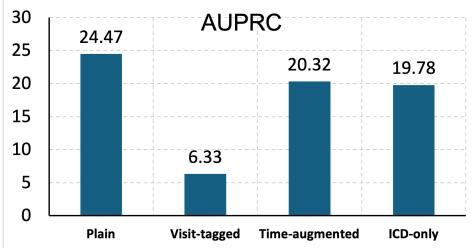

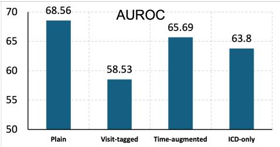

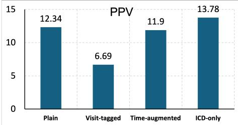

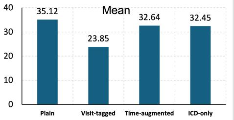  
Figure 1: Ablation of Input Representations for OODQwen3-1.7B.

## 3 Discussion

In this study, we evaluated diagnosis-specific continued pretraining and multi-expert integration for predicting 180-day opioid overdose risk from longitudinal diagnosis histories. Three main findings emerged. First, diagnosis-specific continued pretraining improved predictive performance relative to direct fine-tuning for both the Qwen- and Mamba-based architectures, with the largest gain observed for OODQWEN3-1.7B. Second, integrating Qwen-based experts of different model scales through OVERDOSE-MOE further improved overall discrimination and positive predictive value, with the PGA variant achieving the strongest overall performance in the held-out VHA cohort. Third, these improvements extended to clinically relevant high-risk operating points and were generally maintained across demographic subgroups and in an independent MIMIC-IV cohort, although the magnitude of benefit varied across populations and evaluation settings.

The improvement associated with diagnosis-specific continued pretraining suggests that adaptation to longitudinal clinical diagnosis sequences can provide information beyond conventional task-specific fine-tuning. Unlike general-purpose pretraining, continued exposure to longitudinal diagnosis histories may allow the model to better represent recurring comorbidities, disease progression, and combinations of diagnoses that precede subsequent overdose. The improvement was observed for both OODQWEN3- 1.7B and OODMAMBA-2.8B, indicating that the benefit was not restricted to a single neural architecture. However, the substantially larger gain for OODQWEN3-1.7B also indicates that the magnitude of benefit depends on the underlying model architecture and its capacity to use the adapted longitudinal representation.

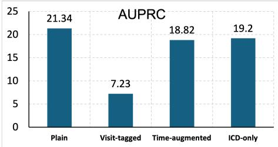

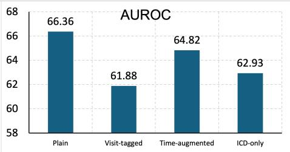

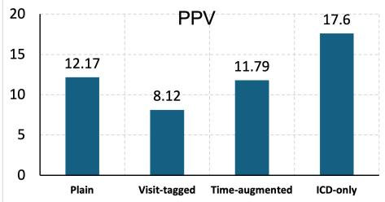

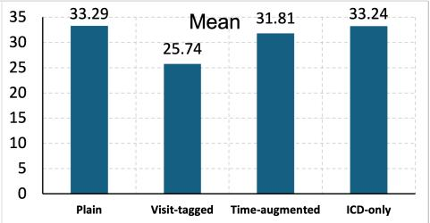  
Figure 2: Ablation of Input Representations for Qwen3-4B.

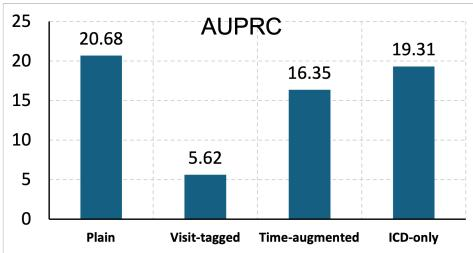

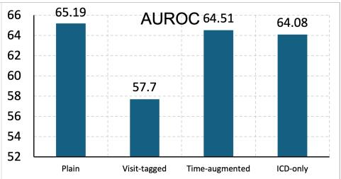

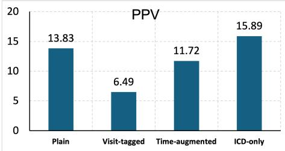

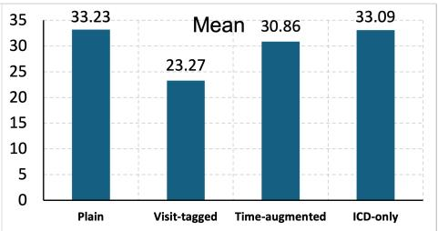  
Figure 3: Ablation of Input Representations for OODQwen3-8B.

Beyond diagnosis-specific adaptation, the additional improvement obtained with OVERDOSEMOE suggests that experts of different model scales capture partially complementary predictive information. Models with different capacities may differ in the longitudinal patterns to which they are most sensitive and in the errors they make for individual patients. Combining their predictions therefore provides an opportunity to reduce dependence on any single representation. Among the evaluated fusion strategies, PGA provided the strongest overall performance in the primary VHA analysis and showed relatively consistent gains across many demographic subgroups. This pattern suggests that combining a prior preference over experts with patient-specific adaptive weighting may provide a useful balance between stable global performance and samplelevel flexibility. At the same time, no fusion strategy was uniformly superior at every risk threshold or in every subgroup, indicating that the relative contribution of individual experts can vary across operating points and patient populations.

The risk-stratified analysis further illustrates the potential clinical relevance of these improvements. At the prespecified top-5% operating point, OVERDOSEMOE-PGA achieved a PPV of 25.38 and a recall of 21.14, corresponding to a 4.22-fold enrichment over the 6.01 overdose prevalence in the held-out VHA cohort and a number needed to review of 3.9. In a setting where clinical resources for overdose prevention are limited, concentrating future overdose events within a relatively small high-risk group could facilitate prioritization for additional assessment or preventive services. Nevertheless, these findings reflect retrospective risk stratification rather than the effect of a deployed clinical intervention. Prospective evaluation would therefore be required to determine whether model-guided prioritization improves clinical outcomes or resource allocation in practice.

The subgroup analyses showed that the benefit of multi-expert fusion was not confined to a single demographic stratum, but the magnitude and type of improvement varied across age, sex, and race/ethnicity groups. PGA showed the most frequent numerical improvements relative to OODQWEN3-1.7B, whereas EW and GLA achieved the highest discrimination in several individual strata. Such variation is consistent with heterogeneity in the predictive patterns represented across experts and provides further motivation for adaptive rather than fixed expert weighting. Importantly, subgroup performance should not be interpreted as evidence of demographic fairness. Estimates in smaller strata, particularly the “Other or unknown” race/ethnicity group, were unstable, and larger samples with sufficient outcome events will be needed to characterize performance differences more reliably across patient populations.

External validation in MIMIC-IV provided a more challenging evaluation setting. Absolute performance was lower for most models than in the held-out VHA cohort. This reduction may reflect differences between the two healthcare systems in demographic composition, clinical setting, documentation and coding practices, and outcome prevalence. In particular, the prevalence of 180-day opioid overdose was 1.38% in MIMIC-IV compared with approximately 6% across the VHA cohorts. Such differences can alter both the distribution of longitudinal diagnosis histories and their association with subsequent overdose, thereby limiting the transportability of models developed within a single healthcare system. Despite this shift, the three OVERDOSEMOE variants remained among the strongest approaches in the external cohort, with GLA achieving the highest AUROC and overall average score and PGA achieving the highest PPV. One potential explanation is that integrating experts of different scales reduces dependence on errors or representations specific to any single model, providing greater stability under population shift. However, validation in a single external cohort does not establish broad transportability, and evaluation across additional healthcare systems and patient populations is needed.

The input-representation ablation provides additional insight into how longitudinal diagnosis information is used by the models. Plain input achieved the highest mean performance across the three evaluated model scales, whereas explicit Visit-tagged representations consistently produced the lowest performance. The reduction with Visit-tagged input may reflect the limited fidelity of grouping diagnoses by calendar date as a proxy for a true clinical encounter. Diagnoses recorded on the same date can arise from different clinical activities or documentation processes, and explicit visit-boundary tokens may therefore impose structure that does not correspond closely to clinically meaningful encounters. Repeated boundary tokens also increase sequence length and may introduce additional representational complexity without providing information directly relevant to subsequent overdose risk.

In contrast, ICD-only representations remained competitive, particularly for the larger Qwen models, and produced the highest PPV for Qwen3-4B and Qwen3-8B. This finding indicates that diagnosis identity and chronological ordering themselves contain a substantial proportion of the predictive signal. Explicitly adding calendar dates produced only modest changes in performance relative to the Plain representation, suggesting that detailed calendar-time information did not provide additional benefit beyond the original chronological ordering in the evaluated setting. Importantly, the poorer performance of Visit-tagged input pertains to explicit visit-boundary encoding during downstream prediction and should not be interpreted as evidence that encounter structure is uninformative during diagnosis-specific continued pretraining.

Taken together, these findings indicate that the combination of diagnosis-specific adaptation and multi-expert integration can improve opioid overdose risk prediction from longitudinal diagnosis histories. The results also highlight that model performance depends not only on model scale but also on how longitudinal clinical information is represented and combined across predictors. Further validation across healthcare systems, prospective evaluation of risk-guided interventions, and assessment of performance across adequately powered demographic subgroups will be important before clinical deployment.

## 4 Methods

## 4.1 Data sources and ethical approval

This study used longitudinal electronic health record (EHR) data from the Veterans Health Administration (VHA) Corporate Data Warehouse (CDW), the clinical data system of the largest integrated health care network in the United States, comprising more than 1,200 medical centers and clinics. For cross-cohort transfer evaluation, we additionally constructed an independent opioid use disorder (OUD) cohort from MIMIC-IV, a publicly available database of de-identified patient records from a single academic tertiary-care center [12]. This study was approved by the Institutional Review Board of the US Veterans Affairs (VA) Bedford Health Care and conducted in accordance with the principles of the Declaration of Helsinki. A waiver of informed consent was obtained due to minimal risk to participants (IRB Net ID: 1603552-28).

## 4.2 Study design, prediction task, and outcome definition

The study was a retrospective longitudinal prognostic analysis of 180-day opioid overdose risk among VHA patients with a first recorded diagnosis of opioid use disorder. For each patient, the index date was defined as the first recorded OUD diagnosis. The model input was the 12 months of diagnostic history preceding the index date, and the prediction target was an opioid overdose event within the subsequent 180 days. The 180-day prediction horizon was chosen to align with VHA-level surveillance and care-coordination cadences used after an OUD diagnosis [13]. Opioid overdose was ascertained using the ICD-based mapping of Glanz et al. [14]. Patients with at least one qualifying opioid-overdose diagnosis code during the 180-day prediction window were labeled positive. Patients without a qualifying opioid-overdose diagnosis code during the prediction window were labeled negative.

## 4.3 Model framework

We developed OverdoseMoE as a unified framework for 180-day opioid overdose risk prediction from longitudinal diagnosis histories. The framework integrates longitudinal clinical representation, domain adaptation, task-specific prediction, and multi-expert fusion. First, diagnosis records are converted into chronologically ordered clinical text sequences and used to construct the pretraining, OUD, and external evaluation cohorts. ClinicalMamba-2.8B and Qwen3-1.7B are then adapted to the VHA domain through continued pretraining and further optimized for binary overdose prediction. Finally, predictions from complementary Qwen-based experts are combined using three fusion strategies to produce the final patient-level risk estimate. Figure 4 summarizes the overall workflow.

## 4.3.1 Data and Cohort Construction

Longitudinal diagnosis data (pretraining cohort). The pretraining cohort included 3,984,788 unique patients who received care at more than 1,200 VHA facilities between

January 1, 2016 and December 31, 2019. Of these patients, 3,944,418 were used for continued pretraining and 40,370 were reserved for pretraining validation. For each patient, diagnosis codes recorded across longitudinal visits were mapped to their corresponding clinical text descriptions. The mapped diagnoses were then organized by visit and concatenated in chronological order to form a longitudinal diagnosis sequence. Examples of mapped diagnoses include essential hypertension, type 2 diabetes mellitus, and low back pain. An example of the resulting input representation is provided in Supplementary Note 1.

OUD fine-tuning cohort. We constructed a downstream OUD cohort consisting of 78,660 VHA patients with an initial OUD diagnosis recorded between January 1, 2017 and June 1, 2019. Patients were partitioned at the patient level into training, validation, and test sets containing 62,928, 7,866, and 7,866 patients, respectively. For each patient, the diagnostic history from the 12 months preceding the index date was used as model input. Patients with fewer than 12 months of diagnostic history before the index date were excluded. No imputation was applied within the retained observation window. Outcome counts across splits are summarized in Table 1, and demographic characteristics are summarized in Table 2.

External evaluation cohort. We constructed an independent external evaluation cohort from MIMIC-IV to assess cross-cohort generalizability. The cohort included 3,971 patients with OUD, of whom 55 experienced an opioid overdose within 180 days. The same prediction task and longitudinal diagnosis representation used in the VHA cohort were applied to the MIMIC-IV cohort. No MIMIC-IV data were used for model training or model selection. Cohort size and 180-day overdose prevalence are summarized in Table 1, and demographic characteristics are reported in Table 2.

## 4.3.2 Continued pretraining and task-specific fine-tuning

We developed two domain-adapted models, OODMAMBA and OODQWEN, based on ClinicalMamba-2.8B and Qwen3-1.7B, respectively. ClinicalMamba-2.8B uses the Mamba selective state-space architecture [15], whereas Qwen3-1.7B uses a transformerbased architecture. Both models followed the same two-stage adaptation pipeline. First, the backbone models underwent continued pretraining on large-scale longitudinal VHA diagnosis sequences. Second, the adapted models were fine-tuned for 180-day opioid overdose prediction using the VHA OUD cohort.

Continued pretraining. Chronologically ordered diagnosis-text sequences from the VHA pretraining cohort were used to adapt both backbone models to the VHA clinical domain. Continued pretraining used an autoregressive next-token prediction objective,

$$
\mathcal { L } _ { \mathrm { C P T } } = - \sum _ { t = 1 } ^ { T } \log P ( x _ { t } \mid x _ { < t } ) ,\tag{1}
$$

where $x _ { t }$ denotes the token at position t in a longitudinal diagnosis sequence. This stage enabled the models to learn the clinical terminology, temporal ordering, and longitudinal patterns present in VHA diagnosis histories. Continued pretraining of ClinicalMamba-2.8B produced OODMAMBA, whereas continued pretraining of Qwen3-1.7B produced OODQWEN.

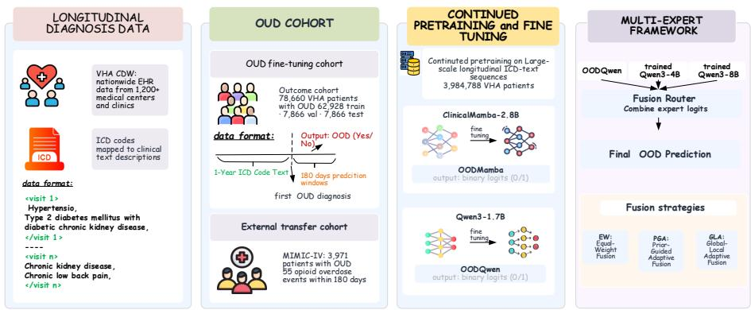  
Figure 4: Overview of the OverdoseMoE framework for 180-day opioid overdose risk prediction. The framework includes four components. (1) Longitudinal diagnosis data: nationwide VHA electronic health record data are converted into longitudinal sequences of clinical diagnosis descriptions for continued pretraining. (2) Cohort construction: an OUD cohort is used for model fine-tuning and evaluation, with oneyear longitudinal diagnosis histories as input and opioid overdose within 180 days as the prediction outcome; an independent MIMIC-IV OUD cohort is used for external evaluation. (3) Continued pretraining and task-specific adaptation: ClinicalMamba-2.8B and Qwen3-1.7B are continued pretrained on large-scale VHA diagnosis sequences to obtain OODMamba and OODQwen, followed by fine-tuning for binary opioid overdose prediction. (4) Multi-expertfusion: OODQwen and independently fine-tuned Qwen3-4B and Qwen3-8B models provide complementary prediction logits, which are combined using equal-weight (EW), prior-guided adaptive (PGA), or global–local adaptive (GLA) fusion to produce the final overdose risk prediction.

Task-specific fine-tuning. Following continued pretraining, both domain-adapted models were fine-tuned for 180-day opioid overdose prediction. For each patient, the one-year longitudinal diagnosis history preceding the index date was used as input. The prediction task was formulated as binary classification,

$$
y ( x ) \in \{ 0 , 1 \} ,\tag{2}
$$

where $y = 1$ denotes an opioid overdose during the 180-day prediction window and $y = 0$ denotes no overdose. For OODMAMBA, a binary classification head was added to the domain-adapted backbone and optimized using binary cross-entropy loss. Fine-tuning used AdamW with a learning rate of $2 \times 1 0 ^ { - 4 }$ , a batch size of 16, a maximum sequence length of 2,048 tokens, weight decay of 0.01, and dropout of 0.1 in the classification head. The model was trained for up to 20 epochs, and the checkpoint with the lowest validation loss was retained for evaluation. Class-weighted sampling was used to address outcome imbalance. For OODQWEN, parameter-efficient fine-tuning was performed using low-rank adaptation (LoRA). LoRA adapters were applied to the query and value projection matrices (q\_proj and $\mathsf { v \_ p r o j } )$ ) with rank $r = 1 6 .$ , scaling parameter $\alpha _ { \mathrm { L o R A } } = 1 6$ , and dropout of 0.1. The maximum input length was 2,000 tokens, and optimization used BCEWithLogitsLoss. The resulting model produced logits for the non-overdose and overdose classes. These logits were used for individual-model evaluation and as inputs to the subsequent multi-expert fusion framework. All training was performed on NVIDIA A100 80GB GPUs.

## 4.3.3 Multi-expert fusion

We developed OverdoseMoE to integrate complementary predictions from three Qwenbased experts: OODQWEN, Qwen3-4B, and Qwen3-8B. All experts received the same longitudinal diagnosis representation and were optimized for the same 180-day opioid overdose prediction task, but differed in model capacity and learned representations. For patient x, expert $i \in \{ 1 , 2 , 3 \}$ produces a two-class logit vector $\mathbf { z } _ { i } ( x )$ and the corresponding class probabilities,

$$
\mathbf { z } _ { i } ( x ) = [ z _ { i 0 } ( x ) , z _ { i 1 } ( x ) ] , \qquad \mathbf { p } _ { i } ( x ) = \mathrm { s o f t m a x } ( \mathbf { z } _ { i } ( x ) ) .\tag{3}
$$

The three experts are combined at the logit level using

$$
\mathbf { z } _ { \mathrm { f u s e } } ( x ) = \sum _ { i = 1 } ^ { 3 } w _ { i } ( x ) \mathbf { z } _ { i } ( x ) , \qquad \sum _ { i = 1 } ^ { 3 } w _ { i } ( x ) = 1 ,\tag{4}
$$

where $w _ { i } ( x )$ denotes the contribution of expert i for patient x. We evaluated three strategies for determining these weights.

Equal-weight fusion. Equal-weight fusion (EW) provides a parameter-free ensemble in which all experts contribute equally,

$$
w _ { i } ^ { \mathrm { E W } } = \frac { 1 } { 3 } , \qquad { \bf z } _ { \mathrm { E W } } ( x ) = \frac { 1 } { 3 } \sum _ { i = 1 } ^ { 3 } { \bf z } _ { i } ( x ) .\tag{5}
$$

Prior-guided adaptive fusion. Prior-guided adaptive fusion (PGA) combines validationderived expert priors with patient-specific predictive confidence. The global prior weights were predefined as $\pi = ( 0 . 3 0 , 0 . 5 0 , 0 . 2 0 )$ , with greater weight assigned to experts showing stronger individual performance on the validation cohort. Accordingly, OODQWEN received the largest prior weight. For each expert, predictive entropy was used to quantify uncertainty, and lower entropy was assigned greater patient-specific weight,

$$
H _ { i } ( x ) = - \sum _ { c \in \{ 0 , 1 \} } p _ { i c } ( x ) \log p _ { i c } ( x ) , \qquad a _ { i } ( x ) = { \frac { \exp [ - \beta H _ { i } ( x ) ] } { \sum _ { j = 1 } ^ { 3 } \exp [ - \beta H _ { j } ( x ) ] } } .\tag{6}
$$

The final PGA weight interpolates between the global prior and the patient-specific confidence weight,

$$
w _ { i } ^ { \mathrm { P G A } } ( x ) = ( 1 - \lambda ) \pi _ { i } + \lambda a _ { i } ( x ) , \qquad \mathbf { z } _ { \mathrm { P G A } } ( x ) = \sum _ { i = 1 } ^ { 3 } w _ { i } ^ { \mathrm { P G A } } ( x ) \mathbf { z } _ { i } ( x ) ,\tag{7}
$$

with $\beta = 1$ . The mixing coefficient λ was selected on the validation cohort by maximizing AUPRC over $\{ 0 , 0 . 0 1 , 0 . 0 2 , 0 . 0 5 , 0 . 1 0 , 0 . 2 0 , 0 . 3 0 \}$ . When multiple values achieved the same validation performance, the smaller value was retained. Thus, $\lambda = 0$ corresponds to fixed prior-weighted fusion, whereas larger values allow progressively greater patient-specific adaptation.

Global–local adaptive fusion. Global–local adaptive fusion (GLA) directly combines population-level expert performance with patient-specific predictive uncertainty. Global expert quality was defined by validation-set AUPRC. For each patient, the global quality score and predictive entropy were combined into a routing score and normalized across experts,

$$
s _ { i } ( x ) = \alpha Q _ { i } - \beta H _ { i } ( x ) , \quad \quad w _ { i } ^ { \mathrm { G L A } } ( x ) = \frac { \exp [ s _ { i } ( x ) ] } { \sum _ { j = 1 } ^ { 3 } \exp [ s _ { j } ( x ) ] } ,\tag{8}
$$

where $\alpha = \beta = 1$ . The final prediction logits are

$$
\mathbf { z } _ { \mathrm { G L A } } ( x ) = \sum _ { i = 1 } ^ { 3 } w _ { i } ^ { \mathrm { G L A } } ( x ) \mathbf { z } _ { i } ( x ) .\tag{9}
$$

GLA therefore assigns greater weight to experts with stronger validation-set discrimination and lower uncertainty for the current patient, whereas PGA adaptively adjusts predefined global prior weights using patient-specific confidence.

## 4.4 Baseline models

To assess the contribution of sequence architecture, task-specific fine-tuning, diagnosisdomain adaptation, and multi-expert fusion, we compared the proposed models with baselines spanning four model families, consistent with the organization of the primary results table: deep-sequence models, fine-tuned language models, diagnosis-adapted models, and multi-expert fusion models.

The deep-sequence baselines included a gated recurrent unit (GRU) network [16] and Mamba-2.8B [17], representing recurrent and selective state-space approaches for modeling chronologically ordered longitudinal diagnosis sequences. The fine-tuned languagemodel baselines included BioMistral-7B [18], Qwen2.5-3B [19], ClinicalMamba-2.8B [9], and three Qwen3 variants with 1.7B, 4B, and 8B parameters [20]. All models were evaluated using the same patient-level data splits, one-year observation window, 180- day prediction horizon, and binary opioid-overdose outcome definition. Model-specific fine-tuning procedures followed the settings described above. The diagnosis-adapted models consisted of OODMAMBA-2.8B and OODQWEN-1.7B. These models were obtained by continued pretraining of ClinicalMamba-2.8B and Qwen3-1.7B, respectively, on large-scale longitudinal VHA diagnosis histories before downstream fine-tuning for opioid-overdose prediction. ClinicalMamba-2.8B therefore served as the direct pretraining control for OODMAMBA, while Qwen3-1.7B served as the corresponding backbone control for OODQWEN; these paired comparisons isolate the contribution of VHA diagnosis-specific continued pretraining. Finally, the OverdoseMoE family included the three proposed multi-expert fusion strategies: equal-weight fusion (EW), prior-guided adaptive fusion (PGA), and global–local adaptive fusion (GLA). All three approaches combined predictions from the same set of task-specific experts and differed only in how expert contributions were weighted, enabling direct evaluation of the benefit of adaptive expert routing.

## 4.5 Evaluation and statistical analysis

Predictive performance was evaluated on the held-out 7,866-patient VHA test set using positive predictive value (PPV), area under the precision-recall curve (AUPRC), and area under the receiver operating characteristic curve (AUROC). For the primary modelcomparison table, binary predictions were obtained by taking the argmax over the binary classification logits, and PPV was computed from these binary predictions.

Because the intended use case was prioritization of a limited high-risk subgroup for prevention review, we also evaluated risk concentration at prespecified top-k operating points. Patients were ranked by predicted opioid-overdose risk, and PPV and recall were computed among patients in the top 1%, 2%, 5%, and 10% of predicted risk. The top-5% threshold was prespecified as the primary operating point because it represents a pragmatic registry-based review threshold: selective enough to define a manageable high-risk subgroup, while broad enough to capture more events than highly restrictive alert thresholds. This framing is consistent with prior work on EHR-integrated risk stratification and clinical implementation, in which high-risk strata are used to prioritize patients for review, outreach, or clinician notification under finite clinical resources [13, 21]. The 1%, 2%, and 10% thresholds were included to examine more selective and broader review scenarios. For the top-5% threshold, the observed-to-expected (O/E) ratio was calculated as PPV divided by the opioid-overdose prevalence in the held-out VHA test set, and number needed to review was calculated as the inverse of PPV.

Cross-cohort transfer was evaluated by applying the VHA-trained models to the MIMIC-IV OUD cohort using the same diagnosis-history representation and evaluation metrics. This analysis was interpreted as a cross-cohort transportability assessment rather than as evidence of broad generalizability. Exploratory descriptive subgroup analyses for the primary VHA test set were conducted across prespecified strata defined by age, sex, and race/ethnicity. Strata with fewer than 10 positive events were reported descriptively and were not used for subgroup comparisons.

OODMAMBA was evaluated as a risk-ranking tool at prespecified high-risk operating points. Use of model scores for absolute-risk estimation or threshold-based deployment would require dedicated calibration analysis on the target population and, if indicated, explicit recalibration.

## Data and Code Availability

The data used in this study are derived from the U.S. Department of Veterans Affairs and are not publicly available due to data-use and privacy restrictions; approval by the Department of Veterans Affairs is required for data access. MIMIC-IV [12] is publicly available under a PhysioNet credentialed data-use agreement. Cohort construction scripts and prediction outputs for the MIMIC-IV transfer analysis can be shared on request, subject to applicable data-use agreements. Code associated with this study is available at https://github.com/ToneLi/OverdoseMoE/.

## Acknowledgements

Research reported in this study was supported in part by grant 5R01DA056470. The content is solely the responsibility of the authors and does not necessarily represent the official views of the National Institutes of Health or the U.S. Department of Veterans Affairs, Veterans Health Administration.

## Author contributions

Mingchen Li conducted the experiments, performed the analyses, and drafted the manuscript. Rohan Pandey conducted experiments and analyses, contributed to the study structure, and drafted the manuscript. Junhui Qian contributed to cohort construction. Feiyun Ouyang contributed to study design and provided medical guidance. Sunjae Kwon contributed to construction of the transfer evaluation cohort. Avijit Mitra contributed to manuscript revision. Zonghai Yao contributed to manuscript revision and provided experimental suggestions. Hong Yu supervised the study. All authors revised the manuscript, approved the final version, and agreed with the conclusions.

## Competing interests

The authors declare no competing interests.

## References

[1] Walley, A. Y. et al. Opioid overdose rates and implementation of overdose education and nasal naloxone distribution in massachusetts: interrupted time series analysis. Bmj 346 (2013).

[2] Larochelle, M. R. et al. Medication for opioid use disorder after nonfatal opioid overdose and association with mortality: a cohort study. Annals of internal medicine 169, 137–145 (2018).

[3] Dowell, D. Cdc clinical practice guideline for prescribing opioids for pain—united states, 2022. MMWR. Recommendations and reports 71 (2022).

[4] Lo-Ciganic, W.-H. et al. Evaluation of machine-learning algorithms for predicting opioid overdose risk among medicare beneficiaries with opioid prescriptions. JAMA Network Open 2, e190968 (2019).

[5] Dong, X. et al. Machine learning based opioid overdose prediction using electronic health records. AMIA Annual Symposium Proceedings 2019, 389–398 (2019).

[6] Dong, X. et al. Predicting opioid overdose risk of patients with opioid prescriptions using electronic health records based on temporal deep learning. Journal of Biomedical Informatics 116, 103725 (2021).

[7] Rahman, H. et al. Imminent opioid overdose risk prediction using classical and machine learning survival models following first recorded opioid-related diagnosis: A prospective cohort study from the all of us research program. The American Journal ofDrug and Alcohol Abuse 1–11 (2026). Online ahead of print.

[8] Yang, Z., Mitra, A., Liu, W., Berlowitz, D. & Yu, H. Transformehr: transformerbased encoder-decoder generative model to enhance prediction of disease outcomes using electronic health records. Nature communications 14, 7857 (2023).

[9] Yang, Z., Mitra, A., Kwon, S. & Yu, H. Clinicalmamba: A generative clinical language model on longitudinal clinical notes. In Proceedings ofthe 6th Clinical Natural Language Processing Workshop, 54–63 (2024).

[10] Ripperger, M. et al. Ensemble learning to predict opioid-related overdose using statewide prescription drug monitoring program and hospital discharge data in the state of tennessee. Journal ofthe American Medical Informatics Association 29, 22–32 (2022).

[11] Ding, Z. et al. HIBERT: A hybrid clustering BERT for interpretable opioid overdose risk prediction. AMIA Annual Symposium Proceedings 2024, 303–312 (2024).

[12] Johnson, A. E. et al. Mimic-iv, a freely accessible electronic health record dataset. Scientific data 10, 1 (2023).

[13] Oliva, E. M. et al. Development and applications of the veterans health administration’s stratification tool for opioid risk mitigation (storm) to improve opioid safety and prevent overdose and suicide. Psychological services 14, 34 (2017).

[14] Glanz, J. M., Binswanger, I. A., Shetterly, S. M., Narwaney, K. J. & Xu, S. Association between opioid dose variability and opioid overdose among adults prescribed long-term opioid therapy. JAMA network open 2, e192613–e192613 (2019).

[15] Gu, A. & Dao, T. Mamba: Linear-time sequence modeling with selective state spaces. In First Conference on Language Modeling (2024).

[16] Cho, K. et al. Learning phrase representations using RNN encoder–decoder for statistical machine translation. In Proceedings of the 2014 Conference on Empirical Methods in Natural Language Processing (EMNLP), 1724–1734 (Association for Computational Linguistics, 2014).

[17] Gu, A. & Dao, T. Mamba: Linear-time sequence modeling with selective state spaces. arXiv preprint arXiv:2312.00752 (2023).

[18] Labrak, Y. et al. Biomistral: A collection of open-source pretrained large language models for medical domains. In Findings of the association for computational linguistics: acl 2024, 5848–5864 (2024).

[19] Yang, A. et al. Qwen2.5 Technical Report. arXiv preprint arXiv:2412.15115 (2024).

[20] Yang, A. et al. Qwen3 technical report. arXiv preprint arXiv:2505.09388 (2025).

[21] Lee, T. C., Shah, N. U., Haack, A. & Baxter, S. L. Clinical implementation of predictive models embedded within electronic health record systems: a systematic review. In Informatics, vol. 7, 25 (MDPI, 2020).

## Supplementary Information Supplementary Note 1. Input representation example

To illustrate the model input, we provide a de-identified example using the OOD prediction task. For each patient, all ICD-10 diagnosis codes from visits within the 12- month observation window were mapped to their textual descriptions and concatenated in chronological order. This diagnosis-text sequence was then provided to OODMAMBA to predict whether the patient would experience an opioid overdose event within the subsequent 180 days. The example below is illustrative only and does not correspond to a real patient, to avoid any privacy risk.

<table><tr><td>Task: Predict whether the patient will experience an opioid overdose event (OOD) within the 180-day prediction window. Observation window: 12 months before the first OUD diagnosis. Visit 1: 2021-02-14. ICD-10 codes: I10, E11.9 Mapped descriptions: Essential hypertension; Type 2 diabetes mellitus without complications. Visit 2: 2021-05-03. ICD-10 codes: M54.5, G89.29</td></tr><tr><td>Mapped descriptions: Low back pain; Other chronic pain. Visit 3: 2021-08-19. ICD-10 codes: F41.9, G47.00 Mapped descriptions: Anxiety disorder, unspecified; Insomnia, unspecified. Visit 4: 2021-11-27. ICD-10 codes: F11.90, Z79.891 Mapped descriptions: Opioid use, unspecified, uncomplicated; Long-term current</td></tr><tr><td>use of opiate analgesic. Final chronological input sequence fed to the model: Essential hypertension; Type 2 diabetes mellitus without complications. Low back pain; Other chronic pain. Anxiety disorder, unspecified; Insomnia, unspecified. Opioid use, unspecified, uncomplicated; Long-term current use of opiate analgesic. Model output: A binary prediction indicating opioid overdose or no opioid over-</td></tr></table>

Figure S1: Example de-identified diagnosis-text input for opioid overdose prediction.

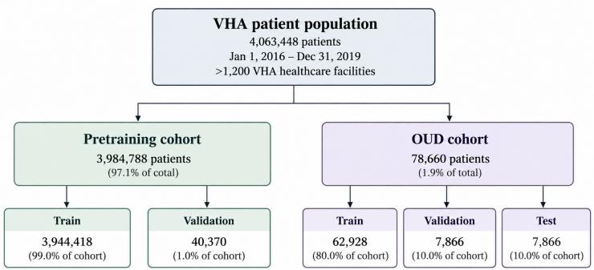  
Figure S2: Cohort construction for the VHA opioid use disorder study population.

Figure S2 illustrates the cohort construction process for the VHA opioid use disorder study population. We first identified 4,063,448 VHA patients receiving care between January 1, 2016 and December 31, 2019 across more than 1,200 VHA healthcare facilities. From this population, 3,984,788 patients were used to construct the pretraining cohort, which was split into 3,944,418 training patients and 40,370 validation patients. Separately, we identified an OUD cohort of 78,660 patients for downstream overdose prediction. This cohort was divided into training, validation, and test sets containing 62,928, 7,866, and 7,866 patients, respectively. This design separates large-scale clinical pretraining from task-specific OUD outcome modeling, while preserving held-out validation and test cohorts for unbiased evaluation.

## Supplementary Note 3. Outcome code mapping

The primary outcome in this study was a composite EHR-ascertained opioid overdose event within 180 days of the index OUD diagnosis. The active single-endpoint analysis did not model fatal and non-fatal overdose separately; therefore, the code mapping below reports the ICD-10 diagnosis-code definition used to identify qualifying opioid-overdose events in the EHR.

<table><tr><td>Outcome Ascertainment</td><td>ICD-10 Diagnosis Codes</td></tr><tr><td>EHR opioid overdose event</td><td>Heroin: T40.1X1, T40.1X2, T40.1X3, T40.1X4</td></tr><tr><td>(composite event captured within the health system)</td><td>Opium: T40.0X1, T40.0X2, T40.0X3, T40.0X4</td></tr><tr><td></td><td>Other opioids: T40.2X1, T40.2X2, T40.2X3, T40.2X4 Methadone: T40.3X1, T40.3X2, T40.3X3, T40.3X4</td></tr></table>

Table S1: ICD-10 diagnosis codes used to construct the composite EHR-ascertained opioid overdose label for the active single-endpoint prediction task.