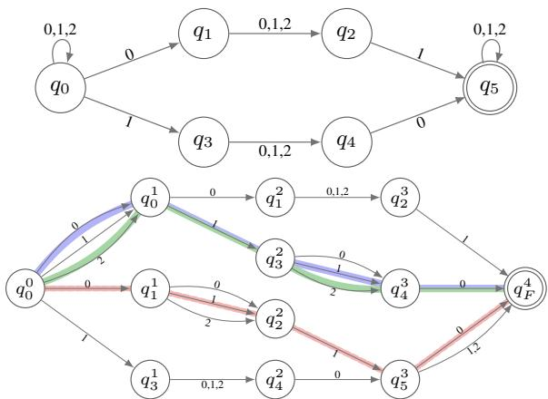
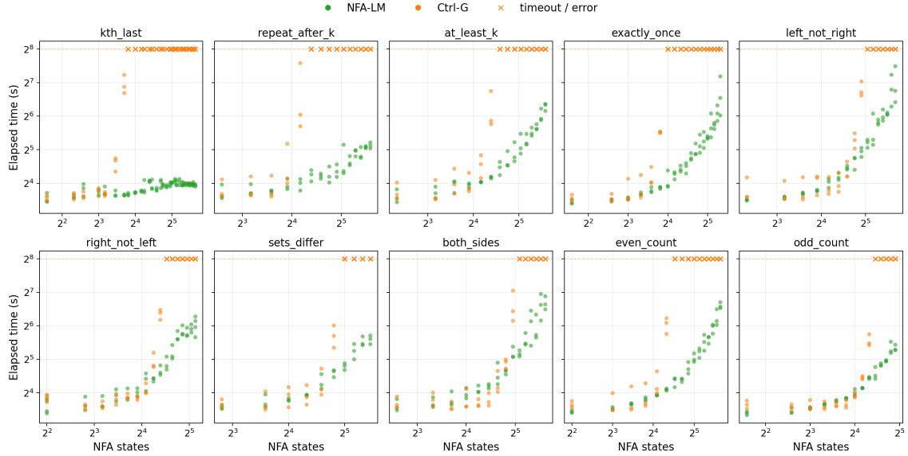
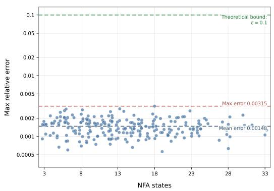

# Provably Tractable NFA-Constrained Language Generation via HMMs

Jialiang Sun and Kuldeep Meel University of Toronto {sjl,meel}@cs.toronto.edu

## Abstract

Constrained generation aims to sample from language models (LMs) conditioned on hard constraints. Existing constrained-generation techniques for nondeterministic finite automaton (NFA) constraints either distort the distri bution or sacrifice efficiency. Theoretically, this task reduces to counting the length-n sequences accepted by an NFA (#NFA), and the exact #NFA problem is #P-complete. Recent work has shown that #NFA admits a fully polynomial randomized approximation scheme (FPRAS). Inspired by this result, we propose NFA-LM, a polynomial-time engine for NFAconstrained generation with theoretical guarantees under mild assumptions. Experiments show that NFA-LM efficiently generates highquality outputs with theoretically bounded approximation error.

## 1 Introduction

As language models (LMs) become ubiquitous across a wide range of tasks, the demand for constrained generation, which requires outputs to satisfy specific constraints, continues to grow. Constrained-generation techniques benefit downstream applications such as text detoxification (Gehman et al., 2020; Weng et al., 2025), agentic function calling (Patil et al., 2024, 2025; OpenAI, 2024), and structured SQL generation (Lei et al., 2025). Regular expressions (Regex) (Kleene, 1956) are a powerful tool for modeling such constraints and can be represented efficiently by NFAs with a linear number of states (Thompson, 1968; Glushkov, 1961).

Given an LM $P _ { \mathrm { l m } }$ and a constraint α, constrained generation seeks to sample outputs from $P _ { \mathrm { l m } } ( x _ { 1 : n } ~ \mid ~ \alpha )$ . At step ℓ, this is equivalent to sampling $x _ { \ell }$ from a distribution proportional to $\begin{array} { r } { P _ { \mathrm { l m } } ( x _ { \ell } \mid x _ { 1 : \ell - 1 } ) \cdot P _ { \mathrm { l m } } ( \alpha \mid x _ { 1 : \ell - 1 } \cdot x _ { \ell } ) } \end{array}$ The main difficulty lies in computing the constraintconditioned probability $P _ { \mathrm { l m } } ( \alpha \mid x _ { 1 : \ell } )$ , which requires marginalizing over future continuations: $\Sigma \qquad { P _ { \mathrm { l m } } ( x _ { \ell + 1 : n } \mid x _ { 1 : \ell } ) }$ The unx<sub>ℓ+1:n</sub>:x<sub>1:n</sub> satisfies α weighted special case of computing the number of suffixes $x _ { \ell + 1 : n }$ such that $x _ { 1 : n }$ satisfies α, given a prefix $x _ { 1 : \ell } .$ , is a #NFA problem, which is known to be #P-complete (Àlvarez and Jenner, 1993). Existing constrained-generation techniques fall into two categories based on the tradeoff between efficiency and distribution preservation. (i) Distributionagnostic techniques, such as PICARD (Scholak et al., 2021), Synchromesh (Poesia et al., 2022), and XGrammar (Dong et al., 2025; Li et al., 2026), mask out tokens that violate the constraint using explicit decoding-time checkers. These approaches efficiently determine whether $P _ { \mathrm { l m } } ( \alpha ~ \lvert ~ x _ { 1 : \ell } )$ is zero, but they distort the true conditional distri bution (Park et al., 2024; Melcer et al., 2026). (ii) Distribution-aware techniques seek to preserve $P _ { \mathrm { l m } } ( \alpha \ | \ x _ { 1 : \ell } )$ . Existing approaches, such as Langevin-based methods (Kumar et al., 2022; Qin et al., 2022), MCMC samplers (Amini et al., 2023; Gonzalez et al., 2025), and SMC-based methods (Lew et al., 2023; Zhao et al., 2024; Loula et al., 2025; Lipkin et al., 2025), generally lack polynomial-time guarantees for approximating the constrained LM distribution to a prescribed accuracy. Recently, a line of research distills Hidden Markov Model (HMM) $P _ { \mathrm { h m m } } ( \alpha \mid x _ { 1 : \ell } ) \approx P _ { \mathrm { l m } } ( \alpha \mid$ $x _ { 1 : \ell } )$ as a tractable proposal: GeLaTo (Zhang et al., 2023) and Ctrl-G (Zhang et al., 2024) develop efficient algorithms that compute $P _ { \mathrm { h m m } } ( \alpha \mid x _ { 1 : \ell } )$ exactly for DFAs and handle basic constraints such as keyword inclusion and length requirements, but general Regex still requires up to exponentially many DFA states (Moore, 1971).

Consequently, LMs still struggle with constrained generation (Geng et al., 2025; Sun et al., 2023; Lu et al., 2023). This raises a research question: Can we achieve efficient distribution-aware constrained generationfor NFAs with theoretically bounded error? We answer this question affirmatively with NFA-LM. Our framework is theoretically inspired by efficient FPRAS for #NFA (Arenas et al., 2021; Meel and de Colnet, 2025), and generalizes Ctrl-G (Zhang et al., 2024) to NFA case. NFA-LM first distills an HMM from the base LM and uses it to assign tractable probability weights to future continuations. It then generalizes the #NFA FPRAS to estimate the HMM completion weight $P _ { \mathrm { h m m } } ( \alpha \mid x _ { 1 : \ell } )$ to reweight the LM’s next-token distribution.

We organize the rest of the paper as follows. We introduce the preliminaries in Section 2, followed by the key concepts of canonical runs in Section 3. We present NFA-LM in Section 4 and its main theoretical guarantees in Section 5. We empirically evaluate NFA-LM in Section 6 and conclude in Section 7. Complete engineering details and proofs appear in Appendices A, B, and C.

## 2 Preliminaries and Background

We introduce the preliminaries as below.

LM and HMM A token in the vocabulary Σ is a basic element of a language model. We denote by $\Sigma ^ { n }$ and $\Sigma ^ { * }$ the sets of length-n and arbitrary-length sequences, respectively. For each sequence $x ~ = ~ x _ { 1 : n } ~ \in ~ \Sigma ^ { n }$ , we represent the language model as the autoregressive distribution $\begin{array} { r } { P _ { \mathrm { l m } } ( x _ { 1 : n } ) ~ = ~ \prod _ { \ell = 1 } ^ { n } P _ { \mathrm { l m } } ( x _ { \ell } ~ \vert ~ x _ { 1 : \ell - 1 } ) } \end{array}$ . An HMM models a joint distribution over a token sequence $x _ { 1 : n }$ and a hidden-state sequence $y _ { 1 : n } \in$ $\vert h \vert ^ { n } \colon \ P _ { \mathrm { h m m } } ( x _ { 1 : n } , y _ { 1 : n } ) \ = \ P _ { \mathrm { h m m } } ( y _ { 1 } ) P _ { \mathrm { h m m } } ( x _ { 1 } \ |$ $\begin{array} { r } { y _ { 1 } ) \prod _ { \ell = 2 } ^ { n } P _ { \mathrm { h m m } } ( y _ { \ell } \vert y _ { \ell - 1 } ) P _ { \mathrm { h m m } } ( x _ { \ell } \vert y _ { \ell } ) } \end{array}$ . It is specified by an initial distribution vector for $P _ { \mathrm { h m m } } ( y _ { 1 } = i )$ , an emission matrix for $P _ { \mathrm { h m m } } ( x _ { \ell } =$ $k \mid y _ { \ell } = i )$ , and a transition matrix for $P _ { \mathrm { h m m } } ( y \ell =$ $j \mid y _ { \ell - 1 } = i )$

Mathematical Notation We use ${ \bf 1 } _ { A }$ to denote the indicator function that equals 1 if A is true. Given $n \in \mathbb { N } ^ { + }$ , let $[ n ]$ denote $\{ 1 , \ldots , n \}$ . Given $a , b , \varepsilon \in \mathbb { R } ^ { \geq 0 }$ , let $a \in ( 1 \pm \varepsilon ) b$ denote $( 1 - \varepsilon ) b \leq$ $a \leq ( 1 + \varepsilon ) b$ . Similarly, $\textstyle { a \in { \frac { b } { ( 1 \pm \varepsilon ) } } }$ denotes $\frac { b } { 1 + \varepsilon } \leq$ $a \ \leq \ { \frac { b } { 1 - \varepsilon } }$ We use λ to denote the length-zero empty token or hidden state. For $x , x ^ { \prime } \in \Sigma ^ { * }$ , let $x { \cdot } x ^ { \prime }$ be their concatenation. For $S , S ^ { \prime } \subseteq \Sigma ^ { * }$ , define $S \cdot x = \{ x ^ { \prime } \cdot x \mid x ^ { \prime } \in S \}$ and $S \cdot S ^ { \prime } = \{ x \cdot x ^ { \prime } \mid x \in$ $S , x ^ { \prime } \in S ^ { \prime } \}$ . Concatenation of product sequences of tokens and hidden states is defined similarly.

NFA and Regex An NFA is a 5-tuple A = $( Q , \Sigma , T , q _ { 0 } , F )$ comprising a set of states Q, a set of transitions $T \subseteq Q \times \Sigma \times Q$ , an initial state $q _ { 0 } \in Q$ , and a set of final states $F \subseteq Q$ . A DFA is a special case of an NFA such that, for any $q \in Q$ and $a \in \Sigma .$ , there is at most one $q ^ { \prime }$ with $( q , a , q ^ { \prime } ) \in T$ $\mathbf { A }$ run r of $x _ { 1 : k } \in \Sigma ^ { k }$ from q to $q _ { k }$ on A is denoted by $q _ { 0 } \stackrel { x _ { 1 } } {  } q _ { 1 } \stackrel { x _ { 2 } } {  } \cdots \stackrel { x _ { k } } {  } q _ { k }$ , where $( q _ { \ell - 1 } , x _ { \ell } , q _ { \ell } ) \in T$ for every $\ell \in [ k ]$ . We say that x is accepted by $q ^ { \prime }$ from $q$ if there exists a run r from q to $q ^ { \prime }$ for x, and we denote the set of all such x by $L ( q , q ^ { \prime } )$ . In particular, $L ( q ) = L ( q _ { 0 } , q )$ , and the language of A is $L ( A ) = \textstyle \bigcup _ { q \in F } L ( q )$ . For $n \in \mathbb { N } ^ { + }$ , the n-th slice of the language of $A .$ , denoted by $L _ { n } ( A )$ , is the set of length-n sequences in $L ( A )$ . For $q , q ^ { \prime } \in Q$ , define the set of symbols labeling transitions from q to $q ^ { \prime }$ as $\Sigma ( q , q ^ { \prime } ) = \{ a \in \Sigma \mid ( q , a , q ^ { \prime } ) \in T \}$ , the successors of q as succ $( q ) = \{ q ^ { \prime } \in Q \mid \Sigma ( q , q ^ { \prime } ) \neq \emptyset \}$ and the a-successors of $q$ as $\mathsf { s u c c } ( q , a ) = \{ q ^ { \prime } \in$ $Q \mid ( q , a , q ^ { \prime } ) \in T \}$ . Given a regular expression (Regex) α consisting of k symbol occurrences, one can construct an NFA A with $k + 1$ states using Glushkov’s construction (Glushkov, 1961). We abuse notation and use $P _ { \mathrm { l m } } ( \boldsymbol { \alpha } \mid x _ { 1 : \ell } )$ to denote the probability of the LM constraint-satisfaction event $x _ { 1 : n } \in L _ { n } ( A )$ given $x _ { 1 : \ell }$ . Given tolerance $\varepsilon > 0$ and confidence $\delta ,$ the fully polynomial randomized approximation scheme (FPRAS) for #NFA returns an estimate $\hat { N }$ such that $\mathbb { P } [ \hat { N } \in ( 1 \pm \varepsilon ) | L _ { n } ( A ) | ] \geq$ $1 - \delta$ . Its running time is polynomial in m (the number of states), $n , \varepsilon ^ { - 1 }$ , and $\log ( \delta ^ { - 1 } )$

Constrained Generation The main goal is to compute $P _ { \mathrm { l m } } ( x _ { \ell } \mid x _ { 1 : \ell - 1 } ) P _ { \mathrm { l m } } ( \alpha \mid x _ { 1 : \ell } )$ at each step ℓ. We distill an HMM so that $P _ { \mathrm { h m m } } ( \alpha \mid$ $x _ { 1 : \ell } )$ approximates $P _ { \mathrm { l m } } ( \alpha \ | \ x _ { 1 : \ell } )$ , and we seek to approximate the term $P _ { \mathrm { h m m } } ( \alpha \mid x _ { 1 : \ell } )$ by our $\hat { P } _ { \mathrm { h m m } } ( \alpha \mid x _ { 1 : \ell } )$ . Given a prefix $x _ { 1 : \ell - 1 }$ , define $P ( x _ { \ell } \mid x _ { 1 : \ell - 1 } , \alpha ) \ = \ P _ { \mathrm { l m } } ( x _ { \ell } \mid x _ { 1 : \ell - 1 } ) P _ { \mathrm { h m m } } ( \alpha \mid$ $x _ { 1 : \ell } ) / \Gamma ( x _ { 1 : \ell - 1 } )$ and $\begin{array} { r l } { \hat { P } ( x _ { \ell } } & { { } | \quad x _ { 1 : \ell - 1 } , \alpha ) \quad = } \end{array}$ $\ P _ { \mathrm { l m } } ( x _ { \ell } \mid x _ { 1 : \ell - 1 } ) \hat { P } _ { \mathrm { h m m } } ( \alpha \mid x _ { 1 : \ell } ) / \hat { \Gamma } ( x _ { 1 : \ell - 1 } )$ , where $\Gamma ( x _ { 1 : \ell - 1 } )$ and $\hat { \Gamma } ( x _ { 1 : \ell - 1 } )$ are the respective normalizing constants. They induce $P ( x _ { 1 : n } \mid \alpha ) =$ $\begin{array} { r l } { \prod _ { \ell = 1 } ^ { n } P ( x _ { \ell } } & { { } | \quad x _ { 1 : \ell - 1 } , \alpha ) } \end{array}$ and $\hat { P } ( x _ { 1 : n } \mid \alpha ) =$ $\textstyle \prod _ { \ell = 1 } ^ { n } { \hat { P } } ( x _ { \ell } \mid x _ { 1 : \ell - 1 } , \alpha )$ . We will show in Theorem 2 that $P$ is provably close to $\hat { P }$

## 3 Canonical Runs on an NFA

In this section, we summarize the unrolling procedure and canonical runs that are key to the algorithm description and theoretical analysis.

Unrolling Given $n \in \mathbb { N } ^ { + }$ , we can unroll the NFA A into $A ^ { u } = ( Q ^ { u } , \Sigma , T ^ { u } , q _ { 0 } ^ { 0 } , q _ { F } ^ { n } )$ with the property

$L ( A ^ { u } ) = L _ { n } ( A )$ . The structure of $A ^ { u }$ resembles a directed acyclic graph (DAG), with layers of state copies $Q ^ { \ell }$ for $\ell = 0 , \ldots , n$ . For each $q \in Q$ that is reachable from the initial state $q _ { 0 }$ by a lengthℓ sequence, the corresponding state $q ^ { \ell } \in Q ^ { \ell }$ is reachable by that sequence in $A ^ { u }$ . Formally, $A ^ { u }$ is defined as follows: (i) $q _ { 0 } ^ { 0 } \in Q ^ { u } ; { \mathrm { ( i i ) } }$ for every ℓ with $0 < \ell < n$ , if $( q _ { 1 } , a , q _ { 2 } ) \in T$ and $q _ { 1 } ^ { \ell - 1 } \in \dot { Q } ^ { u }$ then $q _ { 2 } ^ { \ell } \in Q ^ { u }$ and $( q _ { 1 } ^ { \ell - 1 } , a , q _ { 2 } ^ { \ell } ) \in T ^ { u }$ ; and (iii) $q _ { F } ^ { n } \in Q ^ { u }$ , and if $q _ { 1 } ^ { n - 1 } \in Q ^ { u }$ and (q<sub>1</sub>, a, q<sub>2</sub>) ∈ T for some $q _ { 2 } \in F$ , then $( q _ { 1 } ^ { n - 1 } , a , q _ { F } ^ { n } ) \in T ^ { u }$ . The fixedlength case can be generalized to length ranges by padding: for every $q \in F$ reachable by a length-j sequence for $n ^ { \prime } \leq j \leq n$ , add a padding chain $q ^ { j } \stackrel { \# } { \longrightarrow } q _ { \# } ^ { j + 1 } \stackrel { \# } { \longrightarrow } \cdots \stackrel { \# } { \longrightarrow } q _ { \# } ^ { n - 1 } \stackrel { \# } { \longrightarrow } q _ { F } ^ { n }$ so that $\textstyle | L ( A ^ { u } ) | \ = \sum _ { \ell = n ^ { \prime } } ^ { n } | L _ { \ell } ( A ) |$ . For conciseness, we assume the fixed-length case throughout the paper. Given a prefix $x _ { 1 : \ell }$ , let $R ( x _ { 1 : \ell } ) ~ = ~ \{ q ~ \in$ $Q ^ { \ell } | x _ { 1 : \ell } \in L ( q _ { 0 } ^ { 0 } , q ) \}$ be its set of reachable states. Its set of accepting-completion suffixes is $\begin{array} { r } { L ( x _ { 1 : \ell } , q _ { F } ^ { n } ) = \bigcup _ { q \in R ( x _ { 1 : \ell } ) } L ( q , q _ { F } ^ { n } ) } \end{array}$

Canonical Runs An accepted suffix may have several runs in an NFA. To count every suffix once, fix a total order ≺ on the states. For $q \in Q ^ { \ell }$ and $a \cdot x ^ { \prime } \in L ( q , q _ { F } ^ { n } )$ , define its canonical successor firs $[ ( q , a , x ^ { \prime } )$ as follows:

min $\{ q ^ { \prime } \in Q ^ { \ell + 1 } \mid ( q , a , q ^ { \prime } ) \in T ^ { u } , x ^ { \prime } \in L ( q ^ { \prime } , q _ { F } ^ { n } ) \}$ ≺

Definition 1 (Canonical run). For $q \in Q ^ { \ell }$ and $x \in$ $L ( q , q _ { F } ^ { n } )$ , the canonical run of x from $q ,$ denoted by $\mathsf { r u n } ( x , q )$ , is defined inductively as follows:

• If $q = q _ { F } ^ { n }$ , then x = λ and $\mathsf { r u n } ( \lambda , q _ { F } ^ { n } ) = q _ { F } ^ { n }$

• If $q \ne q _ { F } ^ { n }$ , write $\ x \ = \ a \cdot \ x ^ { \prime } .$ , let $q ^ { \prime } \ =$ $\mathsf { f i r s t } ( q , a , x ^ { \prime } )$ , and set run $\begin{array} { c c l } { { ( x , q ) } } & { { = } } & { { q } } \end{array} \overset { a } {  }$ $\mathsf { r u n } ( x ^ { \prime } , q ^ { \prime } )$ . We call $( x ^ { \prime } , q ^ { \prime } )$ the canonical child of $( x , q )$

For a reachable-state set $R \subseteq Q ^ { \ell }$ , we similarly write first $( R , x ) = \operatorname* { m i n } _ { } \{ q \in R \mid x \in L ( q , q _ { F } ^ { n } ) \}$ This assigns every suffix in $\textstyle \bigcup _ { q \in R } L ( q , q _ { F } ^ { n } )$ to one state in R.

Definition 2 (Convergence state). Let $r , r ^ { \prime }$ be two runs in $A ^ { u }$ that both end at $q _ { F } ^ { n }$ . Let $r _ { k }$ (respectively, $r _ { k } ^ { \prime } )$ be the suffix of r (respectively, $r ^ { \prime } )$ beginning at layer k. We have $r _ { n } = r _ { n } ^ { \prime } = q _ { F } ^ { n }$ . The longest common suffix of r and $r ^ { \prime }$ is the suffix $r _ { k }$ for the smallest k such that $r _ { k } = r _ { k } ^ { \prime } .$ . The convergence state of r and $r ^ { \prime }$ is the state reached by the longest common suffix of $r$ and $r ^ { \prime }$ . For $x , x ^ { \prime } \in L ( q , q _ { F } ^ { n } )$

  
Figure 1: Top: An NFA A over $\Sigma = \{ 0 , 1 , 2 \}$ with ordered states $q _ { 0 } \prec \cdots \prec q _ { 5 }$ and final state $q _ { 5 }$ . Bottom: The unrolled NFA $A ^ { u }$ of A for length $n = 4$

we denote by $q ^ { x _ { 1 } , x _ { 2 } }$ the convergence state of their canonical runs $\mathsf { r u n } ( x , q )$ and $\mathsf { r u n } ( x ^ { \prime } , q )$

Example 1. Figure 1 illustrates the constraint “Alice and Bob occur two positions $\mathrm { a p a r t } , \mathrm { \cdot }$ where Alice → 0, Bob → 1, and others $ \ 2$ The sequence “Introduce Bob to $\mathrm { \bf A l i c e ^ { \prime } { } } $ corresponds to 2120, whose canonical run is $q _ { 0 } ^ { 0 } \stackrel { 2 } {  } q _ { 0 } ^ { 1 } \stackrel { 1 } {  } q _ { 3 } ^ { 2 } \stackrel { 2 } {  } q _ { 4 } ^ { 3 } \stackrel { 0 } {  } q _ { F } ^ { 4 } .$ Another sequence $0 1 1 0$ has two accepting runs: since first $( q _ { 0 } ^ { 0 } , 0 , 1 1 0 ) = q _ { 0 } ^ { 1 }$ under the ordering ≺, the canonical run is $q _ { 0 } ^ { 0 } \stackrel { 0 } {  } q _ { 0 } ^ { 1 } \stackrel { 1 } {  } q _ { 3 } ^ { 2 } \stackrel { 1 } {  } q _ { 4 } ^ { 3 } \stackrel { 0 } {  } q _ { F } ^ { 4 }$ whereas $q _ { 0 } ^ { 0 } \stackrel { 0 } {  } q _ { 1 } ^ { 1 } \stackrel { 1 } {  } q _ { 2 } ^ { 2 } \stackrel { 1 } {  } q _ { 5 } ^ { 3 } \stackrel { 0 } {  } q _ { F } ^ { 4 }$ is noncanonical. The longest common suffix of the canonical runs for 0110 and 2120 is therefore $q _ { 4 } ^ { 3 } \stackrel { 0 } {  } q _ { F } ^ { 4 }$ , with convergence state $q _ { 4 } ^ { 3 }$

NFA with HMM Weights Let $H _ { 0 } = \{ \lambda \}$ for the initial-distribution step, and let $H _ { \ell } = [ h ]$ for $1 \leq \ell \leq n$ . A product state is a pair $v = \left( q , b \right)$ where $q \in Q ^ { \ell }$ and $b \in H _ { \ell }$ . An NFA transition $( q , a , q ^ { \prime } ) \in T ^ { u }$ and a hidden-state transition from b to $b ^ { \prime } \in H _ { \ell + 1 }$ form a product edge $( q , b ) \xrightarrow { ( a , b ^ { \prime } ) }$ $( \boldsymbol { q } ^ { \prime } , \boldsymbol { b } ^ { \prime } )$ with weight defined as follows:

$$
\psi ( a , b , b ^ { \prime } ) = \left\{ \begin{array} { l l } { P _ { \mathrm { h m m } } ( b ^ { \prime } ) P _ { \mathrm { h m m } } ( a \mid b ^ { \prime } ) } & { b = \lambda } \\ { P _ { \mathrm { h m m } } ( b ^ { \prime } \mid b ) P _ { \mathrm { h m m } } ( a \mid b ^ { \prime } ) } & { b \neq \lambda } \end{array} \right.
$$

For $q \in Q ^ { \ell }$ , define ${ \cal Z } ( q ) = { \cal L } ( q , q _ { F } ^ { n } ) \times [ h ] ^ { n - \ell }$ Given any suffix atom ${ \boldsymbol { z } } ~ = ~ ( x _ { \ell + 1 : n } , y _ { \ell + 1 : n } )$ , define its weight as $\begin{array} { r } { w ( z , b ) = \prod _ { i = \ell + 1 } ^ { n } \psi ( x _ { i } , y _ { i - 1 } , y _ { i } ) } \end{array}$ and the sum of weights at $( q , b )$ as $W ( q , b )$ $\Sigma _ { z \in Z ( q ) } w ( z , b )$ . Let ${ \cal Z } _ { + } ( q , b ) = \{ z \in { \cal Z } ( q ) \vert$ $w ( z , b ) > 0 \}$ . We call $\mathcal { E } _ { \ell } ( q , b )$ the set of productive edges of $( q , b )$ which is defined inductively:

at $\ell = n - 1$ , define ${ \mathcal { E } } _ { n - 1 } ( q , b ) = \{ ( a , q _ { F } ^ { n } , b ^ { \prime } )$ | $( q , a , q _ { F } ^ { n } ) \in T ^ { u } , \ b ^ { \prime } \in H _ { n } , \psi ( a , b , b ^ { \prime } ) > 0 \}$ , and for $0 \leq \ell < n - 1$ , define $\mathcal { E } _ { \ell } ( q , b ) = \{ ( a , q ^ { \prime } , b ^ { \prime } ) \ |$ $( q , a , q ^ { \prime } ) \in T ^ { u } , b ^ { \prime } \in H _ { \ell + 1 } , \psi ( a , b , b ^ { \prime } ) >$ $0 , \ \mathcal { E } _ { \ell + 1 } ( q ^ { \prime } , b ^ { \prime } ) \ \neq \ \emptyset \}$ . Observe that $w ( z , b ) =$ $P _ { \mathrm { h m m } } ( x _ { \ell + 1 : n } , y _ { \ell + 1 : n } \ | \ y _ { \ell } \ = \ b )$ and $W ( q , b ) =$ $P _ { \mathrm { h m m } } ( x _ { \ell + 1 : n } \in \ L ( q , q _ { F } ^ { n } ) \ | \ y _ { \ell } \ = \ b )$ . For each prefix $x _ { 1 : \ell }$ with $P _ { \mathrm { h m m } } ( x _ { 1 : \ell } ) > 0$ , let $R = R ( x _ { 1 : \ell } )$ be the set of reachable NFA states and let $Z _ { R } =$ $\textstyle \bigcup _ { q \in R } Z ( q )$ be the set of suffix atoms. If we write $\begin{array} { r } { \dot { W _ { R } ( b ) } = \sum _ { z \in Z _ { R } } w ( z , b ) } \end{array}$ , then the target probability is given by the following identity:

$$
P _ { \mathrm { h m m } } ( \alpha \mid x _ { 1 : \ell } ) = \sum _ { b \in H _ { \ell } } P _ { \mathrm { h m m } } ( y _ { \ell } = b \mid x _ { 1 : \ell } ) W _ { R } ( b )
$$

It therefore suffices to estimate $W _ { R } ( b )$ , as ${ \mathrm { d e } } -$ scribed in Section 4.

The canonical NFA run lifts to a canonical product run. $\mathrm { I f } ~ z = ( a , b ^ { \prime } ) \cdot z ^ { \prime } $ , where $z ^ { \prime } = ( x ^ { \prime } , y ^ { \prime } )$ , and $q ^ { \prime } = \mathsf { f i r s t } ( q , a , x ^ { \prime } )$ , define analogously:

$$
\mathsf { r u n } ( z , ( q , b ) ) = ( q , b ) \xrightarrow [ ] { ( a , b ^ { \prime } ) } \mathsf { r u n } ( z ^ { \prime } , ( q ^ { \prime } , b ^ { \prime } ) )
$$

The recursion terminates at $q _ { F } ^ { n }$ , where all terminal product states are identified with $q _ { F } ^ { n }$ . We call $\left( z ^ { \prime } , \left( q ^ { \prime } , b ^ { \prime } \right) \right)$ the canonical child of $( z , ( q , b ) )$ . These canonical product runs will control the dependence among reused samples in Section 5.

## 4 Method

Overall, NFA-LM consists of three stages: (i) Distillation: following Zhang et al. (2023, 2024), we distill an HMM $P _ { \mathrm { h m m } }$ using responses sampled from the base LM $\mathrm { { } } P _ { \mathrm { { l m } } } ; \mathrm { { ( i i ) } }$ Precomputation: we precompute HMM-weighted suffix samples that provide reusable information for constrained generation; and (iii) Generation: we use the precomputed information to generate outputs. Algorithm 1 summarizes NFA-LM.

## 4.1 Precomputation

In this stage, we precompute suffix sample sets $S ^ { r , j } ( q , b )$ at rates $p ^ { j } ( q , b )$ such that, for every atom $z \in Z _ { + } ( q , b )$ , the invariant $\mathbb { P } [ z \in S ^ { r , j } ( q , b ) ] =$ $p ^ { j } ( q , b ) w ( z , b )$ holds.<sup>1</sup> Define reduce $( S , p )$ to initialize $S ^ { \prime } = \emptyset$ , add each $s \in S$ to $S ^ { \prime }$ with probability $p ,$ and return $S ^ { \prime }$ . The precomputation core corresponds to the body of one repetition $j$ in Algorithm 3, spanning Lines 5–14. For the terminal product states, we set every rate and weight to its exact value, 1, and every sample set to $\{ ( \lambda , \lambda ) \}$ (Line 8). The core then processes the product states backward, from layer $n - 1$ to layer 0 (Line 10). Thus, when estimateAndSample $( q , j , \ell )$ is called, all rates $p ^ { j } ( q _ { i } , b ^ { \prime } )$ and sample sets $S ^ { r , j } ( q _ { i } , b ^ { \prime } )$ associated with the productive edges of $( q , b )$ have already been computed.

Algorithm 1: NFA-LM(α, n, ε, δ)   
1 Construct NFA A for α and unroll to $A ^ { u }$   
2 Run precompute( $( A , n , \varepsilon , \delta )$   
3 Initialize $x _ { 1 : 0 } = \lambda$   
4 for $\ell = 1 , \ldots , n :$ :   
5 for $a \in \Sigma :$   
6 $\Big \lfloor \hat { P } _ { \mathrm { h m m } } ( \alpha \mid x _ { 1 : \ell - 1 } \cdot a ) \gets \mathsf { c o m p u t e } ( x _ { 1 : \ell - 1 } \cdot a )$   
7 Sample $x _ { \ell } \propto P _ { \mathrm { l m } } ( x _ { \ell } \mid x _ { 1 : \ell - 1 } ) \hat { P } _ { \mathrm { h m m } } ( \alpha \mid x _ { 1 : \ell } )$   
8 return $x _ { 1 : n }$

```latex
Algorithm 2: estimateAndSample(q, j, ℓ)
1 for $b \in H _ { \ell }$ :
2 if $\mathcal { E } _ { \ell } ( q , b ) = \emptyset$ : continue to next b
$\begin{array} { r } { \rho ^ { j } ( q , b ) \gets \operatorname* { m i n } _ { ( a , q _ { i } , b ^ { \prime } ) \in { \mathcal E } _ { \ell } ( q , b ) } \frac { p ^ { j } ( q _ { i } , b ^ { \prime } ) } { \psi ( a , b , b ^ { \prime } ) } } \end{array}$
3 for $r \in [ n _ { s } n _ { t } ]$ :
4 for $( a , q _ { i } , b ^ { \prime } ) \in \mathcal { E } _ { \ell } ( q , b )$
$\bar { S } ^ { r , j } ( a , q , q _ { i } , b ^ { \prime } ) \gets \mathsf { r e d u c e } |$
5
$\begin{array} { r } { ( a , b ^ { \prime } ) \cdot S ^ { r , j } ( q _ { i } , b ^ { \prime } ) , \frac { \rho ^ { j } ( q , b ) \psi ( a , b , b ^ { \prime } ) } { p ^ { j } ( q _ { i } , b ^ { \prime } ) } \bigg ) } \end{array}$
$\hat { S } ^ { r , j } ( q , b ) \gets \bigcup \qquad \{ ( a , b ^ { \prime } ) \cdot ( x ^ { \prime } , y ^ { \prime } )$
6 (a,q<sub>i</sub>,b<sup>′</sup>)∈E<sub>ℓ</sub>(q,b)
$\in \bar { S } ^ { r , j } ( a , q , q _ { i } , b ^ { \prime } ) : \mathsf { f i r s t } ( q , a , x ^ { \prime } ) = q _ { i } \}$
7 for $t \in [ n _ { t } ]$
n<sub>s</sub>t
P |S<sup>ˆr,j</sup> (q,b)|
8 $\begin{array} { r } { M ^ { t , j } ( q , b )  \frac { r = n _ { s } ( t - 1 ) + 1 ^ { \cdot } } { n _ { s } \rho ^ { j } ( q , b ) } } \end{array}$
9 $\hat { W } ^ { j } ( q , b ) \gets \mathrm { m e d i a n } _ { t \in [ n _ { t } ] } M ^ { t , j } ( q , b )$
10 $p ^ { j } ( q , b ) \gets \operatorname* { m i n } \left( \rho ^ { j } ( q , b ) , \hat { W } ^ { j } ( q , b ) ^ { - 1 } \right)$
11 for $r \in [ n _ { s } n _ { t } ]$
12 $\begin{array} { r } { { S ^ { r , j } } ( q , b ) ^ { - } \mathrm {  } \mathsf { r e d u c e } ( \hat { S } ^ { r , j } ( q , b ) , \frac { p ^ { j } ( q , b ) } { \rho ^ { j } ( q , b ) } ) } \end{array}$
```

We now analyze estimateAndSample. Fix $r \in$ $[ n _ { s } n _ { t } ]$ , a productive edge $( a , q _ { i } , b ^ { \prime } )$ , and an atom $z = ( a , b ^ { \prime } ) \cdot z ^ { \prime }$ , where $z ^ { \prime } = ( x ^ { \prime } , y ^ { \prime } ) \in Z _ { + } ( q _ { i } , b ^ { \prime } )$ Suppose that $z ^ { \prime }$ occurs in $S ^ { r , j } ( q _ { i } , b ^ { \prime } )$ with weighted sampling rate $p ^ { j } ( q _ { i } , b ^ { \prime } ) w ( z ^ { \prime } , b ^ { \prime } )$ . We first compute $\begin{array} { r } { \rho ^ { j } ( q , b ) ~ = ~ \operatorname* { m i n } _ { ( a , q _ { i } , b ^ { \prime } ) \in { \mathcal E } _ { \ell } ( q , b ) } \frac { p ^ { j } ( q _ { i } , b ^ { \prime } ) } { \psi ( a , b , b ^ { \prime } ) } } \end{array}$ (Line 2). We expand $z ^ { \prime }$ by prepending $( a , b ^ { \prime } )$ and then reduce the expanded set with probability $\rho ^ { j } ( q , b ) \psi ( a , b , b ^ { \prime } ) / p ^ { j } ( q _ { i } , b ^ { \prime } )$ (Line 5). The resulting occurrence rate of z is $\rho ^ { j } ( q , b ) w ( z , b )$ . Thus, all expanded atoms have the same rate relative to their weights.

```latex
Algorithm 3: precompute $( A , n , \varepsilon , \delta )$
1 Unroll A to $A ^ { u } = ( Q ^ { u } , \Sigma , T ^ { u } , q _ { 0 } ^ { 0 } , q _ { F } ^ { n } )$
2 $\begin{array} { r } { \kappa , n _ { t } , n _ { u } \gets \frac { \varepsilon } { 6 + \varepsilon } , \left\lceil 8 \log ( 1 6 h | Q ^ { u } | ) \right\rceil , \left\lceil 8 \log ( \delta ^ { - 1 } ) \right\rceil } \end{array}$
3 $\begin{array} { r } { n _ { s } , \theta \gets \left\lceil \frac { 1 6 ( n + 1 ) } { \kappa ^ { 2 } ( 1 - \kappa ) } \right\rceil , \lceil 1 6 ( 1 + \kappa ) n _ { s } n _ { t } h | Q ^ { u } | \rceil } \end{array}$
4 for $j \in [ n _ { u } ]$ :
5 fail<sup>j</sup> ← 0
6 for $\ell = 0 , \ldots , n , q \in Q ^ { \ell } , b \in H _ { \ell } , r \in [ n _ { s } n _ { t } ] :$
7 $\hat { W } ^ { j } ( q , b ) , p ^ { j } ( q , b ) , S ^ { r , j } ( q , b )  0 , 1 , \emptyset$
8 for $b \in [ h ] , r \in [ n _ { s } n _ { t } ]$
9 $\hat { W } ^ { j } ( q _ { F } ^ { n } , b ) , p ^ { j } ( q _ { F } ^ { n } , b ) , S ^ { r , j } ( q _ { F } ^ { n } , b ) \gets$
$1 , 1 , \{ ( \lambda , \lambda ) \}$
10 for $\ell = n - 1 , \ldots , 0$
11 for $q \in Q ^ { \ell }$
12 estimateAndSample $( q , j , \ell )$
13 if $\stackrel { n _ { s } n _ { t } } { \sum } \sum \mathrm { ~ \sum ~ } \sum \mathrm { ~ } | S ^ { r , j } ( q , b ) | \geq \theta$
$\mathop { \longrightarrow } \mathop { \longrightarrow } \mathop { \longrightarrow } \mathop { \longrightarrow } \mathop { \longrightarrow } \theta _ { q \in Q ^ { k } } \delta \overline { { \in H } } _ { k }$
14 $\mathsf { f a i l } ^ { j } \gets 1 ,$ go to repetition $j + 1$
15 return $\hat { W } ^ { j } ( q , b ) , p ^ { j } ( q , b ) , S ^ { r , j } ( q , b )$
```

The same atom may nevertheless be generated through several NFA successors, causing overcounting. Thus, Line 6 uses a canonical union to retain the atom $( a , b ^ { \prime } ) \cdot ( x ^ { \prime } , y ^ { \prime } )$ if and only if $q _ { i } ~ = ~ \mathsf { f i r s t } ( q , a , x ^ { \prime } )$ . This ensures that $| \hat { S } ^ { r , j } ( q , b ) | / \rho ^ { j } ( q , b )$ is an unbiased estimator of $W ( q , b )$ To concentrate this estimator, we set $\hat { W } ^ { j } ( q , b )$ to the median of $n _ { t }$ block means in Line 9. The new sampling rate is $\begin{array} { r c l } { p ^ { j } ( q , b ) } & { = } & { \displaystyle \operatorname* { m i n } \left( \rho ^ { j } ( q , b ) , \hat { W } ^ { j } ( q , b ) ^ { - 1 } \right) } \end{array}$ , which guarantees $p ^ { j } ( q , b ) / \rho ^ { j } ( q , b ) \leq 1$

To keep the precomputation bounded, a core is marked as failed once the total number of stored samples reaches the threshold θ. Each core is accurate with constant probability, and the $n _ { u }$ core repetitions amplify the success probability to $1 - \delta .$

## 4.2 Constrained Generation

Given a prefix $x _ { 1 : \ell }$ , Algorithm 4 estimates $W _ { R } ( b )$ by combining the precomputed results associated with the reachable states $R = R ( x _ { 1 : \ell } )$ . For every hidden state b, let $R _ { b } ^ { + } = \{ q \in R \mid \mathcal { E } _ { \ell } ( q , b ) \neq \emptyset \}$ Within each non-failed repetition j, we apply the same rate alignment, canonical union, and medianof-means construction as in precomputation: the sketches are aligned at $\begin{array} { r } { \rho _ { R } ^ { j } ( b ) = \operatorname* { m i n } _ { \scriptstyle q \in R _ { h } ^ { + } } p ^ { j } ( q , b ) } \end{array}$ (Line 9), reduced accordingly, and deduplicated using first $( R , x )$ . This yields $\hat { W } _ { R } ^ { j } ( b )$ , and the HMMposterior identity gives

Algorithm 4: compute $( x _ { 1 : \ell } )$   
1 Let $R = R ( x _ { 1 : \ell } )$ be the set of reachable   
states.   
2 if $\ell = n :$ : return $\mathbf { 1 } _ { q _ { F } ^ { n } \in R }$   
3 if $P _ { \mathrm { h m m } } ( x _ { 1 : \ell } ) = 0$ or $R = \emptyset$ : return 0   
4 for $j \in [ n _ { u } ] :$ :   
5 if fail $\dot { \bar { \mathbf { \rho } } } = 1 : \hat { P } _ { \mathrm { h m m } } ^ { j } ( \alpha \mid x _ { 1 : \ell } ) = 0 ;$ continue   
6 for $b \in H _ { \ell }$ :   
7 $R _ { b } ^ { + }  \{ q \in R \mid \mathcal { E } _ { \ell } ( q , b ) \neq \emptyset \}$   
8 if $R _ { b } ^ { + } = \varnothing : \ \hat { W } _ { R } ^ { j } ( b ) \gets 0 ;$ continue   
9 $\rho _ { R } ^ { j } ( b ) \gets \operatorname* { m i n } _ { q \in R _ { b } ^ { + } } p ^ { j } ( q , b )$   
10 for $r \in [ n _ { s } n _ { t } ] :$   
11 for $q \in R _ { b } ^ { + }$ :   
12 $\bar { S } _ { R } ^ { r , j } ( q , b ) $   
reduce $\begin{array} { r } { \left( S ^ { r , j } ( q , b ) , \frac { \rho _ { R } ^ { j } ( b ) } { p ^ { j } ( q , b ) } \right) } \end{array}$   
13 $\widetilde { S } _ { R } ^ { r , j } ( b ) = \ \cup \ \{ ( x , y ) \in$   
$q \in R _ { b } ^ { + }$   
$\bar { S } _ { R } ^ { r , j } ( q , b ) \mid \mathsf { f i r s t } ( R , x ) = q \}$   
14 for $t \in [ n _ { t } ]$ :   
15 $\begin{array} { r } { M _ { R } ^ { t , j } ( b ) \longleftarrow \frac { \displaystyle \sum _ { s = n _ { s } ( t - 1 ) + 1 } ^ { n _ { s } t } | \widetilde { S } _ { R } ^ { r , j } ( b ) | } { \displaystyle n _ { s } \rho _ { R } ^ { j } ( b ) } } \end{array}$   
16 $\hat { W } _ { R } ^ { j } ( b ) \gets \mathrm { m e d i a n } _ { t \in [ n _ { t } ] } M _ { R } ^ { t , j } ( b )$   
17 $\hat { P } _ { \mathrm { h m m } } ^ { j } ( \alpha \mid x _ { 1 : \ell } )  \sum _ { \iota , \textit { \textbf { r } } \textit { \textbf { r } } } P _ { \mathrm { h m m } } ( y _ { \ell } = b \mid x _ { 1 : \ell } ) \hat { W } _ { R } ^ { j } ( b )$   
b∈H<sub>ℓ</sub>   
18 $\hat { P } _ { \mathrm { h m m } } ( \alpha \mid x _ { 1 : \ell } )$ = median $\hat { P } _ { \mathrm { h m m } } ^ { j } ( \alpha \mid x _ { 1 : \ell } )$   
j∈[n<sub>u</sub>]   
19 return $\hat { P } _ { \mathrm { h m m } } ( \alpha \mid x _ { 1 : \ell } )$

$$
\hat { P } _ { \mathrm { h m m } } ^ { j } ( \alpha \mid x _ { 1 : \ell } ) = \sum _ { b \in H _ { \ell } } P _ { \mathrm { h m m } } ( y _ { \ell } = b \mid x _ { 1 : \ell } ) \hat { W } _ { R } ^ { j } ( b )
$$

(Line 17). The algorithm defines $\hat { P } _ { \mathrm { h m m } } ( \alpha \mid x _ { 1 : \ell } )$ as the median of these estimates across the $n _ { u }$ repetitions (Line 18). At every generation step, $\mathrm { \ A l g o { - } }$ rithm 1 evaluates this estimate for every candidate $a \in \Sigma$ and samples a with probability proportional to $P _ { \mathrm { l m } } ( a \mid x _ { 1 : \ell - 1 } ) \hat { P } _ { \mathrm { h m m } } ( \alpha \mid x _ { 1 : \ell - 1 } \cdot a )$

## 5 Theoretical Guarantees

We summarize the main theoretical guarantees of NFA-LM for approximation error and time complexity below. Let $\mathcal { V } = \{ ( q , b ) : q \in Q ^ { k } , b \in H _ { k } , 0 \leq$ $k < n , Z _ { + } ( q , b ) \neq \emptyset \}$ be the set of product states with at least one positive-weight accepting completion. In precomputation, for $j \in [ n _ { u } ]$ , let $\mathcal { N } ^ { j }$ denote the j-th core repetition of precompute without the test against θ, so that $\mathcal { N } ^ { j }$ always completes. In $\mathcal { N } ^ { j }$ , define the following bad events $\mathcal { A } ^ { j } , B ^ { j }$ and the good event $\mathcal { C } ^ { j }$ :

$$
\begin{array} { l } { { \mathcal { A } ^ { j } = \bigcup _ { ( q , b ) \in \mathcal { V } } \{ p ^ { j } ( q , b ) \notin ( 1 \pm \kappa ) W ( q , b ) ^ { - 1 } \} } } \\ { { \mathcal { B } ^ { j } = \left\{ \displaystyle \sum _ { r = 1 } ^ { n _ { s } n _ { t } } \sum _ { k = 0 } ^ { n } \sum _ { q \in Q ^ { k } } \sum _ { b \in H _ { k } } | S ^ { r , j } ( q , b ) | \geq \theta \right\} } } \\ { { \mathcal { C } ^ { j } = ( \mathcal { A } ^ { j } ) ^ { c } \cap ( \mathcal { B } ^ { j } ) ^ { c } } } \end{array}
$$

Intuitively, for the j-th core repetition, $\mathcal { A } ^ { j }$ denotes the event that the approximation error exceeds the tolerance, and $B ^ { j }$ denotes the overflow event in which the total number of stored samples becomes too large. Without Line 14, this overflow would violate the time-complexity guarantee. In fact, each bad event occurs with a small constant probability, and the outer median across independent core repetitions makes the overall failure probability arbitrarily small:

Lemma 1. For $j \in [ n _ { u } ] , \mathbb { P } [ \mathcal { A } ^ { j } ] \leq 1 / 1 6$

Lemma 2. For $j \in [ n _ { u } ] , \mathbb { P } [ B ^ { j } \cap ( A ^ { j } ) ^ { c } ] \leq 1 / 1 6 .$

After the precomputation, for $\ell \in [ n ] , j \in [ n _ { u } ]$ and every prefix satisfying $P ( x _ { 1 : \ell } \mid \alpha ) > 0 .$ , define

$$
\begin{array} { r l } & { \xi ^ { j } ( x _ { 1 : \ell } ) = \displaystyle \frac { \hat { P } _ { \mathrm { h m m } } ^ { j } ( \alpha \mid x _ { 1 : \ell } ) } { { P } _ { \mathrm { h m m } } ( \alpha \mid x _ { 1 : \ell } ) } - 1 } \\ & { \Delta ^ { j } = \displaystyle \sum _ { \ell = 1 } ^ { n } \sum _ { \stackrel { x _ { 1 : \ell } \in \Sigma ^ { \ell } } { P ( x _ { 1 : \ell } \mid \alpha ) > 0 } } P ( x _ { 1 : \ell } \mid \alpha ) \left( \xi ^ { j } ( x _ { 1 : \ell } ) \right) ^ { 2 } } \\ & { \mathcal { Z } ^ { j } = \mathcal { C } ^ { j } \cap \left\{ \Delta ^ { j } \leq 2 n \kappa ^ { 2 } \right\} } \end{array}
$$

Intuitively, $\xi ^ { j } ( x _ { 1 : \ell } )$ is the relative error of repetition $j$ in the HMM completion score. $\Delta ^ { j }$ accumulates the weighted squared error across generation steps, and $\mathcal { T } ^ { j }$ is the event that repetition j remains within its error budget, assuming that the good precomputation event $\mathcal { C } ^ { j }$ occurs. In fact, we have:

Lemma 3. For $j \in [ n _ { u } ] , \mathbb { P } [ ( \mathbb { Z } ^ { j } ) ^ { c } ] \le 3 / 1 6 .$

Together, these key lemmas lead to the following guarantees for approximation error and time complexity:

Theorem 1. For any constraint α, $n \in \mathbb { N } ^ { + } , 0 <$ $\varepsilon , \delta \leq 1$ , and $x _ { 1 : n } \in \Sigma ^ { n }$ satisfying $P _ { \mathrm { h m m } } ( x _ { 1 : n } ) >$ 0, with probability at least $1 - \delta ,$ the following holds simultaneouslyfor all $\ell \in [ n ] .$

$$
\hat { P } _ { \mathrm { h m m } } ( \alpha \mid x _ { 1 : \ell } ) \in ( 1 \pm \varepsilon ) P _ { \mathrm { h m m } } ( \alpha \mid x _ { 1 : \ell } )
$$

Theorem 2. For any constraint $\alpha , n \in \mathbb { N } ^ { + }$ , and $0 ~ < ~ \varepsilon , \delta ~ \le ~ 1$ , assume that for every $\ell \in [ n ]$ $\Gamma ( x _ { 1 : \ell - 1 } ) > 0$ whenever $P ( x _ { 1 : \ell - 1 } \mid \alpha ) > 0$ . With probability at least $1 - \delta ,$ , the Total Variation (TV) distance is bounded as below:

$$
D _ { \mathrm { T V } } \Big ( \hat { P } ( \cdot \mid \alpha ) , P ( \cdot \mid \alpha ) \Big ) \leq n \varepsilon
$$

Theorem 3. Given any constraint α represented by an NFA with m states, a maximum sequence length n, an HMM with h hidden states, an alphabet of size $| \Sigma | .$ , and parameters $( \varepsilon , \delta )$ , Algorithm 1 has time complexity $O \big ( | \Sigma | n ^ { 2 } m ^ { 3 } h ^ { 2 } \varepsilon ^ { - 2 } \log ( n m h ) \log ( \delta ^ { - 1 } ) \big )$

We provide complete proofs in Appendices B and C.

## 6 Evaluation

We design the evaluation to answer the following research questions (RQs):

RQ1. Scalability. Can NFA-LM efficiently scale to large Regex constraints $\alpha ?$

RQ2. Approximation Accuracy. Can NFA-LM accurately compute constrained probabilities?

RQ3. Generation Quality. Can NFA-LM generate high-quality outputs?

Dataset and Constraints Following the experimental setups of prior constrained-generation work (Zhang et al., 2023, 2024; Dang et al., 2026), we evaluate NFA-LM on CommonGen (Lin et al., 2020), in which each instance includes three to five key concepts as input and the goal is to generate a sequence that incorporates these concepts. Table 1 presents 10 Regex constraint families that are difficult for DFAs, with difficulty controlled by the parameters $k _ { 1 }$ and $k _ { 2 }$ (where $k _ { 2 }$ is the number of tracked keywords). To increase the number of tracked keywords $k _ { 2 } .$ , we augment CommonGen to include up to 20 tracked keywords by merging distinct raw instances. We randomly sample 500 instances from the constraint families, difficulty parameters, and tracked keywords, with the number of NFA states limited to 50. We also require each output sequence to contain between 1 and 64 tokens.

<table><tr><td>Family</td><td>Constraint</td><td>NFA states DFA states</td><td></td></tr><tr><td>kth_last</td><td>The  $k _ { 1 } \mathrm { - t h }$  token from the end is one of the tracked keywords</td><td> $\Theta ( k _ { 1 } )$ </td><td> $\Theta ( 2 ^ { k _ { 1 } } )$ </td></tr><tr><td> $\mathsf { r e p e a t \_ a f t e r \_ k }$ </td><td>Some tracked keyword repeats  $k _ { 1 }$  tokens apart.</td><td> $\Theta ( k _ { 1 } k _ { 2 } )$ </td><td> $\Theta \dot { ( k _ { 2 } ^ { k _ { 1 } } ) }$ </td></tr><tr><td> $\mathsf { a t \_ l e a s t \_ k }$ </td><td>Some tracked keyword appears at least  $k _ { 1 }$  times.</td><td> $\Theta ( k _ { 1 } k _ { 2 } )$ </td><td> $\Theta ( k _ { 1 } ^ { k _ { 2 } } )$ </td></tr><tr><td> $\mathtt { e x a c t l y \_ o n c e }$ </td><td>Some tracked keyword occurs exactly once.</td><td> $\Theta ( k _ { 2 } )$ </td><td> $\Theta \big ( 3 ^ { \bar { k } _ { 2 } } \big )$ </td></tr><tr><td> $\mathsf { l e f t \_ n o t \_ r i g h t }$ </td><td>Some tracked keyword occurs on the left of the separator but not on the right.</td><td> $\Theta ( k _ { 2 } )$ </td><td> $\Theta \dot { ( 2 ^ { k _ { 2 } } ) }$ </td></tr><tr><td> $\Gamma \mathrm { i g h t \_ n o t \_ l e f t }$ </td><td>Some tracked keyword occurs on the right of the separator but not on the left.</td><td> $\Theta ( k _ { 2 } )$ </td><td> $\Theta \dot { ( 2 ^ { k _ { 2 } } ) }$ </td></tr><tr><td> $\mathsf { s e t s \_ d i f f e r }$ </td><td>Some tracked keyword occurs on exactly one side of the separator.</td><td> $\Theta ( k _ { 2 } )$ </td><td> $\Theta ( 3 ^ { k _ { 2 } } )$ </td></tr><tr><td> $\mathsf { b o t h \_ s i d e s }$ </td><td>Some tracked keyword occurs on both sides of the separator.</td><td> $\Theta ( k _ { 2 } )$ </td><td> $\Theta \dot { ( 2 ^ { k _ { 2 } } ) }$ </td></tr><tr><td>even_count</td><td>Some tracked keyword occurs a positive even number of times</td><td> $\Theta ( k _ { 2 } )$ </td><td> $\Theta { \dot { ( 3 ^ { k _ { 2 } } ) } }$ </td></tr><tr><td> $\mathsf { o d d \_ c o u n t }$ </td><td>Some tracked keyword occurs an odd number of times.</td><td>Θ(k2)</td><td> $\Theta \dot { ( 2 ^ { k _ { 2 } } ) }$ </td></tr></table>

Table 1: The ten constraint families and their minimum numbers of NFA and DFA states.

Models and Baselines. We evaluate the proprietary model GPT-5.6 Luna via the OpenAI API, as well as the open-source models Qwen3.5-2B and Gemma-4-E2B (Team, 2026; Team et al., 2026), as LM baselines. We distill a 128-state HMM for each open-source model. We compare our method against the distribution-agnostic framework XGrammar (Dong et al., 2025) and the distribution-aware method Ctrl-G (Zhang et al., 2024). For NFA-LM, we set the theoretical parameters to $( \varepsilon , \delta ) = ( 0 . 1 , 0 . 1 )$ . For Ctrl-G, we convert the Regex constraints to optimal-size DFAs. We conduct the experiments on one NVIDIA L40S (48 GB) GPU and 10 Intel Xeon Gold 6448Y CPU cores, with a timeout of 256 seconds.

Metrics. We use the following evaluation metrics. For RQ1, we report the average elapsed time and the number of successful constraint-satisfying generations completed without timing out or encountering errors. For RQ2, for each of the 500 instances, we attempt to compute the exact value of $P _ { \mathrm { h m m } } ( \alpha \mid x _ { 1 : \ell } )$ at every prefix $1 \leq \ell \leq n$ using a brute-force method. We then report the maximum relative error max $1 \le \ell \le n \left| \frac { \hat { P } _ { \mathrm { h m m } } ( \alpha | x _ { 1 : \ell } ) } { P _ { \mathrm { h m m } } ( \alpha | x _ { 1 : \ell } ) } - 1 \right|$ to empirically validate the bound in Theorem 1. For RQ3, we use GPT-5.6 Luna as a judge to grade the quality of the generated text on a scale from 1.0 to 4.0, following the prompt template and grading rubric in Appendix E. The overall results are shown in Table 2.

<table><tr><td>Method</td><td>Success</td><td>Time (s)</td><td>Quality</td></tr><tr><td>LLM-only</td><td></td><td></td><td></td></tr><tr><td>GPT-5.6 Luna</td><td>306 (61.2%)</td><td>1.9</td><td>2.93</td></tr><tr><td>Qwen3.5-2B</td><td>190 (38.0%)</td><td>1.0</td><td>1.89</td></tr><tr><td>Gemma-4-E2B</td><td>227 (45.4%)</td><td>1.0</td><td>2.70</td></tr><tr><td>XGrammar</td><td></td><td></td><td></td></tr><tr><td>Qwen3.5-2B</td><td>500 (100.0%)</td><td>2.8</td><td>1.75</td></tr><tr><td>Gemma-4-E2B</td><td>500 (100.0%)</td><td>2.5</td><td>1.84</td></tr><tr><td>Ctrl-G</td><td></td><td></td><td></td></tr><tr><td>Qwen3.5-2B</td><td>226 (45.2%)</td><td>152.6</td><td>2.58</td></tr><tr><td>Gemma-4-E2B</td><td>217 (43.4%)</td><td>155.6</td><td>2.71</td></tr><tr><td>NFA-LM (Ours)</td><td></td><td></td><td></td></tr><tr><td>Qwen3.5-2B</td><td>500 (100.0%)</td><td>27.7</td><td>2.44</td></tr><tr><td>Gemma-4-E2B</td><td>500 (100.0%)</td><td>28.5</td><td>2.48</td></tr></table>

Table 2: Overall results of successful constraintsatisfaction, average elapsed time, and quality. The quality score is computed over instances with constraintsatisfying outputs.

## 6.1 RQ1: Scalability

Overall, NFA-LM efficiently scales to large Regex instances. As shown in Table 2, NFA-LM satisfies the constraints on all 500 instances, with an average runtime of 28.5 seconds for Gemma-4-E2B, whereas Ctrl-G succeeds on fewer than half of the instances under the timeout limit. These compact NFAs can require exponentially larger DFAs (Table 1), and Figure 2 shows that Ctrl-G’s failures are concentrated among larger constraints, while NFA-LM remains tractable. The LLM-only baselines are the fastest but satisfy only 38.0–61.2% of the constraints, highlighting the difficulty of the Regex constraints.

## 6.2 RQ2: Approximation Accuracy

For Gemma-4-E2B, exact brute-force computation completed for 232/500 instances within the 256-second timeout, providing $P _ { \mathrm { h m m } } ( \alpha ~ \lvert ~ x _ { 1 : \ell } )$ at every prefix $\ell \in [ n ]$ for each of these instances. Figure 3 reports the maximum relative error $\begin{array} { r } { e _ { i } =  \operatorname* { m a x } _ { 1 \leq \ell \leq n } | \frac { \hat { P } _ { \mathrm { h m m } } ( \alpha | x _ { 1 : \ell } ) } { P _ { \mathrm { h m m } } ( \alpha | x _ { 1 : \ell } ) } - 1 | } \end{array}$ for each instance i. The maximum relative errors for all of these instances are within the theoretical upper bound of $\varepsilon = 0 . 1$ . In fact, the worst observed error is approximately 0.00315, which is 3.15% of the target tolerance. Overall, NFA-LM computes accurate constrained-probability estimates within the theoretical error tolerance.

  
Figure 2: Elapsed time (s) of NFA-LM and Ctrl-G versus the number of NFA states for each constraint family. Crosses denote instances that timed out or encountered out-of-memory errors.

  
Figure 3: Maximum relative error of NFA-LM against exact HMM constraint probabilities for Gemma-4-E2B.

## 6.3 RQ3: Generation Quality

We average quality scores over each method’s constraint-satisfying outputs. Overall, Gemma-4- E2B yields higher average quality than Qwen3.5- 2B for every method. On their respective successful subsets, Ctrl-G scores slightly higher than NFA-LM. This is because Ctrl-G computes the exact value of $P _ { \mathrm { h m m } } ( \alpha \mid \cdot )$ , while NFA-LM computes an approximate value. Both NFA-LM and XGrammar succeed on all instances, but NFA-LM achieves substantially higher average quality than XGrammar. The following CommonGen example uses the concepts (tracked keywords) [hair, use, uses, iron, curl, actress] with the both\_sides constraint. The word “and” is selected as the separator. XGrammar generates “The actress uses an iron to curl her hair for a dramatic effect. end end ... and uses” (with 46 repetitions of “end” omitted), while NFA-LM generates “The actress uses an iron to curl her hair for her role and uses the style in the film.” Both outputs satisfy the constraint because “uses” appears on both sides of the separator “and”. However, XGrammar repeats “end” 46 times and delays satisfying the constraint until near the length limit, earning a judge grade of 1.5. In contrast, NFA-LM produces a shorter, more natural sentence with a judge grade of 3.0. Overall, NFA-LM generates high-quality sequences and outperforms distribution-agnostic methods.

## 7 Conclusion

We introduced NFA-LM, a polynomial-time approach to distribution-aware constrained generation for NFA constraints. It adapts the #NFA FPRAS to estimate HMM-weighted accepting completions and uses these estimates to guide LM generation with theoretical guarantees. NFA-LM efficiently generates high-quality outputs with provably bounded approximation error for NFA constraints at scale.

## Limitations

First, NFA-LM focuses on Regex constraints represented by NFAs, motivated by the efficient FPRAS for #NFA (Meel and de Colnet, 2025). Richer constraints such as context-free languages and nonregular Regex features such as backreferences still remain as challenges. Although an FPRAS for #CFG was recently established (Meel and de Colnet, 2026), its best-known running time is still $O ( g ^ { 1 4 } n ^ { 5 7 } \varepsilon ^ { - 4 } \log ( \delta ^ { - 1 } ) )$ ) for a Chomsky-normalform grammar of size g, a sequence of length n, and error parameters $( \varepsilon , \delta )$ , which remains impractical for constrained generation.

Second, NFA-LM relies on a distilled HMM as a proxy for the LM’s completion probabilities: $P _ { \mathrm { h m m } } ( \alpha \mid x _ { 1 : \ell } ) \approx P _ { \mathrm { l m } } ( \alpha \mid x _ { 1 : \ell } )$ . Our guarantees bound the weighted-#NFA approximation error relative to exact HMM-guided decoding, but they do not bound this HMM-to-LM approximation. Future work includes extending the guarantees to context-free constraints and reducing or eliminating our reliance on the HMM.

## References

Carme Àlvarez and Birgit Jenner. 1993. A very hard logspace counting class. Theoretical Computer Science, 107(1):3–30.

Afra Amini, Li Du, and Ryan Cotterell. 2023. Structured voronoi sampling. Advances in Neural Information Processing Systems, 36:31689–31716.

Marcelo Arenas, Luis Alberto Croquevielle, Rajesh Jayaram, and Cristian Riveros. 2021. #nfa admits an fpras: Efficient enumeration, counting, and uniform generation for logspace classes. Journal ofthe ACM (JACM), 68(6):1–40.

Meihua Dang, Linxin Song, Honghua Zhang, Jieyu Zhao, Guy Van den Broeck, and Stefano Ermon. 2026. Mitigating bias in locally constrained decoding via tractable proposals. arXiv preprint arXiv:2606.01926.

Yixin Dong, Charlie F Ruan, Yaxing Cai, Ziyi Xu, Yilong Zhao, Ruihang Lai, and Tianqi Chen. 2025. Xgrammar: Flexible and efficient structured generation engine for large language models. Proceedings of Machine Learning and Systems, 7.

Samuel Gehman, Suchin Gururangan, Maarten Sap, Yejin Choi, and Noah A Smith. 2020. Realtoxicityprompts: Evaluating neural toxic degeneration in language models. In Findings of the association for computational linguistics: EMNLP 2020, pages 3356–3369.

Saibo Geng, Hudson Cooper, Michał Moskal, Samuel Jenkins, Julian Berman, Nathan Ranchin, Robert West, Eric Horvitz, and Harsha Nori. 2025. Jsonschemabench: A rigorous benchmark of structured outputs for language models. arXiv preprint arXiv:2501.10868.

Victor Mikhaylovich Glushkov. 1961. The abstract theory of automata. Russian Mathematical Surveys, 16(5):1–53.

Emmanuel Anaya Gonzalez, Sairam Vaidya, Kanghee Park, Ruyi Ji, Taylor Berg-Kirkpatrick, and Loris D’Antoni. 2025. Constrained sampling for language models should be easy: An mcmc perspective. In The Thirty-ninth Annual Conference on Neural Information Processing Systems.

Stephen Cole Kleene. 1956. Representation ofevents in nerve nets andfinite automata, volume 34. Princeton University Press Princeton.

Sachin Kumar, Biswajit Paria, and Yulia Tsvetkov. 2022. Gradient-based constrained sampling from language models. In Proceedings of the 2022 Conference on Empirical Methods in Natural Language Processing, pages 2251–2277.

Fangyu Lei, Jixuan Chen, Yuxiao Ye, Ruisheng Cao, Dongchan Shin, Hongjin Su, Zhaoqing Suo, Hongcheng Gao, Wenjing Hu, Pengcheng Yin, and 1 others. 2025. Spider 2.0: Evaluating language models on real-world enterprise text-to-sql workflows. In International Conference on Learning Representations, volume 2025, pages 28691–28735.

Alexander K Lew, Tan Zhi-Xuan, Gabriel Grand, and Vikash Mansinghka. 2023. Sequential monte carlo steering of large language models using probabilistic programs. In ICML 2023 Workshop: Sampling and Optimization in Discrete Space.

Linzhang Li, Yixin Dong, Guanjie Wang, Ziyi Xu, Alexander Jiang, and Tianqi Chen. 2026. Xgrammar-2: Dynamic and efficient structured generation engine for agentic llms. In Proceedings of the ACM Conference on AI and Agentic Systems, pages 1009– 1022.

Bill Yuchen Lin, Wangchunshu Zhou, Ming Shen, Pei Zhou, Chandra Bhagavatula, Yejin Choi, and Xiang Ren. 2020. Commongen: A constrained text generation challenge for generative commonsense reasoning. In Findings of the Association for Computational Linguistics: EMNLP 2020, pages 1823–1840.

Benjamin Lipkin, Benjamin LeBrun, Jacob Hoover Vigly, João Loula, David R. MacIver, Li Du, Jason Eisner, Ryan Cotterell, Vikash Mansinghka, Timothy J. O’Donnell, Alexander K. Lew, and Tim Vieira. 2025. Fast controlled generation from language models with adaptive weighted rejection sampling. In Proceedings ofthe Conference on Language Modeling.

João Loula, Benjamin LeBrun, Li Du, Ben Lipkin, Clemente Pasti, Gabriel Grand, Tianyu Liu, Yahya Emara, Marjorie Freedman, Jason Eisner, Ryan Cotterell, Vikash Mansinghka, Alexander K. Lew, Tim Vieira, and Timothy J. O’Donnell. 2025. Syntactic and semantic control of large language models via sequential Monte Carlo. In Proceedings ofthe International Conference on Learning Representations.

Albert Lu, Hongxin Zhang, Yanzhe Zhang, Xuezhi Wang, and Diyi Yang. 2023. Bounding the capabilities of large language models in open text generation with prompt constraints. In Findings of the Associationfor Computational Linguistics: EACL 2023, pages 1982–2008.

Kuldeep S. Meel and Alexis de Colnet. 2025. Towards practical fpras for #nfa: Exploiting the power of dependence. Proc. ACM Manag. Data, 3(2).

Kuldeep S Meel and Alexis de Colnet. 2026. # cfg and# dnnf admit fpras. In Proceedings of the 2026 Annual ACM-SIAM Symposium on Discrete Algorithms (SODA), pages 5978–6010. SIAM.

Daniel Melcer, Sujan Kumar Gonugondla, Pramuditha Perera, Haifeng Qian, Wen-Hao Chiang, Yanjun Wang, Nihal Jain, Pranav Garg, Xiaofei Ma, and Anoop Deoras. 2026. Approximately aligned decoding. Advances in Neural Information Processing Systems, 38:11445–11479.

Frank R Moore. 1971. On the bounds for state-set size in the proofs of equivalence between deterministic, nondeterministic, and two-way finite automata. IEEE Transactions on computers, 100(10):1211–1214.

OpenAI. 2024. Function calling. https://platform. openai.com/docs/guides/function-calling. OpenAI API documentation.

Kanghee Park, Jiayu Wang, Taylor Berg-Kirkpatrick, Nadia Polikarpova, and Loris D’Antoni. 2024. Grammar-aligned decoding. Advances in Neural Information Processing Systems, 37:24547–24568.

Shishir G Patil, Huanzhi Mao, Fanjia Yan, Charlie Cheng-Jie Ji, Vishnu Suresh, Ion Stoica, and Joseph E Gonzalez. 2025. The berkeley function calling leaderboard (bfcl): From tool use to agentic evaluation of large language models. In Forty-second International Conference on Machine Learning.

Shishir G Patil, Tianjun Zhang, Xin Wang, and Joseph E Gonzalez. 2024. Gorilla: Large language model connected with massive apis. Advances in Neural Information Processing Systems, 37:126544–126565.

Gabriel Poesia, Oleksandr Polozov, Vu Le, Ashish Tiwari, Gustavo Soares, Christopher Meek, and Sumit Gulwani. 2022. Synchromesh: Reliable code generation from pre-trained language models. arXiv preprint arXiv:2201.11227.

Lianhui Qin, Sean Welleck, Daniel Khashabi, and Yejin Choi. 2022. Cold decoding: Energy-based constrained text generation with langevin dynamics. Advances in Neural Information Processing Systems, 35:9538–9551.

Torsten Scholak, Nathan Schucher, and Dzmitry Bahdanau. 2021. Picard: Parsing incrementally for constrained auto-regressive decoding from language models. In Proceedings of the 2021 conference on empirical methods in natural language processing, pages 9895–9901.

Jiao Sun, Yufei Tian, Wangchunshu Zhou, Nan Xu, Qian Hu, Rahul Gupta, John Frederick Wieting, Nanyun Peng, and Xuezhe Ma. 2023. Evaluating large language models on controlled generation tasks. Preprint, arXiv:2310.14542.

Gemma Team, Sherif El Abd, Vaibhav Aggarwal, Robin Algayres, Alek Andreev, Olivier Bachem, Ian Ballantyne, Cormac Brick, Victor Carbune, Michelle˘ Casbon, and 1 others. 2026. Gemma 4 technical report. arXiv preprint arXiv:2607.02770.

Qwen Team. 2026. Qwen3. 5-omni technical report. arXiv preprint arXiv:2604.15804.

Ken Thompson. 1968. Programming techniques: Regular expression search algorithm. Communications of the ACM, 11(6):419–422.

Gwen Yidou Weng, Benjie Wang, and Guy Van den Broeck. 2025. Trace back from the future: A probabilistic reasoning approach to controllable language generation. Preprint, arXiv:2504.18535.

Honghua Zhang, Meihua Dang, Nanyun Peng, and Guy Van den Broeck. 2023. Tractable control for autoregressive language generation. In International Conference on Machine Learning, pages 40932–40945. PMLR.

Honghua Zhang, Po-Nien Kung, Masahiro Yoshida, Guy Van den Broeck, and Nanyun Peng. 2024. Adaptable logical control for large language models. Advances in Neural Information Processing Systems, 37:115563–115587.

Stephen Zhao, Rob Brekelmans, Alireza Makhzani, and Roger Baker Grosse. 2024. Probabilistic inference in language models via twisted sequential Monte Carlo. In Proceedings ofthe 41st International Conference on Machine Learning, volume 235 of Proceedings ofMachine Learning Research, pages 60704–60748. PMLR.

## A Cached Membership

In Algorithm 3, the canonical union requires membership tests of the form $x ^ { \prime } \in L ( q ^ { \prime } , q _ { F } ^ { n } )$ . Naive membership checking takes $O ( | Q ^ { u } | )$ time. We can instead maintain a per-layer cache incrementally, making each check constant-time with respect to $\left| Q ^ { u } \right|$ . We implement these tests using two Boolean matrices cache<sup>j</sup> and $\mathsf { c a c h e } _ { \ell } ^ { \prime j }$ for every layer $\ell$ and every independent repetition $j .$ Let $\begin{array} { r } {  { \mathcal { S } } _ { \ell } ^ { j } = \bigcup _ { r \in [ n _ { s } n _ { t } ] , q \in Q ^ { \ell } , b \in H _ { \ell } } \{ x _ { \ell + 1 : n } \ | \ ( x _ { \ell + 1 : n } , y _ { \ell + 1 : n } ) \in S ^ { r , j } ( q , b ) \} } \end{array}$ . The completed cache $\mathsf { c a c h e } _ { \ell } ^ { j }$ is a Boolean matrix over $\{ 0 , 1 \}$ with dimensions $| \mathcal { S } _ { \ell } ^ { j } | \times | Q ^ { \ell } |$ , and it is correct when cach $\mathfrak { s } _ { \ell } ^ { j } ( x , q ) = \mathbf { 1 } _ { x \in L ( q , q _ { F } ^ { n } ) }$ for every $\boldsymbol { x } \in \boldsymbol { \mathcal { S } } _ { \ell } ^ { j }$ and $q \in Q ^ { \ell }$ . computeCache $^ j ( \ell )$ is defined as follows. At the terminal layer $\ell = n$ ${ \mathcal { S } } _ { n } ^ { j } = \{ \lambda \}$ and $\mathsf { c a c h e } _ { n } ^ { j } ( \lambda , q _ { F } ^ { n } ) = 1$ . For $0 \leq \ell < n ,$ , denote the candidate row set $\begin{array} { r } { \begin{array} { r } { S _ { \ell } ^ { \prime j } = \Sigma \cdot S _ { \ell + 1 } ^ { j } . } \end{array} } \end{array}$ For $a \in \Sigma$ , let transition $^ { a } _ { \ell + 1 , \ell }$ be the $| Q ^ { \ell + 1 } | \times | Q ^ { \ell } |$ Boolean matrix transitio $\mathfrak { l } _ { \ell + 1 , \ell } ^ { a } ( q _ { i } , q ) = \mathbf { 1 } _ { ( q , a , q _ { i } ) \in T ^ { u } }$ Writing $\Sigma = ( a _ { 1 } , \dots , a _ { | \Sigma | } )$ , computeCache<sup>j</sup>(ℓ) computes the following matrix and normalizes each entry to either 0 or 1, setting entries greater than 1 to 1:

$$
\mathsf { c a c h e } _ { \ell } ^ { \prime j } = \left( \begin{array} { c } { \mathsf { c a c h e } _ { \ell + 1 } ^ { j } \times \mathsf { t r a n s i t i o n } _ { \ell + 1 , \ell } ^ { a _ { 1 } } } \\ { \vdots } \\ { \mathsf { c a c h e } _ { \ell + 1 } ^ { j } \times \mathsf { t r a n s i t i o n } _ { \ell + 1 , \ell } ^ { a _ { \left| \Sigma \right| } } } \end{array} \right)
$$

Thus, cach $\mathsf { e } _ { \ell } ^ { \prime j }$ has dimension $( | \Sigma | \cdot | S _ { \ell + 1 } ^ { j } | ) \times | Q ^ { \ell } |$ and satisfies cache $\mathbf { \Psi } _ { \cdot } ^ { \prime j } ( a \cdot x ^ { \prime } , q ) = \mathbf { 1 } _ { a \cdot x ^ { \prime } \in L ( q , q _ { F } ^ { n } ) }$ . Since $S _ { \ell } ^ { j } \subseteq$ $S _ { \boldsymbol { \ell } } ^ { \prime j }$ , updateCache<sup>j</sup>(ℓ) obtains cach $\boldsymbol { \mathsf { a } } _ { \ell } ^ { j }$ by keeping exactly the rows indexed by $S _ { \ell } ^ { j }$ . For the a-successors $( q _ { 1 } , \dots , q _ { k } )$ of $q ,$ the canonical union includes $( a , b ^ { \prime } ) \cdot ( x ^ { \prime } , y ^ { \prime } )$ from successor $q _ { i }$ iff cac $\mathsf { h e } _ { \ell + 1 } ^ { j } ( x ^ { \prime } , q _ { i ^ { \prime } } ) = 0$ for every $i ^ { \prime } < i .$ Accordingly, computeCache<sup>j</sup>(ℓ) is called before processing $Q ^ { \ell }$ , and updateCache<sup>j</sup>(ℓ) afterward. Cache-augmented Algorithm 3 is displayed in Algorithm 5.

```latex
Algorithm 5: precompute $( A , n , \varepsilon , \delta )$ with cached membership
1 Unroll A to $A ^ { u } = ( Q ^ { u } , \Sigma , T ^ { u } , q _ { 0 } ^ { 0 } , q _ { F } ^ { n } )$
2 $\begin{array} { r } { \kappa , n _ { t } , n _ { u } \gets \frac { \varepsilon } { 6 + \varepsilon } , \left\lceil 8 \log ( 1 6 h | Q ^ { u } | ) \right\rceil , \left\lceil 8 \log ( \delta ^ { - 1 } ) \right\rceil } \end{array}$
3 $\begin{array} { r } { n _ { s } , \theta \gets \left\lceil \frac { 1 6 ( n + 1 ) } { \kappa ^ { 2 } ( 1 - \kappa ) } \right\rceil , \lceil 1 6 ( 1 + \kappa ) n _ { s } n _ { t } h | Q ^ { u } | \rceil } \end{array}$
4 for $j \in [ n _ { u } ]$
5 fail<sup>j</sup> ← 0
6 for $\ell = 0 , \ldots , n , q \in Q ^ { \ell } , b \in H _ { \ell } , r \in [ n _ { s } n _ { t } ]$ :
7 L $\hat { W } ^ { j } ( q , b ) , p ^ { j } ( q , b ) , S ^ { r , j } ( q , b )  0 , 1 , \emptyset$
8 for $b \in H _ { n } , r \in \left[ n _ { s } n _ { t } \right]$ :
9 $\hat { W } ^ { j } ( q _ { F } ^ { n } , b ) , p ^ { j } ( q _ { F } ^ { n } , b ) , S ^ { r , j } ( q _ { F } ^ { n } , b ) \gets 1 , 1 , \{ ( \lambda , \lambda ) \}$
10 computeCache<sup>j</sup>(n)
11 for $\ell = n - 1 , \ldots , 0$
12 computeCache<sup>j</sup>(ℓ)
13 for $q \in Q ^ { \ell }$
14 estimateAndSample $( q , j , \ell )$
15 if $\sum \sum ^ { \prime \prime } \sum \sum \ \sum | S ^ { r , j } ( q , b ) | \geq \theta$ :
$\scriptstyle { \overline { { r = 1 } } } \displaystyle { \overrightarrow { k { = } } } 0 _ { q \in Q ^ { k } b \in H _ { k } }$
16 $\mathsf { f a i l } ^ { j } \gets 1 .$ , go to repetition $j + 1$
17 updateCache<sup>j</sup>(ℓ)
18 return $\hat { W } ^ { j } ( q , b ) , p ^ { j } ( q , b ) , S ^ { r , j } ( q , b )$
```

## B Theoretical Analysis

We first review the key definitions and basic probability facts in Sections B.1 and B.2 before presenting the full proof.

## B.1 Canonical Product Runs

Runs in $A ^ { u }$ are seen as paths from a state q to the accepting state $q _ { F } ^ { n }$ . A token suffix can have several accepting runs. For an atom $z \in Z ( q )$ , we map $( z , ( q , b ) )$ to a unique accepting product run, called the canonical product run of z for $( q , b )$

For every $j \in [ n _ { u } ]$ , all terminal product states $( q _ { F } ^ { n } , b ^ { \prime } )$ have the same deterministic sample set $\{ ( \lambda , \lambda ) \}$ and satisfy $p ^ { j } ( q _ { F } ^ { n } , b ^ { \prime } ) = W ( q _ { F } ^ { n } , b ^ { \prime } ) = 1$ . We therefore identify them with the single terminal state $q _ { F } ^ { n }$ in the proof. The final hidden state $b ^ { \prime }$ remains in the label of the edge entering $q _ { F } ^ { n }$

Definition 3 (Canonical product run). Let $z \in Z ( q )$ . The canonical product run of $z$ for $( q , b )$ , denoted by $\mathsf { r u n } ( z , ( q , b ) )$ , is defined inductively as follows:

$$
\bullet \ \operatorname { I f } \ q = q _ { F } ^ { n } , \operatorname { t h e n } z = ( \lambda , \lambda ) \operatorname { a n d } \operatorname { r u n } ( ( \lambda , \lambda ) , ( q _ { F } ^ { n } , b ) ) = q _ { F } ^ { n } .
$$

• If $q \neq q _ { F } ^ { n }$ , write ${ z = ( a , b ^ { \prime } ) \cdot z ^ { \prime } }$ , where $z ^ { \prime } = ( x ^ { \prime } , y ^ { \prime } )$ , and let $q ^ { \prime } = \mathsf { f i r s t } ( q , a , x ^ { \prime } )$ . Then run $( z , ( q , b ) ) =$ $( q , b ) \xrightarrow { ( a , b ^ { \prime } ) } \mathsf { r u n } ( z ^ { \prime } , ( q ^ { \prime } , b ^ { \prime } ) )$ . We say that $\left( z ^ { \prime } , \left( q ^ { \prime } , b ^ { \prime } \right) \right)$ is the canonical child of $( z , ( q , b ) )$ .

When $q ^ { \prime } = q _ { F } ^ { n }$ , the product state $( \boldsymbol { q } ^ { \prime } , \boldsymbol { b } ^ { \prime } )$ is treated as the terminal state $q _ { F } ^ { n }$

Fix $\boldsymbol { v } = \left( q _ { \ell } , y _ { \ell } \right)$ , where $q _ { \ell } \in Q ^ { \ell }$ , and let $z = ( x _ { \ell + 1 : n } , y _ { \ell + 1 : n } ) \in Z ( q _ { \ell } )$ . We write its canonical product run as $\mathsf { r u n } ( z , v ) = ( q _ { \ell } , y _ { \ell } ) \xrightarrow { ( x _ { \ell + 1 } , y _ { \ell + 1 } ) } \cdot \cdot \cdot \xrightarrow { ( x _ { n } , y _ { n } ) } q _ { F } ^ { n }$

Definition 4 (Convergence state). Let $z _ { 1 } , z _ { 2 } \in Z _ { + } ( q , b )$ . The longest common suffix of $\mathsf { r u n } \big ( z _ { 1 } , ( q , b ) \big )$ and run $\left( z _ { 2 } , \left( q , b \right) \right)$ is the longest sub-run having the same states and edge labels to the terminal state. The convergence state, denoted by $v ^ { z _ { 1 } , z _ { 2 } }$ , is the first state of this common suffix. When $z _ { 1 } = z _ { 2 }$ , we define $v ^ { z _ { 1 } , z _ { 2 } } = \left( q , b \right)$

$\mathrm { L e t } z = ( x _ { \ell + 1 : n } , y _ { \ell + 1 : n } ) \in Z _ { + } ( q _ { \ell } , y _ { \ell } )$ . For $\ell \leq k < n$ , define $D ( z , ( q \ell , y \ell ) , k ) = \{ z ^ { \prime } \in Z _ { + } ( q \ell , y \ell )$ $v ^ { z , z ^ { \prime } } = ( q _ { k } , y _ { k } ) \}$ . Thus, $D ( z , ( q _ { \ell } , y _ { \ell } ) , k )$ contains the atoms whose canonical product runs have the same suffix as the run of z from $\left( q _ { k } , y _ { k } \right)$ , but not from the preceding state.

Proposition 1. $F i x \upsilon = \left( q _ { \ell } , y _ { \ell } \right) a n d z = \left( x _ { \ell + 1 : n } , y _ { \ell + 1 : n } \right) \in Z _ { + } ( q _ { \ell } , y _ { \ell } )$ . Let $D ( z , v , k )$ be the set of atoms whose convergence state $w i t h \ z i s \left( q _ { k } , y _ { k } \right) f o r \ell \le k < n .$ . Then,

$$
\frac { \sum _ { z ^ { \prime } \in D ( z , v , k ) } w ( z ^ { \prime } , y _ { \ell } ) } { w ( ( x _ { k + 1 : n } , y _ { k + 1 : n } ) , y _ { k } ) } \leq \frac { W ( q _ { \ell } , y _ { \ell } ) } { W ( q _ { k } , y _ { k } ) }
$$

Proof. Let $D ( z , ( q _ { \ell } , y _ { \ell } ) , k ) = \{ z _ { 1 } , z _ { 2 } , . . . \}$ and let $z ^ { \mathrm { s u f f i x } } = ( x _ { k + 1 : n } , y _ { k + 1 : n } )$ . By definition, every $z _ { i }$ is of the form $z _ { i } ^ { \mathrm { p r e f i x } } \cdot z ^ { \mathrm { s u f f i x } }$ for some product prefix $z _ { i } ^ { \mathrm { p r e f i x } }$ , and the prefixes $z _ { i } ^ { \mathrm { p r e f i x } }$ are pairwise unequal. If $z ^ { \mathrm { s u f f i x ^ { \prime } } } \in Z _ { + } ( q _ { k } , y _ { k } )$ , then $z _ { i } ^ { \mathrm { p r e f i x } } \cdot z ^ { \mathrm { s u f f i x ^ { \prime } } } \in Z _ { + } ( q _ { \ell } , y _ { \ell } )$ . Therefore, all atoms in $\{ z _ { i } ^ { \mathrm { p r e f i x } } \cdot z ^ { \mathrm { s u f f i x ^ { \prime } } } : z _ { i } \in$ $D ( z , ( q _ { \ell } , y _ { \ell } ) , k ) , z ^ { \mathrm { s u f f x ^ { \prime } } } \in Z _ { + } ( q _ { k } , y _ { k } ) \}$ are distinct atoms in $Z _ { + } ( q _ { \ell } , y _ { \ell } )$

Write $D _ { k } = D ( z , ( q \ell , y \ell ) , k )$ and $Z _ { k } = Z _ { + } ( q _ { k } , y _ { k } )$ . By the HMM factorization at $y _ { k }$

$$
\begin{array} { l } { { \displaystyle { \cal W } ( q _ { \ell } , y _ { \ell } ) \geq \sum _ { z _ { i } \in D _ { k } } \sum _ { z ^ { \prime } \in Z _ { k } } w ( z _ { i } ^ { \mathrm { p r e f i x } } \cdot z ^ { \prime } , y _ { \ell } ) = \frac { \sum _ { z _ { i } \in D _ { k } } w ( z _ { i } , y _ { \ell } ) } { w ( z ^ { \mathrm { s u f f i x } } , y _ { k } ) } \sum _ { z ^ { \prime } \in Z _ { k } } w ( z ^ { \prime } , y _ { k } ) } }  \\ { { = \displaystyle { \frac { W ( q _ { k } , y _ { k } ) } { w ( z ^ { \mathrm { s u f f i x } } , y _ { k } ) } \sum _ { z _ { i } \in D _ { k } } w ( z _ { i } , y _ { \ell } ) } } } \end{array}
$$

The result follows.

## B.2 Probability Basics

Let $E \subseteq \Omega$ be an event, and let X be a random variable on Ω. The conditional expectation $\mathbb { E } [ X \mid E ]$ is defined as

$$
\mathbb { E } [ X \mid E ] = { \left\{ \begin{array} { l l } { \mathbb { E } [ \mathbf { 1 } _ { E } X ] / \mathbb { P } [ E ] , } & { { \mathrm { i f ~ } } \mathbb { P } [ E ] > 0 } \\ { 0 , } & { { \mathrm { o t h e r w i s e } } } \end{array} \right. }
$$

Consider a sequence of random variables $\mathcal { F } = ( Y _ { 1 } , \ldots , Y _ { k } )$ , and, for every execution $\omega \in \Omega$ , let ${ \mathcal F } ( \omega ) = ( Y _ { 1 } ( \omega ) , \ldots , Y _ { k } ( \omega ) )$ . Then $\mathbb { E } [ X \mid Y _ { 1 } , \ldots , Y _ { k } ]$ is a random variable from Ω to R, defined as follows. Let $\Omega _ { 1 } \sqcup \dots \sqcup \Omega _ { k ^ { \prime } } = \Omega$ be a partition such that two executions $\omega _ { 1 } , \omega _ { 2 }$ belong to the same $\Omega _ { i }$ if and only if ${ \mathcal F } ( \omega _ { 1 } ) = { \mathcal F } ( \omega _ { 2 } )$ . Let $\Omega _ { \omega }$ be the part of the partition containing ω. Then $\mathbb { E } [ X \mid Y _ { 1 } , \dots , Y _ { k } ] ( \omega ) = \mathbb { E } [ X \mid \Omega _ { \omega } ]$ . We say that X is fixed by ${ \mathcal { F } } \left( \mathrm { i . e . , } X \right.$ is deterministically computed by F) if, for every $\omega _ { 1 } , \omega _ { 2 } \in \Omega$ satisfying $\mathcal { F } ( \omega _ { 1 } ) = \mathcal { F } ( \omega _ { 2 } )$ , we have $X ( \omega _ { 1 } ) = X ( \omega _ { 2 } )$

We will use the following well-known facts.

Fact 1. Given random variables X and Y and a sequence of random variables ${ \mathcal { F } } , i f X$ is fixed by ${ \mathcal { F } } ,$ then $\mathbb { E } [ X Y \mid { \mathcal { F } } ] = X \mathbb { E } [ Y \mid { \mathcal { F } } ]$ and $\mathbb { E } [ X \mid { \mathcal { F } } ] = X$

Fact 2. (Tower rule) Given random variable X and sequences of random variables $\mathcal { F } _ { 1 } , \mathcal { F } _ { 2 } , i f \mathcal { F } _ { 1 } \subseteq \mathcal { F } _ { 2 }$ there is $\mathbb { E } [ \mathbb { E } [ X \mid { \mathcal { F } } _ { 2 } ] \mid { \mathcal { F } } _ { 1 } ] = \mathbb { E } [ X \mid { \mathcal { F } } _ { 1 } ]$ and $\mathbb { E } [ \mathbb { E } [ X \mid { \mathcal { F } } _ { 2 } ] ] = \mathbb { E } [ X ]$

Fact 3 (Intersection tail bound). Let $B \geq 1$ and $0 \le p \le 1 / 2$ . Suppose that events $E _ { 1 } , \dots , E _ { B }$ satisfy $\mathbb { P } \big [ \cap _ { t \in F } E _ { t } \big ] \leq p ^ { | F | }$ for every $F \subseteq [ B ]$ . Then $\mathbb { P } \left[ \sum _ { t = 1 } ^ { B } \mathbf { 1 } _ { E _ { t } } \ge B / 2 \right] \le ( 4 p ) ^ { B / 2 }$

Proof. Put $\textstyle X = \sum _ { t = 1 } ^ { B } \mathbf { 1 } _ { E t }$ and $k = \lceil B / 2 \rceil$ . On the event $X \geq B / 2$ we have $\textstyle { \binom { X } { k } } \geq 1$ . By Markov’s inequality, we have

$$
\mathbb { P } [ X \ge B / 2 ] \le \mathbb { E } \bigg [ \binom { X } { k } \bigg ] = \sum _ { | F | = k } \mathbb { P } \bigg [ \bigcap _ { i \in F } E _ { t } \bigg ] \le \binom { B } { k } p ^ { k } \le 2 ^ { B } p ^ { B / 2 } = ( 4 p ) ^ { B / 2 }
$$

Definition 5 (Total variation distance). For probability distributions P and $Q$ over a finite domain X, their total variation (TV) distance is $\begin{array} { r } { D _ { \mathrm { T V } } ( P , Q ) = \frac { 1 } { 2 } \sum _ { x \in \mathcal { X } } | P ( x ) - Q ( x ) | } \end{array}$ . It satisfies $0 \leq D _ { \mathrm { T V } } ( P , Q ) \leq 1$ and the triangle inequality.

Fact 4 (Markov’s inequality). For any random variable $X \geq 0$ with $a > 0 , \mathbb { P } [ X \geq a ] \leq \mathbb { E } [ X ] / a .$

Fact 5 (Hoeffding’s inequality). $I f X _ { 1 } , \ldots , X _ { N }$ are independent random variables taking values in [0, 1], then, for every $\begin{array} { r } { t > 0 , \mathbb { P } \Big [ \sum _ { i = 1 } ^ { N } X _ { i } - \mathbb { E } \Big [ \sum _ { i = 1 } ^ { N } X _ { i } \Big ] \geq t N \Big ] \leq e ^ { - 2 N t ^ { 2 } } } \end{array}$

Fact 6 (Jensen’s inequality). For $a _ { 1 } , \dots , a _ { N } \in \mathbb { R }$ and nonnegative $b _ { 1 } , \dots , b _ { N }$ satisfying $\begin{array} { r } { \sum _ { i = 1 } ^ { N } b _ { i } = 1 } \end{array}$ $\begin{array} { r } { \left( \sum _ { i = 1 } ^ { N } b _ { i } a _ { i } \right) ^ { 2 } \leq \sum _ { i = 1 } ^ { N } b _ { i } a _ { i } ^ { 2 } } \end{array}$

Fact 7 (Weighted Cauchy–Schwarz inequality). For $a _ { 1 } , \dotsc , a _ { N } \in \mathbb { R }$ and nonnegative $w _ { 1 } , \ldots , w _ { N }$ $\begin{array} { r } { \left( \sum _ { i = 1 } ^ { N } w _ { i } | a _ { i } | \right) ^ { 2 } \leq \left( \sum _ { i = 1 } ^ { N } w _ { i } \right) \left( \sum _ { i = 1 } ^ { N } w _ { i } a _ { i } ^ { 2 } \right) } \end{array}$

We call m a median of $z _ { 1 } , \dots , z _ { N }$ if at least $N / 2$ of the values are at most m and at least $N / 2$ are at least m. This convention applies for both odd and even N.

Fact 8. Let $z _ { 1 } , \dots , z _ { N } , z \in \mathbb { R }$ , and let m be a median $o f z _ { 1 } , \ldots , z _ { N }$ . Then $\begin{array} { r } { ( m - z ) ^ { 2 } \leq \frac { 2 } { N } \sum _ { i = 1 } ^ { N } ( z _ { i } - z ) ^ { 2 } } \end{array}$ Proof. By the definition of a median, $\begin{array} { r } { | \{ j : z _ { j } \geq m \} | \geq \frac { N } { 2 } } \end{array}$ and $\begin{array} { r } { | \{ j : z _ { j } \leq m \} | \geq \frac { N } { 2 } } \end{array}$ . Suppose first that $z \leq m$ . For every j satisfying $z _ { j } \geq m , | z _ { j } - z | \geq m - z = | m - z |$ . Thus,

$$
\sum _ { j = 1 } ^ { N } ( z _ { j } - z ) ^ { 2 } \geq \sum _ { \{ j : z _ { j } \geq m \} } ( z _ { j } - z ) ^ { 2 } \geq \frac { N } { 2 } ( m - z ) ^ { 2 }
$$

Rearranging gives $\begin{array} { r } { ( m - z ) ^ { 2 } \leq \frac { 2 } { N } \sum _ { i = 1 } ^ { N } ( z _ { j } - z ) ^ { 2 } } \end{array}$ . I $z \geq m$ , the same argument applies to the indices satisfying $z _ { j } \leq m ,$ completing the proof. □

Fact 9. Let $z _ { 1 } , \dots , z _ { N } , z \in \mathbb { R } ,$ , let m be a median $o f z _ { 1 } , \ldots , z _ { N }$ , and suppose that $\mathcal { I } \subseteq [ N ]$ satisfies $\left. \mathcal { I } \right. > 9 N / 1 6$ . Then $\begin{array} { r } { ( m - z ) ^ { 2 } \leq \frac { 1 6 } { N } \sum _ { j \in \mathcal { I } } ( z _ { j } - z ) ^ { 2 } } \end{array}$

Proof. Assume first that $z \leq m$ . Since m is a median, at least $N / 2$ indices satisfy $z _ { j } \geq m$ . Because $\left| \mathcal { I } \right| > 9 N / 1 6$ , more than $\begin{array} { r } { \frac { N } { 2 } + \frac { 9 N } { 1 6 } - N = \frac { N } { 1 6 } } \end{array}$ of these indices belong to $\mathcal { I }$ . For every such index, $( z _ { j } - z ) ^ { 2 } \geq ( m - z ) ^ { 2 }$ . Hence $\begin{array} { r } { \sum _ { j \in \mathcal { I } } ( z _ { j } - z ) ^ { 2 } \overset { \sim } { \geq } \frac { N } { 1 6 } ( m - z ) ^ { 2 } } \end{array}$ . Rearranging proves the claim. $\operatorname { I f } z \geq m$ the same argument applies to the indices satisfying z<sub>j</sub> $\leq m$ □

## B.3 Correctness

We first fix the random variables used by completion-probability queries. For every $j ~ \in ~ \left[ n _ { u } \right]$ $\ell \in [ n - 1 ]$ , and $x _ { 1 : \ell } \in \Sigma ^ { \ell }$ , let $\mathcal { G } ^ { j } ( x _ { 1 : \ell } )$ be the collection of mutually independent uniform random variables used by all calls to reduce when Algorithm 4 evaluates the prefix $x _ { 1 : \ell }$ in repetition j. Write $\begin{array} { r } { \mathcal { G } ^ { j } = \bigcup _ { \ell = 1 } ^ { n - 1 } \bigcup _ { x _ { 1 : \ell } \in \Sigma ^ { \ell } } \mathcal { G } ^ { j } ( x _ { 1 : \ell } ) } \end{array}$ . We use the following zero-likelihood convention. For $\ell \in [ n - 1 ]$ , if $P _ { \mathrm { h m m } } ( x _ { 1 : \ell } ) = 0$ , then $P _ { \mathrm { h m m } } ( \alpha \mid x _ { 1 : \ell } ) , \hat { P } _ { \mathrm { h m m } } ^ { j } ( \alpha \mid x _ { 1 : \ell } )$ , and $\hat { P } _ { \mathrm { h m m } } ( \alpha \mid x _ { 1 : \ell } )$ are all defined to be zero. At $\ell = n$ , for every $j \in [ n _ { u } ]$ , we define $P _ { \mathrm { h m m } } ( \alpha \mid x _ { 1 : n } ) = \hat { P } _ { \mathrm { h m m } } ^ { j } ( \alpha \mid x _ { 1 : n } ) = \hat { P } _ { \mathrm { h m m } } ( \alpha \mid x _ { 1 : n } ) = \mathbf { 1 } _ { x _ { 1 : n } \in L _ { n } ( A ) }$ Given a prefix $x _ { 1 : \ell - 1 }$ , define the normalization constants $\begin{array} { r } { \Gamma ( x _ { 1 : \ell - 1 } ) = \sum _ { x _ { \ell } \in \Sigma } P _ { \mathrm { I m } } ( x _ { \ell } \mid x _ { 1 : \ell - 1 } ) P _ { \mathrm { h m m } } ( \alpha \mid } \end{array}$ $x _ { 1 : \ell } )$ and $\begin{array} { r } { \hat { \Gamma } ( x _ { 1 : \ell - 1 } ) = \sum _ { x _ { \ell } \in \Sigma } P _ { \mathrm { l m } } ( x _ { \ell } \mid x _ { 1 : \ell - 1 } ) \hat { P } _ { \mathrm { h m m } } ( \alpha \mid x _ { 1 : \ell } ) } \end{array}$ . When the corresponding normalizing constant is positive, define $\begin{array} { r } { P ( x _ { \ell } \mid x _ { 1 : \ell - 1 } , \alpha ) = \frac { P _ { \mathrm { l m } } ( x _ { \ell } \mid x _ { 1 : \ell - 1 } ) P _ { \mathrm { h m m } } ( \alpha \mid x _ { 1 : \ell } ) } { \Gamma ( x _ { 1 : \ell - 1 } ) } } \end{array}$ and $\hat { P } ( x _ { \ell } \mid x _ { 1 : \ell - 1 } , \alpha ) =$ $\frac { P _ { \mathrm { l m } } ( x _ { \ell } | x _ { 1 : \ell - 1 } ) \hat { P } _ { \mathrm { h m m } } ( \alpha | x _ { 1 : \ell } ) } { \hat { \Gamma } ( x _ { 1 : \ell - 1 } ) }$ . If a normalizing constant is zero, define the corresponding conditional distribution according to an arbitrary fixed rule. Finally, let $\begin{array} { r } { P ( x _ { 1 : n } \mid \alpha ) = \prod _ { \ell = 1 } ^ { n } P ( x _ { \ell } \mid x _ { 1 : \ell - 1 } , \alpha ) } \end{array}$ and $\begin{array} { r } { \hat { P } ( x _ { 1 : n } \mid \alpha ) = \prod _ { \ell = 1 } ^ { n } \hat { P } ( x _ { \ell } \mid x _ { 1 : \ell - 1 } , \alpha ) } \end{array}$ . For $1 \leq \ell \leq n$ , we use $P ( x _ { 1 : \ell } \mid \alpha )$ for the corresponding exact prefix marginal. We assume that, for every $\ell \in [ n ]$ and every prefix satisfying $P ( x _ { 1 : \ell - 1 } \mid \alpha ) > 0$ $\Gamma ( x _ { 1 : \ell - 1 } ) > 0$

Let $\mathcal { V } = \{ ( q , b ) : q \in Q ^ { k } , b \in H _ { k } , 0 \leq k < n , Z _ { + } ( q , b ) \neq \emptyset \}$ . We call a product state $v = \left( q , b \right)$ productive when $Z _ { + } ( q , b ) \neq \emptyset$ , and use the shorthand $Z _ { + } ( v ) = Z _ { + } ( q , b ) , W ( v ) = W ( q , b ) , p ^ { j } ( v ) =$ $p ^ { j } ( q , b ) , \bar { p } ^ { j } ( v ) \ : = \bar { p } ^ { j } ( q , b ) , \rho ^ { j } ( v ) \ : = \ : \rho ^ { j } ( q , b ) , S ^ { r , j } ( v ) \ : = \ : S ^ { r , j } ( q , b ) , \ : \hat { S } ^ { r , j } ( v ) \ : = \ : \hat { S } ^ { r , j } ( q , b ) , \ : M ^ { t , j } ( v ) \ : = \ : S ^ { r , j } ( q , b ) , \ : \ : M ^ { t , j } ( v ) \ : = \ : S ^ { r , j } ( q , b ) .$ $M ^ { t , j } ( q , b )$ , and $\hat { W } ^ { j } ( v ) = \hat { W } ^ { j } ( q , b )$

For $j \in [ n _ { u } ]$ , let $\mathcal { N } ^ { \theta , j }$ be the j-th of the $n _ { u }$ outer repetitions of precompute, including the test against θ, and let $\mathcal { N } ^ { j }$ be the same repetition without this test. Thus $\mathcal { N } ^ { j }$ always completes. In $\mathcal { N } ^ { j }$ , define

$$
\begin{array} { l } { { \displaystyle \mathcal { A } ^ { j } = \bigcup _ { ( q , b ) \in \mathcal { V } } \{ p ^ { j } ( q , b ) \notin ( 1 \pm \kappa ) W ( q , b ) ^ { - 1 } \} } } \\ { { \displaystyle \mathcal { B } ^ { j } = \left. \sum _ { r = 1 } ^ { n _ { s } n _ { t } } \sum _ { k = 0 } ^ { n } \sum _ { q \in Q ^ { k } } \sum _ { b \in H _ { k } } | S ^ { r , j } ( q , b ) | \geq \theta \right. } } \\ { { \displaystyle \mathcal { C } ^ { j } = ( \mathcal { A } ^ { j } ) ^ { c } \cap ( \mathcal { B } ^ { j } ) ^ { c } } } \end{array}
$$

These represent, respectively, approximation failure, sample-overflow failure, and core success $( \mathrm { i . e . }$ neither approximation failure nor sample overflow occurs).

By autoregressive factorization and the standing assumption, every $x _ { 1 : \ell }$ with $P ( x _ { 1 : \ell } \mid \alpha ) > 0 , \ell \in [ n ]$ satisfies $P _ { \mathrm { h m m } } ( \alpha \mid x _ { 1 : \ell } ) > 0$ . Hence the following relative errors are well defined.

For $\ell \in [ n ]$ and every prefix satisfying $P ( x _ { 1 : \ell } \mid \alpha ) > 0$ , define the repetition-level relative errors for $j \in \left[ n _ { u } \right]$ and the final relative error, respectively, by $\begin{array} { r } { \xi ^ { j } ( x _ { 1 : \ell } ) = \frac { \hat { P } _ { \mathrm { h m m } } ^ { j } ( \alpha | x _ { 1 : \ell } ) } { P _ { \mathrm { h m m } } ( \alpha | x _ { 1 : \ell } ) } - 1 } \end{array}$ and $\xi ( x _ { 1 : \ell } ) =$ $\frac { \hat { P } _ { \mathrm { h m m } } ( \alpha | x _ { 1 : \ell } ) } { P _ { \mathrm { h m m } } ( \alpha | x _ { 1 : \ell } ) } - 1$ . Because $\hat { P } _ { \mathrm { h m m } }$ is the median of the repetition-level estimates and the denominator is positive and independent of $j , \xi ( x _ { 1 : \ell } ) = \mathrm { m e d i a n } _ { j \in [ n _ { u } ] } \xi ^ { j } ( x _ { 1 : \ell } )$

Define the corresponding integrated squared errors by

$$
\Delta ^ { j } = \sum _ { \ell = 1 } ^ { n } \sum _ { \stackrel { x _ { 1 : \ell } \in \Sigma ^ { \ell } } { P ( x _ { 1 : \ell } | \alpha ) > 0 } } P ( x _ { 1 : \ell } | \alpha ) \left( \xi ^ { j } ( x _ { 1 : \ell } ) \right) ^ { 2 } \qquad \Delta = \sum _ { \ell = 1 } ^ { n } \sum _ { \stackrel { x _ { 1 : \ell } \in \Sigma ^ { \ell } } { P ( x _ { 1 : \ell } | \alpha ) > 0 } } P ( x _ { 1 : \ell } | \alpha ) \left( \xi ( x _ { 1 : \ell } ) \right) ^ { 2 }
$$

and let $T ^ { j } = \mathcal { C } ^ { j } \cap \left\{ \Delta ^ { j } \leq 2 n \kappa ^ { 2 } \right\}$ . For every $x _ { 1 : n }$ in these sums, the positivity statement above and the terminal definition give $\xi ^ { j } ( x _ { 1 : n } ) \dot { = } \xi ( x _ { 1 : n } ) = 0$ . Thus, the $\ell = n$ terms in both integrated errors are zero. In particular, for $n = 1$ , both integrated errors equal zero.

We first state the estimates used in the correctness proof. Their proofs are given in the remainder of this section.

Lemma 1. For $j \in [ n _ { u } ] , \mathbb { P } [ \mathcal { A } ^ { j } ] \leq 1 / 1 6$

Lemma 2. For $j \in [ n _ { u } ] , \mathbb { P } [ B ^ { j } \cap ( A ^ { j } ) ^ { c } ] \leq 1 / 1 6 .$

Lemma 3. For $j \in [ n _ { u } ] , \mathbb { P } [ ( \mathbb { Z } ^ { j } ) ^ { c } ] \le 3 / 1 6 .$

For $j \in [ n _ { u } ]$ and $\ell \in [ n ]$ , write $E _ { \ell } ^ { j }$ for the event

$$
\begin{array} { r } { E _ { \ell } ^ { j } = \left\{ \hat { P } _ { \mathrm { h m m } } ^ { j } ( \alpha \mid x _ { 1 : \ell } ) \notin ( 1 \pm \kappa ) ^ { - 1 } P _ { \mathrm { h m m } } ( \alpha \mid x _ { 1 : \ell } ) \right\} } \end{array}
$$

We then have the following lemma.

Lemma 4. Fix $x _ { 1 : n } \in \Sigma ^ { n }$ satisfying $P _ { \mathrm { h m m } } ( x _ { 1 : n } ) > 0$ . For every $j \in [ n _ { u } ]$ , the following bound holds.

$$
\mathbb { P } \left[ \mathcal { C } ^ { j } \cap \bigcup _ { \ell = 1 } ^ { n - 1 } E _ { \ell } ^ { j } \right] \leq \frac { 1 } { 1 6 }
$$

Theorem 1. For any constraint α, $n \in \mathbb { N } ^ { + } , 0 < \varepsilon , \delta \leq 1$ , and $x _ { 1 : n } \in \Sigma ^ { n }$ satisfying $P _ { \mathrm { h m m } } ( x _ { 1 : n } ) > 0$ with probability at least $1 - \delta ,$ , thefollowing holds simultaneouslyfor all $\ell \in [ n ] .$

$$
\hat { P } _ { \mathrm { h m m } } ( \alpha \mid x _ { 1 : \ell } ) \in ( 1 \pm \varepsilon ) P _ { \mathrm { h m m } } ( \alpha \mid x _ { 1 : \ell } )
$$

Proof. When $n = 1$ , the result follows from the exact terminal clause of Algorithm 4. Assume $n \geq 2$ For every $j \in [ n _ { u } ]$ , Lemmas 2 and 4 give

$$
\mathbb { P } \left[ \bigcup _ { \ell = 1 } ^ { n - 1 } E _ { \ell } ^ { j } \right] \leq \mathbb { P } [ ( \mathscr { C } ^ { j } ) ^ { c } ] + \frac { 1 } { 1 6 } \leq \frac { 3 } { 1 6 }
$$

Let $\begin{array} { r } { X _ { j } \ = \bigcup _ { \ell = 1 } ^ { n } E _ { \ell } ^ { j } } \end{array}$ . These events are independent across $j$ . Hence Hoeffding’s inequality and the definition of $n _ { u }$ give the following bound.

$$
\mathbb { P } \left[ \sum _ { j = 1 } ^ { n _ { u } } \mathbf { 1 } _ { X _ { j } } \ge \frac { n _ { u } } { 2 } \right] \le e ^ { - n _ { u } / 8 } \le \delta
$$

Outside this event, for every $\ell \in [ n ]$ , more than half of the repetition-level estimates lie in $( 1 \pm \kappa ) ^ { - 1 } P _ { \mathrm { h m m } } ( \alpha \mid x _ { 1 : \ell } )$ . Their median therefore lies in the same interval. Since $\kappa = \varepsilon / ( 6 + \varepsilon )$

$$
\frac { 1 } { 1 + \kappa } = 1 - \frac { \varepsilon } { 6 + 2 \varepsilon } \geq 1 - \frac { \varepsilon } { 6 } \geq 1 - \varepsilon \frac { 1 } { 1 - \kappa } = 1 + \frac { \varepsilon } { 6 } \leq 1 + \varepsilon
$$

Consequently, the following inclusion holds.

$$
( 1 \pm \kappa ) ^ { - 1 } P _ { \mathrm { h m m } } ( \alpha \mid x _ { 1 : \ell } ) \subseteq ( 1 \pm \varepsilon ) P _ { \mathrm { h m m } } ( \alpha \mid x _ { 1 : \ell } )
$$

This proves the result.

We next give two lemmas that convert completion-probability error into total variation distance.

Lemma 5. Fix $\ell \in [ n ]$ and a prefix $x _ { 1 : \ell - 1 }$ satisfying $P ( x _ { 1 : \ell - 1 } \mid \alpha ) > 0$ . Then

$$
D _ { \mathrm { T V } } \Big ( \hat { P } ( \cdot \mid x _ { 1 : \ell - 1 } , \alpha ) , P ( \cdot \mid x _ { 1 : \ell - 1 } , \alpha ) \Big ) \leq \sum _ { \substack { P ( x _ { \ell } \mid x _ { 1 : \ell - 1 } , \alpha ) > 0 } } P ( x _ { \ell } \mid x _ { 1 : \ell - 1 } , \alpha ) \cdot \left| \frac { \hat { P } _ { h m m } ( \alpha \mid x _ { 1 : \ell } ) } { { P } _ { h m m } ( \alpha \mid x _ { 1 : \ell } ) } - 1 \right|
$$

Proof. We first show that $P _ { \mathrm { h m m } } ( \alpha \mid x _ { 1 : \ell } ) = 0$ implies $\hat { P } _ { \mathrm { h m m } } ( \alpha \mid x _ { 1 : \ell } ) = 0$ . If $\ell < n$ and $P _ { \mathrm { h m m } } ( x _ { 1 : \ell } ) = 0$ the implication follows from the zero-likelihood convention. If $\ell = n .$ , it follows from the terminal definition. It remains to consider $\ell < n$ and $P _ { \mathrm { h m m } } ( x _ { 1 : \ell } ) > 0$ . Assume $P _ { \mathrm { h m m } } ( \alpha \mid x _ { 1 : \ell } ) = 0$ and write R = $R ( x _ { 1 : \ell } )$ . If $R = \varnothing .$ , Algorithm 4 returns zero. Otherwise, since $\begin{array} { r } { P _ { \mathrm { h m m } } ( \alpha \mid x _ { 1 : \ell } ) = \sum _ { b \in H _ { \ell } } P _ { \mathrm { h m m } } ( y _ { \ell } = b \mid } \end{array}$ $x _ { 1 : \ell } ) W _ { R } ( b )$ , nonnegativity implies that $W _ { R } ( b ) = 0$ for every $b \in H _ { \ell }$ satisfying P<sub>hmm</sub> $( y _ { \ell } = b \mid x _ { 1 : \ell } ) > 0$ For every such b, $R _ { b } ^ { + } = \varnothing$ , because any $q \in R _ { b } ^ { + }$ would have a positive-weight completion. Thus, each nonfailed repetition of Algorithm 4 sets $\hat { W } _ { R } ^ { j } ( b ) = 0$ , while each failed repetition is already assigned a zero estimate. Every $b \in H _ { \ell }$ satisfying $P _ { \mathrm { h m m } } ( y _ { \ell } = b \mid x _ { 1 : \ell } ) = 0$ contributes zero to $\hat { P } _ { \mathrm { h m m } } ^ { j } ( \alpha \mid x _ { 1 : \ell } )$ Hence every repetition-level estimate is zero, as is the median. Consequently, for every $x _ { \ell } \in \Sigma$ satisfying $P ( x _ { \ell } \mid x _ { 1 : \ell - 1 } , \alpha ) = 0 , P _ { \mathrm { l m } } ( x _ { \ell } \mid x _ { 1 : \ell - 1 } ) \hat { P } _ { \mathrm { h m m } } ( \alpha \mid x _ { 1 : \ell } ) = 0$ . Suppose first that $\hat { \Gamma } ( x _ { 1 : \ell - 1 } ) > 0$ . For every $x _ { \ell } \in \Sigma$ satisfying $P ( x _ { \ell } \mid x _ { 1 : \ell - 1 } , \alpha ) > 0$ , the definitions give

$$
{ \frac { \hat { P } ( x _ { \ell } \mid x _ { 1 : \ell - 1 } , \alpha ) } { P ( x _ { \ell } \mid x _ { 1 : \ell - 1 } , \alpha ) } } = { \frac { \Gamma ( x _ { 1 : \ell - 1 } ) } { \hat { \Gamma } ( x _ { 1 : \ell - 1 } ) } } { \frac { \hat { P } _ { \mathrm { h m m } } ( \alpha \mid x _ { 1 : \ell } ) } { P _ { \mathrm { h m m } } ( \alpha \mid x _ { 1 : \ell } ) } }
$$

Moreover,

$$
\sum _ { \stackrel { x _ { \ell } \in \Sigma } { P ( x _ { \ell } | x _ { 1 : \ell - 1 } , \alpha ) > 0 } } P ( x _ { \ell } \mid x _ { 1 : \ell - 1 } , \alpha ) \frac { \hat { P } _ { \mathrm { h m m } } ( \alpha \mid x _ { 1 : \ell } ) } { P _ { \mathrm { h m m } } ( \alpha \mid x _ { 1 : \ell } ) } = \frac { \hat { \Gamma } ( x _ { 1 : \ell - 1 } ) } { \Gamma ( x _ { 1 : \ell - 1 } ) }
$$

Applying the triangle inequality through these unnormalized weights gives

$$
\begin{array} { r l } & { \quad 2 D _ { \mathrm { T V } } \Big ( \hat { P } ( \cdot \mid x _ { 1 : \ell - 1 } , \alpha ) , P ( \cdot \mid x _ { 1 : \ell - 1 } , \alpha ) \Big ) } \\ & { \leq \left| 1 - \frac { \hat { \Gamma } ( x _ { 1 : \ell - 1 } ) } { \Gamma ( x _ { 1 : \ell - 1 } ) } \right| + \underset { P ( x _ { \ell } \mid x _ { 1 : \ell - 1 } , \alpha ) > 0 } { \sum } \big ( P ( x _ { \ell } \mid x _ { 1 : \ell - 1 } , \alpha ) \left| \frac { \hat { P } _ { \mathrm { h m m } } ( \alpha \mid x _ { 1 : \ell } ) } { \hat { P } _ { \mathrm { h m m } } ( \alpha \mid x _ { 1 : \ell } ) } - 1 \right| \big ) } \\ & { \leq 2 \underset { P ( x _ { \ell } \mid x _ { 1 : \ell - 1 } , \alpha ) > 0 } { \sum } \big ( P ( x _ { \ell } \mid x _ { 1 : \ell - 1 } , \alpha ) \left| \frac { \hat { P } _ { \mathrm { h m m } } ( \alpha \mid x _ { 1 : \ell } ) } { \hat { P } _ { \mathrm { h m m } } ( \alpha \mid x _ { 1 : \ell } ) } - 1 \right| \big ) } \\ & { \quad \xrightarrow [ P ( x _ { \ell } \mid x _ { 1 : \ell - 1 } , \alpha ) > 0 ] { \hat { \Gamma } ( x _ { \ell } \mid x _ { 1 : \ell - 1 } , \alpha ) > 0 } } \end{array}
$$

If $\hat { \Gamma } ( x _ { 1 : \ell - 1 } ) = 0 \ :$ , nonnegativity gives $\hat { P } _ { \mathrm { h m m } } ( \alpha \mid x _ { 1 : \ell } ) = 0$ for every $x _ { \ell } \in \Sigma$ satisfying $P ( x _ { \ell } \mid$ $x _ { 1 : \ell - 1 } , \alpha ) > 0$ , and the claim trivially holds. □

Lemma 6 (Sequential total variation). For any two autoregressive distributions $P ( \cdot \mid \alpha )$ and ${ \hat { P } } ( \cdot \mid \alpha )$ on $\Sigma ^ { n }$

$$
D _ { \mathrm { T V } } \Big ( \hat { P } ( \cdot \mid \alpha ) , P ( \cdot \mid \alpha ) \Big ) \leq \sum _ { \ell = 1 } ^ { n } \sum _ { x _ { 1 : \ell - 1 } \in \Sigma ^ { \ell - 1 } } P ( x _ { 1 : \ell - 1 } \mid \alpha ) D _ { \mathrm { T V } } \Big ( \hat { P } ( \cdot \mid x _ { 1 : \ell - 1 } , \alpha ) , P ( \cdot \mid x _ { 1 : \ell - 1 } , \alpha ) \Big )
$$

Proof. For $0 \leq k \leq n$ , define the interpolating distribution between ${ \hat { P } } ( \cdot \mid \alpha )$ and $P ( \cdot \mid \alpha )$ by

$$
P ^ { [ k ] } ( x _ { 1 : n } \mid \alpha ) = \prod _ { \ell = 1 } ^ { k } P ( x _ { \ell } \mid x _ { 1 : \ell - 1 } , \alpha ) \cdot \prod _ { \ell = k + 1 } ^ { n } \hat { P } ( x _ { \ell } \mid x _ { 1 : \ell - 1 } , \alpha )
$$

Thus $P ^ { [ 0 ] } = { \hat { P } } ( \cdot \mid \alpha )$ and $P ^ { [ n ] } = P ( \cdot \mid \alpha )$ . When comparing $P ^ { [ \ell - 1 ] }$ and $P ^ { [ \ell ] }$ , the prefix $x _ { 1 : \ell - 1 }$ has exact marginal $P ( x _ { 1 : \ell - 1 } \mid \alpha )$ , and the common approximate continuation after layer ℓ sums to one. Hence

$$
D _ { \mathrm { T V } } ( P ^ { [ \ell - 1 ] } , P ^ { [ \ell ] } ) = \sum _ { x _ { 1 : \ell - 1 } \in \Sigma ^ { \ell - 1 } } P ( x _ { 1 : \ell - 1 } \mid \alpha ) \cdot D _ { \mathrm { T V } } \Big ( \hat { P } ( \cdot \mid x _ { 1 : \ell - 1 } , \alpha ) , P ( \cdot \mid x _ { 1 : \ell - 1 } , \alpha ) \Big )
$$

The triangle inequality for total variation distance yields the claimed inequality.

Theorem 2. For any constraint $\alpha , n \in \mathbb { N } ^ { + }$ , and $0 < \varepsilon , \delta \le 1$ , assume thatfor every $\ell \in [ n ] , \Gamma ( x _ { 1 : \ell - 1 } ) >$ 0 whenever $P ( x _ { 1 : \ell - 1 } \mid \alpha ) > 0$ . With probability at least $1 - \delta ,$ , the Total Variation (TV) distance is bounded as below:

$$
D _ { \mathrm { T V } } \Big ( \hat { P } ( \cdot \mid \alpha ) , P ( \cdot \mid \alpha ) \Big ) \leq n \varepsilon
$$

Proof. When $n = 1$ , the completion probability used for every candidate token is the exact terminal membership value, so ${ \hat { P } } = P$ and their total variation distance is zero. Assume $n \geq 2$ . For $j \in [ n _ { u } ]$ , let $Y _ { j } = \mathbf { 1 } _ { ( \mathcal { I } ^ { j } ) ^ { c } }$ . Lemma 3 gives $\mathbb { E } [ Y _ { j } ] \le 3 / 1 6$ . These variables are independent because each $\mathcal { T } ^ { j }$ depends only on outer repetition j and $\mathcal { G } ^ { j }$ . Hoeffding’s inequality gives

$$
\mathbb { P } \left[ \sum _ { j = 1 } ^ { n _ { u } } Y _ { j } \ge \frac { 7 n _ { u } } { 1 6 } \right] \le \mathbb { P } \left[ \sum _ { j = 1 } ^ { n _ { u } } Y _ { j } - \mathbb { E } \left[ \sum _ { i = 1 } ^ { n _ { u } } Y _ { i } \right] \ge \frac { n _ { u } } { 4 } \right] \le e ^ { - n _ { u } / 8 } \le \delta
$$

Outside this event, let $\mathcal { I } _ { \mathrm { g o o d } } = \{ j \in [ n _ { u } ] : \mathbb { T } ^ { j }$ occurs}. Then $| \mathcal { I } _ { \mathrm { g o o d } } | > 9 n _ { u } / 1 6$ . For every $\ell \in [ n ]$ and every prefix satisfying $P ( x _ { 1 : \ell } \mid \alpha ) > 0$ , the median identity above and Fact 9, applied with $z _ { j } = \xi ^ { j } ( x _ { 1 : \ell } )$ and $z = 0$ , give $\begin{array} { r } { \left( \xi ( x _ { 1 : \ell } ) \right) ^ { 2 } \leq \frac { 1 6 } { n _ { u } } \sum _ { j \in \mathcal { I } _ { \mathrm { g o o d } } } \left( \xi ^ { j } ( x _ { 1 : \ell } ) \right) ^ { 2 } } \end{array}$ . For every $j \in \mathcal { I } _ { \mathrm { g o o d } }$ , the definition of $\mathcal { T } ^ { j }$ gives $\Delta ^ { j } \le 2 n \kappa ^ { 2 }$ . Summing against the exact prefix marginals therefore gives

$$
\Delta \leq \frac { 1 6 } { n _ { u } } \sum _ { j \in \mathcal { J } _ { \mathrm { g o o d } } } \Delta ^ { j } \leq 3 2 n \kappa ^ { 2 }\tag{1}
$$

The conditional distributions at layer n agree because the terminal completion probability is exact. Lemmas 5 and 6 give

$$
D _ { \mathrm { T V } } \Big ( \hat { P } ( \cdot \mid \alpha ) , P ( \cdot \mid \alpha ) \Big ) \leq \sum _ { \ell = 1 } ^ { n } \sum _ { \stackrel { x _ { 1 : \ell } \in \Sigma ^ { \ell } } { P ( x _ { 1 : \ell } \mid \alpha ) > 0 } } P ( x _ { 1 : \ell } \mid \alpha ) \cdot | \xi ( x _ { 1 : \ell } ) |
$$

The prefix marginals satisfy

$$
\sum _ { \ell = 1 } ^ { n } \sum _ { x _ { 1 : \ell } \in \Sigma ^ { \ell } } P ( x _ { 1 : \ell } \mid \alpha ) = n
$$

By the weighted Cauchy–Schwarz inequality,

$$
\begin{array} { r } { \Big ( D _ { \mathrm { T V } } \Big ( \hat { P } ( \cdot \mid \alpha ) , P ( \cdot \mid \alpha ) \Big ) \Big ) ^ { 2 } \leq n \Delta \leq 3 2 n ^ { 2 } \kappa ^ { 2 } } \end{array}
$$

Taking square roots on both sides and substituting $\kappa = \varepsilon / ( 6 + \varepsilon )$ , we have

$$
D _ { \mathrm { T V } } \Big ( \hat { P } ( \cdot \mid \alpha ) , P ( \cdot \mid \alpha ) \Big ) \leq 4 \sqrt { 2 } n \kappa < 6 n \frac { \varepsilon } { 6 + \varepsilon } \leq n \varepsilon
$$

It remains to prove Lemmas 1, 2, 3, and 4.

## B.4 Oracle-Corrected Auxiliary Process

We return to the fixed $j \in [ n _ { u } ]$ and simplify the analysis by considering a modified algorithm. The algorithm $\mathcal { N } ^ { * , j }$ follows $\mathcal { N } ^ { j }$ , but applies an analysis-only oracle correction. When a state $v = ( q , b ) \in \mathcal { V }$ is processed, let $\bar { p } ^ { j } ( q , b )$ be the value computed before any correction. If $\bar { p } ^ { j } ( q , b ) \notin ( 1 \pm \kappa ) W ( q , b ) ^ { - 1 }$ the oracle correction sets $p ^ { j } ( q , b ) = ( 1 - \kappa ) W ( q , b ) ^ { - 1 }$ . Otherwise it sets $p ^ { j } ( q , b ) = \bar { p } ^ { j } ( q , b )$

The oracle correction guarantees $p ^ { j } ( q , b ) \in ( 1 \pm \kappa ) W ( q , b ) ^ { - 1 }$ at every productive product state. We first check that the correction does not make a reduction probability larger than one. If $( a , q ^ { \prime } , b ^ { \prime } ) \in \mathcal { E } _ { \ell } ( q , b )$

```latex
Algorithm 6: estimateAndSample $( q , j , \ell )$ (oracle-corrected $\mathcal { N } ^ { * , j } )$
1 $\begin{array} { r } { \rho ^ { j } ( q , b ) \gets \operatorname* { m i n } _ { ( a , q _ { i } , b ^ { \prime } ) \in { \mathcal E } _ { \ell } ( q , b ) } \frac { p ^ { j } ( q _ { i } , b ^ { \prime } ) } { \psi ( a , b , b ^ { \prime } ) } } \end{array}$
2 for $r \in \left[ n _ { s } n _ { t } \right] :$
3 for $( a , q _ { i } , b ^ { \prime } ) \in \mathcal { E } _ { \ell } ( q , b )$
4 $\begin{array} { r } { \bar { S } ^ { r , j } ( a , q , q _ { i } , b ^ { \prime } ) \gets \mathsf { r e d u c e } \left( ( a , b ^ { \prime } ) \cdot S ^ { r , j } ( q _ { i } , b ^ { \prime } ) , \frac { \rho ^ { j } ( q , b ) \psi ( a , b , b ^ { \prime } ) } { p ^ { j } ( q _ { i } , b ^ { \prime } ) } \right) } \end{array}$
5 $\begin{array} { r } { \hat { S } ^ { r , j } ( q , b )  \bigcup _ { ( a , q _ { i } , b ^ { \prime } ) \in \mathcal E _ { \ell } ( q , b ) } \{ ( a , b ^ { \prime } ) \cdot ( x ^ { \prime } , y ^ { \prime } ) \in \bar { S } ^ { r , j } ( a , q , q _ { i } , b ^ { \prime } ) : \mathsf { f i r s t } ( q , a , x ^ { \prime } ) = q _ { i } \} } \end{array}$
6 for $t \in [ n _ { t } ]$
7 $\begin{array} { r } { \big \lfloor \mathbin { M ^ { t , \bar { j } } ( \bar { q } , b ) } \gets ( n _ { s } \rho ^ { j } ( q , b ) ) ^ { - 1 } \sum _ { r = n _ { s } ( t - 1 ) + 1 } ^ { n _ { s } t } | \hat { S } ^ { r , j } ( q , b ) | } \end{array}$
8 $\hat { W } ^ { j } ( q , b ) \gets \mathrm { m e d i a n } _ { t \in [ n _ { t } ] } M ^ { t , j } ( q , b )$
9 $\bar { p } ^ { j } ( q , b ) \gets \operatorname* { m i n } \{ \rho ^ { j } ( q , b ) , \hat { W } ^ { j } ( q , b ) ^ { - 1 } \}$
10 if $\bar { p } ^ { j } ( q , b ) \notin ( 1 \pm \kappa ) W ( q , b ) ^ { - 1 } :$
$p ^ { j } ( q , b )  ( 1 - \kappa ) W ( q , b ) ^ { - 1 }$ // Oracle correction
12 else:
13 $p ^ { j } ( q , b )  \bar { p } ^ { j } ( q , b )$
14 for $r \in [ n _ { s } n _ { t } ]$
15 $\begin{array} { r } { S ^ { r , j } \dot { ( } q , b \dot { ) }  \mathsf { r e d u c e } ( \hat { S } ^ { r , j } ( q , b ) , \frac { p ^ { j } ( q , b ) } { \rho ^ { j } ( q , b ) } ) } \end{array}$
```

prefixing every positive atom at $( \boldsymbol { q } ^ { \prime } , \boldsymbol { b } ^ { \prime } )$ by $( a , b ^ { \prime } )$ gives distinct positive atoms at $( q , b )$ . Therefore, $\bar { W } ( q , b ) \geq \psi ( a , \bar { b } , b ^ { \prime } ) W ( q ^ { \prime } , b ^ { \prime } )$ . All productive children have already been processed. Hence

$$
\rho ^ { j } ( q , b ) = \operatorname* { m i n } _ { ( a , q ^ { \prime } , b ^ { \prime } ) \in \mathcal { E } _ { \varepsilon } ( q , b ) } \frac { p ^ { j } ( q ^ { \prime } , b ^ { \prime } ) } { \psi ( a , b , b ^ { \prime } ) } \geq \operatorname* { m i n } _ { ( a , q ^ { \prime } , b ^ { \prime } ) \in \mathcal { E } _ { \varepsilon } ( q , b ) } \frac { 1 - \kappa } { \psi ( a , b , b ^ { \prime } ) W ( q ^ { \prime } , b ^ { \prime } ) } \geq \frac { 1 - \kappa } { W ( q , b ) } ,
$$

Thus the value set by the oracle correction is at most $\rho ^ { j } ( q , b )$ . The edge reductions are legal by the definition of $\rho ^ { j } ( q , b )$ , and the final reduction is legal because $p ^ { j } ( q , b ) \leq \rho ^ { j } ( q , b )$

We now relate $\mathcal { N } ^ { j }$ and $\mathcal { N } ^ { * , j }$ . Implement each call to reduce using an independent uniform random variable. Use the same variables in the two executions until the oracle correction is first applied. Consider the states in V in their processing order. If $\mathcal { A } ^ { j }$ occurs in $\mathcal { N } ^ { j }$ , there is an earliest state v for which $p ^ { j } ( v )$ is outside $( 1 \pm \kappa ) W ( v ) ^ { - 1 }$ . A v-prefix execution assigns all variables exposed through the computation of the tentative value at v. Before the first such state, $\mathcal { N } ^ { \breve { j } }$ and $\mathcal { N } ^ { * , j }$ perform the same reductions with the same probabilities. The identity on the corresponding uniform-variable outcomes is therefore a probabilitypreserving bijection between the v-prefix executions where v is the first state outside the target interval in $\mathcal { N } ^ { j }$ and those where the oracle correction is first applied at $v .$ Summing over the possible first such states gives

$$
\mathbb { P } _ { \mathcal { N } ^ { j } } [ \mathcal { A } ^ { j } ] \le \sum _ { v \in \mathcal { V } } \mathbb { P } _ { \mathcal { N } ^ { * , j } } \left[ \bar { p } ^ { j } ( v ) \notin ( 1 \pm \kappa ) W ( v ) ^ { - 1 } \right]\tag{2}
$$

For a prefix $x _ { 1 : \ell } ,$ let $\hat { P } _ { \mathrm { h m m , * } } ^ { j } ( \alpha \mid x _ { 1 : \ell } )$ denote the estimate obtained from the samples of $\mathcal { N } ^ { * , j }$ using the variables in $\mathcal { G } ^ { j } ( x _ { 1 : \ell } )$

Lemma 7. The executions $\mathcal { N } ^ { \theta , j } , \mathcal { N } ^ { j }$ , and $\mathcal { N } ^ { * , j }$ can be coupled so that, on $\mathcal { C } ^ { j }$ , the budgeted execution does not set $\mathsf { f a i l } ^ { j } = 1$ , all three executions have the same stored samples and rates, and, simultaneously for every $\ell \in [ n - 1 ]$ ] and $x _ { 1 : \ell } \in \Sigma ^ { \ell } , \hat { P } _ { h m m } ^ { j } ( \alpha \mid x _ { 1 : \ell } ) = \hat { P } _ { h m m , * } ^ { j } ( \alpha \mid x _ { 1 : \ell } ) .$

Proof. Use the same uniform random variable for every corresponding call to reduce in the three preprocessing executions. On $( \mathcal { A } ^ { j } ) ^ { c }$ , every tentative value in $\mathcal { N } ^ { j }$ belongs to its target interval, so the oracle correction is never applied and $\mathcal { N } ^ { j } = \mathcal { N } ^ { * , j }$ . The total number of stored samples is nondecreasing. Hence, on $( B ^ { j } ) ^ { c }$ , it never reaches θ, so $\mathcal { N } ^ { \theta , j } = \mathcal { N } ^ { j }$ and $\mathsf { f a i l } ^ { j } = 0$ . Using the same query variables in $\mathcal { G } ^ { j }$ then gives the final assertion. □

## B.4.1 Probabilistic Environment

We now work with $\mathcal { N } ^ { * , j }$ . The transition lemmas below also hold in $\mathcal { N } ^ { j }$ , since their proofs do not use the correction rule. For $q \in Q ^ { k }$ , define the suffix depth of q and of every product state $( q , b )$ , to be $n - k$ For $0 < i \leq n + 1$ , let $\mathcal { F } _ { i } ^ { \mathcal { I } }$ contain all variables belonging to product states of suffix depth smaller than i, including their final sample sets. For $0 < i \leq n$ , let $\hat { \mathcal { F } } _ { i } ^ { j }$ extend $\mathcal { F } _ { i } ^ { j }$ with all variables constructed at suffix depth i through the corrected sampling probability $p ^ { j } ( q , b )$ , but not the uniform random variables used by the final calls to reduce producing $S ^ { r , j } ( q , b )$ . We include the deterministic terminal initialization in every $\mathcal { F } _ { i } ^ { j }$ . The variables can be exposed so that $\mathcal { F } _ { i } ^ { j } \subseteq \hat { \mathcal { F } } _ { i } ^ { j } \subseteq \mathcal { F } _ { i + 1 } ^ { j }$

Indeed, every edge from a product state of suffix depth i goes to a state of suffix depth $i - 1$ . Operations at the same depth use only completed child sets and mutually independent variables used by reduce, so they may be exposed together without changing their joint distribution.

In Section 4.1, we used the intuitive invariant $\mathbb { P } [ z \in \ S ^ { r , j } ( q , b ) ] \ = \ p ^ { j } ( q , b ) w ( z , b )$ to explain the algorithm. This statement is not rigorous enough because its left-hand side is a fixed value, whereas its right-hand side is a random variable. The invariant can be formalized as follows. For a productive product state $v = \left( q , b \right)$ , an atom $z \in Z _ { + } ( q , b )$ , and $r \in [ n _ { s } n _ { t } ]$ , define

$$
A ^ { r , j } ( z , v ) = \frac { \mathbf { 1 } _ { z \in S ^ { r , j } ( v ) } } { p ^ { j } ( v ) w ( z , b ) } \qquad \hat { A } ^ { r , j } ( z , v ) = \frac { \mathbf { 1 } _ { z \in \hat { S } ^ { r , j } ( v ) } } { \rho ^ { j } ( v ) w ( z , b ) }
$$

At the identified terminal state $q _ { F } ^ { n }$ , both normalized variables are defined to be one. If v has suffix depth $i ,$ the exact final-reduction identity is $\mathbb { E } [ \mathbf { 1 } _ { z \in S ^ { r , j } ( v ) } \mid \hat { \mathcal { F } } _ { i } ^ { j } ] = \mathbf { 1 } _ { z \in \hat { S } ^ { r , j } ( v ) } p ^ { j } ( v ) / \rho ^ { j } ( v )$ . After normalization, this gives the first identity in Lemma 8, while the second identity transports the normalized variable to its canonical child. Iterating these identities and applying the tower rule gives $\mathbb { E } [ A ^ { r , j } ( z , v ) ] =$ $\mathbb { E } [ \hat { A } ^ { r , j } ( z , v ) ] = 1$ , as proved in Lemma 12.

Lemma 8. Let $v = \left( q , b \right)$ have positive suffix depth and let $\left( z ^ { \prime } , \left( q ^ { \prime } , b ^ { \prime } \right) \right)$ be the canonical child $o f ( z , v )$ . If the suffix depth ofv is i, then

$$
\mathbb { E } [ A ^ { r , j } ( z , v ) \mid \hat { \mathcal { F } } _ { i } ^ { j } ] = \hat { A } ^ { r , j } ( z , v ) \qquad \mathbb { E } [ \hat { A } ^ { r , j } ( z , v ) \mid \mathcal { F } _ { i } ^ { j } ] = A ^ { r , j } ( z ^ { \prime } , ( q ^ { \prime } , b ^ { \prime } ) )
$$

Proof. Write $z = ( a , b ^ { \prime } ) \cdot z ^ { \prime }$ . Conditioned on $\mathcal { F } _ { i } ^ { j }$ , the atom z belongs to $\hat { S } ^ { r , j } ( v )$ if and only $\mathrm { i f ~ } z ^ { \prime } \ \in$ $S ^ { r , j } ( q ^ { \prime } , b ^ { \prime } )$ and the corresponding call to reduce includes its canonical copy. Its conditional inclusion probability is $\frac { \rho ^ { j } ( v ) \psi ( a , b , b ^ { \prime } ) } { p ^ { j } ( q ^ { \prime } , b ^ { \prime } ) }$

Since $w ( z , b ) = \psi ( a , b , b ^ { \prime } ) w ( z ^ { \prime } , b ^ { \prime } )$ , the fixed-variable rule gives

$$
\mathbb { E } [ \hat { A } ^ { r , j } ( z , v ) ~ | ~ \mathcal { F } _ { i } ^ { j } ] = \frac { \mathbf { 1 } _ { z ^ { \prime } \in S ^ { r , j } ( q ^ { \prime } , b ^ { \prime } ) } } { \rho ^ { j } ( v ) w ( z , b ) } \frac { \rho ^ { j } ( v ) \psi ( a , b , b ^ { \prime } ) } { p ^ { j } ( q ^ { \prime } , b ^ { \prime } ) } = A ^ { r , j } ( z ^ { \prime } , ( q ^ { \prime } , b ^ { \prime } ) )
$$

Conditioned on $\hat { \mathcal { F } } _ { i } ^ { j }$ , the only remaining randomness in $S ^ { r , j } ( v )$ is its final reduction with probability $p ^ { j } ( v ) / \rho ^ { j } ( v )$ . The fixed-variable rule therefore gives

$$
\mathbb { E } [ A ^ { r , j } ( z , v ) \mid \hat { \mathcal { F } } _ { i } ^ { j } ] = \frac { \mathbf { 1 } _ { z \in \hat { S } ^ { r , j } ( v ) } } { p ^ { j } ( v ) w ( z , b ) } \frac { p ^ { j } ( v ) } { \rho ^ { j } ( v ) } = \hat { A } ^ { r , j } ( z , v )
$$

Lemma 9. Let $( z _ { 1 } , v _ { 1 } ) \neq ( z _ { 2 } , v _ { 2 } )$ be two atom–state pairs at the same positive suffix depth $i ,$ and let $( z _ { 1 } ^ { \prime } , v _ { 1 } ^ { \prime } )$ and $( z _ { 2 } ^ { \prime } , v _ { 2 } ^ { \prime } )$ be their canonical children. Then

$$
\mathbb { E } [ A ^ { r , j } ( z _ { 1 } , v _ { 1 } ) A ^ { r , j } ( z _ { 2 } , v _ { 2 } ) \mid \hat { \mathcal { F } } _ { i } ^ { j } ] = \hat { A } ^ { r , j } ( z _ { 1 } , v _ { 1 } ) \hat { A } ^ { r , j } ( z _ { 2 } , v _ { 2 } )
$$

and

$$
\mathbb { E } [ \hat { A } ^ { r , j } ( z _ { 1 } , v _ { 1 } ) \hat { A } ^ { r , j } ( z _ { 2 } , v _ { 2 } ) \mid \mathcal { F } _ { i } ^ { j } ] = A ^ { r , j } ( z _ { 1 } ^ { \prime } , v _ { 1 } ^ { \prime } ) A ^ { r , j } ( z _ { 2 } ^ { \prime } , v _ { 2 } ^ { \prime } )
$$

The second right-hand side is a square when the canonical children coincide. The identities also hold for different indices $r _ { 1 } , r _ { 2 }$ when the triples $( r _ { 1 } , z _ { 1 } , v _ { 1 } )$ and $( r _ { 2 } , z _ { 2 } , v _ { 2 } )$ are distinct.

Proof. Write $v _ { \nu } = ( q _ { \nu } , b _ { \nu } ) , z _ { \nu } = ( a _ { \nu } , b _ { \nu } ^ { \prime } ) \cdot z _ { \nu } ^ { \prime }$ , and $\psi _ { \nu } = \psi ( a _ { \nu } , b _ { \nu } , b _ { \nu } ^ { \prime } )$ for $\nu \in \{ 1 , 2 \}$ . Distinct atom–state pairs use distinct random variables in the final calls to reduce. Conditional independence gives

$$
\begin{array} { r l } & { \mathbb { E } [ A ^ { r , j } ( z _ { 1 } , v _ { 1 } ) A ^ { r , j } ( z _ { 2 } , v _ { 2 } ) \mid \hat { \mathcal { F } } _ { i } ^ { j } ] = \frac { \mathbf { 1 } _ { z _ { 1 } \in \hat { S } ^ { r , j } ( v _ { 1 } ) } } { p ^ { j } ( v _ { 1 } ) w ( z _ { 1 } , b _ { 1 } ) } \frac { p ^ { j } ( v _ { 1 } ) } { \rho ^ { j } ( v _ { 1 } ) } \cdot \frac { \mathbf { 1 } _ { z _ { 2 } \in \hat { S } ^ { r , j } ( v _ { 2 } ) } } { p ^ { j } ( v _ { 2 } ) w ( z _ { 2 } , b _ { 2 } ) } \frac { p ^ { j } ( v _ { 2 } ) } { \rho ^ { j } ( v _ { 2 } ) } } \\ & { \ = \hat { A } ^ { r , j } ( z _ { 1 } , v _ { 1 } ) \hat { A } ^ { r , j } ( z _ { 2 } , v _ { 2 } ) } \end{array}
$$

For the other transition, canonical deduplication assigns the two parent atoms to distinct calls to reduce. Conditioned on $\mathcal { F } _ { i } ^ { j }$ , their inclusion probabilities are $\rho ^ { j } ( v _ { \nu } ) \psi _ { \nu } / p ^ { j } ( v _ { \nu } ^ { \prime } )$ . Thus

$$
\begin{array} { r l } & { \mathbb { E } [ \hat { A } ^ { r , j } ( z _ { 1 } , v _ { 1 } ) \hat { A } ^ { r , j } ( z _ { 2 } , v _ { 2 } ) \mid { \mathcal F } _ { i } ^ { j } ] = \frac { \mathbf { 1 } _ { z _ { 1 } ^ { \prime } \in S ^ { r , j } ( v _ { 1 } ^ { \prime } ) } } { \rho ^ { j } ( v _ { 1 } ) w ( z _ { 1 } , b _ { 1 } ) } \frac { \rho ^ { j } ( v _ { 1 } ) \psi _ { 1 } } { p ^ { j } ( v _ { 1 } ^ { \prime } ) } \times \frac { \mathbf { 1 } _ { z _ { 2 } ^ { \prime } \in S ^ { r , j } ( v _ { 2 } ^ { \prime } ) } } { \rho ^ { j } ( v _ { 2 } ) w ( z _ { 2 } , b _ { 2 } ) } \frac { \rho ^ { j } ( v _ { 2 } ) \psi _ { 2 } } { p ^ { j } ( v _ { 2 } ^ { \prime } ) } } \\ & { = A ^ { r , j } ( z _ { 1 } ^ { \prime } , v _ { 1 } ^ { \prime } ) A ^ { r , j } ( z _ { 2 } ^ { \prime } , v _ { 2 } ^ { \prime } ) } \end{array}
$$

Here, the last equality uses $w ( z _ { \nu } , b _ { \nu } ) = \psi _ { \nu } w ( z _ { \nu } ^ { \prime } , b _ { \nu } ^ { \prime } )$ . The random variables used for the two parent atoms remain distinct when the canonical children coincide, in which case the last expression is a square. Variables associated with distinct indices r are independent, which gives the final assertion. □

Fix a productive product state $\boldsymbol { u } = \left( q _ { \ell } , b \right)$ and set $y _ { \ell } = b$ . For $\boldsymbol { z } = ( x _ { \ell + 1 : n } , y _ { \ell + 1 : n } ) \in Z _ { + } ( u )$ , write its canonical run as in Section B.1, with $\left( q _ { k } , y _ { k } \right)$ at layer k. For $\ell \leq k <$ n define

$$
A ^ { r , j } ( z , u , k ) = A ^ { r , j } ( ( x _ { k + 1 : n } , y _ { k + 1 : n } ) , ( q _ { k } , y _ { k } ) ) \qquad \hat { A } ^ { r , j } ( z , u , k ) = \hat { A } ^ { r , j } ( ( x _ { k + 1 : n } , y _ { k + 1 : n } ) , ( q _ { k } , y _ { k } ) )
$$

$\operatorname { A t } k = n$ , both variables are one at $q _ { F } ^ { n }$

Let $z _ { 1 } , z _ { 2 } \in Z _ { + } ( u )$ , and write $z _ { \nu } = ( x _ { \ell + 1 : n } ^ { ( \nu ) } , y _ { \ell + 1 : n } ^ { ( \nu ) } )$ for $\nu \in \{ 1 , 2 \}$ . Write $v ^ { z _ { 1 } , z _ { 2 } } = ( q _ { a } , y _ { a } )$ when their convergence state lies at layer a. Then $( x _ { a + 1 : n } ^ { ( 1 ) } , y _ { a + 1 : n } ^ { ( 1 ) } ) = ( x _ { a + 1 : n } ^ { ( 2 ) } , y _ { a + 1 : n } ^ { ( 2 ) } )$ . For $\ell \leq k \leq n$ , define the correction variables as follows.

$$
\hat { C } ^ { r , j } ( z _ { 1 } , z _ { 2 } , u , k ) = \left\{ \begin{array} { l l } { \frac { p ^ { j } ( q _ { a } , y _ { a } ) W ( q _ { a } , y _ { a } ) } { 1 - \kappa } \hat { A } ^ { r , j } ( z _ { 1 } , u , k ) - 1 } & { k < a } \\ { \frac { W ( q _ { a } , y _ { a } ) } { ( 1 - \kappa ) w ( ( x _ { a + 1 : n } ^ { ( 1 ) } , y _ { a + 1 : n } ^ { ( 1 ) } ) , y _ { a } ) } - 1 } & { k \ge a } \end{array} \right.\tag{3}
$$

$$
C ^ { r , j } ( z _ { 1 } , z _ { 2 } , u , k ) = \left\{ \begin{array} { l l } { \frac { p ^ { j } ( q _ { a } , y _ { a } ) W ( q _ { a } , y _ { a } ) } { 1 - \kappa } A ^ { r , j } ( z _ { 1 } , u , k ) - 1 } & { k < a } \\ { \frac { W ( q _ { a } , y _ { a } ) } { ( 1 - \kappa ) w ( ( x _ { a + 1 : n } ^ { ( 1 ) } , y _ { a + 1 : n } ^ { ( 1 ) } ) , y _ { a } ) } - 1 } & { k \ge a } \end{array} \right.\tag{4}
$$

If $v ^ { z _ { 1 } , z _ { 2 } } = q _ { F } ^ { n }$ , set $a = n$ and interpret $p ^ { j } ( q _ { a } , y _ { a } ) = W ( q _ { a } , y _ { a } ) = 1$ and assign weight one to the empty suffix. When $z _ { 1 } = z _ { 2 }$ , the convergence state is $u ,$ so the second branch is $W ( u ) / ( ( 1 - \kappa ) w ( z _ { 1 } , b ) ) - 1$ Lemma 10. For $\ell \leq k < n$

$$
\mathbb { E } [ \hat { C } ^ { r , j } ( z _ { 1 } , z _ { 2 } , u , k ) \hat { A } ^ { r , j } ( z _ { 2 } , u , k ) ~ | ~ \mathcal { F } _ { n - k } ^ { j } ] = C ^ { r , j } ( z _ { 1 } , z _ { 2 } , u , k + 1 ) A ^ { r , j } ( z _ { 2 } , u , k + 1 )\tag{5}
$$

$$
\mathbb { E } [ C ^ { r , j } ( z _ { 1 } , z _ { 2 } , u , k ) A ^ { r , j } ( z _ { 2 } , u , k ) \mid \hat { \mathcal { F } } _ { n - k } ^ { j } ] = \hat { C } ^ { r , j } ( z _ { 1 } , z _ { 2 } , u , k ) \hat { A } ^ { r , j } ( z _ { 2 } , u , k )\tag{6}
$$

Proof. Suppose first that $k + 1 < a$ . The current atom–state pairs and their children are distinct. Moreover, $p ^ { j } ( q _ { a } , y _ { a } )$ is fixed by $\mathcal { F } _ { n - k } ^ { j }$ . Lemmas 8 and 9 give

$$
\begin{array} { r l } & { \mathbb { E } [ \hat { C } ^ { r , j } ( z _ { 1 } , z _ { 2 } , u , k ) \hat { A } ^ { r , j } ( z _ { 2 } , u , k ) \mid { \mathcal F } _ { n - k } ^ { j } ] } \\ & { = \frac { p ^ { j } ( q _ { a } , y _ { a } ) W ( q _ { a } , y _ { a } ) } { 1 - \kappa } A ^ { r , j } ( z _ { 1 } , u , k + 1 ) A ^ { r , j } ( z _ { 2 } , u , k + 1 ) - A ^ { r , j } ( z _ { 2 } , u , k + 1 ) } \end{array}
$$

This is the right-hand side of (5).

Suppose next that $k + 1 = a$ . The two children are the same atom–state pair. Write $A = A ^ { r , j } ( z _ { 1 } , u , a ) =$ $A ^ { r , j } ( z _ { 2 } , u , a )$ . The indicator in A is idempotent, and therefore

$$
A ^ { 2 } = \frac { A } { p ^ { j } ( q _ { a } , y _ { a } ) w ( ( x _ { a + 1 : n } ^ { ( 1 ) } , y _ { a + 1 : n } ^ { ( 1 ) } ) , y _ { a } ) }
$$

It follows that

$$
\frac { p ^ { j } ( q _ { a } , y _ { a } ) W ( q _ { a } , y _ { a } ) } { 1 - \kappa } A ^ { 2 } - A = \left( \frac { W ( q _ { a } , y _ { a } ) } { ( 1 - \kappa ) w ( ( x _ { a + 1 : n } ^ { ( 1 ) } , y _ { a + 1 : n } ^ { ( 1 ) } ) , y _ { a } ) } - 1 \right) A
$$

This is again the desired right-hand side. I $\operatorname { f } k \geq a .$ , the correction factor is deterministic and the claim follows from the one-atom transition. This proves (5). No convergence layer is crossed in (6). Before the convergence state we use the two-atom final transition, and after it we use the one-atom final transition.

We also record the transition from the samples produced by Algorithm 3 to those used by Algorithm 4. Fix a reachable state set $R \subseteq Q ^ { \ell }$ and $b \in H _ { \ell }$ , and write $R _ { b } ^ { + } = \{ q \in R : \mathcal { E } _ { \ell } ( q , b ) \neq \emptyset \} , Z _ { R } ^ { + } ( b ) =$ $\textstyle \bigcup _ { q \in R _ { h } ^ { + } } Z _ { + } ( q , b )$ , and $\begin{array} { r } { W _ { R } ( b ) = \sum _ { z \in Z _ { R } ^ { + } ( b ) } w ( z , b ) } \end{array}$ . For $R = R ( x _ { 1 : \ell } )$ , this agrees with the definition in Section 3. Assume $W _ { R } ( b ) > 0$ . For $z = ( x , y ) \in Z _ { R } ^ { + } ( b )$ , let $q _ { R } ( z ) = { \mathfrak { f i r s t } } ( R , x )$ . This is the unique state whose copy of z is included by the canonical union in the latter algorithm. Since z has positive weight, $q _ { R } ( z ) \in R _ { b } ^ { + }$ . Put $\rho _ { R } ^ { j } ( b ) = \mathrm { m i n } _ { q \in R _ { h } ^ { + } } p ^ { j } ( q , b )$ and define $\begin{array} { r } { \tilde { A } _ { R } ^ { r , j } ( z , b ) = \frac { \mathbf { 1 } _ { z \in \widetilde { S } _ { R } ^ { r , j } ( b ) } } { \rho _ { R } ^ { j } ( b ) w ( z , b ) } } \end{array}$ . Let $\mathcal { F } _ { \mathrm { p c } } ^ { j }$ contain all variables produced by the completed outer repetition of Algorithm 3. Conditioned on these variables, z appears in $\widetilde { S } _ { R } ^ { r , j } ( b )$ if and only if it belongs to $S ^ { r , j } ( q _ { R } ( z ) , b )$ and the corresponding call to reduce includes the atom. Its inclusion probability is $\rho _ { R } ^ { j } ( b ) / p ^ { j } ( q _ { R } ( z ) , b )$ . Hence

$$
\mathbb { E } [ \tilde { A } _ { R } ^ { r , j } ( z , b ) \mid \mathcal { F } _ { \mathrm { p c } } ^ { j } ] = \frac { \mathbf { 1 } _ { z \in S ^ { r , j } ( q _ { R } ( z ) , b ) } } { \rho _ { R } ^ { j } ( b ) w ( z , b ) } \frac { \rho _ { R } ^ { j } ( b ) } { p ^ { j } ( q _ { R } ( z ) , b ) } = A ^ { r , j } ( z , ( q _ { R } ( z ) , b ) )\tag{7}
$$

If $( r _ { 1 } , z _ { 1 } ) \neq ( r _ { 2 } , z _ { 2 } )$ , the corresponding calls to reduce use distinct uniform random variables, even when $q _ { R } ( z _ { 1 } ) = q _ { R } ( z _ { 2 } )$ or the two atoms have the same token suffix. These variables are independent, and the same calculation gives

$$
\mathbb { E } [ \tilde { A } _ { R } ^ { r _ { 1 } , j } ( z _ { 1 } , b ) \tilde { A } _ { R } ^ { r _ { 2 } , j } ( z _ { 2 } , b ) \mid \mathcal { F } _ { \mathrm { p c } } ^ { j } ] = A ^ { r _ { 1 } , j } ( z _ { 1 } , ( q _ { R } ( z _ { 1 } ) , b ) ) A ^ { r _ { 2 } , j } ( z _ { 2 } , ( q _ { R } ( z _ { 2 } ) , b ) )\tag{8}
$$

Lemma 11. In $\mathcal { N } ^ { * , j }$ , for every $u \in \mathcal V$ and $\mathcal { T } \subseteq [ n _ { t } ]$

$$
\mathbb { E } \left[ \prod _ { t \in \mathcal { T } } ( M ^ { t , j } ( u ) - W ( u ) ) ^ { 2 } \right] \leq \left( \frac { ( n + 1 ) W ( u ) ^ { 2 } } { ( 1 - \kappa ) n _ { s } } \right) ^ { | \mathcal { T } | }\tag{9}
$$

Fix $\ell \in [ n - 1 ] , x _ { 1 : \ell } \in \Sigma ^ { \ell }$ , and $b \in H _ { \ell }$ with $W _ { R } ( b ) > 0$ , where $R = R ( x _ { 1 : \ell } )$ . The same bound holds with $M ^ { t , j } ( u )$ and $W ( u )$ replaced by $M _ { R } ^ { t , j } ( b )$ and $W _ { R } ( b )$ , respectively, where the expectation is over $\mathcal { N } ^ { * , j }$ and $\mathcal { G } ^ { j } ( x _ { 1 : \ell } )$

Lemma 11 supplies the dependent concentration estimate for Lemma 1. Its proof is deferred to Section B.4.6.

Lemma 12. For every productive product state v, every $z \in Z _ { + } ( v )$ , and every $r \in [ n _ { s } n _ { t } ]$ , in both $\mathcal { N } ^ { j }$ and N<sup>∗,j</sup>, $\mathbb { E } [ A ^ { r , j } ( z , v ) ] = \mathbb { E } [ \hat { A } ^ { r , j } ( z , v ) ] = 1$

Proof. We induct on the suffix depth. At the terminal state both variables equal one deterministically. Let $( z ^ { \prime } , v ^ { \prime } )$ be the canonical child of $( z , v )$ . Lemma 8 and the tower rule give

$$
\mathbb { E } [ A ^ { r , j } ( z , v ) ] = \mathbb { E } [ \hat { A } ^ { r , j } ( z , v ) ] = \mathbb { E } [ A ^ { r , j } ( z ^ { \prime } , v ^ { \prime } ) ]
$$

The last expectation is one by the induction hypothesis.

## B.4.2 Proof of Lemma 1

We prove Lemma 1 by bounding the tentative value $\bar { p } ^ { j } ( v )$ at each state in V in the oracle-corrected algorithm and then substituting the bound into (2).

ProofofLemma 1. Fix $v \in \mathcal V$ and abbreviate $W = W ( v )$ . If a block mean is outside $[ W / ( 1 + \kappa ) , W / ( 1 -$ $\kappa ) ]$ , then $| M ^ { t , j } ( v ) - W | \ge \kappa W / ( 1 + \kappa )$ . With $\eta = \kappa / ( 1 + \kappa )$ , the parameter choice for $n _ { s }$ gives $\begin{array} { r } { \frac { n + 1 } { ( 1 - \kappa ) n _ { s } \eta ^ { 2 } } \leq \frac { ( 1 + \kappa ) ^ { 2 } } { 1 6 } \leq \frac { 9 } { 6 4 } < \frac { 1 } { 6 } } \end{array}$ , where we used $0 < \varepsilon \le 1$ and hence $\kappa \leq 1 / 2$

If the median $\hat { W } ^ { j } ( v )$ is outside the inverse interval, at least half of the blocks satisfy the preceding deviation event. Applying Lemma 11, Markov’s inequality, and Fact 3 gives

$$
\mathbb { P } _ { { \mathcal N } ^ { * , j } } \Big [ \hat { W } ^ { j } ( v ) \notin ( 1 \pm \kappa ) ^ { - 1 } W ( v ) \Big ] \leq \left( \frac { 4 } { 6 } \right) ^ { n _ { t } / 2 } \leq e ^ { - n _ { t } / 8 } \leq \frac { 1 } { 1 6 h | Q ^ { u } | }
$$

It remains to pass from the median to the tentative value. If $\hat { W } ^ { j } ( v ) \ \in \ ( 1 \pm \kappa ) ^ { - 1 } W ( v )$ , then $\hat { W } ^ { j } ( v ) ^ { - 1 } \ \in \ ( 1 \ ^ { - } \kappa ) W ( v ) ^ { - 1 }$ We have already proved that $\rho ^ { j } ( v ) \geq ( 1 - \kappa ) / W ( v )$ . Since $\bar { p } ^ { j } ( v ) = \operatorname* { m i n } \{ \rho ^ { j } ( v ) , \hat { W } ^ { j } ( v ) ^ { - 1 } \}$ , it follows that $\bar { p } ^ { j } ( v ) \in ( 1 \pm \kappa ) W ( v ) ^ { - 1 }$ . Therefore

$$
\mathbb { P } _ { \mathcal { N } ^ { j } } [ \mathcal { A } ^ { j } ] \le \sum _ { v \in \mathcal { V } } \mathbb { P } _ { \mathcal { N } ^ { * , j } } \left[ \bar { p } ^ { j } ( v ) \notin ( 1 \pm \kappa ) W ( v ) ^ { - 1 } \right] \le \frac { | \mathcal { V } | } { 1 6 h | Q ^ { u } | } \le \frac { 1 } { 1 6 }
$$

Here, the first inequality is (2), and $| \nu | \leq h | Q ^ { u } |$ . This proves Lemma 1.

## B.4.3 Proof of Lemma 2

We first establish the unit-expectation proposition used to bound the number of samples.

When $\mathcal { A } ^ { j }$ does not occur, for every productive $v = \left( q , b \right)$

$$
\begin{array} { l } { { \displaystyle \mathbb { E } \big [ | S ^ { r , j } ( v ) | \mathbf { 1 } _ { ( \mathcal { A } ^ { j } ) ^ { c } } \big ] = \mathbb { E } \Bigg [ p ^ { j } ( v ) \sum _ { z \in Z _ { + } ( v ) } w ( z , b ) A ^ { r , j } ( z , v ) \mathbf { 1 } _ { ( \mathcal { A } ^ { j } ) ^ { c } } \Bigg ] } } \\ { { \displaystyle \leq \frac { 1 + \kappa } { W ( v ) } \sum _ { z \in Z _ { + } ( v ) } w ( z , b ) \mathbb { E } [ A ^ { r , j } ( z , v ) ] = 1 + \kappa } } \end{array}
$$

The sample sets at zero-mass states are empty. Summing over all layers, hidden states, and sample indices and then applying Markov’s inequality gives

$$
\mathbb { P } _ { \mathcal { N } ^ { j } } \left[ \mathcal { B } ^ { j } \cap ( \mathcal { A } ^ { j } ) ^ { c } \right] \leq \frac { ( 1 + \kappa ) n _ { s } n _ { t } h | Q ^ { u } | } { \theta } \leq \frac { 1 } { 1 6 }
$$

Consequently,

$$
\mathbb P _ { \mathcal N ^ { j } } [ ( \mathscr C ^ { j } ) ^ { c } ] = \mathbb P _ { \mathcal N ^ { j } } [ \mathscr A ^ { j } \cup \mathscr B ^ { j } ] = \mathbb P _ { \mathcal N ^ { j } } [ \mathscr A ^ { j } ] + \mathbb P _ { \mathcal N ^ { j } } \left[ \mathscr B ^ { j } \cap ( \mathscr A ^ { j } ) ^ { c } \right] \leq \frac 1 8
$$

This proves Lemma 2.

## B.4.4 Proof of Lemma 3

Fix $j \in [ n _ { u } ]$ . If $n = 1$ , then $\Delta ^ { j } = 0 ;$ , so $\mathcal { T } ^ { j } = \mathcal { C } ^ { j }$ and the result follows from Lemma 2. Assume $n \geq 2 .$ For $\ell \in \left[ n - 1 \right]$ and every prefix satisfying $P ( x _ { 1 : \ell } \mid \alpha ) > 0$ , define the oracle-corrected relative error by $\begin{array} { r } { \xi _ { * } ^ { j } ( x _ { 1 : \ell } ) = \frac { \hat { P } _ { \mathrm { h m m } , * } ^ { j } ( \alpha | x _ { 1 : \ell } ) } { P _ { \mathrm { h m m } } ( \alpha | x _ { 1 : \ell } ) } - 1 } \end{array}$ . Define the corresponding oracle-corrected integrated squared error by

$$
\Delta _ { * } ^ { j } = \sum _ { \ell = 1 } ^ { n - 1 } \sum _ { { \scriptstyle x _ { 1 : \ell } \in \Sigma ^ { \ell } } \atop { \scriptstyle P \left( x _ { 1 : \ell } | \alpha \right) > 0 } } P ( x _ { 1 : \ell } \mid \alpha ) \left( \xi _ { * } ^ { j } ( x _ { 1 : \ell } ) \right) ^ { 2 }
$$

Fix $\ell \in [ n - 1 ] , x _ { 1 : \ell } \in \Sigma ^ { \ell }$ satisfying $P ( x _ { 1 : \ell } \mid \alpha ) > 0$ , and put $R = R ( x _ { 1 : \ell } )$ . Fix $b \in H _ { \ell }$ satisfying $W _ { R } ( b ) > 0$ . Every $q \in R _ { b } ^ { + }$ is productive. In the oracle-corrected execution, $p ^ { j } ( q , b ) \in ( 1 \pm \kappa ) W ( q , b ) ^ { - 1 }$ and $W _ { R } ( b ) \geq W ( q , b )$ . Therefore

$$
\rho _ { R } ^ { j } ( b ) = \operatorname* { m i n } _ { q \in R _ { b } ^ { + } } p ^ { j } ( q , b ) \geq \operatorname* { m i n } _ { q \in R _ { b } ^ { + } } \frac { 1 - \kappa } { W ( q , b ) } \geq \frac { 1 - \kappa } { W _ { R } ( b ) }\tag{10}
$$

Let $\hat { W } _ { R , * } ^ { j } ( b )$ be the median of the block means $M _ { R } ^ { 1 , j } ( b ) , \dotsc , M _ { R } ^ { n _ { t } , j } ( b )$ obtained from $\mathcal { N } ^ { * , j }$ . The singleton case of Lemma 11 and the parameter choice for $n _ { s } { \mathrm { ~ g i v e } }$ , for every $t \in [ n _ { t } ]$

$$
\mathbb { E } \left[ \left( \frac { M _ { R } ^ { t , j } ( b ) } { W _ { R } ( b ) } - 1 \right) ^ { 2 } \right] \leq \frac { n + 1 } { ( 1 - \kappa ) n _ { s } } \leq \frac { \kappa ^ { 2 } } { 1 6 }
$$

Fact 8 gives the pointwise inequality $\begin{array} { r } { \left( \frac { \hat { W } _ { R , * } ^ { j } ( b ) } { W _ { R } ( b ) } - 1 \right) ^ { 2 } \leq \frac { 2 } { n _ { t } } \sum _ { t = 1 } ^ { n _ { t } } \left( \frac { M _ { R } ^ { t , j } ( b ) } { W _ { R } ( b ) } - 1 \right) ^ { 2 } } \end{array}$ . Taking expectations yields

$$
\mathbb { E } \left[ \left( \frac { \hat { W } _ { R , * } ^ { j } ( b ) } { W _ { R } ( b ) } - 1 \right) ^ { 2 } \right] \leq \frac { \kappa ^ { 2 } } { 8 }\tag{11}
$$

On the indices satisfying $P _ { \mathrm { h m m } } ( y _ { \ell } = b \mid x _ { 1 : \ell } ) W _ { R } ( b ) > 0$ , define $\begin{array} { r } { \beta _ { \ell , b } = \frac { P _ { \mathrm { h m m } } ( y _ { \ell } = b | x _ { 1 : \ell } ) W _ { R } ( b ) } { P _ { \mathrm { h m m } } ( \alpha | x _ { 1 : \ell } ) } } \end{array}$ . The $\beta _ { \ell , b }$ are nonnegative weights that sum to one. If $P _ { \mathrm { h m m } } ( y _ { \ell } = b \mid x _ { 1 : \ell } ) = 0$ , the contribution of b is zero. If $W _ { R } ( b ) = 0$ , then $R _ { b } ^ { + } = \varnothing$ , so the query returns $\hat { W } _ { R , * } ^ { j } ( b ) = 0$ . Thus the terms satisfying $P _ { \mathrm { h m m } } ( y _ { \ell } = b \mid x _ { 1 : \ell } ) W _ { R } ( b ) = { \bar { 0 } }$ contribute zero to both the exact and oracle-corrected estimates, and

$$
\xi _ { * } ^ { j } ( x _ { 1 : \ell } ) = \sum _ { \begin{array} { c } { { b \in H _ { \ell } } } \\ { { P _ { \mathrm { h m m } } ( y _ { \ell } = b | x _ { 1 : \ell } ) W _ { R } ( b ) > 0 } } \end{array} } \beta _ { \ell , b } \left( { \frac { { \hat { W } _ { R , * } ^ { j } ( b ) } } { W _ { R } ( b ) } } - 1 \right)
$$

Jensen’s inequality and (11) give

$$
\mathbb { E } \left[ \left( \xi _ { * } ^ { j } ( x _ { 1 : \ell } ) \right) ^ { 2 } \right] \leq \frac { \kappa ^ { 2 } } { 8 }\tag{12}
$$

All sums are finite. Thus (12) and linearity of expectation give

$$
\mathbb { E } [ \Delta _ { * } ^ { j } ] \le \sum _ { \ell = 1 } ^ { n - 1 } \sum _ { x _ { 1 : \ell } \in \Sigma ^ { \ell } } P ( x _ { 1 : \ell } \mid \alpha ) \frac { \kappa ^ { 2 } } { 8 } = \frac { ( n - 1 ) \kappa ^ { 2 } } { 8 }\tag{13}
$$

By Lemma $^ { 7 , }$ the actual budgeted and oracle-corrected estimates agree on $\mathcal { C } ^ { j }$ for $\ell \in \left[ n - 1 \right]$ ]. Together with the zero terminal contribution to $\Delta ^ { j }$ , this gives $\mathbf { 1 } _ { \mathcal { C } ^ { j } } \Delta ^ { j } = \mathbf { 1 } _ { \mathcal { C } ^ { j } } \Delta _ { * } ^ { j } \le \Delta _ { * } ^ { j }$ . This is an indicator domination; in particular, we do not condition the oracle-corrected execution on $\mathcal { C } ^ { j }$ . Taking expectations and using (13) gives $\begin{array} { r } { \mathbb { E } \big [ \mathbf { 1 } _ { \mathcal { C } ^ { j } } \Delta ^ { j } \big ] \leq \frac { ( n - 1 ) \kappa ^ { 2 } } { 8 } } \end{array}$

Markov’s inequality gives

$$
\mathbb { P } \big [ \mathcal { C } ^ { j } \cap \big \{ \Delta ^ { j } > 2 n \kappa ^ { 2 } \big \} \big ] \leq \frac { n - 1 } { 1 6 n } \leq \frac { 1 } { 1 6 }
$$

Consequently,

$$
\mathbb { P } [ ( \mathcal { Z } ^ { j } ) ^ { c } ] \le \mathbb { P } [ ( \mathcal { C } ^ { j } ) ^ { c } ] + \mathbb { P } \big [ \mathcal { C } ^ { j } \cap \big \{ \Delta ^ { j } > 2 n \kappa ^ { 2 } \big \} \big ] \le \frac { 1 } { 8 } + \frac { 1 } { 1 6 } = \frac { 3 } { 1 6 }
$$

This proves Lemma 3.

## B.4.5 Proof of Lemma 4

Proof. For $n = 1$ , the union is empty. Assume $n \geq 2$ and fix $j \in [ n _ { u } ]$ . For each $\ell \in [ n - 1 ]$ , put $R = R ( x _ { 1 : \ell } )$ . For every $b \in H _ { \ell }$ satisfying $W _ { R } ( b ) > 0$ , the oracle-corrected execution satisfies

$$
\rho _ { R } ^ { j } ( b ) = \operatorname* { m i n } _ { q \in R _ { b } ^ { + } } p ^ { j } ( q , b ) \geq \operatorname* { m i n } _ { q \in R _ { b } ^ { + } } \frac { 1 - \kappa } { W ( q , b ) } \geq \frac { 1 - \kappa } { W _ { R } ( b ) }
$$

If $\hat { W } _ { R , * } ^ { j } ( b ) \notin ( 1 \pm \kappa ) ^ { - 1 } W _ { R } ( b )$ , at least $n _ { t } / 2$ block means differ from $W _ { R } ( b )$ by at least $\kappa W _ { R } ( b ) / ( 1 + \kappa )$ Lemma 11, Markov’s inequality, Fact $^ { 3 , }$ and the parameter choices give

$$
\mathbb { P } \Big [ \hat { W } _ { R , * } ^ { j } ( b ) \notin ( 1 \pm \kappa ) ^ { - 1 } W _ { R } ( b ) \Big ] \leq e ^ { - n _ { t } / 8 } \leq \frac { 1 } { 1 6 h | Q ^ { u } | }
$$

If $W _ { R } ( b ) = 0$ , then $R _ { b } ^ { + } = \varnothing$ and $\hat { W } _ { R , * } ^ { j } ( b ) = 0$ . By nonnegativity and the identity

$$
P _ { \mathrm { h m m } } ( \alpha \mid x _ { 1 : \ell } ) = \sum _ { b \in H _ { \ell } } P _ { \mathrm { h m m } } ( y _ { \ell } = b \mid x _ { 1 : \ell } ) W _ { R } ( b )
$$

we obtain

$$
\begin{array} { r l } & { \mathbb { P } \overset { \displaystyle \left[ \bigcup _ { \ell = 1 } ^ { n - 1 } \left\{ \hat { P } _ { \mathrm { h m m } , * } ^ { j } ( \alpha \mid x _ { 1 : \ell } ) \notin ( 1 \pm \kappa ) ^ { - 1 } P _ { \mathrm { h m m } } ( \alpha \mid x _ { 1 : \ell } ) \right\} \right] } { \displaystyle \left[ \bigcup _ { \ell = 1 } ^ { n - 1 } \left\{ \hat { P } _ { \mathrm { h m m } , * } ^ { j } ( \alpha \mid x _ { 1 : \ell } ) \notin ( 1 \pm \kappa ) ^ { - 1 } P _ { \mathrm { h m m } } ( \alpha \mid x _ { 1 : \ell } ) \right\} \right] } } \\ & { \leq \displaystyle \sum _ { \ell = 1 } ^ { n - 1 } \displaystyle \sum _ { b \in H _ { \ell } } \mathbb { P } \bigl [ \hat { W } _ { R , * } ^ { j } ( b ) \notin ( 1 \pm \kappa ) ^ { - 1 } W _ { R } ( b ) \bigr ] \leq \displaystyle \sum _ { \ell = 1 } ^ { n - 1 } \frac { | H _ { \ell } | } { 1 6 h | Q ^ { u } | } \leq \frac { 1 } { 1 6 } } \\ & { \qquad W _ { R } ( b ) > 0 } \end{array}
$$

On $\mathcal { C } ^ { j }$ , Lemma 7 identifies the ordinary and oracle-corrected estimates simultaneously for every $\ell \in [ n - 1 ]$ ， which proves the result. □

## B.4.6 Proof of Lemma 11

Fix $u = \left( q _ { \ell } , b \right)$ , let $\mathcal { D } _ { t } = \{ n _ { s } ( t - 1 ) + 1 , \ldots , n _ { s } t \}$ , and put $B ^ { r , j } ( z , u , k ) = A ^ { r , j } ( z , u , k ) - 1$ and $\hat { B } ^ { r , j } ( z , u , k ) = \hat { A } ^ { r , j } ( z , u , k ) - 1$ . The block mean at u is

$$
M ^ { t , j } ( u ) = \frac { 1 } { n _ { s } } \sum _ { r \in \mathcal { D } _ { t } } \sum _ { z \in Z _ { + } ( u ) } w ( z , b ) \hat { A } ^ { r , j } ( z , u , \ell )\tag{14}
$$

For $\ell \leq k \leq n$ , define

$$
\begin{array} { l } { \hat { N } _ { t , k } ^ { j } = \displaystyle \sum _ { r \in \mathcal D _ { t } } \displaystyle \sum _ { z _ { 1 } , z _ { 2 } \in Z _ { + } ( u ) } w ( z _ { 1 } , b ) w ( z _ { 2 } , b ) \cdot \hat { C } ^ { r , j } ( z _ { 1 } , z _ { 2 } , u , k ) \hat { A } ^ { r , j } ( z _ { 2 } , u , k ) } \\ { \displaystyle N _ { t , k } ^ { j } = \displaystyle \sum _ { r \in \mathcal D _ { t } } \displaystyle \sum _ { z _ { 1 } , z _ { 2 } \in Z _ { + } ( u ) } w ( z _ { 1 } , b ) w ( z _ { 2 } , b ) \cdot C ^ { r , j } ( z _ { 1 } , z _ { 2 } , u , k ) A ^ { r , j } ( z _ { 2 } , u , k ) } \end{array}
$$

and

$$
\begin{array} { l } { { \displaystyle \hat { V } _ { t , k } ^ { j } = \sum _ { \stackrel { \boldsymbol { r } _ { 1 } , \boldsymbol { r } _ { 2 } \geq \boldsymbol { r } _ { 2 } } { \boldsymbol { r } _ { 1 } \neq \boldsymbol { r } _ { 2 } \geq \boldsymbol { z } _ { 1 } , \boldsymbol { z } _ { 2 } \in \mathcal { Z } _ { + } ( u ) } w ( z _ { 1 } , b ) w ( z _ { 2 } , b ) \cdot \hat { \boldsymbol { B } } ^ { \boldsymbol { r } _ { 1 } , j } ( z _ { 1 } , u , k ) \hat { \boldsymbol { B } } ^ { \boldsymbol { r } _ { 2 } , j } ( z _ { 2 } , u , k ) } } } \\ { { - \sum _ { \stackrel { \boldsymbol { r } _ { 1 } \neq \boldsymbol { r } _ { 2 } } { \boldsymbol { r } \in \mathcal { D } _ { t } } \atop { \boldsymbol { r } \in \mathcal { D } _ { t } \leq \boldsymbol { r } _ { 4 } , \boldsymbol { z } _ { 2 } \in \mathcal { Z } _ { + } ( u ) } } w ( z _ { 1 } , b ) w ( z _ { 2 } , b ) \cdot \hat { \boldsymbol { B } } ^ { \boldsymbol { r } , j } ( z _ { 1 } , u , k ) } } \\ { { \displaystyle \hat { V } _ { t , k } ^ { j } = \sum _ { \stackrel { \boldsymbol { r } _ { 1 } , \boldsymbol { r } _ { 2 } \leq \boldsymbol { r } _ { 6 } } { \boldsymbol { r } _ { 1 } \neq \boldsymbol { r } _ { 2 } \leq \boldsymbol { z } _ { 1 } , \boldsymbol { z } _ { 2 } \in \mathcal { Z } _ { + } ( u ) } } w ( z _ { 1 } , b ) w ( z _ { 2 } , b ) \cdot B ^ { \boldsymbol { r } _ { 1 } , j } ( z _ { 1 } , u , k ) B ^ { \boldsymbol { r } _ { 2 } , j } ( z _ { 2 } , u , k ) } } \\   - \sum _  \stackrel { \boldsymbol { r } _ { 1 } \neq \boldsymbol { r } _ { 2 } } { \boldsymbol { r } \in \mathcal { D } _ { t } } \underset { z _ { 1 } \leq \boldsymbol { r } _ { 2 } \leq \boldsymbol { z } _ { 4 } ( u ) }  \sum _  \substack  \boldsymbol  r  \end{array}
$$

The following proposition gives the important recurrence used in the proof:

Proposition 2. For every $\mathcal { T } \subseteq [ n _ { t } ]$ and $\ell \leq k < n$

$$
\mathbb { E } \left[ \prod _ { t \in \mathcal { T } } ( \hat { N } _ { t , k } ^ { j } + \hat { V } _ { t , k } ^ { j } ) \right] = \mathbb { E } \left[ \prod _ { t \in \mathcal { T } } ( N _ { t , k + 1 } ^ { j } + V _ { t , k + 1 } ^ { j } ) \right]\tag{15}
$$

and

$$
\mathbb { E } \left[ \prod _ { t \in \mathcal { T } } ( N _ { t , k } ^ { j } + V _ { t , k } ^ { j } ) \right] = \mathbb { E } \left[ \prod _ { t \in \mathcal { T } } ( \hat { N } _ { t , k } ^ { j } + \hat { V } _ { t , k } ^ { j } ) \right]\tag{16}
$$

Proof of Proposition 2. We prove the two identities in turn. By the tower rule,

$$
\mathbb { E } \left[ \prod _ { t \in T } ( \hat { N } _ { t , k } ^ { j } + \hat { V } _ { t , k } ^ { j } ) \right] = \mathbb { E } \left[ \mathbb { E } \left[ \prod _ { t \in T } ( \hat { N } _ { t , k } ^ { j } + \hat { V } _ { t , k } ^ { j } ) \Big | \mathcal { F } _ { n - k } ^ { j } \right] \right]
$$

Conditioned on $\mathcal { F } _ { n - k } ^ { j }$ , all child sets and sampling probabilities at layer k are fixed. Distinct blocks use disjoint sample indices, and the current calls to reduce use independent random variables across these indices. The inner conditional expectation therefore factors as

$$
\mathbb { E } \left[ \prod _ { t \in \mathcal { T } } ( \hat { N } _ { t , k } ^ { j } + \hat { V } _ { t , k } ^ { j } ) \middle | \mathcal { F } _ { n - k } ^ { j } \right] = \prod _ { t \in \mathcal { T } } \left( \mathbb { E } [ \hat { N } _ { t , k } ^ { j } \mid \mathcal { F } _ { n - k } ^ { j } ] + \mathbb { E } [ \hat { V } _ { t , k } ^ { j } \mid \mathcal { F } _ { n - k } ^ { j } ] \right)
$$

Applying Lemma 10 term by term gives $\mathbb { E } [ \hat { N } _ { t , k } ^ { j } \ | \ \mathcal { F } _ { n - k } ^ { j } ] = N _ { t , k + 1 } ^ { j }$ . The one-atom transition gives $\mathbb { E } [ \hat { B } ^ { r , j } ( z , u , k ) \mid \mathcal { F } _ { n - k } ^ { j } ] = B ^ { r , j } ( z , u , k + 1 )$ . If $r _ { 1 } \neq r _ { 2 }$ , independence of the corresponding random variables gives

$$
\mathbb { E } [ \hat { B } ^ { r _ { 1 } , j } ( z _ { 1 } , u , k ) \hat { B } ^ { r _ { 2 } , j } ( z _ { 2 } , u , k ) \mid \mathcal { F } _ { n - k } ^ { j } ] = B ^ { r _ { 1 } , j } ( z _ { 1 } , u , k + 1 ) B ^ { r _ { 2 } , j } ( z _ { 2 } , u , k + 1 )
$$

Thus the two required identities are

$$
\mathbb { E } [ \hat { N } _ { t , k } ^ { j } \ | \ \mathcal { F } _ { n - k } ^ { j } ] = N _ { t , k + 1 } ^ { j } \qquad \mathbb { E } [ \hat { V } _ { t , k } ^ { j } \ | \ \mathcal { F } _ { n - k } ^ { j } ] = V _ { t , k + 1 } ^ { j }
$$

Substitution in the conditional product proves (15).

For (16), condition on $\hat { \mathcal { F } } _ { n - k } ^ { j }$ . The final reductions are independent across blocks. Lemma 10 gives $\mathbb { E } [ N _ { t , k } ^ { j } \mid \hat { \mathcal { F } } _ { n - k } ^ { j } ] = \hat { N } _ { t , k } ^ { j }$ , and the one-atom transition together with independence across distinct sample indices gives the remaining identity. In summary,

$$
\mathbb { E } [ N _ { t , k } ^ { j } \ | \ \hat { \mathcal { F } } _ { n - k } ^ { j } ] = \hat { N } _ { t , k } ^ { j } \qquad \mathbb { E } [ V _ { t , k } ^ { j } \ | \ \hat { \mathcal { F } } _ { n - k } ^ { j } ] = \hat { V } _ { t , k } ^ { j }
$$

We now prove Lemma 11. We now bound the joint second moment of the block errors. From (14),

$$
\begin{array} { r l } & { n _ { s } ^ { 2 } ( M ^ { t , j } ( u ) - W ( u ) ) ^ { 2 } = \displaystyle \sum _ { r \in \mathcal { D } _ { t } } \displaystyle \sum _ { z \geq E _ { 1 } , z \geq \mathcal { E } _ { 2 } + ( u ) } w ( z _ { 1 } , b ) w ( z _ { 2 } , b ) \cdot \hat { A } ^ { r , j } ( z _ { 1 } , u , \ell ) \hat { A } ^ { r , j } ( z _ { 2 } , u , \ell ) } \\ & { - \displaystyle \sum _ { r \in \mathcal { D } _ { t } \geq 1 , z _ { 2 } \in \mathcal { Z } _ { + } ( u ) } w ( z _ { 1 } , b ) w ( z _ { 2 } , b ) \cdot \hat { A } ^ { r , j } ( z _ { 2 } , u , \ell ) } \\ & { - \displaystyle \sum _ { r \in \mathcal { D } _ { t } } \displaystyle \sum _ { z \geq E _ { 1 } , z _ { 2 } \in \mathcal { Z } _ { + } ( u ) } w ( z _ { 1 } , b ) w ( z _ { 2 } , b ) \cdot \hat { B } ^ { r , j } ( z _ { 1 } , u , \ell ) } \\ & { + \displaystyle \sum _ { r _ { 1 } \geq r _ { 2 } \leq D _ { t } \leq 1 , z _ { 2 } \in \mathcal { Z } _ { + } ( u ) } w ( z _ { 1 } , b ) w ( z _ { 2 } , b ) \cdot \hat { B } ^ { r , 1 , j } ( z _ { 1 } , u , \ell ) \hat { B } ^ { r , 2 , j } ( z _ { 2 } , u , \ell ) } \\ & { ~ r _ { 1 } , \ldots , } \end{array}\tag{17}
$$

If $z _ { 1 } ~ \neq ~ z _ { 2 }$ , their convergence state occurs strictly after u. The oracle correction guarantees $p ^ { j } ( v ^ { z _ { 1 } , z _ { 2 } } ) W ( v ^ { z _ { 1 } , z _ { 2 } } ) / ( 1 ~ - ~ \kappa ) ~ \geq ~ 1$ Nonnegativity of the normalized atoms gives

$\hat { A } ^ { r , j } ( z _ { 1 } , u , \ell ) \hat { A } ^ { r , j } ( z _ { 2 } , u , \ell ) - \hat { A } ^ { r , j } ( z _ { 2 } , u , \ell ) \leq \hat { C } ^ { r , j } ( z _ { 1 } , z _ { 2 } , u , \ell ) \hat { A } ^ { r , j } ( z _ { 2 } , u , \ell )$ . For $z _ { 1 } = z _ { 2 } = z$ , idempotence of the indicator and $\rho ^ { j } ( u ) \geq ( 1 - \kappa ) / W ( u )$ give

$$
\begin{array} { r l } & { \quad ( \hat { A } ^ { r , j } ( z , u , \ell ) ) ^ { 2 } - \hat { A } ^ { r , j } ( z , u , \ell ) } \\ & { = \left( \frac { 1 } { \rho ^ { j } ( u ) w ( z , b ) } - 1 \right) \hat { A } ^ { r , j } ( z , u , \ell ) } \\ & { \leq \left( \frac { W ( u ) } { ( 1 - \kappa ) w ( z , b ) } - 1 \right) \hat { A } ^ { r , j } ( z , u , \ell ) } \\ & { = \hat { C } ^ { r , j } ( z , z , u , \ell ) \hat { A } ^ { r , j } ( z , u , \ell ) } \end{array}
$$

Substituting these bounds into (17) gives $0 \leq n _ { s } ^ { 2 } ( M ^ { t , j } ( u ) - W ( u ) ) ^ { 2 } \leq \hat { N } _ { t , \ell } ^ { j } + \hat { V } _ { t , \ell } ^ { j }$ . Multiplying over $t \in \tau$ , taking expectations, and successively using Lemma 2 gives

$$
n _ { s } ^ { 2 | T | } \mathbb { E } \left[ \prod _ { t \in \mathcal { T } } ( M ^ { t , j } ( u ) - W ( u ) ) ^ { 2 } \right] \leq \mathbb { E } \left[ \prod _ { t \in \mathcal { T } } ( N _ { t , n } ^ { j } + V _ { t , n } ^ { j } ) \right]\tag{18}
$$

At $q _ { F } ^ { n }$ , all normalized atoms equal one. Hence $V _ { t , n } ^ { j } = 0$ and

$$
N _ { t , n } ^ { j } = n _ { s } \left( \frac { W ( u ) ^ { 2 } } { 1 - \kappa } - W ( u ) ^ { 2 } \right) + \frac { n _ { s } } { 1 - \kappa } \sum _ { z _ { 1 } , z _ { 2 } \in Z _ { + } ( u ) \atop z _ { 1 } \neq z _ { 2 } } \frac { w ( z _ { 1 } , b ) w ( z _ { 2 } , b ) W ( q _ { a } , y _ { a } ) } { w ( ( x _ { a + 1 : n } ^ { ( 1 ) } , y _ { a + 1 : n } ^ { ( 1 ) } ) , y _ { a } ) }
$$

where $v ^ { z _ { 1 } , z _ { 2 } } = ( q _ { a } , y _ { a } )$ , using the terminal convention stated after (4).

For fixed z , partition z according to its convergence state with $z _ { 1 }$ . Proposition 1 bounds the inner sum by $W ( u )$ whenever the convergence state is not $q _ { F } ^ { n }$ . When the convergence state is $q _ { F } ^ { n }$ , the weight factor is one and the corresponding atoms form a subset of $Z _ { + } ( u )$ , so their total weight is at most $W ( u )$ There are at most $n - \ell + 1$ convergence states. The pairs satis $\mathrm { f y i n g } z _ { 1 } = z _ { 2 }$ contribute exactly $W ( u ) ^ { 2 }$ . It follows that $\begin{array} { r } { 0 \leq N _ { t , n } ^ { j } \leq \frac { n _ { s } ( n + 1 ) \overline { { W ( u ) ^ { 2 } } } } { 1 - \kappa } } \end{array}$ . Combining this with (18),

$$
\mathbb { E } \left[ \prod _ { t \in \mathcal { T } } ( M ^ { t , j } ( u ) - W ( u ) ) ^ { 2 } \right] \leq \left( \frac { ( n + 1 ) W ( u ) ^ { 2 } } { ( 1 - \kappa ) n _ { s } } \right) ^ { | \mathcal { T } | }
$$

This proves (9).

We next prove the remaining claim for compute. Fix R and $b \in H _ { \ell }$ with $W _ { R } ( b ) > 0$ , and set $y _ { \ell } = b$ For $z = ( x _ { \ell + 1 : n } , y _ { \ell + 1 : n } ) \in Z _ { R } ^ { + } ( b )$ , follow the canonical run beginning at $( q _ { R } ( z ) , b )$ . At layer $k ,$ denote its NFA state by $q _ { k } ( z )$ , and define

$$
\begin{array} { r } { A _ { R } ^ { r , j } ( z , b , k ) = A ^ { r , j } ( ( x _ { k + 1 : n } , y _ { k + 1 : n } ) , ( q _ { k } ( z ) , y _ { k } ) ) } \\ { \hat { A } _ { R } ^ { r , j } ( z , b , k ) = \hat { A } ^ { r , j } ( ( x _ { k + 1 : n } , y _ { k + 1 : n } ) , ( q _ { k } ( z ) , y _ { k } ) ) } \end{array}
$$

for $\ell \leq k < n$ , with both values one at $k = n$ . For two distinct atoms, write $z _ { \nu } = ( x _ { \ell + 1 : n } ^ { ( \nu ) } , y _ { \ell + 1 : n } ^ { ( \nu ) } )$ for $\nu \in \{ 1 , 2 \}$ , and let $v ^ { z _ { 1 } , z _ { 2 } } = ( q _ { a } , y _ { a } )$ be the convergence state of the canonical runs beginning at $( q _ { R } ( z _ { 1 } ) , b )$ and $( q _ { R } ( z _ { 2 } ) , b )$ . Define $C _ { R } ^ { r , j }$ and $\hat { C } _ { R } ^ { r , j }$ for such a pair by the two branches in (4) and (3), replacing $A ^ { r , j } , \hat { A } ^ { r , j } \mathrm { b y } A _ { R } ^ { r , j } , \hat { A } _ { R } ^ { r , j }$ , respectively. For $z _ { 1 } = z _ { 2 } = z$ , define at every layer $C _ { R } ^ { r , j } ( z , z , b , k ) =$ $\begin{array} { r } { \hat { C } _ { R } ^ { r , j } ( z , z , b , k ) = \frac { W _ { R } ( b ) } { ( 1 - \kappa ) w ( z , b ) } - 1 } \end{array}$ . Thus the correction for $z _ { 1 } = z _ { 2 }$ preserves the mass $W _ { R } ( b )$ throughout the run.

At the reduction stage of compute, define

$$
\tilde { C } _ { R } ^ { r , j } ( z _ { 1 } , z _ { 2 } , b ) = \left\{ \begin{array} { l l } { \frac { p ^ { j } ( q _ { a } , y _ { a } ) W ( q _ { a } , y _ { a } ) } { 1 - \kappa } \tilde { A } _ { R } ^ { r , j } ( z _ { 1 } , b ) - 1 } & { z _ { 1 } \neq z _ { 2 } } \\ { \frac { W _ { R } ( b ) } { ( 1 - \kappa ) w ( z _ { 1 } , b ) } - 1 } & { z _ { 1 } = z _ { 2 } } \end{array} \right.
$$

The terminal convention is used when the two canonical runs agree only at $q _ { F } ^ { n }$ . Equations (7) and (8) give

$$
\mathbb { E } [ \tilde { C } _ { R } ^ { r , j } ( z _ { 1 } , z _ { 2 } , b ) \tilde { A } _ { R } ^ { r , j } ( z _ { 2 } , b ) \mid \mathcal { F } _ { \mathrm { p c } } ^ { j } ] = C _ { R } ^ { r , j } ( z _ { 1 } , z _ { 2 } , b , \ell ) A _ { R } ^ { r , j } ( z _ { 2 } , b , \ell )\tag{19}
$$

For $\ell \leq k < n$ , the two corrected-pair transitions also hold for $C _ { R } ^ { r , j } , A _ { R } ^ { r , j }$ : the proof is identical to that of Lemma 10, and Lemma 9 already permits the two atoms to belong to different product states at the same layer.

Put $\tilde { B } _ { R } ^ { r , j } ( z , b ) = \tilde { A } _ { R } ^ { r , j } ( z , b ) - 1$ . For every block, define

$$
\begin{array} { r l } & { \displaystyle \tilde { N } _ { R , t } ^ { j } = \sum _ { r \in \mathcal { D } _ { t } } \sum _ { z _ { 1 } , z _ { 2 } \in Z _ { R } ^ { + } ( b ) } w ( z _ { 1 } , b ) w ( z _ { 2 } , b ) \cdot \tilde { C } _ { R } ^ { r , j } ( z _ { 1 } , z _ { 2 } , b ) \tilde { A } _ { R } ^ { r , j } ( z _ { 2 } , b ) } \\ & { \displaystyle \tilde { V } _ { R , t } ^ { j } = \sum _ { r _ { 1 } , r _ { 2 } \in \mathcal { D } _ { t } } \sum _ { z _ { 2 } \in Z _ { R } ^ { + } ( b ) } w ( z _ { 1 } , b ) w ( z _ { 2 } , b ) \cdot \tilde { B } _ { R } ^ { r _ { 1 } , j } ( z _ { 1 } , b ) \tilde { B } _ { R } ^ { r _ { 2 } , j } ( z _ { 2 } , b ) } \\ & { \displaystyle - \sum _ { r \in \mathcal { D } _ { t } } \sum _ { z _ { 1 } , z _ { 2 } \in Z _ { R } ^ { + } ( b ) } w ( z _ { 1 } , b ) w ( z _ { 2 } , b ) \cdot \tilde { B } _ { R } ^ { r , j } ( z _ { 1 } , b ) } \end{array}
$$

For $\ell \leq k \leq n$ , define $N _ { R , t , k } ^ { j } , \hat { N } _ { R , t , k } ^ { j } , V _ { R , t , k } ^ { j } , \hat { V } _ { R , t , k } ^ { j }$ by the four product-state potential formulas above, replacing $Z _ { + } ( u ) , A ^ { r , j } , \hat { A } ^ { r , j } , C ^ { r , j }$ , and $\hat { C } ^ { r , j }$ by their R-subscripted counterparts.

The block mean produced by compute satisfies $\begin{array} { r } { M _ { R } ^ { t , j } ( b ) \ = \ \frac { 1 } { n _ { s } } \sum _ { r \in \mathcal { D } _ { t } } \sum _ { z \in Z _ { R } ^ { + } ( b ) } w ( z , b ) \tilde { A } _ { R } ^ { r , j } ( z , b ) } \end{array}$ This is precisely the block mean computed by Algorithm 4. The same expansion used above applies. For $z _ { 1 } \neq z _ { 2 }$ , the oracle correction again gives $p ^ { j } ( v ^ { z _ { 1 } , z _ { 2 } } ) W ( v ^ { z _ { 1 } , z _ { 2 } } ) / ( 1 - \kappa ) \ge 1$ . For $z _ { 1 } = z _ { 2 } = z _ { 3 }$ idempotence and $\rho _ { R } ^ { j } ( b ) \geq ( 1 - \kappa ) / W _ { R } ( b )$ give

$$
( \tilde { A } _ { R } ^ { r , j } ( z , b ) ) ^ { 2 } - \tilde { A } _ { R } ^ { r , j } ( z , b ) = \left( \frac { 1 } { \rho _ { R } ^ { j } ( b ) w ( z , b ) } - 1 \right) \tilde { A } _ { R } ^ { r , j } ( z , b ) \leq \left( \frac { W _ { R } ( b ) } { ( 1 - \kappa ) w ( z , b ) } - 1 \right) \tilde { A } _ { R } ^ { r , j } ( z , b )
$$

Hence

$$
0 \leq n _ { s } ^ { 2 } ( M _ { R } ^ { t , j } ( b ) - W _ { R } ( b ) ) ^ { 2 } \leq \tilde { N } _ { R , t } ^ { j } + \tilde { V } _ { R , t } ^ { j }\tag{20}
$$

Conditional independence of the variables in $\mathcal { G } ^ { j }$ across blocks, (7), (8), and (19) transport both the corrected and centered terms and give

$$
\mathbb { E } \prod _ { t \in \mathcal { T } } ( \tilde { N } _ { R , t } ^ { j } + \tilde { V } _ { R , t } ^ { j } ) = \mathbb { E } \prod _ { t \in \mathcal { T } } ( N _ { R , t , \ell } ^ { j } + V _ { R , t , \ell } ^ { j } )\tag{21}
$$

For the R-subscripted potentials, the same two transitions give for $\ell \leq k < n ,$

$$
\begin{array} { r l } & { \mathbb { E } \prod _ { t \in \mathcal { T } } ( \hat { N } _ { R , t , k } ^ { j } + \hat { V } _ { R , t , k } ^ { j } ) = \mathbb { E } \prod _ { t \in \mathcal { T } } ( N _ { R , t , k + 1 } ^ { j } + V _ { R , t , k + 1 } ^ { j } ) } \\ & { \mathbb { E } \prod _ { t \in \mathcal { T } } ( N _ { R , t , k } ^ { j } + V _ { R , t , k } ^ { j } ) = \mathbb { E } \prod _ { t \in \mathcal { T } } ( \hat { N } _ { R , t , k } ^ { j } + \hat { V } _ { R , t , k } ^ { j } ) } \end{array}
$$

Their proof is exactly the proof of Lemma 2, applied to the canonical runs beginning at $( q _ { R } ( z ) , b )$ . Thus the last expectation in (21) is transported to the terminal layer.

It remains to bound the terminal expression. For fixed $z \in Z _ { R } ^ { + } ( b )$ and $\ell < k < n$ , let $D _ { R } ( z , k )$ contain the atoms $z ^ { \prime } \in Z _ { R } ^ { + } ( b )$ whose canonical run beginning at $( q _ { R } ( z ^ { \prime } ) , b )$ first agrees with that of z at $( q _ { k } ( z ) , y _ { k } )$ . The prefix–suffix injection from Proposition 1 now has image in $Z _ { R } ^ { + } ( b )$ , and HMM factorization gives

$$
\frac { W ( q _ { k } ( z ) , y _ { k } ) } { w ( ( x _ { k + 1 : n } , y _ { k + 1 : n } ) , y _ { k } ) } \sum _ { z ^ { \prime } \in D _ { R } ( z , k ) } w ( z ^ { \prime } , b ) \leq W _ { R } ( b )\tag{22}
$$

Replacing the common tail may change first $( R , x )$ , but this is irrelevant: the new atom still has an accepting run from some state in $R ,$ so it remains in the set union $Z _ { R } ^ { + } ( b )$ , and HMM factorization

preserves positive weight. Within one convergence class the atoms share the same tail and distinct atoms have distinct prefixes. Concatenation at the fixed cut is therefore injective. At the terminal layer, the definition of the correction for $z _ { 1 } = z _ { 2 }$ gives the exact identity

$$
N _ { R , t , n } ^ { j } = n _ { s } \left( \frac { W _ { R } ( b ) ^ { 2 } } { 1 - \kappa } - W _ { R } ( b ) ^ { 2 } \right) + \frac { n _ { s } } { 1 - \kappa } \sum _ { z _ { 1 } , z _ { 2 } \in Z _ { R } ^ { + } ( b ) \atop z _ { 1 } \neq z _ { 2 } } \frac { w ( z _ { 1 } , b ) w ( z _ { 2 } , b ) W ( q _ { a } , y _ { a } ) } { w ( ( x _ { a + 1 : n } ^ { ( 1 ) } , y _ { a + 1 : n } ^ { ( 1 ) } ) , y _ { a } ) }
$$

where $v ^ { z _ { 1 } , z _ { 2 } } = ( q _ { a } , y _ { a } )$ , with the terminal convention used when the two runs agree only at $q _ { F } ^ { n }$ . Before multiplication by $( 1 - \kappa ) ^ { - 1 }$ , the positive contribution from pairs satisfying $z _ { 1 } = z _ { 2 } \operatorname { i s } W _ { R } ( b ) ^ { 2 }$ . Grouping every pair satisfying $z _ { 1 } \neq z _ { 2 }$ by its convergence state and applying (22) shows

$$
0 \leq N _ { R , t , n } ^ { j } \leq \frac { n _ { s } ( n + 1 ) W _ { R } ( b ) ^ { 2 } } { 1 - \kappa }\tag{23}
$$

Indeed, for fixed $z _ { 1 }$ , the equality $z _ { 2 } = z _ { 1 }$ supplies one class, and unequal atoms can agree only at layers $\ell + 1 , \ldots , n$ . Thus the number of classes is at most $n - \ell + 1 \leq n + 1$ . Combining (20)– (23) gives

$$
\mathbb { E } \left[ \prod _ { t \in \mathcal { T } } ( M _ { R } ^ { t , j } ( b ) - W _ { R } ( b ) ) ^ { 2 } \right] \leq \left( \frac { ( n + 1 ) W _ { R } ( b ) ^ { 2 } } { ( 1 - \kappa ) n _ { s } } \right) ^ { | \mathcal { T } | }
$$

This proves the remaining claim for compute in Lemma 11.

## C Time Complexity

Theorem 3. Given any constraint α represented by an NFA with m states, a maximum sequence length n, an HMM with h hidden states, an alphabet ofsize |Σ|, and parameters $( \varepsilon , \delta )$ , Algorithm 1 has time complexity $O \big ( | \Sigma | n ^ { 2 } m ^ { 3 } h ^ { 2 } \varepsilon ^ { - 2 } \log ( n m h ) \log ( \delta ^ { - 1 } ) \big )$

Let $m = | Q |$ , and retain |Σ| explicitly as the alphabet size. The number of states in the unrolled NFA, $\left| Q ^ { u } \right|$ , is at most mn. Recall that Algorithm 3 sets the following parameters: $n _ { s } = O ( n \varepsilon ^ { - 2 } ) , n _ { t } =$ $O ( \log ( n m h ) ) , n _ { u } = O ( \log ( \delta ^ { - 1 } ) ) , \theta \ = \ O \big ( n ^ { 2 } m h \varepsilon ^ { - 2 } \log ( n m h ) \big )$ . Theorem 2 uses these parameters without modification; in particular, $n _ { u } = \lceil 8 \log ( \delta ^ { - 1 } ) \rceil$

We first analyze one of the $n _ { u }$ repetitions of precompute. The sample counter is maintained incrementally, so checking whether it reaches θ takes constant time. Before the repetition sets $\mathsf { f a i l } ^ { j } = 1$ and terminates, the number of stored samples, and hence the total number of cache rows, is smaller than θ.

• For computeCache, at every layer ℓ and for every token in Σ, we multiply an $| S _ { \ell + 1 } | \times | Q ^ { \ell + 1 } |$ matrix by an $| Q ^ { \dot { \ell } + 1 } | \times | Q ^ { \ell } |$ matrix. If $\omega \leq 3$ is the matrix-multiplication exponent, the total cost of all cache computations and updates is $O \big ( | \Sigma | \ : { \big ( } n m ^ { \omega } + \theta m ^ { \omega - 1 } { \big ) } \big ) = O \big ( | \Sigma | \theta m ^ { 2 } \big )$

• For reduce, each sampled atom is examined only for productive labeled incoming edges from the preceding layer. It is therefore examined at most |Σ|hm times. The cumulative cost of all reductions is $O ( | \Sigma | \theta h m ) = O \big ( | \Sigma | n ^ { 2 } m ^ { 2 } h ^ { 2 } \varepsilon ^ { - 2 } \log ( n m h ) \big )$

• For the median-of-means computations, there are at most $h | Q ^ { u } |$ productive product states. Computing their block means and medians takes $O ( n _ { s } n _ { t } h | Q ^ { u } | ) = O \big ( n ^ { 2 } m h \varepsilon ^ { - 2 } \log ( n m h ) \big )$

• For the canonical union, deciding whether an atom belongs to an earlier NFA successor takes at most m cache lookups. The reductions examine $O ( | \Sigma | \theta h m )$ candidate atoms, so all canonical unions take ${ \cal O } ( | \Sigma | \theta h m ^ { 2 } ) \stackrel { - } { = } { \cal O } \bigl ( | \Sigma | n ^ { 2 } m ^ { 3 } h ^ { 2 } \varepsilon ^ { - 2 } \log ( n m h ) \bigr )$

The canonical unions dominate the other operations. Thus one outer repetition of precompute takes $O \big ( | \Sigma | n ^ { 2 } m ^ { 3 } h ^ { 2 } \varepsilon ^ { - 2 } \log ( n m h ) \big )$ time. Multiplying by $n _ { u }$ , the complete weighted-#NFA precomputation takes

$$
O \big ( | \Sigma | n ^ { 2 } m ^ { 3 } h ^ { 2 } \varepsilon ^ { - 2 } \log ( n m h ) \log ( \delta ^ { - 1 } ) \big )
$$

time. Constructing the unrolled NFA and its productive product states has cost $O ( | \Sigma | n m ^ { 2 } h ^ { 2 } )$ and is absorbed in this bound.

We next analyze constrained generation. At each generation step $\ell ,$ the decoder evaluates $\hat { P } _ { \mathrm { h m m } } ( \alpha \mid x _ { 1 : \ell } )$ for every $x _ { \ell } \in \Sigma$ . This requires $| \Sigma |$ calls to compute per step and $n | \Sigma |$ calls across all n steps. For a fixed index $j ,$ , each relevant atom is tested once by reduce for each candidate prefix in which it appears, and the canonical union performs at most m cache lookups for that atom. The block means and medians take $O ( n _ { s } n _ { t } h )$ additional time per generated position along one candidate path. Thus, all completionprobability computations for a fixed index $j$ take $O ( | \Sigma | \left( m \theta + n n _ { s } n _ { t } h \right) )$ time. Summing over all $n _ { u }$ repetitions and substituting the parameter values, the completion-probability computations take

$$
O ( | \Sigma | n _ { u } ( m \theta + n n _ { s } n _ { t } h ) ) = O \big ( | \Sigma | n ^ { 2 } m ^ { 2 } h \varepsilon ^ { - 2 } \log ( n m h ) \log ( \delta ^ { - 1 } ) \big )
$$

time. $\mathbf { A t }$ each generated position, computing $P _ { \mathrm { h m m } } ( y _ { \ell } = b \mid x _ { 1 : \ell } )$ for every $b \in H _ { \ell }$ , together with $P _ { \mathrm { h m m } } ( x _ { 1 : \ell } )$ , for every candidate $x _ { \ell } \in \Sigma$ takes $O ( | \Sigma | h ^ { 2 } )$ time. Therefore, constrained generation of a length-n sequence takes

$$
O \big ( | \Sigma | n ^ { 2 } m ^ { 2 } h \varepsilon ^ { - 2 } \log ( n m h ) \log ( \delta ^ { - 1 } ) + | \Sigma | n h ^ { 2 } \big )
$$

time.

Combining precomputation and constrained generation, the total running time is

$$
O \big ( | \Sigma | n ^ { 2 } m ^ { 3 } h ^ { 2 } \varepsilon ^ { - 2 } \log ( n m h ) \log ( \delta ^ { - 1 } ) \big )
$$

## D Constraint Satisfaction

We conclude by showing that any sequence returned by constrained generation satisfies the NFA constraint.   
This guarantee does not depend on the accuracy of the completion-probability estimates.

Lemma 13. Suppose constrained generation uses the value $\hat { P } _ { h m m } ( \alpha \mid x _ { 1 : \ell } )$ returned by Algorithm 4 in its next-token distribution and that the distribution’s normalizing constant is positive at every step. Every length-n sequence $x _ { 1 : n }$ returned by constrained generation belongs to $L _ { n } ( A )$

Proof. Consider the final generation step. For every $a \in \Sigma$ , the unnormalized probability assigned to a is $P _ { \mathrm { l m } } ( a \mid x _ { 1 : n - 1 } ) \hat { P } _ { \mathrm { h m m } } ( \alpha \mid x _ { 1 : n - 1 } \cdot a )$ . By the terminal clause of Algorithm 4, the definition of $R ,$ , and $L ( A ^ { u } ) = L _ { n } ( A ) , \hat { P } _ { \mathrm { h m m } } ( \alpha \mid x _ { 1 : n - 1 } \cdot a ) = \mathbf { 1 } _ { q _ { F } ^ { n } \in R ( x _ { 1 : n - 1 } \cdot a ) } = \mathbf { 1 } _ { x _ { 1 : n - 1 } \cdot a \in L _ { n } ( A ) }$ . Thus every a for which $x _ { 1 : n - 1 } \cdot a \notin L _ { n } ( A )$ has probability zero and cannot be returned. It follows that the returned token $x _ { n }$ satisfies $q _ { F } ^ { n } \in R ( x _ { 1 : n } )$ , and hence $x _ { 1 : n } \in L ( A ^ { u } ) = L _ { n } ( A )$ □

You are a strict quality evaluator of English paragraphs. Evaluate the   
quality of the following paragraph according to the following grading   
scheme. For each criterion, assign a grade of 1, 2, 3, or 4. Return the   
average grade.   
1. Fluency: grammar, readability, and natural wording. A grade of 4 is   
well-formed and natural; a 3 has a tiny error; a 2 is understandable but has   
noticeable awkwardness; a 1 is unreadable.   
2. Coherence: semantic reasonableness and internal consistency. A grade of 4   
means logical and well connected; a 3 means broadly consistent but has   
unclear transitions; a 2 has a serious consistency issue but is readable; a   
1 makes no semantic sense or is self-contradictory.   
Put your final score within the delimiters <<< >>> for extraction.   
Your Task: {output\_to\_be\_graded}   
Your Score:

## E Prompt Templates

The prompt for evaluating the LM baseline is shown below. The constraint is included in the instruction prompt.

## Base LM

Generate a natural and coherent output that uses the following concepts:   
{concept\_list}. The output must follow the following Regex constraint:   
{nfa\_constraint}. The length of the output must be within   
{minimum\_content\_tokens} and {maximum\_content\_tokens}. Return only the   
output without explanation:

The prompt for evaluating constrained generation methods (XGrammar (Dong et al., 2025), Ctrl-G (Zhang et al., 2024), and NFA-LM) is shown below. The constraint is passed to the constrained generation engine through the interface and is not shown in the prompt.

## Constrained Generation Engine

Generate a natural and coherent output that uses the following concepts: {concept\_list}. Return only the output without explanation:

The prompt for the LM judge is shown below.

## LM quality-judge prompt