# Right-Wing Rock or Just Rock? A Computational Linguistic Analysis of Frei.Wild

Carlotta Schneeberger1, Kevin Tang2,3,

Faculty of Arts and Humanities, Heinrich Heine University Düsseldorf 1Institute of Linguistics 2Department of English Language and Linguistics, 3Department of Linguistics, College of Liberal Arts and Sciences, University of Florida {Carlotta.Schneeberger, kevin.tang}@uni-duesseldorf.de

## Abstract

Rechtsrock is a subgenre of rock music that spreads right-wing ideology, often instrumentalized to recruit adolescents into the radical scene. Monitoring institutions counteract this by manually examining and, in some cases, banning extremist content; however, there are border cases that evade regulation. We present a study aimed at determining whether such a case, the band Frei.Wild, should be classified as politically right-leaning or as part of the general German rock genre. We sampled a German rock dataset and created a corpus for right-wing rock to use as reference in this analysis and found that we can confirm the intuitions from previous investigations that Frei.Wild successfully maintains an ambiguity with regard to their political affiliation. However, the tendency is towards the right-wing spectrum. Lexical analyses reveal nationalistic narratives and two high performing classifiers (up to 97% ROC-AUC score) label more than half of their songs as right-wing extremist. Our analysis provides insight into how computational methods can improve the process of identifying right-wing extremist tendencies in music, especially in borderline cases like Frei.Wild. The code and data are made available for future research.

## 1 Introduction

Rechtsrock, which translates to “right-wing rock,” is a subgenre of rock music characterized by its nationalistic, racist, and xenophobic lyrics. The music often romanticizes themes of racial purity and national pride, and promotes historical revisionism. It has been argued to act as a “gateway drug” or “recruitment tool” into the radical scene and for spreading extremist ideologies (Möller and Mischler, 2020; Bundesamt für Verfassungsschutz, 2020; Verfassungsschutz Baden-Württemberg, 2024). Just as the Nazi regime’s use of music to foster community and their use of emotions to mediate its ideology, right-wing rock music harnesses emotional appeal to promote the neo-Nazi worldview (Büchner, 2018, p. 18).

Qualitative studies have analyzed Rechtsrock lyrics for their themes and strategies (Dornbusch and Raabe, 2002; Naumann, 2009), identifying among other things ‘Heimat’ (homeland) in association with ‘Blut, Ehre, Stolz, Vaterland, Reich’ (blood, honor, pride, fatherland, empire) as a relevant underlying concept in Rechtsrock (Hö- fig, 2000, 383). In light of these studies, criticism of border cases like the former skinhead band Böhse Onkelz (Farin, 2005) or the ‘Heimatrock’ (homeland rock) band Frei.Wild grew (Fischer, 2022; Büchner, 2019; Balzer, 2019). Since their debut in 2002 , Frei.Wild, and especially their singer Philipp Burger, who used to be a neonaziskinhead and part of the right-wing extremist band Kaiserjäger, have been criticized for nationalistic lyrics. Frei.Wild had to distance themselves multiple times from their right-wing extremist fans (Hindrichs, 2014, p. 167) that found common ground in songs about the need to defend their homeland and values, next to relativizing the Shoah (Hindrichs, 2014, pp. 166, 175). Still, labeling their music as ‘youth-endangering content’ was rejected by the Bundeszentrale für Kinder- und Jugendmedienschutz (2015, p. 20, ‘Federal Agency for Childand Youth Media Protection’).

This case-study addresses these mixed findings from qualitative studies and institutional judgments using computational linguistic methods, to give a more data-driven perspective of the similarities between Frei.Wild and the Rechtsrock genre and thereby tracking right-wing tendencies in mainstream music. With a direct comparison of their lyrics, we also sidestep the problem of needing a precise definition of Rechtsrock that e.g. investigative journalist Thomas Kuban was missing (Hindrichs, 2014, p. 176) when he categorized Frei.Wild as such (Neumann, 2013; Kuban, 2012).

The paper is organized as follows. In Section 2, we review qualitative studies on right-wing extremist lyrics as well as computational approaches applied to right-wing extremist data. Section 3 describes the datasets, and Section 4 details our methodology. In Sections 5 and 6, we present our lexical analysis and classification experiments, respectively. Finally, Section 8 discusses the overall results, and Section 9 concludes the paper and outlines directions for future work. The code and data are publicly available at https://zenodo.org/ records/22676753.

## 2 Background

A prominent approach in studies that look at Rechtsrock/right-wing extremist lyrics is to do a qualitative analysis of one or more songs, to investigate which facets of Nazi-ideology are conveyed in what way. Möller and Mischler (2020), for example, focus on the bands Landser and Sturmwehr that are very popular in the Rechtsrock scene and are frequently cited in court files of German prosecutors and in previous studies (Naumann, 2009). They conducted a sequential text analysis of two songs (‘Sturmführer’ and ‘Bis hier her’)1, identifying central themes and references by doing a close reading. Their analysis highlights narratives of enemy construction and oppression, a self-image of superiority, emphases on loyalty and resistance, and the use of violent imagery. To contextualize these findings, they compare the songs with two other songs from the Salafi jihadist scene.

Similar methods have been applied to the lyrics of Frei.Wild. Alt (2020) aims to illustrate the nationalization of German popular music by analyzing works of three German artists, including Frei.Wild. This study investigates how New Right ideology is introduced into the musical mainstream. He concludes that songs such as ‘Wahre Werte’, ‘Südtirol’, ‘Antiwillkommen’, ‘Gutmenschen und Moralapostel’, and ‘Schlagzeile groß Hirn zu klein articulate a patriotic and nationalistic view of homeland, culture, and tradition, while constructing a narrative of ‘us against them’. As Kuban (2012, p. 302) notes, such discourse contributes to the popularization of “nationalism and anti-antifascism”.

To the best of our knowledge, no computational study to date has specifically focused on Rechtsrock. However, there are computational studies that investigate right-wing extremist data. There even is a broader interest in German right-wing research in the area of NLP, for instance, Stede and Memminger (2025) gathered a corpus of the German right-wing populist party Alternative für Deutschland speaking on climate change. Lexical and classification analyses are applied to de tect populism and emotions, revealing that in contrast to the other German parliament parties they use a higher level of populist language and neg ative emotions (especially anger) around climate change discourse. Hartung et al. (2017) developed a machine learning approach intended to support manual content moderation efforts by identifying right-wing extremist content in German Twitter (now X) profiles. They framed this task as a binary classification problem and utilized TF-IDF vectors to represent the data, incorporating four distinct feature sets: lexical (a bag-of-words (BOW) fre quency profile of all tokens), the emotion conveyed by the tweet, the user’s arguments (for or against specific topics), and social identity. The resulting classifier achieved high recall on right-wing ex tremist profiles, with experiments demonstrating that all features were reliable predictors of political orientation, and notably, the lexical cues exhib ited the strongest individual contribution, remaining unsurpassed by any combination of the other features. Similarly, Dragos and Constable (2023) compared different binary classification methods for extremist content in French. They used three feature-based models developed with Support Vec tor Machine (SVM), utilizing data representations based on TF-IDF, BOW, and four sets of features: surface, domain specific (hate-specific words), po larity of words (positive, negative and neutral), and linguistic features (specific verbs). These were contrasted with CamemBERT, a pre-trained lan guage model for French. The models were tested in two experiments: one on an initial imbalanced data set and a second on a re-balanced set using oversampling. They found that, generally, Camem-BERT performed best on Accuracy and Precision across both experiments. However, in the second experiment (with re-balanced data), the model us ing SVM + TF-IDF vectors achieved similar results for Accuracy and Precision, but provided a better overall F-score, thus outperforming CamemBERT on that specific metric.

## 3 The Data

Our study employs three distinct corpora: a corpus of songs by the band Frei.Wild, and two reference corpora – a corpus of right-wing extremist rock music (Rechtsrock) and a corpus of general German rock. The Rechtsrock corpus, due to restricted availability, set a limit on size, while the Frei.Wild corpus restricted the timeframe of the other corpora. Table 1 provides a summary of the three corpora, including the number of songs and their average length, number of bands, and temporal distribution.

<table><tr><td rowspan=1 colspan=1>Corpus</td><td rowspan=1 colspan=1>Songs</td><td rowspan=1 colspan=1>Bands</td><td rowspan=1 colspan=1>1990s</td><td rowspan=1 colspan=1>2000s</td><td rowspan=1 colspan=1>2010s</td><td rowspan=1 colspan=1>avg. song len</td></tr><tr><td rowspan=1 colspan=1>Rechtsrock</td><td rowspan=1 colspan=1>99</td><td rowspan=1 colspan=1>9</td><td rowspan=1 colspan=1>22</td><td rowspan=1 colspan=1>57</td><td rowspan=1 colspan=1>20</td><td rowspan=1 colspan=1>224 words</td></tr><tr><td rowspan=1 colspan=1>German Rock</td><td rowspan=1 colspan=1>99</td><td rowspan=1 colspan=1>9</td><td rowspan=1 colspan=1>22</td><td rowspan=1 colspan=1>55</td><td rowspan=1 colspan=1>22</td><td rowspan=1 colspan=1>237 words</td></tr><tr><td rowspan=1 colspan=1>Frei.Wild</td><td rowspan=1 colspan=1>47</td><td rowspan=1 colspan=1>1</td><td rowspan=1 colspan=1>0</td><td rowspan=1 colspan=1>25</td><td rowspan=1 colspan=1>22</td><td rowspan=1 colspan=1>264 words</td></tr><tr><td rowspan=1 colspan=1>Frei.Wild (full)</td><td rowspan=1 colspan=1>303</td><td rowspan=1 colspan=1>1</td><td rowspan=1 colspan=1>0</td><td rowspan=1 colspan=1>68</td><td rowspan=1 colspan=1>235</td><td rowspan=1 colspan=1>243 words</td></tr></table>

Table 1: Summary statistics of the three corpora.

## 3.1 The Reference Corpus for Rechtsrock

As a reference for Rechtsrock, the Rechtsrock corpus was compiled by web crawling lyrics websites for songs from bands identified as rightwing extremist by the German Federal Office for the Protection of the Constitution (Bundesamt für Verfassungsschutz)2. The web scraping tool Trafilatura was used (Barbaresi, 2021).

This corpus contains a total of 99 songs. We selected 11 songs each from nine bands: Absurd, Landser, Stahlgewitter, Frontalkraft, Faustrecht, Nordfront, Die Lunikoff Verschwörung, Hassgesang, and Sleipnir. The temporal distribution of the songs is as follows: 22 songs from the 1990s, 57 from the 2000s, and 20 from the 2010s. The selection criteria for these bands were their activity during a similar period to Frei.Wild, their official designation as right-wing extremist, and the online availability of their lyrics.

## 3.2 The Reference Corpus for German Rock

As a reference for general German rock music, we sampled from a larger corpus described by Schmidt et al. (2020)3. This corpus contains 99 songs, with 11 songs each from nine well-known German rock bands: Annenmaykantereit, Die Ärzte, Großstadtgeflüster, Jennifer Rostock, OK KID, Rammstein, Sportfreunde Stiller, Tokio Hotel, and Marius

Müller-Westernhagen. The bands were selected to match the temporal distribution of the Rechtsrock corpus, with 22 songs from the 1990s, 55 from the 2000s, and 22 from the 2010s.

## 3.3 The Frei.Wild Corpus

The entire discography of Frei.Wild is 303 songs as of December 2025. This is not counting covers, songs in English, instrumental songs, and songs that appeared on multiple albums. Of those, we sampled 25 from the 2000s and 22 from the 2010s to create a balanced corpus.4

The rationale for including material from the 1990s in the two reference corpora, despite the fact that Frei.Wild’s first official releases appeared in the early 2000s, is that this earlier period likely represents the formative years during which the band was influenced to create music. Since the aim of this study is to determine which genre Frei.Wild most closely aligns with, we consider both the music that may have influenced them and the music that was released at the same time.

## 4 Methods

The aim of this study is to use computational methods to analyze the similarities between right-wing extremist rock music and the band Frei.Wild.

Lexical analyses. We begin our analysis at the word level. Following previous qualitative studies on Rechtsrock (see Section 2), we first examined the most frequent lemmata to obtain an overview of the dominant themes in the lyrics. To further examine the lexical findings, we applied a more targeted approach by analyzing concordances of the variations of ‘Heimat’ used by the bands, and compared these findings to those reported by Höfig (2000).

Classification. From this focused investigation, that still required manual analysis of the findings, we then moved on to a broader approach to the question of Frei.Wild’s affiliation. Both Hartung et al. (2017) and Dragos and Constable (2023) achieved high performance for their classifiers with TF-IDF vectors, therefore, using a TF-IDF model of the lyrics, similarity scores were calculated between every band, and a binary classifier trained on the Rechtsrock and German Rock reference corpora. The classifier was then set to predict the category of the Frei.Wild songs to discover how their songs are distributed. Due to the limitations of TF-IDF we then also used a sentence embedding model for German, to incorporate context and word meaning in the classification process.

Furthermore, for both classification experiments, the combinations of two genres (Frei.Wild vs. Rechtsrock, and Frei.Wild vs. German Rock) were tested to see which genre Frei.Wild would be the hardest to separate from.

Temporal analysis. With the skinhead background of the lead singer of Frei.Wild, it is reasonable to assume that their earlier work might be more right-wing extremist and thereby skew the classification results. This is why we added a temporal dimension in this final analysis. The prediction results for each Frei.Wild song from both classification analyses were plotted by year and then compared.

Preprocessing. The lyrics were lemmatized and stripped of stop words and non-alphabetic tokens using the trained pipeline for German from spaCy [Version 3.7.1] (Honnibal et al., 2020).

## 5 Lexical analyses

We began by compiling the lyrics from each corpus into three separate frequency lists and extracting the ten most frequent lemmata. Beyond the frequency patterns, we examined how the concept of ‘Heimat’ (homeland) is used across genres, given its prominence in Rechtsrock and for the band Frei.Wild (Höfig, 2000; Fischer, 2022; Hindrichs, 2014). In Rechtsrock, ‘Heimat’ is found to cooccur with words such as blood, honor, and pride. To trace such associations, we analyzed the most frequent concordances of ‘Heimat’ as well as coreferential nouns across the three genres. The coreferential terms considered were ‘Vaterland’ (fatherland), ‘Deutschland’ (Germany), ‘Heimatland’ (home country), and ‘Südtirol’ (South Tyrol). The context window consisted of five words to the left and five words to the right of the target.

Results. The ten most frequent lemmata from the Rechtsrock corpus were: ‘volk’, ‘deutsch’, ‘stehen’, ‘leben’, ‘sehen’, ‘land’, ‘weg’, ‘deutschland’, ‘bleiben’, ‘geben’ (people/nation, German, stand, live, see, country, (a)way, Germany, stay, give), while in the German rock corpus they were: ‘hab’, ‘leben’, ‘liebe’, ‘raus’, ‘mal’, ‘wissen’, ‘sehen’, ‘letzter’, ‘schön’, ‘sagen’ (have, live, love, out, once, know, see, last, beautiful, say). Lastly, the most frequent lemmata for Frei.Wild are: ‘leben’, ‘frei’, ‘sehen’, ‘bleiben’, ‘stehen’, ‘geben’, ‘weg’, ‘welt’, ‘feind’, ‘wild’ (live, free, see, stay, stand, give, (a)way, world, enemy, wild).

Such frequency patterns provide a good overview of what the themes of the three corpora are. They all mention ‘(to) live’ indicating the theme of their life experience, however in the Rechtsrock corpus this is accompanied by nationalistic words (nation, German, Germany): the concept of being a nation and staying this way (‘bleiben’) is in the foreground. The Frei.Wild corpus also mentions ‘bleiben’ and an enemy, which could be hinting at the resisting oppression narrative mentioned in Möller and Mischler (2020). The general German rock corpus mentions love, knowledge and beauty, creating more positive imagery and no specific narrative. We now turn to the concordance analyses, illustrated in Appendix B.

Frequent collocates of ‘Vaterland’ (fatherland) in Rechtsrock include ‘stehen’, ‘blut’, ‘schweiß’, ‘träne’ (stand, blood, sweat, tear). For ‘Deutschland’ (Germany), the most common collocates are ‘schwarz’, ‘rot’, ‘gelb’, ‘erheben’, ‘Deutschland’, ‘ruin’, ‘volk’ (black, red, yellow, raise, Germany, ruin, nation). In contrast, ‘Heimat’ (homeland) cooccurs with ‘halten’ and ‘land’ (hold/keep, country/land), and overall appears less frequently than the other two terms. The collocational patterns suggest that ‘Heimat’ is connected to possessiveness/protectiveness (hold, raise), to the country/the ground one is in/on (land, stand) as well as to violent/nationalistic terms (blood, nation, tears, ruin).

In the German rock corpus, ‘Heimat’ only appears three times in the context of ‘Haus’ (house), while ‘Deutschland’ appears once; the remaining terms are absent. This indicates that the concepts found in Rechtsrock are absent in this genre.

In the Frei.Wild corpus, ‘Heimat’ occurs only twice. Instead, the band favors the compound ‘Heimatland’ (homecountry) and the regional identifier ‘Südtirol’ (South Tyrol), both of which do not appear in the other two corpora. These terms co-occur with words such as ‘sieger’, ‘schlacht’, ‘stolz’ ‘brüdern entrissen’, ‘fahne’, ‘hölle schmorn’, ‘feind’ (winner, battle, pride, wrested [from its] brothers, flag, rot in hell (idiomatic), enemy). The parallels between these collocations and those found in the Rechtsrock corpus suggest a shared framing of homeland-related concepts.

Discussion. With the frequent lemmata, we find nationalistic themes with emphases on loyalty for the Rechtsrock genre, and the start of an enemy construction and resistance in the Frei.wild corpus. This matches with the analysis of Möller and Mischler (2020) (see Section 2), except for the use of violent imagery that one would expect for the Rechtsrock data. When looking at frequent lemmata from the separate bands on the Rechtsrock corpus, these do emerge in tokens like ‘tod’, ‘blut’, ‘schreie’, ‘soldat’, and ‘träne’ (death, blood, screams, soldier, tear), nevertheless, what they all have in common are the nationalistic narratives also present in Frei.Wild songs (Alt, 2020). These were not as visible in the lemma analysis, however they emerged in the concordances. Next to the associations mentioned in Section 1 for the Rechtsrock corpus, we found that Frei.Wild and other Rechtsrock bands conceptualize their ‘Heimat’ similarly. Looking at ‘Heimat’ alone would not have provided these results, and it might seem justified to then conclude that there are actually fewer similarities because the two corpora do not share the same co-referential expressions. However, while it appeared to be relevant in previous qualitative studies, it was not the word specifically but the concept; while they sing about their ‘Heimat’, the country/region that they are from, they do not fre quently use that word to describe it. So it is not the case that Rechtsrock bands and Frei.Wild talk about ‘Heimat’ the same way, rather, they both view their respective homeland through a right-wing extremist lens that features violent imagery, nationalistic ideas, and an ‘us against them’ narrative.

## 6 Classification Experiments and Results

Previous lexical analyses suggest that Frei.Wild tends to be right-leaning, a finding consistently supported by critics and qualitative studies. Going beyond analyses that are restricted to specific words or concepts, we examine how this finding manifests at a broader level across bands and songs. While Frei.Wild shares similarities with the Rechtsrock genre, open questions remain: To which bands in the corpus is it most similar, which of their songs appear most right-leaning, and how many such cases exist? To address this, we first computed inter-band similarity using a TF–IDF representation of the lyrics and cosine similarity. Building on this representation, we trained a random forest classifier and an SVM classifier on two reference corpora to predict whether a given song belongs to Rechtsrock or German Rock and applied this trained model to predict labels for the Frei.Wild songs. Given that their performance did not differ significantly, we report only the results from the random forest classifier. Finally, going beyond isolated lexical features, we repeated the experiment with a sentence embedding representation to better capture word meaning in context.

All reported results come from a single run.

## 6.1 Band Level Similarity: TF-IDF

As discussed in Section 5, Frei.Wild exhibits certain similarities to the Rechtsrock corpus. Since individual Rechtsrock bands may have different thematic foci, we conduct a pairwise comparison to identify where these similarities arise and whether they are limited to specific bands. To this end, we construct a TF–IDF representation for each band using the Gensim library [version 4.3.3] (Reh˚uˇ ˇrek and Sojka, 2010), and compute a similarity matrix based on their cosine similarity values.

Results. The similarity matrix is shown in Figure 1.5

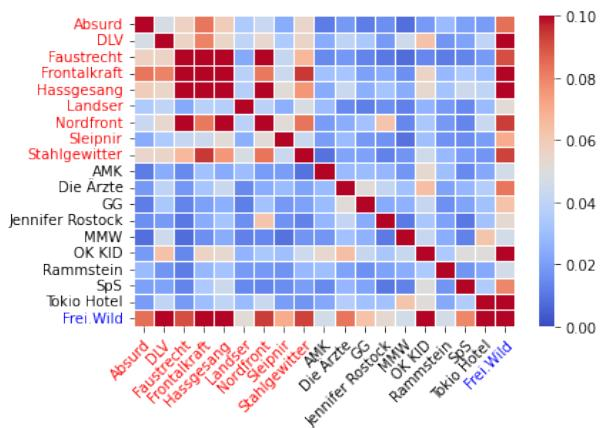  
Figure 1: A heatmap showing the cosine similarities between bands from the Rechtsrock corpus (red), the Deutschrock corpus (black) and the band Frei.Wild (blue). Acronyms: ‘DLV’ = Die Lunikoff-Verschwörung; ‘AMK’ = AnnenMayKantereit; ‘GG’ = Großstadtgeflüster; ‘MMW’ = Marius Müller-Westernhagen; ‘SpS’ = Sportfreunde Stiller

Discussion. The matrix reveals comparatively higher internal similarity within the Rechtsrock corpus (a cluster is present at the top left of the matrix with the top nine bands, from Absurd to Stahlgewitter) than within the general rock corpus (a cluster is absent at the bottom right of the matrix with the middle nine bands, from AnnenMayKantereit to Tokio Hotel), which can be attributed to the narrower thematic focus of the former. The Frei.Wild corpus (bottom band) stands out by exhibiting strong similarity to both corpora, with an arguably closer alignment to the Rechtsrock bands6. This finding lends support to claims that Frei.Wild is at least adjacent to right-wing extremist music.

## 6.2 Classification: TF-IDF

The findings so far suggest that Frei.Wild positions between Rechtsrock and general German rock. To better establish which Frei.Wild songs are the cause of the similarity to the Rechtsrock genre, a random forest classifier (Breiman, 2001) was trained using scikit-learn [Version 1.3.2] (Pedregosa et al., 2011) on both reference corpora. The default parameters were kept in this analysis, setting n\_estimators=100 (the number of trees) and max\_features=‘sqrt’ (the number of features considered for the split). The binary classifier was trained on TF-IDF representations of the Rechts rock and general German rock data with a 75/25 train-test split and achieved an Accuracy score of 94% and a ROC-AUC score of 95%. No signs of overfitting were found by means of visualizing the classification probabilities on the training data (see Figure 5 in Appendix C). Cross-validation (5-fold) resulted in a mean Accuracy of 82% with a standard deviation of 0.06. Next to the results for the random forest classifier, we repeated the same classifica tion task with 5-fold cross-validation with a SVM classifier: 82% mean Accuracy with a standard deviation of 0.10, indicating a robustness of the methodology. The TF-IDF transformed Frei.Wild lyrics were then presented to this classifier as unlabeled data to be classified as either Rechtsrock or general German rock. We examine both the classification labels at a decision-threshold of 0.5 as well as the classification probabilities.

Results. From the 47 Frei.Wild songs, 51.06% are classified as Rechtsrock (24 out of 47). While the classifier assigns roughly half of the data points to each class respectively, this alone does not reveal how confident the model is in its predictions. Figure 2 visualizes the classification probabilities and shows a unimodal distribution centered around 0.5 for Frei.Wild data, 0.65 for Rechtsrock, and 0.3 for the general German rock data. This indicates that the model is generally uncertain about Frei.Wild songs.

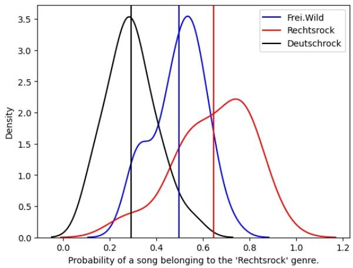  
Figure 2: A density plot with means of the test data predictions from the TF-IDF classifier for Rechtsrock (red), Deutschrock (black) and the unlabeled data from Frei.Wild (blue).

In addition, we trained the classifier on Rechtsrock vs Frei.Wild (ROC-AUC: 89%) and general German rock vs Frei.Wild (ROC-AUC: 98%). These classification scores suggest that the classifier can better separate Frei.Wild from general German rock than from Rechtsrock.

For the (unbalanced) complete Frei.Wild corpus, the results are similar: Frei.Wild lyrics are classified as right-wing extremist music in 40.26% of cases (122 of 303). A table of all songs and their right-wing-ness are provided in Appendix F.

Discussion. These results again suggest that Frei.Wild is a true border case, with the classifier labeling half the data as Rechtsrock, and the unimodal distribution of the classification probabilities around 50% suggesting high uncertainty in the classification. Nonetheless the Frei.Wild mean is closer to the Rechtsrock mean than the general German rock mean. When we directly trained a classifier to separate Frei.Wild from the two other classes, Frei.Wild and Rechtsrock were harder to separate which indicates they are more similar.

## 6.3 Classification: Sentence Embeddings

While the TF-IDF representations offer relatively straightforward interpretability, they are inherently limited to capturing the frequency of isolated words. Since differences between the corpora may arise from variations in the contextual usage of the same words, we employ a sentence transformer model for the binary classification task to better incorporate semantic context. Each song was transformed into an embedding representation using the German\_Semantic\_STS\_V2 model (Chibb, 2024), which was finetuned with the base model gBERT-large (Chan et al., 2020), and the sentence-transformers [Version 4.1.0] library (Reimers and Gurevych, 2019).

The procedure is the same as in Section 6.2. A random forest classifier was trained on the embeddings of the two reference corpora with an Accuracy of 87.5% and a ROC-AUC score of 97%. No signs of overfitting were found by means of visualizing the classification probabilities on the training data (see Figure 6 in Appendix C). Cross-validation (5-fold) resulted in a mean Accuracy of 85% with a standard deviation of 0.04. Next to the results for the random forest classifier, we repeated the same classification task with 5-fold cross-validation with an SVM classifier: 83% mean Accuracy with a standard deviation of 0.08, indicating a robustness of the methodology. The trained model predicted labels for the Frei.Wild songs.

Results. Frei.Wild lyrics are now classified as Rechtsrock in 59.57% of cases. This shows that Frei.Wild is right-leaning, as also visible in the density plot in Figure 3, showing a unimodal distribution centered around 0.5 for Frei.Wild data, 0.69 for Rechtsrock, and 0.33 for general German rock. This indicates that the model is generally uncertain about Frei.Wild songs.

In addition, we again trained the classifier on Rechtsrock vs Frei.Wild (ROC-AUC: 77.5%) and general German rock vs Frei.Wild (ROC-AUC: 89%). These classification scores suggest that the classifier can better separate general German rock and Frei.Wild, than Frei.Wild and Rechtsrock.

For the (unbalanced) complete Frei.Wild corpus, the results are similar: Frei.Wild lyrics are classified as right-wing extremist music in 47.85% of cases (145 of 303).

Discussion. Figure 3 shows that Frei.Wild is still situated between the two reference corpora, similarly to the previous experiment. There is, however, a shift in the classification results: the proportion of Frei.Wild songs labeled as Rechtsrock increases by nearly ten percentage points. In total, 14 songs received a different label, with nine changing from the general German rock category in the previous experiment to Rechtsrock.

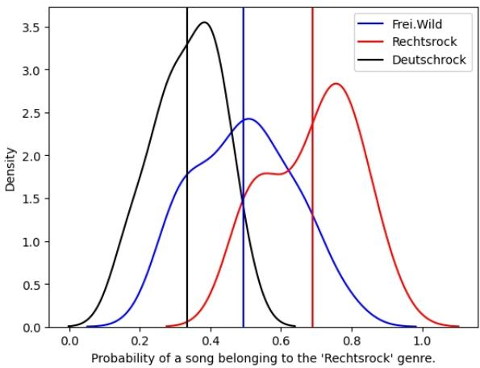  
Figure 3: A density plot with means of the test data predictions from the sentence embedding classifier for Rechtsrock (red), Deutschrock (black) and the unlabeled data from Frei.Wild (blue).

When we directly trained a classifier to separate Frei.Wild from the other two classes, we again observed that Frei.Wild and Rechtsrock were more difficult to separate, suggesting a higher degree of similarity. Taken together, these results indicate that when contextual information is included, Frei.Wild tends to be associated more strongly with right-wing rock.

## 7 Temporal Analysis

The previous results show that the classifiers are uncertain with a tendency to right-wing extremist regarding Frei.Wild songs. This could simply be the result of Frei.Wild starting out more right-leaning, and after facing public backlash becoming more similar to mainstream German rock and less nationalistic. The density plots in Figures 2 and 3 show that most songs are ambiguous but there is also a little bump towards Deutschrock. It would be fair to investigate if this is caused by the more recent songs because this then would mirror the band’s own statements regarding their political affiliation. The classification scores for each Frei.Wild song were gathered in a table, separated by model (TF-IDF and sentence embedding) and then visualized in a density plot by year.

Results. The plot is shown in Figure 4.  
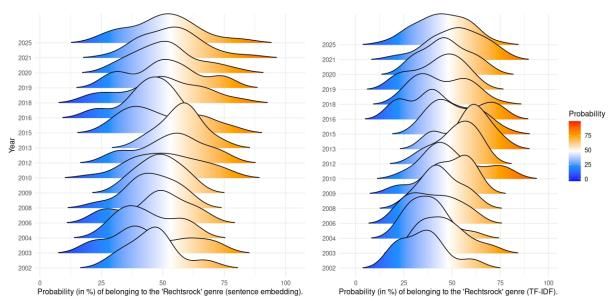  
Figure 4: Two density plots for the classification scores of the Frei.Wild songs per year, separated by model.

Discussion. The temporal plots reveal that Frei.Wild started out as less right-wing extremist, grew very extremist in the 2010s and has now settled to the right of the center, according to classification scores. This is unexpected as it contradicts Frei.Wild’s self-portrayal and it also makes the strong association with right-wing rock more relevant.

## 8 General Discussion

Looking back at the lexical analyses in Section 5 and the classification experiments in Section 6, we can confirm many of the intuitions that concern previous studies on Rechtsrock and the border case Frei.Wild. Frei.Wild exhibits enemy/‘us against them’ constructions and an appeal to resistance tied to nationalistic narratives such as preserving certain values and the region/country that they call home, themes that they share with the Rechtsrock genre (cf. Möller and Mischler (2020); Alt (2020); Fischer (2022)). Additionally, following the computational approaches by Hartung et al. (2017) and Dragos and Constable (2023), similarity measures and classification experiments revealed that there are not just a few Frei.Wild songs that can be interpreted as Rechtsrock. Rather, there is a lot of internal similarity to different bands from the Rechtsrock genre and in a random sample of their lyrics, at least half of the songs would be classified as right-wing extremist. Frei.Wild repeatedly distance themselves from those categorizations (Hindrichs, 2014), and we do find almost as much resemblance to the general German rock corpus as to Rechtsrock, however, any affinity to music that is judged as ‘youth-endangering’ and unconstitutional should be seen as negative. Frei.Wild moves in an ambiguous space with most of their songs. It is not the case that half is firmly German rock and the other half is extremist; mostly they are situated in the middle with a tendency towards Rechtsrock. This quantitative approach therefore backs qualitative studies that do not interpret Frei.Wild as politically neutral. The songs that were mentioned as potentially right-wing in these studies or judgments (cf. Alt (2020) or Bundeszentrale für Kinder- und Jugendmedienschutz (2015, p. 20, ‘Federal Agency for Child- and Youth Media Protection’)) were, for example, ‘Wahre werte’, ‘Land der Vollidioten’, ‘Allein nach vorne’, ‘Deutschrock ist Leidenschaft’, ‘Südtirol’, ‘Gutmenschen und Moralapostel’, ‘Schlagzeile groß Hirn zu klein’, ‘Antiwillkommen’, and ‘Wir reiten in den Untergang’, and songs from the first album ‘Eines Tages’, especially the song ‘Rache muss sein’. Many of those criticized songs are not in the analyzed sample, but the ones that are (in bold) were also classified as Rechtsrock in both classification experiments, i.e., independent of input representation. In our random sample, even without the inclusion of all songs that are deemed as right-wing by journalists or scientists, Frei.Wild still has more in common with Rechtsrock than general German rock in this analysis. When the full discography is included, the scores are a bit lower, though still around half of the songs are classified as Rechtsrock. Further, the classification as right-wing extremist increases over time for Frei.Wild (cf. Figure 4), contradicting their claim of leaving their skinhead past behind.

In an effort to increase generalizability of the results, a 95 song sample analysis of the similarly controversial band Böhse Onkelz (Appendix D) revealed that their lyrics are classified as right-wing extremist in only 33.68% of cases. They were unambiguously right-leaning in the 1980s and now argue to have changed (Richter, 2006); the classification experiments suggest that this is actually the case. The contrast to Frei.Wild is especially apparent in the temporal analysis (cf. Figure 9), where Böhse Onkelz song lyrics are for the most part classified as more general German rock since their comeback in 2013. Another contrast is the band Rammstein. They had to publicly defend themselves against “Nazi-accusations” as well (Rolling Stone Germany, 2011), due to incorporating ‘NS aesthetics’ (a.o. uniforms and excerpts from the 1936 summer Olympics propaganda) and disturbing themes, however, critics have argued that there is little indication of ideological commitment, as nationalist themes are largely absent from their music (Žižek, 2010) and they are also not indicated as a border case in our analysis. The statistical method of the Leave One Out approach described in Appendix A, which serves as a feature importance analysis, clears up how to distinguish between the categories Rechtsrock and general German rock for Frei.Wild. The high impact words that drove classification are a.o. ‘frei’ (free), ‘eu(e)r’ (your, 2nd person plural), ‘lüge’ (lie), ‘tod’ (death) and ‘niemals (never), underlining that it is not extreme imagery that is relevant for Rechtsrock but extremist narratives. In this context, the judgment of Frei.Wild as a right-wing adjacent band seems even firmer.

## 9 Conclusions and Future Work

In this study, we presented lexical analyses and classification experiments aimed at determining whether the band Frei.Wild should be categorized as politically right-leaning or as a part of the general German rock genre. Both resulted in settling Frei.Wild’s position as a border case, as they share characteristics of Rechtsrock as well as German rock. Concerning their ambiguity, which is not to be judged as neutrality, they have usually slightly more similarities with Rechtsrock, such as the nationalistic ‘us against them’ narratives, the higher similarity scores with the Rechtsrock bands, slightly more than 50% of their songs labeled as right-wing extremist in the two classification experiments even with some of the more notorious songs missing in the sample. The results of this study thereby confirm previous observations from qualitative studies concerned with Rechtsrock and Frei.Wild (Möller and Mischler, 2020; Alt, 2020), using methods commonly applied in computational studies on extremist data (Hartung et al., 2017; Dragos and Constable, 2023). In the future, further analysis with an extended data set could provide clearer results, that is, bigger reference corpora for Rechtsrock and general German rock, as well as possibly another reference corpus of other extremist music (Möller and Mischler, 2020) to disentangle right-wing ideology specific aspects (e.g. white supremacy and antisemitism) from what constitutes extremism in general (e.g. inciting violence against an out-group (Berger, 2018)) (Häusler, 2021). To support such extensions, we make our code and data available.

## Limitations

Several limitations impacted the study, first of all the size of the corpora, which was limited due to the (partially) government restricted public availability of right-wing extremist song lyrics. Restricted availability and only using bands labeled by au thorities might limit the capabilities of the corpus to represent the full diversity of the genre. Other aspects of the three corpora can be better accounted for, such as subgenres/artistic styles within Rechts rock and German rock. Both the song text and sound features have been suggested to work together to create a sense of collective identity and purpose in fascist music (Machin and Richardson, 2012). However, this study focused only on the lyrics but not the acoustic and visual features such as melody, as the availability of the actual sound files for Rechtsrock is even more restricted than the textual data. This narrower, single-case design focusing mostly on lyrics from a single German band, limits broader methodological validation, though there were few language-specific design choices (only the choice of the sentence embedding model and the spaCy model, as well as the choice of synonyms for ‘Heimat’ in the concordance analysis) for the pipeline, making most of it transferable to other languages. Lastly, our lexical analyses did not employ statistical measures commonly used in corpus linguistics, such as keyness or mutual information. This decision was motivated both by the relatively small size of the corpora and by the primary aim of the analyses, which was to provide a qualitative overview of the dominant themes. While alternative classification architectures and hyperparameter tuning could be explored, a random forest with default parameters already achieves high classification performance. This was confirmed in the classification experiments in which we trained both a random forest classifier and an SVM classifier, and their performance did not differ. Future work could investigate more advanced representation and classification methods. In particular, transformer-based models such as BERT or other pretrained language models could be used to learn richer contextual representations, either through fine-tuned supervised classifiers or via few-shot prompting with large language models acting as classifiers. These approaches may better capture semantic nuances; however, they come with increased computational cost, data requirements, and reduced interpretability compared to the current random forest approach. Given our emphasis on providing quantitative data on Frei.Wild’s position ing rather than classification performance, we leave the exploration of such architectures to future work.

## Ethical and Societal Implications

At a time, where right-wing and nationalistic parties are on the rise globally, it is important to monitor influential agents in that sphere. Rechtsrock bands are part of an early recruitment step into the scene. Next to their popularity indicating how socially acceptable extremist and xenophobic ideas are becoming, analyzing their lyrics reveals current narratives. Those can be used to construct counternarratives, which are argued to be more effective than debating right-wing arguments head-on. Using NLP to analyze Rechtsrock lyrics at a large scale supports monitoring institutions in their efforts to mitigate the rightward shift we are currently experiencing by facilitating and accelerating the detection of right-wing extremist content in music.

This case study specifically aims to provide means to identify those tendencies even in borderline cases, like the band Frei.Wild in Germany, who are less explicit in their lyrics.

The song lyrics in the corpus are not licensed for distribution and most of the right-wing extremist lyrics are ‘indiziert’ (indexed), meaning that they were indicated as ‘youth-endangering’ and subject to a ban on distribution even among adults. The corpus is therefore available with only the metadata of the songs while the lyrics are not released as part of the dataset; they can be shared upon request for research purposes.

The involved university does not require IRB approval for this kind of study, which uses publicly available data without involving human participants. We do not see any other concrete risks concerning dual use of our research results. Of course, in the long run, any research results on AI methods could potentially be used in contexts of harmful and unsafe applications of AI. But this danger is rather low in our concrete case.

## CRediT authorship contribution statement

We follow the CRediT taxonomy7. Conceptualization: [CS, KT]; Data curation: [CS]; Formal Analysis: [CS, KT]; Investigation: [CS, KT]; Methodology: [CS, KT]; Supervision: [KT]; Visualization: [CS]; and Writing – original draft: [CS, KT] and Writing – review & editing: [CS, KT].

## References

Max Alt. 2020. Die Nationalisierung der deutschsprachigen Popmusik. Neurechte Themen im Popdiskurs. In Michael Ahlers, Lorenz Grünewald-Schukalla, Anita Jóri, and Holger Schwetter, editors, Musik & Empowerment, pages 163–177. Springer Fachmedien Wiesbaden, Wiesbaden.

Jens Balzer. 2019. Pop und Populismus: über Verantwortung in der Musik. Hamburg : Edition Körber.

Adrien Barbaresi. 2021. Trafilatura: A web scraping library and command-line tool for text discovery and extraction. In Proceedings ofthe 59th Annual Meeting of the Association for Computational Linguistics and the 11th International Joint Conference on Natural Language Processing: System Demonstrations, pages 122–131, Online. Association for Computational Linguistics.

J. M. Berger. 2018. Extremism. The MIT Press.

Leo Breiman. 2001. Random forests. Machine Learning, 45(1):5–32.

Bundesamt für Verfassungsschutz. 2020. Rechtsextremistische Erlebniswelt: Musik und Kampfsport. Access 2025.09.11.

Bundeszentrale für Kinder- und Jugendmedienschutz. 2015. BPJM aktuell: Jahresrückblick 2014. Forum-Verl. Godesberg.

Timo Büchner. 2018. “Weltbürgertum statt Vaterland”: Antisemitismus im RechtsRock. edition assemblage, Münster.

Timo Büchner. 2019. Der Begriff" Heimat" in rechter Musik: Analysen–Hintergründe–Zusammenhänge. Wochenschau Verlag.

Branden Chan, Stefan Schweter, and Timo Möller. 2020. German’s next language model. In International Conference on Computational Linguistics.

Aaron Chibb. 2024. German\_semantic\_sts\_v2.

Christian Dornbusch and Jan Raabe. 2002. RechtsRock : Bestandsaufnahme und Gegenstrategien / Christian Dornbusch, Jan Raabe (Hg.)., 1. aufl. edition. RAT. Unrast, Hamburg.

Valentina Dragos and Yolène Constable. 2023. Comparison of classification techniques for extremism detection in French social media. In 2023 26th International Conference on Information Fusion (FU-SION), pages 1–6.

Klaus Farin. 2005. Reaktionäre Rebellen–Skinheads, Rechtsrock, Böhse Onkelz. In Jugendkulturen, pages 155–170. Mattes Verlag Pädagogischen Hochschule Heidelberg.

Michael Fischer. 2022. ‘Heimat ist kein Ort, Heimat ist ein Gefühl’ (Herbert Grönemeyer) – Konstruktion von Heimat in deutschsprachigen populären Songs des 21. Jahrhunderts. In Naturschutz und Heimat – Konzepte für die Zukunft entwickeln, pages 47–65. Bonn.

Matthias Hartung, Roman Klinger, Franziska Schmidtke, and Lars Vogel. 2017. Identifying right-wing extremism in German Twitter profiles: A classification approach. In Natural Language Processing and Information Systems, pages 320–325, Cham. Springer International Publishing.

Thorsten Hindrichs. 2014. Heimattreue Patrioten und das ‘Land der Vollidioten’ - Frei.Wild und die neue Deutschrockszene. In Typisch deutsch, pages 153– 183. Bielefeld: transcript-Verlag.

Eckhart Höfig. 2000. Heimat in der Popmusik: Identität oder Kulisse in der deutschsprachigen Popmusikszene vor der Jahrtausendwende. Triga.

Matthew Honnibal, Ines Montani, Sofie Van Landeghem, and Adriane Boyd. 2020. spaCy: Industrialstrength Natural Language Processing in Python. Zenodo.

J. D. Hunter. 2007. Matplotlib: A 2d graphics environment. Computing in Science & Engineering, 9(3):90– 95.

Alexander Häusler. 2021. Was ist rechts und was extrem? Politikum, 7(4):4–9.

Thomas Kuban. 2012. Blut muss fließen: Undercover unter Nazis. Frankfurt am Main: Campus Verlag.

David Machin and John E. Richardson. 2012. Discourses of unity and purpose in the sounds of fascist music: a multimodal approach. Critical Discourse Studies, 9(4):329–345.

Veronika Möller and Antonia Mischler. 2020. The soundtrack of the extreme: Nasheeds and right-wing extremist music as a “gateway drug” into the radical scene? International Annals of Criminology, 58(2):291–334.

Thomas Naumann. 2009. Rechtsrock im Wandel. Eine Textanalyse von Rechtsrock-Bands. Diplomica Verl., Hamburg.

Olaf Neumann. 2013. Freiwild machen eindeutig Rechtsrock. Accessed: 2025-09-22.

F. Pedregosa, G. Varoquaux, A. Gramfort, V. Michel, B. Thirion, O. Grisel, M. Blondel, P. Prettenhofer, R. Weiss, V. Dubourg, J. Vanderplas, A. Passos, D. Cournapeau, M. Brucher, M. Perrot, and E. Duchesnay. 2011. Scikit-learn: Machine learning in Python. Journal of Machine Learning Research, 12:2825–2830.

Radim Reh˚uˇ ˇrek and Petr Sojka. 2010. Software Framework for Topic Modelling with Large Corpora. In Proceedings of the LREC 2010 Workshop on New Challengesfor NLP Frameworks, pages 45– 50, Valletta, Malta. ELRA. http://is.muni.cz/ publication/884893/en.

Nils Reimers and Iryna Gurevych. 2019. Sentence-BERT: Sentence Embeddings using Siamese BERT-Networks. In Proceedings ofthe 2019 Conference on Empirical Methods in Natural Language Processing. Association for Computational Linguistics.

Stephan Richter. 2006. „Gehasst–verdammt–vergöttert“ – Das Phänomen der ehemaligen Skinhead-Kultband „Böhse Onkelz“ und ihre Bezüge zum Rechtsextremismus. In Rechtsextremismus als Gesellschaftsphänomen – Jugendhintergrund und Psychologie, pages 109–189. Fachhochschule des Bundes für öffentliche Verwaltung: Fachbereich Öffentliche Sicherheit.

Rolling Stone Germany. 2011. Rammstein: Exklusives Interview mit Till Lindemann und Flake. Accessed: 2025-10-02.

Thomas Schmidt, Marlene Bauer, Florian Habler, Hannes Heuberger, Florian Pilsl, and Christian Wolff. 2020. Der Einsatz von Distant Reading auf einem Korpus deutschsprachiger Songtexte. In Christof Schöch, editor, DHd 2020: Spielräume; Digital Humanities zwischen Modellierung und Interpretation. Konferenzabstracts; Universität Paderborn, 02. bis 06. März 2020, pages 296–300. Zenodo, Paderborn, Germany.

Manfred Stede and Ronja Memminger. 2025. AfD-CCC: Analyzing the climate change discourse of a German right-wing political party. In Proceedings of the Fourth Workshop on NLP for Positive Impact (NLP4PI), pages 163–174, Vienna, Austria. Association for Computational Linguistics.

Verfassungsschutz Baden-Württemberg. 2024. Verfassungsschutzbericht. Ministerium des Innern, für Digitalisierung und Kommunen.

Verfassungsschutz Rheinland-Pfalz. 1996. Tätigkeitsbericht 1996 des rheinland-pfälzischen Verfassungsschutzes. Ministerium des Innern und für Sport, Mainz.

Michael L. Waskom. 2021. seaborn: statistical data visualization. Journal of Open Source Software, 6(60):3021.

Roy Xie, Orevaoghene Ahia, Yulia Tsvetkov, and Antonios Anastasopoulos. 2024. Extracting lexical features from dialects via interpretable dialect classifiers. Preprint, arXiv:2402.17914.

Slavoj Žižek. 2010. Some concluding notes on violence, ideology and communist culture. Subjectivity, 3(1):101–116.

## A Lexical features with leave-one-out analyses

The Leave One Out approach (Xie et al., 2024) determines words that are relevant for classification by checking if prediction accuracy decreases when a word is taken out of the sentence. Words which were picked as relevant for Rechtsrock classification mirror previous qualitative analyses. Among the top features were ‘deutsch’, ‘land’, ‘kämpfen’, ‘einst’, ‘feind’, ‘niemals’, ‘frei’, ‘krieg’, ‘sieg’, ‘volk’, ‘vaterland’, ‘blut’, ‘tod’, ‘lüge’, and ‘eur (German, country, fight, once, enemy, never, free, war, victory, nation, fatherland, blood, death, lie, and your (2nd person plural)), which are also featured in the most frequent lemmata of the Rechtsrock corpus and general extremist talking points (an in- and out-group concept with reference to violence against the out-group (Berger, 2018)).

As discussed in Section 5, the word ‘Heimat (homeland) is not featured, however, the word ‘Vaterland’ (fatherland) is, supporting our finding that this is the expression right-wing extremist rock music employs to refer to the concept of homeland that carries their ideological connotations.

## B Example: Concordance Analysis

An example from the Frei.Wild corpus would be a list of concordances of the word ‘Südtirol’ (same extension as ‘Heimat’ for that band). The first element of the list is the left context, the second is the right context (five words each): [[‘schlagzeug’, ‘gitarre’, ‘erklingen’, ‘liedche’, ‘singen’], [‘tragen’, ‘fahne’, ‘schön’, ‘land’, ‘welt’]]   
[[ ‘stolz’, ‘sohn’, ‘heimatland’, ‘geben’, ‘niemehr’], [‘brüdern’, ‘entrissen’, ‘hinaus’, ‘wissen’, ‘südtirol’]]   
[[ ‘südtirol’, ‘brüdern’, ‘entrissen’, ‘hinaus’, ‘wissen’], [‘verlorn’, ‘hölle’, ‘feind’, ‘schmorn’, ‘heiß’]]   
[[ ‘luft’, ‘hinaus’, ‘heimatland’, ‘geben’, ‘niemals’], [‘tragen’, ‘fahne’, ‘schön’, ‘land’, ‘welt’]]   
[[ ‘hand’, ‘schönerer’, ‘ewigkeit’, ‘erde’, ‘bereit’], [‘heimatland’, ‘herzstück’, ‘welt’, ‘liegen’, ‘hand’]] [[ ‘berg’, ‘geburtsort’, ‘vieler’, ‘held’, ‘geben’], [‘leben’, ‘verlierer’, ‘schnell’, ‘hemd’, ‘schlimm’]]

For the Rechtsrock corpus, there were more concordances for ‘Deutschland’ and therefore a counter provided this frequency list: ‘schwarz’: 14, ‘rote’: 12, ‘gelb’: 10, ‘erheben’: 9, ‘deutschland’: 8, ‘ruin’: 8, ‘volk’: 7, ‘stehen’: 7, ‘leben’: 6, ‘nacht’: 5, ‘stolz’: 5

## C Classification probabilities of the training data

No signs of overfitting were found by means of visualizing the classification probabilities on the training data, as can be seen in the density plots in Figures 5 and 6.

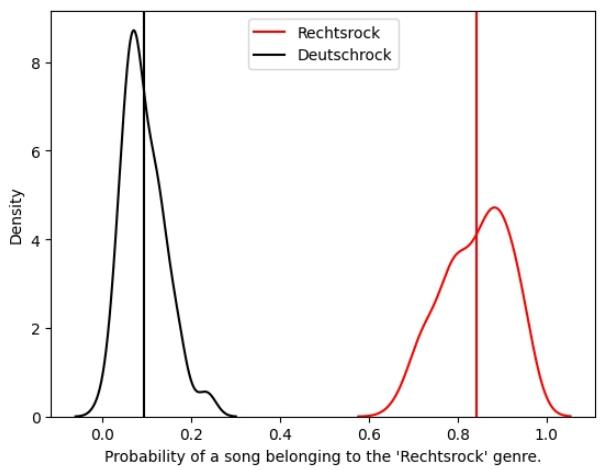  
Figure 5: A density plot with means of the training data predictions from the TF-IDF classifier for Rechtsrock (red) and Deutschrock (black).

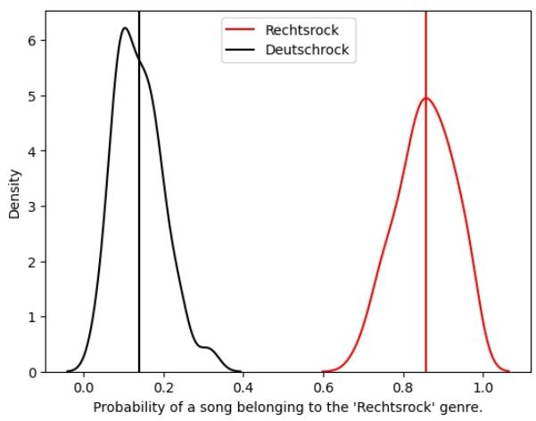  
Figure 6: A density plot with means of the training data predictions from the sentence embedding classifier for Rechtsrock (red) and Deutschrock (black).

## D Böhse Onkelz sample analysis

The band Böhse Onkelz is a border case for rightwing extremism categorization similar to Frei.Wild. They are a skinhead band from 1980 that inspired a lot of Rechtsrock bands. They retired in 2005 and are back since 2013, while also claiming to have left their extremist past behind them. The sentence embedding classifier, trained on the reference corpora (Rechtsrock and general German rock) with an Accuracy of 94% and a ROC-AUC score of 99%, classified their lyrics as right-wing extremist music in around 30% of cases. They are less right-leaning than Frei.wild in our analysis, which is also visible in the density plots in Figure 7 and 8.

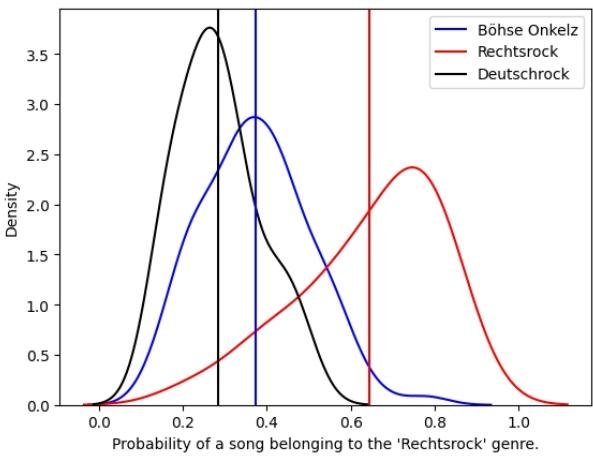  
Figure 7: A density plot with means of the test data predictions from the TF-IDF classifier for Rechtsrock (red), Deutschrock (black) and the unlabeled data from Böhse Onkelz (blue).

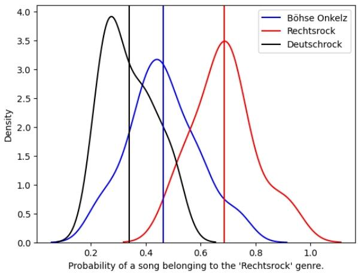  
Figure 8: A density plot with means of the test data predictions from the sentence embedding classifier for Rechtsrock (red), Deutschrock (black) and the unlabeled data from Böhse Onkelz (blue).

The temporal analysis in Figure 9 indicates that they indeed started out as a right-wing extremist rock band and moved to more mainstream and less nationalistic/xenophobic themes over time. This stands in direct contrast to the development in the temporal analysis of Frei.Wild lyrics (cf. Figure 4), which seem to include an increasing percentage of right-wing content.

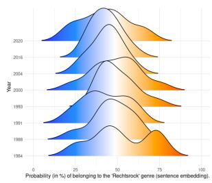

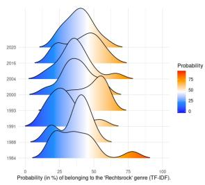  
Figure 9: Two density plots for the classification scores of the Böhse Onkelz songs per year, separated by model.

## E Song names and their English translations in order of appearance

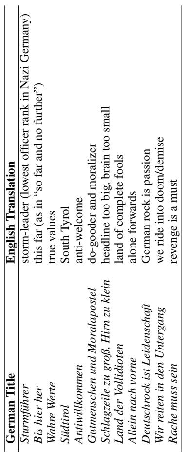  
Table 2: German song titles and their English translations.

## F Full Frei.Wild discography classification scores

<table><tr><td rowspan=1 colspan=1>Frei. Wild song title</td><td rowspan=1 colspan=1>TF-IDF</td><td rowspan=1 colspan=1>sentence embedding</td></tr><tr><td rowspan=1 colspan=1>15 Jahre</td><td rowspan=1 colspan=1>67</td><td rowspan=1 colspan=1>44</td></tr><tr><td rowspan=1 colspan=1>20 Jahre Seite an Seite</td><td rowspan=1 colspan=1>47</td><td rowspan=1 colspan=1>57</td></tr><tr><td rowspan=1 colspan=1>AIDS</td><td rowspan=1 colspan=1>42</td><td rowspan=1 colspan=1>35</td></tr><tr><td rowspan=1 colspan=1>Akzeptierter Faschist</td><td rowspan=1 colspan=1>53</td><td rowspan=1 colspan=1>63</td></tr><tr><td rowspan=1 colspan=1>Alarm im Proberaum</td><td rowspan=1 colspan=1>56</td><td rowspan=1 colspan=1>36</td></tr><tr><td rowspan=1 colspan=1>Alkohol</td><td rowspan=1 colspan=1>44</td><td rowspan=1 colspan=1>44</td></tr><tr><td rowspan=1 colspan=1>Alle Menschen sind gleich</td><td rowspan=1 colspan=1>62</td><td rowspan=1 colspan=1>51</td></tr><tr><td rowspan=1 colspan=1>Allein nach vorne</td><td rowspan=1 colspan=1>81</td><td rowspan=1 colspan=1>78</td></tr><tr><td rowspan=1 colspan=1>Allein, Ohne Dich, Bei Mir</td><td rowspan=1 colspan=1>41</td><td rowspan=1 colspan=1>50</td></tr><tr><td rowspan=1 colspan=1>Alles alles was mir fehlt</td><td rowspan=1 colspan=1>31</td><td rowspan=1 colspan=1>54</td></tr><tr><td rowspan=1 colspan=1>Alles auf Offbeat</td><td rowspan=1 colspan=1>41</td><td rowspan=1 colspan=1>54</td></tr><tr><td rowspan=1 colspan=1>Alles in allem</td><td rowspan=1 colspan=1>29</td><td rowspan=1 colspan=1>44</td></tr><tr><td rowspan=1 colspan=1>Alles ist weg</td><td rowspan=1 colspan=1>15</td><td rowspan=1 colspan=1>33</td></tr><tr><td rowspan=1 colspan=1>Alles um uns ist still</td><td rowspan=1 colspan=1>48</td><td rowspan=1 colspan=1>38</td></tr><tr><td rowspan=1 colspan=1>Altes neues Leben</td><td rowspan=1 colspan=1>37</td><td rowspan=1 colspan=1>62</td></tr><tr><td rowspan=1 colspan=1>Antiwillkommen</td><td rowspan=1 colspan=1>51</td><td rowspan=1 colspan=1>53</td></tr><tr><td rowspan=1 colspan=1>Arschloch, lass mich in Ruh!</td><td rowspan=1 colspan=1>41</td><td rowspan=1 colspan=1>53</td></tr><tr><td rowspan=1 colspan=1>Arschtritt</td><td rowspan=1 colspan=1>62</td><td rowspan=1 colspan=1>51</td></tr><tr><td rowspan=1 colspan=1>Attacke ins Glück</td><td rowspan=1 colspan=1>45</td><td rowspan=1 colspan=1>64</td></tr><tr><td rowspan=1 colspan=1>Auf ein nie wieder Wiedersehen</td><td rowspan=1 colspan=1>45</td><td rowspan=1 colspan=1>63</td></tr><tr><td rowspan=1 colspan=1>Auf einen Neuanfang</td><td rowspan=1 colspan=1>37</td><td rowspan=1 colspan=1>54</td></tr><tr><td rowspan=1 colspan=1>Auf zum Schwur</td><td rowspan=1 colspan=1>58</td><td rowspan=1 colspan=1>67</td></tr><tr><td rowspan=1 colspan=1>Auge um Auge, Zahn um Zahn</td><td rowspan=1 colspan=1>35</td><td rowspan=1 colspan=1>44</td></tr><tr><td rowspan=1 colspan=1>Aus dem Film unserer Geschichte</td><td rowspan=1 colspan=1>34</td><td rowspan=1 colspan=1>65</td></tr><tr><td rowspan=1 colspan=1>Aus Traum wird Wirklichkeit</td><td rowspan=1 colspan=1>63</td><td rowspan=1 colspan=1>28</td></tr><tr><td rowspan=1 colspan=1>Außenseiterband</td><td rowspan=1 colspan=1>62</td><td rowspan=1 colspan=1>51</td></tr><tr><td rowspan=1 colspan=1>B.O.U.L</td><td rowspan=1 colspan=1>28</td><td rowspan=1 colspan=1>41</td></tr><tr><td rowspan=1 colspan=1>Betteln vs. Batteln</td><td rowspan=1 colspan=1>54</td><td rowspan=1 colspan=1>44</td></tr><tr><td rowspan=1 colspan=1>Bilder und Narben, meine Memoiren</td><td rowspan=1 colspan=1>42</td><td rowspan=1 colspan=1>55</td></tr><tr><td rowspan=1 colspan=1>Bin kein Held, aber Mensch bin ich</td><td rowspan=1 colspan=1>23</td><td rowspan=1 colspan=1>42</td></tr><tr><td rowspan=1 colspan=1>Blinde Völker wie Armeen</td><td rowspan=1 colspan=1>56</td><td rowspan=1 colspan=1>58</td></tr><tr><td rowspan=1 colspan=1>Böse und gemein</td><td rowspan=1 colspan=1>31</td><td rowspan=1 colspan=1>49</td></tr><tr><td rowspan=1 colspan=1>Brixen</td><td rowspan=1 colspan=1>45</td><td rowspan=1 colspan=1>45</td></tr><tr><td rowspan=1 colspan=1>Brüderlein zum Wohl</td><td rowspan=1 colspan=1>25</td><td rowspan=1 colspan=1>39</td></tr><tr><td rowspan=1 colspan=1>Ciao Bella, Ciao</td><td rowspan=1 colspan=1>44</td><td rowspan=1 colspan=1>50</td></tr></table>

Table 3: Rechtsrock probability (in %) assigned to the individual Frei.Wild songs by the classifiers. If the value was >50, they were classified as Rechtsrock.

<table><tr><td rowspan=1 colspan=1>Frei. Wild song title</td><td rowspan=1 colspan=1>TF-IDF</td><td rowspan=1 colspan=1>sentence embedding</td></tr><tr><td rowspan=1 colspan=1>Corona Weltuntergang</td><td rowspan=1 colspan=1>49</td><td rowspan=1 colspan=1>52</td></tr><tr><td rowspan=1 colspan=1>Corona Weltuntergang V2</td><td rowspan=1 colspan=1>61</td><td rowspan=1 colspan=1>56</td></tr><tr><td rowspan=1 colspan=1>Daheim</td><td rowspan=1 colspan=1>22</td><td rowspan=1 colspan=1>47</td></tr><tr><td rowspan=1 colspan=1>Das gewisse Nichts</td><td rowspan=1 colspan=1>36</td><td rowspan=1 colspan=1>45</td></tr><tr><td rowspan=1 colspan=1>Das Land der Vollidioten</td><td rowspan=1 colspan=1>50</td><td rowspan=1 colspan=1>52</td></tr><tr><td rowspan=1 colspan=1>Dein zweites Leben</td><td rowspan=1 colspan=1>47</td><td rowspan=1 colspan=1>21</td></tr><tr><td rowspan=1 colspan=1>Der aufrechte Weg</td><td rowspan=1 colspan=1>49</td><td rowspan=1 colspan=1>25</td></tr><tr><td rowspan=1 colspan=1>Der Gast in deinem Geist</td><td rowspan=1 colspan=1>32</td><td rowspan=1 colspan=1>44</td></tr><tr><td rowspan=1 colspan=1>Der Horizont weist uns die Richtung</td><td rowspan=1 colspan=1>40</td><td rowspan=1 colspan=1>21</td></tr><tr><td rowspan=1 colspan=1>Der König ist tot, es lebe der König</td><td rowspan=1 colspan=1>43</td><td rowspan=1 colspan=1>41</td></tr><tr><td rowspan=1 colspan=1>Der Staat vergibt dein Gewissen nicht</td><td rowspan=1 colspan=1>57</td><td rowspan=1 colspan=1>72</td></tr><tr><td rowspan=1 colspan=1>Der Teufel trägt Geweih</td><td rowspan=1 colspan=1>43</td><td rowspan=1 colspan=1>60</td></tr><tr><td rowspan=1 colspan=1>Der Tod, der holt uns alle</td><td rowspan=1 colspan=1>57</td><td rowspan=1 colspan=1>49</td></tr><tr><td rowspan=1 colspan=1>Des Schicksals Schmied</td><td rowspan=1 colspan=1>55</td><td rowspan=1 colspan=1>40</td></tr><tr><td rowspan=1 colspan=1>Deutschrock ist Leidenschaft</td><td rowspan=1 colspan=1>52</td><td rowspan=1 colspan=1>55</td></tr><tr><td rowspan=1 colspan=1>Die Band, die Wahrheit bringt</td><td rowspan=1 colspan=1>62</td><td rowspan=1 colspan=1>59</td></tr><tr><td rowspan=1 colspan=1>Die Gedanken sie sind frei</td><td rowspan=1 colspan=1>64</td><td rowspan=1 colspan=1>50</td></tr><tr><td rowspan=1 colspan=1>Die Geister, die ich nicht rief</td><td rowspan=1 colspan=1>50</td><td rowspan=1 colspan=1>58</td></tr><tr><td rowspan=1 colspan=1>Die Hölle schenkte uns das Licht</td><td rowspan=1 colspan=1>58</td><td rowspan=1 colspan=1>63</td></tr><tr><td rowspan=1 colspan=1>Die Lösung vom Problem</td><td rowspan=1 colspan=1>57</td><td rowspan=1 colspan=1>40</td></tr><tr><td rowspan=1 colspan=1>Die nur nach fremden Sünden fischen</td><td rowspan=1 colspan=1>44</td><td rowspan=1 colspan=1>55</td></tr><tr><td rowspan=1 colspan=1>Die Welt brennt</td><td rowspan=1 colspan=1>50</td><td rowspan=1 colspan=1>52</td></tr><tr><td rowspan=1 colspan=1>Die Zeit vergeht</td><td rowspan=1 colspan=1>46</td><td rowspan=1 colspan=1>43</td></tr><tr><td rowspan=1 colspan=1>Diese Nacht will nicht meine Nacht sein</td><td rowspan=1 colspan=1>22</td><td rowspan=1 colspan=1>35</td></tr><tr><td rowspan=1 colspan=1>Diesen Schuh musst du dir nicht anziehen</td><td rowspan=1 colspan=1>59</td><td rowspan=1 colspan=1>39</td></tr><tr><td rowspan=1 colspan=1>Du bist ein Idiot</td><td rowspan=1 colspan=1>28</td><td rowspan=1 colspan=1>63</td></tr><tr><td rowspan=1 colspan=1>Du bist Sie (Die Einzige für mich)</td><td rowspan=1 colspan=1>42</td><td rowspan=1 colspan=1>34</td></tr><tr><td rowspan=1 colspan=1>Du kriegst nicht eine Sekunde zurück</td><td rowspan=1 colspan=1>61</td><td rowspan=1 colspan=1>50</td></tr><tr><td rowspan=1 colspan=1>Dunkel, Hell, Schwarz und Grau</td><td rowspan=1 colspan=1>54</td><td rowspan=1 colspan=1>51</td></tr><tr><td rowspan=1 colspan=1>Ebbe und Flut</td><td rowspan=1 colspan=1>39</td><td rowspan=1 colspan=1>56</td></tr><tr><td rowspan=1 colspan=1>Echo, Platin und Gold</td><td rowspan=1 colspan=1>52</td><td rowspan=1 colspan=1>61</td></tr><tr><td rowspan=1 colspan=1>Eine Freundschaft, eine Liebe, eine Familie</td><td rowspan=1 colspan=1>53</td><td rowspan=1 colspan=1>73</td></tr><tr><td rowspan=1 colspan=1>Eines Tages</td><td rowspan=1 colspan=1>21</td><td rowspan=1 colspan=1>36</td></tr><tr><td rowspan=1 colspan=1>Engel über dem Himmel</td><td rowspan=1 colspan=1>32</td><td rowspan=1 colspan=1>43</td></tr><tr><td rowspan=1 colspan=1>Engel und Bengel</td><td rowspan=1 colspan=1>32</td><td rowspan=1 colspan=1>35</td></tr><tr><td rowspan=1 colspan=1>Es braucht nicht viel um Glücklich zu sein</td><td rowspan=1 colspan=1>69</td><td rowspan=1 colspan=1>68</td></tr><tr><td rowspan=1 colspan=1>Es geht hier um mein Leben</td><td rowspan=1 colspan=1>29</td><td rowspan=1 colspan=1>41</td></tr><tr><td rowspan=1 colspan=1>Es gibt nicht nur einen Weg</td><td rowspan=1 colspan=1>41</td><td rowspan=1 colspan=1>57</td></tr><tr><td rowspan=1 colspan=1>Es ist vorbei, es ist Geschichte</td><td rowspan=1 colspan=1>40</td><td rowspan=1 colspan=1>49</td></tr><tr><td rowspan=1 colspan=1>Es ist Wahnsinn, es ist Liebe</td><td rowspan=1 colspan=1>58</td><td rowspan=1 colspan=1>53</td></tr><tr><td rowspan=1 colspan=1>Europa</td><td rowspan=1 colspan=1>43</td><td rowspan=1 colspan=1>48</td></tr><tr><td rowspan=1 colspan=1>Feinde deiner Feinde</td><td rowspan=1 colspan=1>56</td><td rowspan=1 colspan=1>69</td></tr><tr><td rowspan=1 colspan=1>Feste fallen, wie sie fallen, aber landen tun sie hart</td><td rowspan=1 colspan=1>49</td><td rowspan=1 colspan=1>36</td></tr><tr><td rowspan=1 colspan=1>Feuchte Augen</td><td rowspan=1 colspan=1>35</td><td rowspan=1 colspan=1>50</td></tr><tr><td rowspan=1 colspan=1>Feuer, Erde, Wasser, Luft</td><td rowspan=1 colspan=1>61</td><td rowspan=1 colspan=1>49</td></tr><tr><td rowspan=1 colspan=1>Fick dich und verpiss dich</td><td rowspan=1 colspan=1>35</td><td rowspan=1 colspan=1>49</td></tr></table>

Table 3: Rechtsrock probability (in %) assigned to the individual Frei.Wild songs by the classifiers. If the value was >50, they were classified as Rechtsrock. (continued)

<table><tr><td colspan="1" rowspan="1">Frei. Wild song title</td><td colspan="1" rowspan="1">TF-IDF</td><td colspan="1" rowspan="1">sentence embedding</td></tr><tr><td colspan="1" rowspan="1">1860</td><td colspan="1" rowspan="1">31</td><td colspan="1" rowspan="1">58</td></tr><tr><td colspan="1" rowspan="1">Frei.Wild</td><td colspan="1" rowspan="1">35</td><td colspan="1" rowspan="1">72</td></tr><tr><td colspan="1" rowspan="1">Frei.Wild's Ländereien</td><td colspan="1" rowspan="1">57</td><td colspan="1" rowspan="1">66</td></tr><tr><td colspan="1" rowspan="1">Freiheit</td><td colspan="1" rowspan="1">60</td><td colspan="1" rowspan="1">48</td></tr><tr><td colspan="1" rowspan="1">Freiheit, Freundschaft, Brüderlichkeit</td><td colspan="1" rowspan="1">74</td><td colspan="1" rowspan="1">63</td></tr><tr><td colspan="1" rowspan="1">Freundschaft</td><td colspan="1" rowspan="1">45</td><td colspan="1" rowspan="1">38</td></tr><tr><td colspan="1" rowspan="1">Für Glaube, für Liebe, für Hoffnung</td><td colspan="1" rowspan="1">40</td><td colspan="1" rowspan="1">32</td></tr><tr><td colspan="1" rowspan="1">Für immer Anker und Flügel</td><td colspan="1" rowspan="1">75</td><td colspan="1" rowspan="1">72</td></tr><tr><td colspan="1" rowspan="1">Für immer und ewig unendlich</td><td colspan="1" rowspan="1">30</td><td colspan="1" rowspan="1">50</td></tr><tr><td colspan="1" rowspan="1">Für immer untrennbar</td><td colspan="1" rowspan="1">41</td><td colspan="1" rowspan="1">49</td></tr><tr><td colspan="1" rowspan="1">Für meine Freiheit</td><td colspan="1" rowspan="1">45</td><td colspan="1" rowspan="1">61</td></tr><tr><td colspan="1" rowspan="1">Fürchte dich nicht</td><td colspan="1" rowspan="1">37</td><td colspan="1" rowspan="1">49</td></tr><tr><td colspan="1" rowspan="1">Geartete Künste hatten wir schon</td><td colspan="1" rowspan="1">75</td><td colspan="1" rowspan="1">72</td></tr><tr><td colspan="1" rowspan="1">Gebt mir die Pappe wieder</td><td colspan="1" rowspan="1">36</td><td colspan="1" rowspan="1">35</td></tr><tr><td colspan="1" rowspan="1">Geile Heimat</td><td colspan="1" rowspan="1">68</td><td colspan="1" rowspan="1">70</td></tr><tr><td colspan="1" rowspan="1">Gipfelstürmer</td><td colspan="1" rowspan="1">50</td><td colspan="1" rowspan="1">51</td></tr><tr><td colspan="1" rowspan="1">Gladiator und Draufgänger</td><td colspan="1" rowspan="1">67</td><td colspan="1" rowspan="1">73</td></tr><tr><td colspan="1" rowspan="1">Gleld</td><td colspan="1" rowspan="1">33</td><td colspan="1" rowspan="1">41</td></tr><tr><td colspan="1" rowspan="1">Glückes Schmiedes Dieb</td><td colspan="1" rowspan="1">42</td><td colspan="1" rowspan="1">75</td></tr><tr><td colspan="1" rowspan="1">Gott und wir selbst</td><td colspan="1" rowspan="1">62</td><td colspan="1" rowspan="1">70</td></tr><tr><td colspan="1" rowspan="1">Gratissäufer</td><td colspan="1" rowspan="1">23</td><td colspan="1" rowspan="1">33</td></tr><tr><td colspan="1" rowspan="1">Gutmensch ärgere dich nicht</td><td colspan="1" rowspan="1">34</td><td colspan="1" rowspan="1">40</td></tr><tr><td colspan="1" rowspan="1">Gutmenschen und Moralapostel</td><td colspan="1" rowspan="1">64</td><td colspan="1" rowspan="1">55</td></tr><tr><td colspan="1" rowspan="1">Hab keine Angst</td><td colspan="1" rowspan="1">45</td><td colspan="1" rowspan="1">41</td></tr><tr><td colspan="1" rowspan="1">Halbstark, laut und jung</td><td colspan="1" rowspan="1">63</td><td colspan="1" rowspan="1">55</td></tr><tr><td colspan="1" rowspan="1">Halt deine Schnauze</td><td colspan="1" rowspan="1">44</td><td colspan="1" rowspan="1">59</td></tr><tr><td colspan="1" rowspan="1">Hart am Wind</td><td colspan="1" rowspan="1">74</td><td colspan="1" rowspan="1">54</td></tr><tr><td colspan="1" rowspan="1">Harte Zeiten = Hartes Leben</td><td colspan="1" rowspan="1">22</td><td colspan="1" rowspan="1">47</td></tr><tr><td colspan="1" rowspan="1">Heile mich, heile dich</td><td colspan="1" rowspan="1">36</td><td colspan="1" rowspan="1">38</td></tr><tr><td colspan="1" rowspan="1">Heimat</td><td colspan="1" rowspan="1">60</td><td colspan="1" rowspan="1">59</td></tr><tr><td colspan="1" rowspan="1">Heimat im Herzen und Neuland im Blut</td><td colspan="1" rowspan="1">66</td><td colspan="1" rowspan="1">56</td></tr><tr><td colspan="1" rowspan="1">Heiße Kälte</td><td colspan="1" rowspan="1">60</td><td colspan="1" rowspan="1">49</td></tr><tr><td colspan="1" rowspan="1">Herz schlägt Herz</td><td colspan="1" rowspan="1">41</td><td colspan="1" rowspan="1">56</td></tr><tr><td colspan="1" rowspan="1">Hey, ich lebe noch</td><td colspan="1" rowspan="1">29</td><td colspan="1" rowspan="1">32</td></tr><tr><td colspan="1" rowspan="1">Hier geboren und doch verloren</td><td colspan="1" rowspan="1">64</td><td colspan="1" rowspan="1">51</td></tr><tr><td colspan="1" rowspan="1">Hier rein da raus Freigeist</td><td colspan="1" rowspan="1">28</td><td colspan="1" rowspan="1">56</td></tr><tr><td colspan="1" rowspan="1">Hoch hinaus</td><td colspan="1" rowspan="1">50</td><td colspan="1" rowspan="1">66</td></tr><tr><td colspan="1" rowspan="1">Hör, was das Herz dir sagt</td><td colspan="1" rowspan="1">59</td><td colspan="1" rowspan="1">65</td></tr><tr><td colspan="1" rowspan="1">Ich</td><td colspan="1" rowspan="1">34</td><td colspan="1" rowspan="1">62</td></tr><tr><td colspan="1" rowspan="1">Ich baue mir ein Denkmal</td><td colspan="1" rowspan="1">68</td><td colspan="1" rowspan="1">70</td></tr><tr><td colspan="1" rowspan="1">Ich bin bereit</td><td colspan="1" rowspan="1">35</td><td colspan="1" rowspan="1">34</td></tr><tr><td colspan="1" rowspan="1">Ich bin neu, ich fange an</td><td colspan="1" rowspan="1">57</td><td colspan="1" rowspan="1">61</td></tr><tr><td colspan="1" rowspan="1">Ich bin nicht heilig</td><td colspan="1" rowspan="1">31</td><td colspan="1" rowspan="1">59</td></tr><tr><td colspan="1" rowspan="1">Ich bleib daheim</td><td colspan="1" rowspan="1">20</td><td colspan="1" rowspan="1">47</td></tr><tr><td colspan="1" rowspan="1">Ich denk an euch zurück</td><td colspan="1" rowspan="1">42</td><td colspan="1" rowspan="1">36</td></tr><tr><td colspan="1" rowspan="1">Ich gebe euch allen nur n'Fuck</td><td colspan="1" rowspan="1">26</td><td colspan="1" rowspan="1">30</td></tr><tr><td colspan="1" rowspan="1">Ich helf dir auf</td><td colspan="1" rowspan="1">58</td><td colspan="1" rowspan="1">42</td></tr><tr><td colspan="1" rowspan="1">Ich kann auf die Fresse geben</td><td colspan="1" rowspan="1">58</td><td colspan="1" rowspan="1">59</td></tr><tr><td colspan="1" rowspan="1">Ich lache über dich</td><td colspan="1" rowspan="1">37</td><td colspan="1" rowspan="1">45</td></tr><tr><td colspan="1" rowspan="1">Ich und mein Scheiss</td><td colspan="1" rowspan="1">59</td><td colspan="1" rowspan="1">45</td></tr><tr><td colspan="1" rowspan="1">Ich weiß wer ich war</td><td colspan="1" rowspan="1">57</td><td colspan="1" rowspan="1">53</td></tr><tr><td colspan="1" rowspan="1">Ich werde mich jetzt nicht ändern</td><td colspan="1" rowspan="1">41</td><td colspan="1" rowspan="1">51</td></tr><tr><td colspan="1" rowspan="1">Ich will dich irgendwann verlieren</td><td colspan="1" rowspan="1">36</td><td colspan="1" rowspan="1">42</td></tr><tr><td colspan="1" rowspan="1">Ich will leben</td><td colspan="1" rowspan="1">55</td><td colspan="1" rowspan="1">60</td></tr><tr><td colspan="1" rowspan="1">Im Auftrag der Welt</td><td colspan="1" rowspan="1">58</td><td colspan="1" rowspan="1">80</td></tr><tr><td colspan="1" rowspan="1">Im Zweifel nicht für Dich</td><td colspan="1" rowspan="1">40</td><td colspan="1" rowspan="1">52</td></tr><tr><td colspan="1" rowspan="1">Immer höher hinaus</td><td colspan="1" rowspan="1">50</td><td colspan="1" rowspan="1">53</td></tr><tr><td colspan="1" rowspan="1">Immer nur nach vorne</td><td colspan="1" rowspan="1">28</td><td colspan="1" rowspan="1">40</td></tr><tr><td colspan="1" rowspan="1">Immer unter Feuer</td><td colspan="1" rowspan="1">42</td><td colspan="1" rowspan="1">68</td></tr><tr><td colspan="1" rowspan="1">Imola</td><td colspan="1" rowspan="1">52</td><td colspan="1" rowspan="1">60</td></tr><tr><td colspan="1" rowspan="1">In 8 Minuten um die Welt</td><td colspan="1" rowspan="1">25</td><td colspan="1" rowspan="1">20</td></tr><tr><td colspan="1" rowspan="1">In der Mitte stehe ich</td><td colspan="1" rowspan="1">62</td><td colspan="1" rowspan="1">66</td></tr><tr><td colspan="1" rowspan="1">Irgendwann</td><td colspan="1" rowspan="1">40</td><td colspan="1" rowspan="1">44</td></tr><tr><td colspan="1" rowspan="1">Irgendwer steht dir zur Seite</td><td colspan="1" rowspan="1">27</td><td colspan="1" rowspan="1">24</td></tr><tr><td colspan="1" rowspan="1">It's a good day for a good day</td><td colspan="1" rowspan="1">46</td><td colspan="1" rowspan="1">49</td></tr><tr><td colspan="1" rowspan="1">Jedes Glück braucht auch sein Leid</td><td colspan="1" rowspan="1">41</td><td colspan="1" rowspan="1">52</td></tr><tr><td colspan="1" rowspan="1">Jenseits von Milliarden</td><td colspan="1" rowspan="1">48</td><td colspan="1" rowspan="1">56</td></tr><tr><td colspan="1" rowspan="1">Joanna an der Bar</td><td colspan="1" rowspan="1">27</td><td colspan="1" rowspan="1">39</td></tr><tr><td colspan="1" rowspan="1">Junge mach weiter</td><td colspan="1" rowspan="1">36</td><td colspan="1" rowspan="1">41</td></tr><tr><td colspan="1" rowspan="1">Kämpfer werden bis zum Ende gehen</td><td colspan="1" rowspan="1">36</td><td colspan="1" rowspan="1">54</td></tr><tr><td colspan="1" rowspan="1">Kein Zoll zurück</td><td colspan="1" rowspan="1">52</td><td colspan="1" rowspan="1">65</td></tr><tr><td colspan="1" rowspan="1">Keine Angst vor Liebe</td><td colspan="1" rowspan="1">53</td><td colspan="1" rowspan="1">44</td></tr><tr><td colspan="1" rowspan="1">Keine Lüge reicht je bis zur Wahrheit</td><td colspan="1" rowspan="1">48</td><td colspan="1" rowspan="1">48</td></tr><tr><td colspan="1" rowspan="1">Kick ass vs. Arschtritt</td><td colspan="1" rowspan="1">61</td><td colspan="1" rowspan="1">45</td></tr><tr><td colspan="1" rowspan="1">Krieger des Lichts</td><td colspan="1" rowspan="1">51</td><td colspan="1" rowspan="1">57</td></tr><tr><td colspan="1" rowspan="1">Land der Vollidioten</td><td colspan="1" rowspan="1">45</td><td colspan="1" rowspan="1">49</td></tr><tr><td colspan="1" rowspan="1">Lass dein Leben niemals los</td><td colspan="1" rowspan="1">62</td><td colspan="1" rowspan="1">46</td></tr><tr><td colspan="1" rowspan="1">Lass dich gehen</td><td colspan="1" rowspan="1">33</td><td colspan="1" rowspan="1">36</td></tr><tr><td colspan="1" rowspan="1">Lassen wir die Welt nich allein</td><td colspan="1" rowspan="1">30</td><td colspan="1" rowspan="1">40</td></tr><tr><td colspan="1" rowspan="1">Lauf deinem Traum nicht hinterher</td><td colspan="1" rowspan="1">61</td><td colspan="1" rowspan="1">63</td></tr><tr><td colspan="1" rowspan="1">Liebe bis zum Tod</td><td colspan="1" rowspan="1">37</td><td colspan="1" rowspan="1">26</td></tr><tr><td colspan="1" rowspan="1">Loyalität</td><td colspan="1" rowspan="1">49</td><td colspan="1" rowspan="1">44</td></tr><tr><td colspan="1" rowspan="1">Luaa-rock'n Opposition</td><td colspan="1" rowspan="1">64</td><td colspan="1" rowspan="1">78</td></tr><tr><td colspan="1" rowspan="1">Lügen und nette Märchen</td><td colspan="1" rowspan="1">60</td><td colspan="1" rowspan="1">54</td></tr><tr><td colspan="1" rowspan="1">Mach das beste draus</td><td colspan="1" rowspan="1">42</td><td colspan="1" rowspan="1">35</td></tr><tr><td colspan="1" rowspan="1">Mach dich auf</td><td colspan="1" rowspan="1">58</td><td colspan="1" rowspan="1">55</td></tr><tr><td colspan="1" rowspan="1">Macht euch endlich alle platt</td><td colspan="1" rowspan="1">61</td><td colspan="1" rowspan="1">82</td></tr><tr><td colspan="1" rowspan="1">Mal Heimweh, mal Fernweh</td><td colspan="1" rowspan="1">45</td><td colspan="1" rowspan="1">55</td></tr><tr><td colspan="1" rowspan="1">Mal Sind mal Waren wir</td><td colspan="1" rowspan="1">36</td><td colspan="1" rowspan="1">48</td></tr><tr><td colspan="1" rowspan="1">Medley still, unverzerrt und hart besaitet</td><td colspan="1" rowspan="1">66</td><td colspan="1" rowspan="1">60</td></tr><tr><td colspan="1" rowspan="1">Mehr als eine Sünde</td><td colspan="1" rowspan="1">70</td><td colspan="1" rowspan="1">60</td></tr><tr><td colspan="1" rowspan="1">Mehr als tausend Worte</td><td colspan="1" rowspan="1">45</td><td colspan="1" rowspan="1">37</td></tr><tr><td colspan="1" rowspan="1">Mein Lachen, dein Leiden</td><td colspan="1" rowspan="1">37</td><td colspan="1" rowspan="1">45</td></tr><tr><td colspan="1" rowspan="1">Mein Leben, meine Geschichte, meine Lehre</td><td colspan="1" rowspan="1">42</td><td colspan="1" rowspan="1">37</td></tr><tr><td colspan="1" rowspan="1">Meine Augen durch deine Augen</td><td colspan="1" rowspan="1">40</td><td colspan="1" rowspan="1">40</td></tr><tr><td colspan="1" rowspan="1">Mensch oder Gott</td><td colspan="1" rowspan="1">32</td><td colspan="1" rowspan="1">37</td></tr><tr><td colspan="1" rowspan="1">Mimimuttersöhnchen</td><td colspan="1" rowspan="1">40</td><td colspan="1" rowspan="1">23</td></tr><tr><td colspan="1" rowspan="1">Miss America</td><td colspan="1" rowspan="1">30</td><td colspan="1" rowspan="1">22</td></tr><tr><td colspan="1" rowspan="1">Mit dem Herz eines Adlers</td><td colspan="1" rowspan="1">50</td><td colspan="1" rowspan="1">33</td></tr><tr><td colspan="1" rowspan="1">Montag ist ein Scheißtag</td><td colspan="1" rowspan="1">41</td><td colspan="1" rowspan="1">42</td></tr><tr><td colspan="1" rowspan="1">Morgen wird alles besser</td><td colspan="1" rowspan="1">41</td><td colspan="1" rowspan="1">31</td></tr><tr><td colspan="1" rowspan="1">Nehmen und nicht geben</td><td colspan="1" rowspan="1">38</td><td colspan="1" rowspan="1">32</td></tr><tr><td colspan="1" rowspan="1">Nennt es Zufall nennt es Plan</td><td colspan="1" rowspan="1">49</td><td colspan="1" rowspan="1">66</td></tr><tr><td colspan="1" rowspan="1">Nicht dein Tag</td><td colspan="1" rowspan="1">44</td><td colspan="1" rowspan="1">52</td></tr><tr><td colspan="1" rowspan="1">Nicht zuviel denken und einfach machen</td><td colspan="1" rowspan="1">53</td><td colspan="1" rowspan="1">46</td></tr><tr><td colspan="1" rowspan="1">Nichts kommt schlimmer als erwartet</td><td colspan="1" rowspan="1">42</td><td colspan="1" rowspan="1">50</td></tr><tr><td colspan="1" rowspan="1">Niemand</td><td colspan="1" rowspan="1">56</td><td colspan="1" rowspan="1">61</td></tr><tr><td colspan="1" rowspan="1">Nur das Leben</td><td colspan="1" rowspan="1">45</td><td colspan="1" rowspan="1">51</td></tr><tr><td colspan="1" rowspan="1">Nur das Leben in Freiheit</td><td colspan="1" rowspan="1">59</td><td colspan="1" rowspan="1">55</td></tr><tr><td colspan="1" rowspan="1">Nur Dumme sagen ja und amen</td><td colspan="1" rowspan="1">66</td><td colspan="1" rowspan="1">75</td></tr><tr><td colspan="1" rowspan="1">Nur Gott richtet mich</td><td colspan="1" rowspan="1">44</td><td colspan="1" rowspan="1">67</td></tr><tr><td colspan="1" rowspan="1">Nur Lieder die das Herz berühren</td><td colspan="1" rowspan="1">60</td><td colspan="1" rowspan="1">44</td></tr><tr><td colspan="1" rowspan="1">Oben befiehlt, unten folgt</td><td colspan="1" rowspan="1">73</td><td colspan="1" rowspan="1">84</td></tr><tr><td colspan="1" rowspan="1">Oft bekriegt nie besiegt</td><td colspan="1" rowspan="1">54</td><td colspan="1" rowspan="1">43</td></tr><tr><td colspan="1" rowspan="1">Ohne dich kann ich nicht sein</td><td colspan="1" rowspan="1">39</td><td colspan="1" rowspan="1">43</td></tr><tr><td colspan="1" rowspan="1">Planet voller Affen</td><td colspan="1" rowspan="1">49</td><td colspan="1" rowspan="1">43</td></tr><tr><td colspan="1" rowspan="1">Rache muss sein</td><td colspan="1" rowspan="1">37</td><td colspan="1" rowspan="1">45</td></tr><tr><td colspan="1" rowspan="1">Renne, brenne, Himmelstürmer</td><td colspan="1" rowspan="1">47</td><td colspan="1" rowspan="1">48</td></tr><tr><td colspan="1" rowspan="1">Rookies and Kings</td><td colspan="1" rowspan="1">20</td><td colspan="1" rowspan="1">48</td></tr><tr><td colspan="1" rowspan="1">Schau nach oben</td><td colspan="1" rowspan="1">46</td><td colspan="1" rowspan="1">51</td></tr><tr><td colspan="1" rowspan="1">Scheiße für die Welt</td><td colspan="1" rowspan="1">60</td><td colspan="1" rowspan="1">50</td></tr><tr><td colspan="1" rowspan="1">Schenkt uns Dummheit kein Niveau</td><td colspan="1" rowspan="1">66</td><td colspan="1" rowspan="1">46</td></tr><tr><td colspan="1" rowspan="1">Schlagzeile groß Hirn zu klein</td><td colspan="1" rowspan="1">62</td><td colspan="1" rowspan="1">55</td></tr><tr><td colspan="1" rowspan="1">Schlauer als der Rest</td><td colspan="1" rowspan="1">75</td><td colspan="1" rowspan="1">72</td></tr><tr><td colspan="1" rowspan="1">Schmerz der Phantasie</td><td colspan="1" rowspan="1">40</td><td colspan="1" rowspan="1">57</td></tr><tr><td colspan="1" rowspan="1">Schrei auf schrei laut</td><td colspan="1" rowspan="1">23</td><td colspan="1" rowspan="1">48</td></tr><tr><td colspan="1" rowspan="1">Schwarz und weiss</td><td colspan="1" rowspan="1">34</td><td colspan="1" rowspan="1">58</td></tr><tr><td colspan="1" rowspan="1">Schwarze Rosen</td><td colspan="1" rowspan="1">51</td><td colspan="1" rowspan="1">60</td></tr><tr><td colspan="1" rowspan="1">Schwarzer Septemberregen</td><td colspan="1" rowspan="1">55</td><td colspan="1" rowspan="1">86</td></tr><tr><td colspan="1" rowspan="1">Sei du dein Lieblingslied</td><td colspan="1" rowspan="1">36</td><td colspan="1" rowspan="1">33</td></tr><tr><td colspan="1" rowspan="1">Sein oder nicht sein</td><td colspan="1" rowspan="1">63</td><td colspan="1" rowspan="1">52</td></tr><tr><td colspan="1" rowspan="1">Selig oder Sünder</td><td colspan="1" rowspan="1">50</td><td colspan="1" rowspan="1">48</td></tr><tr><td colspan="1" rowspan="1">Sie müssen es nicht wissen</td><td colspan="1" rowspan="1">35</td><td colspan="1" rowspan="1">40</td></tr><tr><td colspan="1" rowspan="1">Sieg und Sorgen</td><td colspan="1" rowspan="1">70</td><td colspan="1" rowspan="1">57</td></tr><tr><td colspan="1" rowspan="1">Sieger stehen da auf, wo Verlierer liegen bleiben</td><td colspan="1" rowspan="1">41</td><td colspan="1" rowspan="1">60</td></tr><tr><td colspan="1" rowspan="1">Sieger stehen da wo verlierer liegen bleiben</td><td colspan="1" rowspan="1">42</td><td colspan="1" rowspan="1">61</td></tr><tr><td colspan="1" rowspan="1">Sommerland</td><td colspan="1" rowspan="1">31</td><td colspan="1" rowspan="1">30</td></tr><tr><td colspan="1" rowspan="1">Sorgenleer</td><td colspan="1" rowspan="1">35</td><td colspan="1" rowspan="1">28</td></tr><tr><td colspan="1" rowspan="1">Spirit of 96</td><td colspan="1" rowspan="1">30</td><td colspan="1" rowspan="1">29</td></tr><tr><td colspan="1" rowspan="1">Steine deiner Mauer</td><td colspan="1" rowspan="1">40</td><td colspan="1" rowspan="1">47</td></tr><tr><td colspan="1" rowspan="1">Sternenstaub</td><td colspan="1" rowspan="1">55</td><td colspan="1" rowspan="1">52</td></tr><tr><td colspan="1" rowspan="1">Stück für Stück</td><td colspan="1" rowspan="1">54</td><td colspan="1" rowspan="1">48</td></tr><tr><td colspan="1" rowspan="1">Südtirol</td><td colspan="1" rowspan="1">70</td><td colspan="1" rowspan="1">68</td></tr><tr><td colspan="1" rowspan="1">Terror</td><td colspan="1" rowspan="1">60</td><td colspan="1" rowspan="1">67</td></tr><tr><td colspan="1" rowspan="1">The World Goes Down</td><td colspan="1" rowspan="1">41</td><td colspan="1" rowspan="1">37</td></tr><tr><td colspan="1" rowspan="1">Tod und doch am Leben</td><td colspan="1" rowspan="1">61</td><td colspan="1" rowspan="1">60</td></tr><tr><td colspan="1" rowspan="1">Tritt dir selber in den Arsch</td><td colspan="1" rowspan="1">52</td><td colspan="1" rowspan="1">73</td></tr><tr><td colspan="1" rowspan="1">Trotzdem weitergehen</td><td colspan="1" rowspan="1">50</td><td colspan="1" rowspan="1">50</td></tr><tr><td colspan="1" rowspan="1">Über Leichen gehen</td><td colspan="1" rowspan="1">40</td><td colspan="1" rowspan="1">49</td></tr><tr><td colspan="1" rowspan="1">Unbrechbar</td><td colspan="1" rowspan="1">55</td><td colspan="1" rowspan="1">33</td></tr><tr><td colspan="1" rowspan="1">Und dafür liebe ich dich</td><td colspan="1" rowspan="1">25</td><td colspan="1" rowspan="1">24</td></tr><tr><td colspan="1" rowspan="1">Und ich war wieder da</td><td colspan="1" rowspan="1">65</td><td colspan="1" rowspan="1">29</td></tr><tr><td colspan="1" rowspan="1">Unendliches Leben</td><td colspan="1" rowspan="1">53</td><td colspan="1" rowspan="1">50</td></tr><tr><td colspan="1" rowspan="1">Unser Wille, unser Weg</td><td colspan="1" rowspan="1">44</td><td colspan="1" rowspan="1">57</td></tr><tr><td colspan="1" rowspan="1">Unterwegs</td><td colspan="1" rowspan="1">56</td><td colspan="1" rowspan="1">59</td></tr><tr><td colspan="1" rowspan="1">Unvergessen, Unvergänglich, Lebenslänglich</td><td colspan="1" rowspan="1">61</td><td colspan="1" rowspan="1">42</td></tr><tr><td colspan="1" rowspan="1">Verbietet meine Freunde</td><td colspan="1" rowspan="1">40</td><td colspan="1" rowspan="1">41</td></tr><tr><td colspan="1" rowspan="1">Verbotene Liebe, verbotene Kuss</td><td colspan="1" rowspan="1">62</td><td colspan="1" rowspan="1">50</td></tr><tr><td colspan="1" rowspan="1">Verbrecher, Verlierer, Stalin und der Führer</td><td colspan="1" rowspan="1">64</td><td colspan="1" rowspan="1">76</td></tr><tr><td colspan="1" rowspan="1">Verdammte Welt</td><td colspan="1" rowspan="1">39</td><td colspan="1" rowspan="1">43</td></tr><tr><td colspan="1" rowspan="1">Vergangener Schmerz bricht kein gebrochenes Herz</td><td colspan="1" rowspan="1">38</td><td colspan="1" rowspan="1">55</td></tr><tr><td colspan="1" rowspan="1">Vergiss mein nicht, vermisse mich</td><td colspan="1" rowspan="1">56</td><td colspan="1" rowspan="1">43</td></tr><tr><td colspan="1" rowspan="1">Versteck dich oder bleib</td><td colspan="1" rowspan="1">62</td><td colspan="1" rowspan="1">78</td></tr><tr><td colspan="1" rowspan="1">Völkerrecht</td><td colspan="1" rowspan="1">65</td><td colspan="1" rowspan="1">62</td></tr><tr><td colspan="1" rowspan="1">Voll</td><td colspan="1" rowspan="1">27</td><td colspan="1" rowspan="1">27</td></tr><tr><td colspan="1" rowspan="1">Volle Kanne</td><td colspan="1" rowspan="1">33</td><td colspan="1" rowspan="1">23</td></tr><tr><td colspan="1" rowspan="1">Volle Pulle in die Fresse dieser Zeit</td><td colspan="1" rowspan="1">56</td><td colspan="1" rowspan="1">70</td></tr><tr><td colspan="1" rowspan="1">Vom Regen in die Traufe</td><td colspan="1" rowspan="1">57</td><td colspan="1" rowspan="1">41</td></tr><tr><td colspan="1" rowspan="1">Von der Wiege bis zur Bar</td><td colspan="1" rowspan="1">23</td><td colspan="1" rowspan="1">20</td></tr><tr><td colspan="1" rowspan="1">Vorne liegt der Horizont</td><td colspan="1" rowspan="1">39</td><td colspan="1" rowspan="1">62</td></tr><tr><td colspan="1" rowspan="1">Wahr oder gelogen</td><td colspan="1" rowspan="1">31</td><td colspan="1" rowspan="1">33</td></tr><tr><td colspan="1" rowspan="1">Wahre Werte</td><td colspan="1" rowspan="1">74</td><td colspan="1" rowspan="1">68</td></tr><tr><td colspan="1" rowspan="1">Warum?</td><td colspan="1" rowspan="1">45</td><td colspan="1" rowspan="1">32</td></tr><tr><td colspan="1" rowspan="1">Was dann kommt werden wir sehen</td><td colspan="1" rowspan="1">52</td><td colspan="1" rowspan="1">42</td></tr><tr><td colspan="1" rowspan="1">Was du liebst lass frei</td><td colspan="1" rowspan="1">59</td><td colspan="1" rowspan="1">59</td></tr><tr><td colspan="1" rowspan="1">Weck mich auf</td><td colspan="1" rowspan="1">27</td><td colspan="1" rowspan="1">34</td></tr><tr><td colspan="1" rowspan="1">Wecke deinen Helden auf</td><td colspan="1" rowspan="1">46</td><td colspan="1" rowspan="1">38</td></tr><tr><td colspan="1" rowspan="1">Weder Gott weder die Hölle</td><td colspan="1" rowspan="1">45</td><td colspan="1" rowspan="1">59</td></tr><tr><td colspan="1" rowspan="1">Weil du mich nur verarscht hast</td><td colspan="1" rowspan="1">48</td><td colspan="1" rowspan="1">47</td></tr><tr><td colspan="1" rowspan="1">Weil ihr gerne Kriege führt</td><td colspan="1" rowspan="1">78</td><td colspan="1" rowspan="1">77</td></tr><tr><td colspan="1" rowspan="1">Weil kein Krieg für ewig ist</td><td colspan="1" rowspan="1">61</td><td colspan="1" rowspan="1">46</td></tr></table>

Table 3: Rechtsrock probability (in %) assigned to the individual Frei.Wild songs by the classifiers. If the value was >50, they were classified as Rechtsrock. (continued)

<table><tr><td rowspan=1 colspan=1>Frei. Wild song title</td><td rowspan=1 colspan=1>TF-IDF</td><td rowspan=1 colspan=1>sentence embedding</td></tr><tr><td rowspan=1 colspan=1>Weiter immer weiter</td><td rowspan=1 colspan=1>44</td><td rowspan=1 colspan=1>55</td></tr><tr><td rowspan=1 colspan=1>Wenn alles bricht</td><td rowspan=1 colspan=1>44</td><td rowspan=1 colspan=1>56</td></tr><tr><td rowspan=1 colspan=1>Wenn alles in Trümmern liegt</td><td rowspan=1 colspan=1>48</td><td rowspan=1 colspan=1>61</td></tr><tr><td rowspan=1 colspan=1>Wenn die Erinnerung erwacht</td><td rowspan=1 colspan=1>48</td><td rowspan=1 colspan=1>27</td></tr><tr><td rowspan=1 colspan=1>Wenn mein Licht erlischt</td><td rowspan=1 colspan=1>37</td><td rowspan=1 colspan=1>45</td></tr><tr><td rowspan=1 colspan=1>Wer nichts weiß wird alles glauben</td><td rowspan=1 colspan=1>52</td><td rowspan=1 colspan=1>33</td></tr><tr><td rowspan=1 colspan=1>Wer weniger schläft ist länger wach</td><td rowspan=1 colspan=1>32</td><td rowspan=1 colspan=1>32</td></tr><tr><td rowspan=1 colspan=1>Wer wenn nicht wir LUAA</td><td rowspan=1 colspan=1>51</td><td rowspan=1 colspan=1>58</td></tr><tr><td rowspan=1 colspan=1>Wie Asche am Boden</td><td rowspan=1 colspan=1>32</td><td rowspan=1 colspan=1>49</td></tr><tr><td rowspan=1 colspan=1>Wie ein schützender Engel</td><td rowspan=1 colspan=1>45</td><td rowspan=1 colspan=1>39</td></tr><tr><td rowspan=1 colspan=1>Wie oft solln wir dir&#x27;s noch sagen</td><td rowspan=1 colspan=1>29</td><td rowspan=1 colspan=1>34</td></tr><tr><td rowspan=1 colspan=1>Willig, sexy und perfekt</td><td rowspan=1 colspan=1>21</td><td rowspan=1 colspan=1>23</td></tr><tr><td rowspan=1 colspan=1>Wir brechen eure Seelen</td><td rowspan=1 colspan=1>68</td><td rowspan=1 colspan=1>69</td></tr><tr><td rowspan=1 colspan=1>Wir bringen alle um</td><td rowspan=1 colspan=1>41</td><td rowspan=1 colspan=1>64</td></tr><tr><td rowspan=1 colspan=1>Wir gegen alle</td><td rowspan=1 colspan=1>57</td><td rowspan=1 colspan=1>58</td></tr><tr><td rowspan=1 colspan=1>Wir gehen dir ewig auf die Eier</td><td rowspan=1 colspan=1>49</td><td rowspan=1 colspan=1>80</td></tr><tr><td rowspan=1 colspan=1>Wir gehen wie Bomben auf euch nieder</td><td rowspan=1 colspan=1>49</td><td rowspan=1 colspan=1>75</td></tr><tr><td rowspan=1 colspan=1>Wir kentern nicht</td><td rowspan=1 colspan=1>53</td><td rowspan=1 colspan=1>53</td></tr><tr><td rowspan=1 colspan=1>Wir reiten in den Untergang</td><td rowspan=1 colspan=1>63</td><td rowspan=1 colspan=1>70</td></tr><tr><td rowspan=1 colspan=1>Wir sagen danke für all die ganzen Jahre</td><td rowspan=1 colspan=1>76</td><td rowspan=1 colspan=1>60</td></tr><tr><td rowspan=1 colspan=1>Wir schaffen Deutsch.Land</td><td rowspan=1 colspan=1>77</td><td rowspan=1 colspan=1>66</td></tr><tr><td rowspan=1 colspan=1>Wir sind viele</td><td rowspan=1 colspan=1>53</td><td rowspan=1 colspan=1>51</td></tr><tr><td rowspan=1 colspan=1>Rivalen und Rebellen</td><td rowspan=1 colspan=1>48</td><td rowspan=1 colspan=1>70</td></tr><tr><td rowspan=1 colspan=1>Wirklich so im Arsch</td><td rowspan=1 colspan=1>37</td><td rowspan=1 colspan=1>28</td></tr><tr><td rowspan=1 colspan=1>Wo die Sonne wieder lacht</td><td rowspan=1 colspan=1>53</td><td rowspan=1 colspan=1>34</td></tr><tr><td rowspan=1 colspan=1>Wo geht es hin wo bleiben wir stehen</td><td rowspan=1 colspan=1>41</td><td rowspan=1 colspan=1>47</td></tr><tr><td rowspan=1 colspan=1>Wo nur die besten thronen</td><td rowspan=1 colspan=1>35</td><td rowspan=1 colspan=1>57</td></tr><tr><td rowspan=1 colspan=1>Wochenendsparty</td><td rowspan=1 colspan=1>42</td><td rowspan=1 colspan=1>30</td></tr><tr><td rowspan=1 colspan=1>Wünsche, Sehnsucht und Wille</td><td rowspan=1 colspan=1>24</td><td rowspan=1 colspan=1>38</td></tr><tr><td rowspan=1 colspan=1>Yeah, yeah, yeah</td><td rowspan=1 colspan=1>22</td><td rowspan=1 colspan=1>29</td></tr><tr><td rowspan=1 colspan=1>Zeig große Eier und ihnen den Arsch</td><td rowspan=1 colspan=1>67</td><td rowspan=1 colspan=1>62</td></tr><tr><td rowspan=1 colspan=1>Zeig mir das Land</td><td rowspan=1 colspan=1>43</td><td rowspan=1 colspan=1>42</td></tr><tr><td rowspan=1 colspan=1>Zerschlag dein Eis des Herzens</td><td rowspan=1 colspan=1>29</td><td rowspan=1 colspan=1>63</td></tr><tr><td rowspan=1 colspan=1>Zieh mit den Göttern</td><td rowspan=1 colspan=1>48</td><td rowspan=1 colspan=1>34</td></tr><tr><td rowspan=1 colspan=1>Ziel</td><td rowspan=1 colspan=1>33</td><td rowspan=1 colspan=1>50</td></tr><tr><td rowspan=1 colspan=1>Zu hoch am Himmel</td><td rowspan=1 colspan=1>42</td><td rowspan=1 colspan=1>46</td></tr><tr><td rowspan=1 colspan=1>Zufriedenheit</td><td rowspan=1 colspan=1>24</td><td rowspan=1 colspan=1>26</td></tr><tr><td rowspan=1 colspan=1>Zusammen Freunde bleiben</td><td rowspan=1 colspan=1>58</td><td rowspan=1 colspan=1>47</td></tr><tr><td rowspan=1 colspan=1>Zusammen und Vereint</td><td rowspan=1 colspan=1>69</td><td rowspan=1 colspan=1>65</td></tr><tr><td rowspan=1 colspan=1>Zwischen allen Fronten</td><td rowspan=1 colspan=1>63</td><td rowspan=1 colspan=1>55</td></tr><tr><td rowspan=1 colspan=1>Zwischen Trauer Liebe und Schmerz</td><td rowspan=1 colspan=1>53</td><td rowspan=1 colspan=1>32</td></tr></table>

Table 3: Rechtsrock probability (in %) assigned to the individual Frei.Wild songs by the classifiers. If the value was >50, they were classified as Rechtsrock. (continued)