# SCALING PARAMETER AND CONTEXT IN ATTENTION: NATIVE SPARSE ATTENTION FROM MIXTURE-OF-HEAD

Zizhuo Fu Peking University

Runsheng Wang Peking University

Meng Li Peking University

## ABSTRACT

Scaling attention parameters can improve language model quality, but retaining full token histories makes additional heads costly at long contexts. Furthermore, since attention retrieves and combines contextual information, parameter scaling should also support longer contexts. We therefore ask whether attention parameter scaling can directly enable efficient and effective context scaling. We introduce NAMOH, an architecture-native sparse attention mechanism that activates K of H heads per token. Each head retains only its assigned tokens and performs causal attention within this subsequence. Head selection thus jointly determines active parameters and available context without scanning the full history. Under balanced assignments, increasing H at fixed K shortens head histories and reduces per-token key-value (KV) access without increasing total KV storage. We further support head-relative rotary position embeddings to shorten positional spans within routed subsequences, aiming to mitigate position-induced attention noise. Experiments show that NAMOH can outperform fully activated models with the same total parameters, while enabling more efficient long-context inference than smaller dense models with matched active parameter counts. It remains compatible with GQA and existing sparse attention mechanisms. We hope this work offers a new path for scaling attention, with parameter scaling directly enabling context scaling.

## 1 INTRODUCTION

Scaling attention parameters through expert routing can improve the performance of large language models (LLMs) (Zhang et al., 2022; Yang et al., 2025). Methods such as SwitchHead and MoH further demonstrate gains in model quality and efficiency by selectively activating attention heads or projections (Csordas et al.´ , 2023; Jin et al., 2024). Yet most parameter growth in frontier models has been concentrated in feed-forward networks (FFNs), particularly with the rise of mixture-of-experts (MoE) architectures (Jiang et al., 2024; Dubey et al., 2024; Adler et al., 2024; MiMo Team, 2026; Yang et al., 2024a). As shown in Figure 1(a), attention parameters have scaled much more slowly.

A key challenge is to increase attention parameters without proportionally increasing the cost of storing and processing context. When each head retains its own full token history, adding heads increases key-value (KV) storage, while activating more heads increases full-attention computation. This raises activation memory and compute costs during training and prefill, as well as KV cache storage and memory traffic during decoding (Dao, 2023; Tang et al., 2024). Yet efficiency is only part of the goal. Mechanistic studies show that FFNs can store knowledge acquired during training (Geva et al., 2020), while attention heads play a central role in retrieving and combining information from the current context (Olsson et al., 2022; Guo et al., 2024). This role makes long-context processing a natural objective for attention parameter scaling.

Despite this connection, work on context scaling has primarily focused on computational efficiency rather than attention parameter scaling. The expanding context windows in Figure 1(b) have been supported by sparse and linear-time mechanisms, often combined with full attention (Yuan et al., 2025; Yang et al., 2024b; DeepSeek-AI et al., 2026; Bai et al., 2026). Linear-time recurrent architectures compress history into fixed-size states, which can lose information needed for precise recall (Jelassi et al., 2024; Cabannes et al., 2026). Selection-based sparse attention preserves explicit token memories but introduces token or block selection overhead (Lu et al., 2025; Yuan et al., 2025). For indexers that scan the full prefix, this overhead grows with context length (Xu et al., 2026). Computational savings alone also leave positional limitations unresolved. As Du et al. (2026) show, long contexts can yield indistinguishable attention scores for different positions or tokens and disrupt token relevance rankings. Related geometric analysis links long RoPE spans to spurious query-key alignment, which can introduce attention noise by assigning weight to irrelevant tokens (Wertheimer et al., 2026).

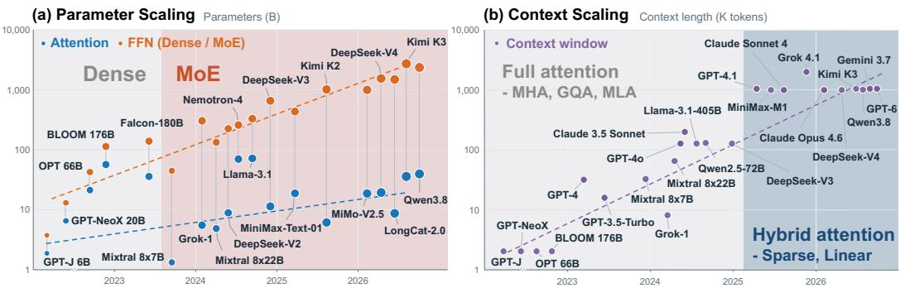  
Figure 1: Parameter and context scaling in frontier language models. (a) Attention and FFN parameters in frontier models. Since the rise of MoE, parameter growth has been dominated by FFN experts, with comparatively little growth in attention. (b) Maximum context windows in frontier models. Sparse and linear-time mechanisms support further context expansion.

Together, these challenges motivate a joint view of attention parameter and context scaling. The goal is not only to add attention parameters at a manageable cost, but also to use those parameters to support longer contexts. We therefore ask: Can scaling attention parameters directly enable efficient and effective context scaling?

We introduce NAMOH, an architecture-native sparse attention mechanism that couples attention parameter and context scaling. Each attention head acts as an expert, and a learned router activates the K highest-scoring heads out of H total heads for each token. Routing determines both the active head parameters and the token subsequence processed by each head. Each head performs causal attention only within its routed subsequence, and the layer combines the projected head outputs using routing weights. Attention sparsity therefore arises directly from the routing structure, rather than masking a dense attention result.

We use load balancing to discourage head collapse (Jin et al., 2024; Fu et al., 2026) and distribute tokens approximately evenly across heads. With H total heads and K active heads per token, a context of L tokens requires LK key-value (KV) entries in total, with approximately $L K / H$ entries per head. Each query token therefore accesses approximately $L K ^ { 2 } / H$ KV entries across its K active heads. We define the KV activation ratio as this per-token KV access relative to a full-attention baseline. For baselines with the same model width and head dimension, this ratio is approximately K/H relative to K-head full attention matched in active attention parameters, and $( K \dot { / } H ) ^ { 2 }$ relative to H-head full attention matched in total attention parameters.

For example, with H = 32 and K = 8, total KV storage is 1/4 that of 32-head full attention and equal to that of 8-head full attention. Under balanced routing, each head retains approximately $L / 4$ entries, so eight active heads access approximately 2L entries per token. This yields KV activation ratios of 1/16 and 1/4 relative to the two baselines, respectively. Parameter scaling thus allows more heads to specialize in different contextual patterns, with each head processing its routed subsequence.

We further support head-relative RoPE, which encodes each token by its position within a head’s routed subsequence rather than its global position. By shortening the encoded span to approximately $L K / H$ under balanced routing while preserving token order, this design aims to mitigate positioninduced attention noise. For efficient training and prefill, we pack head-specific subsequences for variable-length FlashAttention (Dao, 2023). During decoding, we execute only active head queries and read or update only their corresponding KV caches.

Our experiments show that NAMOH can achieve higher accuracy than fully activated models with the same total parameter count. Its reduced KV access also enables more efficient long-context inference than smaller dense models matched in active parameter count. Moreover, NAMOH is compatible with GQA and existing sparse attention mechanisms, which can further select tokens or blocks within each head’s routed subsequence. Together, these properties offer a complementary path to context scaling through attention parameter scaling.

## 2 BACKGROUND

## 2.1 HEAD SPARSITY: MIXTURE-OF-HEAD

Mixture-of-experts (MoE) layers scale feed-forward capacity through conditional activation without proportional growth in per-token computation (Shazeer et al., 2017; Fedus et al., 2021). The same principle applies to attention parameters. Peng et al. (2020) mix overlapping groups of heads rather than route each token to individual heads. Mixture of Attention Heads (MoA) routes query and output projections with shared keys and values (Zhang et al., 2022), while SwitchHead routes value and output projections (Csordas et al.´ , 2023). Grouped Query Experts (GQE) routes query heads within grouped-query attention (Tripathi & Kumar, 2026).

Mixture-of-Head attention (MoH) selects heads per token and weights their projected outputs (Jin et al., 2024). However, its heads retain full key-value (KV) histories even for tokens whose head outputs are inactive. With independent, fixed-width KV heads, cache storage grows with head count and context length, while each active query still processes the full prefix. Mixture of Sparse Attention (MoSA) introduces sequence sparsity through expert-choice routing, with each head selecting a fixed quota of top-scoring tokens from the full sequence (Piekos et al., 2025). This balances head loads, but future tokens can change earlier selections despite causal attention masking, so incremental autoregressive decoding requires routing changes.

## 2.2 CONTEXT SPARSITY: SPARSE ATTENTION

Selection-based sparse attention moves relevance filtering before the main softmax attention. Quest ranks KV pages using query-dependent scores from key metadata (Tang et al., 2024). Native Sparse Attention (NSA) reuses compressed attention scores to select blocks (Yuan et al., 2025), while Mixture of Block Attention (MoBA) selects blocks using query affinities to pooled keys (Lu et al., 2025). DeepSeek-V4 combines KV compression with a lightweight indexer in its compressed sparse attention branch (DeepSeek-AI et al., 2026). When indexers scan the prefix, their overhead grows with context length (Xu et al., 2026). Realizing speedups also requires specialized kernels and cache layouts for irregular KV access (DeepSeek-AI et al., 2026). NSA also reports higher average performance than its full-attention baseline on general and long-context benchmarks, supporting sparsity as a modeling choice (Yuan et al., 2025).

NAMOH provides a complementary source of sparsity through token-to-head assignments, without ranking the full history per query. Within routed subsequences, softmax attention remains compatible with dynamic token selection (Zhang et al., 2023; Tang et al., 2024) and static patterns such as sliding windows with retained sink tokens (Xiao et al., 2023).

Token selection does not necessarily shorten positional spans when original indices are retained. For rotary position embeddings (RoPE), Wertheimer et al. (2026) link length extrapolation to disrupted query-key separation and spurious attention to irrelevant tokens. Du et al. (2026) further identify indistinguishable scores across positions or tokens and reversed relevance rankings. Sparsity alone therefore does not ensure reliable scores among retained tokens. These findings motivate reducing the effective range of relative positions as a potential way to mitigate position-induced attention noise.

## 3 NAMOH: NATIVE SPARSE ATTENTION FROM MIXTURE-OF-HEAD

## 3.1 ROUTED CAUSAL ATTENTION

For a length-T sequence with token representations $\boldsymbol { x } _ { t } \in \mathbb { R } ^ { 1 \times d _ { \mathrm { m o d e l } } }$ and model width $d _ { \mathrm { m o d e l } }$ , standard multi-head attention with H heads (Vaswani et al., 2017) can be written as

$$
o _ { t } ^ { \mathrm { f u l l } } = \sum _ { i = 0 } ^ { H - 1 } h _ { t , i } ^ { \mathrm { f u l l } } W _ { O } ^ { ( i ) } ,\tag{1}
$$

where $h _ { t , i } ^ { \mathrm { f u l l } } \ \in \ \mathbb { R } ^ { 1 \times d _ { \mathrm { h e a d } } }$ is head i’s causal attention output with head width $d _ { \mathrm { h e a d } }$ , and $W _ { O } ^ { ( i ) } \ \in$ Rdhead×dmodel is its slice of the output projection.

(a) NAMOH – Prefill (2 of 4 heads activated, token 0\~7)  
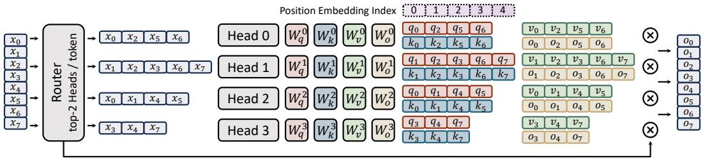

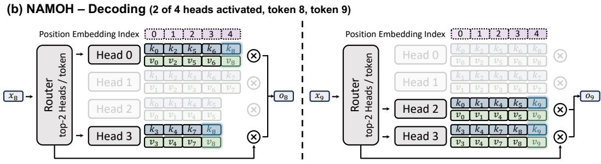  
Figure 2: NAMOH with two active heads out of four. (a) Prefill routes tokens 0 to 7 before QKV projection. Each head attends within its ordered subsequence, and projected outputs are combined with routing weights. (b) During decoding, tokens 8 and 9 access and extend only their selected heads’ KV caches. Position indices follow each head’s local token order.

Token-to-head routing. Following the expert view of attention heads (Jin et al., 2024), NAMOH activates K of H heads per token, where $1 \leq K \leq H$ . A learned router computes head affinities, selections, and gates as

$$
a _ { t } = \mathrm { s o f t m a x } ( x _ { t } W _ { r } ) , \quad S _ { K } ( t ) = \mathrm { T o p K } _ { i } ( a _ { t , i } ) , \quad m _ { t , i } = { \bf 1 } \{ i \in S _ { K } ( t ) \} , \quad g _ { t , i } = m _ { t , i } a _ { t , i } .\tag{2}
$$

Here, $W _ { r } \in \mathbb { R } ^ { d _ { \mathrm { m o d e l } } \times H }$ is the router matrix, and $a _ { t } \in \mathbb { R } ^ { 1 \times H }$ contains affinities normalized by softmax across heads. TopK returns the indices of the K largest affinities, and 1{·} is the indicator function. The selection mask $m _ { t , i }$ sets inactive gates to zero.

Sparse projection and attention. Routing determines both which parameters a token uses and which head histories it enters. For head $i ,$ define the ordered index set $\dot { \mathcal { T } } _ { i } = \{ t : m _ { t , i } = 1 \}$ } and its length $n _ { i } = | \mathcal { T } _ { i } |$ . Tokens are dispatched to these subsequences before projection. Only an active token-head pair computes

$$
q _ { t , i } = x _ { t } W _ { Q } ^ { ( i ) } , \qquad k _ { t , i } = x _ { t } W _ { K } ^ { ( i ) } , \qquad v _ { t , i } = x _ { t } W _ { V } ^ { ( i ) } , \qquad t \in \mathbb { Z } _ { i } .\tag{3}
$$

Each head has independent query, key, and value matrices $W _ { Q } ^ { ( i ) } , W _ { K } ^ { ( i ) } , W _ { V } ^ { ( i ) } \in \mathbb { R } ^ { d _ { \mathrm { m o d e l } } \times d _ { \mathrm { h e a d } } }$ . The resulting queries, keys, and values lie in $\mathbb { R } ^ { 1 \times d _ { \mathrm { h e a d } } }$ . Inactive token-head pairs generate no QKV vectors and occupy no KV cache entries.

Let $\widetilde { q } _ { t , i }$ and $\widetilde { k } _ { t , i }$ denote queries and keys after positional encoding, described in Section 3.2. For $i \in \mathcal { S } _ { K } ( t )$ , attention and output aggregation are

$$
h _ { t , i } = \mathrm { A t t n } \Big ( \widetilde { q } _ { t , i } , [ \widetilde { k } _ { s , i } ] , [ v _ { s , i } ] \Big ) , s \in \mathcal { T } _ { i } , s \le t , \qquad o _ { t } = \sum _ { i \in \mathcal { S } _ { K } ( t ) } g _ { t , i } h _ { t , i } W _ { O } ^ { ( i ) } ,\tag{4}
$$

where Attn denotes standard scaled dot-product attention, $h _ { t , i } \in \mathbb { R } ^ { 1 \times d _ { \mathrm { h e a d } } } , W _ { O } ^ { ( i ) } \in \mathbb { R } ^ { d _ { \mathrm { h e a d } } \times d _ { \mathrm { m o d e l } } }$ and $o _ { t } \in \mathbb { R } ^ { 1 \times d _ { \mathrm { m o d e l } } }$ . Each query therefore attends only to earlier tokens and itself within the same routed head. Sparsity is part of the computation, not a mask applied after dense attention.

Figure 2(a) illustrates dispatch and aggregation with $H = 4$ and $K = 2$ . During decoding in Figure 2(b), token 8 selects heads 0 and 3, while token 9 selects heads 2 and 3. Each token appends to and attends within only its selected caches. Because routing uses the current token representation, prefill and incremental decoding implement the same causal computation.

Table 1: Attention weight and KV cache costs. Total and active projection weights, KV storage after T tokens, and historical KV activation for single-token decoding.
<table><tr><td></td><td></td><td></td><td></td><td></td><td></td><td>GQA</td><td>GQA</td><td> $\mathrm { S A }$ </td><td>GQA+SA</td></tr><tr><td>Cost</td><td>MHA</td><td> $\mathrm { G Q A }$ </td><td>SA</td><td>MoH</td><td>NAMOH</td><td>+SA</td><td> $+ \mathbf { N A M O H }$ </td><td> $+ \mathbf { N A M O H }$ </td><td>+NAMOH</td></tr><tr><td>Total weights</td><td> $4 H d _ { m } d _ { h }$ </td><td> $2 H d _ { m } d _ { h } \frac { g + 1 } { a }$ </td><td> $4 H d _ { m } d _ { h }$ </td><td> $4 H d _ { m } d _ { h }$ </td><td> $4 H d _ { m } d _ { h }$ </td><td> $2 H d _ { m } d _ { h } \frac { g + 1 } { a }$ </td><td> $2 H d _ { m } d _ { h } \frac { g + 1 } { q }$ </td><td> $4 H d _ { m } d _ { h }$ </td><td> $2 H d _ { m } d _ { h } \frac { g + 1 } { a }$ </td></tr><tr><td>Active weights</td><td> $4 H d _ { m } d _ { h }$ </td><td> $2 H d _ { m } d _ { h } \frac { g + 1 } { g }$ </td><td> $4 H d _ { m } d _ { h }$ </td><td> $4 H d _ { m } d _ { h }$ </td><td> $4 K d _ { m } d _ { h }$ </td><td> $2 H d _ { m } d _ { h } \frac { g + 1 } { g }$ </td><td> $2 K d _ { m } d _ { h } \frac { g + 1 } { g }$ </td><td> $4 K d _ { m } d _ { h }$ </td><td> $2 K d _ { m } d _ { h } \frac { g + 1 } { g }$ </td></tr><tr><td>KV storage</td><td>HT</td><td> $H T / g$ </td><td>HT</td><td>HT</td><td>KT</td><td> $H T / g$ </td><td> $K T / g$ </td><td>KT</td><td> $K T / g$ </td></tr><tr><td>KV activation</td><td>HT</td><td> $H T / g$ </td><td>αHT</td><td>KT</td><td> $\scriptstyle { T K ^ { 2 } } / { H }$ </td><td>αHT/g</td><td> $T K ^ { 2 } / ( H g )$ </td><td> $\alpha T K ^ { 2 } / H$ </td><td> $\alpha T K ^ { 2 } / ( H g )$ </td></tr></table>

## 3.2 LOAD BALANCING AND SCALING PROPERTIES

Load balancing. Balancing encourages all heads to receive training signals and discourages head collapse (Fu et al., 2026). It also supports context sparsity: if routing concentrates on a fixed subset of heads, their histories can become dense despite sparse head activation. For a training batch B containing N tokens, define the assignment fraction $f _ { i }$ and average head affinity $p _ { i }$ as

$$
f _ { i } = \frac { 1 } { N K } \sum _ { t \in \mathcal { B } } m _ { t , i } , \qquad p _ { i } = \frac { 1 } { N } \sum _ { t \in \mathcal { B } } a _ { t , i } ,\tag{5}
$$

with batch indices suppressed. Both distributions sum to one, with uniform targets $f _ { i } = p _ { i } = 1 / H$

We consider three alternatives from MoE: CV-based importance regularization (Shazeer et al., 2017), Switch-style $( f p )$ balancing (Fedus et al., 2021), and auxiliary-loss-free balancing (Wang et al., 2024). For the two auxiliary-loss methods, the training objective is $\dot { \mathcal { L } } = \mathcal { L } _ { \mathrm { L M } } + \lambda _ { \mathrm { b a l } } \mathcal { L } _ { \mathrm { b a l } }$ , where $\mathcal { L } _ { \mathrm { L M } }$ is the language-modeling loss, $\mathcal { L } _ { \mathrm { b a l } }$ is the chosen balancing loss summed across routed attention layers, and $\lambda _ { \mathrm { b a l } } > 0$ controls its strength. Loss-free balancing instead adjusts head-specific routing biases with an update rate $\eta > 0$ , without adding a balancing loss. Appendix A details all three strategies.

Routing as context selection. Each head maintains its own routed history, so selecting heads also selects the contexts available to a query. The head router thus serves as a learned indexer over histories without rescoring historical keys or blocks. Unlike a fixed KV budget, the available history grows with sequence length, reaching approximately $T K / H$ entries in each head under balanced routing. This selection acts at the head level and remains compatible with further token or block sparsity within each subsequence (Tang et al., 2024; Yuan et al., 2025; Lu et al., 2025).

Parameter and context costs in attention. We compare one attention layer with H query heads at fixed model and head widths, abbreviated as $d _ { m }$ and $d _ { h }$ . Let $M _ { \mathrm { K V } }$ count stored KV pairs after a prefix of T tokens, and let $A _ { \mathrm { K V } } ( T )$ count distinct historical pairs used to decode the next token. Each pair contains $2 d _ { h }$ scalars; shared pairs are counted once. GQA shares one KV head among g query heads, reducing both counts to $H T / g$ (Ainslie et al., 2023). Block-selected sparse attention (SA) retains the full cache but accesses approximately an $\alpha \in ( 0 , 1 ]$ fraction of each history (Tang et al., 2024; Lu et al., 2025). Thus, SA stores HT pairs and activates approximately $\alpha H T$ . MoH instead retains all head histories and activates KT pairs through its K selected heads (Jin et al., 2024).

For NAMOH, let $n _ { i }$ denote head i’s prefix length and $S _ { K } ( T )$ the next token’s K selected heads. Routing determines both cache insertion and access:

$$
M _ { \mathrm { K V } } = T K , \qquad A _ { \mathrm { K V } } ( T ) = \sum _ { i \in { \cal S } _ { K } ( T ) } n _ { i } \approx \frac { T K ^ { 2 } } { H } .\tag{6}
$$

Storage is exact, while activation assumes approximately balanced histories. Relative to H-head MHA, these costs are reduced to $K / H$ and approximately $( K / H ) ^ { 2 }$ , respectively. Relative to K-head MHA, which matches active projection parameters, storage is unchanged and activation is reduced to approximately $K / H$

Table 1 compares attention projection weights and KV cache costs. Router weights are omitted, which add $\mathcal { O } ( H d _ { m } ^ { - } )$ always-active parameters for head routing. The mechanisms are complementary: GQA shares KV representations, NAMOH shortens routed histories, and SA selects blocks within those histories. With KV-group routing and group-shared block selection, combining all three stores $T K / g$ KV pairs and activates approximately $\overline { { \alpha } } T \dot { K } ^ { 2 } / ( H g )$ historical pairs per decoding token. Appendix B details the combination rules, selection overhead, and prefill computation.

Head-relative positional encoding. We optionally apply RoPE using a token’s rank within its routed head rather than its global position. For an active token-head pair, its zero-based rank $\rho _ { i } ( t )$ and position-encoded vectors are

$$
\rho _ { i } ( t ) = \sum _ { s = 0 } ^ { t } m _ { s , i } - 1 , \qquad \widetilde { q } _ { t , i } = q _ { t , i } R ( \rho _ { i } ( t ) ) , \qquad \widetilde { k } _ { t , i } = k _ { t , i } R ( \rho _ { i } ( t ) ) ,\tag{7}
$$

where $R ( p ) \in \mathbb { R } ^ { d _ { \mathrm { h e a d } } \times d _ { \mathrm { h e a d } } }$ is the RoPE rotation for row vectors at position p. For example, head 0 in Figure 2(a) maps global positions (0, 2, 5, 6) to local indices (0, 1, 2, 3). Its next activated token, token 8, receives index 4. The largest index in head i is $n _ { i } - 1$ , so balanced routing contracts the encoded span from T positions to approximately $T K / H$ . This preserves token order, but not original token distances. The shorter span is intended to improve query-key matching by limiting positioninduced attention noise (Wertheimer et al., 2026; Du et al., 2026), complementing the computational benefit of sparsity. Using global-position RoPE instead amounts to replacing $\rho _ { i } ( t )$ with t.

Efficient execution. Training and prefill pack each (batch, head) subsequence as an independent sequence for variable-length FlashAttention (Dao, 2023). The total packed length is fixed at $\mathbf { \dot {  { T K } } }$ per sequence and NK per training batch, although individual head lengths vary. Load balancing helps limit this length skew. We further use length-aware scheduling to interleave query tiles with larger and smaller causal workloads across subsequences. This balances cumulative work across GPU multiprocessors to reduce tail idle time, without introducing cross-subsequence attention. Decoding launches only active head queries and reads or updates only their corresponding caches.

## 4 EXPERIMENTS

## 4.1 EXPERIMENTAL SETUP

Models and training. We train models from scratch with 0.6B to 1.2B parameters, covering multihead attention (MHA), grouped-query attention (GQA), selection-based sparse attention $( \mathrm { S A } ) .$ , and NAMOH. We fix the number of layers at 16, the model width at 2048, and the head width at 64, with head counts of 4, 8, 16, and 32. Every model receives 24B tokens from FineWeb-Edu (Penedo et al., 2024). This budget corresponds to 20 training tokens per parameter of the largest model, following the Chinchilla scaling guideline (Hoffmann et al., 2022), and is kept identical across models. For long-context evaluation, we further post-train models on LongAlign (Bai et al., 2024).

We use AdamW with a learning rate of 0.002, followed by linear decay to zero over the final 20% of training. Auxiliary-loss balancing uses a coefficient of $\lambda _ { \mathrm { b a l } } = 0 . 0 0 1$ , while loss-free balancing uses a routing-bias update rate of $\eta = 0 . 0 0 1$ . Other optimizer hyperparameters follow the implementation defaults of the AdamW optimizer. All experiments are conducted on NVIDIA A100 GPUs.

Baselines and controls. MHA-H and SA-H use H heads, GQA-32KVK uses 32 query heads and K KV heads, and NAMOH-HAK activates K of H heads per token. Our SA baseline follows the block-selection paradigm (Lu et al., 2025; Yuan et al., 2025). Each head retains its full KV history, represents each KV block by its mean-pooled keys for selection scoring, and selects a fixed fraction of the highest-scoring blocks. We use 32-token blocks, reuse selected indices across groups of 32 queries, and additionally maintain a 128-token sliding window. The fraction in parentheses specifies the per-head KV activation budget. KV storage and activation are normalized to MHA-32. Activation counts entries accessed by the main attention operation, with shared GQA entries counted once. To isolate the gains from routed context sparsity, we equip all MHA, GQA, and SA baselines with the head gating and load-balancing mechanisms used in prior head-routing methods (Fu et al., 2026; Jin et al., 2024; Qiu et al., 2025), with matched settings across comparisons.

Evaluation. We evaluate pretrained models on MMLU (Hendrycks et al., 2020) for general knowledge, GSM8K (Cobbe et al., 2021) for mathematics, HumanEval (Chen et al., 2021) for coding, and BoolQ (Clark et al., 2019) for reading comprehension. Scientific reasoning benchmarks include ARC-Easy, ARC-Challenge (Clark et al., 2018), and OpenBookQA (Mihaylov et al., 2018). We assess commonsense reasoning with HellaSwag (Zellers et al., 2019), PIQA (Bisk et al., 2019), and WinoGrande (Sakaguchi et al., 2019). For long-context understanding, we evaluate models on eight LongBench tasks (Bai et al., 2023): HotpotQA (Yang et al., 2018), Qasper (Dasigi et al., 2021), TriviaQA (Joshi et al., 2017), NarrativeQA (Kocisky et al.´ , 2017), 2WikiMultiHopQA (Ho et al., 2020), GovReport (Huang et al., 2021), QMSum (Zhong et al., 2021), and TREC (Li & Roth, 2002).

Table 2: Evaluation results of models trained from scratch with different attention mechanisms and KV budgets. KV storage (KV Stor.) and activation (KV Act.) are normalized to MHA-32. For sparse attention (SA), the fraction in parentheses denotes the activated KV fraction per head.
<table><tr><td rowspan="2">Attention Mechanism</td><td rowspan="2">KV Stor.</td><td rowspan="2">KV Act.</td><td rowspan="2">MMLU</td><td rowspan="2">GSM8K</td><td rowspan="2">HEval</td><td rowspan="2">ARC-E</td><td rowspan="2">ARC-C HellaSwag</td><td rowspan="2"></td><td rowspan="2">PIQA</td><td rowspan="2">OBQA</td><td rowspan="2">BoolQ</td><td rowspan="2">WinoG.</td><td rowspan="2">Average</td></tr><tr><td></td></tr><tr><td>MHA-32</td><td>1</td><td>1</td><td>32.79</td><td>5.31</td><td>6.10</td><td>65.87</td><td>34.13</td><td>45.88</td><td>69.37</td><td>37.20</td><td>46.64</td><td>53.99</td><td>39.73</td></tr><tr><td>MHA-16</td><td>1/2</td><td>1/2</td><td>32.35</td><td>3.11</td><td>4.27</td><td>63.76</td><td>34.39</td><td>46.84</td><td>70.08</td><td>35.80</td><td>46.18</td><td>52.49</td><td>38.93</td></tr><tr><td>GQA-32KV16</td><td>1/2</td><td>1/2</td><td>27.48</td><td>4.62</td><td>7.32</td><td>65.61</td><td>35.58</td><td>47.56</td><td>69.48</td><td>36.00</td><td>48.40</td><td>52.01</td><td>39.41</td></tr><tr><td>SA-32 (1/4)</td><td>1</td><td>1/4</td><td>25.27</td><td>2.58</td><td>3.66</td><td>60.87</td><td>33.21</td><td>45.20</td><td>59.90</td><td>37.60</td><td>44.22</td><td>50.12</td><td>36.26</td></tr><tr><td>SA-16 (1/2)</td><td>1/2</td><td>1/4</td><td>24.36</td><td>2.88</td><td>3.05</td><td>63.22</td><td>34.74</td><td>45.00</td><td>59.36</td><td>35.60</td><td>53.39</td><td>49.49</td><td>37.11</td></tr><tr><td>NAMOH-32A16</td><td>1/2</td><td>1/4</td><td>32.74</td><td>5.84</td><td>9.76</td><td>66.04</td><td>36.43</td><td>48.11</td><td>70.67</td><td>36.60</td><td>49.33</td><td>55.81</td><td>41.13</td></tr><tr><td>MHA-8</td><td>1/4</td><td>1/4</td><td>26.01</td><td>2.58</td><td>3.66</td><td>66.04</td><td>33.55</td><td>46.02 45.49</td><td>69.70</td><td>35.20</td><td>44.28</td><td>50.80</td><td>37.78</td></tr><tr><td>GQA-32KV8</td><td>1/4</td><td>1/4</td><td>25.35</td><td>2.88</td><td>6.10</td><td>63.72</td><td>32.70</td><td></td><td>69.59</td><td>34.60</td><td>48.80</td><td>52.75</td><td>38.20</td></tr><tr><td>SA-32 (1/16)</td><td>1</td><td>1/16</td><td>25.12</td><td>1.90</td><td>1.83</td><td>61.25</td><td>31.84</td><td>42.36</td><td>58.60</td><td>26.00</td><td>55.17</td><td>50.59</td><td>35.46</td></tr><tr><td>SA-8 (1/4)</td><td>1/4</td><td>1/16</td><td>25.11</td><td>1.44</td><td>3.05</td><td>61.96</td><td>35.32</td><td>43.60</td><td>58.87</td><td>29.60</td><td>51.90</td><td>50.36</td><td>36.12</td></tr><tr><td>NAMOH-32A8</td><td></td><td>1/4 1/16</td><td>31.31</td><td>4.62</td><td>7.93</td><td>64.86</td><td>36.26</td><td>47.78</td><td>69.26</td><td>35.80</td><td>55.38</td><td>51.54</td><td>40.47</td></tr><tr><td>MHA-4</td><td>1/8 1/8</td><td>1/8 1/8</td><td>25.54 25.83</td><td>1.36 2.27</td><td>3.05 3.66</td><td>58.21 64.86</td><td>30.46 35.41</td><td>47.60 43.93</td><td>70.29 69.21</td><td>36.20 36.00</td><td>44.60 49.78</td><td>53.43</td><td>37.07</td></tr><tr><td>GQA-32KV4</td><td>1</td><td>1/64</td><td>24.47</td><td>0.53</td><td>0.61</td><td>47.54</td><td>23.04</td><td>37.69</td><td>58.05</td><td>28.20</td><td>54.43</td><td>55.25 49.09</td><td>38.62</td></tr><tr><td>SA-32 (1/64)</td><td></td><td>1/8 1/64</td><td>25.27</td><td>0.45</td><td>1.22</td><td>50.99</td><td>25.77</td><td>38.10</td><td>58.54</td><td>31.20</td><td>54.04</td><td>49.17</td><td>32.37 33.48</td></tr><tr><td>SA-4 (1/8)</td><td></td><td>1/8 1/64</td><td>27.48</td><td>2.50</td><td>4.88</td><td>64.52</td><td>35.14</td><td>45.99</td><td>66.92</td><td>35.20</td><td>56.18</td><td>54.43</td><td></td></tr><tr><td>NAMOH-32A4</td><td></td><td></td><td></td><td></td><td></td><td></td><td></td><td></td><td></td><td></td><td></td><td></td><td>39.32</td></tr></table>

Table 3: Evaluation results on LongBench. KV stor. and act. are normalized to MHA-32; SA parentheses denote the KV fraction activated.
<table><tr><td>Method Dataset</td><td>MHA MHA 32</td><td>8</td><td>GQA 32KV8</td><td>SA-32 (1/16)</td><td>SA-8 (1/4)</td><td>NAMOH 32A8</td></tr><tr><td>KV Stor.</td><td>1</td><td>1/4</td><td>1/4</td><td>1</td><td>1/4</td><td>1/4</td></tr><tr><td>KV Act.</td><td>1</td><td>1/4</td><td>1/4</td><td>1/16</td><td>1/16</td><td>1/16</td></tr><tr><td>HotpotQA</td><td>27.52</td><td>23.89</td><td>31.94</td><td>21.89</td><td>24.13</td><td>30.23</td></tr><tr><td>Qasper</td><td>21.29</td><td>20.92</td><td>19.49</td><td>18.68</td><td>17.60</td><td>22.58</td></tr><tr><td>TriviaQA</td><td>56.32</td><td>35.21</td><td>44.97</td><td>29.17</td><td>34.60</td><td>46.82</td></tr><tr><td>NarrativeQA</td><td>11.14</td><td>12.04</td><td>9.93</td><td>9.94</td><td>11.06</td><td>13.35</td></tr><tr><td>2WikiMQA</td><td>28.83</td><td>30.48</td><td>31.87</td><td>26.69</td><td>27.09</td><td>34.34</td></tr><tr><td>GovReport</td><td>18.07</td><td>15.33</td><td>15.88</td><td>16.02</td><td>16.02</td><td>16.73</td></tr><tr><td>QMSum</td><td>22.41</td><td>20.60</td><td>22.61</td><td>20.80</td><td>21.65</td><td>22.81</td></tr><tr><td>TREC</td><td>71.50</td><td>69.50</td><td>70.50</td><td>67.00</td><td>68.50</td><td>75.00</td></tr><tr><td>Average</td><td>32.14</td><td>28.50</td><td>30.90</td><td>26.27</td><td>27.58</td><td>32.73</td></tr></table>

(a) Prefill – TTFT  
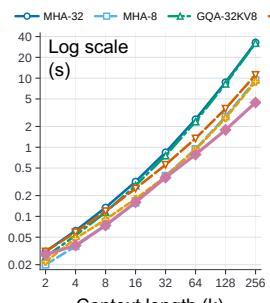  
Context length (k)

(b) Decoding – TPOT  
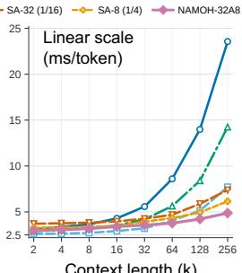  
Context length (k)  
Figure 3: Inference efficiency. (a) Prefill TTFT and (b) decoding TPOT across attention mechanisms at different context lengths. Lower is better.

## 4.2 MODEL QUALITY AND INFERENCE EFFICIENCY

General capabilities. Table 2 compares NAMOH-32AK with MHA, GQA, and SA for K ∈ {4, 8, 16}. All variants in this table use CV-based importance regularization for load balancing, with details provided in Appendix A. Across these settings, NAMOH achieves stronger overall performance than the corresponding K-head MHA and SA models and compares favorably with GQA. Its performance can also match or exceed MHA-32 despite sparse head activation. These results show that a larger pool of selectively activated heads can preserve the quality of a fully activated model while using fewer head parameters per token.

Long-context quality and KV budgets. Table 3 extends the comparison to LongBench with a maximum context length of 32K tokens, where NAMOH-32A8 improves overall performance over the MHA, GQA, and SA baselines. Under balanced routing, its normalized KV storage is 1/4 and its KV activation is approximately 1/16. MHA-8 and GQA-32KV8 match its storage but access approximately four times as many KV entries. SA-32 (1/16) matches its activation budget but requires four times the storage, while SA-8 (1/4) matches both.

Inference efficiency. Figure 3 reports time to first token (TTFT) and time per output token (TPOT) across context lengths. TTFT measures the latency to process the prompt and produce the first output token. TPOT measures the average latency of subsequent decoding steps. For the SA baselines, we use the implementation from MoBA (Lu et al., 2025). At long contexts, NAMOH-32A8 achieves lower TTFT and TPOT than MHA-32, GQA-32KV8, and SA variants, and even outperforms MHA-8.

These gains are consistent with the different bottlenecks of decoding and prefill. Long-context decoding is typically memory-bound, so reducing KV traffic helps lower TPOT (Yuan et al., 2025). Compute-bound prefill benefits from fewer query-key interactions and sparse projection. GQA reduces KV projection costs but retains full-prefix attention for all 32 query heads. SA reduces the attended KV set but still incurs block-scoring and selection overhead (Lu et al., 2025; Yuan et al., 2025). In contrast, NAMOH performs attention over shorter packed subsequences without a history-scanning indexer, which also benefits comparisons at matched KV activation.

Question: What is the final destination of the Aurora expedition? Needle: The final destination of the Aurora expedition is Lake Vesper.  
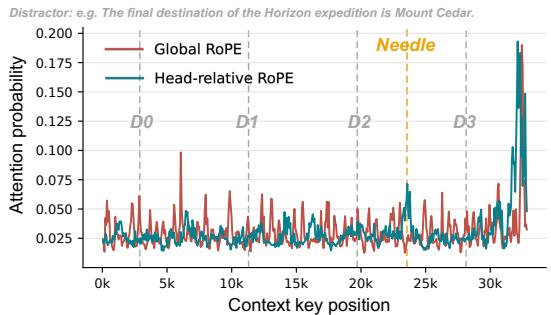  
Figure 4: Full-question attention over a 32k-token haystack in NAMOH-32A8. Dashed lines mark the needle and four distractors.

Table 4: LongBench evaluation of NAMOH-32A8 with different RoPE variants across different context lengths. G and HR denote global RoPE and head-relative RoPE.
<table><tr><td>Length</td><td colspan="2">8k</td><td colspan="2">16k</td><td colspan="2">32k</td></tr><tr><td>Method</td><td>G</td><td>HR</td><td>G</td><td>HR</td><td>G</td><td>HR</td></tr><tr><td>HotpotQA</td><td>24.98</td><td>27.46</td><td>25.65</td><td>29.43</td><td>26.69</td><td>30.23</td></tr><tr><td>Qasper</td><td>19.88</td><td>18.21</td><td>20.41</td><td>24.12</td><td>20.03</td><td>22.58</td></tr><tr><td>TriviaQA</td><td>45.75</td><td>45.11</td><td>46.55</td><td>50.10</td><td>47.63</td><td>46.82</td></tr><tr><td>NarrativeQA</td><td>9.11</td><td>12.16</td><td>13.26</td><td>15.28</td><td>9.65</td><td>13.35</td></tr><tr><td>2WikiMQA</td><td>28.53</td><td>30.54</td><td>31.90</td><td>32.48</td><td>31.64</td><td>34.34</td></tr><tr><td>GovReport</td><td>16.60</td><td>18.13</td><td>15.65</td><td>15.50</td><td>17.12</td><td>16.73</td></tr><tr><td>QMSum</td><td>21.18</td><td>21.49</td><td>23.52</td><td>22.27</td><td>22.60</td><td>22.81</td></tr><tr><td>TREC</td><td>67.00</td><td>68.00</td><td>70.50</td><td>70.50</td><td>73.00</td><td>75.00</td></tr><tr><td>Average</td><td>29.13</td><td>30.14</td><td>30.93</td><td>32.46</td><td>31.05</td><td>32.73</td></tr></table>

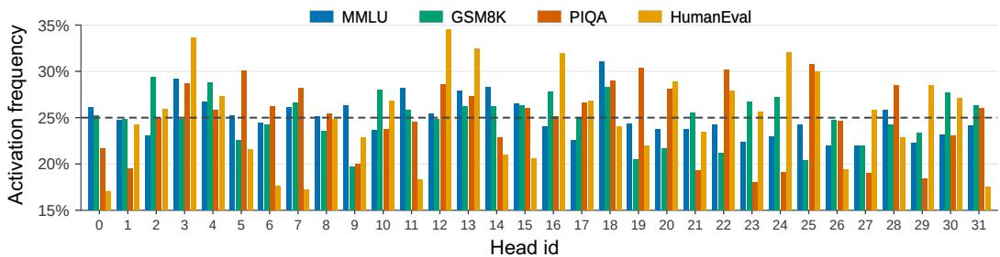  
Figure 5: Task-dependent head utilization in NAMOH-32A8. Activation frequencies of individual heads in one attention layer on MMLU, GSM8K, PIQA, and HumanEval.

## 4.3 POSITIONAL ENCODING AND ROUTING BEHAVIOR

Head-relative RoPE. Figure 4 compares global and head-relative RoPE in NAMOH-32A8 on a 32k-token needle-in-a-haystack example with four distractors. The visualization aggregates attention from all question tokens to each haystack position. In this example, head-relative RoPE assigns more attention to the needle and less to irrelevant positions. Table 4 provides a broader comparison at context lengths of 8k, 16k, and 32k. Head-relative RoPE achieves higher LongBench scores, with the average gap increasing at longer contexts. These observations are consistent with the intended benefit of shortening the encoded positional span, as discussed in Section 3.2.

Head utilization across tasks. Figure 5 shows head activation frequencies on four datasets. Frequencies cluster around the balanced rate of $K / H = 2 5 \%$ , indicating broad head utilization rather than concentration on a small fixed subset. At the same time, individual heads exhibit clear frequency differences across tasks. This pattern suggests task-dependent specialization.

Routing-induced attention structure. Figure 6 examines a 32-token example. Panel (a) shows the heads selected by each token, with lines linking tokens assigned to the same head. For this sequence of length $\dot { T ^ { \mathrm { = } } } 3 2$ , let $M \in \{ 0 , 1 \} ^ { T \times H }$ collect the routing masks, with $M _ { t , i } = m _ { t , i }$ . Panel (b) visualizes $R = \operatorname { t r i l } ( M M ^ { \top } )$ , where tril retains the lower triangle, including the diagonal. Thus, $R _ { t , s }$ counts the active heads shared by query token t and an earlier or current token s.

Panel (c) shows the gate-weighted attention map $\begin{array} { r } { A _ { t , s } = \sum _ { i = 0 } ^ { H - 1 } g _ { t , i } m _ { s , i } \alpha _ { t , s } ^ { ( i ) } } \end{array}$ . Here, $\alpha _ { t , s } ^ { ( i ) }$ is the softmax attention weight from token t to token s within head i, defined as zero outside that head’s routed causal pairs. Panels (b) and (c) therefore distinguish available connections from the attention weights assigned to them. Panel (d) displays individual head maps at the original token positions. Their separated support reflects the different routed subsequences, with non-routed positions absent from each head’s computation.

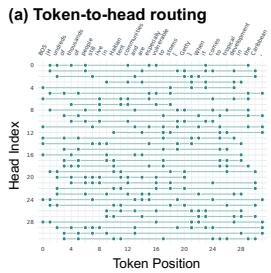

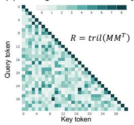

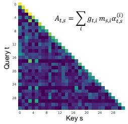

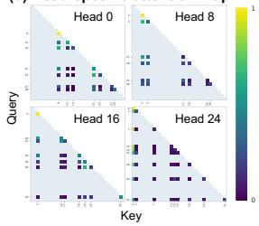  
Figure 6: Routing shapes attention connectivity in NAMOH. (a) Token-to-head assignments. (b) The number of shared active heads for each causal token pair. (c) Layer-wide attention weighted by query-specific routing gates. (d) Attention maps for heads 0, 8, 16, and 24.

Table 5: Further refinement of NAMOH-32A8 with load-balancing strategies and shared heads.
<table><tr><td>Method</td><td>MMLU</td><td>GSM8K</td><td>HEval</td><td>ARC-E</td><td>ARC-C</td><td>HellaSwag</td><td>PIQA</td><td>OBQA</td><td>BoolQ</td><td>WinoG.</td><td>Average</td></tr><tr><td>Load Balancing Variants</td><td></td><td></td><td></td><td></td><td></td><td></td><td></td><td></td><td></td><td></td><td></td></tr><tr><td>CV (Shazeer et al., 2017)</td><td>31.31</td><td>4.62</td><td>7.93</td><td>64.86</td><td>36.26</td><td>47.78</td><td>69.26</td><td>35.80</td><td>55.38</td><td>51.54</td><td>40.47</td></tr><tr><td>fp (Fedus et al., 2021)</td><td>32.40</td><td>5.31</td><td>9.76</td><td>64.66</td><td>37.11</td><td>46.16</td><td>70.40</td><td>36.80</td><td>56.81</td><td>52.96</td><td>41.24</td></tr><tr><td>Loss-Free (Wang et al., 2024)</td><td>33.23</td><td>3.11</td><td>7.93</td><td>62.76</td><td>34.23</td><td>45.12</td><td>68.23</td><td>35.00</td><td>55.63</td><td>52.96</td><td>39.82</td></tr><tr><td>Shared-Head Variants</td><td></td><td></td><td></td><td></td><td></td><td></td><td></td><td></td><td></td><td></td><td></td></tr><tr><td>+ 2 Shared (Full)</td><td>30.99</td><td>5.38</td><td>8.64</td><td>64.10</td><td>37.64</td><td>47.12</td><td>70.97</td><td>37.00</td><td>58.31</td><td>53.28</td><td>41.34</td></tr><tr><td>+ 2 Shared (Sliding)</td><td>32.21</td><td>5.53</td><td>9.76</td><td>65.19</td><td>37.21</td><td>47.51</td><td>70.88</td><td>36.80</td><td>57.02</td><td>52.33</td><td>41.44</td></tr><tr><td>+ 4 Shared (Full)</td><td>33.14</td><td>6.22</td><td>10.37</td><td>66.12</td><td>38.24</td><td>47.37</td><td>71.24</td><td>37.60</td><td>58.63</td><td>53.75</td><td>42.27</td></tr><tr><td>+ 4 Shared (Sliding)</td><td>33.50</td><td>5.84</td><td>11.59</td><td>66.33</td><td>38.75</td><td>48.74</td><td>72.06</td><td>38.40</td><td>59.86</td><td>54.22</td><td>42.93</td></tr></table>

## 4.4 LOAD BALANCING AND SHARED HEADS

Load-balancing strategies. Table 5 compares CV-based importance regularization (Shazeer et al., 2017), Switch-style (f p) balancing (Fedus et al., 2021), and loss-free balancing (Wang et al., 2024). The formulations of these load-balancing strategies are detailed in Appendix A. All variants retain 32 routed heads and activate eight per token. At the settings specified above, fp achieves the best overall performance among the three alternatives.

Shared heads for local context. Inspired by shared expert isolation in DeepSeekMoE (Dai et al., 2024), we augment NAMOH-32A8 with Hs always-active shared heads, testing $H _ { s } \in \{ 2 , 4 \}$ . Each shared head attends either to the full causal prefix or to the most recent $w = 1 2 8$ original tokens, including the current token, where w is the sliding-window size. Their independently projected outputs are added to the routed output o . Shared heads are excluded from H, K, and the routing balance statistics. The sliding-window heads use global RoPE, while routed heads retain head-relative RoPE. This supplies local context even when neighboring tokens select different routed heads.

Shared heads add 4 $. H _ { s } d _ { \mathrm { m o d e l } } d _ { \mathrm { h e a d } }$ always-active projection parameters. For a fixed window size w, the sliding variant requires at most $H _ { s }$ w additional KV pairs per layer and $\mathcal { O } ( T H _ { s } w d _ { \mathrm { h e a d } } )$ attention work for a length-T sequence. Table 5 shows that adding shared heads improves overall performance. Sliding-window variants perform similarly to their full-attention counterparts, suggesting that reliable local context accounts for much of the benefit. This supports a complementary design in which shared heads cover nearby tokens while routed heads can focus on broader context retrieval.

## 5 CONCLUSION

We introduced NAMOH, an architecture-native sparse attention mechanism that connects attention parameter scaling with context scaling. Each token activates a subset of heads, and each head stores and attends only to its assigned tokens. Routing thus jointly selects active parameters and available context without scanning the full history. Under balanced routing, expanding the head pool at a fixed active head count shortens head histories. This reduces per-token KV access without increasing total KV storage. Head-relative RoPE further shortens positional spans and improves long-context quality in our evaluations. Experiments show that NAMOH can outperform fully activated models with the same total parameter count. It also enables faster long-context prefill and decoding than smaller dense models matched in active parameter count. The design remains compatible with GQA and existing sparse attention mechanisms. Together, these findings support a complementary path for scaling attention, in which parameter growth directly enables more efficient and effective context scaling.

## REFERENCES

Nvidia Bo Adler, Niket Agarwal, Ashwath Aithal, Dong H. Anh, Pallab Bhattacharya, Annika Brundyn, Jared Casper, Bryan Catanzaro, Sharon Clay, Jonathan Cohen, Sirshak Das, Ayush Dattagupta, Olivier Delalleau, Leon Derczynski, Yi Dong, Daniel Egert, Ellie Evans, Aleksander Ficek, Denys Fridman, Shaona Ghosh, Boris Ginsburg, Igor Gitman, Tomasz Grzegorzek, Robert Hero, Jining Huang, Vibhu Jawa, Joseph Jennings, Aastha Jhunjhunwala, John Kamalu, Sadaf Khan, Oleksii Kuchaiev, Patrick LeGresley, Hui Li, Jiwei Liu, Zihan Liu, Eileen Long, Ameya Sunil Mahabalesh warkar, Somshubra Majumdar, James Maki, Miguel Mart´ınez, Maer Rodrigues de Melo, Ivan Moshkov, Deepak Narayanan, Sean Narenthiran, Jesus Navarro, Phong T. Nguyen, Osvald Nitski, Vahid Noroozi, Guruprasad Nutheti, Christopher Parisien, Jupinder Parmar, Mostofa Patwary, Krzysztof Pawelec, Wei Ping, Shrimai Prabhumoye, Rajarshi Roy, Trisha Saar, Vasanth Rao Naik Sabavat, Sanjeev Satheesh, Jane Scowcroft, Jason D. Sewall, Pavel Shamis, Gerald Shen, Mohammad Shoeybi, David Sizer, Misha Smelyanskiy, Felipe Soares, Makesh Narsimhan Sreedhar, Dan Su, Sandeep Subramanian, Shengyang Sun, Shubham Toshniwal, Hao Wang, Zhilin Wang, Jiaxuan You, Jiaqi Zeng, Jimmy Zhang, Jing Zhang, Vivian Zhang, Yian Zhang, and Chen Zhu. Nemotron-4 340b technical report. ArXiv, abs/2406.11704, 2024.

Joshua Ainslie, James P. Lee-Thorp, Michiel de Jong, Yury Zemlyanskiy, Federico Lebron, and ´ Sumit K. Sanghai. Gqa: Training generalized multi-query transformer models from multi-head checkpoints. ArXiv, abs/2305.13245, 2023. URL https://api.semanticscholar.org/ CorpusID:258833177.

Kimi Team Yifan Bai, Yifan Bai, Yiping Bao, Chandru. M, Jianfeng Cai, Xin-Hao Cai, Peizhou Cao, Yuxuan Cao, Ziwei Chai, Y. Charles, H. S. Che, Guanduo Chen, Guangyu Chen, Guanzheng Chen, Huarong Chen, Jia Chen, Jianlong Chen, Jun Chen, Kexin Chen, Peng Chen, Ruijue Chen, Wentao Chen, Xinxian Chen, Yang Chen, Yanru Chen, Yifei Chen, Yingjian Chen, Yuankun Chen, Yujie Chen, Yutian Chen, Zhirong Chen, Dazhi Cheng, Yean Cheng, Jialei Cui, Ji-Zhe Cui, An-Bang Dai, Jiaqi Deng, Haochen Ding, Rui Ding, Shaofeng Ding, Mengfan Dong, Meng xiao Dong, Yuhao Dong, Yuxin Dong, Angang Du, Chenzhuang Du, Dikang Du, Jusen Du, Yulun Du, Yu Fan, Jing Feng, Qiulin Feng, Yichen Feng, Kelin Fu, Qiang Fu, Fu-Juan Gao, Hongcheng Gao, Jingyue Gao, Tong Gao, Wei Gao, Shangyi Geng, Jie Gong, Lin Gong, Sheng Gong, Xiaocheng Gong, Qizheng Gu, Yicheng Gu, Shuhao Guan, Haiqing Guo, Shiqi Guo, Xiang Guo, Zhen Guo, Beixi Hao, Wenxing Hao, Xiaoru Hao, Dailan He, Haotian He, Lehan He, Qi He, Weiran He, Xinran He, Xin-Yi He, Yibo He, Yun He, Chao Hong, Tiange Hong, Hao-Xing Hu, Jiaxi Hu, Rui-Jia Hu, Weiming Hu, Yangyang Hu, Zhenxing Hu, Liang Hua, Jinbin Huang, Ke Huang, Ruiyuan Huang, Siying Huang, Weixiao Huang, Yan Huang, Zhengjie Huang, Zhiqi Huang, Yulong Hui, Chao Jia, Yutong Jiang, Zhejun Jiang, Zuoyou Jiang, W.M. Jin, Xinyi Jin, Yu Jing, Huanjun Kong, Guokun Lai, Aidi Li, Cheng Li, Chengyu Li, Cong Li, Fang Li, Guanyu Li, Haoyang Li, Jia Li, Junxiong Li, Lei Li, Letian Li, Lincan Li, Weihong Li, Wentao Li, Xintong Li, Yang Li, Yisheng Li, Yiwei Li, Yuxiao Li, Zhaowei Li, Zhaoxin Li, Zheming Li, Zheng-Xiao Li, Zhiyuan Li, Jia-Wei Lin, Xiaohan Lin, Yibo Lin, Zichao Lin, Ziyan Lin, Bill Liu, B. Liu, Chuangye Liu, Liang Liu, Shaowei Liu, Shudong Liu, Shuran Liu, Tianwei Liu, Weizhou Liu, Yangyang Liu, Yanming Liu, Yibo Liu, Yipeng Liu, Zhengying Liu, Zhiheng Liu, Enzhe Lu, Haoyu Lu, Lin Lu, Ting Lu, Zhiyuan Lu, Aotian Luo, Gen Luo, Junyu Luo, Yifan Luo, Bohan Lyu, Wenzhou Lyu, Shaoguang Mao, Yuan Mei, Xin Men, Mi Ni, Yixuan Niu, Siyuan Pan, Shujun Peng, Zhangyang Qi, Ruoyu Qin, ZeChao Qin, Zeyu Qin, Haiquan Qiu, Jian Qiu, Jiezhong Qiu, Bowen Qu, Yuhao Qu, Zeyu Shang, Youbo Shao, Han Shen, Jin Shi, Juanfeng Shi, Li-Na Shi, Sheng-Peng Shi, Wingchun Siu, Pengwei Song, Xiaoxiu Song, Jianlin Su, Yu-Li Su, Zhaochen Su, Lin Sui, Jingsong Sun, Junyao Sun, Shaoning Sun, Shuzhen Sun, Tong Sun, Yujun Sun, Yu-Chuan Tai, Chuning Tang, He-Yi Tang, Si-Si Tang, Ze-Cheng Tang, Chao Tian, Rong Tian, Yu Tian, Wei Tu, Chensi Wang, Chuang Wang, Chun jia Wang, Dinglu Wang, Feng Wang, Hailong Wang, Haiming Wang, Hao Wang, Huaqing Wang, Hui Wang, Jiayi Wang, Jing-Lei Wang, Jinhong Wang, Jiuzheng Wang, Linian Wang, Shaobo Wang, Shenzhi Wang, Shuyi Wang, Siyuan Wang, Siyuan Wang, Tianfu Wang, Wenju Wang, Xingran Wang, Xin-Meng Wang, Xinyuan Wang, Xusheng Wang, Yalin Wang, Yang-Xi Wang, Yao Wang, Yaoyu Wang, Yejie Wang, Yiqin Wang, Yucheng Wang, Yuzhi Wang, Zhaoji Wang, Zhaowei Wang, Zhengtao Wang, Zhenhao Wang, Zhongsheng Wang, Zifan Wang, Chu Wei, Ming Wei, Shouxin Wei, Zichen Wen, Fan Wu, Haoning Wu, Rucong Wu, Wenhao Wu, Xiaoxue Wu, Ying-Nian Wu, Yong Wu, Yuxin Wu, Zijian Wu, Xinglang Xian, Chen Xiang, Yu-Ting Xiang, Bo Xiao, Chenjun Xiao, Xin Xiao, Jin Xie, Xiao-Ming Xie, Yifeng Xie, Zhe Xie, Bowei Xing,

Yiming Xiong, Bao-Xin Xu, Boyu Xu, Jiale Xu, Jianfan Xu, Jing Xu, Jinjing Xu, L. H. Xu, Qin Xu, Shuyao Xu, Suting Xu, Tiantian Xu, Tianxiang Xu, Weixin Xu, Xinran Xu, Yangchuan Xu, Yezhao Xu, Yue Xu, Ziyao Xu, Hao Xue, Junjie Yan, Yaoyao Yan, Fan Yang, Guang-Fu Yang, Hao Yang, Junwei Yang, Ruo-Tong Yang, Wenjie Yang, Xiaofei Yang, Xin-Yu Yang, Yi Yang, Yiling Yang, Ying Yang, Yuchen Yang, Zhen Yang, Zhilin Yang, Ruihan Yang, Zuhao Yang, Haotian Yao, Dan Ye, Haoran Ye, Wenjie Ye, Zhan Guo Ye, Bohong Yin, Haoxiang Yin, Xi Yin, Chengzheng Yu, Haozhe Yu, Long Yu, Sheng Yu, Shuying Yu, Tianxiang Yu, Enming Yuan, Mengjie Yuan, Tongtian Yue, Weize Yue, Yang Yue, Dunyuan Zha, Haobing Zhan, B. Zhang, Dehao Zhang, Feichang Zhang, Hao Zhang, Haoyuan Zhang, Huanyu Zhang, Jiapei Zhang, Jia-Xing Zhang, Jin Zhang, Kai-Yi Zhang, Miao Zhang, Pu Zhang, Qingle Zhang, Rong Zhang, Rui Zhang, Shaoshuai Zhang, Shiyi Zhang, Xiaobin Zhang, Xiaoyun Zhang, Y Zhang, Yangkun Zhang, Yeqing Zhang, Yichi Zhang, Yikun Zhang, Yizhi Zhang, Yongting Zhang, Yu Zhang, Yutao Zhang, Yutong Zhang, Zheng Zhang, Zijing Zhang, Bin Zhao, Chenguang Zhao, Feifan Zhao, Jing Zhao, Jinxiang Zhao, Shuai Zhao, Wenshuo Zhao, Xiangyu Zhao, Xuanle Zhao, Yikai Zhao, Zijia Zhao, Hao Zheng, Huabin Zheng, Ruihan Zheng, Shao Jian Zheng, Tengyang Zheng, Haofeng Zhong, Lei Zhong, Longguang Zhong, M. Zhou, Qian Zhou, Runjie Zhou, Ru Zhou, Xinyu Zhou, Yiqiao Zhou, Zaida Zhou, Jinguo Zhu, Liya Zhu, Xinhao Zhu, Yangjunfeng Zhu, Yuxuan Zhu, Zhengxin Zhu, Zhuang Chen, Weiyu Zhuang, and Xinxing Zu. Kimi k3: Open frontier intelligence. 2026.

Yushi Bai, Xin Lv, Jiajie Zhang, Hong Lyu, Jiankai Tang, Zhidian Huang, Zhengxiao Du, Xiao Liu, Aohan Zeng, Lei Hou, Yuxiao Dong, Jie Tang, and Juanzi Li. Longbench: A bilingual, multitask benchmark for long context understanding. ArXiv, abs/2308.14508, 2023.

Yushi Bai, Xin Lv, Jiajie Zhang, Yuze He, Ji Qi, Lei Hou, Jie Tang, Yuxiao Dong, and Juan-Zi Li. Longalign: A recipe for long context alignment of large language models. In Conference on Empirical Methods in Natural Language Processing, 2024. URL https://api.semanticscholar. org/CorpusID:267335080.

Yonatan Bisk, Rowan Zellers, Ronan Le Bras, Jianfeng Gao, and Yejin Choi. Piqa: Reasoning about physical commonsense in natural language. In AAAI Conference on Artificial Intelligence, 2019.

Lo¨ıc Cabannes, Pierre-Emmanuel Mazare, Gergely Szilvasy, Matthijs Douze, Maria Lomeli,´ Ilze Amanda Auzina, Justin Carpentier, Gabriel Synnaeve, and Herve J ´ egou. Sparse delta memory:´ Scaling the state of linear rnns through sparsity. ArXiv, abs/2607.07386, 2026.

Mark Chen, Jerry Tworek, Heewoo Jun, Qiming Yuan, Henrique Ponde, Jared Kaplan, Harrison´ Edwards, Yura Burda, Nicholas Joseph, Greg Brockman, Alex Ray, Raul Puri, Gretchen Krueger, Michael Petrov, Heidy Khlaaf, Girish Sastry, Pamela Mishkin, Brooke Chan, Scott Gray, Nick Ryder, Mikhail Pavlov, Alethea Power, Lukasz Kaiser, Mo Bavarian, Clemens Winter, Phil Tillet, Felipe Petroski Such, David W. Cummings, Matthias Plappert, Fotios Chantzis, Elizabeth Barnes, Ariel Herbert-Voss, William H. Guss, Alex Nichol, Igor Babuschkin, Suchir Balaji, Shantanu Jain, Andrew Carr, Jan Leike, Josh Achiam, Vedant Misra, Evan Morikawa, Alec Radford, Matthew M. Knight, Miles Brundage, Mira Murati, Katie Mayer, Peter Welinder, Bob McGrew, Dario Amodei, Sam McCandlish, Ilya Sutskever, and Wojciech Zaremba. Evaluating large language models trained on code. ArXiv, abs/2107.03374, 2021.

Christopher Clark, Kenton Lee, Ming-Wei Chang, Tom Kwiatkowski, Michael Collins, and Kristina Toutanova. Boolq: Exploring the surprising difficulty of natural yes/no questions. ArXiv, abs/1905.10044, 2019.

Peter Clark, Isaac Cowhey, Oren Etzioni, Tushar Khot, Ashish Sabharwal, Carissa Schoenick, and Oyvind Tafjord. Think you have solved question answering? try arc, the ai2 reasoning challenge. ArXiv, abs/1803.05457, 2018.

Karl Cobbe, Vineet Kosaraju, Mo Bavarian, Mark Chen, Heewoo Jun, Lukasz Kaiser, Matthias Plappert, Jerry Tworek, Jacob Hilton, Reiichiro Nakano, Christopher Hesse, and John Schulman. Training verifiers to solve math word problems. ArXiv, abs/2110.14168, 2021.

Robert Csord ´ as, Piotr Piekos, Kazuki Irie, and J ´ urgen Schmidhuber. Switchhead: Accelerating¨ transformers with mixture-of-experts attention. ArXiv, abs/2312.07987, 2023.

Damai Dai, Chengqi Deng, Chenggang Zhao, Runxin Xu, Huazuo Gao, Deli Chen, Jiashi Li, Wangding Zeng, Xingkai Yu, Yu Wu, Zhenda Xie, Y. K. Li, Panpan Huang, Fuli Luo, Chong Ruan, Zhifang Sui, and Wenfeng Liang. Deepseekmoe: Towards ultimate expert specialization in mixture-of-experts language models. In Annual Meeting ofthe Associationfor Computational Linguistics, 2024.

Tri Dao. Flashattention-2: Faster attention with better parallelism and work partitioning. ArXiv, abs/2307.08691, 2023.

Pradeep Dasigi, Kyle Lo, Iz Beltagy, Arman Cohan, Noah A. Smith, and Matt Gardner. A dataset of information-seeking questions and answers anchored in research papers. ArXiv, abs/2105.03011, 2021.

DeepSeek-AI, Anyi Xu, Bang Lin, Bing Xue, Bing-Li Wang, Bin Xu, Bo Wu, Bowei Zhang, Chao Lin, Chengyao Dong, Chen Ling, Chengda Lu, Chen Zhao, Chengqi Deng, Cheng Hou, Chen Xu, Chenze Shao, Chong Ruan, Conner Sun, Damai Dai, Daya Guo, De-Bin Yang, Deli Chen, Dong-Hui Li, Dong-Li Ji, Erhang Li, Fangchen Wei, Fangyun Lin, Fang Yuan, Fei Xia, Fucong Dai, Guangbo Hao, Guanting Chen, Guo Cao, Guo-Hui Meng, Guowei Li, Han Yu, Han Zhang, Hanwei Xu, Hao Li, Hao Liang, Haoling Zhang, Haoming Luo, Haoran Wei, Hao Yuan, Haowei Zhang, Haowen Luo, Hao Chen, Haozhe Ji, Heng Zhang, Honghui Ding, Hongxuan Tang, Huanqi Cao, Huazuo Gao, Hui Qu, Hui Zeng, J. Yang, J.-Q. Zhu, Jianming Luo, Jia Song, Jia Yu, Jialiang Huang, Jialu Cai, Jian Liang, Jiangting Zhou, Jiasheng Ye, Jiashi Li, Jiaxin Xu, Jiewen Hu, Jieyu Yang, Jin Chen, Jin Yan, JingChang Chen, Jing Zhou, Jing Xiang, Jingyang Yuan, Jing Cheng, Jingzi Zhou, Jinhua Zhu, Jiping Yu, Joseph Sun, Junliang Ran, Jun Jiang, Junjie Qiu, Jun-Long Li, Junming Zheng, Jun-Mei Song, Kai Dong, Kaige Gao, Kang Guan, Kexing Zhou, Kezhao Huang, Kuai Yu, Lean Wang, Lecong Zhang, Lei Wang, Leyi Xia, Li Zhang, Liang Zhao, Lihua Guo, Lin Luo, Lin Ma, Linyan Zhu, Litong Wang, Liyu Cai, Liyue Zhang, Longhao Chen, Mingxi Di, My Xu, Max Mei, Miaojun Wang, Mingchuan Zhang, Minghua Zhang, Minghui Tang, Mingming Li, Mi Zhou, Min Han, Ning Wang, Pan Huang, Pan Wang, Peixin Cong, Peiyi Wang, Peng Zhang, Qiancheng Wang, Qihao Zhu, Qingyang Li, Qinyu Chen, Qiushi Du, Qi Jiang, Rui Tian, Rui qin Xu, Ruijie Lu, Ruiling Xu, Ruiqi Ge, Ruisong Zhang, Ruizhe Pan, Runji Wang, Run Da Chen, Runqiu Yin, Runxin Xu, Ruo-Han Shen, Ruoyu Zhang, Ruyi Chen, Sh. Liu, Shanghao Lu, Shangmian Sun, Shangyan Zhou, Shan-Shan Chen, Shaofei Cai, Shao Nie, Shao-Ping Wu, Shaoyuan Chen, Shengding Hu, Sheng Liu, Shiqiang Hu, Shirong Ma, Shiyu Wang, Shuiping Yu, Shunfeng Zhou, Shuting Pan, Shuying Yu, Songyang Zhou, Tao Ni, Tao Yun, Tian Jin, Tianhong Pei, Tian Ye, Tianle Lin, Tian Ji, Tianyi Cui, Tianyuan Yue, Tingting Yu, Tu-Tu Wang, W. Y. Zhang, Wl Xiao, Wangding Zeng, Wei An, Weilin Zhao, Wen Liu, Wenfeng Liang, Wenjie Pang, Wenjing Luo, Wenjin Yao, Wenjun Gao, Wenkai Yang, Wen-Wen Huang, Wenqing Hou, Wentao Zhang, Wenting Ma, Xi Gao, Xiang He, Xiangwen Wang, Xianzu Wang, Xiao Bi, Xiaodong Liu, Xiaohan Wang, Xiaokang Chen, Xiaokang Zhang, Xiaotao Nie, Xiaowen Sun, Xiaoxiang Wang, Xin Cheng, Xin Liu, Xin Xie, Xingchao Liu, Xingchen Liu, Xingkai Yu, Xingyou Li, Xin-Yu Yang, Xinyu Zhang, Xu Chen, Xuanyu Wang, Xuecheng Su, Xueyin Chen, Xuheng Lin, Xu Fu, YC Yan, Yq. Wang, Yw Ma, Yanfen Luo, Yang Zhang, Yanhong Xu, Yanru Ma, Yanwen Huang, Yao Li, Yao Xu, Yao Zhao, Yaofeng Sun, Yao-Hui Wang, Yi Qian, Yingxia Shao, Yi Yu, Yichao Zhang, Yifan Ding, Yifan Shi, Yijia Wu, Yi-Yu Xiong, Yi Ma, Ying He, Ying Tang, Ying Zhou, Yingjia Luo, Yinmin Zhong, Yishi Piao, Yisong Wang, Yixiang Zhang, Yixiao Chen, Yixuan Tan, Yixuan Wei, Yiyang Ma, Yiyuan Liu, Yonglu Yang, Yongqiang Guo, Yongtong Wu, Yu Wu, Yukun Li, Yuan Cheng, Yuan Ou, Yuanfan Xu, Yuanhao Li, Yuduan Wang, Yuehan Yang, Yue Xu, Yuhan Wu, Yu Meng, Yu Zou, Yukun Zha, Yunfan Xiong, Yupeng Chen, Yuping Lin, Yu Cao, Yuqian Wang, Yushun Zhang, Yuting Yan, Yutong Lin, Yuxian Gu, Yu-Wei Luo, Yu mei You, Yuxuan Liu, Yuxuan Zhou, Yuyang Zhou, Yuzhen Huang, Zhanghua Wu, Ze Wang, Ze Zhao, Zehui Ren, Zekai Zhang, Zhangli Sha, Zhe Fu, Zhe Ju, Zhean Xu, Zhenda Xie, Zhengyan Zhang, Zhe Gao, Zhewen Hao, Zhibin Gou, Zhicheng Ma, Zhigang Yan, Zhihong Shao, Zhixiang Huang, Zhixuan Chen, Zhiyu Wu, Zhizhou Ren, Zhongyu Wu, Zhuoshu Li, Zhuping Zhang, Zian Xu, Zihao Wang, Zihua Qu, Zihui Gu, Zijia Zhu, Zi-Long Li, Zipeng Zhang, Ziwei Xie, Ziyi Gao, Ziyi Wan, Zizheng Pan, and Zong xiang Yao. Deepseek-v4: Towards highly efficient million-token context intelligence. 2026.

Yufeng Du, Phillip Harris, Minyang Tian, Eliu A. Huerta, S. Ronanki, Subendhu Rongali, A.G. Galstyan, and Hao Peng. Rope distinguishes neither positions nor tokens in long contexts, provably. ArXiv, abs/2605.15514, 2026.

Abhimanyu Dubey, Abhinav Jauhri, Abhinav Pandey, Abhishek Kadian, Ahmad Al-Dahle, Aiesha Letman, Akhil Mathur, Alan Schelten, Amy Yang, Angela Fan, Anirudh Goyal, Anthony S. Hartshorn, Aobo Yang, Archi Mitra, Archie Sravankumar, Artem Korenev, Arthur Hinsvark, Arun Rao, Aston Zhang, Aur’elien Rodriguez, Austen Gregerson, Ava Spataru, Baptiste Roziere,\` Bethany M. Biron, Binh Tang, Bobbie Chern, Char lotte Caucheteux, Chaya Nayak, Chloe Bi, Chris Marra, Chris McConnell, Christian Keller, Christophe Touret, Chunyang Wu, Corinne Wong, Cristian Canton Ferrer, Cyrus Nikolaidis, Damien Allonsius, Daniel Song, Danielle Pintz, Danny Livshits, David Esiobu, Dhruv Choudhary, Dhruv Mahajan, Diego Garcia-Olano, Diego Perino, Dieuwke Hupkes, Egor Lakomkin, Ehab A. AlBadawy, E I Lobanova, Emily Dinan, Eric Michael Smith, Filip Radenovic, Frank Zhang, Gabriel Synnaeve, Gabrielle Lee, Georgia Lewis Anderson, Graeme Nail, Gregoire Mialon, Guanglong Pang, Guillem Cu-curell, Hailey Nguyen, Hannah Ko-´ revaar, Hu Xu, Hugo Touvron, Iliyan Zarov, Imanol Arrieta Ibarra, Isabel Kloumann, Ishan Misra, Ivan Evtimov, Jade Copet, Jaewon Lee, Jan Geffert, Jana Vranes, Jason Park, Jay Mahadeokar, Jeet Shah, Jelmer van der Linde, Jennifer Billock, Jenny Hong, Jenya Lee, Jeremy Fu, Jianfeng Chi, Jianyu Huang, Jiawen Liu, Jie Wang, Jiecao Yu, Joanna Bitton, Joe Spisak, Jongsoo Park, Joseph Rocca, Joshua Johnstun, Joshua Saxe, Ju-Qing Jia, Kalyan Vasuden Alwala, K. Upasani, Kate Plawiak, Keqian Li, Kenneth Heafield, Kevin R. Stone, Khalid El-Arini, Krithika Iyer, Kshi tiz Malik, Kuen ley Chiu, Kunal Bhalla, Lauren Rantala-Yeary, Laurens van der Maaten, Lawrence Chen, Liang Tan, Liz Jenkins, Louis Martin, Lovish Madaan, Lubo Malo, Lukas Blecher, Lukas Landzaat, Luke de Oliveira, Madeline Muzzi, Ma hesh Pasupuleti, Mannat Singh, Manohar Paluri, Marcin Kardas, Mathew Oldham, Mathieu Rita, Maya Pavlova, Melissa Hall Melanie Kambadur, Mike Lewis, Min Si, Mitesh Kumar Singh, Mona Hassan, Naman Goyal, Narjes Torabi, Nikolay Bash-lykov, Nikolay Bogoychev, Niladri S. Chatterji, Olivier Duchenne, Onur cCelebi, Patrick Alrassy, Pengchuan Zhang, Pengwei Li, Petar Vasic, Peter Weng, Prajjwal Bhargava, Pratik Dubal,´ Praveen Krishnan, Punit Singh Koura, Puxin Xu, Qing He, Qingxiao Dong, R. S. Mughil Srinivasan, Raj Ganapathy, Ramon Calderer, Ricardo Silveira Cabral, Robert Stojnic, Roberta Raileanu, Rohit Girdhar, Rohit Patel, Romain Sauvestre, Ron nie Polidoro, Roshan Sumbaly, Ross Taylor, Ruan Silva, Rui Hou, Rui Wang, Saghar Hosseini, Sa hana Chennabasappa, Sanjay Singh, Sean Bell, Seohyun Sonia Kim, Sergey Edunov, Shaoliang Nie, Sharan Narang, Sharath Chandra Raparthy, Sheng Shen, Sheng-Ye Wan, Shruti Bhosale, Shun Zhang, Simon Vandenhende, Soumya Batra, Spencer Whitman, Sten Sootla, Stephane Collot, Suchin Gururangan, Sydney Borodinsky, Tamar´ Herman, Tara Fowler, Tarek Sheasha, Thomas Georgiou, Thomas Scialom, Tobias Speckbacher, Todor Mihaylov, Tong Xiao, Ujjwal Karn, Vedanuj Goswami, Vibhor Gupta, Vignesh Ramanathan, Viktor Kerkez, Vincent Gonguet, Virginie Do, Vish Vogeti, Vladan Petrovic, Weiwei Chu, Wenhan Xiong, Wenyin Fu, Whit ney Meers, Xavier Martinet, Xiaodong Wang, Xiaoqing Ellen Tan, Xinfeng Xie, Xuchao Jia, Xuewei Wang, Yaelle Goldschlag, Yashesh Gaur, Yasmine Babaei, Yiqian Wen, Yiwen Song, Yuchen Zhang, Yue Li, Yuning Mao, Zacharie Delpierre Coudert, Zhengxu Yan, Zhengxing Chen, Zoe Papakipos, Aaditya K. Singh, Aaron Grattafiori, Abha Jain, Adam Kelsey, Adam Shajnfeld, Adi Gangidi, Adolfo Victoria, Ahuva Goldstand, Ajay Menon, Ajay Sharma, Alex Boesenberg, Alex Vaughan, Alexei Baevski, Allie Fein-stein, Amanda Kallet, Amit Sangani, Anam Yunus, Andrei Lupu, Andres Alvarado, Andrew Caples, Andrew Gu, Andrew Ho, Andrew Poulton, Andrew Ryan, Ankit Ramchandani, Annie Franco, Aparajita Saraf, Arkabandhu Chowdhury, Ashley Gabriel, Ashwin R. Bharambe, Assaf Eisenman, Azadeh Yazdan, Beau James, Ben Maurer, Benjamin Leonhardi, Po-Yao (Bernie) Huang, Beth Loyd, Beto de Paola, Bhargavi Paranjape, Bing Liu, Bo Wu, Boyu Ni, Braden Hancock, Bram Wasti, Brandon Spence, Brani Sto jkovic, Brian Gamido, Britt Montalvo, Carl Parker, Carly Burton, Catalina Mejia, Changhan Wang, Changkyu Kim, Chao Zhou, Chester Hu, Ching-Hsiang Chu, Chris Cai, Chris Tindal, Christoph Feichtenhofer, Damon Civin, Dana Beaty, Daniel Kreymer, Shang-Wen Li, Danny Wyatt, David Adkins, David Xu, Davide Testuggine, Delia David, Devi Parikh, Diana Liskovich, Didem Foss, Dingkang Wang, Duc Le, Dustin Holland, Edward Dowling, Eissa Jamil, Elaine Montgomery, Eleonora Presani, Emily Hahn, Emily Wood, Erik Brinkman, Esteban Arcaute, Evan Dunbar, Evan Smoth-ers, Fei Sun, Felix Kreuk, Feng Tian, Firat Ozgenel, Francesco Caggioni, Francisco (Paco) Guzman, Frank J. Kanayet, Frank Seide, Gabriela Medina Florez, Gabriella Schwarz, Gada Badeer,´ Georgia Swee, Gil Halpern, Govind Thattai, Grant Herman, Grigory Sizov, Guangyi Zhang, Guna Lakshminarayanan, Hamid Shojanazeri, Han Zou, Hannah Wang, Han Zha, Haroun Habeeb, Harrison Rudolph, Helen Suk, Henry As-pegren, Hunter Goldman, Igor Molybog, Igor Tufanov, Irina-Elena Veliche, Itai Gat, Jake Weissman, James Geboski, James Francis Kohli, Japhet Asher, Jean-Baptiste Gaya, Jeff Marcus, Jeff Tang, Jennifer Chan, Jenny Zhen, Jeremy Reizenstein, Jeremy Teboul, Jessica Zhong, Jian Jin, Jingyi Yang, Joe Cummings, Jon Carvill, Jon Shepard,

Jonathan McPhie, Jonathan Torres, Josh Ginsburg, Junjie Wang, Kaixing(Kai) Wu, U KamHou, Karan Saxena, Karthik Prasad, Kartikay Khandelwal, Katayoun Zand, Kathy Matosich, Kaushik Veeraraghavan, Kelly Michelena, Keqian Li, Kun Huang, Kunal Chawla, Kushal Lakhotia, Kyle Huang, Lailin Chen, Lakshya Garg, A Lavender, Leandro Silva, Lee Bell, Lei Zhang, Liangpeng Guo, Licheng Yu, Liron Moshkovich, Luca Wehrstedt, Madian Khabsa, Manav Avalani, Manish Bhatt, Maria Tsimpoukelli, Martynas Mankus, Matan Hasson, Matthias Lennie, Matthias Reso, Maxim Groshev, Maxim Naumov, Maya Lathi, Meghan Keneally, Michael L. Seltzer, Michal Valko, Michelle Re-strepo, Mihir Patel, Mik Vyatskov, Mikayel Samvelyan, Mike Clark, Mike Macey, Mike Wang, Miquel Jubert Hermoso, Mo Metanat, Mohammad Rastegari, Mun ish Bansal, Nandhini Santhanam, Natascha Parks, Natasha White, Navy ata Bawa, Nayan Singhal, Nick Egebo, Nicolas Usunier, Nikolay Pavlovich Laptev, Ning Dong, Ning Zhang, Norman Cheng, Oleg Chernoguz, Olivia Hart, Omkar Salpekar, Ozlem Kalinli, Parkin Kent, Parth Parekh, Paul Saab, Pavan Balaji, Pe dro Rittner, Philip Bontrager, Pierre Roux, Piotr Dollar, Polina Zvyagina,´ Prashant Ratanchandani, Pritish Yuvraj, Qian Liang, Rachad Alao, Rachel Rodriguez, Rafi Ayub, Raghotham Murthy, Raghu Nayani, Rahul Mitra, Raymond Li, Rebekkah Hogan, Robin Battey, Rocky Wang, Ro han Maheswari, Russ Howes, Ruty Rinott, Sai Jayesh Bondu, Samyak Datta, Sara Chugh, Sara Hunt, Sargun Dhillon, S. Yu. Sidorov, Satadru Pan, Saurabh Verma, Seiji Yamamoto, Sharadh Ramaswamy, Shaun Lindsay, Sheng Feng, Shenghao Lin, Shengxin Zha, Shiva Shankar, Shuqiang Zhang, Sinong Wang, Sneha Agarwal, Soji Sajuyigbe, Soumith Chintala, Stephanie Max, Stephen Chen, Steve Kehoe, Steve Satterfield, Sudarshan Govindaprasad, Sumit Kumar Gupta, Sung-Bae Cho, Sunny Virk, Suraj Subramanian, Sy Choudhury, Sydney Goldman, Tal Remez, Tamar Glaser, Tamara Best, Thilo Kohler, Thomas Robinson, Tianhe Li, Tianjun Zhang, Tim Matthews, Timothy Chou, Tzook Shaked, Varun Vontimitta, Victoria O Ajayi, Victoria Montanez, Vijai Mohan, Vinay Kumar, Vishal Mangla, Vlad Ionescu, Vlad Andrei Poenaru, Vlad T. Mihailescu, Vladimir Ivanov, Wei Li, Wenchen Wang, Wenwen Jiang, Wes Bouaziz, Will Constable, Xia Tang, Xiaofang Wang, Xiaojian Wu, Xiaolan Wang, Xide Xia, Xilun Wu, Xinbo Gao, Yanjun Chen, Ye Hu, Ye Jia, Ye Qi, Yenda Li, Yilin Zhang, Ying Zhang, Yossi Adi, Youngjin Nam, Yu Wang, Yuchen Hao, Yundi Qian, Yuzi He, Zach Rait, Zachary DeVito, Zef Rosnbrick, Zhaoduo Wen, Zhenyu Yang, and Zhiwei Zhao. The llama 3 herd of models. 2024.

William Fedus, Barret Zoph, and Noam M. Shazeer. Switch transformers: Scaling to trillion parameter models with simple and efficient sparsity. ArXiv, abs/2101.03961, 2021.

Zizhuo Fu, Wenxuan Zeng, Runsheng Wang, and Meng Li. Attention sink forges native moe in attention layers: Sink-aware training to address head collapse. ArXiv, abs/2602.01203, 2026.

Mor Geva, R. Schuster, Jonathan Berant, and Omer Levy. Transformer feed-forward layers are key-value memories. ArXiv, abs/2012.14913, 2020.

Tianyu Guo, Druv Pai, Yu Bai, Jiantao Jiao, Michael I. Jordan, and Song Mei. Active-dormant attention heads: Mechanistically demystifying extreme-token phenomena in llms. ArXiv, abs/2410.13835, 2024.

Dan Hendrycks, Collin Burns, Steven Basart, Andy Zou, Mantas Mazeika, Dawn Xiaodong Song, and Jacob Steinhardt. Measuring massive multitask language understanding. ArXiv, abs/2009.03300, 2020.

Xanh Ho, A. Nguyen, Saku Sugawara, and Akiko Aizawa. Constructing a multi-hop qa dataset for comprehensive evaluation of reasoning steps. ArXiv, abs/2011.01060, 2020.

Jordan Hoffmann, Sebastian Borgeaud, Arthur Mensch, Elena Buchatskaya, Trevor Cai, Eliza Rutherford, Diego de Las Casas, Lisa Anne Hendricks, Johannes Welbl, Aidan Clark, Tom Hennigan, Eric Noland, Katie Millican, George van den Driessche, Bogdan Damoc, Aurelia Guy, Simon Osindero, Karen Simonyan, Erich Elsen, Jack W. Rae, Oriol Vinyals, and L. Sifre. Training compute-optimal large language models. ArXiv, abs/2203.15556, 2022.

Luyang Robby Huang, Shuyang Cao, Nikolaus Nova Parulian, Heng Ji, and Lu Wang. Efficient attentions for long document summarization. In North American Chapter of the Association for Computational Linguistics, 2021.

Samy Jelassi, David Brandfonbrener, Sham M. Kakade, and Eran Malach. Repeat after me: Transformers are better than state space models at copying. In International Conference on Machine Learning, 2024.

Albert Q. Jiang, Alexandre Sablayrolles, Antoine Roux, Arthur Mensch, Barbara Savary, Chris Bamford, Devendra Singh Chaplot, Diego de Las Casas, Emma Bou Hanna, Florian Bressand, Gianna Lengyel, Guillaume Bour, Guillaume Lample, Lelio Renard Lavaud, Lucile Saulnier, Marie-´ Anne Lachaux, Pierre Stock, Sandeep Subramanian, Sophia Yang, Szymon Antoniak, Teven Le Scao, Theophile Gervet, Thibaut Lavril, Thomas Wang, Timoth´ ee Lacroix, and William El Sayed.´ Mixtral of experts. ArXiv, abs/2401.04088, 2024.

Peng Jin, Bo Zhu, Li Yuan, and Shuicheng Yan. Moh: Multi-head attention as mixture-of-head attention. ArXiv, abs/2410.11842, 2024.

Mandar Joshi, Eunsol Choi, Daniel S. Weld, and Luke Zettlemoyer. Triviaqa: A large scale distantly supervised challenge dataset for reading comprehension. ArXiv, abs/1705.03551, 2017.

Tomas Kocisk´ y, Jonathan Schwarz, Phil Blunsom, Chris Dyer, Karl Moritz Hermann, G´ abor Melis,´ and Edward Grefenstette. The narrativeqa reading comprehension challenge. Transactions ofthe Associationfor Computational Linguistics, 6:317–328, 2017.

Xin Li and Dan Roth. Learning question classifiers. In International Conference on Computational Linguistics, 2002.

Enzhe Lu, Zhejun Jiang, Jingyuan Liu, Yulun Du, Tao Jiang, Chao Hong, Shaowei Liu, Weiran He, Enming Yuan, Yuzhi Wang, Zhiqi Huang, Huan Yuan, Suting Xu, Xinran Xu, Guokun Lai, Yanru Chen, Huabin Zheng, Junjie Yan, Jianling Su, Yuxin Wu, Neo Y. Zhang, Zhilin Yang, Xinyu Zhou, Mingxing Zhang, and Jiezhong Qiu. Moba: Mixture of block attention for long-context llms. ArXiv, abs/2502.13189, 2025.

Todor Mihaylov, Peter Clark, Tushar Khot, and Ashish Sabharwal. Can a suit of armor conduct electricity? a new dataset for open book question answering. In Conference on Empirical Methods in Natural Language Processing, 2018.

MiMo Team. Mimo-v2.5. https://huggingface.co/collections/XiaomiMiMo/ mimo-v25, 2026.

Catherine Olsson, Nelson Elhage, Neel Nanda, Nicholas Joseph, Nova Dassarma, Thomas Henighan, Benjamin Mann, Amanda Askell, Yuntao Bai, Anna Chen, Tom Conerly, Dawn Drain, Deep Ganguli, Zac Hatfield-Dodds, Danny Hernandez, Scott Johnston, Andy Jones, John Kernion, Liane Lovitt, Kamal Ndousse, Dario Amodei, Tom B. Brown, Jack Clark, Jared Kaplan, Sam McCandlish, and Chris Olah. In-context learning and induction heads. ArXiv, abs/2209.11895, 2022.

Guilherme Penedo, Hynek Kydl´ıcek, Loubna Ben Allal, Anton Lozhkov, Margaret Mitchell, Colin Raffel, Leandro von Werra, and Thomas Wolf. The fineweb datasets: Decanting the web for the finest text data at scale. ArXiv, abs/2406.17557, 2024.

Hao Peng, Roy Schwartz, Dianqi Li, and Noah A. Smith. A mixture of h - 1 heads is better than h heads. ArXiv, abs/2005.06537, 2020.

Piotr Piekos, R’obert Csord’as, and Jurgen Schmidhuber. Mixture of sparse attention: Content-¨ based learnable sparse attention via expert-choice routing. ArXiv, abs/2505.00315, 2025. URL https://api.semanticscholar.org/CorpusID:278237209.

Zihan Qiu, Zekun Wang, Bo Zheng, Zeyu Huang, Kaiyue Wen, Songlin Yang, Rui Men, Le Yu, Fei Huang, Suozhi Huang, Dayiheng Liu, Jingren Zhou, and Junyang Lin. Gated attention for large language models: Non-linearity, sparsity, and attention-sink-free. ArXiv, abs/2505.06708, 2025.

Keisuke Sakaguchi, Ronan Le Bras, Chandra Bhagavatula, and Yejin Choi. Winogrande. Communications ofthe ACM, 64:99 – 106, 2019.

Noam M. Shazeer, Azalia Mirhoseini, Krzysztof Maziarz, Andy Davis, Quoc V. Le, Geoffrey E. Hinton, and Jeff Dean. Outrageously large neural networks: The sparsely-gated mixture-of-experts layer. ArXiv, abs/1701.06538, 2017.

Jiaming Tang, Yilong Zhao, Kan Zhu, Guangxuan Xiao, Baris Kasikci, and Song Han. Quest: Query-aware sparsity for efficient long-context llm inference. ArXiv, abs/2406.10774, 2024.

Vishesh Tripathi and Abhay Kumar. Grouped query experts: Mixture-of-experts on gqa self-attention. ArXiv, abs/2606.20945, 2026.

Ashish Vaswani, Noam Shazeer, Niki Parmar, Jakob Uszkoreit, Llion Jones, Aidan N. Gomez, Lukasz Kaiser, and Illia Polosukhin. Attention is all you need. In Neural Information Processing Systems, 2017.

Lean Wang, Huazuo Gao, Chenggang Zhao, Xu Sun, and Damai Dai. Auxiliary-loss-free load balancing strategy for mixture-of-experts. ArXiv, abs/2408.15664, 2024.

Davis Wertheimer, Aozhong Zhang, Derrick Liu, Penghang Yin, and Naigang Wang. Frayed rope and long inputs: A geometric perspective. ArXiv, abs/2603.18017, 2026.

Guangxuan Xiao, Yuandong Tian, Beidi Chen, Song Han, and Mike Lewis. Efficient streaming language models with attention sinks. ArXiv, abs/2309.17453, 2023.

Yufei Xu, Fanxu Meng, Fan Jiang, YuXuan Wang, Ruijie Zhou, Jie Wu, Zhixin Pan, Zhaohui Wang, Xiaojuan Tang, Wenjie Pei, Tongxuan Liu, Di Yin, Xing Sun, and Muhan Zhang. Hisa: Efficient hierarchical indexing for fine-grained sparse attention. ArXiv, abs/2603.28458, 2026.

Qwen An Yang, Baosong Yang, Beichen Zhang, Binyuan Hui, Bo Zheng, Bowen Yu, Chengyuan Li, Dayiheng Liu, Fei Huang, Guanting Dong, Haoran Wei, Huan Lin, Jian Yang, Jianhong Tu, Jianwei Zhang, Jianxin Yang, Jiaxin Yang, Jingren Zhou, Junyang Lin, Kai Dang, Keming Lu, Keqin Bao, Kexin Yang, Le Yu, Mei Li, Mingfeng Xue, Pei Zhang, Qin Zhu, Rui Men, Runji Lin, Tianhao Li, Tingyu Xia, Xingzhang Ren, Xuancheng Ren, Yang Fan, Yang Su, Yi-Chao Zhang, Yunyang Wan, Yuqi Liu, Zeyu Cui, Zhenru Zhang, Zihan Qiu, Shanghaoran Quan, and Zekun Wang. Qwen2.5 technical report. ArXiv, abs/2412.15115, 2024a.

Songlin Yang, Jan Kautz, and Ali Hatamizadeh. Gated delta networks: Improving mamba2 with delta rule. ArXiv, abs/2412.06464, 2024b.

Yuanhang Yang, Chaozheng Wang, and Jing Li. Umoe: Unifying attention and ffn with shared experts. ArXiv, abs/2505.07260, 2025.

Zhilin Yang, Peng Qi, Saizheng Zhang, Yoshua Bengio, William W. Cohen, Ruslan Salakhutdinov, and Christopher D. Manning. Hotpotqa: A dataset for diverse, explainable multi-hop question answering. In Conference on Empirical Methods in Natural Language Processing, 2018.

Jingyang Yuan, Huazuo Gao, Damai Dai, Junyu Luo, Liang Zhao, Zhengyan Zhang, Zhenda Xie, Y. X. Wei, Lean Wang, Zhiping Xiao, Yuqing Wang, Chong Ruan, Ming Zhang, Wenfeng Liang, and Wangding Zeng. Native sparse attention: Hardware-aligned and natively trainable sparse attention. In Annual Meeting of the Association for Computational Linguistics, 2025.

Rowan Zellers, Ari Holtzman, Yonatan Bisk, Ali Farhadi, and Yejin Choi. Hellaswag: Can a machine really finish your sentence? In Annual Meeting ofthe Associationfor Computational Linguistics, 2019.

Xiaofeng Zhang, Yikang Shen, Zeyu Huang, Jie Zhou, Wenge Rong, and Zhang Xiong. Mixture of attention heads: Selecting attention heads per token. In Conference on Empirical Methods in Natural Language Processing, 2022.

Zhenyu (Allen) Zhang, Ying Sheng, Tianyi Zhou, Tianlong Chen, Lianmin Zheng, Ruisi Cai, Zhao Song, Yuandong Tian, Christopher Re, Clark W. Barrett, Zhangyang Wang, and Beidi Chen.´ H2o: Heavy-hitter oracle for efficient generative inference of large language models. ArXiv, abs/2306.14048, 2023.

Ming Zhong, Da Yin, Tao Yu, Ahmad Zairi Zaidi, Mutethia Mutuma, Rahul Jha, Ahmed Hassan Awadallah, Asli Celikyilmaz, Yang Liu, Xipeng Qiu, and Dragomir R. Radev. Qmsum: A new benchmark for query-based multi-domain meeting summarization. In North American Chapter of the Associationfor Computational Linguistics, 2021.

## A LOAD BALANCING STRATEGIES

We describe three balancing strategies for a single routed attention layer. For a training batch B containing N tokens, each token selects $K$ of H heads. We use the head affinities $a _ { t , i } ,$ selection indicators $m _ { t , i } ,$ assignment fractions $f _ { i } ,$ and average affinities $p _ { i }$ defined in the main text. Auxiliary losses are summed across routed attention layers and weighted by $\lambda _ { \mathrm { b a l } }$ . Shared heads are excluded from all balancing statistics.

## A.1 CV-BASED LOAD BALANCING

Following Shazeer et al. (2017), CV-based balancing penalizes variation in both routing importance and expected token load. For a nonnegative head-statistic vector $\pmb { u } = ( u _ { 0 } , \dots , u _ { H - 1 } )$ ) with positive mean u¯, the squared coefficient of variation is

$$
\mathrm { C V } ( u ) ^ { 2 } = \frac { H ^ { - 1 } \sum _ { i = 0 } ^ { H - 1 } ( u _ { i } - \bar { u } ) ^ { 2 } } { \bar { u } ^ { 2 } } , \qquad \bar { u } = \frac { 1 } { H } \sum _ { i = 0 } ^ { H - 1 } u _ { i } .\tag{8}
$$

This measures variance relative to the squared mean and is minimized when all entries are equal.

For head i, define its routing importance $I _ { i }$ and expected assignment count $\ell _ { i }$ as

$$
I _ { i } = \sum _ { t \in \cal B } a _ { t , i } = N p _ { i } , \qquad \ell _ { i } = \sum _ { t \in \cal B } \operatorname* { P r } _ { \mathrm { n o i s e } } \bigl ( i \in \mathcal { S } _ { K } ^ { \mathrm { n o i s e } } ( t ) \bigr ) ,\tag{9}
$$

where $S _ { K } ^ { \mathrm { n o i s e } } ( t )$ denotes the heads selected by noisy Top-K routing, and the probability is taken over the routing noise. The importance term measures total affinity, while the expected-load term measures how often a head is selected under noisy routing. Let $\pmb { I } = \left( I _ { 0 } , \ldots , I _ { H - 1 } \right)$ and $\ell = ( \ell _ { 0 } , \dots , \ell _ { H - 1 } )$ The combined loss is

$$
\begin{array} { r } { \mathcal { L } _ { \mathrm { C V } } = \alpha _ { \mathrm { i m p } } \mathrm { C V } ( \pmb { I } ) ^ { 2 } + \alpha _ { \mathrm { l o a d } } \mathrm { C V } ( \pmb { \ell } ) ^ { 2 } , } \end{array}\tag{10}
$$

where $\alpha _ { \mathrm { i m p } } , \alpha _ { \mathrm { l o a d } } > 0$ set the relative weights of the two penalties. Their overall strength is controlled by $\lambda _ { \mathrm { b a l } }$

The importance penalty is equivalent to $H \textstyle \sum _ { i } ( p _ { i } - 1 / H ) ^ { 2 }$ and is differentiable through the head affinities. The load penalty additionally requires a differentiable expected-load estimator, obtained through noisy Top-K routing (Shazeer et al., 2017). It is not computed by directly differentiating the hard assignment counts $\bar { N } K f _ { i } .$ . Thus, the full CV formulation balances both affinity mass and expected head utilization, rather than affinity mass alone.

## A.2 SWITCH-STYLE AUXILIARY BALANCING

The Switch-style loss (Fedus et al., 2021) combines observed head utilization with differentiable routing affinities:

$$
\mathcal { L } _ { f p } = H \sum _ { i = 0 } ^ { H - 1 } f _ { i } p _ { i } .\tag{11}
$$

For Top-K head routing, $f _ { i }$ is normalized by the total number of assignments NK, so both $\{ f _ { i } \}$ and $\{ p _ { i } \}$ sum to one. The loss equals one under uniform assignments and affinities, independently of H and $K$

During backpropagation, $f _ { i }$ is treated as constant, while gradients flow through $p _ { i } .$ . Since $\partial \mathcal { L } _ { f p } / \partial p _ { i } =$ $H f _ { i }$ , a head with a larger assignment fraction receives a stronger penalty on its average affinity. The observed load therefore guides the router toward less-used heads without requiring a differentiable estimate of assignment counts.

This objective is also related to CV regularization. For $\pmb { f } = ( f _ { 0 } , \dots , f _ { H - 1 } )$ , when $p _ { i } \approx f _ { i }$

$$
\mathcal { L } _ { f p } \approx H \sum _ { i = 0 } ^ { H - 1 } f _ { i } ^ { 2 } = 1 + \mathrm { C V } ( \pmb { f } ) ^ { 2 } .\tag{12}
$$

Unlike direct count-based CV regularization, the affinity factor provides a differentiable path to the router. As with the CV strategy, an overly large $\lambda _ { \mathrm { b a l } }$ can make balancing gradients compete with the head specialization favored by the language-modeling objective.

## A.3 AUXILIARY-LOSS-FREE BALANCING

Following Wang et al. (2024), loss-free balancing controls head utilization through routing biases rather than an auxiliary objective. Each head maintains a scalar bias $b _ { i }$ , initialized to zero. Selection uses biased affinities, while output gates retain the original affinities:

$$
S _ { K } ( t ) = \mathrm { T o p K } _ { i } ( a _ { t , i } + b _ { i } ) , \qquad m _ { t , i } = { \bf 1 } \{ i \in S _ { K } ( t ) \} , \qquad g _ { t , i } = m _ { t , i } a _ { t , i } .\tag{13}
$$

Thus, biases change which heads are selected but do not enter their gating weights. Selected affinities are not renormalized.

Let $c _ { i }$ denote the number of token assignments received by head i in the current batch, and let c¯ be the average count across heads. After each completed training batch, we update

$$
c _ { i } = \sum _ { t \in \cal { B } } m _ { t , i } = N K f _ { i } , \bar { c } = \frac { N K } { { \cal { H } } } , b _ { i }  b _ { i } + \eta \mathrm { s i g n } ( \bar { c } - c _ { i } ) ,\tag{14}
$$

where $\eta > 0$ is the update rate and $\mathrm { s i g n } ( 0 ) = 0$ . An overloaded head receives a negative bias adjustment, reducing its chance of future selection. An underloaded head receives a positive adjustment. This forms a feedback loop from observed assignments to subsequent routing decisions.

Bias updates occur outside backpropagation. In NAMOH, biases remain fixed within each training batch and during inference, so updates do not revise earlier token assignments. The router learns token-to-head affinities through the language-modeling objective, while the biases regulate head utilization. Unlike the two auxiliary-loss strategies, this method introduces no direct load-balancing gradient into the router.

## B COMPLEXITY ANALYSIS AND COMPARISONS

## B.1 SETUP AND ACCOUNTING

We analyze one layer with H query heads, model width $d _ { m } = d _ { \mathrm { m o d e l } }$ , head width $d _ { h } = d _ { \mathrm { h e a d } }$ , and a prefix of $T \geq 1$ tokens. Routed variants activate K query heads per token, with $1 \leq K \leq H$ . GQA places g query heads in each KV group, where $g \mid H ;$ group-routed variants additionally require ${ \dot { \boldsymbol { g } } } \mid K$ . For ungrouped variants, $g = 1$ . SA uses an integer block size $B \geq 1$ and a retained fraction $\alpha \in ( 0 , 1 ]$ of each available local history. All widths are held fixed; we do not require $d _ { m } = H d _ { h }$

Let $P _ { \mathrm { t o t a l } }$ and $P _ { \mathrm { a c t i v e } }$ count all learned weights and those evaluated for one token. We use a single bias-free linear router for MoH and NAMOH to isolate their attention differences. An H-way head router contains $H d _ { m }$ weights, while an $H / g \mathrm { - w a y }$ group router contains $H d _ { m } / g$ . All router weights are active for every token. Projection biases, always-active shared heads, and extra attention branches are excluded. The metadata-based block selectors considered here introduce no learned weights.

As in the main text, $M _ { \mathrm { K V } }$ counts stored KV pairs, and $A _ { \mathrm { K V } } ( T )$ counts distinct historical pairs used by the next token. Multiplying either count by $2 d _ { h }$ gives its scalar data volume. Let $C _ { \mathrm { a t t n } }$ count all causal query-key interactions during prefill, including self-attention. Unlike KV activation, this count includes separate interactions for query heads that share the same KV pair. All counts are logical and exclude padding, temporary buffers, and training activations.

## B.2 MHA AND GQA

MHA. Each head has independent query, key, value, and output projections (Vaswani et al., 2017). Each projection contributes $d _ { m } d _ { h }$ weights, so

$$
{ \cal P } _ { \mathrm { t o t a l } } = { \cal P } _ { \mathrm { a c t i v e } } = 4 H d _ { m } d _ { h } , \qquad M _ { \mathrm { K V } } = H T , \qquad { \cal A } _ { \mathrm { K V } } ( T ) = H T .\tag{15}
$$

A query at one-based causal rank r attends to r entries per head. Summing over all ranks gives

$$
C _ { \mathrm { a t t n } } = H \sum _ { r = 1 } ^ { T } r = { \frac { H T ( T + 1 ) } { 2 } } .\tag{16}
$$

GQA. Let $\mathcal { Q } _ { j }$ denote the $g$ query heads assigned to KV group $j ,$ for $j = 0 , \ldots , H / g - 1$ . GQA retains separate query and output projections but shares key and value projections within each group (Ainslie

et al., 2023). Therefore,

$$
\begin{array} { l } { { P _ { \mathrm { t o t a l } } = P _ { \mathrm { a c t i v e } } = 2 H d _ { m } d _ { h } + \displaystyle \frac { 2 H } { g } d _ { m } d _ { h } = 2 H \left( 1 + \displaystyle \frac { 1 } { g } \right) d _ { m } d _ { h } , } } \\ { { \displaystyle M _ { \mathrm { K V } } = \displaystyle \frac { H T } { g } , \qquad A _ { \mathrm { K V } } ( T ) = \displaystyle \frac { H T } { g } . } } \end{array}\tag{17}
$$

Each stored key still interacts with g queries at each causal position:

$$
C _ { \mathrm { a t t n } } = \sum _ { j = 0 } ^ { H / g - 1 } \sum _ { r = 1 } ^ { T } g r = \frac { H T ( T + 1 ) } { 2 } .\tag{18}
$$

Thus, KV sharing reduces storage and distinct access, but not the query-key interaction count at fixed H.

## B.3 BLOCK-SELECTED SPARSE ATTENTION

Selection model. We analyze a fixed-fraction version of block selection that scans historical metadata, using blocks of B entries. MoBA scores mean-pooled keys, while Quest uses channelwise key minima and maxima (Lu et al., 2025; Tang et al., 2024). We apply the specified selector during both prefill and decoding; this does not reproduce every cited method’s execution settings.

For a nonnegative history length ℓ, let $N _ { B } ( \ell )$ be its number of blocks. At local causal rank $r \geq 1$ , let $R _ { \alpha , B } ( r )$ be the selected block count, including the current block:

$$
N _ { B } ( \ell ) = \left\lceil \frac { \ell } { B } \right\rceil , \qquad R _ { \alpha , B } ( r ) = \lceil \alpha N _ { B } ( r ) \rceil .\tag{19}
$$

For example, $\alpha = 0 . 2$ targets approximately 20% of each local history. We always include the current block and select the remaining blocks from completed historical blocks. Future blocks are excluded. The current block uses a causal mask and is not ranked using metadata that contains future keys, following the causality rule of MoBA (Lu et al., 2025).

Exact selected-entry count. Let $a _ { \alpha , B } ( r )$ count entries attended by a query at local rank $r ,$ including itself. Each selected historical block contains B entries, and the current block contributes $r \mathrm { ~ - ~ }$ $B [ N _ { B } ( r ) - 1 ]$ visible entries. Hence,

$$
\begin{array} { c l } { { a _ { \alpha , B } ( r ) = B [ R _ { \alpha , B } ( r ) - 1 ] + r - B [ N _ { B } ( r ) - 1 ] } } \\ { { \ } } \\ { { = r - B [ N _ { B } ( r ) - R _ { \alpha , B } ( r ) ] . } } \end{array}\tag{20}
$$

Writing $\varepsilon _ { r } = a _ { \alpha , B } ( r ) - \alpha r$ for the rounding error gives

$$
\begin{array} { r l } & { \varepsilon _ { r } = B [ R _ { \alpha , B } ( r ) - \alpha N _ { B } ( r ) ] + ( 1 - \alpha ) [ r - B N _ { B } ( r ) ] , } \\ & { | \varepsilon _ { r } | \leq B . } \end{array}\tag{21}
$$

Thus, $\displaystyle a _ { \alpha , B } ( \boldsymbol { r } ) = \alpha r + \mathcal { O } ( B )$ . The relative approximation is useful when $\alpha r \gg B ;$ a history contained in one block is attended densely.

SA retains every KV pair because a later query may select a previously unused block. Its weights are unchanged from MHA, and

$$
\begin{array} { r l } & { M _ { \mathrm { K V } } = H T , } \\ & { A _ { \mathrm { K V } } ( T ) = H [ a _ { \alpha , B } ( T + 1 ) - 1 ] = \alpha H T + \mathcal { O } ( H B ) . } \end{array}\tag{22}
$$

The subtraction removes the next token’s self-entry.

Causal prefill interactions. Define the selected causal sum for a local sequence of length ℓ as

$$
\begin{array} { l } { \displaystyle \Phi _ { \alpha , B } ( \ell ) = \sum _ { r = 1 } ^ { \ell } a _ { \alpha , B } ( r ) } \\ { \displaystyle = \frac { \ell ( \ell + 1 ) } { 2 } - B \sum _ { r = 1 } ^ { \ell } [ N _ { B } ( r ) - R _ { \alpha , B } ( r ) ] } \\ { \displaystyle = \frac { \alpha \ell ( \ell + 1 ) } { 2 } + \sum _ { r = 1 } ^ { \ell } \varepsilon _ { r } } \\ { \displaystyle = \frac { \alpha \ell ( \ell + 1 ) } { 2 } + \mathcal { O } ( B \ell ) . } \end{array}\tag{23}
$$

Self-attention and the mandatory current block are included exactly in $\Phi _ { \alpha , B }$ . Applying this sum to all H heads yields

$$
C _ { \mathrm { a t t n } } = H \Phi _ { \alpha , B } ( T ) = \frac { \alpha H T ^ { 2 } } { 2 } + \mathcal { O } ( H B T ) .\tag{24}
$$

Metadata storage and scanning. Let ν be the number of metadata vectors per block, each of width $d _ { h }$ . Mean pooling uses $\nu = 1$ , and minima and maxima use $\nu = 2$ . The metadata storage in scalars is $M _ { \mathrm { m e t a } } = \bar { \nu } d _ { h } H \bar { N } _ { B } ( T )$ . Construction costs $\mathcal { O } ( H T d _ { h } )$ and supports incremental updates.

Let $D _ { \mathrm { m e t a } } ( T )$ and $C _ { \mathrm { m e t a } }$ count candidate block summaries inspected during the next decoding step and throughout prefill, respectively. A query at rank r scans $N _ { B } ( r ) - 1$ completed blocks. To sum these visits, define

$$
\Gamma _ { B } ( \ell ) = \sum _ { r = 1 } ^ { \ell } N _ { B } ( r ) .\tag{25}
$$

Write $\ell = u B + v$ , where $u = \lfloor \ell / B \rfloor$ and $0 \leq v < B$ . Each complete block contributes B queries with the same block count, giving

$$
\begin{array} { l } { \displaystyle \Gamma _ { B } ( \ell ) = B \sum _ { b = 1 } ^ { u } b + ( u + 1 ) v } \\ { \displaystyle = \frac { B u ( u + 1 ) } { 2 } + ( u + 1 ) v = \frac { \ell ^ { 2 } } { 2 B } + \mathcal { O } ( \ell ) . } \end{array}\tag{26}
$$

Here, b indexes complete local blocks. Consequently,

$$
\begin{array} { c } { { D _ { \mathrm { m e t a } } ( T ) = H [ N _ { B } ( T + 1 ) - 1 ] = H \left\lfloor \displaystyle \frac { T } { B } \right\rfloor , } } \\ { { { } } } \\ { { C _ { \mathrm { m e t a } } = H [ \Gamma _ { B } ( T ) - T ] = \displaystyle \frac { H T ^ { 2 } } { 2 B } + \mathcal { O } ( H T ) . } } \end{array}\tag{27}
$$

The subtraction excludes the unscored current block. These visits do not acquire a factor of $\alpha ,$ since the selector scans all candidates before choosing blocks.

## B.4 MOH

We use the dense-projection MoH baseline: all query, key, value, and output projection weights are evaluated, but only K heads perform attention (Jin et al., 2024). Every head stores every prefix token, including tokens for which its output was inactive. Under the router convention in Section B.1,

$$
\begin{array} { r } { P _ { \mathrm { t o t a l } } = P _ { \mathrm { a c t i v e } } = 4 H d _ { m } d _ { h } + H d _ { m } , \qquad } \\ { M _ { \mathrm { K V } } = H T , \qquad A _ { \mathrm { K V } } ( T ) = K T . } \end{array}\tag{28}
$$

At global causal rank r, each of the K selected heads attends to all r entries. Therefore,

$$
C _ { \mathrm { a t t n } } = \sum _ { r = 1 } ^ { T } K r = { \frac { K T ( T + 1 ) } { 2 } } .\tag{29}
$$

Head selection reduces KV activation and attention interactions, but not projection activation or cache storage in this baseline.

## B.5 NAMOH

Parameters and routed storage. Routing precedes projection, so inactive token-head pairs produce no queries, keys, or values. Only selected output slices are evaluated:

$$
\begin{array} { r } { P _ { \mathrm { t o t a l } } = 4 H d _ { m } d _ { h } + H d _ { m } , \qquad P _ { \mathrm { a c t i v e } } = 4 K d _ { m } d _ { h } + H d _ { m } . } \end{array}\tag{30}
$$

Let $m _ { t , i }$ indicate whether token t selects head i, and let $S _ { K } ( t )$ be the selected set. The head lengths satisfy

$$
n _ { i } = \sum _ { t = 0 } ^ { T - 1 } m _ { t , i } , \quad \quad \sum _ { i = 0 } ^ { H - 1 } n _ { i } = \sum _ { t = 0 } ^ { T - 1 } \sum _ { i = 0 } ^ { H - 1 } m _ { t , i } = T K .\tag{31}
$$

Only these assignments create KV pairs. Hence,

$$
M _ { \mathrm { K V } } = T K , \qquad A _ { \mathrm { K V } } ( T ) = \sum _ { i \in S _ { K } ( T ) } n _ { i } .\tag{32}
$$

Let $\bar { n } = T K / H$ denote the mean head length. Under equal lengths, activation is $K \bar { n } = T K ^ { 2 } / H$ Equal lengths require integer n¯; approximate balance gives the main-text estimate.

Causal interaction count. Within head i, the query at local rank r attends to the first r entries. Thus,

$$
\begin{array} { l } { { \displaystyle C _ { \mathrm { a t t n } } = \sum _ { i = 0 } ^ { H - 1 } \sum _ { r = 1 } ^ { n _ { i } } r = \frac { 1 } { 2 } \sum _ { i = 0 } ^ { H - 1 } n _ { i } ( n _ { i } + 1 ) } } \\ { { \displaystyle \ = \frac { 1 } { 2 } \sum _ { i = 0 } ^ { H - 1 } n _ { i } ^ { 2 } + \frac { T K } { 2 } . } } \end{array}\tag{33}
$$

For the load vector $\pmb { n } = ( n _ { 0 } , \dots , n _ { H - 1 } )$ , define its squared coefficient of variation using the population variance:

$$
\mathrm { C V } ( n ) ^ { 2 } = { \frac { H ^ { - 1 } \sum _ { i = 0 } ^ { H - 1 } ( n _ { i } - \bar { n } ) ^ { 2 } } { \bar { n } ^ { 2 } } } .\tag{34}
$$

Since $\begin{array} { r } { \sum _ { i } ( n _ { i } - \bar { n } ) = 0 . } \end{array}$ , expanding around the mean gives

$$
\begin{array} { l } { { { \displaystyle \sum _ { i = 0 } ^ { H - 1 } n _ { i } ^ { 2 } = H \bar { n } ^ { 2 } + 2 \bar { n } \sum _ { i = 0 } ^ { H - 1 } ( n _ { i } - \bar { n } ) + \sum _ { i = 0 } ^ { H - 1 } ( n _ { i } - \bar { n } ) ^ { 2 } } } } \\ { { { \displaystyle ~ = H \bar { n } ^ { 2 } [ 1 + \mathrm { C V } ( { \bf n } ) ^ { 2 } ] } } } \\ { { { \displaystyle ~ = \frac { T ^ { 2 } K ^ { 2 } } { H } [ 1 + \mathrm { C V } ( { \bf n } ) ^ { 2 } ] } . } } \end{array}\tag{35}
$$

Substitution into Equation 33 yields

$$
C _ { \mathrm { a t t n } } = \frac { T ^ { 2 } K ^ { 2 } } { 2 H } [ 1 + \mathrm { C V } ( \pmb { n } ) ^ { 2 } ] + \frac { T K } { 2 } .\tag{36}
$$

The causal sum includes self-attention exactly; the second moment determines the leading cost.

Balance and matched comparisons. The inequalities $\textstyle \sum _ { i } n _ { i } ^ { 2 } \geq ( \sum _ { i } n _ { i } ) ^ { 2 } / H$ and $n _ { i } ^ { 2 } \le T n _ { i }$ imply

$$
\frac { T ^ { 2 } K ^ { 2 } } { 2 H } + \frac { T K } { 2 } \leq C _ { \mathrm { a t t n } } \leq \frac { K T ( T + 1 ) } { 2 } .\tag{37}
$$

Equal lengths attain the lower bound when feasible. If every token selects the same K heads, the upper bound is attained and decoding activation becomes $\bar { K T }$ . Storage remains $T K$ in both cases. Batch-level load balancing does not guarantee balanced histories within every prefix.

For an all-active baseline with $J \in \{ H , K \}$ heads, the balanced finite-length prefill ratio is

$$
\frac { C _ { \mathrm { a t t n } } } { J T ( T + 1 ) / 2 } = \frac { T K ^ { 2 } / H + K } { J ( T + 1 ) } \longrightarrow \frac { K ^ { 2 } } { H J } \mathrm { a s } T  \infty .\tag{38}
$$

The choices $J = H$ and $J = K$ match total and active head-projection parameters, respectively;   
router weights are additional.

## B.6 GQA+SA

Independent or shared selection. Query heads sharing a KV group can select blocks independently. Let $\mathcal { E } _ { t , i }$ be the set of historical $\mathrm { K V }$ entries selected by query head i for token t. Distinct access within group j then counts the union:

$$
\operatorname* { m a x } _ { i \in \mathcal { Q } _ { j } } \left. \mathcal { E } _ { T , i } \right. \leq \left. \bigcup _ { i \in \mathcal { Q } _ { j } } \mathcal { E } _ { T , i } \right. \leq \operatorname* { m i n } \left\{ T , \sum _ { i \in \mathcal { Q } _ { j } } \left. \mathcal { E } _ { T , i } \right. \right\} .\tag{39}
$$

Ignoring rounding, the union can range from αT to min(T, gαT) entries. We instead use one shared block selection per group, following the group-consistent design of Yuan et al. (2025). Queries share block indices, not their attention weights.

Costs with shared indices. Parameter counts remain those of GQA. Each of its $H / g$ groups stores one full history and selects one block set:

$$
\begin{array} { r l } & { M _ { \mathrm { K V } } = \displaystyle \frac { H T } { g } , } \\ & { A _ { \mathrm { K V } } ( T ) = \displaystyle \frac { H } { g } [ a _ { \alpha , B } ( T + 1 ) - 1 ] = \displaystyle \frac { \alpha H T } { g } + \mathcal { O } \left( \frac { H B } { g } \right) . } \end{array}\tag{40}
$$

All $g$ queries still use each selected entry, so

$$
\begin{array} { r l r } { \displaystyle { C _ { \mathrm { a t t n } } = \frac { H } { g } g \Phi _ { \alpha , B } ( T ) = \frac { \alpha H T ^ { 2 } } { 2 } + \mathcal { O } ( H B T ) , } } \\ { \displaystyle { D _ { \mathrm { m e t a } } ( T ) = \frac { H } { g } \left\lfloor \frac { T } { B } \right\rfloor , } } \\ { \displaystyle { C _ { \mathrm { m e t a } } = \frac { H } { g } [ \Gamma _ { B } ( T ) - T ] = \frac { H T ^ { 2 } } { 2 g B } + \mathcal { O } \Big ( \frac { H T } { g } \Big ) . } } \end{array}\tag{41}
$$

Shared indices versus shared scoring. Let $\chi _ { g }$ denote the number of $d _ { h }$ -scale scoring operations used to form one group-block score, with $\chi _ { 1 } = 1$ . Aggregating separately computed scores from all g queries gives $\chi _ { g } = g ,$ , as in the per-head score aggregation of NSA (Yuan et al., 2025). A single dot product using a pooled group query instead gives $\chi _ { g } = 1$ , but generally defines a different scoring rule. Both produce one shared block set and have the same KV counts. Their scoring arithmetic is $\Theta ( \chi _ { g } d _ { h } D _ { \mathrm { m e t a } } )$ during decoding and $\Theta ( \chi _ { g } d _ { h } C _ { \mathrm { m e t a } } )$ during prefill. Shared block indices therefore do not by themselves imply shared scoring arithmetic.

## B.7 GQA+NAMOH

Query-head routing. One option selects K of the H query heads independently. Let $u _ { t , j } ~ =$ $\mathsf { 1 } \{ S _ { K } ( t ) \cap \mathcal { Q } _ { j } \neq \emptyset \}$ } indicate whether token t touches KV group j, where 1 is the indicator function. The number of KV groups written by a token satisfies

$$
\left\lceil { \frac { K } { g } } \right\rceil \leq \sum _ { j = 0 } ^ { H / g - 1 } u _ { t , j } \leq \operatorname* { m i n } \biggl ( K , { \frac { H } { g } } \biggr ) .\tag{42}
$$

If a shared pair is stored whenever any query in its group is selected, then $\begin{array} { r } { n _ { j } = \sum _ { t = 0 } ^ { T - 1 } u _ { t , j } } \end{array}$ and

$$
M _ { \mathrm { K V } } = \sum _ { j } n _ { j } , \qquad T \left\lceil { \frac { K } { g } } \right\rceil \leq M _ { \mathrm { K V } } \leq T \operatorname* { m i n } \left( K , { \frac { H } { g } } \right) .\tag{43}
$$

Allowing active queries to read their groups’ union histories gives $\begin{array} { r } { A _ { \mathrm { K V } } ( T ) = \sum _ { j } u _ { T , j } n _ { j } } \end{array}$ . Preserving separate query-head histories instead requires membership masks and makes access depend on overlaps between current and historical assignments. Neither storage nor access is determined by T, H, K, and g alone.

Adopted KV-group routing. We instead select exactly $K / g$ of the $H / g \mathrm { K V }$ groups. Let $\mathcal { G } _ { t }$ denote the selected group set for token $t . \ \mathrm { A l l } \ g$ query heads in each selected group participate and share one routing gate. The group writes one KV pair. Thus, exactly K query and output projections and $K / g$ key and value projections are evaluated:

$$
\begin{array} { r } { P _ { \mathrm { t o t a l } } = 2 H \left( 1 + \displaystyle \frac { 1 } { g } \right) d _ { m } d _ { h } + \displaystyle \frac { H } { g } d _ { m } , } \\ { P _ { \mathrm { a c t i v e } } = 2 K \left( 1 + \displaystyle \frac { 1 } { g } \right) d _ { m } d _ { h } + \displaystyle \frac { H } { g } d _ { m } . } \end{array}\tag{44}
$$

For this routing rule, the group lengths satisfy

$$
n _ { j } = \sum _ { t = 0 } ^ { T - 1 } \mathbf { 1 } \{ j \in \mathcal { G } _ { t } \} , \qquad \sum _ { j = 0 } ^ { H / g - 1 } n _ { j } = \frac { T K } { g } , \qquad \bar { n } = \frac { T K / g } { H / g } = \frac { T K } { H } .\tag{45}
$$

The group activation fraction remains $K / H$ , so the average history length is $T K / H ,$ , not $T K / ( H g )$ Consequently,

$$
M _ { \mathrm { K V } } = { \frac { T K } { g } } , \qquad A _ { \mathrm { K V } } ( T ) = \sum _ { j \in { \mathcal { G } } _ { T } } n _ { j } \approx { \frac { K } { g } } { \frac { T K } { H } } = { \frac { T K ^ { 2 } } { H g } } .\tag{46}
$$

Causal prefill derivation. For group loads $\pmb { n } = ( n _ { 0 } , \ldots , n _ { H / g - 1 } )$ , the squared coefficient of variation is

$$
\mathrm { C V } ( n ) ^ { 2 } = \frac { ( g / H ) \sum _ { j } ( n _ { j } - \bar { n } ) ^ { 2 } } { \bar { n } ^ { 2 } } .\tag{47}
$$

Expanding the second moment gives

$$
\begin{array} { r } { \displaystyle \sum _ { j } n _ { j } ^ { 2 } = \frac { H } { g } \bar { n } ^ { 2 } + \displaystyle \sum _ { j } ( n _ { j } - \bar { n } ) ^ { 2 } } \\ { \displaystyle = \frac { T ^ { 2 } K ^ { 2 } } { H g } [ 1 + \mathrm { C V } ( \mathbf { \boldsymbol { n } } ) ^ { 2 } ] . } \end{array}\tag{48}
$$

Each local rank now produces g queries, so

$$
\begin{array} { l } { { \displaystyle C _ { \mathrm { a t t n } } = \sum _ { j } \sum _ { r = 1 } ^ { n _ { j } } g r = \frac { g } { 2 } \sum _ { j } n _ { j } ^ { 2 } + \frac { g } { 2 } \sum _ { j } n _ { j } } } \\ { { \displaystyle ~ = \frac { T ^ { 2 } K ^ { 2 } } { 2 H } [ 1 + \mathrm { C V } ( { \pmb n } ) ^ { 2 } ] + \frac { T K } { 2 } . } } \end{array}\tag{49}
$$

KV sharing therefore preserves NAMOH’s balanced interaction count while reducing distinct KV storage and access by $g .$ When head-relative RoPE is enabled, all queries and the shared key use the same group-local position index. Group routing also coarsens the routing choices and requires $g \leq K $ ; a single KV group leaves no nontrivial group selection.

## B.8 SA+NAMOH

We first construct routed head histories, then form blocks in each head’s local token order. The retained fraction α applies to that local history, not to the original T-token prefix. Parameter counts and KV storage remain those of NAMOH. Using the head lengths from Section B.5,

$$
\begin{array} { r l } {  { A _ { \mathrm { K V } } ( T ) = \sum _ { i \in \mathcal { S } _ { K } ( T ) } [ a _ { \alpha , B } \bigl ( n _ { i } + 1 \bigr ) - 1 ] } } \\ & { = \alpha \sum _ { i \in \mathcal { S } _ { K } ( T ) } n _ { i } + \mathcal { O } ( K B ) \approx \frac { \alpha T K ^ { 2 } } { H } . } \end{array}\tag{50}
$$

For prefill, apply the selected causal sum independently to every head:

$$
\begin{array} { l } { { \displaystyle C _ { \mathrm { a t t n } } = \sum _ { i } \Phi _ { \alpha , B } ( n _ { i } ) } } \\ { ~ } \\ { { \displaystyle ~ = \frac { \alpha } { 2 } \sum _ { i } n _ { i } ( n _ { i } + 1 ) + \mathcal { O } \biggl ( B \sum _ { i } n _ { i } \biggr ) } } \\ { { \displaystyle ~ = \frac { \alpha T ^ { 2 } K ^ { 2 } } { 2 H } [ 1 + \mathrm { C V } ( n ) ^ { 2 } ] + \mathcal { O } ( B T K ) . } } \end{array}\tag{51}
$$

The indexer scans only the selected routed histories during decoding:

$$
\begin{array} { l } { { \displaystyle { \cal D } _ { \mathrm { m e t a } } ( T ) = \sum _ { i \in { \cal S } _ { K } ( T ) } \Big \lfloor \frac { n _ { i } } { B } \Big \rfloor = \frac { 1 } { B } \sum _ { i \in { \cal S } _ { K } ( T ) } n _ { i } + { \cal O } ( K ) , } } \\ { { \displaystyle C _ { \mathrm { m e t a } } = \sum _ { i } [ \Gamma _ { B } ( n _ { i } ) - n _ { i } ] = \frac { 1 } { 2 B } \sum _ { i } n _ { i } ^ { 2 } + { \cal O } ( T K ) } } \\ { { \displaystyle ~ = \frac { T ^ { 2 } K ^ { 2 } } { 2 H B } [ 1 + \mathrm { C V } ( n ) ^ { 2 } ] + { \cal O } ( T K ) . } } \end{array}\tag{52}
$$

Under balance, the decoding scan has leading term $T K ^ { 2 } / ( H B )$ . Routing reduces the histories scanned by the selector; block selection then reduces token-level reads within those histories.

## B.9 GQA+SA+NAMOH

We combine KV-group routing with group-shared block selection. Each token activates $K / g$ groups, and each active group selects blocks from its own routed history. All g queries in that group use the same selected blocks. Parameter counts remain those in Equation 44, and

$$
\begin{array} { c } { { \displaystyle M _ { \mathrm { K V } } = \frac { T K } g , } } \\ { { \displaystyle A _ { \mathrm { K V } } ( T ) = \sum _ { j \in { \mathcal G } _ { T } } \left[ a _ { \alpha , B } ( n _ { j } + 1 ) - 1 \right] } } \\ { { \displaystyle \quad = \alpha \sum _ { j \in { \mathcal G } _ { T } } n _ { j } + { \mathcal O } \biggl ( \frac { K B } { g } \biggr ) \approx \frac { \alpha T K ^ { 2 } } { H g } . } } \end{array}\tag{53}
$$

Combining the local causal sum with the group second moment gives

$$
\begin{array} { l } { { \displaystyle C _ { \mathrm { a t t n } } = g \sum _ { j } \Phi _ { \alpha , B } ( n _ { j } ) } } \\ { ~ } \\ { { \displaystyle ~ = \frac { \alpha g } { 2 } \sum _ { j } n _ { j } ( n _ { j } + 1 ) + \mathcal { O } \left( B g \sum _ { j } n _ { j } \right) } } \\ { { \displaystyle ~ = \frac { \alpha T ^ { 2 } K ^ { 2 } } { 2 H } [ 1 + \mathrm { C V } ( n ) ^ { 2 } ] + \mathcal { O } ( B T K ) . } } \end{array}\tag{54}
$$

The shared indexer visits each candidate block once per active group:

$$
\begin{array} { l } { { \displaystyle { \cal D } _ { \mathrm { m e t a } } ( T ) = \sum _ { j \in { \cal { G } } _ { T } } \Big \lfloor \frac { n _ { j } } { B } \Big \rfloor = \frac { 1 } { B } \sum _ { j \in { \cal { G } } _ { T } } n _ { j } + { \cal O } \biggl ( \frac { K } { g } \biggr ) , } } \\ { { \displaystyle \quad \quad \quad \quad \quad \quad \quad \quad \quad \quad \quad \quad \quad \quad \quad \quad \quad \quad \quad \quad \quad \quad } } \\ { { \displaystyle \quad \quad \quad \quad \quad \quad \quad \quad \quad \quad \quad \quad \quad \quad \quad \quad \quad \quad \quad \quad \quad \quad \quad \quad \quad \quad } } \\ { { \displaystyle \quad \quad \quad \quad \quad \quad \quad \quad \quad \quad \quad \quad \quad \quad \quad \quad \quad \quad \quad \quad \quad \quad \quad \quad \quad } } \\ { { \displaystyle \quad \quad \quad \quad \quad \quad \quad \quad \quad \quad \quad \quad \quad \quad \quad \quad \quad \quad \quad \quad \quad \quad \quad \quad \quad \quad } } \\ { { \displaystyle \quad \quad \quad \quad \quad \quad \quad \quad \quad \quad \quad \quad \quad \quad \quad \quad \quad \quad \quad \quad \quad \quad \quad \quad \quad \quad } } \\ { { \displaystyle \quad \quad \quad \quad \quad \quad \quad \quad \quad \quad \quad \quad \quad \quad \quad \quad \quad \quad \quad \quad \quad \quad \quad \quad \quad \quad } } \\ { { \displaystyle \quad \quad \quad \quad \quad \quad \quad \quad \quad \quad \quad \quad \quad \quad \quad \quad \quad \quad \quad \quad \quad \quad \quad \quad \quad \quad \quad \quad \quad } } \\ { { \displaystyle \quad \quad \quad \quad \quad \quad \quad \quad \quad \quad \quad \quad \quad \quad \quad \quad \quad \quad \quad \quad \quad \quad \quad \quad \quad \quad \quad \quad \quad } } \\ { { \displaystyle \quad \quad \quad \quad \quad \quad \quad \quad \quad \quad \quad \quad \quad \quad \quad \quad \quad \quad \quad \quad \quad \quad \quad \quad \quad \quad \quad \quad \quad } } \\ { { \displaystyle \quad \quad \quad \quad \quad \quad \quad \quad \quad \quad \quad \quad \quad \quad \quad \quad \quad \quad \quad \quad \quad \quad \quad \quad \quad \quad \quad } } \\   \displaystyle \quad \quad \quad \end{array}\tag{55}
$$

Under balance, the decoding scan has leading term $T K ^ { 2 } / ( H g B )$ . Relative to H-head MHA, persistent KV storage is $K / ( H g )$ and activation is approximately α $\cdot K ^ { 2 } / ( H ^ { 2 } g )$ of the baseline. The factor α reduces activation, not persistent KV storage.

## B.10 OVERALL COSTS AND SCALING

Persistent cache storage. For any SA variant, index its KV histories by $j = 0 , \ldots , H / g - 1$ , with $g = 1$ for ungrouped attention. The lengths $n _ { j }$ equal T without routing and are assignment-dependent otherwise. Metadata contributes

$$
M _ { \mathrm { m e t a } } = \nu d _ { h } \sum _ { j } \left\lceil \frac { n _ { j } } { B } \right\rceil \leq \nu d _ { h } \left( \frac { M _ { \mathrm { K V } } } { B } + \frac { H } { g } \right)\tag{56}
$$

Table 6: Leading attention and indexer terms. The prefill column reports $C _ { \mathrm { a t t n } } + \chi _ { g } C _ { \mathrm { m e t a } } ;$ the decoding column reports $g A _ { \mathrm { K V } } ( T ) + \chi _ { g } D _ { \mathrm { m e t a } } ( T )$ . Insert these terms into Equation 58 with the active weights in Table 1 to obtain total arithmetic costs. Routed histories are balanced, and finite-length and block-rounding terms are omitted here but retained in the derivations.
<table><tr><td>Mechanism</td><td>Prefill</td><td>Single-token decoding</td></tr><tr><td>MHA</td><td> $H T ^ { 2 } / 2$ </td><td> $H T$ </td></tr><tr><td>GQA</td><td> $H T ^ { 2 } / 2$ </td><td> $H T$ </td></tr><tr><td>SA</td><td> $\textstyle \left( \alpha + { \frac { 1 } { B } } \right) { \frac { H T ^ { 2 } } { 2 } }$ </td><td> $\begin{array} { r } { \left( \alpha + \frac { 1 } { B } \right) H T } \end{array}$ </td></tr><tr><td>MoH</td><td> $K T ^ { 2 } / 2$ </td><td> $K T$ </td></tr><tr><td>NAMOH</td><td> $T ^ { 2 } K ^ { 2 } / ( 2 H )$ </td><td> $T K ^ { 2 } / H$ </td></tr><tr><td> $\mathrm { G Q A ^ { + } S A }$ </td><td> $\begin{array} { r } { \left( \alpha + \frac { \chi _ { g } } { g B } \right) \frac { H T ^ { 2 } } { 2 } } \end{array}$ </td><td> $\begin{array} { r } { \left( \alpha + \frac { \chi _ { g } } { g B } \right) H T } \end{array}$ </td></tr><tr><td> $\mathbf { G Q A + N A M O H }$ </td><td> $T ^ { 2 } K ^ { 2 } / ( 2 H )$ </td><td> $T K ^ { 2 } / H$ </td></tr><tr><td> $\mathbf { S A + N A M O H }$ </td><td> $\textstyle \left( \alpha + { \frac { 1 } { B } } \right) { \frac { T ^ { 2 } K ^ { 2 } } { 2 H } }$ </td><td> $\textstyle \left( \alpha + { \frac { 1 } { B } } \right) { \frac { T K ^ { 2 } } { H } }$ </td></tr><tr><td> $\mathbf { G Q A { + } S A { + } N A M O H }$ </td><td> $\textstyle \left( \alpha + { \frac { \chi _ { g } } { g B } } \right) { \frac { T ^ { 2 } K ^ { 2 } } { 2 H } }$ </td><td> $\textstyle \left( \alpha + { \frac { \chi _ { g } } { g B } } \right) { \frac { T K ^ { 2 } } { H } }$ </td></tr></table>

in scalars. Total KV and metadata storage is $2 d _ { h } M _ { \mathrm { K V } } + M _ { \mathrm { m e t a } }$ . For the three-way combination, this is at most

$$
\frac { 2 d _ { h } T K } { g } + \nu d _ { h } \left( \frac { T K } { g B } + \frac { H } { g } \right) .\tag{57}
$$

Block allocation can additionally leave fewer than $B$ unused KV slots per nonempty history. Metadata construction costs $O ( d _ { h } M _ { \mathrm { K V } } )$ over the prefix and is dominated by projection work in this model.

Arithmetic accounting. Let $h _ { \mathrm { a c t } }$ be the number of active query heads: H without head routing and K for MoH and NAMOH variants. With group-shared access, the next token evaluates $g A _ { \mathrm { K V } } ( T ) + h _ { \mathrm { a c t } }$ query-key interactions, including self-attention. Let $F _ { \mathrm { p r e f i l l } }$ and $F _ { \mathrm { d e c o d e } }$ denote total arithmetic work over prefill and one decoding step. Assuming linear-work head and block selection,

$$
\begin{array} { r l } & { F _ { \mathrm { p r e f i l l } } = O ( T P _ { \mathrm { a c t i v e } } + d _ { h } [ C _ { \mathrm { a t t n } } + \chi _ { g } C _ { \mathrm { m e t a } } ] ) , } \\ & { F _ { \mathrm { d e c o d e } } = O ( P _ { \mathrm { a c t i v e } } + d _ { h } [ g A _ { \mathrm { K V } } ( T ) + h _ { \mathrm { a c t } } + \chi _ { g } D _ { \mathrm { m e t a } } ( T ) ] ) . } \end{array}\tag{58}
$$

Set $C _ { \mathrm { m e t a } } = D _ { \mathrm { m e t a } } = 0$ without block selection. For ungrouped attention, $\chi _ { 1 } = 1$ . Sorting all scores can add work beyond this linear-selection model.

For the three-way combination with balanced histories and $\alpha T K / H \gg B$ , Equation 58 becomes

$$
\begin{array} { l } { \displaystyle F _ { \mathrm { p r e f i l } } = \mathcal { O } \left( T \left[ 2 K \left( 1 + \frac { 1 } { g } \right) d _ { m } d _ { h } + \frac { H } { g } d _ { m } \right] + \frac { d _ { h } T ^ { 2 } K ^ { 2 } } { H } \left[ \alpha + \frac { \chi _ { g } } { g B } \right] \right) , } \\ { \displaystyle F _ { \mathrm { d e c o d e } } = \mathcal { O } \left( 2 K \left( 1 + \frac { 1 } { g } \right) d _ { m } d _ { h } + \frac { H } { g } d _ { m } + \frac { d _ { h } T K ^ { 2 } } { H } \left[ \alpha + \frac { \chi _ { g } } { g B } \right] \right) . } \end{array}\tag{59}
$$

With per-head score aggregation, $\chi _ { g } \ = \ g ,$ , so KV sharing does not reduce the leading indexer arithmetic by g. A pooled-query indexer with $\chi _ { g } = 1$ realizes that additional scoring reduction. Neither case changes the g separate attention computations per shared KV entry.

Fractional versus fixed budgets. The multiplicative activation formulas assume a fixed retained fraction of each local history. They do not imply the same gain under a fixed absolute budget. If at most R blocks are retained per active history and $S = R \bar { B }$ is the corresponding entry budget, the group-routed hybrid instead satisfies

$$
A _ { \mathrm { K V } } ( T ) \leq { \frac { K } { g } } S , \qquad C _ { \mathrm { a t t n } } \leq T K S .\tag{60}
$$

Once histories exceed this budget, head routing does not multiply these saturated bounds by another factor of $K / H$ . It still reduces storage and the histories scanned by the indexer.

At fixed $\alpha , B , H , K .$ , and $^ { g , }$ both fractional attention and full metadata scanning remain quadratic in prefill length T. Their coefficients are reduced, not their asymptotic order. Setting $\alpha = 1$ restores

dense attention within each available local history, and block selection can then be bypassed. These costs describe computational structure rather than guaranteed latency; physical gains also depend on cache reuse, data movement, and kernel scheduling.