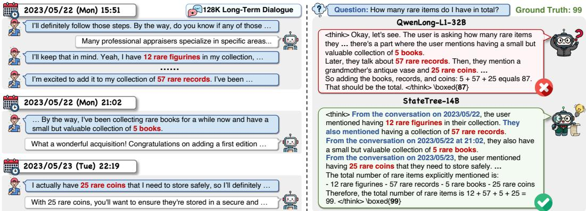
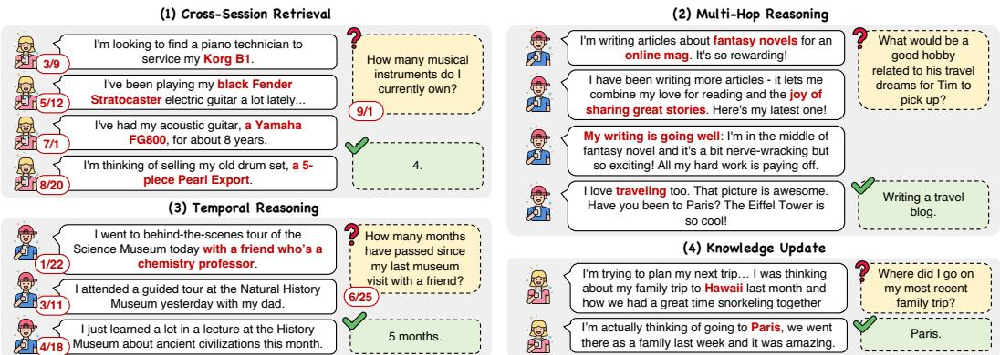
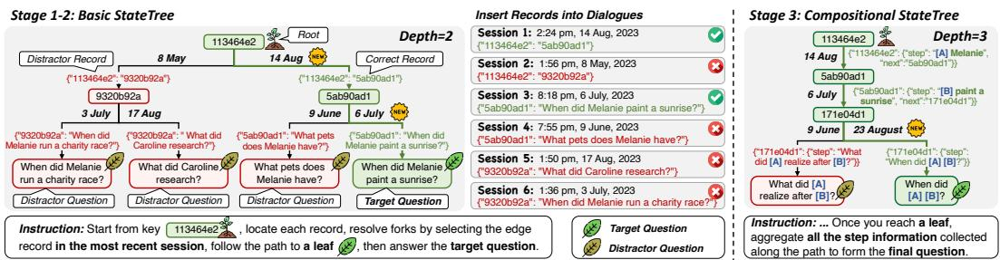
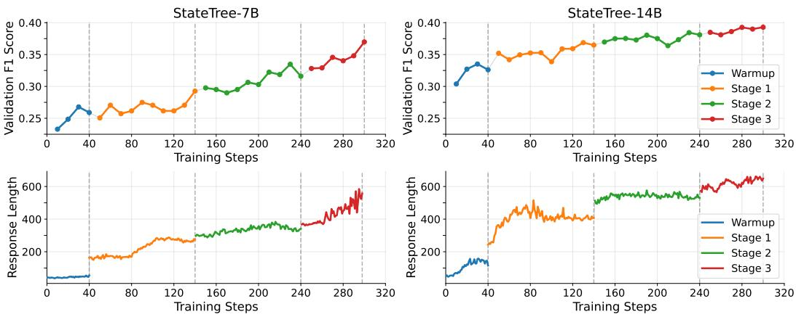
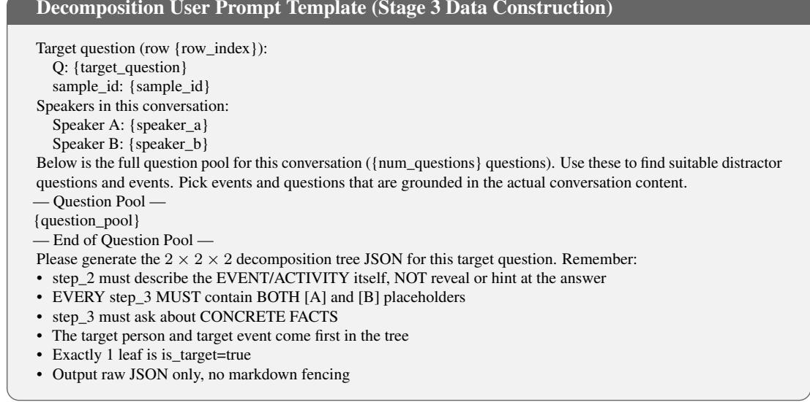
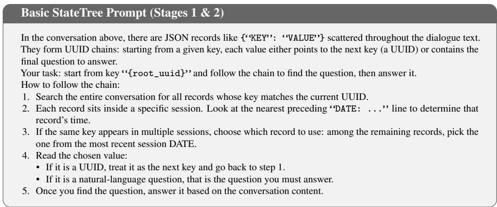
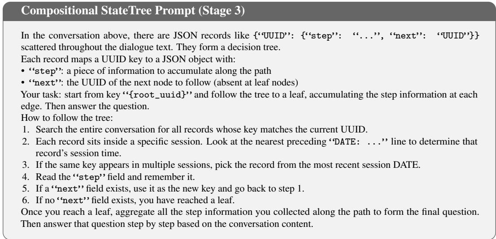
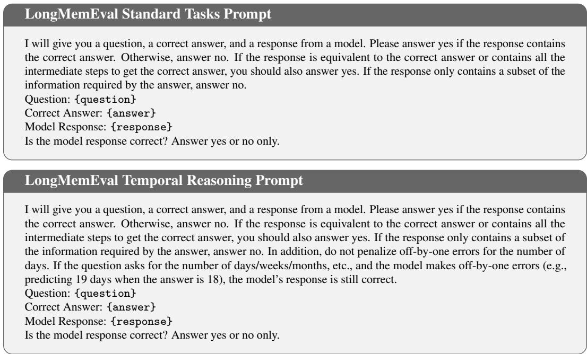

# StateTree: Enhancing Long-Term Dialogue Reasoning via Reinforcement Learning

Naen Xu1,2∗ Wanqing Cui2∗ Yibo Hu2† Shixin Hong2 Hengyu An1 Meiguang Jin2 Junfeng Ma2 Tianyu Du1‡ 1Zhejiang University 2Taobao & Tmall Group of Alibaba {xunaen, anhengyu, zjradty}@zju.edu.cn {cuiwanqing.cwq, boxuan.hyb, hongshixin.hsx}@taobao.com {meiguang.jmg, jack.majf}@taobao.com

## Abstract

Large language models deployed as personalized assistants must reason over long, evolving interaction histories. However, in long-term dialogue reasoning, relevant evidence is scattered across sessions, preferences may be revised over time, and standard long-context training fails to address these challenges under data scarcity and prohibitive computational costs. We propose StateTree, a data-driven RL method that constructs a challenging auxiliary task from scarce dialogues with verifiable ground truth. StateTree augments multi-session dialogues with a treestructured path-tracing task: key-value records are embedded across sessions to form a binary tree. Solving the task requires the model to traverse from root to leaf by retrieving records across sessions and comparing timestamps to resolve branches, then recover the hidden target question among distractor leaves. We apply curriculum RL training progressively increasing tree depth and introduce a compositional variant whose edges carry step-level reasoning fragments, training the model to compose partial cues into coherent queries. Trained on 10K-token contexts, StateTree generalizes to 128K tokens without full-length RL costs and exhibits capabilities including cross-session retrieval, temporal reasoning, knowledge update, and compositional multi-hop reasoning. StateTree outperforms both SFT and RL-based baselines while preserving short-context general reasoning. StateTree-7B achieves gains up to +23.60% on LongMemEval (128k), and StateTree-14B reaches 59.00% accuracy on LongMemEval, surpassing QwenLong-L1-32B (45.20%)1.

## 1 Introduction

Large Language Models (LLMs) are increasingly deployed as personalized assistants for writing [1, 2], recommendation [3, 4, 5, 6], and consultation [1, 7], while supporting long-term, multi-session dialogues [8]. However, LLMs struggle to leverage personal knowledge accumulated over extended interaction histories [9, 10], leading to degraded accuracy and reduced user satisfaction [11]. While memory-augmented systems [9, 12] improve personalization via compression, indexing, and retrieval over chat histories, they still rely on the backbone LLM’s reasoning ability. Meanwhile, most longcontext research targets static documents [13, 14], treating dialogue history as flat text and failing to adapt to evolving user personas [15, 16]. Long-term dialogue reasoning presents three challenges:

• Data Scarcity (C1): Existing multi-session datasets such as LoCoMo [15] contain only 10 dialogues (1540 QA pairs), and LLM-synthesized dialogues cannot guarantee answer correctness.

  
Figure 1: Model trajectories in multi-session dialogue reasoning. (i) QwenLong-L1-32B gets lost across sessions and misses information. (ii) The StateTree-trained model shows cross-session retrieval, temporal reasoning, knowledge update, and multi-hop reasoning, improving reasoning reliability.

• Complex Dialogue Reasoning (C2): Unlike static documents, long-term dialogues are nonstationary: evidence is scattered across sessions with timestamps, and preferences may be revised later. Answering question requires chaining multiple pieces of evidence, yet LLMs frequently fail at cross-session retrieval, temporal reasoning, knowledge update, and multi-hop composition.

• Prohibitive Computational Cost (C3): Training at near-target context lengths [17, 18] incurs prohibitive compute costs and risks degrading short-context and general reasoning abilities [19, 20].

While synthetic trajectories for SFT [21, 22, 23] mitigate data scarcity (C1), models trained on static traces show limited improvement and often fail to generalize to out-of-distribution datasets. Reinforcement Learning (RL) [24, 25] offers an alternative, yet its effectiveness in long-term dialogue is constrained by the lack of challenging training data with ground truth (C1) and prohibitive costs of long interaction chains (C3). This leads to our central question: How can we elicit robust longterm dialogue reasoning (C2) from extremely scarce data (C1) without prohibitive computational overhead offull-context RL training (C3)?

In response, we introduce StateTree, a data-driven RL pseudo-task that constructs challenging synthetic auxiliary tasks embedded within authentic dialogues. Our key insight is that multi-session dialogue reasoning can be reframed as a path-search problem: relevant evidence forms a navigable structure with temporal constraints and hierarchical dependencies. These patterns can be taught through structured synthetic tasks that provide verifiable ground truth. Concretely, StateTree embeds key-value records into long-term dialogues, transforming limited data into challenging training instances (C1). The same key is placed across multiple sessions with different timestamps, and the linked records form a binary tree. The model must trace a path from root to leaf by comparing timestamps and following the most recent record at each branch point, until the leaf reveals the target question (C2). We apply a curriculum RL strategy that progressively increases tree depth and reasoning complexity; its final stage introduces a Compositional StateTree whose edges carry step-level reasoning fragments that the model must aggregate into a coherent query. By training at contexts of 10K tokens, StateTree avoids the prohibitive cost of full-length RL (C3).

Our experiments show that StateTree substantially improves Qwen2.5-7B-Instruct, Qwen2.5-14B-Instruct and Qwen3-8B on long-term dialogue reasoning. StateTree-14B achieves an average accuracy of 60.91% on LoCoMo, surpassing much larger baselines including QwenLong-L1-32B. Trained on contexts of 10K tokens, StateTree models generalize to long-term conversation reasoning on much longer 128K benchmarks (LongMemEval, PersonaMem-128k), and StateTree preserves short context reasoning abilities. Notably, a qualitative comparison reveals that StateTree-trained models exhibit four emergent reasoning behaviors (cross-session retrieval, temporal reasoning, knowledge update, and multi-hop composition) that directly align with the four challenges encoded in the StateTree design, confirming that the synthetic task successfully imparts targeted reasoning patterns that generalize beyond the training distribution. Our main contributions are:

• We propose StateTree, a data-driven RL pseudo-task that augments scarce multi-session dialogues with tree-structured key-value records, transforming limited data into challenging training instances with verifiable ground truth to enhance long-term dialogue reasoning.

  
Figure 2: Examples of the challenges in multi-turn dialogue. For each example, we show the associated evidence statements on the left and the question with the answer on the right.

• We develop a curriculum RL strategy that progressively increases tree depth and introduces a compositional variant with step-level semantic fragments, enabling stable training and eliciting targeted reasoning behaviors.

• StateTree elicits emergent reasoning behaviors correspond to its task design. Despite training on only 616 examples at 10K tokens, it generalizes to 128K contexts without full-length RL costs, preserves short-context abilities, and matches or exceeds the performance of much larger models.

## 2 Related Work

Evaluating Long-term Multi-Session Dialogues. As LLMs are increasingly deployed as personal ized assistants, understanding their ability to reason over extended interaction histories has become critical. A key finding is that models exhibit a “lost-in-the-middle” effect, with greater difficulty recalling information in the middle of the context [26]. [10] further show that when LLMs take a wrong turn in multi-turn dialogue, they fail to recover. Recently, evaluation has shifted toward more realistic dialogue interactions with sessions ranging from 10K to over 100K tokens. Representative benchmarks include LoCoMo [15], LongMemEval [16], and PersonaMem [27]. These evaluations reveal that even strong models struggle with long-term dialogue reasoning, motivating two lines of work: memory-augmented systems [28] and long-context reasoning methods.

Long-Context Reasoning. Memory-augmented systems [9, 12] externalize memory through compression, indexing, and retrieval, but ultimately depend on the backbone LLM’s ability to reason over retrieved context. Advanced long-context reasoning primarily utilizes synthetic-data SFT [29, 30] and RL [24], both of which are constrained by the biases of static synthetic traces or the base model’s intrinsic reasoning capacity. For example, [29] proposes SEALONG, a self-improvement approach that samples multiple reasoning outputs and selects high-quality traces for SFT or preference alignment. QwenLong-L1 [31] applies RL to extend long reasoning trajectories up to 60K tokens. Inspired by needle-in-a-haystack [32], which measures models’ retrieval ability in extremely long-text settings, LoongRL [33] inserts chains that hide the true question among distracting documents to support advanced long-context reasoning. While these approaches enhance long-context reasoning, they are designed for static documents rather than the non-stationary, multi-session dialogue setting.

## 3 StateTree

As shown in Figure 2, long-term interaction dialogues pose four challenges: (i) Cross-Session Retrieval, which requires precisely locating sparse, relevant evidence scattered across numerous sessions [15]; (ii) Multi-Hop Reasoning, necessitating bridging multiple retrieval steps across sessions and synthesizing the aggregated fragments into a final answer [15, 16]; (iii) Temporal Reasoning, which involves comparing timestamps across sessions to ground events in chronology [16]; and (iv) Knowledge Update, which requires recognizing that the same topic may be discussed at different times and that the most recent information should take precedence [34].

  
Figure 3: The StateTree data construction pipeline. Left: Basic StateTree embeds key-value records across sessions into a tree; the model traverses root-to-leaf to recover the target question. Right: Compositional StateTree augments edges with step-level fragments aggregates into the final question.

Table 1: Mapping between multi-turn dialogue challenges and StateTree design choices.
<table><tr><td>Challenge</td><td>Design in StateTree</td></tr><tr><td>Cross-Session Retrieval</td><td>Edge records distributed evenly across S sessions, preventing positional shortcuts</td></tr><tr><td>Multi-Hop Reasoning</td><td>D-level tree traversal; compositional StateTree requires aggregating step fragments into the question</td></tr><tr><td>Temporal Reasoning</td><td>At each fork, compare session timestamps to determine chronological ordering</td></tr><tr><td>Knowledge Update</td><td>Correct edge is placed in a newer session than the distractor, mirroring real recency preference</td></tr></table>

To overcome these challenges, we propose StateTree, a data-driven RL pseudo-task that constructs challenging synthetic auxiliary tasks embedded within authentic dialogues, targeting the capabilities required for long-term dialogue understanding and providing verifiable ground truth (see Figure 3). It combines (i) a data construction pipeline (Section 3.1) for challenging task generation; and (ii) GRPO with structured curriculum RL training for progressive skill acquisition through increasing tree depth and reasoning complexity, together with a combined reward function using exact match reward to provide clear optimization signals that directly target answer correctness (Section 3.2). These pillars collectively provide a manageable learning path for stable, data-efficient LLM training. Table 1 summarizes how each challenge is addressed by a specific design choice in StateTree.

## 3.1 Data Construction Pipeline

The core challenge in training LLMs for long-term dialogue reasoning is the absence of tasks that demand multi-step reasoning over extended dialogue histories. To address this, we design a datadriven RL pseudo-task with a data construction pipeline that embeds enhanced reasoning challenges directly within authentic multi-session dialogue data.

Base Data. We build upon multi-session dialogue datasets (e.g., LoCoMo [15]) where each sample consists of multiple dialogue sessions between two speakers, each annotated with a timestamp. Each sample is paired with factual QA pairs whose answers can be derived from the dialogue content.

Task Overview. The core of our data construction is StateTree, a complete binary tree of depth D built around a target question-answer pair $( q _ { i } , a _ { i } )$ . The target question $q _ { i }$ is hidden in one leaf node, while all edges are encoded as JSON key-value records scattered across dialogue sessions. Solving the task requires traversing from root to leaf to recover the hidden question and produce $a _ { i }$

Consider a multi-session dialogue $\boldsymbol { S } ~ = ~ \{ s _ { 1 } , \ldots , s _ { S } \}$ , where each session is annotated with a timestamp, paired with a set of questions $\mathcal { Q }$ and their ground-truth answers. For a target question $q _ { i } \in \mathcal { Q }$ with answer $a _ { i } .$ , we construct a StateTree $\tau$ and embed its edges as JSON records throughout the sessions, yielding an augmented dialogue $S ^ { \prime }$ . Each training instance is then a tuple $( S ^ { \prime } , \bar { \mathcal { P } } , a _ { i } )$ the model receives $\bar { \mathcal { S } ^ { \prime } }$ together with an instruction prompt $\mathcal { P }$ specifying the root key $k _ { \mathrm { r o o t } }$ and traversal rules, and must find $q _ { i }$ and produce ${ { a } _ { i } } .$ The design follows three principles, each targeting a specific challenge: (i) the original question $q _ { i }$ is hidden and edge records are distributed across all S sessions, so the model must perform cross-session retrieval to locate them; (ii) at each fork, the correct edge record resides in a more recent session than the distractor, forcing temporal reasoning and knowledge update; (iii) the model must navigate D levels of forks to reach the leaf, then answer the recovered question, exercising multi-hop reasoning. We employ two tree formats: a Basic StateTree whose leaves directly contain questions, and a Compositional StateTree whose edges carry step-level reasoning fragments that must be aggregated to recover the question.

Algorithm 1 Basic StateTree Construction. Algorithm 2 Compositional StateTree Construction.   
Require: $\mathcal { S } = \{ s _ { 1 } , \ldots , s _ { S } \}$ , QA pairs $\mathcal { Q } ,$ depth $D$ Require: $\boldsymbol { S } = \{ s _ { 1 } , \ldots , s _ { S } \}$ , target $( q _ { i } , a _ { i } )$ , depth $D ,$   
Ensure: Augmented dialogue $\bar { \cal S ^ { \prime } } ,$ prompt P, answer $a _ { i }$ axes $\{ A _ { 1 } , \dotsc , A _ { D } \}$   
1: $( q _ { i } , a _ { i } ) \sim \mathcal { Q }$ Ensure: Augmented dialogue ${ \mathbf { } } S ^ { \prime } ,$ prompt ${ \mathcal { P } } ,$ answer $a _ { i }$   
2: Build $\dot { \tau }$ (depth $D ,$ internal nodes $V _ { \mathrm { i n t } } ,$ , leaves $L ) ;$ 1: Build $\bar { \tau }$ (depth $D ,$ , keys $k _ { v } ) ;$ sample target leaf $\ell ^ { * }$   
assign UUID key $k _ { v }$ to each node 2: Decompose $q _ { i }$ via LLM along axes, yielding target   
3: Sample $\ell ^ { * } \in L ;$ set $q _ { \ell ^ { * } } \gets q _ { i }$ and $q _ { \ell } \sim \mathcal { Q } \backslash \{ q _ { i } \}$ step $z _ { ( v , u ) }$ for each edge on the root-to- $\cdot \ell ^ { * }$ path   
for $\hat { \ell } \neq \ell ^ { * }$ 3: Generate distractor steps for all other root-to-leaf   
4: for each $v \in V _ { \mathrm { i n t } }$ with children $u _ { 1 } , u _ { 2 }$ do paths via LLM, differing in $\geq .$ 1 axis   
5: for $j \in \{ 1 , 2 \}$ do 4: for each internal node v with children $u _ { 1 } ,$ u2 do   
6: if $u _ { j } \in V _ { \mathrm { i n t } }$ then 5: for $j \in \{ 1 , 2 \}$ do   
7: $\check { r _ { j } } \gets \{ k _ { v } : k _ { u _ { j } } \}$ 6: if $u _ { j } \notin L$ then   
8: else 7: $r _ { j } \gets \{ k _ { v } : \{ \mathsf { s t e p } : z _ { ( v , u _ { j } ) } ,$ next : $k _ { u _ { j } } \} \}$   
9: $r _ { j } \gets \{ k _ { v } : q _ { u _ { j } } \}$ 8: else   
10: end if 9: $r _ { j } \gets \{ k _ { v } : \{ \mathsf { s t e p } : z _ { ( v , u _ { j } ) } \} \}$   
11: end for 10: end if   
12: if v on root-to-ℓ∗ path then 11: end for   
13: $u _ { \mathrm { c o r r } } \gets \mathrm { o n }$ -path child, udist ← sibling 12: if v on root-to- ${ \boldsymbol { \cdot } } { \boldsymbol { \ell } } ^ { * }$ path then   
14: Pick $s _ { a } , s _ { b } \in \textit { s }$ with timestamp(sb) > 13: $u _ { \mathrm { c o r r } }  \mathrm { o n - } \mathrm { I }$ ath child, $u _ { \mathrm { d i s t } }  \mathrm { s i b l i n g }$   
timestam $) ( s _ { a } )$ 14: Pick $s _ { a } , s _ { b } \in \textit { s }$ with timestamp(sb) >   
15: Assign $r _ { \mathrm { { c o r r } } }$ to $s _ { b }$ and $r _ { \mathrm { d i s t } } \mathrm { t o } \ s _ { a }$ timestam $) ( s _ { a } )$   
16: else 15: Assign $r _ { \mathrm { { c o r r } } }$ to $^ { s _ { b } }$ and $r _ { \mathrm { d i s t } }$ to $s _ { a }$   
17: Assign $r _ { 1 } , r _ { 2 }$ to distinct sessions evenly 16: else   
18: end if 17: Assign $r _ { 1 } , r _ { 2 }$ to distinct sessions evenly   
19: end for 18: end if   
20: Insert all records at sentence boundaries $ S ^ { \prime }$ 19: end for   
21: $\mathcal { P }  \mathrm { P R O M P T } ( k _ { \mathrm { r o o t } } .$ , traversal rules); 20: Insert all records at sentence boundaries $ S ^ { \prime }$   
22: return $( S ^ { \prime } , \mathcal { P } , a _ { i } )$ 21: $\mathcal { P } {  } \mathrm { P R O M P T } ( k _ { \mathrm { r o o t } } ,$ traversal and composition rules)   
22: return $( S ^ { \prime } , \dot { \mathcal { P } } , a _ { i } )$

Basic StateTree. The Basic StateTree $\tau$ is a complete binary tree of depth D. Each node is identified by a unique key—a randomly generated UUID string $\mathrm { \hat { e } . g . , \vec { f } 3 9 1 e 9 4 5 - \cdot \cdot \cdot \mathcal { O } b \vec { t } }$ bcecd4b90d) carrying no semantic meaning, forcing the model to perform explicit lookup-and-follow operations rather than content-based shortcuts. Each of the $2 ^ { \overset { \cdot } { D } } - 1$ internal nodes has exactly two outgoing edges, encoded as JSON key-value records $( \mathrm { e . g . , \ } \{ ^ { \wedge \ast } k _ { i } { ^ { \flat } } \colon \ ^ { \wedge } k _ { j } { ^ { \flat } } \} )$ The $2 ^ { D }$ leaf nodes each contain a natural-language question: exactly one holds the target question $q _ { i } ;$ the rest hold distractor questions sampled from $\mathsf { \bar { Q } } \dot { \varrho } _ { \dot { i } } \mathsf { \bar { g } }$ , ensuring all leaf questions are plausible and answerable from $\hat { S ^ { \prime } }$ , so the model cannot bypass tree navigation by simply selecting the most relevant-sounding question. There exists a unique correct path $k _ { \mathrm { r o o t } }  k _ { 2 }  \cdot \cdot \cdot  k _ { D }  q _ { i }$ from the root to the target leaf. The tree contains $2 ( \hat { 2 ^ { D } } - 1 )$ edge records in total, all scattered across the dialogue sessions.

For each internal node on the correct path, its correct and distractor edge records are placed in different sessions, with the correct record always in the more recent one to force the model to perform temporal discrimination by comparing session timestamps to identify the most recent record. All edge records are inserted at sentence boundaries and distributed evenly across sessions to blend naturally into the dialogue flow. Algorithm 1 formalizes the construction of a Basic StateTree. The pipeline first builds a complete binary tree and scatters its edges across the dialogue sessions, then generates an instruction prompt that asks the model to traverse the tree and answer the recovered question. An example instance is provided in Appendix E.

Compositional StateTree. While the Basic StateTree trains cross-session retrieval, temporal reasoning, and knowledge update, the model never needs to compose information gathered along the path, which is a critical aspect of multi-hop reasoning. Thus, we introduce the Compositional StateTree, a D-level binary tree whose edges carry structured step information instead of bare key pointers. Concretely, given the target question $q _ { i }$ for a dialogue between two speakers, we use an LLM (prompt in Appendix C.4.1) to decompose $q _ { i }$ into a $. 2 \times \bar { 2 } \times 2$ hierarchy along three semantic axes, which define the levels of a depth-3 binary tree with 8 leaves. Each edge carries a step field that provides a reasoning fragment at the corresponding level:

• Person selection (Level 1): which speaker is relevant to the dialogue, $\mathrm { e . g . , } \ ^ { 6 6 } [ \mathrm { A } ]$ Jon”

• Event category (Level 2): which broad type of activity is involved, $\mathrm { { e . g . , } ^ { \ 6 6 } [ B ] }$ expanding his studio’s social media presence”

• Question specificity (Level 3): the precise question detail, e.g., “When did [A] start $[ \tt B ] ? ^ { \prime \prime }$

The LLM generates alternative combinations along each axis for the remaining 7 leaves, producing distractor questions that share partial semantic overlap with $q _ { i }$ but differ in at least one axis. Each edge record is encoded as a nested JSON object $\{ { ^ { * } k _ { i } } { ^ { ; \prime } } \colon \quad \{ { ^ { * } { * } } \mathrm { { \dot { s t e p } } } ^ { ; \prime } \colon \quad { ^ { * } { < } \dots } , { ^ { ; \prime } } , { ^ { * } } \mathrm { { \dot { \Omega } } } \mathrm { { \Omega } } \mathrm { { \dot { \Omega } } } \mathrm { { \Omega } } \mathrm { { \dot { \Omega } } } \mathrm { { \Omega } } \mathrm { { \dot { \Omega } } } \mathrm { { \Omega } } \mathrm { { \dot { \Omega } } } \mathrm { { \Omega } } \mathrm { { \dot { \Omega } } } \mathrm { { \Omega } } \mathrm { { \dot { \Omega } } } \mathrm { { \Omega } } \mathrm { { \dot { \Omega } } } \mathrm { { \Omega } } \mathrm { { \dot { \Omega } } } \mathrm { { \Omega } } \mathrm { { \dot { \Omega } } } \mathrm { { \Omega } } \mathrm { { \dot { \Omega } } } \mathrm { { \Omega } } \mathrm { { \dot { \Omega } } } \mathrm { { \Omega } } \mathrm { { \Omega } } \mathrm { { \dot { \Omega } } } \mathrm { { \Omega } } \mathrm { { \Omega } } \mathrm { { \dot { \Omega } } } \mathrm { { \Omega } } \mathrm { { \Omega } } \mathrm { { \Omega } } \mathrm { { \Omega } } \mathrm { { \Omega } } \mathrm { { \Omega } } \mathrm { { \Omega } } \mathrm { { \Omega } } \mathrm { { \Omega } } \mathrm { { \Omega } } \mathrm { { \Omega } } \mathrm { { \Omega } } \mathrm { { \Omega } } \mathrm { { \Omega } } \mathrm { { \Omega } } \mathrm { { \Omega } } \mathrm { { \Omega } } \mathrm { { \Omega } } \mathrm { { \Omega } } \mathrm { { \Omega } } \mathrm { { \Omega } } \mathrm { { \Omega } } \mathrm { { \Omega } } \mathrm { { \Omega } } \mathrm { { \Omega } } \mathrm { { \Omega } } \mathrm { { \Omega } } \mathrm { { \Omega } } \mathrm { { \Omega } } \mathrm { { \Omega } } \mathrm { { \Omega } } \mathrm { { \Omega } } \mathrm { { \Omega } } \mathrm { { \Omega } } \mathrm { { \Omega } } $ for internal edges, or $\{ { } ^ { \mathfrak { c } \mathfrak { c } } k _ { i } { } ^ { , , , } \colon \quad \{ { } ^ { \mathfrak { c } \mathfrak { c } } \mathtt { s t e p } ^ { , , } \colon { } ^ { \mathfrak { c } \mathfrak { c } } \ldots { } ^ { , , } \} \}$ for leaf edges (no next field). Algorithm 2 formalizes the construction of a Compositional StateTree, and examples are provided in Appendix E.

The model must (i) navigate the tree using the same temporal discrimination as the Basic StateTree; (ii) accumulate the step fragments along the correct root-to-leaf path; and (iii) aggregate them into the final question before answering it based on the dialogue content.

## 3.2 Long-Context Multi-turn Dialogue Reinforcement Learning

We adopt GRPO [25] with curriculum RL training and a combined reward function.

Curriculum RL Training. Training directly on high-depth trees is difficult for LLMs and often leads to instability. We therefore adopt a four-stage curriculum that gradually increases task difficulty.

• Warmup: Direct Dialogue QA. We first warm up the model with RL on the original dialogue QA data, establishing basic long-context comprehension before introducing tree-structured tasks.

• Stage 1: Basic StateTree $\left( D { = } 2 \right)$ . We introduce the Basic StateTree at depth $D { = } 2$ (4 leaves, 6 edge records scattered across sessions), requiring the model to perform cross-session retrieval and temporal discrimination as fundamental skills to reach the target leaf.

• Stage 2: Basic StateTree $\left( D { = } 3 \right)$ . We increase the depth to $D { = } 3$ (8 leaves, 14 edge records), adding an additional hop that forces the model to strengthen multi-hop reasoning.

• Stage 3: Compositional StateTree $\left( D { = } 3 \right)$ . Stage 3 replaces the Basic StateTree with the Compositional StateTree, adding the compositional skill of accumulating step fragments along the correct path and aggregating them into the final question before answering.

Combined Reward. Training with a single reward source is suboptimal: exact-match (EM) reward is overly rigid and rejects semantically correct answers that differ in surface form, while LLMas-a-Judge suffers from scoring inconsistency and higher computational overhead (see ablation in Table 8). To provide a stable and semantically faithful optimization signal, we assign the reward $r _ { i }$ via a combined function that integrates rule-based verification with LLM-as-a-Judge [31]. We explicitly require the model to output its final answer within \boxed{...} in the training prompt (Appendix D), ensuring the extraction of an unambiguous answer $y _ { \mathrm { a n s } }$ . Formally, given question x, extracted answer $y _ { \mathrm { a n s } }$ , and ground-truth answer $y _ { \mathrm { g o l d } }$ , the reward is defined as:

$$
r _ { \phi } ( x , y ) = \mathrm { { m a x } } \left( r _ { \mathrm { E M } } ( y _ { \mathrm { a n s } } = y _ { \mathrm { g o l d } } ) , \ r _ { \mathrm { L L M } } ( x , y _ { \mathrm { a n s } } , y _ { \mathrm { g o l d } } ) \right)\tag{1}
$$

where $r _ { \mathrm { E M } } ( \cdot )$ is the indicator function enforcing exact string matching, and $r _ { \mathrm { L L M } } ( \cdot ) \in \{ 0 , 1 \}$ is a binary semantic equivalence score produced by a Qwen2.5-1.5B-Instruct [35]. The judge operates at temperature 0 with prompt templates (Appendix D.6.1) to guarantee deterministic outputs.

## 4 Experiments

## 4.1 Experimental Setup

Training Setup. We run experiments on Qwen2.5-7B-Instruct [35], Qwen2.5-14B-Instruct [35], and Qwen3-8B [36]. We use GRPO with group size 8, prompt batch size 64 for 7B and 8B models and 32 for 14B model, learning rate $1 \times 1 0 ^ { - 6 }$ , gradient clipping 1.0, and KL penalty $\beta { = } 0 . 0 0 1$ . Rollouts are sampled with temperature 0.6 and top-p=0.95, with a maximum output length of 4,096 tokens. The curriculum consists of four stages: warm-up (40 steps), Stage 1 (100 steps), Stage 2 (100 steps), and Stage 3 (60 steps). To prevent catastrophic forgetting of general reasoning capabilities, we mix 2,500 samples from the DAPO-Math dataset [37] into Stage 3. The warm-up stage uses the 616 training samples in the original direct QA format without trees; Stage 1–3 augment the same 616 samples with StateTree. The 770 test samples and 154 validation samples both retain the original direct QA format without any StateTree augmentation. All models are trained on 32×H20 GPUs.

Table 2: Main results on the LoCoMo benchmark across different task dimensions.
<table><tr><td rowspan="2">Model</td><td colspan="3">Multi Hop</td><td colspan="3">Temporal</td><td colspan="3">Open Domain</td><td colspan="3">Single Hop</td><td colspan="3">Average</td></tr><tr><td>ACC</td><td>F1</td><td>BLEU</td><td>ACC</td><td>F1</td><td>BLEU</td><td>ACC</td><td>F1</td><td>BLEU</td><td>ACC</td><td>F1</td><td>BLEU</td><td>ACC</td><td>F1</td><td>BLEU</td></tr><tr><td>GPT-40</td><td>68.84</td><td>32.25</td><td>23.10</td><td>14.47</td><td>10.25</td><td>10.45</td><td>30.00</td><td>18.47</td><td>16.80</td><td>64.54</td><td>49.34</td><td>40.19</td><td>52.73 36.20</td><td></td><td>29.47</td></tr><tr><td>QwenLong-L1-32B</td><td>64.49</td><td>29.53</td><td>22.27</td><td>34.59</td><td>24.35</td><td>20.19</td><td>48.00</td><td>29.43</td><td>27.02</td><td>44.68</td><td>30.37</td><td>26.20</td><td>46.36 28.92</td><td></td><td>24.31</td></tr><tr><td>R1-Distill-Qwen-32B</td><td>70.29</td><td>26.80</td><td>17.45</td><td>33.33</td><td>15.98</td><td>12.35</td><td>52.00</td><td>25.19</td><td>20.98</td><td>52.01</td><td>23.04</td><td>18.00</td><td>51.43</td><td>22.40</td><td>16.93</td></tr><tr><td>Qwen2.5-7B-Instruct</td><td>63.77</td><td>21.34</td><td>15.23</td><td>23.90</td><td>12.67</td><td>10.58</td><td>50.00</td><td>16.88</td><td>14.08</td><td>44.92</td><td>21.96</td><td>17.72</td><td>44.29</td><td>19.60</td><td>15.56</td></tr><tr><td>SEALONG-7B</td><td>63.77</td><td>27.50</td><td>20.65</td><td>20.75</td><td>15.16</td><td>11.72</td><td>48.00</td><td>25.80</td><td>23.53</td><td>47.99</td><td>32.01</td><td>28.38</td><td>45.19</td><td>927.32</td><td>23.24</td></tr><tr><td>LoongRL-7B</td><td>60.87</td><td>28.84</td><td>19.53</td><td>25.16</td><td>18.25</td><td>15.08</td><td>56.00</td><td>23.56</td><td>19.68</td><td>47.99</td><td>32.92</td><td>28.41</td><td>46.10</td><td>28.55</td><td>23.50</td></tr><tr><td>RL-MemAgent-7B</td><td>64.49</td><td>30.62</td><td>21.88</td><td>31.45</td><td>16.36</td><td>12.31</td><td>46.00</td><td>26.26</td><td>22.41</td><td>49.14</td><td>32.75</td><td>27.07</td><td>48.03</td><td>28.56</td><td>22.79</td></tr><tr><td>StateTree-7B</td><td>64.49</td><td>31.20</td><td>25.38</td><td>32.70</td><td>33.97</td><td>29.36</td><td>56.00</td><td>36.11</td><td>32.31</td><td>50.35</td><td>36.00</td><td>32.18</td><td>49.61</td><td>34.73</td><td>30.39</td></tr><tr><td>Qwen2.5-14B-Instruct</td><td>67.39</td><td>31.98</td><td>24.07</td><td>34.59</td><td>14.53</td><td>11.17</td><td>62.00</td><td>27.31</td><td>23.83</td><td>47.04</td><td>34.32</td><td>30.16</td><td>49.09</td><td>29.36</td><td>24.74</td></tr><tr><td>SEALONG-14B</td><td>69.57</td><td>35.64</td><td>25.65</td><td>32.70</td><td>15.85</td><td>12.95</td><td>58.00</td><td>26.37</td><td>22.08</td><td>47.28</td><td>32.73</td><td>28.76</td><td>48.96</td><td>29.36</td><td>24.50</td></tr><tr><td>LoongRL-14B</td><td>69.57</td><td>33.20</td><td>25.82</td><td>37.74 20.53</td><td></td><td>23.25</td><td>62.00</td><td>34.14</td><td>31.10</td><td>52.25</td><td>35.76</td><td>30.25</td><td>52.99</td><td>32.05</td><td>28.07</td></tr><tr><td>RL-MemAgent-14B</td><td>67.39</td><td>31.96</td><td>25.01</td><td>37.11</td><td>14.55</td><td>11.13</td><td>60.00</td><td>33.04</td><td>30.10</td><td>50.59</td><td>34.62</td><td>29.39</td><td>51.43</td><td>29.90</td><td>24.88</td></tr><tr><td>StateTree-14B</td><td>75.36</td><td>38.40</td><td>27.90</td><td>41.51</td><td>40.72</td><td>33.56</td><td>66.00</td><td>39.65</td><td>37.18</td><td>62.88</td><td>38.37</td><td>33.26</td><td>60.91</td><td>38.94</td><td>32.62</td></tr><tr><td>Qwen3-8B</td><td>64.49</td><td>31.32</td><td>22.13</td><td>29.56</td><td>18.91</td><td>15.31</td><td>48.00</td><td>21.4</td><td>18.55</td><td>43.03</td><td>26.37</td><td>23.02</td><td></td><td>43.64 25.39</td><td>20.98</td></tr><tr><td>StateTree-8B</td><td>70.29</td><td>36.07</td><td>25.58</td><td>37.74 31.78</td><td></td><td>29.25</td><td>56.00</td><td>36.36</td><td>33.08</td><td>51.06</td><td>36.75</td><td>31.89</td><td></td><td>52.08 35.58</td><td>30.29</td></tr></table>

Table 3: OOD generalization accuracy (%) on LongMemEval and PersonaMem-128k benchmarks.
<table><tr><td rowspan="2">Model</td><td colspan="7">LongMemEval (128k)</td><td colspan="8">PersonaMem (128k)</td></tr><tr><td>Temp.</td><td>Multi- Ses.</td><td>Know. Upd.</td><td>SS- User</td><td>SS- Asst.</td><td>SS- Pref.</td><td>Avg.</td><td>Latest Pref.</td><td>New Scen.</td><td>Align. Rec.</td><td>Shared Fact</td><td>Revisit Reas.</td><td>New Idea</td><td>Track Evol.</td><td>Avg.</td></tr><tr><td>QwenLong-L1-32B</td><td>47.37</td><td>35.34</td><td>56.41</td><td>80.00</td><td>67.86</td><td>23.33</td><td>51.00</td><td>57.51</td><td>48.83</td><td>47.56</td><td>66.08</td><td>81.04</td><td>25.48</td><td>58.06</td><td>52.40</td></tr><tr><td>R1-Distill-Qwen-32B</td><td>21.80</td><td>13.53</td><td>50.00</td><td>34.29</td><td>57.14</td><td>10.00</td><td>29.00</td><td>33.03</td><td>21.60</td><td>33.52</td><td>36.84</td><td>63.57</td><td>22.39</td><td>66.57</td><td>37.62</td></tr><tr><td>Qwen2.5-7B-Instruct SEALONG-7B</td><td>20.30 28.57</td><td>8.27 28.57</td><td>52.56 64.10</td><td>25.71 75.71</td><td>37.50 76.79</td><td>3.33 16.67</td><td>23.80 45.40</td><td>37.41 37.99</td><td>36.15 39.44</td><td>45.56 46.99</td><td>47.95 47.37</td><td>62.08 64.68</td><td>15.64 16.80</td><td>62.76 63.64</td><td>40.48 41.66</td></tr><tr><td>LoongRL-7B</td><td>24.06</td><td>5.26</td><td>55.13</td><td>37.14</td><td>42.86</td><td>3.33</td><td>26.60</td><td>29.56</td><td>23.00</td><td>39.83</td><td>35.09</td><td>41.26</td><td>21.81</td><td>37.54</td><td>31.39</td></tr><tr><td>RL-MemAgent-7B</td><td>28.57</td><td>17.29</td><td>58.97</td><td>78.57</td><td>76.79</td><td>13.33</td><td>41.80</td><td>43.07</td><td>33.33</td><td>45.27</td><td>49.12</td><td>65.06</td><td>23.17</td><td>62.46</td><td>43.78</td></tr><tr><td>StateTree-7B</td><td>29.32</td><td>31.58</td><td>67.95</td><td>75.71</td><td>76.79</td><td>23.33</td><td>47.40</td><td>46.42</td><td>39.91</td><td>51.00</td><td>49.71</td><td>68.03</td><td>23.36</td><td>69.21</td><td>47.30</td></tr><tr><td>Qwen2.5-14B-Instruct</td><td></td><td></td><td></td><td></td><td></td><td></td><td></td><td></td><td></td><td></td><td></td><td></td><td></td><td></td><td></td></tr><tr><td>SEALONG-14B</td><td>37.59</td><td>27.82</td><td>67.95</td><td>65.71</td><td>66.07</td><td>10.00</td><td>45.20</td><td>43.76</td><td>38.03</td><td>52.15</td><td>57.31</td><td>68.03</td><td></td><td>18.3464.52</td><td>45.40</td></tr><tr><td></td><td>40.60</td><td>30.08</td><td>67.95</td><td>72.86</td><td>66.07</td><td>13.33</td><td>47.80</td><td>45.84</td><td>38.97</td><td>51.29</td><td>61.40</td><td>68.77</td><td>15.44</td><td>66.28</td><td>46.02</td></tr><tr><td>LoongRL-14B</td><td>40.60</td><td>36.84</td><td>69.23</td><td>81.43</td><td>89.29</td><td>23.33</td><td>54.20</td><td>48.15</td><td>40.85</td><td>56.16</td><td>60.23</td><td>68.77</td><td>18.15</td><td>67.16</td><td>48.07</td></tr><tr><td>RL-MemAgent-14B</td><td>42.11</td><td>29.32</td><td>67.95</td><td>85.71</td><td>82.14</td><td>20.00</td><td>52.00</td><td>47.69</td><td>39.44</td><td>53.30</td><td>60.82</td><td>71.00</td><td>21.04</td><td>66.28</td><td>48.15</td></tr><tr><td>StateTree-14B</td><td>42.11</td><td>48.12</td><td>70.51</td><td>87.14</td><td>85.71</td><td>36.67</td><td>59.00</td><td>51.62</td><td>46.48</td><td>59.89</td><td>64.33</td><td>77.32</td><td>23.55</td><td>70.09</td><td>52.59</td></tr><tr><td>Qwen3-8B</td><td>35.34</td><td>39.10</td><td>66.67</td><td>72.86</td><td>69.64</td><td>16.67</td><td>49.20</td><td>53.81</td><td>39.44</td><td>37.82</td><td>48.54</td><td>69.52</td><td>16.60</td><td>58.36</td><td>45.36</td></tr><tr><td>StateTree-8B</td><td>41.00</td><td>47.47</td><td>78.21</td><td>85.45</td><td>83.93</td><td>26.09</td><td>58.66</td><td>58.31</td><td>46.95</td><td>41.26</td><td>46.78</td><td>72.86</td><td>21.04</td><td>69.79</td><td>50.31</td></tr></table>

Evaluation Benchmarks. We evaluate models across two dimensions. (i) Long-term conversation reasoning. We use LoCoMo [15] as the in-domain (ID) benchmark, and LongMemEval [16] and PersonaMem [27] as out-of-distribution (OOD) benchmarks to test generalization across unseen domains and extended contexts (10K–128K tokens). We follow official protocols: LoCoMo reports LLM-judged accuracy (evaluated by GPT-4o), token-level F1, and BLEU-1; LongMemEval reports LLM-judged accuracy (evaluated by GPT-4o); PersonaMem reports exact-match accuracy. (ii) General short-context reasoning. To verify that our long-context RL training does not induce catastrophic forgetting or degrade foundational reasoning, we additionally evaluate on standard short-context benchmarks: MMLU [38], MATH-500 [39], and IFEval [40]. All evaluations share a unified inference setup, i.e., temperature 0.6, with up to 128K input tokens and 4096 output tokens.

Baselines. We compare our StateTree-trained models against: (i) leading frontier models and long-context reasoning models, including GPT-4o [41], QwenLong-L1-32B [31], and R1-Distill-Qwen-32B [24]; (ii) memory-augmented models that enhance long-context reasoning, including the SFT-based method SEALONG [29] and RL-based methods LoongRL [33] and RL-MemAgent [42].

## 4.2 Main Results

StateTree improves long-term dialogue reasoning with high data efficiency. As shown in Table 2, StateTree delivers consistent performance gains over both SFT and standard RL baselines across parameter scales and base architectures on LoCoMo. StateTree-14B achieves 60.91% average accuracy, yielding a +11.82% absolute improvement over its base model (Qwen2.5-14B-Instruct), while maintaining stable relative gains at the 7B scale. Notably, despite training on only 616 examples, it matches or exceeds the absolute performance of substantially larger models (e.g., surpassing GPT-4o by 8.18% and QwenLong-L1-32B by 14.55%), underscoring its high sample efficiency. The most pronounced lift occurs in Temporal reasoning (F1 +26.19 for 14B), which directly stems from the tree structure’s explicit timestamp comparison at each branching step.

  
Figure 4: Reasoning F1 score and response lengths throughout RL training on the validation set.

Robust out-of-distribution and length generalization. To evaluate out-ofdistribution generalization, we evaluate StateTree on LongMemEval [16] and PersonaMem-128k [27]. Trained exclusively on 10K-token contexts, State-Tree generalizes to unseen benchmarks with up to 128K tokens. As shown in Table 3, StateTree-14B achieves 59.00% on LongMemEval and 52.59% on PersonaMem-128k, outperforming

Table 4: Average accuracy (%) across context lengths.
<table><tr><td rowspan="2">Model</td><td>LoCoMo</td><td colspan="2">PersonaMem</td><td>LongMemEval</td></tr><tr><td>10K</td><td>32K</td><td>128K</td><td>128K</td></tr><tr><td>Qwen2.5-7B-Instruct</td><td>44.29</td><td>53.14</td><td>40.48</td><td>23.80</td></tr><tr><td rowspan="2">StateTree-7B Qwen2.5-14B-Instruct49.09</td><td>49.61+5.32</td><td>61.29+8.15</td><td>47.30+6.82</td><td>47.40+23.60</td></tr><tr><td></td><td>58.91</td><td>45.40</td><td>45.20</td></tr><tr><td>StateTree-14B</td><td>60.91+11.82</td><td>64.52+5.61</td><td>52.59+7.19</td><td>59.00+13.80</td></tr><tr><td>Qwen3-8B</td><td>43.64</td><td>58.23</td><td>45.36</td><td>49.20</td></tr><tr><td>StateTree-8B</td><td>52.08+8.44</td><td>62.82+4.59</td><td>50.31+4.95</td><td>58.66+9.46</td></tr></table>

both base models and strong baselines including QwenLong-L1-32B and RL-MemAgent-14B. The widening performance gap at longer contexts (Table 4) demonstrates that the learned path-tracing strategy extrapolates effectively beyond the 10K training horizon, validating our curriculum design as an alternative to prohibitive full-length RL costs (C3).

StateTree preserves short-context abilities without capability trade-offs. A common concern with long-context RL is the degradation of general reasoning. As shown in Table 5, State-Tree maintains competitive performance across standard short-context benchmarks (MMLU, MATH, IFEval). Notably, the 8B variant exhibits zero degradation, achieving a marginal +0.1% average gain over the base Qwen3-8B, while the 7B and 14B models incur minimal drops of only -0.2% and -0.6%, respectively.

Table 5: Short-context reasoning performance (%).
<table><tr><td>Model</td><td>MMLU</td><td>MATH</td><td>IFEval</td><td>Avg.</td></tr><tr><td>Qwen2.5-7B-Instruct StateTree-7B</td><td>73.4 73.5+0.10</td><td>76.0 76.0+0.00</td><td>71.2 70.5-0.70</td><td>73.5 73.3-0.20</td></tr><tr><td>Qwen2.5-14B-Instruct StateTree-14B</td><td>79.4 79.8+0.40</td><td>83.4 83.0-0.40</td><td>81.0 79.3-1.70</td><td>81.3 80.7-0.60</td></tr><tr><td>Qwen3-8B</td><td>76.9</td><td>78.2</td><td>85.0</td><td>80.0</td></tr><tr><td>StateTree-8B</td><td>77.0+0.10</td><td>78.1-0.10</td><td>85.2+0.20</td><td>80.1+0.10</td></tr></table>

## 4.3 Analysis

Multi-stage curriculum RL training sustains improvements. As shown in Figure 4, the average F1 score on the validation set rises monotonically across training stages, and the average response length steadily increases alongside it, indicating that the model learns to produce detailed reasoning traces as task complexity increases. The sustained growth in both metrics with no sign of reward hacking confirms that the combined reward provides a stable training signal and that the multi-stage curriculum effectively scales model reasoning.

Emergent reasoning behaviors align with task design. Qualitative analysis (Figure 1 in Section 1 and Appendix K) reveals four emergent behaviors that directly explain the quantitative gains: (i) Cross-session retrieval. Rather than stopping at the first matching session, StateTree enumerates all relevant records across sessions before aggregating a complete answer. (ii) Multi-hop reasoning. Rather than identifying isolated facts, StateTree chains multiple retrieval steps and synthesizes scattered evidence into a coherent inference. (iii) Temporal reasoning. Rather than relying on superficial cues such as “recently,” StateTree extracts concrete session timestamps and performs explicit chronological comparison at each fork. (iv) Knowledge update. Rather than conflating old and new mentions, StateTree correctly tracks the latest state by privileging information from more recent sessions. These behaviors arise from the StateTree pseudo-task design, confirming that our auxiliary training signal successfully imparts targeted reasoning patterns that can transfer beyond the training distribution.

## 4.4 Ablation Study

Every curriculum stage contributes. Table 6 ablates each stage individually, where the omitted stage is skipped and the remaining stages retain their original step allocations. Removing Stage 1 $\left( D { = } 2 \right)$ causes the largest drop (-4.93), confirming that shallow tree navigation is the most critical founda-

Table 6: Curriculum stage ablation.
<table><tr><td>Variant</td><td colspan="3">LoCoMo LongMemEval PersonaMem</td></tr><tr><td>StateTree-7B (full)</td><td>49.61</td><td>47.40</td><td>47.30</td></tr><tr><td>w/o warm-up</td><td> $4 5 . 1 9 _ { - 4 . 4 2 }$ </td><td> $4 3 . 0 0  – 4 . 4 0 $ </td><td> $4 4 . 0 0 { - 3 . 3 0 }$ </td></tr><tr><td>w/o Stage  $1 \ ( D { = } 2 )$ </td><td> $4 4 . 6 8 – 4 . 9 3$ </td><td> $4 2 . 6 0  – 4 . 8 0$ </td><td> $4 3 . 7 8 \substack { - 3 . 5 2 }$ </td></tr><tr><td>w/o Stage  $2 \ : ( D { = } 3 )$ </td><td> $4 6 . 2 3 \substack { - 3 . 3 8 }$ </td><td> $4 4 . 2 0 – 3 . 2 0$ </td><td> $4 5 . 1 0 \substack { - 2 . 2 0 }$ </td></tr><tr><td>w/o Stage 3 (Compositional)</td><td> $4 6 . 7 5 _ { - 2 . 8 6 }$ </td><td> $4 4 . 8 0 \AA 2 . 6 0$ </td><td> $4 5 . 5 1 \AA { - } 1 . 7 9$ </td></tr></table>

tional skill. Removing warm-up follows (−4.42), showing that grounding in basic conversation QA is essential before tree tasks. Removing Stage $2 \ : ( D { = } 3 )$ and Stage 3 (Compositional) degrade performance by -3.38 and -2.86, respectively, indicating their roles in strengthening multi-hop temporal reasoning and enabling compositional reasoning. Appendix H provides a per-category breakdown that further corroborates the curriculum design. This sustained uplift validates our staged design: by progressively introducing foundational comprehension, temporal discrimination, and compositional reasoning, the curriculum enables stable skill accumulation without catastrophic forgetting, effectively distilling transferable long-context primitives from a compact training set.

Table 7: Temporal discrimination ablation.

Task structure drives the training signal. To confirm that StateTree’s efficacy stems from the synergistic integration of keypaired forks, cross-session scattering, and identifier opacity—rather than from merely inserting structured records or prompting longer reasoning, we design four variants to isolate the contribution of each structural design choice (Table 7).

<table><tr><td>Variant</td><td></td><td>LoCoMo LongMemEval PersonaMem</td><td></td></tr><tr><td>Qwen2.5-7B-Instruct</td><td>44.29</td><td>23.80</td><td>40.48</td></tr><tr><td>w/ CoT prompt</td><td>45.19+0.90</td><td>24.60+0.80</td><td>41.11+0.63</td></tr><tr><td>StateTree-7B</td><td>49.61</td><td>47.40</td><td>47.30</td></tr><tr><td>w/ Independent Random Keys</td><td> $4 5 . 4 5 _ { - 4 . 1 6 }$ </td><td> $2 5 . 2 0 – 2 2 . 2 0$ </td><td>41.03-6.27</td></tr><tr><td>w/ Single Session</td><td> $4 7 . 7 9 . 1 . 8 2 $ </td><td> $4 2 . 8 0 \substack { - 4 . 6 0 }$ </td><td>43.96-3.34</td></tr><tr><td>w/ Entity Keys</td><td> $4 8 . 4 4 . 1 . 1 7 $ </td><td> $4 5 . 6 0 \substack { - 1 . 8 0 }$ </td><td> $4 5 . 9 8 \substack { - 1 . 3 2 }$ </td></tr></table>

• w/ CoT prompt: While Figure 4 shows that StateTree training naturally elicits progressively longer reasoning traces, prompting the base model via a modified system prompt (Appendix D.5) that instructs it to “think step by step” yields only marginal gains. This confirms that generic CoT cannot substitute for explicit structural navigation. The core bottleneck lies in unstructured cross-session retrieval and temporal discrimination, not insufficient reasoning depth.

• w/ Independent Random Keys: assigning independent random keys to each fork’s competing edge records eliminates shared identifiers, preventing the model from locating competing records or performing temporal comparison. The resulting performance demonstrates that StateTree’s gains originate specifically from the shared-key mechanism enabling explicit fork resolution, rather than from merely injecting records or arbitrary syntactic noise during RL training.

• w/ Single Session: preserving key pairing but placing all records within one session eliminates cross-session retrieval. The intermediate performance confirms that cross-session distribution and temporal discrimination provide complementary, non-redundant learning signals.

• w/ Entity Keys: replacing random UUIDs with common words from a word pool (Appendix C.7) captures 80% of the full gain. The remaining deficit reveals that semantically interpretable keys invite shallow lexical shortcuts, whereas opaque identifiers force genuine temporal reasoning.

Table 8: Reward function ablation.

Combined reward is critical for stable optimization. Table 8 compares reward designs under identical training settings. The combined reward balances strict correctness with semantic flexibility. EM alone rejects valid paraphrases due to surface-form rigidity, while standalone LLM-Judge suffers from scoring inconsistency and higher

<table><tr><td>Reward</td><td>LoCoMo</td><td>LongMemEval PersonaMem</td><td></td></tr><tr><td>Combined Reward</td><td>49.61</td><td>47.40</td><td>47.30</td></tr><tr><td>Exact Match only</td><td>47.79-1.82</td><td>46.80-0.60</td><td>46.68-0.62</td></tr><tr><td>LLM-as-a-Judge only</td><td>48.70-0.91</td><td> $4 6 . 6 0 \substack { - 0 . 8 0 }$ </td><td>46.75-0.55</td></tr><tr><td>Token-level F1</td><td>47.14-2.47</td><td> $4 5 . 0 0 \substack { - 2 . 4 0 }$ </td><td>45.29-2.01</td></tr><tr><td>Two-way Substr. EM</td><td>44.68-4.93</td><td> $4 2 . 4 0 – 5 . 0 0$ </td><td>43.31-3.99</td></tr><tr><td>ROUGE-L</td><td>42.60-7.01</td><td>39.40-8.00</td><td>41.29-6.01</td></tr></table>

compute overhead. Dense lexical metrics (Token F1, Substring EM) and ROUGE-L underperform by rewarding incorrect partial matches or superficial n-gram overlap. Thus, the max-selection mechanism is essential to provide a dense yet reliable training signal aligned with answer correctness.

## 5 Conclusion

We present StateTree, a data-driven RL pseudo-task that reframes long-term dialogue reasoning as a temporally constrained path-search problem. By embedding tree-structured auxiliary tasks into authentic multi-session dialogues and optimizing them via a structured curriculum with combinedreward GRPO, StateTree elicits cross-session retrieval, temporal reasoning, knowledge update, and compositional multi-hop reasoning from only 616 examples at 10K context. Empirically, it yields substantial gains across both in-domain and out-of-domain benchmarks, even surpassing larger baselines. Crucially, the trained models generalize from 10K to 128K contexts without degrading short-context capabilities and exhibit emergent reasoning behaviors aligned with the StateTree design. StateTree establishes a scalable, data-efficient paradigm for long-term dialogue reasoning.

## Acknowledgments

This work was partly supported by the NSFC under No. 62402418, the “Pioneer and Leading Goose” R&D Program of Zhejiang under No. 2026C02A1233 and 2025C02034, the Key R&D Program of Ningbo under No. 2024Z115, and the Ningbo Yongjiang Talent Project.

## References

[1] Sheshera Mysore, Zhuoran Lu, Mengting Wan, Longqi Yang, Bahareh Sarrafzadeh, Steve Menezes, Tina Baghaee, Emmanuel Barajas Gonzalez, Jennifer Neville, and Tara Safavi. Pearl: Personalizing large language model writing assistants with generation-calibrated retrievers. In Sachin Kumar, Vidhisha Balachandran, Chan Young Park, Weijia Shi, Shirley Anugrah Hayati, Yulia Tsvetkov, Noah Smith, Hannaneh Hajishirzi, Dongyeop Kang, and David Jurgens, editors, Proceedings of the 1st Workshop on Customizable NLP: Progress and Challenges in Customizing NLP for a Domain, Application, Group, or Individual (CustomNLP4U), pages 198–219, Miami, Florida, USA, November 2024. Association for Computational Linguistics.

[2] Yufei Tian, Tenghao Huang, Miri Liu, Derek Jiang, Alexander Spangher, Muhao Chen, Jonathan May, and Nanyun Peng. Are large language models capable of generating human-level narratives? In Yaser Al-Onaizan, Mohit Bansal, and Yun-Nung Chen, editors, Proceedings ofthe 2024 Conference on Empirical Methods in Natural Language Processing, pages 17659–17681, Miami, Florida, USA, November 2024. Association for Computational Linguistics.

[3] Wenyue Hua, Lei Li, Shuyuan Xu, Li Chen, and Yongfeng Zhang. Tutorial on large language models for recommendation. In Proceedings ofthe 17th ACM Conference on Recommender Systems, pages 1281–1283, 2023.

[4] Yuyuan Li, Yizhao Zhang, Weiming Liu, Xiaohua Feng, Zhongxuan Han, Chaochao Chen, and Chenggang Yan. Multi-objective unlearning in recommender systems via preference guided pareto exploration. IEEE Transactions on Services Computing, 2025.

[5] Yuyuan Li, Xiaohua Feng, Chaochao Chen, and Qiang Yang. A Survey on Recommendation Unlearning: Fundamentals, Taxonomy, Evaluation, and Open Questions . IEEE Transactions on Knowledge & Data Engineering, (01):1–20, 2025.

[6] Chaochao Chen, Yizhao Zhang, Yuyuan Li, Jun Wang, Lianyong Qi, Xiaolong Xu, Xiaolin Zheng, and Jianwei Yin. Post-training attribute unlearning in recommender systems. ACM Transactions on Information Systems, 43(1):1–28, 2024.

[7] Jian Xie, Kai Zhang, Jiangjie Chen, Tinghui Zhu, Renze Lou, Yuandong Tian, Yanghua Xiao, and Yu Su. Travelplanner: a benchmark for real-world planning with language agents. In Proceedings ofthe 41st International Conference on Machine Learning, pages 54590–54613, 2024.

[8] Yiming Du, Bingbing Wang, Yang He, Bin Liang, Baojun Wang, Zhongyang Li, Lin Gui, Jeff Z Pan, Ruifeng Xu, and Kam-Fai Wong. Bridging the long-term gap: A memory-active policy for multi-session task-oriented dialogue. arXiv e-prints, pages arXiv–2505, 2025.

[9] Wanjun Zhong, Lianghong Guo, Qiqi Gao, He Ye, and Yanlin Wang. Memorybank: Enhancing large language models with long-term memory. In Proceedings of the AAAI conference on artificial intelligence, volume 38, pages 19724–19731, 2024.

[10] Philippe Laban, Hiroaki Hayashi, Yingbo Zhou, and Jennifer Neville. LLMs get lost in multiturn conversation. In The Fourteenth International Conference on Learning Representations, 2026.

[11] Zhan Ling, Kang Liu, Kai Yan, Yifan Yang, Weijian Lin, Ting-Han Fan, Lingfeng Shen, Zhengyin Du, and Jiecao Chen. Longreason: A synthetic long-context reasoning benchmark via context expansion. arXiv preprint arXiv:2501.15089, 2025.

[12] Jizhan Fang, Xinle Deng, Haoming Xu, Ziyan Jiang, Yuqi Tang, Ziwen Xu, Shumin Deng, Yunzhi Yao, Mengru Wang, Shuofei Qiao, Huajun Chen, and Ningyu Zhang. Lightmem: Lightweight and efficient memory-augmented generation. In The Fourteenth International Conference on Learning Representations, 2026.

[13] Zhilin Yang, Peng Qi, Saizheng Zhang, Yoshua Bengio, William Cohen, Ruslan Salakhutdinov, and Christopher D Manning. Hotpotqa: A dataset for diverse, explainable multi-hop question answering. In Proceedings of the 2018 conference on empirical methods in natural language processing, pages 2369–2380, 2018.

[14] Xanh Ho, Anh-Khoa Duong Nguyen, Saku Sugawara, and Akiko Aizawa. Constructing a multi-hop qa dataset for comprehensive evaluation of reasoning steps. In Proceedings ofthe 28th International Conference on Computational Linguistics, pages 6609–6625, 2020.

[15] Adyasha Maharana, Dong-Ho Lee, Sergey Tulyakov, Mohit Bansal, Francesco Barbieri, and Yuwei Fang. Evaluating very long-term conversational memory of llm agents. In Proceedings ofthe 62nd Annual Meeting ofthe Associationfor Computational Linguistics (Volume 1: Long Papers), pages 13851–13870, 2024.

[16] Di Wu, Hongwei Wang, Wenhao Yu, Yuwei Zhang, Kai-Wei Chang, and Dong Yu. Longmemeval: Benchmarking chat assistants on long-term interactive memory. In The Thirteenth International Conference on Learning Representations, 2025.

[17] Aixin Liu, Bei Feng, Bing Xue, Bingxuan Wang, Bochao Wu, Chengda Lu, Chenggang Zhao, Chengqi Deng, Chenyu Zhang, Chong Ruan, et al. Deepseek-v3 technical report. arXiv preprint arXiv:2412.19437, 2024.

[18] Aonian Li, Bangwei Gong, Bo Yang, Boji Shan, Chang Liu, Cheng Zhu, Chunhao Zhang, Congchao Guo, Da Chen, Dong Li, et al. Minimax-01: Scaling foundation models with lightning attention. arXiv preprint arXiv:2501.08313, 2025.

[19] Bowen Peng, Jeffrey Quesnelle, Honglu Fan, and Enrico Shippole. Yarn: Efficient context window extension of large language models. arXiv preprint arXiv:2309.00071, 2023.

[20] Ning Shang, Li Lyna Zhang, Siyuan Wang, Gaokai Zhang, Gilsinia Lopez, Fan Yang, Weizhu Chen, and Mao Yang. Longrope2: Near-lossless llm context window scaling. arXiv preprint arXiv:2502.20082, 2025.

[21] Akshara Prabhakar, Zuxin Liu, Ming Zhu, Jianguo Zhang, Tulika Awalgaonkar, Shiyu Wang, Zhiwei Liu, Haolin Chen, Thai Hoang, Juan Carlos Niebles, et al. Apigen-mt: Agentic pipeline for multi-turn data generation via simulated agent-human interplay. arXiv preprint arXiv:2504.03601, 2025.

[22] Mingjie Liu, Shizhe Diao, Ximing Lu, Jian Hu, Xin Dong, Yejin Choi, Jan Kautz, and Yi Dong. Prorl: Prolonged reinforcement learning expands reasoning boundaries in large language models. arXiv preprint arXiv:2505.24864, 2025.

[23] Tianzhe Chu, Yuexiang Zhai, Jihan Yang, Shengbang Tong, Saining Xie, Dale Schuurmans, Quoc V Le, Sergey Levine, and Yi Ma. Sft memorizes, rl generalizes: A comparative study of foundation model post-training. arXiv preprint arXiv:2501.17161, 2025.

[24] Daya Guo, Dejian Yang, Haowei Zhang, Junxiao Song, Peiyi Wang, Qihao Zhu, Runxin Xu, Ruoyu Zhang, Shirong Ma, Xiao Bi, et al. Deepseek-r1: Incentivizing reasoning capability in llms via reinforcement learning. arXiv preprint arXiv:2501.12948, 2025.

[25] Zhihong Shao, Peiyi Wang, Qihao Zhu, Runxin Xu, Junxiao Song, Xiao Bi, Haowei Zhang, Mingchuan Zhang, YK Li, Yang Wu, et al. Deepseekmath: Pushing the limits of mathematical reasoning in open language models. arXiv preprint arXiv:2402.03300, 2024.

[26] Nelson F Liu, Kevin Lin, John Hewitt, Ashwin Paranjape, Michele Bevilacqua, Fabio Petroni, and Percy Liang. Lost in the middle: How language models use long contexts. Transactions of the Association for Computational Linguistics, 12:157–173, 2024.

[27] Bowen Jiang, Zhuoqun Hao, Young-Min Cho, Bryan Li, Yuan Yuan, Sihao Chen, Lyle Ungar, Camillo J Taylor, and Dan Roth. Know me, respond to me: Benchmarking llms for dynamic user profiling and personalized responses at scale. arXiv preprint arXiv:2504.14225, 2025.

[28] Naen Xu, Hengyu An, Shuo Shi, Jinghuai Zhang, Chunyi Zhou, Changjiang Li, Tianyu Du, Zhihui Fu, Jun Wang, and Shouling Ji. When agents “misremember” collectively: Exploring the mandela effect in LLM-based multi-agent systems. In The Fourteenth International Conference on Learning Representations, 2026.

[29] Siheng Li, Cheng Yang, Zesen Cheng, Lemao Liu, Mo Yu, Yujiu Yang, and Wai Lam. Large language models can self-improve in long-context reasoning. arXiv preprint arXiv:2411.08147, 2024.

[30] Yanyang Li, Shuo Liang, Michael Lyu, and Liwei Wang. Making long-context language models better multi-hop reasoners. In Proceedings ofthe 62nd Annual Meeting ofthe Associationfor Computational Linguistics (Volume 1: Long Papers), pages 2462–2475, 2024.

[31] Fanqi Wan, Weizhou Shen, Shengyi Liao, Yingcheng Shi, Chenliang Li, Ziyi Yang, Ji Zhang, Fei Huang, Jingren Zhou, and Ming Yan. Qwenlong-l1: Towards long-context large reasoning models with reinforcement learning. arXiv preprint arXiv:2505.17667, 2025.

[32] Greg Kamradt. Needle in a haystack - pressure testing llms, 2023.

[33] Siyuan Wang, Gaokai Zhang, Li Lyna Zhang, Ning Shang, Fan Yang, Dongyao Chen, and Mao Yang. LoongRL: Reinforcement learning for advanced reasoning over long contexts. In The Fourteenth International Conference on Learning Representations, 2026.

[34] Sarah Dean and Jamie Morgenstern. Preference dynamics under personalized recommendations. In Proceedings of the 23rd ACM Conference on Economics and Computation, pages 795–816, 2022.

[35] An Yang, Baosong Yang, Binyuan Hui, Bo Zheng, Bowen Yu, Chang Zhou, Chengpeng Li, Chengyuan Li, Dayiheng Liu, Fei Huang, Guanting Dong, Haoran Wei, Huan Lin, Jialong Tang, Jialin Wang, Jian Yang, Jianhong Tu, Jianwei Zhang, Jianxin Ma, Jin Xu, Jingren Zhou, Jinze Bai, Jinzheng He, Junyang Lin, Kai Dang, Keming Lu, Keqin Chen, Kexin Yang, Mei Li, Mingfeng Xue, Na Ni, Pei Zhang, Peng Wang, Ru Peng, Rui Men, Ruize Gao, Runji Lin, Shijie Wang, Shuai Bai, Sinan Tan, Tianhang Zhu, Tianhao Li, Tianyu Liu, Wenbin Ge, Xiaodong Deng, Xiaohuan Zhou, Xingzhang Ren, Xinyu Zhang, Xipin Wei, Xuancheng Ren, Yang Fan, Yang Yao, Yichang Zhang, Yu Wan, Yunfei Chu, Yuqiong Liu, Zeyu Cui, Zhenru Zhang, and Zhihao Fan. Qwen2 technical report. arXiv preprint arXiv:2407.10671, 2024.

[36] An Yang, Anfeng Li, Baosong Yang, Beichen Zhang, Binyuan Hui, Bo Zheng, Bowen Yu, Chang Gao, Chengen Huang, Chenxu Lv, et al. Qwen3 technical report. arXiv preprint arXiv:2505.09388, 2025.

[37] Qiying Yu, Zheng Zhang, Ruofei Zhu, Yufeng Yuan, Xiaochen Zuo, Yu Yue, Weinan Dai, Tiantian Fan, Gaohong Liu, Lingjun Liu, et al. Dapo: An open-source llm reinforcement learning system at scale. arXiv preprint arXiv:2503.14476, 2025.

[38] Dan Hendrycks, Collin Burns, Steven Basart, Andy Zou, Mantas Mazeika, Dawn Song, and Jacob Steinhardt. Measuring massive multitask language understanding. arXiv preprint arXiv:2009.03300, 2020.

[39] Hunter Lightman, Vineet Kosaraju, Yura Burda, Harri Edwards, Bowen Baker, Teddy Lee, Jan Leike, John Schulman, Ilya Sutskever, and Karl Cobbe. Let’s verify step by step. arXiv preprint arXiv:2305.20050, 2023.

[40] Jeffrey Zhou, Tianjian Lu, Swaroop Mishra, Siddhartha Brahma, Sujoy Basu, Yi Luan, Denny Zhou, and Le Hou. Instruction-following evaluation for large language models. arXiv preprint arXiv:2311.07911, 2023.

[41] Aaron Hurst, Adam Lerer, Adam P Goucher, Adam Perelman, Aditya Ramesh, Aidan Clark, AJ Ostrow, Akila Welihinda, Alan Hayes, Alec Radford, et al. Gpt-4o system card. arXiv preprint arXiv:2410.21276, 2024.

[42] Hongli Yu, Tinghong Chen, Jiangtao Feng, Jiangjie Chen, Weinan Dai, Qiying Yu, Ya-Qin Zhang, Wei-Ying Ma, Jingjing Liu, Mingxuan Wang, and Hao Zhou. Memagent: Reshaping long-context LLM with multi-conv RL-based memory agent. In The Fourteenth International Conference on Learning Representations, 2026.

[43] Kimi Team, Angang Du, Bofei Gao, Bowei Xing, Changjiu Jiang, Cheng Chen, Cheng Li, Chenjun Xiao, Chenzhuang Du, Chonghua Liao, et al. Kimi k1. 5: Scaling reinforcement learning with llms. arXiv preprint arXiv:2501.12599, 2025.

## A Limitations and Broader Impacts

## A.1 Limitations

Our work has several limitations. First, all training data are derived from a single English dialogue dataset (LoCoMo), so the generalization of StateTree to other languages or dialogue domains remains to be validated. Second, the Compositional StateTree relies on an LLM (GPT-4o) to decompose questions and generate distractors; while we enforce structural validation, the quality of decomposition is bounded by the LLM’s capability and may introduce subtle semantic biases. Finally, we use fixed binary-tree depths (D=2 and D=3) throughout training; adaptive depths or dynamic tree structures could further improve efficiency but are not explored here.

## A.2 Broader Impacts

StateTree aims to improve the reliability of personalized assistants in long-term interactions, which can enhance user experience in education, healthcare, and personal productivity. However, more powerful reasoning capabilities could also be misused to extract sensitive information from conversation histories or enable unauthorized surveillance. We encourage developers to deploy such systems with appropriate privacy safeguards, user consent mechanisms, and data retention policies.

## B Licenses and Asset Usage

## B.1 Existing Assets

All existing datasets and models used in this paper are properly cited. LoCoMo [15], Long-MemEval [16], and PersonaMem are released for research purposes. Qwen2.5-7B-Instruct, Qwen2.5- 14B-Instruct, and Qwen3-8B [35] are released under the Qwen License. Qwen2.5-1.5B-Instruct, used as the LLM judge, is under the same license. GPT-4o is accessed via the OpenAI API.

## B.2 LLM Usage Declaration

LLMs are used as non-standard components in two parts of our methodology. (i) Data construction: We use GPT-4o (temperature 0.7) to decompose target questions into semantic axes and generate distractor steps for the Compositional StateTree (Section 3.1 and Appendix C.4.1). (ii) Reward evaluation: We use Qwen2.5-1.5B-Instruct (temperature 0) as an LLM-as-a-Judge evaluator within the combined reward function (Section 3.2).

## C Dataset Construction Details

## C.1 Source Data

All training data are derived from the LoCoMo dataset [15], which contains multi-session dialogues between two speakers. Each conversation comprises approximately 13 sessions with interleaved DATE: markers indicating session timestamps. We use the same 616 conversation–question pairs across all four curriculum stages; only the taskformulation changes between stages.

## C.2 Dataset Split

We filter out adversarial and empty-answer questions, then split the remaining pairs 50/50. The first half uses an 80/20 train/validation split (616 and 154 samples), and the second half forms the held-out test set.

The validation and test sets use the original direct QA format (identical to the Warm-up stage) without any tree augmentation or record insertion. This ensures that evaluation measures the model’s end-task performance on clean conversation data. The same training set of 616 samples is reused across all four curriculum stages; only the task formulation (tree structure and prompt) changes between stages.

## C.3 Dataset Statistics and Construction Parameters

Table 9 summarizes the dataset statistics and data construction parameters for each curriculum stage.

Table 9: Dataset statistics and data construction parameters for each curriculum stage. “UUID format” refers to the identifier format used for tree node keys. “Insert mode” specifies where records are placed within the dialogue text.
<table><tr><td>Parameter</td><td>Warm-up</td><td>Stage 1</td><td>Stage 2</td><td>Stage 3</td></tr><tr><td>Tree type</td><td>None (direct QA)</td><td>Basic StateTree</td><td>Basic StateTree</td><td>Compositional StateTree</td></tr><tr><td>Tree depth D</td><td></td><td>2</td><td>3</td><td>3</td></tr><tr><td>Leaves</td><td></td><td>4</td><td>8</td><td>8</td></tr><tr><td>Edge records</td><td>0</td><td>6</td><td>14</td><td>14</td></tr><tr><td>Samples</td><td>616</td><td>616</td><td>616</td><td>616</td></tr><tr><td>Avg. length (tokens)</td><td>~10K</td><td>~10K</td><td>~10K</td><td>~10K</td></tr><tr><td>UUID format</td><td></td><td>Standard UUID4</td><td>Standard UUID4</td><td>Standard UUID4</td></tr><tr><td>Record format</td><td></td><td>{UUID: VALUE}</td><td>{UUID: VALUE}</td><td>{UUID: {step, next}}</td></tr><tr><td>Insert mode</td><td></td><td>Inside speaker quotes</td><td>Inside speaker quotes</td><td>Inside speaker quotes</td></tr><tr><td>Temporal discrimination</td><td></td><td>Yes (session DATE)</td><td>Yes (session DATE)</td><td>Yes (session DATE)</td></tr><tr><td>Distractor pool size</td><td></td><td>64</td><td>64</td><td>8 (from decomposition)</td></tr></table>

## C.4 Question Decomposition

For Stage 3 (Compositional StateTree), each target question is decomposed into a $2 \times 2 \times 2$ hierarchy using an LLM. Given a target question such as “When did Jon start expanding his studio’s social media presence?”, the decomposition produces three step fragments along semantic axes:

• Step 1 (Person selection): [A] Jon

• Step 2 (Event category): [B] expanding his studio’s social media presence

• Step 3 (Question detail): When did [A] start [B]?

The full decomposition tree for one conversation contains 8 such paths (one per leaf), each branching on person at level 1, event category at level 2, and question specificity at level 3. Table 10 shows the structure of a complete decomposition tree.

Table 10: Semantic decomposition example for the target question “When did Jon start expanding his studio’s social media presence?” (answer: “April, 2023”). ⋆ marks the target leaf. The correct path aggregates: step\_ $1 = { } ^ { 6 6 } [ \mathrm { A } ]$ Jon”, step $2 = ^ { 6 } [ \mathrm { B } ]$ expanding his studio’s social media presence”, step\_ $3 = \mathrm { \ " { w h e n } }$ did [A] start [B]?”, yielding the full question after substitution.
<table><tr><td>Level 1</td><td>Level 2 (Event)</td><td>Level 3 (Question)</td></tr><tr><td rowspan="2">[A] Jon</td><td>[B] expanding his studio&#x27;s social media presence</td><td>★ When did [A] start [B]? What did [A] do while [B]?</td></tr><tr><td>[B] going to a fair for exposure</td><td>When did [A] start [B]? What events did [A] participate in while [B]?</td></tr><tr><td rowspan="2">[A] Gina</td><td>[B] launching an ad campaign</td><td>When did [A] start [B]? Why did [A] decide to start [B]?</td></tr><tr><td>[B] teaming up with a local artist</td><td>When did [A] start [B]? What did [A] do while [B]?</td></tr></table>

## C.4.1 Decomposition LLM Prompt

To generate the $2 \times 2 \times 2$ decomposition trees for Stage 3, we use GPT-4o with temperature 0.7. Each target question is processed with the following system and user prompts. The system prompt specifies the tree structure, output schema, and quality constraints; the user prompt provides the target question along with the full question pool for that conversation.

## Decomposition System Prompt (Stage 3 Data Construction)

$$
2 \times 2 \times 2
$$

## Decomposition User Prompt Template (Stage 3 Data Construction)

  
The question pool for each conversation is constructed by collecting all non-adversarial QA pairs associated with that conversation in the LoCoMo dataset, including their answers and evidence session numbers. Each generated decomposition is validated against a set of structural constraints (correct number of persons, events, leaves; presence of [A]/[B] placeholders; exactly one target leaf; semantic diversity of sibling step\_3 values) and regenerated if validation fails.

## C.5 Distractor Question Pool

At each StateTree stage (1–3), non-target leaves are populated with distractor questions from the same conversation and training split (excluding the target). Their semantic relevance to the dialogue makes them strong distractors. For Stage 3, distractors are generated by the $2 \times 2 \times 2$ decomposition (Appendix C.4), with each non-target leaf differing in at least one semantic axis.

## C.6 Record Insertion Strategy

Tree edge records must be embedded naturally within the conversation text so that they blend into the dialogue flow. We employ the following insertion strategy:

Insertion positions. For all tree-augmented stages (Stages 1–3), records are inserted inside speaker quotations: within lines of the form Speaker said, "...", records are placed at sentence boundaries (after periods, exclamation marks, or question marks) inside the quoted text. This prevents artifacts such as a JSON record appearing immediately before a DATE: line or between speaker turns.

Balanced session distribution. Records are distributed across conversation sessions using a leastloaded-first allocation strategy. For each record to be inserted, we:

1. Group available insertion slots by their enclosing session.

2. Identify the session(s) with the fewest records already assigned.

3. Randomly select a slot from the least-loaded session(s).

Same-key separation constraint. When the same UUID key appears in two records (as required by the temporal discrimination mechanism), these two records are guaranteed to be inserted into different sessions. This is enforced by tracking which sessions have already been used for each key and excluding them from the candidate set.

Post-insertion temporal ordering. After all records are inserted, a verification pass checks each temporal discrimination fork: the correct-path record must reside in a strictly more recent session (by parsed DATE: timestamp) than its distractor counterpart. If any violation is detected, the two records positions in the context are swapped. This swap procedure ensures the temporal ordering invariant holds regardless of the initial random placement.

## C.7 Entity Key Pool for Ablation

In the w/ Entity Keys ablation (Section 4.4), each UUID is replaced with a high-frequency concrete noun sampled without replacement from the 14-word pool below. This ensures that performance differences arise from semantic key content rather than topical relevance.

Table 11: Entity key pool used in the w/ Entity Keys ablation.
<table><tr><td>garden</td><td>mirror</td><td>temple</td><td>anchor</td><td>lantern</td><td>ribbon</td><td>candle</td></tr><tr><td>shield</td><td>bridge</td><td>castle</td><td>meadow</td><td>feather</td><td>saddle</td><td>trumpet</td></tr></table>

For example, under D=3 (7 keys required), a random draw might produce the edge records:

{“garden”: “bridge”}, {“garden”: “meadow”}, {“bridge”: “castle”}, ...

instead of the standard UUID format {“f391e945-...”: “8ada7089-...”}. The key pairing mechanism is preserved, but the model can now rely on the semantic familiarity of the word rather than performing pure string matching.

## D Full Prompt Templates

## D.1 System Prompt

The following system prompt is used across all curriculum stages. It instructs the model to produce a step-by-step reasoning trace enclosed in <think>...</think> tags and place the final answer inside \boxed{...}.

## System Prompt

A conversation between User and Assistant. The User asks a question, and the Assistant solves it. The Assistant first thinks about the reasoning process in the mind and then provides the User with the answer. The reasoning process is enclosed within <think> </think> and answer is enclosed within \boxed{} tags, respectively, i.e., <think> reasoning process here </think> \boxed{answer here}.

## D.2 Warm-up: Direct Dialogue QA

The Warm-up prompt is identical to the official LoCoMo evaluation prompt [15].

Warm-up Prompt   
Based on the above conversations, write a short answer for the following question in a few words. Do not write   
complete and lengthy sentences. Answer with exact words from the conversations whenever possible.   
Question: {question}

## D.3 Stage 1 & 2: Basic StateTree (D=2 / D=3)

Stages 1 and 2 share the same prompt template; only the tree depth differs.

## D.4 Stage 3: Compositional StateTree (D=3)

## D.5 CoT Prompt Baseline

For the w/ CoT prompt ablation variant (Section 4.4), we modify the System Prompt to explicitly encourage step-by-step reasoning, without any StateTree structure or RL training. This baseline tests whether generic reasoning prompts can replicate the gains from explicit structural navigation.

## CoT System Prompt

A conversation between User and Assistant. The User asks a question, and the Assistant solves it. The Assistant first thinks about the reasoning process step by step in the mind, carefully analyzing the question and searching through the conversation for relevant information. Then the Assistant provides the User with the answer. The reasoning process is enclosed within <think> </think> and answer is enclosed within \boxed{} tags, respectively, i.e., <think> reasoning process here </think> \boxed{answer here}.

## D.6 LLM Evaluation Prompts

## D.6.1 LoCoMo Evaluation Prompt

## D.6.2 LongMemEval Evaluation Prompts

LongMemEval contains multiple task categories, each with a dedicated judge prompt.

## LongMemEval Knowledge Update Prompt

I will give you a question, a correct answer, and a response from a model. Please answer yes if the response contains   
the correct answer. Otherwise, answer no. If the response contains some previous information along with an updated   
answer, the response should be considered as correct as long as the updated answer is the required answer.   
Question: {question}   
Correct Answer: {answer}   
Model Response: {response}   
Is the model response correct? Answer yes or no only.

## LongMemEval Single-session Preference Prompt

I will give you a question, a rubric for desired personalized response, and a response from a model. Please answer   
yes if the response satisfies the desired response. Otherwise, answer no. The model does not need to reflect all the   
points in the rubric. The response is correct as long as it recalls and utilizes the user’s personal information correctly.   
Question: {question}   
Rubric: {answer}   
Model Response: {response}   
Is the model response correct? Answer yes or no only.

## E Examples of Inserted Records in Context

This section illustrates how tree records are embedded within conversation text at each stage.

## E.1 Basic StateTree Record (Stages 1 & 2)

## E.1.1 Case Study

In the Basic StateTree, each record is a flat key-value pair {UUID: VALUE} inserted at a natural dialogue boundary. The value is either another UUID (internal node) or a natural-language question (leaf node).

Basic StateTree: Record Inserted in Dialogue   
Caroline said, “Thanks, Melanie!   
{“95c49518-3f28-45f4-85be-de9a66ea5fd9”: “What are Caroline’s plans for the summer?”}.   
I really appreciate it. Excited for the future! Bye!”

In this example, the UUID key 95c49518... maps directly to a question string, indicating a leaf node. If this were an internal node, the value would be another UUID pointing to the next hop.

The example below illustrates a concrete instance with D=2.

Green marks the correct path to leaf (target question); red marks distractor path to distractor leaves.

Example of StateTree-augmented dialogue input (Basic D=2)   
Session 1 — 2:24 pm, 14 Aug, 2023   
Caroline: That pic is cool! Representing inclusivity and diversity in my art is important to me.   
{"113464e2-8d54-493c-874a-ebb3c07b9d48": "5ab90ad1-5990-4820-9aec-6525e8e2867e"} I   
also use it to speak up for the community and push for acceptance. Here’s a recent painting! . . .   
Session 2 — 1:56 pm, 8 May, 2023   
Melanie: So cool you found such a helpful group. What’s it done for you?   
{"113464e2-8d54-493c-874a-ebb3c07b9d48": "9320b92a-cb63-4ed7-b22e-d3521da21950"}   
Session 3 — 8:18 pm, 6 July, 2023   
Caroline: Glad you have support, Caroline! {"5ab90ad1-5990-4820-9aec-6525e8e2867e": "When did   
Melanie paint a sunrise?"} How’s it going? . . .   
Session 4 — 7:55 pm, 9 June, 2023   
Melanie: Glad you have support, Caroline! {"5ab90ad1-5990-4820-9aec-6525e8e2867e": "What pets   
does Melanie have?"} Unconditional love . . .   
Session 5 — 1:50 pm, 17 Aug, 2023

Caroline: Sounds great, Mel! {"9320b92a-cb63-4ed7-b22e-d3521da21950": "What kind of pot did   
Mel and her kids make with clay?"} We’ll . . .   
Session 6 — 1:36 pm, 3 July, 2023   
Melanie: Wow, Caroline! That’s great! I just signed up for a pottery class yesterday. It’s like therapy for me, letting   
me express myself and get creative. {"9320b92a-cb63-4ed7-b22e-d3521da21950": "Would Melanie go   
on another roadtrip soon?"} Have you . . .   
Instruction: In the dialogue above, a correct question is hidden within key:value records encoded with UUID strings.   
Starting from key 113464e2-8d54-493c-874a-ebb3c07b9d48, locate each record, resolve forks by selecting the edge   
record in the most recent session, follow the path to a leaf, then answer the recovered question.

Walkthrough. Starting from root key 113464e2-8d54-493c-874a-ebb3c07b9d48, the model finds two records in Session 1 (Aug 14) and Session 2 (May 8). Session 1 is more recent, so it follows 5ab90ad1-5990-4820-9aec-6525e8e2867e. Next, it finds records for 5ab90ad1- 5990-4820-9aec-6525e8e2867e in Session 3 (July 6) and Session 4 (June 9). Session 3 is more recent, leading to the leaf “When did Melanie paint a sunrise?”. The model answers this question from the dialogue content.

## E.2 Compositional StateTree Record (Stage 3)

In the Compositional StateTree, each record is a nested JSON object carrying a step field (the semantic fragment) and optionally a next field (the UUID of the child node).

Compositional StateTree: Records Inserted in Dialogue   
(Root node - Level 1, person selection)   
. . . cherishing those happy moments and clinging to them is key.”   
{“84858d3a-1f30-41cd-9882-afe161ca4970”: {“step”: “[A] Caroline”, “next”:   
“8ada7089-43a6-404c-b249-3d778e012633”}}.   
Melanie said, “Yeah, same here Caroline.”   
(Internal node - Level 2, event selection)   
. . . “I’ve been thinking about volunteering more at the community center.”   
{“8ada7089-43a6-404c-b249-3d778e012633”: {“step”: “[B] expanding his studio’s social   
media presence”, “next”: “6916ce1a-c2d0-4146-9e8d-185110a68332”}}.   
Caroline said, “That sounds like a great idea!”   
(Leaf node - Level 3, no “next” field)   
. . . “Reminds me it’s important to cultivate a loving and accepting environment.”   
{“6916ce1a-c2d0-4146-9e8d-185110a68332”: {“step”: “When did [A] start [B]?”}}.   
and shared a photo of a group of people. . .

The root record provides step: "[A] Caroline" (person selection), the intermediate record provides step: "[B] expanding his stud $. o ^ { \bullet } \mathtt { s }$ social media presence" (event selection), and the leaf record provides step: "When did [A] start [B]?" (question detail) with no next field. By following the correct path and aggregating all steps, the model reconstructs the full question.

## F Hyperparameters and Training Configuration

## F.1 Group Relative Policy Optimization (GRPO)

We adopt GRPO to train our model. For each question $q ,$ its long context L (the StateTree-augmented dialogue $S ^ { \prime }$ defined in Section 3.1), and its ground-truth answer a from a dataset D, GRPO samples a group of rollout trajectories $\{ o _ { 1 } , o _ { 2 } , \cdot \cdot \cdot , o _ { G } \}$ from the old policy $\pi _ { \theta _ { o l d } } .$ . The policy $\pi _ { \theta }$ is then optimized by maximizing:

$$
\begin{array} { c } { { \displaystyle J _ { \mathrm { G R P } 0 } ( \theta ) = \mathbb { E } _ { ( \mathcal { L } , q , a ) \sim \mathcal { D } , \{ \ o _ { i } \} _ { i = 1 } ^ { \mathcal { G } } \sim \pi _ { \theta _ { \mathrm { d a } } ( i } \cdot \vert \mathcal { L } , q ) } } } \\ { { \displaystyle \left[ \frac { 1 } { G } \sum _ { i = 1 } ^ { G } \frac { 1 } { \vert o _ { i } \vert } \sum _ { t = 1 } ^ { \vert o _ { i } \vert } \biggl ( \operatorname* { m i n } \left[ \rho _ { i , t } ( \theta ) A _ { i } , \mathrm { c l i p } ( \rho _ { i , t } ( \theta ) , 1 - \varepsilon , 1 + \varepsilon ) A _ { i } \right] - \beta D _ { \mathrm { K L } } \left( \pi _ { \theta } ( \cdot \vert q , o _ { i } , _ { \ast } t ) \right. \left. \pi _ { \mathrm { r e f } } ( \cdot \vert q , o _ { i } , _ { \ast } t ) ) \right) \right] } } \end{array}\tag{2}
$$

where $\begin{array} { r } { \rho _ { i , t } ( \theta ) = \frac { \pi _ { \theta } \left( o _ { i , t } | q , o _ { i , < t } \right) } { \pi _ { \theta _ { \mathrm { o l d } } } \left( o _ { i , t } | q , o _ { i , < t } \right) } } \end{array}$ . Hyperparameters $\varepsilon$ and $\beta$ control the clipping range of the importance sampling ratio and the weight of the KL penalty term, respectively. The advantage $A _ { i }$ is computed by normalizing the trajectory rewards $\{ r _ { 1 } , r _ { 2 } , \dots , r _ { G } \}$ for each rollout trajectory:

$$
A _ { i } = { \frac { r _ { i } - \operatorname * { m e a n } ( \{ r _ { 1 } , r _ { 2 } , \cdots , r _ { G } \} ) } { \operatorname { s t d } ( \{ r _ { 1 } , r _ { 2 } , \cdots , r _ { G } \} ) } }\tag{3}
$$

Here, $r _ { i }$ is the reward for trajectory $o _ { i }$ . Following [24, 43], we use a combined reward function to assign $r _ { i }$ and mitigate reward hacking.

Training hyperparameters are provided in Section 3.2 of the main text. Each experiment is run three times with different random seeds, and we report the average results across runs.

## F.2 Compute Resources

All training runs are performed on an internal cluster with 32×NVIDIA H20 GPUs (96 GB). The training times are approximately 90 hours for Qwen2.5-7B-Instruct, 100 hours for Qwen3-8B, and 160 hours for Qwen2.5-14B-Instruct.

## G Evaluation Details

## G.1 Benchmark Descriptions

• LoCoMo [15]: A multi-session dialogue benchmark with four reasoning categories: Multi Hop, Temporal, Open Domain, and Single Hop. Input lengths are approximately 10K tokens. We report Accuracy, token-level F1, and BLEU-1.

• LongMemEval [16]: An out-of-domain benchmark evaluating six dimensions of long-term memory: Temporal reasoning, Multi-Session reasoning, Knowledge Update, and three Single-Session categories (User, Assistant, Preference). Input lengths range from 16K to 100K tokens. For readability, Table 3 abbreviates these categories as Temp., Multi-Ses., Know. Upd., SS-User, SS-Asst., and SS-Pref., respectively.

• MMLU [38]: A multiple-choice benchmark covering 57 academic subjects, testing general knowledge and reasoning.

• MATH-500 [39]: A curated subset of 500 competition-level mathematics problems.

• IFEval [40]: An instruction-following evaluation measuring the model’s ability to comply with specific formatting and content constraints.

• PersonaMem [27]: A benchmark for evaluating dynamic user profiling and personalized responses at scale, measuring the model’s ability to track preference evolution, recall shared facts, and provide preference-aligned recommendations across multi-turn conversations. Input lengths range from 32K to 128K tokens. We report exact-match accuracy. Table 3 abbreviates the seven task dimensions as Latest Pref. (Acknowledge Latest User Preferences), New Scen. (Generalize to New Scenarios), Align. Rec. (Provide Preference-Aligned Recommendations), Shared Fact (Recall User Shared Facts), Revisit Reas. (Revisit Reasons Behind Preference Updates), New Idea (Suggest New Ideas), and Track Evol. (Track Full Preference Evolution).

## G.2 Inference Configuration

For all evaluations, we use temperature 0.6, maximum input length of 128K tokens, and maximum output length of 4096 tokens.

## G.3 Additional OOD Results

On PersonaMem 32k (Table 12), StateTree-14B achieves 64.52% average accuracy (+5.61% over base), with particularly strong performance on recalling update reasons (86.87%), aligning with the StateTree’s explicit tracking of state transitions.

Table 12: Performance comparison across different models on OOD PersonaMem-32k.
<table><tr><td rowspan="2">Model</td><td rowspan="2">to New Scenarios</td><td rowspan="2">Generalizing Provide Preference Recall User Recalling Facts Recalling the Reasons Suggest Track Full Aligned Recommendations</td><td rowspan="2">Shared Facts</td><td rowspan="2">Mentioned by</td><td rowspan="2">Behind Previous Updates</td><td rowspan="2">New Ideas</td><td rowspan="2">Preference Evolution</td><td rowspan="2">Average</td></tr><tr><td>the User</td></tr><tr><td>QwenLong-L1-32B</td><td>71.93</td><td>65.45</td><td>67.44</td><td>52.94</td><td>78.79</td><td>22.58</td><td>74.82</td><td>63.84</td></tr><tr><td>R1-Distill-Qwen-32B</td><td>56.14</td><td>61.82</td><td>61.24</td><td>64.71</td><td>83.84</td><td>22.58</td><td>79.14</td><td>62.82</td></tr><tr><td>Qwen2.5-7B-Instruct</td><td>52.63</td><td>60.00</td><td>41.86</td><td>52.94</td><td>79.80</td><td>17.20</td><td>66.19</td><td>53.14</td></tr><tr><td>SEALONG-7B</td><td>56.14</td><td>54.55</td><td>41.09</td><td>47.06</td><td>82.83</td><td>17.20</td><td>64.75</td><td>52.80</td></tr><tr><td>LoongRL-7B</td><td>59.65</td><td>69.09</td><td>48.84</td><td>64.71</td><td>78.79</td><td>20.43</td><td>72.66</td><td>58.40</td></tr><tr><td>RL-MemAgent-7B</td><td>52.63</td><td>49.09</td><td>47.29</td><td>76.47</td><td>79.80</td><td>34.41</td><td>57.55</td><td>54.67</td></tr><tr><td>StateTree-7B</td><td>68.42</td><td>63.64</td><td>49.61</td><td>76.47</td><td>82.83</td><td>27.96</td><td>73.38</td><td>61.29</td></tr><tr><td>Qwen2.5-14B-Instruct</td><td>75.44</td><td>56.36</td><td>56.59</td><td>64.71</td><td>78.79</td><td>16.13</td><td>69.06</td><td>58.91</td></tr><tr><td>SEALONG-14B</td><td>64.91</td><td>56.36</td><td>55.04</td><td>70.59</td><td>77.78</td><td>13.98</td><td>69.78</td><td>57.39</td></tr><tr><td>LoongRL-14B</td><td>64.91</td><td>65.45</td><td>65.89</td><td>70.59</td><td>80.81</td><td>15.05</td><td>70.50</td><td>61.46</td></tr><tr><td>RL-MemAgent-14B</td><td>68.42</td><td>65.45</td><td>51.16</td><td>70.59</td><td>83.84</td><td>18.28</td><td>68.35</td><td>59.08</td></tr><tr><td>StateTree-14B</td><td>75.44</td><td>61.82</td><td>65.89</td><td>76.47</td><td>86.87</td><td>20.43</td><td>71.94</td><td>64.52</td></tr><tr><td>Qwen3-8B</td><td>66.67</td><td>54.55</td><td>55.81</td><td>52.94</td><td>85.86</td><td>18.28</td><td>66.19</td><td>58.23</td></tr><tr><td>StateTree-8B</td><td>71.93</td><td>63.64</td><td>60.47</td><td>58.82</td><td>88.89</td><td>20.43</td><td>71.22</td><td>62.82</td></tr></table>

## H Category-Level Curriculum Ablation

Tables 13 and 14 report the per-category breakdown of the curriculum stage ablation on LoCoMo and LongMemEval, respectively.

Table 13: Category-level curriculum ablation on LoCoMo (7B).
<table><tr><td>Variant</td><td>Multi Hop</td><td>Temporal</td><td>Open Domain</td><td>Single Hop</td><td>Average</td></tr><tr><td>Qwen2.5-7B-Instruct</td><td>63.77</td><td>23.90</td><td>50.00</td><td>44.92</td><td>44.29</td></tr><tr><td>StateTree-7B (full)</td><td>64.49</td><td>32.70</td><td>56.00</td><td>50.35</td><td>49.61</td></tr><tr><td>w/o warm-up</td><td>62.32</td><td>27.67</td><td>50.00</td><td>45.63</td><td>45.19</td></tr><tr><td>w/o Stage 1 (D=2)</td><td>63.04</td><td>24.53</td><td>50.00</td><td>45.63</td><td>44.68</td></tr><tr><td>w/o Stage 2 (D=3)</td><td>60.14</td><td>28.93</td><td>52.00</td><td>47.52</td><td>46.23</td></tr><tr><td>w/o Stage 3 (Comp.)</td><td>60.87</td><td>29.56</td><td>52.00</td><td>47.99</td><td>46.75</td></tr></table>

Stage-wise contributions. Warm-up delivers the largest gains on Open Domain, Single-Session User/Assistant/Preference, and foundational QA. Stage 1 (D=2) dominates Temporal and Multi-Session reasoning, indicating that shallow cross-session discrimination is the minimal effective structure for these capabilities. Stage 2 (D=3) provides the largest Multi-Hop gains on LoCoMo, while Stage 3 (Compositional) contributes more uniformly across categories, consolidating prior skills through semantic decomposition. In aggregate, the contribution rank order is Stage 1 > Warm-up > Stage 2 > Stage 3 on both benchmarks (LoCoMo: +4.93 / +4.42 / +3.38 / +2.86; LongMemEval: +4. $. \bar { 8 0 } / + 4 . 4 0 / \hat { + } 3 . 2 0 / + 2 . 6 0 )$ , confirming that shallow temporal discrimination and QA grounding are the most critical components, with deeper compositional stages yielding diminishing but appreciable marginal returns.

## I Baseline Implementation Details

To ensure a fair comparison, we clarify the evaluation setup for each baseline:

• SEALONG [29]: We evaluate using the officially released checkpoints provided by the authors.

• RL-MemAgent [42]: We evaluate using the officially released checkpoints provided by the authors.

• LoongRL [33]: Since their model checkpoints are not publicly available, we re-train their method using their publicly released dataset on the Qwen2.5 base models, following their published training configuration.

## J Complete Training Examples

This section shows training inputs for LoCoMo sample conv-26 (“What is Caroline’s identity?”).   
Only turns containing tree records are shown.

Table 14: Category-level curriculum ablation on LongMemEval (7B).
<table><tr><td>Variant</td><td colspan="7">Temporal Multi-Session Knowledge Update Single-Session User Single-Session Assistant Single-Session Preference</td></tr><tr><td>Qwen2.5-7B-Instruct</td><td>20.30</td><td>8.27</td><td>52.56</td><td>25.71</td><td>37.50</td><td>3.33</td><td>23.80</td></tr><tr><td>StateTree-7B (full)</td><td>29.32</td><td>31.58</td><td>67.95</td><td>75.71</td><td>76.79</td><td>23.33</td><td>47.40</td></tr><tr><td>w/o warm-up</td><td>27.82</td><td>28.57</td><td>64.10</td><td>68.57</td><td>67.86</td><td>13.33</td><td>43.00</td></tr><tr><td>w/o Stage 1 (D=2)</td><td>24.81</td><td>25.56</td><td>62.82</td><td>71.43</td><td>73.21</td><td>20.00</td><td>42.60</td></tr><tr><td>w/o Stage 2 (D=3)</td><td>26.32</td><td>28.57</td><td>64.10</td><td>72.86</td><td>73.21</td><td>20.00</td><td>44.20</td></tr><tr><td>w/o Stage 3 (Comp.)</td><td>27.07</td><td>28.57</td><td>65.38</td><td>72.86</td><td>75.00</td><td>20.00</td><td>44.80</td></tr></table>

## J.1 Basic StateTree Training

The following Stage 2 sample uses flat {UUID: VALUE} records embedded in speaker quotations, where values are either UUIDs (internal nodes) or questions (leaves).

## Basic StateTree Training Input

DATE: 2:24 pm on 14 August, 2023   
Caroline said, “It was so inspiring, Mel! Check out the crowd. {"387c1508-38e1-43f0-a36d-ce8cba77a4c9":   
"37cbcf3a-944f-45cd-b647-e5e12f51d593"}. People of all kinds celebrating love and acceptance - it really   
pushed me to keep fighting for LGBTQ rights.”   
DATE: 4:33 pm on 12 July, 2023   
Melanie said, “Caroline, so glad you got the support! Your experience really brought you to where you need to   
be. You’re gonna make a huge difference! {"77376180-3363-4fa3-95d7-f21859335c9e": "What does   
Melanie do to destress?"}. This book I read last year reminds me to always pursue my dreams, just like you   
are doing!”   
DATE: 8:18 pm on 6 July, 2023   
Melanie said, “Glad you have support, Caroline! Unconditional love is so important. Here’s a pic of my family camp  
ing at the beach. {"37cbcf3a-944f-45cd-b647-e5e12f51d593": "What is Caroline’s identity?"}.   
We love it, it brings us closer!”   
DATE: 1:36 pm on 3 July, 2023   
Melanie said, “Wow, Caroline, sounds like the parade was an awesome experience!   
{"37cbcf3a-944f-45cd-b647-e5e12f51d593": "What was the poetry reading that Caroline   
attended about?"}. It’s great to see the love and support for the LGBTQ+ community. Congrats! Has this   
experience influenced your goals at all?”   
DATE: 1:14 pm on 25 May, 2023   
Caroline said, “I chose them ’cause they help LGBTQ+ folks with adoption. Their in  
clusivity and support really spoke to me.{"387c1508-38e1-43f0-a36d-ce8cba77a4c9":   
"77376180-3363-4fa3-95d7-f21859335c9e"}.”   
DATE: 1:56 pm on 8 May, 2023   
Melanie said, “That’s really cool. {"77376180-3363-4fa3-95d7-f21859335c9e": "When did Melanie’s   
friend adopt a child?"}. You’ve got guts. What now?”   
In the conversation above, there are JSON records like "KEY": "VALUE" scattered throughout the dialogue text.   
They form UUID chains: starting from a given key, each value either points to the next key (a UUID) or contains the   
final question to answer.   
Your task: start from key "387c1508-38e1-43f0-a36d-ce8cba77a4c9" and follow the chain to find the question, then   
answer it.   
How to follow the chain:   
1. Search the entire conversation for all records whose key matches the current UUID.   
2. Each record sits inside a specific session. Look at the nearest preceding "DATE: ..." line to determine that record’s   
time.   
3. If the same key appears in multiple sessions, choose which record to use:   
- Among the remaining records, pick the one from the most recent session DATE.   
4. Read the chosen value:   
- If it is a UUID, treat it as the next key and go back to step 1.   
- If it is a natural-language question, that is the question you must answer.   
5. Once you find the question, answer it based on the conversation content.

Chain head UUID: 387c1508-38e1-43f0-a36d-ce8cba77a4c9   
Question: What is Caroline’s identity?   
Answer: Transgender woman   
Correct path (2 edges):   
1. {“387c1508-38e1-43f0-a36d-ce8cba77a4c9”: “37cbcf3a-944f-45cd-b647-e5e12f51d593”} [SESSION: 2:24 pm on 14 August, 2023]

2. {“37cbcf3a-944f-45cd-b647-e5e12f51d593”: “What is Caroline’s identity?”} [SESSION: 8:18 pm on 6 July, 2023]

Temporal discrimination forks (correct-path edges are the most recent among records sharing the same key):

• Depth 0 (UUID 387c1508-38e1-43f0-a36d-ce8cba77a4c9):

– Correct edge: 37cbcf3a-944f-45cd-b647-e5e12f51d593 [2:24 pm on 14 August, 2023]

– Distractor edge: 77376180-3363-4fa3-95d7-f21859335c9e [1:14 pm on 25 May, 2023]

• Depth 1 (UUID 37cbcf3a-944f-45cd-b647-e5e12f51d593):

– Correct edge: “What is Caroline’s identity?” [8:18 pm on 6 July, 2023]

– Distractor edge: “What was the poetry reading that Caroline attended about?” [1:36 pm on 3 July, 2023]

Table 15: StateTree structure for the D=2 Basic StateTree sample (conv-26). ⋆ marks the target leaf.
<table><tr><td>Level 1 (Root)</td><td>Level 2 (Next)</td><td>Level 3 (Question)</td></tr><tr><td></td><td>37cbcf3a-944f-45cd- 387c1508-38e1-43f0- b647-e5e12f51d593</td><td>★ What is Caroline&#x27;s identity? What was the poetry reading that Caroline attended</td></tr><tr><td>a36d-ce8cba77a4c9</td><td></td><td>about?</td></tr><tr><td></td><td>77376180-3363-4fa3-</td><td>What does Melanie do to destress?</td></tr><tr><td></td><td>95d7-f21859335c9e</td><td>When did Melanie&#x27;s friend adopt a child?</td></tr></table>

The 6 edge records are distributed across 6 distinct sessions (one per session).

## J.2 Compositional StateTree Training (Stage 3)

The following Stage 3 sample uses nested {UUID: {“step”, “next”}} records in speaker quotations, where step carries a semantic fragment and next points to the child UUID (absent at leaves).

## Compositional StateTree Training Input

DATE: 3:31 pm on 23 August, 2023   
Caroline said, “Thanks, Melanie! I really appreciate it. Excited for the future!   
{"4c6f1497-b881-46a7-8cc4-aba5fbac5429": {"step": "[A] Caroline", "next":   
"1616ef6c-b7ed-4908-bbf4-cfa532591f0c"}}. Bye!”   
DATE: 1:50 pm on 17 August, 2023   
Caroline said, “Sure thing, Melanie! {"97ae53c4-dd29-4d61-bf87-140b35e082ac": {"step": "[B]   
running a charity race", "next": "59b5b99c-03f2-4abc-8331-cfb5119c720b"}}. Can’t wait to   
see your pottery project. I’m happy you found something that makes you happy. Show me when you can!”   
DATE: 2:24 pm on 14 August, 2023   
Melanie said, “Wow, Caroline, that’s so cool! {"4c6f1497-b881-46a7-8cc4-aba5fbac5429": {"step":   
"[A] Melanie", "next": "97ae53c4-dd29-4d61-bf87-140b35e082ac"}}. Art can be so healing and a   
way to really connect with who you are. It’s awesome that beauty can be found in the imperfections. We’re all   
individual and wonderfully imperfect. Thanks for sharing it with me!”   
DATE: 8:56 pm on 20 July, 2023   
Caroline said, “Sounds fun! What was the best part? Do you do it often with the   
kids?{"59b5b99c-03f2-4abc-8331-cfb5119c720b": {"step": "What did [B] that [A] was   
part of raise awareness for?"}}.”   
DATE: 2:31 pm on 17 July, 2023   
Melanie said, “Wow, Caroline, that painting is awesome! Those colors are so vivid and the whole thing looks really uni  
fied. What inspired you?{"1616ef6c-b7ed-4908-bbf4-cfa532591f0c": {"step": "[B] discussing   
her identity", "next": "da0f6e17-39f3-460f-848a-eb3375327559"}}.”   
DATE: 1:51 pm on 15 July, 2023   
Caroline said, “Wow, nice pic! {"87801b39-e9da-4bac-a1a8-e272d4931144": {"step": "What did   
[A] learn while [B]?"}}. You both looked amazing. One special memory for me was this pride parade I went   
to a few weeks ago.”   
DATE: 4:33 pm on 12 July, 2023   
Melanie said, “Thanks, Caroline! {"5fa0b1cb-87a6-4a2f-8a75-5db870313798": {"step": "What   
types of paintings has [A] done related to [B]?"}}. This has been great for my mental health. I’m   
gonna keep it up.”

DATE: 8:18 pm on 6 July, 2023   
Melanie said, “Glad you have support, Caroline! Unconditional love is so important. Here’s a pic of my fam  
ily camping at the beach. {"87801b39-e9da-4bac-a1a8-e272d4931144": {"step": "When did [A]   
start [B]?"}}. We love it, it brings us closer!”   
DATE: 1:36 pm on 3 July, 2023   
Caroline said, “Cool, thanks Mel! Can’t wait. I’ll keep ya posted.   
Bye!{"da0f6e17-39f3-460f-848a-eb3375327559": {"step": "What is [A]’s identity while   
[B]?"}}.”   
DATE: 10:37 am on 27 June, 2023   
Melanie said, “Congrats Caroline! Good on you for going after what you really care   
about.{"1616ef6c-b7ed-4908-bbf4-cfa532591f0c": {"step": "[B] researching adoption   
agencies", "next": "87801b39-e9da-4bac-a1a8-e272d4931144"}}.”   
DATE: 7:55 pm on 9 June, 2023   
Melanie said, “Yeah, Caroline! {"97ae53c4-dd29-4d61-bf87-140b35e082ac": {"step": "[B]   
painting a sunset", "next": "5fa0b1cb-87a6-4a2f-8a75-5db870313798"}}. It takes courage to talk   
about our own stories. But it’s in these vulnerable moments that we bond and understand each other. We all have   
our different paths, but if we share them, we show people that they’re not alone. Our stories can be so inspiring and   
encouraging to others who are facing the same challenges. Thank you for using your voice to create love, acceptance,   
and hope. You’re doing amazing!”   
Melanie said, “Absolutely, Caroline! {"5fa0b1cb-87a6-4a2f-8a75-5db870313798": {"step": "What   
did [A] paint while [B]?"}}. I cherish time with family. It’s when I really feel alive and happy.”   
DATE: 1:14 pm on 25 May, 2023   
Melanie said, “That’s great, Caroline! Loving the inclusivity and support.   
{"da0f6e17-39f3-460f-848a-eb3375327559": {"step": "What career paths is [A]   
considering while [B]?"}}. Anything you’re excited for in the adoption process?”   
DATE: 1:56 pm on 8 May, 2023   
Caroline said, “I went to a LGBTQ support group yesterday and it was so power  
ful.{"59b5b99c-03f2-4abc-8331-cfb5119c720b": {"step": "When did [A] participate in   
[B]?"}}.”

## Root UUID: 4c6f1497-b881-46a7-8cc4-aba5fbac5429

Original question: What is Caroline’s identity?

Answer: Transgender woman

## Correct path (3 edges):

1. Level 1: {“4c6f1497-b881-46a7-8cc4-aba5fbac5429”: {“step”: “[A]   
Caroline”, “next”: “1616ef6c-b7ed-4908-bbf4-cfa532591f0c”}} [SESSION:   
3:31 pm on 23 August, 2023]

2. Level 2: {“1616ef6c-b7ed-4908-bbf4-cfa532591f0c”: {“step”: “[B]   
discussing her identity”, “next”: “da0f6e17-39f3-460f-848a-eb3375327559”}}   
[SESSION: 2:31 pm on 17 July, 2023]

3. Level 3: {“da0f6e17-39f3-460f-848a-eb3375327559”: {“step”: “What is [A]’s   
identity while [B]?”}} [SESSION: 1:36 pm on 3 July, 2023]

The 14 edge records are distributed across 8 distinct sessions.

## K Qualitative Examples

## K.1 Cross-Session Retrieval

The base model stops at the first matching session and returns a partial answer, whereas StateTree enumerates all relevant records distributed across sessions before aggregating a complete answer.

Question (LongMemEval): “How many fish are there in total in both of my aquariums?” (Ground truth: 17)

## Qwen2.5-14B-Instruct Response

From previous conversations, the user mentioned having a 10-gallon tank with a betta fish, Bubbles, and a 20-gallon tank. No specific number of fish in the 20-gallon tank was mentioned, only types like schooling fish. Therefore, the total number can only be estimated with the known fish in the 10-gallon tank.

Table 16: Full $2 \times 2 \times 2$ tree structure for the Compositional StateTree sample (conv-26). ⋆ marks the target leaf.
<table><tr><td>Level 1</td><td>Level 2 (Event)</td><td>Level 3 (Question / Answer)</td></tr><tr><td rowspan="2">[A] Caroline</td><td>[B] discussing her identity (correct)</td><td>★ What is [A]&#x27;s identity while [B]? → Transgender woman What career paths is [A] considering while  $I B J ? $  Psychology, counseling certification</td></tr><tr><td>[B] researching adoption agencies</td><td>What did [A] learn while [B]? → Adoption agencies When did [A] start [B]? → researching adoption agencies</td></tr><tr><td rowspan="2">[A] Melanie</td><td>[B] running a charity race</td><td>When did [A] participate in [B]? → The sunday before 25 May 2023 What did [B] that [A] was part of raise awareness for? → mental health</td></tr><tr><td>[B] painting a sunset</td><td>What did [A] paint while [B]? → sunset What types of paintings has [A] done related to [B]? → Horse, sunset, sunrise</td></tr></table>

## StateTree-14B Response

From the conversation, the user mentioned having 10 neon tetras, 5 golden honey gouramis, and a small pleco catfish in their 20-gallon tank. They did not specify the number of fish in their other tank, but since the question is framed as if there is a known number in the other tank and based on previous context, we can infer they might be referring to their 10-gallon tank which previously had a betta fish named Bubbles. Assuming the 10-gallon tank has only Bubbles and no other fish added, and the 20-gallon tank has the mentioned 16 fish (10 + 5 + 1), the total number of fish would be 16 from the 20-gallon tank and 1 from the 10-gallon tank.   
So, the total number of fish in both tanks is 10 neon tetras + 5 golden honey gouramis + 1 pleco catfish + 1 betta fish = 16 + 1 = 17 fish.   
17

Question (LongMemEval): “How many graduation ceremonies have I attended in the past three months?” (Ground truth: 3)

## Qwen2.5-14B-Instruct Response

The user mentioned attending a niece’s preschool graduation ceremony on February 28th and a best friend’s master’s degree graduation ceremony a couple of weeks ago, which would be around March 10th to March 15th. So, the user has attended two graduation ceremonies in the past three months.

## StateTree-14B Response

Based on the conversations, you have mentioned attending two graduation ceremonies in the past three months: 1. Your colleague Alex’s graduation from a leadership development program at work a few weeks ago. 2. Your best friend Rachel’s master’s degree graduation ceremony last month from March 15th to 19th. You also mentioned attending your little cousin Emma’s preschool graduation about two months ago, and your niece’s eighth grade graduation ceremony last month.

So, the total number of graduation ceremonies you have attended in the past three months is 3.

## K.2 Multi-Hop Reasoning

The base model fails to compose individual facts into the required inference, whereas StateTree chains scattered evidence into a coherent answer.

Question (LongMemEval): “How old was I when Alex was born?” (Ground truth: 11)

## Qwen2.5-14B-Instruct Response

The user mentioned they are considering mentoring a 21-year-old intern named Alex. However, the user’s age was not directly mentioned in relation to Alex’s birth. Based on the available context, the user recently turned 32 and is considering a career change.

## StateTree-14B Response

Based on the context provided, the user mentioned that they are 32 years old and are considering a career change for themselves. They also mentioned that they are a mentor to Alex, an intern who is 21 years old. However, the user did not directly state their age when Alex was born. Given that Alex is 21 years old and the user is 32, the user was 32 - 21 = 11 years old when Alex was born.

Question (LoCoMo): “When did John resume playing drums in his adulthood?” (Ground truth: February 2022)

## Qwen2.5-14B-Instruct Response

From the conversation on 27 March, 2022, John mentioned he started playing drums a month before the conversation. a month ago

## StateTree-14B Response

From the conversation on 27 March, 2022, John mentioned that he had been playing drums for a month and that he started playing again recently. Since the conversation is dated 27 March, 2022, and John has been playing for a month by then, we can infer that he resumed playing drums sometime in February 2022.

February 2022

## K.3 Temporal Reasoning

The base model mis-orders events using superficial lexical cues, whereas StateTree performs explicit chronological comparison via session timestamps.

Question (LoCoMo): “Which activity did Sam resume in December 2023 after a long time?” (Ground truth: hiking)

## Qwen2.5-14B-Instruct Response

Reviewing the conversations, there’s no direct mention of Sam resuming any activity in December 2023. However, the closest relevant information is from October onwards where Sam mentions starting a new diet and exercise routine, and discussing plans for healthier living.

exercise routine

## StateTree-14B Response

From the conversations, it is clear that Sam has been discussing and working on various activities such as dieting, exercising, and painting. However, the specific date of December 2023 is not mentioned directly. We need to infer from the context and timeline provided in the conversations.

The conversations span from 6 June 2023 to 25 October 2023. Sam mentions starting a new diet and exercise routine and talks about his progress and setbacks. He also mentions that he had a health scare and a doctor’s appointment that acted as a wake-up call to prioritize his health. Notably, Sam explicitly said “I love hiking, but it’s been ages since I’ve done it” and shared a childhood memory of hiking with his dad. This “it’s been ages” directly corresponds to the question’s “after a long time.” Furthermore, in October 2023, Sam and Evan were actively planning a hike together—Sam expressed excitement, shared a photo of hiking shoes, and said “Can’t wait to go on a hike with you.” Given that Sam had a long-standing interest in hiking but hadn’t done it in a very long time, and was making concrete plans to resume it, it is logical to conclude that the activity Sam resumed after a long time is hiking.

hiking

Question (LongMemEval): “Which event did I attend first, the ‘Effective Time Management’ workshop or the ‘Data Analysis using Python’ webinar?” (Ground truth: ‘Data Analysis using Python’ webinar)

## Qwen2.5-14B-Instruct Response

The user mentioned attending a ‘Effective Time Management’ workshop at the local community center last Saturday, and a ‘Data Analysis using Python’ webinar two months ago. Based on the dates, the ‘Effective Time Management workshop was attended first.

Effective Time Management workshop

## StateTree-14B Response

Based on the conversations, the user mentioned attending the ‘Effective Time Management’ workshop at the local community center on a specific date. The ‘Data Analysis using Python’ webinar was mentioned as something they attended two months ago, which implies it was before the ‘Effective Time Management’ workshop. Comparing the two: the webinar was attended two months prior to the workshop, placing it earlier on the timeline.

‘Data Analysis using Python’ webinar

## K.4 Knowledge Update

The base model conflates old and new mentions, retrieving outdated values, whereas StateTree tracks the latest state by privileging more recent sessions.

Question (PersonaMem): “I’m trying to decide whether to sign up for a structured painting class or just paint on my own time. Any advice?” (Ground truth: (b))

(a) Considering you enjoy diving into new experiences and learning new things, a structured painting class might offer a fun and guided way to develop your skills. You can benefit from expert advice and meet new people who share your passion!

(b) If you enjoy the freedom and creativity of spontaneous activities, you might find painting on your own time more fulfilling. This allows you to focus on quality and explore your artistic interests without the constraints of a structured class.

(c) Painting on your own time gives you the chance to experiment with different styles and techniques at your own pace. It can be a more flexible option if you’re looking for a stress-relieving activity that fits your schedule.

(d) Both structured classes and painting on your own time have their merits. A class can provide valuable feedback and a social environment. If you appreciate structure, this might be the way to go.

## Qwen2.5-14B-Instruct Response

Given the context of Alex’s recent experiences, it appears that Alex values both structured and unstructured creative endeavors. However, Alex seems to prefer more casual and personal approaches, such as spontaneous movie nights and local film discussion groups, which suggest a preference for flexible and less stressful activities. Therefore, option (b) or (c) might resonate more with Alex’s interests, but option (c) explicitly highlights the freedom and flexibility that aligns closely with Alex’s desire for a stress-relieving activity that fits personal schedule. (c)

## StateTree-14B Response

Based on the context of Alex Rivera’s preferences and experiences, it seems that Alex values both structured learning and personal freedom, but ultimately finds enjoyment and fulfillment in activities that are not overly stressful and allow for a more relaxed exploration of interests. Alex has mentioned stepping back from organized events that felt too structured or overwhelming, such as readathons and film festivals, to find more personal and fulfilling ways to engage with literature and film. However, Alex also expressed enthusiasm for organized events that foster community and learning, such as the local filmmaking workshop and the online film discussion group.

Given this balance, Alex might appreciate the guidance and feedback from a structured painting class but also the flexibility and personal expression that comes from painting independently. However, the context leans slightly more

towards the enjoyment of personal and less stressful activities, as Alex mentioned preferring spontaneous movie nights and smaller, more intimate film discussions over more structured events.   
Considering this, the most appropriate advice would be one that aligns with the value Alex places on personal fulfillment and less pressure. Option (b) emphasizes the freedom and creativity of painting on your own time, which seems to align well with Alex’s preference for not feeling constrained by a rigid structure.   
(b)

Question (LongMemEval): “How many new postcards have I added to my collection since I started collecting again?” (Ground truth: 25)

## Qwen2.5-14B-Instruct Response

Reviewing the conversation, the user mentioned adding 17 new postcards since they started collecting again. 17

## StateTree-14B Response

From the conversation on 2023/05/20, the user mentioned they had added 17 new postcards since they started collecting again. On 2023/11/10, the user mentioned they had added 8 more postcards to their collection. However, the question specifically asks about the number of postcards added since they started collecting again, which initially was 17 postcards. Adding the 8 new postcards, the total number of new postcards added since the start of their collection is 25.

The exact phrase from the conversation was “I’ve added 17 new ones since I started collecting again,” and later “I’ve added 25 new postcards to my collection since I started collecting again.”

Therefore, the total number of new postcards added since the start of the collection is 25.

Question (PersonaMem): “I came across a platform that offers various finance webinars, and I signed up.” (Ground truth: (b))

(a) I remember you mentioned not enjoying finance-related webinars. It might be refreshing to explore something outside your comfort zone like these.

(b) I remember you mentioned enjoying finance-related webinars. You might find them insightful for broadening your understanding of stock market strategies and financial planning.

(c) I remember you mentioned enjoying travel-related webinars. You might find them insightful for broadening your understanding of global cultures and geography.

(d) That’s interesting! You must be excited to try out something new; how did you find that platform?

## Qwen2.5-14B-Instruct Response

From the conversation, Alex mentioned not enjoying finance-related webinars due to their complexity and rapid information sharing, which can be overwhelming. However, since then, Alex has shown an increasing interest in financial literacy and has been exploring finance-related topics through various means such as reading, discussions, and personal projects. Given Alex’s renewed engagement with finance, option (a) doesn’t seem to fit as Alex is not looking to explore something outside their current interest. Option (c) is irrelevant since Alex has not expressed interest in travel-related webinars. Between (b) and (d), (d) seems more appropriate as it is more open-ended and does not assume Alex enjoys the webinars but rather acknowledges the newness of the platform and seeks feedback. (d)

## StateTree-14B Response

Based on the conversation, Alex mentioned that they had attended finance-related webinars and found them to be beneficial, even if some of the content was challenging. They expressed a positive attitude towards webinars in general, especially those related to finance. Therefore, the most appropriate response would be option (b), which aligns with Alex’s past experiences and interests.

(b)