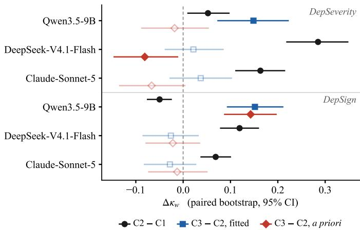

# Structure vs. Chain-of-Thought: Evaluating LLM Criteria Extraction for Depression Severity

Xinkai Chen

Independent Researcher

xinkaichen1997@gmail.com

Abstract—A large language model (LLM) can rate depression severity directly from a social media post or mark which clinical criteria the post shows and let code turn the count into a label. The latter is easier to audit because a clinician can check each marked criterion. We compare these approaches on two Reddit corpora using three LLMs (from 9B to frontier scale) and two questionnaires (PHQ-9, BDI-II), and measure agreement with quadratic weighted kappa $( \kappa _ { w } ) .$ . For the two frontier models, criteria extraction scores above chain-of-thought on one corpus only when its decision thresholds are fitted on labeled data. Neither model’s gain is significant, with or without recalibrating chain-of-thought on the same labels. With thresholds fixed apriori from PHQ-9’s criteria, extraction shows no gain on either corpus, even where models mark over two criteria per post. The 9B model behaves differently on a corpus from depression communities. It labels most posts severe, whether prompted directly or with chain-of-thought, while the a priori rule beats both without labels. After chain-of-thought is recalibrated on the same labels, no significant gap remains, consistent with a calibration effect. Yet higher ordinal agreement does not ensure better detection of severe cases. PHQ-9 criteria extraction misses most severe posts, and moving from direct prompting to chain-of-thought and then to extraction increases misses in nearly all comparisons. On the primary corpus, a relabeled stress dataset, a model using that dataset’s own features, including word counts from the text, is not significantly different from frontier criteria extraction under the a priori rule.

Index Terms—depression severity, ordinal classification, large language models, chain-of-thought, clinical criteria

## I. INTRODUCTION

Depression severity in social media posts is usually predicted as an ordinal label, often with large language models (LLMs). One appealing design is to split the task. DSM-5, the standard psychiatric manual, lists nine symptoms of a major depressive episode (its criterion A), and the PHQ-9 questionnaire [1] asks about exactly these nine. An LLM marks which criteria a post shows, and code turns the count into a label that a clinician can check.

We test this design on two Reddit corpora, DepSeverity [2] (four severity labels) and DepSign [3], [4] (three labels), and measure agreement with the gold labels using quadratic weighted kappa $( \kappa _ { w } )$ [5], which is 0 at chance and penalizes an error more the further it is from the true level. We test three models: a small local one (Qwen3.5-9B), an openweights frontier model (DeepSeek-V4.1-Flash) and a closed one (Claude-Sonnet-5). Whatever its accuracy, criteria extraction has one practical advantage: it is far more stable than chain-of-thought across identical runs, so its outputs are easier to audit.

We make four contributions.

(1) An unfair comparison, measured. On DepSeverity, criteria extraction with fitted thresholds scores above chain-ofthought by up ${ \mathrm { 1 0 + 0 . 1 4 9 } \kappa _ { w } }$ . With thresholds fixed a priori, all three gains reverse sign (at worst −0.081). A pipeline that fits thresholds on labels should therefore not be compared directly with a zero-shot prompt that sees no labels: the difference mostly shows the value of the labels, not of the pipeline.

(2) A weak model behaves differently. On DepSeverity, fitted thresholds add $+ 0 . 1 6 7 \kappa _ { w }$ for the 9B model (against +0.103 and +0.104 for the frontier models), and +0.109 remains when chain-of-thought gets the same labels (significant before correction). On DepSign the 9B model labels most posts SEVERE, directly and with chain-of-thought, and the a priori rule beats both without labels (+0.093 and +0.143, respectively), and still beats chain-of-thought when it counts BDI-II’s 21 items (+0.108). This is consistent with a calibration effect: the fixed rule reduces the model’s overprediction of SEVERE, and recalibrating chain-of-thought with the same 600 labels leaves no significant gap. With BDI-II’s items, the 9B model also beats chain-of-thought without labels on DepSeverity (+0.130), though not significantly once chainof-thought is recalibrated (+0.091).

(3) Better ordinal agreement, more missed severe posts. From direct prompting to chain-of-thought, and from chain-ofthought to criteria extraction, the share of gold-SEVERE posts predicted below SEVERE (false negatives) rises in 11 of 12 comparisons, significantly in 8 before correction. SEVERE is rare, 7–8% of posts, so an approach that rarely predicts it scores higher on $\kappa _ { w }$ and catches fewer SEVERE posts. The approach with the lowest $\kappa _ { w }$ catches that class best, and criteria extraction’s gain on the 9B model comes with 47 of 50 SEVERE posts missed.

(4) Much of one benchmark can be predicted from its source dataset’s own annotations. DepSeverity is a relabeled copy of Dreaddit [6], a stress dataset, and none of its source communities is about depression. As a check on the benchmark itself, a model that uses only Dreaddit’s own features (source community, stress label, and word-category counts computed from the text) reaches $\kappa _ { w } ~ = ~ 0 . 4 0 4$ , not significantly different from frontier criteria extraction with a priori thresholds. Dreaddit’s fields that do not read the post reach 0.333, above every zero-shot direct prompt.

All comparisons use paired bootstrap tests on the same posts.

## II. RELATED WORK

Criteria-level annotation is well established. The Depressive Disorder Annotation scheme [7] covers the DSM-5 criteria, and PRIMATE [8] labels PHQ-9 criteria in Reddit posts and D2S [9] in tweets, although a mental-health professional who re-annotated PRIMATE found many false positives for anhedonia [10]. We instead evaluate extraction end to end, against severity labels, and study the step that turns criteria into a label. The eRisk tasks fill in BDI-II from a user’s whole posting history [11] and rank sentences by relevance to each of its 21 symptoms [12]; we instead mark the 21 items as present or absent in one post and count them (C4, §IV-A).

Fitting thresholds is fair when all compared systems use the same labels. Next to a zero-shot prompt, however, fitted thresholds confound the comparison, and this setup is common: supervised classifiers on LLM embeddings beat zero-shot prompting on severity, leading to the view that LLMs work better as interpreters than as classifiers [13], and guidelines learned from labeled examples beat zero-shot prompting on BDI-II items [14]. We know of no work that measures this effect. Chain-of-thought prompting [15] is our control: the model reasons first but still gives the label itself. On DepSeverity, Cognitive-Mental-LLM [16] finds chain-ofthought below direct prompting in accuracy, the opposite of our result; our direct prompts over-predict severity, which chain-of-thought corrects (§V-A), so the direction may depend on how well calibrated the direct prompt is.

## III. CORPORA

## A. DepSeverity and its origin

DepSeverity [2] contains 3,553 Reddit posts labeled MIN-IMUM, MILD, MODERATE or SEVERE, with no stated license or terms of use.

DepSeverity reuses Dreaddit’s posts, as noted by Mental-LLM [17], which evaluates on both, and by a later study [18]. We verify it: after normalizing whitespace, all 3,530 deduplicated posts appear word for word in Dreaddit, so DepSeverity is a relabeling, not an extension. A model trained or tuned on Dreaddit has therefore already seen every Dep-Severity test post, under a different label, and its DepSeverity results may reflect that exposure. Dreaddit also records each post’s subreddit, which DepSeverity drops and, to our knowledge, no earlier work has recovered. The communities are ptsd, relationships, anxiety, domesticviolence, assistance, survivorsofabuse, homeless, almosthomeless, stress and food\_pantry. None is a depression community. Consistent with this, only 3 of the 56 gold-SEVERE test posts contain explicit self-harm phrases.

Dreaddit’s own split is stratified by stress and leaves only 10 SEVERE and 9 MILD test posts, so we make our own stratified 80/20 split with a fixed seed. The annotation documents are not available, so we separate what is known from what we infer. The four label names are the severity bands of the BDI-II questionnaire [19] (PHQ-9 has five), and [2] reports annotating with Beck’s questionnaire and the Depressive Disorder Annotation scheme [7]. We infer that only the band names come from BDI-II, while the symptom-level scheme uses the nine DSM-5 criteria, which a nine-criterion extractor can capture. If that inference is wrong, and the annotators judged severity with BDI-II’s 21 items, PHQ-9 is not the right instrument; condition C4 (§IV-A) therefore repeats the extraction over those 21 items.

Table I  
Test splits. Both corpora are evaluated at n=706.
<table><tr><td></td><td>DepSeverity</td><td>DepSign</td></tr><tr><td>lowest class middle class(es) highest class</td><td>513 MINIMUM 58 MILD / 79 MOD. 56 SEVERE</td><td>184 NOT DEP. 472 MOD. 50 SEVERE</td></tr><tr><td>majority acc.</td><td>0.727</td><td>0.669</td></tr><tr><td>majority  $\kappa _ { w }$ </td><td>0.000</td><td>0.000</td></tr><tr><td>median words</td><td>80</td><td>104</td></tr></table>

We drop 4 posts in the two duplicate groups whose copies carry different gold labels (one MINIMUM/SEVERE pair on identical text) and merge 19 other duplicates that would otherwise span train and test, leaving 3,530 posts.

## B. DepSign

DepSign [3] comes from mental-health subreddits, including r/depression and r/MentalHealth, is labeled NOT DEPRESSION, MODERATE or SEVERE, and has no stated license. Two domain experts labeled the posts against written guidelines, with Cohen’s κ = 0.686 between them [3]. We subsample its official splits to DepSeverity’s sizes (706 test, 600 train; Table I), so the corpora differ in class balance (73% MINIMUM against 67% MODERATE) but not in test size.

1,502 of DepSign’s 16,632 posts (9.0%) contain a [removed] or [deleted] tag and have a median of 11 words, but were still labeled: 57% as NOT DEPRESSION, against 25% of the other posts, so a model that learns “little text → not depression” gains accuracy for free. DepSeverity has no such posts. We keep them, so the split stays official, and test their effect in §V-D.

## IV. METHOD

## A. Conditions

C1 (direct). The model returns only a severity label.

C2 (chain-of-thought). The model first reasons about which depressive symptoms the post shows, then gives the label itself.

C3 (structured, PHQ-9). The model returns JSON that marks each of the nine PHQ-9 criteria as present, absent or unclear (kept separate from absent), with a word-forword quote from the post for each present. The model never sees the severity labels and never outputs one; code assigns the label.

C4 (structured, BDI-II). Repeats C3 over the 21 items of BDI-II, the questionnaire whose band names DepSeverity uses; these items only partly overlap with the DSM-5 criteria.

## B. From criteria to a label

Let s be the number of criteria (C3) or items (C4) marked present. We turn s into one of k ordinal labels with k − 1 thresholds, set in two ways.

Fitted. We search all threshold settings and keep the one with the highest $\kappa _ { w }$ on a 600-post fitting split taken only from training data. We then freeze these thresholds for the test set.

A priori. The thresholds are label-free: we fix them without looking at any label. For the nine PHQ-9 criteria, DSM-5 requires at least five symptoms for a major depressive episode (one must be depressed mood or loss of interest; our rule uses the count only), so the top threshold is 4.5. A post with no symptom gets the lowest label, so the first threshold is 0.5. DSM-5 says nothing about counts of 1–4: we split them evenly for DepSeverity’s four labels, [0.5, 2.5, 4.5], and add no middle threshold for DepSign’s three, [0.5, 4.5]. The 21 BDI-II items have no exact anchor, so we report C4 under fitting and both imperfect a priori rules: the DSM-5 thresholds above, and BDI-II’s bands rescaled from 0–63 to our 0–21 count.

Stricter count thresholds do not help. We also test [1.5, 4.5, 6.5], requiring at least seven symptoms for SEVERE. This is our operationalization, not an official DSM-5 severity rule; $\kappa _ { w }$ falls to 0.231/0.223 (DeepSeek-V4.1-Flash/Claude-Sonnet-5) on DepSeverity. On DepSign, where these four bands collapse to three in more than one way, it runs from 0.045/0.039 to 0.276/0.253, the latter above C2 but not significantly. No gold-SEVERE post survives any of them: these thresholds assume an interview, and a post mentions far fewer symptoms.

The difference between the two regimes is the key to the paper: fitted thresholds use labeled data, so C3 is no longer zero-shot while C1 and C2 still are, which confounds any direct comparison.

absent was used in only 0.06–0.54% of judgments. Of the three statuses, the score counts only present.

## C. Models and protocol

We use Qwen3.5-9B (run locally, open weights), DeepSeek-V4.1-Flash (open weights) and Claude-Sonnet-5, with extended thinking turned off, because hidden reasoning in C1 would make the C1/C2 comparison meaningless. We verified this for each vendor and count reasoning leaks on every call. Temperature is 0 where the API allows it, though no hosted model is deterministic even then, and Claude-Sonnet-5 accepts no sampling parameters at all. We therefore report bootstrap intervals over test posts, paired across conditions, and measure run-to-run variation in §V-F. Every model response is cached and logged.

## V. RESULTS

## A. Positive control

C2 significantly beats C1 in five of six model–corpus pairs (Fig. 1, black), so our setup can detect differences when they exist; the exception is the 9B model on DepSign, where chainof-thought is significantly worse (−0.050). Asked directly, all models over-predict severity: they rate 47–77% of posts above their gold label. Chain-of-thought cuts this share sharply for the frontier models (to 18–24% on DepSeverity and 54% on DepSign), hardly changes it for the 9B model on DepSeverity (47% → 45%) and raises it on DepSign (67% → 77%).

Table II  
Test-set results, n=706 per corpus. κ<sub>w</sub> = quadratic weighted kappa; $\mathrm { F } 1 _ { M } =$ macro-F1; SEV↓ = fraction of SEVERE posts given a lower label (1 − recall on that class). C3 rows show fitted / a priori (DSM-5) thresholds, C4 rows fitted / DSM-5 / BDI-II bands; other columns are fitted. Bold: highest $\kappa _ { w }$ per model and corpus, fewest missed SEVERE posts per corpus.
<table><tr><td>Model</td><td>Cond.</td><td> $\kappa _ { w }$ </td><td>MAE</td><td>Acc</td><td>F1M</td><td>SEV↓</td></tr><tr><td colspan="7">DepSeverity (4 classes, 56 SEVERE)</td></tr><tr><td rowspan="13">Qwen3.5-9B DeepSeek V4.1-Flash</td><td>C1</td><td>0.288</td><td></td><td>0.9480.445</td><td></td><td>0.33529/56</td></tr><tr><td>C2</td><td>0.340</td><td></td><td>0.8770.4560.32734/56</td><td></td><td></td></tr><tr><td>C3</td><td>0.489 / 0.322</td><td></td><td>0.4650.7280.36743/56</td><td></td><td></td></tr><tr><td>C4</td><td>0.495/0.470/0.057</td><td></td><td>0.5170.6430.42040/56</td><td></td><td></td></tr><tr><td>C1</td><td>0.219</td><td></td><td>1.280 0.329 0.251 16/56</td><td></td><td></td></tr><tr><td>C2</td><td>0.504</td><td></td><td>0.487 0.6590.40842/56</td><td></td><td></td></tr><tr><td>C3</td><td>0.526 / 0.423</td><td></td><td>0.452 0.6700.36249/56</td><td></td><td></td></tr><tr><td>C4</td><td>0.469/0.479/0.079</td><td></td><td>0.5890.5920.38641/56</td><td></td><td></td></tr><tr><td rowspan="4">Claude Sonnet-5</td><td>C1</td><td>0.299</td><td></td><td>0.9630.3540.30633/56</td><td></td><td></td></tr><tr><td>C2</td><td>0.462</td><td></td><td>0.551 0.5960.39041/56</td><td></td><td></td></tr><tr><td>C3</td><td>0.499 / 0.395</td><td>0.467</td><td>0.664</td><td>0.36949/56</td><td></td></tr><tr><td>C4</td><td>0.460/0.466/0.110</td><td>0.616</td><td>0.508</td><td>0.347</td><td>48/56</td></tr><tr><td colspan="7">DepSign (3 classes, 50 SEVERE) Qwen3.5-9B</td></tr><tr><td rowspan="9">DeepSeek V4.1-Flash</td><td></td><td></td><td></td><td></td><td></td><td></td></tr><tr><td>C1</td><td>0.162</td><td>0.839</td><td>90.271</td><td></td><td>0.271 13/50</td></tr><tr><td>C2</td><td>0.112</td><td></td><td>0.946 0.198 0.201 10/50</td><td></td><td></td></tr><tr><td>C3</td><td>0.264 / 0.255</td><td></td><td>0.3330.6740.43348/50</td><td></td><td></td></tr><tr><td>C4</td><td>0.235/0.220/0.1350.4480.5850.43338/50</td><td></td><td></td><td></td><td></td></tr><tr><td>C1</td><td>0.109</td><td></td><td>0.956 0.184 0.183 9/50</td><td></td><td></td></tr><tr><td>C2 C3</td><td>0.228 0.203 / 0.207</td><td></td><td>0.737 0.3440.341 16/50 0.3470.6600.391 49/50</td><td></td><td></td></tr><tr><td>C4</td><td>0.218/0.178/0.119</td><td></td><td>0.3990.6200.42941/50</td><td></td><td></td></tr><tr><td></td><td></td><td></td><td></td><td></td><td></td></tr><tr><td rowspan="5">Claude Sonnet-5</td><td>C1</td><td>0.151</td><td></td><td>0.7960.2880.23617/50</td><td></td><td></td></tr><tr><td>C2</td><td>0.220</td><td></td><td>0.7050.3640.33919/50</td><td></td><td></td></tr><tr><td>C3</td><td>0.192 / 0.207</td><td></td><td>0.4990.5350.38436/50</td><td></td><td></td></tr><tr><td>C4</td><td></td><td></td><td></td><td></td><td></td></tr><tr><td></td><td>0.179/0.158/0.152</td><td></td><td>0.3530.6590.40046/50</td><td></td><td></td></tr></table>

Chain-of-thought’s gains thus track reduced over-prediction of severity rather than model size: the worst-calibrated model gains most, and the 9B model, whose calibration does not improve, gains least and loses on DepSign.

## B. The unfair comparison

Table II gives all results. With fitted thresholds, C3 scores above C1 and C2 in four of six model–corpus pairs and significantly beats C2 for the 9B model on both corpora (+0.149 and +0.152). With a priori thresholds the results split (Fig. 1). Except for the 9B model on DepSign, no C3 pair shows a significant gain, and DeepSeek-V4.1-Flash on DepSeverity shows a loss of −0.081 (significant before correction). Across the nine a priori comparisons with C2 for the frontier models and for the 9B model’s C3 on DepSeverity (five for C3, four for C4 under the same DSM-5 rule; Table II), none shows a significant $\kappa _ { w }$ advantage for criteria extraction; two (−0.081 for C3, −0.062 for C4) are significantly worse before correction and a third (−0.050, C4) is on the boundary, and all three are sensitive to generation variance (§V-F). The 9B model on DepSign keeps nearly all of its gain without labels (+0.143), and C4 under the same rule also beats C2 there (+0.108, significant before correction). With C4 the 9B model also gains without labels on DepSeverity (+0.130; §V-D).

  
Fig. 1. Paired bootstrap $\Delta \kappa _ { w }$ on the same posts (4000 resamples); solid markers exclude zero at 95%, faded hollow ones do not. C2 − C1 uses no thresholds. C4 is in Table II.

On DepSeverity, the three fitted thresholds add +0.167 (Qwen3.5-9B), +0.103 (DeepSeek-V4.1-Flash) and +0.104 (Claude-Sonnet-5) in $\kappa _ { w }$ over the a priori ones; on DepSign they add almost nothing (+0.009, −0.004, −0.015). For the weakest model, the fitted thresholds become [0.5, 1, 1.5], meaning “no symptoms → MINIMUM, any symptom → higher”, for a model that finds on average 0.26 of 9 symptoms. The thresholds do the work.

The 9B exception is consistent with calibration. Asked directly or with chain-of-thought, the 9B model labels 444 and 526 of 706 DepSign posts SEVERE (50 in gold). The a priori rule, which needs five symptoms, labels 38 posts SEVERE and also significantly beats direct prediction (+0.093). The rule reduces over-prediction of SEVERE, but it still misses 47 of 50 SEVERE posts (§V-E). The effect survives Holm correction and removing the [removed] posts (§V-D), but after we recalibrate chain-of-thought with the same 600 labels, no significant gap remains (§V-C).

## C. Giving C1 and C2 the same supervision

The stronger fairness test gives C1 and C2 the same access to labels that C3’s fitted thresholds get: we learn a monotone relabeling of each condition’s predicted label on the same 600- post split and freeze it. Such a map has $\binom { 2 k - 1 } { k }$ forms on k labels (35 for k=4, 10 for k=3), fewer than C3’s threshold options, so the test favors C3.

First, the frontier models’ chain-of-thought barely improves: its best map leaves the labels unchanged in three of four cases, and C3 with fitted thresholds still does not significantly beat it in any case. These predictions are already largely calibrated: C2 does not need the labels, but C3 does.

Second, the 9B model on DepSeverity is the exception. Its miscalibrated C2 improves (0.340 → 0.379), which removes a quarter of the +0.149 gap, but +0.109 remains (significant before correction). So for this model the unequal labels do not explain the whole effect. If we first reduce C3’s score to four levels without labels and then apply a monotone map, which searches exactly the same 35 forms, the +0.109 stays: the remaining gain comes from the extraction itself, not from C3’s finer score. Without labels, the result depends on the questionnaire. With a priori thresholds C3 falls to 0.322, below recalibrated C2, so PHQ-9 extraction does not win; C4 under the same rule reaches 0.470, +0.091 above recalibrated C2, just short of significance ([−0.001, +0.181]; Appendix C).

Third, C1 improves substantially $( 0 . 2 1 9 \  \ 0 . 3 3 0$ and 0.109 → 0.246 for DeepSeek-V4.1-Flash), so its weakness is calibration. On DepSeverity, chain-of-thought with no labels (0.504) beats direct prediction with all 600 labels (0.330): reasoning is worth more than the labels, and criteria extraction adds nothing measurable on top.

Fourth, on DepSign the 9B model’s gap is calibration. Its chain-of-thought gains more from labels than chain-ofthought does in any other case (0.112 → 0.219), through a map that never predicts SEVERE, and C3’s lead with fitted thresholds shrinks to a non-significant +0.045. Recalibrated direct prediction gains less (0.162 → 0.185) and still trails C3 by +0.078 (significant before correction). So labels close the gap through chain-of-thought but not through direct prediction.

## D. Other explanations

DepSeverity posts might show too few symptoms to extract, given their origin. On DepSign, however, the frontier models extract about five times more symptoms (mean 2.31 and 2.29 against 0.45 and 0.46) and the 9B model seven times more (1.86 against 0.26), and the frontier models still show no advantage. Extraction is faithful: 97.7–100% of the frontier models’ quotes appear word for word in the post, and 92.4% and 80.9% of the 9B model’s (90.4% and 81.9% in its C4 runs).

Excluding the 53 [removed] test posts lowers every DepSign score, C3 most (C1 by 0.019–0.032, C2 by 0.026– 0.045, C3 by 0.053–0.069). C3 fitted − C2 then only moves to −0.051 for both frontier models, still not significant, and the 9B model’s label-free gain remains significant (+0.115).

A longer questionnaire helps, but beats C2 only for the 9B model. BDI-II’s 21 items raise the mean count per post, from 0.26–0.46 to 0.72–1.25 on DepSeverity and from 1.86– 2.31 to 3.31–4.22 on DepSign, where the maximum rises from 8 to 15. For the frontier models on DepSeverity, C4 under the DSM-5 rule improves on C3 (0.479 and 0.466 against 0.423 and 0.395) but only reaches C2, and on neither corpus does C4 beat C2. For the 9B model it does: under the DSM-5 rule, C4 beats C2 by +0.130 on DepSeverity and +0.108 on DepSign, and C1 by +0.182 and +0.058, all significant before correction. On DepSeverity this reverses the C3 result, where the same rule stays below C2. One reason is scale:

the DSM-5 thresholds were set for nine criteria, and a 21- item count reaches them more easily, so they sit close to what fitting would select. Fitting adds only +0.025 to the 9B model’s C4, against +0.167 to its C3 (Appendix B). Under the second a priori rule, BDI-II’s own bands rescaled to our count, C4 is significantly worse than C2 for both frontier models on both corpora and for the 9B model on DepSeverity (down to −0.425; Table II), because binary extraction finds too few items to reach them; for the 9B model on DepSign the difference is +0.023, not significant.

Prompt wording does not explain the result. We reran C3 on DepSeverity with DeepSeek-V4.1-Flash using two other prompts (2,612 calls; Table X). A permissive prompt (a lower bar for present) finds 60% more symptoms $( 0 . 4 5  0 . 7 2$ per post) but scores slightly worse (fitted $\kappa _ { w } ~ 0 . 5 2 6  0 . 5 0 7 )$ A symmetric prompt (quotes also required for absent) scores 0.555 but still does not beat C2 with a priori thresholds (−0.071, not significant), and raises the use of absent only from 0.30% to 0.35%. Neither beats chain-of-thought under either rule, so the rare use of absent (§IV-B) comes from the posts, not our wording.

A better aggregation rule does not help: an ordinal model learned on the same nine criterion labels, with far more free parameters, reaches only 0.156 and 0.166, significantly below the simple count. Weighting its classes by inverse frequency raises it to 0.421–0.454 on DepSeverity, still below the count with fitted thresholds, but it then misses only 14–26 of 56 SEVERE posts, against 43–49 for the count (Appendix D).

## E. Ordinal agreement versus missed severe posts

The last column of Table II tells a different story. On DepSign, DeepSeek-V4.1-Flash under C1 has the lowest $\kappa _ { w }$ in the table but misses only 9 of 50 SEVERE posts; under C3 its $\kappa _ { w }$ nearly doubles $( 0 . 1 0 9  0 . 2 0 3 )$ but it misses 49 of 50. Across all twelve comparisons, C1 to C2 and C2 to C3, the share of missed SEVERE posts rises in eleven, significantly in eight (95% intervals, not corrected). The one decrease, not significant, is chain-of-thought for Qwen3.5-9B on DepSign, which labels most posts SEVERE. Higher ordinal agreement often means more missed SEVERE posts. BDI-II extraction misses fewer: under the DSM-5 rule on DepSign, C4 misses 30 and 26 of 50 SEVERE posts against 42 for C3, but still more than chain-of-thought (16 and 19), and its $\kappa _ { w }$ is significantly lower (Appendices A and D). For the 9B model, C4 misses 29 of 50 against 47 for C3 and 10 for chain-of-thought, which labels most posts SEVERE; on DepSeverity it misses 49 of 56, against 56 for C3 and 34 for chain-of-thought.

Macro-F1, which ignores ordinal distance, ranks the conditions differently (Table II; paired bootstrap, before correction). On DepSeverity it agrees with $\kappa _ { w }$ . On DepSign, C3 beats C2 for the frontier models with both kinds of threshold (+0.044 to +0.071; the a priori gains remain without the [removed] posts), while $\kappa _ { w }$ shows no difference. The whole gain comes from the majority MODERATE class, which chain-of-thought often raises to SEVERE (DeepSeek-V4.1-Flash, C2 vs. C3 a priori: F1 0.39 vs. 0.74), and C3 is worse on both smaller classes. For the 9B model the two metrics agree (+0.219 with the label-free rule). We report $\kappa _ { w }$ as the main metric because the labels are ordinal and, unlike accuracy and MAE, $\kappa _ { w }$ corrects for chance: no LLM condition clearly beats majorityclass accuracy (0.727 on DepSeverity).

## F. Run-to-run stability

Repeating C2 and C3 on DepSeverity changes $\kappa _ { w }$ by 0.020 and 0.008 (Claude-Sonnet-5) and 0.022 and 0.020 (DeepSeek-V4.1-Flash). Our intervals ignore this run-to-run noise, so we widened each hosted model’s intervals, treating its larger change as single-run noise (the local model is deterministic). All six C2 − C1 effects, the 9B model’s gains and the fitted margins over Dreaddit’s features (§V-H) stay significant, but the three DSM-5-rule losses of §V-B (−0.081 for DeepSeek-V4.1-Flash on DepSeverity and both C4 losses on DepSign) do not, so they are not evidence of real harm. Structure is clearly better in one respect: between identical runs, C2 changes 105 and 132 of 706 labels, and C3 only 21 and 29.

## G. Can a human reader recover the labels?

We do not know how reliable the gold labels are. As a test, the author, with over five years of experience working with clinicians, annotated a stratified sample from each test split (100 and 102 posts) without seeing gold labels, model outputs or any results, using a rubric based on BDI-II’s bands and the nine DSM-5 criteria.

On DepSign, the annotator’s $\kappa _ { w }$ is 0.416 [0.248, 0.567], against 0.395 and 0.368 for the models’ C2 on the same posts. The paired difference, −0.021 [−0.174, +0.130], is too uncertain to show that human and model are equivalent, but the annotator’s own interval is well above zero: a reader following clinical criteria recovers DepSign’s labels, so its low $\kappa _ { w }$ reflects a hard task with unbalanced classes, not unrecoverable labels, and its results in §V-D are not results on noise.

DepSeverity behaves differently. The annotator reaches 0.199 where the best model condition reaches 0.485, a paired gap of +0.285 [+0.106, +0.450] in the model’s favor, and read 13 of 25 gold-SEVERE posts as showing no depressive content. Models can reproduce these labels, but a reader who follows clinical criteria cannot, which is hard to explain if the labels follow clinical criteria and fits the idea that models learn patterns of the annotation process. It also fits two other explanations, noise in the gold labels and a mismatch between our rubric and the annotators’ own; with one annotator and no access to the original guidelines, we cannot tell these apart.

The difference does not come from the number of labels: merging DepSeverity into three labels raises the annotator to at most 0.244 and leaves the models unchanged, and rank agreement with gold, which does not depend on calibration, is $\rho = 0 . 2 5 1$ against 0.435 on DepSign.

Limits: our rubric rather than the original annotators’, one non-clinician annotator, and stratified samples not comparable to full-split results.

## H. What predicts the labels

For DepSeverity, the recovered origin (§III-A) shows what the labels follow instead. The same ordinal method [20] fitted to Dreaddit-provided fields, without symptom annotations, recovers much of the label: the source community alone reaches $\kappa _ { w } ~ = ~ 0 . 1 9 6$ , Dreaddit’s stress label 0.259, and the fields that do not read the post (community, stress label, karma, votes, comments) 0.333. Adding text-derived features (length, Dreaddit’s sentiment score, LIWC word-category counts) gives 0.404. A TF-IDF → ordinal logistic model trained on the 2,824 labeled training posts reaches 0.374, above zero-shot direct prompting with every model (0.219–0.299), though it sees labels that the prompts do not. The communities anxiety and ptsd, neither about depression, provide 34 of the 56 gold-SEVERE test posts.

On the same 706 posts, compared with the full model, C3 with a priori thresholds is not significantly different for either model (+0.019 for DeepSeek-V4.1-Flash, −0.009 for Claude-Sonnet-5); against the non-text fields alone it is ahead by +0.090 (significant) and +0.063 (not). With fitted thresholds it is significantly ahead of the full model (+0.122 and +0.095), which by our own standard (§V-C) is the fair comparison. So Dreaddit’s features are a lower bound, but a high one: without fitted thresholds, criteria extraction is not significantly better than the full set, while chain-of-thought scores above it without any labels.

This makes the result of §V-B expected: the posts contain little criterion-based signal, as the human test also showed. It is also a warning about the corpus as a benchmark: a system can score well here without modeling depression severity.

## VI. DISCUSSION

Criteria extraction remains useful for auditing: besides the quote check above, all but seven of the 15,672 structured calls on the fit and test splits return the full inventory, and code recovers the statuses from six malformed JSON responses. The seven exceptions are 9B C4 responses that omit one item (sleep\_change); we count it as not present, and dropping those responses instead changes no reported $\kappa _ { w }$ by more than 0.001. The tested counting rules show no significant ordinal-agreement advantage over chain-ofthought for frontier models. The results suggest a mismatch between symptom counts and the gold labels: only 3 of 56 gold-SEVERE DepSeverity posts mention self-harm, and the labels partly follow where posts were collected (§V-H). The a priori thresholds, equal-supervision test, BDI-II items, prompt variants, learned aggregator and human probe support this interpretation (§V-B–§V-G), but do not rule out better extraction or aggregation. In our experiments, structure helps without labels only for the 9B model: on DepSign with either questionnaire, consistent with correcting its over-prediction of SEVERE, and on DepSeverity with BDI-II’s items, where the gain over recalibrated chain-of-thought falls just short of significance. Even then it misses most SEVERE posts.

The lesson applies beyond mental health: a pipeline with fitted thresholds and a zero-shot baseline are not comparable systems. Reporting the label-free version next to the fitted one costs nothing, because both use the same extractions. Reporting direct prediction next to chain-of-thought is just as cheap: for the 9B model on DepSign, comparing only against chain-of-thought would show +0.143, while direct prediction gives +0.093.

Criteria extraction is also far more stable across identical runs than chain-of-thought (§V-F), which makes its outputs easier to audit.

## VII. CODE AND DATA

The repository<sup>1</sup> contains the pipeline, exact prompts, result tables, worked examples and one cleaned record per post per condition, from which every number except the [removed]- post analysis can be recomputed without model calls. It contains no post text, since neither corpus has a stated license.

## VIII. ETHICS

This work uses public Reddit posts about depression, stress, abuse and self-harm. We did not identify or contact authors or link people across datasets, we report only aggregate results, and we share neither corpus. Nothing here is fit for clinical use: the systems with the best ordinal agreement miss the most severe cases (§V-E), so papers should report the direction of errors, not only their size, for example per-class recall (Appendix D) or expected cost under asymmetric error costs.

## IX. LIMITATIONS AND CONCLUSION

Our primary corpus contains no depression community, which limits what it says about depression severity; the second is drawn from depression communities but subsampled to 706 test posts, which lowers power for its 50 SEVERE posts. Our confirmatory family is the eighteen comparisons of Fig. 1. With Holm correction at $\alpha = 0 . 0 5$ , the four frontier C2 − C1 effects, the 9B model’s +0.149 on DepSeverity and all three of its DepSign effects (−0.050, +0.152, +0.143) remain significant; its DepSeverity C2 − C1 gain (+0.052) and the a priori loss of −0.081 are significant only before correction. For the frontier models we find no significant advantage for criteria extraction, before or after correction. Everything else is exploratory and uncorrected: C4, comparisons of C3 with C1, the equal-supervision test, the missed-SEVERE counts, macro-F1, the Dreaddit-feature comparisons, the prompt variants and the human probe. The conditions also differ in output format and length: C2 writes 363–614 output tokens per post, C3 152–251 and C4 371–579. C3 writes less than half as much as C2 and C4 about as much, yet neither beats C2 for the frontier models, so length does not track the ranking; but we did not run a controlled ablation, such as chain-of-thought forced through the nine criteria.

DepSign reports two annotators at $\kappa ~ = ~ 0 . 6 8 6$ [3], but DepSeverity’s annotation documents are not available, so we cannot measure its label noise; two of its posts have identical text but different gold labels. Our human probe cannot settle this: it uses one non-clinician annotator and our own rubric, so its DepSeverity result is a warning sign, not evidence about the original annotators. We run each condition once, and the generation-variance check in §V-F rests on one repeat per hosted model, on one corpus. There is no exact a priori threshold for a 21-item count (§IV-B): for the frontier models C4 fails under both imperfect options and under fitting, but a better rule might do better. We score only whether each criterion or item is present, while PHQ-9 scores each criterion 0–3 by frequency and BDI-II scores each item 0–3 by severity. Binary scoring loses the intensity a post can express, which chain-ofthought can still use. We did not test graded extraction; it could narrow the gap to chain-of-thought, and because BDI-II’s bands assume graded items, the C4 result with those bands (§V-D) may partly reflect our binary choice. Finally, because of compute limits we ran only one small open-weights model; the calibration exception may not hold for other small models, and a larger local model (for example 27B to 70B parameters) would show whether it disappears with scale.

For frontier models, criteria extraction shows no significant $\kappa _ { w }$ advantage over chain-of-thought across two corpora, two questionnaires and both threshold regimes. Its apparent gains depend on fitted thresholds; its macro-F1 gains on DepSign come from the majority class. For the 9B model on DepSign, the label-free counting rule wins while direct and chain-ofthought predictions over-escalate to SEVERE, consistent with a calibration correction; with BDI-II’s items it also wins on DepSeverity, though not significantly against recalibrated chain-of-thought. In both cases the gains come with more missed severe cases. Studies of this kind should report an a priori (label-free) threshold variant next to the fitted one, and direct prediction next to chain-of-thought.

## REFERENCES

[1] K. Kroenke, R. L. Spitzer, and J. B. W. Williams, “The PHQ-9: Validity of a brief depression severity measure,” Journal of General Internal Medicine, vol. 16, no. 9, pp. 606–613, 2001.

[2] U. Naseem, A. G. Dunn, J. Kim, and M. Khushi, “Early identification of depression severity levels on Reddit using ordinal classification,” in Proc. ACM Web Conf. (WWW ’22), 2022, pp. 2563–2572.

[3] K. Sampath and T. Durairaj, “Data set creation and empirical analysis for detecting signs of depression from social media postings,” in Computational Intelligence in Data Science, IFIP AICT vol. 654, Cham: Springer, 2022, pp. 136–151; arXiv:2202.03047.

[4] K. Sampath, T. Durairaj, B. R. Chakravarthi, and J. M. C, “Findings of the shared task on detecting signs of depression from social media,” in Proc. 2nd Workshop on Language Technology for Equality, Diversity and Inclusion (LT-EDI), 2022, pp. 331–338.

[5] J. Cohen, “Weighted kappa: Nominal scale agreement with provision for scaled disagreement or partial credit,” Psychological Bulletin, vol. 70, no. 4, pp. 213–220, 1968.

[6] E. Turcan and K. McKeown, “Dreaddit: A Reddit dataset for stress analysis in social media,” in Proc. 10th Int. Workshop Health Text Mining and Information Analysis (LOUHI), 2019, pp. 97–107.

[7] D. Mowery, C. Bryan, and M. Conway, “Towards developing an annotation scheme for depressive disorder symptoms: A preliminary study using Twitter data,” in Proc. 2nd Workshop on Computational Linguistics and Clinical Psychology (CLPsych), 2015, pp. 89–98.

[8] S. Gupta, A. Agarwal, M. Gaur, K. Roy, V. Narayanan, P. Kumaraguru, and A. Sheth, “Learning to automate follow-up question generation using process knowledge for depression triage on Reddit posts,” in Proc. 8th Workshop on Computational Linguistics and Clinical Psychology (CLPsych), 2022, pp. 137–147.

[9] S. Yadav, J. Chauhan, J. P. Sain, K. Thirunarayan, A. Sheth, and J. Schumm, “Identifying depressive symptoms from tweets: Figurative language enabled multitask learning framework,” in Proc. 28th Int. Conf. Computational Linguistics (COLING), 2020, pp. 696–709.

[10] K. Milintsevich, K. Sirts, and G. Dias, “Your model is not predicting depression well and that is why: A case study of PRIMATE dataset,” in Proc. 9th Workshop on Computational Linguistics and Clinical Psychology (CLPsych), 2024, pp. 166–171.

[11] D. E. Losada, F. Crestani, and J. Parapar, “Overview of eRisk 2019: Early risk prediction on the Internet,” in Proc. CLEF 2019, LNCS, Springer, 2019, pp. 340–357.

[12] J. Parapar, P. Martín-Rodilla, D. E. Losada, and F. Crestani, “Overview of eRisk 2023: Early risk prediction on the Internet,” in Proc. CLEF 2023, LNCS, Springer, 2023, pp. 294–315.

[13] S. Kim, O. Imieye, and Y. Yin, “Interpretable depression detection from social media text using LLM-derived embeddings,” in Proc. Int. Conf. Artificial Intelligence (ICAI), 2026.

[14] E. Bao, A. Perez, D. Otero, and J. Parapar, “Learning evidence of depression symptoms via prompt induction,” in Proc. ACM SIGIR Conf. Research and Development in Information Retrieval (SIGIR), 2026.

[15] J. Wei, X. Wang, D. Schuurmans, M. Bosma, B. Ichter, F. Xia, E. Chi, Q. Le, and D. Zhou, “Chain-of-thought prompting elicits reasoning in large language models,” in Advances in Neural Information Processing Systems (NeurIPS), vol. 35, 2022, pp. 24824–24837.

[16] A. Patil and A. K. Gedhu, “Cognitive-Mental-LLM: Evaluating reasoning in large language models for mental health prediction via online text,” arXiv:2503.10095, 2025.

[17] X. Xu, B. Yao, Y. Dong, S. Gabriel, H. Yu, J. Hendler, M. Ghassemi, A. K. Dey, and D. Wang, “Mental-LLM: Leveraging large language models for mental health prediction via online text data,” Proc. ACM Interact. Mob. Wearable Ubiquitous Technol., vol. 8, no. 1, 2024.

[18] Y. Ibrahimov, T. Anwar, and T. Yuan, “DepressionX: Knowledge infused residual attention for explainable depression severity assessment,” arXiv:2501.14985, 2025.

[19] A. T. Beck, R. A. Steer, and G. K. Brown, Manual for the Beck Depression Inventory-II. San Antonio, TX: Psychological Corporation, 1996.

[20] E. Frank and M. Hall, “A simple approach to ordinal classification,” in Proc. 12th European Conf. Machine Learning (ECML), 2001, pp. 145–156.

## APPENDIX A ALL COMPARISONS

Table III lists every paired comparison between conditions. The eighteen marked C form the confirmatory family of the Limitations section; the eight marked H survive Holm correction. All other rows are exploratory, including every C4 comparison and every comparison of C3 with C1. Bold values have 95% intervals that exclude zero before any correction.

Table III  
All paired comparisons $( \Delta \kappa _ { w } .$ , 95% paired bootstrap interval, 4000 resamples). Rows marked C are the confirmatory family; H = survives Holm correction at $\begin{array} { r } { \alpha = 0 . 0 5 . } \end{array}$ . C4 uses the DSM-5 rule for a priori.
<table><tr><td>Corpus</td><td>Model</td><td>Comparison</td><td> $\Delta \kappa _ { w }$  [95% CI]</td><td></td></tr><tr><td>DepSeverity</td><td>Qwen3.5-9B</td><td>C2 − C1</td><td>+0.052 [+0.009, +0.098]</td><td>C</td></tr><tr><td>DepSeverity</td><td>Qwen3.5-9B</td><td>C3 fitted – C2</td><td>+0.149 [+0.072, +0.223]</td><td>C,H C</td></tr><tr><td>DepSeverity</td><td>Qwen3.5-9B</td><td>C3 a priori 一</td><td>C2 -0.018 [-0.089, +0.054]</td><td></td></tr><tr><td>DepSeverity</td><td>Qwen3.5-9B</td><td>C4 fitted – C2</td><td>+0.155 [+0.082, +0.227]</td><td></td></tr><tr><td>DepSeverity</td><td>Qwen3.5-9B</td><td>C4 a priori 一 C2</td><td>+0.130 [+0.050, +0.208]</td><td></td></tr><tr><td>DepSeverity</td><td>Qwen3.5-9B</td><td>C3 fitted – C1</td><td>+0.201 [+0.127, +0.276]</td><td></td></tr><tr><td>DepSeverity</td><td>Qwen3.5-9B</td><td>C3 a priori C1</td><td>+0.034 [-0.037, +0.105]</td><td></td></tr><tr><td>DepSeverity</td><td>Qwen3.5-9B</td><td>C4 fitted C1</td><td>+0.208 [+0.127, +0.282]</td><td></td></tr><tr><td>DepSeverity</td><td>Qwen3.5-9B</td><td>C4 a priori C1</td><td>+0.182 [+0.101, +0.259]</td><td>C,H</td></tr><tr><td>DepSeverity</td><td>DeepSeek</td><td>C2 - C1</td><td>+0.285 [+0.218, +0.349]</td><td>C</td></tr><tr><td>DepSeverity</td><td>DeepSeek</td><td>C3 fitted - C2</td><td>+0.022 [−0.039, +0.086]</td><td>C</td></tr><tr><td>DepSeverity</td><td>DeepSeek</td><td>C3 a priori - C2</td><td>-0.081 [-0.147, -0.010]</td><td></td></tr><tr><td>DepSeverity</td><td>DeepSeek</td><td>C4 fitted – C2</td><td>-0.035 [-0.107, +0.039]</td><td></td></tr><tr><td>DepSeverity</td><td>DeepSeek</td><td>C4 a priori − C2</td><td>-0.026 [−0.100, +0.049]</td><td></td></tr><tr><td>DepSeverity</td><td>DeepSeek</td><td>C3 fitted – C1</td><td>+0.307 [+0.237, +0.376]</td><td></td></tr><tr><td>DepSeverity</td><td>DeepSeek</td><td>C3 a priori – C1</td><td>+0.204 [+0.139, +0.270]</td><td></td></tr><tr><td>DepSeverity</td><td>DeepSeek</td><td>C4 fitted – C1</td><td>+0.250 [+0.183, +0.312]</td><td></td></tr><tr><td>DepSeverity</td><td>DeepSeek</td><td>C4 a priori – C1</td><td>+0.259 [+0.192, +0.324]</td><td></td></tr><tr><td>DepSeverity</td><td>Claude</td><td>C2 − C1</td><td>+0.163 [+0.110, +0.216]</td><td>C,H</td></tr><tr><td>DepSeverity</td><td>Claude</td><td>C3 fitted – C2</td><td>+0.037 [-0.029, +0.103]</td><td>C</td></tr><tr><td>DepSeverity</td><td>Claude</td><td>C3 a priori - C2</td><td>-0.067 [-0.135, +0.005]</td><td>C</td></tr><tr><td>DepSeverity</td><td>Claude</td><td>C4 fitted - C2</td><td>-0.002 [−0.075, +0.072]</td><td></td></tr><tr><td>DepSeverity</td><td>Claude</td><td>C4 a priori</td><td>C2 +0.004 [-0.068, +0.079]</td><td></td></tr><tr><td>DepSeverity</td><td>Claude</td><td>C3 fitted – C1</td><td>+0.200 [+0.131, +0.271]</td><td></td></tr><tr><td>DepSeverity</td><td>Claude</td><td>C3 a priori C1</td><td>+0.097 [+0.028, +0.167]</td><td></td></tr><tr><td>DepSeverity</td><td>Claude</td><td>C4 fitted – C1</td><td>+0.161 [+0.096, +0.223]</td><td></td></tr><tr><td>DepSeverity</td><td>Claude</td><td>C4 a priori C1</td><td>+0.167 [+0.102, +0.230]</td><td></td></tr><tr><td>DepSign</td><td>Qwen3.5-9B</td><td>C2 − C1</td><td>-0.050 [−0.077, -0.024]</td><td>C,H C,H</td></tr><tr><td>DepSign</td><td>Qwen3.5-9B</td><td>C3 fitted – C2</td><td>+0.152 [+0.092, +0.212]</td><td>C,H</td></tr><tr><td>DepSign</td><td>Qwen3.5-9B</td><td>C3 a priori C2 C4 fitted –</td><td>+0.143 [+0.086, +0.198]</td><td></td></tr><tr><td>DepSign</td><td>Qwen3.5-9B</td><td>C2 C2</td><td>+0.123 [+0.064, +0.182]</td><td></td></tr><tr><td>DepSign</td><td>Qwen3.5-9B</td><td>C4 a priori 一</td><td>+0.108 [+0.055, +0.158]</td><td></td></tr><tr><td>DepSign</td><td>Qwen3.5-9B</td><td>C3 fitted – C1</td><td>+0.102 [+0.044, +0.162]</td><td></td></tr><tr><td>DepSign</td><td>Qwen3.5-9B</td><td>C3 a priori</td><td>C1 +0.093 [+0.037, +0.148]</td><td></td></tr><tr><td>DepSign</td><td>Qwen3.5-9B</td><td>C4 fitted – C1</td><td>+0.074 [+0.017, +0.130]</td><td></td></tr><tr><td>DepSign</td><td>Qwen3.5-9B DeepSeek</td><td>C4 a priori - C1 C2 - C1</td><td>+0.058 [+0.008, +0.108]</td><td>C,H</td></tr><tr><td>DepSign DepSign</td><td>DeepSeek</td><td>C3 fitted 一 C2</td><td>+0.119 [+0.078, +0.160] -0.026 [-0.086, +0.033]</td><td>C</td></tr><tr><td>DepSign</td><td>DeepSeek</td><td>C3 a priori C2</td><td>-0.022 [−0.080, +0.036]</td><td>C</td></tr><tr><td>DepSign</td><td>DeepSeek</td><td>C4 fitted — C2</td><td>-0.011 [-0.074, +0.050]</td><td></td></tr><tr><td>DepSign</td><td>DeepSeek</td><td>C4 a priori</td><td>-0.050 [−0.100, -0.001]</td><td></td></tr><tr><td>DepSign</td><td>DeepSeek</td><td>C3 fitted – C1</td><td>C2 +0.093 [+0.033, +0.152]</td><td></td></tr><tr><td>DepSign</td><td>DeepSeek</td><td>C3 a priori –</td><td>C1 +0.097 [+0.038, +0.158]</td><td></td></tr><tr><td>DepSign</td><td>DeepSeek</td><td>C4 fitted – C1</td><td>+0.108 [+0.047, +0.168]</td><td></td></tr><tr><td>DepSign</td><td>DeepSeek</td><td>C4 a priori — C1</td><td>+0.069 [+0.019, +0.118]</td><td></td></tr><tr><td></td><td>Claude</td><td></td><td></td><td>C,H</td></tr><tr><td>DepSign</td><td></td><td>C2 - C1</td><td>+0.069 [+0.036, +0.101]</td><td>C</td></tr><tr><td>DepSign</td><td>Claude</td><td>C3 fitted – C2</td><td>-0.028 [-0.083, +0.028]</td><td>C</td></tr><tr><td>DepSign</td><td>Claude</td><td>C3 a priori –</td><td>C2 -0.013 [-0.074, +0.052]</td><td></td></tr><tr><td>DepSign</td><td>Claude</td><td>C4 fitted – C2</td><td>-0.041 [-0.110, +0.024]</td><td></td></tr><tr><td>DepSign</td><td>Claude</td><td>C4 a priori − C2</td><td>-0.062 [-0.113, -0.011]</td><td></td></tr><tr><td>DepSign</td><td>Claude</td><td>C3 fitted - C1</td><td>+0.041 [-0.016, +0.097]</td><td></td></tr><tr><td>DepSign</td><td>Claude</td><td>C3 a priori – C1</td><td>+0.056 [-0.009, +0.121]</td><td></td></tr><tr><td>DepSign</td><td>Claude</td><td>C4 fitted – C1</td><td>+0.027 [-0.036, +0.090]</td><td></td></tr><tr><td>DepSign</td><td>Claude</td><td>C4 a priori – C1</td><td>+0.006 [-0.040, +0.055]</td><td></td></tr></table>

## APPENDIX B

## THRESHOLDS

Table IV gives the thresholds behind every C3 and C4 cell. Two patterns stand out. On DepSeverity, C3’s fitted rules move the top threshold down to 1.5–2.5, so a post needs only two or three marked criteria to be labeled SEVERE; the DSM-5 rule needs five, which few posts reach (§V-D). On DepSign, the fitted C4 rules move the top threshold up, to 6.5 (9B), 8.5 and 10.5 of 21 items, so fitted C4 catches fewer SEVERE posts there than the DSM-5 rule does (Appendix D).

Table IV  
Thresholds on the count of present criteria (C3: 0–9, C4: 0–21). Fitted thresholds maximize $\kappa _ { w }$ on the 600-post fitting split.
<table><tr><td>Corpus</td><td>Model</td><td>Cond.</td><td>fitted</td><td>a priori</td></tr><tr><td>DepSeverity</td><td>Qwen3.5-9B</td><td>C3</td><td>[0.5, 1, 1.5]</td><td>[0.5, 2.5, 4.5]</td></tr><tr><td>DepSeverity</td><td>Qwen3.5-9B</td><td>C4</td><td>[0.5, 1.5, 3.5]</td><td>[0.5, 2.5, 4.5]</td></tr><tr><td>DepSeverity</td><td>DeepSeek</td><td>C3</td><td>[0.5, 1.5, 2.5]</td><td>[0.5, 2.5, 4.5]</td></tr><tr><td>DepSeverity</td><td>DeepSeek</td><td>C4</td><td>[0.5, 1.5, 3.5]</td><td>[0.5, 2.5, 4.5]</td></tr><tr><td>DepSeverity</td><td>Claude</td><td>C3</td><td>[0.5, 1.5, 2.5]</td><td>[0.5, 2.5, 4.5]</td></tr><tr><td>DepSeverity</td><td>Claude</td><td>C4</td><td>[0.5, 2.5, 5.5]</td><td>[0.5, 2.5, 4.5]</td></tr><tr><td>DepSign</td><td>Qwen3.5-9B</td><td>C3</td><td>[0.5, 5.5]</td><td>[0.5, 4.5]</td></tr><tr><td>DepSign</td><td>Qwen3.5-9B</td><td>C4</td><td>[0.5, 6.5]</td><td>[0.5, 4.5]</td></tr><tr><td>DepSign</td><td>DeepSeek</td><td>C3</td><td>[0.5, 5.5]</td><td>[0.5, 4.5]</td></tr><tr><td>DepSign</td><td>DeepSeek</td><td>C4</td><td>[0.5, 8.5]</td><td>[0.5, 4.5]</td></tr><tr><td>DepSign</td><td>Claude</td><td>C3</td><td>[0.5, 3.5]</td><td>[0.5, 4.5]</td></tr><tr><td>DepSign</td><td>Claude</td><td>C4</td><td>[0.5, 10.5]</td><td>[0.5, 4.5]</td></tr></table>

## APPENDIX C

## GIVING C1 AND C2 THE SAME LABELS

Table V expands §V-C. The map is the monotone relabeling selected on the fitting split: for each predicted label, lowest first, the label it is replaced by. Table VI applies the same test to the a priori rules and to C4.

Table V  
C1 and C2 given the same labels as C3: a monotone relabeling fitted on the 600-post fitting split. The map lists, for each predicted label from lowest to highest, the label it becomes (0123 leaves labels unchanged). The last column is C3 fitted minus the recalibrated condition.
<table><tr><td>Corpus</td><td>Model</td><td></td><td>raw</td><td>+cal</td><td>map</td><td>C3 fitted</td><td>+cal</td></tr><tr><td>DepSeverity</td><td>Qwen3.5-9B</td><td>C1</td><td>0.288</td><td>0.320</td><td>0012</td><td></td><td>+0.169 [+0.090, +0.246]</td></tr><tr><td>DepSeverity</td><td>Qwen3.5-9B</td><td>C2</td><td>0.340</td><td>0.379</td><td>0013</td><td></td><td>+0.109 [+0.027, +0.189]</td></tr><tr><td>DepSeverity</td><td>DeepSeek</td><td>C1</td><td>0.219</td><td>0.330</td><td>0002</td><td></td><td>+0.196 [+0.113, +0.277]</td></tr><tr><td>DepSeverity</td><td>DeepSeek</td><td>C2</td><td>0.504</td><td>0.504</td><td>0123</td><td></td><td>+0.022 [−0.039, +0.086]</td></tr><tr><td>DepSeverity</td><td>Claude</td><td>C1</td><td>0.299</td><td>0.352</td><td>0013</td><td></td><td>+0.147 [+0.067, +0.226]</td></tr><tr><td>DepSeverity</td><td>Claude</td><td>C2</td><td>0.462</td><td>0.462</td><td>0123</td><td></td><td>+0.037 [-0.029, +0.103]</td></tr><tr><td>DepSign</td><td>Qwen3.5-9B</td><td>C1</td><td>0.162</td><td>0.185</td><td>011</td><td></td><td>+0.078 [+0.011, +0.148]</td></tr><tr><td>DepSign</td><td>Qwen3.5-9B</td><td>C2</td><td>0.112</td><td>0.219</td><td>001</td><td></td><td>+0.045 [-0.024, +0.112]</td></tr><tr><td>DepSign</td><td>DeepSeek</td><td>C1</td><td>0.109</td><td>0.246</td><td>001</td><td></td><td>-0.043 [-0.116, +0.031]</td></tr><tr><td>DepSign</td><td>DeepSeek</td><td>C2</td><td>0.228</td><td>0.262</td><td>011</td><td></td><td>-0.059 [-0.119, +0.003]</td></tr><tr><td>DepSign</td><td>Claude</td><td>C1</td><td>0.151</td><td>0.234</td><td>001</td><td></td><td>-0.042 [-0.112, +0.028]</td></tr><tr><td>DepSign</td><td>Claude</td><td></td><td>C2 0.220 0.220</td><td></td><td>012</td><td></td><td>-0.028 [-0.083, +0.028]</td></tr></table>

## APPENDIX D

## PER-CLASS RECALL

Tables VII and VIII give recall for every class, not only SEVERE. The conditions with the highest $\kappa _ { w }$ trade recall on the top class for recall on the majority class: on DepSign, C3 with fitted thresholds raises MODERATE recall to 0.68–0.88 and cuts SEVERE recall to 0.02–0.28. The learned aggregator of §V-D shows the same trade-off from the other side: with inversefrequency class weights it reaches $\kappa _ { w }$ 0.421–0.454 on DepSeverity and misses only 14–26 of 56 SEVERE posts, against 43–49 for the count with fitted thresholds.

## APPENDIX E

## OUTPUT LENGTH

Table IX reports mean tokens per test call. C2 writes two to three times as much as C3, and C4 about as much as C2; the ranking of the conditions does not follow length.

Table VI  
The a priori rules and C4 against C1 and C2. Every C1 and C2 prediction here is recalibrated on the 600-post fitting split with the monotone relabeling of Table V. ∆κ with 95% paired bootstrap interval; exploratory; bold intervals exclude zero.
<table><tr><td>Corpus</td><td>Model</td><td>Comparison</td><td> $\Delta \kappa _ { w }$ </td><td>[95% CI]</td></tr><tr><td>DepSeverity</td><td>Qwen3.5-9B</td><td>C3 a priori – C2</td><td></td><td>-0.058 [−0.136, +0.023]</td></tr><tr><td>DepSeverity</td><td>Qwen3.5-9B</td><td>C4 fitted – C2</td><td></td><td>+0.116 [+0.024, +0.202]</td></tr><tr><td></td><td></td><td>DepSeverity Qwen3.5-9B C4 a priori – C2</td><td></td><td>+0.091 [-0.001, +0.181]</td></tr><tr><td></td><td>DepSeverity Qwen3.5-9B</td><td>C3 a priori – C1</td><td></td><td>+0.002 [−0.072, +0.079]</td></tr><tr><td></td><td>DepSeverity Qwen3.5-9B</td><td>C4 fitted — C1</td><td></td><td>+0.176 [+0.085, +0.259]</td></tr><tr><td></td><td>DepSeverity Qwen3.5-9B</td><td>C4 a priori – C1</td><td></td><td>+0.150 [+0.060, +0.235]</td></tr><tr><td>DepSeverity DeepSeek</td><td></td><td>C3 a priori – C2</td><td></td><td>-0.081 [-0.147, -0.010]</td></tr><tr><td>DepSeverity DeepSeek</td><td></td><td>C4 fitted – C2</td><td></td><td>-0.035 [-0.107, +0.039]</td></tr><tr><td>DepSeverity DeepSeek</td><td></td><td>C4 a priori – C2</td><td></td><td>-0.026 [−0.100, +0.049]</td></tr><tr><td>DepSeverity DeepSeek</td><td></td><td>C3 a priori − C1</td><td></td><td>+0.094 [+0.013, +0.173]</td></tr><tr><td>DepSeverity DeepSeek</td><td></td><td>C4 fitted – C1</td><td></td><td>+0.139 [+0.050, +0.226]</td></tr><tr><td>DepSeverity DeepSeek</td><td></td><td>C4 a priori – C1</td><td></td><td>+0.149 [+0.061, +0.236]</td></tr><tr><td>DepSeverity Claude</td><td></td><td>C3 a priori – C2</td><td></td><td>-0.067 [-0.135, +0.005]</td></tr><tr><td>DepSeverity Claude</td><td></td><td>C4 fitted – C2</td><td></td><td>-0.002 [-0.075, +0.072]</td></tr><tr><td>DepSeverity Claude</td><td></td><td>C4 a priori – C2</td><td></td><td>+0.004 [−0.068, +0.079]</td></tr><tr><td>DepSeverity</td><td>Claude</td><td>C3 a priori − C1</td><td></td><td>+0.043 [-0.039, +0.125]</td></tr><tr><td>DepSeverity</td><td>Claude</td><td>C4 fitted – C1</td><td></td><td>+0.107 [+0.023, +0.190]</td></tr><tr><td>DepSeverity</td><td>Claude</td><td>C4 a priori – C1</td><td></td><td>+0.114 [+0.030, +0.199]</td></tr><tr><td>DepSign</td><td></td><td></td><td></td><td>Qwen3.5-9B C3 a priori − C2 +0.036 [−0.030, +0.101]</td></tr><tr><td>DepSign</td><td></td><td>Qwen3.5-9B C4 fitted – C2</td><td></td><td>+0.016 [-0.049, +0.083]</td></tr><tr><td>DepSign</td><td></td><td>Qwen3.5-9B C4 a priori – C2</td><td></td><td>+0.001 [-0.061, +0.064]</td></tr><tr><td>DepSign</td><td></td><td>Qwen3.5-9B C3 a priori – C1</td><td></td><td>+0.069 [+0.003, +0.138]</td></tr><tr><td>DepSign</td><td>Qwen3.5-9B</td><td>C4 fitted - C1</td><td></td><td>+0.050 [-0.019, +0.119]</td></tr><tr><td>DepSign</td><td></td><td>Qwen3.5-9B C4 a priori – C1</td><td></td><td>+0.034 [-0.031, +0.102]</td></tr><tr><td>DepSign</td><td>DeepSeek</td><td>C3 a priori – C2</td><td></td><td>-0.055 [-0.120, +0.010]</td></tr><tr><td>DepSign</td><td>DeepSeek</td><td>C4 fitted — C2</td><td></td><td>-0.044 [-0.120, +0.027]</td></tr><tr><td>DepSign</td><td>DeepSeek</td><td></td><td></td><td>C4 a priori − C2 −0.084 [−0.151, −0.018]</td></tr><tr><td>DepSign</td><td>DeepSeek</td><td></td><td></td><td>C3 a priori − C1 −0.039 [−0.112, +0.035]</td></tr><tr><td>DepSign</td><td>DeepSeek</td><td>C4 fitted — C1</td><td></td><td>-0.028 [-0.098, +0.042]</td></tr><tr><td>DepSign</td><td>DeepSeek</td><td></td><td></td><td>C4 a priori − C1 −0.068 [−0.130, −0.003]</td></tr><tr><td>DepSign</td><td>Claude</td><td></td><td></td><td>C3 a priori − C2 −0.013 [−0.074, +0.052]</td></tr><tr><td>DepSign</td><td>Claude</td><td>C4 fitted – C2</td><td></td><td>-0.041 [-0.110, +0.024]</td></tr><tr><td>DepSign</td><td>Claude</td><td></td><td></td><td>C4 a priori − C2 −0.062 [−0.113, −0.011]</td></tr><tr><td>DepSign</td><td>Claude</td><td></td><td></td><td>C3 a priori − C1 −0.027 [−0.106, +0.052]</td></tr><tr><td>DepSign</td><td>Claude</td><td>C4 fitted – C1</td><td></td><td>-0.056 [-0.132, +0.021]</td></tr><tr><td>DepSign</td><td>Claude</td><td></td><td></td><td>C4 a priori − C1 −0.077 [−0.139, −0.012]</td></tr></table>

Table VII  
Per-class recall on DepSeverity test (n per class: 513, 58, 79, 56).
<table><tr><td>Model</td><td>Cond.</td><td>MINIMUM</td><td>MILD</td><td>MODERATE</td><td>SEVERE</td></tr><tr><td>Qwen3.5-9B</td><td>C1</td><td>0.46</td><td>0.29</td><td>0.43</td><td>0.48</td></tr><tr><td rowspan="12">DeepSeek</td><td>C2</td><td>0.50</td><td>0.26</td><td>0.38</td><td>0.39</td></tr><tr><td>C3 fitted</td><td>0.92</td><td>0.00</td><td>0.35</td><td>0.23</td></tr><tr><td>C3 a priori</td><td>0.92</td><td>0.36</td><td>0.03</td><td>0.00</td></tr><tr><td>C4 fitted</td><td>0.77</td><td>0.29</td><td>0.35</td><td>0.29</td></tr><tr><td>C4 a priori</td><td>0.77</td><td>0.53</td><td>0.14</td><td>0.12</td></tr><tr><td>C1</td><td>0.32</td><td>0.12</td><td>0.29</td><td>0.71</td></tr><tr><td>C2</td><td>0.80</td><td>0.36</td><td>0.23</td><td>0.25</td></tr><tr><td>C3 fitted</td><td>0.84</td><td>0.36</td><td>0.16</td><td>0.12</td></tr><tr><td>C3 a priori</td><td>0.84</td><td>0.59</td><td>0.10</td><td>0.02</td></tr><tr><td>C4 fitted</td><td>0.70</td><td>0.34</td><td>0.30</td><td>0.27</td></tr><tr><td>C4 a priori</td><td>0.70</td><td>0.67</td><td>0.16</td><td>0.14</td></tr><tr><td>Cl</td><td>0.33</td><td>0.36</td><td>0.47</td><td>0.41</td></tr><tr><td>Claude C2</td><td></td><td>0.72</td><td>0.34</td><td>0.24</td><td>0.27</td></tr><tr><td>C3 fitted</td><td></td><td>0.83</td><td>0.36</td><td>0.20</td><td>0.12</td></tr><tr><td></td><td>C3 a priori</td><td>0.83</td><td>0.59</td><td>0.09</td><td>0.02</td></tr><tr><td>C4 fitted</td><td></td><td>0.58</td><td>0.52</td><td>0.32</td><td>0.14</td></tr><tr><td>C4 a priori</td><td></td><td>0.58</td><td>0.52</td><td>0.28</td><td>0.25</td></tr></table>

Table VIII  
Per-class recall on DepSign test (n per class: 184, 472, 50).
<table><tr><td>Model</td><td>Cond.</td><td>NOT DEP.</td><td>MODERATE</td><td>SEVERE</td></tr><tr><td>Qwen3.5-9B</td><td>C1</td><td>0.22</td><td>0.24</td><td>0.74</td></tr><tr><td rowspan="9">DeepSeek</td><td>C2</td><td>0.13</td><td>0.16</td><td>0.80</td></tr><tr><td>C3 fitted</td><td>0.40</td><td>0.85</td><td>0.04</td></tr><tr><td>C3 a priori</td><td>0.40</td><td>0.78</td><td>0.06</td></tr><tr><td>C4 fitted</td><td>0.38</td><td>0.70</td><td>0.24</td></tr><tr><td>C4 a priori</td><td>0.38</td><td>0.52</td><td>0.42</td></tr><tr><td>Cl</td><td>0.11</td><td>0.14</td><td>0.82</td></tr><tr><td>C2</td><td>0.42</td><td>0.28</td><td>0.68</td></tr><tr><td>C3 fitted</td><td>0.28</td><td>0.88</td><td>0.02</td></tr><tr><td>C3 a priori</td><td>0.28</td><td>0.79</td><td>0.16</td></tr><tr><td rowspan="6">Claude</td><td>C4 fitted</td><td>0.32</td><td>0.79</td><td>0.18</td></tr><tr><td>C4 a priori</td><td>0.32</td><td>0.52</td><td>0.40</td></tr><tr><td>Cl</td><td>0.09</td><td>0.33</td><td>0.66</td></tr><tr><td>C2</td><td>0.32</td><td>0.36</td><td>0.62</td></tr><tr><td>C3 fitted</td><td>0.24</td><td>0.68</td><td>0.28</td></tr><tr><td>C3 a priori</td><td>0.24</td><td>0.82</td><td>0.16</td></tr><tr><td></td><td>C4 fitted C4 a priori</td><td>0.22 0.22</td><td>0.89 0.46</td><td>0.08 0.48</td></tr></table>

Table IX

Mean tokens per test call, input / output, as reported by each provider.
<table><tr><td>Corpus</td><td>Model</td><td>C1</td><td>C2</td><td>C3</td><td>C4</td></tr><tr><td>DepSeverity</td><td>Qwen3.5-9B</td><td>179 / 3</td><td>212 / 519</td><td>535  /  186</td><td>767  / 459</td></tr><tr><td>DepSeverity</td><td>DeepSeek</td><td>162 / 2</td><td>194 /  363</td><td>499  / 152</td><td>712 / 371</td></tr><tr><td>DepSeverity</td><td>Claude</td><td>238 / 5</td><td>282 / 545</td><td>737  / 227</td><td>1021  / 541</td></tr><tr><td>DepSign</td><td>Qwen3.5-9B</td><td>276 /  3</td><td>309  /  492</td><td>633  /  200</td><td>865  /  476</td></tr><tr><td>DepSign</td><td>DeepSeek</td><td>262 /  2</td><td>294 / 429</td><td>600 / 171</td><td>813 / 404</td></tr><tr><td>DepSign</td><td>Claude</td><td>369  /  4</td><td>413 / 614</td><td>871 / 251</td><td>1155 / 579</td></tr></table>

APPENDIX F  
PROMPT VARIANTS

Table X gives the C3 prompt variants of $\ S _ { \mathrm { v - D } }$ in full.

Table X  
C3 prompt variants, DeepSeek-V4.1-Flash on DepSeverity (same nine criteria and JSON schema; wording only). Last two columns: $\Delta \kappa _ { w }$ against C2.
<table><tr><td>Variant</td><td>pres./post absent</td><td></td><td>fitted a pr.</td><td></td><td>vs C2, fitted</td><td>vs C2, a pr.</td></tr><tr><td>original</td><td>0.45</td><td>0.30%</td><td>0.526</td><td></td><td>0.423 +0.022 [−0.039, +0.086] -0.081 [−0.147, -0.010]</td><td></td></tr><tr><td>permissive</td><td>0.72</td><td>0.25%</td><td></td><td></td><td></td><td>0.507 0.425 +0.002 [-0.059, +0.067] -0.079 [-0.145, -0.012]</td></tr><tr><td>symmetric evidence</td><td>0.47</td><td>0.35%</td><td></td><td></td><td></td><td>0.555 0.433 +0.051 [−0.011, +0.116] -0.071 [−0.138, +0.000]</td></tr></table>

# APPENDIX G PROMPTS

The exact prompts, as sent. {text} is the post. For DepSign, the label list in C1 and C2 is not depression, moderate, severe. C3P and C3S are the prompt variants of Appendix F; their user prompt is C3’s.

## C1 (direct), system prompt

You are assessing the severity of depression expressed in a single social media post.   
Reply with exactly one word, the severity level, and nothing else.   
The permitted levels, from lowest to highest, are: minimum, mild, moderate, severe.

## C1 (direct), user prompt

```autohotkey
Post:
"""
{text}
```

Severity level:

## C2 (chain-of-thought), system prompt

You are assessing the severity of depression expressed in a single social media post.

First reason step by step about which depressive symptoms are and are not evident in the post, and how strongly each is expressed. Then state the overall severity level.

The permitted levels, from lowest to highest, are: minimum, mild, moderate, severe.

End your reply with a final line in exactly this form:   
FINAL: <level>

## C2 (chain-of-thought), user prompt

Post:   
I " "   
{text}

## C3 (PHQ-9 extraction), system prompt

You are annotating a single social media post for the presence of nine specific symptoms. You are not rating, scoring, or diagnosing anything - you only report, for each symptom, whether the post gives evidence of it.

The nine symptoms are:   
1. "anhedonia" - little interest or pleasure in doing things   
2. "depressed\_mood" - feeling down, depressed, or hopeless   
3. "sleep" - trouble falling or staying asleep, or sleeping too much   
4. "fatigue" - feeling tired or having little energy   
5. "appetite" - poor appetite, overeating, or weight change   
6. "worthlessness" - feeling bad about yourself, worthless, or excessively guilty   
7. "concentration" - trouble concentrating on things   
8. "psychomotor" - moving or speaking noticeably slowly, or being restless and fidgety   
9. "self\_harm" - thoughts that you would be better off dead, or of hurting yourself

For each symptom return one of:   
"present" - the post gives positive evidence that the writer experiences it   
"absent" - the post gives positive evidence that the writer does NOT experience it   
"unclear" - the post does not say either way

Use "unclear" when the post is simply silent about a symptom. Do not use "absent" merely because a symptom is unmentioned.

When and only when a symptom is "present", also return "evidence": a short span copied verbatim from the post. Copy it exactly; do not paraphrase.

Reply with JSON only - no preamble, no code fence, no commentary. Schema:   
{"<symptom>": {"status": "present|absent|unclear", "evidence": "<verbatim span or empty>"}, ...}   
Include all nine symptom keys exactly as written above.

## C3 (PHQ-9 extraction), user prompt

```autohotkey
Post:
"""
{text}
I " "
```

## C4 (BDI-II extraction), system prompt

You are annotating a single social media post for the presence of twenty-one specific symptoms. You are not rating, scoring, or diagnosing anything - you only report, for each symptom, whether the post gives evidence of it.

The twenty-one symptoms are:   
1. "sadness" - feeling sad or unhappy   
2. "pessimism" - feeling discouraged or hopeless about the future   
3. "past\_failure" - feeling like a failure, or dwelling on past failures

4. "loss\_of\_pleasure" - getting less pleasure from things previously enjoyed   
5. "guilt" - feeling guilty   
6. "punishment" - feeling one is being punished, or deserves punishment   
7. "self\_dislike" - disliking oneself, or having lost confidence in oneself   
8. "self\_criticism" - blaming or criticising oneself   
9. "suicidal" - thoughts of killing oneself, or of being better off dead   
10. "crying" - crying, or being unable to cry when one wants to   
11. "agitation" - feeling restless, agitated, or keyed up   
12. "loss\_of\_interest" - having lost interest in other people or activities   
13. "indecisiveness" - finding it harder than usual to make decisions   
14. "worthlessness" - feeling worthless, or of no value   
15. "loss\_of\_energy" - having less energy than usual   
16. "sleep\_change" - sleeping more or less than usual, or broken sleep   
17. "irritability" - being more irritable than usual   
18. "appetite\_change" - eating more or less than usual, or appetite change   
19. "concentration" - finding it harder than usual to concentrate   
20. "fatigue" - being too tired to do many of the things one used to do   
21. "loss\_of\_interest\_sex" - reduced interest in sex

For each symptom return one of:   
"present" - the post gives positive evidence that the writer experiences it   
"absent" - the post gives positive evidence that the writer does NOT experience it   
"unclear" - the post does not say either way

Use "unclear" when the post is simply silent about a symptom. Do not use "absent" merely because a symptom is unmentioned.

When and only when a symptom is "present", also return "evidence": a short span copied verbatim from the post. Copy it exactly; do not paraphrase.

Reply with JSON only - no preamble, no code fence, no commentary. Schema:   
{"<symptom>": {"status": "present|absent|unclear", "evidence": "<verbatim span or empty>"}, ...}   
Include all twenty-one symptom keys exactly as written above.

## C3P (permissive variant), system prompt

You are annotating a single social media post for the presence of nine specific symptoms. You are not rating, scoring, or diagnosing anything - you only report, for each symptom, whether the post indicates it.

The nine symptoms are:   
1. "anhedonia" - little interest or pleasure in doing things   
2. "depressed\_mood" - feeling down, depressed, or hopeless   
3. "sleep" - trouble falling or staying asleep, or sleeping too much   
4. "fatigue" - feeling tired or having little energy   
5. "appetite" - poor appetite, overeating, or weight change   
6. "worthlessness" - feeling bad about yourself, worthless, or excessively guilty   
7. "concentration" - trouble concentrating on things   
8. "psychomotor" - moving or speaking noticeably slowly, or being restless and fidgety   
9. "self\_harm" - thoughts that you would be better off dead, or of hurting yourself

For each symptom return one of:   
"present" - the post indicates the writer experiences it. Count it as present if the writer states it directly, describes   
it in their own words, or describes circumstances or behaviour from which it reasonably follows. Do not require a clinical   
phrasing, and do not require the writer to name the symptom.   
"absent" - the post indicates the writer does NOT experience it   
"unclear" - the post gives no indication either way

Err toward "present" when a reading of the post supports it. Reserve "unclear" for symptoms the post genuinely does not touch on.

When a symptom is "present", also return "evidence": a short span copied verbatim from the post that supports the judgement. Copy it exactly; do not paraphrase.

Reply with JSON only - no preamble, no code fence, no commentary. Schema:   
{"<symptom>": {"status": "present|absent|unclear", "evidence": "<verbatim span or empty>"}, ...}   
Include all nine symptom keys exactly as written above.

## C3S (symmetric variant), system prompt

You are annotating a single social media post for the presence of nine specific symptoms. You are not rating, scoring, or diagnosing anything - you only report, for each symptom, what the post says about it.

The nine symptoms are:   
1. "anhedonia" - little interest or pleasure in doing things   
2. "depressed\_mood" - feeling down, depressed, or hopeless   
3. "sleep" - trouble falling or staying asleep, or sleeping too much   
4. "fatigue" - feeling tired or having little energy   
5. "appetite" - poor appetite, overeating, or weight change   
6. "worthlessness" - feeling bad about yourself, worthless, or excessively guilty   
7. "concentration" - trouble concentrating on things   
8. "psychomotor" - moving or speaking noticeably slowly, or being restless and fidgety   
9. "self\_harm" - thoughts that you would be better off dead, or of hurting yourself

For each symptom return one of:   
"present" - the post gives evidence that the writer experiences it

For BOTH "present" and "absent" you must return "evidence": a short span copied verbatim from the post that supports the judgement. If you cannot quote a supporting span, the correct answer is "unclear". Copy spans exactly; do not paraphrase.

"absent" - the post gives evidence that the writer does NOT experience it. This includes the writer denying the symptom, describing its opposite, or describing functioning that is incompatible with it.

"unclear" - the post does not address the symptom

Reply with JSON only - no preamble, no code fence, no commentary. Schema:

{"<symptom>": {"status": "present|absent|unclear", "evidence": "<verbatim span or empty>"}, ...}

Include all nine symptom keys exactly as written above.