# A Systematic Study of Semantic ID Spaces for Generative Information Retrieval

Alexia Allal   
alexia.allal@artefact.com   
Artefact Research Center   
Paris, France

Hicham Randrianarivo hicham.randrianarivo@artefact.com Artefact Research Center Paris, France

Sylvain Lamprier sylvain.lamprier@univ-angers.fr LERIA, Angers University Angers, France

## Abstract

Generative Information Retrieval (GIR) has emerged as a transformative paradigm, shifting document retrieval from a traditional “retrieve-and-rank” workflow to sequence-to-sequence generation, where a model directly predicts document identifiers (DocIDs). While the semantic design of these DocIDs is known to be critical for performance, a fundamental question remains under-explored: what makes a good DocID? Current approaches rely heavily on computationally expensive downstream evaluations, hindering systematic analysis and rapid iteration. In this work, we address this challenge by presenting a comprehensive study on the properties, metrics, and trade-ofs that define efective numerical DocIDs. Specifically, our contributions are threefold: First, we propose a unified framework that unifies Product Quantization (PQ) and Residual Quantization (RQ), and their hybrid variants within a single design space. This enables us to systematically study key DocID properties, such as hierarchy versus parallelism, as well as the impact of hyperparameters like DocID length and codebook size. Second, we define a suite of training-free, intrinsic metrics, to quantify DocID quality and evaluate structural fidelity without the overhead of full model training. Through extensive experiments on MS MARCO 300K and NQ320K, we analyze how these structural properties influence retrieval efectiveness.

## Keywords

Generative Retrieval, Hierarchical document identifiers, Document retrieval, Encoder-decoder, Information retrieval

## 1 Introduction

Generative Information Retrieval (GIR) [27] has emerged as a compelling paradigm, shifting document retrieval from a traditional "retrieve-and-rank" workflow to sequence-to-sequence generation, where a model directly predicts a discrete document identifier (Do cID) given a query. The success of GIR hinges on DocID design: structuring documents under semantic codes induces a coarse-tofine taxonomy, allowing the model to make high-level neighborhood decisions early in decoding [27, 29].

DocIDs can be either textual (e.g., titles, URLs, or n-grams) or numerical codes ranging from arbitrary identifiers (e.g., sequential counters or random integers) to structured semantic codes produced by vector quantization. Our work focuses on the latter, where the dominant paradigms are Product Quantization (PQ) [10], which decomposes the embedding space into independent parallel subspaces quantized separately (PQ), and Residual Quantization (RQ) [5], which iteratively encodes a vector by quantizing the resid ual error of the preceding step. We study two RQ variants that difer in how the codebooks are trained: R-KMeans [7, 31] fits each layer by �-means on the residuals of the previous one, and R-VQ [14, 22] learns all layers end-to-end on a reconstruction loss (Section 2).

Despite their prevalence, existing studies have three notable limitations. First, most papers fix a single quantization method and configuration of codebook vocabulary size � and DocID length � [17, 27, 29, 31], leaving the design space unexplored. Second, parallel (PQ) and residual (RQ) schemes are treated as disjoint paradigms, overlooking hybrid configurations that combine parallel factorization with local residual depth. Finally, evaluating DocID quality relies almost exclusively on full end-to-end model training, treating identifier construction as an opaque preprocessing step without probing its underlying geometric and statistical properties.

We structure our investigation around three research questions. RQ1: How do the codebook size �, the DocID length � and the codebook training afect downstream retrieval, and how do residual variants (R-KMeans, R-VQ) compare with PQ across the design space? RQ2: Can a hybrid Product–Residual Quantization (PQ×RQ) scheme bridge parallel factorization and residual hierarchy to improve retrieval trade-ofs? RQ3: Can training-free intrinsic metrics diagnose DocID structural viability prior to full model training?

Our contributions are fourfold. We propose a parameterized framework that unifies PQ, R-KMeans and R-VQ into a single family and exposes a regime not studied systematically for GIR, hybrid Product–Residual Quantization (PQ×RQ), which lets us probe the trade-of between parallel factorization and hierarchical depth. Within this family, we train and evaluate generative retrieval models on 60 MS MARCO 300K and 48 Natural Questions (NQ) configurations, isolating the efect of the encoding method, codebook size, DocID length and codebook training. To diagnose DocID spaces before any training, we define a set oftraining-free intrinsic metrics: the Uniqueness Ratio U, Normalized Entropy H, Shared Semantic Similarity S, and Contrastive Alignment Preservation A.

## 2 Background

## 2.1 Generative Retrieval

GIR [27, 37] replaces traditional retrieve-and-rank pipelines by training a sequence-to-sequence model $P _ { \theta }$ to directly generate the identifier (DocID) of a relevant document given a query.

Formally, let $\mathcal { X } = \{ d ^ { ( 1 ) } , . . . , d ^ { ( N ) } \}$ be a document corpus and Q a query set, where each query � ∈ Q has a relevant subset $q ( X ) \subseteq$ X. An encoding function $\phi : \mathcal { X } \to \Omega = \{ 1 , . . . , V \} ^ { M }$ maps each document � to a discrete DocID sequence $\phi ( d ) = \mathbf { y } = ( y _ { 1 } , \dots , y _ { M } )$ of � tokens, each from a codebook of size �. The autoregressive model minimizes token-level cross-entropy:

$$
\mathcal { L } = - \sum _ { q \in Q } \sum _ { d \in q ( \chi ) } \sum _ { m = 1 } ^ { M } \log P _ { \theta } ( \phi ( d ) _ { m } \mid \phi ( d ) _ { < m } , q ) ,\tag{1}
$$

where $\phi ( d ) _ { m }$ denotes the �-th token of the code of document �, and $\phi ( d ) _ { < m }$ denotes the preceding tokens.

At inference, candidate DocIDs are generated via prefix treeconstrained beam search [2] to guarantee valid sequences, which map deterministically back to documents via collection lookup.

## 2.2 DocID Encoding

Literature classifies DocIDs into content-derived strings, such as document titles, URLs [23], N-grams [33], or pseudo-queries [15, 26], and computationally-generated numerical codes. While early numerical approaches used arbitrary integer strings [20, 27], or hashing [24], modern methods apply vector quantization to preserve continuous semantic structure [1, 5, 9, 28].

In this setting, the encoder factorizes as $\phi = \phi ^ { y } \circ \phi ^ { z }$ , where $\phi ^ { z } : X \to \mathcal { Z } \equiv \mathbb { R } ^ { h }$ is a pre-trained embedder $( \mathrm { e . g . }$ , DPR [12] or GTR [19]) producing continuous representations $z ^ { ( i ) }$ of dimension ℎ, and $\phi ^ { y } : \mathcal { Z } \ :  \ : \Omega$ is a quantizer mapping $z ^ { ( i ) }$ to a discrete sequence $\mathbf { y } ^ { ( i ) }$

Product Quantization (PQ) [10] splits � into � sub-vectors $z =$ $z ^ { 1 } \oplus \cdot \cdot \cdot \oplus z ^ { C }$ of dimension $h / C$ and quantizes each one independently with its own codebook of� codewords $C ^ { c } = ( v _ { 1 } ^ { c } , . . . , v _ { V } ^ { c } ) \stackrel { - } { \in } \mathbb { R } ^ { V \times h / \dot { C } } ;$

$$
y ^ { c } = \underset { u } { \arg \operatorname* { m i n } } \| z ^ { c } - v _ { u } ^ { c } \| , \qquad c = 1 , . . . , C ,\tag{2}
$$

giving the DocID $\mathbf { y } = \left( y ^ { 1 } , \ldots , y ^ { C } \right) \left[ 3 6 \right]$ . Training each subspace codebook via ofline �-means or a reconstruction loss is mathematically equivalent; we thus denote this single-layer baseline simply as PQ.

Residual Quantization (RQ) [5, 22] instead builds a coarse-tofine DocID $\mathbf { y } = ( y ^ { 1 } , \ldots , y ^ { L } )$ of � layers, as tree-based clustering did in early work [20, 27, 29, 37]: starting from $z ^ { 0 } = z ,$ each layer � quantizes the residual of the previous one with a codebook $C ^ { l } =$ $\mathsf { \Gamma } ( \boldsymbol { v } _ { 1 } ^ { l } , \ldots , \boldsymbol { v } _ { V } ^ { l } ) \in \mathbb { R } ^ { V \times h }$

$$
y ^ { l } = \underset { u } { \arg \operatorname* { m i n } } \| z ^ { l - 1 } - v _ { u } ^ { l } \| , \qquad z ^ { l } = z ^ { l - 1 } - v _ { y ^ { l } } ^ { l } , \qquad l = 1 , \ldots , L .\tag{3}
$$

Residual codebooks are trained either ofline, by sequential �-means on the residuals of each layer (R-KMeans) [6, 7, 31], or end-toend, by gradient descent on the reconstruction loss $\mathcal { L } _ { \mathrm { { R Q } } } ( z ) ~ =$ $\begin{array} { r } { \sum _ { l = 1 } ^ { L } \lVert z ^ { l - 1 } - v _ { u ^ { l } } ^ { l } \rVert ^ { 2 } \left( \mathrm { R } { - } \mathrm { V } \mathrm { Q } \right) [ 8 , 1 1 , 1 4 ] } \end{array}$

## 3 Semantic ID Spaces Study through a Unified Framework

## 3.1 Unifying Parallelism and Hierarchy: The Product–Residual Continuum

We formalize semantic DocID construction by modeling horizontal decomposition (PQ-style) and vertical refinement (RQ-style) as limiting cases of a single discrete encoding operator $\phi _ { \lambda } ^ { y } \left( \lambda = \left( C , L , V \right) \right)$ Depicted in Figure 1, an input embedding $z \in \mathbb { R } ^ { h }$ is first split into � parallel sub-vectors $z ^ { c } \in \mathbb { R } ^ { h / C }$ . Each sub-vector $z ^ { c }$ then undergoes an �-step Residual Quantization (RQ) process (Section 2), with residuals $z ^ { c , l }$ and codebooks $C ^ { c , l } = ( v _ { 1 } ^ { c , l } , \ldots , v _ { V } ^ { c , l } ) \in \mathbb { R } ^ { V \times h / C } ( c \leq C ,$ $l \leq L )$ . Codebooks are trained either via sequential �-means on residual vectors (PQ×R-KMeans) or end-to-end gradient minimization $( \mathrm { P Q } \times \mathrm { R } \ – \mathrm { V Q } )$

With $z ^ { c , 0 } = z ^ { c } ;$ , each sub-vector is quantized by the residual recursion

$$
y ^ { c , l } = \arg \operatorname* { m i n } _ { u } \| z ^ { c , l - 1 } - v _ { u } ^ { c , l } \| , \qquad z ^ { c , l } = z ^ { c , l - 1 } - v _ { y ^ { c , l } } ^ { c , l } ,\tag{4}
$$

giving the DocID $\mathbf { y } = ( y ^ { c , l } ) _ { c \leq C , l \leq L }$ of $M = C \times L$ tokens (Figure 1); $C = 1$ gives RQ (3) and $L \ : = \ : 1$ gives ${ \mathrm { P Q ~ } } ( 2 )$ with $y ^ { c } = y ^ { c , 1 }$ . The autoregressive decoder consumes y flattened column-by-column into $\left( y _ { 1 } , \dots , y _ { M } \right)$ to preserve hierarchy. The interior $\left( C , L > 1 \right)$ is the hybrid PQ×RQ regime. Unlike OneSearch [3], which applies PQ only to the final residual of a global RQ, and PRQ-KMeans [16], a purely residual tokenizer despite its name, PQ×RQ splits � upfront into � sub-spaces with an �-step hierarchy within each, so that the model navigates parallel hierarchies simultaneously.

## 3.2 Intrinsic Structural Properties

Evaluating DocIDs solely through downstream generative model training is computationally expensive and leaves a blind spot regarding their structural integrity.

To circumvent this, intrinsic evaluation of discrete codebooks has recently emerged as a crucial diagnostic paradigm in generative recommendation [4]. Extending this perspective to GIR, we assess the structural viability of candidate DocID spaces prior to sequenceto-sequence training with the metrics below.

3.2.1 Distribution and Balance Metrics. To prevent training instability caused by highly skewed document assignments (where many documents collapse into few clusters), we evaluate the usage of the identifier space.

Uniqueness Ratio U. In GIR, when distinct documents are assigned the exact same DocID, an identifier collision occurs, mechanically capping maximum achievable recall. We define the Uniqueness Ratio $\mathcal { U } \in \left( 0 , 1 \right]$ simply as the proportion of unique DocID sequences generated across the corpus of � documents. While $\mathcal { U } = 1$ is the intuitive goal, documents with identical texts always share a DocID, so U cannot exceed the fraction of distinct texts, $\mathcal { U } _ { m a x }$

Normalized Entropy H. To measure the uniformity of token assignments, we compute the Shannon entropy across individual token positions. For position � $\in \ \{ 1 , \ldots , M \}$ , let $\mathcal { V } _ { m }$ be the set of codewords � used at position �, and $P _ { m } ( u )$ the fraction of the � documents with $y _ { m } = u .$ Normalized Entropy H is the mean normalized entropy across all � positions:

$$
\mathcal { H } = \frac { 1 } { M } \sum _ { m = 1 } ^ { M } \mathcal { H } _ { m } , \quad \mathrm { w h e r e } \ \mathcal { H } _ { m } = \frac { - \sum _ { u \in \mathcal { V } _ { m } } P _ { m } ( u ) \log P _ { m } ( u ) } { \log \vert \mathcal { V } _ { m } \vert } .\tag{5}
$$

A value of $\mathcal { H } = 1 . 0$ indicates that the tokens used at a position are used equally often; unused codebook entries do not lower H.

3.2.2 Shared Semantic Similarity S. To evaluate local semantic coherence, Shared Semantic Similarity (S) measures the average continuous embedding similarity between documents sharing identical discrete identifiers under a budget of $k \in \{ 1 , . . . , M \}$ unmasked tokens. While any DocID representation $\mathbf { y } \in \mathbb { R } ^ { C \times L } \left( M = C \times L \right)$ can be evaluated under any paradigm, the budget masking function $f _ { k } ( \mathbf { y } )$ adapts to three structural assumptions:

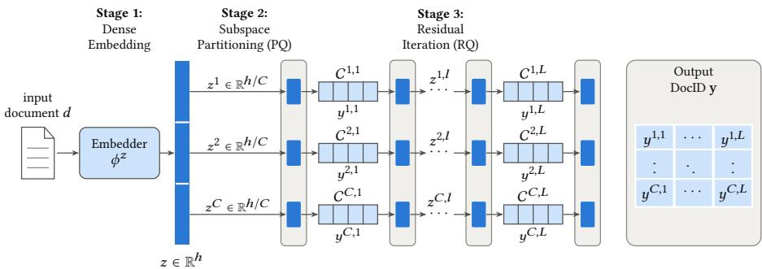  
Figure 1. Unified framework for semantic DocID encoding. Stage 1: the embedder $\phi ^ { z }$ maps a document � to a dense vector �. Stage 2 splits � into � sub-vectors $z ^ { c } \left( \mathbf { P Q } , C > 1 \right)$ . Stage 3 quantizes each sub-vector with � residual codebooks $\mathit { C ^ { c , l } }$ of� codewords $( \mathbf { R } \mathbf { Q } , L > 1 )$ , each step emitting one token $y ^ { c , l }$ of the DocID y $( M = C \times L$ tokens). (�, �) and the codebook training (�-means or learned) recover $\mathbf { P Q } \left( L = 1 \right)$ , R-KMeans and $\mathbf { R } { - } \mathbf { V } \mathbf { Q } \left( C = 1 \right)$ , and the hybrids PQ×R-KMeans and PQ×R-VQ (�, � > 1).

• Parallel (suited for PQ): $f _ { k }$ retains a random subset of � distinct positions, ignoring positional hierarchy.

• Hierarchical (suited for RQ): Assuming a single sequence $( C = 1 , L = M )$ , �� retains the strictly contiguous prefix of length �.

• Adapted (generalized hybrid): Distributes � tokens across � parallel subspaces $( \sum k _ { c } = k , k _ { c } \le L )$ , retaining the hierarchical prefix of length $k _ { c }$ in each. Note that Adapted generalizes both paradigms, reducing to Parallel when $L = 1 \left( \mathrm { P Q } \right)$ and to Hierarchical when $C = 1 \ ( \mathrm { R Q } )$

Given a masking function $f _ { k } , S ( k )$ is the conditional expectation of cosine similarity $S _ { c }$ between documents sharing identical masked representations:

$$
\begin{array} { r } { S ( k ) = \mathbb { E } \Big [ S _ { c } ( z ^ { ( i ) } , z ^ { ( j ) } ) \Big | f _ { k } ( \mathbf { y } ^ { ( i ) } ) = f _ { k } ( \mathbf { y } ^ { ( j ) } ) \Big ] . } \end{array}\tag{6}
$$

We report the global mean S averaged over all budget levels �.

3.2.3 Contrastive Alignment Preservation A. Contrastive Align ment Preservation (A) measures how faithfully discrete DocID distances preserve relative continuous embedding proximities. We first define a parameterized discrete similarity operator ${ S _ { d } ^ { ( \hat { C } , \hat { L } ) } }$ between two identifier matrices $\mathbf { y } ^ { ( i ) } , \mathbf { y } ^ { ( j ) }$ over evaluated subspace dimensions �ˆ and depth levels �ˆ:

$$
S _ { d } ^ { ( \hat { C } , \hat { L } ) } ( \mathbf { y } ^ { ( i ) } , \mathbf { y } ^ { ( j ) } ) = \frac { 1 } { M } \sum _ { c = 1 } ^ { \hat { C } } \sum _ { l = 1 } ^ { \hat { L } } \mathbf { 1 } \{ \mathbf { y } _ { c , 1 : l } ^ { ( i ) } = \mathbf { y } _ { c , 1 : l } ^ { ( j ) } \} ,\tag{7}
$$

where ${ \bf y } _ { c , 1 : l }$ denotes the prefix up to level � within subspace �. Setting $( \hat { C } , \hat { L } )$ recovers the metric variants corresponding to our structural paradigms:

• Hierarchical $( S _ { d } ^ { \mathbf { h i e r } } ) { : }$ Setting $\hat { C } = 1 , \hat { L } = M$ evaluates the normalized longest continuous common prefix, making it strictly adapted to purely hierarchical DocIDs (RQ).

• Parallel $( S _ { d } ^ { \mathrm { p a r a l l e l } } ) { : }$ Setting $\hat { C } = M , \hat { L } = 1$ measures the unranked proportion of matching tokens across independent subspaces, tailored to flat parallel DocIDs (PQ).

• Adapted $( S _ { d } ^ { \mathbf { a d a p t e d } } ) \colon$ Setting $\hat { C } = C , \hat { L } = L$ computes the average hierarchical prefix length across all � parallel subspaces, yielding a hybrid metric natively suited for Product-Residual spaces (PQxRQ).

We sample document triplets $( d ^ { ( i ) } , d ^ { ( j ) } , d ^ { ( k ) } )$ from the corpus, discarding tied states $( S _ { d } ( { \bf y } ^ { ( i ) } , { \bf y } ^ { ( j ) } ) = S _ { d } ( { \bf y } ^ { ( i ) } , { \bf y } ^ { ( k ) } ) )$ to build an evaluation set of $T = 1$ ,000 valid triplets. The alignment rate A measures the probability that relative continuous embedding similarity $S _ { c }$ aligns with discrete DocID ordering $S _ { d } \colon$

$$
\mathcal { R } = P \big ( S _ { c } ( z ^ { ( i ) } , z ^ { ( j ) } ) > S _ { c } ( z ^ { ( i ) } , z ^ { ( k ) } ) \big | S _ { d } ( \mathbf { y } ^ { ( i ) } , \mathbf { y } ^ { ( j ) } ) > S _ { d } ( \mathbf { y } ^ { ( i ) } , \mathbf { y } ^ { ( k ) } ) \big ) .\tag{8}
$$

A higher A confirms that discrete DocID paths faithfully preserve local relative ordering.

## 4 Results

## 4.1 Experimental Setup

Training pipeline. We follow a decoupled two-stage setup based on the DDRO codebase [17]. First, static document embeddings are generated using a frozen gtr-t5-base [19] (ℎ = 768) and quantized into DocIDs. Second, a sequence-to-sequence model is trained by supervised fine-tuning only, in DDRO’s three supervised steps (document, pseudo-query, then query to DocID), without its pairwise relevance optimization [17].

Datasets. We evaluate on MS MARCO 300K [18], processed as in DDRO and NCI [17, 29] (319,927 documents with a positive query) and Natural Questions (NQ320K, hereafter NQ) [13, 29] (109,739 documents after deduplication). Following the strict DDRO protocol [17], NQ is deduplicated by title with a strict one-to-one query-document mapping and disjoint train/eval document splits.

Configurations. We evaluate codebook sizes $V \in \{ 1 2 8 , 2 5 6 , 5 1 2 \}$ and structural dimensions $C , L \in \{ 1 , 2 , 4 , 6 , 8 , 1 2 , 1 6 , 2 4 \}$ , testing hybrid PQ×RQ configurations at � = 256 across sequence budgets $M = C \times L \in [ 4 , 4 8 ]$ . R-VQ codebooks are initialized via �-means and optimized for 100 epochs using AdamW to minimize the residual reconstruction loss (Equation (3)). For generative retrieval, we fine-tune a t5-small [21] model (batch size 128, AdamW, learning rate $1 0 ^ { - 3 }$ with linear decay) and report Recall@1, Recall@10 and

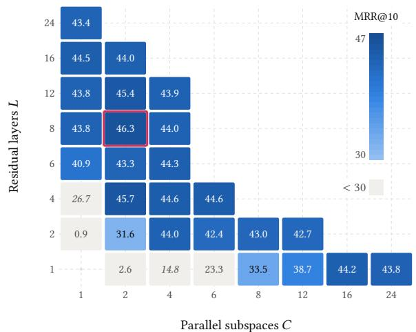

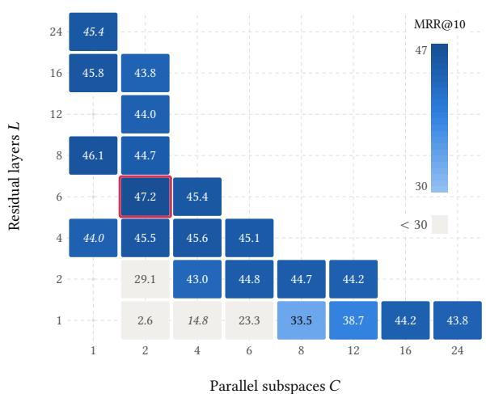

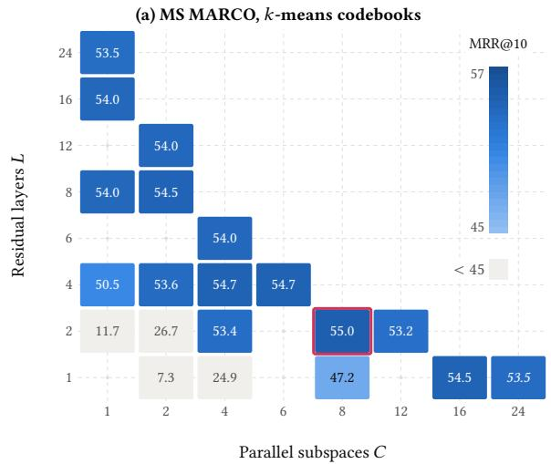  
(c) NQ, �-means codebooks

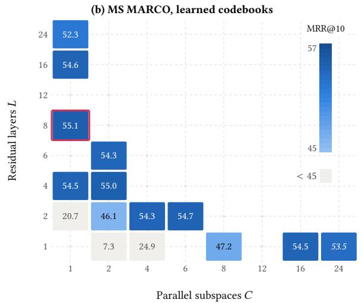  
(d) NQ, learned codebooks  
Figure 2. MRR@10 (%) over the grid of � parallel subspaces and � residual layers, with � = 256 codewords per codebook. PQ has only one training regime: its row (� = 1) is the same in every panel. Red outline: best cell of the panel; pale cells lie below the color range; italics: no run at $V = 2 5 6 ,$ mean over � ∈ {128 512}.

MRR@10 on the MS MARCO dev queries and the 1,713 NQ evaluation queries. Decoding uses prefix-constrained beam search (10 beams for validation during training, 100 for all reported results); models are trained for 10, 20 and 10 epochs over the three stages. We release the code, DocIDs and datasets.1

## 4.2 Downstream Performance along the Parallelism vs. Hierarchy Continuum

4.2.1 Main Method Comparison. The best configurations of the five families lie within 2.2 MRR@10 points on both datasets (Figure 2; RQ1). While PQ favors large parallel factorization (� = 16), pure hierarchical residual schemes (R-KMeans, R-VQ) score above it in Recall@10 and MRR@10 on both MS MARCO and NQ, and R-VQ reaches the best NQ result (56.64%). With �-means codebooks, the hybrid PQ×R-KMeans reaches 46.30% MRR@10 on MS MARCO, the best result of the study, and 55.04% on NQ by combining coarse parallel subspaces with local residual depth, above pure R-KMeans (45.47% and 54.70%).

4.2.2 Codebook Size and Document Encoder. Downstream retrieval is stable across codebook sizes: at fixed family and �, varying � between 128 and 512 moves MRR@10 by 1.06 (MS MARCO) and 1.53 (NQ) points. Retrieval is equally stable across document encoders: with R-KMeans (1×16×512) on MS MARCO, five encoders (gtr-t5-base, -large, -xl, bge-base-en-v1.5, ModernBERT-base) keep MRR@10 between 42.31% and 45.39%, with the standard gtr-t5-base highest.

4.2.3 Exploring the Design Space: Sequence Length � and Hybrid Configurations. To analyze how structural choices shape downstream efectiveness, Figure 2 maps the empirical performance surface across the entire (�, �) design grid, for � = 256. The total sequence length � = � × � acts as the primary driver of performance variance, but resilience to sequence compression varies significantly across quantization paradigms. PQ exhibits steep performance degradation once � falls below 16 (38.70% MRR@10 at $C = 1 2$ on MS MARCO, 47.23% at $C = 8$ on NQ), as factorizing vectors into uncoordinated parallel chunks forces sub-tokens to compress too much information.

Conversely, hierarchical residual schemes demonstrate substan tially greater structural robustness: ofline R-KMeans holds 43.80% at $L = 8$ but drops to 40.90% at � = 6 on MS MARCO, while end-toend trained R-VQ remains remarkably resilient even under extreme compression $\left( L = 4 \right)$ . Across all schemes, NQ maintains acceptable retrieval performance at shorter sequence budgets than MS MARCO, consistent with its smaller corpus.

The interior of the grid $( C > 1 , L > 1 )$ holds the hybrid spaces and answers RQ2. At their best, hybrids reach the top of the design space: PQ×R-KMeans peaks at 46.3% MRR@10 $( C = 2 , L = 8 )$ , the best MS MARCO result (Figure 2). Under tight budgets, residual depth is what preserves efectiveness: at $M = 4$ on MS MARCO, $\mathrm { R - V Q } \left( L = 4 , V = 5 1 2 \right)$ ) reaches 44.0%, against 31.6% and 26.2% for PQ×R-KMeans and $\mathrm { P Q } { \times } \mathrm { R } { - } \mathrm { V Q } \left( C = L = 2 \right)$ , in line with its higher uniqueness $( \mathcal { U } = 0 . 9 5 ,$ , against 0.66 for $\mathrm { P Q } { \times } \mathrm { R } { - } \mathrm { V Q } )$

## 4.3 Intrinsic DocID Metric Analysis

Uniqueness Ratio. As collisions cap recall, downstream MRR@10 collapses when U drops below 0.9 (Figures 3a and 3b; $R ^ { 2 } = 0 . 9 4$ and 0.96). The ceiling $\mathcal { U } _ { m a x }$ is 0.9819 on MS MARCO.

Evaluating uniqueness across sequence lengths � reveals contrasting resilience among encoding schemes (Figure 3c). PQ suffers from catastrophic collisions under tight budgets (from $C = 8 )$ as parallel chunks run out of capacity. R-KMeans maintains high uniqueness down to $L = 8$ before degrading at $L = 4 .$ . Conversely, R-VQ remains robust even at $L = 4 ,$ consistent with its more uniform codebook usage (see Normalized Entropy). Similar trends hold on NQ, where the smaller corpus delays collisions.

These results highlight a fundamental insight for Generative Retrieval (RQ3): the Uniqueness Ratio U is the gate a DocID space must pass; beyond it, the 60 (MS MARCO) and 48 (NQ) spaces with $\mathcal { U } \ge 0 . 9$ lie within 4.0 and 4.3 MRR@10 points of each other.

<table><tr><td>Dataset</td><td>PQ</td><td>R-Kmeans</td><td>R-VQ</td><td>PR-Kmeans</td><td>PR-VQ</td></tr><tr><td>MS MARCO</td><td>99.51</td><td>75.55</td><td>97.95</td><td>74.29</td><td>98.40</td></tr><tr><td>NQ</td><td>99.48</td><td>69.86</td><td>94.21</td><td>70.71</td><td>94.88</td></tr></table>

Table 1. Mean entropy H per encoding method

Normalized Entropy. Sequential residual �-means is the only pure scheme that uses its codes unevenly: on both MS MARCO and NQ, PQ-KMeans and RQ-VAE reach $\mathcal { H } \geq 0 . 9 2$ in every configuration, against 0.62–0.85 for RQ-KMeans (Table 1). H characterizes code book usage on its own terms: collapsed PQ-KMeans spaces keep $\mathcal { H } \ge 0 . 9 9 .$ , and RQ-KMeans stays competitive with uneven codes. Among residual schemes, even usage goes with uniqueness under short DocIDs: at � = 4, RQ-VAE keeps $\mathcal { U } = 0 . 9 5$ where RQ-KMeans falls to 0.53 (Figure 3c).

This structural disparity provides a key diagnostic explanation for the downstream performance resilience of R-VQ observed under truncated identifier budgets (�). Because ofline R-Kmeans performs greedy, layer-by-layer clustering on remaining residual error vectors, token assignments heavily concentrate on a few dominant centroids in early layers, leading to cluster collapse and severe codebook under-utilization. In contrast, joint end-to-end gradient optimization in R-VQ evenly distributes document representations across the discrete codebook space. This high information density enables R-VQ to preserve discriminative capacity and maintain robust retrieval performance even when the identifier sequence length � is heavily compressed.

Shared Similarity (S). measures the average continuous embedding similarity between documents grouped under common prefix constraints. As expected, Figure 3d shows that S scales monotonically with sequence depth � across all schemes, as deeper prefixes restrict document clusters to increasingly compact semantic neighborhoods. End-to-end trained Residual Vector Quantization $\left( \mathrm { R - V Q } \right)$ consistently maintains the highest local coherence, outperforming flat Product Quantization (PQ) across all sequence budgets, regardless of whether similarity is evaluated via unstructured token overlap (Parallel), common prefix length (Hier), or subspace-wise prefix matching (Adapted)

Contrastive Alignment Preservation (A). diagnoses whether discrete DocID distances reflect the continuous relative proximity of document triplets.

Figures 3(g–i) highlight a strong interaction between the structural design of the DocIDs and the evaluation metric:

• Hierarchical and Hybrid metrics (Hier, Adapted): Under hierarchical evaluation (Figs. 3g and 3h), alignment scores remain consistently high $( \sim \ 0 . 8 5  – 0 . 9 5 )$ for most configurations, showing only a slight degradation as � increases for PQ DocIDs. Hierarchical RQ DocIDs perform particularly well under these metrics because early code positions capture broad cluster semantics, preserving rank alignment.

• Parallel metric (Parallel): Conversely, when evaluated with the Parallel metric (Fig. 3i), which measures unstructured token overlap, hierarchical RQ structures experience a noticeable decrease in alignment $( \mathcal { A } ^ { \mathrm { p a r a l l e l } }$ dropping below 0.6 for certain configurations). In contrast, pure Product Quantization (PQ) DocIDs maintain higher relative stability under this metric.

Importantly, this distinct divergence in behavior between parallel and hierarchical DocIDs across the variants of A serves as an efective diagnostic tool. It allows us to explicitly observe and quantify the intrinsic hierarchy property of a given DocID scheme: strong performance under $\mathcal { A } ^ { \mathrm { h i e r } }$ coupled with degradation under Aparallel confirms that semantic information is strictly concentrated in sequential prefix order rather than distributed across independent tokens.

## 5 Conclusion

We presented a systematic study of numerical DocIDs for Generative Information Retrieval. The Uniqueness Ratio, measured before training, decides whether a DocID space is usable. The 60 (MS MARCO) and 48 (NQ) spaces with $\mathcal { U } \ge 0 . 9$ lie within 4.0 and 4.3 MRR@10 points of each other.

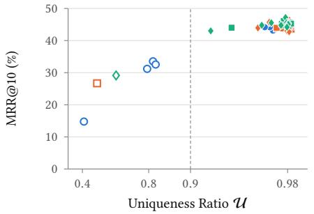  
(a) MS MARCO

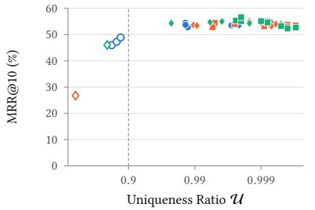  
(b) NQ

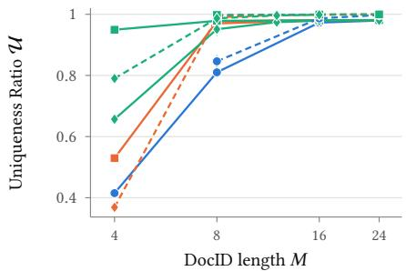

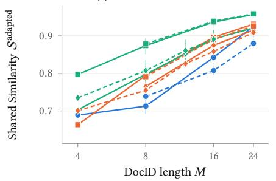

(c) U vs. �  
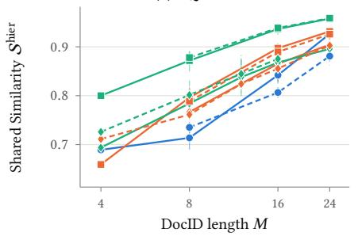

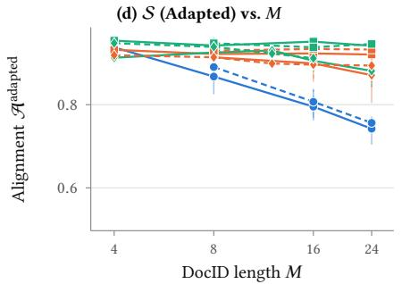

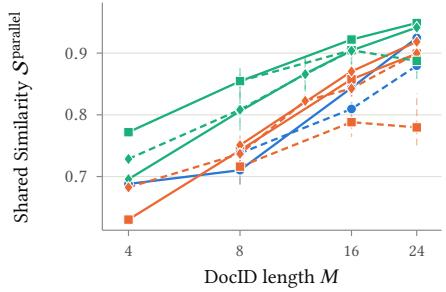

(g) A (Adapted) vs. �  
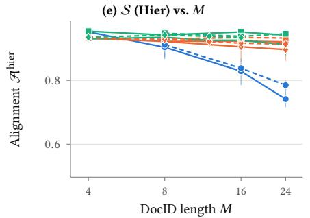  
(h) A (Hier) vs. �

(f) S (Parallel) vs. �  
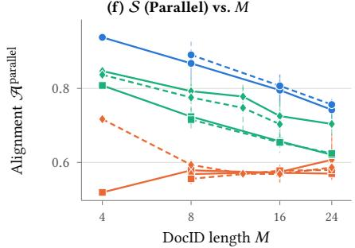  
(i) A (Parallel) vs. �  
Figure 3. Uniqueness Ratio U, Shared Semantic Similarity S and Contrastive Alignment Preservation A. (a) and (b) Uniqueness U vs. MRR@10 on MS MARCO and NQ, one marker per configuration (color and shape: family), hollow: $\mathcal { U } < 0 . 9 _ { : }$ , measured or implied by $V ^ { M } < 0 . 9 N$ (at most �� distinct DocIDs); U axis stretched toward 1 (log scale of the collision rate), dashed line: $\mathcal { U } = 0 . 9 . R ^ { 2 }$ of MRR@10 on the metric, MS MARCO / NQ: U 0.94 / 0.97. (c) to (i): Impact of DocID length � and evaluation formulation on Uniqueness (U), Shared Similarity (S) and Alignment (A) MS MARCO: full lines, NQ: dashed lines. (d) to (f): S, (g) to (i): A, in their Adapted (Section 3.2.2), Hier and Full variants

These findings come from a single parameterized family that unifies PQ, R-KMeans and R-VQ and exposes the hybrid Product– Residual Quantization (PQ×RQ) space. Within it, hybrids reach the best MS MARCO result (46.3% MRR@10), while R-VQ leads on Natural Questions (56.6%) and is the most robust under tight sequence budgets $\left( M \leq 8 \right)$ . In practice, U should be checked before training, and R-VQ preferred when DocIDs must be short.

Limitations and future work. To isolate the DocID space, we fix the rest of the pipeline: a t5-small model trained without DDRO’s pairwise relevance optimization [17] and decoded by prefix-constrained beam search [2, 30] rather than look-ahead [32];

DocIDs quantized post hoc from a frozen retrieval encoder, not learned jointly with the decoder [25]; collisions left unresolved, without sufix tokens or reassignment [34]; static corpora of at most 300K documents, while generative retrieval degrades at millions of passages [20] and new documents require re-quantization [35]. U flags collapse $( \mathcal { U } < 0 . 9 )$ , but no intrinsic metric explains MRR@10 among usable spaces $( R ^ { 2 } \leq 0 . 3 0 )$ . Future work follows from these results.

## References

[1] Artem Babenko and Victor Lempitsky. 2014. Additive Quantization for Extreme Vector Compression. In 2014 IEEE Conference on Computer Vision and Pattern Recognition. 931–938. doi:10.1109/CVPR.2014.124

[2] Nicola De Cao, Gautier Izacard, Sebastian Riedel, and Fabio Petroni. 2021. Autoregressive Entity Retrieval. In International Conference on Learning Representations. https://openreview.net/forum?id=5k8F6UU39V

[3] Ben Chen, Xian Guo, Siyuan Wang, Zihan Liang, Yufei Ma, Yue Lv, Chenyi Lei, Yuqing DING, Wenwu Ou, Han Li, and Kun Gai. 2026. OneSearch: A Preliminary Exploration of the Unified End-to-End Generative Framework for E-commerce Search. In Forty-third International Conference on Machine Learning. https: //openreview.net/forum?id=JKGgHY9FKa

[4] Yufei Chen, Junchen Fu, Jujia Zhao, Yukun Zhao, and Zhaochun Ren. 2026. What Makes a Good Semantic ID for Generative Recommendation? A Reproducibility Study. arXiv:2609.24430 [cs.IR] https://arxiv.org/abs/2609.24430

[5] Yongjian Chen, Tao Guan, and Cheng Wang. 2010. Approximate Nearest Neigh bor Search by Residual Vector Quantization. Sensors (Basel, Switzerland) 10 (2010), 11259 – 11273. https://api.semanticscholar.org/CorpusID:33774240

[6] Edoardo D’Amico, Marco De Nadai, Praveen Chandar, Divita Vohra, Shawn Lin, Max Lefarov, Paul Gigioli, Gustavo Penha, Ilya Kopysitsky, IvoJoel Senese, Darren Mei, Francesco Fabbri, Oguz Semerci, Yu Zhao, Vincent Tang, Brian St. Thomas, Alexandra Ranieri, Matthew N. K. Smith, Aaron Bernkopf, Bryan Leung, Ghazal Fazelnia, Mark VanMiddlesworth, Timothy Christopher Heath, Petter Pehrson Skiden, Alice Y. Wang, Doug J. Cole, Andreas Damianou, Maya Hristakeva, Reid Wilbur, Tarun Chillara, Vladan Radosavljevic, Pooja Chitkara, Sainath Adapa, Juan Elenter, Bernd Huber, Jacqueline Wood, Saaketh Vedantam, Jan Stypka, Sandeep Ghael, Martin D. Gould, David Murgatroyd, Yves Raimond, Mounia Lalmas, and Paul N. Bennett. 2026. Deploying Semantic ID-based Generative Retrieval for Large-Scale Podcast Discovery at Spotify. arXiv:2603.17540 [cs.IR] https://arxiv.org/abs/2603.17540

[7] Jiaxin Deng, Shiyao Wang, Kuo Cai, Lejian Ren, Qigen Hu, Weifeng Ding, Qiang Luo, and Guorui Zhou. 2025. OneRec: Unifying Retrieve and Rank with Genera tive Recommender and Iterative Preference Alignment. doi:10.48550/arXiv.2502. 18965

[8] Patrick Esser, Robin Rombach, and Bjorn Ommer. 2021. Taming Transformers for High-Resolution Image Synthesis. In Proceedings ofthe IEEE/CVF Conference on Computer Vision and Pattern Recognition (CVPR). 12873–12883.

[9] Tiezheng Ge, Kaiming He, Qifa Ke, and Jian Sun. 2014. Optimized Product Quantization. IEEE Transactions on Pattern Analysis and Machine Intelligence 36, 4 (2014), 744–755. doi:10.1109/TPAMI.2013.240

[10] Hervé Jégou, Matthijs Douze, and Cordelia Schmid. 2011. Product Quantization for Nearest Neighbor Search. IEEE Transactions on Pattern Analysis and Machine Intelligence 33, 1 (2011), 117–128.

[11] Clark Mingxuan Ju, Liam Collins, Leonardo Neves, Bhuvesh Kumar, Louis Yufeng Wang, Tong Zhao, and Neil Shah. 2025. Generative Recommendation with Seman tic IDs: A Practitioner’s Handbook. In Proceedings ofthe 34th ACM International Conference on Information and Knowledge Management (Seoul, Republic of Ko rea) (CIKM ’25). Association for Computing Machinery, New York, NY, USA, 6420–6425. doi:10.1145/3746252.3761612

[12] Vladimir Karpukhin, Barlas Oğuz, Sewon Min, Patrick Lewis, Ledell Wu, Sergey Edunov, Danqi Chen, and Wen-tau Yih. 2020. Dense Passage Retrieval for Open-Domain Question Answering. In Proceedings ofthe 2020 Conference on Empirical Methods in Natural Language Processing (EMNLP). Association for Computational Linguistics, 6769–6781. https://aclanthology.org/2020.emnlp-main.550

[13] Tom Kwiatkowski, Jennimaria Palomaki, Olivia Redfield, Michael Collins, Ankur Parikh, Chris Alberti, Danielle Epstein, Illia Polosukhin, Jacob Devlin, Kenton Lee, Kristina Toutanova, Llion Jones, Matthew Kelcey, Ming-Wei Chang, Andrew M. Dai, Jakob Uszkoreit, Quoc Le, and Slav Petrov. 2019. Natural Questions: A Benchmark for Question Answering Research. Transactions ofthe Association for Computational Linguistics 7 (2019), 452–466. doi:10.1162/tacl\_a\_00276

[14] Doyup Lee, Chiheon Kim, Saehoon Kim, Minsu Cho, and Wook-Shin Han. 2022. Autoregressive Image Generation using Residual Quantization. In Proceedings ofthe IEEE/CVF Conference on Computer Vision and Pattern Recognition (CVPR). 11523–11532.

[15] Yongqi Li, Nan Yang, Liang Wang, Furu Wei, and Wenjie Li. 2023. Multiview Identifiers Enhanced Generative Retrieval. In Proceedings of the 61st Annual Meeting ofthe Association for Computational Linguistics (Volume 1: Long Papers), Anna Rogers, Jordan Boyd-Graber, and Naoaki Okazaki (Eds.). Association for Computational Linguistics, Toronto, Canada, 6636–6648. doi:10.18653/v1/2023. acl-long.366

[16] Yunxiao Luo, Siyuan Wang, Ben Chen, Chenyi Lei, and Qingpeng Cai. 2026. PRQ-KMeans: Projection Residual Quantization for Semantic ID Tokenization. arXiv:2608.24207 [cs.LG] https://arxiv.org/abs/2608.24207

[17] Kidist Amde Mekonnen, Yubao Tang, and Maarten de Rijke. 2025. Lightweight and Direct Document Relevance Optimization for Generative Information Re trieval. In Proceedings ofthe 48th International ACM SIGIR Conference on Research and Development in Information Retrieval (SIGIR ’25). ACM, 1327–1338. doi:10.1145/3726302.3730023

[18] Tri Nguyen, Mir Rosenberg, Xia Song, Jianfeng Gao, Saurabh Tiwary, Rangan Majumder, and Li Deng. 2016. MS MARCO: A Human Generated MA chine Reading COmprehension Dataset. https://www.microsoft.com/enus/research/publication/ms-marco-human-generated-machine-readingcomprehension-dataset/ arXiv:1611.09268.

[19] Jianmo Ni, Chen Qu, Jing Lu, Zhuyun Dai, Gustavo Hernandez Abrego, Ji Ma, Vincent Zhao, Yi Luan, Keith Hall, Ming-Wei Chang, et al. 2022. Large dual

encoders are generalizable retrievers. In Proceedings of the 2022 Conference on Empirical Methods in Natural Language Processing. 9844–9855.

[20] Ronak Pradeep, Kai Hui, Jai Gupta, Adam Lelkes, Honglei Zhuang, Jimmy Lin, Donald Metzler, and Vinh Tran. 2023. How Does Generative Retrieval Scale to Millions of Passages?. In Proceedings of the 2023 Conference on Empirical Methods in Natural Language Processing, Houda Bouamor, Juan Pino, and Kalika Bali (Eds.). Association for Computational Linguistics, Singapore, 1305–1321. doi:10.18653/v1/2023.emnlp-main.83

[21] Colin Rafel, Noam Shazeer, Adam Roberts, Katherine Lee, Sharan Narang, Michael Matena, Yanqi Zhou, Wei Li, and Peter J. Liu. 2020. Exploring the limits of transfer learning with a unified text-to-text transformer. J. Mach. Learn. Res. 21, 1, Article 140 (Jan. 2020), 67 pages.

[22] Shashank Rajput, Nikhil Mehta, Anima Singh, Raghunandan Keshavan, Trung Vu, Lukasz Heidt, Lichan Hong, Yi Tay, Vinh Q. Tran, Jonah Samost, Maciej Kula, Ed H. Chi, and Maheswaran Sathiamoorthy. 2023. Recommender systems with generative retrieval. In Proceedings ofthe 37th International Conference on Neural Information Processing Systems (New Orleans, LA, USA) (NIPS ’23). Curran Associates Inc., Red Hook, NY, USA, Article 452, 17 pages.

[23] Ruiyang Ren, Wayne Xin Zhao, Jing Liu, Hua Wu, Ji-Rong Wen, and Haifeng Wang. 2023. TOME: A two-stage approach for model-based retrieval. In Proceedings ofthe 61st Annual Meeting ofthe Association for Computational Linguistics (Volume 1: Long Papers). 6102–6114.

[24] Ruslan Salakhutdinov and Geofrey Hinton. 2009. Semantic Hashing. International Journal ofApproximate Reasoning 50, 7 (2009), 969–978.

[25] Weiwei Sun, Lingyong Yan, Zheng Chen, Shuaiqiang Wang, Haichao Zhu, Pengjie Ren, Zhumin Chen, Dawei Yin, Maarten de Rijke, and Zhaochun Ren. 2023. Learning to Tokenize for Generative Retrieval. arXiv:2304.04171 [cs.IR] https: //arxiv.org/abs/2304.04171

[26] Yubao Tang, Ruqing Zhang, Jiafeng Guo, Jiangui Chen, Zuowei Zhu, Shuaiqiang Wang, Dawei Yin, and Xueqi Cheng. 2023. Semantic-Enhanced Diferentiable Search Index Inspired by Learning Strategies. In Proceedings ofthe 29th ACM SIGKDD Conference on Knowledge Discovery and Data Mining (Long Beach, CA, USA) (KDD ’23). Association for Computing Machinery, New York, NY, USA, 4904–4913. doi:10.1145/3580305.3599903

[27] Yi Tay, Vinh Q. Tran, Mostafa Dehghani, Jianmo Ni, Dara Bahri, Harsh Mehta, Zhen Qin, Kai Hui, Zhe Zhao, Jai Gupta, Tal Schuster, William W. Cohen, and Donald Metzler. 2022. Transformer memory as a diferentiable search index. In Proceedings of the 36th International Conference on Neural Information Processing Systems (New Orleans, LA, USA) (NIPS ’22). Curran Associates Inc., Red Hook, NY, USA, Article 1587, 13 pages.

[28] Jianfeng Wang, Jingdong Wang, Jingkuan Song, Xin-Shun Xu, Heng Tao Shen, and Shipeng Li. 2015. Optimized Cartesian K-Means . IEEE Transactions on Knowledge & Data Engineering 27, 01 (Jan. 2015), 180–192. doi:10.1109/TKDE. 2014.2324592

[29] Yujing Wang, Yingyan Hou, Haonan Wang, Ziming Miao, Shibin Wu, Hao Sun, Qi Chen, Yuqing Xia, Chengmin Chi, Guoshuai Zhao, Zheng Liu, Xing Xie, Hao Allen Sun, Weiwei Deng, Qi Zhang, and Mao Yang. 2022. A neural corpus indexer for document retrieval. In Proceedings of the 36th International Conference on Neural Information Processing Systems (New Orleans, LA, USA) (NIPS ’22). Curran Associates Inc., Red Hook, NY, USA, Article 1856, 15 pages.

[30] Shiguang Wu, Zhaochun Ren, Xin Xin, Jiyuan Yang, Mengqi Zhang, Zhumin Chen, Maarten de Rijke, and Pengjie Ren. 2025. Constrained Auto-Regressive Decoding Constrains Generative Retrieval. In Proceedings ofthe 48th International ACM SIGIR Conference on Research and Development in Information Retrieval. ACM. doi:10.1145/3726302.3729934

[31] Hansi Zeng, Chen Luo, Bowen Jin, Sheikh Muhammad Sarwar, Tianxin Wei, and Hamed Zamani. 2024. Scalable and Efective Generative Information Retrieval. In Proceedings ofthe ACM Web Conference 2024 (Singapore, Singapore) (WWW ’24). Association for Computing Machinery, New York, NY, USA, 1441–1452. doi:10.1145/3589334.3645477

[32] Hansi Zeng, Chen Luo, and Hamed Zamani. 2024. Planning Ahead in Generative Retrieval: Guiding Autoregressive Generation through Simultaneous Decoding. In Proceedings ofthe 47th International ACM SIGIR Conference on Research and Development in Information Retrieval. ACM. doi:10.1145/3626772.3657746

[33] Peitian Zhang, Zheng Liu, Yujia Zhou, Zhicheng Dou, Fangchao Liu, and Zhao Cao. 2024. Generative Retrieval via Term Set Generation. In Proceedings of the 47th International ACM SIGIR Conference on Research and Development in Information Retrieval (Washington DC, USA) (SIGIR ’24). Association for Computing Machinery, New York, NY, USA, 458–468. doi:10.1145/3626772.3657797

[34] Ruohan Zhang, Jiacheng Li, Julian McAuley, and Yupeng Hou. 2025. Purely Semantic Indexing for LLM-based Generative Recommendation and Retrieval. arXiv:2509.16446 [cs.IR] https://arxiv.org/abs/2509.16446

[35] Zhen Zhang, Xinyu Ma, Weiwei Sun, Pengjie Ren, Zhumin Chen, Shuaiqiang Wang, Dawei Yin, Maarten de Rijke, and Zhaochun Ren. 2025. Replication and Exploration of Generative Retrieval over Dynamic Corpora. In Proceedings of the 48th International ACM SIGIR Conference on Research and Development in Information Retrieval. ACM. doi:10.1145/3726302.3730314

[36] Yujia Zhou, Jing Yao, Zhicheng Dou, Ledell Wu, Peitian Zhang, and Ji-Rong Wen. 2022. Ultron: An Ultimate Retriever on Corpus with a Model-based Indexer. arXiv:2208.09257 [cs.IR] https://arxiv.org/abs/2208.09257

[37] Shengyao Zhuang, Houxing Ren, Linjun Shou, Jian Pei, Ming Gong, Guido Zuccon, and Daxin Jiang. 2023. Bridging the Gap Between Indexing and Retrieval for Diferentiable Search Index with Query Generation. arXiv:2206.10128 [cs.IR] https://arxiv.org/abs/2206.10128