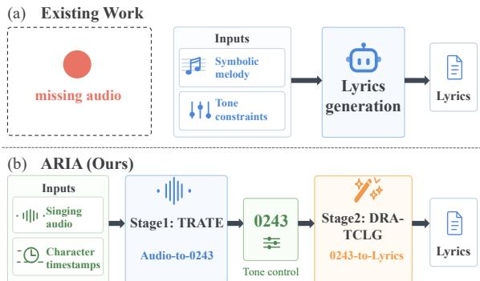
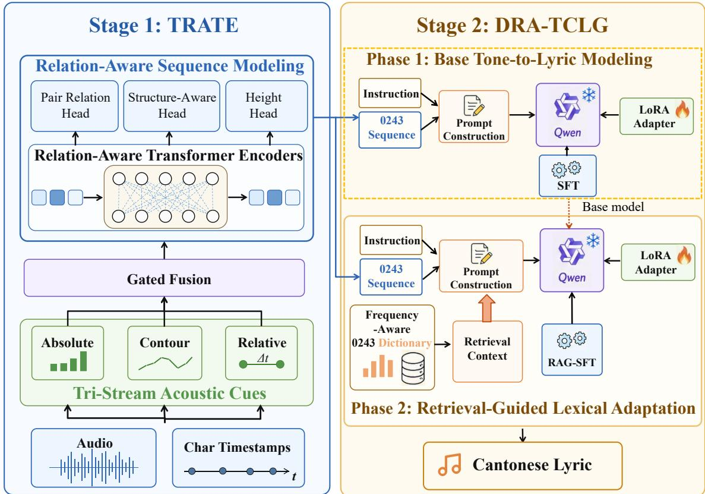
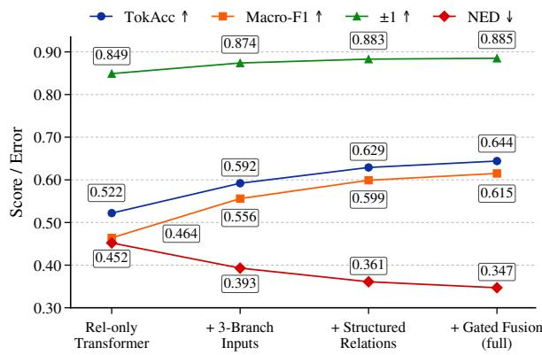
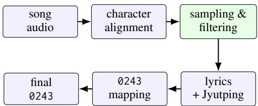
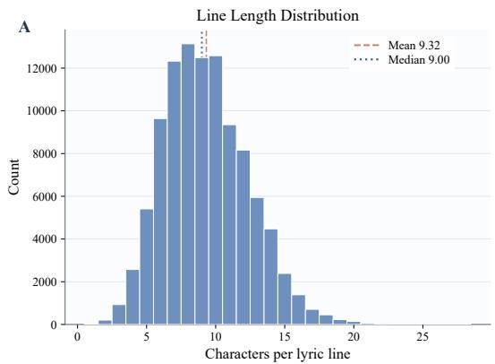
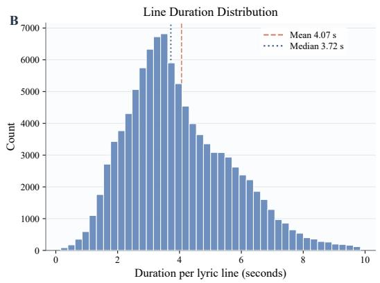
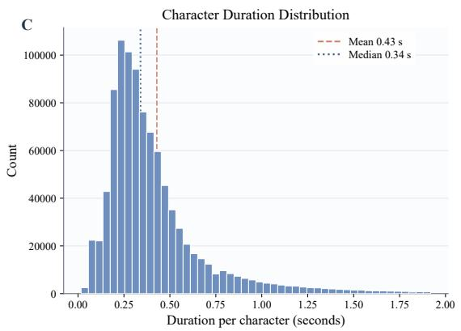
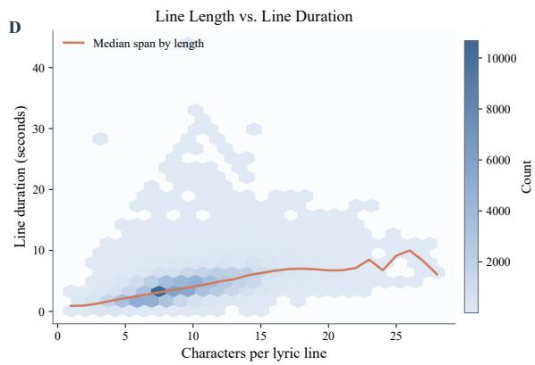

# ARIA: Audio-Driven Melody–Tone Relation Modeling for Cantonese Lyric Authoring

Shengyu Li\* and Jinting Wang\* and Li Liu†

The Hong Kong University of Science and Technology (Guangzhou) {sli802,jwang644}@connect.hkust-gz.edu.cn avrillliu@hkust-gz.edu.cn

## Abstract

Cantonese lyric writing requires close alignment between lexical tones and melodic pitch. Existing melody-guided lyric generation meth ods typically rely on symbolic melody to generate lyrics. However, in real songwriting scenarios, melodies are often expressed as raw singing audio or hummed recordings, where pitch is implicit, noisy, and unstructured, making these methods difficult to apply directly. To address this limitation, we propose ARIA, a two-stage audio-driven melody– tone relation modeling framework for Cantonese lyric authoring that generates Cantonese lyrics from singing recordings with provided character-level timestamps. Specifically, we first design a Tri-Stream Relation-Aware Tone Estimator (TRATE) to predict 0243 sequences from timestamped singing audio by modeling multi-stream acoustic cues and relational tonal structure. We then propose a Decoupled Retrieval-Augmented Tone-Conditioned Lyric Generator (DRA-TCLG) to generate fluent lyrics conditioned on predicted tonal plans with retrieval-enhanced lexical guidance. Moreover, we construct a large-scale aligned audio– Jyutping–0243 dataset from real Cantonese singing recordings to support this new task. Experimental results demonstrate that ARIA achieves strong performance in both 0243 prediction and tone-consistent lyric generation, validating the effectiveness of the proposed framework.

## 1 Introduction

Recent advances in lyric generation have substantially improved controllability with respect to melody, rhythm, and semantic planning (Sheng et al., 2021; Ju et al., 2022; Tian et al., 2023; Qian et al., 2023; Sun et al., 2023; Zhao et al., 2025; Yoshida et al., 2026; Ding et al., 2025). However, most existing systems assume melody is provided as clean symbolic input (e.g., MIDI notes), focusing primarily on symbolic-conditioned generation. In many practical workflows, creators instead begin from a singing recording rather than a structured score. We therefore study a narrower slot-aligned setting in which the recording is accompanied by character-level lyric boundaries.

  
Figure 1: Motivation of ARIA. Existing melody-aware lyric systems typically rely on symbolic melody or manually specified tone constraints. In contrast, ARIA receives singing audio together with character-level lyricslot boundaries, predicts an explicit 0243 tone–melody control sequence, and uses it as an interpretable interface for controllable Cantonese lyric generation.

Unlike prior work that assumes symbolic melody input or manually specified tonal plans, we estimate the tonal plan from singing audio while retaining character-level lyric-slot timing. Cantonese lyricists frequently use a four-level tonal shorthand known as 02431 to bridge melodic contour and lexical tone during lyric writing. Motivated by this practice, we introduce an audio-driven Cantonese lyric-generation pipeline via a two-stage framework, as illustrated in Figure 1(b), where 0243 serves as an intermediate representation connecting singing melody and lyric generation.

However, this setting introduces two key challenges. First, recovering relative tonal structure from singing audio is highly non-trivial. Unlike conventional pitch estimation, 0243 does not represent absolute F0 values, but rather relative and line-internal tonal relationships. The same tonal category may correspond to different pitch realizations depending on melodic context. Second, the mapping from 0243 sequences to lyrics is an inherently one-to-many problem. Even with a reliable tonal plan, multiple lyric candidates may satisfy the same 0243 pattern while differing substantially in semantics, fluency, and lexical choice.

To address these challenges, we propose ARIA, an audio-driven two-stage framework for Cantonese lyric authoring via melody–tone relation modeling. Specifically, we first design a Tri-Stream Relation-Aware Tone Estimator (TRATE), which predicts token-level 0243 sequences from acoustic evidence within the supplied character slots. TRATE combines tri-stream acoustic features with relation-aware contextual modeling, enabling reliable recovery of relative tonal structure under realistic singing conditions. We further propose the Decoupled Retrieval-Augmented Tone-Conditioned Lyric Generator (DRA-TCLG), which generates lyrics conditioned on the predicted tonal plan and retrieved lyric priors from a 0243-lyric mapping dictionary. By incorporating retrieval-augmented lexical guidance, DRA-TCLG alleviates the one-to-many generation ambiguity and improves tonal compatibility, lexical controllability, and generation fluency.

In addition, to support this new task, we construct a large-scale aligned audio–Jyutping–0243 annotation resource from real Cantonese singing recordings, providing character-level timestamps, tone labels, and lyric alignments for training and evaluation.

Scope and generalizability. Our empirical claims are specific to Cantonese. The two-stage audio–control–lyric decomposition, tri-stream acoustic modeling, relation-aware sequence modeling, and delayed retrieval are transferable at the architectural level. In contrast, the 0243 inventory, Jyutping mapping, Cantonese tone–melody rules, and lexical dictionary are language-specific and must be replaced with language-appropriate controls and resources when adapting ARIA to another language.

In summary, our contributions are threefold:

• We formulate a slot-aligned audio-driven Cantonese lyric-generation task that replaces externally supplied symbolic melody or tonecontrol sequences with audio-side tonal-plan estimation.

• We propose ARIA, a two-stage framework comprising TRATE for relation-aware audioto-0243 estimation and DRA-TCLG for retrieval-augmented, tone-conditioned lyric generation.

• We construct aligned Cantonese audio– Jyutping–0243 annotations and evaluate the two stages separately and as a pipeline, including boundary robustness, error propagation, and human judgments.

## 2 Related Work

Melody- and Tone-aware Lyric Generation. Prior work has explored interactive writing support, structure-aware generation, and melodyconstrained lyric rewriting, including YOULING (Zhang et al., 2020), QIUNIU (Zhang et al., 2022), CHIPSONG (Liu et al., 2022), UNILG (Qian et al., 2023), SONGREWRITER (Sun et al., 2023), and REFFLY (Zhao et al., 2025). Symbolic songwriting systems further show that explicit melody structures, such as note sequences or other symbolic melody forms, improve controllability (Sheng et al., 2021; Ju et al., 2022; Tian et al., 2023; Miyano and Saito, 2021; Ding et al., 2025). For tonal languages, however, melody–text alignment also depends on lexical tone. Prior work has studied intermediate contour representations for Mandarin (Chen and Teufel, 2024) and tone–melody interaction in Cantonese lyric generation (Cheng et al., 2025), while linguistic, musicological, and corpus studies suggest that sung Cantonese preserves lexical tone mainly through relative pitch relations rather than faithful spoken F0 contours (Wong and Diehl, 2002; Li and Choi, 2016; Yang et al., 2021; Schellenberg and Gick, 2020). ARIA is complementary to these studies but shifts the focus earlier in the pipeline: instead of assuming symbolic melody or tone-control inputs, it recovers an authoringoriented 0243 tonal plan directly from realistic singing audio and uses it as an explicit control signal for lyric generation.

Audio Analysis for Lyrics and Melody. Lyricsto-audio alignment and vocal melody extraction provide important tools, but they do not directly solve audio-to-0243 mapping. Sung lyrics may not align cleanly to isolated notes, and vocal F0 estimation in polyphonic music remains difficult because of accompaniment, octave errors, vibrato, and ornamentation (Wong et al., 2007; Fujihara and Goto, 2012; Salamon et al., 2014). Large-scale Cantonese song analysis has used singing-voice extraction, ASR, character timestamps, and note extraction to quantify tone–melody relations (Yang et al., 2021). ARIA turns this analysis-oriented problem into a controllable-generation interface: a compact 0243 sequence that can be edited, retrieved against, and consumed by a lyric generator.

## 3 Method

ARIA decouples audio-side and text-side modeling while maintaining a unified intermediate interface, as illustrated in Figure 2. TRATE predicts 0243 control sequences from singing audio under known character boundaries. DRA-TCLG then generates lyrics conditioned on the predicted tone plan, optionally augmented with retrieved lexical candidates.

## 3.1 Task Formulation

Given a singing-audio segment x with characterlevel lyric-slot boundaries

$$
B = \{ ( s _ { i } , e _ { i } ) \} _ { i = 1 } ^ { N } ,
$$

where N is the number of output character slots and $( s _ { i } , e _ { i } )$ denotes the start and end time of the ith slot, TRATE predicts a four-way relative-height label

$$
y _ { i } ^ { h } \in \{ 1 , 2 , 3 , 4 \} ,
$$

ordered from low to high, for each slot. The current system does not discover these slots from unconstrained audio; they may be user-provided, derived from existing annotations, or estimated by an external lyric aligner.

We convert each height label through a fixed mapping g, with $g ( 1 ) = 0 , g ( 2 ) = 2 , g ( 3 ) = 4$ and $g ( 4 ) = 3$ , yielding

$$
P = ( p _ { 1 } , \ldots , p _ { N } ) , \qquad p _ { i } = g ( y _ { i } ^ { h } ) ,
$$

where $p _ { i }$ is the 0243 code at the i-th slot. For training and evaluation, the reference 0243 sequence is derived deterministically from the Jyutping of the aligned original lyric; at inference time, TRATE receives neither lyric text nor Jyutping. Because a melody may admit multiple compatible lyric realizations, this reference denotes the tonal plan of the observed aligned lyric rather than a unique audio-only annotation. Thus, the Stage 1 target is a token-level authoring plan rather than frame-level F0 or a symbolic note sequence. Appendix A.4 describes the label derivation.

DRA-TCLG consumes the same sequence. Given P and optional controls such as an instruction or retrieved lexical priors, it generates a Cantonese lyric line

$$
L = ( \ell _ { 1 } , \ldots , \ell _ { N } ) ,
$$

where $\ell _ { i }$ is the generated character aligned with $p _ { i }$ . The line should satisfy the prescribed tone– melody tier pattern while remaining fluent. This shared 0243 interface is compact for generation, interpretable for human revision, and grounded in Cantonese lyric-writing practice. Appendix A.8 details how the two stages align with a real lyricwriting workflow.

## 3.2 TRATE

TRATE serves as the audio-side module of ARIA, predicting 0243 sequences from singing audio with character-level boundaries. As shown in the Stage 1 part of Figure 2, TRATE extracts tri-stream melodic cues from absolute, contour, and relative acoustic views, integrates them through gated fusion, and uses relation-aware Transformer encoders to capture line-internal dependencies. Structured prediction heads are then applied to recover the 0243 tonal control sequence.

Tri-Stream Feature Extraction. Direct F0 statistics are brittle for singing audio due to vibrato, slides, and variable token durations. For each character i, TRATE therefore builds three complementary feature vectors: absolute, contour, and relative features, denoted as $x _ { i } ^ { \mathrm { a b s } } , x _ { i } ^ { \mathrm { c n t } }$ , and $x _ { i } ^ { \mathrm { r e l } }$ . The absolute stream summarizes token-local pitch level, stability, and duration statistics; the contour stream preserves the resampled within-token log-F0 trajectory and voiced mask; and the relative stream encodes line-internal rank, neighboring pitch gaps, local extrema, position, and relative duration. This separation matches the line-relative nature of 0243, where local acoustics, within-token shape, and sentence-level ordering provide complementary evidence. Appendix C lists the full feature set.

Gated Fusion. The three streams are encoded separately and then fused token-wise. Let $h _ { i } ^ { \mathrm { a b s } }$ $h _ { i } ^ { \mathrm { c n t } }$ , and $h _ { i } ^ { \mathrm { r e l } }$ denote the corresponding branch encodings. We compute the branch weights

  
Figure 2: Overall architecture of ARIA. The framework decouples audio-side tone-plan estimation and text-side lyric generation through a unified 0243 intermediate representation. In Stage 1, TRATE predicts 0243 control sequences from singing audio and character-level timestamps by modeling absolute, contour, and relative acoustic streams with gated fusion and relation-aware sequence modeling. In Stage 2, DRA-TCLG generates Cantonese lyrics conditioned on the predicted tonal plan, first learning a base tone-to-lyric mapping and then incorporating retrieval-enhanced lexical guidance from a frequency-aware 0243 dictionary.

$$
\alpha _ { i } = \mathrm { s o f t m a x } \Big ( W _ { g } \left[ h _ { i } ^ { \mathrm { a b s } } ; \quad h _ { i } ^ { \mathrm { c n t } } ; \quad h _ { i } ^ { \mathrm { r e l } } \right] + b _ { g } \Big )\tag{1}
$$

where $\alpha _ { i }$ contains stream-wise gating weights for the i-th character, $[ h _ { i } ^ { \mathrm { a b s } } ; \quad h _ { i } ^ { \mathrm { c n t } } ; \quad h _ { i } ^ { \mathrm { r e l } } ]$ denotes concatenation, and $W _ { g }$ and $b _ { g }$ are learnable parameters. The fused representation is then obtained by combining the weighted branch encodings with a residual projection of their concatenation: Let $\mathcal { M } = \{ \mathrm { a b s } , \mathrm { c n t } , \mathrm { r e l } \}$

$$
\widetilde { h } _ { i } = \sum _ { m \in \mathcal { M } } \alpha _ { i } ^ { m } h _ { i } ^ { m } + W _ { r } \big [ h _ { i } ^ { \mathrm { a b s } } ; \quad h _ { i } ^ { \mathrm { c n t } } ; \quad h _ { i } ^ { \mathrm { r e l } } \big ] .\tag{2}
$$

where $\alpha _ { i } ^ { m }$ is the weight for stream m and $W _ { r }$ is a learnable residual projection. This lets the model adapt to token-level reliability: a sustained syllable may rely on contour shape, whereas a short token may rely more on rank and local statistics.

Relation-Aware Sequence Modeling. The fused sequence $\tilde { H } = \{ \tilde { h } _ { 1 } , \dots , \tilde { h } _ { N } \}$ is processed by a Transformer encoder (Vaswani et al., 2017). Since 0243 is line-internal and ordinal, we add pairwise melodic relation bias to self-attention:

$$
e _ { i j } ^ { ( l , a ) } = \left( \left( q _ { i } ^ { ( l , a ) } \right) ^ { \top } k _ { j } ^ { ( l , a ) } \right) / \sqrt { d } + u _ { l , a } ^ { \top } \phi ( r _ { i j } ) .\tag{3}
$$

where $e _ { i j } ^ { ( l , a ) }$ is the attention logit from token i to token j in layer l and head $a , q _ { i } ^ { ( l , a ) }$ and $k _ { j } ^ { ( l , a ) }$ are the query and key vectors, and d is the attentionhead dimension. The vector $r _ { i j }$ summarizes median log-F0 gap, percent-rank gap, token distance, sign, and relative position between tokens i and j; ϕ(·) projects this relation vector, and $u _ { l , a }$ is a learnable relation-bias vector for layer l and head a. On top of the contextualized representation $z _ { i }$ produced by the Transformer encoder, TRATE predicts the main height label together with contourfamily, register, and pairwise relation heads. The contour and register heads factor Cantonese tonal supervision into structured components, while the pairwise head predicts short-range ordering relations over nearby tokens. Rather than treating the six-category Cantonese tone label as a free flat tone-6 target, we derive a height distribution from the structured tonal pathway and regularize it toward the main level-4 prediction. Training combines the main height loss, auxiliary classification losses, a height-consistency regularizer, and pitch-shift transposition consistency.

## 3.3 DRA-TCLG

DRA-TCLG serves as the text-side module of ARIA, converting the 0243 sequence predicted by TRATE into Cantonese lyrics. Although large language models can generate fluent text, they do not explicitly encode the correspondence between 0243 patterns and Cantonese lexical-tone choices. We therefore formulate DRA-TCLG as a tone-conditioned generator and introduce compact dictionary priors only after learning a stable tone-to-lyric mapping. Directly applying retrievalaugmented generation (RAG) from the beginning can introduce noisy candidate sets that destabilize early-stage training and weaken tone–lyric alignment. To address this issue, we adopt a decoupled two-phase training strategy, as illustrated in the Stage 2 part of Figure 2.

Phase 1: Base Tone-to-Lyric Modeling. We start from Qwen3.5-4B (Qwen Team, 2026) and train a causal language model to map the 0243 control sequence $P$ to a target lyric line $y =$ $( y _ { 1 } , \dots , y _ { T } )$ without retrieval, where $T$ is the number of lyric tokens:

$$
\begin{array} { l } { p _ { \mathsf { b a s e } } = \mathsf { \Pi } [ \mathsf { i n s t r u c t i o n } ; P ] , } \\ { \displaystyle \mathcal { L } _ { \mathsf { b a s e } } = - \sum _ { t = 1 } ^ { T } \log p _ { \theta } ( y _ { t } \mid y _ { < t } , p _ { \mathsf { b a s e } } ) . } \end{array}\tag{4}
$$

Here, $p _ { \mathrm { b a s e } }$ is the Phase 1 prompt, $y _ { t }$ is the target token at step t, $y _ { < t }$ denotes previous target tokens, and θ denotes the model parameters.

Only lyric tokens are supervised during training. This phase encourages the model to first acquire a direct mapping among the 0243 sequence length, rhythmic structure, and Cantonese lexical realization, without being distracted by noisy or incomplete candidate lists. It also provides the second phase with a stable initialization, so retrieval is introduced as lexical refinement and constraint enhancement rather than being responsible for learning the tone-to-lyric mapping from scratch.

Phase 2: Retrieval-Guided Adaptation. The second phase adds lexical priors from 0243.hk. We first build a frequency-aware 0243-to-lyrics dictionary by counting candidate occurrences in the Fei Tsui training lyrics and reordering each code entry by corpus frequency. For an input 0243 sequence $P ,$ we split it into code blocks, enumerate subcodes with sliding windows of length 2–4, and retrieve candidate words from this dictionary. We prioritize 2- and 3-character candidates because they are common in Cantonese lyrics, retain only sparse 4-character candidates to avoid over-constraining generation, and discard single-character candidates because they are dominated by frequent function words. The retrieved context is serialized as aligned code–candidate pairs:

$$
\begin{array} { r } { R = \{ ( c _ { i } , \mathcal { C } ( c _ { i } ) ) \} _ { i = 1 } ^ { M } , ~ } \\ { r = \mathrm { s e r i a l i z e } ( R ) , ~ } \\ { p _ { \mathrm { r a g } } = [ \mathrm { i n s t r u c t i o n } ; r ; P ] , } \end{array}\tag{5}
$$

where $c _ { i }$ is the i-th retrieved sub-code, $\mathcal { C } ( c _ { i } )$ is its candidate-word set, M is the number of retrieved sub-codes, R is the structured retrieval result, r is its serialized prompt form, and $p _ { \mathrm { r a g } }$ is the retrievalaugmented prompt.

Starting from the Phase 1 model, we fine-tune LoRA adapters (Hu et al., 2022) with the backbone frozen:

$$
\mathcal { L } _ { \mathrm { r a g } } = - \sum _ { t = 1 } ^ { T } \log p _ { \theta ^ { \prime } } ( y _ { t } \mid y _ { < t } , p _ { \mathrm { r a g } } ) ,\tag{6}
$$

where $\theta ^ { \prime }$ denotes the adapted model parameters, and $y _ { t } , y _ { < t }$ , and $T$ follow the same definitions as in Phase 1. This decoupling prevents early optimization from overfitting to noisy retrieval candidates while still letting the final model use domainspecific lexical priors. The retrieval module is designed for prompt density rather than maximum recall: it gives DRA-TCLG a compact set of plausible lexical anchors while leaving the language model free to ignore candidates that do not fit the semantic context. Appendix F gives the exact prompt format and retrieval rules.

## 4 Experiments

## 4.1 Dataset

Following ToneCraft’s Fei Tsui setting (Cheng et al., 2025), we collect Cantonese lyrics from Fei Tsui2, which contains over 6k songs. ARIA uses three sources: lyrics and matched singing recordings for Stage 1 audio-to-0243 learning, and lyrics plus 0243.hk3 lexical resources for Stage 2 0243-to-lyric generation. After filtering, Stage 1 contains over 100K aligned lyric–audio line samples from over 3.4K recordings, split by song into train/dev/test sets with an approximate 0.8/0.1/0.1 ratio to avoid song-level leakage. Stage 2 contains over 170K Fei Tsui 0243-to-lyric pairs, split by 0.9/0.05/0.05. For comparing oracle 0243-to-lyrics generation with the full audio-to-lyrics pipeline, we build a shared 500-sample test subset from the intersection of the Stage 1 and Stage 2 test sets, matched by normalized 0243 sequences. We also retrieve over 140K unique 2–4 character candidates from 0243.hk. Due to copyright restrictions, we do not redistribute the original recordings; instead, we release non-audio Stage 1 annotations, including source identifiers, splits, character boundaries, 0243 and level-4 labels, Jyutping, pitch metadata, and preprocessing scripts. Exact statistics, construction details, and the released format are provided in Appendices A.5 and A.6.

## 4.2 Experimental Setup

TRATE. It predicts token-level 0243 from singing audio and character timestamps. We compare it with two quartile rules and two Qwen3.5 baselines (Qwen Team, 2026), and report TokAcc, Macro-F1, Within ±1, and normalized edit distance (NED). These metrics cover exact labels, class balance, musically adjacent near misses, and downstream sequence stability; feature and metric details are in Appendices C and A.10. We optimize with AdamW (Loshchilov and Hutter, 2019), using linear warmup followed by cosine learningrate decay. Only the main height head uses label smoothing, while EMA is enabled. The TRATE result in Table 1 is the arithmetic mean over three independent training seeds (13, 42, and 3407). Appendix E gives the full objective.

DRA-TCLG. It uses frozen Qwen3.5-4B with LoRA adapters (Qwen Team, 2026; Hu et al., 2022); it first learns a base 0243-to-lyric mapping and then receives retrieval-guided adaptation from 0243.hk candidates. We compare it with in-domain ToneCraft-Qwen2-7B, SmBART, and SongNet variants under the same Fei Tsui distribution (Cheng et al., 2025; Chen and Teufel, 2024; Li et al., 2020). Following ToneCraft (Cheng et al.,

<table><tr><td>Model</td><td>Acc ↑</td><td>F1↑</td><td>±1↑</td><td>NED↓</td><td>Params</td></tr><tr><td>Rule RQ</td><td>0.373</td><td>0.360</td><td>0.749</td><td>0.583</td><td>0</td></tr><tr><td>Rule AQ</td><td>0.370</td><td>0.357</td><td>0.747</td><td>0.585</td><td>0 4.57B/</td></tr><tr><td>Qwen Rel.</td><td>0.501</td><td>0.471</td><td>0.835</td><td>0.460</td><td>32.46M tr.</td></tr><tr><td>Qwen 3-Br.</td><td>0.565</td><td>0.537</td><td>0.844</td><td>0.398</td><td>4.57B/ 32.46M tr.</td></tr><tr><td>TRATE</td><td>0.644</td><td>0.615</td><td>0.885</td><td>0.347</td><td>2.37M</td></tr></table>

Table 1: Audio-to-0243 results. Acc, F1, and ±1 denote TokAcc, Macro-F1, and Within ±1, respectively. Higher is better except for NED. The TRATE row reports the mean over three training seeds (13, 42, and 3407). Rule-based methods require no trainable parameters. For Qwen baselines, “tr.” denotes trainable parameters. The best results are highlighted in bold, and the second-best results are underlined.

2025), we evaluate alignment with Harmony and Consistency, and diversity with embedding similarity and entropy-based MaD/MiD metrics; training settings and baseline adaptations are in Appendix B.

This setup separates two evaluation regimes. The 0243-to-lyrics generation results measure the generator under ideal control inputs, while the audioto-lyrics subset measures the full ARIA pipeline when 0243 must first be recovered from singing audio. Keeping both regimes visible lets us distinguish generator quality from error propagation through the Stage 1 interface.

All 0243-to-lyrics systems in Tables 2 and 3, including ToneCraft-Qwen2, receive reference 0243 sequences derived from the original lyrics. Only TRATE+DRA-TCLG is evaluated from singing audio with character-level timestamps, so its result includes the Stage 1 audio-to-0243 prediction process. The approximate main-training cost is 2.8 hours for TRATE on one NVIDIA A800-SXM4- 80GB GPU and 7 hours for DRA-TCLG on one NVIDIA H20 GPU. These figures exclude baseline training, ablations, evaluation, and inference.

## 4.3 Main Results

Audio-to-0243. Table 1 shows that TRATE is best on all four metrics, reaching 0.644 TokAcc, 0.615 Macro-F1, 0.885 Within ±1, and 0.347 NED. Compared with the strongest Qwen3.5 baseline, it improves TokAcc by 0.079 and reduces NED by 0.051 while using a 2.37M-parameter specialized encoder. The rule baselines remain around 0.37 TokAcc, showing that raw quartile splitting is too coarse for sung Cantonese, while the gap between Qwen Rel. and Qwen 3-Br. suggests that absolute, contour, and relative cues are complementary. This matters for the full system because DRA-TCLG consumes a complete line-level 0243 plan rather than isolated token labels; a lower edit distance therefore makes the downstream control signal more stable. More detailed error analysis is in Appendix B.2.

0243-to-Lyrics. Table 2 shows that DRA-TCLG achieves the strongest tone–melody alignment, with a Harmony score of 0.9740 and a Consistency score of 0.9421. Compared with the strong ToneCraft-Qwen2 baseline, DRA-TCLG further improves both metrics, showing that retrievalguided tone-conditioned modeling adds benefits beyond direct tone-aware generation. SmBART obtains competitive diversity but lower alignment, suggesting that lexical variety and tone–melody compatibility can be partially competing objectives in Cantonese lyric generation. Overall, DRA-TCLG achieves a better trade-off by closely following the 0243 plan while preserving strong lexical diversity. Appendix B.2 provides additional analysis, and Appendix D reports the Mandarin-to-Cantonese stress test. The comparison also shows that this task is more than standard Chinese lyric generation with an added prompt. SongNet and SmBART produce fluent and diverse lyrics, but do not reliably follow the prescribed 0243 structure. Although ToneCraft-Qwen2 reaches strong alignment through explicit tone-aware modeling, DRA-TCLG further improves Harmony and Consistency by retrieving tone-compatible candidates as lexical priors. This suggests that a shared 0243 control interface with retrieval-guided adaptation provides stronger control than direct tone-aware generation or general lyric-generation ability alone.

Audio-to-Lyrics. Table 3 intentionally compares the complete ARIA pipeline with 0243- conditioned systems under two different input regimes. SongNet, SmBART, ToneCraft-Qwen2, and oracle DRA-TCLG receive reference 0243 sequences derived from the original lyrics. TRATE+DRA-TCLG instead receives singing audio with character-level timestamps and must first infer the 0243 plan. This comparison therefore evaluates system-level performance when a reference tone plan is unavailable at inference time, rather than constituting a same-input comparison.

Under this harder input regime, the complete pipeline achieves 0.9786 Harmony and 0.9528 Consistency while obtaining the best MaD1/MaD2 scores. These alignment values show that DRA-TCLG remains highly faithful to the plan inferred by TRATE; they do not by themselves measure agreement with the lyric-derived reference plan. We therefore analyze reference-level Stage 1 error propagation below.

Stage 1 error propagation. In a separate pairedgeneration intervention on the same 500-item set, we regenerate one output under the reference plan and one under the Stage 1-predicted plan. Because this intervention uses a separate matched generation run, its reference-input aggregate is reported independently of the oracle result in Table 3. Replacing the reference 0243 input with Stage 1 predictions lowers final-vs-reference Harmony from 0.9742 to 0.8482 (∆ = −0.1260). Generation uses stochastic decoding, so the independently regenerated reference-input aggregate need not be numerically identical to the oracle aggregate in Table 3. The reference-input and predicted-input conditions produce identical extracted output 0243 sequences in only 15.2% of cases, and Stage 1 NED strongly correlates with final-output 0243 NED (Spearman’s ρ = 0.8520).

The loss is concentrated in the structure of Stage 1 errors. Adjacent-only errors retain Harmony/Consistency of 0.8404/0.7810 (n = 265), whereas predictions containing a non-adjacent error fall to 0.7568/0.5592 (n = 131). Harmony further decreases from 0.8507 for isolated errors to 0.7619 for maximum error runs of length two and 0.6843 for runs of length at least three. By contrast, final-vs-predicted-plan Harmony remains 0.9716– 0.9738 across the adjacent-only and non-adjacent groups. Stage 2 therefore generally realizes rather than repairs the supplied plan.

Qualitative cases. For an isolated adjacent substitution, the lyric-derived reference, TRATE-predicted, and generated-output plans are 0024433334424, 0224433334424, and 0224433334424; final-vs-reference Harmony/- Consistency remains 0.9514/0.9909. In a severe eight-position run, 00240024 is predicted and realized as 44334433, reducing final-vs-reference Harmony to 0.1935. The corresponding reference and generated lyrics, Jyutping transliterations, English glosses, and plan-level scores are provided in Appendix B.3.

## 4.4 Ablation Study

Audio-to-0243. Figure 3 shows a monotonic gain across the TRATE stack. The three-branch representation gives the largest jump over the rel-only

<table><tr><td rowspan="2">Method</td><td colspan="2">Alignment</td><td colspan="6">Diversity</td></tr><tr><td>Harmony ↑</td><td>Consistency ↑</td><td>Avg Sim ↓</td><td>Min Sim ↓</td><td>MaD1 ↑</td><td>MaD2 ↑</td><td>MiD1 ↑</td><td>MiD2 ↑</td></tr><tr><td>SongNet</td><td>0.4846</td><td>0.0375</td><td>0.4911</td><td>0.0479</td><td>0.9354</td><td>0.9862</td><td>0.0253</td><td>0.3341</td></tr><tr><td>SmBART</td><td>0.8186</td><td>0.6755</td><td>0.4277</td><td>0.0008</td><td>0.8830</td><td>0.9410</td><td>0.0297</td><td>0.4258</td></tr><tr><td>ToneCraft</td><td>0.9684</td><td>0.9347</td><td>0.5036</td><td>0.0541</td><td>0.9552</td><td>0.9855</td><td>0.0134</td><td>0.1403</td></tr><tr><td>DRA-TCLG (Ours)</td><td>0.9740</td><td>0.9421</td><td>0.5053</td><td>0.0193</td><td>0.9544</td><td>0.9944</td><td>0.0190</td><td>0.2967</td></tr></table>

Table 2: 0243-to-lyric generation comparison across alignment and diversity metrics.
<table><tr><td rowspan="2">Method</td><td colspan="2">Alignment</td><td colspan="6">Diversity</td></tr><tr><td>Harmony ↑</td><td>Consistency ↑</td><td>Avg Sim ↓</td><td>Min Sim ↓</td><td>MaD1 ↑</td><td>MaD2↑</td><td>MiD1↑</td><td>MiD2 ↑</td></tr><tr><td colspan="9">0243-to-Lyrics (reference 0243 input)</td></tr><tr><td>SongNet</td><td>0.5000</td><td>0.0353</td><td>0.4699</td><td>0.1034</td><td>0.9487</td><td>0.9894</td><td>0.1896</td><td>0.7352</td></tr><tr><td>SmBART</td><td>0.8277</td><td>0.6373</td><td>0.4138</td><td>0.0877</td><td>0.9037</td><td>0.9524</td><td>0.2273</td><td>0.7849</td></tr><tr><td>ToneCraft</td><td>0.9747</td><td>0.9466</td><td>0.4957</td><td>0.0997</td><td>0.9612</td><td>0.9882</td><td>0.0945</td><td>0.3763</td></tr><tr><td>DRA-TCLG (Ours)</td><td>0.9841</td><td>0.9687</td><td>0.4849</td><td>0.1100</td><td>0.9630</td><td>0.9951</td><td>0.1345</td><td>0.6246</td></tr><tr><td colspan="9">Audio-to-Lyrics (singing audio + character timestamps)</td></tr><tr><td>TRATE+DRA-TCLG (Ours)</td><td>0.9786</td><td>0.9528</td><td>0.4929</td><td>0.0977</td><td>0.9790</td><td>0.9980</td><td>0.1359</td><td>0.6545</td></tr></table>

Table 3: Comparison on the shared 500-sample test subset under two input regimes. The 0243-to-lyrics systems receive reference 0243 sequences derived from the original lyrics, whereas TRATE+DRA-TCLG receives singing audio with character-level timestamps and first predicts its own 0243 plan. Harmony and Consistency are computed against the control sequence supplied to each generator. The table therefore provides a system-level cross-regime comparison rather than a same-input comparison.

  
Figure 3: TRATE ablation. The progression isolates richer token features, structured relation-aware modeling, and token-wise gated fusion.

Transformer, improving TokAcc by 0.070 and reducing NED by 0.059. Structured relations further improve both exact and sequence-level metrics, supporting the claim that 0243 recovery is relational rather than purely local. Gated fusion gives the best final scores, which indicates that the most reliable evidence source varies across tokens. These results support the design choice of separating absolute, contour, and relative cues before relation-aware sequence modeling; detailed analysis is in Appendix B.4.

The component trend also matches the acoustic difficulty of sung Cantonese. A sustained note, a gliding syllable, and a neighboring pair with similar median height can require different evidence. Keeping the streams separate before fusion lets the model use local pitch level, within-token contour, and line-internal ordering as complementary signals instead of forcing all evidence into one pooled pitch feature.

Boundary-noise Robustness. Because TRATE relies on character-level timestamps, we additionally evaluate its sensitivity to boundary noise by perturbing character start and end times before feature extraction. Unlike the three-seed average in Table 1, this analysis fixes the best EMA checkpoint from training seed 3407. Each nonzero perturbation condition is averaged over three independently sampled perturbation seeds, while the clean condition is evaluated once through the same featurerecomputation pipeline.

Performance remains stable under ±25 ms perturbation and degrades moderately under larger offsets. At ±50 ms, Acc and F1 decrease from 0.6459 and 0.6173 to 0.6391 and 0.6102, respectively, while Within ±1 changes only from 0.8840 to 0.8837. Full results and protocol details are provided in Appendix B.5.

0243-to-Lyrics. Table 4 shows that retrieval helps only after the base tone-to-lyric mapping is stable. One-Stage RAG increases some diversity scores but sharply degrades Harmony and Consistency, whereas Two-Stage RAG achieves the best alignment while retaining competitive diversity. The contrast suggests that raw candidate lists are useful lexical priors but harmful early supervision: before the model has learned the 0243-to-lyric relation, retrieval noise can distract it from tone alignment. The decoupled strategy avoids this by first learning the base mapping, then using 0243.hk candidates as optional lexical refinement. On the training set, at least one retrieved candidate appears verbatim in approximately 37.7% of target lyrics. This limited exact hit rate indicates that retrieval acts as a sparse lexical prior rather than an answer bank. Two representative cases further illustrate this behavior: for input 2433334, the model uses two retrieved candidates and still matches the 0243 plan exactly; for input 22342433, it uses none of the retrieved candidates and also matches the plan exactly. Retrieved candidates are therefore optional lexical suggestions rather than copied answers. Appendix F.4 gives representative use and non-use cases, and Appendix B.4 gives the fuller trade-off analysis.

<table><tr><td rowspan="2">Metric</td><td colspan="3">Method</td></tr><tr><td>Base</td><td>One-Stage</td><td>Two-Stage</td></tr><tr><td>Alignment</td><td></td><td></td><td></td></tr><tr><td>Harmony ↑</td><td>0.9104</td><td>0.6449</td><td>0.9740</td></tr><tr><td>Consistency ↑</td><td>0.7619</td><td>0.1579</td><td>0.9421</td></tr><tr><td>Diversity</td><td></td><td></td><td></td></tr><tr><td>Avg Sim ↓</td><td>0.5269</td><td>0.4912</td><td>0.5053</td></tr><tr><td>Min Sim ↓</td><td>0.0731</td><td>0.0257</td><td>0.0193</td></tr><tr><td>MaD1 ↑</td><td>0.9494</td><td>0.9548</td><td>0.9544</td></tr><tr><td>MaD2 ↑</td><td>0.9888</td><td>0.9944</td><td>0.9944</td></tr><tr><td>MiD1 ↑</td><td>0.0130</td><td>0.0193</td><td>0.0190</td></tr><tr><td>MiD2 ↑</td><td>0.1368</td><td>0.2670</td><td>0.2967</td></tr></table>

Table 4: Ablation study of DRA-TCLG.

This behavior is important for the proposed workflow. The retrieval module should expand the writer’s lexical search space, not override the tone plan. Two-Stage RAG is therefore consistent with the intended authoring process: the model first learns how a line-length and code pattern constrain a lyric line, then uses frequent tone-compatible candidates when they support fluent realization.

The two ablations are complementary. TRATE improves the stability of the sequence-level interface, and DRA-TCLG shows that lexical priors are most useful after the interface has been learned. This is why the evaluation reports both audio-side sequence metrics and text-side alignment metrics:

<table><tr><td>Metric</td><td>DRA-TCLG</td><td>ToneCraft</td><td>SmBART</td><td>SongNet</td></tr><tr><td>Tone-Mel.</td><td>3.185</td><td>2.967</td><td>2.654</td><td>2.029</td></tr><tr><td>Rhythm</td><td>3.256</td><td>2.998</td><td>2.671</td><td>2.152</td></tr><tr><td>Canto.</td><td>3.233</td><td>3.167</td><td>2.710</td><td>2.077</td></tr><tr><td>Lyric</td><td>3.279</td><td>3.054</td><td>2.756</td><td>2.202</td></tr><tr><td>Sing.</td><td>3.167</td><td>3.015</td><td>2.627</td><td>2.027</td></tr><tr><td>Pref.</td><td>160</td><td>142</td><td>89</td><td>22</td></tr></table>

Table 5: Human evaluation on 40 items with 12 Cantonese-speaking raters. Values are descriptive mean ratings except Pref., which reports 413 valid preference votes; 56 uncertain and 11 blank responses are excluded. Higher is better.

the system’s performance depends on whether the recovered 0243 plan remains usable for retrievalguided generation.

## 4.5 User Study

We conduct a human evaluation on 40 nonoverlapping items from the shared 500-item test subset, following the evaluation dimensions of ToneCraft (Cheng et al., 2025). Each item is evaluated under the same blind protocol by 12 Cantonese-speaking raters. All four systems are conditioned on the same reference 0243 sequence; the vocal recording is presented only to raters as a melody reference.

As shown in Table 5, DRA-TCLG obtains the highest descriptive mean on all five dimensions and receives the most valid preference votes. We report these results descriptively and do not claim statistical significance. Full study details are provided in Appendix G.

## 5 Conclusion

We introduced ARIA, a slot-aligned audio-driven framework for Cantonese lyric authoring that connects singing audio, the traditional 0243 representation, TRATE, and DRA-TCLG. TRATE shows that token-level audio-to-0243 mapping is difficult but learnable when acoustic, contour, and line-internal relations are modeled together, while DRA-TCLG uses the resulting plan for tone-conditioned generation with compact lexical priors. Error analysis shows that Stage 2 usually realizes rather than repairs the supplied plan, making boundary quality and Stage 1 prediction the main bottlenecks. The architecture provides a human-readable interface between audio analysis and controllable lyric writing, while the present empirical claims and resources remain Cantonese-specific.

## Limitations

Our current formulation assumes character-level lyric-slot boundaries for singing audio. These slots may be user-specified, derived from existing annotations, or estimated by an external lyric aligner. Thus, ARIA removes the need for an externally supplied symbolic melody or tonal plan, but it does not discover slot boundaries from unconstrained audio. Because we did not measure preparation time, we do not claim a universal cost advantage over symbolic-input systems. Reference 0243 labels are deterministically derived from the Jyutping of aligned original lyrics; they therefore represent the tonal plans of observed lyric realizations rather than unique audio-only annotations.

Our empirical claims are Cantonese-specific. The audio–control–text decomposition, tri-stream acoustic modeling, relation-aware sequence modeling, and delayed retrieval are architecture-level components. The 0243 inventory, Jyutping-based supervision, Cantonese tone–melody rules, and lexical resources are language-specific and must be redesigned for another language. Stage 2 generally realizes rather than repairs an incorrect Stage 1 plan, so clustered and non-adjacent prediction errors remain consequential. Finally, the human evaluation remains modest in scale. Although the main TRATE result is averaged over three training seeds, we do not report confidence intervals or complete seed-level variance estimates for every model and analysis.

## Ethical Considerations

Original singing recordings are copyrighted commercial music files and are therefore excluded from public release. We release only non-audio annotations, including source identifiers, character-level timestamps, Jyutping-derived tonal labels, 0243 labels, split files, derived pitch metadata, and reconstruction scripts. This design supports reproducibility for users with legal access to the source materials while respecting the licensing constraints of real-world music data. For human evaluation, participants were informed that their questionnaire responses would be used for research evaluation, and we report only aggregated results without releasing participant-identifying information. Since lyric generation may involve unintended imitation of existing copyrighted lyrics, ARIA is intended for research and assisted authoring rather than copying or redistributing existing songs.

## Acknowledgments

This work was supported by the National Natural Science Foundation of China (No. 62471420) and the Guangdong Basic and Applied Basic Research Foundation (2025A1515012296). We also thank the Red Bird MPhil Program at The Hong Kong University of Science and Technology (Guangzhou) for its funding and resources. This work is partially supported by the Research Travel Grant of the Base of Red Bird MPhil (RBM) at The Hong Kong University of Science and Technology (Guangzhou). We would like to thank our RBM Project Supervisor Zheng Luo for the academic support.

## References

Robert S. Bauer and Paul K. Benedict. 1997. Modern Cantonese Phonology, volume 102 of Trends in Linguistics. Studies and Monographs. Mouton de Gruyter, Berlin and New York.

Yuen Ren Chao. 1930. A system of “tone-letters”. Le Maître Phonétique, 45:24–27.

Yuen Ren Chao. 1947. Cantonese Primer. Harvard University Press, Cambridge, MA. Published for the Harvard-Yenching Institute.

Yiwen Chen and Simone Teufel. 2024. Scansion-based lyrics generation. In Proceedings of the 2024 Joint International Conference on Computational Linguistics, Language Resources and Evaluation (LREC-COLING 2024), pages 14370–14381, Torino, Italia. ELRA and ICCL.

Junyu Cheng, Chang Pan, and Shuangyin Li. 2025. ToneCraft: Cantonese lyrics generation with harmony of tones and pitches. In Proceedings ofthe 2025 Conference on Empirical Methods in Natural Language Processing, pages 335–353, Suzhou, China. Association for Computational Linguistics.

Winnie Choi. 2024. The founder of the 0243 Cantonese lyric-writing method explains its practice. Ming Pao Power-Up. Chinese-language Ming Pao feature article on Huang Chi Wah and practical examples of the 0243 method; published 2024-04-02; accessed 2026-05-26.

Shuangrui Ding, Zihan Liu, Xiaoyi Dong, Pan Zhang, Rui Qian, Junhao Huang, Conghui He, Dahua Lin, and Jiaqi Wang. 2025. SongComposer: A large language model for lyric and melody generation in song composition. In Proceedings of the 63rd Annual Meeting of the Association for Computational Linguistics (Volume 1: Long Papers), pages 7108–7127, Vienna, Austria. Association for Computational Linguistics.

W. Jay Dowling. 1978. Scale and contour: Two components of a theory of memory for melodies. Psychological Review, 85(4):341–354.

Hiromasa Fujihara and Masataka Goto. 2012. Lyricsto-audio alignment and its application. In Meinard Müller, Masataka Goto, and Markus Schedl, editors, Multimodal Music Processing, volume 3 of Dagstuhl Follow-Ups, pages 23–36. Schloss Dagstuhl – Leibniz-Zentrum für Informatik, Dagstuhl, Germany.

Edward J. Hu, Yelong Shen, Phillip Wallis, Zeyuan Allen-Zhu, Yuanzhi Li, Shean Wang, Lu Wang, and Weizhu Chen. 2022. LoRA: Low-rank adaptation of large language models. In International Conference on Learning Representations.

Chi Wah Huang. 2024a. 0243: The Magic Book of Cantonese Lyric-Writing Tools. Joint Publishing (Hong Kong) Company Limited, Hong Kong. Chineselanguage book on the 0243 method; publisher page accessed 2026-05-26.

Chi Wah Huang. 2024b. Introduction to 0243: Forty years and no longer confused. P-articles / Heteroglossia. Chinese-language excerpt from the introduction to Huang’s 0243 book; published 2024-04-11; accessed 2026-05-26.

Zeqian Ju, Peiling Lu, Xu Tan, Rui Wang, Chen Zhang, Songruoyao Wu, Kejun Zhang, Xiang-Yang Li, Tao Qin, and Tie-Yan Liu. 2022. TeleMelody: Lyric-tomelody generation with a template-based two-stage method. In Proceedings ofthe 2022 Conference on Empirical Methods in Natural Language Processing, pages 5426–5437, Abu Dhabi, United Arab Emirates. Association for Computational Linguistics.

Edward Khouw and Valter Ciocca. 2007. Perceptual correlates of Cantonese tones. Journal ofPhonetics, 35(1):104–117.

Bin Li and Chung-Nin Choi. 2016. Singing tones in Cantonese operas and pop songs. In Speech Prosody 2016, pages 322–325, Boston, USA. ISCA.

Piji Li, Haisong Zhang, Xiaojiang Liu, and Shuming Shi. 2020. Rigid formats controlled text generation. In Proceedings of the 58th Annual Meeting of the Associationfor Computational Linguistics, pages 742–751, Online. Association for Computational Linguistics.

Nayu Liu, Wenjing Han, Guangcan Liu, Da Peng, Ran Zhang, Xiaorui Wang, and Huabin Ruan. 2022. Chip-Song: A controllable lyric generation system for Chinese popular song. In Proceedings ofthe First Workshop on Intelligent and Interactive Writing Assistants (In2Writing 2022), pages 85–95, Dublin, Ireland. Association for Computational Linguistics.

Jimmy Kwok-jim Lo and Chi Wah Huang. 1989. Hua Shuo Tian Ci [Talking About Lyric Writing]. Kwan Lam Publishing, Hong Kong. Chinese-language

book; romanized title Hua Shuo Tian Ci; also rendered as Talking About Lyric Writing; HKADC confirms the coauthored lyric-writing book; accessed 2026-05-26.

Ilya Loshchilov and Frank Hutter. 2019. Decoupled weight decay regularization. In International Conference on Learning Representations.

Tomoya Miyano and Hiroaki Saito. 2021. Lyrics generation from a vocal melody. The Journal ofthe Society for Art and Science, 20(2):129–138.

Tao Qian, Fan Lou, Jiatong Shi, Yuning Wu, Shuai Guo, Xiang Yin, and Qin Jin. 2023. UniLG: A unified structure-aware framework for lyrics generation. In Proceedings of the 61st Annual Meeting of the Association for Computational Linguistics (Volume 1: Long Papers), pages 983–1001, Toronto, Canada. Association for Computational Linguistics.

Qwen Team. 2026. Qwen3.5-4B: Model card. Hugging Face model repository. Official model card for the Qwen3.5-4B weights; repository revision 851bf6e806efd8d0a36b00ddf55e13ccb7b8cd0a; accessed 2026-05-26.

Colin Raffel, Brian McFee, Eric J. Humphrey, Justin Salamon, Oriol Nieto, Dawen Liang, and Daniel P. W. Ellis. 2014. mir\_eval: A transparent implementation of common MIR metrics. In Proceedings ofthe 15th International Society for Music Information Retrieval Conference, pages 367–372, Taipei, Taiwan.

Justin Salamon, Emilia Gómez, Daniel P. W. Ellis, and Gaël Richard. 2014. Melody extraction from polyphonic music signals: Approaches, applications, and challenges. IEEE Signal Processing Magazine, 31(2):118–134.

Murray Schellenberg and Bryan Gick. 2020. Microtonal variation in sung Cantonese. Phonetica, 77(2):83– 106.

Zhonghao Sheng, Kaitao Song, Xu Tan, Yi Ren, Wei Ye, Shikun Zhang, and Tao Qin. 2021. SongMASS: Automatic song writing with pre-training and alignment constraint. In Proceedings of the AAAI Conference on Artificial Intelligence, volume 35, pages 13798– 13805. AAAI Press.

Yusen Sun, Liangyou Li, Qun Liu, and Dit-Yan Yeung. 2023. SongRewriter: A Chinese song rewriting system with controllable content and rhyme scheme. In Findings of the Association for Computational Linguistics: ACL 2023, pages 12863–12880, Toronto, Canada. Association for Computational Linguistics.

Christian Szegedy, Vincent Vanhoucke, Sergey Ioffe, Jonathon Shlens, and Zbigniew Wojna. 2016. Rethinking the Inception architecture for computer vision. In Proceedings ofthe IEEE Conference on Computer Vision and Pattern Recognition, pages 2818– 2826, Las Vegas, NV, USA. IEEE.

Yufei Tian, Anjali Narayan-Chen, Shereen Oraby, Alessandra Cervone, Gunnar Sigurdsson, Chenyang Tao, Wenbo Zhao, Yiwen Chen, Tagyoung Chung, Jing Huang, and Nanyun Peng. 2023. Unsupervised melody-to-lyrics generation. In Proceedings of the 61st Annual Meeting of the Association for Computational Linguistics (Volume 1: Long Papers), pages 9235–9254, Toronto, Canada. Association for Computational Linguistics.

Ashish Vaswani, Noam Shazeer, Niki Parmar, Jakob Uszkoreit, Llion Jones, Aidan N. Gomez, Łukasz Kaiser, and Illia Polosukhin. 2017. Attention is all you need. In Advances in Neural Information Processing Systems, volume 30, pages 5998–6008. Curran Associates, Inc.

Chi Hang Wong, Wai Man Szeto, and Kin Hong Wong. 2007. Automatic lyrics alignment for Cantonese popular music. Multimedia Systems, 12(4–5):307– 323.

Patrick C. M. Wong and Randy L. Diehl. 2002. How can the lyrics of a song in a tone language be understood? Psychology ofMusic, 30(2):202–209.

Ming Xu. 2022. text2vec-base-chinese: Model card. Hugging Face model repository. Model card for text2vec-base-chinese; repository revision 183bb99aa7af74355fb58d16edf8c13ae7c5433e; accessed 2026-05-26.

Qiaoyu Yang, Panzhen Wu, and Zhiyao Duan. 2021. Large-scale analysis of lyrics and melodies in Cantonese pop songs. In Extended Abstractsfor the Late-Breaking Demo Session of the 22nd International Societyfor Music Information Retrieval Conference, Online.

Masahiro Yoshida, Bingxuan Li, Songyan Zhao, Qinyi Zhou, Shiwei Hu, Xiang Anthony Chen, and Nanyun Peng. 2026. CoLyricist: Enhancing lyric writing with AI through workflow-aligned support. In Proceedings of the 31st International Conference on Intelligent User Interfaces, IUI ’26, pages 1387–1410. Association for Computing Machinery.

Le Zhang, Rongsheng Zhang, Xiaoxi Mao, and Yongzhu Chang. 2022. QiuNiu: A Chinese lyrics generation system with passage-level input. In Proceedings ofthe 60th Annual Meeting ofthe Associationfor Computational Linguistics: System Demonstrations, pages 76–82, Dublin, Ireland. Association for Computational Linguistics.

Rongsheng Zhang, Xiaoxi Mao, Le Li, Lin Jiang, Lin Chen, Zhiwei Hu, Yadong Xi, Changjie Fan, and Minlie Huang. 2020. Youling: An AI-assisted lyrics creation system. In Proceedings of the 2020 Conference on Empirical Methods in Natural Language Processing: System Demonstrations, pages 85–91, Online. Association for Computational Linguistics.

Songyan Zhao, Bingxuan Li, Yufei Tian, and Nanyun Peng. 2025. REFFLY: Melody-constrained lyrics editing model. In Proceedings of the 2025 Conference ofthe Nations ofthe Americas Chapter ofthe Associationfor Computational Linguistics: Human Language Technologies (Volume 1: Long Papers), pages 11295–11315, Albuquerque, New Mexico. Association for Computational Linguistics.

## A Background on Cantonese Tones, the 0243 Method, and Label Derivation

This appendix gives the background needed to understand why 0243 is the intermediate representation used in ARIA. Its purpose is to explain why such a collapse is particularly effective for Cantonese lyric writing: unlike English lyric writing, Cantonese must preserve lexical-tone compatibility with melody, and unlike using unreduced citationtone categories as a control interface, the traditional 0243 method provides a compact tier sequence that is closer to how Cantonese lyricists reason in practice. We therefore first review basic Cantonese tonal knowledge, the expert origin and practical use of the 0243 method, and then clarify how our dataset derives final 0243 labels from aligned lyrics and Jyutping.

## A.1 Cantonese Tone Basics and the Six-Tone Pitch Hierarchy

Hong Kong Cantonese is commonly analyzed as having six citation tones in open syllables; if checked syllables with stop codas are counted separately, the traditional description is “nine tones, six pitch categories” (Chao, 1947; Bauer and Benedict, 1997). Tone values are often written in Chao five-level notation, where 1 is the speaker’s lowest pitch and 5 the highest (Chao, 1930). Exact transcriptions vary, especially for tones 2, 4, and 5, but the relative height relations relevant for lyric writing are stable (Khouw and Ciocca, 2007). Table 6 summarizes the six Cantonese citation-tone categories, their approximate Chao values, and the corresponding singing tiers and 0243 labels used in our label derivation.

For lyric writing, the key property is therefore not exact spoken contour reproduction, but the robust ordering over tonal height. In this sense, the six-tone system already suggests the four-way tier structure that 0243 operationalizes.

## A.2 Why the 0243 Method Follows from Cantonese Tone Structure

The 0243 method does not discard tonal knowledge. It keeps the part that is most useful for melody-constrained lyric writing: relative pitch tier. Cantonese songs preserve tone mainly through ordinal pitch relations among syllables rather than through literal reproduction of spoken F0 trajectories (Wong and Diehl, 2002; Schellenberg and Gick, 2020). This is why tones with similar relative height in singing can be collapsed without destroying the core tone–melody constraint. Table 7 shows how the stricter nine-tone digit mnemonic collapses into the relaxed 0243 representation used for lyric writing.

<table><tr><td>Tone</td><td>Category</td><td>Chao</td><td>Singing tier</td><td>0243</td></tr><tr><td>1</td><td>Yin level</td><td>55/53</td><td>high</td><td>3</td></tr><tr><td>2</td><td>Yin rising</td><td>35/25</td><td>high</td><td>3</td></tr><tr><td>3</td><td>Yin departing</td><td>33</td><td>mid-high</td><td>4</td></tr><tr><td>4</td><td>Yang level</td><td>11/21</td><td>low</td><td>0</td></tr><tr><td>5</td><td>Yang rising</td><td>13/23</td><td>mid-high</td><td>4</td></tr><tr><td>6</td><td>Yang departing</td><td>22</td><td>mid</td><td>2</td></tr></table>

Table 6: Mapping Cantonese citation tones to relative singing-pitch tiers and the corresponding 0243 labels. The exact onset values of tones 2, 4, and 5 vary across descriptions, but the tier relations relevant for 0243 remain stable (Khouw and Ciocca, 2007; Cheng et al., 2025).

For the six-tone analysis, the relaxed 0243 mapping can be written as

$$
\psi ( t ) = \left\{ \begin{array} { l l } { 0 , } & { t = 4 , } \\ { 2 , } & { t = 6 , } \\ { 4 , } & { t \in \{ 3 , 5 \} , } \\ { 3 , } & { t \in \{ 1 , 2 \} , } \end{array} \right.\tag{7}
$$

where t denotes the Cantonese citation-tone category and ψ(t) gives its corresponding 0243 label. If checked tones are retained, tones 7, 8, and 9 collapse together with tones 1, 3, and 6, respectively, because they add coda and duration differences rather than new pitch tiers (Chao, 1947; Bauer and Benedict, 1997).

This also makes 0243 musically convenient: it gives lyricists a short discrete sequence that remains grounded in Cantonese tonal phonology. Instead of planning against raw F0 trajectories or full note strings, the lyricist can work with four interpretable tiers: low, mid, mid-high, and high.

## A.3 Expert Origin and Practical Use of the 0243 Method

The 0243 sequence used in ARIA should not be read as a new latent representation introduced by this paper. It is a human expert abstraction from Cantonese lyric-writing practice. Huang describes

<table><tr><td>Tone</td><td>Strict</td><td>0243</td><td>Rationale</td></tr><tr><td>1</td><td>3</td><td>3</td><td>Same high tier as tone 2</td></tr><tr><td>2</td><td>9</td><td>3</td><td>Same high tier as tone 1</td></tr><tr><td>3</td><td>4</td><td>4</td><td>Same mid-high tier as tone 5</td></tr><tr><td>4</td><td>0</td><td>0</td><td>Unique low tier</td></tr><tr><td>5</td><td>5</td><td>4</td><td>Same mid-high tier as tone 3</td></tr><tr><td>6</td><td>2</td><td>2</td><td>Unique mid tier</td></tr><tr><td>7</td><td>1</td><td>3</td><td>Checked counterpart of tone 1</td></tr><tr><td>8</td><td>8</td><td>4</td><td>Checked counterpart of tone 3</td></tr><tr><td>9</td><td>6</td><td>2</td><td>Checked counterpart of tone 6</td></tr></table>

Table 7: Relation between the stricter nine-tone digit mnemonic and the relaxed 0243 collapse used in lyric writing. The relaxed form merges categories that occupy the same relative singing-pitch tier (Lo and Huang, 1989; Huang, 2024a,b; Cheng et al., 2025).

0243 as a “quasi-scale” authoring aid: it has scalelike behavior for lyric writing, but is not itself a musical scale (Huang, 2024a,b). Historically, the method grew out of Cantonese lyric-writing pedagogy in the mid-1980s, was made public in Talking About Lyric Writing in 1989, and has since circulated through lyric-writing books, courses, and online tools (Lo and Huang, 1989; Huang, 2024b). This provenance is important for ARIA: we are not inventing a hidden code and asking users to trust it; we are operationalizing an existing expert interface so that a model can recover it from audio and pass it to a generator.

Public authoring examples show how the method is used. Lyric-writing discussions commonly demonstrate everyday phrases by converting them into short digit strings such as 3322, 3242, or 0230, which trains writers to hear Cantonese words as relative tone-tier patterns (Choi, 2024). Huang also analyzes real songs by marking a melody, the lyric, and the corresponding 0243 pattern; one reported production case describes first transcribing a demo into a repeated 202-style digit pattern before writing parallel lyric lines for the song In Your Eyes (Choi, 2024). These examples illustrate why 0243 is useful as an authoring representation: it is compact, editable, and close to the search process used by human writers.

Academic studies support the same underlying assumption, even when they do not use the 0243 notation itself. Cantonese tone–tune research tracks concordance between lexical-tone direction and melodic direction in operas and pop songs (Li and Choi, 2016); large-scale Cantonese pop-song analysis similarly aligns lyrics and melody to quantify tone–melody relations (Yang et al., 2021); and computational work on Cantonese lyric generation treats tone–pitch harmony as a central constraint (Cheng et al., 2025). The role of 0243 in ARIA is therefore both practice-driven and empirically motivated: it is the human-readable tier sequence that connects Cantonese tone knowledge to melodyconstrained lexical choice.

  
Figure 4: Practical dataset pipeline used in ARIA. The main quality-control effort is spent on character alignment, while the final 0243 sequence is derived deterministically from lyric-side Jyutping.

## A.4 How We Obtain Character Alignment and 0243 Labels

In our data pipeline, the final 0243 label is not manually inferred from raw audio. Instead, the hard part lies in obtaining reliable character-level alignment from realistic singing audio, after which the final 0243 sequence is derived deterministically from the lyric-side Jyutping. This choice reflects the practical asymmetry of the problem: once the lyric string is aligned, tone information is already available on the text side, whereas extracting clean timing structure from polyphonic singing remains difficult because accompaniment contaminates the vocal track, sung pitch is unstable under vibrato and glides, and a lyric token does not always map cleanly to a single salient note (Wong et al., 2007; Fujihara and Goto, 2012; Salamon et al., 2014).

The present experiments assume that these boundaries are already available. We did not measure the time required to obtain them or to prepare alternative symbolic inputs, so we do not claim that boundary preparation is universally cheaper than constructing a symbolic tone or melody sequence.

This design makes the label semantics explicit and reproducible. Figure 4 summarizes this practical pipeline: the main quality-control effort is placed on character alignment and filtering, while the final 0243 sequence is deterministically derived from lyric-side Jyutping. Once the character alignment is reliable, the final 0243 sequence follows from the lyric-side tone information rather than from subjective audio-side judgment. For the learning problem studied in this paper, the main source of label noise therefore comes from alignment failures, which is why sampling and abnormaldata filtering are central parts of dataset construction. Table 8 further details the main risks at each construction stage and the corresponding qualitycontrol or deterministic derivation step used to obtain alignment-aware 0243 labels.

<table><tr><td>Stage</td><td>Main risk</td><td>What we do</td></tr><tr><td>Initial alignment</td><td>Pickup notes, melisma, and ornamentation blur where a lyric character alignment quality should begin and end in the audio.</td><td>We inspect sampled examples and use them to monitor instead of assuming the raw alignment output is always</td></tr><tr><td>Abnormal- data filtering</td><td>Some examples have durations that are implausibly long, implausibly short, or clearly mismatched with the lyric character count.</td><td>reliable. We remove these abnormal items before forming the final dataset so that TRATE is not trained on obvious alignment failures.</td></tr><tr><td>Jyutping conversion</td><td>The final label sequence depends on having a stable tone category for each aligned lyric character.</td><td>Once the lyrics are aligned, we obtain Cantonese Jyutping on the text side and use it as the basis for deterministic label derivation.</td></tr><tr><td>0243 derivation</td><td>Directly ranking pitch from audio would introduce extra ambiguity and subjective judgment.</td><td>We map Jyutping tone categories to 0243 deterministically, so no further manual verification of the final 0243 sequence is required.</td></tr></table>

Table 8: How ARIA obtains alignment-aware 0243 labels in practice. The pipeline emphasizes alignment quality control and deterministic label derivation rather than manual audio-side ranking of the final labels.

## A.5 Dataset Statistics

Following the Fei Tsui setting used by ToneCraft (Cheng et al., 2025), we use Cantonese lyrics collected from Fei Tsui as the shared text source for both stages. For Stage 1, these lyrics are paired with matched singing recordings and characterlevel timestamps, then converted to Jyutpingderived 0243 labels after alignment filtering. The resulting audio-side resource contains 102,723 aligned lyric–audio line samples from 3,424 recordings. For Stage 2, the Fei Tsui lyric corpus is converted into 171,541 0243-to-lyric pairs. The retrieval resource is built from 0243.hk lexical candidates; enumerating all 2–4 digit 0243 code patterns and de-duplicating returned strings yields 141,566 unique candidate words. We count 2–4 character candidates because the retrieval module discards single-character entries and uses sliding windows of length 2–4, as described in Appendix F.

<table><tr><td>Field</td><td>Description</td></tr><tr><td>sample_id</td><td>Line-level sample identifier</td></tr><tr><td>song_id</td><td>Source song identifier</td></tr><tr><td>line_id</td><td>Line index within the song</td></tr><tr><td>text_length</td><td>Number of lyric characters</td></tr><tr><td>char_bounds</td><td>Character start time and duration</td></tr><tr><td>label_0243</td><td>Token-level 0243 labels</td></tr><tr><td>level4</td><td>Four-level relative height labels</td></tr><tr><td>split</td><td>Train/dev/test split</td></tr><tr><td>title</td><td>Song title, if releasable</td></tr><tr><td>singer</td><td>Singer metadata, if releasable</td></tr><tr><td>jyutping</td><td>Jyutping transcription with tones</td></tr><tr><td>pitches</td><td>Token-level pitch metadata</td></tr></table>

Table 9: Released non-audio annotation format for the Stage 1 audio-to-0243 resource. Copyrighted audio files and local experimental paths are not redistributed.

Figure 5 provides the detailed distributional view of the ARIA dataset. We place it in the appendix to keep the main experimental section focused on task setup and results, while still documenting the length, duration, and character-timing properties that motivate the TRATE design.

## A.6 Released Annotation Format

The released JSON format follows Table 9. For privacy and portability, the experimental audio\_path field is removed from the public version. The public package instead keeps song\_id and linelevel identifiers, which allow researchers with legal access to the source recordings to reconstruct the corresponding audio segments. Fields derived from the lyric text, including Jyutping and 0243 labels, are released as non-audio annotations for research verification and extension. For compact presentation, char\_bounds denotes the character\_boundaries field in the released JSON files.

## A.7 Why 0243 Guidance Is Important, Effective, and Efficient

For Cantonese lyric writing, tone is part of lexical meaning rather than an optional prosodic decoration. If melody repeatedly conflicts with the relative tonal tier of the chosen words, the result can hurt both singability and intelligibility (Wong and Diehl, 2002; Cheng et al., 2025). A useful intermediate representation must therefore preserve tone–melody compatibility while remaining compact enough for both human and model use.

<table><tr><td>Criterion</td><td>Why 0243 helps</td><td>Implication for ARIA</td></tr><tr><td>Important</td><td>It preserves the most rigid Cantonese lyric constraint: compatibility between lexical tone tier and melodic motion.</td><td>The downstream generator does not lose the core “fit to melody” condition at the representation boundary.</td></tr><tr><td>Effective</td><td>It matches long-standing lyric-writing practice and recent harmony-aware Cantonese generation</td><td>The control signal is interpretable, linguistically motivated, and aligned with real authoring behavior.</td></tr><tr><td>Efficient</td><td>models. Four discrete classes are lower-entropy and more transposition-robust than raw audio, continuous F0, or full note strings.</td><td>Annotation is easier to standardize, search space is smaller, and conditioning an LLM becomes simpler and more stable.</td></tr></table>

Table 10: Why the 0243 sequence is a strong intermediate control representation for Cantonese lyric authoring.

This also explains the design logic of ARIA. A raw audio segment contains much more information than the lyric generator actually needs, while a full symbolic note representation can still be too fine-grained and insufficiently tied to lexical-tone choice. The 0243 sequence occupies the useful middle layer: compact enough to guide lexical planning, yet rich enough to carry the tone–melody relation that matters for Cantonese songs. Table 10 summarizes this motivation from three perspectives: importance for preserving tone–melody compatibility, effectiveness as a practice-aligned authoring representation, and efficiency as a low-entropy control interface. For data-scarce melody-to-lyrics settings, such a low-entropy, human-auditable intermediate representation is also a practical advantage (Tian et al., 2023; Cheng et al., 2025).

## A.8 Workflow Alignment of Domain Priors

Table 11 summarizes how Cantonese, music, and lyric-writing priors enter the two-stage design. The key point is that the model decomposition mirrors a practical authoring workflow: TRATE performs the listening and tone-tier planning step, while DRA-TCLG performs lexical search and controlled lyric drafting.

  
Figure 5: Dataset characteristics of ARIA. The figure shows the distribution of lyric-line length, line duration, character duration, and their joint relation. The dataset is dominated by medium-length lines but exhibits a long tail in duration, motivating representations that model both token-local acoustics and sentence-internal relations.

## A.9 Why Audio-to-0243 Mapping Is a Distinct Task

TRATE’s task is not simply melody extraction, lyrics alignment, or melody-to-lyrics generation under a new name. Melody extraction estimates frame-level or note-level pitch from audio; lyrics alignment locates text in time; symbolic melodyto-lyrics systems consume a score-like melody or a note sequence as the generation condition (Sheng et al., 2021; Tian et al., 2023; Miyano and Saito, 2021). Audio-to-0243 mapping instead asks for a token-level authoring sequence: given realistic singing audio and character boundaries, recover the four-tier pattern that a Cantonese lyricist would use to guide lexical choice. This target is discrete, relative, and line-dependent, so it cannot be obtained by directly thresholding absolute F0.

This task is necessary because many real authoring settings begin with a demo, recording, or hummed melody rather than a clean symbolic score. A lyricist can listen to such audio and infer an approximate 0243 plan before choosing words; a model-based system needs the same front end if it is to support audio-driven lyric authoring. Prior Cantonese studies have shown that extracting and aligning singing voices from polyphonic tracks is feasible for analysis, but still challenging because accompaniment, ASR errors, and character-timing ambiguity affect the recovered melody–lyric relation (Wong et al., 2007; Yang et al., 2021; Salamon et al., 2014). TRATE turns this difficult audio-side evidence into the exact form needed by DRA-TCLG: a compact, editable, and dictionarysearchable control sequence.

The utility of the task is also broader than the current DRA-TCLG pipeline. A reliable audioto-0243 mapper can support automatic preparation of lyric-writing prompts from recordings, semi-automatic checking of whether candidate Cantonese lyrics fit a melody, retrieval of tonecompatible lexical candidates, educational tools for Cantonese songwriting, and corpus analysis of tone–melody practice. To our knowledge, prior work has not provided a dedicated benchmark for recovering 0243-style lyric-authoring guidance directly from realistic Cantonese singing audio. We therefore frame TRATE as a new and necessary bridge between MIR-style audio analysis and controllable Cantonese lyric generation.

<table><tr><td>Real-world lyric-writing step</td><td>Prior knowledge used by human lyricists</td><td>Corresponding ARIA design</td><td>Effect on the model</td></tr><tr><td>Listen to a demo slots</td><td>Musical timing, phrase and locate singable boundaries, and character-level rhythm.</td><td>TRATE takes singing audio with character boundaries  $B = \{ ( s _ { i } , e _ { i } ) \} _ { i = 1 } ^ { N } .$ </td><td>The model predicts one controllable label per lyric position rather than a frame-level F0 trace.</td></tr><tr><td>Estimate tone-compatible melody tiers</td><td>Cantonese tones are organized by relative pitch height and contour, not only by absolute frequency.</td><td>TRATE uses absolute, contour, and line-internal relative feature streams.</td><td>Acoustic, melodic, and sentence-level evidence are separated before fusion.</td></tr><tr><td>Judge neighboring tone-melody fit</td><td>Lyricists compare adjacent syllables and avoid implausible large jumps when possible.</td><td>TRATE uses relation-aware attention and pairwise ordering heads to model short-range melodic relations.</td><td>The target is treated as relational matching the ordinal nature of 0243.</td></tr><tr><td>Use 0243 as a draftable authoring plan</td><td>The expert 0243 method collapses Cantonese tones into four practical singing tiers</td><td>TRATE predicts level-4 labels and maps them deterministically to 0243; structured heads regularize register and contour factors.</td><td>Cantonese tonal knowledge enters supervision without giving the model lyric text at inference time.</td></tr><tr><td>Search and revise lexical candidates</td><td>Lyricists consult tone-compatible dictionaries and allow near alternatives for content.</td><td>DRA-TCLG conditions on  $P ,$  retrieves from a 0243–lyrics dictionary, and refines candidates with an LLM.</td><td>The generator receives an explicit, human-readable lexical-planning signal instead of an opaque audio embedding.</td></tr></table>

Table 11: How Cantonese, music, and lyric-writing priors are integrated into ARIA. TRATE corresponds to listening and tone-tier planning; DRA-TCLG corresponds to lexical search and controlled lyric drafting.

## A.10 Why Within ±1 Is a Music-Aware Metric

Standard music-information-retrieval evaluation rarely treats exact pitch agreement as the only meaningful notion of correctness. In predominantmelody and pitch-tracking tasks, nearby estimates are commonly treated as acceptable under tolerance-aware metrics, and contour- or chromaoriented measures are reported alongside exact scores because small local deviations may preserve the musically salient identity of the melodic event (Salamon et al., 2014; Raffel et al., 2014). In practice, common melody-evaluation protocols already score frame-level correctness with pitch tolerances rather than exact-frequency identity, which makes our Within ±1 metric a natural analogue after collapsing the target into four ordinal singing tiers (Salamon et al., 2014; Raffel et al., 2014). More generally, melody-perception research shows that contour and relative motion remain robust cues for melody recognition even when exact pitch intervals are not preserved perfectly (Dowling, 1978).

This logic fits our setting particularly well. The target space in TRATE is already a coarse four-way ordinal collapse rather than a dense absolute-pitch scale, and work on Cantonese singing argues that lexical tone is preserved mainly through relative pitch relations rather than literal reproduction of spoken F0 contours (Wong and Diehl, 2002; Schellenberg and Gick, 2020). Therefore, a one-tier error is a musically plausible near miss: it still lands in an adjacent singing tier, preserves local neighborhood structure, and usually keeps the prediction close to the control granularity that DRA-TCLG actually consumes, even though it fails exact classification. This last point about DRA-TCLG is an inference from our task design, while the pitch-proximity argument follows from the cited tone-singing and MIR literature. By contrast, larger errors jump across nonadjacent tiers and are more likely to alter the intended melody–tone fit. For this reason, Within ±1 complements exact token accuracy and Macro-F1 rather than replacing them.

## B Additional Experimental Setup and Result Analysis

## B.1 Experimental Setup Details

TRATE takes singing audio and character timestamps as input and predicts token-level 0243 labels. We report four complementary metrics. TokAcc measures exact token-level recovery; Macro-F1 emphasizes balanced performance across labels; Within ±1 measures whether the predicted underlying four-way height is at most one level away from the reference; and NED denotes normalized edit distance over the predicted 0243 sequence. Together, these metrics cover exact correctness, label balance, tolerance-aware musical proximity, and sequence usability for downstream control.

The audio-to-0243 comparison includes two parameter-free quartile heuristics and two learned Qwen3.5 baselines (Qwen Team, 2026). For the quartile heuristics, we compute one scalar pitch value for each character in a lyric line, calculate the line-level 25th, 50th, and 75th percentile thresholds, and assign characters to four relative height bins from low to high. The resulting height labels are then mapped to 0243 using $g ( 1 ) \ = \ 0$ $g ( 2 ) = 2 , g ( 3 ) = 4$ , and $g ( 4 ) = 3$ Rule RQ applies this procedure to zscore\_median, the character median log-F0 normalized by the line mean and standard deviation, while Rule AQ applies it to mean\_log\_f0, the absolute mean log-F0 inside the character window. These rules test whether simple line-relative pitch ranking is sufficient for recovering the 0243 plan.

For the learned baselines, we fine-tune Qwen3.5 with LoRA as a supervised sequence predictor. Each instance serializes the audio-side feature sequence into a compact text prompt, and the target output is the corresponding token-level 0243 sequence. Qwen Rel. receives only relative features, including line-normalized height, percent rank, neighboring pitch intervals, local peak/valley flags, position, and relative duration. Qwen 3-Br. receives the full three-stream representation used by TRATE, including absolute statistics, resampled contour features, and line-internal relative features. Both baselines use the same train/dev/test split as TRATE, supervise only the 0243 labels, and decode deterministically at inference time without access to lyric text, Jyutping strings, or symbolic pitch labels.

DRA-TCLG uses Qwen3.5-4B (Qwen Team, 2026) with LoRA adapters (Hu et al., 2022) on the attention projection layers. The backbone is frozen. We use rank $r = 1 6 .$ , scaling factor $\alpha = 3 2$ dropout 0.05, bf16 precision, three epochs for base SFT at learning rate $1 \times 1 0 ^ { - 5 }$ , and two epochs for retrieval-guided adaptation at $5 \times 1 0 ^ { - 6 }$

Our ToneCraft-Qwen2-7B baseline is an indomain reproduction of ToneCraft (Cheng et al., 2025). We retain the Qwen2-7B backbone and the tone-aware, character-level generation setting of the original method, while training and evaluating it on our Fei Tsui 0243-to-lyric pairs so that it faces the same data distribution as DRA-TCLG. Retaining the original backbone avoids altering the baseline architecture solely to match the backbone

used by our model.

We also follow ToneCraft’s comparison protocol when adapting SmBART and SongNet. SmBART is based on scansion-based lyric generation (Chen and Teufel, 2024); following ToneCraft, we adapt its three-region contour control to the four-region Cantonese tone setting by merging high and midhigh regions where the baseline requires a threeway representation. SongNet (Li et al., 2020) is included as a rigid-format lyric-generation baseline; following ToneCraft, it is trained with fixed title/- format controls and the same tonal-region information used for the SmBART-style comparison. These baselines test whether existing contour-control or rigid-format generators can use the 0243 condition as effectively as a generator trained directly around this interface.

Following ToneCraft (Cheng et al., 2025), we evaluate generated lyrics from the perspectives of lexical diversity and 0243–lyric alignment. Lexical similarity is measured by encoding generated lyrics using text2vec-base-chinese (Xu, 2022) and computing pairwise cosine similarities, from which average similarity (Avg Sim) and minimum similarity (Min Sim) are reported; lower values indicate higher diversity. We further report MaD1/MaD2 and MiD1/MiD2, computed from unigram and bigram entropy statistics. For alignment, Consistency measures rank correlation between lyric tone contours and melody pitch contours, while Harmony evaluates compatibility under Cantonese tone–pitch correspondence constraints.

## B.2 Main Result Interpretation

The audio-to-0243 results show a clear hierarchy. The two rule systems reach only about 0.37 TokAcc and 0.36 Macro-F1, indicating that coarse quartile heuristics capture only weak regularities. Switching to Qwen3.5 yields a substantial gain, and conditioning on all three feature groups is clearly better than using relative features alone. However, the best learned baseline still falls short of TRATE. The gain is not limited to exact token prediction: TRATE also achieves the best Within ±1 score and the lowest NED. Because DRA-TCLG consumes the whole predicted 0243 sequence rather than isolated labels, the NED reduction directly improves the downstream control interface.

The 0243-to-lyric results suggest that the main challenge is not generating diverse Chinese lyrics, but constraining lexical choice under a tone– melody plan. Models such as SongNet and Sm-

BART are expressive enough to produce varied surface forms, yet their diversity is only weakly tied to the 0243 condition. As a result, diversityoriented metrics can improve even when the generated words violate the intended Cantonese tonal tiers. ToneCraft-Qwen2 shows that explicit toneaware modeling is a strong inductive bias, but its remaining gap to DRA-TCLG indicates that tone awareness alone does not fully solve controllable lexical selection. DRA-TCLG benefits from two additional constraints: the generator is trained with the same 0243 sequence used at test time, and retrieval exposes candidate words that already satisfy local tone patterns. Because these candidates are provided as soft lexical priors rather than hard constraints, the model can still choose fluent alternatives when retrieved words are semantically inappropriate. This explains the observed balance between high Harmony/Consistency and competitive diversity scores.

## B.3 Representative Error-Propagation Cases

The Jyutping transcriptions below were generated using the project environment’s ToJyutping 3.2.0 converter.

Single adjacent-tier substitution. The reference lyric is 仍然是愛你，一生都只會這樣說. Its Jyutping transcription is jing4 jin4 si6 oi3 nei5, jat1 sang1 dou1 zi2 wui5 ze2 joeng6 syut3, and its English gloss is “I still love you; throughout my life, I would only say it this way.” The lyric-derived reference plan is 0024433334424.

TRATE predicts 0224433334424, and DRA-TCLG generates 才學會愛你的方式因你太倔 強. Its Jyutping transcription is coi4 hok6 wui2 oi3 nei5 dik1 fong1 sik1 jan1 nei5 taai3 gwat6 koeng5, and its English gloss is “Only then did I learn how to love you, because you are too stubborn.” The extracted output plan is 0224433334424, yielding final-vs-reference Harmony/Consistency of 0.9514/0.9909. The adjacenttier substitution is therefore not corrected in code space, but its downstream effect remains limited.

Eight-position error run. The reference lyric is 誰人在舞，誰人在唱. Its Jyutping transcription is seoi4 jan4 zoi6 mou5, seoi4 jan4 zoi6 coeng3, and its English gloss is “Who is dancing, and who is singing?” The lyric-derived reference plan is 00240024.

TRATE instead predicts 44334433, and DRA-TCLG generates 愛 過 總 因 太 怕 分 開. Its Jyutping transcription is oi3 gwo3 zung2 jan1 taai3 paa3 fan1 hoi1, and its English gloss is “We loved, yet were always too afraid to part.” The extracted output plan is exactly 44334433. Its final-vspredicted-plan Harmony/Consistency/Match scores are 1.0000/1.0000/1.0000, whereas its final-vsreference scores fall to 0.1935/0.9428/0.0000. This case shows that Stage 2 introduces no additional plan mismatch, but it cannot recover from a severely incorrect Stage 1 plan.

Category-level error profile. Exact accuracies for labels 0/2/4/3 are 0.8147/0.6923/0.7744/0.8634, respectively, making label 2 the most difficult class. Label 0 has the highest non-adjacent-error rate (0.0998). These findings identify confusions involving the difficult label 2, non-adjacent substitutions from label 0, and consecutive error runs as the main remaining Stage 1 failure modes. They motivate ordinal- and class-aware losses, sequencelevel penalties for error runs, and confidence-based local re-prediction as future directions rather than measured improvements.

## B.4 Ablation Details

The TRATE ablation clarifies the role of each component. Moving from a rel-only Transformer to the three-branch representation yields a large TokAcc gain and NED reduction, showing that absolute and contour cues add information beyond lineinternal rank alone. Adding structured relationaware modeling further improves both exact and sequence-level metrics, supporting the claim that the target is inherently relational rather than purely local. Token-wise gated fusion provides the final improvement, indicating that the most reliable evidence source varies across tokens.

The DRA-TCLG ablation shows that retrieval must be introduced carefully. Compared with the Base model, directly applying retrieval augmentation in a one-stage manner sharply degrades Harmony and Consistency, indicating that noisy candidate lists interfere with stable tone-to-lyric alignment learning. The diversity columns explain the trade-off: One-Stage RAG increases several diversity scores, but it does so while breaking alignment, which is unacceptable for Cantonese lyric writing. Two-Stage RAG combines the advantages of both settings. The base model first learns how sequence length and code pattern constrain a lyric line, and the second phase adds lexical evidence after this mapping is stable. Retrieval is therefore treated as optional authoring context rather than a hard decoding constraint.

## B.5 Boundary Perturbation Robustness

Since TRATE assumes character-level boundaries, we evaluate whether its audio-side features are overly sensitive to boundary errors. This experiment is designed as a within-checkpoint sensitivity analysis, rather than another estimate over training randomness. We fix the best EMA checkpoint from training seed 3407 throughout the experiment.

For each perturbation magnitude r ∈ {25, 50, 100} ms, we independently sample start and end offsets uniformly within ±r ms, recompute all audio-side features, and run deterministic inference. Each nonzero perturbation condition reports the mean over three perturbation seeds. The clean condition uses zero offsets and is evaluated once through the same featurerecomputation pipeline.4 Accordingly, its value is not the three-training-seed average reported in Table 1.

Table 12 shows that performance remains stable under ±25 ms perturbation. At ±50 ms, Acc and F1 decrease by 0.0068 and 0.0071, respectively, while Within ±1 changes by only 0.0003 and NED increases by 0.0053. Under ±100 ms perturbation, the degradation is clearer: Acc and F1 decrease by 0.0281 and 0.0302, respectively, while Within ±1 remains relatively high at 0.8773. These results indicate that accurate character boundaries are beneficial, but the fixed TRATE model remains moderately robust to realistic boundary offsets, with many residual errors remaining in musically adjacent tiers.

## C Feature Preprocessing Details

All baselines and TRATE use the same audio-side preprocessing backbone. We first extract framelevel F0, aggregate it within each character boundary, and then construct three complementary feature streams. The absolute stream summarizes token-local acoustic and timing statistics before line-level normalization (Table 13); the contour stream preserves the resampled within-character

<table><tr><td>Noise</td><td>Acc ↑</td><td>F1↑</td><td>±1↑</td><td>NED↓</td></tr><tr><td>Clean</td><td>0.6459</td><td>0.6173</td><td>0.8840</td><td>0.3462</td></tr><tr><td>±25 ms</td><td>0.6447</td><td>0.6167</td><td>0.8853</td><td>0.3465</td></tr><tr><td>±50 ms</td><td>0.6391</td><td>0.6102</td><td>0.8837</td><td>0.3515</td></tr><tr><td>±100 ms</td><td>0.6178</td><td>0.5871</td><td>0.8773</td><td>0.3704</td></tr></table>

Table 12: Boundary-perturbation robustness of the fixed seed-3407 EMA checkpoint. Clean is evaluated once using the same feature-recomputation pipeline as the perturbed conditions; each nonzero noise condition reports the mean over three perturbation seeds.

F0 trajectory and its pointwise reliability indicators (Table 14); and the relative stream encodes line-internal pitch height, ordinal position, neighborhood relations, and relative timing from tokenlevel median log-F0 and duration (Table 15). These three tables list the branch inputs used in the reported experiments, with cache-only aliases and backward-compatible duplicate names omitted.

## D Mandarin-to-Cantonese Transfer Stress Test

Although TRATE is trained and evaluated primarily in the in-domain Cantonese setting, we additionally test cross-lingual transfer from Mandarin source clips to Cantonese 0243 targets. We use paired songs for which a Mandarin version precedes a corresponding Cantonese version. Each model receives the Mandarin-version singing audio together with character-level timestamps, and its output is evaluated against the 0243 sequence derived from the Cantonese lyrics. This setting is substantially harder than the main benchmark because the source and target lyric lengths may differ, token correspondence is imperfect, and adapted lyrics may redistribute syllables across similar melodic phrases. We therefore view this experiment as a generalization analysis and stress test rather than as the primary supervised evaluation.

Table 16 shows that exact cross-version prediction is difficult for all systems. Qwen Rel. achieves the best Acc, F1, and NED, indicating that a largemodel baseline remains strong when sequence correspondence is noisy. TRATE nevertheless remains competitive: its NED is close to Qwen Rel. (0.550 vs. 0.544), it improves over Qwen 3-Br. on every metric, and it obtains the best Within ±1 score. Because Within ±1 measures adjacent-tier musical proximity, this result suggests that TRATE preserves the ordinal melody–tone relation even when exact Mandarin-to-Cantonese token correspondence is unstable. We also observe fewer length-mismatch failures for TRATE outputs in this setting, which supports its role as a robust control-sequence producer under adaptation stress.

<table><tr><td>Feature</td><td>Definition</td><td>Role</td></tr><tr><td>mean_log_f0</td><td>Mean log-F0 over frames assigned to the character.</td><td>Direct token-window pitch height before comparison with other tokens.</td></tr><tr><td>median_log_f0</td><td>Median log-F0 over the character window.</td><td>Robust absolute height summary for the token itself.</td></tr><tr><td>std_log_f0</td><td>Standard deviation of log-F0 in the character window.</td><td>Local acoustic dispersion, not normalized by line context.</td></tr><tr><td>min_log_f0</td><td>Minimum log-F0 in the character window.</td><td>Lower bound of the token&#x27;s observed pitch region.</td></tr><tr><td>max_log_f0</td><td>Maximum log-F0 in the character window.</td><td>Upper bound of the token&#x27;s observed pitch region.</td></tr><tr><td>q25_log_f0</td><td>25th percentile of character-window log-F0.</td><td>Absolute lower-quartile pitch statistic within the token.</td></tr><tr><td>q75_log_f0</td><td>75th percentile of character-window log-F0.</td><td>Absolute upper-quartile pitch statistic within the token.</td></tr><tr><td>start_end_delta</td><td>Last minus first log-F0 value inside the character window.</td><td>Direct within-token movement before line-level relational normalization.</td></tr><tr><td>voiced_ratio</td><td>Fraction of frames in the character window marked voiced.</td><td>Token-local F0 reliability and voicing evidence.</td></tr><tr><td>duration</td><td>Character duration in seconds.</td><td>Raw timing evidence for the character slot.</td></tr><tr><td>linear_slope</td><td>Linear-fit slope of log-F0 over the character window.</td><td>Direct local trend in the token&#x27;s pitch trace.</td></tr><tr><td>quadratic_coef</td><td>Quadratic coefficient fitted to the token log-F0 trace.</td><td>Direct local curvature before any line-wise comparison.</td></tr><tr><td>pitch_range</td><td>max_log_f0 minus min_log_f0.</td><td>Token-internal pitch span from absolute acoustic values.</td></tr><tr><td>voiced_frame_count</td><td>Number of voiced frames inside the character window.</td><td>Token-local quantity indicating available native FO evidence.</td></tr><tr><td>valid_f0_mask</td><td>Indicator that the character window has at least one native voiced frame.</td><td>Token-local validity flag for the absolute F0 summary.</td></tr><tr><td>filled_f0_mask</td><td>Indicator that missing FO had to be filled or interpolated.</td><td>Token-local missingness flag tied to the absolute FO summary.</td></tr></table>

Table 13: Absolute acoustic features. These features summarize token-local F0 and timing evidence before line-level normalization or cross-token comparison.

## E Additional TRATE Model and Experimental Details

## E.1 Structured Auxiliary Heads and Training Objective

On top of the contextualized representation $z _ { i }$ TRATE uses one main prediction head and several structured auxiliary heads.

Height head. The main head predicts the fourway relative pitch distribution:

$$
p _ { i } ^ { h } = \operatorname { s o f t m a x } ( W _ { h } z _ { i } + b _ { h } ) .
$$

Contour-family and register heads. We additionally predict a contour-family distribution $p _ { i } ^ { c }$ and a register distribution $p _ { i } ^ { r }$ . Rather than treating the traditional six-tone system as a flat label space, we factor part of the tonal supervision through these two components, form a structured intermediate distribution $p _ { i } ^ { t }$ = reshape $( p _ { i } ^ { r } \otimes p _ { i } ^ { c } )$ , and map it to a derived height distribution:

$$
\tilde { p } _ { i } ^ { h } = M _ { t  h } ^ { \top } p _ { i } ^ { t } .
$$

Pairwise relation head. We also predict shortrange pairwise ordering relations over token pairs

$$
\mathcal { P } = \{ ( i , j ) | j - i \in \{ 1 , 2 \} \} .
$$

For each pair in $\mathcal { P } _ { : }$ the model predicts whether the underlying level-4 target of token i is lower than, equal to, or higher than that of token $j .$

The overall objective combines the main height loss, auxiliary classification losses, and two regularizers:

$$
\begin{array} { r l } & { \mathcal { L } = \lambda _ { h } \mathcal { L } _ { \mathrm { h e i g h t } } + \lambda _ { c } \mathcal { L } _ { \mathrm { c o n t o u r } } + \lambda _ { r } \mathcal { L } _ { \mathrm { r e g i s t e r } } } \\ & { ~ + \lambda _ { t } \mathcal { L } _ { \mathrm { t o n e - 6 } } + \lambda _ { p } \mathcal { L } _ { \mathrm { p a i r } } + \lambda _ { \mathrm { h c } } \mathcal { L } _ { \mathrm { h e i g h t - c o n s } } } \\ & { ~ + \lambda _ { \mathrm { t c } } \mathcal { L } _ { \mathrm { t r a n s - c o n s } } , } \end{array}\tag{8}
$$

where $\lambda _ { h } , \lambda _ { c } , \lambda _ { r } , \lambda _ { t } , \lambda _ { p } , \lambda _ { h c } ,$ and $\lambda _ { t c }$ are nonnegative loss weights. $\mathcal { L } _ { \mathrm { h e i g h t } }$ is the labelsmoothed cross-entropy loss for the main level-4 height prediction; $\mathcal { L } _ { \mathrm { c o n t o u r } }$ and $\mathcal { L } _ { \mathrm { r e g i s t e r } }$ supervise the contour-family and register heads; $\mathcal { L } _ { \mathrm { t o n e - 6 } }$ is computed from the structured tone distribution $p _ { i } ^ { t } .$ , rather than from an independent flat tone-6 head; $\mathcal { L } _ { \mathrm { p a i r } }$ supervises pairwise ordering relations; Lheight-cons regularizes agreement between $p _ { i } ^ { h }$ and $\tilde { p } _ { i } ^ { h }$ ; and $\mathcal { L } _ { \mathrm { t r a n s - c o n s } }$ enforces consistency under pitch-shift augmentation. The main loss is crossentropy with label smoothing (Szegedy et al., 2016). The first regularizer enforces agreement between the direct height head and the height distribution derived from the structured tonal pathway, while the second enforces transposition consistency under pitch-shift augmentation. Together, these terms improve both token-level prediction and line-level sequence stability.

<table><tr><td>Feature</td><td>Definition</td><td>Role</td></tr><tr><td>contour_log_f0[0:15]</td><td>Sixteen evenly resampled log-F0 points across the character window.</td><td>Preserves pointwise within-character shape rather than collapsing the token into scalar statistics.</td></tr><tr><td></td><td>contour_voiced_mask[0:15] Sixteen pointwise voiced/unvoiced indicators aligned to the resampled contour.</td><td>Attaches reliability evidence to each contour point.</td></tr><tr><td>contour_filled_mask[0:15]</td><td>Sixteen pointwise indicators showing where contour values were imputed.</td><td>Marks missing or filled trajectory regions in the contour sequence.</td></tr><tr><td>token_valid_voiced</td><td>Indicator that the character window contains native voiced frames before filling</td><td>Provides a summary reliability flag for the extracted contour trajectory.</td></tr></table>

Table 14: Contour features. These features encode the within-character F0 trajectory and its pointwise reliability.
<table><tr><td>Feature</td><td>Definition</td><td>Role</td></tr><tr><td>robust_z_median</td><td>Character median log-F0 minus line median, divided by the line interquartile range.</td><td>Defines height relative to the current lyric line.</td></tr><tr><td>zscore_median</td><td>Character median log-F0 minus line mean, divided by line standard deviation.</td><td>Provides line-normalized height; this is the scalar used by Rule RQ.</td></tr><tr><td>percent_rank_median</td><td>Stable percent rank of character median log-F0 among tokens in the line.</td><td>Captures ordinal line-internal height independent of absolute register.</td></tr><tr><td>prev_interval</td><td>Current median log-F0 minus previous-token median log-F0.</td><td>Encodes adjacent-token pitch relation to the left context.</td></tr><tr><td>next_interval</td><td>Next-token median log-F0 minus current median log-F0.</td><td>Encodes adjacent-token pitch relation to the right context.</td></tr><tr><td>prev_higher_flag</td><td>Indicator that the current token is higher than the previous token.</td><td>Represents directional relation between neighboring tokens.</td></tr><tr><td>next_higher_flag</td><td>Indicator that the next token is higher than the current token.</td><td>Represents directional relation between neighboring tokens.</td></tr><tr><td>local_peak_flag</td><td>Indicator that the current token is a local peak against both neighbors.</td><td>Marks a local contour role based on neighboring-token comparison.</td></tr><tr><td>local_valley_flag</td><td>Indicator that the current token is a local valley against both neighbors.</td><td>Marks a local contour role based on</td></tr><tr><td>absolute_position</td><td>Zero-based token index inside the lyric line.</td><td>neighboring-token comparison. Encodes the token&#x27;s line-internal sequence</td></tr><tr><td>normalized_position</td><td>Zero-based token index divided by  $N - 1$  for  $N > 1$  , and 0 for  $N = 1$ </td><td>coordinate. Provides length-invariant position within the current line.</td></tr><tr><td>final_lengthening_flag</td><td>Indicator that the final token is long relative to</td><td>Combines line position with duration relative to</td></tr><tr><td>relative_duration</td><td>the line median duration. Character duration divided by the line median character duration.</td><td>the same line. Expresses duration against the current line&#x27;s timing scale.</td></tr></table>

Table 15: Relative features. These features normalize pitch, duration, and position within each lyric line and encode local cross-token relations.

## F DRA-TCLG Input Formats and Retrieval Details

This section describes the input formats and retrieval rules used by DRA-TCLG.

## F.1 Phase 1: Base Tone-to-Lyric Input

In the first DRA-TCLG phase, the model is trained without retrieval augmentation. Each sample consists of a tone sequence x and a target lyric y. The input is formatted as:

Instruction: Generate Cantonese lyrics from thefollowing 0243 sequence. Output only one line of lyrics without explanation.

<table><tr><td>Model</td><td>Acc ↑</td><td>F1↑</td><td>±1↑</td><td>NED↓</td></tr><tr><td>Rule RQ</td><td>0.399</td><td>0.436</td><td>0.593</td><td>0.625</td></tr><tr><td>Rule AQ</td><td>0.394</td><td>0.430</td><td>0.608</td><td>0.626</td></tr><tr><td>Qwen Rel.</td><td>0.460</td><td>0.489</td><td>0.671</td><td>0.544</td></tr><tr><td>Qwen 3-Br.</td><td>0.394</td><td>0.409</td><td>0.658</td><td>0.614</td></tr><tr><td>TRATE</td><td>0.454</td><td>0.471</td><td>0.677</td><td>0.550</td></tr></table>

Table 16: Mandarin-to-Cantonese transfer stress test. Models take Mandarin-version audio with characterlevel timestamps as input, while references are 0243 sequences derived from the corresponding Cantonese lyrics. Acc, F1, and ±1 denote TokAcc, Macro-F1, and Within ±1. Higher is better except for NED.

0243 sequence: {P}

No external context is provided. The model learns a direct mapping from x to y using only the tone-conditioned generation signal.

## F.2 Phase 2: Retrieval-Augmented Input

In the second DRA-TCLG phase, structured retrieval context r is introduced to provide lexical priors for generation. The input format is:

Instruction: Generate Cantonese lyrics from the following 0243 tone sequence. Output only one line of lyrics without explanation.

Retrieved lexical candidates: Please prioritize thefollowing 0243 candidate words when generating lyrics. Each line follows the format "0243 code: candidate words". Try to use candidate words that naturally match both the current code pattern and the semantic context. If a candidate does not fit fluently, it may be ignored.

0243\_code : candidate\_words   
44 : candidate\_1, candidate\_2,   
candidate\_3, candidate\_4   
42 : candidate\_1, candidate\_2,   
candidate\_3, candidate\_4

## 0243 sequence: {P}

Here, r denotes retrieval results grouped by 0243 code to preserve local alignment between tone segments and candidate words. The final input is formulated as:

$$
p _ { \mathrm { r a g } } = [ \mathrm { i n s t r u c t i o n } ; r ; P ] .\tag{9}
$$

The retrieval context is used during both training and inference. The loss is computed only over target lyric tokens, while the instruction, tone sequence, and retrieval context are fully masked.

## F.3 Retrieval-Augmented Candidate Construction

Frequency-aware 0243 dictionary. The retrieval module is built on 0243.hk lexical resources. To improve retrieval relevance, we compute the occurrence frequency of each candidate word from the Fei Tsui training lyrics and construct a frequency-aware dictionary:

$$
D = \{ c  ( w _ { 1 } , w _ { 2 } , \ldots ) \} ,\tag{10}
$$

where candidate words under each 0243 code are sorted according to their frequency in real lyrics.

Compared with the original dictionary, the proposed version preserves the same mapping structure while prioritizing high-frequency lyrical expressions. This strategy improves the quality of lexical priors and reduces the probability of retrieving rare or noisy candidates.

Sliding-window retrieval. Given an input 0243 sequence, we first split the sequence into multiple code segments according to spaces. For each segment, sliding windows are applied to enumerate candidate sub-codes with lengths in {2, 3, 4}.

Empirically, Cantonese lyrics are dominated by bigram and trigram expressions, while many fourcharacter candidates correspond to idiomatic or fixed expressions that are less compatible with freeform lyric generation. Therefore, the retrieval process mainly focuses on 2- and 3-character candidates.

The retrieval rules are summarized as follows:

• Enumerate sub-codes with lengths 2, 3, and 4 using sliding windows.

• Prioritize 2- and 3-character codes.

• Retain at most one 4-character code for each segment.

• Retrieve the top-4 candidate words for each code according to frequency ranking.

• Retain at most 4 codes for each segment.

• Limit the total number of retrieved candidates to 16 for each sample.

<table><tr><td>Case</td><td>Input plan</td><td>GT hit</td><td>Output use</td><td>Plan match</td></tr><tr><td>Use</td><td>2433334</td><td>Yes</td><td>2</td><td>Exact</td></tr><tr><td>Non-use</td><td>22342433</td><td>Yes</td><td>0</td><td>Exact</td></tr></table>

Table 17: Representative retrieval behavior. GT hit indicates that at least one retrieved candidate occurs in the reference lyric. Output use counts retrieved candidates appearing verbatim in the generated lyric. Both outputs follow the input plan exactly, showing that retrieved candidates are optional rather than copied answers.

• Remove duplicated candidates across different codes.

Single-character candidates are discarded by default because they are usually dominated by highly frequent function words and introduce significant retrieval noise.

## F.4 Retrieval Coverage and Representative Behavior

On the training set, at least one retrieved candidate appears verbatim in approximately 37.7% of target lyrics. This indicates that retrieval provides a sparse lexical prior rather than a complete answer bank. Table 17 illustrates two representative behaviors.

Retrieval context formatting. The final retrieval context preserves the explicit alignment between 0243 sub-codes and candidate words:

$$
R = \{ ( c _ { i } , \mathcal { C } ( c _ { i } ) ) \} _ { i = 1 } ^ { M } ,\tag{11}
$$

where $c _ { i }$ denotes the i-th retrieved 0243 sub-code and C(c ) denotes its associated candidate-word set.

The retrieval context is serialized into structured prompts using “code : candidate words” formatting:

44: candidate1, candidate2, candidate3,   
candidate4   
42: candidate1, candidate2, candidate3,   
candidate   
20: candidate1, candidate2, candidate3,   
candidate4   
02: candidate1, candidate2, candidate3,   
candidate . . .

Instead of maximizing candidate recall, the proposed retrieval strategy aims to provide a compact set of high-frequency and distribution-consistent lexical priors while controlling prompt noise.

## G Human Evaluation Details

We conduct a human evaluation on 40 nonoverlapping items from the shared 500-item test subset. The study includes 12 volunteer evaluators, with 6 male and 6 female participants. All participants have a Cantonese-speaking background, can speak Cantonese and sing Cantonese songs, and have undergraduate-level or higher education. All four systems are conditioned on the same reference 0243 sequence; the vocal recording is presented only to raters as a melody reference.

In the questionnaire, each sample is presented with its 0243 sequence as the main melody–tone reference. Arrow-based visual cues are provided to illustrate relative melodic movement, and each sample is accompanied by a vocal audio reference. Participants rate four anonymized system outputs along five dimensions: tone–melody compatibility, rhythm, Cantonese naturalness, lyric quality, and singability. They also select their preferred system output when applicable.

All 9,600 dimension-level ratings are valid. For the preference question, 413 responses are valid, 56 are marked as uncertain, and 11 are blank. Table 5 reports the descriptive mean scores and valid preference counts.