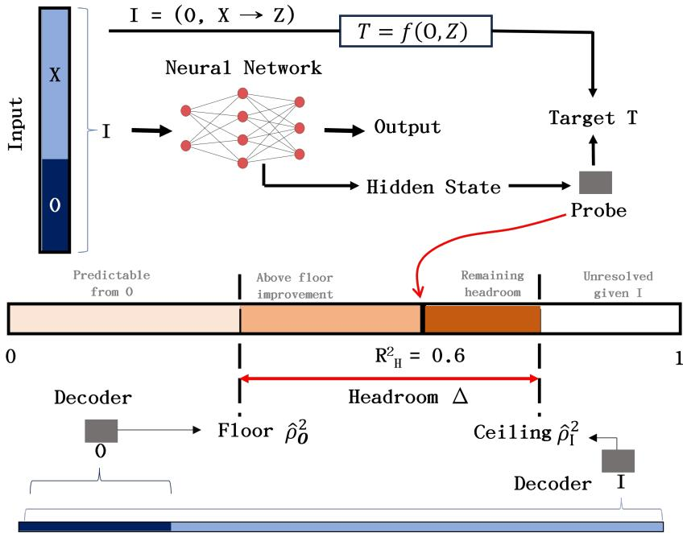
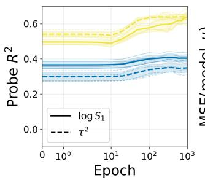
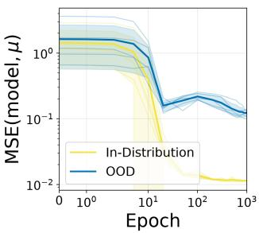
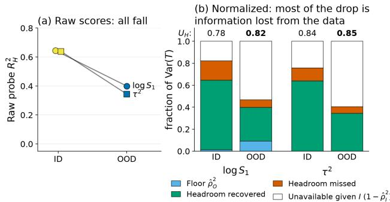
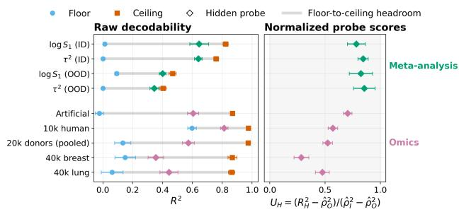
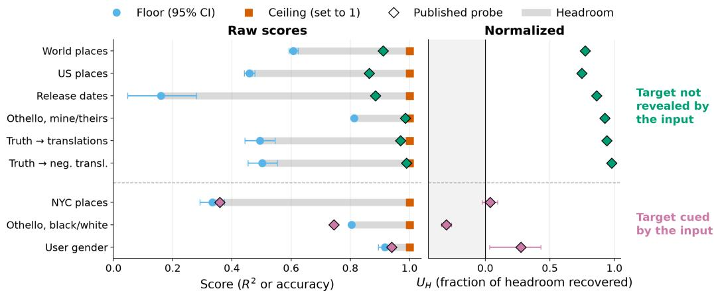
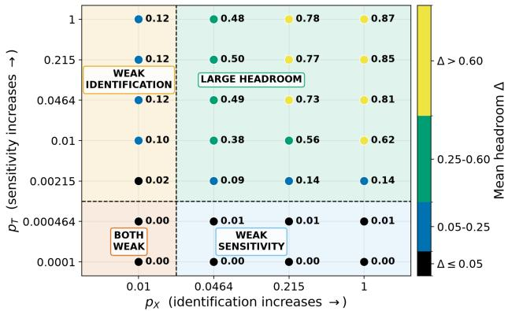
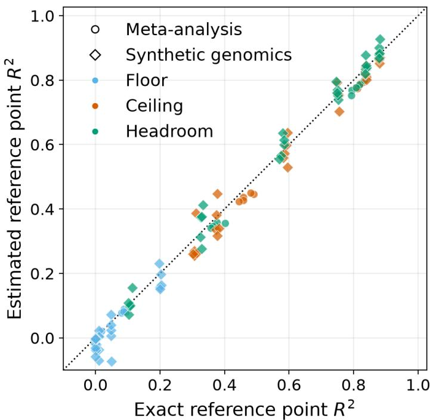

How High Is 0.6? Floors, Ceilings, and Headroom in Interpretability Probing

Pranjal Garg Independent Researcher

## Abstract

Probes are the workhorse of interpretability. If a model’s hidden states predict a variable, the model is said to represent it. But a probe score has no fixed meaning. An $R ^ { 2 }$ of 0.6 may only reflect what the input already gives away, and the same score can mean diferent things on diferent data. We propose read ing every probe score against two reference points: a floor, what a declared set of simple inputs already predicts, and a ceiling, what the full input can predict. The gap between them, the headroom, is the range in which a probe can show that a model computes something beyond the simple inputs. We prove that headroom vanishes in two ways: the target stops depending on a hidden variable the model must infer, or the input stops revealing it. We test this on transformers trained for in-context meta-analysis, which must infer the hidden heterogeneity between studies to weight them correctly, and where both reference points are known. Under distribution shift, probe scores fall and prediction error rises 12–15×, yet the model recovers a similar share of the headroom, indicating that the data lost information, not the representation. We then analyze the real models.The single-cell foundation model scGPT encodes biological variability only partially. We also revisit four influential LLM probing studies, which claim that models represent geography, the state of an Othello board, truth, and the demographics of their users. Against a floor computed from the input text alone, some of these claims hold, while others are largely explained by the text itself.

## 1 INTRODUCTION

Understanding what information is represented inside a complex system is a central problem across biological and artificial intelligence. In neuroscience, decoding analyses use neural population activity to ask whether variables such as sensory features, cognitive states, or behavioral quantities are represented in the brain; analogous methods are now widely used to study the hidden representations of learned artificial networks (Quian Quiroga and Panzeri, 2009; Naselaris et al., 2011; Belinkov, 2022). In modern AI, where high dimensional internal states are otherwise dificult to interpret directly, probes provide a particularly simple and scalable readout: a classifier or regressor is trained to predict a quantity of interest from a model’s hidden states, and its predictive performance is used to assess how strongly that quantity is represented (Alain and Bengio, 2016; Hewitt and Liang, 2019). Such measurements underlie claims about what models encode, how representations emerge during learning and how information is distributed across layers (Tenney et al., 2019; Saphra and Lopez, 2019). They therefore carry substantial scientific weight, as conclusions about the internal organization of both biological and artificial systems can depend on what a probe score is taken to mean.

Yet this widespread use exposes a basic interpretive problem: a raw probe score has no intrinsic scale of evidential strength. A high $R ^ { 2 }$ may arise because the target is predictable from readily available input information rather than because the representation captures the computation of interest, and the same numerical score can carry diferent implications across distributions as this baseline predictability changes (Ravichander et al., 2021; Elazar et al., 2021; Hewitt and Liang, 2019). Interpreting probe scores therefore requires knowing not only what is decodable but also how much decodability is achievable without the computation of interest and how much is achievable from all available information. We study this distinction in a controlled evidence-aggregation task. We train transformer models in a random-efects meta-analysis setting where the suficient statistics and the oracle Bayes estimator conditional on the true heterogeneity parameter are known in closed form. Under a distribution shift, the raw decodability of the suficient statistic falls and the prediction error rises, and the raw scores alone cannot say whether the representation degraded or the data became less informative.

  
Figure 1: Schematic of the floor–ceiling normalized probe $R ^ { 2 }$ . A probe’s raw decodability $\left( R _ { H } ^ { 2 } \right)$ for a target T is normalized between an estimated floor $( \hat { \rho } _ { O } ^ { 2 } )$ , achievable from restricted information $O ,$ and an estimated ceiling $\big ( \hat { \rho } _ { I } ^ { 2 } \big )$ , achievable using full information I. The gap between them defines the headroom (∆).

To separate computation from statistical artifact, we introduce a framework that normalizes probe scores against the bounds implied by the information sets that the scientific question specifies. We partition the available information into restricted information (O) and additional evidence (X) used to infer a latent variable (Z). We evaluate probe decodability between two population reference points (under the true data distribution): a floor $( \rho _ { O } ^ { 2 } )$ , which measures the predictability achievable from the baseline alone, and a ceiling $( \rho _ { I } ^ { 2 } )$ , which measures the maximum predictability achievable given full information (I), which represents all available evidence. We define the gap between these reference points as headroom (∆): the maximum variance a probe could explain by successfully inferring the latent variable Z from X (Figure 1).

The theoretical result demonstrates that this headroom can vanish through two mechanisms: weak target sensitivity (where the target ceases to depend on the latent variable) and weak identification (where the evidence becomes too noisy to identify the latent variable). When headroom vanishes, raw probe scores can cease to provide evidence about the computation of interest. We test the estimation procedure in the meta-analysis task and a synthetic single-cell model, where the generative model is known and the reference points can be computed exactly by numerical integration. We then apply it to real single-cell data and to published LLM probes, where the reference points can only be estimated from samples. Analyses of a finetuned chemistry model and recorded neural activity appear in Appendix J.

Contributions: (1) we introduce a floor, ceiling and headroom normalization for interpretability probes and identify two distinct mechanisms by which this headroom vanishes: weak target sensitivity and weak identification of the latent variable; (2) we show that under distribution shift raw decodability can reflect reduced headroom rather than a degraded representation; (3) we test this estimation procedure in different domains, showing how the choice of floor and ceiling distinguishes diferent scientific questions; (4) we show that the same raw probe score can imply dif ferent amounts of recovered headroom across settings.

## 2 RELATED WORK

Probing and its baselines. A probe trains a simple readout on hidden states and treats its predictive performance as evidence that a variable is represented (Alain and Bengio, 2016; Belinkov, 2022). Raw probe accuracy underdetermines this conclusion in three ways. Expressive probes can learn the task themselves (Hewitt and Liang, 2019). Random encoders already support high accuracy (Zhang and Bowman, 2018; Wieting and Kiela, 2019). Decodable informa tion need not be used by the model (Ravichander et al., 2021; Elazar et al., 2021; Kumar et al., 2022). Proposed remedies either control probe capacity (Hewitt and Liang, 2019; Voita and Titov, 2020) or estimate information content (Pimentel et al., 2020). Pimentel et al. (2020) note that, by the data-processing inequality, no representation carries more information about a target than its input does.

Closest to our floor is conditional probing (Hewitt et al., 2021). Building on V-information (Xu et al., 2020), it measures what a representation adds beyond a baseline representation. We difer in three respects: (i) the floor is defined on a declared restricted input set O chosen by the scientific question; (ii) we pair it with a ceiling from the full input I, turning the dataprocessing bound into an estimable reference point against which scores are normalized; (iii) we show that both reference points move with the data regime, so a fixed baseline can misattribute a regime change to the representation; we show this in Section 4.2.1 and Appendix L, where the conditional gain halves under a distribution shift while the headroom-normalized score does not.

Interpreting scientific foundation models. Probing and related readouts are increasingly being used to make scientific claims about learned models, for example, that protein language models encode structure (Rives et al., 2021) and that single-cell foundation models encode regulatory or cell-state information (Cui et al., 2024; Theodoris et al., 2023). Several audits find that such models often fail to beat simple baselines (Kedzierska et al., 2025; Boiarsky et al., 2024; Ahlmann-Eltze et al., 2025). A recent audit of scGPT and Geneformer finds that the apparent biological structure in attention adds nothing beyond trivial gene-level statistics (Kendiukhov, 2026). These studies choose baselines case by case and report raw diferences. We formalize the question they share: how much a representation recovers beyond a declared simple baseline, relative to what is predictable from the available inputs, and apply it to scGPT, a fine-tuned TabPFN (Hollmann et al., 2025; Grinsztajn et al., 2026), and neural population activity. The latter two appear in Appendix J.

Distribution shift and causal relevance. Interpretations that are faithful in distribution can fail under systematic shift (Friedman et al., 2023). Causal methods such as nullspace projection and interchange interventions test whether decodable information is used (Ravfogel et al., 2020; Geiger et al., 2024). Our framework is complementary. It does not test causal use; it specifies, before any intervention, how much evidential weight a correlational score can carry in a given regime. It also shows that a drop in raw decodability under distribution shift can reflect reduced headroom rather than a degraded representation.

Controlled testbeds with known suficient statistics. Meta-trained sequence models approximate Bayes-optimal inference (Mikulik et al., 2020; M¨uller et al., 2021), and transformers learn statistical estimators in context (Garg et al., 2022; Aky¨urek et al., 2022; Bai et al., 2023). Probes have been used to compare their internal quantities with classical estimators (Teh et al., 2025). We build on this line with random-efects meta-analysis (Higgins and Thompson, 2002).

## 3 CONTROLLED META-ANALYSIS SETUP

## 3.1 Task and model

Controlled random-efects meta-analysis. Each example contains K studies estimating an underlying efect $\mu .$ Study-specific efects vary around $\mu$ with between-study heterogeneity $\tau ^ { 2 }$ , while each reported estimate $x _ { i }$ is additionally corrupted by study-specific sampling variance $\sigma _ { i } ^ { 2 }$ . Marginally, $x _ { i } \mid \mu , \tau ^ { 2 } , \sigma _ { i } ^ { 2 }$ ∼ $\mathcal { N } ( \mu , \sigma _ { i } ^ { 2 } + \tau ^ { 2 } )$ If $\tau ^ { 2 }$ were known, each study would receive precision weight $\begin{array} { r } { w _ { i } = \frac { 1 } { \sigma _ { i } ^ { 2 } + \tau ^ { 2 } } } \end{array}$ , and all information relevant to estimating $\mu$ would be summarized by the suficient statistics $S _ { 1 } = \textstyle \sum _ { i } w _ { i }$ and $S _ { 2 } = \sum _ { i }$ i wixi. Here, $S _ { 1 }$ is the total precision of the studies and $S _ { 2 }$ is their precision-weighted efect. We therefore use log $S _ { 1 }$ as the primary target for representation probing, and separately probe $\tau ^ { \bar { 2 } }$ to test whether the model represents the hidden heterogeneity needed to construct the weights.

We define distribution shift as an out-of-distribution (OOD) change from a heterogeneity-dominated regime to a sampling-variance-dominated regime. We quantify the regime by the sampling-variance share $r _ { i } =$ $\frac { \stackrel { \cdot } { \sigma } _ { i } ^ { 2 } } { \sigma _ { i } ^ { 2 } + \tau ^ { 2 } }$ , whose median increases from 0.31 in distribution (ID) to 0.71 OOD. Thus, the ID regime is predominantly heterogeneity-driven, whereas the OOD regime is predominantly sampling-variance-driven. The distribution shift changes which source of uncertainty determines the precision weights. For full details, see Appendix A.

Model and training. We train causal pre-norm transformers with attention and MLP blocks at five sizes ranging from 3.3k to 794k parameters (xs, s, m, l, xl). The transformer model receives $( x _ { i } , \log \sigma _ { i } ^ { 2 } )$ as input, and the true heterogeneity $\tau ^ { 2 }$ is hidden. It predicts the overall efect $\mu$ under a causal mask $( \mathrm { A p \mathrm { - } }$ pendix A.3).

Probing and architectural controls. All probe scores and estimated reference points are computed using a bank of linear and nonlinear regressors (ridge, MLP, and gradient boosting) for every layer $( \mathrm { A p - }$ pendix B). We report the standard $R ^ { 2 }$ for every heldout target. We probe log $S _ { 1 }$ rather than $S _ { 1 }$ because the logarithm reduces target skew from 3.9 to −0.6.

## 3.2 Raw probe behavior under the distribution shift

  
Figure 2: In-distribution and OOD learning trajectories. Probe decodability for log $S _ { 1 }$ and $\bar { \tau ^ { 2 } }$ and final-position model MSE across training (xl model).

Table 12 and Figure 2 show that the distribution shift degrades all three measured quantities. For models s through xl, probe $R ^ { 2 }$ for log $S _ { 1 }$ falls (from 0.64 to 0.40 for xl), probe $R ^ { 2 }$ for $\tau ^ { 2 }$ falls (from 0.64 to 0.34 for $\mathrm { _ { x l } } )$ , and prediction MSE at the final position rises $1 2 -$ 15×. In distribution, model error is within 3% of the oracle conditional-Bayes risk; out of distribution it is 2.1–2.6× that risk. Both targets nonetheless remain partly decodable OOD $( R ^ { 2 } \approx 0 . 2 9 - 0 . 4 0$ for log $S _ { 1 }$ and 0.26–0.34 for $\tau ^ { 2 } )$ . The xs model is excluded from these comparisons because it does not reliably learn either target in distribution $( R ^ { 2 } = 0 . 2 8 \pm 0 . 2 0$ for log $S _ { 1 } )$ .

The raw scores admit two explanations: the representation degraded, or the OOD data carry less information about the targets. A further concern applies to log $S _ { 1 }$ . When sampling variance dominates, $\begin{array} { r } { \dot { S } _ { 1 } = \sum _ { i } ( \bar { \sigma _ { i } ^ { 2 } } + \tau ^ { 2 } ) ^ { - 1 } \approx \sum _ { i } \bar { \sigma _ { i } ^ { - 2 } } } \end{array}$ is predictable from the sampling variances alone, so the OOD score of 0.40 might require no inference about $\tau ^ { 2 }$ . If ${ \mathrm { s o } } ,$ the best prediction of log $S _ { 1 }$ from the sampling variances alone should rise sharply under the shift. We formalize this quantity as the floor $\rho _ { O } ^ { 2 }$ in Section 4.1; Section 4.3 shows that it rises only from 0.01 to 0.09. Raw probe scores cannot separate these explanations; Section 4.1 introduces a normalization that does.

## 4 NORMALIZING PROBE DECODABILITY

## 4.1 Floor, ceiling and headroom

Let $T \in L ^ { 2 }$ be a non-constant target quantity whose representation we wish to audit. Let O denote restricted information and I the full information available to the system, with $\sigma ( O ) \subseteq \sigma ( I )$ . Equivalently, we may write $\boldsymbol { I } = ( O , X )$ , where X denotes the additional evidence beyond O. The representation under study is denoted by $H ;$ for deterministic models, $H = \Phi ( I )$

We define two population reference points,

$$
\rho _ { O } ^ { 2 } : = 1 - \frac { \mathbb { E } [ \mathrm { V a r } ( T \mid O ) ] } { \mathrm { V a r } ( T ) } , \qquad \rho _ { I } ^ { 2 } : = 1 - \frac { \mathbb { E } [ \mathrm { V a r } ( T \mid I ) ] } { \mathrm { V a r } ( T ) } ,
$$

and their diference $\Delta : = \rho _ { I } ^ { 2 } \mathrm { - } \rho _ { O } ^ { 2 } \geq 0$ (Propositions E.1 and E.2).

Here $\rho _ { O } ^ { 2 }$ is the maximum population $R ^ { 2 }$ attainable from the restricted information $O _ { 3 }$ , whereas $\rho _ { I } ^ { 2 }$ is the maximum attainable from the full information I. We call $\rho _ { O } ^ { 2 }$ the floor: it is not a lower bound on an arbitrary probe score, but the level of predictability already available without using the additional evidence $X$ . Consequently, a probe score at or below $\rho _ { O } ^ { 2 }$ does not by itself establish that the representation contains predictive information about $T$ beyond O (Proposition E.2; Remark E.3).

The headroom $\Delta$ quantifies how much additional predictability I supplies beyond O. It equals the normalized variance of the Bayes update that X supplies about T beyond O (Proposition F.1), and it vanishes through weak target sensitivity or weak identification (Corollary F.2; Section 4.3).

For a representation H, let $R _ { H } ^ { 2 }$ denote the held-out probe performance for predicting T from H. When H is measurable with respect to I, no predictor based on H can exceed the population ceiling $\rho _ { I } ^ { 2 }$ (Proposition E.1). When $\Delta \ > \ 0$ , we therefore normalize representation decodability as $\begin{array} { r } { U _ { H } : = \frac { R _ { H } ^ { 2 } - \rho _ { O } ^ { 2 } } { \rho _ { I } ^ { 2 } - \rho _ { O } ^ { 2 } } } \end{array}$ . Here $U _ { H }$ measures probe performance relative to the headroom available beyond O. Each reference point has three versions. The population reference points are defined above. Second is estimating the reference points $\hat { \rho } _ { O } ^ { 2 } , \hat { \rho } _ { I } ^ { 2 }$ , by fitting a fixed decoder bank to O and to I on held-out data (the estimation procedure; Appendix B). When the generative model is known (meta-analysis, synthetic single-cell), we additionally compute them exactly by numerical integration. In both of them, estimates closely track exact values (Appendix H, Figure 7). For meta-analysis and single-cell test cases, we estimate the reference points with feature representations $\phi _ { O } ( O )$ and $\phi _ { I } ( I )$ . The feature maps are fixed deterministic functions of their corresponding information sets (Appendix I). Estimated ceilings are conservative, so an underestimated ceiling inflates $U _ { H }$

  
Figure 3: Raw and normalized probe performance under distribution shift. Raw probe scores decrease OOD, while normalization by the floor and ceiling shows that most of the decline reflects reduced available information.

  
Figure 4: Raw and headroom-normalized decodability across domains. Left: $R ^ { 2 }$ of the floor, the ceiling and the representation probe. Right: the normalized decodability $U _ { H } = ( \bar { R _ { H } ^ { 2 } } - \hat { \rho } _ { O } ^ { 2 } ) / ( \bar { \rho _ { I } ^ { 2 } } -$ $\hat { \rho } _ { O } ^ { 2 } )$ , the fraction of the headroom recovered by the probe. Meta-analysis reference points are exact (Table 3). “Artificial” is the synthetic single-cell model and “Omics” the single-cell data of Table 13.

A natural alternative is conditional probing (Hewitt et al., 2021) with baseline O instead of the model’s own non-contextual embedding layer: the gain $R _ { O , H } ^ { 2 } - R _ { O } ^ { 2 }$ from adding H to a probe on O. Measuring this gain from the floor instead (in the population, $R _ { O } ^ { 2 } = \rho _ { O } ^ { 2 } )$ and normalizing it by the headroom gives $U _ { H | O } : =$ $( R _ { O , H } ^ { 2 } - \rho _ { O } ^ { 2 } ) / ( \bar { \rho } _ { I } ^ { 2 } - \bar { \rho } _ { O } ^ { 2 } )$ . In the population $\dot { U } _ { H } ~ \le$ $U _ { H | O } \leq 1$ , with equality on the left when H retains everything in O relevant to T (Appendix L).

When an estimated floor is well below chance for classification or well below zero for regression, the headroom normalization is not applicable, and we report the raw probe performance instead. Floors only slightly below chance or zero, as expected from estimation noise when the population floor is near zero (Figure 7), are kept unclipped (Appendix B).

Evaluation settings. We specify the contrast $( O , I , T )$ in settings with progressively weaker access to ground truth: the controlled meta-analysis and a synthetic single-cell model, where the reference points are exact (Appendix H), then real single-cell representations and published LLM probes. The contrast is chosen from the scientific question, independently of the probe scores, and normalized results are interpreted relative to it. Where no unique contrast exists, we evaluate nested baselines $O _ { 1 } \subset O _ { 2 } \subset \cdots \subset O _ { k }$ . Appendix J applies this to a fine-tuned chemistry model and recorded neural activity.

## 4.2 Normalized probes across domains

## 4.2.1 Meta-analysis

Using the controlled random-efects model defined above, we take the suficient statistic log $S _ { 1 }$ as the probe target, $\begin{array} { r } { T \ = \ \log \sum _ { i = 1 } ^ { K } \frac { 1 } { \sigma _ { i } ^ { 2 } + \tau ^ { 2 } } . } \end{array}$ The scientific question is whether the transformer’s hidden representation contains information about the precisionweighting computation beyond what the reported sampling variances alone predict. We therefore define the restricted information as $O = \sigma _ { 1 : K } ^ { 2 }$ and the full information as $I = ( \sigma _ { 1 : K } ^ { 2 } , x _ { 1 : K } )$ , where the observed efects $x _ { i }$ provide the additional evidence from which the latent heterogeneity $\tau ^ { 2 }$ can be inferred. We also probe $\tau ^ { 2 }$ directly. Because $\tau ^ { 2 }$ is independent of $O ,$ its floor is zero, and its ceiling measures how much heterogeneity the reported efects reveal. The distribution shift changes the relative contribution of sampling variance and heterogeneity, so it tests whether raw decodability tracks the information available in each regime.

Figure 4 and Table 13 place each raw probe score between a floor and a ceiling set by a domain-specific contrast. In the meta-analysis, the contrast asks whether the hidden state carries heterogeneity inferred from the reported efects beyond what the sampling variances predict. In distribution, the probe recovers 78% of the headroom for log $S _ { 1 }$ and 84% for $\tau ^ { 2 }$ Under the shift, raw decodability falls for both targets $( 0 . 6 4  0 . 4 0$ for log $S _ { 1 } , 0 . 6 4  0 . 3 4$ for $\tau ^ { 2 } { \mathrm { ; } }$ ; Table 12), and so do the exact ceilings $( 0 . 8 2  0 . 4 7$ and $0 . 7 6 ~  ~ 0 . 4 0 ;$ Table 3). The fraction of headroom recovered does not decrease $( U _ { H } = 0 . 7 8  0 . 8 2$ for log $S _ { 1 } , 0 . 8 4  0 . 8 5$ for $\tau ^ { 2 }$ ; Figure 3). The lower raw scores therefore reflect less recoverable information in the data, not a less informative representation (Section 4.3).

Conditional probing alone would suggest the opposite. With a linear decoder throughout, the conditional gain roughly halves under the shift $( 0 . 5 8 \to 0 . 3 1$ for log $S _ { 1 } ;$ $0 . 6 4  0 . 3 4 \mathrm { ~ f o r ~ } \tau ^ { 2 } )$ , which alone suggests a degraded representation. The headroom (estimated with linear decoder) also halves $( 0 . 6 2  0 . 3 3 ; 0 . 6 6  0 . 3 6 )$ and once the gain is divided by it, $U _ { H | O }$ stays flat $( 0 . 9 5  0 . 9 5 ; 0 . 9 7  0 . 9 5 )$ , corresponding to $U _ { H } \ { \mathrm { ( A p - } }$ pendix L).

## 4.2.2 Genomics and single-cell data

Single-cell RNA sequencing has the same structure as meta-analysis. Each example is a gene g measured in K cells. The normalized count of a cell varies for two reasons: technical noise, which decreases as the depth of the cell’s sequencing $d _ { g i }$ increases, and the biological variation from cell-to-cell, summarized by the overdispersion of the gene $b _ { g }$ . Under a Gamma–Poisson model the normalized count has variance $\lambda _ { g } \big ( d _ { g i } ^ { - 1 } + b _ { g } \big )$ , where $\lambda _ { g }$ is the gene’s mean expression. Technical noise $d _ { g i } ^ { - 1 }$ therefore plays the role of the sampling variance $\sigma _ { i } ^ { 2 }$ and overdispersion $b _ { g }$ the role of heterogeneity $\tau ^ { 2 }$ . The target is the analogue of log $S _ { 1 }$ , the gene’s efective precision $\begin{array} { r } { T _ { g } = \log { \sum _ { i = 1 } ^ { K } ( \mathfrak { d } _ { q i } ^ { - 1 } + \mathfrak { b } _ { g } ) ^ { - 1 } } } \end{array}$ , which depends on the hidden overdispersion. The restricted information is the sequencing depths alone, $O _ { g } = d _ { g , 1 : K }$ and the full information adds the observed counts, $I _ { g } = ( y _ { g , 1 : K } , d _ { g , 1 : K } )$ , from which overdispersion can be inferred. We ask whether frozen scGPT (Cui et al., 2024) encodes $T _ { g }$ beyond what depth alone predicts.

We first ask this on synthetic genes $( K = 4 0 ; \mathrm { ~ A p - }$ pendix G) and then on four real scRNA-seq datasets (10x Genomics, 2021, 2024, 2022). In real data, the true $b _ { g }$ is unknown, so we split the cells of each dataset into half at random. Overdispersion is estimated from the first half and defines the target, while the depths, counts and scGPT inputs come from the second half, so the ceiling cannot simply recompute its own target. K is then the number of cells in the second half.

For single-cell data, raw scores are misleading because the floor difers across datasets. In the 10k human dataset, depth alone already reaches $R ^ { 2 } = 0 . 6 0$ so scGPT’s raw score of 0.81 recovers 57% of the headroom. In the 20k donors dataset the raw score is much lower (0.57), but the floor is only 0.13, so scGPT recovers a similar 52%. Across the four datasets, raw scores range from 0.35 to 0.81, while the fraction of headroom recovered ranges from 0.28 to 0.57; on synthetic genes it is 0.70. scGPT therefore encodes biological overdispersion beyond sequencing depth, but only partially. scGPT probes use a 64-component PCA fitted on training rows only; all floors, ceilings and other probes use the full feature vectors (Appendix I).

## 4.2.3 Published LLM probes

We compute floors for four published LLM probes, using descriptions of the input. T is the published target, I is the input the model received, and O is a surface description of it: n-grams of a name, statement, or conversation, or move summaries that never simulate Othello flips. The floor is what the decoder bank learns from O on the probe’s own training split, so it needs only the released inputs, labels, and splits. For Oth ello, the ceiling is exactly 1, since the board follows from the moves; elsewhere we set it to 1, which can only lower $U _ { H }$ , while a richer floor readout could lower it further. We therefore read $U _ { H }$ here as an approximate value and compare the raw scores with the floor directly where the headroom is small. For categorical targets, we use accuracy in place of $R ^ { 2 }$ . Figure 5 summarizes the results. See full results in Appendix K.

Space. Gurnee and Tegmark (2024) report that Llama-2 represents the coordinates of named places. A floor computed from a description of the place name, its character 2–4-gram counts, reaches $R ^ { 2 } = 0 . 6 1$ for world places and 0.46 for US places, yet the published probes recover 63–77% of the headroom above it. For New York City this floor is 0.33 (95% CI 0.29–0.37), and the published scores (0.22 for 7B, 0.36 for 70B) lie within or below it, so they cannot separate a city-level map from borough names and numbers in the strings.

Othello. Li et al. (2022) report that Othello-GPT represents the board. A floor that knows which player placed each disc, but never simulates flips, reaches 0.80 accuracy (chance 0.46). The linear black/white/empty probe (0.74) falls below it $( U _ { H } = - 0 . 3 0 )$ , so its accuracy is accounted for by disc placement. A nonlinear probe recovers 45% of the headroom with our decoders. In the mine/theirs/empty encoding (Nanda et al., 2023), a linear probe reaches 0.99 and recovers 92% of the headroom above the floor from the same features (0.81 for this target), indicating that the efect of flips is represented linearly in the relative encoding.

Truth. Marks and Tegmark (2023) report that LLMs represent whether a statement is true along a linear direction, and that a probe trained on one dataset of statements still works on another. We compute the floor from a description of each statement, its character and word n-grams. Within a single dataset, this floor is near chance for most datasets but reaches 0.97–0.99 on larger than and smaller than datasets, whose truth labels follow from the wording of the numbers. Probes trained and tested on those two datasets therefore show little beyond the text. Transfer between datasets is more informative, because wording learned on one dataset does not carry over to another. A floor trained on the two number datasets and tested on Spanish–English translations is at chance (0.49), while the published probes reach 0.97 $( U _ { H } =$ 0.94). Trained on cities and neg cities and tested on negated translations, the floor is again at chance (0.50), while the probes reach 0.96–0.99 $( U _ { H }$ up to 0.98).

  
Figure 5: Probe normalization puts published LLM probe scores in perspective. Left: floor computed from a description of the input (n-grams; disc placement without flips for Othello), with 95% CI, the probe score, and the ceiling set to 1 $( R ^ { 2 }$ for places and dates, accuracy otherwise). Right: normalized probe score, $U _ { H }$ , with error bars from the floor’s CI.

User attributes. Chen et al. (2024) report probes that read a user’s age, gender, education and socioeconomic status from Llama-2-Chat activations. The floor, an n-gram classifier on the conversation, reaches 0.92–0.98, and every published reading probe (0.94– 0.98) lies within its 95% interval; every control probe falls below its point estimate. The floor is as high from the user’s turns alone, and falls to 0.76–0.90 when trained on GPT-3.5 conversations and tested on Llama-2-Chat ones. However, the role-played conversations were written to reveal the attribute, so these accuracies can neither establish nor rule out that the model internally represents the user’s attributes.

Summary. Probe normalization puts these published scores in perspective (Figure 5). Probe scores reach well above the floor when the target is not revealed by the surface form: coordinates at world scale, the ef fect of flips on the board, and truth transferred across datasets. When the target is written or cued in the input, such as borough names and numbers for New York City places, disc placement for the absolute board encoding, or attributes the role-played user writes into the conversation, the floor alone accounts for much of the score.

## 4.3 Mechanisms for vanishing headroom

The headroom $\Delta$ is the predictability that the full information I adds beyond the restricted baseline O. It can vanish in two distinct ways (Corollary F.2). Let $T ~ = ~ f ( O , Z )$ for a latent variable $Z ,$ and let $\boldsymbol { I } = ( O , X )$ , where X is the additional evidence about $Z .$ (1) Weak target sensitivity: T barely depends on $Z .$ If $f$ is Lipschitz in $Z$ with constant $L ( O )$ , the headroom is bounded by $\mathbb { E } [ L ( O ) ^ { 2 } \operatorname { V a r } ( Z \mid O ) ] / \operatorname { V a r } ( T )$ so knowing $Z$ adds little even when X reveals it perfectly. The floor rises toward the ceiling. (2) Weak identification: X reveals little about $Z$ beyond $O .$ If $f$ varies by at most M over $Z ,$ the headroom is bounded by $M ^ { 2 } \operatorname { M I } ( X ; Z \mid O ) / ( 2 \operatorname { V a r } ( T ) )$ , where MI is the conditional mutual information in nats, so T may depend strongly on $Z ,$ but the data cannot pin Z down. The ceiling falls toward the floor.

Which mechanism drives the meta-analysis shift? The distribution shift (Section 3) pushes in both directions. When sampling variance dominates, log $\begin{array} { r } { S _ { 1 } = \log \sum _ { i } ( \sigma _ { i } ^ { 2 } + \tau ^ { 2 } ) ^ { - 1 } } \end{array}$ depends less on $\tau ^ { 2 }$ (weaker target sensitivity), and the per-study Fisher information about $\tau ^ { 2 } .$ , which scales as $( \sigma _ { i } ^ { 2 } + \tau ^ { 2 } ) ^ { - 2 }$ , drops, so the reported efects reveal less about $\tau ^ { 2 }$ (weaker identification; Remark E.7). The exact reference points show that weak identification dominates (Table 3). The headroom for log $S _ { 1 }$ shrinks from 0.81 to 0.37. The floor rises only from 0.01 to 0.09, while the ceiling falls from 0.82 to $0 . 4 7$ , so most of the loss comes from the ceiling. For $\tau ^ { 2 }$ itself the target is the latent variable, so target sensitivity cannot change; its floor stays at zero and its ceiling falls from 0.76 to 0.40, a pure identification loss (Figures 3 and 4).

  
Figure 6: Headroom as evidence quality and target sensitivity vary, in the synthetic single-cell model (with binomial thinning). Evidence quality $p _ { X }$ controls how well the data identify the latent variable; target sensitivity pT controls how strongly the target depends on it. Low $p _ { X }$ gives weak identification, low $p _ { T }$ gives weak target sensitivity, and low values of both give both.

Separating the mechanisms in a controlled grid. In the meta-analysis both mechanisms move together. The synthetic single-cell model (Section 4.2.2; Ap pendix G) lets us vary them independently. The latent variable is the gene’s biological overdispersion, $Z = b _ { g } ;$ ; the restricted information is sequencing depth, $O _ { g } = d _ { g , 1 : K } ;$ the additional evidence is the observed counts, $X _ { g } ~ = ~ y _ { g , 1 : K } ;$ and the target is $T _ { g }$ . Reducing sequencing depth by binomial thinning, retaining a fraction p of counts, lowers the efective depth from $d _ { g i }$ to $p d _ { g i } .$ In real data this afects both the evi dence and the target at once. In simulation we apply it separately (Appendix G.1): thinning the counts used as evidence $\left( p _ { X } \right)$ degrades inference of $b _ { g } ,$ , giving weak identification, whereas thinning the depths entering the target $\left( p _ { T } \right)$ lets technical variance dominate overdispersion, giving weak target sensitivity; the restricted information is never thinned. Figure 6 shows the resulting headroom over the $( p _ { X } , p _ { T } )$ grid, with estimated reference points. Headroom vanishes when either parameter is small and stays large only when both are large, so a loss of headroom can be traced to its cause.

## 5 CONCLUSION

A probe score of 0.6 has no fixed meaning. What it says about a representation depends on two quantities: how much of that predictability a declared baseline al ready provides, and how much the available data support in total. We made both explicit. The floor $\rho _ { O } ^ { 2 }$ is what a declared baseline O already predicts, the ceiling $\rho _ { I } ^ { 2 }$ is what the full input I supports, and the headroom $\Delta = \rho _ { I } ^ { 2 } - \rho _ { O } ^ { 2 }$ between them is the range in which a probe score can show information beyond O. Headroom vanishes in two ways: weak target sensitivity, when the target stops depending on the latent variable, and weak identification, when the evidence stops revealing it.

In the controlled meta-analysis, where the reference points are exact, normalization reverses the reading of a distribution shift. Raw decodability of log $S _ { 1 }$ and $\tau ^ { 2 }$ falls and prediction error rises, which alone suggests a degraded representation. The reference points show instead that the data lost information: the ceiling falls from 0.82 to 0.47 for log $S _ { 1 }$ and from 0.76 to 0.40 for $\tau ^ { 2 } .$ , while the floor for log $S _ { 1 }$ rises only from 0.01 to 0.09, so weak identification dominates. The representation recovers a similar share of the smaller headroom $( U _ { H } = 0 . 7 8 \to 0 . 8 2$ for log $S _ { 1 } \colon 0 . 8 4  0 . 8 5$ for $\tau ^ { 2 } )$

The estimation recovers the exact reference points in two fully specified generative models and extends to settings where only samples are available. In frozen $\mathrm { s c G P T }$ , similar raw scores correspond to diferent fractions of recovered headroom across datasets (0.28– 0.57), so biological overdispersion is encoded only partially. For published LLM probes, a floor computed from the input text alone separates claims the text cannot explain (world-scale coordinates, the efect of flips in the relative Othello encoding, truth transferred across datasets) from claims it largely explains (New York City locations, the absolute Othello board, user attributes in role-played conversations).

The framework complements causal interventions: it bounds how much a correlational score can show before any intervention is run. We recommend that interpretability studies report the floor, the ceiling and the fraction of headroom recovered alongside raw scores, state the contrast (O, I, T) before looking at probe scores, and, where no unique baseline exists, report a nested sequence $O _ { 1 } \subset \cdots \subset O _ { k }$ so that readers can see how the choice of baseline afects the conclusions.

Limitations. Normalized scores are defined relative to a stated contrast (O, I, T). Diferent contrasts answer diferent scientific questions, so we report nested baselines (Appendix J) rather than a single choice. On observational data the reference points are estimated, and an underestimated ceiling or floor inflates $U _ { H }$ . For published LLM probes the ceiling cannot be estimated and is set to 1, so $U _ { H }$ there is approximate. Our controlled tasks are kept simple so that the reference points can be computed exactly, and the transformers trained on them are small.

## AI use statement

In this work, we used generative AI tools to aid and polish writing, for retrieval and discovery of related work, for research execution, and to draft sections of the paper. As part of research execution, we used cod ing agents to assist with implementing and debugging analysis code and with producing scientific figures. We did not use generative AI tools for generating synthetic datasets or for proving mathematical claims. We have reviewed all AI-assisted work. AI-assisted code and analyses were inspected and their outputs were checked against the corresponding experiments and results; AI-assisted text and figures were reviewed for consistency with the underlying methods, analyses, and findings. We take responsibility for the final con tent of this work, including text, claims, code, figures, and other artifacts produced with the aid of generative AI.

## References

10x Genomics (2021). 10k PBMCs from Human Female, 3’ v3.1, Chromium X. 10x Genomics.

10x Genomics (2022). 40k mixture of cells dissociated from 4 fixed tumor tissues, multiplexed samples, 4 probe barcodes (next gem). 10x Genomics Dataset.

10x Genomics (2024). 20k pbmcs from human pbmcs multiplex sample. 10x Genomics Dataset.

Ahlmann-Eltze, C., Huber, W., and Anders, S. (2025). Deep-learning-based gene perturbation efect prediction does not yet outperform simple linear baselines. Nature Methods, 22(8):1657–1661.

Aky¨urek, E., Schuurmans, D., Andreas, J., Ma, T., and Zhou, D. (2022). What learning algorithm is incontext learning? investigations with linear models. arXiv preprint arXiv:2211.15661.

Alain, G. and Bengio, Y. (2016). Understanding intermediate layers using linear classifier probes. arXiv preprint arXiv:1610.01644.

Bai, Y., Chen, F., Wang, H., Xiong, C., and Mei, S. (2023). Transformers as statisticians: Provable in-context learning with in-context algorithm selection. In Advances in Neural Information Processing Systems 36, NeurIPS 2023, page 57125–57211. Neural Information Processing Systems Foundation, Inc. (NeurIPS).

Belinkov, Y. (2022). Probing classifiers: Promises, shortcomings, and advances. Computational Linguistics, 48(1):207–219.

Boiarsky, R., Singh, N. M., Buendia, A., Amini, A. P., Getz, G., and Sontag, D. (2024). Deeper evaluation of a single-cell foundation model. Nature Machine Intelligence, 6(12):1443–1446.

Chen, Y., Wu, A., DePodesta, T., Yeh, C., Li, K., Marin, N. C., Patel, O., Riecke, J., Raval, S., Seow, O., et al. (2024). Designing a dashboard for transparency and control of conversational ai. arXiv preprint arXiv:2406.07882.

Chowdhury, R. H., Glaser, J. I., and Miller, L. E. (2022). Data from: Area 2 of primary somatosensory cortex encodes kinematics of the whole arm. Dryad Dataset. Originally published 2020; dataset updated May 20, 2022.

Cui, H., Wang, C., Maan, H., Pang, K., Luo, F., Duan, N., and Wang, B. (2024). scgpt: toward building a foundation model for single-cell multi-omics using generative ai. Nature methods, 21(8):1470–1480.

de Heer, W. A., Huth, A. G., Grifiths, T. L., Gallant, J. L., and Theunissen, F. E. (2017). The hierarchical cortical organization of human speech processing. The Journal of Neuroscience, 37(27):6539–6557.

Elazar, Y., Ravfogel, S., Jacovi, A., and Goldberg, Y. (2021). Amnesic probing: Behavioral explanation with amnesic counterfactuals. Transactions of the Association for Computational Linguistics, 9:160– 175.

Friedman, D., Lampinen, A., Dixon, L., Chen, D., and Ghandeharioun, A. (2023). Interpretability illusions in the generalization of simplified models. arXiv preprint arXiv:2312.03656.

Garg, S., Tsipras, D., Liang, P., and Valiant, G. (2022). What can transformers learn in-context? a case study of simple function classes. In Advances in Neural Information Processing Systems 35, NeurIPS 2022, page 30583–30598. Neural Information Processing Systems Foundation, Inc. (NeurIPS).

Geiger, A., Wu, Z., Potts, C., Icard, T., and Goodman, N. (2024). Finding alignments between interpretable causal variables and distributed neural representations. In Causal Learning and Reasoning, pages 160–187. PMLR.

Glaser, J. I., Benjamin, A. S., Chowdhury, R. H., Perich, M. G., Miller, L. E., and Kording, K. P. (2020). Machine learning for neural decoding. eneuro, 7(4):ENEURO–0506.

Grinsztajn, L., Fl¨oge, K., Key, O., Birkel, F., Jund, P., Roof, B., Manium, M., Hoo, S. B., B¨uhler, M., Garg, A., et al. (2026). Tabpfn-3: Technical report. arXiv preprint arXiv:2605.13986.

Gurnee, W. and Tegmark, M. (2024). Language models represent space and time. In International Conference on Learning Representations, volume 2024, pages 2483–2503.

Hebart, M. N. and Baker, C. I. (2018). Deconstructing multivariate decoding for the study of brain func tion. Neuroimage, 180:4–18.

Hewitt, J., Ethayarajh, K., Liang, P., and Manning, C. D. (2021). Conditional probing: measuring usable information beyond a baseline. In Proceedings of the 2021 Conference on Empirical Methods in Natural Language Processing, pages 1626–1639.

Hewitt, J. and Liang, P. (2019). Designing and interpreting probes with control tasks. In Proceedings of the 2019 conference on empirical methods in natural language processing and the 9th international joint conference on natural language processing (emnlpijcnlp), pages 2733–2743.

Higgins, J. P. and Thompson, S. G. (2002). Quantifying heterogeneity in a meta-analysis. Statistics in medicine, 21(11):1539–1558.

Hollmann, N., M¨uller, S., Purucker, L., Krishnakumar, A., K¨orfer, M., Hoo, S. B., Schirrmeister, R. T., and Hutter, F. (2025). Accurate predictions on small data with a tabular foundation model. Nature, 637(8045):319–326.

Hsu, A., Borst, A., and Theunissen, F. E. (2004). Quantifying variability in neural responses and its application for the validation of model predictions. Network: Computation in Neural Systems, 15(2):91–109.

Kedzierska, K. Z., Crawford, L., Amini, A. P., and Lu, A. X. (2025). Zero-shot evaluation reveals limitations of single-cell foundation models. Genome Biology, 26(1).

Kendiukhov, I. (2026). Systematic evaluation of singlecell foundation model interpretability reveals attention captures co-expression rather than unique regulatory signal.

Kriegeskorte, N. and Douglas, P. K. (2019). Interpreting encoding and decoding models. Current opinion in neurobiology, 55:167–179.

Kumar, A., Tan, C., and Sharma, A. (2022). Probing classifiers are unreliable for concept removal and detection. Advances in Neural Information Processing Systems, 35:17994–18008.

Lage-Castellanos, A., Valente, G., Formisano, E., and De Martino, F. (2019). Methods for computing the maximum performance of computational models of fmri responses. PLOS Computational Biology, 15(3):e1006397.

Li, K., Hopkins, A. K., Bau, D., Vi´egas, F., Pfister, H., and Wattenberg, M. (2022). Emergent world representations: Exploring a sequence model trained on a synthetic task. arXiv preprint arXiv:2210.13382.

Marks, S. and Tegmark, M. (2023). The geometry of truth: Emergent linear structure in large language model representations of true/false datasets. arXiv preprint arXiv:2310.06824.

Mikulik, V., Del´etang, G., McGrath, T., Genewein, T., Martic, M., Legg, S., and Ortega, P. (2020). Metatrained agents implement bayes-optimal agents. Advances in neural information processing systems, 33:18691–18703.

M¨uller, S., Hollmann, N., Arango, S. P., Grabocka, J., and Hutter, F. (2021). Transformers can do bayesian inference. arXiv preprint arXiv:2112.10510.

Nanda, N., Lee, A., and Wattenberg, M. (2023). Emergent linear representations in world models of selfsupervised sequence models. In Proceedings of the 6th BlackboxNLP Workshop: Analyzing and Interpreting Neural Networks for NLP, pages 16–30.

Naselaris, T., Kay, K. N., Nishimoto, S., and Gallant, J. L. (2011). Encoding and decoding in fmri. Neuroimage, 56(2):400–410.

Pimentel, T., Valvoda, J., Maudslay, R. H., Zmigrod, R., Williams, A., and Cotterell, R. (2020). Information-theoretic probing for linguistic structure. In Proceedings of the 58th Annual Meeting of the Association for Computational Linguistics, pages 4609–4622.

Quian Quiroga, R. and Panzeri, S. (2009). Extracting information from neuronal populations: information theory and decoding approaches. Nature Reviews Neuroscience, 10(3):173–185.

Ravfogel, S., Elazar, Y., Gonen, H., Twiton, M., and Goldberg, Y. (2020). Null it out: Guarding protected attributes by iterative nullspace projection. In Proceedings of the 58th Annual Meeting of the Association for Computational Linguistics, page 7237–7256. Association for Computational Linguistics.

Ravichander, A., Belinkov, Y., and Hovy, E. (2021). Probing the probing paradigm: Does probing accuracy entail task relevance? In Proceedings of the 16th Conference of the European Chapter of the Association for Computational Linguistics: Main Volume, pages 3363–3377.

Ritchie, J. B., Kaplan, D. M., and Klein, C. (2019). Decoding the brain: Neural representation and the limits of multivariate pattern analysis in cognitive neuroscience. The British journal for the philosophy of science.

Rives, A., Meier, J., Sercu, T., Goyal, S., Lin, Z., Liu, J., Guo, D., Ott, M., Zitnick, C. L., Ma, J., and Fergus, R. (2021). Biological structure and function emerge from scaling unsupervised learning to 250 million protein sequences. Proceedings of the National Academy of Sciences, 118(15).

Saphra, N. and Lopez, A. (2019). Understanding learning dynamics of language models with svcca.

In Proceedings of the 2019 Conference of the North American Chapter of the Association for Computational Linguistics: Human Language Technologies, Volume 1 (Long and Short Papers), pages 3257– 3267.

Schoppe, O., Harper, N. S., Willmore, B. D. B., King, A. J., and Schnupp, J. W. H. (2016). Measuring the performance of neural models. Frontiers in Computational Neuroscience, 10.

Snoek, L., Mileti´c, S., and Scholte, H. S. (2019). How to control for confounds in decoding analyses of neuroimaging data. NeuroImage, 184:741–760.

Teh, A., Jabbour, M., and Polyanskiy, Y. (2025). Solving empirical bayes via transformers. arXiv preprint arXiv:2502.09844.

Tenney, I., Das, D., and Pavlick, E. (2019). Bert rediscovers the classical nlp pipeline. In Proceedings of the 57th annual meeting of the association for computational linguistics, pages 4593–4601.

Theodoris, C. V., Xiao, L., Chopra, A., Chafin, M. D., Al Sayed, Z. R., Hill, M. C., Mantineo, H., Brydon, E. M., Zeng, Z., Liu, X. S., and Ellinor, P. T. (2023). Transfer learning enables predictions in network biology. Nature, 618(7965):616–624.

Voita, E. and Titov, I. (2020). Information-theoretic probing with minimum description length. In Proceedings of the 2020 Conference on Empirical Methods in Natural Language Processing (EMNLP), pages 183–196.

Wieting, J. and Kiela, D. (2019). No training required: Exploring random encoders for sentence classifica tion. arXiv preprint arXiv:1901.10444.

Xu, Y., Zhao, S., Song, J., Stewart, R., and Ermon, S. (2020). A theory of usable information under computational constraints. arXiv preprint arXiv:2002.10689.

Zhang, K. and Bowman, S. R. (2018). Language modeling teaches you more than translation does: Lessons learned through auxiliary syntactic task analysis. In Proceedings of the 2018 EMNLP workshop BlackboxNLP: analyzing and interpreting neural networks for NLP, pages 359–361.

# Supplementary Materials

## A CONTROLLED RANDOM-EFFECTS META-ANALYSIS

Generative model. Each example is a meta-analysis containing K studies that attempt to estimate the same underlying efect. We denote this efect by

$$
\mu \sim { \mathcal { N } } ( 0 , 1 ) .
$$

The transformer models are trained to predict $\mu .$ The individual studies need not have exactly the same true efect. Their study-specific efects are

$$
\theta _ { i } \sim \mathcal { N } ( \mu , \tau ^ { 2 } ) ,
$$

where

$$
\tau ^ { 2 } \sim \mathrm { U } ( 0 , 0 . 5 )
$$

is the between-study heterogeneity. Large $\tau ^ { 2 }$ means that the true efects $\theta _ { i }$ vary substantially from study to study even before sampling noise is introduced; small $\tau ^ { 2 }$ means that the studies are close to sharing a common true efect. Each study also has finite-sample measurement uncertainty. We draw

$$
n _ { i } \sim \mathrm { U } \{ 5 , \ldots , 9 9 \} , \qquad s _ { i } ^ { 2 } \sim \mathrm { U } ( 0 . 1 , 1 0 ) ,
$$

and define its sampling variance as

$$
\sigma _ { i } ^ { 2 } = \frac { s _ { i } ^ { 2 } } { n _ { i } } .
$$

Thus studies with larger samples or smaller within-study variance are measured more precisely. Finally, the reported study estimate is

$$
x _ { i } \sim \mathcal N ( \theta _ { i } , \sigma _ { i } ^ { 2 } ) .
$$

The diference between $x _ { i }$ and the global efect $\mu$ therefore arises from two distinct sources:

$$
\underbrace { \theta _ { i } - \mu } _ { \begin{array} { l } { { \mathrm { b e t w e e n - s t u d y ~ h e t e r o g e n e i t y } } } \end{array} } \quad \begin{array} { l } { { \mathrm { a n d } } } \\ { { \begin{array} { r } { { \mathrm { ~  ~ \Omega ~ } } } \end{array} } } \end{array} \quad \underbrace { x _ { i } - \theta _ { i } } _ { \begin{array} { l } { { \mathrm { s a m p l i n g ~ n o i s e } } } \end{array} } .
$$

Marginalizing over the unobserved study-specific efect $\theta _ { i }$ gives

$$
x _ { i } \mid \mu , \tau ^ { 2 } , \sigma _ { i } ^ { 2 } \sim { \mathcal { N } } { \big ( } \mu , \sigma _ { i } ^ { 2 } + \tau ^ { 2 } { \big ) } .
$$

The total uncertainty of study i is therefore the sum of its sampling variance and the common between-study heterogeneity. The transformer receives $( x _ { i } , \log \sigma _ { i } ^ { 2 } )$ for each study as an input. It does not observe $\theta _ { i } , \tau ^ { 2 }$ , or $\mu .$ We hypothesize that it infers whatever information about $\tau ^ { 2 }$ is useful for combining the reported studies.

Precision weighting. A study with lower total variance $\sigma _ { i } ^ { 2 } + \tau ^ { 2 }$ should contribute more strongly to an estimate of $\mu .$ Its corresponding precision is the inverse of that variance,

$$
w _ { i } = \frac { 1 } { \sigma _ { i } ^ { 2 } + \tau ^ { 2 } } .
$$

Thus a large $w _ { i }$ denotes a comparatively informative study, while a small $w _ { i }$ denotes a noisy or unreliable one. If $\tau ^ { 2 }$ were known, the $K$ studies could be summarized by two quantities:

$$
S _ { 1 } = \sum _ { i = 1 } ^ { K } w _ { i } , \qquad S _ { 2 } = \sum _ { i = 1 } ^ { K } w _ { i } x _ { i } .
$$

The first, $S _ { 1 }$ , is the total precision: it measures how much efective information the collection of studies provides about $\mu .$ The second, $S _ { 2 } .$ , is the precision-weighted sum of the observed efects. For fixed $\tau ^ { 2 }$ , the likelihood for $\mu$ can be written as

$$
p ( x _ { 1 : K } \mid \mu , \tau ^ { 2 } , \sigma _ { 1 : K } ^ { 2 } ) \propto \exp \left[ - \frac { 1 } { 2 } \left( S _ { 1 } \mu ^ { 2 } - 2 S _ { 2 } \mu \right) \right] .
$$

Consequently, once $\tau ^ { 2 }$ is known, the individual study observations contain no additional information about $\mu$ beyond $( S _ { 1 } , S _ { 2 } )$ . Therefore, $( S _ { 1 } , S _ { 2 } )$ are suficient statistics for estimating $\mu$ conditional on $\tau ^ { 2 }$ . This is why log $S _ { 1 }$ is useful as a representation-level audit target: constructing it requires the model to combine the observed sampling variances with information about the otherwise hidden heterogeneity $\tau ^ { 2 }$

Inverse-variance estimate. The standard inverse-variance-weighted estimator is

$$
\hat { \mu } _ { \mathrm { I V W } } = \frac { S _ { 2 } } { S _ { 1 } } .
$$

This denotes a weighted average of the reported study efects, where more precise studies receive larger weights. For example, if two studies have identical reported efects but one has much smaller total variance, the latter contributes more strongly to $\hat { \mu } _ { \mathrm { I V W } }$ . The heterogeneity $\tau ^ { 2 }$ plays an important role: increasing heterogeneity makes the study weights more similar because the common $\tau ^ { 2 }$ term begins to dominate their individual sampling variances.

Bayesian estimate. The generative model places the prior $\mu \sim \mathcal { N } ( 0 , 1 )$ , whose precision is 1. Combining this prior with the conditional likelihood gives

$$
\mu \mid x _ { 1 : K } , \sigma _ { 1 : K } ^ { 2 } , \tau ^ { 2 } \sim \mathcal { N } \left( \frac { S _ { 2 } } { S _ { 1 } + 1 } , \frac { 1 } { S _ { 1 } + 1 } \right) .
$$

The corresponding posterior mean is

$$
{ \hat { \mu } } _ { \mathrm { B } } ( \tau ^ { 2 } ) = { \frac { S _ { 2 } } { S _ { 1 } + 1 } } .
$$

As the prior on $\mu$ is centered at zero, the Bayesian estimate is the inverse-variance estimate multiplied by $S _ { 1 } / ( S _ { 1 } + 1 ) < 1$ . When the accumulated study precision $S _ { 1 }$ is small, the prior has appreciable influence and the estimate is pulled toward zero. As $S _ { 1 }$ becomes large, $\begin{array} { r } { \frac { S _ { 1 } } { S _ { 1 } + 1 }  1 } \end{array}$ , and the Bayesian and classical estimators become nearly identical.

Their corresponding conditional mean-squared errors are

$$
\mathrm { M S E _ { B } } = { \frac { 1 } { S _ { 1 } + 1 } } , \qquad \mathrm { M S E _ { I V W } } = { \frac { 1 } { S _ { 1 } } } .
$$

The diference is therefore largest when little total precision has accumulated, for example at short sequence prefixes, and becomes negligible when many precise studies are available.

The expression $\frac { S _ { 2 } } { S _ { 1 } + 1 }$ requires the true $\tau ^ { 2 }$ , because both $S _ { 1 }$ and $S _ { 2 }$ use $w _ { i } = ( \sigma _ { i } ^ { 2 } + \tau ^ { 2 } ) ^ { - 1 }$ . As the transformer is never given $\tau ^ { 2 } , S _ { 2 } \dot { / } ( S _ { 1 } { + } 1 )$ is not the Bayes-optimal predictor directly available from the model’s observed inputs. The actual Bayes-optimal predictor must instead average over uncertainty about the unknown heterogeneity: $\hat { \mu } _ { \mathrm { B a y e s } } = \mathbb { E } [ \mu \mid x _ { 1 : K } , \sigma _ { 1 : K } ^ { 2 } ]$ . Equivalently, $\begin{array} { r } { \hat { \mu } _ { \mathrm { B a y e s } } = \int \frac { S _ { 2 } ( t ) } { S _ { 1 } ( t ) + 1 } p ( t | x _ { 1 : K } , \sigma _ { 1 : K } ^ { 2 } ) d \Omega } \end{array}$ t, where t denotes a candidate value of the heterogeneity, $\begin{array} { r } { S _ { 1 } ( t ) = \sum _ { i = 1 } ^ { K } \frac { 1 } { \sigma _ { i } ^ { 2 } + t } } \end{array}$ , and $\begin{array} { r } { S _ { 2 } ( t ) = \sum _ { i = 1 } ^ { K } \frac { x _ { i } } { \sigma _ { i } ^ { 2 } + t } } \end{array}$

The conditional quantity $\frac { S _ { 2 } } { S _ { 1 } + 1 }$ is nevertheless useful because the simulator knows the true $\tau ^ { 2 }$ . We therefore use it only as an oracle conditional-Bayes reference: it tells us how well prediction could perform if the hidden heterogeneity were known. It is not supplied to the transformer and is not the model’s available Bayes-optima solution. See Appendix C for the full derivation.

## A.1 Distribution shift

The total variance of study i is $\sigma _ { i } ^ { 2 } + \tau ^ { 2 }$ . We summarize which source of uncertainty dominates using the sampling-variance share

$$
r _ { i } = \frac { \sigma _ { i } ^ { 2 } } { \sigma _ { i } ^ { 2 } + \tau ^ { 2 } } .
$$

<table><tr><td>Model size</td><td> $d$ </td><td>h</td><td>L</td><td>Parameters</td><td>Peak learning rate</td><td>Epoch budget</td></tr><tr><td>XS</td><td>16</td><td>2</td><td>1</td><td>3,345</td><td> $4 \times 1 0 ^ { - 4 }$ </td><td>3,300</td></tr><tr><td>S</td><td>32</td><td>4</td><td>2</td><td>25,537</td><td> $4 \times 1 0 ^ { - 4 }$ </td><td>3,300</td></tr><tr><td>m</td><td>64</td><td>4</td><td>2</td><td>100,225</td><td> $5 \times 1 0 ^ { - 5 }$ </td><td>3,000</td></tr><tr><td>1</td><td>64</td><td>4</td><td>4</td><td>200,193</td><td> $5 \times 1 0 ^ { - 5 }$ </td><td>3,500</td></tr><tr><td>xl</td><td>128</td><td>8</td><td>4</td><td>793,601</td><td> $5 \times 1 0 ^ { - 5 }$ </td><td>3,500</td></tr></table>

Table 1: Transformer model configurations. d is the residual-stream width, h the number of attention heads (head width $d / h )$ , and L the number of transformer blocks; the block MLP has hidden width 4d. Parameter counts include the input embedding, all blocks, and the scalar readout.

This quantity lies between zero and one. When $r _ { i } \approx 0 .$ , most uncertainty comes from between-study heterogeneity.   
When $r _ { i } \approx 1$ , most uncertainty comes from ordinary study-level sampling variance.

In the in-distribution regime, the median value is approximately $r _ { \mathrm { I D } } = 0 . 3 1$ , so heterogeneity is usually the dominant contribution to total variance. In the OOD regime, which draws $s _ { i } ^ { 2 } \sim \operatorname { U } ( 1 0 , 2 0 ) , n _ { i } \sim \operatorname { U } \{ 2 , \dots , 1 9 \}$ and $\tau ^ { 2 } \sim \mathrm { U } ( 0 , 1 . 5 )$ with all other draws as above, the median increases to $r _ { \mathrm { O O D } } = 0 . 7 1$ , so sampling variance becomes the dominant contribution.

The distribution shift therefore changes the relative source of uncertainty governing the correct inverse-variance weights. A model that has learned a regime-specific shortcut, accurate only when $\tau ^ { 2 }$ dominates, can consequently fail when $\sigma _ { i } ^ { 2 }$ becomes dominant, whereas a model implementing the appropriate weighting computation should adapt its weights to the changed balance.

## A.2 Heterogeneity baseline

The simulator knows $\tau ^ { 2 } ;$ the transformer does not. A classical baseline for estimating heterogeneity from the observed study estimates is the DerSimonian–Laird estimator,

$$
\hat { \tau } _ { \mathrm { D L } } ^ { 2 } = \operatorname* { m a x } \left\{ 0 , \frac { Q - ( K - 1 ) } { C } \right\} ,
$$

where $Q$ measures excess dispersion of the study estimates around their fixed-efect weighted mean and C is a normalization determined by the fixed-efect study weights.

Since $\hat { \tau } _ { \mathrm { D L } } ^ { 2 }$ is computable from the model inputs, a probe that predicts $\tau ^ { 2 }$ may simply reproduce information already available through this standard estimator. The full-information features used for the estimated reference points therefore include $\hat { \tau } _ { \mathrm { D L } } ^ { 2 }$ (Appendix I).

## A.3 Training and checkpoints

Models are causal pre-norm transformers at five sizes, from 3.3k to 794k parameters (Table 1), trained with mean-squared error at every prefix. Checkpoints are retained at epochs $\{ 0 , 1 , 2 , 5 , 1 0 , 2 0 , 5 0 , 1 0 0 , \ldots \}$ for trainingtrajectory analyses. Training stops when validation MSE, averaged over all prefixes, is within 2% of the oracle conditional-Bayes risk averaged the same way (Appendix D), or after 300 epochs without validation improvement; the oracle risk uses the true $\bar { \tau } ^ { 2 }$ and is not attainable from the model’s inputs. Of the 25 random-efects runs, 24 stopped on patience. Model predictions are closer to the oracle conditional posterior mean than to the oracle IVW estimator. Behavioral comparisons with the IVW and conditional-Bayes estimators are performed on held-out meta-analyses.

## B DECODER BANK

All reported regression-probe scores are computed using one canonical bank (Table 2) of candidate decoders. For the controlled meta-analysis, all probes and reference points are evaluated at the final position, using the final-token representation. Decoder type and hyperparameters are selected using the selection split based on $R ^ { 2 }$ after which the selected decoder is evaluated once on the evaluation split. Every probe uses disjoint training, selection, and evaluation rows. Categorical decoders are chosen by McFadden $R ^ { 2 }$ , but reported and normalized into $U _ { H }$ , by accuracy. We report standard $R ^ { 2 }$ on this held-out split and retain negative values rather than clipping them to zero.

$$
\mathcal { M } = \{ \mathrm { G B M } , \mathrm { s h a l l o w ~ G B M } , \mathrm { M L P } , \mathrm { R i d g e C V } \} .
$$

<table><tr><td>Decoder</td><td>Fixed specification</td></tr><tr><td>GBM</td><td>HistGradientBoostingRegressor with 400 maximum iterations, learning rate 0.06, un- restricted depth, early stopping, and a 0.15 internal validation fraction.</td></tr><tr><td>Shallow GBM</td><td>HistGradientBoostingRegressor with 600 maximum iterations, learning rate 0.04, maximum depth 3, early stopping, and a 0.15 internal validation fraction.</td></tr><tr><td>MLP</td><td>Standardization followed by an MLP with hidden widths (256, 128), L2 penalty  $1 0 ^ { - 4 }$  600 maximum iterations, early stopping, and patience  $^ { 2 5 . }$ </td></tr><tr><td>Linear</td><td>Standardization followed by RidgeCV with α ∈ logspace(−6, 4, 21).</td></tr></table>

Table 2: The decoder bank. These definitions are fixed across domains, representations, targets, and random seeds.

## C BAYES POSTERIOR MEAN CONDITIONAL ON HETEROGENEITY

Consider a prefix containing the first k studies. Conditional on the overall efect $\mu ,$ the heterogeneity $\tau ^ { 2 } .$ , and the sampling variances $\sigma _ { 1 : k } ^ { 2 } ,$ the reported efects are independent and satisfy $x _ { i } \mid \mu , \tau ^ { 2 } , \sigma _ { i } ^ { 2 } \sim \mathcal { N } ( \bar { \mu } , \sigma _ { i } ^ { 2 } + \tau ^ { 2 } )$ . Define the precision weights and their cumulative suficient statistics by

$$
w _ { i } = \frac { 1 } { \sigma _ { i } ^ { 2 } + \tau ^ { 2 } } , \qquad S _ { 1 } ^ { ( k ) } = \sum _ { i = 1 } ^ { k } w _ { i } , \qquad S _ { 2 } ^ { ( k ) } = \sum _ { i = 1 } ^ { k } w _ { i } x _ { i } .
$$

Ignoring factors that do not depend on $\mu ,$ the likelihood is

$$
p ( x _ { 1 : k } \mid \mu , \tau ^ { 2 } , \sigma _ { 1 : k } ^ { 2 } ) \propto \exp \left[ - \frac { 1 } { 2 } \sum _ { i = 1 } ^ { k } w _ { i } ( x _ { i } - \mu ) ^ { 2 } \right] \propto \exp \left[ - \frac { 1 } { 2 } \left( S _ { 1 } ^ { ( k ) } \mu ^ { 2 } - 2 S _ { 2 } ^ { ( k ) } \mu \right) \right] .
$$

Combining this likelihood with the prior $\mu \sim \mathcal { N } ( 0 , 1 )$ gives

$$
\begin{array} { r l } & { p ( \mu \mid x _ { 1 : k } , \tau ^ { 2 } , \sigma _ { 1 : k } ^ { 2 } ) \propto p ( x _ { 1 : k } \mid \mu , \tau ^ { 2 } , \sigma _ { 1 : k } ^ { 2 } ) p ( \mu ) } \\ & { \propto \exp \left[ - \displaystyle \frac { 1 } { 2 } \left( S _ { 1 } ^ { ( k ) } \mu ^ { 2 } - 2 S _ { 2 } ^ { ( k ) } \mu \right) \right] \exp \left( - \displaystyle \frac { 1 } { 2 } \mu ^ { 2 } \right) } \\ & { = \exp \left[ - \displaystyle \frac { 1 } { 2 } \left( \left( S _ { 1 } ^ { ( k ) } + 1 \right) \mu ^ { 2 } - 2 S _ { 2 } ^ { ( k ) } \mu \right) \right] } \\ & { \propto \exp \left[ - \displaystyle \frac { 1 } { 2 } \left( S _ { 1 } ^ { ( k ) } + 1 \right) \left( \mu - \displaystyle \frac { S _ { 2 } ^ { ( k ) } } { S _ { 1 } ^ { ( k ) } + 1 } \right) ^ { 2 } \right] . } \end{array}
$$

Therefore,

$$
\mu \mid x _ { 1 : k } , \tau ^ { 2 } , \sigma _ { 1 : k } ^ { 2 } \sim { \mathcal { N } } \left( { \frac { S _ { 2 } ^ { ( k ) } } { S _ { 1 } ^ { ( k ) } + 1 } } , { \frac { 1 } { S _ { 1 } ^ { ( k ) } + 1 } } \right) .
$$

Under squared-error loss, the posterior mean uniquely minimizes the conditional expected loss. Hence, when $\tau ^ { 2 }$ is known, the Bayes estimator is

$$
{ \hat { \mu } } _ { \mathrm { B } } ^ { ( k ) } ( \tau ^ { 2 } ) = \arg \operatorname* { m i n } _ { a } \mathbb { E } \big [ ( a - \mu ) ^ { 2 } \mid x _ { 1 : k } , \tau ^ { 2 } , \sigma _ { 1 : k } ^ { 2 } \big ] = \mathbb { E } [ \mu \mid x _ { 1 : k } , \tau ^ { 2 } , \sigma _ { 1 : k } ^ { 2 } ] = { \frac { S _ { 2 } ^ { ( k ) } } { S _ { 1 } ^ { ( k ) } + 1 } } .
$$

In the actual prediction task, $\tau ^ { 2 }$ is not observed. The fully Bayes-optimal estimator therefore averages this conditional posterior mean over the posterior distribution of $\tau ^ { 2 }$

$$
{ \hat { \mu } } _ { \mathrm { B a y e s } } ^ { ( k ) } = \mathbb { E } [ \mu \mid x _ { 1 : k } , \sigma _ { 1 : k } ^ { 2 } ] = \int _ { 0 } ^ { 0 . 5 } { \frac { S _ { 2 } ^ { ( k ) } ( t ) } { S _ { 1 } ^ { ( k ) } ( t ) + 1 } } p ( t \mid x _ { 1 : k } , \sigma _ { 1 : k } ^ { 2 } ) d t ,
$$

where $\begin{array} { r } { S _ { 1 } ^ { ( k ) } ( t ) = \sum _ { i = 1 } ^ { k } ( \sigma _ { i } ^ { 2 } + t ) ^ { - 1 } } \end{array}$ and $\begin{array} { r } { S _ { 2 } ^ { ( k ) } ( t ) = \sum _ { i = 1 } ^ { k } x _ { i } ( \sigma _ { i } ^ { 2 } + t ) ^ { - 1 } } \end{array}$ . Thus, $S _ { 2 } ^ { ( k ) } / ( S _ { 1 } ^ { ( k ) } + 1 )$ is an oracle Bayes reference that assumes access to the true heterogeneity, whereas the model must approximate the marginal posterior mean by inferring $\tau ^ { 2 }$ from the observed studies. We do not compute $\hat { \mu } _ { \mathrm { B a y e s } } ;$ all behavioral references in this paper are oracle quantities.

## D EXPECTED MEAN-SQUARED ERROR OF THE IVW AND BAYES ESTIMATORS

We derive the expected mean-squared error of the oracle IVW and oracle conditional-Bayes estimators (both using the true $\tau ^ { 2 } )$ derived in Appendix C. At a prefix containing the first k studies, define $w _ { i } = 1 / ( \sigma _ { i } ^ { 2 } + \tau ^ { 2 } )$ , $\begin{array} { r } { S _ { 1 } ^ { ( k ) } = \sum _ { i = 1 } ^ { k } w _ { i } } \end{array}$ , and $\begin{array} { r } { S _ { 2 } ^ { ( k ) } = \sum _ { i = 1 } ^ { k } w _ { i } x _ { i } } \end{array}$ . Conditional on $\mu , \tau ^ { 2 }$ , and the reported sampling variances $\sigma _ { 1 : k } ^ { 2 } ,$ each observation satisfies $x _ { i } \sim \mathcal N ( \mu , 1 / w _ { i } )$ , so $S _ { 2 } ^ { ( k ) } \sim \mathcal N ( S _ { 1 } ^ { ( k ) } \mu , S _ { 1 } ^ { ( k ) } )$ . Hence, the weighted sum can be written as

$$
S _ { 2 } ^ { ( k ) } = S _ { 1 } ^ { ( k ) } \mu + \varepsilon _ { k } , \qquad \varepsilon _ { k } \mid S _ { 1 } ^ { ( k ) } \sim { \mathcal N } \Big ( 0 , S _ { 1 } ^ { ( k ) } \Big ) .
$$

The inverse-variance-weighted estimator is

$$
{ \hat { \mu } _ { \mathrm { I V W } } } ^ { ( k ) } : = \frac { S _ { 2 } ^ { ( k ) } } { S _ { 1 } ^ { ( k ) } } = \mu + \frac { \varepsilon _ { k } } { S _ { 1 } ^ { ( k ) } } .
$$

Its estimation error is therefore ${ \varepsilon _ { k } } / { S _ { 1 } ^ { ( k ) } }$ , and its conditional mean-squared error is

$$
\begin{array} { r l r } { \mathbb { E } \left[ \left( \hat { \beta } _ { \mathrm { I N W } } ^ { ( k ) } - \mu \right) ^ { 2 } \Big | S _ { 1 } ^ { ( k ) } \right] } & { = } & { \mathbb { E } \left[ \left( \frac { \hat { c } _ { k } } { S _ { 1 } ^ { ( k ) } } \right) ^ { 2 } \Bigg | S _ { 1 } ^ { ( k ) } \right] } \\ & { } & { = - \frac { 1 } { \big ( S _ { 1 } ^ { ( k ) } \big ) ^ { 2 } } \mathbb { E } \Big [ \frac { S _ { 2 } ^ { ( k ) } } { S _ { 1 } ^ { ( k ) } } | S _ { 1 } ^ { ( k ) } \Big . } \\ & { } & { = \frac { \mathrm { V a r } \big ( \hat { c } _ { k } | S _ { 1 } ^ { ( k ) } \big ) } { \big ( S _ { 1 } ^ { ( k ) } \big ) ^ { 2 } } } \\ & { } & { = \frac { S _ { 1 } ^ { ( k ) } } { \big ( S _ { 1 } ^ { ( k ) } \big ) ^ { 2 } } = \frac { 1 } { S _ { 1 } ^ { ( k ) } } . } \end{array}
$$

For the prior $\mu \sim \mathcal { N } ( 0 , 1 )$ , the Bayes posterior mean (from Appendix C) is

$$
{ \hat { \mu } _ { \mathrm { B } } } ^ { ( k ) } = { \frac { S _ { 2 } ^ { ( k ) } } { S _ { 1 } ^ { ( k ) } + 1 } } .
$$

Substituting $S _ { 2 } ^ { ( k ) } = S _ { 1 } ^ { ( k ) } \mu + \varepsilon _ { k }$ gives

$$
{ \hat { \mu } _ { \mathrm { B } } } ^ { ( k ) } - \mu = { \frac { \varepsilon _ { k } - \mu } { S _ { 1 } ^ { ( k ) } + 1 } } .
$$

The variables $\varepsilon _ { k }$ and $\mu$ are independent, with variances $S _ { 1 } ^ { ( k ) }$ and 1, respectively. Averaging over both the observation noise and the prior on $\mu$ therefore gives

$$
\mathbb { E } \bigg [ \Big ( \hat { \mu } _ { \mathrm { B } } ^ { ( k ) } - \mu \Big ) ^ { 2 } \bigg | S _ { 1 } ^ { ( k ) } \bigg ] = \frac { \mathrm { V a r } ( \varepsilon _ { k } ) + \mathrm { V a r } ( \mu ) } { ( S _ { 1 } ^ { ( k ) } + 1 ) ^ { 2 } } = \frac { S _ { 1 } ^ { ( k ) } + 1 } { ( S _ { 1 } ^ { ( k ) } + 1 ) ^ { 2 } } = \frac { 1 } { S _ { 1 } ^ { ( k ) } + 1 } .
$$

Thus, at every prefix,

$$
\mathrm { M S E } _ { \mathrm { B } } ^ { ( k ) } = \frac { 1 } { S _ { 1 } ^ { ( k ) } + 1 } < \frac { 1 } { S _ { 1 } ^ { ( k ) } } = \mathrm { M S E } _ { \mathrm { I V W } } ^ { ( k ) } .
$$

The absolute improvement is

$$
\mathrm { M S E } _ { \mathrm { I V W } } ^ { ( k ) } - \mathrm { M S E } _ { \mathrm { B } } ^ { ( k ) } = \frac { 1 } { S _ { 1 } ^ { ( k ) } ( S _ { 1 } ^ { ( k ) } + 1 ) } ,
$$

while the ratio of the Bayes risk to the IVW risk is

$$
\frac { \mathrm { M S E } _ { \mathrm { B } } ^ { ( k ) } } { \mathrm { M S E } _ { \mathrm { I V W } } ^ { ( k ) } } = \frac { S _ { 1 } ^ { ( k ) } } { S _ { 1 } ^ { ( k ) } + 1 } .
$$

The gain is therefore largest when only a few studies have been observed and $S _ { 1 } ^ { ( k ) }$ is small, and it vanishes as the accumulated precision grows. To match the model’s all-position training objective, we average these conditiona risks over every prefix and every generated meta-analysis:

$$
\overline { { \mathrm { M S E } } } _ { \mathrm { I V W } } = \mathbb { E } _ { \tau ^ { 2 } , \sigma _ { 1 : K } ^ { 2 } } , k \left[ \frac { 1 } { S _ { 1 } ^ { ( k ) } } \right] , \qquad \overline { { \mathrm { M S E } } } _ { \mathrm { B } } = \mathbb { E } _ { \tau ^ { 2 } , \sigma _ { 1 : K } ^ { 2 } } , k \left[ \frac { 1 } { S _ { 1 } ^ { ( k ) } + 1 } \right] .
$$

Evaluating these expectations on the generated evaluation data gives oracle risks $\overline { { \mathrm { M S E } } } _ { \mathrm { I V W } } = 0 . 0 4 8$ and $\overline { { \mathrm { M S E } } } _ { \mathrm { B } } =$ 0.041. The conditional-Bayes risk lower-bounds the risk attainable without $\tau ^ { 2 } ;$ ; the IVW risk does not, because the IVW estimator ignores the prior on $\mu .$

## E FLOOR–CEILING DERIVATIONS AND REFERENCE-POINT COMPUTATION

This appendix derives the floor–ceiling normalization used in Section 4.1. We first specialize the argument to the probe target log $S _ { 1 }$ , then state the general headroom identity and the two mechanisms by which headroom vanishes, and finally describe the exact computation of the reference points in Appendix H.

Task-specific definitions and bounds. One meta-analysis contains the reported efects and sampling variances

$$
X : = x _ { 1 : K } , \qquad O : = \sigma _ { 1 : K } ^ { 2 } , \qquad I : = ( O , X ) .
$$

Thus, $O$ contains the directly reported variances, X contains the additional evidence carried by the reported efects, and I contains all observed information. The latent variables $( \mu , \tau ^ { 2 } )$ are drawn independently of $O ,$ with

$$
\tau ^ { 2 } \sim \mathrm { U } ( 0 , \tau _ { \mathrm { m a x } } ) , \qquad \mu \sim \mathcal { N } ( 0 , 1 ) ,
$$

with $\tau _ { \mathrm { m a x } } = 0 . 5$ in distribution and $\tau _ { \mathrm { m a x } } = 1 . 5$ out of distribution (Appendix A). At prefix $k ,$ the probe target is

$$
T _ { k } : = \log S _ { 1 } ^ { ( k ) } = \log \sum _ { i \leq k } { \frac { 1 } { \sigma _ { i } ^ { 2 } + \tau ^ { 2 } } } .
$$

The target is therefore a deterministic function of $( O , \tau ^ { 2 } )$ . Conditional on $O ,$ the reported efects $X$ are relevant to $T _ { k }$ only through what they reveal about the latent heterogeneity $\tau ^ { 2 }$ . Throughout, we write

$$
\operatorname { M M S E } ( T \mid I ) : = \operatorname { \mathbb { E } } [ \operatorname { V a r } ( T \mid I ) ] .
$$

Proposition E.1 (Probe ceiling). Let $H = \Phi ( I )$ be any representation constructed from the observed inputs, whether produced $b y$ a trained or untrained architecture, and let h be any probe. The population $R ^ { 2 }$ of $h ( H )$ for a target $T$ satisfies

$$
R ^ { 2 } \le \rho _ { I } ^ { 2 } : = 1 - \frac { \mathbb { E } [ \mathrm { V a r } ( T \mid I ) ] } { \mathrm { V a r } ( T ) } = 1 - \frac { \mathrm { M M S E } ( T \mid I ) } { \mathrm { V a r } ( T ) } .
$$

Naturally, $\rho _ { I } ^ { 2 } \le 1$

Proof. Because $H = \Phi ( I )$ , the prediction $h ( H )$ cannot use information beyond I. The minimum mean-squared error attainable from I is achieved by $\mathbb { E } [ T | I ]$ . Therefore,

$$
\mathrm { M S E } ( h ( H ) , T ) \geq \mathrm { M M S E } ( T \mid I ) ,
$$

and substitution into the definition of population $R ^ { 2 }$ gives the result.

Proposition E.2 (Floor and headroom). Define

$$
\rho _ { O } ^ { 2 } : = 1 - \frac { \mathbb { E } [ \mathrm { V a r } ( T \mid O ) ] } { \mathrm { V a r } ( T ) } = 1 - \frac { \mathrm { M M S E } ( T \mid O ) } { \mathrm { V a r } ( T ) } .
$$

This is the population $R ^ { 2 }$ attained by the optimal predictor using only the reported sampling variances O and the prior on $\tau ^ { 2 }$ . In particular, it performs no inference about heterogeneity from the reported efects X. Every O-measurable predictor satisfies

$$
R ^ { 2 } \leq \rho _ { O } ^ { 2 } .
$$

For any predictor based on the complete observations,

$$
R ^ { 2 } \le \rho _ { O } ^ { 2 } + \Delta , \qquad \Delta : = \rho _ { I } ^ { 2 } - \rho _ { O } ^ { 2 } \ge 0 .
$$

Since $O \subseteq I$ , conditioning on I cannot increase the Bayes MMSE, so $\rho _ { O } ^ { 2 } \le \rho _ { I } ^ { 2 } \le 1$ and therefore $\Delta \geq 0$

Proof. The conditional expectation $\mathbb { E } [ T \mid O ]$ minimizes MSE among all O-measurable predictors, giving the first inequality. The second follows from

$$
\rho _ { O } ^ { 2 } + \Delta = \rho _ { I } ^ { 2 }
$$

and Proposition E.1.

Remark E.3 (Evidential meaning of the floor and headroom). The quantity $\rho _ { O } ^ { 2 }$ is called a floor because it is a floor for evidential interpretation, not because every probe must attain it. A probe must exceed this threshold before its score can provide evidence of information derived from X rather than O alone.

The quantity $\Delta$ is the maximum amount by which a predictor can outperform the optimal predictor that ignores the information about $\tau ^ { 2 }$ contained in X. Consequently, only

$$
\operatorname* { m a x } \{ 0 , R ^ { 2 } - \rho _ { O } ^ { 2 } \} ,
$$

which is at most $\Delta .$ , can provide evidence that the representation encodes heterogeneity inferred from the reported efects. Since $T$ is measurable with respect to $( O , \tau ^ { 2 } )$ , the only relevance of $X$ to $T$ given O is through what X reveals about $\tau ^ { 2 }$

Proposition E.4 (Regime dependence of the headroom). When sampling variance dominates, $T _ { k }$ is almost entirely predictable from the observed variances alone, whereas when heterogeneity dominates, predicting $T _ { k }$ increasingly requires information about the latent $\tau ^ { 2 }$ . Let

$$
w _ { i } : = \frac { 1 } { \sigma _ { i } ^ { 2 } + \tau ^ { 2 } } , \qquad S _ { 1 } ^ { ( k ) } : = \sum _ { i \leq k } w _ { i } , \qquad T _ { k } : = \log S _ { 1 } ^ { ( k ) } .
$$

(i) Sampling-variance-dominated regime $( \sigma _ { i } ^ { 2 } \gg \tau ^ { 2 } )$ . For every $\tau ^ { 2 } \geq 0$ 2

$$
\left| \frac { \partial T _ { k } } { \partial \tau ^ { 2 } } \right| \leq ( \operatorname* { m i n } _ { i } \sigma _ { i } ^ { 2 } ) ^ { - 1 } .
$$

It follows that

$$
\mathbb { E } [ \operatorname { V a r } ( T _ { k } \mid O ) ] \leq \frac { \tau _ { \operatorname* { m a x } } ^ { 2 } } { 1 2 } \mathbb { E } \left[ ( \operatorname* { m i n } _ { i } \sigma _ { i } ^ { 2 } ) ^ { - 2 } \right] .
$$

Therefore, along any sequence of regimes for which

$$
\frac { \tau _ { \mathrm { m a x } } ^ { 2 } \mathbb { E } [ ( \operatorname* { m i n } _ { i } \sigma _ { i } ^ { 2 } ) ^ { - 2 } ] } { \mathrm { V a r } ( T _ { k } ) } \to 0 ,
$$

we have

$$
\rho _ { O } ^ { 2 }  1 , \qquad \Delta  0 , \qquad \rho _ { I } ^ { 2 }  1 .
$$

(ii) Heterogeneity-dominated regime $( \tau ^ { 2 } \gg \sigma _ { i } ^ { 2 } )$ . At the final position $K _ { i }$

$$
{ \frac { K } { \tau ^ { 2 } + \operatorname* { m a x } _ { i } \sigma _ { i } ^ { 2 } } } \leq S _ { 1 } ^ { ( K ) } \leq { \frac { K } { \tau ^ { 2 } } } .
$$

Hence,

$$
\left| T _ { K } - ( \log K - \log \tau ^ { 2 } ) \right| \leq \log \left( 1 + { \frac { \operatorname* { m a x } _ { i } \sigma _ { i } ^ { 2 } } { \tau ^ { 2 } } } \right) .
$$

Consider a sequence of regimes in which

$$
\frac { \operatorname* { m a x } _ { i } \sigma _ { i } ^ { 2 } } { \tau ^ { 2 } }  0
$$

in probability, and suppose that the squared upper bounds

$$
\left\{ \log ^ { 2 } \left( 1 + { \frac { \operatorname* { m a x } _ { i } \sigma _ { i } ^ { 2 } } { \tau ^ { 2 } } } \right) \right\}
$$

are uniformly integrable. Then

$$
T _ { K } - ( \log K - \log \tau ^ { 2 } ) \to 0
$$

in $L ^ { 2 } . ~ I f \mathrm { V a r } ( T _ { K } )$ remains bounded away from zero, it follows that

$$
\rho _ { O } ^ { 2 }  0 .
$$

Thus, in this limit, nearly all predictable variance in $T _ { K }$ requires information about the latent heterogeneity.

Proof. For part (i), by definition,

$$
T _ { k } = \log \sum _ { i \leq k } w _ { i } , \quad \quad w _ { i } = \frac { 1 } { \sigma _ { i } ^ { 2 } + \tau ^ { 2 } } .
$$

Therefore,

$$
\left| \frac { \partial T _ { k } } { \partial \tau ^ { 2 } } \right| = \left| \frac { \partial \log \sum _ { i \leq k } w _ { i } } { \partial \tau ^ { 2 } } \right| .
$$

Since

$$
\frac { \partial w _ { i } } { \partial \tau ^ { 2 } } = - w _ { i } ^ { 2 } \qquad \mathrm { a n d } \qquad \frac { \partial \log { x } } { \partial x } = \frac { 1 } { x } ,
$$

we have

$$
\begin{array} { r l r } {  {  \frac { \partial T _ { k } } { \partial \tau ^ { 2 } }  = \sum _ { i \le k } w _ { i } ^ { 2 } } } \\ & { } & { = \sum _ { i \le k } \frac { w _ { i } } { \sum _ { j \le k } w _ { j } } w _ { i } } \\ & { } & { \le \operatorname* { m a x } _ { i } w _ { i } } \\ & { } & { \le ( \operatorname* { m i n } _ { i } \sigma _ { i } ^ { 2 } ) ^ { - 1 } . } \end{array}
$$

The second expression is a weighted average of the $w _ { i }$ , and therefore cannot exceed their maximum. Moreover, since $\tau ^ { 2 } \geq 0$

$$
w _ { i } = \frac { 1 } { \sigma _ { i } ^ { 2 } + \tau ^ { 2 } } \leq \frac { 1 } { \sigma _ { i } ^ { 2 } } .
$$

Once $O$ is fixed, the map $\tau ^ { 2 } \mapsto T _ { k }$ is therefore Lipschitz with constant

$$
L ( O ) = ( \operatorname* { m i n } _ { i } \sigma _ { i } ^ { 2 } ) ^ { - 1 } .
$$

For a function f and random variable $V , \operatorname { i f } | f ^ { \prime } ( V ) | \leq L$ , then

$$
\operatorname { V a r } ( f ( V ) ) \leq L ^ { 2 } \operatorname { V a r } ( V ) .
$$

Therefore,

$$
\operatorname { V a r } ( T _ { k } \mid O ) \leq ( \operatorname* { m i n } _ { i } \sigma _ { i } ^ { 2 } ) ^ { - 2 } \operatorname { V a r } ( \tau ^ { 2 } \mid O ) .
$$

Since $\tau ^ { 2 }$ is independent of O and

$$
\tau ^ { 2 } \sim \mathrm { U } ( 0 , \tau _ { \mathrm { m a x } } ) ,
$$

we have

$$
\operatorname { V a r } ( \tau ^ { 2 } \mid O ) = \operatorname { V a r } ( \tau ^ { 2 } ) = { \frac { \tau _ { \mathrm { m a x } } ^ { 2 } } { 1 2 } } .
$$

Hence,

$$
\operatorname { V a r } ( T _ { k } \mid O ) \leq { \frac { \tau _ { \operatorname* { m a x } } ^ { 2 } } { 1 2 } } ( \operatorname* { m i n } _ { i } \sigma _ { i } ^ { 2 } ) ^ { - 2 } .
$$

Taking expectations gives

$$
\mathbb { E } [ \operatorname { V a r } ( T _ { k } \mid O ) ] \leq \frac { \tau _ { \operatorname* { m a x } } ^ { 2 } } { 1 2 } \mathbb { E } \left[ ( \operatorname* { m i n } _ { i } \sigma _ { i } ^ { 2 } ) ^ { - 2 } \right] .
$$

By definition,

$$
\rho _ { O } ^ { 2 } = 1 - \frac { \mathbb { E } [ \mathrm { V a r } ( T _ { k } \mid O ) ] } { \mathrm { V a r } ( T _ { k } ) } .
$$

Therefore,

$$
0 \leq 1 - \rho _ { O } ^ { 2 } \leq \frac { 1 } { 1 2 } \frac { \tau _ { \operatorname* { m a x } } ^ { 2 } \mathbb { E } [ ( \operatorname* { m i n } _ { i } \sigma _ { i } ^ { 2 } ) ^ { - 2 } ] } { \mathrm { V a r } ( T _ { k } ) } .
$$

Under the stated condition,

$$
\frac { \tau _ { \mathrm { m a x } } ^ { 2 } \mathbb { E } [ ( \operatorname* { m i n } _ { i } \sigma _ { i } ^ { 2 } ) ^ { - 2 } ] } { \mathrm { V a r } ( T _ { k } ) } \to 0 ,
$$

so

$$
\rho _ { O } ^ { 2 }  1 .
$$

Since

$$
0 \leq \Delta \leq 1 - \rho _ { O } ^ { 2 }
$$

and

$$
\rho _ { O } ^ { 2 } \leq \rho _ { I } ^ { 2 } \leq 1 ,
$$

it follows that

$$
\Delta  0 , \qquad \rho _ { I } ^ { 2 }  1 .
$$

For part (ii), at the final position,

$$
S _ { 1 } ^ { ( K ) } = \sum _ { i = 1 } ^ { K } { \frac { 1 } { \sigma _ { i } ^ { 2 } + \tau ^ { 2 } } } .
$$

For every i,

$$
\tau ^ { 2 } \leq \sigma _ { i } ^ { 2 } + \tau ^ { 2 } \leq \tau ^ { 2 } + \operatorname* { m a x } _ { j } \sigma _ { j } ^ { 2 } .
$$

Taking reciprocals,

$$
\frac { 1 } { \tau ^ { 2 } + \operatorname* { m a x } _ { j } \sigma _ { j } ^ { 2 } } \leq \frac { 1 } { \sigma _ { i } ^ { 2 } + \tau ^ { 2 } } \leq \frac { 1 } { \tau ^ { 2 } } .
$$

Summing over $i \ \mathrm { g i }$ ves

$$
{ \frac { K } { \tau ^ { 2 } + \operatorname* { m a x } _ { i } \sigma _ { i } ^ { 2 } } } \leq S _ { 1 } ^ { ( K ) } \leq { \frac { K } { \tau ^ { 2 } } } .
$$

Since log is increasing and $T _ { K } = \log S _ { 1 } ^ { ( K ) }$

$$
\log K - \log ( \tau ^ { 2 } + \operatorname* { m a x } _ { i } \sigma _ { i } ^ { 2 } ) \leq T _ { K } \leq \log K - \log \tau ^ { 2 } .
$$

Now,

$$
\log ( \tau ^ { 2 } + \operatorname* { m a x } _ { i } \sigma _ { i } ^ { 2 } ) = \log \tau ^ { 2 } + \log \left( 1 + \frac { \operatorname* { m a x } _ { i } \sigma _ { i } ^ { 2 } } { \tau ^ { 2 } } \right) ,
$$

and therefore

$$
\log K - \log \tau ^ { 2 } - \log \left( 1 + { \frac { \operatorname* { m a x } _ { i } \sigma _ { i } ^ { 2 } } { \tau ^ { 2 } } } \right) \leq T _ { K } \leq \log K - \log \tau ^ { 2 } .
$$

Hence,

$$
\left| T _ { K } - ( \log K - \log \tau ^ { 2 } ) \right| \leq \log \left( 1 + { \frac { \operatorname* { m a x } _ { i } \sigma _ { i } ^ { 2 } } { \tau ^ { 2 } } } \right) .
$$

If

$$
\frac { \operatorname* { m a x } _ { i } \sigma _ { i } ^ { 2 } } { \tau ^ { 2 } }  0
$$

in probability, then, by continuity of $\log ( 1 + x )$ 2

$$
\log \left( 1 + { \frac { \operatorname* { m a x } _ { i } \sigma _ { i } ^ { 2 } } { \tau ^ { 2 } } } \right) \to 0
$$

in probability. The preceding bound therefore gives

$$
T _ { K } - ( \log K - \log \tau ^ { 2 } ) \to 0
$$

in probability.

Convergence in probability alone does not guarantee convergence of the mean squared error. The additional uniform-integrability assumption on

$$
\left\{ \log ^ { 2 } \left( 1 + { \frac { \operatorname* { m a x } _ { i } \sigma _ { i } ^ { 2 } } { \tau ^ { 2 } } } \right) \right\}
$$

rules out rare extreme values that would contribute a non-vanishing amount to the expected squared error. Since

$$
\left( T _ { K } - ( \log K - \log \tau ^ { 2 } ) \right) ^ { 2 } \leq \log ^ { 2 } \left( 1 + { \frac { \operatorname* { m a x } _ { i } \sigma _ { i } ^ { 2 } } { \tau ^ { 2 } } } \right) ,
$$

the two conditions together imply

$$
\begin{array} { r } { \mathbb { E } \Big [ \big ( T _ { K } - ( \log K - \log \tau ^ { 2 } ) \big ) ^ { 2 } \Big ]  0 . } \end{array}
$$

Equivalently,

$$
T _ { K } - ( \log K - \log \tau ^ { 2 } ) \to 0
$$

in $L ^ { 2 }$

Let

$$
g ( \tau ^ { 2 } ) : = \log K - \log \tau ^ { 2 } .
$$

Then

$$
T _ { K } - g ( \tau ^ { 2 } ) \to 0
$$

in $L ^ { 2 } .$ . Since $\tau ^ { 2 }$ is independent of $O$

$$
\mathbb { E } [ g ( \tau ^ { 2 } ) \mid O ] = \mathbb { E } [ g ( \tau ^ { 2 } ) ] .
$$

Therefore,

$$
\operatorname { V a r } ( \mathbb { E } [ T _ { K } \mid O ] ) = \operatorname { V a r } \left( \mathbb { E } [ T _ { K } - g ( \tau ^ { 2 } ) \mid O ] \right) .
$$

By conditional Jensen’s inequality,

$$
\operatorname { V a r } ( \mathbb { E } [ T _ { K } \mid O ] ) \leq \mathbb { E } [ ( T _ { K } - g ( \tau ^ { 2 } ) ) ^ { 2 } ]  0 .
$$

Finally, by the law of total variance and Proposition E.2,

$$
\rho _ { O } ^ { 2 } = 1 - { \frac { \mathbb { E } [ \mathrm { V a r } ( T _ { K } \mid O ) ] } { \mathrm { V a r } ( T _ { K } ) } } = { \frac { \mathrm { V a r } ( \mathbb { E } [ T _ { K } \mid O ] ) } { \mathrm { V a r } ( T _ { K } ) } } .
$$

If $\mathrm { V a r } ( T _ { K } )$ remains bounded away from zero, it follows that

$$
\rho _ { O } ^ { 2 } \to 0 .
$$

Thus, in this limit, nearly all predictable variance in $T _ { K }$ requires information about the latent heterogeneity.

Corollary E.5 (Distribution shifts can produce a probe–performance dissociation). Under a distribution shift from a regime with substantial heterogeneity-dependent headroom to a sampling-variance-dominated regime,

$$
\rho _ { O } ^ { 2 }  1 , \qquad \Delta  0 .
$$

Consequently, probe $R ^ { 2 }$ for $T$ can rise because O alone becomes more predictive, while the maximum amount by which any predictor can benefit from information about $\tau ^ { 2 }$ contained in X shrinks to zero. Whether a particular network’s probe score rises, and whether its prediction error increases, must be determined experimentally.

Proposition E.6 (Ceilings for $\tau ^ { 2 } )$ . Any probe $f o r \tau ^ { 2 }$ satisfies

$$
R ^ { 2 } \leq \rho _ { I } ^ { 2 } ( \tau ^ { 2 } ) : = 1 - \frac { \mathrm { M M S E } ( \tau ^ { 2 } \mid I ) } { \mathrm { V a r } ( \tau ^ { 2 } ) } .
$$

Proof. This is Proposition E.1 applied with target $\tau ^ { 2 }$

Remark E.7 (Why identification of $\tau ^ { 2 }$ deteriorates under the shift). If $\mu$ were known, one study would contribute Fisher information

$$
\frac { 1 } { 2 ( \sigma _ { i } ^ { 2 } + \tau ^ { 2 } ) ^ { 2 } }
$$

about $\tau ^ { 2 } .$ . Thus, scaling the total variance $\sigma _ { i } ^ { 2 } + \tau ^ { 2 }$ by a factor c would reduce this per-study information by a factor of $c ^ { 2 } .$ . Since typical total variance is substantially larger under the OOD regime, this scaling provides an intuitive explanation for the reduced identifiability of $\tau ^ { 2 }$

## F THE GENERAL HEADROOM IDENTITY

The task-specific argument is an instance of a more general principle. Let $Z$ be a latent variable, let $T = f ( O , Z )$ be a square-integrable target, let X denote additional evidence that may reveal $Z ,$ and let $I : = ( O , X )$ . Define

$$
\rho _ { O } ^ { 2 } : = 1 - \frac { \mathbb { E } [ \mathrm { V a r } ( T \mid O ) ] } { \mathrm { V a r } ( T ) } , \qquad \rho _ { I } ^ { 2 } : = 1 - \frac { \mathbb { E } [ \mathrm { V a r } ( T \mid I ) ] } { \mathrm { V a r } ( T ) } , \qquad \Delta : = \rho _ { I } ^ { 2 } - \rho _ { O } ^ { 2 } ,
$$

and define the Bayes update (change in the Bayesian prediction of T after seeing the additional evidence X)

$$
B ( I , O ) : = \mathbb { E } [ T \mid I ] - \mathbb { E } [ T \mid O ] .
$$

Proposition F.1 (Headroom identity). The headroom satisfies

$$
\Delta \operatorname { V a r } ( T ) = \mathbb { E } [ \operatorname { V a r } ( B ( I , O ) \mid O ) ] .
$$

Thus, the headroom is the conditional variance of the Bayes update about T supplied by X beyond the information already available in O.

Proof. By definition,

$$
\Delta { \mathrm { ~ V a r } } ( T ) = \mathbb { E } [ { \mathrm { V a r } } ( T \mid O ) ] - \mathbb { E } [ { \mathrm { V a r } } ( T \mid I ) ] .
$$

Conditional total variance gives

$$
\operatorname { V a r } ( T \mid O ) = \mathbb { E } [ \operatorname { V a r } ( T \mid I ) \mid O ] + \operatorname { V a r } ( \mathbb { E } [ T \mid I ] \mid O ) .
$$

Taking expectations yields

$$
\operatorname { \mathbb { E } } [ \operatorname { V a r } ( T \mid O ) ] = \operatorname { \mathbb { E } } [ \operatorname { V a r } ( T \mid I ) ] + \operatorname { \mathbb { E } } [ \operatorname { V a r } ( \operatorname { \mathbb { E } } [ T \mid I ] \mid O ) ] .
$$

Hence,

$$
\Delta \operatorname { V a r } ( T ) = \mathbb { E } [ \operatorname { V a r } ( \mathbb { E } [ T \mid I ] \mid O ) ] .
$$

Since $\mathbb { E } [ T \mid O ]$ is constant conditional on $O ,$ subtracting it does not change the conditional variance, giving the result. □

Corollary F.2 (Two mechanisms for vanishing headroom). For each fixed $O _ { i }$ , suppose that $z \mapsto f ( O , z )$ is Lipschitz continuous with Lipschitz constant $L ( O )$ ，

$$
| f ( O , z ) - f ( O , z ^ { \prime } ) | \leq L ( O ) | z - z ^ { \prime } | ,
$$

and has oscillation bounded by $M _ { ☉ }$

$$
\displaystyle \operatorname { o s c } _ { z } f ( O , \cdot ) : = \operatorname* { s u p } _ { z } f ( O , z ) - \operatorname* { i n f } _ { z } f ( O , z ) \leq M .
$$

Then the headroom can vanish through either of two mechanisms:

$$
\Delta \leq { \frac { \mathbb { E } [ L ( O ) ^ { 2 } \operatorname { V a r } ( Z \mid O ) ] } { \operatorname { V a r } ( T ) } } \qquad { \mathit { w e a k ~ t a r g e t ~ s e n s i t i v i t y } }
$$

when the target $T = f ( O , Z )$ becomes insensitive to the latent $Z ,$ and

$$
\Delta \leq \frac { M ^ { 2 } ~ \mathrm { M I } ( X ; Z \mid O ) } { 2 \mathrm { V a r } ( T ) } ~ w e a k ~ i d e n t i f i c a t i o n ,
$$

when the additional evidence X contains little information about Z beyond O, where MI denotes conditional mutual information in nats. The first inequality describes weak target sensitivity, in which the target becomes insensitive to the latent variable. The second describes weak identification, in which the additional evidence becomes uninformative about the latent variable given O.

Proof. (i) Weak target sensitivity: By the conditional law of total variance (proof of Proposition F.1),

$$
\operatorname { V a r } ( \mathbb { E } [ T \mid I ] \mid O ) \leq \operatorname { V a r } ( T \mid O ) ,
$$

since the variance of the conditional mean cannot exceed the variance of $T .$ . Since $T = f ( O , Z )$ , holding O fixed gives $\operatorname { V a r } ( T \mid O ) = \operatorname { V a r } ( f ( O , Z ) \mid O )$ . By the Lipschitz assumption,

$$
\operatorname { V a r } ( f ( O , Z ) \mid O ) \leq L ( O ) ^ { 2 } \operatorname { V a r } ( Z \mid O ) .
$$

Therefore,

$$
\operatorname { V a r } ( \mathbb { E } [ T \mid I ] \mid O ) \leq L ( O ) ^ { 2 } \operatorname { V a r } ( Z \mid O ) .
$$

Taking expectations and applying Proposition F.1 gives the first inequality.

$$
\Delta \leq { \frac { \mathbb { E } [ L ( O ) ^ { 2 } \operatorname { V a r } ( Z \mid O ) ] } { \operatorname { V a r } ( T ) } } .
$$

Intuitively, if T barely changes when $Z$ changes, learning Z cannot help very much.

(ii) Weak identification: Let $\pi _ { Z | I }$ and $\pi _ { Z \mid O }$ denote the posterior beliefs of Z given I and O. The oscillation bound gives

$$
| B ( I , O ) | \leq M \mathrm { T V } \big ( \pi _ { Z | I } , \pi _ { Z | O } \big ) .
$$

Therefore,

$$
\begin{array} { r } { \mathbb { E } [ \mathrm { V a r } ( B ( I , O ) \mid O ) ] \leq \mathbb { E } [ B ( I , O ) ^ { 2 } ] \leq M ^ { 2 } \mathbb { E } [ \mathrm { T V } ^ { 2 } ( \pi _ { Z | I } , \pi _ { Z | O } ) ] . } \end{array}
$$

Pinsker’s inequality gives

$$
\mathrm { T V } ^ { 2 } ( \pi _ { Z | I } , \pi _ { Z | O } ) \leq \frac { 1 } { 2 } \mathrm { K L } ( \pi _ { Z | I } \| \pi _ { Z | O } ) ,
$$

whose expectation is $\operatorname { M I } ( X ; Z \mid O )$ . Applying Proposition F.1 completes the proof.

<table><tr><td>Draw</td><td>Meaning</td></tr><tr><td> $\log \lambda _ { g } \sim \mathcal N ( \mu _ { \lambda } , \sigma _ { \lambda } ^ { 2 } )$ </td><td>mean expression</td></tr><tr><td> $b _ { g } \sim \mathrm { U } ( 0 ,  { b _ { \mathrm { m a x } } } )$ </td><td>overdispersion (latent  $Z )$ </td></tr><tr><td>log  $\cdot d _ { g i } \sim \mathcal { N } ( \mu _ { d } , \sigma _ { d } ^ { 2 } )$ </td><td>sequencing depth of cell i</td></tr><tr><td> $\theta _ { g i } \stackrel { \sim } { \sim } \mathrm { G a m m a } ( \mathrm { s h a p e } = \lambda _ { g } / b _ { g } , \mathrm { s c a l e } = b _ { g } )$   $y _ { g i } \mid \theta _ { g i } , d _ { g i } \sim \operatorname { P o i s s o n } ( d _ { g i } \theta _ { g i } )$ </td><td>true expression rate observed count</td></tr></table>

## G SYNTHETIC SINGLE-CELL GENERATIVE MODELING

To test whether the estimation procedure generalizes beyond the controlled meta-analysis setting, we construct a second completely defined generative model based on single-cell RNA sequencing. Because the data-generating process is known, the reference points can be computed exactly and compared with their estimates (Appendix H).

Generative model. Each example is one gene g observed in $K = 4 0$ cells, indexed by $i = 1 , \ldots , K$ . The draws are

with $\mu _ { \lambda } = - 4 . 5 , \sigma _ { \lambda } = 1 , b _ { \mathrm { m a x } } = 0 . 0 5 , \mu _ { d } = 6 . 9$ and $\sigma _ { d } = 0 . 7$ . The draws of $\lambda _ { g } , b _ { g }$ and $d _ { g , 1 : K }$ are mutually independent, and the depths are independent across genes and cells. (In the simulation the lower end of the prior on $b _ { g }$ is $1 0 ^ { - 6 }$ rather than 0, which keeps the Gamma shape finite.) Each seed contains 1500 genes, and all results use five seeds. At these values the median depth is $e ^ { 6 . 9 } \approx 9 9 0$ and the median expected count $d _ { g i } \lambda _ { g }$ is $e ^ { 2 . 4 } \approx 1 1$

The Gamma draw gives $\begin{array} { r } { \mathbb { E } [ \theta _ { g i } \ | \ \lambda _ { g } , b _ { g } ] = \lambda _ { g } } \end{array}$ and $\operatorname { V a r } ( \theta _ { g i } \mid \lambda _ { g } , b _ { g } ) = \lambda _ { g } b _ { g }$ , so true expression rate $\theta _ { g i }$ difers from mean expression $\lambda _ { g }$ because of biological cell-to-cell variation $\left( b _ { g } \right)$ , while observed count $y _ { g i }$ adds technical counting noise from the finite depth $d _ { g i }$ . Averaging the Poisson likelihood over $\theta _ { g i }$ gives a negative-binomial count,

$$
y _ { g i } \mid \lambda _ { g } , b _ { g } , d _ { g i } \sim \mathrm { N B } \left( \mathrm { m e a n } = d _ { g i } \lambda _ { g } , \mathrm { ~ s i z e } = \frac { \lambda _ { g } } { b _ { g } } \right) ,
$$

with $\mathrm { V a r } ( y _ { g i } \mid \lambda _ { g } , b _ { g } , d _ { g i } ) = d _ { g i } \lambda _ { g } + b _ { g } d _ { g i } ^ { 2 } \lambda _ { g }$ . The normalized count $r _ { g i } = y _ { g i } / d _ { g i }$ therefore has

$$
\operatorname { V a r } ( r _ { g i } \mid \lambda _ { g } , b _ { g } , d _ { g i } ) = \lambda _ { g } \left( { \frac { 1 } { d _ { g i } } } + b _ { g } \right) ,
$$

the sum of a technical component $1 / d _ { g i }$ and a biological component $b _ { g }$ . This is the variance structure of the meta-analysis task,

$$
\sigma _ { i } ^ { 2 }  \frac { 1 } { d _ { g i } } , \qquad \tau ^ { 2 }  b _ { g } .
$$

Target and information sets. For known biological overdispersion $b _ { g }$ , cell i has precision $w _ { g i } = ( d _ { g i } ^ { - 1 } + b _ { g } ) ^ { - 1 }$ The probe target is

$$
T _ { g } = \log \sum _ { i = 1 } ^ { K } \frac { 1 } { d _ { g i } ^ { - 1 } + b _ { g } } ,
$$

the analogue of log $S _ { 1 }$ with $d _ { g i } ^ { - 1 }$ in place of $\sigma _ { i } ^ { 2 }$ and $b _ { g }$ in place of $\tau ^ { 2 }$ . The restricted information is the depths alone, $O _ { g } = d _ { g , 1 : K } ;$ the additional evidence is the observed counts, $X _ { g } = y _ { g , 1 : K } ; $ ; and the full information is $I _ { g } = ( y _ { g , 1 : K } , d _ { g , 1 : K } )$ . Because $b _ { g }$ is independent of $d _ { g , 1 : K }$ , the floor $\rho _ { O } ^ { 2 }$ comes only from how $T _ { g }$ varies with the depths, averaged over the prior on $b _ { g } ;$ inferring $b _ { g }$ requires the counts. The floor $\rho _ { O } ^ { 2 }$ and ceiling $\rho _ { I } ^ { 2 }$ are the population reference points of Section 4.1 (Propositions E.1 and E.2).

Binomial thinning. Retaining a fraction $p \in \mathsf { ( 0 , 1 ] }$ of the counts gives $y _ { q i } ^ { \prime } \sim \mathrm { B i n } ( y _ { g i } , p )$ and $d _ { g i } ^ { \prime } = p d _ { g i }$ Because binomial thinning of Poisson $( d _ { g i } \theta _ { g i } )$ is Poisson $( p d _ { g i } \theta _ { g i } )$ , the thinned data follow the same model with depths $p d _ { g i }$ (so log $d _ { g i } ^ { \prime } \sim \mathcal N ( \mu _ { d } + \log p , \sigma _ { d } ^ { 2 } ) \overset { \left. } { \right. }$ ).

## G.1 Separating the two mechanisms of vanishing headroom

(Figure 6). Sequencing depth afects headroom in two ways at once: shallower data give fewer counts from which to infer the dispersion $b _ { g }$ (weaker identification), and also make technical noise $1 / d _ { g i }$ larger relative to $b _ { g }$ in the target, so that $T _ { g }$ depends less on $b _ { g }$ (weaker sensitivity). In real data a single depth $p$ moves both. In the synthetic model we vary them separately with two depth fractions:

• the evidence fraction $p _ { X }$ thins only the counts the ceiling sees: the count-based features of $\phi _ { I }$ are computed from thinned counts $y _ { g i } ^ { \prime } \sim \mathrm { B i n } ( y _ { g i } , p _ { X } )$ with depths $p _ { X } d _ { g i } ;$

• the target fraction pT scales only the depths in the target, $\begin{array} { r } { T _ { g } = \log \sum _ { i } \left( ( p _ { T } d _ { g i } ) ^ { - 1 } + b _ { g } \right) ^ { - 1 } } \end{array}$

The floor features ϕ always use the full depths $d _ { g , 1 : K } ;$ since $p _ { T }$ is a known constant, they carry the same information as $p _ { T } d _ { g , 1 : K }$ . Both fractions run on a log grid, $p _ { X } \in \{ 1 , \ldots , 1 0 ^ { - 2 } \}$ (4 values) and ${ p _ { T } } \in \{ 1 , \dots , 1 0 ^ { - 4 } \}$ (7 values), in steps of $1 0 ^ { - 2 / 3 }$ . For scale, at full depth the median technical variance $1 / d _ { g i } \approx 0 . 0 0 1$ is small next to $b _ { g } \leq 0 . 0 5$ , whereas at $p = 0 . 0 1$ it is ≈ 0.1 and dominates $b _ { g }$ . Each grid value is the mean over five seeds of the estimated headroom $\hat { \rho } _ { I } ^ { 2 } - \hat { \rho } _ { O } ^ { 2 }$ , both fitted by the decoder bank on the grid’s own $5 0 / 2 0 / 3 0$ split of the genes. At full depth this gives 0.87, against 0.89 in Table 13, which uses a diferent split, and the exact 0.880 (Table 3).

## G.2 Real data.

The four real 10x cohorts (10x Genomics, 2021, 2024, 2022) are cast in the same form. We keep the 2000 most frequently detected genes among those detected in at least 50 cells. The sequencing depth of gene g in cell i is $d _ { g i } = \ell _ { i } f _ { g }$ , where $\ell _ { i }$ is the library size of cell i and $f _ { g }$ the fraction of all counts that belong to gene $g .$ The cells are split in half at random: biological overdispersion parameter $b _ { g }$ is replaced by its method-of-moments estimate $\hat { b } _ { \mathrm { M o M } }$ (Appendix I) from the first half, and the target, $O _ { g } , I _ { g } ,$ , the features and the $\mathrm { s c G P T }$ input use the second half, so the ceiling cannot recover its own target estimate. K is the number of cells in the second half. The features are those of the synthetic model, with $b _ { \mathrm { m a x } }$ set to 1.1 times the largest $\hat { b } _ { \mathrm { M o M } }$ among training genes.

## H EXACT REFERENCE POINTS AND VALIDATION OF THEESTIMATION PROCEDURE

We test the floor–ceiling construction in two independently specified generative models: the random-efects metaanalysis model and a synthetic single-cell RNA-sequencing model. In both cases the latent distribution and observation model are known, so the reference points can be computed exactly, independently of the estimation procedure.

Population reference points. Let T be the probe target, let O denote the restricted information, and let $I = ( O , X )$ denote the full information after observing the additional evidence X. Under squared-error loss, the optimal predictors measurable with respect to these information sets are

$$
m _ { O } ( O ) = \mathbb { E } [ T \mid O ] , \qquad m _ { I } ( I ) = \mathbb { E } [ T \mid I ] .
$$

The corresponding population reference points are

$$
\rho _ { O } ^ { 2 } = 1 - \frac { \mathbb { E } [ \mathrm { V a r } ( T \mid O ) ] } { \mathrm { V a r } ( T ) } = R ^ { 2 } ( T , m _ { O } ( O ) ) ,
$$

and

$$
\rho _ { I } ^ { 2 } = 1 - \frac { \mathbb { E } [ \mathrm { V a r } ( T \mid I ) ] } { \mathrm { V a r } ( T ) } = R ^ { 2 } ( T , m _ { I } ( I ) ) .
$$

Their diference,

$$
\Delta = \rho _ { I } ^ { 2 } - \rho _ { O } ^ { 2 } ,
$$

is the headroom supplied by X beyond O.

  
Figure 7: The estimation procedure recovers exact reference points. Each marker compares an estimated reference point (decoder bank; vertical axis) with its exact value (horizontal axis), for the meta-analysis (circles) and the synthetic single-cell model (diamonds). Points lie close to the identity line (dotted) across regimes and reference-point types. Slightly negative estimated floors are held-out $R ^ { 2 }$ values where the exact floor is near zero, not negative population floors.

These definitions follow directly from the $L ^ { 2 }$ projection property of conditional expectation. Because $O \subseteq I$

$$
\mathbb { E } [ \operatorname { V a r } ( T \mid I ) ] \leq \mathbb { E } [ \operatorname { V a r } ( T \mid O ) ] ,
$$

and hence

$$
0 \leq \rho _ { O } ^ { 2 } \leq \rho _ { I } ^ { 2 } \leq 1 , \qquad \Delta \geq 0 .
$$

Moreover, for any representation $H = \Phi ( I )$ and any probe h,

$$
\mathrm { M S E } ( T , h ( H ) ) \geq \mathrm { M M S E } ( T \mid I ) ,
$$

which implies

$$
R ^ { 2 } ( T , h ( H ) ) \leq \rho _ { I } ^ { 2 } .
$$

Thus the population ceiling $\rho _ { I } ^ { 2 }$ bounds every representation constructed from $I ,$ while $\rho _ { O } ^ { 2 }$ is the amount of predictability already attainable without using the additional evidence X.

Exact meta-analysis reference points. For the random-efects model,

$$
\begin{array} { r l r } & { } & { x _ { i } \mid \mu , \tau ^ { 2 } , \sigma _ { i } ^ { 2 } \sim \mathcal { N } \big ( \mu , \sigma _ { i } ^ { 2 } + \tau ^ { 2 } \big ) , \qquad \mu \sim \mathcal { N } ( 0 , 1 ) , \qquad \tau ^ { 2 } \sim \mathrm { U } ( 0 , \tau _ { \mathrm { m a x } } ) , } \end{array}
$$

with $\tau _ { \mathrm { m a x } } = 0 . 5$ in distribution and $\tau _ { \mathrm { m a x } } = 1 . 5$ out of distribution (Appendix $\mathrm { A } )$ , we define

$$
O = \sigma _ { 1 : K } ^ { 2 } , \qquad I = ( \sigma _ { 1 : K } ^ { 2 } , x _ { 1 : K } ) ,
$$

and

$$
T = \log S _ { 1 } = \log \sum _ { i = 1 } ^ { K } { \frac { 1 } { \sigma _ { i } ^ { 2 } + \tau ^ { 2 } } } .
$$

Because $\tau ^ { 2 }$ is independent of $O ,$ the exact restricted-information predictor is

$$
{ m _ { O } ( O ) = \int \log \left( \sum _ { i = 1 } ^ { K } { \frac { 1 } { \sigma _ { i } ^ { 2 } + \tau ^ { 2 } } } \right) p ( \tau ^ { 2 } ) d \tau ^ { 2 } } .
$$

To obtain the exact full-information predictor, we marginalize the nuisance mean $\mu .$ For a candidate $\tau ^ { 2 }$ , define

$$
\nu _ { i } = \sigma _ { i } ^ { 2 } + \tau ^ { 2 } , \qquad A _ { 1 } = \sum _ { i } \nu _ { i } ^ { - 1 } , \qquad A _ { x } = \sum _ { i } x _ { i } \nu _ { i } ^ { - 1 } , \qquad A _ { x x } = \sum _ { i } x _ { i } ^ { 2 } \nu _ { i } ^ { - 1 } .
$$

The marginal log likelihood is

$$
\log p ( x _ { 1 : K } \mid \tau ^ { 2 } , O ) = - \frac { 1 } { 2 } \left[ \sum _ { i } \log \nu _ { i } + \log ( 1 + A _ { 1 } ) + A _ { x x } - \frac { A _ { x } ^ { 2 } } { 1 + A _ { 1 } } \right] + \mathrm { c o n s t . }
$$

Therefore,

$$
p ( \tau ^ { 2 } \mid I ) \propto p ( x _ { 1 : K } \mid \tau ^ { 2 } , O ) p ( \tau ^ { 2 } ) ,
$$

and

$$
m _ { I } ( I ) = \int \log \left( \sum _ { i = 1 } ^ { K } \frac { 1 } { \sigma _ { i } ^ { 2 } + \tau ^ { 2 } } \right) p ( \tau ^ { 2 } \mid I ) d \tau ^ { 2 } .
$$

The one-dimensional prior and posterior integrals are evaluated by numerical quadrature over $\tau ^ { 2 }$ . The exact floor and ceiling are then obtained by evaluating $m _ { O }$ and $m _ { I }$ on independent held-out meta-analyses in both the in-distribution and out-of-distribution regimes.

Exact reference points of the synthetic single-cell model. The model, target $T _ { g }$ and information sets $O _ { g } = d _ { g , 1 : K }$ and $I _ { g } = ( y _ { g , 1 : K } , d _ { g , 1 : K } )$ are defined in Appendix G. Write $\begin{array} { r } { T ( d _ { g } , b ) = \log { \sum _ { i = 1 } ^ { K } ( d _ { g i } ^ { - 1 } + b ) ^ { - 1 } } } \end{array}$ . Because $b _ { g }$ is independent of the depth vector $d _ { g }$

$$
p ( b _ { g } \mid O _ { g } ) = p ( b _ { g } ) ,
$$

and the exact floor predictor is

$$
m _ { O } ( d _ { g } ) = \int T ( d _ { g } , b ) p ( b ) d b .
$$

Its conditional residual variance is

$$
v _ { O } ( d _ { g } ) = \int T ( d _ { g } , b ) ^ { 2 } p ( b ) d b - m _ { O } ( d _ { g } ) ^ { 2 } .
$$

With the negative-binomial likelihood of the counts, $y _ { g i } \mid \lambda _ { g } , b _ { g } , d _ { g i } \sim \mathrm { N B } ( \mathrm { m e a n } = d _ { g i } \lambda _ { g } , \ \mathrm { s i z e } = \lambda _ { g } / b _ { g } ) \ ( \mathrm { A p } \mathrm { - } \lambda _ { g } / b _ { g } ) ,$ pendix G), independent across cells,

$$
p ( b _ { g } \mid y _ { g } , d _ { g } ) \propto p ( b _ { g } ) \int p ( y _ { g } \mid \lambda , b _ { g } , d _ { g } ) p ( \lambda ) d \lambda .
$$

The exact full-information predictor is

$$
m _ { I } ( y _ { g } , d _ { g } ) = \int T ( d _ { g } , b ) p ( b \mid y _ { g } , d _ { g } ) d b ,
$$

with conditional residual variance

$$
v _ { I } ( y _ { g } , d _ { g } ) = \operatorname { V a r } ( T _ { g } \mid y _ { g } , d _ { g } ) .
$$

The exact reference points of the synthetic single-cell model are therefore

$$
\rho _ { O } ^ { 2 } = 1 - \frac { \mathbb { E } [ v _ { O } ( O ) ] } { \operatorname { V a r } ( T ) } , \qquad \rho _ { I } ^ { 2 } = 1 - \frac { \mathbb { E } [ v _ { I } ( I ) ] } { \operatorname { V a r } ( T ) } , \qquad \Delta = \rho _ { I } ^ { 2 } - \rho _ { O } ^ { 2 } .
$$

The integrals over (λ, b) are evaluated on a fixed numerical grid: 150 cells in b on $\left( 0 , \boldsymbol { b } _ { \mathrm { m a x } } \right)$ , with edges $b _ { \mathrm { m a x } } u ^ { 2 }$ for u equally spaced on [0, 1] so that the grid is dense near $b = 0$ , and 50 points in log λ, equally spaced on $\mu _ { \lambda } { \pm } 3 . 5 \sigma _ { \lambda }$ . Under binomial thinning (Appendix G) the same computation is applied to the thinned $( y ^ { \prime } , d ^ { \prime } )$ . The numerator and denominator are computed using the same quadrature rule, ensuring the total-variance identity

$$
\operatorname { V a r } ( T ) = \mathbb { E } [ \operatorname { V a r } ( T \mid O ) ] + \operatorname { V a r } ( \mathbb { E } [ T \mid O ] )
$$

up to numerical precision.

How High Is 0.6? Floors, Ceilings, and Headroom in Interpretability Probing
<table><tr><td></td><td></td><td></td><td>Floor</td><td>Ceiling</td><td>Headroom</td></tr><tr><td>Domain</td><td>Target</td><td>Condition</td><td></td><td></td><td></td></tr><tr><td>Meta-analysis</td><td> $\log S _ { 1 }$ </td><td>ID</td><td> $0 . 0 1 2 \pm 0 . 0 0 4$ </td><td> $0 . 8 2 2 \pm 0 . 0 1 4$ </td><td> $0 . 8 0 9 \pm 0 . 0 1 7$ </td></tr><tr><td></td><td></td><td>OOD</td><td> $0 . 0 9 2 \pm 0 . 0 1 1$ </td><td> $0 . 4 6 6 \pm 0 . 0 1 9$ </td><td> $0 . 3 7 4 \pm 0 . 0 1 7$ </td></tr><tr><td></td><td> $\overline { { \tau ^ { 2 } } }$ </td><td>ID</td><td> $\overline { { 0 . 0 0 0 \pm 0 . 0 0 0 } }$ </td><td> $0 . 7 5 8 \pm 0 . 0 1 3$ </td><td> $\overline { { 0 . 7 5 8 \pm 0 . 0 1 3 } }$ </td></tr><tr><td></td><td></td><td>OOD</td><td> $0 . 0 0 0 \pm 0 . 0 0 0$ </td><td> $0 . 4 0 4 \pm 0 . 0 1 7$ </td><td> $0 . 4 0 4 \pm 0 . 0 1 7$ </td></tr><tr><td>Synthetic genomics</td><td> $T _ { g }$ </td><td>Full depth</td><td> $0 . 0 0 0 \pm 0 . 0 0 0$ </td><td> $0 . 8 8 0 \pm 0 . 0 0 1$ </td><td> $0 . 8 8 0 \pm 0 . 0 0 1$ </td></tr></table>

Table 3: Exact reference points for the meta-analysis and synthetic-genomics validation experiments $( \mathrm { { m e a n } \pm }$ sample standard deviation across five seeds).

Validation against exact values. We independently estimate the same reference points from observed sam ples without giving the estimator access to the true latent variable. Each seed is divided into disjoint training, model-selection, and evaluation partitions. Candidate regressors from the decoder bank are fitted on the training partition, the regressor class is fixed using the selection partition, and the selected class is refitted on the combined training and selection data before evaluation.

This produces

$$
\begin{array} { r } { \hat { \rho } _ { O } ^ { 2 } = R ^ { 2 } \big ( T , \hat { m } _ { O } ( O ) \big ) , \qquad \hat { \rho } _ { I } ^ { 2 } = R ^ { 2 } \big ( T , \hat { m } _ { I } ( I ) \big ) , \qquad \hat { \Delta } = \hat { \rho } _ { I } ^ { 2 } - \hat { \rho } _ { O } ^ { 2 } . } \end{array}
$$

The validation compares

$$
( \rho _ { O } ^ { 2 } , \hat { \rho } _ { O } ^ { 2 } ) , \qquad ( \rho _ { I } ^ { 2 } , \hat { \rho } _ { I } ^ { 2 } ) , \qquad ( \Delta , \hat { \Delta } )
$$

for every seed, for both meta-analysis regimes, and for six thinning fractions $p \in \{ 1 , 0 . 4 0 , 0 . 1 6 , 0 . 0 6 3 , 0 . 0 2 5 , 0 . 0 1 \}$ of the synthetic single-cell model (Appendix G). Figure 7 shows the comparison: floors, ceilings and headroom estimated by the estimation procedure lie close to their exact values in both models, and Table 3 lists the exact reference points.

## I FEATURE ENGINEERING FOR ESTIMATED REFERENCE POINTS

The exact reference points (Appendix H) condition on the raw information sets O and I. The estimated reference points are instead fitted by the decoder bank (Appendix B) on fixed-length feature vectors $\phi _ { O } ( O )$ and $\phi _ { I } ( I )$

$$
\hat { \rho } _ { O } ^ { 2 } = R ^ { 2 } \bigl ( T , \hat { m } _ { O } ( \phi _ { O } ( O ) ) \bigr ) , \qquad \hat { \rho } _ { I } ^ { 2 } = R ^ { 2 } \bigl ( T , \hat { m } _ { I } \bigl ( \phi _ { I } ( I ) \bigr ) \bigr ) ,
$$

where $T$ is the probe target and ˆm the fitted regressor on feature vectors. Each feature vector is a deterministic function of its own information set only. It never uses the latent variable $( \tau ^ { 2 } \ \mathrm { o r } \ b )$ or the target, and $\phi _ { I }$ always contains $\phi _ { O }$ . The features are fixed in advance and are identical across seeds, conditions and sequencing depths.

Notation. For a vector $\begin{array} { r } { a _ { 1 : K } , \bar { a } = K ^ { - 1 } \sum _ { i } a _ { i } ; \mathrm { s d } ( a ) = \left( K ^ { - 1 } \sum _ { i } ( a _ { i } - \bar { a } ) ^ { 2 } \right) ^ { 1 / 2 } ; s ^ { 2 } ( a ) = ( K - 1 ) ^ { - 1 } \sum _ { i } ( a _ { i } - \bar { a } ) ^ { 2 } ; } \end{array}$ $a _ { ( 1 ) } \leq \dots \leq a _ { ( K ) }$ are the order statistics; $q _ { \alpha } ( a )$ is the empirical α-quantile with linear interpolation; ${ \bmod { \left( a \right) } } =$ $q _ { 0 . 5 } ( a )$ . We write $\varepsilon = 1 0 ^ { - 1 2 }$ and $\operatorname { s l o g } ( a ) = \log \operatorname* { m a x } ( a , \varepsilon )$

Meta-analysis. Features are computed from all $K = 3 2$ studies of a meta-analysis (the final position). Let $\ell _ { i } = \log { \sigma _ { i } ^ { 2 } }$ and $w _ { i } = 1 / \sigma _ { i } ^ { 2 }$ . Restricted features $\phi _ { O }$ (43 columns), from $O = \sigma _ { 1 : K } ^ { 2 } \colon$

1. sorted log sampling variances $\ell _ { ( 1 ) } , \ldots , \ell _ { ( K ) } ~ ( 3 2 )$ ;

2. mean(ℓ), sd(ℓ), min ${ \bf \Xi } _ { i } \ell ,$ maxi ℓ (4);

3. quantiles $q _ { \alpha } ( \ell )$ for $\alpha \in \{ 0 . 1 0 , 0 . 2 5 , 0 . 5 0 , 0 . 7 5 , 0 . 9 0 \} \ ( 5 )$ ;

4. the log total and log squared total fixed-efect precision, log $\sum _ { i } w _ { i }$ and log $\Sigma _ { i } w _ { i } ^ { 2 } \ ( 2 )$

Full features $\phi _ { I }$ (114 columns), from $I = ( \sigma _ { 1 : K } ^ { 2 } , x _ { 1 : K } ) \colon$

1. $\phi _ { O } \ ( 4 3 ) ;$

2. the efects $x _ { 1 } , \ldots , x _ { K }$ in study order (32);

3. $\ell _ { 1 } , \dots , \ell _ { K }$ in study order, so that each $x _ { i }$ is paired with its own $\sigma _ { i } ^ { 2 }$ (32);

4. mean x, sd(x), mini x, maxi x (4);

5. the fixed-efect mean $\begin{array} { r } { \hat { \mu } _ { \mathrm { F E } } = \sum _ { i } w _ { i } x _ { i } / \sum _ { i } w _ { i } } \end{array}$ , Cochran’s $\begin{array} { r } { Q = \sum _ { i } w _ { i } ( x _ { i } - \hat { \mu } _ { \mathrm { F E } } ) ^ { 2 } } \end{array}$ , and the DerSimonian–Laird estimate

$$
\hat { \tau } _ { \mathrm { D L } } ^ { 2 } = \mathrm { m a x } \Big \{ 0 , ~ \frac { Q - ( K - 1 ) } { \sum _ { i } w _ { i } - \sum _ { i } w _ { i } ^ { 2 } / \sum _ { i } w _ { i } } \Big \}\tag{3).}
$$

No information is lost. $T = \log S _ { 1 }$ is symmetric in the studies and $\tau ^ { 2 }$ is independent of $O _ { i }$ , so $\mathbb { E } [ T \mid O ]$ depends on $\sigma _ { 1 : K } ^ { 2 }$ only through the sorted vector in item 1, and $\operatorname { \mathbb { E } } [ T \mid O ] = \operatorname { \mathbb { E } } [ T \mid \phi _ { O } ( O ) ]$ . Likewise, I is recovered exactly from items $_ { 2 - 3 }$ of $\phi _ { I }$ . The remaining columns are deterministic summaries that ease fitting. The estimated and exact reference points therefore target the same population quantities.

Synthetic single-cell model. Features are computed separately for each gene using its $K = 4 0$ cells $( \mathrm { A p - }$ pendix G). They are constructed from the observed counts y and sequencing depths d after binomial thinning (Appendix G). Define the normalized count $\begin{array} { r } { r _ { i } = \frac { y _ { i } } { d _ { i } } } \end{array}$ , the moment estimate of mean expression $\hat { \lambda } = \mathrm { m e a n } ( r )$ , and the sample variance $s ^ { 2 } = s ^ { 2 } ( r )$

The restricted feature vector ϕ has 8 columns and uses only $O = d _ { 1 : K }$ . It contains:

1. the number of cells $K \left( 1 \right)$ ;

2. mean(log d), sd(log d), mini log d, maxi log d, and med(log d) (5);

3. the log total and log squared total technical variance, slog $\textstyle \sum _ { i } d _ { i } ^ { - 1 }$ and slog $\Sigma _ { i } d _ { i } ^ { - 2 } \ ( 2 )$

The full feature vector $\phi _ { I }$ has $2 7$ columns and uses $I = ( y _ { 1 : K } , d _ { 1 : K } )$ . We first define three quantities that summarize biological variation beyond Poisson counting noise: (1) the expected Poisson variance, $\begin{array} { r } { v = \hat { \lambda } \frac { 1 } { K } \sum _ { i } d _ { i } ^ { - 1 } } \end{array}$ where $\hat { \lambda }$ is the estimated mean expression, K is the number of cells, and $d _ { i }$ is the sequencing depth of cell $i ; ( 2 )$ the excess variance, $e = \operatorname* { m a x } ( 0 , s ^ { 2 } - v )$ , where $s ^ { 2 }$ is the sample variance of the normalized counts $r _ { i } = y _ { i } / d _ { i } ;$ and (3) the method-of-moments estimate of biological dispersion, $\hat { b } _ { \mathrm { M o M } } = e / \operatorname* { m a x } ( \hat { \lambda } , \varepsilon )$ , where ε is a small constant used to avoid division by zero.

These definitions follow from $\operatorname { V a r } ( r _ { i } ) = \lambda / d _ { i } + \lambda b .$ where $\lambda / d _ { i }$ is the variance expected from Poisson counting noise and λb is the additional variance due to biological dispersion b. We also define the depth-weighted mean $\textstyle { \bar { r } } _ { d } = \sum _ { i } y _ { i } / \sum _ { i } d _ { i }$ , and the weighted dispersion statistic $\begin{array} { r } { Q = \sum _ { i } d _ { i } ( r _ { i } - \bar { r } _ { d } ) ^ { 2 } } \end{array}$

The 27 features in $\phi _ { I }$ are:

1. the 8 restricted features in $\phi _ { O } \ ( 8 )$ ;

2. two sparsity features: the detection rate $\begin{array} { r } { K ^ { - 1 } \sum _ { i } \mathcal { H } [ y _ { i } > 0 ] } \end{array}$ , which is the fraction of cells with a nonzero count, and log $( 1 + \operatorname* { m a x } _ { i } y _ { i } )$ , which summarizes the largest observed count (2);

3. three variance features: $\log ( s ^ { 2 } + \varepsilon )$ for the total observed variance of the normalized counts, $\log ( v + \varepsilon )$ for the variance expected from Poisson counting noise, and $\log ( e + \varepsilon )$ for the excess variance beyond that noise (3);

4. two representations of the moment estimate of biological dispersion b: log $\cdot ( \hat { b } _ { \mathrm { M o M } } + \varepsilon )$ and $\hat { b } _ { \mathrm { M o M } } ~ ( 2 )$

5. four overdispersion features: $Q ; \log \left( 1 + \operatorname* { m a x } \{ Q - ( K - 1 ) , 0 \} \right)$ , which records the amount by which Q exceeds the reference value $K - 1 ;$ the dispersion ratio $s ^ { 2 } / \operatorname* { m a x } ( v , \bar { \varepsilon } )$ , which compares observed variance with the variance expected from Poisson noise; and the normalized-count spread ${ q _ { 0 . 9 } ( r ) - q _ { 0 . 1 } ( r ) }$ , the diference between the 90th and 10th percentiles of r (4);

6. seven profile-likelihood features. We evaluate the negative-binomial log-likelihood at seven candidate dispersion values $b _ { j } = j b _ { \mathrm { m a x } } / 7 _ { \mathrm { m } }$ , for $j = 1 , \dots , 7$ . We fix the mean-expression parameter at $\tilde { \lambda } = \operatorname* { m a x } ( \hat { \lambda } , \varepsilon )$ , define the expected count for cell i as $m _ { i } = d _ { i } { \tilde { \lambda } }$ , and define the corresponding negative-binomial shape parameter as $\kappa _ { j } = \tilde { \lambda } / b _ { j }$ . For each candidate $b _ { j }$ , the log-likelihood is $\begin{array} { r } { L _ { j } = \sum _ { i } [ \ln \Gamma ( y _ { i } + \kappa _ { j } ) - \ln \Gamma ( \kappa _ { j } ) - \ln \Gamma ( y _ { i } + 1 ) + } \end{array}$ $\begin{array} { r } { \kappa _ { j } \log \frac { \kappa _ { j } } { \kappa _ { i } + m _ { i } } + y _ { i } \log \frac { m _ { i } } { \kappa _ { i } + m _ { i } } ] , } \end{array}$ . This is the likelihood from Appendix G, with λ fixed at λ˜. We use the seven relative likelihood values $L _ { j } - \operatorname* { m a x } _ { k } L _ { k }$ as features, so that the best grid value has value zero and the others indicate how much less likely they are (7);

7. one likelihood-based estimate of b: the grid value with the largest likelihood, $b _ { j ^ { \star } }$ , where $j ^ { \star } = \arg \operatorname* { m a x } _ { j } L _ { j }$ (1).

For the synthetic model, $b _ { \mathrm { m a x } } = 0 . 0 5$ , which is the upper bound of the prior on biological overdispersion $b .$ . For the real cohorts, $b _ { \mathrm { m a x } }$ is set to 1.1 times the largest $\hat { b } _ { \mathrm { M o M } }$ among the training genes (Appendix G).

This construction parallels the meta-analysis setting. The restricted features $\phi _ { O }$ summarize the technical variances $1 / d _ { i }$ , which play the same role as the sampling variances $\sigma _ { i } ^ { 2 } .$ . The full features $\phi _ { I }$ additionally include information about biological dispersion, analogous to adding $Q$ and $\hat { \tau } _ { \mathrm { D L } } ^ { 2 }$ in the meta-analysis.

The analogy for $Q$ is only approximate. Here, $Q = \bar { r } _ { d } \chi _ { \mathrm { P } } ^ { 2 }$ , where $\begin{array} { r } { \chi _ { \mathrm { P } } ^ { 2 } = \sum _ { i } ( y _ { i } - d _ { i } \bar { r } _ { d } ) ^ { 2 } / ( d _ { i } \bar { r } _ { d } ) } \end{array}$ is Pearson’s statistic. Therefore $Q$ is not standardized, and comparing $Q$ directly with $K - 1$ in item 5 is only a heuristic rather than a calibrated DerSimonian–Laird statistic. Standardized information about excess variation is still available to the decoder through $s ^ { 2 } / v$ and $\hat { b } _ { \mathrm { M o M } }$

Both feature vectors discard some information. Unlike the meta-analysis setting, $\phi _ { O }$ keeps only 8 summaries of the K sequencing depths, while $\phi _ { I }$ does not include the raw vectors $y _ { 1 : K }$ and $d _ { 1 : K }$ . Therefore, the best predictors based on $\phi _ { O }$ and $\phi _ { I }$ can fall below the exact population quantities $\rho _ { O } ^ { 2 }$ and $\rho _ { I } ^ { 2 }$ , which condition on the full raw data. Figure $7$ compares these estimated and exact values.

The full feature vector $\phi _ { I }$ nevertheless contains two direct estimates of the latent biological dispersion b: the moment estimator $\hat { b } _ { \mathrm { M o M } }$ and the likelihood estimator $b _ { j } ,$ . These features give the estimated reference points at all six thinning fractions in Figure 7, the full-depth $( p = 1 )$ floor and ceiling in Figure 4 and Table 13, and the headroom grid in Figure 6.

## J SENSITIVITY TO THE CHOICE OF (O, I, T)

The quantities used for normalization in Section 4.1 are conditional on the choice of $( O , I , T )$ . In the controlled meta-analysis and synthetic single-cell experiments, the generative model identifies a natural distinction between restricted and full information. In the observational chemistry and neuroscience applications, however, there is no unique decomposition of the measurements into O and I, because changing the choice of $( O , I , T )$ changes the scientific estimand itself.

We therefore evaluate several prespecified, scientifically interpretable contrasts in each observational domain to determine whether the qualitative interpretation of a probe depends strongly on a particular placement of the boundary between restricted and additional information. Whenever possible, we hold the target (T) and full information I fixed and progressively enrich the restricted baseline,

$$
\sigma ( { \cal O } _ { 1 } ) \subseteq \sigma ( { \cal O } _ { 2 } ) \subseteq \sigma ( { \cal O } _ { 3 } ) \subseteq \sigma ( { \cal O } _ { 4 } ) \subseteq \sigma ( I ) .
$$

Population monotonicity then implies

$$
\rho _ { O _ { 1 } } ^ { 2 } \le \rho _ { O _ { 2 } } ^ { 2 } \le \rho _ { O _ { 3 } } ^ { 2 } \le \rho _ { O _ { 4 } } ^ { 2 } \le \rho _ { I } ^ { 2 } , \qquad \Delta ( O _ { 1 } , I ) \ge \Delta ( O _ { 2 } , I ) \ge \Delta ( O _ { 3 } , I ) \ge \Delta ( O _ { 4 } , I ) ,
$$

although estimated reference points need not satisfy these inequalities.

## J.1 Chemistry

Dataset and experimental setting. We use part 1 of the Raman-ChEMBL database, which provides molecular composition, physicochemical descriptors, three-dimensional molecular geometry, and quantum-chemical or bital energies computed with density functional theory (PBE/6-31G). We draw a fixed random sample of 50,000 molecules, keep the 48,931 that pass structural validation, and use 30,000 of these per seed. The analysis unit is one molecule. Identical SMILES are assigned to the same data split so that duplicate molecular identities do not occur across fine-tuning, validation, probe-fitting, and final-evaluation sets.

The experiment is useful for probe normalization because molecular orbital energies are partly predictable from relatively coarse molecular properties such as composition, charge, and global shape, while detailed atomic geometry provides additional information. We therefore ask whether TabPFN hidden representations contain information about orbital energies beyond what was already predictable from progressively richer non-geometric or coarse molecular summaries. TabPFN hidden-state probes use a 64-component PCA fitted on training rows only. All other probes, floors and ceilings use full features.

Prediction target. We analyze the two frontier orbital energies separately,

$$
T ^ { \mathrm { H O M O } } = E _ { \mathrm { H O M O } } , \qquad T ^ { \mathrm { L U M O } } = E _ { \mathrm { L U M O } } ,
$$

where $E _ { \mathrm { H O M O } }$ is the energy of the highest occupied molecular orbital and $E _ { \mathrm { L U M O } }$ is the energy of the lowest unoccupied molecular orbital. Both are measured in Hartree.

These two quantities also determine the HOMO–LUMO gap,

$$
E _ { g } = E _ { \mathrm { L U M O } } - E _ { \mathrm { H O M O } } .
$$

TabPFN is fine-tuned to predict $E _ { g } ,$ but HOMO and LUMO are not individually used as fine-tuning targets.   
They are subsequently used only as targets of the representation audit.

Restricted molecular information. The restricted information O is constructed from progressively richer fixed-size molecular summaries. We consider four nested specifications for restricted information,

$$
O _ { 1 } \subset O _ { 2 } \subset O _ { 3 } \subset O _ { 4 } .
$$

The first contains elemental composition and total formal charge,

$$
{ \cal O } _ { 1 } = ( \mathrm { e l e m e n t ~ c o u n t s } , Q ) ,
$$

where Q denotes total formal charge. This 18-dimensional representation describes which atomic species are present and their abundances, but does not specify how the atoms are arranged in space.

The second specification additionally contains three rotational constants,

$$
O _ { 2 } = \left( O _ { 1 } , R _ { x } , R _ { y } , R _ { z } \right) .
$$

These quantities summarize the distribution of molecular mass around the principal axes and therefore provide coarse information about molecular size, mass distribution, and global shape without specifying individual atomic distances.

The third specification additionally includes the total dipole magnitude,

$$
O _ { 3 } = \left( O _ { 2 } , D _ { \mathrm { t o t a l } } \right) .
$$

The total dipole provides a coarse summary of molecular charge separation and therefore introduces global electrostatic information beyond composition and shape.

Finally, the richest specification is

$$
O _ { 4 } = \left( O _ { 3 } , \alpha _ { \mathrm { i s o } } , R _ { \mathrm { e } } ^ { 2 } , C _ { v } \right) ,
$$

where $\alpha _ { \mathrm { i s o } }$ is isotropic polarizability, $R _ { \mathrm { e } } ^ { 2 }$ denotes electronic spatial extent, and $C _ { v }$ is heat capacity. These quantities add information about the response and spatial extent of the electronic distribution and about the molecule’s thermodynamic state. Thus the restricted baseline becomes progressively more informative while remaining a compact tabular description of the molecule.

Full information I. The full information is held fixed across all four specifications:

$$
I = \left( O _ { 4 } , G _ { \mathrm { M B T R } } \right) ,
$$

where $G _ { \mathrm { M B T R } }$ is the unchanged monolithic MBTR geometry block.

The MBTR representation encodes species-resolved pairwise inverse-distance information. It describes which types of atoms occur at which relative distances. It is invariant to translation, rotation, and atom ordering. Unlike the tabular descriptors in the restricted information, it provides a detailed representation of molecular geometry.

As $O _ { j }$ becomes richer, the variables that I adds become more specific. Above $O _ { 1 } .$ , it includes the full physico chemical and geometric information absent from composition alone, whereas above $O _ { 4 }$ the remaining increment is specifically the detailed MBTR geometry block.

The associated headroom,

$$
\begin{array} { r } { \hat { \Delta } _ { j } = \hat { \rho } _ { I } ^ { 2 } - \hat { \rho } _ { O _ { j } } ^ { 2 } , } \end{array}
$$

measures how much additional predictability of the orbital energy remains after conditioning on the corresponding molecular baseline.

Model representation. TabPFN is fine-tuned with LoRA using the fixed full information I to predict

$$
E _ { g } = E _ { \mathrm { L U M O } } - E _ { \mathrm { H O M O } } .
$$

Neither EHOMO nor $E _ { \mathrm { L U M O } }$ is supplied as an individual fine-tuning target. LoRA adapters (rank 8, $\alpha = 1 6 .$ dropout 0.05) are added to the attention and MLP projections of every TabPFN v3 block and to its output projection, and are fitted on molecules disjoint from those used for probing.

After fine-tuning, hidden representations $H ^ { ( \ell ) }$ are extracted from the audited TabPFN layers. Probes from the decoder bank are then trained separately to predict $T ^ { \mathrm { H O M O } }$ and $T ^ { \mathrm { L U M O } }$ from these representations, producing $R _ { H ^ { ( \ell ) } } ^ { 2 }$

Thus, the estimated reference points $\hat { \rho } _ { O _ { j } } ^ { 2 }$ and $\hat { \rho } _ { I } ^ { 2 }$ correspond to the chosen $( O _ { j } , I , T )$ , and $R _ { H ^ { ( \ell ) } } ^ { 2 }$ measures the orbital-energy information accessible from the model’s internal representation. TabPFN receives $O _ { 4 }$ and a 99%- variance PCA of the MBTR block; the ceiling probe uses the raw MBTR, so this PCA does not limit the ceiling.

What is the scientific question? The raw question

“How well can a TabPFN hidden state predict HOMO or LUMO?”

is insuficient because substantial orbital-energy information may already be predictable from molecular composition or other coarse physicochemical properties. The question posed by normalization is instead

“How should orbital-energy decodability be interpreted relative to what was already

predictable from a declared molecular summary and what additional predictability

is available from the full molecular descriptor set $I ? ^ { \mathfrak { s } }$

For each orbital-energy target and each choice of $( O _ { j } , I , T )$ , we therefore compare $\hat { \rho } _ { O _ { j } } ^ { 2 } , \hat { \rho } _ { I } ^ { 2 }$ and $R _ { H ^ { ( \ell ) } } ^ { 2 }$ . The first quantity measures what is predictable from the restricted molecular description, the second measures what is predictable from the fixed geometry-aware representation, and their diference defines the estimated headroom $\Delta _ { j }$ . The model probe is interpreted relative to these quantities rather than on an absolute $R ^ { 2 }$ scale.

The sequence $O _ { 1 } \subset O _ { 2 } \subset O _ { 3 } \subset O _ { 4 }$ further provides a sensitivity analysis for the choice of restricted information. $O _ { 1 }$ asks what the complete molecular representation adds beyond composition and charge; $O _ { 2 }$ additionally con ditions on coarse molecular size and shape; $O _ { 3 }$ further conditions on global charge separation; and $O _ { 4 }$ conditions on a rich physicochemical state before asking what detailed geometry adds. These baseline specifications define distinct estimands. If the interpretation of the TabPFN probe changes across them, that dependence identifies which classes of molecular information account for the apparent decodability.

Result. Most of each raw probe score is already predictable from the physicochemical baseline $O _ { 4 }$ . Above it, the fine-tuned TabPFN recovers 69% (HOMO) and 82% (LUMO) of the additional predictability that detailed geometry provides (Table 13). Neither orbital energy was a fine-tuning target, so substantial information about both is present in the representation even though the model was trained only on their diference. The interpretation is stable across the nested baselines $O _ { 1 } – O _ { 4 }$

## J.2 Neuroscience

Related work and motivation. Neuroscience has long used decoding to ask what neural populations represent (Quian Quiroga and Panzeri, 2009; Naselaris et al., 2011; Glaser et al., 2020), and has documented its limits (Kriegeskorte and Douglas, 2019; Ritchie et al., 2019; Hebart and Baker, 2018). Two common practices resemble our reference points. First, decoding analyses control for confounds by removing the variance explained by variables that are not of interest (Snoek et al., 2019), and encoding studies split variance between feature sets (de Heer et al., 2017). Our floor plays this role, with the baseline stated explicitly and chosen by the scientific question. Second, encoding models are compared against a noise ceiling: the part of the neural response that repeats across identical trials, which no model can exceed (Hsu et al., 2004; Schoppe et al., 2016; Lage-Castellanos et al., 2019). Unlike a noise ceiling, which is limited by trial-to-trial variability in the response, the ceiling we define is limited by how much the available information reveals about the target.

Dataset and experimental setting. We use the Area 2 dataset of Chowdhury et al. (2022), consisting of neural population recordings from proprioceptive Area 2 of somatosensory cortex during an arm-reaching task with externally imposed mechanical perturbations. On perturbation trials, the animal holds or moves a manipulandum while a brief planar bump is applied through the interface. The dataset contains simultaneously recorded neural activity together with hand position, hand velocity, interface force, and the commanded perturbation. The analysis unit is one perturbation trial.

The experiment is useful for probe normalization because the subsequent mechanical response is partly predictable from the state of the limb before the perturbation, while knowledge of the externally imposed bump provides additional information. We therefore ask whether post-perturbation neural population activity contains information about the ensuing force response beyond what was already predictable from the measured pre-bump state.

Prediction target. We analyze the two planar force components separately. For component $c \in \{ x , y \}$ , the target is the baseline-corrected interface-force response during the first 100 ms after bump onset,

$$
T _ { c } = \overline { { F _ { c } ( t ) } } _ { 0 \leq t < 1 0 0 \mathrm { m s } } - \overline { { F _ { c } ( t ) } } _ { - 1 0 0 \leq t < 0 \mathrm { m s } } .
$$

Thus $T _ { c }$ measures the change in force following the perturbation relative to the force already present immediately before it. Baseline correction removes pre-existing load, tonic force, and constant sensor ofsets, so the target reflects the perturbation-evoked mechanical response rather than the absolute force reading.

Restricted pre-bump information. The restricted information O is constructed entirely from measurements before bump onset. The primary pre-bump window is [−100, 0) ms, which summarizes the limb state immediately before the perturbation while excluding post-bump information. Averaging within this interval reduces measurement noise relative to conditioning on a single time point and provides a local estimate of the state from which the perturbation begins.

We consider progressively richer restricted-information specifications:

$$
\begin{array} { r l } & { O _ { 1 } = \left( \overline { { x } } _ { \mathrm { p r e } } , \overline { { y } } _ { \mathrm { p r e } } \right) , } \\ & { O _ { 2 } = \left( O _ { 1 } , \overline { { v _ { x } } } _ { \mathrm { p r e } } , \overline { { v _ { y } } } _ { \mathrm { p r e } } \right) , } \\ & { O _ { 3 } = \left( O _ { 2 } , \overline { { F _ { x } } } _ { \mathrm { p r e } } , \overline { { F _ { y } } } _ { \mathrm { p r e } } \right) . } \end{array}
$$

Here each bar denotes the mean over [−100, 0) ms. These contrasts progressively condition on hand location, motion, and the force already being exerted before the bump.

How High Is 0.6? Floors, Ceilings, and Headroom in Interpretability Probing
<table><tr><td>Baseline Target</td><td></td><td>Floor mean ± SD</td><td>Ceiling mean ± SD</td><td></td><td>Headroom mean ± SD</td><td>Probe mean ± SD</td><td> $U _ { H }$  ± SD</td><td>mean</td></tr><tr><td colspan="7">Neuroscience</td><td></td><td></td></tr><tr><td> $O _ { 1 }$ </td><td>Force x</td><td> $- 0 . 0 1 3 \pm 0 . 0 1 9$ </td><td> $0 . 9 8 7 \pm 0 . 0 0 9$ </td><td></td><td> $1 . 0 0 0 \pm 0 . 0 2 5$ </td><td></td><td> $0 . 7 4 5 \pm 0 . 0 1 4$ </td><td> $0 . 7 5 8 \pm 0 . 0 1 9$ </td></tr><tr><td> $O _ { 1 }$ </td><td>Force y</td><td> $- 0 . 0 0 2 \pm 0 . 0 0 6$ </td><td> $0 . 9 9 7 \pm 0 . 0 0 0$ </td><td></td><td> $0 . 9 9 9 \pm 0 . 0 0 6$ </td><td> $0 . 5 7 3 \pm 0 . 0 1 9$ </td><td></td><td> $0 . 5 7 5 \pm 0 . 0 1 7$ </td></tr><tr><td> $O _ { 2 }$ </td><td>Force x</td><td> $0 . 0 0 4 \pm 0 . 0 0 9$ </td><td> $0 . 9 8 7 \pm 0 . 0 0 9$ </td><td></td><td> $0 . 9 8 3 \pm 0 . 0 1 6$ </td><td></td><td> $0 . 7 4 5 \pm 0 . 0 1 4$ </td><td> $0 . 7 5 4 \pm 0 . 0 1 8$ </td></tr><tr><td> $O _ { 2 }$ </td><td>Force y</td><td> $- 0 . 0 1 3 \pm 0 . 0 2 8$ </td><td> $0 . 9 9 7 \pm 0 . 0 0 0$ </td><td></td><td> $1 . 0 1 0 \pm 0 . 0 2 8$ </td><td></td><td> $0 . 5 7 3 \pm 0 . 0 1 9$ </td><td> $0 . 5 8 0 \pm 0 . 0 1 1$ </td></tr><tr><td> $O _ { 3 }$ </td><td>Force x</td><td> $- 0 . 0 0 2 \pm 0 . 0 1 9$ </td><td> $0 . 9 8 7 \pm 0 . 0 0 9$ </td><td></td><td> $0 . 9 8 9 \pm 0 . 0 2 5$ </td><td></td><td> $0 . 7 4 5 \pm 0 . 0 1 4$ </td><td> $0 . 7 5 5 \pm 0 . 0 1 9$ </td></tr><tr><td> $O _ { 3 }$ </td><td>Force y</td><td> $- 0 . 0 0 3 \pm 0 . 0 0 5$ </td><td> $0 . 9 9 7 \pm 0 . 0 0 0$ </td><td></td><td> $1 . 0 0 0 \pm 0 . 0 0 5$ </td><td></td><td> $0 . 5 7 3 \pm 0 . 0 1 9$ </td><td> $0 . 5 7 5 \pm 0 . 0 1 9$ </td></tr><tr><td> $O _ { 4 }$ </td><td>Force x</td><td> $0 . 1 1 1 \pm 0 . 0 2 3$ </td><td> $0 . 9 8 7 \pm 0 . 0 0 9$ </td><td></td><td> $0 . 8 7 6 \pm 0 . 0 2 8$ </td><td></td><td> $0 . 7 4 5 \pm 0 . 0 1 4$ </td><td> $0 . 7 2 4 \pm 0 . 0 1 8$ </td></tr><tr><td> $O _ { 4 }$ </td><td>Force y</td><td> $0 . 0 8 8 \pm 0 . 0 2 4$ </td><td> $0 . 9 9 7 \pm 0 . 0 0 0$ </td><td></td><td> $0 . 9 0 9 \pm 0 . 0 2 4$ </td><td></td><td> $0 . 5 7 3 \pm 0 . 0 1 9$ </td><td> $0 . 5 3 3 \pm 0 . 0 2 5$ </td></tr><tr><td colspan="7">Chemistry</td><td></td><td></td></tr><tr><td> $O _ { 1 }$ </td><td>HOMO</td><td> $0 . 3 7 8 \pm 0 . 0 0 4$ </td><td></td><td> $0 . 6 2 8 \pm 0 . 0 0 5$ </td><td> $0 . 2 5 0 \pm 0 . 0 0 7$ </td><td></td><td> $0 . 5 5 5 \pm 0 . 0 1 4$ </td><td> $0 . 7 1 0 \pm 0 . 0 6 5$ </td></tr><tr><td> $O _ { 1 }$ </td><td>LUMO</td><td> $0 . 4 5 8 \pm 0 . 0 2 0$ </td><td></td><td> $0 . 6 9 3 \pm 0 . 0 0 7$ </td><td> $0 . 2 3 6 \pm 0 . 0 1 4$ </td><td></td><td> $0 . 6 6 0 \pm 0 . 0 1 2$ </td><td> $0 . 8 5 5 \pm 0 . 0 7 1$ </td></tr><tr><td> $O _ { 2 }$ </td><td>HOMO</td><td> $0 . 3 8 1 \pm 0 . 0 0 3$ </td><td></td><td> $0 . 6 2 8 \pm 0 . 0 0 5$ </td><td> $0 . 2 4 7 \pm 0 . 0 0 3$ </td><td></td><td> $0 . 5 5 5 \pm 0 . 0 1 4$ </td><td> $0 . 7 0 5 \pm 0 . 0 7 0$ </td></tr><tr><td> $O _ { 2 }$ </td><td>LUMO</td><td> $0 . 4 6 0 \pm 0 . 0 0 7$ </td><td></td><td> $0 . 6 9 3 \pm 0 . 0 0 7$ </td><td> $0 . 2 3 3 \pm 0 . 0 1 1$ </td><td></td><td> $0 . 6 6 0 \pm 0 . 0 1 2$ </td><td> $0 . 8 5 7 \pm 0 . 0 6 6$ </td></tr><tr><td> $O _ { 3 }$ </td><td>HOMO</td><td> $0 . 3 8 3 \pm 0 . 0 0 3$ </td><td></td><td> $0 . 6 2 8 \pm 0 . 0 0 5$ </td><td> $0 . 2 4 5 \pm 0 . 0 0 5$ </td><td></td><td> $0 . 5 5 5 \pm 0 . 0 1 4$ </td><td> $0 . 7 0 3 \pm 0 . 0 6 9$ </td></tr><tr><td> $O _ { 3 }$ </td><td>LUMO</td><td> $0 . 4 5 7 \pm 0 . 0 1 6$ </td><td></td><td> $0 . 6 9 3 \pm 0 . 0 0 7$ </td><td> $0 . 2 3 6 \pm 0 . 0 1 2$ </td><td></td><td> $0 . 6 6 0 \pm 0 . 0 1 2$ </td><td> $0 . 8 5 6 \pm 0 . 0 7 0$ </td></tr><tr><td> $O _ { 4 }$ </td><td>HOMO</td><td> $0 . 3 9 1 \pm 0 . 0 0 4$ </td><td></td><td> $0 . 6 2 8 \pm 0 . 0 0 5$ </td><td> $0 . 2 3 7 \pm 0 . 0 0 5$ </td><td></td><td> $0 . 5 5 5 \pm 0 . 0 1 4$ </td><td> $0 . 6 9 3 \pm 0 . 0 7 3$ </td></tr><tr><td> $O _ { 4 }$ </td><td>LUMO</td><td> $0 . 5 0 4 \pm 0 . 0 1 6$ </td><td></td><td> $0 . 6 9 3 \pm 0 . 0 0 7$ </td><td> $0 . 1 9 0 \pm 0 . 0 1 2$ </td><td></td><td> $0 . 6 6 0 \pm 0 . 0 1 2$ </td><td> $0 . 8 2 0 \pm 0 . 0 8 9$ </td></tr><tr><td></td><td></td><td></td><td></td><td></td><td></td><td></td><td></td><td></td></tr></table>

Table 4: Estimated reference points and probe scores for the nested baselines $O _ { 1 } \subset O _ { 2 } \subset O _ { 3 } \subset O _ { 4 }$ , reported as mean ± sample standard deviation (SD) across five seeds.

The richest baseline, $O _ { 4 } .$ , additionally captures whether these quantities were changing immediately before perturbation. For any pre-bump variable $q ( t )$ , we define

$$
\Delta q _ { \mathrm { p r e } } = \overline { { q ( t ) } } _ { \mathrm { - } 3 0 \leq t < 0 \mathrm { m s } } - \overline { { q ( t ) } } _ { \mathrm { - } 1 0 0 \leq t < - 7 0 \mathrm { m s } } .
$$

We compute this late-minus-early change separately for planar position, velocity, and force, yielding six additiona features:

$$
\Delta x , \Delta y , \Delta v _ { x } , \Delta v _ { y } , \Delta F _ { x } , \Delta F _ { y } .
$$

Thus,

$$
O _ { 4 } = ( O _ { 3 } , \Delta x , \Delta y , \Delta v _ { x } , \Delta v _ { y } , \Delta F _ { x } , \Delta F _ { y } ) .
$$

These features distinguish a stable pre-bump state from one in which the limb or interface force was already drifting immediately before perturbation, while remaining entirely pre-perturbation.

Full information I. The full information is held fixed across all four specifications. It augments the richest pre-bump state with the experimentally commanded planar perturbation,

$$
I = ( O _ { 4 } , b _ { x } , b _ { y } ) ,
$$

where $( b _ { x } , b _ { y } )$ is the commanded bump vector. Because $O _ { 1 } \subset O _ { 2 } \subset O _ { 3 } \subset O _ { 4 } .$ , every specification satisfies $\sigma ( O _ { j } ) \subseteq \sigma ( \bar { I } )$ . The ceiling $\hat { \rho } _ { I } ^ { 2 }$ is therefore fitted once per target and seed and shared by all four contrasts; only the floor changes between them.

The associated headroom,

$$
\begin{array} { r } { \hat { \Delta } _ { j } = \hat { \rho } _ { I } ^ { 2 } - \hat { \rho } _ { O _ { j } } ^ { 2 } , } \end{array}
$$

measures how much additional predictability of the subsequent force response is available from knowing the perturbation after conditioning on a specified description of the pre-bump body state.

Neural representation. The representation H is the post-perturbation Area 2 population activity extracted from the neural response following bump onset. A decoder-bank probe is trained to predict $T _ { x }$ or $T _ { y }$ from this population representation (spike counts), separately within each recording session with predictions pooled across sessions, producing $R _ { H } ^ { 2 } ;$ like the ceiling, this probe score is shared by all four contrasts.

This setting difers from the artificial-network experiments because H is a recorded biological population state rather than a deterministic transformation of the measured I. Area 2 activity may contain proprioceptive, biomechanical, or internally generated information that is absent from our behavioral measurements.

What is the scientific question? The raw question

“How well can post-bump Area 2 activity predict the force response?”

is insuficient because part of that response may already be predictable from the state of the hand before the perturbation. The question posed by normalization is instead

“How should neural decodability be interpreted relative to what was already predictable

before the bump and what additional predictability is provided by knowing the bump?”

For each target and each choice of $( O _ { j } , I , T )$ , we therefore compare

$$
\hat { \rho } _ { O _ { j } } ^ { 2 } , \qquad \hat { \rho } _ { I } ^ { 2 } , \qquad R _ { H } ^ { 2 } .
$$

The first quantity is the floor from the pre-bump state alone, the second is the estimated full-information reference, and their diference is the estimated headroom $\hat { \Delta } _ { j }$ . The neural probe score is interpreted relative to these quantities rather than on an absolute $R ^ { 2 }$ scale.

The sequence $O _ { 1 } \subset O _ { 2 } \subset O _ { 3 } \subset O _ { 4 }$ further provides a sensitivity analysis for the choice of restricted information. $O _ { 1 }$ asks whether bump information matters beyond initial hand position alone; $O _ { 2 }$ additionally conditions on ongoing motion; $O _ { 3 }$ conditions on pre-existing interface force; and $O _ { 4 }$ further accounts for recent pre-bump trends. These baseline specifications define distinct estimands. If the interpretation of the neural probe changes across them, that dependence identifies which aspects of the pre-perturbation state are responsible for the apparent decodability.

Result. Under $O _ { 4 }$ , floors are near 0.1 and the full-information reference is near 1, so normalized and raw scores nearly coincide: Area 2 activity captures about 72% of the perturbation-driven force response along x and 53% along y under the richest pre-bump baseline $O _ { 4 }$ (Table 13). Because neural activity is not a function of the measured inputs, the reference is not an upper bound on the probe score. The interpretation is stable across $O _ { 1 } { - } O _ { 4 } ;$ only $O _ { 4 } ,$ which adds pre-bump trends, raises the floor appreciably.

## K NORMALIZING PUBLISHED LLM PROBES

## K.1 Common setup

Floors without the model. In every analysis, O is a simple description of the input that uses no language model: character n-grams of a name, word and character n-grams of a statement or conversation, or summaries of an Othello move sequence. The floor therefore needs no access to the model and can be computed for any published result whose inputs, labels, and splits are released.

What the floor measures. Here O is computed from the input string itself, so in principle it holds the same information as the input. What difers is what can be learned from it: the floor is the best readout that a decoder from the bank (Appendix B) can learn from O using only the probe’s training data. The headroom above it is what the model adds, through knowledge from its training or through computation.

Metric. We use $R ^ { 2 }$ for continuous targets and accuracy for categorical ones. The decoder is chosen on a validation split taken from the training rows and evaluated once on the test rows. A floor can never truly be below chance; an estimated floor well below chance means the readout’s cues invert outside its training data. We do not compute $U _ { H }$ in that case and compare raw scores instead. Ceiling. We cannot estimate the ceiling here, because predicting a city’s location or a statement’s truth from its text needs knowledge that the probe’s training data cannot supply. We set it to 1, the highest possible value, which can only lower a positive $U _ { H }$ . In Othello the ceiling is exactly 1, since the board follows from the moves. When a probe scores at or near the floor, we compare the two directly, which does not depend on the ceiling. The floors themselves are lower estimates: a stronger readout could raise them and lower every $U _ { H }$ . The two choices push $U _ { H }$ in opposite directions, so we read it as approximate.

<table><tr><td>Dataset</td><td>Floor (95% CI)</td><td>Probe  $R ^ { 2 }$  (7B/70B)</td></tr><tr><td>World places</td><td>0.61 (0.59–0.62)</td><td>(7B /70B) 0.88 / 0.91 0.70 / 0.77</td></tr><tr><td>US places</td><td>0.46 (0.44–0.48)</td><td>0.80 / 0.86 0.63 / 0.75</td></tr><tr><td>NYC places</td><td>0.33 (0.29–0.37)</td><td>0.22 / 0.36 -0.17 / 0.04</td></tr><tr><td>Historical figures</td><td>0.60 (0.59–0.62)</td><td>0.79 / 0.83 0.46 / 0.58</td></tr><tr><td>Entertainment</td><td>0.16 (0.05–0.28)</td><td>0.79 / 0.89 0.75 / 0.86</td></tr><tr><td>Headlines</td><td>0.45 (0.43–0.47)</td><td>0.56 / 0.75 0.21 / 0.54</td></tr></table>

Table 5: Spelling floors for the space and time datasets of Gurnee and Tegmark (2024). The floor is the held-out $R ^ { 2 }$ of the selected decoder on character n-grams of the entity name; probe scores are the published linear probes on Llama-2-7B / 70B; $U _ { H }$ uses a ceiling of 1, which can only lower a positive $U _ { H }$ (Appendix K.1).

The space and time floors use character 2–4-gram counts (Appendix K.2), and the truth and user-attribute floors word 1–2-gram and character 2–4-gram TF-IDF features; in both cases the linear decoder uses the sparse features directly, and the nonlinear decoders use a 1,024-component truncated SVD.

## K.2 Space and time

Published claim. Gurnee and Tegmark (2024) train linear ridge probes on Llama-2 activations at the last token of an entity name to predict its real-world location (world, US, and New York City places) or date (historical figures, entertainment, news headlines), and report high out-of-sample $R ^ { 2 }$ as evidence of spatial and temporal representations. For New York $\mathrm { C i t y } .$ , where scores are lowest, they note that the largest model performs best and suggest that larger models may form city-level spatial models.

Choice of (O, I, T). T is a coordinate or a date, I is the entity string exactly as presented to the model, and O is its character 2–4-gram counts. The floor measures how much of $T$ a readout can learn from spelling alone, for example from state modifiers, borough names, or numbers in the string. The original authors raise a related concern, that a probe could assemble coordinates from simpler features under supervision, and address it by holding out whole regions; the floor quantifies one specific form of it.

Matching the published evaluation. We use the published probe scores (their Table 2: linear probes at 60% layer depth, Llama-2-7B and Llama-2-70B) and re-ran one to confirm that our pipeline matches theirs: for Llama-2-7B on New York City we obtain $\dot { R } ^ { 2 } = 0 . 2 1 8$ against the published 0.219. We verified that (i) the floor uses exactly the strings the model received, including rewritten forms such as “Iowa’s Dallas County” and “⟨creator⟩’s ⟨title⟩”, matching token for token on all 186,669 rows; (ii) rows and splits follow the released train–test assignment, which groups New York City locations by complex and entertainment items by creator; and (iii) targets are in their original units, with $R ^ { 2 }$ computed as in the original evaluation. Ridge regression is fitted on the n-gram counts, and gradient boosting and an MLP on a 1,024-component truncated SVD of them. Confidence intervals come from 1,000 bootstrap resamples of the test set, resampling complexes for New York City and creators for entertainment.

Result (Table 5). For world and US places, spelling accounts for half to two-thirds of the raw $R ^ { 2 } .$ , yet the probes recover 63–77% of the remaining headroom, so most of what remains reflects information beyond the names. For New York City, spelling reaches $R ^ { 2 } = 0 . 3 3 ;$ the Llama-2-70B score (0.36) lies within the floor’s confidence interval and the Llama-2-7B score (0.22) lies below it. At this scale the reported scores cannot separate a city-level spatial representation from lexical cues, and the better relative performance of larger models is also consistent with better use of such cues. This agrees with the original block-holdout analysis, in which probes generalized to held-out boroughs only slightly better than chance. For temporal targets, the probes recover most of the headroom for entertainment $( U _ { H } \ge 0 . 7 5 )$ , more than half for historical figures with the larger model (0.58; 0.46 for the smaller), and about half for headlines with the larger model (0.54; 0.21 for the smaller). The entertainment floor is low (0.16), possibly because the released split holds out entire creators, so spelling cues learned for one creator’s titles cannot transfer to another’s. The entertainment result is robust to the floor’s uncertainty: across its interval, $U _ { H }$ lies between 0.71 and 0.78 for Llama-2-7B and between 0.85 and 0.88 for Llama-2-70B. New York City locations are also grouped, yet their floor stays high, plausibly because names carry borough names and numbers shared across complexes.

<table><tr><td>Floor features</td><td>Decoder</td><td>Floor acc. (95% CI)</td><td>Linear floor acc.</td><td>Chance acc.</td><td>Occupied acc.</td><td>Probe acc. (95% CI)</td><td>Linear probe acc.</td><td> $U _ { H }$ </td><td> $U _ { H }$  linear probe</td></tr><tr><td colspan="10">Black/White/Empty</td></tr><tr><td>O1: po- sition</td><td>GBM</td><td>0.62 (0.61–0.62)</td><td>0.56</td><td>0.46</td><td>0.39</td><td>0.89 (0.89–0.90)</td><td>0.74</td><td>0.72</td><td>0.33</td></tr><tr><td> $O _ { 2 } \colon$  re- cency</td><td>GBM</td><td>0.66 (0.65–0.67)</td><td>0.60</td><td>0.46</td><td>0.47</td><td>0.89 (0.89–0.90)</td><td>0.74</td><td>0.68</td><td>0.24</td></tr><tr><td> $O _ { 3 } \colon$  place- ment</td><td>GBM</td><td>0.80 (0.80–0.81)</td><td>0.76</td><td>0.46</td><td>0.64</td><td>0.89 (0.89–0.90)</td><td>0.74</td><td>0.45</td><td>-0.30</td></tr><tr><td colspan="10">Mine/Theirs/Empty</td></tr><tr><td> $O _ { 1 } { : }$  po- sition</td><td>MLP</td><td>0.62 (0.61–0.63)</td><td>0.56</td><td>0.46</td><td>0.40</td><td>0.98 (0.98–0.99)</td><td>0.99</td><td>0.96</td><td>0.96</td></tr><tr><td> $O _ { 2 } \colon$  re- cency</td><td>GBM</td><td>0.66 (0.66–0.67)</td><td>0.57</td><td>0.46</td><td>0.47</td><td>0.98 (0.98–0.99)</td><td>0.99</td><td>0.95</td><td>0.96</td></tr><tr><td> $O _ { 3 } \colon$ </td><td>GBM</td><td>0.81 (0.81–0.82)</td><td>0.80</td><td>0.46</td><td>0.65</td><td>0.98 (0.98–0.99)</td><td>0.99</td><td>0.92</td><td>0.92</td></tr><tr><td>place- ment</td><td></td><td></td><td></td><td></td><td></td><td></td><td></td><td></td><td></td></tr></table>

Table 6: Floors, probe accuracy and headroom-normalized decodability for the Black/White/Empty and Mine/Theirs/Empty targets under nested floor feature sets $O _ { 1 } \subset O _ { 2 } \subset O _ { 3 }$ . The ceiling is exactly 1, since the board is a deterministic function of the move sequence. Occupied acc. is the floor accuracy on occupied squares only. $U _ { H }$ is the fraction of the headroom recovered by the probe.

## K.3 Othello world model

Published claim. Li et al. (2022) train probes on Othello-GPT activations to predict the state of each board square, and report 0.88–0.98 accuracy for nonlinear probes and 0.76–0.79 for linear probes on a black/white/empty encoding for synthetic tasks, as evidence of an emergent world model. Nanda et al. (2023) show that a mine/theirs/empty encoding, relative to the player to move, is linearly decodable at higher accuracy.

Choice of (O, I, T). T is the state of one square, I is the move sequence, and O is a nested set of move summaries that never simulate flips: $O _ { 1 }$ records only the move number and the square’s position; $O _ { 2 }$ adds whether the square was among the last four moves and by which player, and its distance to the last move; $O _ { 3 }$ adds whether the square has ever been played, by which player (relative to the player to move), and how many moves ago. $O _ { 3 }$ is thus the board as it would be if no disc were ever flipped. The floor measures how much of the board state is predictable without computing flips; for $O _ { 3 } ,$ , the headroom is exactly what the flip dynamics add.

Model and probes. We use the released Othello-GPT checkpoint of Li et al. (2022) and evaluate it on 1,000 games of uniformly random legal play, the same distribution as its training data. The model predicts a legal next move for 99.94% of positions (58,958/58,992; 98.67% after a pass, which the input does not mark). Floor and probes share one set of rows: eight random positions per game and every square at each (512,000 rows), split by game into 60% fit, 20% selection and 20% test. Rows at the final move (1.6%) are excluded from the probe because the model reads at most 59 moves. For each square we fit the MLP and linear decoders of the decoder bank on the 512-d residual stream after the embedding or after each of the 8 blocks. The layer and each square’s decoder are chosen by McFadden $R ^ { 2 }$ on the selection games, refitted on fit and selection, and scored once on the test games; 95% CIs resample test games. The selected layer is 5 for black/white/empty and 6 for mine/theirs/empty. Probe accuracy is 0.892 (0.887–0.897) for black/white/empty, with a linear probe at 0.745, and 0.985 (0.980–0.989) for mine/theirs/empty, with a linear probe at 0.986. Our probes are trained on about 4,700 positions per square, fewer than in the original work, so their accuracies, and hence $U _ { H }$ , are lower bounds.

Result (Table 6). The floor rises from 0.62 $( O _ { 1 } )$ to $\approx 0 . 8 0 \ ( O _ { 3 } )$ . For black/white/empty, our nonlinear probe (0.89) recovers 72% of the headroom above $O _ { 1 }$ but only 45% above $O _ { 3 } { \mathrm { : } }$ much of its accuracy is available from disc placement without flips. The linear black/white probe (0.74) recovers 33% above $O _ { 1 }$ and falls below the $O _ { 3 }$ floor $( U _ { H } = - 0 . 3 0 )$ , so its accuracy is explained by placement alone. For mine/theirs/empty the representation is linear: the linear probe reaches 0.99 and recovers 92% of the headroom even above $O _ { 3 }$ (96% above $O _ { 1 } )$ , matching the nonlinear probe. The world-model claim therefore holds most strongly in the relative encoding. The floor depends on which move summaries are allowed; $O _ { 3 }$ is the richest summary we tested that still excludes flips. A floor that approximates flips heuristically would be higher and would lower $U _ { H }$

<table><tr><td>Dataset</td><td>Decoder</td><td>Floor acc. (95% CI)</td><td>Linear acc.</td></tr><tr><td>cities</td><td>Linear</td><td>0.46 (0.40–0.52)</td><td>0.46</td></tr><tr><td>neg-cities</td><td>Linear</td><td>0.45 (0.39–0.50)</td><td>0.45</td></tr><tr><td>sp_en_trans</td><td>Linear</td><td>0.65 (0.52–0.76)</td><td>0.65</td></tr><tr><td>neg_sp_en_trans</td><td>GBM</td><td>0.49 (0.38–0.62)</td><td>0.56</td></tr><tr><td>larger_than</td><td>Linear</td><td>0.99 (0.97–1.00)</td><td>0.99</td></tr><tr><td>smaller_than</td><td>Linear</td><td>0.97 (0.96–0.99)</td><td>0.97</td></tr><tr><td>cities_cities_conj</td><td>Shallow GBM</td><td>0.56 (0.50–0.62)</td><td>0.54</td></tr><tr><td>cities_cities_disj</td><td>Linear</td><td>0.53 (0.48–0.59)</td><td>0.53</td></tr><tr><td>companies_true_false</td><td>Shallow GBM</td><td>0.53 (0.46–0.59)</td><td>0.43</td></tr><tr><td>common_claim_true_false</td><td>Linear</td><td>0.62 (0.59–0.65)</td><td>0.62</td></tr><tr><td>counterfact_true_false</td><td>GBM</td><td>0.53 (0.52–0.54)</td><td>0.50</td></tr></table>

Table 7: Wording-only floors for the truth datasets. The floor is the test accuracy of the selected decoder on word and character n-grams of the statement; Linear acc. is the linear decoder’s. All datasets are balanced, so chance accuracy is 0.50 (0.51 for sp en trans and neg sp en trans). The ceiling is taken as 1, since the truth value is fixed by the statement and world knowledge.

## K.4 Truth directions

Published claim. Marks and Tegmark (2023) report linear directions in LLM activations that separate true from false statements and transfer across datasets, including to negated statements.

Choice of $( O , I , T )$ . The target T is the binary truth label, I is the full statement, and O is its wording-only representation using n-gram features. The floor therefore measures how well truth can be predicted from surface form alone, without access to model activations or pretrained world knowledge. We evaluate on a random split. For transfer experiments, the floor decoder is trained on the same source dataset as the activation probe and evaluated unchanged on the target dataset; we call this the transfer floor.

Result. Table 7 shows that wording alone is close to chance (0.5) on most truth datasets. For cross-dataset transfer (Table 8), we compare the published probes with this transfer floor.

When trained on larger than and smaller than and tested on sp en trans, the floor is 0.49, while the published 13B and 70B probes both reach 0.97. Similarly, training on cities and neg cities and testing on neg sp en trans gives a floor of 0.50, compared with probe accuracies of 0.96 and 0.99. In both cases, the probe transfers substantially better than surface wording alone.
<table><tr><td>Train → Test</td><td>Decoder</td><td>Floor acc. (95% CI)</td><td>Linear acc.</td><td>Published probe acc. (13B / 70B)</td></tr><tr><td>larger_than + smaller_than → sp_en_trans</td><td>GBM</td><td>0.49 (0.44–0.55)</td><td>0.50</td><td>0.97 /0.97</td></tr><tr><td>cities + neg_cities → neg-sp_en_trans</td><td>Shallow GBM</td><td>0.50 (0.45–0.55)</td><td>0.50</td><td>0.96 /0.99</td></tr><tr><td>cities → neg-cities 1</td><td>Shallow GBM</td><td>0.35 (0.32–0.37)</td><td>0.47</td><td>0.75 /0.37</td></tr><tr><td>larger_than → smaller_than</td><td>Linear</td><td>0.00 (0.00–0.00)</td><td>0.00</td><td>0.07 / 0.55</td></tr></table>

Table 8: Wording-only floors for cross-dataset transfer, against the published mass-mean probe accuracy on Llama-2-13B and Llama-2-70B. Floors are trained on the source datasets and scored on the target; chance accuracy is 0.50.

The other two transfers give a diferent pattern. For larger than→smaller than, the floor is 0.00, while the 13B and 70B probes obtain 0.07 and 0.55. For cities→neg cities, the floor is 0.35, while the probes obtain

<table><tr><td>Attribute Evaluation</td><td></td><td>Floor acc. (95% CI)</td><td>acc.</td><td>Chance Published probe acc. (reading / control)</td><td></td><td> $U _ { H }$  (reading / control)</td></tr><tr><td colspan="5">Age</td><td></td><td></td></tr><tr><td></td><td>Pooled</td><td>0.98 (0.97–0.99)</td><td>0.25</td><td>0.98 / 0.96</td><td></td><td>0.11 / -0.78</td></tr><tr><td></td><td>User turns</td><td>0.98 (0.97–0.99)</td><td>0.25</td><td></td><td></td><td></td></tr><tr><td></td><td>GPT-3.5</td><td>0.98 (0.97–0.99)</td><td>0.25</td><td></td><td></td><td></td></tr><tr><td></td><td>Llama-2-Chat</td><td>0.93 (0.89–0.96)</td><td>0.25</td><td></td><td></td><td></td></tr><tr><td></td><td>GPT-3.5→Llama-2-Chat 0.88 (0.86–0.90)</td><td></td><td>0.25</td><td></td><td></td><td></td></tr><tr><td colspan="2">Gender</td><td></td><td></td><td></td><td></td><td></td></tr><tr><td></td><td>Pooled</td><td>0.92 (0.89–0.94) 0.50</td><td></td><td>0.94 / 0.91</td><td></td><td>0.27 / -0.09</td></tr><tr><td></td><td>User turns</td><td>0.91 (0.88–0.93)</td><td>0.50</td><td></td><td></td><td></td></tr><tr><td></td><td>GPT-3.5</td><td>0.95 (0.93–0.97)</td><td>0.50</td><td></td><td></td><td></td></tr><tr><td></td><td>Llama-2-Chat</td><td>0.77 (0.71–0.82)</td><td>0.50</td><td></td><td></td><td></td></tr><tr><td></td><td>GPT-3.5→Llama-2-Chat 0.76 (0.73-0.78)</td><td></td><td>0.50</td><td></td><td></td><td></td></tr><tr><td colspan="2">Education</td><td></td><td></td><td></td><td></td><td></td></tr><tr><td></td><td>Pooled</td><td>0.97 (0.96–0.98)</td><td>0.33</td><td>0.96 / 0.93</td><td></td><td>-0.24 / -1.17</td></tr><tr><td></td><td>User turns</td><td>0.98 (0.97–0.99)</td><td>0.33</td><td></td><td></td><td></td></tr><tr><td></td><td>GPT-3.5</td><td>0.97 (0.96–0.98)</td><td>0.33</td><td></td><td></td><td></td></tr><tr><td colspan="2">Socioeconomic status</td><td></td><td></td><td></td><td></td><td></td></tr><tr><td>Pooled</td><td></td><td>0.96 (0.95–0.98)</td><td>0.33</td><td>0.97 / 0.95</td><td>0.14 / -0.43</td><td></td></tr><tr><td></td><td>User turns</td><td>0.95 (0.93–0.97)</td><td>0.33</td><td></td><td></td><td></td></tr><tr><td></td><td>GPT-3.5</td><td>0.97 (0.95–0.98)</td><td>0.33</td><td></td><td></td><td></td></tr><tr><td></td><td>Llama-2-Chat</td><td>0.97 (0.95–0.99)</td><td>0.33</td><td></td><td></td><td></td></tr><tr><td></td><td>GPT-3.5→Llama-2-Chat 0.90 (0.87–0.92)</td><td></td><td>0.33</td><td></td><td></td><td></td></tr></table>

Table 9: Wording-only floors for user attributes. Pooled: both role-play sources, as the published probes were trained. User turns: the user’s turns only. GPT-3.5, Llama-2-Chat: one source. GPT-3.5 → Llama-2-Chat: fitted on GPT-3.5 conversations and tested on Llama-2-Chat ones. The released data contain no Llama-2-Chat conversations for education, so those rows are absent. The floor is the test accuracy of the selected decoder (linear in every row). $U _ { H }$ uses a ceiling of 1 and is unstable here because the headroom is small.

0.75 and 0.37. Both floors fall well below chance (0.50) because cues learned on the source dataset invert on the target, so headroom normalization is not applicable (Section 4.1); we compare the probe accuracies directly with the floor and with chance.

## K.5 User attributes in conversations

Published claim. Chen et al. (2024) train linear probes on Llama-2-Chat-13B to read a user’s age, gender, education, and socioeconomic status from a conversation, as evidence that the model builds an internal model of its user. They report two kinds of probe. Reading probes are applied after a prompt that asks the model about the user, and reach 0.94–0.98. Control probes are applied at the end of the user’s message and are used for steering, and reach 0.91–0.96.

Choice of (O, I, T). T is the user’s attribute, I is the conversation, and O is its surface wording: word 1–2-gram and character 2–4-gram TF-IDF features, with no pretrained model. The linear decoder uses the sparse features directly, and the other decoders use a 1,024-component truncated SVD of them. The linear decoder wins every split.

Matching the published evaluation. We use the released synthetic conversations, in which GPT-3.5 and Llama-2-Chat role-play users with a given attribute (2,900–4,500 conversations per attribute), pooled across both sources as the published probes were trained. We use a stratified 80/20 split, with 20% of the training rows held out for decoder selection. Chance accuracy is the share of the most common class.

Additional evaluations. To see where the cue comes from, we also fit the floor on the user’s turns only, on each source separately, and on GPT-3.5 conversations tested on Llama-2-Chat ones. Result (Table 9). Wording alone predicts every attribute almost as well as the published probes. Each published reading probe lies within the floor’s 95% interval: 0.98 against a floor of 0.98 for age, 0.94 against 0.92 for gender, 0.96 against 0.97 for education, and 0.97 against 0.96 for socioeconomic status. Every control probe falls below the floor. The published accuracies are therefore largely explained by cues in the wording.

The floor from the user’s turns alone (0.91–0.98) matches the floor from the full conversation, so the cues are in what the role-played user writes. Trained on $\mathrm { G P T - 3 . 5 }$ conversations and tested on Llama-2-Chat ones, the floor falls to 0.76–0.90, so part of the cue is the generating model’s style rather than the attribute itself.

Reading $U _ { H }$ near a ceiling. With floors of 0.92–0.98, the headroom is only $0 . 0 2 \mathrm { - } 0 . 0 8 ,$ so a diference of a few points between probe and floor becomes a large $U _ { H }$ . The reading probes give $U _ { H }$ of 0.11, 0.27, and 0.14 for age, gender, and socioeconomic status, and −0.24 for education; the control probes give −0.09 to −1.17. These values mainly reflect how small the headroom is, so we read this analysis by the raw comparison above rather than by $U _ { H }$

Caveats. The conversations were written to reflect each attribute, so the label is visible in the text by design. This shows that the published accuracies cannot establish a user model, not that the model lacks one; testing that would need data where the attribute is not cued in the wording.

## L CONDITIONAL PROBING AND PREDICTIVE V-INFORMATION

Hewitt et al. (2021), based on predictive V-information (Xu et al., 2020), ask how much information about a linguistic property, such as part of speech, a contextual layer of a language model (ELMo, RoBERTa) contains beyond what the non-contextual word embeddings already provide. The baseline B is therefore the embedding layer, and the quantity of interest is the information that a deeper layer H adds to it, $I _ { \mathcal { V } } ( H \to Y \mid B ) =$ $H _ { \mathcal V } ( Y \mid B ) - H _ { \mathcal V } ( Y \mid B , H )$ , estimated by training one probe on B and one on the concatenation $[ B ; H ]$ They contrast this with the earlier practice of comparing a probe on H with a probe on B separately. That standalone comparison penalizes H for any information about word identity it has discarded, even when it adds new contextual information. Under conditional probing, deeper layers turn out to carry more information beyond the embeddings than standalone comparisons had suggested.

Our floor plays the role of the baseline defined by them, with two diferences: O is a declared information set chosen by the scientific question rather than another layer of the model, and we pair it with a ceiling $\rho _ { I } ^ { 2 }$ , the predictability supported by the full input.

## L.1 Comparing probe normalization with conditional probes

Here, T is the target, O the observed information that defines the floor $\rho _ { O } ^ { 2 } , I$ the full input, H the representation and B a baseline (here $B = O )$ . $R _ { X } ^ { 2 }$ is the held-out $R ^ { 2 }$ of a probe on $X$ , and $[ B ; H ]$ is the concatenation of B and H. The normalized score, $U _ { H }$ has the form of a skill score. In our method, two reference points, floor and ceiling are what O and I themselves determine about $T ,$ not a fixed baseline and a perfect score.

For continuous targets, conditional probing reduces to a diference in $R ^ { 2 }$ . V-information measures how much better a probe predicts $T$ when it is given X than when it is given nothing, with prediction quality scored by log-loss. Suppose the probe outputs a Gaussian with mean $\varphi ( X )$ and fixed variance $\frac { 1 } { 2 }$ . Its log-loss is then $- \log p ( T \mid X ) = ( T - \varphi ( X ) ) ^ { 2 } -$ + const, so minimizing log-loss is the same as minimizing squared error, and the best achievable log-loss is the probe’s MSE plus a constant. With no input, the best prediction is the mean of $T .$ , whose MSE is $\mathrm { V a r } ( T )$ . Subtracting,

$$
I _ { \mathcal { V } } ( X \to T ) = \operatorname { V a r } ( T ) - \operatorname { M S E } _ { X } = \operatorname { V a r } ( T ) R _ { X } ^ { 2 } .
$$

The same subtraction with baseline B gives

$$
{ \frac { I _ { \mathcal { V } } ( H  T \mid B ) } { \mathrm { V a r } ( T ) } } = { \frac { \mathrm { M S E } _ { B } - \mathrm { M S E } _ { B , H } } { \mathrm { V a r } ( T ) } } = R _ { B , H } ^ { 2 } - R _ { B } ^ { 2 } .
$$

For continuous targets, conditional probing is therefore just the gain in $R ^ { 2 }$ from adding H to $B ,$ so we report it in $R ^ { 2 }$ units for the meta-analysis. For Othello the targets are categorical, so we report the corresponding gain in accuracy.

$U _ { H | O }$ is conditional probing with $B = O$ divided by the headroom. The normalized score $U _ { H }$ compares the probe on H with the floor directly. We define a conditional variant, $U _ { H | O }$ that credits H only for what it adds to O:

$$
U _ { H | O } : = \frac { R _ { O , H } ^ { 2 } - \rho _ { O } ^ { 2 } } { \rho _ { I } ^ { 2 } - \rho _ { O } ^ { 2 } } ,
$$

where $R _ { O , H } ^ { 2 }$ is the held-out $R ^ { 2 }$ of a probe given both O and H. Its numerator is conditional probing with $B = O ;$ so $U _ { H | O }$ is conditional probing normalized by the headroom.

In the population, $U _ { H } \leq U _ { H | O } \leq 1$ . The two scores share the denominator $\rho _ { I } ^ { 2 } - \rho _ { O } ^ { 2 }$ and difer only in whether the probe sees H alone or H together with O. With Bayes-optimal predictors, more information never lowers $R ^ { 2 }$ Since $( O , H )$ contains H, $R _ { O , H } ^ { 2 } \geq R _ { H } ^ { 2 }$ , which gives $U _ { H | O } \geq U _ { H }$ . Since $( O , H )$ is a function of I when $H = \Phi ( I )$ $R _ { O , H } ^ { 2 } \le \rho _ { I } ^ { 2 }$ , which gives $U _ { H | O } \leq 1$ . The gap

$$
U _ { H | O } - U _ { H } = \frac { R _ { O , H } ^ { 2 } - R _ { H } ^ { 2 } } { \rho _ { I } ^ { 2 } - \rho _ { O } ^ { 2 } }
$$

is the information about T that O carries and H has discarded. It is zero when H retains everything in O that is relevant to T. In the population, $U _ { H }$ is therefore conservative: it can understate, but not overstate, what H adds beyond O. With finite samples, estimated reference points and a fixed decoder family, either inequality can fail; out of distribution in Table 10, for example, $U _ { H }$ slightly exceeds $U _ { H | O }$

## L.2 Meta-analysis.

H is the last layer of the trained xl transformer at the final position. O is the summary statistics of $\sigma ^ { 2 }$ (Appendix I). Every probe (for $O , H , [ O ; H ] )$ is the linear decoder from the decoder bank of Table 2.
<table><tr><td>Condition</td><td colspan="2"> $\mathrm { I D }$ </td><td colspan="2">OOD</td></tr><tr><td>Target</td><td> $\log S _ { 1 }$ </td><td> $\tau ^ { 2 }$ </td><td> $\log S _ { 1 }$ </td><td> $\tau ^ { 2 }$ </td></tr><tr><td>Estimated floor  $\hat { \rho } _ { O } ^ { 2 }$ </td><td> $0 . 0 1 \pm 0 . 0 1$ </td><td> $- 0 . 0 0 \pm 0 . 0 0$ </td><td> $0 . 0 9 \pm 0 . 0 1$ </td><td> $- 0 . 0 0 \pm 0 . 0 0$ </td></tr><tr><td>Estimated ceiling  $\hat { \rho } _ { I } ^ { 2 }$ </td><td> $0 . 6 3 \pm 0 . 0 2$ </td><td> $0 . 6 6 \pm 0 . 0 1$ </td><td> $0 . 4 1 \pm 0 . 0 2$ </td><td> $0 . 3 6 \pm 0 . 0 3$ </td></tr><tr><td>Estimated headroom  $\hat { \Delta } = \hat { \rho } _ { I } ^ { 2 } - \hat { \rho } _ { O } ^ { 2 }$ </td><td> $0 . 6 2 \pm 0 . 0 1$ </td><td> $0 . 6 6 \pm 0 . 0 1$ </td><td> $0 . 3 3 \pm 0 . 0 2$ </td><td> $0 . 3 6 \pm 0 . 0 3$ </td></tr><tr><td>Hidden probe  $R _ { H } ^ { 2 }$ </td><td> $0 . 6 0 \pm 0 . 0 4$ </td><td> $0 . 6 4 \pm 0 . 0 2$ </td><td> $0 . 4 0 \pm 0 . 0 2$ </td><td> $0 . 3 4 \pm 0 . 0 2$ </td></tr><tr><td>Probe on  $[ O ; H ] , R _ { O , H } ^ { 2 }$ </td><td> $0 . 5 9 \pm 0 . 0 4$ </td><td> $0 . 6 4 \pm 0 . 0 2$ </td><td> $0 . 4 0 \pm 0 . 0 2$ </td><td> $0 . 3 4 \pm 0 . 0 3$ </td></tr><tr><td>Normalized score  $U _ { H }$ </td><td> $0 . 9 5 \pm 0 . 0 4$ </td><td> $0 . 9 7 \pm 0 . 0 4$ </td><td> $0 . 9 6 \pm 0 . 0 2$ </td><td> $0 . 9 7 \pm 0 . 0 2$ </td></tr><tr><td>Conditional normalized score  $U _ { H | O }$ </td><td> $0 . 9 5 \pm 0 . 0 5$ </td><td> $0 . 9 7 \pm 0 . 0 4$ </td><td> $0 . 9 5 \pm 0 . 0 2$ </td><td> $0 . 9 5 \pm 0 . 0 3$ </td></tr><tr><td>Conditional probe  $( B = O ) , R _ { O , H } ^ { 2 } - \hat { \rho } _ { O } ^ { 2 }$ </td><td> $0 . 5 8 \pm 0 . 0 4$ </td><td> $0 . 6 4 \pm 0 . 0 3$ </td><td> $0 . 3 1 \pm 0 . 0 2$ </td><td> $0 . 3 4 \pm 0 . 0 2$ </td></tr></table>

Table 10: Meta-analysis transformer (xl, last layer, final position): normalized headroom and conditional probing with baseline $B = O$ . Every probe, floor and ceiling is the linear decoder; the floor and ceiling are estimated from O and I. Mean $\pm \ \mathrm { S D }$ over five seeds.

We found that conditional normalized score is roughly equal to normalized score (Table 10). For both $\tau ^ { 2 }$ and log $S _ { 1 } , \ U _ { H }$ and $U _ { H | O }$ difer by at most 0.02 in every condition. Raw conditional probe gains mix up the representation and the data and normalizing by headroom separates them. From in distribution to out of distribution, Conditional Probe $( H \mid B = O )$ halves from $0 . 5 8  0 . 3 1$ for log $S _ { 1 }$ and $0 . 6 4  0 . 3 4$ for $\tau ^ { 2 } .$ Alone, this indicates that the representation got twice as bad. But the estimated headroom $\hat { \rho } _ { I } ^ { 2 } - \hat { \rho } _ { O } ^ { 2 }$ also shrinks $( 0 . 6 2  0 . 3 3$ for log $S _ { 1 } ; 0 . 6 6 \to 0 . 3 6 { \mathrm { ~ f o r ~ } } \tau ^ { 2 } )$ , and the normalized score does not fall: $U _ { H | O } = 0 . 9 5 \to 0 . 9 5$ for log $S _ { 1 }$ and $0 . 9 7  0 . 9 5$ for $\tau ^ { 2 }$ . The drop therefore reflects information missing from the shifted data, not a worse representation. Conditional probing cannot diferentiate without a ceiling score.

## L.3 Othello-GPT.

We fit one linear probe per square on the residual stream (block 5 for black/white/empty, block 6 for mine/theirs/empty; 1,000 games split $6 0 / 2 0 / 2 0 )$ , with O the move-sequence features of rung $O _ { 3 }$ (disc placement without flips) and a ceiling of 1, since the board is a function of the moves. Because every probe here, including the floor, is linear, the floor (0.76 and 0.80) is slightly lower than the decoder-bank floor of Appendix K. The standalone and conditional scores reach the same verdict (Table 11). For black/white/empty, H adds nothing beyond disc placement: the conditional gain is −0.001, $U _ { H } = - 0 . 0 7$ and $U _ { H | O } = 0 . 0 2 .$ . For mine/theirs/empty, H captures most of what the flips add: the conditional gain is 0.18, $U _ { H } = 0 . 9 3$ and $U _ { H | O } = 0 . 9 4$ . The normalized and conditional normalized scores agree in both cases. Therefore, both methods support the conclusion of Section 4.2.3: a linear readout of the absolute board is explained by disc placement, while with mine/theirs labels a linear probe recovers the board state that requires simulating flips.

How High Is 0.6? Floors, Ceilings, and Headroom in Interpretability Probing
<table><tr><td>Target</td><td>Black/White/Empty</td><td>Mine/Theirs/Empty</td></tr><tr><td>Layer</td><td>5</td><td>6</td></tr><tr><td>Estimated floor (rung O3)</td><td>0.762 (0.754–0.768)</td><td>0.803 (0.797–0.808)</td></tr><tr><td>Ceiling (exact)</td><td>1.000</td><td>1.000</td></tr><tr><td>Headroom</td><td>0.238</td><td>0.197</td></tr><tr><td>Probe on O</td><td>0.768 (0.762–0.774)</td><td>0.808 (0.803–0.814)</td></tr><tr><td>Hidden probe</td><td>0.745 (0.738–0.752)</td><td>0.986 (0.981–0.990)</td></tr><tr><td>Probe on  $[ O ; H ]$ </td><td>0.767 (0.760–0.773)</td><td>0.989 (0.984–0.992)</td></tr><tr><td>Normalized score  $U _ { H }$ </td><td>-0.069</td><td>0.929</td></tr><tr><td>Conditional normalized score  $U _ { H | O }$ </td><td>0.021</td><td>0.942</td></tr><tr><td>Conditional probe  $( B = O ) , \mathrm { A c c } _ { O , H } - \mathrm { A c c } _ { O }$ </td><td>-0.001</td><td>0.180</td></tr></table>

Table 11: Othello-GPT: normalized headroom and conditional probing with baseline $B = O$ (rung $O _ { 3 } { \mathrm { : } }$ disc placement without flips). Test accuracy of the linear decoder, one probe per square; the ceiling is exactly 1 because the board is a function of the moves. The estimated floor is the linear decoder of the floor ladder (Table 6), fitted once across all squares; the probe on O fits one linear probe per square on the same features and on the probe’s rows, which exclude the final move, so the two difer slightly. The conditional probe is measured from the probe on O; $U _ { H }$ and $U _ { H | O }$ are measured from the estimated floor.

## M ADDITIONAL FIGURES AND TABLES

<table><tr><td></td><td></td><td> $\log S _ { 1 } \ R ^ { 2 }$ </td><td></td><td></td><td> $\tau ^ { 2 } \ R ^ { 2 }$ </td><td></td><td> $\mathrm { M S E _ { m o d e l } / M S E _ { o r a c l e } }$ </td><td>MSE</td></tr><tr><td>ID</td><td></td><td></td><td>OOD</td><td>ID</td><td>OOD</td><td>ID</td><td>OOD</td><td> $\mathrm { O O D / I D }$ </td></tr><tr><td>XS</td><td></td><td> $0 . 2 8 \pm 0 . 2 0$ </td><td> $0 . 3 0 \pm 0 . 0 4$ </td><td> $0 . 2 2 \pm 0 . 2 0$ </td><td> $0 . 2 4 \pm 0 . 0 3$ </td><td> $1 . 0 5 \pm 0 . 0 1$ </td><td> $5 . 0 5 \pm 2 . 2 5$ </td><td>28.3</td></tr><tr><td>S</td><td></td><td> $0 . 6 0 \pm 0 . 0 4$ </td><td> $0 . 2 9 \pm 0 . 0 3$ </td><td> $0 . 5 4 \pm 0 . 0 3$ </td><td> $0 . 2 6 \pm 0 . 0 2$ </td><td> $1 . 0 2 \pm 0 . 0 0$ </td><td> $2 . 4 4 \pm 0 . 3 7$ </td><td>14.2</td></tr><tr><td>m</td><td></td><td> $0 . 6 0 \pm 0 . 0 3$ </td><td> $0 . 3 4 \pm 0 . 0 3$ </td><td> $0 . 6 0 \pm 0 . 0 4$ </td><td> $0 . 2 8 \pm 0 . 0 3$ </td><td> $1 . 0 3 \pm 0 . 0 0$ </td><td> $2 . 5 8 \pm 0 . 7 3$ </td><td>14.9</td></tr><tr><td>1</td><td> $0 . 6 1 \pm 0 . 0 2$ </td><td></td><td> $0 . 3 5 \pm 0 . 0 5$ </td><td> $0 . 5 8 \pm 0 . 0 5$ </td><td> $0 . 2 9 \pm 0 . 0 5$ </td><td> $1 . 0 3 \pm 0 . 0 1$ </td><td> $2 . 2 3 \pm 0 . 5 9$ </td><td>12.9</td></tr><tr><td>xl</td><td> $0 . 6 4 \pm 0 . 0 5$ </td><td></td><td> $0 . 4 0 \pm 0 . 0 2$ </td><td> $0 . 6 4 \pm 0 . 0 2$ </td><td> $0 . 3 4 \pm 0 . 0 2$ </td><td> $1 . 0 3 \pm 0 . 0 0$ </td><td> $2 . 0 8 \pm 0 . 5 1$ </td><td>12.0</td></tr></table>

Table 12: In-distribution (ID) vs. out-of-distribution (OOD) probe $R ^ { 2 }$ and prediction MSE at the final checkpoint (mean ± sample standard deviation across five seeds). MSE is measured at the final position; the oracle is the conditional-Bayes estimator $S _ { 2 } / ( S _ { 1 } + 1 )$ , which uses the true $\tau ^ { 2 } .$

<table><tr><td>Target</td><td>Floor</td><td>Ceiling</td><td>Headroom</td><td>Representation probe</td><td> $U _ { H }$ </td></tr><tr><td>Neuroscience</td><td></td><td></td><td></td><td></td><td></td></tr><tr><td>Force x</td><td> $0 . 1 1 \pm 0 . 0 2$ </td><td> $0 . 9 9 \pm 0 . 0 1$ </td><td> $0 . 8 8 \pm 0 . 0 3$ </td><td> $0 . 7 5 \pm 0 . 0 1$ </td><td> $0 . 7 2 \pm 0 . 0 2$ </td></tr><tr><td>Force y</td><td> $0 . 0 9 \pm 0 . 0 2$ </td><td> $1 . 0 0 \pm 0 . 0 0$ </td><td> $0 . 9 1 \pm 0 . 0 2$ </td><td> $0 . 5 7 \pm 0 . 0 2$ </td><td> $0 . 5 3 \pm 0 . 0 3$ </td></tr><tr><td>Chemistry</td><td></td><td></td><td></td><td></td><td></td></tr><tr><td>HOMO</td><td> $0 . 3 9 \pm 0 . 0 0$ </td><td> $0 . 6 3 \pm 0 . 0 0$ </td><td> $0 . 2 4 \pm 0 . 0 0$ </td><td> $0 . 5 6 \pm 0 . 0 1$ </td><td> $0 . 6 9 \pm 0 . 0 7$ </td></tr><tr><td>LUMO</td><td> $0 . 5 0 \pm 0 . 0 2$ </td><td> $0 . 6 9 \pm 0 . 0 1$ </td><td> $0 . 1 9 \pm 0 . 0 1$ </td><td> $0 . 6 6 \pm 0 . 0 1$ </td><td> $0 . 8 2 \pm 0 . 0 9$ </td></tr><tr><td>Meta-analysis</td><td></td><td></td><td></td><td></td><td></td></tr><tr><td>log S1 (ID)</td><td> $0 . 0 1 \pm 0 . 0 0$ </td><td> $0 . 8 2 \pm 0 . 0 1$ </td><td> $0 . 8 1 \pm 0 . 0 2$ </td><td> $0 . 6 4 \pm 0 . 0 5$ </td><td> $0 . 7 8 \pm 0 . 0 6$ </td></tr><tr><td> $\tau ^ { 2 } \ ( \mathrm { I D } )$ </td><td> $0 . 0 0 \pm 0 . 0 0$ </td><td> $0 . 7 6 \pm 0 . 0 1$ </td><td> $0 . 7 6 \pm 0 . 0 1$ </td><td> $0 . 6 4 \pm 0 . 0 2$ </td><td> $0 . 8 4 \pm 0 . 0 4$ </td></tr><tr><td>log S1 (OOD)</td><td> $0 . 0 9 \pm 0 . 0 1$ </td><td> $0 . 4 7 \pm 0 . 0 2$ </td><td> $0 . 3 7 \pm 0 . 0 2$ </td><td> $0 . 4 0 \pm 0 . 0 2$ </td><td> $0 . 8 2 \pm 0 . 0 8$ </td></tr><tr><td> $\tau ^ { 2 } ~ \mathrm { ( O O D ) }$ </td><td> $0 . 0 0 \pm 0 . 0 0$ </td><td> $0 . 4 0 \pm 0 . 0 2$ </td><td> $0 . 4 0 \pm 0 . 0 2$ </td><td> $0 . 3 4 \pm 0 . 0 2$ </td><td> $0 . 8 5 \pm 0 . 0 8$ </td></tr><tr><td>Single-cell</td><td></td><td></td><td></td><td></td><td></td></tr><tr><td>Synthetic</td><td> $- 0 . 0 2 \pm 0 . 0 2$ </td><td> $0 . 8 7 \pm 0 . 0 1$ </td><td> $0 . 8 9 \pm 0 . 0 2$ </td><td> $0 . 6 0 \pm 0 . 0 3$ </td><td> $0 . 7 0 \pm 0 . 0 3$ </td></tr><tr><td>10k human</td><td> $0 . 6 0 \pm 0 . 0 2$ </td><td> $0 . 9 7 \pm 0 . 0 1$ </td><td> $0 . 3 8 \pm 0 . 0 2$ </td><td> $0 . 8 1 \pm 0 . 0 2$ </td><td> $0 . 5 7 \pm 0 . 0 3$ </td></tr><tr><td>20k donors (pooled)</td><td> $0 . 1 3 \pm 0 . 0 4$ </td><td> $0 . 9 7 \pm 0 . 0 0$ </td><td> $0 . 8 4 \pm 0 . 0 4$ </td><td> $0 . 5 7 \pm 0 . 0 3$ </td><td> $0 . 5 2 \pm 0 . 0 3$ </td></tr><tr><td>40k breast</td><td> $0 . 1 5 \pm 0 . 0 6$ </td><td> $0 . 8 7 \pm 0 . 0 2$ </td><td> $0 . 7 2 \pm 0 . 0 4$ </td><td> $0 . 3 5 \pm 0 . 0 4$ </td><td> $0 . 2 8 \pm 0 . 0 5$ </td></tr><tr><td>40k lung</td><td> $0 . 0 6 \pm 0 . 0 6$ </td><td> $0 . 8 6 \pm 0 . 0 2$ </td><td> $0 . 8 0 \pm 0 . 0 5$ </td><td> $0 . 4 4 \pm 0 . 0 5$ </td><td> $0 . 4 7 \pm 0 . 0 5$ </td></tr></table>

Table 13: Headroom-normalized decodability across domains (mean ± sample standard deviation across five seeds). $U _ { H } = ( R _ { H } ^ { 2 } - \rho _ { O } ^ { 2 } ) / ( \rho _ { I } ^ { 2 } - \rho _ { O } ^ { 2 } )$ is the fraction of headroom recovered by the representation probe. Neuroscience uses the $O _ { 4 }$ pre-bump floor and a decoder-bank probe on Area 2 response counts, fitted within each recording session; meta-analysis uses the exact reference points of Table 3 with final-checkpoint xl last-layer probes; single-cell data use reference points estimated at full sequencing depth and a probe on frozen scGPT representations (64 PCA components); chemistry uses the $O _ { 4 }$ physicochemical floor and a probe on the LoRAfine-tuned TabPFN.