# Are Language Models Script-Aware?

David Kletz†\*, Sandra Mitrovic´†\*, Ljiljana Dolamic´‡, Fabio Rinaldi†

† SUPSI, IDSIA, Switzerland

‡ armasuisse, Science & Technology, Switzerland {david.kletz, sandra.mitrovic, fabio.rinaldi}@supsi.ch ljiljana.dolamic@armasuisse.ch

## Abstract

Language models frequently generate outputs in unintended languages or scripts, a phenomenon known as off-target generation. While existing research has focused on language selection, the dimension of script knowledge remains understudied: before any linguistic understanding can occur, users must recognize the graphic symbols in a model’s response. We investigate whether Small and Large Language Models (SLMs and LLMs) possess script knowledge by testing them on multi-scriptic languages. Through two complementary experiments, we evaluate whether models (1) adapt their output script to match the input, and (2) follow explicit instructions to generate text in a specified script. The models we tested demonstrate substantial script knowledge: they all achieve a near-perfect Latin script fidelity (more than 98%) and follow script instructions with high frequency. Nevertheless, we notice differences between LLMs and SLMs, with higher scores for LLMs including for nonstandard script combinations.

## 1 Introduction

Language models increasingly demonstrate remarkable multilingual capabilities, yet they frequently fail to generate outputs in the expected language, a phenomenon known as off-target generation (Xu et al., 2024; Richburg and Carpuat, 2024), also referred to as language confusion (Marchisio et al., 2024). Several studies point the severity of this issue. For example, Dai et al. (2024) show that BLOOMZ-7B1 and mT0-xl (Muennighoff et al., 2023) reach an off-target ratio higher than 60% under a zero-shot setting in several languages. Likewise, Llama3.1 models generate non-English outputs in 37% of cases when English is expected (Vykopal et al., 2025). This problem is particularly frequent for low-resource languages (Sennrich et al., 2024; Nie et al., 2025), further reinforcing the exclusion of speakers of low-resource languages. While existing research has focused primarily on language selection, a more fundamental dimension remains understudied: script knowledge. Before any linguistic understanding can occur, users must recognize the graphic symbols employed in a model’s response. Written communication relies on scripts–the sets of standardized visual symbols used to represent language (Miton and Morin, 2021; Gelb, 1963). This basic condition of legibility constitutes a prerequisite for meaningful human-AI interaction. Importantly, many languages can be written in multiple scripts (see details in Appendix C): Serbian uses both Latin and Cyrillic, Konkani is actively written in five scripts (Agarwal et al., 2025), and Kazakh employs Latin, Cyrillic, and Arabic (Makhambetov et al., 2013). These multi-scriptic languages provide natural test cases for assessing whether models possess genuine script knowledge and whether they exhibit systematic biases toward particular scripts. Training corpora for language models are heavily biased toward the Latin script–more than 77% of mBERT’s vocabulary is Latin, compared to only 1% Georgian (Ács, 2019). This imbalance measurably affects model behavior: the script used for a given language significantly impacts performance (Muller et al., 2021), with, for example, dramatic output changes observed when Kazakh is written in Latin instead of Cyrillic (Isbarov et al., 2025). While recent work has revealed performance disparities across scripts (Song et al., 2025; Hada et al., 2024), linguistic gaps (Hussen et al., 2025), and tokenization challenges (Zhang et al., 2025; Land and Arnett, 2025), as well as script tracing across transformer layers (Saji et al., 2025; Kletz et al., 2026), no study has systematically evaluated whether models understand scripts as distinct entities that can be deliberately selected and controlled1. This work investigates the script knowledge of both Small and Large Language Models through the following research questions2:

RQ1 Do models adapt their output script to match the input?

RQ2 Can models follow explicit instructions to generate text in a specified script, regardless of the input script?

## 2 Data and methods

## 2.1 Data

We restrict our analysis to languages that can be written in multiple scripts, along with monoscriptic controls. Specifically, we examine: Crimean Tatar (ISO 639-3: crh), a Turkic language written in both Latin and Cyrillic scripts, Kazakh (ISO 639-3: kaz), a Turkic language using Latin, Cyrillic and Arabic scripts, and Serbian (ISO 639- 3: srp), a Slavic language using Latin and Cyrillic scripts. We also add the following mono-scriptic languages as controls: French (ISO 639-3: fra) and English (ISO 639-3: eng), both using Latin script only.

For each language, we select one dataset written in at least one dominant script of the language: QIRIM3 for Crimean Tatar, providing aligned parallel texts in both Latin and Cyrillic scripts, arena-offline-qa4 (Sagyndyk et al., 2025) for Kazakh in Cyrillic script, triviaqa from the Serbian LLM evaluation suite5 (Aleksa, 2023) for Serbian in Cyrillic script, frenchQA6 (ALBAR, Boris and BEDU, Pierre and BOURDOIS, Loïck, 2023) for French in Latin script.

From each dataset, we randomly sample 1,000 questions of at least 100 characters. For QIRIM, we retain both Cyrillic and Latin versions of each text, yielding 2,000 prompts total.

## 2.3 Tokenization and Vocabulary Coverage

## 2.2 Models

A crucial question concerns the vocabulary size of models for each language-script pair. A potential issue we must address is whether certain words in a language-script pair are absent from the model’s vocabulary (particularly in less frequent scripts). In such cases, models would be constrained to switch to scripts in which they can express their responses.

We evaluate both Small Language Models (SLMs) and Large Language Models (LLMs). In particular, we evaluate the following Open-source SLM: Llama-2-7B-Chat (Touvron et al., 2023), Mistral-7B-Instruct-v0.1 (Jiang et al., 2023), Mixtral-8x7B-Instruct-v0.1 (Jiang et al., 2024), Qwen1.5-7B-Chat (Bai et al., 2023) and DeepSeek-Distill-Llama-8B (DeepSeek-AI, 2025). We also evaluate the following API-based LLMs: GPT-4omini, GPT-4o (OpenAI et al., 2024), DeepSeek-Chat (DeepSeek-AI et al., 2025), Claude-Haiku-3.5, Claude-Sonnet-4 (Anthropic, 2024), Gemini-Flash-Lite, and Gemini-Flash (Comanici et al., 2025).

To assess whether vocabulary limitations could affect performance, we compute normalized vocabulary coverage scores for each model suite and language-script pair using representative corpora (for details, see Appendix A). Results show relatively consistent coverage (normalized scores 0.55–1.1), with language effects outweighing script effects. The exception is Kazakh-Arabic (score ∼ 0.6 vs. ∼ 1.0 for Latin), suggesting vocabulary limitations may partially explain lower performance for this particular configuration.

## 2.4 Evaluation set-up

Note that languages mentioned in Section 2.1 serve different roles in the study, depending on their specific properties and data availability; consequently, not every language is used to test every hypothesis.

Script Fidelity To assess whether models adapt their output script to match the input, we measure script fidelity as the percentage of cases where the output script matches the input script7. In this configuration, the predicted label is the detected output script, and the expected label is the input script. We also compile comprehensive statistics on all scripts produced by each model in response to different input scripts.

Script Forcing To evaluate whether models possess genuine script knowledge beyond mere input replication, we employ explicit script instructions. Models are prompted to generate responses in a specified script using the following template8:

English prompt   
Please answer the following question in language\_output using   
the script\_output script: question

We compute the percentage of cases where the output script matches the requested script. This metric directly measures models’ ability to follow explicit script instructions.

We test models’ performance bounds using two reference points:

• Upper bound: Natural language-script pairings (e.g., French-Latin, Serbian-Cyrillic) represent configurations where models should perform optimally.

• Lower bound: Artificial pairings (French-Cyrillic) measure models’ capacity to follow instructions even for unnatural configurations.

Scores approaching the upper bound indicate the configuration is well-handled, while scores near the lower bound suggest the pairing is unnatural for the model. Technical implementation details are provided in Appendix J.

## 3 Results

Our experiments reveal that language models possess substantial script knowledge, though with notable asymmetries. This knowledge manifests itself in two complementary ways: models can adapt their output script to match the input prompt, and they can follow explicit instructions to generate text in a specified script.

## 3.1 Input Script Adaptation

When presented with prompts in different scripts, models demonstrate strong fidelity to the input script (see Figure 1). For Latin prompts, all models achieve near-perfect alignment (lowest score: 98.9%), maintaining consistency across both open-source SLMs and proprietary LLMs. However, Cyrillic prompts reveal a systematic bias: fidelity ranges from 13.4% (Llama-2-7B) to 98% (DeepSeek-chat), consistently lower than Latin performance. Notably, model size does not determine script fidelity: models as varied as DeepSeek-chat, Mistral-7B, and GPT-4o all achieve scores above 90% for Cyrillic inputs.

However, the analysis of off-target scripts answers reveals differences between model types. API-based models respond almost exclusively in Latin or Cyrillic (with one exception: Gemini-Flash produced a single Greek output), while opensource SLMs display greater variability, sometimes generating outputs across eight different scripts when failing to match the input. This indicates that all models recognize the natural scripts for these languages, but open-source models exhibit less controlled script selection when deviating from the expected output.

## 3.2 Required Script Adaptation

When explicitly instructed to use a particular script, models demonstrate robust script knowledge beyond simple imitation of the input script9. Performance varies systematically by language-script pairing: natural combinations like French-Latin, Kazakh-Cyrillic, and Serbian-Cyrillic consistently achieve the highest scores across most models (often reaching 100%). In contrast, less common pairings such as Kazakh-Arabic or artificial combinations like French-Cyrillic show reduced performance, with the gap particularly pronounced for SLMs versus LLMs (see Figure 2).

Interestingly, some pairings contradict expectations (compared to the frequency of the pairs). Kazakh-Arabic often underperforms even the artificial French-Cyrillic combination (e.g., 0.0 vs. 71.8 for GPT-4o-mini), despite Arabic being a historically attested script for Kazakh. Similarly, Serbian-Latin consistently outperforms Serbian-Cyrillic, even though Cyrillic is the dominant script for Serbian, likely reflecting cross-lingual interference from Latin-script South Slavic languages like Croatian and Bosnian.

The substantial performance gap between LLMs and SLMs for non-natural script combinations (e.g., 71.8 vs. 16.0 for French-Cyrillic) stresses LLMs’ high instruction-following capabilities. Additionally, prompt language introduces unexpected variance: changing only the prompt language while holding script and question language constant can shift performance by 10-12 points, suggesting that prompt language affects instruction interpretation beyond script knowledge itself.

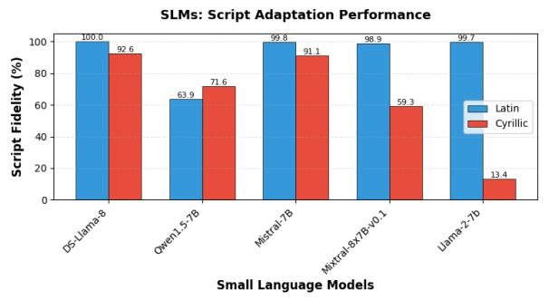

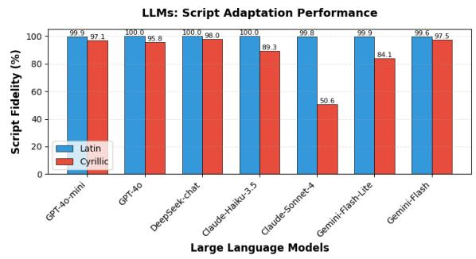  
Figure 1: Percentage of instances with matching input and output scripts for QIRIM dataset, per model.

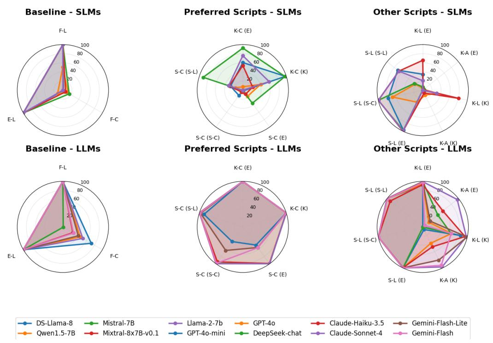  
Figure 2: Script forcing results. Scores represent the percentage of cases where the script of the generated text matched the requested output script. Axes represent language-script pairs formatted as L-S, where L indicates the output language (S: Serbian, F: French, E: English, K: Kazakh) and S indicates the script (L: Latin, C: Cyrillic, A: Arabic). The language in parentheses indicates the prompt language.

Overall Findings These results demonstrate that current language models have acquired solid script knowledge. Multi-scriptic languages in our analysis receive outputs in more than one script, and models can both adapt to input scripts and follow explicit script instructions. However, this knowledge is not uniform: systematic biases toward certain scripts persist, natural language-script combinations are handled more reliably, and LLMs substantially outperform SLMs in flexible script manipulation, particularly for non-standard or arti-

ficial script requests.

## 3.3 Quality of generated responses

To verify that script changes do not systematically degrade response quality, we conducted an LLMas-a-judge evaluation on a 10% sample of generated responses across all configurations (see details in Appendix B). Results show that factuality and completeness scores remain largely stable across script variations (typically within 0-10 points), even when script fidelity decreases. This confirms that models maintain semantic accuracy when generating text in non-preferred scripts, though compliance with script instructions may vary.

## 4 Conclusions

In this study, we have examined the extent to which language models possess awareness of scripts. Our findings reveal a substantial awareness that extends beyond simple pattern matching: Language Models can both adapt their output scripts to match input prompts and follow explicit instructions to generate text in specified scripts.

Models demonstrate consistently high Latin script fidelity but more variable performance with Cyrillic script. While all models recognize natural scripts for tested languages, natural language-script combinations are handled more reliably than nonstandard pairings. We also observed a performance gap between LLMs and SLMs, particularly for nonstandard script combinations.

## Limitations

Our analyses in Section 3 rely on GlotLID for detecting the script of generated text. The same tool is also used in the annotations of MultiQ. Although GlotLID achieves high accuracy, it is not completely reliable, and occasional misclassifications may influence our results.

Second, several of the languages examined are low- or mid-resource. The datasets used to train LLMs in these languages may themselves be biased, potentially leading to systematic biases in the models. For instance, while no precise statistics exist for the script distribution of Crimean Tatar, it is plausible that training data are skewed toward the Latin script, which could partly explain the models observed preference for it over Cyrillic.

Finally, we consider only one artificial pairing (French-Cyrillic).

## Acknowledgments

The work described in this paper has been funded by the “Language Preference and Hallucination Investigation in Multilingual RAG (LPHI-mRAG)” project, funded by armasuisse S&T, Switzerland.

## References

Milind Agarwal, Joshua Otten, and Antonios Anastasopoulos. 2025. Script-agnosticism and its impact on language identification for Dravidian languages. In Proceedings of the 2025 Conference of the Nations of the Americas Chapter of the Association for Computational Linguistics: Human Language Technologies (Volume 1: Long Papers), pages 7364–7384,

Albuquerque, New Mexico. Association for Computational Linguistics.

ALBAR, Boris and BEDU, Pierre and BOURDOIS, Loïck. 2023. frenchqa (revision 6249cd5).

Gordic Aleksa. 2023. Serbian llm eval.´

AI Anthropic. 2024. The claude 3 model family: Opus, sonnet, haiku. Claude-3 Model Card, 1(1):4.

Jinze Bai, Shuai Bai, Yunfei Chu, Zeyu Cui, Kai Dang, Xiaodong Deng, Yang Fan, Wenbin Ge, Yu Han, Fei Huang, Binyuan Hui, Luo Ji, Mei Li, Junyang Lin, Runji Lin, Dayiheng Liu, Gao Liu, Chengqiang Lu, Keming Lu, and 29 others. 2023. Qwen technical report. Preprint, arXiv:2309.16609.

Gheorghe Comanici, Eric Bieber, Mike Schaekermann, Ice Pasupat, Noveen Sachdeva, Inderjit Dhillon, Marcel Blistein, Ori Ram, Dan Zhang, Evan Rosen, Luke Marris, Sam Petulla, Colin Gaffney, Asaf Aharoni, Nathan Lintz, Tiago Cardal Pais, Henrik Jacobsson, Idan Szpektor, Nan-Jiang Jiang, and 3290 others. 2025. Gemini 2.5: Pushing the frontier with advanced reasoning, multimodality, long context, and next generation agentic capabilities. Preprint, arXiv:2507.06261.

Shaojie Dai, Xin Liu, Ping Luo, and Yue Yu. 2024. Actmnmt auto-constriction turning for multilingual neural machine translation. Preprint, arXiv:2403.06745.

DeepSeek-AI. 2025. Deepseek-r1: Incentivizing reasoning capability in llms via reinforcement learning. Preprint, arXiv:2501.12948.

DeepSeek-AI, Aixin Liu, Bei Feng, Bing Xue, Bingxuan Wang, Bochao Wu, Chengda Lu, Chenggang Zhao, Chengqi Deng, Chenyu Zhang, Chong Ruan, Damai Dai, Daya Guo, Dejian Yang, Deli Chen, Dongjie Ji, Erhang Li, Fangyun Lin, Fucong Dai, and 181 others. 2025. Deepseek-v3 technical report. Preprint, arXiv:2412.19437.

Ignace J. Gelb. 1963. A Study of Writing: The Foundations of Grammatology, revised edition edition. University of Chicago Press, Chicago and London.

Rishav Hada, Varun Gumma, Adrian de Wynter, Harshita Diddee, Mohamed Ahmed, Monojit Choudhury, Kalika Bali, and Sunayana Sitaram. 2024. Are large language model-based evaluators the solution to scaling up multilingual evaluation? In Findings of the Association for Computational Linguistics: EACL 2024, pages 1051–1070, St. Julian’s, Malta. Association for Computational Linguistics.

Harold Stanley Heaps. 1978. Information retrieval: Computational and theoretical aspects. Academic Press, Inc.

Carolin Holtermann, Paul Röttger, Timm Dill, and Anne Lauscher. 2024. Evaluating the elementary multilingual capabilities of large language models with

MultiQ. In Findings ofthe Associationfor Computational Linguistics: ACL 2024, pages 4476–4494, Bangkok, Thailand. Association for Computational Linguistics.

Kedir Yassin Hussen, Walelign Tewabe Sewunetie, Abinew Ali Ayele, Sukairaj Hafiz Imam, Shamsuddeen Hassan Muhammad, and Seid Muhie Yimam. 2025. The state of large language models for african languages: Progress and challenges. Preprint, arXiv:2506.02280.

Jafar Isbarov, Arofat Akhundjanova, Mammad Hajili, Kavsar Huseynova, Dmitry Gaynullin, Anar Rzayev, Osman Tursun, Aizirek Turdubaeva, Ilshat Saetov, Rinat Kharisov, Saule Belginova, Ariana Kenbayeva, Amina Alisheva, Abdullatif Köksal, Samir Rustamov, and Duygu Ataman. 2025. TUMLU: A unified and native language understanding benchmark for Turkic languages. In Proceedings ofthe 63rd Annual Meeting of the Association for Computational Linguistics (Volume 1: Long Papers), pages 22816–22838, Vienna, Austria. Association for Computational Linguistics.

Albert Q. Jiang, Alexandre Sablayrolles, Arthur Mensch, Chris Bamford, Devendra Singh Chaplot, Diego de las Casas, Florian Bressand, Gianna Lengyel, Guillaume Lample, Lucile Saulnier, Lélio Renard Lavaud, Marie-Anne Lachaux, Pierre Stock, Teven Le Scao, Thibaut Lavril, Thomas Wang, Timothée Lacroix, and William El Sayed. 2023. Mistral 7b. Preprint, arXiv:2310.06825.

Albert Q. Jiang, Alexandre Sablayrolles, Antoine Roux, Arthur Mensch, Blanche Savary, Chris Bamford, Devendra Singh Chaplot, Diego de las Casas, Emma Bou Hanna, Florian Bressand, Gianna Lengyel, Guillaume Bour, Guillaume Lample, Lélio Renard Lavaud, Lucile Saulnier, Marie-Anne Lachaux, Pierre Stock, Sandeep Subramanian, Sophia Yang, and 7 others. 2024. Mixtral of experts. Preprint, arXiv:2401.04088.

David Kletz, Sandra Mitrovic, Itay Sabato, Ljiljana´ Dolamic, and Fabio Rinaldi. 2026.´ Script choice in llms: Evidence for late-layer commitment. Preprint, arXiv:2609.28784.

Sander Land and Catherine Arnett. 2025. Bpe stays on script: Structured encoding for robust multilingual pretokenization. Preprint, arXiv:2505.24689.

Olzhas Makhambetov, Aibek Makazhanov, Zhandos Yessenbayev, Bakhyt Matkarimov, Islam Sabyrgaliyev, and Anuar Sharafudinov. 2013. Assembling the Kazakh language corpus. In Proceedings of the 2013 Conference on Empirical Methods in Natural Language Processing, pages 1022–1031, Seattle, Washington, USA. Association for Computational Linguistics.

Kelly Marchisio, Wei-Yin Ko, Alexandre Berard, Théo Dehaze, and Sebastian Ruder. 2024. Understanding

and mitigating language confusion in LLMs. In Proceedings of the 2024 Conference on Empirical Methods in Natural Language Processing, pages 6653– 6677, Miami, Florida, USA. Association for Computational Linguistics.

Helena Miton and Olivier Morin. 2021. Graphic complexity in writing systems. Cognition, 214:104771.

Sandra Mitrovic, David Kletz, Ljiljana Dolamic, and´ Fabio Rinaldi. 2026. Are the LLMs capable of maintaining at least the language genus? In Proceedings ofthe Fifteenth Language Resources and Evaluation Conference, pages 8954–8970, Palma de Mallorca, Spain. ELRA Language Resource Association.

Niklas Muennighoff, Thomas Wang, Lintang Sutawika, Adam Roberts, Stella Biderman, Teven Le Scao, M Saiful Bari, Sheng Shen, Zheng Xin Yong, Hailey Schoelkopf, Xiangru Tang, Dragomir Radev, Alham Fikri Aji, Khalid Almubarak, Samuel Albanie, Zaid Alyafeai, Albert Webson, Edward Raff, and Colin Raffel. 2023. Crosslingual generalization through multitask finetuning. In Proceedings of the 61st Annual Meeting of the Association for Computational Linguistics (Volume 1: Long Papers), pages 15991–16111, Toronto, Canada. Association for Computational Linguistics.

Benjamin Muller, Antonios Anastasopoulos, Benoît Sagot, and Djamé Seddah. 2021. When being unseen from mBERT is just the beginning: Handling new languages with multilingual language models. In Proceedings ofthe 2021 Conference ofthe North American Chapter of the Association for Computational Linguistics: Human Language Technologies, pages 448–462, Online. Association for Computational Linguistics.

Ercong Nie, Helmut Schmid, and Hinrich Schuetze. 2025. Mechanistic understanding and mitigation of language confusion in English-centric large language models. In Findings ofthe Associationfor Computational Linguistics: EMNLP 2025, pages 690–706, Suzhou, China. Association for Computational Linguistics.

OpenAI, :, Aaron Hurst, Adam Lerer, Adam P. Goucher, Adam Perelman, Aditya Ramesh, Aidan Clark, AJ Ostrow, Akila Welihinda, Alan Hayes, Alec Radford, Aleksander M ˛adry, Alex Baker-Whitcomb, Alex Beutel, Alex Borzunov, Alex Carney, Alex Chow, Alex Kirillov, and 401 others. 2024. Gpt-4o system card. Preprint, arXiv:2410.21276.

Aquia Richburg and Marine Carpuat. 2024. How multilingual are large language models fine-tuned for translation? In First Conference on Language Modeling.

Beksultan Sagyndyk, Sanzhar Murzakhmetov, and Kirill Yakunin. 2025. Kaz-roberta conversational technical report.

Alan Saji, Jaavid Aktar Husain, Thanmay Jayakumar, Raj Dabre, Anoop Kunchukuttan, and Ratish Puduppully. 2025. RomanLens: The role of latent Romanization in multilinguality in LLMs. In Findings of the Associationfor Computational Linguistics: ACL 2025, pages 26410–26429, Vienna, Austria. Association for Computational Linguistics.

Rico Sennrich, Jannis Vamvas, and Alireza Mohammadshahi. 2024. Mitigating hallucinations and offtarget machine translation with source-contrastive and language-contrastive decoding. In Proceedings ofthe 18th Conference ofthe European Chapter of the Associationfor Computational Linguistics (Volume 2: Short Papers), pages 21–33, St. Julian’s, Malta. Association for Computational Linguistics.

Seyoung Song, Seogyeong Jeong, Eunsu Kim, Jiho Jin, Dongkwan Kim, Jay Shin, and Alice Oh. 2025. MUG-eval: A proxy evaluation framework for multilingual generation capabilities in any language. In Findings ofthe Associationfor Computational Linguistics: EMNLP 2025, pages 19488–19514, Suzhou, China. Association for Computational Linguistics.

Jörg Tiedemann. 2020. The Tatoeba Translation Challenge – Realistic data sets for low resource and multilingual MT. In Proceedings of the Fifth Conference on Machine Translation, pages 1174–1182, Online. Association for Computational Linguistics.

Hugo Touvron, Louis Martin, Kevin Stone, Peter Albert, Amjad Almahairi, Yasmine Babaei, Nikolay Bashlykov, Soumya Batra, Prajjwal Bhargava, Shruti Bhosale, Dan Bikel, Lukas Blecher, Cristian Canton Ferrer, Moya Chen, Guillem Cucurull, David Esiobu, Jude Fernandes, Jeremy Fu, Wenyin Fu, and 49 others. 2023. Llama 2: Open foundation and fine-tuned chat models. Preprint, arXiv:2307.09288.

Ivan Vykopal, Matúš Pikuliak, Simon Ostermann, Tatiana Anikina, Michal Gregor, and Marian Simko. 2025. Large language models for multilingual previously fact-checked claim detection. In Findings of the Association for Computational Linguistics: EMNLP 2025, pages 15741–15765, Suzhou, China. Association for Computational Linguistics.

Thomas Wolf, Lysandre Debut, Victor Sanh, Julien Chaumond, Clement Delangue, Anthony Moi, Pierric Cistac, Tim Rault, Rémi Louf, Morgan Funtowicz, Joe Davison, Sam Shleifer, Patrick von Platen, Clara Ma, Yacine Jernite, Julien Plu, Canwen Xu, Teven Le Scao, Sylvain Gugger, and 3 others. 2020. Huggingface’s transformers: State-of-the-art natural language processing. Preprint, arXiv:1910.03771.

Haoran Xu, Young Jin Kim, Amr Sharaf, and Hany Hassan Awadalla. 2024. A paradigm shift in machine translation: Boosting translation performance of large language models. In The Twelfth International Conference on Learning Representations.

Chen Zhang, Mingxu Tao, Zhiyuan Liao, and Yansong Feng. 2025. MiLiC-eval: Benchmarking multilin-

gual LLMs for China’s minority languages. In Findings ofthe Associationfor Computational Linguistics: ACL 2025, pages 11086–11102, Vienna, Austria. Association for Computational Linguistics.

Lianmin Zheng, Wei-Lin Chiang, Ying Sheng, Siyuan Zhuang, Zhanghao Wu, Yonghao Zhuang, Zi Lin, Zhuohan Li, Dacheng Li, Eric Xing, Hao Zhang, Joseph E Gonzalez, and Ion Stoica. 2023. Judging llm-as-a-judge with mt-bench and chatbot arena. In Advances in Neural Information Processing Systems, volume 36, pages 46595–46623. Curran Associates, Inc.

George K. Zipf. 1949. Human Behaviour and the Principle ofLeast Effort. Addison-Wesley.

Judit Ács. 2019. Exploring bert’s vocabulary. https://juditacs.github.io/2019/02/19/ bert-tokenization-stats.html. Judit Ács Blog.

## A Vocabulary size per language

Method We retrieve a corpus for each languagescript pair and tokenize it entirely using the model suite’s tokenizer10. We then count the number of types (unique tokens). Since not all language-script pairs have corpora of equal size, and vocabulary size depends inversely on corpus size according to Zipf’s law (Zipf, 1949), we normalize our measurements (following Heaps’ empirical law, Heaps (1978)). We first calculate the size of each corpus used (available in Table 1).

<table><tr><td>Lang-script</td><td>Total words</td><td>Types</td><td>Sentences</td></tr><tr><td>Kz-ar</td><td>27,805,939</td><td>810,230</td><td>57,827</td></tr><tr><td>Kz-cyr</td><td>4,656,620</td><td>301,614</td><td>371,902</td></tr><tr><td>Kz-lat</td><td>430</td><td>371</td><td>100</td></tr><tr><td>Sr-cyr</td><td>15,255</td><td>4,424</td><td>150</td></tr><tr><td>Sr-lat</td><td>569,206</td><td>89,537</td><td>2,919</td></tr><tr><td>Cr-cyr</td><td>517,595</td><td>109,847</td><td>77,688</td></tr><tr><td>Cr-lat</td><td>281,372</td><td>70,810</td><td>77,688</td></tr><tr><td>Fr-lat</td><td>8,073</td><td>2,484</td><td>800</td></tr></table>

Table 1: Summary statistics of datasets

Then, for each model suite and language-script pair, we compute a normalized vocabulary metric using the formula:

$$
\frac { l o g ( V ) } { l o g ( N ) }
$$

where V is the vocabulary size (number of unique tokens) and N is the corpus size (total tokens).

Results The results are displayed in Figure 3. These findings demonstrate that models possess sufficient vocabulary coverage across language-script pairs to generate responses, even in less frequent scripts.

The results reveal a notable consistency in vocabulary sizes across model families. Normalized scores range between 0.55 and 1.1 for all model suites, indicating relatively balanced coverage. The most significant effect is attributable to language rather than script. For instance, Serbian scores consistently fall between 0.75 and 0.9, while French scores are between 0.95 and 1.05. This variation likely reflects differences in morphological complexity and corpus characteristics rather than fundamental vocabulary gaps.

Within individual languages, the choice of script produces only modest variation in vocabulary coverage. Latin-script pairs consistently achieve slightly higher scores, but this advantage is small and does not uniformly indicate preferential treatment–the Latin script is not always dominant. The notable exception is Kazakh: Latin script exhibits substantially larger vocabulary coverage (normalized score ∼ 1.0) compared to Arabic script (∼ 0.6). This disparity should be considered when interpreting results.

## B Quality control

## B.1 Responses Quality

We verify whether response quality is affected by the required output script. Specifically, we examine whether switching to a non-primary script for a given language results in substantial degradation of response quality.

Evaluation methodology We assess response quality using an LLM-as-a-judge approach (Zheng et al., 2023). For each model and configuration (see Section 2), we randomly sample 10% of the generated responses and pair them with their corresponding gold answers from the original datasets. These pairs are then provided to a judge LLM, which evaluates each response according to two criteria: (1) Factuality: Is the generated answer factually accurate and semantically aligned with the gold answer? (2) Completeness: Does the generated answer cover all essential information, regardless of the script used? Each criterion is scored on a 3-point scale (0, 1, or 2). To avoid bias, we use gpt-5-nano as the judge model, which was not included in our main experiments. We compute the average score for each configuration and model.

Comparative analysis Since our objective is to assess quality changes across scripts, we calculate score differences between the following configuration pairs:

• French-Latin vs. French-Cyrillic

• Serbian-Cyrillic vs. Serbian-Latin (prompt in Serbian-Latin)

• Serbian-Cyrillic vs. Serbian-Latin (prompt in Serbian-Cyrillic)

• Serbian-Cyrillic vs. Serbian-Latin (prompt in English-Latin)

• Kazakh-Cyrillic vs. Kazakh-Arabic (prompt in Kazakh-Cyrillic)

• Kazakh-Cyrillic vs. Kazakh-Latin (prompt in Kazakh-Cyrillic)

• Kazakh-Cyrillic vs. Kazakh-Arabic (prompt in English-Latin)

• Kazakh-Cyrillic vs. Kazakh-Latin (prompt in English-Latin)

For each pair, we compute the score difference by subtracting the second configuration’s score from the first (preferential) configuration’s score. Positive differences indicate that the preferential script configuration yielded higher quality outputs, while negative differences indicate the opposite. If models possess genuine script-independence, these score differences should remain low across all comparisons.

Results are presented in Tables 2 and 3.

Results The results reveal a general trend of quality preservation across script changes: the majority of score variations (for both completeness and factuality) range between 0 and -10 points. When examined alongside the decrease in script fidelity rates, these findings demonstrate that script changes do not necessarily lead to diminished response quality. This suggests that models can maintain semantic accuracy even when generating text in non-preferred scripts–though they may struggle to comply with the script instruction itself.

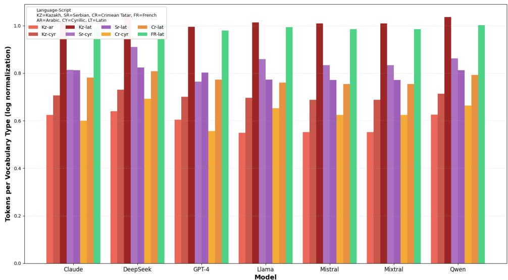

Figure 3: Size of the vocabulary (number of non-character tokens) per language-script combination, for each model. (with Zipf)
<table><tr><td>Config</td><td colspan="2">gpt-40-m C</td><td colspan="2">S</td><td colspan="2">gpt-40 C</td><td colspan="2">F</td><td colspan="2">Deepseek-chat C S</td><td colspan="2">Haiku C</td><td colspan="2">S F</td><td colspan="2">Sonnet S</td><td colspan="2">Gemini-flash C</td><td colspan="2">Gemini F C</td></tr><tr><td></td><td>F</td><td></td><td></td><td>F</td><td></td><td>S</td><td></td><td></td><td></td><td>F</td><td></td><td></td><td></td><td>C</td><td></td><td></td><td></td><td></td><td></td><td>S</td></tr><tr><td>F-C vs F-L</td><td>-4</td><td>0</td><td>-28</td><td>-8</td><td>-4</td><td>-56</td><td>-16</td><td>-14</td><td>-99</td><td>-17</td><td>-18</td><td>-75</td><td>-18</td><td>-17 -50</td><td></td><td>-4</td><td></td><td>-13</td><td></td><td>-61</td></tr><tr><td>S-C vs S-L (S-L)</td><td>-3</td><td>-9</td><td>-10</td><td>-2</td><td>-5</td><td>0</td><td>-4</td><td></td><td></td><td></td><td></td><td></td><td>-8</td><td>0</td><td>-12</td><td>-15</td><td>0</td><td>0</td><td>-6</td><td>-3</td></tr><tr><td>S-C vs S-L (S-C)</td><td>-8</td><td>-11</td><td>-60</td><td>-6</td><td>-9</td><td></td><td>-4</td><td>-1</td><td></td><td></td><td>-5</td><td>-4</td><td>-6</td><td>0</td><td>-6</td><td>-10</td><td>-1</td><td>-1</td><td>-2</td><td>-36</td></tr><tr><td>S-C vs S-L (E)</td><td>6</td><td>5</td><td>-51</td><td>2</td><td>-1</td><td>-1</td><td></td><td>0</td><td></td><td>-10</td><td>0</td><td>-3</td><td>-4</td><td>0</td><td>-24</td><td>-29</td><td>-44</td><td>-10</td><td>-8</td><td>-44</td></tr><tr><td>K-C vs K-A (K)</td><td>-21</td><td>-13</td><td>-8</td><td>-15</td><td>-9</td><td>-6</td><td></td><td>-1</td><td></td><td></td><td>-7</td><td>-2</td><td>4</td><td>-1</td><td>10</td><td>9</td><td>-2</td><td>-5</td><td>1</td><td>-1</td></tr><tr><td>K-C vs K-L (K)</td><td>2</td><td>0</td><td>-100</td><td>-7</td><td>2</td><td>-83</td><td>-4</td><td>-58</td><td></td><td>-38 -7</td><td>-44</td><td>-20</td><td>-2</td><td>-4</td><td>-2</td><td>2</td><td>-95</td><td>-6</td><td>0</td><td>-80</td></tr><tr><td>K-C vs K-A (E)</td><td>-16</td><td>-13</td><td>-15</td><td>-6</td><td>-4</td><td>-36</td><td>-4</td><td>-36</td><td></td><td>-14 2 -7</td><td>-5</td><td></td><td>4</td><td>-2</td><td>-1</td><td>3</td><td>-36</td><td>-5</td><td>0</td><td>0</td></tr><tr><td>K-C vs K-L (E)</td><td>2</td><td>2</td><td>-94</td><td>-18</td><td>-6</td><td>-60</td><td>-8</td><td></td><td>-99</td><td>-34</td><td>-52</td><td>-11</td><td>-1</td><td>-2</td><td>-3</td><td>6</td><td>-6</td><td>-11</td><td>0</td><td>-19</td></tr></table>

Table 2: Quality score differences across script configurations of LLMs. F: Factuality, C: Completeness, S: Script fidelity. Lines name are language-script pairs formatted as L-S, where L indicates the output language (S: Serbian, F: French, E: English, K: Kazakh) and S indicates the script (L: Latin, C: Cyrillic, A: Arabic). The language in parentheses indicates the prompt language.

Model-specific patterns SLMs exhibit the smallest quality variations (between -7 and +10 points), while LLMs show larger fluctuations. This difference may stem from SLMs’ more limited knowledge base, resulting in lower baseline scores even with languages’ primary scripts, thereby leaving less room for degradation. Among LLMs, behavior varies substantially by model family. While GPT models show moderate score variations, Claude models exhibit considerably larger differences, particularly for configurations with Kazakh.

Metric consistency The two evaluation criteria show strong agreement: factuality and completeness scores consistently exhibit similar signs and magnitudes.

## B.2 Perplexity Analysis

Our second analysis examines model confidence in text generation across different scripts through perplexity measurements.

Methodology For each SLM11, we calculate perplexity scores over each complete generated response. The objective is to compare, for each model and language, the perplexity when using the primary script versus alternative scripts.

Results are presented in Figures 4.

With the notable exception of Qwen1.5-7B (discussed in Appendix I), models exhibit relatively stable perplexity across scripts, confirming their confidence in generating the target language regardless of the writing system used.

Several noteworthy patterns emerge from the analysis. First, Kazakh-Arabic does not yield the highest perplexity, despite being the least common script for this language. This could be explained by low script fidelity in this configuration: when instructed to use Arabic script, models often default to other scripts. Second, DeepSeek-

<table><tr><td rowspan="2">Config</td><td rowspan="2">F</td><td colspan="2">DeepSeek-R1-Distill-Llama-8B</td><td colspan="3">Llama-2-7B-Chat</td><td colspan="3">Mistral-7B-Instruct</td><td colspan="3">Mixtral-8x7B-Instruct</td></tr><tr><td>C</td><td>S</td><td>F</td><td>C</td><td>S</td><td>F</td><td>C</td><td>S</td><td>F</td><td>C</td><td>S</td></tr><tr><td>F-C vs F-L</td><td>5</td><td>2</td><td>-99</td><td>-1</td><td>-2</td><td>-100</td><td>-4</td><td>2</td><td>-84</td><td>-4</td><td>-7</td><td>-93</td></tr><tr><td>S-C vs S-L (S-L)</td><td>0</td><td>-4</td><td>-42</td><td>-5</td><td>-3</td><td>-34</td><td>2</td><td>0</td><td>68</td><td>-2</td><td>-3</td><td>-36</td></tr><tr><td>S-C vs S-L (S-C)</td><td>2</td><td>2</td><td>-63</td><td>-4</td><td>-2</td><td>-99</td><td>-11</td><td>-10</td><td>-99</td><td>4</td><td>8</td><td>-95</td></tr><tr><td>S-C vs S-L (E)</td><td>1</td><td>4</td><td>-96</td><td>-1</td><td>1</td><td>-99</td><td>-11</td><td>-10</td><td>-63</td><td>2</td><td>-2</td><td>-89</td></tr><tr><td>K-C vs K-A (K)</td><td>3</td><td>6</td><td>-26</td><td>0</td><td>0</td><td>-55</td><td>0</td><td>0</td><td>-85</td><td>10</td><td>7</td><td>11</td></tr><tr><td>K-C vs K-L (K)</td><td>0</td><td>2</td><td>-60</td><td>0</td><td>0</td><td>-76</td><td>-1</td><td>0</td><td>-90</td><td>-1</td><td>0</td><td>-53</td></tr><tr><td>K-C vs K-A (E)</td><td>-1</td><td>0</td><td>-98</td><td>2</td><td>0</td><td>-30</td><td>0</td><td>1</td><td>-93</td><td>6</td><td>0</td><td>58</td></tr><tr><td>K-C vs K-L (E)</td><td>0</td><td>0</td><td>-98</td><td>3</td><td>1</td><td>-61</td><td>0</td><td>0</td><td>-97</td><td>0</td><td>1</td><td>-16</td></tr></table>

Table 3: Quality score differences across script configurations of SLMs. F: Factuality, C: Completeness, S: Script fidelity. Lines name are language-script pairs formatted as L-S, where L indicates the output language (S: Serbian, F: French, E: English, K: Kazakh) and S indicates the script (L: Latin, C: Cyrillic, A: Arabic). The language in parentheses indicates the prompt language.

R1-Distill-Llama demonstrates the most stable perplexity across all configurations, suggesting robust cross-script generation capabilities.

The script used in the prompt itself significantly affects generation confidence. For instance, Mistral-7B exhibits substantially higher perplexity when prompted in Serbian-Cyrillic and asked to respond in Serbian-Latin compared to when asked to respond in Serbian-Cyrillic (and vice versa for Latin-to-Cyrillic transitions). This asymmetry suggests that aligning the prompt script with the expected output script reduces model uncertainty, even when both scripts are natural for the language. This finding indicates a practical recommendation: when requesting responses in a specific script, using that same script in the prompt yields more confident generations than relying solely on the language’s dominant script.

## C Multi- and Mono-scriptic languages

An overview of literature sources mentioning certain languages as multi-scriptic can be seen in Table 6.

Given there is no comprehensive existing categorization of languages on mono-scriptic and multi-scriptic, we cross-check Tatoeba and literature sources (Table 6). Tatoeba consist of 166 different languages but we were able to retrieve ISO codes for only 97 of these. Only 12 out of these 97 languages are considered as multi-scriptic in Tatoeba. Table 4 presents number of languages per category (“mixed”, “multi”, “mono”) according to both Tatoeba and literature. The list of “mixed” languages (where Tatoeba and literature disagrees in the number of scripts used per language) as well as the list of multi-scriptic languages (where both sources agree that multiple scripts can be used per language) are displayed in Table 5.

<table><tr><td>Language Script Type </td><td>|Number of Languages</td></tr><tr><td>Mono-scriptic</td><td>78</td></tr><tr><td>Multi-scriptic</td><td>10</td></tr><tr><td>Mixed</td><td>9</td></tr></table>

Table 4: Number of languages in different script-based categories based on Tatoeba and literature. Monoscriptic (multi-scriptic) are those languages for which both sources agree that they use a single (multiple) script(s), respectively. Mixed category languages use different number of scripts (mono in Tatoeba and multi in the literature, or vice versa).

<table><tr><td>Mixed Category</td><td>Multi-script Category</td></tr><tr><td>Bulgarian Kurdish (Central)</td><td>Bosnian Chavacano</td></tr><tr><td>Javanese</td><td>Kunming</td></tr><tr><td>Korean</td><td>Kazakh</td></tr><tr><td>Marathi</td><td>Kurmanji</td></tr><tr><td>Macedonian</td><td>Ladino</td></tr><tr><td>Tagalog</td><td>Turkmen</td></tr><tr><td>Uyghur</td><td>Cantonese</td></tr><tr><td>Ukrainian</td><td>Malay (Kuala Lumpur)</td></tr><tr><td></td><td>Malay</td></tr></table>

Table 5: Left: Mixed category languages according to Tatoeba and literature (using different number of scripts in Tatoeba with respect to the literature). Right: Multi-script category containing languages which both Tatoeba and literature consider multi-scriptic.

## D Scripts used by SLM

As explained in Section 1, all languages are associated with scripts. Some languages are monoscriptic, written consistently in a single script, while others are multi-scriptic, allowing multiple coexisting scripts. As a preliminary step, we investigate whether language models are constrained to a fixed set of scripts when generating text for a given language, or whether they can produce outputs in multiple scripts. In particular, we test whether models use only one script for mono-scriptic languages, and can exploit several scripts for multi-scriptic ones.

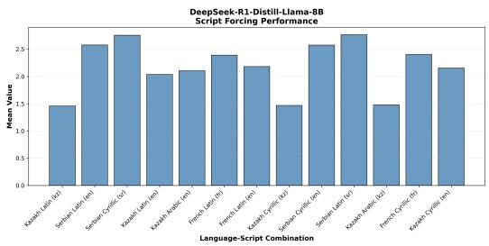  
(a) DeepSeek-R1-Distill-Llama-8B

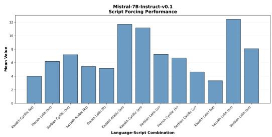

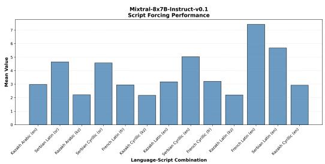  
(c) Mixtral-8x7B-Instruct-v0.1

(b) Mistral-7B-Instruct-v0.1  
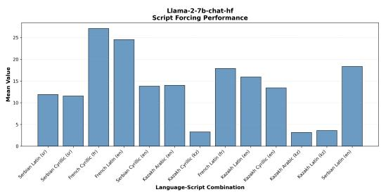  
(d) Llama-2-7B-Chat-HF

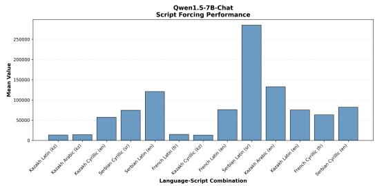  
(e) Qwen1.5-7B-Chat  
Figure 4: Perplexity distributions across script configurations for each SLM. Each panel shows perplexity values for different language-script combinations, with the language of the prompt in parenthesis.

## D.1 Mono- vs. Multi-script Languages

Determining whether a language is mono- or multiscriptic is not straightforward: the existence of a corpus written in a given script does not imply that this script is the only one used for that language. To the best of our knowledge, no exhaustive classification of world languages by their script multiplicity currently exists. We therefore rely on two complementary resources to establish our ground truth.

We first extract information from the Tatoeba Translation Challenge (Tiedemann, 2020)12. Its metadata includes, for a number of languages, explicit annotations of the script used–particularly for cases where multiple scripts are possible. Languages for which Tatoeba specifies a script are treated as “multi-scriptic according to Tatoeba”; those without such annotations are considered “mono-scriptic according to Tatoeba”.

We complement these data with scholarly sources identifying specific multi-scriptic languages. All languages mentioned in the literature as employing multiple scripts are labeled “multiscriptic according to the literature”. Because these works focus only on positive cases, they do not allow us to infer that unlisted languages are monoscriptic.

Combining the two sources sometimes yields discrepancies: some languages appear as monoscriptic in Tatoeba yet multi-scriptic in the literature. We therefore define three categories: (1) Mono – agreement between Tatoeba and the literature that the language uses one script; (2) Multi – agreement that it uses several; (3) Mixed – disagreement between the two sources. The detailed composition of these groups is provided in Appendix C.

<table><tr><td rowspan=1 colspan=1>Source URL</td><td rowspan=1 colspan=1>|Language</td></tr><tr><td rowspan=1 colspan=1>https://sites.google.com/site/seesscm/languages-in-multiple-scripts</td><td rowspan=1 colspan=1>BosnianBulgarianKurdish (Central)MacedonianMoldavianTajikTurkmenUkrainianTatar</td></tr><tr><td rowspan=1 colspan=1>https://en.wikipedia.org/wiki/Digraphia</td><td rowspan=1 colspan=1>JavaneseKazakhKonkaniMarathiMalay</td></tr><tr><td rowspan=1 colspan=1>https://journals.sagepub.com/doi/epub/10.1177/18793665231188380</td><td rowspan=1 colspan=1>Serbian-CroatianUzbek (Northern)</td></tr><tr><td rowspan=1 colspan=1>https://www.ibidem.eu/out/media/vlb_9783838217932_2.pdf</td><td rowspan=1 colspan=1>Korean</td></tr></table>

Table 6: Literature sources (left) explicitly mentioning multi-scriptic feature of a language (right).

## D.2 Experimental Setup

For each language we compare the number of distinct scripts used by the models in generation with the corresponding ground-truth number defined in D.1.

Method We employ an open-question answering scenario: questions are posed in various languages and scripts, and models are allowed to respond freely–without conditioning on a target language or script. For each language, we identify the scripts present in the generated outputs and record whether a single or multiple scripts were used. We then compute the proportion of languages whose outputs include more than one script, broken down by the Mono, Multi, and Mixed categories.

Data We rely on the MultiQ dataset (Holtermann et al., 2024), which contains 200 questions across 137 input languages, along with model responses. MultiQ is particularly suitable for this study as it provides multilingual outputs without explicit script constraints. In total, 29 distinct output scripts are observed in the dataset. Because this section aims to provide a preliminary exploration motivating subsequent experiments, we directly reuse the MultiQ data without additional fine-tuning or resampling.

Models Following the scope of MultiQ, we focus on six open-source SLMs: Llama-2-(7/13/70)B-Chat-HF (Touvron et al., 2023), Mistral-7B-Instruct-v0.1 (Jiang et al., 2023), Mixtral-8×7B-Instruct-v0.1 (Jiang et al., 2024), and Qwen 1.5- 7B-Chat (Bai et al., 2023). This selection allows us to observe general tendencies before extending the analysis to a broader set of larger models.

## D.3 Results

Figure 5 summarizes, for each model, the proportion of languages generated in one or multiple scripts across the three language categories (mono, multi, mixed).

Three out of the four models exhibit non-zero proportions of multi-script generations (orange bars). This observation indicates that these models can, at least in some cases, generate outputs using more than one script for the same language. Such behavior suggests that the models have acquired at least a partial knowledge of script multiplicity.

Nonetheless, mono-script generations (blue bars) largely dominate the results. The use of multiple scripts remains marginal, even within the multiscript language group. In three plots, all multiscript languages are generated exclusively in a single script. Only Mistral-7B-Instruct-v0.1 displays a notable deviation from this pattern, producing multi-script outputs for approximately 30% of the multi-script languages. An important consideration is that each entry in MultiQ is written in a single input script. The apparent predominance of monoscript outputs may therefore reflect an alignment between the input and output scripts, rather than a genuine lack of multi-script competence. This hypothesis is investigated further in Section 3.

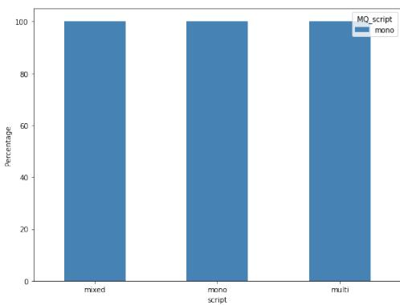  
(a) Llama-2-(7b/13b/70b)-chat-hf

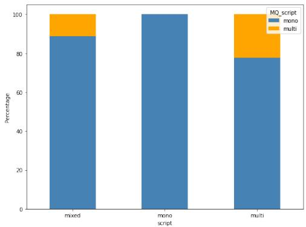  
(b) Mistral-7B-Instruct-v0.1

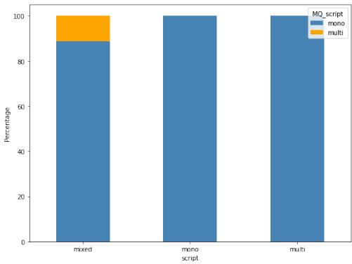  
(c) Mixtral-8x7B-Instruct-v0.1

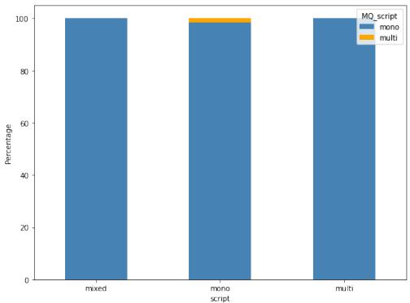  
(d) Qwen1.5-7B-Chat  
Figure 5: Percentage of languages by script usage. Blue bars represent languages for which the model generates text in a single script, while orange bars represent languages for which the model uses two or more scripts. The input groups correspond to the language categories defined in Sub-Section D.1.

Languages classified as “mixed” exhibit variable behavior across models. Two models generate outputs in multiple scripts for some of these languages, while the remaining two restrict their generations to a single script.

Overall, these results confirm that several models are capable of producing text in more than one script for a given language.

## E Infidelity details

Details not included in Section 3 of scripts used by the models when they are unfaithful to the input

script are given in Figures 6 (open-source SLMs) and 7 (proprietary LLMs).

## F Prompts

The five prompts we used for the script forcing are given in the prompts 1.1 to 1.5.

## G Script forcing configurations

The detail of the configurations used for the script are given in Table 7.

## H Script Identification

Following Holtermann et al. (2024), we identify output scripts using glotLID’s model\_v3.13 This model outputs a ranked list of scripts detected in the text along with their respective coverage percentages. Since generated outputs may contain script-agnostic content such as mathematical formulas, we classify each text according to its script with the highest coverage.

Script identification without GlotLID To assess how much our findings depend on GlotLID, we also measured script compliance with a second method. For each output, we count the letters in each script, ignoring digits, punctuation and whitespace. We then compute the proportion of letters written in each script and count an output as in the requested script if the proportion of the requested is at least 0.8.

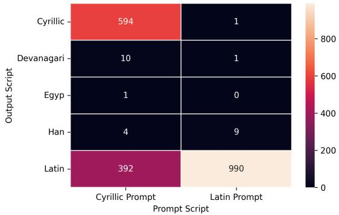  
(a) Mixtral-8x7B

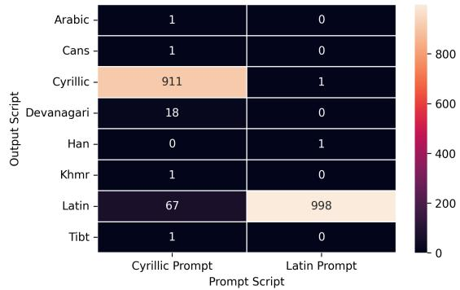  
(b) Mistral-7B

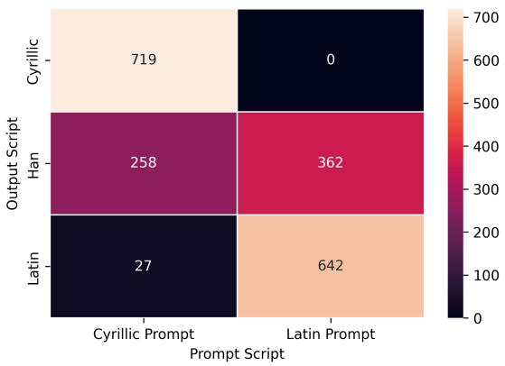  
(c) Qwen1.5-7B

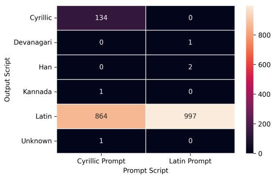  
(d) Llama-2-7B

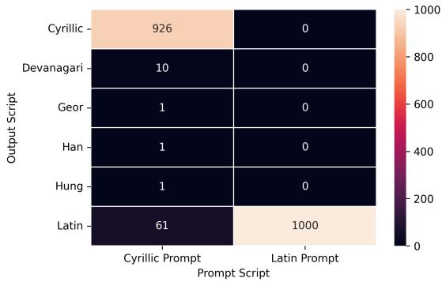  
(e) Deepseek-Distill-Llama-8B  
Figure 6: Distribution of output scripts for Latin (right column) and Cyrillic (left column) input prompts for open-source SLMs. Lighter colors indicate higher frequency

Across all 180 pairs, the two methods agree on 93.9% of outputs. Agreement is higher for API models (96.7%) than open models (89.9%). Only 13 of the 180 pairs fall below 80% agreement, 10 of which involve open models.

We conducted an error analyses that reveals 3 types of errors. 1. Answers written in the requested script sometimes quote original names or titles in another script. 2. Some outputs combine two scripts, for instance when a model adds a short English sentence before the answer ("Here’s the response in Kazakh using the Arabic script:"). GlotLID then assigns a single label, usually the script of the longest segment. 3. GlotLID sometimes misclassifies very short outputs in another script.

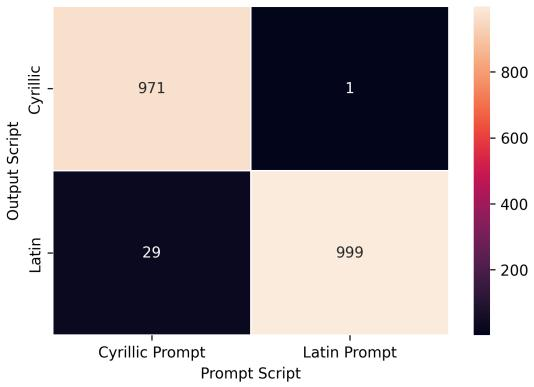  
(a) gpt-4o-mini

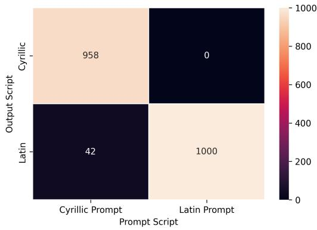  
(b) gpt-4o

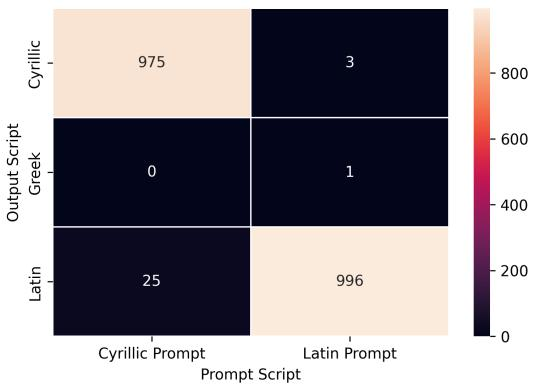  
(c) Gemini-2.5-flash

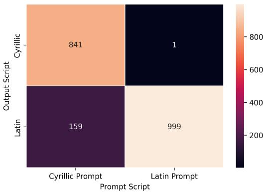  
(d) Gemini-2.5-flash-lite

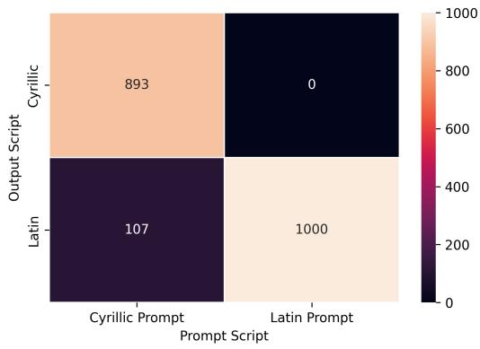  
(e) claude-3-5-haiku

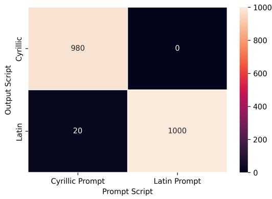  
(f) Deepseek-chat

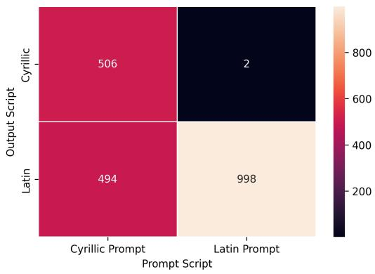  
(g) Claude-Sonnet-4  
Figure 7: Distribution of output scripts for Latin (right column) and Cyrillic (left column) input prompts for proprietary LLMs. Lighter colors indicate higher frequency

Prompt 1.4: Serbian prompt with cyrillic script
<table><tr><td colspan="6">Prompt 1.1: English prompt</td></tr><tr><td>Please answer the following question in</td><td>{language_output}</td><td>using the</td><td>{script_output}</td><td>script: (question)</td><td></td></tr><tr><td></td><td></td><td></td><td></td><td></td><td></td></tr><tr><td>Prompt 1.2: French prompt</td><td></td><td></td><td></td><td></td><td></td></tr><tr><td></td><td></td><td></td><td></td><td></td><td></td></tr><tr><td>Peux-tu répondre à la question suivante en</td><td></td><td></td><td></td><td></td><td></td></tr><tr><td></td><td></td><td></td><td></td><td></td><td></td></tr><tr><td></td><td></td><td></td><td></td><td></td><td></td></tr><tr><td></td><td></td><td></td><td></td><td></td><td></td></tr><tr><td></td><td>(language_output}</td><td></td><td>et en utilisant le script</td><td>{script_output}</td><td>{question}</td></tr></table>

<table><tr><td colspan="5">Prompt 1.3: Serbian prompt with latin script</td></tr><tr><td></td><td></td><td></td><td></td><td></td></tr><tr><td>Molimo odgovorite na sledeće pitanje na</td><td>{language_output}</td><td>jeziku koristeći</td><td>(script_output)</td><td>{question)</td></tr></table>

<table><tr><td>Nb</td><td>Language prompt</td><td>Script prompt</td><td>Language Question</td><td>Requested language output</td><td>Requested script output</td></tr><tr><td>1</td><td>French</td><td>Latin</td><td>French</td><td>French</td><td>Latin</td></tr><tr><td>2</td><td>French</td><td>Latin</td><td>French</td><td>French</td><td>Cyrillic</td></tr><tr><td>3</td><td>English</td><td>Latin</td><td>French</td><td>French</td><td>Latin</td></tr><tr><td>4</td><td>English</td><td>Latin</td><td>Kazakh</td><td>Kazakh</td><td>Cyrillic</td></tr><tr><td>5</td><td>English</td><td>Latin</td><td>Kazakh</td><td>Kazakh</td><td>Latin</td></tr><tr><td>6</td><td>English</td><td>Latin</td><td>Kazakh</td><td>Kazakh</td><td>Arabic</td></tr><tr><td>7</td><td>Kazakh</td><td>Cyrillic</td><td>Kazakh</td><td>Kazakh</td><td>Cyrillic</td></tr><tr><td>8</td><td>Kazakh</td><td>Cyrillic</td><td>Kazakh</td><td>Kazakh</td><td>Latin</td></tr><tr><td>9</td><td>Kazakh</td><td>Cyrillic</td><td>Kazakh</td><td>Kazakh</td><td>Arabic</td></tr><tr><td>10</td><td>English</td><td>Latin</td><td>Serbian</td><td>Serbian</td><td>Cyrillic</td></tr><tr><td>11</td><td>English</td><td>Latin</td><td>Serbian</td><td>Serbian</td><td>Latin</td></tr><tr><td>12</td><td>Serbian</td><td>Latin</td><td>Serbian</td><td>Serbian</td><td>Cyrillic</td></tr><tr><td>13</td><td>Serbian</td><td>Latin</td><td>Serbian</td><td>Serbian</td><td>Latin</td></tr><tr><td>14</td><td>Serbian</td><td>Cyrillic</td><td>Serbian</td><td>Serbian</td><td>Cyrillic</td></tr><tr><td>15</td><td>Serbian</td><td>Cyrillic</td><td>Serbian</td><td>Serbian</td><td>Latin</td></tr></table>

Table 7: Detail of configurations for the script forcing experiment (see Section 2).

## I Qwen results

Qwen1.5-7B exhibits markedly different behavior from all other tested models, frequently generating text in unexpected writing systems–most notably, in scripts that are unnatural for the intended language. This observation aligns with prior reports Mitrovic et al. ´ (2026) that Qwen models sometimes produce Chinese text in unrelated contexts.

Script adaptation Qwen1.5 is the only model showing poor fidelity to Latin inputs (63.9%). However, this cannot be attributed to an inverse preference for Cyrillic, as its fidelity in that case is similarly low (71.6%). Rather, Qwen demonstrates a general lack of consistency across both writing systems. This broad unreliability in script selection appears to stem from the frequent generation of Chinese outputs, even when the expected script is neither Chinese nor ideographic.

Script forcing Across all configurations, Qwen1.5 yields consistently lower scores than other models, particularly for natural (language–script) pairs. For instance, when prompted in French with the Latin script, its fidelity scores are only 50.9% and 13.2% for French and English prompts, respectively–while the lowest score among all other models for this same configuration is 99.9%. Moreover, its highest score across all tested configurations does not exceed 67.9%.

As in the adaptation setting, Qwen’s generations are frequently contaminated by the unexpected insertion of Chinese text. Because the Hani script is never part of the expected configurations, these outputs systematically reduce its fidelity scores. This behavior indicates that Qwen1.5’s issues extend beyond occasional noise, revealing a broader instability in how the model controls and maintains the intended script.

## J Technical Configurations

All experiments involving small language models (SLMs) were conducted on a server equipped with an NVIDIA L40S GPU. Both SLMs and large language models (LLMs) were prompted using the LangChain framework, with the temperature parameter set to 0 for all runs.

The SLMs were downloaded via the Hugging-Face interface (Wolf et al., 2020). Each SLM was executed in its default configuration without any additional fine-tuning or optimization. All models were evaluated sequentially to ensure reproducibility and hardware consistency across runs.

## J.1 Running Time

Approximate execution times (per 1,000 prompts) are reported below in Table 8.

## J.2 Costs

Across all experiments, the total API costs were approximately \$55, with the majority attributed to

<table><tr><td>Model Type</td><td>Adaptation</td><td>Forcing</td></tr><tr><td>Mixtral (Quantized)</td><td>~15 hrs</td><td>~5 hrs</td></tr><tr><td>Other SLMs</td><td>~7 hrs</td><td>~2 hrs</td></tr><tr><td>LLMs (via API)</td><td>~1-5 hr</td><td>≤1-3 hrs</td></tr></table>

Table 8: Approximate execution times per 1,000 prompts  
Claude-Sonnet-4 and GPT-4o.

All reported costs reflect combined input and output token.

<table><tr><td>Model</td><td>Adaptation</td><td>Forcing</td></tr><tr><td>GPT-4o-mini</td><td>~$0.5</td><td>~$1</td></tr><tr><td>GPT-40</td><td>~$3</td><td>~$10</td></tr><tr><td>DeepSeek-Chat</td><td>~$0.5</td><td>~$2</td></tr><tr><td>Claude-3.5-Haiku</td><td>~$1.5</td><td>~$5</td></tr><tr><td>Claude-Sonnet-4</td><td>~$5</td><td>~$20</td></tr><tr><td>Gemini-Flash</td><td>~$1</td><td>~$3</td></tr><tr><td>Gemini-Flash-Lite</td><td>≤$0.5</td><td>~$0.5</td></tr><tr><td>Total per experiment</td><td>~$10</td><td>~$45</td></tr></table>

Table 9: Approximate API costs for each experimental configuration.