# CONFIDENCE REASONING GRAPHS: STRUCTURED CONFIDENCE ESTIMATION FOR LLM AGENTS

Brendan King<sup>1∗</sup>, Farima Fatahi Bayat<sup>2</sup>, Jean-Flavien Bussotti<sup>2</sup>, Pouya Pezeshkpour<sup>2</sup>, Estevam Hruschka<sup>2</sup>

<sup>1</sup>University of California, Santa Cruz, <sup>2</sup>Megagon Labs

bking2@ucsc.edu, {farima,jflavien,pouya,estevam}@megagon.ai

## ABSTRACT

When using an LLM agent in a consequential domain, making an informed decision about whether to trust its output or intervene requires calibrated confidence in the agent’s success. Confidence estimation for agents is difficult because evidence about success is distributed across heterogeneous, interdependent steps of an agent’s trajectory. Practical agentic deployments introduce further challenges: frontier LLMs often provide limited access to internal signals, agent roll-outs are costly, and training data may be unavailable or quickly become outdated. To address these challenges, we introduce Confidence Reasoning Graphs (CRGs), an inference-time framework that estimates the probability an agent accomplished its task from a single trajectory, without privileged model access or training data. Rather than compressing an execution into a single holistic judgment, a CRG begins with the claim that the agent accomplished its task, decomposes it into contextualized sub-claims grounded in trajectory evidence, estimates confidence for each terminal claim, and finally aggregates these into an overall confidence estimate. Across three agentic benchmarks, three backbone models, and three agent frameworks, CRGs yield better-calibrated confidence and stronger risk-aware decision making than verbalized, sampling-based, and white-box surrogate baselines. We further find that calibration error alone can be misleading: a white-box surrogate baseline appears well calibrated while providing near-chance discrimination. Ablations attribute CRG’s improvements to claim-level confidence estimation and aggregation rather than graph construction alone. Finally, a CRG exposes the claims and trajectory evidence underlying each confidence estimate, enabling it to be audited at decision time.<sup>1</sup>

## 1 INTRODUCTION

Increasingly, consequential real-world tasks are being delegated to LLM agents: autonomous systems that combine LLM reasoning with tools, memory, and skills to solve complex, multi-step tasks through interaction with an environment. Such agents are often used in domains where their decisions have real-world consequences, and users must correspondingly make inference-time decisions about whether to trust their output. An agent’s average success rate offers little guidance for this decision: it does not reveal whether a particular output is correct, and checking that output can be difficult because it results from a chain of decisions, tool calls, and observations in which one mistake can affect everything that follows. What is needed is calibrated confidence for agents.

While confidence estimation for LLMs is well-studied (Geng et al., 2024), the agentic setting poses new challenges. Confidence in a single LLM output can often be estimated from sequence logprobabilities or from agreement across repeated samples (Wang et al., 2023). An agent trajectory, in contrast, is a heterogeneous trace that interleaves LLM-generated text, tool calls, skill, memory use, and observations from the environment. Estimating confidence in task success therefore re quires reasoning jointly over a long trajectory with different sources of uncertainty: from the model, retrieval, tool failures, or environmental stochasticity (Liu et al., 2024; Zhao et al., 2025).

Real-world agent deployments further impose three constraints that make many existing confidence estimators for agents impractical. First, many agents use black-box LLMs that do not expose internal states, token probabilities, or even LLM reasoning text, making estimators that rely on these privileged signals unusable. Second, even a single agent run may be costly, making estimators requiring multiple roll-outs highly impractical. Finally, training a separate estimator requires labeled trajectories, which are costly to collect and can become stale as agents, models, tools, and environments evolve. Estimators reliant on token probabilities therefore cannot be applied to agents that use black-box LLMs (Zhao et al., 2025; Zhang et al., 2026; Bouchard & Chauhan, 2026), and estimators based on agreement require an impractical number of runs for many real-world tasks (Duan et al., 2025). While verbalized confidence estimators satisfy these constraints, the resulting estimates are often substantially overconfident (Kaddour et al., 2026).

To overcome these limitations, we introduce Confidence Reasoning Graphs (CRGs), a confidence estimation method for agents that evaluates a single trajectory without requiring privileged model access, repeated roll-outs, or labeled training data. A CRG recursively decomposes the claim that the agent successfully accomplished its task into a set of contextualized sub-claims that define success for the task, then estimates confidence in each leaf sub-claim grounded in evidence from the trajectory, before finally aggregating the resulting leaf confidences into a root confidence. Together, these steps yield an overall confidence estimate and a structured argument supporting it.

We evaluate CRGs on trajectories produced by three strong agent LLMs across three challenging agent benchmarks: SWE-Bench Verified (Chowdhury et al., 2024), EnterpriseOps-Gym (Malay et al., 2026), and SkillsBench (Li et al., 2026). CRGs achieve the lowest adaptive ECE and Brier score and the highest decision utility on every benchmark, outperforming both verbalized and surrogate-probability baselines. Ablations attribute these gains to leaf-level confidence esti mation and aggregation rather than graph construction alone. Additional experiments show that the gains transfer across agent frameworks and that CRGs are the best-calibrated method on the cost–calibration Pareto frontier.

Our contributions are as follows:

• We introduce CRGs, a structured, inspectable framework for training-free confidence estimation from a single black-box agent trajectory.

• We evaluate CRGs across diverse agentic benchmarks, agent frameworks, and backbone models, and show that they provide substantially better calibrated confidence than strong verbalized and surrogate-probability baselines.

• We validate each design component through ablations and show that CRGs lie on the cost– calibration Pareto frontier: the best-performing instantiation costs only \$0.04–\$0.07 per estimate, a fraction of the cost of generating a trajectory with a strong LLM.

## 2 RELATED WORK

Confidence Estimation for LLMs and Agents Prior work estimates confidence in LLM outputs using either “white-box” signals such as token probabilities and internal representations (Vashurin et al., 2025; Malinin & Gales, 2021), “black-box” signals based on agreement across sampled outputs (Wang et al., 2023; Kuhn et al., 2023), or LLM verbalized confidence (Kadavath et al., 2022; Tian et al., 2023; Xiong et al., 2024). Extending these approaches to LLM agents requires estimating confidence over the heterogeneous, multi-step trajectories they produce. A few works have approached this challenge, but require learning from or aggregating “white-box” signals (Bouchard & Chauhan, 2026; Zhang et al., 2026; Zhao et al., 2025; Ma et al., 2026), using signals from repeated or branching executions (Mehta, 2026; Duan et al., 2025), or learning from labeled trajectories (Xuan et al., 2026). These approaches therefore cannot be applied directly to the real-world setting described in § 1, where agents use costly, black-box LLMs. While verbalized confidence has been explored for agents, findings suggest they are highly over-confident (Kaddour et al., 2026).

Structured Arguments and Belief Propagation. Prior work in other areas assesses target propositions through structured arguments that connect claims to evidence. Assurance cases, a closely related framework widely used in safety engineering, justify a critical system property through a hierarchical argument grounded in evidence (Rushby, 2015). A few works have explored the construction or evaluation of assurance cases using LLMs (Ikhwantri & Marijan, 2025; 2026); however, these tasks differ substantially from estimating agent confidence, and none use the structure of the argument to quantify truth in the root claim. Related forms of structure also appear in claim verification, where a target claim is expanded into graphs or trees of logically related sub-claims, including entailed and contradictory premises (Hou et al., 2025). The Bayesian approach of Hou et al. (2025) models claim truth values as latent variables in a hidden Markov tree and infers target truth from observed LLM confidence scores. Its emission probabilities, $p ( S _ { u } \mid Z _ { u } )$ , are estimated from heldout truth-labeled statements, requiring labeled calibration data before inference. We instead target a setting requiring neither fitted parameters nor labeled calibration data.

## 3 PRELIMINARIES

LLM Agents An LLM agent is an AI agent whose policy is governed by an LLM (Su et al., 2024). Given a task instruction $q ,$ the agent interacts with an environment Σ over a sequence of steps. At step t, the agent’s policy π conditions on the interaction history $h _ { t } = ( q , a _ { 1 } , o _ { 1 } , \ldots , a _ { t - 1 } , o _ { t - 1 } )$ to sample an action $a _ { t } \sim \pi ( \cdot \mid h _ { t } )$ , with $a _ { t } \in A .$ Applying $a _ { t }$ to $\Sigma$ returns an observation $o _ { t } \in \mathcal { O }$ Execution halts after $T$ steps, either when the agent emits a terminal action or when a step budget is exhausted. The agent’s execution is summarized by its trajectory:

$$
\tau = ( q , a _ { 1 } , o _ { 1 } , a _ { 2 } , o _ { 2 } , \ldots , a _ { T } , o _ { T } ) ,\tag{1}
$$

together with the solution A it produces, which may be an explicit final response within $a _ { T }$ , or a change the agent has made to Σ, depending on the task.

Confidence Estimation Let $y \in \{ 0 , 1 \}$ indicate whether the agent’s solution A successfully completes task $q ,$ as determined by the environment’s verifier. A confidence estimator maps an observable trajectory τ to a confidence score, $F _ { \theta } : \mathcal { T }  [ 0 , 1 ]$ , where $c = F _ { \theta } ( \tau )$ estimates the probability of success, given the trajectory $P ( y = 1 \mid \tau )$ . We study this problem under three practical constraints which together characterize the real-world deployment setting introduced in $\ S$ 1:

1. Black-box: The estimator reads only the textual content of $\tau ,$ not hidden representations, token-level probabilities, or reasoning tokens.

2. Single-trajectory: The estimator observes only one completed execution $\tau ,$ and may not re-run the agent or interact with the environment Σ.

3. Training-free: The estimator requires no labeled trajectories, and hence no supervised fitting or post-hoc calibration.

An estimator satisfying all three applies to any agent task, framework, and backbone model without instrumentation, and supports deployments with proprietary models in state-changing agents.

Evaluating a Confidence Estimator Confidence estimates serve different purposes, so we report complementary metrics. Adaptive Expected Calibration Error (ECE) measures calibration by comparing mean confidence with empirical success rates in ten approximately equal-count bins. Area Under the Receiver-Operating characteristic Curve (AUROC) measures whether successful trajectories receive higher confidence than unsuccessful ones, while the Brier score measures squared probabilistic error. Because calibration and ranking alone do not capture the consequences of acting on an estimate, we also report the Behavioral Alignment Score (BAS) (Wu et al., 2026), which averages accept-or-abstain utility across risk thresholds and strongly penalizes confident failures. Formal definitions of ECE and Brier score appear in § A.2; the BAS decision model appears in § A.13.

## 4 METHODOLOGY

Given a trajectory τ, we re-frame confidence estimation as evaluating confidence in the claim that the agent accomplished its task successfully. CRG evaluates this claim using a structured argument inspired by assurance cases in four steps, illustrated in Figure 1. First, we use an LLM to recursively decompose it into simpler, contextualized claims which jointly define task success (§ 4.1). Second, an LLM grounds each resulting leaf claim in evidence extracted from the trajectory (§ 4.2).

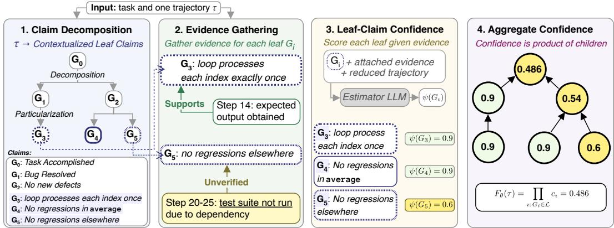  
Figure 1: Overview of the CRG confidence estimation procedure (§ 4.1-§ 4.4). Given a single task and trajectory τ, a constructor LLM (1) decomposes and particularizes the task-success claim and then (2) attaches cited evidence from τ to the resulting leaf claims, using labels Supports, Unverified, and Undermines (two types shown). In (3), an estimator LLM assigns a confidence $\psi ( G _ { i } )$ to each leaf given its evidence and the trajectory reduced according to the cited steps. In (4), confidence in each non-leaf claim is computed as the product of its children. CRGs support estimation and inspection: low-confidence paths can be traced to uncertain leaf claims and their associated evidence.

We then estimate the confidence in the truth of each leaf claim using an LLM (§ 4.3), and finally aggregate these estimates into confidence in the original claim (§ 4.4). As in assurance cases, our motivation is that a high-level, multifaceted claim is assessed more reliably when decomposed into concrete, evidence-grounded sub-claims. Formally, let $G _ { 0 }$ denote the claim that the agent successfully completed its task. CRG estimates confidence in the probability that this claim is true given the trajectory:

$$
F _ { \theta } ( \tau ) \approx P ( G _ { 0 } \mid \tau ) .
$$

## 4.1 CLAIM DECOMPOSITION

Starting from $\mathcal { V } = \{ G _ { 0 } \}$ , an LLM iteratively expands a leaf claim by applying one of two refinement strategies, both inspired by argument strategies in the Goal Structuring Notation assurance case formalism (Kelly & Weaver, 2004):

1. Decomposition splits a claim $G \in { \mathcal { V } }$ into individually necessary and jointly sufficient subclaims ch $\operatorname { \Pi } ( G ) = \{ G _ { 1 } , \dots , G _ { m } \}$ , such that $\begin{array} { r } { G \equiv \bigwedge _ { j = 1 } ^ { m ^ { * } } G _ { j } } \end{array}$ and the sub-claims are mutually independent given τ .

2. Particularization restates a claim $G \in { \mathcal { V } }$ as one contextualized for the specific task, yielding one equivalent child ch $\left( G \right) = \{ G ^ { \prime } \}$ such that $G \equiv G ^ { \prime }$

Decomposition splits a broad claim into constituents that can be checked separately; particularization restates a generic claim as one that can be evaluated in the context of the given task q and trajectory τ. As an example, consider a coding agent tasked with fixing an off-by-one bug in a function average.<sup>2</sup> The root claim $G _ { 0 }$ might be decomposed into “the reported bug has been resolved” and “no new defects were introduced,” and the former particularized as “the modified loop processes every intended index exactly once.” Both strategies aim to preserve the same invariant: each parent claim is equivalent to the conjunction of its children:

$$
G \equiv \bigwedge _ { G ^ { \prime } \in \mathrm { c h } ( G ) } G ^ { \prime } .\tag{2}
$$

Applying this invariant recursively, the root claim $G _ { 0 }$ is equivalent to the conjunction of the tree’s leaves $\mathcal { L } \mathrm { : ~ }$

$$
G _ { 0 } \equiv \bigwedge _ { G \in \mathcal { L } } G .\tag{3}
$$

We formalize this equivalence and its implications for confidence aggregation in § A.14. The LLM may refine any current leaf or stop early, subject to a maximum refinement depth k, where depth is the number of refinement edges on a root-to-leaf path. We set $k = 5$ throughout; § A.6 examines sensitivity to this choice. § A.11 evaluates how well constructed graphs satisfy Equation 2 in practice.

## 4.2 EVIDENCE GATHERING

To ground confidence estimation for the leaf claims, we enrich the claim tree induced by ch with evidence from the trajectory, forming a graph. In a single prompt conditioned on both τ and this tree, an LLM produces a set of evidence items X and attaches each item $x \in \mathcal { X }$ to one or more leaf claims in ${ \mathcal { L } } .$ . Each evidence item x describes a salient event from the trajectory for evaluating claims. Each attachment cites a set of trajectory steps and receives one of three labels: Supported, Undermined, or Unverified. We represent these labeled attachments as

$$
\mathcal { R } \subseteq \mathcal { X } \times \mathcal { L } \times 2 ^ { \{ 1 , . . . , T \} } \times \{ \mathrm { s u p p o r t e d , U n d e r m i n e d , U n v e r i f i e d } \} ,
$$

where $( x , G , S , r ) \in \mathcal { R }$ means that evidence item x is attached to leaf claim G citing trajectory steps $S$ with label r. Our relations follow work on evidence-based factuality evaluation (Fatahi Bayat et al., 2025; Song et al., 2024), where each piece of evidence supports belief in claim, undermines belief in that claim, or indicates that a claim cannot be verified from the trajectory. Together, $\nu \cup \mathcal { X }$ form the graph’s nodes, while ch and R define its claim and evidence edges, respectively.

Returning to the running example, the claim “the modified loop processes every intended index exactly once” may be Supported by step 14, where the agent runs the repaired function and obtains the expected output, and Unverified by steps 20–25, where the agent abandons efforts to run the project’s test suite after a dependency fails to install. Unverified evidence matters because a common failure mode of agents is not by acting incorrectly, but stopping short of confirming that an action succeeded. The prompt for claim decomposition and evidence gathering appears in § A.12.2.

## 4.3 ESTIMATING LEAF CONFIDENCE

Let $\psi : { \mathcal { L } }  [ 0 , 1 ]$ assign each leaf claim $G \in { \mathcal { L } }$ a confidence $c _ { G } ~ = ~ \psi ( G )$ , interpreted as an estimate of $P ( \bar { G } \mid \tau )$ . We instantiate $\psi$ by verbalized confidence, prompting an estimator LLM for the probability that G holds.

Each leaf is scored in a separate call using its attached evidence and a reduced trajectory. We retain the prefix through the last cited step, using $T$ as the cutoff when no step is cited. Uncited actions are replaced by framework-provided summaries when available and truncated otherwise. Summarizing them preserves context, while keeping the cited steps the most salient content in the prompt. The reduction assumes that the latest relevant evidence was cited; it cannot recover evidence omitted during construction. Prompts appear in § A.12.

## 4.4 AGGREGATING CONFIDENCE TO THE ROOT

Given leaf confidences, we define a confidence $f ( G )$ for every claim in V by recursion from the leaves:

$$
f ( G ) = { \left\{ \begin{array} { l l } { \psi ( G ) , } & { G \in { \mathcal { L } } , } \\ { \bigoplus _ { G ^ { \prime } \in \mathrm { c h } ( G ) } f ( G ^ { \prime } ) , } & { { \mathrm { o t h e r w i s e } } , } \end{array} \right. }\tag{4}
$$

where $\oplus$ is an aggregation operator over the confidence values of a claim’s children, and the estimator returns the confidence at the root, $F _ { \theta } ( \tau ) = f ( G _ { 0 } )$ . This formulation lets us compare aggregation rules over identical graphs, which we do in Appendix A.9.

Under Equation 3, the root claim holds exactly when all leaf claims hold, so its probability is their joint probability. Computing this joint probability generally requires modeling dependencies among the leaves. For aggregation, we make the simplifying approximation that the children introduced at each decomposition are conditionally independent given τ, yielding the approximation $P ( G _ { 0 }$ $\begin{array} { r } { \tau ) \approx \prod _ { G \in \mathcal { L } } \hat { P ( G \mid \tau ) } } \end{array}$ . Replacing each marginal probability with its leaf estimate $c _ { G }$ ≈ $P ( G \mid \tau )$ gives:

Table 1: OpenHands success rates (%) by agent LLM. n is the number of problems.
<table><tr><td>Benchmark</td><td>Num. Problems</td><td>Total Trajectories</td><td>GPT-5.5</td><td>Gemini-3.5 Flash</td><td>MiniMax-M3</td><td> $\operatorname { A v g } .$ </td></tr><tr><td>SWE-Bench Verified</td><td>306</td><td>900</td><td>73.9</td><td>74.3</td><td>71.7</td><td>73.3</td></tr><tr><td>EnterpriseOps-Gym</td><td>325</td><td>975</td><td>41.8</td><td>44.3</td><td>31.4</td><td>39.2</td></tr><tr><td>SkillsBench</td><td>81</td><td>219</td><td>50.7</td><td>50.7</td><td>45.2</td><td>48.9</td></tr></table>

$$
F _ { \theta } ( \tau ) = f ( G _ { 0 } ) = \prod _ { G \in \mathcal { L } } c _ { G } .\tag{5}
$$

Thus, our final confidence estimate is the product of the leaf confidences. § A.14 gives the general dependence-aware factorization, marginal-only bounds, and derives the product rule under our local conditional-independence approximation.

## 5 EXPERIMENTAL SETUP

Benchmarks and Trajectories. We evaluate confidence estimators on trajectories from three challenging benchmarks: SWE-Bench Verified (Chowdhury et al., 2024) for software engineering, EnterpriseOps-Gym (Malay et al., 2026) for tool-heavy enterprise workflows, and SkillsBench (Li et al., 2026) for long-horizon skill use. We focus on harder problems, where task success is less saturated and confidence estimation is more informative; § A.1 details the filtering criteria and splits. Table 1 summarizes the resulting data. For each problem, we collect one trajectory using the Open-Hands agent framework (Wang et al., 2025), with benchmark-specific iteration caps (§ A.1), with three agent LLMs: GPT-5.5 (OpenAI, 2026a), Gemini-3.5 Flash (Google DeepMind, 2026), and the open-weight MiniMax-M3 (Lai et al., 2026). Each benchmark’s verifier provides the success label y used to evaluate confidence estimates. We evaluate transfer beyond OpenHands in § 6.2.

CRG Settings. We run CRG with two estimator LLMs, which read each completed trajectory and output a confidence: the open-weight Qwen-3.8 27B and the closed-source GPT-5.6 Sol (OpenAI, 2026b), both set to medium reasoning effort. We use a maximum refinement depth of $k \ = \ 5$ across benchmarks without per-benchmark tuning; § A.6 shows that no graph exceeds this depth in a development-set ablation.

Baselines. We compare CRG against three black-box baselines and one surrogate-probability baseline. Basic Verbalizer directly asks the estimator LLM for its confidence that the agent succeeded (Zhang et al., 2026). Reason-as-Graph describes our claim-decomposition procedure in the estimator prompt, testing whether decomposition-oriented reasoning alone recovers the benefits of explicit graph construction and leaf aggregation. Following self-consistency work (Wang et al., 2023), Verbal Consistency samples ten true/false judgments of task success with reasoning and uses the fraction judged true as confidence.<sup>3</sup> Finally, Surrogate LNSP uses the length-normalized sequence probability of the agent’s final action under a surrogate LLM (Shrivastava et al., 2023; Zhang et al., 2026; Bouchard & Chauhan, 2026). § A.8 provides comparisons to aggregations of surrogate token probabilities. All black-box baselines use the same backbone LLM as the CRG constructor and estimator. § A.12 provides the complete prompts.

Metrics. We report adaptive ECE with 10 approximately equal-count bins, Brier score, AUROC, and BAS. Their definitions appear in § A.2 and § A.13; § A.5 reports equal-width ECE and sensitivity to bin count.

Table 2: Confidence estimation results on OpenHands trajectories, averaged over agent LLMs. We report adaptive ECE (10 bins), Brier Score, AUROC, and BAS. Best per column in bold, second underlined. <sup>†</sup>White-box: uses token probabilities from a surrogate LLM.
<table><tr><td></td><td></td><td colspan="4">SWE-Bench Verified</td><td colspan="4">EnterpriseOps-Gym</td><td colspan="4">SkillsBench</td></tr><tr><td>Estimator</td><td>LLM</td><td>ECE↓</td><td>Brier↓</td><td>AUROC↑</td><td>BAS↑</td><td>ECE↓</td><td>Brier↓</td><td>AUROC↑</td><td>BAS↑</td><td>ECE↓</td><td>Brier↓</td><td>AUROC↑</td><td>BAS↑</td></tr><tr><td rowspan="2">Basic Verbalizer</td><td>GPT-5.6 Sol</td><td>0.20</td><td>0.23</td><td>0.57</td><td>-0.04</td><td>0.58</td><td>0.57</td><td>0.50</td><td>-2.48</td><td>0.46</td><td>0.46</td><td>0.54</td><td>-2.17</td></tr><tr><td>Qwen-3.8 27B</td><td>0.18</td><td>0.22</td><td>0.66</td><td>0.27</td><td>0.49</td><td>0.47</td><td>0.60</td><td>-0.57</td><td>0.41</td><td>0.41</td><td>0.65</td><td>-0.33</td></tr><tr><td rowspan="2">Reason-as-Graph</td><td>GPT-5.6 Sol</td><td>0.17</td><td>0.22</td><td>0.57</td><td>0.06</td><td>0.57</td><td>0.56</td><td>0.47</td><td>-2.69</td><td>0.43</td><td>0.44</td><td>0.51</td><td>-2.09</td></tr><tr><td>Qwen-3.8 27B</td><td>0.18</td><td>0.22</td><td>0.66</td><td>0.27</td><td>0.46</td><td>0.44</td><td>0.62</td><td>-0.50</td><td>0.38</td><td>0.38</td><td>0.63</td><td>-0.40</td></tr><tr><td>Verbal Consistency</td><td>Qwen-3.8 27B</td><td>0.24</td><td>0.25</td><td>0.54</td><td>-7.58</td><td>0.45</td><td>0.45</td><td>0.62</td><td>-13.72</td><td>0.45</td><td>0.44</td><td>0.60</td><td>-13.87</td></tr><tr><td>Surrogate LNSP†</td><td>Qwen-3.8 27B</td><td>0.10</td><td>0.21</td><td>0.47</td><td>0.36</td><td>0.22</td><td>0.28</td><td>0.61</td><td>0.04</td><td>0.16</td><td>0.28</td><td>0.46</td><td>0.09</td></tr><tr><td rowspan="2">CRG (ours)</td><td>GPT-5.6 Sol</td><td>0.16</td><td>0.23</td><td>0.62</td><td>0.36</td><td>0.24</td><td>0.29</td><td>0.67</td><td>0.06</td><td>0.22</td><td>0.29</td><td>0.65</td><td>0.09</td></tr><tr><td>Qwen-3.8 27B</td><td>0.09</td><td>0.20</td><td>0.57</td><td>0.37</td><td>0.13</td><td>0.24</td><td>0.62</td><td>0.08</td><td>0.11</td><td>0.24</td><td>0.65</td><td>0.14</td></tr></table>

## 6 RESULTS AND ANALYSES

We compare CRG against black-box and surrogate probability baselines in Section 6.1, test transfer to two other frameworks in Section 6.2, and analyze the contribution of key components of the framework through ablations in Section 6.3.

## 6.1 MAIN RESULTS

Overall Performance. Table 2 shows a consistent advantage for CRGs in calibration and decision quality across all three benchmarks. CRGs achieve the lowest adaptive ECE and Brier score and highest BAS on every benchmark, with a CRG also attaining the best or second-best AU-ROC. CRGs with Qwen-3.8 27B are best calibrated, achieving adaptive ECEs of 0.09, 0.13, and 0.11 on SWE-Bench Verified, EnterpriseOps-Gym, and SkillsBench, respectively, compared with 0.18–0.49 for direct verbalization and 0.10–0.22 for the surrogate-probability baseline. CRGs with GPT-5.6 Sol substantially outperform their verbalized counterparts, indicating that improvements are not specific to a single CRG instantiation. We also observe divergence between calibration and discrimination: direct verbalizers reach AUROC 0.66 on SWE-Bench Verified despite substantial miscalibration, whereas Surrogate LNSP attains lower ECE but weak AUROC, performing near-chance on SWE-Bench Verified (0.47) and SkillsBench (0.46). CRG is the only evaluated approach that consistently combines strong calibration (ECE ↓), competitive discrimination (AUROC ↑), and positive expected utility (BAS ↑) across all three benchmarks. Bootstrap resampling supports these gains (§ A.15). We further find these improvements are inexpensive: CRG with Qwen 3.8 27B costs \$0.04–0.07 per trajectory and lies on the cost–calibration Pareto frontier, while verbalized baselines remain less calibrated even at higher reasoning effort and comparable cost (§ A.4).

Evaluating Reliability. To investigate the source of calibration differences in Table 2, Figure 2 plots reliability curves and empirical confidence CDFs for the best-calibrated verbalizer, surrogate, and CRG instantiation. The represented verbalizer (Reason-as-Graph) is systematically overconfident, assigning confidence scores over 90% to the majority of trajectories on all benchmarks despite substantially lower success rates. Figure 2 further reveals why calibration error alone is insufficient as a metric. On SWE-Bench Verified, Surrogate LNSP’s adaptive ECE is close to CRG’s (0.10 vs. 0.09), but its predictions are concentrated near the benchmark success rate (mean confidence 0.69 vs. 0.73 success rate). This yields low calibration error without reliably distinguishing individual successes from failures, as reflected in its poor AUROC. CRGs instead distribute confidence estimates across a substantially wider range while remaining closer to the calibration diagonal on all benchmarks.

Evaluating Decision Utility. To evaluate how confidence estimates inform decision-making under risk, Figure 3 reports selective utility across acceptance thresholds t, with BAS corresponding to the area under each curve. A utility below zero means that for the risk-reward ratio defined by t, it would have been better to abstain altogether than to use that estimator for decision making. At low thresholds (low-risk settings), all methods behave similarly. However, their behavior diverges as risk increases: Consistent with the overconfidence observed in Figure 2, Reason-as-Graph incur negative utility on all benchmarks due to high-confidence failures, reaching −3.6 on EnterpriseOps Gym. Surrogate LNSP avoids incurring costs of this magnitude, but achieves lower utility than CRGs at nearly every risk threshold. CRGs achieve the highest BAS on all three benchmarks, maintain positive utility for the widest span of risk thresholds, and are the only method that never falls substantially below total abstention. CRGs therefore support the best decision-making in both low-risk and high-risk environments.

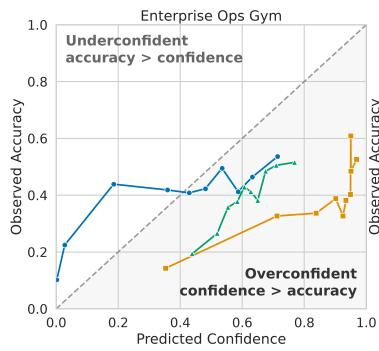

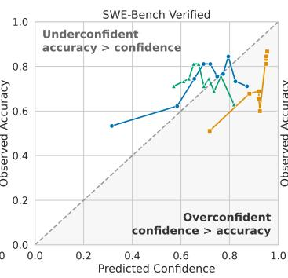

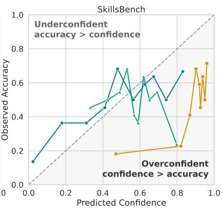

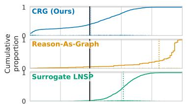

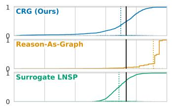

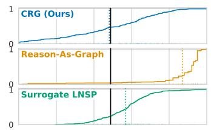  
Figure 2: Reliability diagrams (top) and empirical confidence CDFs (bottom) for CRG (Ours), Reason-as-Graph, and Surrogate LNSP, using 10 equal-mass bins. Perfect calibration lies on the diagonal; under-confidence is above and overconfidence below (shaded). Dashed and solid vertical black lines indicate mean confidence and benchmark success rate, respectively. CRG is best calibrated on all three benchmarks, with estimates distributed across the confidence range.

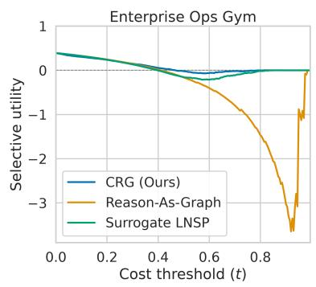

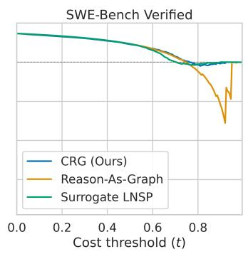

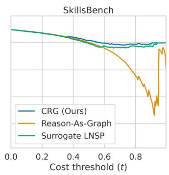  
Figure 3: Selective utility across cost thresholds t for the best method from each class (all Qwen-3.8 27B). The dashed zero line corresponds to abstaining from all solutions, so values below it are worse than abstention. All estimators coincide at low t, where accepting all solutions is optimal. As t increases, Reason-As-Graph incurs losses as large as −3.6 on EnterpriseOps-Gym, while CRG (Ours) remains above Surrogate LNSP through the mid range.

## 6.2 GENERALIZATION TO OTHER AGENT FRAMEWORKS

In this section, we evaluate whether CRG transfers to agent frameworks beyond OpenHands. We evaluate on 609 SWE-Bench Verified trajectories collected with two additional framework–model combinations: Codex with GPT-5.5 and Claude Code with Claude Opus 4.7. We compare against the black-box verbalized baselines; Surrogate LNSP is omitted because computing its token probabilities requires reconstructing the exact LLM context at each agent step.<sup>4</sup>

Table 3: Transfer to other agent frameworks on SWE-Bench Verified. Codex (GPT-5.5) has n = 305 trajectories and 72.5% success; Claude Code (Claude Opus 4.7) has n = 304 and 72.0% success. All estimators use Qwen-3.8 27B. ECE is adaptive ECE with 10 bins.
<table><tr><td rowspan="2">Estimator</td><td colspan="4">Codex (GPT 5.5)</td><td colspan="4">Claude Code (Opus 4.7)</td></tr><tr><td>ECE↓</td><td>Brier↓</td><td>AUROC↑</td><td>BAS↑</td><td>ECE↓</td><td>Brier↓</td><td>AUROC↑</td><td>BAS↑</td></tr><tr><td>Qwen 3.8 27B</td><td></td><td></td><td></td><td></td><td></td><td></td><td></td><td></td></tr><tr><td>Basic Verbalizer</td><td>0.19</td><td>0.24</td><td>0.63</td><td>0.22</td><td>0.19</td><td>0.23</td><td>0.64</td><td>0.25</td></tr><tr><td>Reason-as-Graph</td><td>0.19</td><td>0.23</td><td>0.63</td><td>0.23</td><td>0.19</td><td>0.23</td><td>0.67</td><td>0.26</td></tr><tr><td>CRG (ours)</td><td>0.05</td><td>0.20</td><td>0.61</td><td>0.38</td><td>0.11</td><td>0.22</td><td>0.54</td><td>0.34</td></tr></table>

Table 3 shows that the calibration and decision-utility gains transfer across agent frameworks CRGs reduce adaptive ECE from 0.19 to 0.05 on Codex and to 0.11 on Claude Code, while achieving the lowest Brier score and highest BAS on both frameworks. For discrimination, CRG is comparable to both verbalizers on Codex trajectories (AUROC 0.61 vs. 0.63) but weaker on Claude Code trajectories (0.54 vs. 0.64–0.67). This reinforces the distinction between calibration and discrimination: in this transfer setting, CRGs produce substantially better probability estimates and acceptance decisions despite weaker ranking quality.

## 6.3 COMPONENT ABLATION

We examine the contribution of each component of our method in Table 4. Reason-as-Graph is our assurance-case inspired verbal baseline. Reason-with-Graph constructs the same claim and evidence graph as a CRG, but directly verbalizes confidence in the root claim $G _ { 0 }$ conditioned on the graph, ablating our propagation method. We find Reason-with-Graph provides only a modest calibration improvement over Reason-as-Graph (adaptive ECE 0.38 → 0.35; Brier 0.37 → 0.36). Using our full method with leaf-level scoring and aggregation substantially improves both calibration and decision utility: ECE drops to 0.10, Brier to 0.23, and BAS increases from −0.16 to 0.17. Thus, the main gain does not come from simply exposing the model to a structured decomposition; it arises from using that decomposition to make localized confidence judgments and combine them into the final estimate. The improvement is primarily in confidence quality rather than ranking: CRG achieves AUROC 0.68, below Reason-as-Graph (0.73) but above Reason-with-Graph (0.61). This is consistent with our main results, where improved calibration need not imply improved pairwise discrimination. Finally, § A.9 compares alternative aggregation rules on the same graphs — arithmetic and geometric means, maximum, the Frechet bounds, and the learned belief ´ propagation of Hou et al. (2025) — and finds that product aggregation gives the strongest calibration and competitive discrimination among training-free rules.

## 6.4 ADDITIONAL FINDINGS

In § A.3, we analyze case studies, demonstrating how our claim graph might be audited by a human and overruled at inference time. Further analyses show that our method is cost-efficient (§ A.4), our gains are also robust in post-hoc calibration with temperature scaling (§ A.10) and our approach is insensitive to LLM reasoning effort (§ A.7). In § A.11, we use textual entailment to test the refinement invariant in Equation 2 and diagnose violations of the independence approximation behind Equation 5; we find CRG remains effective despite imperfect adherence to these assumptions.

## 7 CONCLUSION

We introduced Confidence Reasoning Graphs (CRGs), which estimates task-success confidence from a single black-box agent trajectory by decomposing success into evidence-grounded claims and

Table 4: Ablating graph construction and confidence propagation on development data (Qwen-3.8 27B, n = 495). Reason-as-Graph decomposes the task in the prompt and reports one confidence; Reason-with-Graph builds the graph but scores the root directly rather than propagating from leaves.
<table><tr><td>Method</td><td>ECE↓</td><td>Brier↓</td><td>AUROC↑</td><td>BAS↑</td></tr><tr><td>Reason-as-Graph (no explicit graph)</td><td>0.38</td><td>0.37</td><td>0.73</td><td>-0.23</td></tr><tr><td>Reason-with-Graph (no propagation)</td><td>0.35</td><td>0.36</td><td>0.61</td><td>-0.16</td></tr><tr><td>CRG (graph + propagation)</td><td>0.10</td><td>0.23</td><td>0.68</td><td>0.17</td></tr></table>

aggregating their confidences. CRGs improve calibration and decision utility across benchmarks over evaluated baselines while retaining strong discrimination. This enables practical, auditable confidence estimates for black-box agents without training.

## AI USE STATEMENT

In this work, we used generative AI tools for refinement of the writing, formatting help, literature search, figure conversion and implementation, and in the assistance of writing for proofs. We have not used generative AI tools for producing our ideas, designing our pipelines or experiments, and the rest of the required disclosure tasks are not applicable to this work. Additionally, we used generative AI tools to write code and create plots, which we carefully reviewed and improved manually. We have reviewed all AI-assisted content used anywhere in the production of this work. Each paper found through LLM-driven literature search has been carefully reviewed, and extensive further literature review has been conducted manually. We used LLMs for the writing in an atomic fashion: to refine the phrasing of individual points in the text, rather than their semantics. We take responsibility for the final content of this work, including text, claims or artifacts produced with the aid of generative AI.

## ETHICS STATEMENT

Our work aims to support safer use of LLM agents by providing confidence estimates for individual executions. However, these estimates should not be treated as guarantees of correctness. An inaccurate or overconfident estimate could create false reassurance, especially in high-stakes applications.

Our method also inherits limitations from the LLMs used to construct and evaluate the reasoning graph: decompositions may be incomplete, dependencies between claims may be missed, and evidence may be misinterpreted. CRG confidence should therefore be used as a decision-support signal alongside appropriate verification and human oversight.

## REPRODUCIBILITY STATEMENT

We support reproducibility by describing our method in § 4 and the benchmarks, estimator settings, baselines, and metrics in § 5. § A.1 documents benchmark filtering, trajectory collection, and success-label assignment; § A.12 provides the full prompts; and § A.14 states the assumptions and proofs for confidence aggregation. The implementation repository contains the prompt templates, experiment configurations, evaluation scripts, and dependency lockfile used in our experiments. § A.15 describes the resampling procedure for the uncertainty analysis. Framework versions, randomization settings, and their scope are documented in § A.16.

## REFERENCES

Dylan Bouchard and Mohit Singh Chauhan. Beyond Single-Turn Confidence: Trajectory-Adapted Uncertainty Quantification for LLM Agents, August 2026. URL http://arxiv.org/abs/ 2608.11552. arXiv:2608.11552 [cs.CL].

Neil Chowdhury, James Aung, Chan Jun Shern, Oliver Jaffe, Dane Sherburn, Giulio Starace, Evan Mays, Rachel Dias, Marwan Aljubeh, Mia Glaese, Carlos E. Jimenez, John Yang, Leyton Ho, Tejal Patwardhan, Kevin Liu, and Aleksander Madry. Introducing SWE-bench Verified, 2024. URL https://openai.com/index/introducing-swe-bench-verified/.

Jinhao Duan, James Diffenderfer, Sandeep Madireddy, Tianlong Chen, Bhavya Kailkhura, and Kaidi Xu. UProp: Investigating the Uncertainty Propagation of LLMs in Multi-Step Agentic Decision-Making, June 2025. URL http://arxiv.org/abs/2506.17419. arXiv:2506.17419 [cs.CL].

Farima Fatahi Bayat, Lechen Zhang, Sheza Munir, and Lu Wang. FactBench: A dynamic benchmark for in-the-wild language model factuality evaluation. In Wanxiang Che, Joyce Nabende, Ekaterina Shutova, and Mohammad Taher Pilehvar (eds.), Proceedings of the 63rd Annual Meeting of the Association for Computational Linguistics (Volume 1: Long Papers), pp. 33090–33110, Vienna, Austria, July 2025. Association for Computational Linguistics. ISBN 979-8-89176- 251-0. doi: 10.18653/v1/2025.acl-long.1587. URL https://aclanthology.org/2025. acl-long.1587/.

Jiahui Geng, Fengyu Cai, Yuxia Wang, Heinz Koeppl, Preslav Nakov, and Iryna Gurevych. A Survey of Confidence Estimation and Calibration in Large Language Models. In Kevin Duh, Helena Gomez, and Steven Bethard (eds.), Proceedings of the 2024 Conference of the North American Chapter of the Association for Computational Linguistics: Human Language Technologies (Volume 1: Long Papers), pp. 6577–6595, Mexico City, Mexico, June 2024. Association for Computational Linguistics. doi: 10.18653/v1/2024.naacl-long.366. URL https: //aclanthology.org/2024.naacl-long.366/.

Google. Gemini 3.6 flash: Model card, July 2026. URL https://deepmind.google/ models/model-cards/gemini-3-6-flash/.

Google DeepMind. Gemini 3.5 Flash: Model Card, 2026. URL https://deepmind.google/ models/model-cards/gemini-3-5-flash/.

Chuan Guo, Geoff Pleiss, Yu Sun, and Kilian Q. Weinberger. On calibration of modern neural networks. In Proceedings of the 34th International Conference on Machine Learning - Volume 70, ICML’17, pp. 1321–1330. JMLR.org, 2017.

Bairu Hou, Yang Zhang, Jacob Andreas, and Shiyu Chang. A Probabilistic Framework for LLM Hallucination Detection via Belief Tree Propagation. In Luis Chiruzzo, Alan Ritter, and Lu Wang (eds.), Proceedings of the 2025 Conference of the Nations of the Americas Chapter of the Association for Computational Linguistics: Human Language Technologies (Volume 1: Long Papers), pp. 3076–3099, Albuquerque, New Mexico, April 2025. Association for Computational Linguistics. ISBN 979-8-89176-189-6. doi: 10.18653/v1/2025.naacl-long.158. URL https://aclanthology.org/2025.naacl-long.158/.

Minghui Huang. Decmetrics: Structured claim decomposition scoring for factually consistent llm outputs, 2025. URL https://arxiv.org/abs/2509.04483.

Fariz Ikhwantri and Dusica Marijan. Explainable Compliance Detection with Multi-Hop Natural Language Inference on Assurance Case Structure, July 2025. URL http://arxiv.org/ abs/2506.08713. arXiv:2506.08713 [cs.CL].

Fariz Ikhwantri and Dusica Marijan. Evaluating Assurance Cases as Text-Attributed Graphs for Structure and Provenance Analysis, April 2026. URL http://arxiv.org/abs/2604. 20577. arXiv:2604.20577 [cs.SE].

Saurav Kadavath, Tom Conerly, Amanda Askell, Tom Henighan, Dawn Drain, Ethan Perez, Nicholas Schiefer, Zac Hatfield-Dodds, Nova DasSarma, Eli Tran-Johnson, Scott Johnston, Sheer El-Showk, Andy Jones, Nelson Elhage, Tristan Hume, Anna Chen, Yuntao Bai, Sam Bowman, Stanislav Fort, Deep Ganguli, Danny Hernandez, Josh Jacobson, Jackson Kernion, Shauna Kravec, Liane Lovitt, Kamal Ndousse, Catherine Olsson, Sam Ringer, Dario Amodei, Tom Brown, Jack Clark, Nicholas Joseph, Ben Mann, Sam McCandlish, Chris Olah, and Jared Kaplan. Language models (mostly) know what they know, 2022. URL https://arxiv.org/ abs/2207.05221.

Jean Kaddour, Srijan Patel, Gbetondji Dovonon, Leo Richter, Pasquale Minervini, and Matt J. Kus-\` ner. Agentic Uncertainty Reveals Agentic Overconfidence, 2026. URL https://arxiv. org/abs/2602.06948. Version Number: 1.

Tim Kelly and Rob Weaver. The goal structuring notation–a safety argument notation. Proc Dependable Syst Networks Workshop Assurance Cases, 01 2004.

Philipp Koehn. Statistical significance tests for machine translation evaluation. In Dekang Lin and Dekai Wu (eds.), Proceedings of the 2004 Conference on Empirical Methods in Natural Language Processing, pp. 388–395, Barcelona, Spain, July 2004. Association for Computational Linguistics. URL https://aclanthology.org/W04-3250/.

Lorenz Kuhn, Yarin Gal, and Sebastian Farquhar. Semantic uncertainty: Linguistic invariances for uncertainty estimation in natural language generation. In The Eleventh International Conference on Learning Representations, 2023. URL https://openreview.net/forum?id= VD-AYtP0dve.

Xunhao Lai, Weiqi Xu, Yufeng Yang, Qiaorui Chen, Yang Xu, Lunbin Zeng, Xiaolong Li, Haohai Sun, Haichao Zhu, Vito Zhang, Jinkai Hu, Jiayao Li, Rui Gao, Zekun Li, Songquan Zhu, Jingkai Zhou, and Pengyu Zhao. Minimax sparse attention, 2026. URL https://arxiv.org/abs/ 2606.13392.

Xiangyi Li, Yimin Liu, Wenbo Chen, Bingran You, Zonglin Di, Yifeng He, Shenghan Zheng, Kyoung Whan Choe, Jiankai Sun, Shuyi Wang, Chujun Tao, Binxu Li, Xuandong Zhao, Hejia Geng, Xiaojun Wu, Junwei Zhou, Xiaokun Chen, Hanwen Xing, Yubo Li, Qunhong Zeng, Di Wang, Yuanli Wang, Roey Ben Chaim, Penghao Jiang, Haotian Shen, Luyang Kong, Xinyi Liu, Runhui Wang, Xuanqing Liu, Jiachen Li, Xin Lan, Yueqian Lin, Wengao Ye, Junwei He, Songlin Li, Yue Zhang, Yipeng Gao, Yijiang Li, Ze Ma, Liqiang Jing, Tianyu Wang, Kaixin Li, Yiqi Xue, Haoran Lyu, Yizhuo He, Yuchen Tian, Shutong Wu, Bowei Wang, Yixuan Gao, Bo Chen, Litong Liu, Sikai Cheng, Jiajun Bao, Shuaicheng Tong, Shuwen Xu, Terry Yue Zhuo, Tinghan Ye, Qi Qi, Miao Li, Longtai Liao, Zelin Tan, Chang Shi, Xilin Tang, Srinath Tankasala, Boqin Yuan, Yaoyao Qian, Jianhong Tu, Chenguang Wang, Yizhou Sun, Wei Wang, Aaron Taylor, Ziyue Yang, Changkun Guan, Zhikang Dong, Xinyu Zhang, Steven Dillmann, Han-chung Lee, and Dawn Song. SkillsBench: Benchmarking How Well Agent Skills Work Across Diverse Tasks, June 2026. URL http://arxiv.org/abs/2602.12670. arXiv:2602.12670 [cs.AI].

Hao Liu, Zi-Yi Dou, Yixin Wang, Nanyun Peng, and Yisong Yue. Uncertainty calibration for tool-using language agents. In Yaser Al-Onaizan, Mohit Bansal, and Yun-Nung Chen (eds.), Findings of the Association for Computational Linguistics: EMNLP 2024, pp. 16781– 16805, Miami, Florida, USA, November 2024. Association for Computational Linguistics. doi: 10.18653/v1/2024.findings-emnlp.978. URL https://aclanthology.org/2024. findings-emnlp.978/.

Zhengzhao Ma, Boxi Cao, Yaojie Lu, Hongyu Lin, Xianpei Han, and Le Sun. From sequence to structure: Relational uncertainty propagation for llm agents, 2026. URL https://arxiv. org/abs/2608.16002.

Shiva Krishna Reddy Malay, Shravan Nayak, Jishnu Sethumadhavan Nair, Sagar Davasam, Aman Tiwari, Sathwik Tejaswi Madhusudhan, Sridhar Krishna Nemala, Srinivas Sunkara, and Sai Rajeswar. EnterpriseOps-Gym: Environments and Evaluations for Stateful Agentic Planning and Tool Use in Enterprise Settings, March 2026. URL http://arxiv.org/abs/2603. 13594. arXiv:2603.13594 [cs.AI].

Andrey Malinin and Mark Gales. Uncertainty estimation in autoregressive structured prediction. In International Conference on Learning Representations, 2021. URL https://openreview. net/forum?id=jN5y-zb5Q7m.

Aman Mehta. When agents disagree with themselves: Measuring behavioral consistency in llmbased agents, 2026. URL https://arxiv.org/abs/2602.11619.

Jeremy Nixon, Michael W. Dusenberry, Linchuan Zhang, Ghassen Jerfel, and Dustin Tran. Measuring calibration in deep learning. In Proceedings of the IEEE/CVF Conference on Computer Vision and Pattern Recognition (CVPR) Workshops, June 2019.

OpenAI. GPT-5.5 System Card, 2026a. URL https://openai.com/index/ gpt-5-5-system-card/.

OpenAI. GPT-5.6 System Card. https://deploymentsafety.openai.com/gpt-5-6, July 2026b. Published July 9, 2026.

Rebecca Roelofs, Nicholas Cain, Jonathon Shlens, and Michael C. Mozer. Mitigating bias in calibration error estimation. In Gustau Camps-Valls, Francisco J. R. Ruiz, and Isabel Valera (eds.), Proceedings of The 25th International Conference on Artificial Intelligence and Statistics, volume 151 of Proceedings of Machine Learning Research, pp. 4036–4054. PMLR, 28–30 Mar 2022. URL https://proceedings.mlr.press/v151/roelofs22a.html.

John M. Rushby. The interpretation and evaluation of assurance cases. 2015. URL https: //api.semanticscholar.org/CorpusID:67274133.

Vaishnavi Shrivastava, Percy Liang, and Ananya Kumar. Llamas Know What GPTs Don’t Show: Surrogate Models for Confidence Estimation, November 2023. URL http://arxiv.org/ abs/2311.08877. arXiv:2311.08877 [cs.CL].

Yixiao Song, Yekyung Kim, and Mohit Iyyer. VeriScore: Evaluating the factuality of verifiable claims in long-form text generation. In Yaser Al-Onaizan, Mohit Bansal, and Yun-Nung Chen (eds.), Findings of the Association for Computational Linguistics: EMNLP 2024, pp. 9447–9474, Miami, Florida, USA, November 2024. Association for Computational Linguistics. doi: 10.18653/v1/2024.findings-emnlp.552. URL https://aclanthology.org/2024. findings-emnlp.552/.

Yu Su, Diyi Yang, Shunyu Yao, and Tao Yu. Language agents: Foundations, prospects, and risks. In Proceedings of the 2024 Conference on Empirical Methods in Natural Language Processing: Tutorial Abstracts, pp. 17–24, Miami, Florida, USA, November 2024. Association for Computational Linguistics. URL https://aclanthology.org/2024.emnlp-tutorials.3.

OpenHands Team. Openhands index: A comprehensive leaderboard for ai coding agents. https://index.openhands.dev, 2025.

Katherine Tian, Eric Mitchell, Allan Zhou, Archit Sharma, Rafael Rafailov, Huaxiu Yao, Chelsea Finn, and Christopher Manning. Just ask for calibration: Strategies for eliciting calibrated confidence scores from language models fine-tuned with human feedback. In Houda Bouamor, Juan Pino, and Kalika Bali (eds.), Proceedings of the 2023 Conference on Empirical Methods in Natural Language Processing, pp. 5433–5442, Singapore, December 2023. Association for Computational Linguistics. doi: 10.18653/v1/2023.emnlp-main.330. URL https: //aclanthology.org/2023.emnlp-main.330/.

Roman Vashurin, Ekaterina Fadeeva, Artem Vazhentsev, Lyudmila Rvanova, Daniil Vasilev, Akim Tsvigun, Sergey Petrakov, Rui Xing, Abdelrahman Sadallah, Kirill Grishchenkov, Alexander Panchenko, Timothy Baldwin, Preslav Nakov, Maxim Panov, and Artem Shelmanov. Benchmarking Uncertainty Quantification Methods for Large Language Models with LM-Polygraph. Transactions ofthe Associationfor Computational Linguistics, 13:220–248, March 2025. ISSN 2307- 387X. doi: 10.1162/tacl a 00737. URL https://doi.org/10.1162/tacl\_a\_00737.

Xingyao Wang, Simon Rosenberg, Juan Michelini, Calvin Smith, Hoang Tran, Engel Nyst, Rohit Malhotra, Xuhui Zhou, Valerie Chen, Robert Brennan, and Graham Neubig. The openhands software agent sdk: A composable and extensible foundation for production agents, 2025. URL https://arxiv.org/abs/2511.03690.

Xuezhi Wang, Jason Wei, Dale Schuurmans, Quoc V Le, Ed H. Chi, Sharan Narang, Aakanksha Chowdhery, and Denny Zhou. Self-consistency improves chain of thought reasoning in language models. In The Eleventh International Conference on Learning Representations, 2023. URL https://openreview.net/forum?id=1PL1NIMMrw.

Nathaniel Weir, Kate Sanders, Orion Weller, Shreya Sharma, Dongwei Jiang, Zhengping Jiang, Bhavana Dalvi Mishra, Oyvind Tafjord, Peter Jansen, Peter Clark, and Benjamin Van Durme. Enhancing systematic decompositional natural language inference using informal logic. In Yaser Al-Onaizan, Mohit Bansal, and Yun-Nung Chen (eds.), Proceedings of the 2024 Conference on Empirical Methods in Natural Language Processing, pp. 9458–9482, Miami, Florida, USA, November 2024. Association for Computational Linguistics. doi: 10.18653/v1/2024.emnlp-main.531. URL https://aclanthology.org/2024.emnlp-main.531/.

Sean Wu, Fredrik K. Gustafsson, Edward Phillips, Boyan Gao, Anshul Thakur, and David A. Clifton. Bas: A decision-theoretic approach to evaluating large language model confidence, 2026. URL https://arxiv.org/abs/2604.03216.

Miao Xiong, Zhiyuan Hu, Xinyang Lu, YIFEI LI, Jie Fu, Junxian He, and Bryan Hooi. Can LLMs express their uncertainty? an empirical evaluation of confidence elicitation in LLMs. In The Twelfth International Conference on Learning Representations, 2024. URL https: //openreview.net/forum?id=gjeQKFxFpZ.

Weihao Xuan, Qingcheng Zeng, Heli Qi, Yunze Xiao, Junjue Wang, and Naoto Yokoya. The confidence dichotomy: Analyzing and mitigating miscalibration in tool-use agents. In Maria Liakata, Viviane P. Moreira, Jiajun Zhang, and David Jurgens (eds.), Proceedings of the 64th Annual Meeting of the Association for Computational Linguistics (Volume 1: Long Papers), pp. 11325–11349, San Diego, California, United States, July 2026. Association for Computational Linguistics. ISBN 979-8-89176-390-6. doi: 10.18653/v1/2026.acl-long.520. URL https://aclanthology.org/2026.acl-long.520/.

John Yang, Kilian Lieret, Carlos E. Jimenez, Alexander Wettig, Kabir Khandpur, Yanzhe Zhang, Binyuan Hui, Ofir Press, Ludwig Schmidt, and Diyi Yang. Swe-smith: Scaling data for software engineering agents, 2025. URL https://arxiv.org/abs/2504.21798.

Jiaxin Zhang, Caiming Xiong, and Chien-Sheng Wu. Agentic confidence calibration. In Forty-third International Conference on Machine Learning, 2026. URL https://openreview.net forum?id=B1ISNZQHuI.

Qiwei Zhao, Dong Li, Yanchi Liu, Wei Cheng, Yiyou Sun, Mika Oishi, Takao Osaki, Katsushi Matsuda, Huaxiu Yao, Chen Zhao, Haifeng Chen, and Xujiang Zhao. Uncertainty propagation on LLM agent. In Wanxiang Che, Joyce Nabende, Ekaterina Shutova, and Mohammad Taher Pilehvar (eds.), Proceedings of the 63rd Annual Meeting of the Association for Computational Linguistics (Volume 1: Long Papers), pp. 6064–6073, Vienna, Austria, July 2025. Association for Computational Linguistics. ISBN 979-8-89176-251-0. doi: 10.18653/v1/2025.acl-long.302. URL https://aclanthology.org/2025.acl-long.302/.

## A APPENDIX

## A.1 BENCHMARKS AND TRAJECTORY COLLECTION

## TEST SET: MAIN EXPERIMENTS

We construct our test set for evaluating confidence estimators using three agentic benchmarks: SWE-Bench Verified (Chowdhury et al., 2024), SkillsBench (Li et al., 2026), and EnterpriseOps-Gym (Malay et al., 2026). Because confidence estimation is most informative when agent success is not saturated, we focus on the more challenging tasks from each benchmark. We describe the problems chosen and number of trajectories sampled below.

SWE-Bench Verified. SWE-Bench Verified evaluates software-engineering agents on real-world repository issues. We select the test split of princeton-nlp/SWE-bench Verified and retain instances whose difficulty annotation is greater than 15 minutes: 15 min - 1 hour, 1-4 hours, or >4 hours, yielding 306 problems.

SkillsBench. SkillsBench contains 87 long-horizon tasks organized into three difficulty levels: 6 Core tasks requiring less than one hour, 53 Extended tasks requiring 1–4 hours, and 28 Extreme tasks requiring more than four hours. We retain the Extended and Extreme tasks and use the with-skills condition, giving 81 eligible problems. The with-skills condition loads the task’s supplied skills into the agent context.

EnterpriseOps-Gym. EnterpriseOps-Gym evaluates agents on tool-heavy workflows spanning multiple enterprise application domains. Unlike the other two benchmarks, it does not provide the same human-effort difficulty annotation. We use 50% of the problems within each domain, yielding 325 problems while preserving domain composition. The eight domains are Calendar, CSM, Drive, Email, HR, Hybrid, ITSM, and Teams.

Trajectory collection. For each selected problem, we attempt one OpenHands trajectory (Wang et al., 2025) using GPT-5.5 (OpenAI, 2026a), Gemini-3.5 Flash (Google DeepMind, 2026), or MiniMax-M3 (Lai et al., 2026). The saved run configurations use high reasoning effort for all three agent LLMs. SkillsBench and EnterpriseOps-Gym trajectories used OpenHands SDK 1.31.0 with a 100-iteration cap. The SWE-Bench trajectories instead use a 500-iteration cap as they are sourced from the OpenHands Index (Team, 2025), rather than recomputed. We omit any trajectories which crash or cannot be represented in the 262K context-window length of Qwen 3.8 27B for either CRGs or verbalized baselines. This yields the following evaluation set counts: 900 SWE-Bench trajectories across 305 distinct problems (303 GPT-5.5, 300 Gemini-3.5 Flash, and 297 MiniMax-M3), 219 SkillsBench trajectories across 74 problems (73 per agent LLM), and 975 EnterpriseOps-Gym trajectories across 325 problems (325 per agent LLM). These OpenHands trajectories constitute our main evaluation set. We separately evaluate transfer to Codex and Claude Code and describe that evaluation set in § 6.2.

Success labels. For each scored trajectory, we use the benchmark’s native verifier to obtain the binary success label $y \in \{ 0 , 1 \}$ . For SWE-Bench Verified and EnterpriseOps-Gym this is the resolved status in the benchmark evaluation report. For SkillsBench, numeric verifier reward counts as success only when it equals one; partial reward is a failure for our binary evaluation.

## DEVELOPMENT SET

For ablations (§ 6.3, § A.6, § A.9), we construct a development set from two benchmarks:

1. SWE-Smith (Yang et al., 2025): a dataset of synthetic repository-level SWE problems. We sample 64 random problems.

2. EnterpriseOps Gym (Malay et al., 2026): the tool-intensive benchmark used in our main evaluation, from which we sample 64 problems (8 per domain) which do not overlap with problems in the test set described above.

We generate trajectories with a maximum of 100 steps, using the same agent LLMs: GPT 5.5, Gemini 3.5 Flash, and Minimax M3. While we do no hyper-parameter tuning on this development set, it was used in the initial development of our prompts.<sup>5</sup> On the test set, we therefore demonstrate generalization of our method to harder, real problems from SWE-Bench Verified, and a new domain in SkillsBench.

## A.2 CALIBRATION AND BRIER SCORE

For n scored trajectories, let $c _ { i } \in [ 0 , 1 ]$ be the estimated probability of success and $y _ { i } \in \{ 0 , 1 \}$ the observed outcome. Given a partition of the trajectory indices into bins $B _ { 1 } , \ldots , B _ { M }$ , define

$$
\mathrm { c o n f } ( B _ { m } ) = \frac { 1 } { | B _ { m } | } \sum _ { i \in B _ { m } } c _ { i } , \qquad \mathrm { a c c } ( B _ { m } ) = \frac { 1 } { | B _ { m } | } \sum _ { i \in B _ { m } } y _ { i } .
$$

Expected Calibration Error (ECE) (Guo et al., 2017) is

$$
\mathrm { E C E } = \sum _ { m = 1 } ^ { M } \frac { | B _ { m } | } { n } \left| \operatorname { a c c } ( B _ { m } ) - \operatorname { c o n f } ( B _ { m } ) \right| .\tag{6}
$$

For our main results, we use adaptive ECE (Nixon et al., 2019): we sort trajectories by confidence and divide them into M = 10 approximately equal-count bins. In our implementation, bin sizes differ by at most one, and tied confidences retain their original order according to a stable sort,

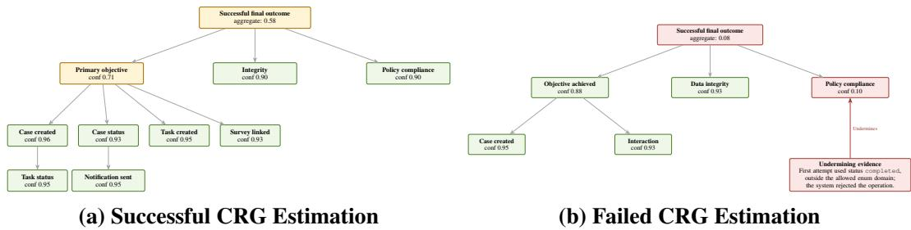  
Figure 4: CRGs for two successful EnterpriseOps-Gym trajectories. (a) A correct estimate: an HR-enrollment task decomposes into verifiable subtasks (case created, status set, survey linked, notification sent), each with high confidence. (b) An incorrect estimate, caused by incomplete graph construction: the agent’s first attempt used a status outside the allowed enum domain and was rejected, but no evidence item records the subsequent correction. The policy-compliance claim is therefore scored against the violation alone, receiving 0.10 and driving the root to 0.08. Because the graph exposes which claim and which cited step produced the estimate, a user can inspect this reasoning and overrule it.

following Nixon et al. (2019). Equal-count binning avoids sparsely populated bins, especially on smaller datasets, reducing the variance of per-bin accuracy estimates. It has also been reported to have lower bias (Roelofs et al., 2022). § A.5 examines other bin counts and equal-width bins.

We also report the binary Brier score,

$$
{ \mathrm { B r i e r } } = { \frac { 1 } { n } } \sum _ { i = 1 } ^ { n } ( c _ { i } - y _ { i } ) ^ { 2 } .\tag{7}
$$

Lower values indicate better probabilistic predictions for both metrics. The Brier score summarizes squared prediction error, whereas ECE specifically measures the gap between confidence and observed success frequency within bins.

## A.3 CASE STUDIES

We examine two EnterpriseOps-Gym trajectories to illustrate how CRG connects task-specific claims and trajectory evidence to the final confidence estimate.

Aggregating high-confidence conditions. In Figure 4(a), a health-insurance enrollment task requires creating an HR case, setting its status, creating and linking a survey task, updating the task status, and notifying the employee. The corresponding leaf claims receive confidences of 0.93–0.96. Their aggregation gives a primary-objective confidence of 0.71 and, after accounting for integrity and policy-compliance claims, a root confidence of 0.58. The graph makes explicit why several individually high-confidence conditions can still yield a more cautious estimate of overall task success.

Tracing a low-confidence estimate. Figure 4(b) shows a trajectory that also succeeded, but on which CRG estimation is wrong. The agent initially attempts to create a support case using the status completed, which is outside the allowed value set and is rejected by the system. CRG attaches this event as undermining evidence to the policy-compliance claim, which receives confidence 0.10; although the case-creation and interaction claims receive 0.95 and 0.93, the root falls to 0.08. The agent subsequently corrected the value and completed the task, but no evidence item records the correction, so the claim was scored against the violation alone — a failure of graph construction rather than of the confidence estimate it supports. Unlike a single scalar confidence, the graph identifies the specific claim and trajectory evidence responsible for the low estimate, so a user deciding whether to accept this solution can check that step, find the correction, and overrule the estimate.

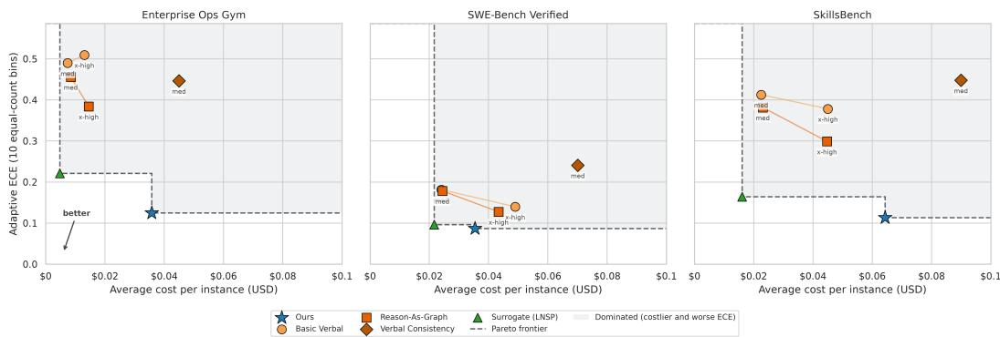  
Figure 5: Cost–calibration tradeoff of each estimator: average cost per trajectory (USD) against adaptive ECE (↓), so lower-left is better. CRGs are the best-calibrated estimators on every benchmark, sharing the Pareto frontier with only the cheaper but worse-calibrated Surrogate LNSP. Importantly, CRGs are cost-efficient in absolute terms: \$0.04–0.07 per trajectory, compared to the cost of generating the trajectory being judged, which averages \$0.15, \$1.06, and \$0.95 on EnterpriseOps-Gym, SWE-Bench, and SkillsBench respectively.

## A.4 COST

We compare the inference cost and calibration of each estimator in Figure 5. Because methods differ in model size and in prompt and completion length, we convert inference usage to an estimated cost per trajectory in USD.<sup>6</sup>

Across all three benchmarks, CRG lies on the cost–calibration Pareto frontier, together with the cheaper but less calibrated Surrogate LNSP. CRG costs approximately \$0.04–\$0.07 per trajectory and achieves lower adaptive ECE than the surrogate on every benchmark, with the largest gap on EnterpriseOps-Gym (0.13 vs. 0.22). Thus, CRG trades additional inference cost for substantially improved calibration in settings where the cheaper surrogate is insufficient.

The gains are also not explained by inference budget alone. On SWE-Bench Verified, increasing the reasoning effort of verbalized baselines can make them more expensive than CRG while leaving them substantially less calibrated. This suggests that the improvement comes from how CRG structures and aggregates confidence estimation, rather than simply from additional test-time compute.

## A.5 ECE ROBUSTNESS TO BINNING

ECE depends on how predictions are partitioned into bins, so we recompute standard and adaptive ECE with 5, 8, 10, 15, and 20 bins. Table 5 shows that the calibration ranking is robust to these choices. CRG with Qwen-3.8 27B achieves the lowest or tied-lowest adaptive ECE for every benchmark and bin count. It also achieves the lowest or tied-lowest standard ECE throughout, except for the five-bin SWE-Bench setting, where its ECE differs from Surrogate LNSP by 0.01. Thus, neither the ten-bin choice nor equal-mass binning explains CRG’s calibration gains.

## A.6 MAXIMUM REFINEMENT DEPTH

We define the refinement depth of a claim as the number of refinement edges on the path from the root to that claim, and constrain the maximum root-to-leaf refinement depth to k. We use a single value, k = 5, for every benchmark rather than tuning refinement depth separately for each setting.

To examine whether this limit constrains graph construction, we vary $k \in \{ 3 , 4 , 5 , 6 , 7 , 8 \}$ on the development set and measure the maximum root-to-leaf refinement depth of the graphs that are actually produced. As shown in Figure 6, the observed maximum depth increases from 3 to 4 to 5 as k increases from 3 to 5, but remains at 5 when the allowed maximum is increased further to 6, 7, or 8. The 95th-percentile graph depth reaches 4 at k = 4 and does not increase for larger values

Table 5: Sensitivity of confidence-estimation calibration error to the number of bins. ECE uses equal-width bins and Adaptive ECE uses equal-mass bins. Best per column in bold, second underlined. <sup>†</sup>White-box: uses token probabilities from a surrogate LLM.
<table><tr><td rowspan="2">Estimator</td><td rowspan="2">LLM</td><td colspan="5">SWE-Bench Verified</td><td colspan="5">EnterpriseOps-Gym</td><td colspan="5">SkillsBench</td></tr><tr><td>5 8</td><td></td><td>10</td><td>15</td><td>20</td><td>5</td><td>8</td><td>10</td><td>15</td><td>20</td><td>5</td><td>8</td><td>10</td><td>15</td><td>20</td></tr><tr><td colspan="10">Standard ECE (equal-width bins)</td><td></td><td></td><td></td><td></td><td></td><td></td><td></td></tr><tr><td>Basic Verbalizer</td><td>GPT-5.6 Sol Qwen-3.8 27B</td><td>0.21 0.18</td><td>0.21 0.18</td><td>0.21 0.18</td><td>0.21 0.18</td><td>0.21 0.18</td><td>0.58 0.49</td><td>0.58 0.49</td><td>0.58 0.49</td><td>0.58 0.49</td><td>0.58 0.49</td><td>0.46 0.41</td><td>0.46 0.41</td><td>0.46 0.41</td><td>0.46 0.41</td><td>0.46 0.41</td></tr><tr><td>Reason-as-Graph</td><td>GPT-5.6 Sol Qwen-3.8 27B</td><td>0.17 0.18</td><td>0.17 0.18</td><td>0.17 0.18</td><td>0.17 0.18</td><td>0.18 0.18</td><td>0.57 0.46</td><td>0.57 0.46</td><td>0.57 0.46</td><td>0.57 0.46</td><td>0.57 0.46</td><td>0.43 0.38</td><td>0.43 0.38</td><td>0.43 0.38</td><td>0.44 0.38</td><td>0.44 0.38</td></tr><tr><td>Verbal Consistency Surrogate LNSP†</td><td>Qwen-3.8 27B Qwen-3.8 27B</td><td>0.25 0.07</td><td>0.25 0.09</td><td>0.25 0.09</td><td>0.25 0.09</td><td>0.25 0.09</td><td>0.45 0.22</td><td>0.45 0.22</td><td>0.45 0.22</td><td>0.45 0.22</td><td>0.45 0.22</td><td>0.45</td><td>0.45 0.13</td><td>0.45</td><td>0.45</td><td>0.45</td></tr><tr><td>CRG (ours)</td><td>GPT-5.6 Sol Qwen-3.8 27B</td><td>0.16 0.08</td><td>0.15 0.08</td><td>0.16 0.08</td><td>0.16</td><td>0.16</td><td>0.25</td><td>0.25</td><td>0.25</td><td>0.25</td><td>0.25</td><td>0.11 0.22</td><td>0.23</td><td>0.13 0.22</td><td>0.15 0.23</td><td>0.17 0.24</td></tr><tr><td>Adaptive ECE (equal-mass bins)</td><td></td><td></td><td></td><td></td><td>0.08</td><td>0.09</td><td>0.13</td><td>0.12</td><td>0.13</td><td>0.13</td><td>0.13</td><td>0.10</td><td>0.11</td><td>0.12</td><td>0.13</td><td>0.13</td></tr><tr><td>Basic Verbalizer</td><td>GPT-5.6 Sol Qwen-3.8 27B</td><td>0.20 0.18</td><td>0.20 0.18</td><td>0.20 0.18</td><td>0.20 0.18</td><td>0.20 0.18</td><td>0.58 0.49</td><td>0.58 0.49</td><td>0.58 0.49</td><td>0.58</td><td>0.58</td><td>0.46</td><td>0.46</td><td>0.46</td><td>0.46</td><td>0.46</td></tr><tr><td>Reason-as-Graph</td><td>GPT-5.6 Sol Qwen-3.8 27B</td><td>0.17 0.18</td><td>0.17 0.18</td><td>0.17 0.18</td><td>0.17</td><td>0.17</td><td>0.57</td><td>0.57</td><td>0.57</td><td>0.49 0.57</td><td>0.49 0.57</td><td>0.41 0.43</td><td>0.41 0.43</td><td>0.41 0.43</td><td>0.41 0.43</td><td>0.41 0.43</td></tr><tr><td>Verbal Consistency</td><td>Qwen-3.8 27B</td><td>0.24</td><td>0.24</td><td>0.24</td><td>0.18 0.24</td><td>0.18 0.24</td><td>0.46 0.45</td><td>0.46 0.42</td><td>0.46 0.45</td><td>0.46 0.45</td><td>0.46 0.45</td><td>0.38 0.45</td><td>0.38 0.45</td><td>0.38 0.45</td><td>0.38</td><td>0.38</td></tr><tr><td>Surrogate LNSP†</td><td>Qwen-3.8 27B</td><td>0.09</td><td>0.09</td><td>0.10</td><td>0.10</td><td>0.10</td><td>0.22</td><td>0.22</td><td>0.22</td><td>0.22</td><td>0.22</td><td>0.16</td><td>0.16</td><td>0.16</td><td>0.45 0.17</td><td>0.45 0.17</td></tr><tr><td>CRG (ours)</td><td>GPT-5.6 Sol Qwen-3.8 27B</td><td>0.16 0.09</td><td>0.15 0.08</td><td>0.16 0.09</td><td>0.16 0.09</td><td>0.16 0.09</td><td>0.24 0.13</td><td>0.24 0.12</td><td>0.24 0.13</td><td>0.24 0.13</td><td>0.25 0.13</td><td>0.22 0.10</td><td>0.21 0.11</td><td>0.22 0.11</td><td>0.24 0.15</td><td>0.23 0.14</td></tr></table>

of k. Thus, $k = 5$ permits the occasional depth-5 graph while larger depth budgets do not lead the constructor to produce deeper graphs. We therefore use $k = 5$ throughout our experiments.  
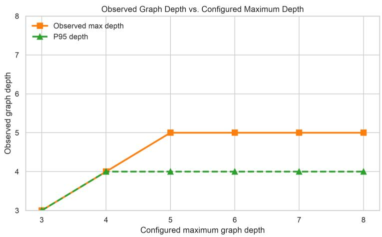  
Figure 6: Observed refinement depth vs. configured maximum refinement depth k on development data. Maximum and 95th-percentile observed depth stop growing at $k = 5$ and $k = 4$ , so we choose $k = 5$ throughout our main experiments.

## A.7 ESTIMATOR REASONING EFFORT

We additionally test the sensitivity of CRG estimation to the reasoning effort allocated to Qwen-3.8 27B in both graph construction and leaf confidence estimation. Across low, medium, and xhigh reasoning effort, predictive performance is nearly unchanged: reported ECE is 0.08, 0.09, and 0.08 respectively; Brier score is 0.19 at all three settings; and AUROC is 0.78, 0.77, and 0.79 (Table 6). In contrast, the reported generated-token count increases from approximately 5.3K at low effort to 6.1K at medium effort and 10.4K at xhigh effort. We therefore use medium reasoning effort in the main experiments, which avoids the substantially higher inference cost of xhigh reasoning as we observe no corresponding improvement in confidence quality.

Table 6: Sensitivity of the Qwen-3.8 27B CRG estimator to reasoning effort in both graph construction and leaf scoring.
<table><tr><td>Effort</td><td>ECE</td><td>Brier</td><td>AUROC</td><td>Generated tokens</td></tr><tr><td>Low</td><td>0.08</td><td>0.19</td><td>0.78</td><td>5.3K</td></tr><tr><td>Medium</td><td>0.09</td><td>0.19</td><td>0.77</td><td>6.1K</td></tr><tr><td>Xhigh</td><td>0.08</td><td>0.19</td><td>0.79</td><td>10.4K</td></tr></table>

Table 7: Surrogate log-probability aggregation results on OpenHands trajectories, averaged over agent LLMs. We report adaptive ECE (10 bins), Brier Score, AUROC, BAS, mean confidence, and confidence standard deviation. Best per ECE, Brier, AUROC, and BAS column in bold, second underlined. <sup>†</sup>White-box: uses token probabilities from a surrogate LLM.
<table><tr><td rowspan="2">Estimator</td><td rowspan="2">LLM</td><td colspan="7">SWE-Bench Verified AUROC↑</td><td colspan="6">EnterpriseOps-Gym</td><td colspan="6">SkillsBench</td></tr><tr><td>ECE↓</td><td>Brier↓</td><td></td><td>BAS↑</td><td>Mean Conf.</td><td>Std. Conf.</td><td>ECE↓</td><td>Brier↓</td><td>AUROC↑</td><td>BAS↑</td><td></td><td>Mean Conf. Std. Conf.</td><td>ECE↓</td><td>Brier↓</td><td>AUROC↑</td><td>BAS↑</td><td></td><td>Mean Conf.</td><td>Std. Conf.</td></tr><tr><td>Action LNSP (first)†</td><td>Qwen-3.8 27B</td><td>0.30</td><td>0.30</td><td>0.48</td><td>0.28</td><td>0.43</td><td>0.08</td><td>0.22</td><td>0.31</td><td>0.49</td><td>-0.02</td><td>0.61</td><td></td><td>0.15</td><td>0.14 0.27</td><td></td><td>0.52</td><td>0.13</td><td>0.41</td><td>0.11</td></tr><tr><td>Action LNSP (last)†</td><td>Qwen-3.8 27B</td><td>0.10</td><td>0.21</td><td>0.47</td><td>0.36</td><td>0.69</td><td></td><td>0.07</td><td>0.22 0.28</td><td>0.61</td><td>0.04</td><td>0.61</td><td></td><td>0.09</td><td>0.16</td><td>0.28</td><td>0.46</td><td>0.09</td><td>0.57</td><td>0.13</td></tr><tr><td>Action LNSP (mean)†</td><td>Qwen-3.8 27B</td><td>0.10</td><td>0.20</td><td>0.48</td><td>0.37</td><td>0.79</td><td></td><td>0.04</td><td>0.35 0.36</td><td>0.60</td><td>-0.09</td><td>0.74</td><td></td><td>0.09</td><td>0.23</td><td>0.30</td><td>0.48</td><td>0.07</td><td>0.72</td><td>0.04</td></tr><tr><td>Action LNSP (min)</td><td>Qwen-3.8 27B</td><td>0.34</td><td>0.32</td><td>0.51</td><td>0.26</td><td>0.39</td><td></td><td>0.08 0.13</td><td>0.26</td><td>0.56</td><td>0.07</td><td>0.53</td><td></td><td>0.12</td><td>0.15</td><td>0.26</td><td>0.58</td><td>0.14</td><td>0.37</td><td>0.09</td></tr><tr><td>Action SP (first)†</td><td>Qwen-3.8 27B</td><td>0.73</td><td>0.73</td><td>0.49</td><td>0.00</td><td>0.00</td><td>0.00</td><td>0.39</td><td>0.39</td><td>0.58</td><td>0.00</td><td>0.00</td><td></td><td>0.00</td><td>0.49</td><td>0.49</td><td>0.53</td><td>0.00</td><td>0.00</td><td>0.00</td></tr><tr><td>Action SP (last)†</td><td>Qwen-3.8 27B</td><td>0.73</td><td>0.73</td><td>0.47</td><td>0.00</td><td>0.00</td><td>0.00</td><td>0.39</td><td>0.39</td><td>0.62</td><td>0.00</td><td>0.00</td><td></td><td>0.00</td><td>0.49</td><td>0.49</td><td>0.51</td><td>0.00</td><td>0.00</td><td>0.00</td></tr><tr><td>Action SP (mean)†</td><td>Qwen-3.8 27B</td><td>0.73</td><td>0.72</td><td>0.48</td><td>0.01</td><td>0.01</td><td>0.01</td><td>0.39</td><td>0.39</td><td>0.58</td><td>0.00</td><td>0.01</td><td></td><td>0.02</td><td>0.49</td><td>0.49</td><td>0.46</td><td>0.00</td><td>0.00</td><td>0.01</td></tr><tr><td>Action SP (min)†</td><td>Qwen-3.8 27B</td><td>0.73</td><td>0.73</td><td>0.54</td><td>0.00</td><td>0.00</td><td>0.00</td><td>0.39</td><td>0.39</td><td>0.61</td><td>0.00</td><td>0.00</td><td></td><td>0.00</td><td>0.49</td><td>0.49</td><td>0.56</td><td>0.00</td><td>0.00</td><td>0.00</td></tr><tr><td>CRG (ours)</td><td>GPT-5.6 Sol</td><td>0.16</td><td>0.23 0.20</td><td>0.62</td><td>0.36 0.37</td><td>0.59 0.70</td><td></td><td>0.25</td><td>0.24 0.29 0.24</td><td>0.67</td><td>0.06 0.08</td><td></td><td>0.15</td><td>0.20</td><td>0.22</td><td>0.29</td><td>0.65</td><td>0.09</td><td>0.40</td><td>0.34 0.24</td></tr><tr><td></td><td>Qwen-3.8 27B</td><td>0.09</td><td></td><td>0.57</td><td></td><td></td><td></td><td>0.16</td><td>0.13</td><td>0.62</td><td></td><td></td><td>0.39</td><td>0.24</td><td>0.11</td><td>0.24</td><td>0.65</td><td>0.14</td><td>0.48</td><td></td></tr></table>

## A.8 SURROGATE LOG-PROBABILITY AGGREGATIONS

Following Bouchard & Chauhan (2026), we compare several ways to aggregate action token probabilities from the surrogate LLM to form a confidence estimate. Let action $a _ { t } = ( w _ { t , 1 } , \dots , w _ { t , n _ { t } } )$ contain $n _ { t }$ tokens, and let $h _ { t }$ denote the reconstructed LLM context preceding that action. Note that for many proprietary frontier models, this reconstructed LLM context excludes the reasoning tokens present in the original LLM context, which are not retrievable. The surrogate assigns each action step the log probability

$$
\ell _ { t } = \sum _ { j = 1 } ^ { n _ { t } } \log p _ { \mathrm { s u r r } } ( w _ { t , j } \mid h _ { t } , w _ { t , < j } ) .\tag{8}
$$

From this quantity, we define the sequence probability (SP) and length-normalized sequence probability (LNSP) of an action step, respectively, as

$$
s _ { t } = \exp ( \ell _ { t } ) , \qquad r _ { t } = \exp \biggl ( \frac { \ell _ { t } } { n _ { t } } \biggr ) .\tag{9}
$$

Sequence probability (SP) multiplies the token probabilities within an action. Length-normalized sequence probability (LNSP) takes their geometric mean, controlling for action length.

For a trajectory τ containing $T$ scored actions, we evaluate the following trajectory-level confidence estimates:

• LNSP (first) and LNSP (last) return $r _ { 1 }$ and $r _ { T }$ , the LNSP of the first and last actions.

• LNSP (mean) returns the arithmetic mean $T ^ { - 1 } \sum _ { t = 1 } ^ { T } r _ { t } .$

• LNSP (min) returns the minimum: min<sub>1≤t≤T</sub> r<sub>t</sub>.

• SP (first) and SP (last) return $s _ { 1 }$ and $s _ { T }$ , the unnormalized sequence probabilities of the first and last actions, respectively.

• SP (mean) computes each action’s non-length-normalized sequence probability and averages across actions: $T ^ { - 1 } \sum _ { t = 1 } ^ { T } s _ { t }$

• SP (min) again returns the minimum: min $1 \leq t \leq T \ S _ { t }$

The Surrogate LNSP baseline in the main experiments (Table 2) is LNSP (last). All variants use Qwen-3.8 27B as the surrogate LLM and reconstruct its context at each scored agent action.

Findings. Table 7 presents our complete comparison with surrogate methods. CRGs remain the strongest overall method, achieving the best ECE, Brier score, AUROC, and BAS across benchmarks. For the tasks we evaluated, sequence probability (SP) aggregation provided nearly useless estimates: harder agentic tasks yield longer actions which were at least somewhat uncertain in the surrogate model and earned confidence estimates consistently near zero. For length-normalized approaches (LNSP), we find that the ranking among surrogate methods varies across benchmarks. Action LNSP (last) is most consistent, performing best among surrogates on SWE-Bench Verified, and competitively elsewhere. While Action LNSP (min) performs best on EnterpriseOps-Gym, it performs substantially worse on SWE-Bench Verified (ECE 0.34 vs. 0.10 for Action LNSP (last)). Action LNSP (first) is best on SkillsBench, but inconsistent elsewhere. Finally, we find that all surrogate methods perform poorly as discriminators, matching our findings in § 6.

## A.9 AGGREGATION RULES

Our default aggregation computes root confidence as the product of the leaf-claim confidences. If the leaf claims form an exact conjunction and are conditionally independent given the observed trajectory, this product is equal to their joint probability. In practice, conditional independence cannot be assumed: dependencies between leaf claims may remain even after decomposition. We therefore view the product as a simple approximation induced by the conjunctive structure, and empirically compare it with alternative aggregation rules. The aggregation methods we evaluate are as follows: Arithmetic and geometric means do not preserve the conjunctive semantics: high confidence in most leaves can compensate for low confidence in a required condition, and their output need not decrease as additional necessary conditions are introduced. The maximum is more permissive still, retaining only the strongest leaf. In the two geometric-mean variants, one computes a geometric mean at each internal goal from its direct children (propagating), whereas the other computes a single geometric mean over all goal leaves (leaves). When dependence among the leaf claims is unknown, their marginal confidences identify only the Frechet bounds on the probability´ of their conjunction:

$$
\operatorname* { m a x } \biggl \{ 0 , \sum _ { G \in \mathcal { L } } c _ { G } - ( | \mathcal { L } | - 1 ) \biggr \} \ \leq \ P \biggl ( \bigcap _ { G \in \mathcal { L } } G \bigg | \tau \biggr ) \ \leq \ \operatorname* { m i n } _ { G \in \mathcal { L } } c _ { G } .
$$

The union-bound and minimum rules take the lower and upper endpoints, respectively. These bounds permit arbitrary dependence but yield only extreme estimates; the product gives a point estimate by approximating the leaf claims as conditionally independent.

We also compare against the probabilistic tree model of Hou et al. (2025). Their learned emission probabilities use held-out truth-labeled data, however, and therefore fall outside our training-free setting; we include this variant as a diagnostic comparison rather than as a directly admissible baseline.

In the aggregation ablation (Table 8), the goal-leaf product has the lowest ECE and Brier score among the compared rules for EnterpriseOps-Gym by far. It also has the best BAS, and strong discrimination. On SWE-Smith, the learned emissions of Hou et al. (2025) are comparably calibrated, though this does not generalize to the other benchmark. The lower Frechet bound also performs´ well, but the product remains stronger overall, supporting both conjunctive aggregation and our conditional-independence approximation.

## A.10 TEMPERATURE-SCALED BASELINES

Our target setting is training-free and therefore does not permit fitting post-hoc calibration parameters on labeled trajectories. Nevertheless, we evaluate whether our gains persist after post-hoc calibration with temperature scaling (Guo et al., 2017).

For a confidence estimate $c \in ( 0 , 1 )$ , binary temperature scaling applies a scalar temperature $T > 0$ in logit space,

$$
\widetilde c _ { T } = \sigma \left( \frac { \mathrm { l o g i t } ( c ) } { T } \right) ,\tag{10}
$$

Table 8: Comparing rules for combining leaf confidences into root confidence on development data (Qwen-3.8 27B). All rows use the same graphs, so differences isolate the aggregation rule. ECE denotes adaptive ECE with 10 bins.
<table><tr><td rowspan="2">Aggregation rule</td><td colspan="4">EnterpriseOps-Gym (n = 192)</td><td colspan="4">SWE-Smith  $( n = 1 8 7 )$ </td></tr><tr><td>ECE↓</td><td>Brier↓</td><td>AUROC↑</td><td>BAS↑</td><td>ECE↓</td><td>Brier↓</td><td>AUROC↑</td><td>BAS↑</td></tr><tr><td>Arithmetic mean</td><td>0.51</td><td>0.47</td><td>0.71</td><td>-0.43</td><td>0.25</td><td>0.28</td><td>0.57</td><td>0.08</td></tr><tr><td>Geometric mean (propagating)</td><td>0.46</td><td>0.42</td><td>0.71</td><td>-0.35</td><td>0.25</td><td>0.28</td><td>0.57</td><td>0.08</td></tr><tr><td>Geometric mean (leaves)</td><td>0.45</td><td>0.41</td><td>0.72</td><td>-0.33</td><td>0.25</td><td>0.28</td><td>0.57</td><td>0.08</td></tr><tr><td>Maximum</td><td>0.59</td><td>0.58</td><td>0.51</td><td>-1.10</td><td>0.29</td><td>0.30</td><td>0.54</td><td>-0.10</td></tr><tr><td>Upper Fréchet bound (minimum)</td><td>0.28</td><td>0.29</td><td>0.72</td><td>-0.07</td><td>0.20</td><td>0.26</td><td>0.56</td><td>0.17</td></tr><tr><td>Lower Fréchet bound (union bound)</td><td>0.22</td><td>0.25</td><td>0.64</td><td>0.06</td><td>0.14</td><td>0.22</td><td>0.55</td><td>0.29</td></tr><tr><td>Hou et al. (2025): learned emissions</td><td>0.25</td><td>0.28</td><td>0.66</td><td>0.01</td><td>0.07</td><td>0.22</td><td>0.57</td><td>0.31</td></tr><tr><td>Product (ours)</td><td>0.13</td><td>0.22</td><td>0.67</td><td>0.08</td><td>0.11</td><td>0.22</td><td>0.55</td><td>0.29</td></tr></table>

Table 9: Confidence estimation results on OpenHands trajectories, averaged over agent LLMs, after applying post-hoc temperature scaling. We tune the temperature parameter on the development set according to the procedure in Guo et al. (2017). We report adaptive ECE (10 bins), Brier score, AU-ROC, and BAS. Best per column in bold, second underlined. <sup>†</sup>White-box: uses token probabilities from a surrogate LLM.
<table><tr><td rowspan="2">Estimator</td><td rowspan="2">LLM</td><td colspan="4">SWE-Bench Verified</td><td colspan="4">EnterpriseOps-Gym</td><td colspan="4">SkillsBench</td></tr><tr><td></td><td></td><td>ECE↓ Brier↓ AUROC↑ BAS↑</td><td></td><td>ECE↓</td><td>Brier↓</td><td></td><td>AUROC↑ BAS↑</td><td>ECE↓</td><td></td><td>Brier↓ AUROC↑</td><td>BAS↑</td></tr><tr><td>Basic Verbalizer + Temp. Scaling</td><td>Qwen-3.8 27B</td><td>0.19</td><td>0.22</td><td>0.66</td><td>0.34</td><td>0.16</td><td>0.26</td><td>0.60</td><td>0.07</td><td>0.14</td><td>0.25</td><td>0.65</td><td>0.15</td></tr><tr><td>Reason-as-Graph + Temp. Scaling</td><td>Qwen-3.8 27B</td><td>0.16</td><td>0.21</td><td>0.66</td><td>0.35</td><td>0.18</td><td>0.26</td><td>0.62</td><td>0.06</td><td>0.14</td><td>0.25</td><td>0.63</td><td>-0.01</td></tr><tr><td>Surrogate LNSP† + Temp. Scaling</td><td>Qwen-3.8 27B</td><td>0.22</td><td>0.24</td><td>0.47</td><td>0.32</td><td>0.12</td><td>0.25</td><td>0.61</td><td>0.08</td><td>0.10</td><td>0.25</td><td>0.46</td><td>0.14</td></tr><tr><td>CRG (ours) + Temp. Scaling</td><td>Qwen-3.8 27B</td><td>0.13</td><td>0.21</td><td>0.57</td><td>0.36</td><td>0.07</td><td>0.23</td><td>0.62</td><td>0.10</td><td>0.06</td><td>0.23</td><td>0.65</td><td>0.16</td></tr></table>

where σ denotes the logistic sigmoid. Following Guo et al. (2017), we choose a temperature for each method by minimizing the negative-log likelihood (NLL) on the development set defined in § A.1, choosing a maximum temperature of $\bar { T } = 1 5$ if the NLL has no finite minimum.

In Table 9, CRG remains the best-calibrated method after temperature scaling and achieves the highest BAS.

## A.11 GRAPH QUALITY ANALYSIS

Our method assumes a decomposition structure that an LLM may not produce: each decomposition should yield conditionally independent children whose conjunction is equivalent to their parent, and each particularization should preserve its parent’s meaning. To evaluate whether this assumption holds, we test the implied entailments, following evaluations of claim decompositions (Weir et al., 2024; Huang, 2025) and of assurance case structure (Ikhwantri & Marijan, 2025). For a parent claim G with children $G _ { 1 } , \ldots , G _ { m }$ , and a particularized restatement $G ^ { \prime }$ of ${ \bar { G } } ,$ we check four criteria:

• Sufficiency: the conjunction of the children covers their parent, ${ \textstyle \bigwedge } _ { j = 1 } ^ { m } G _ { j } \to G .$

• Necessity: each child is required, $G \to G _ { j }$ for every $j .$

• Particularization: a restatement and its original claim entail one another in context, $G ^ { \prime } $ G and $G  G ^ { \prime }$

• Non-redundancy: no sibling entails another, $G _ { j } \not \vdash G _ { k }$ and $G _ { k } \not \vdash G _ { j }$ for every $j \neq k$

It can be shown from the implications above that, should all sufficiency, necessity, and particularization entailments hold, the leaves form the conjunction required by Equation 3. Non-redundancy serves as a diagnostic for violations of the conditional-independence assumption, but does not establish independence. We evaluate 50 sampled graphs per benchmark and CRG setting (300 total). Within each graph, we check all sufficiency, necessity, and particularization entailments, and sample at most 20 sibling pairs for non-redundancy to bound evaluation cost, since a parent with m children induces $\binom { m } { 2 }$ pairwise comparisons. A particularization holds only if both entailments hold, and a sibling pair is non-redundant only if neither claim entails or contradicts the other. We score each graph as the fraction of checks that hold for each criterion and macro-average across graphs, so that a graph’s contribution does not depend on its size. We use the same sampled graphs and checks with three LLM entailment judges: our two CRG setting models (GPT-5.6 Sol, Qwen-3.8 27B), and Gemini-3.6 Flash (Google, 2026). Table 10 shows the CRGs satisfy sufficiency and non-redundancy more consistently than necessity and particularization, suggesting that precise claim decomposition and contextualization remains difficult for LLMs. Judges unanimously find CRGs with GPT 5.6 Sol to better maintain the refinement invariant our method assumes (Equation 2), yet also unanimously find GPT 5.6 graphs to contain more overlapping sibling claims. Thus, neither CRG setting achieves near perfect decomposition. In § A.3, we evaluate case studies, including an example with a clear decomposition failure. Nevertheless, these imperfect graphs produce the calibration and decisionutility gains in Table 2, indicating that perfect decomposition is not required for useful confidence estimates.

Table 10: Macro-averaged graph-quality scores by benchmark, CRG LLM, and judge.
<table><tr><td></td><td></td><td colspan="4">SWE-Bench Verified</td><td colspan="4">EnterpriseOps-Gym</td><td colspan="4">SkillsBench</td></tr><tr><td>CRG LLM</td><td>Judge</td><td></td><td>Suff. Nec.</td><td></td><td>Partic. Non-red.</td><td></td><td>Suff. Nec. 1</td><td></td><td>Partic. Non-red.</td><td></td><td></td><td></td><td>Suff. Nec. Partic. Non-red.</td></tr><tr><td rowspan="3">GPT-5.6 Sol</td><td>GPT-5.6 Sol</td><td>0.98</td><td>0.79</td><td>0.75</td><td>0.82</td><td>0.96</td><td>0.77</td><td>0.65</td><td>0.95</td><td>0.90</td><td>0.86</td><td>0.69</td><td>0.84</td></tr><tr><td>Qwen-3.8 27B</td><td>0.92</td><td>0.71</td><td>0.41</td><td>0.88</td><td>0.85</td><td>0.65</td><td>0.37</td><td>0.96</td><td>0.85</td><td>0.71</td><td>0.53</td><td>0.86</td></tr><tr><td>Gemini-3.6 Flash</td><td>0.99</td><td>0.80</td><td>0.69</td><td>0.81</td><td>0.98</td><td>0.80</td><td>0.74</td><td>0.93</td><td>0.92</td><td>0.87</td><td>0.75</td><td>0.81</td></tr><tr><td rowspan="3">Qwen-3.8 27B</td><td>GPT-5.6 Sol</td><td>0.79</td><td>0.60</td><td>0.51</td><td>0.87</td><td>0.92</td><td>0.59</td><td>0.30</td><td>0.96</td><td>0.75</td><td>0.80</td><td>0.56</td><td>0.82</td></tr><tr><td>Qwen-3.8 27B</td><td>0.67</td><td>0.38</td><td>0.29</td><td>0.91</td><td>0.82</td><td>0.42</td><td>0.14</td><td>0.97</td><td>0.68</td><td>0.61</td><td>0.38</td><td>0.81</td></tr><tr><td>Gemini-3.6 Flash</td><td>0.82</td><td>0.60</td><td>0.54</td><td>0.83</td><td>0.95</td><td>0.64</td><td>0.48</td><td>0.96</td><td>0.79</td><td>0.77</td><td>0.59</td><td>0.77</td></tr></table>

## A.12 PROMPTS

We reproduce the prompts used for CRG construction, evidence gathering, leaf-confidence estimation, and the prompted baselines. Angle-bracketed text denotes content inserted at runtime. Task statements and trajectories are represented by placeholders rather than repeated in full.

## A.12.1 DOMAIN-SPECIFIC SUCCESS DEFINITIONS

To support estimating confidence in agent success, we found it important to precisely define what success means for each task domain. We think such a definition could be useful for any system which evaluate success through LLM reasoning: it enables an estimate to more precisely cover a user’s desiderata for a task, rather than relying on potentially incorrect assumptions an LLM might make about a domain. For example, when using a coding agent, one might or might not want to include writing “clean, well-documented code” as a criterion for success, depending on the context. In either case, the confidence estimate for success should reflect exactly what it means to be successful in that domain or setting. The following domain-specific definitions are inserted into both CRG construction and the verbalized baseline prompts.

## Software Engineering (SWE-Smith & SWE-Bench).

## The Agent's Success Criteria   
A SWE agent has successfully accomplished its user's task if and only if both   
of the following hold:   
1. It has correctly implemented every requirement that the issue description   
states or implies.   
2. It has introduced no regressions into the repository.

## Enterprise Ops.

## The Agent's Success Criteria   
An enterprise agent has successfully accomplished its user's task if and only   
if all of the following hold:   
1. The user's primary task objective was fully achieved.

2. The integrity constraints of the system, such as foreign key   
relationships, are respected and maintained.   
3. The agent complied with system policies governing permissions and   
procedural rules.

## Skills Bench.

## The Agent's Success Criteria   
An agent has successfully accomplished its user's task if and only if all of   
the following hold:   
1. All the requirements in the user's stated task have been achieved.   
2. All required artifacts have been produced correctly.

## A.12.2 CRG CONSTRUCTION

Graph construction uses one system message followed by a user message for claim decomposition. Evidence gathering is then requested in the same conversation, so the constructor retains the trajectory, the constructed claim tree, and the preceding tool results.

## Constructor system message.

You are a confidence-grounded assurance case graph constructor. Your task is   
to construct a structured, graph-based argument which decomposes and evaluates   
the claim that an agent successfully accomplished its task, based on a   
completed agent trajectory. The graph is used to estimate confidence that the   
agent's final delivered result substantively satisfies the user's task.   
## What is a Confidence-Grounded Assurance Graph?   
A confidence-grounded assurance graph is a structured argument that the   
agent's final result satisfies the overall claim -- built by decomposing that   
claim into a tree of necessary-and-sufficient success conditions until each   
can be directly evaluated with trajectory evidence. The graph is rooted in a   
top-level claim that the agent's final result satisfies the user's task. This   
claim is recursively developed into sub-claims, until each leaf claim is   
atomic and can be directly evaluated with trajectory evidence.   
Thus, the graph has two node types: goal nodes, which contain an auditable   
claim or sub-claim in the argument tree, and evidence nodes, which cite   
concrete, specific, trajectory-grounded observations that evaluate a claim.   
### Goal Nodes   
The root claim and every sub-goal derived from it.   
- Each claim is a success condition: a falsifiable criterion that the agent's   
final result must satisfy for its parent claim to hold.   
- Claims may be abstract (task-agnostic) or concrete (task-aware).   
- Use divide-and-conquer to decompose a claim into children at approximately   
the same level of concreteness.   
- For every parent claim, its children must be individually necessary and   
collectively sufficient. The parent is true when all of its children are   
true, and if any child is false, the parent is false.   
Use particularization to restate one abstract claim as one concrete claim   
using details from the specific task. The particularized claim must neither   
weaken nor strengthen its parent; in the task context, both must have the   
same truth condition.   
- Describe what must be true of the final result, not how the agent tried to   
achieve it. Different correct implementations or solutions should satisfy   
the same claims.   
- Do not use optional actions, implementation choices, or verification steps   
as success conditions -- they may instead be evidence.   
- An atomic claim is a single, independently verifiable claim with enough   
context to assess directly against evidence without referring to its parent.   
- Stop when every leaf is atomic. Split claims requiring separate evidence;   
do not split attributes, examples, or checks that can be evaluated together   
from the same evidence.   
### Evidence Nodes   
Concrete, trajectory-grounded observations that bear on one or more claims   
through a permitted evidence relationship.

```markdown
- A claim may need several pieces of evidence to be fully assessed; reuse the
same evidence node across multiple claims when one observation is relevant
to more than one.
- Missing evidence creates uncertainty, not falsity. You can use evidence
notes to state the absence of a particular action or observation in the
trajectory which you expect to need to fully evaluate a claim.
### Edges
Edges are labeled with one of the following relationship types:
- supports: increases confidence in the target claim
- undermines: decreases confidence in the target claim
- unverified: identifies missing verification or evidence, without indicating
falsehood
- decomposes_from: is a conjunct in a decomposition of the target goal
- particularizes: restates the target goal concretely for the specific task
context
## Process
You will be given an overall goal or claim to evaluate against the trajectory.
Build the graph in two phases:
1. Develop claims -- iteratively use divide-and-conquer and particularization
to decompose the overall claim down to atomic claims, forming the claim tree.
2. Gather evidence -- add evidence nodes to the graph to cite trajectory
evidence that relates meaningfully to each atomic claim, or note where
required evidence is missing.
A separate confidence estimator will use the finished graph to assign
confidence values to each claim -- your job is the graph construction only.
<DOMAIN-SPECIFIC SUCCESS CRITERIA>
## Your Success Criteria
The finished graph should let a downstream evaluator assign confidence to the
overall claim using only what is in the graph:
- The claim tree begins with an abstract decomposition of the overall claim,
considering sub-claims that are relevant to the whole domain, not this
individual user's task or environment.
- Every divide-and-conquer parent is decomposed into child success conditions
that are individually necessary and collectively sufficient to evaluate the
parent claim.
- Every particularized child is a concrete, task-aware restatement with the
same truth condition as its abstract parent.
- Every atomic claim describes a final result or success condition, not the
observed path taken to reach it.
- Every atomic claim is evaluated with evidence, or honestly marked uncertain
where the trajectory does not address it.
- Nothing relevant is missing; nothing irrelevant is included.
```

## Claim-decomposition user message. The maximum root-to-leaf depth is instantiated as five in all reported runs.

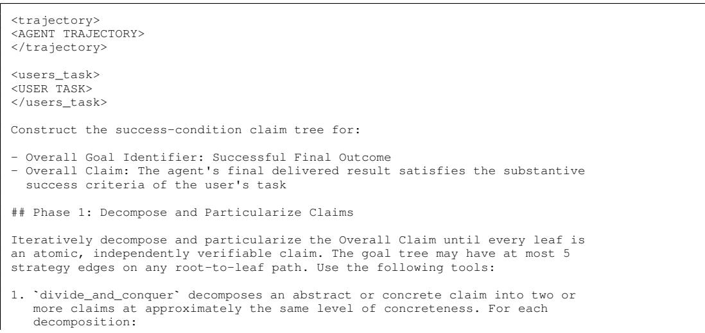

```markdown
- Every child must be necessary for its parent.
- All children together must be sufficient for their parent.
- The parent must be true exactly when all its children are true.
2. `particularize` restates one abstract, task-agnostic claim as one concrete,
task-aware claim. The new claim must neither weaken nor strengthen its
parent; in the task context, both must have the same truth condition.
Generally, an abstract claim should be particularized at most once.
### Guidance
- Divide broad abstract claims into smaller, still abstract claims before
particularizing them. Particularize only when the claim is concrete enough
to be evaluated in the context of the user's task.
- Do not jump from an abstract claim to concrete task details through
divide-and-conquer. Maintain a consistent level of abstraction between
parent and child claims. Use particularization to move from abstract to
concrete.
- Apply the system prompt's atomicity rule: split claims requiring separate
evidence, but keep attributes, examples, or checks together when the same
evidence evaluates them.
Keep enough context that each claim is clear and evaluable without reading
its parent.
- Describe what must be true of the final result, not how the agent tried to
achieve it. Different correct implementations or solutions should satisfy
the same claims.
- Prefer strong, clear success-condition claims. Do not weaken or strengthen a
claim when particularizing. Do not weaken claims to match the observed
trajectory or turn actions, tests, or implementation details into success
conditions.
Use unique goal identifiers and each target goal's exact identifier and
claim.
- Make as many independent strategy calls in each step as you can determine
soundly, as long as they develop different claims within the graph. After
observing the updated graph, continue developing any non-atomic leaves.
When the complete graph has only atomic leaves, call `finish`.
- In general: prefer simple graphs.
Produce claim structure only in this phase. Do not cite or gather evidence yet.
```

The constructor is given the following tool interfaces. Each generated sub-goal contains a unique identifier, an auditable claim, and a rationale for its inclusion.

divide\_and\_conquer(   
target\_goal\_identifier,   
target\_auditable\_claim,   
sub\_goals=[   
{   
goal\_identifier,   
auditable\_claim,   
reasoning   
},   
]   
)   
particularize(   
target\_goal\_identifier,   
target\_auditable\_claim,   
particularized\_goal={   
goal\_identifier,   
auditable\_claim,   
reasoning   
}   
)   
finish(message)

Evidence-gathering user message. This message is appended to the graph-construction conversation after the constructor finishes the claim tree. Evidence is produced in one structured tool call.

## Phase 2: Gather Evidence   
For every atomic leaf claim in the preceding decomposition, gather the   
concrete trajectory observations needed to assess it. Checking one claim may   
use several pieces of evidence, and one piece of evidence may be relevant to   
multiple claims.

- For each claim, include both supporting and undermining evidence if present.   
- Reuse an evidence item when the same observation contributes to multiple   
claims.   
- Cite the precise trajectory step numbers for every observed action or event.   
- Do not infer success merely because no failure was observed.   
If the trajectory lacks relevant evidence for a claim, create an evidence item   
stating that evidence is absent, use an empty \`step\_numbers\` list. Choose an   
appropriate edge label. The absence may leave the claim uncertain; it does not   
necessarily establish that the claim is false.   
You have exactly 1 step to call \`gather\_evidence\_for\_agentic\_graph\_v1\` and   
record the evidence catalog and its typed edges.

The evidence tool returns a reusable catalog and a set of typed attachments:

gather\_evidence\_for\_agentic\_graph\_v1(   
evidence\_catalog=[   
{   
evidence\_key,   
evidence,   
step\_numbers,   
auditable\_claim,   
contribution   
},   
],   
evidence\_edges=[   
{   
evidence\_key,   
target\_goal\_identifier,   
relationship\_type:   
supports | undermines | unverified   
},   
]   
)  
A.12.3 CRG LEAF-CONFIDENCE ESTIMATION

Each leaf goal is scored independently in a new LLM call. The trajectory is reduced as described in § 4.3; evidence attached to the target leaf is supplied in the related-claims block. Evidence nodes themselves are not assigned separate confidence values in the reported goal leaves product configuration.

Estimator system message.

You estimate calibrated confidence for claims in a confidence-grounded   
assurance graph. Such a graph is a structured argument that an agent   
successfully completed its task: goal nodes decompose that overall claim into   
necessary success conditions, and evidence nodes connect those claims to   
concrete trajectory observations. Evaluate only the target claim using the   
supplied trajectory and related claims. Return the requested structured   
confidence and a brief rationale.   
## Your Success Criteria   
- You provide a clear, calibrated confidence that reflects both the available   
evidence for and against a claim, and the degree of uncertainty that remains   
in the absence of further evidence.   
- You provide a clear rationale that matches your confidence score.   
- Your confidence score is calibrated, such that when normalized to a   
probability, the score reflects the actual likelihood that the claim is   
true.

Leaf-scoring user message. The related-claims entry is repeated for every evidence item attached to the target leaf.

# Context

<overall\_goal>   
Goal: Successful Final Outcome   
Claim: The agent's final delivered result satisfies the substantive success   
criteria of the user's task   
</overall\_goal>   
<problem\_statement>   
<USER TASK>   
</problem\_statement>   
<trajectory>   
<REDUCED AGENT TRAJECTORY>   
</trajectory>   
<related\_claims>   
1. Relationship to target: <supports | undermines | unverified>   
Related Claim: <EVIDENCE CLAIM>   
Evidence Steps: <COMMA-SEPARATED STEP NUMBERS>   
Contribution: <EVIDENCE CONTRIBUTION>   
<ADDITIONAL ATTACHED EVIDENCE, IF ANY>   
</related claims>   
# Task Instructions   
Estimate whether the target claim is true and can soundly support its parent   
claim. Judge this claim alone, not whether the overall task succeeded. Weigh   
predecessor confidences as evidence rather than averaging them. In the absence   
of evidence, consider the claim, any available trajectory information, and   
your priors about this problem.   
Think carefully about evidence relationships:   
if evidence suggests a claim is unverified, do not assume it is False.   
Instead, establish confidence considering your priors: how likely is it that   
this claim is true, even though it was not formally verified by the agent?   
Such claims may depend on world knowledge, or reasoning inferences about the   
problem which were not formally verified, but may nonetheless be true. Use   
confidence to reflect uncertainty, not certainty in falsehood. For   
reference, a uniform prior suggests a confidence of 50%   
Confidence guidance:   
80--100%   
the claim.   
60--80%   
minor.   
40--60%   
20--40%   
false than true.   
0--20%   
the claim, establishing its falsehood.   
Return a confidence from 0%   
a brief rationale.   
If you are using a percentage scale, please round your confidence to the   
nearest whole number between 0 and 100.   
<target\_goal>   
Goal: <LEAF GOAL IDENTIFIER>   
Claim: <LEAF CLAIM>   
Reasoning: <RATIONALE FOR INCLUDING THE LEAF>   
</target\_goal>

The response is constrained to the structured schema {confidence: float, rationale: string}. The implementation rejects scores outside [0, 100] and non-integer confidence values, then divides the accepted value by 100 before aggregation.

## A.12.4 PROMPTED BASELINES

All black-box baselines receive the following common prompt prefix. Their method-specific instructions, given below, are appended after # Task Instructions.

You are evaluating whether an agent successfully completed a user's task.   
Review the complete agent trajectory below, including its final answer and any   
tool results.

```cmake
# Context
<domain_success_criteria>
<DOMAIN-SPECIFIC SUCCESS CRITERIA>
</domain_success_criteria>
<problem_statement>
<USER TASK>
</problem_statement>
<agent_trajectory>
<COMPLETE AGENT TRAJECTORY>
</agent_trajectory>
# Task Instructions
<METHOD-SPECIFIC INSTRUCTIONS>
```

Basic Verbalizer. The method-specific instruction is:

Reason about the correctness of the completed work, then end your response   
with a confidence percentage on its own line in exactly this form:   
"Confidence: N%

Reason-as-Graph. This baseline uses the Basic Verbalizer output instruction followed by the additional graph-oriented guidance below. It does not construct or return a persistent graph.

Reason about the correctness of the completed work, then end your response   
with a confidence percentage on its own line in exactly this form:   
"Confidence: N%   
## Guidance   
We suggest using a confidence-grounded assurance case graph to structure your   
reasoning.   
A confidence-grounded assurance case graph is a structured argument for   
whether a task was completed correctly. It starts with that overall claim:   
"the submitted result is correct", breaks it into a complete set of smaller,   
auditable claims, and evaluates each claim using concrete evidence from the   
trajectory. Evidence may support or undermine a claim, or reveal uncertainty   
where the trajectory is incomplete. Together, the claims and evidence should   
account for every material reason the task may have succeeded or failed.   
Use this structure as a scaffold for your confidence reasoning. Break   
correctness into complete, checkable parts; assess each part against relevant   
trajectory evidence; then combine those assessments into an overall   
confidence. You do not need to output a graph.

Verbal Consistency. For each trajectory, we independently sample ten responses to the common prompt with the following instruction. Confidence is the fraction of valid responses ending in Successful: True.

Reason about the correctness of the completed work, then end your response   
with your answer on its own line in exactly this form:   
"Successful: <answer>", where <answer> is either True or False.

Surrogate LNSP. Surrogate LNSP does not use a natural-language confidence-estimation prompt. It computes the length-normalized sequence probability of the agent’s final action under the surrogate LLM using the reconstructed agent context.

## A.12.5 REASON-WITH-GRAPH ABLATION

The Reason-with-Graph ablation in § 6.3 receives the already constructed CRG rendered as a nested textual assurance case. It directly verbalizes confidence in the root rather than scoring and aggregating individual leaves.

You are evaluating whether an agent successfully completed a user's task

using a confidence-grounded assurance case.   
The assurance case is a graph rooted at an overall goal. Goal nodes state   
auditable claims and may be decomposed into subgoals. Evidence nodes contain   
concrete observations. Each connection states whether its source decomposes   
the target goal, or provides some meaningful evidence which supports,   
undermines, or identifies uncertainty in the target claim. Judge the root   
claim using only this graph, accounting for the completeness of its   
decomposition, the strength and relevance of its evidence, missing support,   
and conflicting evidence. Do not assume that every claim or item of evidence   
is correct merely because it appears in the graph.   
<assurance\_case>   
<RENDERED CONFIDENCE REASONING GRAPH>   
</assurance\_case>   
Reason about the correctness of the completed work, then end your response   
with a confidence percentage on its own line in exactly this form:   
"Confidence: N%

## A.13 BEHAVIORAL ALIGNMENT SCORE

Wu et al. (2026) evaluate confidence by the quality of the answer-or-abstain decisions it supports. A decision-maker with risk tolerance $t \in [ 0 , 1 )$ receives utility 1 for accepting a correct solution, $- { \frac { t } { 1 - t } }$ for accepting an incorrect one, and 0 for abstaining. Given a confidence c, accepting has expected utility $\bar { c ^ { \prime } } - ( \bar { 1 } - c ) \frac { t } { 1 - t }$ , which is non-negative exactly when $c \geq t ;$ the threshold t is therefore the confidence level at which a user with that risk tolerance becomes willing to accept. BAS aggregates the realized utility of the induced policy over a uniform prior on t. Because the policy abstains for $t > c ,$ the integral runs only over [0, c] and admits a closed form:

$$
U ( c , y ) = \left\{ { \begin{array} { l l } { c , } & { y = 1 , } \\ { c + \ln ( 1 - c ) , } & { y = 0 , } \end{array} } \right. \quad \mathrm { B A S } = { \frac { 1 } { n } } \sum _ { i = 1 } ^ { n } U ( c _ { i } , y _ { i } ) .\tag{11}
$$

A correct solution thus contributes utility equal to the confidence assigned to it, while an incorrect one is penalized logarithmically, so $\mathrm { B A S } \in ( - \infty , 1 ]$ Wu et al. (2026) further show that BAS is a proper decision-theoretic scoring objective: expected utility is uniquely maximized when reported confidence equals the true probability of correctness, so BAS rewards calibration rather than ranking alone.

Overconfident errors. The term ln(1 − c) diverges as $c  1$ , so a single incorrect trajectory assigned near-certain confidence can dominate the score. Following Wu et al. (2026) we clip confidences to min $( c , 1 - \epsilon )$ with $\epsilon = 1 0 ^ { - 4 }$ , which bounds the worst per-trajectory contribution at ≈ −8.21. This asymmetry is the mechanism behind the large negative BAS values we report for verbalized and sampling-based baselines (Table 2): both place near-maximal confidence on trajectories that failed, which ECE penalizes only in proportion to the gap while BAS penalizes without bound.

## A.14 THEORETICAL FOUNDATIONS OF CRG CONFIDENCE AGGREGATION

Here we formalize the probabilistic justification for our aggregation rule. We proceed in three steps. First, we show that if each refinement preserves the intended conjunctive semantics, then the root claim is equivalent to the conjunction of all leaf claims. Second, we characterize the root probability without making any independence assumption. Finally, we recover the product rule used by our estimator as the special case in which leaf claims are conditionally independent.

Throughout, equivalence ≡ is understood in the task context: $G \equiv G ^ { \prime }$ means that the two claims have the same truth value for every execution under consideration. We identify each claim G with the event that $G$ is true. Probabilities are epistemic and conditioned on the information available to the estimator from the observed trajectory τ ; the trajectory need not fully determine the claim’s truth.

## A.14.1 LEAF EQUIVALENCE

Recall the refinement invariant of § 4.1: for every internal claim $G \in \mathcal { V } \setminus \mathcal { L } .$ , the conjunction of its children is intended to be equivalent to the parent,

$$
G \equiv \bigwedge _ { G ^ { \prime } \in \mathrm { c h } ( G ) } G ^ { \prime } .\tag{2}
$$

Decomposition realizes this with $| \mathrm { c h } ( G ) | > 1$ , while particularization realizes it with $| { \mathrm { c h } } ( G ) | = 1$ For $G \in { \mathcal { V } } .$ , let ${ \mathcal { L } } ( G )$ denote the leaves of the refinement subtree rooted at $G ,$ so that $\begin{array} { r } { \mathcal { L } ( G _ { 0 } ) = \mathcal { L } } \end{array}$

Lemma 1 (Leaf equivalence). Let $\mathcal { G }$ be a CRG whose refinement structure satisfies Equation $^ 2$ at every internal claim. Then, for every $G \in \mathcal { V }$

$$
G \equiv \bigwedge _ { H \in \mathcal { L } ( G ) } H .\tag{12}
$$

In particular,

$$
G _ { 0 } \ \equiv \ \bigwedge _ { H \in \mathcal { L } } H .\tag{13}
$$

Proof. We proceed by structural induction on the subtree rooted at $G .$ The induction is well-founded because § 4.1 performs at most k refinement rounds, so the refinement structure is a finite tree.

Base case. If $G \in { \mathcal { L } } .$ , then ${ \mathcal { L } } ( G ) = \{ G \}$ , and Equation 12 reduces to $G \equiv G$

Inductive step. Let $G$ be an internal claim with ch $( G ) = \{ G _ { 1 } , \dots , G _ { m } \}$ , and suppose Equation 12 holds for each child $G _ { j }$ . By the refinement invariant,

$$
G \equiv \bigwedge _ { j = 1 } ^ { m } G _ { j } ,
$$

and by the inductive hypothesis,

$$
G _ { j } \equiv \bigwedge _ { H \in \mathcal { L } ( G _ { j } ) } H .
$$

Substituting these equivalent claims gives

$$
G \equiv \bigwedge _ { j = 1 } ^ { m } \bigwedge _ { H \in \mathcal { L } ( G _ { j } ) } H
$$

$$
= \bigwedge _ { H \in \mathcal { L } ( G ) } H ,\tag{14}
$$

(15)

because the leaves below $G$ are precisely the leaves below its children. Taking $G = G _ { 0 }$ yields Equation 13. □

Remark 1 (Logical overlap). Lemma 1 does not require distinct leaf claims to be logically independent. Distinct leaves may express overlapping, correlated, or even equivalent conditions without invalidating the logical equivalence in Equation 13; conjunction remains well-defined in each case. Such dependence matters only when we attempt to recover the probability of the conjunction from individual leaf probabilities.

Remark 2 (Status of the refinement assumption). The refinement invariant specifies the semantics that our construction is intended to realize, rather than a property guaranteed by the construction. Because the refinements are generated by an LLM, their children need not always form a conjunction exactly equivalent to the parent. Lemma 1 therefore characterizes graphs satisfying the intended semantics; § A.11 empirically measures departures from this assumption.

## A.14.2 DEPENDENCE-AWARE AGGREGATION

Lemma 1 reduces confidence in the root claim to confidence in a conjunction of leaf claims. Importantly, this reduction itself requires no probabilistic independence assumption. We first characterize the corresponding probability under arbitrary dependence.

Proposition 1 (Dependence-aware leaf aggregation). Suppose $\mathcal { G }$ satisfies Equation 2 at every internal claim, and let $\mathbf { \bar { \mathcal { L } } } = \{ H _ { 1 } , \dots , H _ { m } \}$ . Then, for any ordering of the leaves for which the relevant conditional probabilities are defined,

$$
P ( G _ { 0 } \mid \tau ) = \prod _ { i = 1 } ^ { m } P ( H _ { i } \mid \tau , H _ { 1 } , \dots , H _ { i - 1 } ) ,\tag{16}
$$

where the first factor is $P ( H _ { 1 } \mid \tau )$

If only the marginal leaf probabilities

$$
p _ { i } = P ( H _ { i } \mid \tau )
$$

are known, then without any assumption on their dependence,

$$
\operatorname* { m a x } \biggl \{ 0 , \sum _ { i = 1 } ^ { m } p _ { i } - ( m - 1 ) \biggr \} \ \leq \ P ( G _ { 0 } \mid \tau ) \ \leq \ \operatorname* { m i n } _ { i } p _ { i } .\tag{17}
$$

Proof. By Lemma 1,

$$
G _ { 0 } \equiv \bigwedge _ { i = 1 } ^ { m } H _ { i } ,
$$

so

$$
P ( G _ { 0 } \mid \tau ) = P \left( \bigcap _ { i = 1 } ^ { m } H _ { i } \left| \tau \right. \right) .\tag{18}
$$

Applying the probability chain rule gives

$$
P ( G _ { 0 } \mid \tau ) = P ( H _ { 1 } \mid \tau ) \prod _ { i = 2 } ^ { m } P ( H _ { i } \mid \tau , H _ { 1 } , \dots , H _ { i - 1 } ) ,\tag{19}
$$

establishing Equation 16 without an independence assumption.

For the upper bound, an intersection cannot be more probable than any of its constituent events:

$$
P ( G _ { 0 } \mid \tau ) \le \operatorname* { m i n } _ { i } P ( H _ { i } \mid \tau ) = \operatorname* { m i n } _ { i } p _ { i } .\tag{20}
$$

For the lower bound, the union bound applied to the complementary events gives

$$
P { \Bigg ( } \bigcup _ { i } { \neg { \cal H } _ { i } } { \Bigg | } \tau { \Bigg ) } \leq \sum _ { i } P ( \neg { \cal H } _ { i } \mid \tau )\tag{21}
$$

$$
= \sum _ { i } ( 1 - p _ { i } ) .\tag{22}
$$

Therefore,

$$
P ( G _ { 0 } \mid \tau ) = 1 - P \biggl ( \bigcup _ { i } { \neg H _ { i } } \left. \tau \right. \biggr )\tag{23}
$$

$$
\geq 1 - \sum _ { i } ( 1 - p _ { i } )\tag{24}
$$

$$
= \sum _ { i } p _ { i } - ( m - 1 ) .\tag{25}
$$

Combining this with non-negativity yields the lower bound in Equation 17.

Proposition 1 makes explicit what can and cannot be inferred from leaf-level confidence alone. Under the refinement invariant, the root probability is the joint probability that all leaf claims hold, but the marginal probabilities $P ( H _ { i } \mid \tau )$ generally do not determine this joint probability. Without additional information about dependence, they determine only the interval in Equation 17.

## A.14.3 PRODUCT AGGREGATION

The product rule used by our method follows immediately when the dependence structure is approximated by conditional independence.

Corollary 1 (Product rule under local conditional independence). Suppose the refinement invariant above holds at every internal claim, and suppose that for every internal claim $G \in V \backslash L ,$ , the claims in ch(G) are mutually independent conditional on τ . Then

$$
P ( G _ { 0 } \mid \tau ) = \prod _ { H \in L } P ( H \mid \tau ) .
$$

Proof. We proceed by structural induction. For a leaf $G ,$ the result is immediate. For an internal claim G with children ch(G), the refinement invariant and conditional independence give

$$
P ( G \mid \tau ) = \prod _ { G ^ { \prime } \in \mathrm { c h } ( G ) } P ( G ^ { \prime } \mid \tau ) .
$$

Applying the induction hypothesis to each child and noting that their subtree leaves together form $L ( G )$ gives

$$
P ( G \mid \tau ) = \prod _ { H \in L ( G ) } P ( H \mid \tau ) .
$$

Taking $G = G _ { 0 }$ yields the result.

Implications for our estimator. Our estimator does not observe the true marginal probabilities. Instead, it obtains a verbalized confidence

$$
c _ { H } = \psi ( H ) \approx P ( H \mid \tau )\tag{26}
$$

for each leaf and uses the plug-in estimator

$$
F _ { \theta } ( \tau ) = \prod _ { H \in \mathcal { L } } c _ { H } .\tag{27}
$$

Thus, product aggregation should be understood as a tractable conditional-independence approximation to the joint probability in Proposition 1, rather than as a claim that the leaf conditions produced by the CRG are exactly independent.

If the $c _ { H }$ were exact marginal probabilities, but no dependence assumption were made, the root probability would only be identified within

$$
\operatorname* { m a x } \biggl \{ 0 , \sum _ { H \in \mathcal { L } } c _ { H } - ( | \mathcal { L } | - 1 ) \biggr \} \leq P ( G _ { 0 } \mid \tau ) \leq \operatorname* { m i n } _ { H \in \mathcal { L } } c _ { H } .\tag{28}
$$

Because the $c _ { H }$ are themselves estimates, Equation 28 is only a plug-in characterization, not a guaranteed confidence interval.

Dependence provides one explanation for systematic error in the product approximation. When different leaves encode overlapping or positively associated conditions, multiplying their marginal confidences can count related uncertainty multiple times and underestimate the joint probability. Other dependence structures can instead cause overestimation. Our graph-quality analysis therefore uses non-redundancy among siblings as a diagnostic for obvious violations of the independence approximation. Non-redundancy does not establish independence, but substantial overlap indicates that product aggregation may double-count uncertainty. Non-redundancy does not establish independence, but strong overlap is a direct warning sign that product aggregation may double-count uncertainty.

A fully dependence-aware estimator could instead estimate the sequential conditionals appearing in Equation 16,

$$
\tilde { c } _ { i } \approx P ( H _ { i } | \tau , H _ { 1 } , \dots , H _ { i - 1 } ) ,\tag{29}
$$

and return

$$
F _ { \theta , \mathrm { d e p } } ( \tau ) = \prod _ { i = 1 } ^ { m } \tilde { c } _ { i } .\tag{30}
$$

With exact conditional probabilities, the chain-rule identity is independent of the ordering of the leaves. In practice, however, estimating these higher-order conditionals would require more complex queries, and approximation error could make the resulting estimate sensitive to the chosen ordering. We therefore use marginal leaf scoring with product aggregation as a simple training-free approximation and evaluate its empirical consequences through graph quality and aggregation-rule ablations.

Remark 3 (Bottom-up computation). Because multiplication is associative, the product in Equation 27 can equivalently be computed bottom-up, taking the value of each internal claim to be the product of its children’s values. The refinement-tree structure therefore determines which leaf claims are evaluated and how they were derived from the root, but not the numerical value of the final product once the leaf confidences are fixed. This equivalence is specific to associative aggregation; for example, recursively applying an arithmetic or geometric mean can differ from applying the same operator once to all leaves.

Remark 4 (Conservatism relative to leaf estimates). Since every $c _ { H } \in [ 0 , 1 ] .$

$$
F _ { \theta } ( \tau ) \leq \operatorname* { m i n } _ { H \in \mathcal { L } } c _ { H } .\tag{31}
$$

Thus, under product aggregation, one low-confidence leaf cannot be offset by high-confidence values on other leaves, and introducing additional leaves weakly decreases the estimate if existing confidences are held fixed. This is an algebraic property of the estimator; when conditional independence fails, it does not imply that the product is necessarily a lower bound on the true root probability.

## A.15 PAIRED BOOTSTRAP ANALYSIS

We check whether CRG’s gains in Table 2 persist under task resampling. For each benchmark– baseline–metric comparison, we create 10,000 bootstrap resamples by drawing the benchmark’s original number of task IDs with replacement and retaining their available OpenHands trajectories. We compute the metric for Qwen CRG and the baseline on the same resample (paired bootstrap; Koehn, 2004). This uses saved predictions without new inference. Table 11 shows signed differences; asterisks mark nominal 95% bootstrap intervals that exclude zero.

Qwen CRG has lower adaptive ECE in all 18 comparisons, and the nominal 95% intervals exclude zero in 16: every verbalized baseline on every benchmark, plus Surrogate LNSP on EnterpriseOps-Gym. Its smaller ECE gains over Surrogate LNSP on SWE-Bench Verified and SkillsBench remain uncertain. Brier and BAS gains are supported in 14 of 18 and 17 of 18 comparisons, respectively. AUROC includes the SWE-Bench Verified losses to two Qwen verbalizers already visible in Table 2. Thus, task resampling supports the principal calibration and decision-utility gains, but does not establish that every per-benchmark difference is robust. As an exploratory summary, the mean of the six paired differences has a nominal 95% interval above zero for ECE, Brier, and BAS on all three benchmarks, and for AUROC on EnterpriseOps-Gym and SkillsBench.

Overall, the paired bootstrap shows that CRG’s main calibration and decision-utility gains persist under test-task resampling.

## A.16 SOFTWARE VERSIONS AND RANDOMIZATION

SkillsBench and EnterpriseOps-Gym trajectories used OpenHands SDK v1.31.0. For SWE-Bench Verified, trajectories are source from the published runs on https://index.openhands.dev/. Therefore, the precise OpenHands SDK versions vary by model: v1.18.1 with GPT-5.5, v1.28.0 with Gemini-3.5 Flash, and v1.24.0 with MiniMax-M3. The Codex and Claude Code transfer runs used the codex-acp v0.11.1 and claude-agent-acp v0.30.0 adapters, respectively, with OpenHands SDK v1.19.1 and v1.18.0.

The 306 SWE-Bench Verified tasks were selected by difficulty without random sampling. For EnterpriseOps-Gym, we independently shuffled the tasks in each of eight domains with seed 42. Confidence-estimation runs shuffled their fixed datasets with seed 42; this affected processing order, not task membership. The paired task bootstrap used 10,000 resamples per comparison and We did not set an explicit inference-time seed for agent or estimator LLM calls

Table 11: Paired task-bootstrap comparison of CRG (Qwen-3.8 27B) with every baseline in Table 2. Entries are signed score differences: baseline minus CRG for ECE and Brier, and CRG minus baseline for AUROC and BAS. Positive values favor CRG. Exploratory mean rows average the six signed differences above them, with intervals recomputed on common task resamples. <sup>∗</sup> marks a difference whose nominal 95% bootstrap interval excludes zero, indicating statistical significance. No multiple-comparison adjustment is applied.
<table><tr><td>Benchmark</td><td>Baseline</td><td>ECE</td><td>Brier</td><td>AUROC</td><td>BAS</td></tr><tr><td rowspan="6">SWE-Bench Verified</td><td>Basic Verbalizer (GPT)</td><td>+0.115*</td><td>+0.034*</td><td>+0.006</td><td>+0.411*</td></tr><tr><td>Basic Verbalizer (Qwen)</td><td>+0.095*</td><td>+0.018</td><td>-0.084*</td><td>+0.101*</td></tr><tr><td>Reason-as-Graph (GPT)</td><td>+0.081*</td><td>+0.019</td><td>-0.002</td><td>+0.318*</td></tr><tr><td>Reason-as-Graph (Qwen)</td><td>+0.092*</td><td>+0.017</td><td>-0.088*</td><td>+0.102*</td></tr><tr><td>Verbal Consistency</td><td>+0.154*</td><td>+0.052*</td><td>+0.030</td><td>+7.959*</td></tr><tr><td>Surrogate LNSP</td><td>+0.009</td><td>+0.004</td><td>+0.098*</td><td>+0.011</td></tr><tr><td rowspan="6">EnterpriseOps-Gym</td><td>Mean of six baselines</td><td>+0.091*</td><td>+0.024*</td><td>-0.007</td><td>+1.484*</td></tr><tr><td>Basic Verbalizer (GPT)</td><td>+0.454*</td><td>+0.330*</td><td>+0.125*</td><td>+2.562* +0.652*</td></tr><tr><td>Basic Verbalizer (Qwen) Reason-as-Graph (GPT)</td><td>+0.365*</td><td>+0.228*</td><td>+0.019</td><td>+2.771*</td></tr><tr><td>Reason-as-Graph (Qwen)</td><td>+0.442* +0.331*</td><td>+0.320* +0.199*</td><td>+0.150* -0.002</td><td>+0.577*</td></tr><tr><td>Verbal Consistency</td><td>+0.321*</td><td>+0.204*</td><td>+0.004</td><td>+13.805*</td></tr><tr><td>Surrogate LNSP</td><td>+0.096*</td><td>+0.034*</td><td>+0.010</td><td>+0.042*</td></tr><tr><td></td><td>Mean of six baselines</td><td>+0.335*</td><td>+0.219*</td><td>+0.051*</td><td>+3.402*</td></tr><tr><td rowspan="6">SkillsBench</td><td>Basic Verbalizer (GPT)</td><td>+0.344*</td><td>+0.217*</td><td></td><td>+2.312*</td></tr><tr><td>Basic Verbalizer (Qwen)</td><td>+0.299*</td><td>+0.166*</td><td>+0.110 -0.002</td><td>+0.474*</td></tr><tr><td>Reason-as-Graph (GPT)</td><td>+0.315*</td><td>+0.200*</td><td>+0.140*</td><td>+2.233*</td></tr><tr><td>Reason-as-Graph (Qwen)</td><td>+0.268*</td><td>+0.136*</td><td>+0.018</td><td>+0.545*</td></tr><tr><td>Verbal Consistency</td><td>+0.332*</td><td>+0.197*</td><td>+0.043</td><td>+14.012*</td></tr><tr><td>Surrogate LNSP</td><td>+0.051</td><td>+0.042*</td><td>+0.192*</td><td>+0.059*</td></tr><tr><td></td><td>Mean of six baselines</td><td>+0.268*</td><td>+0.160*</td><td>+0.084*</td><td>+3.273*</td></tr></table>