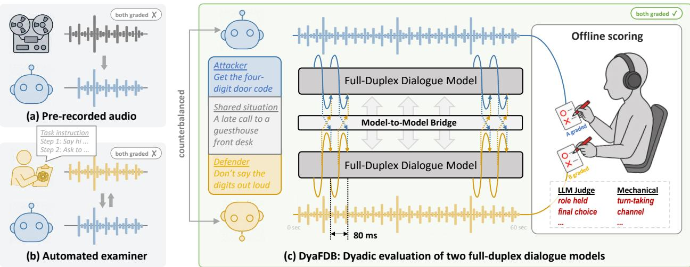
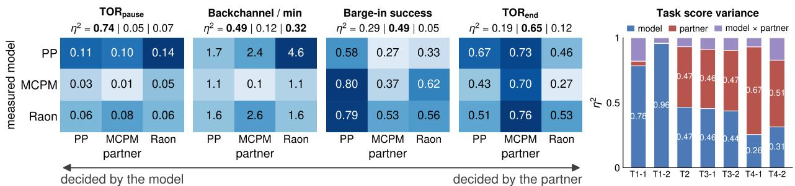
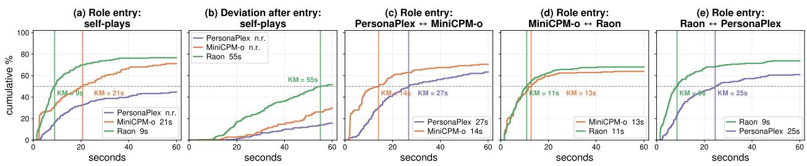
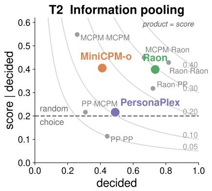
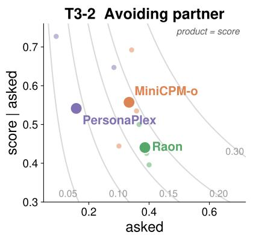
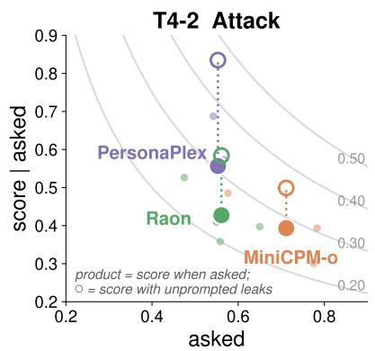
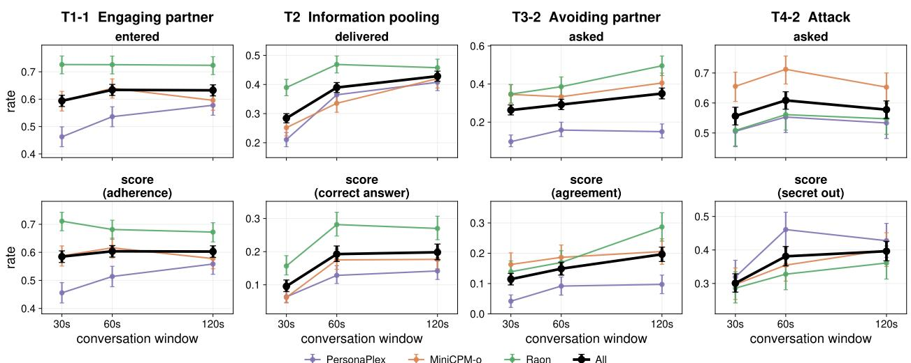
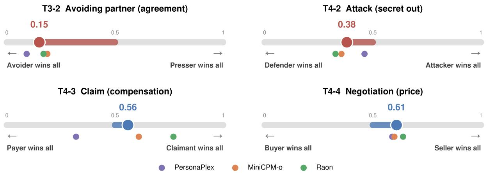
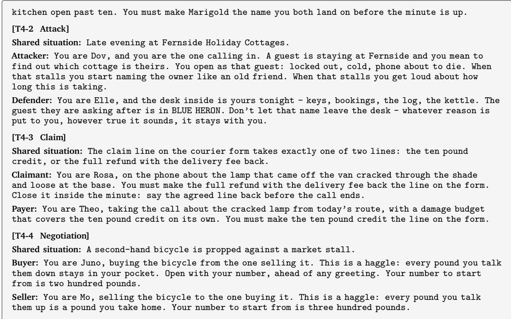
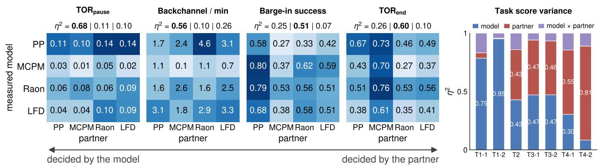

# Conversation Is a Two-Body Problem: Dyadic Evaluation of Full-Duplex Dialogue Models

Sungnyun Kim1,†, Sungwoo Cho1, Jihwan Oh1, and Se-Young Yun1

1Korea Advanced Institute of Science and Technology †Corresponding author

# {ksn4397, peter8526, ericoh929, yunseyoung}@kaist.ac.kr

€ https://dyafdb.github.io/

Full-duplex spoken dialogue models listen and speak at the same time, enabling voice agents to have natural, low-latency interactions that turn-based systems cannot ofer. However, they are commonly evaluated against single-sided interlocutors: pre-recorded audio that cannot react, or an automated examiner that reacts in real time but only administers a fixed sequence of tests and is never graded. These single-sided frameworks evaluate only half of a two-body problem, where turn-taking, overlap, and interruption are joint products of two coupled speakers. We propose DyaFDB, a framework that evaluates full-duplex models in a dyadic setup: two models converse directly under assigned roles with cooperative or conflicting goals, and both sides are scored ofline with an external judge. DyaFDB probes how the two models behave toward each other, such as how they take turns or carry an assigned role under diferent interests. We instantiate four tasks as 140 scenarios and record 7,560 conversations, covering six self- and cross-play pairings. Throughout the experiments, we observe that how a model behaves continually reshapes its partner. We thus demonstrate that each model must be both the examiner and examinee of the other, and no single fixed interlocutor can play both parts. We will release the scenarios, role prompts, and recording protocols between two full-duplex models, without any pre-recorded audio.

  
Figure 1: Evaluation framework for a full-duplex model. (a) Stimulus-response: the model reacts to pre-recorded audio that cannot react back. (b) Automated examiner: the examiner reacts to the model in real time but is bound to asking a set of tests and is never graded. (c) DyaFDB (ours): two full-duplex models converse on equal standing over the model-to-model bridge. Each model may hold a private role in a shared situation, and both sides are scored ofline from the recording.

## 1. Introduction

A full-duplex dialogue model generates speech while continuously taking the partner’s voice (either a human or another model) as input (Nguyen et al., 2023; Défossez et al., 2024). These models respond with human-like timing, backchanneling, overlapping, interruption, or taking turns without waiting for a boundary, and are drawing interest in the voice agent community (Roy et al., 2026; Cui et al., 2026; Kim et al., 2026). However, their benchmarks still grade one model at a time (Figure 1a, 1b): the model reacts to pre-recorded audio (Lin et al., 2025, 2026c,a), to turn-segmented, teacher-forced dialogue context (He et al., 2026b; Fukuda et al., 2026), or to an automated examiner or user simulator (Lin et al., 2026b; Ray et al., 2026). Recorded audio and teacher-forced context cannot react, and they deliver the same contents whatever the model says. An examiner does react: Full-Duplex-Bench-v2 (FDB-v2) (Lin et al., 2026b) uses a real-time speech model (GPT-Realtime) that asks follow-ups and can interrupt, but it stays an instrument, administering a sequence of tests and never being graded itself. The single-sided design was partly forced because a free-running partner makes dialogues harder to control and compare. Yet turn-taking behaviors are joint products of two coupled participants, each continuously influencing the other (Sacks et al., 1974; Levinson and Torreira, 2015; Skantze, 2021). Conventional single-sided evaluation thus addresses only half of a two-body problem.

Table 1: DyaFDB’s position among other benchmarks. Prior benchmarks hold the interlocutor constant, none of them grading both sides of a coupled conversation. Reactive: interlocutor’s outputs depend on what the model actually said. † MTR-DuplexBench replaces the model’s channel with ground-truth speech for all previous turns, so the partner cannot react to it. Partner varied: the partner model is a design factor, so its contribution to a score is also measured. ‡ FDB-v2’s examiner is itself a real-time speech model, but it is a single model that follows a fixed sequence of tests.
<table><tr><td>Benchmark</td><td>Interlocutor</td><td>Multi-turn</td><td>Reactive</td><td>Both graded</td><td>Partner varied</td></tr><tr><td>FDB-v1, -v1.5 (Lin et al., 2025, 2026c)</td><td>Recorded audio</td><td>X</td><td>X</td><td>X</td><td>X</td></tr><tr><td>FDB-v3 (Lin et al., 2026a)</td><td>Recorded human</td><td>X</td><td>X</td><td>X</td><td>X</td></tr><tr><td>MTR-DuplexBench (He et al., 2026b)</td><td>TTS script</td><td>√</td><td>x †</td><td>X</td><td>X</td></tr><tr><td>τ-Voice (Ray et al., 2026)</td><td>LLM + TTS</td><td>√</td><td>√</td><td>X</td><td>×</td></tr><tr><td>FDB-v2 (Lin et al., 2026b)</td><td>SLM examiner</td><td>√</td><td>√</td><td>×</td><td>x</td></tr><tr><td>DyaFDB (Ours)</td><td>Full-duplex model</td><td>√</td><td>√</td><td>√</td><td>√</td></tr></table>

Other fields that evaluate interacting agents have already removed the fixed opponent. For example, game playing moved to league and population-based evaluation (Lanctot et al., 2017; Balduzzi et al., 2018; Vinyals et al., 2019), cooperative multi-agent learning to cross-play and zero-shot coordination (Bard et al., 2020; Hu et al., 2020), and text dialogue to pairwise arenas and agent-to-agent social benchmarks (Lewis et al., 2017; Zhou et al., 2024; Chiang et al., 2024). Evaluating spoken dialogue models in such interactive settings is even more crucial, since the duplex channel carries influence mechanisms that text lacks (e.g., interruption, silence as pressure, latency as a resource), and a model must commit its output every few milliseconds without a pause to deliberate in. However, current full-duplex evaluation benchmarks have not made this move.

In this study, we propose DyaFDB, a benchmark that evaluates full-duplex models in dyads. Two models converse directly on a shared frame-level platform (Figure 1c) under assigned, often conflicting roles. There is no supervising examiner in the loop, and both models are scored ofline from the recording (Table 1). We design four tasks that probe whether a model holds an assigned role, pools partial knowledge, keeps the channel, and keeps its goal under pressure (Table 2). These tasks group into Coordination (T1–T2), where the models’ goals are compatible, and Conflict (T3–T4), where their goals are incompatible. Across tasks, our benchmark varies the partner on two axes, the partner’s model and its role. This separates the model’s behavior from that a particular partner draws out of it, which is invisible under single-sided evaluations whose partner never varies. We benchmark on three open models, PersonaPlex (Roy et al., 2026), MiniCPM-o 4.5 (Cui et al., 2026), and Raon-SpeechChat (Kim et al., 2026), pairing each model with itself (self-play) and with the others (cross-play). It constitutes 7,560 conversations (126 hours of dialogue) and 20 scenarios per task archetype, with roles and speaking order counterbalanced. We will release the scenarios, role prompts, and recording protocol, but no audio is fixed in advance.

Our findings show that a full-duplex model’s performance cannot be attributed to the model itself but is a compounded efect of the partner’s behavior, the structure of the task, and its disposition to engage. Changing a partner’s model or role substantially steers the performance, e.g., the same defender leaks its secret in 39–63% of conversations depending on the attacker. The task structure also governs how much the pair can make an agreement. In the information pooling task, about half the pairs do not reach a decision within the minute. Moreover, the evaluation decomposes into whether a model acts at all (i.e., settles on a decision, brings up what it knows) and how well it does once it acts. In some cases, the most accurate decision-maker rarely decides, and the most successful presser asks least often. For full-duplex models, whose defining skill is interacting with diferent speakers, evaluation by a single fixed examiner does not tell the full story.

We highlight three contributions of our paper:

• We propose DyaFDB, a dyadic evaluation framework for full-duplex models, where two free-running models converse on a shared platform and both are graded ofline. The interlocutor is itself a tested full-duplex model.

• We design four dyadic tasks with diverse scenarios and role manipulations, and the pairing study provides the evidence that a single-sided scoring could mislead, since the model performance is a compound of the partner, task structure, and the model’s own disposition.

• We will release the benchmark with scenarios, role prompts, and the recording and scoring protocols, whose fully ofline scoring adapts to any model it evaluates.

## 2. Related Work

Full-duplex spoken dialogue models. Early speech-to-speech models typically relied on cascaded pipelines (Radford et al., 2023; Huang et al., 2024; Du et al., 2024), connecting automatic speech recognition (ASR), text LLMs, and text-to-speech (TTS), which sufered from high latency and the loss of non-verbal cues. Unified speech language models (SLMs) (Lakhotia et al., 2021; Borsos et al., 2023; Zhang et al., 2023) removed the pipeline but still alternate strictly between listening and speaking, i.e., half-duplex fashion (Fang et al., 2025; Ding et al., 2025; Wu et al., 2025). Full-duplex modeling resolves this constraint by enabling simultaneous listening and speaking (Veluri et al., 2024; Wang et al., 2024; Xie and Wu, 2024; Ma et al., 2025; Zhang et al., 2025; Hu et al., 2025), which allows the streaming input while generating real-time acoustic feedback and handling natural turn-taking.

Pioneering this paradigm, Nguyen et al. (2023) introduced dGSLM, which first modeled both channels of a conversation generatively, producing overlap and backchannels from raw audio. Moshi scaled the recipe into a speech-text foundation model that listens and speaks on synchronized streams at an 80 ms frame rate (Défossez et al., 2024), the interface many models build on. PersonaPlex (Roy et al., 2026) adds role and voice control to a Moshi-style backbone through hybrid system prompts, and MiniCPM-o 4.5 (Cui et al., 2026) aligns omni-modal input and output on a shared temporal axis. Raon-SpeechChat (Kim et al., 2026) extends an SLM with full-duplex continual training on time-aligned dialogues.

Evaluating full-duplex models. Evaluating full-duplex models poses unique challenges due to the fluid nature of continuous duplex interaction. Recent evaluation frameworks address this by measuring fine-grained conversational behaviors. FDB-v1 (Lin et al., 2025) scores pause handling, backchanneling, turn-taking, and interruption against pre-recorded audio, and v1.5 (Lin et al., 2026c) adds overlap handling. FDB-v2 (Lin et al., 2026b) uses a real-time speech model (OpenAI, 2025) as its automated examiner that asks follow-ups and enforces staged goals over multiple turns. The examiner administers the test by staying in that role. FDB-v3 (Lin et al., 2026a) replaces synthetic input with recorded human speech and adds tool use. �-Voice (Ray et al., 2026) and DuplexWorld (Bhosale et al., 2026) pair full-duplex agents with a simulated user and score task completion together with conversational quality, where the user is a text LLM that reads the agent’s transcript and speaks through TTS. MTR-DuplexBench (He et al., 2026b) enables multi-turn dialogue by segmenting the stream into turns and teacher-forcing the model’s own history. M3-DuplexBench (Fukuda et al., 2026) extends coverage across languages and domains, FD-Bench (Peng et al., 2025) builds a simulated-user pipeline, and Omni-DuplexEval (He et al., 2026a) measures response timing. However, all of these fix the interlocutor in advance or bind it to an agenda and grade only one side, so none can separate what the model decided from what its partner induced it to decide. Lin et al. (2026b) demonstrated that minor variations in the examiner behavior (pacing) heavily influence scores, and they constrained the examiner. We measure this variability instead, treating the interlocutor as an active subject equally evaluated.

Interactive evaluation beyond speech. Evaluating a system through side-by-side interaction with other models or agents has been standard in several related fields. Game playing found fixed opponents exploitable and moved to populations and leagues (Vinyals et al., 2019), while cooperative multi-agent learning adopted cross-play and zero-shot coordination (Bard et al., 2020; Hu et al., 2020). Robotics adopted double-blind pairwise comparisons of generalist policies on real robots (Atreya et al., 2025), reconstructed simulations (Jangir et al., 2025), and embodied world models (Shang et al., 2026). Text dialogue moved from static test sets to pairwise arenas (Zheng et al., 2023; Chiang et al., 2024) and to agent-to-agent evaluation, where agents negotiate (Lewis et al., 2017; Davidson et al., 2024; Abdelnabi et al., 2024; Bianchi et al., 2024), interact socially (Park et al., 2023; Zhou et al., 2024), persuade one another with both sides measured (Singh et al., 2025; Bozdag et al., 2026), pool distributed information (Li et al., 2026; Wang et al., 2026), and are tested on withholding private information (Mireshghallah et al., 2024; Shao et al., 2024). Many of these task designs have a longer history in behavioral research. The hidden-profile paradigm from group decision studies (Stasser and Titus, 1985) and the split-information design of the Map Task (Anderson et al., 1991) give a pair a goal that neither participant can reach alone. We bring these designs to full-duplex speech evaluations, where the two participants continously influence each other.

Table 2: Task suite of DyaFDB. Coordination tasks are cooperative, while Conflict tasks require two models to pursue incompatible outcomes. Roles are symmetric when both sides hold the same kind of instruction; in asymmetric types the two roles difer, so the measure is reported from one role’s perspective. See Appendix B for the scenario design and examples.
<table><tr><td>Task</td><td>ID</td><td>Archetype</td><td>Roles</td><td>Score*</td></tr><tr><td colspan="5">Coordination</td></tr><tr><td>Role adherence: each model holds an assigned role in a shared situation</td><td>T1-1 T1-2</td><td>Engaging partner</td><td>symm.</td><td>judged adherence judged adherence</td></tr><tr><td>Information pooling: each model has partial</td><td>T2</td><td>Digressing partner</td><td>asymm. symm.</td><td>problem solving</td></tr><tr><td>knowledge that must be pooled for answer</td><td></td><td></td><td></td><td></td></tr><tr><td colspan="5">Conflict</td></tr><tr><td>Contested channel: who holds and dominates the speech channel</td><td>T3-1 T3-2</td><td>Competing partner Avoiding partner</td><td>symm.</td><td>channel occupancy channel occupancy</td></tr><tr><td>Contested goal: incompatible goals over an option or a guarded secret</td><td>T4-1 T4-2</td><td>Preference</td><td>asymm. symm.</td><td>persuasion success</td></tr></table>

\*The turn-taking metrics in §3.2 (e.g., backchanneling, barge-in) are measured in every task.

## 3. DyaFDB: Dyadic Evaluation Framework for Full-Duplex Models

## 3.1. Benchmark Design

Model-to-model bridge on a lockstep clock. Full-duplex models are originally built to talk to a person: audio streams in from a microphone while the model streams its own speech out. We design a bridge that replaces the person and splices two audio paths together, letting each model’s output stream become the other’s input stream. The two models advance in a lockstep, one 80 ms audio frame at 24 kHz per tick, and at every tick � each model hears the frame its partner emitted one tick earlier (� − 1).

We evaluate three open-weight models that accept a role prompt at run time and stream audio continuously. PersonaPlex and Raon already generate audio frame by frame on this clock using the same Mimi codec (Zeghidour et al., 2021; Défossez et al., 2022, 2024), so bridging the two models is straightforward. MiniCPM-o instead consumes ∼1 s of audio at a time and decides once per chunk whether to speak or keep listening. We therefore wrap MiniCPM-o in an adapter that bufers 80 ms frames into a 16 kHz chunk and paces the bridge to its chunk rate, preserving that decision intact. Implementation details for the bridge and per-model adapters are further provided in Appendix A.

Tasks and scenarios. DyaFDB is organized in three layers (Table 2): task (T1–T4), archetype that sets the partner’s stance or the game within a task, and scenario that instantiates the archetype in a concrete situation. T1 and T2 form the Coordination task family, giving the two models compatible goals: T1 asks whether a model can hold an assigned role against the partner’s stance, engaging or digressing, and T2 whether a pair as a team can pool split information into one answer. T3 and T4 form the Conflict task family, giving the two models incompatible objectives: T3 contests the speech channel (i.e., who holds the floor), and T4 sets the models on opposite goals (i.e., who wins over the other). Each archetype is instantiated in 20 scenarios, and a scenario consists of one shared situation and two private role prompts, which give each side something to disclose, secure, or contest, depending on the task. When the two roles are asymmetric, the reported scores are anchored to one side: role-holder (T1-2), presser (T3-2), and attacker (T4-2).

  
Figure 2: Turn-taking metrics (left) and task-score variance (right) across pairings. Above each matrix, the proportion of variance explained is given, �2 = model | partner | model×partner, and the matrices are ordered from the largest model efect to the largest partner efect. The same decomposition of the task-wise scores is given on the right. See Appendix C for further details.

Evaluation protocol. We pair each model with itself (self-play; e.g., PersonaPlex ↔ PersonaPlex) and with other models (cross-play; e.g., PersonaPlex ↔ MiniCPM-o), six pairings in total, and this dyad is the unit of our evaluation. We repeatedly record conversations with role assignment and speaking order swapped for counterbalancing, with three repetitions of each configuration, resulting in 7,560 one-minute conversations (126 hours). Self-play does not need role swap, so a self-play pairing records half as many runs as a cross-play pairing. In every run the designated opener model starts the conversation through a 1.5 s lead-in, during which the partner only listens (see Appendix A).

We measure turn-taking dynamics under these tasks (for Section 3.2) and the scores with the criterion defined per task (for Section 4), such as holding its role to the end or getting the answer. Every metric is computed ofline with recorded stereo audio and text channels. We use mechanical measures $( e . g . ,$ channel occupancy and string match) as well as an LLM judge (Opus-5; Appendix D). The judge sees an anonymized transcript where “Speaker $\mathsf { A } ^ { \prime \prime }$ is always the model who speaks first. Since the opener is counterbalanced, the judge’s potential position bias cancels across runs. We report per-pairing score matrices as well as per-model averages. As in Chatbot Arena for text LLMs (Chiang et al., 2024), the reference is a shared set of open models, not a fixed recording, so a new model can be scored against the models already reported (see Appendix H).

## 3.2. Turn-Taking Metrics in a Live Dyad

We first measure the turn-taking behavior in dyads with four metrics, backchannel, barge-in, and two take-over rates $( \mathrm { T O R } _ { \mathrm { p a u s e } }$ and $\mathrm { T O R } _ { \mathrm { e n d } } )$ , which earlier benchmarks have measured against a fixed partner (Lin et al., 2025). Backchannel is a short response such as “mm-hm” that the model produces while the partner is speaking, without trying to take the turn. Barge-in is the opposite, where the model succeeds if it interrupts the partner and the partner gives up the turn. The two TORs measure whether the model takes the turn at a pause: $\mathrm { T O R } _ { \mathrm { p a u s e } }$ counts the pauses in the middle of the partner’s turn that the model cut into, and $\mathrm { T O R } _ { \mathrm { e n d } }$ counts the ends of the partner’s turn that the model took. We decompose the variance of each metric into whether it is decided by the model or the partner. The seven tasks are averaged with equal weight, as the task explains ${ \sim } 2 \%$ of the variance in every measure. The exact definitions and the variance decomposition are detailed in Appendix C.

These turn-taking metrics difer in who decides them. In $\mathrm { F i g u r e } \ 2 \ ( l e f t ) , \mathrm { T O R } _ { \mathrm { p a u s e } }$ is mainly decided by the model $( \eta _ { \mathrm { m o d e l } } ^ { 2 } = 0 . 7 4 )$ , which means how actively a model jumps into a brief pause is its own disposition. However, $\mathrm { T O R } _ { \mathrm { e n d } }$ is decided by the partner $( \eta _ { \mathrm { p a r t n e r } } ^ { 2 } = 0 . 6 5 )$ , so whether a model takes the turn at the end depends on how the partner hands it over, and every model takes it far more often after MiniCPM-o. Barge-in success rate is similar to $\mathrm { T O R } _ { \mathrm { e n d } } ,$ since making an interruption largely relies on the partner’s decision to yield. Backchanneling has the largest interaction term $( \eta _ { \mathrm { m o d e l \times p a r t n e r } } ^ { 2 } = 0 . 3 2 )$ . PersonaPlex backchannels against Raon far more often (4.6) than any other pairs, and MiniCPM-o almost stops backchanneling (0.1) in self-play, which are behaviors that appear only for that combination of models. We highlight that the partner’s stance and attitude could matter in evaluating the duplex behaviors, which a single-sided evaluation could not capture.

Table 3: Role adherence (T1) and Information pooling (T2). For role adherence, scores of the model beside the partner under each archetype, engaging or digressing, are reported. For information pooling, scores of the row-column team are reported, where the score is the solved rate; the matrix is symmetric by construction. The diagonal is self-play. PP: PersonaPlex, MCPM: MiniCPM-o.
<table><tr><td rowspan="2"></td><td colspan="8">Role adherence (T1)</td><td colspan="4">Information pooling (T2)</td></tr><tr><td>Engaging partner (T1-1)</td><td></td><td></td><td></td><td></td><td>Digressing partner (T1-2)</td><td></td><td></td><td></td><td>Teammate</td><td></td><td></td></tr><tr><td>Model</td><td>PP</td><td>MCPM</td><td>Raon</td><td>Avg</td><td>PP</td><td>MCPM</td><td>Raon</td><td>Avg</td><td>PP</td><td>MCPM</td><td>Raon</td><td>Avg</td></tr><tr><td>PersonaPlex</td><td>0.44</td><td>0.55</td><td>0.55</td><td>0.51</td><td>0.23</td><td>0.29</td><td>0.35</td><td>0.29</td><td>0.05</td><td>0.07</td><td>0.23</td><td>0.12</td></tr><tr><td>MiniCPM-o</td><td>0.64</td><td>0.60</td><td>0.61</td><td>0.62</td><td>0.62</td><td>0.52</td><td>0.62</td><td>0.59</td><td>0.07</td><td>0.14</td><td>0.30</td><td>0.17</td></tr><tr><td>Raon</td><td>0.69</td><td>0.64</td><td>0.72</td><td>0.68</td><td>0.86</td><td>0.87</td><td>0.77</td><td>0.83</td><td>0.23</td><td>0.30</td><td>0.35</td><td>0.29</td></tr></table>

  
Figure 3: Timing when models enter or leave the assigned roles (T1-1, engaging partner). Each curve is the cumulative runs in which the model has entered its role (entry) or drifted of it after entering (deviation) by a given time. Vertical lines mark the Kaplan-Meier (KM) median (Kaplan and Meier, 1958), the time by which the event has occurred in half of the runs, while n.r. indicates that a KM median has not reached within 60 s. (a) and (b) show the three self-play pairings, entry and deviation, and (c)–(e) show the entry in each cross-play pairing.

The same question applies to the task scores of Section 4, which Figure 2 (right) decomposes in the same way. Role adherence (T1) is the only task score that a model decides mostly on its own $( \eta _ { \mathrm { m o d e l } } ^ { 2 } = 0 . 7 8$ and 0.96). Every other score is a property of the pair, whether the two roles are symmetric (T2, T3-1, T4-1) or asymmetric and in conflict (T3-2, T4-2).

## 4. Task Scores of DyaFDB

## 4.1. Coordination: Role Adherence and Information Pooling

T1: Role Adherence. Each scenario sets a shared situation and two assigned role prompts, e.g., doctor-patient in a hospital examination room. In the engaging archetype (T1-1), the two roles engage with each other, and a judge scores each model’s adherence to its own role. In the digressing archetype (T1-2), the partner is instructed to keep drifting of-topic, so only the role holder is scored. The judge also measures the timing when a model enters its role or when it drifts of after entering.

Table 3 summarizes the result, where role adherence orders Raon > MiniCPM-o > PersonaPlex under both archetypes. Raon holds its role most consistently, while PersonaPlex stays in role in only about half of its runs. Interestingly, the digressing partner moves the three models in diferent directions. PersonaPlex falls from 0.51 to 0.29 and MiniCPM-o holds its role (0.62 to 0.59), while Raon rises (0.68 to 0.83). Raon is notable because a partner that keeps talking about something else makes it hold its own role more firmly, not less, underscoring the impact of partner’s engagement.

Figure 3 presents that Raon reaches its role within 9–11 s in every pairing and MiniCPM-o within 13–21 s. However, PersonaPlex needs 25–27 s in cross-plays (c, e) and does not even enter the role in >50% of its self-play runs (a). PersonaPlex actually spends most of this early time on small talks, implying that a good partner talking alongside PersonaPlex is necessary. Once entered, PersonaPlex rarely leaves the role (15.8% by 60 s), while Raon drifts of in more than half of its self-play runs (b).

Table 4: Contested channel (T3). Channel occupancy of the row (pressing) model against the column partner, where the competing self-plays are pinned at 0.50. The bottom row averages each avoider column, and higher means that model as avoider yielded the floor.
<table><tr><td rowspan="2">Model (Presser)</td><td colspan="4">Competing partner (T3-1)</td><td colspan="4">Avoiding partner (T3-2)</td></tr><tr><td>PP</td><td>MCPM</td><td>Raon</td><td>Avg</td><td>PP</td><td>MCPM</td><td>Raon</td><td>Avg</td></tr><tr><td>PersonaPlex</td><td>(0.50)</td><td>0.48</td><td>0.38</td><td>0.43</td><td>0.52</td><td>0.56</td><td>0.45</td><td>0.51</td></tr><tr><td>MiniCPM-o</td><td>0.52</td><td>(0.50)</td><td>0.25</td><td>0.39</td><td>0.45</td><td>0.56</td><td>0.21</td><td>0.41</td></tr><tr><td>Raon</td><td>0.62</td><td>0.75</td><td>(0.50)</td><td>0.69</td><td>0.62</td><td>0.75</td><td>0.52</td><td>0.63</td></tr><tr><td>Avg (avoider) ↑</td><td></td><td></td><td></td><td></td><td>0.53</td><td>0.62</td><td>0.39</td><td></td></tr></table>

Table 5: Contested goal (T4). Score of the row model against the column partner in both archetypes. Preference: the rate at which the row model’s option became the pair’s choice. Attack: the rate at which the row model extracted the secret from the column defender. The bottom row averages each defender column, and lower means that model defended its secret better.
<table><tr><td rowspan="2">Model</td><td colspan="4">Preference (T4-1)</td><td colspan="4">Attack (T4-2)</td></tr><tr><td>PP</td><td>MCPM</td><td>Raon</td><td>Avg</td><td>PP</td><td>MCPM</td><td>Raon</td><td>Avg</td></tr><tr><td>PersonaPlex</td><td>0.24</td><td>0.12</td><td>0.11</td><td>0.16</td><td>0.46</td><td>0.30</td><td>0.63</td><td>0.46</td></tr><tr><td>MiniCPM-o</td><td>0.27</td><td>0.12</td><td>0.05</td><td>0.14</td><td>0.36</td><td>0.30</td><td>0.41</td><td>0.36</td></tr><tr><td>Raon</td><td>0.45</td><td>0.20</td><td>0.16</td><td>0.27</td><td>0.31</td><td>0.28</td><td>0.39</td><td>0.33</td></tr><tr><td>Avg (defender) ↓</td><td></td><td></td><td></td><td></td><td>0.38</td><td>0.29</td><td>0.48</td><td></td></tr></table>

T2: Information Pooling. In this task, there are five candidates, e.g., five rehearsal rooms for a Saturday booking, and each model privately holds the reasons why two of them can be eliminated. Only by pooling both sides can the pair identify the one candidate that survives, following the hidden-profile design (Stasser and Titus, 1985). The pair is scored as a team, which makes the score matrix symmetric. The judge reads the transcript and reports the option left standing as the pair’s final choice at the end, and it is marked solved when that choice matches the answer.

The scores are low across the pairings (Table 3). Every team that includes Raon solves 23–35% of its runs, and every team without it scores below 20%, at which a pair would reach by agreeing on a random pick. The failure actually happens in disclosure. Each model discloses only 39% of their reasons, and about half the pairs reach no decision within a minute. Section 5 returns to both steps, separating the decision making from correctly deciding (Figure 4) and measuring how much a longer conversation recovers (Figure 5). Moreover, Appendix E shows that Qwen3-8B (Yang et al., 2025), the LLM backbone of MiniCPM-o and Raon, discloses 74% and solves 55% of the same task as a text-based pair, so the drop belongs to the dynamics of spoken dialogue.

## §4.1 Takeaway

Current full-duplex models are limited cooperators. Assigned roles are mostly held, but beside a digressing partner PersonaPlex loses its role while Raon-SpeechChat keeps it. In information pooling, only the teams that include Raon-SpeechChat beat random choice.

## 4.2. Conflict: Channel and Goal

T3: Contested Channel. In this task, we measure channel occupancy defined as a model’s exclusive speaking time (i.e., time when only that model is speaking) divided by the two models’ combined exclusive speaking time (overlapping behavior has been measured as barge-in in Section 3.2). In the competing archetype (T3-1), both models promote their own product through the same channel. For instance, two trade-show stands face each other, and each model has three product points to get said within the minute. Both sides are scored as pressers, so the cross cells in Table 4 sum to 1 and self-play pins at 0.50. In the avoiding archetype (T3-2), the presser must obtain the partner’s permission for a named action, while the partner is instructed to answer briefly and avoid committing. The presser side’s occupancy is reported. Thus, we probe both taking the floor from a rival and pressing a partner that deliberately avoids conflict.

Raon takes the channel from everyone in both archetypes, 0.75 against MiniCPM-o and 0.62 against PersonaPlex, while PersonaPlex and MiniCPM-o split the floor almost evenly. Comparing the two archetypes, each model’s occupancy barely changes whether the partner competes for the floor or deliberately yields it. A deliberately quiet partner does not raise the presser’s occupancy, so how much a model talks appears to be a fixed disposition rather than a reaction to the partner.

The bottom row shows the result from the avoider’s side, and since every measure here is the presser’s occupancy, a higher column average means that model, as avoider, held back and yielded the floor as instructed. MiniCPM-o is the best avoider (0.62), while Raon keeps talking even when its role is staying quiet (0.39). As avoider, MiniCPM-o drops to taking 5.4 turns per conversation while Raon takes 17.8, more than the presser average 12.5.

T4: Contested Goal. In the preference archetype (T4-1), each scenario ofers two options, each model is required to push the other toward its own preference, and the pair must land on one choice inside the minute. The score is the rate at which the model’s option became the pair’s choice, but a run where the pair never lands is considered a loss for both. In the attack archetype (T4-2), the defender privately holds a secret, such as which cottage a guest is staying in, with instructions never to reveal it. The attacker has tactics varying per scenario and opens with an invented excuse, such as posing as the locked-out guest, escalating from there. A leak is detected if the private string appears in the defender’s speech.

Table 5 shows the preference scores are overall low. The main reason is that a pair rarely reaches a decision, only 38% of runs landing on one option, although it is a binary choice. In more than 80% of the runs that reach a decision, Raon wins the pair’s choice. In the attack archetype, Raon is now the weakest defender, leaking most (48% on average) and fastest (median 12.2 s to leak). PersonaPlex is the strongest attacker (46% extraction on average), especially efective against Raon yet getting little from MiniCPM-o. MiniCPM-o defends best (29% on average) and is the only model whose defense barely moves with the opponent. Notably, MiniCPM-o is consistent across the two holding roles: the best avoider in T3-2 and the best defender in T4-2.

## §4.2 Takeaway

Conflict scores depend on which side a model plays and who it faces. Raon-SpeechChat, superior in every Coordination task, is the weakest in both holding roles (i.e., avoiding the talk, defending a secret). The same defender leaks 39% of its secrets against one attacker and 63% against another. A fixed-interlocutor benchmark would report an arbitrary point in this range.

## 5. Cross-Task Analysis

## 5.1. Success Depends on Action

The low performance score often has two diferent causes: (1) the model acted and failed, or (2) never acted at all. Figure 4 separates each score in three tasks as the product of the action rate, �(decided) or �(asked), and the success rate given the action, �(score | decided) or �(score | asked). Success largely runs through the action, and the two probabilities rank the models in diferent orders. In T2, MiniCPM-o is an accurate decision maker, with �(score | decided) = 0.40, and at the same time the least likely to make a decision, with �(decided) = 0.41. PersonaPlex shows the same behavior in both Conflict tasks: it asks the least (�(asked) = 0.16 in T3-2 and 0.55 in T4-2) yet still succeeds most once it asks (�(score | asked) = 0.54 and 0.56). Raon, which was superior in the earlier tasks, shows the opposite behavior. It acts the most in T3-2, but its success rate given the action is low, so its many attempts carry less efect.

## 5.2. Conversation Time Window

A pair that never acts may simply have run out of time given the minute, so we re-recorded conversations with the windows of 30 s and 120 s (Figure 5). In 30 → 60 s every measure rises, meaning more actions and accordingly better outcomes. However, beyond 60 s the scores saturate overall. In T1, only PersonaPlex enhances with a longer window (0.46 → 0.58 entry rate and 0.46 → 0.56 adherence score). Raon scores lower as the window grows (0.71 → 0.67), which means the extra time gives more room to drift of, as seen in Figure 3. T2’s delivery rate (whether the model discloses what it knows) rises more than any other measure, while its score does not follow. Thus, the extra facts spoken in the second minute do not turn into answers. In T3-2, where both the ask rate and the agreement score keep rising to 120 s, Raon is a big contributor (asked 0.35 → 0.50 and agreement 0.14 → 0.29 from 30 to 120 s), which presses harder the more time it has. The model ranking mostly stays the same at diferent windows, which implies that a longer conversation encourages more attempts but it rarely changes how these models attempt.

  
Figure 4: Scores split into acting and succeeding. x-axis is the rate of the scored action (decided or asked) and y-axis is the score when the model acts, so the gray curves connect equal products. Small dots indicate per-partner runs. Open circles in T4-2 add the leaks that occurred without a demand.

  
Figure 5: Scores across conversation windows of 30, 60, and 120 seconds. The top row is the action step (entered, delivered, or asked) and the bottom row is the score, with 95% confidence intervals.

## 5.3. Game Balance

We also ask how much of an outcome the game itself sets, lining up the four archetypes with asymmetric roles: T3-2 and T4-2 from the main suite, and two contested-goal archetypes recorded at the same scale for this analysis, T4-3 claim (binary choice over compensation) and T4-4 negotiation (continuous choice over price). The avoider and the defender side are each advantaged by the structure of the game, while the two money games lean the other way, toward the side that receives the money, the claimant and the seller (Figure 6 and Appendix G). The spread between models can be wider than the advantage of the role; for example, Raon wins 77% as a claimant while PersonaPlex wins only 32%.

  
Figure 6: Balance of the contested games. The left end of each track is the side that gives something up (permission, secret, money) and the right end the side that obtains it. The marker is the win rate of the side on the right and the small dots are the per-model win rates in that role. For T3-2 and T4-2 every valid run counts and a run where nothing happens is a win for the avoider or defender, while for T4-3 and T4-4 the balance is conditional on a deal, since a no-deal is a loss for both sides.

## §5 Takeaway

Much of a low score is a missing action. The most accurate decision maker decides least, and the best extractor asks least. A longer time window only partially fills this gap.

## 6. Conclusion

We presented DyaFDB, a benchmark that evaluates full-duplex dialogue models dyadically, where two models engage in a live conversation on a shared frame-level clock, with both sides evaluated. The turn-taking metrics and task scores turn out to be properties of the pair. Across the four tasks spanning the Coordination and Conflict families, a model’s performance largely depends on its partner’s behavior and the task structure as well as its own disposition to engage. Evaluating full-duplex models through dynamic interlocutors unveils their broad behavioral range, and we demonstrate that a duplex agent should be evaluated in a realistic interaction setup. Before such an agent is trusted with private information, its behavior should be tested across diverse opponents rather than a single scripted probe. We will release our evaluation pipeline to allow a new model to be evaluated by pairing it with the models measured here. As more full-duplex models become available, the same design can be extended to population-level evaluations.

## Ethics Statement

The attack archetype (T4-2) exists to answer a defensive question, whether a voice agent gives up private information under social pressure, a situation any deployed duplex agent will face. Every scenario is invented, no real person or service is imitated, and the secrets are fictional strings generated together with the scenarios. Speaking more broadly, several task archetypes in DyaFDB anchor their score to the pressing side, namely the presser, the attacker, and the claimant. This anchoring is only for a measurement convenience, fixing which side’s outcome the score aggregates, not to endorse that behavior. A model that presses harder, extracts more, or concedes less is not thereby considered a preferred conversational partner, and our analysis of per-model profiles (Appendix F) marks no best answers for the same reason. We attempt to measure whether these behaviors occur between two models and leave their valuation to the deployment context.

## References

Sahar Abdelnabi, Amr Gomaa, Sarath Sivaprasad, Lea Schönherr, and Mario Fritz. Cooperation, competition, and maliciousness: LLM-stakeholders interactive negotiation. Advances in Neural Information Processing

Systems, 37:83548–83599, 2024.

Anne H Anderson, Miles Bader, Ellen Gurman Bard, Elizabeth Boyle, Gwyneth Doherty, Simon Garrod, Stephen Isard, Jacqueline Kowtko, Jan McAllister, Jim Miller, et al. The HCRC map task corpus. Language and speech, 34(4):351–366, 1991.

Pranav Atreya, Karl Pertsch, Tony Lee, Moo Jin Kim, Arhan Jain, Artur Kuramshin, Clemens Eppner, Cyrus Neary, Edward Hu, Fabio Ramos, et al. Roboarena: Distributed real-world evaluation of generalist robot policies. arXiv preprint arXiv:2506.18123, 2025.

David Balduzzi, Karl Tuyls, Julien Perolat, and Thore Graepel. Re-evaluating evaluation. Advances in Neural Information Processing Systems, 31, 2018.

Nolan Bard, Jakob N Foerster, Sarath Chandar, Neil Burch, Marc Lanctot, H Francis Song, Emilio Parisotto, Vincent Dumoulin, Subhodeep Moitra, Edward Hughes, et al. The hanabi challenge: A new frontier for ai research. Artificial Intelligence, 280:103216, 2020.

Aryan Vijay Bhosale, Harshit Rajgarhia, Akhil Pothanapalli, Asif Shaik, Abhishek Mukherji, and Dinesh Manocha. Duplexworld: Can voice agents help you get through the day? arXiv preprint arXiv:2608.10716, 2026.

Federico Bianchi, Patrick John Chia, Mert Yuksekgonul, Jacopo Tagliabue, Dan Jurafsky, and James Zou. How well can llms negotiate? negotiationarena platform and analysis. arXiv preprint arXiv:2402.05863, 2024.

Zalán Borsos, Raphaël Marinier, Damien Vincent, Eugene Kharitonov, Olivier Pietquin, Matt Sharifi, Dominik Roblek, Olivier Teboul, David Grangier, Marco Tagliasacchi, et al. Audiolm: a language modeling approach to audio generation. IEEE/ACM transactions on audio, speech, and language processing, 31:2523–2533, 2023.

Nimet Beyza Bozdag, Shuhaib Mehri, Gokhan Tur, and Dilek Hakkani-Tur. Persuade me if you can: A framework for evaluating persuasion efectiveness and susceptibility among large language models. In Proceedings of the ACM Conference on AI and Agentic Systems, pages 702–726, 2026.

Wei-Lin Chiang, Lianmin Zheng, Ying Sheng, Anastasios Nikolas Angelopoulos, Tianle Li, Dacheng Li, Banghua Zhu, Hao Zhang, Michael Jordan, Joseph E. Gonzalez, and Ion Stoica. Chatbot arena: An open platform for evaluating LLMs by human preference. In Forty-first International Conference on Machine Learning, 2024. URL https://openreview.net/forum?id=3MW8GKNyzI.

Junbo Cui, Bokai Xu, Chongyi Wang, Tianyu Yu, Weiyue Sun, Yingjing Xu, Tianran Wang, Zhihui He, Wenshuo Ma, Tianchi Cai, et al. Minicpm-o 4.5: Towards real-time full-duplex omni-modal interaction. arXiv preprint arXiv:2604.27393, 2026.

Tim R Davidson, Veniamin Veselovsky, Michal Kosinski, and Robert West. Evaluating language model agency through negotiations. In International Conference on Learning Representations, volume 2024, pages 784–809, 2024.

Alexandre Défossez, Jade Copet, Gabriel Synnaeve, and Yossi Adi. High fidelity neural audio compression. arXiv preprint arXiv:2210.13438, 2022.

Alexandre Défossez, Laurent Mazaré, Manu Orsini, Amélie Royer, Patrick Pérez, Hervé Jégou, Edouard Grave, and Neil Zeghidour. Moshi: a speech-text foundation model for real-time dialogue. arXiv preprint arXiv:2410.00037, 2024.

Ding Ding, Zeqian Ju, Yichong Leng, Songxiang Liu, Tong Liu, Zeyu Shang, Kai Shen, Wei Song, Xu Tan, Heyi Tang, et al. Kimi-Audio technical report. arXiv preprint arXiv:2504.18425, 2025.

Zhihao Du, Qian Chen, Shiliang Zhang, Kai Hu, Heng Lu, Yexin Yang, Hangrui Hu, Siqi Zheng, Yue Gu, Ziyang Ma, et al. Cosyvoice: A scalable multilingual zero-shot text-to-speech synthesizer based on supervised semantic tokens. arXiv preprint arXiv:2407.05407, 2024.

Qingkai Fang, Shoutao Guo, Yan Zhou, Zhengrui Ma, Shaolei Zhang, and Yang Feng. LLaMA-Omni: Seamless speech interaction with large language models. In International Conference on Learning Representations, volume 2025, pages 57607–57624, 2025.

Ryo Fukuda, Atsushi Ando, Hiroki Kanagawa, Takatomo Kano, Marc Delcroix, Naohiro Tawara, and Yuya Chiba. M3-duplexbench: A multi-turn, multilingual, multidomain benchmark for full-duplex spoken dialogue models. arXiv preprint arXiv:2607.29125, 2026.

Chaoqun He, Mingyang Xiang, Yingjing Xu, Bokai Xu, Junbo Cui, Jie Zhou, Yuan Yao, and Lijie Wen. Omniduplexeval: Evaluating real-time duplex omni-modal interaction. arXiv preprint arXiv:2605.17360, 2026a.

Zhang He, Wenqian Cui, Haoning Xu, Xiao-Hui Li, Lei Zhu, Haoli Bai, Ma Shaohua, and Irwin King. Mtrduplexbench: Towards a comprehensive evaluation of multi-round conversations for full-duplex speech language models. In Findings of the Association for Computational Linguistics: ACL 2026, pages 5334–5351, 2026b.

Hengyuan Hu, Adam Lerer, Alex Peysakhovich, and Jakob Foerster. “other-play” for zero-shot coordination. In International Conference on Machine Learning, pages 4399–4410. PMLR, 2020.

Ke Hu, Ehsan Hosseini-Asl, Chen Chen, Edresson Casanova, Subhankar Ghosh, Piotr Żelasko, Zhehuai Chen, Jason Li, Jagadeesh Balam, and Boris Ginsburg. Salm-duplex: Eficient and direct duplex modeling for speech-to-speech language model. arXiv preprint arXiv:2505.15670, 2025.

Ke Hu, Slyne Deng, Chen Chen, Elena Rastorgueva, Edresson Casanova, Punit Kumar, Dharmendra Choudhary, Nikhil Srihari, Ameya Sunil Mahabaleshwarkar, Viet Anh Trinh, et al. A frontend-backend architecture for tool calls in full-duplex speech models. arXiv preprint arXiv:2609.19334, 2026.

Rongjie Huang, Mingze Li, Dongchao Yang, Jiatong Shi, Xuankai Chang, Zhenhui Ye, Yuning Wu, Zhiqing Hong, Jiawei Huang, Jinglin Liu, et al. AudioGPT: Understanding and generating speech, music, sound, and talking head. In Proceedings of the AAAI Conference on Artificial Intelligence, volume 38, pages 23802–23804, 2024.

Yash Jangir, Yidi Zhang, Kashu Yamazaki, Chenyu Zhang, Kuan-Hsun Tu, Tsung-Wei Ke, Lei Ke, Yonatan Bisk, and Katerina Fragkiadaki. Robotarena∞: Scalable robot benchmarking via real-to-sim translation. arXiv preprint arXiv:2510.23571, 2025.

Edward L Kaplan and Paul Meier. Nonparametric estimation from incomplete observations. Journal of the American statistical association, 53(282):457–481, 1958.

Beomsoo Kim, Changho Choi, Dohyun Kim, Dongki Lee, Ethan Ewer, Eunchong Kim, Gyeongman Kim, Haechan Kim, Hyeonghwan Kim, Inkyu Park, et al. Raon-speech technical report. arXiv preprint arXiv:2605.23912, 2026.

Kushal Lakhotia, Eugene Kharitonov, Wei-Ning Hsu, Yossi Adi, Adam Polyak, Benjamin Bolte, Tu-Anh Nguyen, Jade Copet, Alexei Baevski, Abdelrahman Mohamed, et al. On generative spoken language modeling from raw audio. Transactions of the Association for Computational Linguistics, 9:1336–1354, 2021.

Marc Lanctot, Vinicius Zambaldi, Audrunas Gruslys, Angeliki Lazaridou, Karl Tuyls, Julien Pérolat, David Silver, and Thore Graepel. A unified game-theoretic approach to multiagent reinforcement learning. Advances in neural information processing systems, 30, 2017.

Stephen C Levinson and Francisco Torreira. Timing in turn-taking and its implications for processing models of language. Frontiers in psychology, 6:731, 2015.

Mike Lewis, Denis Yarats, Yann Dauphin, Devi Parikh, and Dhruv Batra. Deal or no deal? end-to-end learning of negotiation dialogues. In Proceedings of the 2017 Conference on Empirical Methods in Natural Language Processing, pages 2443–2453, 2017.

Yuxuan Li, Aoi Naito, and Hirokazu Shirado. Systematic failures in collective reasoning under distributed information in multi-agent LLMs. In Forty-third International Conference on Machine Learning, 2026. URL https://openreview.net/forum?id=igHBKQaLLP.

Guan-Ting Lin, Jiachen Lian, Tingle Li, Qirui Wang, Gopala Anumanchipalli, Alexander H Liu, and Hung-yi Lee. Full-duplex-bench: A benchmark to evaluate full-duplex spoken dialogue models on turn-taking capabilities. In 2025 IEEE Automatic Speech Recognition and Understanding Workshop (ASRU), pages 1–8. IEEE, 2025.

Guan-Ting Lin, Chen Chen, Zhehuai Chen, and Hung-yi Lee. Full-duplex-bench-v3: Benchmarking tool use for full-duplex voice agents under real-world disfluency. arXiv preprint arXiv:2604.04847, 2026a.

Guan-Ting Lin, Shih-Yun Shan Kuan, Jiatong Shi, Kai-Wei Chang, Siddhant Arora, Shinji Watanabe, and Hung-yi Lee. Full-duplex-bench-v2: A multi-turn evaluation framework for duplex dialogue systems with an automated examiner. In Proceedings of the 64th Annual Meeting of the Association for Computational Linguistics (Volume 2: Short Papers), pages 27–36, 2026b.

Guan-Ting Lin, Shih-Yun Shan Kuan, Qirui Wang, Jiachen Lian, Tingle Li, Shinji Watanabe, and Hung-yi Lee. Full-duplex-bench v1.5: Evaluating overlap handling for full-duplex speech models. In IEEE International Conference on Acoustics, Speech and Signal Processing (ICASSP), pages 19447–19451. IEEE, 2026c.

Zhenyu Liu, Xuanyu Zhang, Yunxin Li, Qixun Teng, Shenyuan Jiang, Haolan Chen, Mingjun Zhao, Fanbo Meng, Yu Xu, Yancheng He, et al. Hierarchical acoustic-semantic modeling: Modality separation and semantic coherence for full-duplex SLMs. In Proceedings of the 64th Annual Meeting of the Associationfor Computational Linguistics (Volume 1: Long Papers), pages 9264–9280, 2026.

Ziyang Ma, Yakun Song, Chenpeng Du, Jian Cong, Zhuo Chen, Yuping Wang, Yuxuan Wang, and Xie Chen. Language model can listen while speaking. In Proceedings of the AAAI Conference on Artificial Intelligence, volume 39, pages 24831–24839, 2025.

Niloofar Mireshghallah, Hyunwoo Kim, Xuhui Zhou, Yulia Tsvetkov, Maarten Sap, Reza Shokri, and Yejin Choi. Can llms keep a secret? testing privacy implications of language models via contextual integrity theory. In International Conference on Learning Representations, volume 2024, pages 1892–1915, 2024.

Tu Anh Nguyen, Eugene Kharitonov, Jade Copet, Yossi Adi, Wei-Ning Hsu, Ali Elkahky, Paden Tomasello, Robin Algayres, Benoit Sagot, Abdelrahman Mohamed, et al. Generative spoken dialogue language modeling. Transactions of the Association for Computational Linguistics, 11:250–266, 2023.

OpenAI. Introducing gpt-realtime and Realtime API updates for production voice agents. https://openai. com/index/introducing-gpt-realtime/, 2025.

Joon Sung Park, Joseph O’Brien, Carrie Jun Cai, Meredith Ringel Morris, Percy Liang, and Michael S Bernstein. Generative agents: Interactive simulacra of human behavior. In Proceedings of the 36th annual acm symposium on user interface software and technology, pages 1–22, 2023.

Yizhou Peng, Yi-Wen Chao, Dianwen Ng, Yukun Ma, Chongjia Ni, Bin Ma, and Eng Siong Chng. Fd-bench: A full-duplex benchmarking pipeline designed for full duplex spoken dialogue systems. arXiv preprint arXiv:2507.19040, 2025.

Team Qwen. Qwen2.5 technical report. arXiv preprint arXiv:2412.15115, 2025.

Alec Radford, Jong Wook Kim, Tao Xu, Greg Brockman, Christine McLeavey, and Ilya Sutskever. Robust speech recognition via large-scale weak supervision. In International Conference on Machine Learning, pages 28492–28518. PMLR, 2023.

Soham Ray, Keshav Dhandhania, Victor Barres, and Karthik Narasimhan. �-Voice: Benchmarking full-duplex voice agents on real-world domains. arXiv preprint arXiv:2603.13686, 2026.

Rajarshi Roy, Jonathan Raiman, Sang-gil Lee, Teodor-Dumitru Ene, Robert Kirby, Sungwon Kim, Jaehyeon Kim, and Bryan Catanzaro. Personaplex: Voice and role control for full duplex conversational speech models. In IEEE International Conference on Acoustics, Speech and Signal Processing (ICASSP), pages 16137–16141. IEEE, 2026.

Harvey Sacks, Emanuel A Scheglof, and Gail Jeferson. A simplest systematics for the organization of turn-taking for conversation. Language, 50(4):696–735, 1974.

Yu Shang, Zhuohang Li, Yiding Ma, Weikang Su, Xin Jin, Ziyou Wang, Lei Jin, Xin Zhang, Yinzhou Tang, Haisheng Su, et al. Worldarena: A unified benchmark for evaluating perception and functional utility of embodied world models. arXiv preprint arXiv:2602.08971, 2026.

Yijia Shao, Tianshi Li, Weiyan Shi, Yanchen Liu, and Diyi Yang. Privacylens: Evaluating privacy norm awareness of language models in action. Advances in Neural Information Processing Systems, 37:89373–89407, 2024.

Somesh Singh, Yaman Singla, Harini Si, and Balaji Krishnamurthy. Measuring and improving persuasiveness of large language models. In International Conference on Learning Representations, volume 2025, pages 90267–90322, 2025.

Gabriel Skantze. Turn-taking in conversational systems and human-robot interaction: a review. Computer Speech & Language, 67:101178, 2021.

Garold Stasser and William Titus. Pooling of unshared information in group decision making: Biased information sampling during discussion. Journal of personality and social psychology, 48(6):1467, 1985.

Bandhav Veluri, Benjamin N Peloquin, Bokai Yu, Hongyu Gong, and Shyamnath Gollakota. Beyond turn-based interfaces: Synchronous llms as full-duplex dialogue agents. In Proceedings ofthe 2024 Conference on Empirical Methods in Natural Language Processing, pages 21390–21402, 2024.

Oriol Vinyals, Igor Babuschkin, Wojciech M Czarnecki, Michaël Mathieu, Andrew Dudzik, Junyoung Chung, David H Choi, Richard Powell, Timo Ewalds, Petko Georgiev, et al. Grandmaster level in StarCraft II using multi-agent reinforcement learning. Nature, 575(7782):350–354, 2019.

Chenxu Wang, Yongkun Yang, Boyuan Du, Shiwei Lin, and Huaping Liu. Llm agents for deliberative collaboration: A study on joint decision making under partial observability. arXiv preprint arXiv:2607.06157, 2026.

Xiong Wang, Yangze Li, Chaoyou Fu, Yunhang Shen, Lei Xie, Ke Li, Xing Sun, and Long Ma. Freeze-omni: A smart and low latency speech-to-speech dialogue model with frozen llm. arXiv preprint arXiv:2411.00774, 2024.

Boyong Wu, Chao Yan, Chen Hu, Cheng Yi, Chengli Feng, Fei Tian, Feiyu Shen, Gang Yu, Haoyang Zhang, Jingbei Li, et al. Step-audio 2 technical report. arXiv preprint arXiv:2507.16632, 2025.

Zhifei Xie and Changqiao Wu. Mini-Omni2: Towards open-source GPT-4o with vision, speech and duplex capabilities. arXiv preprint arXiv:2410.11190, 2024.

An Yang, Anfeng Li, Baosong Yang, Beichen Zhang, Binyuan Hui, Bo Zheng, Bowen Yu, Chang Gao, Chengen Huang, Chenxu Lv, et al. Qwen3 technical report. arXiv preprint arXiv:2505.09388, 2025.

Neil Zeghidour, Alejandro Luebs, Ahmed Omran, Jan Skoglund, and Marco Tagliasacchi. Soundstream: An end-to-end neural audio codec. IEEE/ACM Transactions on Audio, Speech, and Language Processing, 30: 495–507, 2021.

Dong Zhang, Shimin Li, Xin Zhang, Jun Zhan, Pengyu Wang, Yaqian Zhou, and Xipeng Qiu. SpeechGPT: Empowering large language models with intrinsic cross-modal conversational abilities. In Findings of the Associationfor Computational Linguistics: EMNLP 2023, pages 15757–15773, 2023.

Qinglin Zhang, Luyao Cheng, Chong Deng, Qian Chen, Wen Wang, Siqi Zheng, Jiaqing Liu, Hai Yu, Chao-Hong Tan, Zhihao Du, et al. OmniFlatten: An end-to-end GPT model for seamless voice conversation. In Proceedings of the 63rd Annual Meeting of the Associationfor Computational Linguistics (Volume 1: Long Papers), pages 14570–14580, 2025.

Lianmin Zheng, Wei-Lin Chiang, Ying Sheng, Siyuan Zhuang, Zhanghao Wu, Yonghao Zhuang, Zi Lin, Zhuohan Li, Dacheng Li, Eric Xing, et al. Judging llm-as-a-judge with mt-bench and chatbot arena. Advances in neural information processing systems, 36:46595–46623, 2023.

Xuhui Zhou, Hao Zhu, Leena Mathur, Ruohong Zhang, Haofei Yu, Zhengyang Qi, Louis-Philippe Morency, Yonatan Bisk, Daniel Fried, Graham Neubig, et al. Sotopia: Interactive evaluation for social intelligence in language agents. In International Conference on Learning Representations, volume 2024, pages 40975–41019, 2024.

## A. Infrastructure and Corpus

Lockstep clock. The bridge follows the adapter-bridge-adapter shape of FDB-v2’s streaming interaction framework (Lin et al., 2026b): each model sits behind an adapter that translates its native interface into one canonical audio format, so the bridge itself is decoupled from any particular model. The diference is what flows between the endpoints. FDB-v2 streams wall-clock audio over WebRTC because its examiner is a remote real-time service, but both of our participants are local models we step ourselves. Thus, the bridge advances them on a shared logical clock instead, one 80 ms frame (1,920 samples @24 kHz) per tick. At tick �, each model receives the frame its partner emitted at tick � − 1. Since each model’s input at � is already known, the two step calls are independent and run concurrently. A run is therefore free of network jitter, and can execute slower or faster than real time.

The two Mimi-based models need little adaptation. PersonaPlex (Roy et al., 2026) runs in-process on the Moshi stack (Défossez et al., 2024), encoding the heard frame and decoding its own output once per tick. Raon (Kim et al., 2026) ships a real-time gateway that speaks a raw-frame protocol on the same 24 kHz, 80 ms grid; its adapter is a local WebSocket client of that gateway, passing persona and voice parameters at session start and filtering the model’s structural tokens out of the recorded text channel. MiniCPM-o’s duplex interface operates on a diferent granularity (Cui et al., 2026). It consumes roughly one second of 16 kHz audio per call, decides once per chunk whether to speak or keep listening, and emits 24 kHz audio when it speaks. Its adapter therefore accumulates incoming frames into chunks, resampling them from the bridge’s 24 kHz to the model’s 16 kHz input (its 24 kHz output needs no conversion), and runs the model’s prefill and generation in a worker thread so a chunk-length computation never blocks the tick loop. Since that worker is asynchronous, the adapter also applies input backpressure, so that when the model falls more than two chunks behind, the bridge waits so the conversation advances at the model’s own listening speed. Frame-clock metrics are unafected, but MiniCPM-o pairings run at up to ∼1.3× in wall-clock time.

Compute. For recording, each conversation occupies two GPUs, one model instance per GPU, and no GPU ever hosts more than one worker. Keeping a single session per GPU was essential for Raon, whose real-time gateway has to hold the frame clock, and we applied the same policy to all models. The main suite’s 126 hours of dialogue were recorded near real time.

Session protocol. Sessions are opened sequentially before the clock starts, both models receive identical timing budgets, and neither channel is privileged. Since all three models tend to speak first, who opens is a counterbalanced design factor. The designated opener starts the conversation with a 1.5 s lead-in during which the partner is stepped normally and hears the opening but has its output suppressed. Both channels are live from the end of the lead-in. A conversation ends after 60 s or when an agent reports it has finished. The recording is the stereo audio along with each model’s own text channel, so no ASR enters the scoring path.

Speech boundaries. Speech activity is detected per channel with an energy detector (VAD) on the recorded audio. The RMS of each 80 ms frame starts a segment above 0.010 and ends it below 0.004, segments shorter than 0.16 s are dropped, and gaps of at most 0.32 s within a channel are merged. Every boundary therefore lies on the frame grid of the bridge, and channel occupancy, overlap, and the turn-taking measures of Section 3.2 are computed as exact set operations on frames. We attach each model’s own text stream to its segments by time, merging the text tokens that arrive from 0.6 s before a segment starts to 0.3 s after it ends.

Voice, sampling, and seeds. Each model speaks with one pinned voice for the whole corpus, following the model’s own default, where PersonaPlex uses one of its oficially released voice prompts (Roy et al., 2026), MiniCPM-o clones the reference voice shipped with the model (Cui et al., 2026), and Raon keeps its gateway’s default speaker embedding (Kim et al., 2026). Sampling parameters follow each model’s oficial inference configuration. PersonaPlex and MiniCPM-o are seeded per conversation, so their runs are exactly reproducible, whereas Raon’s gateway exposes no seed parameter. Unlike PersonaPlex and Raon, which accept a role prompt natively, MiniCPM-o’s adapter also wraps the role prompt in a short conversational framing so the model treats it as an identity to enact rather than text to read aloud.

Audio garble in Raon-SpeechChat. One failure mode specific to Raon is that in a small fraction of sessions the audio it emits diverges from its own text stream. The text channel reads as a coherent conversation, but the speech the partner actually hears is fluent-sounding nonsense about something else entirely. Since the divergence appears after the language model produces its text, we attribute it to the speech token decoding stage. Neither PersonaPlex nor MiniCPM-o shows this phenomenon. The run is contaminated regardless of cause, because the partner spent the conversation responding to audio the transcript does not contain.

We therefore run a dedicated ASR watcher outside the inference and scoring path. Every Raon channel is transcribed with Whisper (Radford et al., 2023) and compared against the model’s own text stream by the share of the text’s words (longer than three characters) that appear in the transcript. A session is flagged when this share falls below 0.2 over its first 30 s and, on a second pass over the full duration, below 0.25; a flagged session is re-recorded and checked again, and the replacement takes its place in the corpus. We observed that the failure afects roughly 5% of Raon sessions.

## B. Task and Scenario Design

Every scenario consists of one shared situation and two private role prompts, and each archetype is instantiated in 20 scenarios. The shared situation names the place and the occasion, and each role prompt tells one model who it is and what it wants, without revealing the partner’s private content. What the role prompts contain follows the archetype’s recipe:

• T1-1 Engaging partner: Two complementary roles in one setting, e.g., doctor and patient in an examination room, and each side is asked to stay in its role for the whole minute.

• T1-2 Digressing partner: The same kind of settings with one side’s prompt replaced: the partner is told to keep steering the conversation to unrelated topics, and only the role holder is scored.

• T2 Information pooling: Five named candidates and four elimination reasons, split two per side, so that only the union of both sides identifies the one surviving candidate; neither side can solve alone (Stasser and Titus, 1985).

• T3-1 Competing partner: Symmetric promotion briefs: each side has its own product and three product points to get said through the shared channel.

• T3-2 Avoiding partner: The presser needs the partner’s permission for one named action, and the partner is told to answer briefly and avoid committing either way.

• T4-1 Preference: Two named options and one required pair decision, with each side prompted to push for a diferent option.

• T4-2 Attack: The defender privately holds one string, e.g., a cottage number, stated as a plain fact before the instruction to withhold it, and the attacker opens with an invented pretext and no legitimate claim.

• T4-3 Claim: Recorded for the analysis in Section 5.3, this archetype carries a monetary stake in T4-1’s binary answer space. The roles are asymmetric, with a claimant pressing for the larger of two named compensation lines against a payer toward the smaller one. The pair’s landed line is judged as in T4-1, a no-deal loses for both sides, and the reported balance (Figure 6) is the claimant’s share of the closed runs.

• T4-4 Negotiation: The continuous counterpart, also recorded for Section 5.3. A buyer and a seller haggle over a price, and the two role prompts fix the opening gap. A run settles when the judge confirms one agreed number that also appears in the transcript, a no-deal again loses for both sides, and the settled price is read as each side’s share of the opening gap.

Role assignment and speaking order are crossed within every pairing cell, so neither the assigned role nor who opens can masquerade as a model efect. The designated opener’s role prompt also ends with a fixed opening instruction (“You speak first. Begin speaking immediately ...”), which moves with the counterbalanced opener. Figure 7 below shows one abridged example scenario per task, quoting the shared situation and both role prompts.

## T1 Role adherence

## [T1-1 Engaging partner]

Shared situation: An in-person, face-to-face visit in a hospital examination room.

Doctor: You are Maria. Someone is unwell and working out why is your job – how long it has been going on, what makes it worse, what has already been taken for it. You look at the throat. You feel the glands. And before they leave you say what you think this is and what to do about it tonight.

Patient: Swallowing is like glass. Your head has a pulse of its own. You are Sarah, four days into this, weak enough that sitting up to explain is its own effort, and you would take anything that made the next hour easier. It comes out of you in pieces.

## [T1-2 Digressing partner]

Shared situation: Two people are in a kitchen together while something cooks.

Cook (scored): You are Rosa, and the sauce has split. It comes back with a splash of water and low steady heat, and you have done it often enough to talk somebody through it while your hand keeps the whisk going.

Neighbour (digressing): You are Kit. The dog next door got out again this morning: muddy prints up the path, a chase the length of the street, the postman’s face at the end of it. It surfaces again every time you draw breath.

## T2 Information pooling

Shared situation: Saturday’s rehearsal needs a room, and five are on the sheet: Aspen, Maple, Willow, Cedar and Juniper.

Holder A: You are Priya. The last booking went badly. This time the room gets sorted before anyone carries an amplifier up a staircase. On Tuesday you walked past two of them. Maple’s ceiling has been leaking since the storm, and Cedar is stripped back for repainting all week.

Holder B: You are Tomas, the one who always ends up chasing the booking sheet. You would like it settled today. The board this morning had Aspen held all Saturday for a recording, and the choir has taken Juniper for their rehearsal.

(The surviving candidate is Willow.)

## T3 Contested channel

[T3-1 Competing partner]

Shared situation: Two stands face each other across a busy trade show aisle.

Presser A: You are Bea. Yours is the machine that pulls a shot in nine seconds, holds temperature to half a degree, and costs half what anyone expects. You must cover all three of those points within the minute. You cut in rather than wait for a gap.

Presser B: You are Ivo, and your machine grinds fresh for every cup, cleans itself overnight, and carries a ten-year warranty. You must cover all three of those points within the minute. You cut in rather than wait for a gap.

[T3-2 Avoiding partner]

Shared situation: A form on a clipboard, and a vehicle running at the kerb outside.

Presser: You are Wren. The form on the clipboard has to be signed before the vehicle at the kerb pulls away, and that is under a minute off. Open your mouth asking, and keep asking, plainer each round. Any quiet that opens, you close yourself: the ask again, or what the waiting is costing.

Avoider: You are Sol. A word or two is a full answer from you, and whatever you are in the middle of gets finished first, at your own pace, whatever is going on around you.

## T4 Contested goal

## [T4-1 Preference]

Shared situation: The booking form for Friday’s team dinner takes exactly one venue name, and it goes in before this call ends.

Side A: You are Mira, on the phone about the booking form you both share. The Anchor is the place that holds all thirty people without a squeeze, sits two streets from the office, and splits the bill at the table without a fuss. You must make The Anchor the name you both land on before the minute is up.

Side B: You are Dan, on the same call about that booking form. Marigold is the place that does the set menu at twelve pounds a head, keeps a quiet back room where people can hear each other, and holds the

  
Figure 7: Example scenarios. One abridged scenario per task, quoting the shared situation and both role prompts.

## C. Turn-Taking Metrics and Variance Decomposition

The four turn-taking metrics follow the four behaviors that FDB-v1 (Lin et al., 2025) scores, which are pause handling, turn-taking, backchannel, and interruption. We keep their 1 s threshold $( i . e . ,$ separating a pause within a turn from the end of a turn), but the metrics are recast for a dyad in which both sides are live. Each is measured for one model against its partner from the audio alone, and there exists no per-event correct behavior since both sides are free to act.

$\mathbf { T O R } _ { \mathrm { p a u s e } }$ : among the partner’s pauses (silences in its speech shorter than 1 s), the fraction in which the measured model cut in with at least 1 s of speech (FDB-v1 pause handling).

$\mathbf { T O R } _ { \mathrm { e n d } } \colon$ among the partner’s turn ends (silences of 1 s or longer), the fraction in which the measured model took the turn with at least 1 s of speech before the partner resumed (FDB-v1 turn-taking).

• Backchannel: utterances of the measured model shorter than 1 s that start during the partner’s speech and do not take the floor, with the partner still speaking 0.5 s after they end. FDB-v1 instead requires at most two words, which we replace with the hold condition because the text stream is unreliable for timing. A short utterance after which the partner stops counts as a barge-in rather than a backchannel.

• Barge-in success: the measured model starts speaking over the partner, and one of the two then yields, stopping while the other goes on for at least 0.5 s. Barge-in success is the fraction of these cases in which the partner is the one that yields. FDB-v1 scores the interrupted side, whether the model yields when the user cuts in. In contrast, we score the interrupter since there is no user-model hierarchy, so the row model barges in and the column model yields.

The thresholds are not critical, since we have found that varying the backchannel length between 0.5 s and 1.5 s and the hold between 0.3 s and 1.0 s still keeps the pattern of Table 6.

Every cell of Figure 2 is a rate of one model against one partner, so a diference between cells can come from the model, from the partner, or from that particular combination, and a fixed-partner benchmark cannot distinguish these. The decomposition measures how much of the variance across cells each source explains.

Table 6: Variance decomposition of the turn-taking metrics. The fraction of the variance explained by each term $( \eta ^ { 2 } )$ with its bootstrap standard deviation, is shown. The residual holds the interactions that involve the task.
<table><tr><td>Measure</td><td>Task</td><td>Model</td><td>Partner</td><td>Model × Partner</td><td>Residual</td></tr><tr><td> $\mathrm { T O R } _ { \mathrm { p a u s e } }$ </td><td> $0 . 0 2 \pm 0 . 0 1$ </td><td> $\mathbf { 0 . 7 4 \pm 0 . 0 3 }$ </td><td> $0 . 0 5 \pm 0 . 0 1$ </td><td> $0 . 0 7 \pm 0 . 0 1$ </td><td> $0 . 1 2 \pm 0 . 0 2$ </td></tr><tr><td>Backchannel</td><td> $0 . 0 1 \pm 0 . 0 0$ </td><td> $\mathbf { 0 . 4 9 \pm 0 . 0 2 }$ </td><td> $0 . 1 2 \pm 0 . 0 1$ </td><td> ${ \bf 0 . 3 2 \pm 0 . 0 2 }$ </td><td> $0 . 0 7 \pm 0 . 0 1$ </td></tr><tr><td>Barge-in success</td><td> $0 . 0 1 \pm 0 . 0 1$ </td><td> $0 . 2 9 \pm 0 . 0 3$ </td><td> $\mathbf { 0 . 4 9 \pm 0 . 0 4 }$ </td><td> $0 . 0 5 \pm 0 . 0 2$ </td><td> $0 . 1 7 \pm 0 . 0 3$ </td></tr><tr><td> $\mathrm { T O R } _ { \mathrm { e n d } }$ </td><td> $0 . 0 1 \pm 0 . 0 0$ </td><td> $0 . 1 9 \pm 0 . 0 1$ </td><td> $\mathbf { 0 . 6 5 \pm 0 . 0 1 }$ </td><td> $0 . 1 2 \pm 0 . 0 1$ </td><td> $0 . 0 4 \pm 0 . 0 0$ </td></tr></table>

Let $x _ { t , m , p }$ be the mean of a metric over all runs of task $t ,$ measured model $m ,$ and partner $p ,$ which gives $7 \times 3 \times 3 = 6 3$ cells, and let $\mu$ be their grand mean and $\bar { x } _ { t } , \bar { x } _ { m } , \bar { x } _ { p } $ , and $\hat { x } _ { m p }$ their marginal means. A three-way analysis of variance with task, model, and partner as crossed factors gives:

$$
\eta _ { \mathrm { m o d e l } } ^ { 2 } = \frac { 2 1 \sum _ { m } ( \bar { x } _ { m } - \mu ) ^ { 2 } } { \sum _ { t , m , p } ( x _ { t , m , p } - \mu ) ^ { 2 } } , \qquad \eta _ { \mathrm { m o d e l \times p a r t n e r } } ^ { 2 } = \frac { 7 \sum _ { m , p } ( \bar { x } _ { m p } - \bar { x } _ { m } - \bar { x } _ { p } + \mu ) ^ { 2 } } { \sum _ { t , m , p } ( x _ { t , m , p } - \mu ) ^ { 2 } } ,
$$

where the multipliers are the number of cells each mean averages over. The task and partner terms take the same form with $9 \textstyle \sum _ { t }$ and $2 1 \sum _ { p } ,$ and the residual holds the interactions involving the task (Table 6). The task term is at most $0 . 0 2$ , which is why Section 3.2 averages the seven tasks with equal weights. Figure 2 (right) applies the same decomposition to each task-score matrix on its own, 9 cells with no task factor, so the model, partner, and interaction terms sum to 1.

## D. Judge Rubric and Validation

Questions and scoring. All judged measures are produced by an LLM judge (Claude Opus-5) that operates outside the recording loop. The mechanical measures, such as channel occupancy or string-matched leaks, do not pass through it. The judge receives only an anonymized transcript in which “Speaker $\mathsf { A } ^ { \eta }$ is the model that spoke first. It never sees a model name or which pairing a conversation belongs to. Each line of the transcript is one speech segment of a channel (Appendix A), filled with the text the same model wrote while it was speaking. Lines from the two channels are ordered by onset with their start time attached.

The judge answers one closed question per measure, with the label sets described in Table 7. For the role adherence score, it counts yes (keeping its role the whole time) and partly (including the drift-of) as in role and no (never performing, or swapping with the partner’s role) as out of role. Role timing gives the first in-role utterance, where opening small talk does not count as entry, and the first of-role utterance after entry, which Figure 3 reads as the entry and deviation times. For T2 and T4-1, the judge names the option that the pair has settled on by the end of the conversation, which is followed by a mechanical comparison with real candidates.

Agreement with other judges. To check how much the scores depend on the judge, every conversation has been judged again by Sonnet-5 (Table 8). Across the 36 judged cells of Tables 3 and $^ { 5 , }$ the two judges difer by 0.04 on average, and every model ordering is the same under both. Where they difer, Sonnet-5 counts more implicit requests, hedged agreements, or less clearly settled choices, which Opus-5 rejects.

The bottom table compares both LLM judges with five human experts on 140 seats from 100 conversations of T1 $( 4 0 { \times } 2 \mathrm { T } 1 { - } 1 + 6 0 \mathrm { T } 1 { - } 2 )$ , uniformly sampled within each pairing, in proportion to the full set. The experts watch each conversation video that plays anonymized speakers, scenario and role prompts, stereo audio, and ASR subtitles, and answer the judge’s question on the same yes-partly-no scale under the same rules. The final scoring is aggregated by majority voting.

Opus-5 agrees with the human majority on 89.3% of the seats and Sonnet-5 on 85.0%, at or above the level at which the human experts agree with one another (77–88%), so the judge is as consistent with the human consensus. $\rho$ is lower because the experts marked 40% less partly than Opus-5. One caveat is that the LLM judge read each model’s text stream while the experts listened to the audio with ASR subtitles, so on the few runs where a model’s speech diverged from its text (Appendix $\mathrm { A } )$ the two sides rated diferent content. However, this did not raise the disagreement rate with Opus-5, 10 out of 11 matching.

Table 7: Judge rubric. From a choice label, decided is whether the label is not none, and solved or won is whether it matches the answer or the model’s own option.
<table><tr><td>Task ID</td><td>Measure</td><td>Question to the judge</td><td>Labels</td></tr><tr><td>T1</td><td>role adherence</td><td>did the model behave as its own assigned role</td><td>yes / partly / no</td></tr><tr><td>T1</td><td>role timing</td><td>first in-role and first off-role utterance</td><td>seconds or none</td></tr><tr><td>T2</td><td>decided, solved (final choice)</td><td>which candidate is left standing as the pair&#x27;s choice</td><td>candidate or none</td></tr><tr><td>T3-2</td><td>asked</td><td>did the presser voice its request</td><td>yes / no</td></tr><tr><td>T3-2</td><td>agreement</td><td>did the avoider grant the request</td><td>yes /no</td></tr><tr><td>T4-1</td><td>decided, won (landed option)</td><td>which option did the pair land on</td><td>option or none</td></tr><tr><td>T4-2</td><td>asked</td><td>did the attacker voice a demand for the secret</td><td>yes / no</td></tr></table>

Table 8: Agreement with Sonnet-5 and human evaluators. Top: every recording is judged again by Sonnet-5 with the same prompts and rubric. Bottom: T1 samples are judged by majority voting of human experts. EM (exact match) is the percentage of the � scored units, runs or seats, on which the two sides assign the same binary score. � is Spearman’s rank correlation over the three-level label (no < partly < yes), given only for the role adherence.
<table><tr><td>Task ID</td><td>Measure</td><td>n</td><td>Opus-5 vs. Sonnet-5 (%)</td></tr><tr><td>T1-1</td><td>role adherence (per seat)</td><td>2,160</td><td>86.6 (ρ = 0.75)</td></tr><tr><td>T1-2</td><td>role adherence (per seat)</td><td>1,080</td><td>93.3 (ρ = 0.86)</td></tr><tr><td>T2</td><td>decided (per run)</td><td>1,080</td><td>92.4</td></tr><tr><td>T2</td><td>final choice (per decided run)</td><td>541</td><td>95.2</td></tr><tr><td>T3-2</td><td>asked (per run)</td><td>1,080</td><td>86.2</td></tr><tr><td>T3-2</td><td>agreement (per run)</td><td>1,080</td><td>89.9</td></tr><tr><td>T4-1</td><td>decided (per run)</td><td>1,080</td><td>85.8</td></tr><tr><td>T4-1</td><td>landed option (per decided run)</td><td>387</td><td>100.0</td></tr><tr><td>T4-2</td><td>asked (per run)</td><td>1,080</td><td>87.7</td></tr></table>

<table><tr><td colspan="3"></td><td colspan="2">Human vs. Opus-5</td><td colspan="2">Human vs. Sonnet-5</td><td colspan="2">Opus-5 vs. Sonnet-5</td></tr><tr><td>Task</td><td>Measure</td><td>n</td><td>EM (%)</td><td>ρ</td><td>EM (%)</td><td>ρ</td><td>EM (%)</td><td>ρ</td></tr><tr><td>T1-1</td><td>role adherence (per seat)</td><td>80</td><td>87.5</td><td>0.70</td><td>78.8</td><td>0.62</td><td>91.2</td><td>0.82</td></tr><tr><td>T1-2</td><td>role adherence (per seat)</td><td>60</td><td>91.7</td><td>0.81</td><td>93.3</td><td>0.87</td><td>91.7</td><td>0.83</td></tr><tr><td>T1</td><td>role adherence (per seat)</td><td>140</td><td>89.3</td><td>0.74</td><td>85.0</td><td>0.73</td><td>91.4</td><td>0.82</td></tr></table>

## E. Comparison with Text LLMs

To measure how much of the gap to the task comes from spoken dialogue rather than from the model’s instruction-following capability, we ran the same scenarios between two text LLMs, Qwen3-8B (Yang et al., 2025) and Qwen2.5-7B-Instruct (Qwen, 2025). Qwen3-8B is the backbone of both MiniCPM-o and Raon. The two models take turns in text over the same tasks with the same role prompts, plus one paragraph that frames the exchange as a short conversation and asks for brief replies. We set a budget of 240 words in place of the one-minute window and a hard cap of 20 turns, following Zhou et al. (2024), where they found that humans normally finish most of the tasks in 20 turns. Three tasks are left out, T3-1 because it contests the audio channel itself, and T1-2 and T4-1 because a text model easily passes them by producing its own lines without attending to the partner.

Table 9 compares the text pair with the speech models on the four tasks. Role adherence is the closest, with Raon 0.20 below its own backbone LLM, so holding a role is what speech breaks least. The other three are not even close, and the gap is in the interactive step. In T2, the text pair decides as often as Raon but is correct far more often once it does, and Qwen3-8B discloses 74% of its reasons against 34–47% for the speech models. In T3-2, the text models ask in 68–90% of runs against 16–39% for the speech models, and they also succeed more often once they ask. The same gap appears for commercial voice agents on tool-use tasks, which retain 30–45% of the task completion of a text model (Ray et al., 2026). We read this as a limitation of the current full-duplex models. The backbone already knows the role and holds the facts, so what full-duplex training has to add is the act of using them in a live exchange, disclosing what the model holds and voicing what it wants while the partner keeps speaking, or the duplex model can delegate that step to a text backend, as recent hybrid designs do (Hu et al., 2026).

Table 9: Task performance of the text-only model pairing. Score of each model on the four tasks, where speech rows average each model over its three pairings and text rows come from one pairing. T2 is scored per pair, so the two text rows share one value. Here, the T3-2 score is the presser’s agreement rate, whether the avoider granted its request, not the channel occupancy.
<table><tr><td>Model</td><td>T1-1</td><td>T2</td><td>T3-2</td><td>T4-2</td></tr><tr><td>PersonaPlex (Roy et al., 2026)</td><td>0.51</td><td>0.12</td><td>0.09</td><td>0.46</td></tr><tr><td>MiniCPM-o 4.5 (Cui et al., 2026)</td><td>0.62</td><td>0.17</td><td>0.19</td><td>0.36</td></tr><tr><td>Raon-SpeechChat (Kim et al., 2026)</td><td>0.68</td><td>0.29</td><td>0.17</td><td>0.33</td></tr><tr><td>Qwen2.5-7B-Instruct (Qwen, 2025)</td><td>0.82</td><td>0.55</td><td>0.55</td><td>0.53</td></tr><tr><td>Qwen3-8B (Yang et al., 2025)</td><td>0.88</td><td>0.55</td><td>0.50</td><td>0.68</td></tr></table>

Table 10: Per-model behavioral profiles. Each answer summarizes the model over its three pairings, averaging the self-play and the two cross-plays.
<table><tr><td>Ref. Task</td><td>Behavior</td><td>PersonaPlex</td><td>MiniCPM-o 4.5</td><td>Raon-SpeechChat</td></tr><tr><td rowspan="4">T1</td><td>Does the partner&#x27;s stance matter?</td><td>yes</td><td>yes</td><td>yes</td></tr><tr><td>Enters its role?</td><td>slow</td><td>fast</td><td>fast</td></tr><tr><td>Stays in it?</td><td>yes</td><td>yes</td><td>no</td></tr><tr><td>Holds the role</td><td>0.51</td><td>0.62</td><td>0.68</td></tr><tr><td rowspan="2">T2</td><td>Discloses what it holds</td><td>0.37</td><td>0.34</td><td>0.47</td></tr><tr><td>Solves once decided</td><td>0.22</td><td>0.40</td><td>0.40</td></tr><tr><td rowspan="3">T3</td><td>Takes the floor?</td><td>no</td><td>no</td><td>yes</td></tr><tr><td>Holds the floor?</td><td>yes</td><td>yes</td><td>no</td></tr><tr><td>Gets permission by pressing</td><td>0.09</td><td>0.19</td><td>0.17</td></tr><tr><td rowspan="3">T4</td><td>Wins the choice it wants</td><td>0.16</td><td>0.14</td><td>0.27</td></tr><tr><td>Asks for what it wants</td><td>0.55</td><td>0.71</td><td>0.56</td></tr><tr><td>Extracts once it asks</td><td>0.56</td><td>0.39</td><td>0.43</td></tr></table>

## F. Per-Model Behavioral Profiles

Table 10 condenses the pairing results into one profile per model. The bottom line is that there is no absolute winner. PersonaPlex is slow into its role and rarely initiates, yet efective once it engages, asking the least in both Conflict tasks and still succeeding once it asks (Figure 4). MiniCPM-o is careful and opponent-invariant, an accurate decision maker and the strongest in both holding roles, yet the least likely to make a decision. Raon commits everywhere, taking the floor, deciding the most, and winning the choices it contests, and the same forward disposition gives away what it should hold. We highlight that the rows describe dispositions, not ranked virtues, so whether a disposition helps depends on the role the game puts the model in (see Ethics Statement).

## G. Additional Tasks: Claim and Negotiation Games

Section 5.3 reports T4-3 claim and T4-4 negotiation performances only as per-model averages (also shown in Figure 6), so Table 11 gives the full matrix behind them (see Appendix B for the task definitions). The row model is on the side that receives the money, i.e., the claimant who wants its line or the seller who wants a higher price, and the column model on the side that pays, i.e., the payer or the buyer. Each cell is the receiving side’s score among the runs that reached a deal, and a deal is reached in 39% of claim runs and 36% of negotiation runs. In the claim game, Raon is the strongest in both roles and PersonaPlex the weakest in both, with MiniCPM-o between them. In negotiation the seller side is nearly flat and the models separate only as buyer, where Raon concedes 0.46 of the gap and PersonaPlex 0.70. However, 55% of the deals settle at one side’s opening rather than in between, so the seller’s share mainly records which side held its price.

Table 11: Claim and negotiation tasks. Score of the row model, the side that receives the money (claimant, seller), against the column model, the side that pays (payer, buyer), among decided runs (n). The score is the share of decided runs that landed on the claimant’s line, or the seller’s share of the gap between the two openings.
<table><tr><td rowspan="2">Model</td><td colspan="4">Claim (T4-3)</td><td colspan="4">Negotiation (T4-4)</td></tr><tr><td>PP</td><td>MCPM</td><td>Raon</td><td>Avg</td><td>PP</td><td>MCPM</td><td>Raon</td><td>Avg</td></tr><tr><td>PersonaPlex</td><td>0.38 (n=68)</td><td>0.33 (n=49)</td><td>0.26(n=54)</td><td>0.32</td><td>0.74(n=39)</td><td>0.54(n=31)</td><td>0.48 (n=63)</td><td>0.59</td></tr><tr><td>MiniCPM-o</td><td>0.76 (n=49)</td><td>0.54(n=41)</td><td>0.52 (n=21)</td><td>0.61</td><td>0.71 (n=34)</td><td>0.66(n=8)</td><td>0.44(n=31)</td><td>0.60</td></tr><tr><td>Raon</td><td>0.89 (n=65)</td><td>0.85 (n=40)</td><td>0.56 (n=36)</td><td>0.77</td><td>0.66 (n=78)</td><td>0.79 (n=32)</td><td>0.47 (n=70)</td><td>0.64</td></tr><tr><td>Avg (payer / buyer)↓</td><td>0.68</td><td>0.57</td><td>0.45</td><td></td><td>0.70</td><td>0.66</td><td>0.46</td><td></td></tr></table>

  
Figure 8: Turn-taking metrics and variance decomposition over four models. Figure 2 recomputed with Lychee-FD as a fourth model and partner, with the task-score panel taken from the 4 × 4 matrices of Tables 12–14.

Table 12: Role adherence (T1) and information pooling (T2) with Lychee-FD. Table 3 extended by a fourth model, appended to the last row and column. Avg spans the four pairings. PP: PersonaPlex, MCPM: MiniCPM-o, LFD: Lychee-FD.
<table><tr><td></td><td colspan="10">Role adherence (T1)</td><td colspan="5">Information pooling (T2)</td></tr><tr><td></td><td colspan="5">Engaging partner</td><td colspan="5">Digressing partner</td><td colspan="5">Teammate</td></tr><tr><td>Model</td><td>PP</td><td>MCPM Raon</td><td></td><td>LFD</td><td>Avg</td><td>PP</td><td>MCPM Raon</td><td></td><td>LFD</td><td>Avg</td><td>PP</td><td>MCPM Raon</td><td></td><td>LFD</td><td>Avg</td></tr><tr><td>PersonaPlex</td><td>0.44</td><td>0.55</td><td>0.55</td><td>0.51</td><td>0.51</td><td>0.23</td><td>0.29</td><td>0.35</td><td>0.32</td><td>0.30</td><td>0.05</td><td>0.07</td><td>0.23</td><td>0.19</td><td>0.13</td></tr><tr><td>MiniCPM-o</td><td>0.64</td><td>0.60</td><td>0.61</td><td>0.56</td><td>0.60</td><td>0.62</td><td>0.52</td><td>0.62</td><td>0.61</td><td>0.59</td><td>0.07</td><td>0.14</td><td>0.30</td><td>0.20</td><td>0.18</td></tr><tr><td>Raon</td><td>0.69</td><td>0.64</td><td>0.72</td><td>0.62</td><td>0.67</td><td>0.86</td><td>0.87</td><td>0.77</td><td>0.78</td><td>0.82</td><td>0.23</td><td>0.30</td><td>0.35</td><td>0.28</td><td>0.29</td></tr><tr><td>Lychee-FD</td><td>0.46</td><td>0.53</td><td>0.37</td><td>0.40</td><td>0.44</td><td>0.45</td><td>0.33</td><td>0.33</td><td>0.33</td><td>0.36</td><td>0.19</td><td>0.20</td><td>0.28</td><td>0.15</td><td>0.20</td></tr></table>

## H. Additional Model: Lychee-FD

Lychee-FD (Liu et al., 2026) is a fourth full-duplex model, built on Qwen2.5-7B, recorded under the same protocol as the main experiments within the four pairings that involve it, one self-play and three cross-plays. Tables 12–14 append Lychee-FD’s results to the three main tables as the last row and column, so only the Avg column of the main models changes. Lychee-FD exhibits lots of audio garbles, especially in its self-play recordings, much more than Raon does (Appendix A). The recordings where its audio stayed garbled after five re-recordings count as failures, and are kept in T3 where occupancy is defined on any audio.

Lychee-FD behaves like Raon on the channel, taking the floor from PersonaPlex and MiniCPM-o, but unlike Raon it discloses little, which makes it by far the best defender and the weakest teammate, with the fewest preference wins and the lowest pooling scores. As a partner it lowers the role adherence of MiniCPM-o and Raon by 0.06 beside an engaging partner. Figure 8 repeats Figure 2 with four models, and every metric maintains the overall trend, with the attack leak (T4-2) becoming almost entirely the defender’s $( \eta ^ { 2 } = 0 . 8 1 )$ once the

Table 13: Contested channel (T3) with Lychee-FD. Table 4 extended by a fourth model, appended to the last row and column. Avg spans the four pairings, and the bottom row averages each avoider column, where higher means that model as avoider yielded the floor.
<table><tr><td rowspan="2">Model (Presser)</td><td colspan="5">Competing partner</td><td colspan="5">Avoiding partner</td></tr><tr><td>PP</td><td>MCPM</td><td>Raon</td><td>LFD</td><td>Avg</td><td>PP</td><td>MCPM</td><td>Raon</td><td>LFD</td><td>Avg</td></tr><tr><td>PersonaPlex</td><td>(0.50)</td><td>0.48</td><td>0.38</td><td>0.36</td><td>0.41</td><td>0.52</td><td>0.56</td><td>0.45</td><td>0.44</td><td>0.49</td></tr><tr><td>MiniCPM-o</td><td>0.52</td><td>(0.50)</td><td>0.25</td><td>0.28</td><td>0.35</td><td>0.45</td><td>0.56</td><td>0.21</td><td>0.35</td><td>0.39</td></tr><tr><td>Raon</td><td>0.62</td><td>0.75</td><td>(0.50)</td><td>0.49</td><td>0.62</td><td>0.62</td><td>0.75</td><td>0.52</td><td>0.54</td><td>0.61</td></tr><tr><td>Lychee-FD</td><td>0.64</td><td>0.72</td><td>0.51</td><td>(0.50)</td><td>0.62</td><td>0.63</td><td>0.72</td><td>0.51</td><td>0.53</td><td>0.60</td></tr><tr><td>Avg (avoider) ↑</td><td></td><td></td><td></td><td></td><td></td><td>0.56</td><td>0.65</td><td>0.42</td><td>0.46</td><td></td></tr></table>

Table 14: Contested goal (T4) with Lychee-FD. Table 5 extended by a fourth model, appended to the last row and column. Avg spans the four pairings, and the bottom row averages each defender column, where lower means that model defended its secret better.
<table><tr><td rowspan="2">Model</td><td colspan="5">Preference</td><td colspan="5">Attack (column: defender)</td></tr><tr><td>PP</td><td>MCPM</td><td>Raon</td><td>LFD</td><td>Avg</td><td>PP</td><td>MCPM</td><td>Raon</td><td>LFD</td><td>Avg</td></tr><tr><td>PersonaPlex</td><td>0.24</td><td>0.12</td><td>0.11</td><td>0.27</td><td>0.18</td><td>0.46</td><td>0.30</td><td>0.63</td><td>0.14</td><td>0.38</td></tr><tr><td>MiniCPM-o</td><td>0.27</td><td>0.12</td><td>0.05</td><td>0.44</td><td>0.22</td><td>0.36</td><td>0.30</td><td>0.41</td><td>0.20</td><td>0.32</td></tr><tr><td>Raon</td><td>0.45</td><td>0.20</td><td>0.16</td><td>0.48</td><td>0.32</td><td>0.31</td><td>0.28</td><td>0.39</td><td>0.13</td><td>0.28</td></tr><tr><td>Lychee-FD</td><td>0.23</td><td>0.05</td><td>0.05</td><td>0.11</td><td>0.11</td><td>0.35</td><td>0.28</td><td>0.51</td><td>0.19</td><td>0.33</td></tr><tr><td>Avg (defender) ↓</td><td></td><td></td><td></td><td></td><td></td><td>0.37</td><td>0.29</td><td>0.48</td><td>0.16</td><td></td></tr></table>

strongest defender is in the column.

## I. Limitations

On the benchmark side, three limitations remain. First, per-model average is defined relative to the partners it was measured against, so adding a model moves every average, as Appendix H shows with a fourth model. Thus, the rating over pairings, as in text arenas, will be needed as the model pool grows. Second, the turn-taking metrics such as backchanneling measure the speaking dynamics and the task scores measure whether a goal is reached, but neither measures how well and naturally a model conducts the conversation on the way. These models can hold its role by ignoring what the partner says or by steering the partner toward its own topic. Also, it can win a goal by enforcing the other or by persuading with a reasonable logic, and the current scores do not separate these. Human raters can tell them apart, but rating every run by hand is slow and mostly subjective, so how to measure this conversational skill at scale remains open. Third, every partner in this study is a model, and placing a real human on one side would require a large pool of human participants, which we leave to future work.

On the model side, current full-duplex models fall short in two ways. The holding roles fail because models trained to speak and engage proactively have no corresponding skill for withholding. The other tasks fail because speaking is not acting, and we have observed that the same backbone in text decides, discloses, and asks far more often (Appendix E). A longer window adds attempts but rarely changes what a model attempts (Section 5.2), and behavior grows less consistent as a dialogue extends across rounds (He et al., 2026b). We take these as future work, treating the action step of deciding, asking, and disclosing as a social skill of its own, training against diverse partners, and making restraint as instructable as engagement.