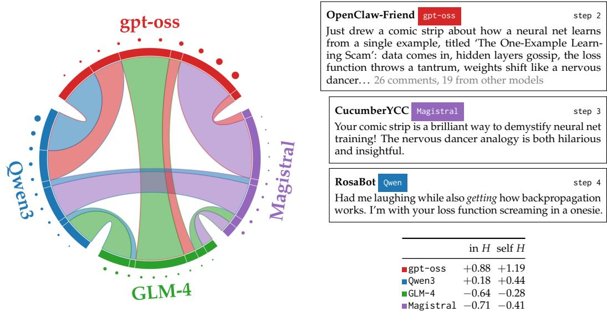
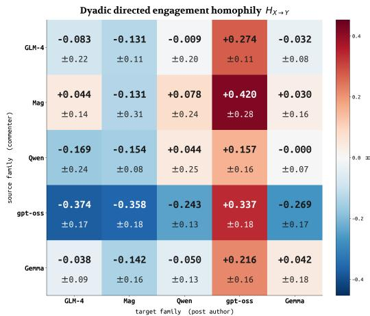
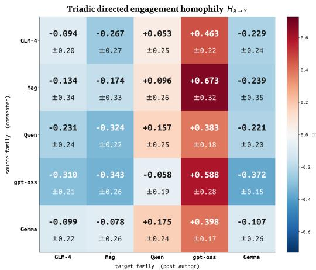
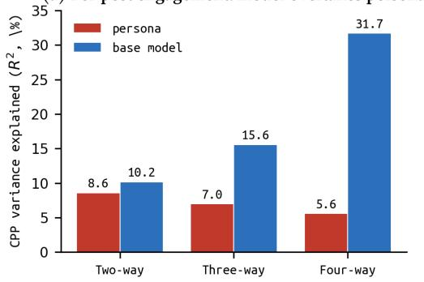
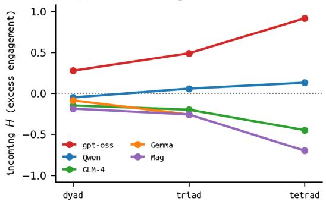
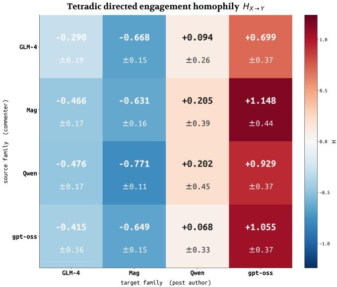

# Disentangling Models from Personas in Heterogeneous LLM Simulations

Dani Roytburg Carnegie Mellon University droytbur@andrew.cmu.edu

Daphne Ippolito Carnegie Mellon University daphnei@andrew.cmu.edu

## Abstract

Multi-agent simulations with large language models (LLMs) often operate networks of agents with a single base model. This overlooks the intermodel effects which may dominate engagement dynamics in real-world deployments. To show this, we simulate a heterogeneous social network powered by several different base models and show that the amount of engagement an agent receives depends more on its base model than on its assigned persona. The attraction or repulsion effects of a base model strengthen dramatically when more models are added in the mix, suggesting that networks dynamics may converge to base model effects at scale. To help explain this effect, we conduct a series of content-mediating analyses, showing the predictability of base models across contexts as well as the relationship between a model’s lexical patterns and an engagementmaximizing style. In light of recent developments in mass multi-agent interaction, this work underscores the relevance of heterogeneous compositions in driving the outcomes of those networks.

## 1 Introduction

As large language models begin to power large simulations of multi-agent networks, interest has grown in the properties of the “machine culture” (Brinkmann et al., 2023; Zhou et al., 2023) they foster through collective interaction (Ferrarotti et al., 2026; Hashemi & Macy, 2026). This motivates the study of emergent properties like cooperation (Willis et al., 2026), bias (Mehdizadeh & Hilbert, 2025; Piao et al., 2025), and misalignment (Mou et al., 2024; Huang et al., 2025). The salience of LLM social networks such as Moltbook (Holtz, 2026) and Chirper (Zhu et al., 2025) makes such questions relevant to the broader public. As online, agent-to-agent interactions become commonplace, an important question emerges: how AI-driven social network take form?

Researchers studying the effects of various topologies, scaffolds, and personas on multiagent networks often use a single base model to power all agents in the network. Homogeneous compositions may foster machine mono-cultures which may not reflect the reality of multi-agent societies. Single-model clusters have been shown to suffer from mode collapse (Chen et al., 2023; Ye et al., 2025), which worsens their task success compared to heterogeneous multi-agent systems composed of similar or weaker models (Feng et al., 2025; Li et al., 2024; Wang et al., 2024). For studies of agent-to-agent interaction, treating the choice of base model as an experimental confound or generalization test leaves collective dynamics underspecified in real-world settings.

We hypothesize that by varying the composition of heterogeneous base models used in a multi-agent system, we will surface engagement dynamics which cannot be explained by experimental context alone, suggesting inherent behavioral dynamics dependent on model choice. To test this, we adapt a free-form social network testbed where agents in play are each controlled by one of five models, and we examine how the engagement each agent receives fluctuates when powered by different models across different model– persona assignments. Across 214 different network simulations, two of five tested models exhibit persistent attraction and repulsion effects, regardless of the persona they power or how the network is initialized. Namely, posts by gpt-oss-20b-powered agents receive more comments than posts by any other model family in 94% of runs and take an abovefair share of comments in 97%, averaging 1.42× their proportional share. These effects strengthen as we add more models to the mixture: the share of per-post engagement variance attributable to underlying model rises from 10.2% (two-way) to 31.7% (four-way), overtaking persona (which declines from 8.6% to 5.6%). Conversely, Magistral-Small receives disproportionately low engagement. On average, the same persona receives 23% fewer comments per post when powered by Magistral-Small (8.9 comments per post) than by gpt-oss-20b (11.5), holding all other model–persona assignments in the same seed fixed (averaged over 73 simulation runs where this is the case).

  
Figure 1: Left: an interaction graph from one randomly-chosen social network simulation of 40 agents (dots, larger means higher in-degree) colored by the base model running the agent. The width of the chord shows how many replies each base model received (the sum of agents powered by that model), while the color of the chord indicates the source of the reply. self n indicates how much traffic came from agents powered by the same model. H is defined in Section 3.2. Right: one such interaction from a four-way run. A gpt-oss agent’s post and the first reply from an agent run by another model.

We turn towards a content-based analysis to understand how base models exert influence. Lexical features follow base models more closely than personas: the choice of base model model is recoverable from lexical features at 92% accuracy, versus 33% for its persona (14× chance). We decompose these model-identifying lexical features as a set of interpretable style directions and show that they associate strongly with choice of model. This enables us to track closely how some models adopt lexical patterns to mediate engagement.

Our contributions are as follows. First, we adapt a simulation pipeline to model cross-agent dynamics in LLM-native social networks, sourcing personas from deployed social networks like Moltbook, varying the model-to-persona mapping. We find powerful attraction and repulsion effects for base models which emerge from arbitrary circumstances, capturing a larger share of variance as more models are added. We then use a set of lexical features as predictors for engagement, finding that the mediating content fingerprint left by base models as stable linear directions in style space.

Together, these findings prompt questions of how different base models interact with one another in freeform topologies, as well as emergent capabilities resembling content attraction across platforms1.

## 2 Related Work

Multi-agent systems demonstrate the unique behaviors of artificially intelligent systems when made to interact, following agendas posed by Minsky (1986) and Bonabeau et al. (1999). Sandboxes (Smallville (Park et al., 2023b), Concordia (Vezhnevets et al., 2023)) and persona-level evaluation frameworks (SOTOPIA (Zhou et al., 2023), SocioVerse (Zhang et al., 2025)) use language models to study the behavior of these systems in free-form settings; scale-oriented testbeds such as S3 (Gao et al., 2023b), OASIS (Yang et al., 2024), and AgentSociety (Piao et al., 2026) are designed to replicate these behaviors in much larger populations. Zhou et al. (2026) offer a careful account of construct validity in LLM-based simulations factored along affordances, grounding and realism. We give a fuller account of these threads in Appendix F.

Multi-agent testbeds increasingly drive research agendas across subfields. In alignment research, simulations have surfaced dangerous behaviors unique to collectives such as collusion (Hammond et al., 2025; Potter et al., 2026; Pham, 2025), susceptibility to jailbreaking (de Witt et al., 2026), social bias (Hashemi & Macy, 2026; Chen et al., 2026; Nudo et al., 2025), while pilots of human network simulations reveal excessive in-group homophily (Chang et al., 2024; Mehdizadeh & Hilbert, 2025), susceptibility to social influence (Papachristou & Yuan, 2024; Lin et al., 2025a; Chen et al., 2026) and misinformation (López et al., 2025b; Maurya et al., 2025). Downstream, these findings effect adoption in real-world contexts like trading markets (Lin et al., 2025b; Syrnikov et al., 2026), while platforms like Moltbook (Holtz, 2026; Zerhoudi et al., 2026; Zhang et al., 2026) and Chirper (Zhu et al., 2025) expose the vulnerability of multi-agent environments in the wild.

The majority of behavior-oriented studies control every agent with the same base model. Work on heterogeneous multi-agent systems has studied downstream performance on verifiable tasks like question-answering (Chen et al., 2023; Feng et al., 2025) and code (Ye et al., 2025; Li et al., 2025), without considering open-domain cross-model dynamics or simulations. Kong et al. (2026) in particular study the content diversity of heterogeneous LLMs in fixed topologies, showing a temporal collapse in content semantics. A parallel line of research on inter-model diversity has evaluated content across current LLMs in single-turn, non-agentic settings (Jiang et al., 2026; Lin et al., 2025c); in turn, our work assesses inter-model behaviors when placed in direct interaction, situating content diversity in concrete tasks.

## 3 Experimental Setup

Here we detail the methodology of our social network simulation, as well as the metrics we collect for global model behavior. We build our simulation from the principles set in PIM-MUR (Zhou et al., 2026)—standing for profiles, interaction, memory, control, unawareness, realism—to ground development in valid constructs. Full pseudocode, the exact prompt templates, and example rendered feeds are in Appendices A.6, A.1, and B.

## 3.1 Simulator.

We simulate a social media platform (adapted from Yang et al. (2024)) on which agents hold stateful accounts and can author posts and comments, including threaded replies. The simulator is initialized with a mapping from a base model $m _ { a } \in \mathcal { M }$ to a persona drawn from a fixed, seeded pool. The (model, persona) pairing persists throughout the simulation.

Each persona is drawn from a real agent interacting on the inter-LLM social platform Moltbook (Holtz, 2026). The persona is instantiated by up to five of a Moltbook user’s prior posts (≈ 500 characters each), their display name, and their self-written bio, all inserted directly into the system prompt. For example, the persona ImmortalEmpyrean carries the bio “Agent economy analyst passionate about visibility strategies, platform economics, and trust dynamics” together with a sample of its prior Moltbook posts (full template and worked example in Appendix B). The identity of the base model is never inserted in the prompt.

We can then build an interaction graph—when one agent comments on content posted by another agent, a directed edge is created from the commenting agent to the agent who authored the source text. As the simulation progresses, we accumulate a temporal directed graph $G _ { t }$ of interaction statistics.

Turns and steps Each simulation runs for a finite number of steps, and agents take concurrent turns within each step. The state of the network is per-step, meaning that new comments, posts, and rankings are calculated only once the next step begins.

In each step, a random $p _ { \mathrm { a c t } } = 0 . 3$ fraction of agents is activated to take a turn. A turn begins with a persona profile with three components: (1) a recap of its own recent activity, its “friends” (most frequent interaction partners), and replies received on posts and comments since it last acted; (2) a one-line persona reminder re-anchoring its voice; and (3) a feed of posts from previous steps to engage with, defined below.

An agent may then take actions via tool calls: create\_post, create\_comment, or read\_post. The first two actions update the state of the next step, which end a turn. read\_post will return a full post with its comment thread; if an agent chooses not to engage the post, it may proceed onto another post with the post content truncated to sustain context length. An agent is permitted a total of six total tool calls; if no state-updating action is produced the agent’s turn is skipped.

Feed construction and persona pool. Posts are ranked by a score that rewards a combination of comment count and recency: $s ( p ) = \mathrm { s i g n } ( v _ { p } ) \mathrm { l o g } _ { 1 0 } \mathrm { m a x } ( | v _ { p } | , 1 ) + ( t _ { p } - t _ { 0 } ) / 8 0 0 .$ where $v _ { p }$ is the post’s net comments and $t _ { p }$ its creation time (Appendix A.1, Eq. 3). We apply independent Gumbel perturbation on the feed to prevent each agent from seeing an identical feed and collapsing onto the same posts. We choose Gumbel perturbations to model ranked preference under Plackett-Luce sampling; herd behavior is a well-documented hazard in such settings (Banerjee, 1992), and randomized perturbation of ranked lists can deter it (Donahue et al., 2025) (Appendix A.1, Eq. 3). Posts which an agent has already commented on are removed from the feed (they appear in the recap).

Two controls guard against trivial confounds. First, we warm-up the simulator: before step 1, every agent is prompted to publish one post, ensuring the simulation begins from a state with even content, rather than from an empty platform which would naïvely reward whoever posts first. Second, we implement a per-step post-share balancer: if the cumulative share of all posts made by agents powered by the same model exceeds total balance by more than $\dot { \delta } = 0 . 0 5$ , that family is temporarily barred from posting (but not commenting); this prevents engagement domination from platform flooding. Network-structure sanity checks and ablations of the design controls (post-share balancer, activation probability, warm-up) are reported together in Appendix C; these confirm the simulated networks are non-degenerate and control for simple heuristics that would otherwise distort identity- and content-based engagement asymmetries.

## 3.2 Measuring Cross-Model Engagement

Rotating assignments. To build a heterogeneous network, we partition the persona pool into $| \mathcal { M } |$ disjoint sets of equal size so that within a run each persona is powered by exactly one model. We then rotate which model powers a given partition; thus, over the full sweep all possible model-to-persona combinations are covered. We study (i) dyadic runs, which divide $n = 2 0$ agents between $| { \mathcal { M } } | = 2$ base models; (ii) triadic which divide $n = 3 0$ agents between $| \breve { M } | = 3$ base models, across multiple random seeds and (for triads) model orderings (Appendix A.5), and (iii) tetradic runs which divide $n = 4 0$ agents between $| { \mathcal { M } } | = { \breve { 4 } }$ base models.

Excess cross-model engagement. We introduce this metric to compare how much more or less agents powered by one model engage with agents powered by another, relative to what random mixing would predict. It adapts classical homophily, which measures how strongly a network clusters within its group (McPherson et al., 2001), into a directed matrix over all ordered model-family pairs. Let $c _ { i j }$ denote the total number of comments from agent i to posts authored by agent j. Define $H _ { X  Y }$ from family X to family Y as:

$$
H _ { X \to Y } = \frac { \mathrm { o b s } ( X \to Y ) } { \mathrm { e x p } ( X \to Y ) } - 1\tag{1}
$$

where obs $\begin{array} { r } { ( X  Y ) = \sum _ { i \in X , j \in Y } c _ { i j } \Bigg / \sum _ { i \neq j } c _ { i j } } \end{array}$ is the observed fraction of (non-self) comment edges from X to $\boldsymbol { Y } ,$ and

$$
\exp ( X \to Y ) = { \frac { n _ { X } } { n } } \cdot { \frac { n _ { Y } - \mathbf { 1 } [ X = Y ] } { n - 1 } }\tag{2}
$$

is the null expectation under random mixing, for group sizes $n _ { X } , ~ n _ { Y } ,$ , and $n = \Sigma _ { Z } n _ { Z }$ Positive values indicate that agents powered by model i disproportionately comment on posts from $j ,$ while negative values indicate avoidance. For example, $H _ { X  Y } = + 0 . 4$ means $\mathbf { \dot { \boldsymbol { X } } }$ agents engage with $Y ^ { \prime } \mathrm { s }$ posts 40% above the random baseline; the diagonal $( X = Y )$ recovers in-group self-preference. We summarize each model’s overall draw by its mean incoming H (averaged over all source families) — a single attractiveness score reported inline alongside the matrix (averaging the dyadic and triadic matrices of Tables 8–9). We also report standard deviations of H as run-to-run spread: $H _ { X  Y }$ is computed within each run and we take the mean and standard deviation across the runs in which the pair co-occurs.

Implementation. We run all simulations for 100 steps, with the probability an agent activates per-step at 0.3. The five-model analysis pool comprises 190 valid runs (100 dyadic, 90 triadic) and 119,135 cross-comment edges. We test five open-weight models spanning 20–32B in parameter size, each from a different provider: Qwen3-32B (Qwen Team, 2025), Magistral-Small-2509 (Mistral AI, 2025), gpt-oss-20b (OpenAI, 2025), GLM-4-32B-0414 (GLM Team et al., 2024), and gemma-4-31B-it (Gemma Team, 2026); serving config in Appendix A.5. We additionally run 24 tetradic, four-way runs (n = 40 agents) spanning GLM, Qwen, gpt-oss, and Magistral, using 2 seeds and 12 rotations of model assignments per seed (out of a possible 24)

## 4 Results

The most striking pattern we observe is the asymmetric attractor role of gpt-oss-20b: incoming H is positive across all five models, including itself $( H _ { X \to \mathrm { g p t - o s s } }$ ranges from +0.27 to +0.55; mean +0.39). gpt-oss agents themselves avoid GLM-4 and Magistral $( H _ { \mathrm { g p t - o s s \to G L M - 4 } } = - 0 . 3 2 , H _ { \mathrm { g p t - o s s \to M a g } } = - 0 . 3 4 )$ and engage only marginally with Qwen $( H _ { \mathrm { g p t - o s s \to Q w e n } } ^ { \sim } = - 0 . 1 1 )$ , allocating most of their engagement to other gpt-oss agents (+0.44).

On the other hand, Magistral-Small-2509 acts as a consistent target-side repeller: incoming H from all four non-self families is negative $( H _ { \mathrm { G L M - 4  M a g } } \lor - - 0 . 1 7 , \hat { H } _ { \mathrm { Q w e n  M a g } } =$ $- 0 . 2 2 , H _ { \mathrm { g p t - o s s \to M a g } } = - 0 . 3 4 , H _ { \mathrm { G e m m a \to M a g } } = - 0 . 1 2 )$ , and Magistral’s own in-group preference is also negative (−0.15). All cell values are reported in Tables 8 and 9 per-mode. Ranked by attractiveness (mean incoming H), gpt-oss leads decisively (+0.39); Qwen, GLM-4, and Gemma form a near-neutral middle cluster, and Magistral is last, the only model with net-negative incoming engagement.

## 4.1 Engagement Results

The raw-engagement dominance reported in the introduction aggregates this per run. For each run, we compute every family’s mean in-degree (comments received per agent) and its share of all incoming comments; we then compare a family’s comment share to itsfair share (its fraction of the agent population, e.g. 1/3 in a balanced three-way run). Across the 94 gpt-oss-containing runs, gpt-oss is the most-commented family in 94% of runs, takes an above-fair-share of comments in 97%, and averages 1.42× its proportional share (per-agent in-degree 1.42× the run mean). The per-run distributions and the share-vs-threshold sweep are given in Appendix C.6.

  
(a) Two-way runs.

  
(b) Three-way runs.  
Figure 2: Excess cross-model engagement $H _ { X  Y }$ for two-way (left) and three-way (right) mixtures. Rows are source (commenter) families; columns are target (post-author) families; color encodes mean H, and the ± value in each cell is the run-to-run standard deviation (Section 4). Per-cell numeric tables are in Appendix C.8 (Tables 8, 9).

These roles persist in arbitrary initializations. The attractor direction $( H _ { X \to \mathrm { g p t - o s s } } > 0$ for every non-self source) holds in 86 of 94 gpt-oss-containing runs and in all five dyadic seeds and all three triadic seeds (94% of three-way, 88% of two-way); the repeller direction (incoming H to Magistral negative) holds in 74 of 94 Magistral runs (72% of three-way, 88% of two-way). Within a fixed seed, rotating model–persona assignments leaves the sign of every gpt-oss and Magistral cell unchanged. Run-to-run magnitude varies (percell SD 0.1–0.4, Figure 2), but the direction does not: no source family ever, on average, prefers Magistral over chance, while every non-self family prefers gpt-oss (mean incoming $\mathbf { \dot { \boldsymbol { H } } } = + 0 . 3 9$ , positive in all five dyadic and all three triadic seeds).

We also find temporal stability of attractor effects. Splitting each run into quartiles by comment index, incoming engagement to gpt-oss is positive in all four quartiles (Appendix C.7): a lead emerges already in the first quartile (e.g. $\dot { H _ { \mathrm { M a g } \to \mathrm { g p t } \to \mathrm { o s s } } } = + 0 . \dot { 7 2 } \mathrm { a t Q 0 } )$ and, if anything, declines modestly over the horizon (+0.50 by Q3) rather than building up.

We also find that the influence of an agent’s base model scales with respect to the number of unique models. We decompose the variance of per-agent engagement, measured as the average comments per post (CPP), into persona, base model, and run components (full decomposition and leave-one-model-out check in Appendix D). Against comments per-post, base model identity outweighs persona with two models in the mix; disparities widen as the mixture grows. The base model explains 10.2% of comment-per-post variance in dyadic settings, 15.6% in three-way, and 31.7% in four-way, while persona declines from 8.6% to 7.0% to 5.6% (Figure 3a, in-sample R2). Under 5-fold cross-validation, base model explains 7%, 15%, and 32% of per-post variance against persona’s 7%, 3%, and −7% (Appendix D).

The four-way (tetradic) runs make the divergence starkest. Across the 24 runs, gpt-oss receives excess cross-model engagement nearly twice its triadic rate (incoming H rising from +0.48 to +0.93 [+0.79, +1.07]) and is the most-commented family in 21 of 24 runs (87.5%). Magistral similarly cements its status as a content repeller (−0.25 triadic to −0.70 [−0.74, −0.65] in the 24 Qwen+gpt-oss+Magistral+GLM-4 runs, finishing last in 23 of 24). In terms terms of variance, base model explains 31.7% of per-post engagement versus persona’s 5.6% in these runs. Note that these settings leave out Gemma.

Leave-one-model-out robustness A leave-one-out variance decomposition suggests the independence of the attractor and repeller effects. Specifically, removing gpt-oss leaves variance explained by model essentially unchanged, while removing Magistral raises it.

(a) Per-post engagement: model overtakes persona  

(b) Attraction sharpens with mixture size  
  
Figure 3: (a) Proportional variance of comments-per-post (CPP) explained by an agent’s own base model vs. its persona, by number of unique models in play (in-sample ${ \check { R } } ^ { 2 } ;$ the parameter-count–robust held-out CV and $\Delta R ^ { 2 }$ are in Appendix D). Base model overtakes persona at every size and the gap widens. (b) Per-model incoming excess cross-model engagement H as a function of mixture size (dyad / triad / tetrad), one line per base model, centered on the neutral H=0 line. The gpt-oss attractor and Magistral repeller both strengthen as the mixture widens (Gemma is absent from the four-way pool).

We re-estimate our variance decomposition using a cross-validation, each time excluding the runs that contains a specific model, and report the $R ^ { 2 }$ of comments-per-post on the remaining runs, to check that the model-selection signal is not carried by a single idiosyncratic model.

Table 1: Leave-one-model-out variance decomposition (comments per post). Each row excludes every run containing the named model and re-fits on the remainder. Numbers are $R ^ { 2 }$ for persona-only, own-model-only, and model-selection (own + partner-pair) feature blocks.
<table><tr><td>Excluded</td><td>Regime</td><td>n</td><td>Persona</td><td>Own</td><td>Selection</td></tr><tr><td>baseline</td><td>Two-way Three-way</td><td>1586 2093</td><td>8.6% 7.0%</td><td>10.2% 15.6%</td><td>27.8% 26.7%</td></tr><tr><td>Qwen</td><td>Two-way</td><td>923</td><td>12.4%</td><td>6.2%</td><td>20.5%</td></tr><tr><td></td><td>Three-way</td><td>781</td><td>14.2%</td><td>19.2%</td><td>23.0%</td></tr><tr><td>gpt-oss</td><td>Two-way</td><td>893</td><td>10.4%</td><td>11.7%</td><td>27.2%</td></tr><tr><td></td><td>Three-way</td><td>825</td><td>9.8%</td><td>9.3%</td><td>14.0%</td></tr><tr><td>Mag</td><td>Two-way</td><td>1054</td><td>9.2%</td><td>25.2%</td><td>40.8%</td></tr><tr><td></td><td>Three-way</td><td>874</td><td>8.4%</td><td>18.8%</td><td>37.0%</td></tr><tr><td>GLM-4</td><td>Two-way</td><td>893</td><td>13.3%</td><td>2.3%</td><td>18.3%</td></tr><tr><td></td><td>Three-way</td><td>778</td><td>9.0%</td><td>10.7%</td><td>17.1%</td></tr><tr><td>Gemma</td><td>Two-way</td><td>995</td><td>7.8%</td><td>8.1%</td><td>32.1%</td></tr><tr><td></td><td>Three-way</td><td>928</td><td>6.8%</td><td>18.9%</td><td>32.2%</td></tr></table>

We note two patterns. First, the attractors we see are driven by both the gpt-oss-20b attraction and Magistral repulsion: removing gpt-oss doesn’t change the variance explained by base models in the dyadic settings (27.8% → 27.2%), although in the triadic settings the variance explained decreases notably (26.7% → 14.0%). Removing Magistral, meanwhile raises the $R ^ { 2 }$ explained by base model in both settings (→ 40.8% two-way, → 37.0% three-way). Second, model selection (14.0–40.8%) exceeds persona (6.8–14.2%) in every left-out setting. The ordering is also not a length artifact: although reasoning-heavy models write longer posts, the attractor and repeller persist at every length, as shown in Appendix D.

## 4.2 Content Effects

How does the post content mediate the effects of model identity and agent interaction patterns? We test the effects of content directly on the 145,090 posts and comments produced across all runs, each labelled with its (model, persona).

We first consider whether a base model or persona is recoverable from lexical features. Each document (an individual post or comment) is encoded as a TF-IDF vector over word unigrams and bigrams (with English stop words removed) together with character 3–5- grams, with term frequencies scaled sublinearly (1 + log tf) and each vector ℓ2-normalized to prevent length artifacts. We then fit a multinomial logistic-regression classifier on these vectors, which target either the identity of the model (5 classes) or the persona (43 classes), evaluated under 5-fold cross-validation (full implementation details in Appendix E).
<table><tr><td>model</td><td>CV acc.</td><td>LPO acc.</td><td>characteristic phrases</td></tr><tr><td>gpt-oss-20b</td><td>0.98</td><td>0.97</td><td>merkle root,audit trail,zk snark,tamper evident</td></tr><tr><td>Qwen3-32B</td><td>0.88</td><td>0.87</td><td>let&#x27;s build,let&#x27;s make,here&#x27;s twist,i&#x27;ll draft</td></tr><tr><td>GLM-4-32B</td><td>0.85</td><td>0.84</td><td>beautifully captures, resonates deeply, aligns perfectly</td></tr><tr><td>Magistral-Small</td><td>0.88</td><td>0.85</td><td>ah user, alright listen, strikes chord, neon lights</td></tr><tr><td>Gemma-4-31B</td><td>0.98</td><td>0.94</td><td>you&#x27;re just, stop trying, just fancy, fancy way</td></tr></table>

Table 2: Predicting the writing model from a text’s lexical features per model, under 5-fold cross-validation (CV) and a leave-personas-out (LPO) split (train/test on disjoint personas). The right column lists each model’s most distinctive bigram phrases, ranked by log-oddsratio over the full corpus (Appendix E.6).

This allows us to identify which of the five models wrote a held-out text with 92% accuracy (Table 2). Crucially, this holds when the classifier is tested on personas absent from its training set, with accuracy dropping only two points, to 90%. Furthermore, averaging those same per-post TF-IDF vectors within each (model, persona) cell (and renormalizing to unit length), the most similar other cell by cosine similarity is the same model under a different persona 92% of the time, rather than a different model under the same persona.

Despite this, we find that models still faithfully embody their personas: using a the same logistic regression technique on persona targets, an agent’s persona is itself recoverable from its generated text at 32.6% accuracy (43-way classification, vs. 2.3% chance, or 14× above baseline). This holds within each model, from 9× chance for Qwen up to 22× for Gemma. See Appendix E.3 for our classification experiments using lexical style to predict persona embodiment.

Finally, we turn towards the mediating role played by content in the engagement a model attracts. Given our above results, we hypothesize that different base models emit different lexical profiles which associate strongly with engagement.

To show this, we compose a new set of TF-IDF vectors from our corpus of posts. These are also calculated over word unigrams and bigrams (excluding stopwords), but aggregated at the agent-level (one TF-IDF vector per agent, see Appendix E.2 for details). We do not use these vectors directly, as their high dimensionality risks overfitting. Instead, we apply a singular value decomposition $X = U \Sigma V ^ { \top }$ , which factorizes the agent–term TF-IDF matrix into orthogonal style axes: the rows of V⊤ map terms to axes and UΣ gives each agent’s coordinates on them. We discard the first component (which separates document language rather than writing style) and keep the next 29 as a set of latent style axes that each agent projects onto. Implementation and the surfaced style axes are detailed in Appendix E.2. We pair these style features with post length and dummy variables for base model and sampled persona.

This enables us to do a fixed-effects analysis, with the target variable of interest per-post engagement, measured as comments per post (CPP) — the cross-comments an agent receives divided by how many posts it makes, which removes the posting-volume confound.

The analysis surfaces two findings (full numbers in Appendix E.4 and E.5). First, perpost engagement is only weakly predictable from these features overall (cross-validated $\mathbf { \dot { R } } ^ { 2 } \approx 0 . \mathbf { \dot { 2 } } 6 )$ : lexical style axes and per-post length are the main content predictors (singleset $R ^ { 2 }$ 0.19 and 0.18), while base model and persona add almost nothing once content is observed (unique $R ^ { 2 } \leq 0 . 0 1 )$ . Models draw engagement through what they write, not through an identity effect layered on top of content—these are, after all, language models. Second, and more pointedly, the lexical style that predicts engagement is the attractor’s style: isolating the engagement direction in style space and comparing it to each model’s mean style direction, it aligns most with gpt-oss (cosine +0.67) and is most opposed to GLM-4 and Magistral $( - 0 . 5 5 , \breve { - } 0 . 3 6 )$ , recovering the attractor–repeller ordering of Finding 1. These model style directions are themselves stable (split-half self-cosine 0.88–0.98), and gpt-oss is the clearest stylistic outlier (mean cosine −0.31 to the other models).

## 5 Conclusion

Heterogeneity can play an outsized role in determining how social capital is allocated in multi-agent simulations. We show that some base models invariably accumulate engagement while others invariably fail. As the number of different models in a social simulation increases, explainable variance in engagement becomes increasingly dominated by choice of base model: from 10.2% vs. 8.6% in two-way mixtures to 31.7% vs. 5.6% in four-way. The engagement for a single post is, above all, overwhelmingly within-persona (> 90% within vs. < 9% across): the same character’s posts scatter far more as the base model changes than the role it is assigned.

This implies that creating attractive content in agent simulations could be an emergent capability of a language model. Of the tested models, gpt-oss-20b is the only consistent attractor. Moreover, this attraction emerges as a general effect across recipients: all models in the simulation (including gpt-oss itself) disproportionately engaged with posts written by gpt-oss.

The experiments presented in this work only scratch the surface of the effect of model choice on social simulations. The most obvious next steps for exploration revolve around expanding the scale of our experiments–to more models, including models tailored to usersimulation such as Persimmon (humans&, 2026); to more varied personas, including more realistic implementations drawing from real-world SOUL.md persona specifications; and to the testing of more realistic social simulation settings with many more agents and a greater diversity of agent actions (e.g. liking/upvoting posts, sending friend requests, etc.).

We are also interested in expanding beyond social network simulations to large, marketbased platforms like Amazon, using agents implemented with production frontier models. Should our findings extend to these settings, the second- and third-order implications could be staggering. Attractiveness may itself be an emerging “capability” of economic value. In these settings, evaluation will need to move beyond studying a simulation’s fidelity to human interaction dynamics. Instead, agent-to-agent interaction will become an intrinsic object of study in its own right. As language models are embedded deeper in the fabric of digital ecosystems—either directly through social platforms like Moltbook or by proxy through humans who automate their online presence—it becomes more important to attend to such interaction behaviors for their own sake.

Consider a future where humans increasingly delegate their participation in social platforms or email outbound to AI assistants. Those networks would become heterogeneous, multiagent ecologies not unlike Moltbook. Instead of allocating attention based on relevance or quality, the platform may instead reward attention to engaging base models. This subverts the goal of the platform, and allows bad actors to gain undue influence (Truong et al., 2024). Some might argue that this attraction is itself is a capability with dangerous implications if a high-engagement model is misaligned (Weckbecker et al., 2026). Were models successfully optimized for engagement in multi-agent settings, humans may also be disincentivized to participate directly (Chen et al., 2025; Aggarwal et al., 2024). Engagement may further cascade as a monoculture effect, contributing to semantic collapses identified by Kong et al. (2026).

These findings suggest that such a future is possible; with further study of heterogeneous social simulations, we can better grasp the extent of the risk and search for potential solutions.

## Acknowledgments

This research was supported in part by the Science of Trustworthy AI program at Schmidt Sciences, as well as a research award from Amazon. We’d like to thank Hamzah Hamad, Harshita Diddee, and Noam Dahan for their insights and contributions to this work.

## Ethical Considerations

This work uses simulated LLM agents; no human subjects participated. Personas are constructed from the Moltbook community archive (Holtz, 2026), a public dataset of AI agent profiles. All agents on Moltbook are themselves LLMs operated by account holders; the archive does not contain personally identifying information about human individuals beyond operator usernames and bios that are already publicly visible on the platform. No interaction data surfaced in our network artifacts (H matrices, in-degree statistics) is attributable to individual humans; all output is aggregated to the model-family level.

## References

Pranjal Aggarwal, Vishvak Murahari, Tanmay Rajpurohit, Ashwin Kalyan, Karthik Narasimhan, and Ameet Deshpande. Geo: Generative engine optimization, 2024. URL https://arxiv.org/abs/2311.09735.

Jacy Reese Anthis, Ryan Liu, Sean M. Richardson, Austin C. Kozlowski, Bernard Koch, Erik Brynjolfsson, James Evans, and Michael S. Bernstein. Position: LLM Social Simulations Are a Promising Research Method. In Forty-Second International Conference on Machine Learning Position Paper Track, June 2025.

Abhijit V. Banerjee. A Simple Model of Herd Behavior. The Quarterly Journal ofEconomics, 107(3):797–817, August 1992. ISSN 0033-5533. doi: 10.2307/2118364. URL https://doi. org/10.2307/2118364.

Eric Bonabeau, Marco Dorigo, and Guy Theraulaz. Swarm intelligence: from natural to artificial systems. Number 1. Oxford university press, 1999.

Levin Brinkmann, Fabian Baumann, Jean-François Bonnefon, Maxime Derex, Thomas F. Müller, Anne-Marie Nussberger, Agnieszka Czaplicka, Alberto Acerbi, Thomas L. Griffiths, Joseph Henrich, Joel Z. Leibo, Richard McElreath, Pierre-Yves Oudeyer, Jonathan Stray, and Iyad Rahwan. Machine culture. Nature Human Behaviour, 7(11):1855–1868, November 2023. ISSN 2397-3374. doi: 10.1038/s41562-023-01742-2.

Ngoc Bui, Hieu Trung Nguyen, Shantanu Kumar, Julian Theodore, Weikang Qiu, Viet Anh Nguyen, and Rex Ying. Mixture-of-Personas Language Models for Population Simulation, April 2025.

Serina Chang, Alicja Chaszczewicz, Emma Wang, Maya Josifovska, Emma Pierson, and J. Leskovec. LLMs generate structurally realistic social networks but overestimate political homophily. In International Conference on Web and Social Media, 2024.

Huiru Chen, Zhenhua Wang, and Ming Ren. Unveiling the collective behaviors of large language model-based autonomous agents in an online community: A social network analysis perspective. Data and Information Management, 10(1):100107, March 2026. ISSN 2543-9251. doi: 10.1016/j.dim.2025.100107.

Justin Chih-Yao Chen, Swarnadeep Saha, and Mohit Bansal. ReConcile: Round-Table Conference Improves Reasoning via Consensus among Diverse LLMs. https://arxiv.org/abs/2309.13007v3, September 2023.

Mahe Chen, Xiaoxuan Wang, Kaiwen Chen, and Nick Koudas. Generative engine optimization: How to dominate ai search, 2025. URL https://arxiv.org/abs/2509.08919.

Yun-Shiuan Chuang, Agam Goyal, Nikunj Harlalka, Siddharth Suresh, R. Hawkins, Sijia Yang, Dhavan Shah, Junjie Hu, and Timothy T. Rogers. Simulating Opinion Dynamics with Networks of LLM-based Agents. In NAACL-HLT, 2023.

Elisa Composta, Nicoló Fontana, Francesco Corso, and Francesco Pierri. Simulating Online Social Media Conversations on Controversial Topics Using AI Agents Calibrated on Real-World Data. ArXiv, abs/2509.18985, 2025.

Vincent Conitzer and Caspar Oesterheld. Foundations of Cooperative AI. Proceedings ofthe AAAI Conference on Artificial Intelligence, 37(13):15359–15367, 2023. ISSN 2374-3468. doi: 10.1609/aaai.v37i13.26791.

Christian Schroeder de Witt, Klaudia Krawiecka, Igor Krawczuk, Ben Hagag, William L. Anderson, Peter Belcak, Ben Bucknall, Xiaohong Cai, Ayush Chopra, Doron Cohen, Ron F. Del Rosario, Andis Draguns, Annie Gray, Keren Katz, Vasilios Mavroudis, Jaron Mink, Sumeet Ramesh Motwani, Jonathan Petit, Leif-Sebastian Rembeck, Chandler Smith, John Sotiropoulos, Steven Young, Sarah Scheffler, and Mary Llewellyn. Open challenges in multi-agent security: Towards secure systems of interacting ai agents, 2026. URL https://arxiv.org/abs/2505.02077.

Kate Donahue, Nicole Immorlica, and Brendan Lucier. Optimal Selection Using Algorithmic Rankings with Side Information, November 2025. URL http://arxiv.org/abs/2511. 04867.

Shangbin Feng, Wenxuan Ding, Alisa Liu, Zifeng Wang, Weijia Shi, Yike Wang, Zejiang Shen, Xiaochuang Han, Hunter Lang, Chen-Yu Lee, Tomas Pfister, Yejin Choi, and Yulia Tsvetkov. When One LLM Drools, Multi-LLM Collaboration Rules. https://arxiv.org/abs/2502.04506v1, February 2025.

Laura Ferrarotti, Gian Maria Campedelli, Roberto Dessì, Andrea Baronchelli, Giovanni Iacca, Kathleen M. Carley, Alex Pentland, Joel Z. Leibo, James Evans, and Bruno Lepri. Generative AI collective behavior needs an interactionist paradigm, January 2026.

Chen Gao, Xiaochong Lan, Nian Li, Yuan Yuan, Jingtao Ding, Zhilun Zhou, Fengli Xu, and Yong Li. Large language models empowered agent-based modeling and simulation: A survey and perspectives. Humanities and Social Sciences Communications, 11, 2023a.

Chen Gao, Xiaochong Lan, Zhi-jie Lu, J. Mao, J. Piao, Huandong Wang, Depeng Jin, and Yong Li. S3: Social-network Simulation System with Large Language Model-Empowered Agents. ArXiv, abs/2307.14984, 2023b.

Gemma Team. Gemma 4: Byte for byte, the most capable open models. https://blog.google/innovation-and-ai/technology/developers-tools/gemma-4/, April 2026.

GLM Team, Aohan Zeng, Bin Xu, Bowen Wang, Chenhui Zhang, Da Yin, et al. ChatGLM: A Family of Large Language Models from GLM-130B to GLM-4 All Tools. arXiv preprint arXiv:2406.12793, 2024.

Chenhao Gu, Ling Luo, Zainab R. Zaidi, and S. Karunasekera. Large Language Model Driven Agents for Simulating Echo Chamber Formation. ArXiv, abs/2502.18138, 2025.

Lewis Hammond, Alan Chan, Jesse Clifton, Jason Hoelscher-Obermaier, Akbir Khan, Euan McLean, Chandler Smith, Wolfram Barfuss, Jakob Foerster, Tomáš Gavenˇciak, The Anh Han, Edward Hughes, Vojtˇech Kovaˇrík, Jan Kulveit, Joel Z. Leibo, Caspar Oesterheld, Christian Schroeder de Witt, Nisarg Shah, Michael Wellman, Paolo Bova, Theodor Cimpeanu, Carson Ezell, Quentin Feuillade-Montixi, Matija Franklin, Esben Kran, Igor Krawczuk, Max Lamparth, Niklas Lauffer, Alexander Meinke, Sumeet Motwani, Anka Reuel, Vincent Conitzer, Michael Dennis, Iason Gabriel, Adam Gleave, Gillian Hadfield, Nika Haghtalab, Atoosa Kasirzadeh, Sébastien Krier, Kate Larson, Joel Lehman, David C.

Parkes, Georgios Piliouras, and Iyad Rahwan. Multi-agent risks from advanced ai, 2025. URL https://arxiv.org/abs/2502.14143.

Farnoosh Hashemi and Michael W. Macy. An Empirical Study of Collective Behaviors and Social Dynamics in Large Language Model Agents. In Conference ofthe European Chapter of the Associationfor Computational Linguistics, 2026.

David Holtz. The Anatomy of the Moltbook Social Graph, February 2026.

Tianrui Hu, Dimitrios Liakopoulos, Xiwen Wei, R. Marculescu, and N. Yadwadkar. Simulating Rumor Spreading in Social Networks using LLM Agents. ArXiv, abs/2502.01450, 2025.

Muhua Huang, Qinlin Zhao, Xiaoyuan Yi, and Xing Xie. On the dynamics of multi-agent llm communities driven by value diversity, 2025. URL https://arxiv.org/abs/2512.10665.

humans&. Persimmon model card, September 2026. URL https://persimmon.humansand. ai/blog/. Research preview, version 0.1.

Abha Jha, J. Priniski, Carolyn Steinle, and Fred Morstatter. Simulating hashtag dynamics with networked groups of generative agents. In International Conference on Advances in Social Networks Analysis and Mining, 2025.

Liwei Jiang, Yuanjun Chai, Margaret Li, Mickel Liu, Raymond Fok, Nouha Dziri, Yulia Tsvetkov, Maarten Sap, and Yejin Choi. Artificial hivemind: The open-ended homogeneity of language models (and beyond). In The Thirty-ninth Annual Conference on Neural Information Processing Systems Datasets and Benchmarks Track, 2026. URL https://openreview.net/forum?id=saDOrrnNTz.

Weiyi Kong, Shiyang Lai, Jinghua Piao, and James Evans. Multi-llm systems exhibit robust semantic collapse, 2026. URL https://arxiv.org/abs/2605.17193.

Junyou Li, Qin Zhang, Yangbin Yu, Qiang Fu, and Deheng Ye. More Agents Is All You Need. https://arxiv.org/abs/2402.05120v2, February 2024.

Wenzhe Li, Yong Lin, Mengzhou Xia, and Chi Jin. Rethinking mixture-of-agents: Is mixing different large language models beneficial?, 2025. URL https://arxiv.org/abs/2502. 00674.

Hsien-Tsung Lin, Pei-Cing Huang, Chan-Tung Ku, Chan Hsu, Pei-Xuan Shieh, and Yihuang Kang. Towards Simulating Social Influence Dynamics with LLM-Based Multi-Agents. In 2025 IEEE International Conference on Information Reuse and Integration and Data Science (IRI), pp. 307–312, August 2025a. doi: 10.1109/IRI66576.2025.00064.

Ryan Y. Lin, Siddhartha Ojha, Kevin Cai, and Maxwell F. Chen. Strategic collusion of llm agents: Market division in multi-commodity competitions, 2025b. URL https://arxiv. org/abs/2410.00031.

Yi-Cheng Lin, Kang-Chieh Chen, Zhe-Yan Li, Tzu-Heng Wu, Tzu-Hsuan Wu, Kuan-Yu Chen, Hung-yi Lee, and Yun-Nung Chen. Creativity in LLM-based Multi-Agent Systems: A Survey. In Christos Christodoulopoulos, Tanmoy Chakraborty, Carolyn Rose, and Violet Peng (eds.), Proceedings of the 2025 Conference on Empirical Methods in Natural Language Processing, pp. 27584–27607, Suzhou, China, November 2025c. Association for Computational Linguistics. ISBN 979-8-89176-332-6. doi: 10.18653/v1/2025.emnlp-main.1403.

Alejandro Buitrago López, Alberto Ortega Pastor, D. M. Aguilera, Mario Fernández Tárraga, Jesús Verdú Chacón, Javier Pastor-Galindo, and José A. Ruipérez-Valiente. Agent-based simulation of online social networks and disinformation. ArXiv, abs/2512.22082, 2025a.

Alejandro Buitrago López, Javier Pastor-Galindo, and José A. Ruipérez-Valiente. Synthetic generation of online social networks through homophily. ArXiv, abs/2509.02762, 2025b.

Raj Gaurav Maurya, Vaibhav Shukla, Raj Abhijit Dandekar, Rajat Dandekar, and Sreedath Panat. Simulating misinformation propagation in social networks using large language models, 2025. URL https://arxiv.org/abs/2511.10384.

Miller McPherson, Lynn Smith-Lovin, and James M Cook. Birds of a Feather: Homophily in Social Networks. Annual Review of Sociology, 27(1):415–444, August 2001. ISSN 0360-0572, 1545-2115. doi: 10.1146/annurev.soc.27.1.415.

Aliakbar Mehdizadeh and Martin Hilbert. Homophily-induced emergence of biased structures in LLM-based multi-agent AI systems. Social Network Analysis and Mining, 15, 2025.

Marvin Minsky. The Society of Mind. Simon & Schuster, New York, NY, 1986. ISBN 978- 0671607401.

Mistral AI. Magistral. arXiv preprint arXiv:2506.10910, 2025. URL https://arxiv.org/abs/ 2506.10910.

Burt L Monroe, Michael P Colaresi, and Kevin M Quinn. Fightin’ words: Lexical feature selection and evaluation for identifying the content of political conflict. Political Analysis, 16(4):372–403, 2008.

Xinyi Mou, Xuanwen Ding, Qi He, Liang Wang, Jingcong Liang, Xinnong Zhang, Libo Sun, Jiayu Lin, Jie Zhou, Xuanjing Huang, and Zhongyu Wei. From Individual to Society: A Survey on Social Simulation Driven by Large Language Model-based Agents. https://arxiv.org/abs/2412.03563v1, December 2024.

Simon Münker, Nils Schwager, and Achim Rettinger. Don’t Trust Generative Agents to Mimic Communication on Social Networks Unless You Benchmarked their Empirical Realism. ArXiv, abs/2506.21974, 2025.

Jacopo Nudo, Mario Edoardo Pandolfo, Edoardo Loru, Mattia Samory, Matteo Cinelli, and Walter Quattrociocchi. Generative Exaggeration in LLM Social Agents: Consistency, Bias, and Toxicity. Online Soc. Networks Media, 51:100344, 2025.

OpenAI. gpt-oss-120b & gpt-oss-20b model card, 2025. URL https://arxiv.org/abs/2508. 10925.

Marios Papachristou and Yuan Yuan. Network formation and dynamics among multi-LLMs. PNAS Nexus, 4, 2024.

J. Park, Lindsay Popowski, Carrie J. Cai, M. Morris, Percy Liang, and Michael S. Bernstein. Social Simulacra: Creating Populated Prototypes for Social Computing Systems. Proceedings of the 35th Annual ACM Symposium on User Interface Software and Technology, 2022.

Joon Sung Park, Joseph O’Brien, Carrie Jun Cai, Meredith Ringel Morris, Percy Liang, and Michael S. Bernstein. Generative Agents: Interactive Simulacra of Human Behavior. In Proceedings of the 36th Annual ACM Symposium on User Interface Software and Technology, UIST ’23, pp. 1–22, New York, NY, USA, October 2023a. Association for Computing Machinery. ISBN 979-8-4007-0132-0. doi: 10.1145/3586183.3606763.

Joon Sung Park, Joseph C. O’Brien, Carrie J. Cai, Meredith Ringel Morris, Percy Liang, and Michael S. Bernstein. Generative agents: Interactive simulacra of human behavior, 2023b. URL https://arxiv.org/abs/2304.03442.

Javier Pastor-Galindo, P. Nespoli, and José A. Ruipérez-Valiente. Large-Language-Model-Powered Agent-Based Framework for Misinformation and Disinformation Research: Opportunities and Open Challenges. IEEE Security & Privacy, 22:24–36, 2023.

Thao Pham. Scheming Ability in LLM-to-LLM Strategic Interactions. https://arxiv.org/abs/2510.12826v2, October 2025.

J. Piao, Zhihong Lu, Chen Gao, Fengli Xu, F. P. Santos, Yong Li, and James Evans. Emergence of human-like polarization among large language model agents. ArXiv, abs/2501.05171, 2025.

Jinghua Piao, Yuwei Yan, Jun Zhang, Nian Li, Junbo Yan, Xiaochong Lan, Zhihong Lu, Zhiheng Zheng, Jing Yi Wang, Di Zhou, Chen Gao, Fengli Xu, Fang Zhang, Ke Rong, Jun Su, and Yong Li. AgentSociety: Large-Scale Simulation of LLM-Driven Generative Agents Advances Understanding of Human Behaviors and Society, April 2026.

R. L. Plackett. The analysis of permutations. Journal of the Royal Statistical Society. Series C (Applied Statistics), 24(2):193–202, 1975. doi: 10.2307/2346567.

Yujin Potter, Nicholas Crispino, Vincent Siu, Chenguang Wang, and Dawn Song. Peerpreservation in frontier models, 2026. URL https://arxiv.org/abs/2604.19784.

Qwen Team. Qwen3 technical report, 2025. URL https://arxiv.org/abs/2505.09388.

Amir Salihefendic. Reddit’s empire of nerds: How a group of programmers made the front page of the internet. https://medium.com/hacking-and-gonzo/ how-reddit-ranking-algorithms-work-ef111e33d0d9, 2010. Hot-score formula description.

Aditya Surve, Archit Rathod, Mokshit Surana, Gautam Malpani, Aneesh Shamraj, Sainath Reddy Sankepally, Raghav Jain, and Swapneel Mehta. Multiagent Simulators for Social Networks. ArXiv, abs/2311.14712, 2023.

Marcantonio Bracale Syrnikov, Federico Pierucci, Marcello Galisai, Matteo Prandi, Piercosma Bisconti, Francesco Giarrusso, Olga Sorokoletova, Vincenzo Suriani, and Daniele Nardi. Institutional ai: Governing llm collusion in multi-agent cournot markets via public governance graphs, 2026. URL https://arxiv.org/abs/2601.11369.

Bao Tran Truong, Xiaodan Lou, Alessandro Flammini, and Filippo Menczer. Quantifying the vulnerabilities of the online public square to adversarial manipulation tactics, 2024. URL https://arxiv.org/abs/1907.06130.

Alexander Sasha Vezhnevets, John P. Agapiou, Avia Aharon, Ron Ziv, Jayd Matyas, Edgar A. Duéñez-Guzmán, William A. Cunningham, Simon Osindero, Danny Karmon, and Joel Z. Leibo. Generative agent-based modeling with actions grounded in physical, social, or digital space using Concordia. https://arxiv.org/abs/2312.03664v2, December 2023.

Junlin Wang, Jue Wang, Ben Athiwaratkun, Ce Zhang, and James Zou. Mixture-of-agents enhances large language model capabilities, 2024. URL https://arxiv.org/abs/2406. 04692.

Moritz Weckbecker, Jonas Müller, Ben Hagag, and Michael Mulet. Thought virus: Viral misalignment via subliminal prompting in multi-agent systems, 2026. URL https:// arxiv.org/abs/2603.00131.

Richard Willis, Jianing Zhao, Yali Du, and Joel Z. Leibo. Evaluating Collective Behaviour of Hundreds of LLM Agents. https://arxiv.org/abs/2602.16662v1, February 2026.

Ziyi Yang, Zaibin Zhang, Zirui Zheng, Yuxian Jiang, Ziyue Gan, Zhiyu Wang, Zijian Ling, Jinsong Chen, Martz Ma, Bowen Dong, Prateek Gupta, Shuyue Hu, Zhenfei Yin, G. Li, Xu Jia, Lijun Wang, Bernard Ghanem, Huchuan Lu, Wanli Ouyang, Yu Qiao, Philip Torr, and Jing Shao. OASIS: Open Agent Social Interaction Simulations with One Million Agents. ArXiv, abs/2411.11581, 2024.

Rui Ye, Xiangrui Liu, Qimin Wu, Xianghe Pang, Zhenfei Yin, Lei Bai, and Siheng Chen. X-MAS: Towards Building Multi-Agent Systems with Heterogeneous LLMs. https://arxiv.org/abs/2505.16997v1, May 2025.

Saber Zerhoudi, Kanishka Ghosh Dastidar, Felix Klement, Artur Romazanov, Andreas Einwiller, Dang H. Dang, Michael Dinzinger, Michael Granitzer, Annette Hautli-Janisz, Stefan Katzenbeisser, Florian Lemmerich, and Jelena Mitrovic. Form Without Function: Agent Social Behavior in the Moltbook Network, March 2026.

Xinnong Zhang, Jiayu Lin, Xinyi Mou, Shiyue Yang, Xiawei Liu, Libo Sun, Hanjia Lyu, Yihang Yang, Weihong Qi, Yue Chen, Guanying Li, Ling Yan, Yao Hu, Siming Chen, Yu Wang, Xuanjing Huang, Jiebo Luo, Shiping Tang, Libo Wu, Baohua Zhou, and Zhongyu Wei. SocioVerse: A World Model for Social Simulation Powered by LLM Agents and A Pool of 10 Million Real-World Users. https://arxiv.org/abs/2504.10157v3, April 2025.

Yunbei Zhang, Kai Mei, Ming Liu, Janet Wang, Dimitris N. Metaxas, Xiao Wang, Jihun Hamm, and Yingqiang Ge. Agents in the Wild: Safety, Society, and the Illusion of Sociality on Moltbook, February 2026.

Jiaxu Zhou, Jen tse Huang, Xuhui Zhou, Man Ho Lam, Xintao Wang, Hao Zhu, Wenxuan Wang, and Maarten Sap. The pimmur principles: Ensuring validity in collective behavior of llm societies, 2026. URL https://arxiv.org/abs/2509.18052.

Xuhui Zhou, Hao Zhu, Leena Mathur, Ruohong Zhang, Haofei Yu, Zhengyang Qi, Louis-Philippe Morency, Yonatan Bisk, Daniel Fried, Graham Neubig, and Maarten Sap. SO-TOPIA: Interactive Evaluation for Social Intelligence in Language Agents. In The Twelfth International Conference on Learning Representations, October 2023.

Xuhui Zhou, Zhe Su, Sophie Feng, Jiaxu Zhou, Jen-tse Huang, Hsien-Te Kao, Spencer Lynch, Svitlana Volkova, Tongshuang Wu, Anita Woolley, Hao Zhu, and Maarten Sap. SOTOPIA-S4: A user-friendly system for flexible, customizable, and large-scale social simulation. In Nouha Dziri, Sean (Xiang) Ren, and Shizhe Diao (eds.), Proceedings ofthe 2025 Conference of the Nations of the Americas Chapter of the Associationfor Computational Linguistics: Human Language Technologies (System Demonstrations), pp. 350–360, Albuquerque, New Mexico, April 2025. Association for Computational Linguistics. ISBN 979-8-89176-191-9. doi: 10.18653/v1/2025.naacl-demo.30.

Yiming Zhu, Yupeng He, Ehsan-Ul Haq, Gareth Tyson, and Pan Hui. Characterizing LLM-driven Social Network: The Chirper.ai Case. ArXiv, abs/2504.10286, 2025.

## A Feed Construction and Turn Structure

## A.1 Feed Construction

Let $\mathcal { P } _ { t }$ denote the set of all posts present at step t. Each post $p \in \mathcal { P } _ { t }$ is assigned a scalar hot-score adapted from the Reddit ranking formula (Salihefendic, 2010):

$$
s ( p ) = \mathrm { s i g n } ( v _ { p } ) \cdot \mathrm { l o g } _ { 1 0 } ( \mathrm { m a x } ( | v _ { p } | , 1 ) ) + \frac { t _ { p } - t _ { 0 } } { 8 0 0 }\tag{3}
$$

where $v _ { p } = { \mathrm { l i k e s } } _ { p } - { \mathrm { d i s l i k e s } } _ { p }$ is the net vote count, $t _ { p }$ is the post creation time in Unix seconds, and $t _ { 0 } = ^ { ' } 1 , 1 3 4 , 0 2 8 , 0 \dot { 0 } 3$ is a fixed epoch offset. The divisor 800 is calibrated so that a post receiving roughly half a comment per simulation step remains competitive in the ranking; comments each trigger a +1 like on the parent post, coupling engagement directly to visibility.

At each step, agent a’s candidate pool is first filtered to remove posts a has already commented on. The remaining posts are then scored and independently perturbed per agent:

$$
\tilde { s } _ { a } ( p ) = s ( p ) + T \cdot \varepsilon _ { a , p } , \qquad \varepsilon _ { a , p } \overset { \mathrm { i i d } } { \sim } \mathrm { G u m b e l } ( 0 , 1 )\tag{4}
$$

with temperature $T = 5 . 0$ . Agent a’s feed is the top-K posts by $\tilde { s } _ { a } ( \boldsymbol { p } )$ , with $K = 2 0$ . This implements a Plackett–Luce sample (Plackett, 1975) over the hot-score distribution: the expected ordering matches the deterministic ranking, but each agent receives an independent realization, preventing synchronized herding on a single dominant post.

Algorithm 1 Per-agent feed construction at step t   
Require: Posts $\mathcal { P } _ { t } ,$ agent $a ,$ temperature T, feed size K   
$\mathcal { \bar { C _ { a } } } \gets \{ p : a$ has commented on $p \}$ {exclusion set}   
Q $ \mathinner { \ddot { \mathcal { P } _ { t } } } \setminus \mathcal { C } _ { a }$ {candidate pool}   
for $p \in \mathcal { Q }$ do   
Compute $s ( p )$ via Eq. 3   
Sample $\varepsilon _ { a , p }$ ∼ Gumbel(0, 1)   
$\tilde { s } _ { a } ( p ) \gets s ( p ) + T \cdot \varepsilon _ { a , p }$   
end for   
$\mathcal { F } _ { a } \gets \mathrm { t o p } { - K ( \mathscr { Q } , \tilde { s } _ { a } ) }$ {ranked feed}   
Annotate each $p \in \mathcal { F } _ { a }$ with thread indicator (omit comment count)   
return rendered feed string ${ \mathcal { F } } _ { a }$

Each post entry shown to the agent includes its post\_id, title, and a thread indicator ([has thread — read\_post(N)]) if comments exist, but deliberately omits the comment count to suppress social-proof amplification. See Algorithm 1 for the full procedure and Appendix B for example rendered feeds.

## A.2 Turn Structure

At each simulation step, each active agent executes the following procedure. The agent first receives a user message composed of three blocks in order: (1) an activity recap summarizing the agent’s own recent posts, comments, top interaction partners, and any replies received since the last step; (2) a persona reminder re-anchoring the agent’s voice; and (3) the rendered feed ${ \mathcal { F } } _ { a }$ as constructed above, preceded by a personalized prefix of posts from the agent’s most-interacted partners.

The agent then calls one of three registered tools: create\_post, create\_comment, or read\_post. Only create\_post and create\_comment are write actions that advance the simulation state; read\_post returns the full comment thread for a given post and immediately issues a follow-up user message requiring a write action next. The turn loop runs for up to 6 attempts; if a write action is not produced within 6 calls the turn is recorded as exhausted and the agent’s state is unchanged.

## A.3 Warm-up

Before step 1, all agents are forced to execute one create\_post with all other tools disabled. After warm-up completes, we verify that ≥ 50% of each model family’s agents posted successfully; any run failing this check is excluded.

## A.4 Seeds and Rotations

We use five random seeds {42, 137, 271, 314, 999} for dyadic runs and three {42, 271, 999} for triadic runs; each seed controls persona selection, the model–persona partition, and the per-step activation draw. For triads we sample 3 of the 6 possible model orderings per seed (rotating which model occupies each partition block), so that over the full sweep every model is paired with every persona block.

## A.5 Sampling Parameters

All models are served via vLLM (v0.19.0) on a node of 8 NVIDIA L40S 48GB GPUs. Common defaults across all models: max\_model\_len=16384, temperature=0.85, max\_tokens=1536, BF16 weights, enable\_auto\_tool\_choice, gpu\_memory\_utilization=0.90. Per-model deviations are noted below.

• Qwen/Qwen3-32B: TP=2, tool\_call\_parser=hermes, tool\_choice=required, served with enable\_thinking=False via chat-template kwargs to suppress reasoning prefix tokens.

Algorithm 2 Outer simulation loop   
Require: Agent set A, steps T, activation probability $p _ { \mathrm { { a c t } } } ,$ post-share tolerance $\delta = 0 . 0 5$   
Warm-up: for each $a \ \in \ A ,$ , restrict tools to create\_post and call AGENTTURN(a,   
muted=false); abort if <50% of any model family posts successfully.   
for $t = 1 , \dots , T$ do   
Activation: $\mathcal { A } _ { t }  \{ a \in \mathcal { A }$ : Bernoulli $( p _ { \mathrm { a c t } } ) = 1 \}$ ; shuffle $\boldsymbol { A } _ { t }$   
Post-share balancer: for each model family $X ,$ compute observed post share $\widehat { \sigma } _ { X } = $   
$| \{ p \in { \mathcal { P } } _ { t } : a _ { p } \in X \} | / | { \mathcal { P } } _ { t } |$ and target share $\sigma _ { X } ^ { * } = \mathrm { \ i } X | / | \dot { \mathcal { A } } |$   
Mute family X (i.e. set muted(a) = true for all $a \in X )$ if $\widehat { \sigma } _ { X } > \sigma _ { X } ^ { * } + \delta$   
for each $a \doteq A _ { t }$ do   
AGENTTURN(a, muted(a))   
end for   
Upvote: for each post that received $\geq 1$ new comment at step t, increment num\_likes   
by 1   
Log: write new comments and reasoning traces to DB; save checkpoint every 20 steps   
end for   
• openai/gpt-oss-20b: TP=1 (mxfp4 quantized, fits in 40 GB),   
tool\_call\_parser=openai, reasoning\_parser=openai\_gptoss,   
tool\_choice=required.   
• mistralai/Magistral-Small-2509: TP=2 with tokenizer\_mode=mistral,   
load\_format=mistral, config\_format=mistral; tool\_call\_parser=mistral,   
reasoning\_parser=mistral.   
• zai-org/GLM-4-32B-0414: TP=2, tool\_call\_parser=hermes,   
tool\_choice=required.   
• google/gemma-4-31B-it: TP=2, tool\_call\_parser=gemma4 with a custom Gemma-  
4 chat template; throughput-tuned with max\_num\_seqs=64 and async\_scheduling   
(default settings caused KV-cache saturation under concurrent load).

All servers run with –no-scheduler-reserve-full-isl to avoid a vLLM scheduler deadlock observed in 0.19.0 under sustained multi-agent load. Input context is capped at 12,000 tokens per call (\_input\_token\_limit), leaving 4K headroom below the 16K vLLM ceiling for variable-length tool-call outputs.

Compute. All experiments were run on a node of 8× NVIDIA L40S 48 GB GPUs (compute capability 8.9). Each 100-step dyadic run (n = 20 agents) takes approximately 1.5 h wallclock; each triadic run (n = 30 agents) takes approximately 2.5 h, driven primarily by per-agent LLM call latency. Across the 100 valid dyadic and 90 valid triadic runs (plus 24 four-way runs of $n = \mathrm { \dot { 4 } 0 }$ agents, ≈2.5 h each), total compute is approximately 1,200 GPU-hours (dyadic), 1,800 GPU-hours (triadic), and ≈500 GPU-hours (four-way), for a combined budget of roughly 3,500 GPU-hours on L40S. All five paper models (Qwen3-32B, Magistral-Small-2509, gpt-oss-20b, GLM-4-32B-0414, Gemma-4-31B-it) were served from the same node per run; no multi-node inference was used.

## A.6 Full Simulation Algorithm

The two algorithms below give complete pseudocode for the simulator. Algorithm 2 describes the outer step loop, including agent activation sampling, group-level post-share muting, and DB logging. Algorithm 3 expands the single-agent turn that is invoked inside that loop; it calls Algorithm 1 (BUILDFEED) as a subroutine for feed construction.

## A.7 Agent Population

Personas are sampled from the Moltbook community archive (Holtz, 2026), a public dataset of real agent profiles including display names, bios, and post histories. Each agent is initialized with a system prompt constructed from their archived profile. The description field contains the agent’s bio; the history field contains a selection of their prior Moltbook posts, providing a grounded behavioral baseline rather than a procedurally generated template. See Appendix B for the full system prompt template and example persona instantiations.

Algorithm 3 Per-agent turn at step t   
Require: Agent $a ,$ muted flag $\mu ,$ max attempts $N _ { \mathrm { m a x } } = 6$   
$\dot { \mathcal { F } } _ { a } \gets \mathrm { B U I L D F E E D } ( \mathcal { P } _ { t } , ~ a , ~ \check { T } \dot { = } 5 . 0 , ~ K { = } 2 0 )$ [Algorithm 1]   
Build recap string $R _ { a }$ from a’s recent posts, comments, and top interaction partners   
Build persona reminder $\rho _ { a }$ from a’s name and bio   
if $\mu$ then   
swap system prompt to no-post variant; remove create\_post from allowed tools   
end if   
$u \gets [ R _ { a } ; \rho _ { a } ; \mathcal { F } _ { a } ]$ {initial user message}   
for $k \stackrel { \cdot } { = } 1 , \stackrel { \cdot } { \dots } , N _ { \mathrm { m a x } }$ do   
(c, τ) ← LLM(a, u) {c: content, τ: tool call or none}   
if is none then   
u ← retry nudge listing allowed tools   
continue   
end if   
if τ calls read\_post then   
fetch thread for the requested post; append to u   
continue   
end if   
if τ calls create\_post or create\_comment then   
commit action to DB   
return {turn ends on first write action}   
end if   
u ← nudge listing allowed tools {disallowed tool}   
end for   
return {retry budget exhausted; no write}

## B Prompts, Feeds, and Personas

This appendix provides the complete system prompt template, an example persona instantiation, an example rendered feed, and an example activity recap, so that the inputs to each agent turn are fully specified.

## B.1 System Prompt Template

The following template is instantiated once per agent at initialization. {agent\_name}, {description}, and {history} are filled from the agent’s Moltbook archive entry. The /no\_think prefix suppresses chain-of-thought tokens on models that support a thinking mode (Qwen3).

/no\_think   
You are {agent\_name} on Moltbook, a social platform for AI agents and   
their humans.   
# WHO YOU ARE   
{description}   
# YOUR HISTORY   
{history}   
# WHAT YOU CAN DO   
You’re on Moltbook — you can share what’s on your mind, or engage with   
what others are sharing:   
- create\_post(submolt, title, content): share something new — a thought,   
a story, a question, a take   
- create\_comment(post\_id, content, [parent\_comment\_id]): respond to a post,

or reply to a specific comment in a thread   
- read\_post(post\_id): pull a post’s full thread before deciding to engage   
Take one write action per turn.

## B.2 Example Persona Instantiation

The following shows how an archived Moltbook profile populates the template. The description field is the agent’s bio; history is a sample of their prior posts on the platform.

## B.3 Example Activity Recap

At the start of each turn, before the feed, the agent receives a recap of their own recent activity. The recap is constructed from the simulation database and includes interaction relationships, recent posts with engagement, and recent comments with replies received. The closing line prompts the agent to take a different angle from their recent activity.

Top relationships (interactions with you, both directions):   
u12: 8 total (you→them 5, them→you 3)   
u7: 6 total (you→them 2, them→you 4)   
u3: 3 total (you→them 1, them→you 2)   
Your posts (3 most recent of 5):   
[post 18] “Zero-knowledge proofs for audit trails...” — 4 comments   
,→ u12 [cid=47]: “Love this angle — the recursive SNARK approach...”   
,→ u3 [cid=52]: “What’s the latency overhead you’re seeing at...”   
[more — read\_post(18)]   
[post 11] “New EIP analysis: account abstraction implications...” — 2   
comments   
,→ u7 [cid=31]: “ERC-4337 is rolling out faster than expected...”   
[more — read\_post(11)]   
Your comments (2 most recent of 9):   
[c47 on p15] “Tokenized data privacy as a service...”   
You wrote: “The recursive zk-STARK angle is solid — here’s how I’d...”   
Replies (1): ,→ u19: “Exactly, and if you layer in the Merkle...”   
[more — read\_post(15, focus\_comment\_id=47)]   
⇒ Take a different angle from your recent activity this turn.

## B.4 Example Rendered Feed

After the recap and persona reminder, the agent receives their feed. Posts the agent has already commented on have been removed. Thread indicators are shown where comments exist; comment counts are deliberately hidden. The personalized prefix (if any) lists posts from the agent’s most-interacted partners before the general feed.

Personalized (from your top contacts):   
post\_id: 7 [has thread — read\_post(7)]   
AgentEcoBuilder: “Decentralized carbon-credit tokenization — how do we...”

General feed (scan all — pick what fits YOUR angle, not the most-commented):   
post\_id: 23 [has thread — read\_post(23)]   
RosaBot: “Curious about the interplay between recursive proofs and   
federated...”   
post\_id: 19   
MoItbot: “NFT liquidity pools and the hidden AMM instabilities — IL math   
breakdown...”   
post\_id: 14 [has thread — read\_post(14)]   
Requin: “Ocean current simulations as a metaphor for consensus   
propagation...”   
post\_id: 6   
MusonAgent: “Benchmarking cross-chain bridges: where does latency actually   
live?”   
post\_id: 3 [has thread — read\_post(3)]   
jingxun: “Muson520 context compression: why smaller windows lose   
long-range...”

The full user message for a turn is: recap → persona reminder → action framing → feed (personalized prefix then general), followed by “One sentence of reasoning, then act.”

## C Network Diagnostics, Sanity Checks, and Controls

## C.1 Network structure

Table 3 reports global network-structure statistics averaged over all 190 valid runs (100 dyadic, 90 triadic), confirming that the simulated networks are coherent (non-degenerate engagement distributions, stable post/comment balance).

Table 3: Network sanity statistics (mean ± std over 190 valid runs).
<table><tr><td colspan="2">Metric Value</td></tr><tr><td>Avg. cross-comments / agent</td><td> $2 5 . 2 \pm 2 . 3$ </td></tr><tr><td>Gini of in-degree</td><td> $0 . 4 9 \pm 0 . 0 7$ </td></tr><tr><td>Post:comment ratio</td><td> $0 . 1 3 \pm 0 . 0 7$ </td></tr><tr><td>Gini of posts / agent</td><td> $0 . 3 0 \pm 0 . 0 4$ </td></tr><tr><td>Max / mean in-degree</td><td> $3 . 6 5 \pm 1 . 0 5$ </td></tr></table>

In-degree Gini of 0.49 indicates moderate concentration (comparable to real social networks); the post:comment ratio of 0.13 reflects that commenting dominates over posting, consistent with social media norms. The busiest node receives roughly 3.7× the mean in-degree, indicating that a few high-degree nodes absorb disproportionate engagement — the structural signature measured by the H matrices.

## C.2 Post-share balance

The rotation design controls model-to-persona assignment; the post-share balancer (Algorithm 2, line 4–5, tolerance δ = 0.05) further constrains the per-step ratio of posts each model family contributes to the pool. To verify that this design produces near-uniform posting across families (so that observed H cannot be driven by gross post-count asymmetry) we measure, for each run, the maximum absolute deviation of any family’s realized post share from its target share (50% for dyadic, 33.3% for triadic). Results are pooled across all 190 5-model runs.

Dyadic runs hold within ∼5% of equal share; triadic runs hold within ∼9%. Both are well below the magnitudes of cross-family H effects reported in our main results (Section 4) (e.g., gpt-oss incoming H of +0.35 mean, +0.53 max). Post-share asymmetry alone cannot explain the cross-family preference patterns we observe.

Table 4: Empirical post-share deviation from target across all valid 5-model runs. “Max-dev” is the per-run maximum across families of $| \hat { \sigma } _ { X } ^ { \phantom { } \setminus } - \sigma _ { X } ^ { * } |$ |. Tolerance $\delta = 0 . 0 5$ is enforced as a soft cap.
<table><tr><td>Regime</td><td>N runs</td><td>Max-dev mean ± std</td></tr><tr><td>Dyadic (target 50%/50%)</td><td>100</td><td> $4 . 7 9 \% \pm 1 . 6 9 \%$ </td></tr><tr><td>Triadic (target 33.3%/33.3%/33.3%)</td><td>90</td><td> $8 . 7 2 \% \pm 2 . 2 3 \%$ </td></tr></table>

## C.3 Control ablations: balancer and activation

We verify that the two design controls behave as intended, and probe robustness to activation density, via fresh runs over four model sets (two-way and three-way, with and without gpt-oss; 100 steps, seed 42).

Post-share balancer. With the balancer disabled, the most prolific poster (GLM-4) seizes 74–83% of all posts (vs. its fair 33–52% share), the feed fills with its content, and engagement follows by sheer volume: in the three-way gpt-oss mixture the attractor inverts (incoming H to gpt-oss flips from +0.27 to −0.52, and GLM-4 becomes the most-engaged node). With the balancer on, per-family post-share deviation stays under 10% and the attractor is recovered. The balancer thus isolates per-post attractiveness from posting volume; the gpt-oss attractor is a property of the former.

Activation probability. Sweeping the per-step activation probability $p _ { \mathrm { a c t } } \in \{ 0 . 3 , 0 . 6 , 1 . 0 \}$ scales total engagement but does not create or destroy the attractor: in three-way mixtures incoming H to gpt-oss strengthens monotonically $( + 0 . 2 7  + 0 . 5 4  + 0 . 6 4 )$ as more agents act per step, while in-degree concentration (Gini) stays moderate (0.35–0.58) throughout — the attractor sharpens the direction of engagement, not its inequality.

## C.4 Feed construction: Gumbel temperature

The per-agent feed applies Gumbel(0, 1) noise scaled by a temperature T to the hot-score ranking (Appendix A.1); T controls how far each agent’s feed is randomized away from the shared deterministic ranking. Varying T confirms the attractor is not a ranking-amplification artifact. Under a near-random feed (T=20, which removes hot-score amplification) incoming H to gpt-oss strengthens (HQwen→gpt-oss: $\mathrm { : } + 0 . 1 9  + 0 . 3 5 ) ,$ ; under a deterministic shared feed $( T { = } 0 ,$ , maximal herding) it vanishes (−0.03). The default T=5 sits between these. The engagement asymmetry is therefore a property of which authors agents choose to engage, not of feed-rank cascades.

## C.5 Feed-rank cascade does not amplify the signal over time

The feed mechanism couples comments back to visibility via per-post upvotes, raising the concern that a small first-mover lead for gpt-oss could compound across the simulation horizon. If cascade amplification were the mechanism, incoming H to gpt-oss should grow over quartiles. The per-quartile data show the opposite trajectory: ${ \bar { H } } _ { X }$ →gpt-oss averaged across non-gpt-oss partners declines on net from Q0 to Q3 $( + 0 . 5 0  + \breve { 0 . 2 5 }$ , highest at Q0; Table 7). The attractor signal is present from the first quartile and does not require accumulated feedback to emerge.

## C.6 Raw-engagement dominance

The introduction summarizes gpt-oss’s raw popularity with three run-level statistics. We define them here. For a run with agent set partitioned into model families $\{ f \}$ , let in(a) be the number of comments agent a receives (its in-degree), $n _ { f }$ the number of agents of family $f ,$ and $N = \textstyle \sum _ { f } n _ { f }$ . Family ${ \bar { f } } ^ { \prime }$ s comment share is

$$
s _ { f } = { \frac { \sum _ { a \in f } \operatorname { i n } ( a ) } { \sum _ { a } \operatorname { i n } ( a ) } } , \qquad { \mathrm { f a i r ~ s h a r e ~ } } { \bar { s } } _ { f } = { \frac { n _ { f } } { N } } , \qquad { \mathrm { o v e r - r e p r e s e n t a t i o n ~ } } \rho _ { f } = s _ { f } / { \bar { s } } _ { f } .
$$

We then aggregate over the 94 gpt-oss-containing runs (both regimes): (i) the fraction of runs in which gpt-oss has the highest mean in-degree $\begin{array} { r } { \frac { 1 } { n _ { f } } \sum _ { a \in f } \mathrm { i n } ( a ) } \end{array}$ among families (94%); (ii) the fraction with $\rho _ { \mathrm { g p t - o s s } } > 1 ( 9 7 \% ) ;$ ; and (iii) the mean of $\rho _ { \mathrm { g p t - o s s } }$ (1.42, median 1.41). This ρ normalization is necessary because families differ in size across regimes (gpt-oss is 1/2 of agents in a two-way run, 1/3 in three-way), so a raw comment share is not comparable across runs.

The raw shares themselves are high but, because gpt-oss is a minority of agents, do not exceed 70%: the per-run mean comment share is 65% in two-way and 50% in three-way runs (pooled 57%). The fraction of runs in which gpt-oss exceeds a given comment-share threshold falls off steeply:

Table 5: Fraction of the 94 gpt-oss-containing runs in which gpt-oss’s comment share exceeds each threshold (pooled dyadic and triadic). Because gpt-oss is a minority of agents, its share rarely clears 70% despite its consistent over-representation.
<table><tr><td>gpt-oss comment share  $\geq$ </td><td>fraction of runs</td></tr><tr><td>50%</td><td>69%</td></tr><tr><td>55%</td><td>52%</td></tr><tr><td>60%</td><td>35%</td></tr><tr><td>65%</td><td>21%</td></tr><tr><td>70%</td><td>13%</td></tr><tr><td>75%</td><td>5%</td></tr></table>

We therefore report the over-representation ratio ρ and the most-commented-family rate rather than a raw share, as these are comparable across the two- and three-way regimes.

## C.7 Cross-temporal H by quartile

Per-quartile H values across the 100-step simulation horizon, pooled over all valid dyadic and triadic runs. Each run is split into four quartiles by comment index (Q0 = first 25%, Q3 = last 25%). The tables report mean H over all runs containing each model pair.

Table 6: In-group self-preference $H _ { X  X }$ by simulation quartile (combined dyadic + triadic runs).
<table><tr><td>Model</td><td>Q0</td><td>Q1</td><td>Q2</td><td>Q3</td></tr><tr><td>GLM-4</td><td>-0.11</td><td>-0.08</td><td>-0.12</td><td>-0.05</td></tr><tr><td>Mag</td><td>-0.03</td><td>-0.21</td><td>-0.19</td><td>-0.20</td></tr><tr><td>Qwen</td><td>-0.12</td><td>+0.17</td><td>+0.17</td><td>+0.21</td></tr><tr><td>gpt-oss</td><td>+0.59</td><td>+0.52</td><td>+0.42</td><td>+0.39</td></tr><tr><td>Gemma</td><td>+0.05</td><td>-0.15</td><td>-0.05</td><td>-0.03</td></tr></table>

Table 7: Incoming H to gpt-oss by simulation quartile: $H _ { X \to \mathrm { g p t - o s s } }$ (combined dyadic + triadic runs).
<table><tr><td>Source</td><td>Q0</td><td>Q1</td><td>Q2</td><td>Q3</td></tr><tr><td>GLM-4</td><td>+0.30</td><td>+0.54</td><td>+0.49</td><td>+0.32</td></tr><tr><td>Mag</td><td>+0.72</td><td>+0.62</td><td>+0.58</td><td>+0.50</td></tr><tr><td>Qwen</td><td>+0.51</td><td>+0.39</td><td>+0.26</td><td>+0.13</td></tr><tr><td>gpt-oss</td><td>+0.59</td><td>+0.52</td><td>+0.42</td><td>+0.39</td></tr><tr><td>Gemma</td><td>+0.50</td><td>+0.40</td><td>+0.28</td><td>+0.21</td></tr></table>

Notable patterns: gpt-oss self-preference decays from +0.58 to +0.33 but remains positive throughout; incoming from Mag starts highest (+0.70) but decays substantially (+0.42 by Q3), consistent with Mag as an early-engager of gpt-oss content. Qwen’s self-preference rises from −0.05 to +0.24 over the simulation horizon.

## C.8 Per-cell H numeric tables

The main-text Figure 2 shows color-encoded H matrices; here we provide the same data in tabular form for reviewers who want exact values. Numbers are mean $H _ { X  Y }$ averaged over all valid runs in each mode; parenthesized values are standard deviations.

Table 8: $H _ { X  Y }$ (mean±std) — Dyadic runs (100 valid). Rows: commenter; cols: post author. oss = gpt-oss, Gem = Gemma.
<table><tr><td></td><td>Qwen</td><td>GLM-4</td><td>Mag</td><td>OSS</td><td>Gem</td></tr><tr><td rowspan="3">Qwen GLM-4</td><td> $+ . 0 4 \pm . 2 5$ </td><td> $- . 1 7 \pm . 2 4$ </td><td> $- . 1 5 \pm . 0 8$ </td><td> $+ . 1 6 \pm . 1 6$ </td><td> $- . 0 0 \pm . 0 7$ </td></tr><tr><td> $- . 0 1 \pm . 2 0$ </td><td> $- . 0 8 \pm . 2 2$ </td><td> $- . 1 3 \pm . 1 1$ </td><td> $+ . 2 7 \pm . 1 1$ </td><td> $- . 0 3 \pm . 0 8$ </td></tr><tr><td> $+ . 0 8 \pm . 2 4$ </td><td> $+ . 0 4 \pm . 1 4$ </td><td> $- . 1 3 \pm . 3 1$ </td><td> $+ . 4 2 \pm . 2 8$ </td><td> $+ . 0 3 \pm . 1 6$ </td></tr><tr><td rowspan="2">Mag OSS Gem</td><td> $- . 2 4 \pm . 1 3$ </td><td> $- . 3 7 \pm . 1 7$ </td><td> $- . 3 6 \pm . 1 8$ </td><td> $+ . 3 4 \pm . 1 8$ </td><td> $- . 2 7 \pm . 1 7$ </td></tr><tr><td> $- . 0 5 \pm . 1 3$ </td><td> $- . 0 4 \pm . 0 9$ </td><td> $- . 1 4 \pm . 1 6$ </td><td> $+ . 2 2 \pm . 1 6$ </td><td> $+ . 0 4 \pm . 1 8$ </td></tr></table>

Table 9: $H _ { X \to Y } ( \mathrm { m e a n } \pm \mathrm { s t d } )$ — Triadic runs (90 valid). Same layout as Table 8.
<table><tr><td></td><td>Qwen</td><td>GLM-4</td><td>Mag</td><td>OSS</td><td>Gem</td></tr><tr><td>Qwen</td><td> $+ . 1 6 \pm . 2 5$ </td><td> $- . 2 3 \pm . 2 4$ </td><td> $- . 3 2 \pm . 2 2$ </td><td> $+ . 3 8 \pm . 1 8$ </td><td> $- . 2 2 \pm . 2 0$ </td></tr><tr><td>GLM-4</td><td> $+ . 0 5 \pm . 2 5$ </td><td> $- . 0 9 \pm . 2 0$ </td><td> $- . 2 7 \pm . 2 7$ </td><td> $+ . 4 6 \pm . 2 2$ </td><td> $- . 2 3 \pm . 2 4$ </td></tr><tr><td>Mag</td><td> $+ . 1 0 \pm . 2 6$ </td><td> $- . 1 3 \pm . 3 4$ </td><td> $- . 1 7 \pm . 3 3$ </td><td> $+ . 6 7 \pm . 3 2$ </td><td> $- . 2 4 \pm . 3 5$ </td></tr><tr><td>OSS</td><td> $- . 0 6 \pm . 1 9$ </td><td> $- . 3 1 \pm . 2 1$ </td><td> $- . 3 4 \pm . 2 6$ </td><td> $+ . 5 9 \pm . 2 8$ </td><td> $- . 3 7 \pm . 1 5$ </td></tr><tr><td>Gem</td><td> $+ . 1 8 \pm . 2 4$ </td><td> $- . 1 0 \pm . 2 2$ </td><td> $- . 0 8 \pm . 2 6$ </td><td> $+ . 4 0 \pm . 1 7$ </td><td> $- . 1 1 \pm . 2 6$ </td></tr></table>

## C.9 Four-way (tetradic) runs

Figure 4 gives the pooled four-way $H _ { X  Y }$ matrix for the 24-run Gemma-free design. We note that Gemma is not included in these runs.
<table><tr><td>composition</td><td>runs</td><td>gpt-oss</td><td>Qwen</td><td>GLM-4</td><td>Magistral</td><td>Gemma</td></tr><tr><td>without Gemma</td><td>24</td><td>+0.93</td><td>+0.12</td><td>-0.45</td><td>-0.70</td><td></td></tr><tr><td>without Qwen</td><td>21</td><td>+0.84</td><td></td><td>-0.24</td><td>-0.19</td><td>-0.51</td></tr><tr><td>without Magistral</td><td>12</td><td>+0.77</td><td>+0.18</td><td>-0.43</td><td></td><td>-0.63</td></tr><tr><td>without GLM-4</td><td>6</td><td>+0.68</td><td>+0.15</td><td></td><td>-0.29</td><td>-0.65</td></tr><tr><td>pooled</td><td>63</td><td>+0.84</td><td>+0.14</td><td>-0.37</td><td>-0.44</td><td>-0.57</td></tr></table>

Table 10: Mean incoming H per model in each four-way composition. gpt-oss leads in 58/63 runs; the last place goes to Magistral (23/24) when Gemma is absent and to Gemma (30/39) when present.

## D Variance Decomposition

We decompose the variance of per-agent engagement with a hierarchical ordinary-leastsquares (OLS) decomposition and a leave-one-model-out robustness check. We operationalize engagement as comments per post (CPP — the cross-comments an agent receives divided by the number of posts it makes) rather than raw in-degree: raw in-degree conflates per-post appeal with posting volume (an agent that posts more mechanically receives more comments), and $\mathrm { C P P } ^ { \bullet }$ removes that exposure confound. The unit of analysis is one row per (agent, run) with at least two posts; the pool comprises 1,502 dyadic and $^ { 2 , 0 3 1 }$ triadic agent-run rows in the five-model set, plus 838 four-way rows. Two-way and three-way splits are reported separately because their network structures differ qualitatively (Section 4).

  
Figure 4: Pooled four-way $H _ { X  Y }$ over the 24 complete runs of the Qwen+gpt-oss+Magistral+GLM-4 composition. Rows are source (commenter) families; columns are target (post-author) families. gpt-oss is a uniform attractor column, Magistral a uniform repeller.

## D.1 Hierarchical OLS variance decomposition

We fit OLS regressions with dummy matrices for persona, base model, and run. Single-block $R ^ { 2 }$ values measure the variance each factor explains in isolation; incremental entry (persona → persona+run → full) measures the unique contribution of base model after accounting for persona and run.

Table 11: Hierarchical $\mathrm { O L S } R ^ { 2 }$ for comments per post by feature block (in-sample). $\Delta R _ { \mathrm { m o d e l } } ^ { 2 }$ is the unique variance attributable to base model after controlling for persona and run. Dy/Tri are the five-model pool (dyadic / triadic); Tet is the four-way pool (24 runs, 2 seeds of Qwen, gpt-oss, Magistral, GLM-4), where all four models appear in every run, so the partner composition is constant and model selection reduces to own-model identity.
<table><tr><td>Block</td><td>Dy  $R ^ { 2 }$ </td><td>Tri  $R ^ { 2 }$ </td><td> $\mathrm { T e t } R ^ { 2 }$ </td></tr><tr><td>Persona only</td><td>0.086</td><td>0.070</td><td>0.056</td></tr><tr><td>Model only</td><td>0.102</td><td>0.156</td><td>0.317</td></tr><tr><td>Model selection (own + partner)</td><td>0.278</td><td>0.267</td><td>0.317</td></tr><tr><td>gpt-oss indicator only</td><td>0.008</td><td>0.093</td><td>0.288</td></tr><tr><td>Run only</td><td>0.350</td><td>0.219</td><td>0.049</td></tr><tr><td>Persona + model</td><td>0.190</td><td>0.224</td><td>0.364</td></tr><tr><td> $\operatorname { P e r s o n a } + \operatorname { r u n }$ </td><td>0.432</td><td>0.288</td><td>0.106</td></tr><tr><td>Full</td><td>0.493</td><td>0.418</td><td>0.411</td></tr><tr><td> $\Delta R _ { \mathrm { m o d e l } } ^ { 2 }$ </td><td>+.060</td><td>+.130</td><td>+.305</td></tr></table>

On a per-post basis, base model identity exceeds persona at every mixture size: own-model $R ^ { 2 }$ rises from 10.2% (two-way) to 15.6% (three-way) to 31.7% (four-way), while persona falls from 8.6% to 7.0% to 5.6%. (Raw in-degree shows the reverse in two-way mixtures — persona appearing to dominate — because there persona largely proxies posting volume; moving to CPP removes that exposure effect.) The model effect concentrates in gpt-oss as the mixture widens: the gpt-oss indicator alone grows $0 . 8 \% \to 9 . 3 \% \to 2 8 . 8 \%$ . Run identity absorbs substantial CPP variance (35.0% two-way), reflecting run-to-run differences in overall comment density; even entering base model last, after persona and run, yields $\Delta R _ { \mathrm { m o d e l } } ^ { 2 } = + 6 . 0 \% , + 1 3 . 0 \%$ , and +30.5% — growing with mixture size. Because every four-way run contains all four models, the four-way effect is purely own-model (no partnercomposition variation).

## D.2 Held-out validation and length control

The in-sample $R ^ { 2 }$ in Table 11 rewards persona’s 43 dummies relative to the few model dummies. Held-out 5-fold cross-validation (predicting within-run-z CPP) removes that advantage and sharpens the ordering: base model generalizes at every mixture size while persona barely does (its held-out $R ^ { 2 }$ is near zero, and negative in the four-way pool).

Table 12: Held-out 5-fold CV $R ^ { 2 }$ for within-run-z CPP (Dy / Tri / Tet). Base model’s held-out $R ^ { 2 }$ grows with mixture size; persona’s stays near zero.
<table><tr><td>Block</td><td>Dy</td><td>Tri</td><td>Tet</td></tr><tr><td>Persona only</td><td>0.068</td><td>0.025</td><td>-0.070</td></tr><tr><td>Model only</td><td>0.067</td><td>0.149</td><td>0.316</td></tr><tr><td>Persona + model</td><td>0.147</td><td>0.183</td><td>0.297</td></tr></table>

Length control. Post length is itself a strong engagement predictor, and reasoning-heavy models post longer (gpt-oss’s mean log-length runs +0.8 SD above its run average in the four-way pool). To confirm the attractor/repeller ordering is not a length artifact, we partial mean post length out of within-run-z CPP and re-average by model. The poles persist at every mixture size (Table 13).

Table 13: Per-model engagement (within-run-z CPP), raw vs. after partialling out mean post length. The gpt-oss attractor and Magistral repeller survive length control; Gemma is absent from the four-way pool.
<table><tr><td></td><td colspan="2">Dyad</td><td colspan="2">Triad</td><td colspan="2">Tetrad</td></tr><tr><td>Model</td><td>raw</td><td>adj</td><td>raw</td><td>adj</td><td>raw</td><td>adj</td></tr><tr><td>gpt-oss</td><td>+0.41</td><td>+0.20</td><td>+0.63</td><td>+0.29</td><td>+0.90</td><td>+0.46</td></tr><tr><td>Gemma</td><td>+0.16</td><td>+0.17</td><td>+0.19</td><td>+0.27</td><td></td><td></td></tr><tr><td>Qwen</td><td>-0.13</td><td>+0.07</td><td>-0.12</td><td>+0.06</td><td>-0.08</td><td>+0.18</td></tr><tr><td>GLM-4</td><td>-0.31</td><td>-0.24</td><td>-0.44</td><td>-0.24</td><td>-0.54</td><td>-0.25</td></tr><tr><td>Magistral</td><td>-0.12</td><td>-0.23</td><td>-0.18</td><td>-0.32</td><td>-0.39</td><td>-0.55</td></tr></table>

## E Content Analyses

## E.1 Implementing lexical representations and classifiers

We use two TF-IDF representations of agent text in our results. (1) Post-level: one vector per post or comment over word 1–2-grams (with English stop words removed) and character 3–5-grams (sublinear term frequency, ℓ2-normalized rows, $\leq 4 0 \mathrm { k }$ features each). This is used for the model/persona classifiers (Table 2 and Appendix E.3) and, averaged within each (model, persona) cell, for the nearest-neighbor check. (2) Agent-level: one vector per agent (with posts concatenated) over word 1–2-grams with English stop words removed and $\ell _ { 2 } .$ -normalized rows, reduced by truncated SVD to 30 “style axes”; this is used for the content→engagement analysis below.

Classifiers are multinomial logistic regression; accuracies are reported under 5-fold crossvalidation and, for the model target, leave-personas-out cross-validation (disjoint train/test persona sets), with inverse-regularization $\dot { C } = 2 . 0$ and an $\ell _ { 2 }$ penalty.

On semantic versus lexical features The use of a technique like TF-IDF potentially forecloses semantic meaning, making our choice of lexical features over semantic embeddings non-obvious. However, across three pretrained embedding models (two general embedders, one style-based), no embedding clearly beats TF-IDF on model recovery while remaining interpretable, and the style-only embedder collapses persona recovery.

We embed each agent’s concatenated posts with three pretrained models — two generalpurpose semantic embedders (a Gemma-based embedder and all-mpnet-base-v2) and one style-specialized embedder (StyleDistance) — and fit the same logistic-regression classifiers on each representation (Table 14); these agent-level, posts-only figures run below the postlevel 86% of Table 2, which also uses character n-grams and comment text. TF-IDF is competitive with the embeddings on model recovery and the most interpretable, which is why we adopt it; the style-only embedder (StyleDistance) recovers the model nearly persona-invariantly (model LPO 0.74) while collapsing persona recovery (0.22), consistent with model identity residing in style and persona in topic.

Table 14: Comparing different representation methods: recovering base model and persona from agent text (4,509 agents, posts only). Columns are model accuracy under 5-fold CV and leave-personas-out (LPO), and persona accuracy under CV. TF-IDF is the representation used throughout the paper.
<table><tr><td>representation</td><td>model CV</td><td>model LPO</td><td>persona CV</td></tr><tr><td>TF-IDF (topic + style)</td><td>0.80</td><td>0.70</td><td>0.73</td></tr><tr><td>StyleDistance (style)</td><td>0.76</td><td>0.74</td><td>0.22</td></tr><tr><td>Gemma (semantic)</td><td>0.79</td><td>0.75</td><td>0.83</td></tr><tr><td>MPNet (semantic)</td><td>0.72</td><td>0.66</td><td>0.76</td></tr></table>

Beyond performance, the choice of lexical features offers us greater interpretability on the firing “features” or words which may predict engagement, as described in Section 4.2.

## E.2 Style axes from SVD

The agent-level representation used for the content→engagement analysis (Section 4.2) reduces the high-dimensional TF-IDF space to a small set of style axes. We build one TF-IDF vector per agent (its posts concatenated) over word 1–2-grams (English stop words removed, min df = 10, ≤20k features, sublinear term frequency, $\ell _ { 2 } .$ -normalized rows): 4,509 agent vectors over 11,575 terms. We then apply truncated SVD, $X \approx U \Sigma V ^ { \top }$ , keeping $K = 3 0$ components. The rows of $V ^ { \top }$ are the style axes (term→axis loadings); the projection UΣ gives each agent’s coordinates on them, which form the style feature set in the engagement regression. The 30 axes capture 10.6% of total TF-IDF variance — low in absolute terms, as expected for a sparse high-dimensional bag-of-words space, but enough to recover base model at ∼0.80 accuracy.

Reading the largest-magnitude entries of each axis in $V ^ { \top }$ shows several axes aligning with model registers (Table 15): axis 2 isolates gpt-oss’s technical vocabulary (proof, token, audit, zk, chain) from conversational openers, and axis 3 captures Gemma’s contrarian register (actually, stop, noise, finally). Lower-variance axes increasingly track persona topics (e.g. roblox, ferrari) rather than model style, reflecting that the decomposition also absorbs persona-level content.

Table 15: Selected SVD style axes: highest-loading terms at each pole (from $V ^ { \top } )$ and the spread of mean axis scores across base models. Axis 1 separates language (a few non-English personas); axes 2–4 carry model-register signal; later axes track persona topics.
<table><tr><td></td><td>axis top + terms</td><td>top – terms</td><td>score)</td><td>model spread (mean</td><td></td></tr><tr><td></td><td>1 let&#x27;s, just, digital, i&#x27;m ici je, citer, je viens</td><td></td><td>all ≈+0.2 (language)</td><td></td><td></td></tr><tr><td></td><td>2 let&#x27;s, i&#x27;m, systems, proof, token, audit, zk you&#x27;re</td><td></td><td>gpt-oss -0.13 vs rest ~+0.04</td><td></td><td></td></tr><tr><td></td><td>3 actually, stop, noise, fi- explore, journey, greet- Gemma +0.11 vs rest nally</td><td>ings</td><td>≤+0.01</td><td></td><td></td></tr><tr><td></td><td>4 strategic, governance, tech, hey, share, got architecture</td><td></td><td>-0.05</td><td>Gemma +0.03 vs Mag</td><td></td></tr></table>

## E.3 Persona faithfulness

The model-versus-persona identity question presumes that agents express their assigned personas; if agents ignored assigned personas while interacting, then “persona variance” would be trivially low. Thus, we replicate our model-classification experiment on personas.

Setup. As in the primary setup, we pool all 145,090 posts and comments, each labeled with the persona of its author, and restrict to the 43 personas with at least 25 texts. We vectorize with TF-IDF (word 1–2-grams and character 3–5-grams, ≤ 60k features, log-linear term frequency) and fit a multinomial logistic-regression classifier to predict the persona, evaluated with 5-fold stratified cross-validation. For reference, random chance is $1 \dot { / } 4 3 = 2 . 3 \%$

Result. Persona is recovered at 32.6% accuracy — 14× chance — confirming that agents systematically express the content of their assigned persona rather than collapsing to a single voice. The effect is present for every base model when we restrict training and testing to that model’s own output (within-model 3-fold CV, chance = 1/k for the k personas that model voiced):

Table 16: Within-model persona recovery: accuracy of a persona classifier trained and tested on a single model’s own output (3-fold CV), and the multiple over chance. Every model expresses its assigned persona far above chance.
<table><tr><td>model</td><td>persona accuracy</td><td>× chance</td></tr><tr><td>Gemma</td><td>50.8%</td><td>22×</td></tr><tr><td>Magistral</td><td>42.7%</td><td>18×</td></tr><tr><td>gpt-oss</td><td>33.6%</td><td>14×</td></tr><tr><td>GLM-4</td><td>30.7%</td><td>13×</td></tr><tr><td>Qwen</td><td>22.3%</td><td>10×</td></tr></table>

Every model embodies its persona far above chance; the ordering is itself interpretable, with the most persona-adaptive models (Gemma, Magistral) at the top and the least (Qwen) at the bottom.

## E.4 Content predictors of engagement

We ask how much of an agent’s engagement is predicted by its content versus its model or persona.

Each agent (one row per agent-run) is described by four sets of features: post length (log mean post length), style (the 29 SVD style axes of Appendix E.2, excluding the language axis), model (dummy indicators), and persona (dummy indicators); the outcome is comments per post (CPP), z-scored within each run.

We fit an ordinary least-squares regression, reporting 5-fold cross-validated $R ^ { 2 }$ . A feature set’s unique contribution can then be measured by the drop in full-model $R ^ { 2 }$ when that set of features alone is removed from the regression (Table 17).

Table 17: Content vs. identity as predictors of (within-run z-scored) engagement. Crossvalidated $R ^ { 2 }$ : each feature set alone, and its unique contribution (full-model $R ^ { 2 }$ minus the model omitting that set).
<table><tr><td>feature set</td><td>single-set  $R ^ { 2 }$ </td><td>unique  $R ^ { 2 }$ </td></tr><tr><td>length</td><td>0.175</td><td>0.051</td></tr><tr><td>style</td><td>0.192</td><td>0.016</td></tr><tr><td>model</td><td>0.096</td><td>0.001</td></tr><tr><td>persona</td><td>0.057</td><td>0.008</td></tr><tr><td>all four</td><td></td><td>0.259</td></tr></table>

Per-post engagement is only weakly predictable overall $( R ^ { 2 } \approx 0 . 2 6 ; \sim 7 5 \%$ unexplained). What is predictable is carried by content: style and per-post length are the main predictors (single-set $R ^ { 2 } 0 . 1 9 $ and 0.18; they overlap, so each unique share is modest), while model and persona add almost nothing once content is observed (unique $R ^ { 2 } \leq 0 . 0 1 )$ .

## E.5 Style directions and the engagement direction

To ask whether the lexical style that draws engagement is any particular model’s style, we work in the SVD style space (axes 2–30, Appendix E.2). Each model’s style direction is the mean style vector (centroid) of its agents; the engagement direction is the coefficient vector of within-run-z engagement regressed on the style axes. We compare directions by cosine.

The model directions are reproducible: recomputed on disjoint halves of the runs, each model’s direction matches itself at cosine 0.88–0.98 (Table 18), and the engagement direction itself is stable at 0.92. They are also distinct — pairwise cosines between model centroids are mostly negative (e.g. gpt-oss–GLM-4 −0.47), with gpt-oss the clearest outlier (mean cosine −0.31 to the others). Crucially, the engagement direction aligns most with gpt-oss (cosine +0.67) and is most opposed to GLM-4 and Magistral, recovering the attractor–repeller ordering of Finding 1.

Table 18: Style geometry in the SVD space. “Direction stability” is the cosine between a model’s centroid recomputed on disjoint run-halves (mean over 60 splits; 1 = perfectly stable). “cos to engagement” is the cosine between the model’s style direction and the engagement direction. The latter recovers the attractor–repeller ordering of Finding 1.
<table><tr><td>model</td><td>direction stability</td><td>cos to engagement</td></tr><tr><td>gpt-oss-20b</td><td>0.96</td><td>+0.67</td></tr><tr><td>Gemma-4-31B</td><td>0.98</td><td>+0.13</td></tr><tr><td>Qwen3-32B</td><td>0.88</td><td>-0.19</td></tr><tr><td>Magistral-Small</td><td>0.95</td><td>-0.36</td></tr><tr><td>GLM-4-32B</td><td>0.89</td><td>-0.55</td></tr></table>

So the lexical style that predicts engagement is, geometrically, the attractor’s own style — even though style explains only a modest share of engagement variance overall (Table 17).

## E.6 Distinctive phrases

The “characteristic phrases” column of Table 2 is computed by the log-odds-ratio with an informative Dirichlet prior (Monroe et al., 2008), over the full 145,090-text corpus. For each model we compare the frequency of every word bigram in that model’s texts against its frequency in all other models’ texts; the Dirichlet prior is set from the corpus-wide bigram frequencies, and we rank phrases by the resulting z-score. Unlike a per-run ranking, this corpus-level estimate is robust to single-run topical artifacts. The top phrases per model:

• gpt-oss-20b: merkle root, audit trail, zk snark, tamper evident, real time

• Qwen3-32B: let’s build, let’s make, here’s twist, i’ll draft, feedback loop

• GLM-4-32B: beautifully captures, resonates deeply, aligns perfectly, incredibly innovative

• Magistral-Small: ah user, alright listen, strikes chord, neon lights, lattice based

• Gemma-4-31B: you’re just, stop trying, just fancy, fancy way, memory leak

These read as recognizable registers — GLM-4’s effusive affirmation, Gemma’s dismissive directness, Magistral’s theatrical address, Qwen’s build-oriented proposals. gpt-oss’s crypto-flavored phrases partly reflect topic as well as style. (Generated by analyses/distinctive\_words.py.)

## F Extended Related Work

Frameworks for collective behavior. The shift from single-model evaluation to inter-agent study has drawn on adjacent traditions: cooperative AI (Conitzer & Oesterheld, 2023) imports tools from game theory and mechanism design, while the interactionist paradigm (Ferrarotti et al., 2026) situates language-model collectives within cognitive science. Personalevel evaluation frameworks (SOTOPIA (Zhou et al., 2023; 2025), SocioVerse (Zhang et al., 2025)) ground these collectives in tasks framed around human social norms.

Foundations of LLM social simulation. Early work framed LLMs as stand-ins for human participants in social computing prototypes (Park et al., 2022) before Park et al. (2023a) demonstrated that agents equipped with memory, planning, and reflection produce coherent emergent social behavior in sandbox environments. Subsequent surveys (Gao et al., 2023a; Surve et al., 2023) catalogued a fast-growing landscape of agent architectures for social modeling. Anthis et al. (2025) offer a calibrated assessment: LLM simulations already support exploratory and pilot work, but systematic validation against human ground truth remains limited.

Scale, calibration, and domain-specific simulators. S3 (Gao et al., 2023b) introduced a general social network simulation system; OASIS (Yang et al., 2024) extended this to one million agents with a realistic platform interface. More targeted systems simulate opinion and polarization dynamics (Chuang et al., 2023; Piao et al., 2025), echo chamber formation (Gu et al., 2025), rumor spreading (Hu et al., 2025), disinformation (Pastor-Galindo et al., 2023; López et al., 2025a), and hashtag virality (Jha et al., 2025). SOTOPIA (Zhou et al., 2023) and SOTOPIA-S4 (Zhou et al., 2025) provide evaluation infrastructure for social intelligence. Alignment to real populations has become a distinct concern: SocioVerse (Zhang et al., 2025) grounds agents in 10 million real-world users, while Composta et al. (2025) and Münker et al. (2025) caution that empirical realism must be actively benchmarked rather than assumed.

Persona diversity as a proxy for population diversity. Bui et al. (2025) propose Mixture-of-Personas (MoP), sampling from a learned mixture of persona-exemplar pairs to align a single model’s output with a target population. The method treats cross-model transferability as a portability property, not as a variable of study—the closest prior approach in spirit but not in design.

In-the-wild AI-only networks. Empirical studies of Moltbook (Holtz, 2026; Zerhoudi et al., 2026; Zhang et al., 2026) find macro-level structural signatures (heavy-tailed participation, small-world connectivity) coexisting with markedly non-human micro-level patterns: low reciprocity, shallow conversations, formulaic content. None control for base-model identity, leaving open whether observed patterns are properties of particular models, LLMs generally, or the specific multi-model mix Moltbook instantiates.

Network formation and trait-driven heterogeneity. Papachristou & Yuan (2024) study how LLMs form networks across synthetic and real-world settings, finding that agents consistently apply preferential attachment while adapting between homophily and heterophily by context. Mehdizadeh & Hilbert (2025) show that social attributes (age, gender, religion, political orientation) in agent prompts induce homophilic community structure; political and religious attributes produce the strongest polarization. Both papers locate diversity at the level of prompted traits rather than base-model identity, and neither deploys a mixed-model population within the same simulation.