# Disentangling Paradigm, Identifier, and Decoding in Generative Retrieval

Hicham Randrianarivo Artefact Research Center France hicham.randrianarivo@artefact.com

Logan Renaud   
Artefact Research Center   
France   
logan.renaud@artefact.com   
Alexia Allal   
Artefact Research Center   
France   
alexia.allal@artefact.com

## Abstract

Generative retrieval trains a language model to generate the identifier of a relevant document. Recent work replaces the autoregressive decoder with difusion, but changes identifiers, training recipe and decoding at once, so diferences cannot be credited to the paradigm. On NQ320K and MS300K, we train autoregressive, masked-difusion and block-difusion models with residualquantised, product-quantised and random identifiers. With identifier length and training budget fixed, we decode each model in several ways. Decoding alone moves a difusion model’s Hit@1 by 6.6 to 13.7 points. Our reference difusion decoding, generateand-match, generates an identifier, then retrieves the closest corpus identifiers. The generated identifier is right for 14–21% of NQ320K queries. We test one-pass scoring to decode difusion retrievers: the model reads a fully masked identifier once, and each document is scored by its codes’ probabilities. It matches or beats generateand-match in 11 of 12 settings. Autoregressive models still lead in Hit@1; on NQ320K, the lead comes from the model, not beam search. Starting from one sampled identifier, one-pass scoring removes 46–83% of masked difusion’s deficit to beam search; from generate-and-match, at most a quarter. On NQ320K, every paradigm largely memorises which identifier answers which query: random identifiers keep 83–90% of the Hit@1 of residual-quantised ones. There, product-quantised identifiers lead residual-quantised ones by 3.4 points in the autoregressive model and by −0.7 to +3.6 in difusion models; across decodings, AR’s gap exceeds difusion’s by 1.5–2.3 points, around our ±2-point threshold. Paradigm comparisons must report each paradigm at its own recipe and best decoding.

## CCS Concepts

• Information systems → Retrieval models and ranking.

## Keywords

Generative retrieval, Document identifiers, Difusion language models, Decoding strategies, Semantic IDs, Controlled comparison

## 1 Introduction

Generative retrieval (GR) maps a query directly to the identifier (docid) of a relevant document. A docid is a short sequence of codes, and a language model learns to generate it. Most GR models generate the docid with an autoregressive (AR) decoder, one code at a time from left to right. Recent work uses difusion instead, in document retrieval [49] and in recommendation [17, 32, 33]. A difusion decoder starts from a fully masked docid and fills in its codes over several steps. These works compare difusion with AR, but they change the identifier, the training settings and the decoding at the same time. A diference in Hit@1 therefore cannot be credited to the generation paradigm (AR or difusion) alone.

We separate these three factors (Fig. 1). On NQ320K and MS300K, we train four paradigms: AR, masked difusion (MDLM), and block difusion with blocks of 4 or 8 codes (BD4, BD8). Each paradigm learns several kinds ofdocids, from semantic to random. The semantic ones, RQ and PQ, quantise a document embedding by residual or product quantisation. Docid length, vocabulary and training budget are fixed. We ask three questions. RQ1: what does each paradigm learn? RQ2: what does difusion generate, and which decoding finds the right document? RQ3: does the identifier favour a paradigm?

Figure 1 shows how the study isolates each factor. We train every paradigm on every docid, then keep these models fixed and decode each one in several ways, from one sampled docid to scoring every corpus docid in one forward pass.

This paper makes three contributions. First, a controlled design crosses paradigm, identifier and decoding on the same trained models. With it, we show that decoding alone moves a difusion model’s Hit@1 by 6.6 to 13.7 points. Second, we turn one-pass scoring, a rule used by parallel-decoding recommenders [10], into a decoding for difusion retrievers: one forward pass on a fully masked docid scores every corpus docid. It matches or beats generate-and-match, which generates a docid and reranks the closest corpus docids, in 11 of 12 settings. Third, we list what a paradigm comparison should report. We release the code, splits and docids.

## 2 Related Work

Generative retrieval. DSI [37] casts retrieval as sequence-tosequence generation. A T5 model maps a query to the identifier of a relevant document, and beam search in a trie of valid docids returns a ranking. Docids range from text, such as the n-grams of SEAL [5], to semantic codes built from document embeddings: hierarchical kmeans in DSI and NCI [40], product quantisation in DDRO [21], and residual quantisation in TIGER [30, 34]. Later work improves the codes, the training data and the objective [2, 14, 15, 27, 36, 46, 51]. All decode autoregressively. Studies ofdocid construction show that the code changes the results with the model held fixed [8, 39]. They keep the paradigm fixed; we cross the identifier with the paradigm.

Difusion language models. Discrete difusion [3, 18] corrupts a token sequence and learns to undo the corruption. Masked diffusion (MDLM [31]) trains with a reweighted masked languagemodelling loss. It decodes by unmasking positions in any order. Block difusion (BD3-LM [1]) decodes blocks from left to right and the positions of a block in parallel. Comparisons with AR depend on decoding. A reported difusion advantage in language modelling came from inaccurate sampling [50]. Difusion models win on pertoken error but lose on whole-sequence error [9]. We therefore vary decoding on fixed checkpoints.

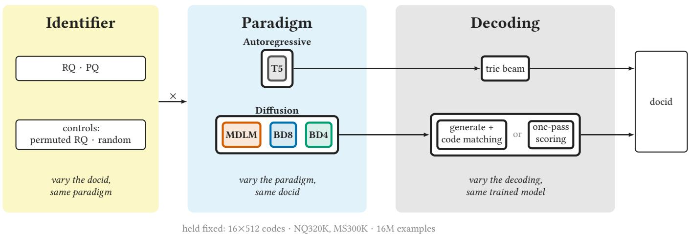  
Figure 1: Each factor is varied while the other two stay fixed. Every paradigm is trained on every docid; each trained model is then decoded in several ways. Italics: the comparison that isolates each factor.

Difusion for generative retrieval. DifuGR [49] retrieves documents with difusion models built on LLaDA [25] and Dream [45], over RQ and text docids. It compares them with AR systems, each with its own docids, training data and decoding. MaskGR [32] com pares masked difusion with an AR recommender. It tests random codes for difusion only. Difusion recommenders [17, 22, 33] argue, with ablations, that independent, PQ-like codes suit parallel decoders. EPIC [38] scores complete items during denoising, because committing tokens one at a time can drop the target. In all of them, the code, the recipe and the decoder change together, so a gain cannot be credited to the paradigm. We cross these factors and test whether PQ codes favour parallel decoders.

Decoding. PAG (Planning Ahead in Generative retrieval) scores every document in one forward pass by summing the weights of a second, lexical docid, and uses these scores as priors for AR beam search [47]. Wu et al. show that AR GR scores a document like multi-vector dense retrieval, with query vectors that depend on the docid prefix [42]. RPG scores every item by summing per-digit log-probabilities from one pass of a parallel-prediction model [10]. One-pass scoring reads the query with every docid level masked, and scores each docid by the probabilities of its codes. We apply this rule to the denoiser of a trained difusion model, with no extra head, beam or denoising.

Controlled analyses. The closest analyses study AR only: memorisation, new documents and robustness [7, 11, 16, 20, 48]. On NQ320K, naive and semantic docids reach the same Hit@1 for AR [24, 28]. Scaling studies vary model, corpus and inference budget for AR [6, 28]. Controlled studies in neural IR vary one factor at a time [13, 19, 43]. None crosses the generation paradigm with the identifier. We do so at one model scale, on the same corpora and budget.

## 3 Design Space

A generative retriever has three parts: the docid it generates, the model that generates it (its paradigm, how it reads the query, how it is trained), and the decoding that turns the model’s output into a ranked list. We describe the options we test for each part.

Identifiers. A docid gives each document � a code $c ( d ) \ =$ $( c _ { 1 } ( d ) , \ldots , c _ { L } ( d ) ) \ \in \ [ K ] ^ { L } \colon$ � levels, each taking one of � codes. Each (level, code) pair is a new token, so the docids expand the model’s vocabulary by �×� tokens [21, 30]. All our docids share this shape and vocabulary; they difer only in what a level means. Two are built from a document embedding $e ( d ) \in \mathbb { R } ^ { D }$ , with one k-means codebook $\{ \mu _ { l , k } \} _ { k = 1 } ^ { K }$ per level. Two are controls.

RQ (residual quantisation) encodes what the earlier levels left over. It starts from $r _ { 0 } ( d ) ~ = ~ e ( d )$ and fits level �’s codebook on the corpus residuals $r _ { l - 1 } \colon c _ { l } ( d ) \ = \ \arg \operatorname* { m i n } _ { k } \| r _ { l - 1 } ( d ) - \mu _ { l , k } \|$ and $r _ { l } ( d ) = r _ { l - 1 } ( d ) - \mu _ { l , c _ { l } ( d ) }$ . RQ levels go from coarse to fine. A level only makes sense given the earlier ones, and similar documents share prefixes.

PQ (product quantisation) cuts $e ( d ) = [ e ^ { 1 } ( d ) ; \dots ; e ^ { L } ( d ) ]$ into � slices of �/� dimensions and fits level �’s codebook on slice � of every document: $\begin{array} { r } { c _ { l } ( d ) = \arg \operatorname* { m i n } _ { k } \| e ^ { l } ( d ) - \mu _ { l , k } \| } \end{array}$ . PQ levels are independent. Each makes sense alone, and none refines another. Similar documents share many levels, at any position, and some share a whole code.

Random codes draw each �� (�) uniformly from [�], once per document; no two documents share a code. They have the shape of RQ and PQ but no semantic meaning, so a model can only memorise which queries map to them.

Permuted RQ codes reorder the levels of each RQ code: $c _ { l } ^ { \pi } ( d ) =$ $c _ { \pi ( l ) } ( d )$ , with � the reversal or one fixed random permutation. The codes and collisions stay the same; only the coarse-to-fine order is lost.

Paradigms. The paradigms difer in the order in which they commit the � levels. AR commits one level at a time, from left to right. Block difusion commits blocks of � levels from left to right, and the levels inside a block in parallel. Masked difusion (MDLM)

treats the � levels as one block, so it can commit them in any order. Each paradigm starts from its public pretrained checkpoint, so the backbone changes with the paradigm. AR is T5 1.1 base [29], an encoder–decoder pretrained on C4. Its encoder reads “retrieve:” and the query; its decoder attends to them and generates the � levels and an end token. MDLM [31] and BD3-LM [1] share one DiT [26] architecture (12 layers, width 768, 12 heads, no timestep input), each pretrained on OpenWebText; BD3-LM has checkpoints at block sizes 4 and 8. AR has 260M parameters and the difusion models 182M: comparable, not matched.

Conditioning on the query. Retrieval needs $p _ { \theta } ( c \mid q )$ . T5 reads the query by design, but the released difusion models only model text and take no query. We condition MDLM as LLaDA does for instruction tuning [25]: the prompt stays clean, and only the response is masked and scored. Here the query (at most 128 tokens) is a clean prefix of the docid, in training and at inference. At noise level $t \in [ 0 , 1 ]$ , each docid level is masked independently:

$$
\begin{array} { r } { z _ { t } ^ { l } = \left\{ \begin{array} { l l } { \mathbf { m } } & { \mathrm { w i t h } \mathrm { p r o b a b i l i t y } t , } \\ { c _ { l } } & { \mathrm { o t h e r w i s e , } } \end{array} \right. \quad \quad l = 1 , \dots , L , } \end{array}\tag{1}
$$

where m is the [MASK] token. MDLM attends in both directions over $[ q ; z _ { t } ]$ . Block difusion keeps the query as clean first blocks under BD3-LM’s block-causal mask, with a clean stream [�; �] and a noisy stream [�; ��]. Each noisy docid block attends to itself, to the query and to the clean earlier docid blocks. The clean stream holds the gold docid in training and the levels decoded so far at inference.

Training. The �×� docid tokens are added to each model’s input embedding and output layer, and all weights are fine-tuned to learn $p _ { \theta } ( c \mid q )$ from (query, docid) pairs, with each paradigm’s own loss. Let $M ( z ) = \{ l : z ^ { l } = { \bf m } \}$ be the masked levels. Block difusion splits the docid into $B = L / k$ blocks $c ^ { b }$ , each with its own noise level $t _ { b } \sim \mathcal { U } ( 0 , 1 )$ , and factorises log $\begin{array} { r } { p _ { \theta } ( c \mid q ) = \sum _ { b } \log p _ { \theta } ( c ^ { b } \mid c ^ { < b } , q ) } \end{array}$ Then

$$
\begin{array} { r } { \mathcal { L } _ { \mathrm { A R } } = - \sum _ { l = 1 } ^ { L } \log p _ { \theta } ( c _ { l } \mid c _ { < l } , q ) , } \end{array}\tag{2}
$$

$$
\begin{array} { r } { \mathcal { L } _ { \mathrm { d i f f } } = \frac { 1 } { L } \sum _ { b = 1 } ^ { B } \mathbb { E } _ { t _ { b } } \mathbb { E } _ { z _ { t _ { b } } ^ { b } } \sum _ { l \in M ( z _ { t _ { b } } ^ { b } ) } - \log \hat { p } _ { \theta } ( c _ { l } \mid z _ { t _ { b } } ^ { b } , c ^ { < b } , q ) . } \end{array}\tag{3}
$$

With one block (�=1), ${ \mathcal { L } } _ { \mathrm { d i f f } }$ trains MDLM. MDLM and BD3-LM [1, 31] weight each block’s term by $1 / t _ { b }$ , which makes the loss a bound on the likelihood; we drop this weight.

Decoding. A trained model gives probabilities over codes, but retrieval needs a ranked list of documents. AR bridges the two with beam search (width 100) in a trie of corpus docids [37, 40], stored as STATIC’s sparse matrix [35]. At each level, the trie keeps only the codes that extend the current prefix to some corpus docid. So every beam ends on a docid, and beams are ranked by summed log-probability. Greedy decoding keeps one beam, with or without the trie; without it, a code that is no docid counts as a miss.

Difusion has no trie. We therefore test a ladder of decodings on the same checkpoint, from sampling alone to scoring the whole corpus. Sampling decodes block by block, with � reverse steps [3, 31] per block. MDLM decodes the whole docid as one block of � levels, as it is trained $\scriptstyle ( S = 1 6 ) ;$ BD� decodes blocks of � levels (�=�). A reverse step lowers the noise level from � to � < �: the model predicts every masked level, and each is revealed with probability $( t - s ) / t .$ A stochastic sample draws the revealed codes from the prediction.

Argmax takes the most likely outcome instead. Staying masked is the most likely outcome until a block’s last step, so argmax commits a whole block at once. For MDLM, argmax thus commits all � levels together, from its prediction on the fully masked docid.

A generated code �ˆ may not be a docid. Code matching keeps the 100 documents whose codes difer from �ˆ at the fewest levels, ranked by that distance, ties in corpus order. The rerank reorders them by a per-level score from one pass on $z _ { 1 } ,$ the fully masked docid:

$$
\begin{array} { r } { s ( d ) = \sum _ { l = 1 } ^ { L } \log p _ { \theta } \big ( c _ { l } ( d ) \mid z _ { 1 } , q \big ) . } \end{array}\tag{4}
$$

Generate-and-match, our reference difusion decoding, is argmax, then code matching, then the rerank. Best-of-� draws �=8 stochastic samples instead, pools the 100 nearest documents of each, and reranks the pool by �(�).

One-pass scoring skips generation. It ranks the whole corpus by �(�) and keeps the top 100. Generate-and-match uses the same score, but only on the neighbours ofone generated code. The pass on � outputs an �� table of log-probabilities, so scoring a document costs � table lookups. For MDLM, �(�) is the �=1 term of its bound; for block difusion it is not, since that bound conditions each block on clean earlier blocks. Chain-rule rescoring approximates the joint likelihood ofthe code on a shortlist: it reranks the top 20 ofone-pass scoring by � log $p _ { \theta } ( c _ { l } ( d ) \mid c _ { < l } ( d ) , q )$ , with one pass per candidate and level.

## 4 Experimental Setup

Data. We use DDRO’s two benchmarks, built with its scripts1 [21]. NQ320K [12, 40] has 320k Wikipedia query–document pairs with natural-language queries, documents deduplicated by title, and the predefined training and validation splits. Its unseen documents are the gold of eval queries only; their queries (22.4%) are reported separately. MS300K is a subset ofthe MS MARCO document ranking dataset [4] with 320k documents and 360k training pairs; its eval queries are the oficial dev queries whose gold is in the corpus, so it has no unseen documents.

Identifiers. Docids have �=16 levels of �=512 codes: 8,192 new tokens, each initialised at the mean pretrained row. RQ and PQ quantise the GTR-T5-base embedding [23] (�=768). Random codes are drawn per document with the same seed in both corpora, which also share the random level permutation.

Implementation. Models train only on real training queries: unlike DDRO, we map no document text and no generated queries to docids, so a document that no training query maps to is never a target. Training uses AdamW, gradient clipping at 1, dropout 0.1, bfloat16 and 16.4M examples on one RTX 6000 Ada. AR uses a peak rate of $3 { \cdot } 1 0 ^ { - 3 } , \beta _ { 2 } { = } 0 . 9 5$ , weight decay 0.01, linear decay and label smoothing 0.1; difusion uses $\beta _ { 2 } { = } 0 . 9 8$ , weight decay $1 0 ^ { \dot { - } 5 }$ , 3% warmup and a constant rate $( 1 . 5 { \cdot } 1 0 ^ { - 2 }$ for MDLM; $1 0 ^ { - 2 } \mathrm { ~ / ~ } 7 { \cdot } 1 0 ^ { - 3 }$ for block difusion on NQ320K / MS300K), each the best of a short sweep on RQ. We evaluate the final, not the EMA, weights. $\mathrm { C o d e ^ { 2 } }$ and data with all docids3 are released.

Evaluation. Hit@�, � ∈ {1, 10, 100}, is the share of queries whose gold is in the top �. Documents that share a code cannot be told apart, so hits are scored on the code. Intervals are paired 95% bootstrap intervals on a diference between two systems, resampling the queries.

Table 1: AR leads or ties every learned-code column; on NQ320K, random codes keep most of each paradigm’s Hit@1. Hit@1 (%); AR: trie beam, difusion: generate-and-match. rev./shuf.: RQ with reversed / shufled levels. Bold: best model per column, not a significance claim; grey: not converged. For reference, on the same benchmarks, DDRO [21] reports (NQ320K / MS300K): BM25 14.1 / 18.9, SEAL [5] 29.3 / 27.6, NCI [40] 32.7 / 29.5, dense ANCE [44] 24.5 / 29.7, DDRO (PQ) 48.9 / 32.9.
<table><tr><td></td><td colspan="5">NQ320K</td><td colspan="5">MS300K</td></tr><tr><td></td><td>RQ</td><td>rev.</td><td>shuf.</td><td>PQ</td><td>rand.</td><td>RQ</td><td>rev.</td><td>shuf.</td><td>PQ</td><td>rand.</td></tr><tr><td>•AR</td><td>45.4</td><td>46.8</td><td>47.7</td><td>48.8</td><td>40.0</td><td>21.3</td><td>17.1</td><td>18.0</td><td>24.9</td><td>0.3</td></tr><tr><td>MDLM</td><td>41.1</td><td>40.6</td><td>40.3</td><td>44.7</td><td>34.3</td><td>18.1</td><td>15.6</td><td>16.6</td><td>16.8</td><td>7.2</td></tr><tr><td>▲BD8</td><td>39.1</td><td>39.5</td><td>39.2</td><td>41.3</td><td>35.2</td><td>16.3</td><td>17.1</td><td>16.0</td><td>17.3</td><td>6.2</td></tr><tr><td>•BD4</td><td>37.5</td><td>37.5</td><td>37.5</td><td>36.8</td><td>32.9</td><td>15.8</td><td>14.7</td><td>14.2</td><td>14.0</td><td>5.7</td></tr></table>

Analyses. A paradigm–identifier interaction counts only beyond ±2 Hit@1 points. Training exposure groups eval queries by the number of training queries of their gold. A miss, a query with Hit@1 = 0, takes the first matching class: near-duplicate of the gold (same title, or character 5-gram Jaccard ≥ 0.8), code with at most two wrong levels, topical (TF-IDF cosine above the 99th percentile of gold–random pairs), or unrelated. Gap closed is the share of the Hit@1 gap between a reference difusion decoding and AR’s beam that one-pass scoring recovers; miss recovery, the share of rank-1 misses whose gold stays among the reranked candidates.

## 5 Results

## 5.1 What Each Paradigm Learns

AR leads or ties every learned-code cell (Table 1), for three possible reasons. First, AR predicts the first and last levels more accurately. On NQ320K eval queries, from the query alone, AR predicts the first level correctly 61% of the time, against 49–50% for difusion with every level masked on PQ (RQ: 70 against 59–60%); given the other 15 gold levels, it predicts the last level correctly 79% of the time, against 67–78% (RQ: 82 against 54–58%). Second, AR is trained on all 17 outputs (16 levels and the end token) of every example and masked difusion on about half, so a fixed example budget favours AR. Third, AR’s backbone is larger and pretrained diferently: from random weights, AR scores 40.6 on NQ320K PQ, 8.2 points below its Table 1 score and below MDLM’s 44.7.

Each paradigm needs its own training recipe. Without weight decay, AR training on NQ320K can diverge; with 0.01, it converges. With AR’s recipe, every difusion model we tried outputs a constant (MDLM-PQ and BD8-PQ on NQ320K, MDLM-RQ on MS300K: 44.7, 41.3 and 18.1 → 0.0).

On NQ320K, random codes keep most of each paradigm’s Hit@1 (Table 1, rand.): 83–90% of RQ’s, with no semantic meaning. The models mostly memorise which docid answers which query, as known for AR [24, 28]; this also holds for difusion. On MS300K, random codes keep less than half within the budget (grey: not converged), so content-based codes learn faster.

Table 2: One-pass scoring matches or beats generate-andmatch in 11 of 12 settings; chain-rule rescoring is mixed. Δ Hit@1 (points), first decoding minus second; grey: paired 95% interval (NQ320K; MS300K intervals not shown); bold: interval excludes 0.
<table><tr><td></td><td></td><td colspan="3">One-pass vs generate-and-match</td><td colspan="3">Chain-rule vs one-pass</td></tr><tr><td></td><td></td><td>NQ320K</td><td></td><td>MS300K</td><td>NQ320K</td><td></td><td>MS300K</td></tr><tr><td>MDLM PQ</td><td></td><td>+0.3</td><td>[−0.1,0.7]</td><td>-0.5</td><td>-3.1</td><td>[−3.6,−2.5]</td><td>-3.1</td></tr><tr><td></td><td>RQ</td><td>+0.9</td><td>[0.5, 1.3]</td><td>+0.7</td><td>-0.6</td><td>[−1.0,−0.1]</td><td>+1.1</td></tr><tr><td>▲BD8</td><td>PQ</td><td>+0.2</td><td>[0.0, 0.5]</td><td>+0.6</td><td>+0.7</td><td>[−0.1,1.5]</td><td>-5.1</td></tr><tr><td></td><td>RQ</td><td>+1.2</td><td>[0.8, 1.6]</td><td>+2.0</td><td>+0.6</td><td>[0.03, 1.2]</td><td>+1.1</td></tr><tr><td>•BD4</td><td>PQ</td><td>+0.4</td><td>[−0.1,0.8]</td><td>+0.9</td><td>+3.6</td><td>[2.8, 4.4]</td><td>-0.5</td></tr><tr><td></td><td>RQ</td><td>+0.1</td><td>[−0.4,0.6]</td><td>+0.5</td><td>+1.8</td><td>[1.1, 2.5]</td><td>+1.6</td></tr></table>

Documents with more training queries are retrieved more often (Fig. 2a). Grouped by training exposure (Section 4), Hit@1 rises with the gold’s number of training queries in every cell. Content matters only when queries are scarce: with one training query, random codes reach 4% in every difusion model, against 19–22% for PQ; above twelve, they catch up. The 1,755 eval queries with an unseen gold get 2.3–3.2% Hit@1 with PQ and none with random codes. AR’s lead and the PQ–RQ gap both come from seen documents: at each paradigm’s best decoding, AR leads MDLM by 4.8 points on seen documents (62.0 against 57.2, PQ; not plotted) and by 0.5 on unseen ones, and AR’s PQ–RQ gap is 4.0 on seen documents. Unseen documents appear deeper in the ranking (Section 5.2).

On NQ320K, level order matters little for difusion (Table 1, rev., shuf.). Reversing or shufling the RQ levels moves difusion’s Hit@1 by less than a point on NQ320K and by −2.5 to +0.8 on MS300K. It raises AR’s by 1.4 and 2.3 on NQ320K and costs it 4.2 and 3.3 on MS300K.

## 5.2 What Difusion Generates and How to Decode It

Raw generations rarely hit the gold. Before code matching, the generated code exactly matches the gold for only 14–21% of NQ320K queries; after matching and rerank, Hit@1 is 37–45%. Wrong generations are far: 54–60% difer at eight or more of the 16 levels. Matching against the corpus, not denoising, carries much of the Hit@1.

Decoding beyond one sample helps, and none reaches AR in Hit@1 (Fig. 3). For BD8-RQ on NQ320K, Hit@1 goes from 31.6 (one sample) to 35.4 (argmax), both with code matching, then 39.1 (generate-and-match), 40.2 (best-of-�) and 40.3 (one-pass). In every setting, argmax beats one sample and generate-and-match beats argmax; best-of-� moves Hit@1 by −0.7 to +1.2 from generate-andmatch. From one sample to the best decoding (chain rule included), Hit@1 rises by 6.6 to 13.7 points in every setting. AR’s beam stays ahead of every row; the closest plotted row is MDLM-RQ, 3.4 points behind on NQ320K and 2.5 on MS300K. On NQ320K, AR’s lead does not come from its beam (greedy is within a point); on MS300K, the beam supplies 2.9 of its 6.9-point lead over the best difusion decoding on PQ. AR greedy in the trie is also ahead of every difusion decoding: by 3 to 7 points on NQ320K PQ, and by at least half a point elsewhere (over MDLM’s chain-rule rescoring on MS300K

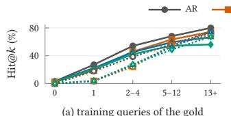  
(a) training queries of the gold

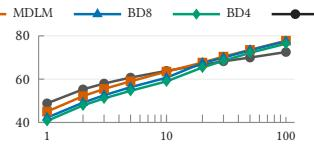  
(b) �, all queries

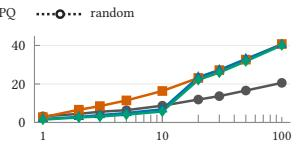  
(c) �, unseen documents

Figure 2: Documents with more training queries are retrieved more often; at depth, the best difusion decoding reaches unseen documents more often than AR (NQ320K). (a) Hit@1 by the gold’s training queries (0: unseen); AR beam, difusion generateand-match. (b, c) Hit@�, PQ: AR beam; MDLM one-pass; BD8/BD4 chain-rule rescoring.  
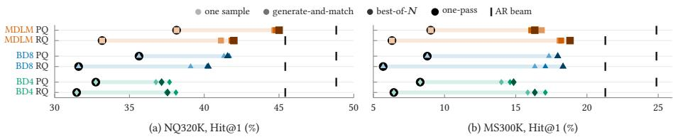  
Figure 3: Every difusion model gains over one sample, and none reaches AR’s beam. Each row: one difusion model and identifier under four decodings (one sample, generate-and-match, best-of-�, one-pass), darker in that order (bar: their range). Black tick: AR’s beam on the same identifier.

RQ). Without the trie, AR stays ahead on NQ320K (by 0.6 on RQ) but falls below MDLM on MS300K.

One-pass scoring nearly always matches or beats generateand-match (Table 2, left). It is ahead in 11 of 12 settings, trails only for MDLM-PQ on MS300K (−0.5), and its interval excludes zero in two of six NQ320K cells. Among misses, the share whose gold is missing from the candidates falls by 19 to 31 points, so it mostly raises Hit@100, not Hit@1. From generate-and-match, it closes 8 / 20% (PQ / RQ) of MDLM’s gap to AR’s beam on NQ320K and −6 / 23% on MS300K; from one sample, 64 / 72% and 46 / 83%. With every level masked, one-pass scoring sums per-level marginals, so no score depends on a docid prefix: the model acts as a per-level classifier.

Chain-rule rescoring helps block difusion on RQ and hurts MDLM on PQ (Table 2, right); elsewhere it is mixed (NQ320K BD4-PQ +3.6, MS300K BD8-PQ −5.1; MDLM-RQ −0.6 and +1.1). With every level masked, block difusion’s per-level accuracy drops to about 0 at the first level of every later block, a position it never predicts without the earlier blocks in training; revealing them restores that signal. On PQ, MDLM’s accuracy is flat when all is masked (47–52%), so there is no lost signal for revealed levels to restore. On MS300K, only the two PQ losses exclude zero; on NQ320K, the split follows the training objective, not the identifier.

At depth, the order reverses on NQ320K (Fig. 2b, c). With onepass scoring, MDLM ties AR’s beam at Hit@10 on PQ (63.5 against 63.8) and leads on RQ (60.1 against 58.9; RQ not plotted). At Hit@100, it leads by 5.2 points on PQ and 3.1 on RQ, and reaches 41 against 21% of unseen documents. A 500-wide beam leaves AR’s Hit@100 unchanged, so pruning is not the cause. The depth gap matches what is proved for constrained beam search [41]: ranking prefixes by marginal probability keeps Hit@1 but loses depth, whereas onepass scoring scores every docid.

## 5.3 Does the Identifier Favour a Paradigm?

On NQ320K, the identifier does not favour difusion over AR (Table 1). If PQ-like codes suit parallel decoders (Section 2), PQ’s lead should grow with the number of levels a model commits at once. On NQ320K, PQ leads RQ by 3.4 points under AR, 3.6 under MDLM and 2.2 under BD8. Under BD4 the two tie (−0.7). Within difusion, PQ’s lead grows with the levels committed at once (BD4 −0.7, BD8 2.2, MDLM 3.6), but AR, one level at a time, matches MDLM (3.4). AR’s gap minus the mean difusion gap is +1.7 points with generate-and-match, inside our ±2-point threshold, but 2.1 with one-pass scoring and 2.3 with chain-rule rescoring (Fig. 4b). At each model’s best decoding, it is 1.5, inside the threshold. On MS300K, the point estimates go the other way: AR’s beam favours PQ by 3.6 points, and difusion with chain-rule rescoring favours RQ by 3.6 to 6.7, an interaction of 4.3 to 9.2 points across decodings, a hint against the parallel-decoder hypothesis.

PQ’s lead depends on the decoding (Fig. 4b, c). With one stochastic sample, PQ leads in all six difusion cells, by 1.3 to 5.0 points. Better decoding shrinks this lead on NQ320K for MDLM and BD8, though not steadily (MDLM: 5.0, 3.0, 3.6, then 3.0 with one-pass scoring). On MS300K, every difusion model favours RQ with one-pass scoring and with chain-rule rescoring. The rerank of the code-matching candidates gains more on RQ in all four blockdifusion cells. A one-sample comparison thus overstates PQ for difusion.

After a miss, the gold PQ document stays within reach; the gold RQ one does not (Fig. 4a). We group misses by the first level where the generation leaves the gold. When the generation leaves the gold in its first four levels, the gold PQ document stays among the candidates about 2.3 times as often as the gold RQ one; later, 1.3 to 1.4 times. The paradigms difer by only a few points. Recovery is thus a property of the identifier, not of the paradigm. A near miss on PQ keeps the other levels right, because they are independent. RQ’s later levels are small residual corrections, and difusion’s accuracy on them does not rise with context (Section 5.1). PQ leads although far more documents share a PQ code (1.4 against 0.1%). Scored on the document, its lead shrinks but keeps its sign (AR: +3.4 → +1.9).

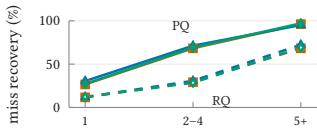  
(a) recovery by first wrong level

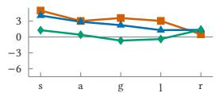  
(b) PQ − RQ, NQ320K

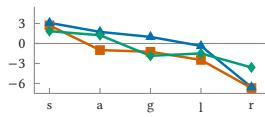  
(c) PQ − RQ, MS300K  
Figure 4: PQ keeps the gold within reach after a miss, and its lead depends on the decoding. (a) Miss recovery (%, NQ320K, generate-and-match), by the first wrong level. (b, c) Hit@1(PQ) − Hit@1(RQ) in points for each difusion model, by decoding (s: one sample; a: argmax; g: generate-and-match; l: one-pass; r: chain rule).

## 5.4 Where Misses Land

With learned codes, the paradigm does not change where a miss lands; the identifier, the corpus and the decoding do (Fig. 5). With PQ or RQ codes, one corpus and one decoding, the four paradigms share one profile of causes. On topical misses, AR’s beam is within 4 points of difusion generate-and-match. The paradigm changes how many queries miss, not what a miss returns. Under RQ, one stochastic sample sends 71–74% of misses to unrelated documents on both corpora. Generate-and-match, one-pass scoring and chain-rule rescoring bring most of them back on topic on MS300K (74–79%, Fig. 5b); on NQ320K, RQ misses still split about evenly (Fig. 5a). Stochastic PQ misses are already topical for 46–49% on NQ320K and 63–66% on MS300K. Near-duplicates and near codes stay at or below 10%. Random-code misses are mostly unrelated (54–97%). Across cells, misses only partly overlap: an oracle over the eight learned-code cells (AR’s beam, difusion’s generate-andmatch) reaches 62.6% Hit@1 on NQ320K, against 48.8% for the best cell (MS300K: 49.1 against 24.9).

## 5.5 A Recipe for Difusion GR

The results give a recipe for difusion retrievers. First, train difusion with its own recipe (Section 5.1). Second, decode with one-pass scoring. It matches or beats generate-and-match in 11 of 12 difusion settings (Table 2), and on NQ320K, MDLM’s one-pass scoring reaches deeper into the ranking than AR’s beam. Third, for block difusion on RQ, add chain-rule rescoring on the top 20 (+0.6 to +1.8 on both corpora; it costs MDLM 3.1 on PQ). A paradigm comparison should report up to four numbers per paradigm: the raw exact-match rate, Hit@1 at the paradigm’s best decoding, and, where the corpus has unseen documents, Hit@1 on seen and unseen ones separately.

## 6 Limitations and Conclusion

Limitations. Four design choices bound our results. The first is the models. The paradigms do not share a backbone: AR’s T5 is pretrained on C4, about twenty times more text than the difusion models’ OpenWebText, and since AR trained from random weights falls below MDLM (Section 5.1), part of AR’s lead may come from pretraining. Sizes are also only comparable, not matched (Section 3), and we keep them below 500M parameters because a retriever over a few hundred thousand documents should stay small; as larger models may generate better, whether the ranking holds at scale stays open. The second is training. AR’s recipe collapses difusion (Section 5.1), so each paradigm trains at its own, which leaves recipe and paradigm partly entangled. The third is the data and the docids. RQ3 covers one code shape and numeric docids, and RQ1 and RQ3 rest on NQ320K, because on MS300K random codes do not converge within the budget and the identifier gaps change sign across decodings. The last is the decoding. One-pass scoring is compared with generative decodings only, not with a non-generative per-level classifier, so how much of its gain needs difusion is open, and its cost grows with the corpus; why chain-rule rescoring costs MDLM 3.1 points on PQ is also open.

Conclusion. In this paper, we crossed paradigm, identifier and decoding on the same trained models to ask why difusion retrievers trail autoregressive ones. First, difusion models memorise like AR [28], contrary to the intuition behind semantic docids [30, 37]: on NQ320K, random codes without meaning keep 83–90% of RQ’s Hit@1 in every paradigm, though on MS300K they do not converge within the budget (RQ1), and the identifier separates AR from difusion by 1.5 points at each model’s best decoding on NQ320K, inside our threshold (RQ3). Second, decoding alone moves difusion Hit@1 by 6.6 to 13.7 points. The generated docid is right for only 14–21% of NQ320K queries, yet difusion needs no iterative denoising to retrieve: one forward pass on a fully masked docid matches or beats generate-and-match in 11 of 12 settings and, on NQ320K, reaches deeper than AR’s beam (RQ2). What remains is AR’s lead in Hit@1, which on NQ320K comes from the model rather than its beam and is entangled with pretraining. What reads as a paradigm gap is thus partly a decoding gap: a paradigm comparison is fair only at each paradigm’s own recipe and best decoding (Section 5.5). Our findings also open two directions. Since one forward pass yields an �×� table of code scores, searching that table without scanning the corpus is a natural next step. Since every paradigm memorises, future work should test whether training that reaches documents without a training query changes the paradigm ranking.

## References

[1] Marianne Arriola, Subham Sekhar Sahoo, Aaron Gokaslan, Zhihan Yang, Zhixuan Qi, Jiaqi Han, Justin T Chiu, and Volodymyr Kuleshov. 2025. Block Diffusion: Interpolating Between Autoregressive and Difusion Language Models. In The Thirteenth International Conference on Learning Representations. https://openreview.net/forum?id=tyEyYT267x

[2] Arian Askari, Chuan Meng, Mohammad Aliannejadi, Zhaochun Ren, Evangelos Kanoulas, and Suzan Verberne. 2026. Generative Retrieval with Few-Shot Indexing. In Advances in Information Retrieval (ECIR 2026) (LNCS, Vol. 16484). Springer, 606–614. doi:10.1007/978-3-032-21300-6\_52

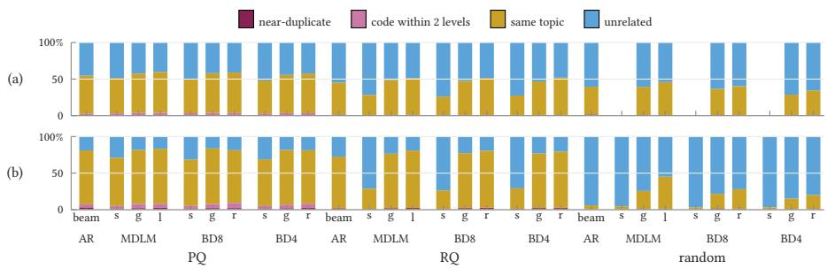  
Figure 5: With learned codes, the paradigm does not change where a miss lands. Rank-1 misses (%) by type of wrong top-1 document; (a) NQ320K, (b) MS300K. beam: AR’s trie beam; s: one sample; g: generate-and-match; l: one-pass scoring (MDLM); r: chain-rule rescoring (BD8, BD4).

[3] Jacob Austin, Daniel D. Johnson, Jonathan Ho, Daniel Tarlow, and Rianne van den Berg. 2021. Structured Denoising Difusion Models in Discrete State-Spaces. In Advances in Neural Information Processing Systems, M. Ranzato, A. Beygelzimer, Y. Dauphin, P.S. Liang, and J. Wortman Vaughan (Eds.), Vol. 34. Curran Associates, Inc., 17981–17993. https://proceedings.neurips.cc/paper\_files/paper/2021/file/ 958c530554f78bcd8e97125b70e6973d-Paper.pdf

[4] Payal Bajaj, Daniel Campos, Nick Craswell, Li Deng, Jianfeng Gao, Xiaodong Liu, Rangan Majumder, Andrew McNamara, Bhaskar Mitra, Tri Nguyen, Mir Rosenberg, Xia Song, Alina Stoica, Saurabh Tiwary, and Tong Wang. 2016. MS MARCO: A Human Generated MAchine Reading COmprehension Dataset. In Proceedings of the Workshop on Cognitive Computation: Integrating Neural and Symbolic Approaches (CoCo@NIPS). arXiv:1611.09268

[5] Michele Bevilacqua, Giuseppe Ottaviano, Patrick Lewis, Scott Yih, Sebastian Riedel, and Fabio Petroni. 2022. Autoregressive Search Engines: Generating Substrings as Document Identifiers. In Advances in Neural Information Processing Systems 35 (NeurIPS 2022). Neural Information Processing Systems Foundation, Inc. (NeurIPS), 31668–31683. doi:10.52202/068431-2296

[6] Hongru Cai, Yongqi Li, Ruifeng Yuan, Wenjie Wang, Zhen Zhang, Wenjie Li, and Tat-Seng Chua. 2025. Exploring Training and Inference Scaling Laws in Generative Retrieval. In Proceedings ofthe 48th International ACM SIGIR Conference on Research and Development in Information Retrieval (SIGIR ’25). ACM, 1339–1349. doi:10.1145/3726302.3729973

[7] Xiaoyang Chen, Yanjiang Liu, Ben He, Le Sun, and Yingfei Sun. 2023. Understanding Diferential Search Index for Text Retrieval. In Findings ofthe Association for Computational Linguistics: ACL 2023, Anna Rogers, Jordan Boyd-Graber, and Naoaki Okazaki (Eds.). Association for Computational Linguistics, Toronto, Canada, 10701–10717. doi:10.18653/v1/2023.findings-acl.681

[8] Yufei Chen, Junchen Fu, Jujia Zhao, Yukun Zhao, and Zhaochun Ren. 2026. What Makes a Good Semantic ID for Generative Recommendation? A Reproducibility Study. arXiv preprint arXiv:2609.24430 (2026). arXiv:2609.24430 Accepted at SIGIR-AP 2026.

[9] Guhao Feng, Yihan Geng, Jian Guan, Wei Wu, Liwei Wang, and Di He. 2025. Theoretical Benefit and Limitation of Difusion Language Model. In Advances in Neural Information Processing Systems 38 (NeurIPS 2025). Neural Information Processing Systems Foundation, Inc. (NeurIPS), 27683–27727. doi:10.52202/ 085713-0825

[10] Yupeng Hou, Jiacheng Li, Ashley Shin, Jinsung Jeon, Abhishek Santhanam, Wei Shao, Kaveh Hassani, Ning Yao, and Julian McAuley. 2025. Generating Long Semantic IDs in Parallel for Recommendation. In Proceedings ofthe 31st ACM SIGKDD Conference on Knowledge Discovery and Data Mining V.2 (KDD ’25). ACM, 956–966. doi:10.1145/3711896.3736979

[11] Chaeeun Kim, Soyoung Yoon, Hyunji Lee, Joel Jang, Sohee Yang, and Minjoon Seo. 2024. Exploring the Practicality of Generative Retrieval on Dynamic Corpora. In Proceedings ofthe 2024 Conference on Empirical Methods in Natural Language Processing, Yaser Al-Onaizan, Mohit Bansal, and Yun-Nung Chen (Eds.). Association for Computational Linguistics, Miami, Florida, USA, 13616–13633. doi:10.18653/v1/2024.emnlp-main.755

[12] Tom Kwiatkowski, Jennimaria Palomaki, Olivia Redfield, Michael Collins, Ankur Parikh, Chris Alberti, Danielle Epstein, Illia Polosukhin, Jacob Devlin, Kenton Lee, Kristina Toutanova, Llion Jones, Matthew Kelcey, Ming-Wei Chang, Andrew M. Dai, Jakob Uszkoreit, Quoc Le, and Slav Petrov. 2019. Natural Questions: A Benchmark for Question Answering Research. Transactions ofthe Association for Computational Linguistics 7 (2019), 452–466. doi:10.1162/tacl\_a\_00276

[13] Carlos Lassance, Hervé Dejean, and Stéphane Clinchant. 2023. An Experi mental Study on Pretraining Transformers from Scratch for IR. In Advances in Information Retrieval (ECIR 2023) (LNCS, Vol. 13980). Springer, 504–520.

doi:10.1007/978-3-031-28244-7\_32

[14] Sunkyung Lee, Minjin Choi, and Jongwuk Lee. 2023. GLEN: Generative Retrieval via Lexical Index Learning. In Proceedings ofthe 2023 Conference on Empirical Methods in Natural Language Processing, Houda Bouamor, Juan Pino, and Kalika Bali (Eds.). Association for Computational Linguistics, Singapore, 7693–7704. doi:10.18653/v1/2023.emnlp-main.477

[15] Yongqi Li, Nan Yang, Liang Wang, Furu Wei, and Wenjie Li. 2024. Learning to Rank in Generative Retrieval. In Proceedings ofthe AAAI Conference on Artificial Intelligence, Vol. 38. 8716–8723.

[16] Yu-An Liu, Ruqing Zhang, Jiafeng Guo, Changjiang Zhou, Maarten de Rijke, and Xueqi Cheng. 2025. On the Robustness of Generative Information Retrieval Models: An Out-of-Distribution Perspective. In Advances in Information Retrieval (ECIR 2025) (LNCS, Vol. 15573). Springer, 407–423. doi:10.1007/978-3-031-88711- 6\_26

[17] Zhao Liu, Yichen Zhu, Yiqing Yang, Xiao Lv, Guoping Tang, Rui Huang, Qiang Luo, Ruiming Tang, and Guorui Zhou. 2026. DifGRM: Difusion-based Generative Recommendation Model. In Proceedings ofthe ACM Web Conference 2026. ACM, 5853–5864. doi:10.1145/3774904.3792156

[18] Aaron Lou, Chenlin Meng, and Stefano Ermon. 2024. Discrete Difusion Modeling by Estimating the Ratios of the Data Distribution. In Proceedings of the 41st International Conference on Machine Learning (Proceedings ofMachine Learning Research, Vol. 235), Ruslan Salakhutdinov, Zico Kolter, Katherine Heller, Adrian Weller, Nuria Oliver, Jonathan Scarlett, and Felix Berkenkamp (Eds.). PMLR, 32819–32848. https://proceedings.mlr.press/v235/lou24a.html

[19] Simon Lupart, Thibault Formal, and Stéphane Clinchant. 2023. MS-Shift: An Analysis of MS MARCO Distribution Shifts on Neural Retrieval. In Advances in Information Retrieval (ECIR 2023) (LNCS, Vol. 13980). Springer, 636–652. doi:10. 1007/978-3-031-28244-7\_40

[20] Kidist Amde Mekonnen, Yongkang Li, Yubao Tang, Simon Lupart, and Maarten de Rijke. 2026. Lost in Decoding? Reproducing and Stress-Testing the Look-Ahead Prior in Generative Retrieval. In Proceedings ofthe 49th International ACM SIGIR Conference on Research and Development in Information Retrieval. ACM, 2994–3005. doi:10.1145/3805712.3808567

[21] Kidist Amde Mekonnen, Yubao Tang, and Maarten de Rijke. 2025. Lightweight and Direct Document Relevance Optimization for Generative Information Re trieval. In Proceedings ofthe 48th International ACM SIGIR Conference on Research and Development in Information Retrieval (SIGIR ’25). ACM, 1327–1338. doi:10.1145/3726302.3730023

[22] Lingyu Mu, Hao Deng, Haibo Xing, Jinxin Hu, Yu Zhang, Xiaoyi Zeng, and Jing Zhang. 2026. Masked Difusion Generative Recommendation. arXiv:2601.19501

[23] Jianmo Ni, Chen Qu, Jing Lu, Zhuyun Dai, Gustavo Hernández Ábrego, Ji Ma, Vincent Zhao, Yi Luan, Keith Hall, Ming-Wei Chang, and Yinfei Yang. 2022. Large Dual Encoders Are Generalizable Retrievers. In Proceedings ofthe 2022 Conference on Empirical Methods in Natural Language Processing. Association for Computational Linguistics, 9844–9855. doi:10.18653/v1/2022.emnlp-main.669

[24] Vivien Nicolas, Hicham Randrianarivo, Pascale Sébillot, and Caio Corro. 2026. REDSI: Addressing the Reproducibility and Evaluation Consistency of Diferen tiable Search Indexing for Document Retrieval. arXiv:2609.08860 [cs.IR]

[25] Shen Nie, Fengqi Zhu, Zebin You, Xiaolu Zhang, Jingyang Ou, Jun Hu, JUN ZHOU, Yankai Lin, Ji-Rong Wen, and Chongxuan Li. 2025. Large Language Difusion Models. In The Thirty-ninth Annual Conference on Neural Information Processing Systems. https://openreview.net/forum?id=KnqiC0znVF

[26] William Peebles and Saining Xie. 2023. Scalable Difusion Models with Transformers. In Proceedings ofthe IEEE/CVF International Conference on Computer Vision (ICCV). 4195–4205. doi:10.1109/ICCV51070.2023.00387

[27] Abhijeet Phatak, Jayant Sachdev, Sean D. Rosario, Swati Kirti, and Chittaranjan Tripathy. 2025. Inducing Diversity in Diferentiable Search Indexing. In Advances in Information Retrieval (ECIR 2025) (LNCS, Vol. 15574). Springer, 100–108. doi:10. 1007/978-3-031-88714-7\_7

[28] Ronak Pradeep, Kai Hui, Jai Gupta, Adam Lelkes, Honglei Zhuang, Jimmy Lin, Donald Metzler, and Vinh Tran. 2023. How Does Generative Retrieval Scale to Millions of Passages?. In Proceedings of the 2023 Conference on Empirical Methods in Natural Language Processing, Houda Bouamor, Juan Pino, and Kalika Bali (Eds.). Association for Computational Linguistics, Singapore, 1305–1321. doi:10.18653/v1/2023.emnlp-main.83

[29] Colin Rafel, Noam Shazeer, Adam Roberts, Katherine Lee, Sharan Narang, Michael Matena, Yanqi Zhou, Wei Li, and Peter J. Liu. 2020. Exploring the Limits ofTransfer Learning with a Unified Text-to-Text Transformer. Journal ofMachine Learning Research 21, 140 (2020), 1–67. http://jmlr.org/papers/v21/20-074.html

[30] Shashank Rajput, Nikhil Mehta, Anima Singh, Raghunandan Hulikal Keshavan, Trung Vu, Lukasz Heldt, Lichan Hong, Yi Tay, Vinh Tran, Jonah Samost, Maciej Kula, Ed Chi, and Maheswaran Sathiamoorthy. 2023. Recommender Systems with Generative Retrieval. In Advances in Neural Information Processing Systems 36 (NeurIPS 2023). Neural Information Processing Systems Foundation, Inc. (NeurIPS), 10299–10315. doi:10.52202/075280-0452

[31] Subham Sahoo, Marianne Arriola, Yair Schif, Aaron Gokaslan, Edgar Marroquin, Justin Chiu, Alexander Rush, and Volodymyr Kuleshov. 2024. Simple and Efective Masked Difusion Language Models. In Advances in Neural Information Processing Systems 37 (NeurIPS 2024). Neural Information Processing Systems Foundation, Inc. (NeurIPS), 130136–130184. doi:10.52202/079017-4135

[32] Kulin Shah, Bhuvesh Kumar, Neil Shah, and Liam Collins. 2025. Masked Difusion for Generative Recommendation. arXiv preprint arXiv:2511.23021 (2025). arXiv:2511.23021

[33] Teng Shi, Chenglei Shen, Weijie Yu, Shen Nie, Chongxuan Li, Xiao Zhang, Ming He, Yan Han, and Jun Xu. 2025. LLaDA-Rec: Discrete Difusion for Parallel Semantic ID Generation in Generative Recommendation. arXiv:2511.06254

[34] Anima Singh, Trung Vu, Nikhil Mehta, Raghunandan Keshavan, Maheswaran Sathiamoorthy, Yilin Zheng, Lichan Hong, Lukasz Heldt, Li Wei, Devansh Tandon, Ed Chi, and Xinyang Yi. 2024. Better Generalization with Semantic IDs: A Case Study in Ranking for Recommendations. In 18th ACM Conference on Recommender Systems (RecSys ’24). ACM, 1039–1044. doi:10.1145/3640457.3688190

[35] Zhengyang Su, Isay Katsman, Yueqi Wang, Ruining He, Lukasz Heldt, Raghu nandan Keshavan, Shao-Chuan Wang, Xinyang Yi, Mingyan Gao, Onkar Dalal, Lichan Hong, Ed H. Chi, and Ningren Han. 2026. Vectorizing the Trie: Eficient Constrained Decoding for LLM-based Generative Retrieval on Accelerators. In Proceedings of the 32nd ACM SIGKDD Conference on Knowledge Discovery and Data Mining V.2. ACM, 8009–8020. doi:10.1145/3770855.3818506

[36] Weiwei Sun, Lingyong Yan, Zheng Chen, Shuaiqiang Wang, Haichao Zhu, Pengjie Ren, Zhumin Chen, Dawei Yin, Maarten Rijke, and Zhaochun Ren. 2023. Learning to Tokenize for Generative Retrieval. In Advances in Neural Information Processing Systems 36 (NeurIPS 2023). Neural Information Processing Systems Foundation, Inc. (NeurIPS), 46345–46361. doi:10.52202/075280-2010

[37] Yi Tay, Vinh Tran, Mostafa Dehghani, Jianmo Ni, Dara Bahri, Harsh Mehta, Zhen Qin, Kai Hui, Zhe Zhao, Jai Gupta, Tal Schuster, William Cohen, and Donald Metzler. 2022. Transformer Memory as a Diferentiable Search Index. In Advances in Neural Information Processing Systems 35 (NeurIPS 2022). Neural Information Processing Systems Foundation, Inc. (NeurIPS), 21831–21843. doi:10. 52202/068431-1587

[38] Tuan-Binh Tran, Thanh Tam Nguyen, Quoc Viet Hung Nguyen, Dung D. Le, Tung Kieu, and Thanh Trung Huynh. 2026. EPIC: Explicit Posterior Item Conditioning for Semantic ID Difusion Recommendation. arXiv:2609.03522

[39] Federica Valeau, Odysseas Boufalis, Polytimi Gkotsi, Joshua Rosenthal, and David Vos. 2026. Eficient Optimization of Hierarchical Identifiers for Generative Rec ommendation. In Advances in Information Retrieval (ECIR 2026) (LNCS). Springer, 82–97. doi:10.1007/978-3-032-21324-2\_6

[40] Yujing Wang, Yingyan Hou, Haonan Wang, Ziming Miao, Shibin Wu, Qi Chen, Yuqing Xia, Chengmin Chi, Guoshuai Zhao, Zheng Liu, Xing Xie, Hao Sun, Weiwei Deng, Qi Zhang, and Mao Yang. 2022. A Neural Corpus Indexer for Document Retrieval. In Advances in Neural Information Processing Systems 35 (NeurIPS 2022). Neural Information Processing Systems Foundation, Inc. (NeurIPS), 25600–25614. doi:10.52202/068431-1856

[41] Shiguang Wu, Zhaochun Ren, Xin Xin, Jiyuan Yang, Mengqi Zhang, Zhumin Chen, Maarten de Rijke, and Pengjie Ren. 2025. Constrained Auto-Regressive Decoding Constrains Generative Retrieval. In Proceedings ofthe 48th International ACM SIGIR Conference on Research and Development in Information Retrieval (SIGIR ’25). ACM, 2429–2440. doi:10.1145/3726302.3729934

[42] Shiguang Wu, Wenda Wei, Mengqi Zhang, Zhumin Chen, Jun Ma, Zhaochun Ren, Maarten de Rijke, and Pengjie Ren. 2024. Generative Retrieval as Multi-Vector Dense Retrieval. In Proceedings ofthe 47th International ACM SIGIR Conference on Research and Development in Information Retrieval (SIGIR 2024). ACM, 1828–1838. doi:10.1145/3626772.3657697

[43] William Xion and Wolfgang Nejdl. 2026. Training-Induced Bias Toward LLM-Generated Content in Dense Retrieval. In Advances in Information Retrieval (ECIR

2026) (LNCS, Vol. 16483). Springer, 83–97. doi:10.1007/978-3-032-21289-4\_6

[44] Lee Xiong, Chenyan Xiong, Ye Li, Kwok-Fung Tang, Jialin Liu, Paul N. Bennett, Junaid Ahmed, and Arnold Overwijk. 2021. Approximate Nearest Neighbor Negative Contrastive Learning for Dense Text Retrieval. In International Conference on Learning Representations.

[45] Jiacheng Ye, Zhihui Xie, Lin Zheng, Jiahui Gao, Zirui Wu, Xin Jiang, Zhenguo Li, and Lingpeng Kong. 2025. Dream 7B: Difusion Large Language Models. arXiv preprint arXiv:2508.15487 (2025).

[46] Hansi Zeng, Chen Luo, Bowen Jin, Sheikh Muhammad Sarwar, Tianxin Wei, and Hamed Zamani. 2024. Scalable and Efective Generative Information Retrieval. In Proceedings ofthe ACM Web Conference 2024 (WWW’24). ACM, 1441–1452. doi:10.1145/3589334.3645477

[47] Hansi Zeng, Chen Luo, and Hamed Zamani. 2024. Planning Ahead in Generative Retrieval: Guiding Autoregressive Generation through Simultaneous Decoding. In Proceedings ofthe 47th International ACM SIGIR Conference on Research and Development in Information Retrieval. ACM, 469–480. doi:10.1145/3626772.3657746

[48] Zhen Zhang, Xinyu Ma, Weiwei Sun, Pengjie Ren, Zhumin Chen, Shuaiqiang Wang, Dawei Yin, Maarten de Rijke, and Zhaochun Ren. 2025. Replication and Exploration of Generative Retrieval over Dynamic Corpora. In Proceedings of the 48th International ACM SIGIR Conference on Research and Development in Information Retrieval (SIGIR ’25). ACM, 3325–3334. doi:10.1145/3726302.3730314

[49] Xinpeng Zhao, Zhaochun Ren, Yukun Zhao, Zhenyang Li, Mengqi Zhang, Jun Feng, Ran Chen, Ying Zhou, Zhumin Chen, Shuaiqiang Wang, Dawei Yin, and Xin Xin. 2025. DifuGR: Generative Document Retrieval with Difusion Language Models. arXiv preprint arXiv:2511.08150 (2025). arXiv:2511.08150

[50] Kaiwen Zheng, Yongxin Chen, Hanzi Mao, Ming-Yu Liu, Jun Zhu, and Qinsheng Zhang. 2025. Masked Difusion Models are Secretly Time-Agnostic Masked Models and Exploit Inaccurate Categorical Sampling. In The Thirteenth International Conference on Learning Representations. https://openreview.net/forum? id=CTC7CmirNr

[51] Shengyao Zhuang, Houxing Ren, Linjun Shou, Jian Pei, Ming Gong, Guido Zuccon, and Daxin Jiang. 2023. Bridging the Gap Between Indexing and Retrieval for Diferentiable Search Index with Query Generation. In Proceedings of the First Workshop on Generative Information Retrieval (Gen-IR@SIGIR 2023).

## A Data, Identifiers and Settings

Table 3: Settings of every grid cell. Learning rates come from a sweep on RQ codes and are reused for PQ and random codes. Every cell: mixed bfloat16, dropout 0.1, one RTX 6000 Ada; final weights evaluated (MDLM’s EMA unused).
<table><tr><td></td><td>AR</td><td>MDLM, BD8, BD4</td></tr><tr><td>Initialisation</td><td>T5 1.1 base (C4)</td><td>DiT 12 layers, width 768, 12 heads, OpenWebText checkpoint (BD: one per block size)</td></tr><tr><td>Size, time</td><td>260M; 7 h</td><td>182M; MDLM 4.5 h, BD 9.2 h</td></tr><tr><td>Input Loss</td><td>“retrieve:&quot; + query; 16 codes + end token cross-entropy, label smoothing 0.1</td><td>GPT-2 tokens; query (≤128 tokens, never masked) + 16 codes cross-entropy on masked codes, unweighted; t ~ U(0, 1) per example (BD: per</td></tr><tr><td></td><td></td><td>block)</td></tr><tr><td>Optimizer</td><td>AdamW, peak lr 3·10−3, β2=0.95, weight decay 0.01, gradient clip 1; linear decay, no</td><td>AdamW, peak lr 1.5·10−2 (MDLM), 10−2 / 7·10−3 (BD, NQ320K / MS300K), β2=0.98 weight decay 10−5, gradient clip 1; 3% linear warmup, then constant</td></tr><tr><td>Budget</td><td>warmup 64K steps × 256</td><td>MDLM 32K × 512, BD 64K × 256; 16.4M examples in every cell</td></tr><tr><td>Decoding</td><td>beam 100 in the trie</td><td>generate-and-match: argmax over 1 block × 16 steps (MDLM), 2 blocks × 8 (BD8), 4 blocks × 4 (BD4), code matching, rerank</td></tr></table>

Table 4: Corpora. Unseen: documents that are gold for no training query. Our MS300K is built with the DDRO script (title and content, truncated to 4,000 characters), ∼10% of MS300K Document; its eval set is DDRO’s dev set, not the standard 5,193-query dev set.
<table><tr><td></td><td>NQ320K</td><td>MS300K</td></tr><tr><td>Documents</td><td>109,739</td><td>319,927</td></tr><tr><td>Training queries</td><td>307,373</td><td>367,013</td></tr><tr><td>Documents with a training query</td><td>108,026</td><td>319,927</td></tr><tr><td>Eval queries</td><td>7,830</td><td>808</td></tr><tr><td>Unseen documents / eval queries on them</td><td>1,713 / 1,755 (22.4%)</td><td>0 / 0</td></tr><tr><td>Training examples per cell</td><td>16M</td><td>16M</td></tr><tr><td>per document</td><td>146</td><td>50</td></tr></table>

Table 5: What the identifiers encode (16×512). Levels 1-based, level 1 = coarsest; PQ is ∼8.96 bits at every level. Summed entropy: sum of per-level entropies; identifier entropy: bits that tell documents apart (at most log � = 16.74 / 18.29). Collision rate: excess documents (�−distinct codes)/�. U@�: mean of 1/(size of a document’s �-prefix group), corpus / gold documents. ∗: last level only. MS300K RQ: 499 live codes at level 1, levels 3–5 carry ∼4.8 bits.
<table><tr><td rowspan="2"></td><td colspan="2">NQ320K</td><td colspan="2">MS300K</td></tr><tr><td>RQ</td><td>PQ</td><td>RQ</td><td>PQ</td></tr><tr><td>Summed per-level entropy (bits)</td><td>60.5</td><td>143.4</td><td>65.7</td><td>143.5</td></tr><tr><td>Identifier entropy (bits)</td><td>16.74</td><td>16.69</td><td>18.22</td><td>18.17</td></tr><tr><td>Level-1 entropy (bits)</td><td>7.86</td><td>~8.96</td><td>7.95</td><td>~8.96</td></tr><tr><td>Level-2 entropy (bits)</td><td>0.28</td><td>~8.96</td><td>1.241</td><td>~8.96</td></tr><tr><td>Documents sharing the top level-2 code</td><td>98.2%</td><td>0.3-0.5%</td><td>51.4%</td><td>0.3-0.5%</td></tr><tr><td>Tail-level live codes / bits</td><td>28-41  / ~3.8</td><td>512 / 8.96</td><td>32 / 3.97*</td><td>512 / 8.97*</td></tr><tr><td>Collision rate (excess documents)</td><td>0.091% (100)</td><td>1.375% (1,509)</td><td>1.925% (6,160)</td><td>2.916% (9,330)</td></tr><tr><td>Largest collision bucket</td><td>5</td><td>75</td><td>512</td><td>737</td></tr><tr><td>U@4, corpus / gold</td><td>.27  / .28</td><td>.88 / .85</td><td>.53 / .50</td><td>.81  / .66</td></tr><tr><td>U@16, corpus / gold</td><td>.999 / .998</td><td>.986 / .979</td><td>.981 / .958</td><td>.971 / .937</td></tr><tr><td>Trie max branching</td><td>24</td><td>153</td><td>34</td><td>304</td></tr></table>

## B Query Conditioning

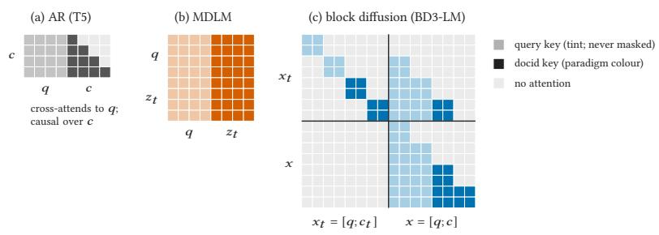  
Figure 6: Every paradigm sees the whole query; they difer in what each docid position sees of the docid. Attention masks for a 4-token query � and a 4-level docid � (row attends to column). (a) AR: the decoder cross-attends to the encoded query and is causal over �. (b) MDLM: query and partly masked docid $z _ { t }$ form one sequence with full attention. (c) Block difusion (block size 2): the doubled stream of BD3-LM [1] with $x = [ q ; c ]$ ; each noisy docid block attends to itself, the clean query and the clean earlier blocks.

## C What the Models Learn

Table 6: Per-token accuracy (%) where AR and difusion see the same context (NQ320K eval queries): level 1 from the query alone, level 16 with the other 15 levels given. Difusion: range over MDLM, BD8, BD4. On training queries AR is near 100 at every level; difusion PQ rises from 88–90 (level 1) to 90–97 (level 16), RQ falls from 88–89 to 79–85.

<table><tr><td></td><td colspan="2">Level 1</td><td colspan="2">Level 16</td></tr><tr><td></td><td>PQ</td><td>RQ</td><td>PQ</td><td>RQ</td></tr><tr><td>•AR</td><td>61</td><td>70</td><td>79</td><td>82</td></tr><tr><td>Diffusion</td><td>49-50</td><td>59-60</td><td>67-78</td><td>54-58</td></tr></table>

Table 7: NQ320K Hit@� (%) split by whether the gold document is the gold of a training query (seen: 6,075 queries; unseen: 1,755 of 7,830). Each paradigm at its best decoding (Table 2): AR trie beam, MDLM one-pass scoring, BD8 and BD4 chain-rule rescoring. Bold: best per column in the top block. �10 generated queries per training document added at the same 16M examples, so real queries are seen ∼4.5× less often; paired change against MDLM above, seen / unseen: −13.5 [−14.8, −12.1] / +1.1 [+0.2, +2.1].

<table><tr><td></td><td colspan="4">PQ</td><td colspan="4">RQ</td></tr><tr><td></td><td>seen</td><td colspan="3">unseen</td><td>seen</td><td colspan="3">unseen</td></tr><tr><td>Paradigm</td><td>@1</td><td>@1</td><td>@10</td><td>@100</td><td>@1</td><td>@1</td><td>@10</td><td>@100</td></tr><tr><td>• AR (beam)</td><td>62.0</td><td>3.2</td><td>8.7</td><td>20.6</td><td>57.9</td><td>2.1</td><td>7.3</td><td>18.5</td></tr><tr><td>■MDLM (one-pass)</td><td>57.2</td><td>2.7</td><td>16.4</td><td>40.7</td><td>53.3</td><td>2.9</td><td>19.7</td><td>37.2</td></tr><tr><td>▲BD8 (chain)</td><td>53.9</td><td>1.8</td><td>6.8</td><td>40.5</td><td>52.1</td><td>1.9</td><td>16.4</td><td>36.1</td></tr><tr><td>BD4 (chain)</td><td>52.0</td><td>1.5</td><td>5.7</td><td>40.1</td><td>50.2</td><td>1.9</td><td>14.7</td><td>34.0</td></tr><tr><td colspan="9">Real + generated queries, same budget9</td></tr><tr><td>■MDLM (one-pass)</td><td>43.7</td><td>3.8</td><td>一</td><td></td><td></td><td></td><td></td><td></td></tr></table>

## D Generation and Decoding

(a) Supporting measurements  
Table 8: The decodings compared, all on the same trained models. AR’s trie beam and difusion’s generate-and-match give Table 1.
<table><tr><td>Decoding</td><td>Generates</td><td>Docid chosen by</td></tr><tr><td colspan="3">AR</td></tr><tr><td>greedy, no trie</td><td>1 code, free</td><td>exact match to a docid</td></tr><tr><td>greedy, trie</td><td>1 code, in the trie</td><td>the trie (always a docid)</td></tr><tr><td>beam 100, trie</td><td>100 codes, in the trie</td><td>summed log-probability</td></tr><tr><td colspan="3">Diffusion</td></tr><tr><td>one sample</td><td>1 stochastic sample</td><td>code matching</td></tr><tr><td>argmax</td><td>1 argmax code</td><td>code matching</td></tr><tr><td>generate-and-match</td><td>1 argmax code</td><td>code matching, reranked by s(d)</td></tr><tr><td>best-of-8</td><td>8 stochastic samples</td><td>pooled code matching, by s(d)</td></tr><tr><td>one-pass scoring</td><td>none</td><td>s(d) over the whole corpus</td></tr><tr><td>chain-rule rescoring</td><td>none</td><td>one-pass top 20, by chain-rule score</td></tr></table>

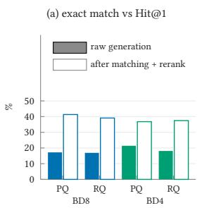

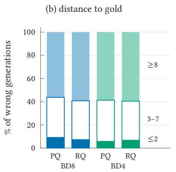

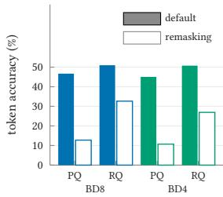  
Figure 7: What block difusion generates on NQ320K. (a) Exact-match rate of the raw generation against Hit@1 after code matching and rerank. (b) Wrong raw generations by the number of wrong levels out of 16 (≤2, 3–7, ≥8). (c) Per-token accuracy on 2,000 eval queries with the default sampler (filled) and a predict-then-noise sampler that overwrites every committed token at every step (open).

Table 9: One-pass scoring and chain-rule rescoring, supporting measurements (NQ320K). (a) Per-level accuracy with every level masked, and MDLM’s chain-rule rescoring on a wider shortlist. (b) Other orders for chain-rule rescoring: BD scored block by block (earlier blocks revealed), MDLM with levels revealed right to left or most-confident first; top 20 of one-pass scoring in every case. Δ Hit@1 in points, paired 95% interval in brackets.

<table><tr><td colspan="3"></td><td></td><td>PQ</td><td>RQ</td></tr><tr><td colspan="6">Per-level accuracy, all levels masked MDLM 47–52% at every level; BD first block 49–50%; first level of each later block ≤2%, 0-41% within it</td></tr><tr><td colspan="3">MDLM chain rule on the top 100 (vs top 20): Hit@1 top-1 agreement with the top 20</td><td colspan="2"> $4 1 . 5 \left( - 0 . 4 \left[ - 0 . 6 , - 0 . 2 \right] \right)$  92%</td></tr><tr><td colspan="6">(b) Other chain-rule orders</td></tr><tr><td></td><td>Order</td><td>Hit@1</td><td>vs one-pass</td><td>vs chain rule</td></tr><tr><td>BD4</td><td>PQ block by block</td><td>41.1</td><td> $+ 3 . 9 \ [ 3 . 1 , 4 . 7 ]$ </td><td> $+ 0 . 3 \left[ - 0 . 1 , 0 . 7 \right]$ </td></tr><tr><td>BD8</td><td>RQ block by block</td><td>39.4</td><td> $+ 1 . 8 \ [ 1 . 1 , 2 . 5 ]$ </td><td> $+ 0 . 0 \ [ - 0 . 2 , 0 . 3 ]$ </td></tr><tr><td></td><td>PQ block by block</td><td>43.1</td><td> $+ 1 . 6 \ [ 1 . 0 , 2 . 3 ]$ </td><td> $+ 0 . { \overset { \cdot } { 9 } } \left[ 0 . 5 , 1 . 4 \right]$ </td></tr><tr><td>RQ</td><td>block by block</td><td>40.9</td><td>+0.6 [0.0, 1.2]</td><td> $+ 0 . 0 \left[ - 0 . 3 , 0 . 3 \right]$ </td></tr><tr><td>MDLM PQ</td><td>right to left</td><td>41.9</td><td> $- 3 . 1 \left[ \dot { - 3 } . 6 , - \dot { 2 } . 5 \right]$ </td><td>+0.0 [−0.5, 0.6]</td></tr><tr><td></td><td>confidence first</td><td>41.3</td><td> $- 3 . 7 \ [ - 4 . 3 , - 3 . 0 ]$ </td><td> $- 0 . 6 [ - 1 . 1 , - 0 . 2 ]$ </td></tr><tr><td>RQ</td><td>right to left</td><td>41.1</td><td> $- 0 . 9 \left[ - 1 . 3 , - 0 . 5 \right]$ </td><td>−0.4 [−0.8, 0.1]</td></tr><tr><td></td><td>confidence first</td><td>41.2</td><td> $- 0 . 8 \left[ - 1 . 2 , - 0 . 3 \right]$ </td><td>−0.2 [−0.6, 0.1]</td></tr></table>

## E Error Taxonomy

Table 10: Error taxonomy (%). Outcome: share of queries by the rank of the gold document. Cause: share of rank-1 misses by what the wrong top-1 document is (first match wins, Section 4): near-duplicate of the gold, at most 2 of 16 levels wrong, topical, or unrelated. Shading grows with the share.
<table><tr><td rowspan="2">Paradigm Decode</td><td rowspan="2"></td><td colspan="4">Outcome (rank of gold)</td><td colspan="4">Cause of a miss</td></tr><tr><td>1</td><td>2-10</td><td>11-100</td><td>&gt;100</td><td></td><td>dup. near</td><td>topic. unrel.</td><td></td></tr><tr><td colspan="9">NQ320K, PQ</td></tr><tr><td>•AR</td><td>beam</td><td>48.8</td><td>15.0</td><td>8.7</td><td>27.5</td><td>0.8</td><td>1.6</td><td>52.2</td><td>45.4</td></tr><tr><td>MDLM</td><td>one-pass</td><td>45.0</td><td>18.5</td><td>14.3</td><td>22.3</td><td>0.7</td><td>3.1</td><td>55.6</td><td>40.6</td></tr><tr><td>▲BD8</td><td>gen. &amp; match</td><td>41.3</td><td>17.7</td><td>7.2</td><td>33.9</td><td>0.5</td><td>3.2</td><td>54.2</td><td>42.0</td></tr><tr><td>▲BD8</td><td>chain rule</td><td>42.2</td><td>18.4</td><td>16.8</td><td>22.5</td><td>0.8</td><td>2.8</td><td>55.2</td><td>41.2</td></tr><tr><td>BD4</td><td>gen. &amp; match</td><td>36.8</td><td>18.2</td><td>7.0</td><td>38.0</td><td>0.5</td><td>2.9</td><td>52.2</td><td>44.4</td></tr><tr><td>BD4</td><td>chain rule</td><td>40.7</td><td>18.3</td><td>17.4</td><td>23.6</td><td>0.7</td><td>2.7</td><td>54.2</td><td>42.4</td></tr><tr><td colspan="10">NQ320K, RQ</td></tr><tr><td>•AR</td><td>beam</td><td>45.4</td><td>13.5</td><td>8.8</td><td>32.4</td><td>1.1</td><td>0.1</td><td>43.9</td><td>54.8</td></tr><tr><td>MDLM</td><td>one-pass</td><td>42.0</td><td>18.1</td><td>10.6</td><td>29.3</td><td>0.9</td><td>0.1</td><td>50.1</td><td>48.9</td></tr><tr><td>▲BD8</td><td>gen. &amp; match</td><td>39.1</td><td>10.8</td><td>0.8</td><td>49.3</td><td>0.7</td><td>0.1</td><td>46.8</td><td>52.4</td></tr><tr><td>▲BD8</td><td>chain rule</td><td>40.9</td><td>18.3</td><td>10.9</td><td>29.8</td><td>0.7</td><td>0.1</td><td>50.8</td><td>48.4</td></tr><tr><td>BD4</td><td>gen. &amp; match</td><td>37.5</td><td>10.9</td><td>0.9</td><td>50.7</td><td>0.7</td><td>0.1</td><td>46.1</td><td>53.1</td></tr><tr><td>BD4</td><td>chain rule</td><td>39.3</td><td>17.3</td><td>11.5</td><td>31.9</td><td>0.8</td><td>0.1</td><td>51.0</td><td>48.1</td></tr><tr><td colspan="10">NQ320K, random codes</td></tr><tr><td>·AR</td><td>beam</td><td>40.0</td><td>11.3</td><td>6.0</td><td>42.6</td><td>1.3</td><td>0.0</td><td>38.2</td><td>60.5</td></tr><tr><td>BD8</td><td>gen. &amp; match</td><td>35.2</td><td>4.1</td><td>0.1</td><td>60.6</td><td>1.0</td><td>0.0</td><td>35.6</td><td>63.4</td></tr><tr><td>BD4</td><td>gen. &amp; match</td><td>32.8</td><td>2.8</td><td>0.1</td><td>64.2</td><td>0.8</td><td>0.0</td><td>27.8</td><td>71.4</td></tr><tr><td colspan="10">MS300K, PQ</td></tr><tr><td>•AR</td><td>beam</td><td>24.9</td><td>30.2</td><td>25.7</td><td>19.2</td><td>3.0</td><td>4.4</td><td>73.6</td><td>18.9</td></tr><tr><td>MDLM</td><td>one-pass</td><td>16.3</td><td>31.1</td><td>28.3</td><td>24.3</td><td>2.4</td><td>5.8</td><td>75.1</td><td>16.7</td></tr><tr><td>▲BD8</td><td>gen. &amp; match</td><td>17.3</td><td>25.4</td><td>18.4</td><td>38.9</td><td>2.1</td><td>5.7</td><td>75.9</td><td>16.3</td></tr><tr><td>▲BD8</td><td>chain rule</td><td>12.9</td><td>32.3</td><td>33.3</td><td>21.5</td><td>2.1</td><td>7.2</td><td>71.9</td><td>18.8</td></tr><tr><td>·BD4</td><td>gen. &amp; match</td><td>14.0</td><td>27.0</td><td>16.3</td><td>42.7</td><td>1.9</td><td>5.0</td><td>74.7</td><td>18.4</td></tr><tr><td>BD4</td><td>chain rule</td><td>14.4</td><td>33.8</td><td>31.2</td><td>20.7</td><td>2.3</td><td>5.9</td><td>73.0</td><td>18.8</td></tr><tr><td colspan="10">MS300K, RQ</td></tr><tr><td>•AR</td><td>beam</td><td>21.3</td><td>27.4</td><td>22.2</td><td>29.2</td><td>1.7</td><td>0.0</td><td>70.9</td><td>27.4 19.1</td></tr><tr><td>MDLM</td><td>one-pass</td><td>18.8</td><td>32.1</td><td>24.0</td><td>25.1</td><td>2.3</td><td>0.2</td><td>78.5 74.9</td><td>22.8</td></tr><tr><td>▲BD8 ▲BD8</td><td>gen. &amp; match</td><td>16.3</td><td>23.3</td><td>3.3</td><td>57.1</td><td>2.1</td><td>0.3</td><td>77.9</td><td>19.5</td></tr><tr><td></td><td>chain rule</td><td>19.4</td><td>30.4</td><td>23.9</td><td>26.2</td><td>2.3</td><td>0.3</td><td></td><td></td></tr><tr><td>BD4</td><td>gen. &amp; match</td><td>15.8</td><td>21.3</td><td>3.3</td><td>59.5</td><td>2.2</td><td>0.1</td><td>74.3</td><td>23.4</td></tr><tr><td>BD4</td><td>chain rule</td><td>17.9</td><td>32.5</td><td>22.2</td><td>27.4</td><td>2.3</td><td>0.3</td><td>76.6</td><td>20.8</td></tr><tr><td colspan="10">MS300K, random codes</td></tr><tr><td>•AR</td><td>beam</td><td>0.2</td><td>0.4</td><td>1.0</td><td>98.4</td><td>0.2</td><td>0.0</td><td>5.7</td><td>94.0</td></tr><tr><td>BD8</td><td>gen. &amp; match</td><td>6.2</td><td>1.0</td><td>0.1</td><td>92.7</td><td>1.6</td><td>0.0</td><td>20.1</td><td>78.4</td></tr><tr><td>BD4</td><td>gen. &amp; match</td><td>5.7</td><td>0.7</td><td>0.0</td><td>93.6</td><td>0.7</td><td>0.0</td><td>14.4</td><td>84.9</td></tr></table>

Table 11: The largest groups of documents sharing one code. Id.: identifier; size: documents in the group; share with an identical title; share with an empty body; mean pairwise TF-IDF cosine (random pairs in parentheses); topic.
<table><tr><td></td><td>Id.</td><td>Size</td><td>Same title (%)</td><td>Empty text (%)</td><td>Cosine (random)</td><td>Topic</td></tr><tr><td>NQ320K</td><td>PQ</td><td>75</td><td>1</td><td>0</td><td>.745 (.041)</td><td>visa-policy pages</td></tr><tr><td>NQ320K</td><td>PQ</td><td>70</td><td>1</td><td>0</td><td>.226 (.041)</td><td>FIFA World Cup</td></tr><tr><td>NQ320K</td><td>PQ</td><td>59</td><td>2</td><td>0</td><td>.224 (.041)</td><td>shared Hinduism nav box</td></tr><tr><td>MS300K</td><td>RQ</td><td>512</td><td>92</td><td>100</td><td>.000 (.015)</td><td>empty pages</td></tr><tr><td>MS300K</td><td>PQ</td><td>737</td><td>92</td><td>100</td><td>.000 (.015)</td><td>empty pages</td></tr></table>