# Foresight-over-Graph: Reasoning Beyond Local Horizons for Knowledge Base Question Answering

Yang Hong1, Yajun Yang1∗, Xin Wang1, Liping Jing2, Qinghua Hu1

1Tianjin University, Tianjin, China

2Beijing Jiaotong University, Beijing, China

{yanghong, yjyang, wangx, huqinghua}@tju.edu.cn, lpjing@bjtu.edu.cn

## Abstract

Large language models (LLMs) have demonstrated strong capabilities in question answering, yet they still frequently suffer from hallucinations on knowledgeintensive tasks. Knowledge graphs (KGs) provide LLMs with structured, interpretable, and updatable factual grounding, making them a promising external knowledge source for reliable reasoning. However, existing LLM-guided graph reasoning methods typically rely on hop-wise greedy or beam-style pruning during evidence retrieval. Such local decision processes are inherently myopic: evidence that appears weak near the source may become crucial only after deeper graph context is explored, causing answer-critical branches to be discarded prematurely and making the reasoning chain difficult to recover. To address this limitation, we propose Foresight-over-Graph (FoG), a foresight-aware evidence retrieval framework for knowledge base question answering (KBQA). FoG iteratively constructs a question-relevant evidence subgraph and uses far-to-near feedback to guide path exploration, and maintains a compact memory subgraph to support continued exploration. Extensive experiments on widely used KBQA benchmarks demonstrate that FoG achieves state-of-the-art performance, with a particularly large improvement of 16.58% in Hit on CWQ, while also reducing LLM calls and token usage. Our code is available at https://github.com/yhong7/FoG .

## 1 Introduction

Large language models (LLMs) have recently demonstrated strong capabilities in question answering, yet they often hallucinate when questions require reliable professional or domain-specific knowledge [6, 24, 15]. A straightforward way to inject such knowledge is to continually fine-tune LLMs, but this is typically expensive and inefficient, and still struggles to keep models synchronized with evolving real-world facts [35, 27]. In contrast, knowledge graphs (KGs) provide structured, updatable, and interpretable factual knowledge, offering an effective way to ground LLM-based QA and reduce hallucinations [11, 41, 28, 29, 16].

Recent progress has led to a spectrum of KG-integrated LLM approaches [13, 41, 36, 9]. The core idea of these methods is to retrieve question-relevant entities, relations, or subgraphs from the knowledge graph, and then feed the retrieved results into the LLM to generate the final answer [9, 41]. To better leverage the capabilities of LLMs, recent works propose LLM-guided graph agents that perform search over knowledge graphs hop by hop to enable retrieval-augmented generation [5, 19]. A well-designed LLM-guided agent iteratively chooses which part of the graph to explore, gathering relevant evidence to generate the final answer [7, 5, 19].

However, KGs are typically large-scale and a substantial fraction of nodes are associated with a large number of relations[39, 31]. This makes it intractable to expand all outgoing relations at each hop, because deep multi-hop reasoning leads to an explosion of candidate nodes. Most previous works adopt greedy or beam-style traversal and perform local pruning, keeping only an appropriately sized set of candidate relations (e.g., top-k) at each search step according to the relevance between the question and candidate relations [33, 23]. Although these methods demonstrate strong performance, greedy-based and beamsearch-based per-hop pruning still struggles with complex questions that require deep exploration over KGs. The reason is that, in the early stages of search, many relations cannot be distinguished with foresight as to whether they lie on the answer path, which may cause truly answer-relevant relations to be pruned away. Figure 1a shows a toy example, where the question is "Which song performed by singer A won award B?". At the first hop, all the neighbors of the source entity (i.e., singer A) are songs performed by singer A with no significant difference in relevance to the question. Existing methods cannot identify which

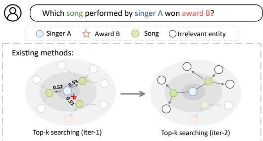

(a) Existing methods: local decisions can drop crucial triples early, causing later steps to drift into irrelevant regions.  
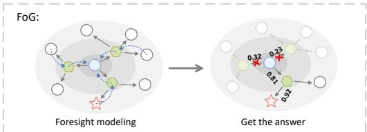  
(b) FoG: injects foresight from the expanded frontier to refine retrieval decisions.  
Figure 1: Limitations of short-sighted hop-byhop KG traversal and the intuition behind FoG.

branch leads to the correct answer at this stage, since they have no access to distant entities or evidence (e.g., Award B). As a result, correct triples may be pruned away. Once the critical path is mistakenly pruned, subsequent exploration cannot recover the missing evidence chain, and the search often drifts into irrelevant neighborhoods. A real case study illustrating this failure mode is provided in Appendix D.

To address this limitation, we propose a novel Foresight-over-Graph (FoG) model that identifies which relations are more important for answering the question, thereby avoiding incorrect pruning, as shown in Figure 1b. Given a Q&A task, FoG first extracts source entities from the question and then iteratively expands subgraph from these entities until the answer is found. In each iteration, triples that are irrelevant to the question are discarded, yielding an expanded subgraph with high recall and low noise. We further design a far-to-near message feedback mechanism that propagates question-relevant information from distant entities to entities closer to the source entities, and utilize this information to re-score and prune nearby triples. Finally, the LLM incorporates the graph structure refined by question relevance into its memory and generates new sub-questions to guide the next search iteration. Our main contributions are summarized as follows:

• Bottleneck Identification. We identify a critical bottleneck in existing graph-guided LLM agents: hop-wise greedy/beam pruning is myopic, lacking foresight into distant evidence and leading to irreversible loss of answer-critical triples.

• Proposed Method. We propose Foresight-over-Graph (FoG), which counteracts this short-sightedness with two designs: a far-to-near message feedback mechanism that guides early candidates using distant signals, and a memory subgraph manager that preserves high-confidence evidence across iterations.

• Empirical Analysis. On WebQSP and CWQ, FoG achieves state-of-the-art results, gaining 16.58% in Hit on CWQ while reducing LLM calls and token usage against existing LLMguided graph agents.

## 2 Preliminaries

Structured Knowledge Base. We consider a structured knowledge base represented as a multirelational directed graph $\mathcal { G } = \{ \langle s , r , o \rangle \mid s , o \in \mathcal { E } , r \in \mathcal { R } \}$ , where E denotes the entity set and R denotes the relation set. Each triple $\langle s , r , o \rangle$ states that relation r holds between subject entity s and object entity $o .$ This graph representation is widely used in KBQA benchmarks and provides an explicit, interpretable substrate for multi-hop evidence retrieval.

Problem Definition. Given a complex natural-language question $q _ { \mathrm { o r i } } .$ a structured knowledge base ${ \mathcal { G } } ,$ and a set of source entities $\mathcal { E } _ { s } \subseteq \overline { { \mathcal { E } } }$ identified from the question, the goal of KBQA is to predict an answer set ${ \mathcal { A } } \subseteq { \mathcal { E } }$ . Rather than producing answers from parametric knowledge alone, a faithful KBQA system should retrieve a compact evidence subgraph ${ \mathcal { G } } _ { \mathrm { a n s } } \subseteq { \mathcal { G } }$ originating from ${ \mathcal { E } } _ { s }$ that semantically and factually supports the final prediction.

## 3 Method

## 3.1 Foresight Subgraph Expansion

The initial stage of FoG aims to extract a high-recall, low-noise expanded subgraph $\mathcal G ^ { \mathrm { x p d } }$ from the knowledge graph. By filtering incident edges via a foresight triple scorer, we ensure that subsequent message passing operates on a compact region of informative triples, thereby avoiding the explosion of candidate nodes during deep multi-hop reasoning.

Question-Conditioned Triple Encoder. We leverage a shared pre-trained embedding model to represent KG symbols and text queries. For each ordered triple instance $t = \langle s , r , o \rangle$ , we augment the base embeddings with learnable role-specific biases to form a sequence $\mathbf { u } _ { t } = [ \mathbf { e } _ { s } + \mathbf { p } _ { s } ; \mathbf { e } _ { r } +$ p $\mathbf { \sigma } _ { r } ; \mathbf { e } _ { o } + \mathbf { p } _ { o } ] \in \mathbb { R } ^ { 3 \times d }$ . Rather than detailing standard Transformer layers, we define the encoding process as a dual-attention mechanism. We first apply a self-attention block to model intra-triple factual interactions:

$$
\mathbf { u } _ { t } ^ { \mathrm { s e l f } } = \mathrm { S e l f A t t n } ( \mathbf { u } _ { t } ) .\tag{1}
$$

Subsequently, a cross-attention block is employed to inject query-specific semantics into the representation:

$$
\mathbf { z } _ { t } = \mathrm { C r o s s A t t n } ( \mathbf { q } \mathbf { u } \mathrm { e r y } = \mathbf { q } _ { \mathrm { o r i } } , \mathrm { k e y } / \mathrm { v a l u e } = \mathbf { u } _ { t } ^ { \mathrm { s e l f } } ) .\tag{2}
$$

The resulting question-guided embedding $\mathbf { z } _ { t }$ serves as a semantically grounded representation of the triple and remains fixed during iterative reasoning rounds.

Foresight Triple Scorer. The original question $\mathbf { q } _ { \mathrm { o r i } }$ is often too coarse-grained for multi-hop search. We therefore prompt an LLM to decompose it into a set of fine-grained sub-questions $\mathcal { Q } _ { \mathrm { s u b } }$ . Each $q \in \mathcal { Q } _ { \mathrm { s u b } }$ represents a concrete sub-goal necessary for solving the original query.

To prioritize triples that lead to the true answer path, we define the structural context of triple t as $\mathbf { c } _ { t } = [ \mathbf { z } _ { t } ; \mathbf { h } _ { s } ; \mathbf { h } _ { o } ]$ , where $\mathbf { h } _ { v }$ denotes the foresight hidden state of entity v and is initialized as zero vector. We then employ an attention-pooling mechanism to dynamically aggregate the relevant sub-questions:

$$
\bar { \mathbf { q } } _ { t } = \sum _ { q \in \mathcal { Q } _ { \mathrm { s u b } } } \alpha _ { t , q } \mathbf { q } , \quad \mathrm { w h e r e } \ \alpha _ { t , q } = \mathrm { S o f t m a x } ( \mathcal { F } _ { \mathrm { a t t n } } ( \mathbf { c } _ { t } , \mathbf { q } ) ) .\tag{3}
$$

This query-aware pooled representation is then combined with the structural context to yield the unified foresight score:

$$
s _ { t } = \mathrm { M L P } _ { s } ( [ \mathbf { c } _ { t } ; \bar { \mathbf { q } } _ { t } ] ) .\tag{4}
$$

This formulation allows the scorer to favor triples that satisfy both the local structural constraints and the global reasoning goals reflected in the sub-questions.

Foresight Subgraph Construction. Starting from the seed entities $\mathcal { E } _ { s }$ , we perform a layered Breadth-First Search (BFS) expansion up to $L$ hops. At each frontier layer, we evaluate the incident triples and retain those exceeding an expansion threshold $\tau _ { e } :$

$$
\mathcal { G } _ { \mathrm { l a y e r } } = \{ t \in \mathcal { N } ( v ) \mid s _ { t } > \tau _ { e } \} .\tag{5}
$$

To facilitate subsequent message feedback, the retrieved region is mapped into a directed subgraph $\mathcal G ^ { \mathrm { x p d } }$ . Specifically, each triple $t = \langle s , r , o \rangle$ is oriented inward toward the seeds based on the endpoints shortest-path distances. This directionality enforces far-to-near propagation for propagating lookahead signals from distant evidence back to source-side candidates.

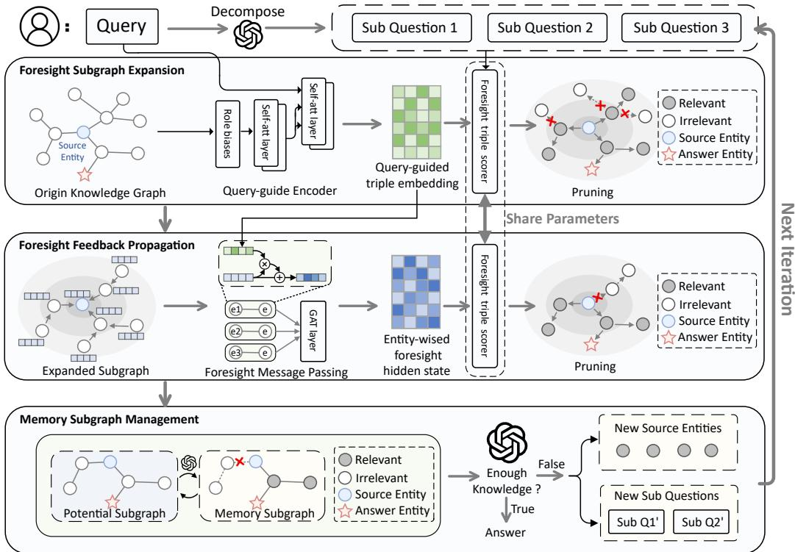  
Figure 2: The overview of our proposed FoG.

## 3.2 Foresight Feedback Propagation

We introduce a foresight feedback propagation module to inject signals from the compressed future search space into early decisions, updating node-level hidden states and refining edge scores.

Foresight Feedback Propagation. To propagate foresight information from the outer expansion frontier back to the source, we operate on the directed subgraph $\mathcal G ^ { \mathrm { x p d } }$ . Nodes are updated in decreasing order of their distance $d ( \cdot )$ , ensuring a strict far-to-near information flow.

For each inward-directed triple $t = \langle s , r , o \rangle$ , we compute an edge-wise future message by fusing the source entity’s hidden state hs with the question-guided triple embedding $\mathbf { z } _ { t } \mathbf { : }$

$$
\begin{array} { r } { { \bf { m } } _ { t } = { \bf { h } } _ { s } + \mathrm { M L P } _ { m } \big ( \big [ { \bf { h } } _ { s } ; { \bf { z } } _ { t } \big ] \big ) . } \end{array}\tag{6}
$$

Next, at each target entity $^ { O , }$ we gather incoming messages from its neighborhood ${ \mathcal { G } } ^ { \mathrm { i n } } ( o )$ . We compute compatibility scores between each message and the target’s current state $\mathbf { h } _ { o } \colon$

$$
\alpha _ { t , q } = \frac { \exp ( F _ { a t t n } ( c _ { t } , q ) ) } { \sum _ { q ^ { \prime } \in Q _ { s u b } } \exp ( F _ { a t t n } ( c _ { t } , q ^ { \prime } ) ) }\tag{7}
$$

The target entity then updates its representation by assimilating the attention-weighted messages through a non-linear activation $\phi \colon$

$$
\mathbf { h } _ { o }  \mathbf { h } _ { o } + \phi \biggl ( \sum _ { t \in \mathcal { G } ^ { \mathrm { i n } } ( o ) } \alpha _ { t } \mathbf { m } _ { t } \biggr ) .\tag{8}
$$

After all entities are updated layer by layer, we reuse the foresight scorer to re-evaluate all edges. These refined scores $\left\{ { { s } _ { t } } \right\}$ are subsequently used to extract the high-confidence potential subgraph for the LLM’s memory management.

Training. The foresight scorer is trained as a binary classifier over candidate triples. For each training question $q _ { \mathrm { t r } } ,$ let $\mathcal { G } ^ { + } ( \bar { q } _ { \mathrm { t r } } )$ be the set of triples on the ground-truth reasoning path. The label of a triple t is $y _ { t } = \mathbb { I } [ t \in \mathcal { G } ^ { + } ( q _ { \mathrm { t r } } ) ]$ ]. We minimize the binary cross-entropy loss over all candidates in the training graph $\mathcal { G } ^ { \mathrm { t r } }$

$$
\mathcal { L } _ { \mathrm { t r } } = - \sum _ { t \in \mathcal { G } ^ { \mathrm { t r } } } \left( y _ { t } \log \sigma ( s _ { t } ) + ( 1 - y _ { t } ) \log ( 1 - \sigma ( s _ { t } ) ) \right) .\tag{9}
$$

Details of candidate sampling and training setup are in Appendix E.

## 3.3 Memory Subgraph Management

In this subsection, we detail how a persistent memory subgraph, orchestrated by the LLM, accumulates high-confidence evidence. This mechanism prevents short-sighted pruning errors and directs subsequent retrieval iterations toward unexplored or uncertain regions of the knowledge graph.

Constructing the Potential Subgraph. Instead of overwhelming the LLM with the entire expanded region, we isolate a compact, high-confidence candidate set. Using the refined foresight scores $\left\{ { { s } _ { t } } \right\}$ obtained after feedback propagation, we extract a potential subgraph by applying a potential threshold $\tau _ { \mathrm { p } }$ to retain only the most promising candidates:

$$
\mathcal G ^ { \mathrm { p o t } } = \{ t \in \mathcal G ^ { \mathrm { x p d } } \mid s _ { t } > \tau _ { \mathrm { p } } \} .\tag{10}
$$

Only this highly relevant graph context ${ \mathcal { G } } ^ { \mathrm { { p o t } } }$ is exposed to the LLM for high-level reasoning, significantly reducing the context window burden and filtering out structural noise.

LLM-Guided Memory Update. We maintain a persistent memory subgraph ${ \mathcal { G } } ^ { \mathrm { m e m } } \subseteq { \mathcal { G } }$ (initialized as ∅) to selectively archive triples deemed globally useful for answering the query. In each iteration, we formulate a structured prompt containing the original question $q _ { \mathrm { o r i } }$ , the historical memory $\mathcal { G } ^ { \mathrm { m e m } }$ and the newly discovered potential subgraph ${ \mathcal { G } } ^ { \mathrm { p o t } }$

We formalize the LLM’s reasoning process as a generation function that simultaneously outputs three structured components for memory update, tentative answering, and continued exploration:

$$
( \mathcal { G } ^ { \mathrm { m e m \prime } } , \hat { A } , \mathcal { Q } _ { \mathrm { s u b } } ^ { \prime } ) = \mathrm { L L M } \big ( q _ { \mathrm { o r i } } , \mathcal { G } ^ { \mathrm { m e m } } , \mathcal { G } ^ { \mathrm { p o t } } \big ) .\tag{11}
$$

Here, $\mathcal { G } ^ { \mathrm { m e m } \prime }$ represents the updated memory retaining crucial evidence, $\hat { A }$ denotes the tentative answer set, and $\mathrm { \bar { \mathcal { Q } } _ { \mathrm { s u b } } ^ { \prime } }$ contains newly generated sub-questions designed to drive the next search phase. Following this interaction, we strictly overwrite the historical state:

$$
\mathcal { G } ^ { \mathrm { m e m } }  \mathcal { G } ^ { \mathrm { m e m } \prime } .\tag{12}
$$

Detailed prompt templates and output JSON schemas are provided in Appendix C.

Exploration Efficiency and Fault Tolerance. By coupling iterative subgraph re-expansion with persistent memory maintenance, FoG naturally avoids irreversible early pruning. The memory subgraph $\mathcal { G } ^ { \mathrm { m e m } }$ continuously archives high-confidence evidence across rounds, while newly generated sub-questions $\mathcal { Q } _ { \mathrm { s u b } } ^ { \prime }$ drive targeted re-exploration toward unresolved sub-goals. Consequently, a triple that scores below τ in one round is merely temporarily hidden from the LLM rather than permanently $\tau _ { \mathrm { p } }$ deleted. If a later sub-question redirects the search toward its neighborhood, that triple can reappear in a future potential subgraph, allowing the agent to recover from earlier pruning mistakes. At the same time, to maximize exploration efficiency, triples that have been successfully absorbed into $\mathcal { G } ^ { \mathrm { m e m } }$ are excluded from redundant future expansions, whereas triples explicitly rejected by the LLM are permanently masked from subsequent retrieval.

## 3.4 Complexity Analysis

Let $L _ { t }$ denote the number of transformer blocks used in the question-guided triple encoder and $L _ { m }$ denote the number of foresight feedback propagation layers. Let |V| and |E| denote the number of entities and triple instances in the expanded subgraph $\mathcal G ^ { \mathrm { x p d } }$ , and let d be the representation dimension and we assume $d _ { h } = d$ for simplicity. During layered BFS expansion, FoG scores incident triples on frontier entities; let M denote the total number of candidate triple instances scored in this process.

Since each triple is encoded with a constant number of tokens, the per-triple computation in a transformer block is dominated by $O ( d ^ { 2 } )$ . Therefore, encoding at most M triples with $L _ { t }$ blocks incurs a worst-case cost of $O ( L _ { t } \dot { M } d ^ { 2 } )$ . For the foresight triple scorer, computing attention over S sub-questions and the final MLP score costs $O ( S d ^ { 2 } )$ per scored triple, yielding $\mathsf { \bar { O } } ( S M d ^ { 2 } )$ during expansion, and $O ( S | E | d ^ { 2 } )$ when re-scoring all edges after propagation. For each message passing layer, edge-wise message computation and attention aggregation are linear in edges and nodes, giving $\dot { O ( ( | E | + | V | ) d ^ { 2 } ) }$ per layer, hence $O ( L _ { m } ( | E | + | V | ) ^ { \smile } d ^ { 2 } )$ for $L _ { m }$ layers. Combining the above, the overall graph-side time complexity is $O \Big ( \big ( L _ { t } M + S ( M + | E | ) + L _ { m } ( | E | + | V | ) \big ) d ^ { 2 } \Big )$

Table 1: Overall results on WebQSP and CWQ. The † and ‡ symbols denote graph retrieval-based methods and LLM-guided graph agents method, respectively. The ⋆ indicates the best-performing baseline. The best and second-best results are highlighted in bold and underlined, respectively.
<table><tr><td rowspan="2">Type</td><td rowspan="2">Method</td><td rowspan="2">LLM</td><td colspan="3">WebQSP</td><td colspan="3">CWQ</td></tr><tr><td>Hit</td><td>Hit@1</td><td>F1</td><td>Hit</td><td>Hit@1</td><td>F1</td></tr><tr><td rowspan="4">Non-LLM</td><td>NSM</td><td></td><td></td><td>74.30</td><td></td><td></td><td>48.80</td><td></td></tr><tr><td>SQALER</td><td></td><td></td><td>76.10</td><td></td><td></td><td></td><td></td></tr><tr><td>KGT5</td><td></td><td></td><td>56.10</td><td></td><td></td><td>36.50</td><td></td></tr><tr><td>UniKGQA</td><td></td><td></td><td>77.20</td><td>72.20</td><td></td><td>51.20</td><td>49.40</td></tr><tr><td rowspan="2">LLM-only</td><td>Zero-shot</td><td>GPT-40</td><td>58.24</td><td>58.24</td><td>42.57</td><td>35.82</td><td>35.82</td><td>31.49</td></tr><tr><td>Few-shot CoT</td><td>GPT-40 GPT-40</td><td>64.13 66.09</td><td>64.13</td><td>46.75</td><td>43.30</td><td>43.30</td><td>39.58</td></tr><tr><td rowspan="4">Fine-tuned</td><td></td><td></td><td></td><td>66.09</td><td>52.95</td><td>46.97</td><td>46.97</td><td>42.71</td></tr><tr><td>G-Retriever†</td><td>LLaMA2-7B</td><td></td><td>70.10</td><td></td><td></td><td></td><td></td></tr><tr><td>GNN-RAG†</td><td>LLaMA2-7B</td><td>90.70*</td><td>82.80</td><td>73.50</td><td>68.70</td><td>62.80</td><td>60.40</td></tr><tr><td>LightPROF† EPERM‡</td><td>LLaMA3-8B</td><td></td><td>83.77</td><td></td><td></td><td>59.26</td><td></td></tr><tr><td rowspan="8">In-context LLM</td><td>KG-Agent‡</td><td>LLaMA2-7B</td><td></td><td>88.80 83.30</td><td>72.40 81.00*</td><td></td><td>66.20</td><td>58.90</td></tr><tr><td></td><td>LLaMA2-7B</td><td></td><td></td><td></td><td></td><td>72.20</td><td>69.80*</td></tr><tr><td>Subgraph-RAG† BYOKG-RAG‡</td><td>GPT-40</td><td>88.26</td><td>84.73</td><td>74.98</td><td>60.36</td><td>56.39</td><td>52.40</td></tr><tr><td>ORT‡</td><td>Claude-3.5</td><td>86.60</td><td></td><td></td><td>73.60</td><td></td><td></td></tr><tr><td></td><td>DeepSeek-v3</td><td></td><td>89.43*</td><td>71.83</td><td></td><td>72.91*</td><td>62.63</td></tr><tr><td>ToG</td><td>GPT-4</td><td>82.60</td><td></td><td>36.40</td><td>69.50</td><td></td><td>31.80</td></tr><tr><td>RoG PoG‡</td><td>GPT-4</td><td>85.70</td><td>80.80</td><td>70.80</td><td>62.60</td><td>57.80</td><td>56.20</td></tr><tr><td>FiDeLis‡</td><td>GPT-4</td><td>87.30</td><td></td><td></td><td>75.00*</td><td></td><td></td></tr><tr><td></td><td></td><td>GPT-4</td><td></td><td>84.39</td><td>78.32</td><td></td><td>71.47</td><td>64.32</td></tr><tr><td>FoG</td><td></td><td>GPT-4o-mini</td><td>88.68±0.13</td><td>87.23±0.18</td><td>75.16±0.14</td><td>82.33±0.11</td><td>73.45±0.09</td><td></td></tr><tr><td>FoG</td><td>GPT-4</td><td></td><td>91.31±0.10</td><td>90.17±0.18</td><td>79.57±0.17</td><td>87.44±0.14</td><td>78.39±0.17</td><td>66.56±0.15</td></tr><tr><td>FoG</td><td>GPT-40</td><td></td><td>91.63±0.15</td><td>89.66±0.18</td><td>81.28±0.19</td><td>87.03±0.13</td><td>80.21±0.19</td><td>68.50±0.16 71.34±0.16</td></tr></table>

## 4 Experiments

## 4.1 Experimental Settings

Datasets. We evaluate FoG on two widely used Freebase-based KBQA benchmarks, WebQSP [40] and CWQ [34], using their official train/test splits. Both datasets require multi-hop reasoning over structured knowledge bases. As shown in Figure 3, CWQ has more high-degree nodes than WebQSP, resulting in a larger branching factor and more challenging graph exploration. Further details are provided in Appendix A.

Metrics. We use Hit, Hit@1, and F1 to evaluate whether the prediction contains a correct answer, whether the top-ranked answer is correct, and the precision–recall trade-off, respectively.

Baselines. We compare FoG against 19 baselines, grouped into embedding-based, promptingbased, fine-tuned LLM, and in-context LLM methods. Descriptions of the baselines are provided in Appendix B.

Implementation Details. We adopt Qwen3-Embedding-4B [42] as a unified pretrained encoder to embed both natural-language queries and KG symbols (entities/relations). The encoder is kept frozen throughout training and inference. We deploy the original Freebase as the underlying knowledge base and evaluate our method on WebQSP and CWQ [40, 34]. For foresight subgraph expansion, we set the hop budget to L=3 for all experiments. We use an expansion threshold τe=0.1 to select frontier triples during FSE, and a potential threshold $\tau _ { p } { = } 0 . 7$ to form the potential subgraph passed to the memory subgraph manager.

## 4.2 Main Results

Table 1 presents the overall results on WebQSP and CWQ. Without task-specific fine-tuning, FoG consistently outperforms prior fine-tuned LLM methods as well as strong graph retrieval-based and LLM-guided graph agent baselines. It achieves relative Hit@1 improvements of 1.02% on WebQSP and 16.58% on CWQ over the strongest baselines, with larger gains on CWQ highlighting its effectiveness for compositional questions with larger branching factors. This is mainly because FoG propagates distant relevance signals back to near-source candidates while maintaining a compact memory subgraph.

Table 2: Ablation results on WebQSP and CWQ. FSE, FFP, and MSM denote Foresight Subgraph Expansion, Foresight Feedback Propagation, and Memory Subgraph Manager, respectively.
<table><tr><td></td><td colspan="4">WebQSP</td><td colspan="4">CWQ</td></tr><tr><td>Method</td><td>Hit</td><td>Hit@1</td><td>Hit@5</td><td>F1</td><td>Hit</td><td>Hit@1</td><td>Hit@5</td><td>F1</td></tr><tr><td>FoG w/o FSE</td><td> $9 0 . 4 2 _ { \downarrow 1 . 2 1 }$ </td><td> $8 8 . 7 8 _ { \downarrow 0 . 8 8 }$ </td><td> $9 0 . 1 9 _ { \downarrow 1 . 3 8 }$ </td><td> $7 7 . 4 1 _ { \downarrow 3 . 8 7 }$ </td><td> $8 5 . 2 2 _ { \downarrow 1 . 8 1 }$ </td><td> $7 3 . 9 5 _ { \downarrow 6 . 2 6 }$ </td><td> $8 2 . 7 0 _ { \downarrow 2 . 1 0 }$ </td><td> $6 2 . 9 8 _ { \downarrow 8 . 3 6 }$ </td></tr><tr><td>FoG w/o FFP</td><td> $8 9 . 2 7 _ { \downarrow 2 . 3 6 }$ </td><td> $8 6 . 9 2 _ { \downarrow 2 . 7 4 }$ </td><td> $8 8 . 7 4 _ { \downarrow 2 . 8 3 }$ </td><td> $7 3 . 8 5 _ { \downarrow 7 . 4 3 }$ </td><td> $7 8 . 6 1 _ { \downarrow 8 . 4 2 }$ </td><td> $6 8 . 4 3 _ { \downarrow 1 1 . 7 8 }$ </td><td> $7 6 . 0 2 _ { \downarrow 8 . 7 8 }$ </td><td> $5 7 . 3 4 _ { \downarrow 1 4 . 0 0 }$ </td></tr><tr><td>FoG w/o MSM</td><td> $9 0 . 1 9 _ { \downarrow 1 . 4 4 }$ </td><td> $8 8 . 8 9 _ { \downarrow 0 . 7 7 }$ </td><td> $9 0 . 0 4 _ { \downarrow 1 . 5 3 }$ </td><td> $7 7 . 1 9 _ { \downarrow 4 . 0 9 }$ </td><td> $7 9 . 7 3 _ { \downarrow 7 . 3 0 }$ </td><td> $6 7 . 1 2 _ { \downarrow 1 3 . 0 9 }$ </td><td> $7 5 . 8 4 _ { \downarrow 8 . 9 6 }$ </td><td> $5 6 . 1 5 _ { \downarrow 1 5 . 1 9 }$ </td></tr><tr><td>FoG</td><td> $\mathbf { 9 1 . 6 3 }$ </td><td>89.66</td><td> $\mathbf { 9 1 . 5 7 }$ </td><td>81.28</td><td>87.03</td><td>80.21</td><td>84.80</td><td>71.34</td></tr></table>

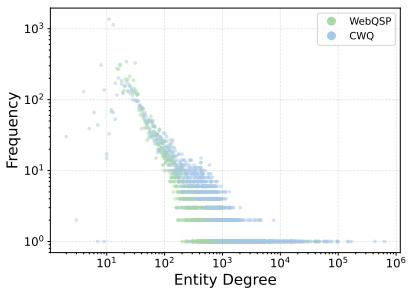  
Figure 3: Degree distribution of Freebase entities referenced in CWQ and WebQSP.

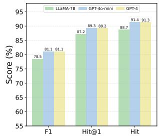  
(a) WebQSP.

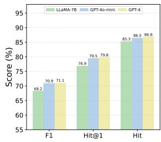  
(b) CWQ.  
Figure 4: Performance comparison of different subquestion LLMs.

## 4.3 Ablation Study

Effect of Core Components. Table 2 reports ablation results on WebQSP and CWQ to illustrate the contribution of each component. Removing Foresight Feedback Propagation leads to the most pronounced degradation, showing that far-to-near feedback is central to refining multi-hop evidence and improving pruning decisions. The Memory Subgraph Manager is particularly important on the more compositional CWQ benchmark, suggesting that maintaining accumulated evidence is crucial for deeper iterative reasoning. Removing Foresight Subgraph Expansion also causes consistent performance drops, indicating that high-recall initial expansion provides useful candidate evidence for subsequent feedback and memory updates. Overall, the results show that the three modules are complementary and work best in combination.

LLM Flexibility Study. Table 1 reports results with different backbone LLMs to demonstrate that FoG is not reliant on any particular LLM. Specifically, we consider three LLMs: LLaMA-7B, GPT-4o-mini and GPT-4. The results show that FoG consistently outperforms other baselines across different backbones and achieves substantial gains in most metrics, demonstrating robust effectivenes and strong transferability.

Comparison with Standard GNN. To test whether FoG’s gains come simply from generic message passing, we replace Foresight Feedback Propagation (FFP) with a standard GNN on the same expanded subgraph, treating the graph as undirected and using the same edge-level supervision. As shown in Table 3, this variant consistently underperforms FFP on both WebQSP and CWQ, indicating that generic neighborhood aggregation is insufficient for foresight-aware pruning. Unlike undirected GNN propagation,

Table 3: Comparison between standard GNN propagation and FFP.
<table><tr><td rowspan="2">Method</td><td colspan="2">WebQSP</td><td colspan="2">CWQ</td></tr><tr><td>Hit</td><td>Hit@1 F1</td><td>Hit Hit@1</td><td>F1</td></tr><tr><td>FoG w/ GNN 89.92</td><td></td><td>88.13 78.75 84.06</td><td>76.79</td><td>67.27</td></tr><tr><td>FoG w/ FFP</td><td>91.63 89.66</td><td>81.28 87.03</td><td></td><td>80.21 71.34</td></tr></table>

which can blur the distinction between relevant triples and distractors, FFP propagates signals from distant frontier nodes back to source-side candidates, better matching FoG’s early-pruning bottleneck.

Sensitivity to Sub-question Decomposition. FoG uses an LLM to decompose the original question into sub-questions, which provide high-level guidance for graph exploration. Since this may introduce dependency on the sub-question generator, we replace it with LLMs of different strengths while keeping the graph retriever, foresight feedback propagation module, memory subgraph manager, and final answer generation unchanged. As shown in Figure 4, stronger sub-question LLMs generally improve performance on both WebQSP and CWQ, as better decompositions can guide FoG toward more informative graph regions. Nevertheless, the overall trend remains stable, and lightweight models still achieve competitive results across benchmarks. This indicates that FoG is not merely relying on a powerful LLM; rather, its foresight-aware retrieval and memory subgraph mechanisms provide a robust reasoning backbone.

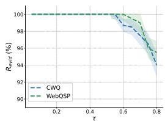  
(a) Evidence recal $R _ { \mathrm { e v i d } }$

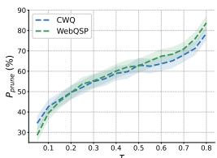  
(b) Noise pruning $P _ { \mathrm { p r u n e } }$

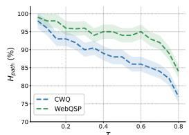  
(c) Path hit $H _ { \mathrm { p a t h } }$

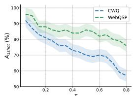  
(d) One-shot rate $A _ { \mathrm { 1 s h o t } }$  
Figure 5: Effect of $\tau _ { p }$ on knowledge retrieval capacity (CWQ and WebQSP).

## 4.4 Efficiency Analysis

FoG requires substantially fewer LLM calls than LLM-guided graph agents baselines. Unlike methods such as ToG that perform beam-style graph search, FoG maintains a memory subgraph and avoids expanding and scoring K partial paths at each depth. For ToG with search depth L and beam width K, the number of LLM calls scales on the order of $L \cdot K$ . In contrast, FoG shifts multi-hop expansion and edge filtering to the graph side and uses the LLM only for high-level updates on a compressed potential subgraph together with the memory subgraph. With R reasoning rounds, FoG uses roughly

Table 4: Efficiency comparison on WebQSP and CWQ: average LLM calls and token usage per question.
<table><tr><td>Dataset</td><td>Method</td><td>Call</td><td>Input</td><td>Output</td><td>Total</td></tr><tr><td rowspan="3">WebQSP</td><td>ToG</td><td>15.9</td><td>6031.2</td><td>987.7</td><td>7018.9</td></tr><tr><td>PoG</td><td>9.0</td><td>5234.8</td><td>282.9</td><td>5517.7</td></tr><tr><td>FoG</td><td>2.3</td><td>1837.3</td><td>248.9</td><td>2086.2</td></tr><tr><td rowspan="3">CWQ</td><td>ToG</td><td>22.6</td><td>8182.9</td><td>1486.4</td><td>9669.4</td></tr><tr><td>PoG</td><td>13.3</td><td>7803.0</td><td>353.2</td><td>8156.2</td></tr><tr><td>FoG</td><td>2.8</td><td>3461.7</td><td>295.4</td><td>4585.1</td></tr></table>

R+1 LLM calls per question, independent of K. This design also reduces token usage since the LLM does not need to read all candidate triples. Although FoG introduces additional graph-side computation for subgraph expansion, triple scoring, and feedback propagation, these operations are lightweight and parallelizable; in our implementation, their overhead is minor compared with the latency and cost of LLM inference. Table 4 reports detailed statistics.

## 4.5 Knowledge Retrieval Capacity

We study how the retrieval thresholds affect FoG’s knowledge retrieval capacity by sweeping them over [0.05, 0.90] on WebQSP and CWQ. Specifically, FoG uses two threshold-based filtering steps: the expansion threshold $\tau _ { e }$ filters scored frontier triples during subgraph expansion, while the potential threshold $\tau _ { p }$ filters re-scored triples before constructing the potential subgraph. Although $\tau _ { e }$ and $\tau _ { p }$ are applied at different stages, both act as score thresholds for retaining question-relevant triples.

As shown in Figure 5, the thresholds govern a clear trade-off between evidence recall and noise pruning. Larger thresholds make FoG more selective, removing more irrelevant triples and improving $P _ { \mathrm { p r u n e } }$ , but they may also filter out useful evidence and reduce $R _ { \mathrm { e v i d } }$ . With moderate threshold values, $H _ { \mathrm { p a t h } }$ remains high, indicating that FoG usually preserves at least one correct evidence path. However, retrieving the complete evidence set in a single round is harder, and $A _ { \mathrm { 1 s h o t } }$ decreases more quickly, especially on CWQ.

## 4.6 Case study

We conduct a qualitative analysis to better understand the typical failure modes of existing graphguided reasoning methods and how FoG mitigates them.

Error Analysis of Existing Methods. We manually inspect failed predictions of graph-guided reasoning methods and group them into four error types, as shown in Figure 6. The dominant failure is Multi-hop Error Accumulation, where early relation or entity selection errors shift the search frontier and make the correct evidence chain hard to recover. Other failures include Constraint Composition Failure, where only part of the required constraints are verified; Candidate-set Reasoning Failure, where comparison or ranking over retrieved candidates is needed but missing; and LLM Summarization Error, where the correct answer is retrieved but missed due to label variation or imperfect normalization.

Qualitative Case Study. We further present a representative case to illustrate how short-sighted graph exploration loses answer-critical evidence. When the correct evidence lies several hops away, local scoring may prune a weak-looking but crucial relation. FoG mitigates this by using foresight

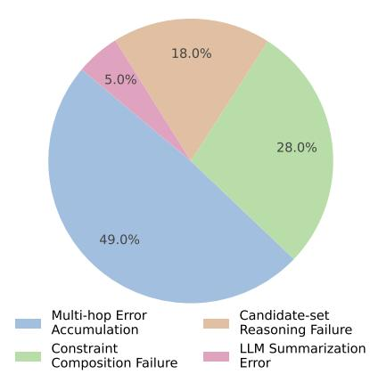  
Figure 6: Error distribution of existing graph-guided reasoning failures.

signals to preserve globally useful branches and recover the correct reasoning path. Detailed examples are provided in Appendix D.

## 5 Related Work

Complex KBQA requires composing multi-hop evidence from large structured knowledge bases.   
Recent studies explore grounding LLM reasoning in such structured knowledge [10, 20, 17, 38, 4].

One line of work focuses on graph-embedding based retrieval, which retrieves, ranks, or encodes compact graph evidence before downstream reasoning [13, 41, 9, 18, 25, 1]. These methods improve grounding by reducing large knowledge bases into smaller evidence contexts. However, they mainly judge whether an edge or triple currently appears relevant to the question, rather than whether the branch opened by this edge can eventually lead to the true evidence chain. Thus, locally ambiguous but globally necessary triples may still be pruned before their downstream value becomes visible.

Another line of work studies LLM-guided graph agents, where the LLM plans, traverses, verifies, or revises reasoning paths over knowledge graphs [37, 33, 23, 5, 22, 32, 26]. These methods enable adaptive exploration, but they usually formulate reasoning as sequential graph search. Once an answer-critical relation is excluded from the search space or the search shifts to an incorrect branch, later steps have limited ability to recover the correct path.

FoG takes a different perspective on graph retrieval and reasoning. Compared with graph-based retrieval methods, which ask whether an edge currently looks relevant to the question, FoG ask whether the branch opened by this edge can eventually lead to answer-supporting evidence. It therefore evaluates early triples by their downstream utility rather than only by their immediate relevance. Compared with LLM-guided graph agents, which may suffer from short-sighted pruning during sequential traversal, FoG anticipates the value of early branches before committing to a reasoning path. By propagating distant relevance signals back to near-source candidates and maintaining a compact memory subgraph, FoG reduces myopic pruning errors while preserving globally useful evidence for complex KBQA.

## 6 Conclusion & Limitation

This paper proposed Foresight-over-Graph (FoG) to reduce short-sighted pruning in multi-hop KBQA by injecting future-aware signals into current graph retrieval. With foresight feedback propagation and a memory subgraph manager, FoG preserves crucial evidence while exposing only compressed subgraphs to the LLM. Experiments on WebQSP and CWQ show that FoG outperforms prior methods in accuracy and delivers markedly better efficiency across different LLM backbones. Limitations: Although FoG has been evaluated on two widely used KGQA benchmarks, further validation on more diverse and domain-specific knowledge graphs, such as medical or legal QA, would strengthen its generalizability, which we leave for future work.

## References

[1] Tu Ao, Yanhua Yu, Yuling Wang, Yang Deng, Zirui Guo, Liang Pang, Pinghui Wang, Tat-Seng Chua, Xiao Zhang, and Zhen Cai. Lightprof: A lightweight reasoning framework for large language model on knowledge graph. In Proceedings of the AAAI Conference on Artificial Intelligence, volume 39, pages 23424–23432, 2025.

[2] Mattia Atzeni, Jasmina Bogojeska, and Andreas Loukas. Sqaler: Scaling question answering by decoupling multi-hop and logical reasoning. Advances in Neural Information Processing Systems, 34:12587–12599, 2021.

[3] Kurt Bollacker, Colin Evans, Praveen Paritosh, Tim Sturge, and Jamie Taylor. Freebase: a collaboratively created graph database for structuring human knowledge. In Proceedings ofthe 2008 ACM SIGMOD international conference on Management ofdata, pages 1247–1250, 2008.

[4] Boyu Chen, Zirui Guo, Zidan Yang, Yuluo Chen, Junze Chen, Zhenghao Liu, Chuan Shi, and Cheng Yang. Pathrag: Pruning graph-based retrieval augmented generation with relational paths. In Proceedings of the AAAI conference on artificial intelligence, volume 40, pages 30183–30191, 2026.

[5] Liyi Chen, Panrong Tong, Zhongming Jin, Ying Sun, Jieping Ye, and Hui Xiong. Plan-on-graph: Self-correcting adaptive planning of large language model on knowledge graphs. Advances in Neural Information Processing Systems, 37:37665–37691, 2024.

[6] Xinyan Guan, Yanjiang Liu, Hongyu Lin, Yaojie Lu, Ben He, Xianpei Han, and Le Sun. Mitigat ing large language model hallucinations via autonomous knowledge graph-based retrofitting. In Proceedings ofthe AAAI Conference on Artificial Intelligence, volume 38, pages 18126–18134, 2024.

[7] Tiezheng Guo, Qingwen Yang, Chen Wang, Yanyi Liu, Pan Li, Jiawei Tang, Dapeng Li, and Yingyou Wen. Knowledgenavigator: Leveraging large language models for enhanced reasoning over knowledge graph. Complex & Intelligent Systems, 10(5):7063–7076, 2024.

[8] Gaole He, Yunshi Lan, Jing Jiang, Wayne Xin Zhao, and Ji-Rong Wen. Improving multihop knowledge base question answering by learning intermediate supervision signals. In Proceedings ofthe 14th ACM international conference on web search and data mining, pages 553–561, 2021.

[9] Xiaoxin He, Yijun Tian, Yifei Sun, Nitesh V Chawla, Thomas Laurent, Yann LeCun, Xavier Bresson, and Bryan Hooi. G-retriever: Retrieval-augmented generation for textual graph understanding and question answering. Advances in Neural Information Processing Systems, 37:132876–132907, 2024.

[10] Wenyu Huang, Guancheng Zhou, Mirella Lapata, Pavlos Vougiouklis, Sebastien Montella, and Jeff Z Pan. Prompting large language models with knowledge graphs for question answering involving long-tail facts. Knowledge-Based Systems, 324:113648, 2025.

[11] Shaoxiong Ji, Shirui Pan, Erik Cambria, Pekka Marttinen, and Philip S Yu. A survey on knowledge graphs: Representation, acquisition, and applications. IEEE transactions on neural networks and learning systems, 33(2):494–514, 2022.

[12] Jinhao Jiang, Kun Zhou, Wayne Xin Zhao, and Ji-Rong Wen. Unikgqa: Unified retrieval and reasoning for solving multi-hop question answering over knowledge graph. arXiv preprint arXiv:2212.00959, 2022.

[13] Jinhao Jiang, Kun Zhou, Zican Dong, Keming Ye, Xin Zhao, and Ji-Rong Wen. Structgpt: A general framework for large language model to reason over structured data. In Proceedings of the 2023 conference on empirical methods in natural language processing, pages 9237–9251, 2023.

[14] Jinhao Jiang, Kun Zhou, Wayne Xin Zhao, Yang Song, Chen Zhu, Hengshu Zhu, and Ji-Rong Wen. Kg-agent: An efficient autonomous agent framework for complex reasoning over knowledge graph. In Proceedings of the 63rd Annual Meeting of the Association for Computational Linguistics (Volume 1: Long Papers), pages 9505–9523, 2025.

[15] Nikhil Kandpal, Haikang Deng, Adam Roberts, Eric Wallace, and Colin Raffel. Large language models struggle to learn long-tail knowledge. In International conference on machine learning, pages 15696–15707. PMLR, 2023.

[16] Ernests Lavrinovics, Russa Biswas, Johannes Bjerva, and Katja Hose. Knowledge graphs, large language models, and hallucinations: An nlp perspective. Journal ofWeb Semantics, 85:100844, 2025.

[17] Meng-Chieh Lee, Qi Zhu, Costas Mavromatis, Zhen Han, Soji Adeshina, Vassilis N Ioannidis, Huzefa Rangwala, and Christos Faloutsos. Hybgrag: Hybrid retrieval-augmented generation on textual and relational knowledge bases. In Proceedings ofthe 63rd Annual Meeting ofthe Associationfor Computational Linguistics (Volume 1: Long Papers), pages 879–893, 2025.

[18] Mufei Li, Siqi Miao, and Pan Li. Simple is effective: The roles of graphs and large language models in knowledge-graph-based retrieval-augmented generation. arXiv preprint arXiv:2410.20724, 2024.

[19] Xujian Liang and Zhaoquan Gu. Fast think-on-graph: Wider, deeper and faster reasoning of large language model on knowledge graph. In Proceedings of the AAAI Conference on Artificial Intelligence, volume 39, pages 24558–24566, 2025.

[20] Jasper Linders and Jakub M Tomczak. Knowledge graph-extended retrieval augmented generation for question answering. Applied Intelligence, 55(17):1102, 2025.

[21] Runxuan Liu, Bei Luo, Jiaqi Li, Baoxin Wang, Ming Liu, Dayong Wu, Shijin Wang, and Bing Qin. Ontology-guided reverse thinking makes large language models stronger on knowledge graph question answering. In Wanxiang Che, Joyce Nabende, Ekaterina Shutova, and Mohammad Taher Pilehvar, editors, Proceedings of the 63rd Annual Meeting of the Association for Computational Linguistics (Volume 1: Long Papers), pages 15269–15284, Vienna, Austria, July 2025. Association for Computational Linguistics. ISBN 979-8-89176-251-0. doi: 10.18653/v1/2025.acl-long.741. URL https://aclanthology.org/2025.acl-long.741/.

[22] Xiao Long, Liansheng Zhuang, Aodi Li, Minghong Yao, and Shafei Wang. Eperm: An evidence path enhanced reasoning model for knowledge graph question and answering. In Proceedings of the AAAI Conference on Artificial Intelligence, volume 39, pages 12282–12290, 2025.

[23] Linhao Luo, Yuan-Fang Li, Gholamreza Haffari, and Shirui Pan. Reasoning on graphs: Faithful and interpretable large language model reasoning. In ICLR 2024: The Twelfth International Conference on Learning Representations. ICLR, 2024.

[24] Alex Mallen, Akari Asai, Victor Zhong, Rajarshi Das, Daniel Khashabi, and Hannaneh Hajishirzi. When not to trust language models: Investigating effectiveness of parametric and non-parametric memories. In Proceedings of the 61st annual meeting of the association for computational linguistics (volume 1: Long papers), pages 9802–9822, 2023.

[25] Costas Mavromatis and George Karypis. GNN-RAG: Graph neural retrieval for efficient large language model reasoning on knowledge graphs. In Wanxiang Che, Joyce Nabende, Ekaterina Shutova, and Mohammad Taher Pilehvar, editors, Findings of the Association for Computational Linguistics: ACL 2025, pages 16682–16699, Vienna, Austria, July 2025. Association for Computational Linguistics. ISBN 979-8-89176-256-5.

[26] Costas Mavromatis, Soji Adeshina, Vassilis N Ioannidis, Zhen Han, Qi Zhu, Ian Robinson, Bryan Thompson, Huzefa Rangwala, and George Karypis. Byokg-rag: Multi-strategy graph retrieval for knowledge graph question answering. In Proceedings ofthe 2025 Conference on Empirical Methods in Natural Language Processing, pages 27869–27886, 2025.

[27] Shiwen Ni, Dingwei Chen, Chengming Li, Xiping Hu, Ruifeng Xu, and Min Yang. Forgetting before learning: Utilizing parametric arithmetic for knowledge updating in large language models. In Proceedings of the 62nd Annual Meeting of the Association for Computational Linguistics (Volume 1: Long Papers), pages 5716–5731, 2024.

[28] Shirui Pan, Linhao Luo, Yufei Wang, Chen Chen, Jiapu Wang, and Xindong Wu. Unifying large language models and knowledge graphs: A roadmap. IEEE Transactions on Knowledge and Data Engineering, 36(7):3580–3599, 2024.

[29] Larissa Pusch and Tim O. F. Conrad. Combining llms and knowledge graphs to reduce hallucinations in question answering. arXiv preprint arXiv:2409.04181, 2024.

[30] Apoorv Saxena, Adrian Kochsiek, and Rainer Gemulla. Sequence-to-sequence knowledge graph completion and question answering. In Proceedings ofthe 60th Annual Meeting ofthe Association for Computational Linguistics, pages 2814–2828. Association for Computational Linguistics, 2022.

[31] Tiesunlong Shen, Jin Wang, Xuejie Zhang, and Erik Cambria. Reasoning with trees: Faithful question answering over knowledge graph. In Proceedings ofthe 31st International Conference on Computational Linguistics, pages 3138–3157, Abu Dhabi, UAE, January 2025. Association for Computational Linguistics. URL https://aclanthology.org/2025.coling-main. 211/.

[32] Yuan Sui, Yufei He, Nian Liu, Xiaoxin He, Kun Wang, and Bryan Hooi. Fidelis: Faithful reasoning in large language models for knowledge graph question answering. In Findings of the Associationfor Computational Linguistics: ACL 2025, pages 8315–8330, 2025.

[33] Jiashuo Sun, Chengjin Xu, Lumingyuan Tang, Saizhuo Wang, Chen Lin, Yeyun Gong, Lionel Ni, Heung-Yeung Shum, and Jian Guo. Think-on-graph: Deep and responsible reasoning of large language model on knowledge graph. In The Twelfth International Conference on Learning Representations, 2024.

[34] Alon Talmor and Jonathan Berant. The web as a knowledge-base for answering complex questions. In Proceedings of the 2018 Conference of the North American Chapter of the Association for Computational Linguistics: Human Language Technologies, Volume 1 (Long Papers), pages 641–651, 2018.

[35] Song Wang, Yaochen Zhu, Haochen Liu, Zaiyi Zheng, Chen Chen, and Jundong Li. Knowledge editing for large language models: A survey. ACM Computing Surveys, 57(3):1–37, 2024.

[36] Yu Wang, Nedim Lipka, Ryan A. Rossi, Alexa Siu, Ruiyi Zhang, and Tyler Derr. Knowledge graph prompting for multi-document question answering. In Proceedings of the AAAI Conference on Artificial Intelligence, volume 38, pages 19206–19214, 2024. doi: 10.1609/aaai.v38i17.29889.

[37] Yilin Wen, Zifeng Wang, and Jimeng Sun. Mindmap: Knowledge graph prompting sparks graph of thoughts in large language models. In Proceedings of the 62nd Annual Meeting of the Association for Computational Linguistics (Volume 1: Long Papers), pages 10370–10388, 2024.

[38] Tianyang Xu, Haojie Zheng, Chengze Li, Haoxiang Chen, Yixin Liu, Ruoxi Chen, and Lichao Sun. Noderag: Structuring graph-based rag with heterogeneous nodes. arXiv preprint arXiv:2504.11544, 2025.

[39] Yao Xu, Shizhu He, Jiabei Chen, Zihao Wang, Yangqiu Song, Hanghang Tong, Guang Liu, Jun Zhao, and Kang Liu. Generate-on-graph: Treat LLM as both agent and KG for incomplete knowledge graph question answering. In Proceedings ofthe 2024 Conference on Empirical Methods in Natural Language Processing, pages 18410–18430, Miami, Florida, USA, November 2024. Association for Computational Linguistics. doi: 10.18653/v1/2024.emnlp-main.1023. URL https://aclanthology.org/2024.emnlp-main.1023/.

[40] Wen-tau Yih, Matthew Richardson, Christopher Meek, Ming-Wei Chang, and Jina Suh. The value of semantic parse labeling for knowledge base question answering. In Proceedings of the 54th Annual Meeting of the Association for Computational Linguistics (Volume 2: Short Papers), pages 201–206, 2016.

[41] Qinggang Zhang, Junnan Dong, Hao Chen, Daochen Zha, Zailiang Yu, and Xiao Huang. Knowgpt: Knowledge graph based prompting for large language models. Advances in Neural Information Processing Systems, 37:6052–6080, 2024.

[42] Yanzhao Zhang, Mingxin Li, Dingkun Long, Xin Zhang, Huan Lin, Baosong Yang, Pengjun Xie, An Yang, Dayiheng Liu, Junyang Lin, et al. Qwen3 embedding: Advancing text embedding and reranking through foundation models. arXiv preprint arXiv:2506.05176, 2025.

## NeurIPS Paper Checklist

## 1. Claims

Question: Do the main claims made in the abstract and introduction accurately reflect the paper’s contributions and scope?

Answer: [Yes]

Justification: Our main claim that complex QA requires foresight-aware retrieval is both methodologically and empirically supported by FoG’s design and results on WebQSP/CWQ. Guidelines:

• The answer [N/A] means that the abstract and introduction do not include the claims made in the paper.

• The abstract and/or introduction should clearly state the claims made, including the contributions made in the paper and important assumptions and limitations. A [No] or [N/A] answer to this question will not be perceived well by the reviewers.

• The claims made should match theoretical and experimental results, and reflect how much the results can be expected to generalize to other settings.

• It is fine to include aspirational goals as motivation as long as it is clear that these goals are not attained by the paper.

## 2. Limitations

Question: Does the paper discuss the limitations of the work performed by the authors?

Answer: [Yes]

Justification: Please refer to Section 6.

Guidelines:

• The answer [N/A] means that the paper has no limitation while the answer [No] means that the paper has limitations, but those are not discussed in the paper.

• The authors are encouraged to create a separate “Limitations” section in their paper.

• The paper should point out any strong assumptions and how robust the results are to violations of these assumptions (e.g., independence assumptions, noiseless settings, model well-specification, asymptotic approximations only holding locally). The authors should reflect on how these assumptions might be violated in practice and what the implications would be.

• The authors should reflect on the scope of the claims made, e.g., if the approach was only tested on a few datasets or with a few runs. In general, empirical results often depend on implicit assumptions, which should be articulated.

• The authors should reflect on the factors that influence the performance of the approach. For example, a facial recognition algorithm may perform poorly when image resolution is low or images are taken in low lighting. Or a speech-to-text system might not be used reliably to provide closed captions for online lectures because it fails to handle technical jargon.

• The authors should discuss the computational efficiency of the proposed algorithms and how they scale with dataset size.

• If applicable, the authors should discuss possible limitations of their approach to address problems of privacy and fairness.

• While the authors might fear that complete honesty about limitations might be used by reviewers as grounds for rejection, a worse outcome might be that reviewers discover limitations that aren’t acknowledged in the paper. The authors should use their best judgment and recognize that individual actions in favor of transparency play an important role in developing norms that preserve the integrity of the community. Reviewers will be specifically instructed to not penalize honesty concerning limitations.

## 3. Theory assumptions and proofs

Question: For each theoretical result, does the paper provide the full set of assumptions and a complete (and correct) proof?

Answer: [N/A]

Justification: This paper does not include theoretical results.

## Guidelines:

• The answer [N/A] means that the paper does not include theoretical results.

• All the theorems, formulas, and proofs in the paper should be numbered and crossreferenced.

• All assumptions should be clearly stated or referenced in the statement of any theorems.

• The proofs can either appear in the main paper or the supplemental material, but if they appear in the supplemental material, the authors are encouraged to provide a short proof sketch to provide intuition.

• Inversely, any informal proof provided in the core of the paper should be complemented by formal proofs provided in appendix or supplemental material.

• Theorems and Lemmas that the proof relies upon should be properly referenced.

## 4. Experimental result reproducibility

Question: Does the paper fully disclose all the information needed to reproduce the main experimental results of the paper to the extent that it affects the main claims and/or conclusions of the paper (regardless of whether the code and data are provided or not)?

Answer: [Yes]

Justification: We have thoroughly provided the relevant information in section 4.1

Guidelines:

• The answer [N/A] means that the paper does not include experiments.

• If the paper includes experiments, a [No] answer to this question will not be perceived well by the reviewers: Making the paper reproducible is important, regardless of whether the code and data are provided or not.

• If the contribution is a dataset and/or model, the authors should describe the steps taken to make their results reproducible or verifiable.

• Depending on the contribution, reproducibility can be accomplished in various ways. For example, if the contribution is a novel architecture, describing the architecture fully might suffice, or if the contribution is a specific model and empirical evaluation, it may be necessary to either make it possible for others to replicate the model with the same dataset, or provide access to the model. In general. releasing code and data is often one good way to accomplish this, but reproducibility can also be provided via detailed instructions for how to replicate the results, access to a hosted model (e.g., in the case of a large language model), releasing of a model checkpoint, or other means that are appropriate to the research performed.

• While NeurIPS does not require releasing code, the conference does require all submissions to provide some reasonable avenue for reproducibility, which may depend on the nature of the contribution. For example

(a) If the contribution is primarily a new algorithm, the paper should make it clear how to reproduce that algorithm.

(b) If the contribution is primarily a new model architecture, the paper should describe the architecture clearly and fully.

(c) If the contribution is a new model (e.g., a large language model), then there should either be a way to access this model for reproducing the results or a way to reproduce the model (e.g., with an open-source dataset or instructions for how to construct the dataset).

(d) We recognize that reproducibility may be tricky in some cases, in which case authors are welcome to describe the particular way they provide for reproducibility. In the case of closed-source models, it may be that access to the model is limited in some way (e.g., to registered users), but it should be possible for other researchers to have some path to reproducing or verifying the results.

## 5. Open access to data and code

Question: Does the paper provide open access to the data and code, with sufficient instructions to faithfully reproduce the main experimental results, as described in supplemental material?

## Answer: [Yes]

Justification: We have provided the relevant codes with clear instructions in an anonymous link (see Abstract). All the datasets we used are puplicly available and clearly cited.

## Guidelines:

• The answer [N/A] means that paper does not include experiments requiring code.

• Please see the NeurIPS code and data submission guidelines (https://neurips.cc/ public/guides/CodeSubmissionPolicy) for more details.

• While we encourage the release of code and data, we understand that this might not be possible, so [No] is an acceptable answer. Papers cannot be rejected simply for not including code, unless this is central to the contribution (e.g., for a new open-source benchmark).

• The instructions should contain the exact command and environment needed to run to reproduce the results. See the NeurIPS code and data submission guidelines (https: //neurips.cc/public/guides/CodeSubmissionPolicy) for more details.

• The authors should provide instructions on data access and preparation, including how to access the raw data, preprocessed data, intermediate data, and generated data, etc.

• The authors should provide scripts to reproduce all experimental results for the new proposed method and baselines. If only a subset of experiments are reproducible, they should state which ones are omitted from the script and why.

• At submission time, to preserve anonymity, the authors should release anonymized versions (if applicable).

• Providing as much information as possible in supplemental material (appended to the paper) is recommended, but including URLs to data and code is permitted.

## 6. Experimental setting/details

Question: Does the paper specify all the training and test details (e.g., data splits, hyperparameters, how they were chosen, type of optimizer) necessary to understand the results?

Answer: [Yes]

Justification: We have described the dataset setups and evaluation metrics in Section 4.1 Guidelines:

• The answer [N/A] means that the paper does not include experiments.

• The experimental setting should be presented in the core of the paper to a level of detail that is necessary to appreciate the results and make sense of them.

• The full details can be provided either with the code, in appendix, or as supplemental material.

## 7. Experiment statistical significance

Question: Does the paper report error bars suitably and correctly defined or other appropriate information about the statistical significance of the experiments?

Answer: [Yes]

Justification: The experimental results are the average of three runs to avoid the random bias.

Guidelines:

• The answer [N/A] means that the paper does not include experiments.

• The authors should answer [Yes] if the results are accompanied by error bars, confidence intervals, or statistical significance tests, at least for the experiments that support the main claims of the paper.

• The factors of variability that the error bars are capturing should be clearly stated (for example, train/test split, initialization, random drawing of some parameter, or overall run with given experimental conditions).

• The method for calculating the error bars should be explained (closed form formula, call to a library function, bootstrap, etc.)

• The assumptions made should be given (e.g., Normally distributed errors).

• It should be clear whether the error bar is the standard deviation or the standard error of the mean.

• It is OK to report 1-sigma error bars, but one should state it. The authors should preferably report a 2-sigma error bar than state that they have a 96% CI, if the hypothesis of Normality of errors is not verified.

• For asymmetric distributions, the authors should be careful not to show in tables or figures symmetric error bars that would yield results that are out of range (e.g., negative error rates).

• If error bars are reported in tables or plots, the authors should explain in the text how they were calculated and reference the corresponding figures or tables in the text.

## 8. Experiments compute resources

Question: For each experiment, does the paper provide sufficient information on the computer resources (type of compute workers, memory, time of execution) needed to reproduce the experiments?

Answer: [Yes]

Justification: The paper reports the GPU used and provides efficiency statistics on LLM calls and token usage. Please refer to Section 4.1

Guidelines:

• The answer [N/A] means that the paper does not include experiments.

• The paper should indicate the type of compute workers CPU or GPU, internal cluster, or cloud provider, including relevant memory and storage.

• The paper should provide the amount of compute required for each of the individual experimental runs as well as estimate the total compute.

• The paper should disclose whether the full research project required more compute than the experiments reported in the paper (e.g., preliminary or failed experiments that didn’t make it into the paper).

## 9. Code of ethics

Question: Does the research conducted in the paper conform, in every respect, with the NeurIPS Code of Ethics https://neurips.cc/public/EthicsGuidelines?

Answer: [Yes]

Justification: The research was conducted in accordance with the NeurIPS Code of Ethics, and we identify no deviations from its requirements.

Guidelines:

• The answer [N/A] means that the authors have not reviewed the NeurIPS Code of Ethics.

• If the authors answer [No], they should explain the special circumstances that require a deviation from the Code of Ethics.

• The authors should make sure to preserve anonymity (e.g., if there is a special consideration due to laws or regulations in their jurisdiction).

## 10. Broader impacts

Question: Does the paper discuss both potential positive societal impacts and negative societal impacts of the work performed?

Answer: [Yes]

Justification: Please refer to Section F

Guidelines:

• The answer [N/A] means that there is no societal impact of the work performed.

• If the authors answer [N/A] or [No], they should explain why their work has no societal impact or why the paper does not address societal impact.

• Examples of negative societal impacts include potential malicious or unintended uses (e.g., disinformation, generating fake profiles, surveillance), fairness considerations (e.g., deployment of technologies that could make decisions that unfairly impact specific groups), privacy considerations, and security considerations.

• The conference expects that many papers will be foundational research and not tied to particular applications, let alone deployments. However, if there is a direct path to any negative applications, the authors should point it out. For example, it is legitimate to point out that an improvement in the quality of generative models could be used to generate Deepfakes for disinformation. On the other hand, it is not needed to point out that a generic algorithm for optimizing neural networks could enable people to train models that generate Deepfakes faster.

• The authors should consider possible harms that could arise when the technology is being used as intended and functioning correctly, harms that could arise when the technology is being used as intended but gives incorrect results, and harms following from (intentional or unintentional) misuse of the technology.

• If there are negative societal impacts, the authors could also discuss possible mitigation strategies (e.g., gated release of models, providing defenses in addition to attacks, mechanisms for monitoring misuse, mechanisms to monitor how a system learns from feedback over time, improving the efficiency and accessibility of ML).

## 11. Safeguards

Question: Does the paper describe safeguards that have been put in place for responsible release of data or models that have a high risk for misuse (e.g., pre-trained language models, image generators, or scraped datasets)?

Answer: [N/A]

Justification: This paper poses no such risks.

Guidelines:

• The answer [N/A] means that the paper poses no such risks.

• Released models that have a high risk for misuse or dual-use should be released with necessary safeguards to allow for controlled use of the model, for example by requiring that users adhere to usage guidelines or restrictions to access the model or implementing safety filters.

• Datasets that have been scraped from the Internet could pose safety risks. The authors should describe how they avoided releasing unsafe images.

• We recognize that providing effective safeguards is challenging, and many papers do not require this, but we encourage authors to take this into account and make a best faith effort.

## 12. Licenses for existing assets

Question: Are the creators or original owners of assets (e.g., code, data, models), used in the paper, properly credited and are the license and terms of use explicitly mentioned and properly respected?

Answer: [Yes]

Justification: The information has been provided in Appendix A

Guidelines:

• The answer [N/A] means that the paper does not use existing assets.

• The authors should cite the original paper that produced the code package or dataset.

• The authors should state which version of the asset is used and, if possible, include a URL.

• The name of the license (e.g., CC-BY 4.0) should be included for each asset.

• For scraped data from a particular source (e.g., website), the copyright and terms of service of that source should be provided.

• If assets are released, the license, copyright information, and terms of use in the package should be provided. For popular datasets, paperswithcode.com/datasets has curated licenses for some datasets. Their licensing guide can help determine the license of a dataset.

• For existing datasets that are re-packaged, both the original license and the license of the derived asset (if it has changed) should be provided.

• If this information is not available online, the authors are encouraged to reach out to the asset’s creators.

## 13. New assets

Question: Are new assets introduced in the paper well documented and is the documentation provided alongside the assets?

Answer: [N/A]

Justification: This paper does not release new assets.

Guidelines:

• The answer [N/A] means that the paper does not release new assets.

• Researchers should communicate the details of the dataset/code/model as part of their submissions via structured templates. This includes details about training, license, limitations, etc.

• The paper should discuss whether and how consent was obtained from people whose asset is used.

• At submission time, remember to anonymize your assets (if applicable). You can either create an anonymized URL or include an anonymized zip file.

## 14. Crowdsourcing and research with human subjects

Question: For crowdsourcing experiments and research with human subjects, does the paper include the full text of instructions given to participants and screenshots, if applicable, as well as details about compensation (if any)?

Answer: [N/A]

Justification: This paper does not involve crowdsourcing nor research with human subjects. Guidelines:

• The answer [N/A] means that the paper does not involve crowdsourcing nor research with human subjects.

• Including this information in the supplemental material is fine, but if the main contribution of the paper involves human subjects, then as much detail as possible should be included in the main paper.

• According to the NeurIPS Code of Ethics, workers involved in data collection, curation, or other labor should be paid at least the minimum wage in the country of the data collector.

## 15. Institutional review board (IRB) approvals or equivalent for research with human subjects

Question: Does the paper describe potential risks incurred by study participants, whether such risks were disclosed to the subjects, and whether Institutional Review Board (IRB) approvals (or an equivalent approval/review based on the requirements of your country or institution) were obtained?

Answer: [N/A]

Justification: The paper does not involve crowdsourcing nor research with human subjects. Guidelines:

• The answer [N/A] means that the paper does not involve crowdsourcing nor research with human subjects.

• Depending on the country in which research is conducted, IRB approval (or equivalent) may be required for any human subjects research. If you obtained IRB approval, you should clearly state this in the paper.

• We recognize that the procedures for this may vary significantly between institutions and locations, and we expect authors to adhere to the NeurIPS Code of Ethics and the guidelines for their institution.

• For initial submissions, do not include any information that would break anonymity (if applicable), such as the institution conducting the review.

## 16. Declaration of LLM usage

Question: Does the paper describe the usage of LLMs if it is an important, original, or non-standard component of the core methods in this research? Note that if the LLM is used only for writing, editing, or formatting purposes and does not impact the core methodology, scientific rigor, or originality of the research, declaration is not required.

Answer: [Yes]

Justification: LLMs are used as core components of FoG and their roles are described in the method and prompt-template sections. Details are provided in Section 3.3

Guidelines:

• The answer [N/A] means that the core method development in this research does not involve LLMs as any important, original, or non-standard components.

• Please refer to our LLM policy in the NeurIPS handbook for what should or should not be described.

## A Dataset Descriptions

In this section, we describe the datasets used in our experiments:

• WebQSP [40] (available online, CC-BY 4.0 license) is a Freebase-based KBQA dataset containing natural-language questions annotated with semantic parses and answers, designed for evaluating semantic parsing and multi-hop question answering.

• CWQ [34] (available online, Apache-2.0 license) is a complex question answering dataset built on Freebase, where each question is paired with annotations, requiring compositional and multi-hop reasoning.

• Freebase [3] (available online, CC-BY license) is a large-scale collaboratively constructed knowledge base originally developed by Google.

## B Baselines

We compare FoG with 19 different baseline methods, which we group into four categories: Non-LLMs, LLMs-only, RAG-based, and path-search-based methods. The details are as follows.

Baselines are grouped into 4 categories across 19 methods: Non-LLM methods, LLM-only methods, graph retrieval-based methods and LLM-guided graph agents methods. The detailed information for each baseline is as follows:

## Non-LLM methods:

• NSM [8] introduces a teacher network that learns intermediate supervision signals for multi-hop KBQA by combining forward and backward reasoning to estimate intermediate entity distributions. These signals stabilize student training and reduce spurious reasoning.

• SQALER [2] decouples multi-hop logical reasoning from graph instance size and performs reasoning in a way that scales linearly with the number of relation types rather than edges. It generates candidates that can be provably refined to recover the exact solutions, enabling much better scalability.

• KGT5 [30] reframes KG link prediction as a sequence-to-sequence generation problem, replacing triple scoring with autoregressive decoding in an encoder–decoder Transformer. This yields comparable or better performance with dramatically smaller model size than entity-embedding KGE models, and transfers well to KGQA on incomplete KGs.

• UniKGQA [12] unifies subgraph retrieval and multi-hop reasoning with a shared architecture that performs PLM-based question–relation matching and propagates matching signals along directed KG edges. It further ties both stages via shared question–relation pretraining and stage-specific fine-tuning.

## LLM-only methods:

• Zero-shot GPT-4o uses GPT-4o without accessing any external knowledge and answers each question directly from its parametric knowledge under a minimal task instruction. This setting serves as a cost-efficient LLM-only baseline but is prone to factual hallucination on multi-hop or entity-centric queries.

• Few-shot GPT-4o augments the prompt with few in-context exemplars that demonstrate the desired answer type and output format for KBQA. By learning the task pattern from demonstrations, it improves formatting compliance and often yields more stable predictions, while still relying purely on parametric knowledge and incurring higher prompt cost.

• CoT GPT-4o prompts GPT-4o to explicitly generate intermediate reasoning steps (e.g., “let’s think step by step”) before producing the final answer, aiming to better handle compositional and multi-hop questions. Although CoT can enhance logical consistency, in the LLM-only setting it may produce plausible but ungrounded reasoning and increases token usage due to verbose rationales.

## Graph retrieval-based methods:

• G-Retriever [9] formulates graph retrieval for RAG as a Prize-Collecting Steiner Tree optimization to extract a compact, question-relevant evidence subgraph from large textual graphs. This design scales beyond the LLM context window and helps reduce hallucination.

• SubgraphRAG [18] proposes a lightweight MLP-based parallel triple-scoring retriever with directional structural-distance encoding for efficient subgraph retrieval. It can flexibly control retrieved subgraph size to balance effectiveness and efficiency without LLM fine-tuning.

• LightPROF [1] proposes a “Retrieve-Embed-Reason” KGQA framework that injects KG structural + factual signals via a Transformer-based Knowledge Adapter mapped into the LLM embedding space. It trains only the adapter, enabling parameter-efficient reasoning with small open-source LLMs.

• GNN-RAG [25] uses a GNN to retrieve answer candidates from dense KG subgraphs and extracts shortest-path reasoning chains as evidence. The paths are verbalized and fed to an LLM for final answer generation.

## LLM-guided graph agents:

• ToG [33] treats an LLM as an agent that interactively explores a KG and iteratively runs beam search to find promising reasoning paths. It is training-free and plug-and-play across LLMs/KGs/prompts while improving traceable, grounded reasoning.

• RoG [23] proposes a planning–retrieval–reasoning pipeline where the LLM first generates KGgrounded relation-path plans, then retrieves matching reasoning paths from the KG as evidence. It leverages KG structure to produce more faithful and interpretable reasoning (with optional training-based distillation).

• PoG [5] proposes a self-correcting adaptive planning loop that decomposes questions into subobjectives and iteratively explores KG paths with Guidance–Memory–Reflection. This enables adaptive search breadth and correction of erroneous reasoning paths during KG-augmented reasoning.

• EPERM [22] reformulates KGQA as a graphical model and introduces an evidence-path pipeline that filters and \*\*weights\*\* supporting reasoning paths by their importance. The LLM then reasons over these weighted evidence paths rather than treating all retrieved KG information equally.

• ORT [21] proposes ontology-guided reverse thinking by extracting purpose/condition labels and building label-level reasoning paths from purposes back to conditions. These ontology-based label paths then guide KG retrieval for KGQA.

• FiDeLiS [32] anchors LLM answers to verifiable KG reasoning steps via stepwise beam search with a deductive scoring function that validates each step and stops once the query becomes deducible. It adds a Path-RAG module to pre-select candidates per step, shrinking the search space for scalable traversal.

• BYOKG-RAG [26] lets LLMs generate graph artifacts (entities/candidates/paths/OpenCypher queries) and uses specialized graph tools to ground and retrieve context, then iteratively refines linking and retrieval. It is designed to generalize robustly to custom (“bring-your-own”) KGs and reduce sensitivity to traversal initialization.

• KG-Agent [14] proposes an autonomous LLM agent that iteratively selects tools and updates a knowledge memory to execute multi-hop KG reasoning. It represents reasoning as programs and fine-tunes a small LLM using a synthesized code-instruction dataset.

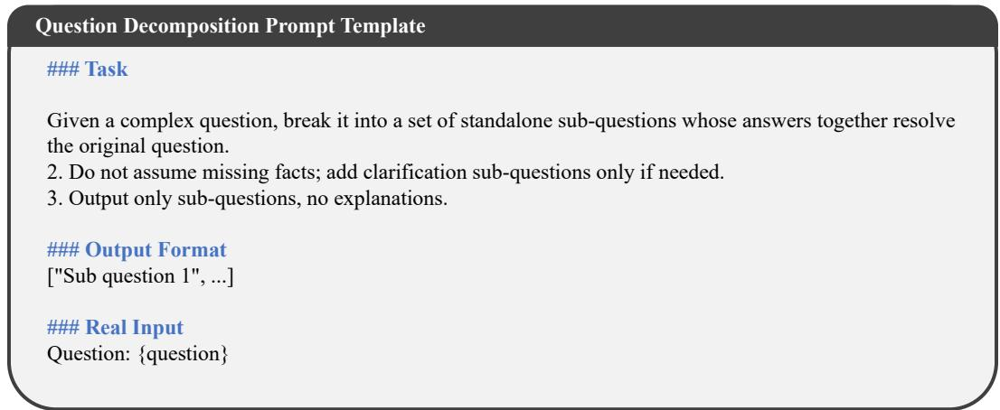  
Figure 7: The prompt template of question decomposition prompt.

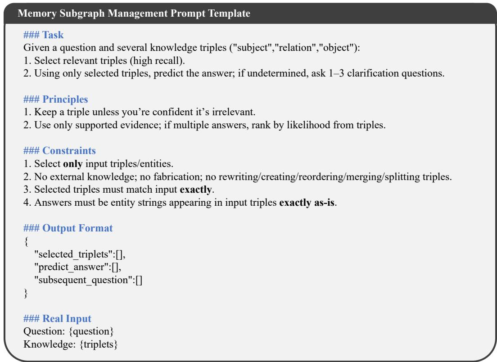  
Figure 8: The prompt template of memory subgraph management.

## C LLM Prompt Template

In this section, we illustrate all the templates and prompts used in the experiments.

Question decomposition prompt template We use an instruction prompt to decompose the original question into a list of standalone sub-questions whose answers jointly resolve the origina question. The prompt prohibits assuming missing facts and allows clarification sub-questions only when necessary. The output is restricted to a JSON-style list ["Sub question 1", ...], with {question} replaced by the input question. The prompt template is provided in Figure 7.

Memory subgraph management prompt template This prompt takes the input question and a set of KG triples in the form ((subject, relation, object)). It instructs the LLM to select a high-recall subset of relevant triples, predict the answer using only the selected triples (or leave it undetermined), and ask 1–3 clarification sub-questions when the answer cannot be concluded. The prompt enforces that selected triples and answer entities must be copied exactly from the inputs, without using external knowledge or modifying any triples. The output is a JSON object with fields "selected\_triplets", "predict\_answer", and "subsequent\_question". The prompt template is provided in Figure 8.

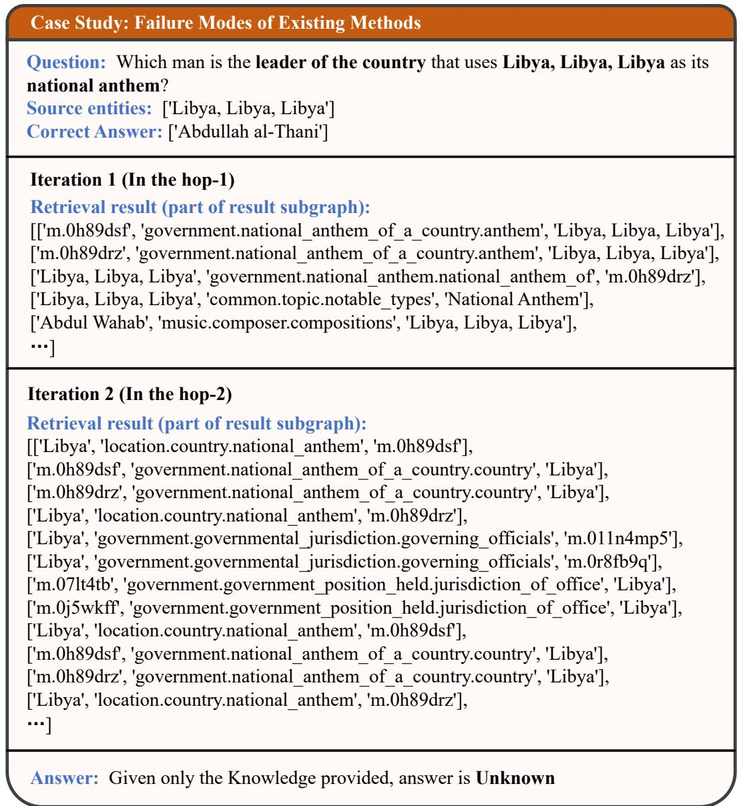  
Figure 9: Case study 1: failure modes of existing methods.

  
Figure 10: Case study 2: workflow of our method FoG.

## D Case study

In this case study, we contrast standard hop-by-hop KG traversal with FoG. As shown in Figure 9, greedy/beam-style per-hop pruning is prone to a myopic failure mode on large-scale KGs: in the early search stages, the model has little or no access to distant, answer-critical entities, so many outgoing relations appear similarly relevant under local matching. Consequently, truly answer-relevant relations may not look sufficiently salient and can be mistakenly pruned by top-k/beam selection. Once these critical edges are removed, subsequent exploration cannot recover the missing evidence chain, causing the search to drift into irrelevant neighborhoods and ultimately fail.

In contrast, Figure 10 illustrates how FoG mitigates this issue. Starting from the extracted source entities, FoG iteratively expands a subgraph while discarding question-irrelevant triples in each iteration, yielding an expanded subgraph with high recall and low noise. More importantly, FoG introduces a far-to-near message feedback mechanism that propagates strong question-relevant signals discovered at distant entities back toward nodes closer to the sources, and uses these lookahead cues to re-score nearby triples, thereby preventing incorrect early-stage pruning. Finally, the LLM incorporates the relevance-refined graph structure into its memory and generates follow-up subquestions to guide the next retrieval iteration, enabling the search to reliably converge along the correct evidence chain to the answer.

## E Training Details

This subsection supplements §3.2 by providing additional details on how we train the foresight triple scorer with answer-supporting evidence and local noise sampling.

Training Evidence For each training question $q _ { \mathrm { t r } } .$ let $\mathcal { G } ^ { + } ( { q } _ { \mathrm { t r } } )$ denote the set of triples on its answer-supporting reasoning paths in the knowledge graph. These triples serve as positive evidence for training the foresight triple scorer. For readability, we omit the explicit dependence on $q _ { \mathrm { t 1 } }$ r in the remainder of this subsection and use $\mathcal { T } ^ { \mathrm { p o s } }$ to denote the positive evidence triples for the current training instance:

$$
\mathcal { T } ^ { \mathrm { p o s } } = \mathcal { G } ^ { + } ( q _ { \mathrm { t r } } ) .\tag{13}
$$

The foresight scorer is trained with triple-level supervision. Triples in $\mathcal { T } ^ { \mathrm { p o s } }$ are labeled as positive evidence, while locally sampled neighboring triples outside $\mathcal { T } ^ { \mathrm { p o s } }$ are used as negative candidates.

Local Training Region and Noise Sampling To train the foresight scorer in a local context consistent with inference-time retrieval, we construct a per-question local training region by sampling noisy neighboring triples around the positive evidence. We initialize the seed entity set as the entities touched by the positive evidence triples, optionally unioned with an extra anchored set ${ \mathcal { E } } _ { 0 }$ obtained from preprocessing:

$$
\mathcal E ^ { \mathrm { s e e d } } = \{ v \mid \exists t \in \mathcal T ^ { \mathrm { p o s } } , v \in t \} \cup \mathcal E _ { 0 } .\tag{14}
$$

For each seed entity $v \in \mathcal { E } ^ { \mathrm { s e e d } }$ , we consider its one-hop neighboring triples $\mathcal { N } ( v )$ and sample noisy triples around v proportionally to how often v participates in the positive evidence. Let

$$
\begin{array} { r } { \deg _ { \mathrm { p o s } } ( v ) = \big | \{ t \in \mathcal { T } ^ { \mathrm { p o s } } : \ v \in t \} \big | . } \end{array}\tag{15}
$$

We uniformly sample $\kappa \cdot \deg _ { \mathrm { p o s } } ( v )$ triples from $\mathcal { N } ( v ) \backslash \mathcal { T } ^ { \mathrm { p o s } }$ as noisy candidates. The sampled triples are deduplicated across all seed entities to form the negative set $\dot { \tau } ^ { \mathrm { n e g } }$

$$
\mathcal { T } ^ { \mathrm { n e g } } = \bigcup _ { v \in \mathcal { E } ^ { \mathrm { s e e d } } } \mathrm { S a m p l e } \left( \mathcal { N } ( v ) \backslash \mathcal { T } ^ { \mathrm { p o s } } , \kappa \cdot \deg _ { \mathrm { p o s } } ( v ) \right) .\tag{16}
$$

We set $\kappa = 1 0$ in all experiments. To reduce uninformative noise, we optionally filter out triples triggered by extremely high-degree generic relations before sampling.

The training triples for each instance are then defined as:

$$
\mathcal { T } ^ { \mathrm { t r a i n } } = \mathcal { T } ^ { \mathrm { p o s } } \cup \mathcal { T } ^ { \mathrm { n e g } } .\tag{17}
$$

Each triple $t \in { \mathcal { T } } ^ { \mathrm { t r a i n } }$ is assigned an edge-level binary label:

$$
y _ { t } = \mathbb { I } [ t \in T ^ { \mathrm { p o s } } ] .\tag{18}
$$

Thus, triples on answer-supporting reasoning paths are treated as positive examples, while sampled neighboring triples outside these paths are treated as negative examples.

Objective and Optimization We obtain a foresight score $s _ { t }$ for each triple t following §3.2, and interpret $\sigma ( s _ { t } )$ as the predicted probability that t belongs to an answer-supporting reasoning path. For each training question $q _ { \mathrm { t r } }$ , we compute a triple-level binary cross-entropy loss over its local training set $\tau \mathrm { { t r a i n } }$

$$
\begin{array} { r l } { \displaystyle \mathcal { L } _ { \mathrm { t r i p l e } } ( q _ { \mathrm { t r } } ) = \sum _ { t \in \mathcal { T } ^ { \mathrm { t r a i n } } } \Big ( - y _ { t } \log \sigma ( s _ { t } ) } & { } \\ { \displaystyle - ( 1 - y _ { t } ) \log \big ( 1 - \sigma ( s _ { t } ) \big ) \Big ) . } \end{array}\tag{19}
$$

For a mini-batch of training questions $B ,$ the final training objective is:

$$
\mathcal { L } _ { \mathrm { t r } } = \frac { 1 } { | \mathcal { B } | } \sum _ { q _ { \mathrm { t r } } \in \mathcal { B } } \mathcal { L } _ { \mathrm { t r i p l e } } ( q _ { \mathrm { t r } } ) .\tag{20}
$$

We optimize model parameters with mini-batch AdamW by minimizing $\mathcal { L } _ { \mathrm { t r } }$ , while keeping the underlying embedding encoder frozen throughout training. We use AdamW with learning rate $1 \times 1 0 ^ { - 5 } , \stackrel { \cdot } { \beta } _ { 1 } = 0 . 9 , \stackrel { \cdot } { \beta _ { 2 } } = 0 . 9 9 9$ , and weight decay $1 \times 1 0 ^ { - 3 }$ , without learning rate warmup or decay. We apply dropout with rate 0.1 to the foresight feedback propagation module and the foresight triple scorer.

We train for 5 epochs on each dataset. All experiments are conducted on a single NVIDIA GeForce RTX 5090 GPU.

Training and Inference Separation The above triple-level labels are used only for supervised training of the foresight scorer. During inference, FoG follows the retrieval procedure described in Section 3: it starts from the question and the extracted source entities, expands the knowledge graph with the learned foresight scorer, applies far-to-near feedback propagation, and maintains a compact memory subgraph for answer generation.

## F Impact Statement

Foresight-over-Graph (FoG) introduces a foresight-aware retrieval framework for knowledge-graph grounded question answering, enabling large language model (LLM)-based agents to explore complex knowledge graphs beyond local horizons, preserve answer-critical evidence, and reason over multihop factual structures with improved reliability and efficiency. The broader impacts of this work include advancing trustworthy and interpretable knowledge-intensive AI systems, with potential applications in scientific discovery, professional decision support, enterprise knowledge management, and collaborative AI assistants that require accurate reasoning over structured, updatable knowledge sources. However, if the underlying knowledge graph contains biased, incomplete, outdated, or adversarially injected facts, FoG may propagate and reinforce misleading evidence through its retrieval and memory mechanisms. We therefore urge responsible deployment of this framework with appropriate safeguards, including continual knowledge validation, provenance tracking, robustness checks against noisy or malicious graph entries, and alignment with human oversight in high-stake applications.