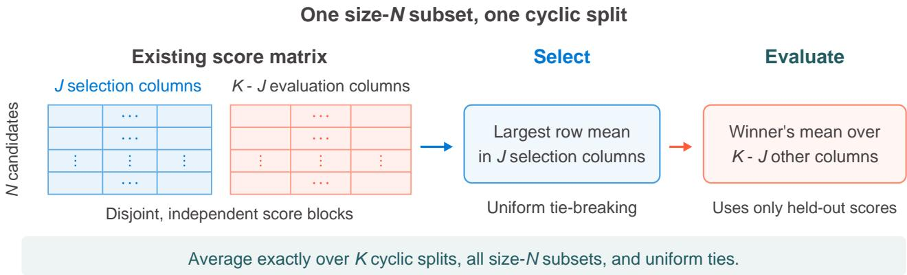
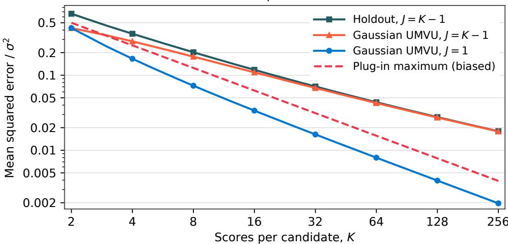

# Holdout Best-of-�: Unbiased Evaluation and Its Cost

Shrey Shah and Yinheng Li

Reusing the scores that select a Best-of-� winner can overstate its expected reward. We study evaluation from a fixed matrix of � independent scores per candidate for a policy that selects using � fresh scores. A single estimator based only on this matrix is exactly unbiased for expected judge reward under every independent, stable collection of candidate-specific score laws if and only if $J < K$ , for every pool size $M \geq N \geq 2 . \mathrm { A t } J = K - 1$ , the selector deepens as � grows. For independent Gaussian scores with common variance and fixed $M \geq N \geq 2 ,$ the unbiased minimax risk in this regime is of order $\sigma ^ { 2 } / \sqrt { K }$ , attained by Holdout; allowing bias improves the rate to $\sigma ^ { 2 } / K$ . For two candidates, we derive the minimum-variance unbiased estimator at known variance and the sharp asymptotic unbiased minimax constant $1 / ( \pi { \sqrt { 2 } } )$ , which Holdout attains without knowing the variance. The cyclic average over subsets and ties can be computed in $O ( M K \log M )$ operations. At fixed selector depth, cyclic evaluation of bounded scores has $O ( K ^ { - 1 } )$ risk uniformly in pool size. The impossibility result concerns the fixed matrix: one additional fresh winner score permits unbiased evaluation of the all-� policy.

## 1. Introduction

Best-of-� (BoN) returns the highest-scoring generated candidate [Nakano et al., 2021, Stiennon et al., 2020, Lightman et al., 2023]. With a stochastic judge, selection favors unusually high score realizations: the observed maximum can rise with � even when all candidates have the same mean. Independent evaluation avoids reusing selection noise. Judge reward can still disagree with human preferences [Gao et al., 2023, Coste et al., 2024, Eisenstein et al., 2023].

We observe � scores for each of � candidates and evaluate a policy that selects from a uniform size-� subset using � fresh scores per candidate. Its value is the selected candidate’s expected judge mean. We ask whether this value admits an exactly unbiased estimate from the fixed matrix, and what unbiasedness costs in mean-squared error.

Figure 1 illustrates column splitting. Holdout uses $J = K - 1$ columns for selection and leaves one for evaluation, averaging over held-out columns, candidate subsets, and tied winners. It targets the (� − 1)-score policy, whose value may difer from the all-� policy.

Over the class of independent, stable candidate-specific score laws, unbiased evaluation from the fixed matrix is possible if and only if $J < K$ . The independent-split construction follows classical unbiased functional estimation [Halmos, 1946, Hoefding, 1948]; a polynomial-degree argument for the BoN functional proves necessity. Acquiring a fresh winner score changes the observation design and permits unbiased evaluation of the all-� policy.

For independent Gaussian scores with common variance and fixed $M \geq N \geq 2$ , the unbiased minimax risk along $J = K - 1$ is of order $\sigma ^ { 2 } / \sqrt { K }$ . Holdout attains this rate without knowing the variance; allowing bias gives order $\sigma ^ { 2 } / K$ . Here selector depth grows with the observed matrix. With fixed selector depth � and bounded scores, cyclic evaluation has $O ( K ^ { - 1 } )$ risk uniformly in pool size, including discrete and unequal-variance score laws.

  
J = K - 1: each split evaluates on one held-out column.

Figure 1 | Selection and evaluation use disjoint score columns. Selection uses the mean of � columns; evaluation averages the winner’s remaining � − � scores. The estimator averages over cyclic splits, all size-� subsets, and uniform ties. Holdout uses $J = K - 1$

Section 2 defines the policy and observed data. Section 3 constructs Holdout and establishes the sample boundary; Section 4 quantifies the cost of unbiasedness. Section 5 covers evaluation budgets, confidence intervals, and dependence. Section 6 reports the synthetic experiments.

## 2. Problem setup

For each prompt, condition on its realized pool of � candidate responses and any latent variables that determine their score laws; denote this conditioning information by ℱ. The observed matrix $R \in \mathbb { R } ^ { M \times K }$ contains � scores per candidate, and candidate � has judge mean $\mu _ { m }$

Assumption 1 (Independent, stable scores). Conditional on ${ \mathcal F } ,$ all �� scores are mutually independent and integrable. For each candidate �, the scores $R _ { m , 1 } , \ldots , R _ { m , K }$ have the same distribution and mean $\mu _ { m } .$ . Diferent candidates may have diferent score distributions.

Definition 1 (�-score policy value). Draw a size-� subset � uniformly from the � candidates. Within it, select $W _ { J } ( S )$ by the largest mean of� fresh, independent scores per candidate, breaking ties uniformly. Define

$$
\begin{array} { r } { \Theta ^ { ( J ) } ( M , N , \pmb \mu , F _ { \varepsilon } ) : = \mathbb { E } [ \mu _ { W _ { J } ( S ) } \mid \mathcal { F } ] . } \end{array}
$$

Here $F _ { \varepsilon }$ is the collection of candidate-specific centered score laws. The hypothetical draws define the policy;   
estimation uses only the observed score matrix.

Increasing � can decrease reward: with two means 0, 0.5 and iid noise uniform on {−1, +1}, the values are $\Theta ^ { ( 1 ) } = 0 . { \bar { 3 } } 7 5$ and $\Theta ^ { ( 2 ) } = 1 1 / 3 2$ . For � = 1, every target is the pool’s mean.

From a fixed pool to a generated pool. For exchangeable candidate/score-law pairs conditional on a prompt, a uniform size-� subset has the same joint law as the first � candidates. Averaging $\Theta ^ { ( J ) }$ over generated pools

therefore gives the population value of that selector. This includes iid generation. A fixed four-plus-four mixture of two generation policies difers from an iid single-policy pool; a production generator with a diferent joint law need not have the same value. Inference uses complete prompt/pool units (Section 5.2).

## 3. The Holdout Best-of-� estimator

For $K = 3$ and $J = 2$ , choose a winner from a fixed candidate subset using columns 1 and 2, then evaluate it with column 3. Repeat using columns 2 and 3 to select and column 1 to evaluate, then columns 3 and 1 to select and column 2 to evaluate. Average the three evaluations. Each winner is chosen without its evaluation column. Averaging over candidate subsets and uniform tie choices gives Holdout at three columns; the cyclic estimator below allows any $1 \leq J < K$

Fix $1 \leq J < K$ . For each of the � cyclic blocks $I _ { t }$ of � columns, form a selection mean $a _ { m , t }$ and an evaluation mean $v _ { m , t }$ from its complement:

$$
I _ { t } = \{ 1 + ( ( t + r ) \bmod K ) : r = 0 , \ldots , J - 1 \} , \qquad a _ { m , t } = \frac { 1 } { J } \sum _ { k \in I _ { t } } R _ { m , k } , \quad v _ { m , t } = \frac { 1 } { K - J } \sum _ { k \not \in I _ { t } } R _ { m , k } .
$$

Here $t = 0 , \ldots , K - 1$

Subset and tie averaging. An ascending rank � wins $\binom { i - 1 } { N - 1 }$ of the $\textstyle { \binom { M } { N } }$ subsets, so its weight is $w _ { i } \ =$ $\textstyle { \binom { i - 1 } { N - 1 } } / ( { \binom { M } { N } } )$ , zero for $i < N$ . Average these weights within each tied block. Writing $q _ { m , t }$ for this weight gives

$$
\widehat { \Theta } _ { J , K } = \frac { 1 } { K } \sum _ { t = 0 } ^ { K - 1 } \sum _ { m = 1 } ^ { M } q _ { m , t } v _ { m , t } .\tag{1}
$$

The weighted sum is the exact average over subsets and uniformly chosen tied winners. Rolling column sums and one sort per block compute this average in �(�� log �) arithmetic operations. The subset weights extend the binary pass@� counting identity [Chen et al., 2021]; Appendix E derives the weights and computational cost.

Holdout Best-of-�. At $J = K - 1$ , each split leaves one column for evaluation. Write $h _ { m } ^ { ( - k ) } = ( K -$ $\textstyle 1 ) ^ { - 1 } \sum _ { j \neq k } R _ { m , j }$ , let $\sigma ^ { ( k ) }$ sort these keys, and let ${ \tilde { w } _ { i } } ^ { ( k ) }$ average $w _ { i }$ within ties. Equation 1 becomes

$$
\widehat { \Theta } _ { \mathrm { H } } ( R ; N ) = \frac { 1 } { K } \sum _ { k = 1 } ^ { K } \sum _ { i = 1 } ^ { M } \tilde { w } _ { i } ^ { ( k ) } R _ { \sigma ^ { ( k ) } ( i ) , k } .\tag{2}
$$

For discrete scores, tied weights must be averaged; stable sorting alone favors the index order (Appendix E).

Theorem 1 (Unbiased evaluation). Under Assumption 1, for every $1 \leq J < K , \mathbb { E } [ \widehat { \Theta } _ { J , K } \mid \mathcal { F } ] = \Theta ^ { ( J ) }$ . In particular, $\mathbb { E } [ \widehat { \Theta } _ { \mathrm { H } } \mid \mathcal { F } ] = \Theta ^ { ( K - 1 ) }$

Proof. Conditional on the selection keys $a _ { t }$ and ${ \mathcal F } ,$ each evaluation mean has conditional mean $\mu _ { m }$ and the weights are fixed. The block’s expected contribution is therefore $\textstyle \sum _ { m } q _ { m , t } \mu _ { m }$ . Its keys have the joint law of the intended independent �-score selector, so expectation over them gives $\Theta ^ { ( J ) }$ . Linearity of expectation preserves this value when averaging over the possibly dependent block estimates. □

## 3.1. The sample boundary

Theorem 2 (Estimability frontier). Fix $K \ge 2$ and any $M \ \geq \ N \ \geq \ 2$ . Over the distribution-free class of independent, stable score laws (Assumption 1, with laws allowed to difer across candidates), consider a single statistic $T ( R ; M , N , J , K )$ , integrable under every law in this class, with no candidate means or score-law parameters supplied as side information:

(a) Achievability. For every integer $1 \le J < K , \Theta ^ { ( J ) } ( M , N , \cdot )$ admits an exactly unbiased estimatorfrom the $M \times K$ sample matrix. At $J = K - 1$ , Holdout BoN is one (Theorem 1).

(b) Impossibility. For every $J \ge K , \Theta ^ { ( J ) } ( M , N , \cdot )$ admits no exactly unbiased estimator that is a function of the $M \times K$ sample matrix.

Thus, for integer $J \ge 1 , \Theta ^ { ( J ) }$ is distribution-free exactly unbiasedly estimable from this matrix ifand only if $J < K$ . The threshold specifies the selector sample count for exact unbiased estimability. Reward $\Theta ^ { ( J ) }$ can decrease with �.

Proofsketch. For $M = N = 2$ with Bernoulli judges, the expectation of a statistic based on � samples has degree at most � in each mean. The selector target has degree exactly $J + 1$ in each mean, ruling out $J \geq K$ Adding $M - 2$ constant, lower-scoring candidates preserves this higher-degree term with positive coeficient ${ \binom { M - 2 } { N - 2 } } / { \binom { M } { N } }$ . Appendix A proves these claims. For $J < K$ , selection on � columns and independent evaluation on the remaining $K - J$ columns gives an unbiased estimator; cyclic averaging preserves it (Theorem 1).

The same boundary holds for two candidates with known common Gaussian noise: no estimator integrable at every mean pair is unbiased for $\Theta ^ { ( J ) }$ when $J \geq K$ (Proposition 3).

## 4. The cost of exact unbiasedness

At $J = K - 1$ , increasing � also deepens the selector; at fixed $J ,$ it provides more data to evaluate the same policy. We first quantify Gaussian risk at the boundary, then give fixed-depth bounds for bounded scores, including discrete and heteroscedastic laws.

Theorem 3 (Gaussian risk cost for any fixed pool and subset size). Fix $M \geq N \geq 2$ . Observe independent $R _ { m , k } \sim$ $\mathcal { N } ( \mu _ { m } , \sigma ^ { 2 } )$ , with $K \geq 2$ and common $\sigma > 0$ , and take $J = K - 1$ . Write $L _ { K } ( U ; \pmb \mu , \sigma ) = \mathbb { E } _ { \pmb { \mu } , \pmb { \sigma } } [ ( U - \Theta ^ { ( K - 1 ) } ) ^ { 2 } ]$ Forfixed known $\sigma ,$ let $\mathcal { U } _ { K } ( \sigma )$ contain the statistics integrable and unbiased for this target at every $\pmb { \mu } \in \mathbb { R } ^ { M }$ . As $K  \infty$

$$
\operatorname* { i n f } _ { U \in \mathcal { U } _ { K } ( \sigma ) } \operatorname* { s u p } _ { \mu } L _ { K } ( U ; \mu , \sigma ) \asymp _ { M , N } \operatorname* { s u p } _ { \mu } L _ { K } ( \widehat { \Theta } _ { \mathrm { H } } ; \mu , \sigma ) \asymp _ { M , N } \frac { \sigma ^ { 2 } } { \sqrt { K } } .
$$

If bias is allowed, the minimax rate is $\sigma ^ { 2 } / K$ . For unknown $\sigma ,$ the same orders, $K ^ { - 1 / 2 }$ and $K ^ { - 1 }$ , hold after normalizing the loss by $\sigma ^ { 2 }$ and taking the supremum over all $\pmb { \mu } \in \mathbb { R } ^ { M } , \sigma > 0 ;$ the unbiased class then requires unbiasedness at every such pair without the true � as an input. Holdout attains the unbiased order without a variance input or estimate. The comparison constants may depend on $M , N$

The lower bound uses two tied best candidates with the other means receding below them. It gives a worst-case rate for each fixed $M , N ;$ ; the risk when all � means tie and the rate for growing pools remain separate questions. Appendix D gives finite-� bounds.

## 4.1. Sharp constants for two candidates

Assume $M = N = 2$ and independent $R _ { m , k } \sim \mathcal N ( \mu _ { m } , \sigma ^ { 2 } )$ , with known $\sigma > 0$ . Put $S = ( \bar { R } _ { 1 } + \bar { R } _ { 2 } ) / 2$ $D = { \bar { R } } _ { 1 } - { \bar { R } } _ { 2 }$ , and $\tau ^ { 2 } = 2 \sigma ^ { 2 } / K$ . For $d = \mu _ { 1 } - \mu _ { 2 }$ , the target is

$$
\Theta ^ { ( J ) } = \frac { \mu _ { 1 } + \mu _ { 2 } } 2 + \frac d 2 \operatorname { e r f } \left( \frac { \sqrt J d } { 2 \sigma } \right) , \qquad \operatorname { e r f } ( z ) = \frac 2 { \sqrt \pi } \int _ { 0 } ^ { z } e ^ { - u ^ { 2 } } d u .
$$

Theorem 4 (Gaussian unbiased risk). For $1 \leq J < K$ , define $b = \sqrt { J K } / ( 2 \sigma \sqrt { K - J } )$ . The estimator

$$
T _ { J , K } = S + \frac { D } { 2 } \mathrm { e r f } ( b D ) - \frac { \tau ^ { 2 } b } { \sqrt { \pi } } e ^ { - b ^ { 2 } D ^ { 2 } }\tag{3}
$$

is unbiasedfor every mean pair and has minimum variance at each pair among estimators unbiased throughout this Gaussian model with finite variance. At $\mu _ { 1 } = \mu _ { 2 }$ , let $r = J / K$ ; its mean-squared error is

$$
\mathcal { R } _ { J , K } = \frac { \sigma ^ { 2 } } { K } \left[ \frac { 1 } { 2 } + \frac { 1 } { \pi } \left( \arcsin { r } + \frac { r } { \sqrt { 1 - r ^ { 2 } } } \right) \right] .\tag{4}
$$

Consequently, at equal means, every estimator unbiased for all mean pairs has MSE at least $\mathcal { R } _ { J , K } . A t J = K - 1$ this minimum is asymptotic to $\sigma ^ { 2 } { \dot { / } } ( \pi { \sqrt { 2 K } } )$ ; forfixed �, it is asymptotic to $\sigma ^ { 2 } / ( 2 K )$

The final term in Equation 3 corrects the bias of the preceding nonlinear term. As $J / K$ approaches one, it concentrates near tied observed means. Appendix B proves unbiasedness and minimum variance using Gaussian expectations and complete suficient row means. Appendix G gives a stable numerical form.

At equal means, the biased estimator max $( \bar { R } _ { 1 } , \bar { R } _ { 2 } )$ has MSE $\sigma ^ { 2 } / K$ for the same policy value. Along $J = K - 1$ it has lower MSE than every globally unbiased estimator for suficiently large � (Figure 2). This pointwise comparison leaves the ordering at other mean pairs open.

Proposition 1 (Risk of diagonal Holdout). Let $M = N = 2 , K \geq 2$ , and $R _ { m , k } \sim \mathcal N ( \mu _ { m } , \sigma ^ { 2 } )$ independently, with common $\sigma > 0$ . Holdout uses no value or estimate of �. At equal means, its $\boldsymbol { M S E } \ f o r \Theta ^ { ( K - 1 ) }$ is

$$
\mathcal { H } _ { K } = \frac { \sigma ^ { 2 } } { K } + \frac { \sigma ^ { 2 } ( K - 1 ) } { \pi K \sqrt { 2 K - 3 } } .\tag{5}
$$

Use the loss and unbiased class from Theorem $^ { 3 , }$ restricted to $M = N = 2$ . As $K  \infty$

$$
\operatorname* { s u p } _ { \mu } L _ { K } ( \widehat { \Theta } _ { \mathrm { H } } ; \mu , \sigma ) \sim \operatorname* { i n f } _ { U \in \mathcal { U } _ { K } ( \sigma ) } \operatorname* { s u p } _ { \mu } L _ { K } ( U ; \mu , \sigma ) \sim \frac { \sigma ^ { 2 } } { \pi \sqrt { 2 K } } .\tag{6}
$$

For estimators unbiased at every $( \mu , \sigma )$ without using $\sigma ,$ the minimax normalized risk $L _ { K } / \sigma ^ { 2 }$ , with supremum over all mean pairs and $\sigma > 0 ,$ , is asymptotic to $1 / ( \pi { \sqrt { 2 K } } )$ , again attained by Holdout to first order. Allowing bias gives minimax rate $\sigma ^ { 2 } / K$ atfixed �, or 1/� for the normalized unknown-variance loss.

Appendix C combines a uniform cross-moment bound with Theorem 4 to prove the sharp constant; Appendix B.1 proves the unrestricted rate. Finite-� minimaxity of Holdout and its exact worst-case mean gap remain unresolved by these results.

## Two candidates with equal means; Gaussian scores

  
Figure 2 | Exact MSE divided by $\sigma ^ { 2 }$ for two independent Gaussian candidates at equal means. Holdout uses no variance input; the other unbiased curves assume known variance. The $J = 1$ and $J = K - 1$ policies have the same value here.

## 4.2. Selector depth and bounded scores

Corollary 1 (Selector depth and tied-mean risk). In the known-variance Gaussian pair model ofTheorem 4, put $\begin{array} { r } { C ( r ) = \frac { 1 } { 2 } + \pi ^ { - 1 } } \end{array}$ 1(arcsin $r + r / \sqrt { 1 - r ^ { 2 } } )$ . The minimum unbiased risk at equal means satisfies

$$
\mathcal { R } _ { J , K } \sim \left\{ \begin{array} { l l } { \sigma ^ { 2 } / ( 2 K ) , } & { J \ f x e d , } \\ { \sigma ^ { 2 } C ( r _ { 0 } ) / K , } & { J / K \to r _ { 0 } \in [ 0 , 1 ) , } \\ { \sigma ^ { 2 } / ( \pi \sqrt { 2 K s _ { K } } ) , } & { s _ { K } = K - J = o ( K ) . } \end{array} \right.
$$

Thus bounded positive slack $s _ { K } = O ( 1 )$ gives order $K ^ { - 1 / 2 }$ ; for fixed $s \geq 1$ , its leading constant is $1 / ( \pi { \sqrt { 2 s } } )$ These formulas give pointwise risk at equal means.

If $J / K$ stays bounded away from one, the Gaussian pair’s minimum tied-mean risk is $O ( \sigma ^ { 2 } / K )$ . Increasing � at fixed � evaluates one policy; increasing � also changes the policy. A uniform fixed-depth guarantee holds beyond Gaussian scores when scores are bounded.

Proposition 2 (Fixed-depth evaluation with bounded scores). Under Assumption 1, suppose scores lie in $[ a , a + B ]$ $B > 0$ . For any $M \geq N \geq 2$ and $1 \leq J < K$ , let $\widehat { \Theta } _ { J , K } ^ { \mathrm { a l l } }$ average the independent selection/evaluation split over all $\binom { K } { J }$ selection sets. Both it and the cyclic estimator are unbiased $f o r \Theta ^ { ( J ) }$ , and

$$
\mathrm { M S E } ( \widehat { \Theta } _ { J , K } ^ { \mathrm { a l l } } ) \leq \frac { ( J + 1 ) B ^ { 2 } } { 4 K } , \qquad \mathrm { M S E } ( \widehat { \Theta } _ { J , K } ) \leq \frac { B ^ { 2 } } { 4 } \operatorname* { m i n } \left\{ 1 , \frac { ( J + 1 ) ^ { 2 } } { K } \right\} .\tag{7}
$$

The cyclic bound is uniform over �, � and the candidate laws. Forfixed $M , N , J ,$ the globally unbiased minimax risk over this bounded class has order $K ^ { - 1 }$ : it lies between $B ^ { 2 } / ( 4 M K )$ and $( J + 1 ) B ^ { 2 } / ( 4 K )$

Appendix F proves the complete-average bound using its order- $( J + 1 )$ U-statistic structure [Hoefding, 1948], and the cyclic bound using columnwise bounded diferences. The cyclic bound has conservative constants and leaves minimum-variance optimality unresolved.

## 5. Practical evaluation

## 5.1. Choosing an observation design

Fix the deployed selector’s �. If $J < K$ and a score matrix is available, cyclic splitting gives unbiased evaluation under Assumption 1. For unbiased all-� evaluation, keep $J = K$ and acquire a fresh winner score. With new acquisition, draw a uniform size-� subset from the same pool, use $N J$ selection calls, and score the winner once more: $N J + 1$ score calls. Unbiasedness requires that score’s conditional mean to equal the winner’s judge mean. This design retains subset and selection variation.

At budget $B ,$ use an independent pilot to compare designs for the same policy and target. With per-unit cost $^ { c , }$ population variance $V ,$ and bias $b _ { 0 }$ , averaging about $B / c$ independent units has approximate MSE $b _ { 0 } ^ { 2 } + c V / B$ Among unbiased designs, prefer smaller pilot estimates of $c V$ , including generation and prompt overhead in �. A biased plug-in estimator also needs a justified estimate or bound for $b _ { 0 }$

## 5.2. Population uncertainty

For $T \geq 2$ iid complete prompt/pool units, compute one estimate $H _ { p } = \widehat { \Theta } _ { J , K } ^ { ( p ) }$ per unit, keeping the policy and scoring protocol fixed. Under Assumption 1 and E $\begin{array} { r } { \{ H _ { p } ^ { 2 } \} < \infty , \bar { H } = T ^ { - 1 } \sum _ { p } H _ { p } } \end{array}$ is unbiased for $\theta _ { \mathrm { p o p } } = \mathbb { E } _ { p } [ \Theta _ { p } ^ { ( J ) } ]$ With positive total variance, an asymptotic $1 - \alpha$ interval is

$$
\bar { H } \pm z _ { 1 - \alpha / 2 } \frac { s _ { H } } { \sqrt { T } } , \qquad s _ { H } ^ { 2 } = \frac { 1 } { T - 1 } \sum _ { p = 1 } ^ { T } ( H _ { p } - \bar { H } ) ^ { 2 } .
$$

Here $z _ { 1 - \alpha / 2 }$ is the standard-normal quantile. The sample variance estimates $\operatorname { V a r } _ { p } ( \Theta _ { p } ^ { ( J ) } ) + \mathbb { E } _ { p } [ \operatorname { V a r } ( H _ { p } \mid \mathcal { F } _ { p } ) ]$ including pool generation and judge noise. Iterated expectation and total variance give these moments; the iid central limit theorem gives the interval’s asymptotic coverage. If every score lies in $[ a , b ]$ , then $H _ { p }$ also lies in that interval, and Hoefding’s inequality gives a finite-sample interval with half-width $( b - a ) \sqrt { \log ( 2 / \alpha ) / ( 2 T ) }$

Folds, candidates, and score calls within one pool cannot serve as independent prompt/pool replicates. When several pools share a sampled prompt, average within each prompt using prespecified nonnegative weights summing to one, then treat the independent prompt averages as the units. For a paired policy comparison, apply the variance formula to per-prompt diferences. Resample whole units.

## 5.3. Sensitivity to dependent scores

Fix the pool and its intended independent-score target $\Theta ^ { ( J ) }$ . The observed matrix may now have any integrable joint law. Write $q _ { m , t } = q _ { m } ( a _ { t } )$ for candidate $m \overrightarrow s$ subset-and-tie-averaged selection weight, and define

$$
d _ { m , t } ( \boldsymbol { a } _ { t } ) = \mathbb { E } [ v _ { m , t } \mid \mathcal { F } , \boldsymbol { a } _ { t } ] - \mu _ { m } , \quad \bar { p } _ { m } = \frac { 1 } { K } \sum _ { t } \mathbb { E } [ q _ { m , t } \mid \mathcal { F } ] , \quad p _ { m } ^ { J } = \operatorname* { P r } \{ W _ { J } = m \mid \mathcal { F } \} .
$$

Conditioning on the keys gives the exact identity

$$
\mathbb { E } [ \widehat { \Theta } _ { J , K } \mid \mathcal { F } ] - \Theta ^ { ( J ) } = \underbrace { \frac { 1 } { K } \sum _ { t } \mathbb { E } \left[ \sum _ { m } q _ { m , t } d _ { m , t } \mid \mathcal { F } \right] } _ { \mathrm { e v a l u a t i o n ~ c o n d i t i o n a l ~ m e a n s } } + \underbrace { \sum _ { m } \mu _ { m } ( \bar { p } _ { m } - p _ { m } ^ { J } ) } _ { \mathrm { s e l e c t o r ~ l a w } } .
$$

Consequently the absolute bias is at most $C + D \mathrm { T V } ( \bar { p } , p ^ { J } )$ , where $\begin{array} { r } { C = K ^ { - 1 } \sum _ { t } \mathbb { E } [ \operatorname* { m a x } _ { m } | d _ { m , t } | \mathbf { \theta } | \mathbf { \mathcal { F } } ] , D = } \end{array}$ $\begin{array} { r } { \operatorname* { m a x } _ { m } \mu _ { m } - \operatorname* { m i n } _ { m } \mu _ { m } } \end{array}$ , and $\begin{array} { r } { \mathrm { T V } ( p , q ) = \frac { 1 } { 2 } \sum _ { m } | p _ { m } - q _ { m } | } \end{array}$ . The first bound uses the simplex weights; the second uses the range-� total-variation inequality. An observed correlation or a single score matrix cannot certify these sensitivity parameters.

For example, consider $R _ { m , k } = \mu _ { m } + \sigma ( \sqrt { \rho } U _ { m } + \sqrt { 1 - \rho } Z _ { m , k } )$ , where $0 \leq \rho < 1$ and $U , Z$ are independent standard normals drawn afresh for each matrix, independently of ℱ. Selection keys have variance $\sigma ^ { 2 } [ \rho + ( 1 -$ $\rho ) / J ]$ and

$$
d _ { m , t } ( a _ { t } ) = \frac { J \rho } { 1 + ( J - 1 ) \rho } ( a _ { m , t } - \mu _ { m } ) .
$$

This dependence changes both evaluation conditional means and the selection noise law while preserving each score’s marginal mean and variance. A common additive shift $b _ { k }$ shared by every candidate in column � preserves rankings and changes cyclic evaluation by exactly $K ^ { - 1 } \sum _ { k } b _ { k }$ , so zero-average common shifts cancel. Both properties can fail under arbitrary candidate-specific drift.

## 6. Experiments

All experiments use synthetic scores with known laws and targets to check the implementation and compare evaluation designs.

## 6.1. Independent-score checks

Five fixed Bernoulli pools with exact binomial targets test tie handling; independent Gaussian controls at $M = 1 6 , N = 4$ compare reuse and Holdout at the same selector depth. All five Bernoulli and four Gaussian Holdout diferences lie within 1.81 matching Monte Carlo standard errors of zero. Appendix G gives the protocols, data, and code.

## 6.2. Error and cost for a fixed selector

For fixed $J = 1$ , we use $M = N = 8 ,$ , iid $\mathrm { U n i f } ( 0 . 2 , 0 . 8 ) ^ { 8 }$ mean pools, Gaussian score SD 0.6, and 20,000 pools per �. Cyclic evaluation uses the full matrix of 8� scores. The fixed split selects with the first column and evaluates the winner on the remaining $K - 1$ columns; acquiring scores only for these steps would cost $8 + K - 1$ calls. Costs exclude generation and prompt overhead, which can change the budget ranking. Cyclic evaluation has lower pool-specific RMSE; the fixed split has lower total population variance at equal score-call budget (Table 1).

Table 1 | Full-matrix cyclic and adaptive fixed-split evaluation of the one-score target $\Theta ^ { ( 1 ) }$ . The last column compares population variance at equal score-call budget, excluding generation and prompt overhead; values below one favor the fixed split.
<table><tr><td rowspan="2">K</td><td colspan="3">RMSE against  $\Theta ^ { ( 1 ) }$ </td><td rowspan="2"> $c _ { F } V _ { F } / ( c _ { H } V _ { H } )$ </td></tr><tr><td>Cyclic split (H)</td><td>) Fixed split (F)</td><td>Score reuse</td></tr><tr><td>4</td><td>0.240</td><td>0.379</td><td>0.845</td><td>0.824</td></tr><tr><td>8</td><td>0.138</td><td>0.271</td><td>0.831</td><td>0.793</td></tr></table>

## 6.3. Finite-sample comparison beyond two candidates

We compare Holdout and the biased row-mean comparator $P = \mathbb { E } _ { S } [ \operatorname* { m a x } _ { m \in S } \bar { R } _ { m } ]$ against the same $\Theta ^ { ( K - 1 ) }$ Table 2 shows the prespecified $K = 1 6$ slice of a 27-cell Gaussian study with variance one. The mean vectors are all zero, $( 0 , 0 , - 1 , - 2 , . . . )$ , and $( 0 , - 1 , - 2 , . . . )$ . Appendix G gives the full grid, simulation protocol, targetintegration checks, and saved outputs.

Table 2 | MSE for $\Theta ^ { ( 1 5 ) }$ with fixed means, $K = 1 6$ , and $\sigma = 1$ . Parentheses give the Monte Carlo standard error of the paired diference $\Delta = \mathrm { M S E } ( H ) - \mathrm { M S E } ( P )$ ; positive $\Delta$ favors $P .$
<table><tr><td>M</td><td>N</td><td>Means</td><td>Holdout H</td><td>Plug-in  $P$ </td><td>∆ (MCSE)</td></tr><tr><td>4</td><td>2</td><td>All tied</td><td>0.0366</td><td>0.0391</td><td>-0.00255 (0.00026)</td></tr><tr><td>4</td><td>2</td><td>Two tied best</td><td>0.0262</td><td>0.0244</td><td>+0.00180 (0.00006)</td></tr><tr><td>4</td><td>2</td><td>Separated</td><td>0.0247</td><td>0.0243</td><td>+0.00034 (0.00002)</td></tr><tr><td>8</td><td>4</td><td>All tied</td><td>0.0452</td><td>0.0798</td><td>-0.03453 (0.00039)</td></tr><tr><td>8</td><td>4</td><td>Two tied best</td><td>0.0250</td><td>0.0223</td><td>+0.00265 (0.00008)</td></tr><tr><td>8</td><td>4</td><td>Separated</td><td>0.0226</td><td>0.0222</td><td>+0.00032 (0.00002)</td></tr><tr><td>8</td><td>8</td><td>All tied</td><td>0.1821</td><td>0.1496</td><td>+0.03252 (0.00098)</td></tr><tr><td>8</td><td>8</td><td>Two tied best</td><td>0.1181</td><td>0.0626</td><td>+0.05542 2 (0.00065)</td></tr><tr><td>8</td><td>8</td><td>Separated</td><td>0.0669</td><td>0.0623</td><td>+0.00469 (0.00026)</td></tr></table>

At $K = 1 6$ with all means tied, Holdout has lower MSE for $( M , N ) = ( 4 , 2 )$ and $( 8 , 4 )$ , while the plug-in is better for (8, 8). The plug-in is better in all nine cells with two tied best candidates. The full grid shows reversals with depth for some all-tied pools and agreement to numerical precision on the saved $K = 6 4$ draws for separated means. Finite-sample rankings depend on the mean vector, subset size, and depth.

## 6.4. Dependence stress test

We use the equicorrelated model from Section 5.3 with $M = 1 6 , N = 4 , K = 8 , \sigma = 0 . 4$ and 40,000 iid $\mathrm { B e t a } ( 2 , 2 ) ^ { 1 6 }$ mean pools, sharing primitive shocks across $\rho \in \{ 0 , 0 . 1 , 0 . 4 , 0 . 8 \}$ . Scoring the realized dependent selections by their true means gives $B _ { \mathrm { a c t u a l } } \mathrm { ; }$ ; doing the same for independent-law selections gives $B _ { \mathrm { i n d e p e n d e n t } } .$ The paired diferences $H - B _ { \mathrm { a c t u a l } }$ and $B _ { \mathrm { a c t u a l } } - B _ { \mathrm { i n d e p e n d e n t } }$ estimate evaluation and selector-law bias against the independent-score target. They sum to $H - B _ { \mathrm { i n d e p e n d e n t } }$ in each pool.

The negative selector-law component partially ofsets the evaluation bias in this experiment.

Table 3 | Bias against the independent-score target at each $\rho .$ Entries are paired mean diferences over 40,000 pools, with Monte Carlo standard errors in parentheses.
<table><tr><td> $\rho$ </td><td>Evaluation</td><td>Selector law</td><td>Total bias</td></tr><tr><td>0.0</td><td>-0.0001 (0.0003)</td><td>+0.0000 (0.0000)</td><td>-0.0001 (0.0003)</td></tr><tr><td>0.1</td><td>+0.0551 (0.0004)</td><td>-0.0160 (0.0001)</td><td>+0.0391 (0.0004)</td></tr><tr><td>0.4</td><td>+0.1832 (0.0005)</td><td>-0.0478 (0.0002)</td><td>+0.1353 (0.0005)</td></tr><tr><td>0.8</td><td>+0.3074 (0.0006)</td><td>-0.0720 (0.0003)</td><td>+0.2355 (0.0006)</td></tr></table>

## 7. Related work

Classical unbiased functional estimation and U-statistics provide the independent-kernel construction and its minimum-variance symmetrization [Halmos, 1946, Hoefding, 1948]. A �-score selection followed by one independent reward is an order-(� + 1) functional in each candidate law, which proves achievability. Our Bernoulli restriction proves that BoN requires this degree, and the Gaussian analysis quantifies the cost of exact unbiasedness near the boundary.

The subset weights extend the binary pass@� counting identity [Chen et al., 2021]. Cross-fitting separates evaluation from fitting or selection [Chernozhukov et al., 2018]; Zrnic and Fithian [2024] study inference after choosing a noisy winner. Our target averages the judge mean of a specified selection rule over its score noise, subsets, and ties. Population uncertainty uses complete prompt/pool units, consistent with the evaluation-design concerns in Miller [2024].

Reward overoptimization also includes systematic disagreement with external quality [Gao et al., 2023]. Ensembles [Coste et al., 2024, Eisenstein et al., 2023], Soft BoN [Verdun et al., 2025], BoP / HedgeTune [Khalaf et al., 2025], and inference-time pessimism [Huang et al., 2025] modify scoring or selection. We study evaluation of the specified sample-mean selector under a stochastic scalar judge, as can arise with LLM judges [Zheng et al., 2023, Zhuge et al., 2024] or sampled reward evaluation [Ziegler et al., 2019, Ouyang et al., 2022].

## 8. Limitations and conclusion

The unbiasedness guarantee requires independent scores with stable candidate-specific laws. Randomized call order, separate sessions, and replicated batches can expose temporal or shared-call efects. Independence remains an assumption.

Dependence can change both the winner law and the held-out conditional means; Section 5.3 bounds their contributions. A fresh-score comparison on realized winners probes evaluation error. Selector-law bias remains unmeasured by that comparison. The experiments use synthetic scores; whether a real judge satisfies the model remains untested here. Judge means can difer from human quality, and pairwise or vector feedback requires a separate target.

The risk separation holds for fixed $M \ge N \ge 2$ with common-variance Gaussian scores and $J = K - 1 ;$ its constants may depend on �, �. Boundary-regime rates for growing pools, unequal variances, and other score laws lie outside this analysis. The distribution-free bounded-score upper bound is uniform in pool size; the matching globally unbiased minimax rate assumes fixed $M , N , J .$ The sharp constant is proved for two candidates. In that Gaussian model, fixed-� minimum unbiased risk at equal means has order $K ^ { - 1 }$ , and the unbiased minimax risk along $J = K - 1$ has order $K ^ { - 1 / 2 }$

From a fixed matrix, exact unbiased evaluation of a �-score BoN policy is possible precisely when $J < K$ over the stated distribution class. Holdout attains the optimal Gaussian unbiased rate at that boundary without knowing the variance. Allowing bias yields a faster minimax rate. Evaluation design therefore starts with the policy to be measured, then weighs acquisition cost and mean-squared error against the requirement of exact unbiasedness.

## References

Mark Chen, Jerry Tworek, Heewoo Jun, Qiming Yuan, Henrique Ponde de Oliveira Pinto, Jared Kaplan, Harri Edwards, Yuri Burda, Nicholas Joseph, Greg Brockman, et al. Evaluating large language models trained on code. arXiv preprint arXiv:2107.03374, 2021.

Victor Chernozhukov, Denis Chetverikov, Mert Demirer, Esther Duflo, Christian Hansen, Whitney Newey, and James Robins. Double/debiased machine learning for treatment and structural parameters. The Econometrics Journal, 2018.

Thomas Coste, Usman Anwar, Robert Kirk, and David Krueger. Reward model ensembles help mitigate overoptimization. ICLR, 2024.

Jacob Eisenstein, Chirag Nagpal, Alekh Agarwal, Ahmad Beirami, Alex D’Amour, DJ Dvijotham, Adam Fisch, Katherine Heller, Stephen Pfohl, Deepak Ramachandran, et al. Helping or herding? reward model ensembles mitigate but do not eliminate reward hacking. arXiv preprint arXiv:2312.09244, 2023.

Leo Gao, John Schulman, and Jacob Hilton. Scaling laws for reward model overoptimization. ICML, 2023.

Paul R. Halmos. The theory of unbiased estimation. The Annals of Mathematical Statistics, 17(1):34–43, 1946. doi: 10.1214/aoms/1177731020.

Wassily Hoefding. A class of statistics with asymptotically normal distribution. The Annals of Mathematical Statistics, 19(3):293–325, 1948. doi: 10.1214/aoms/1177730196.

Audrey Huang, Adam Block, Qinghua Liu, NanJiang, Akshay Krishnamurthy, and DylanJ. Foster. Is Best-of-N the best of them? coverage, scaling, and optimality in inference-time alignment. arXiv preprint arXiv:2503.21878, 2025.

Hadi Khalaf, Claudio Mayrink Verdun, Alex Oesterling, Himabindu Lakkaraju, and Flavio du Pin Calmon. Inference-time reward hacking in large language models. arXiv preprint arXiv:2506.19248, 2025.

Hunter Lightman, Vineet Kosaraju, Yura Burda, Harri Edwards, Bowen Baker, Teddy Lee, Jan Leike, John Schulman, Ilya Sutskever, and Karl Cobbe. Let’s verify step by step. arXiv preprint arXiv:2305.20050, 2023.

Evan Miller. Adding error bars to evals: A statistical approach to language model evaluations. arXiv preprint arXiv:2411.00640, 2024.

Reiichiro Nakano, Jacob Hilton, Suchir Balaji, Jef Wu, Long Ouyang, Christina Kim, Christopher Hesse, Shantanu Jain, Vineet Kosaraju, William Saunders, et al. Webgpt: Browser-assisted question-answering with human feedback. arXiv preprint arXiv:2112.09332, 2021.

Long Ouyang, Jefrey Wu, Xu Jiang, Diogo Almeida, Carroll L Wainwright, Pamela Mishkin, Chong Zhang, Sandhini Agarwal, Katarina Slama, Alex Ray, et al. Training language models to follow instructions with human feedback. Advances in Neural Information Processing Systems, 35:27730–27744, 2022.

Nisan Stiennon, Long Ouyang, Jefrey Wu, Daniel Ziegler, Ryan Lowe, Chelsea Voss, Alec Radford, Dario Amodei, and Paul F Christiano. Learning to summarize from human feedback. Advances in Neural Information Processing Systems, 33:3008–3021, 2020.

Claudio Mayrink Verdun, Alex Oesterling, Himabindu Lakkaraju, and Flavio P. Calmon. Soft Best-of-n sampling for model alignment. arXiv preprint arXiv:2505.03156, 2025.

Lianmin Zheng, Wei-Lin Chiang, Ying Sheng, Siyuan Zhuang, Zhanghao Wu, Yonghao Zhuang, Zi Lin, Zhuohan Li, Dacheng Li, Eric Xing, et al. Judging llm-as-a-judge with mt-bench and chatbot arena. NeurIPS Datasets and Benchmarks Track, 2023.

Mingchen Zhuge et al. Agent-as-a-judge: Evaluate agents with agents. arXiv preprint arXiv:2410.10934, 2024.

Daniel M Ziegler, Nisan Stiennon, Jefrey Wu, Tom B Brown, Alec Radford, Dario Amodei, Paul Christiano, and Geofrey Irving. Fine-tuning language models from human preferences. arXiv preprint arXiv:1909.08593, 2019.

Tijana Zrnic and William Fithian. A flexible defense against the winner’s curse. arXiv preprint arXiv:2411.18569, 2024.

## A. Proof of Theorem 2 (estimability frontier)

Proof. Condition on the realized pool. For $J < K$ , selection with � columns and independent evaluation with the remaining columns is unbiased for $\Theta ^ { ( J ) }$ ; subset, tie, and cyclic averaging preserve its expectation (Theorem 1).

For impossibility, first take $M = N = 2$ and independent Bernoulli scores with means $( \mu _ { 1 } , \mu _ { 2 } ) \in ( 0 , 1 ) ^ { 2 }$ . If $\begin{array} { r } { c _ { m } ( r ) = \sum _ { k = 1 } ^ { K } r _ { m , k } } \end{array}$ , the expectation of any integrable statistic is

$$
\mathbb { E } _ { \mu } T = \sum _ { r \in \{ 0 , 1 \} ^ { 2 \times K } } T ( r ) \prod _ { m = 1 } ^ { 2 } \mu _ { m } ^ { c _ { m } ( r ) } ( 1 - \mu _ { m } ) ^ { K - c _ { m } ( r ) } .
$$

This is a polynomial of degree at most � in each mean. Integrability at any interior pair makes every coeficient $T ( r )$ finite, since every binary matrix has positive probability there.

For the �-score selector, let $C _ { m } ^ { \prime } \sim$ Binom $. ( J , \mu _ { m } )$ independently. Uniform ties give

$$
\Theta _ { \mathrm { b i n } } ^ { ( J ) } = \mu _ { 1 } \operatorname* { P r } ( C _ { 1 } ^ { \prime } > C _ { 2 } ^ { \prime } ) + \mu _ { 2 } \operatorname* { P r } ( C _ { 1 } ^ { \prime } < C _ { 2 } ^ { \prime } ) + \frac { \mu _ { 1 } + \mu _ { 2 } } { 2 } \operatorname* { P r } ( C _ { 1 } ^ { \prime } = C _ { 2 } ^ { \prime } ) .\tag{8}
$$

Each probability has degree at most � in each mean, so the target has degree at most $J + 1$ in each mean. At $\mu _ { 2 } = 0$ , its polynomial extension is

$$
\Theta _ { \mathrm { b i n } } ^ { ( J ) } ( \mu _ { 1 } , 0 ) = \mu _ { 1 } \left[ 1 - \frac { 1 } { 2 } ( 1 - \mu _ { 1 } ) ^ { J } \right] .
$$

The coeficient of $\mu _ { 1 } ^ { J + 1 } \mathrm { i } s ( - 1 ) ^ { J + 1 } / 2 \neq 0$ . Thus the target has degree exactly $J + 1$ in $\mu _ { 1 }$ , and by symmetry in $\mu _ { 2 }$ . Equality on the open square would imply a polynomial identity everywhere, allowing evaluation at the boundary without an unbiasedness assumption there. Consequently no statistic of the 2� observed scores can be unbiased for this target when $J \geq K$

For any fixed $M \geq N \geq 2$ , retain these two Bernoulli candidates and give the remaining $M - 2$ candidates the constant score $L < 0$ . These laws satisfy Assumption 1. Any active candidate beats every constant one. Counting subsets with zero, one, or two active candidates gives

$$
\Theta ^ { ( J ) } ( M , N , \mu _ { \mathrm { e m b } } ) = \frac { \binom { M - 2 } { N } L + \binom { M - 2 } { N - 1 } ( \mu _ { 1 } + \mu _ { 2 } ) + \binom { M - 2 } { N - 2 } \Theta _ { \mathrm { b i n } } ^ { ( J ) } ( \mu _ { 1 } , \mu _ { 2 } ) } { \binom { M } { N } } ,\tag{9}
$$

with ${ \binom { a } { b } } = 0$ for $b < 0$ or $b > a$ . The binary term’s coeficient is positive, while the other terms have degree at most one. The target therefore retains degree $J + 1$ in each active mean. The constant rows add no random observations, so every statistic’s expectation still has degree at most � in each active mean. This contradicts unbiasedness for every $J \geq K$ and proves the frontier for all $M \geq N \geq 2$ □

Averaging out independent parameter-free auxiliary randomization gives a statistic of the matrix with the same expectation, so the obstruction also applies to randomized estimators. The same degree argument applies on any nondegenerate bounded score interval by afinely mapping the active Bernoulli scores and the lower constant into that interval.

## A.1. The frontier with known common Gaussian noise

Proposition 3 (Known Gaussian two-candidate frontier). Fix $M = N = 2$ , integers $K \geq 2$ and $J \geq 1$ , and a known $\sigma > 0$ . Let the 2� observed scores be mutually independent with $R _ { m , k } \sim \mathcal N ( \mu _ { m } , \sigma ^ { 2 } )$ . The �-score selector uses fresh independent draws from these same laws. There is an estimator $T ( R )$ that is integrable and satisfies $\mathbb { E } _ { \mu _ { 1 } , \mu _ { 2 } } T = \Theta ^ { ( J ) } ( \mu _ { 1 } , \mu _ { 2 } )$ for every $( \mu _ { 1 } , \mu _ { 2 } ) \in \mathbb { R } ^ { 2 }$ if and only $i f J < K$

Proof. For $J < K$ , select with � columns and evaluate with an independent remaining column. For impossibility, restrict to $\mu _ { 1 } = d / 2 , \mu _ { 2 } = - d / 2$ , with $d \in \mathbb { R }$ . Writing $a = \sqrt { J } / ( 2 \sigma )$ , the target on this submodel is

$$
\theta _ { J } ( d ) = { \frac { d } { 2 } } \operatorname { e r f } ( a d ) , \qquad \operatorname { e r f } ( z ) = { \frac { 2 } { \sqrt { \pi } } } \int _ { 0 } ^ { z } e ^ { - u ^ { 2 } } d u .
$$

Indeed, candidate 1 wins with probability $\Phi ( d \sqrt { J / ( 2 \sigma ^ { 2 } ) } )$

The observed mean diference $D = { \bar { R } } _ { 1 } - { \bar { R } } _ { 2 }$ has law $\textstyle { \mathcal { N } } ( d , \tau ^ { 2 } )$ , where $\tau ^ { 2 } = 2 \sigma ^ { 2 } / K$ . The Gaussian residual vector after projecting the scores onto this diference is independent of $D$ and has a law independent of $d .$ Conditioning � on � therefore gives a single parameter-independent function � with $\mathbb { E } _ { d } | t ( D ) | < \infty$ and $\mathbb { E } _ { d } t ( D ) = \theta _ { J } ( d )$ for every real �.

Let $\phi _ { \tau }$ be the density of $\mathcal { N } ( 0 , \tau ^ { 2 } )$ and define

$$
H ( z ) = \int _ { \mathbb R } t ( x ) \phi _ { \tau } ( x ) e ^ { x z / \tau ^ { 2 } } d x , \qquad F ( z ) = e ^ { - z ^ { 2 } / ( 2 \tau ^ { 2 } ) } H ( z ) .
$$

Both functions are entire. To justify this under integrability alone, on every compact set with $| \Re z | \le A$ , the integrand is dominated by $| t ( x ) | \dot { \phi _ { \tau } ( x ) } ( e ^ { A x / \tau ^ { 2 } } + e ^ { - \stackrel { . . } { A } x / \tau ^ { 2 } } )$ , whose integral is finite by integrability at means

$\pm A .$ . Truncated integrals are entire and converge locally uniformly. For real $d ,$ the Gaussian density ratio gives $F ( d ) = \mathbb { E } _ { d } t ( D ) = \theta _ { J } ( d )$ , so the identity theorem gives $F ( z ) = ( z / 2 ) \operatorname { e r f } ( a z )$ for all complex �.

Since $t \phi _ { \tau } \in L ^ { 1 } ( \mathbb { R } )$ , the Riemann–Lebesgue lemma requires $H ( i y ) \to 0 { \mathrm { ~ a s ~ } } y \to + \infty$ . Writing erfi $\mathfrak { i } ( u ) =$ $\begin{array} { r } { \left( 2 / { \sqrt { \pi } } \right) \int _ { 0 } ^ { u } e ^ { v ^ { 2 } } d v . } \end{array}$

$$
H ( i y ) = - \frac { y } { 2 } e ^ { - y ^ { 2 } / ( 2 \tau ^ { 2 } ) } \operatorname { e r f i } ( a y ) \sim - \frac { 1 } { 2 a \sqrt { \pi } } \exp \biggl ( \frac { J - K } { 4 \sigma ^ { 2 } } y ^ { 2 } \biggr ) .
$$

Here er $\mathrm { i } ( u ) \sim e ^ { u ^ { 2 } } / ( \sqrt { \pi } u )$ follows, for example, by l’Hopital’s rule. For $J = K$ the limit $\mathrm { i s } - \sigma / \sqrt { \pi K } \neq 0 ;$ for $J > K$ the magnitude diverges. Both contradict the required Fourier decay. □

The result applies to every measurable estimator with finite absolute expectation, including estimators with infinite variance. Averaging out independent parameter-free auxiliary randomization preserves expectation, so the proof also covers randomized estimators. The result concerns exact unbiasedness for known common Gaussian noise at $M = N = 2$

## B. Proof of Theorem 4

Write $s = ( \mu _ { 1 } + \mu _ { 2 } ) / 2 , d = \mu _ { 1 } - \mu _ { 2 }$ , and $a = \sqrt { J } / ( 2 \sigma )$ . The independent variables $S \sim \mathcal { N } ( s , \tau ^ { 2 } / 4 )$ and $D \sim \mathcal { N } ( d , \tau ^ { 2 } )$ satisfy $\Theta ^ { ( J ) } = s + ( d / 2 ) \operatorname { e r f } ( a d )$ . For $b = a / \sqrt { 1 - J / K }$ , Gaussian convolution and integration by parts give

$$
\begin{array} { r l r } & { } & { \mathbb { E } _ { d } [ \mathrm { e r f } ( b D ) ] = \mathrm { e r f } \left( \frac { b d } { \sqrt { 1 + 2 b ^ { 2 } \tau ^ { 2 } } } \right) = \mathrm { e r f } ( a d ) , } \\ & { } & { \mathbb { E } _ { d } [ D \mathrm { e r f } ( b D ) ] = d \mathrm { e r f } ( a d ) + \frac { 2 \tau ^ { 2 } b } { \sqrt { \pi } } \mathbb { E } _ { d } [ e ^ { - b ^ { 2 } D ^ { 2 } } ] . } \end{array}
$$

Substitution in Equation (3) proves unbiasedness. Also $\begin{array} { r } { | T _ { J , K } | \le | S | + | D | / 2 + \tau ^ { 2 } b / \sqrt { \pi } . } \end{array}$ , so its variance is finite at every mean pair.

The row means $Y = ( \bar { R } _ { 1 } , \bar { R } _ { 2 } )$ are complete and suficient: their known-variance normal location family is a full exponential family with natural-parameter space $\mathbb { R } ^ { 2 }$ . For any statistic � integrable and unbiased at every mean pair, suficiency makes $\mathbb { E } [ U \mid Y ]$ parameter-independent, and completeness identifies it with $T _ { J , K }$ . When � has finite variance,

$$
\operatorname { V a r } ( U ) = \operatorname { V a r } ( T _ { J , K } ) + \mathbb { E } [ \operatorname { V a r } ( U \mid Y ) ] \geq \operatorname { V a r } ( T _ { J , K } ) .
$$

Equality requires $U = T _ { J , K }$ almost surely. The normal laws at diferent means are mutually absolutely continuous, giving uniqueness up to common null sets. Independent parameter-free randomization cannot improve this bound.

For the tied-mean risk, put $X = D / \tau \sim \mathcal { N } ( 0 , 1 ) , q = b \tau .$ , and

$$
\begin{array} { c } { C = \mathbb { E } [ e ^ { - 2 q ^ { 2 } X ^ { 2 } } ] = ( 1 + 4 q ^ { 2 } ) ^ { - 1 / 2 } , } \\ { B = \mathbb { E } [ X \operatorname { e r f } ( q X ) e ^ { - q ^ { 2 } X ^ { 2 } } ] , \qquad Q = \mathbb { E } [ \operatorname { e r f } ( q X ) ^ { 2 } ] . } \end{array}
$$

Gaussian integration by parts gives

$$
( 1 + 2 q ^ { 2 } ) B = \frac { 2 q C } { \sqrt { \pi } } , \qquad \frac { d Q } { d q } = \frac { 4 B } { \sqrt { \pi } } = \frac { 8 q } { \pi ( 1 + 2 q ^ { 2 } ) \sqrt { 1 + 4 q ^ { 2 } } } .
$$

Since $Q ( 0 ) ~ = ~ 0$ , integration yields $Q \ = \ ( 2 / \pi )$ arcsin �, where $r = 2 q ^ { 2 } / ( 1 + 2 q ^ { 2 } ) = J / K$ . Applying $\mathbb { E } [ X ^ { 2 } f ( X ) ] = \mathbb { E } [ f ( X ) ] + \mathbb { E } [ f ^ { \prime \prime } ( X ) ] \mathrm { ~ t o ~ } f ( x ) = \operatorname { e r f } ( q x ) ^ { 2 }$ also gives

$$
A : = \mathbb { E } [ X ^ { 2 } \operatorname { e r f } ( q X ) ^ { 2 } ] = Q + { \frac { 8 q ^ { 2 } C } { \pi } } - { \frac { 8 q ^ { 3 } B } { \sqrt { \pi } } } = Q + { \frac { 8 q ^ { 2 } C } { \pi ( 1 + 2 q ^ { 2 } ) } } .
$$

Thus the mean-zero term $T _ { J , K } - S$ has second moment

$$
\begin{array} { l } { \displaystyle \mathbb { E } [ ( T _ { J , K } - S ) ^ { 2 } ] = \tau ^ { 2 } \left( \frac { A } { 4 } - \frac { q B } { \sqrt { \pi } } + \frac { q ^ { 2 } C } { \pi } \right) } \\ { = \displaystyle \frac { \tau ^ { 2 } } { 2 \pi } \left( \arcsin r + \frac { r } { \sqrt { 1 - r ^ { 2 } } } \right) , } \end{array}
$$

using $q ^ { 2 } C = r / ( 2 \sqrt { 1 - r ^ { 2 } } )$ . Add the independent variance $\mathrm { V a r } ( S ) = \tau ^ { 2 } / 4$ to obtain Equation (4). $\mathrm { A t } J = K - 1$ ，

$$
\frac { r } { \sqrt { 1 - r ^ { 2 } } } = \frac { K - 1 } { \sqrt { 2 K - 1 } } = \sqrt { K / 2 } + O ( K ^ { - 1 / 2 } ) , \qquad \arcsin r = \frac { \pi } { 2 } + O ( K ^ { - 1 / 2 } ) ,
$$

so $\mathcal { R } _ { K - 1 , K } = { \sigma ^ { 2 } } / ( \pi \sqrt { 2 K } ) + { \sigma ^ { 2 } } / { K } + O ( { \sigma ^ { 2 } } K ^ { - 3 / 2 } )$ . For fixed $J , r  0$ and $\mathscr { R } _ { J , K } \sim \sigma ^ { 2 } / ( 2 K )$

Finally, max $\cdot ( \bar { R } _ { 1 } , \bar { R } _ { 2 } ) = S + | D | / 2 . \mathrm { A t } \mu _ { 1 } = \mu _ { 2 } = s$ , its bias is $\sigma / \sqrt { \pi K }$ and its MSE against $\Theta ^ { ( J ) } = s$ is

$$
{ \mathbb E } \Big [ \big ( \mathrm { m a x } ( \bar { R } _ { 1 } , \bar { R } _ { 2 } ) - s \big ) ^ { 2 } \Big ] = \mathrm { V a r } ( S ) + \frac { 1 } { 4 } { \mathbb E } [ D ^ { 2 } ] = \frac { \sigma ^ { 2 } } { K } .
$$

This pointwise comparison leaves the ordering at other mean pairs open.

## B.1. Unrestricted minimax rate

Fix $J = K - 1$ in the two-candidate Gaussian model. Let Φ denote the standard normal CDF. For unrestricted estimation, put $P = \operatorname* { m a x } ( \bar { R } _ { 1 } , \bar { R } _ { 2 } )$ and $m = \operatorname* { m a x } ( \mu _ { 1 } , \mu _ { 2 } )$ . The maximum is 1-Lipschitz in Euclidean norm, so $\mathbb { E } [ ( P - m ) ^ { 2 } ] \le 2 \sigma ^ { 2 } / K$ . The diference between the oracle mean and the target is

$$
0 \leq m - \Theta ^ { ( J ) } = | d | \Phi \left( - \frac { | d | \sqrt { J } } { \sqrt { 2 } \sigma } \right) \leq \frac { \sigma } { \sqrt { 2 e J } } .
$$

Therefore, at $J = K - 1$

$$
\operatorname* { s u p } _ { \mu _ { 1 } , \mu _ { 2 } } \mathbb { E } [ ( P - \Theta ^ { ( K - 1 ) } ) ^ { 2 } ] \leq \frac { 4 \sigma ^ { 2 } } { K } + \frac { \sigma ^ { 2 } } { e ( K - 1 ) } \leq \left( 4 + \frac { 2 } { e } \right) \frac { \sigma ^ { 2 } } { K } .
$$

For the unrestricted lower bound, restrict to $\mu _ { 1 } = \mu _ { 2 } = s .$ , where the target is � and the data are $2 K$ independent ${ \mathcal { N } } ( s , \sigma ^ { 2 } )$ observations. A prior $s \sim \mathcal { N } ( 0 , L ^ { 2 } )$ gives posterior variance $( L ^ { - 2 } + 2 K / \sigma ^ { 2 } ) ^ { - 1 }$ , a lower bound on every estimator’s worst-case risk. Letting $L \to \infty$ gives $\sigma ^ { 2 } / ( 2 K )$ , completing the unrestricted minimax rate. The row-mean maximum uses no $\sigma ,$ and these bounds hold at every scale. Dividing by $\sigma ^ { 2 }$ proves the unknown-variance normalized rate as well. These constants bound the unrestricted minimax risk.

## C. Proof of Proposition 1

Write $s = ( \mu _ { 1 } + \mu _ { 2 } ) / 2 , d = \mu _ { 1 } - \mu _ { 2 }$ , and $\delta = d / ( \sigma \sqrt { 2 } )$ . For each column define

$$
A _ { k } = ( R _ { 1 , k } + R _ { 2 , k } ) / 2 , \qquad Z _ { k } = ( R _ { 1 , k } - R _ { 2 , k } - d ) / ( \sigma { \sqrt 2 } ) .
$$

The $Z _ { k }$ are iid standard normals, the $A _ { k }$ are iid ${ \mathcal { N } } ( s , \sigma ^ { 2 } / 2 )$ , and the two collections are independent. Put

$$
S _ { k } = \mathrm { s i g n } \left( \sum _ { j \neq k } Z _ { j } + ( K - 1 ) \delta \right) , \qquad \bar { S } = K ^ { - 1 } \sum _ { k } S _ { k } , \qquad \bar { A } = K ^ { - 1 } \sum _ { k } A _ { k } .
$$

The selection keys have continuous distributions, so the value assigned to sign(0) does not afect the result. The winner’s held-out score gives the exact representation

$$
\widehat { \Theta } _ { \mathrm { H } } = \bar { A } + { \frac { d } { 2 } } \bar { S } + V , \qquad V = { \frac { \sigma } { \sqrt { 2 } K } } \sum _ { k = 1 } ^ { K } Z _ { k } S _ { k } .
$$

Since $Z _ { k }$ is independent of $S _ { k } , \mathbb { E } V = 0$ . Every $S _ { k }$ has mean $m = 2 \Phi ( \delta \sqrt { K - 1 } ) - 1 , \mathrm { a n d } \Theta ^ { ( K - 1 ) } = s + d m / 2 .$ Consequently $\widehat { \Theta } _ { \mathrm { H } }$ is unbiased at every mean pair. Here $\Phi$ and $\phi$ denote the standard-normal CDF and density.

Exact noise second moment. For distinct indices, let $\begin{array} { r } { W = \sum _ { i = 3 } ^ { K } Z _ { j } } \end{array}$ and $a = ( K - 1 ) \delta$ . Conditional on $W _ { s }$ the two factors below are independent. The identity $\mathbb { E } [ Z \mathrm { s i g n } ( Z + t ) ] = 2 \phi ( t )$ gives

$$
\begin{array} { r l } & { \mathbb E [ Z _ { 1 } Z _ { 2 } S _ { 1 } S _ { 2 } ] = \mathbb E [ \mathbb E [ Z _ { 1 } \mathrm { s i g n } ( Z _ { 1 } + W + a ) \mid W ] \mathbb E [ Z _ { 2 } \mathrm { s i g n } ( Z _ { 2 } + W + a ) \mid W ] ] } \\ & { \qquad = 4 \mathbb E [ \phi ( W + a ) ^ { 2 } ] = \displaystyle \frac 2 { \pi \sqrt { 2 K - 3 } } \exp \left( - \frac { a ^ { 2 } } { 2 K - 3 } \right) . } \end{array}
$$

For $K = 2 , W = 0$ deterministically and the same formula holds. The diagonal second moments are $\mathbb { E } [ Z _ { k } ^ { 2 } S _ { k } ^ { 2 } ] =$ 1, so

$$
\mathrm { V a r } ( V ) = \mathbb { E } [ V ^ { 2 } ] = \frac { \sigma ^ { 2 } } { 2 K } + \frac { \sigma ^ { 2 } ( K - 1 ) } { \pi K \sqrt { 2 K - 3 } } \exp \left( - \frac { ( K - 1 ) ^ { 2 } \delta ^ { 2 } } { 2 K - 3 } \right) .\tag{10}
$$

$\mathrm { A t } d = 0$ , the signal term vanishes. Adding the independent variance $\mathrm { V a r } ( \bar { A } ) = \sigma ^ { 2 } / ( 2 K )$ proves Equation (5). In particular, $\mathcal { H } _ { K } \sim \sigma ^ { 2 } / ( \pi \sqrt { 2 K } )$

Uniform bound. Put $B = ( d / 2 ) ( \bar { S } - m )$ . Jensen’s inequality gives $\begin{array} { r } { \operatorname { V a r } ( \bar { S } ) \leq K ^ { - 1 } \sum _ { k } \mathbb { E } [ ( S _ { k } - m ) ^ { 2 } ] = } \end{array}$ $1 - m ^ { 2 }$ . With $t = | d | \sqrt { K - 1 } / ( \sigma \sqrt { 2 } )$

$$
\mathrm { V a r } ( B ) \leq d ^ { 2 } \Phi ( t ) \Phi ( - t ) \leq d ^ { 2 } \Phi ( - t ) \leq { \frac { d ^ { 2 } } { 2 } } \exp \biggl ( - { \frac { d ^ { 2 } ( K - 1 ) } { 4 \sigma ^ { 2 } } } \biggr ) \leq { \frac { 2 \sigma ^ { 2 } } { e ( K - 1 ) } } .
$$

The penultimate inequality uses $\begin{array} { r } { \Phi ( - t ) = \int _ { 0 } ^ { \infty } \phi ( t + u ) d u \leq \frac { 1 } { 2 } e ^ { - t ^ { 2 } / 2 } \operatorname { f o r } t \geq 0 } \end{array}$ . Define the deterministic bounds

$$
\alpha _ { K } = { \frac { \sigma ^ { 2 } } { 2 K } } + { \frac { \sigma ^ { 2 } ( K - 1 ) } { \pi K \sqrt { 2 K - 3 } } } , \qquad \beta _ { K } = { \frac { 2 \sigma ^ { 2 } } { e ( K - 1 ) } } .
$$

Equation (10) gives $\operatorname { V a r } ( V ) \leq \alpha _ { K }$ . Cauchy–Schwarz applies even when the centered terms �, � are dependent and gives

$$
\operatorname* { s u p } _ { \mu } \mathbb { E } _ { \mu , \sigma } [ ( \widehat { \Theta } _ { \mathrm { H } } - \Theta ^ { ( K - 1 ) } ) ^ { 2 } ] \leq \frac { \sigma ^ { 2 } } { 2 K } + ( \sqrt { \alpha _ { K } } + \sqrt { \beta _ { K } } ) ^ { 2 } .\tag{11}
$$

Since $\alpha _ { K } \sim \sigma ^ { 2 } / ( \pi \sqrt { 2 K } )$ and $\beta _ { K } = { \cal O } ( \sigma ^ { 2 } / K )$ , the right-hand side is $\sigma ^ { 2 } / ( \pi \sqrt { 2 K } ) + O ( \sigma ^ { 2 } K ^ { - 3 / 4 } )$ . The exact tied risk supplies the matching lower bound for the supremum. Finally, Theorem 4 lower-bounds every globally unbiased estimator’s worst-case MSE by its minimum possible tied-mean MSE $\mathcal { R } _ { K - 1 , K } \sim \sigma ^ { 2 } / ( \pi \sqrt { 2 K } )$ Diagonal Holdout belongs to this unbiased class, so the bounds prove the stated minimax asymptotic. The argument does not require the worst-case means to be tied.

Unknown common variance. The estimator $\widehat { \Theta } _ { \mathrm { H } }$ uses no value or estimate of � and is unbiased for every pair $( \pmb { \mu } , \sigma ) . \mathrm { I f } \mathcal { U } _ { K } ^ { \mathrm { u n k n o w n } }$ denotes this globally unbiased class with � unknown, the scale-normalized statement is

$$
\operatorname* { i n f } _ { U \in \mathcal { U } _ { K } ^ { \operatorname* { u n h o w n } } } \operatorname* { s u p } _ { \mu \in \mathbb { R } ^ { 2 } , \sigma > 0 } \frac { \mathbb { E } _ { \mu , \sigma } [ ( U - \Theta ^ { ( K - 1 ) } ( \pmb { \mu } , \sigma ) ) ^ { 2 } ] } { \sigma ^ { 2 } } \sim \frac { 1 } { \pi \sqrt { 2 K } } ,
$$

attained to first order by $\widehat { \Theta } _ { \mathrm { H } }$ . For the lower bound restrict to $\sigma = 1$ ; the uniform upper bound above applies at every scale. An unnormalized supremum over all $\sigma > 0$ is infinite. If bias is allowed, the observed row-mean maximum also uses no � and the bounds in Appendix B.1 continue to give normalized minimax rate $K ^ { - 1 }$

## D. Proof of Theorem 3

For this appendix put $J = K - 1$ and define

$$
c = { \frac { N ( N - 1 ) } { M ( M - 1 ) } } , \qquad a = { \frac { N ( M - N ) } { M ( M - 1 ) } } , \qquad b = 1 - 2 a - c .
$$

These are, respectively, the probabilities that a uniform size-� subset contains both of two designated candidates, contains the first but not the second, and contains neither. The second but not the first also has probability �. Equivalently, $\begin{array} { r } { c = \binom { M - 2 } { N - 2 } / \binom { M } { N } , a = \binom { M - 2 } { N - 1 } / \binom { M } { N } } \end{array}$ , and $b = { \binom { M - 2 } { N } } / { \binom { M } { N } }$ , with out-of-range binomial coeficients zero. Let $\mathcal { R } _ { J , K }$ be the two-candidate Gaussian minimum unbiased tied-mean risk in Equation (4). Set

$$
\begin{array} { c } { { \displaystyle B _ { M , N , K } = \frac { ( c + 2 a ) ^ { 2 } \sigma ^ { 2 } } { 2 K } + c ^ { 2 } \left( \mathcal { R } _ { K - 1 , K } - \frac { \sigma ^ { 2 } } { 2 K } \right) , } } \\ { { \displaystyle \alpha _ { N , K } = \frac { \sigma ^ { 2 } } { K } + \frac { N ^ { 2 } ( N - 1 ) \sigma ^ { 2 } ( K - 1 ) } { 4 \pi K \sqrt { 2 K - 3 } } , \qquad \beta _ { N , K } = \frac { ( N - 1 ) \sigma ^ { 2 } } { K - 1 } . } } \end{array}
$$

We prove the finite-� inequalities

$$
B _ { M , N , K } \leq \operatorname* { i n f } _ { U \in \mathcal { U } _ { K } ( \sigma ) } \operatorname* { s u p } _ { \mu } L _ { K } ( U ; \mu , \sigma ) \leq \operatorname* { s u p } _ { \mu } L _ { K } ( \widehat { \Theta } _ { \mathrm { H } } ; \mu , \sigma ) \leq ( \sqrt { \alpha _ { N , K } } + \sqrt { \beta _ { N , K } } ) ^ { 2 } .\tag{12}
$$

Here $B _ { M , N , K } \geq c ^ { 2 } \mathcal { R } _ { K - 1 , K }$ and $c > 0 .$ The lower bound is therefore asymptotic to $c ^ { 2 } \sigma ^ { 2 } / ( \pi \sqrt { 2 K } )$ up to lower-order terms, while the upper bound is $O _ { N } ( \sigma ^ { 2 } / \sqrt { K } )$ .

Uniform upper bound for actual Holdout. First take $M = N$ . Let $W _ { k }$ be the candidate with the largest leave-one-out mean, write $\varepsilon _ { m , k } = R _ { m , k } - \mu _ { m }$ , and choose a fixed candidate $m _ { \star }$ ⋆ with largest mean $\mu _ { \star }$ . Gaussian keys tie with probability zero. With $\Delta _ { m } = \mu _ { \star } - \mu _ { m }$ , write

$$
\widehat { \Theta } _ { \mathrm { H } } = \mu _ { \star } + A - D , \qquad A = \frac { 1 } { K } \sum _ { k } \varepsilon _ { W _ { k } , k } , \qquad D = \frac { 1 } { K } \sum _ { k } \Delta _ { W _ { k } } .
$$

Every held-out noise term has mean zero and variance $\sigma ^ { 2 }$ because its selection is independent of the held-out column. For the signal term, let $e _ { m }$ denote candidate �’s centered selection mean in one block. If � wins, then $0 \leq \Delta _ { W } \leq ( e _ { W } - e _ { m _ { \star } } ) _ { + }$ , and hence

$$
\mathbb { E } [ \Delta _ { W } ^ { 2 } ] \le \sum _ { m \neq m _ { \star } } \mathbb { E } [ ( e _ { m } - e _ { m _ { \star } } ) _ { + } ^ { 2 } ] = \frac { ( N - 1 ) \sigma ^ { 2 } } { K - 1 } .
$$

The equality uses centered normal diferences of variance $2 \sigma ^ { 2 } / ( K - 1 )$ . Jensen’s inequality across the � blocks gives $\operatorname { V a r } ( D ) \leq \mathbb { E } [ D ^ { 2 } ] \leq \beta _ { N , K }$

To bound the cross-moments of the held-out noise, condition on $\begin{array} { r } { T _ { m } = \sum _ { k = 3 } ^ { K } R _ { m , k } } \end{array}$ and put $\nu _ { m } = T _ { m } + \mu _ { m } .$ For $K = 2$ , the empty sum is zero. Let $Z _ { m } = \nu _ { m } + \varepsilon _ { m }$ , where the $\varepsilon _ { m }$ are independent ${ \mathcal { N } } ( 0 , \sigma ^ { 2 } )$ , and define

$$
C _ { m n } ( \pmb { \nu } ) = \mathbb { E } \bigg [ \varepsilon _ { m } \mathbf { 1 } \{ n = \arg \operatorname* { m a x } _ { j } Z _ { j } \} \bigg | T \bigg ] .
$$

Conditional independence of columns 1 and 2 implies

$$
\mathbb { E } [ \varepsilon _ { W _ { 1 } , 1 } \varepsilon _ { W _ { 2 } , 2 } \mid T ] = \sum _ { m , n } C _ { m n } C _ { n m } .
$$

Let $f _ { m } , F _ { m }$ be the density and CDF of $\mathcal { N } ( \nu _ { m } , \sigma ^ { 2 } )$ . For � $\neq n ,$ , conditioning on the winning value $Z _ { n } = x$ and integrating the truncated centered normal gives

$$
C _ { m n } = - \sigma ^ { 2 } \int _ { \mathbb { R } } f _ { m } ( x ) f _ { n } ( x ) \prod _ { \ell \neq m , n } F _ { \ell } ( x ) d x .
$$

This is symmetric in $m , n$ . Since each row of $C$ sums to zero, $\begin{array} { r } { C _ { m m } = - \sum _ { n \neq m } C _ { m n } } \end{array}$ . Cauchy–Schwarz applied to these row sums yields

$$
\sum _ { m , n } C _ { m n } C _ { n m } = \| C \| _ { F } ^ { 2 } \leq N \sum _ { m \neq n } C _ { m n } ^ { 2 } .
$$

Dropping the CDF factors and integrating the product of two normal densities,

$$
\vert C _ { m n } \vert \leq \frac { \sigma } { 2 \sqrt { \pi } } \exp \left( - \frac { ( \nu _ { m } - \nu _ { n } ) ^ { 2 } } { 4 \sigma ^ { 2 } } \right) .
$$

The diference $\nu _ { m } - \nu _ { n }$ is normal with mean $( K - 1 ) ( \mu _ { m } - \mu _ { n } )$ and variance $2 ( K - 2 ) \sigma ^ { 2 }$ . Thus

$$
\mathbb { E } \Big [ e ^ { - ( \nu _ { m } - \nu _ { n } ) ^ { 2 } / ( 2 \sigma ^ { 2 } ) } \Big ] = \frac { \exp \Big [ - \frac { ( K - 1 ) ^ { 2 } ( \mu _ { m } - \mu _ { n } ) ^ { 2 } } { 2 \sigma ^ { 2 } ( 2 K - 3 ) } \Big ] } { \sqrt { 2 K - 3 } } \leq \frac { 1 } { \sqrt { 2 K - 3 } } .
$$

There are $N ( N - 1 )$ of-diagonal entries, so

$$
\mathbb { E } [ \varepsilon _ { W _ { 1 } , 1 } \varepsilon _ { W _ { 2 } , 2 } ] \leq \frac { N ^ { 2 } ( N - 1 ) \sigma ^ { 2 } } { 4 \pi \sqrt { 2 K - 3 } } , \qquad \mathrm { V a r } ( A ) \leq \alpha _ { N , K } .
$$

Using unbiasedness and Cauchy–Schwarz with possibly dependent � and $D$ gives

$$
L _ { K } ( \widehat { \Theta } _ { \mathrm { H } } ; \pmb { \mu } , \sigma ) = \mathrm { V a r } ( A - D ) \leq ( \sqrt { \alpha _ { N , K } } + \sqrt { \beta _ { N , K } } ) ^ { 2 } .
$$

For $M > N$ , exact subset averaging gives $\widehat { \Theta } _ { \mathrm { H } } = \mathbb { E } _ { S } [ H _ { S } \mid R ]$ and $\Theta ^ { ( K - 1 ) } = \mathbb { E } _ { S } [ \Theta _ { S } ^ { ( K - 1 ) } ]$ . Jensen’s inequality bounds the squared error of their diference by $\mathbb { E } _ { S } [ ( H _ { S } - \Theta _ { S } ^ { ( K - 1 ) } ) ^ { 2 } \mid R ]$ . Taking expectation over the scores and applying the preceding uniform �-candidate bound proves the same upper bound for every $M \geq N$

A lower bound from two tied best candidates. For $M = 2 _ { \mathrm { { \scriptsize ~ 2 } } }$ , the two-candidate UMVU theorem directly gives the stated lower bound. Suppose $M > 2$ and let

$$
f _ { t } ( x , y ) = \Theta ^ { ( K - 1 ) } ( x , y , - t , \ldots , - t ) , \qquad t > 0 .
$$

Write $\Theta _ { 2 } ^ { ( K - 1 ) } ( x , y )$ for the corresponding two-candidate policy value. For every fixed $( x , y )$ ，

$$
f _ { t } ( x , y ) + b t \longrightarrow c \Theta _ { 2 } ^ { ( K - 1 ) } ( x , y ) + a ( x + y ) .\tag{13}
$$

Indeed, subsets containing neither designated candidate have value exactly −�. Subsets containing one have limiting value � or �; subsets containing both have the two-candidate limiting value. The error in each case is bounded by $( t + | x | + | y | )$ times the probability that an inactive candidate beats an active one. A union bound and Gaussian pairwise tail bound make this $\dot { O } _ { x , y , K , M , N } ( t e ^ { - q t ^ { 2 } } )$ for some $q > 0$ as $t \to \infty$ . This proves the target limit, including its potentially diverging constant.

Fix any $U \in { \mathcal { U } } _ { K } ( \sigma )$ . We show

$$
\operatorname* { l i m i n f } _ { t \to \infty } L _ { K } ( U ; ( 0 , 0 , - t , \ldots , - t ) , \sigma ) \ge B _ { M , N , K } .\tag{14}
$$

If the left side is infinite there is nothing to prove. Otherwise choose $t _ { i } \to \infty$ along a sequence realizing a finite limit inferior. Let $X = ( \bar { R } _ { 1 } , \bar { R } _ { 2 } )$ , and Rao–Blackwellize at inactive means − $\mathbf { \nabla } - t _ { i } { : }$

$$
v _ { i } ( X ) = \mathbb { E } _ { ( 0 , 0 , - t _ { i } , \ldots , - t _ { i } ) , \sigma } [ U \mid X ] - f _ { t _ { i } } ( 0 , 0 ) .
$$

Gaussian residuals in the first two rows are independent of their row means and have laws independent of $( x , y )$ ; the remaining rows are independent of the first two. Therefore this conditional-expectation function satisfies

$$
\begin{array} { r } { \mathbb { E } _ { \boldsymbol { x } , \boldsymbol { y } } [ v _ { i } ( \boldsymbol { X } ) ] = f _ { t _ { i } } ( \boldsymbol { x } , \boldsymbol { y } ) - f _ { t _ { i } } ( 0 , 0 ) \quad \mathrm { f o r ~ e v e r y ~ } ( \boldsymbol { x } , \boldsymbol { y } ) \in \mathbb { R } ^ { 2 } . } \end{array}
$$

In particular, $\mathbb { E } _ { 0 , 0 } { \boldsymbol { v } } _ { i } = 0$ and $\| v _ { i } \| _ { L ^ { 2 } ( P _ { 0 } ) } ^ { 2 } \le L _ { K } ( U ; ( 0 , 0 , - t _ { i } , \ldots , - t _ { i } ) , \sigma )$ , where $P _ { 0 } = { \mathcal N } ( 0 , \sigma ^ { 2 } / K ) ^ { \otimes 2 }$ . The sequence is bounded in this Hilbert space, so a subsequence converges weakly to some $v \in L ^ { 2 } ( P _ { 0 } )$

For every fixed $( x , y )$ , the likelihood ratio of $\mathcal { N } ( ( x , y ) , \sigma ^ { 2 } I _ { 2 } / K )$ to $P _ { 0 }$ is

$$
\ell _ { x , y } ( X ) = \exp \Biggl \{ \frac { K } { \sigma ^ { 2 } } ( x X _ { 1 } + y X _ { 2 } ) - \frac { K } { 2 \sigma ^ { 2 } } ( x ^ { 2 } + y ^ { 2 } ) \Biggr \} \in L ^ { 2 } ( P _ { 0 } ) .
$$

Indeed, $\mathbb { E } _ { 0 } [ \ell _ { x , y } ^ { 2 } ] = e ^ { K ( x ^ { 2 } + y ^ { 2 } ) / \sigma ^ { 2 } } < \infty$ . Weak convergence therefore passes the expectation against this likelihood ratio to the limit. Since $\Theta _ { 2 } ^ { ( K - 1 ) } ( 0 , 0 ) = 0$ , subtracting the limit at (0, 0) in Equation (13) gives

$$
\begin{array} { r } { \mathbb { E } _ { x , y } v ( X ) = c \Theta _ { 2 } ^ { ( K - 1 ) } ( x , y ) + a ( x + y ) . } \end{array}
$$

The limit is integrable at every $( x , y )$ by Cauchy–Schwarz with $\ell _ { x , y } .$ Completeness of the two normal row means implies

$$
v ( X ) = c T _ { K - 1 , K } ( X ) + a ( X _ { 1 } + X _ { 2 } ) \quad P \mathrm { { 0 - a l m o s t \ s u r e l y } , }
$$

where $T _ { K - 1 , K }$ is the two-candidate Gaussian UMVU estimator from Equation (3). At $( x , y ) = ( 0 , 0 )$ , write $S = ( X _ { 1 } + X _ { 2 } ) / 2$ and $D = X _ { 1 } - X _ { 2 }$ . They are independent, $\mathrm { V a r } ( S ) = \sigma ^ { 2 } / ( 2 K )$ , and $T _ { K - 1 , K } = S + g ( D )$ for a centered $g ( D )$ of variance $\mathcal { R } _ { K - 1 , K } - \sigma ^ { 2 } / ( 2 K )$ . Consequently $\| v \| _ { L ^ { 2 } ( P _ { 0 } ) } ^ { 2 } = B _ { M , N , K }$ . Weak lower semicontinuity of the norm proves Equation (14). Taking the supremum over mean vectors and then the infimum over $U$ proves the lower bound in Equation (12).

Allowing bias. Let $P = \mathbb { E } _ { S } [ \operatorname* { m a x } _ { m \in S } \bar { R } _ { m } ]$ be the exact subset average of the observed row-mean maximum, and put $\Theta _ { \infty } ^ { \star } = \mathbb { E } _ { S } [ \operatorname* { m a x } _ { m \in S } \mu _ { m } ]$ . The maximum is 1-Lipschitz in Euclidean norm. Jensen’s inequality over subsets therefore gives

$$
\begin{array} { r } { \mathbb { E } [ ( P - \Theta _ { \infty } ^ { \star } ) ^ { 2 } ] \le N \sigma ^ { 2 } / K . } \end{array}
$$

For a fixed subset and a fixed maximal-mean candidate $m _ { \star }$ , the selector regret is at most $\operatorname* { m a x } _ { m } e _ { m } - e _ { m _ { \star } }$ . Since $\mathbb { E } [ e _ { m _ { \star } } ] = 0$ , its expectation is bounded by E[ma $\mathrm { x } _ { m } e _ { m } - e _ { m _ { \star } } ] = \mathbb { E } [ \operatorname* { m a x } _ { m } e _ { m } ]$ . The normal maximum bound gives

$$
0 \leq \Theta _ { \infty } ^ { \star } - \Theta ^ { ( K - 1 ) } \leq \sigma \sqrt { \frac { 2 \log N } { K - 1 } } .
$$

It follows that

$$
\frac { \sigma ^ { 2 } } { M K } \leq \operatorname* { i n f } _ { U } \operatorname* { s u p } _ { \mu } L _ { K } ( U ; \mu , \sigma ) \leq \operatorname* { s u p } _ { \mu } L _ { K } ( P ; \mu , \sigma ) \leq \frac { 2 N \sigma ^ { 2 } } { K } + \frac { 4 \sigma ^ { 2 } \log N } { K - 1 } .\tag{15}
$$

For the lower bound restrict all � means to �, where the target is � and the observations are �� independent ${ \mathcal { N } } ( s , \sigma ^ { 2 } )$ variables. $\mathbf { A } \mathcal { N } ( 0 , L ^ { 2 } )$ prior has posterior variance $( L ^ { - 2 } + M K / \sigma ^ { 2 } ) ^ { - 1 }$ ; letting $L  \infty$ gives the displayed bound. The infimum here is over all estimators, with bias permitted.

Unknown common variance. Both $\widehat { \Theta } _ { \mathrm { H } }$ and $P$ use no value or estimate of �. Their upper bounds hold at every scale, and $\widehat { \Theta } _ { \mathrm { H } }$ is unbiased for all $( \mu , \sigma )$ . For normalized loss, the lower bounds restrict the supremum to $\sigma = 1$ . Thus the same $K ^ { - 1 / 2 }$ unbiased and $K ^ { - 1 }$ unrestricted orders hold for the unknown-variance problem, with the supremum over all mean vectors and all positive variances. An unnormalized supremum over unbounded � is infinite.

## E. Subset weights, ties, and computation

For distinct selection keys in ascending order, rank � wins exactly $\binom { i - 1 } { N - 1 }$ size-� subsets: include that candidate and choose the other $N - 1$ from lower ranks. Dividing by $\textstyle { \binom { M } { N } }$ gives $w _ { i }$ . Consequently $\textstyle \sum _ { i } w _ { i } a _ { i } =$ $\mathbb { E } _ { S } [ \operatorname* { m a x } _ { m \in S } a _ { m } ]$ for sorted $a _ { i } .$ . On binary rewards with � successes, this is $1 - \binom { M - c } { N } / \binom { M } { N }$ , the pass@� identity with $k = N$ [Chen et al., 2021].

For a tied block occupying ranks $B ,$ a uniform random ordering assigns each candidate each rank with probability $1 / | B |$ , giving expected weight $\begin{array} { r } { | B | ^ { - 1 } \sum _ { i \in B } w _ { i } } \end{array}$ . This ordering makes each tied maximum in every subset equally likely to win, so averaging the weights computes the exact subset average with uniform ties, conditional on the observed matrix. Candidates in a tied block need not have equal means. Stable sorting without this averaging would favor the index order.

Rolling selection sums update by subtracting one column and adding the next; evaluation sums equal row totals minus selection sums. The updates cost $O ( M K )$ and the � sorts cost �(�� log �). For stable weight computation, start at $w _ { M } = N / M$ and recurse downward using $w _ { i - 1 } = w _ { i } ( i - N ) / ( i - 1 )$ for $i = M , \ldots , N { + } 1$ lower weights are zero. This avoids evaluating large binomial coeficients.

What averaging removes. Let $Z _ { S } ( R )$ be the cyclic estimate on one uniformly sampled size-� subset, with tied scores averaged. Then $\mathbb { E } _ { S } [ Z _ { S } \mid R ] = \widehat { \Theta } _ { J , K } ( R )$ . For � independent subset draws with replacement, total variance gives

$$
\mathrm { V a r } \left( \frac { 1 } { L } \sum _ { \ell = 1 } ^ { L } Z _ { S _ { \ell } } \right) = \mathrm { V a r } ( \widehat { \Theta } _ { J , K } ) + \frac { 1 } { L } \mathbb { E } [ \mathrm { V a r } _ { S } ( Z _ { S } \mid R ) ] .
$$

This comparison assumes finite variances and an available full matrix; acquiring only a subset costs fewer calls. Similarly, cyclic averaging is the conditional average of a fixed split after a uniform common column rotation. The matrix law is invariant under that rotation, so cyclic averaging has no greater variance than the fixed split. Averaging all $\binom { K } { J }$ common-column selection sets further averages over column permutations and has no greater variance than the cyclic scheme. At $J = K - 1$ the two averages coincide. Classical symmetrization gives these variance inequalities for a fixed observation design.

For a fixed $J < K$ , averaging every $\binom { K } { J }$ selection split can reduce variance at increased computation cost. An intermediate option averages the cyclic estimator over � independent, uniformly sampled common column permutations, drawn independently of the scores. Let � denote the cyclic estimate, � the complete commoncolumn split average, and $C _ { L }$ this randomized average. Under Assumption 1 and finite variance, all three are unbiased for the same $\Theta ^ { ( J ) }$ , and

$$
\operatorname { V a r } ( C _ { L } \mid { \mathcal { F } } ) = \operatorname { V a r } ( F \mid { \mathcal { F } } ) + { \frac { \operatorname { V a r } ( C \mid { \mathcal { F } } ) - \operatorname { V a r } ( F \mid { \mathcal { F } } ) } { L } } .\tag{16}
$$

Thus $L = 2$ removes half the variance gap between cyclic and complete splitting. The cost i $O ( L M K$ log �) operations on the existing matrix, with no additional judge calls. At � = 1 or $J = K - 1$ , cyclic and complete splitting already coincide. Appendix E proves the identity. This comparison uses a fixed observation design.

Common shifts. A shared additive shift $b _ { k }$ in column � changes all selection keys in a block by the same amount. Ranks and ties are preserved. Every column belongs to $K - J$ evaluation complements, giving the

deterministic identity

$$
\widehat { \Theta } _ { J , K } ( R + { \bf 1 } _ { M } b ^ { \top } ) = \widehat { \Theta } _ { J , K } ( R ) + K ^ { - 1 } \sum _ { k } b _ { k } .
$$

If the centered matrix satisfies Assumption 1, Theorem 1 applies to its score laws. The estimate for the shifted matrix is the centered estimate plus the mean column shift.

Averaging random column permutations. Fix the realized pool $\mathcal { F } , 1 \le J < K$ , and a finite-variance cyclic estimate $C ( R ) = \widehat { \Theta } _ { J , K } ( R )$ . For a selection set � of size �, write $G _ { I } ( R )$ for its exact subset-and-tie average evaluated with the complementary columns, as in Equation (1). Define

$$
F ( R ) = { \binom { K } { J } } ^ { - 1 } \sum _ { I : | I | = J } G _ { I } ( R ) .
$$

Let Π be a uniformly random permutation of the � columns, independent of the scores, acting on every candidate’s row in the same way. Each cyclic selection block in $C ( \Pi R )$ becomes a uniform size-� selection set in the original matrix, with its evaluation complement unchanged as a set. Consequently

$$
\mathbb { E } _ { \Pi } [ C ( \Pi R ) \mid R , { \mathcal { F } } ] = F ( R ) .
$$

For iid copies $\Pi _ { 1 } , \ldots , \Pi _ { L }$ , independent of the scores, put $\begin{array} { r } { C _ { L } \ = \ L ^ { - 1 } \sum _ { \ell = 1 } ^ { L } C ( \Pi _ { \ell } R ) } \end{array}$ . Given $R , { \mathcal { F } } ,$ , these summands are independent, so total variance gives

$$
\operatorname { V a r } ( C _ { L } \mid { \mathcal { F } } ) = \operatorname { V a r } ( F \mid { \mathcal { F } } ) + { \frac { 1 } { L } } \mathbb { E } [ \operatorname { V a r } _ { \Pi } ( C ( \Pi R ) \mid R , { \mathcal { F } } ) \mid { \mathcal { F } } ] .
$$

Under Assumption 1, the score-matrix law is invariant under common column permutations. Thus $C ( \Pi R )$ has the same conditional law as $C ( R )$ , and the case $L \ = \ 1$ identifies the second term’s numerator as $\operatorname { V a r } ( C \mid { \mathcal { F } } ) - \operatorname { V a r } ( F \mid { \mathcal { F } } )$ . This proves Equation (16). Unbiasedness follows from Theorem 1 and permutation invariance. The identity uses complete common-column splitting, with each permutation applied identically to every candidate’s row.

## F. Selector depth and bounded-score risk

## Gaussian depth regimes.

Proof. Equation (4) gives the exact identity. Near zero, arcsin $r + r / \sqrt { 1 - r ^ { 2 } } = 2 r + O ( r ^ { 3 } )$ , proving the fixed-� expansion. Continuity of � gives the second regime, including $r _ { 0 } = 0 $ . For $\delta = s _ { K } / K \downarrow 0$

$$
C ( 1 - \delta ) = \frac { 1 } { \pi \sqrt { 2 \delta } } + 1 + O ( \sqrt { \delta } ) ,
$$

which gives the third regime. More precisely, $\mathcal { R } _ { K - s _ { K } , K } = \sigma ^ { 2 } / ( \pi \sqrt { 2 K s _ { K } } ) + \sigma ^ { 2 } / K + O ( \sigma ^ { 2 } \sqrt { s _ { K } } / K ^ { 3 / 2 } )$ when $s _ { K } = o ( K )$ □

## Bounded fixed-depth evaluation.

Proof. Condition throughout on the realized pool. The column vectors $Z _ { k } = ( R _ { 1 , k } , \ldots , R _ { M , k } )$ are iid. Write $d = J + 1$ . On � columns define the symmetric kernel

$$
h ( Z _ { 1 } , \ldots , Z _ { d } ) = { \frac { 1 } { d } } \sum _ { \ell = 1 } ^ { d } \sum _ { m = 1 } ^ { M } q _ { m } ( Z _ { - \ell } ) R _ { m , \ell } ,
$$

where $q _ { m } ( Z _ { - \ell } )$ is the size-� subset and tie averaged winning probability when the other � columns select. Independent evaluation gives $\mathbb { E } h = \Theta ^ { ( J ) }$ , and the simplex weights give $a \leq h \leq a + B$ , hence $\mathrm { V a r } ( h ) \leq B ^ { 2 } / 4$ The order-� U-statistic that averages ℎ over all �-column sets equals $\widehat { \Theta } _ { J , K } ^ { \mathrm { a l l } } \colon$ : every selection-set/evaluationcolumn pair has the same weight because $d \binom { K } { d } = ( K - J ) \binom { K } { J }$

For completeness, let $\zeta _ { r } \geq 0$ be the variance of the order-� canonical projection in the Hoefding decomposition of ℎ. Orthogonality gives

$$
\mathrm { V a r } ( h ) = \sum _ { r = 1 } ^ { d } { \binom { d } { r } } \zeta _ { r } , \qquad \mathrm { V a r } ( \widehat { \Theta } _ { J , K } ^ { \mathrm { a l l } } ) = \sum _ { r = 1 } ^ { d } \frac { { \binom { d } { r } } ^ { 2 } } { \binom { K } { r } } \zeta _ { r } \leq \frac { d } { K } \mathrm { V a r } ( h ) ,
$$

since $\binom { d } { r } / \binom { K } { r } \leq d / K$ for $1 \leq r \leq d \leq K$ . This proves the first bound.

For the cyclic estimator, replacing one column changes the � blocks that use it for selection by at most � each. In each of the other $K - J$ blocks, the winning weights are unchanged and its contribution to the evaluation mean changes by at most $B / ( K - J )$ . The complete cyclic average therefore changes by at most $( J + 1 ) B / K$ The independent-coordinate variance bound Var $\textstyle f \leq \sum _ { k } \mathbb { E } [ \operatorname { V a r } ( f \mid Z _ { - k } ) ]$ and the conditional range bound $\operatorname { V a r } ( f \mid Z _ { - k } ) \leq ( ( J + 1 ) B / K ) ^ { 2 } / 4$ give the second displayed bound, combined with $\mathrm { V a r } ( \widehat \Theta _ { J , K } ) \le B ^ { 2 } / 4$ Unbiasedness turns both variance bounds into MSE bounds.

For the minimax lower bound, let � be integrable and unbiased for $\Theta ^ { ( J ) }$ under every independent, stable collection of laws supported on $[ a , a + B ]$ . Restrict every candidate law to $a + B { \mathrm { B e r n o u l l i } } ( p ) , 0 < p < 1$ The target is then $a + B p$ for every $J , N$ . Let � count successes among all $M K$ observations. On this finite sample space, diferentiating unbiasedness gives $\mathrm { C o v } _ { p } ( U , T ) = B p ( 1 - p )$ . Since $\mathrm { V a r } _ { p } ( T ) = M K p ( 1 - p )$ Cauchy–Schwarz at $p = 1 / 2$ yields $\operatorname { V a r } _ { 1 / 2 } ( U ) \geq B ^ { 2 } / ( 4 M K )$ . Infinite-variance estimators already satisfy the bound; independent auxiliary randomization can first be averaged out. Taking the supremum over the bounded model and infimum over its globally unbiased class completes the proof. □

## G. Numerical protocols and reproducibility

The supplement contains the score-generating scripts, recorded seeds or primitive arrays, per-replication outputs, exact-target checks, and figure data, along with the protocols and their chronology. The finite-� Gaussian grid was fixed after earlier numerical results were available and before generating its new draws. The one-score and dependence comparisons reuse existing matrices. All reported studies use synthetic scores.

Exact Gaussian risk. The four curves in Figure 2 use Equations 4 and 5, with $1 / K$ for the biased rowmean maximum. The gaussian-diagonal-risk package includes exact figure values, plotting code, and deterministic checks using Gaussian quadrature and direct matrix evaluations. For numerical evaluation of

Equation 3, set $q = \sqrt { J / [ 2 ( K - J ) ] }$ and $z = D / \tau _ { : }$ , giving correction � ��− $^ { - q ^ { 2 } z ^ { 2 } } / { \sqrt { \pi } } .$ Computing the positive integer $K - J$ directly avoids cancellation in $1 - J / K$

Discrete-score check. Five fixed Bernoulli pools use

$$
( M , N , K ) \in \{ ( 2 , 2 , 2 ) , ( 2 , 2 , 4 ) , ( 4 , 2 , 4 ) , ( 4 , 4 , 4 ) , ( 8 , 4 , 8 ) \} .
$$

Means are drawn once per pool from $\mathrm { U n i f } ( 0 . 2 , 0 . 8 ) ^ { M }$ with seed 2026092203; each pool has 200,000 independent matrices from score seed 2026092204. Finite binomial sums with uniform ties compute both $\Theta ^ { ( K - 1 ) }$ and $\Theta ^ { ( K ) }$ . The mean-scored selector evaluates each matrix’s realized selections using the selected candidates’ known means; its expectation is the integrated policy target. In each cell, the paired mean diference (Holdout minus this selector) is within 1.70 times its Monte Carlo standard error of zero. The bernoulli-reproduction directory contains every cell and output.

Gaussian reuse controls. At $M = 1 6 , N = 4 ,$ four cells cross $K \in \{ 4 , 8 \}$ with score SD $\sigma \in \{ 0 . 2 , 0 . 8 \}$ Each � has 40,000 iid $\mathrm { B e t a } ( 2 , 2 ) ^ { 1 6 }$ mean pools and independent standard-normal score shocks, shared across its noise-scale cells. Holdout and reuse use identical leave-one-out selections, subset averaging, and ties. Each diference from the mean-scored selector is paired by pool and matrix; its Monte Carlo SE is the sample SD of those diferences divided by $\sqrt { 4 0 , 0 0 0 }$ . Holdout diferences are within 1.81 such SEs of zero; reuse diferences range from +0.0243 to $+ 0 . 4 2 7 7 .$ . The compact-synthetic package retains the full protocols, primitives, and outputs, including separate dependence studies not used to claim real-call independence.

Fixed one-score comparison. Table 1 reanalyzes the saved Gaussian matrices in the adaptive-budget study: $M = N = 8 , 2 0 , 0 0 0$ independent pools per $K \in \{ 4 , 8 \}$ , iid Unif(0.2, 0.8) means, and score SD 0.6. Cyclic split evaluation selects with each column and evaluates with the other � − 1 scores, then averages over columns. The fixed split uses the first column’s winner; reuse averages the winning selection scores. All use the same one-score selection rule and are compared with its value; reuse is generally biased. Gaussian quadrature integrates each pool’s $\Theta ^ { ( 1 ) }$ , with convergence checks in the one-score package. Its paired-bootstrap intervals, saved matrices, and numerical verification distinguish pool-specific RMSE from the total population variance used in cost comparisons.

Prespecified finite-� risks for larger pools. The prespecified grid uses $( M , N ) \in \{ ( 4 , 2 ) , ( 8 , 4 ) , ( 8 , 8 ) \}$ , $K \in \{ 4 , 1 6 , 6 4 \}$ , common Gaussian score variance one, and three fixed mean vectors: all zero; $( 0 , 0 , - 1 , - 2 , . . . )$ ; and $( 0 , - 1 , - 2 , . . . )$

These 27 cells were fixed before generating draws for the supplement’s finite-gaussian-risk package. One NumPy PCG64 stream with seed words [2026092307, 1] generates a saved $5 0 , 0 0 0 \times 8 \times 6 4$ array of independent standard normals. Smaller �, � use prefixes of this array, and all fixed mean configurations use the same normals. The cells are coupled through the shared normals. Each cell contains 50,000 independent matrices. Exact subset weights and tie averaging compute Holdout and the row-mean maximum comparator.

For fresh selection means of variance $1 / ( K - 1 )$ , candidate �’s win probability is

$$
p _ { m } = \binom { M } { N } ^ { - 1 } \int f _ { m } ( x ) e _ { N - 1 } ( \{ F _ { \ell } ( x ) : \ell \neq m \} ) d x , \qquad \Theta ^ { ( K - 1 ) } = \sum _ { m } \mu _ { m } p _ { m } ,
$$

where $e N - 1$ is the elementary symmetric polynomial and $f _ { m } , F _ { m }$ are the corresponding normal density and CDF. Gauss–Hermite orders 64, 128, 256 check convergence; the last two targets difer by less than $1 0 ^ { \dot { - } 1 2 }$ in every cell. A separate implementation explicitly enumerates subsets and applies adaptive one-dimensional integration, agreeing within $2 \times 1 0 ^ { - 1 1 }$ . Winning probabilities are used without renormalization.

For error $e = { \widehat { \Theta } } - \Theta$ , reported MSE is the mean of $e ^ { 2 }$ and its MCSE is sd $( e ^ { 2 } ) / \sqrt { 5 0 , 0 0 0 }$ , using sample SD. The paired diference uses sd $( e _ { H } ^ { 2 } - e _ { P } ^ { 2 } ) / \sqrt { 5 0 , 0 0 0 }$ ; bias uses sd $\left( e \right) / \sqrt { 5 0 , 0 0 0 }$ . These quantify Monte Carlo error conditional on each fixed mean vector. The full grid, primitive normals, estimates, protocol freeze, and independent recomputation are supplied.