# Language Unalignability: Why Some Concepts Resist Cross-Cultural Benchmark Evaluation

Shu-Kai Hsieh National Taiwan University shukaihsieh@ntu.edu.tw

Da-Chen Lian National Taiwan University d08944019@ntu.edu.tw

## Abstract

Current evaluation of multilingual Large Language Models (LLMs) rests on an implicit Translation-Isomorphism Assumption (TIA): that semantic structures across languages are fundamentally congruent and mutually mappable without loss of information. We argue that this assumption is not merely violated in practice, but ill-posed in principle for a typologically identifiable class of concepts, including pragmatic markers, honorifics, and diachronically stratified terms. We formalize this failure using a usage-cloud framework, representing concepts as point sets of contextualized embeddings. We define α-unalignability as the mathematical impossibility of any mapping that simultaneously preserves lexical faithfulness (centroid correspondence) and structural faithfulness (local neighborhood topology). We provide three layers of evidence for this phenomenon. Behaviorally, we show that FLORES-200 translation failures are predicted by language family and resource class but not by script, a proxy for surface exposure, and that LOBSTER reasoning scores vary by language family. Mechanistically, we report a Representation–Intervention Gap (RIG) in a nine-model case study on Yami: the models activations encode a regularity along which Yami groups with other low-resource and Austronesian languages, yet interventions on language-specific neurons show no demonstrated advantage over random masks—the regularity is visible but not usable by this intervention. Finally, we operationalize these findings into a multidimensional diagnostic profile, incorporating Cycle-Consistency, Pragmatic-Load Disagreement, Manifold-Curvature Mismatch, and RIG. We argue that collapsing cultural competence into a single scalar metric incentivizes “probabilistic flattening,” and that recognizing the unalignable class is a necessary precondition for AI that respects, rather than erases, cultural divergence. This suggests that multilingual alignment is not a single well-defined objective, but a set of mutually incompatible projections.

## 1 Introduction

Current multilingual large language models are more fluent than any prior system and more systematically wrong about the social-pragmatic content of what they translate. A model can render x¯ın ku leˇ (Mandarin: “you’ve worked hard”) as goodjob in idiomatic English across all of its attested uses (superior-to-subordinate, peer-to-peer, addressing a service worker, ironic) and receive identical scores on every leading multilingual benchmark, since such benchmarks score against one or a few fixed references per source item. The benchmark architecture itself enforces a collapse of pragmatically distinct acts: the failure lies in the evaluation paradigm. This flattening is not a transient defect but the symptom of a structural assumption cross-cultural NLP has not articulated and therefore cannot test.

We name this assumption the Translation-Isomorphism Assumption (TIA): that for any concept C attested in language $L _ { A }$ , there exists a translation equivalent ${ { \bar { C } } ^ { \prime } }$ in $L _ { B }$ such that the meaningpreserving map $C \mapsto C ^ { \prime }$ is, modulo idiomatic noise, a function whose inverse is also meaningpreserving. TIA is the precondition under which gold standards are constructible. Cross-lingual word-embedding research has chipped at it at the lexical level for nearly a decade [Søgaard et al., 2018, Vulic et al., 2020]; we generalize the failure from word vectors to the contextualized ´ clouds generated by modern encoders, and argue that for a typologically identifiable class of concepts (pragmatic markers, honorifics, evidentials, diachronically loaded terms) no faithful map exists, in a sense we make precise.

Our thesis: unalignability is a structural geometric property of certain concepts, not an anthropologi cal complaint about translation, with three observable consequences. First, documented behavioral failures in cross-cultural-NLP benchmarks systematically violate a structural-faithfulness condition that centroid-style scoring cannot see. Second, those failures pattern along typological as well as resource lines: in separate one-way analyses on FLORES-200, language family is a predictor of translation quality comparable to or stronger than resource class, while script is not a significant predictor [Lian et al., 2025]. Third, we hypothesize that unalignability has a mechanistic signature inside the model: a Representation–Intervention Gap (RIG), in which a regularity recoverable from activations is not usable by localization-based intervention.

The paper develops these claims in sequence. §3 introduces the cloud-mapping framework. §4 reinterprets findings from FLORES-200 and LOBSTER as systematic structure-faithfulness violations. §5 presents the mechanistic argument via RIG. §6 operationalizes the framework into a four-metric diagnostic profile. §7–§8 discuss consequences.

We are not arguing that translation between languages is globally indeterminate, nor that low-resource performance is structurally unimprovable. The position is more specific: that some concepts are structurally unalignable, that the class admits typological characterization, and that current evaluation paradigms penalize models for failures that are, in part, properties of the evaluation setup itself.

## 2 Background

Cross-lingual representation alignment. Cross-lingual word-embedding research has formally tested the translation-isomorphism intuition for nearly a decade. Mikolov et al. [2013] proposed bilingual lexicon induction as a linear map between monolingual spaces, motivating VecMap [Artetxe et al., 2018], MUSE [Lample et al., 2018], and a substantial subsequent literature. Follow-up work systematically dismantled the assumption: Søgaard et al. [2018] showed isomorphism fails between genealogically close languages; Vulic et al. [2020] extended the negative result across a typologically´ diverse sample, while attributing much of it to monolingual resource size and training regime rather than typology alone; Patra et al. [2019] demonstrated weak-isomorphism only under restrictive distributional assumptions. Our position generalizes this thread: type-level failure is a special case of a deeper failure at the level of contextual usage clouds, where pragmatic load and diachronic stratification compound the geometric mismatch.

Cross-cultural NLP evaluation. The first generation of cross-cultural benchmarks (e.g., TMLU [Chen et al., 2024], TMMLU+ [Tam et al., 2024], CulturalBench [Chiu et al., 2025], and TaiwanVQA [Hsieh et al., 2025]) applied trivia-style scoring to culturally localized content. Recent critiques converge on a Geertzian distinction: these instruments measure thin surface knowledge rather than thick situated competence [Vo and Koyejo, 2025]. A second wave of bottom-up emic benchmarks (NORMSAGE [Fung et al., 2023], BLEnD [Myung et al., 2024], CARE [Guo et al., 2025], and the BETEL pilot illustrated in §4) inductively extracts probe items from native-speaker practice, targeting situated pragmatic competence rather than encyclopedic recall. Our framework engages this second family directly: the discriminating quantity in their probes (pragmatic appropriateness conditioned on situational and historical context) is operationally the structure-faithfulness condition (M2) of §3.

Mechanistic interpretability and causal accessibility. The mechanistic argument of §5 sits in the lineage of representation probing [Belinkov, 2022], causal abstraction and Distributed Alignment Search [Geiger et al., 2024], sparse autoencoder feature decomposition [Bricken et al., 2023, Huben et al., 2024], and language-specific neuron identification via LAPE [Tang et al., 2024]. A recurring methodological tension: what activations encode (probe-decodable) need not coincide with what they cause (intervention-effective). Our Representation–Intervention Gap formalizes this dissociation, well known at the syntax and entity-coreference levels. Our specific contribution is to argue that the dissociation has its sharpest empirical instance at the level of concept-class unalignability across languages and time, where the structure to be intervened on is precisely the structure that resists single-locus localization.

## 3 The geometric frame

## 3.1 The translation-isomorphism assumption

Almost every cross-lingual evaluation paradigm rests on an assumption so basic it is rarely stated. We name it the Translation-Isomorphism Assumption (TIA):

For any concept C attested in language $L _ { A } .$ , there exists a translation equivalent $C ^ { \prime }$ in $L _ { B }$ such that the meaning-preserving mapping $C \mapsto C ^ { \prime }$ is, modulo idiomatic noise, a function whose inverse exists and is meaning-preserving as well.

TIA is the precondition under which gold standards are constructible. If $C \mapsto C ^ { \prime }$ is not a function (because it depends ineliminably on context, register, speech-act conditions, or historical period), no single reference translation is the correct one, and BLEU-style evaluation against a fixed gold misrepresents the task. The literature reviewed in §2 documents TIA’s failure at the lexical level; we claim it is a special case of a broader failure at the level of contextual usage, which current benchmark designs continue to assume implicitly even after the lexical critiques. TIA is rarely stated explicitly, yet it is the hidden axiom under which all cross-lingual evaluation is constructed.

## 3.2 Concepts as usage clouds

The unit of comparison should not be the lexical type. Pragmatic markers, honorifics, evidentials, and diachronically loaded terms (the loci of cross-cultural mistranslation) derive their meaning from the distribution of contexts in which they are deployed, not from a fixed denotation. We propose to identify a concept with the cloud of contextualized embeddings it generates.

Definition 1 (Usage Cloud). Let M be a multilingual encoder mapping (text, position) pairs to vectors in Rd. For a target token sequence C attested in language L over a time window t, let $\mathcal { X } _ { L } ( C , t ) = \{ x _ { 1 } , \dots , x _ { K } \}$ be a corpus ofattested sentences containing C in that window. The usage cloud $o f C$ is

$$
\Phi _ { L } ( C , t ) \ = \ \left\{ \mathcal { M } ( x _ { i } , \mathrm { p o s } ( C \mathrm { i n } x _ { i } ) ) \ | \ x _ { i } \in \mathcal { X } _ { L } ( C , t ) \ \right\} \ \subset \ \mathbb { R } ^ { d } .
$$

Note that the cloud is a point set, not a manifold. We make no Riemannian commitments here; what is well-defined on a point set suffices: pairwise distances, intrinsic dimensionality, density profiles, anisotropy, and residuals of attempted mappings. The intrinsic dimensionality $d _ { i n t }$ of $\Phi _ { L } ( C , t )$ serves as a proxy for its pragmatic complexity; we hypothesize that “unalignable” concepts exhibit dimensionality expansion in languages where these categories are grammatically mandatory. Three properties matter.

Pragmatic load is geometric load. The four registers of x¯ın ku leˇ (§1) occupy distinguishable regions of $\bar { \Phi } _ { \mathrm { c m n } } ( \mathrm { x } \mathrm { \bar { 1 } n \ k \check { u } \ l e } )$ , separated by directions encoding social register and footing in Goffman’s sense. English worked hard occupies a comparatively low-dimensional region; Mandarin x¯ın ku leˇ expands into additional dimensions encoding social hierarchy and debt-reciprocity. Pragmatic load adds orthogonal directions to the usage cloud that cannot be collapsed without losing structural faithfulness (M2).

Diachrony is non-stationarity. The cloud is necessarily time-indexed: the same lexical type in the same language can occupy systematically different regions of the embedding space at different historical periods (§3.4).

Cross-lingual comparison is cross-cloud comparison. The translation pair $( C , C ^ { \prime } )$ corresponds to two clouds, $\Phi _ { A } ( C , t )$ and $\Phi _ { B } ( C ^ { \prime } , t )$ . Whether the translation is adequate reduces to whether the two clouds stand in some structure-preserving relation, a question we now make precise.

## 3.3 Alignment as cloud mapping

Definition 2 (Alignment Map). Given clouds $\Phi _ { A } ( C , t )$ and $\Phi _ { B } ( C ^ { \prime } , t )$ , an alignment map $\tau : \Phi _ { A } $ $\Phi _ { B }$ is lexicallyfaithful ifit preserves cloud centroids,

$$
\left\| \tau ( \mu _ { A } ) - \mu _ { B } \right\| _ { 2 } < \varepsilon , \qquad \mu _ { L } = { \frac { 1 } { | \Phi _ { L } | } } \sum _ { v \in \Phi _ { L } } v , \quad ( \mathbf { M } 1 )\tag{1}
$$

and structurallyfaithful ifit preserves local neighborhood ranks,

$$
\frac { 1 } { | \Phi _ { A } | } \sum _ { v \in \Phi _ { A } } \left| \mathrm { r a n k } _ { k } ( v ; \Phi _ { A } ) - \mathrm { r a n k } _ { k } ( \tau ( v ) ; \tau ( \Phi _ { A } ) ) \right| \ < \ \delta . \quad ( \bf { M } 2 )\tag{2}
$$

(M1) is tacitly enforced by every dictionary-style benchmark: centroids coincide under translation. All commercially deployed translation systems satisfy it for high-frequency vocabulary. (M2) is the more demanding condition: that the internal contrastive structure of $\bar { \Phi } _ { A } ( C )$ (the pragmatic, register, and diachronic differentiations distinguishing its sub-regions) survives under τ. Our position: existing benchmarks fail to test (M2), and a class of culturally loaded concepts systematically resists it. We choose rank-based over distance-based faithfulness deliberately: distance-based criteria conflate genuine structural change with the global anisotropy of contextual-embedding spaces [Ethayarajh, 2019]. Rank-based criteria measure what we actually care about: whether the ordering of contextual contrasts survives under τ.

Crucially, geometric faithfulness at the level of τ does not guarantee operational usability under intervention, a distinction we operationalize in §5.

The formalism contacts three traditions. Procrustes-style cross-lingual mapping [Lample et al., 2018] optimizes (M1) under orthogonality constraints. Optimal-transport approaches [Zhang et al., 2017] interpolate between (M1) and (M2) by penalizing point-mass redistribution. Distributed Alignment Search [Geiger et al., 2024] reads, in our terms, as the search for a τ satisfying (M2) at the causal rather than the correlational level, leveraged in §5.

## 3.4 Diachrony as a stress test

Within a single language, a concept can fail to align with itself across time. Take the Mandarin term qíng, glossed today as ‘feeling, emotion, affection’ but in classical usage centered on ‘(factual) circumstance, situation, true state of affairs’. Compare $\Phi _ { \mathrm { c m n } } ( q i n g , t _ { 1 } )$ for the Pre-Qin to Han period with $\Phi _ { \mathrm { c m n } } ( q i n g , t _ { 2 } )$ for Modern Mandarin: same lexical type, same language, same encoder; yet centroids diverge and sub-region structure reorganizes. Any τ attempting to align the two must violate either (M1) or (M2). TIA thus presupposes not just a single language but a single time slice of that language, an even stronger and even less-defended assumption.

Models carry an implicit synchronic prior: training is overwhelmingly post-2000 web text, so $\Phi ( C , t _ { \mathrm { t r a i n } } )$ is a biased estimator of $\Phi ( C , t )$ for any earlier t. When a benchmark uses contemporary glosses to score model output on classical, religious, or historical text, the gold standard encodes a synchronic flattening the evaluation cannot detect. In terms of the metrics of §6, the diachronic case would be the cleanest empirical test of Cycle-Consistency (CC) and Manifold-Curvature Mismatch (MCM): same encoder, same language, same lexical type, two time windows, no language-distance, resource-asymmetry, or tokenization confounds.

## 3.5 Unalignability as structural distortion

Definition 3 (α-Unalignability). A concept pair $( C , C ^ { \prime } )$ is α-unalignable, given encoder M and tolerance vector $\alpha = ( \varepsilon , \delta ) , i f f$

$$
\operatorname* { i n f } _ { \tau \in \mathrm { M a p s } ( \Phi _ { A } , \Phi _ { B } ) } \mathrm { m a x } \Bigl \{ \frac { \mathrm { v i o l } _ { \mathrm { M } 1 } ( \tau ) } { \varepsilon } , \frac { \mathrm { v i o l } _ { \mathrm { M } 2 } ( \tau ) } { \delta } \Bigr \} > 1 ,\tag{3}
$$

i.e., no map satisfies both (M1) within ε and (M2) within δ. Three structurally different routes lead to a large infimum. They are not mutually exclusive (most culturally loaded concepts realize more than one), but are diagnostically separable.

Route A: Pragmatic-load asymmetry. The source cloud $\Phi _ { A } ( C )$ is partitioned by a discrete pragmatic dimension along which the target language $L _ { B }$ lacks a corresponding dimension; any τ collapses the partition. Honorifics across honorific-poor targets, evidentials [Aikhenvald, 2004] across nonevidential targets, and case-marked information structure across English-style fixed-word-order targets all sit here.

Route B: Diachronic non-stationarity. $\Phi _ { A } ( C , t )$ and $\Phi _ { A } ( C , t ^ { \prime } )$ , same language but different time, differ enough that any single $C ^ { \prime }$ in $L _ { B }$ can match at most one. qíng across roughly two millennia is the canonical case.

Route C: Categorial non-correspondence. The clouds occupy categorially distinct regions of the model’s representational space. The target cloud is not a deformation of the source cloud but a projection onto a lower-dimensional subspace.

These three routes correspond to indexicality, semantic change, and lexical-field reorganization, converging on a single ML observation: the loss surface of the search for τ is structurally barred from a low-distortion solution. Figure 1 (Appendix A) visualizes the framework, with the source–target asymmetry on top and the three routes below.

Philosophical positioning. The framework sits between Quine’s indeterminacy thesis [Quine, 2013] and Wierzbicka’s Natural Semantic Metalanguage [Wierzbicka, 1996]. We do not claim translation is globally indeterminate; we claim the indeterminacy is concentrated on a structurally identifiable class.

## 4 Behavioral evidence

If concepts are usage clouds and alignment is cloud mapping, then a class of concepts admits no lowdistortion τ, and current benchmarks tacitly score on (M1) only. This section shows that documented failures are systematic (M2) violations.

## 4.1 The (M1)-only trap

FLORES-200 [NLLB Team et al., 2022], MEGA/MEGAVERSE [Ahuja et al., 2023, 2024], XTREME-UP [Ruder et al., 2023], and Belebele [Bandarkar et al., 2024] define the empirical floor of contemporary multilingual evaluation. Each scores against one or a few reference translations under metrics (chrF, BLEU, COMET, multiple-choice accuracy) sensitive to centroid-level lexical correspondence. None distinguishes adequacy on the dominant register of a target concept from adequacy on its sub-register structure: a model translating x¯ın ku leˇ uniformly as goodjob across all four pragmatic contexts receives identical scores against a gold standard with the same flattening.

This is deliberate design, driven by the cost of authoring multiple registered translations. Our framework diagnoses it: the metrics operate on $\tau ( { \mu } _ { A } ) \approx { \mu } _ { B }$ , silently substituting this for τ being a faithful map. Hershcovich et al. [2022] characterize the resulting blind spots as a “challenge”; we sharpen this to a structural prediction. Any benchmark whose reference is a single point per source item cannot, even in principle, detect (M2) violation.

## 4.2 Script does not predict failure; family and resource do

Three findings anchor the typological claim.

Resource and family, but not script, predict translation quality. A recent preliminary FLORES-200 evaluation of Gemini-2.5-Flash (ten sentences per language, single run) across 204 languages [Lian et al., 2025] finds: (1) generation failure rate is roughly 10× higher in the English-to-target direction than the reverse, suggesting the binding constraint is not in receiving the source-side cloud but in projecting into the target-side one; (2) one-way ANOVAs find both language family $( \eta _ { p } ^ { 2 } = 0 . 4 1$ for $\mathrm { E \to T ) }$ and resource class $( \eta _ { p } ^ { 2 } = 0 . 4 1 \ \mathrm { f o r } \ \mathrm { E \to T ) }$ highly significant predictors of chrF in both directions $( p < . 0 0 1 ) ; ( 3 )$ most diagnostic for our framework, script is not a significant predictor $( \eta _ { p } ^ { 2 } = 0 . 1 7 , p = . 2 7$ for $\mathrm { E \to T } )$ . If failure were primarily orthographic (driven by tokenizer exposure to the surface form), script should matter; in this evaluation it does not, although the LOBSTER authors note that script is itself confounded with resource availability.

Typological reasoning scores vary by family. The same line of work introduces LOBSTER, a benchmark of 96 linguistic-reasoning problems from the International Linguistics Olympiad (IOL) across more than 90 languages with rich typological metadata. IOL puzzles are designed to be self-contained, solvable from puzzle-internal data alone, although the LOBSTER authors note that models may still have some prior exposure to the languages. Gemini-2.5-Pro scores highest on language isolates (mean 0.70), Turkic (0.64), and Indo-European (0.55), and struggles with Papuan (0.29), Australian (0.34), and South American (0.25) languages. The LOBSTER authors note that this trend may be partly attributable to resource level; we read the pattern as also consistent with structural distance from the typological space the model has internalized.

Within-language register as a predicted failure axis. Informal and code-switched text is a welldocumented weak point for NLP systems, including for languages with abundant data [Sitaram et al., 2020, Aji et al., 2022]. We predict that within high-resource pairs such as English–Mandarin, models will perform worse on informal-register items than on formal ones even though informal web text is abundant. Resource scarcity would not explain such a gap within an abundantly resourced pair; (M2)-mismatch would: informal usage is the region of Φ(C, t) where pragmatic-load differentiation is highest, hence where rank-distortion under any single-reference τ is largest.

## 4.3 Probing (M2) directly: BETEL as design illustration

A second wave of benchmarks moves from translation-pair scoring toward direct probing of cultural pragmatic competence: BLEnD [Myung et al., 2024], CDEval [Wang et al., 2024], and the indevelopment BETEL, built on the Taiwan Cultural Reference Benchmark [Tseng et al., 2026]. Their common move: construct probe items where the (M1) gloss is fixed or trivialized so (M2) competence becomes the discriminating variable.

BETEL illustrates the design space the framework calls for. Its inventory spans five item families (contextual-dialogue comprehension, multilingual lexical-pragmatic function probes, semantic-shift segments, non-literal pragmatic tasks, and pragmatic-appropriateness evaluation), each targeting a structurally distinct (M2)-violation route. Three sample items show the design logic. A contextualdialogue item involving a Tao Indigenous festival tests whether the model recovers the pragmatic significance of an addressee’s repeated pauses, which signal an unspoken cross-cultural-knowledge gap that no centroid mapping of the surface utterances exposes. A multilingual lexical-pragmatic item presents a Taiwanese Hokkien expression with five candidate situational contexts, probing whether the model recovers the situational distribution of the expression: the geometry of $\Phi _ { \mathrm { n a n } } ( C )$ , directly testing (M2) on the source-side sub-cloud structure. A semantic-shift item targets the diachronic axis of §3.4 by asking the model to reason across historically stratified senses of qíng.

BETEL items here illustrate the design space; systematic evaluation is forthcoming. The point is that the items show the design space to be operationally precise.

## 4.4 Summary

The evidence in hand (the script-vs-family dissociation in FLORES-200, the family-level ordering of LOBSTER scores, and the design space of cultural-pragmatic probes) is consistent with the framework’s predictions, and the within-language register gap is a further prediction to test. Two things are missing. First, a measurement vocabulary that turns each behavioral signature into a falsifiable, decomposable prediction; §6 supplies this. Second, evidence at the mechanistic level that a regularity the model encodes need not be usable by intervention; §5 offers a first case study. Without such evidence, the behavioral findings remain open to a familiar deflection (“more data will fix it”), which the present evidence does not settle.

## 5 The representation–intervention gap

If unalignability is a real structural property, it should leave a signature inside the model, not only on its outputs. We argue that such a signature can be looked for, and report a first case study probing for it, in the form of what we call the Representation–Intervention Gap (RIG): a systematic dissociation between what a model demonstrably encodes in its activations and what can be causally accessed through principled, locality-based intervention.

## 5.1 The probe–causal disjunction

High probe accuracy demonstrates decodability, not use [Belinkov, 2022, Belinkov and Glass, 2019, Ravichander et al., 2021]. Causal interpretability [Geiger et al., 2024, Wang et al., 2023] formalizes this: R is causally responsible for b only if interventions on R change b.

Let M be a multilingual LM, C a target structure, T a downstream task. Let $\pi ( \mathcal { M } , C )$ be probedecoding accuracy and $\iota ( \mathcal { M } , C , T )$ the intervention effect. Define:

$$
\mathrm { R I G } ( \boldsymbol { C } , T ; \mathcal { M } ) : = \widehat { \pi } ( \mathcal { M } , \boldsymbol { C } ) - \widehat { \iota } ( \mathcal { M } , \boldsymbol { C } , T ) \ \in \ [ - 1 , 1 ] ,\tag{4}
$$

where ${ \widehat { \pi } } \in [ 0 , 1 ]$ is probe-decoding accuracy above chance and $\widehat { \iota } \in [ 0 , 1 ]$ is the normalized intervention effect on task T. A large positive RIG (high decodability, vanishing intervention effect) indicates that C is visible but inoperable: present in the geometry, but not aligned with the model’s modular causal structure. We hypothesize that culturally loaded and typologically specific structures characteristically yield large RIG; the case study below is a first test of this hypothesis, not a confirmation of it.

## 5.2 Case study: Yami

We illustrate RIG with a controlled case study on Yami (also Tao; ISO 639-3: tao), an endangered Austronesian language spoken on Orchid Island, Taiwan, whose Tao ethnic population numbers approximately 5,000 [Council of Indigenous Peoples, 2024]. The parallel Yami–Mandarin corpus has 31,255 parallel pairs, of which 24,526 (335K Yami tokens) are used for training. Nine multilingual LMs are evaluated, spanning five model series (NLLB-200 at 3.3B; decoder-only models 4–32B): Qwen3 [Yang et al., 2025], Gemma 3 PT [Gemma Team, 2025], NLLB-200 3.3B encoder–decoder [NLLB Team et al., 2022], SeaLLMs-v3 [Zhang et al., 2024], and SEA-LION-v4 [AI Singapore, 2024] (full lineup in Appendix C, Table 2). The setup tests whether the Language Activation Probability Entropy (LAPE) method [Tang et al., 2024], which identifies “language-specific neurons” by their differential activation profile across languages, can be leveraged to improve low-resource translation. Each model is fine-tuned under three regimes—Standard LoRA, LAPE-masked LoRA (MLP LoRA updates gradient-masked to LAPE-selected neurons, at most 1% of MLP neurons), and random-mask LoRA matched on sparsity—with an identical, unmasked attention LoRA path in every regime, crossed with five neuron-sourcing conditions: Yami-derived, Filipino (single Austronesian), Pan-Austronesian (pooled), English (lingua franca), and an unrelated-language negative control (Russian, Vietnamese, Korean). Sixteen paired comparisons are evaluated on the common Yami↔Chinese benchmark at the model level $( n = 9$ model-level differences per comparison, each averaging a model’s two translation directions), reporting the mean difference, a 95% percentile bootstrap stability interval $( B = 1 0 0 , 0 0 0 )$ , paired Cohen’s $d _ { z }$ , and the number of models sharing the sign of the estimate. With nine models, exact sign-flip p-values cannot clear Holm–Bonferroni correction over the sixteen comparisons (minimum adjusted $p = 0 . 0 6 2 5 )$ , so we read the results through estimates, intervals, effect sizes, and sign agreement.1

π: a regularity is encoded. We proxy π by activation-profile similarity rather than a trained probe. Among the eleven comparison languages of the main analysis, Yami’s three nearest neighbors by activation-profile cosine similarity (per-layer cosine, mean across layers) are Austronesian in all nine models (Appendix E, Table 7), drawn from {Filipino, Cebuano, Plateau Malagasy, Maori, Indonesian}. In Qwen3-4B the four nearest neighbors are Plateau Malagasy (0.890), Cebuano (0.890), Filipino (0.888), and Maori (0.856); Mandarin (0.770) and English (0.755) are furthest. In eight of the nine models the entire Austronesian set is closer to Yami than any non-Austronesian language; the encoder–decoder NLLB-200 is a partial exception (Filipino, Cebuano, and Plateau Malagasy remain nearest, but English and Korean rank above Maori and Indonesian). This regularity is not cleanly genealogical. Across sixteen evaluation languages, including five low-resource non-Austronesian controls, distance from Yami correlates with log FineWeb-2 corpus size, a public proxy for pretraining exposure (Pearson $r = 0 . 8 7 9 )$ ; three of the controls (Yoruba, Igbo, Hausa) fall within the Austronesian distance range, Indonesian sits with the high-resource languages, and an Austronesian-specific residual, though in the predicted direction, is not robustly established: its significance depends on how it is tested (residual Welch’s $t = - 2 . 0 1 , p = 0 . 1 0 0 )$ [Lian, 2026]. What the activations encode, then, is a measurable regularity along which Yami groups with other low-resource and Austronesian languages, strongly associated with corpus scale.

bι: no demonstrated advantage over random masks. Two convergent findings, in order of evidential weight. First and most diagnostically, LAPE-masked LoRA shows no demonstrated advantage over random-mask LoRA matched on sparsity in any paired comparison: on BLEU the paired Cohen’s $d _ { z } \in [ - 0 . 1 8 , + 0 . 1 7 ]$ , every stability interval includes zero, and only 3–7 of the nine models share the sign of the estimate. The cleanest test is Exp 1, trained on the benchmark pair $( \Delta = + 0 . 2 9 \mathrm { B L E U }$ interval $[ - 0 . 8 2 , 1 . 2 4 ] , d _ { z } = 0 . 1 7 ) \Omega$ ; in the cross-pair conditions (Exp 2a, 2b, 3), Yami→Chinese BLEU is 0.000 for LAPE in all nine models and for Random in most (all nine in Exp 2b, eight in Exp 2a, six in Exp 3), so for those models half of the model-level difference is a floor-versus-floor tie. A null result with nine models does not show equivalence. Second, LAPE-masked LoRA underperforms unconstrained Standard LoRA on every condition $( d _ { z } \in [ - 2 . 6 4 , - 1 . 4 5 ]$ on BLEU; every stability interval lies below zero; 8 or 9 of the nine models agree in sign). In Exp 1, both results also hold separately on short entries and on sentences (Appendix D). Neuron identity, as selected by LAPE, shows no demonstrated benefit beyond what an arbitrary sparsity-matched subset provides. Read against the encoded regularity above, this is the RIG signature: a regularity visible in the activations, not usable by a principled localization-based intervention.

The genealogical inversion. A subsidiary observation: the proxy-language masks (Filipino, Pan-Austronesian, English) underperform the unrelated-language negative control $\begin{array} { r } { ( d _ { z } \ = } \end{array}$ $- 1 . 9 2 , - 1 . 3 0 , - 1 . 4 7$ on BLEU; stability intervals below zero; 9, 8, and 8 of the nine models agree in sign). Mask identity is not the only difference: the proxy-language conditions train on Yami–Filipino (Exp 2a, 2b) or Yami–English (Exp 3), while the negative control trains on the Yami–Chinese benchmark pair; the Filipino and English sides of the cross-pair data are machine (pivot) translations of the Chinese side; and the cross-pair LAPE conditions collapse to 0.000 BLEU on Yami→Chinese in all nine models. One alternative, damage to Mandarin processing through overlap with the Mandarin mask, is weighed against by direct mask-Jaccard measurement: the proxy-language masks overlap the LAPE-identified Mandarin mask less than the negative-control mask does (Appendix F.2). The negative-control languages are also unrelated to Yami but not to Chinese: Korean and Vietnamese carry Sino-Korean and Sino-Vietnamese lexical strata, which may favor the Yami–Chinese benchmark. Because mask identity, training pair, pivot-translation quality, and contact with Chinese are confounded and no ablation separating them was run, we treat the ordering as descriptive and do not rest the RIG claim on it.

Scope. The dissociation we document is between an activation-level regularity (Yami grouping with other low-resource and Austronesian languages) and the operability of LAPE-style language-specific neuron localization as the intervention vehicle. We do not claim every locality-based intervention is doomed; we claim that a widely used principled neuron-attribution method, tested across nine models, five model series, and 3.3–32B parameters, does not demonstrate a benefit from the regularity present in the models’ activations. Because every regime also trains an unmasked attention LoRA path, attention adaptation may carry much of the translation gain and narrow any LAPE-versusrandom difference; the comparison isolates the added value of MLP-neuron selection, not a fully neuron-restricted adapter. One candidate explanation of the gap, registered in the dissertation before the experiments and neither confirmed nor ruled out by them, is that LAPE’s entropy criterion selects neurons that mark which language is present rather than neurons whose adaptation improves translation. Further limits: the 1% candidate rate is inherited from Tang et al. [2024] and was not varied in training; conditions share an early-stopping rule rather than a matched compute budget; and for NLLB-200, identification and masking are decoder-side, while the Austronesian signal is stronger in its frozen encoder (mean silhouette 0.195 vs. 0.065). Whether richer schemes—Distributed Alignment Search [Geiger et al., 2024], sparse-autoencoder feature decomposition [Huben et al., 2024], attention-head editing—close the gap is an open empirical question, and exactly the program a position-paper-stage diagnosis is meant to motivate.

## 5.3 What the gap tells us

Encoding does not entail operability. The architecture–computation distinction familiar from neuroscience [Cao and Yamins, 2024] applies in sharpened form: a structure can be present in the coordinate system of activations without being present in the modular causal structure the model uses to generate behavior. In Marr’s terms, decodability is an implementational-level claim; intervention effect is an algorithmic-level claim, and our hypothesis is that on culturally loaded structures they characteristically come apart.

Encoding and use are separate questions. The models in our case study include NLLB-200, one of the most data-rich multilingual translation systems available, and decoder-only models up to 32B parameters. The case study shows that they encode a regularity relating Yami to other languages, largely tracking corpus scale, and that the intervention tested here does not turn it into a translation benefit. Whether more data would change either side is an open question. Benchmarks scoring only the surface gloss, meanwhile, risk rewarding behavior that bypasses the very structures whose preservation we should be measuring.

## 6 Operationalizing unalignability

The argument of §§3–5 needs to bottom out in measurements benchmark designers can reproduce. We propose four metrics, organized as a stack from outermost behavioral surface to innermost causal substrate. Unalignability is not a single quantity but a profile; conflating its dimensions destroys exactly the diagnostic power we want to recover.

Metric 1: Cycle-Consistency (CC). For concept C with culturally grounded probe contexts $\{ x _ { 1 } , \ldots , x _ { N } \}$ , translator T, and embedder Φ:

$$
\mathrm { C C } ( C ) = 1 - \rho _ { \mathrm { S p e a r m a n } } \bigl ( { \bf d } _ { \mathrm { s r c } } , { \bf d } _ { \mathrm { c y c } } \bigr ) ,\tag{5}
$$

where $\mathbf { d } _ { \mathrm { s r c } }$ and $\mathbf { d } _ { \mathrm { c y c } }$ are pairwise embedding distances before and after the round-trip $L _ { A } \to L _ { B } \to$ $L _ { A }$ . CC tests whether the relative manifold structure of the probe set survives translation. This departs from classical backtranslation: BLEU on cycling rewards lexical recovery; CC measures preservation of contextual contrasts: whether the relations among usage contexts survive a round-trip translation.

Metric 2: Pragmatic-Load Disagreement (PLD). Given a probe item $( C , X , \{ R _ { 1 } , R _ { 2 } , R _ { 3 } \} )$ with three native-speaker-annotated continuations, compare the model’s selection $\hat { a } _ { M }$ against the modal native-speaker selection $a _ { H } ^ { \star }$ , adjusting for inter-annotator agreement (IAA):

$$
\mathrm { P L D } ( C ) = \mathrm { D i s a g r e e } ( \hat { a } _ { M } , a _ { H } ^ { \star } ) - ( 1 - \mathrm { I A A } _ { H } ) .\tag{6}
$$

PLD isolates pragmatic competence in a controlled multiple-choice setting, robust to surface translation quality. It evaluates whether the model picks the right social register.

Metric 3: Manifold-Curvature Mismatch (MCM). For C and its putative equivalent $C ^ { \prime }$ with embeddings $\mathcal { E } _ { A } , \mathcal { E } _ { B } \mathrm { : }$

$$
\mathrm { M C M } ( C ) \ : = \ : \big ( \Delta _ { \mathrm { d i m } } , \ : \Delta _ { \rho } , \ : r _ { \mathrm { P r o c } } \big ) ,\tag{7}
$$

with $\Delta _ { \mathrm { d i m } }$ the TwoNN intrinsic dimensionality difference [Facco et al., 2017], $\Delta _ { \rho }$ mean local density difference, and $r _ { \mathrm { P r o c } }$ the Procrustes residual. The tuple functions as a geometricfingerprint (Appendix B, Figure 2), capturing whether the two concepts occupy comparable regions of embedding space.

Metric 4: RIG. Restated from §5: $\operatorname { R I G } ( C , T ; \mathcal { M } ) = \widehat { \pi } - \widehat { \iota } \in [ - 1 , 1 ]$ , where $\widehat { \iota }$ uses activation patching [Wang et al., 2023] at minimum and, ideally, Distributed Alignment Search [Geiger et al., 2024].

The unalignability profile. We propose reporting ⟨CC, PLD, MCM, RIG⟩ per concept. Diagnostic patterns are shown in Table 1.

A test set is well-constructed not when it produces a clean leaderboard, but when concepts in the high-MCM-high-RIG quadrant are visible as such in the evaluation: these metrics are diagnostics for the multidimensional nature of alignment failure, not improvements to evaluation.

## 7 Recommendations

For benchmark designers. We propose replacing scalar rankings with an Unalignability Profile: report ⟨CC, PLD, MCM, RIG⟩ rather than a single score such as BLEU or chrF; stratify by typological feature; include diachronic items; author multiple registered translations per source item, admitting no faithful gloss as a possible answer. We advocate a leaderboard that stratifies models by their ability to maintain structural faithfulness (M2) across typologically distant families.

Table 1: Diagnostic patterns of the four-metric unalignability profile.
<table><tr><td>Profile</td><td>Diagnosis</td></tr><tr><td>Low CC, low PLD, low MCM, low RIG</td><td>Genuinely alignable; standard translation suffices.</td></tr><tr><td>High CC, low PLD, low RIG</td><td>Lexical drift but pragmatic competence intact (scaling-tractable).</td></tr><tr><td>Low CC, high PLD</td><td>Pragmatic load lost. The most common failure of current bench- marks.</td></tr><tr><td>High MCM, high RIG</td><td>Geometry differs and the model cannot recruit the difference. The hard case.</td></tr><tr><td>Any high, RIG ≈ 0</td><td>Failure is behavioral, not architectural; better data plausibly closes it.</td></tr></table>

For model designers. We hypothesize that data quantity alone will not remove structural distortion. The second author’s dissertation [Lian, 2026] finds that interventions on language-specific neuron sets show no demonstrated advantage over random-mask controls. Future fine-tuning should include explicit (M2)-conditioned supervision (paraphrase-set targets, pragmatic-context-conditioned loss) rather than additional source-side parallel text alone.

For mechanistic-interpretability researchers. RIG is testable beyond the multilingual case. Construct causal-abstraction probes for any predicted-unalignable concept class and report the (probeaccuracy, intervention-effect) pair.

## 8 Discussion and conclusion

Scope and limitations. The framework is encoder-relative: $\Phi _ { L } ( C , t )$ is defined relative to a specific M. Two encoders may disagree on α-unalignability. We treat this as a feature: unalignability should be encoder-relative if it is to diagnose an encoder’s alignment behavior.

Broader implications. The pattern we identify, namely representational regularity that is encoded but not usable by intervention, is a candidate diagnostic wherever language models are asked to behave in accordance with structure they internalize without instrumenting: value alignment, calibration of refusals, faithfulness of chain-of-thought, in-context instruction recovery. Crosscultural unalignability is the linguist’s controlled experiment for an alignment problem the field ha yet to formalize.

Conclusion. A class of concepts admits no faithful alignment map between languages, by virtue of how their usage clouds differ in pragmatic load, diachronic stratification, and categorial articulation. We propose that the property has a mechanistic signature, the Representation–Intervention Gap, and report a first case study in which an encoded regularity is not usable by a principled intervention. Recognizing this class is the precondition both for benchmarks measuring cultural competence rather than surface translation, and, we argue, for fine-tuning regimes that target structural alignment directly rather than relying on data quantity alone.

## References

Kabir Ahuja, Harshita Diddee, Rishav Hada, Millicent Ochieng, Krithika Ramesh, Prachi Jain, Akshay Nambi, Tanuja Ganu, Sameer Segal, Mohamed Ahmed, Kalika Bali, and Sunayana Sitaram. MEGA: Multilingual evaluation of generative AI. In Proceedings ofthe 2023 Conference on Empirical Methods in Natural Language Processing (EMNLP). Association for Computational Linguistics, 2023. URL https://openreview.net/forum?id=jmopGajkFY.

Sanchit Ahuja, Divyanshu Aggarwal, Varun Gumma, Ishaan Watts, Ashutosh Sathe, Millicent Ochieng, Rishav Hada, Prachi Jain, Mohamed Ahmed, Kalika Bali, and Sunayana Sitaram. MEGAVERSE: Benchmarking large language models across languages, modalities, models and tasks. In Kevin Duh, Helena Gomez, and Steven Bethard, editors, Proceedings of the 2024 Conference of the North American Chapter of the Association for Computational Linguistics: Human Language Technologies (Volume 1: Long Papers), pages 2598–2637, Mexico City, Mexico, June 2024. Association for Computational Linguistics. doi: 10.18653/v1/2024.naacl-long.143. URL https://aclanthology.org/2024.naacl-long.143/.

AI Singapore. SEA-LION (Southeast Asian Languages In One Network): A family of large language models for Southeast Asia. https://github.com/aisingapore/sealion, 2024.

Alexandra Y Aikhenvald. Evidentiality. Oxford University Press, 2004.

Alham Fikri Aji, Genta Indra Winata, Fajri Koto, Samuel Cahyawijaya, Ade Romadhony, Rahmad Mahendra, Kemal Kurniawan, David Moeljadi, Radityo Eko Prasojo, Timothy Baldwin, Jey Han Lau, and Sebastian Ruder. One country, 700+ languages: NLP challenges for underrepresented languages and dialects in Indonesia. In Smaranda Muresan, Preslav Nakov, and Aline Villavicencio, editors, Proceedings of the 60th Annual Meeting of the Association for Computational Linguistics (Volume 1: Long Papers), pages 7226–7249, Dublin, Ireland, May 2022. Association for Computational Linguistics. doi: 10.18653/v1/2022.acl-long.500. URL https://aclanthology.org/2022.acl-long.500/.

Mark J. Alves. Identifying early Sino-Vietnamese vocabulary via linguistic, historical, archaeological, and ethnological data. Bulletin of Chinese Linguistics, 9(2):264–295, 2016. doi: 10.1163/ 2405478X-00902007.

Mikel Artetxe, Gorka Labaka, and Eneko Agirre. A robust self-learning method for fully unsupervised cross-lingual mappings of word embeddings. In Iryna Gurevych and Yusuke Miyao, editors, Proceedings of the 56th Annual Meeting of the Association for Computational Linguistics (Volume 1: Long Papers), pages 789–798, Melbourne, Australia, July 2018. Association for Computational Linguistics. doi: 10.18653/v1/P18-1073. URL https://aclanthology.org/P18-1073/.

Lucas Bandarkar, Davis Liang, Benjamin Muller, Mikel Artetxe, Satya Narayan Shukla, Donald Husa, Naman Goyal, Abhinandan Krishnan, Luke Zettlemoyer, and Madian Khabsa. The Belebele benchmark: a parallel reading comprehension dataset in 122 language variants. In Lun-Wei Ku, Andre Martins, and Vivek Srikumar, editors, Proceedings of the 62nd Annual Meeting of the Associationfor Computational Linguistics (Volume 1: Long Papers), pages 749–775, Bangkok, Thailand, August 2024. Association for Computational Linguistics. doi: 10.18653/v1/2024. acl-long.44. URL https://aclanthology.org/2024.acl-long.44/.

Yonatan Belinkov. Probing classifiers: Promises, shortcomings, and advances. Computational Linguistics, 48(1):207–219, March 2022. doi: 10.1162/coli\_a\_00422. URL https://aclanthology. org/2022.cl-1.7/.

Yonatan Belinkov and James Glass. Analysis methods in neural language processing: A survey. Transactions of the Association for Computational Linguistics, 7:49–72, 2019. doi: 10.1162/tacl\_ a\_00254. URL https://aclanthology.org/Q19-1004/.

Trenton Bricken, Adly Templeton, Joshua Batson, Brian Chen, Adam Jermyn, Tom Conerly, Nick Turner, Cem Anil, Carson Denison, Amanda Askell, Robert Lasenby, Yifan Wu, Shauna Kravec, Nicholas Schiefer, Tim Maxwell, Nicholas Joseph, Zac Hatfield-Dodds, Alex Tamkin, Karina Nguyen, Brayden McLean, Josiah E. Burke, Tristan Hume, Shan Carter, Tom Henighan, and Christopher Olah. Towards monosemanticity: Decomposing language models with dictionary learning. Transformer Circuits Thread, 2023. URL https://transformer-circuits.pub/ 2023/monosemantic-features/index.html.

Rosa Cao and Daniel Yamins. Explanatory models in neuroscience, part 1: Taking mechanistic abstraction seriously. Cognitive Systems Research, 87:101244, September 2024. ISSN 1389- 0417. doi: 10.1016/j.cogsys.2024.101244. URL https://doi.org/10.1016/j.cogsys.2024. 101244.

Po-Heng Chen, Sijia Cheng, Wei-Lin Chen, Yen-Ting Lin, and Yun-Nung Chen. Measuring Taiwanese Mandarin language understanding. In First Conference on Language Modeling, 2024. URL https://openreview.net/forum?id=7jSMMvXLri.

Yu Ying Chiu, Liwei Jiang, Bill Yuchen Lin, Chan Young Park, Shuyue Stella Li, Sahithya Ravi, Mehar Bhatia, Maria Antoniak, Yulia Tsvetkov, Vered Shwartz, and Yejin Choi. CulturalBench: A robust, diverse and challenging benchmark for measuring LMs’ cultural knowledge through human-AI red-teaming. In Wanxiang Che, Joyce Nabende, Ekaterina Shutova, and Mohammad Taher Pilehvar, editors, Proceedings ofthe 63rd Annual Meeting ofthe Associationfor Computational Linguistics (Volume 1: Long Papers), pages 25663–25701, Vienna, Austria, July 2025. Association for Computational Linguistics. ISBN 979-8-89176-251-0. doi: 10.18653/v1/2025.acl-long.1247. URL https://aclanthology.org/2025.acl-long.1247/.

Council of Indigenous Peoples. Population by Indigenous Group by Year, 2024. URL https://www.cip.gov.tw/zh-tw/chart/data-list/15805EC819F939F5/ 282166D0B448ECEC-info.html. In Chinese.

Kawin Ethayarajh. How contextual are contextualized word representations? Comparing the geometry of BERT, ELMo, and GPT-2 embeddings. In Kentaro Inui, Jing Jiang, Vincent Ng, and Xiaojun Wan, editors, Proceedings of the 2019 Conference on Empirical Methods in Natural Language Processing and the 9th International Joint Conference on Natural Language Processing (EMNLP-IJCNLP), pages 55–65, Hong Kong, China, November 2019. Association for Computational Linguistics. doi: 10.18653/v1/D19-1006. URL https://aclanthology.org/D19-1006/.

Elena Facco, Maria d’Errico, Alex Rodriguez, and Alessandro Laio. Estimating the intrinsic dimension of datasets by a minimal neighborhood information. Scientific Reports, 7:12140, 2017. doi: 10.1038/s41598-017-11873-y.

Yi Fung, Tuhin Chakrabarty, Hao Guo, Owen Rambow, Smaranda Muresan, and Heng Ji. NORM-SAGE: Multi-lingual multi-cultural norm discovery from conversations on-the-fly. In Houda Bouamor, Juan Pino, and Kalika Bali, editors, Proceedings of the 2023 Conference on Empirical Methods in Natural Language Processing, pages 15217–15230, Singapore, December 2023. Association for Computational Linguistics. doi: 10.18653/v1/2023.emnlp-main.941. URL https://aclanthology.org/2023.emnlp-main.941/.

Atticus Geiger, Zhengxuan Wu, Christopher Potts, Thomas Icard, and Noah Goodman. Finding alignments between interpretable causal variables and distributed neural representations. In Proceedings ofthe Third Conference on Causal Learning and Reasoning, volume 236 of Proceedings ofMachine Learning Research, pages 160–187. PMLR, 2024.

Gemma Team. Gemma 3 technical report, 2025. URL http://arxiv.org/abs/2503.19786.

Erving Goffman. Footing. Semiotica, 25(1/2):1–29, 1979.

Geyang Guo, Tarek Naous, Hiromi Wakaki, Yukiko Nishimura, Yuki Mitsufuji, Alan Ritter, and Wei Xu. CARE: Multilingual human preference learning for cultural awareness. In Proceedings of the 2025 Conference on Empirical Methods in Natural Language Processing (EMNLP), pages 32854–32883, 2025.

Daniel Hershcovich, Stella Frank, Heather Lent, Miryam de Lhoneux, Mostafa Abdou, Stephanie Brandl, Emanuele Bugliarello, Laura Cabello Piqueras, Ilias Chalkidis, Ruixiang Cui, Constanza Fierro, Katerina Margatina, Phillip Rust, and Anders Søgaard. Challenges and strategies in cross-cultural NLP. In Smaranda Muresan, Preslav Nakov, and Aline Villavicencio, editors, Proceedings of the 60th Annual Meeting of the Association for Computational Linguistics (Volume 1: Long Papers), pages 6997–7013, Dublin, Ireland, May 2022. Association for Computational Linguistics. doi: 10.18653/v1/2022.acl-long.482. URL https://aclanthology.org/2022. acl-long.482/.

Sture Holm. A simple sequentially rejective multiple test procedure. Scandinavian Journal of Statistics, 6(2):65–70, 1979.

Hsin-Yi Hsieh, Shang Wei Liu, Chang Chih Meng, Shuo-Yueh Lin, Chen Chien-Hua, Hung-Ju Lin, Hen-Hsen Huang, and I-Chen Wu. TaiwanVQA: A benchmark for visual question answering for Taiwanese daily life. In Wei Emma Zhang, Xiang Dai, Desmond Elliott, Byron Fang, Mongyuan Sim, Haojie Zhuang, and Weitong Chen, editors, Proceedings of the First Workshop of Evaluation of Multi-Modal Generation, pages 57–75, Abu Dhabi, UAE, January 2025. Association for Computational Linguistics. URL https://aclanthology.org/2025.evalmg-1.6/.

Robert Huben, Hoagy Cunningham, Logan Riggs Smith, Aidan Ewart, and Lee Sharkey. Sparse autoencoders find highly interpretable features in language models. In The Twelfth International Conference on Learning Representations, 2024. URL https://openreview.net/forum?id= F76bwRSLeK.

Philipp Koehn. Statistical significance tests for machine translation evaluation. In Proceedings of the 2004 Conference on Empirical Methods in Natural Language Processing, pages 388–395, Barcelona, Spain, 2004. Association for Computational Linguistics. URL https: //aclanthology.org/W04-3250/.

Daniël Lakens. Calculating and reporting effect sizes to facilitate cumulative science: a practical primer for t-tests and ANOVAs. Frontiers in Psychology, 4:863, 2013. doi: 10.3389/fpsyg.2013. 00863.

Guillaume Lample, Alexis Conneau, Marc’Aurelio Ranzato, Ludovic Denoyer, and Hervé Jégou. Word translation without parallel data. In International Conference on Learning Representations, 2018. URL https://openreview.net/forum?id=H196sainb.

Ki-Moon Lee and S. Robert Ramsey. A History of the Korean Language. Cambridge University Press, Cambridge, 2011.

Da-Chen Lian. Testing Transfer Mechanisms for Low-Resource Language Translation: Language-Specific Neuron Interventions in Yami (Tao). PhD thesis, National Taiwan University, 2026.

Da-Chen Lian, Ri-Sheng Huang, Pin-Er Chen, Chunki Lim, You-Kuan Lin, Guan-Yu Tseng, Zhen-Yu Lin, Pin-Cheng Chen, and Shu-Kai Hsieh. LOBSTER: Linguistics olympiad benchmark for structured evaluation on reasoning. In Kai-Wei Chang, Ke-Han Lu, Chih-Kai Yang, Zhi-Rui Tam, Wen-Yu Chang, and Chung-Che Wang, editors, Proceedings ofthe 37th Conference on Computational Linguistics and Speech Processing (ROCLING 2025), pages 193–229, National Taiwan University, Taipei City, Taiwan, November 2025. Association for Computational Linguistics. ISBN 979-8-89176-379-1. URL https://aclanthology.org/2025.rocling-main.23/.

Tomas Mikolov, Quoc V. Le, and Ilya Sutskever. Exploiting similarities among languages for machine translation, 2013. URL https://arxiv.org/abs/1309.4168.

Junho Myung, Nayeon Lee, Yi Zhou, Jiho Jin, Rifki Afina Putri, Dimosthenis Antypas, Hsuvas Borkakoty, Eunsu Kim, Carla Perez-Almendros, Abinew Ali Ayele, Victor Gutierrez Basulto, Yazmin Ibanez-Garcia, Hwaran Lee, Shamsuddeen Hassan Muhammad, Kiwoong Park, Anar Sabuhi Rzayev, Nina White, Seid Muhie Yimam, Mohammad Taher Pilehvar, Nedjma Ousidhoum, Jose Camacho-Collados, and Alice Oh. BLEnD: A benchmark for LLMs on everyday knowledge in diverse cultures and languages. In The Thirty-eighth Conference on Neural Information Processing Systems Datasets and Benchmarks Track (NeurIPS), 2024. URL https://openreview.net/forum?id=nrEqH502eC.

NLLB Team, Marta R. Costa-jussà, James Cross, Onur Çelebi, Maha Elbayad, Kenneth Heafield, Kevin Heffernan, Elahe Kalbassi, Janice Lam, Daniel Licht, Jean Maillard, Anna Sun, Skyler Wang, Guillaume Wenzek, Al Youngblood, Bapi Akula, Loic Barrault, Gabriel Mejia Gonzalez, Prangthip Hansanti, John Hoffman, Semarley Jarrett, Kaushik Ram Sadagopan, Dirk Rowe, Shannon Spruit, Chau Tran, Pierre Andrews, Necip Fazil Ayan, Shruti Bhosale, Sergey Edunov, Angela Fan, Cynthia Gao, Vedanuj Goswami, Francisco Guzmán, Philipp Koehn, Alexandre Mourachko, Christophe Ropers, Safiyyah Saleem, Holger Schwenk, and Jeff Wang. No language left behind: Scaling human-centered machine translation, 2022. URL https://arxiv.org/abs/2207.04672.

Barun Patra, Joel Ruben Antony Moniz, Sarthak Garg, Matthew R. Gormley, and Graham Neubig. Bilingual lexicon induction with semi-supervision in non-isometric embedding spaces. In Anna Korhonen, David Traum, and Lluís Màrquez, editors, Proceedings of the 57th Annual Meeting of the Associationfor Computational Linguistics, pages 184–193, Florence, Italy, July 2019. Association for Computational Linguistics. doi: 10.18653/v1/P19-1018. URL https://aclanthology. org/P19-1018/.

Willard Van Orman Quine. Word and Object. MIT Press, 2013.

Abhilasha Ravichander, Yonatan Belinkov, and Eduard Hovy. Probing the probing paradigm: Does probing accuracy entail task relevance? In Paola Merlo, Jorg Tiedemann, and Reut Tsarfaty, editors, Proceedings ofthe 16th Conference ofthe European Chapter ofthe Associationfor Computational Linguistics: Main Volume, pages 3363–3377, Online, April 2021. Association for Computational Linguistics. doi: 10.18653/v1/2021.eacl-main.295. URL https://aclanthology.org/2021. eacl-main.295/.

Sebastian Ruder, Jonathan H. Clark, Alexander Gutkin, Mihir Kale, Min Ma, Massimo Nicosia, Shruti Rijhwani, Parker Riley, Jean-Michel A Sarr, Xinyi Wang, John Wieting, Nitish Gupta, Anna Katanova, Christo Kirov, Dana L. Dickinson, Brian Roark, Bidisha Samanta, Connie Tao, David I. Adelani, Vera Axelrod, Isaac Caswell, Colin Cherry, Dan Garrette, Reeve Ingle, Melvin Johnson, Dmitry Panteleev, and Partha Talukdar. XTREME-UP: A user-centric scarce-data benchmark for under-represented languages. In Houda Bouamor, Juan Pino, and Kalika Bali, editors, Findings of the Association for Computational Linguistics: EMNLP 2023, pages 1856– 1884, Singapore, December 2023. Association for Computational Linguistics. doi: 10.18653/v1/ 2023.findings-emnlp.125. URL https://aclanthology.org/2023.findings-emnlp.125/.

Sunayana Sitaram, Khyathi Raghavi Chandu, Sai Krishna Rallabandi, and Alan W Black. A survey of code-switched speech and language processing, 2020. URL https://arxiv.org/abs/1904. 00784.

Anders Søgaard, Sebastian Ruder, and Ivan Vulic. On the limitations of unsupervised bilingual´ dictionary induction. In Iryna Gurevych and Yusuke Miyao, editors, Proceedings of the 56th Annual Meeting of the Association for Computational Linguistics (Volume 1: Long Papers), pages 778–788, Melbourne, Australia, July 2018. Association for Computational Linguistics. doi: 10.18653/v1/P18-1072. URL https://aclanthology.org/P18-1072/.

Zhi-Rui Tam, Ya-Ting Pai, Yen-Wei Lee, Sega Cheng, and Hong-Han Shuai. An improved Traditional Chinese evaluation suite for foundation model, 2024. URL https://arxiv.org/abs/2403. 01858.

Tianyi Tang, Wenyang Luo, Haoyang Huang, Dongdong Zhang, Xiaolei Wang, Xin Zhao, Furu Wei, and Ji-Rong Wen. Language-specific neurons: The key to multilingual capabilities in large language models. In Proceedings of the 62nd Annual Meeting of the Association for Computational Linguistics (Volume 1: Long Papers), pages 5701–5715, Bangkok, Thailand, 2024. Association for Computational Linguistics. doi: 10.18653/v1/2024.acl-long.309. URL https://aclanthology.org/2024.acl-long.309/.

G.-Y. Tseng, P.-Y. A. Wang, and S.-K. Hsieh. Evaluating pragmatic cultural competence through the Taiwan Cultural Reference Benchmark. In ACDC & SEA-LION: 1st Workshop on Culturally Aligned AI, Singapore, 2026.

Truong Vo and Sanmi Koyejo. CURE: Cultural understanding and reasoning evaluation – a framework for “thick” culture alignment evaluation in LLMs, 2025. URL https://arxiv.org/abs/2511. 12014.

Ivan Vulic, Sebastian Ruder, and Anders Søgaard. Are all good word vector spaces isomorphic?´ In Bonnie Webber, Trevor Cohn, Yulan He, and Yang Liu, editors, Proceedings of the 2020 Conference on Empirical Methods in Natural Language Processing (EMNLP), pages 3178–3192, Online, November 2020. Association for Computational Linguistics. doi: 10.18653/v1/2020. emnlp-main.257. URL https://aclanthology.org/2020.emnlp-main.257/.

Kevin Ro Wang, Alexandre Variengien, Arthur Conmy, Buck Shlegeris, and Jacob Steinhardt. Interpretability in the wild: a circuit for indirect object identification in GPT-2 small. In The Eleventh International Conference on Learning Representations (ICLR), 2023. URL https: //openreview.net/forum?id=NpsVSN6o4ul.

Yuhang Wang, Yanxu Zhu, Chao Kong, Shuyu Wei, Xiaoyuan Yi, Xing Xie, and Jitao Sang. CDEval: A benchmark for measuring the cultural dimensions of large language models. In Vinodkumar Prabhakaran, Sunipa Dev, Luciana Benotti, Daniel Hershcovich, Laura Cabello, Yong Cao, Ife Adebara, and Li Zhou, editors, Proceedings of the 2nd Workshop on Cross-Cultural Considerations in NLP, pages 1–16, Bangkok, Thailand, August 2024. Association for Computational Linguistics. doi: 10.18653/v1/2024.c3nlp-1.1. URL https://aclanthology.org/2024.c3nlp-1.1/.

Anna Wierzbicka. Semantics: Primes and Universals. Oxford University Press, Oxford, 1996. ISBN 9780198700029.

An Yang, Anfeng Li, Baosong Yang, et al. Qwen3 technical report, 2025. URL http://arxiv. org/abs/2505.09388.

Meng Zhang, Yang Liu, Huanbo Luan, and Maosong Sun. Earth mover’s distance minimization for unsupervised bilingual lexicon induction. In Martha Palmer, Rebecca Hwa, and Sebastian Riedel, editors, Proceedings ofthe 2017 Conference on Empirical Methods in Natural Language Processing, pages 1934–1945, Copenhagen, Denmark, September 2017. Association for Computational Linguistics. doi: 10.18653/v1/D17-1207. URL https://aclanthology.org/D17-1207/.

Wenxuan Zhang, Hou Pong Chan, Yiran Zhao, Mahani Aljunied, Jianyu Wang, Chaoqun Liu, Yue Deng, Zhiqiang Hu, Weiwen Xu, Yew Ken Chia, Xin Li, and Lidong Bing. SeaLLMs 3: Open foundation and chat multilingual large language models for Southeast Asian languages, 2024. URL https://arxiv.org/abs/2407.19672.

## A Visualization of the cloud-mapping framework

## Concepts as usage clouds, alignment as cloud mapping

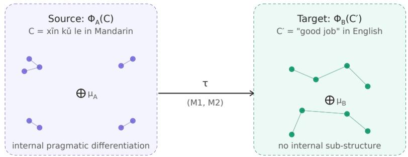  
(M1) centroid faithfulness: $\| \tau ( \mu _ { \mathsf { A } } ) - \mu _ { \mathsf { B } } \| < \varepsilon$  
(M2) structural faithfulness: ran $\sf k _ { \sf k } ( \sf v )$ preserved under τ

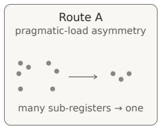

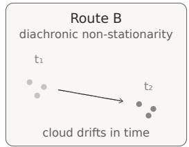

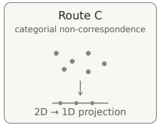  
Figure 1: Concepts as usage clouds, alignment as cloud mapping (visualization of the framework introduced in §3). Top: a source cloud $\Phi _ { A } ( x \bar { \imath } n k \check { \imath } l e )$ exhibits internal pragmatic differentiation, with four sub-regions corresponding to superior-to-subordinate, peer-to-peer, service-encounter, and ironic uses; the target cloud $\bar { \Phi } _ { B } ( g o \bar { o } d j o b )$ has no corresponding sub-structure. The alignment map τ is judged on two conditions: (M1) centroid faithfulness, $\| \tau ( \mu _ { A } ) - \mu _ { B } \| < \varepsilon .$ , and (M2) structural faithfulness, preservation of rank $\dot { \mathbf { \rho } } _ { \mathrm { \tilde { \mathcal { k } } } } ( v )$ under τ. Even when τ satisfies (M1) by aligning centroids, (M2) is necessarily violated when the target lacks the source’s pragmatic dimensionality. Bottom: the three structural routes to a large infimum in Definition 3. Route A (pragmatic-load asymmetry): many sub-registers in the source collapse to one in the target. Route B (diachronic non-stationarity): the cloud drifts across time windows $t _ { 1 }  t _ { 2 }$ , so no synchronic gloss can simultaneously match both. Route C (categorial non-correspondence): the target cloud is a projection of the source onto a lower-dimensional subspace.

## B Visualization of the Procrustes residual $( r _ { P r o c } )$

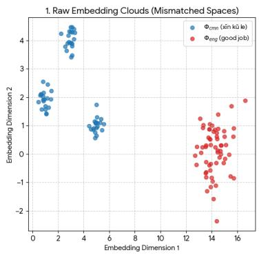

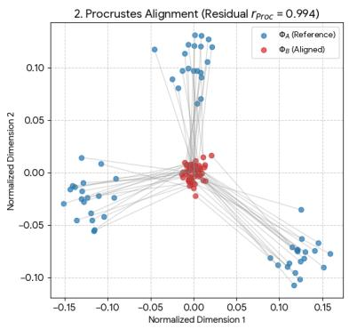  
Figure 2: Illustrative example with synthetic clouds: the Procrustes residual $r _ { \mathrm { P r o c } }$ (Metric 3, Manifold-Curvature Mismatch) for a structured source cloud and a flat target cloud. $L e f t { \mathrm { : } }$ the raw usage clouds $\Phi _ { \mathrm { c m n } } ( x \bar { \imath } n k \check { u } l e )$ (blue), partitioned into distinct pragmatic regions (superior-to-subordinate, peerto-peer, service encounter), and $\Phi _ { \mathrm { e n g } } ( g o o d j o b )$ (red). Right: the clouds after optimal Procrustes alignment (translation, rotation, and scaling); gray lines connect corresponding points. $r _ { \mathrm { P r o c } }$ is the sum of squared distances between corresponding points after alignment. Even the best linear map cannot stretch the flat target cloud over the sub-clusters of the source cloud, so $r _ { \mathrm { P r o c } }$ remains high: the internal rank structure and local neighborhood densities are incompatible, an (M2) violation.

## C Experimental design

## C.1 Yami corpus and language situation

Yami (also Tao; ISO 639-3: tao) is an endangered Austronesian language spoken on Orchid Island (Lanyu), Taiwan, with a Tao ethnic population of 5,045 [Council of Indigenous Peoples, 2024]; this is a population figure, not a speaker count. The parallel Yami–Mandarin corpus, provided by D. Victoria Rau and Ann Chang, consists of 31,255 parallel pairs drawn from Bible translations, a cultural dictionary, teaching materials, a grammar overview, and an online learning platform, split into training (24,526 pairs; approximately 335K Yami tokens), validation (3,063), general test (3,066), Bible test (500), and a 100-pair few-shot pool. About half of the material is short entries, defined by length as at most two Yami words: 11,416 of the 24,526 training pairs (46.5%) and 1,700 of the 3,566 test pairs (47.7%). The Yami–Filipino and Yami–English corpora used in Exp 2a, 2b, and 3 keep the same Yami sentences, with the Filipino and English sides produced by GPT-5-mini (gpt-5-mini-2025-08-07) pivot translation from the Chinese side; variation in pivot-translation fidelity may therefore also affect the cross-pair results. Yami↔Chinese is the common evaluation benchmark across all nine models and all experimental conditions; for cross-pair conditions (Exp 2a Filipino, Exp 2b Pan-Austronesian, Exp 3 English) the matched proxy-pair test set is also evaluated. The combined Yami↔Chinese test set (general + bible splits) contains 3,566 items. Held-out status is at the level of complete pairs: no test pair occurs in the training data, but 708 of the 3,566 test pairs reuse a Yami or Chinese sentence that also occurs in training with a different translation, so the evaluation is pair-level rather than string-level held-out.

## C.2 Models

Nine multilingual language models from five model series are used (Table 2). The LAPE method is applied to decoder MLP activations for all models.

Decoder-only Qwen3 [Yang et al., 2025] (119 languages, with explicit Austronesian coverage of Cebuano, Ilocano, Indonesian, Javanese, Sundanese, Tagalog, and Waray) and Gemma 3 PT [Gemma Team, 2025] (pre-instruction-tuning checkpoints) span a 4–32B parameter range. SeaLLMs-v3 [Zhang et al., 2024] is SEA-focused and trained with language-specific neuron identification at the continued-pretraining stage. SEA-LION-v4 [AI Singapore, 2024] is continued-pretrained from the instruction-tuned Gemma 3 27B checkpoint on 500B tokens spanning 11 Southeast Asian languages. NLLB-200 [NLLB Team et al., 2022] is the encoder–decoder translation model (202 languages); LAPE [Tang et al., 2024] is applied to the decoder side only. Checkpoint post-training status is not uniform: the Qwen3 runs use the post-trained (non-base) checkpoints, Gemma 3 uses the pretrained checkpoints, and SEA-LION-v4 descends from an instruction-tuned checkpoint. Because Yami is not an NLLB-200 language, NLLB-200 was extended with a tao\_Latn language token initialized by cloning the Tagalog embedding.

Table 2: Models in the case study. ∗Extended with a tao\_Latn language token before fine-tuning.
<table><tr><td>Family</td><td>Sizes</td><td>Architecture</td><td>HuggingFace identifier</td></tr><tr><td>Qwen3</td><td>4B /  14B / 32B</td><td>Decoder-only</td><td>Qwen/Qwen3-{4B,14B,32B}</td></tr><tr><td>Gemma 3 PT</td><td>4B / 12B / 27B</td><td>Decoder-only</td><td>google/gemma-3-{4b,12b,27b}-pt</td></tr><tr><td>NLLB-200</td><td>3.3B</td><td>Enc-dec</td><td>facebook/nllb-200-3.3B*</td></tr><tr><td>SeaLLMs-v3</td><td>7B</td><td>Decoder-only</td><td>SeaLLMs/SeaLLMs-v3-7B</td></tr><tr><td>SEA-LION-v4</td><td>27B</td><td>Decoder-only</td><td>aisingapore/Gemma-SEA-LION-v4-27B</td></tr></table>

## C.3 Conditions and modes

The experimental grid is five neuron-sourcing conditions crossed with three fine-tuning modes (Table 3). Each LAPE condition is paired with a random-mask control matched on sparsity (Exp 0 has no random control because it is itself a negative control), and with a Standard LoRA baseline trained on the same data.

Table 3: Five neuron-sourcing conditions; LAPE selects the listed target-set neurons (relative to the listed contrast set) via Language Activation Probability Entropy. Each condition is fine-tuned on the listed parallel pair under three modes: Standard LoRA (no mask), LAPE (gradient-masked LoRA on the LAPE-selected neurons), and Random Mask (matched-sparsity LoRA on a random neuron subset; absent for Exp 0). The common evaluation benchmark is Yami↔Chinese for all conditions.
<table><tr><td>ID</td><td>Condition</td><td>LAPE target</td><td>LAPE contrast</td><td>Fine-tune pair</td></tr><tr><td>Exp 0</td><td>Neg. Ctrl</td><td>{rus, vie, kor}</td><td>{cmn, arb, fil, eng}</td><td>Yami-Chinese</td></tr><tr><td>Exp 1</td><td>Yami</td><td>{tao}</td><td>{cmn, kor, rus, vie, arb}</td><td>Yami-Chinese</td></tr><tr><td>Exp 2a</td><td>Filipino</td><td>{fi1}</td><td>{cmn, kor, rus, arb, vie, eng}</td><td>Yami-Filipino</td></tr><tr><td>Exp 2b</td><td>Pan-AN</td><td>{fil, ceb, ind, mri, plt}</td><td>{cmn, kor, rus, arb, vie, eng}</td><td>Yami-Filipino</td></tr><tr><td>Exp 3</td><td>English</td><td>{eng}</td><td>{cmn, kor, rus, fil}</td><td>Yami-English</td></tr></table>

## C.4 LoRA and gradient-masking implementation

Each model is trained on bidirectional data (Yami→X and X→Yami in a 50/50 ratio). LoRA (rank $1 6 , \alpha = 3 2$ , dropout 0.1) over 4-bit NF4-quantized base weights with bfloat16 compute is applied to the attention projections (query, key, value, output) and the MLP projections of every decoder layer: gate\_proj, up\_proj, and down\_proj for the decoder-only models, and fc1 and fc2 for the NLLB-200 decoder (whose cross-attention also receives LoRA; its encoder is frozen). Training uses 8-bit AdamW with a cosine-decayed peak learning rate of $1 \times 1 0 ^ { - 4 }$ , effective batch size 64, and up to 100 epochs with early stopping on validation loss (patience 3). Sparse masking (LAPE and Random modes) applies only to the MLP LoRA path; the attention LoRA path is unmasked and identically configured in every condition. Masking is implemented as gradient masking on LoRA weights: backward hooks zero gradients for non-target neurons on the rows of lora\_B for gate\_proj/up\_proj (or fc1; neuron creation) and on the columns of lora\_A for down\_proj (or fc2; neuron consumption). LoRA parameters for non-target neurons are also explicitly initialized to zero before training. Sparsity rates (number of LAPE-target neurons divided by total MLPintermediate neurons) for the Exp 1 (Yami) masks range from 0.63% (NLLB-200, decoder only) to 0.94% (Qwen3-4B), averaging approximately 0.9% across the nine models; across all masks they range from about 0.4% to 1.0%.

## C.5 Inference and evaluation

Inference uses the HuggingFace transformers library. Decoder-only models load via AutoModelForCausalLM + AutoTokenizer and generate with five-shot prompting (5 in-context examples sampled from a held-out few-shot pool; greedy decoding, bfloat16). NLLB-200 loads via AutoModelForSeq2SeqLM + NllbTokenizer and translates source text directly with the appropriate forced\_bos\_token\_id for the target language; no few-shot prompting is used for NLLB. Translations are evaluated on the Yami↔Chinese common benchmark (3,566 items, combining general and bible splits) using BLEU, chrF++, and GLEU via the HuggingFace evaluate library, on the standard [0, 100] scale. Cross-pair conditions (Exp 2a, 2b, 3) additionally evaluate on the matched proxy-pair test set. There, LAPE still underperforms Standard LoRA (dz from −2.09 to −1.73; Holm-adjusted $p \leq 0 . 0 3 9$ in this seven-comparison family, whose floor is 0.0273) and shows no advantage over Random (Holm-adjusted $p = 1 . 0 0 0 )$ , so the LAPE systems do function on their training pair while the common-benchmark conclusion holds.

## C.6 Statistical methodology

The main analysis is at the model level. For each comparison, each model’s two direction-level paired differences on the common Yami↔Chinese benchmark are averaged, giving n = 9 model-level differences; the two directions are not treated as independent because they share one trained adapter. A percentile bootstrap over these differences $( B = 1 0 0 , 0 0 0 )$ gives a 95% stability interval, and exhaustive sign-flip enumeration $( 2 ^ { 9 } = 5 1 2$ assignments) gives the $p \cdot$ -value, corrected via Holm– Bonferroni [Holm, 1979] over the sixteen comparisons within each metric (Appendix D). The smallest attainable two-sided raw p-value is $2 / 2 ^ { 9 }$ , so the smallest Holm-adjusted value is $1 6 \times 2 / 5 1 2 = 0 . 0 6 2 5$ and no comparison can clear $\alpha = 0 . 0 5 \mathrm { ; }$ ; we therefore report estimates, stability intervals, effect sizes, and the number of models sharing the sign of each estimate. Effect sizes are reported as pairedsamples Cohen’s $d _ { z } = \overline { { \Delta } } / \mathrm { s d } ( \Delta )$ [Lakens, 2013]. A sentence-level paired bootstrap [Koehn, 2004], computed per (model, direction) slot, is reported as a supplementary robustness check and agrees with the model-level direction in 78.6% of the 864 slot×metric cells.

## C.7 Training summary

Conditions are compared under a common early-stopping rule, not a matched compute budget. Under that rule the masked Exp 1 runs take 1.17–1.50 times as many optimization steps as Standard LoRA in the decoder-only models (median 1.45 times the wall-clock time across all nine models) and still score lower; performance at a fixed compute budget was not measured. Table 4 lists final training and validation losses, steps, and wall-clock time for every LAPE and Random run, for the matched Yami–Chinese Standard LoRA baseline, and averaged over the three Standard LoRA baselines.

Table 4: Training summary across models and experimental conditions. Train/validation loss are final values; time is wall-clock hours. The Standard LoRA row averages the Yami–Chinese, Yami–English, and Yami–Filipino baselines; Standard LoRA (Yami–Chinese) is the matched baseline for Exp 1. LAPE/Random entries are single runs.
<table><tr><td>Model</td><td>Condition</td><td>Train Loss</td><td>Val. Loss</td><td>Steps</td><td>Time (h)</td></tr><tr><td>Qwen3-4B</td><td>Standard LoRA</td><td>0.628</td><td>2.048</td><td>5369</td><td>1.3</td></tr><tr><td></td><td>Standard LoRA (Yami-Chinese)</td><td>0.491</td><td>1.947</td><td>5369</td><td>1.3</td></tr><tr><td></td><td>Exp 0 (Neg. Ctrl) [LAPE]</td><td>0.981</td><td>2.061</td><td>8437</td><td>2.0</td></tr><tr><td></td><td>Exp 1 (Yami) [LAPE]</td><td>1.076</td><td>2.040</td><td>7670</td><td>1.8</td></tr><tr><td></td><td>Exp 1 (Yami) [Random]</td><td>0.977</td><td>2.071</td><td>8437</td><td>2.0</td></tr><tr><td></td><td>Exp 2a (Filipino) [LAPE]</td><td>1.347</td><td>2.072</td><td>7670</td><td>2.2</td></tr><tr><td></td><td>Exp 2a (Filipino) [Random]</td><td>1.294</td><td>2.119</td><td>8437</td><td>2.4</td></tr><tr><td></td><td>Exp 2b (Pan-AN) [LAPE]</td><td>1.338</td><td>2.086</td><td>7670</td><td>2.2</td></tr><tr><td></td><td>Exp 2b (Pan-AN) [Random]</td><td>1.355</td><td>2.089</td><td>7670</td><td>2.2</td></tr><tr><td></td><td>Exp 3 (English) [LAPE] Exp 3 (English) [Random]</td><td>1.182</td><td>2.100</td><td>7670</td><td>1.8</td></tr><tr><td>Qwen3-14B</td><td></td><td>1.076</td><td>2.161</td><td>8437</td><td>2.0</td></tr><tr><td></td><td>Standard LoRA</td><td>0.469</td><td>1.853</td><td>4602</td><td>2.5</td></tr><tr><td></td><td>Standard LoRA (Yami-Chinese)</td><td>0.414</td><td>1.687</td><td>4602</td><td>2.4</td></tr><tr><td></td><td>Exp 0 (Neg. Ctrl) [LAPE]</td><td>0.852 0.793</td><td>1.807 1.822</td><td>6903 6903</td><td>3.8</td></tr><tr><td></td><td>Exp 1 (Yami) [LAPE] Exp 1 (Yami) [Random]</td><td>0.835</td><td>1.803</td><td>6903</td><td>3.8</td></tr><tr><td></td><td>Exp 2a (Filipino) [LAPE]</td><td>0.967</td><td>1.911</td><td>6903</td><td>3.8 4.4</td></tr><tr><td></td><td>Exp 2a (Filipino) [Random]</td><td>1.006</td><td>1.902</td><td>6903</td><td>4.4</td></tr><tr><td></td><td>Exp 2b (Pan-AN) [LAPE]</td><td>0.961</td><td>1.901</td><td>6903</td><td>4.4</td></tr><tr><td></td><td>Exp 2b (Pan-AN) [Random]</td><td>0.998</td><td>1.916</td><td>6903</td><td>4.5</td></tr><tr><td></td><td>Exp 3 (English) [LAPE]</td><td>0.929</td><td>1.942</td><td>6903</td><td>3.7</td></tr><tr><td></td><td>Exp 3 (English) [Random]</td><td>0.946</td><td>1.962</td><td>6903</td><td>3.7</td></tr><tr><td>Qwen3-32B</td><td></td><td></td><td></td><td></td><td></td></tr><tr><td></td><td>Standard LoRA</td><td>0.343 0.294</td><td>1.833 1.682</td><td>4602 4602</td><td>6.0 5.9</td></tr><tr><td></td><td>Standard LoRA (Yami-Chinese) Exp 0 (Neg. Ctrl) [LAPE]</td><td>0.686</td><td>1.748</td><td>6903</td><td>9.6</td></tr><tr><td></td><td>Exp 1 (Yami) [LAPE]</td><td>0.651</td><td>1.783</td><td>6903</td><td>9.7</td></tr><tr><td></td><td>Exp 1 (Yami) [Random]</td><td>0.753</td><td>1.702</td><td>6136</td><td>13.5</td></tr><tr><td></td><td>Exp 2a (Filipino) [LAPE]</td><td>0.893</td><td>1.806</td><td>6136</td><td>9.4</td></tr><tr><td></td><td>Exp 2a (Filipino) [Random]</td><td>0.944</td><td>1.801</td><td>6136</td><td>9.3</td></tr><tr><td></td><td>Exp 2b (Pan-AN) [LAPE]</td><td>0.891</td><td>1.826</td><td>6136</td><td>9.4</td></tr><tr><td></td><td>Exp 2b (Pan-AN) [Random]</td><td>0.932</td><td>1.824</td><td>6136</td><td>9.3</td></tr><tr><td></td><td>Exp 3 (English) [LAPE]</td><td></td><td>1.925</td><td>6903</td><td>9.4</td></tr><tr><td></td><td>Exp 3 (English) [Random]</td><td>0.765 0.761</td><td>1.933</td><td>6903</td><td></td></tr><tr><td>Gemma-3-4B</td><td></td><td></td><td></td><td></td><td>9.4</td></tr><tr><td></td><td>Standard LoRA Standard LoRA (Yami-Chinese)</td><td>0.626</td><td>2.294</td><td>5369</td><td>6.3</td></tr><tr><td></td><td>Exp 0 (Neg. Ctrl) [LAPE]</td><td>0.551 1.277</td><td>2.294 2.224</td><td>5369 7670</td><td>6.3</td></tr><tr><td></td><td></td><td></td><td></td><td></td><td>10.0</td></tr><tr><td></td><td>Exp 1 (Yami) [LAPE]</td><td>1.190</td><td>2.220</td><td>7670</td><td>9.9</td></tr><tr><td></td><td>Exp 1 (Yami) [Random]</td><td>1.143</td><td>2.291</td><td>8437</td><td>11.1</td></tr><tr><td></td><td>Exp 2a (Filipino) [LAPE]</td><td>1.343</td><td>2.157</td><td>7670</td><td>10.3</td></tr><tr><td></td><td>Exp 2a (Filipino) [Random]</td><td>1.332</td><td>2.155</td><td>8437</td><td>11.3</td></tr><tr><td></td><td>Exp 2b (Pan-AN) [LAPE]</td><td>1.354</td><td>2.150</td><td>7670</td><td>10.3</td></tr><tr><td></td><td>Exp 2b (Pan-AN) [Random]</td><td>1.419</td><td>2.175</td><td>7670</td><td>10.2</td></tr><tr><td></td><td>Exp 3 (English) [LAPE]</td><td>1.400</td><td>2.150</td><td>6903</td><td>9.0</td></tr><tr><td></td><td>Exp 3 (English) [Random]</td><td>1.227</td><td>2.215</td><td>8437</td><td>10.9</td></tr><tr><td rowspan="9">Gemma-3-12B</td><td>Standard LoRA Standard LoRA (Yami-Chinese)</td><td>0.436</td><td>2.043</td><td>4602</td><td>2.5</td></tr><tr><td></td><td>0.414</td><td>2.027</td><td>4602</td><td>2.4</td></tr><tr><td>Exp 0 (Neg. Ctrl) [LAPE]</td><td>0.851</td><td>2.100</td><td>6136</td><td>3.4</td></tr><tr><td>Exp 1 (Yami) [LAPE]</td><td>0.759</td><td>2.099</td><td>6136</td><td>3.4</td></tr><tr><td>Exp 1 (Yami) [Random]</td><td>0.837</td><td>2.104</td><td>6136</td><td>3.5</td></tr><tr><td>Exp 2a (Filipino) [LAPE]</td><td>0.849</td><td>1.998</td><td>6136</td><td>3.8</td></tr><tr><td>Exp 2a (Filipino) [Random]</td><td>0.924</td><td>1.988 1.940</td><td>6136</td><td>3.8</td></tr><tr><td>Exp 2b (Pan-AN) [LAPE] Exp 2b (Pan-AN) [Random]</td><td>0.866 0.913</td><td>2.002</td><td>6136 6136</td><td>3.8 3.8</td></tr><tr><td>Exp 3 (English) [LAPE]</td><td>0.954</td><td>2.017</td><td>6136</td><td>3.4</td></tr><tr><td>Gemma-3-27B</td><td></td><td>0.925</td><td>2.002</td><td>6136</td><td>3.5</td></tr><tr><td rowspan="11"></td><td>Exp 3 (English) [Random]</td><td></td><td></td><td></td><td></td></tr><tr><td>Standard LoRA</td><td>0.356</td><td>1.938</td><td>4602</td><td>5.7</td></tr><tr><td>Standard LoRA (Yami-Chinese)</td><td>0.347</td><td>1.837</td><td>4602</td><td>5.6</td></tr><tr><td>Exp 0 (Neg. Ctrl) [LAPE]</td><td>0.672</td><td>1.827</td><td>5369</td><td>7.3</td></tr><tr><td>Exp 1 (Yami) [LAPE]</td><td>0.614</td><td>1.859</td><td>5369</td><td>7.3</td></tr><tr><td>Exp 1 (Yami) [Random]</td><td>0.697</td><td>1.812</td><td>5369</td><td>7.2</td></tr><tr><td>Exp 2a (Filipino) [LAPE]</td><td>0.773 0.682</td><td>1.830 1.976</td><td>5369 6136</td><td>7.7</td></tr><tr><td>Exp 2a (Filipino) [Random] Exp 2b (Pan-AN) [LAPE]</td><td>0.598</td><td>1.991</td><td>6136</td><td>8.8 8.8</td></tr><tr><td>Exp 2b (Pan-AN) [Random]</td><td>0.685</td><td>1.917</td><td>6136</td><td>8.9</td></tr><tr><td>Exp 3 (English) [LAPE]</td><td>0.648</td><td>1.974</td><td>6136</td><td>8.3</td></tr><tr><td>Exp 3 (English) [Random]</td><td>0.691</td><td>1.992</td><td>6136</td><td>8.2</td></tr><tr><td rowspan="10">NLLB-200-3.3B</td><td>Standard LoRA</td><td>1.323</td><td>2.121</td><td>26845</td><td>2.8</td></tr><tr><td>Standard LoRA (Yami-Chinese)</td><td>1.048</td><td>2.054</td><td>36816</td><td>3.7</td></tr><tr><td>Exp 0 (Neg. Ctrl) [LAPE]</td><td>2.601</td><td>2.092</td><td>49088</td><td>6.9</td></tr><tr><td>Exp 1 (Yami) [LAPE]</td><td>1.503</td><td>2.119</td><td>36816</td><td>3.9</td></tr><tr><td>Exp 1 (Yami) [Random]</td><td>10.958</td><td>2.076</td><td>55991</td><td>28.6</td></tr><tr><td>Exp 2a (Filipino) [LAPE]</td><td>1.591</td><td>2.274</td><td>35282</td><td>3.9</td></tr><tr><td>Exp 2a (Filipino) [Random]</td><td>14.708</td><td>2.277</td><td>32214</td><td>16.6</td></tr><tr><td>Exp 2b (Pan-AN) [LAPE]</td><td>3.197</td><td>2.272</td><td>35282</td><td>5.0</td></tr><tr><td>Exp 2b (Pan-AN) [Random]</td><td>12.744</td><td>2.263</td><td>42952</td><td>22.2</td></tr><tr><td>Exp 3 (English) [LAPE]</td><td>3.052</td><td>2.070</td><td>28379</td><td>4.0</td></tr><tr><td>Exp 3 (English) [Random]</td><td></td><td>1.567</td><td>2.079 25311</td><td></td><td>2.7</td></tr><tr><td rowspan="10">SeaLLMs-v3-7B</td><td>Standard LoRA</td><td>0.466</td><td>2.010</td><td>4857</td><td>1.5</td></tr><tr><td>Standard LoRA (Yami-Chinese)</td><td>0.432</td><td>1.837</td><td>4602</td><td>1.4</td></tr><tr><td>Exp 0 (Neg. Ctrl) [LAPE]</td><td>0.950</td><td>1.963</td><td>7670</td><td>2.5</td></tr><tr><td>Exp 1 (Yami) [LAPE]</td><td>1.049</td><td>1.925</td><td>6903</td><td>2.2</td></tr><tr><td>Exp 1 (Yami) [Random]</td><td>0.858</td><td>2.001</td><td>8437</td><td>2.7</td></tr><tr><td>Exp 2a (Filipino) [LAPE]</td><td>1.217</td><td>2.076</td><td>7670</td><td>2.8</td></tr><tr><td>Exp 2a (Filipino) [Random]</td><td>1.276</td><td>2.070</td><td>7670</td><td>2.8</td></tr><tr><td>Exp 2b (Pan-AN) [LAPE]</td><td>1.211</td><td>2.092</td><td>7670</td><td>2.8</td></tr><tr><td>Exp 2b (Pan-AN) [Random]</td><td>1.281</td><td>2.080</td><td>7670</td><td>2.8</td></tr><tr><td>Exp 3 (English) [LAPE]</td><td>1.058</td><td>2.026</td><td>7670</td><td>2.3</td></tr><tr><td>Exp 3 (English) [Random] SEA-LION-v4-27B Standard LoRA</td><td></td><td>1.044</td><td>2.046 7670</td><td>2.4</td></tr><tr><td></td><td></td><td>0.356</td><td>2.067</td><td>4602</td><td>5.7</td></tr><tr><td></td><td>Standard LoRA (Yami-Chinese)</td><td>0.353</td><td>2.013</td><td>4602</td><td>5.6</td></tr><tr><td>Exp 0 (Neg. Ctrl) [LAPE]</td><td></td><td>0.717</td><td>2.054</td><td>5369</td><td>7.3</td></tr><tr><td>Exp 1 (Yami) [LAPE]</td><td></td><td>0.662</td><td>2.001</td><td>5369</td><td>7.2</td></tr><tr><td></td><td>Exp 1 (Yami) [Random]</td><td>0.740</td><td>1.990</td><td>5369</td><td>7.3</td></tr><tr><td></td><td>Exp 2a (Filipino) [LAPE]</td><td>0.797</td><td>1.900</td><td>5369</td><td>7.6</td></tr><tr><td>Exp 2a (Filipino) [Random]</td><td></td><td>0.888</td><td>1.869</td><td>5369</td><td>7.7</td></tr><tr><td></td><td></td><td>0.809</td><td>1.927</td><td>5369</td><td></td></tr><tr><td>Exp 2b (Pan-AN) [LAPE] Exp 2b (Pan-AN) [Random]</td><td></td><td></td><td></td><td></td><td>7.8</td></tr><tr><td>Exp 3 (English) [LAPE]</td><td></td><td>0.709</td><td>2.033</td><td>6136</td><td>9.1</td></tr><tr><td></td><td>Exp 3 (English) [Random]</td><td>0.858 0.645</td><td>1.988 2.140</td><td>5369 6136</td><td>7.2 8.2</td></tr></table>

## D Bootstrap results

The 16 paired comparisons fall into four families (5 LAPE-vs-Standard, 4 LAPE-vs-Random, 3 crosscondition research-question comparisons, and 4 negative-control validations). Model-level estimates, stability intervals, effect sizes, and sign-agreement counts are in Table 5; the sign-agreement summary across the three metrics is in Table 6, and Figure 3 plots the BLEU estimates. Holm-corrected p-values are floor-limited by design (minimum 0.0625; Appendix C) and are not used as decision criteria.

Table 5: Main model-level paired-analysis summary for the 16 pre-specified comparisons on the common Yami↔Chinese benchmark. ∆: model-level mean difference A − B (BLEU and GLEU on [0, 100] scale; chrF++ native). 95% stability interval: percentile interval over resampled model-level differences. Agree: number of trained models whose difference shares the sign of the overall estimate. dz: paired-samples Cohen’s dz (mean paired difference divided by SD of paired differences).
<table><tr><td>Comparison</td><td>Metric ∆</td><td></td><td>95% stab. int.</td><td> $d _ { z }$ </td><td>Agree</td></tr><tr><td rowspan="2">Exp 0 LAPE vs. Standard LoRA (cmn)</td><td>BLEU chrF++</td><td>-4.48 -5.97</td><td>[-5.86, -3.06] [-7.76, -4.14]</td><td>-1.96 -2.04</td><td>9/9 9/9</td></tr><tr><td>GLEU</td><td>-3.76</td><td>[-4.96, -2.51]</td><td>-1.87</td><td>9/9</td></tr><tr><td rowspan="2">Exp 1 LAPE vs. Standard LoRA (cmn)</td><td>BLEU</td><td>-3.75</td><td>[-4.65, -2.90]</td><td>-2.64</td><td>9/9</td></tr><tr><td>chrF++</td><td>-4.69</td><td>[-5.49, -3.83]</td><td>-3.48</td><td>9/9</td></tr><tr><td rowspan="2"></td><td>GLEU</td><td>-2.84</td><td>[-3.53, -2.17]</td><td>-2.57</td><td>9/9</td></tr><tr><td>BLEU</td><td>-3.00</td><td>[-4.03, -1.98]</td><td>-1.80</td><td>9/9</td></tr><tr><td rowspan="2">Exp 2a LAPE vs. Standard LoRA (fil)</td><td>chrF++</td><td>-4.17</td><td>[-5.53, -2.91]</td><td>-1.99</td><td>9/9</td></tr><tr><td>GLEU</td><td>-2.72</td><td>[-3.78, -1.77]</td><td>-1.67</td><td>9/9</td></tr><tr><td rowspan="2">Exp 2b LAPE vs. Standard LoRA (fil)</td><td>BLEU chrF++</td><td>-2.68</td><td>[-3.69, -1.77]</td><td>-1.72</td><td>9/9</td></tr><tr><td>GLEU</td><td>-3.67 -2.44</td><td>[-4.55, -2.64] [-3.13, -1.70]</td><td>-2.35</td><td>9/9</td></tr><tr><td rowspan="3">Exp 3 LAPE vs. Standard LoRA (eng)</td><td></td><td></td><td></td><td>-2.09</td><td>9/9</td></tr><tr><td>BLEU chrF++</td><td>-3.59 -4.67</td><td>[-5.08, -2.04]</td><td>-1.45</td><td>8/9</td></tr><tr><td>GLEU</td><td>-3.23</td><td>[-6.12, -3.17] [-4.72, -1.69]</td><td>-1.97 -1.33</td><td>8/9 8/9</td></tr><tr><td rowspan="3">Exp 1 LAPE vs. Random Mask</td><td>BLEU</td><td>0.29</td><td></td><td></td><td></td></tr><tr><td>chrF++</td><td>0.93</td><td>[-0.82, 1.24] [-0.23, 2.06]</td><td>0.17 0.49</td><td>6/9 6/9</td></tr><tr><td>GLEU</td><td>0.53</td><td>[-0.63, 1.45]</td><td>0.31</td><td>7/9</td></tr><tr><td rowspan="3">Exp 2a LAPE vs. Random Mask</td><td>BLEU</td><td>-0.15</td><td>[-1.16, 0.61]</td><td>-0.10</td><td>3/9</td></tr><tr><td>chrF++</td><td>0.32</td><td>[-0.74, 1.16]</td><td>0.20</td><td>7/9</td></tr><tr><td>GLEU</td><td>-0.11</td><td>[−1.52, 1.20]</td><td>-0.05</td><td>5/9</td></tr><tr><td rowspan="3">Exp 2b LAPE vs. Random Mask</td><td>BLEU</td><td>0.13</td><td>[-1.02, 1.00]</td><td>0.08</td><td>7/9</td></tr><tr><td>chrF++</td><td>0.93</td><td>[−0.41, 2.07]</td><td>0.46</td><td>8/9</td></tr><tr><td>GLEU</td><td>0.25</td><td>[-0.99, 1.10]</td><td>0.14</td><td>7/9</td></tr><tr><td rowspan="3">Exp 3 LAPE vs. Random Mask</td><td>BLEU chrF++</td><td>-0.25 -0.33</td><td>[-1.15,0.56]</td><td>-0.18</td><td>4/9</td></tr><tr><td>GLEU</td><td>-0.63</td><td>[-1.19,0.39] [-1.60, 0.37]</td><td>-0.25</td><td>5/9</td></tr><tr><td>BLEU</td><td>-0.57</td><td></td><td>-0.39</td><td>6/9</td></tr><tr><td rowspan="3">Pan-AN vs. English (2b vs. 3)</td><td>chrF++</td><td>-1.11</td><td>[-1.27,0.15] [-2.53, 0.43]</td><td>-0.48 -0.46</td><td>5/9 6/9</td></tr><tr><td>GLEU</td><td>-0.61</td><td>[−2.04, 0.92]</td><td>-0.25</td><td>5/9</td></tr><tr><td>BLEU</td><td>0.31</td><td>[−0.22, 1.06]</td><td>0.29</td><td>5/9</td></tr><tr><td rowspan="3">Pan-AN vs. Filipino (2b vs. 2a)</td><td>chrF++</td><td>0.50</td><td>[-0.40, 1.80]</td><td>0.27</td><td>5/9</td></tr><tr><td>GLEU</td><td>0.28</td><td>[−0.51, 1.38]</td><td>0.18</td><td>4/9</td></tr><tr><td>BLEU</td><td>-4.56</td><td>[-5.11, -3.86]</td><td>-4.44</td><td>9/9</td></tr><tr><td rowspan="3">Filipino vs. Yami (2a vs. 1)</td><td>chrF++</td><td>-5.47</td><td>[-6.28, -4.63]</td><td>-4.01</td><td>9/9</td></tr><tr><td>GLEU</td><td>-5.07</td><td>[-5.85, -4.23]</td><td>-3.85</td><td>9/9</td></tr><tr><td>BLEU</td><td>0.72</td><td>[-0.11, 1.67]</td><td>0.50</td><td>5/9</td></tr><tr><td rowspan="3">Yami vs. Neg. Ctrl (1 vs. 0)</td><td>chrF++</td><td>1.28</td><td>[0.06, 2.64]</td><td>0.61</td><td>5/9</td></tr><tr><td>GLEU</td><td></td><td></td><td></td><td></td></tr><tr><td></td><td>0.92</td><td>[0.20, 1.62]</td><td>0.79</td><td>6/9</td></tr><tr><td>Comparison</td><td>Metric</td><td> $\Delta$ </td><td>95% stab. int.</td><td> $d _ { z }$ </td><td>Agree</td></tr><tr><td rowspan="3">Filipino vs. Neg. Ctrl (2a vs. 0)</td><td>BLEU</td><td>-3.83</td><td>[-5.01, -2.56]</td><td>-1.92</td><td>9/9</td></tr><tr><td>chrF++</td><td>-4.19</td><td>[-6.16, -2.13]</td><td>-1.27</td><td>8/9</td></tr><tr><td>GLEU</td><td>-4.16</td><td>[-5.52, −2.77]</td><td>-1.86</td><td>9/9</td></tr><tr><td rowspan="3">Pan-AN vs. Neg. Ctrl (2b vs. 0)</td><td>BLEU</td><td>-3.52</td><td>[-5.02, −1.71]</td><td>-1.30</td><td>8/9</td></tr><tr><td>chrF++</td><td>-3.69</td><td>[-6.18, -0.70]</td><td>-0.82</td><td>8/9</td></tr><tr><td>GLEU</td><td>-3.87</td><td>[−5.72, −1.81]</td><td>-1.22</td><td>8/9</td></tr><tr><td rowspan="3">English vs. Neg. Ctrl (3 vs. 0)</td><td>BLEU</td><td>-2.95</td><td>[-3.95, -1.56]</td><td>-1.47</td><td>8/9</td></tr><tr><td>chrF++</td><td>-2.58</td><td>[-4.30, -0.26]</td><td>-0.76</td><td>8/9</td></tr><tr><td>GLEU</td><td>-3.26</td><td>[-4.22, −2.06]</td><td>-1.83</td><td>8/9</td></tr></table>

Table 6: Sign agreement across the three metrics: number of the nine models whose model-level difference shares the sign of the overall estimate.
<table><tr><td>Comparison</td><td>BLEU</td><td>chrF++</td><td>GLEU</td></tr><tr><td>Exp 0 LAPE vs. Standard LoRA (cmn)</td><td>9/9</td><td>9/9</td><td>9/9</td></tr><tr><td>Exp 1 LAPE vs. Standard LoRA (cmn) Exp 2a LAPE vs. Standard LoRA (fil)</td><td>9/9</td><td>9/9</td><td>9/9</td></tr><tr><td>Exp 2b LAPE vs. Standard LoRA (fil)</td><td>9/9</td><td>9/9</td><td>9/9</td></tr><tr><td>Exp 3 LAPE vs. Standard LoRA (eng)</td><td>9/9</td><td>9/9</td><td>9/9</td></tr><tr><td>Exp 1 LAPE vs. Random Mask</td><td>8/9</td><td>8/9</td><td>8/9</td></tr><tr><td>Exp 2a LAPE vs. Random Mask</td><td>6/9</td><td>6/9</td><td>7/9</td></tr><tr><td>Exp 2b LAPE vs. Random Mask</td><td>3/9</td><td>7/9</td><td>5/9</td></tr><tr><td>Exp 3 LAPE vs. Random Mask</td><td>7/9</td><td>8/9</td><td>7/9</td></tr><tr><td></td><td>4/9</td><td>5/9</td><td>6/9</td></tr><tr><td>Pan-AN vs. English (2b vs. 3) Pan-AN vs. Filipino (2b vs. 2a)</td><td>5/9</td><td>6/9</td><td>5/9</td></tr><tr><td></td><td>5/9</td><td>5/9</td><td>4/9</td></tr><tr><td>Filipino vs. Yami (2a vs. 1)</td><td>9/9</td><td>9/9</td><td>9/9</td></tr><tr><td>Yami vs. Neg. Ctrl (1 vs. 0)</td><td>5/9</td><td>5/9</td><td></td></tr><tr><td>Filipino vs. Neg. Ctrl (2a vs. 0)</td><td>9/9</td><td></td><td>6/9</td></tr><tr><td>Pan-AN vs. Neg. Ctrl (2b vs. 0)</td><td>8/9</td><td>8/9</td><td>9/9</td></tr><tr><td>English vs. Neg. Ctrl (3 vs. 0)</td><td>8/9</td><td>8/9 8/9</td><td>8/9 8/9</td></tr></table>

What the bootstrap rows mean for §5. The five LAPE-vs-Standard rows are all negative with stability intervals below zero; on BLEU, $d _ { z }$ ranges from −2.64 (Exp 1) to −1.45 (Exp 3) (−3.48 to −1.33 across all three metrics), and 9 of 9 models agreeing in sign (8 of 9 for Exp 3); LAPE-masked LoRA underperforms unconstrained Standard LoRA on every condition. The four LAPE-vs-Random rows have $| \bar { d } _ { z } | \leq 0 . 4 9$ across metrics $( | d _ { z } | \leq 0 . 1 8$ on BLEU), every stability interval includes zero, and sign agreement ranges from 3 to 8 of 9 models. The LAPE mask shows no demonstrated advantage over a matched random sparse mask. The four vs. negative control rows show that the Filipino, Pan-Austronesian, and English masks (Exp 2a, 2b, 3) all underperform the unrelatedlanguage negative control (Exp 0), $d _ { z }$ from −1.30 to −1.92 on BLEU with stability intervals below zero. Yami direct adaptation (Exp 1) is not clearly separated from the negative control: on BLEU, $\Delta = + 0 . 7 2$ with a stability interval of $[ - 0 . 1 1 , 1 . 6 7 ]$ and $d _ { z } = + 0 . 5 0 ;$ the chrF++ and GLEU intervals lie just above zero, but only 5–6 of the nine models share the sign.

Short entries vs. sentences. A pre-specified Exp 1 analysis splits the benchmark into short entries (1,700 pairs) and sentences (1,866 pairs) and tests four BLEU comparisons under Holm correction, where corrected significance is attainable (floor 0.0156). Standard LoRA exceeds LAPE on both short entries $( \Delta = + 4 . 2 4$ , interval $[ 2 . 8 9 , 5 . 6 0 ] , d _ { z } = 1 . 9 2 , 9 / 9$ models) and sentences $( \Delta = + 2 . 6 1$ [2.09, 3.26], d = 2.71, 9/9), both at Holm-adjusted $p = 0 . 0 1 5 6 . \mathrm { L A P E }$ shows no advantage over Random on either (short entries $\Delta = - 0 . 2 4 , [ - 2 . 1 0 , 1 . 3 6 ]$ ; sentences $\Delta = + 0 . 3 8 , [ - 0 . 5 8 , 1 . 2 9 ]$ both Holm-adjusted $p = 0 . 9 4 5 )$ . The two main results therefore do not depend on the short lexical material.

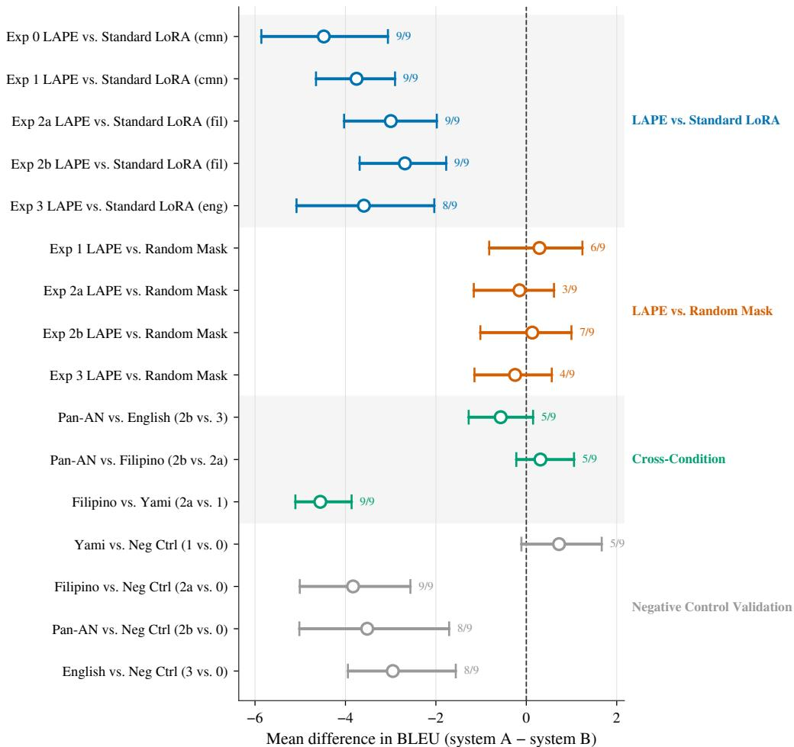  
Figure 3: Forest plot of model-level mean paired BLEU differences (system A − system B) with 95% percentile stability intervals for all 16 comparisons on the Yami↔Chinese common benchmark. Labels give the number of the nine models sharing the sign of the estimate. Comparisons are grouped by family (LAPE-vs-Standard, LAPE-vs-Random, cross-condition, negative-control validation). The LAPE-vs-Random intervals all include zero: no demonstrated LAPE advantage, which is not evidence of equivalence.

## E Activation similarity analysis

## E.1 Methodology

The activation profile $A _ { \ell } \in [ 0 , 1 ] ^ { N }$ for language ℓ at a given layer is the per-neuron firing probability over a monolingual corpus (FineWeb-2 for the contrast languages, capped at 100M tokens; FineWeb for English; for Yami, all Yami-side text of the training split, about 335K tokens). Because the Yami profile comes from the training data’s Yami side, corpus composition and language identity are not separated for Yami. Stacked across layers, each language’s profile is a [L, N] tensor where L is the number of transformer layers and N the MLP intermediate width.

For each language pair $( \ell , \ell ^ { \prime } )$ we compute cosine similarity per layer (along the neuron axis) and then take the mean across layers,

$$
\sin ( \ell , \ell ^ { \prime } ) = \frac { 1 } { L } \sum _ { i = 1 } ^ { L } \frac { A _ { \ell } ^ { ( i ) } \cdot A _ { \ell ^ { \prime } } ^ { ( i ) } } { \| A _ { \ell } ^ { ( i ) } \| \| A _ { \ell ^ { \prime } } ^ { ( i ) } \| } .\tag{8}
$$

Similarity is computed layer by layer and then averaged, so that each layer contributes equally.

## E.2 Per-model Yami nearest neighbors

Table 7: Per-model Yami nearest neighbors. Cosine similarity computed per-layer between activationprobability profiles, then averaged across layers. The last column flags whether every Austronesian language (Cebuano, Filipino, Indonesian, Maori, Plateau Malagasy) is closer to Yami than every non-Austronesian language tested. The encoder–decoder NLLB-200 is the partial exception: Filipino, Cebuano, and Plateau Malagasy remain Yami’s nearest neighbors, but English and Korean rank above Maori and Indonesian.

<table><tr><td>Model</td><td>Top-5 nearest neighbors (cosine)</td><td>Closest non-AN</td><td>All-AN tighter?</td></tr><tr><td>Qwen3-4B</td><td>Plateau Malagasy (0.890), Cebuano (0.890), Arabic (0.797) Filipino (0.888), Maori (0.856), Indonesian (0.821)</td><td></td><td>yes</td></tr><tr><td>Qwen3-14B</td><td>Filipino (0.867), Plateau Malagasy (0.866), Arabic (0.778) Cebuano (0.864), Maori (0.840), Indonesian (0.797)</td><td></td><td>yes</td></tr><tr><td>Qwen3-32B</td><td>Filipino (0.880), Cebuano (0.876), Plateau Arabic (0.786) Malagasy (0.864), Maori (0.840), Indonesian</td><td></td><td>yes</td></tr><tr><td>Gemma-3-4B</td><td>(0.808) Cebuano (0.789), Filipino (0.785), Plateau Mandarin (0.707) Malagasy (0.764), Maori (0.761), Indonesian (0.726)</td><td></td><td>yes</td></tr><tr><td>Gemma-3-12B</td><td>Cebuano (0.807), Filipino (0.801), Plateau Mandarin (0.692) Malagasy (0.774), Maori (0.773), Indonesian (0.722)</td><td></td><td>yes</td></tr><tr><td>Gemma-3-27B</td><td>Cebuano (0.777), Filipino (0.774), Plateau Mandarin (0.681) Malagasy (0.764), Maori (0.748), Indonesian (0.697)</td><td></td><td>yes</td></tr><tr><td>SeaLLMs-v3-7B</td><td>Plateau Malagasy (0.889), Cebuano (0.862), Arabic (0.723) Maori (0.836), Filipino (0.834), Indonesian</td><td></td><td>yes</td></tr><tr><td>SEA-LION-v4-27B</td><td>(0.766) Cebuano (0.795), Filipino (0.795), Plateau Mandarin (0.695) Malagasy (0.771), Maori (0.765), Indonesian</td><td></td><td>yes</td></tr><tr><td>NLLB-200-3.3B</td><td>(0.714) Filipino (0.896), Cebuano (0.878), Plateau English (0.738) Malagasy (0.779), English (0.738), Korean (0.729)</td><td></td><td>no</td></tr></table>

Figure 4 shows the similarity matrix for Qwen3-4B, and Figure 5 the nine-model clustering including the low-resource controls. In every one of the nine models tested, Yami’s three nearest neighbors are Austronesian, drawn from {Filipino, Cebuano, Plateau Malagasy, Maori, Indonesian}. In eight of nine, the entire Austronesian set is closer to Yami than every non-Austronesian language tested.

The encoder–decoder NLLB-200 is the partial exception: Filipino, Cebuano, and Plateau Malagasy remain Yami’s nearest neighbors, but English and Korean rank above Maori and Indonesian. In the NLLB checkpoint, the tao\_Latn language token was initialized by cloning the Tagalog token and kept fixed, which bears on its proximity to Filipino. Mandarin is not uniformly distal: it is the closest non-Austronesian language to Yami in the three Gemma 3 models and SEA-LION-v4, whereas Arabic is closest in the Qwen3 models and SeaLLMs-v3. These neighbor rankings cover only the eleven comparison languages: when five low-resource non-Austronesian controls are added, three of them (Yoruba, Igbo, Hausa) fall within the Austronesian distance range, and distance from Yami tracks log FineWeb-2 corpus size, a public proxy for pretraining exposure (Pearson r = 0.879 across sixteen languages), more than genealogy [Lian, 2026].

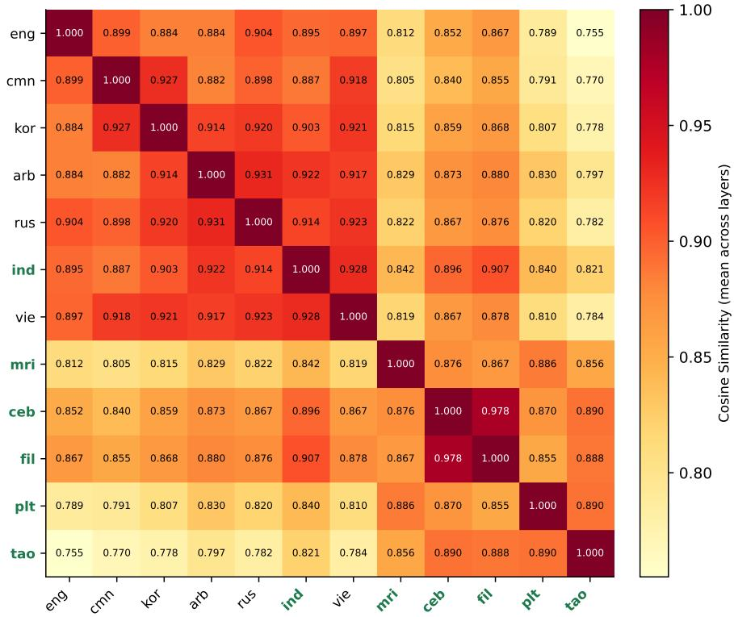  
Figure 4: Pairwise activation cosine similarity heatmap (Qwen3-4B; per-layer cosine, mean across layers). Yami’s highest similarities are to the Austronesian languages (Plateau Malagasy, Cebuano, Filipino, Maori, Indonesian); Mandarin, English, and the contrast set (Russian/Vietnamese/Korean/Arabic) are distal.

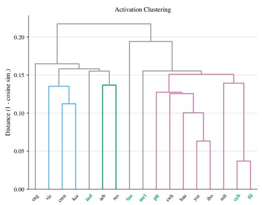

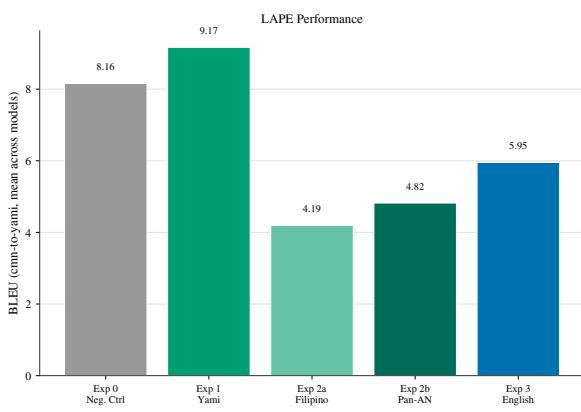  
Figure 5: Left: hierarchical clustering (average linkage) of the sixteen non-Yami evaluation languages and Yami (tao) by activation distance (1−cosine similarity of per-layer activation profiles, averaged across layers), averaged across all nine models. The low-resource languages, including most of the Austronesian set (green labels) and the low-resource non-Austronesian controls, group with Yami, while the higher-resource languages (among them Austronesian Indonesian, ind) form a separate cluster. Right: mean Chinese→Yami BLEU for each LAPE condition, averaged across models. The clustering is not matched by a corresponding translation gain from LAPE targeting: the Filipino and Pan-AN conditions fall well below the negative control, and direct Yami targeting (Exp 1) exceeds it only slightly; the gap holds whether the clustering reflects Austronesian genealogy, corpus-resource scale, or a mixture of the two [Lian, 2026].

## F Mask overlap and the Mandarin-collateral-damage test

## F.1 Inter-mask Jaccard

Pairwise Jaccard between the experimental masks themselves (Table 8, Figure 6) verifies that they are largely disjoint. The negative-control mask (Exp 0) shares essentially no neurons with Yami (mean Jaccard 0.000); the strongest within-experiment overlap is between Filipino and Pan-Austronesian (0.336), as expected since Filipino is one of the five Pan-AN target languages. The negative control’s competitive performance therefore cannot be attributed to mask overlap with Yami.

Table 8: Pairwise Jaccard similarity between experimental masks, averaged across all 9 models. Values close to 0 indicate distinct neuron populations; values close to 1 indicate near-identical masks.
<table><tr><td></td><td>Neg. Ctrl</td><td>Yami</td><td>Filipino</td><td>Pan-AN</td><td>English</td></tr><tr><td>Neg. Ctrl</td><td>1.000</td><td>0.000</td><td>0.007</td><td>0.009</td><td>0.003</td></tr><tr><td>Yami</td><td>0.000</td><td>1.000</td><td>0.152</td><td>0.128</td><td>0.013</td></tr><tr><td>Filipino</td><td>0.007</td><td>0.152</td><td>1.000</td><td>0.336</td><td>0.020</td></tr><tr><td>Pan-AN</td><td>0.009</td><td>0.128</td><td>0.336</td><td>1.000</td><td>0.018</td></tr><tr><td>English</td><td>0.003</td><td>0.013</td><td>0.020</td><td>0.018</td><td>1.000</td></tr></table>

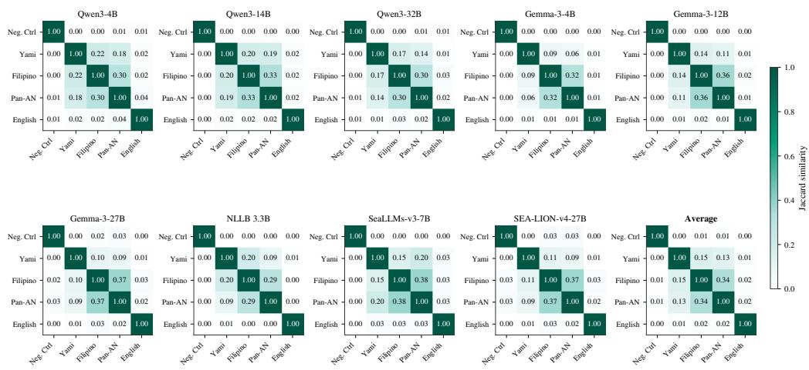  
Figure 6: Per-(model, mask-pair) Jaccard heatmap. The (Yami, Neg. Ctrl) cell is uniformly near zero across all nine models.

## F.2 Mandarin-collateral-damage test

A natural worry about the genealogical inversion documented in §5 is that the Filipino and Pan-Austronesian LAPE masks might accidentally overlap with neurons that participate in Mandarin processing, which the Yami↔Chinese benchmark requires even though the cross-pair training data contain no Mandarin. In that case, the Filipino-LAPE underperformance would reflect collateral damage to Mandarin processing rather than failure of genealogical localization.

The hypothesis is testable directly: LAPE also identifies a Mandarin-specific neuron mask in each model. Computing per-mask Jaccard overlap with this Mandarin mask, averaged across the nine models (Table 9), yields the opposite of what the collateral-damage hypothesis predicts.

The Filipino and Pan-Austronesian masks overlap the Mandarin mask less than the unrelatedlanguage negative-control union does (mean Jaccard 0.0003 and 0.0001 respectively, vs. 0.0100 for the Russian/Vietnamese/Korean union). The Korean, Vietnamese, and Russian rows are separate single-language LAPE masks, shown for reference. If Mandarin collateral damage explained the inversion, the unrelated-language condition should perform worst; instead it outperforms all three proxy-language conditions.

Table 9: Overlap between selected masks and the model’s LAPE-identified Mandarin mask, averaged across the nine models. This tests whether the proxy-language masks may be harming the common Yami↔Chinese benchmark by masking Mandarin-associated neurons. The proxy-language masks overlap it far less than the negative-control union does. Korean, Vietnamese, and Russian are separate single-language masks shown for reference.
<table><tr><td>Mask</td><td>Mean Jaccard</td><td>Mean shared neurons</td></tr><tr><td>Korean</td><td>0.1088</td><td>138.2</td></tr><tr><td>Vietnamese</td><td>0.0783</td><td>102.0</td></tr><tr><td>Russian</td><td>0.0233</td><td>26.9</td></tr><tr><td>Neg. Ctrl (union)</td><td>0.0100</td><td>51.0</td></tr><tr><td>English</td><td>0.0014</td><td>7.3</td></tr><tr><td>Filipino</td><td>0.0003</td><td>3.8</td></tr><tr><td>Yami</td><td>0.0003</td><td>3.3</td></tr><tr><td>Pan-AN</td><td>0.0001</td><td>1.1</td></tr></table>

What this test does and does not rule out. The Jaccard test weighs against one specific operationalization of “Mandarin interference”: overlap between the experimental mask and the LAPE-identified Mandarin-specific neuron set. A skeptic could still argue that Mandarin processing is not exhaustively captured by the Mandarin mask (high-resource languages may distribute their processing across neurons that LAPE does not flag as specific to Mandarin). The Jaccard test does not rule out such distributed accounts; it only weighs against the simplest, most obvious version of the worry. The ordering also remains confounded with the training pair and its provenance: the proxy-language conditions train on pivot-translated Yami–Filipino or Yami–English data, the negative control on the human-translated Yami–Chinese benchmark pair, and no ablation separates these factors. Finally, the negative-control set is unrelated to Yami but not free of Sinitic influence: Korean has a Sino-Korean vocabulary stratum [Lee and Ramsey, 2011] and Vietnamese an Early Sino-Vietnamese layer [Alves, 2016], and contact history with Chinese was not controlled. The ordering is therefore reported descriptively.

## G Per-model failure-mode atlas

The aggregate metric numbers obscure systematic per-model qualitative behavior. Three tables document the most diagnostic patterns.

## G.1 Default-vocabulary fingerprints under cross-pair LAPE

When Filipino-LAPE is trained on Yami↔Filipino and evaluated on Yami→Chinese (cross-pair, the direction where the 0.000-BLEU collapse is most pronounced), each of the eight decoder-only models has a most-frequent Chinese phrase that recurs across many different Yami sources, usually an everyday or maritime word such as “small fish”, “boat”, or “conch shell” (Table 10).

Table 10: The Yami→Chinese collapse defaults to a small Yami-domain Chinese vocabulary (English glosses shown), and the default token differs by model. Filipino-LAPE condition (Exp 2a), all 3,566 test items per model. NLLB differs qualitatively: it emits whitespace rather than a default token.
<table><tr><td>Model</td><td>Top-1 default prediction</td><td>Count</td><td>Unique preds</td><td>Empty preds</td></tr><tr><td>Qwen3-4B</td><td>“small fish”</td><td>125</td><td>2652</td><td>0</td></tr><tr><td>Qwen3-14B</td><td>“hair”</td><td>137</td><td>2824</td><td>0</td></tr><tr><td>Qwen3-32B</td><td>“small boat&quot;</td><td>270</td><td>2811</td><td>0</td></tr><tr><td>Gemma-3-4B</td><td>“very difficult&quot;</td><td>57</td><td>2751</td><td>0</td></tr><tr><td>Gemma-3-12B</td><td>“hunting”</td><td>34</td><td>2861</td><td>0</td></tr><tr><td>Gemma-3-27B</td><td>&quot;catch by hand&quot;</td><td>45</td><td>2896</td><td>0</td></tr><tr><td>SeaLLMs-v3-7B</td><td>“small boat&quot;</td><td>86</td><td>2678</td><td>0</td></tr><tr><td>SEA-LION-v4-27B</td><td>&quot;conch shell&quot;</td><td>64</td><td>2958</td><td>0</td></tr><tr><td>NLLB-200-3.3B</td><td>(whitespace)</td><td>406</td><td>2677</td><td>406</td></tr></table>

## G.2 Pan-Austronesian per-model breakdown

Pan-AN (Exp 2b) cross-pair degeneration is bimodal across models (Table 11): some models produce long streams of Yami particles with no lexical content; others leak Chinese characters into the Yami output. SEA-LION-v4 leaks the most CJK despite SEA-language pretraining; Gemma-3-27B is the most stable. These over-generation patterns could come from the attention adapters, the sparse MLP constraint, the training-pair mismatch, or their interactions; the outputs alone cannot separate these sources.

Table 11: Pan-AN (Exp 2b) Chinese→Yami degeneration is bimodal: some models produce long Yami particle streams (no lexical content); others leak Chinese characters into the Yami output. SEA-LION-v4 leaks the most CJK despite SEA-language pretraining; Gemma-3-27B is the most stable.
<table><tr><td>Model</td><td>Long (&gt;50 wc)</td><td>Max wc</td><td>CJK leak</td><td>Top token in long preds</td><td>(×)</td></tr><tr><td>Qwen3-4B</td><td>184</td><td>256</td><td>23</td><td>ya</td><td>2810</td></tr><tr><td>Qwen3-14B</td><td>121</td><td>191</td><td>1</td><td>a</td><td>2003</td></tr><tr><td>Qwen3-32B</td><td>29</td><td>253</td><td>2</td><td>mo</td><td>403</td></tr><tr><td>Gemma-3-4B</td><td>70</td><td>254</td><td>73</td><td>a</td><td>2080</td></tr><tr><td>Gemma-3-12B</td><td>55</td><td>256</td><td>23</td><td>am,</td><td>913</td></tr><tr><td>Gemma-3-27B</td><td>7</td><td>170</td><td>20</td><td>a</td><td>197</td></tr><tr><td>SeaLLMs-v3-7B</td><td>135</td><td>256</td><td>3</td><td>a</td><td>2431</td></tr><tr><td>SEA-LION-v4-27B</td><td>41</td><td>249</td><td>86</td><td>a</td><td>1351</td></tr><tr><td>NLLB-200-3.3B</td><td>14</td><td>255</td><td>0</td><td>among</td><td>458</td></tr></table>

## G.3 NLLB direction asymmetry

NLLB-200 produces 2,928 of the 2,929 empty predictions in the entire dataset (the remaining one is a single Qwen3-14B run). The NLLB empties concentrate sharply on Yami→Chinese under cross-pair sparse-mask (LAPE or Random) training (Table 12); on Chinese→Yami the same conditions produce 0–8 empties. The empty mode arises under the combination of cross-pair training, sparse masking

(LAPE or Random), and short source inputs; Standard LoRA on the same training data produces ≤ 1% empties.  
Table 12: NLLB Yami→Chinese empty-prediction rate by condition (3,566 items per condition). Empty outputs are concentrated in the cross-pair conditions under sparse masking (LAPE or Random); the matched-pair and Standard-LoRA conditions stay at or below 1%.
<table><tr><td>Condition</td><td>Empty preds / total</td><td>Rate</td></tr><tr><td>Exp 1 (Yami), Random Mask</td><td>0 / 3566</td><td>0.0%</td></tr><tr><td>Standard LoRA, Yami-Chinese</td><td>0 / 3566</td><td>0.0%</td></tr><tr><td>Exp 0 (Neg. Ctrl), LAPE</td><td>0 /3566</td><td>0.0%</td></tr><tr><td>Exp 1 (Yami), LAPE</td><td>0/3566</td><td>0.0%</td></tr><tr><td>Standard LoRA, Yami-English</td><td>4/3566</td><td>0.1%</td></tr><tr><td>Base model (no fine-tuning)</td><td>9/3566</td><td>0.3%</td></tr><tr><td>Standard LoRA, Yami-Filipino</td><td>35 / 3566</td><td>1.0%</td></tr><tr><td>Exp 2b (Pan-AN), LAPE</td><td>118 / 3566</td><td>3.3%</td></tr><tr><td>Exp 2a (Filipino), LAPE</td><td>406 / 3566</td><td>11.4%</td></tr><tr><td>Exp 2b (Pan-AN), Random Mask</td><td>465 / 3566</td><td>13.0%</td></tr><tr><td>Exp 2a (Filipino), Random Mask</td><td>497 /3566</td><td>13.9%</td></tr><tr><td>Exp 3 (English), LAPE</td><td>661 / 3566</td><td>18.5%</td></tr><tr><td>Exp 3 (English), Random Mask</td><td>705 / 3566</td><td>19.8%</td></tr></table>

## H Code and data availability

We do not release code or data with this version of the paper. The Yami–Mandarin parallel corpus used in §5 was compiled for the second author’s dissertation and is sourced from third-party data providers (D. Victoria Rau and Ann Chang); the corpus itself is not the authors’ to release, and raw predictions and reference translations are withheld for the same reason. The dissertation [Lian, 2026] provides full methodological detail and the complete experimental record.