# Large Language Model Orchestration under Heterogeneous Preferences via Explicit Persona Inference

Shuqing Shi<sup>1</sup>, Ziyan Wang<sup>1,2</sup>, Milind Tambe<sup>2</sup>, Yali Du<sup>1∗</sup>

<sup>1</sup>King’s College London, London, United Kingdom <sup>2</sup>Harvard University, Cambridge, MA, USA

## Abstract

LLM orchestration investigates how an orchestrator coordinates a group of autonomous agents to achieve common goals or maximize collective welfare. The agents are typically heterogeneous, each holding a private persona, the goal or preference it pursues but does not reveal. Inferring such hidden preferences from behavior has been a subject of long-standing research in game theory and multi-agent systems. The core challenge lies in maintaining a belief over every agent’s persona and updating it from the agents’ observed actions. Existing LLM orchestrators carry that belief as prompt text with no explicit update rule. This lets early errors persist and propagate rather than be corrected. We therefore propose HARP (Heterogeneous-preference Agent oRchestration via Personas), a novel framework that moves the belief out of the prompt. Specifically, HARP maintains one numeric posterior per agent over a discrete persona library and updates it in closed form by Bayes’ rule. The language model supplies only actions and per-persona likelihoods, so estimation is decoupled from <sub>its reasoning. We prove that HARP attains the same O</sub>˜<sub>(</sub>√<sub>K)</sub> Bayesian regret as explicit joint inference when the factorization is exact. Furthermore, HARP<sup>+</sup> augments planning with a bonus for actions that distinguish personas, so inference continues even when the optimal action is uninformative. Empirical results on three substrates, ranging from payofs the personas fully determine, through payofs that depend on more than them, to scales where explicit joint inference is infeasible, demonstrate that HARP<sup>+</sup> is the strongest non-oracle method across the class our theory identifies.

## 1 Introduction

Large language models are increasingly deployed as autonomous agents in settings that negotiate, bargain, allocate resources, and provide public goods (Wu et al. 2023; Li et al. 2023a; Hong et al. 2024; Park et al. 2023; FAIR). Each agent typically carries a private persona, meaning a hidden goal, preference, or constraint that determines how it values outcomes. These personas are rarely visible to an orchestrator or to the other agents (Zhou et al. 2024; Abdulhai et al. 2023). Consider a ride-hailing platform dispatching orders to independent drivers. A driver may avoid long trips, stay within a familiar zone, or work only under surge pricing. Such preferences surface only through which orders the driver accepts or declines. An orchestrator’s goal is to recovers these personas and routes suitable requests to drivers (Mu et al. 2026; Yi et al.

2025). Because the best joint assignment depends on every driver’s persona at once, orchestrating such heterogeneous agents rests on predicting each persona accurately.

The natural target of that prediction is the joint persona profile, the full assignment of one persona to each agent. An exact posterior over that profile has |Θ<sub>i</sub>|<sup>n</sup> entries for n agents with |Θ | candidate personas each. Handing the estimation to the language model moves the prediction into the prompt. Existing methods prompt the model to describe each agent’s persona in natural language at every turn and feed the description into the next prompt (Yi et al. 2025; Mu et al. 2026). That description is the only state carried between turns, so an early error persists instead of being corrected. The joint prediction also grows with the number of agents and remains in context across turns, lowering accuracy as the context fills (Park et al. 2024). Inferring each persona separately avoids the joint posterior, but the best assignment depends on all personas at once, so separate estimates may lose the information the assignment needs. The question is therefore whether the personas can be inferred separately and outside the prompt without that loss.

In this work, we propose HARP (Heterogeneouspreference Agent oRchestration via Personas), which answers both dificulties. HARP maintains an explicit numeric posterior beside the language model. The language model contributes only actions and their likelihoods. The orchestrator carries the belief forward in closed form, so estimation is decoupled from reasoning. The posterior is factored, one per agent over a discrete library of persona prompt templates. No distribution over joint profiles is ever stored. Each episode HARP draws one persona per agent from its posterior, plans a joint policy under the assembled profile, and dispatches the resulting actions. The likelihood of each emitted action under a candidate template enters a per-agent Bayes update. Under three structural conditions the factored posteriors reconstruct the joint one exactly, degrading in proportion to the violation when they hold only approximately.

Our contributions can be summarized as follows. First, we introduce HARP, a novel framework that decouples persona estimation from language-model reasoning, replacing the belief carried in text with a closed-form Bayesian posterior outside the prompt while planning centrally in the joint action space. HARP<sup>+</sup> adds a planning bonus for actions that distinguish personas, which bounds the early loss by a constant even when the personas are hardest to separate. Second, we state structural conditions under which the factored peragent posteriors reconstruct the joint one exactly. Under these conditions, persona storage and update work drop from exponential to linear in the number of agents, and the Bayesian regret is unchanged. More importantly, we show empirically that the factorization is robust outside these conditions. When they are deliberately violated, HARP stays within a small constant factor of explicit joint inference (Sections 4.1 and 4.3, Appendix A.2). Finally, we evaluate HARP on three substrates ordered by how much the personas determine the payof and by the size of the persona space. HARP<sup>+</sup> attains the lowest non-oracle regret on every backbone.

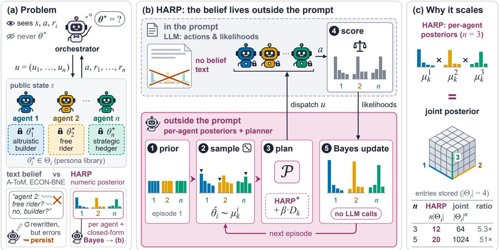  
Figure 1: Overview of HARP. (a) An orchestrator dispatches a joint assignment $u = ( u _ { 1 } , \ldots , u _ { n } )$ to LLM agents and see states, actions and rewards, never private personas $\theta _ { i } ^ { \star } \colon$ ; prompt-text beliefs let errors persist. (b) HARP keeps per-agent numeric posteriors outside the prompt: (1) prior; (2) sample $\hat { \theta } _ { i } \sim \mu _ { k } ^ { i } \left( \pmb { \mathsf { v } } \right) ;$ ; (3) plan with P (HARP<sup>+</sup> adds a persona-discrimination bonus) and dispatch $u ;$ (4) the ofline-calibrated scorer q evaluates a under every candidate persona; (5) Bayes-update each posterior without LLM calls; repeat. (c) Under the structural conditions (TI), (RL), (PF), per-agent posteriors reconstruct the joint posterior exactly, storing $n | \Theta _ { i } |$ , not $| \Theta _ { i } | ^ { n }$ , entries.

## 2 Related Work

Bayesian and latent-type reinforcement learning. Posterior sampling attains near-optimal Bayesian regret for a single agent by drawing one model from the posterior each episode and planning as if it were correct (Strens 2000; Osband, Russo, and Van Roy 2013; Agrawal and Jia 2017; Ouyang et al. 2017; Russo and Van Roy 2014, 2016; Dasgupta et al. 2025). Extensions to Markov games largely assume known types or zero-sum structure (Jahromi, Jain, and Nayyar 2024; Xiong et al. 2022), and learning in latent Markov decision processes is exponentially hard without an identifiability condition (Kwon et al. 2021; Nguyen-Tang and Arora 2024), which is the role our structural conditions play. Type-based ad hoc teamwork already keeps a separate belief per teammate (Albrecht and Ramamoorthy 2015, 2019; Barrett, Stone, and Kraus 2011; Albrecht and Stone 2018), so our contribution is not that representation but the conditions under which it is exact and the finite-time regret it attains at linear storage. Structured Bayesian priors (Mutti et al. 2024) and language-model posterior sampling (Arumugam and Grifiths 2025) do not factor the belief across agents, while generalsum Markov-game learning (Jin et al. 2024; Song, Mei, and Bai 2021; Mao and Başar 2023; Erez et al. 2023; Yang et al. 2025) and population-based training (Lanctot et al. 2017; Muller et al. 2019; Marris et al. 2021) address equilibrium selection rather than inference over partner types.

Structural decomposition. Avoiding a joint object by exploiting structure is long established. Networked distributed POMDPs decompose the value function along an interaction graph (Nair et al. 2005; Oliehoek et al. 2008), restless-bandit formulations decouple joint allocation into per-arm indices by Lagrangian relaxation (Mate et al. 2020), and Bayesian Stackelberg solvers avoid expanding the game over the joint type space of an unknown follower (Paruchuri et al. 2008). We instead factor the posterior over partner personas, the factorization introduces no approximation, and the personas are inferred online rather than supplied as a fixed prior.

Language-model agents and coordination. Recent language-model agents reason explicitly about their partners but difer in what the belief is made of. ECON learns a belief representation over co-agent strategies and drives the group toward a Bayesian Nash equilibrium (Yi et al. 2025),

Hypothetical Minds keeps a natural-language hypothesis per partner and rewrites it when it fails (Cross et al. 2025; Li et al. 2023b), and A-ToM selects among reasoners of diferent theory-of-mind order by expert advice (Mu et al. 2026; Cesa-Bianchi et al. 1997). All are interactive-POMDP formulations (Gmytrasiewicz and Doshi 2005) whose belief is generated as text or learned end to end, so the orchestrator cannot condition on it directly. Orchestration frameworks (Wu et al. 2023; Li et al. 2023a; Hong et al. 2024; Park et al. 2023; Chen et al. 2023; Wang et al. 2025; Dang et al. 2026) and negotiation systems ( FAIR; Abdulhai et al. 2023) treat partner modeling as a by-product of role prompting or a learned reward (Agashe et al. 2025). HARP keeps an explicit posterior over a fixed persona library and updates it in closed form, without training a belief model of its own.

## 3 Methodology

## 3.1 Preliminaries and Definitions

We formulate multi-agent coordination as a Bayesian inference problem between an orchestrator and the n agents it coordinates. The orchestrator interacts with the agents over $K$ episodes of H turns, indexed by k and h. Its state is the public state $s _ { h }$ , the environment’s public variables and the actions emitted before turn $h .$ . Its action is a joint assignment $u = ( u _ { 1 } , \ldots , u _ { n } ) $ . Component $u _ { i }$ is sent to agent $i ,$ chosen from a finite set, an order to fulfill or an action to play depending on the substrate. The agents respond with the joint action $a _ { h } = ( a _ { 1 , h } , \dots , a _ { n , h } )$ . The orchestrator’s reward at a turn is the team welfare $\scriptstyle \sum _ { i = 1 } ^ { n } r _ { i } ( s _ { h } , a _ { h } )$ . Here $r _ { i }$ is agent i’s reward function, defined below. The next state is a known deterministic function of $s _ { h } , u _ { h }$ , and $a _ { h }$ . At each turn it observes the public state and the previous turn’s realized rewards and chooses the assignment, aiming to accumulate high team welfare over the K episodes.

The n agents each act for themselves. Agent i’s state is its context $c _ { i , h } : = ( s _ { h } , u _ { i } )$ , the public state and the assignment it received, and its action is $a _ { i , h }$ . Agent i’s persona is its rule for choosing that action. Formally, each candidate persona $\theta _ { i }$ in a finite library $\Theta _ { i }$ specifies a distribution $q ( \bar { a _ { \mathbf { \alpha } } } | \ c , \theta _ { i } )$ over its actions in context c. Agent i acts on its true persona $\theta _ { i } ^ { \star } \in \Theta _ { i }$ . The orchestrator knows the library and the rule of every candidate, but not the true persona of any agent. The persona profile collects the true personas of all agents, $\pmb { \theta } ^ { \star } = ( \theta _ { 1 } ^ { \star } , \dots , \theta _ { n } ^ { \star } )$ , drawn once from a prior $P _ { 0 }$ and held fixed across the K episodes. Agent i’s reward is $r _ { i } ( s , a ) \in [ 0 , 1 ] .$ a known function of the state and the joint action. Let $R _ { k }$ be the team welfare accumulated in episode $k ,$ , and $R ^ { \star }$ the highest expected episode welfare attainable when the agents respond according to $\pmb { \theta } ^ { \star }$ . The orchestrator’s performance is measured by the cumulative Bayesian regret

$$
\operatorname { R e g } ( K ) : = \operatorname { \mathbb { E } } \Big [ \sum _ { k = 1 } ^ { K } \big ( R ^ { \star } - R _ { k } \big ) \Big ] .\tag{1}
$$

The expectation is over $\theta ^ { \star } \sim P _ { 0 }$ , the agents’ responses, and the orchestrator’s randomization.

Algorithm 1 HARP, and HARP<sup>+</sup> when $\beta > 0$   
Input: prior marginals $\{ P _ { 0 } ^ { i } \} ;$ scorer $q ;$ horizon $H ;$ episodes   
$K ;$ bonus coeficient $\beta \stackrel { \cdot } { \geq } 0 .$   
1: $\mu _ { 1 } ^ { i }  P _ { 0 } ^ { i }$ for all i   
2: for $k = 1 , \ldots , K$ do   
3: Sample $\hat { \theta } _ { i } \sim \mu _ { k } ^ { i }$ independently for each i   
4: $D _ { k } \gets \mathrm { E q . } \left( 3 \right)$ if $\beta > 0 .$ , else $\dot { D } _ { k } \gets 0$   
5: $\pi  \mathcal { P } ( \hat { \pmb { \theta } } ; \beta D _ { k } )$   
6: for $h = 1 , \ldots , \dot { H }$ do   
7: Dispatch $u = \pi ( s _ { h } )$ to all agents; observe $a _ { i , h }$ in   
context $c _ { i , h }$ for each i   
8: end for   
9: $\mu _ { k + 1 } ^ { i }  \mathrm { E q . }$ (2) for all i   
10: end for

## 3.2 The HARP Framework

In this section, we present HARP, a Bayesian framework for LLM orchestration, and HARP<sup>+</sup>, which augments the planning objective with a bonus for assignments that discriminate between candidate personas. Algorithm 1 lists both variants.

The HARP loop. Coordinating well requires predicting the agents’ responses, and the personas govern them, so the orchestrator maintains a belief over every agent’s persona and updates it from the emitted actions. HARP removes the belief from the prompt, keeping one probability vector per agent in the orchestrator’s own state and revising it by Bayes’ rule after every episode.

HARP plans and updates in the same loop, one episode at a time (Algorithm 1). Its internal state is one probability vector $\mu _ { k } ^ { i }$ per agent over $\Theta _ { i } ,$ , initialized at the prior marginals $P _ { 0 } ^ { i }$ (line 1). The entry at $\theta _ { i }$ is the probability that agent i acts on persona $\theta _ { i }$ . Each episode HARP draws one candidate $\hat { \theta } _ { i } \sim \mu _ { k } ^ { i }$ per agent, independently across agents, so the sampled profile $\hat { \pmb \theta }$ is assembled from marginals and the joint table is never formed (line 3). The sampling randomizes over candidates, testing one candidate per episode through Eq. (2), and settles on the mode as the posterior concentrates. Line 4 sets the exploration bonus $D _ { k }$ , zero in HARP and defined in Eq. 3. The orchestrator then treats $\hat { \pmb { \theta } }$ as correct and commits to $\pi = \mathcal { P } ( \hat { \pmb { \theta } } ; \beta D _ { k } )$ (line 5), the welfare-maximizing joint policy for that profile, with the exact form of P specified per substrate (Appendix C.1). For each of the H turns the orchestrator evaluates the policy to obtain $u = \pi ( s _ { h } )$ , dispatches $u _ { i }$ to agent i, and observes the action $\boldsymbol { a } _ { i , h }$ emitted in context $c _ { i , h }$ (lines 6–8). Line 9 evaluates each emitted action under every candidate’s rule $q$ and renormalizes by Bayes’ rule,

$$
\mu _ { k + 1 } ^ { i } ( \boldsymbol { \theta } _ { i } ) \propto \mu _ { k } ^ { i } ( \boldsymbol { \theta } _ { i } ) \prod _ { h = 1 } ^ { H } q ( a _ { i , h } \mid \boldsymbol { c } _ { i , h } , \boldsymbol { \theta } _ { i } ) ,\tag{2}
$$

so the next episode is planned from a state that reflects everything observed so far. The combination is arithmetic rather than reasoning, so a mis-scored turn enters as one factor among KH and is outweighed by later evidence. The scorer $q$ is calibrated ofline, so the update issues no model call online. Appendix C.1 lists what the language model does in each substrate.

HARP<sup>+</sup>. When the welfare-maximizing assignment also separates the candidates, HARP identifies them at no extra cost. When it does not, one assignment is optimal under nearly every candidate profile, the responses to it carry no information, and the posterior does not move. Nearly every draw then maps to that assignment, so the next episode repeats the last and identification takes exponentially many episodes. Appendix B.10 makes this worst case precise as an incompletelearning family (Easley and Kiefer 1988; McLennan 1984). $\mathrm { H A R P ^ { + } }$ breaks the repetition by maximizing welfare plus a bonus wherever the candidates disagree about the reward,

$$
D _ { k } ( s , u ) : = \sum _ { i = 1 } ^ { n } \mathbb { E } _ { \theta , \theta ^ { \prime } \sim \mu _ { k } ^ { i } } \big [ | \bar { r } _ { i } ( s , u , \theta ) - \bar { r } _ { i } ( s , u , \theta ^ { \prime } ) | \big ] ,\tag{3}
$$

where $\bar { r } _ { i } ( s , u , \theta )$ is the reward candidate θ predicts for agent i under u, and $\theta , \theta ^ { \prime }$ are drawn independently from $\mu _ { k } ^ { i } ,$ recomputed each episode and held fixed within backward induction. The bonus biases planning toward persona-revealing assignments and vanishes as the posterior concentrates. Setting $\beta = 0$ zeroes line 4 and recovers HARP, so the two difer only in the persona-revealing incentive. Either variant carries the belief at $O ( n | \Theta _ { i } | )$ , so HARP runs at fleet sizes where a joint table cannot be built, and the conditions of Section 3.3 decide only whether that reduction is lossless.

## 3.3 Theoretical Results

Replacing the joint posterior with n per-agent posteriors appears to be an approximation, and an orchestrator with a degraded belief mis-assigns tasks. The results give conditions under which the replacement loses nothing. Three conditions together make the factoring exact, one on the dynamics, one on the responses, and one on the prior. Dropping (TI) or (RL) alone can break exactness (Appendix B.4), so the conditions are a boundary rather than a modeling choice. Where the conditions hold, the regret of the whole loop matches explicit joint inference. Where they fail, the gap is bounded by the size of the violation.

Assumption 3.1 (Structural conditions). (TI) Transition independence. Environment dynamics, including the initial state, do not depend on the persona profile. (RL) Response locality. Each agent’s response depends only on its own persona: $\begin{array} { r } { \operatorname* { P r } ( a \mid \bar { \mathbf { \sigma } } s , u , \pmb { \theta } ) \ = \ \prod _ { i } q ( \bar { a } _ { i } \mid c _ { i } , \theta _ { i } ) } \end{array}$ . (PF) Prior factorization. The orchestrator’s prior over personasfactors across agents: $\begin{array} { r } { P _ { 0 } ( \pmb { \theta } ^ { \star } ) = \prod _ { i } P _ { 0 } ^ { i } ( \mathcal { \hat { \theta } } _ { i } ^ { \star } ) } \end{array}$

(TI) holds when the transition rule is persona-blind, and (PF) when slots are filled independently from a persona library. (RL) excludes responses that depend on other agents’ personas, which break the factored update. Section 4 relaxes each condition and finds HARP robust, degrading in proportion to the violation (Appendices B.4 and B.7).

(PF) factors the belief only at $k = 1$ . The proposition shows the update preserves the factoring at every later episode.

Proposition 3.2 (Posterior Decoupling). Under Assumption 3.1, the joint posterior over $\pmb { \theta } ^ { \star }$ at every episode k factors exactly into

$$
\operatorname* { P r } ( \pmb { \theta } \mid \mathcal { H } _ { k } ) = \prod _ { i = 1 } ^ { n } \mu _ { k } ^ { i } ( \theta _ { i } ) ,
$$

where each persona marginal $\mu _ { k } ^ { i }$ follows the per-agent Bayes update in $E q .$ . (2). Posterior storage is $O ( n | \bar { \Theta } _ { i } | )$ rather than $\bar { O } ( \vert \Theta _ { i } \vert ^ { n } )$

The proof factors the trajectory likelihood across agents using (TI) and (RL) and normalizes each coordinate under (PF) (Appendix B.3). The factored posterior is an exact reparameterization of the joint one, not an approximation.

Theorem 3.3 (Bayesian regret of HARP). Let initial states be drawn independently of the sampling randomness, and let $\mathcal { P }$ be a fixed measurable deterministic welfare-maximizing planner. Under Assumption 3.1,

$$
\begin{array} { r } { \mathrm { R e g } ( K ) \leq O \big ( n H \sum _ { j = 1 } ^ { n } \sqrt { | \Theta _ { j } | \mathcal { H } ( P _ { 0 } ^ { j } ) K } \big ) , } \end{array}\tag{4}
$$

where $\mathcal { H } ( P _ { 0 } ^ { j } )$ is the entropy of agent $j ^ { \prime } s$ persona prior. Full statement and proof are in Appendix B.

The rate matches single-agent posterior sampling, and the bound sums per-agent terms without involving the joint space. An agent’s own regret is bounded by the terms of the agents whose responses can afect its reward (Appendix B.5). When the conditions fail, the theory characterizes the regret instead of matching it. The bound of Theorem 3.3 degrades linearly in the violation, and under response locality and a separation margin the degradation is a K-independent constant (Appendix B.7). Removing response locality alone forces the exponential rate back (Appendix B.11). When the separation margin vanishes, as on the incomplete-learning family, ${ \mathrm { \mathrm { H A R P } } } ^ { * }$ bounds the early loss by a constant for any $\beta > 0$ . Under a misspecified scorer the update still contracts at rate $\rho - \eta .$ . Appendix B collects these results and a preregistered study measuring the contraction at slope one.

## 4 Numerical Evaluation

The theory establishes what holds under the three conditions, and how much carries over to live language models is an empirical question. The evaluation answers it in stages, from the conditions holding by construction to settings where they cannot be checked.

• RQ1 (representation): Does an explicit numeric posterior improve coordination over a belief maintained in natural language?

• RQ2 (computation): Does the factored posterior match explicit joint inference in regret while cutting persona storage and update work to $\bar { O ( } n | \Theta _ { i } | ) \colon$

• RQ3 (attribution): How do the closed-form update, identity attachment, the discrimination bonus, and centralized dispatch each contribute to the gains?

Each substrate answers all three questions. HP-SPGG (Section 4.1) imposes the three conditions by construction, so the gain is measured against an exact optimum and each component is removed in isolation. Concordia (Section 4.2) contributes payofs we did not design, and MaaSSim (Section 4.3) replays a ride-hailing dispatcher at fleet sizes where an explicit joint table is infeasible. Open-ended dialogue, with conditions that can be neither imposed nor checked, is reported separately in Appendix A.1, where the posterior verifiably updates yet the score does not improve. The benchmarks use four LLM backbones (DeepSeek-V3.2, GPT-5.4-nano, Kimi-K2.6, Llama-4-Maverick-17B-128E-Instruct-FP8).

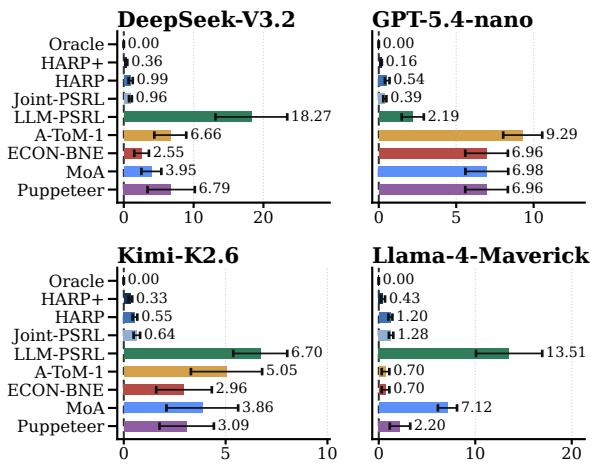  
Figure 2: Cumulative Bayesian regret on HP-SPGG at $K { = } 2 0$ for four LLM backbones, 10 common seeds. Error bars are the standard error of the mean.

Baselines. Oracle plans under the true profile with the same planner, giving the regret reference. HARP and $\mathrm { { \ddot { H A R P ^ { + } } } }$ difer only in the bonus weight β. Joint-PSRL keeps the belief as one explicit table over all $| \Theta _ { i } | ^ { n }$ joint profiles, and LLM-PSRL keeps the same posterior-sampling loop with the belief as text. A-ToM-0/1/2 apply theory-of-mind prompting at three recursion levels and ECON-BNE applies debate-of-beliefs equilibrium reasoning (Mu et al. 2026; Yi et al. 2025), with the belief in the prompt. MoA and Puppeteer orchestrate without a partner model, by layered proposal aggregation and by a learned router (Wang et al. 2025; Dang et al. 2026) (Appendix A.1). In the prompt baselines the language model itself makes the decisions.

## 4.1 HP-SPGG: Controlled Diagnostic Benchmark

Setup. In HP-SPGG (heterogeneous-persona public-goods game), an orchestrator assigns contributions to n=3 LLM sub-agents over K=20 episodes, and each returns a satisfaction score judged ofline by the backbone under its persona prompt. Each player’s hidden persona is drawn once, uniformly and independently, from |Θ<sub>i</sub>|=4 archetypes spanning the taxonomy of Fischbacher, Gächter, and Fehr (2001), so (TI), (RL), and (PF) all hold by construction. The analytic tier replaces the backbone’s scores with a closed-form payof (Appendices A.2 and A.1).

RQ1: explicit versus textual beliefs. Figure 2 compares the methods within each backbone under identical conditions, the same type profiles, uniform prior, payof tensor, and exact oracle, over ten common seeds. HARP<sup>+</sup> attains the lowest non-oracle mean regret on every backbone, $0 . 3 6 0 \pm 0 . 1 4 2$ on DeepSeek, $0 . 1 5 9 \pm 0 . 0 3 8$ on GPT-5.4-nano, $0 . 3 2 5 \pm 0 . 0 8 8$ on Kimi, and $0 . 4 3 0 \pm 0 . 2 1 7$ on Llama. The strongest textbelief comparator incurs 1.63 to 43.77 times that regret, and LLM-PSRL, the same loop with its belief in text, 13.8 to 50.8 times. The advantage holds seed by seed, with one loss in forty pairings and sign tests significant on three of four backbones (Appendix A.1). The gain therefore comes from the explicit belief, not a better prompt.

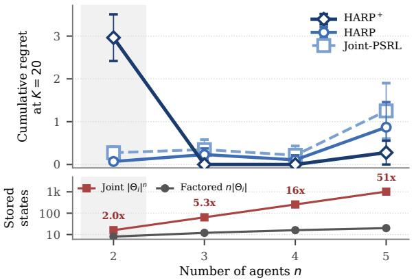

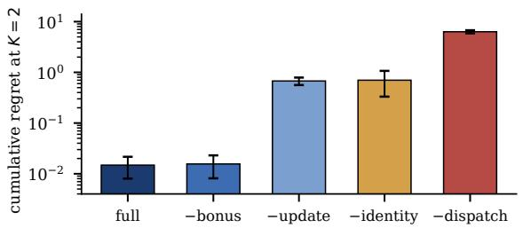  
Figure 3: HP-SPGG scaling and component ablation (Llama-4-Maverick, $| \Theta _ { i } | { = } 4 , K { = } 2 0$ , 10 common seeds). Top: cumulative regret against agent count, where HARP and Joint-PSRL sit at the same regret level at every n. Middle: persona storage against agent count, annotated with the joint-to-factored ratio. Bottom: cumulative regret for $\mathrm { H A R P ^ { + } }$ with one belief component removed, labelled (−bonus, −update, −identity) and by decentralized execution (−dispatch), on a log scale with the oracle at zero.

RQ2: factored versus explicit joint inference. Figure 3 (top and middle) tracks regret and persona storage against agent count for HARP and Joint-PSRL, the same loop carrying the explicit joint posterior. HARP is built to reproduce it at smaller storage, not to beat it. Proposition 3.2 predicts the two methods coincide. With live LLM likelihoods the two agree within seed-level error on every backbone, difering by 0.030, 0.153, 0.095, and 0.074 with neither consistently ahead, and the factored side uses 5.3× fewer persona parameters at $n { = } 3$ and 51× fewer at n=5. Analytically the agreement holds through n=5 (Appendix Table 6). The bonus removes the early loss both methods share, so HARP<sup>+</sup> still ends below Joint-PSRL on every backbone of the live tier (Figure 2). Outside the class the gap is bounded, not absent. Drawing every persona as one shared type, which violates (PF), leaves HARP within 1.52× of Joint-PSRL (Appendix Table 10). The compression is therefore free inside the class and graceful outside it.

RQ3: component attribution. Figure 3 (bottom) removes one belief component at a time under the same matched control and compares each variant against the full method on shared seeds. Removing the update (−update), which samples personas from the prior and never revises them, costs +0.66 paired regret. Removing identity attachment (−identity), which permutes the posteriors across agents so the beliefs stay equally sharp but attach to the wrong agent, raises mean regret to that same level, although six of ten seeds are unafected. Removing the discrimination bonus (−bonus) raises regret on every backbone under live LLM likelihoods, most sharply on DeepSeek from 0.360 to 0.985. On the analytic tier the bonus is inactive, since exact likelihoods leave nothing to disambiguate. Decentralized execution (−dispatch), which lets each agent best-respond to its own marginal, also raises regret, so the belief must be acted on by a single planner. Every component therefore contributes to the gain.

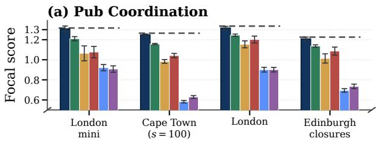

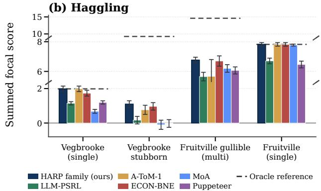  
Figure 4: Focal-agent payof on the Concordia substrates. (a) Pub Coordination against $\mathtt { o r a c l e \_ j o i n t }$ . (b) Haggling against oracle\_focal. The full set of configurations, with $\mathrm { H A R P ^ { + } \vec { \mathbf { \sigma } } _ { S } }$ margin, is in Figure 25.

## 4.2 Concordia-Derived Compact Benchmarks

In HP-SPGG the gap to the oracle is exactly the cost of not knowing the personas. The next test is whether the efect appears where the payof rewards more than knowing them. Two public Concordia substrates provide such payofs (Vezhnevets et al. 2023; Smith et al. 2026). Pub Coordination rewards agents for converging on the same venue, and Haggling models a buyer and a seller negotiating over price and bundles. We use nine configurations per substrate and report focal-agent payof, earned by the players the orchestrator controls, rather than social welfare. Scenes are scored analytically through $\mathtt { p a y o f f \_ f o r \_ c a s e }$ rather than by executing scripted nonplayer policies, so every decision is a one-shot enumeration over a fixed payof table (Appendix A.4).

RQ1: one-shot decision quality. Figure 4 compares every method against that optimum on the same configurations. On Pub Coordination, HARP<sup>+</sup> stays within 1% of oracle\_joint (a). ECON-BNE and A-ToM-1, the strongest A-ToM level, fall short by 5–15% and 5–30%, and MoA and Puppeteer by 30% or more. On Haggling it wins or ties every non-oracle method on all nine, reaching oracle\_focal exactly on five (b). Even in games whose payof depends on more than the personas, HARP<sup>+</sup> plays the optimal action for its sampled profile, so the near-oracle payofs show the posterior identifies them correctly.

RQ2 and RQ3: iterated diagnostic. Figure 6 runs a fixedpersona variant over K=20 scenes on six held-out configurations, since a single decision leaves nothing to update from. The fixed payof table makes the three conditions hold here too, so the prediction is again parity with Joint-PSRL. The replay is identical across backbones, so the comparison isolates the update rule from the language model. For RQ2, the paired diference between HARP and Joint-PSRL covers zero in every geometry (a). For RQ3, the value of updating scales with how much the persona decides, from nothing on Pub Coordination to 1.1–1.7 regret units on Haggling (b). On the native one-shot format HARP and $\mathrm { \mathrm { H A R P ^ { + } } }$ coincide exactly, since one decision leaves the bonus nothing to reveal (Appendix Table 12). The value of updating is therefore zero on the one-shot format. It is zero on Pub Coordination, where the persona does not decide the payof. It is largest on Haggling, where the persona decides it.

## 4.3 Ride-Hailing Dispatch on MaaSSim

The first two substrates abstract coordination to a payof table. The next test is whether the efect appears when coordination runs through a dynamic system. MaaSSim, an agent-based ride-hailing simulator (Kucharski and Cats 2022), provides one, with request queues, routing, and drivers. The orchestrator becomes the dispatcher and the sub-agents become the drivers. Each driver accepts or declines an ofer under a hidden acceptance policy, one of $| \Theta _ { i } | { = } 1 6$ rule combinations over trip attributes. The dispatcher sees only the resulting accept and reject events. Replaying logged request streams gives every method the identical arrival sequence within a seed. We score realized dispatch utility and regret against the oracle dispatching under the true personas.

RQ1: margin under conflict. Figure 5 sweeps toward maximally divergent acceptance rules at $\lambda \in \ \{ 0 , 0 . 5 , 1 \}$ reject penalty 5, since personas matter more when drivers disagree about which ofers are acceptable. The advantage of HARP, here a gpt-5.4-mini dispatcher given $\mathrm { H A R } \bar { \mathrm { P } ^ { \prime } } \mathrm { s }$ scores, over the strongest text-belief baseline grows by roughly an order ofmagnitude across this sweep (a, with per-cell values in Appendix A.3). HARP stays within 2.7–4.4 oracle-regret units while the strongest text-belief baseline rises from 4.5 to 10.7 (b). The gain therefore widens as the personas diverge.

RQ2 and RQ3: parity and belief source at scale. Figure 7 runs the parity test at $n \in \{ 2 , 3 , 4 \}$ , the largest fleet the joint table afords. Routing is persona-blind and drivers respond by their own rules, so (TI) and (RL) hold and parity with Joint-PSRL is again the prediction. Marginal posteriors match to $2 . 5 { \times } 1 0 ^ { - 1 4 }$ in total variation, and the paired utility gap covers zero on five of six independent-prior cells (a). The shaded rows break (PF) by sharing one persona within shift groups of size $^ { g , }$ and even there the reduction covers zero at $g { = } 2$ and $g { = } 4$ . The joint update reaches $4 9 7 \mu \mathrm { s }$ per event by $n { = } 4 .$ , against $7 \mu \mathrm { s }$ flat for the factored posterior, and 16 rules across the fleet exceeds any feasible table (b). Panel (c) varies the dispatcher’s belief source on a fixed replay. Realized utility rises with belief accuracy, the learned posterior adds +16.5 over the prior, and equally sharp beliefs on the wrong drivers fall below it. The reduction is therefore lossless at fleet scale, and the gain comes from knowing which driver holds which rule.

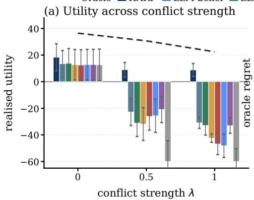

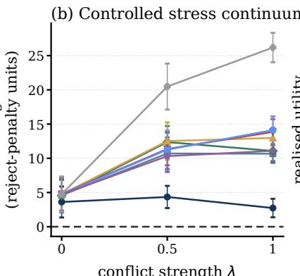

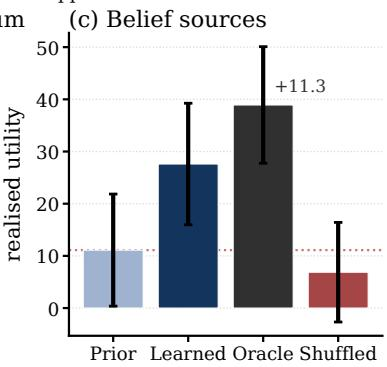

Figure 5: MaaSSim dispatch over 10 common environment seeds. (a) Realized utility across conflict strength λ. (b) Oracle regret in reject-penalty units. (c) Realized utility for each source of the belief the dispatcher acts on. Error bars are seed-level standard errors in (a) and (c), and oracle and policy standard errors propagated in quadrature in (b).  
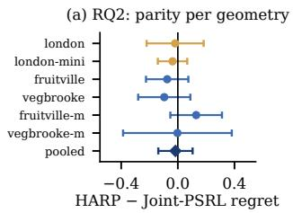

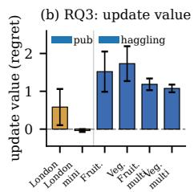  
Figure $6 { : }$ Iterated Concordia, 5 common seeds. (a) Paired HARP minus Joint-PSRL regret for each geometry and pooled, where negative values favor HARP. Whiskers are t-based 95% intervals with 4 degrees of freedom. (b) Update value, the paired excess of the no-update variant over $\mathrm { H A R P ^ { + } }$ , against persona decision value. Bars are the standard error of the mean.

## 5 Conclusion

This paper introduces HARP, which orchestrates heterogeneous LLM agents from an explicit persona posterior outside the language model. Under three structural conditions the per-agent posteriors reconstruct the joint one exactly, at linear rather than exponential cost and unchanged regret.

HARP<sup>+</sup> attains the lowest non-oracle regret on every backbone, and the factored posterior matches joint inference at far smaller storage. The gain requires the belief to be updated, attached to the right agent, and centrally dispatched. When personas are hidden, orchestration is an estimation problem, and the estimate belongs outside the prompt.

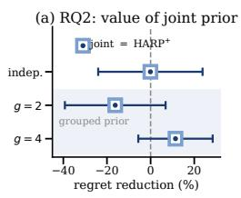

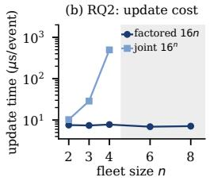

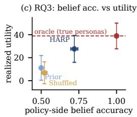

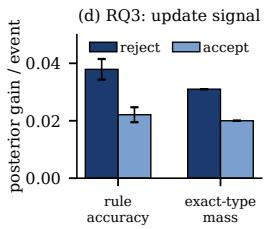  
Figure 7: MaaSSim parity and mechanism. (a) Relative reduction in oracle regret from the joint persona posterior, where the top row pools six independent-prior cells. One marker per row, since ${ \dot { \mathrm { H A R P } } } ^ { + }$ reproduces Joint-PSRL on every round. (b) Per-event update time, with the joint table not run beyond $n { = } 4 .$ . (c) Realized utility against the accuracy of the belief the dispatcher acts on, oracle dashed in red. (d) Per-event posterior gain by event type. Error bars are the standard error of the mean.

## Limitations

HARP assumes a fixed persona library, finite actions, and an ofline-calibrated scorer, each probed in Appendices A.2 and B.6. Personas outside the library are measured at the open-text boundary (Appendix A.1). Continuous control and persona drift remain open, and inferring worker preferences carries profiling risk deployments should disclose. The factorization compresses the belief, not the planner.

## References

Abdulhai, M.; White, I.; Snell, C.; Sun, C.; Hong, J.; Zhai, Y.; Xu, K.; and Levine, S. 2023. Lmrl gym: Benchmarks for multi-turn reinforcement learning with language models. arXiv preprint arXiv:2311.18232.

Agashe, S.; Fan, Y.; Reyna, A.; and Wang, X. E. 2025. Llm-coordination: evaluating and analyzing multi-agent coordination abilities in large language models. In Findings of the Associationfor Computational Linguistics: NAACL 2025, 8038–8057.

Agrawal, S.; and Jia, R. 2017. Optimistic posterior sampling for reinforcement learning: worst-case regret bounds. Advances in neural information processing systems, 30.

Albrecht, S. V.; and Ramamoorthy, S. 2015. A game-theoretic model and best-response learning method for ad hoc coordination in multiagent systems. arXiv preprint arXiv:1506.01170.

Albrecht, S. V.; and Ramamoorthy, S. 2019. On convergence and optimality of best-response learning with policy types in multiagent systems. arXiv preprint arXiv:1907.06995.

Albrecht, S. V.; and Stone, P. 2018. Autonomous agents modelling other agents: A comprehensive survey and open problems. Artificial Intelligence, 258: 66–95.

Arumugam, D.; and Grifiths, T. L. 2025. Toward eficient exploration by large language model agents. arXiv preprint arXiv:2504.20997.

Barrett, S.; Stone, P.; and Kraus, S. 2011. Empirical evaluation of ad hoc teamwork in the pursuit domain. In The 10th International Conference on Autonomous Agents and Multiagent Systems-Volume 2, 567–574.

Cesa-Bianchi, N.; Freund, Y.; Haussler, D.; Helmbold, D. P.; Schapire, R. E.; and Warmuth, M. K. 1997. How to use expert advice. Journal ofthe ACM (JACM), 44(3): 427–485.

Chen, G.; Dong, S.; Shu, Y.; Zhang, G.; Sesay, J.; Karlsson, B. F.; Fu, J.; and Shi, Y. 2023. Autoagents: A framework for automatic agent generation. arXiv preprint arXiv:2309.17288.

Cross, L.; Xiang, V.; Bhatia, A.; Yamins, D.; and Haber, N. 2025. Hypothetical minds: Scafolding theory of mind for multi-agent tasks with large language models. In International Conference on Learning Representations, volume 2025, 6507– 6546.

Dang, Y.; Qian, C.; Luo, X.; Fan, J.; Xie, Z.; Shi, R.; Chen, W.; Yang, C.; Che, X.; Tian, Y.; et al. 2026. Multi-agent collaboration via evolving orchestration. Advances in neural information processing systems, 38: 165025–165059.

Dasgupta, A.; Jain, G.; Suggala, A.; Shanmugam, K.; Tambe, M.; and Taneja, A. 2025. Bayesian Collaborative Bandits with Thompson Sampling for Improved Outreach in Maternal Health. In Proceedings of the 24th International Conference on Autonomous Agents and Multiagent Systems, 547–555.

Easley, D.; and Kiefer, N. M. 1988. Controlling a stochastic process with unknown parameters. Econometrica: Journal ofthe Econometric Society, 1045–1064.

Erez, L.; Lancewicki, T.; Sherman, U.; Koren, T.; and Mansour, Y. 2023. Regret minimization and convergence to equilibria in general-sum markov games. In International Conference on Machine Learning, 9343–9373. PMLR.

(FAIR)†, M. F. A. R. D. T.; Bakhtin, A.; Brown, N.; Dinan, E.; Farina, G.; Flaherty, C.; Fried, D.; Gof, A.; Gray, J.; Hu, H.; et al. 2022. Human-level play in the game of diplomacy by combining language models with strategic reasoning. Science, 378(6624): 1067–1074.

Fischbacher, U.; Gächter, S.; and Fehr, E. 2001. Are people conditionally cooperative? Evidence from a public goods experiment. Economics letters, 71(3): 397–404.

Ghosal, S.; and Van der Vaart, A. W. 2017. Fundamentals of nonparametric Bayesian inference, volume 44. Cambridge University Press.

Gmytrasiewicz, P. J.; and Doshi, P. 2005. A framework for sequential planning in multi-agent settings. Journal of Artificial Intelligence Research, 24: 49–79.

Hong, S.; Zhuge, M.; Chen, J.; Zheng, X.; Cheng, Y.; Wang, J.; Zhang, C.; Yau, S.; Lin, Z.; Zhou, L.; et al. 2024. MetaGPT: Meta programming for a multi-agent collaborative framework. In International Conference on Learning Representations, volume 2024, 23247–23275.

Jahromi, M. J.; Jain, R. A.; and Nayyar, A. 2024. A bayesian learning algorithm for unknown zero-sum stochastic games with an arbitrary opponent. In International Conference on Artificial Intelligence and Statistics, 3880–3888. PMLR.

Jin, C.; Liu, Q.; Wang, Y.; and Yu, T. 2024. V-learning—a simple, eficient, decentralized algorithm for multiagent reinforcement learning. Mathematics of Operations Research, 49(4): 2295–2322.

Kucharski, R.; and Cats, O. 2022. Simulating two-sided mobility platforms with MaaSSim. Plos one, 17(6): e0269682.

Kwon, J.; Efroni, Y.; Caramanis, C.; and Mannor, S. 2021. Rl for latent mdps: Regret guarantees and a lower bound. Advances in Neural Information Processing Systems, 34: 24523–24534.

Lanctot, M.; Zambaldi, V.; Gruslys, A.; Lazaridou, A.; Tuyls, K.; Pérolat, J.; Silver, D.; and Graepel, T. 2017. A unified game-theoretic approach to multiagent reinforcement learning. Advances in neural information processing systems, 30.

Lattimore, T.; and Szepesvári, C. 2020. Bandit algorithms. Cambridge University Press.

Li, G.; Hammoud, H.; Itani, H.; Khizbullin, D.; and Ghanem, B. 2023a. Camel: Communicative agents for" mind" exploration of large language model society. Advances in neural information processing systems, 36: 51991–52008.

Li, H.; Chong, Y.; Stepputtis, S.; Campbell, J. P.; Hughes, D.; Lewis, C.; and Sycara, K. 2023b. Theory of mind for multi-agent collaboration via large language models. In Proceedings ofthe 2023 Conference on Empirical Methods in Natural Language Processing, 180–192.

Mao, W.; and Başar, T. 2023. Provably eficient reinforcement learning in decentralized general-sum markov games. Dynamic Games and Applications, 13(1): 165–186.

Marris, L.; Muller, P.; Lanctot, M.; Tuyls, K.; and Graepel, T. 2021. Multi-agent training beyond zero-sum with correlated equilibrium meta-solvers. In International Conference on Machine Learning, 7480–7491. PMLR.

Mate, A.; Killian, J.; Xu, H.; Perrault, A.; and Tambe, M. 2020. Collapsing bandits and their application to public health intervention. Advances in Neural Information Processing Systems, 33: 15639–15650.

McLennan, A. 1984. Price dispersion and incomplete learning in the long run. Journal ofEconomic dynamics and control, 7(3): 331–347.

Mu, C.; Zeng, Y.; Zhang, Q.; Shao, K.; Chu, C.; Guo, H.; Jia, D.; Wang, Z.; and Hu, S. 2026. Adaptive Theory of Mind for LLM-based Multi-Agent Coordination. In Proceedings ofthe AAAI Conference on Artificial Intelligence, volume 40, 29608–29616.

Muller, P.; Omidshafiei, S.; Rowland, M.; Tuyls, K.; Perolat, J.; Liu, S.; Hennes, D.; Marris, L.; Lanctot, M.; Hughes, E.; et al. 2019. A generalized training approach for multiagent learning. arXiv preprint arXiv:1909.12823.

Mutti, M.; De Santi, R.; Restelli, M.; Marx, A.; and Ramponi, G. 2024. Exploiting causal graph priors with posterior sampling for reinforcement learning. In International Conference on Learning Representations, volume 2024, 10592–10624.

Nair, R.; Varakantham, P.; Tambe, M.; and Yokoo, M. 2005. Networked distributed POMDPs: A synthesis of distributed constraint optimization and POMDPs. In AAAI, volume 5, 133–139.

Nguyen-Tang, T.; and Arora, R. 2024. Learning in markov games with adaptive adversaries: Policy regret, fundamental barriers, and eficient algorithms. Advances in Neural Information Processing Systems, 37: 56268–56303.

Oliehoek, F. A.; Spaan, M. T.; Vlassis, N.; and Whiteson, S. 2008. Exploiting locality of interaction in factored Dec-POMDPs. In Int. Joint Conf. on Autonomous Agents and Multi-Agent Systems.

Osband, I.; Russo, D.; and Van Roy, B. 2013. (More) eficient reinforcement learning via posterior sampling. Advances in Neural Information Processing Systems, 26.

Ouyang, Y.; Gagrani, M.; Nayyar, A.; and Jain, R. 2017. Learning unknown markov decision processes: A thompson sampling approach. Advances in neural information processing systems, 30.

Park, C.; Liu, X.; Ozdaglar, A.; and Zhang, K. 2024. Do llm agents have regret? a case study in online learning and games. arXiv preprint arXiv:2403.16843.

Park, J. S.; O’Brien, J.; Cai, C. J.; Morris, M. R.; Liang, P.; and Bernstein, M. S. 2023. Generative agents: Interactive simulacra of human behavior. In Proceedings of the 36th annual acm symposium on user interface software and technology, 1–22.

Paruchuri, P.; Kraus, S.; Pearce, J. P.; Marecki, J.; Tambe, M.; and Ordonez, F. 2008. Playing games for security: An eficient exact algorithm for solving Bayesian Stackelberg games.

Russo, D.; and Van Roy, B. 2014. Learning to optimize via posterior sampling. Mathematics of Operations Research, 39(4): 1221–1243.

Russo, D.; and Van Roy, B. 2016. An information-theoretic analysis of thompson sampling. Journal ofMachine Learning Research, 17(68): 1–30.

Smith, C.; Abdulhai, M.; Diaz, M.; Tesic, M.; Trivedi, R.; Vezhnevets, S.; Hammond, L.; Clifton, J.; Chang, M.; Duenez-Guzman, E.; et al. 2026. Evaluating generalization capabilities of LLM-based agents in mixed-motive scenarios using concordia. Advances in neural information processing systems, 38.

Song, Z.; Mei, S.; and Bai, Y. 2021. When can we learn general-sum Markov games with a large number of players sample-eficiently? arXiv preprint arXiv:2110.04184.

Strens, M. 2000. A Bayesian framework for reinforcement learning. In ICML, volume 2000, 943–950.

Vezhnevets, A. S.; Agapiou, J. P.; Aharon, A.; Ziv, R.; Matyas, J.; Duéñez-Guzmán, E. A.; Cunningham, W. A.; Osindero, S.; Karmon, D.; and Leibo, J. Z. 2023. Generative agent-based modeling with actions grounded in physical, social, or digital space using Concordia. arXiv preprint arXiv:2312.03664.

Wang, J.; Wang, J.; Athiwaratkun, B.; Zhang, C.; and Zou, J. Y. 2025. Mixture-of-agents enhances large language model capabilities. In International Conference on Learning Representations, volume 2025, 33944–33963.

Wu, Q.; Bansal, G.; Zhang, J.; Wu, Y.; Zhang, S.; Zhu, E.; Li, B.; Jiang, L.; Zhang, X.; and Wang, C. 2023. Autogen: Enabling next-gen llm applications via multi-agent conversation framework. arXiv preprint arXiv:2308.08155, 3(4).

Xiong, W.; Zhong, H.; Shi, C.; Shen, C.; and Zhang, T. 2022. A self-play posterior sampling algorithm for zero-sum markov games. In International Conference on Machine Learning, 24496–24523. PMLR.

Yang, T.; Dai, B.; Xiao, L.; and Chi, Y. 2025. Incentivize without bonus: Provably eficient model-based online multi-agent RL for Markov games. arXiv preprint arXiv:2502.09780.

Yi, X.; Zhou, Z.; Cao, C.; Niu, Q.; Liu, T.; and Han, B. 2025. From debate to equilibrium: Belief-driven multi-agent llm reasoning via bayesian nash equilibrium. arXiv preprint arXiv:2506.08292.

Zhou, X.; Zhu, H.; Mathur, L.; Zhang, R.; Yu, H.; Qi, Z.; Morency, L.-P.; Bisk, Y.; Fried, D.; Neubig, G.; et al. 2024. Sotopia: Interactive evaluation for social intelligence in language agents. In International Conference on Learning Representations, volume 2024, 40975–41019.

## A Empirical Supplement by Research Question

## A.0 Reading Guide

This subsection certifies no standalone result; it maps each main-text research question to its complete evidence bundle and location. Claim tags C1–C6 name the certified claims within each question. Every empirical figure and table retained below appears in one of these rows, with the single exception of Appendix A.4, whose figures and table document the oracle references and the one-shot decision-quality comparison as shared evaluation infrastructure.

Table 1: Research-question reading guide. The appendix mirrors the main-text organization by research question.  
Question Evidence Location   
RQ1 repre-C1 matched control: Table 2; Figures 11, 12. C5 §A.1   
sentation open-text boundary: Figure 8; Tables 3, 4;   
Figures 9, 10; Table 5.   
RQ2 com- C1 exactness/storage: Figure 3; Tables 6, 7; §A.2   
putation Figure 7(a,b). C4 structural class: Figure 13;   
Table 9; Figure 14; Table 10.   
RQ3 attri- C2 rate: Figures 15(a), 16, 6; Table 11. C3 bonus: §A.3   
bution Figure 15(b); Figures 17, 18; Table 12. C6   
mechanism: Figures 3, 19, 7(c,d), 20, 22, 21;   
Tables 13, 14; Figures 23, 24.

## A.1 RQ1: Numeric versus In-Prompt Representation

This subsection certifies where the representational advantage is measured (C1’s environment-matched control) and where it stops (C5’s open-text boundary).

## Environment-Matched Control (C1)

Matched-likelihood source audit. Git snapshot 4280ade used algorithm-specific seeds (120000 + 10000j + s) and did not retain its c19 tensors or response caches, so those historical unmatched rows are provenance only and are excluded from Figure 2 and Table 2.

Fresh environment-matched control. For each backbone we generated and pinned a complete 125-profile × 3-player × 4-persona live outcome-score tensor (1,500 judge cells), then ran all methods over the same ten environment seeds, type profiles, uniform prior, and exact exhaustive tensor oracle with $K { = } 2 0 , \beta { = } 0 . 2 5$ , and Gaussian observation scale 0.08. There is no additional stochastic board state. Each method receives its own realized-reward history generated from the shared tensor. The strongest fixed LLM-coordination comparator is selected by minimum mean regret within ECON-BNE and A-ToM-0/1/2. Ratios divide per-backbone means; paired gaps use common seed indices. Seed by seed, ${ \mathrm { H A R } } { \bar { \mathbf { P } } } ^ { + }$ loses to the strongest comparator in one of the 40 backbone–seed pairings, and paired sign tests over the ten common seeds are significant on three of the four backbones. Provider sampling seeds are unavailable, so this is environment matching rather than pathwise provider-RNG matching; every accepted raw response is content-hash cache-pinned. The final column is reported as a sanity check that the method exploits the structure when it is present, not as a separate claim: HP-SPGG is constructed so that TI, RL, and PF hold and the personaconditioned outcome scorer is exactly calibrated, which is precisely the regime the method targets and the prompt-based comparators do not assume. The spread across backbones is driven by the comparators rather than by HARP<sup>+</sup>: its own regret varies by a factor of 2.7 (0.159 to 0.430) while the strongest prompt-based comparator varies by 9.9 (0.700 on Llama-Maverick to 6.960 on GPT-5.4-nano), and the two extremes fall on opposite backbones. This is the behavior the design predicts, since a belief kept numeric and outside the prompt, updated against an outcome scorer calibrated once per backbone, inherits little of the variation in a backbone’s in-context reasoning quality. We therefore report the range rather than a single headline multiple, and read the Llama cell as one where a prompt-based comparator happens to do well rather than one where $\mathrm { H A R P ^ { + } }$ degrades. The claims certified in this subsection are the exactness and storage results below.

HP-SPGG state, assignment, response, and calibration specification. The public state at each turn records the round index and the previous turn’s contribution profile. The orchestrator assigns each player one of five contribution levels, so the assignment menu contains $5 ^ { 3 } { = } 1 2 5$ joint profiles that the backward-induction planner and the oracle both enumerate exactly $( \epsilon _ { \mathrm { p l a n } } = 0 )$ . Each player responds with a satisfaction score, which is its emitted action and also its reward. The scores are calibrated ofline once per backbone by scoring every (persona, player index, contribution profile) cell with the judge prompt of Section C.5, yielding the $1 2 5 \times 3 \times 4$ tensor that serves both as the planner’s prediction of each response and as the scorer q of the per-agent Bayes update. The realized score is drawn around the tensor entry with Gaussian scale $\sigma { = } 0 . 0 8$ and clipped to [0, 1], and it enters the update as a Gaussian factor with the same mean and scale. The contribution profile is the orchestrator’s own assignment and carries no information about the personas. Because the tensor is calibrated ofline, the $n H | \Theta _ { i } { \bar { | } }$ scorer evaluations of each episode are lookups in $\mathbf { i t } ,$ and the online loop issues no new model calls. All reported cells use $K { = } 2 0$ episodes, n=3 agents, $| \Theta _ { i } | { = } 4$ personas, and $\beta { = } 0 . 2 5$

Baseline definitions. Oracle receives the true persona profile and applies the same exhaustive argmax over joint assignments, providing the regret reference. HARP and $H A R P ^ { + }$ share every component and difer only in the bonus weight $\beta .$ Joint-PSRL replaces the factored persona posterior with an explicit table over all $| \Theta _ { i } | ^ { n }$ joint profiles under a uniform Dirichlet prior while sharing the likelihood, planner, and environments. LLM-PSRL retains the posterior-sampling loop but represents the hypothesis and posterior in natural language rather than numerically. PSRL-NoType (the no-update variant of the main text) draws $ { \hat { \theta } } \sim \mathrm { U n i f } (  { \Theta } )$ each episode and never updates. A-ToM-0/1/2 apply adaptive theory-of-mind prompting at three recursion levels (Mu et al. 2026) and ECON-BNE applies debate-of-beliefs equilibrium reasoning (Yi et al. 2025); both keep their belief state inside the prompt and receive realized rewards from the same pinned tensor through their public history. MoA and Puppeteer orchestrate

Table 2: Environment-matched HP-SPGG control $( K { = } 2 0 ,$ , 10 common seeds). Values are cumulative regret, mean ± SEM. Ratio is the strongest fixed LLM-coordination baseline divided by the lower-regret HARP-family member $\bar { ( \mathrm { H A R P ^ { + } } }$ on all four backbones).
<table><tr><td>Backbone</td><td>HARP⁺</td><td>HARP</td><td>Joint-PSRL</td><td></td><td>LLM-PSRL Best coordination</td><td>Coord./best HARP</td></tr><tr><td>DeepSeek-V3.2</td><td> $0 . 3 6 0 \pm 0 . 1 4 2$ </td><td> $0 . 9 8 5 \pm 0 . 2 9 8$ </td><td> $0 . 9 5 5 \pm 0 . 2 0 3$ </td><td> $1 8 . 2 7 0 \pm 5 . 1 4 1$ </td><td> $\mathrm { E C O N - B N E 2 . 5 5 0 \pm 1 . 0 4 9 }$ </td><td>7.08×</td></tr><tr><td>GPT-5.4-nano</td><td> $0 . 1 5 9 \pm 0 . 0 3 8$ </td><td> $0 . 5 4 4 \pm 0 . 1 5 0$ </td><td> $0 . 3 9 1 \pm 0 . 1 0 0$ </td><td> $2 . 1 9 3 \pm 0 . 7 1 4$ </td><td> $\mathrm { E C O N { - } B N E 6 . 9 6 0 \pm 1 . 3 7 6 }$ </td><td>43.77×</td></tr><tr><td>Kimi-K2.6</td><td> $0 . 3 2 5 \pm 0 . 0 8 8$ </td><td> $0 . 5 4 7 \pm 0 . 1 1 6$ </td><td> $0 . 6 4 2 \pm 0 . 1 5 9$ </td><td> $6 . 7 0 1 \pm 1 . 3 2 5$ </td><td> $\mathrm { E C O N { - } B N E ~ 2 . 9 5 7 } \pm 1 . 3 6 6$ </td><td>9.10×</td></tr><tr><td>Llama-4-Maverick</td><td> $0 . 4 3 0 \pm 0 . 2 1 7$ </td><td> $1 . 2 0 2 \pm 0 . 2 1 2$ </td><td> $1 . 2 7 6 \pm 0 . 2 2 8$ </td><td> $1 3 . 5 1 0 \pm 3 . 4 3 1$ </td><td> $\mathrm { A { - } T o M { - } 0 . 7 0 0 \pm 0 . 3 9 6 }$ </td><td>1.63×</td></tr></table>

without a partner model, by layered proposal aggregation (Wang et al. 2025) and by a learned router (Dang et al. 2026).

Open-Text Transfer Boundary (C5) This subsection certifies C5: once actions are open-ended and TI/RL/PF cannot be verified, the exact finite-model guarantees no longer transfer, and correcting the recurrent evidence path produces no focal-score gain.

Setup recap. SOTOPIA-Hard (Zhou et al. 2024) sits outside the preconditions of Section B.2 on three axes. The substrate is dyadic (n=2) rather than $n \geq 3 ,$ , the action space is open-ended natural language rather than tabular contributions, and episodes are curated profile-goal pairs rather than samples from an explicit factored prior, so (TI), (RL), and (PF) are not verified in either direction. We adapt $\mathrm { H A R P ^ { + } }$ by extracting approximate per-agent persona marginals from a Concordia-style mechanistic surrogate over a discretized intent space, then apply the same factored-posterior sampling and type-discrimination bonus as in HP-SPGG. The surrogate scores each utterance with fixed keyword-weighted heuristics over the intent menu rather than next-token likelihoods, and the reference one-hot labels are obtained by applying the same mapping to the full profile. An implementation audit conducted before submission found that the evidence channel of the original runs read from the agent inbox while SOTOPIA 0.1.5 delivers partner evidence in Observation.last\_turn, so the numeric posterior in those runs received zero updates and posterior sampling reduced to prior sampling. We therefore treat all historical SOTOPIA-Hard numbers as descriptive results produced by the intent surrogate, the type-discrimination bonus, and prior sampling, and we do not use them to support the closed-form belief-update mechanism. The corrected recurrent rerun is reported in Section A.1. Both agents in each episode are controlled by the same baseline (SOTOPIA self-play). The focal score is the mean of episode.overall.agent\_1 and episode.overall.agent\_2. We compare against four LLM-coordination baselines, A-ToM-1 (Mu et al. 2026), ECON-BNE (Yi et al. 2025), prompted llm\_belief, and prompted llm\_greedy. Each (backbone, baseline) cell is averaged over 14 scenarios with 5 seeds each, for 70 episodes per cell.

Historical descriptive results. Figure 8 and Table 3 report the three private-goal families summarized in the main text. HARP<sup>+</sup> ranks between second and fourth by backbone, every method falls inside a 0.12 envelope of focal score, and the family margins are +0.06, +0.10, and +0.02. Because the posterior in the retained runs did not update, these margins describe the intent surrogate, prior sampling, and bonus

configuration rather than recurrent Bayesian inference.  
Table 3: SOTOPIA-Hard private-goal families: HARP<sup>+</sup> vs. strongest LLM-coordination baseline per family, averaged across four backbones. Best baseline per family: A-ToM-1 for craigslist\_bargains and donate\_funds; ECON-BNE for revenge\_plot.
<table><tr><td>Family</td><td>n</td><td>HARP⁺</td><td>Best</td><td> $\Delta$ </td></tr><tr><td>craigslist_bargains</td><td>80</td><td>3.04</td><td>2.98</td><td>+0.06</td></tr><tr><td>revenge_plot</td><td>20</td><td>2.93</td><td>2.83</td><td>+0.10</td></tr><tr><td>donate_funds</td><td>20</td><td>3.26</td><td>3.24</td><td>+0.02</td></tr></table>

Aggregate scores and interpretation. Table 4 reports mean focal score by backbone. HARP<sup>+</sup> ranks 2nd/3rd/3rd/4th on GPT/DeepSeek/Kimi/Llama and remains within 0.10 of the best alternative; all five non-oracle methods fit inside a 0.12 envelope. The one-hot oracle\_belief row also lies within that envelope on average, whereas best-of-five oracle\_policy reaches 3.540. Thus open action search and judge variance dominate the value of the surrogate persona belief. Because TI/RL/PF are unverified and the posterior was static, these historical rows certify a transfer boundary, not a rate or concentration claim.

Corrected recurrent update. We repaired the adapter to read partner evidence from SOTOPIA 0.1.5’s Observation.last\_turn. A corrected GPT-5.4-nano run covers the same three private-goal families with 120 episodes at each corruption level; every accepted episode records eligible recurrent updates and zero provider-exception generation fallbacks. This run is separate from the historical four-backbone results above. SOTOPIA provides no native labels for the project’s four persona classes. Figure 9(a) therefore evaluates concentration only against the existing profile-derived proxy used by the oracle adapter. Proxy mass rises from 0.25 to 0.304 ± 0.012 on revenge\_plot, but falls to 0.233 ± 0.005 on craigslist\_bargains and changes only to 0.261 ± 0.013 on donate\_funds. The corrected posterior updates recurrently and nontrivially, but concentration is familydependent and is not native type-recovery accuracy. The corrected p=0 focal means are 2.665 ± 0.074, 3.229 ± 0.121, and $2 . 7 4 3 \pm 0 . 1 0 2$ on craigslist\_bargains, donate\_funds, and revenge\_plot. They trail the retained GPT-nano best-baseline means by 0.095, 0.157, and 0.457, respectively. We therefore select the clean-boundary branch: fixing the evidence path removes the implementation liability but does not produce a score advantage. Figure 9(b) reports the completed measured grid $p \ \in \ \{ 0 , 0 . 1 , 0 . 2 , 0 . 2 5 , 0 . 3 , 0 . 5 \}$ ; no point is interpolated. $\mathrm { A t } p { = } 0 . 5 ,$ , changes from p=0 are −0.053, +0.161, and +0.146 across the three families. The curve is non-monotone and changes are comparable to episode-row SEM, so it supports sensitivity bounds rather than a causal degradation law.

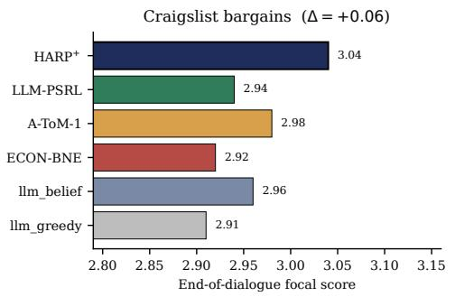

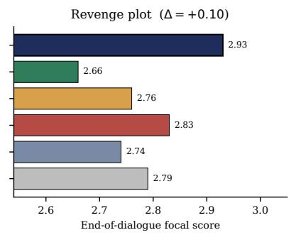

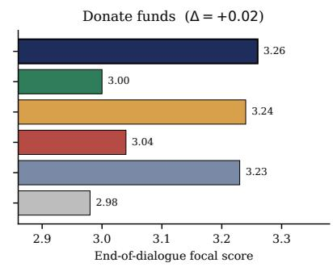

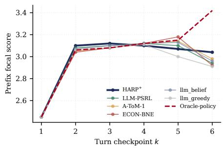

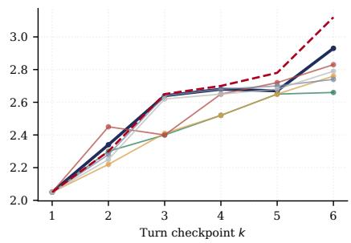

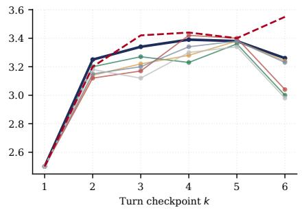  
Figure 8: SOTOPIA-Hard descriptive results for three private-goal families: craigslist\_bargains (n=80), revenge\_plot (n=20), and donate\_funds (n=20). (a) End-of-dialogue focal score across four backbones (SEM); ∆ compares HARP<sup>+</sup> with the next-best LLM-coordination baseline. (b) Prefix-only per-turn trajectory (descriptive; the historical posterior did not update, so this panel is not concentration evidence); red dashed is oracle\_policy (Appendix A.4).

Table 4: SOTOPIA-Hard aggregate mean focal score per (backbone × baseline), 70 episodes per cell. Bold marks the highest non-oracle score per backbone; HARP<sup>+</sup> rank and gap to best alternative are in the last two columns. The two oracle rows (Appendix A.4) receive the privileged one-hot opponent persona; oracle\_policy additionally selects the best of $K { = } 5$ independent episodes by the same seven-dimensional judge.
<table><tr><td>Backbone</td><td>HARP⁺</td><td>A-ToM-1</td><td>ECON-BNE</td><td>llm_belief</td><td>llm_greedy</td><td>Rank</td><td>∆</td></tr><tr><td>DeepSeek-V3.2</td><td>3.248</td><td>3.261</td><td>3.313</td><td>3.195</td><td>3.193</td><td>3</td><td>-0.065</td></tr><tr><td>GPT-5.4-nano</td><td>2.981</td><td>2.918</td><td>2.843</td><td>3.000</td><td>2.842</td><td>2</td><td>-0.019</td></tr><tr><td>Kimi-K2.6</td><td>2.807</td><td>2.733</td><td>2.876</td><td>2.906</td><td>2.761</td><td>3</td><td>-0.099</td></tr><tr><td>Llama-Maverick</td><td>3.308</td><td>3.359</td><td>3.319</td><td>3.340</td><td>3.165</td><td>4</td><td>-0.051</td></tr><tr><td>Average</td><td>3.086</td><td>3.068</td><td>3.088</td><td>3.110</td><td>2.990</td><td>一</td><td>-0.024</td></tr></table>

<table><tr><td>Backbone</td><td>oracle_belief (one-hot persona)</td><td>oracle_policy (one-hot + best-of-K=5)</td></tr><tr><td>DeepSeek-V3.2</td><td>3.294</td><td>3.712</td></tr><tr><td>GPT-5.4-nano</td><td>2.920</td><td>3.467</td></tr><tr><td>Kimi-K2.6</td><td>2.916</td><td>3.364</td></tr><tr><td>Llama-Maverick</td><td>3.282</td><td>3.618</td></tr><tr><td>Average</td><td>3.103</td><td>3.540</td></tr></table>

Table 5: Corrected p=0 SOTOPIA branch decision. Historical best is the retained GPT-nano comparator, not a contemporaneous paired rerun.
<table><tr><td>Family</td><td>Corrected score</td><td>∆ vs best</td></tr><tr><td>Craigslist</td><td> $2 . 6 6 5 \pm 0 . 0 7 4$ </td><td>-0.095</td></tr><tr><td>Donate</td><td> $3 . 2 2 9 \pm 0 . 1 2 1$ </td><td>-0.157</td></tr><tr><td>Revenge</td><td> $2 . 7 4 3 \pm 0 . 1 0 2$ </td><td>-0.457</td></tr></table>

Corrected component controls. We rerun surrogate-only, naive-belief, and $\mathrm { { H A R P ^ { + } } }$ on the same 30 cases and four replicate IDs. The endpoint exposes no sampling-seed control, so pairing controls case composition but not provider or judge randomness. HARP-minus-naive paired diferences are $+ 0 . { \dot { 0 } } 4 4 \pm 0 . 0 9 6 , + 0 . 0 9 3 \pm 0 . 1 8 2 , { \mathrm { a n d } } - 0 . 0 4 3 \pm 0 . 1 5 0$ on Craigslist, Donate, and Revenge; HARP-minus-surrogate diferences are +0.063 ± 0.077, −0.079 ± 0.090, and $- 0 . 1 0 7 \pm 0 . 1 6 6$ No lower confidence bound is positive. Together with the corrected recurrent updates, this selects the clean-boundary branch: the posterior responds to evidence, but no focal-score gain can be attributed to its numeric update on these families.

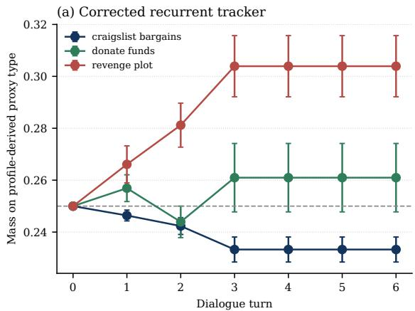

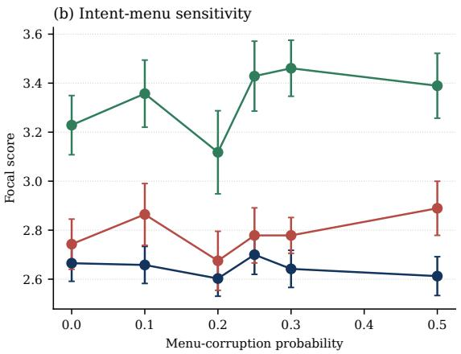  
Figure 9: Corrected SOTOPIA posterior diagnostic on GPT-5.4-nano. (a) Recurrent mass on the profile-derived proxy persona (not a native SOTOPIA truth label); error bars are episode-row SEM. (b) Focal score under deterministic intent-menu corruption; provider and judge generations are not pathwise seed-controlled, so this is a sensitivity bound rather than a paired causal dose response.

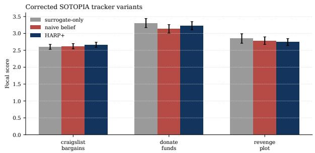  
Figure 10: Corrected SOTOPIA component variants on GPT-$5 . { \bar { 4 } } { - } \mathrm { n a n o }$ (same 30 cases, four replicates; episode-row SEM). $\mathrm { \mathrm { H A R P ^ { + } } }$ does not significantly exceed either corrected control on any family. Provider generations are not pathwise seedcontrolled.

## A.2 RQ2: Factored versus Joint Computation

Exactness and Storage (C1) This unit certifies C1: under TI/RL/PF, the factored persona posterior matches the joint representation while reducing persona storage from $O ( | \bar { \Theta } _ { i } | ^ { n } )$ to $\left( O ( n | \Theta _ { i } | ) \right.$ . The matched control of Section A.1 anchors the comparison on common environments and pinned tensors; the scaling figures and storage table isolate representation size from planning and likelihood diferences.

HARP–Joint agreement. In Table 2, the absolute HARP– Joint-PSRL mean-regret gaps are 0.030, 0.153, 0.095, and 0.074 across DeepSeek, GPT, Kimi, and Llama; each is smaller than the corresponding quadrature-combined SEM. This aggregate agreement is consistent with Proposition B.13. The live control does not claim trajectory identity because algorithm draws were not pathwise coupled and the providersampled calibration exposes no replayable sampling seed, instead pinning one realized tensor by cache.

Representation-only comparison. Figures 11 and 12 broaden the agent-count sweep to nine baselines. Under the structural conditions, HARP and the explicit joint-posterior sampler remain within sample noise while type-agnostic IQL and Random accumulate regret with n. Table 6 holds the likelihood, planner, and seeds fixed and changes only posterior representation; the storage ratio grows from $5 . 3 \times$ to $5 1 \times \mathrm { o v e r } n = 3  – 5$ without a corresponding regret separation. Figure 3 puts the two quantities on the same axes for one live backbone: the three posterior-sampling methods track one another in regret at every n while the joint table grows from 16 to 1024 entries against $\mathrm { H A R P ` s : }$ 8 to 20, so the entire benefit of decoupling appears as storage rather than as a regret gap. This is the finite-sample form of Corollary B.12, and it also shows where the saving is not yet worth anything: at $n { = } 2$ the joint table has only 16 entries, the ratio is 2.0×, and all three methods sit at the same elevated regret. The panel is a single-backbone (Llama-4-Maverick) view; the cross-backbone form of the same comparison is Table 6.

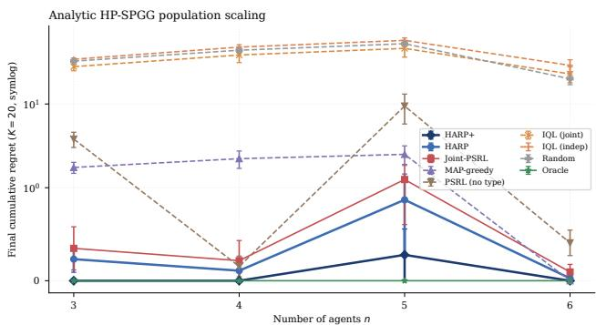  
Figure 11: C1 analytic-tier nine-baseline n-scaling on HP-SPGG $( n ~ \in ~ \{ 3 , 4 , 5 , 6 \}$ , K=20, 5 seeds, $\beta { = } 0 . 2 5 )$ . The HARP family stays under 1.0 cumulative regret across the sweep while type-agnostic IQL and Random grow with n. Persona-storage savings are 5.3×, 16×, 51×, and $1 7 1 \times$ at $n = 3 , 4 , 5 , 6 .$

MaaSSim parity control (E-E). The same exactness claim is tested on the deployment-shaped substrate. Closedloop regeneration by fleet size produces sub-fleets of n ∈ $\{ 2 , \dot { 3 } , 4 , \dot { 6 } , 8 \}$ drivers over the ten common environment indices at $\lambda \in \{ 0 , 1 \}$ , with the base driver-reject penalty of 2 rather than the stress setting of the main-text sweep. The factored and joint methods consume the identical nearest-policy saved assignment events in identical order, share the per-driver binary accept/reject analytic likelihood, the uniform prior, and an exhaustive maximum-cardinality assignment objective with lexicographic tie-breaking, and draw profiles from independent deterministic sampling RNG streams. Joint-PSRL maintains the explicit $1 6 ^ { n }$ table and is run for $n \leq 4 ; { \mathrm { t h e } } 1 6 ^ { 8 }$ table at the full fleet is infeasible for the experiment budget. Table 7 reports the six paired cells. Marginal total variation between the joint and factored posteriors stays at numerical precision on every stream, so the two methods carry the same posterior in two representations, and any utility diference arises from the independent profile-sampling draws. One of six 95% intervals excludes zero $( n { = } 2 , \lambda { = } 0 )$ ; at least one excursion among six such intervals occurs with probability ≈0.26, the direction is not reproduced at any other cell, and the pooled mean over cells is −0.01. Outside the class, the shift-group rows of Figure 7(a) break PF by drawing one shared persona per shift group of $g$ drivers, and the relative reduction in oracle regret from the joint persona posterior still covers zero at $g { = } 2$ and $g { = } 4$ . Per-event update cost is flat near $7 \mu \mathrm { s }$ for the factored posterior at every fleet size and grows to 497 $\mu \mathrm { s }$ for the joint posterior at n=4 (Figure 7(b)).

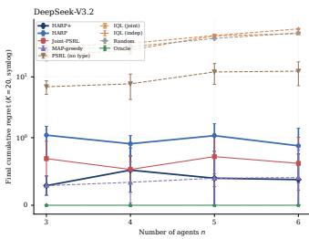

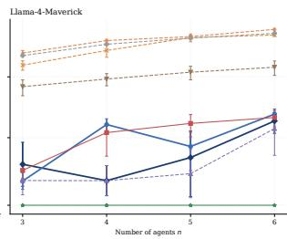  
Figure 12: C1 live-LLM nine-baseline n-scaling on HP-SPGG c19 (K=20, 5 common environment seeds, $\beta \mathrm { = } 0 . 2 5 )$ Left: DeepSeek-V3.2. Right: Llama-4-Maverick. The HARP family remains separated from type-agnostic baselines on both backbones; external A-ToM-0/1/2 and ECON-BNE references are shown at $n { = } 3 .$

Table 6: Factored-vs-joint storage comparison on HP-SPGG $( m { = } | \Theta _ { i } | { = } 4 , K { = } 1 0 0 ,$ 10 common environment seeds, $\beta { = } 0 . 2 5 )$ . HARP and Joint-PSRL-Uniform share likelihood, exhaustive planner, and seeds; only the posterior representation difers. Values are cumulative regret.
<table><tr><td rowspan="2">Storage n</td><td rowspan="2">savings</td><td colspan="2">analytic kernel</td><td colspan="2">DeepSeek-V3.2</td></tr><tr><td>HARP</td><td>J-PSRL-U</td><td>HARP</td><td>J-PSRL-U</td></tr><tr><td>3</td><td>5.3×</td><td>0.12</td><td>0.17</td><td>0.57</td><td>0.38</td></tr><tr><td>4</td><td>16×</td><td>0.05</td><td>0.11</td><td>0.80</td><td>0.51</td></tr><tr><td>5</td><td>51×</td><td>0.60</td><td>0.63</td><td>1.02</td><td>0.85</td></tr></table>

Analytic Scaling to the Joint Feasibility Frontier A dedicated scaling suite extends the exactness and storage evidence to n=10 agents and a 16-type library, entirely on the analytic tier with zero LLM calls. Three sweeps share $K { = } 5 0$ , ten common seeds (1000–1009), $\beta { = } 0 . 2 5$ , outcome noise $\sigma { = } 0 . 0 8 .$ and the five-value action menu read from the substrate. A population sweep holds $| \Theta _ { i } | { = } 4$ and runs $n \in \{ 2 , \ldots , 1 0 \}$ a library sweep holds $n { = } 3$ and runs $| \Theta _ { i } | \in \{ 4 , \mathsf { \bar { 8 } } , 1 6 \}$ with

Table 7: E-E paired utility gap (joint − factored; 10 common environment seeds, mean and 95% CI) and posterior identity.
<table><tr><td>n λ</td><td></td><td> $\mathrm { G a p }$ </td><td>95%CI</td><td>Max TV</td><td>Entries</td></tr><tr><td>2</td><td>0</td><td> $+ 1 . 8 5$ </td><td> $[ + 0 . 1 9 , + 3 . 5 1 ]$ </td><td> $7 . 8 \times 1 0 ^ { - 1 6 }$ </td><td> $2 5 6 \ \mathrm { v s } \ 3 2$ </td></tr><tr><td>2</td><td>1</td><td> $+ 0 . 1 1$ </td><td> $[ - 2 . 8 7 , + 3 . 1 0 ]$ </td><td> $7 . 8 \times 1 0 ^ { - 1 6 }$ </td><td>256 vs 32</td></tr><tr><td>3</td><td>0</td><td> $+ 1 . 3 3$ </td><td> $[ - 0 . 7 1 , + 3 . 3 7 ]$ </td><td> $2 . 5 \times 1 0 ^ { - 1 5 }$ </td><td>4096 vs 48</td></tr><tr><td>3</td><td>1</td><td> $^ { - 1 . 5 9 }$ </td><td> $[ - 5 . 1 3 , + 1 . 9 5 ]$ </td><td> $2 . 5 \times 1 0 ^ { - 1 5 }$ </td><td>4096 vs 48</td></tr><tr><td>4</td><td>0</td><td> $^ { - 1 . 3 8 }$ </td><td> $[ - 3 . 9 0 , + 1 . 1 5 ]$ </td><td> $2 . 5 \times 1 0 ^ { - 1 4 }$ </td><td>65536 vs 64</td></tr><tr><td>4</td><td>1</td><td> $^ { - 0 . 3 7 }$ </td><td> $\left[ - 4 . 0 8 , + 3 . 3 4 \right]$ </td><td> $2 . 5 \times 1 0 ^ { - 1 4 }$ </td><td>65536 vs 64</td></tr></table>

types synthesized on the archetype parameter grid, and a frontier sweep holds $| \Theta _ { i } | { = } 1 6$ and runs $n \in \{ 2 , \ldots , 8 \}$ . Joint-PSRL is ruled infeasible when its explicit table exceeds 4 GB or a single update exceeds ${ 1 \mathrm { s } } ,$ and the shared planner enumerates at most $2 ^ { 2 4 }$ joint profiles per step, a cap that never binds through the largest cell.

Exact parity at scale. On every one of the 17 joint-feasible cells, HARP and Joint-PSRL produce identical action sequences and identical regret trajectories, with maximum trajectory gap 0.0 and zero action mismatches over 170 seed-cells. Proposition B.13 therefore holds as measured fact up to a joint-to-factored storage ratio of 174,763× at $( n { = } 6 , | \Theta _ { i } | { = } 1 6 )$ , where the joint table holds 16.8M entries against the factored posterior’s 96. Per-event update work separates accordingly, growing from $7 . 5 \mu \mathrm { s }$ at $n { = } 2$ to 68.8 ms at $n { = } 6$ for Joint-PSRL while HARP stays within $1 . 3 \mathrm { - } 4 . 8 \mu \mathrm { s }$ across every cell of every sweep.

The frontier, and what survives past it. Joint-PSRL crosses the feasibility boundary inside the sweep. At n=7 its first update takes 1.02 s and the update-time rule fires, and at $n { = } 8$ the $1 6 ^ { 8 } .$ -entry table requires 34.4 GB and the memory rule fires. The factored methods continue unchanged. Table 8 reports the frontier sweep. HARP<sup>+</sup> remains within 0.06 of the pinned oracle at $n { = } 7$ and $n { = } 8 ,$ , past the boundary where explicit joint inference cannot run, while PSRL-NoType accumulates 6.0–7.3 with near-perfectly linear growth (slopes 0.07–0.15 per episode, $R ^ { 2 } \geq 0 . 9 9 8$ on every separating cell).

The bonus under a weakly discriminating library. The synthesized 16-type library has minimum pairwise Hellinger gap $\hat { \rho } = 1 . 2 \times \mathrm { \bar { 1 0 ^ { - 3 } } }$ , so identification is slow even with exact likelihoods, and the discrimination bonus carries the burn-in exactly as Proposition B.26 predicts for a small efective gap. ${ \mathrm { \dot { H A R P } ^ { + } } }$ cuts mean regret to $0 . 0 3 7 \pm 0 . 0 2 2$ against $\mathrm { H A R P ` s 0 . 2 4 3 \pm 0 . 0 5 2 }$ at $n { = } 5$ and to $0 . 0 3 6 \pm 0 . 0 2 4$ against $0 . 3 8 0 \pm 0 . 0 6 3$ at $n { = } 7 .$ , a 6–10× reduction at $\scriptstyle \eta = 0$ that complements the live-tier engagement of Section A.3.

Scope ofthe four-archetype cells. Under the analytic tensor at $\sigma { = } 0 . 0 8$ the four-archetype cells are decision-degenerate. The welfare argmax is type-independent there $( \hat { \rho } = 7 . 3 \times$ $1 0 ^ { - 6 } )$ , every method including PSRL-NoType attains zero regret, and the population sweep accordingly certifies storage, update-cost, and planner scaling rather than regret separation, which is read from the $| \Theta _ { i } | \in \{ \breve { 8 } , 1 6 \}$ cells. This is a property of the analytic replay, not of the live substrate, where the same four archetypes separate methods throughout Section A.1.

Table 9: C4 RL-violation cumulative regret at $K = 1 0 0 ;$ Gap is the common-environment-seed HARP-minus-Joint diference.
<table><tr><td>Tier</td><td>α</td><td>HARP</td><td>Joint</td><td>Gap</td></tr><tr><td>Analytic</td><td>0</td><td> $. 0 0 1 \pm . 0 0 1$ </td><td> $. 0 0 1 \pm . 0 0 1$ </td><td> $. 0 0 0 \pm . 0 0 0$ </td></tr><tr><td>Analytic</td><td>1</td><td> $. 1 5 5 \pm . 0 6 5$ </td><td> $. 2 0 6 \pm . 0 8 7$ </td><td> $- . 0 5 1 \pm . 0 5 1$ </td></tr><tr><td>Analytic</td><td>4</td><td> $. 1 9 9 \pm . 0 5 7$ </td><td> $. 2 1 3 \pm . 0 5 7$ </td><td> $- . 0 1 3 \pm . 0 1 3$ </td></tr><tr><td>DeepSeek live</td><td>0</td><td> $1 . 1 3 0 \pm . 1 5 4$ </td><td> $1 . 1 3 0 \pm . 1 5 4$ </td><td> $. 0 0 0 \pm . 0 0 0$ </td></tr><tr><td>DeepSeek live</td><td>1</td><td> $. 5 8 3 \pm . 1 1 5$ </td><td> $. 5 7 5 \pm . 1 1 6$ </td><td> $. 0 0 8 \pm . 0 0 8$ </td></tr><tr><td>DeepSeek live</td><td>4</td><td> $. 5 1 7 \pm . 1 3 1$ </td><td> $. 4 6 6 \pm . 1 0 8$ </td><td> $. 0 5 1 \pm . 1 0 7$ </td></tr></table>

Table 8: Frontier sweep at $\lvert \Theta _ { i } \rvert = 1 6 \mathrm { ~ ( m e a n } \pm \mathrm { S E M }$ over ten seeds, $K { = } 5 0 )$ . HARP and Joint-PSRL are pathwise identical wherever both run. Joint-PSRL leaves the sweep at $n { = } 7$ by the 1 s update rule and at n=8 by the 4 GB rule.
<table><tr><td>n</td><td>storage ratio joint update</td><td></td><td>HARP+</td><td> $\overline { { { \mathrm { \bf { H A R P } } } = { \bf { J o i n t } } } }$ </td><td> $\overline { { \mathrm { P S R L - N o T y p e } } }$ </td></tr><tr><td>2</td><td>8×</td><td> $7 . 5 \mu \mathrm { s }$ </td><td> $\overline { { 0 . 0 0 9 \pm 0 . 0 0 9 } }$ </td><td> $\overline { { 0 . 0 9 0 \pm 0 . 0 3 6 } }$ </td><td> $2 . 5 5 \pm 0 . 5 0$ </td></tr><tr><td>3</td><td> $8 5 \times$ </td><td> $1 2 . \dot { 1 } \mu \mathrm { s }$ </td><td> $0 . 0 3 2 \pm 0 . 0 2 2$ </td><td> $0 . 1 3 2 \pm 0 . 0 3 7$ </td><td> $3 . 0 0 \pm 0 . 4 2$ </td></tr><tr><td>4</td><td> $1 { , } 0 2 4 \times$ </td><td> $7 2 . 9 { \dot { \mu } } \mathbf { s }$ </td><td> $0 . 0 3 6 \pm 0 . 0 2 4$ </td><td> $0 . 1 4 8 \pm 0 . 0 3 4$ </td><td> $3 . 7 5 \pm 0 . 4 2$ </td></tr><tr><td>5</td><td> $1 3 , 1 0 7 \times$ </td><td>3.2 ms</td><td> $0 . 0 3 7 \pm 0 . 0 2 2$ </td><td> $0 . 2 4 3 \pm 0 . 0 5 2$ </td><td> $4 . 1 5 \pm 0 . 5 5$ </td></tr><tr><td>6</td><td> $1 7 4 , 7 6 3 \times$ </td><td>68.8 ms</td><td> $0 . 0 4 5 \pm 0 . 0 2 3$ </td><td> $0 . 3 1 8 \pm 0 . 0 6 2$ </td><td> $5 . 4 1 \pm 0 . 7 2$ </td></tr><tr><td>7</td><td> $2 . 4 \times 1 0 ^ { 6 }$ </td><td> $\mathrm { i n f e a s i b l e }$ </td><td> $0 . 0 3 6 \pm 0 . 0 2 4$ </td><td> $0 . 3 8 0 \pm 0 . 0 6 3 ( \mathrm { H A R P } )$ </td><td> $6 . 0 1 \pm 0 . 5 2$ </td></tr><tr><td>8</td><td> $3 . 4 \times 1 0 ^ { 7 }$ </td><td>infeasible</td><td> $0 . 0 5 9 \pm 0 . 0 3 0$ </td><td> $0 . 3 6 5 \pm 0 . 0 7 9 ( \mathrm { H A R P } )$ </td><td> $7 . 2 7 \pm 0 . 5 6$ </td></tr></table>

Structural Class (C4) This subsection certifies C4: neither TI nor RL can be dropped from the exact likelihood factorization, while the retained PF interventions delimit robustness without presenting a misspecified-prior ratio as a lower-bound realization.

Why TI and RL cannot be dropped. If TI fails, the next state is drawn from a law that depends on the persona profile, and an observed transition can then contribute a likelihood factor that couples several persona coordinates. If RL fails, for example when the score of agent 1 is $r _ { 1 } = r _ { 1 } ^ { \theta _ { 1 } } - \alpha r _ { 2 } ^ { \theta _ { 2 } }$ the likelihood of agent 1’s response contains $\theta _ { 2 }$ and couples persona coordinates at every update. Neither condition can therefore be dropped from Theorem B.11 (Proposition B.14).

Controlled RL-violation diagnostic. We instantiate the bounded cross-score $r _ { 0 } = ( r _ { 0 } ^ { \theta _ { 0 } } - \alpha r _ { 1 } ^ { \theta _ { 1 } } + \alpha ) / ( 1 + \alpha )$ for player 0 while the other scores remain local. The score is the emitted action in HP-SPGG, so the response of player 0 now depends on the persona of player 1, which violates response locality. HARP knows the coupled planning objective but projects its likelihood onto marginals; a shadow Joint-PSRL posterior uses the exact joint likelihood on the same trajectory. With exact enumeration, $K = 1 0 0 ,$ , and 10 common environment seeds, the methods are pathwise identical at $\alpha = 0 .$ . As α reaches 4, marginal posterior TV rises to $0 . 0 0 7 1 \pm 0 . 0 0 2 5$ analytically and $0 . 0 1 \bar { 7 } 1 \pm 0 . 0 0 4 7$ on a complete 324-cell live DeepSeek grid. Every paired regret gap still includes zero. Thus RL violation breaks posterior decoupling as predicted, but this geometry does not establish a monotone regret penalty.

PF prior intervention. Figure 14 replaces the factored prior with correlated joint priors on the $| \bar { \Theta | } ^ { n } = 6 4$ simplex while holding $n = 3$ and $K = 2 0$ fixed. A symmetric Dirichlet sweep interpolates between sparse and uniform priors; a shared-type cell is uniform over the four same-type profiles and maximally couples otherwise uniform marginals. The

HARP family stays below 0.6 cumulative regret on every retained cell. Table 6 supplies the well-specified Joint-PSRL-Uniform reference; this coupled-prior result is a local finitehorizon robustness probe, not a lower-bound implementation.

True shared-type DGP. The dual intervention makes the data-generating process itself fully coupled. Joint-PSRL-Aware’s same-type prior is then well-specified while HARP’s independent marginal prior is misspecified relative to the truth.

Setup. At the start of each episode a single type $t \sim$ Uniform(Θ) is drawn and assigned to every agent, so $\theta _ { i } ^ { \star } = t$ for all i. HARP (uniform marginals, factored representation), Joint-PSRL-Uniform (uniform Dirichlet over the $| \Theta _ { i } | ^ { n }$ joint profiles), and Joint-PSRL-Aware (strict prior on the m sametype profiles) share the same likelihood model, backwardinduction planner, and common environment seeds. We sweep $n \in \{ 3 , 4 , \bar { 5 } \}$ and $K \in \{ 5 0 , 1 0 0 \}$ on one analytic kernel and four live LLM backbones (DeepSeek-V3.2, GPT-5.4-nano, Kimi-K2.6, Llama-4-Maverick) with 10 common environment seeds per cell and $\beta { = } 0 . 2 5$ . Posterior storage at $n { = } 5$ is 20 parameters for HARP, 1024 for Joint-PSRL-Uniform, and 4 for Joint-PSRL-Aware.

Reading. Under the coupled DGP, HARP remains within 1.52× of the correctly supported Joint-PSRL-Aware on every reported cell and is lower-regret on 9 of 15. This is robustness under PF violation, not exact decoupling: C1’s equality claim remains restricted to TI/RL/PF, while Table 6 provides the representation-only comparison under the well-specified iid DGP.

## A.3 RQ3: Component Attribution

This subsection certifies C2, C3, and C6, attributing the gains to their components. C2 and C3 first: HARP exhibits the $\tilde { O } ( \sqrt { K } )$ plateau-versus-linear separation from type-agnostic sampling, and $\mathrm { H A R P ^ { + } \vec { \mathbf { \sigma } } _ { S } }$ type-discrimination bonus shortens burn-in on slowly concentrating backbones without degrading the others.

## Update Value and Rate (C2)

HP-SPGG rate and concentration. Figure 15(a) realizes the rate separation of Theorem B.35; panel (b) recovers the three regimes of Theorem B.37. Concentration times are DeepSeek 4.4, GPT 6.6, Kimi 12.0, and Llama 14.0 episodes out of $K = 2 0$ . The privileged analytic-kernel cross-check in Figure 16 places $\mathrm { H A R P ^ { + } }$ within 0.05 regret of the noise-free reference on every backbone.

Iterated Concordia-derived diagnostic. The native compact Concordia evaluation is one-shot. We therefore construct a fixed-persona K=20 diagnostic from six configurations selected on seeds 0–4 and report on disjoint seeds 1000– 1004. It retains the upstream sampler, exact payof, and finite menu, imposes PF, and uses the same Gaussian update after reward normalization. It is Concordia-derived rather than native, and exact-payof replay is backbone-invariant. Figure 6 and Table 11 show HARP, HARP<sup>+</sup>, and Joint-PSRL remain within paired uncertainty.

analytic-mixed: trajectory at $\alpha = 4$  
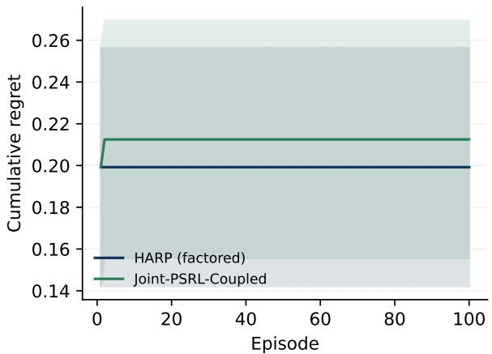  
DeepSeek-V3.2-live: trajectory at $\alpha = 4$

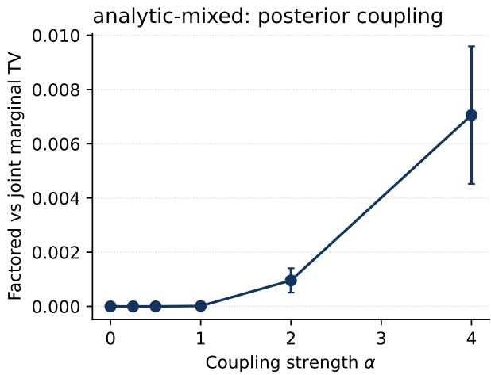

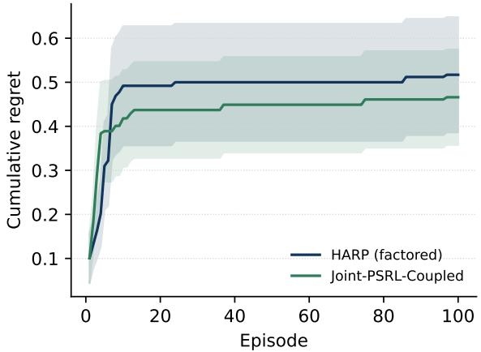

DeepSeek-V3.2-live: posterior coupling  
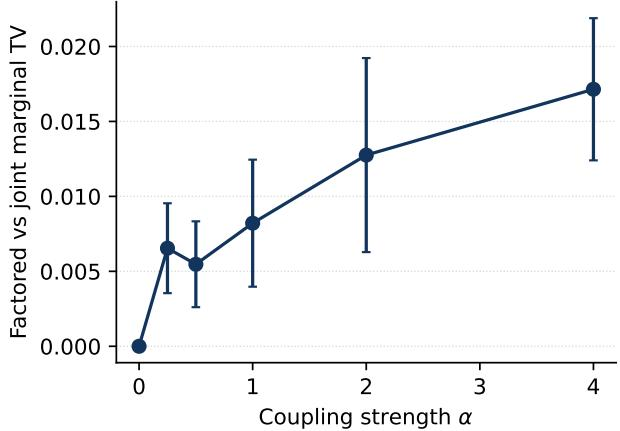  
Figure 13: C4 response-locality violation $( K { = } 1 0 0 ,$ , 10 common environment seeds). Left: HARP and correctly specified Joint-PSRL regret trajectories at $\alpha = 4 .$ . Right: marginal TV between $\mathrm { H A R P ^ { \prime } s }$ factored posterior and a shadow exact-joint posterior on the same trajectory. Top is analytic; bottom uses all 324 live DeepSeek persona/player/action cells. Posterior coupling increases, but no regret disadvantage is detectable on this geometry.

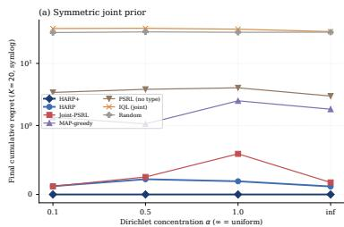

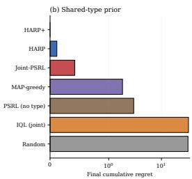  
Figure 14: C4 prior swap on HP-SPGG $\scriptstyle ( n = 3 , \ \left| \Theta \right| = 4 ,$ $\bar { | \Theta | } ^ { n } { = } 6 4$ joint profiles, $\bar { K = } 2 0 , 1 0$ common environment seeds, $\beta { = } 0 . 2 5$ , analytic calibration). Left: symmetric Dirichlet sweep on the 64-simplex; each seed draws $p \sim \mathrm { D i r } ( \alpha \mathbf { 1 } _ { 6 4 } )$ and HARP inherits the induced marginals while the explicit joint baseline uses $p .$ Right: a shared-type prior, uniform over the four same-type profiles, leaves marginals uniform while maximally coupling them. The HARP family stays within 0.6 cumulative regret on every retained cell.

flattening after identification, while PSRL-NoType continues accumulating regret. HARP<sup>+</sup> reaches 0.352 ± 0.035 cumulative and $0 . 0 0 2 0 { \scriptstyle \pm 0 . 0 0 1 7 }$ late regret, versus $1 . 3 6 1 { \pm } 0 . 1 7 2$ and $0 . 0 7 6 4 \pm 0 . 0 1 3 9$ for PSRL-NoType; HARP and Joint-PSRL

## Discrimination Bonus (C3)

Bonus scaling and frozen coeficient. Figure 17 shows the bonus under type- and agent-space growth. Figure 18 selects $\beta = 0 . 2 5$ as the smallest value in the no-degradation interval, cutting slowest-backbone regret from 0.97 to 0.31. Table 12 holds likelihood, posterior, sampling, and policy interface fixed and changes only $\beta$ on downstream substrates. Only HP-SPGG supports interpreting the bonus as accelerated concentration. The downstream table establishes numerical activity and scope: no efect in one-shot Concordia and a small descriptive SOTOPIA diference that is not update evidence.

Mechanism: Identity and Dispatch (C6) This subsection certifies C6: gains require both correctly identity-attached posterior mass and a centralized dispatcher that converts one joint belief draw into a coordinated action.

Component ablation (E-G). Analytic HP-SPGG with 10 common seeds, $K { = } 2 0 , \beta { = } 0 . 2 5$ , and a shared profile, prior, tensor, and oracle per seed. The minus identity variant keeps correct closed-form updates and attaches posterior rows through a fixed seed-derived derangement at planning time. The minus dispatch variant gives every actor the same publichistory posterior with independent profile sampling and ownutility best response. Endpoint regrets are full $0 . 0 1 5 \pm 0 . 0 0 7$ minus bonus $0 . 0 1 6 \pm 0 . 0 0 7 .$ , minus update $0 . 6 7 5 \pm 0 . 1 1 4 ,$ minus identity $0 . 7 0 0 \pm 0 . 3 6 8$ (seeds 3, 4, 7, 9 carry the whole efect), and minus dispatch $6 . 3 2 4 \pm 0 . 4 3 9$ . Paired 95% CIs against full are [−0.002, 0.003] for minus bonus, [0.41, 0.92] for minus update, [−0.14, 1.51] for minus identity, and [5.31, 7.31] for minus dispatch. The minus-dispatch variant bundles two changes, independent profile sampling and a switch from joint welfare to own-utility best response, so its endpoint bounds the value ofjoint commitment from above rather than isolating it. The mode comparison of Figure 19 separates the two. All four modes there select on own or focal payof, so the objective is held approximately fixed while commitment varies, and the two centralized modes still difer from the two decentralized ones by a 3–4× cumulative-regret slope, with the same ordering on the welfare sum over all five players. Joint commitment therefore carries the bulk of the efect and the objective switch the remainder. $\mathrm { H A R P ^ { + } }$ rests on two complementary components, centralized dispatch and the closed-form posterior update. This part isolates dispatch. The historical SOTOPIA-Hard comparison above is descriptive because its posterior did not update; the corrected recurrent evidence is reported separately in Section A.1. We compare four dispatch modes sharing the same LLM on london\_mini Pub Coordination (5 players, 2 focal, 5 seeds per backbone), two centralized (planner LLM emitting the joint action, peragent type-guess producing n independent posteriors) and two decentralized (greedy, ToM-prompted). Within-cluster diferences isolate planning-vs-belief and cluster diferences isolate dispatch, with oracle\_joint as the ceiling and full mode definitions below. Two clusters emerge on every backbone and every metric (Figure 19). Within-cluster planning-vs-belief diferences stay below 0.05 on focal payof, while the centralized-to-decentralized gap produces a $3 { - } 4 \times$ cumulative-regret slope diference. Joint exploration requires one planner to commit all agents to the same sampled profile; independently prompted agents miscoordinate on the states the posterior is meant to resolve. Corrected recurrent-update controls are reported in Section A.1, so the dispatch and belief-identity mechanisms are documented separately rather than inferred from the deleted static-posterior ablation. The remainder of this part gives the full per-backbone breakdown, the per-metric definitions, and the additional analysis.

Table 10: True shared-type DGP robustness on HP-SPGG across one analytic kernel and four live LLM backbones $\scriptstyle ( m = \left| \Theta _ { i } \right| = 4 .$ K=100, 10 common environment seeds, $\beta \mathrm { = } 0 . 2 5 )$ . True types are drawn from the m same-type joint profiles, so Joint-PSRL-Aware’s strict prior is well-specified and HARP’s factored prior is mis-specified relative to the coupled truth. HARP remains within 1.5× of Aware on 14 of 15 cells (Kimi-K2.6 n=4 at $1 . 5 2 \times ) ;$ the GPT-5.4-nano n=4 cell where Aware reaches 0 is marked with a dash. HARP is lower-regret than Aware on 9 of 15 cells.
<table><tr><td>Substrate</td><td>n</td><td>HARP</td><td>J-PSRL-A</td><td>HARP / Aware</td></tr><tr><td>analytic kernel</td><td>3</td><td>0.28</td><td>0.22</td><td>1.29×</td></tr><tr><td></td><td>4</td><td>0.00</td><td>0.32</td><td>0.00×</td></tr><tr><td></td><td>5</td><td>0.31</td><td>0.39</td><td>0.79×</td></tr><tr><td>DeepSeek-V3.2</td><td>3</td><td>1.79</td><td>1.23</td><td>1.46×</td></tr><tr><td></td><td>4</td><td>1.31</td><td>1.84</td><td>0.71×</td></tr><tr><td></td><td>5</td><td>2.11</td><td>2.61</td><td>0.81×</td></tr><tr><td>GPT-5.4-nano</td><td>3</td><td>0.64</td><td>0.74</td><td>0.86×</td></tr><tr><td></td><td>4</td><td>0.22</td><td>0.00</td><td></td></tr><tr><td></td><td>5</td><td>1.64</td><td>2.36</td><td>0.69×</td></tr><tr><td>Kimi-K2.6</td><td>3</td><td>1.14</td><td>0.86</td><td>1.32×</td></tr><tr><td></td><td>4</td><td>1.49</td><td>0.99</td><td>1.52×</td></tr><tr><td></td><td>5</td><td>1.15</td><td>1.47</td><td>0.78×</td></tr><tr><td>Llama-4-Maverick</td><td>3</td><td>1.72</td><td>1.49</td><td>1.16×</td></tr><tr><td></td><td>4</td><td>1.59</td><td>1.07</td><td>1.49×</td></tr><tr><td></td><td>5</td><td>1.76</td><td>1.38</td><td>1.27×</td></tr></table>

Table 11: Iterated Concordia-derived aggregate at $K { = } 2 0$ Late is mean instant regret over episodes 11–20.
<table><tr><td>Method</td><td>Cumulative regret</td><td>Late regret</td></tr><tr><td>HARP</td><td> $0 . 3 1 2 \pm 0 . 0 2 6$ </td><td> $0 . 0 0 4 1 \pm 0 . 0 0 1 2$ </td></tr><tr><td>HARP⁺</td><td> $0 . 3 5 2 \pm 0 . 0 3 5$ </td><td> $0 . 0 0 2 0 \pm 0 . 0 0 1 7$ </td></tr><tr><td>Joint-PSRL</td><td> $0 . 3 2 9 \pm 0 . 0 3 0$ </td><td> $0 . 0 0 4 9 \pm 0 . 0 0 1 2$ </td></tr><tr><td>PSRL-NoType</td><td> $1 . 3 6 1 \pm 0 . 1 7 2$ </td><td> $0 . 0 7 6 4 \pm 0 . 0 1 3 9$ </td></tr></table>

Table 12: C3 direct type-discrimination bonus ablation. HARP and HARP<sup>+</sup> share likelihood, posterior, sampling, and solver; only β changes. Concordia is single-shot, so the multi-step concentration mechanism is inactive. MaaSSim rows are E-F fixed-state replay with frozen $\beta { = } 0 . 2 5 ;$ the bonus changes 4 of 406 assignments and the paired gap covers zero. Historical SOTOPIA rows are descriptive because the posterior in those runs remained at its prior.
<table><tr><td>HARP HARP⁺</td></tr><tr><td>∆ Concordia (single-shot)</td></tr><tr><td>Pub Coordination 1.264 1.264 +0.000</td></tr><tr><td>Haggling (single-item) 3.661 3.661 +0.000</td></tr><tr><td>Haggling (multi-item) 5.429 5.429 +0.000</td></tr><tr><td>MaaSSim replay (E-F, 10 seeds, utility)</td></tr><tr><td>Dispatch utility 27.61 27.36 -0.25</td></tr><tr><td>SOTOPIA-Hard (6-turn, n=70/cell)</td></tr><tr><td>DeepSeek-V3.2 3.242 3.248 +0.006</td></tr><tr><td>GPT-5.4-nano 2.873 2.981 +0.107</td></tr><tr><td>Kimi-K2.6 2.789 2.807 +0.018 3.308</td></tr><tr><td>Llama-Maverick 3.308 +0.000 Mean (SOTOPIA-Hard) 3.053 3.086 +0.033</td></tr><tr><td></td></tr></table>

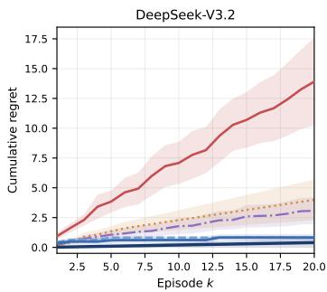

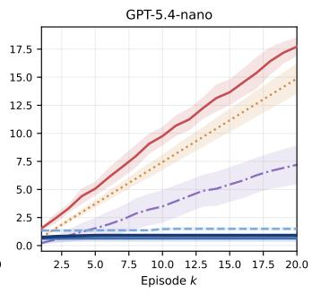

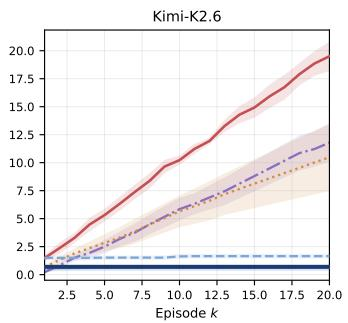  
(a) C2: per-episode trajectory.

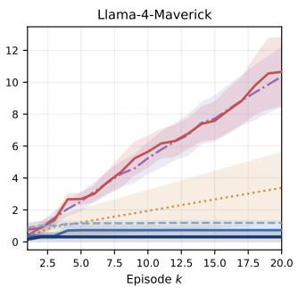

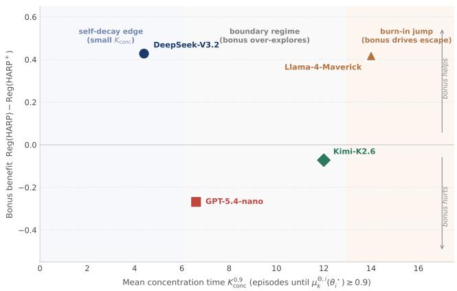  
(b) C3: concentration speed and bonus benefit.

Figure 15: Rate and burn-in evidence. (a) HARP and $\mathrm { H A R P ^ { + } }$ plateau at $< 0 . 0 5$ regret per episode within $K { \approx } 5$ on four HP-SPGG backbones, while PSRL-NoType grows linearly and reaches an 11–30× cumulative gap at $\bar { K = } 2 0 . ( { \mathsfit b } )$ Vanilla-HARP concentration time $K _ { \mathrm { c o n c } } ^ { 0 . 9 }$ predicts the benefit of the $\beta = 0 . 2 5$ discrimination bonus across the four backbones.  
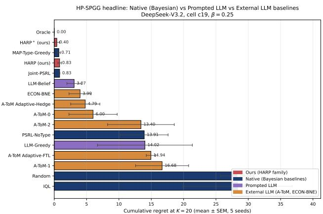  
Figure 16: C2 analytic-kernel cross-check: $\mathrm { \mathrm { H A R P ^ { + } } }$ on HP-SPGG c19 remains within 0.05 regret of the privileged analytic-kernel reference across all four backbones.

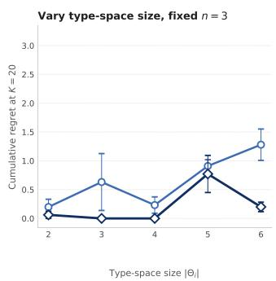

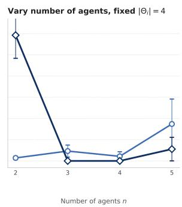  
Figure 17: C3 scaling of HARP and $\mathrm { \mathrm { H A R P ^ { + } } }$ on HP-SPGG. Left varies $| \Theta _ { i } |$ at $n = 3 ;$ right varies n at $| \Theta _ { i } | = 4 .$ Curves report $K = 2 0$ cumulative regret over 10 seeds on Llama-4- Maverick with $\beta = 0 . 2 5$

Per-mode definitions. The four dispatch modes evaluated are:

• Centralized planner LLM, one LLM call sees the full relationship-statement matrix for all 5 players and outputs a joint posterior over every player’s favorite pub, and argmax yields the joint action.

• Per-agent type-guess LLM, n independent LLM calls, each restricted to a single player’s own social context, each outputting a posterior over that one player’s favorite pub.

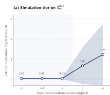

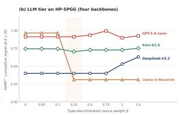  
Figure 18: C3 HP-SPGG β-sweep at $K = 2 0$ . The frozen value $\beta = 0 . 2 5$ is the smallest point in the no-degradation interval [0.25, 0.75]; it leaves three saturated backbones unchanged and reduces Llama-Maverick regret from 0.97 to 0.31.

• Decentralized LLM (ToM), n independent LLM calls, each agent is prompted to balance own preference with theory-of-mind reasoning and pick one pub.

• Decentralized LLM (greedy), n independent LLM calls, each agent picks the pub maximizing its own expected enjoyment with no partner inference.

Within-cluster ordering. The relative ordering inside the centralized cluster is informative for the underlying mechanism. On GPT-5.4-nano and Llama-4-Maverick the globalview planner edges the per-agent type-guess variant (+0.10 payof), as expected if joint observation is the load-bearing factor. On DeepSeek-V3.2 and Kimi-K2.6 the order flips by +0.05. The per-agent variant slightly beats the planner because the planner occasionally splits the 2 focal players across the 2 pubs (coordination 0.80/0.90 vs. 1.00 for the per-agent variant), while the per-agent variant defaults to the more popular pub. The structural conclusion is the same in both directions. The lift comes from the probabilistic-reasoning prompt over a posterior on the partner’s persona, irrespective of whether that posterior is computed once jointly or n times in parallel.

Welfare-over-all-players check. Panel (c) of Figure 19 reports the welfare sum over all 5 players (not just focal), matching the theoretical objective $\bar { W } \doteq \sum _ { i } r _ { i }$ used in Section 3. The centralized cluster still leads the decentralized cluster by 1–2 units on every backbone, so the main-text gap is not produced by NPC-side noise aligned with the focal players.

Cumulative compounding. Panel (d) shows the perepisode gap compounds. By the end of 5 episodes, decentralized modes accumulate 1.9–2.0 units of focal regret while centralized modes stay at 0.6–0.75, the 3–4× slope ratio reported in the main text. This linear-in-K accumulation is the price-of-decentralization analogue of the HP-SPGG cumulative-regret divergence in Figure 2, but within a single LLM backbone. The slope diference is structural to the dispatch mode rather than to the model’s individual socialinference quality.

MaaSSim fixed-state mechanism replay. This part expands Section 4.3 only to certify C6: it isolates posterior concentration and driver-identity attachment on common saved decision states, then reports a directional single-backbone dispatch suite.

<table><tr><td>Variant</td><td>Belief source</td><td>Utility</td><td>Rejects</td><td>Accept</td><td>Rule acc.</td></tr><tr><td>Nearest</td><td>none</td><td>11.03</td><td>26.0</td><td>0.634</td><td></td></tr><tr><td>Random</td><td>none</td><td>-33.94</td><td>30.6</td><td>0.563</td><td></td></tr><tr><td>HARP-prior</td><td>uniform</td><td>11.11</td><td>25.1</td><td>0.635</td><td>0.500</td></tr><tr><td>HARP-shuffled</td><td>wrong driver</td><td>6.87</td><td>26.5</td><td>0.609</td><td>0.521</td></tr><tr><td>HARP</td><td>learned</td><td>27.61</td><td>18.5</td><td>0.740</td><td>0.720</td></tr><tr><td>Oracle</td><td>true persona</td><td>38.92</td><td>13.2</td><td>0.822</td><td>1.000</td></tr></table>

Table 13: MaaSSim persona-mechanism replay (10 seeds, fixed queue snapshots and persona maps, shared assignment objective). Utility is the realized dispatch utility defined above (seed-level SEM 9.6–11.7); Rejects is mean driver rejects; Accept is the driver acceptance rate; Rule acc. is the marginal accuracy of the belief on the true driver rule.

Substrate and replay protocol. Runs use the Nootdorp road-network scenario with 40 passengers, 8 vehicles, and 120-second dispatch batches. Each driver carries a hidden acceptance policy, one of the 16 combinations of the operational rules {avoid\_long, zone\_loyal, home\_pull, surge\_sensitive}, applied inside the simulator as accept/reject behavior, and the orchestrator observes only which ofers each driver accepts or rejects. Evaluation uses fixedstate replay. Queue snapshots and realized persona maps are saved from closed-loop runs, and every method is evaluated on the identical states, which removes the state-distribution feedback that otherwise confounds closed-loop dispatch comparisons. Realized utility combines a serve value of 3.0 per served ride, a pickup-wait cost of 0.01 per second, a driverreject penalty of 2.0 (5.0 under stress), and a passenger-reject penalty of 0.5.

Persona-mechanism ablation. Table 13 and Figure 22 report the mechanism ablation over 10 seeds. All HARP variants share one assignment objective and the same states, and only the driver-belief source changes, so the comparison isolates the value of the learned posterior itself. The learned posterior improves realized utility over a uniform prior by +16.50 (27.61 vs. 11.11), closing 59.3% of the prior-tooracle gap. The shufled control, which attaches each learned posterior to the wrong driver, collapses to 6.87, below even the uniform prior, although its marginal rule accuracy (0.521) is nominally above chance. Recovered beliefs are therefore useful only when attached to the correct driver identity. The gain is not free. HARP accepts 16.25 seconds of extra pickup wait per snapshot to reduce driver rejections and serve more passengers, so this table supports a persona-mechanism claim rather than a wait-minimization claim. Decomposing HARP’s per-observation belief gain by event type over the same posterior trajectories, rejections contribute a mean marginal rule-accuracy gain of 0.038 per event (n=279) against 0.022 for accepts (n=388), a ≈1.7× ratio with the same direction on exact-type mass (0.031 vs. 0.020). This asymmetry is expected because all four hidden rules act as rejection triggers, so rejections are the type-revealing events. Figure 20 traces the concentration itself: over the per-driver observation sequence, marginal rule accuracy rises from chance 0.53 to 0.73 and exact-type posterior mass from the 1/16 uniform prior to 0.26 within 8 observations, consistently across seeds. HARP trades approximately 9 seconds of additional mean pickup wait for

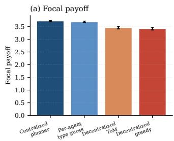

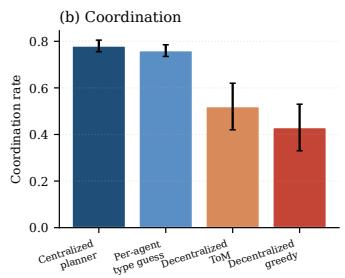

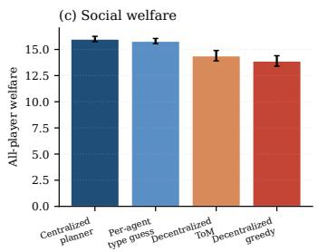

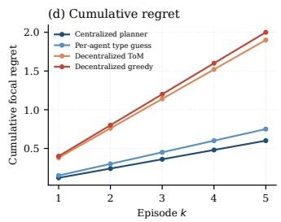

Figure 19: Price of decentralization on Concordia london\_mini Pub Coordination (5 players, 2 focal, 5 scenes per cell). Centralized (planner LLM, per-agent type-guess) vs. decentralized (ToM-prompted, greedy), same LLM. (a) Focal payof. (b) Coordination. (c) Social welfare. (d) Cumulative regret over K=5 scenes (bands: SE over backbones). Centralized modes cluster near oracle\_joint; decentralized modes: −0.2–0.3 payof, −0.2–0.4 coordination, −1–2 welfare units, 3–4× cumulative regret.  
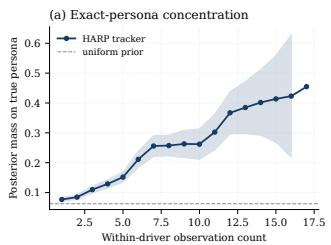

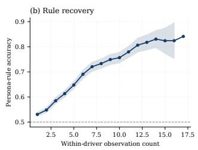  
Figure 20: HARP driver-belief concentration on MaaSSim (10 seeds, thin lines are per-seed means, bands are SEM over (seed, driver) pairs). From accept/reject observations alone, marginal rule accuracy and exact-type posterior mass rise well above their chance references within a handful of observations of each driver.

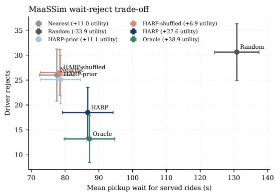  
Figure 21: Operating points of the mechanism-replay variants (10 seeds, SEM bars on both axes). HARP trades pickup wait for fewer driver rejects, moving from the uniform-prior operating point toward the oracle (dashed arrow), while the shufled control stays at the heuristic wait level with more rejects. This is why Table 13 supports a persona-mechanism claim rather than a wait-minimization claim.

6.6 fewer driver rejections than the uniform-prior variant; at comparable wait, the shufled-identity control produces more rejections, so identity attachment rather than sharper marginals alone drives the gain.

LLM dispatch replay. The LLM experiments use gpt-5.4-mini (pinned snapshot 20260317) over 10 seeds with the first 20 active snapshots per seed. Each LLM policy receives a legal one-to-one assignment menu plus method-specific context and returns JSON containing an assignment\_id; across all reported LLM methods the parse rate is 1.000 with no repairs and no fallbacks, so the action interface itself is not a confound. The prompt baselines mirror the main-text families, namely llm\_belief, LLM-PSRL, A-ToM, and ECON-BNE. HARP is a score-assisted hybrid that receives HARP assignment scores in context, not a pure prompt method. Its planner is therefore a language model and lies outside (DP), so the sweep tests the belief and is not an instance of Theorem B.15. Table 14 reports a controlled conflict-strength sweep. All cells use driver-reject penalty 5.0 and common snapshots. For each candidate ofer, $\mathsf { \bar { \lambda } } \in \{ 0 , 0 . 5 , 1 \}$ interpolates travel time and fare between the retained reject-stress ofer and the full persona-risky conflict transformation; policies are rerun at every level rather than interpolating outcomes. The hybrid’s advantage over the best pure prompt baseline grows monotonically from +4.60 to +31.75 and +39.69. At λ = 1, every pure prompt baseline has negative utility (best −30.90) while the hybrid remains positive at 8.79 against an oracle at 22.44. The full-conflict endpoint is a designed stress test, not an estimate of normal operations.


  
Figure 22: MaaSSim persona-mechanism replay. All variants share the same fixed queue snapshots, persona maps, and assignment objective, and only the driver-belief source changes. The learned posterior (HARP) closes 59.3% of the prior-tooracle utility gap, while the shufled-posterior control falls below the uniform prior, showing that correct driver-identity attachment is necessary for the gain.

Full-conflict episode dynamics. Figure 23 traces single λ=1 replay episodes for the hybrid and the three strongest prompt baselines on a common seed, complementing the aggregate sweep of Table 14 with per-episode evidence. The

<table><tr><td>Scenario</td><td>HARP</td><td>Best prompt</td><td>Gap</td><td>Oracle</td></tr><tr><td>Reject (λ = 0)</td><td>18.37</td><td>PSRL: 13.77</td><td>+4.60</td><td>36.44</td></tr><tr><td>Mid (λ = .5)</td><td>8.96</td><td>belief: -22.80</td><td>+31.75</td><td>30.70</td></tr><tr><td>Full (λ = 1)</td><td>8.79</td><td>belief: -30.90</td><td>+39.69</td><td>22.44</td></tr></table>

Table 14: MaaSSim LLM dispatch conflict-strength sweep (gpt-5.4-mini, 10 seeds × 20 snapshots, driver-reject penalty 5.0, parse rate 1.000). Best prompt is the strongest pure prompt baseline per level; Gap is HARP minus best prompt. Outcomes are measured reruns at $\lambda \in \{ 0 , 0 . 5 , 1 \}$ not interpolated results.

prompt baselines repeatedly issue persona-risky low-wait assignments, accumulate 14 to 15 driver rejects, and end with negative utility, while the hybrid holds rejects to 2 and serves 19 requests. The aggregate collapse is therefore visible within individual episodes rather than an artefact of averaging.

Unit validation for the main-text regret panel. Figure 5(b) reports oracle regret divided by the common reject penalty 5.0, with vertical bars propagating the retained seed-level oracle and policy utility SEMs as $\mathrm { \sqrt { S E M _ { o r a c l e } ^ { 2 } + S E M _ { p o l i c y } ^ { 2 } / 5 } ; }$ the paired seed-level covariance was not retained. Figure 24 validates that unit against observable behavior by plotting it against excess driver rejects for all method-scenario pairs. Points track the identity line, and conflict-ofer points sit slightly above it because failed episodes also forfeit served rides.

Scope and limitations. Hidden types are synthetic rules rather than learned human driver preferences, results cover one road network and one LLM backbone, and the LLM tables aggregate ten seeds without retained per-seed outcomes, so no paired significance test is possible. Passenger-side inference is weak because most riders are observed once (rule accuracy ≈ 0.53 against a 0.5 chance level), and the retained candidate sets are too small for the HARP<sup>+</sup> exploration bonus to alter assignments, so no claim in this subsection relies on HARP<sup>+</sup> or on passenger inference.

## A.4 Oracle Constructions (Shared Infrastructure)

This subsection supports C1–C6 by certifying what each oracle reference knows and optimizes; it is shared evaluation infrastructure, not an additional empirical claim. The three LLM benchmarks difer along two axes: whether payof is closed-form and whether the action space is finite and enumerable. In every case the privileged signal is the true opponent type; the payof or judge is part of the environment and is available to all methods.

HP-SPGG. The oracle exhaustively enumerates the finite joint contribution grid and applies a deterministic argmax to the same pinned tensor used by every method. It is therefore an exact pointwise reference for the regret calculation.

Concordia. The compact Pub and Haggling evaluators expose a finite menu and analytic payoff\_for\_case. oracle\_joint exactly maximizes joint welfare. Because Haggling price is a transfer, that objective is not a focal ceiling; oracle\_focal reruns the same exhaustive search on focal payof and is never exceeded. Figure 26 displays the objective trade-of.

SOTOPIA-Hard. Open-ended utterances and a sevendimensional LLM judge preclude exact enumeration. $\mathtt { o r a c l e \_ b e l i e f }$ supplies the one-hot opponent persona but retains single-shot generation; it is not a strict upper bound. oracle\_policy draws five independent episodes and retains the one with highest mean judge score. The second block of Table 4 reports both rows. Their gap measures action-search and judge-variance headroom rather than persona-information value alone.

## B Theoretical Supplement

## B.1 Overview and Claim-to-Theorem Map

This appendix gives the formal setting, assumptions, and proofs supporting every theoretical statement in Sections 3.2– 3.3. All statements are made in the setting of Section 3.1. The orchestrator dispatches an assignment, the agents respond with emitted actions, and the law of each response depends on the true persona of the responding agent. Table 16 keys each main-text claim to the formal statement and proof location. The subsections follow the order of the claims in the table. The remainder of this appendix is organized as: formal setting (Section B.2), posterior decoupling (Section B.3), why no condition can be dropped (Section B.4), regret bound (Section B.5), scorer misspecification (Section B.6), approximate decoupling (Section B.7), unbounded coupling and the RL threshold (Section B.8), rate separation (Section B.9), HARP<sup>+</sup> burn-in improvement (Section B.10), lower bound without RL (Section B.11), and empirical validation (Section B.12).

## B.2 Formal Setting

This subsection restates the setting of Section 3.1 with every assumption explicit. The orchestrator coordinates n agents over $K$ episodes of H turns. Agent i has a finite persona library $\Theta _ { i }$ and a true persona $\theta _ { i } ^ { \star } \in \Theta _ { i } .$ . The profile $\pmb { \theta } ^ { \star } \overset { \cdot } { = } ( \theta _ { 1 } ^ { \star } , \dots , \theta _ { n } ^ { \star } )$ is drawn once from the prior $P _ { 0 }$ and held fixed.

Each episode starts from a public state $s _ { 1 }$ . At turn h the orchestrator sees the public state $s _ { h } .$ , from a finite set, and dispatches a joint assignment $u _ { h } = ( u _ { 1 , h } , \dotsc , u _ { n , h } )$ from a finite set. The component $u _ { i , h }$ is everything agent i receives. It can include the other agents’ components, as in HP-SPGG, where the response of a player is scored on the whole contribution profile. Agent i then emits an action $a _ { i , h }$ from a finite set. Its context is $c _ { i , h } : = ( s _ { h } , u _ { i , h } )$ , and its persona is the rule $q ( \cdot \mid c _ { i , h } , \theta _ { i } ^ { \star } )$ that generates the emitted action. The orchestra tor observes the joint emitted action $a _ { h } = ( a _ { 1 , h } , \ldots , a _ { n , h } )$ Agent i receives the reward $r _ { i } ( s _ { h } , u _ { h } , a _ { h } ) \in [ 0 , 1 ] .$ , and the next state is $s _ { h + 1 } = f ( s _ { h } , u _ { h } , a _ { h } )$ . The functions $r _ { i } , f ,$ and $q$ are known, and the update uses the true rule $q .$ Section B.6 relaxes the last point. Only $\pmb { \theta } ^ { \star }$ is unknown. The main text writes $r _ { i } ( s , a )$ , the case where the reward reads the assignment only through the emitted actions. Letting $r _ { i }$ read $u _ { h }$ directly changes no argument, because the orchestrator knows its own assignment. The public state records whatever $f$ carries forward. It can keep every earlier assignment and emitted action, or only part of them, as in HP-SPGG, where it keeps the round index and the previous contribution profile.

(a) Utility under conflict  


(b) Rejection dynamics  
  
Figure 23: Single-episode conflict-ofer replay dynamics (λ=1) for HARP, LLM-PSRL, A-ToM-1, and ECON-BNE on a common seed: vehicle and request traces with cumulative utility, served requests, and driver rejects per decision step.

Table 15: Oracle construction across the three LLM benchmarks.
<table><tr><td>Benchmark</td><td>Payoff form</td><td>Action space</td><td>Oracle type</td></tr><tr><td>HP-SPGG</td><td>analytic/pinned tensor</td><td>finite, 125 joint profiles</td><td>strict exhaustive argmax</td></tr><tr><td>Concordia</td><td>analytic, closed-form</td><td>finite menu</td><td>strict joint/focal argmax</td></tr><tr><td>SOTOPIA-Hard</td><td>7-dimensional LLM judge</td><td>open-ended utterance</td><td>belief-only + best-of-K critic</td></tr></table>

  
Figure 24: Unit validation for the main-text regret panel. Oracle regret in reject-penalty units against excess driver rejects relative to the oracle, for six methods across three measured replay scenarios (10 seeds).

The assignment and the emitted action play diferent roles in every proof below. The assignment is the orchestrator’s decision. It is a function of what the orchestrator has seen and of its own randomization. That randomization is exogenous, meaning that given the past it is independent of $\pmb { \theta } ^ { \star }$ and of the agents’ responses, so given the history the assignment is independent of $\pmb { \theta } ^ { \star }$ . The emitted action is the agent’s response. Its law depends on $\theta _ { i } ^ { \star }$ , and it is the only evidence about the persona. No statement below requires the emitted actions to be independent of the true personas.

Assumption B.1 (TI). The next state is $s _ { h + 1 } = f ( s _ { h } , u _ { h } , a _ { h } )$


  
Figure 25: Full Concordia comparison across all 18 configurations. Pub Coordination uses oracle\_joint; Haggling uses the exact full-information focal ceiling oracle\_focal. Rows are sorted by HARP<sup>+</sup>’s margin over the strongest baseline.

for a known function f that does not depend on $\pmb { \theta } ^ { \star }$

Assumption B.2 (RL). Conditionally on $\pmb { \theta } ^ { \star }$ and on everything realized before the agents respond at turn $h ,$ the emitted actions are independent across agents, and $a _ { i , h }$ has law q(· | $c _ { i , h } , \theta _ { i } ^ { \star } )$ . In particular $\begin{array} { r } { \mathrm { P r } ( a _ { h } \mid \tilde { s _ { h } } , u _ { h } , \pmb \theta ^ { \star } ) = \prod _ { i = 1 } ^ { n } q ( \tilde { a _ { i , h } } } \end{array}$

  
blęnd dial $\beta _ { \mathrm { o f f } } ( \beta _ { \mathrm { } } { \equiv } 0 ; \mathrm { }$ shaped joint end β=1: Oraclnca) -= focal pay edy joint-optimal focal interval -- min surplus M (fair ↑)

Figure 26: Focal-vs-joint Haggling frontier. $\beta _ { \mathrm { o b j } } = 0$ is oracl $\in \_ { \dot { ] } }$ oint (J); $\beta _ { \mathrm { o b j } } = 1$ is oracle\_focal (F). Increasing focal payof can reduce minimum participant surplus, explaining why a focal policy may exceed the joint oracle’s focal score without violating an upper bound.

$$
c _ { i , h } , \theta _ { i } ^ { \star } ) .
$$

Assumption B.3 (PF). $\begin{array} { r } { P _ { 0 } ( \pmb { \theta } ) = \prod _ { i = 1 } ^ { n } P _ { 0 } ^ { i } ( \theta _ { i } ) } \end{array}$

Assumption B.4 (TID). $\begin{array} { r } { \operatorname* { i n f } _ { c } D _ { H } ^ { 2 } \big ( q ( \cdot \mid c , \theta _ { i } ) , q ( \cdot \mid c , \theta _ { i } ^ { \prime } ) \big ) \geq } \end{array}$ $\rho > 0$ for every agent i and all $\theta _ { i } \neq \theta _ { i } ^ { \prime } ,$ where $D _ { H } ^ { 2 } ( p , p ^ { \prime } ) : =$ $\begin{array} { r } { 1 - \sum _ { a } \sqrt { p ( a ) p ^ { \prime } ( a ) } } \end{array}$

Assumption B.5 (ISI). Given everything realized before episode k, the initial state $s _ { 1 } ^ { k }$ is independent of $\pmb { \theta } ^ { \star }$ and of the orchestrator’s randomization.

Assumption B.6 (DP). The planner P is a deterministic map from a profile to a deterministic policy. A policy maps each turn and state to a joint assignment.

(ISI) holds when every episode starts from the same state, and when the initial states are drawn independently from a fixed law. The (TI) of the main text is (TI) here together with the part of (ISI) that concerns θ<sup>⋆</sup>. (TID) is not used in this subsection or in Theorem B.15. It enters from Proposition B.24 on.

Remark B.7 (Centralized dispatch). (DP) makes the orchestrator centralized. One planner chooses the assignment of every agent, and the orchestrator observes the joint emitted action. Bothfacts are used below, so the decentralized execution variant of Section 4.1 lies outside these results. The orchestrator decides only thejoint assignment. Thejoint emitted action is produced by the agents and is never a decision variable in the proofs. The set of joint assignments can grow exponentially in n. That is a planning cost, and the beliefis unafected. Table 18 lists theform ofP in each substrate.

Remark B.8 (Approximate planner). (DP) does not ask the planner to be optimal. Ifthe policy it returns is within $\epsilon _ { \mathrm { p l a n } }$ of the highest team valuefor every profile and every initial state, the regret of $E q .$ (1) exceeds the team regret defined below by at most $K \epsilon _ { \mathrm { p l a n } }$ . The HP-SPGG and compact Concordia planners enumerate their menus exactly, so $\epsilon _ { \mathrm { p l a n } } = 0$ there. SOTOPIA-Hard has no finite planner and lies outside the regret theorem.

Table 16: Claim-to-theorem map. Each main-text statement is keyed to the formal theorem and the appendix subsection containing the proof.
<table><tr><td>Main-text claim</td><td>Formal statement</td><td>Proof location</td></tr><tr><td>Exact factorization and persona-belief complexity</td><td>Thm. B.11, Cor. B.12</td><td>§B.3</td></tr><tr><td>can be dropped</td><td>Neither TI nor RL Prop. B.14 + con- §B.4, §A.2 trolled diagnostic</td><td></td></tr><tr><td> ${ \tilde { O } } ( { \sqrt { K } } )$  bound for HARP, Cor. B.16 for the team and per</td><td>regret Thm.</td><td>B.15, §B.5</td></tr><tr><td>agent Rate separation vs Thm. B.35 PSRL-NoType</td><td></td><td>§B.9</td></tr><tr><td>HARP⁺ burn-in im- Thm. B.37 provement</td><td></td><td>§B.10</td></tr><tr><td>Robustness to scorer Prop. B.26 error</td><td></td><td>§B.6</td></tr><tr><td>Rate constants mea- Prop. B.24 sured, preregistered</td><td></td><td>§B.12</td></tr><tr><td>Approximate decou- Thm. pling, bounded cou- Cor. B.30</td><td></td><td>B.29, §B.7</td></tr><tr><td>pling Arbitrary coupling, Thm. RL threshold</td><td></td><td>B.32, §B.8</td></tr><tr><td>Lower bound when</td><td>Prop. B.33 Thm. B.38</td><td>§B.11</td></tr><tr><td>RL fails Where the language model enters</td><td>Table 18</td><td>§C.1</td></tr></table>

Remark B.9 (Stochastic transitions). The statements ofthis appendix extend to a next state whose law, given $\pmb { \theta } ^ { \star }$ and everything realized before, is a known kernel $T ( \cdot \mid s _ { h } , u _ { h } , a _ { h } )$ that does not depend on $\pmb { \theta } ^ { \star } . \boldsymbol { A }$ path then also records the states, and its law under a profile is the product of Lemma B.21 multiplied by the transition probabilities along the path. This factor is the same under every profile. It cancels from the posterior in Theorem B.11, and it multiplies both sides of the inequality in Lemma B.22. An unknown kernel would add a model-learning term to the regret, which this appendix does not analyze.

For a deterministic policy π and a profile θ, let E<sup>π</sup> denote expectation when $u _ { h } = \pi _ { h } ( s _ { h } )$ and every agent i responds according to $q ( \cdot \mid c _ { i , h } , \theta _ { i } )$ . The value of agent i and the team value are

$$
\begin{array} { c l c r } { { \displaystyle V _ { i } ^ { \pi } ( s ; \pmb { \theta } ) : = \mathbb { E } _ { \pmb { \theta } } ^ { \pi } \Big [ \sum _ { h = 1 } ^ { H } r _ { i } ( s _ { h } , u _ { h } , a _ { h } ) \Big | s _ { 1 } = s \Big ] , } } \\ { { \displaystyle V ^ { \pi } : = \sum _ { i = 1 } ^ { n } V _ { i } ^ { \pi } . } } \end{array}
$$

HARP with $\beta = 0$ samples $\hat { \pmb { \theta } } _ { k }$ from $\otimes _ { i } \mu _ { k } ^ { i }$ and runs $\pi _ { k } : =$

$\mathcal { P } ( \hat { \theta } _ { k } )$ in episode k. The regret of agent i and the team regret are

$$
\begin{array} { r l } & { { \mathrm { R e g } _ { i } ( K ) : = \operatorname { \mathbb { E } } \displaystyle \sum _ { k = 1 } ^ { K } \bigg ( V _ { i } ^ { \mathcal { P } ( \pmb { \theta } ^ { \star } ) } ( s _ { 1 } ^ { k } ; \pmb { \theta } ^ { \star } ) - V _ { i } ^ { \pi _ { k } } ( s _ { 1 } ^ { k } ; \pmb { \theta } ^ { \star } ) \bigg ) , } } \\ & { \quad \mathrm { R e g } ( K ) : = \displaystyle \sum _ { i = 1 } ^ { n } \mathrm { R e g } _ { i } ( K ) . } \end{array}\tag{5}
$$

The comparator of agent i is its reward under the policy that the same planner returns for the true profile. It is not the largest reward agent i could obtain on its own. When $\mathcal { P }$ returns a welfare-maximizing policy, $\mathrm { R e g } ( K )$ is the regret of Eq. (1).

Definition B.10 (Influence set). A set N of agents is an influence set of agent i $i f V _ { i } ^ { \pi } ( s ; \pmb \theta ) = V _ { i } ^ { \pi } ( s ; \pmb \theta ^ { \prime } )$ whenever $\dot { \theta _ { j } } = \theta _ { i } ^ { \prime }$ for all $j \in N _ { i }$ , for every state s and every policy π in the range ofP.

The set of all agents is always an influence set. Suppose $r _ { i }$ reads the joint emitted action only through the actions of a set $G _ { i }$ of agents, and the next state reads it only through the actions of a set $F .$ Then $G _ { i } \cup F$ is an influence set of agent i, and $G _ { i }$ alone is one when $H = 1$ . The reason is that under a fixed policy the state sequence reads the profile only through $( \theta _ { j } ) _ { j \in F }$ , and the expected reward at a given state reads it only through $( \theta _ { j } ) _ { j \in G _ { i } }$ . In particular {i} is an influence set when $r _ { i }$ reads only $a _ { i , h }$ and the emitted actions do not enter the state.

## B.3 Posterior Decoupling

The history $\mathcal { H } _ { k }$ before episode k collects everything the orchestrator has seen or drawn in the first k−1 episodes. These are the initial states, its own random draws, the assignments, and the emitted actions. For HARP the random draws are the sampled profiles $\hat { \pmb { \theta } } _ { l }$

Theorem B.11 (Posterior Decoupling). Let Assumptions $B . I ,$ $B . 2 , B . 3$ , and B.5 hold, and let the orchestrator choose every assignment as afunction ofwhat it has seen sofar and ofits own exogenous randomization. Thenfor every k,

$$
\begin{array} { r l } { \displaystyle \operatorname* { P r } ( \pmb { \theta } ^ { \star } = \pmb { \theta } \mid \mathcal { H } _ { k } ) = \prod _ { i = 1 } ^ { n } \mu _ { k } ^ { i } ( \theta _ { i } ) , } & { } \\ { \displaystyle \mu _ { k } ^ { i } ( \theta _ { i } ) \propto P _ { 0 } ^ { i } ( \theta _ { i } ) \prod _ { l < k } \prod _ { h = 1 } ^ { H } q ( a _ { i , h } ^ { l } \mid c _ { i , h } ^ { l } , \theta _ { i } ) . } & { } \end{array}\tag{6}
$$

The same product form holds after any number of turns of episode k.

Proof. The joint probability of $\pmb { \theta } ^ { \star } = \pmb { \theta }$ and $\mathcal { H } _ { k }$ is

$$
P _ { 0 } ( \pmb { \theta } ) \prod _ { l < k } \Big [ d _ { l } \prod _ { h = 1 } ^ { H } \Big ( \sigma _ { l , h } \prod _ { i = 1 } ^ { n } q \big ( a _ { i , h } ^ { l } \mid c _ { i , h } ^ { l } , \theta _ { i } \big ) \Big ) \Big ] ,
$$

where $d _ { l }$ is the probability of the initial state of episode l and $\sigma _ { l , h }$ is the probability of the orchestrator’s draws and assignment at turn $h$ of episode $l ,$ each given everything realized before. The factor $d _ { l }$ is free of θ by (ISI). The factor $\sigma _ { l , h }$ is free of θ because the orchestrator acts on what it has seen and on its own randomization. The states are functions of earlier quantities by (TI) and contribute no factor, and the rewards are functions of observed quantities. The product over agents is (RL). The factors $d _ { l }$ and $\sigma _ { l , h }$ therefore cancel on normalization. With (PF) the remaining expression is a product of one function of each $\theta _ { i } ,$ , and such a product normalizes coordinate by coordinate. Stopping the product at an intermediate turn of episode k gives the last claim. □

The theorem covers HARP, $\mathrm { \mathrm { H A R P ^ { + } } }$ , and Joint-PSRL, since each chooses its assignments from the history and from its own draws. Equation (2) is the recursion satisfied by $\mu _ { k } ^ { i }$ , so the per-agent update of Algorithm 1 computes the joint posterior exactly. In HP-SPGG the emitted action is the satisfaction score, which is also the reward, and q is the calibrated Gaussian of Appendix A.1. On SOTOPIA-Hard the emitted actions are open-ended utterances. The update scores them through an intent surrogate (Section A.1), so the factorization there is that of the surrogate and is not exact.

Corollary B.12 (Persona-posterior complexity). HARP requires $O ( \sum _ { i } | \Theta _ { i } | )$ persona-posterior storage and candidatelikelihood evaluations per update, whereas an explicit joint table requires $O ( \prod _ { i } | \Theta _ { i } | )$ . For uniform persona libraries this is $O ( n | \bar { \Theta } _ { i } | )$ versus ${ \dot { O } } ( | \Theta _ { i } | ^ { n } )$ .

Proposition B.13 (Equivalence with Joint-PSRL). Let Joint-PSRL be the same loop with the profile sampled from an explicit table of the joint posterior. Under the assumptions ofTheorem B.11 and (DP), HARP and Joint-PSRL have the same law of trajectories, so their regrets coincide for every agent and every K. Ifboth samplers draw each coordinate of the profilefrom its marginal with the same random numbers, and the initial states and the agents’ responses are driven by the same random numbers, the trajectories coincide pathwise.

Proof. By Theorem B.11 the joint table equals $\otimes _ { i } \mu _ { k } ^ { i }$ at every k, so both samplers draw the profile from the same law given the same history. The planner, the response rules, and the update are shared, so the laws of the trajectories agree by induction on $k .$ Under the common random numbers the initial states and the sampled profiles are equal, hence so are the policies, the emitted actions, and the next posteriors.

## B.4 No Condition Can Be Dropped

Proposition B.14 (No condition can be dropped). For each of (TI), (RL), and (ISI) there is an instance that satisfies (PF) and the other assumptions ofTheorem B.11 and on which the posterior is not a product after one observation.

Proof. Take $n = 2 .$ , binary libraries, the uniform product prior, and write ⊕ for addition modulo two. For (RL), let agent 1 emit $a _ { 1 } = \theta _ { 1 } ^ { \star } \oplus \theta _ { 2 } ^ { \star }$ in a single state. For (TI), let both agents emit a constant and let the next state be $\theta _ { 1 } ^ { \star } \oplus \theta _ { 2 } ^ { \star }$ For (ISI), let the initial state be $\theta _ { 1 } ^ { \star } \oplus \theta _ { 2 } ^ { \star }$ . In each case one observation reveals $\theta _ { 1 } ^ { \star } \oplus \theta _ { 2 } ^ { \star }$ and nothing else. The posterior is uniform on the two profiles with that sum. Its marginals are uniform, and their product puts mass $1 / 4$ on each of the four profiles. □

(PF) cannot be dropped either, since the posterior before any observation is the prior. The conditions of Theorem B.11 are suficient, and no one of them follows from the others. They are not necessary instance by instance. A next state that records a separate function of each persona violates (TI) and still leaves the posterior a product. The controlled RLviolation diagnostic is reported with the structural-boundary evidence in Section A.2.

## B.5 Regret Bound

This subsection proves the regret bound of HARP. The proof has three steps. Posterior decoupling makes the factored sample an exact posterior sample, so the regret equals the gap between the values of one policy under the sampled profile and under the true profile (Lemmas B.19 and B.20). The path law of an episode is a product over agents, so this gap splits into one term per agent (Lemmas B.21 and B.22). Each term is bounded by the information that the episode reveals about the persona of that agent, and the total information is at most the entropy of its prior (Lemma B.23).

Theorem B.15 (Bayesian Regret of HARP). Let Assumptions B.1, B.2, B.3, B.5, and B.6 hold, and let $N _ { i }$ be an influence set of agent i. Then HARP with $\beta = 0$ satisfies, for every agent i,

$$
\mathrm { R e g } _ { i } ( K ) \leq H \sum _ { j \in N _ { i } } \sqrt { \frac { 1 } { 2 } | \Theta _ { j } | \mathcal { H } ( P _ { 0 } ^ { j } ) K } ,\tag{7}
$$

where $\mathcal { H } ( P _ { 0 } ^ { j } )$ is the Shannon entropy of agent $j ^ { \prime } s$ persona prior in nats. Consequently

$$
\mathrm { R e g } ( K ) \leq n H \sum _ { j = 1 } ^ { n } { \sqrt { { \frac { 1 } { 2 } } | \Theta _ { j } | \mathcal { H } ( P _ { 0 } ^ { j } ) K } } .\tag{8}
$$

Equation (8) is Theorem 3.3 with the constant explicit. The bound for agent i has one term for each agent in its influence set. Each term depends on the library and the prior entropy of that one agent, so an informative prior on agent $j$ lowers the bound of every agent whose influence set contains j. Since $\mathcal { H } ( P _ { 0 } ^ { j } ) \leq \log | \Theta _ { j } |$ , with equality only for the uniform prior, the uniform prior is the worst case of every term. The joint space $\Pi _ { j } \mathinner { | { \Theta } _ { j } ^ { \phantom { } } \rangle }$ | does not appear. Summing Eq. (7) over i gives a sharper team bound. There the term of agent j is multiplied by the number of influence sets that contain j instead of by $n .$

Corollary B.16 (Own-response rewards). Suppose $r _ { i }$ reads the joint emitted action only through $a _ { i , h }$ and the emitted actions do not enter the state. Then

$$
\begin{array} { r } { \mathrm { R e g } _ { i } ( K ) \leq H \sqrt { \frac { 1 } { 2 } | \Theta _ { i } | \mathcal { H } ( P _ { 0 } ^ { i } ) K } , } \end{array}
$$

so the regret ofagent i is governed by its own persona alone.   
HP-SPGG has thisform (Table 18).

Remark B.17 (Own persona alone does not bound an agent’s regret). The premise ofCorollary B.16 cannot be dropped. Take $n = 2$ and $H = 1$ with a single state. Agent 1 has one persona. Agent 2 has two personas with prior probability $\frac { 1 } { 2 }$ each, receives an assignment $u _ { 2 } \in \Theta _ { 2 } ,$ , and succeeds $i f u _ { 2 } \stackrel { . } { = }$ $\theta _ { 2 } ^ { \star }$ andfails otherwise. Both rewards equal one when agent

2 succeeds and zero otherwise, and the planner dispatches $u _ { 2 } = \hat { \theta } _ { 2 \cdot } ( T I ) , ( R L )$ , and (PF) hold. Each agent earns one per episode under the oracle. HARP draws ${ \hat { \theta } } _ { 2 }$ uniformly in the first episode and succeeds with probability $\mathbf { \bar { \frac { 1 } { 2 } } }$ , after which the posterior is a point mass. Hence $\begin{array} { r } { \mathrm { R e g } _ { 1 } ( K ) \bar { = } \frac { 1 } { 2 } } \end{array}$ for every $K \geq 1$ although $\mathcal { H } ( P _ { 0 } ^ { 1 } ) = 0$ . The loss of agent 1 comes entirely from the uncertainty about agent 2. Theorem B.15 accounts for it through $N _ { 1 } = \{ 2 \}$ , with bound K log 2.

Remark B.18 (Efect of the factorization on the bound). Under the assumptions Joint-PSRL has the same law as HARP by Proposition B.13, so the two have the same regret and Theorem B.15 holdsfor both. The gain is in the analysis. Running the argument below on the whole profile as a single coordinate gives nH $\begin{array} { r l r } { \sqrt { \frac { 1 } { 2 } \prod _ { j } | \Theta _ { j } | \sum _ { j } \mathcal { H } ( P _ { 0 } ^ { j } ) { \cal K } } } & { { } } & { } \end{array}$ . Lemma B.22 is the step that replaces the product $\Pi _ { j } \mathinner { | { \Theta _ { j } } | }$ by a sum over agents.

Notation. Write $\mathbb { E } _ { k }$ and $I _ { k }$ for the expectation and the mutual information under the conditional law given $( \mathcal { H } _ { k } , s _ { 1 } ^ { k } )$ Fix a deterministic policy π and an initial state s. A path is the sequence $\tau = ( a _ { 1 } , \dots , a _ { H } )$ of joint emitted actions. The states and assignments along τ are determined by $( s , \pi , \tau )$ , so the context $c _ { i , h } ( \tau )$ is a function of the path. For a persona $\theta _ { i }$ and for a distribution $\nu _ { i }$ on $\Theta _ { i }$ define the per-agent likelihoods

$$
\begin{array} { r l } & { L _ { i } ^ { \pi } ( \tau ; \theta _ { i } ) : = \displaystyle \prod _ { h = 1 } ^ { H } q \big ( a _ { i , h } \mid c _ { i , h } ( \tau ) , \theta _ { i } \big ) , } \\ & { L _ { i } ^ { \pi } ( \tau ; \nu _ { i } ) : = \displaystyle \sum _ { \theta _ { i } \in \Theta _ { i } } \nu _ { i } ( \theta _ { i } ) L _ { i } ^ { \pi } ( \tau ; \theta _ { i } ) . } \end{array}
$$

The total variation distance of two laws on paths is $\begin{array} { r } { \mathrm { T V } ( P , Q ) : = \sum _ { \tau } ( P ( \tau ) - Q ( \tau ) ) ^ { + } } \end{array}$

Lemma B.19 (Factored sampling is exact posterior sampling). Under Assumptions B.1, B.2, B.3, B.5, and B.6, conditionally on $( \mathcal { H } _ { k } , s _ { 1 } ^ { k } )$ the sample $\widehat { \pmb { \theta } } _ { k }$ and the true profile $\pmb { \theta } ^ { \star }$ are independent and both have law $\bigotimes _ { i } \mu _ { k } ^ { i }$

Proof. By Theorem B.11 the posterior of $\pmb { \theta } ^ { \star }$ given $\mathcal { H } _ { k }$ is $\bigotimes _ { i } \mu _ { k } ^ { i }$ , and Algorithm 1 draws the coordinates of $\widehat { \pmb { \theta } } _ { k }$ independently from these marginals with exogenous randomness. By (ISI) conditioning on $\mathbf { \widetilde { \mathbf { \Lambda } } } _ { s _ { 1 } ^ { k } } ^ { k }$ changes neither law. □

Lemma B.20 (Posterior matching). For every agent i and every $k ,$

$$
\mathbb { E } _ { k } \Big [ V _ { i } ^ { \mathcal { P } ( \pmb { \theta } ^ { \star } ) } ( s _ { 1 } ^ { k } ; \pmb { \theta } ^ { \star } ) \Big ] = \mathbb { E } _ { k } \Big [ V _ { i } ^ { \pi _ { k } } \big ( s _ { 1 } ^ { k } ; \hat { \pmb { \theta } } _ { k } \big ) \Big ] .
$$

Hence $\begin{array} { r l r } { \mathrm { R e g } _ { i } ( K ) } & { { } = } & { \mathbb { E } \sum _ { k = 1 } ^ { K } \Delta _ { i , k } } \end{array}$ with $\begin{array} { r l } { \Delta _ { i , k } } & { { } : = } \end{array}$ $V _ { i } ^ { \pi _ { k } } ( s _ { 1 } ^ { k } ; \hat { \pmb \theta } _ { k } ) - V _ { i } ^ { \pi _ { k } } ( s _ { 1 } ^ { k } ; \pmb \theta ^ { \star } )$

Proof. The map $\pmb \theta \mapsto V _ { i } ^ { \mathcal { P } ( \pmb \theta ) } ( s ; \pmb \theta )$ is a fixed bounded function by (DP), and $\pi _ { k } = \mathcal { P } ( \hat { \theta } _ { k } )$ . Lemma B.19 gives the identity. The second claim adds and subtracts $V _ { i } ^ { \pi _ { k } } \big ( s _ { 1 } ^ { k } ; \hat { \pmb \theta } _ { k } \big )$ in Eq. (5).

The term $\Delta _ { i , k }$ compares one policy under two profiles. The policy $\pi _ { k }$ is the same on both sides. The agents respond to it diferently under the two profiles. The emitted actions, the states, and the rewards therefore all difer between the two sides.

Lemma B.21 (Path law). Under $( T I ) , ( R L ) ,$ , and $( D P ) ,$ , the path has law $\begin{array} { r } { \dot { \mathbb { P } } _ { \pmb { \theta } } ^ { \pi } ( \tau ) = \dot { \prod } _ { i = 1 } ^ { n } L _ { i } ^ { \pi } ( \tau ; \theta _ { i } ) } \end{array}$ under profile θ. For distributions $\nu _ { 1 } , \ldots , \nu _ { n }$ , thefunction $\begin{array} { r } { \prod _ { i } L _ { i } ^ { \pi } ( \tau ; \nu _ { i } ) } \end{array}$ is the law of the path when the personas are drawn independently from $\nu _ { 1 } , \ldots , \nu _ { n }$ . In particular it is a probability distribution on paths.

Proof. The first claim is (RL) applied turn by turn, since the contexts are functions of the path. For the second, expanding the product of sums gives $\begin{array} { r l } { \prod _ { i } L _ { i } ^ { \pi } ( \tau ; \nu _ { i } ) } & { { } = } \end{array}$ $\begin{array} { r l } { ~ } & { { } \sum _ { \pmb { \theta } } ^ { \bullet } \prod _ { i } \nu _ { i } ( \theta _ { i } ) \mathbb { P } _ { \pmb { \theta } } ^ { \bullet } ( \tau ) } \end{array}$ □

Lemma B.22 (One agent at a time). Let $x _ { 1 } , \ldots , x _ { n }$ and $y _ { 1 } , \ldots , y _ { n }$ be nonnegative reals. Then

$$
{ \biggl ( } \prod _ { i = 1 } ^ { n } x _ { i } - \prod _ { i = 1 } ^ { n } y _ { i } { \biggr ) } ^ { + } \ \leq \ \sum _ { i = 1 } ^ { n } ( x _ { i } - y _ { i } ) ^ { + } \prod _ { j \neq i } x _ { j } .
$$

Consequently, let $\begin{array} { r } { P = \prod _ { i } L _ { i } ^ { \pi } ( \cdot ; \nu _ { i } ) } \end{array}$ and $\begin{array} { r } { P ^ { \prime } = \prod _ { i } L _ { i } ^ { \pi } ( \cdot ; \nu _ { i } ^ { \prime } ) } \end{array}$ and let $P ^ { ( i ) }$ replace only the i-th factor of P by $L _ { i } ^ { \pi } ( \cdot ; \nu _ { i } ^ { \prime } )$ Then

$$
\mathrm { T V } ( P , P ^ { \prime } ) \leq \sum _ { i = 1 } ^ { n } \mathrm { T V } \big ( P , P ^ { ( i ) } \big ) .
$$

Proof. Let $n = 2 . \operatorname { I f } y _ { 1 } \leq x _ { 1 }$ , then $x _ { 1 } x _ { 2 } - y _ { 1 } y _ { 2 } = x _ { 2 } ( x _ { 1 } -$ $y _ { 1 } ) + y _ { 1 } ( x _ { 2 } - y _ { 2 } )$ , which is at most $x _ { 2 } ( x _ { 1 } - y _ { 1 } ) ^ { + } + x _ { 1 } ( x _ { 2 } -$ $y _ { 2 } ) ^ { + } . \mathrm { I f } y _ { 1 } > x _ { 1 }$ , then $x _ { 1 } x _ { 2 } - y _ { 1 } y _ { 2 } = x _ { 1 } ( x _ { 2 } - y _ { 2 } ) + y _ { 2 } ( x _ { 1 } -$ $y _ { 1 } ) \leq x _ { 1 } ( x _ { 2 } - y _ { 2 } ) ^ { + }$ . Both bounds are nonnegative, so they hold for the positive part. For general $n ,$ apply the case $n = 2$ to the pairs $( \textstyle \prod _ { i < n } x _ { i } , x _ { n } )$ and $( \prod _ { i < n } y _ { i } , y _ { n } )$ and use induction on the first factor. For the second claim set $x _ { i } = L _ { i } ^ { \pi } ( \tau ; \nu _ { i } )$ and $y _ { i } = L _ { i } ^ { \pi } ( \tau ; \nu _ { i } ^ { \prime } )$ and sum over τ. All laws involved are probability distributions by Lemma B.21, so each sum of positive parts is a total variation distance.

The inequality keeps every other agent at its factor in $P .$ The next lemma relies on this, because the information about agent j is also measured with every other agent at its posterior mixture.

Lemma B.23 (Per-agent information ratio). Fix k, the history $\mathcal { H } _ { k }$ , and the initial state $s _ { 1 } ^ { k } = s .$ For a sampled profile θ<sup>ˆ</sup> write $\pi = { \mathcal P } ( \hat { \pmb { \theta } } )$ and let τ be the path of episode k. Let $g _ { \pi }$ map paths to $[ 0 , B ]$ , and let N be a set of agents such that $\mathbb { E } _ { \theta } ^ { \pi } [ g _ { \pi } ]$ depends on θ only through $( \theta _ { j } ) _ { j \in N } f o r$ every π in the range of $\cdot _ { \bar { \mathcal { P } } }$ . Then

$$
\mathbb { E } _ { k } \left[ \mathbb { E } _ { \hat { \theta } } ^ { \pi } [ g _ { \pi } ] - \mathbb { E } _ { \theta ^ { \star } } ^ { \pi } [ g _ { \pi } ] \right] \ \leq \ B \sum _ { j \in N } \sqrt { \frac { 1 } { 2 } | \Theta _ { j } | \ I _ { k } \big ( \theta _ { j } ^ { \star } ; \tau \mid \hat { \theta } \big ) } .
$$

Proof. Write $\mu = \otimes _ { i } \mu _ { k } ^ { j }$ . By Lemma B.19, θ<sup>ˆ</sup> and $\pmb { \theta } ^ { \star }$ are independent with law $\mu .$

Step 1 (the true profile averages to the mixture). Fix $\hat { \pmb { \theta } }$ and $\pi = { \mathcal P } ( \hat { \pmb { \theta } } )$ . By Lemma B.21 the path has law $P _ { \mu } : =$ $\textstyle \prod _ { j } L _ { j } ^ { \pi } ( \cdot ; \mu _ { k } ^ { j } )$ once $\pmb { \theta } ^ { \star }$ is integrated out, so $\mathbb { E } _ { k } \left[ \mathbb { E } _ { \theta ^ { \star } } ^ { \pi } [ g _ { \pi } ] \ \right]$ $\begin{array} { r } { \hat { \pmb \theta } \mathbf { \ ] } = \sum _ { \tau } P _ { \mu } ( \tau ) g _ { \pi } ( \tau ) } \end{array}$ . The value $\mathbb { E } _ { \hat { \pmb { \theta } } } ^ { \pi } [ g _ { \pi } ]$ does not change when the coordinates of the profile outside N are replaced by independent draws from $\mu$ with π held fixed. Hence $\mathbb { E } _ { \hat { \theta } } ^ { \pi } [ g _ { \pi } ] =$ $\begin{array} { r } { \sum _ { \tau } P _ { N } ( \tau ) g _ { \pi } ( \tau ) } \end{array}$ , where $P _ { N }$ uses the factor $L _ { j } ^ { \pi } ( \cdot ; \hat { \theta } _ { j } )$ for $j \in N$ and $L _ { j } ^ { \pi } ( \cdot ; \mu _ { k } ^ { j } )$ for $j \not \in N$

Step 2 (one agent at a time). Let $\begin{array} { r l } { P _ { j } } & { { } : = } \end{array}$ $\begin{array} { r } { L _ { j } ^ { \pi } ( \cdot ; \widehat { \theta } _ { j } ) \prod _ { i \neq j } L _ { i } ^ { \pi } ( \cdot ; \mu _ { k } ^ { i } ) } \end{array}$ . Apply Lemma B.22 with $P = P _ { \mu }$ and $P ^ { \prime } = P _ { N }$ , so that $P ^ { ( j ) } = P _ { j }$ for $j \in N$ and $P ^ { ( j ) } = P _ { \mu }$ otherwise. The total variation distance is symmetric for prob ability distributions, and $g _ { \pi }$ takes values in $[ 0 , B ]$ , so with Pinsker’s inequality

$$
\begin{array} { r l } {  { \sum _ { \tau } \big ( P _ { N } ( \tau ) - P _ { \mu } ( \tau ) \big ) g _ { \boldsymbol { \pi } } ( \tau ) \le B \mathrm { T V } ( P _ { N } , P _ { \mu } ) } } \\ & { \le B \sum _ { j \in N } \mathrm { T V } ( P _ { j } , P _ { \mu } ) } \\ & { \le B \sum _ { j \in N } \sqrt { \frac { 1 } { 2 } \mathrm { K L } ( P _ { j } \parallel P _ { \mu } ) } . } \end{array}
$$

The divergence is finite because $P _ { \mu } \geq \mu _ { k } ^ { j } ( \hat { \theta } _ { j } ) P _ { j }$ pointwise.

Step 3 (information). Given θ<sup>ˆ</sup> and $\theta _ { i } ^ { \star } \ = \ y _ { : }$ , the other personas keep their posterior law by Theorem B.11, so the path has law $\begin{array} { r } { \dot { P } _ { j , y } : = \dot { L } _ { j } ^ { \pi } ( \cdot ; y ) \prod _ { i \neq j } \dot { L } _ { i } ^ { \pi } ( \cdot ; \mu _ { k } ^ { i } ) } \end{array}$ . Its law without the conditioning on $\theta _ { j } ^ { \star }$ is $P _ { \mu }$ . Therefore

$$
\begin{array} { r l } { I _ { k } \left( \theta _ { j } ^ { \star } ; \tau \mid \hat { \theta } \right) = \underset { \hat { \theta } } { \sum } \mu ( \hat { \theta } ) \underset { y } { \sum } \mu _ { k } ^ { j } ( y ) \mathrm { K L } ( P _ { j , y } \mid \mid P _ { \mu } ) } & { } \\ { \quad \quad \quad \geq \underset { \hat { \theta } } { \sum } \mu ( \hat { \theta } ) \mu _ { k } ^ { j } ( \hat { \theta } _ { j } ) \mathrm { K L } ( P _ { j } \mid \mid P _ { \mu } ) , } \end{array}
$$

where the inequality keeps only the term $\boldsymbol { y } = \boldsymbol { \hat { \theta } } _ { j }$ of a sum of nonnegative terms, and $\bar { P } _ { j , \hat { \theta } _ { i } } \overset { \cdot } { = } P _ { j }$

Step 4 (Cauchy–Schwarz). Write $\hat { \pmb \theta } = ( x , w )$ with $x = \hat { \theta } _ { j }$ and w the remaining coordinates, with laws $\mu _ { k } ^ { j }$ and $\mu ^ { - j }$ and write $\kappa ( x , w ) : \mathop { \leq } \mathrm { K L } ( P _ { j } \| P _ { \mu } )$ . With the sums over x restricted to the support of $\mu _ { k } ^ { j }$

$$
\begin{array} { r l } & { \mathbb { E } _ { k } \sqrt { \frac { 1 } { 2 } \kappa ( x , w ) } = \displaystyle \sum _ { w } \mu ^ { - j } ( w ) \sum _ { x } \sqrt { \frac { 1 } { 2 } \mu _ { k } ^ { j } ( x ) ^ { 2 } \kappa ( x , w ) } } \\ & { \qquad \le \displaystyle \sum _ { w } \mu ^ { - j } ( w ) \sqrt { \frac { 1 } { 2 } | \Theta _ { j } | \sum _ { x } \mu _ { k } ^ { j } ( x ) ^ { 2 } \kappa ( x , w ) } } \\ & { \qquad \le \sqrt { \frac { 1 } { 2 } | \Theta _ { j } | I _ { k } \bigl ( \theta _ { j } ^ { \star } ; \tau \mid \hat { \theta } \bigr ) } , } \end{array}
$$

by Cauchy–Schwarz over x, Jensen’s inequality over $w ,$ and Step 3. Taking $\mathbb { E } _ { k }$ in Step 2 and inserting this bound proves the claim. Steps 3 and 4 are the finite-class information-ratio argument of Russo and Van Roy (2016), applied to the library of one agent with the truth $\theta _ { j } ^ { \star }$ as the target. □

ProofofTheorem B.15. Fix an agent i and let $g _ { \pi } ( \tau )$ be the episode reward of agent i along the path τ under the policy π, so that $B = H$ and $\mathsf { \bar { E } } _ { \pmb { \theta } } ^ { \pi } [ g _ { \pi } ] = \mathsf { \bar { V } } _ { i } ^ { \pi } ( \bar { s } ; \pmb { \theta } )$ . By Definition B.10 the set $N _ { i }$ satisfies the premise of Lemma B.23. Lemma B.20 and Lemma B.23 give

$$
\mathrm { R e g } _ { i } ( K ) \ \leq \ H \sum _ { j \in N _ { i } } \sqrt { \frac { 1 } { 2 } | \Theta _ { j } | } \ \mathbb { E } \sum _ { k = 1 } ^ { K } \sqrt { I _ { k } \big ( \theta _ { j } ^ { \star } ; \tau _ { k } \ | \ \hat { \theta } _ { k } \big ) } .
$$

By Jensen’s inequality and Cauchy–Schwarz over episodes, the last expectation is at most $\textstyle { \sqrt { K \mathbb { E } \sum _ { k } I _ { k } ( \theta _ { j } ^ { \star } ; \tau _ { k } \mid \hat { \pmb \theta } _ { k } ) } }$ . The history grows by $( s _ { 1 } ^ { k } , \hat { \pmb \theta } _ { k } , \tau _ { k } )$ in episode $k ,$ and the assignments of the episode are functions of these. The initial state and the sampled profile carry no information about $\theta _ { j } ^ { \star }$ given $\mathcal { H } _ { k }$ , by (ISI) and Lemma B.19. The chain rule for mutual information therefore gives

$$
\mathbb { E } \sum _ { k = 1 } ^ { K } I _ { k } \big ( \theta _ { j } ^ { \star } ; \tau _ { k } ~ | ~ \hat { \theta } _ { k } \big ) = I \big ( \theta _ { j } ^ { \star } ; \mathcal { H } _ { K + 1 } \big ) \le \mathcal { H } ( P _ { 0 } ^ { j } ) .
$$

This proves Eq. (7). Summing over i with $N _ { i } \subseteq \{ 1 , \dots , n \}$ gives Eq. (8). □

The proof does not require the emitted actions to be independent of $\pmb { \theta } ^ { \star }$ . The state and assignment sequence of an episode is free of $\pmb { \theta } ^ { \star }$ only when the emitted actions do not enter the state, which is the setting of Corollary B.16. When the emitted actions are not finite-valued, the sums over paths become integrals against a fixed dominating measure and no step changes, provided the rewards stay in [0, 1]. The scores of HP-SPGG are clipped to [0, 1], so the reward of each turn stays in that range.

Proposition B.24 (Geometric collapse under TID). Let $A s -$ sumptions B.1, B.2, and B.6 hold, and let Assumption $B . 4$ hold with gap $\rho > 0 .$ . Let HARP use the true rules q and startfrom marginals with $\begin{array} { r } { \pi _ { \operatorname* { m i n } } : = \operatorname* { m i n } _ { j , \theta } \mu _ { 1 } ^ { j } ( \theta ) > 0 . } \end{array}$ . Then for every realized profile $\pmb { \theta } ^ { \star }$ , every agent $j ,$ every persona $\mathbf { \bar { \boldsymbol { \theta } } ^ { \prime } } \neq \boldsymbol { \theta } _ { j } ^ { \star }$ , and every $k ,$

$$
\begin{array} { r } { \mathbb { E } \big [ \mu _ { k } ^ { j } ( { \boldsymbol { \theta } } ^ { \prime } ) ~ | ~ { \boldsymbol { \theta } } ^ { \star } \big ] ~ \leq ~ \pi _ { \operatorname* { m i n } } ^ { - 1 / 2 } e ^ { - \rho H ( k - 1 ) } . } \end{array}\tag{9}
$$

Ifin addition (PF) holds with $P _ { 0 } ^ { j } = \mu _ { 1 } ^ { j }$ , (ISI) holds, and $N _ { i }$ is an influence set of agent i, then for every $K$

$$
\begin{array} { r l r } { \mathrm { R e g } _ { i } ( K ) } & { \le } & { 2 H + \rho ^ { - 1 } \big ( 1 + \log C _ { N _ { i } } \big ) , } \\ { \quad } & { } & { C _ { N } : = \pi _ { \operatorname* { m i n } } ^ { - 1 / 2 } \displaystyle \sum _ { j \in N } \vert \Theta _ { j } \vert , \quad \quad } \end{array}
$$

a constant independent ofK.

Proof. Fix $\pmb { \theta } ^ { \star }$ and an agent $j .$ For $\theta ^ { \prime } \neq \theta _ { j } ^ { \star }$ let $\Lambda _ { k } ( \theta ^ { \prime } ) : =$ $\mu _ { k } ^ { j } ( \theta ^ { \prime } ) / \mu _ { k } ^ { j } ( \theta _ { j } ^ { \star } )$ denote the posterior odds. Equation (2) gives

$$
\Lambda _ { k + 1 } ( \theta ^ { \prime } ) = \Lambda _ { k } ( \theta ^ { \prime } ) \prod _ { h = 1 } ^ { H } \frac { q ( a _ { j , h } \mid c _ { j , h } , \theta ^ { \prime } ) } { q ( a _ { j , h } \mid c _ { j , h } , \theta _ { j } ^ { \star } ) } .
$$

By (RL), conditionally on the past and on the context $c _ { j , h } .$ the emitted action $a _ { j , h }$ has law $\mathbf { \bar { \rho } } _ { q } ( \cdot \mid c _ { j , h } , \theta _ { j } ^ { \star } )$ , so the square root of the turn-h likelihood ratio has conditional expectation

$$
\sum _ { a } \sqrt { q ( a \mid c _ { j , h } , \theta ^ { \prime } ) q ( a \mid c _ { j , h } , \theta _ { j } ^ { \star } ) } \leq 1 - \rho \leq e ^ { - \rho }
$$

by Assumption B.4. The bound is uniform over contexts, so it holds whatever assignments the orchestrator chooses (Ghosal and Van der Vaart 2017). Hence $\sqrt { \Lambda _ { k } ( \theta ^ { \prime } ) }$ is a nonnegative supermartingale that contracts by $e ^ { - \rho }$ per turn, and $\mathbb { E } \sqrt { \Lambda _ { k } ( \theta ^ { \prime } ) } \le \pi _ { \operatorname* { m i n } } ^ { - 1 / 2 } e ^ { - \rho H ( k - 1 ) }$ . Since $\mu _ { k } ^ { j } ( \theta ^ { \prime } ) \leq$ min $\{ 1 , \Lambda _ { k } ( \theta ^ { \prime } ) \} \le \sqrt { \Lambda _ { k } ( \theta ^ { \prime } ) }$ , this proves Eq. (9).

For the regret, Lemma B.20 gives Reg $\begin{array} { r } { ( \bar { K } ) = \mathbb { E } \sum _ { k } \Delta _ { i , k } } \end{array}$ The two values in $\Delta _ { i , k }$ coincide by Definition B.10 when $\widehat { \theta } _ { j } = \theta _ { j } ^ { \star }$ for all $j \in N _ { i }$ , and $| \Delta _ { i , k } | \le H$ otherwise. The sample is drawn from $\mu _ { k } ^ { j }$ , so agent j is sampled wrongly with probability $\textstyle \sum _ { \theta ^ { \prime } \neq \theta _ { i } ^ { \star } } \mu _ { k } ^ { j } ( \theta ^ { \prime } )$ given the history. A union bound over $N _ { i }$ with Eq. (9) gives

$$
\begin{array} { r } { \mathbb { E } \big [ \Delta _ { i , k } \big ] \ \leq \ H \operatorname* { m i n } \big \{ 1 , \ C _ { N _ { i } } e ^ { - \rho H ( k - 1 ) } \big \} . } \end{array}
$$

Let $k _ { 0 } : = \lceil 1 + \log C _ { N _ { i } } / ( \rho H ) \rceil$ . The first $k _ { 0 }$ episodes contribute at most $H \bar { k _ { 0 } } \le \dot { 2 } \ddot { H } + \dot { \rho } ^ { - 1 }$ log $C _ { N _ { i } }$ . For $k > k _ { 0 }$ the bound is at most $H e ^ { - \rho H ( k - k _ { 0 } ) }$ , and this geometric tail sums to at most $H / ( e ^ { \rho H } - 1 ) \le \rho ^ { - 1 }$ □

Theorem B.15 needs no gap. It is the bound that applies when some contexts do not separate the candidates, as on the incomplete-learning family of Section B.10, where (TID) fails. Under (TID) every response separates the candidates, exploration costs nothing, and the regret stops growing. For own-response rewards and a uniform prior over m personas, $C _ { \{ i \} } = m { \sqrt { m } }$ , the constant measured in Section B.12.

Remark B.25 (Prior information is double-edged). The persona prior enters the two regimes of the regret bound in opposite directions. In the $\sqrt { K }$ regime of Theorem B.15 the term ofagent j scales with $\sqrt { \mathcal { H } ( P _ { 0 } ^ { j } ) }$ , so a more informative prior provably reduces regret. In the TID regime the bound conditional on the realized profile (Theorem B.32) has a burn-in constant that scales with log $( 1 / \pi _ { \operatorname* { m i n } } )$ , so a prior that is sharp in the wrong direction, placing near-zero mass on the realized persona, inflates the constant even though its entropy is small. Concentrated beliefs help exactly when they are aimed correctly, and a confidently wrong belief is worse than an uninformed one. The MaaSSim belief-source decomposition (Table 13) exhibits the empirical counterpart, where the shufled belief, sharp but attached to the wrong drivers,falls below the uniform prior.

## B.6 Robustness to Scorer Misspecification

The guarantees above take the scorer in the per-agent Bayes update to be the true response rule $q .$ In every live substrate the scorer is instead calibrated ofline and carries error. This subsection quantifies the price. Let q˜ denote the scorer that the update uses, and define the per-turn log-likelihood error

$$
\eta : = \operatorname* { s u p } _ { i , \theta _ { i } , c , a } \big | \log \tilde { q } ( a \mid c , \theta _ { i } ) - \log q ( a \mid c , \theta _ { i } ) \big | ,\tag{10}
$$

where $q$ is the true response rule on which Assumption B.4 is read. A finite η requires q˜ and q to have the same support. The analytic tier has $\eta = 0$ by construction and the live tier has $\eta > 0$ . This subsection isolates the update. The planner still returns ${ \mathcal { P } } ( \theta )$ for every profile θ, and the regret is still measured against ${ \mathcal { P } } ( \theta ^ { \star } )$ .

Proposition B.26 (Contraction under an η-misspecified scorer). Let Assumptions B.1, B.2, and B.6 hold, and let Assumption B.4 hold with gap ρ. Let HARP start from marginals with $\begin{array} { r } { \pi _ { \operatorname* { m i n } } : = \operatorname* { m i n } _ { j , \theta } \mu _ { 1 } ^ { j } ( \theta ) > 0 , } \end{array}$ , let every posterior update use q˜in place of q, and suppose $\eta < \rho .$ Thenfor every realized profile $\pmb { \theta } ^ { \star }$ , every agent j, every persona $\theta ^ { \prime } \neq \theta _ { j } ^ { \star }$ , and every $k ,$

$$
\begin{array} { r } { \mathbb { E } \big [ \mu _ { k } ^ { j } ( { \boldsymbol { \theta } } ^ { \prime } ) \mid { \boldsymbol { \theta } } ^ { \star } \big ] \ \leq \ \pi _ { \mathrm { m i n } } ^ { - 1 / 2 } e ^ { - ( \rho - \eta ) H ( k - 1 ) } , } \end{array}
$$

and for every agent i and every $K ,$

$$
\begin{array} { r l r } {  { \mathrm { R e g } _ { i } ( K ) \le 2 H + ( \rho - \eta ) ^ { - 1 } \bigl ( 1 + \log C \bigr ) , } } \\ & { } & { C : = \pi _ { \mathrm { m i n } } ^ { - 1 / 2 } \displaystyle \sum _ { j = 1 } ^ { n } | \Theta _ { j } | , } \end{array}
$$

a K-independent constant. Theorem B.37(i) holds with $\rho - \eta$ in place of ${ \bf { \dot { \rho } } } _ { \beta } .$

Proof. Write q˜(a $| \mathrm { ~  ~ \psi ~ } _ { c } , \theta ) = q ( a | \mathrm { ~  ~ \psi ~ } _ { c } , \theta ) e ^ { \varepsilon _ { \theta } ( a | c ) }$ with sup $\left. \varepsilon _ { \theta } \right. \leq \eta$ by Eq. (10). The posterior odds of the proof of Proposition B.24 now evolve with ${ \tilde { q } } ,$ while $a _ { j , h }$ is generated by the true rule $q ( \cdot \mid c _ { j , h } , \theta _ { j } ^ { \star } )$ ). Conditionally on the past and on the context, and with the context suppressed in the notation,

$$
\begin{array} { r l } & { \mathbb { E } \sqrt { \frac { \tilde { q } ( a _ { j , h } \mid \theta ^ { \prime } ) } { \tilde { q } ( a _ { j , h } \mid \theta _ { j } ^ { \star } ) } } = \mathbb { E } \Big [ \sqrt { \frac { q ( a _ { j , h } \mid \theta ^ { \prime } ) } { q ( a _ { j , h } \mid \theta _ { j } ^ { \star } ) } } e ^ { ( \varepsilon _ { \theta ^ { \prime } } - \varepsilon _ { \theta _ { j } ^ { \star } } ) ( a _ { j , h } ) / 2 } \Big ] } \\ & { \qquad \leq e ^ { \eta } \left( 1 - \rho \right) \leq e ^ { - ( \rho - \eta ) } , } \end{array}
$$

using $| \varepsilon _ { \theta ^ { \prime } } - \varepsilon _ { \theta _ { j } ^ { \star } } | / 2 \leq \eta$ pointwise and Assumption B.4, uniformly over contexts. Hence $\sqrt { \Lambda _ { k } ( \theta ^ { \prime } ) }$ is a nonnegative supermartingale that contracts by $e ^ { - ( \rho - \eta ) }$ per turn, and $\bar { \sqrt { \Lambda _ { 1 } ( \theta ^ { \prime } ) } } \le \overline { { \pi } } _ { \mathrm { m i n } } ^ { - 1 / 2 }$ gives the first display.

For the second display, posterior matching is no longer available, because $\mu _ { k } ^ { j }$ is not the posterior. The regret of agent i in episode k is $V _ { i } ^ { \mathcal { P } ( \pmb { \theta } ^ { \star } ) } ( s _ { 1 } ^ { k } ; \pmb { \theta } ^ { \star } ) - V _ { i } ^ { \mathcal { P } ( \pmb { \theta } _ { k } ) } \big ( s _ { 1 } ^ { k } ; \pmb { \theta } ^ { \star } \big )$ , which vanishes when $\hat { \pmb { \theta } } _ { k } = \pmb { \theta } ^ { \star }$ and is at most H otherwise. HARP samples each coordinate from $\mu _ { k } ^ { j }$ , so a union bound over the n agents and the first display bound the expected regret of episode k by H min{1, $\stackrel { \cdot } { C } e ^ { - ( \rho - \eta ) H ( k - 1 ) } \}$ . The summation at the end of the proof of Proposition B.24, with $\rho - \eta$ in place of $\rho ,$ yields the constant. The proof of Theorem $\mathsf { B } . 3 7 ( \mathrm { i } )$ uses the gap only through the same contraction, which gives the last claim. □

Remark B.27 (A threshold is necessary, and where the bonus engages). A bound on η in terms of the separation of the rules cannot be dispensed with. Let $\begin{array} { r } { L : = \operatorname* { s u p } _ { c , a } \mid \log q ( a \mid } \end{array}$ $c , \theta ^ { \prime } ) - \log q ( a \mid c , \theta _ { i } ^ { \star } )$ denote the log-ratio radius ofa pair ofresponse rules. The label-swapped scorer that exchanges $q ( \cdot \mid c , \theta ^ { \prime } )$ and $q ( \cdot \mid c , \theta _ { j } ^ { \star } )$ has misspecification at most L and drives the posterior to θ<sup>′</sup> at the same geometric rate, so no contraction to the truth can hold once $\eta \geq L .$ . The proposition guarantees contraction for $\eta < \rho ,$ and $L \geq - 2 \log ( 1 - \rho ) \geq$ $2 \rho ,$ , so the two thresholds leave a gap. The proposition also predicts where the discrimination bonus engages. The burnin constant scales as $( \rho - \eta ) ^ { - 1 }$ , so the bonus has work to do exactly when the efective gap is small, whether through scorer error or through a weakly discriminating library. At $\eta = 0$ with the well-separated four-archetype channel the constant is small and the bonus is measured inactive on the analytic ablation, one-shot Concordia, and MaaSSim. As η approaches $\rho$ the constant diverges at the threshold, the regime where $\dot { H } A R P ^ { + }$ is load-bearing on every live backbone (Section A.3). At $\eta = 0$ with the 16-type library the gap itself is small $( \hat { \rho } = 1 . 2 \times 1 0 ^ { - 3 } )$ and the bonus again carries the burn-in, cutting mean regret by 6–10× on the analytic scaling suite (Appendix A.2). The bonus therefore acts on the burn-in term, however the gap is shrunk.

## B.7 Approximate Decoupling under Bounded Violations

Theorem B.11 is exact on the class defined by TI, RL, and PF. This subsection bounds the cost of leaving that class by a bounded amount, in the two directions probed empirically in Section A.2.

Definition B.28 (Bounded violations). (i) A prior is $\Delta _ { 0 } \cdot$ coupled ifthere exist distributions $\{ \pi _ { i } \}$ on the libraries and a function γ with sup $| \gamma ( \pmb { \theta } ) | \leq \mathrm { \tilde { \Delta } } \Delta _ { 0 }$ such that $P _ { 0 } ( \pmb \theta ) ~ \propto ~$ $\begin{array} { r } { e ^ { \gamma ( \pmb { \theta } ) } \prod _ { i } \pi _ { i } ( \theta _ { i } ) . ( i i ) } \end{array}$ The response law is ε<sub>ℓ</sub>-local if at every turn $\begin{array} { r } { \mid \log p ( a _ { h } \mid s _ { h } , u _ { h } , \pmb \theta ) - \sum _ { 1 } } \end{array}$ <sub>i</sub> log $q ( a _ { i , h } \mid c _ { i , h } , \theta _ { i } ) \mid \leq \varepsilon _ { \ell }$ uniformly, where $p ( \cdot \mid s _ { h } , u _ { h } , \pmb \theta )$ is the true law of the joint emitted action given the profile, the state, and the assignment, and q are the per-agent rules used by the factored update. Exact RL gives $\varepsilon _ { \ell } = 0$ and PF gives $\Delta _ { 0 } = 0$

Theorem B.29 (Approximate decoupling). Run HARP’s factored updates with priors $\{ \pi _ { i } \}$ and the per-agent rules of Definition B.28 while the data are generated under the $\Delta _ { 0 }$ -coupled prior and the ε<sub>ℓ</sub>-local response law, with TI and ISI intact. Then at every episode $k ,$ on every trajectory,

$$
\begin{array} { r l } & { \mathrm { T V } \Big ( \operatorname* { P r } ( \pmb { \theta } ^ { \star } = \cdot \mid \mathcal { H } _ { k } ) , \bigotimes _ { i } \mu _ { k } ^ { i } \Big ) \ \leq \ \frac { 1 } { 2 } \big ( e ^ { 2 \Delta _ { k } } - 1 \big ) , } \\ & { \qquad \Delta _ { k } : = \ \Delta _ { 0 } + ( k - 1 ) H \varepsilon _ { \ell } . } \end{array}
$$

Proof. Fix $\mathcal { H } _ { k } .$ The true posterior is proportional to $\begin{array} { r } { v _ { \mathrm { t r u e } } ( \pmb { \theta } ) : = e ^ { \gamma ( \pmb { \theta } ) } \prod _ { i } \pi _ { i } ( \theta _ { i } ) \cdot \ell ( \pmb { \theta } ) } \end{array}$ , where ℓ collects the $( k - 1 ) \dot { H }$ joint response factors. The factors of the initial states and ofthe orchestrator’s own draws are free of $\mathbf { \nabla } \cdot \mathbf { \theta } _ { \mathrm { { \ell } } }$ as in the proof of Theorem B.11, and cancel from every ratio below. H $\bar { \mathbf { A R P } } \mathbf { \bar { s } }$ product belief is proportional to $\begin{array} { r } { v ( \pmb { \theta } ) : = \prod _ { i } \pi _ { i } ( \theta _ { i } ) \ell _ { i } ( \theta _ { i } ) } \end{array}$ with $\ell _ { i }$ the accumulated per-agent factors, and since v is a product its joint normalization equals the product of its per-coordinate normalizations, so normalizing v recovers $\bar { \otimes } _ { i } \mu _ { k } ^ { i }$ exactly. Definition B.28 gives $| \log ( v _ { \mathrm { t r u e } } / v ) | \le \Delta _ { k }$ pointwise, hence the ratio of the normalized laws lies in $\left[ e ^ { - 2 \Delta _ { k } } , e ^ { 2 \Delta _ { k } } \right] ,$ , and the total variation distance is half the expected absolute deviation of this ratio from one under the product belief, at most $\frac { 1 } { 2 } ( e ^ { 2 \Delta _ { k } } - 1 )$ □

Corollary B.30 (Regret under bounded violations). In the setting of Theorem B.29 and under (DP), let $\mathrm { R e g } _ { i } ( K )$ ) be the regret of Eq. (5) with every value computed under the true response law. Let $\mathrm { R e g } _ { i } ^ { \otimes } ( \dot { K } )$ be the regret of the same algorithm in thefactored model with prior $\otimes _ { j } \pi _ { j }$ and rules q, which Theorem B.15 bounds, and write $\begin{array} { r } { \mathrm { R e g } ^ { \breve { \otimes } } : = \sum _ { i } \mathrm { R e g } _ { i } ^ { \otimes } } \end{array}$ Two regimes follow.

(i) In general

$$
\mathrm { R e g } _ { i } ( K ) \le \mathrm { R e g } _ { i } ^ { \otimes } ( K ) + H \sum _ { k = 1 } ^ { K } \big ( e ^ { 2 \Delta _ { 0 } + k H \varepsilon _ { \ell } } - 1 \big ) .
$$

The last term is $O ( H K \Delta _ { 0 } + K ^ { 2 } H ^ { 2 } \varepsilon _ { \ell } )$ whenever $2 \Delta _ { 0 } +$ $K H \varepsilon _ { \ell } \leq 1$ , a degradation linear in the size ofthe violation. The comparator is ${ \mathcal { P } } ( \theta ^ { \star } )$ . If P maximizes welfare in the factored model, the regret ofEq. (1) exceeds Reg(K) by at most $K n H ( e ^ { H \varepsilon _ { \ell } } - 1 )$ . IfRL holds exactly and P maximizes welfare, the team regret satisfies the sharper bound

$$
\mathrm { R e g } ( K ) \le \kappa \mathrm { R e g } ^ { \otimes } ( K ) , \qquad \kappa : = \operatorname* { m a x } _ { \theta } \frac { P _ { 0 } ( \theta ) } { \prod _ { j } \pi _ { j } ( \theta _ { j } ) } \le e ^ { 2 \Delta _ { 0 } } ,
$$

so a coupling of the prior changes only the constant of the $\sqrt { K }$ rate. This bound uses only the upper bound κ on the prior ratio, so it holds for every prior that $\otimes _ { j } \pi _ { j }$ dominates.

(ii) If RL holds exactly $( \varepsilon _ { \ell } = 0 )$ , Assumption B.4 holds with gap ρ, and min $_ { j , \theta } \pi _ { j } ( \theta ) > 0$ , the regret itself is at most the K-independent constant $2 H + \rho ^ { - 1 } ( 1 + \log C )$ of Theorem B.32, for every $\Delta _ { 0 }$

Proof. Let W be the true law of the profile and the history, and let $W ^ { \otimes }$ be their law in the factored model. The algorithm is the same function of the history under both laws, and so are the initial-state law and the transition function. The density of the law of $( \pmb { \theta } ^ { \star } , \mathcal { H } _ { k } , s _ { 1 } ^ { k } , \hat { \pmb { \theta } } _ { k } )$ under W against its law under $W ^ { \otimes }$ is therefore the prior ratio $\ P _ { 0 } ( \pmb { \theta } ^ { \star } ) / \prod _ { j } \pi _ { j } ( \theta _ { j } ^ { \star } )$ times the per-turn ratios of the response laws. The prior ratio lies in $[ e ^ { - 2 \Delta _ { 0 } } , e ^ { 2 \Delta _ { 0 } } ]$ , so the density lies in $[ e ^ { - b _ { k } } , e ^ { b _ { k } } ]$ with $b _ { k } : = \dot { 2 \Delta } _ { 0 } + ( k - \bar { 1 } ) H \varepsilon _ { \ell }$

Let $X _ { k } ^ { \otimes } \in [ - H , H ]$ be the regret of agent i in episode k computed with the factored values. It is a function of $( \theta ^ { \star } , s _ { 1 } ^ { k } , \hat { \theta } _ { k } )$ , so $\mathbb { E } _ { W } [ X _ { k } ^ { \otimes } ] \leq \mathbb { E } _ { W ^ { \otimes } } [ X _ { k } ^ { \otimes } ] + H ( e ^ { b _ { k } } - 1 )$ . The true and the factored path laws of one episode have a ratio in $\lceil e ^ { - H \varepsilon _ { \ell } } , e ^ { H \varepsilon _ { \ell } } \rceil$ , so their total variation distance is at most $\begin{array} { r } { \frac { 1 } { 2 } ( { \stackrel { . } { e } } ^ { H \varepsilon _ { \ell } } - 1 ) } \end{array}$ and each value moves by at most H times this amount. The true regret $X _ { k }$ of episode k is a diference of two values, hence $| X _ { k } - X _ { k } ^ { \otimes } | \leq \hat { H } ( e ^ { H \varepsilon _ { \ell } } - 1 )$ . Summing over k with $( e ^ { x } - \mathrm { i } ) + ( e ^ { y } - \mathrm { i } ) \le e ^ { \dot { x } + y } - 1$ for $x , y \geq 0$ gives the display of regime $( \mathrm { i } ) .$ , and $e ^ { x } - 1 \leq$ 2x on [0, 1] gives its order. The same total variation bound applied to the best policy under the true law and to ${ \mathcal { P } } ( \theta ^ { \star } )$ gives the statement on the regret of Eq. (1), with nH in place of H for the team value. When $\varepsilon _ { \ell } = 0$ the two regrets of an episode coincide and the density is the prior ratio, which is at most κ. For the team regret under a welfare-maximizing planner the regret of an episode is nonnegative, so $\mathbb { E } _ { W } [ X _ { k } ] \overset {  } { \leq } \kappa \mathbb { E } _ { W \otimes } [ X _ { k } ]$ , which is the sharper bound. Regime (ii) is Theorem B.32, whose proof uses neither the prior of $\pmb { \theta } ^ { \star }$ nor posterior matching.

Remark B.31 (Scope). With RL enforced, a coupled prior costsfactored inference the factor κ in the K bound and only a K-independent constant under TID, and Theorem B.32 needs no bound on the coupling, so it covers the perfectly correlated shared-type prior with $\Delta _ { 0 } = \infty$ . For that prior with uniform marginals $\bar { \kappa } = m ^ { n - 1 }$ . The RL-violation diagnostic is consistent with a small efect. The measured marginal TV, which lower-bounds thejoint TV controlled by Theorem B.29, stays at most 0.0171 at $\alpha = 4$ with every paired regret gap covering zero (Figure 13). The diagnostic is not an instance of the corollary, because the log-ratio $\varepsilon _ { \ell }$ of two Gaussian score laws with diferent means is not small.

## B.8 Unbounded Coupling and the RL Threshold

The additive bound of Corollary B.30(i) requires the coupling to be bounded. This subsection removes that requirement under TID, exhibits a family that attains the factor κ without TID, and compares both with the lower bound of Section B.11.

Theorem B.32 (Arbitrary coupling under RL and TID). Let Assumptions B.1, B.2, and B.6 hold, let Assumption B.4 hold with gap $\rho ,$ and let the true prior $P _ { 0 }$ be an arbitrary joint distribution on $\Pi _ { j } \Theta _ { j }$ . Run HARP with the true rules $q$ and any full-support product prior $\otimes _ { j } \pi _ { j }$ with $\pi _ { \mathrm { m i n } } : =$ min<sub>j</sub> $, \theta \pi _ { j } ( \theta ) > 0$ . Thenfor every agent i and every K,

$$
\begin{array} { r c l } { { \mathrm { R e g } _ { i } ( \boldsymbol { K } ) \le 2 H + \rho ^ { - 1 } \big ( 1 + \log C \big ) , } } \\ { { { } } } & { { { } } } \\ { { C : = \pi _ { \mathrm { m i n } } ^ { - 1 / 2 } \displaystyle \sum _ { j = 1 } ^ { n } | \Theta _ { j } | , } } \end{array}
$$

a K-independent constant. No boundedness of the coupling is required, and the bound holds conditionally on every realized profile.

Proof. The contraction ofEq. (9) is conditional on the realized profile and uses $\mathrm { H A R P s }$ own prior only through the initial odds, which are at most $\pi _ { \operatorname* { m i n } } ^ { - 1 } .$ . It therefore holds however $\pmb { \theta } ^ { \star }$ is drawn. The regret of agent i in episode k vanishes when $\hat { \pmb { \theta } } _ { k } = \pmb { \theta } ^ { \star }$ and is at most H otherwise, so no posterior matching is needed. A union bound over the n agents and the summation at the end of the proof of Proposition B.24 give the constant. □

Proposition B.33 (Without TID, coupling can cost an exponential burn-in). On the incomplete-learningfamily $\mathcal { G } _ { m } ^ { \mathrm { t r a p } }$ of Section B.10, which satisfies TI and RL but not TID, replace the productprior by the shared-type prior, uniform over the m profiles whose coordinates all equal one persona, and condition on the all-jackpotprofile. As K grows, the expected regret ofeach agent increases to $( m - 1 ) ( \mathbf { \bar { \cal H } } - 1 ) / 2$ for Joint-PSRL run on the true coupled support and to $( m ^ { \acute { n } } - \bar { 1 } ) ( H - 1 ) / 2 f o r$ HARP with a uniform product prior, and it is zerofor HARP<sup>+</sup> at any $\beta > 0 .$ . Averaged over the shared-type prior, the team regret of $\cdot H A R P i s m ^ { n - 1 }$ times its regret in thefactored model, so thefactor κ ofCorollary B.30(i) is attained.

Proof. Holding reveals nothing, so neither posterior moves before the first advance and both samplers repeat their prior draw. The coupled-support sampler draws the all-jackpot profile with probability 1/m per episode and the product sampler with probability $m ^ { - \dot { n } }$ . The numbers of wasted episodes are geometric with means $m - 1$ and $m ^ { n } - 1$ , and each wasted episode costs every agent $( H - 1 ) / 2$ , exactly as in the proof of Theorem $\mathbf { B } . 3 7 ( \mathrm { i i } )$ . The bonus argument there uses only H $\mathbf { A R P ^ { + } \vec { \mathbf { \rho } } _ { S } }$ own uniform product marginals, so $\mathrm { H A R P ^ { + } }$ advances in the first episode for any $\beta > 0$ . Only the all-jackpot profile contributes regret, and it has probability $1 / \dot { m }$ under the shared-type prior and $m ^ { - n }$ under the uniform product prior, which gives the ratio $m ^ { n - 1 } = \kappa$ □

Remark B.34 (The dichotomy, and what remains open). Three statements now interlock. Under RL and TID, Theorem B.32 makes arbitrary coupling worth at most an additive burn-in constant, and it composes with Proposition B.26 at rate $\rho - \eta$ under scorer error. Under RL without TID, Corollary B.30(i) keeps the $\sqrt { K }$ rate ofthe team regret under any coupling and multiplies it by κ. Thefactor is at most $e ^ { 2 \Delta _ { 0 } } f { \dot { o } } r$ a bounded coupling and can be exponential in n otherwise. Proposition $B . 3 3$ shows that $\kappa = m ^ { n - 1 }$ is attained, as a burn-in of $\Theta ( m ^ { n } H )$ that the discrimination bonus removes on that family, which is the strongest theoretical case for $H A R P ^ { + }$ . Without RL, Theorem B.38 forces $\Omega ( { \sqrt { m ^ { n } K } } )$ on every algorithm even under afactored prior. RL is therefore the condition that the guarantees cannot do without. With $i t ,$ TID makes the cost ofany coupling a constant, and a bounded coupling costs a constantfactor without TID. Table 10 probes the fully coupled shared-type DGP on HP-SPGG, whose calibrated Gaussianfactor is discriminating everywhere, and measures the HARP family within 1.52× of the couplingaware joint baseline, the behavior Theorem B.32 predicts. Two limits remain. HARP itselfdoes not keep afactor polynomial in n under unbounded coupling without TID, as $\dot { \mathcal { G } } _ { m } ^ { \mathrm { t r a p } }$ shows, and whether $H A R P ^ { + }$ or anotherfactored method does is open. Without TID the cost of a coupling can also grow with K. Take two agents with two personas each under the shared-type prior and $H = 1$ . Agent 1 emits its persona. The reward ofagent 2 is its own binary response, which has mean $1 / 2$ under thefirst assignmentfor both personas and mean 0.6 or 0.4 under the second, depending on the persona. A sampler on the coupled support identifies agent 2 from the response of agent 1 in one episode, and its team regret is 0.05 for every K. HARP with a uniform product prior learns about agent 2 only in episodes where its sample selects the second assignment, and its team regret is 0.46, 1.72, and 3.66 at $K = 1 0$ , 50, and 200 by exact enumeration. The constant-cost statements above are therefore specific to TID and to thefamily $\mathcal { G } _ { m } ^ { \mathrm { t r a p } }$

## B.9 Rate Separation

Theorem B.35 (Rate Separation from Type-Agnostic Sampling). There exists an instance satisfying Assumptions B.1– B.6 on which HARP attains ${ \tilde { O } } ( { \sqrt { K } } )$ regret while PSRL-NoType, which samples $\begin{array} { r } { \hat { \pmb { \theta } } \sim \mathrm { U n i f } ( \prod _ { j } \Theta _ { j } ) } \end{array}$ each episode without updating, attains Ω(K) regret. The gap quantifies the value of online persona inference relative to type-agnostic sampling.

Proof. Take a single state, $H = 1$ , and $| \Theta _ { i } | = 2$ with $\pmb { \theta } ^ { \star }$ drawn from the uniform product prior. Agent i receives an assignment $u _ { i } \in \Theta _ { i }$ and emits success if $u _ { i } = \theta _ { i } ^ { \star }$ and failure otherwise. Its reward is one on success and zero on failure, and the planner dispatches $u _ { i } = \dot { \theta } _ { i }$ . (TI) holds because there is a single state, (RL) and (PF) hold by construction, and (ISI) and (DP) are immediate. In every context the response rules of the two personas are distinct point masses, so (TID) holds with $\rho = 1$ . The response of agent i in the first episode determines $\theta _ { i } ^ { \star }$ , so $\mathrm { H A R P { s } }$ marginals are point masses from episode two onward and $\begin{array} { r } { \mathrm { R e g } _ { i } ( K ) = \frac { 1 } { 2 } } \end{array}$ for every $K \geq 1$ . PSRL-NoType redraws $\hat { \theta } _ { i } \sim \mathrm { U n i f } ( \Theta _ { i } )$ at every episode and never conditions on the history, so it dispatches $u _ { i } \neq \theta _ { i } ^ { \star }$ with probability $1 / 2$ independently at each $k ,$ giving $\mathrm { R e g } _ { i } \dot { ( K ) } = \mathbf { \bar { \cal K } } / 2$ □

Remark B.36 (Scope). We do not claim a rate separation against an updating MAP estimator. MAP-Type-Greedy can fail on instances requiring exploration by the standard PSRLvs-greedy gap (Osband, Russo, and Van Roy 2013), but that comparison is not part ofthe retained empirical claim set.

## B.10 HARP<sup>+</sup> Burn-in Improvement

HARP<sup>+</sup> runs $\pi _ { k } ^ { + } : = \mathcal { P } ( \hat { \pmb { \theta } } _ { k } ; \beta D _ { k } )$ , a policy that maximizes $\begin{array} { r } { V ^ { \pi } ( s ; \hat { \theta } _ { k } ) + \beta \mathbb { E } _ { \hat { \theta } _ { l } } ^ { \pi } \big [ \sum _ { h } D _ { k } ( s _ { h } , u _ { h } ) \big ] } \end{array}$ over policies, with a fixed tie-breaking rule. In Eq. $( 3 ) , \bar { r } _ { i } ( s , u , \theta )$ is the expected reward of agent i at $( s , u )$ when its persona is θ. When $r _ { i }$ also reads the responses of other agents, the expectation draws their personas from their posteriors $\mu _ { k } ^ { j }$ . The team regret of HARP<sup>+</sup> is $\begin{array} { r } { \mathrm { R e g } ^ { + } ( K ) : = \mathbb { E } \sum _ { k } \left( V ^ { \mathcal { P } ( \pmb { \theta } ^ { \star } ) } ( s _ { 1 } ^ { k } ; \pmb { \theta } ^ { \star } ) - V ^ { \pi _ { k } ^ { + } } \left( s _ { 1 } ^ { k } ; \pmb { \theta } ^ { \star } \right) \right) } \end{array}$ with $\mathcal { P } ( \cdot ) = \mathcal { P } ( \cdot ; 0 )$ welfare-maximizing.

The incomplete-learningfamily $\mathcal { G } _ { m } ^ { \mathrm { t r a p } }$ is parameterized by $( m , n )$ and a horizon $H \geq 2$ . Each of the $n$ agents has m personas, one of which is the jackpot persona $\theta _ { \mathrm { j a c k } }$ . There are two states, a start state $s _ { 0 }$ and a jackpot state $s ^ { \star } .$ , and every episode starts in $s _ { 0 }$ . The orchestrator assigns hold or advance to the team, and the assignment has no efect at $s ^ { \star }$ . At $s _ { 0 }$ every persona acknowledges the assignment with the same response, every agent receives reward $1 / 2 .$ , and the next state is $s ^ { \star }$ after advance and $s _ { 0 }$ after hold. The state $s ^ { \star }$ is absorbing within the episode. There an agent emits high if its persona is $\theta _ { \mathrm { j a c k } }$ and low otherwise, and every agent receives reward 1 if all n agents emit high and $1 / 2$ otherwise. The prior is uniform, and the planner breaks ties in favor of hold. (TI), (RL), and (PF) hold. (TID) fails, because all personas respond identically at $s _ { 0 }$

## Theorem B.37 (Regret of HARP<sup>+</sup>). Let $\beta > 0 .$

(i) Constant excess under TID. Let Assumptions B.1, B.2, and B.6 hold, and let Assumption B.4 hold with gap ρ. Let $H A R P ^ { + }$ use the true rules q and start from marginals with π<sub>min</sub> := min $_ { j , \theta } \mu _ { 1 } ^ { j } ( \theta ) > 0$ . Then for every K, with C as in Theorem $B . 3 \bar { 2 }$

$$
\mathrm { R e g } ^ { + } ( K ) \leq \left( 1 + \beta \right) { n } \left[ 2 { H } + { \rho } ^ { - 1 } \big ( 1 + \log ( 2 C ) \big ) \right] .
$$

The bonus adds at most a K-independent constant, since it decays geometrically as the posterior concentrates. Suficiently large $\beta$ over-perturbs the planner. At $\beta = 0$ .25 this boundary is empirically inactive on every backbone (Section A.3).

(ii) Burn-in separation. On $\dot { \mathcal { G } } _ { m } ^ { \mathrm { t r a p } }$ , condition on the profile whose coordinates all equal $\theta _ { \mathrm { j a c k } }$ . The expected regret of each agent over K episodes $i s \stackrel { 1 } { \lrcorner } ( \bar { H - 1 } ) ( m ^ { n } - 1 ) \big ( 1 - ( 1 - m ^ { - n } ) ^ { K } \big )$ for HARP and Joint-PSRL, which increases to the burn-in regret $( m ^ { n } - 1 ) ( H - 1 ) / 2 = \Theta ( m ^ { n } H )$ as K grows, and it is zerofor HARP<sup>+</sup> at any $\beta > 0$

Proof. (i) Fix $\pmb { \theta } ^ { \star }$ and write $\begin{array} { r } { w _ { k } : = \sum _ { j } \big ( 1 - \mu _ { k } ^ { j } ( \theta _ { j } ^ { \star } ) \big ) } \end{array}$ . Each term of Eq. (3) is at most the probability that two independent draws from $\mu _ { k } ^ { i }$ difer, which is at most $2 ( 1 - \mu _ { k } ^ { i } ( \theta _ { i } ^ { \star } ) )$ , so $D _ { k } \leq \operatorname* { m i n } \{ n , 2 w _ { k } \}$ everywhere. If $\hat { \theta } _ { k } = \theta ^ { \star }$ , the policy $\pi _ { k } ^ { + }$ maximizes the true team value plus β times a nonnegative bonus, so its team value is within $\beta H \operatorname* { m i n } \{ n , 2 w _ { k } \}$ of that of ${ \mathcal { P } } ( \theta ^ { \star } )$ . Otherwise the regret of the episode is at most n $H ,$ and this event has probability at most min $\{ 1 , w _ { k } \}$ given the history. The contraction of Eq. (9) is uniform over contexts and therefore holds under the assignments of $\mathrm { H A R P ^ { + } }$ , so $\mathbb { E } [ w _ { k } \ \vert \ \pmb { \theta } ^ { \star } ] \leq C e ^ { - \rho H ( k - 1 ) }$ . The expected regret of episode k is thus at most $( 1 + \beta )$ nH min{1, $2 C e ^ { - \tilde { \rho } H ( k - 1 ) } \bigr \}$ , and the summation at the end of the proof of Proposition B.24 with 2C in place of $C _ { N _ { i } }$ gives the bound.

(ii) Under a sampled profile other than the all-jackpot profile, the planner predicts reward $1 / 2$ for every agent in both states, the two assignments tie, and HARP holds. The responses at $s _ { 0 }$ are the same for all personas, so the posterior stays uniform and each episode draws the all-jackpot profile with probability $m ^ { - n }$ independently. Episode k is wasted with probability $( 1 - m ^ { - n } ) ^ { k }$ , and the number of wasted episodes has mean $m ^ { n } - 1$ . In each of them every agent earns ${ \bar { H } } / 2 ,$ while the oracle advances at the first turn and earns $1 / 2 + ( H - 1 )$ , a loss of $( H - 1 ) / 2$ . Summing over $k \leq K$ gives the stated regret. Once the all-jackpot profile is drawn, HARP advances, every agent emits high, and every posterior is a point mass on $\theta _ { \mathrm { i a c k } }$ . Joint-PSRL has the same law by Proposition B.13. For HARP<sup>+</sup>, under the uniform posterior $\bar { r } _ { i } ( \bar { s ^ { \star } } , u , \theta _ { \mathrm { j a c k } } ) = { \textstyle { \frac { 1 } { 2 } } } + { \textstyle { \frac { 1 } { 2 } } } m ^ { - ( n - 1 ) }$ and $\begin{array} { r } { \bar { r } _ { i } ( s ^ { \star } , u , \theta ) = \frac { 1 } { 2 } } \end{array}$ for every other persona, so ${ \cal D } _ { 1 } ( s ^ { \star } , u ) = n ( m - 1 ) m ^ { - ( n + 1 ) } > 0$ for both assignments while $D _ { 1 } ( s _ { 0 } , u ) = 0$ . For any $\beta > 0$ the bonus breaks the tie under every sampled profile, the planner advances at the first turn of the first episode, and the posteriors are point masses from the second episode on. $\mathrm { \mathrm { H A R P ^ { + } } }$ takes the oracle’s assignments in every episode and has zero regret. □

The all-jackpot profile has prior probability $m ^ { - n }$ , so part (ii) is consistent with Theorem B.15, a bound on the average over the prior. At any finite $K ,$ cumulative regret is capped at $K \cdot H _ { \cdot } ^ { \cdot }$ , so the empirical gap on LLM substrates is sub- $\cdot m ^ { n }$ but grows monotonically in m and n (Figure 17).

## B.11 Lower Bound Without RL

Theorem B.38 (Exponential Lower Bound Without RL). Let $\mathcal { F } _ { n , m } ^ { \mathrm { n o R L } }$ be the family of instances with $| \Theta _ { i } | = m$ for each agent that satisfy Assumptions B.1, B.3, and $B . 5 ,$ , dropping only RL. In such an instance the joint emitted actionfollows a law $p ( \cdot \mid s _ { h } , u _ { h } , \pmb \theta ^ { \star } )$ that need not factor across agents. For any algorithm A and $K \geq 1 6 m ^ { n }$ , the regret of Eq. (1) satisfies

$$
\operatorname* { s u p } _ { \mathcal { G } \in \mathcal { F } _ { n , m } ^ { \mathrm { n o R L } } } \mathrm { R e g } _ { \mathcal { G , \mathfrak { A } } } ( K ) = \Omega \big ( \sqrt { m ^ { n } K } \big ) .\tag{11}
$$

Proofsketch. Reduce a Bayesian M-armed bandit with $M =$ $m ^ { n }$ arms. Take a single state, $H = 1$ , a set of M joint assignments, and a one-to-one map $u ^ { \star }$ from profiles to joint assignments. Agent 1 emits $a _ { 1 } \in \{ 0 , 1 \}$ } with $\operatorname* { P r } ( a _ { 1 } = \mathrm { \bar { 1 } } ) =$ $\mathbf { \Sigma } _ { 2 } ^ { 1 } + \varepsilon \mathbf { 1 } [ u = u ^ { \star } ( \pmb { \theta } ^ { \star } ) ]$ , where $\textstyle \varepsilon = { \frac { 1 } { 4 } } { \sqrt { M / K } } \leq { \frac { 1 } { 1 6 } }$ under $\tilde { K } \geq 1 6 \Breve { M }$ . The other agents emit a constant. The reward of agent 1 is $a _ { 1 }$ and the other rewards are zero. The response of agent 1 depends on the whole profile through $u ^ { \star }$ , so RL is the only assumption violated, while the prior is uniform on $\Pi _ { j } \Theta _ { j }$ and therefore factored, so PF holds. The needle $u ^ { \star } ( \theta ^ { \star } )$ is therefore uniform over the M assignments. The minimax bandit lower bound is proved by averaging over exactly this uniform needle prior, hence it is a Bayesian lower bound for this instance (Lattimore and Szepesvári 2020, §15), giving $\Omega ( \sqrt { M K } ) = \Omega ( \sqrt { m ^ { n } K } )$ □

Remark B.39 (The deterministic variant). Replacing the Bernoulli response by the deterministic response ${ \bf 1 } [ u =$ $u ^ { \star } ( \pmb { \theta } ^ { \star } ) ]$ yields only a $\Theta ( m ^ { n } )$ burn-in, since each assignment eliminates one profile, and cannot certify the $\sqrt { m ^ { n } K }$ rate. The stochastic construction above is therefore essential to the statement.

Remark B.40 (Scope). The construction keeps PF and violates only RL, so the exponential hardness is produced by the coupling of the response alone, and it binds every algorithm. With RL the picture is diferent. Theorem B.15 gives a $\sqrt { K }$ rate whose constant is polynomial in n under PF, and Theorem B.32 gives a K-independent constant under TIDfor any coupling ofthe prior. Without RL, no algorithm escapes $\Omega ( { \sqrt { m ^ { n } K } } )$ even under afactored prior. The RL-only diagnostic of Figure 13 produces measurable posterior coupling but no significant regret gap on its finite geometry. It is far from this worst case, which requires the needle geometry above.

## B.12 Empirical Validation

Table 6 shows that well-specified Joint-PSRL-Uniform and HARP remain within sample noise under the same iid DGP, while Table 10 reports the complementary coupled-DGP result, the finite-sample counterpart of Theorem B.32; neither table is presented as a realization of the needle lower bound of Theorem B.38.

Preregistered Contraction Study A dedicated study measures the rate constants of Proposition B.24 on the stochastic Gaussian analytic channel, with zero LLM calls. Its lineage is reported in full. A first preregistered fit regresses the all-agent first-passage median on the pooled predictor (n+1) log m and returns a null (slope $- \dot { 0 } . 2 5 , \ R ^ { \dot { 2 } } { = } 0 . 0 0 7 .$ 11 cells), for reasons identified post hoc and retained on record. The proposition is per-agent with proof constant log $C _ { \{ i \} } = \log ( \bar { m } \sqrt { m } )$ under a uniform prior, simultaneous control of independent agents adds log n through a union bound rather than a linear n factor, the deterministic analytic replay observes calibrated channel means rather than sampling the Gaussian channel of the Hellinger argument, and the 16-type medians are right-censored at $\breve { K } { = } 5 0 \breve { . }$ . The corrected confirmatory study replaces the predictor with the proof’s own constants, samples the channel, and is hash-locked before any confirmatory outcome is generated, with five hard gates, 500 fresh fixed-channel seeds, 200 adaptive seeds, nested type prefixes that hold pairwise gaps fixed across $m \in \{ 2 , . . . , 1 6 \}$ , horizons $\bar { H ^ { \mathbf { \alpha } } } \in \{ 1 , 2 , \bar { 4 } , \bar { 8 } \}$ , populations $n \in \{ 2 , \ldots , 6 4 \}$ , and censoring handled by restriction and gated at 1%. All five gates pass. First, the supermartingale step is measured at slope one. Across 15 cells spanning three pair gaps and five information levels, with 200,000 samples per cell, the negative log of the empirical mean root likelihood ratio against accumulated Hellinger information fits with slope 1.001 (95% CI [0.991, 1.009] covering one), intercept $- 0 . 0 0 3 ,$ and $R ^ { 2 } { = } 0 . { \dot { 9 } } 9 9 9 6$ . Second, per-agent burn-in follows $\log ( m \sqrt { m } ) / ( \rho _ { \mathrm { a c t i o n } } H )$ across 28 cells with $R ^ { 2 } { = } 0 . 9 0 6$ bootstrap slope $\operatorname { C I } \left[ 0 . 2 6 4 , 0 . 2 7 3 \right]$ ], zero censoring at the 2,048- episode budget, and within-library turn-equivalent ratios at most 1.10, certifying the inverse-H scaling. Third, the population term is logarithmic. Table 17 grows n by 32× while all-agent burn-in grows 2.5×, the corrected log n predictor reaches $R ^ { 2 } { = } 0 . 9 9 \bar { 4 }$ against 0.849 for the retired linear-n comparator, and the preregistered advantage gate passes. This matches the union bound over agents in Proposition B.24 and Theorem B.32, whose constants grow with log n. Fourth, the constant is K-independent as claimed, since the posteriorerror proxy increases by at most 1.8% from episode 1,024 to 2,048 across all 28 cells and every empirical upper-95% mean lies below the finite Hellinger bound. A fifth gate repeats the proxy checks under the sampled-profile HARP planner with zero censoring and increments below 0.5%, so the fixed-channel identification transfers to the adaptive algorithm.

Table 17: Population phase of the preregistered contraction study (m=8, H=4, 500 seeds per cell, zero censoring). Allagent burn-in grows with log n, not linearly in n.
<table><tr><td>n</td><td>2</td><td>4</td><td>8</td><td>16</td><td>32</td><td>64</td></tr><tr><td>burn-in</td><td>95</td><td>113</td><td>143</td><td>175</td><td>207</td><td>236</td></tr></table>

## C Cost, Compute, and Prompts

This section states where the language model enters each substrate and reports the LLM-call budget, wall-clock cost, hardware/software environment, and prompt templates used by the LLM-facing components. Numbers are aggregated across the four backbones (DeepSeek-V3.2, GPT-5.4-nano, Kimi-K2.6, Llama-4-Maverick-17B-128E-Instruct-FP8) and the three substrates (HP-SPGG, Concordia, SOTOPIA-Hard).

## C.1 Where the Language Model Enters

Algorithm 1 has four roles. The agents emit the actions. The scorer supplies the rule q of every candidate persona. The planner $\bar { \mathcal P }$ maps a sampled profile to a policy. The update is Eq. (2). Table 18 states how each role is filled in each substrate. In every substrate the update is arithmetic on the scorer’s values, and HARP issues no model call for it. Besides the scene evaluator of Concordia listed in the table, HARP calls a language model in three places. It calls the backbone ofline to fill the HP-SPGG score tensor, where the backbone, prompted with one persona, judges every cell once. It uses a language model as dispatcher in the MaaSSim sweep. It uses one to write the utterances on SOTOPIA-Hard. On HP-SPGG the same tensor generates the sub-agents’ responses during the loop and serves as the scorer, so the loop itself calls no model. The prompt baselines difer. There the language model chooses the assignment and carries any belief in its prompt, while the agents’ responses come from the same tensor, payof table, or simulator as for HARP. Appendix C.2 counts the calls. The dispatch-mode study of Figure 19 is separate. All four of its modes take the belief and the decision from a language model.

SOTOPIA-Hard lies outside the table. There the language model writes each utterance with the numeric posterior in its prompt (Section C.5), a keyword-weighted intent surrogate takes the place of the scorer, and a language-model judge scores the episode (Section A.1). No finite planner exists there.

## C.2 LLM-Call Accounting

Per-episode LLM calls. The scorer is the only component HARP and HARP<sup>+</sup> add to the loop (Section 3.2, Table 18). Each episode evaluates it $n H | \Theta _ { i } |$ times, once per agent, turn, and candidate persona, and the Bayes update combines the values in closed form without further calls. None of these evaluations is an LLM call, since the scorer is the ofline-calibrated tensor on HP-SPGG, the analytic payof on Concordia, the acceptance rule on MaaSSim, and the intent surrogate on SOTOPIA-Hard. LLM calls arise from three sources. Ofline calibration elicits numeric scores once per (backbone, cell) to build the persona-conditioned outcomescore tensors. Live LLM-coordination baselines issue n · H action calls per episode (one per agent per turn). Concordia and SOTOPIA-Hard add a single scenario-conditioned judge or evaluator call per episode. $\mathrm { H A R P ^ { + } \vec { \mathbf { \sigma } } _ { S } }$ bonus is computed analytically from the calibrated tensors and adds no calls (cf. Section 3). The MaaSSim dispatch sweep is accounted separately. There every language-model policy, the HARP hybrid included, issues one $\mathtt { g p t - 5 }$ .4-mini call per decision (Appendix A.3).

Total call budget. The four-backbone, three-substrate experiment suite ran K=20 episodes per (backbone × baseline × scenario) cell across 5 baselines $( \mathrm { H A R P ^ { + } }$ , HARP, PSRL-NoType, ECON, A-ToM, plus oracle / belief baselines on SOTOPIA-Hard). HP-SPGG and Concordia together contribute ≈ $4 { \times } 5 { \times } 3 { \times } 2 0 = 1 { , } 2 0 0$ episodes per substrate. SOTOPIA-Hard covers 70 oficial scenarios at 5 baselines per backbone for ≈ $4 { \times } 5 { \times } 7 0 = 1 { , } 4 0 0$ rollouts of 6 turns each. The aggregate budget is on the order of $5 \times 1 0 ^ { 5 }$ LLM calls across all experiments and all backbones combined.

Supplemental-run accounting. The historical E-A source audit and the E-B/E-D simulations make zero online model calls; E-D adds 324 live DeepSeek calibration calls. The fresh environment-matched E-A control separately records 23,178 accepted response-cache entries: 6,000 complete calibration judge cells, 1,208 LLM-PSRL verbal entries, and 15,970 external-baseline entries. E-C adds 240 episodes for the requested p=0.25, 0.5 corruption cells and 240 corrected component-control episodes. Each accepted E-C episode records six agent generations and one judge call, giving 3,360 accepted-output calls, or 3,684 including E-D calibration. These accepted-output totals exclude transient provider retries; rejected fallback-bearing E-C attempts are checkpointed separately.

Table 18: Roles in each substrate. The last row counts the language-model calls that HARP issues while the loop runs.
<table><tr><td>Role</td><td>HP-SPGG</td><td>Concordia</td><td>MaaSSim</td></tr><tr><td>Public state</td><td>Round index and the previous contribution profile</td><td>None in the native format, where each scene is one decision</td><td>Queue snapshot</td></tr><tr><td>Assignment u</td><td>One contribution level per player, 125 joint profiles</td><td>A joint choice from the finite scene menu</td><td>A one-to-one assignment of offers to drivers</td></tr><tr><td>Emitted action ai</td><td>Satisfaction score of player i with the assigned profile, also its reward</td><td>The players&#x27; actions in the native one-shot format, the normalized payoff in the iterated variant</td><td>Accept or reject</td></tr><tr><td>Agents</td><td>The backbone under a persona prompt. Its scores are collected offline in a tensor with one entry per persona, player, and profile. During the loop a response is the tensor entry plus Gaussian noise of scale 0.08, clipped to [0, 1]. The analytic tier replaces the backbone&#x27;s</td><td>Scene players. Payoffs come from the analytic table payoff_for_case, and no scripted non-player policy is executed</td><td>Simulator drivers with rule-based acceptance, 16 rule combinations</td></tr><tr><td>Scorer q</td><td>Gaussian around the same tensor, 1,500 judge cells per backbone, all offline</td><td>Computed from the analytic payoff, Gaussian after normalization in the iterated</td><td>Per-driver accept or reject likelihood of each rule combination</td></tr><tr><td>Planner P</td><td>Backward induction with an exhaustive argmax over the 125 profiles</td><td>Enumeration of the finite one-step menu</td><td>Exhaustive assignment objective in the parity and mechanism replays. In the sweep of Figure 5(a,b), a gpt-5.4-minidispatcher selects from the legal menu with HARP&#x27;s assignment scores in its context. That</td></tr><tr><td>Model calls by HARP in the loop</td><td>None</td><td>None for the update or the planner. The native format adds one scenario-conditioned evaluator call per scene, the iterated variant none</td><td>None in the parity and mechanism replays, one dispatcher call per decision in the sweep</td></tr></table>

accounts for roughly 90% of the bill. The Llama-4-Maverick share was served from an internal endpoint and is reported as compute-hours rather than dollars.

E-A replay and provider constraints. The four full-grid E-A calibrations each contain exactly 1,500 accepted cells and zero parse failures. External malformed outputs were accepted only after 262 cache-pinned strict JSON format repairs that preserved the numeric decisions; no heuristic parse fallback is permitted. Provider sampling seeds are unavailable, so environment seeds and type profiles are matched while raw accepted responses are replayed from SHA-256-keyed caches rather than claimed to be provider-RNG matched. Our api key rejects custom temperature for Kimi-K2.6, so its calibration and action requests used the provider-supported temperature 1. The final LLM-PSRL belief update is skipped only after episode K, because no subsequent decision consumes it. Every tensor, cache, report, and aggregate, plus all 400 method/backbone/seed NPZs, is covered by the release manifest together with tensor hashes, snapshot IDs, and UTC timestamps.

Token cost. Average prompt length per call is ∼1.2k tokens (persona prompt + scenario context + dialogue history truncated to the last 6 turns). Average completion is ∼120 tokens for action calls and a few tokens for ofline calibration scoring calls. The total token consumption is therefore approximately 5×10<sup>5</sup> · 1.3k ≈ 6.5×10<sup>8</sup> tokens, of which ≈ 95% is prompt tokens. At the public list prices of the four backbones in efect during the experiment window (May 2026), the closedsource share (GPT-5.4-nano, DeepSeek-V3.2, Kimi-K2.6)

## C.3 Wall-Clock Cost

End-to-end wall-clock per HARP<sup>+</sup> episode at concurrency 5 is dominated by the slowest backbone in each cell. Median per-episode wall-clock (across the four backbones, averaged over all scenarios) is 1.8 minutes on HP-SPGG, 2.4 minutes on Concordia (longer scenario prompts), and 3.5 minutes on SOTOPIA-Hard (longer dialogue history). The full experiment suite, including baselines, repeats, and the appendix supplement panels, completed in roughly 480 wall-clock hours of LLM-API time using concurrency 5 across 4 parallel terminal sessions on a single workstation.

## C.4 Compute Environment

Workstation. All orchestration, posterior updates, finiteaction planner calls, and figure generation ran on a single workstation with an Intel x64 CPU, 64 GB RAM, and Windows 10 + PowerShell 5.1. No local GPU was used. LLM inference is ofloaded entirely to the backbone providers’ APIs. The Python environment is managed with uv, with separate virtual environments for the three substrates (HP-SPGG, Concordia, SOTOPIA-Hard) and a shared package layout under external/.

API backbones. The four backbones are accessed through the internal api keys. Per-call timeouts are set to 180 s with 2–3 retries. The retry-sleep is 8–10 s to absorb transient rate-limit errors. Streaming is disabled. Requests are issued synchronously per agent and parallelized across the n agents through Python asyncio. The closed-source backbones are pinned to specific model snapshots (DeepSeek-V3.2, GPT-5.4- nano-20260317, Kimi-K2.6, Llama-4-Maverick-17B-128E-Instruct-FP8) to ensure reproducibility.

Algorithmic compute. HP-SPGG uses backward induction with a deterministic exhaustive argmax over joint assignments, and compact Concordia enumerates its one-step finite menu. SOTOPIA-Hard has no finite planner. These finite searches run in < 1 ms per decision on the workstation CPU and are dominated by LLM latency. Posterior updates apply Bayes rule to the per-agent persona belief, O(n|Θ<sub>i</sub>|H) per episode and negligible relative to the LLM cost.

## C.5 Prompt Templates

This subsection reports the prompt templates used by the LLM-facing components of HARP and HARP<sup>+</sup>. Templates are written with symbolic placeholders in braces. In the implementation, structured payloads are rendered as JSON and the model is instructed to return machine-parseable JSON when a structured response is required. For display in this two-column format, lines that exceed the column width are soft-wrapped (←-). The rendered prompt sent to the model contains no wrap marker.

HP-SPGG Persona-Conditioned Outcome Scoring HARP uses persona-conditioned scores to build the reward/- likelihood table for the controlled HP-SPGG substrate. The judge sees one candidate persona and one realized contribution profile, then returns a scalar satisfaction score. These calls run ofline, once per backbone (Appendix C.1).

```ini
[System]
Score the player satisfaction in a public-goods-game
outcome. Return only valid JSON with key "score", a
number from 0.0 to 1.0.
[User]
You are scoring exactly one HP-SPGG outcome. Your
entire response must be one valid JSON object and
nothing else. No explanation, no markdown, no prose.
Use exactly this schema: {"score": 0.73}.
Persona key: {persona_key}
Persona description:{persona_description}
Player index: {player_index}
Player contribution:{own_contribution}
Other contributions:{other_contributions}
Group mean: {group_mean_contribution}
Sample index: {sample_index}
Score satisfaction from 0.0 to 1.0 using the persona’s
private behavioural profile. Return only the JSON
object now.
```

HARP and HARP<sup>+</sup> Action Selection in Open-Ended Tasks For SOTOPIA-style open-ended interaction, HARP and HARP<sup>+</sup> expose the maintained numeric posterior to the action-selection model. HARP uses the same template with no exploration bonus. HARP<sup>+</sup> additionally sets β = 0.25 and the beta policy. The baseline\_instruction and beta\_policy fields are the only HARP-versus-HARP<sup>+</sup> diferences. All other fields are shared.

[System]   
You are a careful social-interaction agent.   
Return valid JSON only.   
[User: JSON payload]   
{   
"task": "SOTOPIA action selection",   
"agent": "{agent\_name}",   
"baseline": "{harp\_or\_harp\_plus}",   
"strategy\_profile": "{strategy\_profile}",   
"goal": "{private\_goal}",   
"private\_profile": "{private\_profile\_summary}",   
"observation": "{current\_observation}",   
"history": "{recent\_dialogue\_history}",   
"available\_actions": {available\_actions},   
"action\_instruction":   
"{environment\_action\_instruction}",   
"baseline\_instruction":   
"Maintain a posterior over the partner’s hidden   
goal, type, and willingness to cooperate. Use   
the provided numeric persona posterior as the   
belief state before selecting a robust   
joint-value action. HARP: no exploration bonus.   
HARP+: add a small bonus only when a clarifying   
probe reduces uncertainty without sacrificing   
the current goal.",   
"opponent\_persona\_posterior":   
{opponent\_persona\_posterior},   
"opponent\_persona\_labels":   
{opponent\_persona\_labels},   
"posterior\_usage":   
"Treat as quantitative belief over partner   
personas. Prefer actions robust under the   
high-probability personas.",   
"exploration\_beta": 0.25,   
"beta\_policy":   
"Use exploratory probes only when information   
gain is useful and the probe still advances   
the current social goal.",   
"response\_schema": {   
"action\_type": "one of available\_actions",   
"argument": "utterance or content; empty if none",   
"to": "list of private recipients, usually   
,→ []",   
"reason": "brief reason"   
},   
"instruction":   
"Return only JSON. Use an action\_type from   
available\_actions."   
}