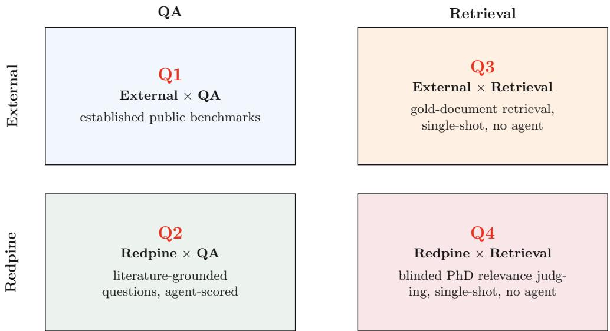
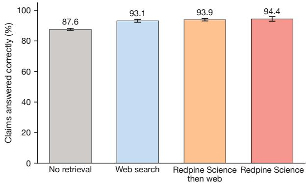
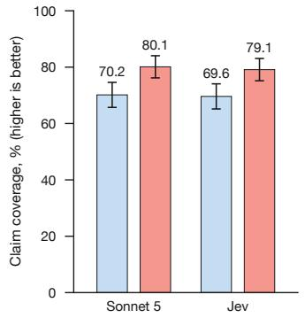
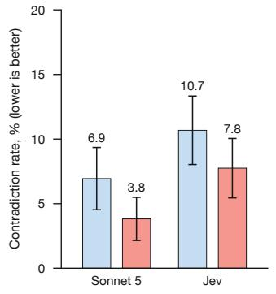
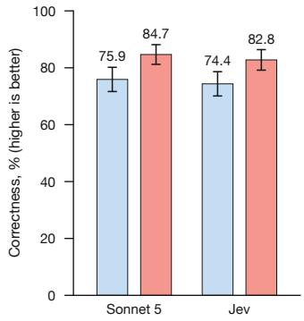
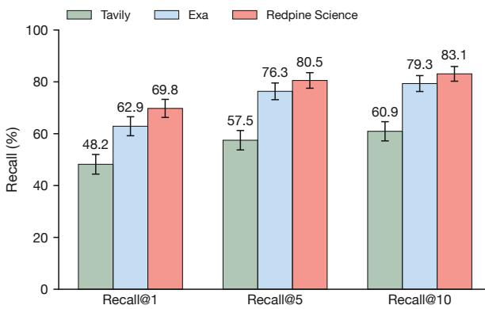
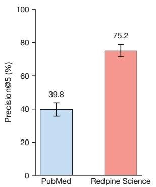
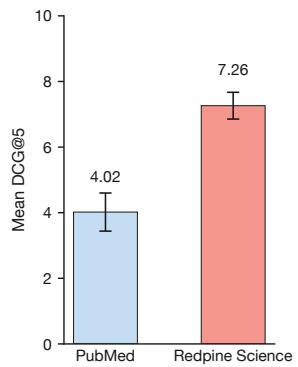

# Leveraging a four-quadrant approach for evaluating Redpine Science

Filip Dorm and Leonora Vesterbacka

Redpine, Sweden.

## Abstract

Redpine Science gives models and agents a single access point to a wide range of peer-reviewed literature, queried directly through the Model Context Protocol (MCP) and an API. This report evaluates Redpine Science on two levels: the relevance of the retrieved chunks, and a model’s answer when it has access to Redpine Science compared to web search. Both public and expert-validated benchmarks are used. Public benchmarks are a widely accepted way to test model development and are comparable across labs, but risk saturation and memoriza tion. To address this, we complement them with an expert-validated question set. In total, this report presents four evaluations. On ScholarQABench SciFact, the public answer-quality benchmark reported here, an agent with Redpine Science answers 94.4% of claims correctly against 87.6% with no retrieval. On the expert-validated question set, an agent with Redpine Science states 80.1% of the required claims against 70.2% for an agent restricted to web search. On the 668 queries of a public retrieval benchmark whose gold paper Redpine holds, stripped of any model reasoning, Redpine Science places the correct source paper in its top ten results for 83.1% of queries (Recall@10), against 79.3% for the benchmark’s creator. A blinded expert relevance panel places Redpine Science’s Precision@5 at 75.2% against 39.8% for the PubMed search tool. We release the expert-validated question set and instructions to reproduce every headline result above, at https://github.com/redpine-ai/benchmarks.

Keywords: Evaluation Benchmarks, LLM, RAG, Information Retrieval, Question Answering, Human Evaluation, Biomedical NLP

## 1 Introduction

Redpine Science gives models and agents a single access point to a wide range of peerreviewed literature, queried directly through the Model Context Protocol (MCP) [1] and an API. This report measures how much that access improves the answers a model produces, and how reliably that improvement can be measured.

Evaluating a retrieval-augmented generation (RAG) system is harder than evaluating a model alone. A RAG pipeline conflates two efects: whether the right passage is surfaced (retrieval), and whether the model turns that passage into an accurate, grounded answer (generation). Most published evaluations report one blended score for both. A win on that score can come from better retrieval, a better-written answer drawn from similar evidence, or a mix of the two, and the number alone does not say which.

We separate the two efects by crossing two independent choices: where the evaluation questions come from, an existing public benchmark or a literature-grounded set built in-house, and what is measured, the full agentic answer or retrieval alone with no model reasoning in the loop. This produces four evaluations rather than one, described in Sections 2.1 through 2.4. Reporting all four separately shows whether a result comes from retrieval or from generation.

## 1.1 Redpine Science

The corpus used for these evaluations is Redpine Science, which holds over 20 million peer-reviewed articles from closed-access journals and open-access repositories, served through Redpine’s API and MCP. A query returns a ranked list of chunks, short passages from inside an article rather than whole documents, each tied to its source paper. Coverage concentrates in biomedicine, with smaller coverage of physics and chemistry. That concentration sets the domain for the rest of this report: the public benchmarks tested are mostly biomedical, and the relevance judges are PhDs in a few clinical subspecialties drawn from the corpus’s wider biomedical coverage.1

## 2 Evaluation methodology

The evaluation crosses who built the questions against what is measured, producing the four evaluations in Figure 1.

None of these four evaluations is new on its own. Scoring an agent’s answer against public benchmarks or against harder expert-authored questions is standard for RAG and agent evaluations. For retrieval measured in isolation, the two quadrants follow existing precedent: information-retrieval datasets that match a query to a gold article, and blinded expert judging of top retrieved results. Reporting all four together, so that a retrieval efect and a generation efect are separated for both question sources, is the contribution of this methodology.

Quadrants one and two score answers from the same kind of agent: a language model in a tool-use loop, with a fixed budget of tool calls, that decides what to search and when to stop. Within each of these two quadrants, every arm runs the same loop, the same model, and the same system prompt; the prompt difers between arms in one clause only, the list of tools the agent may call. Answers are stored and scored afterwards, so a diference between arms can come only from the tools. The model, the call budget, the arms and the scoring rule difer between the two quadrants and are set in each subsection below.

  
Fig. 1 The four evaluations, crossing who built the questions against what is measured.

## 2.1 External QA benchmark

Public benchmarks are the standard way to compare models across labs and domains [2–4]: the question set and the scoring rule are published, so a number can be checked against other groups’ results. Biomedicine has many, among them Massive Multitask Language Understanding (MMLU) [5], MedHELM [6], BioASQ [7], MedXpertQA [8], HealthBench [9], LiveMedBench [10], and the Bio/Chem Gold subset [11] of Humanity’s Last Exam [12].

Many of these benchmarks cannot show a retrieval efect, for two reasons. The first is saturation. Models answer most of the questions correctly from memory: by 2023, GPT-4 with no retrieval scored 93.8% on MMLU Professional Medicine and 95.1% on MMLU College Biology [13]. When a model already scores 95%, retrieval can add a few points at most, and the run-to-run variation of the model is of the same size. The second is contamination. The question text has been public for years and is plausibly in the training data of the models under test [14, 15]. A model that has memorized an answer scores well without retrieving anything, and the benchmark cannot separate the two.

Newer benchmarks reduce both problems: a recent benchmark is less likely to appear in a model’s training data, and one built to be hard for current models leaves room for retrieval to move the score. ScholarQABench [16] is a suite of literaturesynthesis and paper-surfacing tasks, use cases Redpine Science serves, so it is the benchmark reported here. Its SciFact subtask [17] holds 208 biomedical claims, each a one-sentence scientific statement such as a drug’s efect on a patient group, with a label saying whether the published literature supports or refutes it. The agent reads the claim, searches if it has a tool, and states a verdict. The suite’s scoring rule marks the answer correct if the gold label, true or false, appears in the answer text; no judge model is involved.

Arms. Claude Sonnet 5 answers every claim in four arms with a budget of 16 tool calls: no tools, web search, Redpine Science, and Redpine Science with web search as fallback. In each arm with a tool, the first call is forced to that arm’s primary tool, so no arm answers from memory alone; after that the agent decides. The full set is run five times and the mean over runs is reported, so the spread is run-to-run variation rather than one draw.

## 2.2 Redpine QA benchmark

Public benchmarks are comparable across labs, but a model that has memorized an answer is not retrieving anything. Quadrant two therefore asks questions that are new, that have one paper behind them, and that a biomedical expert has checked.

Question set. The set holds 179 questions in four clinical tracks: cardiology (79), neuroimmunology (60), sepsis (20) and immunology (20). Each question is written from one paper in the Redpine Science full-text corpus. Of these papers, 105 are open access and 74 paywalled. The split matters because web search can find an open-access paper, so results are reported by access class as well as overall (Section 3.2).

Writing the questions and their answer keys. A language model pipeline turns a paper into a question and an answer key. Claude Opus 5 writes and reviews; Claude Sonnet 5 writes and grades the test answers described below. The pipeline searches Redpine Science for papers in a track, skipping case reports, protocols without results and papers with no clinical content. It then writes the question with the paper’s results hidden from it, so that the question reads as one a clinician would ask a literature assistant rather than as a summary of the paper: one thing asked, 10 to 22 words as the target (three released questions run to 26 after expert review), and no hint of the paper’s design, thresholds or timepoints. The specifics go into the answer key instead.

The answer key, which we call the gold, lists two to four required claims, the facts a good answer must state; Table A2 in the appendix shows four questions with their golds. Every claim is tied to a quoted passage in the paper, and its wording is graded to the evidence: a causal claim needs a randomized comparison; anything weaker is stated as an association or a preliminary finding. The gold also carries a certainty sentence that says how strong the evidence is, names the population and setting the claims hold for, and ends with one wrong-if clause where the paper admits one: the most tempting over-claim, which an answer must not make. Figure 2 shows one question with its gold in full. Passages from other papers on the same question decide whether a finding is corroborated, uncontested or conflicting, which sets how firmly the gold may state it. A mechanical check confirms that every quote appears in the paper and every claim has evidence behind it. A model review then judges each gold as the two specialist reviewers would, calibrated on their verdicts from earlier sets: each claim is marked supported, overstated, unsupported or contradicted against the paper’s text, and the certainty sentence and wrong-if clause are checked against the study design. A flagged gold is repaired once and re-validated; one that still fails is dropped. A question goes to the experts only if this review, a check that the question belongs to its track, a check that the claims stay faithful to the paper after repair, and the mechanical check all pass.

The last step measures the gold before an expert sees it. Three test answers are generated for each question: one that read the paper, one that read a diferent but valid source, and one with no retrieval. Each is graded twice for how much of the gold it covers, a coverage score in percent, and the three scores travel with the question. A gold on which the paper-informed answer scores below 75%, or the retrieval-free answer 50% or above, is flagged for the expert: the first rewards one paper’s phrasing, the second can be satisfied from memory. The same three answers later guard every edit to a gold.

Expert review. Three PhD-level biomedical experts reviewed the questions in their own fields, in a browser deck that shows the question, the gold and the evidence behind it. For each question the expert marked good, edit or bad, could rewrite the question, and could comment. A suggested rewrite is applied once a check confirms that the gold still answers it. A change to a gold is accepted only if the three test answers, regraded against the new gold, keep their coverage scores: the paper-informed answer’s score stays at or above 85% where it already was and drops by at most 5 points, the other-source answer’s score drops by at most 5 points, the retrieval-free answer’s score rises by at most 5 points, and no test answer newly contradicts the gold. When either check fails, the generated version stays and the failed edit is recorded with the reason: a rewrite that widens the question past what the gold answers, or a gold edit that lets the retrieval-free answer pass, is refused. A question marked bad is dropped. Of 180 reviewed questions, 125 are unchanged, 40 carry the expert’s wording, 14 carry an edited gold and one was dropped.

Arms. Claude Opus 5 answers every question in two arms with a budget of 20 tool calls: web search only, and web search plus Redpine Science. No call is forced; the agent chooses when to use each tool, which is how a customer’s agent would use it. Every judging pass scores the same stored text.

Judging. A second, fixed model (Claude Sonnet 5) judges every answer, the same way for both arms. Jev, TypeSafe’s System One decision model [18], is run as a second judge over the same answers. It does not generate text: it takes the question, the gold and the answer as state and returns a typed verdict with a probability for each claim. Jev’s numbers are the mean of two passes; Sonnet 5 is the primary judge, fixed before any expert label was collected. It reads the question, the population and setting from the gold, and the required claims, and says of each claim whether the answer states it, contradicts it, or does not address it. Three scores follow. Claim coverage is the share of required claims the answer states; this is the primary score and corresponds to the strict recall of TREC nugget evaluation [19]. Contradiction rate is the share of claims the answer contradicts, as in K-QA [20]. Correctness combines the two. With n required claims, of which the answer states s and contradicts $c ,$ coverage is $C = s / n$ the contradiction rate is $K = c / n$ , and

$$
{ \mathrm { c o r r e c t n e s s } } = { \frac { 2 C \left( 1 - K \right) } { C + ( 1 - K ) } } ,\tag{1}
$$

the harmonic mean of the share of claims stated and the share not contradicted. An answer that states every claim and contradicts none scores 1; one that states half the claims and contradicts the rest scores 0.5. Correctness is reported as a percentage below. The bottom panel of Figure 2 works the score through for one real answer: the judge’s verdict on each required claim, and the coverage, contradiction rate and correctness those verdicts give. The judge reads the answer as written, citations included.

Question   
How does frailty burden relate to stroke risk   
in patients with atrial fibrillation and HFpEF?   
Gold   
A strong answer conveys:   
1. Greater frailty burden is associated with a substantially higher incidence of stroke   
than the lowest frailty category.   
2. Stroke risk rises in a graded, dose-response fashion as the frailty index increases.   
3. Frailer patients already carried higher conventional stroke risk scores at baseline,   
so part of the excess stroke risk may reflect confounding by these factors.   
Certainty: The graded link between frailty burden and stroke is a strong but impre   
cisely estimated association that may be partly confounded by conventional stroke   
risk factors, not evidence that frailty itself produces the events.   
Scope: atrial fibrillation coexisting with heart failure with preserved ejection frac  
tion in older adults, outpatient settings.   
An answer is wrong if it directs intensifying or withholding   
anticoagulation according to frailty category, or states that frailty  
guided stroke prevention has been shown to improve outcomes.   
Scoring example: the judge’s verdicts on the web search only answer   
1. stated 2. stated 3. not addressed   
coverage $C \ = \ 2 / 3$ contradiction rate $K \ = \ 0 ,$ correctness = $\frac { 2 \cdot \frac { 2 } { 3 } \cdot 1 } { \frac { 2 } { 3 } + 1 } \ = \ 0 . 8 0$   
Fig. 2 One question from the cardiology track, its gold, and a worked example of the scoring: the   
judge’s verdicts on the web search only arm’s answer to it, the answer itself not shown. The gold   
names three required claims, the certainty and scope they hold under, and the over-claim an answer   
must not make. The answer states two of the three claims and contradicts none, so coverage is 0.67,   
the contradiction rate is 0 and correctness is 0.80 by Equation 1. Green marks a stated claim and   
orange a claim the answer does not address; a contradicted claim would be marked dark red.

Checking the judge against the experts. A study designed before any label was collected asks whether the judge’s claim verdicts agree with the experts’. The same three experts label answers with the judge’s three verdicts plus a fourth label, cannot assess, one answer per screen with its citations replaced by a placeholder, and the two arms of a question at least two screens apart. Every expert labels a random core of 22 questions; each also labels six further questions chosen to cover large and small judge diferences, with the sampling weights recorded; eight screens per expert are repeats for consistency. Agreement is measured with Krippendorf’s alpha [21] and with the intraclass correlation coeficient (ICC) of the judge against the experts’ consensus, next to the experts’ agreement with each other. The diference between the arms over all 179 questions is estimated by prediction-powered inference [22, 23], which corrects the judge’s estimate with the expert labels. The sample, the statistics, the reliability floors (0.80 on whether a claim is stated and 0.667 on the three-way label, Krippendorf’s recommended and tentative standards [24]) and the decision rules were fixed before the experts began.

## 2.3 External retrieval benchmark

Quadrants one and two score the full agentic answer, where a poor result may reflect generation rather than retrieval, and a strong result may reflect writing quality compensating for weak retrieval. Quadrant three isolates retrieval: each system returns its own ranking once, with no agent loop, reformulation, or added reasoning.

This quadrant uses the Exa publication-retrieval benchmark [25], an existing open benchmark published by Exa rather than built by us: its queries and gold documents are public, so the result can be checked. It grounds every query in one gold publication and scores whether it is surfaced and at what rank: a match is exact Digital Object Identifier (DOI) when a system returns one or one appears in a result’s URL or text, or a normalized title substring otherwise.

The full benchmark has 1,866 queries; 671 have a gold paper in Redpine’s corpus, selected by corpus membership before any system was run, not by result. Three of these failed on a transient API error for one system and are excluded rather than scored as misses, leaving 668, on which all three systems are scored. The excluded queries ask about papers Redpine does not hold, so scoring it on them would measure corpus coverage rather than retrieval quality, and the numbers here are not comparable to full-benchmark numbers published elsewhere. The benchmark asks several phrasings per source paper, so these 668 DOI-confirmed queries map to 101 unique source papers. Recall is reported at the query level, the more demanding number since it counts every phrasing separately, and at three ranks, Recall@1, Recall@5, and Recall@10, so a gain at the top of the ranking is distinguishable from one that only appears deeper in it.

Three retrieval services run against it with the identical query and no follow-up fetch or agent reasoning on any side: Redpine Science, Exa’s own search, configured as Exa’s own benchmark implementation runs it [25], and Tavily [26], the web-search arm used throughout this report. Exa and Tavily, advanced web search services, search the open web, Redpine Science a curated, licensed corpus, so this compares retrieval quality on identical terms.

## 2.4 Redpine retrieval evaluation

Quadrant three can only score queries tied to one known publication, but most research questions have many relevant papers rather than a single gold source. Quadrant four covers these: a blinded domain expert judges each result for relevance instead of checking it against a gold paper. Redpine Science is compared against PubMed, a widely used search engine for the biomedical literature. Both systems receive the identical question text. Redpine Science is queried once as written; PubMed is queried as written and, when fewer than eight hits return, re-queried with stopwords and then trailing words removed, keeping the attempt with the most results. No other reformulation is applied on either side.

Judges score each result on a 0 to 4 scale, 0 not relevant, 4 perfectly relevant, the scale of a published relevance evaluation [27], blind to which system produced it; system identity is randomized left-to-right per query to prevent a judge from guessing rather than reading. URL, DOI and publication date are removed from every result before a judge reads it, since a database record and a scraped web page format these diferently enough to identify the source. Two parameters difer from that evaluation: Precision@K counts a score of 2 or higher as relevant, where it counts 3 or higher, and K is 5 for both Precision@K and Discounted Cumulative Gain (DCG)@K, where it is 10.

Three PhD-level domain experts are the judges, and the panel holds 115 questions in two pools. The first pool is 90 subspecialty questions that require domain knowledge to evaluate the results, not only to answer, in three non-overlapping batches of 30, each judged by one panelist for breadth across subspecialties: one batch is mostly neurology, with a handful of adjacent critical care, immunology, microbiology and pharmacology questions; one is entirely cardiology; one is entirely rheumatology. The second pool is 25 questions judged by two panelists against the same blinded result set, to measure inter-rater agreement; per-item scores are averaged across the two judges before pooling, so each of these questions contributes one data point, not two.

## 3 Results

The following subsections present the results of the four evaluations described above.

## 3.1 External QA benchmark

This quadrant tests whether access to Redpine Science changes an agent’s answer accuracy on a public, claim-verification benchmark.

Figure 3 shows the result. An agent with Redpine Science answers 94.4% of the claims correctly, against 87.6% for the same agent with no retrieval: 6.8 points more, or 7.8% more claims right, averaged over the five runs and positive in each of them. Web search scores 93.1%, and Redpine Science with web search as fallback 93.9%.

Every arm scores above 87%. The no-retrieval score is the floor a retrieval system starts from, and on this benchmark it leaves 12 points to gain; Redpine Science closes over half of them. A benchmark on which the model already answers nine claims in ten from memory can show that retrieval helps, but not by how much, and it says nothing about whether the retrieved papers are the right ones. The remaining quadrants take those two questions in turn: quadrant two asks questions the model cannot answer from memory, and quadrants three and four measure the retrieved papers directly.

  
Fig. 3 Accuracy on ScholarQABench SciFact by arm, Claude Sonnet 5, mean over five runs of the 208 claims. Color encodes the system; error bars are the 95% confidence interval of the mean over the five runs, so they show run-to-run variation. A claim is excluded from every arm of the run it falls in when the model refuses it with no answer in at least one arm, or when an arm call fails after retries, so each run scores 196 to 199 claims.

## 3.2 Redpine QA benchmark

This quadrant tests answer quality on the expert-validated question set, comparing an agent with web search alone against the same agent with Redpine Science added.

  
Fig. 4 Claim coverage, contradiction rate and correctness by arm on the 179 expert-validated questions (four tracks), under two judges. Sonnet 5 is the primary judge; Jev, averaged over two passes, is a second judge over the same answers. Higher is better for coverage and correctness; lower is better for the contradiction rate. Error bars are a 95% confidence interval of the mean (Student’s t) over the 179 questions. The paired intervals for the diferences between the arms are in the text.

Figure 4 shows the three metrics of Section 2.2 by arm. Under the primary judge, the arm with Redpine Science states 80.1% of the gold claims against 70.2% for web search alone, a paired diference of +10.0 points (95% interval $+ 5 . 8 ~ \mathrm { t o } \ + 1 4 . 2 ,$ paired t $p = 6 \times 1 0 ^ { - 6 } , \mathrm { n } = 1 7 9 )$ . It contradicts fewer claims, 3.8% against 6.9%, a diference of −3.1 points $( - 5 . 5 \mathrm { ~ t o ~ } - 0 . 8 , p = 0 . 0 1 )$ . Correctness, the harmonic mean of the two per question, averages 84.7% against 75.9%, a diference of +8.8 points (+4.9 to +12.7, $p = 2 \times 1 0 ^ { - 5 } )$ . Per question, the Redpine Science arm covers more claims on 62 questions, fewer on 22, and the same number on 95. Half the questions are answered equally well by both arms; the gain sits in the other half.

Table 1 Claim coverage diference in percentage points, web search plus Redpine Science minus web search only, on all questions and by access class of the source paper, under each judge. Paired 95% confidence intervals of the mean (Student’s t); n is the number of questions.
<table><tr><td>Questions</td><td>n</td><td>Sonnet 5</td><td>Jev</td></tr><tr><td>All questions</td><td>179</td><td> $+ 1 0 . 0 \ [ + 5 . 8 , + 1 4 . 2 ]$ </td><td> $+ 9 . 5 \ [ + 5 . 6 , + 1 3 . 4 ]$ </td></tr><tr><td>Open access</td><td>105</td><td> $+ 6 . 7 \ [ + 1 . 7 , + 1 1 . 6 ]$ </td><td>+5.1  $[ + 0 . 3 , + 9 . 9 ]$ </td></tr><tr><td>Paywalled</td><td>74</td><td> $+ 1 4 . 6 \ [ + 7 . 2 , + 2 2 . 1 ]$ </td><td>+15.8  $[ + 9 . 4 , + 2 2 . { \overset { . } { 1 } } ]$ </td></tr></table>

Jev gives the same picture. Under Jev the coverage diference is +9.5 points (+5.6 $\tan \mathrm { \Psi } + 1 3 . 4 , \ p \ = \ 3 \times 1 0 ^ { - 6 } )$ , the contradiction diference −2.9 points $\mathrm { ( - 5 . 6 ~ t o ~ - 0 . 2 }$ $p = 0 . 0 3 )$ and the correctness diference +8.4 points (+4.8 to +12.1, $p = 1 \times 1 0 ^ { - 5 } )$ with 62 questions won, 21 lost and 96 tied. Paired per question, the coverage diferences under Jev’s first pass and under Sonnet 5 difer by 0.2 points on a standard error of 1.5 points; every comparison of Jev with Sonnet 5 or with the experts below uses that first pass. Jev scores both arms lower on the absolute scale, mostly because it labels about twice as many claims contradicted (7.8% against 3.8% on the Redpine Science arm), but the gap between the arms does not move. Contradiction is rare under either judge: at most 10.7% of claims on either arm. At the claim level the two judges give the same verdict on 89.9% of claims on the Redpine Science arm and 87.0% on the web search arm, with Krippendorf’s alpha of 0.70 and 0.72 on the three-way label. That is agreement between two judges, not agreement with an expert.

Table 1 splits the diference by the access class of the source paper. On the 74 questions whose paper is paywalled, the Redpine Science arm states 84.9% of the gold claims against 70.3% for web search alone, a diference of +14.6 points (+7.2 to +22.1, $p = 2 \times 1 0 ^ { - 4 } , \mathrm { n } = 7 4 )$ . On the 105 questions whose paper is open access the diference is +6.7 points (+1.7 to +11.6, p = 0.009, n = 105), from 76.7% against 70.1%. Web search covers the two classes equally; the Redpine Science arm gains most where web search cannot read the paper. Jev gives the same split, +15.8 points on the paywalled questions and +5.1 on the open-access ones. These are the judge’s margins; the expert check follows.

Three domain experts then labeled a blinded sample of the same answers with the judge’s three verdicts, as Section 2.2 describes: a random core of 22 questions, both arms, every answer labeled by all three experts, and 18 further questions, both arms, labeled by one expert each. Of the 154 core claim units, 138 carry three usable labels and 16 carry two, because one expert marked that claim cannot assess. Table 2 reports the agreement.

Both judges agree with the experts at least as well as the experts agree with each other. Sonnet 5 gives the same verdict as the expert majority on 90% of the claims with an expert majority, Jev on 85%. The alt-test [28] holds out each expert in turn and asks whether the judge agrees with that expert at least as well as the other two do; at the ϵ = 0.2 its authors recommend for expert annotators, both judges win for all three. The test gets easier the more a panel disagrees among itself, so we do not read 100% as adequacy. Mean pairwise Cohen’s κ between a judge and an expert is 0.59 for Sonnet 5 and 0.55 for Jev, against 0.48 between two experts. The judges exceed the experts’ agreement with each other partly because the experts disagree among themselves, so this is alignment with a noisy panel, not superiority to it. On the peranswer coverage score, the intraclass correlation between Sonnet 5 and the experts’ leave-one-out consensus is 0.86, above the experts’ own ceiling of 0.74; Jev’s is 0.82. Sonnet 5 is ahead of Jev on every measure by a small margin.

Table 2 Expert check on the quadrant two judges. Three domain experts labeled a blinded sample of the answers with the judge’s three verdicts. Judge rows compare each judge with the experts; panel rows are the experts’ agreement with each other. Majority agreement is over the 144 core claim units on which the expert labels have a majority; the ten tied units are excluded. Intervals are 95%: jackknife for alpha, bootstrap for the intraclass correlation.
<table><tr><td></td><td>Sonnet 5</td><td>Jev</td></tr><tr><td>Agreement with the expert majority, 144 claim units</td><td>90%</td><td>85%</td></tr><tr><td>Alt-test winning rate, € = 0.2</td><td>100%</td><td>100%</td></tr><tr><td>Mean Cohen&#x27;s κ against each expert (expert against expert: 0.48)</td><td>0.59</td><td>0.55</td></tr><tr><td>ICC(2,1) against the leave-one-out consensus</td><td>0.86 [0.77, 0.92]</td><td>0.82 [0.71, 0.90]</td></tr><tr><td>Panel, 154 core claim units</td><td></td><td></td></tr><tr><td>Experts&#x27; ICC ceiling</td><td>0.74 [0.56, 0.85]</td><td></td></tr><tr><td>Krippendorff&#x27;s alpha, stated versus not</td><td>0.53 [0.42, 0.65]</td><td></td></tr><tr><td>Krippendorff&#x27;s alpha, three-way</td><td>0.49 [0.38, 0.59]</td><td></td></tr><tr><td>Fleiss&#x27;s κ, stated versus not / three-way</td><td>0.53 / 0.49</td><td></td></tr></table>

The expert labels point the same way as the judge’s. On the 22-question random core, where all experts labeled both arms, the expert-only coverage gain is +24.9 points (95% interval +11.6 to +38.2); that draw over-represents questions on which the judge saw a large gap (+29.9 against +10.0 points on the frame), so the estimate for all 179 questions is, by prediction-powered inference with the design’s sampling weights, +15.5 points (−1.9 to +33.0), next to the judge’s +10.0. Its interval is wide because the design placed only two labeled questions in the 88-question stratum where the judge saw no gap. The contradiction rate on the core moves the same way, −6.3 points (−16.1 to +3.5). The expert labels agree with the judge on the direction of the gain; its size rests on the judge’s 179-question estimate.

The experts’ agreement with each other was moderate: Krippendorf’s alpha 0.53 on whether a claim is stated and 0.49 on the three-way label, below the floors of 0.80 and 0.667 we fixed in advance as the condition for calling a judge adequate. No adequacy verdict is therefore drawn for either judge, and the figures above describe alignment. Disagreement among the experts concentrates on whether a claim is stated or not addressed, and on the rare contradicted label; it varies by track, from alpha 0.75 on sepsis and 0.52 on cardiology to 0.23 on neuroimmunology and 0.20 on immunology (16 claim units).

## 3.3 External retrieval benchmark

This quadrant tests retrieval alone, whether the correct source paper is surfaced, with no model reasoning involved.

  
Fig. 5 Recall@1, Recall@5, and Recall@10 by system, n = 668 queries whose gold paper is confirmed present in Redpine Science’s corpus. Error bars are a 95% confidence interval for a binomial proportion, computed from each cutof’s exact found-count out of 668. Redpine Science leads at every cutof.

Table 3 Quadrant three retrieval results, $\begin{array} { r } { \mathrm { ~ n = ~ } 6 6 8 . } \end{array}$
<table><tr><td></td><td>Recall@1</td><td>Recall@5</td><td>Recall@10</td><td>nDCG@10</td></tr><tr><td>Redpine Science</td><td>69.8%</td><td>80.5%</td><td>83.1%</td><td>0.765</td></tr><tr><td>Exa</td><td>62.9%</td><td>76.3%</td><td>79.3%</td><td>0.714</td></tr><tr><td>Tavily</td><td>48.2%</td><td>57.5%</td><td>60.9%</td><td>0.545</td></tr></table>

Figure 5 and Table 3 show the result. Recall@K is the fraction of queries where the correct paper appears in a system’s top K results, on a 0 to 100% scale. Normalized DCG at ten (nDCG@10) also rewards a higher rank for the correct paper, on a 0 to 1 scale where 1 means the correct paper is always ranked first. On the 668 in-corpus queries, Redpine Science leads on all four metrics: 6.9 points over Exa at Recall@1, narrowing to 3.7 points at Recall@10, and 21.6 to 23.1 points over Tavily across the three cutofs.

## 3.4 Redpine retrieval evaluation

This quadrant tests retrieval relevance directly, judged by a blinded panel of domain experts rather than by a DOI match.

Figure 6 shows the result over all 115 questions. Precision@5 is the fraction of a system’s top 5 results a judge scores 2 or higher out of 4 for relevance, on a 0 to 100% scale. DCG@5 also weights a relevant result more heavily the higher it is ranked; with gains of 0 to 4 its maximum is 11.8, and higher is better. Redpine Science leads on both: Precision@5 75.2% against 39.8% for the PubMed search tool, and mean DCG@5

  
Fig. 6 Precision@5 (score 2 or higher on the 0 to 4 relevance scale, at or above the midpoint) and mean DCG@5, by system, pooled across all 115 questions (90 domain-specific plus 25 cross-judged). Left panel error bars are a 95% confidence interval for a binomial proportion; right panel error bars are a 95% confidence interval of the mean over the pooled per-query values.

7.26 against 4.02. Mean relevance per judged result is 2.43 against 1.38 on the 0 to 4 scale. Agreement between the two panelists who judged the same set of questions is moderate (quadratic-weighted Cohen’s κ = 0.59, n = 246 individually judged results across the 25 shared questions), the measured inter-rater ceiling for this panel.

## 4 What we are releasing

All four evaluations in this report are released as a public benchmark suite, one directory per evaluation.

• External QA benchmark (external-qa). Its per-arm configuration, runner, and the reduced run logs (per-claim scores and exclusions) behind the reported numbers.

• Redpine Biomedical QA (redpine-biomedical-qa). The 179-question expertvalidated set with its golds, its configuration and runner, the run log behind the reported numbers with every model answer (retrieved passage text removed), both judges’ code, the per-question judge verdicts under both judges, and the agreement between the two judges recomputed from them; the experts’ claim labels and the second judge’s probabilities and confidences are withheld.

• External retrieval benchmark (external-retrieval). The 668-query retrieval dataset, the matching code, and the results behind the reported recall.

## • Redpine Biomedical Retrieval Evaluation

(redpine-biomedical-retrieval). The 115-question relevance panel’s dataset and ratings, anonymized, and the scoring code behind the reported precision and DCG.

Both QA benchmarks run on one shared tool-use harness (harness), which reproduces the logged setup; it is not the internal code that produced the logs. All four are at https://github.com/redpine-ai/benchmarks.

## 5 Summary

This report evaluates a retrieval-augmented generation system by separating the efects of retrieval and generation.

On ScholarQABench SciFact, the agent answers 94.4% of claims correctly with Redpine Science against 87.6% with no retrieval and 93.1% with web search; every arm scores above 87%, so a public benchmark of this kind leaves little room to measure retrieval, which is what the other three quadrants are for. On the expert-validated question set, an agent with Redpine Science states 80.1% of the required claims against 70.2% for an agent restricted to web search, a paired gain of 10.0 points in claim coverage under the primary judge; expert labels on a blinded sample point the same way. On the 668 queries of the public retrieval benchmark whose gold paper Redpine holds, Redpine Science places the correct document in its top ten results for 83.1% of queries (Recall@10), against 79.3% for Exa, the benchmark’s creator. On the expertjudged retrieval panel, three PhD-level domain experts (neurology, cardiology, and rheumatology) plus a second, cross-judged pool of questions, n = 115 in all, place Redpine Science’s Precision@5 at 75.2% against 39.8% for the PubMed search tool.

## 6 Acknowledgments

We thank the creators of the many public benchmarks this report draws on and compares against; every comparison in this report against other labs’ results is possible because of their decision to build and publish that work openly. Evaluation infrastructure of this kind is a shared resource.

We thank our expert judges for their time and care, and Felix Martin for early discussions that laid the foundation for this evaluation work.

## Appendix A Example Questions

Table A2 shows four of the 179 expert-validated questions of quadrant two (Section 2.2), one per track, each with the required claims and the scope line of its gold, quoted as the gold states them. The full set is released. Table A1 shows one example question from each of the three domains in quadrant four’s judging panel (Section 2.4).

Table A1 One example question per domain, quadrant four’s judging panel.
<table><tr><td>Domain</td><td>Subspecialty</td><td>Question</td></tr><tr><td>Neurology</td><td>Motor neuron disease</td><td>Does prior military service increase the risk of developing ALS?</td></tr><tr><td>Cardiology</td><td>Cardiac imaging</td><td>In patients with STEMI undergoing primary PCI, is CMR-measured infarct size reliable for predicting 1-year heart failure hospitalization</td></tr><tr><td></td><td>Rheumatology RA immunology and pathogenesis</td><td>and mortality? How does methotrexate treatment affect peripheral blood B cells, such as the B cell repertoire and the frequency of B cell pheno- type subtypes?</td></tr></table>

Table A2 Four of the 179 quadrant two questions, one per track, with the required claims and scope of each gold. The full set is released.
<table><tr><td>Track</td><td colspan="2">Question How does in-hospital mortality com-</td><td>Required claims and scope</td></tr><tr><td>Cardiology</td><td colspan="2">pare between transcatheter and sur- gical aortic valve replacement in patients with aortic stenosis?</td><td>In-hospital mortality was lower after transcatheter than after surgical aor- tic valve replacement overall; among patients younger than 75 years, in- hospital mortality did not differ between the transcatheter and sur- gical approaches. Scope: applies to severe non-rheumatic aortic stenosis treated with aortic valve replacement in adults, predominantly elderly, inpa- tient settings. Measures of cortical damage are cen-</td></tr><tr><td></td><td colspan="2">ability progression that occurs inde- pendently of relapses in multiple scle- rosis?</td><td>tral to predicting progression of dis- ability that occurs without relapses; spinal cord degeneration also carries prognostic relevance for disability pro- gression in multiple sclerosis; corti- cal thickness in the temporal lobe emerged as the strongest imaging pre- dictor of time to relapse-independent progression. Scope: applies to multiple sclerosis in adults under regular clini- cal evaluation, outpatient settings. A longer delay between hypotension onset and the start of norepinephrine is associated with higher 28-day mor- tality; the delay remains associated with 28-day death after multivariable</td></tr><tr><td>Sepsis</td><td>How does the timing of nore- pinephrine initiation hypotension onset relate to mortality in sepsis?</td><td>after adjustment for measured covariates; delays extending beyond the first hour after hypotension onset are associated with a higher adjusted hazard of death by day 28. Scope: applies to sepsis</td><td></td></tr><tr><td>Immunology</td><td colspan="2">How do ibrutinib, acalabrutinib, and zanubrutinib compare for atrial fibril- lation risk in mantle cell lymphoma?</td><td>with hypotension requiring vasopres- sor support in adults, mixed settings. Newly recorded atrial fibrillation or flutter is less frequent with acalabru- tinib than with ibrutinib, on the order of a third as frequent; newly recorded atrial fibrillation or flutter is like- wise less frequent with zanubrutinib than with ibrutinib; atrial fibrilla- tion or flutter frequency is similar between acalabrutinib and zanubruti- nib, with no clear separation between the two second-generation agents. Scope: applies to mantle cell lym- phoma treated with a covalent Bru- ton tyrosine kinase inhibitor in adults, outpatient settings.</td></tr></table>

## References

[1] Anthropic: Introducing the Model Context Protocol. Anthropic News (2024). https://www.anthropic.com/news/model-context-protocol

[2] Hendrycks, D., Burns, C., Kadavath, S., Arora, A., Basart, S., Tang, E., Song, D., Steinhardt, J.: Measuring mathematical problem solving with the MATH dataset. In: Proceedings of the Neural Information Processing Systems Track on Datasets and Benchmarks (NeurIPS) (2021). https://datasets-benchmarks-proceedings.neurips.cc/paper/2021/hash be83ab3ecd0db773eb2dc1b0a17836a1-Abstract-round2.html

[3] Jimenez, C.E., Yang, J., Wettig, A., Yao, S., Pei, K., Press, O., Narasimhan, K.: SWE-bench: Can language models resolve real-world GitHub issues? In: Proceedings of the International Conference on Learning Representations (ICLR) (2024). https://proceedings.iclr.cc/paper files/paper/2024/hash/ edac78c3e300629acfe6cbe9ca88fb84-Abstract-Conference.html

[4] Dorm, F., Millard, J., Purves, D., Harfoot, M., Mac Aodha, O.: Large language models possess some ecological knowledge, but how much? Ecological Informatics 95, 103699 (2026) https://doi.org/10.1016/j.ecoinf.2026.103699

[5] Hendrycks, D., Burns, C., Basart, S., Zou, A., Mazeika, M., Song, D., Steinhardt, J.: Measuring massive multitask language understanding. In: Proceedings of the International Conference on Learning Representations (ICLR) (2021)

[6] Bedi, S., Cui, H., Fuentes, M., Unell, A., Wornow, M., et al.: Holistic evaluation of large language models for medical tasks with MedHELM. Nature Medicine 32(3), 943–951 (2026) https://doi.org/10.1038/s41591-025-04151-2

[7] Tsatsaronis, G., Balikas, G., Malakasiotis, P., Partalas, I., Zschunke, M., et al.: An overview of the BIOASQ large-scale biomedical semantic indexing and question answering competition. BMC Bioinformatics 16(1), 138 (2015) https://doi.org/ 10.1186/s12859-015-0564-6

[8] Zuo, Y., Qu, S., Li, Y., Chen, Z., Zhu, X., Hua, E., Zhang, K., Ding, N., Zhou, B.: MedXpertQA: Benchmarking expert-level medical reasoning and understanding. In: Proceedings of the 42nd International Conference on Machine Learning (ICML). Proceedings of Machine Learning Research, vol. 267, pp. 80961–80990 (2025)

[9] Arora, R.K., Wei, J., Hicks, R.S., Bowman, P., et al.: HealthBench: Evaluating large language models towards improved human health. arXiv preprint arXiv:2505.08775 (2025)

[10] Yan, Z., Song, D., Fang, Z., Ji, Y., Li, X., Li, Q., Sun, L.: LiveMedBench: A

contamination-limited medical benchmark for LLMs with automated rubric evaluation. In: Proceedings of the 32nd ACM SIGKDD Conference on Knowledge Discovery and Data Mining (KDD), pp. 10162–10173 (2026). https://doi.org/10. 1145/3770855.3817579

[11] FutureHouse: HLE Bio/Chem Gold: a validated subset of Humanity’s Last Exam. FutureHouse research note (2025). https://www.futurehouse.org/ research/hle-exam

[12] Phan, L., Gatti, A., Li, N., Khoja, A., Kim, R., et al.: A benchmark of expertlevel academic questions to assess AI capabilities. Nature 649(8099), 1139–1146 (2026) https://doi.org/10.1038/s41586-025-09962-4

[13] Nori, H., Lee, Y.T., Zhang, S., Carignan, D., Edgar, R., et al.: Can generalist foundation models outcompete special-purpose tuning? Case study in medicine. arXiv preprint arXiv:2311.16452 (2023)

[14] Sainz, O., Campos, J., Garc´ıa-Ferrero, I., Etxaniz, J., Lacalle, O., Agirre, E.: NLP evaluation in trouble: On the need to measure LLM data contamination for each benchmark. In: Findings of the Association for Computational Linguistics: EMNLP 2023, pp. 10776–10787 (2023). https://doi.org/10.18653/v1/2023. findings-emnlp.722

[15] Deng, C., Zhao, Y., Tang, X., Gerstein, M., Cohan, A.: Investigating data contamination in modern benchmarks for large language models. In: Proceedings of the 2024 Conference of the North American Chapter of the Association for Computational Linguistics (NAACL), pp. 8706–8719 (2024). https://doi.org/10. 18653/v1/2024.naacl-long.482

[16] Asai, A., He, J., Shao, R., Shi, W., Singh, A., et al.: Synthesizing scientific literature with retrieval-augmented language models. Nature 650(8103), 857–863 (2026) https://doi.org/10.1038/s41586-025-10072-4

[17] Wadden, D., Lin, S., Lo, K., Wang, L.L., Zuylen, M., Cohan, A., Hajishirzi, H.: Fact or fiction: Verifying scientific claims. In: Proceedings of the 2020 Conference on Empirical Methods in Natural Language Processing (EMNLP), pp. 7534–7550 (2020). https://doi.org/10.18653/v1/2020.emnlp-main.609

[18] Almeida, D.: Introducing System One Models & Jev. TypeSafe blog. Accessed 26 September 2026 (2026). https://typesafe.ai/blog/ introducing-system-one-models-and-jev

[19] Pradeep, R., Thakur, N., Upadhyay, S., Campos, D., Craswell, N., Soborof, I., Dang, H.T., Lin, J.: The great nugget recall: Automating fact extraction and RAG evaluation with large language models. In: Proceedings of the 48th International ACM SIGIR Conference on Research and Development in Information Retrieval (SIGIR), pp. 180–190 (2025). https://doi.org/10.1145/3726302.3730090

[20] Manes, I., Ronn, N., Cohen, D., Ilan Ber, R., Horowitz-Kugler, Z., Stanovsky, G.: K-QA: A real-world medical Q&A benchmark. In: Proceedings of the 23rd Workshop on Biomedical Natural Language Processing (BioNLP), Bangkok, Thailand, pp. 277–294 (2024). https://doi.org/10.18653/v1/2024.bionlp-1.22

[21] Hayes, A.F., Krippendorf, K.: Answering the call for a standard reliability measure for coding data. Communication Methods and Measures 1(1), 77–89 (2007) https://doi.org/10.1080/19312450709336664

[22] Angelopoulos, A.N., Bates, S., Fannjiang, C., Jordan, M.I., Zrnic, T.: Predictionpowered inference. Science 382(6671), 669–674 (2023) https://doi.org/10.1126/ science.adi6000

[23] Angelopoulos, A.N., Duchi, J.C., Zrnic, T.: PPI++: Eficient prediction-powered inference. arXiv preprint arXiv:2311.01453 (2023)

[24] Krippendorf, K.: Content Analysis: An Introduction to Its Methodology, 2nd edn. Sage, Thousand Oaks, CA (2004)

[25] Exa Labs: exa-labs/benchmarks: Open benchmarks for evaluating search APIs. GitHub repository (2026). https://github.com/exa-labs/benchmarks

[26] Tavily: Tavily: One secure API for real-time web access. Accessed September 2026. https://tavily.com

[27] Consensus: Consensus Outperforms Google Scholar for Academic Search Retrieval. Consensus blog (2025). https://consensus.app/home/blog/ consensus-outperforms-google-scholar-for-academic-search-retrieval/

[28] Calderon, N., Reichart, R., Dror, R.: The alternative annotator test for LLM-asa-judge: How to statistically justify replacing human annotators with LLMs. In: Proceedings of the 63rd Annual Meeting of the Association for Computational Linguistics (Volume 1: Long Papers), pp. 16051–16081 (2025). https://doi.org 10.18653/v1/2025.acl-long.782