# MONTE CARLO ESTIMATION FOR KV CACHE EVIC-TION

Ahsan Bilal1, Muhammad Ahmed Mohsin2, Muhammad Umer2, Wajih Hassan Raza3, Atta Ul Asad4, Young D. Kwon5, Michal Valko6, Dean F. Hougen1

1University of Oklahoma 2Stanford University 3University of Houston

4Lahore University of Management Sciences 5University of Cambridge 6Isara Labs

## ABSTRACT

Most KV-cache eviction methods ask, in effect, which memory appeared important while reading the prompt? We instead ask, which memory will matter while answering? Since decoding queries are unavailable at eviction time, prior futureaware methods rely on pseudo-responses or synthetic future-query estimates. We cast fixed-budget future-aware eviction as distributional estimation over plausible model-conditional query trajectories and introduce LORE-KV (Lookahead Output-perturbation with Reliability-weighted Ensemblesfor Key-Value caches), a training-free method that samples short autoregressive continuations from the frozen target model and uses their response-side query states to estimate prompttoken utility. Tokens are scored by projected leave-one-out attention-output deletion cost and aggregated across sampled futures with optional trajectory weighting. The temporary continuations are discarded before final decoding, requiring no auxiliary model or training. Ablations isolate the mechanism: at B=128, a single response-side continuation recovers about 89% of the gain over the promptwindow control, while additional futures provide smaller improvements. At B=128, LORE-KV raises the LongBench average on Qwen2.5-14B from 45.49 to 48.24 (+2.75) and the 16K RULER average on Mistral-7B from 45.20 to 51.05 (+5.85). Gains diminish at larger cache budgets and coexist with task-level regressions. LORE-KV incurs 1.46-2.77× AnDPro’s per-sample wall-clock time as a one-time compression overhead across six dense and hybrid-attention backbones.

## 1 INTRODUCTION

Autoregressive large language models (LLMs) rely on key-value (KV) caching to reuse previously computed hidden states during decoding. Although KV caching accelerates generation, its memory and bandwidth costs grow with sequence length and batch size, making long-context inference increasingly expensive (Behnam et al., 2025; Li et al., 2025a; Łancucki et al.´ , 2025). KV-cache eviction reduces this cost by retaining only a subset of KV pairs, with existing methods estimating importance using recency or attention sinks (Xiao et al., 2024), accumulated or prompt-end attention (Zhang et al., 2023; Liu et al., 2023; Li et al., 2024), or key-space geometry (Devoto et al., 2024; Park et al., 2025).

A key challenge is that KV eviction happens before future decoding queries are known, so promptbased scores may keep tokens that matter during prefill but not during generation. Future-aware methods reduce this mismatch using pseudo or synthetic queries (Wang et al., 2025b), but the benefit and cost of using multiple plausible futures remain unclear. Learned predictors can estimate future utility, but require model-specific training (Ahn et al., 2026; Moschella et al., 2026; Bui et al., 2026; Yang et al., 2026). Moreover, attention alone is incomplete because deletion impact also depends on the value vectors (Guo et al., 2024; Geng et al., 2025; Mai & Kim, 2026). These gaps motivate a training-free method that combines future-query estimation with output-aware token scoring.

To address these limitations, we propose LORE-KV (Lookahead Output-perturbation with Reliability-weighted Ensembles for Key-Value caches), a training-free method that estimates token importance using the queries the model is likely to encounter during generation. Prior futureaware methods estimate decoding demand from either a pseudo-response trajectory, as in LAQ, or synthetic queries from a fitted hidden-state distribution. LORE-KV instead samples multiple modelconditional autoregressive trajectories from the frozen target model and estimates fixed-budget token utility via reliability-weighted expected projected deletion cost over their query states. Our focus is the query reference: what multiple sampled futures add beyond one, and the explicit trade-off of additional compression-time compute for retained-cache quality. LORE-KV is training-free to deploy but incurs lookahead overhead on every request.

Contributions. Our contributions are threefold. First, we quantify and mechanistically characterize the query-reference mismatch between prompt-side and future decoding queries, and show that the benefit of future-aware eviction increases with this mismatch. Second, we use multiple short future trajectories to estimate which cached tokens are most important for upcoming generation, and softly weight more reliable trajectories. Third, we validate this mechanism through query controls and matched lookahead-token budget controls, future-query oracle analyses, and evaluations across six dense and hybrid-attention backbones, cache budgets, context lengths, and benchmarks.

## 2 RELATED WORK

## 2.1 PROMPT-SIDE KV EVICTION

Most KV-cache eviction methods estimate token importance from information available during prefill. StreamingLLM preserves attention sinks and recent tokens (Xiao et al., 2024), H2O accumulates historical attention (Zhang et al., 2023), and SnapKV scores tokens using a prompt-end observation window (Li et al., 2024). Other methods improve how a fixed budget is distributed across layers or heads, including PyramidKV and Ada-KV (Cai et al., 2025b; Feng et al., 2025b), while DefensiveKV improves robustness to noisy query estimates (Feng et al., 2025a). These methods refine retention or budget allocation but remain prompt-side; LORE-KV instead estimates token utility from plausible future decoding queries.

## 2.2 FUTURE-QUERY ESTIMATION AND OUTPUT-AWARE SCORING

A more recent line of work approximates the queries encountered during decoding. Expected Attention analytically estimates attention under a future-query distribution (Devoto et al., 2026), while DapQ constructs position-aware pseudo-queries (Tian et al., 2026). LAQ obtains lookahead queries from a short pseudo-response, LAQ++ combines them with prompt-local queries (Wang et al., 2025b), and GVote samples synthetic queries from a fitted hidden-state distribution to determine an adaptive cache budget (Tang et al., 2025). Learned approaches such as LookaheadKV and IndexMem predict future utility or learn compact memory mechanisms (Ahn et al., 2026; Yang et al., 2026). Complementary methods improve the eviction objective: OBCache measures attentionoutput perturbation (Gu et al., 2025), AnDPro uses projected attention-output information (Geng et al., 2025), and LaProx incorporates projected values and inter-head interactions (Mai & Kim, 2026). LORE-KV samples multiple model-conditional autoregressive trajectories and, under a fixed cache budget, estimates token utility via reliability-weighted expected projected deletion cost over their query states.

## 2.3 ORTHOGONAL KV-CACHE COMPRESSION

Other work reduces KV-cache cost along dimensions orthogonal to prompt-time token selection. Quantization methods such as KIVI and KVQuant reduce cache precision (Liu et al., 2024b; Hooper et al., 2024); representation-oriented methods exploit low-rank, cross-layer, or mergeable structure (Kang et al., 2024; Liu et al., 2024a); and serving or decode-time methods control cache growth during long generation (Liu et al., 2026b; Łancucki et al.´ , 2025; Su et al., 2026). These techniques are complementary to LORE-KV because they modify cache representation, precision, serving, or decode-time maintenance rather than the prompt-time criterion used to determine which KV entries should survive eviction. Aggressive eviction can additionally remove instructions or answer-bearing evidence (Yang et al., 2024b; Chen et al., 2026a; Garcia, 2026). Additional related work is discussed in Appendix A.

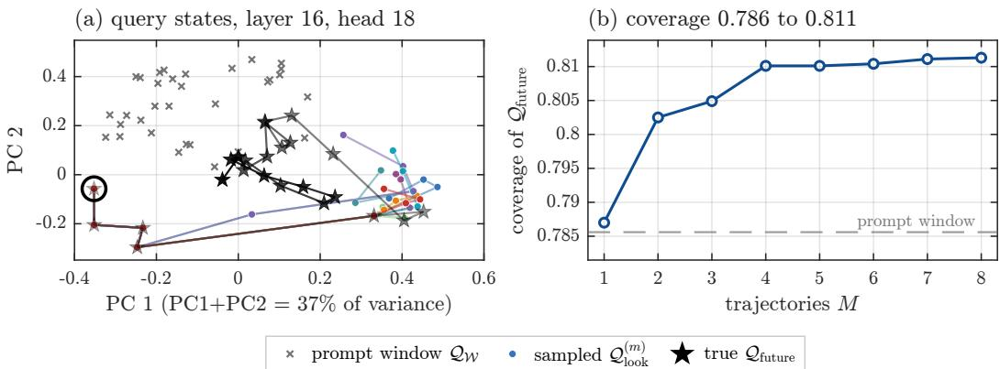  
Figure 1: Monte Carlo future-query estimation: lookahead queries better match future decoding queries, with coverage saturating near $M = 4$

## 3 METHODOLOGY

LORE-KV consists of three stages: (i) Monte Carlo future-query estimation from M short continuations (Section 3.2), (ii) reliability weighting using likelihood, entropy, or disagreement (Section 3.3), and (iii) projected counterfactual eviction scoring (Sections 3.4-3.5). Algorithm 1 summarizes the method, Table 4 lists the hyperparameters, and Appendices C and D provide implementation details and ablations.

## 3.1 PROBLEM SETUP

Let $f _ { \theta }$ be a frozen pretrained transformer. Given a prompt $X = ( x _ { 1 } , \ldots , x _ { n } )$ , a prefill pass produces cached keys and values $\mathbf { K } ^ { l , h }$ and $\mathbf { V } ^ { l , h }$ for each layer l and KV head $h ,$ along with prompt-window queries $\mathcal { Q } _ { \mathcal { W } } ^ { \dot { l } , h }$ . We define the prompt-end window as $\mathcal { W } = \{ n - w + 1 , \dots , n \}$ , where w is the number of recent prompt tokens included in $\mathcal { W } ,$ set to 32 by default. We optionally protect structural tokens B. Together with the first-token attention sink (Xiao et al., 2024), the protected set is $\mathcal { P } =$ $\{ 1 \} \cup \mathcal { W } \cup B ,$ leaving eviction candidates ${ \mathcal { C } } = \left\{ 1 , \dots , n \right\} \backslash { \mathcal { P } }$ . Further setup details are provided in Appendix C.

## 3.2 TEST-TIME LOOKAHEAD QUERY CONSTRUCTION

Because prompt-side queries can poorly represent those used during generation, LORE-KV uses a small test-time budget to sample M short continuations from the frozen model, providing multiple plausible response-side query trajectories for estimating future token utility:

$$
Y ^ { ( m ) } \sim f _ { \boldsymbol { \theta } } ( \cdot  { \mid } X ) , \qquad Y ^ { ( m ) } = \{ y _ { 1 } ^ { ( m ) } , \dots , y _ { T } ^ { ( m ) } \} , \qquad m = 1 , \dots , M ,\tag{1}
$$

where $T$ is small, and each continuation serves as a temporary probe of future decoding behavior. LORE-KV samples multiple autoregressive future trajectories, so the resulting query states reflect plausible response-conditioned futures before fixed-budget eviction. For trajectory m, we store the corresponding lookahead queries $\mathcal { Q } _ { \mathrm { l o o k } } ^ { ( m ) , l , h } = \{ \mathbf { q } _ { 1 } ^ { ( m ) , l , h } , \dots , \mathbf { q } _ { T } ^ { ( m ) , l , h } \}$ and form the scoring set $\mathcal { Q } _ { \mathrm { s c o r e } } ^ { l , h } = \mathcal { Q } _ { \mathcal { W } } ^ { l , h } \cup \bigcup _ { m = 1 } ^ { M } \mathcal { Q } _ { \mathrm { l o o k } } ^ { ( m ) , l , h }$ . Each trajectory is evaluated under the same distribution from which it is sampled so that the reliability score remains correctly centered. Together, these trajectories provide a Monte Carlo approximation of future query states, improving coverage over prompt-only queries (Figure 1; Appendix F.2). The single-surrogate case is detailed in Appendix C.2, while Tables 13 and 13b show gains with increasing lookahead compute that eventually saturate.

## 3.3 PARTICLE RELIABILITY WEIGHTING: ENTROPY AND TRAJECTORY DISAGREEMENT

Because lookahead trajectories vary in reliability, LORE-KV assigns each a weight to reduce the influence of uncertain or atypical branches. Let $u \in \{ 1 , \ldots , T \}$ index lookahead steps, $h _ { u } ^ { ( m ) } =$

$( X , y _ { < u } ^ { ( m ) } )$ denote the context of trajectory m at step u, and $q ( \cdot \mid h )$ the sampling distribution. Since raw log-probability conflates token atypicality with contextual uncertainty, we separate these effects using the centered score

$$
c _ { u } ^ { ( m ) } = \log q \Big ( y _ { u } ^ { ( m ) } \mid h _ { u } ^ { ( m ) } \Big ) + H \Big ( q ( \cdot \mid h _ { u } ^ { ( m ) } ) \Big ) ,\tag{2}
$$

for which $\mathbb { E } [ c _ { u } ^ { ( m ) } \mid h _ { u } ^ { ( m ) } ] = 0$ . With $\begin{array} { r } { \bar { c } _ { m } = \frac { 1 } { T } \sum _ { u } c _ { u } ^ { ( m ) } } \end{array}$ and $\begin{array} { r } { \bar { H } _ { m } = \frac { 1 } { T } \sum _ { u } H ( q ( \cdot \mid h _ { u } ^ { ( m ) } ) ) } \end{array}$ , trajectory reliability is

$$
R _ { m } = \beta \bar { c } _ { m } - \gamma \bar { H } _ { m } - \lambda _ { D } \hat { D } _ { m } ,\tag{3}
$$

where $\bar { c } _ { m }$ measures trajectory atypicality relative to local uncertainty, $\bar { H } _ { m }$ captures uncertainty, and $\hat { D } _ { m }$ measures disagreement with other trajectories. These signals are combined into a reliability score $R _ { m }$ , which is converted into soft trajectory weights,

$$
\omega _ { m } = \frac { \exp ( R _ { m } ) } { \sum _ { r = 1 } ^ { M } \exp ( R _ { r } ) } ,\tag{4}
$$

so that more reliable trajectories receive larger weights. We use soft weighting because reliability is only approximate. LORE-KV /E uses entropy-based uncertainty, while LORE-KV /D additionally uses query-space disagreement; both share the same trajectories and differ only in their reliability coefficients. Details and settings are provided in Appendix C.3, Table 4, and Table 14.

## 3.4 CLOSED-FORM COUNTERFACTUAL DELETION EFFECT

With the scoring queries in hand, we now specify what is measured for each candidate token. For a scoring query $\mathbf { q } ^ { l , h }$ and candidate token $\textit { i } \in \textit { C }$ , the full-cache attention weight is $a _ { q , i } ^ { l , h } ~ =$ Softmaxi $\left( ( \mathbf { q } ^ { l , h } ) ^ { \top } \mathbf { k } _ { i } ^ { l , h } / \sqrt { d } \right)$ , where d is the head dimension, and the corresponding full-cache attention output is $\begin{array} { r } { \mathbf { o } _ { q } ^ { l , h } = \dot { \sum _ { j = 1 } ^ { n } } a _ { q , j } ^ { l , h } \mathbf { v } _ { j } ^ { l , h } } \end{array}$ . We write $( a _ { q , i } ^ { l , h } , \mathbf { o } _ { q } ^ { l , h } ) = \mathrm { A t t n } ( \mathbf { q } ^ { l , h } , \mathbf { K } ^ { l , h } , \mathbf { V } ^ { l , h } )$ for this full-cache attention weight–output pair. If token i is removed and the remaining attention weights are renormalized, the post-deletion output becomes $\begin{array} { r } { \mathbf { o } _ { q , - i } ^ { l , h } = \sum _ { j \neq i } \frac { a _ { q , j } ^ { l , h } } { 1 - a _ { q , i } ^ { l , h } + \epsilon } \mathbf { v } _ { j } ^ { l , h } = \frac { \mathbf { o } _ { q } ^ { l , h } - a _ { q , i } ^ { l , h } \mathbf { \check { v } } _ { i } ^ { l , h } } { 1 - a _ { q , i } ^ { l , h } + \epsilon } , } \end{array}$ where ϵ prevents numerical instability. The corresponding leave-one-out deletion effect is therefore

$$
\Delta \mathbf { o } _ { q , i } ^ { l , h } = \mathbf { o } _ { q } ^ { l , h } - \mathbf { o } _ { q , - i } ^ { l , h } \approx \frac { a _ { q , i } ^ { l , h } } { 1 - a _ { q , i } ^ { l , h } + \epsilon } \left( \mathbf { v } _ { i } ^ { l , h } - \mathbf { o } _ { q } ^ { l , h } \right) .\tag{5}
$$

Eq. 5 shows why attention alone is insufficient: a token is important only when it receives nonnegligible attention and its value meaningfully differs from the current attention output. Let $\mathbf { W } _ { l , h } ^ { O }$ denote the output-projection block for head h in layer l. LORE-KV scores the residual-stream impact of deleting token i as

$$
e _ { q , i } ^ { l , h } = \left\| \mathbf { W } _ { l , h } ^ { O } \Delta \mathbf { o } _ { q , i } ^ { l , h } \right\| _ { 2 } ^ { 2 } .\tag{6}
$$

Unlike raw attention, this score measures the deletion effect after projection into the model stream. Further details are given in Appendix C.2. Figure 5 evaluates the resulting cache fidelity, while Figure 12 shows how the perturbation is distributed across layers and heads.

## 3.5 CORE SCORE, SELECTION, AND COMPRESSED CACHE

For each token i, we group the per-query perturbation scores into $\mathcal { E } _ { i , \mathcal { W } } ^ { l , h } = \{ e _ { q , i } ^ { l , h } : q \in \mathcal { Q } _ { \mathcal { W } } ^ { l , h } \}$ for the prompt window and $\mathcal { E } _ { i , m } ^ { l , h } = \{ e _ { q , i } ^ { l , h } : q \in \mathcal { Q } _ { \mathrm { l o o k } } ^ { ( m ) , l , h } \}$ for trajectory $m ,$ , then aggregate them using ψ(·), which reduces to the mean in the core configuration, to obtain the final token score,

$$
{ S _ { i } ^ { l , h } } = \psi ( \mathcal { E } _ { i , \boldsymbol { w } } ^ { l , h } ) + \lambda _ { L } \sum _ { m = 1 } ^ { M } \omega _ { m } \psi ( \mathcal { E } _ { i , m } ^ { l , h } ) .\tag{7}
$$

The lookahead term changes which tokens are retained: at $B = 1 2 8$ , about 20% differ from the prompt-only rule (Figure 9). With uniform weights, Eq. 7 is a Monte Carlo estimate of expected

projected deletion cost, while entropy/disagreement weighting provides a soft finite-sample robustness correction. Table 14 isolates this future-aware contribution. The resulting scores are then converted into the compressed cache through two core operators:

$$
\{ B _ { l , h } \} _ { h } = \mathrm { A l l o c } ( B _ { l } , \{ E _ { l , h } \} _ { h } ; \tau ) , \qquad \mathcal { R } ^ { l , h } = \mathrm { S e l e c t } \big ( \mathbf { S } ^ { l , h } , B _ { l , h } \big ) .\tag{8}
$$

For the core method, Alloc uniformly distributes each layer’s budget across heads, and Select keeps the top-scoring tokens per head. The final retained set is $\mathcal { R } _ { \mathrm { f i n a l } } ^ { l , h } \doteq \mathcal { P } \cup \mathcal { R } ^ { l , h }$ , with $( \mathbf { K } _ { \star } ^ { l , h } , \mathbf { V } _ { \star } ^ { l , h } ) \stackrel { } { = }$ $\mathrm { G a t h e r } ( \mathbf { K } ^ { l , h } , \mathbf { V } ^ { l , h } , \mathcal { R } _ { \mathrm { f i n a l } } ^ { l , h } )$ . The lookahead continuations are then discarded and decoding uses only the compressed cache. Adaptive allocation and diversity-aware selection are ablated separately in Appendix D.

## 4 EXPERIMENTS

We evaluate LongBench (Bai et al., 2024), RULER (Hsieh et al., 2024), and Needle-in-a-Haystack (NIAH) for long-context understanding, controlled context-length stress testing, and long-range retrieval, respectively. Mistral-7B-Instruct-v0.2 (Jiang et al., 2023) and Llama-3.1-8B-Instruct (Grattafiori et al., 2024) support comparison with prior KV-cache methods, while Qwen2.5-14B-Instruct (Yang et al., 2024a) and Ministral-3-8B-Instruct-2512 (Liu et al., 2026a) test generalization across newer model families and scales. Qwen3.5-9B and Gemma-4-12B-it further test hybridattention backbones, in which only a minority of layers keep a growing KV cache as discussed in Appendix E.2. Shared settings, hyperparameters, and dataset details are provided in Tables 4 and 5; main results appear in Sections 4.1, 4.2, and 4.3, efficiency and mechanism analyses in Sections 4.4 and 4.5, ablations in Table 14 and Appendix D, and implementation details in Appendix E. We report LORE-KV /E and LORE-KV /D under the same pipeline, with further details in Appendices G and F.4, and evaluate all methods following the protocol of Geng et al. (2025) with matched cache budgets, backbones, and observation windows. We highlight the best and second-best results at each cache budget.

## 4.1 EVALUATION ON LONGBENCH

Overall performance. Tables 1 and 6 show that LORE-KV consistently outperforms the matched baselines across both backbones and cache budgets, with the largest gains under aggressive compression and diminishing margins as the cache budget increases. At $B ~ = ~ 1 2 8$ on Mistral, LORE-KV /E achieves 40.28 versus 38.96 for AnDPro.

Across three independent seeds, LORE-KV /E obtains a mean LongBench score of 40.28 (95% CI [39.97, 40.59]). The lower bound remains above AnDPro (38.96), indicating that the improvement is robust to lookahead sampling variation1. We report published ${ \mathrm { L A Q } } + + ( 8 )$ results only as a contextual comparison. For broader context, Figure 4 shows a consistently favorable accuracy-memory trade-off against OB-

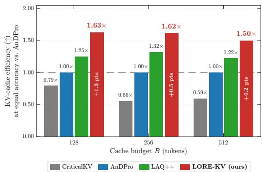  
Figure 2: Equal-accuracy KV-cache efficiency on LongBench (Mistral-7B).

Cache (Gu et al., 2025), CAOTE (Goel et al., 2025), and Expected Attention (Devoto et al., 2026): LORE-KV preserves near-full-cache quality at substantially lower cache retention. These comparisons are contextual rather than fully controlled because the evaluation protocols differ. Importantly, the improvement is not limited to pointwise score differences: Figure 2 shows that LORE-KV reaches the same LongBench accuracy with 1.50–1.63× greater cache efficiency than AnDPro across the aggressive-compression operating points.

Where the gain comes from. Table 14 shows that LORE-KV’s main gain comes from correcting the query-reference mismatch. At $B = 1 2 8$ , replacing prompt-side queries with a single responseside rollout yields the largest improvement (35.87 → 39.81), while multiple trajectories provide a further gain to 40.28/40.21. Response-side queries drive the primary gain; multiple futures add further benefit, while deletion scoring and reliability weighting provide only minor refinements as discussed in Appendix F.4.

Table 1: LongBench results on Mistral-7B-Instruct-v0.2. Dataset abbreviations follow Table 5.
<table><tr><td rowspan=1 colspan=11>Single-Doc QA   Multi-Doc QA       Summ.         Few-shot      Synth.    CodeMethod      NQA QaspMFHQA 2WQA MusqGovRQMSMNTRECTQASAMSPC PRLCC RB-PAvg.</td></tr><tr><td rowspan=1 colspan=11>Full Cache   26.63 32.9949.3442.7727.3518.7732.8724.2427.1071.0086.2342.962.7586.9855.33 52.87 42.51</td></tr><tr><td rowspan=1 colspan=11>Budget B = 128</td></tr><tr><td rowspan=1 colspan=11>H2O         21.19 21.66 38.6030.6320.6512.1920.6522.4221.8139.0082.5240.682.98 79.56 49.13 46.76 34.40</td></tr><tr><td rowspan=1 colspan=11>StreamingLLM 16.61 14.7431.4028.0521.3612.0818.4418.9119.2643.5074.2229.002.7531.6541.27 38.84 27.63</td></tr><tr><td rowspan=1 colspan=11>SnapKV      19.1721.4042.9336.7622.4415.8619.1621.8421.5547.5084.1540.242.3068.2650.6947.1335.09</td></tr><tr><td rowspan=1 colspan=11>PyramidKV   20.16 21.7743.5536.7823.1214.3919.5322.0321.4751.0084.6240.242.7970.7750.57 46.53 35.58</td></tr><tr><td rowspan=1 colspan=11>Ada-KV      21.7923.0347.0738.7022.8515.9219.9423.0521.8463.0085.3640.013.2072.1351.3649.2937.41</td></tr><tr><td rowspan=1 colspan=11>CriticalKV    21.5523.2746.6738.9524.9516.8520.8323.1422.1665.0085.5340.023.48 77.8153.5850.9838.42</td></tr><tr><td rowspan=1 colspan=11>AnDPro      24.84 25.1447.3339.7923.9917.3420.4023.4521.9467.5085.5940.623.1976.9453.7751.5538.96</td></tr><tr><td rowspan=1 colspan=11>LAQ++(8)    25.6227.2146.1640.6025.9318.4421.6023.0722.4270.0086.1842.033.5174.8154.68 50.92 39.57</td></tr><tr><td rowspan=1 colspan=11>LORE-KV/E24.0526.8547.5942.1926.3919.2021.4822.4622.7869.5086.6441.083.4484.3754.90 51.56 40.28</td></tr><tr><td rowspan=1 colspan=2>LORE-KV/D24.4527.8247.04</td><td rowspan=1 colspan=9>42.0926.7419.3421.4422.3921.5869.0086.5141.003.8384.62 54.12 51.4540.21</td></tr><tr><td rowspan=1 colspan=2></td><td rowspan=1 colspan=9>Budget B= 256</td></tr><tr><td rowspan=1 colspan=2>H2O         21.5422.9242.56</td><td rowspan=1 colspan=9>31.0722.5313.7622.5222.4023.0940.5084.2040.773.4186.10 50.9848.1736.03</td></tr><tr><td rowspan=1 colspan=2>StreamingLLM17.9316.0133.36</td><td rowspan=1 colspan=1>30.71</td><td rowspan=1 colspan=4>21.3010.0820.6619.47</td><td rowspan=1 colspan=1>22.89</td><td rowspan=1 colspan=3>53.5073.5929.223.0027.7742.30 39.87 28.85</td></tr><tr><td rowspan=1 colspan=2>SnapKV      22.3723.7448.13</td><td rowspan=1 colspan=1>38.56</td><td rowspan=1 colspan=4>22.4315.6621.9123.13</td><td rowspan=1 colspan=1>23.15</td><td rowspan=1 colspan=3>61.5085.4541.423.0984.5453.22 50.24 38.66</td></tr><tr><td rowspan=1 colspan=2>PyramidKV   20.0924.0047.33</td><td rowspan=1 colspan=1>38.24</td><td rowspan=1 colspan=5>22.4816.0221.4022.4522.63</td><td rowspan=1 colspan=3>63.0084.9340.983.4082.4852.7849.3638.22</td></tr><tr><td rowspan=1 colspan=3>Ada-KV      23.02 25.7049.2340.18</td><td rowspan=1 colspan=8>24.7617.4322.1723.2123.4867.5085.5841.672.9984.6555.07 52.17 39.93</td></tr><tr><td rowspan=1 colspan=2>CriticalKV    23.70 26.6649.00</td><td rowspan=1 colspan=1>40.05</td><td rowspan=1 colspan=5>25.1217.8621.9923.3523.45</td><td rowspan=1 colspan=3>68.0086.1942.072.9285.8153.81 50.42 40.03</td></tr><tr><td rowspan=1 colspan=2>AnDPro      25.71 28.1749.31</td><td rowspan=1 colspan=1>40.04</td><td rowspan=1 colspan=3>25.8118.6821.66</td><td rowspan=1 colspan=1>23.64</td><td rowspan=1 colspan=1>23.63</td><td rowspan=1 colspan=1>70.50</td><td rowspan=1 colspan=1>86.59</td><td rowspan=1 colspan=1>42.602.8685.6255.7452.8740.84</td></tr><tr><td rowspan=1 colspan=2>LAQ++(8)    25.2329.1649.24</td><td rowspan=1 colspan=1>41.70</td><td rowspan=1 colspan=2>26.8518.62</td><td rowspan=1 colspan=1>23.73</td><td rowspan=1 colspan=1>23.69</td><td rowspan=1 colspan=1>23.38</td><td rowspan=1 colspan=1>70.50</td><td rowspan=1 colspan=1>86.24</td><td rowspan=1 colspan=1>42.54</td></tr><tr><td rowspan=1 colspan=2>LORE-KV/E25.8829.5848.10</td><td rowspan=1 colspan=1>42.13</td><td rowspan=1 colspan=2>26.8318.90</td><td rowspan=1 colspan=1>23.23</td><td rowspan=1 colspan=1>23.79</td><td rowspan=1 colspan=1>24.07</td><td rowspan=1 colspan=1>70.50</td><td rowspan=1 colspan=1>86.31</td><td rowspan=1 colspan=1>41.09</td></tr><tr><td rowspan=1 colspan=3>LORE-KV/D26.2228.8948.2142.02</td><td rowspan=1 colspan=3>27.4218.8123.72</td><td rowspan=1 colspan=2>23.0424.00</td><td rowspan=1 colspan=1>70.00</td><td rowspan=1 colspan=1>85.47</td><td rowspan=1 colspan=1>39.842.8089.2056.58 53.44 41.23</td></tr><tr><td rowspan=1 colspan=3></td><td rowspan=1 colspan=5>Budget B= 512</td><td rowspan=1 colspan=3></td></tr><tr><td rowspan=1 colspan=2>H2O         21.72 26.03 44.81</td><td rowspan=1 colspan=1>32.33</td><td rowspan=1 colspan=2>23.1614.86</td><td rowspan=1 colspan=1>23.65</td><td rowspan=1 colspan=2>22.84 24.70</td><td rowspan=1 colspan=1>42.00</td><td rowspan=1 colspan=1>85.22</td><td rowspan=1 colspan=1>41.57</td></tr><tr><td rowspan=1 colspan=2>StreamingLLM18.7617.1737.09</td><td rowspan=1 colspan=1>30.21</td><td rowspan=1 colspan=2>21.649.93</td><td rowspan=1 colspan=1>24.44</td><td rowspan=1 colspan=2>20.0025.57</td><td rowspan=1 colspan=1>62.00</td><td rowspan=1 colspan=1>72.36</td><td rowspan=1 colspan=1>29.95</td></tr><tr><td rowspan=1 colspan=2>SnapKV      24.6027.8148.98</td><td rowspan=1 colspan=1>39.46</td><td rowspan=1 colspan=2>25.2516.98</td><td rowspan=1 colspan=1>23.70</td><td rowspan=1 colspan=1>22.96</td><td rowspan=1 colspan=1>24.37</td><td rowspan=1 colspan=1>67.00</td><td rowspan=1 colspan=1>85.88</td><td rowspan=1 colspan=1>41.26</td></tr><tr><td rowspan=1 colspan=2>PyramidKV   23.2327.9448.87</td><td rowspan=1 colspan=1>40.50</td><td rowspan=1 colspan=2>24.3616.74</td><td rowspan=1 colspan=1>23.22</td><td rowspan=1 colspan=1>23.16</td><td rowspan=1 colspan=1>24.37</td><td rowspan=1 colspan=2>67.0085.73</td><td rowspan=1 colspan=1>41.743.1685.6754.1650.3440.01</td></tr><tr><td rowspan=1 colspan=2>Ada-KV      23.8829.0548.79</td><td rowspan=1 colspan=1>40.44</td><td rowspan=1 colspan=2>25.3017.66</td><td rowspan=1 colspan=1>23.47</td><td rowspan=1 colspan=1>23.47</td><td rowspan=1 colspan=1>24.48</td><td rowspan=1 colspan=2>69.5086.39</td><td rowspan=1 colspan=1>41.382.9487.56 56.58 52.88 40.86</td></tr><tr><td rowspan=1 colspan=1>CriticalKV</td><td rowspan=1 colspan=1>23.83 28.6749.13</td><td rowspan=1 colspan=1>40.18</td><td rowspan=1 colspan=5>26.1818.1923.5223.5724.28</td><td rowspan=1 colspan=2>70.0086.39</td><td rowspan=1 colspan=1>42.162.8287.5556.5152.64 40.98</td></tr><tr><td rowspan=1 colspan=1>AnDPro</td><td rowspan=1 colspan=1>24.8730.9949.58</td><td rowspan=1 colspan=1>41.34</td><td rowspan=1 colspan=1>27.01</td><td rowspan=1 colspan=1>18.44</td><td rowspan=1 colspan=1>23.40</td><td rowspan=1 colspan=1>23.76</td><td rowspan=1 colspan=1>25.01</td><td rowspan=1 colspan=1>71.00</td><td rowspan=1 colspan=1>86.74</td><td rowspan=1 colspan=1>43.652.8386.2357.46 53.61 41.62</td></tr><tr><td rowspan=1 colspan=1>LAQ++(8)</td><td rowspan=1 colspan=1>25.4930.9249.72</td><td rowspan=1 colspan=1>41.50</td><td rowspan=1 colspan=1>26.84</td><td rowspan=1 colspan=1>19.20</td><td rowspan=1 colspan=1>25.67</td><td rowspan=1 colspan=1>24.04</td><td rowspan=1 colspan=1>25.31</td><td rowspan=1 colspan=1>71.00</td><td rowspan=1 colspan=1>86.43</td><td rowspan=1 colspan=1>43.142.9085.2756.80 53.5441.74</td></tr><tr><td rowspan=1 colspan=1>LORE-KV/E</td><td rowspan=1 colspan=1>25.58 31.1448.98</td><td rowspan=1 colspan=1>41.82</td><td rowspan=1 colspan=1>27.41</td><td rowspan=1 colspan=1>19.12</td><td rowspan=1 colspan=1>25.46</td><td rowspan=1 colspan=1>23.97</td><td rowspan=1 colspan=1>25.05</td><td rowspan=1 colspan=1>71.00</td><td rowspan=1 colspan=1>86.49</td><td rowspan=1 colspan=1>41.922.9588.2056.8553.82 41.86</td></tr><tr><td rowspan=1 colspan=3>LORE-KV/D25.68 31.0148.6541.44</td><td rowspan=1 colspan=3>26.8919.2525.48</td><td rowspan=1 colspan=2>24.6724.82</td><td rowspan=1 colspan=2>71.0086.12</td><td rowspan=1 colspan=1>42.162.9888.00 55.62 53.1741.68</td></tr><tr><td rowspan=1 colspan=3></td><td rowspan=1 colspan=5>Budget B = 1024</td><td rowspan=1 colspan=3></td></tr><tr><td rowspan=1 colspan=2>H2O         23.9028.6246.46</td><td rowspan=1 colspan=1>37.03</td><td rowspan=1 colspan=2>24.7415.042</td><td rowspan=1 colspan=1>5.30</td><td rowspan=1 colspan=1>23.11</td><td rowspan=1 colspan=1>25.92</td><td rowspan=1 colspan=1>46.00</td><td rowspan=1 colspan=1>85.93</td><td rowspan=1 colspan=1>41.803.24 86.57 54.46 51.01 38.70</td></tr><tr><td rowspan=1 colspan=2>StreamingLLM19.4221.6941.75</td><td rowspan=1 colspan=1>32.40</td><td rowspan=1 colspan=1>22.18</td><td rowspan=1 colspan=1>11.18</td><td rowspan=1 colspan=1>27.13</td><td rowspan=1 colspan=1>21.09</td><td rowspan=1 colspan=1>26.59</td><td rowspan=1 colspan=1>67.00</td><td rowspan=1 colspan=1>71.79</td><td rowspan=1 colspan=1>30.112.8816.5744.82 39.76 31.02</td></tr><tr><td rowspan=1 colspan=2>SnapKV      25.4729.5749.33</td><td rowspan=1 colspan=1>40.90</td><td rowspan=1 colspan=1>25.53</td><td rowspan=1 colspan=1>19.01</td><td rowspan=1 colspan=1>25.94</td><td rowspan=1 colspan=1>23.89</td><td rowspan=1 colspan=1>26.21</td><td rowspan=1 colspan=1>69.50</td><td rowspan=1 colspan=1>86.48</td><td rowspan=1 colspan=1>42.102.9888.5655.5751.92 41.44</td></tr><tr><td rowspan=1 colspan=2>PyramidKV   24.2129.86 48.93</td><td rowspan=1 colspan=1>40.75</td><td rowspan=1 colspan=1>25.05</td><td rowspan=1 colspan=1>18.77</td><td rowspan=1 colspan=1>25.73</td><td rowspan=1 colspan=1>24.06</td><td rowspan=1 colspan=1>25.65</td><td rowspan=1 colspan=1>68.50</td><td rowspan=1 colspan=1>86.31</td><td rowspan=1 colspan=1>42.252.9787.1754.75 52.10 41.07</td></tr><tr><td rowspan=1 colspan=2>Ada-KV      25.6031.1549.02</td><td rowspan=1 colspan=1>41.47</td><td rowspan=1 colspan=5>27.0718.7725.4023.8425.92</td><td rowspan=1 colspan=3>70.5086.5543.072.5487.1457.2753.85 41.82</td></tr><tr><td rowspan=1 colspan=3>CriticalKV    26.0331.5048.3941.73</td><td rowspan=1 colspan=5>27.1018.8425.3024.1025.99</td><td rowspan=1 colspan=3>71.0086.3043.162.6687.2356.69 53.20 41.83</td></tr><tr><td rowspan=1 colspan=3>AnDPro      25.7832.5449.3542.20</td><td rowspan=1 colspan=5>26.9418.6325.3324.0126.29</td><td rowspan=1 colspan=3>71.0086.3043.462.6886.9857.1853.7742.03</td></tr><tr><td rowspan=1 colspan=3>LORE-KV/E25.98 31.81 49.2643.96</td><td rowspan=1 colspan=5>27.17 18.9126.9824.1226.41</td><td rowspan=1 colspan=3>71.0086.6042.302.6886.4957.83 53.7742.20</td></tr><tr><td rowspan=1 colspan=11>LORE-KV/D26.58 31.98 49.61 44.5728.1918.5027.0423.5725.7170.5087.0044.073.2287.1756.8753.6042.39</td></tr></table>

Lookahead geometry. Table 13 shows that extending the lookahead horizon matters more than simply adding trajectories: for example, at M = 4, increasing T from 2 to 16 improves performance from 38.96 to 40.34. For a compute-controlled comparison, we combine LAQ-style response-side lookahead with AnDPro scoring, so that AnDPro scores the identical M × T lookahead queries under the same cache budgets and selector. LORE-KV remains above this hybrid baseline across the matched quality-compute frontier (Table 13b), showing that its gains are not explained by additional lookahead compute alone.

Generalization across backbones. The same operating-point trend holds on Qwen2.5-14B-Instruct and Ministral-3-8B-Instruct-2512 (Tables 11 and 12). At B = 128, LORE-KV improves over the strongest baseline by 2.75 points on Qwen2.5 and 0.56 points on Ministral-3, while the margins become very small by B = 1024. The smaller gain on Ministral-3 likely reflects its long-context training and position-aware query scaling, which reduce the prompt-to-future query mismatch that LORE-KV is designed to correct (Appendix E.3).

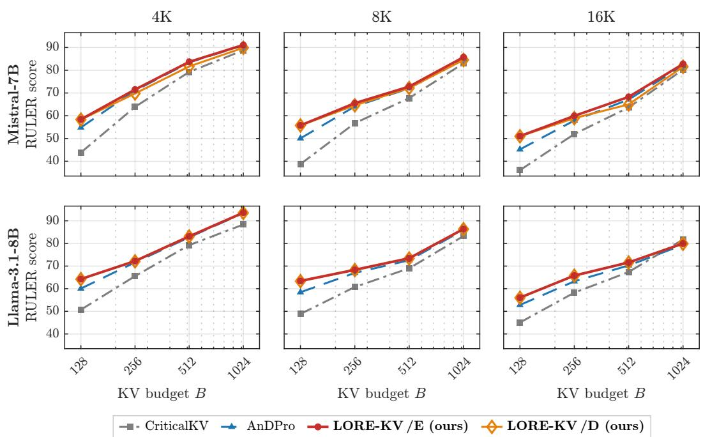  
Figure 3: RULER accuracy averaged over 13 tasks at 4K, 8K, and 16K context lengths. Per-task results are given in Tables 7 and 10.

Hybrid-attention backbones. LORE-KV also generalizes to Qwen3.5-9B and Gemma-4-12B-it, consistently outperforming the strongest baseline across cache budgets (Table 2), with the largest gains under aggressive compression. Detailed results are provided in Appendix E.2 and Tables 8-9.

Cache efficiency. The accuracy gains also translate into lower cache requirements. Table 16 shows that matching LORE-KV /E requires the strongest baseline to retain about 208 tokens, corresponding to a 38.5% cache saving, with a 31.1% saving still observed at B = 512. Figure 13 confirms the same trend across the full bud-

Table 2: LongBench on hybrid-attention backbones. Eviction is applied only to the KV-growing layers.
<table><tr><td></td><td colspan="4">Qwen3.5-9B</td><td colspan="4">Gemma-4-12B-it</td></tr><tr><td>Method</td><td>B=128</td><td>256</td><td>512</td><td>1024</td><td>B=128</td><td>256</td><td>512</td><td>1024</td></tr><tr><td>Full Cache</td><td colspan="4">52.97</td><td colspan="4">27.27</td></tr><tr><td>CriticalKV</td><td>46.30</td><td>48.30</td><td>49.58</td><td>50.31</td><td>19.74</td><td>21.53</td><td>22.45</td><td>23.22</td></tr><tr><td>AnDPro</td><td>46.89</td><td>48.72</td><td>50.08</td><td>50.42</td><td>20.21</td><td>21.92</td><td>22.73</td><td>23.47</td></tr><tr><td>LORE-KV/E</td><td>48.49</td><td>50.05</td><td>51.12</td><td>51.79</td><td>20.85</td><td>22.63</td><td>23.69</td><td>24.44</td></tr><tr><td>LORE-KV/D</td><td>48.57</td><td>50.22</td><td>51.16</td><td>51.92</td><td>20.93</td><td>22.76</td><td>23.81</td><td>24.59</td></tr></table>

get range, showing that LORE-KV improves the overall quality-memory trade-off rather than only isolated operating points.

## 4.2 EVALUATION ON NEEDLE-IN-A-HAYSTACK (NIAH)

LORE-KV also improves retrieval under aggressive compression. On Llama-3.1-8B-Instruct at $B =$ 1024, LORE-KV /E and LORE-KV /D tie for the best exact-match score (0.977), outperforming CriticalKV (0.955) and AnDPro (0.932), with the same trend under word recall.

As Figure 8 shows (setup in Appendix E.5), the gains come from boundary-depth needles (0% and 100%) at 16K, which the baselines miss and LORE-KV retrieves. Figure 11 further shows that LORE-KV retains answer-bearing tokens more often, linking the retrieval gains to its future-queryaware token selection.

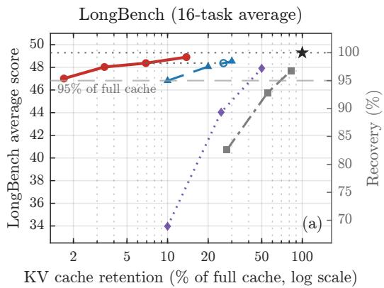

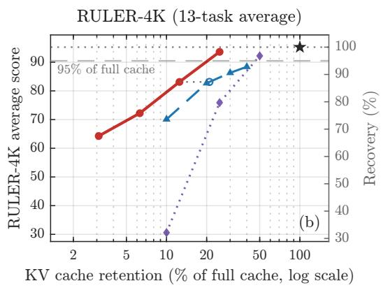  
Full cache CAOTE Expected Attention OBCache LORE-KV (ours)  
Figure 4: Accuracy-memory trade-off on Llama-3.1-8B-Instruct. Higher and further left indicates a better trade-off.

## 4.3 EVALUATION ON RULER: SWEEPING CONTEXT LENGTH ACROSS FIXED TASKS

Context and budget scaling. RULER evaluates the same 13 tasks across 4K–16K contexts with fixed lookahead cost, where LORE-KV /E achieves the best overall average and wins 23 of 24 settings, with the largest gains on aggregation-style tasks (Figure 3; Tables 7 and 10). The advantage is largest under aggressive compression and longer contexts: on Mistral at $B = 1 2 8$ , the gain over AnDPro grows from 3.55 points at 4K to 5.85 at 16K, while becoming small at $B = 1 0 2 4$ . With fixed lookahead cost, this shows that future-query estimation is most valuable when the cache is tight and prompt-side queries are less representative of later decoding needs (Figure 6). Table 15 further shows that multiple futures outperform a single rollout, while LORE-KV /D closely tracks LORE-KV /E.

Quality-memory trade-off. In the fixed 4K setting, Figure 4 shows that LORE-KV /E achieves higher quality at lower retention, outperforming OBCache (Gu et al., 2025) at 12.5% versus 20% retention and Expected Attention (Devoto et al., 2026) at the same 1,024-token budget. The Expected Attention comparison is contextual because it is query-agnostic by design, but follows the mismatch trend in Figure 6.

## 4.4 MEMORY AND LATENCY

At a fixed cache budget B, all methods have the same steady-state decoding memory and per-token cost; LORE-KV adds a one-time lookahead and scoring overhead from M trajectories of length T, while reliability weighting requires no additional decoding, giving LORE-KV /E and LORE-KV /D the same cost profile, as detailed in Algorithm 1. Table 13b shows that LORE-KV remains above the strongest baseline at every matched lookahead-token budget, with computational overhead detailed in Appendix C.4. Figure 7 reports the latency-quality trade-off; stage-wise LORE-KV latency is averaged over two seeds, and because the figure and Table 3 use separate timing runs, their total may differ slightly. With fixed (M, T), lookahead and scoring costs are largely independent of B; the lower latency at B=1024 is consistent with runtime variation. Figure 2 further shows that LORE-KV reaches the same accuracy with a smaller retained cache.

## 4.5 MECHANISM ANALYSIS: LOCATING THE GAIN

We analyze whether LORE-KV benefits from better alignment with future decoding queries, using retrospectively observed $\mathcal { Q } _ { \mathrm { f u t u r e } }$ (Appendices B and F.1). Figure 1 shows that response-side lookahead improves LongBench coverage of $\mathcal { Q } _ { \mathrm { f u t u r e } }$ from 0.785 for the prompt window to 0.802 at M=2 and 0.811 at $M { = } 8$ , saturating near $M { = } 4 ;$ on this geometric diagnostic a single rollout (0.786) barely separates from the prompt window, so the coverage gain comes from spanning several plausible futures rather than from one surrogate continuation. The M-ablations in Tables 14 and 15 measure the corresponding end-to-end benefit, which is already large at $M { = } 1 ;$ coverage is a nearest-neighbor statistic over query directions and therefore tracks the geometry of the estimated query set rather than the realized deletion cost (Appendix F.2). Correspondingly, output fidelity increases from 0.873 to 0.905 on LongBench and from 0.929 to 0.944 on RULER (Figure 5), with gains distributed across layers and heads (Figure 12).

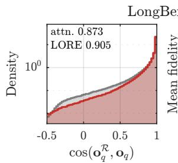

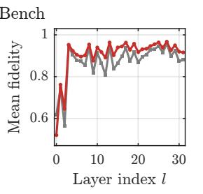

Attention only LORE-KV  
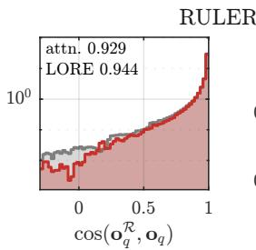

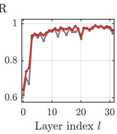

Figure 5: Attention-output fidelity. Similarity between retained- and full-cache outputs on future queries across layers. Mistral-7B-Instruct-v0.2, B = 128.  
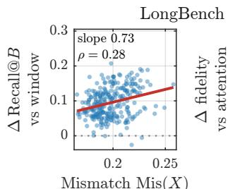

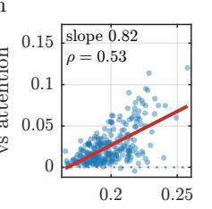  
Mismatch Mis(X)

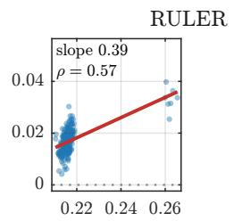  
Mismatch Mis(X)

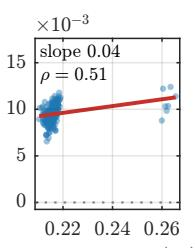  
Mismatch Mis(X)  
Figure 6: Gain versus query mismatch. Per-example gains in oracle retention and output fidelity with increasing prompt-to-future mismatch. Mistral-7B-Instruct-v0.2, B = 128, M = 4.

LORE-KV’s gains increase with prompt-to-future query mismatch. Defining $\mathrm { M i s } ( X ) ~ = ~ 1 -$ $\mathrm { C o v } ( \mathcal { Q } _ { \mathrm { f u t u r e } } ; \{ \mathcal { Q } _ { \mathcal { W } } ^ { l , h } \} )$ , Figure 6 shows positive Spearman correlations with oracle-retention recall $( \rho = 0 . 2 8 / 0 . 5 7 )$ and output fidelity $( \rho = 0 . 5 3 / 0 . 5 1 )$ on LongBench/RULER, consistent with the budget- and context-length trends in Section 4.3. Figure 10 further shows that, with prefill, particles, and selection fixed, LORE-KV better matches the future-query oracle and preserves full-cache output fidelity than CriticalKV, AnDPro, and the prompt-only control. Under identical trajectories, the two reliability variants have nearly identical averages, so entropy and disagreement weighting act as robustness corrections on top of the future-query reference rather than as a second source of gain (Appendix F.4). Additional diagnostics are provided in Appendix F, Figures 9, 11, 12, and 13.

## 5 CONCLUSION

At a broader level, LORE-KV treats cache eviction as a future-use prediction problem: cached tokens should be retained based on how useful they are likely to be during generation, not only on how important they appeared during the prompt. Limitations. LORE-KV still incurs one-time lookahead overhead, makes irreversible eviction decisions, and does not explicitly model cross-head or cross-layer interactions. These limitations motivate adaptive lookahead, recoverable or dynamically updated caches, and globally coordinated retention. Future work. More broadly, this perspective points toward dynamic inference-time memory systems that adapt retention as the model’s computational needs evolve. Since the benefits of future-aware eviction are strongest under tighter cache budgets, such systems could decide when lookahead is worth invoking, allocate extra lookahead only when future-query uncertainty is high, and revise cache decisions during generation. A practical extension is to use a cheap proxy for prompt-to-future mismatch to skip lookahead when prompt-side queries are already sufficiently informative. This would move beyond a fixed prompt-time eviction policy toward memory that tracks what information is likely to matter next.

## AI USE STATEMENT

ChatGPT by OpenAI and Claude by Anthropic were used for minor editing, proofreading, and resolving LAT X formatting issues in this document. Codex by OpenAI was used to assist with routine code writing, plotting, table generation, and code refactoring in the implementation of LORE-KV. The authors reviewed and verified all AI-assisted content and take full responsibility for the paper.

## ETHICS STATEMENT

This work uses publicly available models and benchmarks and involves no human subjects, personally identifiable information, or new data collection.

## REPRODUCIBILITY STATEMENT

LORE-KV is training-free and requires no modification to model weights. The methodology and algorithm are provided in Section 3 and Algorithm 1; hyperparameters, implementation details, evaluation settings, and ablation protocols are documented in Table 4, Appendices C.1, E.4, and F.1, and Tables 5 and 14-15. All methods are evaluated under a matched implementation, with backbonespecific verification described in Appendix E.3.

## REFERENCES

Jinwoo Ahn, Ingyu Seong, Akhil Kedia, Junhan Kim, Hyemi Jang, Kangwook Lee, and Yongkweon Jeon. LookaheadKV: Fast and accurate KV cache eviction by glimpsing into the future without generation. arXiv preprint arXiv:2603.10899, 2026.

Yushi Bai, Xin Lv, Jiajie Zhang, Hongchang Lyu, Jiankai Tang, Zhidian Huang, Zhengxiao Du, Xiao Liu, Aohan Zeng, Lei Hou, Yuxiao Dong, Jie Tang, and Juanzi Li. LongBench: A bilingual, multitask benchmark for long context understanding. pp. 3119–3137, August 2024. doi: 10.18653/ v1/2024.acl-long.172. URL https://aclanthology.org/2024.acl-long.172/.

Payman Behnam, Yaosheng Fu, Ritchie Zhao, Po-An Tsai, Zhiding Yu, and Alexey Tumanov. RocketKV: Accelerating long-context LLM inference via two-stage KV cache compression. arXiv preprint arXiv:2502.14051, 2025.

Ngoc Bui, Hieu Trung Nguyen, Arman Cohan, and Rex Ying. Make each token count: Towards improving long-context performance with KV cache eviction. arXiv preprint arXiv:2605.09649, 2026.

Zefan Cai, Wen Xiao, Hanshi Sun, Cheng Luo, Yikai Zhang, Ke Wan, Yucheng Li, Yeyang Zhou, Li-Wen Chang, Jiuxiang Gu, Zhen Dong, Anima Anandkumar, Abedelkadir Asi, and Junjie Hu. R-KV: Redundancy-aware KV cache compression for reasoning models. In The Thirty-ninth Annual Conference on Neural Information Processing Systems, 2025a. URL https://openreview. net/forum?id=2jwAjomEDB.

Zefan Cai, Yichi Zhang, Bofei Gao, Yuliang Liu, Yucheng Li, Tianyu Liu, Keming Lu, Wayne Xiong, Yue Dong, Junjie Hu, and Wen Xiao. PyramidKV: Dynamic KV cache compression based on pyramidal information funneling, 2025b. URL https://arxiv.org/abs/2406. 02069.

Chi-Chih Chang, Wei-Cheng Lin, Chien-Yu Lin, Hung-Yueh Chiang, Yash Akhauri, Xilai Dai, Huiqiang Jiang, Yucheng Li, Luis Ceze, Kai-Chiang Wu, and Mohamed S. Abdelfattah. xKV: Cross-layer KV-cache compression via aligned singular vector extraction, 2026. URL https: //arxiv.org/abs/2503.18893.

Alex Chen, Renato Geh, Aditya Grover, Guy Van den Broeck, and Daniel Mingyi Israel. The pitfalls of KV cache compression. In Proceedings of the 64th Annual Meeting of the Association for Computational Linguistics (Volume 1: Long Papers), pp. 41530–41553, 2026a.

Xingchi Chen, Peiyuan Zong, Ziqiang Gao, Qing Li, Yong Jiang, Fa Zhu, and Hui Li. ContrastKV: Robust KV cache eviction via contrastive signal fusion for multi-query generalization. In Maria Liakata, Viviane P. Moreira, Jiajun Zhang, and David Jurgens (eds.), Proceedings of the 64th Annual Meeting of the Association for Computational Linguistics (Volume 1: Long Papers), pp. 9216–9229, San Diego, California, United States, July 2026b. Association for Computational Linguistics. ISBN 979-8-89176-390-6. doi: 10.18653/v1/2026.acl-long.417. URL https: //aclanthology.org/2026.acl-long.417/.

Alessio Devoto, Yu Zhao, Simone Scardapane, and Pasquale Minervini. A simple and effective ℓ2 norm-based strategy for KV cache compression. In Proceedings of the 2024 Conference on Empirical Methods in Natural Language Processing, pp. 18476–18499, 2024.

Alessio Devoto, Maximilian Jeblick, and Simon Jegou. Expected attention: KV cache compression ´ by estimating attention from future queries distribution, 2026. URL https://openreview. net/forum?id=VmojW15eRc.

Shichen Dong, Wen Cheng, Jiayu Qin, and Wei Wang. QAQ: Quality adaptive quantization for LLM KV cache. arXiv preprint arXiv:2403.04643, 2024.

Yuan Feng, Haoyu Guo, JunLin Lv, S Kevin Zhou, and Xike Xie. Taming the fragility of KV cache eviction in LLM inference. arXiv preprint arXiv:2510.13334, 2025a.

Yuan Feng, Junlin Lv, Yukun Cao, Xike Xie, and S. Kevin Zhou. Ada-KV: Optimizing KV cache eviction by adaptive budget allocation for efficient LLM inference, 2025b. URL https:// arxiv.org/abs/2407.11550.

Yuan Feng, Junlin Lv, Haoyu Guo, Yukun Cao, S Kevin Zhou, and Xike Xie. Criticalkv: Optimizing kv cache eviction from an output perturbation perspective, 2026. URL https://arxiv.org/ abs/2502.03805.

Yu Fu, Zefan Cai, Abedelkadir Asi, Wayne Xiong, Yue Dong, and Wen Xiao. Not all heads matter: A head-level KV cache compression method with integrated retrieval and reasoning. In The Thirteenth International Conference on Learning Representations, 2025. URL https: //openreview.net/forum?id=FJFVmeXusW.

Gabriel Garcia. Protection is (nearly) all you need: Structural protection dominates scoring in globally capped KV eviction. arXiv preprint arXiv:2605.18053, 2026.

Suyu Ge, Yunan Zhang, Liyuan Liu, Minjia Zhang, Jiawei Han, and Jianfeng Gao. Model tells you what to discard: Adaptive KV cache compression for LLMs. In International Conference on Learning Representations, volume 2024, pp. 22975–22988, 2024.

Zijie Geng, Jie Wang, Ziqi Liu, Feng Ju, Yiming Li, Xing Li, Mingxuan Yuan, Jianye HAO, Defu Lian, Enhong Chen, and Feng Wu. Accurate KV cache eviction via anchor direction projection for efficient LLM inference. In The Thirty-ninth Annual Conference on Neural Information Processing Systems, 2025. URL https://openreview.net/forum?id=Tdl89SZItB.

Raghavv Goel, Junyoung Park, Mukul Gagrani, Dalton Jones, Matthew Morse, Harper Langston, Mingu Lee, and Chris Lott. CAOTE: KV cache selection for LLMs via attention output errorbased token eviction. arXiv preprint arXiv:2504.14051, 2025.

Aaron Grattafiori, Abhimanyu Dubey, Abhinav Jauhri, Abhinav Pandey, Abhishek Kadian, Ahmad Al-Dahle, Aiesha Letman, Akhil Mathur, Alan Schelten, Alex Vaughan, Amy Yang, Angela Fan, Anirudh Goyal, Anthony Hartshorn, Aobo Yang, Archi Mitra, Archie Sravankumar, Artem Korenev, Arthur Hinsvark, Arun Rao, Aston Zhang, Aurelien Rodriguez, Austen Gregerson, Ava Spataru, Baptiste Roziere, Bethany Biron, Binh Tang, Bobbie Chern, Charlotte Caucheteux, Chaya Nayak, Chloe Bi, Chris Marra, Chris McConnell, Christian Keller, Christophe Touret, Chunyang Wu, Corinne Wong, Cristian Canton Ferrer, Cyrus Nikolaidis, Damien Allonsius, Daniel Song, Danielle Pintz, Danny Livshits, Danny Wyatt, David Esiobu, Dhruv Choudhary, Dhruv Mahajan, Diego Garcia-Olano, Diego Perino, Dieuwke Hupkes, Egor Lakomkin, Ehab AlBadawy, Elina Lobanova, Emily Dinan, Eric Michael Smith, Filip Radenovic, Francisco

Guzman, Frank Zhang, Gabriel Synnaeve, Gabrielle Lee, Georgia Lewis Anderson, Govind That-´ tai, Graeme Nail, Gregoire Mialon, Guan Pang, Guillem Cucurell, Hailey Nguyen, Hannah Kore vaar, Hu Xu, Hugo Touvron, Iliyan Zarov, Imanol Arrieta Ibarra, Isabel Kloumann, Ishan Misra, Ivan Evtimov, Jack Zhang, Jade Copet, Jaewon Lee, Jan Geffert, Jana Vranes, Jason Park, Jay Ma hadeokar, Jeet Shah, Jelmer van der Linde, Jennifer Billock, Jenny Hong, Jenya Lee, Jeremy Fu, Jianfeng Chi, Jianyu Huang, Jiawen Liu, Jie Wang, Jiecao Yu, Joanna Bitton, Joe Spisak, Jong soo Park, Joseph Rocca, Joshua Johnstun, Joshua Saxe, Junteng Jia, Kalyan Vasuden Alwala, Karthik Prasad, Kartikeya Upasani, Kate Plawiak, Ke Li, Kenneth Heafield, Kevin Stone, Khalid El-Arini, Krithika Iyer, Kshitiz Malik, Kuenley Chiu, Kunal Bhalla, Kushal Lakhotia, Lauren Rantala-Yeary, Laurens van der Maaten, Lawrence Chen, Liang Tan, Liz Jenkins, Louis Martin, Lovish Madaan, Lubo Malo, Lukas Blecher, Lukas Landzaat, Luke de Oliveira, Madeline Muzzi, Mahesh Pasupuleti, Mannat Singh, Manohar Paluri, Marcin Kardas, Maria Tsimpoukelli, Mathew Oldham, Mathieu Rita, Maya Pavlova, Melanie Kambadur, Mike Lewis, Min Si, Mitesh Ku mar Singh, Mona Hassan, Naman Goyal, Narjes Torabi, Nikolay Bashlykov, Nikolay Bogoy chev, Niladri Chatterji, Ning Zhang, Olivier Duchenne, Onur C¸ elebi, Patrick Alrassy, Pengchuan Zhang, Pengwei Li, Petar Vasic, Peter Weng, Prajjwal Bhargava, Pratik Dubal, Praveen Krishnan, Punit Singh Koura, Puxin Xu, Qing He, Qingxiao Dong, Ragavan Srinivasan, Raj Ganapathy, Ra mon Calderer, Ricardo Silveira Cabral, Robert Stojnic, Roberta Raileanu, Rohan Maheswari, Ro hit Girdhar, Rohit Patel, Romain Sauvestre, Ronnie Polidoro, Roshan Sumbaly, Ross Taylor, Ruan Silva, Rui Hou, Rui Wang, Saghar Hosseini, Sahana Chennabasappa, Sanjay Singh, Sean Bell, Seohyun Sonia Kim, Sergey Edunov, Shaoliang Nie, Sharan Narang, Sharath Raparthy, Sheng Shen, Shengye Wan, Shruti Bhosale, Shun Zhang, Simon Vandenhende, Soumya Batra, Spencer Whitman, Sten Sootla, Stephane Collot, Suchin Gururangan, Sydney Borodinsky, Tamar Herman, Tara Fowler, Tarek Sheasha, Thomas Georgiou, Thomas Scialom, Tobias Speckbacher, Todor Mi haylov, Tong Xiao, Ujjwal Karn, Vedanuj Goswami, Vibhor Gupta, Vignesh Ramanathan, Viktor Kerkez, Vincent Gonguet, Virginie Do, Vish Vogeti, V´ıtor Albiero, Vladan Petrovic, Weiwei Chu, Wenhan Xiong, Wenyin Fu, Whitney Meers, Xavier Martinet, Xiaodong Wang, Xiaofang Wang, Xiaoqing Ellen Tan, Xide Xia, Xinfeng Xie, Xuchao Jia, Xuewei Wang, Yaelle Gold schlag, Yashesh Gaur, Yasmine Babaei, Yi Wen, Yiwen Song, Yuchen Zhang, Yue Li, Yuning Mao, Zacharie Delpierre Coudert, Zheng Yan, Zhengxing Chen, Zoe Papakipos, Aaditya Singh, Aayushi Srivastava, Abha Jain, Adam Kelsey, Adam Shajnfeld, Adithya Gangidi, Adolfo Victoria, Ahuva Goldstand, Ajay Menon, Ajay Sharma, Alex Boesenberg, Alexei Baevski, Allie Feinstein, Amanda Kallet, Amit Sangani, Amos Teo, Anam Yunus, Andrei Lupu, Andres Alvarado, An drew Caples, Andrew Gu, Andrew Ho, Andrew Poulton, Andrew Ryan, Ankit Ramchandani, An nie Dong, Annie Franco, Anuj Goyal, Aparajita Saraf, Arkabandhu Chowdhury, Ashley Gabriel, Ashwin Bharambe, Assaf Eisenman, Azadeh Yazdan, Beau James, Ben Maurer, Benjamin Leon hardi, Bernie Huang, Beth Loyd, Beto De Paola, Bhargavi Paranjape, Bing Liu, Bo Wu, Boyu Ni, Braden Hancock, Bram Wasti, Brandon Spence, Brani Stojkovic, Brian Gamido, Britt Mon talvo, Carl Parker, Carly Burton, Catalina Mejia, Ce Liu, Changhan Wang, Changkyu Kim, Chao Zhou, Chester Hu, Ching-Hsiang Chu, Chris Cai, Chris Tindal, Christoph Feichtenhofer, Cynthia Gao, Damon Civin, Dana Beaty, Daniel Kreymer, Daniel Li, David Adkins, David Xu, Davide Testuggine, Delia David, Devi Parikh, Diana Liskovich, Didem Foss, Dingkang Wang, Duc Le, Dustin Holland, Edward Dowling, Eissa Jamil, Elaine Montgomery, Eleonora Presani, Emily Hahn, Emily Wood, Eric-Tuan Le, Erik Brinkman, Esteban Arcaute, Evan Dunbar, Evan Smoth ers, Fei Sun, Felix Kreuk, Feng Tian, Filippos Kokkinos, Firat Ozgenel, Francesco Caggioni, Frank Kanayet, Frank Seide, Gabriela Medina Florez, Gabriella Schwarz, Gada Badeer, Georgia Swee, Gil Halpern, Grant Herman, Grigory Sizov, Guangyi, Zhang, Guna Lakshminarayanan, Hakan Inan, Hamid Shojanazeri, Han Zou, Hannah Wang, Hanwen Zha, Haroun Habeeb, Harri son Rudolph, Helen Suk, Henry Aspegren, Hunter Goldman, Hongyuan Zhan, Ibrahim Damlaj, Igor Molybog, Igor Tufanov, Ilias Leontiadis, Irina-Elena Veliche, Itai Gat, Jake Weissman, James Geboski, James Kohli, Janice Lam, Japhet Asher, Jean-Baptiste Gaya, Jeff Marcus, Jeff Tang, Jen nifer Chan, Jenny Zhen, Jeremy Reizenstein, Jeremy Teboul, Jessica Zhong, Jian Jin, Jingyi Yang, Joe Cummings, Jon Carvill, Jon Shepard, Jonathan McPhie, Jonathan Torres, Josh Ginsburg, Jun jie Wang, Kai Wu, Kam Hou U, Karan Saxena, Kartikay Khandelwal, Katayoun Zand, Kathy Matosich, Kaushik Veeraraghavan, Kelly Michelena, Keqian Li, Kiran Jagadeesh, Kun Huang, Kunal Chawla, Kyle Huang, Lailin Chen, Lakshya Garg, Lavender A, Leandro Silva, Lee Bell, Lei Zhang, Liangpeng Guo, Licheng Yu, Liron Moshkovich, Luca Wehrstedt, Madian Khabsa, Manav Avalani, Manish Bhatt, Martynas Mankus, Matan Hasson, Matthew Lennie, Matthia Reso, Maxim Groshev, Maxim Naumov, Maya Lathi, Meghan Keneally, Miao Liu, Michael L

Seltzer, Michal Valko, Michelle Restrepo, Mihir Patel, Mik Vyatskov, Mikayel Samvelyan, Mike Clark, Mike Macey, Mike Wang, Miquel Jubert Hermoso, Mo Metanat, Mohammad Rastegari, Munish Bansal, Nandhini Santhanam, Natascha Parks, Natasha White, Navyata Bawa, Nayan Singhal, Nick Egebo, Nicolas Usunier, Nikhil Mehta, Nikolay Pavlovich Laptev, Ning Dong, Norman Cheng, Oleg Chernoguz, Olivia Hart, Omkar Salpekar, Ozlem Kalinli, Parkin Kent, Parth Parekh, Paul Saab, Pavan Balaji, Pedro Rittner, Philip Bontrager, Pierre Roux, Piotr Dollar, Polina Zvyagina, Prashant Ratanchandani, Pritish Yuvraj, Qian Liang, Rachad Alao, Rachel Rodriguez, Rafi Ayub, Raghotham Murthy, Raghu Nayani, Rahul Mitra, Rangaprabhu Parthasarathy, Raymond Li, Rebekkah Hogan, Robin Battey, Rocky Wang, Russ Howes, Ruty Rinott, Sachin Mehta, Sachin Siby, Sai Jayesh Bondu, Samyak Datta, Sara Chugh, Sara Hunt, Sargun Dhillon, Sasha Sidorov, Satadru Pan, Saurabh Mahajan, Saurabh Verma, Seiji Yamamoto, Sharadh Ramaswamy, Shaun Lindsay, Shaun Lindsay, Sheng Feng, Shenghao Lin, Shengxin Cindy Zha, Shishir Patil, Shiva Shankar, Shuqiang Zhang, Shuqiang Zhang, Sinong Wang, Sneha Agarwal, Soji Sajuyigbe, Soumith Chintala, Stephanie Max, Stephen Chen, Steve Kehoe, Steve Satterfield, Sudarshan Govindaprasad, Sumit Gupta, Summer Deng, Sungmin Cho, Sunny Virk, Suraj Subramanian, Sy Choudhury, Sydney Goldman, Tal Remez, Tamar Glaser, Tamara Best, Thilo Koehler, Thomas Robinson, Tianhe Li, Tianjun Zhang, Tim Matthews, Timothy Chou, Tzook Shaked, Varun Vontimitta, Victoria Ajayi, Victoria Montanez, Vijai Mohan, Vinay Satish Ku mar, Vishal Mangla, Vlad Ionescu, Vlad Poenaru, Vlad Tiberiu Mihailescu, Vladimir Ivanov, Wei Li, Wenchen Wang, Wenwen Jiang, Wes Bouaziz, Will Constable, Xiaocheng Tang, Xiaojian Wu, Xiaolan Wang, Xilun Wu, Xinbo Gao, Yaniv Kleinman, Yanjun Chen, Ye Hu, Ye Jia, Ye Qi, Yenda Li, Yilin Zhang, Ying Zhang, Yossi Adi, Youngjin Nam, Yu, Wang, Yu Zhao, Yuchen Hao, Yundi Qian, Yunlu Li, Yuzi He, Zach Rait, Zachary DeVito, Zef Rosnbrick, Zhaoduo Wen, Zhenyu Yang, Zhiwei Zhao, and Zhiyu Ma. The Llama 3 herd of models. 2024. URL https://arxiv.org/abs/2407.21783.

Yuzhe Gu, Xiyu Liang, Jiaojiao Zhao, and Enmao Diao. OBCache: Optimal brain KV cache pruning for efficient long-context LLM inference. arXiv preprint arXiv:2510.07651, 2025.

Zhiyu Guo, Hidetaka Kamigaito, and Taro Watanabe. Attention score is not all you need for token importance indicator in KV cache reduction: Value also matters. In Proceedings of the 2024 Conference on Empirical Methods in Natural Language Processing, pp. 21158–21166, 2024.

Coleman Hooper, Sehoon Kim, Hiva Mohammadzadeh, Michael W Mahoney, Yakun S Shao, Kurt Keutzer, and Amir Gholami. KVQuant: Towards 10 million context length LLM inference with KV cache quantization. Advances in Neural Information Processing Systems, 37:1270–1303, 2024.

Cheng-Ping Hsieh, Simeng Sun, Samuel Kriman, Shantanu Acharya, Dima Rekesh, Fei Jia, Yang Zhang, and Boris Ginsburg. RULER: What’s the real context size of your long-context language models?, 2024. URL https://arxiv.org/abs/2404.06654.

Junhao Hu, Wenrui Huang, Weidong Wang, Zhenwen Li, Tiancheng Hu, Zhixia Liu, Xusheng Chen, Tao Xie, and Yizhou Shan. RaaS: Reasoning-aware attention sparsity for efficient LLM reasoning. In Findings of the Association for Computational Linguistics: ACL 2025, pp. 2577–2590, 2025.

Albert Q. Jiang, Alexandre Sablayrolles, Arthur Mensch, Chris Bamford, Devendra Singh Chaplot, Diego de las Casas, Florian Bressand, Gianna Lengyel, Guillaume Lample, Lucile Saulnier, Lelio Renard Lavaud, Marie-Anne Lachaux, Pierre Stock, Teven Le Scao, Thibaut Lavril,´ Thomas Wang, Timothee Lacroix, and William El Sayed. Mistral 7B. 2023. URL´ https: //arxiv.org/abs/2310.06825.

Hao Kang, Qingru Zhang, Souvik Kundu, Geonhwa Jeong, Zaoxing Liu, Tushar Krishna, and Tuo Zhao. GEAR: An efficient KV cache compression recipe for near-lossless generative inference of LLM. arXiv preprint arXiv:2403.05527, 2024.

Jang-Hyun Kim, Jinuk Kim, Sangwoo Kwon, Jae W. Lee, Sangdoo Yun, and Hyun Oh Song. KVzip: Query-agnostic KV cache compression with context reconstruction. In The Thirty-ninth Annual Conference on Neural Information Processing Systems, 2025. URL https://openreview. net/forum?id=JFygzwx8SJ.

Jang-Hyun Kim, Dongyoon Han, and Sangdoo Yun. Fast KVzip: Efficient and accurate LLM inference with gated KV eviction, 2026. URL https://arxiv.org/abs/2601.17668.

Adrian Łancucki, Konrad Staniszewski, Piotr Nawrot, and Edoardo Ponti. Inference-time hyper-´ scaling with KV cache compression. In The Thirty-ninth Annual Conference on Neural Information Processing Systems, 2025. URL https://openreview.net/forum?id= 8ZiElzQxf1.

Xing Li, Zeyu Xing, Yiming Li, Linping Qu, Hui-Ling Zhen, Wulong Liu, Yiwu Yao, Sinno Jialin Pan, and Mingxuan Yuan. KVTuner: Sensitivity-aware layer-wise mixed-precision KV cache quantization for efficient and nearly lossless LLM inference. arXiv preprint arXiv:2502.04420, 2025a.

Xuelin Li, Xiangqi Jin, and Linfeng Zhang. GraphKV: Breaking the static selection paradigm with graph-based KV cache eviction, 2025b. URL https://arxiv.org/abs/2509.00388.

Yubo Li and Yidi Miao. CONF-KV: Confidence-aware KV cache eviction with mixed-precision storage for long-horizon LLM. arXiv preprint arXiv:2605.24786, 2026.

Yuhong Li, Yingbing Huang, Bowen Yang, Bharat Venkitesh, Acyr Locatelli, Hanchen Ye, Tianle Cai, Patrick Lewis, and Deming Chen. SnapKV: LLM knows what you are looking for before generation. Advances in Neural Information Processing Systems, 37:22947–22970, 2024.

Akide Liu, Jing Liu, Zizheng Pan, Yefei He, Gholamreza Haffari, and Bohan Zhuang. MiniCache: KV cache compression in depth dimension for large language models, 2024a. URL https: //arxiv.org/abs/2405.14366.

Alexander H. Liu, Kartik Khandelwal, Sandeep Subramanian, Victor Jouault, Abhinav Rastogi, Adrien Sade, Alan Jeffares, Albert Jiang, Alexandre Cahill, Alexandre Gavaudan, Alexandre´ Sablayrolles, Amelie H´ eliou, Amos You, Andy Ehrenberg, Andy Lo, Anton Eliseev, Anto-´ nia Calvi, Avinash Sooriyarachchi, Baptiste Bout, Baptiste Roziere, Baudouin De Monicault,\` Clemence Lanfranchi, Corentin Barreau, Cyprien Courtot, Daniele Grattarola, Darius Dabert,´ Diego de las Casas, Elliot Chane-Sane, Faruk Ahmed, Gabrielle Berrada, Gaetan Ecrepont,¨ Gauthier Guinet, Georgii Novikov, Guillaume Kunsch, Guillaume Lample, Guillaume Martin, Gunshi Gupta, Jan Ludziejewski, Jason Rute, Joachim Studnia, Jonas Amar, Josephine Delas,´ Josselin Somerville Roberts, Karmesh Yadav, Khyathi Chandu, Kush Jain, Laurence Aitchison, Laurent Fainsin, Leonard Blier, Lingxiao Zhao, Louis Martin, Lucile Saulnier, Luyu Gao,´ Maarten Buyl, Margaret Jennings, Marie Pellat, Mark Prins, Mathieu Poiree, Mathilde Guillau-´ min, Matthieu Dinot, Matthieu Futeral, Maxime Darrin, Maximilian Augustin, Mia Chiquier, Michel Schimpf, Nathan Grinsztajn, Neha Gupta, Nikhil Raghuraman, Olivier Bousquet, Olivier Duchenne, Patricia Wang, Patrick von Platen, Paul Jacob, Paul Wambergue, Paula Kurylowicz, Pavankumar Reddy Muddireddy, Philomene Chagniot, Pierre Stock, Pravesh Agrawal, Quentin\` Torroba, Romain Sauvestre, Roman Soletskyi, Rupert Menneer, Sagar Vaze, Samuel Barry, Sanchit Gandhi, Siddhant Waghjale, Siddharth Gandhi, Soham Ghosh, Srijan Mishra, Sumukh Aithal, Szymon Antoniak, Teven Le Scao, Theo Cachet, Theo Simon Sorg, Thibaut Lavril, Thiziri Nait´ Saada, Thomas Chabal, Thomas Foubert, Thomas Robert, Thomas Wang, Tim Lawson, Tom Bewley, Tom Bewley, Tom Edwards, Umar Jamil, Umberto Tomasini, Valeriia Nemychnikova, Van Phung, Vincent Maladiere, Virgile Richard, Wassim Bouaziz, Wen-Ding Li, William Marshall,\` Xinghui Li, Xinyu Yang, Yassine El Ouahidi, Yihan Wang, Yunhao Tang, and Zaccharie Ramzi. Ministral 3, 2026a. URL https://arxiv.org/abs/2601.08584.

Tengxuan Liu, Shiyao Li, Jiayi Yang, Tianchen Zhao, Feng Zhou, Xiaohui Song, Guohao Dai, Shengen Yan, Huazhong Yang, and Yu Wang. PM-KVQ: Progressive mixed-precision KV cache quantization for long-CoT LLMs. arXiv preprint arXiv:2505.18610, 2025.

Zedong Liu, Xinyang Ma, Dejun Luo, Hairui Zhao, Bing Lu, Wenjing Huang, Yida Gu, Xingchen Liu, Zheng Wei, Jinyang Liu, Dingwen Tao, and Guangming Tan. KVServe: Service-aware KV cache compression for communication-efficient disaggregated LLM serving, 2026b. URL https://arxiv.org/abs/2605.13734.

Zichang Liu, Aditya Desai, Fangshuo Liao, Weitao Wang, Victor Xie, Zhaozhuo Xu, Anastasios Kyrillidis, and Anshumali Shrivastava. Scissorhands: Exploiting the persistence of importance

hypothesis for LLM KV cache compression at test time. Advances in Neural Information Processing Systems, 36:52342–52364, 2023.

Zirui Liu, Jiayi Yuan, Hongye Jin, Shaochen Zhong, Zhaozhuo Xu, Vladimir Braverman, Beidi Chen, and Xia Hu. KIVI: A tuning-free asymmetric 2bit quantization for KV cache. arXiv preprint arXiv:2402.02750, 2024b.

Da Ma, Lu Chen, Situo Zhang, Yuxun Miao, Su Zhu, Zhi Chen, Hongshen Xu, Hanqi Li, Shuai Fan, Lei Pan, and Kai Yu. Compressing KV cache for long-context LLM inference with inter-layer attention similarity. In ICASSP 2026 - 2026 IEEE International Conference on Acoustics, Speech and Signal Processing (ICASSP), pp. 16407–16411, 2026. doi: 10.1109/ICASSP55912.2026. 11464826.

Tho Mai and Joo-Young Kim. Reformulating KV cache eviction problem for long-context LLM inference. arXiv preprint arXiv:2605.07234, 2026.

Luca Moschella, Laura Manduchi, and Ozan Sener. Learning to evict from Key-Value cache. arXiv preprint arXiv:2602.10238, 2026.

Matanel Oren, Michael Hassid, Nir Yarden, Yossi Adi, and Roy Schwartz. Transformers are multistate RNNs. In Proceedings of the 2024 Conference on Empirical Methods in Natural Language Processing, pp. 18724–18741, 2024.

Junyoung Park, Dalton Jones, Matthew J Morse, Raghavv Goel, Mingu Lee, and Christopher Lott. KeyDiff: Key similarity-based KV cache eviction for long-context LLM inference in resourceconstrained environments. In The Thirty-ninth Annual Conference on Neural Information Processing Systems, 2025. URL https://openreview.net/forum?id=uBaFH7aQnC.

Ziran Qin, Yuchen Cao, Mingbao Lin, Wen Hu, Shixuan Fan, Ke Cheng, Weiyao Lin, and Jianguo Li. CAKE: Cascading and adaptive KV cache eviction with layer preferences. In The Thirteenth International Conference on Learning Representations, 2025. URL https://openreview. net/forum?id=EQgEMAD4kv.

Akshat Ramachandran, Marina Neseem, Charbel Sakr, Rangharajan Venkatesan, Brucek Khailany, and Tushar Krishna. ThinKV: Thought-adaptive KV cache compression for efficient reasoning models. arXiv preprint arXiv:2510.01290, 2025.

Akshat Sharma, Hangliang Ding, Jianping Li, Neel Dani, and Minjia Zhang. MiniKV: Pushing the limits of LLM inference via 2-bit layer-discriminative KV cache. arXiv preprint arXiv:2411.18077, 2024.

Yiqun Shen, Song Yuan, Zhengze Zhang, Xiaoliang Wang, Daxin Jiang, and Nguyen Cam-Tu. LAVa: Layer-wise KV cache eviction with dynamic budget allocation, 2025. URL https: //arxiv.org/abs/2509.09754.

Konrad Staniszewski and Adrian Łancucki. KV cache transform coding for compact storage in LLM´ inference. In The Fourteenth International Conference on Learning Representations, 2026. URL https://openreview.net/forum?id=aNVKROYpLB.

Yi Su, Zhenxu Tian, Dan Qiao, Yuechi Zhou, Juntao Li, and Min Zhang. LongFlow: Efficient KV cache compression for reasoning models. arXiv preprint arXiv:2603.11504, 2026.

Zunhai Su, Zhe Chen, Wang Shen, Hanyu Wei, Linge Li, Huangqi Yu, and Kehong Yuan. RotateKV: Accurate and robust 2-bit KV cache quantization for LLMs via outlier-aware adaptive rotations. arXiv preprint arXiv:2501.16383, 2025.

Chenxia Tang, Jianchun Liu, Hongli Xu, and Liusheng Huang. Adaptive KV-cache compression without manually setting budget. arXiv preprint arXiv:2509.03136, 2025.

Ziyao Tang, Pengkun Jiao, Xinhang Chen, Wei Liu, Shiyong Li, and Jingjing Chen. Predicting future utility: Global combinatorial optimization for task-agnostic KV cache eviction. arXiv preprint arXiv:2602.08585, 2026.

Zhenxu Tian, Yi Su, Juntao Li, and Min Zhang. Where matters more than what: Decoding-aligned KV cache compression via position-aware pseudo-queries, 2026. URL https://arxiv. org/abs/2603.11564.

Guangtao Wang, Shubhangi Upasani, Chen Wu, Darshan Gandhi, Jonathan Li, Changran Hu, Bo Li, and Urmish Thakker. LLMs know what to drop: Self-attention guided KV cache eviction for efficient long-context inference. arXiv preprint arXiv:2503.08879, 2025a.

Yixuan Wang, Shiyu Ji, Yijun Liu, Yuzhuang Xu, Yang Xu, Qingfu Zhu, and Wanxiang Che. Lookahead Q-cache: Achieving more consistent KV cache eviction via pseudo query. In Christos Christodoulopoulos, Tanmoy Chakraborty, Carolyn Rose, and Violet Peng (eds.), Proceedings of the 2025 Conference on Empirical Methods in Natural Language Processing, pp. 34158– 34174, Suzhou, China, November 2025b. Association for Computational Linguistics. ISBN 979- 8-89176-332-6. doi: 10.18653/v1/2025.emnlp-main.1732. URL https://aclanthology. org/2025.emnlp-main.1732/.

Zheng Wang, Boxiao Jin, Zhongzhi Yu, and Minjia Zhang. Model tells you where to merge: Adaptive KV cache merging for LLMs on long-context tasks, 2024. URL https://arxiv.org/ abs/2407.08454.

Guangxuan Xiao, Yuandong Tian, Beidi Chen, Song Han, and Mike Lewis. Efficient streaming language models with attention sinks. In International Conference on Learning Representations, volume 2024, pp. 21875–21895, 2024.

An Yang, Baosong Yang, Beichen Zhang, Binyuan Hui, Bo Zheng, Bowen Yu, Chengyuan Li, Dayiheng Liu, Fei Huang, Haoran Wei, Huan Lin, Jian Yang, Jianhong Tu, Jianwei Zhang, Jianxin Yang, Jiaxi Yang, Jingren Zhou, Junyang Lin, Kai Dang, Keming Lu, Keqin Bao, Kexin Yang, Le Yu, Mei Li, Mingfeng Xue, Pei Zhang, Qin Zhu, Rui Men, Runji Lin, Tianhao Li, Tianyi Tang, Tingyu Xia, Xingzhang Ren, Xuancheng Ren, Yang Fan, Yang Su, Yichang Zhang, Yu Wan, Yuqiong Liu, Zeyu Cui, Zhenru Zhang, and Zihan Qiu. Qwen2.5 technical report, 2024a. URL https://arxiv.org/abs/2412.15115.

June Yong Yang, Byeongwook Kim, Jeongin Bae, Beomseok Kwon, Gunho Park, Eunho Yang, Se Jung Kwon, and Dongsoo Lee. No token left behind: Reliable KV cache compression via importance-aware mixed precision quantization. arXiv preprint arXiv:2402.18096, 2024b.

Xintong Yang, Hao Gu, Binxing Xu, Lujun Li, Bei Liu, Jiacheng Liu, Qiyuan Zhu, Sirui Han, and Yike Guo. IndexMem: Learned KV-cache eviction with latent memory for long-context LLM inference. arXiv preprint arXiv:2605.25475, 2026.

Haoyue Zhang, Hualei Zhang, Xiaosong Ma, Jie Zhang, and Song Guo. LazyEviction: Lagged KV eviction with attention pattern observation for efficient long reasoning. In Proceedings ofthe 64th Annual Meeting of the Association for Computational Linguistics (Volume 1: Long Papers), pp. 36335–36352, 2026a.

Tao Zhang, Ziqian Zeng, Hao Peng, Huiping Zhuang, and Cen Chen. MixKVQ: Query-aware mixed-precision KV cache quantization for long-context reasoning. In Proceedings of the 64th Annual Meeting of the Association for Computational Linguistics (Volume 1: Long Papers), pp. 7189–7204, 2026b.

Yanqi Zhang, Yuwei Hu, Runyuan Zhao, John C. S. Lui, and Haibo Chen. DiffKV: Differentiated memory management for large language models with parallel KV compaction. In Proceedings ofthe ACM SIGOPS 31st Symposium on Operating Systems Principles, SOSP ’25, pp. 431–445, New York, NY, USA, 2025. Association for Computing Machinery. ISBN 9798400718700. doi: 10.1145/3731569.3764810. URL https://doi.org/10.1145/3731569.3764810.

Zhenyu Zhang, Ying Sheng, Tianyi Zhou, Tianlong Chen, Lianmin Zheng, Ruisi Cai, Zhao Song, Yuandong Tian, Christopher Re, Clark Barrett, Zhangyang Wang, and Beidi Chen. H2O: Heavy-´ hitter oracle for efficient generative inference of large language models, 2023. URL https: //arxiv.org/abs/2306.14048.

Xiabin Zhou, Wenbin Wang, Minyan Zeng, Jiaxian Guo, Xuebo Liu, Li Shen, Min Zhang, and Liang Ding. DynamicKV: Task-aware adaptive KV cache compression for long context LLMs. arXiv preprint arXiv:2412.14838, 2024.

## Appendix Contents

A Extended Related Work 18   
A.1 Prompt-side eviction and budget allocation 18   
A.2 Future-aware and output-aware eviction 18   
A.3 Quantization and representation compression 18   
A.4 Decode-time and serving-oriented memory management 18   
B Background: The KV Cache and the Eviction Problem 18   
C Method Details 19   
C.1 Implementation: Protected Set, Grouped-Query Attention, Fused Kernels 19   
C.2 Relation to Prior Surrogate-Query and Output-Aware Methods 19   
C.3 Reliability Weighting: Derivations, Calibration, and Edge Cases 19   
C.4 Computational Overhead 21   
D Plug-In Components and the Ablation Protocol 22   
E Experimental Setup and Additional Results 26   
E.1 Protocol, Datasets and Baselines 26   
E.2 Hybrid-Attention Backbones: Where Eviction Applies 27   
E.3 LongBench Results on Additional Backbones 29   
E.4 RULER: Protocol and Per-Task Results 30   
E.5 NIAH Grid . 32   
F Mechanism Analysis 32   
F.1 Measurement Protocol 32   
F.2 Future-Query Coverage 34   
F3 Retention-Order Shift 34   
F.4 Reliability Weighting: Robustness Beyond the Query Reference 35   
F.5 Retained-Token Composition 36   
F.6 Layer- and Head-Level Structure 37   
F.7 Budget Equivalence in Behavioral Fidelity 37   
G The Two Reliability Variants in the (β, γ, λD) Plane 37

## A EXTENDED RELATED WORK

## A.1 PROMPT-SIDE EVICTION AND BUDGET ALLOCATION

Beyond the representative methods discussed in Section 2.1, Scissorhands uses accumulated attention statistics (Liu et al., 2023), TOVA uses current-query attention (Oren et al., 2024), FastGen applies head-specific retention patterns (Ge et al., 2024), and CAKE improves layer-wise budget allocation (Qin et al., 2025). HeadKV, DynamicKV, SAGE-KV, LAVa, and LU-KV further adapt retention across heads, layers, or token groups (Fu et al., 2025; Zhou et al., 2024; Wang et al., 2025a; Shen et al., 2025; Tang et al., 2026). Although these approaches differ substantially in scoring and allocation, their eviction signals are primarily derived from queries or statistics available on the prompt side.

## A.2 FUTURE-AWARE AND OUTPUT-AWARE EVICTION

Several additional methods address robustness to unknown future queries. KVP and globally calibrated retention methods learn predictors of future token utility (Moschella et al., 2026; Bui et al., 2026), whereas KVzip, FastKVzip, and ContrastKV seek query-agnostic or multi-query robustness (Kim et al., 2025; Chen et al., 2026b; Kim et al., 2026). CriticalKV incorporates value information into token importance (Feng et al., 2026), while CAOTE scores tokens according to attentionoutput error (Goel et al., 2025). These methods motivate the two axes considered by LORE-KV: the query states against which importance is evaluated and the output distortion induced by deletion, but generally address one axis independently or replace explicit response-side sampling with learned, analytical, or query-agnostic proxies.

## A.3 QUANTIZATION AND REPRESENTATION COMPRESSION

KV-cache quantization methods include QAQ, MiKV, MiniKV, RotateKV, KVTuner, MixKVQ, PM-KVQ, and DiffKV (Dong et al., 2024; Yang et al., 2024b; Sharma et al., 2024; Su et al., 2025; Li et al., 2025a; Zhang et al., 2026b; Liu et al., 2025; Zhang et al., 2025). GEAR, KVMerger, xKV, inter-layer compression, and transform-coding approaches instead exploit low-rank, mergeable, cross-layer, or coded cache representations (Kang et al., 2024; Wang et al., 2024; Chang et al., 2026; Ma et al., 2026; Staniszewski & Łancucki´ , 2026).

## A.4 DECODE-TIME AND SERVING-ORIENTED MEMORY MANAGEMENT

KVServe targets communication-efficient KV-cache serving (Liu et al., 2026b). DMS, ThinKV, RaaS, LazyEviction, R-KV, RocketKV, LongFlow, and CONF-KV instead control cache growth or retention during extended decoding (Łancucki et al.´ , 2025; Ramachandran et al., 2025; Hu et al., 2025; Zhang et al., 2026a; Cai et al., 2025a; Behnam et al., 2025; Su et al., 2026; Li & Miao, 2026). These methods address a different stage of the memory-management problem and can in principle be combined with a future-aware prompt-time eviction criterion such as LORE-KV.

## B BACKGROUND: THE KV CACHE AND THE EVICTION PROBLEM

KV caching and memory cost. For L layers, H KV heads, head dimension d, sequence length n, batch size b, and $p$ bytes per element, the KV cache requires MemKV = 2bLHdnp bytes, where the factor 2 accounts for keys and values; hence, its memory grows linearly with context length. For example, a 70B-class model with $L = 8 0 , H = 8 , d = 1 2 8 , \bar { n } = 1 3 1 , 0 7 2 \bar { ( } 1 2 8 \mathrm { K }$ tokens), $b = 1$ , and $p = 2 { \mathrm { b y t e s } }$ (BF16) requires approximately 42.9 GB of KV-cache memory, about 31% of the roughly 140 GB required by its BF16 model weights. Given a cache budget $B \ll n$ , let ${ \mathcal { R } } ^ { l , h } \subseteq \{ 1 , \ldots , n \}$ denote the positions retained by layer l and KV head h, with $| \check { \mathcal { R } ^ { l , h } } | \leq B _ { l , h }$ . Defining $\delta ( \mathbf { q } , \mathcal { R } ) =$ dist(output(q; full cache), output(q; retained cache)) as the distortion induced by eviction for a future query q, the ideal retained cache is $\mathcal { R } ^ { \star } = \arg \operatorname* { m i n } _ { \{ \mathcal { R } ^ { l , h } : | \mathcal { R } ^ { l , h } | \leq B _ { l , h } \} } \mathbb { E } _ { \mathbf { q } \sim Q _ { \mathrm { f u t u r e } } } [ \delta ( \mathbf { q } , \mathcal { R } ) ]$ Thus, eviction seeks to retain the KV entries that best preserve full-cache behavior over future decoding queries; Section 4.5 evaluates this approximation against the actual future queries observed after generation.

## C METHOD DETAILS

This section provides the implementation and computational details of LORE-KV, including protected-token handling, grouped-query attention, reliability weighting, and efficient perturbation scoring. Algorithm 1 summarizes the full LORE-KV pipeline. Starting from the prefilled KV cache, LORE-KV samples short lookahead continuations to obtain plausible future queries, reliabilityweights these trajectories, scores candidate KV entries by their projected deletion effect, and retains the highest-scoring entries under the cache budget.

## C.1 IMPLEMENTATION: PROTECTED SET, GROUPED-QUERY ATTENTION, FUSED KERNELS

Protected positions. The optional set B contains prompt-structure markers, chat-template delimiters (<|system|>, <|user $| > , < |$ assistant|>, [INST], [/INST]), tool-call markers, and document separators identified directly from the tokenized prompt and always retained; if none are present, $B = \varnothing$ . Following prior work (Xiao et al., 2024; Li et al., 2024), this prevents instructions and prompt boundaries from being removed under aggressive eviction.

Grouped-query attention. Under GQA/MQA, multiple query heads share each KV head. In our implementation, we therefore use all query heads associated with KV head h, denoted by $\mathcal { G } ( h )$ , to score each cached pair $( \mathbf { k } _ { i } ^ { l , h } , \mathbf { v } _ { i } ^ { l , h } )$ by aggregating their deletion effects from Eq. 5. Throughout, H denotes the number of KV heads, and we assign cache budgets at the KV-head level.

Fused attention kernels. Since kernels such as FlashAttention do not materialize the full $n ~ \times$ n attention matrix required by perturbation scoring, we explicitly compute attention only for the scoring-query set $\mathcal { Q } _ { \mathrm { s c o r e } } ^ { l , h ^ { * } } ,$ whose size $| \mathcal { Q } _ { \mathrm { s c o r e } } ^ { l , h } | = w \overset { \cdot } { + } M T \overset { \cdot } { \ll } n .$ , against the cached keys. The fused kernel therefore remains unchanged for the rest of prefill and final decoding, making eviction scoring a small side computation that never requires full-matrix attention on the main inference path.

## C.2 RELATION TO PRIOR SURROGATE-QUERY AND OUTPUT-AWARE METHODS

The $M { = } 1$ setting already captures most of LORE-KV’s gain, demonstrating that correcting the prompt-to-future query mismatch is the primary driver of performance. Increasing to $M { > } 1$ further improves robustness by covering multiple plausible futures and reducing sensitivity to any single rollout through reliability-weighted aggregation, while $\lambda _ { L } { = } 0$ provides the prompt-only control. Together, these results show that LORE-KV is both effective with minimal lookahead and increasingly robust as future-query coverage expands.

## C.3 RELIABILITY WEIGHTING: DERIVATIONS, CALIBRATION, AND EDGE CASES

This section gives the statistical interpretation and implementation details of the reliability weighting in Section 3.3.

Centered typicality and scale. For a sampled token $y _ { u } \sim q ( \cdot \mid h _ { u } )$ , the centered score of Eq. 2 satisfies

$$
\operatorname { \mathbb { E } } [ c _ { u } \mid h _ { u } ] = \sum _ { y } q ( y \mid h _ { u } ) \log q ( y \mid h _ { u } ) + H ( q ( \cdot \mid h _ { u } ) ) = 0 .
$$

Hence $\mathbb { E } [ \bar { c } _ { m } ] = 0$ , so $\bar { c } _ { m }$ measures how typical a sampled trajectory is relative to the model’s local uncertainty. Positive values indicate that the sampled tokens are more likely than expected, while $\bar { H } _ { m }$ separately captures how uncertain the model is along that trajectory.

The identity

$$
\frac { 1 } { T } \sum _ { u = 1 } ^ { T } \log q ( y _ { u } ^ { ( m ) } \mid h _ { u } ^ { ( m ) } ) = \bar { c } _ { m } - \bar { H } _ { m } ,
$$

also makes the parameterization of Eq. 3 transparent. Uniform weighting corresponds to $( \beta , \gamma , \lambda _ { D } ) ~ = ~ ( 0 , 0 , 0 )$ , centered-typicality-only weighting to $( 1 , 0 , 0 )$ , and raw log-probability weighting to $( 1 , 1 , 0 )$ . The reported reliability settings are given in Table 4.

Because $\left\{ c _ { u } \right\}$ are martingale differences, for $u < v ,$

$$
\mathbb { E } [ c _ { u } c _ { v } ] = \mathbb { E } [ c _ { u } \mathbb { E } [ c _ { v } ~ \vert ~ h _ { v } ] ] = 0 .
$$

Algorithm 1 LORE-KV eviction. Lookahead trajectories are used only for scoring and discarded   
before decoding, leaving model weights and decoding unchanged. Scoring uses only $w + M T \ll n$   
queries.   
Require: frozen LLM $f _ { \boldsymbol { \theta } } ;$ prompt $X = ( x _ { 1 } , \ldots , x _ { n } ) ;$ window W of size w; particles M, horizon   
T; layer budgets $\{ \check { B _ { l } } \} _ { l = 1 } ^ { L ^ { \prime } } ;$ reliability coefficients $( \beta , \gamma , \lambda _ { D } )$ , mixing weight $\lambda _ { L } .$ , guard ϵ; plug-in   
switches $( \alpha , \kappa , \tau , \bar { \lambda } _ { k } , \bar { \lambda } _ { v } ) .$ , all 0 for the core method (Table 4)   
Ensure: compressed KV cache $( \mathbf { K } ^ { \star } , \mathbf { V } ^ { \star } )$   
1: $( \{ \mathbf { K } ^ { l , h } , \mathbf { V } ^ { l , h } \} , \{ \mathcal { Q } _ { \mathcal { W } } ^ { l , h } \} )  \mathrm { P r e f i l l } ( f _ { \theta } , X )$   
2: ${ \mathcal { P } }  \{ 1 \} \cup \mathcal { W } \cup \ddot { B } ; ~ { \mathcal { C } }  \{ 1 , . . . , n \} \backslash { \mathcal { P } }$ ▷protected and candidate positions   
Stage 1: Monte Carlo future-query estimation (Sec. 3.2)   
3: for $m = 1 , \ldots , M$ in parallel do   
4: $Y ^ { ( m ) } \sim f _ { \theta } ( \cdot \mid X )$ with $| Y ^ { ( m ) } | = T$ ▷ one plausible continuation   
5: cache $\mathcal { Q } _ { \mathrm { l o o k } } ^ { ( m ) , l , h }$ for all $( l , h )$ , and $\{ c _ { u } ^ { ( m ) } , H _ { u } ^ { ( m ) } \} _ { u = 1 } ^ { T }$ ▷ kept for scoring and weighting   
6: end for   
7: $\mathcal { Q } _ { \mathrm { s c o r e } } ^ { l , h }  \mathcal { Q } _ { \mathcal { W } } ^ { l , h } \cup \bigcup _ { m = 1 } ^ { M } \mathcal { Q } _ { \mathrm { l o o k } } ^ { ( m ) , l , h }$ ▷ w + MT scoring queries in total   
Stage 2: particle reliability weighting (Sec. 3.3)   
8: $\hat { D } _ { m } \gets \bigl ( D _ { m } - \bar { D } \bigr ) / \mathrm { s d } ( D )$ for M $\geq 3 ,$ else $\hat { D } _ { m } \gets 0$ ▷ driftfrom the ensemble   
9: $\begin{array} { r } { \bar { c } _ { m } \gets \frac { 1 } { T } \sum _ { u } c _ { u } ^ { ( m ) } , \bar { H } _ { m } \gets \frac { 1 } { T } \sum _ { u } H _ { u } ^ { ( m ) } } \end{array}$ ▷per-step means, not sequence totals   
10: $R _ { m } \gets \beta \bar { c } _ { m } - \gamma \bar { H } _ { m } - \lambda _ { D } \hat { D } _ { m } ;$ ω ← softmax $\left( ( R _ { m } ) _ { m = 1 } ^ { M } \right)$ ▷ soft trajectory weights   
Stage 3: projected counterfactual scoring and selection (Secs. 3.4–3.5)   
11: for layer $l = 1 , \ldots , L$ do   
12: for KV head $h = 1 , \ldots , H$ do ▷ under GQA, over the query group G(h)   
13: for candidate $i \in \mathcal { C }$ and scoring query $\mathbf { q } \in \mathcal { Q } _ { \mathrm { s c o r e } } ^ { l , h }$ do   
14: $( a _ { q , i } ^ { l , h } , \mathbf { o } _ { q } ^ { l , h } )  \mathrm { A t t n } ( \mathbf { q } , \mathbf { K } ^ { \breve { l } , h } , \mathbf { V } ^ { \breve { l } , h } )$ ▷full-cache weight and output   
15: $\dot { \Delta \mathbf { o } } _ { q , i } ^ { l , h }  [ a _ { q , i } ^ { l , h } / ( 1 - a _ { q , i } ^ { l , h } + \epsilon ) ] ( \mathbf { v } _ { i } ^ { l , h } - \mathbf { o } _ { q } ^ { l , h } )$ ▷ output shift ifi is evicted   
16: $e _ { { q } , i } ^ { l , h } \gets \left. \mathbf { W } _ { l , h } ^ { O } \Delta \mathbf { o } _ { { q } , i } ^ { l , h } \right. _ { 2 } ^ { 2 }$ ▷ that shift, in the residual stream   
17: end for   
18: $\begin{array} { r } { \tilde { S } _ { i } ^ { l , h } \gets \psi ( \mathcal { E } _ { i , \mathcal { W } } ^ { l , h } ) + \lambda _ { L } \sum _ { m = 1 } ^ { M } \omega _ { m } \psi ( \mathcal { E } _ { i , m } ^ { l , h } ) } \end{array}$ ∀i $\in { \mathcal { C } }$ ▷ combine prompt and weighted lookahead   
importance   
19: end for   
20: $\begin{array} { r } { E _ { l , h } \gets \sum _ { i \in \mathcal { C } } S _ { i } ^ { l , h } ; ~ \{ B _ { l , h } \} _ { h = 1 } ^ { H } \gets \mathrm { A } ^ { \top } } \end{array}$ lloc $\left( { { B _ { l } } , \left\{ { E _ { l , h } } \right\} _ { h = 1 } ^ { H } ; \tau } \right)$ ▷ budget split across heads   
21: for KV head $\check { h } = 1 , \dotsc , \dot { H }$ do   
22: $\mathcal { R } _ { \mathrm { f i n a l } } ^ { l , h }  \mathcal { P } \cup$ Select $\left( \mathbf { S } ^ { l , h } , B _ { l , h } \right)$ ▷ keep the top-scoring candidates   
23: $( \widehat { \mathbf { K } _ { \star } ^ { l , h } } , \mathbf { V } _ { \star } ^ { l , h } ) \longleftarrow \mathrm { G a t h e r } \left( \mathbf { K } ^ { l , h } , \check { \mathbf { V } } ^ { l , h } , \mathbf { \mathcal { R } } _ { \mathrm { f n a l } } ^ { l , h } \right)$ ▷ build the compressed cache   
24: end for   
25: end for   
26: discard all lookahead states $\{ \mathcal { Q } _ { \mathrm { l o o k } } ^ { ( m ) , l , h } \} _ { m = 1 } ^ { M }$   
27: return $( \mathbf { K } ^ { \star } , \mathbf { V } ^ { \star } )$ ▷ decoding uses the compressed cache only

For a fixed-length trajectory of length $T ,$

$$
\mathrm { V a r } ( \bar { c } _ { m } ) = \frac { 1 } { T ^ { 2 } } \sum _ { u = 1 } ^ { T } \mathbb { E } [ V _ { u } ] , \qquad V _ { u } = \mathrm { V a r } _ { y \sim q ( \cdot | h _ { u } ) } [ \log q ( y \mid h _ { u } ) ] ,\tag{9}
$$

where $V _ { u }$ is the varentropy. For a trajectory that terminates after $T _ { m } < T$ steps, $T$ is replaced by $T _ { m }$ in the corresponding per-trajectory averages. The optional normalization

$$
\tilde { c } _ { m } = \frac { \bar { c } _ { m } } { \sqrt { \bar { V } _ { m } / T _ { m } } } , \qquad \bar { V } _ { m } = \frac { 1 } { T _ { m } } \sum _ { u = 1 } ^ { T _ { m } } V _ { u } ^ { ( m ) } ,
$$

normalizes $\bar { c } _ { m }$ by its trajectory-level standard-error scale; it is evaluated only as an ablation and is not part of the default method.

Query-space disagreement. Predictive entropy is defined in token-probability space, whereas eviction ultimately depends on query directions. We therefore measure whether trajectory m follows an atypical query path relative to the other sampled futures. Let $H _ { q }$ denote the number of query heads

and $T _ { m r } = \operatorname* { m i n } ( T _ { m } , T _ { r } )$ the common length of trajectories m and r. We define

$$
D _ { m } = \frac { 1 } { M - 1 } \sum _ { r \neq m } \frac { 1 } { T _ { m r } L H _ { q } } \sum _ { u = 1 } ^ { T _ { m r } } \sum _ { l = 1 } ^ { L } \sum _ { g = 1 } ^ { H _ { q } } \left[ 1 - \cos \left( \mathbf { q } _ { u } ^ { ( m ) , l , g } , \mathbf { q } _ { u } ^ { ( r ) , l , g } \right) \right] .\tag{10}
$$

Queries compared at step u occupy the same absolute position $n + u$ and therefore share the same rotary phase. We standardize $D _ { m }$ across particles as

$$
\hat { D } _ { m } = \left\{ \begin{array} { l l } { ( D _ { m } - \bar { D } ) / \mathrm { s d } ( D ) , } & { M \geq 3 \mathrm { ~ a n d ~ } \mathrm { s d } ( D ) > 0 , } \\ { 0 , } & { \mathrm { o t h e r w i s e } , } \end{array} \right. \quad \quad \bar { D } = \frac { 1 } { M } \sum _ { m = 1 } ^ { M } D _ { m } .
$$

This definition covers both the $M \ \leq \ 2$ degeneracy and the rare case in which all particles have identical disagreement scores. The computation reuses the stored lookahead queries and therefore requires no additional decoding. Since $\bar { H } _ { m }$ is measured in nats whereas $\hat { D } _ { m }$ is standardized, their coefficients are calibrated on their realized across-particle scales rather than compared by raw magnitude.

Estimator interpretation. No separate softmax temperature is needed: multiplying Eq. 3 by a concentration parameter $\eta$ is equivalent to rescaling $( \bar { \beta } , \gamma , \lambda _ { D } )$ . With uniform weights, the lookahead term is the ordinary Monte Carlo estimate of the expected deletion effect under $p _ { \theta } ( Y \mid X )$ When $\lambda _ { D } = 0$ , the normalized weighted estimate is a self-normalized importance estimator whose large-M target is

$$
\pi ( Y ) \propto p _ { \theta } ( Y \mid X ) \exp \bigl ( \beta \bar { c } ( Y ) - \gamma \bar { H } ( Y ) \bigr ) .
$$

For any trajectory statistic $f ,$ a first-order expansion around $( \beta , \gamma ) = ( 0 , 0 )$ gives

$$
\begin{array} { r } { \mathbb { E } _ { \pi } [ f ] = \mathbb { E } _ { p _ { \theta } } [ f ] + \beta \operatorname { C o v } _ { p _ { \theta } } ( f , \bar { c } ) - \gamma \operatorname { C o v } _ { p _ { \theta } } ( f , \bar { H } ) + O \big ( \| ( \beta , \gamma ) \| ^ { 2 } \big ) . } \end{array}
$$

Centering therefore makes the typicality channel zero-mean under the sampling distribution, but does not make the finite-M weighted estimator unbiased. When $\lambda _ { D } > 0 , \hat { D } _ { m }$ depends on the entire particle ensemble, so the resulting rule is an interacting-particle estimator rather than finite-M importance weighting for a fixed single-trajectory target.

Failure modes and safeguards. Reliability weighting is introduced as a robustness safeguard because future-query estimation introduces an additional source of uncertainty: sampled continuations can be plausible yet unrepresentative of the queries encountered during actual decoding. Existing KV-cache methods typically rely on prompt-side or single-surrogate query references without explicitly assessing their reliability. LORE-KV addresses this gap by aggregating multiple plausible futures and softly reweighting them using complementary entropy and query-space disagreement signals, while $\lambda _ { L }$ limits the influence of imperfect lookahead. This reliability-aware formulation makes future-aware eviction robust to sampling variability rather than assuming that every predicted future is equally trustworthy. Appendix F.4 quantifies how these reliability signals relate to oracle particle utility, and separates that effect from the coverage gain of Figure 1.

## C.4 COMPUTATIONAL OVERHEAD

LORE-KV restricts scoring to at most $w + M T \ll n$ prompt-window and lookahead queries, keeping the additional computation localized. The entropy statistics for LORE-KV /E are obtained directly from the sampling logits, while LORE-KV /D adds only pairwise cosine disagreement over already-materialized query states, requiring $O ( M ^ { 2 } L T H _ { q } d )$ arithmetic and no additional model decoding. Table 3 shows that LORE-KV /E incurs approximately 1.46×–2.77× the per-sample wallclock time of AnDPro across the evaluated settings; LORE-KV /D has the same lookahead decoding cost with only the additional query-space reduction. Since (M, T) is fixed, this one-time overhead is independent of the retained cache budget B, explaining its non-monotonic variation with B. Importantly, the robustness of the resulting gains is examined through matched lookahead-token budget controls and analyses across cache budgets, context lengths, and prompt-to-future mismatch in Sections 4.1-4.5, while the single-surrogate score-level control is reported in Appendix F.3. Figure 7 separates LORE-KV’s one-time lookahead/scoring overhead from the shared decoding cost and shows that this extra compute consistently translates into higher quality at matched cache budgets.

Table 3: Average inference time per sample (seconds). Lower is better. LORE-KV uses fixed lookahead compute, so non-monotonic latency across budgets, including at B=1024, is consistent with runtime variation.
<table><tr><td>Backbone</td><td>Dataset</td><td>Method</td><td>128</td><td>256</td><td>512</td><td>1024</td></tr><tr><td rowspan="10">Mistral</td><td rowspan="4">LongBench</td><td>AnDPro</td><td>7.8799</td><td>7.4885</td><td>7.4355</td><td>7.5338</td></tr><tr><td>CriticalKV</td><td>6.6867</td><td>6.3991</td><td>6.3982</td><td>6.5276</td></tr><tr><td>LORE-KV/E</td><td>17.5342</td><td>19.5496</td><td>19.6767</td><td>17.7930</td></tr><tr><td>AnDPro</td><td>6.2360</td><td>4.5775</td><td>5.9707</td><td>3.1746</td></tr><tr><td rowspan="3">RULER</td><td>CriticalKV</td><td>6.1907</td><td>4.1849</td><td>4.9899</td><td>2.4039</td></tr><tr><td>LORE-KV/E</td><td>13.6877</td><td>11.1720</td><td>14.5537</td><td>7.2315</td></tr><tr><td>AnDPro</td><td>2.9842</td><td>2.8559</td><td>2.8779</td><td>2.9169</td></tr><tr><td rowspan="3">NIAH</td><td>CriticalKV</td><td>2.3514</td><td>2.1441</td><td>2.1109</td><td>2.1961</td></tr><tr><td>LORE-KV/E</td><td>7.3873</td><td>7.4716</td><td>7.4072</td><td>7.3407</td></tr><tr><td></td><td></td><td></td><td></td><td></td></tr><tr><td rowspan="7">Llama</td><td rowspan="3">LongBench</td><td>AnDPro</td><td>8.3345</td><td>8.2447</td><td>8.1550</td><td>8.0648 6.9867</td></tr><tr><td>CriticalKV LORE-KV/E</td><td>7.0724 12.1815</td><td>7.0455 14.4038</td><td>7.0165 15.8882</td><td>13.1342</td></tr><tr><td></td><td></td><td></td><td></td><td></td></tr><tr><td rowspan="3">RULER</td><td>AnDPro</td><td>4.3311</td><td>4.0226</td><td>3.7141</td><td>3.4060</td></tr><tr><td>CriticalKV</td><td>4.2994</td><td>3.6776</td><td>3.1042</td><td>2.5791</td></tr><tr><td>LORE-KV/E</td><td>6.6410</td><td>6.8587</td><td>6.3249</td><td>5.4202</td></tr><tr><td rowspan="3">NIAH</td><td>AnDPro</td><td>2.6046</td><td>2.5137</td><td>2.5269</td><td>2.6172</td></tr><tr><td>CriticalKV</td><td>1.9267</td><td>1.9222</td><td>1.9450</td><td>1.8561</td></tr><tr><td>LORE-KV/E</td><td>7.0298</td><td>6.9553</td><td>7.0076</td><td>6.9816</td></tr></table>

(a) latency breakdown by stage  
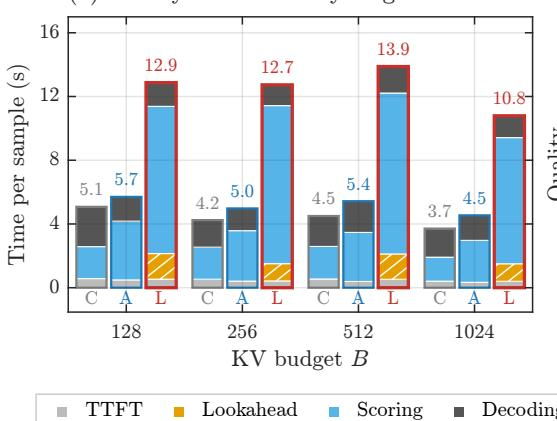

(b) quality vs. total latency  
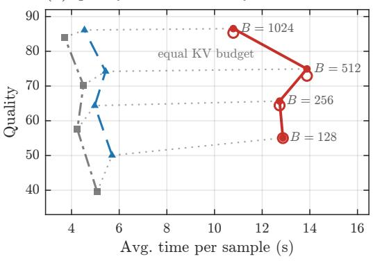  
Figure 7: Latency-quality trade-off. (a) Stage-wise latency averaged over two seeds and (b) quality versus total latency across cache budgets on Mistral-7B-Instruct-v0.2, averaged over LongBench, RULER, and NIAH.

## D PLUG-IN COMPONENTS AND THE ABLATION PROTOCOL

We evaluate three optional plug-ins that modify different stages of LORE-KV: (A) score aggregation, (B) head-budget allocation, and (C) token selection. Results are reported in Tables 14 and 15. All three are disabled in the core method, so the main results use Eq. 7 with uniform head budgets and plain $\mathrm { t o p } \cdot B _ { l , h }$ selection. This separation lets us isolate whether gains come from better future-query scoring or from additional allocation and selection mechanisms.

Where each plug-in acts. The three components modify different parts of the pipeline. (A) Robust aggregation changes the per-token aggregation function ψ in Eq. 7, but each token still receives one scalar score and the top- $B _ { l , h }$ rule is unchanged. (B) Adaptive head budgets keep the scores and ranking fixed but change how the layer budget is distributed across heads through Alloc in Eq. 8. (C) Diversity-aware selection replaces Select with a set-dependent greedy rule, since a token’s effective utility depends on which tokens have already been retained. Thus, A changes the score statistic, B changes the cutoff, and C changes the selection rule. The core configuration is recovered with $\alpha = 0 , \tau = 0 .$ , and $\lambda _ { k } = \lambda _ { v } = 0$

Table 4: LORE-KV hyperparameters and default settings.
<table><tr><td>Symbol</td><td>Meaning</td><td>Default</td></tr><tr><td colspan="3">(a) Core method</td></tr><tr><td> $w$ </td><td>prompt-end observation-window size</td><td>32</td></tr><tr><td> $M$ </td><td>number of lookahead particles</td><td>4</td></tr><tr><td> $T$ </td><td>lookahead particle length</td><td>8</td></tr><tr><td> $\lambda _ { L }$ </td><td>lookahead mixing coefficient in Eq. 7</td><td>1.0</td></tr><tr><td>€</td><td>renormalization guard in Eq. 5</td><td> $1 0 ^ { - 6 }$ </td></tr><tr><td></td><td>chunk size (adjacent-token grouping)</td><td>4</td></tr><tr><td colspan="3">(b) Plug-in switches (Appendix D)</td></tr><tr><td> $\kappa , \alpha$ </td><td>robust aggregation</td><td>0,0</td></tr><tr><td> $\tau$ </td><td>adaptive head budgets</td><td>0 (ablation: 1)</td></tr><tr><td> $\lambda _ { k } , \lambda _ { v }$ </td><td>diversity selection</td><td>0 (ablation: 0.1)</td></tr><tr><td colspan="3">(c) Reliability settings in  $E q . 3$ </td></tr><tr><td>LORE-KV/E</td><td>log-probability + entropy penalty</td><td>(1, 1.3, 0)</td></tr><tr><td>LORE-KV/D</td><td>log-probability + disagreement penalty</td><td>(1, 1, 0.3)</td></tr><tr><td>Log-probability only</td><td>control</td><td>(1, 1, 0)</td></tr><tr><td>Entropy + disagreement</td><td>control</td><td>(1, 1.3, 0.3)</td></tr></table>

Table 5: LongBench English datasets, the abbreviations used in all LongBench results tables, metrics, average input lengths, and sample counts (Bai et al., 2024).
<table><tr><td>Task</td><td>Abbr.</td><td>Task type</td><td>Metric</td><td>Avg. len</td><td>Language</td><td>#Samples</td></tr><tr><td>NarrativeQA</td><td>NQA</td><td>Single-Doc. QA</td><td>F1</td><td>18,409</td><td>EN</td><td>200</td></tr><tr><td>Qasper</td><td>Qasp</td><td>Single-Doc. QA</td><td>F1</td><td>3,619</td><td>EN</td><td>200</td></tr><tr><td>MultiFieldQA-en</td><td>MF</td><td>Single-Doc. QA</td><td>F1</td><td>4,559</td><td>EN</td><td>150</td></tr><tr><td>HotpotQA</td><td>HQA</td><td>Multi-Doc. QA</td><td>F1</td><td>9,151</td><td>EN</td><td>200</td></tr><tr><td>2WikiMultihopQA</td><td>2WQA</td><td>Multi-Doc. QA</td><td>F1</td><td>4,887</td><td>EN</td><td>200</td></tr><tr><td>MuSiQue</td><td>Musq</td><td>Multi-Doc. QA</td><td>F1</td><td>11,214</td><td>EN</td><td>200</td></tr><tr><td>GovReport</td><td>GovR</td><td>Summarization</td><td>Rouge-L</td><td>8,734</td><td>EN</td><td>200</td></tr><tr><td>QMSum</td><td>QMS</td><td>Summarization</td><td>Rouge-L</td><td>10,614</td><td>EN</td><td>200</td></tr><tr><td>MultiNews</td><td>MN</td><td>Summarization</td><td>Rouge-L</td><td>2,113</td><td>EN</td><td>200</td></tr><tr><td>TREC</td><td>TREC</td><td>Few-shot Learning</td><td>Accuracy</td><td>5,177</td><td>EN</td><td>200</td></tr><tr><td>TriviaQA</td><td>TQA</td><td>Few-shot Learning</td><td>F1</td><td>8,209</td><td>EN</td><td>200</td></tr><tr><td>SAMSum</td><td>SAMS</td><td>Few-shot Learning</td><td>Rouge-L</td><td>6,258</td><td>EN</td><td>200</td></tr><tr><td>PassageCount</td><td>PC</td><td>Synthetic</td><td>Accuracy</td><td>11,141</td><td>EN</td><td>200</td></tr><tr><td>PassageRetrieval-en</td><td>PR</td><td>Synthetic</td><td>Accuracy</td><td>9,289</td><td>EN</td><td>200</td></tr><tr><td>LCC</td><td>LCC</td><td>Code</td><td>Edit Sim</td><td>1,235</td><td>Python/C#/Java</td><td>500</td></tr><tr><td>RepoBench-P</td><td>RB-P</td><td>Code</td><td>Edit Sim</td><td>4,206</td><td>Python/Java</td><td>500</td></tr></table>

A. Robust aggregation $( \alpha , \kappa )$ . A mean can underweight tokens that are important for only a small subset of future queries. Motivated by DefensiveKV (Feng et al., 2025a), we therefore define

$$
\mathrm { T o p A v g } _ { \kappa } ( \mathcal { E } ) = \frac { 1 } { K _ { \kappa } } \sum _ { e \in \mathrm { T o p K } ( \mathcal { E } , K _ { \kappa } ) } e , \qquad K _ { \kappa } = \lceil \kappa \lvert \mathcal { E } \rvert \rceil ,
$$

and use

$$
\psi ( { \mathcal { E } } ) = \alpha \mathrm { T o p A v g } _ { \kappa } ( { \mathcal { E } } ) + ( 1 - \alpha ) \mathrm { M e a n } ( { \mathcal { E } } ) , \qquad \alpha \in [ 0 , 1 ] .
$$

Setting $\alpha = 0$ exactly recovers the core mean aggregation, while larger α gives more weight to high-importance query subsets and reduces sensitivity to an unrepresentative particle. Unless stated

Table 6: LongBench results on Llama-3.1-8B-Instruct. Dataset abbreviations follow Table 5.
<table><tr><td rowspan=1 colspan=17>Single-Doc QA   Multi-Doc QA       Summ.         Few-shot       Synth.     CodeMethod     NQAQaspMF HQA2WQAMusqGovRQMSMNTRECTQASAMSPC PR LCCRB-PAvg.</td></tr><tr><td rowspan=1 colspan=17>Full Cache   30.12 46.6056.4158.1049.0132.5234.0425.3727.0673.0091.9043.467.06100.0062.13 51.8049.29</td></tr><tr><td rowspan=1 colspan=17>Budget B=128</td></tr><tr><td rowspan=1 colspan=17>SnapKV     25.5431.4050.9955.1745.5027.8820.7723.4121.0547.5090.4640.768.0099.5056.8846.5043.21</td></tr><tr><td rowspan=1 colspan=2>PyramidKV  27.8332.98</td><td rowspan=1 colspan=15>51.4556.7244.6730.5421.8922.9021.6763.0090.4540.068.00100.0055.3743.7944.46</td></tr><tr><td rowspan=1 colspan=2>Ada-KV     25.0634.50</td><td rowspan=1 colspan=15>52.2756.2947.5729.0621.1723.3621.5162.0092.1740.848.0099.5058.4548.7245.03</td></tr><tr><td rowspan=1 colspan=2>CriticalKV   26.0034.96</td><td rowspan=1 colspan=15>51.7956.0146.5328.9521.3123.1421.3362.0089.5140.747.5997.8957.8548.2844.62</td></tr><tr><td rowspan=1 colspan=17>AnDPro     25.2535.8552.8554.3544.4127.5122.8223.6022.2069.0092.0041.507.02100.0062.2656.3446.06</td></tr><tr><td rowspan=1 colspan=1>LaProx      25.78</td><td rowspan=1 colspan=16>31.3852.9755.1744.9529.4621.6623.6621.4759.0089.9441.098.8999.5061.9156.16 45.19</td></tr><tr><td rowspan=1 colspan=1>LAQ++(8)   28.65</td><td rowspan=1 colspan=1>10.65</td><td rowspan=1 colspan=4>26.0424.2321.5615.67</td><td rowspan=1 colspan=3>23.5023.7422.75</td><td rowspan=1 colspan=1>72.00</td><td rowspan=1 colspan=1>91.95</td><td rowspan=1 colspan=3>42.198.3794.81</td><td rowspan=1 colspan=2>62.1850.953</td><td rowspan=1 colspan=1>8.70</td></tr><tr><td rowspan=1 colspan=1>LORE-KV/E27.38</td><td rowspan=1 colspan=1>37.66</td><td rowspan=1 colspan=4>51.1457.3748.4730.55</td><td rowspan=1 colspan=3>23.7723.6023.14</td><td rowspan=1 colspan=1>68.00</td><td rowspan=1 colspan=1>90.46</td><td rowspan=1 colspan=3>41.777.3497.90</td><td rowspan=1 colspan=2>58.9950.15</td><td rowspan=1 colspan=1>46.11</td></tr><tr><td rowspan=1 colspan=1>LORE-KV/D27.33</td><td rowspan=1 colspan=1>37.50</td><td rowspan=1 colspan=6>51.8157.7348.7230.6323.1224.25</td><td rowspan=1 colspan=1>23.62</td><td rowspan=1 colspan=7>69.5090.1141.697.9897.0259.0950.17</td><td rowspan=1 colspan=1>46.27</td></tr><tr><td rowspan=1 colspan=8>Budget B=</td><td rowspan=1 colspan=9>256</td></tr><tr><td rowspan=1 colspan=1>SnapKV     26.92</td><td rowspan=1 colspan=1>38.19</td><td rowspan=1 colspan=2>52.6257.03</td><td rowspan=1 colspan=1>46.75</td><td rowspan=1 colspan=1>29.63</td><td rowspan=1 colspan=2>23.0723.92</td><td rowspan=1 colspan=1>22.82</td><td rowspan=1 colspan=1>58.50</td><td rowspan=1 colspan=1>91.83</td><td rowspan=1 colspan=1>40.81</td><td rowspan=1 colspan=2>7.7599.50</td><td rowspan=1 colspan=2>59.9548.634</td><td rowspan=1 colspan=1>5.50</td></tr><tr><td rowspan=1 colspan=1>PyramidKV  28.46</td><td rowspan=1 colspan=1>39.36</td><td rowspan=1 colspan=1>54.30</td><td rowspan=1 colspan=1>56.77</td><td rowspan=1 colspan=1>45.50</td><td rowspan=1 colspan=1>30.74</td><td rowspan=1 colspan=1>23.84</td><td rowspan=1 colspan=1>23.88</td><td rowspan=1 colspan=1>22.91</td><td rowspan=1 colspan=1>69.00</td><td rowspan=1 colspan=1>91.09</td><td rowspan=1 colspan=1>40.74</td><td rowspan=1 colspan=1>7.88</td><td rowspan=1 colspan=1>99.50</td><td rowspan=1 colspan=2>56.9445.18</td><td rowspan=1 colspan=1>46.01</td></tr><tr><td rowspan=1 colspan=1>Ada-KV     27.04</td><td rowspan=1 colspan=1>39.24</td><td rowspan=1 colspan=1>54.41</td><td rowspan=1 colspan=1>57.36</td><td rowspan=1 colspan=1>47.53</td><td rowspan=1 colspan=1>31.35</td><td rowspan=1 colspan=1>23.06</td><td rowspan=1 colspan=1>23.81</td><td rowspan=1 colspan=1>23.43</td><td rowspan=1 colspan=1>69.00</td><td rowspan=1 colspan=1>92.50</td><td rowspan=1 colspan=1>41.23</td><td rowspan=1 colspan=1>7.67</td><td rowspan=1 colspan=1>100.00</td><td rowspan=1 colspan=2>61.4549.52</td><td rowspan=1 colspan=1>46.79</td></tr><tr><td rowspan=1 colspan=1>CriticalKV   25.45</td><td rowspan=1 colspan=1>39.60</td><td rowspan=1 colspan=1>52.90</td><td rowspan=1 colspan=1>55.72</td><td rowspan=1 colspan=1>46.05</td><td rowspan=1 colspan=1>29.97</td><td rowspan=1 colspan=1>23.10</td><td rowspan=1 colspan=1>23.77</td><td rowspan=1 colspan=1>22.77</td><td rowspan=1 colspan=1>68.00</td><td rowspan=1 colspan=1>90.48</td><td rowspan=1 colspan=1>41.08</td><td rowspan=1 colspan=1>7.48</td><td rowspan=1 colspan=1>97.55</td><td rowspan=1 colspan=2>60.1948.25</td><td rowspan=1 colspan=1>45.77</td></tr><tr><td rowspan=1 colspan=1>AnDPro     27.23</td><td rowspan=1 colspan=1>42.01</td><td rowspan=1 colspan=1>54.62</td><td rowspan=1 colspan=1>57.87</td><td rowspan=1 colspan=1>47.43</td><td rowspan=1 colspan=1>31.92</td><td rowspan=1 colspan=1>23.53</td><td rowspan=1 colspan=1>24.22</td><td rowspan=1 colspan=1>23.54</td><td rowspan=1 colspan=1>71.50</td><td rowspan=1 colspan=1>92.37</td><td rowspan=1 colspan=1>41.47</td><td rowspan=1 colspan=2>7.6699.81</td><td rowspan=1 colspan=2>62.4551.67</td><td rowspan=1 colspan=1>47.46</td></tr><tr><td rowspan=1 colspan=1>LaProx      28.02</td><td rowspan=1 colspan=1>38.56</td><td rowspan=1 colspan=1>53.32</td><td rowspan=1 colspan=1>55.23</td><td rowspan=1 colspan=1>45.72</td><td rowspan=1 colspan=1>30.83</td><td rowspan=1 colspan=1>24.84</td><td rowspan=1 colspan=1>23.78</td><td rowspan=1 colspan=1>23.92</td><td rowspan=1 colspan=1>67.50</td><td rowspan=1 colspan=1>92.12</td><td rowspan=1 colspan=1>42.40</td><td rowspan=1 colspan=2>8.5699.50</td><td rowspan=1 colspan=2>63.5757.61</td><td rowspan=1 colspan=1>47.22</td></tr><tr><td rowspan=1 colspan=1>LAQ++(8)   30.25</td><td rowspan=1 colspan=1>12.43</td><td rowspan=1 colspan=1>26.63</td><td rowspan=1 colspan=1>25.77</td><td rowspan=1 colspan=1>22.83</td><td rowspan=1 colspan=1>18.45</td><td rowspan=1 colspan=1>25.07</td><td rowspan=1 colspan=1>23.67</td><td rowspan=1 colspan=1>23.75</td><td rowspan=1 colspan=1>72.00</td><td rowspan=1 colspan=1>91.97</td><td rowspan=1 colspan=1>43.17</td><td rowspan=1 colspan=1>6.93</td><td rowspan=1 colspan=1>94.59</td><td rowspan=1 colspan=2>64.0753.38</td><td rowspan=1 colspan=1>39.69</td></tr><tr><td rowspan=1 colspan=1>LORE-KV/E28.26</td><td rowspan=1 colspan=1>44.01</td><td rowspan=1 colspan=1>53.43</td><td rowspan=1 colspan=1>57.73</td><td rowspan=1 colspan=1>48.78</td><td rowspan=1 colspan=1>32.30</td><td rowspan=1 colspan=1>25.63</td><td rowspan=1 colspan=1>24.93</td><td rowspan=1 colspan=1>24.10</td><td rowspan=1 colspan=1>71.00</td><td rowspan=1 colspan=1>91.03</td><td rowspan=1 colspan=1>39.98</td><td rowspan=1 colspan=1>7.39</td><td rowspan=1 colspan=1>98.52</td><td rowspan=1 colspan=2>61.7051.28</td><td rowspan=1 colspan=1>47.50</td></tr><tr><td rowspan=1 colspan=1>LORE-KV/D28.33</td><td rowspan=1 colspan=1>42.69</td><td rowspan=1 colspan=2>52.6657.75</td><td rowspan=1 colspan=1>48.86</td><td rowspan=1 colspan=1>32.34</td><td rowspan=1 colspan=1>24.95</td><td rowspan=1 colspan=1>24.87</td><td rowspan=1 colspan=1>24.16</td><td rowspan=1 colspan=1>70.00</td><td rowspan=1 colspan=1>91.09</td><td rowspan=1 colspan=1>40.95</td><td rowspan=1 colspan=2>7.7799.73</td><td rowspan=1 colspan=2>61.61 51.84</td><td rowspan=1 colspan=1>47.48</td></tr><tr><td rowspan=1 colspan=2></td><td rowspan=1 colspan=3></td><td rowspan=1 colspan=1></td><td rowspan=1 colspan=2>Budget B三</td><td rowspan=1 colspan=3>512</td><td rowspan=1 colspan=1></td><td rowspan=1 colspan=4></td><td rowspan=1 colspan=1></td></tr><tr><td rowspan=1 colspan=2>SnapKV     28.4041.52</td><td rowspan=1 colspan=1>55.40</td><td rowspan=1 colspan=1>57.66</td><td rowspan=1 colspan=1>47.48</td><td rowspan=1 colspan=1>30.95</td><td rowspan=1 colspan=1>24.92</td><td rowspan=1 colspan=1>24.46</td><td rowspan=1 colspan=2>24.5468.50</td><td rowspan=1 colspan=1>92.33</td><td rowspan=1 colspan=1>41.98</td><td rowspan=1 colspan=1>7.33</td><td rowspan=1 colspan=1>99.50</td><td rowspan=1 colspan=2>61.2550.39</td><td rowspan=1 colspan=1>47.29</td></tr><tr><td rowspan=1 colspan=1>PyramidKV  29.15</td><td rowspan=1 colspan=1>43.04</td><td rowspan=1 colspan=1>55.55</td><td rowspan=1 colspan=1>57.71</td><td rowspan=1 colspan=1>47.67</td><td rowspan=1 colspan=1>31.27</td><td rowspan=1 colspan=1>26.05</td><td rowspan=1 colspan=1>24.08</td><td rowspan=1 colspan=1>24.54</td><td rowspan=1 colspan=1>70.50</td><td rowspan=1 colspan=1>92.67</td><td rowspan=1 colspan=1>41.52</td><td rowspan=1 colspan=1>7.33</td><td rowspan=1 colspan=1>100.00</td><td rowspan=1 colspan=1>59.96</td><td rowspan=1 colspan=1>47.51</td><td rowspan=1 colspan=1>47.41</td></tr><tr><td rowspan=1 colspan=1>Ada-KV     26.92</td><td rowspan=1 colspan=1>42.68</td><td rowspan=1 colspan=1>55.20</td><td rowspan=1 colspan=1>57.47</td><td rowspan=1 colspan=1>48.06</td><td rowspan=1 colspan=1>31.27</td><td rowspan=1 colspan=1>24.95</td><td rowspan=1 colspan=1>24.17</td><td rowspan=1 colspan=1>24.40</td><td rowspan=1 colspan=1>71.00</td><td rowspan=1 colspan=1>92.14</td><td rowspan=1 colspan=1>42.35</td><td rowspan=1 colspan=2>7.33100.00</td><td rowspan=1 colspan=1>62.26</td><td rowspan=1 colspan=1>50.62</td><td rowspan=1 colspan=1>47.55</td></tr><tr><td rowspan=1 colspan=1>CriticalKV   26.00</td><td rowspan=1 colspan=1>42.53</td><td rowspan=1 colspan=1>53.90</td><td rowspan=1 colspan=1>56.62</td><td rowspan=1 colspan=1>46.76</td><td rowspan=1 colspan=1>31.13</td><td rowspan=1 colspan=1>24.26</td><td rowspan=1 colspan=1>23.76</td><td rowspan=1 colspan=1>23.81</td><td rowspan=1 colspan=1>70.00</td><td rowspan=1 colspan=1>89.56</td><td rowspan=1 colspan=1>40.75</td><td rowspan=1 colspan=2>6.9297.20</td><td rowspan=1 colspan=1>60.51</td><td rowspan=1 colspan=1>49.74</td><td rowspan=1 colspan=1>46.47</td></tr><tr><td rowspan=1 colspan=2>AnDPro     27.9744.15</td><td rowspan=1 colspan=1>55.49</td><td rowspan=1 colspan=1>58.16</td><td rowspan=1 colspan=1>48.19</td><td rowspan=1 colspan=1>31.92</td><td rowspan=1 colspan=1>24.80</td><td rowspan=1 colspan=1>24.50</td><td rowspan=1 colspan=2>24.7772.50</td><td rowspan=1 colspan=1>91.76</td><td rowspan=1 colspan=1>41.99</td><td rowspan=1 colspan=2>7.3199.78</td><td rowspan=1 colspan=2>62.5452.004</td><td rowspan=1 colspan=1>7.99</td></tr><tr><td rowspan=1 colspan=2>LaProx      29.8243.46</td><td rowspan=1 colspan=1>54.33</td><td rowspan=1 colspan=1>55.44</td><td rowspan=1 colspan=1>46.16</td><td rowspan=1 colspan=1>30.83</td><td rowspan=1 colspan=1>27.08</td><td rowspan=1 colspan=1>24.10</td><td rowspan=1 colspan=2>25.3070.50</td><td rowspan=1 colspan=1>91.89</td><td rowspan=1 colspan=1>42.48</td><td rowspan=1 colspan=2>8.4099.50</td><td rowspan=1 colspan=2>64.1058.16</td><td rowspan=1 colspan=1>48.23</td></tr><tr><td rowspan=1 colspan=1>LAQ++(8)   29.64</td><td rowspan=1 colspan=1>13.22</td><td rowspan=1 colspan=1>26.79</td><td rowspan=1 colspan=1>27.58</td><td rowspan=1 colspan=1>23.49</td><td rowspan=1 colspan=1>18.63</td><td rowspan=1 colspan=1>26.94</td><td rowspan=1 colspan=1>24.04</td><td rowspan=1 colspan=1>25.21</td><td rowspan=1 colspan=1>72.50</td><td rowspan=1 colspan=1>92.25</td><td rowspan=1 colspan=1>42.83</td><td rowspan=1 colspan=2>8.4396.25</td><td rowspan=1 colspan=1>65.00</td><td rowspan=1 colspan=1>53.37</td><td rowspan=1 colspan=1>40.39</td></tr><tr><td rowspan=1 colspan=1>LORE-KV/E29.77</td><td rowspan=1 colspan=1>43.61</td><td rowspan=1 colspan=1>55.22</td><td rowspan=1 colspan=1>58.32</td><td rowspan=1 colspan=1>48.68</td><td rowspan=1 colspan=1>32.73</td><td rowspan=1 colspan=1>27.40</td><td rowspan=1 colspan=1>24.96</td><td rowspan=1 colspan=1>25.02</td><td rowspan=1 colspan=1>72.50</td><td rowspan=1 colspan=1>91.50</td><td rowspan=1 colspan=1>40.50</td><td rowspan=1 colspan=2>7.4699.52</td><td rowspan=1 colspan=1>60.38</td><td rowspan=1 colspan=1>51.25</td><td rowspan=1 colspan=1>48.05</td></tr><tr><td rowspan=1 colspan=2>LORE-KV/D30.9143.68</td><td rowspan=1 colspan=1>55.88</td><td rowspan=1 colspan=1>57.58</td><td rowspan=1 colspan=1>49.38</td><td rowspan=1 colspan=1>32.71</td><td rowspan=1 colspan=1>28.22</td><td rowspan=1 colspan=1>25.34</td><td rowspan=1 colspan=1>24.94</td><td rowspan=1 colspan=1>72.50</td><td rowspan=1 colspan=1>91.22</td><td rowspan=1 colspan=1>40.87</td><td rowspan=1 colspan=2>7.1899.46</td><td rowspan=1 colspan=1>61.02</td><td rowspan=1 colspan=1>51.29</td><td rowspan=1 colspan=1>48.26</td></tr><tr><td rowspan=1 colspan=6>Budget</td><td rowspan=1 colspan=2>B=</td><td rowspan=1 colspan=9>1024</td></tr><tr><td rowspan=1 colspan=2>SnapKV     28.3245.37</td><td rowspan=1 colspan=1>56.81</td><td rowspan=1 colspan=1>58.16</td><td rowspan=1 colspan=1>48.28</td><td rowspan=1 colspan=1>31.89</td><td rowspan=1 colspan=1>26.91</td><td rowspan=1 colspan=1>24.58</td><td rowspan=1 colspan=2>25.8270.50</td><td rowspan=1 colspan=1>92.22</td><td rowspan=1 colspan=1>43.08</td><td rowspan=1 colspan=2>6.96100.00</td><td rowspan=1 colspan=1>62.46</td><td rowspan=1 colspan=1>51.504</td><td rowspan=1 colspan=1>8.30</td></tr><tr><td rowspan=1 colspan=2>PyramidKV  29.3244.57</td><td rowspan=1 colspan=1>56.14</td><td rowspan=1 colspan=1>58.39</td><td rowspan=1 colspan=1>48.36</td><td rowspan=1 colspan=1>31.93</td><td rowspan=1 colspan=1>28.20</td><td rowspan=1 colspan=1>23.78</td><td rowspan=1 colspan=2>26.0070.50</td><td rowspan=1 colspan=1>92.41</td><td rowspan=1 colspan=1>42.46</td><td rowspan=1 colspan=2>6.88100.00</td><td rowspan=1 colspan=1>61.33</td><td rowspan=1 colspan=1>49.12</td><td rowspan=1 colspan=1>48.09</td></tr><tr><td rowspan=1 colspan=2>Ada-KV     28.5246.01</td><td rowspan=1 colspan=1>55.72</td><td rowspan=1 colspan=1>57.85</td><td rowspan=1 colspan=1>48.10</td><td rowspan=1 colspan=1>32.02</td><td rowspan=1 colspan=1>26.98</td><td rowspan=1 colspan=1>24.72</td><td rowspan=1 colspan=2>25.9672.00</td><td rowspan=1 colspan=1>91.97</td><td rowspan=1 colspan=1>42.55</td><td rowspan=1 colspan=2>6.96100.00</td><td rowspan=1 colspan=1>61.98</td><td rowspan=1 colspan=1>51.52</td><td rowspan=1 colspan=1>48.30</td></tr><tr><td rowspan=1 colspan=2>CriticalKV   27.2744.74</td><td rowspan=1 colspan=1>54.24</td><td rowspan=1 colspan=1>56.17</td><td rowspan=1 colspan=1>46.95</td><td rowspan=1 colspan=1>31.65</td><td rowspan=1 colspan=1>26.35</td><td rowspan=1 colspan=1>23.91</td><td rowspan=1 colspan=2>24.9370.00</td><td rowspan=1 colspan=1>89.08</td><td rowspan=1 colspan=1>41.00</td><td rowspan=1 colspan=2>6.7096.86</td><td rowspan=1 colspan=1>59.85</td><td rowspan=1 colspan=1>49.75</td><td rowspan=1 colspan=1>46.84</td></tr><tr><td rowspan=1 colspan=4>AnDPro     31.3643.4255.1055.05</td><td rowspan=1 colspan=1>45.93</td><td rowspan=1 colspan=1>29.79</td><td rowspan=1 colspan=1>28.46</td><td rowspan=1 colspan=1>24.70</td><td rowspan=1 colspan=2>26.5672.50</td><td rowspan=1 colspan=2>91.4243.57</td><td rowspan=1 colspan=2>7.3999.50</td><td rowspan=1 colspan=2>64.8659.01</td><td rowspan=1 colspan=1>48.66</td></tr><tr><td rowspan=1 colspan=4>LaProx      31.0844.4555.6455.82</td><td rowspan=1 colspan=1>45.98</td><td rowspan=1 colspan=1>31.96</td><td rowspan=1 colspan=1>29.22</td><td rowspan=1 colspan=1>24.42</td><td rowspan=1 colspan=2>26.3671.50</td><td rowspan=1 colspan=2>91.7543.32</td><td rowspan=1 colspan=2>8.2399.50</td><td rowspan=1 colspan=2>65.0158.69</td><td rowspan=1 colspan=1>48.94</td></tr><tr><td rowspan=1 colspan=4>LORE-KV/E29.9944.8356.1958.60</td><td rowspan=1 colspan=1>49.01</td><td rowspan=1 colspan=1>33.02</td><td rowspan=1 colspan=1>28.90</td><td rowspan=1 colspan=1>25.49</td><td rowspan=1 colspan=2>26.3873.00</td><td rowspan=1 colspan=2>92.3542.24</td><td rowspan=1 colspan=2>7.5099.50</td><td rowspan=1 colspan=2>61.3151.60</td><td rowspan=1 colspan=1>48.74</td></tr><tr><td rowspan=1 colspan=5>LORE-KV/D31.1944.9256.0258.9648.91</td><td rowspan=1 colspan=1>32.79</td><td rowspan=1 colspan=2>28.9925.42</td><td rowspan=1 colspan=9>26.6573.5092.2342.407.2098.7560.5552.0348.78</td></tr></table>

otherwise, we use $\alpha = 0 . 5$ with κ from Table 4, giving an equal mixture of the top-κ statistic and the mean. Only the scalar token score changes; ranking and $\mathrm { t o p } \cdot B _ { l , h }$ selection remain unchanged.

B. Adaptive head-wise budgets (τ). The core method divides each layer budget uniformly across KV heads. Following Ada-KV (Feng et al., 2025b) and the layer-wise allocation principle of PyramidKV (Cai et al., 2025b), we instead allow heads with larger future-query perturbation mass

$$
E _ { l , h } = \sum _ { i \in \mathcal { C } } S _ { i } ^ { l , h }
$$

to receive more capacity:

$$
B _ { l , h } = \left\lfloor B _ { l } \frac { ( E _ { l , h } + \epsilon ) ^ { \tau } } { \sum _ { h ^ { \prime } = 1 } ^ { H } ( E _ { l , h ^ { \prime } } + \epsilon ) ^ { \tau } } \right\rfloor .\tag{11}
$$

Here $\tau \geq 0$ controls how strongly the budget is shifted toward high-impact heads; $\tau = 0$ recovers the uniform allocation $\lfloor B _ { l } / H \rfloor$ . The within-head scores and their ordering are unchanged; only the retention cutoff changes. Figure 12 motivates this ablation by showing that both $E _ { l , h }$ and the benefit of future-query scoring vary substantially across layers and heads.

C. Diversity-aware selection $( \lambda _ { k } , \lambda _ { v } )$ . Plain top- $\cdot B _ { l , h }$ selection may retain several near-duplicate keys or values. As an ablation, we use a greedy redundancy-aware rule inspired by GraphKV (Li et al., 2025b). Starting from $\mathcal { R } ^ { l , h } = \emptyset .$ , we repeatedly select

Table 7: RULER per-task results with Mistral-7B-Instruct-v0.2. CWE/FWE denote common-/frequent-word extraction; MK/MV/MQ/S denote multi-key/multi-value/multi-query/single-needle variants; VT denotes variable tracking.
<table><tr><td rowspan=1 colspan=16>B  Method      CWEFWEMK1MK2MK3MQ MV  S1   S2   S3 QA-1QA-2 VT  Avg.</td></tr><tr><td rowspan=1 colspan=16>Context length = 4K</td></tr><tr><td rowspan=1 colspan=3>128 CriticalKV    9.40</td><td rowspan=1 colspan=2>40.2089.20</td><td rowspan=1 colspan=5>70.40 0.00 0.8017.4089.20</td><td rowspan=1 colspan=3>96.00 0.0082.20</td><td rowspan=1 colspan=3>59.4015.6043.83</td></tr><tr><td rowspan=1 colspan=2>128 AnDPro</td><td rowspan=1 colspan=1>17.20</td><td rowspan=1 colspan=1>44.20</td><td rowspan=1 colspan=1>98.60</td><td rowspan=1 colspan=1>87.60</td><td rowspan=1 colspan=1>0.40</td><td rowspan=1 colspan=1>37.40</td><td rowspan=1 colspan=1>46.40</td><td rowspan=1 colspan=1>99.60</td><td rowspan=1 colspan=1>99.80</td><td rowspan=1 colspan=1>0.00</td><td rowspan=1 colspan=1>82.60</td><td rowspan=1 colspan=1>61.20</td><td rowspan=1 colspan=1>38.00</td><td rowspan=1 colspan=1>54.85</td></tr><tr><td rowspan=1 colspan=2>128 LORE-KV/E</td><td rowspan=1 colspan=1>29.62</td><td rowspan=1 colspan=1>61.27</td><td rowspan=1 colspan=1>99.80</td><td rowspan=1 colspan=1>99.60</td><td rowspan=1 colspan=1>0.00</td><td rowspan=1 colspan=1>19.40</td><td rowspan=1 colspan=1>36.50</td><td rowspan=1 colspan=1>100.00</td><td rowspan=1 colspan=1>99.80</td><td rowspan=1 colspan=1>4.00</td><td rowspan=1 colspan=1>84.00</td><td rowspan=1 colspan=1>61.60</td><td rowspan=1 colspan=1>63.56</td><td rowspan=1 colspan=1>58.40</td></tr><tr><td rowspan=1 colspan=2>128 LORE-KV/D</td><td rowspan=1 colspan=1>29.18</td><td rowspan=1 colspan=1>60.80</td><td rowspan=1 colspan=1>99.80</td><td rowspan=1 colspan=1>99.80</td><td rowspan=1 colspan=1>0.00</td><td rowspan=1 colspan=1>19.00</td><td rowspan=1 colspan=1>36.30</td><td rowspan=1 colspan=1>100.00</td><td rowspan=1 colspan=1>99.80</td><td rowspan=1 colspan=1>3.80</td><td rowspan=1 colspan=1>84.20</td><td rowspan=1 colspan=1>62.00</td><td rowspan=1 colspan=1>63.40</td><td rowspan=1 colspan=1>58.31</td></tr><tr><td rowspan=1 colspan=2>256 CriticalKV</td><td rowspan=1 colspan=1>24.20</td><td rowspan=1 colspan=1>70.80</td><td rowspan=1 colspan=1>93.20</td><td rowspan=1 colspan=1>85.00</td><td rowspan=1 colspan=1>17.20</td><td rowspan=1 colspan=1>70.00</td><td rowspan=1 colspan=1>60.20</td><td rowspan=1 colspan=1>93.20</td><td rowspan=1 colspan=2>97.40 9.00</td><td rowspan=1 colspan=1>83.20</td><td rowspan=1 colspan=3>60.8066.4063.89</td></tr><tr><td rowspan=1 colspan=3>256 AnDPro     29.20</td><td rowspan=1 colspan=1>73.40</td><td rowspan=1 colspan=1>99.40</td><td rowspan=1 colspan=1>96.20</td><td rowspan=1 colspan=1>17.40</td><td rowspan=1 colspan=1>93.80</td><td rowspan=1 colspan=1>79.00</td><td rowspan=1 colspan=1>100.00</td><td rowspan=1 colspan=2>99.80 9.00</td><td rowspan=1 colspan=1>83.40</td><td rowspan=1 colspan=3>62.0081.0071.05</td></tr><tr><td rowspan=1 colspan=2>256 LORE-KV/E</td><td rowspan=1 colspan=1>35.20</td><td rowspan=1 colspan=1>82.40</td><td rowspan=1 colspan=1>98.60</td><td rowspan=1 colspan=1>98.60</td><td rowspan=1 colspan=1>15.80</td><td rowspan=1 colspan=1>81.60</td><td rowspan=1 colspan=1>71.80</td><td rowspan=1 colspan=1>98.60</td><td rowspan=1 colspan=1>98.40</td><td rowspan=1 colspan=1>10.00</td><td rowspan=1 colspan=1>82.80</td><td rowspan=1 colspan=2>60.8095.00</td><td rowspan=1 colspan=1>71.51</td></tr><tr><td rowspan=1 colspan=2>256LORE-KV/D</td><td rowspan=1 colspan=1>41.52</td><td rowspan=1 colspan=1>84.07</td><td rowspan=1 colspan=1>99.60</td><td rowspan=1 colspan=1>100.00</td><td rowspan=1 colspan=1>4.80</td><td rowspan=1 colspan=1>49.15</td><td rowspan=1 colspan=1>59.25</td><td rowspan=1 colspan=1>100.00</td><td rowspan=1 colspan=1>99.80</td><td rowspan=1 colspan=1>32.80</td><td rowspan=1 colspan=1>84.20</td><td rowspan=1 colspan=2>62.4089.44</td><td rowspan=1 colspan=1>69.77</td></tr><tr><td rowspan=1 colspan=2>512 CriticalKV</td><td rowspan=1 colspan=1>43.60</td><td rowspan=1 colspan=1>84.00</td><td rowspan=1 colspan=1>95.80</td><td rowspan=1 colspan=1>92.80</td><td rowspan=1 colspan=1>69.20</td><td rowspan=1 colspan=1>83.60</td><td rowspan=1 colspan=1>78.60</td><td rowspan=1 colspan=1>96.00</td><td rowspan=1 colspan=1>98.40</td><td rowspan=1 colspan=1>54.80</td><td rowspan=1 colspan=1>84.20</td><td rowspan=1 colspan=1>61.60</td><td rowspan=1 colspan=1>87.80</td><td rowspan=1 colspan=1>79.26</td></tr><tr><td rowspan=1 colspan=2>512 AnDPro</td><td rowspan=1 colspan=1>46.40</td><td rowspan=1 colspan=1>85.40</td><td rowspan=1 colspan=1>99.40</td><td rowspan=1 colspan=1>99.40</td><td rowspan=1 colspan=1>69.40</td><td rowspan=1 colspan=1>97.40</td><td rowspan=1 colspan=1>89.60</td><td rowspan=1 colspan=1>100.00</td><td rowspan=1 colspan=1>99.80</td><td rowspan=1 colspan=1>54.80</td><td rowspan=1 colspan=1>84.40</td><td rowspan=1 colspan=1>62.20</td><td rowspan=1 colspan=1>96.20</td><td rowspan=1 colspan=1>83.42</td></tr><tr><td rowspan=1 colspan=2>512 LORE-KV/E</td><td rowspan=1 colspan=1>50.80</td><td rowspan=1 colspan=1>91.40</td><td rowspan=1 colspan=1>99.40</td><td rowspan=1 colspan=1>99.60</td><td rowspan=1 colspan=1>68.80</td><td rowspan=1 colspan=1>91.00</td><td rowspan=1 colspan=1>86.00</td><td rowspan=1 colspan=1>99.60</td><td rowspan=1 colspan=1>99.40</td><td rowspan=1 colspan=1>55.80</td><td rowspan=1 colspan=1>84.40</td><td rowspan=1 colspan=1>62.00</td><td rowspan=1 colspan=1>99.80</td><td rowspan=1 colspan=1>83.69</td></tr><tr><td rowspan=1 colspan=2>512 LORE-KV/D</td><td rowspan=1 colspan=1>60.22</td><td rowspan=1 colspan=1>89.53</td><td rowspan=1 colspan=1>99.40</td><td rowspan=1 colspan=1>100.00</td><td rowspan=1 colspan=1>35.40</td><td rowspan=1 colspan=1>81.45</td><td rowspan=1 colspan=1>78.65</td><td rowspan=1 colspan=1>100.00</td><td rowspan=1 colspan=1>99.80</td><td rowspan=1 colspan=1>72.40</td><td rowspan=1 colspan=1>85.40</td><td rowspan=1 colspan=1>61.80</td><td rowspan=1 colspan=1>97.72</td><td rowspan=1 colspan=1>81.67</td></tr><tr><td rowspan=1 colspan=2>1024CriticalKV</td><td rowspan=1 colspan=1>76.40</td><td rowspan=1 colspan=1>89.00</td><td rowspan=1 colspan=1>97.60</td><td rowspan=1 colspan=1>96.60</td><td rowspan=1 colspan=1>89.20</td><td rowspan=1 colspan=1>90.20</td><td rowspan=1 colspan=1>84.60</td><td rowspan=1 colspan=1>98.00</td><td rowspan=1 colspan=1>99.00</td><td rowspan=1 colspan=1>93.80</td><td rowspan=1 colspan=1>85.00</td><td rowspan=1 colspan=1>61.20</td><td rowspan=1 colspan=1>93.60</td><td rowspan=1 colspan=1>88.78</td></tr><tr><td rowspan=1 colspan=2>1024AnDPro</td><td rowspan=1 colspan=1>78.00</td><td rowspan=1 colspan=1>89.80</td><td rowspan=1 colspan=1>99.40</td><td rowspan=1 colspan=1>100.00</td><td rowspan=1 colspan=1>89.20</td><td rowspan=1 colspan=1>97.40</td><td rowspan=1 colspan=1>90.40</td><td rowspan=1 colspan=1>100.00</td><td rowspan=1 colspan=1>99.80</td><td rowspan=1 colspan=1>93.80</td><td rowspan=1 colspan=1>85.00</td><td rowspan=1 colspan=1>61.60</td><td rowspan=1 colspan=1>98.20</td><td rowspan=1 colspan=1>90.97</td></tr><tr><td rowspan=1 colspan=2>1024LORE-KV/E</td><td rowspan=1 colspan=1>80.60</td><td rowspan=1 colspan=1>93.20</td><td rowspan=1 colspan=1>99.40</td><td rowspan=1 colspan=1>99.80</td><td rowspan=1 colspan=1>89.00</td><td rowspan=1 colspan=1>93.80</td><td rowspan=1 colspan=1>88.40</td><td rowspan=1 colspan=1>99.80</td><td rowspan=1 colspan=1>99.60</td><td rowspan=1 colspan=1>94.40</td><td rowspan=1 colspan=1>85.00</td><td rowspan=1 colspan=1>61.40</td><td rowspan=1 colspan=1>100.00</td><td rowspan=1 colspan=1>91.11</td></tr><tr><td rowspan=1 colspan=2>1024LORE-KV/D</td><td rowspan=1 colspan=1>87.72</td><td rowspan=1 colspan=1>91.53</td><td rowspan=1 colspan=1>99.20</td><td rowspan=1 colspan=1>100.00</td><td rowspan=1 colspan=1>73.20</td><td rowspan=1 colspan=1>94.00</td><td rowspan=1 colspan=1>86.70</td><td rowspan=1 colspan=1>100.00</td><td rowspan=1 colspan=1>99.80</td><td rowspan=1 colspan=1>91.60</td><td rowspan=1 colspan=1>84.80</td><td rowspan=1 colspan=1>61.00</td><td rowspan=1 colspan=1>98.88</td><td rowspan=1 colspan=1>89.88</td></tr><tr><td rowspan=1 colspan=2></td><td rowspan=1 colspan=1></td><td rowspan=1 colspan=1></td><td rowspan=1 colspan=1></td><td rowspan=1 colspan=1></td><td rowspan=1 colspan=1>Contex</td><td rowspan=1 colspan=1>t leng</td><td rowspan=1 colspan=1>th = 8</td><td rowspan=1 colspan=1>K</td><td rowspan=1 colspan=2></td><td rowspan=1 colspan=1></td><td rowspan=1 colspan=2></td><td rowspan=1 colspan=1></td></tr><tr><td rowspan=1 colspan=2>128 CriticalKV</td><td rowspan=1 colspan=1>3.20</td><td rowspan=1 colspan=1>26.40</td><td rowspan=1 colspan=1>75.20</td><td rowspan=1 colspan=1>59.60</td><td rowspan=1 colspan=1>0.00</td><td rowspan=1 colspan=1>0.00</td><td rowspan=1 colspan=1>6.00</td><td rowspan=1 colspan=1>92.60</td><td rowspan=1 colspan=1>88.40</td><td rowspan=1 colspan=1>0.00</td><td rowspan=1 colspan=1>75.40</td><td rowspan=1 colspan=2>58.8018.20</td><td rowspan=1 colspan=1>38.75</td></tr><tr><td rowspan=1 colspan=2>128 AnDPro</td><td rowspan=1 colspan=1>7.40</td><td rowspan=1 colspan=1>29.60</td><td rowspan=1 colspan=1>94.60</td><td rowspan=1 colspan=1>82.80</td><td rowspan=1 colspan=1>0.40</td><td rowspan=1 colspan=1>19.60</td><td rowspan=1 colspan=1>35.40</td><td rowspan=1 colspan=1>100.00</td><td rowspan=1 colspan=1>97.20</td><td rowspan=1 colspan=1>0.00</td><td rowspan=1 colspan=1>74.40</td><td rowspan=1 colspan=1>59.40</td><td rowspan=1 colspan=1>50.00</td><td rowspan=1 colspan=1>50.06</td></tr><tr><td rowspan=1 colspan=1>128 LORE-KV</td><td rowspan=1 colspan=1>/E</td><td rowspan=1 colspan=1>19.62</td><td rowspan=1 colspan=1>57.73</td><td rowspan=1 colspan=1>96.40</td><td rowspan=1 colspan=1>98.40</td><td rowspan=1 colspan=1>0.00</td><td rowspan=1 colspan=1>12.90</td><td rowspan=1 colspan=1>35.20</td><td rowspan=1 colspan=1>100.00</td><td rowspan=1 colspan=1>100.00</td><td rowspan=1 colspan=1>1.20</td><td rowspan=1 colspan=1>78.20</td><td rowspan=1 colspan=1>61.40</td><td rowspan=1 colspan=1>63.92</td><td rowspan=1 colspan=1>55.77</td></tr><tr><td rowspan=1 colspan=1>128 LORE-KV</td><td rowspan=1 colspan=1>/D</td><td rowspan=1 colspan=1>19.16</td><td rowspan=1 colspan=1>56.47</td><td rowspan=1 colspan=1>96.80</td><td rowspan=1 colspan=1>98.60</td><td rowspan=1 colspan=1>0.00</td><td rowspan=1 colspan=1>13.10</td><td rowspan=1 colspan=1>35.95</td><td rowspan=1 colspan=1>100.00</td><td rowspan=1 colspan=1>100.00</td><td rowspan=1 colspan=1>0.80</td><td rowspan=1 colspan=1>77.80</td><td rowspan=1 colspan=1>62.00</td><td rowspan=1 colspan=1>63.92</td><td rowspan=1 colspan=1>55.74</td></tr><tr><td rowspan=1 colspan=1>256 CriticalKV</td><td rowspan=1 colspan=1></td><td rowspan=1 colspan=1>11.40</td><td rowspan=1 colspan=1>46.40</td><td rowspan=1 colspan=1>83.80</td><td rowspan=1 colspan=1>77.20</td><td rowspan=1 colspan=1>4.00</td><td rowspan=1 colspan=1>68.80</td><td rowspan=1 colspan=1>52.20</td><td rowspan=1 colspan=1>95.20</td><td rowspan=1 colspan=1>94.00</td><td rowspan=1 colspan=1>2.60</td><td rowspan=1 colspan=1>77.20</td><td rowspan=1 colspan=1>59.80</td><td rowspan=1 colspan=1>65.00</td><td rowspan=1 colspan=1>56.74</td></tr><tr><td rowspan=1 colspan=2>256 AnDPro</td><td rowspan=1 colspan=1>14.20</td><td rowspan=1 colspan=1>48.40</td><td rowspan=1 colspan=1>96.40</td><td rowspan=1 colspan=1>92.20</td><td rowspan=1 colspan=1>4.20</td><td rowspan=1 colspan=1>81.60</td><td rowspan=1 colspan=1>71.20</td><td rowspan=1 colspan=1>100.00</td><td rowspan=1 colspan=1>99.80</td><td rowspan=1 colspan=1>2.60</td><td rowspan=1 colspan=1>76.60</td><td rowspan=1 colspan=1>60.20</td><td rowspan=1 colspan=1>85.60</td><td rowspan=1 colspan=1>64.08</td></tr><tr><td rowspan=1 colspan=2>256 LORE-KV/E</td><td rowspan=1 colspan=1>19.80</td><td rowspan=1 colspan=1>63.80</td><td rowspan=1 colspan=1>95.60</td><td rowspan=1 colspan=1>98.20</td><td rowspan=1 colspan=1>2.20</td><td rowspan=1 colspan=1>75.80</td><td rowspan=1 colspan=1>69.40</td><td rowspan=1 colspan=1>98.20</td><td rowspan=1 colspan=1>98.20</td><td rowspan=1 colspan=1>1.60</td><td rowspan=1 colspan=1>77.00</td><td rowspan=1 colspan=1>59.60</td><td rowspan=1 colspan=1>92.40</td><td rowspan=1 colspan=1>65.52</td></tr><tr><td rowspan=1 colspan=2>256 LORE-KV/D</td><td rowspan=1 colspan=1>29.12</td><td rowspan=1 colspan=1>69.60</td><td rowspan=1 colspan=1>96.80</td><td rowspan=1 colspan=1>98.20</td><td rowspan=1 colspan=1>1.40</td><td rowspan=1 colspan=1>34.15</td><td rowspan=1 colspan=1>55.60</td><td rowspan=1 colspan=1>100.00</td><td rowspan=1 colspan=1>100.00</td><td rowspan=1 colspan=1>25.00</td><td rowspan=1 colspan=1>77.00</td><td rowspan=1 colspan=1>61.40</td><td rowspan=1 colspan=1>91.00</td><td rowspan=1 colspan=1>64.56</td></tr><tr><td rowspan=1 colspan=2>512 CriticalKV</td><td rowspan=1 colspan=1>19.80</td><td rowspan=1 colspan=1>67.00</td><td rowspan=1 colspan=1>88.80</td><td rowspan=1 colspan=1>88.60</td><td rowspan=1 colspan=1>26.60</td><td rowspan=1 colspan=1>86.60</td><td rowspan=1 colspan=1>72.40</td><td rowspan=1 colspan=1>97.20</td><td rowspan=1 colspan=1>96.60</td><td rowspan=1 colspan=1>19.60</td><td rowspan=1 colspan=1>78.20</td><td rowspan=1 colspan=1>57.80</td><td rowspan=1 colspan=1>81.60</td><td rowspan=1 colspan=1>67.75</td></tr><tr><td rowspan=1 colspan=2>512 AnDPro</td><td rowspan=1 colspan=1>21.40</td><td rowspan=1 colspan=1>68.20</td><td rowspan=1 colspan=1>96.20</td><td rowspan=1 colspan=1>97.40</td><td rowspan=1 colspan=1>26.80</td><td rowspan=1 colspan=1>94.00</td><td rowspan=1 colspan=1>83.60</td><td rowspan=1 colspan=1>100.00</td><td rowspan=1 colspan=1>100.00</td><td rowspan=1 colspan=1>19.60</td><td rowspan=1 colspan=1>77.80</td><td rowspan=1 colspan=1>58.00</td><td rowspan=1 colspan=1>93.80</td><td rowspan=1 colspan=1>72.06</td></tr><tr><td rowspan=1 colspan=2>512 LORE-KV/E</td><td rowspan=1 colspan=1>24.80</td><td rowspan=1 colspan=1>77.20</td><td rowspan=1 colspan=1>95.80</td><td rowspan=1 colspan=1>99.00</td><td rowspan=1 colspan=1>25.60</td><td rowspan=1 colspan=1>90.80</td><td rowspan=1 colspan=1>82.60</td><td rowspan=1 colspan=1>99.00</td><td rowspan=1 colspan=1>99.00</td><td rowspan=1 colspan=1>19.00</td><td rowspan=1 colspan=1>78.20</td><td rowspan=1 colspan=1>57.80</td><td rowspan=1 colspan=1>97.80</td><td rowspan=1 colspan=1>72.82</td></tr><tr><td rowspan=1 colspan=1>512 LORE-KV</td><td rowspan=1 colspan=1>/D</td><td rowspan=1 colspan=1>37.22</td><td rowspan=1 colspan=1>73.07</td><td rowspan=1 colspan=1>96.40</td><td rowspan=1 colspan=1>98.60</td><td rowspan=1 colspan=1>9.40</td><td rowspan=1 colspan=1>65.15</td><td rowspan=1 colspan=1>72.25</td><td rowspan=1 colspan=1>100.00</td><td rowspan=1 colspan=1>100.00</td><td rowspan=1 colspan=1>54.80</td><td rowspan=1 colspan=1>76.60</td><td rowspan=1 colspan=1>60.40</td><td rowspan=1 colspan=1>94.48</td><td rowspan=1 colspan=1>72.18</td></tr><tr><td rowspan=1 colspan=1>1024CriticalKV</td><td rowspan=1 colspan=1></td><td rowspan=1 colspan=1>64.608</td><td rowspan=1 colspan=1>0.40</td><td rowspan=1 colspan=1>94.00</td><td rowspan=1 colspan=1>94.40</td><td rowspan=1 colspan=1>68.00</td><td rowspan=1 colspan=1>91.80</td><td rowspan=1 colspan=1>81.60</td><td rowspan=1 colspan=1>98.60</td><td rowspan=1 colspan=1>98.20</td><td rowspan=1 colspan=1>76.20</td><td rowspan=1 colspan=1>81.80</td><td rowspan=1 colspan=1>59.40</td><td rowspan=1 colspan=1>90.60</td><td rowspan=1 colspan=1>83.05</td></tr><tr><td rowspan=1 colspan=1>1024AnDPro</td><td rowspan=1 colspan=1></td><td rowspan=1 colspan=1>65.40</td><td rowspan=1 colspan=1>81.20</td><td rowspan=1 colspan=1>97.80</td><td rowspan=1 colspan=1>99.00</td><td rowspan=1 colspan=1>68.00</td><td rowspan=1 colspan=1>95.80</td><td rowspan=1 colspan=1>87.40</td><td rowspan=1 colspan=1>100.00</td><td rowspan=1 colspan=1>100.00</td><td rowspan=1 colspan=1>76.20</td><td rowspan=1 colspan=1>81.60</td><td rowspan=1 colspan=1>59.60</td><td rowspan=1 colspan=1>97.00</td><td rowspan=1 colspan=1>85.31</td></tr><tr><td rowspan=1 colspan=2>1024LORE-KV/E</td><td rowspan=1 colspan=1>67.60</td><td rowspan=1 colspan=1>86.40</td><td rowspan=1 colspan=1>97.60</td><td rowspan=1 colspan=1>99.40</td><td rowspan=1 colspan=1>67.40</td><td rowspan=1 colspan=1>94.00</td><td rowspan=1 colspan=1>87.00</td><td rowspan=1 colspan=1>99.40</td><td rowspan=1 colspan=1>99.40</td><td rowspan=1 colspan=1>75.80</td><td rowspan=1 colspan=1>81.80</td><td rowspan=1 colspan=1>59.40</td><td rowspan=1 colspan=1>99.40</td><td rowspan=1 colspan=1>85.74</td></tr><tr><td rowspan=1 colspan=2>1024LORE-KV/D</td><td rowspan=1 colspan=1>74.72</td><td rowspan=1 colspan=1>84.73</td><td rowspan=1 colspan=1>97.40</td><td rowspan=1 colspan=1>99.60</td><td rowspan=1 colspan=1>51.60</td><td rowspan=1 colspan=1>94.20</td><td rowspan=1 colspan=1>85.30</td><td rowspan=1 colspan=1>99.60</td><td rowspan=1 colspan=1>99.60</td><td rowspan=1 colspan=1>73.00</td><td rowspan=1 colspan=1>81.60</td><td rowspan=1 colspan=1>59.00</td><td rowspan=1 colspan=1>98.28</td><td rowspan=1 colspan=1>84.51</td></tr><tr><td rowspan=1 colspan=2></td><td rowspan=1 colspan=1></td><td rowspan=1 colspan=1></td><td rowspan=1 colspan=1></td><td rowspan=1 colspan=1></td><td rowspan=1 colspan=1>Contex</td><td rowspan=1 colspan=1>t leng</td><td rowspan=1 colspan=1>th = 16</td><td rowspan=1 colspan=1>K</td><td rowspan=1 colspan=3></td><td rowspan=1 colspan=2></td><td rowspan=1 colspan=1></td></tr><tr><td rowspan=1 colspan=2>128 CriticalKV</td><td rowspan=1 colspan=1>0.00</td><td rowspan=1 colspan=1>44.20</td><td rowspan=1 colspan=1>62.00</td><td rowspan=1 colspan=1>50.20</td><td rowspan=1 colspan=1>0.00</td><td rowspan=1 colspan=1>0.00</td><td rowspan=1 colspan=1>0.00</td><td rowspan=1 colspan=1>92.60</td><td rowspan=1 colspan=1>83.80</td><td rowspan=1 colspan=1>0.00</td><td rowspan=1 colspan=1>73.00</td><td rowspan=1 colspan=1>51.40</td><td rowspan=1 colspan=1>11.80</td><td rowspan=1 colspan=1>36.08</td></tr><tr><td rowspan=1 colspan=2>128 AnDPro</td><td rowspan=1 colspan=1>0.00</td><td rowspan=1 colspan=1>46.40</td><td rowspan=1 colspan=1>82.00</td><td rowspan=1 colspan=1>73.80</td><td rowspan=1 colspan=1>0.00</td><td rowspan=1 colspan=1>0.00</td><td rowspan=1 colspan=1>24.00</td><td rowspan=1 colspan=1>100.00</td><td rowspan=1 colspan=1>92.80</td><td rowspan=1 colspan=1>0.00</td><td rowspan=1 colspan=1>72.20</td><td rowspan=1 colspan=1>52.40</td><td rowspan=1 colspan=1>44.00</td><td rowspan=1 colspan=1>45.20</td></tr><tr><td rowspan=1 colspan=2>128 LORE-KV/E</td><td rowspan=1 colspan=1>12.00</td><td rowspan=1 colspan=1>71.60</td><td rowspan=1 colspan=1>83.60</td><td rowspan=1 colspan=1>88.40</td><td rowspan=1 colspan=1>0.00</td><td rowspan=1 colspan=1>0.00</td><td rowspan=1 colspan=1>21.20</td><td rowspan=1 colspan=1>100.00</td><td rowspan=1 colspan=1>94.80</td><td rowspan=1 colspan=1>1.80</td><td rowspan=1 colspan=1>75.40</td><td rowspan=1 colspan=1>54.00</td><td rowspan=1 colspan=1>60.80</td><td rowspan=1 colspan=1>51.05</td></tr><tr><td rowspan=1 colspan=2>128 LORE-KV/D</td><td rowspan=1 colspan=1>11.54</td><td rowspan=1 colspan=1>70.73</td><td rowspan=1 colspan=1>83.80</td><td rowspan=1 colspan=1>88.60</td><td rowspan=1 colspan=1>0.00</td><td rowspan=1 colspan=1>0.00</td><td rowspan=1 colspan=1>21.45</td><td rowspan=1 colspan=1>100.00</td><td rowspan=1 colspan=1>94.80</td><td rowspan=1 colspan=1>1.40</td><td rowspan=1 colspan=1>75.20</td><td rowspan=1 colspan=1>54.40</td><td rowspan=1 colspan=1>60.72</td><td rowspan=1 colspan=1>50.97</td></tr><tr><td rowspan=1 colspan=2>256 CriticalKV</td><td rowspan=1 colspan=1>5.60</td><td rowspan=1 colspan=1>63.80</td><td rowspan=1 colspan=1>70.80</td><td rowspan=1 colspan=1>67.80</td><td rowspan=1 colspan=1>1.40</td><td rowspan=1 colspan=1>49.60</td><td rowspan=1 colspan=1>44.20</td><td rowspan=1 colspan=1>95.20</td><td rowspan=1 colspan=1>89.60</td><td rowspan=1 colspan=1>1.00</td><td rowspan=1 colspan=1>75.00</td><td rowspan=1 colspan=1>52.60</td><td rowspan=1 colspan=1>58.80</td><td rowspan=1 colspan=1>51.95</td></tr><tr><td rowspan=1 colspan=2>256 AnDPro</td><td rowspan=1 colspan=1>5.60</td><td rowspan=1 colspan=1>65.40</td><td rowspan=1 colspan=1>83.80</td><td rowspan=1 colspan=1>83.20</td><td rowspan=1 colspan=1>1.40</td><td rowspan=1 colspan=1>49.60</td><td rowspan=1 colspan=1>60.00</td><td rowspan=1 colspan=1>100.00</td><td rowspan=1 colspan=1>95.40</td><td rowspan=1 colspan=1>1.00</td><td rowspan=1 colspan=1>74.40</td><td rowspan=1 colspan=1>53.20</td><td rowspan=1 colspan=1>79.80</td><td rowspan=1 colspan=1>57.91</td></tr><tr><td rowspan=1 colspan=2>256 LORE-KV/E</td><td rowspan=1 colspan=1>11.80</td><td rowspan=1 colspan=1>79.40</td><td rowspan=1 colspan=1>83.80</td><td rowspan=1 colspan=1>91.00</td><td rowspan=1 colspan=1>0.20</td><td rowspan=1 colspan=1>42.60</td><td rowspan=1 colspan=1>57.20</td><td rowspan=1 colspan=1>99.00</td><td rowspan=1 colspan=1>95.60</td><td rowspan=1 colspan=1>1.20</td><td rowspan=1 colspan=1>75.40</td><td rowspan=1 colspan=1>53.20</td><td rowspan=1 colspan=1>88.80</td><td rowspan=1 colspan=1>59.94</td></tr><tr><td rowspan=1 colspan=2>256 LORE-KV/D</td><td rowspan=1 colspan=1>19.62</td><td rowspan=1 colspan=1>83.13</td><td rowspan=1 colspan=1>84.80</td><td rowspan=1 colspan=1>91.60</td><td rowspan=1 colspan=1>0.00</td><td rowspan=1 colspan=1>5.55</td><td rowspan=1 colspan=1>44.00</td><td rowspan=1 colspan=1>100.00</td><td rowspan=1 colspan=1>97.20</td><td rowspan=1 colspan=1>24.20</td><td rowspan=1 colspan=1>76.00</td><td rowspan=1 colspan=1>54.80</td><td rowspan=1 colspan=1>85.32</td><td rowspan=1 colspan=1>58.94</td></tr><tr><td rowspan=1 colspan=2>512 CriticalKV</td><td rowspan=1 colspan=1>14.60</td><td rowspan=1 colspan=1>80.80</td><td rowspan=1 colspan=1>78.60</td><td rowspan=1 colspan=1>81.20</td><td rowspan=1 colspan=1>24.60</td><td rowspan=1 colspan=1>68.40</td><td rowspan=1 colspan=1>65.40</td><td rowspan=1 colspan=1>97.20</td><td rowspan=1 colspan=1>93.00</td><td rowspan=1 colspan=1>18.40</td><td rowspan=1 colspan=1>76.40</td><td rowspan=1 colspan=1>52.00</td><td rowspan=1 colspan=1>76.80</td><td rowspan=1 colspan=1>63.65</td></tr><tr><td rowspan=1 colspan=2>512 AnDPro</td><td rowspan=1 colspan=1>14.60</td><td rowspan=1 colspan=1>81.80</td><td rowspan=1 colspan=1>86.20</td><td rowspan=1 colspan=1>90.20</td><td rowspan=1 colspan=1>24.60</td><td rowspan=1 colspan=1>68.40</td><td rowspan=1 colspan=1>74.60</td><td rowspan=1 colspan=1>100.00</td><td rowspan=1 colspan=1>96.40</td><td rowspan=1 colspan=1>18.40</td><td rowspan=1 colspan=1>76.00</td><td rowspan=1 colspan=1>52.40</td><td rowspan=1 colspan=1>89.00</td><td rowspan=1 colspan=1>67.12</td></tr><tr><td rowspan=1 colspan=2>512 LORE-KV/E</td><td rowspan=1 colspan=1>18.40</td><td rowspan=1 colspan=1>90.20</td><td rowspan=1 colspan=1>86.00</td><td rowspan=1 colspan=1>94.60</td><td rowspan=1 colspan=1>23.60</td><td rowspan=1 colspan=1>64.60</td><td rowspan=1 colspan=1>73.20</td><td rowspan=1 colspan=1>99.20</td><td rowspan=1 colspan=1>96.40</td><td rowspan=1 colspan=1>18.20</td><td rowspan=1 colspan=1>76.40</td><td rowspan=1 colspan=1>52.20</td><td rowspan=1 colspan=1>94.60</td><td rowspan=1 colspan=1>68.28</td></tr><tr><td rowspan=1 colspan=2>512 LORE-KV/D</td><td rowspan=1 colspan=1>22.04</td><td rowspan=1 colspan=1>83.93</td><td rowspan=1 colspan=1>89.00</td><td rowspan=1 colspan=1>88.00</td><td rowspan=1 colspan=1>2.80</td><td rowspan=1 colspan=1>46.60</td><td rowspan=1 colspan=1>60.70</td><td rowspan=1 colspan=1>100.00</td><td rowspan=1 colspan=1>99.40</td><td rowspan=1 colspan=1>34.20</td><td rowspan=1 colspan=1>76.00</td><td rowspan=1 colspan=1>53.00</td><td rowspan=1 colspan=1>89.04</td><td rowspan=1 colspan=1>64.98</td></tr><tr><td rowspan=1 colspan=2>1024CriticalKV</td><td rowspan=1 colspan=1>61.00</td><td rowspan=1 colspan=1>89.40</td><td rowspan=1 colspan=1>87.20</td><td rowspan=1 colspan=1>89.60</td><td rowspan=1 colspan=1>66.60</td><td rowspan=1 colspan=1>79.00</td><td rowspan=1 colspan=1>76.80</td><td rowspan=1 colspan=1>98.60</td><td rowspan=1 colspan=1>95.80</td><td rowspan=1 colspan=1>75.40</td><td rowspan=1 colspan=1>80.60</td><td rowspan=1 colspan=2>55.8087.40</td><td rowspan=1 colspan=1>80.25</td></tr><tr><td rowspan=1 colspan=2>1024AnDPro</td><td rowspan=1 colspan=1>61.00</td><td rowspan=1 colspan=1>89.80</td><td rowspan=1 colspan=1>91.20</td><td rowspan=1 colspan=1>94.40</td><td rowspan=1 colspan=1>66.60</td><td rowspan=1 colspan=1>79.00</td><td rowspan=1 colspan=1>81.60</td><td rowspan=1 colspan=1>100.00</td><td rowspan=1 colspan=1>97.60</td><td rowspan=1 colspan=1>75.40</td><td rowspan=1 colspan=1>80.40</td><td rowspan=1 colspan=2>56.0093.80</td><td rowspan=1 colspan=1>82.06</td></tr><tr><td rowspan=1 colspan=2>1024LORE-KV/E</td><td rowspan=1 colspan=1>63.20</td><td rowspan=1 colspan=1>94.60</td><td rowspan=1 colspan=1>91.20</td><td rowspan=1 colspan=1>97.00</td><td rowspan=1 colspan=1>66.20</td><td rowspan=1 colspan=1>76.80</td><td rowspan=1 colspan=1>80.60</td><td rowspan=1 colspan=1>99.60</td><td rowspan=1 colspan=1>97.60</td><td rowspan=1 colspan=1>75.40</td><td rowspan=1 colspan=1>80.60</td><td rowspan=1 colspan=2>56.0097.00</td><td rowspan=1 colspan=1>82.75</td></tr><tr><td rowspan=1 colspan=3>1024 LORE-KV/D70.32</td><td rowspan=1 colspan=1>92.93</td><td rowspan=1 colspan=1>91.00</td><td rowspan=1 colspan=1>97.20</td><td rowspan=1 colspan=1>50.40</td><td rowspan=1 colspan=1>77.00</td><td rowspan=1 colspan=1>78.90</td><td rowspan=1 colspan=1>99.80</td><td rowspan=1 colspan=3>97.8072.6080.40</td><td rowspan=1 colspan=3>55.6095.8881.53</td></tr></table>

$$
i ^ { \star } = \arg \operatorname* { m a x } _ { i \in \mathcal { C } \backslash \mathcal { R } ^ { l , h } } \left[ S _ { i } ^ { l , h } - \lambda _ { k } \operatorname* { m a x } _ { j \in \mathcal { R } ^ { l , h } } \cos ( \mathbf { k } _ { i } ^ { l , h } , \mathbf { k } _ { j } ^ { l , h } ) - \lambda _ { v } \operatorname* { m a x } _ { j \in \mathcal { R } ^ { l , h } } \cos ( \mathbf { v } _ { i } ^ { l , h } , \mathbf { v } _ { j } ^ { l , h } ) \right]
$$

until $| \mathcal { R } ^ { l , h } | = B _ { l , h }$ . Setting $\lambda _ { k } = \lambda _ { v } = 0$ recovers plain top- $\cdot B _ { l , h }$ selection.

Unlike robust aggregation, this rule is set-dependent because a token’s effective utility changes with the already-selected set. A possible failure mode is suppressing repeated but genuinely useful evidence, such as multiple passages mentioning the same entity. We limit this risk in three ways: the redundancy penalty is applied on top of the future-query perturbation score, $\lambda _ { k }$ and $\lambda _ { v }$ are kept small so that redundancy mainly breaks ties among similarly important tokens, and the perturbation score itself already discounts some redundancy because deleting a token that is well compensated by a near-copy produces a small $\Delta \mathbf { o } _ { q , i } ^ { l , h }$

Why the core method disables all three plug-ins. We set $\alpha = \tau = \lambda _ { k } = \lambda _ { v } = 0$ for every headline result so that improvements can be attributed directly to the query reference and deletion score rather than to a tuned combination of auxiliary mechanisms. The plug-in rows in Tables 14 and 15 therefore act as robustness checks: each modifies one pipeline stage using an idea from prior work, while the overall ranking against the baselines is preserved and the changes remain small relative to the core gain.

Ablations of the core method. We separately ablate three parts of the core formulation.

(i) Lookahead geometry. We vary $M \in \{ 0 , 1 , 2 , 4 , 8 \}$ at the default horizon $T = 8$ in Table 14 and evaluate the full $\dot { M } \times T$ grid, with $T \in \{ 2 , 4 , 8 , \bar { 1 6 } , 3 2 \}$ , in Table 13. The $M = 0$ condition uses only the prompt window and is therefore independent of T. All configurations are evaluated on LongBench at $\bar { B } = 1 2 8$ with uniform head budgets and top-K selection. Since lookahead sampling is stochastic, we additionally repeat the default configuration $( M = 4 , T = 8 , B = 1 2 8 )$ with three independent sampling seeds. Across these runs, LORE-KV /E achieves a mean Long-Bench score of 40.28 (95% CI [39.97, 40.59]), compared with 38.96 for AnDPro and 35.87 without lookahead $( M = 0 )$ . The consistent performance across seeds indicates that this improvement is not attributable to a particular sampled set of lookahead trajectories. For the matched lookahead-token budget comparison in Table 13b, AnDPro’s criterion scores the same prompt window and M tra jectories of length $T ,$ aggregated uniformly without reliability weighting, under the same budgets and selector. We measure compute as the number of lookahead tokens $M \times T$ , which sets both the lookahead decoding FLOPs and the number of extra scoring queries $( w { + } M T )$ ). The comparison is conservative at the cell level.

(ii) Reliability weighting. We vary the $( \beta , \gamma , \lambda _ { D } )$ channels of Eq. 3 while keeping all other components fixed. The reported LORE-KV /E and LORE-KV /D settings are described in Appendix G; log-probability-only and entropy-plus-disagreement variants serve as controls. All configurations use uniform head budgets and top-K selection and re-weight nested prefixes of one 8-particle draw per prompt, so they have matched lookahead decoding compute.

(iii) Perturbation objective. Under the same lookahead queries, we replace Eq. 6 with accumulated attention mass, the unprojected perturbation norm $\| \Delta \mathbf { o } _ { q , i } ^ { l , h } \| _ { 2 } ^ { 2 }$ , or AnDPro’s scoring criterion. These matched lookahead-token budget controls are reported in Table 14 and discussed in Section 4.1. At $B = 1 2 8 ,$ , changing the deletion objective changes the LongBench average by at most 0.09 points, indicating that the query reference has a substantially larger effect than the exact deletion criterion.

Overall interpretation. The ablations consistently localize the main source of improvement. Changing aggregation, head-budget allocation, selection, or even the deletion objective under fixed lookahead queries produces only small changes. In contrast, replacing prompt-side queries with response-side lookahead queries produces the dominant gain. Thus, LORE-KV’s performance is driven primarily by correcting the query-reference mismatch rather than by a tuned combination of aggregation, allocation, or selection heuristics.

## E EXPERIMENTAL SETUP AND ADDITIONAL RESULTS

## E.1 PROTOCOL, DATASETS AND BASELINES

Table 5 gives the LongBench task metadata used in these tests, together with the dataset abbreviations used in every LongBench results table.

Baselines and sourcing. LongBench results with Mistral follow the protocol of Geng et al. (2025). CriticalKV, AnDPro, and both LORE-KV variants are re-run under one implementation for RULER, NIAH, and LongBench with Llama. The ${ \mathrm { L A Q } } + + ( 8 )$ values are reproduced from Wang et al. (2025b) and are shown only as an external reference because they were obtained under that work’s evalu ation protocol. LORE-KV samples M=4 trajectories from the same distribution in one batch for $T { = } 8$ autoregressive steps, eight sequential steps but $M T { = } 3 2$ decoded token positions on the full cache, so we do not treat LAQ++ as budget-matched. LAQ++(8) values are available, and therefore reported, only at $B \in \{ 1 2 8 , 2 5 6 , 5 1 2 \}$ . GVote (Tang et al., 2025) is closely related through Monte Carlo-style future-query estimation, but its published formulation uses synthetic-query voting to set an adaptive per-request cache budget, whereas LORE-KV evaluates token utility under a fixed budget. Because we could not identify an official public implementation, we do not report or claim a protocol-matched advantage over GVote. Our controlled evidence instead relies on baselines re-run in a common harness and the AnDPro control with matched queries and lookahead-token budget in Table 13b.

Backbones and prompt formats. The four dense-attention backbones are Mistral-7B-Instruct-v0.2, Llama-3.1-8B-Instruct, Qwen2.5-14B-Instruct and Ministral-3-8B-Instruct-2512. Two further backbones, Qwen3.5-9B and Gemma-4-12B-it, use hybrid attention and are described in Appendix E.2; both are evaluated with their own chat templates. Prompts follow each model’s own convention and are otherwise identical across methods, so the comparison within a backbone is unaffected: Mistral takes the raw LongBench prompt, matching Geng et al. (2025); Llama-3.1 and Qwen2.5 use their chat templates; and Ministral-3 uses Mistral’s [INST] · · · [/INST] format rather than its packaged template, which would prepend a several-hundred-token assistant system prompt to every long-context input. Qwen2.5-14B-Instruct is also the one backbone of materially different scale, at roughly twice the parameters of the other three. Ministral-3-8B-Instruct-2512 is released as a vision-language checkpoint; we evaluate its text tower, extracted without modifying any weights.

Implementation. Our implementation follows the protocol of Geng et al. (2025) and uses a single NVIDIA H100 80 GB GPU. All methods use the same retained cache size at a fixed budget, and adjacent-token grouping follows SnapKV and Ada-KV. Unless stated otherwise, LORE-KV uses the core configuration in Table 4, with all plug-ins disabled to isolate the score in Eq. 7. The reliability coefficients are the only difference between the two variants.

Lookahead particles are sampled at temperature 1 without top-k or top-p truncation, so the sampling distribution is exactly $p _ { \theta }$ and Eq. 2 remains correctly centered. We compute $c _ { u } , H _ { u }$ , and $V _ { u }$ from the same logits used for sampling, with masked reductions to avoid undefined $0 \cdot ( - \infty )$ terms under truncated support.

Per-step statistics require only MT floats per prompt. Query-space disagreement is computed across all decoder layers from the stored lookahead queries before cache compression releases them. If a particle ends early, $D _ { m }$ is computed only over the shared valid steps, while $\bar { c } _ { m }$ and $\bar { H } _ { m }$ are averaged independently over each particle’s valid steps.

## E.2 HYBRID-ATTENTION BACKBONES: WHERE EVICTION APPLIES

Dense versus hybrid backbones. The four dense backbones use full attention in every layer, so their KV caches grow linearly with context length, and LORE-KV, CriticalKV, and AnDPro prune every layer to the same budget. Qwen3.5-9B and Gemma-4-12B-it are hybrid: only 8/32 and 8/48 layers, respectively, use full attention, while the remaining layers maintain O(1) state through linear-attention recurrence in Qwen3.5 or a bounded sliding window (W=1024) in Gemma-4-12Bit. These fixed-size layers do not require eviction.

Implication for LORE-KV. LORE-KV is therefore applied only to the full-attention subset, where KV memory grows with context. Although this involves fewer layers, they contain most of the cache memory at long context: at 64K, they account for 98.2% of Qwen3.5’s KV memory and 75.8% of Gemma-4-12B-it’s. Thus, hybridization changes the number of compressible layers, but not the core compression problem. Budget, observation window, and chunk size remain identical across methods, ensuring a matched comparison.

Hybrid-specific implementation. Qwen3.5 represents full and linear-attention layers as separate module classes, so eviction is naturally restricted to full-attention layers. Gemma-4-12B-it uses a shared attention class and requires explicit layer selection. We also preserve Gemma-4-12B-it’s native $K { = } V$ sharing on full-attention layers (attention k eq v), so the reported budgets follow the model’s original cache layout.

Lookahead cost. LORE-KV clones the live cache once per sampled particle for future-query rollouts. On hybrid models, this clone is also restricted to full-attention layers, reducing absolute cost while preserving the relative overhead over non-lookahead baselines. Because these layers still contain most of the cache memory, the clone can remain memory-intensive at very long context, particularly for Gemma-4-12B-it. We therefore treat this as a practical constraint of lookahead-based eviction on hybrid backbones rather than a limitation of the scoring rule.

Table 8: LongBench results on Qwen3.5-9B. Eviction is applied to the full-attention layers, which hold 98.2% of the cache at 64K context as discussed in Appendix E.2.
<table><tr><td></td><td colspan="3">Single-Doc QA</td><td colspan="3">Multi-Doc QA</td><td colspan="3">Summ.</td><td colspan="3">Few-shot</td><td colspan="2">Synth.</td><td>Code</td></tr><tr><td>Method</td><td>NQA</td><td>Qasp</td><td>MF HQA</td><td>2WQA</td><td>Musq</td><td>GovR</td><td>QMS</td><td>MN</td><td>TREC</td><td>TQA</td><td>SAMS</td><td>PC</td><td>PR</td><td>LCC RB-P</td><td>Avg.</td></tr><tr><td>Full Cache 33.87 51.42</td><td colspan="9">58.96 66.31</td><td>76.00</td><td>91.36</td><td>44.03</td><td>12.42</td><td>100.00 57.94</td><td>55.21 52.97</td></tr><tr><td colspan="14">Budget B = 128</td></tr><tr><td>CriticalKV</td><td></td><td>31.92 41.1952.9861.28</td><td></td><td>60.21</td><td></td><td>22.53</td><td>20.81</td><td>18.11</td><td></td><td></td><td>30.94</td><td>10.00</td><td>98.00</td><td></td><td>49.8146.8346.30</td></tr><tr><td>AnDPro</td><td>31.86</td><td>42.28</td><td>54.21</td><td>60.61</td><td>60.60</td><td>46.08 43.45</td><td>22.39</td><td>21.12</td><td>18.34</td><td>62.50 68.50</td><td>87.60 88.25</td><td>32.01</td><td>9.50</td><td>99.50</td><td>50.3847.24 46.89</td></tr><tr><td>LORE-KV/E</td><td>31.93</td><td>47.92</td><td>54.58</td><td>61.84</td><td>61.51</td><td>46.24</td><td>24.30</td><td>21.34</td><td>18.69</td><td>71.50</td><td>89.06</td><td>34.22</td><td>11.50</td><td>100.00 53.13</td><td>48.1648.49</td></tr><tr><td>LORE-KV/D</td><td>32.03</td><td>48.66</td><td>54.93</td><td>62.25</td><td>61.09</td><td>46.06</td><td>24.09</td><td>21.58</td><td>18.81</td><td>72.50</td><td>89.06</td><td>33.72</td><td>11.00 100.00</td><td>52.67</td><td>48.72 48.57</td></tr><tr><td colspan="14"></td></tr><tr><td></td><td></td><td></td><td></td><td></td><td></td><td></td><td>Budget B</td><td>= 256</td><td></td><td></td><td></td><td></td><td></td><td></td><td></td></tr><tr><td>CriticalKV AnDPro</td><td>32.71 44.37</td><td></td><td>55.12</td><td>62.86</td><td>61.94</td><td>46.83</td><td>25.16</td><td>22.47</td><td>20.38</td><td>66.00</td><td>88.70</td><td>33.26</td><td>12.38</td><td>98.62</td><td>52.34 49.71 48.30</td></tr><tr><td>LORE-KV/E</td><td>32.41 45.28</td><td></td><td>55.69</td><td>62.38</td><td>62.17</td><td>45.62</td><td>25.36</td><td>22.71</td><td>20.51</td><td>70.50</td><td>89.44</td><td>34.18</td><td>10.47</td><td>99.74</td><td>52.86 50.1348.72</td></tr><tr><td>LORE-KV/D</td><td>32.87</td><td>48.94 33.16 49.53</td><td>56.43</td><td>63.66</td><td>63.28 62.87</td><td>47.54</td><td>26.84</td><td>22.96</td><td>21.32</td><td>73.00</td><td>90.12</td><td>35.47</td><td>11.86</td><td>100.00</td><td>55.05 51.38 50.05</td></tr><tr><td></td><td></td><td>56.87</td><td></td><td>64.28</td><td></td><td>47.43</td><td>27.31</td><td>23.11</td><td>21.18</td><td>73.50</td><td>90.47</td><td>35.04</td><td>12.14</td><td>100.00 54.71</td><td>51.86 50.22</td></tr><tr><td colspan="14"></td><td></td><td>11.16</td><td></td><td></td><td></td></tr><tr><td>CriticalKV</td><td></td><td>32.4646.72 56.3164.17</td><td></td><td></td><td>63.42</td><td>47.24</td><td>Budget B</td><td>=</td><td>512</td><td></td><td></td><td></td><td></td><td></td><td></td><td></td></tr><tr><td>AnDPro</td><td></td><td>32.8647.63</td><td>56.1863.82</td><td></td><td>63.74</td><td>46.18</td><td>27.86</td><td></td><td>23.1422.36</td><td>69.50</td><td>88.92</td><td>34.62</td><td></td><td></td><td>99.24</td><td>54.28 51.94 49.58</td></tr><tr><td>LORE-KV/E</td><td></td><td></td><td>50.16 57.68</td><td>63.29</td><td>64.86</td><td>47.28</td><td>27.91</td><td>23.37</td><td>22.30</td><td>72.50</td><td>89.51</td><td>37.14</td><td></td><td>10.92</td><td>99.86</td><td>54.83 52.47 50.08</td></tr><tr><td>LORE-KV/D</td><td>33.42</td><td>33.71 50.78 58.14</td><td></td><td>65.72</td><td>62.51</td><td>47.11</td><td>29.73 30.18</td><td>23.84 22.86</td><td>23.41 22.76</td><td>74.50</td><td>90.83 75.00 91.04</td><td>36.72</td><td>36.28</td><td>12.28</td><td>100.00 56.23</td><td>56.68 53.16 51.12 53.68 51.16</td></tr><tr><td></td><td colspan="14"></td><td></td><td>12.53</td><td>100.00</td><td></td></tr><tr><td>CriticalKV</td><td></td><td></td><td></td><td></td><td></td><td></td><td></td><td>Budget B</td><td>二 1024</td><td></td><td></td><td></td><td></td><td></td><td></td><td></td><td></td></tr><tr><td>AnDPro</td><td>33.1948.16 56.72 64.83</td><td></td><td></td><td></td><td>63.86</td><td>47.51</td><td></td><td>29.64 23.47</td><td>25.18</td><td></td><td>71.00</td><td>88.55</td><td>35.16</td><td>11.47</td><td>99.06</td><td></td><td>54.86 52.3850.31</td></tr><tr><td></td><td></td><td>33.0649.04</td><td></td><td>55.9464.51</td><td>64.12</td><td></td><td>46.74 27.54</td><td></td><td>23.68</td><td>23.73</td><td>73.50</td><td>89.12</td><td>35.94</td><td>11.83</td><td></td><td>99.62</td><td>55.41 52.96 50.42</td></tr><tr><td>LORE-KV/E</td><td></td><td>33.41 50.87</td><td></td><td>58.3465.72</td><td>65.31</td><td></td><td>47.51 31.86</td><td>24.31</td><td></td><td>24.93</td><td>75.50</td><td>91.12</td><td>37.16</td><td>12.16</td><td>100.00</td><td></td><td>56.42 54.08 51.79</td></tr><tr><td>LORE-KV/D</td><td></td><td>33.62 51.24 58.71 66.14</td><td></td><td></td><td>64.81</td><td></td><td>47.3632.4324.41 24.62</td><td></td><td></td><td></td><td>76.00</td><td>91.28</td><td>36.83</td><td>12.68</td><td>100.00</td><td></td><td>56.0154.62 51.92</td></tr></table>

Table 9: LongBench results on Gemma-4-12B-it. Eviction is applied to the full-attention layers, which hold 75.8% of the cache at 64K context as discussed in Appendix E.2.
<table><tr><td rowspan="2">Method</td><td colspan="3">Single-Doc QA</td><td colspan="3">Multi-Doc QA</td><td colspan="3">Summ.</td><td colspan="3">Few-shot</td><td colspan="2">Synth.</td><td>Code</td></tr><tr><td></td><td>NQA Qasp</td><td>MF</td><td>HQA 2WQA</td><td></td><td>Musq</td><td>GovR</td><td>QMS</td><td>MN TREC</td><td>TQA</td><td>SAMS</td><td>PC</td><td>PR</td><td>LCC RB-P</td><td>Avg.</td></tr><tr><td>Full Cache 8.24 14.86</td><td colspan="10">27.13 26.42 26.91</td><td>71.42 9.83</td><td>4.12</td><td>48.67</td><td>47.31</td><td>44.2827.27</td><td></td></tr><tr><td>Budget B</td><td colspan="10"></td><td></td><td></td><td></td><td></td><td></td><td></td></tr><tr><td>CriticalKV</td><td>4.12</td><td>6.28</td><td>19.84 18.92</td><td></td><td>19.43</td><td>7.16</td><td>14.37</td><td>16.58</td><td>16.84 19.50</td><td>61.24</td><td>5.03</td><td></td><td></td><td></td><td>3.18 29.46 38.72 35.16 19.74</td></tr><tr><td>AnDPro</td><td>4.30</td><td>6.53</td><td>20.16</td><td>19.48</td><td>19.86</td><td>7.42 14.82</td><td>16.94</td><td>17.28</td><td>20.00</td><td>61.87</td><td>5.34</td><td>3.46 30.83</td><td></td><td>39.28 35.74 20.21</td><td></td></tr><tr><td>LORE-KV/E</td><td>4.21</td><td>9.18</td><td>20.51</td><td>19.61</td><td>20.67</td><td>7.80</td><td>15.26 17.33</td><td>17.92</td><td>20.50</td><td>62.94</td><td>5.57</td><td>3.27</td><td>32.18</td><td></td><td>40.16 36.42 20.85</td></tr><tr><td>LORE-KV/D</td><td>4.47</td><td>9.71</td><td>20.56 20.28</td><td></td><td>19.67</td><td>7.49</td><td>15.73 17.06</td><td>18.34</td><td>20.50</td><td>63.78</td><td>5.25</td><td>3.61 31.74</td><td></td><td></td><td>39.83 36.87 20.93</td></tr><tr><td colspan="10">Budget B 二 256</td><td colspan="7"></td></tr><tr><td>CriticalKV</td><td>4.91</td><td>7.96</td><td>21.37 20.46</td><td></td><td>21.08</td><td>8.13</td><td>16.24</td><td>18.04 18.56</td><td>22.50</td><td>63.86</td><td>6.18</td><td></td><td>3.4733.62</td><td></td><td>40.83 37.24 21.53</td></tr><tr><td>AnDPro</td><td>5.12</td><td>8.41</td><td>21.74 20.83</td><td></td><td>21.46</td><td>8.47</td><td>16.71</td><td>17.38 18.92</td><td>23.50</td><td>64.61</td><td>6.47</td><td>3.97</td><td>34.18</td><td>41.2637.68 21.92</td><td></td></tr><tr><td>LORE-KV/E</td><td>5.42</td><td>10.93</td><td>22.08 21.47</td><td></td><td>22.31</td><td>8.94</td><td>17.42 17.86</td><td>19.63</td><td>23.00</td><td>65.34</td><td>6.79</td><td>3.6836.47</td><td></td><td></td><td>42.08 38.70 22.63</td></tr><tr><td>LORE-KV/D</td><td>5.74</td><td></td><td>11.26 22.43 21.87</td><td></td><td>22.07</td><td>8.72</td><td>17.83 17.64</td><td>19.28</td><td>23.50</td><td>65.87</td><td>6.62</td><td>3.83 35.92</td><td></td><td></td><td>42.47 39.07 22.76</td></tr><tr><td colspan="10">Budget B 三 512</td><td colspan="7"></td></tr><tr><td>CriticalKV</td><td>4.74</td><td>9.39</td><td>22.08 21.36</td><td></td><td>22.14</td><td>8.76</td><td>17.86 17.53</td><td>19.74</td><td>23.00</td><td>65.12</td><td>6.84</td><td>3.71</td><td></td><td>36.2842.1738.4322.45</td><td></td></tr><tr><td>AnDPro</td><td>5.64</td><td>8.16</td><td>22.41</td><td>21.78</td><td>22.46</td><td>9.12</td><td>18.34 17.81</td><td>20.16</td><td>24.00</td><td>63.96</td><td>7.72</td><td></td><td></td><td>3.62 36.94 42.6338.92 22.73</td><td></td></tr><tr><td>LORE-KV/E</td><td>5.09</td><td>12.48</td><td>22.91</td><td>22.51</td><td>23.28</td><td>9.68</td><td>19.27 18.42</td><td>20.87</td><td>25.00</td><td>66.83</td><td>6.48</td><td>3.54</td><td></td><td></td><td>39.16 43.52 39.98 23.69</td></tr><tr><td>LORE-KV/D</td><td>5.35</td><td>12.81</td><td>23.37</td><td>21.53</td><td>22.96</td><td>9.41</td><td>19.72 18.16</td><td>20.43</td><td>25.50</td><td>67.42</td><td>7.34</td><td></td><td></td><td></td><td>4.02 38.63 43.94 40.38 23.81</td></tr><tr><td colspan="10">Budget B = 1024</td><td colspan="7"></td></tr><tr><td>CriticalKV</td><td>5.63</td><td></td><td>10.2622.6321.94</td><td></td><td>22.48</td><td>9.03</td><td></td><td>19.1417.86 22.16</td><td>23.00</td><td>66.04</td><td>7.26</td><td></td><td></td><td>3.41 38.72 42.86 39.17 23.22</td><td></td></tr><tr><td>AnDPro</td><td>5.86</td><td>10.58 22.87</td><td></td><td>22.16</td><td>22.29</td><td>9.34</td><td>19.68 18.07</td><td>21.24</td><td>24.00</td><td>65.51</td><td>7.48</td><td>4.27</td><td></td><td>39.2843.24 39.63 23.47</td><td></td></tr><tr><td>LORE-KV/E</td><td>6.24</td><td></td><td>13.16 22.64 23.18</td><td></td><td>23.86</td><td>9.92</td><td>20.83 18.63</td><td>21.94</td><td>26.00</td><td>67.16</td><td>7.71</td><td></td><td></td><td>3.9641.3744.18 40.26 24.44</td><td></td></tr><tr><td>LORE-KV/D</td><td>6.47</td><td></td><td>13.58 23.74 23.49</td><td></td><td>23.41</td><td>9.67</td><td>21.16</td><td>18.34 21.52</td><td>26.50</td><td>67.83</td><td>7.63</td><td></td><td></td><td>3.9440.8444.5740.72 24.59</td><td></td></tr></table>

Table 10: RULER per-task results with Llama-3.1-8B-Instruct. Abbreviations follow Table 7.
<table><tr><td rowspan=1 colspan=16>B  Method      CWE FWEMK1 MK2MK3MQMV  S1   S2  S3 QA-1QA-2VT Avg.</td></tr><tr><td rowspan=1 colspan=16>Context length= 4K</td></tr><tr><td rowspan=1 colspan=3>128 CriticalKV   9.40</td><td rowspan=1 colspan=12>22.0091.20 78.600.0055.8059.4091.2096.40 0.0086.2058.0011.20</td><td rowspan=1 colspan=1>50.72</td></tr><tr><td rowspan=1 colspan=2>128 AnDPro</td><td rowspan=1 colspan=1>16.00</td><td rowspan=1 colspan=2>25.4099.20</td><td rowspan=1 colspan=2>93.200.20</td><td rowspan=1 colspan=1>86.80</td><td rowspan=1 colspan=1>84.00</td><td rowspan=1 colspan=1>100.00</td><td rowspan=1 colspan=1>99.60</td><td rowspan=1 colspan=1>0.00</td><td rowspan=1 colspan=1>86.60</td><td rowspan=1 colspan=1>59.60</td><td rowspan=1 colspan=1>30.20</td><td rowspan=1 colspan=1>60.06</td></tr><tr><td rowspan=1 colspan=2>128 LORE-KV/E</td><td rowspan=1 colspan=1>29.82</td><td rowspan=1 colspan=2>46.67100.00</td><td rowspan=1 colspan=1>95.80</td><td rowspan=1 colspan=1>0.00</td><td rowspan=1 colspan=1>51.55</td><td rowspan=1 colspan=1>66.95</td><td rowspan=1 colspan=1>100.00</td><td rowspan=1 colspan=1>99.80</td><td rowspan=1 colspan=1>25.40</td><td rowspan=1 colspan=1>88.20</td><td rowspan=1 colspan=1>62.00</td><td rowspan=1 colspan=1>69.36</td><td rowspan=1 colspan=1>64.27</td></tr><tr><td rowspan=1 colspan=3>128 LORE-KV/D30.12</td><td rowspan=1 colspan=2>47.1299.80</td><td rowspan=1 colspan=1>95.60</td><td rowspan=1 colspan=1>0.40</td><td rowspan=1 colspan=1>50.37</td><td rowspan=1 colspan=1>66.55</td><td rowspan=1 colspan=1>99.20</td><td rowspan=1 colspan=1>99.40</td><td rowspan=1 colspan=1>25.40</td><td rowspan=1 colspan=1>88.00</td><td rowspan=1 colspan=2>62.2069.79</td><td rowspan=1 colspan=1>64.15</td></tr><tr><td rowspan=1 colspan=3>256 CriticalKV   23.80</td><td rowspan=1 colspan=2>56.8094.20</td><td rowspan=1 colspan=1>90.00</td><td rowspan=1 colspan=1>16.80</td><td rowspan=1 colspan=1>79.40</td><td rowspan=1 colspan=1>83.60</td><td rowspan=1 colspan=1>93.80</td><td rowspan=1 colspan=1>97.20</td><td rowspan=1 colspan=1>8.80</td><td rowspan=1 colspan=1>85.80</td><td rowspan=1 colspan=2>59.4062.60</td><td rowspan=1 colspan=1>65.55</td></tr><tr><td rowspan=1 colspan=3>256 AnDPro     28.00</td><td rowspan=1 colspan=1>59.00</td><td rowspan=1 colspan=1>99.40</td><td rowspan=1 colspan=1>99.60</td><td rowspan=1 colspan=1>17.00</td><td rowspan=1 colspan=1>99.60</td><td rowspan=1 colspan=1>99.60</td><td rowspan=1 colspan=1>99.60</td><td rowspan=1 colspan=1>99.20</td><td rowspan=1 colspan=1>8.80</td><td rowspan=1 colspan=1>86.00</td><td rowspan=1 colspan=1>60.40</td><td rowspan=1 colspan=1>74.80</td><td rowspan=1 colspan=1>71.62</td></tr><tr><td rowspan=1 colspan=3>256 LORE-KV/E35.00</td><td rowspan=1 colspan=1>69.00</td><td rowspan=1 colspan=1>98.60</td><td rowspan=1 colspan=1>100.00</td><td rowspan=1 colspan=1>15.60</td><td rowspan=1 colspan=1>86.80</td><td rowspan=1 colspan=1>92.00</td><td rowspan=1 colspan=1>98.20</td><td rowspan=1 colspan=1>97.80</td><td rowspan=1 colspan=1>10.20</td><td rowspan=1 colspan=1>85.60</td><td rowspan=1 colspan=1>59.40</td><td rowspan=1 colspan=1>90.60</td><td rowspan=1 colspan=1>72.22</td></tr><tr><td rowspan=1 colspan=2>256 LORE-KV/D</td><td rowspan=1 colspan=1>34.46</td><td rowspan=1 colspan=1>68.80</td><td rowspan=1 colspan=1>98.60</td><td rowspan=1 colspan=1>99.80</td><td rowspan=1 colspan=1>15.40</td><td rowspan=1 colspan=1>85.47</td><td rowspan=1 colspan=1>92.10</td><td rowspan=1 colspan=1>98.00</td><td rowspan=1 colspan=1>98.00</td><td rowspan=1 colspan=1>10.00</td><td rowspan=1 colspan=1>85.40</td><td rowspan=1 colspan=1>60.20</td><td rowspan=1 colspan=1>90.68</td><td rowspan=1 colspan=1>72.07</td></tr><tr><td rowspan=1 colspan=2>512 CriticalKV</td><td rowspan=1 colspan=1>43.007</td><td rowspan=1 colspan=1>4.20</td><td rowspan=1 colspan=1>96.00</td><td rowspan=1 colspan=1>93.60</td><td rowspan=1 colspan=1>68.60</td><td rowspan=1 colspan=1>87.40</td><td rowspan=1 colspan=1>89.80</td><td rowspan=1 colspan=1>95.80</td><td rowspan=1 colspan=1>97.60</td><td rowspan=1 colspan=1>54.20</td><td rowspan=1 colspan=1>85.40</td><td rowspan=1 colspan=1>60.20</td><td rowspan=1 colspan=1>84.40</td><td rowspan=1 colspan=1>79.25</td></tr><tr><td rowspan=1 colspan=2>512 AnDPro</td><td rowspan=1 colspan=1>45.40</td><td rowspan=1 colspan=1>75.40</td><td rowspan=1 colspan=1>98.80</td><td rowspan=1 colspan=1>99.00</td><td rowspan=1 colspan=1>68.80</td><td rowspan=1 colspan=1>99.00</td><td rowspan=1 colspan=1>99.00</td><td rowspan=1 colspan=1>99.00</td><td rowspan=1 colspan=1>98.60</td><td rowspan=1 colspan=1>54.20</td><td rowspan=1 colspan=1>85.60</td><td rowspan=1 colspan=1>60.80</td><td rowspan=1 colspan=1>91.60</td><td rowspan=1 colspan=1>82.71</td></tr><tr><td rowspan=1 colspan=2>512 LORE-KV/E</td><td rowspan=1 colspan=1>49.80</td><td rowspan=1 colspan=1>81.40</td><td rowspan=1 colspan=1>99.00</td><td rowspan=1 colspan=1>99.40</td><td rowspan=1 colspan=1>68.40</td><td rowspan=1 colspan=1>92.60</td><td rowspan=1 colspan=1>95.40</td><td rowspan=1 colspan=1>98.80</td><td rowspan=1 colspan=1>98.40</td><td rowspan=1 colspan=1>55.40</td><td rowspan=1 colspan=1>85.80</td><td rowspan=1 colspan=1>60.80</td><td rowspan=1 colspan=1>95.40</td><td rowspan=1 colspan=1>83.12</td></tr><tr><td rowspan=1 colspan=2>512 LORE-KV/D</td><td rowspan=1 colspan=1>49.76</td><td rowspan=1 colspan=1>82.18</td><td rowspan=1 colspan=1>99.20</td><td rowspan=1 colspan=1>99.20</td><td rowspan=1 colspan=1>68.20</td><td rowspan=1 colspan=1>92.10</td><td rowspan=1 colspan=1>95.34</td><td rowspan=1 colspan=1>98.40</td><td rowspan=1 colspan=1>98.20</td><td rowspan=1 colspan=1>55.20</td><td rowspan=1 colspan=1>85.80</td><td rowspan=1 colspan=1>61.20</td><td rowspan=1 colspan=1>94.77</td><td rowspan=1 colspan=1>83.04</td></tr><tr><td rowspan=1 colspan=2>1024CriticalKV</td><td rowspan=1 colspan=1>75.40</td><td rowspan=1 colspan=1>82.40</td><td rowspan=1 colspan=1>96.80</td><td rowspan=1 colspan=1>96.00</td><td rowspan=1 colspan=1>88.00</td><td rowspan=1 colspan=1>92.60</td><td rowspan=1 colspan=1>93.80</td><td rowspan=1 colspan=1>97.00</td><td rowspan=1 colspan=1>98.00</td><td rowspan=1 colspan=1>92.60</td><td rowspan=1 colspan=1>85.00</td><td rowspan=1 colspan=1>60.00</td><td rowspan=1 colspan=1>91.00</td><td rowspan=1 colspan=1>88.35</td></tr><tr><td rowspan=1 colspan=2>1024AnDPro</td><td rowspan=1 colspan=1>86.00</td><td rowspan=1 colspan=1>89.60</td><td rowspan=1 colspan=1>99.80</td><td rowspan=1 colspan=1>100.00</td><td rowspan=1 colspan=1>98.40</td><td rowspan=1 colspan=1>99.80</td><td rowspan=1 colspan=1>99.80</td><td rowspan=1 colspan=1>100.00</td><td rowspan=1 colspan=1>100.00</td><td rowspan=1 colspan=1>95.60</td><td rowspan=1 colspan=1>87.80</td><td rowspan=1 colspan=1>62.60</td><td rowspan=1 colspan=1>94.60</td><td rowspan=1 colspan=1>93.38</td></tr><tr><td rowspan=1 colspan=2>1024LORE-KV/E</td><td rowspan=1 colspan=1>88.80</td><td rowspan=1 colspan=1>93.40</td><td rowspan=1 colspan=1>99.80</td><td rowspan=1 colspan=1>99.80</td><td rowspan=1 colspan=1>98.20</td><td rowspan=1 colspan=1>96.20</td><td rowspan=1 colspan=1>97.80</td><td rowspan=1 colspan=1>99.80</td><td rowspan=1 colspan=1>99.80</td><td rowspan=1 colspan=1>96.40</td><td rowspan=1 colspan=1>87.80</td><td rowspan=1 colspan=1>62.40</td><td rowspan=1 colspan=1>96.60</td><td rowspan=1 colspan=1>93.60</td></tr><tr><td rowspan=1 colspan=2>1024LORE-KV/D</td><td rowspan=1 colspan=1>88.81</td><td rowspan=1 colspan=1>94.74</td><td rowspan=1 colspan=1>99.40</td><td rowspan=1 colspan=1>100.00</td><td rowspan=1 colspan=1>98.40</td><td rowspan=1 colspan=1>95.81</td><td rowspan=1 colspan=1>97.77</td><td rowspan=1 colspan=1>99.40</td><td rowspan=1 colspan=1>100.00</td><td rowspan=1 colspan=1>96.20</td><td rowspan=1 colspan=1>87.60</td><td rowspan=1 colspan=1>62.60</td><td rowspan=1 colspan=1>97.40</td><td rowspan=1 colspan=1>93.70</td></tr><tr><td rowspan=1 colspan=2></td><td rowspan=1 colspan=1></td><td rowspan=1 colspan=2></td><td rowspan=1 colspan=1>C</td><td rowspan=1 colspan=1>ontext</td><td rowspan=1 colspan=1>lengt</td><td rowspan=1 colspan=1>h = 8K</td><td rowspan=1 colspan=1></td><td rowspan=1 colspan=1></td><td rowspan=1 colspan=1></td><td rowspan=1 colspan=1></td><td rowspan=1 colspan=2></td><td rowspan=1 colspan=1></td></tr><tr><td rowspan=1 colspan=2>128 CriticalKV</td><td rowspan=1 colspan=1>8.20</td><td rowspan=1 colspan=1>13.80</td><td rowspan=1 colspan=1>82.80</td><td rowspan=1 colspan=1>73.80</td><td rowspan=1 colspan=1>0.00</td><td rowspan=1 colspan=1>68.20</td><td rowspan=1 colspan=1>58.60</td><td rowspan=1 colspan=1>93.60</td><td rowspan=1 colspan=1>92.00</td><td rowspan=1 colspan=1>0.00</td><td rowspan=1 colspan=1>81.80</td><td rowspan=1 colspan=1>59.40</td><td rowspan=1 colspan=1>2.80</td><td rowspan=1 colspan=1>48.85</td></tr><tr><td rowspan=1 colspan=2>128 AnDPro</td><td rowspan=1 colspan=1>11.80</td><td rowspan=1 colspan=1>16.60</td><td rowspan=1 colspan=1>99.20</td><td rowspan=1 colspan=1>93.60</td><td rowspan=1 colspan=1>0.00</td><td rowspan=1 colspan=1>84.80</td><td rowspan=1 colspan=1>83.40</td><td rowspan=1 colspan=1>99.80</td><td rowspan=1 colspan=1>99.40</td><td rowspan=1 colspan=1>0.00</td><td rowspan=1 colspan=1>81.00</td><td rowspan=1 colspan=1>60.00</td><td rowspan=1 colspan=1>29.80</td><td rowspan=1 colspan=1>58.42</td></tr><tr><td rowspan=1 colspan=2>128 LORE-KV/E</td><td rowspan=1 colspan=1>33.20</td><td rowspan=1 colspan=1>39.00</td><td rowspan=1 colspan=1>100.00</td><td rowspan=1 colspan=1>100.00</td><td rowspan=1 colspan=1>8.20</td><td rowspan=1 colspan=1>36.60</td><td rowspan=1 colspan=1>87.20</td><td rowspan=1 colspan=1>100.00</td><td rowspan=1 colspan=1>100.00</td><td rowspan=1 colspan=1>9.40</td><td rowspan=1 colspan=1>94.40</td><td rowspan=1 colspan=1>70.80</td><td rowspan=1 colspan=1>45.80</td><td rowspan=1 colspan=1>63.43</td></tr><tr><td rowspan=1 colspan=2>128 LORE-KV/D</td><td rowspan=1 colspan=1>33.75</td><td rowspan=1 colspan=1>38.05</td><td rowspan=1 colspan=1>99.20</td><td rowspan=1 colspan=1>99.80</td><td rowspan=1 colspan=1>8.40</td><td rowspan=1 colspan=1>37.35</td><td rowspan=1 colspan=1>86.45</td><td rowspan=1 colspan=1>99.40</td><td rowspan=1 colspan=1>99.40</td><td rowspan=1 colspan=1>9.00</td><td rowspan=1 colspan=1>94.20</td><td rowspan=1 colspan=1>70.80</td><td rowspan=1 colspan=1>46.83</td><td rowspan=1 colspan=1>63.28</td></tr><tr><td rowspan=1 colspan=2>256 CriticalKV</td><td rowspan=1 colspan=1>15.00</td><td rowspan=1 colspan=1>36.80</td><td rowspan=1 colspan=1>88.60</td><td rowspan=1 colspan=1>86.80</td><td rowspan=1 colspan=1>3.60</td><td rowspan=1 colspan=1>88.60</td><td rowspan=1 colspan=1>83.40</td><td rowspan=1 colspan=1>95.40</td><td rowspan=1 colspan=1>94.60</td><td rowspan=1 colspan=1>2.40</td><td rowspan=1 colspan=1>81.80</td><td rowspan=1 colspan=1>59.80</td><td rowspan=1 colspan=1>52.80</td><td rowspan=1 colspan=1>60.74</td></tr><tr><td rowspan=1 colspan=2>256 AnDPro</td><td rowspan=1 colspan=1>17.20</td><td rowspan=1 colspan=1>38.60</td><td rowspan=1 colspan=1>99.40</td><td rowspan=1 colspan=1>99.60</td><td rowspan=1 colspan=1>3.80</td><td rowspan=1 colspan=1>99.60</td><td rowspan=1 colspan=1>99.60</td><td rowspan=1 colspan=1>99.40</td><td rowspan=1 colspan=1>99.60</td><td rowspan=1 colspan=1>2.40</td><td rowspan=1 colspan=1>81.20</td><td rowspan=1 colspan=1>60.20</td><td rowspan=1 colspan=1>70.20</td><td rowspan=1 colspan=1>66.98</td></tr><tr><td rowspan=1 colspan=2>256 LORE-KV/E</td><td rowspan=1 colspan=1>23.80</td><td rowspan=1 colspan=1>55.80</td><td rowspan=1 colspan=1>98.60</td><td rowspan=1 colspan=1>100.00</td><td rowspan=1 colspan=1>2.00</td><td rowspan=1 colspan=1>93.60</td><td rowspan=1 colspan=1>97.80</td><td rowspan=1 colspan=1>97.60</td><td rowspan=1 colspan=1>98.00</td><td rowspan=1 colspan=1>1.60</td><td rowspan=1 colspan=1>81.80</td><td rowspan=1 colspan=1>59.80</td><td rowspan=1 colspan=1>78.00</td><td rowspan=1 colspan=1>68.34</td></tr><tr><td rowspan=1 colspan=2>256 LORE-KV/D</td><td rowspan=1 colspan=1>23.76</td><td rowspan=1 colspan=1>55.83</td><td rowspan=1 colspan=1>98.60</td><td rowspan=1 colspan=1>99.80</td><td rowspan=1 colspan=1>2.40</td><td rowspan=1 colspan=1>93.94</td><td rowspan=1 colspan=1>99.08</td><td rowspan=1 colspan=1>98.00</td><td rowspan=1 colspan=1>98.20</td><td rowspan=1 colspan=1>1.40</td><td rowspan=1 colspan=1>81.20</td><td rowspan=1 colspan=1>59.40</td><td rowspan=1 colspan=1>78.39</td><td rowspan=1 colspan=1>68.46</td></tr><tr><td rowspan=1 colspan=2>512 CriticalKV</td><td rowspan=1 colspan=1>22.00</td><td rowspan=1 colspan=1>60.20</td><td rowspan=1 colspan=1>91.40</td><td rowspan=1 colspan=1>91.80</td><td rowspan=1 colspan=1>26.00</td><td rowspan=1 colspan=1>92.80</td><td rowspan=1 colspan=1>89.60</td><td rowspan=1 colspan=1>96.80</td><td rowspan=1 colspan=1>96.40</td><td rowspan=1 colspan=1>19.40</td><td rowspan=1 colspan=1>80.60</td><td rowspan=1 colspan=1>57.40</td><td rowspan=1 colspan=1>72.80</td><td rowspan=1 colspan=1>69.02</td></tr><tr><td rowspan=1 colspan=2>512 AnDPro</td><td rowspan=1 colspan=1>23.40</td><td rowspan=1 colspan=1>61.20</td><td rowspan=1 colspan=1>97.60</td><td rowspan=1 colspan=1>99.00</td><td rowspan=1 colspan=1>26.20</td><td rowspan=1 colspan=1>99.00</td><td rowspan=1 colspan=1>99.00</td><td rowspan=1 colspan=1>99.00</td><td rowspan=1 colspan=1>99.00</td><td rowspan=1 colspan=1>19.40</td><td rowspan=1 colspan=1>80.20</td><td rowspan=1 colspan=1>57.60</td><td rowspan=1 colspan=1>83.00</td><td rowspan=1 colspan=1>72.58</td></tr><tr><td rowspan=1 colspan=2>512 LORE-KV/E</td><td rowspan=1 colspan=1>27.00</td><td rowspan=1 colspan=1>70.60</td><td rowspan=1 colspan=1>97.20</td><td rowspan=1 colspan=1>100.00</td><td rowspan=1 colspan=1>25.20</td><td rowspan=1 colspan=1>95.80</td><td rowspan=1 colspan=1>98.20</td><td rowspan=1 colspan=1>98.20</td><td rowspan=1 colspan=1>98.20</td><td rowspan=1 colspan=1>19.00</td><td rowspan=1 colspan=1>80.80</td><td rowspan=1 colspan=1>57.60</td><td rowspan=1 colspan=1>87.20</td><td rowspan=1 colspan=1>73.46</td></tr><tr><td rowspan=1 colspan=2>512 LORE-KV/D</td><td rowspan=1 colspan=1>26.59</td><td rowspan=1 colspan=1>70.65</td><td rowspan=1 colspan=1>97.40</td><td rowspan=1 colspan=1>99.80</td><td rowspan=1 colspan=1>25.40</td><td rowspan=1 colspan=1>95.42</td><td rowspan=1 colspan=1>98.46</td><td rowspan=1 colspan=1>98.60</td><td rowspan=1 colspan=1>97.80</td><td rowspan=1 colspan=1>18.80</td><td rowspan=1 colspan=1>80.80</td><td rowspan=1 colspan=1>57.40</td><td rowspan=1 colspan=1>87.46</td><td rowspan=1 colspan=1>73.43</td></tr><tr><td rowspan=1 colspan=2>1024CriticalKV</td><td rowspan=1 colspan=1>65.20</td><td rowspan=1 colspan=1>75.80</td><td rowspan=1 colspan=1>94.80</td><td rowspan=1 colspan=1>94.80</td><td rowspan=1 colspan=1>66.80</td><td rowspan=1 colspan=1>95.40</td><td rowspan=1 colspan=1>93.80</td><td rowspan=1 colspan=1>97.60</td><td rowspan=1 colspan=1>97.20</td><td rowspan=1 colspan=1>75.20</td><td rowspan=1 colspan=1>82.60</td><td rowspan=1 colspan=1>58.80</td><td rowspan=1 colspan=1>84.40</td><td rowspan=1 colspan=1>83.26</td></tr><tr><td rowspan=1 colspan=1>102</td><td rowspan=1 colspan=1>4AnDPro</td><td rowspan=1 colspan=1>45.00</td><td rowspan=1 colspan=1>81.60</td><td rowspan=1 colspan=1>100.00</td><td rowspan=1 colspan=1>99.80</td><td rowspan=1 colspan=1>76.40</td><td rowspan=1 colspan=1>99.60</td><td rowspan=1 colspan=1>99.80</td><td rowspan=1 colspan=1>100.00</td><td rowspan=1 colspan=1>100.00</td><td rowspan=1 colspan=1>77.20</td><td rowspan=1 colspan=1>83.40</td><td rowspan=1 colspan=1>61.80</td><td rowspan=1 colspan=1>92.60</td><td rowspan=1 colspan=1>85.94</td></tr><tr><td rowspan=1 colspan=1>1024</td><td rowspan=1 colspan=1>LORE-KV/E</td><td rowspan=1 colspan=1>47.20</td><td rowspan=1 colspan=1>87.20</td><td rowspan=1 colspan=1>99.80</td><td rowspan=1 colspan=1>100.00</td><td rowspan=1 colspan=1>75.80</td><td rowspan=1 colspan=1>97.80</td><td rowspan=1 colspan=1>99.20</td><td rowspan=1 colspan=1>99.40</td><td rowspan=1 colspan=1>99.40</td><td rowspan=1 colspan=1>76.80</td><td rowspan=1 colspan=1>83.80</td><td rowspan=1 colspan=1>61.60</td><td rowspan=1 colspan=1>95.20</td><td rowspan=1 colspan=1>86.40</td></tr><tr><td rowspan=1 colspan=2>1024LORE-KV/D</td><td rowspan=1 colspan=1>46.69</td><td rowspan=1 colspan=1>87.62</td><td rowspan=1 colspan=1>99.20</td><td rowspan=1 colspan=1>99.20</td><td rowspan=1 colspan=1>76.60</td><td rowspan=1 colspan=1>97.98</td><td rowspan=1 colspan=1>98.01</td><td rowspan=1 colspan=1>99.60</td><td rowspan=1 colspan=1>99.60</td><td rowspan=1 colspan=1>77.20</td><td rowspan=1 colspan=1>83.80</td><td rowspan=1 colspan=1>61.40</td><td rowspan=1 colspan=1>95.08</td><td rowspan=1 colspan=1>86.31</td></tr><tr><td rowspan=1 colspan=2></td><td rowspan=1 colspan=1></td><td rowspan=1 colspan=1></td><td rowspan=1 colspan=1></td><td rowspan=1 colspan=1>Co</td><td rowspan=1 colspan=1>ntext</td><td rowspan=1 colspan=1>lengt</td><td rowspan=1 colspan=1>h = 16K</td><td rowspan=1 colspan=1></td><td rowspan=1 colspan=1></td><td rowspan=1 colspan=1></td><td rowspan=1 colspan=1></td><td rowspan=1 colspan=1></td><td rowspan=1 colspan=1></td><td rowspan=1 colspan=1></td></tr><tr><td rowspan=1 colspan=2>128 CriticalKV</td><td rowspan=1 colspan=1>2.80</td><td rowspan=1 colspan=1>30.00</td><td rowspan=1 colspan=1>68.60</td><td rowspan=1 colspan=1>63.20</td><td rowspan=1 colspan=1>0.00</td><td rowspan=1 colspan=1>61.20</td><td rowspan=1 colspan=1>49.00</td><td rowspan=1 colspan=1>93.80</td><td rowspan=1 colspan=1>86.80</td><td rowspan=1 colspan=1>0.00</td><td rowspan=1 colspan=1>78.80</td><td rowspan=1 colspan=1>51.60</td><td rowspan=1 colspan=1>0.00</td><td rowspan=1 colspan=1>45.06</td></tr><tr><td rowspan=1 colspan=2>128 AnDPro</td><td rowspan=1 colspan=1>2.80</td><td rowspan=1 colspan=1>32.00</td><td rowspan=1 colspan=1>85.60</td><td rowspan=1 colspan=1>83.20</td><td rowspan=1 colspan=1>0.00</td><td rowspan=1 colspan=1>61.20</td><td rowspan=1 colspan=1>69.60</td><td rowspan=1 colspan=1>100.00</td><td rowspan=1 colspan=1>94.40</td><td rowspan=1 colspan=1>0.00</td><td rowspan=1 colspan=1>78.20</td><td rowspan=1 colspan=1>52.40</td><td rowspan=1 colspan=1>27.00</td><td rowspan=1 colspan=1>52.80</td></tr><tr><td rowspan=1 colspan=2>128 LORE-KV/E</td><td rowspan=1 colspan=1>4.20</td><td rowspan=1 colspan=1>34.60</td><td rowspan=1 colspan=1>90.80</td><td rowspan=1 colspan=1>88.40</td><td rowspan=1 colspan=1>1.20</td><td rowspan=1 colspan=1>65.40</td><td rowspan=1 colspan=1>74.00</td><td rowspan=1 colspan=1>100.00</td><td rowspan=1 colspan=1>100.00</td><td rowspan=1 colspan=1>1.20</td><td rowspan=1 colspan=1>83.20</td><td rowspan=1 colspan=1>56.00</td><td rowspan=1 colspan=1>29.60</td><td rowspan=1 colspan=1>56.05</td></tr><tr><td rowspan=1 colspan=2>128 LORE-KV/D</td><td rowspan=1 colspan=1>3.65</td><td rowspan=1 colspan=1>35.13</td><td rowspan=1 colspan=1>90.40</td><td rowspan=1 colspan=1>88.00</td><td rowspan=1 colspan=1>0.80</td><td rowspan=1 colspan=1>65.38</td><td rowspan=1 colspan=1>73.86</td><td rowspan=1 colspan=1>99.80</td><td rowspan=1 colspan=1>100.00</td><td rowspan=1 colspan=1>1.00</td><td rowspan=1 colspan=1>83.00</td><td rowspan=1 colspan=1>56.40</td><td rowspan=1 colspan=1>29.34</td><td rowspan=1 colspan=1>55.90</td></tr><tr><td rowspan=1 colspan=2>256 CriticalKV</td><td rowspan=1 colspan=1>7.60</td><td rowspan=1 colspan=1>53.00</td><td rowspan=1 colspan=1>75.00</td><td rowspan=1 colspan=1>77.00</td><td rowspan=1 colspan=1>1.20</td><td rowspan=1 colspan=1>95.00</td><td rowspan=1 colspan=1>80.40</td><td rowspan=1 colspan=1>95.60</td><td rowspan=1 colspan=1>91.20</td><td rowspan=1 colspan=1>1.00</td><td rowspan=1 colspan=1>79.00</td><td rowspan=1 colspan=1>52.20</td><td rowspan=1 colspan=1>49.00</td><td rowspan=1 colspan=1>58.25</td></tr><tr><td rowspan=1 colspan=2>256 AnDPro</td><td rowspan=1 colspan=1>7.60</td><td rowspan=1 colspan=1>54.20</td><td rowspan=1 colspan=1>86.00</td><td rowspan=1 colspan=1>90.00</td><td rowspan=1 colspan=1>1.20</td><td rowspan=1 colspan=1>95.00</td><td rowspan=1 colspan=1>93.60</td><td rowspan=1 colspan=1>99.60</td><td rowspan=1 colspan=1>96.20</td><td rowspan=1 colspan=1>1.00</td><td rowspan=1 colspan=1>78.40</td><td rowspan=1 colspan=1>52.80</td><td rowspan=1 colspan=1>66.60</td><td rowspan=1 colspan=1>63.25</td></tr><tr><td rowspan=1 colspan=2>256 LORE-KV/E</td><td rowspan=1 colspan=1>14.80</td><td rowspan=1 colspan=1>70.20</td><td rowspan=1 colspan=1>86.20</td><td rowspan=1 colspan=1>99.00</td><td rowspan=1 colspan=1>0.00</td><td rowspan=1 colspan=1>88.00</td><td rowspan=1 colspan=1>91.00</td><td rowspan=1 colspan=1>98.60</td><td rowspan=1 colspan=1>96.60</td><td rowspan=1 colspan=1>1.40</td><td rowspan=1 colspan=1>79.80</td><td rowspan=1 colspan=1>53.00</td><td rowspan=1 colspan=1>76.80</td><td rowspan=1 colspan=1>65.80</td></tr><tr><td rowspan=1 colspan=1>256</td><td rowspan=1 colspan=1>LORE-KV/D</td><td rowspan=1 colspan=1>15.95</td><td rowspan=1 colspan=1>69.67</td><td rowspan=1 colspan=1>86.00</td><td rowspan=1 colspan=1>99.40</td><td rowspan=1 colspan=1>0.60</td><td rowspan=1 colspan=1>87.16</td><td rowspan=1 colspan=1>91.80</td><td rowspan=1 colspan=1>99.40</td><td rowspan=1 colspan=1>96.40</td><td rowspan=1 colspan=1>1.40</td><td rowspan=1 colspan=1>79.40</td><td rowspan=1 colspan=1>53.40</td><td rowspan=1 colspan=1>77.12</td><td rowspan=1 colspan=1>65.98</td></tr><tr><td rowspan=1 colspan=1>512</td><td rowspan=1 colspan=1>CriticalKV</td><td rowspan=1 colspan=1>16.007</td><td rowspan=1 colspan=1>3.20</td><td rowspan=1 colspan=1>80.80</td><td rowspan=1 colspan=1>86.60</td><td rowspan=1 colspan=1>24.20</td><td rowspan=1 colspan=1>98.20</td><td rowspan=1 colspan=1>88.80</td><td rowspan=1 colspan=1>96.80</td><td rowspan=1 colspan=1>93.60</td><td rowspan=1 colspan=1>18.20</td><td rowspan=1 colspan=1>78.60</td><td rowspan=1 colspan=1>51.40</td><td rowspan=1 colspan=1>69.60</td><td rowspan=1 colspan=1>67.38</td></tr><tr><td rowspan=1 colspan=1>512</td><td rowspan=1 colspan=1>AnDPro</td><td rowspan=1 colspan=1>16.00</td><td rowspan=1 colspan=1>74.00</td><td rowspan=1 colspan=1>87.20</td><td rowspan=1 colspan=1>94.20</td><td rowspan=1 colspan=1>24.20</td><td rowspan=1 colspan=1>98.20</td><td rowspan=1 colspan=1>96.40</td><td rowspan=1 colspan=1>99.00</td><td rowspan=1 colspan=1>96.40</td><td rowspan=1 colspan=1>18.20</td><td rowspan=1 colspan=1>78.20</td><td rowspan=1 colspan=1>51.80</td><td rowspan=1 colspan=1>79.80</td><td rowspan=1 colspan=1>70.28</td></tr><tr><td rowspan=1 colspan=1>512</td><td rowspan=1 colspan=1>LORE-KV/E</td><td rowspan=1 colspan=1>20.00</td><td rowspan=1 colspan=1>82.60</td><td rowspan=1 colspan=1>87.20</td><td rowspan=1 colspan=1>98.80</td><td rowspan=1 colspan=1>23.20</td><td rowspan=1 colspan=1>94.40</td><td rowspan=1 colspan=1>95.20</td><td rowspan=1 colspan=1>98.40</td><td rowspan=1 colspan=1>96.60</td><td rowspan=1 colspan=1>18.20</td><td rowspan=1 colspan=1>78.80</td><td rowspan=1 colspan=1>51.80</td><td rowspan=1 colspan=1>85.60</td><td rowspan=1 colspan=1>71.60</td></tr><tr><td rowspan=1 colspan=2>512 LORE-KV/D</td><td rowspan=1 colspan=1>20.22</td><td rowspan=1 colspan=1>82.50</td><td rowspan=1 colspan=1>87.00</td><td rowspan=1 colspan=1>98.40</td><td rowspan=1 colspan=1>23.00</td><td rowspan=1 colspan=1>94.49</td><td rowspan=1 colspan=1>94.81</td><td rowspan=1 colspan=1>99.00</td><td rowspan=1 colspan=1>97.20</td><td rowspan=1 colspan=1>18.40</td><td rowspan=1 colspan=1>78.80</td><td rowspan=1 colspan=1>51.20</td><td rowspan=1 colspan=1>85.19</td><td rowspan=1 colspan=1>71.55</td></tr><tr><td rowspan=1 colspan=2>1024CriticalKV</td><td rowspan=1 colspan=1>61.20</td><td rowspan=1 colspan=1>84.20</td><td rowspan=1 colspan=1>87.60</td><td rowspan=1 colspan=1>92.00</td><td rowspan=1 colspan=1>65.40</td><td rowspan=1 colspan=1>96.20</td><td rowspan=1 colspan=1>90.00</td><td rowspan=1 colspan=1>97.60</td><td rowspan=1 colspan=1>95.20</td><td rowspan=1 colspan=1>74.40</td><td rowspan=1 colspan=1>81.40</td><td rowspan=1 colspan=1>55.00</td><td rowspan=1 colspan=1>82.20</td><td rowspan=1 colspan=1>81.72</td></tr><tr><td rowspan=1 colspan=2>1024AnDPro</td><td rowspan=1 colspan=1>24.80</td><td rowspan=1 colspan=1>75.80</td><td rowspan=1 colspan=1>99.80</td><td rowspan=1 colspan=1>99.40</td><td rowspan=1 colspan=1>57.80</td><td rowspan=1 colspan=1>99.40</td><td rowspan=1 colspan=1>98.80</td><td rowspan=1 colspan=1>100.00</td><td rowspan=1 colspan=1>100.00</td><td rowspan=1 colspan=1>51.00</td><td rowspan=1 colspan=1>80.80</td><td rowspan=1 colspan=1>55.80</td><td rowspan=1 colspan=1>88.40</td><td rowspan=1 colspan=1>79.37</td></tr><tr><td rowspan=1 colspan=2>1024LORE-KV/E</td><td rowspan=1 colspan=1>27.20</td><td rowspan=1 colspan=1>81.00</td><td rowspan=1 colspan=1>99.80</td><td rowspan=1 colspan=1>100.00</td><td rowspan=1 colspan=1>57.40</td><td rowspan=1 colspan=1>97.00</td><td rowspan=1 colspan=1>98.00</td><td rowspan=1 colspan=1>99.60</td><td rowspan=1 colspan=1>100.00</td><td rowspan=1 colspan=1>51.00</td><td rowspan=1 colspan=1>81.20</td><td rowspan=1 colspan=1>55.80</td><td rowspan=1 colspan=1>91.80</td><td rowspan=1 colspan=1>79.98</td></tr><tr><td rowspan=1 colspan=2>1024 LORE-KV/D</td><td rowspan=1 colspan=1>27.48</td><td rowspan=1 colspan=1>81.22</td><td rowspan=1 colspan=1>99.60</td><td rowspan=1 colspan=1>99.80</td><td rowspan=1 colspan=1>57.80</td><td rowspan=1 colspan=1>97.81</td><td rowspan=1 colspan=1>97.71</td><td rowspan=1 colspan=2>99.40100.00</td><td rowspan=1 colspan=2>50.6081.20</td><td rowspan=1 colspan=1>56.20</td><td rowspan=1 colspan=1>93.36</td><td rowspan=1 colspan=1>80.17</td></tr></table>

## E.3 LONGBENCH RESULTS ON ADDITIONAL BACKBONES

To test whether LORE-KV generalizes beyond Mistral-7B-Instruct-v0.2, we evaluate Llama-3.1-8B-Instruct, Qwen2.5-14B-Instruct, and Ministral-3-8B-Instruct-2512. We follow the same evaluation protocol as Appendix E.1 and keep the budgets, observation window, chunk size, and core configuration of Table 4 fixed. Qwen2.5 prompts are truncated to 31,500 tokens to respect its context limit; the other backbones are evaluated without this truncation. For Ministral-3, our implementation reproduces the reference model exactly under uncompressed inference, including identical logits and top-1 predictions.

Table 11: LongBench results on Qwen2.5-14B-Instruct. Dataset abbreviations follow Table 5.
<table><tr><td></td><td colspan="2">Single-Doc QA</td><td colspan="2">Multi-Doc QA</td><td colspan="2">Summ.</td><td colspan="3">Few-shot</td><td colspan="2">Synth.</td><td>Code</td></tr><tr><td>Method</td><td>NQA Qasp</td><td>MF</td><td>HQA</td><td>2WQA Musq</td><td>GovR</td><td>QMS</td><td>MN TREC</td><td>TQA</td><td>SAMS</td><td>PC</td><td>PR LCC</td><td>RB-P Avg.</td></tr><tr><td colspan="9">29.23 45.81 52.89 62.41 57.46 38.20 29.66 23.78</td><td colspan="5">47.27 8.56 98.75</td></tr><tr><td colspan="10">Budget B 二 128</td></tr><tr><td></td><td colspan="10">26.28 30.80 41.67</td></tr><tr><td>CriticalKV</td><td></td><td>58.54</td><td>53.39 54.50</td><td>35.81 35.18</td><td>19.23 21.29</td><td>16.34</td><td>63.50 86.20 71.50 88.27</td><td>44.64 45.11</td><td>8.67</td><td>92.33</td><td>55.82 40.96 43.47 57.72 43.47 45.49</td></tr><tr><td>AnDPro LORE-KV/E</td><td>24.83 37.09 29.10</td><td>46.49 60.61 50.07</td><td>58.70</td><td>36.91</td><td>19.33 23.55</td><td>21.31 16.93 23.21 20.29</td><td>76.50 89.06</td><td>46.01</td><td>8.21 10.32</td><td>97.25 97.58</td><td>60.53 46.98 48.16</td></tr><tr><td>LORE-KV/D</td><td colspan="9">38.64 63.07 29.32 38.28 51.55 63.12 58.28</td></tr><tr><td colspan="10">36.82 22.66 23.68 21.29 77.00</td></tr><tr><td colspan="10"></td></tr><tr><td>CriticalKV</td><td>26.54 37.16 47.35</td><td>59.80</td><td>54.37</td><td>37.73 21.37</td><td>22.25 18.26</td><td>71.00</td><td>88.25</td><td>45.93</td><td>7.67 98.75</td><td>58.7645.0346.26</td></tr><tr><td>AnDPro</td><td colspan="10">27.13 41.92 51.26 61.70 55.49</td></tr><tr><td>LORE-KV/E</td><td>28.93 41.41</td><td>50.55 62.85</td><td>59.10</td><td>38.03 25.43</td><td>23.55</td><td>21.42 76.50</td><td>89.58 90.36</td><td>46.47 47.25</td><td>11.75 98.75 12.48</td><td>98.33 61.10 46.6347.70 61.30 47.60 48.95 99.51 60.4947.81 49.11</td></tr><tr><td>LORE-KV/D 28.96</td><td colspan="10">40.99 50.74 64.77 59.43 38.01</td></tr><tr><td colspan="10">Budget B 三 512</td></tr><tr><td>CriticalKV</td><td>26.8841.79 50.08 62.01</td><td></td><td>55.80</td><td>37.00 23.40</td><td>22.78 19.42</td><td>74.00 76.50 89.74</td><td>89.56</td><td>46.62</td><td>8.40</td><td>98.5059.8046.2047.64 61.2547.16 48.69</td></tr><tr><td>AnDPro</td><td colspan="10">28.5044.45 52.25 61.47 57.20 39.11</td></tr><tr><td>LORE-KV/E 29.00</td><td>44.87 52.62</td><td>62.45</td><td>58.15</td><td>39.30</td><td>23.50 22.73 25.85 23.45</td><td>20.33 21.10 76.50</td><td>89.92</td><td>46.95</td><td>9.88 98.25 10.25 98.75</td><td>61.5047.60 49.27 98.76 62.74 48.10 49.33</td></tr><tr><td>LORE-KV/D 28.8645.51</td><td colspan="10">53.35 62.81 56.82 38.81 25.03 23.21 21.65</td></tr><tr><td colspan="10">Budget B = 1024</td></tr><tr><td>CriticalKV</td><td>28.0043.69 38.00</td><td>52.00 61.50</td><td>56.80</td><td>26.00</td><td>23.10 20.50</td><td>75.50 89.90</td><td>47.00</td><td>8.50</td><td>98.75 60.20 46.60 48.50</td><td></td></tr><tr><td>AnDPro</td><td>29.6545.31 53.53</td><td>62.50</td><td>57.66</td><td>38.46 25.34</td><td>23.24 21.09</td><td>76.50</td><td>90.14 47.40</td><td>9.20</td><td>98.75</td><td>61.5047.7049.25</td></tr><tr><td>LORE-KV/E 29.40</td><td>45.45 53.70</td><td>62.65</td><td>57.90</td><td>38.60 26.10</td><td>23.40 21.25</td><td>76.50</td><td>90.18</td><td>47.50</td><td>9.50 98.75</td><td>61.70 47.80 49.40</td></tr><tr><td>LORE-KV/D</td><td>29.2745.27</td><td>53.87 63.39</td><td>59.07</td><td>37.76 26.45</td><td>24.48</td><td>22.57 75.50</td><td>89.46</td><td>46.55</td><td>9.66 98.72</td><td>61.5347.5149.44</td></tr></table>

Tables 6, 11, and 12 show the same overall trend as Section 4.1: LORE-KV is most beneficial under aggressive compression, while the margin decreases as the cache budget grows. On Llama, the largest improvements at B=128 occur mainly on multi-hop and long-document QA, while code completion and a few retrieval/few-shot tasks are less consistent; the corresponding Mistral results are given in Table 1.

The trend also transfers to the two newer backbones. At B=128, LORE-KV improves over AnDPro by approximately 2.75 points on Qwen2.5-14B and 0.56 points on Ministral-3, as shown in Tables 11 and 12, respectively, with the gap becoming small by B=1024. This operating-point dependence is consistent with the proposed mechanism: future-query estimation matters most when eviction is aggressive. The smaller gain on Ministral-3 in Table 12 is also consistent with its long-context training and position-dependent query scaling, which reduce the prompt-to-generation query mismatch that LORE-KV is designed to correct. On Qwen2.5, a few compressed settings in Table 11 slightly exceed the full-cache score; we treat these small differences as possible distractor filtering or run variation rather than evidence that compression is intrinsically better than full attention. Across all three additional backbones, Tables 6, 11, and 12 show that the LORE-KV /E and LORE-KV /D variants remain close, supporting the conclusion that the main gain comes from the future-query reference rather than a particular reliability parameterization.

Qwen3.5-9B and Gemma-4-12B-it show consistent gains across the hybrid-attention setting (Tables 8, 9, and 2). LORE-KV remains strongest under aggressive compression, with notable gains on tasks requiring answer-time evidence retrieval. As the budget increases, Qwen3.5 approaches full cache quality, while Gemma-4-12B-it maintains a more stable margin because its bounded sliding window layers limit how quickly additional budget reduces pressure on the full-attention cache.

## E.4 RULER: PROTOCOL AND PER-TASK RESULTS

Tables 7 and 10 report the full RULER results across 13 tasks, context lengths of 4K–16K, and B ∈ {128, 256, 512, 1024}. Following the official RULER protocol (Hsieh et al., 2024), we evaluate 500 examples per task. Multi-reference synthetic tasks use string match all, which assigns fractional credit across reference answers, while QA uses string match part; scores are averaged over examples and rounded to two decimals, allowing finer granularity than the 0.2-point step of binary accuracy. The overall trend matches the LongBench results: LORE-KV provides its largest gains under tight cache budgets, particularly on aggregation-heavy tasks such as variable tracking (VT), frequent-word extraction (FWE), and common-word extraction (CWE), while multiquery retrieval (MQ) and multi-key retrieval (MK3) remain more challenging. The matched RULER ablations fix $T = 8$ and vary the remaining components. As one anchor point, at 4K and $B = 1 2 8 ,$ increasing the number of lookahead particles from $M = 1$ to $M = 4$ improves the average from 56.90 to 58.40. The same overall trend persists at larger budgets, whereas reliability weighting, adaptive head budgets, and diversity-aware selection produce comparatively small changes. To gether, these results reinforce that the primary improvement comes from estimating the future-query reference rather than from the optional plug-ins. The complementary LongBench $( M , T )$ sweep is reported in Table 13.

Table 12: LongBench results on Ministral-3-8B-Instruct-2512. Dataset abbreviations follow Table 5.
<table><tr><td rowspan="2">Method</td><td colspan="2">Single-Doc QA</td><td colspan="2">Multi-Doc QA</td><td colspan="3">Summ.</td><td colspan="3">Few-shot</td><td colspan="2">Synth.</td><td>Code</td></tr><tr><td>NQA</td><td>Qasp</td><td>MF HQA</td><td>2WQA</td><td>Musq</td><td>GovR QMS</td><td>MN</td><td>TREC</td><td>TQA</td><td>SAMS</td><td>PC</td><td>PR LCC</td><td>RB-P Avg.</td></tr><tr><td colspan="10">28.31 45.48 46.07 61.03 56.85 40.13</td><td>44.51</td><td>14.50</td><td>100.00</td><td>69.26 63.86 49.67</td></tr><tr><td colspan="10">Budget B = 128</td><td></td><td></td><td></td><td></td></tr><tr><td>CriticalKV</td><td>25.35 31.8440.00</td><td></td><td>55.37 52.91</td><td>34.22</td><td>18.67</td><td>16.83</td><td>15.83</td><td>58.00 90.64</td><td>38.89</td><td>14.50</td><td>99.25</td><td>64.3959.94 44.79</td></tr><tr><td>AnDPro</td><td>25.78 37.46</td><td>42.15</td><td>59.06 54.72</td><td>37.54</td><td>18.87</td><td>16.62</td><td>16.32</td><td>70.50 90.81</td><td>39.11</td><td>13.50</td><td>99.50</td><td>64.9860.86 46.74</td></tr><tr><td>LORE-KV/E LORE-KV/D</td><td>26.38 38.66</td><td>42.15</td><td>60.56 56.02</td><td>38.74</td><td>19.67 19.11</td><td>16.82 18.13</td><td>16.72 16.01</td><td>71.00 91.11 70.50 91.62</td><td>39.41 39.45</td><td>14.00</td><td>99.60</td><td>65.1860.76 47.30</td></tr><tr><td colspan="10">26.15 37.96 42.96 61.01 55.38 37.43</td><td>14.14</td><td>99.08</td><td>65.68 61.23 47.24</td></tr><tr><td colspan="10">Budget B = 256</td></tr><tr><td>CriticalKV</td><td>25.44 36.12</td><td>40.93 58.49</td><td>54.76</td><td>37.51</td><td>20.10 16.82</td><td>17.27</td><td>69.50</td><td>90.63</td><td>40.88</td><td>13.50</td><td></td><td>100.00 66.45 61.31 46.86</td></tr><tr><td>AnDPro</td><td>25.86 39.78</td><td>43.75 60.30</td><td>55.25</td><td>39.14</td><td>20.05</td><td>17.10</td><td>17.50</td><td>72.50 91.54</td><td>41.80</td><td>14.50</td><td>100.00</td><td>67.63 62.5548.08</td></tr><tr><td>LORE-KV/E 26.26 LORE-KV/D</td><td>40.58</td><td>43.65 61.10</td><td>55.85</td><td>39.64</td><td>20.65</td><td>17.25</td><td>17.75</td><td>72.50 91.64</td><td>41.65</td><td>14.70</td><td>100.00</td><td>67.73 62.5548.34</td></tr><tr><td colspan="10">26.68 40.28 45.30 61.51 54.03 40.97 19.98 16.74 17.90 73.00</td><td>42.06</td><td>15.93</td><td>99.19</td><td>67.98 62.54 48.49</td></tr><tr><td colspan="10">Budget B = 512</td><td></td><td></td><td></td><td></td></tr><tr><td>CriticalKV 37.63</td><td>26.1541.0043.22</td><td></td><td>60.11</td><td>55.65</td><td>20.87</td><td>17.48</td><td>18.31</td><td>73.50 91.29</td><td></td><td></td><td></td><td></td></tr><tr><td>AnDPro</td><td>26.20 42.12</td><td>45.39</td><td>60.79 56.81</td><td>39.91</td><td>20.69</td><td>17.48</td><td>18.36</td><td>73.50 91.63</td><td>41.62 42.81</td><td>16.00 14.50</td><td>100.00 99.50</td><td>68.48 63.4948.43 68.81 64.01 48.91</td></tr><tr><td>LORE-KV/E 26.45</td><td>42.47</td><td>45.34</td><td>61.14 57.06</td><td>40.21</td><td>20.99</td><td>17.56</td><td>18.46</td><td>73.50 91.68</td><td>42.71</td><td>14.60</td><td>99.60</td><td>68.89 64.01 49.04</td></tr><tr><td>LORE-KV/D 26.97</td><td colspan="10">41.3644.92 61.96</td></tr><tr><td></td><td></td><td></td><td></td><td></td><td></td><td></td><td>Budget B = 1024</td><td></td><td></td><td></td><td></td><td></td></tr><tr><td colspan="10">27.7843.72 45.6061.47</td><td></td><td></td><td></td><td>69.8563.5749.22</td></tr><tr><td>CriticalKV AnDPro</td><td></td><td>46.82</td><td>56.30</td><td>39.21</td><td>21.57</td><td>17.31</td><td>19.34 73.50</td><td>91.38</td><td>42.45</td><td></td><td>14.50 100.00</td><td></td></tr><tr><td>LORE-KV/E 28.19 45.17 46.79</td><td>28.11 45.07</td><td></td><td>60.53 58.02 58.10</td><td>40.32</td><td>21.39</td><td>16.88</td><td>19.33</td><td>74.00 91.38</td><td>42.94 42.86</td><td>14.50 14.50</td><td>100.00</td><td>69.88 64.82 49.62</td></tr><tr><td>LORE-KV/D 28.58 44.9548.04 59.93</td><td></td><td></td><td>60.65 58.34</td><td>40.42</td><td>21.47 40.80 21.76</td><td>16.90 17.05</td><td>19.35 19.63</td><td>74.00 91.38 73.50 91.37</td><td>43.51</td><td>14.45</td><td>100.00 99.75</td><td>69.90 64.77 49.65 69.43 64.4549.72</td></tr></table>

Table 13: Lookahead geometry and compute scaling. LongBench on Mistral-7B-Instruct-v0.2 at B=128: (a) LORE-KV /E across trajectory count M and horizon T; (b) quality frontier under a matched lookahead-token budget versus AnDPro.
<table><tr><td>M</td><td> $T { = } 2$   $T { = } 4$   $T { = } 8$   $T { = } 1 6$   $T { = } 3 2$ </td></tr><tr><td>0</td><td>35.87 (independent of T)</td></tr><tr><td>1 38.78 38.99</td><td>39.81 39.62 39.89</td></tr><tr><td>2 38.83</td><td>39.49 40.17 40.21 40.14</td></tr><tr><td>4 38.96 39.66</td><td>40.28 40.34 40.28</td></tr><tr><td>8 39.01 39.72</td><td>40.69 40.39 40.30</td></tr></table>

(a) LORE-KV /E over M and T

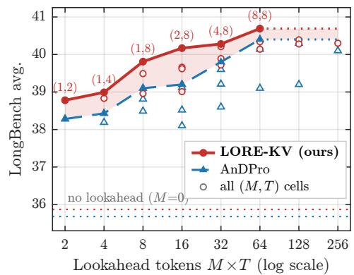  
(b) Pareto frontier at matched lookahead-token budget

Table 14: LongBench ablations (16-dataset average) with Mistral-7B-Instruct-v0.2.
<table><tr><td>Axis</td><td>Variant</td><td>B=128</td><td>B=256</td><td>B=512</td><td>B=1024</td></tr><tr><td rowspan="2">Core</td><td>LORE-KV /E core</td><td>40.28</td><td>41.38</td><td>41.86</td><td>42.20</td></tr><tr><td>LORE-KV /D core</td><td>40.21</td><td>41.23</td><td>41.68</td><td>42.39</td></tr><tr><td rowspan="4">Lookahead budget</td><td>M=0 (prompt window only; no lookahead term)</td><td>35.87</td><td>37.50</td><td>38.70</td><td>39.50</td></tr><tr><td>M=1 (single surrogate response)</td><td>39.81</td><td>40.85</td><td>41.56</td><td>42.03</td></tr><tr><td>M=2</td><td>40.17</td><td>40.18</td><td>41.10</td><td>41.22</td></tr><tr><td>M=8</td><td>40.69</td><td>40.97</td><td>41.52</td><td>41.65</td></tr><tr><td rowspan="2">Reliability weighting</td><td>Log-probability only</td><td>40.29</td><td>41.39</td><td>41.30</td><td>41.40</td></tr><tr><td>Entropy + disagreement</td><td>40.33</td><td>41.40</td><td>41.84</td><td>42.17</td></tr><tr><td rowspan="4">Perturbation objective</td><td>Projected norm,  $\| \mathbf { W } ^ { O } \Delta \mathbf { o } \| _ { 2 } ^ { 2 }$ </td><td>40.28</td><td>41.38</td><td>41.86</td><td>42.20</td></tr><tr><td>Accumulated attention mass</td><td>40.19</td><td>41.27</td><td>41.65</td><td>42.13</td></tr><tr><td>Unprojected norm, ∥∆o||½</td><td>40.22</td><td>41.22</td><td>41.65</td><td>42.13</td></tr><tr><td>AnDPro scoring with the same continuations</td><td>40.24</td><td>41.30</td><td>41.74</td><td>42.15</td></tr><tr><td rowspan="3">Plug-ins</td><td>+ Adaptive head budgets</td><td>40.28</td><td>41.35</td><td>41.72</td><td>41.72</td></tr><tr><td>+ Adaptive budgets and diversity</td><td>40.30</td><td>40.33</td><td>41.50</td><td>41.80</td></tr><tr><td>+ Robust Aggregation</td><td>40.34</td><td>41.41</td><td>41.85</td><td>42.17</td></tr></table>

Table 15: RULER ablations with Mistral-7B-Instruct-v0.2 (13-task averages).
<table><tr><td colspan="4"></td><td colspan="3">B=128</td><td colspan="3">B=256</td></tr><tr><td>M</td><td>Reliability weighting</td><td>Head budgets</td><td>Selection</td><td>4K</td><td>8K</td><td>16K</td><td>4K</td><td>8K</td><td>16K</td></tr><tr><td colspan="3">AnDPro (strongest baseline)</td><td></td><td>54.85</td><td>50.06</td><td>45.20</td><td>71.05</td><td>64.08</td><td>57.91</td></tr><tr><td rowspan="3">1</td><td rowspan="3">unit weight</td><td>uniform</td><td>top-K</td><td>56.90</td><td>54.29</td><td>52.15</td><td>68.45</td><td>62.77</td><td>57.70</td></tr><tr><td>adaptive</td><td>top-K</td><td>56.92</td><td>54.31</td><td>52.18</td><td>68.50</td><td>62.81</td><td>57.75</td></tr><tr><td>adaptive</td><td>diversity</td><td>56.95</td><td>54.34</td><td>52.20</td><td>68.55</td><td>62.85</td><td>57.78</td></tr><tr><td rowspan="2">4</td><td>Log-probability only</td><td>uniform adaptive</td><td>top-K top-K</td><td>58.39</td><td>55.72</td><td>50.98</td><td>70.08</td><td>64.45</td><td>58.85</td></tr><tr><td>adaptive</td><td></td><td>diversity</td><td>58.28 58.31</td><td>55.68 55.70</td><td>50.95 50.97</td><td>70.04 70.07</td><td>64.42 64.45</td><td>58.82 58.85</td></tr><tr><td rowspan="2">4</td><td>LORE-KV/E</td><td>adaptive</td><td>top-K</td><td>58.37</td><td>55.74</td><td>51.02</td><td>71.45</td><td>65.46</td><td>59.88</td></tr><tr><td>uniform</td><td>top-K</td><td></td><td>58.40</td><td>55.77</td><td>51.05</td><td>71.51</td><td>65.52</td><td>59.94</td></tr><tr><td rowspan="3">4</td><td rowspan="3">LORE-KV/D</td><td>adaptive</td><td></td><td>58.28</td><td></td><td></td><td>69.72</td><td></td><td></td></tr><tr><td>adaptive</td><td>top-K diversity</td><td>58.31</td><td>55.70 55.72</td><td>50.96 50.98</td><td>69.75</td><td>64.50 64.53</td><td>58.92</td></tr><tr><td>uniform</td><td>top-K</td><td>58.31</td><td>55.74</td><td>50.97</td><td>69.77</td><td>64.56</td><td>58.95 58.94</td></tr></table>

## E.5 NIAH GRID

Figure 8 reports exact match and word recall for Llama-3.1-8B-Instruct at B = 1024 over context lengths of 4K–32K and needle depths of 0%–100% in 10% steps, with one prompt per cell. All methods use the same budget, observation window, and protected token set. Results are discussed in Section 4.2.

## F MECHANISM ANALYSIS

## F.1 MEASUREMENT PROTOCOL

All mechanism analyses use the same states and scoring code as the deployed eviction pipeline, with additional instrumentation used only for analysis. For each prompt, we capture the post-RoPE prompt-window queries, the full prefill $\mathbf { \check { K } } ^ { l , h } , \mathbf { V } ^ { l , h }$ , and the M lookahead trajectories together with $c _ { u } ^ { ( m ) } , H _ { u } ^ { ( m ) } , V _ { u } ^ { ( m ) } , D _ { m } , \hat { D } _ { m }$ , and $\omega _ { m }$ . We also greedy-decode once with the full cache to obtain the future queries $\mathcal { Q } _ { \mathrm { f u t u r e } } ,$ which serve only as an analysis-time oracle. These full-cache states are not retained during normal LORE-KV inference and are excluded from the reported cache budget. The reliability channels of Eq. 3 are stored separately, including disagreement when $\lambda _ { D } = 0$ , and per-step trajectory statistics require only MT floats per prompt.

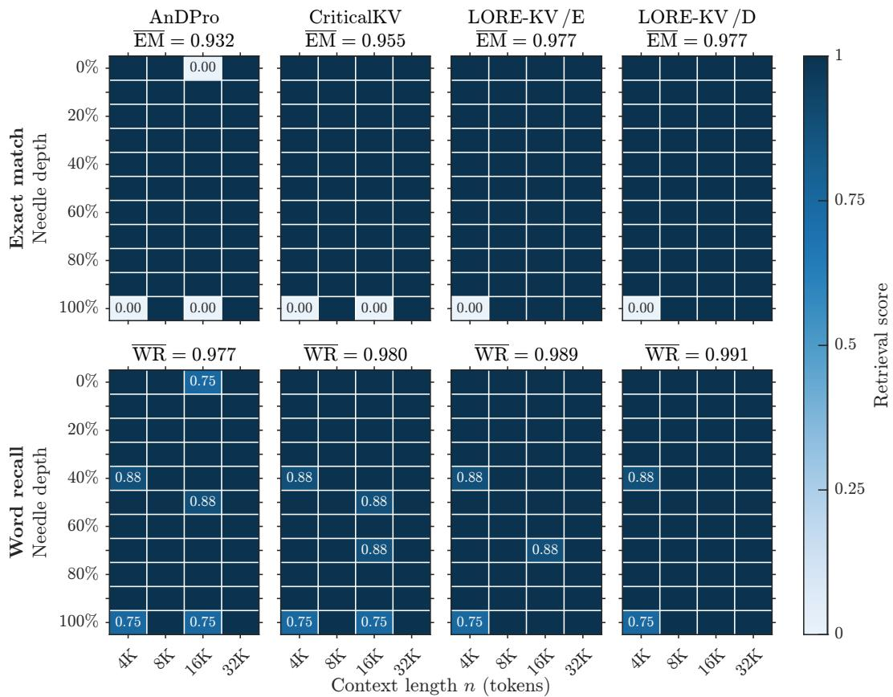  
Figure 8: NIAH retrieval. Exact-match and word-recall scores across needle depths and 4K–32K contexts on Llama-3.1-8B-Instruct at B=1024. Panel means are shown above each plot.

For token-level analysis, we use the same output-perturbation criterion as LORE-KV:

$$
s _ { q , i } ^ { l , h } = \left| \frac { a _ { q , i } ^ { l , h } } { 1 - a _ { q , i } ^ { l , h } + \epsilon } \right| \left\| \mathbf { W } _ { l , h } ^ { O } \mathbf { v } _ { i } ^ { l , h } - \mathbf { W } _ { l , h } ^ { O } \mathbf { o } _ { q } ^ { l , h } \right\| _ { 2 } .\tag{12}
$$

Scores are aggregated using Eq. 7, with all criteria sharing the same captured states and selector. Attention uses SnapKV-style prompt-window attention; AnDPro window uses prompt-side projected perturbation; LORE-KV uses the projected perturbation score with LORE-KV /E weighting; and Single-lookahead uses one unweighted trajectory as a score-level proxy for Lookahead Q-Cache. These controlled comparisons measure how the query reference changes token ranking (Figure 9), agreement with the future-query oracle (Figure 10), retained evidence (Figure 11), and behavioral fidelity across cache budgets (Figure 13). Protected positions $\mathcal { P }$ are always retained, and all remaining tokens use the same uniform per-head top-min(B, n) selector, so differences are attributable to the scoring/query criterion rather than downstream selection.

Equation 12 uses magnitude rather than the squared magnitude of Eq. 6; this preserves single-query rankings but changes the energy scale in Figure 12. For these analyses, chunking, adaptive head budgets, and diversity-aware selection are disabled, and B includes the ∼33 protected positions. Figure 12 additionally sums energy over all positions and reports GQA-expanded attention heads, while Figure 11 identifies answer tokens by exact token-id match to the gold answer; this may underestimate absolute evidence retention but affects all criteria equally.

We use three complementary diagnostics. Query coverage measures how closely an estimated query set matches the true future queries:

$$
\operatorname { C o v } \left( \mathcal { Q } _ { \mathrm { f u t u r e } } ; \{ \hat { \mathcal { Q } } _ { s } \} , \pi \right) = \frac { 1 } { H } \sum _ { h } \frac { 1 } { T _ { \mathrm { f } } } \sum _ { t } \sum _ { s } \operatorname* { m a x } _ { \hat { \mathbf { q } } \in \hat { \mathcal { Q } } _ { s } } \cos \left( \mathbf { q } _ { t , h } ^ { \mathrm { f u t u r e } } , \hat { \mathbf { q } } \right) .\tag{13}
$$

The oracle score $S ^ { \star }$ applies Eq. 7 directly to $\mathcal { Q } _ { \mathrm { f u t u r e } } ,$ and retention agreement is measured by

$$
{ \mathrm { R e c a l l } } \ @ B ( S , S ^ { \star } ) = { \frac { \vert { \mathrm { t o p } } _ { B } ( S ) \cap { \mathrm { t o p } } _ { B } ( S ^ { \star } ) \vert } { B } } .\tag{14}
$$

Finally, behavioral fidelity measures how closely the compressed cache reproduces the full-cache attention output:

$$
\begin{array} { r } { F ( B ) = \mathbb { E } _ { \mathbf { q } \sim Q _ { \mathrm { f u t u r e } } } \cos \bigl ( \mathbf { o } _ { q } ^ { \mathcal { R } ( B ) } , \mathbf { o } _ { q } \bigr ) . } \end{array}\tag{15}
$$

Queries are unit-normalized for the cosine-based metrics, and the prompt-to-future mismatch Mis(X) is defined in Section 4.5. Unless stated otherwise, all analyses use Mistral-7B-Instructv0.2 on LongBench and 4K RULER with the core LORE-KV /E configuration.

## F.2 FUTURE-QUERY COVERAGE

Figure 1 examines whether sampled lookahead queries better represent the queries encountered during generation. We compare the prompt-window queries $\mathcal { Q } _ { \mathcal { W } } ^ { l , h }$ , the sampled lookahead queries $\mathcal { Q } _ { \mathrm { l o o k } } ^ { ( m ) , l , h }$ , and the true future queries $\mathcal { Q } _ { \mathrm { f u t u r e } } ,$ where $\mathcal { Q } _ { \mathrm { f u t u r e } }$ is obtained only retrospectively from full-cache decoding and is never available to the eviction rule.

Panel (a) visualizes these three query sets for one representative layer and KV head (layer 16, head 18) after projection onto the first two principal components. The sampled trajectories move toward the region occupied by the true future queries, illustrating the prompt-to-future query mismatch that motivates LORE-KV.

Panel (b) quantifies this effect using the coverage metric in Eq. 13. The prompt-window reference achieves 0.785 coverage, while adding sampled trajectories progressively increases coverage of $\mathcal { Q } _ { \mathrm { f u t u r e } } ,$ with most of the gain obtained by approximately M=4. The sweep uses nested prefixes of the same eight sampled trajectories for each prompt, so changes reflect increased future-query coverage rather than different random draws.

Coverage measures geometric support in query space rather than downstream eviction quality. Consequently, the small change from M=0 to M=1 (0.785 →0.786) does not contradict the substantial end-to-end improvement from a single response-side rollout in Tables 14 and 15: one trajectory can already provide a more relevant query reference, while additional trajectories improve coverage of alternative plausible futures. Together, these results support the central design of LORE-KV: estimating token utility over multiple plausible response-side query trajectories provides a better reference for eviction than relying on prompt-side queries alone.

## F.3 RETENTION-ORDER SHIFT

Figure 9 tests whether lookahead changes token selection rather than simply rescaling prompt-side scores. At $B { = } 1 2 8$ , attention and LORE-KV /E retain only 0.82 of the same tokens on LongBench and 0.86 on RULER, despite high overall Spearman rank correlation $( \rho { = } 0 . 9 4$ and 0.87). Thus, lookahead preserves much of the global ranking while changing the tokens near the retention boundary. In contrast, single-lookahead and LORE-KV /E are much more similar (0.97/0.92 top-B overlap on LongBench/RULER), showing that most of the ranking shift already comes from replacing prompt-side queries with response-side queries.

Figure 10 compares each criterion with the future-query oracle under the same selection rule. At B=128 on LongBench, LORE-KV /E increases oracle-retention agreement from 0.50 for the window-only control to 0.63, while also reducing full-cache output error from 0.177 to 0.138. The same advantage persists across budgets and on RULER, showing that response-side lookahead yields a token ranking that better matches future decoding needs.

These controlled comparisons isolate the source of the gain: changing the query reference toward plausible future decoding states produces substantially better agreement with the future-query oracle, whereas prompt-side attention- and value-based criteria remain much closer to one another.

CriticalKV AnDPro Window-only (6 = 0) LORE-KV  
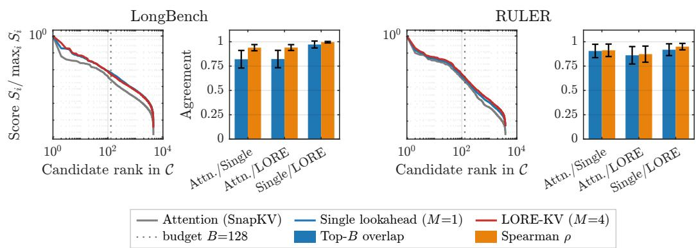  
Figure 9: Retention-order shift. Candidate-score profiles, top-B overlap, and Spearman correlation across eviction criteria. Mistral-7B-Instruct-v0.2, B = 128, M = 4.

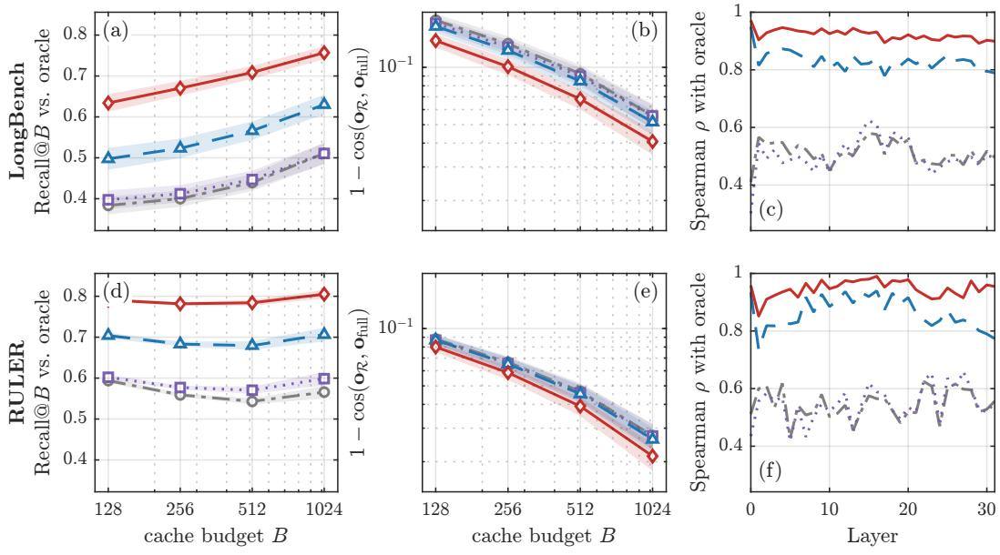  
Figure 10: Criterion comparison. (a,d) Recall@B against the future-query oracle. (b,e) Attentionoutput error (lower is better). (c,f) Layer-wise Spearman correlation with the oracle.

This supports the central hypothesis of LORE-KV that which queries define token importance is more important than further refining the prompt-side scoring rule.

## F.4 RELIABILITY WEIGHTING: ROBUSTNESS BEYOND THE QUERY REFERENCE

Reliability weighting acts only on the already-sampled trajectories and therefore adds no extra testtime decoding. Trajectory disagreement $\hat { D } _ { m }$ provides an additional reliability signal across sampled futures. Its role is deliberately conservative: the reliability signals are only weakly correlated with oracle retention utility Recall @B (Eq. 14), particularly on RULER, and hard-filtering low-reliability trajectories does not reduce the residual query-coverage error 1 − Cov. We use reliability as a soft correction through $\omega _ { m }$ in Eq. 3, reducing the influence of uncertain or atypical trajectories without discarding plausible futures.

Importantly, the main robustness gain comes from covering multiple plausible futures. Figure 1(b) shows that future-query coverage increases from 0.785 for the prompt-window reference to 0.802 at M=2 and 0.811 at M=8, with gains saturating near M=4. This shows that sampling multiple trajectories provides broader coverage of the future-query space than relying on a single prompt-side reference. Reliability weighting then acts as a complementary soft correction, reducing the influence of uncertain or atypical trajectories without discarding plausible futures.

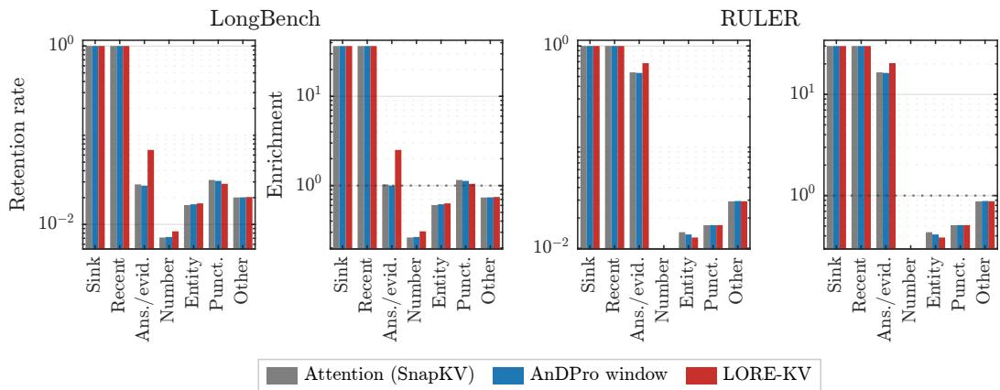

Figure 11: Retention by token class. Mean retained fraction (left) and class enrichment $P ( c$ | ${ \mathcal { R } } ) / P ( c | X )$ (right).  
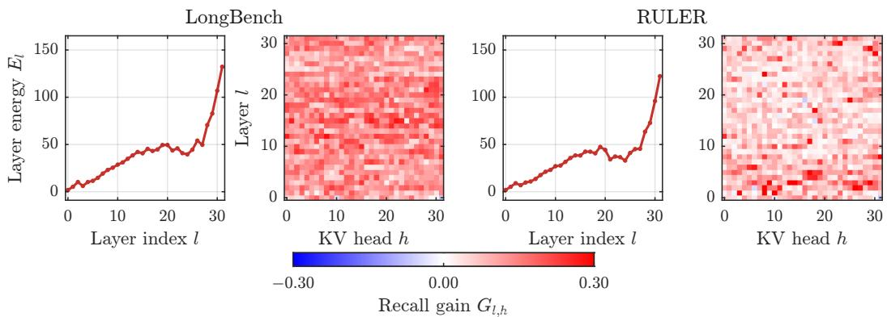  
Figure 12: Future-query signal across layers and heads. Layer perturbation energy (left) and retention-recall gain from multi-lookahead queries (right). Mistral-7B-Instruct-v0.2, $B \ = \ 1 2 8$ $M = 4$

The oracle diagnostics in Figure 10 reinforce this interpretation. At $B { = } 1 2 8$ on LongBench, Recall @B against the future-query oracle increases from 0.39 for the prompt-side criteria (CriticalKV and AnDPro) and 0.50 for the $\lambda _ { L } { = } 0$ window-only control to 0.63 for LORE-KV /E. The same ordering persists across budgets and on RULER. Similarly, the attention-output error $1 - \cos ( \mathbf { o } _ { \mathcal { R } } , \mathbf { o } _ { \mathrm { f u l l } } )$ decreases from 0.177 to 0.138 at B=128, while LORE-KV /E maintains substantially higher layer-wise agreement with the oracle (Spearman $\rho \approx 0 . 9 0 – 0 . 9 5 )$ than either the window-only control (≈ 0.80-0.85) or prompt-side criteria (≈ 0.45-0.60). Finally, LORE-KV /E and LORE-KV /D remain within 0.19 LongBench points at every budget (Table 14). Together, these results show that LORE-KV is robust primarily because it estimates utility over multiple plausible future queries; entropy and disagreement weighting provide a secondary safeguard against noisy or atypical samples rather than a separate source of performance.

## F.5 RETAINED-TOKEN COMPOSITION

Figure 11 examines which token classes are preserved after compression. The protected sink and recent-token classes are identical across methods, while the main difference is in answer-bearing evidence. On LongBench, LORE-KV /E increases answer/evidence enrichment from approximately 1× for the prompt-side baselines to 2.51×, with the corresponding retention rate rising from about

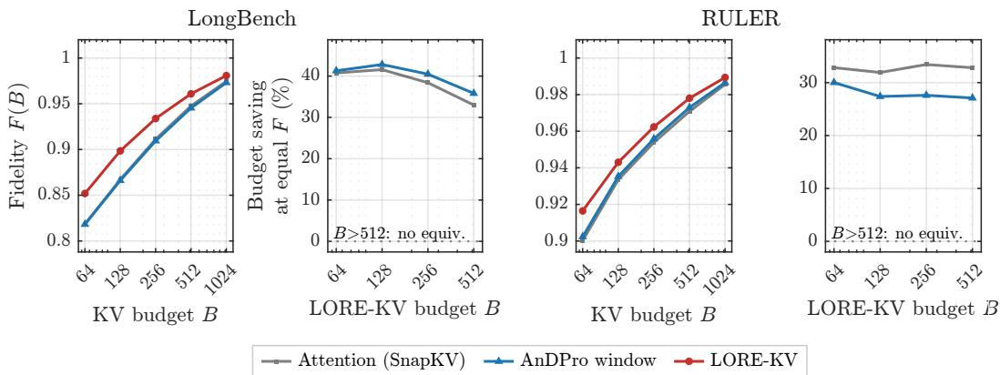  
Figure 13: Budget equivalence under behavioral fidelity. Fidelity across cache budgets (left) and baseline cache savings required to match LORE-KV /E (right).

0.028 to 0.069. The same trend holds on RULER, where answer/evidence enrichment increases to 20.3 compared with 16.5-16.3 for the baselines. Other token classes change only modestly. This consistent shift across benchmarks shows that future-query lookahead does not indiscriminately retain more tokens; it preferentially preserves evidence that is relevant to subsequent decoding, providing a direct mechanism for the downstream gains reported in Section 4.2.

## F.6 LAYER- AND HEAD-LEVEL STRUCTURE

Figure 12 shows that the future-query signal is distributed across the network rather than concentrated in a single component. Perturbation energy generally increases with depth, while replacing window-only queries with multi-lookahead queries improves retention recall for most heads, with the largest gains concentrated in a subset of middle-depth heads. The same qualitative pattern appears on both LongBench and RULER, supporting the robustness of the lookahead signal across tasks. This non-uniformity is consistent with head specialization (Feng et al., 2025b; Fu et al., 2025) and motivates the adaptive allocation in Eq. 11; however, its modest additional gain indicates that the core LORE-KV /E score already captures most of the benefit.

## F.7 BUDGET EQUIVALENCE IN BEHAVIORAL FIDELITY

Figure 13 complements Table 16 by measuring cache quality continuously with the behavioral fidelity F(B) of Eq. 15. Across the full budget range, LORE-KV /E consistently preserves fullcache behavior better than the prompt-side baselines on both LongBench and RULER, with the largest advantage at tighter budgets and the same ordering maintained as B increases.

Matching the fidelity of LORE-KV /E requires approximately 33-43% more retained budget on LongBench and 27-34% on RULER. This shows

Table 16: Baseline budgets matching LORE-KV /E on LongBench (Mistral-7B-Instructv0.2).
<table><tr><td>LORE-KV /E budget</td><td>128</td><td>256</td><td>512</td><td>1024</td></tr><tr><td>Ada-KV</td><td>~332</td><td>~745</td><td>&gt;1024</td><td>&gt;1024</td></tr><tr><td>CriticalKV</td><td>~307</td><td>~709</td><td>&gt;1024</td><td>&gt;1024</td></tr><tr><td>AnDPro</td><td>~208</td><td>~414</td><td>~743</td><td>&gt;1024</td></tr><tr><td>Saving (%)</td><td>38.5</td><td>38.1</td><td>31.1</td><td>&gt; 0</td></tr></table>

that the advantage is not tied to a single operating point, but persists across compression levels. These fidelity results are consistent with the task-level performance trends reported for LongBench in Table 1 and for RULER in Figure 3 and Tables 7 and 10. If a baseline does not reach the target fidelity within the tested budgets, we report only a lower bound on the required budget saving.

## G THE TWO RELIABILITY VARIANTS IN THE $( \beta , \gamma , \lambda _ { D } )$ PLANE

The LORE-KV /E and LORE-KV /D variants differ only in the reliability coefficients defined in Table 4, with end-to-end comparisons reported in Tables 1, 6, 14, and 15, and in Figure 3. At B=128,

both variants re-weight the same nested prefixes from a single eight-particle draw per prompt, keeping the sampled trajectories and test-time compute fixed.