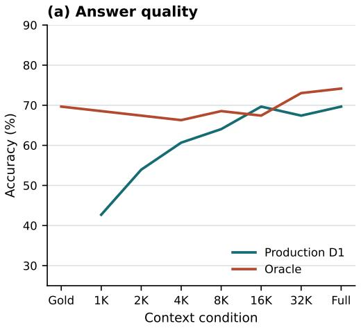
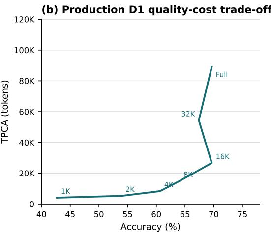

# Memory Depth and Reconstructed Context Width: A Controlled Evaluation of Hierarchical Retrieval

Michael Andreev∗ Independent Researcher michael.andreev.ux@gmail.com

## Abstract

Long-term conversational memory is becoming an integral component of modern LLM systems. Proposed architectures group records by topics and events, construct hierarchies and graphs, and connect facts through causal and temporal relations. We experimentally study the interaction between two memory parameters: structural depth and the width of context supplied to the answer model. Using EverMemBench, we evaluate depths D1–D4, core budgets of 1,024/2,048/4,096 tokens, and additional Production and Oracle conditions up to the full archive. Increasing width from 1K to 4K improves Accuracy by 10.11–17.98 percentage points, whereas increasing depth provides no monotonic gain. Beyond 8–16K, Production performance reaches a plateau while tokens per correct answer continue to increase; Oracle preserves quality on full archives of 68–71K tokens. These results motivate further investigation of large, coherent context blocks instead of progressively deeper memory structures.

## 1 Problem and research questions

Hierarchical organization is used for interactive memory navigation and temporal consolidation [Chen et al., 2023, Li et al., 2026], while recent systems combine event graphs, multi-level representations, and controlled retrieval [Wu et al., 2026, Cao et al., 2026, Xu et al., 2026]. Routing depth and reconstructed context volume, however, usually vary as coupled properties of an architecture rather than as jointly controlled parameters. A closely related study finds that an additional progressivedisclosure level may fail to improve quality and can reduce it, but focuses on document navigation rather than long-term conversational memory [He et al., 2026]. We ask: RQ1 How do joint changes in Depth and Width affect answer quality and token efficiency? RQ2 Which measurable quantitie identify a useful Depth–Width operating point and inform memory architecture choices?

## 2 System and experimental design

The pipeline contains structured memory construction and context retrieval. A Memory Writer converts dialogue into event cards linked to source messages. A Hierarchy Writer assigns every card to a causal-thematic map without a preset depth limit. Embeddings are built for nodes, cards, and dialogue chunks. At answer time, a Production Router ranks nodes and cards by hybrid lexicalsemantic search. When cards are insufficient, a Context Packer retrieves source chunks associated with selected nodes, fits them to the Width budget, and restores chronological order. Depth is the number of accessible map levels; shallower conditions remove complete lower levels and their cards.

EverMemBench contains long multi-party dialogues and question-answer-reference triples [Hu et al., 2026]. The available data comprise 51,023 messages (about 3.37M tokens) and 2,400 questions:

Table 1: Dev Accuracy (%) / TPCA (thousands of tokens).
<table><tr><td>Retrieval</td><td>Gold</td><td>1K</td><td>2K</td><td>4K</td><td>8K</td><td>16K</td><td>32K</td><td>Full</td></tr><tr><td>Production D1</td><td></td><td>31.58/6.7</td><td>55.26/5.9</td><td>57.89/9.4</td><td>65.79/15.0</td><td>65.79/28.7</td><td>73.68/49.9</td><td>68.42/82.6</td></tr><tr><td>Production D2</td><td></td><td>26.32/7.9</td><td>42.11/7.7</td><td>47.37/11.4</td><td></td><td>一</td><td>一</td><td>一</td></tr><tr><td>Production D3</td><td></td><td>39.47/5.4</td><td>44.74/7.3</td><td>50.00/11.0</td><td></td><td></td><td></td><td></td></tr><tr><td>Production D4</td><td></td><td>28.95/7.3</td><td>36.84/9.0</td><td>42.11/12.5</td><td></td><td>一</td><td>一</td><td></td></tr><tr><td>Oracle</td><td>68.42/4.1</td><td></td><td></td><td>65.79/8.5</td><td>68.42/14.9</td><td>71.05/27.6</td><td>68.42/55.8</td><td>63.16/117.7</td></tr></table>

1,638 multiple-choice and 762 free-form, all with reference evidence. We selected three independent topic-month episodes totaling 196,798 tokens, 2,996 messages, and 127 questions. Dev is episode 02-2025-05 (38 questions); Main is episodes 04-2025-05 and 05-2025-05 (89 questions). Writer, map, Router, and evaluation procedures were developed on Dev and frozen before Main. Questions, answers, and reference evidence were excluded from memory construction and Production indexing.

## 3 Dev protocol development

The experiment began with a general $D \times W$ matrix and no restriction on hierarchy depth. The Writers produced a naturally supported map reaching D4, yielding D1–D4 conditions. Based on source context associated with map topics, we selected incomplete-pool budgets of 1K/2K/4K. Accuracy increased with Width, but Depth produced no monotonic gain: at 4K, Accuracy was 57.89/47.37/50.00/42.11% for D1–D4. Evidence recall and Q-hit also increased, but not proportionally to Accuracy.

Ambiguous core results motivated D1-wide (8K/16K/32K/full-map) and Oracle (goldonly/4K/8K/16K/32K/full-archive) diagnostics. Oracle retained all gold evidence while adding real dialogue context, separating memory failures from the reader’s use of wider inputs. It is not a strict Accuracy upper bound because performance also depends on surrounding context and packing. Dev suggested possible saturation, but one episode was insufficient for a conclusion (Table 1).

Multiple-choice answers are scored deterministically. Two independent, condition-blind judges (GPT-5.6 Sol and GPT-5.6 Terra) evaluate free-form answers, with disagreements resolved by blinded manual adjudication. This addresses known LLM-judge limitations such as position bias [Zheng et al., 2023]. Metrics are Accuracy; tokens per correct answer (TPCA), defined as total tokens divided by correct answers; evidence recall, the fraction of gold source messages in packed context; and Q-hit, the fraction of questions retrieving at least one gold source message. Accuracy and TPCA use question-level bootstrap with 20,000 replicates [Koehn, 2004]. Paired comparisons use exact McNemar tests [McNemar, 1947] with Holm correction. Before Main we froze data, maps, embeddings, the Grok 4.3 reader, Router, 22 conditions, judging, statistics, and three hypotheses: H1 Width improves Accuracy within each Depth; H2 Width-effect magnitude depends on Depth; H3 Width has a useful operating range, with narrow contexts limiting quality and Accuracy plateauing after sufficient width while TPCA rises.

## 4 Frozen Main experiment

The two frozen Main maps contained 489/512 cards and 90/108 nodes, reached D4, and assigned every card to exactly one leaf. A post-construction evidence audit gave 93.23/92.43% coverage; gold annotations did not modify the maps. The 22 conditions comprised 12 Production combinations (D1– D4 × 1K/2K/4K), four D1-wide conditions, and six Oracle conditions. We used 1,536-dimensional text-embedding-3-small embeddings, hybrid score $\alpha = 0 . 6 5$ , scalable branch/card caps, 320- token source chunks, and Grok 4.3 at temperature zero. All 1,958 answers and required free-form judgments completed successfully.

## 4.1 RQ1: Depth × Width

Width from 1K to 4K improved Accuracy at every depth: D1 42.70→60.67%, D2 38.20→48.31%, D3 39.33→55.06%, and D4 39.33→52.81%. Effects were +10.11 to +17.98 points; all bootstrap 95% CIs excluded zero and Holm-adjusted McNemar tests gave $p \leq . 0 1 1 7$ . H1 is supported. Width effects varied by Depth, but no omnibus interaction test was prespecified; H2 was not formally tested. Depth gave no monotonic gain. At 4K the ordering was D1 60.67%, D3 55.06%, D4 52.81%,

Table 2: Main Accuracy (%) / TPCA (thousands of tokens), $n = 8 9 .$
<table><tr><td>Retrieval</td><td>Gold</td><td>1K</td><td>2K</td><td>4K</td><td>8K</td><td>16K</td><td>32K</td><td>Full</td></tr><tr><td>Production D1</td><td>一</td><td>42.70/4.1</td><td>53.93/5.3</td><td>60.67/8.4</td><td>64.04/14.9</td><td>69.66/26.7</td><td>67.42/54.3</td><td>69.66/89.1</td></tr><tr><td>Production D2</td><td></td><td>38.20/4.6</td><td>42.70/6.6</td><td>48.31/10.2</td><td></td><td></td><td>一</td><td></td></tr><tr><td>Production D3</td><td></td><td>39.33/4.6</td><td>48.31/6.0</td><td>55.06/9.3</td><td></td><td></td><td></td><td></td></tr><tr><td>Production D4</td><td></td><td>39.33/4.6</td><td>47.19/6.2</td><td>52.81/9.5</td><td></td><td></td><td></td><td></td></tr><tr><td>Oracle</td><td>69.66/3.8</td><td></td><td></td><td>66.29/7.8</td><td>68.54/14.3</td><td>67.42/28.8</td><td>73.03/52.4</td><td>74.16/108.1</td></tr></table>

D2 48.31%. None of nine matched-width D1–Dx comparisons survived joint Holm correction; the strongest was D1 versus D2 at 4K (+12.36 points, $p _ { \mathrm { H o l m } } = . 0 6 6 5 )$ .

## 4.2 RQ2: Efficiency and sources of error

Production D1 reached 64.04% at 8K and 69.66% at 16K, then did not improve: 32K yielded 67.42% and full-map 69.66%. TPCA rose from 14.9K to 26.7K, 54.3K, and 89.1K; wide comparisons beyond 8K were nonsignificant after Holm correction. Together with the significant 1K–4K improvement, this supports H3: the useful range lies between insufficiently narrow context and a plateau around 8–16K.

Oracle scored 69.66% on gold-only, 66.29–68.54% at 4–16K, 73.03% at 32K, and 74.16% on full-archive. No gold-only comparison was significant after Holm correction $( p = 1 . 0 )$ . At 16K, Production D1 scored 69.66% versus Oracle 67.42%; a post-hoc paired test also found no difference (p = .73). Guaranteed evidence is therefore not a strict Accuracy upper bound at every operating point. Full archives of 68–71K tokens showed no reader degradation. The Production–Oracle gap is compatible with writing and retrieval losses but does not identify one causal mechanism.

  
Figure 1: Main Accuracy by context-width condition for Production D1 and Oracle (left), and TPCA as a function of achieved Accuracy for Production D1 (right).

At 4K, core recall was 39.27/32.69/37.58/38.54% for D1–D4. Yet D1–4K Q-hit of 96.63% corresponded to only 60.67% Accuracy. Retrieving some evidence does not guarantee context sufficient for a correct answer.

## 5 Discussion and conclusion

Dev and Main differed beyond the core matrix. Dev Accuracy fell after a certain width, whereas Main Production plateaued around 8–16K and Oracle preserved quality through the full archive. The shifted saturation point is not a universal model constant: it depends on system, data, and input construction and requires deployment-specific calibration. This distinction between nominal and effective context agrees with sensitivity to input position, length, and task complexity reported elsewhere [Liu et al., 2024, Hsieh et al., 2024, Paulsen, 2025].

Depth provided no monotonic improvement, but no D1–Dx difference survived Holm correction; we therefore do not claim that depth is harmful. The narrower result is that it provided no confirmed benefit here, while each added level introduces further classification, linking, and routing decisions. Moreover, the Context Packer consumed similar token volumes across D1–D4, so this design does not test whether hierarchy can reduce token use.

Beyond 8–16K, TPCA grew disproportionately to Accuracy. Production D1 doubled TPCA from 16K to 32K without improving quality; Oracle likewise approximately doubled TPCA on its final step for little gain. Oracle gold-only and Production Full both achieved 69.66% Accuracy, but TPCA was 3.83K versus 89.07K: exact oracle-guided selection required 23.2× fewer tokens per correct answer. This illustrates precise retrieval’s value but is not a causal estimate of all Production losses.

The combined results motivate a hypothesis for future evaluation: memory may work better as a shallow index into a small number of large, causally and topically coherent blocks than as maximally atomic facts. Each block should preserve a locally complete event and remain within the reader’s effective range; the index selects the block and the model reasons within it. This is related to event-centric StructMem and two-level event-turn retrieval in HiGMem [Xu et al., 2026, Cao et al., 2026], but follows here from controlled Depth and Width variation. The unresolved problem is defining boundaries for events spanning much of a dialogue. Duplication scales poorly, while one summary card may lose coherence; cross-block links or a separate cross-cutting layer remain untested directions.

Limitations. One dataset, one reader, two Main maps, and depth only to D4 limit generalization. Post-hoc, 21/89 questions were correct in all 22 conditions, 15 were never correct, and 53 were configuration-dependent. This heterogeneity requires separate validation. The results do not establish a universal block size or final architecture; they redirect study from maximum decomposition depth toward coherent block size, boundary quality, and routing cost at larger scales.

## References

Cao, S., He, J., and Tan, F. HiGMem: A hierarchical and LLM-guided memory system for long-term conversational agents. Findings ofACL, 2026.

Chen, H., Pasunuru, R., Weston, J., and Celikyilmaz, A. Walking down the memory maze: Beyond context limit through interactive reading. arXiv:2310.05029, 2023.

He, Y., Zhao, Y., Wang, J., and Chen, H. Is progressive disclosure all you need for long-context agents? arXiv:2607.17598, 2026.

Hsieh, C.-P. et al. RULER: What’s the real context size of your long-context language models? arXiv:2404.06654, 2024.

Hu, C. et al. Evaluating long-horizon memory for multi-party collaborative dialogues. KDD, 2026. arXiv:2602.01313.

Koehn, P. Statistical significance tests for machine translation evaluation. EMNLP, 388–395, 2004.

Li, K. et al. TiMem: Temporal-hierarchical memory consolidation for long-horizon conversational agents. Findings ofACL, 2026. arXiv:2601.02845.

Liu, N. F. et al. Lost in the middle: How language models use long contexts. TACL, 2024.

McNemar, Q. Note on the sampling error of the difference between correlated proportions or percentages. Psychometrika, 12:153–157, 1947.

Paulsen, N. Context is what you need: The maximum effective context window for real world limits of LLMs. arXiv:2509.21361, 2025.

Wu, Z. et al. GAM: Hierarchical graph-based agentic memory for LLM agents. ACL, 34647–34664, 2026.

Xu, B. et al. StructMem: Structured memory for long-horizon behavior in LLMs. ACL, 122–146, 2026.

Zheng, L. et al. Judging LLM-as-a-judge with MT-Bench and Chatbot Arena. arXiv:2306.05685, 2023.