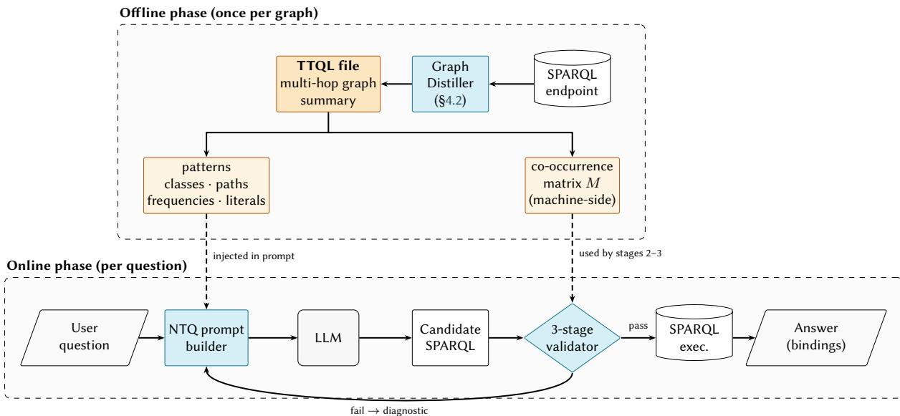
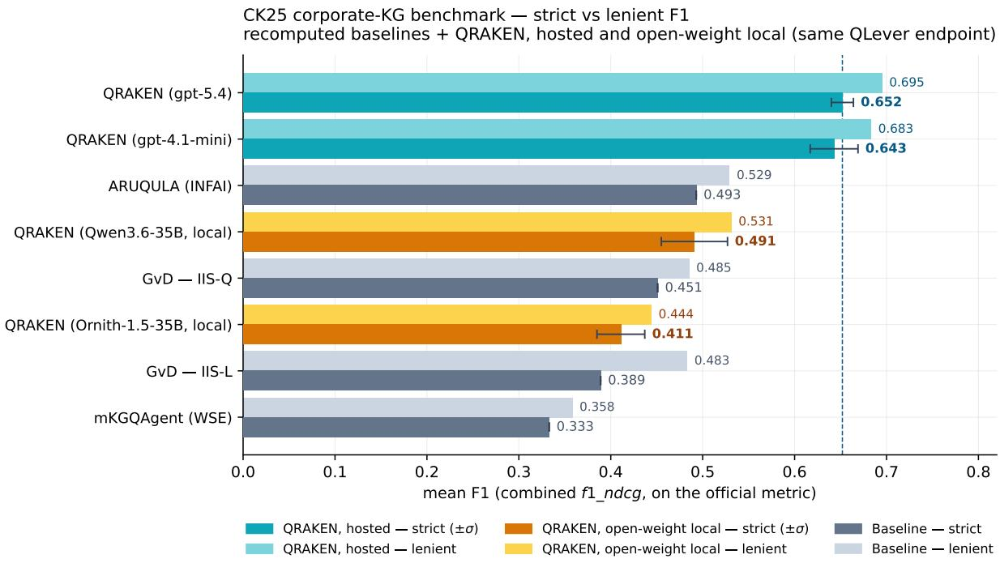

# Natural Language Questions as an Interface for Knowledge Graphs: QRAKEN Graph Distillation and Semantic Self-Healing

Remo Grillo1,2,\*, Lukas Klic2 and Giovanni Colavizza1,3

1University of Bologna, Via Zamboni 33, 40126 Bologna, Italy

2I Tatti — The Harvard University Center for Italian Renaissance Studies, Via di Vincigliata 26, 50135 Florence, Italy

3Department of Communication, University of Copenhagen, Karen Blixens Plads 8, 2300 Copenhagen S, Denmark

## Abstract

Natural-language access to RDF knowledge graphs is a core Semantic Web ambition, and large language models (LLMs) have recently made Text-to-SPARQL feasible at scale; yet the dominant failure mode, on graphs outside the LLM pretraining distribution, is not syntax but graph-grounded correctness: queries that parse, use real vocabulary, and still silently misrepresent the data model ofthe target graph. Existing approaches — online agentic exploration, fine-tuning or retrieval over question-query traces, and shape/metadata prompting — share a common limitation: generation is grounded in what the graph should contain according to an ontology or shape specification, rather than in how it is actually populated. We present QRAKEN, a training-free, ontology-agnostic neurosymbolic pipeline for question answering over RDF knowledge graphs. An ofline distiller summarizes the populated graph into a TTQL file — a compact description of empirical multi-hop patterns, conditional frequencies, and path-conditioned literal examples — plus a co-occurrence matrix of classes and properties. Online, the NTQ module injects TTQL into the LLM context and passes the candidate SPARQL through deterministic syntactic, lexical, and data-model checks (grounded purely in the distilled empirical evidence), whose diagnostics feed a deterministic self-healing refinement loop. On CK25 (First International Text2SPARQL Challenge), under matched-condition recomputation on a QLever snapshot, QRAKEN exhibits a better performance among systems built on the same base model family: strict F1 0.643 ± 0.026 with GPT-4.1 mini and 0.652 ± 0.012 with GPT-5.4, +30% and +32% over the strongest recomputed participant. An ablation isolates TTQL pattern blocks as the dominant driver (+0.31 strict F1 over a shape-only baseline), while the self-healing loop acts as a cheap deterministic safety net that rejects queries whose triple patterns have zero support in the co-occurrence matrix. Against an auto-derived SHACL baseline, TTQL delivers +64% higher strict F1, confirming that its value lies in pattern-level empirical content, not mere schema exposure. The same pipeline driving two 35B 4-bit open-weight models locally, at zero marginal cost, performs on par with the strongest recomputed participant system, and both TTQL efects persist. Results come from a single, relatively small benchmark and should be read as an initial empirical signal; the main current limitation is monolithic TTQL injection on very open cross-domain graphs.

## Keywords

knowledge graph question answering, Text-to-SPARQL, large language models, graph summarization, trainingfree prompting, neurosymbolic AI, linked open data

## 1. Introduction

Natural-language access to RDF knowledge graphs (KGs) is a long-standing goal of the Semantic Web and, concretely, of knowledge graph question answering (KGQA): translating a user’s question into SPARQL lets non-expert users exploit the reasoning and integration guarantees of RDF-based data without having to master its query language. With the accelerated adoption of large language models (LLMs) [1], Text-to-SPARQL has become the dominant incarnation of this goal, and recent initiatives such as the First International Text2SPARQL Challenge [2] have turned it into a measurable community task. Yet bringing LLM-based query generation to the quality level required by real Semantic

Web deployments — cultural-heritage, enterprise, scientific, and private graphs that are absent from pretraining corpora and whose populated data diverges from their declared ontologies — remains an open research problem, distinct from general code generation and from Text-to-SQL precisely because of RDF’s open-world semantics and the gap between prescriptive schemas (RDFS/OWL, SHACL/ShEx) and empirical graph usage. In realistic deployments, LLMs routinely produce queries that are syntactically plausible but semantically unfaithful to the target graph: they hallucinate predicates, invert edge directions, collapse multi-hop relations into nonexistent shortcuts, or pick projections that do not match the expected answer form. The dominant dificulty is therefore not language understanding but graph-grounded correctness.

In this setting, bare prompting leaves the model under-grounded — the target vocabulary and its populated usage are not in the pretraining distribution — while fine-tuning requires ontology-specific question-query pairs that are rarely available for private or evolving graphs and does not adapt to schema drift.

QRAKEN takes a diferent route. Instead of teaching the model a graph through machine learning, it summarizes the graph into a compact, LLM-readable intermediate representation, then couples generation with in-context learning and deterministic correctness checks. The pipeline is training-free in the sense adopted throughout the paper: no question-query training corpus is needed for a new graph, and the LLM does not need to study the graph at inference time; graph-side context (the TTQL file) is prepared once ofline, and the online path is a single supervised prompt plus deterministic validation.

The paper makes three contributions:

1. a conceptual account of correctness for Text-to-SPARQL, distinguishing syntactic, lexical, and data-model layers and arguing that the last is where most LLM failures occur (Sect. 3);

2. QRAKEN as a training-free, graph-distillation-based pipeline built around TTQL, a Turtleinspired descriptive language for empirical graph patterns, together with a correctness-guided self-healing loop (Sect. 4);

3. an empirical evaluation on CK25 showing that, under matched-condition recomputation, QRAKEN outperforms the participant systems of the First Text2SPARQL Challenge on strict F1 on this single benchmark, suggesting the potential of the approach (Sect. 5).

The broader systems-level claim is that, in domain-specific KGQA, graph grounding matters more than model scale: the results come not from larger LLMs or elaborate agent choreography, but from giving a compact model a faithful representation of how the target graph is actually used — an indication that warrants validation on additional benchmarks.

## 2. Related Work

The First International Text2SPARQL Challenge standardized only the external protocol (a REST endpoint returning a SPARQL query within a fixed timeout), leaving model choice, retrieval, indexing, and repair to participants. Its submissions and several post-challenge systems span three design families (Sects. 2.1–2.3); a fourth dimension, cost (Sect. 2.4), is largely missing from current evaluations.

## 2.1. Online agentic graph exploration

A first family delegates graph understanding to per-question online exploration. ARUQULA (INFAI) [3] generalizes a SPINACH-style ReAct workflow to arbitrary RDF graphs, driving utilities for searching, inspecting, and querying a hybrid QLever/Qdrant/Lucene backend; it reports GPT-4.1 mini as best cost-quality trade-of, which makes it the closest same-model comparator for QRAKEN, but pays a characteristic ∼1 min/question for iterative tool use. Graf von Data (GvD) [4] adopts a compact threeaction design on open-weight backends (IIS-Q with Qwen 2.5 72B, IIS-L with Llama 3.3 70B), noting that sub-10B models are insuficient for reliable agent loops. SPINACH [5] and the post-challenge GRASP [6] imitate how experts iteratively write SPARQL on Wikidata, with strong fine-tuning-free results. Relative to QRAKEN, this family sits at the online-exploration end of the design space, re-deriving graph understanding at every question. A loosely related Text-to-SQL line (Spider [7]) generalizes to unseen databases, but RDF adds open-world semantics and the prescriptive/descriptive gap of Sect. 2.4.

## 2.2. Memory- and training-based approaches

A second family front-loads efort into stored procedural knowledge or model weights. mKGQAgent (WSE) [8], the overall challenge winner, combines LLM reasoning, entity linking, and an ofline experience pool of successful solution traces retrieved online; it is also one of the few submissions to report cost explicitly (∼13 LLM calls/query, \$0.48/100q with GPT-3.5 and \$3.06 with GPT-4o). Finetuned autoregressive models form the supervised counterpart: the DBpedia Group [9] fine-tuned CodeGen-350M/StarCoder-1B/CodeLlama-7B on a curated NSpM subset, and FIRESPARQL [10] combines fine-tuned LLMs with RAG context and a SPARQL-correction layer. Such adaptation is powerful when annotated data is abundant but less attractive for private or evolving graphs; D’Abramo et al. [11] show that in-context learning with retrieved demonstrations alone can match fine-tuned baselines, reinforcing the training-free case on which QRAKEN is built. Gashkov et al. [12] further show that SPARQL-generation accuracy depends on whether benchmark entities appeared in pretraining, a caveat for DBpedia/Wikidata baselines. More broadly, KAPING [13], StructGPT [14] and PGMR [15] show that per-question context injection over structured data, and decoupling structure generation from URI grounding, beat parameter scaling; QRAKEN follows the same intuition but replaces per-question retrieval with a one-of graph-level distillation (Sect. 4.2) and grounds correctness against the distilled co-occurrence matrix rather than at retrieval time.

## 2.3. Shape- and metadata-informed prompting

A third family injects structured graph context into the prompt without online exploration or training. AIFB [16] shows that supplying extracted data shapes substantially improves performance on unseen graphs: across three models, non-shape-informed prompts failed to produce valid SPARQL on CK25 whereas shape-informed ones did, establishing that graph-aware structural context can matter more than model memorization. SPARQL-LLM [17], post-challenge, generalizes this with a triplestoreagnostic, metadata-driven architecture that retrieves schema metadata and example queries at query time, generates SPARQL, and repairs candidates in a loop, reporting higher F1 than the challenge winners while treating runtime and cost as first-class dimensions (∼\$0.01/q). AIRI [18], a modular multilingual pipeline, belongs to the same family on its Corporate branch but is exposed to early-stage error propagation. A closer precursor is Mountantonakis and Tzitzikas’s ontology path patterns for CIDOC-CRM [19], which also inject multi-hop structures into prompts; theirs, however, are ontologyderived and prescriptive, whereas TTQL records what the populated data contains. QRAKEN shares this family’s intuition — graph-aware context injection is essential — but injects a diferent kind of context: empirical multi-hop usage patterns, literal examples, and co-occurrence statistics distilled from the populated graph, rather than prescriptive shapes or raw metadata.

## 2.4. Cost and the open region in the design space

Headline F1 scores hide the cost of obtaining them: systems difer in model scale, LLM and endpoint calls per query, indexing and training-data requirements, and latency, yet Text2SPARQL 2025 left backend choice and cost reporting unconstrained. The three families trace three cost profiles — agentic exploration pays at every question, memory and training amortize into one-of preparation with annotated data, and shape/metadata prompting pays retrieval overhead — and each imposes a structural limitation: re-deriving graph understanding at every query, needing traces or fine-tuning data rarely available for private graphs, or injecting prescriptive structure rather than descriptive content. Following SPARQL-LLM [17], we also argue that future evaluations should report LLM calls, tokens, endpoint calls, latency, and separately-accounted preparation cost alongside F1, a convention we adopt in Sect. 5. The region that remains under-explored is therefore a system that is at once training-free, cheap at query time, and grounded in empirical graph usage; the rest of the paper develops one answer, by first formalizing correctness (Sect. 3), describing the architecture (Sect. 4), and evaluating on CK25 (Sect. 5).

## 3. What Does It Mean for a Query to Be Correct?

We treat correctness in KGQA as a layered notion of increasing stringency. (1) Syntactic — the candidate conforms to the SPARQL 1.1 grammar, with declared prefixes and well-formed clauses; straightforward for modern LLMs and checkable by any parser, but guarantees only that the string is executable in principle. (2) Lexical / schema-level — classes, properties, and namespaces actually exist in the populated graph. Hallucinated predicates, classes used in the wrong role, or prefixes borrowed from more familiar graphs fail here; the failures are insidious because they often yield empty result sets rather than explicit errors. (3) Data-model — semantic correctness against the actual populated data. A model may connect classes through a property that is real but impossible in that direction, or compress a multi-hop relation into a nonexistent shortcut. Such queries execute and return nothing, so validation cannot be reduced to parser checks or execution outcomes.

As a concrete CK25 illustration, a question asking for the product manager of a given hardware category yields the fluent-but-unfaithful triple ?category a prod:ProductCategory ; prod:hasProductManager ?m ., which parses and uses only real vocabulary (layers 1–2 pass) but violates the populated data model: the relation flows through Hardware (ProductCategory ← hasCategory ← Hardware → hasProductManager → Employee), and a data-model check against the co-occurrence evidence rejects the (ProductCategory, hasProductManager) shortcut because it has zero support in the distilled summary. The core conceptual shift is therefore to treat LLM output not as authoritative but as a candidate hypothesis that must survive transparent, deterministic verification against all three layers. Sect. 4.4 turns this into an explicit pipeline of operational checks.

## 4. QRAKEN: Method and Architecture

## 4.1. Design overview

QRAKEN separates graph understanding from question answering into two phases, sketched in Fig. 1. In the ofline phase (Fig. 1, left), the Graph Distiller explores a SPARQL endpoint and produces a TTQL file together with a co-occurrence matrix. The TTQL file is not a dump of triples and not a transcription of the OWL schema: it is a compact description of the graph as actually populated, containing important classes, recurring multi-hop paths, conditional pattern frequencies, and example literals (Sects. 4.2–4.3). The co-occurrence matrix is kept as a separate machine-side artifact and is not injected into the LLM prompt.

In the online phase (Fig. 1, right), the NTQ (Natural-language To Query) module receives a user question together with the TTQL file. It prompts an LLM to generate a candidate SPARQL query, then applies three deterministic correctness checks — syntactic, lexical, and data-model — in the sense of Sect. 3. When a check fails, the diagnostic message is turned into targeted feedback and fed back into the model in a refinement prompt. The loop iterates until the query passes all three checks or the iteration budget is exhausted; the surviving query is then executed against the endpoint and its results returned to the user (Sect. 4.4).

This division of labour invites a fair objection: if the distiller already queries the graph exhaustively ofline, what does the online phase contribute beyond translating the question and executing the result? Three things, and deliberately no more. Distillation is question-independent by construction — it describes the graph, not the answers — and the space of admissible questions is unbounded, so the mapping from a question to a projection, filter set, aggregation and ordering cannot be precomputed. The correctness checks are functions of a candidate query and cannot exist before one is produced, even though all the evidence they consult was computed ofline. And the online phase is as thin as we could make it: 1.00–1.43 LLM calls and exactly one endpoint call per question (Table 2), against the nine or more model calls of agentic designs. That it reduces to little more than “translate, verify, execute” is the intended consequence of moving graph understanding ofline, not an argument against retaining it.

  
Figure 1: QRAKEN architecture. The ofline phase (top) distills the populated graph into a TTQL file (injected into the LLM prompt) and a co-occurrence matrix (kept machine-side for deterministic checks). The online phase (bottom) couples LLM-based SPARQL generation with a three-stage correctness-guided self-healing loop (curved arrow: fail → diagnostic); only queries that pass all three stages are executed. The TTQL artifact is produced once per graph and reused across all questions.

## 4.2. Graph distillation as empirical graph summarization

QRAKEN’s distillation belongs to the broader area of knowledge graph summarization [20, 21] and, more specifically, to work on linked-data profiling such as ABSTAT [22], which abstracts RDF datasets into type- and property-level statistics. TTQL difers from this lineage in its downstream purpose: it summarizes the graph simultaneously for LLM prompting and deterministic query validation, and preserves multi-hop path conditionality and path-conditioned literal examples that ABSTAT-style one-hop profiles drop.

The procedure. Given a SPARQL endpoint �, a maximum hop depth �, and a per-class sample size �, the distiller proceeds in five steps. First, it enumerates the classes present in � and builds a global co-occurrence matrix � over properties, target classes, and datatypes by exhaustive chunked SPARQL enumeration (not sampling), so that $M [ c , p , c ^ { \prime } ] = 0$ is a deterministic certificate of nonexistence of the edge $c \ { \stackrel { p } { \to } } \ c ^ { \prime }$ in �. Second, it ranks classes by a star-shaped score aggregating instance count, property diversity, and neighbouring-class diversity via a Borda-style combination score $( c ) = w _ { \mathrm { i } } / r _ { \mathrm { i n s t } } ( c ) + w _ { \mathrm { p } } / r _ { \mathrm { p r o p s } } ( c ) + w _ { \mathrm { n } } / r _ { \mathrm { n b r } } ( c )$ (defaults 0.8/2.5/2.2), where $r _ { \bullet } ( c )$ is the rank of � on each signal and the reciprocal-rank form downweights classes that are numerous but structurally trivial. Third, for every ranked class � it draws a stratified sample of � instances that preserves rare properties, and harvests all �-hop patterns up to depth � from those seeds, annotating each pattern with conditional frequencies and literal examples. Fourth, it assesses coverage of � against � and issues targeted completion queries to � for every (�, edge) with coverage < 1, so that the final TTQL describes every class-level edge in �. Fifth, it serializes � as a TTQL file (Sect. 4.3, exemplified in Listing 1) while keeping � as a separate, machine-side artifact reused later by NTQ as a deterministic source of truth for data-model checks (Sect. 4.4).

Listing 1: Excerpt of a TTQL pattern block distilled from CK25 (prod:Hardware); “...” marks elided siblings or truncated literal lists. Each line starts with a conditional frequency; @literal leaves carry example values observed along that path. The two branches shown (via hasCategory and via hasProductManager, the latter nested three hops deep) illustrate the path-conditioned structure TTQL preserves. The full file is in the supplemental material.

@prefix prod: <http://ld.company.org/prod-vocab/>   
pattern prod:Hardware {   
?instance-count 100   
?sample-size 100   
(0.81) prod:compatibleProduct {   
(1.00) prod:Hardware {   
(0.71) prod:hasCategory {   
(1.00) prod:ProductCategory {   
(0.35) prod:name { @literal [["Encoder", "Potentiometer", "Transducer", ...]] }   
} }   
(0.71) prod:hasProductManager {   
(0.83) prod:Employee {   
(0.67) prod:name { @literal [["Gretel Roth", "Lili Geier", "Ulrik Denzel", ...]] }   
(0.67) prod:email { @literal [["Gretel.Roth@company.org", "Lili.Geier@company.org", ...]] }   
(0.67) prod:memberOf {   
(1.00) prod:Department {   
(1.00) prod:name { @literal [["Procurement", "Production", "Marketing", ...]] }   
} } ... }   
} } } }

Conditional-frequency semantics. Within a pattern, frequencies are interpreted conditionally, in the spirit of a Markov chain: at the root a frequency answers “how often does this class use this property?”; at nested levels it is the probability of a sub-pattern given that the parent path was already followed. This conditional form is particularly useful for join planning, because it exposes the multi-hop combinations that are actually populated rather than merely possible.

## 4.3. TTQL: a descriptive language for populated graph patterns

TTQL is parsable and human-readable but, unlike Turtle, does not serialize instance data; it describes the patterns and boundaries of the graph. Three design choices distinguish it from shape languages. First, TTQL is descriptive rather than prescriptive: SHACL and ShEx specify which structures are allowed and whether a graph matches [23, 24], and the same prescriptive stance underlies ontology path patterns derived from CIDOC-CRM schemas [19], whereas TTQL reports what is empirically observed, including long-tail or legacy patterns — crucial in specialized KGs where the efective data model diverges from the intended schema. Second, TTQL is natively multi-hop: shape languages are typically node-focused, whereas TTQL encodes question-relevant path patterns (including intermediate joins invisible to a casual reader) as they occur in data. Third, TTQL records path-conditioned literal examples: for every property path, literals actually observed along it, indexed by root class. This exposes two facets the ontology leaves implicit: the graph’s empirical lexical convention (whether a country surfaces as "ITA", "Italy", or wd:Q38, decisive for FILTERs that otherwise silently yield empty results), and the fact that the same terminal property behaves diferently across roots — an appellation reached from Artwork, Actor, or Place carries work titles, personal names, or toponyms, all collapsed onto xsd:string by rdfs:range but kept apart by TTQL coherently with its path-conditional semantics (Sect. 4.2). In addition, TTQL is paired with a co-occurrence matrix reserved machine-side for validation and never injected into the prompt, so context is not spent on information that is more useful for deterministic checking than for generation.

TTQL is therefore not a substitute for SHACL or ShEx but addresses a diferent problem. Shapes are node-centred, can be authored from a schema without ever consulting the data, and govern whether an instance conforms to a specification; TTQL is always derived from the populated endpoint, and lets an LLM see how the graph is actually structured while supplying a compact substrate for data-model checks.

## 4.4. NTQ and correctness-guided self-healing

The NTQ module translates natural language into SPARQL using TTQL as context. The prompt includes the user question, a short explanation of TTQL syntax, and the relevant TTQL content. The LLM is instructed to follow the observed property directions and namespaces exactly.

The output then goes through three sequential correctness stages.

Stage 1: Syntactic correctness. The candidate query is parsed with rdflib. Before parsing, a PrefixManager automatically fixes missing or inconsistent prefix declarations whenever the canonical namespace is known from TTQL. This removes a frequent but mechanical failure mode.

Stage 2: Lexical correctness. All classes and properties used by the query are checked against the empirical vocabulary extracted from TTQL. This prevents the model from inventing vocabulary items or using terms outside the observed graph.

Stage 3: Constraint correctness. The most important stage. Candidate (class, property, target) triples in the query are checked against the co-occurrence matrix distilled from the populated graph (Sect. 4.2). Because � is built by exhaustive enumeration rather than sampling, $M [ c , p , c ^ { \prime } ] = 0$ is not a low-support heuristic but a proof of class-level graph-impossibility: any triple pattern requiring such an edge is guaranteed to return an empty binding on the live endpoint, regardless of instance-level filters. The validator therefore rejects certain-failure queries before execution — even when each individual term is legal at the lexical layer — and the pipeline is ontology-agnostic because the ground truth it consults is the populated data itself, not a declared ontology or shape.

When a stage fails, the diagnostic is turned into targeted feedback and sent back to the LLM in a refinement prompt. The loop is therefore self-healing, but unlike purely agentic designs [25] the model is not asked to introspect freely about its own reasoning: it is asked to revise the query in light of externally grounded, deterministic diagnostics, which keeps the repair loop narrow and avoids the context drift that accumulates when execution traces are fed back unfiltered.

## 5. Evaluation

## 5.1. Text2SPARQL and CK25

We evaluate QRAKEN on CK25, the corporate benchmark of the First International Text2SPARQL Challenge: 50 natural-language questions over a curated KG of 13 classes, 30 properties, ∼26.5K statements, and ∼2.6K resources. CK25 is relevant to QRAKEN for two reasons. First, it is outside the model’s pretraining familiarity, unlike public KGs where memorization blurs reasoning [26] (DBpedia covers 768 classes, Wikidata far more [27]); CK25 remains semantically unfamiliar to the model yet is structurally dense — its 13 classes and 30 properties exhibit a bounded but expressive set of recurring multi-hop patterns that can be faithfully captured by TTQL distillation. Second, the dificulty on CK25 lies precisely in the composition of those patterns — filters, joins, aggregations, and entity-answer conventions — rather than in volume, matching QRAKEN’s intended niche of expert-curated KGs with bounded vocabularies and nuanced query patterns.

## 5.2. Experimental protocol

For the headline run, the CK25 graph was loaded into a local QLever endpoint (v. 1.5.0). The TTQL file was distilled from that endpoint with per-class sample size � = 100 and maximum hop depth � = 5; the resulting file contains 2,181 lines / 122 KB, which amounts to ∼12% of the size of the Turtle-serialized graph (970 KB, ∼26.9K triples) — i.e. the distillation acts as an ∼8× LLM-oriented compression of the populated data. The online NTQ stage used gpt-4.1-mini and gpt-5.4 (accessed through the OpenAI API, snapshot dates recorded in each run’s meta.json), data-model validation, up to 5 refinement iterations, and temperature= 0.1. Each row is the mean of six replicates for gpt-4.1-mini and three for every other model (Sect. 5.5 covers the open-weight setup). The reference CK25 gold file and question set are those distributed by the Text2SPARQL 2025 organizers.

We report two metrics. The main metric is the oficial strict set-based F1 used by the challenge. The published CK25 gold file does not activate order-sensitive scoring in a way that changes the aggregate, so for this dataset the oficial combined F1+NDCG collapses to the same set-based F1 in practice. Alongside it we report a lenient F1 used only as a diagnostic. The lenient metric canonicalizes URI-label equivalences for entity answers; it is informative, but not directly comparable to the oficial challenge results.

To compare QRAKEN with the challenge systems under matched conditions, we re-executed the published ck25\_answers.json artifacts [28] against the same local endpoint and rescored them with our own evaluator, which (i) runs all candidates on a single QLever snapshot with identical timeouts, (ii) audits and deduplicates the published answer files, and (iii) adds a lenient F1 that canonicalises URI–label equivalences where the oficial gold form is arbitrary. Relative team ordering is preserved; the comparison below is therefore a matched-condition recomputation on a common local graph snapshot, not a re-ranking of the oficial leaderboard.

## 5.3. Results

Fig. 2 reports matched-condition strict and lenient F1 for the QRAKEN configurations and the four strongest recomputed participant baselines; QRAKEN bars are the mean of independent runs at temperature=0.1 (six replicates for gpt-4.1-mini, three otherwise), with 1� error bars across replicates. The two open-weight configurations are discussed separately in Sect. 5.5 and are drawn in a diferent colour, since they are not comparable in scale to the hosted models.

With gpt-4.1-mini, QRAKEN outperforms the best matched recomputed baseline (ARUQULA, same base model family) by 30% on strict F1; with gpt-5.4 the margin is 32%. On the questions at the gpt-4.1-mini headline, QRAKEN produces a majority of perfect or partially correct answers, with the residual zero-score cluster dominated by multi-constraint reasoning (superlatives combined with aggregations and multiple filters). Switching to gpt-5.4 closes only a marginal share of that gap (+0.01 on aggregate strict F1) but halves the noise floor $( \sigma = \mathrm { 0 . 0 1 2 ~ v s ~ 0 . 0 2 6 } )$ , which matters operationally but is not a headline quality driver: the two configurations are essentially equivalent at the level of mean F1, and practitioners can choose the cheaper mini model without significant accuracy loss.

The closest comparator is ARUQULA (both target unknown graphs with gpt-4.1-mini), and the diference is architectural: ARUQULA invests in online graph exploration, whereas QRAKEN invests in ofline graph distillation plus online deterministic validation. On a bounded, curated graph the second trade-of is highly competitive. Similarly, QRAKEN difers from AIFB’s shape-informed prompting not in the principle of context injection but in its kind: shape languages constrain what should hold, whereas TTQL describes what does hold, how often, and with which literal values — empirical content that matters on a small but densely patterned benchmark.

## 5.4. Ablation: what drives the result?

We ran a 2×2 ablation (temperature=0.1 on both models; six replicates per cell on the weaker model and three on the stronger one) crossing prompt context — full TTQL patterns vs. the cooccurrence matrix only (∼11× more compact, approximating a SHACL-derived shape summary) — with self-healing, on or of. We also include a fifth cell (A8) that replaces the prompt context with an auto-derived SHACL shapes file (produced from the same CK25 endpoint with shexer [16] and filtered to the prod: namespace), giving a direct comparison against the shape-informed baseline of the AIFB team. The validator accepts ∼94% of first-iteration queries; on the remaining ∼6% the loop either refines the query to a graph-grounded form or exhausts its iteration budget.

The ablation isolates three separable efects.

  
Figure 2: CK25 strict vs lenient F1, matched-condition recomputation on a shared QLever endpoint — the four strongest recomputed participant baselines (ARUQULA, IIS-Q, IIS-L, mKGQAgent), the two hosted QRAKEN configurations (gpt-4.1-mini, gpt-5.4) and the two open-weight QRAKEN configurations run locally at zero marginal cost (Qwen3.6, Ornith-1.5), drawn in a separate colour because they are not comparable in scale to the hosted models (Sect. 5.5). Lower-ranked teams (MIPT/AIRI, LACODAM, LABIC, FRANZ, AIFB) are omitted for readability and remain in the supplemental material. Error bars on QRAKEN rows are 1� across replicates (�=6 for gpt-4.1-mini, �=3 otherwise).

## Table 1

Ablation on CK25 (strict F1, mean ± sd). Self-healing is on with a budget of 5 iterations and of at 1. The first two model columns are the hosted models of the headline runs; the last two are open-weight 35B MoE models quantised to 4 bits and run locally (Sect. 5.5). Row A8 reports an auto-derived SHACL baseline as a direct comparator for shape-informed prompting [16]; it was not run on gpt-5.4. The three summary rows give the marginal contribution of the TTQL axis (A2 − A4), of the self-healing loop (A1 − A2), and of TTQL over the shape baseline (A2 − A8).
<table><tr><td></td><td>Cell Prompt context</td><td>Heal.</td><td>gpt-4.1-mini (n=6)</td><td>gpt-5.4 (n=3)</td><td>Ornith-1.5 (n=3)</td><td>Qwen3.6 (n=3)</td></tr><tr><td>A1</td><td>Full TTQL patterns</td><td>on</td><td> $\mathbf { 0 . 6 4 3 \pm 0 . 0 2 6 }$ </td><td> $\mathbf { 0 . 6 5 2 \pm 0 . 0 1 2 }$ </td><td> $0 . 4 1 1 \pm 0 . 0 2 6$ </td><td> $\mathbf { 0 . 4 9 1 \pm 0 . 0 3 6 }$ </td></tr><tr><td>A2</td><td>Full TTQL patterns</td><td>off</td><td> $0 . 6 1 7 \pm 0 . 0 1 3$ </td><td> $0 . 6 5 4 \pm 0 . 0 1 0$ </td><td> $0 . 4 2 0 \pm 0 . 0 0 8$ </td><td> $0 . 4 2 4 \pm 0 . 0 2 8$ </td></tr><tr><td>A3</td><td>Co-occ. matrix only</td><td>on</td><td> $0 . 3 5 9 \pm 0 . 0 1 6$ </td><td> $0 . 4 9 0 \pm 0 . 0 3 2$ </td><td> $0 . 3 2 7 \pm 0 . 0 2 0$ </td><td> $0 . 3 5 1 \pm 0 . 0 1 6$ </td></tr><tr><td>A4</td><td>Co-occ. matrix only</td><td>off</td><td> $0 . 3 0 8 \pm 0 . 0 1 5$ </td><td> $0 . 5 0 1 \pm 0 . 0 1 2$ </td><td> $0 . 2 8 4 \pm 0 . 0 1 7$ </td><td> $0 . 3 0 9 \pm 0 . 0 0 5$ </td></tr><tr><td>A8</td><td>SHACL-auto (shexer)</td><td>off</td><td> $0 . 3 7 6 \pm 0 . 0 1 8$ </td><td>一</td><td> $0 . 2 5 5 \pm 0 . 0 1 2$ </td><td> $0 . 2 0 3 \pm 0 . 0 1 1$ </td></tr><tr><td></td><td>TTQL contribution (A2 — A4)</td><td></td><td>+0.309</td><td>+0.153</td><td>+0.136</td><td>+0.115</td></tr><tr><td colspan="2">Self-healing contribution (A1 — A2)</td><td></td><td>+0.026</td><td>-0.003</td><td>-0.009</td><td>+0.067</td></tr><tr><td colspan="2">TTQL vs SHACL-auto (A2 — A8)</td><td></td><td>+0.241</td><td>一</td><td>+0.165</td><td>+0.221</td></tr></table>

TTQL pattern blocks are the dominant and robust driver ofperformance. Replacing the full TTQL file with its co-occurrence matrix alone (∼11× more compact, approximating a SHACL-derived shape summary) costs +0.309 strict F1 on gpt-4.1-mini and +0.153 on gpt-5.4; the gap is an order of magnitude larger than any within-condition noise on either model and is robust to sample size (�=6 per cell on the weaker model). The weaker the model’s prior, the more it benefits from the empirical pattern information: gpt-4.1-mini doubles its F1 when moving from a shape-only to a pattern-level prompt — the value of TTQL is descriptive content, not compactness.

Pattern-level content outperforms shape-level content. The direct comparator A8 — an auto-derived SHACL shapes file with the same iteration budget as A2 — lands at $0 . 3 7 6 \pm 0 . 0 1 8 .$ , only +0.07 above the co-occurrence-matrix-only baseline A4 and still −0.241 absolute (+64% relative in ${ \mit \mathrm { A } } 2 { \mathit { s } }$ favor) below TTQL patterns at identical budget: giving the LLM a positive, empirically-grounded description of how the graph is actually used yields roughly 4.5× the quality lift of exposing the same schema as structural constraints. This directly addresses the AIFB family of shape-informed baselines [16]: on CK25 the kind of graph context injected matters far more than the mere presence of graph-aware context.

Self-healing is a certain-failure filter, not a generic optimiser. Because the co-occurrence matrix is exhaustive (Sect. 4.2), Stage 3 rejects only queries with a zero-support triple pattern: the loop intervenes exactly when the first-shot query is provably empty against the target graph, and does nothing otherwise. Across the four models its contribution ranges from −0.009 to +0.067 (A1 − A2) at a per-question overhead below \$0.01 (Table 2) — bounded upside by design where first-shot quality is already high, and no systematic regression where it is not. Its floor is “no cost”, its ceiling the elimination of guaranteed-empty answers, rather than a general-purpose quality boost.

## 5.5. Open-weight models

To test whether the approach survives outside frontier hosted models, we re-ran the full ablation grid with two open-weight 35B-A3B mixture-of-experts models quantised to 4 bits (Ornith-1.5 and Qwen3.6), served locally through an MLX runtime on a single laptop: 30 runs, 1,500 questions, 5 h 43 m of wall clock, and zero marginal cost. The pipeline is unchanged and remains training-free; only the model behind the NTQ module difers.

Both TTQL claims hold on open weights (Table 1). The TTQL axis contributes +0.136 and +0.115 strict F1 (A2 − A4), in line with the +0.153 of gpt-5.4, and TTQL stays ahead of the auto-derived SHACL baseline by +0.165 and +0.221 (A2 − A8), the latter close to the +0.241 measured on gpt-4.1-mini. The efect is therefore attributable to the kind of context injected rather than to the capability of a particular model. In absolute terms Qwen3.6 reaches 0.491 ± 0.036 strict F1, on par with the strongest recomputed participant system (ARUQULA, 0.493) and ahead of the other eight, on consumer hardware and at no per-question cost (Fig. 2). The residual gap to the hosted configurations is not schema comprehension but SPARQL validity and answer shape: structurally sound queries that filter on a literal the graph does not contain, and entity URIs projected where the gold answer holds a literal. Both are pipeline-side losses rather than a model-capability ceiling.

## 5.6. Cost analysis

Because Sect. 2.4 criticizes other Text2SPARQL systems for not reporting cost, we do the same accounting for QRAKEN on the same 50-question CK25 benchmark, restricted to the online per-query path (the upstream distillation is a one-of ofline step, ∼15 min of wall-clock for the whole graph, amortized across all questions). Endpoint calls are 1 per question: the validator consults the pre-distilled matrix machine-side and never round-trips to SPARQL, and the validated query is executed once by the runner. The costed dimension is therefore LLM calls × tokens at public OpenAI rates (\$0.40/\$1.60 per $1 0 ^ { 6 }$ for gpt-4.1-mini, a conservative \$2.00/\$8.00 for gpt-5.4), plus median wall-clock latency per question (median rather than mean to guard against client-side stalls). Table 2 reports the QRAKEN configurations and the external systems.

QRAKEN’s headline A2 at \$1.18/100q is comparable to SPARQL-LLM (∼\$1/100q) and 2.6× cheaper than mKGQAgent/GPT-4o (\$3.06/100q) while reaching substantially higher strict F1 (0.617 vs 0.333, Fig. 2), because the distiller amortizes graph understanding ofline. Self-healing adds ∼\$0.5/100q for +0.026 F1; full TTQL injects 5× more tokens yet stays under \$0.02/question and 5 s latency, so the +0.31 TTQL contribution is a quality gain, not a quality-for-price trade-of.

The sharpest comparison is with ARUQULA, which runs the same base model on the same benchmark. On the corporate dataset it reports a mean of 9.92 agent steps and 59.6 s per question [3]; every step passes through a controller LLM call, and its published action counts amount to roughly nine backend calls per question, about three of which execute SPARQL. QRAKEN’s A1 answers the same questions with 1.43 LLM calls and a single endpoint call at 3.5 s median latency, at 0.643 versus 0.493 strict F1. ARUQULA reports neither tokens nor monetary cost, so the comparison is confined to the dimensions it does report; the two profiles are structurally diferent, since QRAKEN pays once for a long but cache-friendly TTQL prefix whereas online exploration pays repeatedly for a growing reasoning trace. On open weights the monetary axis disappears altogether: the same configuration costs nothing per question and trades latency instead (∼8–11 s warm).

Table 2  
Online cost per question on CK25, aggregated over the same runs that back Table 1. Calls/q is the mean number of LLM calls per question (self-healing iterations); tokens/q is the mean total of input+output tokens; \$/100q multiplies total per-question cost by 100; lat./q is median wall-clock per question. The open-weight row is the local grid of Sect. 5.5, where per-call accounting was not instrumented and latency is warm-cache. For ARUQULA, calls/q is the mean number of agent steps and lat./q the mean time to answer on the corporate dataset, both as reported in its own evaluation [3].
<table><tr><td>Cell</td><td>Model</td><td>Calls/q</td><td>Tokens/q</td><td>$/100q</td><td>Lat./q</td></tr><tr><td>A1 (full, healing on)</td><td>gpt-4.1-mini</td><td>1.43</td><td>41,905</td><td>$1.69</td><td>3.5 s</td></tr><tr><td>A2 (full, healing off)</td><td>gpt-4.1-mini</td><td>1.00</td><td>29,164</td><td>$1.18</td><td>5.0 s</td></tr><tr><td>A1 (full, healing on)</td><td>gpt-5.4</td><td>1.21</td><td>34,933</td><td>$7.08</td><td>3.2s</td></tr><tr><td>A2 (full, healing off)</td><td>gpt-5.4</td><td>1.00</td><td>29,182</td><td>$5.89</td><td>2.5 s</td></tr><tr><td>A3 (shape only, healing on)</td><td>gpt-4.1-mini</td><td>1.40</td><td>6,757</td><td>$0.29</td><td>2.6s</td></tr><tr><td>A4 (shape only, healing off)</td><td>gpt-4.1-mini</td><td>1.00</td><td>4,711</td><td>$0.20</td><td>2.6s</td></tr><tr><td>A1 (full, healing on)</td><td>open-weight, local</td><td>n/a</td><td>~29,000</td><td>$0.00</td><td>8-11 s</td></tr><tr><td colspan="6">External, as reported by competitors:</td></tr><tr><td colspan="2">ARUQULA (INFAI, gpt-4.1-mini) [3]</td><td>9.9</td><td>n/a</td><td>n/a</td><td>59.6s</td></tr><tr><td colspan="2">mKGQAgent (GPT-3.5 / GPT-4o) [8]</td><td>13.0</td><td></td><td>n/a $0.48 / $3.06</td><td></td></tr><tr><td colspan="2">SPARQL-LLM (default model) [17]</td><td>n/a</td><td>n/a</td><td>~$1.00</td><td>n/a</td></tr><tr><td colspan="2"></td><td></td><td></td><td></td><td>n/a</td></tr></table>

## 5.7. Error analysis

On the evaluable CK25 questions at the gpt-4.1-mini headline, the 16 zero-score answers cluster around three recurring failure modes identified from the archived audit files (Sect. 6): (i) multiconstraint composition — superlatives combined with aggregation and two or more filters, the largest share, which gpt-5.4 substantially reduces; (ii) literal canonicalisation when several lexical conventions co-exist for the same property (e.g. mixed English/German labels), where TTQL literal examples are helpful but not always suficient; and (iii) aggregation-scope errors (correct predicates, wrong GROUP BY/HAVING), which the current validator does not catch; path shortening (Sect. 3) is a fourth, rarer mode, caught by the data-model validator in most cases.

## 5.8. Threats to validity

All quantitative claims rest on a single benchmark (CK25, 50 questions). The open-weight grid broadens the evidence along the model axis — four configurations instead of two — but not along the graph axis, and validation on a larger, more heterogeneous graph remains the most important missing experiment. The shape baseline (A3/A4) approximates a SHACL/ShEx summary by stripping TTQL to the co-occurrence matrix; a full replica of a shape-prompting system [16] would be a stronger comparator. For the hosted models, API snapshot dates are recorded in every run artifact; determinism is guaranteed at the level of generated queries, not model internals.

We also report a single distillation setting (�=100, �=5) and do not measure F1 as a function of those parameters. The deterministic half of the pipeline is insensitive to them by construction: � is built by exhaustive enumeration rather than sampling, so the Stage-3 impossibility certificate does not depend on � or �, and the targeted-completion step (Sect. 4.2) forces the emitted TTQL to describe every class-level edge of � whatever the sample size. The two parameters therefore govern only the richness of pattern blocks and literal examples — the generative context — but how much that richness is worth is an empirical question we have not answered here, and a sensitivity sweep over � and � is the first experiment on our list.

## 6. Conclusion, Applicability, and Future Work

We argued that the core challenge in natural-language interfaces to knowledge graphs is not query generation per se but correctness under graph-specific design choices, and that QRAKEN addresses it by distilling the graph into an empirical LLM-readable summary (TTQL) and validating generation online through deterministic checks — a descriptive alternative to both prescriptive shape languages and online agentic exploration. On this single, relatively small benchmark (CK25, 50 questions), under matched-condition recomputation on a locally re-loaded snapshot, QRAKEN attains the highest strict F1 among the recomputed participant systems at the same base model family, suggesting that in domainspecific KGQA graph distillation plus deterministic validation can be more decisive than heavier online agent orchestration — a finding that warrants validation on additional benchmarks.

QRAKEN is strongest on curated, semantically rich KGs with bounded vocabularies and recurring multi-hop patterns — cultural-heritage, scientific, and corporate graphs. The distiller itself is linear in class–property pairs and graph-size-agnostic; the ceiling is instead monolithic TTQL injection, which saturates when the distilled summary of a KG with thousands of heterogeneous classes no longer fits usefully in a single prompt. The limit is concrete and measurable: CK25’s TTQL is ∼30K tokens (∼29.1K once compacted), already close to a third of the context window of the open-weight models of Sect. 5.5. Its price, by contrast, is largely avoidable — placing the TTQL block at the head of the prompt makes it KV-cacheable, which we measure at 97% reuse locally (151 s cold against ∼11 s warm per run) and which hosted providers discount as well, so prompt order is a cost lever on both paths. What does not scale is the context budget rather than the distillation. The most promising next steps are therefore a retrieval layer over TTQL (selecting relevant fragments per question) and a dedicated multi-constraint reasoning layer addressing the dominant CK25 failure mode. Broader evaluation on further private and scholarly graphs is ongoing.

Supplemental Material Statement: A reproducibility package at https://github.com/RemoGrillo/ qraken\_ck25 contains the TTQL file, the NTQ module, the LLM gateway, the benchmark engine, the CK25 dataset and competitor answers backing Fig. 2, and raw run artifacts for every ablation cell with generated SPARQL, endpoint bindings, chart script, and a SHA-256 manifest. All paths are documented in the package. The ofline Graph Distiller itself is withheld as a partial snapshot of a broader evolving platform, but its CK25 output is released in full and Sect. 4.2 supports re-implementation, so all empirical claims remain independently verifiable.

## Declaration on Generative AI

During the preparation of this work, the authors used Anthropic Claude (Sonnet and Opus 5) in order to: Grammar and spelling check, Paraphrase and reword, Improve writing style, Generate code. After using these tool(s)/service(s), the authors reviewed and edited the content as needed and take full responsibility for the publication’s content. Generative AI was not used to fabricate experimental results, synthesize benchmark data, invent references, or produce analyses of runs that were not actually executed. Large language models are studied as objects in this paper (they are part of the pipeline under evaluation); their use inside the QRAKEN pipeline is fully described in Sect. 4 and is not covered by this declaration.

## References

[1] H. Khorashadizadeh, F. Z. Amara, M. Ezzabady, F. Ieng, S. Tiwari, N. Mihindukulasooriya, J. Groppe, S. Sahri, F. Benamara, S. Groppe, Research Trends for the Interplay between Large Language Models and Knowledge Graphs, in: VLDB 2024 Workshop: LLM+KG, 2024. arXiv:2406.08223.

[2] S. Tramp, M. Gôlo, E. Marx, P. V. do Carmo (Eds.), Proceedings of the First International Text2SPARQL Challenge, co-located with Text2KG at ESWC 2025, Portorož, Slovenia, June 1, 2025, volume 4094 of CEUR Workshop Proceedings, CEUR-WS.org, 2025. URL: https://ceur-ws.org/ Vol-4094/.

[3] F. Brei, L. Bühmann, J. Frey, D. Gerber, L.-P. Meyer, C. Stadler, K. Bulert, ARUQULA – An LLM based Text2SPARQL Approach using ReAct and Knowledge Graph Exploration Utilities, in: Proceedings of the First International Text2SPARQL Challenge, volume 4094 of CEUR Workshop Proceedings, CEUR-WS.org, 2025, pp. 49–63. URL: https://ceur-ws.org/Vol-4094/paper4.pdf.

[4] R. Dorsch, D. Henselmann, A. Harth, Graf von Data: A Knowledge Graph Question Answering Agent for Organisational Usage, in: Proceedings of the First International Text2SPARQL Challenge, volume 4094 of CEUR Workshop Proceedings, CEUR-WS.org, 2025, pp. 32–48. URL: https://ceur-ws. org/Vol-4094/paper3.pdf. doi:10.24406/publica-8297.

[5] S. Liu, S. Semnani, H. Triedman, J. Xu, I. D. Zhao, M. Lam, SPINACH: SPARQL-Based Information Navigation for Challenging Real-World Questions, in: Findings of the Association for Computational Linguistics: EMNLP 2024, Association for Computational Linguistics, Miami, Florida, USA, 2024, pp. 15977–16001. doi:10.18653/v1/2024.findings-emnlp.938.

[6] S. Walter, H. Bast, GRASP: Generic Reasoning And SPARQL Generation across Knowledge Graphs, in: The Semantic Web – ISWC 2025, volume 16140 of Lecture Notes in Computer Science, Springer, 2025, pp. 271–289. doi:10.1007/978-3-032-09527-5\_15.

[7] T. Yu, R. Zhang, K. Yang, M. Yasunaga, D. Wang, Z. Li, J. Ma, I. Li, Q. Yao, S. Roman, Z. Zhang, D. Radev, Spider: A Large-Scale Human-Labeled Dataset for Complex and Cross-Domain Semantic Parsing and Text-to-SQL Task, in: Proceedings of the 2018 Conference on Empirical Methods in Natural Language Processing, Association for Computational Linguistics, Brussels, Belgium, 2018, pp. 3911–3921. doi:10.18653/v1/D18-1425.

[8] A. Perevalov, A. Both, Text-to-SPARQL Goes Beyond English: Multilingual Question Answering Over Knowledge Graphs through Human-Inspired Reasoning, in: Proceedings of the First International Text2SPARQL Challenge, volume 4094 of CEUR Workshop Proceedings, CEUR-WS.org, 2025, pp. 77–93. URL: https://ceur-ws.org/Vol-4094/paper6.pdf.

[9] T. Soru, S. Joshi, S. Tiwari, M. Shahinmoghadam, A. Panchbhai, Question Answering over DBpedia with Fine-tuned Autoregressive Models, in: Proceedings of the First International Text2SPARQL Challenge, volume 4094 of CEUR Workshop Proceedings, CEUR-WS.org, 2025, pp. 20–31. URL: https://ceur-ws.org/Vol-4094/paper2.pdf.

[10] X. Pan, V. de Boer, J. van Ossenbruggen, FIRESPARQL: A LLM-Based Framework for SPARQL Query Generation over Scholarly Knowledge Graphs, in: F. Coenen, L. Nolle, D. Aveiro, J. Fernandez-Breis, E. Masciari, L. Gruenwald, J. Bernardino, R. Torres (Eds.), Proceedings of the 17th International Joint Conference on Knowledge Discovery, Knowledge Engineering and Knowledge Management, Volume 1: KDIR, Science and Technology Publications, Lda., 2025, pp. 123–134. doi:10.5220/ 0013774000004000.

[11] J. D’Abramo, A. Zugarini, P. Torroni, Investigating Large Language Models for Text-to-SPARQL Generation, in: Proceedings ofthe 4th International Workshop on Knowledge-Augmented Methods for Natural Language Processing, Association for Computational Linguistics, 2025, pp. 66–80. doi:10.18653/v1/2025.knowledgenlp-1.5.

[12] A. Gashkov, A. Perevalov, M. Eltsova, A. Both, SPARQL Query Generation with LLMs: Measuring the Impact of Training Data Memorization and Knowledge Injection, arXiv:2507.13859, 2025. doi:10.48550/arXiv.2507.13859.

[13] J. Baek, A. F. Aji, A. Safari, Knowledge-Augmented Language Model Prompting for Zero-Shot Knowledge Graph Question Answering, in: Proceedings of the 1st Workshop on Natural Language

Reasoning and Structured Explanations (NLRSE), Association for Computational Linguistics, Toronto, Canada, 2023, pp. 78–106. doi:10.18653/v1/2023.nlrse-1.7.

[14] J. Jiang, K. Zhou, Z. Dong, K. Ye, X. Zhao, J.-R. Wen, StructGPT: A General Framework for Large Language Model to Reason over Structured Data, in: Proceedings of the 2023 Conference on Empirical Methods in Natural Language Processing, Association for Computational Linguistics, Singapore, 2023, pp. 9237–9251. doi:10.18653/v1/2023.emnlp-main.574.

[15] A. Sharma, C. J. Pal, A. Zouaq, Reducing Hallucinations in Language Model-based SPARQL Query Generation Using Post-Generation Memory Retrieval, arXiv:2502.13369, 2025. doi:10.48550/ arXiv.2502.13369.

[16] J. G. Wardenga, T. Käfer, Leveraging Data Shapes in Large Language Model Contexts for Question Answering on Public and Private Knowledge Graphs, in: Proceedings of the First International Text2SPARQL Challenge, volume 4094 of CEUR Workshop Proceedings, CEUR-WS.org, 2025, pp. 1–19. URL: https://ceur-ws.org/Vol-4094/paper1.pdf.

[17] P. Smeros, V. Emonet, R. Wang, A.-C. Sima, T. Mendes de Farias, SPARQL-LLM: Real-Time SPARQL Query Generation from Natural Language Questions, arXiv:2512.14277, 2025. doi:10.48550/ arXiv.2512.14277.

[18] D. Berezin, R. Avdeev, O. Somov, AIRI team in Text2SPARQL challenge: Text-To-SPARQL Executor for question-answering over knowledge graphs, in: Proceedings of the First International Text2SPARQL Challenge, volume 4094 of CEUR Workshop Proceedings, CEUR-WS.org, 2025, pp. 64–76. URL: https://ceur-ws.org/Vol-4094/paper5.pdf.

[19] M. Mountantonakis, Y. Tzitzikas, Generating SPARQL Queries over CIDOC-CRM Using a Two-Stage Ontology Path Patterns Method in LLM Prompts, ACM Journal on Computing and Cultural Heritage 18 (2025) 12:1–12:20. doi:10.1145/3708326.

[20] Š. Čebirić, F. Goasdoué, H. Kondylakis, D. Kotzinos, I. Manolescu, G. Troullinou, M. Zneika, Summarizing semantic graphs: a survey, The VLDB Journal 28 (2019) 295–327. doi:10.1007/ s00778-018-0528-3.

[21] X. Wang, G. Cheng, A Survey on Extractive Knowledge Graph Summarization: Applications, Approaches, Evaluation, and Future Directions, in: Proceedings of the Thirty-Third International Joint Conference on Artificial Intelligence, IJCAI Organization, 2024, pp. 8290–8298. doi:10.24963/ijcai.2024/916.

[22] M. Palmonari, A. Rula, R. Porrini, A. Maurino, B. Spahiu, V. Ferme, ABSTAT: Linked data summaries with ABstraction and STATistics, in: F. Gandon, C. Guéret, S. Villata, J. Breslin, C. Faron-Zucker, A. Zimmermann (Eds.), The Semantic Web: ESWC 2015 Satellite Events, volume 9341 of Lecture Notes in Computer Science, Springer, Cham, 2015, pp. 128–132. doi:10.1007/ 978-3-319-25639-9\_25.

[23] H. Knublauch, D. Kontokostas, Shapes Constraint Language (SHACL), W3C Recommendation, W3C, 2017. URL: https://www.w3.org/TR/shacl/, 20 July 2017.

[24] T. Baker, E. Prud’hommeaux, Shape Expressions (ShEx) 2.1 Primer, Final Community Group Report, Shape Expressions Community Group, 2019. URL: https://shex.io/shex-primer/, 9 October 2019.

[25] S. Yao, J. Zhao, D. Yu, N. Du, I. Shafran, K. Narasimhan, Y. Cao, ReAct: Synergizing Reasoning and Acting in Language Models, in: Proceedings of the Eleventh International Conference on Learning Representations, ICLR 2023, 2023. URL: https://openreview.net/forum?id=WE\_vluYUL-X.

[26] P. P. S. Dammu, H. Naidu, C. Shah, Dynamic-KGQA: A Scalable Framework for Generating Adaptive Question Answering Datasets, in: Proceedings of the 48th International ACM SIGIR Conference on Research and Development in Information Retrieval, ACM, 2025. doi:10.1145/ 3726302.3730324.

[27] A. Hogan, E. Blomqvist, M. Cochez, C. D’Amato, G. de Melo, C. Gutierrez, S. Kirrane, J. E. Labra Gayo, R. Navigli, S. Neumaier, A.-C. Ngonga Ngomo, A. Polleres, S. M. Rashid, A. Rula, L. Schmelzeisen, J. Sequeda, S. Staab, A. Zimmermann, Knowledge Graphs, ACM Computing Surveys 54 (2021) 71:1–71:37. doi:10.1145/3447772.

[28] TEXT2SPARQL Challenge Organizers, Results of the First International Text2SPARQL Challenge, 2025. URL: https://text2sparql.aksw.org/2025/results/.