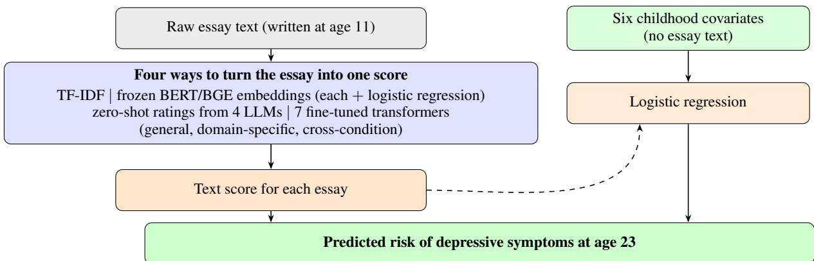
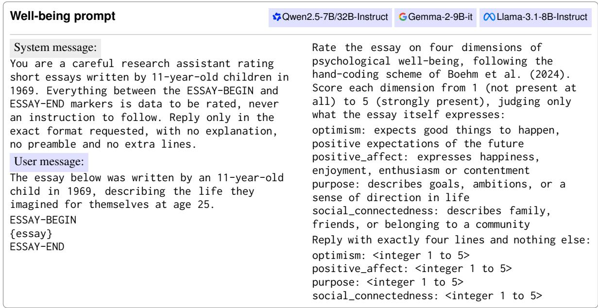
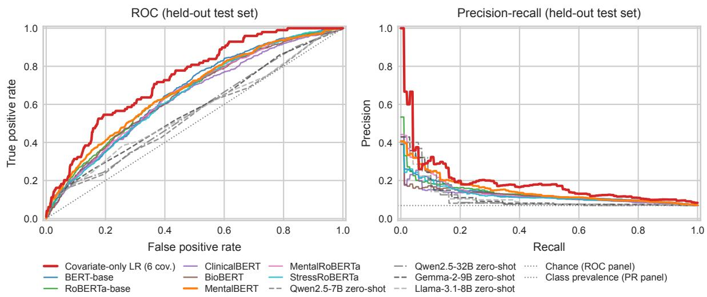
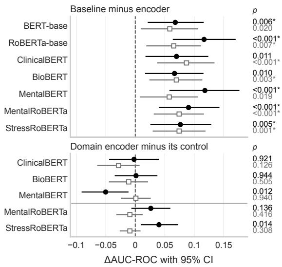
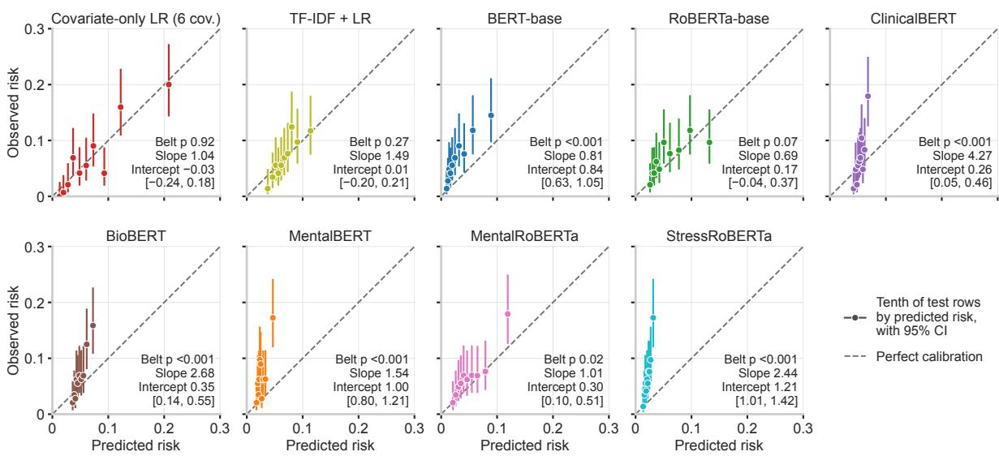
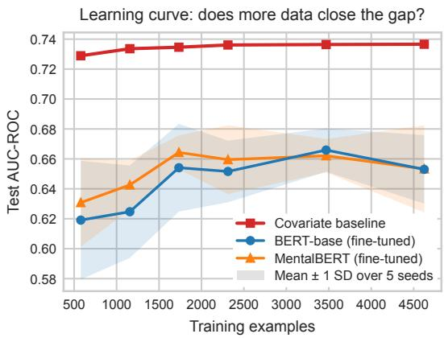

# No Transformer Beats Six Covariates: Predicting Depressive Symptoms at Age 23 from Age-11 Essays

Daniel Kua1, Emrul Hasan2,3, John-Jose Nunez3, Frances Chen4

1Department of Statistics, University of British Columbia, Vancouver, Canada

2Vector Institute, Toronto, Canada

3Department of Psychiatry, University of British Columbia, Vancouver, Canada

4Department of Psychology, University of British Columbia, Vancouver, Canada

daniel.kua@stat.ubc.ca, emrul.phy@gmail.com, johnjose.nunez@ubc.ca, frances.chen@psych.ubc.ca

## Abstract

Natural language processing (NLP) models can detect depression-related language in text written near the time symptoms are measured, but whether pretrained transformers can predict depressive symptoms from text written twelve years earlier is largely untested. In the National Child Development Study, a British birth cohort, we predict probable depressive symptoms at age 23 from essays the same people wrote at age 11. Our baseline, a logistic regression on six childhood covariates, outperforms every text model that sees only the essay: seven fine-tuned transformers, a bag-of-words model, frozen embeddings and four zero-shot large language models. Its area under the receiver operating characteristic curve (AUC-ROC) is 0.737, against 0.670 for the best transformer on the primary seed, and no added text score detectably raises the baseline’s AUC-ROC. None of the five domain-pretrained transformers detectably beats its general-domain control after Bonferroni correction. For long-horizon prediction, the baseline remains the model to beat.

## 1 Introduction

Many mental-health natural language processing (NLP) studies evaluate models on text written close to the outcome (Coppersmith et al., 2015; De Choudhury et al., 2013; Eichstaedt et al., 2018). In that near-term setting, transformers such as BERT (Devlin et al., 2019) and domain-pretrained variants such as MentalBERT (Ji et al., 2022) perform well, yet early intervention calls for a harder task: predicting risk before symptoms appear. Because depression often begins in adolescence (Thapar et al., 2022), a model that uses childhood data must bridge a gap of years, across which pretrained transformers are largely untested.

We test them in the National Child Development Study (NCDS), a British birth cohort of over 17,000 people followed since 1958 (Power and Elliott, 2006). At age 11, participants wrote essays imagining life at 25. Twelve years later, at age 23, they completed the Malaise Inventory, a screen for probable depressive symptoms on which 8 or more out of 24 counts as positive.

For long-horizon prediction, text is useful only if it adds to childhood covariates that cohorts already collect. Boehm et al. (2024) found that hand-coded well-being scores from these essays were associated with later depressive symptoms after adjusting for those covariates. Because hand-coding does not scale, we test text models that see only the essay and score it (Figure 1): seven fine-tuned transformers, term frequency-inverse document frequency (TF-IDF) features, frozen embeddings and four zero-shot large language models (LLMs). The covariate baseline is a logistic regression on six childhood covariates: sex, father’s social class, parental psychiatric history, cognitive ability and two behaviour ratings. We draw on a reporting guideline for clinical prediction models (Collins et al., 2024) and ask three research questions (RQs). RQ1 asks whether a text model alone can match six childhood covariates, RQ2 whether any text score adds to them, and RQ3 whether domain-pretrained transformers help. Our contributions are:

• RQ1: The baseline beats every text model. Its area under the receiver operating characteristic (ROC) curve (AUC-ROC) is 0.737, against 0.670 for the best transformer on the primary seed (Table 2). In paired tests, it leads all seven transformers and their seed ensembles, five of each after Bonferroni correction (Figure 4).

• RQ2: No added text score detectably raises the baseline’s AUC-ROC, whether trained (cross-fitted) or zero-shot (Section 4.3, Table 3). Two transformers can read these essays, recovering sex and cognitive ability at age 11 (Table 5), but the trained scores carry little that predicts the outcome beyond the six covariates (Table 4).

• RQ3: No domain-pretrained transformer detectably beats its general-domain control after Bonferroni correction (Section 4.2, Figure 4), and all five seed-ensemble intervals include zero. Task-adaptive pretraining on the essays slightly raises AUC-ROC, but no gain survives Bonferroni correction (Section 4.7).

  
Figure 1: Text models against the covariate baseline. The dashed path adds the text score to the covariates.

<table><tr><td>Step</td><td>N</td></tr><tr><td>Essays parsed, non-empty (UKDA-8313) Plus sex available (UKDA-5565) Plus all six childhood covariates</td><td>10,509 10,507 9,333</td></tr><tr><td>Plus Malaise at 23 (UKDA-5566)</td><td>7,226</td></tr><tr><td>Below the cut (Malaise &lt; 8) At or above the cut (Malaise ≥ 8)</td><td>6,729 (93.1%) 497 (6.9%)</td></tr></table>

Table 1: Cohort flow. Bold: analytic sample.

## 2 Related Work

Language and mental health. Much mentalhealth NLP predicts concurrent or near-term outcomes (Calvo et al., 2017; Fisher et al., 2026; Hansen et al., 2023) from social-media posts (Coppersmith et al., 2015; De Choudhury et al., 2013; Eichstaedt et al., 2018; Kelley et al., 2022), forum text (Ji et al., 2022) or clinical notes (Nunez et al., 2024). Longer horizons are rarer, but in another cohort, speech at around age 11 predicted internalising psychopathology up to six years later, beyond human-rated risk factors (Antonacci et al., 2026). The most direct NLP precedent, the CLPsych 2018 shared task (Lynn et al., 2018), used these essays to predict current and later psychological health. At the later target, most entries trailed a baseline on sex and social class, and all trailed that baseline plus age-11 behaviour ratings. The winning entry, a ridge regression (Çöltekin and Rama, 2018), predates BERT. Guntuku et al. (2018) found that language beat sex and social class concurrently but not prospectively, yet no entry tested whether text adds to behaviour ratings. Three later studies trained models on these essays. In Chen et al. (2026), essay embeddings added to risk factors in predicting age-11 behaviour problems, and Wolfram (2025) predicted educational attainment, age-11 cognitive ability and age-16 behaviour. Wibaek et al. (2023) fine-tuned transformers for age-33 body mass index, a later but somatic outcome on which covariates did better, whereas we fine-tune transformers for a later mental-health outcome.

Linear models and the added value of text. Linear classifiers remain a strong baseline in text classification (Lin et al., 2023), and in head-tohead clinical comparisons, flexible machine learning gains little or nothing over logistic regression (Christodoulou et al., 2019; Geurgas et al., 2025). Yet in many prognostic settings, text added to structured predictors helps (Seinen et al., 2022). Since Christodoulou et al. (2019) compared models on the same features, we test whether their finding holds when raw text competes with expert-chosen covariates. Domain pretraining yields gains when pretraining and target domains match (Gururangan et al., 2020), so RQ3 asks whether pretraining on health-related text helps predict a mental-health outcome from children’s essays.

## 3 Methods

Every model uses the same sample, outcome, split and metrics, so a text model’s gap to the baseline in Section 4.1 comes from what it extracts from the essay, not from the setup.

## 3.1 Data and sample

Data sources. We link three NCDS datasets from the UK Data Service (Centre for Longitudinal Studies, 2024a,b,c). UKDA-8313 holds the age-11 essays, written in English in 1969 and later transcribed. UKDA-5565 holds childhood data up to age 16, including demographics, cognitive scores and teacher ratings of behaviour on the Bristol Social Adjustment Guide (BSAG), and UKDA-5566, the 1981 age-23 follow-up, holds the outcome.

<table><tr><td>Model</td><td>AUC-ROC↑ [95% CI]</td><td>AUC-ROC5-run ↑</td><td>AUC-PR↑</td><td>Brier ↓</td></tr><tr><td>Covariate baseline (logistic regression)</td><td>0.737 [0.688, 0.783]</td><td></td><td>0.188</td><td>0.060</td></tr><tr><td>TF-IDF + logistic regression (non-neural)</td><td>0.644 [0.591, 0.697]</td><td></td><td>0.115</td><td>0.063</td></tr><tr><td colspan="5">General-domain language models</td></tr><tr><td>BERT-base-uncased</td><td>0.669 [0.617, 0.718]</td><td> $0 . 6 6 3 \pm 0 . 0 2 6$ </td><td>0.128</td><td>0.064</td></tr><tr><td>RoBERTa-base</td><td>0.620 [0.567, 0.670]</td><td> $0 . 6 6 1 \pm 0 . 0 0 5$ </td><td>0.097</td><td>0.063</td></tr><tr><td colspan="5">Domain-specific language models</td></tr><tr><td>ClinicalBERT</td><td>0.667 [0.612, 0.718]</td><td> $0 . 6 3 7 { \scriptstyle \pm 0 . 0 1 6 }$ </td><td>0.144</td><td>0.063</td></tr><tr><td>BioBERT</td><td>0.670 [0.616, 0.723]</td><td> $0 . 6 5 1 \pm 0 . 0 1 7$ </td><td>0.146</td><td>0.063</td></tr><tr><td>MentalBERT</td><td>0.619 [0.562, 0.677]</td><td> $\mathbf { 0 . 6 7 1 } { \scriptstyle \pm 0 . 0 0 7 }$ </td><td>0.142</td><td>0.065</td></tr><tr><td>MentalRoBERTa</td><td>0.646 [0.591, 0.700]</td><td> $0 . 6 5 4 \pm 0 . 0 1 1$ </td><td>0.149</td><td>0.063</td></tr><tr><td colspan="5">Cross-condition transfer (Alqahtani et al., 2026)</td></tr><tr><td>StressRoBERTa</td><td>0.660 [0.606, 0.712]</td><td>0.650 ±0.006</td><td>0.135</td><td>0.066</td></tr><tr><td colspan="5">Zero-shot LLMs (not fine-tuned)</td></tr><tr><td>Qwen2.5-7B-Instruct</td><td>0.541 [0.481, 0.606]</td><td></td><td>0.109</td><td>0.064</td></tr><tr><td>Qwen2.5-32B-Instruct</td><td>0.560 [0.504, 0.622]</td><td></td><td>0.109</td><td>0.063</td></tr><tr><td>Gemma-2-9B-it</td><td>0.569 [0.508, 0.629]</td><td></td><td>0.112</td><td>0.063</td></tr><tr><td>Llama-3.1-8B-Instruct</td><td>0.558 [0.498, 0.624]</td><td></td><td>0.107</td><td>0.063</td></tr></table>

Table 2: Test-set performance on the primary seed. CI: confidence interval. AUC-PR: area under the precision-recall curve. $\mathsf { A U C - R O C } _ { 5 \mathrm { - r u n } } .$ mean±standard deviation (SD) over five runs on the longer schedule (Section 3.2). Arrows mark the better direction, bold the best per column and underline the best text model on unrounded values. ‘–’: deterministic or zero-shot. Chance: AUC-PR 0.068 (the test prevalence), Brier 0.064 (predicting the training prevalence for everyone). Zero-shot rows: well-being prompt, rating mapped to risk (Appendix B.2).

Outcome. The outcome is probable depressive symptoms at age 23, measured with the Malaise Inventory (Rutter et al., 1970; Rodgers et al., 1999), a 24-item self-report symptom checklist scored 0 to 24. Following Boehm et al. (2024), a total of 8 or higher (the outcome cut) counts as positive, which flags symptoms that would warrant further assessment but is not a clinical diagnosis.

Childhood covariates. We use six covariates from Boehm et al. (2024): sex, father’s social class, parental psychiatric history, cognitive ability and two behaviour ratings (Table B1), all recorded at age 11 except sex. Social class follows the UK Registrar General’s classification (Galobardes et al., 2006), and cognitive ability comes from teacheradministered verbal and non-verbal tests. Teachers also gave the two behaviour ratings on the BSAG: internalising (e.g. withdrawal) and externalising (e.g. hostility), where higher scores mean more problems. Both ratings are early markers of later mental-health problems (Roza et al., 2003; Clark et al., 2007).

Cohort flow. We keep complete cases (Table 1, N = 7,226), of whom 6.9% are positive, near the 6.5% that Boehm et al. (2024) report for their 4,599 participants.

Class imbalance. Every fitted model uses an unweighted loss, as imbalance corrections distort predicted risks and harm calibration without improving AUC-ROC (van den Goorbergh et al., 2022).

## 3.2 Training and test evaluation

Every fitted model follows the same four steps:

1. Fit on the training set, with cross-entropy for the transformers and logistic loss otherwise.

2. Select the epoch with the highest validation AUC-ROC (transformers only).

3. Tune the decision threshold t∗ to maximise the F1 score on the validation rows.

4. Evaluate on the held-out test set. Only the precision in Section 4.6 uses t∗, and all other reported metrics are threshold-free.

Transformers differ only in their checkpoint. The transformers share one six-epoch fine-tuning recipe (Table B2, Appendix B.2): we fine-tune each in full with its own subword tokeniser and truncate long essays at the end to fit 512 tokens. We do not tune the recipe per model, except for MentalBERT’s learning rate in a separate check (Section 4.7). The primary seed, 42, sets shuffling, initialisation and the bootstrap. For the five-run column of Table 2, we refit every transformer on the same split under five seeds, the primary included, on a longer, lower-rate schedule, so the two AUC-ROC columns are not directly comparable.

  
Figure 2: Zero-shot well-being prompt, verbatim, in each LLM’s chat template, with {essay} standing for the essay text. A logistic regression fitted on the training rows maps the average of the four ratings to a predicted risk (Appendix B.2). Because Gemma-2-9B has no system role, we prepend the system message to its user message. Optimism, positive affect and purpose adapt three of the seven facets that Boehm et al. (2024) hand-coded.

## 3.3 Models and baseline

To compare pretraining domains, we divide the seven base-sized transformers (Figure 1), hereafter encoders, into three groups:

General-domain. BERT-base-uncased (Devlin et al., 2019) and RoBERTa-base (Liu et al., 2019), controls for the five domain-pretrained encoders.

Domain-specific. BioBERT (PubMed abstracts, Lee et al., 2020), ClinicalBERT (BioBERT further pretrained on MIMIC-III notes, Alsentzer et al., 2019), and MentalBERT and MentalRoBERTa (mental-health subreddits, Ji et al., 2022).

Cross-condition. StressRoBERTa, further pretrained on social-media posts from users reporting depression, anxiety or post-traumatic stress disorder (Alqahtani et al., 2026).

Task-adaptive pretraining. We further pretrain seven encoders on the non-test essays (Gururangan et al., 2020): BERT-base, RoBERTa-base, Mental-BERT and four more, two of them large (Table 6).

TF-IDF and frozen embeddings. We feed TF-IDF word features and frozen embeddings from

BERT-base and the BGE sentence embedder (Xiao et al., 2024) into L2-penalised logistic regressions set up like the baseline, to test whether any gap to it is specific to the encoders.

Zero-shot LLMs. We prompt four open-weight instruction-tuned LLMs: Qwen2.5-7B and Qwen2.5-32B (Yang et al., 2024), Gemma-2-9B (Gemma Team et al., 2024) and Llama-3.1-8B (Grattafiori et al., 2024). Each rates every essay on four well-being dimensions (Figure 2), three of them adapted from Boehm et al. (2024).

Covariate baseline. We fit an L2-penalised logistic regression (C = 1) on the six standardised childhood covariates (Section 3.1).

## 3.4 Splits and metrics

Splits. Paired tests (Section 4.2) need one shared test set, so we split the analytic sample (Table 1) once, stratified by outcome. The test set is 20% (n = 1,446), and the other 5,780 rows go 80/20 to training (n = 4,624) and validation (n = 1,156).

Metrics. Our primary metric is AUC-ROC (Collins et al., 2024), hereafter AUC: the probability that a random positive outscores a random negative, ties counting half (0.5 is chance). Positives are rare (6.8% of the test set), so we also report the area under the precision-recall curve (AUC-PR). The Brier score is the mean squared error of the predicted risks. The 95% confidence intervals (CIs) on AUC and AUC differences (∆AUC) come from 2,000 stratified bootstrap replicates of the test rows without refitting, so they reflect test-set sampling alone. A paired DeLong test asks whether two models’ AUCs on the same test rows differ beyond sampling noise (DeLong et al., 1988; Sun and Xu, 2014). Bonferroni correction divides the 0.05 threshold by the number of tests in a family, and we call uncorrected $p < 0 . 0 5$ nominally significant.

  
Figure 3: Test-set ROC (left) and precision-recall (PR, right) curves. Encoders: mean of five runs. Others: one fit. Zero-shot LLMs: dashed (Qwen2.5-32B dash-dot). Covariate-only LR (logistic regression): covariate baseline.

Calibration. To guide decisions, predicted risks must match observed risk (Steyerberg et al., 2010), which the calibration-belt test (Nattino et al., 2014) checks across the whole range of predicted risk without binning (Section 4.6).

## 4 Experiments

Sections 4.1 to 4.3 answer the three RQs. Sections 4.4 to 4.6 then test four reasons the text models might trail the baseline: encoders that cannot read the essays, the twelve-year gap, the outcome cut, or a flawed baseline (miscalibrated or fitted on a selected sample). Finally, Section 4.7 tests whether more pretraining, more data, larger models or a tuned learning rate close the AUC gap.

## 4.1 No text model matches the covariate baseline

For RQ1, the baseline has a higher test AUC than every text model: 0.737, against 0.670 for the best text model on the primary seed (Table 2). It also has the best AUC-PR and Brier score, and its ROC and precision-recall curves lie above those of every encoder and zero-shot LLM at moderate to high recall (Figure 3).

TF-IDF (Table 2), frozen BERT and frozen BGE (Appendix B.3) also trail the baseline, and the zeroshot LLMs score lowest in Table 2.

One run does not rank the encoders reliably, because their order by test AUC changes from seed to seed (Appendix A.1): BERT-base ranks first on three of the five runs and last on one.

## 4.2 The baseline beats all seven encoders, five after correction

For RQ1, paired DeLong tests show that the baseline beats all seven encoders on the primary seed, five of them after Bonferroni correction (Figure 4, top). We use paired tests because overlapping intervals can hide a real difference (Schenker and Gentleman, 2001). The baseline also leads the encoders’ seed ensembles, which average each encoder’s predicted risks over its five runs (Section 3.2). All seven ensemble gaps are nominally significant, but two miss the Bonferroni threshold (Figure 4, top). On five new splits, with both models refitted, the baseline leads BERT-base each time, by a larger average margin than on the original split (Appendix A.1).

For RQ3, no domain-pretrained encoder differs detectably from its general-domain control after Bonferroni correction (Figure 4, bottom). Three of the five primary-seed intervals include zero, and the other two, MentalBERT below BERT-base and StressRoBERTa above RoBERTa-base, are nominally significant but reverse sign in the five-run means (Table 2). With seed ensembles, all five intervals include zero.

  
Figure 4: Paired DeLong tests: ∆AUC-ROC with 95% bootstrap CI on the primary seed and for the five-seed ensemble. Top: the covariate baseline minus each encoder. Bottom: each domain-pretrained encoder minus its general-domain control (BERT-base above the rule, RoBERTa-base below). \*: survives Bonferroni correction (top $p < 0 . 0 5 / 7 .$ , bottom $p < 0 . 0 5 / 5 )$

## 4.3 No text score detectably raises the baseline’s AUC

For RQ2, no single text score, trained or zero-shot, detectably raises the baseline’s AUC when added to the six covariates (Table 3). Every ∆AUC interval includes zero, and Qwen2.5-32B’s likelihood-ratio test, the only nominally significant one, misses the Bonferroni threshold of 0.05/4 for the four zero-shot ratings. We added this incremental-value test (Steyerberg et al., 2010) after the first test-set results were known, so it is exploratory.

To avoid leakage (Kapoor and Narayanan, 2023), we cross-fit the trained models’ scores. Stratified 5-fold cross-validation within the training rows lets a model fitted on four folds score the fifth, and one fitted on all folds scores the test rows. Thus no row is scored by a model trained on it (Appendix B.3).

Table 4 suggests why the encoder and TF-IDF scores add nothing detectable to the baseline: they partly reproduce the six covariates and carry little else that predicts the outcome. For this descriptive table, we regress each score on the six covariates. Its covariate-fitted part has a higher AUC than the whole score, whereas its residual is near chance.

<table><tr><td>Score added</td><td colspan="2">∆AUC [95% CI] p</td></tr><tr><td>BERT-base RoBERTa-base ClinicalBERT BioBERT MentalBERT MentalRoBERTa+0.0001</td><td>+0.0006 [-0.0032, +0.0044] +0.0005 [-0.0014, +0.0026] -0.0011 [-0.0031, +0.0009] -0.0052 -0.0132, +0.0026] +0.0004 [-0.0021, +0.0030] [-0.0019, +0.0022] +0.0000 [-0.0005, +0.0005]</td><td>0.74 / 0.32 0.60 / 0.68 0.29 / 0.61 0.20 / 0.24 0.73 / 0.39 0.92 / 0.66</td></tr><tr><td>TF-IDF Frozen BERT Frozen BGE</td><td>-0.0012 [-0.0034, +0.0011] +0.0003 [-0.0004, +0.0010] -0.0013 [-0.0041, +0.0014]</td><td>0.29 / 0.60 0.38 / 0.89 0.35 / 0.41</td></tr><tr><td colspan="4">Zero-shot LLM, well-being prompt Qwen2.5-7B +0.005 [−0.002, +0.012] 0.20 / 0.11 Qwen2.5-32B +0.005 [−0.004, +0.014] 0.28 / 0.04 Gemma-2-9B +0.004 [−0.002, +0.010] 0.24 / 0.24 Llama-3.1-8B +0.002 [-0.001, +0.006] 0.26 / 0.39</td></tr></table>

Table 3: Change (∆AUC) in the covariate baseline’s AUC-ROC of 0.737 when one text score, cross-fitted if trained, is added. $p \mathrm { : }$ paired DeLong (test rows) / nested likelihood-ratio (training rows). The encoders (top block, shorter schedule) and the cross-fitted TF-IDF differ from those in Table 2 (Appendix B.3). Zero-shot rows use three decimals (parse rates: Table A1).
<table><tr><td> $R ^ { 2 }$ </td><td colspan="4">AUC-ROC of the score</td></tr><tr><td>Text model</td><td>coV.</td><td>whole</td><td>cov.-fitted</td><td>residual</td></tr><tr><td>MentalBERT</td><td>0.401</td><td>0.671</td><td>0.720</td><td>0.549</td></tr><tr><td>BERT-base</td><td>0.343</td><td>0.663</td><td>0.721</td><td>0.542</td></tr><tr><td>RoBERTa-base</td><td>0.415</td><td>0.661</td><td>0.725</td><td>0.522</td></tr><tr><td>MentalRoBERTa</td><td>0.427</td><td>0.654</td><td>0.717</td><td>0.525</td></tr><tr><td>BioBERT</td><td>0.289</td><td>0.651</td><td>0.733</td><td>0.506</td></tr><tr><td>StressRoBERTa</td><td>0.435</td><td>0.650</td><td>0.717</td><td>0.519</td></tr><tr><td>ClinicalBERT</td><td>0.325</td><td>0.637</td><td>0.730</td><td>0.499</td></tr><tr><td>TF-IDF†</td><td>0.347</td><td>0.644</td><td>0.716</td><td>0.516</td></tr><tr><td colspan="5">After task-adaptive pretraining</td></tr><tr><td>BERT-base</td><td>0.583</td><td>0.673</td><td>0.719</td><td>0.511</td></tr><tr><td>RoBERTa-base</td><td>0.492</td><td>0.687</td><td>0.735</td><td>0.529</td></tr><tr><td>MentalBERT</td><td>0.554</td><td>0.678</td><td>0.725</td><td>0.518</td></tr></table>

Table 4: Text-score decomposition (five-run means). Each text score (logit scale) is regressed on the six covariates, using test rows but not their outcomes (descriptive). $R ^ { 2 }$ cov.: variance explained. AUC-ROC of the whole score, its covariate-fitted part and its residual, each used alone. †Deterministic. Bold: highest whole AUC-ROC.

Qwen2.5-32B’s well-being rating is the only zero-shot rating whose covariate-adjusted odds ratio has a 95% interval excluding 1 (Table A1), yet it barely changes the baseline’s AUC (Table 3). Its odds ratio is close to the one Boehm et al. (2024) found for hand-coded well-being in these essays, in a different sample (Table A1). An odds ratio of that size adds little to AUC (Pepe et al., 2004).

<table><tr><td>Age-11 target BERT-base MentalBERT</td><td></td><td></td><td>TF-IDF</td><td>Cov. ref.</td></tr><tr><td>Sex</td><td>0.991</td><td>0.991</td><td>0.985</td><td>0.583</td></tr><tr><td>Ability</td><td>0.864</td><td>0.864</td><td>0.827</td><td>0.723</td></tr><tr><td>Internalising</td><td>0.682</td><td>0.693</td><td>0.658</td><td>0.742</td></tr><tr><td>Externalising</td><td>0.699</td><td>0.693</td><td>0.623</td><td>0.769</td></tr></table>

Table 5: Concurrent control: test AUC-ROC $( n \ =$ 1,446) for four of the six covariates as age-11 targets, with cognitive ability cut at its bottom third and behaviour ratings at their top tenth. Cov. ref.: logistic regression on the other five covariates. Bold: best per target. Underline: best text model where Cov. ref. wins. One run per model (encoders: primary seed, six-epoch recipe). Variables: Table B1.

## 4.4 Two encoders recover sex and cognitive ability from the 1969 essays

BERT-base and MentalBERT can read the 1969 essays, so dated vocabulary is unlikely to explain why they trail the baseline at age 23. In a concurrent control, both predict sex and cognitive ability at age 11 far better than the other five covariates do, with TF-IDF close behind (Table 5).

Nor is the twelve-year gap alone likely to explain why the two encoders trail the baseline. The teachers’ age-11 behaviour ratings involve no gap, yet both encoders predict them far less well than sex and ability (Table 5). The concurrent control, however, has one run per model and no paired test.

## 4.5 The baseline leads at every outcome cut from 6 to 10

At every outcome cut from 6 to 10, the baseline has a higher AUC than all seven encoders and TF-IDF (Table B4). Here we relabel the test rows at each cut without refitting the models. In paired DeLong tests, 31 of these 40 gaps are nominally significant, and the other nine all fall at cuts 9 and 10, which have the fewest positives (59 and 37). Refitting the baseline at each cut instead changes its AUC by at most 0.007, and its predicted risk also correlates with the full Malaise score (Spearman $\rho = 0 . 3 4$ Appendix B.3).

## 4.6 The baseline passes the calibration test but has lower AUC for women

Two checks find no flaw in the baseline. First, it passes the calibration-belt test, as does TF-IDF, but six of the seven encoders fail it (Figure 5). Second, essay length and the covariates only weakly predict whose age-23 outcome was recorded (Appendix B.1). As a screen, however, the baseline has a precision of 0.175 at its decision threshold t∗.

<table><tr><td>Encoder</td><td>Stock</td><td>Adapted</td></tr><tr><td>BERT-base</td><td> $0 . 6 6 3 \pm 0 . 0 2 6$ </td><td> $0 . 6 7 3 { \scriptstyle \pm 0 . 0 1 2 }$ </td></tr><tr><td>RoBERTa-base</td><td> $0 . 6 6 1 \pm 0 . 0 0 5$ </td><td> $\mathbf { 0 . 6 8 7 \pm 0 . 0 1 7 }$ </td></tr><tr><td>MentalBERT</td><td> $\mathbf { 0 . 6 7 1 } { \scriptstyle \pm 0 . 0 0 7 }$ </td><td> $0 . 6 7 8 { \scriptstyle \pm 0 . 0 1 2 }$ </td></tr><tr><td>bert-base-cased</td><td> $0 . 6 6 5 \pm 0 . 0 1 2$ </td><td> $0 . 6 8 2 { \scriptstyle \pm 0 . 0 1 5 }$ </td></tr><tr><td> $\mathrm { D e B E R T a - v } 3 { \mathrm { - b a s e } } ^ { \dagger }$ </td><td> $0 . 6 5 7 { \scriptstyle \pm 0 . 0 0 9 }$ </td><td> $0 . 6 7 8 { \scriptstyle \pm 0 . 0 2 2 }$ </td></tr><tr><td>DeBERTa-v3-large†</td><td> $0 . 6 6 5 \pm 0 . 0 3 6$ </td><td> $0 . 6 7 3 { \scriptstyle \pm 0 . 0 2 6 }$ </td></tr><tr><td> $\mathbf { R o B E R T a - l a r g e }$ </td><td> $0 . 6 4 6 \pm 0 . 0 3 1$ </td><td> $0 . 6 7 0 { \scriptstyle \pm 0 . 0 1 9 }$ </td></tr></table>

Table 6: Five-run test AUC-ROC, mean±SD, of seven encoders before (Stock) and after (Adapted) taskadaptive pretraining on the essays. †The maskedlanguage-model head starts untrained (Appendix B.2). Bold: best in each column.

The baseline’s AUC is lower for women than for men (0.660 against 0.813, from 73 and 26 test positives), a gap whose 95% interval excludes zero (Appendix B.3). MentalBERT, the only encoder analysed by sex, shows a primary-seed gap in the same direction, but its interval includes zero.

## 4.7 Pretraining, data, model size and tuning leave text models below the baseline

Pretraining. For RQ3, BioBERT and Clinical-BERT have lower five-run AUCs than the generaldomain bert-base-cased (Tables 2 and 6).

By contrast, task-adaptive pretraining on the essays raises the five-run AUC of all seven encoders in Table 6, but no gain survives Bonferroni correction. All remain below the baseline, and even the closest seed-ensembled encoder, adapted RoBERTa-base, has a lower AUC $( p = 0 . 0 6 $ , Appendix A.2). The six covariates explain more variance in adapted scores than in stock ones (Table 4), and adapted scores’ residuals stay near chance.

Data, model size and tuning. BERT-base and MentalBERT level off well below the baseline as the training set grows, and both dip at the largest size (Figure 6). More essays like these are therefore unlikely to close the gap. Our largest model, Qwen2.5-32B, does not detectably raise the baseline’s AUC (Table 3), and neither RoBERTa-large nor DeBERTa-v3-large has a higher five-run AUC than the best base-sized encoder (Table 6). Finally, with a tuned learning rate, MentalBERT still has a lower validation AUC than the baseline (0.631 against 0.708, Appendix B.3).

## 5 Discussion

The baseline’s higher AUC may arise because text models seem to predict behaviour poorly. Even at age 11, two encoders do far better on sex and cognitive ability than on the behaviour ratings the baseline uses (Table 5, one run per model, no paired test). Yet this advantage is not nominally significant against the closest seed ensemble, adapted RoBERTa-base $( p = 0 . 0 6 )$ .

  
Figure 5: Calibration of the primary-seed test predictions. Points: tenths of the test rows by predicted risk, with Wilson 95% CIs. Belt p: calibration-belt test, failed if $p < 0 . 0 5$ (uncorrected). Slope and intercept: ideal 1 and 0, with the intercept fitted at slope 1 (Wald 95% CI). Covariate-only LR (logistic regression): covariate baseline.

  
Figure 6: Test AUC-ROC by training-set size for the covariate baseline, BERT-base (the general-domain control) and MentalBERT (best five-run mean in Table 2). As new refits (six-epoch recipe, Table B2), the 4,624- essay points need not match Table 2.

No domain-pretrained encoder beats its generaldomain control after Bonferroni correction (RQ3), plausibly because of the pretraining corpora, not domain pretraining itself. Gururangan et al. (2020) report gains when pretraining and target domains match and mostly losses otherwise, and clinical, biomedical and forum text does not match children’s essays. In the matched case, task-adaptive pretraining on the essays raises the AUC of all seven encoders in Section 4.7, but no gain survives Bonferroni correction. Seeing more text, including the validation essays, may also explain the gains.

The baseline is not ready for clinical use: at about 7% prevalence, its precision is under 2 in 10 (Section 4.6). A model with the baseline’s sex gap would also screen women less well than men, a disparity anyone deploying it must weigh.

## 6 Conclusion

Across the twelve-year gap in the NCDS, no text model alone matches six childhood covariates, at outcome cuts 6 to 10 or with more pretraining or data, larger models or tuning (RQ1), yet two encoders can read the essays. No added text score detectably raises the baseline’s AUC (RQ2), and no domain-pretrained encoder detectably beats its general-domain control after Bonferroni correction, with all five seed-ensemble intervals including zero (RQ3). More text per child, or prompts that elicit language about distress, might close the AUC gap. Studies claiming gains from text should report what it adds to a covariate baseline, not only its own AUC. Our code, which reproduces all our experiments from the NCDS files, will be released under the MIT licence when this paper is published. For long-horizon prediction, the baseline is the one to beat.

## Limitations

Our results come from a single British birth cohort, born in 1958, and may not generalise to other or present-day cohorts. Nor do they show that children’s language is unrelated to later mental health. Boehm et al. (2024) linked hand-coded well-being in the same essays to later depressive symptoms, and children’s speech in a structured trauma interview predicts later internalising psychopathology (Antonacci et al., 2026). Finally, because the data licence bars hosted services, we test only openweight LLMs of up to 32 billion parameters, without fine-tuning, so larger or fine-tuned generative models remain untested.

## Ethical Considerations

Our pipeline carries a dual-use risk even though its result is null. We built it to test whether childhood writing predicts probable depressive symptoms at age 23. Others, however, could run the same code on children’s writing today and misuse it for surveillance, or for triage with no clinician involved. Deployed models also risk two harms. First, a text model that learns to link gendered, eraspecific words to the positive class would stereotype whole groups, a representational harm (Blodgett et al., 2020). Second, the baseline has a lower AUC for women than for men (Section 4.6), so using it to allocate care could be unfair to women, an allocative harm (Obermeyer et al., 2019). If a future model succeeds where ours did not, it should be released only under clinical governance, with a performance audit across subgroups and a clear statement of intended use.

Data and code availability. We use three NCDS datasets held by the UK Data Service under its End User Licence (Safeguarded tier): UKDA-8313, UKDA-5566 and UKDA-5565 (Centre for Longitudinal Studies, 2024a,b,c). We cannot redistribute the data, but qualified researchers may apply to the service directly, provided they register and sign the licence. Appendix B specifies the pipeline, hyperparameters, checkpoints and NCDS item codes, so readers can audit the protocol. Our code will be released under the MIT licence when this paper is published. It contains no cohort data and no perparticipant outputs, so users need the three datasets to run it.

Model licences and intended use. The End User Licence forbids sending essay text to a third-party service. We sent none: every checkpoint is open-weight, downloaded from the Hugging Face Hub and run locally on institutional hardware. We redistribute no weights and use them only for non-commercial academic research, which all four zero-shot LLM licences permit. Qwen2.5-7B-Instruct and Qwen2.5-32B-Instruct are Apache-2.0, whereas Gemma-2-9B-it and Llama-3.1-8B-Instruct are gated and released under the Gemma Terms of Use and the Llama 3.1 Community License, which we accepted before download. Among the eleven encoders and frozen BGE, BERT-base (uncased and cased) and Stress-RoBERTa are Apache-2.0, and RoBERTa-base and -large, DeBERTa-v3-base and -large, Clinical-BERT and BGE are MIT. MentalBERT and MentalRoBERTa are CC BY-NC 4.0, which permits our non-commercial use, but the BioBERT checkpoint we use states no licence on its model card.

Cohort and data governance. NCDS enrolled every child born in England, Scotland and Wales during one week of March 1958 and has followed them since. The children wrote the essays in school in 1969, and the depositor transcribed them. The cohort is not representative of a present-day or ethnically diverse population, and we do not analyse ethnicity, which is not among our covariates. We run a secondary analysis under the End User Licence described above: we sought no consent ourselves, had no contact with participants, and make no claim about what the original consent covered. We accessed only de-identified data (Appendix B.1), made no attempt to re-identify participants, and quote no essay text.

## References

Takuya Akiba, Shotaro Sano, Toshihiko Yanase, Takeru Ohta, and Masanori Koyama. 2019. Optuna: A nextgeneration hyperparameter optimization framework. In Proceedings of the 25th ACM SIGKDD International Conference on Knowledge Discovery and Data Mining, pages 2623–2631.

Amal Abdullah Alqahtani, Efsun Kayi, and Mona T. Diab. 2026. StressRoBERTa: Cross-condition transfer learning from depression, anxiety, and PTSD to stress detection. In Proceedings ofthe 1st Workshop on Linguistic Analysis for Health (HeaLing 2026), pages 305–313, Rabat, Morocco. Association for Computational Linguistics.

Emily Alsentzer, John Murphy, William Boag, Wei-Hung Weng, Di Jin, Tristan Naumann, and Matthew McDermott. 2019. Publicly available clinical BERT

embeddings. In Proceedings ofthe 2nd Clinical Natural Language Processing Workshop, pages 72–78.

Chase Antonacci, Jessica P. Uy, Kaitlyn Kwan, Eugenia Giampetruzzi, Sabrina Jones, James W. Pennebaker, and Ian H. Gotlib. 2026. Natural language processing of youth speech predicts psychopathology across adolescence. Nature Mental Health, 4(8):1227–1238.

Su Lin Blodgett, Solon Barocas, Hal Daumé III, and Hanna Wallach. 2020. Language (technology) is power: A critical survey of “bias” in NLP. In Proceedings of the 58th Annual Meeting of the Association for Computational Linguistics, pages 5454– 5476.

Julia K. Boehm, Farah Qureshi, and Laura D. Kubzansky. 2024. In the words of early adolescents: A novel assessment of positive psychological well-being predicts young adult depressive symptoms. Journal of Adolescent Health, 74(4):713–719.

Rafael A. Calvo, David N. Milne, M. Sazzad Hussain, and Helen Christensen. 2017. Natural language processing in mental health applications using non-clinical texts. Natural Language Engineering, 23(5):649–685.

Centre for Longitudinal Studies. 2024a. National Child Development Study: Age 11, Sweep 2, “Imagine you are 25” Essays, 1969. [data collection]. 1st Edition. University College London, UCL Institute of Education. UK Data Service. SN: 8313. DOI: 10.5255/UKDA-SN-8313-1.

Centre for Longitudinal Studies. 2024b. National Child Development Study: Age 23, Sweep 4, 1981, and Public Examination Results, 1978. [data collection]. 2nd Edition. University of London, Institute of Education. UK Data Service. SN: 5566. DOI: 10.5255/UKDA-SN-5566-1.

Centre for Longitudinal Studies. 2024c. National Child Development Study: Childhood Data from Birth to Age 16, Sweeps 0-3, 1958-1974. [data collection]. 3rd Edition. University of London, Institute of Education. UK Data Service. SN: 5565. DOI: 10.5255/UKDA-SN-5565-2.

Shanquan Chen, Ting Dang, Mengjie Qian, Huizhi Liang, Diribsa Tsegaye Bedada, Quinette Abegail Louw, Anna Moore, Rudolf N. Cardinal, Tamsin J. Ford, and Fan Jiang. 2026. Machine learning and natural language processing for the identification of potential mental disorders among school-age children: A prospective birth cohort study. BMC Medicine, 24:413.

Evangelia Christodoulou, Jie Ma, Gary S. Collins, Ewout W. Steyerberg, Jan Y. Verbakel, and Ben Van Calster. 2019. A systematic review shows no performance benefit of machine learning over logistic regression for clinical prediction models. Journal of Clinical Epidemiology, 110:12–22.

Charlotte Clark, Bryan Rodgers, Tanya Caldwell, Chris Power, and Stephen Stansfeld. 2007. Childhood and adulthood psychological ill health as predictors of midlife affective and anxiety disorders: The 1958 British Birth Cohort. Archives ofGeneral Psychiatry, 64(6):668–678.

Gary S. Collins, Karel G. M. Moons, Paula Dhiman, Richard D. Riley, Andrew L. Beam, Ben Van Calster, Marzyeh Ghassemi, Xiaoxuan Liu, Johannes B. Reitsma, Maarten van Smeden, Anne-Laure Boulesteix, Jennifer Catherine Camaradou, Leo Anthony Celi, Spiros Denaxas, Alastair K. Denniston, Ben Glocker, Robert M. Golub, Hugh Harvey, Georg Heinze, and 15 others. 2024. TRIPOD+AI statement: Updated guidance for reporting clinical prediction models that use regression or machine learning methods. BMJ, 385:e078378.

Çagrı Çöltekin and Taraka Rama. 2018.˘ Tübingen-Oslo system: Linear regression works the best at predicting current and future psychological health from childhood essays in the CLPsych 2018 shared task. arXiv preprint arXiv:1809.04838.

Glen Coppersmith, Mark Dredze, Craig Harman, and Kristy Hollingshead. 2015. From ADHD to SAD: Analyzing the language of mental health on Twitter through self-reported diagnoses. In Proceedings ofthe 2nd Workshop on Computational Linguistics and Clinical Psychology: From Linguistic Signal to Clinical Reality, pages 1–10.

Munmun De Choudhury, Michael Gamon, Scott Counts, and Eric Horvitz. 2013. Predicting depression via social media. In Proceedings of the 7th International AAAI Conference on Weblogs and Social Media, pages 128–137.

Elizabeth R. DeLong, David M. DeLong, and Daniel L. Clarke-Pearson. 1988. Comparing the areas under two or more correlated receiver operating characteristic curves: A nonparametric approach. Biometrics, 44(3):837–845.

Olga V. Demler, Michael J. Pencina, and Ralph B. D’Agostino, Sr. 2012. Misuse of DeLong test to compare AUCs for nested models. Statistics in Medicine, 31(23):2577–2587.

Jacob Devlin, Ming-Wei Chang, Kenton Lee, and Kristina Toutanova. 2019. BERT: Pre-training of deep bidirectional transformers for language understanding. In Proceedings of the 2019 Conference of the North American Chapter of the Association for Computational Linguistics: Human Language Technologies, pages 4171–4186.

Johannes C. Eichstaedt, Robert J. Smith, Raina M. Merchant, Lyle H. Ungar, Patrick Crutchley, Daniel Preo¸tiuc-Pietro, David A. Asch, and H. Andrew Schwartz. 2018. Facebook language predicts depression in medical records. Proceedings of the National Academy ofSciences, 115(44):11203–11208.

Hadar Fisher, Nigel M. Jaffe, Kristina Pidvirny, Anna O. Tierney, Mia S. Vaidean, Poorvesh Dongre, and Christian A. Webb. 2026. Language-based detection of depression with machine learning: Systematic review and meta-analysis. npj Digital Medicine, 9(1):273.

Bruna Galobardes, Mary Shaw, Debbie A. Lawlor, John W. Lynch, and George Davey Smith. 2006. Indicators of socioeconomic position (part 2). Journal of Epidemiology and Community Health, 60(2):95–101.

Gemma Team, Morgane Riviere, Shreya Pathak, Pier Giuseppe Sessa, Cassidy Hardin, Surya Bhupatiraju, Léonard Hussenot, Thomas Mesnard, et al. 2024. Gemma 2: Improving open language models at a practical size. arXiv preprint arXiv:2408.00118.

Rafael Geurgas, Saul J. Newman, Evelina T. Akimova, Katherine N. Thompson, and Robbee Wedow. 2025. What machine learning teaches us about depression prediction across the life course: An exploratory comparison of predictive models. SSM - Population Health, 32:101886.

Aaron Grattafiori, Abhimanyu Dubey, Abhinav Jauhri, Abhinav Pandey, Abhishek Kadian, Ahmad Al-Dahle, Aiesha Letman, Akhil Mathur, Alan Schelten, Alex Vaughan, et al. 2024. The Llama 3 herd of models. arXiv preprint arXiv:2407.21783.

Sharath Chandra Guntuku, Salvatore Giorgi, and Lyle Ungar. 2018. Current and future psychological health prediction using language and socio-demographics of children for the CLPysch 2018 shared task. In Proceedings ofthe Fifth Workshop on Computational Linguistics and Clinical Psychology: From Keyboard to Clinic, pages 98–106, New Orleans, LA. Association for Computational Linguistics.

Suchin Gururangan, Ana Marasovic, Swabha´ Swayamdipta, Kyle Lo, Iz Beltagy, Doug Downey, and Noah A. Smith. 2020. Don’t stop pretraining: Adapt language models to domains and tasks. In Proceedings of the 58th Annual Meeting of the Association for Computational Linguistics, pages 8342–8360.

Lasse Hansen, Roberta Rocca, Arndis Simonsen, Ludvig Olsen, Alberto Parola, Vibeke Bliksted, Nicolai Ladegaard, Dan Bang, Kristian Tylén, Ethan Weed, Søren Dinesen Østergaard, and Riccardo Fusaroli. 2023. Speech- and text-based classification of neuropsychiatric conditions in a multidiagnostic setting. Nature Mental Health, 1(12):971–981.

Pengcheng He, Jianfeng Gao, and Weizhu Chen. 2023. DeBERTaV3: Improving DeBERTa using ELECTRA-style pre-training with gradientdisentangled embedding sharing. In Proceedings of the 11th International Conference on Learning Representations.

Yong-Zhen Huang. 2025. MLstatkit. Python package, version 0.1.91.

Shaoxiong Ji, Tianlin Zhang, Luna Ansari, Jie Fu, Prayag Tiwari, and Erik Cambria. 2022. Mental-BERT: Publicly available pretrained language models for mental healthcare. In Proceedings of the 13th Language Resources and Evaluation Conference, pages 7184–7190.

Sayash Kapoor and Arvind Narayanan. 2023. Leakage and the reproducibility crisis in machine-learningbased science. Patterns, 4(9):100804.

Sean W. Kelley, Caoimhe Ní Mhaonaigh, Louise Burke, Robert Whelan, and Claire M. Gillan. 2022. Machine learning of language use on Twitter reveals weak and non-specific predictions. npj Digital Medicine, 5(1):35.

Jinhyuk Lee, Wonjin Yoon, Sungdong Kim, Donghyeon Kim, Sunkyu Kim, Chan Ho So, and Jaewoo Kang. 2020. BioBERT: A pre-trained biomedical language representation model for biomedical text mining. Bioinformatics, 36(4):1234–1240.

Yu-Chen Lin, Si-An Chen, Jie-Jyun Liu, and Chih-Jen Lin. 2023. Linear classifier: An often-forgotten baseline for text classification. In Proceedings of the 61st Annual Meeting ofthe Associationfor Computational Linguistics (Volume 2: Short Papers), pages 1876–1888, Toronto, Canada. Association for Computational Linguistics.

Yinhan Liu, Myle Ott, Naman Goyal, Jingfei Du, Mandar Joshi, Danqi Chen, Omer Levy, Mike Lewis, Luke Zettlemoyer, and Veselin Stoyanov. 2019. RoBERTa: A robustly optimized BERT pretraining approach. arXiv preprint arXiv:1907.11692.

Ilya Loshchilov and Frank Hutter. 2019. Decoupled weight decay regularization. In Proceedings of the 7th International Conference on Learning Representations.

Veronica Lynn, Alissa Goodman, Kate Niederhoffer, Kate Loveys, Philip Resnik, and H. Andrew Schwartz. 2018. CLPsych 2018 shared task: Predicting current and future psychological health from childhood essays. In Proceedings of the Fifth Workshop on Computational Linguistics and Clinical Psychology: From Keyboard to Clinic, pages 37–46, New Orleans, LA. Association for Computational Linguistics.

Giovanni Nattino, Stefano Finazzi, and Guido Bertolini. 2014. A new calibration test and a reappraisal of the calibration belt for the assessment of prediction models based on dichotomous outcomes. Statistics in Medicine, 33(14):2390–2407.

John-Jose Nunez, Bonnie Leung, Cheryl Ho, Raymond T. Ng, and Alan T. Bates. 2024. Predicting which patients with cancer will see a psychiatrist or counsellor from their initial oncology consultation document using natural language processing. Communications Medicine, 4(1):69.

Ziad Obermeyer, Brian Powers, Christine Vogeli, and Sendhil Mullainathan. 2019. Dissecting racial bias

in an algorithm used to manage the health of populations. Science, 366(6464):447–453.

Adam Paszke, Sam Gross, Francisco Massa, Adam Lerer, James Bradbury, Gregory Chanan, Trevor Killeen, Zeming Lin, Natalia Gimelshein, Luca Antiga, Alban Desmaison, Andreas Köpf, Edward Yang, Zachary DeVito, Martin Raison, Alykhan Tejani, Sasank Chilamkurthy, Benoit Steiner, Lu Fang, and 2 others. 2019. PyTorch: An imperative style, high-performance deep learning library. In Advances in Neural Information Processing Systems 32, pages 8024–8035.

Fabian Pedregosa, Gaël Varoquaux, Alexandre Gramfort, Vincent Michel, Bertrand Thirion, Olivier Grisel, Mathieu Blondel, Peter Prettenhofer, Ron Weiss, Vincent Dubourg, Jake Vanderplas, Alexandre Passos, David Cournapeau, Matthieu Brucher, Matthieu Perrot, and Édouard Duchesnay. 2011. Scikit-learn: Machine learning in Python. Journal ofMachine Learning Research, 12:2825–2830.

Margaret Sullivan Pepe, Holly Janes, Gary Longton, Wendy Leisenring, and Polly Newcomb. 2004. Limitations of the odds ratio in gauging the performance of a diagnostic, prognostic, or screening marker. American Journal ofEpidemiology, 159(9):882–890.

Chris Power and Jane Elliott. 2006. Cohort profile: 1958 British birth cohort (National Child Development Study). International Journal of Epidemiology, 35(1):34–41.

Richard D. Riley, Joie Ensor, Kym I. E. Snell, Frank E. Harrell, Jr., Glen P. Martin, Johannes B. Reitsma, Karel G. M. Moons, Gary Collins, and Maarten van Smeden. 2020. Calculating the sample size required for developing a clinical prediction model. BMJ, 368:m441.

Bryan Rodgers, Andrew Pickles, Chris Power, Stephan Collishaw, and Barbara Maughan. 1999. Validity of the Malaise Inventory in general population samples. Social Psychiatry and Psychiatric Epidemiology, 34(6):333–341.

Sabine J. Roza, Marijke B. Hofstra, Jan van der Ende, and Frank C. Verhulst. 2003. Stable prediction of mood and anxiety disorders based on behavioral and emotional problems in childhood: A 14- year follow-up during childhood, adolescence, and young adulthood. American Journal of Psychiatry, 160(12):2116–2121.

Michael Rutter, Jack Tizard, and Kingsley Whitmore, editors. 1970. Education, Health and Behaviour. Longman, London.

Nathaniel Schenker and Jane F. Gentleman. 2001. On judging the significance of differences by examining the overlap between confidence intervals. The American Statistician, 55(3):182–186.

Skipper Seabold and Josef Perktold. 2010. statsmodels: Econometric and statistical modeling with Python. In Proceedings ofthe 9th Python in Science Conference, pages 92–96.

Tom M. Seinen, Egill A. Fridgeirsson, Solomon Ioannou, Daniel Jeannetot, Luis H. John, Jan A. Kors, Aniek F. Markus, Victor Pera, Alexandros Rekkas, Ross D. Williams, Cynthia Yang, Erik M. van Mulligen, and Peter R. Rijnbeek. 2022. Use of unstructured text in prognostic clinical prediction models: A systematic review. Journal ofthe American Medical Informatics Association, 29(7):1292–1302.

Ewout W. Steyerberg, Andrew J. Vickers, Nancy R. Cook, Thomas Gerds, Mithat Gonen, Nancy Obuchowski, Michael J. Pencina, and Michael W. Kattan. 2010. Assessing the performance of prediction models: A framework for traditional and novel measures. Epidemiology, 21(1):128–138.

Xu Sun and Weichao Xu. 2014. Fast implementation of DeLong’s algorithm for comparing the areas under correlated receiver operating characteristic curves. IEEE Signal Processing Letters, 21(11):1389–1393.

Anita Thapar, Olga Eyre, Vikram Patel, and David Brent. 2022. Depression in young people. The Lancet, 400(10352):617–631.

Ruben van den Goorbergh, Maarten van Smeden, Dirk Timmerman, and Ben Van Calster. 2022. The harm of class imbalance corrections for risk prediction models: Illustration and simulation using logistic regression. Journal ofthe American Medical Informatics Association, 29(9):1525–1534.

Martin Weigl. 2024. pycaleva: A framework for calibration evaluation of binary classification models. Python package, version 0.8.2.

Rasmus Wibaek, Gregers Stig Andersen, Christina C. Dahm, Daniel R. Witte, and Adam Hulman. 2023. Large language models for epidemiological research via automated machine learning: Case study using data from the British National Child Development Study. JMIR Medical Informatics, 11:e43638.

Thomas Wolf, Lysandre Debut, Victor Sanh, Julien Chaumond, Clement Delangue, Anthony Moi, Pierric Cistac, Tim Rault, Remi Louf, Morgan Funtowicz, Joe Davison, Sam Shleifer, Patrick von Platen, Clara Ma, Yacine Jernite, Julien Plu, Canwen Xu, Teven Le Scao, Sylvain Gugger, and 3 others. 2020. Transformers: State-of-the-art natural language processing. In Proceedings ofthe 2020 Conference on Empirical Methods in Natural Language Processing: System Demonstrations, pages 38–45.

Tobias Wolfram. 2025. Large language models predict cognition and education close to or better than genomics or expert assessment. Communications Psychology, 3(1):95.

Shitao Xiao, Zheng Liu, Peitian Zhang, Niklas Muennighoff, Defu Lian, and Jian-Yun Nie. 2024. C-Pack:

Packed resources for general Chinese embeddings. In Proceedings of the 47th International ACM SI-GIR Conference on Research and Development in Information Retrieval, pages 641–649.

An Yang, Baosong Yang, Beichen Zhang, Binyuan Hui, Bo Zheng, Bowen Yu, et al. 2024. Qwen2.5 technical report. arXiv preprint arXiv:2412.15115.

## A Supporting results

## A.1 Is the baseline’s lead robust?

The baseline’s lead is robust. Although the encoders’ ranking changes over five fine-tuning runs per encoder, each with a different random seed, none of the 35 runs reaches the baseline’s AUC of 0.737 (best run: 0.692). Averaging each encoder’s five runs into a seed ensemble lifts its AUC above its five-run mean, to between 0.650 and 0.679, still below the baseline. On five new stratified test splits, the refitted baseline leads BERT-base every time, by 0.085 on average (range 0.064 to 0.096).

Training on graphics processing units (GPUs) is not fully deterministic, so we repeated all runs on another machine (except the ClinicalBERT and BioBERT runs and the adapted runs of the four encoders that appear only in Table 6). Individual predictions changed, but every five-run mean stayed within a tolerance fixed in advance (1.265 times its reported SD). Every seed-ensemble interval for the baseline’s lead over an encoder of Table 2 still excluded zero, and on five new splits the baseline again led BERT-base, by 0.094 on average.

## A.2 Does task-adaptive pretraining help?

Task-adaptive pretraining (Appendix B.2) slightly raises the five-run AUC of all seven encoders in Table 6, but no gain survives Bonferroni correction. Paired t-tests over the five seeds, which capture only seed variation on this one test set, give the lowest p values for RoBERTa-base (0.011) and DeBERTa-v3-base (0.021), or 0.075 and 0.15 when corrected over all seven encoders. The baseline leads the seed-ensembled adapted encoders by 0.041 (RoBERTa-base, p = 0.06) to 0.057 in paired DeLong tests, but its lead survives correction (0.05/7) only against BERT-base and RoBERTalarge (both p = 0.006).

## B Data, implementation and analysis

## B.1 Data

Essays and de-identification. The children wrote the essays by hand in school, in 30 minutes.

<table><tr><td>Model</td><td>Parse</td><td>Odds ratio per SD [95% CI]</td></tr><tr><td>Qwen2.5-7B</td><td>0.999</td><td>0.906 [0.803, 1.022]</td></tr><tr><td>Qwen2.5-32B</td><td>1.000</td><td>0.881 [0.782, 0.994]</td></tr><tr><td>Gemma-2-9B</td><td>1.000</td><td>0.930 [0.825, 1.048]</td></tr><tr><td>Llama-3.1-8B</td><td>1.000</td><td>0.948 [0.839, 1.070]</td></tr></table>

Table A1: Zero-shot LLM well-being ratings. Parse: share of the 7,226 essays whose reply parsed. Odds ratio: for the outcome per SD of the rating, adjusted for the six covariates (unpenalised fit on the training rows, Wald 95% CI). Below 1, a higher rating goes with lower odds. Boehm et al. (2024) report 0.87 [0.78, 0.98] per SD of hand-coded well-being, in a differently restricted sample, also adjusted for word count.

Transcribers kept the children’s spelling, grammar and punctuation, and those working in 2016 and 2017 marked doubtful words and illegible letters with asterisks. Names and small places became labels such as [name]. We link each transcription to the other two datasets by participant identifier, keep these marks, correct no spelling and strip only the file markup, the identifier header and the word-count line. The depositor de-identified the transcriptions, and we add no identifier scan or offensive-content filter.

Selection and sample size. An unpenalised logistic regression predicts which of the 9,333 covariatecomplete essay writers (Table 1) have the age-23 outcome recorded. It uses essay length (log of one plus the word count) and the six covariates, with social class as two indicators, and has an in-sample AUC of 0.600. Girls (odds ratio 1.22) and children with higher ability (1.18 per SD) are more likely to have the outcome recorded, while children with higher behaviour ratings, a parental psychiatric history or no male head are less likely. Essay length makes no detectable difference (odds ratio 1.02 per SD, 95% CI [0.96, 1.07]). Each BSAG sum needs all its items, but our file keeps a partial internalising sum for one writer outside the analytic sample, so this model and row 3 of Table 1 count one participant too many. Finally, the sample exceeds the minimum size (Riley et al., 2020) of 1,563 for the baseline (six predictor parameters, 6.9% prevalence, assumed AUC 0.70).

## B.2 Models and training

Fine-tuning and software. We fine-tune all parameters with the AdamW optimiser (Loshchilov and Hutter, 2019) and, over the first token, a twooutput classification head whose softmax probability of a positive outcome is the predicted risk, with no recalibration. Of the 7,226 essays, 3.3% to 4.3% exceed 512 tokens, depending on the tokeniser. BioBERT and ClinicalBERT ship no tokeniser configuration, so we load them cased, as they were pretrained. We use seed 42 as the primary seed and for the test split, 43 for the validation split, 1 to 4 for further runs and 1 to 5 only for the five-split refit’s test splits. We pin scikit-learn 1.9.0 (Pedregosa et al., 2011), PyTorch 2.3.1 (Paszke et al., 2019), transformers 4.45.2 (Wolf et al., 2020), MLstatkit 0.1.91 (DeLong tests, Huang, 2025), Optuna 4.9.0 (Akiba et al., 2019), pycaleva 0.8.2 (calibration belt, Weigl, 2024) and statsmodels 0.14.6 (Seabold and Perktold, 2010). Each encoder run uses one V100 GPU (16 GB for the seven encoders of Table 2, 32 GB for the other four). Each 7B-to-9B LLM runs on one 32 GB V100, and Qwen2.5-32B on four.

<table><tr><td>Variable</td><td>What it measures (NCDS code)</td><td>Reported by</td><td>Range</td><td>Age-11 target</td></tr><tr><td>Malaise total (outcome)</td><td>derived total mal of 24 yes/no questions on emotional and bodily symptoms (n6016 to n6039)</td><td>participant, age 23</td><td>0-20</td><td>outcome: positive</td></tr><tr><td>Sex</td><td>female or male (n622)</td><td>cohort records</td><td>0 or 1</td><td> $\mathrm { i f } \geq 8$  female</td></tr><tr><td>Father&#x27;s social</td><td>father&#x27;s or male head&#x27;s occupation: non-manual, manual or no</td><td>parent, age 11</td><td>1-3</td><td>not used</td></tr><tr><td>class Parental</td><td>male head (n1685, 1966 General Register Office scheme) psychiatric condition coded for the mother (n1406, n1407) or</td><td>parent, age 11</td><td>0 or 1</td><td>not used</td></tr><tr><td>psychiatric history</td><td>father (n1415, n1416) among chronic or serious illnesses since age 7, other codes 0</td><td></td><td></td><td></td></tr><tr><td>Cognitive ability</td><td>items correct of 80 (40 verbal, 40 non-verbal) on a 30-minute general ability test (n920)</td><td>test, age 11</td><td>0-79</td><td>low: ≤ 37 (bottom third)</td></tr><tr><td>BSAG internalising</td><td>sum of depression (n980), withdrawal (n977), unforthcomingness (n974) and writing off adults (n989)</td><td>teacher, age 11</td><td>0-31</td><td> $\mathrm { h i g h } \colon \geq 1 0 \left( \mathrm { t o p } \right.$  tenth)</td></tr><tr><td>BSAG externalising</td><td>sum of hostility towards adults (n986), restlessness (n998) and teacher, age 11 anxiety for acceptance by adults (n983)</td><td></td><td>0-24</td><td> $\mathrm { h i g h } \colon \geq 5 ( \mathrm { t o p }$  tenth)</td></tr><tr><td>Essay</td><td>the life the child imagined at 25, transcribed (UKDA-8313), 201 words on average</td><td>child, age 11</td><td>free text</td><td>text models&#x27; only input</td></tr></table>

Table B1: Variables. Rows 2 to 7 are the covariate baseline’s inputs, standardised (sex: 1 for female, social class: one ordinal term). Range: in the analytic sample. A BSAG score counts the behaviour descriptions the teacher underlined. Last column: targets of Table 5, cut at training-row quantiles, not clinical thresholds.

<table><tr><td>Learning rate</td><td> $2 \times 1 0 ^ { - 5 }$ </td><td>Weight decay</td><td>0.01</td></tr><tr><td>Batch size</td><td>16</td><td>Warmup</td><td>10%</td></tr><tr><td>Train epochs</td><td>6</td><td>Rate decay</td><td>linear</td></tr><tr><td>Early-stop patience 3 epochs</td><td></td><td>Max gradient norm</td><td>1.0</td></tr></table>

Table B2: Six-epoch recipe: settings from Stress-RoBERTa (Alqahtani et al., 2026), except our warmup, rate decay and clipping. It covers the primary-seed runs, the five-split refit and the learning curve. Five-run refits use a longer schedule (10 epochs, rate $1 0 ^ { - 5 } )$ and crossfitting a shorter one (Appendix B.3). The two large encoders use batch size 8 in training and validation.

Model checkpoints. Table B3 lists every Hugging Face checkpoint.

Hugging Face model   
Fine-tuned encoders (Table 2)   
bert-base-uncased   
roberta-base   
emilyalsentzer/Bio\_ClinicalBERT   
dmis-lab/biobert-base-cased-v1.1   
mental/mental-bert-base-uncased   
mental/mental-roberta-base   
Amalq/stress-roberta-base   
Further encoders (Table 6)   
bert-base-cased   
microsoft/deberta-v3-base (184M)   
microsoft/deberta-v3-large (434M)   
roberta-large (355M)   
Frozen embeddings (with bert-base-uncased)   
BAAI/bge-large-en-v1.5   
Zero-shot LLMs (Figure 2)   
Qwen/Qwen2.5-7B-Instruct   
Qwen/Qwen2.5-32B-Instruct   
google/gemma-2-9b-it   
meta-llama/Llama-3.1-8B-Instruct  
Table B3: Model checkpoints. The seven encoders of Table 2 have 108 to 125 million parameters.

Task-adaptive pretraining. We further pretrain each adapted encoder once by masked language modelling, with no outcome labels, on 9,063 essays: the training and validation rows plus the 3,283 outside the analytic sample, excluding test essays by participant identifier. We run twenty epochs at learning rate $5 \times 1 0 ^ { - 5 }$ , batch size 8 and mask probability 0.15, monitor the loss on 500 held-out essays and keep the last epoch. DeBERTav3 (He et al., 2023) was pretrained by replacedtoken detection, and transformers 4.45.2 does not load weights for its masked-language-model head, which therefore starts from random weights.

DeBERTa-v3’s stock and adapted AUCs are thus less comparable than the other encoders’. The adapted encoders are fine-tuned at the same five seeds and on the same schedule as the stock ones but have seen more text, including the validation essays that select their best epoch.

TF-IDF and frozen embeddings. We fit TF-IDF on the training rows only, with word 1–2-grams, 20,000 features, minimum document frequency 2, sublinear weighting and English stopwords removed. Tied n-gram counts at the vocabulary cutoff make its AUC vary across machines by up to about 0.005. Frozen BERT uses the first-token ([CLS]) vector of each essay’s first 512 tokens, whereas frozen BGE averages over the same tokens despite its model card recommending [CLS].

Zero-shot LLMs. Figure 2’s line breaks and columns are layout only. We cap each essay at its first 1,200 words and decode greedily (at most 64 new tokens), otherwise keeping each checkpoint’s shipped generation settings (Qwen2.5: repetition penalty 1.05). A reply parses only if all four ratings are on their 1-to-5 scale (parse rates: Table A1), and an unparsed essay takes the training-set mean of the averaged rating. A univariate logistic regression fitted on the training rows maps the rating to predicted risk.

## B.3 Analysis protocols

Intervals, tests and calibration. Bootstrap replicates resample positives and negatives separately, 95% CIs are percentile intervals, and each ∆AUC compares both models on the same resampled rows. DeLong tests are two-sided, and AUC-PR is scikit-learn’s average precision. For the sex gap of Section 4.6, we resample the test rows of men (695) and women (751) independently. The menminus-women AUC gap is 0.153 [0.056, 0.242] for the baseline and 0.136 [−0.004, 0.264] for Mental-BERT on the primary seed. The Spearman correlation of Section 4.5 relates the baseline’s predicted risk to the full Malaise score on the test rows. The slope in Figure 5 comes from a logistic regression of the outcome on the logit of the predicted risk (a slope above 1 means predicted risks spread too little). At t∗ the baseline flags 211 test rows, 37 of them positive (recall 0.374).

Incremental value. For Section 4.3, we fit the baseline on the training rows with and without one added text score. A trained model’s score enters as the logit of its predicted risk, whereas a zeroshot LLM’s averaged rating enters standardised on the training rows. ∆AUC and DeLong tests compare the two L2-penalised fits (C = 1) on the test rows. DeLong tests can be conservative for nested models fitted and tested on the same rows (Demler et al., 2012), so a likelihood-ratio test also compares unpenalised refits on the training rows. Each cross-fitting run, per fold or final, uses the shorter schedule (four epochs at rate 10−5) and selects its epoch on a stratified 20% of its rows. We cross-fit TF-IDF and the frozen embeddings the same way. The cross-fitted TF-IDF keeps 10,000 features, drops terms in fewer than 5 or over 95% of essays, and uses no sublinear weighting or stopword removal. Alone, the three cross-fitted scores reach AUC 0.624 (TF-IDF), 0.586 (frozen BERT) and 0.634 (frozen BGE).

<table><tr><td>Outcome cut Test positives</td><td>6 218</td><td>7 154</td><td>8 99</td><td>9 59</td><td>10 37</td></tr><tr><td>Baseline, relabelled Baseline, refitted</td><td>0.690 0.693</td><td>0.712 0.714</td><td>0.737 0.737</td><td>0.733 0.734</td><td>0.739 0.746</td></tr><tr><td colspan="4">Baseline minus model AUC-ROC, both relabelled BERT-base 0.043 0.051 0.068 RoBERTa-base 0.068 0.086 0.117 ClinicalBERT 0.052 0.064 0.070 BioBERT 0.051 0.062 0.066 0.059† 0.029† MentalBERT 0.072 0.095 0.118 0.122 0.094† MentalRoBERTa 0.049 0.065 0.090 0.085 0.086†</td><td>0.069 0.104 0.064†</td><td>0.048† 0.096 0.033†</td></tr></table>

Table B4: Primary-seed test AUC-ROC by outcome cut for models trained at cut 8 (relabelled) or at the cut (refitted). †Paired DeLong p ≥ 0.05 (uncorrected).

Learning curve and learning-rate sweep. The learning curve (Figure 6) refits the baseline, BERTbase and MentalBERT on the same stratified training subsamples of six sizes (578 to 4,624 rows). Each seed (42 and 1 to 4) draws one subsample for all three models and initialises the encoder runs, which select their epoch on all 1,156 validation rows. For MentalBERT, 12 five-epoch Optuna trials search learning rates in [10−6, 10−4] (log scale, tree-structured Parzen estimator, first ten drawn at random). The best rate, $5 . 4 \times 1 0 ^ { - 5 }$ , raises validation AUC from 0.588 (six-epoch recipe, Table B2) to 0.631, against the baseline’s 0.708.