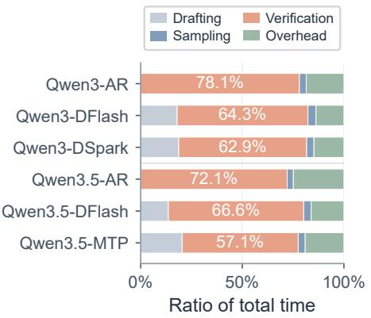
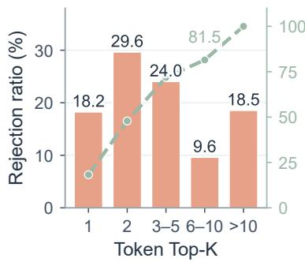
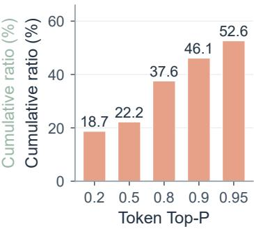
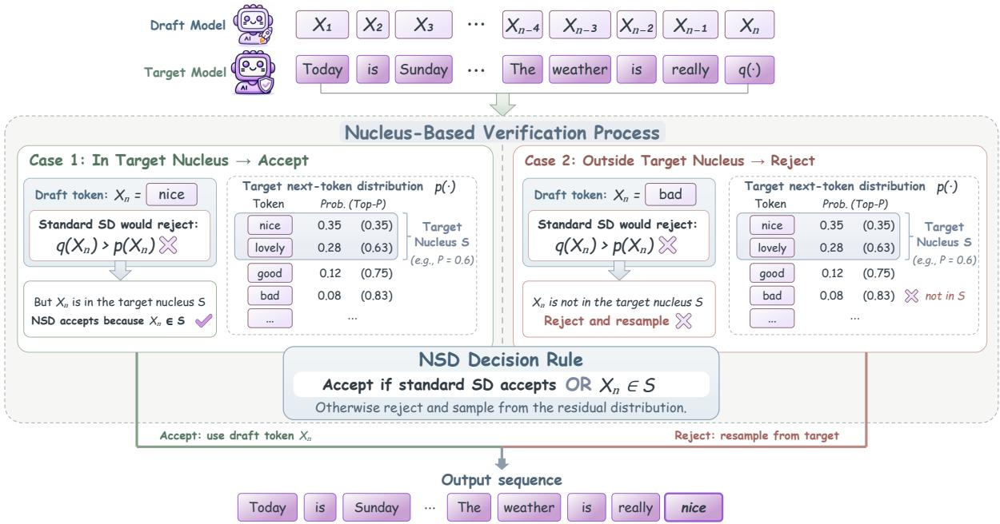
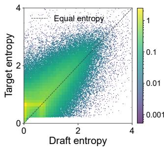
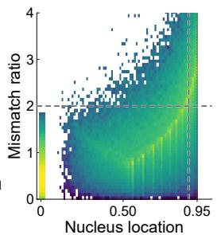
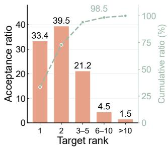
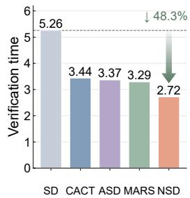

# Nucleus Speculative Decoding: Plausibility-Aware Verification Beyond Exact Distribution

Shuhao Li1,2 Fanghua Ye3 Wanyu Lin2 Tianyu Yuan1† Xiaoyu Shen1†

1EIT-NLP Lab, Eastern Institute of Technology, Ningbo

2The Hong Kong Polytechnic University

3Independent Researcher

†Corresponding authors.

shuhao.li@connect.polyu.hk tyyuan@eitech.edu.cn xyshen@eitech.edu.cn

## Abstract

Speculative decoding accelerates autoregressive generation by using a lightweight draft model to propose multiple tokens that are verified by a target model in parallel. However, the standard acceptance rule focuses on exact distribution correction and rejects tokens that remain highly plausible under the target model when the draft model assigns excess probability. This conservative verification limits the number of draft tokens retained after each verification forward pass. We introduce Nucleus Speculative Decoding (NSD), a relaxed verification method that incorporates target-model plausibility into speculative decoding. NSD accepts a draft token if it satisfies the standard acceptance rule or belongs to the target model's nucleus. We theoretically characterize the distributional deviation introduced by our method and show that the single-step error is exactly determined by the draft model's excess probability within the target nucleus. We further derive sequence-level fidelity bounds that quantify how local deviations accumulate over autoregressive decoding. Experiments across multiple target models and proposal mechanisms demonstrate that NSD consistently improves speculative decoding efficiency while maintaining competitive task performance. Our method achieves throughput speedups of up to 5.16× over autoregressive decoding and up to 3.15× over standard speculative decoding. These improvements coincide with longer accepted lengths, allowing more output tokens to share the cost of each target verification pass. Analysis shows that plausibility-aware verification provides an effective approach for relaxed verification and speculative decoding efficiency. Our code is available at https://github.com/ EIT-NLP/Nucleus-Speculative-Decoding.

## 1 Introduction

Large language models (LLMs) have demonstrated strong capabilities across language understanding, reasoning, and code generation [6, 27], but their autoregressive decoding (AR) remains inherently sequential and computationally expensive. Speculative decoding (SD) mitigates this bottleneck by allowing a lightweight draft model to propose multiple tokens that are subsequently verified by the target model in parallel [4, 17]. The acceleration of SD depends on how many draft tokens are accepted during verification.

Despite substantial progress in improving draft models [7], target model verification remains a major component of speculative decoding cost. As shown in Figure 1(a), target verification accounts for 57.1%-78.1% of wall-clock time. For draft proposals, verification terminates at the first rejected position and all subsequent proposals are discarded. Consequently, an early rejection can substantially reduce the number of tokens accepted from a single target-model verification.

For a token x sampled from the draft model probability distribution q, speculative decoding accepts x with probability min $\{ 1 , p ( x ) / q ( x ) \}$ , where $p$ denotes the target model probability distribution. This acceptance rule is determined by the relative probability assigned to x by the target and draft models, rather than by an explicit measure of the token's plausibility under the target distribution. So rejection under speculative decoding does not necessarily indicate that a proposal is implausible under target model. Consequently, when $q ( x ) > p ( x )$ , a proposal may be rejected even if x is highly ranked or lies within the target model's high-probability region.

  
(a)

  
(b)

  
(c)  
Figure 1: Execution time breakdown and rejection analysis of speculative decoding. (a) Execution time breakdown. Ratio of total time spent on drafting, verification, sampling, and overhead. (b) Target Top-K rank from rejected tokens. (c) Target Top-P distribution from rejected tokens

Experiments reveal that this distinction appears frequently in practice. Figure 1(b) shows that 81.5% of these rejected tokens still rank within the target's top ten tokens. At the commonly used setting Top-P=0.95, Figure 1(c) shows that 52.6% of the rejected tokens still belong to this region. Thus, a substantial fraction of proposals rejected by SD remain within the target nucleus.

Together, these observations expose an inefficiency in speculative decoding: target model verification is the main bottleneck, yet it still rejects many proposals that remain plausible for target model. To fix this issue, we introduce Nucleus Speculative Decoding (NSD), a simple but effective method that supplements standard speculative decoding with a target-nucleus acceptance condition. At each proposed position, the target nucleus contains the highest-probability tokens whose cumulative probability mass reaches a threshold [16]. NSD accepts a proposal if it either passes the speculative verification or belongs to target nucleus.

Although NSD relaxes the exact distribution guarantee of speculative decoding, we prove that its distributional deviation is exactly determined by the draft model's excess probability within the target nucleus. We further establish sequence-level fidelity guarantees that characterize the deviation. Across evaluations on five benchmarks with backbones from the Nemotron and Qwen families, NSD achieves throughput improvements of up to 416% over AR and up to 215% over SD.

## 2 Related Work

Speculative Decoding. Early blockwise parallel decoding predicts several positions together and retains the longest prefix validated by a scoring model [24]. Speculative decoding accelerates autoregressive generation by using a lightweight draft model to propose future tokens that will be verified in parallel by the target model [4, 17]. For a draft proposal sampled from distribution $q ,$ speculative decoding accepts tokens with probability min $\{ 1 , p ( x ) / q ( x ) \}$ and applies residual correction upon rejection to preserve the target distribution $p .$ Its efficiency depends on the number of draft tokens retained from verification. SpecInfer organizes proposals into token trees for parallel target model verification [21], while Draft & Verify generates proposals by skipping

  
Figure 2: Overview of Nucleus Speculative Decoding (NSD).

target model layers [28]

Recent advances have improved speculative decoding through stronger draft models, including feature-based drafters [18-20], multi-token prediction modules [9, 12], parallel diffusion drafting [5], semi-autoregressive proposal strategies [7], and unified autoregressive diffusion models [11]. These approaches primarily improve the quality or efficiency of draft generation. In contrast, NSD modifies the verification procedure and is complementary to existing drafting mechanisms. Therefore, NSD can be applied across different speculative decoding paradigms.

Relaxed Verification. Several works relax exact verification to improve acceptance rates under an accuracy-efficiency trade-off. The lenience extension of speculative decoding modifies the likelihood ratio criterion, while typical acceptance and related methods introduce target probability or ranking thresholds [3, 17]. Other approaches explore adaptive verification rules, approximate sampling, learned judges, or regret constraints [2, 10, 13, 15, 23, 26]. These methods generally rely on learned components or optimization objectives. Training-free verification based on draft-target KL divergence has also been explored as an alternative to learned judges [25] Inspired by nucleus sampling [16], NSD introduces a different relaxation: a draft token is accepted if it satisfies the standard acceptance rule or belongs to the target nucleus. Unlike approaches that replace the verification criterion, NSD retains the original residual correction and bonus sampling mechanisms, providing a simple nucleus-based acceptance condition using target probabilities already computed during verification.

## 3 Nucleus Speculative Decoding

We introduce Nucleus Speculative Decoding (NSD), a simple yet effective method for speculative decoding. NSD accepts a draft proposal if it passes the standard acceptance verification or belongs to the target model's top-p set. This method can extend the acceptance length using target probabilities already computed during verification. Figure 2 illustrates the workflow of our method.

Background on Speculative Decoding Let $p ( \cdot | h )$ and $q ( \cdot | h )$ denote the target and draft distributions conditioned on a prefix h. Given a committed prefix $h _ { 0 }$ , the draft model generates a block of K candidate tokens, and the target model evaluates their conditional probabilities in parallel. To preserve the exact target distribution, standard speculative decoding accepts each draft token $x _ { i }$ using the stochastic rule $a _ { i } ^ { \mathrm { S D } } ( x _ { i } ) = \operatorname* { m i n } \{ 1 , p _ { i } ( x _ { i } ) / q _ { i } ( x _ { i } ) \}$ where $p _ { i }$ and $q _ { i }$ denote the target and draft distributions at position i. Verification continues until the first rejection, at which point a replacement token is sampled from the residual distribution. If all draft tokens are accepted, a bonus token is sampled.

Although standard speculative decoding provides exact distribution preservation, its efficiency depends on the number of draft tokens surviving verification. Moreover, a token can be rejected when $q _ { i } ( x _ { i } ) > p _ { i } ( x _ { i } )$ even if it remains highly ranked under the target distribution. NSD addresses this limitation by introducing an additional acceptance condition based on target nucleus verification.

Nucleus-Based Verification NSD augments speculative decoding using target nucleus verification. For each verification position, we construct a nucleus from the target distribution $p _ { i }$ using a nucleus threshold $\theta \in ( 0 , 1 )$

$$
S _ { i } ( \theta ) = \left\{ v _ { i , ( 1 ) } , \dots , v _ { i , ( k _ { i } ( \theta ) ) } \right\} \quad { \mathrm { w h e r e } } \quad k _ { i } ( \theta ) = \operatorname* { m i n } \left\{ k : \sum _ { j = 1 } ^ { k } p _ { i } ( v _ { i , ( j ) } ) \geq \theta \right\} .\tag{1}
$$

The nucleus adapts to the target distribution at each position and is only used as an additional acceptance condition. NSD does not renormalize $p _ { i }$ or $q _ { i }$ over $S _ { i } ( \theta )$ . When $q _ { i } ( x _ { i } ) > p _ { i } ( x _ { i } )$ standard speculative decoding may reject $x _ { i }$ even when $x _ { i } \in S _ { i } ( \theta )$ . NSD accepts such proposals through the additional nucleus-based condition: $b _ { i } = \mathbf { 1 } \big \{ u _ { i } \leq a _ { i } ^ { \mathrm { S D } } ( x _ { i } ) \vee x _ { i } \in S _ { i } ( \theta ) \big \}$

Algorithm 1 gives one verification cycle. Here $q _ { i }$ is the actual conditional proposal distribution, and both $p _ { i }$ and $q _ { i }$ include sampling transformations. Nucleus ties use a fixed ordering. The generation wrapper stops at EOS or the output budget and discards uncommitted cache states. The implementation-specific numerical safeguards are described separately in Appendix B.

Algorithm 1 Nucleus Speculative Decoding: one verification cycle   
Require: Token prefix $h _ { 0 } ;$ draft length $K ;$ nucleus threshold $\theta \in ( 0 , 1 ) ;$ target model $p ;$ draft model $q$   
Ensure: Newly emitted token block o (at most $K + 1$ tokens)   
1: Generate $x _ { 1 : K }$ with the draft mechanism; retain the actual conditional proposal distributions $q _ { 1 : K }$   
2: Evaluate $p _ { i } = p ( \cdot \mid h _ { 0 } , x _ { < i } )$ for $i = 1 , \ldots , K + 1$ in one target verification pass   
3: $o  ( )$   
4: for $i = 1 , \ldots , K$ do   
5: Construct $S _ { i } ( \theta )$ from $p _ { i }$ using Equation (1)   
6: Sample $u _ { i } \sim$ Uniform $( 0 , 1 )$ set $a _ { i } ^ {  { \mathrm { \tiny \hat { S } D } } } ( x _ { i } ) \gets \operatorname* { m i n } \{ 1 , p _ { i } ( x _ { i } ) / q _ { i } ( x _ { i } ) \}$   
7: if $u _ { i } \leq a _ { i } ^ { \mathrm { S D } } ( x _ { i } )$ or $x _ { i } \in S _ { i } ( \theta )$ then   
8: Append $x _ { i }$ to o   
9: else   
$, \ i \gets \frac { [ p _ { i } ( v ) - q _ { i } ( v ) ] _ { + } } { | p _ { i } ( v ) - q _ { i } ( v ) | }$   
10: ρi(v) ←   
$\begin{array} { r } { \sum _ { w \in \mathcal { V } } [ p _ { i } ( w ) - q _ { i } ( w ) ] _ { + } } \end{array}$   
11: Sample $y \sim \rho _ { i } ;$ append y to o; return o   
12: Sample bonus token $y \sim p _ { K + 1 } ;$ append y to o; return o

Distributional Fidelity We characterize the distributional deviation introduced by nucleusbased acceptance. Let $S = S _ { \theta } ( p )$ denote the target nucleus, and let $\begin{array} { r } { D _ { \mathrm { T V } } ( r , s ) = \frac { 1 } { 2 } \sum _ { v } | r ( v ) - s ( v ) | } \end{array}$

Define

$$
R = D _ { \mathrm { T V } } ( q , p ) = \sum _ { v \in \mathcal { V } } [ q ( v ) - p ( v ) ] _ { + } , \quad E _ { S } = \sum _ { v \in S } [ q ( v ) - p ( v ) ] _ { + } .\tag{2}
$$

R is the rejection probability of standard speculative decoding, while $E _ { S }$ is the draft excess probability mass within the target nucleus. Under a shared proposal $X \sim q$ under uniform distribution, $E _ { S }$ is exactly the probability that NSD accepts a proposal rejected by standard SD. Therefore, $\bar { a } _ { \mathrm { S D } } = 1 - R , \ \bar { a } _ { \mathrm { N S D } } = 1 - R + E _ { S }$ , and the increase in proposal acceptance is $\bar { a } _ { \mathrm { N S D } } - \bar { a } _ { \mathrm { S D } } = E _ { S }$

For $R > 0$ let $\rho ( v ) = [ p ( v ) - q ( v ) ] _ { + } / R$ denote the SD residual distribution. Since NSD only rejects the draft excess outside the nucleus, residual resampling decreases from R to $R - E _ { S }$ , SO

$$
\widetilde { p } ( v ) = \operatorname* { m i n } \{ p ( v ) , q ( v ) \} + \mathbf { 1 } \{ v \in S \} [ q ( v ) - p ( v ) ] _ { + } + ( R - E _ { S } ) \rho ( v ) .\tag{3}
$$

Subtracting $p ( v )$ gives ${ \widetilde p } ( v ) - p ( v ) = \mathbf { 1 } \{ v \in S \} [ q ( v ) - p ( v ) ] _ { + } - E _ { S } \rho ( v )$ . The two terms have disjoint support: the first is nonzero only where $q ( v ) > p ( v )$ , while $\rho ( v )$ is supported only where $p ( v ) > q ( v )$ . Hence

$$
D _ { \mathrm { T V } } ( \tilde { p } , p ) = E _ { S } = \bar { a } _ { \mathrm { N S D } } - \bar { a } _ { \mathrm { S D } } .\tag{4}
$$

Equation (4) shows that the extra acceptance of NSD is exactly its local deviation from the target. Since $E _ { S } \leq R$ , this deviation is no larger than the rejection probability of standard SD.

We next give a conditional sequence-level guarantee. Let $K _ { t } ( \cdot \mid h )$ denote the actual next-emittedtoken distribution of the decoder, with internal state marginalized conditional on the emitted history h. If $D _ { \mathrm { T V } } ( K _ { t } ( \cdot \mid h ) , p _ { t } ( \cdot \mid h ) ) \le \epsilon _ { t }$ for every relevant history, then a sequential coupling gives

$$
D _ { \mathrm { T V } } \Big ( P _ { \mathrm { N S D } } ^ { ( T ) } , P _ { p } ^ { ( T ) } \Big ) \leq 1 - \prod _ { t = 1 } ^ { T } ( 1 - \epsilon _ { t } ) .
$$

Applying this bound to a particular speculative backend requires establishing the conditionalkernel assumption, including proposal selection, recovery, bonus sampling, and decoder state. Equivalently, NSD and target decoding can generate identical sequences under a coupling with probability at least $\textstyle \prod _ { t = 1 } ^ { T } ( 1 - \epsilon _ { t } )$ . For a uniform per-token error bound $\epsilon _ { t } \leq \epsilon .$ this becomes

$$
\operatorname* { P r } ( X _ { 1 : T } ^ { \mathrm { N S D } } = X _ { 1 : T } ^ { \mathrm { t a r g e t } } ) \geq ( 1 - \epsilon ) ^ { T } \geq 1 - T \epsilon .\tag{5}
$$

Therefore, when the nucleus-based relaxation introduces only small single-token deviations, NSD remains close to target-model distribution. For illustration, $\epsilon \leq 1 0 ^ { - 3 }$ and $T = 3 2$ imply coupling agreement at least $( 0 . 9 9 9 ) ^ { 3 2 } \approx 0 . 9 6 8 5$ . Detailed proofs are provided in Appendix A.

## 4 Experiments

## 4.1 Experimental Setup

Models. We evaluate NSD across five different proposal mechanisms and four model sizes, covering Nemotron-Labs-Diffusion-3B, Nemotron-Labs-Diffusion-8B, Nemotron-Labs-Diffusion-14B [11], and Qwen3 models at 4B, 8B, and 14B sizes [27]. In our main experiments, Nemotron employs linear self-speculation with 32-token proposal blocks, while Qwen3 is paired with the DSpark draft model [7] using 7-token blocks. To evaluate whether NSD generalizes across different speculative decoding paradigms, we additionally conduct experiments with DFlash [5] and EAGLE-3 [20] on Qwen3, as well as MTP on Qwen3.5 [22] . These additional results are reported in Appendix D.

Evaluation. We evaluate mathematical reasoning on GSM8K [8], MATH500, a subset of MATH 14), AIME24, AIME25, and AIME26, as well as functional code generation on MBPP [1] and HumanEval [6].

Metrics. We evaluate both task performance and efficiency. Task performance reports accuracy for mathematical reasoning tasks and functional pass@1 for MBPP and HumanEval. Speedup Ratio is the ratio of each method's token throughput to target model autoregressive (AR) throughput, where AR is normalized to 1.00×. The mean accepted length, denoted by τ, is the number of tokens emitted per verification cycle, which includes accepted draft tokens and any resampling or bonus token. So τ can exceed the draft block size by up to one token.

Baselines. We use target model autoregressive decoding as the primary reference for generation quality and latency. We compare Nucleus Sampling (NS), which modifies the sampling distribution through temperature and nucleus truncation. Standard speculative decoding (SD) [4, 17] serves as the exact distribution-preserving acceleration baseline. We further compare with relaxed speculative verification methods, including ASD [10], Cactus [13], and MARS [23], which trade exact verification guarantees for improved acceptance or efficiency. As for decoding parameters, all methods use temperature T = 1.0. For Nucleus Sampling, we use top - p = 0.95 following the common decoding configuration. For NSD, we set the nucleus threshold θ = 0.95 in the main experiments.

## 4.2 Main Results

Consistent throughput speedup. Table 1 shows that NSD achieves the highest reported speedup among the evaluated methods in all comparisons. Across models, the mean speedups range from 3.70× to 4.63× relative to AR decoding. For Nemotron models, NSD achieves overall speedups of 3.70×, 4.35×, and 4.36×. The gains also extend to Qwen3 with DSpark drafting: NSD increases the overall speedups to 4.00×, 4.34×, and 4.63× for Qwen3-4B, -8B, and -14B respectively. Averaging the paired throughput ratios across all 30 comparisons gives mean improvements of 323.0% over AR and 84.98% over SD. These results demonstrate efficiency gains under both evaluated proposal mechanisms, different model sizes and diverse model backbones.

Increased mean accepted length. The throughput gains coincide with increases in the reported mean accepted length τ across every model and benchmark group. For Nemotron-3B, -8B, and -14B, the overall τ increases from 6.29, 4.98, and 4.67 under SD to 9.54, 11.82, and 11.54 under NSD. For Qwen3-4B, -8B and -14B, the corresponding values increase from 5.36, 5.41 and 5.38 to 6.60, 6.69 and 6.68. NSD also achieves the largest reported τ among the compared verification methods. These observations are consistent with NSD retaining more draft tokens.

Task performance trade-offs. Task performance varies across models and benchmark groups. NSD achieves higher reported overall accuracy than SD on five models with increases ranging from 0.05 to 1.32 percentage points. Qwen3-4B is the exception, where overall accuracy decreases from 68.65% to 67.66% as the overall speedup increases from 3.13× to 4.00×. Across the 30 model-benchmark comparisons, NSD exceeds SD in 15 accuracy entries, ties one, and falls below SD in 14. Across all comparisons, NSD's accuracy difference relative to SD ranges from -1.58 to +4.14 percentage points, with NSD achieving 0.40 percentage points higher accuracy on average. These comparisons show consistent throughput gains alongside task-dependent quality changes

## 4.3 Ablation Study

We vary the nucleus threshold θ over five values: 0.85, 0.875, 0.90, 0.925, and 0.95. We also vary the draft block length K over 8, 16, 24, and 32 tokens. Table 2 reports the joint effects on decoding efficiency and task performance for Nemotron-8B and Nemotron-14B on GSM8K and MBPP.

Table 1: Speedup, mean accepted length and accuracy performance overview. AR denotes autoregressive sampling; NS denotes nucleus sampling on AR mode; Diff denotes diffusion-based parallel decoding. Spd.: throughput speedup relative to target-model AR; τ: mean tokens accepted per draft-block verification, including any resampling token; Acc.: math accuracy or code pass@1 (%). Blue rows denote NSD; bold numbers mark the highest speedup and largest τ within each comparison.
<table><tr><td rowspan=1 colspan=15>GSM8K          MATH500           AIME          HumanEval        MBPP</td></tr><tr><td rowspan=1 colspan=5>Model     MethodSpd.  T  Acc.</td><td rowspan=1 colspan=3>Spd.  T  Acc.</td><td rowspan=1 colspan=3>Spd.  T Acc.</td><td rowspan=1 colspan=3>Spd.  T  Acc.</td><td rowspan=1 colspan=1>Spd.  T Acc.</td></tr><tr><td rowspan=1 colspan=5>Nemo-3BAR   1.00×1.0087.95</td><td rowspan=1 colspan=3>1.00×1.0074.60</td><td rowspan=1 colspan=3>1.00×1.008.00</td><td rowspan=1 colspan=3>1.00×1.0070.73</td><td rowspan=1 colspan=1>1.00×1.00 56.03</td></tr><tr><td rowspan=1 colspan=2>NS</td><td rowspan=1 colspan=3>0.99×1.0088.32</td><td rowspan=1 colspan=2>0.99×1.00</td><td rowspan=1 colspan=1>76.16</td><td rowspan=1 colspan=3>0.99×1.0010.00</td><td rowspan=1 colspan=1>0.99×</td><td rowspan=1 colspan=1>1.00</td><td rowspan=1 colspan=1>74.63</td><td rowspan=1 colspan=1>0.99×1.00 57.04</td></tr><tr><td rowspan=1 colspan=2>Diff</td><td rowspan=1 colspan=2>2.67× 1</td><td rowspan=1 colspan=1>90.07</td><td rowspan=1 colspan=2>2.59×</td><td rowspan=1 colspan=1>73.60</td><td rowspan=1 colspan=2>2.44×   1</td><td rowspan=1 colspan=1>3.33</td><td rowspan=1 colspan=1>1.63×</td><td rowspan=1 colspan=1>1</td><td rowspan=1 colspan=1>68.90</td><td rowspan=1 colspan=1>1.52×    56.81</td></tr><tr><td rowspan=1 colspan=2>SD</td><td rowspan=1 colspan=2>2.73×7.30</td><td rowspan=1 colspan=1>88.63</td><td rowspan=1 colspan=1>2.17×</td><td rowspan=1 colspan=1>7.49</td><td rowspan=1 colspan=1>74.52</td><td rowspan=1 colspan=3>2.05×6.0110.00</td><td rowspan=1 colspan=1>1.66×</td><td rowspan=1 colspan=1>5.61</td><td rowspan=1 colspan=1>73.41</td><td rowspan=1 colspan=1>1.52×5.04 54.86</td></tr><tr><td rowspan=1 colspan=2>MARS</td><td rowspan=1 colspan=1>3.00×</td><td rowspan=1 colspan=1>9.75</td><td rowspan=1 colspan=1>85.97</td><td rowspan=1 colspan=1>3.60×</td><td rowspan=1 colspan=1>9.75</td><td rowspan=1 colspan=1>73.20</td><td rowspan=1 colspan=2>3.45×9.12</td><td rowspan=1 colspan=1>11.11</td><td rowspan=1 colspan=1>2.63×</td><td rowspan=1 colspan=1>6.97</td><td rowspan=1 colspan=1>74.39</td><td rowspan=1 colspan=1>2.54× 6.58 54.09</td></tr><tr><td rowspan=1 colspan=2>ASD</td><td rowspan=1 colspan=1>3.69×</td><td rowspan=1 colspan=1>9.58</td><td rowspan=1 colspan=1>85.22</td><td rowspan=1 colspan=1>3.69×</td><td rowspan=1 colspan=1>10.0</td><td rowspan=1 colspan=1>75.809</td><td rowspan=1 colspan=1>3.53×</td><td rowspan=1 colspan=1>9.21</td><td rowspan=1 colspan=1>13.33</td><td rowspan=1 colspan=1>2.50×</td><td rowspan=1 colspan=1>6.61</td><td rowspan=1 colspan=1>75.61</td><td rowspan=1 colspan=1>2.36×6.12 56.81</td></tr><tr><td rowspan=1 colspan=2>CACT</td><td rowspan=1 colspan=1>3.87×</td><td rowspan=1 colspan=1>10.17</td><td rowspan=1 colspan=1>85.37</td><td rowspan=1 colspan=1>3.82×</td><td rowspan=1 colspan=1>10.79</td><td rowspan=1 colspan=1>69.80</td><td rowspan=1 colspan=1>3.68×</td><td rowspan=1 colspan=1>9.54</td><td rowspan=1 colspan=1>5.56</td><td rowspan=1 colspan=1>2.90×</td><td rowspan=1 colspan=1>7.77</td><td rowspan=1 colspan=1>72.56</td><td rowspan=1 colspan=1>2.78×7.26 52.14</td></tr><tr><td rowspan=1 colspan=2>NSD</td><td rowspan=1 colspan=3>3.96× 10.44 88.26</td><td rowspan=1 colspan=1>4.42× 1</td><td rowspan=1 colspan=1>1.51</td><td rowspan=1 colspan=1>75.96</td><td rowspan=1 colspan=2>3.95× 10.24</td><td rowspan=1 colspan=1>13.33</td><td rowspan=1 colspan=1>3.08×</td><td rowspan=1 colspan=1>7.98</td><td rowspan=1 colspan=1>75.24</td><td rowspan=1 colspan=1>3.08× 7.52 55.25</td></tr><tr><td rowspan=1 colspan=2>Nemo-8BAR</td><td rowspan=1 colspan=1>1.00×</td><td rowspan=1 colspan=1>1.00</td><td rowspan=1 colspan=1>89.84</td><td rowspan=1 colspan=1>1.00×</td><td rowspan=1 colspan=1>1.00</td><td rowspan=1 colspan=1>82.20</td><td rowspan=1 colspan=1>1.00×</td><td rowspan=1 colspan=1>1.00</td><td rowspan=1 colspan=1>24.44</td><td rowspan=1 colspan=1>1.00×</td><td rowspan=1 colspan=1>1.00</td><td rowspan=1 colspan=1>79.76</td><td rowspan=1 colspan=1>1.00× 1.00 61.09</td></tr><tr><td rowspan=1 colspan=1></td><td rowspan=1 colspan=1>NS</td><td rowspan=1 colspan=1>1.00×</td><td rowspan=1 colspan=1>1.00</td><td rowspan=1 colspan=1>90.90</td><td rowspan=1 colspan=1>1.00×</td><td rowspan=1 colspan=1>1.00</td><td rowspan=1 colspan=1>82.40</td><td rowspan=1 colspan=1>0.98×</td><td rowspan=1 colspan=1>1.00</td><td rowspan=1 colspan=1>28.89</td><td rowspan=1 colspan=1>1.01×</td><td rowspan=1 colspan=1>1.00</td><td rowspan=1 colspan=1>80.12</td><td rowspan=1 colspan=1>0.97×1.00 60.31</td></tr><tr><td rowspan=1 colspan=1></td><td rowspan=1 colspan=1>Diff</td><td rowspan=1 colspan=1>2.02×</td><td rowspan=1 colspan=1>–</td><td rowspan=1 colspan=1>93.93</td><td rowspan=1 colspan=1>3.06×</td><td rowspan=1 colspan=1>1</td><td rowspan=1 colspan=1>83.80</td><td rowspan=1 colspan=1>2.83×</td><td rowspan=1 colspan=1></td><td rowspan=1 colspan=1>26.67</td><td rowspan=1 colspan=1>1.68×</td><td rowspan=1 colspan=1>1</td><td rowspan=1 colspan=1>82.07</td><td rowspan=1 colspan=1>1.36×     61.48</td></tr><tr><td rowspan=1 colspan=1></td><td rowspan=1 colspan=1>SD</td><td rowspan=1 colspan=1>2.20×</td><td rowspan=1 colspan=1>5.64</td><td rowspan=1 colspan=1>93.56</td><td rowspan=1 colspan=1>1.50×</td><td rowspan=1 colspan=1>5.59</td><td rowspan=1 colspan=1>87.72</td><td rowspan=1 colspan=1>1.49×</td><td rowspan=1 colspan=1>5.08</td><td rowspan=1 colspan=1>27.78</td><td rowspan=1 colspan=1>1.50×</td><td rowspan=1 colspan=1>4.51</td><td rowspan=1 colspan=1>81.46</td><td rowspan=1 colspan=1>1.38× 4.08 59.53</td></tr><tr><td rowspan=1 colspan=1></td><td rowspan=1 colspan=1>MARS</td><td rowspan=1 colspan=1>4.18×</td><td rowspan=1 colspan=1>10.5</td><td rowspan=1 colspan=1>93.032</td><td rowspan=1 colspan=1>3.38×</td><td rowspan=1 colspan=1>9.61</td><td rowspan=1 colspan=1>87.80</td><td rowspan=1 colspan=1>3.39×</td><td rowspan=1 colspan=1>10.12</td><td rowspan=1 colspan=1>28.89</td><td rowspan=1 colspan=1>2.94×</td><td rowspan=1 colspan=1>7.69</td><td rowspan=1 colspan=1>79.27</td><td rowspan=1 colspan=1>2.65× 6.68 57.59</td></tr><tr><td rowspan=1 colspan=1></td><td rowspan=1 colspan=1>ASD</td><td rowspan=1 colspan=1>4.08×</td><td rowspan=1 colspan=1>10.37</td><td rowspan=1 colspan=1>792.70</td><td rowspan=1 colspan=1>4.19×</td><td rowspan=1 colspan=1>11.90</td><td rowspan=1 colspan=1>88.60</td><td rowspan=1 colspan=1>3.59×</td><td rowspan=1 colspan=1>10.48</td><td rowspan=1 colspan=1>33.33</td><td rowspan=1 colspan=1>3.43×</td><td rowspan=1 colspan=1>8.82</td><td rowspan=1 colspan=1>81.10</td><td rowspan=1 colspan=1>2.92× 7.39 61.87</td></tr><tr><td rowspan=1 colspan=2>CACT</td><td rowspan=1 colspan=1>4.57×</td><td rowspan=1 colspan=1>12.0</td><td rowspan=1 colspan=1>88.641</td><td rowspan=1 colspan=1>4.14×</td><td rowspan=1 colspan=1>11.69</td><td rowspan=1 colspan=1>82.80</td><td rowspan=1 colspan=1>3.57×</td><td rowspan=1 colspan=1>10.69</td><td rowspan=1 colspan=1>30.00</td><td rowspan=1 colspan=1>3.99×</td><td rowspan=1 colspan=1>10.44</td><td rowspan=1 colspan=1>10.44 80.24</td><td rowspan=1 colspan=1>3.53×9.70 58.37</td></tr><tr><td rowspan=1 colspan=2>NSD</td><td rowspan=1 colspan=1>4.87× 1</td><td rowspan=1 colspan=1>2.21</td><td rowspan=1 colspan=1>92.57</td><td rowspan=1 colspan=1>4.40× 1</td><td rowspan=1 colspan=1>3.18</td><td rowspan=1 colspan=1>88.56</td><td rowspan=1 colspan=1>4.50× 1</td><td rowspan=1 colspan=1>2.87</td><td rowspan=1 colspan=1>31.11</td><td rowspan=1 colspan=1>4.13× 1</td><td rowspan=1 colspan=1>0.98</td><td rowspan=1 colspan=1>81.95</td><td rowspan=1 colspan=1>3.83× 9.87 62.26</td></tr><tr><td rowspan=1 colspan=2>Nemo-14B AR</td><td rowspan=1 colspan=1>1.00×</td><td rowspan=1 colspan=1>1.00</td><td rowspan=1 colspan=1>93.48</td><td rowspan=1 colspan=1>1.00×</td><td rowspan=1 colspan=1>1.00</td><td rowspan=1 colspan=1>84.80</td><td rowspan=1 colspan=1>1.00×</td><td rowspan=1 colspan=1>1.00</td><td rowspan=1 colspan=1>33.33</td><td rowspan=1 colspan=1>1.00×</td><td rowspan=1 colspan=1>1.00</td><td rowspan=1 colspan=1>80.24</td><td rowspan=1 colspan=1>1.00× 1.00 60.70</td></tr><tr><td rowspan=1 colspan=1></td><td rowspan=1 colspan=1>NS</td><td rowspan=1 colspan=1>1.01×</td><td rowspan=1 colspan=1>1.00</td><td rowspan=1 colspan=1>94.23</td><td rowspan=1 colspan=1>1.00×</td><td rowspan=1 colspan=1>1.00</td><td rowspan=1 colspan=1>85.00</td><td rowspan=1 colspan=1>1.00×</td><td rowspan=1 colspan=1>1.00</td><td rowspan=1 colspan=1>32.22</td><td rowspan=1 colspan=1>0.99×</td><td rowspan=1 colspan=1>1.00</td><td rowspan=1 colspan=1>80.85</td><td rowspan=1 colspan=1>1.00× 1.00 61.48</td></tr><tr><td rowspan=1 colspan=1></td><td rowspan=1 colspan=1>Diff</td><td rowspan=1 colspan=1>2.29×</td><td rowspan=1 colspan=1>1</td><td rowspan=1 colspan=1>93.25</td><td rowspan=1 colspan=1>2.37×</td><td rowspan=1 colspan=1>1</td><td rowspan=1 colspan=1>84.80</td><td rowspan=1 colspan=1>2.93×</td><td rowspan=1 colspan=1>-</td><td rowspan=1 colspan=1>20.00</td><td rowspan=1 colspan=1>1.49×</td><td rowspan=1 colspan=1>-</td><td rowspan=1 colspan=1>79.14</td><td rowspan=1 colspan=1>1.54× - 63.04</td></tr><tr><td rowspan=1 colspan=1></td><td rowspan=1 colspan=1>SD</td><td rowspan=1 colspan=1>2.31×</td><td rowspan=1 colspan=1>5.80</td><td rowspan=1 colspan=1>94.31</td><td rowspan=1 colspan=1>1.72×</td><td rowspan=1 colspan=1>5.11</td><td rowspan=1 colspan=1>88.36</td><td rowspan=1 colspan=1>1.31×</td><td rowspan=1 colspan=1>4.23</td><td rowspan=1 colspan=1>36.67</td><td rowspan=1 colspan=1>1.58×</td><td rowspan=1 colspan=1>4.39</td><td rowspan=1 colspan=1>77.20</td><td rowspan=1 colspan=1>1.40× 3.84 61.48</td></tr><tr><td rowspan=1 colspan=1></td><td rowspan=1 colspan=1>MARS</td><td rowspan=1 colspan=1>4.73×</td><td rowspan=1 colspan=1>12.00</td><td rowspan=1 colspan=1>92.80</td><td rowspan=1 colspan=1>3.82×</td><td rowspan=1 colspan=1>10.24</td><td rowspan=1 colspan=1>87.40</td><td rowspan=1 colspan=1>3.45×</td><td rowspan=1 colspan=1>9.99</td><td rowspan=1 colspan=1>31.11</td><td rowspan=1 colspan=1>3.17×</td><td rowspan=1 colspan=1>8.00</td><td rowspan=1 colspan=1>82.32</td><td rowspan=1 colspan=1>2.72×6.73 58.37</td></tr><tr><td rowspan=1 colspan=1></td><td rowspan=1 colspan=1>ASD</td><td rowspan=1 colspan=1>4.62×</td><td rowspan=1 colspan=1>11.87</td><td rowspan=1 colspan=1>91.58</td><td rowspan=1 colspan=1>4.21×</td><td rowspan=1 colspan=1>11.09</td><td rowspan=1 colspan=1>86.80</td><td rowspan=1 colspan=1>3.30×</td><td rowspan=1 colspan=1>9.59</td><td rowspan=1 colspan=1>34.44</td><td rowspan=1 colspan=1>3.50×</td><td rowspan=1 colspan=1>8.78</td><td rowspan=1 colspan=1>81.71</td><td rowspan=1 colspan=1>2.84× 6.92 59.53</td></tr><tr><td rowspan=1 colspan=2>CACT</td><td rowspan=1 colspan=1>4.87×</td><td rowspan=1 colspan=1>12.20</td><td rowspan=1 colspan=1>12.20 90.14</td><td rowspan=1 colspan=1>4.19×</td><td rowspan=1 colspan=1>11.26</td><td rowspan=1 colspan=1>84.40</td><td rowspan=1 colspan=1>3.32×</td><td rowspan=1 colspan=1>9.37</td><td rowspan=1 colspan=1>32.22</td><td rowspan=1 colspan=1>3.92×</td><td rowspan=1 colspan=1>10.19</td><td rowspan=1 colspan=1>77.44</td><td rowspan=1 colspan=1>3.64× 9.02 58.75</td></tr><tr><td rowspan=1 colspan=2>NSD</td><td rowspan=1 colspan=1>5.16× 1</td><td rowspan=1 colspan=1>2.64</td><td rowspan=1 colspan=1>92.87</td><td rowspan=1 colspan=1>4.38× 1</td><td rowspan=1 colspan=1>2.71</td><td rowspan=1 colspan=1>87.82</td><td rowspan=1 colspan=1>4.12× 1</td><td rowspan=1 colspan=1>1.36</td><td rowspan=1 colspan=1>36.67</td><td rowspan=1 colspan=1>4.24× 1</td><td rowspan=1 colspan=1>1.27</td><td rowspan=1 colspan=1>81.34</td><td rowspan=1 colspan=1>3.92× 9.74 59.92</td></tr><tr><td rowspan=1 colspan=1>Qwen-4B</td><td rowspan=1 colspan=1>AR</td><td rowspan=1 colspan=1>1.00×</td><td rowspan=1 colspan=1>1.00</td><td rowspan=1 colspan=1>89.84</td><td rowspan=1 colspan=1>1.00×</td><td rowspan=1 colspan=1>1.00</td><td rowspan=1 colspan=1>83.00</td><td rowspan=1 colspan=1>1.00×</td><td rowspan=1 colspan=1>1.00</td><td rowspan=1 colspan=1>20.22</td><td rowspan=1 colspan=1>1.00×</td><td rowspan=1 colspan=1>1.00</td><td rowspan=1 colspan=1>85.12</td><td rowspan=1 colspan=1>1.00× 1.00 61.63</td></tr><tr><td rowspan=1 colspan=1></td><td rowspan=1 colspan=1>NS</td><td rowspan=1 colspan=1>0.99×</td><td rowspan=1 colspan=1>1.00</td><td rowspan=1 colspan=1>89.31</td><td rowspan=1 colspan=1>0.99×</td><td rowspan=1 colspan=1>1.00</td><td rowspan=1 colspan=1>84.20</td><td rowspan=1 colspan=1>1.06×</td><td rowspan=1 colspan=1>1.00</td><td rowspan=1 colspan=1>14.89</td><td rowspan=1 colspan=1>0.99×</td><td rowspan=1 colspan=1>1.00</td><td rowspan=1 colspan=1>85.24</td><td rowspan=1 colspan=1>0.99× 1.00 62.65</td></tr><tr><td rowspan=1 colspan=1></td><td rowspan=1 colspan=1>SD</td><td rowspan=1 colspan=1>3.73×</td><td rowspan=1 colspan=1>6.18</td><td rowspan=1 colspan=1>90.90</td><td rowspan=1 colspan=1>2.87×</td><td rowspan=1 colspan=1>5.63</td><td rowspan=1 colspan=1>84.36</td><td rowspan=1 colspan=1>3.16×</td><td rowspan=1 colspan=1>4.39</td><td rowspan=1 colspan=1>21.11</td><td rowspan=1 colspan=1>3.01×</td><td rowspan=1 colspan=1>5.46</td><td rowspan=1 colspan=1>83.90</td><td rowspan=1 colspan=1>2.90× 5.14 62.96</td></tr><tr><td rowspan=1 colspan=1></td><td rowspan=1 colspan=1>MARS</td><td rowspan=1 colspan=1>4.11×</td><td rowspan=1 colspan=1>6.87</td><td rowspan=1 colspan=1>91.58</td><td rowspan=1 colspan=1>3.29×</td><td rowspan=1 colspan=1>6.03</td><td rowspan=1 colspan=1>84.00</td><td rowspan=1 colspan=1>3.41×</td><td rowspan=1 colspan=1>5.49</td><td rowspan=1 colspan=1>18.89</td><td rowspan=1 colspan=1>3.49×</td><td rowspan=1 colspan=1>5.92</td><td rowspan=1 colspan=1>81.71</td><td rowspan=1 colspan=1>3.35× 5.54 62.65</td></tr><tr><td rowspan=1 colspan=1></td><td rowspan=1 colspan=1>ASD</td><td rowspan=1 colspan=1>3.84×</td><td rowspan=1 colspan=1>6.44</td><td rowspan=1 colspan=1>89.39</td><td rowspan=1 colspan=1>3.09×</td><td rowspan=1 colspan=1>5.65</td><td rowspan=1 colspan=1>83.80</td><td rowspan=1 colspan=1>3.09×</td><td rowspan=1 colspan=1>5.02</td><td rowspan=1 colspan=1>20.00</td><td rowspan=1 colspan=1>3.37×</td><td rowspan=1 colspan=1>5.72</td><td rowspan=1 colspan=1>81.71</td><td rowspan=1 colspan=1>3.16×5.27 59.92</td></tr><tr><td rowspan=1 colspan=1></td><td rowspan=1 colspan=1>CACT</td><td rowspan=1 colspan=1>4.12×</td><td rowspan=1 colspan=1>6.99</td><td rowspan=1 colspan=1>88.62</td><td rowspan=1 colspan=1>3.63×</td><td rowspan=1 colspan=1>6.68</td><td rowspan=1 colspan=1>79.00</td><td rowspan=1 colspan=1>4.09×</td><td rowspan=1 colspan=1>6.35</td><td rowspan=1 colspan=1>13.33</td><td rowspan=1 colspan=1>3.74×</td><td rowspan=1 colspan=1>6.30</td><td rowspan=1 colspan=1>81.10</td><td rowspan=1 colspan=1>3.57× 5.90 61.48</td></tr><tr><td rowspan=1 colspan=2>NSD</td><td rowspan=1 colspan=1>4.28×</td><td rowspan=1 colspan=1>7.17</td><td rowspan=1 colspan=1>89.77</td><td rowspan=1 colspan=1>3.86×</td><td rowspan=1 colspan=1>6.84</td><td rowspan=1 colspan=1>84.10</td><td rowspan=1 colspan=1>4.13×</td><td rowspan=1 colspan=1>6.53</td><td rowspan=1 colspan=1>20.00</td><td rowspan=1 colspan=1>3.93×</td><td rowspan=1 colspan=1>6.43</td><td rowspan=1 colspan=1>82.32</td><td rowspan=1 colspan=1>3.81× 6.02 62.10</td></tr><tr><td rowspan=1 colspan=1>Qwen-8B</td><td rowspan=1 colspan=1>AR</td><td rowspan=1 colspan=1>1.00×</td><td rowspan=1 colspan=1>1.00</td><td rowspan=1 colspan=1>92.04</td><td rowspan=1 colspan=1>1.00×</td><td rowspan=1 colspan=1>1.00</td><td rowspan=1 colspan=1>83.60</td><td rowspan=1 colspan=1>1.00×</td><td rowspan=1 colspan=1>1.00</td><td rowspan=1 colspan=1>20.00</td><td rowspan=1 colspan=1>1.00×</td><td rowspan=1 colspan=1>1.00</td><td rowspan=1 colspan=1>87.80</td><td rowspan=1 colspan=1>1.00× 1.00 63.81</td></tr><tr><td rowspan=1 colspan=1></td><td rowspan=1 colspan=1>NS</td><td rowspan=1 colspan=1>0.99×</td><td rowspan=1 colspan=1>1.00</td><td rowspan=1 colspan=1>93.32</td><td rowspan=1 colspan=1>1.00×</td><td rowspan=1 colspan=1>1.00</td><td rowspan=1 colspan=1>84.00</td><td rowspan=1 colspan=1>1.02×</td><td rowspan=1 colspan=1>1.00</td><td rowspan=1 colspan=1>18.89</td><td rowspan=1 colspan=1>0.99×</td><td rowspan=1 colspan=1>1.00</td><td rowspan=1 colspan=1>84.76</td><td rowspan=1 colspan=1>0.99× 1.00 64.59</td></tr><tr><td rowspan=1 colspan=1></td><td rowspan=1 colspan=1>SD</td><td rowspan=1 colspan=1>4.16×</td><td rowspan=1 colspan=1>6.32</td><td rowspan=1 colspan=1>91.66</td><td rowspan=1 colspan=1>3.25×</td><td rowspan=1 colspan=1>5.70</td><td rowspan=1 colspan=1>84.64</td><td rowspan=1 colspan=1>3.04×</td><td rowspan=1 colspan=1>4.36</td><td rowspan=1 colspan=1>17.78</td><td rowspan=1 colspan=1>3.35×</td><td rowspan=1 colspan=1>5.468</td><td rowspan=1 colspan=1>7.44</td><td rowspan=1 colspan=1>3.25× 5.20 66.15</td></tr><tr><td rowspan=1 colspan=1></td><td rowspan=1 colspan=1>MARS</td><td rowspan=1 colspan=1>4.35×</td><td rowspan=1 colspan=1>6.68</td><td rowspan=1 colspan=1>90.91</td><td rowspan=1 colspan=1>3.12×</td><td rowspan=1 colspan=1>5.98</td><td rowspan=1 colspan=1>84.00</td><td rowspan=1 colspan=1>3.32×</td><td rowspan=1 colspan=1>5.51</td><td rowspan=1 colspan=1>20.00</td><td rowspan=1 colspan=1>3.79×</td><td rowspan=1 colspan=1>5.8</td><td rowspan=1 colspan=1>84.766</td><td rowspan=1 colspan=1>3.56× 5.56 63.04</td></tr><tr><td rowspan=1 colspan=1></td><td rowspan=1 colspan=1>ASD</td><td rowspan=1 colspan=1>4.26×</td><td rowspan=1 colspan=1>6.50</td><td rowspan=1 colspan=1>93.56</td><td rowspan=1 colspan=1>3.36×</td><td rowspan=1 colspan=1>5.63</td><td rowspan=1 colspan=1>85.60</td><td rowspan=1 colspan=1>2.94×</td><td rowspan=1 colspan=1>4.92</td><td rowspan=1 colspan=1>21.11</td><td rowspan=1 colspan=1>3.59×</td><td rowspan=1 colspan=1>5.54</td><td rowspan=1 colspan=1>85.36</td><td rowspan=1 colspan=1>3.52× 5.35 64.12</td></tr><tr><td rowspan=1 colspan=1></td><td rowspan=1 colspan=1>CACT</td><td rowspan=1 colspan=1>4.44×</td><td rowspan=1 colspan=1>7.09</td><td rowspan=1 colspan=1>91.91</td><td rowspan=1 colspan=1>4.02×</td><td rowspan=1 colspan=1>6.78</td><td rowspan=1 colspan=1>82.40</td><td rowspan=1 colspan=1>3.88×</td><td rowspan=1 colspan=1>6.38</td><td rowspan=1 colspan=1>12.22</td><td rowspan=1 colspan=1>4.21×</td><td rowspan=1 colspan=1>6.49</td><td rowspan=1 colspan=1>85.98</td><td rowspan=1 colspan=1>4.07× 6.15 64.98</td></tr><tr><td rowspan=1 colspan=2>NSD</td><td rowspan=1 colspan=1>4.76×</td><td rowspan=1 colspan=1>7.24</td><td rowspan=1 colspan=1>92.30</td><td rowspan=1 colspan=1>4.31×</td><td rowspan=1 colspan=1>6.87</td><td rowspan=1 colspan=1>86.40</td><td rowspan=1 colspan=1>4.12×</td><td rowspan=1 colspan=1>6.50</td><td rowspan=1 colspan=1>21.11</td><td rowspan=1 colspan=1>4.35×</td><td rowspan=1 colspan=1>6.58</td><td rowspan=1 colspan=1>86.46</td><td rowspan=1 colspan=1>4.14× 6.25 64.59</td></tr><tr><td rowspan=1 colspan=2>Qwen-14B AR</td><td rowspan=1 colspan=1>1.00×</td><td rowspan=1 colspan=1>1.00</td><td rowspan=1 colspan=1>93.93</td><td rowspan=1 colspan=1>1.00×</td><td rowspan=1 colspan=1>1.00</td><td rowspan=1 colspan=1>87.40</td><td rowspan=1 colspan=1>1.00×</td><td rowspan=1 colspan=1>1.00</td><td rowspan=1 colspan=1>22.22</td><td rowspan=1 colspan=1>1.00×</td><td rowspan=1 colspan=1>1.00</td><td rowspan=1 colspan=1>85.98</td><td rowspan=1 colspan=1>1.00× 1.00 66.93</td></tr><tr><td rowspan=1 colspan=1></td><td rowspan=1 colspan=1>NS</td><td rowspan=1 colspan=1>0.99×</td><td rowspan=1 colspan=1>1.00</td><td rowspan=1 colspan=1>92.80</td><td rowspan=1 colspan=1>0.99×</td><td rowspan=1 colspan=1>1.00</td><td rowspan=1 colspan=1>87.60</td><td rowspan=1 colspan=1>1.00×</td><td rowspan=1 colspan=1>1.00</td><td rowspan=1 colspan=1>18.89</td><td rowspan=1 colspan=1>0.99×</td><td rowspan=1 colspan=1>1.00</td><td rowspan=1 colspan=1>90.24</td><td rowspan=1 colspan=1>1.00× 1.00 66.54</td></tr><tr><td rowspan=1 colspan=1></td><td rowspan=1 colspan=1>SD</td><td rowspan=1 colspan=1>4.53×</td><td rowspan=1 colspan=1>6.31</td><td rowspan=1 colspan=1>93.78</td><td rowspan=1 colspan=1>3.66×</td><td rowspan=1 colspan=1>5.68</td><td rowspan=1 colspan=1>86.88</td><td rowspan=1 colspan=1>3.10×</td><td rowspan=1 colspan=1>4.25</td><td rowspan=1 colspan=1>25.56</td><td rowspan=1 colspan=1>3.66×</td><td rowspan=1 colspan=1>5.40</td><td rowspan=1 colspan=1>89.51</td><td rowspan=1 colspan=1>3.63× 5.25 67.78</td></tr><tr><td rowspan=1 colspan=1></td><td rowspan=1 colspan=1>MARS</td><td rowspan=1 colspan=1>4.81×</td><td rowspan=1 colspan=1>6.74</td><td rowspan=1 colspan=1>93.56</td><td rowspan=1 colspan=1>3.98×</td><td rowspan=1 colspan=1>5.95</td><td rowspan=1 colspan=1>85.60</td><td rowspan=1 colspan=1>3.40×</td><td rowspan=1 colspan=1>5.37</td><td rowspan=1 colspan=1>21.11</td><td rowspan=1 colspan=1>4.05×</td><td rowspan=1 colspan=1>5.74</td><td rowspan=1 colspan=1>89.63</td><td rowspan=1 colspan=1>4.02× 5.59 68.09</td></tr><tr><td rowspan=1 colspan=1></td><td rowspan=1 colspan=1>ASD</td><td rowspan=1 colspan=2>4.61×6.44</td><td rowspan=1 colspan=1>93.78</td><td rowspan=1 colspan=1>3.76×</td><td rowspan=1 colspan=1>5.56</td><td rowspan=1 colspan=1>86.80</td><td rowspan=1 colspan=1>2.98×</td><td rowspan=1 colspan=1>4.71</td><td rowspan=1 colspan=1>26.67</td><td rowspan=1 colspan=1>3.86×</td><td rowspan=1 colspan=1>5.46</td><td rowspan=1 colspan=1>89.02</td><td rowspan=1 colspan=1>3.82× 5.31 68.09</td></tr><tr><td rowspan=1 colspan=1></td><td rowspan=1 colspan=1>CACT</td><td rowspan=1 colspan=2>5.02×7.12</td><td rowspan=1 colspan=1>92.19</td><td rowspan=1 colspan=1>4.56×</td><td rowspan=1 colspan=1>6.79</td><td rowspan=1 colspan=1>84.80</td><td rowspan=1 colspan=1>4.00×</td><td rowspan=1 colspan=1>6.35</td><td rowspan=1 colspan=1>17.78</td><td rowspan=1 colspan=1>4.55×</td><td rowspan=1 colspan=1>6.44</td><td rowspan=1 colspan=1>88.41</td><td rowspan=1 colspan=1>4.42× 6.15 68.09</td></tr><tr><td rowspan=1 colspan=5>NSD 5.15×7.2293.18</td><td rowspan=1 colspan=2>4.75×6.87</td><td rowspan=1 colspan=1>87.40</td><td rowspan=1 colspan=3>4.16×6.5324.44</td><td rowspan=1 colspan=1>4.64×</td><td rowspan=1 colspan=2>6.5390.24</td><td rowspan=1 colspan=1>4.47× 6.25 68.48</td></tr></table>

Table 2: Effect of draft block size K and nucleus threshold θ on speedup, mean accepted length, and accuracy. Spd. denotes speedup relative to target-model AR; τ is the mean accepted length per draft block verification; Acc. is math accuracy or code pass@1 (%).
<table><tr><td rowspan=1 colspan=16>Nucleus threshold θ0.95                0.925                0.90                0.875               0.85Dataset K Spd.   T   Acc. Spd.   T   Acc. Spd.   T   Acc. Spd.   T   Acc. Spd.   T   Acc.</td></tr><tr><td></td><td rowspan=1 colspan=15>Nemo-8B</td></tr><tr><td></td><td rowspan=1 colspan=1>GSM8K 8 2.92× 6</td><td rowspan=1 colspan=1>.61 9</td><td rowspan=1 colspan=1>1.66</td><td rowspan=1 colspan=3>2.89× 6.61 91.66</td><td rowspan=1 colspan=3>2.83×6.6791.66</td><td rowspan=1 colspan=3>2.69×6.51 92.42</td><td rowspan=1 colspan=3>2.65× 6.54 92.87</td></tr><tr><td></td><td rowspan=1 colspan=2>16 4.35× 10.70</td><td rowspan=1 colspan=1>91.58</td><td rowspan=1 colspan=1>3.63×</td><td rowspan=1 colspan=2>9.4293.48</td><td rowspan=1 colspan=3>4.21×9.6693.94</td><td rowspan=1 colspan=3>3.93×9.56 93.10</td><td rowspan=1 colspan=3>4.06×9.4692.72</td></tr><tr><td></td><td rowspan=1 colspan=2>24 4.55× 11.90</td><td rowspan=1 colspan=1>92.87</td><td rowspan=1 colspan=1>4.60× 1</td><td rowspan=1 colspan=2>1.74 90.90</td><td rowspan=1 colspan=3>4.65× 12.09 90.14 4</td><td rowspan=1 colspan=3>.70× 12.03 90.98 4</td><td rowspan=1 colspan=3>.89× 12.47 91.58</td></tr><tr><td></td><td rowspan=1 colspan=2>32 4.87× 12.21</td><td rowspan=1 colspan=1>92.57</td><td rowspan=1 colspan=1>5.04× 1</td><td rowspan=1 colspan=2>3.03 91.43</td><td rowspan=1 colspan=3>5.36× 13.57 93.63</td><td rowspan=1 colspan=3>4.88× 12.26 91.74 5</td><td rowspan=1 colspan=3>.30× 13.53 92.42</td></tr><tr><td></td><td rowspan=2 colspan=1>MBPP  8 2.72×</td><td rowspan=1 colspan=1></td><td rowspan=1 colspan=1></td><td rowspan=1 colspan=1></td><td rowspan=1 colspan=2></td><td rowspan=1 colspan=1></td><td rowspan=1 colspan=1></td><td rowspan=1 colspan=1></td><td rowspan=2 colspan=3>2.48×6.04 59.14</td><td rowspan=2 colspan=2>2.57×6.20</td><td rowspan=2 colspan=1>62.26</td></tr><tr><td></td><td rowspan=1 colspan=1>6.17</td><td rowspan=1 colspan=1>61.48</td><td rowspan=1 colspan=1>2.53×</td><td rowspan=1 colspan=2>6.2359.53</td><td rowspan=1 colspan=1>2.70</td><td rowspan=1 colspan=1>6.27×</td><td rowspan=1 colspan=1>60.70</td></tr><tr><td></td><td rowspan=1 colspan=1>16 3.52×</td><td rowspan=1 colspan=1>8.15</td><td rowspan=1 colspan=1>59.92</td><td rowspan=1 colspan=1>3.47×</td><td rowspan=1 colspan=1>7.93</td><td rowspan=1 colspan=1>59.92</td><td rowspan=1 colspan=1>3.43×</td><td rowspan=1 colspan=1>7.82</td><td rowspan=1 colspan=1>58.75</td><td rowspan=1 colspan=1>3.30×</td><td rowspan=1 colspan=1>7.56</td><td rowspan=1 colspan=1>60.31</td><td rowspan=1 colspan=2>3.26×7.77</td><td rowspan=1 colspan=1>62.65</td></tr><tr><td></td><td rowspan=1 colspan=1>24 3.79×</td><td rowspan=1 colspan=1>9.79</td><td rowspan=1 colspan=1>58.75</td><td rowspan=1 colspan=1>3.92×</td><td rowspan=1 colspan=2>9.6758.37</td><td rowspan=1 colspan=1>3.77×</td><td rowspan=1 colspan=1>9.48</td><td rowspan=1 colspan=1>59.53</td><td rowspan=1 colspan=1>3.94×</td><td rowspan=1 colspan=1>9.66</td><td rowspan=1 colspan=1>58.75</td><td rowspan=1 colspan=2>3.65×8.88</td><td rowspan=1 colspan=1>62.26</td></tr><tr><td></td><td rowspan=1 colspan=1>32 3.83×</td><td rowspan=1 colspan=1>9.87</td><td rowspan=1 colspan=1>62.26</td><td rowspan=1 colspan=1>3.88</td><td rowspan=1 colspan=2>9.46×60.63</td><td rowspan=1 colspan=1>3.95× 9</td><td rowspan=1 colspan=1>.66</td><td rowspan=1 colspan=1>59.92</td><td rowspan=1 colspan=1>3.77×</td><td rowspan=1 colspan=1>9.06 6</td><td rowspan=1 colspan=1>1.48</td><td rowspan=1 colspan=1>3.61×</td><td rowspan=1 colspan=1>8.88</td><td rowspan=1 colspan=1>61.88</td></tr><tr><td></td><td rowspan=1 colspan=1></td><td rowspan=1 colspan=1></td><td rowspan=1 colspan=1></td><td rowspan=1 colspan=1></td><td rowspan=1 colspan=1></td><td rowspan=1 colspan=1></td><td rowspan=1 colspan=1></td><td rowspan=1 colspan=1></td><td rowspan=1 colspan=1></td><td rowspan=1 colspan=1></td><td rowspan=1 colspan=1></td><td rowspan=1 colspan=1></td><td rowspan=1 colspan=1></td><td rowspan=1 colspan=1></td><td rowspan=1 colspan=1></td></tr><tr><td></td><td rowspan=1 colspan=1>Nemo-14B</td><td rowspan=1 colspan=1></td><td rowspan=1 colspan=1></td><td rowspan=1 colspan=1></td><td rowspan=1 colspan=1></td><td rowspan=1 colspan=1></td><td rowspan=1 colspan=1></td><td rowspan=1 colspan=1></td><td rowspan=1 colspan=1></td><td rowspan=1 colspan=2></td><td rowspan=1 colspan=1></td><td rowspan=1 colspan=2></td><td rowspan=1 colspan=1></td></tr><tr><td></td><td rowspan=1 colspan=1>GSM8K 8 2.91× 6.</td><td rowspan=1 colspan=1>65 90</td><td rowspan=1 colspan=1>.90 2.</td><td rowspan=1 colspan=1>97× 6.</td><td rowspan=1 colspan=1>81 91</td><td rowspan=1 colspan=1>.74 2</td><td rowspan=1 colspan=1>.93× 6.</td><td rowspan=1 colspan=1>74 92</td><td rowspan=1 colspan=1>.42 2</td><td rowspan=1 colspan=1>.70× 6</td><td rowspan=1 colspan=1>.54 9</td><td rowspan=1 colspan=1>3.18 2</td><td rowspan=1 colspan=1>.98× 6</td><td rowspan=1 colspan=1>.61 9</td><td rowspan=1 colspan=1>4.01</td></tr><tr><td></td><td rowspan=1 colspan=1>16 3.82×</td><td rowspan=1 colspan=1>9.33 9</td><td rowspan=1 colspan=1>0.14 4</td><td rowspan=1 colspan=1>.04× 9</td><td rowspan=1 colspan=1>.83 9</td><td rowspan=1 colspan=1>1.58</td><td rowspan=1 colspan=1>3.99× 9</td><td rowspan=1 colspan=1>.79 9</td><td rowspan=1 colspan=1>2.95</td><td rowspan=1 colspan=1>4.16× 10</td><td rowspan=1 colspan=1>.08 9</td><td rowspan=1 colspan=1>3.03 4</td><td rowspan=1 colspan=2>.26× 10.29 9</td><td rowspan=1 colspan=1>3.78</td></tr><tr><td></td><td rowspan=1 colspan=1>24 4.66× 1</td><td rowspan=1 colspan=2>1.40 90.45</td><td rowspan=1 colspan=1>4.67× 1</td><td rowspan=1 colspan=1>1.12</td><td rowspan=1 colspan=1>92.57</td><td rowspan=1 colspan=1>4.25× 1</td><td rowspan=1 colspan=1>0.62</td><td rowspan=1 colspan=1>92.04</td><td rowspan=1 colspan=1>4.42× 1</td><td rowspan=1 colspan=2>0.91 92.95 4</td><td rowspan=1 colspan=1>.56× 1</td><td rowspan=1 colspan=1>1.19 9</td><td rowspan=1 colspan=1>3.48</td></tr><tr><td></td><td rowspan=1 colspan=1>32 5.16× 1</td><td rowspan=1 colspan=2>2.64 92.87</td><td rowspan=1 colspan=1>5.00× 1</td><td rowspan=1 colspan=1>2.53 9</td><td rowspan=1 colspan=1>2.80</td><td rowspan=1 colspan=1>5.11× 1</td><td rowspan=1 colspan=1>2.31</td><td rowspan=1 colspan=1>92.70</td><td rowspan=1 colspan=1>4.76× 11</td><td rowspan=1 colspan=1>.69 9</td><td rowspan=1 colspan=1>3.10 4</td><td rowspan=1 colspan=1>.86× 1</td><td rowspan=1 colspan=1>1.81 9</td><td rowspan=1 colspan=1>3.86</td></tr><tr><td rowspan=3 colspan=2>16 3.40×</td><td rowspan=2 colspan=3>MBPP 8 2.59×</td><td rowspan=1 colspan=1></td><td rowspan=2 colspan=1>58.37</td><td rowspan=2 colspan=1>2.60×</td><td rowspan=1 colspan=1></td><td rowspan=1 colspan=1></td><td rowspan=1 colspan=1></td><td rowspan=1 colspan=1></td><td rowspan=1 colspan=1></td><td rowspan=2 colspan=1>2.56×</td><td rowspan=2 colspan=1>5.92</td><td rowspan=2 colspan=1>62.26</td></tr><tr><td rowspan=1 colspan=1>6.11</td><td rowspan=1 colspan=1>6.29</td><td rowspan=1 colspan=1>59.53</td><td rowspan=1 colspan=1>2.56×</td><td rowspan=1 colspan=1>5.95</td><td rowspan=1 colspan=1>63.42</td><td></td><td></td><td></td></tr><tr><td rowspan=1 colspan=1>8.16</td><td rowspan=1 colspan=1>60.70</td><td rowspan=1 colspan=1>3.32×</td><td rowspan=1 colspan=1>7.89</td><td rowspan=1 colspan=1>61.48</td><td rowspan=1 colspan=1>3.39</td><td rowspan=1 colspan=1>8.10×</td><td rowspan=1 colspan=1>62.57</td><td rowspan=1 colspan=1>3.31×</td><td rowspan=1 colspan=1>7.91</td><td rowspan=1 colspan=1>61.48</td><td rowspan=1 colspan=1>3.25×</td><td rowspan=1 colspan=1>8.03</td><td rowspan=1 colspan=1>64.20</td></tr><tr><td rowspan=3 colspan=3>24 3.68×32 3.92×</td><td rowspan=1 colspan=1>9.08</td><td rowspan=1 colspan=2>59.14 3.81×</td><td rowspan=1 colspan=2>9.5361.87</td><td rowspan=1 colspan=2>3.57×8.73</td><td rowspan=1 colspan=1>61.87</td><td rowspan=1 colspan=3>3.37×8.1560.70</td><td rowspan=1 colspan=2>3.53×8.6363.04</td></tr><tr><td rowspan=1 colspan=1>9.74</td><td rowspan=1 colspan=2>9.74 59.92 3.59×</td><td rowspan=1 colspan=4>8.8760.31 3.59× 8.86</td><td rowspan=1 colspan=1>62.65</td><td rowspan=1 colspan=3>3.70×9.1961.87</td><td rowspan=1 colspan=3>3.58×8.8962.26</td></tr><tr><td rowspan=1 colspan=13></td></tr></table>

Effect of draft block length. Increasing K from 8 to 32 improves both speedup and mean acceptance length for both models and benchmarks at every tested nucleus threshold. At θ = 0.95, the GSM8K speedup increases from 2.92× to 4.87× for Nemotron-8B and from 2.91× to 5.16× for Nemotron-14B. The corresponding mean accepted lengths increase from 6.61 to 12.21 and from 6.65 to 12.64. On MBPP, the same block-length change increases speedup from 2.72× to 3.83× for Nemotron-8B and from 2.59× to 3.92× for Nemotron-14B. These results show that longer draft blocks allow NSD to retain more tokens per verification. The larger speedup gains on GSM8K than on MBPP further suggest that the benefit of increasing K varies across tasks.

Diminishing returns from longer blocks. The marginal benefit of increasing K depends on the task. For GSM8K, increasing K from 24 to 32 improves throughput for both models at all thresholds. However, the gains often diminish on MBPP. For Nemotron-8B at θ = 0.95, this increase changes speedup only from 3.79× to 3.83× and τ from 9.79 to 9.87. For Nemotron-14B at θ = 0.925, speedup instead decreases from 3.81× to 3.59×, accompanied by a decrease in τ from 9.53 to 8.87. Thus, extending the proposed block does not always increase τ or improve throughput.

Sensitivity to the nucleus threshold. The effect of θ is model- and task-dependent rather than uniformly monotonic. For Nemotron-14B at K = 32, reducing θ from 0.95 to 0.85 increases GSM8K accuracy from 92.87% to 93.86% and MBPP pass@1 from 59.92% to 62.26%. These improvements are accompanied by lower speedups: 5.16× to 4.86× on GSM8K and 3.92× to 3.58× on MBPP. In contrast, for Nemotron-8B on GSM8K at K = 32, reducing θ from 0.95 to 0.90 improves both speedup and accuracy, from 4.87× to 5.36× and from 92.57% to 93.63%, while increasing τ from 12.21 to 13.57. The same threshold change on MBPP increases speedup from 3.83× to $3 . 9 5 \times$ but decreases pass@1 from 62.26% to 59.92%. A threshold adjustment that improves both metrics on one task can therefore introduce a quality-efficiency trade-off on another.

  
(a)

  
(b)

  
(c)

  
(d)  
Figure 3: Nucleus-based acceptance statistics and verification efficiency. (a) Draft and target entropy. (b) Nucleus location and log probability mismatch; location zero denotes the target rank-1 token, with its strip widened for visibility. (c) Nucleus-accepted token shares and their cumulative ratio by target rank. (d) Verification time in ms/output token for Nemotron models.

Joint configuration trade-offs. The configurations maximizing throughput do not necessarily maximize task performance. Although the highest observed speedup occurs at $K = 3 2$ , the highest MBPP pass@1 for both models occurs at $K = 1 6$ and $\theta = 0 . 8 5$ . This setting achieves 62.65% pass@1 with a 3.26× speedup for Nemotron-8B and 64.20% pass@1 with a 3.25× speedup for Nemotron-14B. Taken together, the ablations show that block length and nucleus threshold should be considered jointly, as larger blocks generally favor throughput by increasing the number of draft tokens that can be retained per verification step, whereas the preferred nucleus threshold depends on the model and task and can yield a more favorable balance between efficiency and performance.

## 4.4 Analysis

We investigate the statistics of additional acceptances under NSD and how this relaxation affects verification efficiency. An additional acceptance is a verified draft proposal that fails the standard stochastic acceptance but is retained by NSD because it belongs to the target nucleus Figure $\mathrm { 3 ( a - c ) }$ characterizes additional acceptances from Qwen3-4B with DSpark. Figure 3(d) compares verification timing on Nemotron-14B with self-speculation.

Draft distributions are often more concentrated. Figure $\mathrm { 3 ( a ) }$ compares draft and target entropy at contexts where additional acceptances occur. The mean draft entropy is 0.865, compared with 1.101 for the target, and target entropy exceeds draft entropy in 70.30% of these tokens. The two entropies are positively correlated, with Pearson correlation $r = 0 . 6 6 8$ . These observations indicate that although draft and target entropy tend to vary together, the draft distribution is often more concentrated. This pattern complements the target-rank analysis by distinguishing distributional concentration. For an additionally accepted token x, failure of the standard SD verification requires $q ( x ) > p ( x )$ , with rejection probability $1 - p ( x ) / q ( x )$ . Thus, a proposal can be highly ranked by the target yet still face a substantial rejection probability when the draft assigns it more probability.

Most additional acceptances lie inside the nucleus core. Figure 3(b) further characterizes additional acceptances along two dimensions: nucleus location and target-draft probability mismatch. Let $C ( x )$ denote the cumulative target probability mass preceding token x, and let $Y ( x ) = \log ( q ( x ) / p ( x ) )$ . Within the additionally accepted tokens, we distinguish the nucleus core, $C ( x ) < 0 . 9$ , and the boundary region $C ( x ) \geq 0 . 9$ . Splitting the mismatch dimension at $Y = 2$ yields four categories: core-lower mismatch, core-higher mismatch, boundary-lower mismatch, and boundary-higher mismatch. Overall, 86.65% of additional acceptances lie in the nucleus core, showing that the relaxation does not operate primarily on tokens near the nucleus boundary. The available statistics also show that 79.30% satisfy both $C ( x ) \ < \ 0 . 9$ and the mismatch condition $Y ( x ) < 2$ . The remaining tokens are distributed among the core-higher mismatch (7.36%), boundary-lower mismatch (4.84%), and boundary-higher mismatch (8.50%) regions. This concentration provides further evidence that nucleus-based acceptance predominantly retains plausible tokens under the target distribution. And the draft-target mismatch is not significant.

Additional acceptances concentrate at high target ranks. Figure $3 ( \mathrm { c } )$ shows that NSD frequently accepts proposals ranked highly by the target model. Among the additionally accepted tokens, 33.4% are the target's rank-1 token, and 72.9% fall within its top two. The cumulative share reaches 94.1% for the top five and 98.5% for the top ten. The results illustrate that high target rank does not ensure acceptance under SD: its stochastic verification depends on min $\{ 1 , p ( x ) / q ( x ) \}$ rather than target rank. Thus, nucleus-based acceptance retains many highly ranked tokens that would otherwise be rejected to preserve the target distribution.

Substantial savings in verification time. In the verification timing comparison on Nemotron models, NSD reduces verification time from 5.26 to 2.72 milliseconds per output token, a 48.3% reduction relative to SD. Compared with Cactus, ASD, and MARS, whose corresponding costs are 3.44, 3.37, and 3.29 milliseconds, NSD reduces verification time per output token by 20.9% 19.3%, and 17.3% respectively. Verification calls per output token decrease from 0.1600 under SD to 0.0835 under NSD, a 47.81% reduction, while target execution time per call changes by less than 1% (32.551 versus 32.266 milliseconds). These measurements support fewer verification calls per emitted token as the primary source of savings. NSD can continue accepting subsequent proposals using already computed target probabilities, spreading expensive verification cost over more tokens.

Taken together, these results clarify how nucleus-based verification translates additional acceptance into end-to-end efficiency. The additional proposals retained by NSD are not concentrated near the boundary of the target nucleus: 86.65% lie in the nucleus core, and 94.1% rank within the target model's top five tokens. This reduces the frequency of expensive target verification. Verification calls per output token decrease by 47.81%. Therefore, the primary efficiency gain of NSD comes from amortizing each target verification over more emitted tokens rather than making an individual target-model invocation cheaper. Competitive accuracy results suggest that NSD improves decoding efficiency by relaxing verification mainly for highly plausible proposals under the target model.

## 5 Conclusion

In this work, we introduce Nucleus Speculative Decoding (NSD), a simple but effective relaxed verification method that supplements stochastic acceptance with target-nucleus membership. It does not modify the proposal mechanism, residual correction, or bonus sampling procedure, allowing it to be combined with diverse speculative decoding paradigms. We provide a theoretical analysis of the distributional deviation. The deviation from the target distribution is exactly the draft model's excess probability inside the target nucleus for a single decoding step. This derivation reveals when NSD remains exact and provides conditional sequence-level fidelity bounds relative to the target distribution. Experiments across Qwen and Nvidia-Nemotron model families and proposal mechanisms demonstrate that our method improves throughput by retaining additional draft tokens while maintaining competitive task performance. Results and analysis suggest that plausibility-aware verification is a promising direction for designing efficient speculative decoding algorithms.

## AI use statement

During the preparation of this manuscript, we used AI-assisted tools to support writing-related tasks, including improving clarity, grammar, and organization of the text. The authors remain fully responsible for the research contributions, mathematical derivations, experimental design, results, interpretations, and the final content of the manuscript.

## Reproducibility Statement

We have made every effort to ensure that the results presented in this paper are reproducible. Code and datasets have been made publicly available in the supplementary materials to facilitate replication and verification. The experimental setup, including models, decoding parameters and hardware details, is described in detail in the paper. All experiments are conducted on NVIDIA Pro5000 GPUs, with latency and throughput measurements collected under the same hardware configuration. We believe these measures will enable other researchers to reproduce our work.

## Acknowledgements

We thank the EIT and IDT High Performance Computing Center for providing computational resources for this project.

## References

[1] Jacob Austin, Augustus Odena, Maxwell Nye, Maarten Bosma, Henryk Michalewski, David Dohan, Ellen Jiang, Carrie Cai, Michael Terry, Quoc Le, and Charles Sutton. Program synthesis with large language models, 2021. URL https://arxiv.org/abs/2108.07732.

[2] Gregor Bachmann, Sotiris Anagnostidis, Albert Pumarola, Markos Georgopoulos, Artsiom Sanakoyeu, Yuming Du, Edgar Schönfeld, Ali Thabet, and Jonas Kohler. Judge decoding: Faster speculative sampling requires going beyond model alignment, 2025. URL https://arxiv.org/abs/2501.19309.

[3] Tianle Cai, Yuhong Li, Zhengyang Geng, Hongwu Peng, Jason D. Lee, Deming Chen, and Tri Dao. Medusa: Simple llm inference acceleration framework with multiple decoding heads, 2024. URL https://arxiv.org/abs/2401.10774.

[4] Charlie Chen, Sebastian Borgeaud, Geoffrey Irving, Jean-Baptiste Lespiau, Laurent Sifre, and John Jumper. Accelerating large language model decoding with speculative sampling, 2023. URL https://arxiv.org/abs/2302.01318.

[5] Jian Chen, Yesheng Liang, and Zhijian Liu. Dflash: Block diffusion for flash speculative decoding, 2026. URL https://arxiv.org/abs/2602.06036.

[6] Mark Chen, Jerry Tworek, Heewoo Jun, Qiming Yuan, Henrique Ponde de Oliveira Pinto, Jared Kaplan, Harri Edwards, Yuri Burda, Nicholas Joseph, Greg Brockman, Alex Ray, Raul Puri, Gretchen Krueger, Michael Petrov, Heidy Khlaaf, Girish Sastry, Pamela Mishkin, Brooke Chan, Scott Gray, Nick Ryder, Mikhail Pavlov, Alethea Power, Lukasz Kaiser, Mohammad Bavarian, Clemens Winter, Philippe Tillet, Felipe Petroski Such, Dave Cummings, Matthias Plappert, Fotios Chantzis, Elizabeth Barnes, Ariel Herbert-Voss, William Hebgen Guss, Alex Nichol, Alex Paino, Nikolas Tezak, Jie Tang, Igor Babuschkin, Suchir Balaji, Shantanu Jain, William Saunders, Christopher Hesse, Andrew N. Carr, Jan

Leike, Josh Achiam, Vedant Misra, Evan Morikawa, Alec Radford, Matthew Knight, Miles Brundage, Mira Murati, Katie Mayer, Peter Welinder, Bob McGrew, Dario Amodei, Sam McCandlish, Ilya Sutskever, and Wojciech Zaremba. Evaluating large language models trained on code, 2021. URL https://arxiv.org/abs/2107.03374.

[7] Xin Cheng, Xingkai Yu, Chenze Shao, Jiashi Li, Yunfan Xiong, Yi Qian, Jiaqi Zhu, Shirong Ma, Xiaokang Zhang, Jiasheng Ye, Qinyu Chen, Chengqi Deng, Jiping Yu, Damai Dai, Zhengyan Zhang, Yixuan Wei, Yixuan Tan, Wenkai Yang, Runxin Xu, Yu Wu, Zhean Xu, Xuanyu Wang, Muyang Chen, Rui Tian, Xiao Bi, Zhewen Hao, Shaoyuan Chen, Huanqi Cao, Wentao Zhang, Anyi Xu, Huishuai Zhang, Dongyan Zhao, and Wenfeng Liang. Dspark: Confidence-scheduled speculative decoding with semi-autoregressive generation, 2026. URL https://arxiv.org/abs/2607.05147.

[8] Karl Cobbe, Vineet Kosaraju, Mohammad Bavarian, Mark Chen, Heewoo Jun, Lukasz Kaiser, Matthias Plappert, Jerry Tworek, Jacob Hilton, Reiichiro Nakano, Christopher Hesse, and John Schulman. Training verifiers to solve math word problems, 2021. URL https://arxiv.org/abs/2110.14168.

[9] DeepSeek-AI, Aixin Liu, Bei Feng, Bing Xue, Bingxuan Wang, Bochao Wu, Chengda Lu, Chenggang Zhao, Chengqi Deng, Chenyu Zhang, Chong Ruan, Damai Dai, Daya Guo, Dejian Yang, Deli Chen, Dongjie Ji, Erhang Li, Fangyun Lin, Fucong Dai, Fuli Luo, Guangbo Hao, Guanting Chen, Guowei Li, H. Zhang, Han Bao, Hanwei Xu, Haocheng Wang, Haowei Zhang, Honghui Ding, Huajian Xin, Huazuo Gao, Hui Li, Hui Qu, J. L. Cai, Jian Liang, Jianzhong Guo, Jiaqi Ni, Jiashi Li, Jiawei Wang, Jin Chen, Jingchang Chen, Jingyang Yuan, Junjie Qiu, Junlong Li, Junxiao Song, Kai Dong, Kai Hu, Kaige Gao, Kang Guan, Kexin Huang, Kuai Yu, Lean Wang, Lecong Zhang, Lei Xu, Leyi Xia, Liang Zhao, Litong Wang, Liyue Zhang, Meng Li, Miaojun Wang, Mingchuan Zhang, Minghua Zhang, Minghui Tang, Mingming Li, Ning Tian, Panpan Huang, Peiyi Wang, Peng Zhang, Qiancheng Wang, Qihao Zhu, Qinyu Chen, Qiushi Du, R. J. Chen, R. L. Jin, Ruiqi Ge, Ruisong Zhang, Ruizhe Pan, Runji Wang, Runxin Xu, Ruoyu Zhang, Ruyi Chen, S. S. Li, Shanghao Lu, Shangyan Zhou, Shanhuang Chen, Shaoqing Wu, Shengfeng Ye, Shengfeng Ye, Shirong Ma, Shiyu Wang, Shuang Zhou, Shuiping Yu, Shunfeng Zhou, Shuting Pan, T. Wang, Tao Yun, Tian Pei, Tianyu Sun, W. L. Xiao, Wangding Zeng, Wanjia Zhao, Wei An, Wen Liu, Wenfeng Liang, Wenjun Gao, Wenqin Yu, Wentao Zhang, X. Q. Li, Xiangyue Jin, Xianzu Wang, Xiao Bi, Xiaodong Liu, Xiaohan Wang, Xiaojin Shen, Xiaokang Chen, Xiaokang Zhang, Xiaosha Chen, Xiaotao Nie, Xiaowen Sun, Xiaoxiang Wang, Xin Cheng, Xin Liu, Xin Xie, Xingchao Liu, Xingkai Yu, Xinnan Song, Xinxia Shan, Xinyi Zhou, Xinyu Yang, Xinyuan Li, Xuecheng Su, Xuheng Lin, Y. K. Li, Y. Q. Wang, Y. X. Wei, Y. X. Zhu Yang Zhang, Yanhong Xu, Yanhong Xu, Yanping Huang, Yao Li, Yao Zhao, Yaofeng Sun, Yaohui Li, Yaohui Wang, Yi Yu, Yi Zheng, Yichao Zhang, Yifan Shi, Yiliang Xiong, Ying He, Ying Tang, Yishi Piao, Yisong Wang, Yixuan Tan, Yiyang Ma, Yiyuan Liu, Yongqiang Guo, Yu Wu, Yuan Ou, Yuchen Zhu, Yuduan Wang, Yue Gong, Yuheng Zou, Yujia He, Yukun Zha, Yunfan Xiong, Yunxian Ma, Yuting Yan, Yuxiang Luo, Yuxiang You, Yuxuan Liu, Yuyang Zhou, Z. F. Wu, Z. Z. Ren, Zehui Ren, Zhangli Sha, Zhe Fu, Zhean Xu, Zhen Huang, Zhen Zhang, Zhenda Xie, Zhengyan Zhang, Zhewen Hao, Zhibin Gou, Zhicheng Ma Zhigang Yan, Zhihong Shao, Zhipeng Xu, Zhiyu Wu, Zhongyu Zhang, Zhuoshu Li, Zihui Gu, Zijia Zhu, Zijun Liu, Zilin Li, Ziwei Xie, Ziyang Song, Ziyi Gao, and Zizheng Pan. Deepseek-v3 technical report, 2025. URL https://arxiv.org/abs/2412.19437.

[10] Yuannuo Feng, Zegang Peng, Yuxin Xie, Yubing Ye, Yizhe Chen, Wenshuai Yao, Wenyong Zhou, and Wang Kang. Approximate speculative decoding, 2026. URL https://arxiv.org/abs/2608.03447.

[11] Yonggan Fu, Lexington Whalen, Abhinav Garg, Chengyue Wu, Maksim Khadkevich, Nicolai Oswald, Enze Xie, Daniel Egert, Sharath Turuvekere Sreenivas, Shizhe Diao, Chenhan Yu, Ye Yu, Weijia Chen, Sajad Norouzi, Jingyu Liu, Shiyi Lan, Ligeng Zhu, Jin Wang, Jindong Jiang, Morteza Mardani, Mehran Maghoumi, Song Han, Ante Jukić, Nima Tajbakhsh, Jan Kautz, and Pavlo Molchanov. Nemotron-labs-diffusion: A tri-mode language model unifying autoregressive, diffusion, and self-speculation decoding, 2026. URL https://arxiv.org/abs/2607.05722.

[12] Fabian Gloeckle, Badr Youbi Idrissi, Baptiste Rozière, David Lopez-Paz, and Gabriel Synnaeve. Better & faster large language models via multi-token prediction, 2024. URL https://arxiv.org/abs/2404.19737.

[13] Yongchang Hao and Lili Mou. Cactus: Accelerating auto-regressive decoding with constrained acceptance speculative sampling, 2026. URL https://arxiv.org/abs/2604.04987.

[14] Dan Hendrycks, Collin Burns, Saurav Kadavath, Akul Arora, Steven Basart, Eric Tang, Dawn Song, and Jacob Steinhardt. Measuring mathematical problem solving with the math dataset, 2021. URL https://arxiv.org/abs/2103.03874.

[15] Maximilian Holsman, Yukun Huang, and Bhuwan Dhingra. Fuzzy speculative decoding for a tunable accuracy-runtime tradeoff, 2025. URL https://arxiv.org/abs/2502.20704.

[16] Ari Holtzman, Jan Buys, Li Du, Maxwell Forbes, and Yejin Choi. The curious case of neural text degeneration, 2020. URL https://arxiv.org/abs/1904.09751.

[17] Yaniv Leviathan, Matan Kalman, and Yossi Matias. Fast inference from transformers via speculative decoding, 2023. URL https://arxiv.org/abs/2211.17192.

[18] Yuhui Li, Fangyun Wei, Chao Zhang, and Hongyang Zhang. Eagle-2: Faster inference of language models with dynamic draft trees, 2024. URL https://arxiv.org/abs/2406.16858.

[19] Yuhui Li, Fangyun Wei, Chao Zhang, and Hongyang Zhang. Eagle: Speculative sampling requires rethinking feature uncertainty, 2025. URL https://arxiv.org/abs/2401.15077.

[20] Yuhui Li, Fangyun Wei, Chao Zhang, and Hongyang Zhang. Eagle-3: Scaling up inference acceleration of large language models via training-time test, 2025. URL https://arxiv.org/abs/2503.01840.

[21] Xupeng Miao, Gabriele Oliaro, Zhihao Zhang, Xinhao Cheng, Zeyu Wang, Zhengxin Zhang, Rae Ying Yee Wong, Alan Zhu, Lijie Yang, Xiaoxiang Shi, Chunan Shi, Zhuoming Chen, Daiyaan Arfeen, Reyna Abhyankar, and Zhihao Jia. Specinfer: Accelerating generative large language model serving with tree-based speculative inference and verification, 2024. URL https://arxiv.org/abs/2305.09781.

[22] Qwen Team. Qwen3.5-omni technical report, 2026. URL https://arxiv.org/abs/2604.15804.

[23] Jingwei Song, Xinyu Wang, Hanbin Wang, Xiaoxuan Lei, Bill Shi, Shixin Han, Eric Yang, Xiao-Wen Chang, and Lynn Ai. Mars: Unleashing the power of speculative decoding via margin-aware verification, 2026. URL https://arxiv.org/abs/2601.15498.

[24] Mitchell Stern, Noam Shazeer, and Jakob Uszkoreit. Blockwise parallel decoding for deep autoregressive models, 2018. URL https://arxiv.org/abs/1811.03115.

[25] Shengyin Sun, Yiming Li, Renxi Liu, Weizhe Lin, Hui-Ling Zhen, Xianzhi Yu, Mingxuan Yuan, and Chen Ma. Revisiting judge decoding from first principles via training-free distributional divergence, 2026. URL https://arxiv.org/abs/2601.04766.

[26] Oszkár Urbán, Young D. Kwon, Stylianos I. Venieris, and Cecilia Mascolo. Margins, not windows: Training-free per-step lossy speculative decoding, 2026. URL https://arxiv.org/abs/2609.02897.

[27] An Yang, Anfeng Li, Baosong Yang, Beichen Zhang, Binyuan Hui, Bo Zheng, Bowen Yu, Chang Gao, Chengen Huang, Chenxu Lv, Chujie Zheng, Dayiheng Liu, Fan Zhou, Fei Huang, Feng Hu, Hao Ge, Haoran Wei, Huan Lin, Jialong Tang, Jian Yang, Jianhong Tu, Jianwei Zhang, Jianxin Yang, Jiaxi Yang, Jing Zhou, Jingren Zhou, Junyang Lin, Kai Dang, Keqin Bao, Kexin Yang, Le Yu, Lianghao Deng, Mei Li, Mingfeng Xue, Mingze Li, Pei Zhang, Peng Wang, Qin Zhu, Rui Men, Ruize Gao, Shixuan Liu, Shuang Luo, Tianhao Li, Tianyi Tang, Wenbiao Yin, Xingzhang Ren, Xinyu Wang, Xinyu Zhang, Xuancheng Ren, Yang Fan, Yang Su, Yichang Zhang, Yinger Zhang, Yu Wan, Yuqiong Liu, Zekun Wang, Zeyu Cui, Zhenru Zhang, Zhipeng Zhou, and Zihan Qiu. Qwen3 technical report, 2025. URL https://arxiv.org/abs/2505.09388.

[28] Jun Zhang, Jue Wang, Huan Li, Lidan Shou, Ke Chen, Gang Chen, and Sharad Mehrotra. Draft & verify: Lossless large language model acceleration via self-speculative decoding, 2024. URL https://arxiv.org/abs/2309.08168.

## A Theoretical Analysis and Proofs

This appendix establishes the one-step distribution induced by nucleus-based acceptance and then gives a conditional bound for sequences of emitted tokens. The local identity is exact under the sampling assumptions below.

## A.1 Assumptions and Notation

Fix a finite vocabulary V and an emitted prefix. Let p be the target sampling distribution and q the actual proposal distribution after any temperature or sampling transformations. The proposal is sampled as $X \sim q ;$ using a different distribution in the acceptance ratio does not satisfy this assumption. Let S be a fixed set at this prefix, such as the target nucleus in Equation (1), with ties resolved by a fixed ordering. The proof holds for any such set, including the empty and full vocabulary sets.

For $q ( x ) > 0$ , NSD accepts x with probability

$$
a _ { S } ( x ) = \left\{ { 1 , \atop { } } \right. \qquad x \in S ,\tag{6}
$$

Define

$$
\begin{array} { l c r } { { d _ { + } ( x ) = [ q ( x ) - p ( x ) ] _ { + } , } } & { { d _ { - } ( x ) = [ p ( x ) - q ( x ) ] _ { + } , } } \\ { { R = D _ { \mathrm { T V } } ( q , p ) , } } & { { E _ { S } = \displaystyle \sum _ { x \in S } d _ { + } ( x ) . } } \end{array}\tag{7}
$$

Both $d _ { + }$ and $d _ { - }$ sum to R, and their supports are disjoint. When $R > 0$ , every remaining rejection is followed by a draw from the unchanged SD residual $\rho ( x ) = d _ { - } ( x ) / R .$ independent of the rejected token's identity. The analysis concerns the resulting emitted token, including this recovery draw. It does not condition on acceptance alone.

## A.2 Single-Step Output Distribution and Exact Error

Theorem A.1 (Exact single-step NSD error and acceptance gain). Under the assumptions above, for $R > 0$ the emitted law is

$$
\widetilde { p } ( x ) = \operatorname* { m i n } \{ p ( x ) , q ( x ) \} + \mathbf { 1 } _ { S } ( x ) d _ { + } ( x ) + ( R - E _ { S } ) \rho ( x ) .\tag{8}
$$

It is normalized and satisfies

$$
D _ { \mathrm { T V } } ( \tilde { p } , p ) = E _ { S } = \bar { a } _ { \mathrm { N S D } } - \bar { a } _ { \mathrm { S D } } \leq R , \qquad \bar { a } _ { \mathrm { N S D } } = 1 - R + E _ { S } .\tag{9}
$$

Here ā is the probability of accepting the proposal. If $R = 0$ , then $\widetilde { p } = p = q$ and the same identity holds with $E _ { S } = 0$

Proof. The mass emitted by accepting a proposal is

$$
q ( x ) a _ { S } ( x ) = \operatorname* { m i n } \{ p ( x ) , q ( x ) \} + \mathbf { 1 } _ { S } ( x ) d _ { + } ( x ) .
$$

This mass identity also holds for $q ( x ) = 0$ , without evaluating $p ( x ) / q ( x )$ . Summing over the vocabulary gives $1 - R + E _ { S }$ , leaving rejection probability $R - E _ { S }$ . Multiplying this probability by $\rho$ yields Equation (8). All terms are nonnegative because $0 \leq E _ { S } \leq R$ , and their sum is $( 1 - R ) + E _ { S } + ( R - E _ { S } ) = 1$

Using $p ( x ) = \operatorname* { m i n } \{ p ( x ) , q ( x ) \} + d .$ -(x), the signed deviation is

$$
\widetilde { p } ( x ) - p ( x ) = \mathbf { 1 } _ { S } ( x ) d _ { + } ( x ) - \frac { E _ { S } } { R } d _ { - } ( x ) .
$$

The positive and negative terms have disjoint support, so

$$
D _ { \mathrm { T V } } ( \widetilde { p } , p ) = \frac { 1 } { 2 } \left( E _ { S } + \frac { E _ { S } } { R } \sum _ { x } d _ { - } ( x ) \right) = E _ { S } .
$$

Standard SD accepts with probability $1 - R _ { ! }$ giving the claimed acceptance gain. If $R = 0$ , then $p = q$ and all proposals are accepted, so a residual distribution is unnecessary. This also covers partial-support distributions. □

The result proves the local identity in Equation (4): each unit of added acceptance mass introduces an equal amount of one-step TV deviation. This concerns proposal acceptance, not the number of tokens committed per verification or the end-to-end throughput gain.

## A.3 Exactness and Threshold Monotonicity

Corollary A.2 (Exact single-step sampling). Under the same assumptions, $\widetilde { p } = p$ if and only if $E _ { S } = 0$ , equivalently $q ( x ) \leq p ( x )$ for every $x \in S$

Proof. Theorem A.1 gives $D _ { \mathrm { T V } } ( \widetilde { p } , p ) = E _ { S }$ . The finite sum defining $E _ { S }$ vanishes exactly when each nonnegative summand vanishes. □

Equality $p = q$ is sufficient but not necessary. If $S = \emptyset$ , the procedure reduces to exact SD. If $S = \nu$ , then $E _ { S } = R$ and every proposal is accepted, giving $\widetilde p = q$ . For nested sets $S \subseteq S ^ { \prime }$ $E s \leq E _ { S ^ { \prime } }$ ; both mean proposal acceptance and one-step TV error are therefore nondecreasing as the nucleus expands. These statements hold at fixed $p , q$ and prefix. They do not imply monotonic accuracy or throughput across independently generated trajectories.

## A.4 Sequence-Level Coupling Bound

Let $K _ { t } ( \cdot \mid h )$ be the decoder's true distribution for its next emitted token given history h, with internal state marginalized conditional on that history. Let $p _ { t } ( \cdot \mid h )$ be the reference target kernel. For each position, assume a uniform bound

$$
\operatorname* { s u p } _ { h } D _ { \mathrm { T V } } \big ( K _ { t } ( \cdot \mid h ) , p _ { t } ( \cdot \mid h ) \big ) \leq \epsilon _ { t } , \qquad 0 \leq \epsilon _ { t } \leq 1 .\tag{10}
$$

The supremum covers histories relevant to either process; conditional kernels must be specified there. Write $P _ { K } ^ { ( T ) }$ and $P _ { p } ^ { ( T ) }$ for the joint laws of the first $T$ emitted tokens. Here $T$ is an output horizon, not the draft block size K. EOS can be made absorbing so that variable-length responses are represented within a common finite horizon.

Theorem A.3 (Conditional sequence fidelity). Under Equation (10),

$$
{ D _ { \mathrm { T V } } } \big ( P _ { K } ^ { ( T ) } , P _ { p } ^ { ( T ) } \big ) \leq 1 - \prod _ { t = 1 } ^ { T } ( 1 - \epsilon _ { t } ) \leq \sum _ { t = 1 } ^ { T } \epsilon _ { t } .\tag{11}
$$

There exists a coupling of the two sequences with complete agreement probability at least $\scriptstyle \prod _ { t = 1 } ^ { T } ( 1 -$ $\boldsymbol { \epsilon } _ { t } )$

Proof. Construct the sequences sequentially. Whenever their histories agree at $h ,$ maximally couple $K _ { t } ( \cdot \mid h )$ and $p _ { t } ( \cdot \mid h )$ . Their next tokens then agree with probability at least $1 - \epsilon _ { t }$ . After histories diverge, use any coupling with the required conditional marginals. If $M _ { t }$ is the event of agreement through position t, then

$$
\Pr ( M _ { t } ) \geq ( 1 - \epsilon _ { t } ) \operatorname* { P r } ( M _ { t - 1 } ) , \qquad \operatorname* { P r } ( M _ { 0 } ) = 1 .
$$

Induction gives $\operatorname* { P r } ( M _ { T } ) \ge \prod _ { t } ( 1 - \epsilon _ { t } )$ , including cases where a factor is zero. The coupling inequality bounds TV by the probability of disagreement. Finally, $\begin{array} { r } { 1 - \prod _ { t } ( 1 - \epsilon _ { t } ) \le \sum _ { t } \epsilon _ { t } } \end{array}$ □

Applying the bound to speculative blocks. Theorem A.1 identifies the conditional error as $E _ { S _ { t } ( h ) }$ only when $K _ { t }$ is the complete one-proposal acceptance-and-recovery kernel specified in Section A.1. In a block decoder, conditioning on earlier acceptances can change the law of pending proposals. The relevant proposal law and verifier ratio must still match. Recovery and bonus positions, cached proposals, and rollback state must also be included in the next-output kernel; a recovery-only kernel is not generally equal to $p _ { t }$

A sufficient state-aware condition is that, for every reachable internal state z, the next-output kernel $K _ { t } ( \cdot \mid h , z )$ has TV error at most $\epsilon _ { t }$ relative to the same $p _ { t } ( \cdot \mid h )$ . Convexity then gives

$$
D _ { \mathrm { T V } } \left( \sum _ { z } \mu _ { t } ( z \mid h ) K _ { t } ( \cdot \mid h , z ) , p _ { t } ( \cdot \mid h ) \right) \le \sum _ { z } \mu _ { t } ( z \mid h ) D _ { \mathrm { T V } } \big ( K _ { t } ( \cdot \mid h , z ) , p _ { t } ( \cdot \mid h ) \big ) \le \epsilon _ { t } ,
$$

where $\mu _ { t }$ is the conditional state distribution. Exact target bonus sampling has zero local error when it uses that same target conditional. The sequence theorem is thus conditional on an output-kernel bound; it does not establish such a bound for every implementation from token diagnostics alone.

## A.5 Uniform-Error Corollaries and Interpretation

If $\epsilon _ { t } \leq \epsilon$ for all t, Theorem A.3 gives

$$
D _ { \mathrm { T V } } ( P _ { K } ^ { ( T ) } , P _ { p } ^ { ( T ) } ) \leq 1 - ( 1 - \epsilon ) ^ { T } \leq \operatorname* { m i n } \{ 1 , T \epsilon \} .\tag{12}
$$

For $0 < \delta < 1$ and integer $T \geq 1$ , a sufficient condition for coupling agreement at least $1 - \delta$ is

$$
\epsilon \leq 1 - ( 1 - \delta ) ^ { 1 / T } ; \qquad \mathrm { t h e ~ s i m p l e r ~ c o n d i t i o n } \epsilon \leq \delta / T \mathrm { ~ a l s o ~ s u f f i c e s } .
$$

For $0 < \epsilon < 1$ , the product bound certifies this agreement whenever $T \le \log ( 1 - \delta ) / \log ( 1 - \epsilon )$ This is a sufficient bound on the output horizon, not a validated prescription for choosing a speculative block size.

Corollary A.4 (Exact sequence sampling). If $K _ { t } ( \cdot \mid h ) = p _ { t } ( \cdot \mid h )$ at every relevant history and position, then $P _ { K } ^ { ( T ) } = P _ { p } ^ { ( T ) }$ for every finite horizon T. In particular, this holds for a sequence of complete one-step NSD kernels satisfying the stated proposal and recovery assumptions with $E _ { S _ { t } ( h ) } = 0$ everywhere.

Proof. Set every $\epsilon _ { t } = 0$ in Theorem A.3.

The agreement statement concerns an explicitly constructed coupling, not independently sampled sequences or runs sharing an arbitrary random seed. It is not a statistical confidence level or a guarantee of unchanged task accuracy. For a fixed correctness event A, a valid sequence-TV bound does imply $| P _ { K } ^ { ( T ) } ( A ) - P _ { p } ^ { ( T ) } ( A ) | \leq \mathsf { \bar { \delta } } _ { \mathrm { T V } } ( P _ { K } ^ { ( T ) } , P _ { p } ^ { ( T ) } )$ ; however, using that inequality requires a justified sequence-level bound. Diagnostic averages over observed nucleus-accepted tokens do not supply the uniform bounds in Equation (10).

## B Method conventions and implementation correspondence

Cumulative-mass boundaries. The shared gate sums transformed target mass over tokens with strictly greater target logits. Under an unrestricted positive-temperature softmax, this ordering agrees with Equation 1. All equally scored tokens share membership, so the result need not be the smallest sorted set reaching the threshold. Ordinary top-p sampling is a separate transformation that truncates and renormalizes a distribution. NSD's nucleus threshold does not truncate replacement or bonus sampling. The MTP adapter accepts thresholds only in (0, 1]. The zero-threshold examples describe the mathematical/shared membership convention.

DSpark. The proposal routine returns sampled tokens and associated sampling logits, including the optional Markov-head path. The backbone uses a noncausal draft pass, while the target evaluates the proposed prefix causally. An optional confidence gate can select a prefix after sampling. When interpreting qi as an actual proposal law, such selection must be disabled or its conditioning accounted for. The historical confidence and checkpoint settings are not recoverable from the current source alone.

Nemotron linear self-speculation. The sampled path uses a bidirectional draft pass with LoRA enabled and a causal target pass with adapters disabled. It samples proposal positions from the draft probabilities and treats the target seed separately. The cache is cropped to the seed plus accepted drafts. Output wrappers trim EOS and length-budget overshoot. The reported SD configuration can invoke an external official generation routine, so equivalence to the local sampled path with nucleus-based acceptance disabled requires that external source and historical configuration.

Qwen3.5-MTP. The adapter invokes the vLLM rejection kernel one proposal at a time and retains its replacement output when the nucleus-based condition is not satisfied. Its gate takes a softmax of the target-logit row after the adapter's processors. The standard sampler may apply further transformations. The reported temperature-one, unrestricted policy is the correspondence considered in the main text. The adapter supports one active sequence and delegates proposal generation, bonus sampling, stopping, and caches to vLLM. The historical external kernel is unavailable locally. Adapter inspection does not certify those branches.

Numerical and state conventions. The shared ratio uses max(qi(xi), 10−8) in the denominator, and residual mass at most 10-8 triggers sampling from pi. The exact acceptance-deviation identity assumes neither modification and requires residual recovery independent of the rejected token's identity. Symbolic trace checks verify the example's first rejection, full acceptance, EOS, and budget behavior. They do not execute backend caches or GPU kernels.

## C Mechanism comparison with closely related work

The comparison below separates the rule for retaining a proposal from the rule for generating the next token after a failure. This distinction matters because an acceptance criterion alone does not determine an output distribution. Entries describe the cited formulations, not interchangeable implementations or a controlled performance comparison.

<table><tr><td>Method</td><td>Selection or intervention</td><td>Recovery and scope</td></tr><tr><td>SD</td><td>Stochastic ratio acceptance min(1, p/q).</td><td>Sample from normalized  $[ p - q ] _ { + } \mathrm { a t }$  rejection; preserves the chosen target law under the usual assumptions.</td></tr><tr><td>NSD</td><td>Retain ratio acceptance and accept in-nucleus failures.</td><td>Keep the same residual; local added acceptance and TV error equal  $E _ { S }$  . No request-level budget.</td></tr><tr><td>ASD [10]</td><td>Greedy exceptions constrained by logit regret, a block cap, and a persistent request budget.</td><td>Target argmax recovery or bonus under the committed prefix. Zero budget restores greedy verification; regret accounting is not an NSD TV bound.</td></tr><tr><td>MARS [23]</td><td>Accept the target top-1 token, or its top-2 token when the raw-logit ratio  $z _ { ( 2 ) } / z _ { ( 1 ) } > \theta .$ </td><td>On failure, emit the target top-1 token and discard the remaining draft. The stated rule relaxes token matching; it does not use the stochastic  $[ p - q ] _ { + }$ </td></tr><tr><td>Cactus [13]</td><td>Select an adjusted distribution under a divergence constraint.</td><td>residual. Uses generalized acceptance/recovery equations. NSD instead fixes the original residual and analyzes the induced deviation.</td></tr></table>

Table 3: Mechanism distinctions. Here p and q always denote target and actual proposal laws; notation used in other papers is not imported into these columns.

## D Additional Proposal Mechanisms

We compare SD with NSD at an acceptance threshold of 0.95 using DFlash-b16 and EAGLE-3- TTT7 with Qwen3-4B as the target. Both comparisons use temperature 1.0, target sampling top-p = 1.0, and five seeds.

Table 4: Task performance and mean accepted length for additional proposal mechanisms. Task performance is mathematical accuracy or functional pass@1 (%), reported as the mean over five seeds. τ includes the resample or bonus token.
<table><tr><td rowspan="2">Proposal</td><td rowspan="2">Benchmark</td><td colspan="2">Acc. (%)</td><td colspan="2">T</td></tr><tr><td>SD</td><td>NSD</td><td>SD</td><td>NSD</td></tr><tr><td rowspan="4">DFlash-b16</td><td>MATH500</td><td>83.88</td><td>84.28</td><td>5.75</td><td>6.32</td></tr><tr><td>AIME25</td><td>17.33</td><td>18.67</td><td>4.61</td><td>5.13</td></tr><tr><td>HumanEval</td><td>84.51</td><td>83.17</td><td>5.48</td><td>6.20</td></tr><tr><td>MBPP</td><td>62.41</td><td>63.50</td><td>4.77</td><td>5.29</td></tr><tr><td rowspan="4">EAGLE-3-TTT7</td><td>MATH500</td><td>83.64</td><td>83.32</td><td>4.54</td><td>5.32</td></tr><tr><td>AIME25</td><td>20.00</td><td>20.00</td><td>3.83</td><td>4.78</td></tr><tr><td>HumanEval</td><td>84.39</td><td>83.90</td><td>4.16</td><td>4.72</td></tr><tr><td>MBPP</td><td>62.65</td><td>61.63</td><td>3.70</td><td>4.16</td></tr></table>

## D.1 MTP with Two Proposal Tokens

We additionally report the Qwen3.5-4B MTP comparison [22] with two proposal tokens per block using the vLLM backend. Temperature is 1.0, target sampling top-p is 1.0, and the NSD acceptance threshold is 0.95.

The throughput for NSD is 179.90 tokens/s, which is 1.70× the SD throughput of 105.90 tokens/s.

Table 5: Output throughput (tokens/s) under additional proposal mechanisms. DFlash reports perbenchmark results for seed 30. Both methods ran unusually slowly on this seed; these are observed throughputs, not measurements under verified uncontended conditions. EAGLE-3 reports per-benchmark throughput for uncontended seeds 3, 7, and 22.
<table><tr><td>Proposal</td><td>Benchmark</td><td>SD</td><td>NSD</td></tr><tr><td>DFlash-b16</td><td>MATH500 AIME25 HumanEval MBPP</td><td>115.92 87.48 118.54 102.36</td><td>140.77 115.15 141.18 121.65</td></tr><tr><td>EAGLE-3-TTT7</td><td>MATH500 AIME25 HumanEval MBPP</td><td>157.25 115.63 153.56 139.97</td><td>188.61 155.62 184.06 164.93</td></tr></table>

Table 6: Qwen3.5-4B MTP results with block size K = 2. Acc. is mean accuracy or pass@1 (%); τ is weighted by verification-block counts. The maximum committed length is three, including the continuation token.
<table><tr><td rowspan="2">Benchmark</td><td colspan="2">Acc. (%)</td><td colspan="2">T</td></tr><tr><td>SD</td><td>NSD</td><td>SD</td><td>NSD</td></tr><tr><td>MATH500</td><td>92.73</td><td>92.33</td><td>2.63</td><td>2.95</td></tr><tr><td>AIME25</td><td>35.56</td><td>34.44</td><td>2.57</td><td>2.94</td></tr><tr><td>HumanEval</td><td>78.25</td><td>80.89</td><td>2.55</td><td>2.95</td></tr><tr><td>MBPP</td><td>55.12</td><td>57.85</td><td>2.42</td><td>2.92</td></tr></table>

## E Limitations

Although our experiments demonstrate the effectiveness of Nucleus Speculative Decoding (NSD) across multiple settings, one limitation of the current study is the range of model sizes evaluated. Because of hardware constraints and the availability of Nemotron and DSpark checkpoints, our evaluation focuses primarily on relatively compact target models and corresponding draft models.