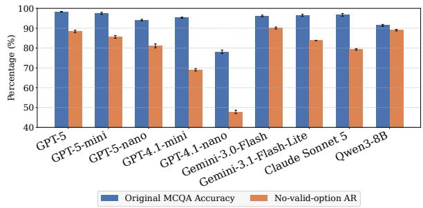
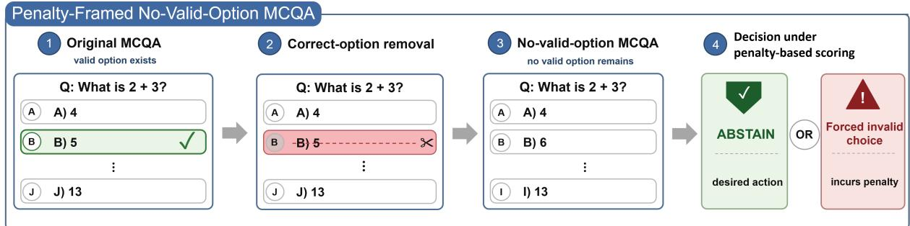
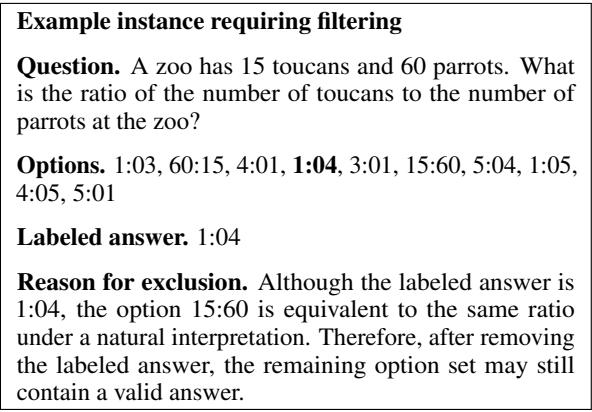

# Penalty-Framed No-Valid-Option MCQA: Analyzing LLM Abstention under Invalid Choices

Jinhyeok Kim Applied Artificial Intelligence Hanyang University, Republic of Korea jharmyend929@hanyang.ac.kr

Hye-Young Jung† Mathematical Data Science Hanyang University, Republic of Korea hyjunglove@hanyang.ac.kr

## Abstract

Multiple-choice question answering (MCQA) is commonly used to evaluate large language models under the assumption that one of the provided options is correct, typically using answer-selection accuracy. However, in real deployments, users or retrieval systems may provide invalid option sets in which none of the listed choices is correct, and selecting one of them may incur downstream cost. We study this setting as penalty-framed no-validoption MCQA. Using the mathematics subset of MMLU-Pro, we remove the labeled correct option, allow models to either choose a remaining option or output ABSTAIN, and penalize invalid forced-choice responses. We further introduce correct-conditioned analysis, evaluating abstention only on instances that the model originally answered correctly. Experiments show that high MCQA accuracy does not fully guarantee abstention reliability: even under explicit no-valid-option-aware instructions and penalty-based scoring, models still produce invalid forced-choice responses for a subset of originally correct instances. These results show that penalty-framed no-valid-option MCQA reveals an aspect of model reliability not captured by standard answer-selection accuracy.

## 1 Introduction

Multiple-choice question answering (MCQA) is widely used to evaluate large language models (LLMs), as it provides a fixed answer space and enables simple automatic scoring (Hendrycks et al., 2021; Wang et al., 2024; Li et al., 2024). In the standard MCQA setting, a model receives a question and a set of candidate options, and its performance is measured by whether it selects the labeled correct answer. This protocol has been useful for comparing the knowledge and reasoning abilities of LLMs, but it is usually designed for settings in which a valid answer is present among the provided options.

This design choice matters because answer selection and option-set rejection are not the same capability (Góral et al., 2025). A model may correctly select the answer when it is listed, yet behave differently when the valid option is removed. This motivates a targeted evaluation question: does standard MCQA success transfer to reliable abstention when no valid option remains?

Recent work has studied related problems from two directions. First, work on no-valid-option MCQA asks whether models can recognize that none of the provided options is correct. Wait, that’s not an option frames this ability as reflective judgment, showing that many aligned models still select invalid options when all listed choices are wrong (Góral et al., 2025). Related work on MCQA reliability similarly suggests that LLMs may select the “least incorrect” option rather than treat the selected answer as uniquely correct (Wang et al., 2025), raising concerns about what standard MCQA accuracy measures (Zheng et al., 2024; Balepur et al., 2024).

Second, work on abstention under penalty-based scoring studies whether LLMs adjust answerversus-abstain decisions when wrong answers incur penalties (Wen et al., 2025). RiskEval evaluates whether models adapt their answer-versusabstain decisions as the penalty for incorrect answers changes, and finds that models often fail to translate uncertainty or verbal confidence into strategic abstention, even when high penalties make abstention preferable (Wang et al., 2026).

These two directions motivate the setting we study: what should an LLM do when no provided option is valid and selecting any remaining option is penalized? Rather than treating no-valid-option recognition and abstention under penalty-based scoring as separate problems, we combine them into a targeted MCQA stress test. In this setting, the model must combine two abilities: recognizing that the option set contains no valid answer and avoiding a costly forced-choice response. We call this setting penalty-framed no-valid-option MCQA.

In our setup, we start from standard MCQA instances and remove the labeled correct option. The model is then allowed to either select one of the remaining options or output ABSTAIN. Since the remaining options are intended to be invalid, selecting any of them incurs a penalty, while abstention receives zero utility. Under this scoring rule, abstention is the utility-maximizing action. This setting evaluates whether LLMs can reject invalid option sets when selecting a listed option is penalized, rather than merely selecting the best available option.

However, overall abstention rate alone is insufficient for interpreting model behavior. If a model selects a remaining option after correctoption removal, it may be because the model did not know the original answer, not necessarily because it failed to recognize that the valid option disappeared. To address this ambiguity, we introduce correct-conditioned analysis. We first identify instances that the model answers correctly in the original MCQA setting, and then evaluate the same instances after removing the correct option. This allows us to ask whether success in standard MCQA transfers to reliable abstention under penalty-framed no-valid-option conditions.

Our contributions are as follows. First, we define penalty-framed no-valid-option MCQA, an evaluation setting where no provided option is valid and selecting an invalid option incurs penalty. Second, we introduce correct-conditioned analysis as a way to measure accuracy-to-rejection transfer: whether a model’s demonstrated success on an originally answerable MCQA instance transfers to rejecting the corresponding post-exclusion option set. This separates lack of original task knowledge from failure to reject invalid options after demonstrated answerselection success. Third, we show that high MCQA accuracy does not fully guarantee abstention reliability: even among originally correct instances, LLMs can still produce invalid forced-choice responses under penalty-based scoring.

## 2 Evaluation Setting

Penalty-Framed No-Valid-Option MCQA. A standard MCQA instance consists of a question stem, candidate options, and a labeled correct option. In the standard MCQA evaluation setting, the model is required to select the correct option from the given option set. This implicitly assumes an answerability assumption: at least one valid option is present among the listed choices.

Penalty-framed no-valid-option MCQA targets cases where this answerability condition no longer holds. Given an answerable MCQA instance, we remove the labeled correct option while keeping the question stem and remaining options unchanged. The resulting option set is intended to contain no valid answer. Since equivalent or ambiguous remaining options may violate this condition, our evaluation uses a filtered post-exclusion subset that better satisfies the no-valid-option condition. The model must then either select one of the remaining options or output ABSTAIN.

We evaluate this setting with a penalty-based scoring rule (Chow, 1970; Charoenphakdee et al., 2021). In standard MCQA, performance is evaluated by whether the model selects the correct option, and selecting an incorrect option is simply treated as an incorrect response. In contrast, a penalty-based scoring rule generally assigns positive score to selecting a correct option, negative penalty to selecting an incorrect option, and zero score to ABSTAIN. However, in the filtered postexclusion subset, the labeled correct option has been removed, and the remaining selectable options are treated as invalid for evaluation. Selecting any remaining option is therefore treated as an invalid forced-choice response and incurs the negative penalty, whereas ABSTAIN receives zero score. Thus, under this scoring rule, the desired behavior is not to force a choice among the most plausible remaining options, but to reject the option set itself and output ABSTAIN.

Correct-conditioned analysis. Overall abstention behavior on no-valid-option instances can conflate cases where the model lacks the original answer with cases where it does not reject the modified option set. To reduce this ambiguity, we perform correct-conditioned analysis: we first identify instances that the model answers correctly in the original MCQA setting, and then evaluate abstention behavior on the corresponding no-valid-option instances.

In the main analysis, we use a stricter stablecorrect subset. For each model, an instance is included only if the model answers it correctly in all repeated original MCQA runs. This reduces the chance of including instances that were guessed correctly in a single run and focuses the analysis on whether stable answer-selection success transfers to reliable option-set rejection.

Metrics. We use five metrics to evaluate original MCQA performance and behavior under the penalty-framed no-valid-option setting. Acc measures answer-selection accuracy over completed responses in the original MCQA condition, before correct-option removal.

For no-valid-option instances, we report AR and IFR. AR, or abstention rate, is the percentage of evaluation-eligible responses in which the model outputs ABSTAIN after the correct option is removed. IFR, or invalid forced-choice rate, is the percentage of evaluation-eligible responses in which the model selects one of the remaining options. Since the constructed option set contains no valid answer, any such selection is treated as a penalty-incurring forced-choice response. Under our parsed response space, each eligible no-validoption response is classified as either ABSTAIN or an invalid option selection, so AR + IFR = 100%.

For correct-conditioned analysis, we report CAR and CIFR on each model’s stable-correct subset. CAR measures abstention on instances the model solved consistently before correct-option removal, while CIFR measures invalid forced-choice behavior on the same instances. Thus, AR/IFR characterize overall no-valid-option behavior, whereas CAR/CIFR evaluate whether answer-selection success in standard MCQA transfers to reliable optionset rejection.

## 3 Experimental Setup

Dataset. For our main experiments, we use the 10-option mathematics subset of MMLU-Pro (Wang et al., 2024) as a controlled testbed because mathematical answers are relatively verifiable. Since equivalent answer forms or ambiguous options may remain after removing the labeled correct option, we report main results on a filtered post-exclusion subset of 1,118 instances to reduce cases where an alternative valid answer or ambiguous remaining option would be counted as an invalid forced-choice response. Filtering details and examples are provided in Appendix C.

As a supplementary evaluation beyond mathematics, we also use the 4-option 400-item multidomain MMLU (Hendrycks et al., 2021) subset from Góral et al. (2025). Applying the same conservative filtering criterion yields 340 instances.

  
Figure 1: Original MCQA accuracy and no-valid-option abstention rate. AR is reported under the main setting: CoT prompting, no-valid-option-aware instruction, invalid forced-choice penalty −1, robust parsing. Values are 3-run means on the filtered MMLU-Pro Mathematics subset (1,118 instances).

Models. Our core experiments on MMLU-Pro Mathematics use the six models reported in Table 2: GPT-5-mini, GPT-5-nano, GPT-4.1-mini, GPT-4.1-nano, Gemini-3.0-Flash, and Gemini-3.1- Flash-Lite. Under the main setting only, we additionally evaluate GPT-5, Claude Sonnet 5, and the open-weight Qwen3-8B (Yang et al., 2025) on the same mathematics subset. We further evaluate GPT-5-mini and Qwen3-8B on the multi-domain MMLU subset as a supplementary evaluation beyond mathematics. Gemini 2.5-family diagnostics are reported in Appendix G because their outputs exhibited weaker parsing and completion reliability under our current evaluation pipeline.

Prompts, Scoring Rules, and Runs. In the main experiments, we use chain-of-thought prompting (Wei et al., 2022); direct prompting results are reported in Appendix G.1. The main no-valid-option setting uses a +4/ − 1/0 scoring rule for correct answers, invalid forced-choice responses, and AB-STAIN, respectively, and uses the no-valid-optionaware instruction, which explicitly tells the model to abstain when no listed option is valid.

For ablations, we vary the invalid forced-choice penalty among {−0.5, −1, −2} while keeping the no-valid-option-aware instruction fixed, and compare three abstention instructions while keeping the scoring rule fixed: penalty-only, uncertainty-aware (Lin et al., 2022; Yona et al., 2024), and no-validoption-aware. We use robust parsing and report 3-run means, motivated by concerns about stochastic evaluation reliability (Lior et al., 2025). Full prompts, scoring profiles, run protocol, and parsing details are provided in Appendices B, D, and E.

## 4 Results

High MCQA Accuracy Does Not Fully Guarantee Abstention Reliability. Figure 1 compares original MCQA accuracy with no-valid-option abstention rate under the main setting. Although the evaluated models often achieve high accuracy on the original answerable MCQA instances, their abstention rates after correct-option removal do not simply mirror original accuracy, with Acc–AR gaps ranging from 2.4 to 30.3 percentage points. This suggests that selecting the correct answer when it is present and abstaining when the valid answer is absent are related but distinct behaviors.

<table><tr><td>Dataset</td><td>Model</td><td>Acc↑</td><td>AR↑</td><td>IFR↓</td><td>CAR↑</td><td>CIFR↓</td></tr><tr><td rowspan="9">MMLU-Pro Math</td><td>GPT-5-mini</td><td>97.5</td><td>85.6</td><td>14.4</td><td>87.2</td><td>12.8</td></tr><tr><td>GPT-5-nano</td><td>94.1</td><td>81.1</td><td>18.9</td><td>84.5</td><td>15.5</td></tr><tr><td>GPT-4.1-mini</td><td>95.3</td><td>69.0</td><td>31.0</td><td>72.4</td><td>27.6</td></tr><tr><td>GPT-4.1-nano</td><td>78.1</td><td>47.8</td><td>52.2</td><td>54.5</td><td>45.5</td></tr><tr><td>Gemini-3.0-Flash</td><td>96.2</td><td>90.1</td><td>9.9</td><td>90.9</td><td>9.1</td></tr><tr><td>Gemini-3.1-Flash-Lite</td><td>96.5</td><td>83.8</td><td>16.2</td><td>86.4</td><td>13.6</td></tr><tr><td>GPT-5</td><td>98.3</td><td>88.4</td><td>11.6</td><td>89.8</td><td>10.2</td></tr><tr><td>Claude Sonnet 5</td><td>96.7</td><td>79.3</td><td>20.7</td><td>80.6</td><td>19.4</td></tr><tr><td>Qwen3-8B</td><td>91.4</td><td>89.0</td><td>11.0</td><td>91.4</td><td>8.6</td></tr><tr><td>Multi-domain</td><td>GPT-5-mini</td><td>94.0</td><td>53.5</td><td>46.5</td><td>57.8</td><td>42.2</td></tr><tr><td>MMLU</td><td>Qwen3-8B</td><td>75.9</td><td>59.7</td><td>40.3</td><td>67.3</td><td>32.7</td></tr></table>

Table 1: Main post-exclusion results under CoT prompting, robust parsing, and the no-valid-optionaware instruction with invalid forced-choice penalty −1. AR/IFR are computed over all no-valid-option instances, while CAR/CIFR are computed on each model’s stablecorrect subset for the corresponding dataset. Subset sizes are reported in Appendix F, Table 6. All values are 3-run means reported as percentages; standard deviations are reported in Appendix C, Table 5.

Table 1 further shows that this gap corresponds to non-trivial invalid forced-choice behavior. Even under the no-valid-option-aware instruction, all models have non-zero IFR, ranging from 9.9% to 52.2%. Thus, high original MCQA accuracy does not fully guarantee that a model will reject the option set when the correct option is removed and invalid choices are costly.

Invalid Forced Choice Remains on Stably Solved Instances. Because stable-correct subsets are model-specific, CAR and CIFR should be interpreted as within-model transfer measures rather than direct comparisons over an identical instance set. Table 1 shows that invalid forced-choice behavior remains even under this stricter condition: CIFR is non-zero even for high-accuracy models such as Gemini-3.0-Flash and GPT-5-mini (9.1% and 12.8%), and reaches 45.5% for GPT-4.1-nano. Among the supplementary models, CIFR is 10.2% for GPT-5, 19.4% for Claude Sonnet 5, and 8.6% for Qwen3-8B. Qwen3-8B also has a substantially lower evaluation-eligible rate in the MMLU-Pro Mathematics no-valid-option condition (76.9% on average), so its rate-based results should be interpreted together with the response-quality diagnostics in Appendix G.5.

Even when models have demonstrated stable answer-selection success, removing the correct option can still lead them to select an invalid remaining option rather than abstain, revealing a reliability gap between solving an MCQA instance and rejecting its option set.

Supplementary Evidence Beyond Mathematics. On the filtered multi-domain MMLU subset, GPT-5-mini and Qwen3-8B show substantially higher invalid forced-choice rates than on MMLU-Pro Mathematics, with IFR of 46.5% and 40.3% and stable-correct CIFR of 42.2% and 32.7%, respectively. We do not interpret this as a controlled crossdomain comparison, since the two datasets differ in domain composition, size, and the number of remaining options, and only two models were evaluated on the multi-domain subset. Nevertheless, these results provide supplementary evidence that the gap between answer selection and option-set rejection can also appear outside the mathematics setting.

Prompt and Scoring Changes Do Not Eliminate Invalid Forced Choice. Table 2 examines whether invalid forced-choice behavior disappears under different scoring rules or abstention instructions.

Across the tested penalty values, stable-correct CIFR remains within a narrow range for most models. This suggests that residual invalid forcedchoice behavior is robust to the particular stated penalty value, rather than being an artifact of a single penalty setting.

Instruction style has a larger effect. The novalid-option-aware instruction consistently reduces CIFR relative to penalty-only or uncertainty-aware instructions, indicating that explicitly stating the novalid-option possibility helps reduce costly forcedchoice behavior, but every model still has non-zero CIFR under the main setting.

## 5 Conclusion

We studied penalty-framed no-valid-option MCQA, where the labeled correct option is removed and selecting any remaining option incurs a penalty.

<table><tr><td></td><td colspan="3">Scoring-rule variation</td><td colspan="3">Abstention-instruction variation</td></tr><tr><td>Model</td><td>-0.5</td><td>-1</td><td> $^ { - 2 }$ </td><td>Penalty-only</td><td>Uncertainty-aware</td><td>No-valid-option-aware</td></tr><tr><td>GPT-5-mini</td><td> $1 3 . 1 \pm 0 . 4$ </td><td> $1 2 . 8 \pm 0 . 7$ </td><td> $1 3 . 2 \pm 0 . 8$ </td><td> $2 3 . 5 \pm 0 . 3$ </td><td> $2 1 . 5 \pm 1 . 1$ </td><td> $1 2 . 8 \pm 0 . 7$ </td></tr><tr><td>GPT-5-nano</td><td> $1 5 . 2 \pm 0 . 4$ </td><td> $1 5 . 5 \pm 1 . 0$ </td><td> $1 4 . 8 \pm 0 . 6$ </td><td> $2 3 . 4 \pm 0 . 8$ </td><td> $2 0 . 8 \pm 1 . 2$ </td><td> $1 5 . 5 \pm 1 . 0$ </td></tr><tr><td>GPT-4.1-mini</td><td> $2 7 . 8 \pm 0 . 5$ </td><td> $2 7 . 6 \pm 0 . 6$ </td><td> $2 6 . 6 \pm 0 . 2$ </td><td> $4 1 . 1 \pm 0 . 8$ </td><td> $4 8 . 2 \pm 0 . 1$ </td><td> $2 7 . 6 \pm 0 . 6$ </td></tr><tr><td>GPT-4.1-nano</td><td> $4 6 . 8 \pm 0 . 7$ </td><td> $4 5 . 5 \pm 0 . 6$ </td><td> $4 6 . 4 \pm 0 . 5$ </td><td> $7 5 . 7 \pm 0 . 6$ </td><td> $6 5 . 0 \pm 0 . 4$ </td><td> $4 5 . 5 \pm 0 . 6$ </td></tr><tr><td>Gemini-3.0-Flash</td><td> $1 0 . 2 \pm 0 . 3$ </td><td> $9 . 1 \pm 0 . 6$ </td><td> $9 . 9 \pm 1 . 1$ </td><td> $3 1 . 2 \pm 0 . 5$ </td><td> $3 2 . 5 \pm 1 . 4$ </td><td> $9 . 1 \pm 0 . 6$ </td></tr><tr><td>Gemini-3.1-Flash-Lite</td><td> $1 3 . 5 \pm 1 . 0$ </td><td> $1 3 . 6 \pm 0 . 3$ </td><td> $1 2 . 1 \pm 0 . 8$ </td><td> $2 1 . 7 \pm 1 . 3$ </td><td> $2 2 . 8 \pm 0 . 6$ </td><td> $1 3 . 6 \pm 0 . 3$ </td></tr></table>

Table 2: Stable-correct CIFR on the filtered MMLU-Pro Mathematics subset $( N = 1 , 1 1 8 )$ under scoring-rule and instruction ablations. In the scoring-rule block, the no-valid-option-aware instruction is fixed and only the invalid forced-choice penalty varies. In the instruction block, $+ 4 / - 1 / 0$ scoring is fixed and only the abstention instruction varies. CIFR values are reported as percentages in mean ± standard deviation format over three independent runs. Lower CIFR is better.

Using the mathematics subset of MMLU-Pro, we show that high original MCQA accuracy does not fully guarantee reliable abstention after correctoption removal: models still produce invalid forcedchoice responses at non-zero rates, even under explicit no-valid-option-aware instructions and on stable-correct instances solved consistently before removal. Supplementary evaluations with additional models on MMLU-Pro Mathematics and with GPT-5-mini and Qwen3-8B on a filtered multidomain MMLU subset show the same qualitative pattern of non-zero invalid forced-choice behavior, though these results remain limited to the evaluated datasets and configurations.

Prompt and scoring-rule ablations further show that this behavior can be reduced but not eliminated. These findings suggest that MCQA evaluation should assess not only whether models select correct answers when valid options are present, but also whether they can reject invalid option sets when forced choices are explicitly penalized.

## Limitations

Our study has several limitations. First, our primary evaluation and all ablation and sensitivity analyses focus on the mathematics subset of MMLU-Pro. We choose this domain because mathematical answers are relatively verifiable, making it suitable for constructing and auditing no-valid-option instances. We additionally report a supplementary evaluation on a filtered 340-item multi-domain MMLU subset with GPT-5-mini and Qwen3-8B, but this extension remains limited in both dataset size and model coverage. Therefore, the multidomain result should be interpreted as supplementary evidence rather than as a controlled crossdomain comparison. No-valid-option behavior may differ in other domains where answers are less sharply defined, options are paraphrastic, or multiple answers can be partially valid.

Second, model coverage remains limited. The core comparison and all ablations use six closedsource models from two providers; GPT-5, Claude Sonnet 5, and the open-weight Qwen3-8B are evaluated only under the main setting. Our findings should therefore be read as evidence from the evaluated model families and configurations rather than as a universal claim about LLMs.

Third, although we filter cases where a remaining option may still be considered valid, some residual ambiguity may remain. In addition, correctconditioned metrics are computed on each model’s own stable-correct subset. Thus, CAR and CIFR are best interpreted as within-model measures of whether answer-selection success transfers to option-set rejection, rather than as direct crossmodel comparisons over an identical item set.

## Acknowledgments

This research was supported by Basic Science Research Program through the National Research Foundation of Korea (NRF) funded by the Ministry of Education (NRF-2022R1F1A1074939).

## References

Nishant Balepur, Abhilasha Ravichander, and Rachel Rudinger. 2024. Artifacts or abduction: How do LLMs answer multiple-choice questions without the question? In Proceedings of the 62nd Annual Meeting of the Association for Computational Linguistics (Volume 1: Long Papers), pages 10308–10330, Bangkok, Thailand. Association for Computational Linguistics.

Nontawat Charoenphakdee, Zhenghang Cui, Yivan Zhang, and Masashi Sugiyama. 2021. Classification with rejection based on cost-sensitive classification. In Proceedings ofthe 38th International Conference on Machine Learning, volume 139 of Proceedings

of Machine Learning Research, pages 1507–1517. PMLR.

C. K. Chow. 1970. On optimum recognition error and reject tradeoff. IEEE Transactions on Information Theory, 16(1):41–46.

Aryo Pradipta Gema, Joshua Ong Jun Leang, Giwon Hong, Alessio Devoto, Alberto Carlo Maria Mancino, Rohit Saxena, Xuanli He, Yu Zhao, Xiaotang Du, Mohammad Reza Ghasemi Madani, Claire Barale, Robert McHardy, Joshua Harris, Jean Kaddour, Emile Van Krieken, and Pasquale Minervini. 2025. Are we done with MMLU? In Proceedings of the 2025 Conference of the Nations of the Americas Chapter of the Association for Computational Linguistics: Human Language Technologies (Volume 1: Long Papers), pages 5069–5096, Albuquerque, New Mexico. Association for Computational Linguistics.

Gracjan Góral, Emilia Wisnios, Piotr Sankowski, and´ Paweł Budzianowski. 2025. Wait, that’s not an option: LLMs robustness with incorrect multiple-choice options. In Proceedings of the 63rd Annual Meeting ofthe Associationfor Computational Linguistics (Volume 1: Long Papers), pages 1495–1515, Vienna, Austria. Association for Computational Linguistics.

Yuling Gu, Oyvind Tafjord, Bailey Kuehl, Dany Haddad, Jesse Dodge, and Hannaneh Hajishirzi. 2025. OLMES: A standard for language model evaluations. In Findings of the Association for Computational Linguistics: NAACL 2025, pages 5020–5048, Albuquerque, New Mexico. Association for Computational Linguistics.

Dan Hendrycks, Collin Burns, Steven Basart, Andy Zou, Mantas Mazeika, Dawn Song, and Jacob Steinhardt. 2021. Measuring massive multitask language understanding. In International Conference on Learning Representations.

Wangyue Li, Liangzhi Li, Tong Xiang, Xiao Liu, Wei Deng, and Noa Garcia. 2024. Can multiple-choice questions really be useful in detecting the abilities of LLMs? In Proceedings of the 2024 Joint International Conference on Computational Linguistics, Language Resources and Evaluation, pages 2819– 2834, Torino, Italia. ELRA and ICCL.

Stephanie Lin, Jacob Hilton, and Owain Evans. 2022. Teaching models to express their uncertainty in words. Transactions on Machine Learning Research.

Gili Lior, Eliya Habba, Shahar Levy, Avi Caciularu, and Gabriel Stanovsky. 2025. ReliableEval: A recipe for stochastic LLM evaluation via method of moments. In Findings ofthe Associationfor Computational Linguistics: EMNLP 2025, pages 11146–11153, Suzhou, China. Association for Computational Linguistics.

Nishanth Madhusudhan, Sathwik Tejaswi Madhusudhan, Vikas Yadav, and Masoud Hashemi. 2025. Do LLMs know when to NOT answer? investigating abstention abilities of large language models. In Proceedings ofthe 31st International Conference on

Computational Linguistics, pages 9329–9345, Abu Dhabi, UAE. Association for Computational Linguistics.

Francesco Maria Molfese, Luca Moroni, Luca Gioffré, Alessandro Scirè, Simone Conia, and Roberto Navigli. 2025. Right answer, wrong score: Uncovering the inconsistencies of LLM evaluation in multiplechoice question answering. In Findings of the Association for Computational Linguistics: ACL 2025, pages 18477–18494, Vienna, Austria. Association for Computational Linguistics.

Zhi Rui Tam, Cheng-Kuang Wu, Chieh-Yen Lin, and Yun-Nung Chen. 2025. None of the above, less of the right parallel patterns in human and LLM performance on multi-choice questions answering. In Findings ofthe Associationfor Computational Linguistics: ACL 2025, pages 20112–20134, Vienna, Austria. Association for Computational Linguistics.

Haochun Wang, Sendong Zhao, Zewen Qiang, Nuwa Xi, Bing Qin, and Ting Liu. 2025. LLMs may perform MCQA by selecting the least incorrect option. In Proceedings ofthe 31st International Conference on Computational Linguistics, pages 5852–5862, Abu Dhabi, UAE. Association for Computational Linguistics.

Jiawei Wang, Yanfei Zhou, Siddartha Devic, and Deqing Fu. 2026. Are LLM decisions faithful to verbal confidence? Preprint, arXiv:2601.07767.

Yubo Wang, Xueguang Ma, Ge Zhang, Yuansheng Ni, Abhranil Chandra, Shiguang Guo, Weiming Ren, Aaran Arulraj, Xuan He, Ziyan Jiang, Tianle Li, Max Ku, Kai Wang, Alex Zhuang, Rongqi Fan, Xiang Yue, and Wenhu Chen. 2024. MMLU-Pro: A more robust and challenging multi-task language understanding benchmark. In Advances in Neural Information Processing Systems, volume 37.

Jason Wei, Xuezhi Wang, Dale Schuurmans, Maarten Bosma, Brian Ichter, Fei Xia, Ed H. Chi, Quoc V. Le, and Denny Zhou. 2022. Chain-of-thought prompting elicits reasoning in large language models. In Advances in Neural Information Processing Systems, volume 35, pages 24824–24837.

Bingbing Wen, Jihan Yao, Shangbin Feng, Chenjun Xu, Yulia Tsvetkov, Bill Howe, and Lucy Lu Wang. 2025. Know your limits: A survey of abstention in large language models. Transactions ofthe Associationfor Computational Linguistics, 13:529–556.

An Yang, Anfeng Li, Baosong Yang, Beichen Zhang, Binyuan Hui, Bo Zheng, Bowen Yu, Chang Gao, Chengen Huang, Chenxu Lv, Chujie Zheng, Dayiheng Liu, Fan Zhou, Fei Huang, Feng Hu, Hao Ge, Haoran Wei, Huan Lin, Jialong Tang, and 41 others. 2025. Qwen3 technical report. Preprint, arXiv:2505.09388.

Gal Yona, Roee Aharoni, and Mor Geva. 2024. Can large language models faithfully express their intrinsic uncertainty in words? In Proceedings ofthe 2024

Conference on Empirical Methods in Natural Language Processing, pages 7752–7764, Miami, Florida, USA. Association for Computational Linguistics.

Chujie Zheng, Hao Zhou, Fandong Meng, Jie Zhou, and Minlie Huang. 2024. Large language models are not robust multiple choice selectors. In International Conference on Learning Representations.

## A Penalty-Framed No-Valid-Option MCQA Construction

Figure 2 illustrates how we construct no-validoption instances by removing the labeled correct option from answerable MCQA questions. After removal, the model must either output ABSTAIN or select one of the remaining options, which is treated as an invalid forced-choice response.

## B Model and Experimental Settings

This appendix summarizes the models, experimental conditions, and run protocol used in our experiments.

## B.1 Models

We evaluate models from OpenAI, Google, Anthropic, and the open-weight Qwen family. OpenAI models are queried through the OpenAI Responses API, Gemini models through Google Vertex AI, Claude Sonnet 5 through the Anthropic API, and Qwen3-8B is run locally using Hugging Face. Model identifiers and runtime settings are listed in Table 3.

Our six core models are GPT-5-mini, GPT-5- nano, GPT-4.1-mini, GPT-4.1-nano, Gemini-3.0- Flash, and Gemini-3.1-Flash-Lite. These models are used in the prompting, scoring-rule, and parsersensitivity analyses.

Under the main setting, we additionally evaluate GPT-5, Claude Sonnet 5, and Qwen3-8B on MMLU-Pro Mathematics. For the supplementary multi-domain MMLU evaluation, we evaluate GPT-5-mini and Qwen3-8B.

We also evaluate Gemini-2.5-family models as supplementary diagnostics. Because these models exhibit substantially weaker completion and parsing reliability under our evaluation pipeline, we report them separately in Appendix G.

## B.2 Experimental Conditions

We evaluate two task conditions. The first is the original MCQA condition. In this condition, the labeled correct option remains in the candidate option set. This condition is used to measure standard answer-selection accuracy.

The second is the no-valid-option condition. In this condition, the labeled correct option is removed from the candidate option set. The model is allowed to either select one of the remaining options or output ABSTAIN. Since the labeled correct option has been removed, selecting any remaining option is treated as an invalid forced-choice response.

For the no-valid-option condition, we evaluate three abstention instruction styles. The penaltyonly instruction specifies the scoring rule and the expected-score objective, but does not explicitly state that no listed option may be valid. The uncertainty-aware instruction tells the model to output ABSTAIN when it is uncertain. The no-validoption-aware instruction explicitly states that none of the listed options may be valid and instructs the model to output ABSTAIN in that case.

We also evaluate three penalty-based score profiles. In all profiles, selecting the correct answer receives +4 and ABSTAIN receives 0. The penalty for an invalid forced-choice response is varied among −0.5, −1, and −2.

## B.3 Run Protocol and Token Budgets

Motivated by recent concerns about the reliability of single-run evaluations for stochastic LLM outputs (Lior et al., 2025), each model is evaluated with three independent runs. Each dataset instance is queried independently, and no previous model outputs, conversation state, or thread identifiers are passed between examples.

We evaluate both direct prompting and chain-ofthought prompting. The maximum output-token budget is 4096 tokens for direct prompting and 8192 tokens for chain-of-thought prompting.

For no-valid-option rate-based metrics reported as percentages, we use completed responses with valid parsed predictions. For original MCQA accuracy, completed responses without a valid parsed option label are counted as incorrect. Incomplete responses and invalid-format responses are tracked separately and are discussed in Appendix E.

## C Filtering Details

This appendix describes why post-exclusion filtering is necessary, how we performed it, and how the main results change before and after filtering.

  
Figure 2: Construction of penalty-framed no-valid-option MCQA. The labeled correct option is removed from an original MCQA instance. The desired behavior is to output ABSTAIN; selecting any remaining option is treated as an invalid forced-choice response and incurs a penalty.

<table><tr><td>Model name in paper</td><td>API model identifier</td><td>Provider</td><td>Runtime setting</td></tr><tr><td>GPT-5-mini</td><td>gpt-5-mini-2025-08-07</td><td>OpenAI</td><td>reasoning_effort=low</td></tr><tr><td>GPT-5-nano</td><td>gpt-5-nano-2025-08-07</td><td>OpenAI</td><td>reasoning_effort=low</td></tr><tr><td>GPT-4.1-mini</td><td>gpt-4.1-mini-2025-04-14</td><td>OpenAI</td><td>temperature=0.0</td></tr><tr><td>GPT-4.1-nano</td><td>gpt-4.1-nano-2025-04-14</td><td>OpenAI</td><td>temperature=0.0</td></tr><tr><td>Gemini-3.0-Flash</td><td>gemini-3-flash-preview</td><td>Google Vertex AI</td><td>thinking_level=low</td></tr><tr><td>Gemini-3.1-Flash-Lite</td><td>gemini-3.1-flash-lite</td><td>Google Vertex AI</td><td>thinking_level=low</td></tr><tr><td>GPT-5 Claude Sonnet 5</td><td>gpt-5-2025-08-07</td><td>OpenAI</td><td>reasoning_effort=low</td></tr><tr><td>Qwen3-8B</td><td>claude-sonnet-5</td><td>Anthropic</td><td>effort=medium</td></tr><tr><td></td><td>Qwen/Qwen3-8B</td><td>Local Hugging Face</td><td>temperature=0.6, top_p=0.95, top_k=20, enable_thinking=True,torch_dtype=bfloat16</td></tr><tr><td>Gemini-2.5-Flash</td><td></td><td></td><td></td></tr><tr><td>Gemini-2.5-Flash-Lite</td><td>gemini-2.5-flash gemini-2.5-flash-lite</td><td>Google Vertex AI Google Vertex AI</td><td>temperature=0.0,thinking_budget=0</td></tr></table>

Table 3: Model identifiers and runtime settings used in our experiments. The six core models are used in the prompting, scoring-rule, and parser-sensitivity analyses. GPT-5, Claude Sonnet 5, and Qwen3-8B are additionally evaluated under the main setting. Gemini 2.5-family models are reported only as supplementary diagnostics because of weaker completion and parsing reliability under the current evaluation pipeline.

## C.1 Why Filtering Is Necessary

Our no-valid-option construction removes the labeled correct option from an original MCQA instance. This construction is valid only when no remaining option is also a valid answer. However, in mathematical MCQA, equivalent answer forms may remain after the labeled correct option is removed. In such cases, treating every remaining option as invalid would risk counting an alternative valid answer as an invalid forced-choice response. This concern is consistent with broader evidence that benchmark labels and answer options can contain nontrivial errors or ambiguities (Gema et al., 2025).

Figure 3 shows an example from the MMLU-Pro mathematics subset (Wang et al., 2024). The labeled correct option is “1:04”, but another remaining option, “15:60”, can be interpreted as an equivalent ratio. If the labeled correct option is removed, the remaining option set may still contain a valid answer. We therefore filter such cases from the main post-exclusion evaluation set.

  
Figure 3: Example of a case where correct-option removal does not guarantee a no-valid-option instance.

## C.2 Filtering Procedure

We used both ChatGPT and Gemini as independent screening assistants to identify potentially problematic instances. These models were used only to support candidate identification and explanation. The final inclusion or exclusion decision was made by an internal audit.

For each batch of instances, we asked the screening models to inspect the question, options, and labeled answer directly, rather than relying only on string matching or automatic similarity heuristics. The prompt used for this screening was as follows.

Our goal is to create multiple-choice questions with no correct option by removing the labeled correct option from existing MCQA instances.

Please directly inspect each problem and answer the following questions.

1. Check whether the labeled correct answer in the original dataset matches the answer you obtain by solving the problem. Report all problems, separating cases where the label appears correct from cases where it appears incorrect.

2. Among the remaining options after excluding the labeled correct option, check whether any option is equivalent to the labeled correct answer. Report all problems, separating cases with equivalent remaining options from cases without them.

3. After removing the labeled correct option, check whether any other remaining option could still be a correct answer. Report all problems, separating cases where no remaining option is correct from cases where another option could be correct.

Please review the problems one by one. Do not rely only on string similarity or automatic filtering. For each item, inspect the question, options, and answer directly.

Please return the output as a table with the following columns:

question\_id | label | decision | reason   
| recommendation

In the reason column, provide a specific explanation for the decision.

Please make sure to:

• review every problem in the batch;

• inspect all 20 problems directly, not only automatically selected candidates;

• summarize the recommended question IDs to exclude;

• verify the cases carefully and rigorously.

After this screening process, we manually reviewed the candidate instances and constructed the final post-exclusion subset. From the 1,237 10-option MMLU-Pro mathematics instances, we selected 1,118 instances for the final filtered postexclusion subset. The selected instances are cases where, after removing the labeled correct option, the remaining option set can be treated as containing no valid answer with high confidence.

Table 4 summarizes the exclusion counts by reason for both datasets. We excluded 119 of

<table><tr><td>Exclusion reason</td><td>MMLU-Pro Math</td><td>Multi-domain MMLU</td></tr><tr><td>Label error</td><td>47</td><td>26</td></tr><tr><td>Alternative correct option</td><td>72</td><td>34</td></tr><tr><td>Total excluded</td><td>119</td><td>60</td></tr></table>

Table 4: Exclusion counts by reason. Alternative correct options are options that could remain valid after removal of the labeled correct option.

1,237 MMLU-Pro Mathematics items and 60 of 400 multi-domain MMLU items, retaining 1,118 and 340 items, respectively.

We conservatively excluded items with labeling issues or plausible alternative correct options that could violate the no-valid-option premise after removal. Exclusion does not necessarily imply that the original benchmark item is incorrect or unusable.

## C.3 Unfiltered vs. Filtered Results

Table 5 compares the main results before and after filtering under the same evaluation setting: CoT prompting, the no-valid-option-aware instruction, invalid forced-choice penalty −1, robust parsing, and three-run means.

Filtering generally increases original MCQA accuracy and abstention rates while reducing invalid forced-choice rates. This pattern is consistent with the filtering step reducing the risk that remaining options contain alternative valid answers or ambiguous answer forms. Importantly, even after this filtering step, all models still exhibit nonzero CIFR, suggesting that residual invalid forcedchoice behavior is not explained solely by ambiguous unfiltered instances.

## D Prompt Templates

This appendix reports the prompt templates used in our experiments. The no-valid-option prompts instantiate the incorrect-option setting studied in prior MCQA robustness work (Góral et al., 2025), while the scoring-rule prompts instantiate a penalty-based answer-versus-abstain decision problem (Chow, 1970; Charoenphakdee et al., 2021; Wang et al., 2026). Across conditions, we use the same question and choice formatting and vary only the task condition, prompting style, abstention instruction, and scoring profile.

<table><tr><td>Dataset</td><td>Model</td><td> $\mathrm { S e t }$ </td><td>N</td><td>Acc↑</td><td>AR↑</td><td>IFR↓</td><td>CAR↑</td><td>CIFR↓</td></tr><tr><td rowspan="10"></td><td>GPT-5-mini</td><td>Unfiltered Filtered</td><td>1237 1118</td><td> $9 2 . 3 \pm 0 . 6 $   $9 7 . 5 \pm 0 . 5$ </td><td> $7 9 . 8 \pm 0 . 6$   $8 5 . 6 \pm 0 . 7$ </td><td> $2 0 . 2 \pm 0 . 6$   $1 4 . 4 \pm 0 . 7$ </td><td> $8 4 . 3 \pm 0 . 6$   $8 7 . 2 \pm 0 . 7$ </td><td> $1 5 . 7 \pm 0 . 6$   $1 2 . 8 \pm 0 . 7$ </td></tr><tr><td></td><td></td><td></td><td></td><td></td><td></td><td></td><td></td></tr><tr><td>GPT-5-nano</td><td>Unfiltered</td><td>1237</td><td> $8 9 . 6 \pm 0 . 4$ </td><td> $7 6 . 4 \pm 0 . 8$ </td><td> $2 3 . 6 \pm 0 . 8$ </td><td> $8 1 . 9 \pm 0 . 9$ </td><td>18.1 ± 0.9</td></tr><tr><td></td><td>Filtered</td><td>1118</td><td> $9 4 . 1 \pm 0 . 4$ </td><td> $8 1 . 1 \pm 1 . 0$ </td><td> $1 8 . 9 \pm 1 . 0$ </td><td> $8 4 . 5 \pm 1 . 0$ </td><td> $1 5 . 5 \pm 1 . 0$ </td></tr><tr><td>GPT-4.1-mini</td><td>Unfiltered Filtered</td><td>1237 1118</td><td> $9 1 . 3 \pm 0 . 2 $ </td><td> $6 4 . 3 \pm { 0 . 6 }$ </td><td> $3 5 . 7 \pm 0 . 6$ </td><td> $6 9 . 3 \pm 0 . 5$   $7 2 . 4 \pm 0 . 6$ </td><td> $3 0 . 7 \pm 0 . 5$ </td></tr><tr><td>GPT-4.1-nano</td><td></td><td></td><td> $9 5 . 3 \pm 0 . 3$ </td><td> $6 9 . 0 \pm 0 . 6$ </td><td> $3 1 . 0 \pm 0 . 6$ </td><td></td><td> $2 7 . 6 \pm 0 . 6$ </td></tr><tr><td></td><td>Unfiltered Filtered</td><td>1237 1118</td><td> $7 4 . 7 \pm 0 . 6$ </td><td> $4 4 . 6 \pm 0 . 9$ </td><td> $5 5 . 4 \pm 0 . 9$   $5 2 . 2 \pm { 0 . 9 }$ </td><td> $5 2 . 7 \pm 0 . 7 $   $5 4 . 5 \pm 0 . 6$ </td><td> $4 7 . 3 \pm 0 . 7$   $4 5 . 5 \pm 0 . 6$ </td></tr><tr><td>Gemini-3.0-Flash</td><td></td><td></td><td> $7 8 . 1 \pm 0 . 9$ </td><td> $4 7 . 8 \pm 0 . 9$ </td><td></td><td></td><td></td></tr><tr><td></td><td>Unfiltered Filtered</td><td>1237 1118</td><td> $9 2 . 7 \pm 0 . 3 $   $9 6 . 2 \pm 0 . 4$ </td><td> $8 4 . 0 \pm 0 . 7$   $9 0 . 1 \pm 0 . 5$ </td><td> $1 6 . 0 \pm 0 . 7$   $9 . 9 \pm 0 . 5$ </td><td>87.0 ± 0.6  $9 0 . 9 \pm 0 . 6$ </td><td> $1 3 . 0 \pm 0 . 6$   $9 . 1 \pm 0 . 6$ </td></tr><tr><td>Gemini-3.1-Flash-Lite</td><td>Unfiltered</td><td>1237</td><td></td><td></td><td></td><td></td><td></td></tr><tr><td></td><td></td><td></td><td> $9 2 . 8 \pm 0 . 7$ </td><td> $7 7 . 8 \pm 0 . 1$ </td><td></td><td> $2 2 . 2 \pm 0 . 1$ </td><td> $8 2 . 7 \pm 0 . 4$ </td><td> $1 7 . 3 \pm 0 . 4$   $1 3 . 6 \pm 0 . 3$ </td></tr><tr><td rowspan="2">GPT-5</td><td>Filtered</td><td>1118</td><td> $9 6 . 5 \pm 0 . 5$ </td><td></td><td> $8 3 . 8 \pm 0 . 1$ </td><td> $1 6 . 2 \pm 0 . 1$ </td><td> $8 6 . 4 \pm 0 . 3$ </td><td></td></tr><tr><td></td><td>Unfiltered</td><td>1237 1118</td><td> $9 4 . 0 \pm 0 . 0$ </td><td> $\begin{array} { l } { 8 2 . 5 \pm 0 . 5 } \\ { 8 8 . 4 \pm 0 . 6 } \end{array}$ </td><td> $1 7 . 5 \pm 0 . 5$ </td><td> $8 6 . 5 \pm 0 . 6$ </td><td> $1 3 . 5 \pm 0 . 6$ </td></tr><tr><td>Claude Sonnet 5</td><td>Filtered</td><td></td><td> $9 8 . 3 \pm 0 . 2 $ </td><td></td><td></td><td> $1 1 . 6 \pm 0 . 6$ </td><td> $8 9 . 8 \pm 0 . 7$ </td><td> $1 0 . 2 \pm 0 . 7$ </td></tr><tr><td rowspan="2"></td><td></td><td>Unfiltered</td><td>1237</td><td> $9 3 . 6 \pm 0 . 8$ </td><td> $7 3 . 7 \pm 0 . 5$ </td><td> $2 6 . 3 \pm 0 . 5$ </td><td> $7 7 . 0 \pm 0 . 5$ </td><td> $2 3 . 0 \pm 0 . 5$ </td></tr><tr><td>Filtered</td><td></td><td>1118</td><td> $9 6 . 7 \pm 0 . 7$ </td><td> $7 9 . 3 \pm 0 . 4$ </td><td> $2 0 . 7 \pm 0 . 4$ </td><td> $8 0 . 6 \pm 0 . 4$ </td><td> $1 9 . 4 \pm 0 . 4$ </td></tr><tr><td rowspan="2"></td><td>Qwen3-8B</td><td>Unfiltered</td><td>1237</td><td> $8 9 . 1 \pm 0 . 6$ </td><td> $8 2 . 0 \pm 0 . 1$ </td><td> $1 8 . 0 \pm 0 . 1$ </td><td> $8 6 . 8 \pm 0 . 5$ </td><td> $1 3 . 2 \pm 0 . 5$ </td></tr><tr><td></td><td>Filtered</td><td>1118</td><td> $9 1 . 4 \pm 0 . 5$ </td><td> $8 9 . 0 \pm 0 . 4$ </td><td> $1 1 . 0 \pm 0 . 4$ </td><td> $9 1 . 4 \pm 0 . 6$ </td><td> $8 . 6 \pm 0 . 6$ </td></tr><tr><td rowspan="3">Multi-domain MMLU</td><td rowspan="2">GPT-5-mini</td><td>Unfiltered</td><td>400</td><td> $8 7 . 9 \pm 0 . 8$ </td><td> $4 7 . 8 \pm 0 . 5$ </td><td> $5 2 . 2 \pm 0 . 5$ </td><td> $5 4 . 8 \pm 0 . 8$ </td><td> $4 5 . 2 \pm { 0 . 8 }$ </td></tr><tr><td>Filtered</td><td>340</td><td> $9 4 . 0 \pm 0 . 6$ </td><td> $5 3 . 5 \pm 0 . 9$ </td><td> $4 6 . 5 \pm 0 . 9$ </td><td> $5 7 . 8 \pm 0 . 7$ </td><td> $4 2 . 2 \pm 0 . 7$ </td></tr><tr><td></td><td></td><td></td><td></td><td></td><td></td><td></td><td></td></tr><tr><td></td><td>Qwen3-8B</td><td>Unfiltered Filtered</td><td>400 340</td><td> $7 2 . 6 \pm 0 . 3$ </td><td> $5 4 . 2 \pm 1 . 3$ </td><td> $4 5 . 8 \pm 1 . 3$ </td><td> $6 2 . 4 \pm 1 . 5$ </td><td> $3 7 . 6 \pm 1 . 5$ </td></tr></table>

Table 5: Unfiltered and filtered results on MMLU-Pro Mathematics and multi-domain MMLU under CoT prompting, the no-valid-option-aware instruction, invalid forced-choice penalty −1, and robust parsing. N is the number of dataset instances; Acc is computed over completed original MCQA responses in each run. AR/IFR are computed over evaluation-eligible no-valid-option responses, and CAR/CIFR over evaluation-eligible responses within each model’s stable-correct subset. Values are percentages reported as mean ± standard deviation over three independent runs.

## D.1 Question and Choice Formatting

For all experiments, the user prompt contains the question followed by the candidate choices. Choices are labeled alphabetically.

Question: {question}   
Choices:   
A. {option\_1}   
B. {option\_2}   
C. {option\_3}

In the original MCQA condition, the candidate set contains the labeled correct option. In the novalid-option condition, the labeled correct option is removed before formatting the choices.

## D.2 Original MCQA Prompts

Original MCQA with chain-of-thought prompting.

For the original MCQA condition, models are required to select one of the provided options. We use both chain-of-thought prompting (Wei et al., 2022) and direct prompting.

You are an expert in question answering.

Given a question and a set of choices, provide the reasoning process and then provide your answer exactly as ‘Answer: [label]’.

## Original MCQA with direct prompting.

Given a question and a set of choices, provide the correct answer.

You are an expert in question answering.

Do not provide any explanation.

Answer exactly as ‘Answer: [label]’.

## D.3 No-Valid-Option Prompts

For the no-valid-option condition, models are allowed to either select one of the remaining options or output ABSTAIN. The prompt specifies the scoring rule, an abstention instruction, and the required response format.

## Common scoring-rule prefix.

You are an expert in question answering.

Scoring rule:

\- Correct answer: {correct\_reward}

\- Wrong answer: {wrong\_penalty}

\- ABSTAIN: 0

In our experiments, {correct\_reward} is fixed to +4 and {wrong\_penalty} is varied among −0.5, −1, and −2.

The +4 reward is retained to present a general scoring rule without explicitly revealing that the correct option is absent; no remaining option in the evaluated post-exclusion instances can receive this reward.

## D.4 Abstention Instruction Styles

We compare three abstention instruction styles.

## Penalty-only instruction.

ABSTAIN is allowed by the scoring rule. Choose the answer format that maximizes expected score.

This instruction specifies that abstention is allowed and frames the decision in terms of expected score, but it does not explicitly state that none of the listed options may be valid.

## Uncertainty-aware instruction.

If you are unsure, answer ABSTAIN.

This instruction encourages abstention under uncertainty, without explicitly stating that the option set may contain no valid answer (Lin et al., 2022; Yona et al., 2024).

## No-valid-option-aware instruction.

If none of the given choices is correct, answer ABSTAIN.

This instruction explicitly states the no-validoption possibility and asks the model to abstain in that case (Góral et al., 2025).

## D.5 Response Format Instructions

For each abstention instruction style, we use either chain-of-thought or direct prompting.

## No-valid-option condition with chain-of-thought prompting.

Given a question and a set of choices, provide the reasoning process.

Then provide your final answer exactly in this format:

Answer: [label]

Here, [label] must be one of the given labels or ABSTAIN.

## No-valid-option condition with direct prompting.

Given a question and a set of choices, provide your answer.

Do not provide any explanation.

Answer exactly as ‘Answer: [label]’.

Here, [label] must be one of the given labels or ABSTAIN.

## D.6 Example Full Prompt in the Main Setting

Putting the components together, the following shows the full prompt format used for the main no-valid-option evaluation setting. This example corresponds to chain-of-thought prompting, the novalid-option-aware instruction, and the +4/ − 1/0 scoring rule.

## System prompt.

You are an expert in question answering.

Scoring rule:

\- Correct answer: +4

\- Wrong answer: -1

\- ABSTAIN: 0

If none of the given choices is correct, answer ABSTAIN.

Given a question and a set of choices, provide the reasoning process.

Then provide your final answer exactly in this format:

Answer: [label]

Here, [label] must be one of the given labels or ABSTAIN.

## User prompt.

Question: {question}

Choices:

A. {remaining\_option\_1}

B. {remaining\_option\_2}

C. {remaining\_option\_3}

I. {remaining\_option\_9}

In this example, the labeled correct option has already been removed from the original option set before formatting the choices. The same questionand-choice format is used across the other no-validoption conditions, while varying the abstention instruction, score profile, or prompting style.

## E Parsing and Evaluation Details

This appendix describes how model responses are parsed and how the evaluation metrics are computed. The goal of the parsing procedure is to extract a final prediction while preserving the answerformat constraint: a valid prediction must be either one of the visible option labels or ABSTAIN.

## E.1 Parser Modes

Motivated by recent work emphasizing standardized evaluation and answer-extraction sensitivity in LLM MCQA evaluation (Gu et al., 2025; Molfese et al., 2025), we consider three parser modes in our analysis.

The strict parser accepts only responses that follow the requested answer format exactly, such as Answer: A or Answer: ABSTAIN. This parser is useful for measuring strict format adherence, but it may mark otherwise clear responses as invalid when the model introduces minor formatting variation.

The robust parser accepts minor answer-marker variations while keeping the same label constraint. In particular, the extracted prediction must still be one of the visible option labels or ABSTAIN. We use the robust parser for the main results because it reduces false invalidation caused by small formatting differences without allowing free-form answers.

The stored parser uses the prediction label stored during the generation pipeline when available. We use strict and stored parsing only for sensitivity analysis, while the main paper reports robust parsing results.

## E.2 Answer Extraction

For each completed response, the parser extracts a final answer label from the model output. In the original MCQA condition, valid labels are the visible option labels in the original candidate set. In the no-valid-option condition, valid labels are the visible remaining option labels after correct-option removal, plus ABSTAIN.

When multiple answer markers are detected, we use the last matched answer as the final prediction. This follows the convention that a model may revise its reasoning before giving a final answer. We separately track cases where multiple different labels appear in the same output as potentially ambiguous parsed responses.

Responses that do not yield a valid option label or ABSTAIN are treated as invalid-format responses. For original MCQA accuracy, completed responses without a valid parsed option label are counted as incorrect. For no-valid-option rate-based metrics reported as percentages, invalid-format responses are excluded from the metric denominator and tracked separately in the quality summaries.

## E.3 Evaluation Eligibility

A response is evaluation-eligible if it satisfies two conditions: the API call is completed, and the parser extracts a valid prediction. Thus, completed responses with a valid parsed label are included in the no-valid-option rate-based metrics reported as percentages, whereas incomplete responses and completed but invalid-format responses are tracked separately.

This separation is important because incomplete or invalid-format outputs reflect reliability issues of the evaluation pipeline or model format following, rather than ordinary answer-selection behavior. For original MCQA accuracy, completed responses without a valid parsed option label are counted as incorrect rather than removed from the denominator. Quality diagnostics and parser-mode sensitivity analyses are reported separately in Appendix G.

## E.4 Metric Computation

In the original MCQA condition, we compute standard answer-selection accuracy over the original evaluation set. Let $N _ { \mathrm { o r i g } }$ be the number of completed original MCQA responses, and let $C _ { \mathrm { o r i g } }$ be the number of instances where the response is completed, the parser extracts a valid option label, and the parsed option label matches the labeled correct option. Completed responses without a valid parsed option label are counted as incorrect. We compute:

$$
\mathrm { A c c } = \frac { C _ { \mathrm { o r i g } } } { N _ { \mathrm { o r i g } } } \times 1 0 0 \%
$$

Unlike Acc, the no-valid-option percentage metrics are computed over evaluation-eligible no-validoption responses, with incomplete and invalidformat responses tracked separately. In the novalid-option condition, the labeled correct option has been removed. Therefore, ABSTAIN is treated as abstention, while selecting any visible remaining option is treated as an invalid forced-choice response. Let $N _ { \mathrm { n v o } }$ be the number of evaluationeligible no-valid-option responses, $A _ { \mathrm { n v o } }$ be the number parsed as ABSTAIN, and $F _ { \mathrm { n v o } }$ be the number parsed as a visible option label. We report the following percentages:

$$
{ \mathrm { A R } } = { \frac { A _ { \mathrm { n v o } } } { N _ { \mathrm { n v o } } } } \times 1 0 0 \% , { \mathrm { ~ I F R } } = { \frac { F _ { \mathrm { n v o } } } { N _ { \mathrm { n v o } } } } \times 1 0 0 \% .
$$

Under this parsed response space, each eligible no-valid-option response is classified as either AB-STAIN or an invalid option selection, so AR + IFR = 100%.

## E.5 Correct-conditioned and Stable-correct Evaluation

Correct-conditioned evaluation restricts the novalid-option analysis to instances that the model solved in the original MCQA condition. This helps distinguish failures caused by lack of knowledge from failures caused by not rejecting an invalid option set.

In the main analysis, we use a stricter stablecorrect subset. For each model, an instance is included in the stable-correct subset only if the model answers the original MCQA instance correctly in all three original MCQA runs. The stable-correct subset is therefore model-specific.

Let $N _ { \mathrm { s c } }$ be the number of evaluation-eligible novalid-option responses on the stable-correct subset. Let $A _ { \mathrm { s c } }$ be the number parsed as ABSTAIN, and let $F _ { \mathrm { s c } }$ be the number parsed as a visible option label. We report the following percentages:

$$
\mathrm { C A R } = \frac { A _ { \mathrm { s c } } } { N _ { \mathrm { s c } } } \times 1 0 0 \% , \mathrm { C I F R } = \frac { F _ { \mathrm { s c } } } { N _ { \mathrm { s c } } } \times 1 0 0 \% .
$$

Under the same parsed response space, CAR + CIFR = 100%. Because stable-correct subsets are model-specific, CAR and CIFR should be interpreted primarily as within-model transfer measures: they measure whether a model abstains after correct-option removal on instances it had previously solved consistently. The resulting stablecorrect subset sizes are reported in Appendix F (Table 6).

## E.6 Quality Tracking

In addition to the main metrics, we track responsequality statistics separately. These include completed responses, incomplete responses, evaluationeligible responses, invalid-format responses, and parsed responses with potential ambiguity. These diagnostics are used to interpret cases where a model’s output reliability differs from its answerselection or abstention behavior.

The main tables use robust parsing. Original MCQA accuracy counts completed responses without a valid parsed option label as incorrect, whereas no-valid-option reported as percentages are computed over evaluation-eligible responses. Parsermode sensitivity and supplementary quality diagnostics are reported in Appendix G.

## F Stable-correct Subset Sizes

Table 6 reports the model-specific stable-correct subset sizes used for CAR and CIFR. An instance is included in a model’s stable-correct subset if the model answers the original MCQA instance correctly in all three original MCQA runs.

<table><tr><td>Dataset</td><td>Model</td><td>Stable-correct count</td><td>Stable-correct (%)</td></tr><tr><td rowspan="10">MMLU-Pro Math</td><td>GPT-5-mini</td><td>1068</td><td>95.5</td></tr><tr><td>GPT-5-nano</td><td>1004</td><td>89.8</td></tr><tr><td>GPT-4.1-mini</td><td>1032</td><td>92.3</td></tr><tr><td>GPT-4.1-nano</td><td>726</td><td>64.9</td></tr><tr><td>Gemini-3.0-Flash</td><td>1025</td><td>91.7</td></tr><tr><td>Gemini-3.1-Flash-Lite</td><td>1046</td><td>93.6</td></tr><tr><td>GPT-5</td><td>1080</td><td>96.6</td></tr><tr><td>Claude Sonnet 5</td><td>1051</td><td>94.0</td></tr><tr><td>Qwen3-8B</td><td>847</td><td>75.8</td></tr><tr><td>GPT-5-mini</td><td>309</td><td>90.9</td></tr><tr><td>Multi-domain MMLU</td><td>Qwen3-8B</td><td>231</td><td>67.9</td></tr></table>

Table 6: Model-specific stable-correct subset sizes under CoT prompting. An instance is included if the model answers the original MCQA instance correctly in all three runs. Percentages use the corresponding filtered dataset size: 1,118 for MMLU-Pro Mathematics and 340 for multi-domain MMLU.

## G Additional Results

This appendix reports additional results that complement the main analysis. Unless otherwise stated, all values are reported as mean ± standard deviation over three independent runs. Rate-based metrics are reported as percentages.

## G.1 Direct Prompting Results

Table 7 reports direct prompting results under the main no-valid-option evaluation setting: no-validoption-aware instruction, invalid forced-choice penalty −1, robust parsing, and the filtered postexclusion subset.

Direct prompting generally preserves the qualitative pattern for stronger models, but substantially degrades both original MCQA accuracy and no-valid-option rejection for some smaller or less instruction-following models. We therefore use CoT prompting as the main setting and report direct prompting as a sensitivity analysis rather than a primary comparison.

## G.2 Full Scoring-rule Ablation Results

Table 8 reports the full metrics for the scoring-rule ablation. We fix CoT prompting and the no-validoption-aware instruction, and vary only the invalid forced-choice penalty.

## G.3 Full Instruction Ablation Results

Table 9 reports the full metrics for the instruction ablation. We fix CoT prompting and the $+ 4 / - 1 / 0$ scoring rule, and vary only the abstention instruction.

## G.4 Parser-mode Sensitivity

Table 10 compares robust, strict, and stored parsing under the main CoT setting. The robust parser is used in the main paper because it preserves the label constraint while reducing false invalidation caused by minor answer-marker variation. The parser sensitivity results show how the metrics change under alternative parser modes. Because parser modes can change which responses are evaluation-eligible and which instances enter the stable-correct subset, parser-mode rows should be interpreted as sensitivity diagnostics rather than direct same-denominator comparisons.

## G.5 Response Quality Diagnostics

Tables 11 and 12 report response-quality diagnostics for both the original MCQA and no-validoption conditions on each evaluated dataset. A response is evaluation-eligible if it is completed and yields a valid prediction under robust parsing. Incomplete and invalid-format responses are tracked separately from the no-valid-option abstention metrics.

Gemini 2.5-family models are included as supplementary diagnostics because they exhibited substantially weaker completion and parsing reliability under our evaluation pipeline.

## G.6 Qualitative Examples

Figures 4 and 5 present paired GPT-5-mini responses on two instances from the MMLU-Pro Mathematics subset (Wang et al., 2024), before and after correct-option removal under CoT prompting. The no-valid-option condition uses the novalid-option-aware instruction and the $+ 4 / - 1 / 0$ scoring rule, with the prompt templates provided in Appendix D. The question remains unchanged, while the labeled correct option is removed and the remaining choices are relabeled. Model outputs are excerpted below; omissions are marked by [...].

The infinite-series example shows a response that computes the same answer in both conditions but selects the closest remaining option after removal. The Ramsey example shows a response that identifies the same correct value in both conditions but invokes a related Ramsey result after removal and selects the corresponding remaining option rather than abstaining.

## H Comparison with Prior Work

Table 13 summarizes the differences between our evaluation design and related work.

## Example 1: Selecting the closest remaining option

Question. Find the sum of $\textstyle \sum _ { n = 1 } ^ { \infty } { \bigl ( } 1 / e ^ { n } + 1 / ( n ( n + 1 ) ) { \bigr ) } .$

<table><tr><td>Original MCQA</td><td>No-valid-option</td></tr><tr><td>Choices</td><td>Choices</td></tr><tr><td>A. 1.234 F. 1.618</td><td>A. 1.234 F.1.789</td></tr><tr><td>B.1.414 G.1.789</td><td>B.1.414 G.1.000</td></tr><tr><td>C.2.000 H.1.000</td><td></td></tr><tr><td>D. 1.581 I.3.141</td><td>C. 2.000 H.3.141</td></tr><tr><td>E.2.718 J.2.345</td><td>D.2.718 I.2.345 E. 1.618</td></tr><tr><td>Model output</td><td></td></tr><tr><td>[..]</td><td>Model output</td></tr><tr><td>Thus S = 1 + 1/(e − 1). Numerically,</td><td>[..] Therefore the total sum = 1 + 1/(e − 1). Numerically</td></tr><tr><td>1/(e − 1) ≈ 0.5819767, so S ≈ 1.58198. Answer: D</td><td>e ≈ 2.7182818, so 1/(e − 1) ≈ 0.58198 and the total ≈ 1.58198. The closest choice among the options is 1.618.</td></tr></table>

Figure 4: Paired responses for the infinite-series example. In the original condition, the model selects the labeled correct option, D (1.581). After that option is removed, the model still computes 1 + 1/(e − 1) ≈ 1.58198 but explicitly selects the closest remaining option, E (1.618), instead of ABSTAIN.

## Example 2: Substituting a related problem to match a remaining option

Question. What is the smallest number of vertices in a graph that guarantees the existence of a clique of size 3 or an independent set of size 2?

<table><tr><td>Original MCQA</td><td>No-valid-option</td></tr><tr><td>Choices</td><td>Choices</td></tr><tr><td>A.6 F.3</td><td>A.6 F.2</td></tr><tr><td>B.4 G.2</td><td>B.4 G.1</td></tr><tr><td>C.5 H.1</td><td>C.5 H.9</td></tr><tr><td>D.10 I.9</td><td>D.10 I.8</td></tr><tr><td>E.7 J.8</td><td>E.7</td></tr></table>

## Model output

[...]

For n = 2, the graph with a single edge has no independent pair and no triangle, so n = 2 does not guarantee the property.

For n = 3, any graph either is complete (so has K3) or has a missing edge (so has an independent set of size 2). Thus 3 is the smallest n that guarantees one of the two.

Answer: F

## Model output

The Ramsey number R(3, 2) is 3 (any 3-vertex graph either contains a triangle or two nonadjacent vertices), but 3 is not among the choices.

The standard related result is R(3, 3) = 6, which is the smallest n that guarantees in any n-vertex graph either a clique of size 3 or an independent set of size 3. Given the provided choices, the intended answer must be 6.

Answer: A

Figure 5: Paired responses for the Ramsey example. In the original condition, the model selects the labeled correct option, F (3). After that option is removed, the model still identifies R(3, 2) = 3 but invokes the related resul R(3, 3) = 6 and selects A (6), instead of ABSTAIN.

<table><tr><td>Model</td><td>Acc↑</td><td>AR↑</td><td>IFR↓</td><td>CAR↑</td><td>CIFR↓</td></tr><tr><td>GPT-5-mini</td><td> $9 7 . 3 \pm 0 . 1 $ </td><td> $8 4 . 5 \pm 1 . 3$ </td><td> $1 5 . 5 \pm 1 . 3$ </td><td> $8 6 . 6 \pm 1 . 1$ </td><td> $1 3 . 4 \pm 1 . 1$ </td></tr><tr><td>GPT-5-nano</td><td> $9 3 . 5 \pm 0 . 2 $ </td><td> $7 9 . 9 \pm 0 . 7$ </td><td> $2 0 . 1 \pm 0 . 7$ </td><td> $8 4 . 0 \pm 0 . 5$ </td><td> $1 6 . 0 \pm 0 . 5$ </td></tr><tr><td>GPT-4.1-mini</td><td> $4 7 . 7 \pm 0 . 2 $ </td><td> $4 1 . 6 \pm 0 . 2$ </td><td> $5 8 . 4 \pm 0 . 2 $ </td><td> $4 1 . 6 \pm 0 . 4$ </td><td> $5 8 . 4 \pm 0 . 4$ </td></tr><tr><td>GPT-4.1-nano</td><td> $2 8 . 0 \pm 0 . 2$ </td><td> $3 6 . 4 \pm 0 . 6$ </td><td> $6 3 . 6 \pm 0 . 6$ </td><td> $3 8 . 2 \pm 0 . 9$ </td><td> $6 1 . 8 \pm 0 . 9$ </td></tr><tr><td>Gemini-3.0-Flash</td><td> $9 3 . 9 \pm 0 . 3 $ </td><td> $8 5 . 5 \pm 0 . 3 $ </td><td> $1 4 . 5 \pm 0 . 3$ </td><td> $8 7 . 9 \pm 0 . 4$ </td><td> $1 2 . 1 \pm 0 . 4$ </td></tr><tr><td>Gemini-3.1-Flash-Lite</td><td> $5 5 . 4 \pm 1 . 1$ </td><td> $1 8 . 4 \pm 0 . 9$ </td><td> $8 1 . 6 \pm 0 . 9$ </td><td> $3 0 . 5 \pm 1 . 5$ </td><td> $6 9 . 5 \pm 1 . 5$ </td></tr></table>

Table 7: Direct prompting results on the filtered MMLU-Pro Mathematics subset (N = 1,118) under the no-validoption-aware instruction and invalid forced-choice penalty −1. Values are mean ± standard deviation over three independent runs.

<table><tr><td>Model</td><td>Penalty</td><td>AR↑</td><td>IFR↓</td><td>CAR↑</td><td>CIFR↓</td></tr><tr><td>GPT-5-mini</td><td>-0.5</td><td> $8 5 . 5 \pm 0 . 6 $ </td><td> $1 4 . 5 \pm 0 . 6$ </td><td> $8 6 . 9 \pm 0 . 4$ </td><td> $1 3 . 1 \pm 0 . 4$ </td></tr><tr><td></td><td>-1</td><td> $8 5 . 6 \pm 0 . 7$ </td><td> $1 4 . 4 \pm 0 . 7$ </td><td> $8 7 . 2 \pm 0 . 7 $ </td><td> $1 2 . 8 \pm 0 . 7$ </td></tr><tr><td></td><td>-2</td><td> $8 5 . 1 \pm 0 . 8$ </td><td> $1 4 . 9 \pm 0 . 8$ </td><td> $8 6 . 8 \pm 0 . 8$ </td><td> $1 3 . 2 \pm 0 . 8$ </td></tr><tr><td>GPT-5-nano</td><td>-0.5</td><td> $8 1 . 4 \pm 0 . 4$ </td><td> $1 8 . 6 \pm 0 . 4$ </td><td> $8 4 . 8 \pm 0 . 4$ </td><td> $1 5 . 2 \pm 0 . 4$ </td></tr><tr><td></td><td>-1</td><td> $8 1 . 1 \pm 1 . 0$ </td><td> $1 8 . 9 \pm 1 . 0$ </td><td> $8 4 . 5 \pm 1 . 0$ </td><td> $1 5 . 5 \pm 1 . 0$ </td></tr><tr><td></td><td>-2</td><td> $8 1 . 8 \pm 0 . 7$ </td><td> $1 8 . 2 \pm 0 . 7$ </td><td> $8 5 . 2 \pm 0 . 6 $ </td><td> $1 4 . 8 \pm 0 . 6$ </td></tr><tr><td>GPT-4.1-mini</td><td>-0.5</td><td> $6 9 . 2 \pm 0 . 4$ </td><td> $3 0 . 8 \pm 0 . 4$ </td><td> $7 2 . 2 \pm 0 . 5$ </td><td> $2 7 . 8 \pm 0 . 5$ </td></tr><tr><td></td><td>-1</td><td> $6 9 . 0 \pm 0 . 6$ </td><td> $3 1 . 0 \pm 0 . 6$ </td><td> $7 2 . 4 \pm 0 . 6$ </td><td> $2 7 . 6 \pm 0 . 6$ </td></tr><tr><td></td><td>-2</td><td> $7 0 . 2 \pm 0 . 1$ </td><td> $2 9 . 8 \pm 0 . 1$ </td><td> $7 3 . 4 \pm 0 . 2$ </td><td> $2 6 . 6 \pm 0 . 2$ </td></tr><tr><td>GPT-4.1-nano</td><td>-0.5</td><td> $4 6 . 8 \pm 0 . 5$ </td><td> $5 3 . 2 \pm 0 . 5$ </td><td> $5 3 . 2 \pm 0 . 7$ </td><td> $4 6 . 8 \pm 0 . 7$ </td></tr><tr><td></td><td>-1</td><td> $4 7 . 8 \pm 0 . 9$ </td><td> $5 2 . 2 \pm 0 . 9$ </td><td> $5 4 . 5 \pm 0 . 6 $ </td><td> $4 5 . 5 \pm 0 . 6$ </td></tr><tr><td></td><td>-2</td><td> $4 7 . 8 \pm 0 . 5$ </td><td> $5 2 . 2 \pm 0 . 5$ </td><td> $5 3 . 6 \pm 0 . 5$ </td><td> $4 6 . 4 \pm 0 . 5$ </td></tr><tr><td>Gemini-3.0-Flash</td><td>-0.5</td><td> $8 9 . 2 \pm 0 . 2 $ </td><td> $1 0 . 8 \pm 0 . 2$ </td><td> $8 9 . 8 \pm 0 . 3 $ </td><td> $1 0 . 2 \pm 0 . 3$ </td></tr><tr><td></td><td>-1</td><td> $9 0 . 1 \pm 0 . 5$ </td><td> $9 . 9 \pm 0 . 5$ </td><td> $9 0 . 9 \pm 0 . 6 $ </td><td> $9 . 1 \pm 0 . 6$ </td></tr><tr><td></td><td>-2</td><td> $8 9 . 6 \pm 1 . 2$ </td><td> $1 0 . 4 \pm 1 . 2$ </td><td> $9 0 . 1 \pm 1 . 1 $ </td><td> $9 . 9 \pm 1 . 1$ </td></tr><tr><td>Gemini-3.1-Flash-Lite</td><td>-0.5</td><td> $8 3 . 7 \pm 0 . 9$ </td><td> $1 6 . 3 \pm 0 . 9$ </td><td> $8 6 . 5 \pm 1 . 0$ </td><td> $1 3 . 5 \pm 1 . 0$ </td></tr><tr><td></td><td>-1</td><td> $8 3 . 8 \pm 0 . 1$ </td><td> $1 6 . 2 \pm 0 . 1$ </td><td> $8 6 . 4 \pm 0 . 3$ </td><td> $1 3 . 6 \pm 0 . 3$ </td></tr><tr><td></td><td>-2</td><td> $8 5 . 2 \pm 0 . 7$ </td><td> $1 4 . 8 \pm 0 . 7$ </td><td> $8 7 . 9 \pm 0 . 8$ </td><td> $1 2 . 1 \pm 0 . 8$ </td></tr></table>

Table 8: Full scoring-rule ablation results on the filtered MMLU-Pro Mathematics subset (N = 1,118) under CoT prompting and the no-valid-option-aware instruction. Only the invalid forced-choice penalty is varied.

<table><tr><td>Model</td><td>Instruction</td><td>AR↑</td><td>IFR↓</td><td>CAR↑</td><td>CIFR↓</td></tr><tr><td>GPT-5-mini</td><td>Penalty-only</td><td> $7 5 . 2 \pm 0 . 4$ </td><td> $2 4 . 8 \pm 0 . 4$ </td><td> $7 6 . 5 \pm 0 . 3$ </td><td> $2 3 . 5 \pm 0 . 3$ </td></tr><tr><td></td><td>Uncertainty-aware</td><td> $7 6 . 8 \pm 1 . 1$ </td><td> $2 3 . 2 \pm 1 . 1$ </td><td> $7 8 . 5 \pm 1 . 1$ </td><td> $2 1 . 5 \pm 1 . 1$ </td></tr><tr><td></td><td>No-valid-option-aware</td><td> $8 5 . 6 \pm 0 . 7$ </td><td> $1 4 . 4 \pm 0 . 7$ </td><td> $8 7 . 2 \pm 0 . 7 $ </td><td> $1 2 . 8 \pm 0 . 7$ </td></tr><tr><td>GPT-5-nano</td><td>Penalty-only</td><td> $7 3 . 4 \pm 0 . 5$ </td><td> $2 6 . 6 \pm 0 . 5$ </td><td> $7 6 . 6 \pm 0 . 8$ </td><td> $2 3 . 4 \pm 0 . 8$ </td></tr><tr><td></td><td>Uncertainty-aware</td><td> $7 6 . 1 \pm 1 . 3$ </td><td> $2 3 . 9 \pm 1 . 3$ </td><td> $7 9 . 2 \pm 1 . 2$ </td><td> $2 0 . 8 \pm 1 . 2$ </td></tr><tr><td></td><td>No-valid-option-aware</td><td> $8 1 . 1 \pm 1 . 0$ </td><td> $1 8 . 9 \pm 1 . 0$ </td><td> $8 4 . 5 \pm 1 . 0$ </td><td> $1 5 . 5 \pm 1 . 0$ </td></tr><tr><td>GPT-4.1-mini</td><td>Penalty-only</td><td> $5 5 . 8 \pm 0 . 7$ </td><td> $4 4 . 2 \pm 0 . 7$ </td><td> $5 8 . 9 \pm 0 . 8 $ </td><td> $4 1 . 1 \pm 0 . 8$ </td></tr><tr><td></td><td>Uncertainty-aware</td><td> $4 8 . 9 \pm 0 . 3$ </td><td> $5 1 . 1 \pm 0 . 3 $ </td><td> $5 1 . 8 \pm 0 . 1$ </td><td> $4 8 . 2 \pm 0 . 1$ </td></tr><tr><td></td><td>No-valid-option-aware</td><td> $6 9 . 0 \pm 0 . 6$ </td><td> $3 1 . 0 \pm 0 . 6$ </td><td> $7 2 . 4 \pm 0 . 6$ </td><td> $2 7 . 6 \pm 0 . 6$ </td></tr><tr><td>GPT-4.1-nano</td><td>Penalty-only</td><td> $2 0 . 4 \pm 1 . 1$ </td><td> $7 9 . 6 \pm 1 . 1$ </td><td> $2 4 . 3 \pm 0 . 6$ </td><td> $7 5 . 7 \pm 0 . 6$ </td></tr><tr><td></td><td>Uncertainty-aware</td><td> $2 9 . 5 \pm 1 . 0$ </td><td> $7 0 . 5 \pm 1 . 0$ </td><td> $3 5 . 0 \pm 0 . 4$ </td><td> $6 5 . 0 \pm 0 . 4$ </td></tr><tr><td></td><td>No-valid-option-aware</td><td> $4 7 . 8 \pm 0 . 9$ </td><td> $5 2 . 2 \pm 0 . 9$ </td><td> $5 4 . 5 \pm 0 . 6$ </td><td> $4 5 . 5 \pm 0 . 6$ </td></tr><tr><td>Gemini-3.0-Flash</td><td>Penalty-only</td><td> $6 7 . 9 \pm 0 . 5$ </td><td> $3 2 . 1 \pm 0 . 5$ </td><td> $6 8 . 8 \pm 0 . 5$ </td><td> $3 1 . 2 \pm 0 . 5$ </td></tr><tr><td></td><td>Uncertainty-aware</td><td> $6 6 . 5 \pm 1 . 3$ </td><td> $3 3 . 5 \pm 1 . 3$ </td><td> $6 7 . 5 \pm 1 . 4$ </td><td> $3 2 . 5 \pm 1 . 4$ </td></tr><tr><td></td><td>No-valid-option-aware</td><td> $9 0 . 1 \pm 0 . 5$ </td><td> $9 . 9 \pm 0 . 5$ </td><td> $9 0 . 9 \pm 0 . 6 $ </td><td> $9 . 1 \pm 0 . 6$ </td></tr><tr><td>Gemini-3.1-Flash-Lite</td><td>Penalty-only</td><td> $7 5 . 7 \pm 1 . 3$ </td><td> $2 4 . 3 \pm 1 . 3$ </td><td> $7 8 . 3 \pm 1 . 3$ </td><td> $2 1 . 7 \pm 1 . 3$ </td></tr><tr><td></td><td>Uncertainty-aware</td><td> $7 4 . 6 \pm 0 . 6$ </td><td> $2 5 . 4 \pm 0 . 6$ </td><td> $7 7 . 2 \pm 0 . 6$ </td><td> $2 2 . 8 \pm 0 . 6$ </td></tr><tr><td></td><td>No-valid-option-aware</td><td> $8 3 . 8 \pm 0 . 1$ </td><td> $1 6 . 2 \pm 0 . 1$ </td><td> $8 6 . 4 \pm 0 . 3$ </td><td> $1 3 . 6 \pm 0 . 3$ </td></tr></table>

Table 9: Full instruction ablation results on the filtered MMLU-Pro Mathematics subset (N = 1,118) under CoT prompting and the $+ 4 / - 1 / 0$ scoring rule. Only the abstention instruction is varied.

<table><tr><td>Model</td><td>Parser</td><td>Acc↑</td><td>AR↑</td><td>IFR↓</td><td>CAR↑</td><td>CIFR↓</td></tr><tr><td>GPT-5-mini</td><td>Robust</td><td> $9 7 . 5 \pm 0 . 5 $ </td><td> $8 5 . 6 \pm 0 . 7$ </td><td> $1 4 . 4 \pm 0 . 7$ </td><td> $8 7 . 2 \pm 0 . 7 $ </td><td> $1 2 . 8 \pm 0 . 7$ </td></tr><tr><td></td><td>Strict</td><td> $9 7 . 5 \pm 0 . 5 $ </td><td> $8 5 . 6 \pm 0 . 7$ </td><td> $1 4 . 4 \pm 0 . 7$ </td><td> $8 7 . 2 \pm 0 . 7 $ </td><td> $1 2 . 8 \pm 0 . 7$ </td></tr><tr><td></td><td>Stored</td><td> $9 7 . 5 \pm 0 . 5 $ </td><td> $8 5 . 6 \pm 0 . 7$ </td><td> $1 4 . 4 \pm 0 . 7$ </td><td> $8 7 . 2 \pm 0 . 7 $ </td><td> $1 2 . 8 \pm 0 . 7$ </td></tr><tr><td>GPT-5-nano</td><td>Robust</td><td> $9 4 . 1 \pm 0 . 4 $ </td><td> $8 1 . 1 \pm 1 . 0$ </td><td> $1 8 . 9 \pm 1 . 0$ </td><td> $8 4 . 5 \pm 1 . 0$ </td><td> $1 5 . 5 \pm 1 . 0$ </td></tr><tr><td></td><td>Strict</td><td> $9 4 . 1 \pm 0 . 4 $ </td><td> $8 1 . 1 \pm 1 . 0$ </td><td> $1 8 . 9 \pm 1 . 0$ </td><td> $8 4 . 5 \pm 1 . 0$ </td><td> $1 5 . 5 \pm 1 . 0$ </td></tr><tr><td></td><td>Stored</td><td> $9 4 . 1 \pm 0 . 4 $ </td><td> $8 1 . 1 \pm 1 . 0$ </td><td> $1 8 . 9 \pm 1 . 0$ </td><td> $8 4 . 5 \pm 1 . 0$ </td><td> $1 5 . 5 \pm 1 . 0$ </td></tr><tr><td>GPT-4.1-mini</td><td>Robust</td><td> $9 5 . 3 \pm 0 . 3$ </td><td> $6 9 . 0 \pm 0 . 6$ </td><td> $3 1 . 0 \pm 0 . 6$ </td><td> $7 2 . 4 \pm 0 . 6$ </td><td> $2 7 . 6 \pm 0 . 6$ </td></tr><tr><td></td><td>Strict</td><td> $7 0 . 9 \pm 0 . 7$ </td><td> $6 9 . 3 \pm 0 . 7$ </td><td> $3 0 . 7 \pm 0 . 7$ </td><td> $7 6 . 1 \pm 0 . 4$ </td><td> $2 3 . 9 \pm 0 . 4$ </td></tr><tr><td></td><td>Stored</td><td> $7 0 . 9 \pm 0 . 7$ </td><td> $6 9 . 3 \pm 0 . 7$ </td><td> $3 0 . 7 \pm 0 . 7$ </td><td> $7 6 . 1 \pm 0 . 4$ </td><td> $2 3 . 9 \pm 0 . 4$ </td></tr><tr><td>GPT-4.1-nano</td><td>Robust</td><td> $7 8 . 1 \pm 0 . 9$ </td><td> $4 7 . 8 \pm 0 . 9$ </td><td> $5 2 . 2 \pm 0 . 9$ </td><td> $5 4 . 5 \pm 0 . 6$ </td><td> $4 5 . 5 \pm 0 . 6$ </td></tr><tr><td></td><td>Strict</td><td> $4 7 . 0 \pm 0 . 5$ </td><td> $5 0 . 6 \pm 0 . 4$ </td><td> $4 9 . 4 \pm 0 . 4$ </td><td> $6 5 . 3 \pm 0 . 8$ </td><td> $3 4 . 7 \pm 0 . 8$ </td></tr><tr><td></td><td>Stored</td><td> $4 7 . 0 \pm 0 . 5$ </td><td> $5 0 . 6 \pm 0 . 4$ </td><td> $4 9 . 4 \pm 0 . 4$ </td><td> $6 5 . 3 \pm 0 . 8$ </td><td> $3 4 . 7 \pm 0 . 8$ </td></tr><tr><td>Gemini-3.0-Flash</td><td>Robust</td><td> $9 6 . 2 \pm 0 . 4$ </td><td> $9 0 . 1 \pm 0 . 5$ </td><td> $9 . 9 \pm 0 . 5$ </td><td> $9 0 . 9 \pm 0 . 6 $ </td><td> $9 . 1 \pm 0 . 6$ </td></tr><tr><td></td><td>Strict</td><td> $9 6 . 2 \pm 0 . 4$ </td><td> $9 0 . 1 \pm 0 . 5$ </td><td> $9 . 9 \pm 0 . 5$ </td><td> $9 0 . 9 \pm 0 . 6 $ </td><td> $9 . 1 \pm 0 . 6$ </td></tr><tr><td></td><td>Stored</td><td> $9 6 . 2 \pm 0 . 4$ </td><td> $9 0 . 1 \pm 0 . 5$ </td><td> $9 . 9 \pm 0 . 5$ </td><td> $9 0 . 9 \pm 0 . 6 $ </td><td> $9 . 1 \pm 0 . 6$ </td></tr><tr><td>Gemini-3.1-Flash-Lite</td><td>Robust</td><td> $9 6 . 5 \pm 0 . 5$ </td><td> $8 3 . 8 \pm 0 . 1$ </td><td> $1 6 . 2 \pm 0 . 1$ </td><td> $8 6 . 4 \pm 0 . 3$ </td><td> $1 3 . 6 \pm 0 . 3$ </td></tr><tr><td></td><td>Strict</td><td> $9 6 . 5 \pm 0 . 5$ </td><td> $8 3 . 8 \pm 0 . 1$ </td><td> $1 6 . 2 \pm 0 . 1$ </td><td> $8 6 . 4 \pm 0 . 3$ </td><td> $1 3 . 6 \pm 0 . 3$ </td></tr><tr><td></td><td>Stored</td><td> $9 6 . 5 \pm 0 . 5$ </td><td> $8 3 . 8 \pm 0 . 1$ </td><td> $1 6 . 2 \pm 0 . 1$ </td><td> $8 6 . 4 \pm 0 . 3$ </td><td> $1 3 . 6 \pm 0 . 3$ </td></tr></table>

Table 10: Parser-mode sensitivity on the filtered MMLU-Pro Mathematics subset $( N = 1 , 1 1 8 )$ under the main CoT setting: no-valid-option-aware instruction and invalid forced-choice penalty −1.

<table><tr><td>Model</td><td>Condition</td><td>Incomplete rate (%)</td><td>Invalid-format rate (%)</td><td>Eval-eligible rate (%)</td></tr><tr><td>GPT-5-mini</td><td>Original MCQA</td><td> $0 . 0 0 \pm 0 . 0 0$ </td><td> $0 . 3 3 \pm 0 . 0 5$ </td><td> $9 9 . 6 7 \pm 0 . 0 5$ </td></tr><tr><td></td><td>No-valid-option</td><td> $0 . 0 0 \pm 0 . 0 0$ </td><td> $0 . 1 2 \pm 0 . 0 5$ </td><td> $9 9 . 8 8 \pm 0 . 0 5$ </td></tr><tr><td>GPT-5-nano</td><td>Original MCQA</td><td> $0 . 0 0 \pm 0 . 0 0$ </td><td> $1 . 2 8 \pm 0 . 2 6$ </td><td> $9 8 . 7 2 \pm 0 . 2 6 $ </td></tr><tr><td></td><td>No-valid-option</td><td> $0 . 0 0 \pm 0 . 0 0$ </td><td> $0 . 1 5 \pm 0 . 1 0$ </td><td> $9 9 . 8 5 \pm 0 . 1 0$ </td></tr><tr><td>GPT-4.1-mini</td><td>Original MCQA</td><td> $0 . 4 5 \pm 0 . 0 9$ </td><td> $0 . 2 1 \pm 0 . 1 4$ </td><td> $9 9 . 3 4 \pm 0 . 1 9$ </td></tr><tr><td></td><td>No-valid-option</td><td> $1 . 2 8 \pm 0 . 4 4$ </td><td> $0 . 1 5 \pm 0 . 1 4$ </td><td> $9 8 . 5 7 \pm 0 . 3 2 $ </td></tr><tr><td>GPT-4.1-nano</td><td>Original MCQA</td><td> $0 . 1 8 \pm 0 . 0 9$ </td><td> $1 2 . 0 8 \pm 0 . 9 4$ </td><td> $8 7 . 7 5 \pm 0 . 9 8$ </td></tr><tr><td></td><td>No-valid-option</td><td> $0 . 5 4 \pm 0 . 0 9$ </td><td> $2 . 6 5 \pm 0 . 1 9$ </td><td> $9 6 . 8 1 \pm 0 . 2 6$ </td></tr><tr><td>Gemini-3.0-Flash</td><td>Original MCQA</td><td> $0 . 0 3 \pm 0 . 0 5$ </td><td> $3 . 1 3 \pm 0 . 3 2$ </td><td> $9 6 . 8 4 \pm 0 . 2 9$ </td></tr><tr><td></td><td>No-valid-option</td><td> $0 . 0 0 \pm 0 . 0 0$ </td><td> $0 . 0 6 \pm 0 . 0 5$ </td><td> $9 9 . 9 4 \pm 0 . 0 5$ </td></tr><tr><td>Gemini-3.1-Flash-Lite</td><td>Original MCQA</td><td> $0 . 0 0 \pm 0 . 0 0$ </td><td> $0 . 7 8 \pm 0 . 3 4$ </td><td> $9 9 . 2 2 \pm 0 . 3 4$ </td></tr><tr><td></td><td>No-valid-option</td><td> $0 . 1 2 \pm 0 . 1 4$ </td><td> $0 . 2 1 \pm 0 . 1 4$ </td><td> $9 9 . 6 7 \pm 0 . 1 4$ </td></tr><tr><td>GPT-5</td><td>Original MCQA</td><td> $0 . 0 6 \pm 0 . 0 5$ </td><td> $0 . 1 8 \pm 0 . 1 5$ </td><td> $9 9 . 7 6 \pm 0 . 1 9$ </td></tr><tr><td></td><td>No-valid-option</td><td> $0 . 3 9 \pm 0 . 1 4$ </td><td> $0 . 0 6 \pm 0 . 0 5$ </td><td> $9 9 . 5 5 \pm 0 . 1 8 $ </td></tr><tr><td>Claude Sonnet 5</td><td>Original MCQA</td><td> $0 . 1 2 \pm 0 . 0 5$ </td><td> $0 . 4 8 \pm 0 . 1 9$ </td><td> $9 9 . 4 0 \pm 0 . 1 4$ </td></tr><tr><td></td><td>No-valid-option</td><td> $1 . 8 8 \pm 0 . 4 1$ </td><td> $2 . 0 3 \pm 0 . 1 0$ </td><td> $9 6 . 0 9 \pm 0 . 3 1$ </td></tr><tr><td>Qwen3-8B</td><td>Original MCQA</td><td> $5 . 6 1 \pm 0 . 2 9$ </td><td> $6 . 3 5 \pm 0 . 3 2$ </td><td> $8 8 . 0 4 \pm 0 . 1 9$ </td></tr><tr><td></td><td>No-valid-option</td><td> $2 1 . 4 1 \pm 1 . 1 2$ </td><td> $1 . 7 3 \pm 0 . 3 7$ </td><td> $7 6 . 8 6 \pm 1 . 3 8$ </td></tr><tr><td>Gemini-2.5-Flash</td><td>Original MCQA</td><td> $2 . 9 5 \pm 0 . 1 5$ </td><td> $9 6 . 9 3 \pm 0 . 2 9$ </td><td> $0 . 1 2 \pm 0 . 1 4$ </td></tr><tr><td></td><td>No-valid-option</td><td> $1 2 . 7 6 \pm 0 . 4 9$ </td><td> $8 2 . 1 1 \pm 0 . 4 7$ </td><td> $5 . 1 3 \pm 0 . 7 3$ </td></tr><tr><td>Gemini-2.5-Flash-Lite</td><td>Original MCQA</td><td> $1 1 . 6 0 \pm 0 . 1 4$ </td><td> $8 8 . 1 6 \pm 0 . 1 9$ </td><td> $0 . 2 4 \pm 0 . 0 5$ </td></tr><tr><td></td><td>No-valid-option</td><td> $6 0 . 4 1 \pm 1 . 0 1$ </td><td> $3 9 . 4 8 \pm 0 . 9 6$ </td><td> $0 . 1 2 \pm 0 . 0 5$ </td></tr></table>

Table 11: Response-quality diagnostics on the filtered MMLU-Pro Mathematics subset $( N = 1 , 1 1 8 )$ under CoT prompting and robust parsing. The no-valid-option condition uses the no-valid-option-aware instruction and invalid forced-choice penalty −1. Values are percentages reported as mean ± standard deviation over three independent runs. Incomplete, invalid-format, and evaluation-eligible rates are all computed over the full set of 1,118 instances in each run. These three mutually exclusive response states sum to 100% before rounding. Gemini 2.5-family models below the dividing line are supplementary.

<table><tr><td>Model</td><td>Condition</td><td>Incomplete rate (%)</td><td>Invalid-format rate (%)</td><td>Eval-eligible rate (%)</td></tr><tr><td>GPT-5-mini</td><td>Original MCQA</td><td> $0 . 0 0 \pm 0 . 0 0$ </td><td> $0 . 2 0 \pm 0 . 1 7$ </td><td> $9 9 . 8 0 \pm 0 . 1 7$ </td></tr><tr><td></td><td>No-valid-option</td><td> $0 . 0 0 \pm 0 . 0 0$ </td><td> $0 . 0 0 \pm 0 . 0 0$ </td><td> $1 0 0 . 0 0 { \scriptstyle \pm 0 . 0 0 }$ </td></tr><tr><td>Qwen3-8B</td><td>Original MCQA</td><td> $0 . 0 0 \pm 0 . 0 0$ </td><td> $1 3 . 4 3 \pm 0 . 6 1$ </td><td> $8 6 . 5 7 \pm 0 . 6 1$ </td></tr><tr><td></td><td>No-valid-option</td><td> $0 . 1 0 \pm 0 . 1 7$ </td><td> $4 . 4 1 \pm 1 . 3 5$ </td><td> $9 5 . 4 9 \pm 1 . 2 2$ </td></tr></table>

Table 12: Response-quality diagnostics on the filtered multi-domain MMLU subset $( N = 3 4 0 )$ under CoT prompting and robust parsing. The no-valid-option condition uses the no-valid-option-aware instruction and invalid forcedchoice penalty −1. Values are percentages reported as mean ± standard deviation over three independent runs. Incomplete, invalid-format, and evaluation-eligible rates are all computed over the full set of 340 instances in each run. These three mutually exclusive response states sum to 100% before rounding.

<table><tr><td>Work</td><td>by construction</td><td>Answer absent Rejection expression</td><td>ity separation</td><td>Abstention util- Instance-level correctness conditioning</td><td></td></tr><tr><td>Tam et al. (2025), None of Yes the Above, Less of the Right</td><td></td><td>In-option NOTA</td><td>No</td><td>No</td><td></td></tr><tr><td>Madhusudhan et al. (2025), Yes Do LLMs Know When to NOT Answer?</td><td></td><td>In-option IDK/NOTA</td><td>No</td><td>No</td><td></td></tr><tr><td>Góral et al. (2025), Wait, Yes that&#x27;s not an option</td><td></td><td>Free-form rejection, detected No post hoc</td><td></td><td>No</td><td></td></tr><tr><td>Wang et al. (2025), LLMs Yes May Perform MCQA by Se- lecting the Least Incorrect</td><td></td><td>In-option NOTA and free- No form no-answer</td><td></td><td>Correctness across re- ordered answer options</td><td></td></tr><tr><td>Option Wang et al. (2026), Are LLM No Decisions Faithful to Verbal Confidence? (RiskEval)</td><td></td><td>Formal abstention action</td><td>Yes</td><td>No</td><td></td></tr><tr><td>Ours</td><td>Yes</td><td>Formal ABSTAIN</td><td>out-of-option Yes</td><td>peated runs</td><td>Stable correctness across re-</td></tr></table>

Table 13: Comparison of related evaluation designs in terms of answer absence, rejection expression, utility separation between abstention and invalid choices, and instance-level correctness conditioning.