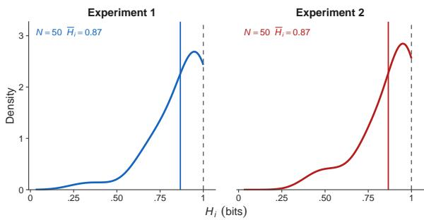
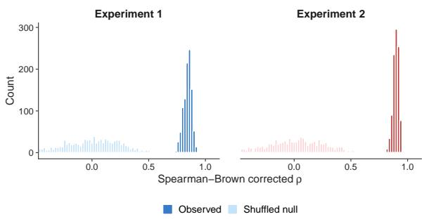
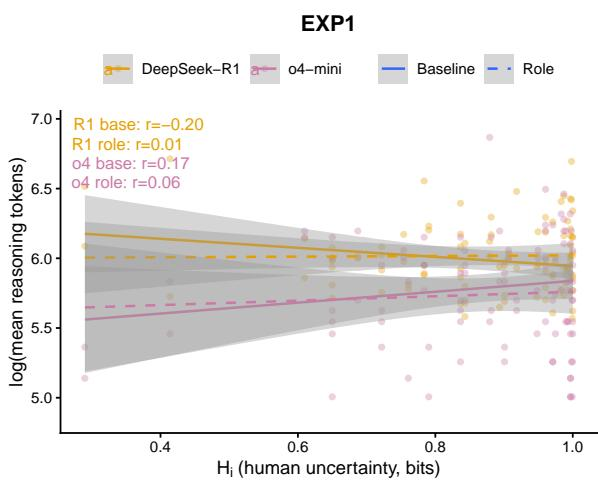
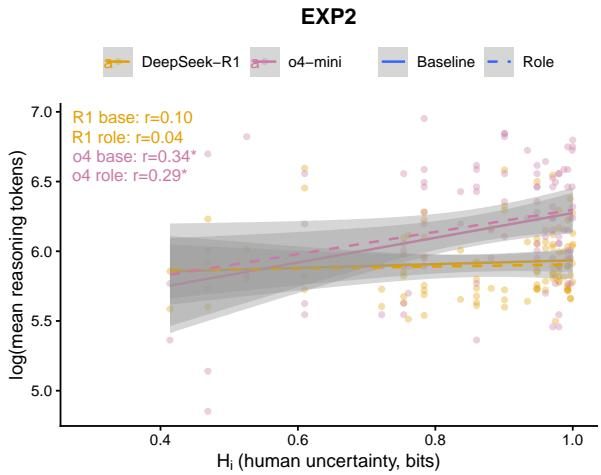

# Pseudowords as probes: Large Language Models show little of the sublexical sensitivity that governs human pseudoword processing

Jing Chen1, Giulia Loca1, Simona Amenta2, Marco Marelli1

1Department of Psychology, University of Milano-Bicocca,

Piazza dell’Ateneo Nuovo 1, 20126 Milano, Italy

2Department of Informatics, Systems and Communication – DISCo, University of Milano-Bicocca, Milano, Italy

jing.chen@unimib.it

## Abstract

Systematicity, the probabilistic mapping of form to meaning, permeates language at all levels, and sublexical cues have been shown to govern human pseudoword processing. Yet whether LLMs exhibit comparable sensitivity to these cues remains unclear. We tested five LLMs on two Italian two-alternative forcedchoice pseudoword experiments and compared their responses with a human behavioural baseline. LLMs aligned more reliably with humans when real-word options provided a lexical familiarity cue than in the pseudoword-only condition, where they fell substantially belowfast-Text, a character-n-gram model. In addition, the sublexical cosine-similarity cue that reliably drove human–fastText agreement did not consistently transfer to human–LLM alignment, and reasoning-token expenditure bore no consistent relation to human processing difficulty. These findings suggest that LLMs do not necessarily share the sublexical cues that govern human pseudoword processing; we discuss tokenization and training-data coverage as candidate explanations.

## 1 Introduction

Language is often characterized as an arbitrary system, where the relationship between form and meaning is treated as a matter of convention (de Saussure, 1916; Hockett and Hockett, 1960). A growing body of work shows that this arbitrariness is far from absolute (for a review, see Dingemanse et al. 2015): at least two forms of non-arbitrariness are well documented, namely iconicity, i.e., the resemblance between a linguistic symbol and its referent (Emmorey, 2014; Perniss et al., 2010), and systematicity, i.e., the statistical regularities in forms that cue related meanings (Monaghan et al., 2014; Tamariz, 2008; Bergen, 2004). Systematicity in particular permeates language at all levels (Nölle et al., 2018), from syntactic structure (e.g., SVO) to sublexical regularities such as the phonaestheme gl- clusters to imply things that shine (glitter, glow) (Bergen, 2004).

These statistical regularities extend beyond the known lexicon to shape the processing of pseudowords: letter strings that conform to the orthotactic patterns of a language but carry no conventionalised meaning (Martínez-Tomás et al., 2025). Although pseudowords lack any lexical entry, the sublexical form–meaning regularities of the language nonetheless guide their processing, as evidenced by fastText (Bojanowski et al., 2017) that reliably predict human pseudoword judgments (Gatti et al., 2024, 2023; Bonandrini et al., 2023, 2026).

Large language models (LLMs), as machine learning systems trained on massive corpora (typically trillions of tokens; e.g., Liu et al. 2024; Achiam et al. 2023) via objectives such as nexttoken prediction (e.g., GPT-4) or multi-token prediction (e.g., DeepSeek-V3), also acquire rich and implicit statistical regularities from text (Brown et al., 2020). The scale and architectural sophistication of this training enables human-like performance across a wide range of linguistic and psychological tasks (Martínez et al., 2025; Brysbaert et al., 2024; Demszky et al., 2023; Srivastava et al., 2024).

Whether the statistical regularities LLMs acquire extend to the sublexical patterns that govern human form-to-meaning mapping is, however, unclear. LLMs process text via subword tokenization (e.g., byte-pair encoding; Sennrich et al. 2016), which segments strings into tokens that are purely frequency-driven: the processing units of machine and human are thus not necessarily matched. Such investigation are especially interesting in the context of pseudowords, where they are as out-ofvocabulary (OOV) strings with no lexical entry, and thus eliminate confounds from stored word knowledge and isolate sensitivity to sublexical form cues.

In this study, we use two Italian pseudoword experiments from Gatti et al. (2024) as benchmarks to compare the performance of five LLMs. We ask three questions: (1) Do LLMs align with human participants above chance level? (2) Do sublexical features that predict humans performance also drive LLMs performance? (3) Does computational effort in reasoning models reflect human processing difficulty? Together, we use pseudowords as probes to explore whether LLMs track the sublexical regularities that guide human pseudoword processing.

## 2 Related Work

Human pseudoword processing is sensitive to sublexical form–meaning associations already mapped in semantic memory (e.g., Gatti et al., 2023). This implicit statistical regularity is often computationally quantified byfastText (Bojanowski et al., 2017), a model that represents each string as the aggregation of the vectors of its character n-grams, learned from distributional co-occurrence in corpora.

For example, Gatti et al. (2024) showed that human intuitions about pseudoword meanings in two-alternative forced-choice (2AFC) tasks consistently aligned withfastText predictions: participants preferentially chose the pseudoword whose vector was closer to the target word in fastText space. In primed lexical decision tasks, higherfast-Text-estimated relatedness between a prime word and a target pseudoword slowed responses and reduced accuracy, suggesting that the associative mechanisms governing word meaning also subserve pseudoword processing (Gatti et al., 2023). In addition, fastText-derived semantics predicted lexical decisions for affixed pseudowords, and explicit morpheme combination further improved fit when pseudowords were accepted as words, but not when rejected (Bonandrini et al., 2023).

Unlike fastText, which aggregates all overlapping character n-grams of a string, LLMs often segment character sequences into non-overlapping subword tokens selected by corpus frequency alone (e.g., byte-pair encoding; Sennrich et al. 2016; Mielke et al. 2021). A token may thus coincide with a whole word, with a sublexical unit that carries form–meaning cues for human readers, or with neither. For example, GPT-4o tokenizes glass whole as [glass], preserves the phonaestheme glin glitter [gl, itter], but destroys it in glisten [g, listen]. Pseudowords, by construction vanishingly rare in any training corpus, are typically split into multiple subword fragments—units that may coincide with neitherfastText’s exhaustive ngrams nor the cues human readers exploit. Among our stimuli of Italian pseudowords (Section 3.1), for instance, GPT-4o carves mesetta into [mes, etta], handing the model a genuine diminutive suffix, but shreds silargloipe into [sil, arg, lo, ipe], a more fragmented segmentation in which no chunk isolates an Italian form–meaning cue, likely leaving the model little identifiable material from which to compose a meaning.

Tokenization, though blind to semantics, yields tokens that are not always semantically arbitrary. For example, words sharing a token are more semantically related than words sharing lengthmatched strings, and remain so even when they share no morpheme (e.g., the etymologically related purse and bursary), indicating that frequencybased tokenization captures form–meaning regularities beyond morphology (Haslett and Cai, 2025). LLMs, in turn, treat these tokens as functional sublexical units: they inflate the judged similarity of items that share a token even when no genuine linguistic constituent is shared (e.g., 骆 ‘camel’ and 骶 ‘tailbone’, which share their initial token but contain the semantic radicals 马 ‘horse’ and 骨 ‘bone’, respectively), and overlook shared constituents that do not surface as tokens (e.g., French entrons is misjudged as unlike portons and sortons because its suffix -ons is absorbed into the token rons) (Haslett, 2025). For pseudowords, which have no lexical entry to fall back on, subword tokens are thus the primary form-based cues available to an LLM to construe meaning; whether and how LLMs exploit them are the questions the present study investigates.

## 3 Method

## 3.1 Data and materials

As a case study in Italian, we used data from the 2AFC experiments reported by Gatti et al. (2024). In these experiments pseudowords were generated with Wuggy (Keuleers and Brysbaert, 2010), a multilingual tool that produces orthographic strings conforming to the orthotactic patterns of a target language. They were hence organized in item triplets based on the semantic relatedness with attested Italian words, quantified byfastText vectors (Bojanowski et al., 2017).

In Experiment 1 (EXP1), 60 native Italian speakers (53 female, 7 male; age range: 19–34 years) responded to 50 trials. On each trial, a real target word appeared alongside a semantically related (pw\_rel; cosine 0.20–0.44) and a semantically unrelated (pw\_unrel; cosine ≤ 0.05) pseudoword. The two pseudowords in each trial were matched for orthographic length and Levenshtein distance.

In Experiment 2 (EXP2), a separate group of 60 native Italian speakers (38 female, 22 male; age range: 19–35 years) completed 50 trials, in which an Italian pseudoword appeared alongside one related (cosine 0.20–0.44) and one unrelated real word (foil cosine ≤ 0.13). The two words were matched for word and lemma frequency, orthographic length, and Levenshtein distance. Additionally, grammatical gender, number, and part of speech were also matched to prevent reliance on morphosyntactic cues.

In both experiments, participants chose the option they intuitively considered more semantically similar to the target, with reaction times recorded. Trials with reaction times below 500 ms or above 50,000 ms were excluded, retaining 2,975 trials in EXP1 and 2,997 trials in EXP2.

## 3.2 Models

We administered the two experiments described in Section 3.1 to five LLMs: Minerva-7B-instruct (henceforth Minerva; Orlando et al. 2024), GPT-4o (Hurst et al., 2024), DeepSeek-V3 (Liu et al., 2024), o4-mini, and DeepSeek-R1 (Guo et al., 2025).

To the best of our knowledge, Minerva is the first LLM family pre-trained from scratch with Italian as a primary language, rather than adapted from an English-centric base.1 The other four are frontier general-purpose models trained primarily on English. Of these, GPT-4o and DeepSeek-V3 are standard models that output a response directly, while o4-mini and DeepSeek-R1 are reasoning models that generate a chain of intermediate tokens before producing their final answer.

## 3.3 Experimental settings

All models were queried in Italian using a twomessage format: a system prompt setting up the task and a user prompt presenting each individual trial.

The system prompt framed the task as a 2AFC study and asked the model to consider the potential meaning of the pseudoword before responding. Models were required to reply with only the selected item, with no explanation. The user prompts for Experiments 1 and 2 took the following form, respectively:

(EXP1)

alcolismo

Sinistra: enfi

Destra: mavinchi

Scegli la pseudoparola più semanticamente simile. Rispondi con SOLO quella pseudoparola.

English: Choose the most semantically similar pseudoword. Respond with ONLY that pseudoword.

(EXP2) troganerio

Sinistra: plotone Destra: assessore

Scegli la parola più semanticamente simile.   
Rispondi con SOLO quella parola.

English: Choose the most semantically similar word. Respond with ONLY that word.

We tested two prompt conditions per experiment. In the baseline condition, the system prompt contained only the task description. In the role-based condition, the same description was preceded by a persona matching the demographic profile of the human sample, plus an explicit instruction to draw on native-speaker intuition (Usa la tua intuizione linguistica come se fossi un parlante nativo dell’italiano).2 The persona read:

Sei un parlante nativo italiano di età compresa tra 19 e 34 anni con vista normale o corretta alla normalità.

English: You are a native Italian speaker between 19 and 34 years of age with normal or corrected-to-normal vision.

GPT-4o, DeepSeek-V3, and DeepSeek-R1 were queried via their respective chat-completion APIs at temperature 0 to minimise output variability;

o4-mini does not support a temperature parameter and was left at its default. Minerva was deployed locally using the HuggingFace transformers library (Wolf et al., 2020) with greedy decoding (do\_sample=False), which is the local equivalent of zero temperature.

Each model completed three iterations of each experiment per condition, with the stimulus list reshuffled at the start of each iteration. For DeepSeek-R1 and o4-mini, we also recorded the number of reasoning tokens consumed per trial as a measure of computational effort (see Section 5).

## 4 Analysis 1: Item-level human response consistency

Prior work indicates substantial item-level variation in response consistency (Gatti et al., 2024; Woolnough and Tandon, 2025), though this has not been formally characterised. Before examining human–model alignment, we quantified this variation and assessed whether it reflects stable stimulus properties rather than sampling noise.

We quantified response consistency using binary entropy $( H _ { i } )$ , where $p _ { i }$ is the proportion of participants choosing the left-presented option on item $i \colon$

$$
H _ { i } = - \big [ p _ { i } \log _ { 2 } ( p _ { i } ) + ( 1 - p _ { i } ) \log _ { 2 } ( 1 - p _ { i } ) \big ] .\tag{1}
$$

with $H _ { i } = 0$ indicating unanimous agreement and $H _ { i } = 1$ bit a perfectly split response.

As shown in Figure 1, $H _ { i }$ values ranged from 0.290 to 1.000 in EXP1 and from 0.414 to 1.000 in EXP2, confirming substantial variation in itemlevel response consistency. The consistently high mean (EXP1: M = 0.867, $S D = 0 . 1 5 7 ;$ ; EXP2: $M = 0 . 8 6 6 , S D = 0 . 1 5 6 )$ indicates that most pseudoword pairs were difficult to reach consensus on, as expected given that pseudowords carry no conventionalised lexical meaning.

To confirm that $H _ { i }$ reflects a stable property of the items rather than sampling noise, we computed Spearman-Brown-corrected split-half correlations between mean item responses in two random halves of the participant sample, averaged across 1,000 splits and benchmarked against a permuted-label null.

As shown in Figure 2, the median $\rho = 0 . 8 4 7$ (95% permutation interval: [0.764, 0.902]) in EXP1 and $\rho = 0 . 9 0 0$ ([0.840, 0.940]) in EXP2 both substantially exceeded the corresponding null medians $( \tilde { \rho } _ { \mathrm { n u l l } } ~ = ~ - 0 . 0 0 5$ and $- 0 . 0 0 6 ;$ both $p \ < \ . 0 0 1 )$ confirming that $H _ { i }$ captures a genuine item-level gradient in stimulus difficulty rather than sampling noise.

  
Figure 1: Distribution of item-level response entropy $( H _ { i }$ , bits) across the 50 items in each experiment. Coloured vertical lines mark the per-experiment mean $( { \bar { H } } _ { i } )$ ; the dashed grey line marks the theoretical maximum $( H = 1 \mathsf { b i t } )$

Since pseudowords carry no conventionalised lexical meaning, this gradient is interpretable as variation in the strength of sublexical form cues across pairs: pairings with a stronger directional signal elicit greater consensus, whereas those with weaker or more balanced cues yield lower agreement. $H _ { i }$ is therefore used in the subsequent analysis (Q3) as an item-level index of processing difficulty, complementing mean log response time as a measure of human effort.

  
Figure 2: Split-half reliability across participants. Each panel shows the distribution of Spearman-Browncorrected split-half correlations $( \rho )$ across 1,000 random participant splits for EXP1 and EXP2. Dark bars show observed $\rho$ values; light bars show the shuffled null distribution, in which response labels were permuted before splitting.

## 5 Analysis 2: Human-model alignment on 2AFC experiments

We operationalised human–model alignment as trial-level agreement between each model and individual human participants, replicating the approach used for human–fastText alignment in Gatti et al. (2024).

For each item, the three responses of any given model (one per iteration) were reduced to a single majority-vote answer. This was then compared with each participant’s response on that item, yielding a binary outcome per participant–item pair: aligned if the majority-vote answer matched the participant’s choice, and misaligned otherwise.

Minerva-7B and DeepSeek-V3 produced invalid responses on a subset of trials (e.g., non-response, multiple options), which were excluded from all analyses. For Minerva-7B, valid trial counts ranged from 2,082 to 2,577 across conditions (versus N = 2,975 in EXP1 and $N = 2 { , } 9 9 7$ in EXP2 for all other models). For DeepSeek-V3, exclusions were limited to the EXP2 baseline condition, retaining 2,877 of 2,997 trials.

Table 1 reports within-model response consistency. Minerva-7B was the most consistent (49– 58%), likely because local greedy decoding is deterministic. Cloud API models, even at temperature 0, exhibit some run-to-run variability.

<table><tr><td>Model</td><td>Prompt</td><td>EXP1</td><td>EXP2</td></tr><tr><td>GPT-40</td><td>Baseline</td><td>32%</td><td>36%</td></tr><tr><td rowspan="3">DeepSeek-V3</td><td>Role</td><td>60%</td><td>44%</td></tr><tr><td>Baseline</td><td>52%</td><td>40%</td></tr><tr><td>Role</td><td>42%</td><td>40%</td></tr><tr><td rowspan="2">DeepSeek-R1</td><td>Baseline</td><td>52%</td><td>42%</td></tr><tr><td>Role</td><td>40%</td><td>32%</td></tr><tr><td>04-mini</td><td>Baseline</td><td>32%</td><td>20%</td></tr><tr><td rowspan="3">Minerva-7B</td><td>Role</td><td>16%</td><td>32%</td></tr><tr><td>Baseline</td><td>49%</td><td>58%</td></tr><tr><td>Role</td><td>53%</td><td>57%</td></tr></table>

Table 1: Within-model response consistency: proportion of items receiving unanimous responses across three iterations.

## Q1: Do LLMs align with individual participants above chance levels?

For each model, prompt condition, and the fast-Text reference, we fitted an intercept-only binomial GLMM (aligned $\sim 1 + ( 1 | \mathrm { I D } ) + ( 1 | \mathrm { i t e m } ) \}$ ) with crossed random intercepts for participant and item. The fixed intercept estimated mean alignment against the 50% chance level.

Table 2 reports human-model alignment for both experiments, with the human-fastText rates (also the same from Gatti et al. 2024) as reference lines. In EXP1, alignment ranged from 48.5 to 58.8% across all models and conditions. The sole abovechance result was Minerva-7B under the baseline prompt (58.8%, $p \ = \ . 0 1 8 )$ , while every other model fell short of significance. Compared tofast-Text $( 6 6 . 3 \% , p < . 0 0 1 )$ , all LLMs fell substantially short.

EXP2 yielded stronger alignment overall: four models reached above-chance levels, and the bestperforming model slightly exceeded the fastText reference rate (58.1%, $p = . 0 1 4 )$ : GPT-4o Role (59.7%, p = .002), DeepSeek-V3 Base (58.9%, $p = . 0 0 7 )$ , DeepSeek-R1 Role (58.3%, p = .009), and o4-mini in both conditions (57.8%, $p = . 0 1 6 ;$ 58.5%, $p = . 0 0 8 )$ . Minerva-7B, by contrast, fell at or below chance (44–51%).

The performance reversal of Minerva-7B raised a concern about differential item coverage. Note that this model drew on fewer items in both experiments than the other models. To verify that the result was not an artefact of this difference, we rerun the GLMMs while restricting them to items with valid responses from all five models: 35 items $( N = 2 , 0 8 2$ trials) in EXP1 and 39 items (N = 2,337 trials) in EXP2. The general pattern held: Minerva-7B approached but did not reach above-chance alignment in EXP1 (57.2%, $p = . 0 5 2 )$ and fell at or below chance in EXP2 (44.1–49.5%, both $p > . 1 )$ , while the frontier models largely replicated their EXP2 results on this restricted item set (Table 3).

To test whether adopting the persona of a native Italian speaker improved alignment, we fitted a separate binomial GLMM for each experiment, pooling all models, with prompt condition as a fixed effect and crossed random intercepts for participant, item, and model (aligned ∼ Condition + (1 | ID) + (1 | item) + (1 | model)). The role prompt had no significant effect on alignment in either experiment (EXP1: $\hat { \beta } = - 0 . 0 1 2 .$ z = −0.49, p = .621; EXP2: ${ \hat { \beta } } ~ = ~ - 0 . 0 1 5 .$ $z = - 0 . 6 1 , p = . 5 3 9 )$ , indicating that persona framing does not systematically shift model responses toward human pseudoword judgments.

## Q2: Do sublexical features predict humanmodel alignment here?

As shown in Q1, LLMs aligned more with humans in EXP2 than in EXP1, which is the opposite of the trend across experiments for fastText. One potential account is that LLMs and fastText rely on different cues.

Table 2: Trial-level human-model alignment estimated from intercept-only GLMMs. N = number of trials entering each fit; values are back-transformed alignment probabilities (%). Reduced N for Minerva-7B and DeepSeek-V3 (EXP2 Base) reflects exclusion of trials with invalid responses. Bold = p < .05.
<table><tr><td></td><td colspan="6">EXP1</td><td colspan="6">EXP 2</td></tr><tr><td></td><td colspan="3">Base</td><td colspan="3">Role</td><td colspan="3">Base</td><td colspan="3">Role</td></tr><tr><td>Model</td><td>N</td><td>%</td><td>p</td><td>N</td><td>%</td><td>p</td><td>N</td><td>%</td><td>p</td><td>N</td><td>%</td><td>p</td></tr><tr><td>GPT-40</td><td>2,975</td><td>50.2</td><td>.947</td><td>2,975</td><td>53.8</td><td>.268</td><td>2,997</td><td>56.4</td><td>.055</td><td>2,997</td><td>59.7</td><td>.002</td></tr><tr><td>DeepSeek-V3</td><td>2,975</td><td>54.3</td><td>.203</td><td>2,975</td><td>52.2</td><td>.520</td><td>2,877</td><td>58.9</td><td>.007</td><td>2,997</td><td>55.5</td><td>.099</td></tr><tr><td>DeepSeek-R1</td><td>2,975</td><td>48.5</td><td>.665</td><td>2,975</td><td>52.8</td><td>.405</td><td>2,997</td><td>55.5</td><td>.102</td><td>2,997</td><td>58.3</td><td>.009</td></tr><tr><td>o4-mini</td><td>2,975</td><td>56.1</td><td>.066</td><td>2,975</td><td>54.2</td><td>.213</td><td>2,997</td><td>57.8</td><td>.016</td><td>2,997</td><td>58.5</td><td>.008</td></tr><tr><td>Minerva-7B</td><td>2,440</td><td>58.8</td><td>.018</td><td>2,082</td><td>54.8</td><td>.214</td><td>2,577</td><td>50.7</td><td>.853</td><td>2,397</td><td>44.3</td><td>.123</td></tr><tr><td>human-fastText</td><td colspan="6"> ${ \bf 6 6 . 3 } \left( p < . 0 0 1 \right)$ </td><td colspan="6">58.1 (p = .014)</td></tr></table>

Table 3: Human-model alignment on the shared valid item set (items with valid responses from all five models). EXP1: Nitems = 35, N = 2,082 trials; EXP2: $N _ { \mathrm { i t e m s } } ~ = ~ 3 9$ , N = 2,337 trials. Values are backtransformed alignment probabilities (%). Bold = p < .05.
<table><tr><td colspan="2"></td><td colspan="2">EXP1</td><td colspan="2">EXP 2</td></tr><tr><td>Model</td><td>Prompt</td><td>%</td><td>p</td><td>%</td><td>p</td></tr><tr><td>GPT-40</td><td>Base</td><td>52.8</td><td>.479</td><td>58.6</td><td>.022</td></tr><tr><td rowspan="3">DeepSeek-V3</td><td>Role</td><td>50.1</td><td>.980</td><td>60.8</td><td>.003</td></tr><tr><td>Base</td><td>50.7</td><td>.869</td><td>60.1</td><td>.004</td></tr><tr><td>Role</td><td>47.4</td><td>.634</td><td>56.1</td><td>.116</td></tr><tr><td>DeepSeek-R1</td><td>Base</td><td>46.7</td><td>.393</td><td>56.4</td><td>.091</td></tr><tr><td rowspan="3">04-mini</td><td>Role</td><td>49.6</td><td>.927</td><td>57.7</td><td>.037</td></tr><tr><td>Base</td><td>54.6</td><td>.233</td><td>58.6</td><td>.021</td></tr><tr><td>Role</td><td>51.9</td><td>.624</td><td>59.6</td><td>.007</td></tr><tr><td rowspan="2">Minerva-7B</td><td>Base</td><td>57.2</td><td>.052</td><td>49.5</td><td>.897</td></tr><tr><td>Role</td><td>54.8</td><td>.215</td><td>44.1</td><td>.123</td></tr></table>

We therefore tested whether human–LLM alignment is predicted by the same sublexical cues that Gatti et al. (2024) entered for fastText: $D _ { \mathrm { { c o s } } }$ (difference infastText cosine similarity to the target), $D _ { L }$ (difference in string length), and $D _ { \mathrm { L D } }$ (difference in Levenshtein edit distance to the target). In EXP2, $D _ { \mathrm { f r e q } }$ (difference in log word frequency) and $D _ { \mathrm { f r e q \_ I } }$ (difference in log lemma frequency) were additionally included (Gatti et al., 2024).3

LLM–human alignment was modelled with binomial GLMMs via lme4 (Bates et al., $2 0 1 5 ) . ^ { 4 }$ Each predictor is an item-level difference between the two response options, computed as the value for the related option minus that for the unrelated option, so that positive values indicate an advantage for the related option on that dimension (e.g., $D _ { \mathrm { { c o s } } } > 0$ when the related option is closer to the target infast-Text space). All predictors were z-scored within each experiment prior to entry. (EXP1: aligned ∼ $D _ { \mathrm { c o s } } + D _ { L } + D _ { \mathrm { L D } } + ( 1 | \mathrm { i t e m } ) ; \mathrm { E X P 2 } \colon a l i g n e d \sim$ $D _ { \mathrm { c o s } } + D _ { L } + D _ { \mathrm { L D } } + D _ { \mathrm { f r e q } } + D _ { \mathrm { f r e q } _ { - } \mathrm { L } } + ( 1 | \mathrm { i t e m } ) )$

As shown in Table 4, no sublexical predictor consistently predicted human–LLM alignment. In EXP1, no model reached significance on any predictor. In EXP2, only DeepSeek-R1 showed a reliable effect, for $D _ { \mathrm { c o s } } ~ ( \hat { \beta } ~ = ~ 0 . 3 5 , p ~ = ~ . 0 0 8 ) ;$ all other models remained non-significant. The human–fastText reference, by contrast, showed a reliable $D _ { \mathrm { { c o s } } }$ effect in both experiments (EXP1: ${ \hat { \beta } } = 0 . 2 0 , p = . 0 4 1 ; \mathrm { E X P 2 } ; { \hat { \beta } } = 0 . 2 7 , p = . 0 3 0 )$ (Gatti et al., 2024). This effect is expected by construction, asfastText chooses whichever option is closer in cosine terms; precisely for this reason, it serves as a positive control, confirming that the items carry a sublexical signal strong enough to be detected in this paradigm and tracked by human participants. The null effects for the LLMs therefore point to insensitivity to this cue.

## Q3: Does reasoning-model computational effort predict human processing difficulty?

We next asked whether items that demand greater cognitive effort from humans also drive greater computational effort in reasoning models.

Table 4: Item-level sublexical predictors of human–model alignment. LLM estimates pool across prompt conditions. $\mathrm { B o l d } = p < . 0 5 ;$ ; all predictors z-scored.
<table><tr><td rowspan="2"></td><td colspan="2">fastText</td><td colspan="2">DeepSeek-R1 DeepSeek-V3</td><td colspan="2"></td><td colspan="2">GPT-40</td><td colspan="2">Minerva-7B</td><td colspan="2">o4-mini</td></tr><tr><td> $\hat { \beta }$ </td><td>p</td><td> $\hat { \beta }$ </td><td>p</td><td> $\hat { \beta }$ </td><td></td><td></td><td>B p</td><td> $\hat { \beta }$ </td><td>p</td><td></td><td> $p$ </td></tr><tr><td>EXP 1</td><td></td><td></td><td></td><td></td><td></td><td></td><td></td><td></td><td></td><td></td><td></td><td></td></tr><tr><td> $D _ { \mathrm { { c o s } } }$ </td><td></td><td></td><td>0.20.041 -0.08</td><td>.602</td><td>0.12</td><td>.480</td><td>-0.17.282</td><td></td><td>0.14 .395 -0.13 .355</td><td></td><td></td><td></td></tr><tr><td> $D _ { L }$ </td><td></td><td>0.31.057</td><td>-0.01</td><td>.952</td><td>-0.01</td><td>.983</td><td></td><td>0.11.656</td><td>-0.10.708</td><td></td><td></td><td>0.34.146</td></tr><tr><td> $D _ { \mathrm { { L D } } }$ </td><td>-0.32.054</td><td></td><td>0.12</td><td></td><td>.594-0.15</td><td></td><td>.624 -0.12 .661</td><td></td><td></td><td></td><td>0.13 .661 -0.26.285</td><td></td></tr><tr><td> $E X P 2$ </td><td></td><td></td><td></td><td></td><td></td><td></td><td></td><td></td><td></td><td></td><td></td><td></td></tr><tr><td> $D _ { \mathrm { { c o s } } }$ </td><td></td><td>0.27.030</td><td>0.35</td><td>.008</td><td>0.19</td><td>.146</td><td>0.12.389</td><td></td><td>-0.04.787</td><td></td><td>0.22.132</td><td></td></tr><tr><td> $D _ { L }$ </td><td></td><td>0.20.137</td><td>0.08</td><td>.552</td><td>0.02</td><td>.860</td><td>0.10.537</td><td></td><td>0.08 .637</td><td></td><td>0.01.968</td><td></td></tr><tr><td> $D _ { \mathrm { { L D } } }$ </td><td>-0.20.147</td><td></td><td>0.03</td><td>.845</td><td>-0.23</td><td>.109</td><td>-0.11.526</td><td></td><td>0.23 .187</td><td></td><td>0.11.480</td><td></td></tr><tr><td> $D _ { \mathrm { f r e q } }$ </td><td>0.20.637</td><td></td><td>0.04</td><td>.919</td><td>-0.01</td><td>.985 -0.03 .953</td><td></td><td></td><td>-0.33.537</td><td></td><td>0.15 .779</td><td></td></tr><tr><td> $D _ { \mathrm { f r e q \_ L } }$ </td><td>-0.33 .453</td><td></td><td>0.10</td><td>.823</td><td>-0.15</td><td>.745</td><td></td><td>0.10.849</td><td>0.51.387</td><td></td><td>-0.13.798</td><td></td></tr></table>

We operationalized model effort as the reasoning tokens consumed per trial. Specifically, we took the mean token count across the three iterations as a more stable indicator of item-level processing cost for each reasoning model. Meanwhile, human processing effort was indexed by mean response time (RT) per item, with response entropy $H _ { i }$ included as a complementary measure.

For each reasoning model and prompt condition, we correlated log mean reasoning tokens with mean log human RT per item $( N = 5 0 )$ , then recomputed these as partial correlations after residualising both variables on $D _ { \mathrm { { c o s } } }$ to control for stimulus discriminability.

As shown in Table 5, only one association was reliable: o4-mini (Baseline) in EXP1 $( r \ = \ . 2 8 ,$ $p = . 0 4 6 ; \mathrm { p a r t i a l } r = . 2 9 , p = . 0 3 9 )$ . The direction was positive: items that took humans longer also elicited more reasoning tokens from o4-mini. This association persisted after controlling for $D _ { \mathrm { c o s } }$ indicating it is not simply an artefact of stimulus discriminability. However, no other model, condition, or experiment yielded a consistent effect.

We also examined whether log mean reasoning tokens correlated with item-level response entropy $H _ { i }$ . As shown in Figure 3, only o4-mini in EXP2 produced reliable associations under both prompt conditions (Baseline: r = .34, p = .015; Role: $r = . 2 9 , p = . 0 4 3 )$ , with more tokens generated for items on which human responses were more evenly split. DeepSeek-R1 showed no significant correlation in either experiment, with a relatively flat slope in EXP2.

Across both effort measures, the direction of o4- mini’s associations was positive: items demanding more human processing also elicited more reasoning tokens. The consistent positive direction across both measures is noteworthy, but the associations were not consistent across experiments and were absent entirely for DeepSeek-R1. The results do not, therefore, support a general correspondence between reasoning-model token expenditure and human item-level processing demands on pseudoword tasks.

Table 5: Pearson correlations between LLM reasoning tokens and mean item-level human response time.
<table><tr><td>Model</td><td> $r \left( p \right)$ </td><td> $r _ { \mathrm { p a r t } } \left( p \right)$ </td></tr><tr><td colspan="3">EXP 1</td></tr><tr><td>DeepSeek-R1 base</td><td>−.10 (.494)</td><td>−.12 (.424)</td></tr><tr><td>DeepSeek-R1 role</td><td>.21 (.147)</td><td>.20 (.170)</td></tr><tr><td>o4-mini base role</td><td>.28 (.046)</td><td>.29 (.039)</td></tr><tr><td>o4-mini</td><td>.23 (.116)</td><td>.26 (.065)</td></tr><tr><td colspan="3">EXP 2</td></tr><tr><td>DeepSeek-R1 base</td><td>.02 (.880)</td><td>.01 (.968)</td></tr><tr><td>DeepSeek-R1 role base</td><td>−.05 (.730)</td><td>-.08 (.589)</td></tr><tr><td>o4-mini</td><td></td><td>.01 (.942) −.07 (.608)</td></tr><tr><td>o4-mini</td><td>role</td><td>.16 (.259) .06 (.679)</td></tr></table>

$r _ { \mathrm { p a r t } } \colon$ partial correlation controlling for $\Delta _ { \mathrm { c o s } }$ (stimulus discriminability); $N = 5 0$ items per cell.

## 6 Conclusion

In this study, we used pseudowords as probes to examine whether LLMs share the sublexical sensitivity that affects humans’ semantic intuitions. The results suggest that, by and large, they do not.

First, LLMs did not consistently match human pseudoword-related judgments at above-chance rates, and the pattern varied across experiments and models. Specifically, alignment was generally better in EXP2, where two real-word options provided a stronger lexical familiarity cue, than in EXP1. In EXP1, where both options were pseudowords, LLMs aligned with humans at or near chance, with performance well below the fastText reference.

  
Figure 3: Association between model reasoning tokens and human response entropy in EXP1 (top) and EXP2 (bottom). Each point represents one of the 50 items, with the x-axis showing log mean reasoning tokens and the y-axis showing human response entropy (Hi). Lines show best-fitting linear regression for each model and prompt condition.

Second, $D _ { \mathrm { { c o s } } }$ , the sublexical predictor that reliably drove human–fastText agreement, showed no consistent effect on human–LLM alignment, with DeepSeek-R1 in EXP2 as the sole exception.

Third, reasoning-token counts showed no consistent relation with human processing difficulty across models: only o4-mini showed scattered positive associations, and DeepSeek-R1 showed none.

We close with two speculative and mutually compatible explanations for this insensitivity. The first is tokenization: fastText represents a pseudoword through all of its overlapping n-grams, so every informative substring contributes to its meaning estimate, whereas an LLM receives a single frequencydriven segmentation, in which a form–meaning cue survives mainly when the tokenizer happens to isolate it (e.g., GPT-4o’s tokenizer yields mes+etta vs. sil+arg+lo+ipe). If LLMs treat tokens as their functional sublexical units (Haslett, 2025), regularities that do not surface as tokens remain largely invisible to them—which would explain why the n-gram-based $D _ { \mathrm { { c o s } } }$ predicted human–fastText but not human–LLM alignment.

The second explanation is training data: the sublexical regularities of Italian may be underrepresented in predominantly English corpora. Suggestively, Minerva-7B, which is the only Italianprimary model tested, was also the only model to exceed chance in the pseudoword-only EXP1 (under the baseline prompt, and only marginally so on the shared-item set), while trailing the frontier models in EXP2, where lexical knowledge sufficed. The two accounts may further converge: token inventories are themselves induced from the same Englishskewed corpora, leaving lower-resource languages with less informative segmentations (Haslett and Cai, 2025).

## Limitations

This study has at least two limitations. First, as discussed above, the training-data account cannot be ruled out: the observed alignment gap may reflect differences in training-data coverage as much as differences in sublexical processing, and replication in higher-resource languages would help

disentangle the two.

Second, both experiments drew on 50 pseudoword pairs from the original dataset. Although the alignment analyses operated at the trial level and benefited from over 2,000 observations per fit, analyses requiring item-level aggregation (including the sublexical predictor models and the reasoning-token correlations) were constrained to 50 data points, and estimates from these analyses should therefore be interpreted with caution.

## Data Availability

All code and data are available on OSF at osf.io/5swkp.

## Acknowledgments

This project was supported by the European Union (ERC-COG-2022, BraveNewWord, 101087053). Views and opinions expressed are, however, those of the authors only and do not necessarily reflect those of the European Union or the European Research Council Executive Agency. Neither the European Union nor the granting authority can be held responsible for them.

## References

Josh Achiam, Steven Adler, Sandhini Agarwal, Lama Ahmad, Ilge Akkaya, Florencia Leoni Aleman, Diogo Almeida, Janko Altenschmidt, Sam Altman, Shyamal Anadkat, and 1 others. 2023. Gpt-4 technical report. arXiv preprint arXiv:2303.08774.

Douglas Bates, Martin Mächler, Ben Bolker, and Steve Walker. 2015. Fitting linear mixed-effects models using lme4. Journal ofstatistical software, 67:1–48.

Benjamin K Bergen. 2004. The psychological reality of phonaesthemes. Language, 80(2):290–311.

Piotr Bojanowski, Edouard Grave, Armand Joulin, and Tomas Mikolov. 2017. Enriching word vectors with subword information. Transactions of the Associationfor Computational Linguistics, 5:135–146.

Rolando Bonandrini, Simona Amenta, Simone Sulpizio, Gianpaolo Basso, Marco Marelli, and Marco Tettamanti. 2026. Brain signatures of semantic activation for words that do not exist. bioRxiv.

Rolando Bonandrini, Simona Amenta, Simone Sulpizio, Marco Tettamanti, Alessia Mazzucchelli, and Marco Marelli. 2023. Form to meaning mapping and the impact of explicit morpheme combination in novel word processing. Cognitive Psychology, 145:101594.

Tom Brown, Benjamin Mann, Nick Ryder, Melanie Subbiah, Jared D Kaplan, Prafulla Dhariwal, Arvind

Neelakantan, Pranav Shyam, Girish Sastry, Amanda Askell, and 1 others. 2020. Language models are few-shot learners. Advances in neural information processing systems, 33:1877–1901.

Marc Brysbaert, Gonzalo Martínez, and Pedro Reviriego. 2024. Moving beyond word frequency based on tally counting: Ai-generated familiarity estimates of words and phrases are an interesting additional index of language knowledge. Behavior Research Methods, 57(1):28.

F. de Saussure. 1916. Course in general linguistics. McGraw-Hill, New York, NY.

Dorottya Demszky, Diyi Yang, David S Yeager, Christopher J Bryan, Margarett Clapper, Susannah Chandhok, Johannes C Eichstaedt, Cameron Hecht, Jeremy Jamieson, Meghann Johnson, and 1 others. 2023. Using large language models in psychology. Nature Reviews Psychology, 2(11):688–701.

Mark Dingemanse, Damián E Blasi, Gary Lupyan, Morten H Christiansen, and Padraic Monaghan. 2015. Arbitrariness, iconicity, and systematicity in language. Trends in cognitive sciences, 19(10):603–615.

Karen Emmorey. 2014. Iconicity as structure mapping. Philosophical transactions of the Royal Society B: Biological sciences, 369(1651):20130301.

Daniele Gatti, Marco Marelli, and Luca Rinaldi. 2023. Out-of-vocabulary but not meaningless: Evidence for semantic-priming effects in pseudoword processing. Journal of Experimental Psychology: General, 152(3):851.

Daniele Gatti, Francesca Rodio, Luca Rinaldi, and Marco Marelli. 2024. On humans’(explicit) intuitions about the meaning of novel words. Cognition, 251:105882.

Daya Guo, Dejian Yang, Haowei Zhang, Junxiao Song, Peiyi Wang, Qihao Zhu, Runxin Xu, Ruoyu Zhang, Shirong Ma, Xiao Bi, and 1 others. 2025. Deepseek-r1: Incentivizing reasoning capability in llms via reinforcement learning. arXiv preprint arXiv:2501.12948.

David A Haslett. 2025. Tokenization changes meaning in large language models: Evidence from chinese. Computational Linguistics, 51(3):785–814.

David A Haslett and Zhenguang G Cai. 2025. How much semantic information is available in large language model tokens? Transactions of the Association for Computational Linguistics, 13:408–423.

Charles F Hockett and Charles D Hockett. 1960. The origin of speech. Scientific American, 203(3):88–97.

Aaron Hurst, Adam Lerer, Adam P Goucher, Adam Perelman, Aditya Ramesh, Aidan Clark, AJ Ostrow, Akila Welihinda, Alan Hayes, Alec Radford, and 1 others. 2024. Gpt-4o system card. arXiv preprint arXiv:2410.21276.

Emmanuel Keuleers and Marc Brysbaert. 2010. Wuggy: A multilingual pseudoword generator. Behavior research methods, 42(3):627–633.

Aixin Liu, Bei Feng, Bing Xue, Bingxuan Wang, Bochao Wu, Chengda Lu, Chenggang Zhao, Chengqi Deng, Chenyu Zhang, Chong Ruan, and 1 others. 2024. Deepseek-v3 technical report. arXiv preprint arXiv:2412.19437.

Gonzalo Martínez, Javier Conde, Pedro Reviriego, and Marc Brysbaert. 2025. Ai-generated estimates of familiarity, concreteness, valence, and arousal for over 100,000 spanish words. Quarterly Journal of Experimental Psychology, 78(10):2272–2283.

Celia Martínez-Tomás, Ana Baciero, Miguel Lázaro, and José A Hinojosa. 2025. What do pseudowords tell us about word processing? an overview. Frontiers in Language Sciences, 4:1504770.

Sabrina J Mielke, Zaid Alyafeai, Elizabeth Salesky, Colin Raffel, Manan Dey, Matthias Gallé, Arun Raja, Chenglei Si, Wilson Y Lee, Benoît Sagot, and 1 others. 2021. Between words and characters: A brief history of open-vocabulary modeling and tokenization in nlp. arXiv preprint arXiv:2112.10508.

Padraic Monaghan, Richard C Shillcock, Morten H Christiansen, and Simon Kirby. 2014. How arbitrary is language? Philosophical Transactions ofthe Royal Society B: Biological Sciences, 369(1651):20130299.

Jonas Nölle, Marlene Staib, Riccardo Fusaroli, and Kristian Tylén. 2018. The emergence of systematicity: How environmental and communicative factors shape a novel communication system. Cognition, 181:93– 104.

Riccardo Orlando, Luca Moroni, Pere-Lluís Huguet Cabot, Simone Conia, Edoardo Barba, Sergio Orlandini, Giuseppe Fiameni, and Roberto Navigli. 2024. Minerva LLMs: The first family of large language models trained from scratch on Italian data. In Proceedings of the Tenth Italian Conference on Computational Linguistics (CLiC-it 2024), pages 707–719, Pisa, Italy. CEUR Workshop Proceedings.

Pamela Perniss, Robin L Thompson, and Gabriella Vigliocco. 2010. Iconicity as a general property of language: evidence from spoken and signed languages. Frontiers in psychology, 1:227.

Rico Sennrich, Barry Haddow, and Alexandra Birch. 2016. Neural machine translation of rare words with subword units. In Proceedings of the 54th Annual Meeting of the Association for Computational Linguistics (Volume 1: Long Papers), pages 1715–1725, Berlin, Germany. Association for Computational Linguistics.

Aarohi Srivastava, Abhinav Rastogi, Abhishek Rao, Abu Awal Md Shoeb, Abubakar Abid, Adam Fisch, Adam R Brown, Adam Santoro, Aditya Gupta, Adrià Garriga-Alonso, and 1 others. 2024. Beyond the imitation game: Quantifying and extrapolating the

capabilities of language models. Transactions on machine learning research.

Monica Tamariz. 2008. Exploring systematicity between phonological and context-cooccurrence representations of the mental lexicon. The Mental Lexicon, 3(2):259–278.

Thomas Wolf, Lysandre Debut, Victor Sanh, Julien Chaumond, Clement Delangue, Anthony Moi, Pierric Cistac, Tim Rault, Remi Louf, Morgan Funtowicz, Joe Davison, Sam Shleifer, Patrick von Platen, Clara Ma, Yacine Jernite, Julien Plu, Canwen Xu, Teven Le Scao, Sylvain Gugger, and 3 others. 2020. Transformers: State-of-the-art natural language processing. In Proceedings ofthe 2020 Conference on Empirical Methods in Natural Language Processing: System Demonstrations, pages 38–45, Online. Association for Computational Linguistics.

Oscar Woolnough and Nitin Tandon. 2025. Memorability of novel words correlates with anterior fusiform activity during reading. Nature communications, 16(1):1902.