# Readout Stability in Prefill-Only Decision Models: Zero-Label Prediction and Inference-Time Compute Allocation

Ran Li1 Lei Chen1,2

1Hong Kong University of Science and Technology 2Hong Kong University of Science and Technology(Guangzhou) rlibb@connect.ust.hk leichen@cse.ust.hk

## Abstract

Prefill-only decision models inspired by the Jev model score every candidate in a menu during a single forward pass and never decode, which makes one call one to two orders of magnitude cheaper than a same-scale generative language model. We show that this read-out structure comes with a testable property. When an inter vention changes only the candidate menu and leaves the input text fixed, the post-intervention accuracy is already determined by the cached first-pass distribution. The estimator restricts the pass-1 probabilities to the menu, renormalizes, and reads off the argmax; it uses no labels and no second forward pass. Across seven model families, ten datasets and two task types, menu-only interventions are predicted to within 4.2 points, and for one family the prediction is exact. A probability-level variant of the same estimator errs by 21.0 points, so the property lives in the ranking rather than in the probabilities and is not recovered by calibration. Same scale generative language models do not share the property. On those models the same estimator errs by 1.6 to 15.8 points and degrades as the model grows. The property turns inference time compute into a decision that can be made before deployment. Uniform extra passes buy calibration but almost no accuracy; at matched cost a confidence cascade outperforms every scheme that re-asks the same model, and curating the menu beats enlarging the model, with a 0.8B model on a curated 5-candidate menu reaching 95.4% on CLINC150 against 80.0% for a 4B model on the full 150-label menu.Code and data are available at https: //github.com/rlisml/jev-cascade.

## 1 Introduction

A prefill-only decision model reads an input text once and scores every candidate label with an independent head, returning a distribution over a menu of candidates without decoding a single token. This read-out structure makes one call one to two orders of magnitude cheaper than a same-scale generative language model (Cheng et al., 2026; Almeida and AI, 2026), and the resulting models are increasingly used as drop-in classifiers for intent detection, query routing and content moderation (Deußer et al., 2026; Li et al., 2026a), and as calibrated decision heads inside larger agents (Guo et al., 2026; Wu and Lim, 2026b).

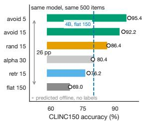

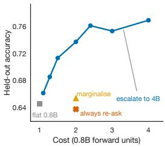  
Figure 1: Menu construction moves the accuracy across 26 points and the offline prediction matches it (left); escalation outperforms re-asking at matched cost (right).

For a deployer, the model is only half of the decision. The other half is the menu, the set of candidate labels offered at inference time. Menus are built by the deployer rather than fixed by the model. One can sample a small random subset, retrieve candidates from a front end, group labels into a hierarchy, or edit the label table itself. Prior work has changed menus in each of these ways, by pruning or reorganizing the label space (Lu et al., 2024; Yang et al., 2026; Li et al., 2026b) or by making the presentation of options more stable (Pezeshkpour and Hruschka, 2024; Zheng et al., 2023). Figure 1 shows that this choice is not a detail. Holding the model and the 500 test items fixed on CLINC150 (Larson et al., 2019), moving from the full 150-label menu to a curated 5-candidate menu raises accuracy from 69.0% to 95.4%, a span of 26 points that is wider than the gap between the 0.8B and 4B models on the same data. Changing the menu is a first-order intervention, and a deployer will make it repeatedly.

Today, evaluating such an intervention is expensive in the currency that matters. A second forward pass is cheap, but scoring the result needs labels, which are not. Existing label-free machinery does not fill the gap. Conformal and selective-prediction methods attach a coverage or abstention guarantee to a fixed predictor (Vishwakarma et al., 2024; Quach et al., 2024; Kiyani et al., 2025; Noorani et al., 2026), and unsupervised accuracy estimators return one number for a whole dataset (Merdjanovska et al., 2026). This paper shows that the evaluation can be skipped. When only the menu changes and the input text is held fixed, the postintervention accuracy is already determined by the cached first-pass distribution. Restrict the pass-1 probabilities to the menu, renormalize, and read off the argmax. We call the estimator the restriction predictor and the underlying property readout stability. The predictor uses no labels, no second forward pass and no training, and it prices each concrete menu separately rather than estimating one number for a dataset.

The property is sharp enough to be useful. Across seven model families, ten datasets and two task types, menu-only interventions are predicted to within 4.2 accuracy points, and for one family the prediction is exact, because its second pass carries no information the first pass did not already contain. The same property does not hold for samescale generative language models, which err by 1.6 to 15.8 points and get worse as they grow, consistent with the finding that their stated confidence is only loosely tied to their computation (Kadavath et al., 2022; Xiong et al., 2024). The difference follows from the read-out structure. A decision model scores each candidate with a head that reads a shared text representation, so changing the menu only changes which heads are read; a generative model writes the menu into the prompt, so changing the menu changes the text it conditions on.

Two details keep the claim from being a restatement of normalization. First, the property is ordinal, not probabilistic. Predicting accuracy from the pass-1 probabilities errs by 21.0 points, while predicting it from the pass-1 ranking errs by 1.33 points, so no calibration method recovers the property and no probability-level shortcut replaces the predictor, even though calibration is otherwise the standard remedy for biased confidence (Mao et al., 2025; Loginova et al., 2025; Li et al., 2025). Second, the predictor answers a question that unsupervised accuracy estimation does not. It prices a specific intervention rather than the dataset, and label-free constants that estimate one number per dataset err by 18 to 21 points on the same cells.

The property also changes how inference-time compute should be spent. If every menu-only intervention is free to evaluate, then compute is no longer needed to explore menus, and the budget can be routed elsewhere. Figure 1 (right) previews the answer. Uniform extra passes, which are the default way to spend test-time compute in generative models (Wang et al., 2022), buy calibration but almost no accuracy. At matched cost, escalating the least-confident items to a larger sibling dominates every scheme that re-asks the same model, mirroring the advantage that cascades and routers already show for generative models (Chen et al., 2023; Dohan et al., 2022; Dekoninck et al., 2024; Rabanser et al., 2026). Curating the menu dominates enlarging the model. Figure 2 lays out the three threads of the paper, namely the stability property, the predictor that exploits it, and the allocation recipe that follows. We make four contributions.

• A testable property. We identify readout stability and show that it holds for menu-only interventions across seven model families, ten datasets and two task types, with a worst-case error of 4.2 points and an exact prediction for one family.

• A predictor and a theory of its limits. We define the restriction predictor, show that it is exact whenever the model is readout-stable, and characterize the two mechanisms behind its residual, one tied to the confusability of the closest rival and one to the menu size. A per-item flip model explains the largest exception within 2 points.

• Class specificity. We show that same-scale generative language models violate the property, that the violation grows with model size, and that the difference follows from how the two classes read out a menu.

• An allocation recipe. We turn the property into deployment decisions. Uniform passes buy calibration, confidence cascades outperform re-asking at matched cost across three families, and candidateset curation beats a larger model.

## 2 Related Work

Uncertainty and selective prediction. Whether a model’s own confidence can be trusted is studied. Kadavath et al. (2022) and Xiong et al. (2024) show that language models carry usable uncertainty signals, which conformal methods turn into coverage guarantees (Vishwakarma et al., 2024; Quach et al.,

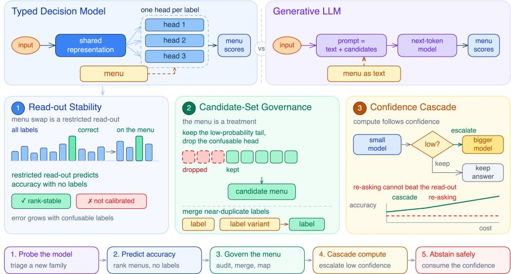  
Figure 2: The two read-out structures (top) and the three threads of the paper (bottom).

2024; Kiyani et al., 2025; Noorani et al., 2026) and selective-prediction and abstention methods spend on coverage (Lee et al., 2024; Mao et al., 2025; Wang et al., 2026; Tjandra et al., 2024); Merdjanovska et al. (2026) document how easily such estimates are misread. We instead price a specific menu intervention offline, so a probability-level estimator fails where the ranking-level one succeeds.

Test-time compute, routing and cascades. Self-consistency samples more and majorityvotes (Wang et al., 2022), whereas cascades and routers spend the budget on model choice instead, from FrugalGPT (Chen et al., 2023) and languagemodel cascades (Dohan et al., 2022) through token-level (Gupta et al., 2024) and mixture-ofthought variants (Yue et al., 2024), learned routing (Ding et al., 2024; Chuang et al., 2024; Damani et al., 2025) and a unified routing-and-cascading treatment (Dekoninck et al., 2024) to cost- or confidence-tuned variants (Valkanas et al., 2026; Lee et al., 2026; Chen et al., 2024; Fanconi and van der Schaar, 2026; Rabanser et al., 2026). We add a measurement rather than a router, showing that any re-ask scheme is bounded offline and that a cascade at matched cost outperforms it.

Order sensitivity and label-space reduction. Generative models are sensitive to option order and wording (Pezeshkpour and Hruschka, 2024; Zheng et al., 2023), an obstacle in multiple-choice evaluation and judging that appears as primacy effects (Raimondi and Gabbrielli, 2025), positional bias (Li and Gao, 2025), blind guessing (Loginova et al., 2025) and judge selection bias (Li et al., 2025), and that grows with the number of options (Raman et al., 2025; Park et al., 2025; Lin et al., 2026). A separate line reduces the label space through label similarity or semantics (Lu et al., 2024; Yang et al., 2026; Badhe et al., 2026; Li et al., 2026b; Ozdemir et al., 2026). Both change a menu but neither prices it; we predict what accuracy the reduced menu will produce.

Decision models. Recent work deploys typed decision models for low-latency serving (Deußer et al., 2026; Li et al., 2026a; Cheng et al., 2026), studies their robustness to prompt injection (Wu and Lim, 2026a), and uses their calibrated decisions for alignment checks and selective control (Guo et al., 2026; Wu and Lim, 2026b). We characterize a structural property of the read-out they rely on. Faithfulness results for generative models (Turpin et al., 2023; Chen et al., 2025) make the contrast plain, since their stated reasons need not track their computation.

## 3 Readout Stability and the Restriction Predictor

## 3.1 Setup and notation

A decision model M takes an input text x and a menu S drawn from a label set $L ,$ and returns a distribution $\boldsymbol { q } ( \cdot \mid x , S )$ over S in one forward pass. We write $C = | S |$ for the menu size, $y ( x ) \in L$ for the correct label, and $\operatorname { a c c } ( M , S )$ for the accuracy of the argmax of $q ( \cdot \mid x , S )$ averaged over a test set. We call the pass in which $S = L$ the first pass and write its distribution as $q _ { 1 } ( \cdot \mid x )$ , normalized over L. A menu-only intervention replaces $S = L$ with some $S \subseteq L$ while leaving x unchanged, and yields a second pass distribution $q _ { 2 } ( \cdot \mid x , S )$

The two model classes differ in how a menu enters the computation. A decision model assigns each label an independent head that reads a shared text representation; the menu selects which heads are read and leaves the representation untouched. A generative model serializes the menu into the prompt, so the menu changes the conditioning text. Section 4 shows that this structural difference is empirically decisive.

## 3.2 The restriction predictor

Given the cached first-pass distribution, the restriction predictor (RRP) forms

$$
p _ { S } ( o ) = \frac { q _ { 1 } ( o \mid x ) } { \sum _ { o ^ { \prime } \in S } q _ { 1 } ( o ^ { \prime } \mid x ) } ,\tag{1}
$$

and predicts the post-intervention accuracy as the fraction of items for which arg $\operatorname* { m a x } _ { o \in S } p _ { S } ( o )$ equals $y ( x )$ . The predictor needs one pass over the data, which is already cached, and no labels, no second forward pass, no training. It prices each menu separately, so a deployer can rank many candidate menus offline and deploy only the winner.

## 3.3 Readout stability

The predictor is interesting only to the extent that it matches what the model actually does after the menu changes. The property it relies on is the following.

Definition 1 (Readout stability). A decision model M is readout-stable if, for every x and $S \subseteq L$

$$
\arg \operatorname* { m a x } _ { o \in S } q _ { 2 } ( o \mid x , S ) = \arg \operatorname* { m a x } _ { o \in S } p _ { S } ( o ) .\tag{2}
$$

Under Definition 1 the predictor is exact by construction. The second pass is correct on x exactly when the restricted distribution ranks $y ( x )$ first, so $\operatorname { a c c } ( M , S ) = \operatorname { P r } [ \arg \operatorname* { m a x } _ { o \in S } p _ { S } ( o ) = y ( x ) ]$ holds as an identity, and the residual $\Delta ( S )$ is the frequency with which the identity fails. The definition earns its place as a falsifiable hypothesis about a model class rather than as a theorem. Section 4 tests it on 91 interventions, and for one family it holds exactly, so that family’s second pass is a lookup into the first and carries no new information. For the others it holds to within a small residual whose structure we characterize next.

## 3.4 Where it breaks, and why

The residual of RRP is not noise. It is concentrated on items where the first pass is nearly tied, and it has two identifiable drivers.

Mechanism A (confusability). A second pass can only overturn a first-pass decision when the top two candidates are close, so the residual should track the probability of the closest rival rather than the number of labels. Empirically it does. Across sources and families the residual correlates with the closest-rival probability at $\rho = 0 . 7 5$ and with the label count at $\rho = 0 . 1 4$ , while the label count is nearly irrelevant (Figure 4, first panel). The predictor’s error follows how confusable a label space is, not how large it is.

Mechanism B (menu size). Renormalization rescales the pass-1 probabilities by the mass of the menu, and any fixed positional or wording preference is rescaled with them. The effect shrinks as the menu grows. For self-selected menus the residual falls from +9.8 points at two candidates to +2.0 at thirty (Figure 4, second panel). Small menus are where a residual is most likely.

A per-item flip model. The two mechanisms act per item, not on the mean. We fit a flip model that predicts whether the second pass is correct from the top-two gap, the rank of the correct label, and whether that label leads the restricted distribution, calibrating on six self-selected menus, and evaluate it on the hardest exception in our grid, an alphabetically ordered 8-candidate menu with a measured residual of +5.2 points. The per-item model predicts +7.15 points, an error of 1.95 points, against 9.9 points for a mean-level regression on the same variables (Figure 4, fourth panel). We treat it as a mechanism-consistent postdiction rather than a general predictor, since its calibration set is small.

## 4 Evidence for a Real, Ordinal and Class-Specific Property

## 4.1 Stability across models, datasets and tasks

We evaluate RRP on 91 menu-only interventions from seven decision-model families, kev, Open-Jev, decider, this-that, Mica-4B and Tiny-Jev, all instances of the System One family (Palmer, 2026; Cai, 2026; Marosi, 2026; Cheng et al., 2026; sky7350, 2026; AnkitAI, 2026; Almeida and AI, 2026; Deußer et al., 2026), over sixteen datasets spanning intent detection, question typing, multiple-choice knowledge and commonsense, topic classification, emotion and ordered scoring (Appendix A). The interventions cover random, avoidance-style, retrieval, alphabetical and selfselected menus, at menu sizes from two to thirty.

The first panel of Figure 3 plots prediction against measurement. The context-free interventions cluster on the diagonal, with 24 of 35 cells within ±2 points. Across the full family-by-source grid the error stays within 4.2 points, and the single largest exception, at 5.2 points, is the alphabetically ordered 8-candidate menu discussed.

The second panel aggregates the residuals by intervention family and separates the context-free interventions, whose median is near zero, from reask and composed interventions, whose residuals grow because the second pass is no longer a restriction of the first. Table 1 gives the signed residual for each model family and menu type. The Open-Jev family is exact on every context-free cell, because its second pass is a restriction of its first. The other families show small residuals whose sign is stable within a family, a consistent error.

The property extends beyond classification. On SST-5, a five-level ordered scoring task, we treat a menu as a subset of grade levels and predict the accuracy of each subset by restricting the pass-1 distribution and renormalizing. All four subsets are predicted to within 0.8 points, so the property is not tied to a discrete label set.

## 4.2 The property is ordinal, not probabilistic

A natural objection is that RRP is a renormalization, and that any reasonable estimator of the pass-1 distribution would do. It would not. The predictor works because the ranking of the pass-1 distribution survives a menu change, not because the probabilities are accurate. Predicting accuracy from the mean pass-1 probability of the correct label errs by 21.0 points on menu-only interventions, against 1.33 points for the argmax version (Figure 3, third panel). The pass-1 probabilities are systematically too high after a menu change, but which candidate they rank first is almost unchanged, so the property cannot be recovered by calibration and cannot be replaced by a probability-level shortcut.

Table 1: Residual (pp) by model family and menu type. Bold marks an exact prediction; positive entries are overestimates.
<table><tr><td>Family</td><td>rand 15</td><td>avoid 15</td><td>self clean self verify self 2</td><td></td><td></td></tr><tr><td>kev-0.8B</td><td>+0.5</td><td>+1.7</td><td>+6.8</td><td>-0.8</td><td>+9.8</td></tr><tr><td>OJ-2B</td><td>+0.0</td><td>+0.0</td><td>+0.0</td><td>+9.4</td><td>-0.4</td></tr><tr><td>dec-0.8B</td><td>-0.8</td><td>-0.6</td><td>-3.4</td><td>-3.0</td><td>-2.8</td></tr><tr><td>dec-2B</td><td>-0.4</td><td>-0.4</td><td>-2.0</td><td>-2.6</td><td>-3.6</td></tr><tr><td>this-that</td><td>+0.6</td><td>+3.2</td><td>-0.4</td><td>-1.8</td><td>-8.2</td></tr><tr><td>Mica-4B</td><td>+2.2</td><td>+0.2</td><td>+8.2</td><td>+8.8</td><td>+5.2</td></tr><tr><td>Tiny-Jev</td><td>+1.4</td><td>+1.4</td><td>+1.0</td><td>+4.8</td><td>+0.8</td></tr></table>

The same panel rules out the simpler label-free baselines. Assuming the accuracy is unchanged by the menu errs by 18.0 points, and a cross-source empirical constant errs by 18.7 points, both roughly fifteen times the error of RRP. The predictor wins on 34 of 35 cells against the probability-level estimator and on 34 of 35 against the cross-source constant, so its advantage is not within one dataset.

## 4.3 The property is class-specific

If readout stability followed from renormalization alone, a generative model would have it too. It does not. We give Qwen3-4B-Instruct and Qwen3-8B the same 15-candidate menus as the decision models, read their option scores from the next-token distribution, and predict a second, differently seeded menu from the first. The decision models err by about 0.5 points, while the generative models err by 1.6 to 15.8 points, and the larger model errs more (Figure 3, fourth panel). The failure follows the read-out structure. A generative model conditions on a different text once the menu changes, so its second pass is not a restriction of its first.

The contrast sharpens the contribution. The predictor is not a better estimator of an underlying quantity that both classes share; it is an estimator of a quantity that only one class has. The same comparison also shows that spending sixteen samples on self-consistency for the generative model leaves its accuracy within 0.4 points of a single optionscoring pass, which is the generative analogue of the uniform-pass result we report next.

## 4.4 Ablations

We isolate the factors that could drive the residual, on CLINC150 with kev-0.8B unless stated otherwise.

Menu size changes the magnitude of the residual but not its sign. For self-selected menus the residual peaks at intermediate sizes, reaching +14.2 points at three candidates, and shrinks as the menu grows to +2.0 at thirty, while random menus of the same sizes stay within ±1 point, because a self-selected menu keeps the labels the model already finds confusable while a random one dilutes them. Varying only the construction moves accuracy from 0.622 (self-selected 15) to 0.954 (avoidance 5), with the predictor’s offline ranking matching the measured one. Option order matters only on small menus. On a self-selected 15-candidate menu, putting the correct label first drops accuracy from 0.622 to 0.426, whereas on a random 15-candidate menu the same manipulation moves it only from 0.862 to 0.832; at 150 labels the permutation flip rate is under 6%.

Table 2: Three-tier kev cascade (0.8B→4B→9B). Costs are in 0.8B forward units; match-9B is the cheapest cascade reaching 9B accuracy. Bold marks the cascade optimum.
<table><tr><td>Source</td><td>0.8B</td><td>4B</td><td>9B</td><td>match-9B</td><td>best</td><td>best cost</td></tr><tr><td>AG News</td><td>88.8</td><td>89.8</td><td>89.2</td><td>1.04</td><td>91.0</td><td>1.63</td></tr><tr><td>DBpedia</td><td>99.2</td><td>99.4</td><td>99.4</td><td>n/a</td><td>99.2</td><td>1.02</td></tr><tr><td>SciQ</td><td>95.9</td><td>99.0</td><td>99.2</td><td>1.80</td><td>99.4</td><td>2.07</td></tr><tr><td>ARC</td><td>61.6</td><td>92.2</td><td>94.4</td><td>5.88</td><td>94.8</td><td>6.82</td></tr><tr><td>CSQA</td><td>58.0</td><td>77.6</td><td>78.2</td><td>5.43</td><td>78.8</td><td>5.89</td></tr><tr><td>OBQA</td><td>50.6</td><td>84.0</td><td>85.8</td><td>6.04</td><td>87.2</td><td>6.83</td></tr><tr><td>MMLU</td><td>41.5</td><td>72.4</td><td>74.4</td><td>6.25</td><td>75.4</td><td>6.59</td></tr></table>

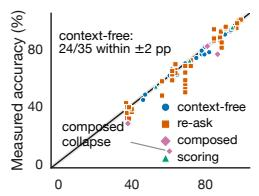  
Predicted accuracy (%)

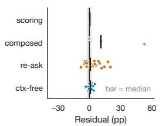

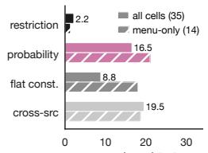  
Mean |error| (pp)

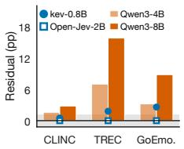

Figure 3: Readout stability. From left to right, the panels show prediction against measurement, residual by intervention family, label-free baselines, and the same estimator applied to generative models.  
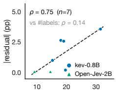  
Mean nearest-rival prob. (%)

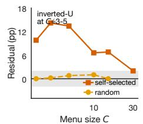

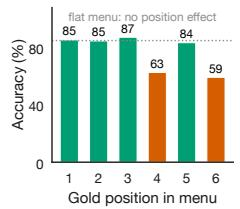

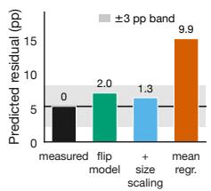  
Figure 4: Where the property breaks. From left to right, the panels show residual against confusability, residual against menu size, position on a small menu, and a per-item postdiction of the hardest exception.

Wording. Holding the menu token-for-token fixed and changing only the question moves Open-Jev-2B accuracy from 0.454 to 0.714, a span of 26 points, while shuffling the same menu changes it by at most 0.6 points. The direction is family-specific. The comparative phrasing that costs Open-Jev-2B 9.4 points is the phrasing that repairs kev-0.8B, lifting it from 0.622 to 0.698.

Compute and scale. Raising the number of order-permuted passes from 1 to 32 changes accuracy by at most 3.83 points on any source, with a pooled gain of 1.2, while the expected calibration error falls by 67% as early as K = 2. The residual is not an artifact of small models either. On the same self-selected 15-candidate menu it is +6.8 points at 0.8B, +5.4 at 4B and +5.6 at 9B, and the generative contrast widens with scale.

## 5 Allocating Decision-Time Compute

If menu-only interventions are free to evaluate, the budget that would have gone into exploring menus is free to go elsewhere. This section asks where, and answers in three steps. Uniform passes are the wrong default, escalation is the right one, and the menu itself is the highest-value object.

## 5.1 Uniform extra passes cannot buy accuracy

The generative default for spending test-time compute is to sample more and aggregate. The decisionmodel analogue is to shuffle the option order, run K passes, and average the resulting distributions with confidence weights. The first panel of Figure 5 reports the accuracy gain at K = 16 across seven sources. Only MMLU moves significantly, by 3.83 points, and the pooled gain is 1.2 points. A prefill-only read-out has no path diversity, so a pass is a fixed posterior and permuting the menu only adds noise, which averaging removes.

What the passes buy is calibration. The expected calibration error of the averaged distribution falls from 0.09 at K = 1 to 0.03 at K = 2, a 67% reduction, and then plateaus (Figure 5, second panel). That gain belongs downstream, in abstention and risk control, not in accuracy. Thirty-two passes of the 0.8B model reach 46.0% on MMLU, while a single pass of the 4B model reaches 72.4% (Figure 5, third panel). The mode of the posterior is the ceiling of accuracy and averaging cannot move it.

## 5.2 Confidence cascades outperform re-asking

Re-asking the same model on a smaller menu is the other natural way to spend a second pass, and

Section 3 shows why it cannot work. Under readout stability the second pass adds no information, so the accuracy of any re-ask scheme is bounded by the RRP prediction. A larger sibling can exceed that bound, because it brings new information. The bound therefore predicts that escalation should outperform re-asking whenever the sibling’s flat accuracy exceeds the restricted prediction.

Proposition 1 (Cascade dominance). Suppose $M _ { s }$ is readout-stable. Then the accuracy of any scheme that re-asks $M _ { s }$ on a submenu is at most the restriction prediction. If a sibling $M _ { b }$ has flat accuracy above that prediction, escalating the leastconfidentfraction r ofitems to $M _ { b }$ attains accuracy above the bound at expected cost $1 + ( u _ { b } - 1 ) r _ { \ast }$ where $u _ { b }$ is the cost of $M _ { b }$ in units of $M _ { s }$ . The cascade therefore outperforms re-asking at every cost point at which the bound is exceeded.

On 250 held-out CLINC150 items, the cascade escalates the least-confident items from kev-0.8B to kev-4B using a threshold set on a training split. At matched cost it outperforms every re-ask scheme. It reaches 0.684 at 1.28 units against 0.668 for the best re-ask protocol at 1.44 units, and 0.760 at 2.40 units against 0.652 for order marginalization at 2.00 units. Table 2 reports the same comparison per dataset. Across seven sources the cascade reaches the 9B single-shot accuracy at 1.0 to 6.3 forward units instead of 11, and on six of the seven it exceeds that accuracy outright.

The value of a cascade is the product of the gap between the two tiers and the quality of the gate. The gate matters because confidence need not identify the items a larger model would fix. Across four additional sources the kev gate beats random routing on all four, by 2.0 to 7.2 points (Figure 5). The decider family is less reliable. Its gate does not beat random routing on every source, which is why we recommend validating the gate per model and dataset before deploying a cascade.

## 5.3 Candidate curation beats a larger model

The largest single lever is the menu itself. Because a random menu is easy for the model to reject, while a retrieval or self-selected menu pulls the most confusable labels into the candidate set, the accuracy of a wide label space is governed by the density of near-duplicate distractors rather than by the number of labels. On CLINC150 a 0.8B model on a random 15-candidate menu reaches 86.4%, above a 4B model on the full 150-label menu at

80.0%. Semantic hierarchies fail for the same reason. Grouping 50 TREC fine classes into a twostage decision pushes the model into the hardest within-group distinctions and drops accuracy to 0.270, below the flat 50-label menu at 0.368 (Figure 6, first panel).

Proposition 2 (Random narrowing). Let π be the fraction of items on which the first pass does not rank the correct labelfirst, let $\lambda$ be thefraction of items on which every randomly sampled distractor is ranked below the correct label, and let α be the accuracy on those items after narrowing. Then

$$
\operatorname { a c c } ( r a n d o m { - } C ) \approx ( 1 - \pi ) + \pi \lambda \alpha .\tag{3}
$$

On CLINC150 the measured values $\begin{array} { r } { \pi = \frac { 1 5 5 } { 5 0 0 } , \lambda = } \end{array}$ $\frac { 9 3 } { 1 5 5 }$ and $\alpha = 0 . 9 3 5$ give 0.864 against a measured 0.864, so the gain of a random menu is accounted for by which distractors enter the menu.

The predictor turns menu construction into an offline search. Ranking ten candidate-set strategies from cached first-pass distributions, with no second pass and no labels, recovers the measured order and selects the best strategy. The predicted optimum is 0.966 and the measured value is 0.954, the highest in the grid (Figure 6, third panel). Avoidance-style menus, which sample from the low-probability region to keep confusable labels out, are never worse than random menus and are higher on every one of six source-and-model combinations, by 0.6 to 16.5 points (one-sided sign test, $p = 0 . 0 1 6 ;$ Figure 6, second panel). A deployer can therefore choose the menu before running the model at all.

## 5.4 Presentation effects are family-specific

A menu is delivered through a wording, and the wording is not neutral. Holding a 15-candidate menu token-for-token fixed and changing only the question, accuracy on Open-Jev-2B spans 26 points, from 0.454 for a comparative phrasing to 0.714 for a descriptive one, against 0.614 for the original phrasing (Figure 6, fourth panel). The effect is not a property of the menu text or the option order, since shuffling changes accuracy by at most 0.6 points. It is a property of the family, and it reverses across families. The same comparative re-ask that leaves kev unchanged at −0.8 points costs Open-Jev-2B 9.4 points. Order and anchoring move accuracy up to 26 points on the same self-selected menu (Figure 8, third panel).

The practical consequence is that a new family must be scanned before it is deployed, and the scan is cheap. Four configurations of a single dataset, about ten GPU-minutes, reveal whether re-asking carries information, which direction the wording pushes, and whether the restriction prediction is exact for the family. We package this as a probe battery and place it first in the deployment pipeline.

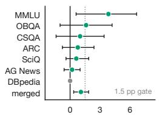  
K=16 gain (pp)

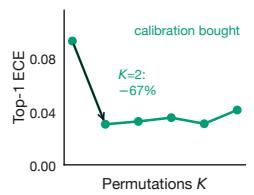

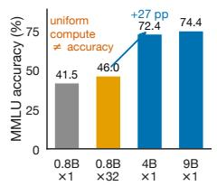

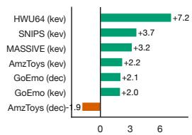  
Confidence − random routing (pp)

Figure 5: The economics of decision-time compute. From left to right, the panels show the accuracy gain from sixteen order-permuted passes, calibration error against K, the equal-budget anchor, and gate quality across tasks.  
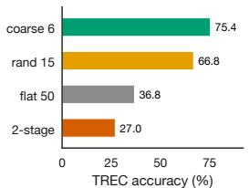

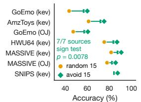

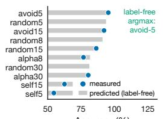  
Accuracy (%)

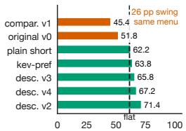  
Open-Jev-2B accuracy (%)  
Figure 6: Candidate-set governance and presentation. From left to right, the panels show the TREC hierarchy collapse, avoidance against random menus, offline menu search, and nine phrasings of one menu.

## 6 From Prediction to Practice

The result is a deployment recipe in which every stage is decided before it is run, using the cached first-pass distribution as the only input.

Curate before you escalate. Because the menu is the largest lever, it should be settled first. When the gold label is available offline, avoidance-style menus are the best construction; when the menu is built by a retrieval front end that does not guarantee the gold label, the system reduces to a single recall threshold. Deployment accuracy is approximately the recall of the front end times the accuracy on items it retrieves, so the menu beats the full label set whenever recall exceeds r∗ = flat accuracy/accuracy given a hit. For random menus r∗ lies between 0.65 and 1.00 and the system is deployable, whereas for avoidance menus on the kev family it exceeds one on several sources, because avoidance sampling and the position of the gold label are negatively correlated.

Repair the label table by mapping, not by rerunning. When the confusion is caused by nearduplicate labels, the fix is to merge them, and the merge should be deployed by mapping the cached pass-1 answers into the merged taxonomy rather than by re-running the model. On 2,000 held-out CLINC150 items, mapping gains 5.2 points over the original label table, while re-deciding in the merged space loses 4.2 points relative to mapping (Figure 8, fourth panel). The predictor anticipates the gain. Its offline estimate of the mapped accuracy is 70.6 against a measured 71.4.

Escalate, then abstain. With the menu settled, the remaining budget goes to escalation and the confidence the cascade produces is worth calibrating for downstream consumption. Two marginalization passes cut the calibration error by two thirds, which is the right input for abstention and risk control.

The pipeline is deliberately cheap. A probe battery triages a new family in about ten GPU-minutes, the offline search ranks menu strategies in seconds, and the cascade threshold is a quantile of the confidence distribution and needs no labels (Figure 7).

## 7 Conclusion

Prefill-only decision models are usually discussed as a cheaper way to do what a generative model does. We have argued that they are also a different kind of object. Their read-out structure makes menu-only interventions predictable from a single cached pass, exactly for one family and to within a few points for the rest, while same-scale generative models do not have the property and degrade as they grow. The property is ordinal, so calibration cannot replace it, and it is per-intervention, so aggregate accuracy estimation cannot either. It makes deployment decidable in advance. Menus can be chosen, label tables repaired and compute allocated before anything is run, and the right allocation is the menu and the escalation, not the extra pass.

## Limitations

Our study is inference-time. Training-time interventions are outside its scope. The restriction predictor is exact for one family and tight for the others. On emotion and product label spaces, where near-duplicate labels are dense, the residual has a fixed positive sign of 2.5 to 4.9 points, so the prediction errs on the conservative side there. We present the per-item flip model as a mechanismconsistent postdiction, and extending it to a general predictor would call for a larger calibration grid, since the residual is not monotone in menu size. The presentation effects we document are localized and reversible across families; their training-side cause is not readable from families whose training data is not public, so we characterize them at the level of the deployed model. Our deployment thresholds assume a retrieval front end whose recall can be measured, which covers the common case of a menu built by a retriever.

## References

Diogo Almeida and TypeSafe AI. 2026. Introducing system one models & jev.

AnkitAI. 2026. TinyJev-0.6B and TinyJev-4B. Qwen3-0.6B/4B base; MIT.

Sören Auer, Christian Bizer, Georgi Kobilarov, Jens Lehmann, Richard Cyganiak, and Zachary Ives. 2007. Dbpedia: A nucleus for a web of open data. In international semantic web conference, pages 722– 735. Springer.

Sanket Badhe, Priyanka Tiwari, and Deep Shah. 2026. The silent vote: Improving zero-shot llm reliability by aggregating semantic neighborhoods. In Proceedings ofthe Fifth Workshop on Generation, Evaluation and Metrics (GEM), pages 511–517.

Zefan Cai. 2026. Open-Jev-2B and Open-Jev-9B. Qwen3.5-2B/9B + pointer head; served via vLLM.

Iñigo Casanueva, Tadas Temcinas, Daniela Gerz,ˇ Matthew Henderson, and Ivan Vulic. 2020. Efficient´ intent detection with dual sentence encoders. In Proceedings of the 2nd workshop on natural language processingfor conversational AI, pages 38–45.

Dong Chen, Yueting Zhuang, Shuo Zhang, Jinfeng Liu, Su Dong, and Siliang Tang. 2024. Data shunt: Collaboration of small and large models for lower costs and better performance. In Proceedings of the AAAI Conference on Artificial Intelligence, volume 38, pages 11249–11257.

Lingjiao Chen, Matei Zaharia, and James Zou. 2023. Frugalgpt: How to use large language models while

reducing cost and improving performance. arXiv preprint arXiv:2305.05176.

Yanda Chen, Joe Benton, Ansh Radhakrishnan, Jonathan Uesato, Carson Denison, John Schulman, Arushi Somani, Peter Hase, Misha Wagner, Fabien Roger, et al. 2025. Reasoning models don’t always say what they think. arXiv preprint arXiv:2505.05410.

Zehua Cheng, Wei Dai, and Jiahao Sun. 2026. thisthat-model-1.0: A typed decision model that decides in 30 ms, for a millionth of a cent. arXiv preprint arXiv:2609.23886.

Yu-Neng Chuang, Prathusha Kameswara Sarma, Parikshit Gopalan, John Boccio, Sara Bolouki, Xia Hu, and Helen Zhou. 2024. Learning to route llms with confidence tokens. arXiv preprint arXiv:2410.13284.

Peter Clark, Isaac Cowhey, Oren Etzioni, Tushar Khot, Ashish Sabharwal, Carissa Schoenick, and Oyvind Tafjord. 2018. Think you have solved question answering? try arc, the ai2 reasoning challenge. arXiv preprint arXiv:1803.05457.

Alice Coucke, Alaa Saade, Adrien Ball, Théodore Bluche, Alexandre Caulier, David Leroy, Clément Doumouro, Thibault Gisselbrecht, Francesco Caltagirone, Thibaut Lavril, et al. 2018. Snips voice platform: an embedded spoken language understanding system for private-by-design voice interfaces. arXiv preprint arXiv:1805.10190.

Mehul Damani, Idan Shenfeld, Andi Peng, Andreea Bobu, and Jacob Andreas. 2025. Learning how hard to think: Input-adaptive allocation of lm computation. In International Conference on Learning Representations, volume 2025, pages 102783–102802.

Jasper Dekoninck, Maximilian Baader, and Martin Vechev. 2024. A unified approach to routing and cascading for llms. arXiv preprint arXiv:2410.10347.

Dorottya Demszky, Dana Movshovitz-Attias, Jeongwoo Ko, Alan Cowen, Gaurav Nemade, and Sujith Ravi. 2020. Goemotions: A dataset of fine-grained emotions. In Proceedings ofthe 58th annual meeting of the association for computational linguistics, pages 4040–4054.

Tobias Deußer, Lorenz Sparrenberg, and Rafet Sifa. 2026. Evaluating and benchmarking the system one model jev. arXiv preprint arXiv:2609.37647.

Dujian Ding, Ankur Mallick, Chi Wang, Robert Sim, Subhabrata Mukherjee, Victor Rühle, Laks Lakshmanan, and Ahmed H Awadallah. 2024. Hybrid llm: Cost-efficient and quality-aware query routing. In International Conference on Learning Representations, volume 2024, pages 41348–41366.

David Dohan, Winnie Xu, Aitor Lewkowycz, Jacob Austin, David Bieber, Raphael Gontijo Lopes, Yuhuai Wu, Henryk Michalewski, Rif A Saurous, Jascha Sohl-Dickstein, et al. 2022. Language model cascades. arXiv preprint arXiv:2207.10342.

Claudio Fanconi and Mihaela van der Schaar. 2026. Cascaded language models for cost-effective human– ai decision-making. Advances in Neural Information Processing Systems, 38:11559–11593.

Jack FitzGerald, Christopher Hench, Charith Peris, Scott Mackie, Kay Rottmann, Ana Sanchez, Aaron Nash, Liam Urbach, Vishesh Kakarala, Richa Singh, et al. 2023. Massive: A 1m-example multilingual natural language understanding dataset with 51 typologically-diverse languages. In Proceedings of the 61st Annual Meeting of the Association for Computational Linguistics (Volume 1: Long Papers), pages 4277–4302.

Ruoqi Guo, Yi Liu, Gelei Deng, Yuekang Li, Lida Zhao, Yutao Wu, Simin Chen, Ying Zhang, and Leo Yu Zhang. 2026. Just ask jev: Reinforcement learning for calibrated decisions as a zero-shot detector of ai alignment failures. arXiv preprint arXiv:2609.29429.

Neha Gupta, Harikrishna Narasimhan, Wittawat Jitkrittum, Ankit Singh Rawat, Aditya Krishna Menon, and Sanjiv Kumar. 2024. Language model cascades: Token-level uncertainty and beyond. In International Conference on Learning Representations, volume 2024, pages 4147–4180.

Dan Hendrycks, Collin Burns, Steven Basart, Andy Zou, Mantas Mazeika, Dawn Song, and Jacob Steinhardt. 2020. Measuring massive multitask language understanding. arXiv preprint arXiv:2009.03300.

Saurav Kadavath, Tom Conerly, Amanda Askell, Tom Henighan, Dawn Drain, Ethan Perez, Nicholas Schiefer, Zac Hatfield-Dodds, Nova DasSarma, Eli Tran-Johnson, et al. 2022. Language models (mostly) know what they know. arXiv preprint arXiv:2207.05221.

Shayan Kiyani, George Pappas, Aaron Roth, and Hamed Hassani. 2025. Decision theoretic foundations for conformal prediction: Optimal uncertainty quantification for risk-averse agents. arXiv preprint arXiv:2502.02561.

Stefan Larson, Anish Mahendran, Joseph J Peper, Christopher Clarke, Andrew Lee, Parker Hill, Jonathan K Kummerfeld, Kevin Leach, Michael A Laurenzano, Lingjia Tang, et al. 2019. An evaluation dataset for intent classification and out-of-scope prediction. In Proceedings of the 2019 Conference on Empirical Methods in Natural Language Processing and the 9th International Joint Conference on Natural Language Processing (EMNLP-IJCNLP), pages 1311–1316.

Minjae Lee, Kyungmin Kim, Taesoo Kim, and Sangdon Park. 2024. Selective generation for controllable language models. Advances in Neural Information Processing Systems, 37:50494–50527.

Sangmook Lee, Dohyung Kim, Hyukhun Koh, Nakyeong Yang, and Kyomin Jung. 2026. Confidence-guided stepwise model routing for cost-efficient reasoning. In Proceedings ofthe AAAI

Conference on Artificial Intelligence, volume 40, pages 31483–31491.

Delong Li, Xu Wang, Haochen Gong, Rui Lang, and Guangsheng Yu. 2026a. Replacing large language models with jev decision models for lowlatency edge service orchestration. arXiv preprint arXiv:2609.22753.

Haitao Li, Junjie Chen, Qingyao Ai, Zhumin Chu, Yujia Zhou, Qian Dong, and Yiqun Liu. 2025. Calibraeval: Calibrating prediction distribution to mitigate selection bias in llms-as-judges. In Proceedings of the 63rd Annual Meeting ofthe Associationfor Computational Linguistics (Volume 1: Long Papers), pages 16537–16552.

Ruizhe Li and Yanjun Gao. 2025. Anchored answers: Unravelling positional bias in gpt-2’s multiple-choice questions. In Findings of the Association for Computational Linguistics: ACL 2025, pages 2439–2465.

Xin Li and Dan Roth. 2002. Learning question classifiers. In Coling 2002: The 19th international conference on computational linguistics.

Xinyu Li, Yi Zhou, Guanqun Cao, Zeyu Fu, Tianjin Huang, and Gaojie Jin. 2026b. Localize-thendecide guarantees for llm judgments. arXiv preprint arXiv:2608.25824.

Yu-Chi Lin, Aryan Seth, Anshul Aravind, Eugene Lee, Tanmay Parekh, Nanyun Peng, and Kai-Wei Chang. 2026. Overwhelmed by choice: Studying llm decision making at scale. arXiv preprint arXiv:2609.32809.

Xingkun Liu, Arash Eshghi, Pawel Swietojanski, and Verena Rieser. 2021. Benchmarking natural language understanding services for building conversational agents. In Increasing naturalness and flexibility in spoken dialogue interaction: 10th international workshop on spoken dialogue systems, pages 165–183. Springer.

Olga Loginova, Oleksandr Bezrukov, Ravi Shekhar, and Alexey Kravets. 2025. Addressing blind guessing: Calibration of selection bias in multiple-choice question answering by video language models. In Proceedings ofthe 63rd Annual Meeting ofthe Association for Computational Linguistics (Volume 1: Long Papers), pages 3216–3246.

Zhenyi Lu, Jie Tian, Wei Wei, Xiaoye Qu, Yu Cheng, Wenfeng Xie, and Dangyang Chen. 2024. Mitigating boundary ambiguity and inherent bias for text classification in the era of large language models. In Findings of the Association for Computational Linguistics: ACL 2024, pages 7841–7864.

Yuzhen Mao, Thibaut Durand, Nazanin Mehrasa, Jiawei He, and Martin Ester. 2025. Calibrating llms for selective prediction: Balancing coverage and risk. In Socially Responsible and Trustworthy Foundation Models at NeurIPS 2025.

Mark Marosi. 2026. decider: one-pass typed decisions with calibrated probabilities.

Elena Merdjanovska, Omar Zaidan, and Andreas Rücklé. 2026. Evaluation pitfalls and sparsity limitations in llm-based confidence estimates for classification. In Findings of the Association for Computational Linguistics: ACL 2026, pages 33424–33435.

Todor Mihaylov, Peter Clark, Tushar Khot, and Ashish Sabharwal. 2018. Can a suit of armor conduct electricity? a new dataset for open book question answering. In Proceedings ofthe 2018 conference on empirical methods in natural language processing, pages 2381–2391.

Sima Noorani, Shayan Kiyani, George J Pappas, and Hamed Hassani. 2026. Conformal prediction beyond the seen: A missing mass perspective for uncertainty quantification in generative models. Advances in Neural Information Processing Systems, 38:32318– 32351.

Onat Ozdemir, Anders Christensen, Stephan Alaniz, Zeynep Akata, and Emre Akbas. 2026. Explaining clip zero-shot predictions through concepts. arXiv preprint arXiv:2603.28211.

Jared Palmer. 2026. kev: a laptop-scale reconstruction of a jev-style decision model.

Yoonah Park, Haesung Pyun, and Yohan Jo. 2025. Bridging the knowledge-prediction gap in llms on multiple-choice questions. arXiv preprint arXiv:2509.23782.

Pouya Pezeshkpour and Estevam Hruschka. 2024. Large language models sensitivity to the order of options in multiple-choice questions. In Findings of the Associationfor Computational Linguistics: NAACL 2024, pages 2006–2017.

Victor Quach, Adam Fisch, Tal Schuster, Adam Yala, Jae Ho Sohn, Tommi Jaakkola, and Regina Barzilay. 2024. Conformal language modeling. In International Conference on Learning Representations, volume 2024, pages 11654–11681.

Stephan Rabanser, Nathalie Rauschmayr, Achin Kulshrestha, Petra Poklukar, Wittawat Jitkrittum, Sean Augenstein, Congchao Wang, and Federico Tombari. 2026. Gatekeeper: Improving model cascades through confidence tuning. Advances in Neural Information Processing Systems, 38:19518–19547.

Bianca Raimondi and Maurizio Gabbrielli. 2025. Exploiting primacy effect to improve large language models. In Proceedings of the 15th International Conference on Recent Advances in Natural Language Processing-Natural Language Processing in the Generative AI Era, pages 989–997.

Narun Raman, Taylor Lundy, and Kevin Leyton-Brown. 2025. Reasoning models are test exploiters: Rethinking multiple-choice. arXiv preprint arXiv:2507.15337.

Elvis Saravia, Hsien-Chi Toby Liu, Yen-Hao Huang, Junlin Wu, and Yi-Shin Chen. 2018. Carer: Contextualized affect representations for emotion recognition. In Proceedings of the 2018 conference on empirical methods in natural language processing, pages 3687–3697.

sky7350. 2026. Mica v0.1-4B. Qwen3.5-4B + merged LoRA; Apache-2.0.

Richard Socher, Alex Perelygin, Jean Wu, Jason Chuang, Christopher D Manning, Andrew Y Ng, and Christopher Potts. 2013. Recursive deep models for semantic compositionality over a sentiment treebank. In Proceedings of the 2013 conference on empirical methods in natural language processing, pages 1631–1642.

Alon Talmor, Jonathan Herzig, Nicholas Lourie, and Jonathan Berant. 2019. Commonsenseqa: A question answering challenge targeting commonsense knowledge. In Proceedings of the 2019 Conference of the North American Chapter ofthe Associationfor Computational Linguistics: Human Language Technologies, Volume 1 (Long and Short Papers), pages 4149–4158.

Benedict Aaron Tjandra, Muhammed Razzak, Jannik Kossen, Kunal Handa, and Yarin Gal. 2024. Fine-tuning large language models to appropriately abstain with semantic entropy. arXiv preprint arXiv:2410.17234.

Miles Turpin, Julian Michael, Ethan Perez, and Samuel Bowman. 2023. Language models don’t always say what they think: Unfaithful explanations in chain-ofthought prompting. Advances in Neural Information Processing Systems, 36:74952–74965.

Antonios Valkanas, Soumyasundar Pal, Pavel Rumiantsev, Yingxue Zhang, and Mark Coates. 2026. C3po: Optimized large language model cascades with probabilistic cost constraints for reasoning. Advances in Neural Information Processing Systems, 38:84481– 84522.

Harit Vishwakarma, Alan Mishler, Thomas Cook, Niccolo Dalmasso, Natraj Raman, and Sumitra Ganesh. 2024. Prune’n predict: Optimizing llm decisionmaking with conformal prediction. arXiv preprint arXiv:2501.00555.

Qingni Wang, Yue Fan, and Xin Wang. 2026. Safer: Risk-constrained sample-then-filter in large language models. In International Conference on Learning Representations, volume 2026, pages 53723–53747.

Xuezhi Wang, Jason Wei, Dale Schuurmans, Quoc Le, Ed Chi, Sharan Narang, Aakanksha Chowdhery, and Denny Zhou. 2022. Self-consistency improves chain of thought reasoning in language models. arXiv preprint arXiv:2203.11171.

Johannes Welbl, Nelson F Liu, and Matt Gardner. 2017. Crowdsourcing multiple choice science questions. In Proceedings of the 3rd Workshop on Noisy Usergenerated Text, pages 94–106.

Tiantong Wu and Wei Yang Bryan Lim. 2026a. Decision hijacking: Prompt injection attacks on jev’s typed probabilistic decisions. arXiv preprint arXiv:2609.28613.

Tiantong Wu and Wei Yang Bryan Lim. 2026b. Reflex with jev for efficient selective control in llm agents. arXiv preprint arXiv:2609.26532.

Miao Xiong, Zhiyuan Hu, Xinyang Lu, Yifei Li, Jie Fu, Junxian He, and Bryan Hooi. 2024. Can llms express their uncertainty? an empirical evaluation of confidence elicitation in llms. In International Conference on Learning Representations, volume 2024, pages 23650–23678.

Jixiao Yang, Sebastian Sun, Yang Wang, Yutong Wang, Xikai Yang, and Chi Zhang. 2026. Semantic alignment and output constrained generation for reliable llm-based classification. In 2026 International Conference on Embedded Systems, Mobile Communication and Computing (EMC2), pages 317–322. IEEE.

Murong Yue, Jie Zhao, Min Zhang, Liang Du, and Ziyu Yao. 2024. Large language model cascades with mixture of thought representations for cost-efficient reasoning. In International Conference on Learning Representations, volume 2024, pages 21691–21728.

Xiang Zhang, Junbo Zhao, and Yann LeCun. 2015. Character-level convolutional networks for text classification. Advances in neural information processing systems, 28.

Chujie Zheng, Hao Zhou, Fandong Meng, Jie Zhou, and Minlie Huang. 2023. Large language models are not robust multiple choice selectors, 2024. URL https://arxiv. org/abs/2309.03882.

## A Datasets and Models

The seven decision-model families are kev (Palmer, 2026) (0.8B/4B/9B), Open-Jev (Cai, 2026) (2B/9B), decider (Marosi, 2026) (0.8B/2B), thisthat (Cheng et al., 2026), Mica-4B (sky7350, 2026) and Tiny-Jev (AnkitAI, 2026), all instances of the System One family (Almeida and AI, 2026; Deußer et al., 2026). The sixteen datasets cover intent detection (Larson et al., 2019; Casanueva et al., 2020; FitzGerald et al., 2023; Liu et al., 2021; Coucke et al., 2018), question typing (Li and Roth, 2002), knowledge and commonsense multiple choice (Hendrycks et al., 2020; Clark et al., 2018; Mihaylov et al., 2018; Talmor et al., 2019; Welbl et al., 2017), topic classification (Zhang et al., 2015; Auer et al., 2007), emotion (Saravia et al., 2018; Demszky et al., 2020) and ordered scoring (Socher et al., 2013).

Table 3: Residual typology.
<table><tr><td>Residual type</td><td>Size (pp)</td><td>Mechanism</td></tr><tr><td>pure restriction</td><td>|∆| ≤ 2</td><td>context-free menu changes; (P) holds</td></tr><tr><td>re-ask anchoring</td><td>+6 to +20</td><td>presentation artefact; remov- able</td></tr><tr><td>re-ask narrowing</td><td>-3 to -4</td><td>sign flips with label-space confusability</td></tr><tr><td>de-biasing excess</td><td>-1 to -4</td><td>permutation marginalisation averages out order noise</td></tr><tr><td>composed</td><td>col- +11 to</td><td>two-stage decision multi-</td></tr><tr><td>lapse</td><td>+53</td><td>plies the pass-1 bias</td></tr><tr><td>calibration drag</td><td>-9 to +3</td><td>cascade inherits the raw con- fidence bias</td></tr><tr><td>serial position</td><td>≈ +5 @ C=8</td><td>position prior re-amplified on small menus</td></tr><tr><td>rank-order col- lapse</td><td>≈-20</td><td>menu ordered by pass-1 rank</td></tr><tr><td>forced choice</td><td>-31 to +9.8</td><td>sign set by the strongest ri- val&#x27;s confusability</td></tr></table>

Table 4: Same-budget comparison on 250 held-out CLINC150 items; costs are in 0.8B forward units.
<table><tr><td>Strategy</td><td>Cost (u)</td><td>Accuracy</td></tr><tr><td>flat, no re-ask</td><td>1.00</td><td>0.644</td></tr><tr><td>always re-ask (verify)</td><td>2.00</td><td>0.636</td></tr><tr><td>marginalisation K=2</td><td>2.00</td><td>0.652</td></tr><tr><td>SARP gate (verify)</td><td>1.44</td><td>0.668</td></tr><tr><td>gate, standard wording</td><td>1.29</td><td>0.664</td></tr><tr><td>cascade, escalate 5.6%</td><td>1.28</td><td>0.684</td></tr><tr><td>cascade, escalate 10.0%</td><td>1.50</td><td>0.712</td></tr><tr><td>cascade, escalate 28.0%</td><td>2.40</td><td>0.760</td></tr></table>

## B Additional Results

## C Proofs

Proposition 2 (random narrowing). Items the first pass already gets right stay right, which accounts for the (1 − π) term. An item the first pass gets wrong is recovered only when no distractor outranks the correct label, an event of probability λ, and on those items the narrowed menu is correct with probability α, giving the πλα term. On CLINC150 the measured values $\pi = 1 5 5 / 5 0 0$ λ = 93/155 and α = 0.935 give 0.864, matching the measured 0.864.

Proposition 1 (cascade dominance). Under readout stability the second pass of $M _ { s }$ contains no information beyond its first, so the accuracy of any scheme that re-asks $M _ { s }$ on a submenu is at most the restricted prediction. Escalating the least-confident fraction r of items to a sibling $M _ { b }$ whose flat accuracy exceeds that bound attains accuracy above the bound at expected cost 1 + (ub − 1)r. The cascade therefore outperforms re-asking at every cost point at which the bound is exceeded, which is what we measure on three families.

Table 5: Deployment with a menu that excludes the gold label; the system beats flat when recall is at least $r ^ { * }$
<table><tr><td>Source</td><td>Model</td><td>Menu</td><td>hit rate</td><td>acc|hit</td><td> $r ^ { * }$ </td><td>verdict</td></tr><tr><td>GoEmotions</td><td>jev2b</td><td>avoid 15</td><td>0.322</td><td>0.426</td><td>0.90</td><td>deployable</td></tr><tr><td>GoEmotions</td><td>jev2b</td><td>random 15</td><td>0.553</td><td>0.453</td><td>0.85</td><td>deployable</td></tr><tr><td>MASSIVE</td><td>jev2b</td><td>avoid 15</td><td>0.091</td><td>0.713 0.79</td><td></td><td>deployable</td></tr><tr><td>MASSIVE</td><td>jev2b</td><td>random 15</td><td>0.269</td><td>0.775 0.73</td><td></td><td>deployable</td></tr><tr><td>GoEmotions</td><td>kev0.8b</td><td>avoid 15</td><td>0.280</td><td>0.368</td><td>1.01</td><td>never beats flat</td></tr><tr><td>GoEmotions</td><td>kev0.8b</td><td>random 15</td><td>0.553</td><td>0.441 0.85</td><td></td><td>deployable</td></tr><tr><td>HWU64</td><td>kev0.8b</td><td>avoid 15</td><td>0.050</td><td>0.463</td><td>1.34</td><td>never beats flat</td></tr><tr><td>HWU64</td><td></td><td>kev0.8b random 15</td><td>0.210</td><td>0.704 0.88</td><td></td><td>deployable</td></tr><tr><td>MASSIVE</td><td></td><td>kev0.8b avoid 15</td><td>0.046</td><td>0.674 0.94</td><td></td><td>deployable</td></tr><tr><td>MASSIVE</td><td></td><td>kev0.8b random 15</td><td>0.269</td><td>0.815</td><td>0.78</td><td>deployable</td></tr><tr><td>SNIPS</td><td></td><td>kev0.8b avoid 15</td><td>1.000</td><td>0.869</td><td>1.01</td><td>never beats flat</td></tr><tr><td>SNIPS</td><td></td><td>kev0.8b random 15</td><td>1.000</td><td>0.875</td><td>1.00</td><td>never beats flat</td></tr></table>

Table 6: Label-table governance on 2,000 held-out CLINC150 items.
<table><tr><td>Label-table branch re-decide map (no re-run) prediction</td><td></td><td></td><td></td></tr><tr><td>auto-merge</td><td>67.20</td><td>71.40</td><td>70.60</td></tr><tr><td>oracle merge</td><td>68.60</td><td>69.20</td><td>69.35</td></tr><tr><td>random control</td><td>61.98</td><td>68.05</td><td>67.53</td></tr><tr><td>flat 150 baseline</td><td colspan="3">66.25</td></tr></table>

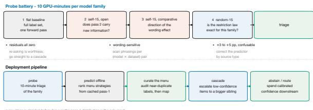  
Figure 7: The deployment pipeline.

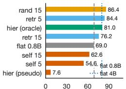  
CLINC150 accuracy (%)

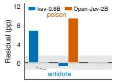  
self-15 self-15 random-15 open compar.

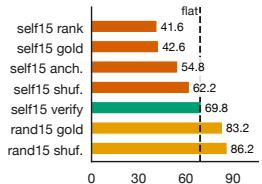  
CLINC150 accuracy (%)

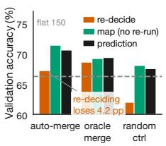  
Figure 8: Additional results. From left to right, the panels show CLINC150 menu construction, the cross-family sign flip, the presentation ladder, and label-table repair.