# SAGE: Semantic Anchor-Guided Evolution for Grounded Medical QA Data Synthesis

Chuan Li1, Chengyu Wang2, Cen Chen1\*, Ye Lyu1, Mingyuan Fan1, Ming Gao1

1East China Normal University, Shanghai, China

2Alibaba Group, Hangzhou, China

{lichuan, yelyu, mingyuan\_fmy}@stu.ecnu.edu.cn chengyu.wcy@alibaba-inc.com, {cenchen,mgao}@dase.ecnu.edu.cn

## Abstract

Developing reliable models for clinical tasks, such as Medical Question Answering (QA), is severely constrained by the limited availability of high-quality, expert-annotated training data. This challenge is exacerbated by stringent privacy requirements and the impracticality of utilizing large open-source corpora or proprietary cloud APIs within resource-limited clinical settings. To address these obstacles, we introduce SAGE (Semantic Anchor-Guided Evolution), a novel data synthesis framework that enables small, locally deployed models to generate high-quality medical training data. SAGE leverages lightweight, publicly available taxonomies such as MeSH as semantic anchors, imposing a structured prior to effectively guide and ground the data generation process. At its core, SAGE iteratively interleaves atomic (individual concept-based) and associative (relation-based) synthesis, bootstrapping training data from minimal seeds. This approach eliminates the need for large collections of medical documents or reliance on external APIs, providing a practical solution for on-premises data creation. Extensive experiments across multiple medical questionanswering benchmarks demonstrate that models fine-tuned with SAGE-synthesized data consistently outperform those trained using self-derived or conventional document-based paradigms, highlighting tangible improvements in data efficiency and resource utilization for medical LLM development. Code is available at https://github.com/DIaacKr/SAGE.

## 1 Introduction

Large language models (LLMs) have demonstrated remarkable capabilities, prompting significant interest in their deployment within highstakes, knowledge-intensive domains such as medicine (Zhang et al., 2024; Guo et al., 2025; Yang et al., 2024a, 2025; Xu et al., 2025; Huang et al., 2025a; Yu et al., 2025a; Wang et al., 2025; Chen et al., 2025b). However, further progress is hampered by the scarcity of high-quality, expertannotated datasets. In medicine, assembling largescale training corpora is not only expensive and time-consuming, but also subject to stringent privacy and ethical constraints (Price and Cohen, 2019; Kaissis et al., 2020; Rajpurkar et al., 2022; Thirunavukarasu et al., 2023). This poses a fundamental bottleneck for transforming generalpurpose LLMs into reliable medical experts.

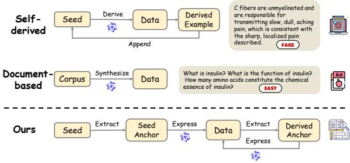  
Figure 1: Comparison of data synthesis paradigms. Conventional methods either derive data using implicit parametric knowledge or synthesize data from document corpus. In contrast, SAGE synthesizes high-quality medical data via semantic anchor.

Synthetic data generation has emerged as a promising direction; yet, existing approaches predominantly rely on proprietary, large-scale LLMs as generative engines (Wang et al., 2023b; Gudibande et al., 2023). Such dependence introduces challenges regarding data privacy, operational costs, and practical feasibility in resourceconstrained environments, including hospitals (Carlini et al., 2021). Addressing this underexplored issue requires a practical and resource-efficient method for synthesizing high-quality training data using strictly limited, local seed resources, thereby eliminating dependency on external APIs or massive proprietary corpora (Labrak et al., 2024).

Prior work in data synthesis primarily falls into two paradigms, each with clear limitations, as shown in Figure 1. The self-derived paradigm leverages implicit parametric knowledge to efficiently generate diverse data (Wang et al., 2023b; Xu et al., 2024; Yu et al., 2025b); yet, the absence of external grounding can result in unanchored outputs and hallucinations, which is an unacceptable risk for clinical applications. Conversely, the document-based paradigm grounds generation in authoritative texts to promote factual accuracy (Maini et al., 2024; Miao et al., 2025). However, document-based methods require extensive preprocessing of large corpora, which are often unavailable or unstructured in clinical contexts. Furthermore, documentbased approaches tend to encourage mere “memorization” of text, rather than the “integration” of complex clinical reasoning, constraining model expressivity and applicability.

We contend that structured medical taxonomies, Medical Subject Headings (MeSH)1, represent a widely accessible yet underutilized resource. Unlike lengthy documents or corpora, MeSH serves as a standardized dictionary, which is a topological scaffold of medical concepts, that is both lightweight and authoritative. In this work, we introduce SAGE (Semantic Anchor-Guided Evolution), a grounded QA data synthesis framework specifically designed for resource-constrained environments. SAGE treats MeSH concepts as semantic anchors to guide and ground the generative process. This neuro-symbolic approach enables small, locally deployed models to produce logically rigorous content, adhering to a structured prior while reducing both computational and data overhead.

SAGE orchestrates data synthesis leveraging semantic anchors through a dual-track, parallel, iterative process that balances exploitation and exploration, as shown in Figure 1. To ensure factual precision, SAGE employs atomic generation, targeting individual semantic anchors via ontology definitions to produce definition-centric questions and mitigate hallucination risk. Meanwhile, SAGE utilizes associative generation, interweaving multiple concepts as anchor to construct coherent medical scenarios requiring multi-step reasoning. Crucially, these tracks operate concurrently, maximizing the coverage of the concept space of core concepts; they are refined through ongoing iterative calibration that broadens the semantic scope of the synthesized dataset. This evolutionary loop enables bootstrapping from a minimal seed set, organically expanding from atomic facts to complex associative reasoning. As a result, SAGE cultivates comprehensive and valuable training corpora from compact, structured sources.

Our method achieves state-of-the-art performance across a broad range of medical QA benchmarks, with an average accuracy of 68.12% on five widely used medical QA datasets, outperforming other self-derived and document-based methods. Notably, it also exceeds the results achieved by several high-quality open-source datasets and models trained on massive data.

In summary, our main contributions are:

• We introduce SAGE, a Semantic Anchor-Guided Evolution framework for synthesizing high-quality, grounded medical QA data using small models and public taxonomies, without reliance on large corpora or external APIs.

• We propose a parallel, iterative synthesis strategy that integrates atomic generation for factual coverage and associative generation for reasoning complexity, dynamically balancing exploitation and exploration.

• SAGE-grounded data substantially improve factual reliability and consistency. Models fine-tuned on SAGE data consistently outperform strong baselines on medical QA benchmarks in resource-constrained settings.

## 2 Related Work

Self-Derived Data Synthesis. Self-bootstrapping data synthesis methods, which autonomously generate large-scale training data, have attracted increasing research interest as alternatives to manual annotation (Li et al., 2023; Yu et al., 2023; Luo et al., 2023; Xu et al., 2024; Tang et al., 2024; Li et al., 2024; Zeng et al., 2024; Huang et al., 2025b; Liu et al., 2025; Riaz et al., 2025; Zhao et al., 2025b,a). A representative example is Self-Instruct (Wang et al., 2023b), which prompts LLMs to produce diverse instructions and corresponding responses, expanding training data from a small seed set. Subsequent variants, including Chain-of-Thought Self-Instruct (Yu et al., 2025b), introduce “think-then-generate” pipelines with automatic filtering for higher-quality examples. However, these approaches lack rigorous mechanisms for factual control: filtering criteria typically prioritize semantic richness or complexity rather than factuality. In high-stakes fields such as medicine, this limitation becomes critical, leading to severe factual hallucinations and adversely affecting model fine-tuning. Document-Based Data Synthesis. Documentbased approaches utilize structured or unstructured corpora to synthesize training data for LLMs (Zhang and Yang, 2023; Yehudai et al., 2024; Köksal et al., 2024; Maini et al., 2024; Yang et al., 2024b; Dedhia et al., 2025; Chen et al., 2025c). For instance, Easy Datasets (Miao et al., 2025) guides models to create question-answer pairs from the same source text by assigning varied “genreaudience” roles, thereby enhancing the diversity and scale of synthetic data for domain adaptation. Similarly, Wrap (Maini et al., 2024) leverages offthe-shelf LLMs to rephrase noisy web text into higher-quality synthetic formats, improving both compute efficiency and downstream performance. While these methods ensure factual grounding through anchoring to source documents, their success heavily relies on access to large, high-quality document collections. In low-resource scenarios where such corpora are unavailable, the practical utility of document-based synthesis is limited.

## 3 Methodology

We present Semantic Anchor-Guided Evolution (SAGE), a medical QA synthesis framework that alternates between neural generation in text space and symbolic projection onto a fixed medical taxonomy. Unlike unconstrained self-generation, SAGE uses MeSH concepts as semantic anchors to organize the generation trajectory while retaining the flexibility of a language model to express relations that are not explicitly encoded as taxonomy edges.

## 3.1 Problem Formulation and Neural-Symbolic Evolution

Our objective is to synthesize a medical questionanswering dataset, denoted by $\mathcal { D } _ { \mathrm { s y n } }$ , using a locally deployed language model M and a small seed dataset $\mathcal { D } _ { \mathrm { s e e d } }$ . We use an authoritative medical taxonomy, such as MeSH, as an external structured prior. Let

$$
\boldsymbol { \mathcal { T } } = ( \boldsymbol { \nu } , \boldsymbol { \mathcal { E } } )\tag{1}
$$

denote the fixed taxonomy, where V is the set of medical concept nodes and E represents their hierarchical relations.

SAGE maintains an evolving population of active anchor configurations

$$
S ^ { ( t ) } \subseteq 2 ^ { \mathcal { V } } \setminus \{ \emptyset \}\tag{2}
$$

at epoch t. Each anchor configuration $\mathbf { A } \in \mathcal { S } ^ { ( t ) }$ contains one or more MeSH concepts and specifies the semantic scope of a generation step.

Given an anchor configuration A, the language model generates a candidate QA instance $x \_ =$ $( q _ { x } , r _ { x } , y _ { x } )$ , where $q _ { x }$ is the question, $r _ { x }$ is the generated reasoning, and $y _ { x }$ is the answer label. After candidate selection, $q _ { x }$ is mapped back to the taxonomy and may contribute an updated anchor configuration to the next epoch.

This process can be viewed as neural-symbolic evolution over a fixed ontological scaffold. The language model serves as a neural variation operator that explores possible medical expressions and relations, whereas the taxonomy provides a discrete concept space for anchoring, projection, and population update. SAGE does not perform a hand-designed traversal of taxonomy edges; instead, semantic exploration is carried out by the language model in text space and is iteratively consolidated in the MeSH concept space. Accordingly, the taxonomy itself remains fixed, while the active population $\dot { S } ^ { ( t ) }$ evolves across epochs.

## 3.2 MeSH-Structured Semantic Anchors

We define a taxonomy-aware mapping function

$$
\phi _ { \mathcal { T } } : \mathcal { X } _ { q }  2 ^ { \mathcal { V } } ,\tag{3}
$$

which maps a medical question $q \in \mathcal { X } _ { q }$ to a set of MeSH concepts. In implementation, ϕT performs synonym-expanded terminology matching and retains concepts according to predefined MeSH category and hierarchy-depth constraints. Additional details and evaluations of the mapping function are provided in Appendix H.

The set $\phi _ { T } ( q _ { x } )$ is referred to as the semantic anchor configuration of instance x. These anchors do not prescribe a complete reasoning path. Instead, they provide a structured semantic scaffold that specifies which medical concepts should organize the generation. This allows the model to draw on its parametric knowledge while keeping the iterative synthesis trajectory connected to a curated medical concept space.

The initial anchor population is constructed as

$$
S ^ { ( 0 ) } = \{ \phi _ { \mathcal { T } } ( q _ { x } ) \mid x \in \mathcal { D } _ { \mathrm { s e e d } } , \phi _ { \mathcal { T } } ( q _ { x } ) \neq \emptyset \}\tag{4}
$$

## 3.3 Dual-Track Neural Generation

To support both concept-focused grounding and relation-oriented exploration, as illustrated in Figure 2, we route each anchor configuration according to its cardinality. Singleton configurations are assigned to atomic generation, whereas multiconcept configurations are assigned to associative generation.

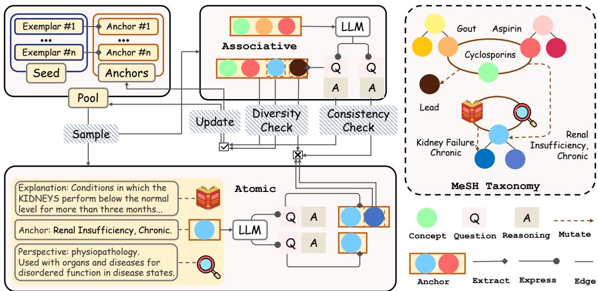  
Figure 2: Overview of the SAGE framework. MeSH anchors guide dual-track generation, while consistency and diversity checks select QA instances whose projected concepts update the anchor population across epochs.

Let $\mathbf { A } \in \mathcal { S } ^ { ( t ) }$ be the target anchor configuration for the current generation step. The generation of a candidate instance x is defined as follows:

$$
x \sim \left\{ { \cal P } _ { \mathrm { a t o m i c } } ( x \mid \{ c \} , \mathcal { K } _ { c } ) \quad \mathrm { i f } \ : \mathbf { A } = \{ c \} , \right.\tag{5}
$$

where $P _ { \mathrm { a t o m i c } }$ governs single-concept synthesis and $P _ { \mathrm { a s s o c } }$ governs multi-concept synthesis.

Atomic Generation. This track processes singleton anchor configurations $( | \mathbf { A } | = 1 )$ , including newly surfaced concepts introduced during anchor evolution. Let c denote the sole concept in A. To provide explicit taxonomy-derived grounding without relying on few-shot demonstrations, we construct a taxonomy-derived context $\kappa _ { c } .$ . Specifically, we retrieve the authoritative definition $\delta ( c )$ and the set of allowed qualifiers $\mathcal { Q } ( c )$ (e.g., pathology, adverse effects) from T. We define $\mathcal { K } _ { c } = \{ \delta ( c ) , u _ { i } \}$ where $u _ { i } \sim \mathcal { U } ( \mathcal { Q } ( c ) )$ is a clinical qualifier sampled for the present generation. The distribution over candidate instances is then given by:

$$
P _ { \mathrm { a t o m i c } } ( x \mid \{ c \} , K _ { c } ) = P _ { \mathcal { M } } ( x \mid \mathrm { P r o m p t } ( c , \delta ( c ) , u _ { i } ) )\tag{6}
$$

To introduce controlled variation, we generate N candidate instances in parallel using different qualifiers from $\mathcal { Q } ( c )$ when available. This qualifierconditioned sampling provides controlled variation around concept c.

Associative Generation. This track processes multi-concept anchor configurations $( | \mathbf { A } | > 1 )$ and encourages relation-oriented generation among the anchored concepts. For each synthesis step, we construct a context $\mathcal { E } _ { \mathrm { f e w } } ^ { ( t ) }$ composed of $n _ { \mathrm { f e w } }$ examples drawn from a growing pool that contains both the initial seed instances and previously accepted samples. The few-shot pool and sampled context are defined as:

$$
\mathcal { F } ^ { ( t ) } = \mathcal { D } _ { \mathrm { s e e d } } \cup \bigcup _ { i = 0 } ^ { t - 1 } \mathcal { D } _ { \mathrm { v a l i d } } ^ { ( i ) } , \qquad \mathcal { E } _ { \mathrm { f e w } } ^ { ( t ) } \subseteq \mathcal { F } ^ { ( t ) } .\tag{7}
$$

The generative model M is then conditioned on A and $\mathcal { E } _ { \mathrm { f e w } } ^ { ( t ) }$ to synthesize a candidate x that is encouraged to connect the concepts in the anchor configuration (e.g., generating a clinical scenario linking $\mathbf { A } = \{ \mathit { \Omega } ^ { \mathrm { { * } \bullet } } \mathbf { A } \mathrm { s p i r i n } ^ { \mathrm { { \prime } } }$ , “Chronic Pain”}).

## 3.4 Symbolic Selection and Anchor Evolution

Each epoch comprises answer-consistency selection, symbolic projection, and semantic mutation. Calibration via Consistency and Diversity Checking. Given the computational overhead of large-scale reward models in our resource-constrained setting, we combine answerconsistency checking with anchor-level diversity control. First, we adopt Self-Consistency (SC) (Wang et al., 2023a; Yu et al., 2025b) as the candidate-selection criterion. For each candidate instance $\boldsymbol { x } = ( q _ { x } , r _ { x } , y _ { x } )$ , we generate K auxiliary answers $\{ y _ { j } ^ { \prime } \} _ { j = 1 } ^ { K }$ conditioned on $q _ { x }$ . We define the answer-consistency indicator as

$$
\mathbb { I } ( x ) = \mathbb { 1 } \left( y _ { x } = { \mathrm { M a j o r V o t e } } \left( \{ y _ { 1 } ^ { \prime } , \dots , y _ { K } ^ { \prime } \} \right) \right)\tag{8}
$$

Candidates satisfying the self-consistency criterion are incorporated into the accepted set $\mathcal { D } _ { \mathrm { v a l i d } } ^ { ( t ) }$

Second, SAGE maintains concept- and configuration-level occurrence counts to control diversity across epochs. Anchor configurations whose expansion budgets have been exhausted are excluded from further sampling.

Symbolic Projection and Semantic Mutation. Transitioning from epoch t to $t { + } 1$ , we construct the next active anchor population $\mathcal { S } ^ { ( t + 1 ) }$ by combining retained output configurations with singleton anchors instantiated from newly surfaced concepts.

First, we collect the projected anchor configurations of the accepted samples:

$$
S _ { \mathrm { p r o j } } ^ { ( t ) } = \left\{ \phi _ { \mathcal { T } } ( q _ { x } ) \mid x \in \mathcal { D } _ { \mathrm { v a l i d } } ^ { ( t ) } , \phi _ { \mathcal { T } } ( q _ { x } ) \neq \emptyset \right\} .\tag{9}
$$

Second, during generation (e.g., discussing ${ \mathrm { A s } } -$ pirin for chronic pain), the model may introduce new, contextually relevant medical concepts absent from the input anchors configuration $( \mathrm { e . g . }$ , naturally surfacing the side effect “Gastric Ulcer”). Let $\mathbf { A } _ { \mathrm { i n } }$ denote the input anchor configuration used to generate candidate instance $x ,$ and define the newly discovered concepts $\Delta ( x )$ as:

$$
\Delta ( x ) = \phi _ { T } ( q _ { x } ) \backslash \mathbf { A } _ { \mathrm { i n } } .\tag{10}
$$

These newly surfaced concepts are recognized through projection onto the MeSH concept space. Each new concept is additionally instantiated as a singleton anchor configuration for the subsequent epoch, providing an opportunity for dedicated Atomic Generation. The resulting singleton mutation configurations are collected as:

$$
{ S _ { \mathrm { m u t } } ^ { ( t ) } = \left\{ \{ c \} \mid c \in \bigcup _ { x \in \mathcal { D } _ { \mathrm { v a l i d } } ^ { ( t ) } } \Delta ( x ) \right\} }\tag{11}
$$

Finally, the active anchor population for the next epoch is obtained by combining retained projected configurations with singleton mutation configurations: $\hat { S } ^ { ( t + 1 ) } = \hat { S } _ { \mathrm { p r o j } } ^ { ( t ) } \cup \bar { S } _ { \mathrm { m u t } } ^ { ( t ) }$ . Newly surfaced concepts are additionally instantiated as singleton anchor configurations, allowing them to receive dedicated taxonomy-derived grounding through Atomic Generation in subsequent epochs. Meanwhile, accepted output configurations are propagated to support continued associative exploration. This update expands the explored region of the MeSH concept space while keeping the generation trajectory connected to the fixed MeSH scaffold.

## 4 Experiments

## 4.1 Experimental Setup

To reflect resource-constrained on-premise settings, we use Qwen3-4B (Yang et al., 2025) with thinking disabled as the common data-synthesis backbone for all methods. To assess the quality of each resulting dataset, we fine-tune a fresh Qwen3-4B-Base model using an identical supervised fine-tuning protocol. Unless otherwise specified, all trainee models are fine-tuned for 5 epochs with a learning rate of $1 \times 1 0 ^ { - 5 }$ and a global batch size of 16. Further configurations are provided in Appendix B.

## 4.2 Baselines and Benchmarks

We compare SAGE against three categories of baselines: (1) Self-derived synthesis methods: Self-Instruct (Wang et al., 2023b), CoT-Self-Instruct (Yu et al., 2025b), ScaleQuest (Ding et al., 2025), KPDDS (Huang et al., 2025b), and Math-Scale (Tang et al., 2024). To ensure fairness, we generate 10k samples for all methods using the same seed set. (2) Document-based methods: Easy-Dataset (Miao et al., 2025), Genie (Yehudai et al., 2024), Self-QA (Zhang and Yang, 2023), and Wrap (Maini et al., 2024). We use MeSH ontology scope notes as the unified reference corpus for these baselines. (3) High-quality open-source datasets: m1k, m23k (Huang et al., 2025a), Huatuogpt-o1- SFT (Chen et al., 2025b), and MedReason33k (Wu et al., 2025).

For evaluation, we utilize a suite of ten medical question-answering benchmarks that probe different aspects of medical reasoning and generalization. Following Chen et al. (2025b), our suite includes MedMCQA (Pal et al., 2022), MedQA (Jin et al., 2021), and PubMedQA (Jin et al., 2019), which focus on domains well-aligned with our seed data. To measure cross-domain generalization, we employ the medical subset of GPQA (Rein et al., 2024) and MMLU-Pro (Wang et al., 2024). For robustness and advanced reasoning, we use high-difficulty benchmarks: Lancet2, $\mathrm { N E J M } ^ { 3 }$ , MedBullets (Chen et al., 2025a), and MedXpertQA (Zuo et al., 2025). Accuracy is adopted as the evaluation metric for all tasks following previous works (Chen et al., 2025b; Huang et al., 2025a; Yu et al., 2025a; Wang et al., 2025).

<table><tr><td>Model</td><td>Method/Dataset</td><td>Scale</td><td>AVG</td><td>MedMCQA</td><td>MedQA</td><td>PubMedQA</td><td>MMLU-Pro (med)</td><td>GPQA (med)</td></tr><tr><td>Qwen3-4B-Base</td><td>Few-shot Prompting</td><td>NA</td><td>26.15</td><td>29.14</td><td>29.69</td><td>35.20</td><td>14.66</td><td>22.05</td></tr><tr><td>Qwen3-4B NoThinking</td><td>NA</td><td>NA</td><td>62.54</td><td>56.78</td><td>63.63</td><td>71.00</td><td>64.63</td><td>56.67</td></tr><tr><td>Qwen3-4B Thinking</td><td>NA</td><td>NA</td><td>66.18</td><td>59.81</td><td>72.03</td><td>72.60</td><td>71.60</td><td>54.87</td></tr><tr><td colspan="9">Open Source Datasets</td></tr><tr><td>Qwen3-4B-Base</td><td>m1k (2025a)</td><td>1k</td><td>63.40</td><td>59.26</td><td>72.19</td><td>74.20</td><td>67.49</td><td>43.85</td></tr><tr><td>Qwen3-4B-Base</td><td>m23k (2025a)</td><td>23k</td><td>67.39</td><td>64.19</td><td>76.20</td><td>76.00</td><td>68.79</td><td>51.79</td></tr><tr><td>Qwen3-4B-Base</td><td>Huatuo-SFT (2025b)</td><td>20k</td><td>52.80</td><td>54.08</td><td>60.80</td><td>56.70</td><td>53.68</td><td>38.72</td></tr><tr><td>Qwen3-4B-Base</td><td>MedReason (2025)</td><td>33k</td><td>58.60</td><td>53.60</td><td>60.41</td><td>76.90</td><td>63.13</td><td>38.97</td></tr><tr><td colspan="9">Self-derived Method</td></tr><tr><td>Qwen3-4B-Base</td><td>Self-Instruct (2023b)</td><td>10k</td><td>53.66</td><td>52.35</td><td>50.12</td><td>69.70</td><td>53.29</td><td>42.82</td></tr><tr><td>Qwen3-4B-Base</td><td>ScaleQuest (2025)</td><td>10k</td><td>62.91</td><td>57.42</td><td>67.16</td><td>76.80</td><td>64.95</td><td>48.21</td></tr><tr><td>Qwen3-4B-Base</td><td>KPDDS (2025b)</td><td>10k</td><td>58.99</td><td>52.52</td><td>61.74</td><td>71.60</td><td>62.15</td><td>46.92</td></tr><tr><td>Qwen3-4B-Base</td><td>MathScale (2024)</td><td>10k</td><td>57.85</td><td>55.01</td><td>58.92</td><td>73.70</td><td>60.85</td><td>40.77</td></tr><tr><td>Qwen3-4B-Base</td><td>CoT-Self-Instruct (2025b)</td><td>10k</td><td>63.71</td><td>62.08</td><td>67.40</td><td>70.00</td><td>61.89</td><td>57.18</td></tr><tr><td colspan="9">Document-based Method</td></tr><tr><td>Qwen3-4B-Base</td><td>Easy-Dataset (2025)</td><td>28k</td><td>49.11</td><td>46.90</td><td>44.07</td><td>70.30</td><td>48.40</td><td>35.90</td></tr><tr><td>Qwen3-4B-Base</td><td>Genie (2024)</td><td>30k</td><td>49.98</td><td>49.32</td><td>51.77</td><td>63.90</td><td>48.99</td><td>35.90</td></tr><tr><td>Qwen3-4B-Base</td><td>Self-QA (2023)</td><td>230k</td><td>46.34</td><td>48.98</td><td>51.06</td><td>48.90</td><td>47.10</td><td>35.64</td></tr><tr><td>Qwen3-4B-Base</td><td>Wrap (2024)</td><td>98K</td><td>50.20</td><td>47.53</td><td>47.13</td><td>69.50</td><td>47.10</td><td>39.74</td></tr><tr><td colspan="9">Ours</td></tr><tr><td>Qwen3-4B-Base</td><td>Ours, w/o Iteration</td><td>10k</td><td>66.45</td><td>64.24</td><td>68.26</td><td>80.20</td><td>60.33</td><td>59.23</td></tr><tr><td>Qwen3-4B-Base</td><td>Ours, w/o Parallel Ours, w/o Atomic gen.</td><td>10k</td><td>66.81 66.21</td><td>64.04 65.29</td><td>67.95 66.69</td><td>82.80 77.20</td><td>60.78</td><td>58.46</td></tr><tr><td>Qwen3-4B-Base</td><td>Ours, w/o Associative gen.</td><td>10k 10k</td><td>66.13</td><td>65.24</td><td>69.84</td><td>77.90</td><td>61.89 62.02</td><td>60.00</td></tr><tr><td>Qwen3-4B-Base</td><td>Ours (Full)</td><td></td><td></td><td>64.98</td><td>70.07</td><td>80.80</td><td>63.19</td><td>55.64</td></tr><tr><td>Qwen3-4B-Base</td><td></td><td>10k</td><td>68.12</td><td></td><td></td><td></td><td></td><td>61.54</td></tr></table>

Table 1: Performance of models trained on datasets generated or collected by various paradigms, evaluated on mainstream medical QA benchmarks. The highest average score within each paradigm is underlined. The performance of our method is highlighted in bold. Units are in percentage (%).

## 4.3 Main Results

As shown in Table 1, SAGE consistently outperforms baseline methods. Compared to self-derived approaches, SAGE achieves substantial gains by anchoring generation in factual knowledge. It also surpasses document-based methods, suggesting that our approach effectively integrates atomic facts into coherent scenarios rather than merely extracting them; we provide concrete case studies illustrating this distinction in Appendix J. Notably, SAGE matches or exceeds the performance of large-scale datasets and models fine-tuned on massive CoT data. This efficiency highlights the value of our evolutionary strategy, which maximizes information density by balancing concept mastery with scenario-based reasoning.

## 4.4 Ablation Study

## Contribution of Evolutionary Components.

We conducted comprehensive ablation studies on all four components of our proposed method; the results are summarized in Table 1, alongside extended validations of our mapping function, corpus selection, and factual filtering strategies (Appendices H, G, I).

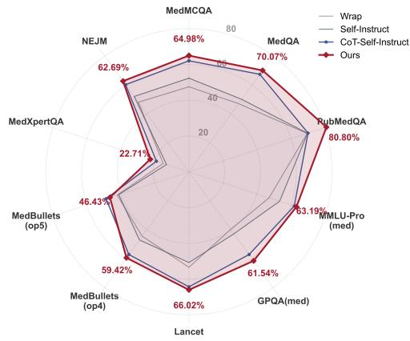  
Figure 3: Comparison between our method and baselines across diverse medical QA benchmarks, including out-of-distribution tasks.

Specifically, for the w/o Iteration variant, the target dataset size was achieved by increasing multisample generation within a single iteration, without leveraging the parametric knowledge of the LLM to evolve the concept graph across successive iterations.

For the w/o Parallel variant, the target sample size was obtained by relaxing the criteria for semantic anchor deduplication in subsequent iterations. Furthermore, versions lacking either of the two question types consistently exhibited marked performance degradation, underscoring the significance of maintaining diversity in question formats. Scalability and Efficiency.

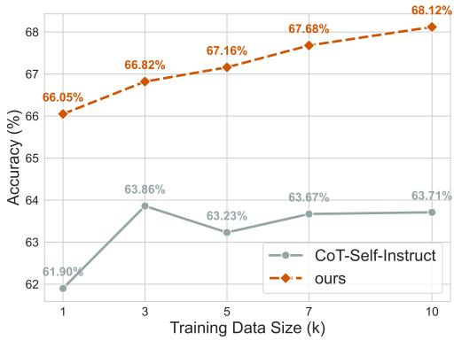  
Figure 4: Performance scaling analysis comparing our method with CoT-Self-Instruct across different training data sizes from 1k to 10k samples.

Figure 4 illustrates our method’s high data efficiency, maintaining strong performance across varying scales and rivaling much larger parameter models (Appendix E). Token usage analysis (Appendix L) reveals it consumes significantly fewer tokens than baselines, confirming SAGE’s superior information density. Additionally, our offline semantic mapping ensures extreme computational efficiency compared to standard online API tools (Appendix H).

Generalization and Robustness. As shown in Figure 3, our method consistently outperforms baselines on out-of-distribution (OOD) QA benchmarks (Appendix K). Crucially, this strong generalization extends beyond QA to other clinical tasks like MedNLI and MTS-Dialog (Appendix D). Furthermore, ablation studies across various generator models and architectures (Appendix C) confirm the robustness of our approach irrespective of the underlying model.

## 5 Discussion

## 5.1 Qualitative Case: Mitigating Hallucination and Enhancing Reasoning.

While document-based data synthesis methods can generate factually correct content, they often produce questions that assess only simple concept recall, rather than complex reasoning or the application of knowledge to specific clinical scenarios. This limitation significantly diminishes the learning value of the resulting training corpus. In contrast, self-derived synthesis methods can create corpora that emphasize reasoning, but typically lack mechanisms for factual verification or refinement. This often results in severe hallucinations, which are unacceptable in high-risk fields such as medicine. A detailed qualitative comparison of these limitations is provided in Appendix J.

We begin with a single medical concept serving as a semantic anchor, accompanied by explanatory text for knowledge grounding. Using a specific examination perspective, we perform atomic generation to produce question-answer pairs that consolidate the model’s factual understanding of the given concept. Subsequently, leveraging the LLM’s capacity for self-association, we extract multiple concepts involved in the generated questions. These extracted concepts then serve as semantic anchors for the next phase of associative generation, enabling the creation of training materials that strengthen the model’s ability to apply concepts in complex medical scenarios. A concrete example is illustrated in Figure 5.

As shown in the figure, starting from the core concept “Chronic Pain” with “pathology” as the examination perspective, the LLM generates questions that naturally introduce related concepts such as “Spinal Nerve Roots” and “Ganglia, Spinal”. In the subsequent associative generation phase, these concepts are used as scaffolds to construct appropriate clinical scenarios, design educationally valuable questions, and provide responses that integrate accurate knowledge with advanced reasoning. Unlike the baselines, this two-stage process effectively mitigates the hallucination risks of self-derived methods while overcoming the shallow reasoning limitations inherent in document-based approaches.

## 5.2 Quantitative Assessment: Factuality, Reasoning, and Utility.

We evaluated 1,000 generated samples using DeepSeek-V3.2 (Guo et al., 2025) across medical factuality, reasoning, and utility (Figure 6). The document-based Wrap (Maini et al., 2024) achieves high factuality but lacks reasoning depth (consistent with Figure 10), limiting its utility. Conversely, the self-derived ScaleQuest (Ding et al., 2025) shows moderate reasoning but suffers from factual hallucinations. SAGE achieves a superior balance of both. To ensure our factuality claims extend beyond LLM-as-a-judge, we further validated SAGE on standard hallucination benchmarks (TruthfulQA (Lin et al., 2022) and MedHALT (Pal et al., 2023)), where it consistently minimized confabulations compared to all baselines (Appendix F).

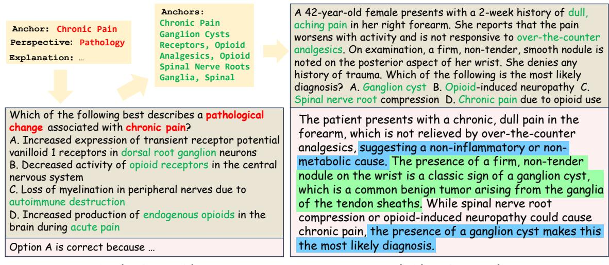

Figure 5: A detailed case on dual-track evolutionary synthesis.  
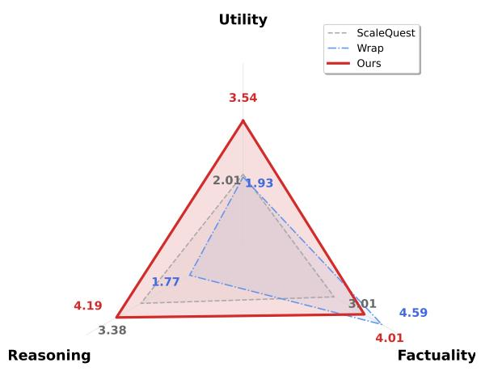  
Figure 6: Comparison of different methods across factu ality, reasoning, and utility.

## 5.3 Combinatorial Validity and Diversity.

We conducted a detailed investigation of two selfderived methods that also generate data based on concepts. Specifically, the concepts autonomously generated by the LLM in KPDDS and MathScale were mapped to specific concepts within the MeSH ontology using a medical embedding model (Deka et al., 2022). For each method, we generated a total of 10,000 data points and calculated two metrics for every batch of 1,000 samples: the average semantic depth of the concepts used and the diversity of concept combinations, as shown in Figures 7 and 8.

As illustrated, with increasing data scale, our method consistently maintains high levels of both semantic depth and combinatorial diversity. In contrast, the baseline methods, which rely on the LLM’s self-directed concept generation, tend to produce broad, shallow, and frequently recurring topical concepts. Subsequent data regeneration based on statistical co-occurrence patterns within these limited initial batches fails to overcome common concept pairings, resulting in a rapid collapse in diversity.

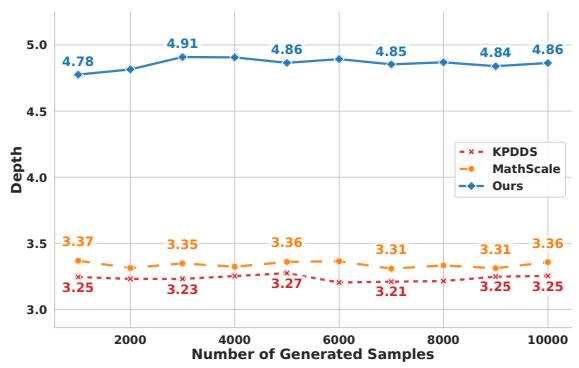  
Figure 7: Comparison of semantic depth (MeSH Tree) of generated concepts during the generation process.

## 6 Conclusion

We introduced SAGE, a Semantic Anchor-Guided Evolution framework that mitigates the data scarcity bottleneck for medical LLMs under strict privacy constraints. By grounding atomic and associative generation in public taxonomies, SAGE enables small local models to autonomously produce pedagogically structured data. Results show it outperforms prevalent paradigms without relying on massive corpora, establishing a practical pathway for developing reliable medical AI assistants directly from a compact knowledge base.

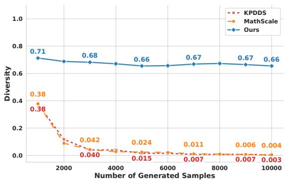  
Figure 8: Comparison of dynamic diversity with increasing generated samples. Diversity is measured by the discovery rate $\begin{array} { r } { R = \frac { \mathbf { \bar { { N } } } _ { n e w } } { B } } \end{array}$ , where $N _ { n e w }$ denotes the number of unique unseen concept combinations, and B is the batch size.

## Limitations

While SAGE provides a resource-efficient foundation for grounded QA data synthesis, its current design still leaves several limitations for future work. The effectiveness of the framework is partly tied to the scope and organization of external taxonomies such as MeSH, and applying SAGE to domains without mature semantic resources may require constructing task-specific knowledge schemas. Although structured anchoring helps reduce hallucination, the generated scenarios are still shaped by the combinatorial coverage of anchor concepts and may not fully reflect the nuanced, open-ended reasoning patterns present in authentic clinical narratives. In addition, due to the scale of the synthesized data, we did not conduct comprehensive clinician double-checking for all generated samples, which may leave some subtle clinical inaccuracies unexamined. Our evaluation also primarily focuses on question-answering benchmarks, while broader validation on interactive clinical tasks, such as patient dialogue simulation or diagnostic decision support, would further clarify the practical utility of the framework. Future directions include dynamically expanding semantic anchors, integrating multimodal medical knowledge such as imaging data, and adapting SAGE to other high-stakes, knowledge-intensive domains beyond medicine.

## Ethics Statement

This research utilizes only publicly available, deidentified resources: the structured MeSH taxonomy and open-source medical QA datasets are used exclusively for research purposes. All training data are synthetically generated, circumventing privacy and confidentiality concerns associated with real patient information. No human subjects, personal health data, or protected clinical records were involved in this study. Nonetheless, we acknowledge that models trained on synthetic data may reproduce or amplify biases present in the underlying taxonomies or generation processes, and their outputs should not be interpreted as clinical advice. Any real-world deployment of this methodology or its derivatives must undergo rigorous clinical validation, adhere to all relevant regulatory standards, and be implemented in human-supervised healthcare workflows.

## Acknowledgements

This work was supported by the Guizhou Provincial Program on Commercialization of Scientific and Technological Achievements (Qiankehezhongyindi [2025] No. 006).

## References

Asma Ben Abacha, Wen-wai Yim, Yadan Fan, and Thomas Lin. 2023. An empirical study of clinical note generation from doctor-patient encounters. In Proceedings of the 17th Conference of the European Chapter of the Association for Computational Linguistics, pages 2291–2302.

Nicholas Carlini, Florian Tramer, Eric Wallace, Matthew Jagielski, Ariel Herbert-Voss, Katherine Lee, Adam Roberts, Tom Brown, Dawn Song, Ulfar Erlingsson, et al. 2021. Extracting training data from large language models. In 30th USENIX security symposium (USENIX Security 21), pages 2633–2650.

Hanjie Chen, Zhouxiang Fang, Yash Singla, and Mark Dredze. 2025a. Benchmarking large language models on answering and explaining challenging medical questions. In Proceedings of the 2025 Conference ofthe Nations ofthe Americas Chapter ofthe Associationfor Computational Linguistics: Human Language Technologies (Volume 1: Long Papers), pages 3563–3599.

Junying Chen, Zhenyang Cai, Ke Ji, Xidong Wang, Wanlong Liu, Rongsheng Wang, and Benyou Wang. 2025b. Towards medical complex reasoning with llms through medical verifiable problems. In Findings ofthe Associationfor Computational Linguistics: ACL 2025, pages 14552–14573.

Zihong Chen, Wanli Jiang, Jinzhe Li, Zhonghang Yuan, Huanjun Kong, Wanli Ouyang, and Nanqing Dong. 2025c. Graphgen: Enhancing supervised fine-tuning for llms with knowledge-driven synthetic data generation. arXiv preprint arXiv:2505.20416.

Bhishma Dedhia, Yuval Kansal, and Niraj K Jha. 2025. Bottom-up domain-specific superintelligence: A reliable knowledge graph is what we need. arXiv preprint arXiv:2507.13966.

Pritam Deka, Anna Jurek-Loughrey, and P Deepak. 2022. Improved methods to aid unsupervised evidence-based fact checking for online health news. Journal ofData Intelligence, 3(4):474–504.

Yuyang Ding, Xinyu Shi, Xiaobo Liang, Juntao Li, Zhaopeng Tu, Qiaoming Zhu, and Min Zhang. 2025. Unleashing llm reasoning capability via scalable question synthesis from scratch. In Proceedings of the 63rd Annual Meeting of the Association for Computational Linguistics (Volume 1: Long Papers), pages 13414–13438.

Arnav Gudibande, Eric Wallace, Charlie Snell, Xinyang Geng, Hao Liu, Pieter Abbeel, Sergey Levine, and Dawn Song. 2023. The false promise of imitating proprietary llms. arXiv preprint arXiv:2305.15717.

Daya Guo, Dejian Yang, Haowei Zhang, Junxiao Song, Peiyi Wang, Qihao Zhu, Runxin Xu, Ruoyu Zhang, Shirong Ma, Xiao Bi, et al. 2025. Deepseek-r1 incentivizes reasoning in llms through reinforcement learning. Nature, 645(8081):633–638.

Xiaoke Huang, Juncheng Wu, Hui Liu, Xianfeng Tang, and Yuyin Zhou. 2025a. m1: Unleash the potential of test-time scaling for medical reasoning with large language models. arXiv preprint arXiv:2504.00869.

Yiming Huang, Xiao Liu, Yeyun Gong, Zhibin Gou, Yelong Shen, Nan Duan, and Weizhu Chen. 2025b. Key-point-driven data synthesis with its enhancement on mathematical reasoning. In Proceedings of the AAAI Conference on Artificial Intelligence, volume 39, pages 24176–24184.

Di Jin, Eileen Pan, Nassim Oufattole, Wei-Hung Weng, Hanyi Fang, and Peter Szolovits. 2021. What disease does this patient have? a large-scale open domain question answering dataset from medical exams. Applied Sciences, 11(14):6421.

Qiao Jin, Bhuwan Dhingra, Zhengping Liu, William Cohen, and Xinghua Lu. 2019. PubMedQA: A dataset for biomedical research question answering. In Proceedings ofthe 2019 Conference on Empirical Methods in Natural Language Processing and the 9th International Joint Conference on Natural Language Processing (EMNLP-IJCNLP), pages 2567– 2577, Hong Kong, China. Association for Computational Linguistics.

Georgios A Kaissis, Marcus R Makowski, Daniel Rückert, and Rickmer F Braren. 2020. Secure, privacypreserving and federated machine learning in medical imaging. Nature Machine Intelligence, 2(6):305– 311.

Abdullatif Köksal, Timo Schick, Anna Korhonen, and Hinrich Schütze. 2024. Longform: Effective instruction tuning with reverse instructions. In Findings

of the Association for Computational Linguistics: EMNLP 2024, pages 7056–7078.

Yanis Labrak, Adrien Bazoge, Emmanuel Morin, Pierre-Antoine Gourraud, Mickaël Rouvier, and Richard Dufour. 2024. Biomistral: A collection of opensource pretrained large language models for medical domains. In Findings of the Association for Computational Linguistics: ACL 2024, pages 5848–5864.

Chen Li, Weiqi Wang, Jingcheng Hu, Yixuan Wei, Nanning Zheng, Han Hu, Zheng Zhang, and Houwen Peng. 2024. Common 7b language models already possess strong math capabilities. arXiv preprint arXiv:2403.04706.

Rumeng Li, Xun Wang, and Hong Yu. 2023. Two directions for clinical data generation with large language models: data-to-label and label-to-data. In Proceedings ofthe Conference on Empirical Methods in Natural Language Processing. Conference on Empirical Methods in Natural Language Processing, volume 2023, page 7129.

Stephanie Lin, Jacob Hilton, and Owain Evans. 2022. Truthfulqa: Measuring how models mimic human falsehoods. In Proceedings ofthe 60th annual meeting of the association for computational linguistics (volume 1: long papers), pages 3214–3252.

Haoxiong Liu, Yifan Zhang, Yifan Luo, and Andrew C Yao. 2025. Augmenting math word problems via iterative question composing. In Proceedings of the AAAI Conference on Artificial Intelligence, volume 39, pages 24605–24613.

Haipeng Luo, Qingfeng Sun, Can Xu, Pu Zhao, Jianguang Lou, Chongyang Tao, Xiubo Geng, Qingwei Lin, Shifeng Chen, and Dongmei Zhang. 2023. Wizardmath: Empowering mathematical reasoning for large language models via reinforced evol-instruct. arXiv preprint arXiv:2308.09583.

Pratyush Maini, Skyler Seto, Richard Bai, David Grangier, Yizhe Zhang, and Navdeep Jaitly. 2024. Rephrasing the web: A recipe for compute and data-efficient language modeling. In Proceedings ofthe 62nd Annual Meeting of the Association for Computational Linguistics (Volume 1: Long Papers), pages 14044– 14072.

Ziyang Miao, Qiyu Sun, Jingyuan Wang, Yuchen Gong, Yaowei Zheng, Shiqi Li, and Richong Zhang. 2025. Easy dataset: A unified and extensible framework for synthesizing llm fine-tuning data from unstructured documents. In Proceedings ofthe 2025 Conference on Empirical Methods in Natural Language Processing: System Demonstrations, pages 960–968.

Ankit Pal, Logesh Kumar Umapathi, and Malaikannan Sankarasubbu. 2022. Medmcqa: A large-scale multi-subject multi-choice dataset for medical domain question answering. In Conference on health, inference, and learning, pages 248–260. PMLR.

Ankit Pal, Logesh Kumar Umapathi, and Malaikannan Sankarasubbu. 2023. Med-halt: Medical domain hallucination test for large language models. In Proceedings of the 27th Conference on Computational Natural Language Learning (CoNLL), pages 314– 334.

W Nicholson Price and I Glenn Cohen. 2019. Privacy in the age of medical big data. Nature medicine, 25(1):37–43.

Pranav Rajpurkar, Emma Chen, Oishi Banerjee, and Eric J Topol. 2022. Ai in health and medicine. Nature medicine, 28(1):31–38.

David Rein, Betty Li Hou, Asa Cooper Stickland, Jackson Petty, Richard Yuanzhe Pang, Julien Dirani, Julian Michael, and Samuel R Bowman. 2024. Gpqa: A graduate-level google-proof q&a benchmark. In First Conference on Language Modeling.

Haris Riaz, Sourav Sanjukta Bhabesh, Vinayak Arannil, Miguel Ballesteros, and Graham Horwood. 2025. Metasynth: Meta-prompting-driven agentic scaffolds for diverse synthetic data generation. In Findings of the Association for Computational Linguistics: ACL 2025, pages 18770–18803.

Alexey Romanov and Chaitanya Shivade. 2018. Lessons from natural language inference in the clinical domain. In Proceedings ofthe 2018 Conference on Empirical Methods in Natural Language Processing, pages 1586–1596, Brussels, Belgium. Association for Computational Linguistics.

Zhengyang Tang, Xingxing Zhang, Benyou Wang, and Furu Wei. 2024. Mathscale: Scaling instruction tuning for mathematical reasoning. In Forty-first International Conference on Machine Learning.

Arun James Thirunavukarasu, Darren Shu Jeng Ting, Kabilan Elangovan, Laura Gutierrez, Ting Fang Tan, and Daniel Shu Wei Ting. 2023. Large language models in medicine. Nature medicine, 29(8):1930– 1940.

Bingning Wang, Haizhou Zhao, Huozhi Zhou, Liang Song, Mingyu Xu, Wei Cheng, Xiangrong Zeng, Yupeng Zhang, Yuqi Huo, Zecheng Wang, et al. 2025. Baichuan-m1: Pushing the medical capability of large language models. arXiv preprint arXiv:2502.12671.

Xuezhi Wang, Jason Wei, Dale Schuurmans, Quoc V Le, Ed H. Chi, Sharan Narang, Aakanksha Chowdhery, and Denny Zhou. 2023a. Self-consistency improves chain of thought reasoning in language models. In The Eleventh International Conference on Learning Representations.

Yizhong Wang, Yeganeh Kordi, Swaroop Mishra, Alisa Liu, Noah A Smith, Daniel Khashabi, and Hannaneh Hajishirzi. 2023b. Self-instruct: Aligning language models with self-generated instructions. In Proceedings of the 61st annual meeting of the association for computational linguistics (volume 1: long papers), pages 13484–13508.

Yubo Wang, Xueguang Ma, Ge Zhang, Yuansheng Ni, Abhranil Chandra, Shiguang Guo, Weiming Ren, Aaran Arulraj, Xuan He, Ziyan Jiang, et al. 2024. Mmlu-pro: A more robust and challenging multi-task language understanding benchmark. In The Thirtyeight Conference on Neural Information Processing Systems Datasets and Benchmarks Track.

Juncheng Wu, Wenlong Deng, Xingxuan Li, Sheng Liu, Taomian Mi, Yifan Peng, Ziyang Xu, Yi Liu, Hyunjin Cho, Chang-In Choi, et al. 2025. Medreason: Eliciting factual medical reasoning steps in llms via knowledge graphs. arXiv preprint arXiv:2504.00993.

Can Xu, Qingfeng Sun, Kai Zheng, Xiubo Geng, Pu Zhao, Jiazhan Feng, Chongyang Tao, Qingwei Lin, and Daxin Jiang. 2024. Wizardlm: Empowering large pre-trained language models to follow complex instructions. In The Twelfth International Conference on Learning Representations.

Weiwen Xu, Hou Pong Chan, Long Li, Mahani Aljunied, Ruifeng Yuan, Jianyu Wang, Chenghao Xiao, Guizhen Chen, Chaoqun Liu, Zhaodonghui Li, et al. 2025. Lingshu: A generalist foundation model for unified multimodal medical understanding and reasoning. arXiv preprint arXiv:2506.07044.

An Yang, Anfeng Li, Baosong Yang, Beichen Zhang, Binyuan Hui, Bo Zheng, Bowen Yu, Chang Gao, Chengen Huang, Chenxu Lv, et al. 2025. Qwen3 technical report. arXiv preprint arXiv:2505.09388.

An Yang, Baosong Yang, Beichen Zhang, Binyuan Hui, Bo Zheng, Bowen Yu, Chengyuan Li, Dayiheng Liu, Fei Huang, Haoran Wei, et al. 2024a. Qwen2. 5 technical report. arXiv preprint arXiv:2412.15115.

Zitong Yang, Neil Band, Shuangping Li, Emmanuel Candes, and Tatsunori Hashimoto. 2024b. Synthetic continued pretraining. arXiv preprint arXiv:2409.07431.

Asaf Yehudai, Boaz Carmeli, Yosi Mass, Ofir Arviv, Nathaniel Mills, Eyal Shnarch, and Leshem Choshen. 2024. Achieving human parity in content-grounded datasets generation. In The Twelfth International Conference on Learning Representations.

Hongzhou Yu, Tianhao Cheng, Yingwen Wang, Wen He, Qing Wang, Ying Cheng, Yuejie Zhang, Rui Feng, and Xiaobo Zhang. 2025a. FinemedLM-o1: Enhancing medical knowledge reasoning ability of LLM from supervised fine-tuning to test-time training. In Second Conference on Language Modeling.

Longhui Yu, Weisen Jiang, Han Shi, Jincheng Yu, Zhengying Liu, Yu Zhang, James T Kwok, Zhenguo Li, Adrian Weller, and Weiyang Liu. 2023. Metamath: Bootstrap your own mathematical questions for large language models. arXiv preprint arXiv:2309.12284.

Ping Yu, Jack Lanchantin, Tianlu Wang, Weizhe Yuan, Olga Golovneva, Ilia Kulikov, Sainbayar Sukhbaatar, Jason Weston, and Jing Xu. 2025b. Cot-self-instruct:

Building high-quality synthetic prompts for reasoning and non-reasoning tasks. arXiv preprint arXiv:2507.23751.

Weihao Zeng, Can Xu, Yingxiu Zhao, Jian-Guang Lou, and Weizhu Chen. 2024. Automatic instruction evolving for large language models. arXiv preprint arXiv:2406.00770.

Kaiyan Zhang, Sihang Zeng, Ermo Hua, Ning Ding, Zhang-Ren Chen, Zhiyuan Ma, Haoxin Li, Ganqu Cui, Biqing Qi, Xuekai Zhu, et al. 2024. Ultramedical: Building specialized generalists in biomedicine. Advances in Neural Information Processing Systems, 37:26045–26081.

Xuanyu Zhang and Qing Yang. 2023. Self-qa: Unsupervised knowledge guided language model alignment. arXiv preprint arXiv:2305.11952.

Xueliang Zhao, Wei Wu, Jian Guan, Zhuocheng Gong, and Lingpeng Kong. 2025a. Promptcot 2.0: Scaling prompt synthesis for large language model reasoning. arXiv preprint arXiv:2509.19894.

Xueliang Zhao, Wei Wu, Jian Guan, and Lingpeng Kong. 2025b. Promptcot: Synthesizing olympiadlevel problems for mathematical reasoning in large language models. arXiv preprint arXiv:2503.02324.

Yuxin Zuo, Shang Qu, Yifei Li, Zhang-Ren Chen, Xuekai Zhu, Ermo Hua, Kaiyan Zhang, Ning Ding, and Bowen Zhou. 2025. MedxpertQA: Benchmarking expert-level medical reasoning and understanding. In Forty-second International Conference on Machine Learning.

## A Data and Knowledge Base

## A.1 Knowledge Base Description

Medical Subject Headings (MeSH) is a comprehensive controlled vocabulary developed by the National Library of Medicine (NLM)4, primarily used for indexing, cataloging, and searching biomedical and health-related information. As the authoritative thesaurus for the MEDLINE5 and PubMed6 databases, MeSH enforces uniform terminology and consistency in the retrieval of biomedical literature. Its hierarchical tree structure organizes descriptors from broad, general categories down to specific concepts; each descriptor is assigned one or more “Tree Numbers” that indicate its precise location within this hierarchy. This organization robustly encodes semantic relationships between medical concepts, making MeSH an essential foundation for constructing domain-specific knowledge graphs and ontologies. We leverage the built-in synonym information within the MeSH ontology to implement the mapping function ϕ, as described in Section 3, using a lightweight and efficient string matching approach. To focus on medically relevant content, we retain only mid-to-deep level terms from core medical categories as candidate semantic anchors(including Anatomy; Diseases; Chemicals and Drugs; Analytical, Diagnostic and Therapeutic Techniques, and Equipment; Psychiatry and Psychology; and Phenomena and Processes). Furthermore, when selecting a single anchor and its associated inquiry perspective, we consider only the core medical perspectives pertinent to that concept, such as clinical diagnosis and treatment, pharmacology, pathophysiology, and mechanism-based inquiry.

## A.2 Seed Dataset Overview

We utilize the m1k (Huang et al., 2025a) dataset as the seed for our entire data synthesis pipeline. It provides concepts distributions and few-shot examples that serve as initial scaffolds for guiding smallscale models in complex data generation tasks.

The m1k dataset represents a curated medical QA benchmark, distilled from an initial pool of 196K public samples across MedMCQA, MedQA-USMLE, HeadQA, and PubMedQA. The construction process involved strict difficulty filtering, isolating 37K complex questions that Qwen2.5-7B and Qwen2.5-32B failed to solve. These were subsequently augmented with verified Chain-of-Thought (CoT) solutions from DeepSeek-R1. Ultimately, through diversity sampling stratified by MeSH categories and balanced by source, a core training set of 1,000 instances was established.

## A.3 Benchmark Datasets

To comprehensively assess the efficacy of our proposed method, we utilize a suite of established medical QA benchmarks:

• MedMCQA (Pal et al., 2022): A massive dataset of over 194,000 multiple-choice questions covering 21 medical disciplines and 2,400 topics. Originated from real-world Indian entrance exams (AIIMS and NEET-PG), we utilize the specific 4,183-question test set adopted by (Chen et al., 2025b) (Apache-2.0).

• MedQA (Jin et al., 2021): Derived from USMLE practice materials, this corpus contains 12,723 questions compiled from 18 clinical textbooks. Solving these requires expertlevel reasoning and the ability to synthesize evidence from multiple documents. We employ the 1,273-sample test split following (Chen et al., 2025b) (CC-BY-4.0).

• PubMedQA (Jin et al., 2019): A biomedical QA task grounded in PubMed abstracts. It features 1,000 expert-labeled multiple-choice questions drawn from a broader collection of 211k articles (MIT).

• MMLU-Pro (Medical) (Wang et al., 2024): The Professional Medicine segment of the Massive Multitask Language Understanding benchmark, targeting advanced clinical knowledge. We adopt the test splits used in (Chen et al., 2025b) (MIT).

• GPQA (Medical) (Rein et al., 2024): Representing the biomedical portion of the Graduate-Level QA dataset, these questions are expert-written and designed to be Googleproof, resisting simple retrieval strategies. We strictly use the biology/medical subset and splits from (Chen et al., 2025b) (CC-BY-4.0).

• Lancet & NEJM: Two compact datasets constructed from clinical case reports published in The Lancet and the New England Journal of Medicine (NEJM), curated according to (Huang et al., 2025a).

• MedBullets (Chen et al., 2025a): A collection of practice items from the MedBullets platform. Following (Huang et al., 2025a), we focus on the high-difficulty subsets (Levels 4 and 5), labeled as MedBullets\_Op4 and Med-Bullets\_Op5, each containing approximately 100 rigorous questions.

• MedXpertQA (Zuo et al., 2025): A set of 50 expert-crafted questions requiring multistep reasoning, employed here for qualitative analysis (MIT).

## B Implementation Details and Hyperparameters

Candidate instances are sampled with a temperature of 0.7, top-p of 0.95, and a maximum generation length of 4,096 tokens. For each eligible anchor configuration, we generate N = 2 candidates. Associative generation uses $n _ { \mathrm { f e w } } = 2$ examples sampled from the growing few-shot pool, whereas self-consistency checking uses K = 3 auxiliary answers.

## C Training on Weaker Models

To demonstrate the robustness of our method in real-world scenarios, we evaluated data generated from Qwen3-4B on weaker models. As shown in Figure 9, our method achieved significant advantages across different model architectures, highlighting its strong adaptability.

## D Generalization on non-QA Benchmark

To demonstrate SAGE’s generalization on non-QA benchmark, we further evaluated it on MedNLI (Romanov and Shivade, 2018) (Natural Language Inference) and MTS-Dialog (Abacha et al., 2023) (Medical Summarization). As shown in Table 2, SAGE consistently outperforms synthesis baselines on both tasks. SAGE provides the strongest gains among all synthesis paradigms.

## E Performance Ceiling and Cross-Scale Comparison

To provide context on the difficulty of the clinical benchmarks evaluated in this study and offer insight for non-specialist readers, we present a performance ceiling and a cross-scale comparison. Table 3 compares our model against recent state-ofthe-art (SOTA) open-source medical LLMs, heavyweight general models, and flagship reasoning models.

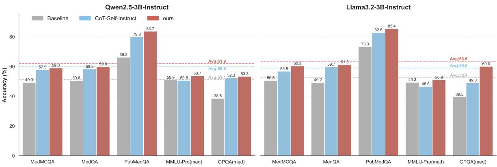  
Figure 9: Performance on the benchmark after training Qwen2.5-3B-Instruct and Llama3.2-3B-Instruct.

<table><tr><td>Strategy</td><td>MedNLI</td><td>MTS</td></tr><tr><td>Wrap</td><td>72.08</td><td>83.62</td></tr><tr><td>CoT-Self-Instruct</td><td>84.60</td><td>83.16</td></tr><tr><td>SAGE</td><td>87.27</td><td>85.02</td></tr></table>

Table 2: Generalization performance of SAGE compared to baselines. All trainee models are based on Qwen3-4B-Base. We report Accuracy for MedNLI and BERTScore for MTS-Dialog. All results are scaled to percentages (%).

As the table illustrates, these clinical benchmarks are challenging. Even parameter-heavy models like UltraMedical-8B struggle to surpass a 63% average. By providing this ceiling, it becomes evident that pushing a 4B model to a 68.12% average, matching the 8B SOTA and approaching the performance of a 72B general model, is a highly non-trivial achievement. This underscores the efficiency and high quality of the SAGE synthetic data paradigm.

## F Quantitative Assessment of Hallucinations Beyond LLM-as-a-Judge

To provide a more comprehensive assessment and move beyond relying solely on LLM-judges, we conducted an additional rigorous hallucination analysis using two complementary, established benchmarks:

• TruthfulQA (Medical subset) (Lin et al., 2022): A gold standard for evaluating general truthfulness and the model’s susceptibility to common misconceptions.

• MedHALT (Fake Question subset) (Pal et al., 2023): A specialized medical benchmark designed specifically to test “confabulation”, the tendency of models to generate realistic-looking answers for non-existent or fabricated medical queries.

We report the Hallucination Rate (where lower is better, denoted by ↓) in Table 4. SAGE consistently maintains the lowest hallucination rate across both benchmarks. This confirms that our method effectively calibrates the model’s factual boundaries by grounding generation in MeSH taxonomies, rather than relying on unconstrained self-generation.

## G In-depth Comparison with Document-Based Methods

Our problem setting is specifically designed to simulate a practical, resource-constrained scenario (e.g., a small-scale specialized clinic), where massive, clean medical corpora are often inaccessible due to privacy or computing limitations. In this context, the MeSH taxonomy serves as a foundational medical dictionary, while the 1K seed Q&A samples represent years of accumulated patient case records. Our initial baseline comparisons utilized MeSH Scope Notes as the primary corpus for document-based methods (e.g., Genie) specifically to ensure strict fairness in knowledge sources, preventing any unintended advantage from external data.

To comprehensively assess whether the performance gap between SAGE and document-based methods stems from the brevity of scope notes rather than the synthesis paradigm itself, we conducted two rigorous ablation experiments:

1. Data Augmentation: We augmented the document-based baseline with the identical 1K seed Q&A cases used by SAGE.

<table><tr><td>Model</td><td>MedMCQA</td><td>MedQA</td><td>PubMedQA</td><td>MMLU-Pro (med)</td><td>GPQA (med)</td><td>AVG</td></tr><tr><td>SAGE-4B</td><td>64.98</td><td>70.07</td><td>80.80</td><td>63.19</td><td>61.54</td><td>68.12</td></tr><tr><td colspan="7">~8B Scale</td></tr><tr><td>UltraMedical-8B (Zhang et al., 2024)</td><td>59.17</td><td>71.64</td><td>70.30</td><td>61.43</td><td>50.26</td><td>62.56</td></tr><tr><td>m1-7B (Huang et al., 2025a)</td><td>61.49</td><td>71.96</td><td>74.00</td><td>63.65</td><td>46.67</td><td>63.55</td></tr><tr><td>MedReason-8B (Wu et al., 2025)</td><td>60.17</td><td>70.78</td><td>78.50</td><td>65.08</td><td>52.56</td><td>65.42</td></tr><tr><td>HuatuoGPT-o1-8B (Chen et al., 2025b)</td><td>63.78</td><td>75.02</td><td>80.50</td><td>64.23</td><td>57.18</td><td>68.14</td></tr><tr><td colspan="7">Above 70B Scale</td></tr><tr><td>Qwen2.5-72B-Instruct</td><td>66.60</td><td>74.55</td><td>70.89</td><td>66.06</td><td>62.05</td><td>68.03</td></tr><tr><td>UltraMedical-70B (Zhang et al., 2024)</td><td>72.94</td><td>83.90</td><td>80.00</td><td>73.94</td><td>58.72</td><td>73.90</td></tr><tr><td colspan="7">Ceiling Reference</td></tr><tr><td>Deepseek-V3-0324</td><td>75.30</td><td>88.66</td><td>69.33</td><td>84.67</td><td>66.00</td><td>76.79</td></tr><tr><td>Deepseek-R1-0528</td><td>80.20</td><td>93.07</td><td>68.32</td><td>90.10</td><td>73.27</td><td>80.99</td></tr></table>

Table 3: Cross-scale comparison and performance ceiling on clinical benchmarks. Results are reported in percentages (%). SAGE-4B matches the performance of SOTA 8B medical models and approaches the 72B general model.

<table><tr><td>Strategy</td><td>TruthfulQA↓</td><td>MedHALT↓</td></tr><tr><td>Wrap</td><td>32.66</td><td>90.84</td></tr><tr><td>CoT-SI</td><td>22.61</td><td>91.59</td></tr><tr><td>SAGE</td><td>20.60</td><td>89.28</td></tr></table>

Table 4: Hallucination rates on TruthfulQA (Medical subset) and MedHALT (Fake Question subset). Lower values indicate better factuality. All trainee models are based on Qwen3-4B-Base. “CoT-SI” stands for CoT-Self-Instruct. Results are reported in percentages (%).

2. Corpus Substitution: We replaced the scope notes entirely with a traditional medical corpus (PubMed abstracts), extracting an equivalent volume of documents to strictly match SAGE’s 3.51M token budget.

As shown in Table 5, simply scaling the token budget or switching to traditional medical documents yields only marginal improvements for the document-based baseline, which remains significantly inferior to SAGE. This demonstrates that SAGE’s superiority does not stem from simply exposing the model to more text. Instead, its effectiveness lies in its unique ability to distill static, dictionary-style facts into dense, high-quality clinical reasoning instructions, which is far more effective for fine-tuning small LLMs in data-scarce environments.

## H Robustness and Evaluation of the Mapping Function

The mapping function ϕ is fundamentally grounded in string matching, which guarantees its lightweight nature and extremely low computational overhead. However, to ensure high clinical specificity and robustness against extraction errors, ϕ extends significantly beyond naive string matching by employing a synonym-expanded matching and structural filtering pipeline. Specifically, we incorporate the comprehensive MeSH synonym dictionary to capture semantic variations during the matching process. Furthermore, to eliminate shallow, noisy vocabulary (e.g., broad terms like “Disease”), we strictly filter out terms with a MeSH tree depth < 4 and restrict anchors exclusively to core medical categories (e.g., Anatomy, Diseases). This design ensures that all extracted semantic anchors maintain high clinical specificity without sacrificing processing speed.

Quantitative Error Analysis To provide a quantitative evaluation of the concept extraction, we analyzed 1,000 seed samples using the official MeSH on Demand (MoD) tool, a sophisticated online engine utilizing MetaMap and PubMed k-NN mapping which can be used as the pseudo-gold standard.

As shown in Table 6, while naive string matching achieves a higher recall, it suffers from remarkably low precision (36.52%). This indicates that while it successfully extracts many terms, the anchor set is heavily flooded with clinically uninformative vocabulary. SAGE intentionally trades off the recall of these broad terms (12.21%) to maximize the clinical density and precision (55.68%) of the extracted anchors. In the context of data synthesis, feeding small LLMs with a few highly precise, deep semantic anchors is vastly superior to flooding them with numerous shallow, noisy concepts. Thus, the high precision of our ϕ function safeguards the structural integrity and clinical density of the generation trajectories.

<table><tr><td>Strategy</td><td>Data Source</td><td>Tokens</td><td>MedMCQA</td><td>MedQA</td><td>PubMedQA</td><td>MMLU-Pro</td><td>GPQA</td><td>AVG</td></tr><tr><td>Genie</td><td>Scope Notes</td><td>1.69M</td><td>49.32</td><td>51.77</td><td>63.90</td><td>48.99</td><td>35.90</td><td>49.98</td></tr><tr><td>Genie</td><td>Notes + Distilled Q&amp;A</td><td>3.51M</td><td>46.86</td><td>55.15</td><td>75.30</td><td>52.31</td><td>35.13</td><td>52.95</td></tr><tr><td>Genie</td><td>PubMed Abstracts</td><td>3.51M</td><td>52.38</td><td>48.63</td><td>61.00</td><td>51.21</td><td>40.00</td><td>50.64</td></tr><tr><td>SAGE</td><td>Notes + Distilled Q&amp;A</td><td>3.51M</td><td>64.98</td><td>70.07</td><td>80.80</td><td>63.19</td><td>61.54</td><td>68.12</td></tr></table>

Table 5: Ablation study on data sources and token budgets. All trainee models are Qwen3-4B-Base. MMLU-Pro and GPQA refer to their respective medical subsets. Results are reported in percentages (%).

<table><tr><td>Extraction Method</td><td>Precision</td><td>Recall</td></tr><tr><td>Naive String Matching</td><td>36.52</td><td>55.30</td></tr><tr><td>SAGE Mapping (Ours)</td><td>55.68</td><td>12.21</td></tr></table>

Table 6: Quantitative evaluation of extraction methods against the MeSH on Demand pseudo-gold standard. Results are reported in percentages (%).

Downstream Performance and Computational Overhead To definitively validate the robustness of ϕ, we compared the downstream QA performance, privacy constraints, and computational overhead of these extraction strategies. All experiments utilized Qwen3-4B-Base as the trainee model.

As Table 7 illustrates, naive string matching performs poorly (64.02% average) due to the interference of noisy anchors. Conversely, while the official MoD tool yields strong downstream results, it requires continuous external network requests, violating the strict data privacy setting of practical clinical environments, and incurs an immense time overhead (∼40× slower), making it unscalable for large-scale data synthesis. Our SAGE mapping achieves virtually identical downstream performance (68.12% vs. 68.14%) compared to the heavy online expert tool, but executes securely offline at a fraction of the computational cost. This confirms that our framework is highly robust to extraction noise and optimally designed for resourceconstrained, privacy-sensitive scenarios.

## I Ablation on Factual Grounding and Filtering Strategies

While self-consistency voting is a widely adopted proxy for uncertainty estimation in resourceconstrained settings (e.g., in CoT-Self-Instruct), it serves primarily as a confidence filter to prune unstable reasoning paths and does not necessarily guarantee factual accuracy. If a model exhibits systematic knowledge gaps, repeated reasoning paths may converge on the same incorrect answer, potentially allowing consistently erroneous samples to pass the filtering process.

To prevent these systematic knowledge gaps, SAGE does not rely solely on post-hoc filtering. Through Atomic Generation, structured factual information (MeSH definitions) is explicitly incorporated into the generation trajectory. This ensures the synthesis is grounded in authoritative knowledge from the start, mitigating the risk of the model consistently repeating its internal flawed guesses.

To validate this design choice, we tested an alternative approach using contradiction filtering, where MeSH Scope Notes were used as a reference for the small model to post-verify its outputs. As shown in Table 8, this approach yielded inferior results. In resource-constrained settings, small models lack the discriminative capacity to accurately detect subtle semantic contradictions. Consequently, it is more effective to embed factual knowledge directly into the training data generation phase and use selfconsistency to reinforce the model’s confidence.

## J Qualitative Analysis of Baseline Methods

In this section, we present a detailed case study illustrating the limitations of existing synthesis paradigms discussed in Section 5.1. As illustrated in Figure 10, the Wrap method, representing document-based synthesis, generates a simplistic question about distinguishing “acute pain” from

<table><tr><td>Extraction Method</td><td>Avg Time / Sample</td><td>Privacy</td><td>MedMCQA</td><td>MedQA</td><td>PubMedQA</td><td>MMLU-Pro</td><td>GPQA</td><td>AVG</td></tr><tr><td>Naive Matching</td><td>1.15s</td><td>Offline</td><td>63.81</td><td>69.60</td><td>70.40</td><td>61.95</td><td>54.36</td><td>64.02</td></tr><tr><td>MeSH on Demand</td><td>48.24s</td><td>Online API</td><td>66.08</td><td>67.16</td><td>83.20</td><td>62.74</td><td>61.54</td><td>68.14</td></tr><tr><td>SAGE Mapping</td><td>1.31s</td><td>Offline</td><td>64.98</td><td>70.07</td><td>80.80</td><td>63.19</td><td>61.54</td><td>68.12</td></tr></table>

Table 7: Comparison of extraction methods regarding downstream QA performance, computational overhead, and privacy. MMLU-Pro and GPQA refer to their respective medical subsets. Downstream metrics are reported in percentages (%).
<table><tr><td>Filtering Strategy</td><td>MedMCQA</td><td>MedQA</td><td>PubMedQA</td><td>MMLU-Pro</td><td>GPQA</td><td>AVG</td></tr><tr><td>Contradiction Filtering</td><td>64.67</td><td>68.03</td><td>70.80</td><td>60.72</td><td>58.46</td><td>64.54</td></tr><tr><td>SAGE (Consistency + Atomic Gen.)</td><td>64.98</td><td>70.07</td><td>80.80</td><td>63.19</td><td>61.54</td><td>68.12</td></tr></table>

Table 8: Performance comparison between post-hoc contradiction filtering and the SAGE approach. MMLU-Pro and GPQA refer to their respective medical subsets. Results are reported in percentages (%).

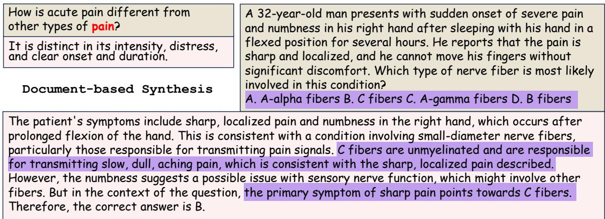

## Self-derived Synthesis

Figure 10: A detailed case on self-derived and document-based synthesis.

other types of pain. The corresponding response, while factually inoffensive, is superficial and of limited educational utility. On the other hand, CoT-Self-Instruct, representing self-derived synthesis, produces a question about the functions and clinical localization of different nerve fiber types. However, due to insufficient factual grounding, it fails to include A-delta fibers as a valid option within the appropriate clinical context, and incorrectly attributes sharp pain to C fibers. This constitutes a serious hallucination that contradicts fundamental neurophysiological consensus.

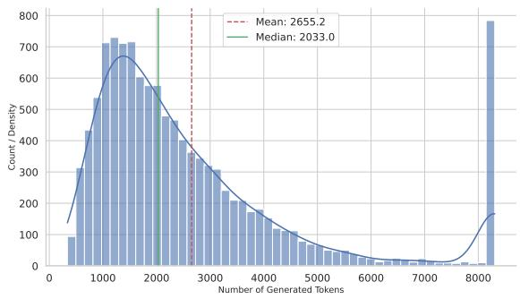  
Figure 11: Distribution chart of token lengths in the test set on Qwen3-4B with thinking mode.

## K Evaluation on Extended Benchmarks

We evaluated all baseline methods on the extended benchmarks and compiled their performance. The results, presented in Figure 9, demonstrate that our approach consistently achieves leading performance.

## L Token Efficiency Analysis

To demonstrate the token efficiency of our method, we compared the token lengths of inference responses across multiple baselines on ten benchmark test sets (results shown in Figures 11, 12, 13, and 14). Our method uses the non-thinking mode of Qwen3-4B for data synthesis, mainly considering the efficiency and practicality of offline data generation under resource-constrained settings. We further compare thinking and non-thinking modes for data synthesis using both SAGE and CoT-Self-Instruct, with each setting repeated over three runs. As shown in Table 10, using thinking mode during data synthesis does not bring consistent improvements. As illustrated, our approach not only achieves state-of-the-art performance as shown in Section 4.3, but also maintains significantly lower token lengths compared to all baseline methods. Specifically, our method yields an average token length of only 230.3, which is notably lower than the 2655.2 tokens of Qwen3-4B’s thinking mode and the 2947.3 tokens of the M23K dataset distilled from R1-style responses. Furthermore, the Wrap method exhibits excessively short token lengths, averaging only 57.5, which aligns with the analysis presented in Appendix J. Therefore, our method achieves a favorable balance between downstream effectiveness and inference-time token efficiency.

<table><tr><td>Model</td><td>Method/Dataset</td><td>Scale</td><td>AVG-5</td><td>AVG-10</td><td>Lancet</td><td>MedBul_op4</td><td>MedBul_op5</td><td>MedXpert</td><td>NEJM</td></tr><tr><td>Qwen3-4B-Base</td><td>Few-shot Prompting</td><td>NA</td><td>26.15</td><td>24.88</td><td>30.58</td><td>29.55</td><td>24.03</td><td>11.18</td><td>22.72</td></tr><tr><td>Qwen3-4B NoThinking</td><td>NA</td><td>NA</td><td>62.54</td><td>54.15</td><td>59.47</td><td>50.32</td><td>48.05</td><td>13.04</td><td>57.88</td></tr><tr><td>Qwen3-4B Thinking</td><td>NA</td><td>NA</td><td>66.18</td><td>57.98</td><td>62.86</td><td>59.09</td><td>50.97</td><td>13.73</td><td>62.19</td></tr><tr><td>Open Source Datasets</td><td></td><td></td><td></td><td></td><td></td><td></td><td></td><td></td><td></td></tr><tr><td>Qwen3-4B-Base</td><td>m1k</td><td>1k</td><td>63.40</td><td>56.98</td><td>61.65</td><td>59.74</td><td>54.87</td><td>17.05</td><td>59.54</td></tr><tr><td>Qwen3-4B-Base</td><td>m23k</td><td>23k</td><td>67.39</td><td>61.44</td><td>65.05</td><td>67.53</td><td>61.04</td><td>20.50</td><td>63.35</td></tr><tr><td>Qwen3-4B-Base</td><td>HuatuoGPT-o1-SFT</td><td>20k</td><td>52.80</td><td>48.22</td><td>56.31</td><td>51.62</td><td>43.51</td><td>15.73</td><td>51.08</td></tr><tr><td>Qwen3-4B-Base</td><td>MedReason</td><td>33k</td><td>58.60</td><td>51.76</td><td>51.94</td><td>54.22</td><td>49.35</td><td>16.84</td><td>52.24</td></tr><tr><td>Self-derived Method</td><td></td><td></td><td></td><td></td><td></td><td></td><td></td><td></td><td></td></tr><tr><td>Qwen3-4B-Base</td><td>self-instruct</td><td>10k</td><td>53.66</td><td>47.26</td><td>50.73</td><td>47.08</td><td>41.23</td><td>13.18</td><td>52.07</td></tr><tr><td>Qwen3-4B-Base</td><td>scalequest</td><td>10k</td><td>62.91</td><td>54.17</td><td>58.25</td><td>51.30</td><td>47.40</td><td>13.66</td><td>56.55</td></tr><tr><td>Qwen3-4B-Base</td><td>KPDDS</td><td>10k</td><td>58.99</td><td>50.26</td><td>53.88</td><td>44.16</td><td>41.56</td><td>13.87</td><td>54.23</td></tr><tr><td>Qwen3-4B-Base</td><td>MathScale</td><td>10k</td><td>57.85</td><td>50.37</td><td>59.22</td><td>47.73</td><td>39.29</td><td>14.63</td><td>53.57</td></tr><tr><td>Qwen3-4B-Base</td><td>Cot-Self-Instruct</td><td>10k</td><td>63.71</td><td>56.80</td><td>64.32</td><td>57.14</td><td>48.70</td><td>19.12</td><td>60.20</td></tr><tr><td colspan="10">Document-based Method</td></tr><tr><td>Qwen3-4B-Base</td><td>Easy-Dataset</td><td>28k</td><td>49.11</td><td>41.40</td><td>44.17</td><td>37.34</td><td>34.09</td><td>11.32</td><td>41.46</td></tr><tr><td>Qwen3-4B-Base</td><td>Genie</td><td>30k</td><td>49.98</td><td>44.87</td><td>54.85</td><td>44.16</td><td>37.99</td><td>14.22</td><td>47.60</td></tr><tr><td>Qwen3-4B-Base</td><td>Self-QA</td><td>230k</td><td>46.34</td><td>42.62</td><td>50.73</td><td>42.21</td><td>39.29</td><td>13.66</td><td>48.59</td></tr><tr><td>Qwen3-4B-Base</td><td>Wrap</td><td>98K</td><td>50.20</td><td>45.43</td><td>53.40</td><td>44.48</td><td>42.21</td><td>15.11</td><td>48.09</td></tr><tr><td>Ours</td><td></td><td></td><td></td><td></td><td></td><td></td><td></td><td></td><td></td></tr><tr><td>Qwen3-4B-Base</td><td>w/o Iteration</td><td>10k</td><td>66.45</td><td>58.51</td><td>63.83</td><td>58.12</td><td>50.32</td><td>21.39</td><td>59.20</td></tr><tr><td>Qwen3-4B-Base</td><td>w/o Parallel</td><td>10k</td><td>66.81</td><td>58.33</td><td>62.38</td><td>57.14</td><td>48.38</td><td>23.12</td><td>58.21</td></tr><tr><td>Qwen3-4B-Base</td><td>w/o Atomic gen.</td><td>10k</td><td>66.21</td><td>58.17</td><td>62.14</td><td>57.47</td><td>51.30</td><td>22.15</td><td>57.55</td></tr><tr><td>Qwen3-4B-Base</td><td>w/o Associative gen.</td><td>10k</td><td>66.13</td><td>59.62</td><td>68.20</td><td>59.09</td><td>52.27</td><td>23.60</td><td>62.35</td></tr><tr><td>Qwen3-4B-Base</td><td>Ours(Full)</td><td>10k</td><td>68.12</td><td>59.79</td><td>66.02</td><td>59.42</td><td>46.43</td><td>22.71</td><td>62.69</td></tr></table>

Table 9: Performance comparison on additional datasets. Since the first five medical datasets are detailed in the main text, this table focuses on the remaining datasets and the overall AVG-10 scores (%).

## M Stability Across Independent Runs

To further examine the stability of SAGE, we conduct three independent runs for SAGE and two primary synthetic-data baselines, CSI (CoT-Self-

Instruct) and WRAP, using the same experimental setting. Table 11 reports the mean accuracy and standard deviation across five medical QA benchmarks.

As shown in the table, SAGE consistently achieves the best average performance across the evaluated benchmarks across runs. This suggests that the observed improvements are not driven by a single favorable run, but reflect stable gains from the proposed grounded synthesis framework.

## N Comparison with Fine-Tuning on Original Training Sets

We also compare SAGE with supervised finetuning on the original training sets of datasets that provide dedicated training splits. Specifically, we fine-tune the same base LLM on the training sets of MedMCQA, MedQA, and PubMedQA, which contain approximately 10k, 100k, and 200k samples, respectively.

Table 12 reports the mean accuracy and standard deviation across multiple runs. Despite using existing human-curated training data, fine-tuning on the original dataset training splits yields substantially lower performance than SAGE. One possible reason is that these datasets were not primarily designed for instruction tuning of LLMs: their target outputs are often short answer-only labels, providing limited supervision for learning reasoningoriented response patterns. In contrast, SAGE constructs explanation-rich instruction data grounded in semantic anchors, which provides stronger supervision for medical question answering.

<table><tr><td>Method</td><td>AVG-5</td><td>MedMCQA</td><td>MedQA</td><td>PubMedQA</td><td>MMLU-Pro (med) GPQA (med)</td><td></td></tr><tr><td>SAGE (thinking)</td><td> $6 7 . 8 5 \pm 0 . 2 6$ </td><td> $6 5 . 1 1 \pm 0 . 8 9$ </td><td> $6 7 . 6 1 \pm 0 . 3 9$ </td><td> $8 2 . 2 7 \pm 0 . 8 1$ </td><td> $6 2 . 4 8 \pm 0 . 7 5$ </td><td> $6 1 . 8 0 \pm 1 . 1 8$ </td></tr><tr><td>SAGE (non-thinking)</td><td> $6 8 . 0 5 \pm 0 . 2 2$ </td><td> $6 5 . 2 6 \pm 0 . 9 8$ </td><td> $6 8 . 2 4 \pm 1 . 8 5$ </td><td> $8 2 . 0 3 \pm 0 . 9 8$ </td><td> $6 2 . 2 1 \pm 1 . 0 2$ </td><td> $6 2 . 5 0 \pm 2 . 3 1$ </td></tr><tr><td>CoT-Self-Instruct (thinking)</td><td> $6 3 . 5 7 \pm 0 . 5 0$ </td><td> $6 2 . 3 4 \pm 0 . 1 3$ </td><td> $6 8 . 3 4 \pm 0 . 9 5$ </td><td> $6 9 . 6 3 \pm 0 . 2 3$ </td><td> $6 0 . 9 8 \pm 0 . 5 5$ </td><td> $5 6 . 5 8 \pm 0 . 9 7$ </td></tr><tr><td>CoT-Self-Instruct (non-thinking)</td><td> $6 3 . 7 5 \pm 0 . 1 0$ </td><td> $6 1 . 4 7 \pm 0 . 9 2$ </td><td> $6 7 . 1 1 \pm 0 . 9 4$ </td><td> $7 4 . 3 0 \pm 4 . 0 7$ </td><td> $6 2 . 2 6 \pm 0 . 4 4$ </td><td> $5 3 . 5 9 \pm 3 . 2 0$ </td></tr></table>

Table 10: Comparison between thinking and non-thinking modes for data synthesis. All results are reported as mean ± standard deviation over three runs. AVG-5 denotes the average score over the five medical benchmarks (%).
<table><tr><td>Method</td><td>AVG-5</td><td>MedMCQA</td><td>MedQA</td><td>PubMedQA</td><td>MMLU-Pro (med)</td><td>GPQA (med)</td></tr><tr><td>SAGE</td><td> $6 8 . 0 5 \pm 0 . 2 2$ </td><td> $6 5 . 2 6 \pm 0 . 9 8$ </td><td> $6 8 . 2 4 \pm 1 . 8 5$ </td><td> $8 2 . 0 3 \pm 0 . 9 8$ </td><td> $6 2 . 2 1 \pm 1 . 0 2$ </td><td> $6 2 . 5 0 \pm 2 . 3 1$ </td></tr><tr><td>CSI</td><td> $6 3 . 7 5 \pm 0 . 1 0$ </td><td> $6 1 . 4 7 \pm 0 . 9 2$ </td><td> $6 7 . 1 1 \pm 0 . 9 4$ </td><td> $7 4 . 3 0 \pm 4 . 0 7$ </td><td> $6 2 . 2 6 \pm 0 . 4 4$ </td><td> $5 3 . 5 9 \pm 3 . 2 0$ </td></tr><tr><td>WRAP</td><td> $4 9 . 1 8 \pm 0 . 9 5$ </td><td> $4 7 . 8 1 \pm 0 . 3 2$ </td><td> $4 7 . 0 3 \pm 0 . 7 9$ </td><td> $6 6 . 3 7 \pm 3 . 1 0$ </td><td> $4 6 . 4 0 \pm 0 . 6 9$ </td><td> $3 8 . 2 9 \pm 1 . 4 1$ </td></tr></table>

Table 11: Mean accuracy and standard deviation over three independent runs. SAGE shows consistently strong performance with low variance across five medical QA benchmarks (%).

<table><tr><td>Dataset</td><td>Train-Set</td><td>SAGE</td></tr><tr><td>MedMCQA</td><td> $5 7 . 4 2 \pm 0 . 7 6$ </td><td> $6 5 . 2 6 \pm 0 . 9 8$ </td></tr><tr><td>MedQA</td><td> $5 6 . 7 9 \pm 1 . 8 5$ </td><td> $6 8 . 2 4 \pm 1 . 8 5$ </td></tr><tr><td>PubMedQA</td><td> $5 0 . 6 0 \pm 1 . 1 2$ </td><td> $8 2 . 0 3 \pm 0 . 9 8$ </td></tr></table>

Table 12: Comparison between fine-tuning on original dataset training splits and fine-tuning on SAGEgenerated data. Results are reported as mean accuracy and standard deviation across multiple runs (%).

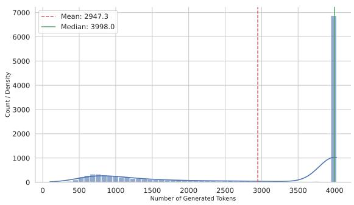  
Figure 12: Distribution chart of token lengths in the test set after training with m23k dataset on Qwen3-4B-Base.

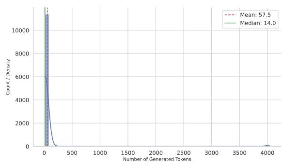  
Figure 13: Distribution chart of token lengths in the test set after training the data synthesized by the Wrap method on Qwen3-4B-Base.

## O Prompt Templates

To diversify our iterative data generation process, we employed two distinct question types: atomic generation and associative generation. The specific prompt templates used are provided in Figure 15 and Figure 16, respectively.

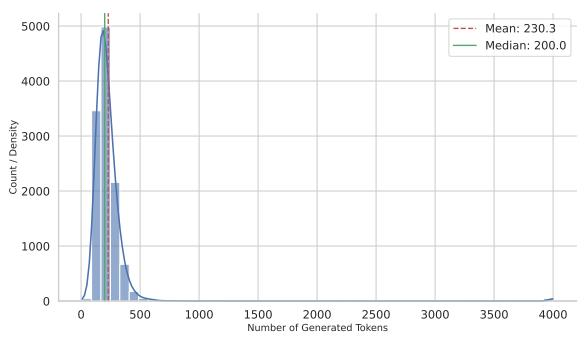  
Figure 14: Distribution chart of token lengths in the test set after training the data synthesized by our method on Qwen3-4B-Base.

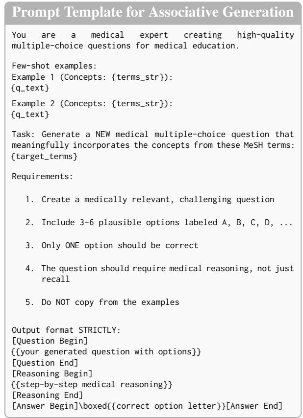  
Figure 15: The prompt template used for associative generation. Placeholders denote: {terms\_str} (concepts associated with the few-shot examples), {q\_text} (the content of the few-shot example questions), and {target\_terms} (the set of MeSH terms to be incorporated into the new question).

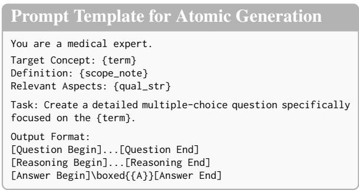  
Figure 16: The prompt template used for atomic generation. Placeholders denote: {term} (the target medical concept), {scope\_note} (the official definition/explanation of the term), and {qual\_str} (relevant sub-aspects or qualifiers associated with the term).