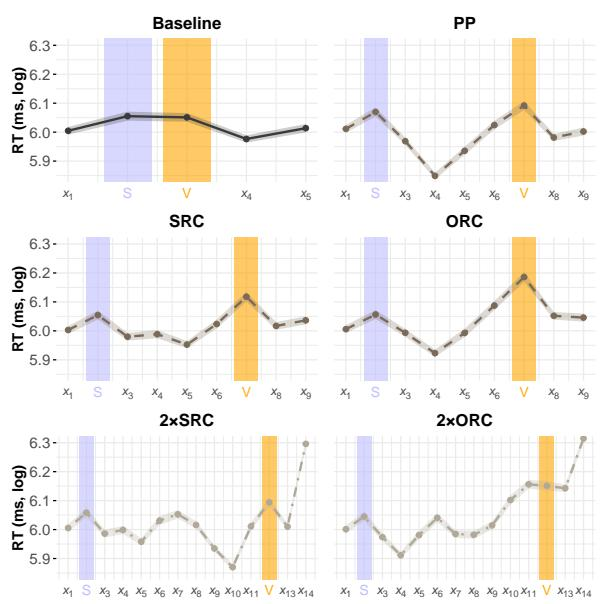
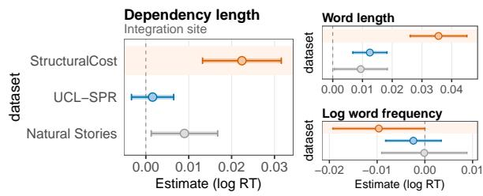
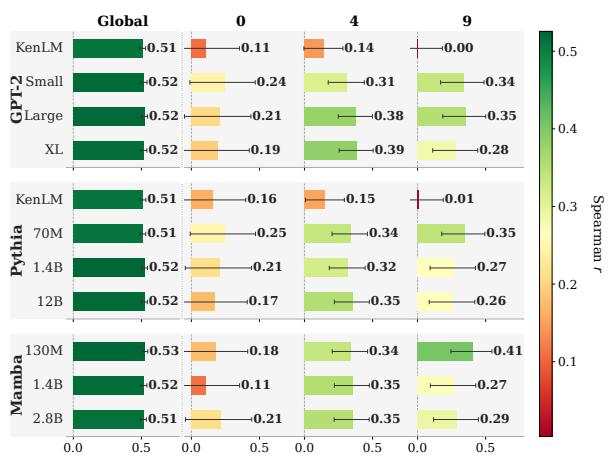

# STRUCTURALCOST: A controlled reading time dataset for modeling human sentence processing difficulty

Nina Nusbaumer1, Iria de-Dios-Flores2, Corentin Bel3, 4, Christophe Pallier3, 5, Guillaume Wisniewski1, Benoît Crabbé1

1LLF, CNRS, Université Paris Cité, 2COLT, Universitat Pompeu Fabra, 3Unicog, Neurospin, CEA, 4LNC2, ENS-PSL, 5INSERM, CNRS

{nina.nusbaumer, guillaume.wisniewski, benoit.crabbe}@u-pariscite.fr, iria.dedios@upf.edu, corentin.bel@ens.psl.eu, christophe@pallier.org

## Abstract

We introduce STRUCTURALCOST, a self-paced reading dataset of 475 participants and 40,800 observations isolating the processing cost of long-distance subject-verb dependency resolution. We replicate a low-powered psycholinguistic finding at NLP scale, namely that hu man reading times at the main verb increase with dependency length, driven by syntactic embedding beyond linear distance. Different language models – spanning n-gram models, SSMs, and transformers – partially mirror this graded difficulty profile, yet underestimate the integration cost humans incur, with a gap that persists across architectures and model sizes. This suggests these models capture the predictive component of human processing but not the full integration cost that working memory imposes. STRUCTURALCOST provides data needed to drive progress toward evaluating the cognitive plausibility of language models.

## 1 Introduction

An actively debated question in computational psycholinguistics is whether language models (LMs) can serve as computational models of human sentence processing (Wilcox et al., 2020; Oh and Schuler, 2023); essentially, whether the mechanisms driving LMs’ text processing mirror those humans deploy during language comprehension. The question has practical stakes: a cognitively plausible LM could be used to test hypotheses at scale that are otherwise difficult or impossible to probe experimentally and to leverage model failures to sharpen sentence processing theories.

Language comprehension is incremental and constrained by two key components: prediction and working memory. As readers encounter each word, they continuously predict what comes next, and processing effort rises when those predictions fail (Hale, 2001; Levy, 2008). At the same time, comprehension relies on working memory, which temporarily hold syntactic information until it can be integrated (Gibson, 2001; Lewis et al., 2006), e.g., the subject of a sentence remains active in memory until its main verb is later encountered.

LMs assign probabilities to words in context, which are a natural proxy for simulating the predictive component of human language processing. Numerous studies show that the surprisal of models, a simple log-transformation of these probabilities, correlates reliably with reading times – the primary behavioral proxy for online cognitive effort in psycholinguistics (e.g., Smith and Levy, 2013; Goodkind and Bicknell, 2018; Futrell et al., 2021). However, surprisal fit alone does not reveal whether LMs capture the memory-based component of language processing, one of its key signatures being the cost of resolving long dependencies: the further apart a syntactic head and its dependent are, the greater the cognitive effort required to resolve that dependency (Gibson, 2001; Lewis et al., 2006). This is a theoretically important distinction: LM architectures differ greatly in how they handle distance, from n-gram models with a hard local window to transformers with unconstrained selfattention. Thus, evaluating whether LMs replicate the graded effect of dependency length is a direct test of cognitive plausibility.

Measuring this graded difficulty profile is inherently challenging, as it requires isolating the impact of syntactic structure from confounding lexical factors, such as word frequency and length, which also influence processing times (Oh et al., 2024). Large naturalistic corpora provide the necessary scale for model evaluation but are often confounded by these lexical variables, making it difficult to separate the effects of dependency length from other influences. On the other hand, controlled psycholinguistic experiments are effective at isolating structural effects but typically lack the scale needed to evaluate models comprehensively. No existing dataset successfully combines both experimental control and large-scale data. To fill this gap, we introduce STRUCTURALCOST, a manually curated dataset of 40,800 self-paced reading observations from 475 participants, including individual working memory scores.1 STRUCTURALCOST is built following psycholinguistic standards applied at NLP scale: it holds the main subject-verb pair constant while systematically varying the distance between them, isolating the processing cost of dependency length from lexical confounds.

Using STRUCTURALCOST, we show that reading times at the main verb increase with dependency length – an effect driven by syntactic depth beyond linear distance alone – and that existing LMs only partially mirror this graded difficulty profile despite achieving strong global surprisal-RT fit. Models tend to underestimate the integration cost humans incur, consistently across architectures and model sizes, pointing to a fundamental limitation for treating them as plausible mechanistic models of sentence comprehension: current LMs seem to capture the predictive component of human processing but not the memory-based integration cost.

Our contributions are threefold: (1) we release STRUCTURALCOST, a large-scale controlled dataset that isolates dependency length effects on human reading times, replicating at large-scale previously low-powered psycholinguistic findings; STRUCTURALCOST is a controlled diagnostic tool, targeting a specific phenomenon, and not a general benchmark; this limited scope is a design choice, not a limitation. The use of established measures (surprisal-RT alignment, mixed models) is deliberate, so that the results remain directly comparable to existing psycholinguistic and NLP resources, the novelty being in the resource and its controlled manipulation. (2) In this controlled context, we observe that syntactic structure beyond mere linear distance modulates processing difficulty. (3) We observe that current LMs, across architectures and sizes, only partially replicate this graded difficulty profile despite strong global surprisal-RT fit, revealing a systematic blind spot in how cognitive plausibility is evaluated. We argue this motivates a shift toward controlled, memory-sensitive datasets as a criterion for cognitive plausibility.

## 2 Related Work

Toward cognitively plausible LMs. Because LMs assign probabilities to words in context, their surprisal estimates, defined as − log p(word|context), are a natural proxy for the predictive component of human language processing, and a growing body of work confirms they correlate with human reading times (Goodkind and Bicknell, 2018; Futrell et al., 2021). However, recent work finds an inverse scaling trend: larger models do not always yield better psychometric fit (Oh et al., 2022; Oh and Schuler, 2023; Shain et al., 2024), likely because state-of-the-art models have become superhuman at next-word prediction (Oh and Linzen, 2025), causing their surprisal to underestimate the difficulty humans experience.

A parallel line of work asks whether architectural constraints can bring models closer to human behavior. De Varda and Marelli (2024) and Timkey and Linzen (2023) show that inductive biases, beyond raw prediction accuracy, shape psychometric fit. Kuribayashi et al. (2022) provide a mechanistic explanation: transformer self-attention gives equal weight to all prior context, removing the distancedependent decay that produces locality effects in human processing. They show that imposing context limitations on transformers partially restores these effects.

However, these constrained models have been evaluated primarily on reaction times from naturalistic datasets: Dundee (Kennedy and Pynte, 2005), Provo (Luke and Christianson, 2018), MECO (Siegelman et al., 2022), UCL (Frank et al., 2013), the SPR Brown corpus (Smith and Levy, 2013), and Natural Stories (Futrell et al., 2021)2. While these corpora provide valuable insights into the global ability of LMs to fit general behavioral predictability, the uncontrolled variability in naturalistic data – where frequency, length, and syntactic structure are confounded – makes these datasets less well suited for modeling processing cost arising from structural complexity. Therefore, to be able to evaluate the cognitive plausibility of LMs, we must move beyond global fit on natural text and adopt controlled datasets that systematically manipulate structural and memory demands.

Limitations of existing datasets. Evaluating the cognitive plausibility of LMs involves testing their sensitivity to structural effects alongside their general ability to predict reading times. We identify four criteria that, we argue, datasets must satisfy to support such evaluation: (C1) Isolation – sentences must appear in isolation to remove the influence of prior context and focus solely on working memory limits; (C2) Controlled variables – the dataset must systematically vary dependency length while keeping vocabulary and lexical properties constant, ensuring that any increase in difficulty is due to memory load, not harder words; (C3) Sufficient items – a broad and varied set of unique sentences to provide robust model evaluation; (C4) Sufficient participants – enough participants per sentence to ensure reliable statistical estimates. Existing resources are insufficient for the evaluation of LMs’ potential sensitivity to structural complexity as neither meets all three criteria: NLP-oriented datasets offer large-scale naturalistic data but lack experimental control to isolate structural effects, while psycholinguistic datasets provide strong control but lack the items and participants needed for model evaluation. STRUCTURAL-COST is designed to satisfy all criteria simultaneously (see Appendix A for a detailed evaluation of existing datasets against these criteria).

<table><tr><td>Condition</td><td>Dep.</td><td colspan="3">Example Sentence</td></tr><tr><td colspan="6">Critical sentences</td></tr><tr><td>Baseline</td><td>0</td><td></td><td>The violinist</td><td>leaves the stage before the audience loudly applauds the great performance.</td></tr><tr><td>PP</td><td>4</td><td></td><td>The violinist</td><td>in the large orchestra leaves the stage before the audience loudly applauds.</td></tr><tr><td>SRC</td><td>4</td><td></td><td>The violinist</td><td>that followed the conductor leaves the stage before the audience loudly applauds.</td></tr><tr><td>ORC</td><td>4</td><td></td><td>The violinist</td><td>that the conductor followed leaves the stage before the audience loudly applauds.</td></tr><tr><td>2×SRC</td><td>9</td><td></td><td>The violinist</td><td>that followed the conductor that worked in the orchestra leaves the stage.</td></tr><tr><td>2×ORC</td><td>9</td><td></td><td>The violinist</td><td>that the conductor that the whole orchestra admired followed leaves the stage.</td></tr><tr><td colspan="5">Control sentences</td></tr><tr><td>Baseline</td><td>0</td><td>The</td><td>waiter</td><td>stacks the plates with the dirty apron next to the kitchen sink.</td></tr><tr><td>PP-short</td><td>4</td><td>The</td><td>waiter</td><td>with the dirty apron stacks the plates next to the kitchen sink.</td></tr><tr><td>PP-long</td><td>9</td><td>The</td><td>waiter</td><td>with the dirty apron next to the kitchen sink stacks the plates.</td></tr></table>

Table 1: Example sets of critical and control sentences. Dep. (dependency length) = number of intervening words between the main subject and main verb . Critical sentences cross syntactic structure (SRC/ORC) with embedding depth (single/double), plus a 0-word baseline and a 4-word linear-distance control (PP). Control sentences manipulate linear distance via prepositional phrases, with no syntactic embedding, providing a reference class for dissociating distance from structural complexity.

## 3 Dataset Creation

Design rationale. Our dataset targets a welldocumented prediction from memory-based theories of sentence processing: longer dependencies between a subject and a verb yield higher integration costs at the verb (Gibson, 2001; Lewis et al., 2006). To isolate this effect, we contrast sentences that have maximally overlapping vocabulary but varying distance between the main subject and main verb, which we manipulate using intervening material.3

Dependency length can increase in two ways: linearly, by inserting prepositional phrases or also hierarchically, by embedding relative clauses. Both increase subject-verb distance, but differ in processing demands: linear modifications incrementally extend dependencies, while hierarchical embeddings introduce qualitatively greater complexity by nesting clauses and requiring the reader to manage multiple layers of syntactic information, increasing storage cost on working memory (Gibson, 2001; Liu et al., 2026), though see Section 6 for an unexpected reversal of this prediction at double embedding. Structural complexity may also contribute independently of dependency length: object relative clauses are consistently harder than subject ones even at matched distances (Gordon et al., 2001). Individual differences in working memory capacity (WMC) may further modulate these effects, with lower-WMC readers showing larger slowdowns under long-distance dependencies (King and Just, 1991; Just and Carpenter, 1992). The controlled structure of our design allows us to tease apart these potentially confounded factors, through two sentence types: critical sentences and control sentences.

Critical sentences are of primary interest: they manipulate syntactic structure while keeping dependency length constant across conditions. The intervening material between subject and verb is either a subject relative clause (SRC) or an object relative clause (ORC), singly embedded (4-word dependency) or doubly embedded (9-word dependency), yielding four core conditions. Two additional conditions anchor the design: a 0-word dependency baseline with no intervening material, and a prepositional phrase (PP) condition at 4 words. The PP condition is critical to the logic of the design: it matches the singly embedded relatives in surface dependency length while introducing no additional clause (i.e., no embedded subject and verb) between subject and verb, isolating linear distance as a factor independently of clausal embedding. Critical items thus comprise six conditions in total (an example set is shown in Table 1).

Control sentences extend the linear distance manipulation introduced by the PP condition in the critical items. They augment dependency length through prepositional phrases of increasing length (0, 4, and 9 words), without embedding an additional clause; an example set can be seen in Table 1. Matched to critical items on dependency length but not hierarchical complexity, they allow direct dissociation of linear distance from structural depth effects, with the PP conditions serving as the common reference point between the two sets.

Stimulus construction. Sentences were generated with LLaMA-3.2 (Grattafiori et al., 2024) and Perplexity.ai (2024) under tight constraints (identical subject-verb pairs, minimal lexical variation, semantic plausibility), then manually reviewed and extensively corrected for naturalness. Complete construction details (constraints, correction criteria, and item statistics) are provided in Appendix B. LLM output served only as an initial drafting aid to vary semantic domains while preserving structural consistency across conditions; final acceptance required independent manual judgments of plausibility, semantic equivalence, and naturalness across all six condition-mates in a set. The final dataset comprises 60 sentences per condition across the six critical item conditions (360 sentences total) and 30 sentences per condition across the three control conditions (90 sentences total), for a grand total of 450 sentences.4

Data collection. Reading times were collected from native English speakers recruited via Prolific, an online crowdsourcing platform widely used in cognitive research, and using a self-paced reading (SPR) procedure. Participants read one list of 90 counterbalanced sentences (details in Appendix B); comprehension was verified using manually curated comprehension questions and only participations with a score ≥70 % were kept, yielding a total of 475 participants. Sentences with word reading times below 100 ms or above 3,000 ms are excluded from the dataset as likely reflecting inattention or technical errors (<5 % of the data), yielding a final dataset of 27,103 critical sentences and 13,663 control sentences. After the reading task, participants performed a working memory capacity test using the operation span test. Full participant details, exclusion criteria, task parameters, participant instructions, consent procedure, and recruitment details are provided in the Datasheet in Appendix B.

## 4 Human Processing Behavior Analysis

Before examining the ability of LMs to predict reading times, we first report a series of control tests to assess the quality of the collected data, where we observe that human reading times follow the patterns described by sentence processing theories. We apply a Region of Practical Equivalence (ROPE) analysis, comparing RTs between different sentence groups and considering differences smaller than 0.1 SD of the RT distribution (35 ms in our data) as negligible. This helps us determine whether the observed differences are meaningful, rather than merely detectable due to our large sample size.

Structure drives difficulty beyond linear distance. We first observe the effect of dependency length on verb reading times, collapsing across clause types. Reading times increase from 0-word (M = 490 ms) to 4-word dependencies (M = 544 ms), and decrease slightly at 9 words (M = 528 ms). This pattern aligns partially with sentence processing theories, which argue that longer dependencies lead to higher processing costs, but already suggests that distance alone does not drive difficulty: the ROPE analysis confirms that both the 0- vs. 4-word (d = −0.15, 95 % CI [−0.19, −0.12]) and 0- vs. 9-word contrasts (d = −0.11, 95 % CI $[ - 0 . 1 5 , - 0 . 0 8 ] )$ exceed the ROPE, while the 4- vs. 9-word contrast is negligible $( d = 0 . 0 5 , 9 5 \%$ CI [0.02, 0.07]). Collapsing across clause types, however, confounds distance with syntactic structure, so we turn to condition-level comparisons to investigate the impact of syntactic structure on processing difficulty.

<table><tr><td rowspan="2">Condition</td><td rowspan="2">Dep. (words)</td><td rowspan="2">N</td><td rowspan="2">Mean RT</td><td rowspan="2">SD</td><td rowspan="2">Median RT</td><td colspan="2">Cohen&#x27;s d (vs. baseline)</td></tr><tr><td>d</td><td>95% CI</td></tr><tr><td>Baseline</td><td>0</td><td>4,574</td><td>490</td><td>308</td><td>422</td><td></td><td></td></tr><tr><td>PP</td><td>4</td><td>4,562</td><td>512</td><td>321</td><td>435</td><td>-0.08</td><td> $[ - 0 . 1 2 , - 0 . 0 4 ]$ </td></tr><tr><td>SRC</td><td>4</td><td>4,549</td><td>539</td><td>370</td><td>439</td><td>-0.15</td><td> $\bar { \left\lceil - 0 . 1 9 , - 0 . 1 2 \right\rceil }$ </td></tr><tr><td>ORC</td><td>4</td><td>4,496</td><td>583</td><td>408</td><td>467</td><td>-0.19</td><td> $[ - 0 . 2 4 , - 0 . 1 5 ]$ </td></tr><tr><td>2×SRC</td><td>9</td><td>4,545</td><td>504</td><td>302</td><td>436</td><td>-0.11</td><td> $[ - 0 . 1 5 , - 0 . 0 8 ]$ </td></tr><tr><td>2×ORC</td><td>9</td><td>4,377</td><td>553</td><td>383</td><td>438</td><td>-0.14</td><td> $[ - 0 . 1 8 , - 0 . 1 0 ]$ </td></tr></table>

Table 2: RTs (ms) at the main verb by condition, with Cohen’s d relative to the baseline (0-word dependency).

Figure 1 displays average log-transformed RTs at each word position for all six conditions and shows a consistent spike at the main verb across all $\mathrm { c o n d i t i o n s } ^ { 5 }$ . All conditions slow readers down relative to baseline, but to varying degrees (Table 2). Crucially, at the same 4-word dependency length, the three conditions pattern differently: the PP produces a negligible effect relative to the ROPE $( d = - 0 . 0 8$ , 95 % CI $[ - 0 . 1 2 , - 0 . 0 4 ] )$ , the SRC a small but meaningful one $( d \ : = \ : - 0 . 1 5$ , 95 % $\mathbf { C I } \left[ - 0 . 1 9 , - 0 . 1 2 \right] )$ , and the ORC the largest one $( d = - 0 . 1 9 , 9 5 \% \mathrm { C I } \left[ - 0 . 2 4 , - 0 . 1 5 \right] )$ . That three conditions sharing identical dependency length produce graded slowdowns suggests that the structural source of the dependency contributes to processing difficulty independently of its surface length. At 9-word dependencies, the same ordering holds: 2×SRC (d = −0.11, 95 % CI [−0.15, −0.08]) is slower than baseline but faster than 2×ORC $( d = - 0 . 1 4 , 9 5 \% \mathrm { C I } \left[ - 0 . 1 8 , - 0 . 1 0 \right] )$ . Comparing across embedding depths, the increase from single to double embedding is modest: SRC and 2×SRC differ by $\Delta d = 0 . 0 4 { \ : }$ , and ORC and $2 \times \mathrm { O R C }$ by $\Delta d = 0 . 0 5$ , both negligible relative to the ROPE. Clause type thus appears to be a stronger determinant of processing cost than embedding depth – and, in fact, the direction of this difference runs counter to expectation: doubly-embedded conditions are consistently faster than their singlyembedded counterparts for both clause types, a reversal we return to in Section 6, a reversal al-

  
Figure 1: Average log-transformed RTs by condition with 95 % CIs (shaded ribbon). Curve colour indicates dependency length between subject noun (S) and main verb (V): dark grey = 0-word; medium grey = 4-word; light grey = 9-word.

## ready visible in Table 2.

Mixed-effects models confirm that dependency length contributes to reading times even after accounting for standard psycholinguistic confounds (i.e., word length and frequency). In the following inferential analyses, we log-transform reading times (base 2), as is standard in psycholinguistics, which reduces skewness, stabilizes variance across conditions, and facilitates comparisons across studies. All models predict log-transformed RTs at the main verb with random intercepts for participants, items, and presentation order, fitted using the lme4 package (Bates, 2010). A baseline model (M0) including word length and log-transformed lexical frequency from WikiText-103 (Merity et al., 2016) was compared via likelihood ratio test to a model additionally including dependency length $( \mathbf { M } 1 ) ^ { 6 }$ . The extended model significantly improves fit $\chi ^ { 2 } ( 1 ) = 2 1 . 6 , p < . 0 0 1 , { } ^ { 7 }$ and all three predictors reach significance: word length $( \beta = 0 . 0 1 2$ $t = 5 . 0 4 , p < . 0 0 1 )$ , log frequency $( \beta = - 0 . 0 0 9$ $t = - 4 . 1 0 , p < . 0 0 1 )$ , and dependency length $( \beta ~ = ~ 0 . 0 0 6 5 , ~ t ~ = ~ 4 . 7 3 , ~ p ~ < ~ . 0 0 1 )$ . Crucially, the dependency length effect corresponds to an increase of approximately 3 ms per additional intervening word, a stable estimate in our large sample collected outside controlled laboratory conditions.

  
Figure 2: Fixed-effect estimates from M1 fitted separately to Natural Stories, UCL-SPR, and STRUCTURAL-COST (at the integration site). All predictors are zscored; estimates are on the log-RT scale. Error bars are 95 % CIs.

Comparison with other datasets. To situate STRUCTURALCOST against related resources with less control, we fit the same model M1 to Natural Stories (Futrell et al., 2021) and UCL-SPR (Frank et al., 2013) at the integration site of the main verb and report the resulting fixed-effect coefficients in Figure 2 (implementation details in Appendix D). The dependency length effect decreases at the main verb in both naturalistic corpora, while it increases in STRUCTURALCOST. Back-transforming from an example 500 ms baseline, this corresponds to a ∼1–5ms difference per SD of dependency length in naturalistic datasets versus ∼ 11 ms in STRUC-TURALCOST – a difference our controlled design can isolate because dependency length is varied orthogonally to lexical properties. While word frequency effects are relatively similar across datasets, word length is a stronger RT predictor in STRUC-TURALCOST than in the naturalistic corpora, which is expected given that our stimuli contain longer verbs by design (7.5 characters on average vs. 5 in the naturalistic datasets). These comparisons suggest that STRUCTURALCOST complements naturalistic corpora by providing experimental control over dependency length effects.

## 5 Probing Surprisal as a Cognitive Proxy

We evaluate the extent to which LM surprisal captures the graded cost of integrating a subject with its verb across an intervening dependency as opposed to surface-level predictability. This requires dissociating two levels of alignment, which we term global and local.

Global alignment asks whether surprisal correlates with RTs across all word positions. This is a meaningful and well-established result (Smith and Levy, 2013), but a weak test of cognitive plausibility: a model that has learned general word frequency and co-occurrence statistics will score well here, because most RT variance reflects lexical predictability rather than structural cost. Global alignment is therefore a necessary baseline but is not enough to model human processing: averaging over all positions dilutes the structural signal present at the main verb, which we evaluate separately as local alignment.

Local alignment measures the same correlation restricted to a theoretically motivated position: the main verb, where the subject-verb dependency is resolved and humans show graded difficulty as a function of dependency length and syntactic structure. This is a much stricter test: fitting RTs well requires assigning higher surprisal when the dependency is harder to integrate, a sensitivity to structural cost that goes beyond surface statistics. A model that passes the global test but fails the local one has learned lexical predictability without encoding the memory-based integration cost that drives human processing difficulty.

## 5.1 Models and Setup

Language models. We selected models spanning a memory constraint spectrum: two KenLM ngram models (Heafield, $2 0 1 1 ) ^ { 8 }$ as a Markovian baseline with a hard local window of 5 tokens; three GPT-2 models (small, large, XL; Radford et al., 2019) and three PYTHIA models (70M, 1.4B, 12B; Biderman et al., 2023) as representatives of the currently dominant transformer architecture with unconstrained self-attention; and three MAMBA models (130M, 1.4B, 2.8B; Gu and Dao, 2024) implementing selective state-space compression as a proxy for recency-biased memory and incremental recurrent processing at scale. Within each family, size variation tests whether scaling improves behavioral fit while controlling for training data and vocabulary.

Surprisal extraction. Word-level surprisal was extracted for every sentence, aggregating subword tokens following Pimentel and Meister $( 2 0 2 4 ) ^ { 9 }$ Preprocessing details are given in Appendix C.

Statistical analyses We assess alignment between model surprisal and human RTs using two complementary methods. The first captures broad co-variation: for each word position, we compute Spearman correlations between model surprisal and mean RT across participants, evaluated both globally (all positions) and locally (main verb only). The second tests whether surprisal contributes independently of known low-level predictors: we fit a sequence of nested linear mixed-effects models (Bates, 2010) predicting log RT for each word read by each participant, adding predictors incrementally to isolate the unique contribution of surprisal and dependency length:

$$
\begin{array} { r l } & { \mathbf { M 0 } : \log \mathrm { R T } \sim \log \mathrm { f r e q } + \mathrm { l e n g t h } + ( 1 | \mathrm { p a r t . } ) + ( 1 | \mathrm { i t e m } ) } \\ & { \mathbf { M 1 } : \cdot \cdot \cdot + \mathrm { s u r p r i s a l } } \\ & { \mathbf { M 2 } : \cdot \cdot \cdot + \mathrm { d e p e n d e n c y } \mathrm { l e n g t h } } \end{array}
$$

Model comparison via likelihood ratio tests quantifies whether each added predictor genuinely improves fit. Note that in the global model, dependency length is a per-sentence condition-level predictor tested as a general robustness check across all word positions; it is only at the local (mainverb) level that dependency length functions as a theoretically motivated integration-cost predictor, since this is where the subject-verb dependency is resolved.

## 5.2 Results

Global alignment: surprisal as a general RT predictor. We first establish whether LM surprisal predicts human RTs across all word positions, replicating prior work and setting a baseline against which local alignment can be assessed. Spearman correlations with word-level RTs are moderate and strikingly uniform: all models cluster at $r = 0 . 5 1 -$ 0.53 with tight CIs (±.02) far from zero (Figure 3, left panel), regardless of architecture or size.

The mixed-effects analysis confirms this picture: adding surprisal to the baseline model improves fit for all neural LMs $( p < . 0 0 1 , \chi ^ { 2 } ( 1 ) > 8 4 6 ;$ Table 3), indicating that surprisal captures variance in RTs beyond lexical frequency and word length. Further adding dependency length yields additional improvement $( p \ < \ . 0 0 1 )$ , suggesting that structural information contributes independently of surprisal. Global fit is thus robust, but as argued above, not sufficient: whether models encode the specific structural cost of subject-verb integration is the question we turn to next.

  
Figure 3: Spearman correlations between model surprisal and reading times, by dependency length (0, 4, 9 words) and fit level: all words (left) vs. verb only (right). Error bars show 95% CIs. See Appendix F for the table.

Local alignment: surprisal at the integration site. Restricting the analysis to the main verb reveals a consistent and informative drop (Figure 3): at dependency length 0, no model yields reliable correlations, with all CIs including zero – likely because the main verb follows immediately after the subject, leaving minimal left context for surprisal to track. At dependency length 4, correlations fall from $r = 0 . 5 1 \mathrm { - } 0 . 5 3$ globally to $r = 0 . 3 1 \mathrm { - } 0 . 3 9$ at the verb for neural models, and collapse to $r = 0 . 1 4 \mathrm { - } 0 . 1 5$ for n-gram models, whose CIs include zero $( [ - . 0 1 , . 2 9 ] )$ . Neural models show significant surprisal effects at dependency length 4 (all $p < 1 0 ^ { - 5 } , \chi ^ { 2 } ( 1 ) = 1 8 \ – 4 3 )$ with CIs entirely above zero, and, when comparing model surprisal at the main verb itself across conditions matched for linear distance, reproduce the syntactic ordering $\mathrm { P P } < \mathrm { S R C } < \mathrm { O R C }$ at fixed linear distance (all $p \ < \ . 0 0 1 )$ , confirming sensitivity to hierarchical structure beyond raw word count. Dependency length contributes further beyond surprisal (all $p < . 0 5 , \chi ^ { 2 } ( 1 ) = 5 \ – 1 1 )$ , indicating that structural distance is not fully captured by surprisal alone. At dependency length 9, neural models hold up but unevenly: most settle at $r = 0 . 2 6 \mathrm { - } 0 . 3 5$ with wider CIs reflecting reduced power, the SRC < ORC verb-surprisal contrast attenuates, and no model approaches the sharp 70 ms ORC penalty humans incur at fixed linear distance (PP vs. ORC in Table 2), an indication that the failure is qualitative, not merely quantitative. Ngram models fail entirely: with the subject noun beyond the 5-gram window at dependency 4 and 9, surprisal adds nothing over baseline predictors at any dependency length $( p > 0 . 5 , \chi ^ { 2 } ( 1 ) < 0 . 1 )$ This global-to-local reduction is the central finding of the present work: models that appeared equivalent under global alignment diverge sharply when tested at the integration site.

<table><tr><td rowspan="2">Model</td><td colspan="2">M0→M1</td><td colspan="2">M1→M2</td></tr><tr><td>Global</td><td>Local</td><td>Global Local</td><td></td></tr><tr><td>N-gram baselines</td><td></td><td></td><td></td><td></td></tr><tr><td>KenLM (GPT-2)</td><td>940 **</td><td>0.02</td><td> $4 4 ^ { * * * }$ </td><td> $2 0 . 5 ^ { * * * }$ </td></tr><tr><td>KenLM (Pythia)</td><td>993 ***</td><td>0.08</td><td> $4 4 ^ { * * * }$ </td><td> $2 0 . 6 ^ { * * * }$ </td></tr><tr><td>GPT-2</td><td></td><td></td><td></td><td></td></tr><tr><td>Small</td><td>1082 ***</td><td>27.8* ***</td><td>33 ***</td><td> $8 . 0 ^ { * * }$ </td></tr><tr><td>Large</td><td>1257* 7***</td><td>43.4 ***</td><td>29 ***</td><td> $5 . 0 ^ { * }$ </td></tr><tr><td>XL</td><td>1010* ***</td><td>31.7 ***</td><td>31 ***</td><td>8.1**</td></tr><tr><td>Pythia</td><td></td><td></td><td></td><td></td></tr><tr><td>70M</td><td>930***</td><td>25.3* ***</td><td>42 ***</td><td> $1 0 . 6 ^ { * * * }$ </td></tr><tr><td>1.4B</td><td>1165***</td><td>20.8 ***</td><td>29 ***</td><td> $9 . 4 ^ { * * }$ </td></tr><tr><td>12B</td><td>1005* ***</td><td>20.3 ***</td><td>29 ***</td><td> $9 . 2 ^ { * * }$ </td></tr><tr><td>Mamba</td><td></td><td></td><td></td><td></td></tr><tr><td>130M</td><td>1045***</td><td>23.5***</td><td>32***</td><td> $9 . 7 ^ { * * }$ </td></tr><tr><td>1.4B</td><td> $9 0 0 ^ { * * * }$ </td><td> $1 8 . 2 ^ { * * }$ </td><td> $3 1 ^ { * * * }$ </td><td> $1 1 . 3 ^ { * * * }$ </td></tr><tr><td>2.8B</td><td> $8 4 6 ^ { * * * }$ </td><td> $1 8 . 7 ^ { * * }$ </td><td>31***</td><td> $9 . 4 ^ { * * }$ </td></tr></table>

Table 3: $\chi ^ { 2 } ( 1 )$ from likelihood ratio tests, globally and locally at the main verb. M0: baseline (word log frequency + word length); M1: + surprisal; M2: + dependency length. $^ { * } p < . 0 5 , ^ { * * } p < . 0 1 , ^ { * * * } p < . 0 0 1$ Global here tests dependency length as a sentence-level covariate across all positions; Local restricts to the integration site.

Crucially, scaling within families has no consistent benefit: larger models do not fit human integration profiles better, and the largest variants lose correlation points relative to their smaller counterparts. This suggests the gap is not a matter of capacity but a structural one (e.g., inductive bias or training objective). Consistent with this, MAMBA-130M reaches $r ~ = ~ 0 . 4 1$ at dependency length 9, the only model whose CI does not overlap with any 0- word dependency interval, approaching the global baseline and outperforming larger attention-based models. This suggests that memory-constrained architectures produce integration profiles closer to human behavior, though the advantage remains modest and requires further investigation. Reader profile analyses (Appendix E) point to a further limitation independent of architecture or scale: surprisingly, LMs fit slow and medium readers better than fast ones, who display high working-memory readers and are simultaneously faster and more accurate. The fast readers being the hardest to model suggests efficient integration strategies remain outside what surprisal captures.

## 5.3 Comparison of predicted and observed RTs

If surprisal captured the full integration cost of the dependency, a surprisal-to-RT conversion factor estimated independently should predict RT effects of the observed magnitude. Following Van Schijndel and Linzen (2021) and Huang et al. $( 2 0 2 4 ) ^ { 1 0 }$ we test this by estimating, for each model, a conversion factor (ms per bit of surprisal) on an independent corpus (Natural Stories, Futrell et al., 2021), regressing RT on surprisal at the current and three preceding words (spillover), word length, and log-frequency11. Only four models yielded a significant spillover coefficient at $p < . 0 1$ (Mamba-130M, Pythia-70M, Pythia-1.4B, KenLM/GPT-2) and were retained as conversion factors; we applied their conversion factors to surprisal on STRUC-TURALCOST critical items to obtain predicted Effects of Interest $( \mathrm { E O I s } ) ^ { 1 2 }$

Table 4 compares predicted and observed EOIs. Predicted effects were between one and three orders of magnitude too small across all four models: for KenLM-GPT2, predicted EOIs ranged 0.02– 1.99 ms against observed effects of 14–93 ms, while Pythia-70M predicted a speedup (negative EOI) in every condition. No model recovered the correct direction of the effect in the 2×SRC condition, where predictions were near-zero or negative despite a small observed slowdown. Even calibrated on an independent corpus and estimated via a completely separate method, surprisal did not reproduce the scale of the observed integration cost.

<table><tr><td rowspan="2">Condition</td><td rowspan="2">Observed EOI (ms) See Table 2</td><td colspan="4">Predicted EOI (ms)</td></tr><tr><td>KenLM (GPT2)</td><td>Mamba-130M</td><td>Pythia-1.4B</td><td>Pythia-70M</td></tr><tr><td>PP</td><td>22</td><td>1.04</td><td>0.10</td><td>-0.07</td><td>-1.84</td></tr><tr><td>SRC</td><td>49</td><td>0.02</td><td>-1.18</td><td>-1.25</td><td>-2.13</td></tr><tr><td>ORC</td><td>93</td><td>1.99</td><td>0.10</td><td>0.03</td><td>-1.42</td></tr><tr><td>2×SRC</td><td>14</td><td>-0.21</td><td>-1.49</td><td>-1.54</td><td>-3.20</td></tr><tr><td>2×ORC</td><td>63</td><td>1.69</td><td>0.31</td><td>0.41</td><td>-0.89</td></tr></table>

Table 4: Predicted versus observed EOIs (relative to Baseline) at the main verb. Predicted values apply spilloveradjusted conversion factors, estimated on Natural Stories, to each model’s surprisal on STRUCTURALCOST critical items; negative values indicate a predicted speedup. Models without a significant conversion factor are omitted.

## 6 Discussion

Our results both replicate and qualify prior work (Futrell et al., 2021; Oh and Schuler, 2023; Shain et al., 2024): global surprisal-RT alignment is robust but dominated by lexical frequency and word length, explaining why correlations cluster at $r \approx 0 . 5$ regardless of parameter count, training data, or memory architecture. Any model with basic word statistics will track these signals, which is precisely why global alignment is a weak diagnostic for cognitive plausibility that does not generalize to structural difficulty. Neural models significantly improve fit at the main verb over ngram baselines and partially mirror the syntactic ordering of conditions, yet they underestimate how processing cost scales with dependency length. The gap persists across architectures and sizes, pointing to a specific limitation: current models appear to capture the predictive component of processing but not the memory-based integration cost that work ing memory imposes at structural dependencies. The one partial exception is MAMBA-130M, which achieves the highest verb-level correlations at long dependencies, consistent with the hypothesis that selective state-space compression introduces a recency bias that partially mimics distance-dependent memory decay. Whether these advantages reflect genuine architectural sensitivity or confounds in training data and tokenization remains to be estab lished. An unexpected pattern emerges at double embedding: 2×SRC and 2×ORC are consistently read faster than their singly-embedded counterparts. No model predicts this reversal. One possible explanation is within-sentence syntactic adaptation: by the second embedding, readers have already processed the relevant structure once earlier in the same sentence, potentially lowering marginal integration cost even as cumulative memory load increases. We flag this as an open question for future work rather than a settled mechanism. Together, these findings motivate a reorientation away from global evaluation and toward controlled datasets that isolate memory-sensitive positions. On the modeling side, they favor architectural interventions that introduce explicit memory constraints such as limited context (Kuribayashi et al., 2022), recency-biased attention (De Varda and Marelli, 2024; Clark et al., 2025), or capacity-constrained recurrence (Timkey and Linzen, 2023) over further scaling. STRUCTURALCOST provides the evaluation framework needed to test such interventions directly at the integration site.

## 7 Conclusions

We introduced STRUCTURALCOST, a controlled self-paced reading dataset isolating the processing cost of dependency length from lexical confounds. Human reading times at the main verb increase with dependency length, driven by syntactic embedding beyond linear distance, confirming that the dataset captures memory-based difficulty. Using STRUCTURALCOST, we evaluated LMs spanning n-gram, SSM, and transformer architectures. Two findings emerge consistently. First, global surprisal-RT alignment is architecturally uninformative: models cluster at similar correlations regardless of architecture or scale, reflecting the dominance of lexical frequency and word length in RT variance. Second, this global alignment does not extend to structural difficulty: neural models partially mirror the graded difficulty profile at the main verb, yet underestimate the integration cost humans incur, and this gap persists across architectures and sizes. These findings suggest that global surprisal-RT alignment is not a sufficient criterion for cognitive plausibility. Current models seem to capture the predictive component of human processing but not the memory-based integration cost. STRUC-TURALCOST provides the controlled evaluation data needed to make progress on this gap.

## Limitations

STRUCTURALCOST prioritizes internal validity at the cost of ecological generalizability: sentences are controlled constructions in English only, collected online from native speakers, limiting crosslinguistic and cross-population conclusions. The online setting also means the reading environment and equipment were not controlled. A denser condition gradient (e.g., a PP+SRC combination) would further help dissociate linear and hierarchical con tributions, and would clarify the embedding-depth reversal noted in Section 6; we leave this to future work. Working memory capacity scores, though collected, are not yet fully leveraged here; a fuller individual-differences analysis is a natural extension. The 0.7 comprehension accuracy cutoff is conventional; participants just below this threshold may have been engaged readers. Due to an implementation error, the dataset only contains each participant’s overall comprehension accuracy, not their per-item comprehension results; the latter would have allowed a finer-grained comparison between reading times and comprehension accuracy at the item level. On the modeling side, LM surprisal captures predictive processing cost but not the integra tion cost arising from working memory constraints: a limitation that motivates the dataset rather than undermining it but that questions nonetheless the reliability of surprisal as a complete proxy for human processing difficulty. Finally, we evaluate a representative but non-exhaustive set of architectures; other models may behave differently, and their evaluation on STRUCTURALCOST remains open.

## Ethical considerations

This study has required an interaction with humans. As such, it has been reviewed and approved by an Institutional Review Board (IRB No. 00012024- 128).

## Acknowledgments

This research has been financially supported by the Agence Nationale de la Recherche (project COMPO, ANR-23-CE23-0031-01). We also want to thank the EMNLP reviewers for their constructive suggestions, as well as those from participants of the Computational Psycholinguistics Meeting 2025 where the dataset had been initially presented.

## References

Douglas M Bates. 2010. lme4: Mixed-effects modeling with r.

Stella Biderman, Hailey Schoelkopf, Quentin Gregory Anthony, Herbie Bradley, Kyle O’Brien, Eric Hallahan, Mohammad Aflah Khan, Shivanshu Purohit, Usvsn Sai Prashanth, Edward Raff, Aviya Skowron, Lintang Sutawika, and Oskar Van Der Wal. 2023. Pythia: A suite for analyzing large language models across training and scaling. In Proceedings of the 40th International Conference on Machine Learning, volume 202 of Proceedings of Machine Learning Research, pages 2397–2430. PMLR.

Christian Clark, Byung-Doh Oh, and William Schuler. 2025. Linear recency bias during training improves transformers’ fit to reading times. In Proceedings of the 31st International Conference on Computational Linguistics, pages 7735–7747, Abu Dhabi, UAE. Association for Computational Linguistics.

Andrew RA Conway, Michael J Kane, Michael F Bunting, D Zach Hambrick, Oliver Wilhelm, and Randall W Engle. 2005. Working memory span tasks: A methodological review and user’s guide. Psychonomic bulletin & review, 12(5):769–786.

Uschi Cop, Nicolas Dirix, Denis Drieghe, and Wouter Duyck. 2017. Presenting geco: An eyetracking corpus of monolingual and bilingual sentence reading. Behavior research methods, 49(2):602–615.

Andrea De Varda and Marco Marelli. 2024. Locally biased transformers better align with human reading times. In Proceedings ofthe workshop on cognitive modeling and computational linguistics, pages 30– 36.

Fernanda Ferreira and Zoe Yang. 2019. The problem of comprehension in psycholinguistics. Discourse Processes, 56(7):485–495.

Stefan L Frank, Irene Fernandez Monsalve, Robin L Thompson, and Gabriella Vigliocco. 2013. Reading time data for evaluating broad-coverage models of english sentence processing. Behavior research methods, 45(4):1182–1190.

Richard Futrell, Edward Gibson, Harry J. Tily, Ian Blank, Alex Vishnevetsky, Steven T. Piantadosi, and Evelina Fedorenko. 2021. The natural stories corpus: A reading-time corpus of english texts containing rare syntactic constructions. Language Resources and Evaluation, 55(1):63–77.

Edward Gibson. 2001. The dependency locality theory: A distance-based theory of linguistic complexity. In Alec P. Marantz, Yukiyasu Miyashita, and William O’Neil, editors, Image, Language, Brain, pages 95– 126. The MIT Press.

Adam Goodkind and Klinton Bicknell. 2018. Predictive power of word surprisal for reading times is a linear function of language model quality. In Proceedings

of the 8th Workshop on Cognitive Modeling and Computational Linguistics (CMCL 2018), pages 10–18, Salt Lake City, Utah. Association for Computational Linguistics.

Peter C Gordon, Randall Hendrick, and Marcus Johnson. 2001. Memory interference during language processing. Journal of experimental psychology: learning, memory, and cognition, 27(6):1411.

Aaron Grattafiori, Abhimanyu Dubey, Abhinav Jauhri, Abhinav Pandey, Abhishek Kadian, Ahmad Al-Dahle, Aiesha Letman, Akhil Mathur, Alan Schelten, Alex Vaughan, and 1 others. 2024. The llama 3 herd of models. arXiv preprint arXiv:2407.21783.

Daniel Grodner and Edward Gibson. 2005. Consequences of the serial nature of linguistic input for sentenial complexity. Cognitive Science, 29(2):261– 290.

Albert Gu and Tri Dao. 2024. Mamba: Lineartime sequence modeling with selective state spaces. Preprint, arXiv:2312.00752.

John Hale. 2001. A probabilistic earley parser as a psycholinguistic model. In Second Meeting of the North American Chapter of the Association for Computational Linguistics on Language Technologies 2001 - NAACL ’01, pages 1–8.

Kenneth Heafield. 2011. Kenlm: Faster and smaller language model queries. In Proceedings of the sixth workshop on statistical machine translation, pages 187–197.

Nora Hollenstein, Jonathan Rotsztejn, Marius Troendle, Andreas Pedroni, Ce Zhang, and Nicolas Langer. 2018. Zuco, a simultaneous eeg and eye-tracking resource for natural sentence reading. Scientific data, 5(1):180291.

Kuan-Jung Huang, Suhas Arehalli, Mari Kugemoto, Christian Muxica, Grusha Prasad, Brian Dillon, and Tal Linzen. 2024. Large-scale benchmark yields no evidence that language model surprisal explains syntactic disambiguation difficulty. Journal of Memory and Language, 137:104510.

Marcel A Just and Patricia A Carpenter. 1992. A capacity theory of comprehension: individual differences in working memory. Psychological review, 99(1):122.

Alan Kennedy, Robin Hill, and Joël Pynte. 2003. The dundee corpus. In Proceedings ofthe 12th European conference on eye movement.

Alan Kennedy and Joël Pynte. 2005. Parafoveal-onfoveal effects in normal reading. Vision research, 45(2):153–168.

Jonathan King and Marcel Adam Just. 1991. Individual differences in syntactic processing: The role of working memory. Journal of memory and language, 30(5):580–602.

Victor Kuperman, Sascha Schroeder, and Daniil Gnetov. 2024. Word length and frequency effects on text reading are highly similar in 12 alphabetic languages. Journal ofMemory and Language, 135:104497.

Tatsuki Kuribayashi, Yohei Oseki, Ana Brassard, and Kentaro Inui. 2022. Context limitations make neural language models more human-like. In Proceedings of the 2022 Conference on Empirical Methods in Natural Language Processing, pages 10421–10436.

Roger Levy. 2008. Expectation-based syntactic comprehension. Cognition, 106(3):1126–1177.

Robert L. Lewis, Shravan Vasishth, and J. A. Victor Dyke. 2006. Computational principles of working memory in sentence comprehension. Trends in Cognitive Sciences, 10(10):447–454.

Jinlu Liu, Ming Wu, and Haitao Liu. 2026. Beyond clause counting: a processing perspective on syntactic complexity in english. Corpus Linguistics and Linguistic Theory.

Steven G Luke and Kiel Christianson. 2018. The provo corpus: A large eye-tracking corpus with predictability norms. Behavior research methods, 50(2):826– 833.

Stephen Merity, Caiming Xiong, James Bradbury, and Richard Socher. 2016. Pointer sentinel mixture models. Preprint, arXiv:1609.07843.

Joakim Nivre, Marie-Catherine De Marneffe, Filip Ginter, Yoav Goldberg, Jan Hajic, Christopher D Manning, Ryan McDonald, Slav Petrov, Sampo Pyysalo, Natalia Silveira, and 1 others. 2016. Universal dependencies v1: A multilingual treebank collection. In Proceedings of the Tenth International Conference on Language Resources and Evaluation (LREC’16), pages 1659–1666.

Byung-Doh Oh, Christian Clark, and William Schuler. 2022. Comparison of structural parsers and neural language models as surprisal estimators. Frontiers in Artificial Intelligence, 5:777963.

Byung-Doh Oh and Tal Linzen. 2025. To model human linguistic prediction, make llms less superhuman. Trends in cognitive sciences.

Byung-Doh Oh and William Schuler. 2023. Transformer-based language model surprisal predicts human reading times best with about two billion training tokens. In Findings ofthe association for computational linguistics: EMNLP 2023, pages 1915–1921.

Byung-Doh Oh, Shisen Yue, and William Schuler. 2024. Frequency explains the inverse correlation of large language models’ size, training data amount, and surprisal’s fit to reading times. In Proceedings of the 18th Conference of the European Chapter of the Association for Computational Linguistics (Volume 1: Long Papers), pages 2644–2663, St. Julian’s, Malta. Association for Computational Linguistics.

Perplexity AI. 2024. Perplexity ai.

Tiago Pimentel and Clara Meister. 2024. How to compute the probability of a word. In Proceedings of the 2024 Conference on Empirical Methods in Natural Language Processing, pages 18358–18375, Miami, Florida, USA. Association for Computational Linguistics.

Alec Radford, Jeffrey Wu, Rewon Child, David Luan, Dario Amodei, and Ilya Sutskever. 2019. Language models are unsupervised multitask learners. OpenAI Blog, 1(8).

Christopher Shain, Clara Meister, Tiago Pimentel, Ryan Cotterell, and Roger Levy. 2024. Large-scale evidence for logarithmic effects of word predictability on reading time. In Proceedings of the National Academy of Sciences, volume 121, page e2307876121.

Noam Siegelman, Sascha Schroeder, Cengiz Acartürk, Hee-Don Ahn, Svetlana Alexeeva, Simona Amenta, Raymond Bertram, Rolando Bonandrini, Marc Brysbaert, Daria Chernova, and 1 others. 2022. Expanding horizons of cross-linguistic research on reading: The multilingual eye-movement corpus (meco). Behavior research methods, 54(6):2843–2863.

Nathan J. Smith and Roger Levy. 2013. The effect of word predictability on reading time is logarithmic. Cognition, 128(3):302–319.

Milan Straka, Jan Hajic, and Jana Straková. 2016. Udpipe: trainable pipeline for processing conll-u files performing tokenization, morphological analysis, pos tagging and parsing. In Proceedings ofthe Tenth International Conference on Language Resources and Evaluation (LREC’16), pages 4290–4297.

William Timkey and Tal Linzen. 2023. A language model with limited memory capacity captures interference in human sentence processing. In Findings of the association for computational linguistics: EMNLP 2023, pages 8705–8720.

Marten Van Schijndel and Tal Linzen. 2021. Singlestage prediction models do not explain the magnitude of syntactic disambiguation difficulty. Cognitive science, 45(6):e12988.

Titus von der Malsburg. 2015a. Py-Span-Task: A software for testing working memory span.

Titus von der Malsburg. 2015b. Self-hosted linguistic experiments.

Ethan Gotlieb Wilcox, Jon Gauthier, Jennifer Hu, Peng Qian, and Roger Levy. 2020. On the predictive power of neural language models for human real-time comprehension behavior. arXiv preprint arXiv:2006.01912.

Guillaume Wisniewski. 2025. Probability of a word. GitLab. Personal implementation with bugfixes of Pimentel and Meister, 2024.

## Appendices

## A Dataset comparison

Table 5 compares STRUCTURALCOST against existing reading time datasets across the four criteria we argue are necessary to study LLM replication of human processing difficulty.

## B STRUCTURALCOST datasheet

## B.1 Design & conditions

Critical conditions. Each of 60 item sets contains 6 sentences sharing the same main subjectverb (NV) pair. Conditions vary dependency length and syntactic structure as shown in Table 1.

Control conditions. Control sentences isolate linear distance effects without clause embedding. They do not share NV pairs with critical items and use only prepositional phrases to increase distance (Table 1).

Sentence construction constraints. All critical and control sentences were subject to the following constraints during generation and manual review:

• All six sentences in a set share the same main subject and main verb, with intervening words held constant or maximally similar across conditions.

• Main verbs are never sentence-final to avoid spillover and end-of-sentence effect ambiguity.

• Embedded nouns match the number of the main subject to prevent agreement-attraction confounds (e.g., “The babysittersPL who the childrenPL loved prepare the diner”).

• Embedded clauses use past tense while main clauses use present tense.

• All sentences are 13–15 words; shorter conditions are padded with a post-critical coordinated clause to match length (see Table 1).

• Cloze-likely verbs were replaced to avoid predictability artifacts (e.g., “The baker bakes” or “The violinist plays” where “prepares” or “leaves” were preferred).

• Each sentence was judged semantically correct and plausible by a proficient speaker.

<table><tr><td colspan="2">Dataset</td><td>Method</td><td>Uniq. Sent.</td><td>Subj.</td><td>Subj./Item</td><td>C1</td><td>C2</td><td>C3</td><td>C4</td></tr><tr><td colspan="10">Naturalistic datasets</td></tr><tr><td>Natural Stories</td><td>Futrell et al., 2021</td><td>SPR</td><td>485</td><td>181</td><td>~100</td><td>x</td><td>x</td><td>√</td><td>√</td></tr><tr><td>Dundee</td><td>Kennedy et al., 2003</td><td>ET</td><td>2,368</td><td>10</td><td>10</td><td>x</td><td>x</td><td>√</td><td>X</td></tr><tr><td>Provo</td><td>Luke and Christianson, 2018</td><td>ET</td><td>~138</td><td>84</td><td>~8</td><td>x</td><td>X</td><td>一</td><td>x</td></tr><tr><td>UCL Corpus</td><td>Frank et al., 2013</td><td>SPR + ET</td><td>361 + 205</td><td>117 + 43</td><td>*</td><td>√</td><td>x</td><td>√</td><td>*</td></tr><tr><td>MECO</td><td>Kuperman et al., 2024</td><td>ET</td><td>104</td><td>50</td><td>*</td><td>x</td><td>x</td><td></td><td>*</td></tr><tr><td>GECO</td><td>Cop et al., 2017</td><td>ET</td><td>5,300</td><td>14</td><td>14</td><td>x</td><td>x</td><td>√</td><td>x</td></tr><tr><td>ZuCo</td><td>Hollenstein et al., 2018</td><td>ET + EEG</td><td>1,107</td><td>12</td><td>12</td><td></td><td>x</td><td>√</td><td>x</td></tr><tr><td colspan="10">Controlled datasets</td></tr><tr><td>Sent. Complexity</td><td>Grodner and Gibson, 2005</td><td>SPR</td><td>16 + 30</td><td>42+49</td><td>21 &amp; 49</td><td>√</td><td>√</td><td>x</td><td>x</td></tr><tr><td>Syn. Ambiguity</td><td>Huang et al., 2024</td><td>SPR</td><td>18-24</td><td>2,000</td><td>220-440</td><td>√</td><td>√</td><td>x</td><td>√</td></tr><tr><td colspan="10">This work</td></tr><tr><td>STRUCTURALCOST</td><td></td><td>SPR</td><td>450</td><td>475</td><td>80</td><td>√</td><td>√</td><td>√</td><td>√</td></tr></table>

Table 5: Comparison of reading time datasets against four criteria required to study LLM replication of human processing difficulty (non-exhaustive list). C1: isolated sentences; C2: systematic dependency length manipulation; C3: sufficient items for model evaluation; C4: sufficient participants per item. ET = eye-tracking; SPR = self-paced reading. ✓ = satisfied; ✗ = not satisfied; − = partially satisfied; \* = information not found.

The revision pipeline involves:

• Proportion of sentence sets substantially modified or replaced: 60% for the critical sentences and 90% for the control sentences;

• Number of reviewers: 1 for the critical sentences and 2 for the control sentences;

• Total hours: ±70.

Comprehension assessment. True/false comprehension questions followed more than half (56%) of sentences to ensure active processing (Ferreira and Yang, 2019). Each participant answered 30 questions on control sentences and 20 on critical ones, with an equal number of true and false answers, ensuring consistent reading strategy across sentence types. Participants received feedback via a progress bar showing their running accuracy. Questions were not created for doubly embedded conditions (2×SRC and 2×ORC), which are already taxing to process, and never targeted the main verb to avoid drawing attention to the critical region.

Items per participant. Table 6 summarizes the number of items seen per participant. The 30 critical 4-word dependency length items comprise 10 PP + 10 SRC + 10 ORC. The 20 critical 9-word dependency length items comprise 10 2×SRC + 10 2×ORC.

## B.2 Item counts & list structure

Latin square counterbalancing. Items were distributed across 6 lists using a Latin square design so that each participant saw exactly one sentence per item set, with condition assignment rotating across lists. Each list contains 60 critical items (1 per set), a 50%/50% singular/plural number balance, and 30 control sentences.

<table><tr><td></td><td>Dep. 0</td><td>Dep. 4</td><td>Dep. 9</td><td>Total</td></tr><tr><td>Critical</td><td>10</td><td>30</td><td>20</td><td>60</td></tr><tr><td>Control</td><td>10</td><td>10</td><td>10</td><td>30</td></tr><tr><td>Total</td><td>20</td><td>40</td><td>30</td><td>90</td></tr></table>

Table 6: Items per participant by dependency length.

## B.3 Participants: recruitment and payment

To avoid confounding structural difficulty with proficiency effects, we restrict our analysis to native speaker data exclusively. Participants were recruited via Prolific, restricted to self-reported native English speakers with U.S. nationality or longest residence in the U.S., and no diagnosed or suspected reading disorder. The experiment lasted approximately 30 minutes and participants were compensated £5 (£10/hour, approximately \$13.50/hour), consistent with Prolific’s fair pay guidelines.

## B.4 Consent procedure

Before the experiment began, participants were presented with a full information letter describing the study objectives, procedure, risks, and their rights (including the right to withdraw at any time without consequence). They provided explicit consent to participate in a study on reading times, acknowledging that no directly identifying data would be reported. Only consenting participants were admitted. Data was pseudonymized upon collection and anonymized before analysis.

## B.5 Instructions given to participants General instructions.

This experiment consists oftwo tasks: a reading comprehension task and a memory test. In the first part, you will read several sentences, one word at a time, and answer a comprehension question if one follows. In the second part, you will evaluate the correctness of simple math equations while memorizing letters which will appear in between. Please make sure you are in a quiet environment and have a stable internet connection before you begin.

## Reading task instructions.

You will now read a series of sentences and answer a simple question about some of them. The sentences will appear one word at a time. Press the SPACE bar to reveal each new word. You cannot go back to previous words, so read each sentence carefully and naturally at a pace that feels normal to you. Your goal is to readfor comprehension in order to score 80% accuracy or higher on the comprehension questions.

## Memory task instructions.

In this task, you will do two things: evaluate the correctness of math equations and memorize the letters that appear after each item. Read each math equation aloud and press Y if the equation is correct, or N if it is incorrect. After a series of items, you will be asked to type in the list of letters in the order that you read them.

## Debrief.

In this study, we measured whether the length ofdependencies between words in a sentence increases reading time. Some sentences were more complex and difficult to process — they were included to test the limits of human processing capacity. These measures will serve to constrain language models to process language more like humans.

## B.6 Data collection procedure

Self-paced reading task. In self-paced reading, sentences are presented word by word, with each word appearing only when the participant presses a key; reading times are recorded as the time between keypresses. The task was implemented in jsPsych, adapted from von der Malsburg (2015b) for online administration via Prolific.

Working memory capacity. Working memory capacity (WMC) was assessed using an operation span task (Conway et al., 2005), in which participants solve arithmetic operations while maintaining sequences of letters in memory. Scores ranged from 0 to 6 (Table 7), with concentration in midrange values consistent with healthy adult populations. The task was adapted from von der Malsburg (2015a).

<table><tr><td>OSpan score</td><td>N</td><td>%</td></tr><tr><td>0</td><td>38</td><td>8</td></tr><tr><td>1</td><td>0</td><td>0</td></tr><tr><td>2</td><td>32</td><td>7</td></tr><tr><td>3</td><td>84</td><td>18</td></tr><tr><td>4</td><td>131</td><td>28</td></tr><tr><td>5</td><td>116</td><td>24</td></tr><tr><td>6</td><td>74</td><td>16</td></tr><tr><td>Total</td><td>475</td><td>100.0</td></tr></table>

Table 7: Distribution of operation-span (OSpan) scores across participants. Protocol: Conway et al. (2005); implementation adapted from von der Malsburg’s Python version.

## B.7 Stimulus generation

Generation pipeline. Critical sentences were generated using the LLaMA-3.2 API (Grattafiori et al., 2024), prompting the model with a semantic domain (e.g., school, health, weather) and grammatical number (singular/plural) , and requesting all six structural variants simultaneously with a shared subject-verb pair and maximal lexical overlap. Control sentences were generated one set at a time using Perplexity.ai (Perplexity AI, 2024), specifying the PP-only constraint, three dependency lengths (0, 4, 9 words), and maximal lexical overlap. All items then underwent manual review for plausibility, verb predictability, number agreement, tense consistency, and length matching (13-15 words).

## C Preprocessing

The first and last word of each sentence are excluded from all analyses: SPR paradigms produce elevated RTs at sentence boundaries that reflect task mechanics rather than linguistic processing. As a byproduct, this removes the beginning-of-sequence token whose surprisal is undefined or uninformative across LMs. These exclusions are applied uniformly to RT and surprisal files.

Reader profiles are computed on trimmed data: each participant’s mean RT is calculated across all retained word positions, and participants are partitioned into fast, medium, and slow profiles at the 33rd and 66th percentiles. All predictors are z-scored to make estimates comparable across datasets.

## D Dependency parsing

Dependency length is operationalized as the linear distance in tokens between the main verb and its subject, extracted automatically via UDPipe (Straka et al., 2016) using the English Universal Dependencies model (Nivre et al., 2016) for UCL corpus. Natural Stories already provide parse files.

## E Reader profile alignment

Human variability is non-trivial and theoretically informative. Thus we compute reader profiles on the previously trimmed data: each participant’s mean RT is calculated across all retained word positions, and participants are partitioned into fast, medium, and slow profiles based on the 33rd and 66th percentiles of this distribution. These profiles are used throughout as secondary diagnostics.

We observe an asymmetry concerning which readers LMs approximate most closely. Contrary to the prediction that surprisal, a prediction-based signal, would align with fast, anticipation-driven readers, the opposite holds: fast readers show the lowest verb-level fit across all models $( r = 0 . 1 5 \cdot$ 0.22 for neural models; near zero for KenLM), while medium and slow readers show consistently higher fit $( r ~ = ~ 0 . 3 6  – 0 . 4 0 )$ . Cognitive profiling suggests this is not an artifact of inattention: high working-memory readers are simultaneously faster and more accurate, yet the ones LMs fit least well. One interpretation is that efficient readers deploy an integration strategy that bypasses the retrieval operations surprisal tracks, a dimension of human processing that current LMs, regardless of architecture or scale, do not capture.

## F Surprisal-RT correlation

Spearman is used instead of Pearson as the relation between surprisal and RT is not fully linear. Table 8 shows Spearman correlations between model surprisal and mean per-word RT, globally and locally at the main verb by dependency length.

<table><tr><td></td><td colspan="3">Spearman r [95% CI]</td></tr><tr><td>Model</td><td>Global</td><td>Dep=0</td><td>Dep=4 Dep=9</td></tr><tr><td>N-gram KenLM_G .51 [.49,.53] .11 [-.14,.35] .14 [-.01,.28] .00 [-.18,.19] KenLM_P .51 [.49,.53] .16 [-.09,.39] .15 [.01,.29] .01 [-.17,.19]</td><td></td><td></td><td></td></tr><tr><td>GPT-2 Small Large XL</td><td>.52 [.50,.54] .24 [-.02,.47] .31 [.17,.45] .34 [.16,.51] .52 [.50,.55] .21 [-.05,.44] .38 [.25,.51] .35 [.18,.52] .52 [.50,.54].19 [-.05,.42] .39 [.26,.51] .28 [.12,.45]</td><td></td><td></td></tr><tr><td>Pythia 70M 1.4B</td><td>.51 [.49,.53] .25 [-.00,.50] .34 [.19,.47] .35 [.17,.51] .52 [.50,.55] .21 [-.05,.45] .32 [.18,.46] .27 [.08,.44]</td><td></td><td></td></tr><tr><td>12B Mamba</td><td>.52 [.50,.55] .17 [-.09,.41] .35 [.21,.48] .26 [.08,.43]</td><td></td><td></td></tr><tr><td>130M</td><td>.53 [.50,.55] .18 [-.07,.42] .34 [.21,.47] .41 [.24,.57]</td><td></td><td></td></tr><tr><td>1.4B 2.8B</td><td>.52 [.50,.54] .11 [-.14,.35] .35 [.21,.48] .27 [.09,.44]</td><td>.51 [.49,.54] .21 [-.04,.43] .35 [.21,.49] .29 [.10,.46]</td><td></td></tr></table>

Table 8: Spearman correlations between model surprisal and mean per-word RT, globally and locally at the main verb by dependency length. Bold marks the single best local score. CIs computed via bootstrap (k = 1000).