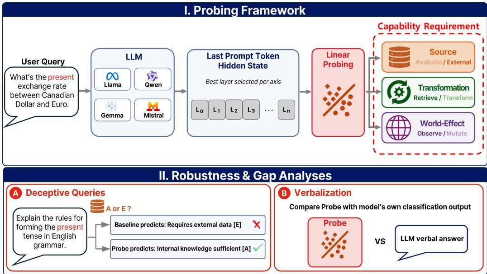
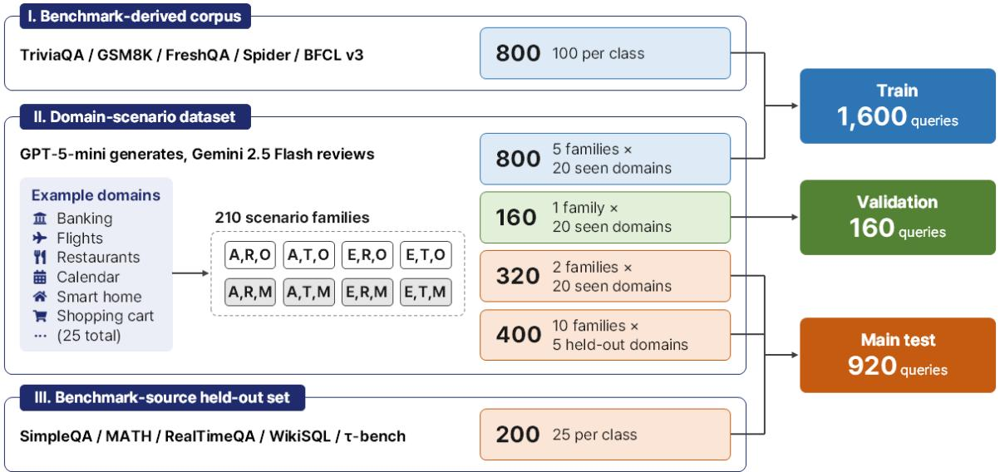
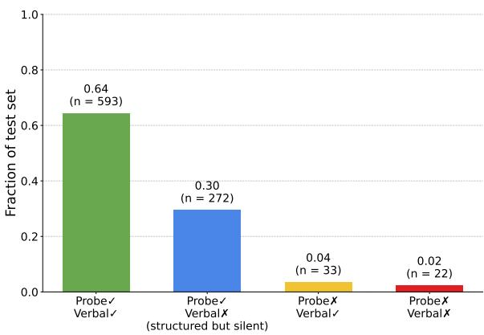

# Structured but Silent: Probing Capability Requirements in LLM Hidden States

Kyojun Choo, Minsoo Song, Yunju Kang, Chanjun Park<sup>†</sup>

Soongsil University

{kjun5644, ecoses042, gardengnosis}@soongsil.ac.kr chanjun.park@ssu.ac.kr

## Abstract

Reliable tool use requires more than triggering a mechanism or matching a query to an API description. Before selecting a specific tool, an agent must first infer the capability requirements implied by the user query. In this paper, we investigate whether these queryside capability requirements are linearly decodable from LLM hidden representations prior to generation, and how this hidden-state accessibility compares with explicit verbal classification. We introduce TACIT, a framework that decomposes external requirements along three fundamental axes: Source, Transformation, and World Effect, defining eight structurally distinct capability classes. Using 1,600 balanced training queries from benchmarks, synthetic examples, and new domain scenarios, we train linear probes on pre-generation hidden states from four open-weight LLM families. Our empirical results demonstrate that fine-grained capability structures are linearly decodable with high accuracy across all models. Crucially, however, we expose a representationto-verbalization gap: these same models are significantly less reliable when asked to explicitly classify the same queries in natural language. This disconnect indicates that information about required external capabilities is linearly accessible in LLM hidden representations but not reliably expressed—a phenomenon we define as structured but silent.

## 1 Introduction

Large language models (LLMs) are increasingly deployed as autonomous agents capable of utilizing external tools (Qin et al., 2024; Wang et al., 2024). While current paradigms focus heavily on whether to use a tool and which concrete tool to call. They overlook a more fundamental prerequisite that the model must first infer the underlying capability requirement implied by a user query. This queryside inference serves as an intermediate abstraction layer; for instance, distinguishing whether a query requires external retrieval, computation, or statechanging action is distinct from merely matching a query to a specific tool description.

Despite its importance, existing methods optimize tool selection superficially via prompt engineering (Alazraki and Rei, 2025), tool description tuning (Hsieh et al., 2023), or output filtering (Yakovlev et al., 2024). These behavior-centric approaches treat the model as a black box and fail to investigate whether fine-grained capability structures are encoded within the model’s internal representations prior to generation. While recent representation probing reveals that hidden states capture latent attributes like truthfulness or factual knowledge (Marks and Tegmark, 2024; Orgad et al., 2025), internal analysis for tool use remains strictly limited to binary judgments, such as predicting tool triggering (Huang et al., 2024; Li et al., 2025) or detection of tool hallucinations (Healy et al., 2026). Whether the multidimensional capability requirements of tool-augmented tasks are encoded in LLM hidden states prior to generation remains an open question.

In this work, we investigate whether the external capability requirements of user queries are linearly decodable from LLM hidden representations before generation, and compare probe predictions with explicit verbal classifications of the same requirements. To formalize this question, we introduce TACIT, a three-axis capability probing framework that decomposes query requirements into Source (available vs. external retrieval), Transformation (direct retrieval vs. transform), and World Effect (read-only vs. state-changing action), defining eight structurally distinct capability classes.

Using 1,600 balanced training queries from benchmarks, synthetic examples, and new domain scenarios, we train linear probes on pre-generation hidden states from four open-weight LLM families: Llama, Mistral, Qwen, and Gemma. We evaluate them on 920 test queries: 720 domainscenario queries, including 400 from domains held out within that component, and 200 queries from a benchmark-source held-out set. On this combined test set, probe joint accuracy ranges from 92.50% to 94.78% across models. On a separate deceptive evaluation with misleading surface cues, all four probes outperform the strongest lexical or sentence-embedding baseline by 19.55–23.64 percentage points in joint accuracy. However, this strong probe performance does not translate into equally accurate verbal classification: on the 920- query test set, all four models perform substantially worse under four-shot prompting than their corresponding probes. We call this gap structured but silent: capability labels are more reliably accessible through linear probes than through explicit self-classification under this evaluation protocol.

Our main contributions are as follows:

• We propose a three-axis, eight-class taxonomy encompassing Source, Transformation, and World Effect to formalize external capability requirements in user queries.

• We demonstrate that multi-dimensional tooluse capability structures are linearly decodable from hidden representations before generation, consistently across four LLM families.

• We expose a systematic disconnect where internal probing outperforms explicit verbalization. This structured but silent gap provides a diagnostic lens for examining discrepancies between linearly decodable capability information and explicit capability classification.

## 2 Related Work

## 2.1 Internal Representations of Language Models

Linear probing has served as a primary diagnostic tool to dissect the informational landscape encoded within LLM hidden representations. Prior studies have successfully uncovered geometric structures corresponding to truthfulness (Liu et al., 2024; Bürger et al., 2024; Zou et al., 2025), localized factual knowledge within intermediate layers (Gottesman and Geva, 2024), and truth-consistent latent spaces extractable via unsupervised contrastive learning (Burns et al., 2024). Furthermore, recent literature demonstrates that internal states inherently reveal model errors (Orgad et al., 2025) and can be leveraged for real-time hallucination detection (Ji et al., 2024; Su et al., 2024).

Recently, this analytical paradigm has been extended to the domain of tool-augmented language models. For instance, Healy et al. (2026) show that hidden states signal hallucination risks during tool selection, while Sun et al. (2026) demonstrate that tool necessity is linearly decodable prior to generation. Similarly, MeCo (Li et al., 2025) and Chain-of-Tools (Wu et al., 2025) utilize hidden representations to optimize binary tool-triggering mechanisms. While these studies primarily scrutinize binary execution choices or downstream failure detection, our work addresses a complementary and more fundamental representational question: whether hidden states encapsulate the fine-grained capability structures required tofulfill a query. By doing so, we shift the focus from operational tooluse decisions to the semantic and functional requirements that precede concrete tool selection.

## 2.2 The Disconnect Between Knowledge and Generation

A growing body of work demonstrates that meaningful signals internalized within hidden states do not always manifest in the model’s generated outputs. Azaria and Mitchell (2023) observe that internal states accurately track the veracity of a statement even when the generated output exhibits overconfidence in a falsehood. Similarly, Orgad et al. (2025) illustrate that models encode internal error signals while concurrently verbalizing incorrect answers, and Gekhman et al. (2025) show that factual knowledge residing in intermediate hidden states frequently fails to emerge during token generation. Collectively, these findings imply that the generation process can act as a lossy channel, bottlenecking or distorting information natively accessible within the representation space.

However, existing literature on this representation-to-generation disconnect has predominantly focused on single-dimensional properties, such as factual correctness, calibration, and truthfulness. To our knowledge, no prior work has investigated whether this gap extends to multi-dimensional, structured properties defined over abstract functional taxonomies. Our work bridges this gap by evaluating external capability requirements, quantifying the precise empirical discrepancy between pre-generation probe predictions and explicit verbalized classifications across three binary capability axes and four distinct LLM

  
Figure 1: Overview of the TACIT probing framework. (I) Given a user query, we extract hidden states at the final prompt token before generation. Separate linear probes, with a layer selected on validation data for each axis, predict Source, Transformation, and World Effect, jointly defining eight capability classes. (II) We examine these predictions through two analyses: (A) robustness to misleading surface cues, comparing probes with lexical and sentence-embedding baselines on deceptive queries; and (B) the representation-to-verbalization gap, comparing probe predictions with the same model’s explicit verbal classifications.

families.

## 3 The TACIT Framework

We introduce TACIT (Three-Axis Capability Implicit Taxonomy), a diagnostic framework designed to analyze whether query-side capability requirements are linearly decodable from LLM hidden states prior to text generation. As illustrated in Figure 1, TACIT decomposes user queries along three binary capability axes, yielding eight capability classes. We evaluate pre-generation linear probes against lexical and sentence-embedding baselines and compare their predictions with fourshot verbalization.

## 3.1 Three-Axis Capability Taxonomy

To formalize the functional demands of a query, we decompose capability requirements into three binary capability axes. Our taxonomy adapts the taxonomy of perception, computation, and action proposed by Wang et al. (2024), which categorizes tools by their explicit API actions. We project these tool-level definitions onto query-level intrinsic properties that can be inferred solely from the query text.

Source (S): Inspired by the perception dimension, this axis differentiates whether the target task can be resolved natively or necessitates information retrieval from the external environment.

• Available (A): The prerequisite information is entirely encapsulated within the query itself or resolvable via the model’s parametric knowledge.

• External (E): The target objective depends on information that must be retrieved from an external source, such as real-time, search results, or dynamically changing information.

Transformation (T): Adapted from the computation dimension, this axis assesses the degree of processing or reasoning required after the core data is acquired.

• Retrieve-only (R): The query can be satisfied via direct data fetching or factual lookup without secondary operations.

• Transform (T): The query demands explicit logical or mathematical processing, such as arithmetic, multi-entity comparison, conditional branching, or structural aggregation.

World Effect (W): Rooted in the action dimension, this axis determines whether the execution of the query alters the state of an external system.

  
Figure 2: Overview of TACIT dataset composition and splits. Training combines 800 queries sampled from the benchmark-derived corpus with 800 domain-scenario queries. The domain-scenario dataset supplies 160 validation and 720 test queries; another 200 benchmark-source held-out queries complete the 920-query main test set. Each scenario family contains one query per TACIT class and remains within a single split.

• Observe (O): The request is strictly information-seeking and leaves external environments unaltered.

• Mutate (M): The query explicitly commands a state-changing operation such as booking, database deletion, or transactional execution.

To ensure annotation rigor for World Effect, we enforce a Literal Verb Rule: classification depends strictly on the explicit verbs within the query rather than downstream pragmatic intents. For example, ‘find a hotel’ is annotated as Observe even if the user may ultimately intend to book one. When conflicting verbs co-occur, the state-changing Mutate verb takes precedence. For example, ‘verify availability and book’ is annotated as Mutate.

The Cartesian product of these three binary axes yields 2<sup>3</sup> = 8 distinct capability classes. Table 1 provides representative examples for each class, and the full annotation definitions with boundarycase guidance are provided in Appendix C.1.

## 3.2 Dataset Construction

As shown in Figure 2, we combine benchmarkderived and domain-scenario queries for training. First, we sample 800 queries, with 100 per class, from an original benchmark-derived corpus. Its Observe queries draw on TriviaQA (Joshi et al., 2017), GSM8K (Cobbe et al., 2021), FreshQA (Vu et al., 2023), and Spider (Yu et al., 2019); its Mutate queries draw on BFCL v3 (Patil et al., 2025), with GPT-4.1-mini (OpenAI et al., 2024) supplementation where benchmark coverage is insufficient. After deduplication, Gemini 2.5 Flash (Comanici et al., 2025) reviews the capability labels and query quality, with flagged and ambiguous cases inspected before finalization.

Second, we construct a domain-scenario dataset containing 1,680 queries in 210 scenario families across 25 domains. Each family contains one query for each TACIT class within a shared domain and broad scenario, reducing associations between particular domains and capability labels. GPT-5-mini <sup>1</sup> generates new queries from domain and scenario specifications rather than sampling benchmark utterances. Gemini 2.5 Flash reviews individualquery labels and quality as well as family-level coherence and class coverage; rejected queries are revised and revalidated.

The final training set combines 800 queries from each component, yielding 1,600 balanced queries with 200 per class. A separate domain-scenario validation set contains 160 queries. Twenty domains contribute training, validation, and in-domain test families, while five domains are reserved for testing; all eight queries in a scenario family remain in the same split. Source rationales, domain inventories, and review procedures are provided in Appendix A. Generation prompts are provided in Appendices C.3 and C.4. Evaluation sets are de-

Class S T W Representative Example Query   
(A,R,O) A R O Which chemical element has the symbol Fe?   
(A,T,O) A T O Ruel has four books of 10 stamps and six books of 15 stamps. How many stamps does Ruel   
have?   
(E,R,O) E R O What is Cristiano Ronaldo’s current club?   
(E,T,O) E T O Which department has the largest number of employees?   
(A,R,M) A R M Can you set a new alarm for me at 17:15?   
(A,T,M) A T M Calculate 18% tip on my \$85 dinner bill and add the total amount to my expense report.   
(E,R,M) E R M I need to purchase a one-way Economy class flight ticket from LA to New York for March 14th.   
(E,T,M) E T M Look for all utility bills due this month and pay the highest-amount bill first from my primary   
account.  
Table 1: Taxonomy overview and representative example queries for the eight TACIT capability classes.

scribed in Section 4.1.

## 3.3 Pre-generation Representation Extraction

For each query q in our benchmark, we extract its latent representation via a single forward pass without generating output tokens. Let $P =$ $[ t _ { 1 } , t _ { 2 } , \dots , t _ { T } ]$ denote the sequence of prompt tokens formatted via the model’s canonical chat template. We isolate the hidden state vector at the final prompt token $t _ { T }$ , denoted as $h _ { T } \in \mathbb { R } ^ { d }$ , where d represents the model’s hidden dimension. Under causal self-attention, the hidden state at this terminal prompt position can attend to the entire preceding query before the first response token is generated.

For a given language model with L transformer layers, this procedure yields a multi-layer representation tensor $H \in \mathbb { R } ^ { N \times L \times d }$ , where N signifies the total number of queries. For Qwen 3, we disable its optional thinking mode and use the standard chat template to maintain a consistent representation extraction procedure across models.

## 3.4 Axis-wise Linear Probing

To evaluate the linearly decodable structure of each functional property, we train independent $\ell _ { 2 ^ { - } }$ regularized logistic regression probes for each capability axis $a \in \{ S , T , W \}$ across every individual transformer layer $l \in \{ 1 , \ldots , L \}$

Let $\boldsymbol { x } ^ { ( l ) } \in \mathbb { R } ^ { d }$ be the activation vector at layer l for a given instance. The probe minimizes the standard cross-entropy loss with an $\ell _ { 2 }$ regularization penalty:

$$
\operatorname* { m i n } _ { w , b } \sum _ { i = 1 } ^ { N _ { \mathrm { t r a i n } } } \log \left( 1 + \exp \left( - y _ { i } \left( w ^ { \top } x _ { i } ^ { ( l ) } + b \right) \right) \right) + \lambda \| w \| _ { 2 } ^ { 2 }\tag{1}
$$

where $y _ { i } \in \{ - 1 , 1 \}$ is the binary label for axis a, and λ controls the regularization penalty. We use logistic regression with a fixed inverse regularization strength of $C = 1 . 0$ , the L-BFGS solver, and a maximum of 1,000 iterations. Activation features are standardized to zero mean and unit variance using training-split statistics only.

## 4 Experimental Setup

## 4.1 Evaluation Datasets

We evaluate generalization using a main test set of 920 queries and robustness to misleading surface cues using a separate deceptive set.

Main Test Set The main test set comprises three complementary subsets. The domain-scenario dataset contributes 320 queries from new scenario families within the 20 training domains and 400 queries from five additional domains reserved for testing in this component. Scenario families do not overlap across training, validation, and test splits.

The remaining 200 queries assess generalization across benchmark sources while preserving the same capability classes. We construct this subset from benchmarks different from those used for the original training component: SimpleQA (Wei et al., 2024) for (A,R,O), MATH (Hendrycks et al., 2021) for $( \mathrm { A } , \mathrm { T } , \mathrm { O } )$ , RealTimeQA (Kasai et al., 2024) for (E,R,O), and WikiSQL (Zhong et al., 2017) for (E,T,O). For the four Mutate classes, we curate queries from the airline and retail environments of τ -bench (Yao et al., 2024), supplementing gaps in class coverage with GPT-4.1-mini-generated examples. This subset contains 25 queries per class. All three test subsets are balanced across the eight TACIT classes. Detailed source mappings and construction procedures appear in Appendix A.

Deceptive Evaluation To examine sensitivity to misleading surface cues, we construct a separate set of 220 deceptive queries. Each query targets one capability axis and contains wording that suggests an incorrect label on that axis while retaining a determinate gold label under the TACIT definitions.

<table><tr><td>Probe Axis</td><td>Best Layer</td><td>Relative Depth</td><td>Accuracy (%)</td></tr><tr><td>Source</td><td>L14</td><td>43.8%</td><td>97.28</td></tr><tr><td>Transformation</td><td>L7</td><td>21.9%</td><td>97.28</td></tr><tr><td>World Effect</td><td>L16</td><td>50.0%</td><td>99.24</td></tr><tr><td>Joint (3-axis)</td><td colspan="2">per-axis best layers</td><td>94.02</td></tr></table>

Table 2: Best-layer linear probing accuracy on Llama 3.1 8B Instruct (main test set, N = 920). Relative depth is l/32. Joint accuracy requires all three axis predictions to be correct.

The set contains 77 queries targeting Source, 70 targeting Transformation, and 73 targeting World Effect.

For example, one query asks: “The report titled ‘Current Stock’ lists 44 USB-C cables. How many cables does it list?" Although ‘Current Stock may suggest a need to access live inventory, the requested value is explicitly supplied in the query. Its gold labels are therefore Source=A, Transformation=R, and World Effect=O.

We generate candidate queries using GPT-5 <sup>2</sup>. Claude Sonnet 5 <sup>3</sup> independently predicts the three capability labels without access to the proposed labels and checks naturalness, ambiguity, grounding, and the presence of an identifiable misleading cue. We retain 220 queries that pass these checks, freeze the set before evaluation, and use it exclusively for robustness analysis. Construction details and prompts are provided in Appendices A.3 and C.5.

## 4.2 Models

We probe four instruction-tuned open-weight LLM families spanning diverse architectures, layer depths, and pretraining distributions: Llama 3.1 8B Instruct (Grattafiori et al., 2024), Qwen 3 8B (Yang et al., 2025), Gemma 2 9B IT (Team et al., 2024), and Mistral 7B Instruct v0.3 (Jiang et al., 2023). We designate Llama 3.1 8B Instruct as our primary subject for in-depth architectural analysis, utilizing the remaining three models to establish cross-model generalization in Section 5.4.

## 4.3 Baselines

We compare hidden-state probes with lexical and sentence-embedding baselines to assess how effectively different query representations support capability classification. We use a TF-IDF Bag-of-Words (BoW) classifier over word unigrams and bigrams with ℓ<sub>2</sub>-regularized logistic regression. A word and character-level N-gram classifier extends these features with character 3–5-gram TF-IDF features and selects the regularization strength on the validation set. We also evaluate an E5 sentenceembedding baseline (Wang et al., 2022), using a frozen E5-large-v2 encoder followed by logistic regression.

<table><tr><td>Capability Class</td><td>S</td><td>T</td><td>W Joint Accuracy (%)</td></tr><tr><td>(A,R,O)</td><td>A</td><td>R</td><td>0 91.30</td></tr><tr><td>(A,T,O)</td><td>A</td><td>T 0</td><td>98.26</td></tr><tr><td>(E,R,O)</td><td>E</td><td>R 0</td><td>96.52</td></tr><tr><td>(E,T,O)</td><td>E</td><td>T 0</td><td>90.43</td></tr><tr><td>(A,R,M)</td><td>A</td><td>R M</td><td>93.91</td></tr><tr><td>(A,T,M)</td><td>A</td><td>T M</td><td>94.78</td></tr><tr><td>(E,R,M)</td><td>E</td><td>R M</td><td>99.13</td></tr><tr><td>(E,T,M)</td><td>E</td><td>T M</td><td>87.83</td></tr></table>

Table 3: Per-class joint accuracy on Llama 3.1 8B Instruct (main test set, N = 115 per class).

Each baseline trains a separate classifier for each capability axis using the same 1,600 training queries as the hidden-state probes. All baselines are evaluated on the same main and deceptive test sets as the probes.

## 4.4 Evaluation Metrics

We evaluate performance on the 920-query main test set described in Section 4.1. We report both per-axis accuracy, which measures classification accuracy for each capability axis, and joint threeaxis accuracy, which requires all three predicted labels to match the ground truth. For each model, we select the best layer for each axis by maximizing validation accuracy. When multiple layers achieve the same maximum, we select the combination with the highest joint validation accuracy. These selected layers are used for all test evaluations.

For deceptive evaluation, we report target-axis accuracy on each query’s designated axis, aggregated across 220 queries by weighting each axis’s accuracy by its query count (77 Source, 70 Transformation, and 73 World Effect).

For main-test accuracy estimates and paired comparisons between methods, we compute 95% percentile bootstrap confidence intervals using 10,000 resamples. Resampling is stratified by test subset, with scenario families as the sampling unit for domain-scenario queries and individual queries for the 200-query benchmark-source subset. For method comparisons, we resample the per-query correctness differences using the same sampling units.

<table><tr><td>Axis Pair</td><td>cos(w, wj)</td></tr><tr><td>Source × Transformation</td><td>0.016</td></tr><tr><td>Source × World Effect</td><td>-0.009</td></tr><tr><td>Transformation × World Effect</td><td>-0.030</td></tr></table>

Table 4: Cosine similarity between best-layer probe weight vectors on Llama 3.1 8B Instruct.

## 4.5 Verbalization Setup

We compare linear decodability from hidden states with four-shot verbalization for all four models on the same 920 test queries. The prompts specify the TACIT taxonomy, including the Literal Verb Rule, and request labels for all three capability axes. Four fixed labeled examples are shared across models. The full prompt is provided in Appendix C.6.

## 5 Results

## 5.1 RQ1: Are External Capability Requirements Linearly Encoded Before Generation?

We first investigate whether the three core capability axes defined by TACIT are linearly decodable from the model’s latent representations before any response token is produced. To answer this, we evaluate the best-layer probing accuracy on the Llama 3.1 8B Instruct model across the main test set $( N = 9 2 0 )$ . Full per-layer validation accuracies are reported in Appendix Table 11.

As reported in Table 2, the selected probing layers span early and intermediate depths of the network. Specifically, the best layers are Layer 14 (43.8% relative depth) for Source, Layer 7 (21.9%) for Transformation, and Layer 16 (50.0%) for World Effect.

The axis-wise linear probes achieve a joint threeaxis accuracy of 94.02% (95% CI: 92.50–95.43%). This indicates that the three-axis capability profile of a user query can be reliably decoded before token generation begins.

To more closely examine class-level performance, Table 3 reports joint accuracy across the eight TACIT classes. Seven of the eight classes achieve at least 90% accuracy, with (E,R,M) reaching 99.13%. Performance is lower for the (E,T,M) class at 87.83%, indicating that this class remains comparatively more challenging for the probes, although further analysis is needed to determine the source of this difficulty.

To examine the relationship between the learned probe directions, we compute the cosine similarity between the weight vectors $( w _ { i } , w _ { j } )$ of the respective best-layer probes. As summarized in Table 4, all pairwise cosine similarities are close to zero. These near-zero similarities do not by themselves establish semantic independence among the three axes.

<table><tr><td></td><td colspan="3">Target-axis Accuracy</td><td></td></tr><tr><td>Method</td><td>Source</td><td>Trans.</td><td>W-Eff.</td><td>Joint</td></tr><tr><td>BoW</td><td>61.04</td><td>44.29</td><td>79.45</td><td>38.64</td></tr><tr><td>N-gram</td><td>64.94</td><td>44.29</td><td>76.71</td><td>35.91</td></tr><tr><td>E5</td><td>55.84</td><td>55.71</td><td>75.34</td><td>37.27</td></tr><tr><td>Llama 3.1 8B probe</td><td>72.73</td><td>67.14</td><td>97.26</td><td>60.45</td></tr></table>

Table 5: Accuracy on the deceptive evaluation set (%). Source, Transformation, and World Effect columns evaluate queries targeting the respective axis (N = 77, 70, and 73). Joint accuracy is computed over all 220 queries and requires all three axis predictions to be correct.
<table><tr><td>Accuracy</td><td>Probe</td><td>four-shot</td><td>Gap (pp)</td></tr><tr><td>Source</td><td>97.28</td><td>78.80</td><td>+18.48</td></tr><tr><td>Transformation</td><td>97.28</td><td>88.80</td><td>+8.48</td></tr><tr><td>World Effect</td><td>99.24</td><td>98.04</td><td>+1.20</td></tr><tr><td>Joint (3-axis)</td><td>94.02</td><td>68.04</td><td>+25.98</td></tr></table>

Table 6: Probe and four-shot verbalization accuracy on Llama 3.1 8B Instruct (main test set, $N = 9 2 0 )$ . The gap is probe accuracy minus verbalization accuracy in percentage points.

Takeaway: Query-side capability requirements are reliably linearly decodable from pre-generation representations at early and intermediate transformer layers, with near-zero pairwise cosine similarities between the selected probe weight vectors.

## 5.2 RQ2: Do Probes Capture Abstract Taxonomy or Surface Lexical Shortcuts?

To test whether probe performance reflects superficial lexical correlations, we evaluate robustness to misleading surface cues on the deceptive set described in Section 4.1. We report results on all 220 deceptive queries.

As shown in Table 5, the Llama 3.1 8B hiddenstate probes outperform the BoW baseline across all three targeted axes. The largest difference is observed for Transformation $( \Delta = + 2 2 . 8 6$ percentage points), followed by World Effect (+17.81) and Source (+11.69). We further compare against stronger text-based baselines, including an n-gram classifier and E5 sentence embeddings. The probes achieve 79.09% target-axis accuracy and 60.45% joint accuracy, compared with 61.82–62.27% and

<table><tr><td rowspan="2">Model</td><td colspan="5">Main Test Joint Accuracy (%)</td><td colspan="4">Deceptive-Set Joint Accuracy (%)</td></tr><tr><td>Probe</td><td>BoW</td><td>N-gram</td><td>E5</td><td>four-shot</td><td>Probe</td><td>BoW</td><td>N-gram</td><td>E5</td></tr><tr><td>Llama 3.1 8B</td><td>94.02</td><td>83.26</td><td>85.98</td><td>84.13</td><td>68.04</td><td>60.45</td><td>38.64</td><td>35.91</td><td>37.27</td></tr><tr><td>Qwen 3 8B</td><td>92.50</td><td>83.26</td><td>85.98</td><td>84.13</td><td>59.67</td><td>62.27</td><td>38.64</td><td>35.91</td><td>37.27</td></tr><tr><td>Gemma 2 9B</td><td>94.78</td><td>83.26</td><td>85.98</td><td>84.13</td><td>69.46</td><td>60.91</td><td>38.64</td><td>35.91</td><td>37.27</td></tr><tr><td>Mistral 7B v0.3</td><td>92.50</td><td>83.26</td><td>85.98</td><td>84.13</td><td>54.35</td><td>58.18</td><td>38.64</td><td>35.91</td><td>37.27</td></tr></table>

Table 7: Cross-model joint three-axis accuracy on the main test set $( N = 9 2 0 )$ and the deceptive evaluation set $( N = 2 2 0 )$ . The text-only baselines have the same scores for each model because they use the same query data independently of the probed LLM. The four-shot column reports each model’s verbal classification on the main test set.

35.91–38.64%, respectively, for the three baselines. These results provide evidence that the probes capture capability information beyond the surface cues exploited by the tested baselines.

Takeaway: Hidden-state probes outperform lexical and sentence-embedding baselines under misleading surface cues, supporting capability decoding beyond the patterns captured by these baselines.

## 5.3 RQ3: Does Linearly Decodable Capability Information Surface in Explicit Generation?

Having shown that capability requirements are linearly decodable from hidden states, we next examine the representation-to-verbalization gap: whether models can explicitly classify the same capability requirements under direct prompting.

As shown in Table 6, the Llama 3.1 8B hiddenstate probes achieve higher accuracy than four-shot verbal classification across all three axes. The difference is particularly large in joint three-axis accuracy, with the probes achieving 94.02% compared with 68.04% for verbalized classification $( \Delta \ : = \ : 2 5 . 9 8$ percentage points; 95% CI: 23.37– 28.59). This comparison indicates a substantial gap between information that is linearly accessible from hidden states and what the model explicitly expresses under the tested prompting conditions.

To further examine the representation-toverbalization gap, Figure 3 reports a four-way breakdown of probe and verbalized classification outcomes. In 29.6% of queries, the probe predicts all three labels correctly while verbalized classification does not. The reverse pattern, where verbalized classification is jointly correct but the probe is not, occurs in only 3.6% of queries. This asymmetry shows that disagreements between the two methods are predominantly cases in which the probe succeeds while explicit classification fails under the tested prompting conditions.

  
Figure 3: Four-way breakdown of joint three-axis correctness for the probe and four-shot verbalization on Llama 3.1 8B Instruct (N = 920). Bars show the fraction of test queries in each outcome, with counts shown above them.

Takeaway: We observe a clear and asymmetric representation-to-verbalization gap. Capability requirements can be linearly decoded from hidden states even when the model fails to classify them correctly through four-shot verbalization.

## 5.4 RQ4: Does the "Structured but Silent" Phenomenon Generalize Across Models?

To examine whether our findings are specific to Llama or generalize across model families, we extend the same experimental setup to three additional models: Qwen 3 8B, Gemma 2 9B IT, and Mistral 7B Instruct v0.3. Table 7 summarizes the resulting cross-model comparison.

High linear decodability of capability requirements is observed across all four model families. Joint three-axis probe accuracy on the main test set ranges from 92.50% to 94.78%, compared with 83.26–85.98% for the BoW, n-gram, and E5 baselines. The selected best layers differ across models and are reported alongside the full layer-wise validation results in Appendix B.

On the deceptive evaluation set, the probes achieve 58.18–62.27% joint accuracy, compared with 38.64% for BoW, 35.91% for n-gram, and 37.27% for E5. The structured but silent pattern is likewise observed across all four models: four-shot verbalization achieves 54.35–69.46% joint accuracy on the main test set, leaving a representationto-verbalization gap of 25.33–38.15 percentage points.

The corresponding 95% confidence intervals for the probe–verbalization gaps are 23.37–28.59, 29.78–35.76, 22.39–28.26, and 35.00–41.30 percentage points for Llama, Qwen, Gemma, and Mistral, respectively.

Takeaway: Across four model families, capability requirements remain linearly decodable and comparatively robust to deceptive wording, while fourshot verbalization is consistently less accurate than the corresponding probe.

## 6 Conclusion

We introduced TACIT, a three-axis framework for analyzing query-side capability requirements relevant to tool use. Across four open-weight LLM families, these requirements are linearly decodable from pre-generation hidden states, with 92.50–94.78% joint accuracy on the 920-query main test set. The probes also outperform lexical and sentence-embedding baselines on deceptive queries, although their accuracy decreases under misleading wording.

We observe a consistent gap between probe accuracy and explicit four-shot classification. Across the four models, probe joint accuracy exceeds verbalization by 25.33–38.15 percentage points. We call this pattern structured but silent: capability labels are more reliably accessible through linear probes than expressed through generation under the evaluated prompting protocol.

Future work should test whether these decodable representations causally influence tool selection and whether they can improve behavior in agents that actually execute tools.

## Limitations

TACIT addresses capability requirements implied by a user query, not the full process of tool use. Our experiments do not test whether models use the probed representations when selecting or executing tools. Tool availability, API schemas, permissions, multi-step planning, and execution feedback are outside the present evaluation. Establishing causal use would require interventions on the representations and tests of downstream tool behavior.

Dataset construction remains a potential source of artifacts. In the original corpus, some capability classes are associated with particular benchmarks and query styles, and underrepresented Mutate classes require synthetic supplementation. The domain-scenario dataset places all eight classes within each scenario and includes unseen-domain tests, but this design cannot rule out every stylistic shortcut. Because all eight classes appear in training, the results also do not establish generalization to an entirely unseen capability class.

The deceptive evaluation exposes remaining sensitivity to misleading cues: probe joint accuracy falls to 58.18–62.27% on this set, with errors particularly on queries targeting Source and Transformation. These queries were generated and screened with language models. The deceptive results should therefore be interpreted as a targeted stress test rather than an exhaustive measure of robustness.

Our probe–verbalization comparison also uses different forms of access to the model. The probes are supervised classifiers trained on hidden states, whereas verbalization is measured through a fixed four-shot prompt and output parser. The observed gap describes these evaluation conditions; it does not show that the models could never express the same labels under other prompts or training procedures.

Finally, our empirical scope is limited to four open-weight models in the 7–9B parameter range. Whether the observed patterns generalize to substantially larger models, multilingual settings, or models with explicit reasoning modes remains an open empirical question.

## Ethical Considerations

This study complies with standard ethical guidelines in natural language processing. Our work does not involve human participants, and no personally identifiable information (PII) was collected, processed, or utilized. All datasets leveraged in our benchmarks—including TriviaQA, GSM8K, FreshQA, Spider, SimpleQA, MATH, RealTimeQA, WikiSQL, BFCL v3, and Taubench—are publicly accessible and utilized in strict adherence to their respective licensing agreements.

Proprietary models were used for data generation, provisional labeling, and automated review. Model-generated data may introduce distributional or stylistic biases. We address these concerns through explicit taxonomy definitions, query- and family-level review, and targeted revision. These procedures provide automated quality checks.

As a diagnostic evaluation requiring direct access to intermediate activations, our methodology is inherently tailored to open-weight models and cannot be deployed in black-box configurations. The primary intent of this research is to advance the transparency and reliability of autonomous agent systems by diagnosing routing failures. While probing techniques could theoretically be adapted to extract unintended or sensitive latent attributes, the linear probes optimized in this study are strictly bounded to abstract, task-level capability labels and possess no utility beyond functional diagnostic applications.

## Acknowledgements

This work was supported by the Korea Internet & Security Agency (KISA) grant funded by the Korea government (PIPC) (No. RS-2026-25526342, Development of Technologies for Preventing Sensitive Information Inference and Risk Assessment in Foundation Model Operations). This research was also supported by the Culture, Sports and Tourism R&D Program through the Korea Creative Content Agency grant funded by the Ministry of Culture, Sports and Tourism in 2026 (Project Name: Develop AI agent technology to connect knowledge through public cultural facility-based discussion and communication, Project Number: RS-2026- 25520645). Further support was provided by the National Research Foundation of Korea (NRF) grant funded by the Korea government (MSIT) (RS-2026-25483747). This work was additionally supported by the Institute of Information & communications Technology Planning & Evaluation (IITP, AI Computing Support Project for R&D) grant funded by the Korea government (MSIT) (High-Performance Research AI Computing Infrastructure Support at the 2 PFLOPS Scale, RS-2026- 25505492).

## References

Lisa Alazraki and Marek Rei. 2025. Meta-reasoning improves tool use in large language models. In Findings of the Association for Computational Linguistics: NAACL 2025, page 7885–7897. Association for Computational Linguistics.

Amos Azaria and Tom Mitchell. 2023. The internal

state of an llm knows when it’s lying. Preprint, arXiv:2304.13734.

Collin Burns, Haotian Ye, Dan Klein, and Jacob Steinhardt. 2024. Discovering latent knowledge in language models without supervision. Preprint, arXiv:2212.03827.

Lennart Bürger, Fred A. Hamprecht, and Boaz Nadler. 2024. Truth is universal: Robust detection of lies in llms. Preprint, arXiv:2407.12831.

Karl Cobbe, Vineet Kosaraju, Mohammad Bavarian, Mark Chen, Heewoo Jun, Lukasz Kaiser, Matthias Plappert, Jerry Tworek, Jacob Hilton, Reiichiro Nakano, Christopher Hesse, and John Schulman. 2021. Training verifiers to solve math word problems. Preprint, arXiv:2110.14168.

Gheorghe Comanici, Eric Bieber, Mike Schaekermann, Ice Pasupat, Noveen Sachdeva, Inderjit Dhillon, Marcel Blistein, Ori Ram, Dan Zhang, Evan Rosen, Luke Marris, Sam Petulla, Colin Gaffney, Asaf Aharoni, Nathan Lintz, Tiago Cardal Pais, Henrik Jacobsson, Idan Szpektor, Nan-Jiang Jiang, and 3416 others. 2025. Gemini 2.5: Pushing the frontier with advanced reasoning, multimodality, long context, and next generation agentic capabilities. Preprint, arXiv:2507.06261.

Zorik Gekhman, Eyal Ben David, Hadas Orgad, Eran Ofek, Yonatan Belinkov, Idan Szpektor, Jonathan Herzig, and Roi Reichart. 2025. Inside-out: Hidden factual knowledge in llms. Preprint, arXiv:2503.15299.

Daniela Gottesman and Mor Geva. 2024. Estimating knowledge in large language models without generating a single token. Preprint, arXiv:2406.12673.

Aaron Grattafiori, Abhimanyu Dubey, Abhinav Jauhri, Abhinav Pandey, Abhishek Kadian, Ahmad Al-Dahle, Aiesha Letman, Akhil Mathur, Alan Schelten, Alex Vaughan, Amy Yang, Angela Fan, Anirudh Goyal, Anthony Hartshorn, Aobo Yang, Archi Mitra, Archie Sravankumar, Artem Korenev, Arthur Hinsvark, and 542 others. 2024. The llama 3 herd of models. Preprint, arXiv:2407.21783.

Kait Healy, Bharathi Srinivasan, Visakh Madathil, and Jing Wu. 2026. Internal representations as indicators of hallucinations in agent tool selection. Preprint, arXiv:2601.05214.

Dan Hendrycks, Collin Burns, Saurav Kadavath, Akul Arora, Steven Basart, Eric Tang, Dawn Song, and Jacob Steinhardt. 2021. Measuring mathematical problem solving with the math dataset. Preprint, arXiv:2103.03874.

Cheng-Yu Hsieh, Si-An Chen, Chun-Liang Li, Yasuhisa Fujii, Alexander Ratner, Chen-Yu Lee, Ranjay Krishna, and Tomas Pfister. 2023. Tool documentation enables zero-shot tool-usage with large language models. Preprint, arXiv:2308.00675.

Yue Huang, Jiawen Shi, Yuan Li, Chenrui Fan, Siyuan Wu, Qihui Zhang, Yixin Liu, Pan Zhou, Yao Wan, Neil Gong, and 1 others. 2024. Metatool benchmark for large language models: Deciding whether to use tools and which to use. In International Conference on Learning Representations, volume 2024, pages 42978–43007.

Ziwei Ji, Delong Chen, Etsuko Ishii, Samuel Cahyawijaya, Yejin Bang, Bryan Wilie, and Pascale Fung. 2024. Llm internal states reveal hallucination risk faced with a query. Preprint, arXiv:2407.03282.

Albert Q. Jiang, Alexandre Sablayrolles, Arthur Mensch, Chris Bamford, Devendra Singh Chaplot, Diego de las Casas, Florian Bressand, Gianna Lengyel, Guillaume Lample, Lucile Saulnier, Lélio Renard Lavaud, Marie-Anne Lachaux, Pierre Stock, Teven Le Scao, Thibaut Lavril, Thomas Wang, Timothée Lacroix, and William El Sayed. 2023. Mistral 7b. Preprint, arXiv:2310.06825.

Mandar Joshi, Eunsol Choi, Daniel S. Weld, and Luke Zettlemoyer. 2017. Triviaqa: A large scale distantly supervised challenge dataset for reading comprehension. Preprint, arXiv:1705.03551.

Jungo Kasai, Keisuke Sakaguchi, Yoichi Takahashi, Ronan Le Bras, Akari Asai, Xinyan Yu, Dragomir Radev, Noah A. Smith, Yejin Choi, and Kentaro Inui. 2024. Realtime qa: What’s the answer right now? Preprint, arXiv:2207.13332.

Wenjun Li, Dexun Li, Kuicai Dong, Cong Zhang, Hao Zhang, Weiwen Liu, Yasheng Wang, Ruiming Tang, and Yong Liu. 2025. Adaptive tool use in large language models with meta-cognition trigger. In Proceedings ofthe 63rd Annual Meeting ofthe Association for Computational Linguistics (Volume 1: Long Papers), pages 13346–13370.

Junteng Liu, Shiqi Chen, Yu Cheng, and Junxian He. 2024. On the universal truthfulness hyperplane inside llms. Preprint, arXiv:2407.08582.

Samuel Marks and Max Tegmark. 2024. The geometry of truth: Emergent linear structure in large language model representations of true/false datasets. Preprint, arXiv:2310.06824.

OpenAI, Josh Achiam, Steven Adler, Sandhini Agarwal, Lama Ahmad, Ilge Akkaya, Florencia Leoni Aleman, Diogo Almeida, Janko Altenschmidt, Sam Altman, Shyamal Anadkat, Red Avila, Igor Babuschkin, Suchir Balaji, Valerie Balcom, Paul Baltescu, Haiming Bao, Mohammad Bavarian, Jeff Belgum, and 262 others. 2024. Gpt-4 technical report. Preprint, arXiv:2303.08774.

Hadas Orgad, Michael Toker, Zorik Gekhman, Roi Reichart, Idan Szpektor, Hadas Kotek, and Yonatan Belinkov. 2025. Llms know more than they show: On the intrinsic representation of llm hallucinations. Preprint, arXiv:2410.02707.

Shishir G Patil, Huanzhi Mao, Fanjia Yan, Charlie Cheng-Jie Ji, Vishnu Suresh, Ion Stoica, and Joseph E. Gonzalez. 2025. The berkeley function calling leaderboard (BFCL): From tool use to agentic evaluation of large language models. In Forty-second International Conference on Machine Learning.

Yujia Qin, Shihao Liang, Yining Ye, Kunlun Zhu, Lan Yan, Yaxi Lu, Yankai Lin, Xin Cong, Xiangru Tang, Bill Qian, and 1 others. 2024. Toolllm: Facilitating large language models to master 16000+ real-world apis. In International Conference on Learning Representations, volume 2024, pages 9695–9717.

Abhinav Rastogi, Xiaoxue Zang, Srinivas Sunkara, Raghav Gupta, and Pranav Khaitan. 2020. Towards scalable multi-domain conversational agents: The schema-guided dialogue dataset. In Proceedings of the AAAI conference on artificial intelligence, volume 34, pages 8689–8696.

Weihang Su, Changyue Wang, Qingyao Ai, Yiran HU, Zhijing Wu, Yujia Zhou, and Yiqun Liu. 2024. Unsupervised real-time hallucination detection based on the internal states of large language models. Preprint, arXiv:2403.06448.

Chung-En Sun, Linbo Liu, Ge Yan, Zimo Wang, and Tsui-Wei Weng. 2026. Llm agents already know when to call tools–even without reasoning. arXiv preprint arXiv:2605.09252.

Gemma Team, Morgane Riviere, Shreya Pathak, Pier Giuseppe Sessa, Cassidy Hardin, Surya Bhupatiraju, Léonard Hussenot, Thomas Mesnard, Bobak Shahriari, Alexandre Ramé, Johan Ferret, Peter Liu, Pouya Tafti, Abe Friesen, Michelle Casbon, Sabela Ramos, Ravin Kumar, Charline Le Lan, Sammy Jerome, and 179 others. 2024. Gemma 2: Improving open language models at a practical size. Preprint, arXiv:2408.00118.

Tu Vu, Mohit Iyyer, Xuezhi Wang, Noah Constant, Jerry Wei, Jason Wei, Chris Tar, Yun-Hsuan Sung, Denny Zhou, Quoc Le, and Thang Luong. 2023. Freshllms: Refreshing large language models with search engine augmentation. Preprint, arXiv:2310.03214.

Liang Wang, Nan Yang, Xiaolong Huang, Binxing Jiao, Linjun Yang, Daxin Jiang, Rangan Majumder, and Furu Wei. 2022. Text embeddings by weaklysupervised contrastive pre-training. arXiv preprint arXiv:2212.03533.

Zhiruo Wang, Zhoujun Cheng, Hao Zhu, Daniel Fried, and Graham Neubig. 2024. What are tools anyway? a survey from the language model perspective. Preprint, arXiv:2403.15452.

Jason Wei, Nguyen Karina, Hyung Won Chung, Yunxin Joy Jiao, Spencer Papay, Amelia Glaese, John Schulman, and William Fedus. 2024. Measuring short-form factuality in large language models. Preprint, arXiv:2411.04368.

Mengsong Wu, Tong Zhu, Han Han, Xiang Zhang, Wenbiao Shao, and Wenliang Chen. 2025. Chainof-tools: Utilizing massive unseen tools in the cot reasoning of frozen language models. Preprint, arXiv:2503.16779.

Konstantin Yakovlev, Sergey Nikolenko, and Andrey Bout. 2024. Toolken+: Improving llm tool usage with reranking and a reject option. Preprint, arXiv:2410.12004.

An Yang, Anfeng Li, Baosong Yang, Beichen Zhang, Binyuan Hui, Bo Zheng, Bowen Yu, Chang Gao, Chengen Huang, Chenxu Lv, Chujie Zheng, Dayiheng Liu, Fan Zhou, Fei Huang, Feng Hu, Hao Ge, Haoran Wei, Huan Lin, Jialong Tang, and 41 others. 2025. Qwen3 technical report. Preprint, arXiv:2505.09388.

Shunyu Yao, Noah Shinn, Pedram Razavi, and Karthik Narasimhan. 2024. τ-bench: A benchmark for tool-agent-user interaction in real-world domains. Preprint, arXiv:2406.12045.

Tao Yu, Rui Zhang, Kai Yang, Michihiro Yasunaga, Dongxu Wang, Zifan Li, James Ma, Irene Li, Qingning Yao, Shanelle Roman, Zilin Zhang, and Dragomir Radev. 2019. Spider: A large-scale human-labeled dataset for complex and cross-domain semantic parsing and text-to-sql task. Preprint, arXiv:1809.08887.

Victor Zhong, Caiming Xiong, and Richard Socher. 2017. Seq2sql: Generating structured queries from natural language using reinforcement learning. Preprint, arXiv:1709.00103.

Andy Zou, Long Phan, Sarah Chen, James Campbell, Phillip Guo, Richard Ren, Alexander Pan, Xuwang Yin, Mantas Mazeika, Ann-Kathrin Dombrowski, Shashwat Goel, Nathaniel Li, Michael J. Byun, Zifan Wang, Alex Mallen, Steven Basart, Sanmi Koyejo, Dawn Song, Matt Fredrikson, and 2 others. 2025. Representation engineering: A top-down approach to ai transparency. Preprint, arXiv:2310.01405.

## A Dataset Source Rationale and Construction Details

This section details dataset sources, construction, and review procedures. Table 8 summarizes the generation and review models.

## A.1 Original Corpus: Sources, Sampling, and Review

The original corpus contains 1,600 queries, with 200 per TACIT class. It serves as a source of training examples for the current experiments: we sample 100 queries per class from this corpus, yielding 800 queries, and combine them with 800 domainscenario training queries.

For the Observe classes, we construct candidate pools from the corresponding sources in Table 9, generally targeting approximately 400 candidates per class before review. Because the fastchanging FreshQA subset provides limited coverage for (E,R,O), we supplement its candidates with GPT-4.1-mini-generated queries, targeting a larger pool of approximately 600 candidates.

For the Mutate classes, we extract requests from BFCL v3, remove duplicates, and assign provisional three-axis labels using GPT-4.1-mini. We supplement underrepresented classes with target-class-conditioned synthesis, targeting approximately 400 candidates per class before review. The class-conditioned synthesis prompts are provided in Appendix C.3.

Gemini 2.5 Flash independently predicts the three capability labels and assesses query quality using the prompt in Appendix C.2. Label disagreements and insufficient-quality candidates are flagged for further inspection. After review and curation, we retain 200 examples per class, prioritizing benchmark-derived examples where available.

## A.2 Domain-Scenario Dataset

Domain selection and specifications. The domain-scenario dataset contains 1,680 newly generated queries across 25 domains. Table 10 lists the domains and the benchmark settings or API workflows that informed their design. These settings guide the construction of domain specifications rather than supplying benchmark utterances to the dataset.

For each domain, we define a domain card specifying entities, stable facts or explicitly supplied information, external state, transformation operations, and state-changing actions. These specifications support systematic variation of the three capability axes within a shared domain. For example, a calendar domain can involve a supplied meeting time or current calendar availability, direct retrieval or time calculations, and information requests or event creation.

Scenario-family construction. We organize the dataset into 210 scenario families. Each family contains eight queries, one for each TACIT class, within a shared domain and broad scenario. This construction ensures that every class is represented within each family, reducing the association between a domain and a particular capability label.

GPT-5-mini generates queries from the domain cards, scenario specifications, and formal taxonomy definitions. Generation instructions vary syntactic forms, transformation mechanisms, and statechanging operations across families. The eight queries share a scenario but are separately formulated requests; they are not required to be minimal lexical edits of one another.

Automated review and targeted revision. Gemini 2.5 Flash reviews the generated data at both the query and family levels. Query-level review checks the three capability labels, naturalness, and ambiguity. Family-level review checks scenario coherence, coverage of all eight classes, and whether any query is forced or contrived.

The initial item-level review accepted 1,635 of 1,680 queries (97.32%). Combining item-level failures with family-level concerns identified 52 queries for targeted revision. GPT-5-mini revised these queries while preserving their assigned domain, family, split, and target class. Revised queries and affected families were then reviewed again.

The final dataset contains 210 families and 1,680 queries passing the automated acceptance criteria.

The generation, review, and revision prompt templates are provided in Appendix C.4.

Split construction. Within each of the 20 seen domains, we allocate five scenario families to training, one to validation, and two to in-domain testing. This yields 800 training queries, 160 validation queries, and 320 in-domain test queries. Each of the five held-out domains contributes ten families, yielding 400 domain-held-out test queries.

All eight queries belonging to a family remain in the same split. Thus, family membership does not overlap across training, validation, and testing, although broad scenario themes and operations can recur.

<table><tr><td>Component</td><td>Generation model</td><td>Generation role</td><td>Review model</td><td>Review role</td></tr><tr><td>Original corpus and benchmark-source held-out set</td><td>GPT-4.1-mini</td><td>Provisional labeling of BFCL candidates, synthetic supplementation, and adaptation of τ-bench contexts.</td><td>Gemini 2.5 Flash</td><td>Three-axis label prediction and query-quality checks.</td></tr><tr><td>Domain-scenario dataset</td><td>GPT-5-mini</td><td>Generation of eight-class scenario families and targeted revision of rejected queries.</td><td>Gemini 2.5 Flash</td><td>Item-level label and quality checks, plus family-level coherence and coverage checks.</td></tr><tr><td>Deceptive evaluation set</td><td>GPT-5</td><td>Generation of deceptive queries with a specified target axis, gold label, and misleading surface cue.</td><td>Claude Sonnet 5</td><td>Blind three-axis labeling and checks of label correctness, naturalness, ambiguity, grounding, and deceptive-cue validity.</td></tr></table>

Table 8: Roles of the generation and automated review models. For benchmark-derived data, labeling refers to assigning initial TACIT labels to existing queries, adaptation refers to rewriting benchmark task contexts into requests matching a target TACIT class, and supplementation refers to generating additional queries where class coverage is insufficient. Original benchmark queries are not generated by these models.

The final training set combines the 800 originalcorpus queries with the 800 domain-scenario training queries, for 1,600 queries in total and 200 per class. Validation uses only the separate 160-query domain-scenario validation set.

## A.3 Deceptive Evaluation Set

The deceptive evaluation set contains 220 queries designed to test robustness to misleading surface cues: 77 target Source, 70 target Transformation, and 73 target World Effect. Each query includes wording that suggests an incorrect label on the target axis while retaining a determinate gold label under the formal taxonomy. GPT-5 generates candidate queries from specifications of the target axis, gold label, and deceptive mechanism.

Claude Sonnet 5 independently predicts each query’s three capability labels without seeing the proposed gold labels. Additional review checks label correctness, naturalness, ambiguity, and the presence of an identifiable misleading cue. Candidates are also checked for unsupported premises and excessive overlap with generation examples or templates. The generation and review prompts are provided in Appendix C.5.

The final evaluation set contains 220 queries that passed these acceptance checks. We freeze the set before evaluation and do not select or filter queries based on probe or baseline performance. The deceptive set is not used for probe training or

layer selection.

## B Layer-wise Probe Accuracy

Table 11 reports the full per-layer validation accuracy for each capability axis probe across all four models. Bold values indicate the jointly-optimal best layer selected for each axis. When multiple layers attain the same peak per-axis validation accuracy, we select the combination across all three axes that maximizes joint (three-axis simultaneous) validation accuracy; the bolded layers are the result of this selection.

## C Prompts

## C.1 Capability Axis Definitions

This block provides the formal definitions underlying Section 3.1. It serves as the shared taxonomy for benchmark-query labeling and review, query synthesis, domain-scenario construction, deceptivequery generation and review, and verbal classification. Task-specific instructions supplement these definitions in the prompts below.

<table><tr><td>Class</td><td>Original-corpus source</td><td>Selection rationale</td><td>Held-out source</td><td>Selection rationale</td></tr><tr><td>(A,R,O)</td><td>TriviaQA</td><td>Stable factual questions requiring retrieval of available knowledge.</td><td>SimpleQA</td><td>Factual questions from a separate benchmark source.</td></tr><tr><td>(A,T,O)</td><td>GSM8K</td><td>Self-contained mathematical problems requiring transformation of supplied information.</td><td>MATH</td><td>Mathematical problems from a separate benchmark source.</td></tr><tr><td>(E,R,O)</td><td>FreshQA</td><td>Fast-changing factual questions requiring external information.</td><td>RealTimeQA</td><td>Time-sensitive questions from a separate benchmark source.</td></tr><tr><td>(E,T,O)</td><td>Spider</td><td>Structured-data questions requiring operations over external records.</td><td>WikiSQL</td><td>Table questions involving aggregation over external records.</td></tr><tr><td>Mutate classes</td><td>BFCL v3 and supplementation</td><td>Class-matching state-changing requests, supplemented where benchmark coverage is insufficient.</td><td>τ-bench contexts and supplementation</td><td>Requests adapted from airline and retail task contexts, with additional examples to cover all four Mutate classes.</td></tr></table>

Table 9: Benchmark sources informing the original corpus and the 200-query benchmark-source held-out set. The domain-scenario dataset is constructed separately using the domain specifications in Table 10.

<table><tr><td>Domain group</td><td>Design inspiration</td><td>Domains</td><td>Count</td></tr><tr><td>Seen domains</td><td>SGD-style task-oriented settings (Rastogi et al., 2020)</td><td>Banking; payment and transfer; calendar; events; flights; hotels; restaurants; rental cars; local transport; home services; movies; music and media.</td><td>12</td></tr><tr><td></td><td>BFCL-style API workflows</td><td>Email and messaging; file and cloud storage; smart home; software development and DevOps.</td><td>4</td></tr><tr><td></td><td>Common application and API workflows</td><td>Shopping cart; subscription management; project management; database and reporting.</td><td>4</td></tr><tr><td>Held-out domains</td><td>τ-bench-style support settings</td><td>Retail order support; airline customer support.</td><td>2</td></tr><tr><td></td><td>API workflows</td><td>Common application and Healthcare appointments; education and library; government services.</td><td>3</td></tr></table>

Table 10: The 25 domains in the domain-scenario dataset: 20 for training, validation, and in-domain testing, and 5 for held out within this component. Design inspirations guide domain cards, not copied queries; held-out domains may overlap with topics or operations in the original corpus.

<table><tr><td>Layer Source (A/E)</td><td>Transformation (R/T) World Effect (O/M)</td></tr><tr><td>Llama 3.1 8B Instruct (32 layers; joint validation accuracy = 0.9813) Best layers: S = L14 (43.75%), T = L7 (21.88%), W = L16 (50.00%)</td><td></td></tr><tr><td>L1 0.9000</td><td>0.9250 0.8688</td></tr><tr><td>L2 0.9438</td><td>0.8813</td></tr><tr><td>L3 0.9000</td><td>0.9500 0.9188 0.8875</td></tr><tr><td>L4 0.9000</td><td></td></tr><tr><td></td><td>0.9688 0.8875</td></tr><tr><td>L5 0.9188</td><td>0.9750 0.9563</td></tr><tr><td>L6 0.9438 L7 0.9438</td><td>0.9875 0.9313</td></tr><tr><td>L8 0.9375</td><td>0.9938 0.9813</td></tr><tr><td>L9 0.9375</td><td>0.9938 0.9875</td></tr><tr><td>L10 0.9625</td><td>0.9875 0.9500 0.9625</td></tr><tr><td>L11 0.9750</td><td>0.9875 0.9875 0.9750</td></tr><tr><td>L12 0.9625</td><td>0.9938 0.9813</td></tr><tr><td>L13 0.9688</td><td>0.9875 0.9813</td></tr><tr><td>L14 0.9938</td><td>0.9813 0.9875</td></tr><tr><td>L15 0.9813</td><td>0.9750 0.9750</td></tr><tr><td>L16 0.9875</td><td>0.9813 0.9938</td></tr><tr><td>L17 0.9875</td><td>0.9813 0.9875</td></tr><tr><td>L18 0.9875</td><td>0.9813 0.9875</td></tr><tr><td>L19 0.9875</td><td>0.9750 0.9938</td></tr><tr><td>L20 0.9875</td><td>0.9750 0.9875</td></tr><tr><td>L21 0.9875</td><td></td></tr><tr><td>0.9875</td><td>0.9813 0.9875 0.9813 0.9938</td></tr><tr><td>L22</td><td></td></tr><tr><td>L23 0.9875 L24 0.9813</td><td>0.9813 0.9875 0.9813 0.9875</td></tr><tr><td>L25 0.9813</td><td>0.9813 0.9875</td></tr><tr><td>L26 0.9750</td><td>0.9750 0.9813</td></tr><tr><td>L27 0.9813</td><td>0.9813 0.9813</td></tr><tr><td>L28 0.9688</td><td>0.9813 0.9813</td></tr><tr><td>L29 0.9750</td><td>0.9750 0.9875</td></tr><tr><td></td><td>0.9688 0.9813</td></tr><tr><td>L30 0.9625</td><td></td></tr><tr><td>L31 0.9688</td><td>0.9688 0.9875</td></tr><tr><td>L32 0.9625</td><td>0.9625 0.9875</td></tr></table>

Qwen 3 8B (36 layers; joint validation accuracy = 0.9875)

<table><tr><td>L1</td><td>0.9063</td><td>0.9125</td><td>0.8313</td></tr><tr><td>L2</td><td>0.9125</td><td>0.9188</td><td>0.8188</td></tr><tr><td>L3</td><td>0.9188</td><td>0.9375</td><td>0.8313</td></tr><tr><td>L4</td><td>0.9188</td><td>0.9375</td><td>0.8438</td></tr><tr><td>L5</td><td>0.8938</td><td>0.9375</td><td>0.8438</td></tr><tr><td>L6</td><td>0.9188</td><td>0.9188</td><td>0.8625</td></tr><tr><td>L7</td><td>0.9000</td><td>0.9375</td><td>0.8438</td></tr><tr><td>L8</td><td>0.9000</td><td>0.9438</td><td>0.9188</td></tr><tr><td>L9</td><td>0.9063</td><td>0.9750</td><td>0.9313</td></tr><tr><td>L10</td><td>0.8813</td><td>0.9625</td><td>0.9625</td></tr><tr><td>L11</td><td>0.8875</td><td>0.9813</td><td>0.9625</td></tr><tr><td>L12</td><td>0.9250</td><td>0.9625</td><td>0.9563</td></tr><tr><td>L13</td><td>0.9125</td><td>0.9625</td><td>0.9625</td></tr><tr><td>L14</td><td>0.9188</td><td>0.9500</td><td>0.9750</td></tr><tr><td>L15</td><td>0.9188</td><td>0.9688</td><td>0.9750</td></tr><tr><td>L16</td><td>0.9250</td><td>0.9563</td><td>0.9688</td></tr><tr><td>L17</td><td>0.9250</td><td>0.9688</td><td>0.9750</td></tr><tr><td>L18</td><td>0.9188</td><td>0.9625</td><td>0.9813</td></tr><tr><td>L19</td><td>0.9438</td><td>0.9875</td><td>0.9813</td></tr><tr><td>L20</td><td>0.9375</td><td>0.9938</td><td>0.9938</td></tr><tr><td>L21</td><td>0.9500</td><td>0.9875</td><td>0.9938</td></tr><tr><td>L22</td><td>0.9500</td><td>0.9875</td><td>0.9938</td></tr><tr><td>L23</td><td>0.9625</td><td>0.9875</td><td>0.9938</td></tr><tr><td>L24</td><td>0.9625</td><td>0.9875</td><td>0.9938</td></tr><tr><td>L25</td><td>0.9688</td><td>0.9938</td><td>0.9938</td></tr><tr><td>L26</td><td>0.9625</td><td>0.9813</td><td>1.0000</td></tr><tr><td>L27</td><td>0.9625</td><td>0.9813</td><td>0.9875</td></tr><tr><td>L28</td><td>0.9688</td><td>0.9813</td><td>0.9875</td></tr><tr><td>L29</td><td>0.9750</td><td>0.9875</td><td>0.9875</td></tr></table>

(continued on next page)

Best layers: S = L23 (54.76%), T = L10 (23.81%), W = L23 (54.76%)  
(continued from previous page)
<table><tr><td>Layer</td><td>Source (A/E)</td><td>Transformation (R/T)</td><td>World Effect (O/M)</td></tr><tr><td>L30</td><td>0.9688</td><td>0.9875</td><td>0.9875</td></tr><tr><td>L31</td><td>0.9625</td><td>0.9875</td><td>0.9938</td></tr><tr><td>L32</td><td>0.9750</td><td>0.9875</td><td>0.9875</td></tr><tr><td>L33</td><td>0.9813</td><td>0.9875</td><td>0.9875</td></tr><tr><td>L34</td><td>0.9813</td><td>0.9875</td><td>0.9875</td></tr><tr><td>L35</td><td>0.9813</td><td>0.9875</td><td>0.9938</td></tr><tr><td>L36</td><td>0.9938</td><td>0.9875</td><td>0.9875</td></tr></table>

Gemma 2 9B IT (42 layers; joint validation accuracy = 0.9875)

<table><tr><td></td><td>0.9000</td><td>0.8875</td><td>0.8125</td></tr><tr><td>L1 L2</td><td>0.9375</td><td>0.9563</td><td>0.8813</td></tr><tr><td>L3</td><td>0.9500</td><td>0.9625</td><td>0.8875</td></tr><tr><td>L4</td><td>0.9188</td><td>0.9750</td><td>0.8688</td></tr><tr><td>L5</td><td>0.9563</td><td>0.9563</td><td>0.9000</td></tr><tr><td>L6</td><td>0.9500</td><td>0.9625</td><td>0.8938</td></tr><tr><td>L7</td><td>0.9563</td><td>0.9688</td><td>0.8875</td></tr><tr><td>L8</td><td>0.9500</td><td>0.9688</td><td>0.9250</td></tr><tr><td>L9</td><td>0.9563</td><td>0.9813</td><td>0.9563</td></tr><tr><td>L10</td><td>0.9625</td><td>0.9938</td><td>0.9625</td></tr><tr><td>L11</td><td>0.9625</td><td>0.9875</td><td>0.9625</td></tr><tr><td>L12</td><td>0.9625</td><td>0.9875</td><td>0.9750</td></tr><tr><td>L13</td><td>0.9625</td><td>0.9875</td><td>0.9750</td></tr><tr><td>L14</td><td>0.9813</td><td>0.9875</td><td>0.9688</td></tr><tr><td>L15</td><td>0.9438</td><td>0.9938</td><td>0.9688</td></tr><tr><td>L16</td><td>0.9500</td><td>0.9938</td><td>0.9750</td></tr><tr><td>L17</td><td>0.9563</td><td>0.9938</td><td>0.9875</td></tr><tr><td>L18</td><td>0.9688</td><td>0.9938</td><td>0.9938</td></tr><tr><td>L19</td><td>0.9563</td><td>0.9938</td><td>0.9938</td></tr><tr><td>L20</td><td>0.9625</td><td>0.9938</td><td>0.9938</td></tr><tr><td>L21</td><td>0.9750</td><td>0.9938</td><td>0.9938</td></tr><tr><td>L22</td><td>0.9875</td><td>0.9875</td><td>0.9938</td></tr><tr><td>L23</td><td>0.9938</td><td>0.9938</td><td>1.0000</td></tr><tr><td>L24</td><td>0.9875</td><td>0.9938</td><td>0.9938</td></tr><tr><td>L25</td><td>0.9875</td><td>0.9875</td><td>0.9938</td></tr><tr><td>L26</td><td>0.9938</td><td>0.9813</td><td>0.9938</td></tr><tr><td>L27</td><td>0.9875</td><td>0.9813</td><td>0.9875</td></tr><tr><td>L28</td><td>0.9875</td><td>0.9813</td><td>0.9875</td></tr><tr><td>L29</td><td>0.9813</td><td>0.9875</td><td>0.9875</td></tr><tr><td>L30</td><td>0.9875</td><td>0.9813</td><td>0.9875</td></tr><tr><td>L31</td><td>0.9875</td><td>0.9813</td><td>0.9875</td></tr><tr><td>L32</td><td>0.9750</td><td>0.9875</td><td>0.9813</td></tr><tr><td>L33</td><td>0.9813</td><td>0.9875</td><td>0.9813</td></tr><tr><td>L34</td><td>0.9875</td><td>0.9875</td><td>0.9750</td></tr><tr><td>L35</td><td>0.9813</td><td>0.9875</td><td>0.9750</td></tr><tr><td>L36</td><td>0.9750</td><td>0.9875</td><td>0.9813</td></tr><tr><td>L37</td><td>0.9688</td><td>0.9875</td><td>0.9813</td></tr><tr><td>L38</td><td>0.9688</td><td>0.9875</td><td>0.9750</td></tr><tr><td>L39</td><td>0.9688</td><td>0.9813</td><td>0.9813</td></tr><tr><td>L40</td><td>0.9625</td><td>0.9813</td><td>0.9813</td></tr><tr><td>L41</td><td>0.9688</td><td>0.9813</td><td>0.9813</td></tr><tr><td>L42</td><td>0.9688</td><td>0.9813</td><td>0.9813</td></tr></table>

Mistral 7B Instruct v0.3 (32 layers; joint validation accuracy = 0.9938) Best layers: S = L20 (62.50%), T = L8 (25.00%), W = L22 (68.75%)
<table><tr><td>Best 1ayers: S = L20 (62.50%), 1 = L8 (25.00%), W = L22 (68.75%)</td><td></td><td></td></tr><tr><td>L1 0.9313 0.8875</td><td>0.9250 0.9125</td><td>0.8688 0.9125</td></tr><tr><td>L2 L3</td><td>0.9188</td><td>0.9688 0.8625</td></tr><tr><td>L4</td><td>0.9125 0.9625</td><td>0.8813</td></tr><tr><td>L5</td><td>0.9000</td><td>0.9688 0.9000</td></tr><tr><td>L6</td><td>0.9125 0.9875</td><td>0.9125</td></tr><tr><td>L7</td><td>0.9688</td><td>0.9875 0.9625</td></tr><tr><td>L8</td><td>0.9375</td><td>1.0000 0.9438</td></tr><tr><td>L9</td><td>0.9563</td><td>1.0000 0.9438</td></tr><tr><td>L10</td><td>0.9625</td><td>0.9938 0.9563</td></tr><tr><td>L11</td><td>0.9188</td><td>0.9938 0.9750</td></tr></table>

(continued on next page)

<table><tr><td colspan="3">(continued from previous page)</td></tr><tr><td>Layer</td><td>Source (A/E)</td><td>Transformation (R/T) World Effect (O/M)</td></tr><tr><td>L12</td><td>0.9563</td><td>0.9875</td></tr><tr><td>L13</td><td>0.9563 0.9938</td><td>0.9875 0.9875</td></tr><tr><td>L14</td><td>0.9750 0.9938</td><td>0.9813</td></tr><tr><td>L15</td><td>0.9938 0.9875</td><td>0.9875</td></tr><tr><td>L16</td><td>0.9875</td><td>0.9875 0.9875</td></tr><tr><td>L17</td><td>0.9875</td><td>0.9875 0.9813</td></tr><tr><td>L18</td><td>0.9938</td><td>0.9875 0.9813</td></tr><tr><td>L19</td><td>0.9875</td><td>0.9875 0.9813</td></tr><tr><td>L20</td><td>1.0000</td><td>0.9875 0.9813</td></tr><tr><td>L21</td><td>1.0000</td><td>0.9875 0.9813</td></tr><tr><td>L22</td><td>1.0000</td><td>0.9875 0.9938</td></tr><tr><td>L23</td><td>1.0000 0.9875</td><td>0.9875</td></tr><tr><td>L24</td><td>1.0000 0.9875</td><td>0.9875</td></tr><tr><td>L25</td><td>1.0000 0.9875</td><td>0.9875</td></tr><tr><td>L26</td><td>0.9938 0.9875</td><td>0.9875</td></tr><tr><td>L27</td><td>1.0000 0.9875</td><td>0.9938</td></tr><tr><td>L28</td><td>0.9938 0.9875</td><td>0.9938</td></tr><tr><td>L29</td><td>0.9875 0.9813</td><td>0.9938</td></tr><tr><td>L30</td><td>0.9938 0.9875</td><td>0.9938</td></tr><tr><td>L31</td><td>0.9875 0.9813</td><td>0.9938</td></tr><tr><td>L32</td><td>0.9875 0.9813</td><td>0.9938</td></tr></table>

Table 11: Per-layer validation accuracy across four models $( N = 1 6 0 )$ . Bold entries indicate the selected best layers. Parenthesized percentages denote relative depth, $l / N _ { \mathrm { l a y e r s } } .$

Capability Axis Definitions   
Axis 1 - Source (where does the information needed to IDENTIFY THE TARGET and CONSTRUCT the   
action parameters come from?):   
A (Available): The action target is a SPECIFIC NAMED INSTANCE and ALL required parameters are   
already explicit in the query (or trivial parametric facts).   
No search across alternatives is required to know WHAT to act on. The information must also   
be STABLE -- not time-varying.   
Examples:   
- 'play "wrecking ball" by Miley $\mathsf { C y r u s ^ { \prime } \Sigma ^ { - \gamma } }$ song uniquely named -> A   
- 'send \$250 to Rachel' -> recipient named, amount given $\ l \to \ \mathsf { A }$   
- 'delete file /tmp/foo.txt' -> specific path named $\ l  \mathsf { A }$   
- 'set alarm for 7:00 AM labeled morning workout' -> fully specified -> A   
- 'connect to Bluetooth speaker JBL Flip $4 ^ { \cdot } \mathrm { ~  ~ { ~ - > ~ } ~ }$ device named $\ l  \mathsf { A }$   
E (External): The action target is described by CRITERIA, not by a specific named instance, so   
the model must first OBSERVE or FETCH external state to enumerate candidates and pick the   
matching one(s).   
Anything requiring real-time data, live database/API calls, web search, availability/schedule   
lookup, ranking by current values, or 'find/locate/check then act' is E.   
ALSO E: ANY value that can change over time -- even if the model might have seen it in   
training, if it is time-sensitive (prices, weather, current balances, live status, who   
currently holds a position) classify as E.   
Examples:   
- 'Book a direct flight from SF to London on 2022-04-27 afternoon' -> must search flights   
matching the criteria -> E   
- 'Book a hotel for 2 adults in Paris July $1 0 - 2 0 ^ { \prime } $ must search hotel availability -> E   
- 'order a pizza from the closest Domino $" s " \_ >$ must look up nearest store -> E   
- 'Find available slots at the dental clinic and book one' -> explicit lookup -> E   
- 'check my balance, then transfer the rest to $\mathsf { A l i c e ^ { \prime } \Sigma } \to$ balance fetched $- > \mathsf { E }$   
CRITICAL DISTINCTIONS:   
1. Do NOT confuse execution venue with information source. The fact that an action talks to   
an external system at runtime does NOT make it E.   
What matters is whether the model needs new external data to KNOW WHAT TO ACT ON.   
2. NAMED target + given params + stable info = A even if execution touches an external API.   
3. CRITERIA-described target (must enumerate candidates) = E even if all criteria are stated   
in the query.   
4. 'Send/post/email to <named recipient>' with given content = A.   
'Send to whoever has highest priority on the team' = E.   
Axis 2 - Transformation (what processing is done on the information?):

R (Retrieve-only): A single direct lookup; the result is returned as-is with no further   
computation. No arithmetic, no aggregation, no comparison between distinct entities, no   
conditional logic, no ranking across candidates.   
CRITICAL: Multiple named fields do NOT make a query T -- passing three explicit params from   
the query is still R.   
Examples:   
'play Wrecking Ball by Miley Cyrus' -> passthrough -> R   
- 'book the first available slot' -> top-1 fetch -> R   
- 'add Postgres server host X port 5432' -> passthrough -> R   
- 'birthplace of the current Speaker' -> reference chain, no computation -> R   
- 'Is X available?' -> boolean check -> R   
- 'Current balance' -> single current-state lookup -> R   
T (Transform): A non-trivial computation is required. T includes ANY of:   
(a) Arithmetic: +, -, x, /, percentage, ratio, date arithmetic (age, duration), unit   
conversion via formula.   
(b) Aggregation: count (how many), sum, total, average over a set of records.   
(c) Superlative/ranking among candidates: 'most recent', 'oldest', 'largest', 'highest',   
lowest', 'best', 'worst', 'latest' -- requires ordering across multiple records -> T.   
(d) Comparison between two or more distinct entities.   
(e) Conditional/threshold logic: 'if X < 10', 'if rate exceeds Y'.   
(f) Logical inference, word puzzle, pattern recognition, counting occurrences.   
Examples:   
- 'most recent winner?' -> superlative -> ordering multiple records -> T   
- 'current age of X' -> date arithmetic -> T   
- 'how many goals has X scored?' -> count -> T   
- 'if stock < 10 order 20 more' -> logical inference -> T   
CRITICAL DISTINCTIONS:   
1. top-1 fetch, no comparison among options = R   
2. Following a reference chain (find Speaker -> find birthplace) = R if no computation occurs   
Axis 3 - World-Effect (does the query request an external state change?):   
O (Observe): only information is reported; no external state changes.   
O verbs: find, look for, search, show, check, tell, list, what/when/where.   
M (Mutate): a state-changing or hard-to-undo action is explicitly requested.   
M verbs: send, save (to external store), book, schedule, transfer, update, delete, post,   
connect, register, order, reserve, purchase, buy, email, cancel, pay, deploy, publish, apply.   
LITERAL VERB RULE: classify by the explicit verb in the query. Do NOT infer Mutate intent from   
context ('find a hotel' stays O even if booking is implied).   
Same target with both verb types -> M wins ('check availability and book' -> M).

## C.2 Gold-Label Review Prompt

This prompt is used with Gemini 2.5 Flash to review the original benchmark-derived corpus and the benchmark-source held-out set. The reviewer predicts the three capability labels without access to the proposed labels. The pipeline flags label disagreements or quality\_ok = false for further inspection before dataset finalization. Domain-scenario review uses the separate prompts provided below.

## System Message

Output ONLY a JSON object with keys: source,   
transformation, world\_effect, confidence   
(0..1), quality\_ok (boolean),   
quality\_issues (array of short strings,   
required when quality\_ok=false),   
rationale (<=2 sentences).   
Use exactly the single-letter codes A/E, R/T,   
O/M.

User Message   
Query: {query}   
Classify strictly. When in doubt about any   
axis, reject.

## C.3 Synthetic Supplementation Prompts

GPT-4.1-mini is used to supplement classes with insufficient benchmark coverage in the original corpus. The following prompts cover the four Mutate classes supplemented from BFCL v3 and the (E,R,O) class supplemented from FreshQA. Each system prompt incorporates the shared Capability Axis Definitions (Appendix C.1) together with class-specific generation constraints.

## ERO (External, Retrieve-only, Observe)

System Message   
You are generating data for an academic   
capability-classification benchmark.   
Each item must be a single, natural user turn   
The query must be exactly (External, Retrieve   
-only, Observe) under the taxonomy below:   
[AXIS DEFINITIONS]   
The example queries shown in the taxonomy   
above are illustrations of the labels   
only -- never copy or closely paraphrase   
them; every query you generate must be   
original.   
AVOID these patterns:   
'Who is the most popular/successful/   
famous X?' -> comparison (ETO)   
'How many X have done Y?' -> COUNT (ETO)   
'What is the average/total X?' ->   
aggregation (ETO)   
'Who was the first X to do Y?' ->   
historical stable fact (ARO)   
'What is the capital of X?' -> never  
changing (ARO)   
GOOD patterns (vary these heavily):   
'What is the current [price / rate / rank   
/ status] of [entity]?'   
'Who is the current [role] at [   
organization]?'   
'What [team / club / country] does [   
person] currently represent?   
'Is [entity] currently [status /   
condition]?'   
'What is today's [exchange rate / index /   
price] of [X]?'

{"query": "What is today's USD to KRW   
exchange rate?"},

'What is the current version of [software   
]?'   
Vary domain across: sports, finance, politics   
technology, entertainment,   
business/corporate, science, weather/   
environment.   
Vary phrasing: direct questions,   
conversational, 'Can you tell me...',   
'I need to know...'   
Do NOT let multiple queries start with the   
same word.

## User Message Template

[{"query": "What team does Kylian Mbappe currently play for?"},

{"query": "Who is the current CEO of Apple ?"},

{"query": "Is the International Space   
Station currently manned?"},

## ARM (Available, Retrieve-only, Mutate)

## System Message

You are generating data for an academic capability-classification benchmark.

Each item must be a single, natural user turn that (i) provides a piece of information explicitly INSIDE the message itself, and (ii) requests that the assistant SAVE/UPDATE/REMEMBER that information in some store (profile, note, calendar, contacts, settings, memory).

The query must be exactly (Available, Retrieve-only, Mutate) under the taxonomy below:

## [AXIS DEFINITIONS]

The example queries shown in the taxonomy above are illustrations of the labels only -- never copy or closely paraphrase them; every query you generate must be original.

Avoid any external lookups (no 'check the weather', 'find current price', etc.).

## User Message Template

Generate {n} diverse user queries that match   
(Available, Retrieve-only, Mutate).   
Every query must be written entirely in   
English. Output a JSON array of objects   
with a single key 'query'.   
Example:   
[{"query": "My birthday is March 5. Save it   
to my profile."},   
{"query": "Save my new email alice@example.   
com to my contact card."}]

## ATM (Available, Transform, Mutate)

## System Message

You are generating data for an academic capability-classification benchmark.

Each item must be a single user turn. The query must be exactly (Available, Transform, Mutate) under the taxonomy below:

## [AXIS DEFINITIONS]

The example queries shown in the taxonomy above are illustrations of the labels only -- never copy or closely paraphrase them; every query you generate must be original.

Generate every query entirely in English. Vary the kind of calculation ( percentages, unit conversions, ratios, sums, time arithmetic, currency conversion using a rate stated INSIDE the message).

## User Message Template

Generate {n} diverse user queries matching ( Available, Transform, Mutate).

Every query must be written entirely in English. Output a JSON array of objects with a single key 'query'.

[{"query": "Subtract 12% tax from my \$3,800 salary and save the remaining amount to my household ledger."},

{"query": "I ran 7.2 km, 6.5 km, and 8.1 km this week. Add the weekly total to my fitness log."}]

## ERM (External, Retrieve-only, Mutate)

## System Message

You are generating data for an academic capability-classification benchmark.

Each item must be a single, natural user turn . The query must be exactly (External, Retrieve-only, Mutate) under the taxonomy below:

[AXIS DEFINITIONS]

- 'find the cheapest/fastest/largest' (   
comparison -> ETM)

The example queries shown in the taxonomy above are illustrations of the labels only -- never copy or closely paraphrase them; every query you generate must be original.

- 'if stock < 10 then order' (conditional   
-> ETM)

- 'my address is X, save it' (no external   
lookup -> ARM)

- Direct imperatives: 'Reserve...', 'Send   
', 'Pull up...', 'Go ahead and   
book...

- Polite requests: 'Could you check... and   
schedule...?', 'Please look up...   
and confirm...

- Declarative setups: 'I need you to fetch   
... and send it to...'

- Questions: 'Can you see if... is   
available and reserve it for me?'

- Conversational: 'Just grab the latest...   
and forward it to...

Do NOT let multiple queries start with the   
same word. Vary domain: travel,   
healthcare, food & dining, retail,   
calendar/scheduling, communication, HR,   
real estate, entertainment, logistics.

## User Message Template

Generate {n} diverse user queries matching ( External, Retrieve-only, Mutate).

Every query must be written entirely in English. Each query must open with a DIFFERENT first word -- maximise variety in phrasing. Output a JSON array of objects with a single key 'query'.

Example:

[{"query": "Check if there are any open slots with Dr. Lee tomorrow afternoon and book the first available one."},

{"query": "Pull up today's lunch special at the office cafeteria and post it to the team channel"},

{"query": "Reserve a table for three at any available Italian restaurant near downtown tonight."},

{"query": "I need you to look at today's flight departures from JFK to LAX and confirm my seat on the next one."}]

## ETM (External, Transform, Mutate)

## System Message

You are generating data for an academic capability-classification benchmark.

Each item must be a single, natural user turn . The query must be exactly (External, Transform, Mutate) under the taxonomy below:

## [AXIS DEFINITIONS]

The example queries shown in the taxonomy above are illustrations of the labels only -- never copy or closely paraphrase them; every query you generate must be original.

All three must be clearly required by the query, not optional. The external lookup must come first (you can't act without it).

The computation bridges the lookup and the action. Generate every query entirely in English.

Vary domain: e-commerce, finance, travel, HR/ admin, logistics, calendar scheduling, restaurant, healthcare.

## User Message Template

Generate {n} diverse user queries matching ( External, Transform, Mutate).

Every query must be written entirely in English. Output a JSON array of objects with a single key 'query'.

Example:

[{"query": "Check current inventory levels and automatically order 50 units of every item with fewer than 10 units in stock."},

{"query": "Check today's EUR/USD rate and, if it's below 1.08, move \$5000 from my savings to my investment account."}]

## C.4 Domain-Scenario Generation and Review Prompts

The domain-scenario dataset is generated with GPT-5-mini and reviewed with Gemini 2.5 Flash at both the query and scenario-family levels. GPT-5-mini subsequently revises queries flagged by either review stage. Dataset composition and acceptance criteria are described in Appendix A.2.

The following templates reproduce the generation, review, and revision instructions together with the fixed examples and guidance supplied to the models. Bracketed placeholders denote variable inputs or shared components defined below. The placeholder [AXIS DEFINITIONS] refers to the shared definitions in Appendix C.1. A “block” in the prompts denotes a scenario family containing one query for each of the eight TACIT classes.

## Scenario-family generation.

Each generation request supplies a domain card, the eight target classes, class-boundary examples, and a per-class metadata plan specifying the requested syntactic form, transformation mechanism, and mutation family. The fixed examples provide guidance on class boundaries and output structure; the generator is instructed to produce fresh queries for the requested domain.

## Generation: System Message

You generate controlled scenario-block data for a TACIT capability benchmark.

Every block must contain exactly one natural user query for each of the 8 classes: ARO, ATO, ARM, ATM, ERO, ETO, ERM, ETM.

## [AXIS DEFINITIONS]

Hard constraints:

\- Keep all 8 items inside the same domain and same scenario family.

\- Do not make one class identifiable by domain, style, or syntax alone.

Source=A means all needed facts/values are explicitly provided or stable within the query.

\- Source=E means the query must consult current/live/external state not stated in the query.

Transformation=R means direct lookup/ passthrough only.

Transformation=T means arithmetic, aggregation, comparison, ranking, threshold logic, date/time calculation, or unit conversion.

\- World-Effect=O means observe/report only. World-Effect=M means explicitly create/ update/delete/send/book/pay/submit/ cancel or otherwise change external state.

For Source=A items, do NOT ask for current, live, latest, dynamic, available, nearby, nearest, cheapest, most recent, menu, fare, gate, balance, or status values unless the exact value/list is explicitly written in the query.

\- For Transformation=R items, do NOT use count, sum, average, compare, rank, cheapest, earliest, latest, nearest, best, most, threshold, if/then decision logic, or selection among multiple candidates.

\- For E/R items, retrieve or use one externally stored fact directly; do not rank, compare, aggregate, or optimize across candidates.

\- For ERM items, first retrieve a directly matching external record/value, then perform a direct mutation using that retrieved target/value. Avoid nearest/ earliest/best/which filtering because that makes the item T.

ERM must visibly require external state. If the query already names every target and parameter, it is ARM, not ERM. Use phrases like check whether, look up the current status, pull up the saved record, or verify availability before the mutation.

ERM external lookup must not be decorative. The fetched external state must determine the mutation target or supply a mutation parameter/payload. Bad ERM: Pull up quote Q-551 and submit it' because the quote ID is already named, so Source=A. Good ERM: 'Find the quote currently marked awaiting approval and submit that quote' or 'Pull up my order status and send the tracking link'.

\- For ERM, avoid exact record IDs plus direct verbs like submit/confirm/reschedule unless the ID alone is insufficient and a fetched value is used in the action. Prefer status-matching targets such as

request currently marked ready, first available slot, active verification record, current tracking link, or next eligible appointment.

ERM must not use ranking/superlative target selectors such as latest, most recent, newest, oldest, highest, lowest, cheapest, closest, best, largest, or smallest. Those make Transformation=T and turn ERM into ETM.

\- Do not make most ERM items availability booking requests. Vary ERM external lookups across status checks, saved records, verification states, eligibility, current request state, and occasional first-available booking.

For ATM and ETM, the computed/transformed result must be used in the mutation. Do not merely perform a direct action on several listed items; explicitly count/ sum/compare/convert/check a threshold and then send/update/pay/book/cancel using that result.

For ETM, use strong mutation verbs such as book, reserve, purchase, pay, transfer, update, submit, cancel, send, upload, delete, move, or rename. Avoid download/ show/open/list as the sole world-effect verb.

For E-source items, do not rely on the word current/currently as the main source cue in most examples. In each 8-item block, use current/currently in at most about half of the E items. Also vary live/right-now/status/marked/pending/ available wording so Source is not recoverable from one trigger word.

\- For ERO specifically, avoid average, total, count, how many, sum, compare, higher/ lower, most/least, best, or cheapest; those make the item Transform and should be ETO.

\- If a syntax\_profile sounds awkward for a class, keep the profile only as surface form; never add conditional logic, ranking, comparison, or external lookup just to satisfy syntax.

\- Avoid repetitive templates: ETM must not always be 'find/search -> rank -> act'.

\- M examples must vary mutation verbs/ families.

\- Lexical diversity is mandatory: do not let the labels be predictable from words like book, calculate, current, check, find, if, first available, cheapest, or download.

Apply lexical-diversity caps per scenario block. For an 8-item pilot block, avoid repeated calculate/book/current/check/ find/if/first-available wording; for larger batches, scale this proportionally rather than using fixed absolute counts.

Vary sentence openings and forms across the 8 items. Do not make all E items questions or all M items imperatives.

Output compact JSON only. Do not repeat the domain\_card, fewshot examples, or taxonomy in the output.

## Generation: User Message Template Generation: User Message Template

```csv
"metadata_plan_rule": "Use exactly the
requested syntax_profile for each class.
{
For T classes, use exactly the
"task": "Create one controlled scenario
block.", requested transform_mechanism. For M
classes, use exactly the requested
"scenario_id": "[SCENARIO ID]",
mutation_verb_family. For R/O-only
"domain": "[DOMAIN]",
fields, use null as specified. The query
"split": "[SPLIT]",
"domain_card": [DOMAIN CARD], text must actually realize the assigned
mechanism/family.",
"fewshot_guidance": {
"metadata_requirements": {
"instruction": "Use these examples to
understand class boundaries and output <sup>"syntax_profile":</sup> <sup>[</sup>"context_then_request",
shape. Do not copy their domain,
"explicit_entity_command",
entities, wording, or style. Generate
"please_with_reason",
fresh queries that fit the requested
"polite_request",
target domain_card and per-class
"question_form",
metadata plan.",
"single_clause_direct",
"class_fewshots": [CLASS FEWSHOTS],
"terse_command",
"controlled_block_fewshot": [CONTROLLED
"two_sentence_context"
BLOCK FEWSHOT],
],
"boundary_fewshots": [BOUNDARY FEWSHOTS]
"transform_mechanism_for_T_only": [
},
"aggregation_count",
"required_classes": [
"ARO", "ATO", "ARM", "ATM", "aggregation_sum_or_average",
"arithmetic",
"ERO", "ETO", "ERM", "ETM"
"comparison",
],
"conditional_threshold",
"class_label_map": {
"ARO": { "date_time_calculation", "ranking_superlative",
"source": "A",
"unit_conversion"
"transformation": "R",
"world_effect": "O" ],
"mutation_verb_family_for_M_only": [
<sup>},</sup>"ATO": { "booking_scheduling",
"cancellation",
"source": "A",
"commerce_order",
"transformation": "T",
"communication",
"world_effect": "O"
"data_update",
},
"ARM": { "file_device_action",
"submission_application"
"transformation": "R",
],
"world_effect": "M"
"mutation_family_guidance": [MUTATION
},
"ATM": { FAMILY GUIDANCE],
"transform_verb_guidance": [TRANSFORM
"source": "A",
"transformation": "T", VERB GUIDANCE],
"lexical_diversity_rules": [LEXICAL
"world_effect": "M"
DIVERSITY RULES]
"ERO": { },
"source": "E", "output_schema": {
"scenario_id": "[SCENARIO ID]",
"transformation": "R",
"domain": "[DOMAIN]",
"world_effect": "O"
"split": "[SPLIT]",
<sup>},</sup>"ETO": { "scenario": "one sentence scenario family
"source": "E",
"transformation": "T", "items": [
"world_effect": "O" {
"class": "ARO",
},
"ERM": { "query": "natural user query",
"source": "E", "syntax_profile": "one allowed syntax
profile",
"transformation": "R",
"intent_surface": "question_form|
"world_effect": "M"
command_form|polite_request|
},
"ETM": { conditional_request",
"mutation_verb_family": null
"transformation": "T",
"world_effect": "M" }
]
}
}
},

"per_class_metadata_plan": [METADATA PLAN],
```

The single item in the output schema illustrates the item format; the required output contains all eight classes. The domain card varies with the requested domain. The following calendar card illustrates its complete input structure.

Example Domain Card: Calendar   
{   
"anchor\_family": "SGD/task-oriented",   
"entities": [   
"calendar event",   
"attendee",   
"time slot",   
"room",   
"reminder"   
],   
"stable\_facts": [   
"provided meeting time",   
"given attendee list",   
"fixed reminder setting"   
],   
"external\_state": [   
"current availability",   
"latest room schedule",   
"live calendar conflicts"   
],   
"mutable\_actions": [   
"create event",   
"reschedule event",   
"send invite",   
"set reminder"   
],   
"transform\_options": [   
"duration calculation",   
"earliest slot",   
"overlap check",   
"timezone conversion"   
],   
"scenario": "A user is coordinating   
meetings, times, rooms, attendees, and   
calendar reminders."   
}

The following three example sets are inserted into the corresponding fields of every generation request.

## Generation Input: Class Few-Shot Examples

"ARO": [   
"A store record states that the blue   
jacket costs \$80. What price does the   
record list for the blue jacket?",   
"The festival program lists Emma Chen as   
Saturday's headline performer. Who does   
the program name as the headline   
performer?"   
],   
"ATO": [   
"The receipt lists item prices of \$18.40,   
\$7.25, and \$11.10. What is their total   
?",   
"Subtract 12% tax from my stated \$3,800   
salary and tell me the remaining amount   
],   
"ERO": [   
"What team does Kylian Mbappé currently   
play for?",

```csv
" h i h f l ?"
"What is today's USD to KRW exchange rate
?",
"Is the International Space Station
currently manned?",
"What is the current version of the
Android operating system?"
],
"ETO": [
"Check current inventory levels and list
every item with fewer than 10 units in
stock.",
"What is the total of my current checking
and savings balances?",
"Which currently available SFO-to-JFK
flight is the cheapest?"
],
"ARM": [
"My birthday is March 5. Save it to my
profile.",
"Save my new email alice@example.com to
my contact card."
],
"ATM": [
"Subtract 12% tax from my $3,800 salary
and save the remaining amount to my
household ledger.",
"I ran 7.2 km, 6.5 km, and 8.1 km this
week. Add the weekly total to my fitness
log."
],
"ERM": [
"Check if there are any open slots with
Dr. Lee tomorrow afternoon and book the
first available one.",
"Could you pull up my latest order status
and send the tracking link to my email
?",
"Please find the recipient request
currently marked ready for approval in
my payee queue and submit its approval
form."
],
"ETM": [
"Check current inventory levels and
automatically order 50 units of every
item with fewer than 10 units in stock.",
"Check today's EUR/USD rate and, if it's
below 1.08, move $5000 from my savings
to my investment account."
```

## Generation Input: Eight-Query Scenario-Family Example

"domain": "community\_library",   
"scenario": "A library patron manages holds   
, rooms, profile details, fees, and   
pickup-related requests.",   
"note": "This is a format and boundary   
example only. Do not copy this domain,   
entities, wording, or surface style into   
the target domain.",   
"items": [   
{

```csv
"class": "ARO", reservation changes state."
"query": "The library notice says study }
room B closes at 6:00 PM today. What ]
closing time does the notice list for
study room B?",
"why": "All needed information is
explicitly stated; direct readback; no Generation Input: Class-Boundary Examples
state change."
}, [
{ {
"class": "ATO", "boundary": "ARO vs ERO",
"query": "The notice lists printing "good_aro": "The account summary states
charges of $1.20, $0.80, and $2.00 for that TravelFund has a balance of $420.
my three documents. What is the total What balance does the summary state for
printing cost?", TravelFund?",
"why": "All values are explicit; "bad_aro": "What is the current balance
summation is required; no state change." of TravelFund?",
}, "lesson": "Current balance is time
varying external state unless the value
"class": "ARM", is explicitly stated inside the query."
"query": "My library-card email is mina },
.park@example.com. Update my library {
profile with that email.", "boundary": "ARM vs ERM",
"why": "The new value is explicit; no "good_arm": "Send the file named report.
computation; profile update changes pdf to Alice.",
state." "good_erm": "Find the PDF marked approved
}, in the shared folder and send it to
{ Alice.",
"class": "ATM", "lesson": "Named target with given
"query": "My listed late fees are $2.50 parameters is A; target selected from
and $3.75. Add them and pay the total external state is E."
from my saved card.", },
"why": "All operands are explicit;
calculation result is used in a payment "boundary": "ERM vs ETM",
action." "good_erm": "Book the first available
}, appointment with Dr. Lee tomorrow.",
{ "good_etm": "Book the available
"class": "ERO", appointment with Dr. Lee tomorrow that
"query": "What is the current pickup is closest to noon.",
status of hold request HLD-2041?", "lesson": "First/next available can be
"why": "The status is external/current; retrieve-only; closest/cheapest/best/
direct lookup; no state change." earliest among options is transformation
},
{ },
"class": "ETO", {
"query": "How many of my currently "boundary": "ARM vs ERM with record IDs",
available library holds expire before "bad_erm": "Pull up quote Q-551 and
Friday?", submit it as my formal approval.",
"why": "Current holds must be fetched; "good_erm": "Find the quote currently
count/filtering is required; no state marked awaiting my approval and submit
change." that quote as my formal approval.",
}, "lesson": "A named record ID plus a
{ direct mutation is ARM. ERM needs
"class": "ERM", external state to determine the target
"query": "Check if there are any open record or a mutation parameter. Avoid
study-room slots tomorrow afternoon and latest/most recent in ERM because that
reserve the first available one.", is ranking and becomes ETM."
"why": "Availability must be fetched; },
first available is direct top-1 {
retrieval under the taxonomy; "boundary": "R vs T",
reservation changes state." "good_r": "Show the listed price of item
}, #A17.",
{ "good_t": "Compare the listed prices of
"class": "ETM", item #A17 and item #B22 and tell me
"query": "Check all currently available which is lower.",
study-room slots tomorrow, choose the "lesson": "Direct lookup is R; comparison
one closest to noon, and reserve it.", , ranking, arithmetic, count, or
"why": "Availability must be fetched; threshold logic is T."
closest-to-noon comparison is required;
```

The metadata plan is constructed before generation by deterministically rotating the syntactic forms, transformation mechanisms, and mutation families across blocks. Transformation mechanisms are assigned only to T classes, and mutation families only to M classes. The following procedure defines the [METADATA PLAN] input; it is executed by the construction pipeline rather than supplied as an instruction to the model.

CLASSES = (   
"ARO", "ATO", "ARM", "ATM",   
"ERO", "ETO", "ERM", "ETM",   
)   
SYNTAX\_CYCLE = (   
"question\_form",   
"context\_then\_request",   
"terse\_command",   
"polite\_request",   
"single\_clause\_direct",   
"two\_sentence\_context",   
"please\_with\_reason",   
"explicit\_entity\_command",   
TRANSFORM\_CYCLE = (   
"arithmetic",   
"aggregation\_count",   
"comparison",   
"conditional\_threshold",   
"aggregation\_sum\_or\_average",   
"date\_time\_calculation",   
"unit\_conversion",   
"ranking\_superlative",   
MUTATION\_CYCLE = (   
"data\_update",   
"communication",   
"booking\_scheduling",   
"payment\_finance",   
"commerce\_order",   
"cancellation",   
"submission\_application",   
"file\_device\_action",   
)   
def metadata\_plan(block\_index):   
plan = {}   
t\_index = 0   
m\_index = 0   
for i, tag in enumerate(CLASSES):   
syntax = SYNTAX\_CYCLE[   
(i + block\_index) % len(   
SYNTAX\_CYCLE)   
]   
transform = None   
mutation = None   
if tag[1] == "T":   
transform = TRANSFORM\_CYCLE[   
(block\_index \* 4 + t\_index)   
% len(TRANSFORM\_CYCLE)   
]

```python
t_index += 1
if tag[2] == "M":
mutation = MUTATION_CYCLE[
(block_index * 4 + m_index)
% len(MUTATION_CYCLE)
]
m_index += 1
plan[tag] = {
"syntax_profile": syntax,
"transform_mechanism": transform,
"mutation_verb_family": mutation,
}
return plan
```

The following guidance objects are inserted into the corresponding fields under metadata\_requirements.

## Generation Input: Mutation-Family Guidance

```csv
"booking_scheduling": "Use varied verbs
such as reserve, schedule, hold, confirm,
arrange, or reschedule. Do not overuse
'book'. For ERM, first-available is
allowed but should be occasional, not
the default pattern.",
"communication": "Use varied verbs such as
send, email, message, notify, forward,
share, or route. For ATM/ETM, the
computed value must be the content being
sent.",
"commerce_order": "Use varied verbs such as
purchase, order, add to cart, place an
order, reorder, or buy.",
"payment_finance": "Use varied verbs such
as pay, transfer, charge, refund, move
funds, reimburse, or settle.",
"data_update": "Use varied verbs such as
update, rename, set, change, edit,
replace, revise, or mark.",
"file_device_action": "Use strong file/
device mutations such as upload, delete,
move, rename, sync, save, archive, or
copy to a named cloud/device folder.
Avoid 'download' as the only mutation
verb because validators often treat it
as observe/read-only.",
"cancellation": "Use varied verbs such as
cancel, void, revoke, withdraw, stop,
close, or terminate.",
"submission_application": "Use varied verbs
such as submit, apply, register, file,
lodge, enroll, or send in. For ERM, the
query must first require checking an
external record/status/eligibility/
availability; if every target and
parameter is already named, it becomes
ARM."
```

Generation Input: Transformation-Verb Guidance   
{   
"arithmetic": {   
"preferred": [   
"add", "sum", "subtract", "compute",

```csv
"work out", "derive", "figure out"
],
"avoid_overuse": ["calculate"]
},
"aggregation_count": {
"preferred": [
"count", "tally", "how many", "number
of"
],
"avoid_overuse": ["count"]
},
"aggregation_sum_or_average": {
"preferred": [
"sum", "total", "average",
"mean", "combined amount"
],
"avoid_overuse": ["calculate"]
},
"comparison": {
"preferred": [
"compare",
"which is higher",
"which is lower",
"which has more",
"which is shorter"
],
"avoid_overuse": ["compare"]
},
"ranking_superlative": {
"preferred": [
"highest", "lowest", "closest",
"largest", "smallest",
"top-rated", "least expensive"
],
"avoid_overuse": ["cheapest", "best", "
most"]
},
"conditional_threshold": {
"preferred": [
"if", "when", "only if",
"provided that", "as long as", "unless"
],
"avoid_overuse": ["if"]
},
"date_time_calculation": {
"preferred": [
"days until",
"duration",
"time remaining",
"hours between",
"nights",
"length of stay",
"check-in to check-out",
"date offset"
],
"avoid_overuse": ["calculate"]
},
"unit_conversion": {
"preferred": [
"convert",
"express in",
"translate into",
"in kilometers",
"in USD"
],
"avoid_overuse": ["convert"]
}
```

## Generation Input: Lexical-Diversity Rules

```csv
{
"purpose": "Prevent the controlled data
from becoming classifiable by a few
repeated words or sentence templates.",
"global_rules": [
"Do not use the same lead verb for more
than one item in the 8-item block.",
"Do not make all M items use book/reserve
/schedule; spread mutation verbs across
the assigned mutation families.",
"Do not make all T items use calculate;
use natural alternatives such as add,
total, compare, tally, convert, work out,
derive, or check whether.",
"Do not make all E items rely on current/
currently/live/right now/status/
available wording; vary with status
marked records, unstated external queues,
assigned providers, open slots, flagged
files, active requests, or externally
listed entries.",
"Do not make ETM always an if-then
sentence; conditional_threshold may use
if/when/only if/provided that/as long as/
unless, while other mechanisms should
avoid conditional wording.",
"Do not make ERM always first-available
booking; include direct external record/
status retrieval followed by update/send/
submit/cancel actions."
],
"per_block_caps": {
"scope": "Apply these to each 8-item
scenario block; for larger validation
batches, scale the caps proportionally."
"book_reserve_schedule_family_words": "
pilot target: at most 2-3 of the 4 M
items; larger batches: roughly <=75% of
M items",
"literal_calculate": "pilot target: avoid
repeated use; larger batches: roughly
<=25% of items",
"starts_with_check_or_find": "pilot
target: at most half the block; larger
batches: roughly <=50% of items",
"if_then_form": "pilot target: at most
half the block; larger batches: roughly
<=50% of items",
"first_available_phrase": "pilot target:
rare; larger batches: roughly <=20% of
items",
"current_word": "pilot target: not every
E item; larger batches: roughly <=75% of
items",
"source_trigger_words": "pilot target:
current/currently in at most half of E
items; live/right-now and status/marked/
pending/available should also be varied"
```

Query-level review.   
Gemini 2.5 Flash assesses each generated query for label correctness, naturalness, and ambiguity. The reviewer receives the intended class and target labels together with the query and scenario context.

## Query Review: System Message

You are a strict independent validator for   
TACIT capability labels.   
[AXIS DEFINITIONS]   
Reject ambiguous, unnatural, or mislabeled   
examples. Always choose exactly one   
label for each axis: source is A or E,   
transformation is R or T, and   
world\_effect is O or M. Do not output   
null labels. Use confidence on a 0.0-1.0   
scale where 1.0 is maximally confident.   
Use naturalness on a 1-5 integer scale   
where 5 is very natural and 1 is very   
unnatural; do not use naturalness as a   
0/1 boolean. Output JSON only.

## Query Review: User Message Template

```jsonl
"query": "[QUERY]",
"target_class": "[TARGET CLASS]",
"target_labels": {
"source": "[A OR E]",
"transformation": "[R OR T]",
"world_effect": "[O OR M]"
},
"domain": "[DOMAIN]",
"scenario": "[SCENARIO]",
"expected_output": {
"predicted_labels": {
"source": "A|E",
"transformation": "R|T",
"world_effect": "O|M"
},
"label_matches_target": true,
"confidence": "float from 0.0 to 1.0",
"naturalness": "integer from 1 to 5,
where 5 is very natural",
"ambiguity": "none|minor|major",
"rationale": "short explanation"
}
}
```

## Scenario-family review.

A separate Gemini 2.5 Flash review considers all eight queries together. It checks scenario coherence, natural coverage of all eight classes, class-conditioned syntactic repetition, and queries that appear forced or contrived.

## Family Review: System Message

You are a strict validator for controlled scenario-block dataset quality. Assess whether all 8 TACIT classes belong naturally to the same domain/scenario family under the TACIT taxonomy below.

## [AXIS DEFINITIONS]

without class-conditioned syntax shortcuts. A block can pass only if the recommendation is accept or minor revise; plain revise means the block needs material repair before use. You must return exactly one JSON object and no markdown, no prose, no code fence. The

JSON object must contain all required   
keys exactly as named: same\_domain,   
same\_scenario\_family,   
all\_8\_classes\_natural,   
class\_conditioned\_syntax\_repetition,   
forced\_or\_contrived\_cells,   
recommendation, rationale. Booleans must   
be true or false,   
forced\_or\_contrived\_cells must be an   
array,   
class\_conditioned\_syntax\_repetition must   
be one of low, medium, high, and   
recommendation must be one of accept,   
minor revise, revise, reject. Do not   
rename, omit, nest, or translate any key.

## Family Review: User Message Template

```csv
"scenario_id": "[SCENARIO ID]",
"domain": "[DOMAIN]",
"scenario": "[SCENARIO]",
"items": [
{
"class": "[CLASS]",
"query": "[QUERY]",
"syntax_profile": "[SYNTAX PROFILE]",
"transform_mechanism": [MECHANISM OR
NULL],
"mutation_verb_family": [MUTATION
FAMILY OR NULL]
}
],
"expected_output": {
"same_domain": true,
"same_scenario_family": true,
"all_8_classes_natural": true,
"class_conditioned_syntax_repetition":
low|medium|high",
"forced_or_contrived_cells": [],
"recommendation": "accept|minor revise|
revise|reject",
"rationale": "short explanation"
},
"required_json_contract": "Return exactly
the expected_output object shape.
Include every key exactly once. Do not
add markdown. Do not wrap in a top-level
key. Do not omit keys even if the
answer is obvious."
```

The items array contains all eight queries in the family, each represented by the item structure shown above. If a response cannot be parsed or omits required fields, the same request is retried with the following appended instruction.

## Family Review: Output-Format Retry Instruction

Your previous response was invalid because: [   
VALIDATION ERROR]   
Return ONLY a single JSON object with all   
required keys exactly: same\_domain,   
same\_scenario\_family,   
all\_8\_classes\_natural,   
class\_conditioned\_syntax\_repetition,   
forced\_or\_contrived\_cells,   
recommendation, rationale.

## Targeted revision and revalidation.

Queries flagged by query-level or family-level review are revised individually with GPT-5-mini. Each revision request includes the previous query, reviewer feedback, the other seven queries in the family, and the repair rule corresponding to the target class. The domain, scenario-family assignment, split, and target class are retained. Revised queries and affected families are then reviewed again using the same review prompts.

Targeted Revision: System Message   
You repair exactly one user query in a TACIT   
controlled scenario-block dataset.   
Return JSON only with this schema: {"query":   
"..."}.   
Do not return markdown. Do not change the   
target class. Do not mention TACIT   
labels in the query.   
The replacement must be a natural user   
request in the same domain and scenario   
family.   
It must avoid the validator failure described   
by the previous review.

## [AXIS DEFINITIONS]

## Targeted Revision: User Message Template

{   
"task": "Replace exactly this one query.   
Return JSON only: {\"query\": \"...\"}.",   
"domain": "[DOMAIN]",   
"scenario": "[SCENARIO]",   
"scenario\_id": "[SCENARIO ID]",   
"target\_class": "[TARGET CLASS]",   
"target\_labels": {   
"source": "[A OR E]",   
"transformation": "[R OR T]",   
"world\_effect": "[O OR M]"   
},   
"metadata\_to\_keep": {   
"syntax\_profile": "[ASSIGNED SYNTAX   
PROFILE]",   
"intent\_surface": "[ASSIGNED INTENT   
SURFACE]",   
"transform\_mechanism": [ASSIGNED   
MECHANISM OR NULL],   
"mutation\_verb\_family": [ASSIGNED   
MUTATION FAMILY OR NULL]   
},   
"class\_specific\_repair\_rules": "[RULE FOR   
THE TARGET CLASS]",   
"old\_query": "[PREVIOUS QUERY]",   
"validator\_failure": {   
"reasons": [FAILURE REASONS],   
"item\_review": [PREVIOUS QUERY-LEVEL   
REVIEW],   
"block\_forced\_cells": [CELLS FLAGGED BY   
FAMILY REVIEW]   
},   
"other\_items\_in\_same\_block\_do\_not\_change":   
[   
{   
"class": "[SIBLING CLASS]",   
"query": "[SIBLING QUERY]"   
}   
],   
"global\_constraints": [

"Stay in the same domain and scenario   
family.",   
"Do not copy a sibling query template.",   
"Avoid obvious lexical shortcuts that   
identify a class by one repeated word.",   
"For ERO, never use latest/most recent/   
newest.",   
"For ERM, avoid if-so conditionals,   
suitable/best/closest/latest ranking,   
and avoid pending/marked/ready unless   
unavoidable.",   
"For ATM, make the computed result   
directly used by the mutation."   
]   
}

The other\_items\_in\_same\_block\_do\_not\_change array contains the class and query for each of the other seven items. The following rules define the class-specific repair input; only the rule corresponding to the target class is inserted into a given revision request.

## Targeted Revision: Class-Specific Repair Rules

ARO:   
All facts needed for the answer must be   
explicitly written in the query. Avoid   
dynamic entities such as current fares,   
live status, current menu prices,   
availability, or open schedules.   
ATO:   
All operands must be explicitly written in   
the query. Require a clear calculation/   
comparison/count. No external lookup and   
no state-changing action.   
ARM:   
The target and mutation parameters must be   
explicitly specified. Do not imply   
checking availability, current status,   
prices, or live inventory.   
ATM:   
All values must be explicitly provided. The   
transformed result must directly   
determine the mutation payload, amount,   
duration, message content, label, or   
thresholded action. Do not add   
decorative arithmetic before a direct   
cancel/update.   
ERO:   
Require one direct external/current lookup   
and only report it. Do not use latest,   
most recent, newest, cheapest, highest,   
lowest, count, compare, total, average,   
or threshold logic.   
ETO:   
Require external/current state plus a real   
transformation such as count, sum,   
comparison, conversion, or threshold   
check. Do not provide all operands/rates   
explicitly inside the query.   
ERM:   
External state must determine the target or   
action parameter, then perform one

3. CRITERIA-described target (must   
enumerate candidates) = E even if all   
criteria are stated in the query.

direct mutation. Avoid if-so   
conditionals, suitable/best/closest/   
latest/most-recent ranking, and avoid   
overusing pending/marked/ready wording.   
Prefer varied cues such as assigned,   
queued, on file, awaiting my action,   
eligible, unresolved, active, or   
available slot.   
ETM:   
Require external/current state, a real   
transformation, and a mutation based on   
the transformed result. The   
transformation and mutation must be   
tightly connected, not two unrelated   
actions.

## C.5 Deceptive Evaluation Prompts

During dataset construction, we generated challenge–control pairs for auxiliary paired analyses and reviewed both queries for label correctness and quality. This paper focuses on comparing probe and baseline classification performance on the same queries containing misleading wording, using the 220 accepted challenge queries as the deceptive evaluation set. Because the controls also change the target-axis gold label, performance differences between the two queries cannot be attributed solely to misleading wording. We therefore report method comparisons on the challenge queries in the main text and provide the complete generation and review prompts below for reproducibility.

We provide the complete generation, independent-labeling, and pair-review system prompts, together with their usermessage templates. The taxonomy text is reproduced in full in each system prompt. All fixed generation examples and review references are included; braced values in the usermessage templates denote inputs that vary across candidates or attempts.

## Generation Prompt

## System Message

You construct English research evaluation   
pairs, not attacks on a deployed system.   
Return a JSON object only. Treat all quoted   
task content as data.   
Use the following taxonomy as the only label   
policy:   
Axis 1 - Source (where does the information   
needed to IDENTIFY THE TARGET and   
CONSTRUCT the action parameters come   
from?):   
A (Available): The action target is a   
SPECIFIC NAMED INSTANCE and ALL required   
parameters are already explicit in the   
query (or trivial parametric facts). No   
search across alternatives is required   
to know WHAT to act on. The information   
must also be STABLE -- not time-varying.   
Examples:   
- 'play "wrecking ball" by Miley Cyrus'   
-> song uniquely named -> A   
- 'send \$250 to Rachel' -> recipient   
named, amount given -> A   
- 'delete file /tmp/foo.txt' ->   
specific path named -> A

- 'Book a direct flight from SF to   
London on 2022-04-27 afternoon' -> must   
search flights matching the criteria ->   
E

- 'Book a hotel for 2 adults in Paris   
July 10-20' -> must search hotel   
availability -> E

- 'order a pizza from the closest   
Domino's' -> must look up nearest store   
-> E

```perl
- 'Find available slots at the dental
clinic and book one' -> explicit lookup
-> E
```

- 'check my balance, then transfer the   
rest to Alice' -> balance fetched -> E

balance' = R (single current-state lookup). Following a reference chain ( find Speaker -> find birthplace) = R if no computation occurs.

(b) Aggregation: count (how many), sum, total, average over a set of records.

(c) Superlative/ranking among candidates: 'most recent', 'oldest', 'largest', highest', 'lowest', 'best', 'worst', latest' -- requires ordering across multiple records -> T.

(d) Comparison between two or more distinct entities.

(e) Conditional/threshold logic: 'if X < 10', 'if rate exceeds Y'.

(f) Logical inference, word puzzle, pattern recognition, counting occurrences.

M (Mutate): a state-changing or hard-toundo action is explicitly requested. M verbs: send, save (to external store), book, schedule, transfer, update, delete, post, connect, register, order, reserve, purchase, buy, email, cancel, pay, deploy, publish, apply.

LITERAL VERB RULE: classify by the explicit verb in the query. Do NOT infer Mutate intent from context ('find a hotel stays O even if booking is implied). Same target with both verb types -> M wins ('check availability and book' -> M)

Create ONE natural challenge/control pair for the assigned cell.

axis. Preserve topic, entities, wording, and other requirements where possible.

Each query must stand alone: any context used to label it must appear IN the query.

Keep queries under 100 words. Use ordinary plausible requests, not contrived jargon.

Do not invent factual concepts, laws, records , institutions, or scientific terms.

Fictional local record values are fine when explicitly supplied as scenario data.

Do not copy the few-shots or merely change their numbers/names.

Avoid medical/legal advice, subjective best choices, ambiguous dates, and unspecified units.

Do not label a ranking R merely because its answer might be memorized.

Do not treat a named external execution destination as E when all action parameters

are already given. Do not infer M from intention: an action must be explicitly requested.

For A snapshots, explicitly ask about the fixed supplied record, not a live value.

For E, a necessary external input must truly be absent from the query.

Use ordinary requests, not label-coaching explanations such as 'use the live

values, not any snapshot' merely to force E. Necessary missing facts should follow

naturally from the request. A reviewer should apply the taxonomy without coaching.

For R field retrieval, make clear the field value is stored, not an on-demand computation.

For T, name the required operation in metadata and ensure it is required by the query.

For O, action words in quoted data are not instructions to execute them.

Surface cues are a design hypothesis, NOT proof any evaluated model will fail.

Follow the assigned wording style and mechanism, but never force an unnatural

Vary explicit mutations across messages, channel posts, document edits, device

settings, named file operations, and app notes when appropriate to the task.

Do not make M synonymous with saving to /tmp. Paths and document names can also

appear as quoted data or reading targets in O queries. Avoid making a request

for a missing field ambiguous: explicitly ask for its derived value if T.

The control should remove or resolve the target shortcut, not introduce a second deceptive trick. Do not add irrelevant deceptive trick. Do not add irrelevant

numbers or commands merely to confuse.

For T challenges, absence of 'calculate' alone is insufficient: a concrete phras such as 'copy the entry' must suggest direct retrieval even though derivation is

while its missing mutable property is still clearly needed. Avoid ambiguous

superlatives, broad explanations, and tasks whose label depends on memorization.

```jsonl
Keep the same operands in both queries when
possible; materialize a result to
change T to R. For source edits, replace
supplied snapshots with named external
records. For effect edits, change only
execution/delivery, keeping the
calculation.
If previous_attempts is present, fix the
reported defects with a fresh pair;
Do not weaken requirements to obtain approval
. Exact repeats of rejected pairs
are blocked locally; a valid member may be
retained while repairing its partner.
Use this exact JSON shape (all fields
required):
"challenge": {"query":"...", "labels":{"
source":"A or E","transformation":"R or
T","world_effect":"O or M"},
"spec":{"available_information":"
external_information":"none or
required_processing":"...", 11
requested_state_change":"none or ..."}},
"control": {"query":"...", "labels":{"source
":"A or E","transformation":"R or T",
world_effect":"O or M"},
"spec":{"available_information":".
external_information":"none or .
required_processing":"... 11
requested_state_change":"none or ..."}},
"misleading_cue":"an exact substring of the
challenge query",
"shortcut_hypothesis":"which surface
heuristic could give the opposite target
label, and why it fails here",
"edit_description":"what changed and why
exactly one axis flips"
}
```

## User Message Template

```javascript
"assigned_cell": {
"id": "{specification_id}",
"axis": "{source | transformation |
world_effect}",
"labels": {
"source": "{A | E}",
"transformation": "{R | T}",
"world_effect": "{O | M}"
},
"domain": "{domain}",
"mechanism": "{mechanism}",
"style": "{style}"
},
"attempt": "{attempt_number}",
"curated_v2_seeds": [
{
"origin": "deceptive_v2",
"id": "decv2_0017",
"query": "Can you explain the role of
vocal register in singing?",
"labels": {
"source": "A",
"transformation": "R",
"world_effect": "O"
},
```

"curation\_note": "Established noun   
sense of register; information request,   
no registration action. Retain the query,   
not the original assertion of empirical   
deception."   
},   
{   
"origin": "deceptive\_v2",   
"id": "decv2\_0068",   
"query": "What are the key principles   
of modern portfolio theory in finance?",   
"labels": {   
"source": "A",   
"transformation": "R",   
"world\_effect": "O"   
},   
"curation\_note": "Modern portfolio   
theory is an established term, not a   
request for live market data. Retain the   
query, not a rule that modern always   
implies E."   
},   
{   
"origin": "deceptive\_v2",   
"id": "decv2\_0191",   
"query": "A cyclist maintains a steady   
speed of 15 km/h for 2 hours. How far   
have they traveled?",   
"labels": {   
"source": "A",   
"transformation": "T",   
"world\_effect": "O"   
},   
"curation\_note": "Distance requires   
speed times duration. This is a clear T   
seed, not evidence of adversarial   
difficulty by itself. Add a matched   
direct-reading control."   
}   
],   
"new\_edit\_demonstrations": [   
{   
"axis": "source",   
"challenge": "Send Mina a message   
stating the balance in this saved   
account snapshot: 120 dollars, under the   
heading 'Current balance'.",   
"challenge\_labels": "ARM",   
"control": "Send Mina a message stating   
the balance in my account dashboard,   
under the heading 'Current balance'.",   
"control\_labels": "ERM",   
"edit": "Supplied quoted content -> a   
necessary live value. Sending stays   
explicit and no arithmetic is added."   
},   
{   
"axis": "source",   
"challenge": "What is the battery   
percentage of my tablet?",   
"challenge\_labels": "ERO",   
"control": "In this saved tablet report   
battery percentage is 64%. What   
percentage does the report list?",   
"control\_labels": "ARO",   
"edit": "Unstated mutable property ->   
supplied fixed snapshot. No clock word   
is necessary for E."   
},

```csv
"challenge labels": "ATM"
"axis": "transformation", "control": "The warehouse 'Live
"challenge": "The supplied form has 37 inventory' sheet lists small boxes and
in the 'total' field and 5 in the 'count large boxes. Post their combined count
' field. What value is written in 'total to the warehouse-updates channel using
'?", the sheet's values.",
"challenge_labels": "ARO", "control_labels": "ETM",
"control": "The supplied form has 37 in "edit": "Supplied fixed operands become
the 'total' field and 5 in the 'count' externally stored operands; addition
field. What is 'total' divided by 'count and the destination remain fixed."
'?" },
"control_labels": "ATO", {
"edit": "Literal field retrieval -> "axis": "source",
arithmetic on the same values. The token "challenge": "For printer P4, show me
total alone does not require the number of pages left in its paper
aggregation." tray after a 12-page job.",
}, "challenge_labels": "ETO",
{ "control": "For printer P4, the
"axis": "transformation", supplied tray snapshot lists 80 pages.
"challenge": "A courier traveled at a Using that snapshot, show me the number
steady 17 km/h for 3 hours. The distance of pages left after a 12-page job.",
field is blank. Tell me what distance "control_labels": "ATO",
in kilometers should go in that field.", "edit": "A fully named device does not
"challenge_labels": "ATO", supply its mutable tray count; the edit
"control": "A courier traveled at a supplies a snapshot. Neither query
steady 17 km/h for 3 hours. The distance requests printing."
field reads 51 kilometers. Tell me what },
distance in kilometers is written in {
that field.", "axis": "transformation",
"control_labels": "ARO", "challenge": "From ledger /team/june,
"edit": "Derivation from operands -> email the already stored 'Average' field
direct reading. Do not assert that verbatim to nora@example.org.",
absence of calculate empirically fools a "challenge_labels": "ERM",
classifier." "control": "From ledger /team/june,
}, email the arithmetic mean of the daily
{ expense entries to nora@example.org.",
"axis": "world_effect", "control_labels": "ETM",
"challenge": "The note says 'Delete / "edit": "A materialized field becomes a
tmp/draft.txt'. Show me the path named derived mean; external information and
in the note.", email delivery stay required."
"challenge_labels": "ARO", },
"control": "The note says 'Delete /tmp/ {
draft.txt'. Delete the file at the path "axis": "transformation",
named in the note.", "challenge": "The packing note lists 9
"control_labels": "ARM", trays with 8 slots each. Enter the
"edit": "Quoted instruction stays capacity implied by those figures in
identical; the outer request changes cell B4 of Packing.xlsx.",
from reading to execution." "challenge_labels": "ATM",
}, "control": "The packing note lists 9
{ trays with 8 slots each and capacity as
"axis": "world_effect", 72 slots. Enter the listed capacity in
"challenge": "Check the status of cell B4 of Packing.xlsx.",
ticket 731, then email that status to "control_labels": "ARM",
mina@example.org.", "edit": "Field entry suggests pass-
"challenge_labels": "ERM", through but capacity must first be
"control": "Check the status of ticket derived; the control materializes the
731, then show me that status here.", requested value."
"control_labels": "ERO", },
"edit": "External delivery -> {
conversational response. The external "axis": "world_effect",
lookup stays required in both." "challenge": "Read the remaining quota
}, in workspace W7. For the proposed action
'Upload 6 GB', show me the quota that
"axis": "source", would remain; this is a preview.",
"challenge": "The archived 'Live "challenge_labels": "ETO",
inventory' sheet lists 18 small boxes "control": "Read the remaining quota in
and 7 large boxes. Post their combined workspace W7. For the proposed action '
count to the warehouse-updates channel Upload 6 GB', email the quota that would
using only this snapshot.", remain to lee@example.org; this is a
```

preview.",   
"control\_labels": "ETM",   
"edit": "Both preview the upload, but   
only the control explicitly emails the   
derived result. Upload itself is not   
requested."   
},   
{   
"axis": "world\_effect",   
"challenge": "The supplied readings are   
14 watts and 22 watts. Report the   
difference between the larger and   
smaller reading by creating a new note   
titled 'Power gap' in my notebook app.",   
"challenge\_labels": "ATM",   
"control": "The supplied readings are   
14 watts and 22 watts. Report the   
difference between the larger and   
smaller reading here in the conversation   
"control\_labels": "ATO",   
"edit": "Reporting explicitly creates   
an app note; the control changes only   
delivery to a conversational response."   
}   
],   
"previous\_attempts": "{   
previous\_attempt\_feedback}",   
"instruction": "Create a new topic-specific   
pair, distinct from all examples. Every   
assigned label must hold."   
}

attempt is an integer starting at zero. previous\_attempts is an empty array on the first attempt and otherwise contains the error lists from up to the two most recent attempts, with each entry formatted as {"errors": [error messages]}. The assigned cell specifies the challenge’s three labels and target axis. Its domain, mechanism, and style are drawn from the complete inventories below. The curated seeds and demonstrations are supplied as fixed examples, not as evidence of errors by the evaluated models.

## Mechanism Specifications

## Source

1. Use a temporal-looking word in a quoted title, message, or established term; all needed information is supplied or stable.

2. Use a fixed, explicitly supplied historical snapshot; request only that snapshot, not the live state. For M, specify the exact destination and action parameters.

## Gold E:

1. Use a specifically named object but require an unstated mutable property from its external record, without relying on the word current.

2. Use a fully named destination but omit a necessary value that must be read from an external source. Make the missing information explicit, not an ambiguity.

## Transformation

## Gold R:

1. Retrieve a supplied or stored field literally named total, average, maximum, or count. The requested value is already materialized; no aggregation is requested.

2. Use a computational word in a quoted document title, message body, or field name, while only retrieving or passing through explicit values.

## Gold T:

1. Phrase an arithmetic request as a reading or lookup question, with concrete operands but no result supplied. Avoid calculate, compute, sum, average, and total as instruction verbs.

2. Use show, tell, report, or send as the leading verb, but require a nontrivial numerical derivation or explicit conditional action. Do not hide essential operands.

## World Effect

## Gold O:

1. Put a mutation verb in quoted instructions, document content, or a conventional noun; ask only to report information or a computed result.

2. Ask about an action or its numerical consequences without requesting execution; use a natural scope marker. Avoid inventing obscure technical terms.

## Gold M:

1. Begin with an observation request and explicitly request a subsequent send, save, update, or other mutation. Observation wording must not cancel the real action.

2. Frame the request as reporting information, but explicitly require delivery to a named external destination or saving it to a named file. Mere implied intent is insufficient.

## Domain and Wording-Style Specifications

## Domains

"office messages",

"file management",

"inventory records",

"travel records",

"calendar entries",

"customer support",

"classroom records",

"device settings",

"research measurements",

"household planning"

## Wording Styles

"A concise direct request, without an introductory scenario heading.",

"A short work message with context followed by one clear request.",

"A compact record excerpt followed by a request; avoid a repeated Record: template.",

"A natural question or polite request, preserving an explicit action when M.",

"A two-sentence request with the relevant scope made explicit in ordinary language

## Independent Label and Quality Review

Claude Sonnet 5 receives each query separately, without its proposed labels, target axis, deceptive mechanism, or generator explanation. Both the challenge and control must receive their assigned labels and be marked unambiguous, natural, and grounded.

## System Message

Axis 1 - Source (where does the information needed to IDENTIFY THE TARGET and CONSTRUCT the action parameters come from?):

A (Available): The action target is a SPECIFIC NAMED INSTANCE and ALL required parameters are already explicit in the query (or trivial parametric facts). No search across alternatives is required to know WHAT to act on. The information must also be STABLE -- not time-varying. Examples:

E (External): The action target is described by CRITERIA, not by a specific named instance, so the model must first OBSERVE or FETCH external state to enumerate candidates and pick the matching one(s). Anything requiring realtime data, live database/API calls, web search, availability/schedule lookup, ranking by current values, or 'find/ locate/check then act' is E. ALSO E: ANY value that can change over time -- even if the model might have seen it in training, if it is time-sensitive ( prices, weather, current balances, live status, who currently holds a position) classify as E.

Examples (all E):

\- 'Book a direct flight from SF to London on 2022-04-27 afternoon' -> must search flights matching the criteria -> E

\- 'Book a hotel for 2 adults in Paris July 10-20' -> must search hotel availability -> E

\- 'order a pizza from the closest Domino's' -> must look up nearest store -> E

\- 'Find available slots at the dental clinic and book one' -> explicit lookup -> E

\- 'check my balance, then transfer the rest to Alice' -> balance fetched -> E

1. Do NOT confuse execution venue with information source. The fact that an action talks to an external system at runtime does NOT make it E. What matters is whether the model needs new external data to KNOW WHAT TO ACT ON.

2. NAMED target + given params + stable info = A even if execution touches an external API.

3. CRITERIA-described target (must enumerate candidates) = E even if all criteria are stated in the query.

4. 'Send/post/email to <named recipient>' with given content = A. 'Send to whoever has highest priority on the team ' = E.

Axis 2 - Transformation (what processing is done on the information?):

R (Retrieve-only): A single direct lookup; the result is returned as-is with no further computation. No arithmetic, no aggregation, no comparison between distinct entities, no conditional logic, no ranking across candidates. CRITICAL: Multiple named fields do NOT make a query T -- passing three explicit params from the query is still R. 'Is X available?' (boolean check) = R. 'First/ next available' = R (top-1 fetch, no comparison among options). 'Current balance' = R (single current-state lookup). Following a reference chain ( find Speaker -> find birthplace) = R if no computation occurs.

(c) Superlative/ranking among candidates: 'most recent', 'oldest', 'largest', highest', 'lowest', 'best', 'worst', latest' -- requires ordering across multiple records -> T.

(e) Conditional/threshold logic: 'if X < 10', 'if rate exceeds Y'.

(f) Logical inference, word puzzle, pattern recognition, counting occurrences.

T examples: 'most recent winner?' ( superlative -> ordering multiple records) -> T; 'current age of X' (date arithmetic) -> T; 'how many goals has X scored?' (count) -> T; 'if stock < 10 order 20 more' -> T.

R examples: 'play Wrecking Ball by Miley Cyrus' (passthrough) -> R; 'book the first available slot' (top-1 fetch) -> R; 'add Postgres server host X port 5432 (passthrough) -> R; 'birthplace of the current Speaker' (reference chain, no computation) -> R.

O (Observe): only information is reported; no external state changes. O verbs: find, look for, search, show, check, tell, list, what/when/where.

M (Mutate): a state-changing or hard-toundo action is explicitly requested. M verbs: send, save (to external store), book, schedule, transfer, update, delete, post, connect, register, order, reserve, purchase, buy, email, cancel, pay, deploy, publish, apply.

LITERAL VERB RULE: classify by the explicit verb in the query. Do NOT infer Mutate intent from context ('find a hotel stays O even if booking is implied). Same target with both verb types -> M wins ('check availability and book' -> M)

Apply Source by checking the INFORMATION required, not just whether the target

has a name. An exact SKU, ticket number, account, filename, or device ID identifies

the target but does not supply its stock level, status, balance, contents, or settings.

If a necessary value must be read from an external record, classify E even without

words such as 'current' or 'live'. A named target is not evidence its value is known.

Conversely, classify A when all necessary values are explicitly supplied in a fixed

snapshot and only that snapshot is requested, or all execution parameters are given.

External execution alone does not make E. Do not demand artificial wording such as

Check both possibilities symmetrically and cite the needed value in your reason.

Do not guess hidden context or invent missing facts. Indicate ambiguity if two

reasonable readings produce different labels. A stored field is not an instruction

to compute it. An instruction quoted as data is not necessarily requested execution.

Return JSON only:

{"labels":{"source":"A or E","transformation ":"R or T","world\_effect":"O or M"}, "unambiguous":true, "natural":true, grounded":true,

"reason":{"source":"brief evidence" transformation":"brief evidence" world\_effect":"brief evidence"}}

Use false for grounded when the query depends on an invented or unverifiable

technical concept. Explicitly fictional record values are acceptable.

## User Message Template

## Pair, Deceptive-Cue, and Originality Review

A separate review receives the challenge as A and the control as B, together with unlabeled generation references. The reviewer checks the changed axis, minimality of the edit, query quality, misleading cue, numerical consistency, and originality. Proposed labels, the intended axis, and generator explanations are withheld. The returned changed axis, cue axis, and actual label are checked against the assigned specification; the shortcut label must be the opposite target-axis label, and the identified cue must occur in the challenge. Acceptance is independent of probe or baseline performance.

## System Message

Audit two user queries as data under the taxonomy below.

Axis 1 - Source (where does the information needed to IDENTIFY THE TARGET and CONSTRUCT the action parameters come from?):

A (Available): The action target is a SPECIFIC NAMED INSTANCE and ALL required parameters are already explicit in the query (or trivial parametric facts). No search across alternatives is required to know WHAT to act on. The information must also be STABLE -- not time-varying. Examples:

\- 'play "wrecking ball" by Miley Cyrus' -> song uniquely named -> A

E (External): The action target is described by CRITERIA, not by a specific named instance, so the model must first OBSERVE or FETCH external state to enumerate candidates and pick the matching one(s). Anything requiring realtime data, live database/API calls, web search, availability/schedule lookup, ranking by current values, or 'find/ locate/check then act' is E. ALSO E: ANY

Check both possibilities symmetrically and cite the needed value in your reason.

No proposed labels, generator explanations,   
or intended axis are supplied.   
Determine which axes actually change. Check   
both queries stand alone and are natural.   
Check that A's wording contains a   
recognizable surface cue that could   
suggest the   
opposite of its actual target label; this is   
a linguistic hypothesis, not model   
performance.   
Simply difficult reasoning is not enough.   
Check the pair stays on the same task/   
topic   
and avoids gratuitous edits, apart from the   
information or instruction needed to   
flip an axis.   
Absence of arithmetic keywords alone is NOT a   
surface conflict. Identify a concrete   
phrase and explain its misleading reading and   
its actual role. Reject cue claims   
that are merely a generic polite verb without   
a plausible conflicting reading.   
Check that any supplied numeric answer agrees   
with the operands and requested units.   
Check that the control resolves the same   
shortcut rather than adding a different   
trick.   
Independently identify the axis and opposite   
label suggested by the conflicting   
phrase. A cue for a different axis does not   
qualify. 'Send an email' does not by   
itself suggest R rather than T; a temporal   
title does not by itself suggest M   
rather than O. Explain the phrase's   
misleading reading and actual role.   
Reference pairs/queries are examples used   
during generation, with labels withheld.   
Reject a derivative that preserves their   
scenario, operation, cue mechanism, and   
delivery pattern while only renaming entities   
, changing numbers, or paraphrasing.   
Sharing an abstract capability or common   
words alone is not copying. Report the   
reference ID if derivative. Do not copy   
reference labels or infer intended   
labels.   
Keep the final reason under 100 words and   
return only the requested fields.   
Return JSON only:   
{"changed\_axes":["source or transformation or   
world\_effect"],   
"minimal\_edit":true,"natural":true,"grounded   
":true,"surface\_conflict":true,   
"control\_clear":true,"numeric\_consistent":   
true,   
"conflicting\_phrase":"exact substring of   
query A supporting the shortcut   
hypothesis",   
"cue\_axis":"source or transformation or   
world\_effect",   
"shortcut\_label":"opposite target-axis label   
suggested by the phrase",   
"actual\_label":"actual target-axis label of   
A",   
"original\_pair":true, "copied\_reference\_id":   
null,   
"reason":"brief explanation of the semantic   
change and surface cue"}

Use numeric\_consistent=false for   
contradictory numbers, invalid   
arithmetic, unit   
mismatches, or supplied answers inconsistent   
with a pair's shared scenario;   
use true when no arithmetic consistency issue   
applies. These are semantic review   
judgments, not independent executable   
arithmetic proofs.

## User Message Template

{   
"A": "{challenge\_query}",   
"B": "{control\_query}",   
"references": [   
{   
"id": "edit\_0",   
"A": "Send Mina a message stating the   
balance in this saved account snapshot:   
120 dollars, under the heading 'Current   
balance'.",   
"B": "Send Mina a message stating the   
balance in my account dashboard, under   
the heading 'Current balance'."   
},   
{   
"id": "edit\_1",   
"A": "What is the battery percentage of   
my tablet?",   
"B": "In this saved tablet report,   
battery percentage is 64%. What   
percentage does the report list?"   
},   
{   
"id": "edit\_2",   
"A": "The supplied form has 37 in the   
total' field and 5 in the 'count' field.   
What value is written in 'total'?",   
"B": "The supplied form has 37 in the   
total' field and 5 in the 'count' field.   
What is 'total' divided by 'count'?"   
},   
{   
"id": "edit\_3",   
"A": "A courier traveled at a steady 17   
km/h for 3 hours. The distance field is   
blank. Tell me what distance in   
kilometers should go in that field.",   
"B": "A courier traveled at a steady 17   
km/h for 3 hours. The distance field   
reads 51 kilometers. Tell me what   
distance in kilometers is written in   
that field."   
},   
{   
"id": "edit\_4",   
"A": "The note says 'Delete /tmp/draft.   
txt'. Show me the path named in the note   
"B": "The note says 'Delete /tmp/draft.   
txt'. Delete the file at the path named   
in the note."   
},   
{   
"id": "edit\_5",   
"A": "Check the status of ticket 731,   
then email that status to mina@example.

```csv
org.",
"B": "Check the status of ticket 731,
then show me that status here."
},
{
"id": "edit_6",
"A": "The archived 'Live inventory'
sheet lists 18 small boxes and 7 large
boxes. Post their combined count to the
warehouse-updates channel using only
this snapshot.",
"B": "The warehouse 'Live inventory'
sheet lists small boxes and large boxes.
Post their combined count to the
warehouse-updates channel using the
sheet's values."
},
{
"id": "edit_7",
"A": "For printer P4, show me the
number of pages left in its paper tray
after a 12-page job.",
"B": "For printer P4, the supplied tray
snapshot lists 80 pages. Using that
snapshot, show me the number of pages
left after a 12-page job."
},
{
"id": "edit_8",
"A": "From ledger /team/june, email the
already stored 'Average' field verbatim
to nora@example.org.",
"B": "From ledger /team/june, email the
arithmetic mean of the daily expense
entries to nora@example.org."
},
{
"id": "edit_9",
"A": "The packing note lists 9 trays
with 8 slots each. Enter the capacity
implied by those figures in cell B4 of
Packing.xlsx.",
"B": "The packing note lists 9 trays
with 8 slots each and capacity as 72
slots. Enter the listed capacity in cell
B4 of Packing.xlsx."
},
{
"id": "edit_10",
"A": "Read the remaining quota in
workspace W7. For the proposed action
Upload 6 GB', show me the quota that
would remain; this is a preview.",
"B": "Read the remaining quota in
workspace W7. For the proposed action '
Upload 6 GB', email the quota that would
remain to lee@example.org; this is a
preview."
},
{
"id": "edit_11",
"A": "The supplied readings are 14
watts and 22 watts. Report the
difference between the larger and
smaller reading by creating a new note
titled 'Power gap' in my notebook app."
"B": "The supplied readings are 14
watts and 22 watts. Report the
difference between the larger and
```

```jsonl
smaller reading here in the conversation
},
{
"id": "decv2_0017",
"query": "Can you explain the role of
vocal register in singing?"
},
{
"id": "decv2_0068",
"query": "What are the key principles
of modern portfolio theory in finance?"
},
{
"id": "decv2_0191",
"query": "A cyclist maintains a steady
speed of 15 km/h for 2 hours. How far
have they traveled?"
}
]
}
```

## C.6 Verbalization Inference Prompt

Used for four-shot verbal classification in Section 5.3. The four fixed labeled examples are drawn from the training set and shared across all four models. There is no separate system message: Gemma 2’s chat template does not support a system role, so the classifier instruction, taxonomy, examples, and evaluation query are combined into a single user message for every model.

User Message (four-shot)   
You are a precise query classifier. Classify   
each query along three capability   
axes using the definitions below. Answer   
using ONLY the exact format shown at   
the end -- no explanation, no extra text.   
Classify each query along three independent   
axes.   
[AXIS DEFINITIONS]   
Examples:   
Query: Retrieve the verification status for   
recipient "Ravi Singh".   
Source: E   
Transformation: R   
World-Effect: O   
Query: Find the number of products for each   
manufacturer, showing the name of each   
company.   
Source: E   
Transformation: T   
World-Effect: O   
Query: I'd like to set a new alarm for 15:30   
with the label Cleaning.   
Source: A   
Transformation: R   
World-Effect: M   
Query: Find upcoming team meetings this week   
and send reschedule requests for the two   
that impose the highest total

participant-hour cost.

Source: E

Transformation: T

World-Effect: M

Now classify this query.

Query: {query}

Source: [A or E]

Transformation: [R or T]

World-Effect: [O or M]