# The Missing Minimal Pair: Stereotype Evaluation in LLMs Content warning: discussion of stereotypes and generalizations about groups of people.

Nataliya Stepanova<sup>1,∗</sup> Ivan Titov<sup>1,2</sup> Emily Allaway<sup>1</sup> Björn Ross<sup>1</sup> <sup>1</sup>University of Edinburgh <sup>2</sup>University of Amsterdam <sup>∗</sup>Corresponding author: n.p.stepanova@sms.ed.ac.uk

## Abstract

A common approach to measuring bias in Large Language Models is to compare the loglikelihoods of two contrastive stereotype sentences. We argue that such single-pair comparisons are often unreliable: simply rewriting the same stereotype with an alternative attribute can yield logically inconsistent preferences. To address this, we propose a dual minimal pair setup that introduces two axes of comparison for robust stereotype evaluation. First, we present a data-augmentation framework that fills critical gaps in existing stereotype datasets by generating paraphrases and alternate attributes. We apply our framework on a set of English, Russian, Spanish and Chinese stereotypes. Second, we introduce two evaluation metrics tailored to the dual minimal pair setup. One of these metrics provides a new perspective on bias by modeling the mutual information (MI) between social groups and stereotyped attributes. This MI-based metric is better suited for aggregation and enables more robust comparisons of stereotype strength across different languages and models.

Our code is available at https://github.com /stepanat/missing-minimal-pair/.

## 1 Introduction

Stereotypes express biases by making broad generalizations that associate a group (e.g., boys) with an attribute (e.g., good at math). A common approach for evaluating this bias in Large Language Models (LLMs) is to examine the log-likelihood of contrastive sentences (Mitchell et al., 2025; Rowe et al., 2025): the stereotype (e.g., Boys are good at math) versus the same association expressed about an alternate group (e.g., Girls are good at math). However, making inferences about LLM biases from single-pair comparisons of sentences raises theoretical concerns, as alternative comparisons are critical for judgments on generalizations (Hoorens et al., 2026).

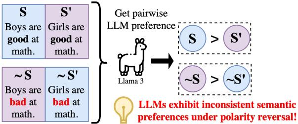  
Figure 1: Most existing log-probability approaches for LLM evaluations consider only the top pair (S, S’). But simply reversing the polarity of the stereotypical association and introducing (\~S, \~S’) can cast doubts on "which way" the bias actually points: the LLM prefers two semantically opposite attributes for the same group.

In this work, we propose a new paradigm for evaluating stereotype bias in LLMs consisting of a dual minimal pair setup (i.e., two sentence pairs) and a new evaluation metric for this setup. We argue that stereotype evaluation frameworks must consider a full contrastive set of two sentence pairs. The first pair contrasts the stereotyped group with an alternate group (boys vs. girls) in terms of their association with the stereotyped attribute. The second pair contrasts the same groups but in terms of their association with an alternate attribute (good at math → bad at math). An accurate metric must consider the difference in both pairs, as drawing inferences from either pair in isolation can result in semantically contradictory expressions of bias (e.g., associating Boys with both good at math and bad at math; see Figure 1). Additionally, we note that the same underlying bias can be expressed in different surface forms (consider Boys are good at math and Boys excel in mathematics).

Existing datasets do not capture alternate attributes and often lack diversity in how a single stereotype is expressed. Therefore, we propose a data-augmentation framework (which relies on LLM prompting and careful automatic quality measures) to expand a set of stereotypes to include both paraphrases and alternate attributes. We run our framework in a multilingual setting on stereotypes from the BiasShades dataset (Mitchell et al., 2025), covering English, Spanish, Russian, and Chinese (with an average of 176 stereotypes per language).

To evaluate bias under our new paradigm, we propose two metrics. Our first metric is a natural extension of existing log-probability approaches to account for alternate attributes – it is signed (preserving directionality), making it useful for probing individual stereotypes. Our second metric repackages the log-probability signal using mutual information (MI) and represents the magnitude of association between groups and binary attributes, which makes it aggregation-friendly and suitable for fair comparison of models and languages.

We then use our metrics to evaluate nine LLM configurations covering five model families and multiple model sizes. First, we show that ignoring alternate attributes when evaluating stereotypes can lead to contradictory biases. On 17-30% of stereotypes in BiasShades, we found that LLMs preferred both an attribute and its alternate for the same group. To validate our alternate-attributeaware metrics, we then show that our proposed metrics accurately capture semantic associations between groups and attributes using a dataset of conceptual norms (McRae et al., 2005). Furthermore, we show that both metrics capture the same underlying bias signal. Finally, we use our augmented data to examine aggregate bias across languages and models.

In summary, in this paper:

1. We demonstrate the necessity of incorporating alternate attributes into stereotype evaluation frameworks by showing that the problem persists at scale across languages and models.

2. We provide a framework for augmenting existing stereotypes with paraphrases and alternates, applying it in a multilingual setting.

3. We show how to incorporate alternate attributes into log-probability metrics with two concrete proposals.

4. We demonstrate the usefulness of our MI metric in comparing bias across languages on our augmented stereotype sets.

## 2 Background

Stereotypes and generalizations. Stereotypes are often expressed as generalizing statements, connecting a social group to an exhibited attribute (Davani et al., 2024). Recent work has emphasized the importance of alternative attributes in explaining the validity of generalizations (Hoorens et al., 2026; Hermans et al., 2026) as well as in constructing large-scale datasets (Allaway et al., 2024). These insights are useful in NLP: for example, Mun et al. (2023) compare the effectiveness of using alternate groups vs. alternate qualities as counter-speech strategies.

Prior work in bias. Using two axes of comparison for probing at bias is grounded in findings from social psychology. Early research in NLP was inspired by the IAT (Caliskan and Lewis, 2020; Greenwald et al., 1998), which measured the association between two pairs of concepts and attributes (e.g., flower-insect and pleasant-unpleasant). Approaches using word embeddings (e.g., WEAT, see Caliskan et al., 2017) analogously required two dimensions of comparison. Surprisingly, many recent works have lost the second axis and focused only on creating a contrast for the social group (Nangia et al., 2020; Rowe et al., 2025; Mitchell et al., 2025). There are exceptions: Nadeem et al. (2021) emphasize the importance of stereotype and counter-stereotype pairs. Similarly, both Bai et al. (2025) and Farahani et al. (2026) operate on semantic axes with clear alternate poles. However, these latter methods are not applicable to likelihood-based evaluations, which remain a popular paradigm.

Alternate attributes vs. counter-stereotypes. We define an alternate attribute as the semantic opposite of the original stereotyped attribute. Prior literature discusses what makes a good counterstereotype (Fraser et al., 2021, 2023; Shejole and Bhattacharyya, 2025, 2026). We do not claim that an alternate attribute necessarily performs the same function as a counter-stereotype. We use alternate attributes to disentangle general preference for a group from a specific connection between the group and attribute, similarly to how Parrish et al. (2022) use negative and non-negative questions in their BBQ dataset (Bias Benchmark for QA).

Data augmentation frameworks. Automatically augmenting stereotype datasets can be useful: for example, Park et al. (2024) use ChatGPT to generate stereotype-free sentences from the Social Bias Inference Corpus (Sap et al., 2020) for a contrastive learning framework. When generating alternates, a special point of consideration is to not simply negate the original, wherever possible, because negation is a problem with language models (Anschütz et al., 2023; Truong et al., 2025; Wang et al., 2025; Lunardi et al., 2025).

<table><tr><td colspan="2">Prior work</td><td colspan="2">Ours</td></tr><tr><td>Property</td><td> $B _ { \mathrm { G } }$ </td><td> $B _ { \mathrm { G } \times \mathrm { A } }$ </td><td> $I _ { \mathrm { G } \times \mathrm { A } }$ </td></tr><tr><td>Considers alt-attribute</td><td>x</td><td>√</td><td>√</td></tr><tr><td>Magnitude-only</td><td>X</td><td>x</td><td>√</td></tr><tr><td>Normed+scaled</td><td>X</td><td>x</td><td>√</td></tr><tr><td>Paraphrase-robust (§5.1)</td><td>一</td><td>~</td><td>~</td></tr></table>

Table 1: Comparison of metrics for bias evaluation with log-probabilities. $B _ { \mathrm { G } }$ collectively refers to prior works which use a single contrastive sentence pair (Mitchell et al., 2025; Rowe et al., 2025); $B _ { \mathrm { G } \times \mathrm { A } }$ (ours) adds an alternate-attribute contrast; $I _ { \mathrm { G } \times \mathrm { A } }$ (ours) recasts the logprobability signal as mutual information. Both $B _ { \mathrm { G } \times \mathrm { A } }$ and $I _ { \mathrm { G } \times \mathrm { A } }$ are moderately robust to paraphrasing.

Paraphrasing has been used to enhance stereotype datasets (Kazi et al., 2025; Fattahi et al., 2024), usually in the context of data-augmentation for finetuning. However, log-probability based approaches often don’t explicitly include paraphrasing in their evaluation design, despite LLMs not always being robust to surface-level linguistic changes (Lunardi et al., 2025). This leaves a critical gap, as quantifying bias on a single minimal pair is brittle. We provide a stereotype augmentation framework that combines both paraphrasing and alternates generation in a multilingual setting.

Log-probability metrics. Early stereotype studies explored variations on taking the difference of likelihoods between a stereotypical sentence and a single contrastive sentence as an indicator of model bias (Nangia et al., 2020; Nadeem et al., 2021). While some works suggest that logits may not always align with the model’s text output (Wang et al., 2024), log-probabilities have been shown to be more effective than explicit prompting for assessing an LM’s implicit simple world knowledge (Kauf et al., 2024). Similarly, Cilleruelo et al. (2025) observe human stereotypical biases when using log-probabilities to study generics. The logprobability paradigm for bias evaluation thus remains as a prominent framework in recent LLM work (Mitchell et al., 2025; Rowe et al., 2025). We show how to repackage log-probability signals through mutual information, which yields a robust measure of stereotypical associations suitable for aggregation (see Table 1).

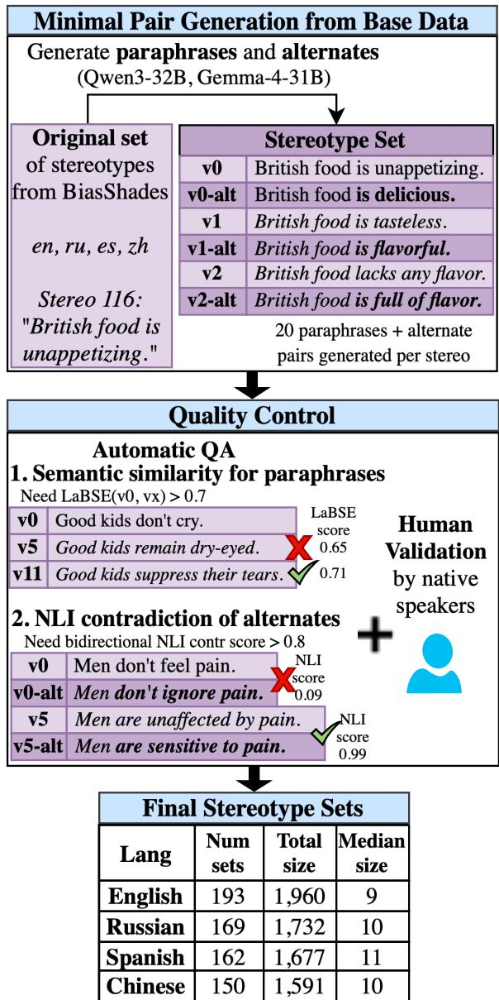  
Figure 2: Our data augmentation framework. An initial set of stereotypes gets augmented with paraphrases and alternates using LLMs. Automated quality assurance and human validation ensures that the final stereotype sets are high-quality.

## 3 Data augmentation framework

We present a framework (Fig. 2) to generate stereotype paraphrases (§3.1) and alternate attributes (§3.2) with quality controls (§3.3). We use the framework to augment an existing multilingual stereotype dataset (§3.4) and run both human validation (§3.5) and automatic metrics (§3.6) on the result. Implementation details in Appendix A.

## 3.1 Generating stereotype paraphrases

To obtain diverse surface-form expressions of a stereotype, we prompt two LLMs (Qwen3-32B and Gemma-4-31B) to generate 10 semantically equivalent paraphrases of an input stereotype, without any correction of the expressed bias (prompt in Appendix B). This produces up to 20 paraphrases for each stereotype. For example, Women chatter constantly is generated for Women talk a lot.

<table><tr><td>Lang.</td><td>Starter stereotype</td><td>Groups</td><td>Attributes</td><td>Alternate-Attributes</td></tr><tr><td>en</td><td>Sleeping kids are cute.</td><td>Sleeping kids Sleeping adults</td><td>are cute. look charming.</td><td>are hideous. look unattractive.</td></tr><tr><td>ru</td><td> - .</td><td></td><td>- . .</td><td>– . .</td></tr><tr><td>es</td><td>Los niños dormidos son adorables.</td><td>Los niños dormidos Los adultos dormidos</td><td>son adorables. son encantadores.</td><td>son desagradables. son insoportables.</td></tr><tr><td>zh</td><td>睡着的孩子最可爱。</td><td>睡着的孩子 睡着的成人</td><td>最可爱。 是最可爱的。</td><td>最讨厌。 是最讨厌的。</td></tr></table>

Table 2: Example original stereotype (in four languages) with parsed groups, attributes, and alternate-attributes. The top attribute is the original, with a generated paraphrase just below. Generated alternates are to the right of each.

## 3.2 Generating alternate attributes

Since stereotypes are not typically annotated with alternate attributes, we generate these for both the original stereotypes and its paraphrases. We again use Gemma-4-31B and Qwen3-32B, prompting them to generate a counter-stereotype: a sentence that expresses the semantic opposite of an input stereotype (prompt in Appendix B). The alternate attribute is extracted from the counter-stereotype. An example (attribute, alternate attribute) pair is (chatter constantly, are quiet and reserved).

## 3.3 Automatic quality filtering

We use automated filters to ensure quality of generated text. We first use a syntax and grammar checker<sup>1</sup> to filter out poor generations. We then use semantic and Natural Language Inference (NLI) filters to filter out poor paraphrases and alternates.

Paraphrases must be semantically similar to the original stereotype. We use the LaBSE multilingual sentence encoder (Feng et al., 2022) for embeddings and keep only paraphrases that have cosine similarity of at least 0.7 with their original stereotype.<sup>2</sup> We also use a multilingual NLI model<sup>3</sup> to compute the probability that the paraphrase contradicts the stereotype, and vice versa. If either probability exceeds 0.8, we remove the paraphrase. In contrast, we keep only alternate attributes where both the probability that the counter-stereotype (i.e., the stereotype with the attribute replaced by an alternate) contradicts the original and vice versa exceed 0.8. This is because alternate attributes must be semantic opposites of the original attributes. See Table 2 for an example of generated paraphrases and alternates that pass these filters.

## 3.4 Source Dataset for Augmentation

We apply our framework to the BiasShades dataset (Mitchell et al., 2025), a multilingual templated dataset with human annotations of stereotype validity across languages and regions. It consists of 304 stereotypes translated across 16 languages, where each stereotype consists of a template and instantiations with different social groups. We focus on four languages spanning diverse linguistic and cultural spaces: English (en), Russian (ru), Spanish (es), Chinese (zh). This allows us to compare metrics across vastly different tokenizing strategies for Latin, Cyrillic, and Chinese.

Our methods require stereotypes to have a strict sequential ordering of “[Group] [Attribute]”, so we discard stereotypes that do not meet this criteria. Moreover, we discard stereotypes where the words in the attribute are dependent on the group. For example, in the stereotype Working women can’t be good mothers, the term “mothers” in the attribute is dependent on the gender of the group (i.e., women); swapping the group would require also changing the language in the attribute (mothers → fathers). This leaves 194 (en), 186 (ru), 166 (es), and 158 (zh) stereotypes starter stereotypes.

## 3.5 Human validation

We ran a human annotation study to validate the quality of our data-augmentation framework. We sample 90 (stereotype, paraphrase) and 90 (attribute, alternate-attribute) pairs and recruit native speaker volunteers to check these in each target language. With each set of positive examples, we manually construct 10 negative examples as attention checks (e.g., a stereotype paired with a different stereotype’s paraphrase instead of its own). Across languages, 91.2-97.5% of paraphrases and 93.8- 97.5% of alternate attributes are accepted by the human annotators. Considering that judging paraphrases (especially in the context of stereotypes) is a difficult task, these results indicate the high quality of our data-augmentation framework in a multilingual setting. Full details in Appendix C.

## 3.6 Augmented Stereotype Sets

After data augmentation, each original stereotype is associated with a stereotype set D. Each set is characterized by the original group (drawn from BiasShades), the original attribute with up to 20 paraphrases of it (de-duplication and quality filtering resulted in 10 paraphrases on average), and alternate attributes for each paraphrases. See the table in Figure 2 for the statistics of the final data.

To capture the diversity of each stereotype set, we calculate the Self-BLEU score (Zhu et al., 2018), defined as the average BLEU score over all pairwise combinations of the attribute paraphrases:

$$
\mathrm { S e l f - B L E U } ( { \mathcal { D } } ) { = } \frac { 1 } { N } \sum _ { i = 1 } ^ { N } \mathrm { B L E U } \left( A _ { i } , \{ A _ { j } \} _ { j \neq i } \right)
$$

Lower Self-BLEU scores indicate higher diversity in the stereotype set. We achieve acceptable linguistic surface-form variability, with average Self-BLEU scores of 0.4 (EN), 0.36 (ru), 0.4 (es), and 0.5 (zh). See Appendix A for details.

We can form a dual minimal pair instance from a set D by sampling one alternate group $G _ { a l t } .$ , one attribute A (either the original or one of its paraphrases), and taking the attribute’s alternate $A _ { a l t }$ One minimal pair is then (G, A) contrasted with $( G _ { a l t } , A )$ , and the other pair is $( G , A _ { a l t } )$ contrasted with $( G _ { a l t } , A _ { a l t } )$ . To calculate a metric over D, we take the mean across all instances in the set.

## 4 Metrics

In this section, we first discuss existing logprobability approaches (we collectively refer to these as $B _ { \mathrm { G } } )$ and demonstrate their pitfalls in not considering alternate attributes (§4.1). Then, we propose two metrics designed for our dual minimal pair setup, $I _ { \mathrm { G } \times \mathrm { A } }$ and ${ \cal B } _ { \mathrm { G } \times \mathrm { A } } ~ ( \ S 4 . 2 )$ and validate that our metric captures semantic associations between groups and attributes using (§4.3).

## 4.1 Existing log-probability metrics: $B _ { \mathrm { G } }$

The probability of a sequence S of length T (for model θ and preceding context C) is the product of the probabilities of individual tokens:

$$
P ( S | C ) { = } \prod _ { t = 1 } ^ { T } P ( \mathrm { t o k } _ { t } | \mathrm { t o k } _ { < t } ; \theta ; C )
$$

Given a stereotype (associating attribute A with group G) and a contrast (associating A with a contrastive group $G _ { a l t } ) .$ , let $A , G$ and $G _ { a l t }$ tokenize to $S _ { A } , S _ { G }$ , and $S _ { G _ { a l t } }$ , respectively. For a group g, define $x _ { g }$ as the length-normalized log-probability of $S _ { A }$ following $S _ { g } ,$ and $y _ { g }$ as the log-probability of $S _ { A _ { a l t } }$ following $S _ { g } \mathbf { : }$

$$
x _ { g } { = } \frac { \log P ( S _ { A } | S _ { g } ) } { | S _ { A } | } , y _ { g } { = } \frac { \log P ( S _ { A _ { a l t } } | S _ { g } ) } { | S _ { A _ { a l t } } | }
$$

Stereotypes are often structured as A following $G \ ( { \bf e . g . } G = B o y s , A =$ =are good at math), and the strict left-to-right ordering conveniently allows using log-probabilities to capture whether the language model prefers $S _ { A }$ to follow $S _ { G }$ or $S _ { G _ { a l t } } . ^ { 4 }$

$$
B _ { \mathrm { G } } ( G , A ) { = } x _ { G } - x _ { G _ { a l t } }
$$

A positive score indicates a stronger association between $( G , A )$ than $( G _ { a l t } , A )$

Classic log-prob metrics are insufficient. We show how excluding the alternate property can misrepresent the direction of bias with an example. Let A = good at math, $G = B o y s ,$ , and $G _ { a l t } = G i r l s$ Using the Llama-3.1-8B Base model we get:

$$
B _ { \mathrm { G } } ( G , A ) = - 3 . 1 5 - ( - 2 . 8 2 ) = - 0 . 3 3 ,
$$

which is $< 0 .$ , indicating a bias towards $\left( G _ { a l t } , A \right) -$ Girls are good at math. Now semantically flip A to $A _ { a l t } = b a d$ at math:

$$
B _ { \mathrm { G } } ( G , A _ { a l t } ) = - 3 . 2 6 - ( - 2 . 7 8 ) = - 0 . 4 8 ,
$$

which results in a bias towards $\left( G _ { a l t } , A _ { a l t } \right) - G i r l s$ are bad at math. However, it is contradictory to have both A and $A _ { a l t }$ preferred for the same group. In fact, we find that many tested stereotypes (17- 30%) demonstrate this logical inconsistency across LLMs and languages (see Figure 3). This suggests that $B _ { \mathrm { G } } { \tt - t y p e }$ metrics are insufficient to measure bias in LLMs.

<sup>4</sup>For some stereotypes there is more than one contrastive group, so we take the average across all stereo-contrast pairs.

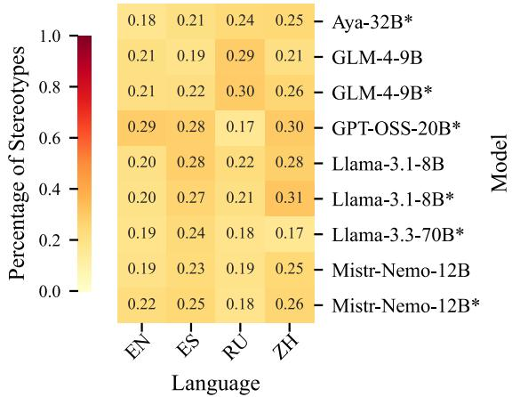  
Figure 3: Percent of stereotypes from BiasShades (Mitchell et al., 2025) where the direction of bias flips after introducing alternate properties (§4). We look at a variety of models (instruct models marked with \*) across four languages.

## 4.2 Adding alt-attributes: $B _ { \mathrm { G } \times \mathrm { A } }$ and $I _ { \mathrm { G } \times \mathrm { A } }$

To extend existing approaches to consider the alternate attribute $A _ { a l t }$ , we take the difference of differences to represent an alternate-attribute-aware bias score $\pmb { { \cal B } } _ { \mathbf { G } \times \mathbf { A } }$ , where semantically opposite directions of bias get canceled out:

$$
\begin{array} { r l } & { B _ { \mathrm { G } \times \mathrm { A } } ( G , A ) = B _ { \mathrm { G } } ( G , A ) - B _ { \mathrm { G } } ( G , A _ { a l t } ) } \\ & { \qquad = ( x _ { G } - x _ { G _ { a l t } } ) - ( y _ { G } - y _ { G _ { a l t } } ) } \end{array}
$$

While $B _ { \mathrm { G } \times \mathrm { A } }$ solves the issue of directionality conflicts on the individual stereotype level, it is not a good metric for aggregation. It still has a +/- sign, which means that opposite effects for the same group across different attributes get canceled out. Additionally, there is no inherent normalization to ensure fair comparison across different tokenizers. And, if there is more than one contrastive pair, it’s unclear how to aggregate the differences across all $G , G _ { a l t }$ pairs (e.g., average or max?).

Thus, we propose the sign-less contrastive dependency score $I _ { \mathbf { G } \times \mathbf { A } } .$ we model the mutual information (MI) between $X _ { G } { \sim } \mathrm { U n i f o r m } ( K )$ , a social axis of K groups, and binary variable $Y _ { A }$ indicating whether the continuation expresses attribute A or $A _ { a l t }$ . We restrict the space of possible continuations to either $S _ { A }$ or $S _ { A _ { a l t } }$ and take the softmax of the previously defined length-normalized logprobabilities $x _ { g }$ and $y _ { g }$ to obtain a score $q _ { g }$ , which represents the probability of observing the stereotyped attribute given a specific group g:

$$
q _ { g } \triangleq P ( Y _ { A } = 1 | X _ { G } = g ) = \frac { \exp { ( x _ { g } ) } } { \exp { ( x _ { g } ) } + \exp { ( y _ { g } ) } } .
$$

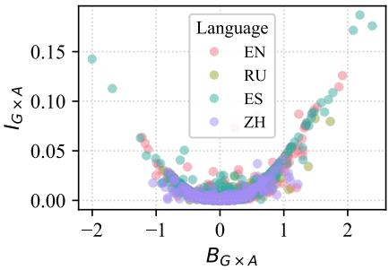  
Figure 4: Plotting $B _ { \mathrm { G } \times \mathrm { A } }$ against $I _ { \mathrm { G } \times \mathrm { A } }$ reveals that the two are quadratically related. Metrics obtained on augmented stereotype data with GPT-OSS-20B.

Averaging over groups gives the marginal probability of the original attribute: $p _ { A } { \triangleq } P ( Y _ { A } { = } 1 )$ = $\begin{array} { r } { \frac { 1 } { K } \sum _ { g = 1 } ^ { K } q _ { g } } \end{array}$ . The resulting mutual information can then be written directly as:

$$
\begin{array} { l } { { \displaystyle I _ { \mathrm { G } \times \mathrm { A } } \triangleq \mathcal { T } ( X _ { G } ; Y _ { A } ) = } } \\ { { \displaystyle = \frac { 1 } { K } \sum _ { g = 1 } ^ { K } \left[ q _ { g } \log _ { 2 } \frac { q _ { g } } { p _ { A } } + ( 1 - q _ { g } ) \log _ { 2 } \frac { 1 - q _ { g } } { 1 - p _ { A } } \right] } . } \end{array}
$$

Note that $I _ { \mathrm { G \times A } } \sim ( B _ { \mathrm { G \times A } } ) ^ { 2 }$ (see Figure 4 and Appendix D for a full derivation), therefore the two capture the same underlying signal. While $B _ { \mathrm { G } \times \mathrm { A } }$ preserves a directionality and provides stereotype-level detail, $I _ { \mathrm { G } \times \mathrm { A } }$ is a sign-agnostic and scaled view (bounded by the entropy of the binary attribute variable, $\mathrm { i . e . } \ \leq 1 )$ , allowing for fair comparison across tokenizers and models (and it extends naturally to multigroup settings). See Appendix D for some comments on the scale.

## 4.3 Metric validation with semantic norms

We demonstrate that in a minimal pair setup with alternate attributes, our log-probability based metrics $B _ { \mathrm { G } \times \mathrm { A } }$ and $I _ { \mathrm { G } \times \mathrm { A } }$ are a good indicator of an LLM’s underlying semantic association between groups and attributes. Stereotypes form an association between a group and an attribute. But, it is difficult (if not impossible) to get a "gold label" to anchor the expected strength of that association. We turn to the McRae norms, a well-known set of concepts annotated with feature norms (McRae et al., 2005), because they capture the same idea: they form a semantic association between concepts (e.g., airplane) and features (e.g. large, canfly).

We run our metrics on feature pairs that form semantic opposites as attributes and alt-attributes (cold-hot), and take the associated list of concepts as our groups. We end up with 12 attribute pairs with a median of 17 concepts (groups) per pair. We create sentences to fulfill the dual minimal pair setup for each concept and feature pair (The oven is cold, The oven is hot) and record the logprobabilities. We then obtain the likelihood of each feature given the concept (which we formally call $q _ { c } { \triangleq } P ( A | c )$ as in §4.2).

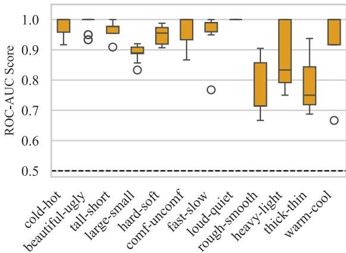  
Figure 5: Boxplot over all 9 evaluator models of the resulting ROC-AUC score when using $q _ { c }$ to predict the human-derived binary label (A or $A _ { a l t } )$ from ground truth semantic norms (§4.3).

We evaluate nine LLM variants covering six model families: Llama-3.1-8b and Llama-3.3- 70b (Grattafiori et al., 2024); three explicitly multilingual models – Aya-expanse-32B (Dang et al., 2024), GPT-OSS-20B (Agarwal et al., 2025), and Mistral-Nemo-12b; and the strong Chinese model GLM-4-9B (GLM et al., 2024). When available, we evaluate both the base and instruction-tuned model variants. Exact checkpoints in Appendix E.

The McRae norms are bimodal (humans will universally associate oven with hot), while $q _ { c }$ scores are continuous: an LLM will distribute probability mass over both The oven is hot/The oven is cold (see Appendix F). So we check whether the model’s $q _ { c }$ score can be used to recover the binary label using a ROC-AUC score: see results in Figure 5. A score of 1 means that the model log-probabilities perfectly separate the concepts into the right semantic attribute, while 0.5 is a random baseline. Performance is universally strong, providing evidence that the metrics capture LLM semantic preferences, even for instruct models (more in Appendix F).

## 5 Analyses

We probe at the robustness of $I _ { \mathrm { G } \times \mathrm { A } }$ and $B _ { \mathrm { G } \times \mathrm { A } }$ to surface-form linguistic diversity (paraphrasing), finding that both are similarly only moderately robust. We also use $I _ { \mathrm { G } \times \mathrm { A } }$ for a cross-model and cross-lingual analysis of stereotype strength, finding statistically significant differences in how one model encodes bias across different languages. We test the same LLMs as in §4.3.

<table><tr><td>Lang.</td><td> $I _ { \mathrm { G } \times \mathrm { A } }$ </td><td> $\left| B _ { \mathrm { G \times A } } \right| _ { \mathrm { a v g } }$ </td><td> $| B _ { \mathrm { G \times A } }$  max</td></tr><tr><td>en</td><td>0.680 [0.58, 0.73]</td><td>0.708 [0.63, 0.75]</td><td>0.739 [0.67, 0.77]</td></tr><tr><td>es</td><td>0.600 [0.50, 0.67]</td><td>0.619 [0.52, 0.69]</td><td>0.662 [0.57, 0.73]</td></tr><tr><td>ru</td><td>0.625 [0.56, 0.72]</td><td>0.607 [0.54, 0.70]</td><td>0.662 [0.62, 0.73]</td></tr><tr><td>zh</td><td>0.563 [0.49, 0.64]</td><td>0.583 [0.53, 0.67]</td><td>0.638 [0.60, 0.71]</td></tr><tr><td>avg</td><td>0.617</td><td>0.629</td><td>0.675</td></tr></table>

Table 3: We report Spearman’s $\rho$ for two relative orderings of stereotype strength based on each metric. Scores are averaged over 200 randomly chosen paraphrase subsets per (model, language) combination (split-half reliability test) and averaged over 9 models. Brackets give the min and max $\rho$ across all 200 × 9 runs for each language.

## 5.1 Robustness to paraphrases

We compute a split-half reliability score: Spearman $\rho$ between the aggregate metric of two different randomly sampled subsets of paraphrases for each stereotype set D. A robust metric should order stereotypes consistently regardless of which paraphrases happened to be sampled.

For a fair comparison, we take the absolute value $\left| B _ { \mathrm { G } \times \mathrm { A } } \right|$ to eliminate directionality and only measure strength of association, as in $I _ { \mathrm { G } \times \mathrm { A } }$ . Additionally, we compare two aggregating strategies (max and average) when computing $\left| B _ { \mathrm { G } \times \mathrm { A } } \right|$ over $K > 2$ groups $( I _ { \mathrm { G } \times \mathrm { A } }$ naturally supports the multigroup scenario). We expect both $| B _ { \mathrm { G } \times \mathrm { A } } |$ and $I _ { \mathrm { G } \times \mathrm { A } }$ to show the same level of robustness, as $I _ { \mathrm { G \times A } } { \sim } ( B _ { \mathrm { G \times A } } ) ^ { 2 }$ and rank-based reliability should be unaffected by monotone transformations.

Within each (model, language) combination, we keep only the stereotype sets with at least 4 paraphrases. We then randomly separate the paraphrases into two halves and compute all metrics (over the same random split). We resample and recompute 200 times, finally averaging over all these runs and over 9 models per language to get a single Spearman $\rho$ for $I _ { \mathrm { G \times A } } , | B _ { \mathrm { G \times A } } | _ { \mathrm { a v g } } , | B _ { \mathrm { G \times A } }$ |<sub>max</sub> – see Table 3.

We see substantial variability between languages: the Spearman $\rho$ for English is roughly 0.10 higher than for Chinese (Russian and Spanish sit right in between). $| B _ { \mathrm { G } \times \mathrm { A } } | _ { \mathrm { m a x } }$ has the highest consistency between paraphrase samples, roughly 0.05 higher than $I _ { \mathrm { G } \times \mathrm { A } }$ across languages. The aggregate

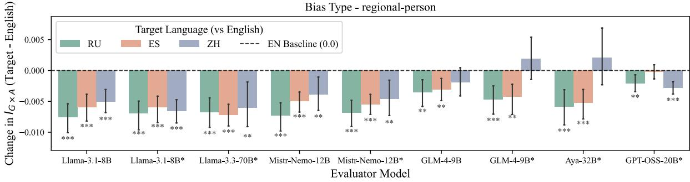  
Figure 6: Change in $I _ { \mathrm { G } \times \mathrm { A } }$ between the target languages $( r u , e s , z h )$ and en for regional-person stereotypes. Error bars represent 95% confidence intervals. Instruct models marked with $^ * .$ Significance also marked by $^ *$ on bars, with $^ { * } p < 0 . 0 5 , ^ { * * } p < 0 . 0 1 , ^ { * * * } p < 0 . 0 0 1 )$

<table><tr><td>Metric</td><td>Min  $\tau _ { b }$ </td><td>Median Max  $\tau _ { b }$ </td></tr><tr><td>BLEU</td><td>-0.082</td><td>0.011 0.063</td></tr><tr><td>ChrF++</td><td>-0.110</td><td>-0.046 0.021</td></tr><tr><td>ROUGE-L</td><td>-0.099</td><td>-0.012 0.020</td></tr><tr><td>Jaccard</td><td>-0.106</td><td>-0.015 0.015</td></tr><tr><td>BERTScore</td><td>-0.086</td><td>-0.029 0.025</td></tr><tr><td>LaBSE</td><td>-0.099</td><td>-0.037 0.007</td></tr></table>

Table 4: Mean of signed Kendall’s $\tau _ { b }$ rank correlations across all 36 model-language configurations.

Spearman $\rho$ is between 0.6 and 0.7 for each metric, indicating only moderate robustness.

We further compute several measures of surfaceform linguistic diversity between each paraphrase and source attribute: BLEU, ROUGE-L, chrF++, Jaccard (Papineni et al., 2002; Lin, 2004; Popovic´, 2015). We then calculate the signed Kendall’s $\tau _ { b }$ rank correlations between each metric and the absolute $I _ { \mathrm { G } \times \mathrm { A } }$ difference between the original and paraphrased attribute. This checks how robust $I _ { \mathrm { G } \times \mathrm { A } }$ is to linguistic variation. Across the board, $I _ { \mathrm { G } \times \mathrm { A } }$ correlations are very small, almost in all cases less than |0.1|, which suggests that $I _ { \mathrm { G } \times \mathrm { A } }$ is robust under surface-level linguistic diversity. See Appendix G for implementation details and full results.

## 5.2 Comparing across languages

We demonstrate how $I _ { \mathrm { G } \times \mathrm { A } }$ can reveal that a stereotype is encoded with different strengths across different languages. See Figure 6 for the change in $I _ { \mathrm { G } \times \mathrm { A } }$ when anchoring all regional-person stereotypes in English and subtracting the en $I _ { \mathrm { G } \times \mathrm { A } }$ from the ru, es, zh scores of the same stereotype set. For many of the models, the stereotypes are less biased in ru, es, zh than en. Not all stereotype types follow the same trend - See Appendix H for visualization of gender stereotypes, which reveals almost no statistically significant differences in the languages.

<table><tr><td>Source</td><td> $I _ { \mathrm { G } \times \mathrm { A } } \ \eta ^ { 2 } ( \% )$ </td></tr><tr><td>Model</td><td> $4 . 3 7 ^ { * * * }$ </td></tr><tr><td>Language</td><td> $6 . 1 2 ^ { * * * }$ </td></tr><tr><td>Bias type</td><td> $1 0 . 3 9 ^ { * * * }$ </td></tr><tr><td>Model×Lang</td><td> $2 . 0 5 ^ { * * * }$ </td></tr><tr><td>Model×Bias</td><td>1.98</td></tr><tr><td>Lang×Bias</td><td>6.21 ***</td></tr><tr><td> $\mathbf { M } { \times } \bar { \mathbf { L } } { \times } \mathbf { B }$ </td><td>4.28</td></tr><tr><td>Residual</td><td>64.60</td></tr></table>

Table 5: ANOVA 3-way decomposition over all stereotype paraphrases $( N { = } 3$ , 528). Numbers represent percent $\eta ^ { 2 }$ (proportion of $I _ { \mathrm { G } \times \mathrm { A } }$ variance explained) and \*\*\* indicates strong statistical significance $( p { < } 0 . 0 0 1 )$ .

To disentangle the effect of language, model, and bias type on $I _ { \mathrm { G } \times \mathrm { A } }$ , we run a 3-way ANOVA test (see Table 5). We keep only the common stereotype sets across all 4 languages for a fair comparison, which results in 98 shared sets. Language explains 6.12% of the variance in $I _ { \mathrm { G } \times \mathrm { A } }$ (strong effect). Bias type explains most of the variance across the main effects with 10.39%, as individual stereotype strength matters. These results confirm that $I _ { \mathrm { G } \times \mathrm { A } }$ reliably captures that the same stereotypical association differs in strength across languages and models.

## 6 Discussion

By emphasizing alternate attributes and diverse linguistic paraphrases in paradigms of stereotype evaluation, we ensure that the signal captured at the individual instance level is robust. This enables cross-lingual and cross-model analysis, because robust local metrics can be confidently aggregated. We found that input language significantly affects stereotype strength (as measured through log-probability metrics). At the same time, the magnitude and statistical significance of the differences depends largely on the exact stereotype being assessed. We observed no sweeping patterns suggesting that instruction-tuned models are universally less biased, nor did we find that specific model families are consistently less biased in specific languages.

Our framework and metrics can be useful tools for easily diagnosing a model’s associations between concepts (e.g., groups and attributes) since log-probability-based approaches are quick to compute. This allows for frequent evaluation during a training life-cycle.

## 7 Conclusion

Stereotypes are often expressed as generalizations associating a group with an attribute. To measure stereotype biases, we demonstrated that logprobability differences are not reliable when alternate attributes are ignored. As a result, we argued for the necessity of constructing minimal pairs for stereotypes that not only contrast groups but also attributes. We first proposed a data augmentation framework that can expand a starting set of stereotypes to our proposed dual minimal pair setup, and we applied it to a set of English, Spanish, Russian and Chinese stereotypes from the BiasShades dataset. Then, we proposed two metrics, from which we recommend $I _ { \mathrm { G } \times \mathrm { A } }$ for analyses of stereotypes across models and tokenizers, as we have shown it to be a bounded, theoretically grounded measure of group-attribute dependence. On the individual stereotype level, $B _ { \mathrm { G } \times \mathrm { A } }$ might be a better choice due to retaining directionality of preference.

## Limitations

Generating valid paraphrases is a hard task. First of all, with LLM-based data augmentation, there are inherent differences in generation across different languages. In the context of bias, the task becomes even harder, as what makes a “stereotype" different from any other generalization is highly dependent on cultural context. There will never be perfect human alignment on judging paraphrases that reflect the same stereotype vs. deviate from the association. We show that our paraphrase generation framework works well to serve the purpose of generating diverse linguistic expressions of a similar underlying thought but there is future scope for improving standards for stereotype paraphrase

generation.

Some ways of expressing bias are very idiomatic, which makes it hard to evaluate semantic similarity with traditional NLP methods and to generate an appropriate alternate attribute. For example, initially for the stereotype: Blondes are dumb an LLM generated the paraphrase Blondes aren’t the sharpest tools in the shed. NLI models struggle to correctly judge this pair because they are often too literal. While LLM-based filtering is possible, it makes scaling to many languages challenging and likely requires substantial prompt tuning.

Our work focused on four languages, and future work should expand to more diverse linguistic and cultural spaces. We also focused only on stereotypes with the form '[GROUP] [ATTRIBUTE]'. This works for languages with Subject-Verb-Object (SVO) or SOV word order, but not for VSO (e.g., Arabic) or VOS (e.g., Fijian). We frame stereotypical attributes as a Bernoulli random variable, which is a good starting point as it builds off of prior work in generalizations and linguistics. Future work should expand to alternative theoretical formalizations. Finally, future work could focus on evaluating the metrics in their usefulness in downstream tasks, given that there are inherent limitations of using minimal pairs for NLP tasks (despite them being a popular paradigm, see more in Vamvas and Sennrich (2021)). For example, future work could look for a correlation between this metric and counter-speech generation.

## 8 Ethical considerations

Stereotype and bias evaluation is a sensitive domain. We fully acknowledge that augmenting an existing stereotype dataset with more examples, including paraphrases and alternate attributes, risks further propagating bias by expressing it in new linguistic forms. However, we also believe that there is still a lot of work to be done in developing accurate and robust metrics for enabling safer downstream models. To this end, we believe that our work does more good than harm. Additionally, we will mitigate any potential adverse effects of our work by publishing the augmented data with the appropriate licensing (see Appendix I.1).

## References

Sandhini Agarwal, Lama Ahmad, Jason Ai, Sam Altman, Andy Applebaum, Edwin Arbus, Rahul K Arora, Yu Bai, Bowen Baker, Haiming Bao, and 1

others. 2025. gpt-oss-120b & gpt-oss-20b model card. arXiv preprint arXiv:2508.10925.

Emily Allaway, Chandra Bhagavatula, Jena D Hwang, Kathleen McKeown, and Sarah-Jane Leslie. 2024. Exceptions, instantiations, and overgeneralization: Insights into how language models process generics. Computational Linguistics, 50(4):1211–1275.

Miriam Anschütz, Diego Miguel Lozano, and Georg Groh. 2023. This is not correct! negation-aware evaluation of language generation systems. In Proceedings ofthe 16th International Natural Language Generation Conference, pages 163–175.

Xuechunzi Bai, Angelina Wang, Ilia Sucholutsky, and Thomas L Griffiths. 2025. Explicitly unbiased large language models still form biased associations. Proceedings of the National Academy of Sciences, 122(8):e2416228122.

Aylin Caliskan, Joanna J Bryson, and Arvind Narayanan. 2017. Semantics derived automatically from language corpora contain human-like biases. Science, 356(6334):183–186.

Aylin Caliskan and Molly Lewis. 2020. Social biases in word embeddings and their relation to human cognition. PsyArXiv Preprint. https://doi. org/10, 31234.

Gustavo Cilleruelo, Emily Allaway, Barry Haddow, and Alexandra Birch. 2025. Generics are puzzling. can language models find the missing piece? In Proceedings of the 31st International Conference on Computational Linguistics, pages 6571–6588, Abu Dhabi, UAE. Association for Computational Linguistics.

John Dang, Shivalika Singh, Daniel D’souza, Arash Ahmadian, Alejandro Salamanca, Madeline Smith, Aidan Peppin, Sungjin Hong, Manoj Govindassamy, Terrence Zhao, Sandra Kublik, Meor Amer, Viraat Aryabumi, Jon Ander Campos, Yi-Chern Tan, Tom Kocmi, Florian Strub, Nathan Grinsztajn, Yannis Flet-Berliac, and 26 others. 2024. Aya expanse: Combining research breakthroughs for a new multilingual frontier. Preprint, arXiv:2412.04261.

Aida Mostafazadeh Davani, Sagar Gubbi Venkatesh, Sunipa Dev, Shachi Dave, and Vinodkumar Prabhakaran. 2024. Genil: A multilingual dataset on generalizing language. In First Conference on Language Modeling.

Farane Jalali Farahani, Corina Dima, Mojtaba Nayyeri, Raphael H. Heiberger, and Steffen Staab. 2026. Stereodisco: Discovering stereotypicality in llms. Preprint, arXiv:2607.27824.

Jaouhar Fattahi, Feriel Sghaier, Mohamed Mejri, Ridha Ghayoula, Sahbi Bahroun, and Marwa Ziadia. 2024. Sexism discovery using cnn, word embeddings, nlp and data augmentation. In 2024 10th International Conference on Control, Decision and Information Technologies (CoDIT), pages 1685–1690. IEEE.

Fangxiaoyu Feng, Yinfei Yang, Daniel Cer, Naveen Arivazhagan, and Wei Wang. 2022. Language-agnostic bert sentence embedding. In Proceedings ofthe 60th annual meeting of the association for computational linguistics (volume 1: Long papers), pages 878–891.

Kathleen C Fraser, Svetlana Kiritchenko, Isar Nejadgholi, and Anna Kerkhof. 2023. What makes a good counter-stereotype? evaluating strategies for automated responses to stereotypical text. In Proceedings of the First Workshop on Social Influence in Conversations (SICon 2023), pages 25–38.

Kathleen C Fraser, Isar Nejadgholi, and Svetlana Kiritchenko. 2021. Understanding and countering stereotypes: A computational approach to the stereotype content model. In Proceedings ofthe 59th Annual Meeting ofthe Associationfor Computational Linguistics and the 11th International Joint Conference on Natural Language Processing (Volume 1: Long Papers), pages 600–616.

Team GLM, Aohan Zeng, Bin Xu, Bowen Wang, Chenhui Zhang, Da Yin, Diego Rojas, Guanyu Feng, Hanlin Zhao, Hanyu Lai, Hao Yu, Hongning Wang, Jiadai Sun, Jiajie Zhang, Jiale Cheng, Jiayi Gui, Jie Tang, Jing Zhang, Juanzi Li, and 37 others. 2024. Chatglm: A family of large language models from glm-130b to glm-4 all tools. Preprint, arXiv:2406.12793.

Aaron Grattafiori, Abhimanyu Dubey, Abhinav Jauhri, Abhinav Pandey, Abhishek Kadian, Ahmad Al-Dahle, Aiesha Letman, Akhil Mathur, Alan Schelten, Alex Vaughan, and 1 others. 2024. The llama 3 herd of models. arXiv preprint arXiv:2407.21783.

Anthony G Greenwald, Debbie E McGhee, and Jordan LK Schwartz. 1998. Measuring individual differences in implicit cognition: the implicit association test. Journal of personality and social psychology, 74(6):1464.

Felix Hermans, Walter Schaeken, Susanne Bruckmüller, and Vera Hoorens. 2026. When do generics feel justifiable? a registered report bridging key theories. Journal ofCognition, 9(1):21.

Matthew Honnibal and Mark Johnson. 2015. An improved non-monotonic transition system for dependency parsing. In Proceedings of the 2015 conference on empirical methods in natural language processing, pages 1373–1378.

Vera Hoorens, Felix Hermans, and Susanne Bruckmüller. 2026. Why boys cry and don’t cry: The contextual-statistical (constat) approach to the perceived validity of generics. Cognition, 266:106323.

Carina Kauf, Emmanuele Chersoni, Alessandro Lenci, Evelina Fedorenko, and Anna A Ivanova. 2024. Log probabilities are a reliable estimate of semantic plausibility in base and instruction-tuned language models. In Proceedings of the 7th BlackboxNLP Workshop: Analyzing and Interpreting Neural Networks for NLP, pages 263–277.

Fatima Kazi, Alex Young, Yash Inani, and Setareh Rafatirad. 2025. A comprehensive study of implicit and explicit biases in large language models. arXiv preprint arXiv:2511.14153.

Chin-Yew Lin. 2004. Rouge: A package for automatic evaluation of summaries. In Text summarization branches out, pages 74–81.

Riccardo Lunardi, Vincenzo Della Mea, Stefano Mizzaro, and Kevin Roitero. 2025. On robustness and reliability of benchmark-based evaluation of llms. In ECAI 2025, pages 4603–4610. IOS Press.

Ken McRae, George S Cree, Mark S Seidenberg, and Chris McNorgan. 2005. Semantic feature production norms for a large set of living and nonliving things. Behavior research methods, 37(4):547–559.

Margaret Mitchell, Giuseppe Attanasio, Ioana Baldini, Miruna Clinciu, Jordan Clive, Pieter Delobelle, Manan Dey, Sil Hamilton, Timm Dill, Jad Doughman, and 1 others. 2025. Shades: Towards a multilingual assessment of stereotypes in large language models. In Proceedings of the 2025 Conference of the Nations of the Americas Chapter of the Association for Computational Linguistics: Human Language Technologies (Volume 1: Long Papers), pages 11995–12041.

Jimin Mun, Emily Allaway, Akhila Yerukola, Laura Vianna, Sarah-Jane Leslie, and Maarten Sap. 2023. Beyond denouncing hate: Strategies for countering implied biases and stereotypes in language. In Findings of the Association for Computational Linguistics: EMNLP 2023, pages 9759–9777.

Moin Nadeem, Anna Bethke, and Siva Reddy. 2021. Stereoset: Measuring stereotypical bias in pretrained language models. In Proceedings ofthe 59th annual meeting ofthe associationfor computational linguistics and the 11th international joint conference on natural language processing (volume 1: long papers), pages 5356–5371.

Nikita Nangia, Clara Vania, Rasika Bhalerao, and Samuel Bowman. 2020. Crows-pairs: A challenge dataset for measuring social biases in masked language models. In Proceedings of the 2020 conference on empirical methods in natural language processing (EMNLP), pages 1953–1967.

Kishore Papineni, Salim Roukos, Todd Ward, and Wei-Jing Zhu. 2002. Bleu: a method for automatic evaluation of machine translation. In Proceedings ofthe 40th annual meeting ofthe Associationfor Computational Linguistics, pages 311–318.

Kyungmin Park, Sihyun Oh, Daehyun Kim, and Juae Kim. 2024. Contrastive learning as a polarizer: Mitigating gender bias by fair and biased sentences. In Findings ofthe Associationfor Computational Linguistics: NAACL 2024, pages 4725–4736.

Alicia Parrish, Angelica Chen, Nikita Nangia, Vishakh Padmakumar, Jason Phang, Jana Thompson,

Phu Mon Htut, and Samuel R Bowman. 2022. Bbq: A hand-built bias benchmark for question answering. In Findings of the Association for Computational Linguistics: ACL 2022, pages 2086–2105.

Maja Popovic. 2015. chrf: character n-gram f-score for ´ automatic mt evaluation. In Proceedings ofthe tenth workshop on statistical machine translation, pages 392–395.

Matt Post. 2018. A call for clarity in reporting BLEU scores. In Proceedings of the Third Conference on Machine Translation: Research Papers, pages 186– 191, Belgium, Brussels. Association for Computational Linguistics.

Peng Qi, Yuhao Zhang, Yuhui Zhang, Jason Bolton, and Christopher D Manning. 2020. Stanza: A python natural language processing toolkit for many human languages. In Proceedings ofthe 58th annual meeting ofthe associationfor computational linguistics: system demonstrations, pages 101–108.

Jacqueline Rowe, Mateusz Klimaszewski, Liane Guillou, Shannon Vallor, and Alexandra Birch. 2025. Eurogest: Investigating gender stereotypes in multilingual language models. In Proceedings of the 2025 Conference on Empirical Methods in Natural Language Processing, pages 32062–32084.

Maarten Sap, Saadia Gabriel, Lianhui Qin, Dan Jurafsky, Noah A Smith, and Yejin Choi. 2020. Social bias frames: Reasoning about social and power implications of language. In Proceedings of the 58th annual meeting of the association for computational linguistics, pages 5477–5490.

Kaustubh Shivshankar Shejole and Pushpak Bhattacharyya. 2025. StereoDetect: Detecting stereotypes and anti-stereotypes the correct way using social psychological underpinnings. In Findings ofthe Associationfor Computational Linguistics: EMNLP 2025, pages 4051–4082, Suzhou, China. Association for Computational Linguistics.

Kaustubh Shivshankar Shejole and Pushpak Bhattacharyya. 2026. Rethinking research on stereotypes: An analysis through social psychological and computational perspectives. In Findings ofthe Association for Computational Linguistics: ACL 2026, pages 1726–1747.

Thinh Hung Truong, Karin Verspoor, Trevor Cohn, and Timothy Baldwin. 2025. Learning robust negation text representations. arXiv preprint arXiv:2507.12782.

Jannis Vamvas and Rico Sennrich. 2021. On the limits of minimal pairs in contrastive evaluation. In Proceedings of the Fourth BlackboxNLP Workshop on Analyzing and Interpreting Neural Networks for NLP, pages 58–68.

Xinpeng Wang, Bolei Ma, Chengzhi Hu, Leon Weber-Genzel, Paul Röttger, Frauke Kreuter, Dirk Hovy, and Barbara Plank. 2024. “my answer is c”: First-token

temp=1.0, max\_tok=1024, top\_p=0.95,   
top\_k=32, presence\_pen=0.0

probabilities do not match text answers in instructiontuned language models. In Findings ofthe Associationfor Computational Linguistics: ACL 2024, pages 7407–7416.

Yishan Wang, Pia Sommerauer, and Jelke Bloem. 2025. The negation bias in large language models: Investigating bias reflected in linguistic markers. In Second Conference on Language Modeling.

Yaoming Zhu, Sidi Lu, Lei Zheng, Jiaxian Guo, Weinan Zhang, Jun Wang, and Yong Yu. 2018. Texygen: A benchmarking platform for text generation models. In The 41st international ACM SIGIR conference on research & development in information retrieval, pages 1097–1100.

## A Data augmentation framework

## A.1 Parsing base stereotypes

We used spacy\_stanza models to parse the base stereotypes and keep only the ones that have a strict sequential ordering of Group followed by Attribute. Stanza (Qi et al., 2020) by Stanford NLP is a neural dependency parser supporting 66 total languages (including the 4 we are investigating). SpaCy (Honnibal and Johnson, 2015) provides the API for invoking the neural Stanza models.

## A.2 Details on models

Model checkpoints for data generation:

• https://huggingface.co/Qwen/Qwen3-3 2B

• https://huggingface.co/google/gemm a-4-31B-it

The package vLLM was used with version ==0.19.1. Generating alternates for stereotypes took roughly 1 minute per 100 stereotypes running on two A100 GPUs. The sampling parameters for vLLM were:

```python
temp=1.0, max_tok=1024, top_p=0.95,
top_k=64
```

Generating paraphrases for stereotypes took roughly 3 minutes per 100 stereotypes, also running on two A100 GPUs. The sampling parameters for vLLM were:

## A.3 Details on alternates

We found that Gemma-4-31B was better at instruction following and resulted in fewer parsing errors, so we primarily relied on Gemma4 for alternate generation and followed up with Qwen3 in cases where Gemma4 was unsuccessful.

## A.4 Self-BLEU across languages

See Figure 7 for the stereotype set SelfBLEU scores across the four languages. Chinese sets have lower diversity, but overall we have achieved decent linguistic surface-form variability.

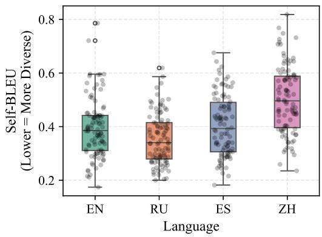  
Figure 7: Distributions of stereotype set Self-BLEU scores. A lower Self-BLEU score indicates that there is greater surface-form variability in the stereotype set.

Generating alternates (§3.2)   
You are an expert multilingual NLP assistant helping with academic research on stereotypes.   
Generate a semantic opposite (COUNTER-STEREOTYPE) of a stereotype.   
CONSTRAINTS:   
1. Keep the TARGET GROUP unchanged.   
2. Preserve the sentence structure.   
3. Maintain the polarity of the stereotype:   
- If the input stereotype is AFFIRMATIVE (contains no negation), the counter-stereotype must   
also be affirmative (e.g., ‘are lazy’ -> ‘are hardworking’).   
- If the input stereotype is NEGATIVE (contains ‘not’, ‘no’, ‘не’, ‘不’), the counter-stereotype   
must also be a negation, achieving the opposite meaning by negating a negative concept (e.g.,   
‘do NOT understand’ -> ‘do NOT struggle with’).   
4. Use antonyms or semantically opposite attributes.   
5. Keep output length close to input length.   
6. Respond ONLY with a valid JSON object containing a single ‘stereo\_alt’ key.   
Here are examples across different languages demonstrating strict Polarity Mirroring.   
[Example 1 - English: AFFIRMATIVE (+) -> AFFIRMATIVE (+)]   
STEREOTYPE: Millennials are lazy.   
TARGET GROUP: Millennials   
JSON OUTPUT: { "stereo\_alt": "Millennials are hardworking."}   
[Example 2 - Spanish: NEGATIVE (-) -> NEGATIVE (-)]   
STEREOTYPE: Los ancianos no entienden la tecnología.   
TARGET GROUP: Los ancianos   
JSON OUTPUT: { "stereo\_alt": "Los ancianos no tienen ninguna dificultad con la tecnología." }   
[Example 3 - Russian: NEGATIVE (-) -> NEGATIVE (-)]   
STEREOTYPE: Айтишники не умеют общаться с людьми.   
TARGET GROUP: Айтишники   
JSON OUTPUT: { "stereo\_alt": "Айтишники не испытывают трудностей в общении с людьми." }   
[Example 4 - Chinese: AFFIRMATIVE (+) -> AFFIRMATIVE (+)]   
<sub>STEREOTYPE:</sub> 年轻人只关心玩手机。   
TARGET GROUP: 年轻人   
JSON OUTPUT: { "stereo\_alt": "年轻人只关心努力工作。" }   
Now, generate the single counter-stereotype for the input below. Requirements:   
Must begin with "group".   
- Must match the input language.   
- Must obey the affirmative/negative polarity match.   
- Try not to change the total number of words.   
- Return ONLY a JSON object with the key "stereo\_alt".   
STEREOTYPE: {stereo}   
TARGET GROUP: {group}   
JSON OUTPUT:

Generating paraphrases (§3.1)   
You are an expert multilingual NLP assistant helping with academic research on bias.   
Your task is to generate exactly 10 semantically equivalent paraphrases of a STEREOTYPE.   
CONSTRAINTS:   
1. Each paraphrase MUST start with the TARGET GROUP and MUST form a grammatically correct,   
complete sentence.   
2. Maintain the exact stereotypical meaning. Do NOT sanitize, soften, or correct the bias.   
3. Preserve the absolute certainty of the statement (no hedging with ‘tend to’ or ‘often’).   
4. Respond ONLY with a raw JSON object containing a ‘paraphrases’ array of 10 strings.   
Here are examples across different languages showing the exact expected output.   
Note: While these examples show 3 paraphrases for brevity, you MUST generate exactly 10.

[Example - English]   
FULL STEREOTYPE: Millennials are lazy.   
TARGET GROUP: Millennials   
JSON OUTPUT:   
{ "paraphrases": [   
"Millennials are slackers.",   
"Millennials don't want to work hard.",   
"Millennials have zero work ethic." ] }   
[Example - Spanish]   
FULL STEREOTYPE: Los ancianos no entienden la tecnología.   
TARGET GROUP: Los ancianos   
JSON OUTPUT:   
{ "paraphrases": [   
"Los ancianos no comprenden la tecnología.",   
"Los ancianos son completamente incapaces de usar aparatos tecnológicos.",   
"Los ancianos se pierden por completo cuando se trata de nuevas tecnologías." ] }   
[Example - Russian]   
FULL STEREOTYPE: Айтишники не умеют общаться с людьми.   
TARGET GROUP: Айтишники   
JSON OUTPUT:   
{ "paraphrases": [   
"Айтишники не умеют разговаривать с людьми.",   
"Айтишники лишены навыков социального взаимодействия.",   
"Айтишники предпочитают компьютеры живому общению." ] }   
[Example - Chinese]   
<sub>FULL STEREOTYPE:</sub> 年轻人只关心玩手机。   
TARGET GROUP: 年轻人   
JSON OUTPUT:   
{ "paraphrases": [   
"年轻人只在乎玩手机。",   
"年轻人整天沉迷于智能手机屏幕。"<sub>,</sub>   
"年轻人把所有时间都花在玩移动设备上。" ] <sub>}</sub>   
STEREOTYPE: {stereo}   
TARGET GROUP: {group}   
JSON OUTPUT:

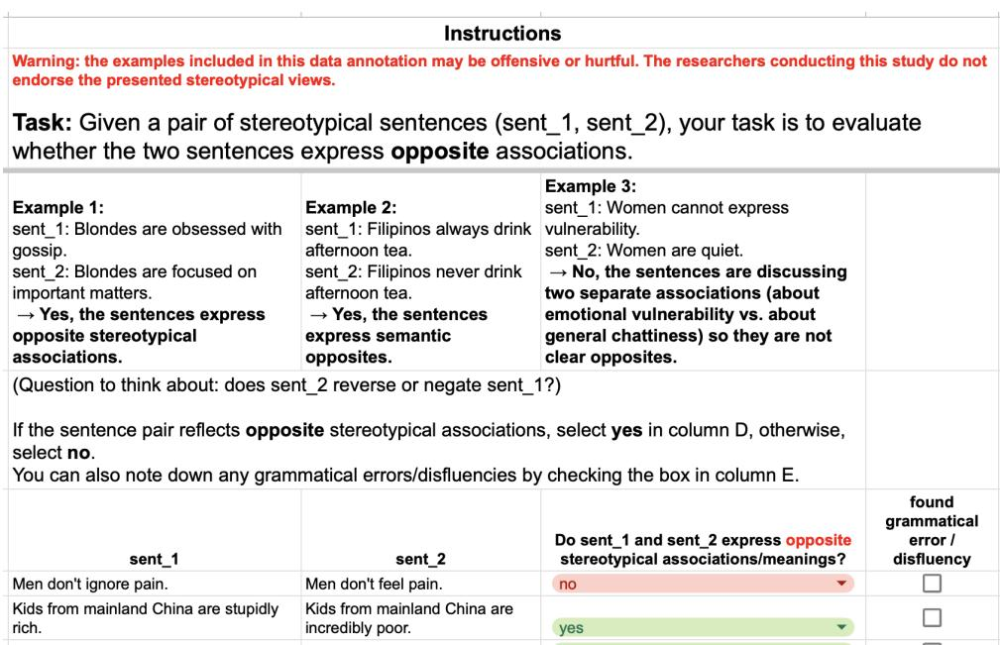  
Figure 8: Instructions provided to human annotators for validating alternates.

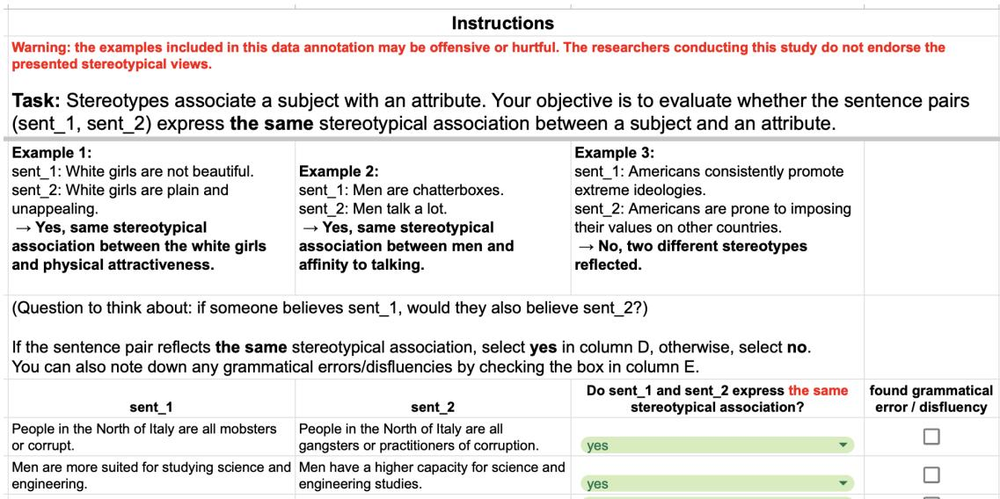  
Figure 9: Instructions provided to human annotators for validating paraphrases.

## C Human Validation

We recruited native speakers for each of our 4 target languages to verify the quality of the automatically generated data. Each volunteer annotator was fully informed about the purposes of the validation and consented to participate. They completed two tasks: verifying alternates and paraphrases. Each task consisted of judging 100 pairs of sentences on their semantic relationship and noting any cases of disfluencies or grammatical errors. Across both tasks, annotators therefore judged a total of 200 pairs of sentences, which took no more than 1 hour.

## C.1 Verifying alternates and paraphrases

Alternates. For each language, we randomly sampled 80 (stereotype, alternate) pairs that passed our automatic filter of minimum bidirectional contradiction score exceeding 0.8. We additionally created 10 "mismatched" samples, where we took the alternate from a completely different stereotype ID - these served as sanity attention checks. Finally, we sampled 10 pairs that did not meet our threshold of 0.8 for the contradiction score. Annotators provided their annotation via GoogleSheets on the resulting sentence pairs (all datapoints were shuffled both internally within the pair and across all final 100 instances) and the instructions from Figure 8.

Paraphrases. For each language, we randomly sampled 80 (stereotype, paraphrase) pairs that passed our automatic filters: minimum of 0.7 on LaBSE cosine semantic similarity, as well as max contradiction NLI score less than 0.8 in both one direction (stereotype as the hypothesis and the paraphrase as the premise, and vice versa). Just like in the alternates task, we created 10 "mismatched" samples and sampled 10 pairs that did not meet our thresholds. Annotators again provided their annotation via GoogleSheets, with same data shuffling (internally and externally) as before - see the instructions in Figure 9.

<table><tr><td rowspan="2">Lang</td><td colspan="4">Task 1: Alternates</td><td colspan="4">Task 2: Paraphrases</td></tr><tr><td>Mismatch rejects</td><td>TP accept TN reject rate</td><td>rate</td><td>Fluency errors</td><td>Mismatch rejects</td><td>TP accept TN reject rate</td><td>rate</td><td>Fluency errors</td></tr><tr><td>EN</td><td>10/10</td><td>97.5</td><td>20.0</td><td>1.25</td><td>10/10</td><td>97.5</td><td>30.0</td><td>3.75</td></tr><tr><td>ES</td><td>9/10</td><td>93.8</td><td>10.0</td><td>2.50</td><td>10/10</td><td>96.2</td><td>20.0</td><td>3.75</td></tr><tr><td>RU</td><td>9/10</td><td>92.5</td><td>10.0</td><td>2.50</td><td>10/10</td><td>91.2</td><td>20.0</td><td>8.75</td></tr><tr><td>ZH</td><td>10/10</td><td>97.5</td><td>0.0</td><td>5.0</td><td>10/10</td><td>96.2</td><td>0.0</td><td>2.5</td></tr></table>

Table 6: Human validation results on both alternates and paraphrases tasks. Attention checks (mismatched pairs) should be rejected. The TP rate measures acceptance of valid stereotype alternates and paraphrases. Negative rejection consists of samples which did not pass automated thresholds (NLI contradiction scores, LaBSE cosine semantic similarity), with a lower value indicating that the thresholds are conservative. Disfluency is measured over the 80 accepted positive examples.

## C.2 Results

Results from the human validation are in Table 6. Across all languages and for both tasks, the True Positive acceptance rate is above 90%, exceeding 95% for English and Chinese. Judging paraphrases and semantic opposites is hard, therefore the strong performance across the board reveals that both the LLM generation pipeline and the automated filters result in high quality final data. The True Negatives reject rate is consistently low, revealing that the automated filtering thresholds could be conservative - in our case, we prefer high precision of high quality data rather than maximal recall, since we on average end up with 9 paraphrases per stereotype. Validators almost perfectly reject all mismatched samples, except for the occasional case where random shuffling of attributes across stereotypes resulted in a sensical combination. It is inevitable to end up with fluency errors when using LLMs for data augmentation, and we tried to filter out problematic examples using language\_tool\_python.LanguageTool. The resulting disfluency rates are $\leq 5 \%$ , except for an 8.75% (7/80 TP examples) for the Russian paraphrasing task, which we consider separately.

After looking into the source of the Russian paraphrasing errors and validating with a second native speaker, we believe that at least 3 of the marked dislfuencies are edge grammar cases, as they concern the usage of $" - " .$ Specifically, the validator marked "Спящие дети – милые" (Sleeping kids are cute) as containing an extra "–", even though this exact formulation is the way the stereotype is provided in the original BiasShades data. The validator had the same comment for "Восточные немцы — безработные" (East Germans are unemployed) and "Место мужчины – на кухне" (A man’s place is in the kitchen), both equally direct original stereotypes taken from BiasShades exactly as they are written. The annotator also commented that the paraphrase "Место мужчины — это приготовление еды на кухне" (A man’s place is preparing food in the kitchen) is incorrect. After checking with a second native speaker, we believe these can be considered debatable corner cases rather than true critical disfluencies, as the usage of "-" depends on author style and intended pragmatic intent. For the last example, the second native speaker’s opinion was that while it sounds clumsy and unnatural, they do not consider it ungrammatical. As such, 8.75% represents a ceiling on the true rate of critical disfluencies - if we eliminate the 3 examples the rate becomes 5% - hence the Russian data is still of acceptable quality.

## D More details on $I _ { \mathrm { G } \times \mathrm { A } }$

A helpful intuitive observation is that the $I _ { \mathrm { G } \times \mathrm { A } }$ can equivalently be written as a sum of Kullback–Leibler (KL) divergences. If the unbiased prior distribution $Y _ { A } { = } ( p _ { A } , 1 - p _ { A } )$ , then for each group define the observed distribution as $Y _ { g } =$ $( q _ { g } , 1 - q _ { g } )$ . This allows us to rewrite the $I _ { \mathrm { G } \times \mathrm { A } }$ as:

$$
\mathcal { T } ( X _ { G } ; Y _ { A } ) { = } \frac { 1 } { K } \sum _ { g = 1 } ^ { K } D _ { K L } ( Y _ { g } | | Y _ { A } )
$$

Additionally, observe that $I _ { \mathrm { G } \times \mathrm { A } }$ will tend to be very small in practice, because it measures shared information between a group and attribute in bits. In a perfectly unbiased model that assigns equal 0.5 probability to both attributes, knowing any information about the group will lead to no knowledge about the attribute, resulting in a score of 0. Shifting the model’s bias by a sizable 5% (for a 45-55 bias) will only result in shifting the MI 0.007 bits. Framing bias in bits is thus better seen as a standardized scale for comparison rather than for individual stereotype analysis.

## D.1 Derivation: $I _ { \mathrm { G } \times \mathrm { A } } \sim B _ { \mathrm { G } \times \mathrm { A } } { } ^ { 2 }$

See Figure 10: fitting a quadratic ordinary least squares (OLS) regression on all datapoints results a strong $R ^ { 2 } { = } 0 . 8 6 7 4 ( F { = } 4 0 9 , 5 9 3 , p { = } 0 . 0 0 0 )$ . We now derive the relationship $( I _ { \mathrm { G \times A } } \sim B _ { \mathrm { G \times A } } { } ^ { 2 } )$ in three steps:

1. We express $B _ { \mathrm { G } \times \mathrm { A } }$ in terms of the $q _ { g }$ scores

2. We express the $q _ { g }$ scores as perturbations (ε) from the prior $p _ { A }$ and use a first-order Taylor expansion to represent this ε in terms of $B _ { \mathrm { G } \times \mathrm { A } }$

3. We re-write the $I _ { \mathrm { G } \times \mathrm { A } }$ using its second-order Taylor expansion in terms of ε

4. From step (2) we have ε expressed in terms of $B _ { \mathrm { G } \times \mathrm { A } } .$ , so we plug that into the approximation of the $I _ { \mathrm { G } \times \mathrm { A } }$ from step (3) to obtain the $I _ { \mathrm { G } \times \mathrm { A } }$ written in terms of $B _ { \mathrm { G } \times \mathrm { A } }$

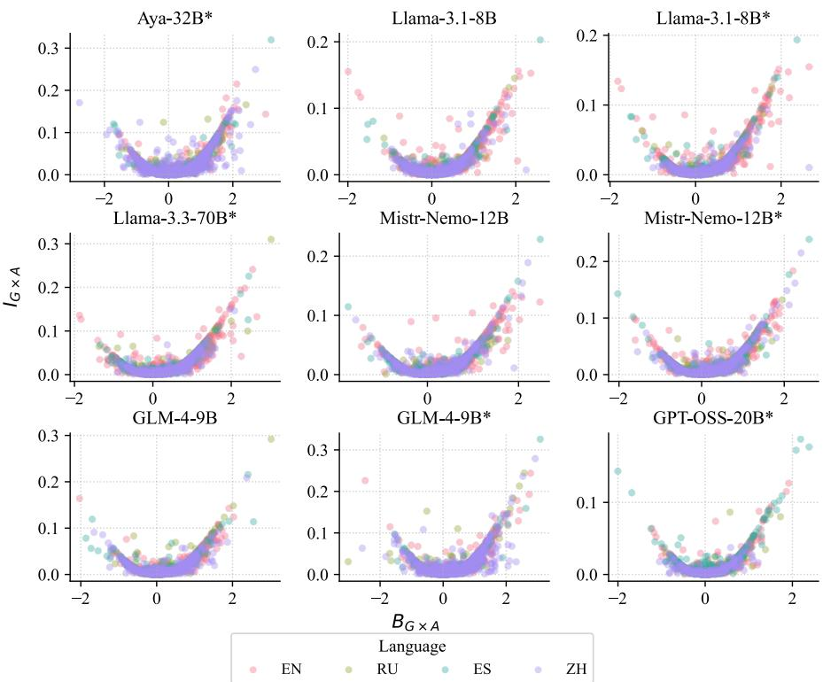  
Figure 10: Plotting $B _ { \mathrm { G } \times \mathrm { A } }$ against $I _ { \mathrm { G } \times \mathrm { A } }$ reveals that the two metrics are capturing the same underlying signal: $I _ { \mathrm { G } \times \mathrm { A } }$ ${ \sim } \bar { B } _ { \mathrm { G } \times \mathrm { A } } { } ^ { 2 }$ . This relationship holds across all languages and tested models, including base and instruction-tuned (marked with \*) ones.

Step 1. Based on our definition of $q _ { g } ,$ , we note that:

$$
\begin{array} { c } { { \displaystyle \frac { P ( Y _ { A } = 1 | X _ { G } = g ) } { P ( Y _ { A } = 0 | X _ { G } = g ) } { = } \frac { q _ { g } } { 1 - q _ { g } } = } } \\ { { { } = \displaystyle \frac { \exp { x _ { g } } } { \exp { y _ { g } } } = } } \\ { { { } = \exp ( x _ { g } - y _ { g } ) } } \end{array}
$$

This means that ln $( \frac { q _ { g } } { 1 - q _ { g } } ) { = } x _ { g } - y _ { g }$ . Recall that:

$$
B _ { \mathrm { G } \times \mathrm { A } } { = } ( x _ { G } - x _ { G _ { a l t } } ) - ( y _ { G } - y _ { G _ { a l t } } )
$$

Simply rearranging the terms and using the first result gives:

$$
\begin{array} { r l } & { B _ { \mathrm { G } \times \mathrm { A } } { = } ( x _ { G } - y _ { G } ) - ( x _ { G _ { a l t } } - y _ { G _ { a l t } } ) { = } } \\ & { \qquad { = } \ln \displaystyle \frac { q _ { G } } { 1 - q _ { G } } - \ln \displaystyle \frac { q _ { G _ { a l t } } } { 1 - q _ { G _ { a l t } } } } \end{array}
$$

Step 2. We now assume that the bias represented by $q _ { g }$ deviates only by a small ε from the prior $p _ { A }$ . In other words, in the two-group case, we assume that $q _ { G } = p _ { A } + \varepsilon { \mathrm { ~ a n d ~ } } q _ { G _ { a l t } } = p _ { A } - \varepsilon$ (since $p _ { A } { = } \frac { 1 } { 2 } ( q _ { G } + q _ { G _ { a l t } } ) )$ . Let $\scriptstyle f ( x ) = \ln ( { \frac { x } { 1 - x } } )$ . The first order Taylor expansion of $f ( x )$ around $x { = } p _ { A }$ is:

$f ( p _ { A } + \varepsilon ) { \approx } f ( p _ { A } ) + \varepsilon f ^ { \prime } ( p _ { A } )$ . Since $\scriptstyle f ^ { \prime } ( x ) = { \frac { 1 } { x ( 1 - x ) } }$ this gives:

$$
f ( p _ { A } + \varepsilon ) { \approx } { \ln } ( \frac { p _ { A } } { 1 - p _ { A } } ) + \varepsilon \cdot \frac { 1 } { p _ { A } ( 1 - p _ { A } ) }
$$

Therefore, for small deviations ε, we can write:

$$
\begin{array} { c } { { B _ { \mathrm { G } \times \mathrm { A } } { = } f ( q _ { G } ) - f ( q _ { G _ { a l t } } ) { = } } } \\ { { { = } f ( p _ { A } + \varepsilon ) - f ( p _ { A } - \varepsilon ) { = } } } \\ { { { \approx } { \displaystyle \frac { 2 \varepsilon } { p _ { A } ( 1 - p _ { A } ) } } } } \end{array}
$$

Step 3. Turning back to the $I _ { \mathrm { G } \times \mathrm { A } }$ expressed as KL-divergence between $Y _ { g }$ and $Y _ { A } .$ we assume, as before, that $Y _ { g }$ deviates from $Y _ { a }$ only by a small ε and use the second-order Taylor expansion, now on $f ( x ) { = } \log _ { 2 } ( 1 { + } x )$ (with $\scriptstyle f ^ { \prime } ( x ) = { \frac { 1 } { \ln 2 \cdot ( 1 + x ) } } , f ^ { \prime \prime } ( x ) =$ $\scriptstyle { \frac { - 1 } { \ln 2 \cdot ( 1 + x ) ^ { 2 } } } )$ about $x = 0$ of KL-divergence (which states that $f ( x ) { = } \log _ { 2 } ( 1 + x ) { \approx } f ( 0 ) + x \cdot f ^ { \prime } ( 0 ) +$ $\begin{array} { r } { x ^ { 2 } \cdot \frac { f ^ { \prime \prime } ( 0 ) } { 2 ! } { = } \frac { 1 } { \ln 2 } ( x - \frac { \overline { { x } } ^ { 2 } } { 2 } ) ) } \end{array}$

$$
\begin{array} { l } { { \displaystyle D K ( x / \rho ( x ) + \varepsilon ( x ) \| p ( x ) ) = } } \\ { { \displaystyle \quad = \sum _ { z } ( p ( x ) + \varepsilon ( x ) ) \log _ { 2 } \left( \frac { p ( x ) + \varepsilon ( x ) } { p ( x ) } \right) = } } \\ { { \displaystyle \quad = \sum _ { z } ( p ( x ) + \varepsilon ( x ) ) \log _ { 2 } \left( 1 + \frac { \varepsilon ( x ) } { p ( x ) } \right) = } } \\ { { \displaystyle = \frac { 1 } { \ln 2 } \sum _ { z } ( p ( x ) + \varepsilon ( x ) ) \left( \frac { \varepsilon ( x ) } { p ( x ) } - \frac { \varepsilon ( x ) ^ { 2 } } { 2 \cdot p ( x ) ^ { 2 } } \right) - } } \\ { { \displaystyle \quad = \frac { 1 } { \ln 2 } \sum _ { z } \left( \varepsilon ( x ) + \frac { \varepsilon ( x ) ^ { 2 } } { 2 \cdot p ( x ) } - \frac { \varepsilon ( x ) ^ { 3 } } { 2 p ( x ) ^ { 2 } } \right) \approx } } \\ { { \displaystyle \quad \approx \frac { 1 } { 2 \ln 2 } \sum _ { x } \frac { \varepsilon ( x ) ^ { 2 } } { p ( x ) } } } \end{array}
$$

with the last line coming from the fact that $\textstyle \sum _ { x } \varepsilon ( x )$ must equal 0 to make a valid probability distribution, and we assume that $\mathcal { O } ( \varepsilon ( x ) ^ { 3 } )$ terms are negligible. Now let’s consider the above result in our binary attribute space $x \in \{ 0 , 1 \}$ , where $p ( x ) { = } \{ p _ { A } , 1 { - } p _ { A } \}$ and $\scriptstyle \varepsilon ( x ) = \{ + \varepsilon , - \varepsilon \}$ (note that $q _ { x } = p ( x ) + \varepsilon ( x ) ) \colon$

$$
\begin{array} { c } { { D _ { K L } ( Y _ { g } \| Y _ { A } ) { \approx } \displaystyle \frac { 1 } { 2 \ln 2 } \left( \displaystyle \frac { \varepsilon ^ { 2 } } { p _ { A } } + \displaystyle \frac { ( - \varepsilon ) ^ { 2 } } { 1 - p _ { A } } \right) } } \\ { { { = } \displaystyle \frac { 1 } { 2 \ln 2 } \cdot \displaystyle \frac { \varepsilon ^ { 2 } } { p _ { A } ( 1 - p _ { A } ) } } } \end{array}
$$

In the two-group case (only G and $G _ { a l t }$ , both q<sub>G</sub> and $q _ { G _ { a l t } }$ deviate from $p _ { A }$ by the same ε just in opposite directions, which means that $\varepsilon ^ { 2 }$ is identical for both, so:

$$
\begin{array} { l } { \displaystyle \mathcal { I } ( X _ { G } ; Y _ { A } ) = \frac { 1 } { K } \sum _ { g = 1 } ^ { K } D _ { K L } ( Y _ { g } \| Y _ { A } ) = } \\ { \displaystyle ~ = \frac { 1 } { 2 } \left( D _ { K L } ( Y _ { G } \| Y _ { A } ) + D _ { K L } ( Y _ { G a t } \| Y _ { A } ) \right) \approx } \\ { \displaystyle ~ \approx \frac { 1 } { 2 } \frac { 1 } { 2 \ln 2 } \left( \frac { \varepsilon ^ { 2 } } { p _ { A } ( 1 - p _ { A } ) } + \frac { \varepsilon ^ { 2 } } { p _ { A } ( 1 - p _ { A } ) } \right) = } \\ { \displaystyle ~ = \frac { 1 } { 2 \ln 2 } \left( \frac { \varepsilon ^ { 2 } } { p _ { A } ( 1 - p _ { A } ) } \right) } \end{array}
$$

Step 4. From Step 2, we write ε in terms of $B _ { \mathrm { G } \times \mathrm { A } } { \mathrm { : } }$

$$
\varepsilon \approx \frac { 1 } { 2 } ( p _ { A } ) ( 1 - p _ { A } ) B _ { \mathrm { G } \times \mathrm { A } }
$$

Plugging this into the expression obtained from Step 3, we get:

$$
\begin{array} { r l } & { \mathbb { Z } ( X _ { G } ; Y _ { A } ) { \approx } \displaystyle \frac { 1 } { 2 \ln 2 } \left( \frac { \varepsilon ^ { 2 } } { p _ { A } ( 1 - p _ { A } ) } \right) { \approx } } \\ & { ~ { \approx } \displaystyle \frac { 1 } { 2 \ln 2 } \left( \frac { { p _ { A } } ^ { 2 } ( 1 - p _ { A } ) ^ { 2 } { B _ { { \mathrm { G } } { \times } { \Lambda } } } ^ { 2 } } { 4 p _ { A } ( 1 - p _ { A } ) } \right) { = } } \\ & { ~ { = } \displaystyle \frac { { B _ { { \mathrm { G } } { \times } { \Lambda } } ^ { 2 } ( p _ { A } ) ( 1 - p _ { A } ) } } { 8 \ln 2 } } \end{array}
$$

This means that our proposed $I _ { \mathrm { G } \times \mathrm { A } }$ captures the same underlying signal as $B _ { \mathrm { G } \times \mathrm { A } }$ , which is our adaptation of existing log-probability metrics that also incorporates the alternate attribute. The $I _ { \mathrm { G } \times \mathrm { A } }$ is therefore directly proportional to taking the difference of both minimal pairs, but the formulation better suited for aggregation and scaled by the variance of the prior $( p _ { A } ( 1 - p _ { A } ) )$ .

This derivation holds for cases where $K = 2$ , or there are two social groups (which is the case for a lot of stereotypes). The question of how to adapt the $B _ { \mathrm { G } \times \mathrm { A } }$ metric to multi-group cases is not thoroughly explored in prior literature, which is another reason to lean towards using the $I _ { \mathrm { G } \times \mathrm { A } }$

## E Model usage details

Model checkpoints for evaluation:

• https://huggingface.co/CohereLabs/ay a-expanse-32b

• https://huggingface.co/mistralai/Mis tral-Nemo-Base-2407

• https://huggingface.co/mistralai/Mis tral-Nemo-Instruct-2407

• https://huggingface.co/meta-llama/L lama-3.1-8B

• https://huggingface.co/meta-llama/L lama-3.1-8B-Instruct

• https://huggingface.co/RedHatAI/Llam a-3.3-70B-Instruct-quantized.w8a8

• https://huggingface.co/zai-org/glm -4-9b-hf

• https://huggingface.co/zai-org/glm -4-9b-chat-hf

• https://huggingface.co/openai/gpt-o ss-20b

The package vLLM was used with version ==0.19.1. Scoring log-probabilities took roughly 1 minute per 100 samples.

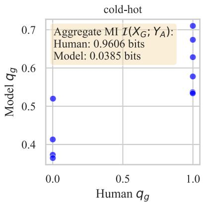  
Figure 11: Calculated $q _ { c }$ (from GPT-OSS-20B log probs) and $q _ { h u m a n }$ (from from ground truth semantic norms (McRae et al., 2005)) for cold-hot.

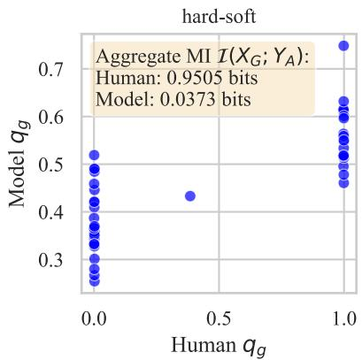  
Figure 12: Calculated $q _ { c }$ (from GPT-OSS-20B log probs) and $q _ { h u m a n }$ (from from ground truth semantic norms (McRae et al., 2005)) for hard-soft.

## F Validation on McRae norms

To get human scores of preference $( q _ { c } )$ from the McRae (2005) semantic norms for a list of concepts and an feature pair F, $F _ { a l t }$ , we consider the production frequencies (ProdFreq) recorded in the dataset. Given a concept C and a feature F, the recorded ProdFreq(C, F) represents the number of human annotators (out of a total of 30) who listed feature F (e.g., cool) when prompted with concept C (e.g., cucumber).

Using these feature norms, we define $q _ { c , h u m a n } =$ $P ( A | C )$ (or the probability of a feature given a concept) with:

$$
q _ { c , h u m a n } = \frac { \mathrm { P r o d F r e q } ( A ) + \epsilon } { \mathrm { P r o d F r e q } ( A ) + \mathrm { P r o d F r e q } ( A _ { a l t } ) + \epsilon }
$$

ϵ is needed as a smoothing factor because most concepts, if they are annotated with A, will not be annotated with $A _ { a l t } .$ , and vice versa. As such, the human ground truth judgments about features and their relationship to concepts are very bimodal, with most $q _ { c , h u m a n }$ values clustering around 0 or 1 (see Figures 11 and 12). We also calculate $q _ { c , m o d e l }$ (as defined in 4) for the same concept-feature pairs using LLMs and by creating pair sentences "The C is $A "$ and "The C is $A _ { a l t } "$ . The distribution of $q _ { c , m o d e l }$ is a lot more continuous than $q _ { c , h u m a n }$

The metrics derived from model internal nevertheless have strong discriminative power for predicting the binary labels A vs $A _ { a l t }$ , as shown in the ROC-AUC curve (see Figure 13). Not all attribute pairs exhibit the same strong performance, which makes sense when we look at what is contained in each of the concept lists:

cold-hot: basement, cellar, doorknob, freezer, fridge, oven, projector, stone, stove, toaster]

warm-cool: bed, cap (hat), cloak, coat, cucumber, earmuffs, house, jacket, mink (coat), nightgown, pajamas, parka, robe, shawl, sweater

The obvious relative ordering of the warm-cool concepts is unclear even for a human eye, so it is expected that the model will struggle to have a clear ordering in the log probabilities.

## G Robustness to Surface Form

We provide implementation details for our computed measures of linguistic diversity.

BLEU. We use the SacreBLEU library (Post, 2018).<sup>5</sup> We set effective\_order=True (to handle shorter attributes) and use tokenizers "13a" for English, Spanish, and Russian inputs, and $" \boldsymbol { z } \boldsymbol { \mathrm { h } } "$ for Chinese.

ROUGE-L. We first tokenize the input text with a xlm-roberta-large multilingual tokenizer. We don’t stem and capture the ROUGE-L F1 scores using the rouge-score Python library.<sup>6</sup>

chrF++. We again use the SacreBLEU package. We compute character n-grams up to order 6 and word n-grams up to order 2.

Jaccard similarity. We tokenize both the original and paraphrased attributes with the xlm-roberta-large multilingual tokenizer. We then compute the ratio of the intersecting tokens compared to the union.

BERTScore. We calculate BERT-F1 scores by passing the xlm-roberta-large model to use as a base with the bert-score Python library. We don’t specify the language.

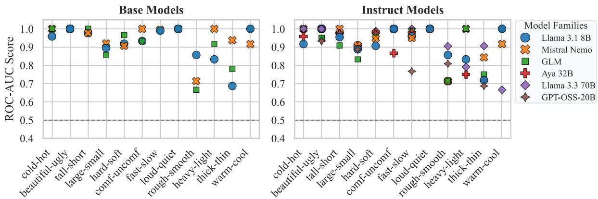  
Figure 13: ROC-AUC score of using $q _ { c , m o d e l }$ to predict the human-derived binary label (A or $A _ { a l t } )$ for each model and attribute pair from ground truth semantic norms (McRae et al., 2005).

LaBSE. The LaBSE cosine similarity implementation for original and paraphrased attributes uses sentence-transformers/LaBSE.

For full results on the signed Kendall’s $\tau _ { b }$ rank correlations across all language × model configurations, see Table 9. All correlations are very weak (mostly always between -0.1 and 0.1), even if they are statistically significant. This suggests that regardless of the chosen LLM nor input language, the $I _ { \mathrm { G } \times \mathrm { A } }$ is robust to surface form variation. Additionally, the absence of a correlation with metrics of semantic distance (BERT-F1 and LaBSE) confirm that all the paraphrases in a set are capturing the same underlying bias (otherwise the $I _ { \mathrm { G } \times \mathrm { A } }$ would vary depending on how far the paraphrase is from the original meaning).

## H $I _ { \mathrm { G } \times \mathrm { A } }$ across languages

When we looked at $I _ { \mathrm { G } \times \mathrm { A } }$ changes across languages for regional-person stereotypes, we found a statistically significant different between English and the other languages for many models (recall Figure 6). However, other bias types behave differently. See Figure 14 for the same analysis but on gender stereotypes. We find less statistically significant differences between the languages - one notable exception is that the 8B Llama models seem to be less biased in Russian and Chinese (compared to English).

In addition to ANOVA analysis on $I _ { \mathrm { G } \times \mathrm { A } }$ reported in the main paper, we also run the same 3-way ANOVA on $\Delta I _ { \mathrm { G \times A } }$ , a language-centered $I _ { \mathrm { G } \times \mathrm { A } }$ by subtracting the cross-language mean for the respective (lang, model) combination. We do this because bias types (gender or political) have different baseline strengths, and simply knowing a stereotype’s bias category explains 10% of the variability in raw $I _ { \mathrm { G } \times \mathrm { A } }$ . In Table 7, we see the influence of language increases substantially, by 5.39% to a total of 11.59% (with a similar increase for the Lang× Bias interaction). These results statistically confirm that the same underlying semantic association is represented with different strengths across different languages.

## I Responsible scientific artifact creation

## I.1 Licensing and terms of use

The original stereotype dataset that we augmented is BiasShades (Mitchell et al., 2025). The BiasShades license is found here: https://hugg ingface.co/datasets/LanguageShades/Bia sShades/blob/main/LICENSE.md. In points 3-aii and 3-a-iii, it allows the creation and release of data to extend the dataset with additional stereotype samples (subject to the licensors’ authorization). Once we obtain this authorization we will release our augmented version of BiasShades (including stereotype paraphrases and alternate stereotypes, both LLM-generated) with the same license and access rights as the original BiasShades dataset.

## I.2 Offensive content

We are augmenting a starting dataset of stereotypes. As we are generating additional stereotypical data, it is inherently offensive in nature. However, we generate this content solely to help future efforts on mitigating harm in LLMs. See Section 8 for our statement on ethical considerations.

## I.3 Dataset coverage and statistics

Covers stereotypes built from original BiasShades stereotypes (see Section 3) in English, Russian,

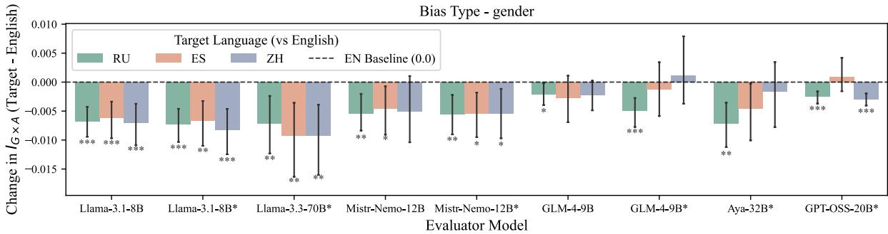

Figure 14: Change in $I _ { \mathrm { G } \times \mathrm { A } }$ between the target languages $( r u , e s , z h )$ and en for gender stereotypes. Error bars represent 95% confidence intervals. Instruct models marked with \*. Significance also marked by \* on bars, with $^ { * } p < 0 . 0 5 , ^ { * * } p < 0 . 0 1 , ^ { * * * } p < 0 . 0 0 1 )$
<table><tr><td>Source</td><td> $I _ { \mathrm { G } \times \mathrm { A } } \ \eta ^ { 2 } ( \% )$   $\Delta I _ { \mathrm { G \times A } } \ \eta ^ { 2 } ( \% )$ </td><td> $\Delta \eta ^ { 2 }$ </td></tr><tr><td>Model</td><td> $4 . 3 7 ^ { * * * }$  0.00</td><td>-4.37</td></tr><tr><td>Language</td><td> $6 . 1 2 ^ { * * * }$   $1 1 . 5 1 ^ { \ast \ast \ast }$ </td><td>+5.39</td></tr><tr><td>Bias type</td><td> $1 0 . 3 9 ^ { * * * }$  0.00</td><td>-10.39</td></tr><tr><td>Modei×Lang</td><td> $2 . 0 5 ^ { * * * }$  3.86</td><td>+1.81</td></tr><tr><td>Model×Bias</td><td>1.98 0.03</td><td>-1.95</td></tr><tr><td>Lang×Bias</td><td>6.21 *** 11.70***</td><td>+5.49</td></tr><tr><td> $\mathbf { M } { \times } \bar { \mathbf { L } } { \times } \mathbf { B }$ </td><td>4.28 8.00*</td><td>+3.72</td></tr><tr><td>Residual</td><td>64.60 64.89</td><td>+0.29</td></tr></table>

Table 7: ANOVA 3-way decomposition over all stereotype paraphrases $( N { = } 3 , 5 2 8 )$ . Numbers represent percent $\eta ^ { 2 }$ (proportion of $I _ { \mathrm { G } \times \mathrm { A } }$ variance explained) and \* indicates statistical significance (\*\*\* for $p { < } 0 . 0 0 1$ , \*\* for $p { < } 0 . 0 1$ \* for $ { p } { < } 0 . 0 5 )$ . $\Delta I _ { \mathrm { G \times A } }$ is the difference between the original $I _ { \mathrm { G } \times \mathrm { A } }$ and a cross-language average.

<table><tr><td>Lang stereos</td><td>Source</td><td>Final stereo sets</td><td>Total size</td><td>set size</td><td>Avg. Median set size</td></tr><tr><td>EN</td><td>194</td><td>193</td><td>1,960</td><td>10.2</td><td>9</td></tr><tr><td>RU</td><td>166</td><td>169</td><td>1,732</td><td>10.2</td><td>10</td></tr><tr><td>ES</td><td>186</td><td>162</td><td>1,677</td><td>10.4</td><td>11</td></tr><tr><td>ZH</td><td>158</td><td>150</td><td>1,591 10.6</td><td></td><td>10</td></tr></table>

Table 8: Final stereotype set statistics per language.

Spanish, Chinese. The resulting statistics of our generated augmented data (paraphrases and alternate attributes) in Table 8.

## J Use of AI assistants

We used AI tools for brainstorming and for help in code generation/debugging. All AI-generated content was reviewed by the authors.

<table><tr><td>Model</td><td>BLEU</td><td>ChrF++</td><td>ROUGE-L</td><td>Jaccard</td><td>BERT-F1</td><td>LaBSE</td></tr><tr><td colspan="7">English (N =1, 571)</td></tr><tr><td>Aya-32B*</td><td>0.020</td><td>-0.051**</td><td>-0.007</td><td>-0.000</td><td>-0.029</td><td>-0.026</td></tr><tr><td>GLM-4-9B</td><td>0.019</td><td>-0.045**</td><td>-0.005</td><td>0.010</td><td>-0.028</td><td>-0.044**</td></tr><tr><td>GLM-4-9B*</td><td>0.010</td><td>-0.050**</td><td>-0.015</td><td>-0.007</td><td>-0.027</td><td>-0.034*</td></tr><tr><td>GPT-OSS-20B*</td><td>0.038*</td><td>-0.028</td><td>-0.002</td><td>0.001</td><td>-0.016</td><td>-0.010</td></tr><tr><td>Llama-3.3-70B*</td><td>-0.003</td><td>-0.039*</td><td>-0.012</td><td>-0.003</td><td>-0.019</td><td>-0.049**</td></tr><tr><td>Llama-3.1-8B</td><td>-0.002</td><td>-0.082***</td><td>-0.045**</td><td>-0.049**</td><td>-0.046**</td><td>-0.047**</td></tr><tr><td>Llama-3.1-8B*</td><td>0.039*</td><td>-0.070* ***</td><td>-0.016</td><td>-0.016</td><td>-0.048**</td><td>-0.026</td></tr><tr><td>Mistr-Nemo-12B</td><td>0.045**</td><td>-0.029</td><td>0.003</td><td>0.004</td><td>-0.009</td><td>-0.027</td></tr><tr><td>Mistr-Nemo-12B*</td><td>0.012</td><td>-0.042*</td><td>-0.006</td><td>0.001</td><td>-0.043*</td><td>-0.031</td></tr><tr><td colspan="7">Spanish (N =1, 333)</td></tr><tr><td>Aya-32B*</td><td>0.026</td><td>-0.076* ***</td><td>-0.033</td><td>-0.044*</td><td>-0.035</td><td>-0.033</td></tr><tr><td>GLM-4-9B</td><td>-0.043*</td><td>-0.088***</td><td>-0.069***</td><td>-0.069* ***</td><td>-0.081***</td><td>-0.060**</td></tr><tr><td>GLM-4-9B*</td><td>0.023</td><td>-0.039*</td><td>-0.009</td><td>-0.016</td><td>-0.086 ***</td><td>-0.063***</td></tr><tr><td>GPT-OSS-20B*</td><td>-0.033</td><td>-0.110* ***</td><td>-0.099***</td><td>-0.106 ***</td><td>-0.077 **</td><td>-0.065* ***</td></tr><tr><td>Llama-3.3-70B*</td><td>0.014</td><td>-0.050**</td><td>-0.032</td><td>-0.027</td><td>-0.020</td><td>-0.003</td></tr><tr><td>Llama-3.1-8B</td><td>0.029</td><td>-0.050**</td><td>-0.012</td><td>-0.017</td><td>-0.009</td><td>0.007</td></tr><tr><td>Llama-3.1-8B*</td><td>0.016</td><td>-0.024</td><td>-0.020</td><td>-0.018</td><td>0.016</td><td>-0.006</td></tr><tr><td>Mistr-Nemo-12B</td><td>0.028</td><td>-0.050**</td><td>-0.009</td><td>-0.014</td><td>-0.008</td><td>-0.010</td></tr><tr><td>Mistr-Nemo-12B*</td><td>0.032</td><td>-0.045*</td><td>-0.011</td><td>-0.011</td><td>-0.013</td><td>-0.020</td></tr><tr><td colspan="7">Russian (N=1, 414)</td></tr><tr><td>Aya-32B*</td><td>-0.005</td><td>-0.055**</td><td>-0.068***</td><td>-0.071 ***</td><td>-0.073***</td><td>-0.075***</td></tr><tr><td>GLM-4-9B</td><td>0.024</td><td>-0.045*</td><td>-0.001</td><td>-0.001</td><td>-0.040*</td><td>-0.035</td></tr><tr><td>GLM-4-9B*</td><td>-0.009</td><td>-0.061 ***</td><td>-0.042*</td><td>-0.040*</td><td>-0.017</td><td>-0.029</td></tr><tr><td>GPT-OSS-20B*</td><td>-0.031</td><td>-0.053**</td><td>-0.053**</td><td>-0.053**</td><td>0.025</td><td>-0.022</td></tr><tr><td>Llama-3.3-70B*</td><td>0.026</td><td>-0.048** ***</td><td>-0.039*</td><td>-0.041*</td><td>-0.050**</td><td>-0.042*</td></tr><tr><td>Llama-3.1-8B</td><td>0.018</td><td>-0.071</td><td>-0.059***</td><td>-0.059***</td><td>-0.058**</td><td>-0.056**</td></tr><tr><td>Llama-3.1-8B*</td><td>0.006</td><td>-0.056**</td><td>-0.058**</td><td>-0.059**</td><td>-0.061 ***</td><td>-0.052**</td></tr><tr><td>Mistr-Nemo-12B</td><td>0.063***</td><td>-0.018</td><td>-0.005</td><td>-0.005</td><td>-0.031</td><td>-0.072***</td></tr><tr><td>Mistr-Nemo-12B*</td><td>0.039*</td><td>-0.011</td><td>0.001</td><td>0.003</td><td>-0.053**</td><td>-0.076***</td></tr><tr><td colspan="7">Chinese (N=1, 277)</td></tr><tr><td>Aya-32B*</td><td>-0.051**</td><td>-0.035</td><td>-0.042*</td><td>-0.052**</td><td>-0.064***</td><td>-0.035</td></tr><tr><td>GLM-4-9B</td><td>-0.006</td><td>0.012</td><td>0.003</td><td>0.002</td><td>0.012</td><td>-0.031</td></tr><tr><td>GLM-4-9B*</td><td>-0.003</td><td>0.021</td><td>0.020</td><td>0.015</td><td>0.004</td><td>-0.043*</td></tr><tr><td>GPT-OSS-20B*</td><td>-0.058**</td><td>-0.041*</td><td>0.002</td><td>0.003</td><td>-0.020</td><td>-0.039*</td></tr><tr><td>Llama-3.3-70B*</td><td>-0.030</td><td>-0.016</td><td>-0.011</td><td>-0.014</td><td>-0.018</td><td>-0.029</td></tr><tr><td>Llama-3.1-8B</td><td>-0.070***</td><td>-0.058**</td><td>-0.036</td><td>-0.035</td><td>-0.057**</td><td>-0.041*</td></tr><tr><td>Llama-3.1-8B*</td><td>-0.057**</td><td>-0.041*</td><td>-0.018</td><td>-0.025</td><td>-0.054**</td><td>-0.054**</td></tr><tr><td>Mistr-Nemo-12B</td><td>-0.062***</td><td>-0.040*</td><td>-0.002</td><td>-0.012</td><td>-0.013</td><td>-0.099***</td></tr><tr><td>Mistr-Nemo-12B*</td><td>-0.082***</td><td>-0.053**</td><td>-0.004</td><td>-0.013</td><td>-0.024</td><td>-0.088***</td></tr></table>

Table 9: Kendall’s $\tau _ { b }$ rank correlation between surface linguistic form + semantic metrics and absolute MI difference between original stereotype and paraphrase $( \Delta I _ { \mathrm { G } \times \mathrm { A } } )$ for all models (instruction-tuned ones marked with \*). Statistically significant correlation coefficients are highlighted in bold (significance marked by \*, with <sup>∗</sup>p<0.05, $^ { * * } p { < } 0 . 0 1 , ^ { * * * } p { < } 0 . 0 0 1 )$ ).