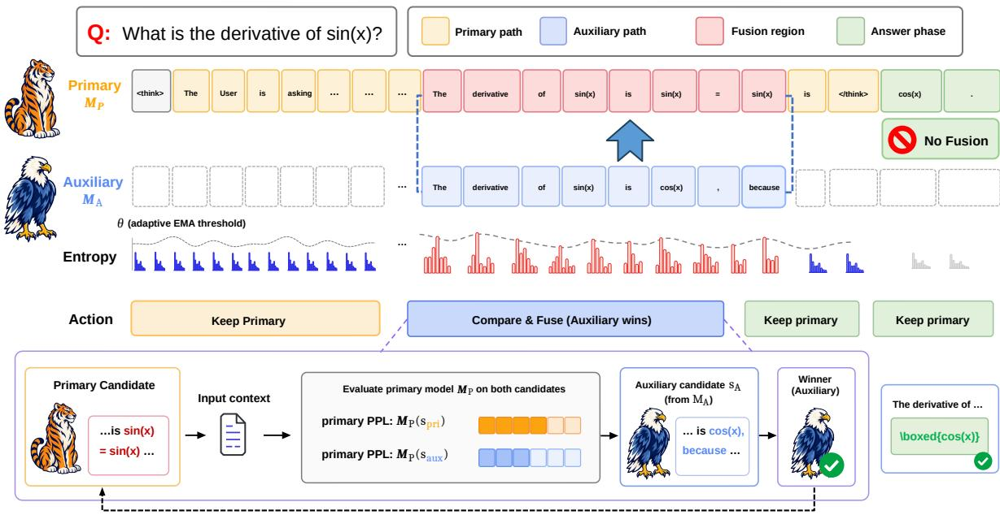
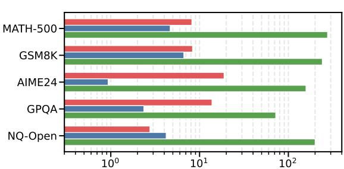
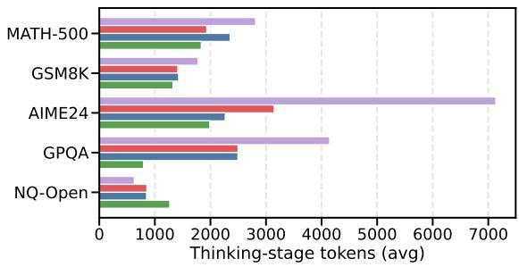
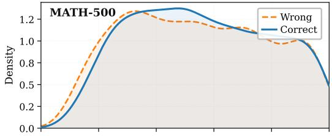
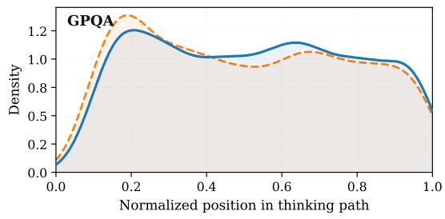

# ThinkFuse: Trajectory-Aware Test-Time Fusion for Small Reasoning Models

Myunghoon Kang<sup>1</sup>\*, Jungseob Lee<sup>1</sup>\*, Jaehyung Seo<sup>3</sup>, Heuiseok Lim<sup>1,2†</sup>

<sup>1</sup>Department of Computer Science and Engineering, Korea University,

<sup>2</sup>Human-inspired AI Research

<sup>3</sup>Department of Computer Science and Engineering, Konkuk University <sup>1,2</sup>{chaos8527, omanma1928, limhseok}@korea.ac.kr, <sup>3</sup>seojae777@konkuk.ac.kr

## Abstract

Small reasoning models (SRMs) have shown strong performance on complex reasoning tasks by generating extended chain-of-thought trajectories, but they often fail to recover once their reasoning enters an erroneous path. Existing test-time fusion methods rely on local fusion signals to determine when to trigger fusion, which can be misled by transient uncertainty fluctuations and may reinforce unstable reasoning trajectories. We propose THINK-FUSE, a training-free test-time fusion framework that selectively intervenes in unreliable reasoning segments. THINKFUSE compares segment-level uncertainty shifts with trajectorylevel uncertainty trends to identify unstable reasoning points and fuse auxiliary reasoning paths into the primary model’s trajectory. Extensive experiments demonstrate that THINK-FUSE outperforms baselines on mathematical and knowledge-intensive reasoning benchmarks, with consistent gains across modelfamily combinations, and remains robust with a smaller primary model. Our analysis shows that THINKFUSE requires fewer fusion triggers and generates fewer tokens, highlighting the efficiency of selective triggering. Our code is available at https://github.com/ js-lee-AI/ThinkFuse.

## 1 Introduction

Large Reasoning Models (LRMs) have demonstrated strong performance in complex problemsolving tasks due to their extensive chain-ofthought reasoning (Yang et al., 2025; DeepSeek-AI, 2025; Jiang et al., 2025; Wang et al., 2026). By generating exploratory and self-reflective reasoning traces within thinking blocks (e.g., <think>...</think>), these models make intermediate reasoning explicit, thereby improving their ability to solve tasks that require multi-step inference, planning, and verification (Shao et al.,

2024; Ding et al., 2025; Yu et al., 2025). While LRMs have established strong baselines across diverse reasoning-intensive domains (Xu et al., 2025a), small reasoning models (SRMs) struggle to generalize effectively to mathematical and coding tasks (Zhuang et al., 2025; Souza et al., 2025). Scaling down reasoning models while preserving their reasoning capabilities thus remains a critical challenge (Tian et al., 2025; Chen et al., 2025; Lee et al., 2026).

To mitigate this reasoning gap without additional training, test-time fusion has emerged as a promising direction that combines complementary reasoning traces from multiple models (Halim et al., 2025; Guo et al., 2025; Liu et al., 2025; Yao et al., 2025; Xu et al., 2025b; Cui et al., 2026). Previous works have primarily focused on fusion granularity, ranging from post-generation samplelevel aggregation (Wang et al., 2023; Yao et al., 2025) to token or span-level fusion during generation (Liu et al., 2025; Xu et al., 2025b). However, the triggering policy of fusion remains underexplored: when should fusion be initiated, and what evidence should justify the intervention? Existing methods rely on local uncertainty signals at specific decoding steps or predefined fusion points, which fail to capture how uncertainty evolves across the reasoning trajectory. As a result, they may confuse transient uncertainty with reasoning instability, causing premature, delayed, or unnecessary fusion (Li and Goyal, 2026; Sun et al., 2026).

In this paper, we present THINKFUSE, a novel reasoning-path fusion framework for reasoning models. THINKFUSE compares segment-level uncertainty shifts with trajectory-level uncertainty trends to identify unstable reasoning points and fuse auxiliary reasoning paths into the primary model’s trajectory. Specifically, it invokes the auxiliary model only when the current primary model’s reasoning segment exhibits elevated uncertainty relative to the model’s recent uncertainty profile. To this end, we propose the Exponentially Weighted Causal Aggregation (EWCA) metric to aggregate token-level uncertainty, which captures intra-segment uncertainty dynamics. ThinkFuse then compares the resulting segment uncertainty with an adaptive threshold estimated from the primary model’s historical uncertainty statistics and cumulative fusion frequency. This design regularizes fusion behavior by reducing unnecessary intervention while reserving auxiliary reasoning for uncertain segments. In summary, our paper makes the following contributions:

  
Figure 1: Overview of THINKFUSE framework. THINKFUSE monitors the segment-level uncertainty of the primary model $M _ { p }$ using an adaptive threshold θ. Upon detecting uncertainty spikes, it invokes an auxiliary model $M _ { a }$ to generate alternative reasoning steps. Both trajectory candidates are then evaluated for compatibility by $M _ { p }$ via perplexity (PPL), fusing the most compatible segment into the context. This procedure iterates until the reasoning reaches a terminal state.

• We propose THINKFUSE, a reasoning-modeloriented test-time fusion framework that identifies unreliable reasoning segments using an EWCA-based uncertainty metric and adaptive threshold.

• Through extensive experiments on mathematical and knowledge-intensive reasoning benchmarks, we observe that THINKFUSE outperforms test-time scaling and test-time fusion baselines, with consistent gains across modelfamily combinations, and remains robust with a smaller primary model.

• We analyze the behavior of THINKFUSE and show that it achieves these gains with fewer fusion actions and fewer generated tokens, demonstrating the effectiveness and efficiency of selective fusion triggering for reasoning models.

## 2 Related Work

## 2.1 Test-Time Ensembling and Fusion for Large Language Models

Test-time ensembling offers a training-free paradigm to enhance the reasoning of Large Language Models (LLMs) by aggregating diverse reasoning candidates from complementary model behaviors. Previous works predominantly optimize fusion granularity, spanning macro-level interventions, such as answer-level consensus (Wei et al., 2022; Wang et al., 2023), response-level ranking (Jiang et al., 2023), and token-level aggregation (Yao et al., 2025), to intermediate structures like segments (Liu et al., 2025), spans (Xu et al., 2025b), and adaptive units (Cui et al., 2026).

However, these granularity-centric approaches overlook the temporal dynamics of ongoing reasoning trajectories, specifically when to invoke auxiliary computation. THINKFUSE addresses this gap through a trajectory-aware fusion framework, dynamically triggering auxiliary reasoning by calibrating local segment-level uncertainty against the primary model’s historical uncertainty statistics.

<table><tr><td>Method</td><td>Intervention unit</td><td>Selective trigger</td><td>Multi-model fusion</td><td>Trajectory-aware</td><td>Decision basis</td></tr><tr><td>Self-consistency (Wang et al., 2023)</td><td>answer</td><td>X</td><td>×</td><td>×</td><td>post-hoc majority voting</td></tr><tr><td>Cool-Fusion (Liu et al., 2025)</td><td>segment</td><td>×</td><td>√</td><td>X</td><td>fuses at every segment</td></tr><tr><td>AdaFuse (Cui et al., 2026)</td><td>word / span</td><td>√</td><td>√</td><td>X</td><td>local token confidence</td></tr><tr><td>MUR (Yan et al., 2026)</td><td>step</td><td>√</td><td>×</td><td>√</td><td>single-model momentum uncertainty</td></tr><tr><td>SpecReason (Pan et al., 2025)</td><td>step</td><td>X</td><td>√</td><td>×</td><td>verifies every drafted step</td></tr><tr><td>THINKFUSE (ours)</td><td>segment</td><td>√</td><td>√</td><td>√</td><td>trajectory-calibrated segment uncertainty</td></tr></table>

Table 1: Triggering policies of test-time methods. Intervention unit denotes the granularity at which each method acts on the reasoning process, Selective trigger denotes whether auxiliary computation is invoked only at selected points, Multi-model fusion denotes whether a second model contributes to the trajectory, and Trajectory-aware denotes whether the decision is calibrated against the history of the ongoing trajectory.

## 2.2 Large Model Guided Reasoning Correction and Collaboration

Previous works leverage LLMs to enhance the reasoning capabilities of smaller models, either through offline chain-of-thought supervision (Ranaldi and Freitas, 2024) or as external verifiers during online self-correction (Zhang et al., 2024). Beyond training-time guidance, recent works explore test-time collaboration via model routing. For instance, Gupta et al. (2024) employ uncertainty-based rules to defer generations to stronger models, and CITER (Zheng et al., 2025) utilizes a trainable token-level router to balance generation quality and inference costs. However, these paradigms are primarily designed for passive cost-aware routing mechanisms, rather than active interventions. In contrast, THINKFUSE prioritizes on-the-fly reasoning-path fusion, dynamically invoking auxiliary models only when local segment-level uncertainty indicates a deviation in the primary model’s ongoing trajectory.

## 2.3 Uncertainty-Guided Test-Time Scaling

Recent works leverage model uncertainty to modulate test-time scaling. Certaindex (Fu et al., 2024) estimates the certainty of reasoning progress to schedule the inference budget, and DeepConf (Fu et al., 2026) filters and weights sampled traces by confidence within parallel scaling. MUR (Yan et al., 2026) tracks momentum-smoothed step-level uncertainty within a single trajectory and allocates extra computation to uncertain steps. SpecReason (Pan et al., 2025) instead lets a small model draft each step and a larger model verify every draft through prompting-based scoring. Rather than allocating computation within a single model or verifying every step, THINKFUSE employs uncertainty to trigger selective fusion. By calibrating segmentlevel uncertainty against the primary model’s trajectory history, it delegates only unreliable segments to an auxiliary model and integrates the continuation based on trajectory compatibility.

## 3 Methodology

## 3.1 Overview

We present ThinkFuse, a novel fusion framework for reasoning models. The overall mechanism of ThinkFuse is shown in Figure 1 and Algorithm 1. Given a complex reasoning task $x ,$ ThinkFuse prompts the primary reasoning model $M _ { p }$ to generate a reasoning path. Leveraging the Exponentially Weighted Causal Aggregation (EWCA) metric and an adaptive threshold θ, the framework monitors uncertainty at the segment level, capturing both internal transition variance and the overall progress of the cumulative trajectory. Once the segmentlevel uncertainty exceeds the adaptive threshold, ThinkFuse evaluates the primary and auxiliary segments guided by primary-model perplexity under the current context, and extends the reasoning trajectory with the more compatible segment. Table 1 positions THINKFUSE against existing test-time scaling methods along three axes. Existing methods either fuse at every segment or rely on local token confidence, and uncertainty-guided scaling methods operate within a single model. THINK-FUSE is the only method that combines selective triggering, trajectory-aware calibration, and multimodel fusion.

## 3.2 Segment-level Fusion Monitoring

Recent studies suggest that reasoning trajectories are organized into thought-level segments, where transition markers such as ‘wait’ or ‘alternatively often indicate shifts in reasoning state (Lu et al., 2025; Wang et al., 2025). Motivated by this view, THINKFUSE monitors uncertainty at the segment level rather than relying directly on isolated tokenlevel signals, which can be sensitive to local lexical or discourse fluctuations. Instead of relying on such transition markers as explicit segmentation cues, THINKFUSE monitors uncertainty fluctuations of the reasoning trajectory over fixed-length segments. Let $c _ { k }$ denote the reasoning context before generating the k-th segment, and $s _ { k } ^ { p } = ( y _ { k , 1 } ^ { p } , \ldots , y _ { k , T } ^ { p } )$ be the segment generated by the primary model $M _ { p }$ conditioned on $c _ { k }$ , where $T$ is the segment length. For each token $y _ { k , i } ^ { p }$ , THINKFUSE employs normalized Shannon entropy over the top-r log-probability distribution returned by the primary model:

Algorithm 1 THINKFUSE: soft-budget adaptive   
segment fusion   
Require: task x, models $M _ { p } , M _ { a }$ hyperparameters   
$T , \alpha , \beta , \eta , \mu _ { 0 } , \sigma _ { 0 } , \tau , \lambda$   
Ensure: response y   
1: $c _ { p } , c _ { a } \gets \mathrm { E N C O D E } ( x ) ; y \gets \epsilon ; n , f , R \gets 0$   
2: $( \mu , \sigma ) \gets ( \mu _ { 0 } , \sigma _ { 0 } )$   
3: while not done do   
4: $s _ { p } , \ell _ { p } \gets M _ { p } ( c _ { p } , T ) ; s ^ { * } \gets s _ { p }$   
5: if </think> ∈/ y then   
6: U ← EWCA(Entropy(ℓ<sub>p</sub>))   
7: $\theta  ( \mu + \tau \sigma ) ( 1 + \mathrm { \hat { \lambda } } \mathrm { \hat { R } } ^ { 2 } ) ;$ update $( \mu , \sigma )$   
8: if $U \geq \theta$ then   
9: $\overline { { s _ { a } } }  M _ { a } ( c _ { a } , T ) ; \mathcal { S }  \mathrm { A L I G N } ( s _ { p } , s _ { a } )$   
10: s\* ← arg min<sub>s∈S</sub> PPL<sub>M</sub> (s | c<sub>p</sub>); f ←   
f + 1   
11: end if   
12: n ← n + 1; R ← f/n   
13: end if   
14: y ← y ⊕ s<sup>∗</sup>; (c<sub>p</sub>, c<sub>a</sub>) ← SYNC(s<sup>∗</sup>)   
15: end while   
16: return y

$$
u _ { k , i } ^ { p } = - \frac { \sum _ { v \in \mathcal { V } _ { k , i } } \tilde { p } _ { k , i } ( v ) \log \tilde { p } _ { k , i } ( v ) } { \log | \mathcal { V } _ { k , i } | }\tag{1}
$$

where $\gamma _ { k , i }$ denotes the set of r highest-probability candidate tokens at position i, and $\tilde { p } _ { k , i }$ denotes the corresponding distribution renormalized over $\nu _ { k , i }$

Intra segment uncertainty calculation To aggregate token-level uncertainty into a segment-level signal, ThinkFuse applies EWCA by assigning each token uncertainty $u _ { k , i } ^ { p }$ a weight based on its relative position and the accumulated uncertainty of preceding tokens:

$$
w _ { k , i } = \exp ( \alpha \cdot i ) \cdot \prod _ { j < i } ( 1 + \beta \cdot u _ { k , j } ^ { p } )\tag{2}
$$

where α controls later-token emphasis and $\beta$ controls uncertainty accumulation. The segment-level uncertainty $U _ { k } ^ { p }$ for the k-th segment is computed as

$$
U _ { k } ^ { p } = \frac { \sum _ { i = 1 } ^ { T _ { k } } w _ { k , i } u _ { k , i } ^ { p } } { \sum _ { i = 1 } ^ { T _ { k } } w _ { k , i } } .\tag{3}
$$

Inter-Segment Adaptive Thresholding The same uncertainty value can have varying implications depending on the model’s recent reasoning trajectory. To this end, THINKFUSE employs a triggering policy with an adaptive threshold $\theta _ { k }$ . At each step $k ,$ , given the primary model’s segment-level uncertainty $U _ { k } ^ { p }$ , the historical trajectory’s mean uncertainty $\mu _ { k }$ and deviation scale $\sigma _ { k }$ are iteratively updated via an exponential moving average:

$$
\mu _ { k } = ( 1 - \eta ) \mu _ { k - 1 } + \eta U _ { k } ^ { p }\tag{4}
$$

$$
\sigma _ { k } = ( 1 - \eta ) \sigma _ { k - 1 } + \eta | U _ { k } ^ { p } - \mu _ { k - 1 } |\tag{5}
$$

$$
\theta _ { k } = ( \mu _ { k - 1 } + \tau \cdot \sigma _ { k - 1 } ) \cdot ( 1 + \lambda \cdot R _ { k - 1 } ^ { 2 } )\tag{6}
$$

where $\eta \in ( 0 , 1 )$ is the decay factor and τ controls the deviation margin. To budget the overall fusion, we introduce $R _ { k - 1 }$ as the cumulative fusion ratio scaled by soft budget parameter λ. This quadratic modulation penalizes excessive fusion by increasing the threshold as fusions accumulate. By triggering intervention only when $U _ { k } ^ { p } \ \geq \ \theta _ { k } ,$ THINKFUSE effectively isolates and targets localized uncertainty spikes.

## 3.3 Trajectory compatibility scoring

When the fusion trigger activates, ThinkFuse invokes the auxiliary reasoning model $M _ { a }$ to generate an alternative segment $s _ { k } ^ { a }$ conditioned on the current context $c _ { k }$ . It then treats $\boldsymbol { s } _ { k } ^ { p }$ and $s _ { k } ^ { a }$ as candidate continuations and uses the primary model $M _ { p }$ as a trajectory-compatibility scorer:

$$
\ell _ { k } ( s ) = \mathrm { P P L } _ { M _ { p } } ( s \mid c _ { k } ) ,\tag{7}
$$

for each candidate segment, the selected segment is then defined as

$$
s _ { k } ^ { \star } = \left\{ \begin{array} { l l } { s _ { k } ^ { p } , } & { U _ { k } ^ { p } < \theta _ { k } } \\ { \arg \operatorname* { m i n } _ { s \in \{ s _ { k } ^ { p } , s _ { k } ^ { a } \} } \ell _ { k } ( s ) , } & { U _ { k } ^ { p } \geq \theta _ { k } , } \end{array} \right.\tag{8}
$$

Then, ThinkFuse appends the selected segment to update the reasoning context:

$$
c _ { k + 1 } = c _ { k } \oplus s _ { k } ^ { \star }\tag{9}
$$

The primary model then continues generation from the updated context:

$$
s _ { k + 1 } ^ { p } \sim M _ { p } ( \cdot \mid c _ { k + 1 } )\tag{10}
$$

and this procedure repeats until the reasoning trajectory reaches a terminal state.

## 4 Experimental Setup

## 4.1 Models

We conduct experiments using six open-weight reasoning language models: Qwen3-4B (Yang et al., 2025), Qwen3-1.7B (Yang et al., 2025), DeepSeek-R1-Distill-Qwen-1.5B (DeepSeek-AI, 2025), Ministral-3B-R (Liu et al., 2026), EXAONE-Deep-2.4B (Bae et al., 2025b), and EXAONE-4.0- 1.2B (Bae et al., 2025a). These models span multiple model families and cover a practical smallscale regime from 1.2B to 4B parameters, allowing us to evaluate whether THINKFUSE can improve reasoning without relying on larger proprietary models. The model pool includes both reasoningspecialized models, such as Ministral-3B-R and EXAONE-Deep-2.4B, and hybrid or instructionfollowing models with reasoning-oriented generation capabilities, such as Qwen3-4B, Qwen3-1.7B, and EXAONE-4.0-1.2B. This diversity is important for THINKFUSE, as the framework is designed to exploit complementary reasoning trajectories across models rather than assuming homogeneous decoding behaviors or failure modes.

## 4.2 Baselines

We compare THINKFUSE against three types of baselines.

Standalone evaluates each reasoning model independently, allowing us to assess whether THINK-FUSE provides gains beyond each model’s original reasoning capability.

Test-time fusion methods include Cool-Fusion (Liu et al., 2025), a segment-level fusion method that selects model-generated continuations using perplexity-based scoring, and AdaFuse (Cui et al., 2026), an adaptive ensemble decoding method that dynamically adjusts word/span-level fusion based on model confidence.

Test-time compute baselines Self-consistency (Wang et al., 2023) generates K ∈ {3, 5} sampled reasoning paths with Qwen3-4B. Each final answer is normalized using the same answer parser as the main evaluation, and the prediction is determined by majority voting over normalized answers. If no normalized answer obtains a majority, we use the first generated sample as the final prediction.

THINKFUSE evaluates our reasoning-path fusion framework under both cross-family and samefamily model pairs, including configurations with either a larger or smaller primary model.

## 4.3 Datasets

We evaluate THINKFUSE on two categories of reasoning benchmarks. To assess complex mathematical reasoning, we use MATH-500 (Hendrycks et al., 2021), GSM8K (Cobbe et al., 2021), and AIME 2024<sup>1</sup>, which respectively evaluate competitionlevel mathematical problem solving, multi-step grade-school arithmetic reasoning, and advanced high-school competition mathematics. To assess knowledge-intensive reasoning capability, we use GPQA-Diamond (Rein et al., 2024) and NQ-Open (Kwiatkowski et al., 2019). GPQA-Diamond evaluates expert-level scientific reasoning across biology, physics, and chemistry, whereas NQ-Open evaluates open-domain factual question answering from naturally occurring questions.

## 4.4 Implementation Details

All experiments are implemented with vLLM (Kwon et al., 2023) on two NVIDIA A100-80GB GPUs. For efficient test-time fusion, ThinkFuse executes auxiliary candidate generation in parallel with primary-model generation whenever applicable. We use publicly available Hugging Face checkpoints (Wolf et al., 2020) for all primary and auxiliary models. We report accuracy on all benchmarks, evaluating GPQA and NQ-Open with the LM Evaluation Harness (Gao et al., 2024) and MATH-500, GSM8K, and AIME-24 following Qwen2.5-Math (Yang et al., 2024). All methods share a 16,384 token generation budget and one decoding configuration, except that the standalone Qwen3-1.7B uses the Qwen3 recommended top-k of 20, and responses without a parseable final answer within the budget are scored as incorrect. We evaluate each method on a fixed random subsample of each benchmark using a consistent sampling protocol across methods. Detailed experimental setups are summarized in Appendix A.

## 5 Main Results

Table 2 reports the accuracy of standalone models, existing test-time compute baselines, test-time fusion baselines, and THINKFUSE across five benchmarks. For brevity throughout the paper, we abbreviate the model names as follows: Ministral (Ministral-3B-R) and EXAONE-4.0 (EXAONE-4.0-1.2B). Among standalone models, Qwen3-4B shows the strongest and most stable performance across benchmarks, providing a strong baseline for test-time fusion. Despite this strong baseline, THINKFUSE with Qwen3-4B as the primary model improves over its standalone performance on every benchmark, whether the auxiliary is a cross-family model or a smaller model from the same family. In particular, Qwen3-4B × Ministral achieves the best result on four out of five benchmarks, with large gains on AIME24 (+20.0), GPQA (+10.6), and NQ-Open (+10.0). The additional cross-family pairs with EXAONE-Deep-2.4B and DeepSeek-R1-Distill as auxiliaries yield the same pattern (Appendix C), suggesting that THINKFUSE can benefit from auxiliary reasoning trajectories even when the auxiliary model is not uniformly stronger than the primary model. Bootstrap confidence intervals in Appendix B confirm this consistency, as all twenty deltas across the four Qwen3-4B pairs are positive and eleven are significant at the 95% level.

<table><tr><td>Method</td><td>MATH-500</td><td>GSM8K</td><td>AIME24</td><td>GPQA</td><td>NQ-Open</td></tr><tr><td colspan="6">Standalone models</td></tr><tr><td> $\mathrm { Q w e n } 3 – 4 \mathrm { B }$ </td><td>89.0</td><td>92.0</td><td>53.3</td><td>54.0</td><td>29.5</td></tr><tr><td> $\mathrm { Q w e n } 3 - 1 . 7 \mathbf { B } ^ { \ddagger }$ </td><td>83.0</td><td>90.0</td><td>33.3</td><td>39.4</td><td>28.0</td></tr><tr><td>Ministral</td><td>32.5</td><td>67.0</td><td> $0 . 0 ^ { \dagger }$ </td><td>25.8</td><td>24.0</td></tr><tr><td> $\mathrm { E X A O N E } – 4 . 0$ </td><td>57.0</td><td>85.0</td><td> $3 . 3 \dot { \bar { \mathrm { \Omega } } }$ </td><td>38.9</td><td>22.0</td></tr><tr><td colspan="6">Test-time compute baseline: Qwen3-4B</td></tr><tr><td> $\mathrm { S e l f - c o n s i s t e n c y } \left( K = 3 \right)$ </td><td> $8 9 . 5 ( + 0 . 5 ) $ </td><td> $9 4 . 5 ( + 2 . 5 ) $ </td><td> $5 3 . 3 \left( + 0 . 0 \right)$ </td><td> $5 1 . 0 ( - 3 . 0 ) $ </td><td> $3 9 . 0 ( + 9 . 5 ) $ </td></tr><tr><td> $\mathrm { S e l f - c o n s i s t e n c y } \left( K = 5 \right)$ </td><td> $8 8 . 0 ( - 1 . 0 ) $ </td><td> $9 4 . 5 ( + 2 . 5 ) $ </td><td> $5 3 . 3 \left( + 0 . 0 \right)$ </td><td> $5 0 . 0 ( - 4 . 0 ) $ </td><td> $3 9 . 0 ( + 9 . 5 ) $ </td></tr><tr><td colspan="6">Test-time fusion baselines: Qwen3-4B × Ministral</td></tr><tr><td>Cool-Fusion</td><td> $3 1 . 0 ( - 5 8 . 0 ) $ </td><td> $6 6 . 0 ( - 2 6 . 0 )$ </td><td> $0 . 0 ^ { \dagger } ( - 5 3 . 3 )$ </td><td> $1 1 . 6 ( - 4 2 . 4 )$ </td><td> $0 . 5 ( - 2 9 . 0 )$ </td></tr><tr><td>AdaFuse</td><td> $4 5 . 5 ( - 4 3 . 5 )$ </td><td> $7 2 . 6 ( - 1 9 . 4 ) $ </td><td> $3 3 . 3 ( - 2 0 . 0 ) $ </td><td> $2 8 . 8 ( - 2 5 . 2 )$ </td><td> $3 8 . 5 ( + 9 . 0 ) $ </td></tr><tr><td colspan="6">THINKFUSE</td></tr><tr><td> $\mathrm { Q w e n 3 - 4 B \times M i n i s t r a l }$ </td><td> $9 0 . 0 ( + 1 . 0 ) $ </td><td> $\mathbf { 9 6 . 9 } _ { ( + 4 . 9 ) }$ </td><td> $7 3 . 3 ( + 2 0 . 0 ) $ </td><td> ${ \bf 6 4 . 6 } ( + 1 0 . 6 ) $ </td><td> $\mathbf { 3 9 . 5 } \left( + 1 0 . 0 \right)$ </td></tr><tr><td> $\mathrm { Q w e n 3 - 4 B } \times \mathrm { Q w e n 3 - 1 . 7 B }$ </td><td> $\mathbf { 9 1 . 0 } _ { ( + 2 . 0 ) }$ </td><td> $9 4 . 0 ( + 2 . 0 ) $ </td><td> $7 0 . 0 ( + 1 6 . 7 ) $ </td><td> $5 5 . 1 \left( + 1 . 1 \right)$ </td><td> $3 7 . 0 ( + 7 . 5 )$ </td></tr><tr><td> $\mathrm { Q w e n } 3 { \cdot } 4 \mathrm { B } \times \mathrm { Q w e n } 3 { \cdot } 4 \mathrm { B }$ </td><td> $7 5 . 0 ( - 1 4 . 0 )$ </td><td> $9 0 . 0 ( - 2 . 0 ) $ </td><td> $4 0 . 0 ( - 1 3 . 3 )$ </td><td> $2 8 . 3 ( - 2 5 . 7 )$ </td><td> $3 8 . 0 ( + 8 . 5 ) $ </td></tr><tr><td> $\mathrm { Q w e n 3 - 1 . 7 B } \times \mathrm { E X A O N E - 4 . 0 }$ </td><td> $8 5 . 0 ( + 2 . 0 ) $ </td><td> $9 0 . 5 ( + 0 . 5 ) $ </td><td> $3 0 . 0 ( - 3 . 3 )$ </td><td> $5 3 . 5 ( + 1 4 . 1 ) $ </td><td> $2 8 . 0 ( + 0 . 0 ) $ </td></tr></table>

Table 2: Main benchmark results. Accuracy (%) for standalone models, test-time baselines, and THINKFUSE across five benchmarks under a 16K-token budget. Values in parentheses indicate the signed accuracy difference, in percentage points, relative to the standalone performance of the primary model, with green indicating gains and red indicating degradation. The † symbol marks AIME24 results affected by length-limit or final-answer truncation. The ‡ symbol marks the standalone Qwen3-1.7B evaluated with the Qwen3 recommended top-k of 20, whereas al other rows use the shared decoding setting. Additional experimental details, including the decoding settings and remaining cross-family and same-family configurations, are presented in Appendix A and C.

on GPQA, while AdaFuse also underperforms the standalone primary on four out of five benchmarks. Test-time compute through self-consistency provides gains on GSM8K and NQ-Open, but does not improve AIME24 and degrades GPQA, indicating that simply increasing test-time sampling is not sufficient for consistent improvement. Moreover, the redundant same-model variant, Qwen3-4B × Qwen3-4B, degrades performance on MATH-500, GSM8K, AIME24, and GPQA. These results suggest that fusion must be selective and trajectoryaware, since locally determined or redundant fusion can disrupt the primary model’s reasoning process.

Conversely, existing test-time fusion baselines show the opposite trend. With the same Qwen3-4B × Ministral pair, Cool-Fusion drops sharply from 89.0 to 31.0 on MATH-500 and from 54.0 to 11.6

Finally, we examine whether THINKFUSE remains beneficial with a smaller primary model by pairing Qwen3-1.7B with EXAONE-4.0. The standalone Qwen3-1.7B is evaluated with the Qwen3 recommended top-k of 20, while THINKFUSE retains the shared decoding setting, so this comparison favors the standalone baseline. Even so, THINKFUSE raises GPQA from 39.4 to 53.5, exceeding both standalone models. On the remaining benchmarks, where EXAONE-4.0 is substantially weaker than the primary, THINKFUSE gains +2.0 on MATH-500 and +0.5 on GSM8K, ties on NQ-Open, and differs by a single problem on AIME24.

Standalone ThinkFuse AdaFuse Cool-Fusion  
  
Aux thinking-stage tokens (avg, log)

  
Figure 2: Thinking-stage token statistics. Top: Average fused auxiliary tokens in log scale. Bottom: Average total thinking-stage tokens. All fusion configurations use Qwen3-4B as primary model and Ministral-3B-Reasoning as auxiliary model.

Thus, this distribution of gains matches the design principle of THINKFUSE: complementary auxiliary trajectories are exploited where they exist, while the selective trigger and PPL-based compatibility scoring prevent harmful fusion where they do not. Overall, the results suggest that THINKFUSE improves reasoning performance by selectively fusing complementary auxiliary trajectories at uncertain points, yielding more stable and effective test-time fusion than existing baselines.

## 6 Analysis

To understand the sources of THINKFUSE’s accuracy gains, we conduct three complementary analyses. First, we examine how fusion behavior relates to downstream performance across methods. Second, we measure the compute efficiency of each test-time fusion method. Third, we test whether THINKFUSE remains effective when the auxiliary model is transformed to instruction-tuned variant.

## 6.1 Fusion Dynamics and Downstream Performance

Figure 2 analyzes how different fusion methods use auxiliary reasoning tokens and how this affects the overall thinking-stage length. Despite fusing the most auxiliary tokens, Cool-Fusion yields the shortest thinking-stage outputs. This suggests that excessive fusion can overwrite or prematurely redirect the primary model’s reasoning trajectory, explaining its large performance drops in Table 2. Meanwhile, AdaFuse uses fewer auxiliary tokens, but still shortens the thinking stage on reasoningintensive benchmarks such as AIME24 and GPQA, indicating that simply limiting auxiliary usage is insufficient for preserving reasoning quality.

<table><tr><td>Method</td><td>Wall-clock (s)</td><td>TFLOPs</td><td>Acc.</td><td>Acc. / TFLOPs</td></tr><tr><td>Cool-Fusion</td><td>39.4</td><td>86</td><td>21.8</td><td>0.25</td></tr><tr><td>AdaFuse</td><td>33.9</td><td>74</td><td>43.7</td><td>0.60</td></tr><tr><td>THINKFUSE</td><td>68.7</td><td>77</td><td>72.9</td><td>0.95</td></tr></table>

Table 3: Efficiency comparison of THINKFUSE and comparable test-time fusion methods. Wall-clock time and TFLOPs are averaged per example, and accuracy is averaged over the five benchmarks, with the Qwen3-4B × Ministral pair.

In contrast, THINKFUSE uses auxiliary tokens much more sparsely than Cool-Fusion while maintaining a more substantial reasoning process than the baselines. Combined with the consistent accuracy gains in Table 2, this analysis suggests that effective test-time fusion requires selective and trajectory-aware intervention, rather than frequent or locally determined auxiliary fusion.

## 6.2 Compute Efficiency

Table 3 compares the efficiency of the test-time fusion methods on the Qwen3-4B × Ministral pair, with accuracy averaged over the five benchmarks. THINKFUSE achieves the highest accuracy with a TFLOP budget comparable to AdaFuse and lower than that of Cool-Fusion, resulting in the highest accuracy per TFLOP. Meanwhile, THINKFUSE exhibits a longer wall-clock time, yet the comparable TFLOPs indicate that this gap arises from the CPU-GPU data transfer during PPL scoring rather than from additional computation. The lower latency of the baselines, in turn, comes at the cost of severe accuracy degradation, leaving THINKFUSE as the only fusion method that improves over the standalone primary.

## 6.3 Auxiliary Compatibility Beyond Reasoning Models

We explore THINKFUSE’s extensibility to instruction-tuned and non-thinking auxiliary models. As shown in Table 4, these models yield limited, task-dependent gains. On MATH-500, models like Llama-3.2-3B-IT and Qwen3-1.7B (no-think) marginally improve the Qwen3-4B baseline, while others slightly degrade performance. Consequently, while these findings provide partial evidence of extensibility, reasoning-specialized auxiliaries remain fundamentally aligned with THINKFUSE’s core trajectory-fusion mechanism.

<table><tr><td>Auxiliary</td><td>MATH-500</td><td>GPQA</td></tr><tr><td>Llama-3.2-3B-IT</td><td> $8 9 . 5 ( + 0 . 5 ) $ </td><td> $5 0 . 5 ( - 3 . 5 ) $ </td></tr><tr><td>Gemma-2-2B-it</td><td> $8 7 . 5 ( - 1 . 5 ) $ </td><td> $5 1 . 0 ( - 3 . 0 ) $ </td></tr><tr><td>Mistral-7B-Inst-v0.3</td><td> $8 4 . 5 ( - 4 . 5 ) $ </td><td> $4 4 . 9 ( - 9 . 1 ) $ </td></tr><tr><td>Qwen2.5-3B-Inst</td><td> $8 8 . 0 ( - 1 . 0 ) $ </td><td> $5 2 . 5 ( - 1 . 5 ) $ </td></tr><tr><td>Qwen3-1.7B (no-think)</td><td> $8 9 . 5 ( + 0 . 5 ) $ </td><td> $5 0 . 0 ( - 4 . 0 ) $ </td></tr></table>

Table 4: Experimental results of pairing Qwen3-4B as a primary model with instruction-tuned or non-thinking auxiliaries. The general performance drop indicates that THINKFUSE strictly requires reasoning-specialized models to ensure trajectory compatibility. Values in parentheses show the difference from the standalone baseline.

Furthermore, on GPQA, all non-reasoning auxiliaries uniformly degrade performance, contrasting sharply with the consistent gains from crossfamily reasoning models shown in Table 2 and Appendix C. This confirms that effective fusion relies not on mere auxiliary diversity, but on the auxiliary’s capacity to generate reasoning segments that coherently complement the primary model’s ongoing trajectory. Thus, while non-reasoning models demonstrate partial extensibility, reasoningspecialized auxiliaries remain essential to fully leverage THINKFUSE’s trajectory-aware mechanism.

## 7 Ablation Study

Table 5 details the contribution of each algorithmic component within THINKFUSE to the overall performance. Throughout these ablations, Qwen3-4B and Ministral-3B-Reasoning are employed as the primary and auxiliary models, respectively, with color-coded values in parentheses denoting the accuracy delta relative to the Qwen3-4B baseline.

Fusion budget penalty ablation As shown in Table 5, the soft budget penalty (λ = 50) outperforms the no-budget variant $( \lambda = 0 )$ , which removes the cumulative fusion ratio penalty from the adaptive threshold $\theta _ { k }$ . Yielding accuracies of 88.5% on MATH-500 and 90.5% on GSM8K, the no-budget variant degrades performance even below the standalone primary model’s baseline. These results indicate that the proposed soft budget stabilizes THINKFUSE by actively discouraging excessive fusion interventions.

<table><tr><td>Setting</td><td>MATH-500</td><td>GSM8K</td></tr><tr><td>Soft budget (ours,  $\lambda { = } 5 0 )$  No budget penalty  $( \lambda { = } 0 )$ </td><td>Fusion budget penalty  $\mathbf { 9 0 . 0 } _ { ( + 1 . 0 ) }$   $8 8 . 5 ( - 0 . 5 ) $ </td><td> $\mathbf { 9 6 . 9 } _ { ( + 4 . 9 ) }$   $9 0 . 5 ( - 1 . 5 ) $ </td></tr><tr><td> $T { = } 4$   ${ T } \mathrm { { = } } 8 \mathrm { { ( o u r s ) } }$   $T { = } 1 6$   $8 8 . 0 ( - 1 . 0 ) $   $T { = } 3 2$   $8 8 . 5 ( - 0 . 5 ) $ </td><td>Segment length T  $8 7 . 0 ( - 2 . 0 ) $   $\mathbf { 9 0 . 0 } _ { ( + 1 . 0 ) }$ </td><td> $9 3 . 5 ( + 1 . 5 ) $   $\mathbf { 9 6 . 9 } _ { ( + 4 . 9 ) }$   $9 3 . 5 ( + 1 . 5 ) $ </td></tr><tr><td colspan="3">Trajectory compatibility scoring Primary PPL (ours)  $\mathbf { 9 0 . 0 } _ { ( + 1 . 0 ) }$   $\mathbf { 9 6 . 9 } _ { ( + 4 . 9 ) }$  Average PPL  $8 0 . 5 ( - 8 . 5 ) $   $9 2 . 0 ( + 0 . 0 ) $ </td></tr><tr><td colspan="3">Token-level uncertainty estimation Entropy (ours)  $\mathbf { 9 0 . 0 } _ { ( + 1 . 0 ) }$   $9 6 . 9 ( + 4 . 9 )$ </td></tr></table>

Table 5: Impact of individual THINKFUSE components on downstream performance. Values in parentheses denote the accuracy delta relative to the standalone baseline. All experiments are conducted with Qwen3-4B as the primary model and Ministral-3B-Reasoning as the auxiliary model.

Effects of segment length The segment length T dictates a crucial trade-off in THINKFUSE. Our default setting of $T = 8$ yields the best results, achieving 90.0% on MATH-500 and 96.9% on GSM8K. When the segment is too short $( T = 4 )$ , it fails to encapsulate a meaningful reasoning step, causing MATH-500 accuracy to fall below the standalone baseline (87.0%). Conversely, expanding the segment length $( T = 1 6$ and $T = 3 2 )$ substantially diminishes the gains on GSM8K and similarly hurts MATH-500. This suggests that excessively long segments delay necessary interventions, allowing incorrect reasoning paths to propagate before fusion occurs.

Effects of compatibility selection rule We investigate PPL scoring rules as a proxy for trajectory compatibility. As shown in Table 5, relying solely on the Primary PPL yields optimal results (90.0% on MATH-500, 96.9% on GSM8K). In contrast, the Average PPL scoring rule drops MATH-500 performance to 80.5% and limits GSM8K to the standalone Qwen3-4B baseline (92.0%). These results indicate that blending the auxiliary model’s distribution into the primary model’s score misaligns the compatibility metric, causing the selected segments to diverge from the primary model’s ongoing reasoning path.

```latex
Shared prefix. For AIME-2022 II #11, both traces begin with the same coordinate setup: A = (0, 0), B = (2, 0),
$D = \bar { ( p , q ) } , C = ( r , s ) ,$ , and $M = ( ( 2 + r ) / 2 , s / 2 )$ is the midpoint of BC. Both traces then try to use the two
angle-bisector conditions at M.
Standalone THINKFUSE
Generated trace near the divergence. Generated trace near the fusion point.
· · · I place the quadrilateral in coordinates and write the · · · I keep $D = ( p , q )$ and $C = ( r , s )$ symbolic, then express
distance equations. Since M is the midpoint ofBC, it should the two angle-bisector conditions as distance-to-line equa
lie on the two angle bisectors. · · · tions. · · ·
the valid solution is $\begin{array} { r c l c r } { { \sf b } } & { { = } } & { { - 7 / s { \sf q r t } ( 2 ) , } } & { { { \sf a } } } & { { = } } \end{array}$ [Two angle-bisector distance equations from M =
7/sqrt(2) (B+C)/2]
So, D is at ((7*sqrt(2))/2, -7*sqrt(2)/2). $- 8 - 2 \mathsf { p } + 3 \mathsf { r } = \mathsf { 0 }$
· · · I plug this coordinate for D back into the remaining $\Rightarrow \boldsymbol { \mathsf { r } } \ = \ ( 8 \ + \ 2 \mathsf { p } ) / 3$
constraints and solvefor C. · · · $\Rightarrow \textsf { s } = \ 2 { \mathsf { q } } / 3$
$\left( 2 \mathrm { + } \mathsf { s q r t } \left( 2 \right) \right) \star \mathsf { y } ^ { \star } 2 \ + \ 9 \star \left( \mathsf { s q r t } \left( 2 \right) \mathrm { + } 1 \right) \star \mathsf { y }$ Substituting these relations keeps both
$~ + ~ ( 2 2 + 7 { \star } { \sf s q r t } ( 2 ) ) ~ = ~ 0$ angle-bisector constraints active while the
remaining equations are solved.
// Comment: this fixes D as $\mathrm { i f } \angle D A B = 4 5 ^ { \circ } .$ The second
angle-bisector condition has not been used, so the trace enters // Comment: the auxiliary segment keeps D = (p, q) symbolic.
a dead-end quadratic. It uses both angle-bisector conditions before solving.
Answer: 0 × Answer: 180 >
```  
Table 6: Qualitative comparison on AIME 2022. Standalone denotes Qwen3-4B. THINKFUSE uses Qwen3-4B as the primary model and Ministral-3B-Reasoning as the auxiliary model. Both traces start from the same coordinate formulation; the highlighted text marks the standalone step that enters a dead-end quadratic and the auxiliary symbolic step selected by THINKFUSE.

Token-level uncertainty estimation We compare entropy against a margin-based confidencegap signal (see Appendix A.2). Although the confidence gap achieves 98.6% on GSM8K, it degrades on MATH-500 (87.5%), falling below the standalone baseline. As entropy consistently preserves performance gains on both datasets, we employ it as our default token-level uncertainty metric.

## 8 Case Study

Table 6 illustrates how THINKFUSE corrects intermediate reasoning trajectories using an AIME 2022 example. Despite sharing the initial coordinate setup, the standalone baseline prematurely grounds the coordinates of D, failing to satisfy the second angle-bisector condition and trapping the reasoning in a dead-end quadratic, resulting in an incorrect answer. In contrast, THINKFUSE triggers an intervention and selects an auxiliary segment that keeps D and C symbolic and successfully enforces both distance-to-line constraints before solving. This case demonstrates that injecting an appropriate symbolic segment preserves the shared mathematical context while effectively redirecting the model from an erroneous path toward

the correct solution.

## 9 Conclusion

We presented THINKFUSE, a trajectory-aware testtime fusion framework that selectively intervenes in model reasoning trajectories. By calibrating segment-level uncertainty with historical statistics and applying trajectory compatibility scoring, THINKFUSE integrates auxiliary reasoning only when the primary trajectory is likely to benefit. Across five benchmarks, THINKFUSE consistently outperforms standalone models and existing testtime fusion baselines, showing that its gains come from complementary auxiliary trajectories rather than additional computation alone. These results suggest that effective collaborative reasoning depends on deciding when to intervene and what to retain, offering a practical, training-free approach for scaling small reasoning models at test time.

## Limitations

Test-time resource requirements. Unlike singlemodel decoding, THINKFUSE requires an execution environment that can serve an auxiliary model together with the primary model. This can increase memory usage and latency. However, THINKFUSE intervenes only on selected segments in the explicit thinking stage, and its PPL-based segment selection reuses the current KV cache to avoid an additional full forward pass over the entire context. Quantization, parallel serving, and cache-aware deployment may further reduce practical overhead.

Evaluation scope. Our main experiments focus on open-weight reasoning models in the 1.2B–4B range. This setting matches our goal of improving reasoning under limited resources, but additional evaluation is needed to determine whether the same behavior holds for larger models, closed models, and broader model families. We also focus on mathematical, scientific, and knowledge-based reasoning benchmarks; code generation, multilingual reasoning, and long-context tasks remain outside the scope of this study.

Dependence on primary-model quality. THINKFUSE is designed for settings where the primary model can produce coherent reasoning segments but may enter an incorrect reasoning path at uncertain points. If the primary model generates highly unstable or repetitive segments, uncertainty-based triggering may fail to identify useful intervention points. Such cases may require alternative decoding policies or stronger criteria for selecting the primary model.

Auxiliary-model complementarity. The benefit of THINKFUSE depends on whether the auxiliary model provides reasoning segments that complement the primary model. If the auxiliary model shares similar failure modes with the primary model, or if its strengths do not match the target task, fusion may not always improve performance. Future work can reduce this dependence through task-specific auxiliary selection or modelpool routing.

Explicit reasoning spans and tokenizer alignment. Because THINKFUSE intervenes at the segment level inside the reasoning stage, it requires identifying the explicit reasoning span and aligning text segments generated under different tokenizers. Our implementation uses <think> tag normalization and shared-prefix text alignment, but additional engineering may be needed for broader chat templates and tokenizer combinations.

Fixed fusion settings. We use a fixed segment length and PPL scoring rule in the main experiments and analyze representative alternatives in ablations. More extensive searches over threshold and budget hyperparameters may yield additional gains. Our focus is instead to test whether uncertaintyguided fusion is effective without heavy taskspecific tuning.

## Ethical Statements

In this section, we discuss the ethical considerations of our work.

(1) Privacy and Languages. All benchmarks used in our experiments are publicly available academic datasets in English. MATH-500 (Hendrycks et al., 2021), GSM8K (Cobbe et al., 2021), and AIME 2024 consist of competition-level mathematical problems, multi-step grade-school arithmetic, and advanced high-school competition mathematics, respectively. GPQA-Diamond (Rein et al., 2024) provides graduate-level scientific reasoning questions in biology, physics, and chemistry written by domain experts, and NQ-Open (Kwiatkowski et al., 2019) contains opendomain factual questions derived from naturally occurring Google search queries with Wikipediagrounded answers. Since each benchmark is built from curated academic problems or factual question answering, there is minimal risk of including personally identifiable information or offensive content.

(2) Licenses and terms. The reasoning models we evaluate are released under open-weight licenses that permit research use: Qwen3-4B, Qwen3-1.7B (Yang et al., 2025), and Ministral-3B-Reasoning (Liu et al., 2026) are distributed under the Apache 2.0 license, DeepSeek-R1- Distill (DeepSeek-AI, 2025) under the MIT license, and EXAONE-Deep-2.4B (Bae et al., 2025b) / EXAONE-4.0-1.2B (Bae et al., 2025a) under their respective model licenses for research purposes. We primarily employ vLLM (Kwon et al., 2023) (Apache 2.0), Hugging Face Transformers (Wolf et al., 2020) (Apache 2.0), and the LM Evaluation Harness (Gao et al., 2024) (MIT) for model serving and evaluation, all of which are available under permissive open-source licenses.

(3) Intended use. Our proposed THINKFUSE framework is intended for research on test-time fusion of small reasoning models, with the goal of improving the reliability of their reasoning trajectories without additional training. By selectively invoking auxiliary reasoning only at uncertain segments, THINKFUSE can serve as a basis for studying when and what to fuse during multi-model reasoning collaboration; we will release our code and evaluation scripts to support reproducibility and follow-up research on trajectory-aware fusion for resource-constrained reasoning.

(4) Use of AI assistants. During the preparation of this manuscript, we used AI assistants for grammar correction and minor language polishing of text originally drafted by the authors. All AI-assisted edits were subsequently reviewed and verified by the authors, who take full responsibility for the final content of the paper.

## Acknowledgements

This research was supported by Basic Science Research Program through the National Research Foundation of Korea(NRF) funded by the Ministry of Education(NRF-2021R1A6A1A03045425). This work was supported by Institute for Information & communications Technology Promotion(IITP) grant funded by the Korea government(MSIT) (RS-2024-00398115, Research on the reliability and coherence of outcomes produced by Generative AI). This work was supported by the Commercialization Promotion Agency for R&D Outcomes(COMPA) grant funded by the Korea government(Ministry of Science and ICT)(2710096072).

## References

Kyunghoon Bae, Eunbi Choi, Kibong Choi, Stanley Jungkyu Choi, Yemuk Choi, Kyubeen Han, Seokhee Hong, Junwon Hwang, Taewan Hwang, Joonwon Jang, and 1 others. 2025a. Exaone 4.0: Unified large language models integrating nonreasoning and reasoning modes. arXiv preprint arXiv:2507.11407.

Kyunghoon Bae, Eunbi Choi, Kibong Choi, Stanley Jungkyu Choi, Yemuk Choi, Seokhee Hong, Junwon Hwang, Hyojin Jeon, Kijeong Jeon, Gerrard Jeongwon Jo, and 1 others. 2025b. Exaone deep: Reasoning enhanced language models. arXiv preprint arXiv:2503.12524.

Xinghao Chen, Zhijing Sun, Guo Wenjin, Miaoran Zhang, Yanjun Chen, Yirong Sun, Hui Su, Yijie Pan, Dietrich Klakow, Wenjie Li, and Xiaoyu Shen. 2025. Unveiling the key factors for distilling chainof-thought reasoning. In Findings of the Association for Computational Linguistics: ACL 2025, pages 15094–15119, Vienna, Austria. Association for Computational Linguistics.

Karl Cobbe, Vineet Kosaraju, Mohammad Bavarian, Mark Chen, Heewoo Jun, Lukasz Kaiser, Matthias Plappert, Jerry Tworek, Jacob Hilton, Reiichiro Nakano, Christopher Hesse, and John Schulman. 2021. Training verifiers to solve math word problems. arXiv preprint arXiv:2110.14168.

Chengming Cui, Tianxin Wei, Ziyi Chen, Ruizhong Qiu, Zhichen Zeng, Zhining Liu, Xuying Ning, Duo Zhou, and Jingrui He. 2026. AdaFuse: Adaptive ensemble decoding for large language models. In Proceedings of the 64th Annual Meeting of the Association for Computational Linguistics (Volume 1: Long Papers), pages 42644–42657, San Diego, California, United States. Association for Computational Linguistics.

DeepSeek-AI. 2025. DeepSeek-R1: Incentivizing reasoning capability in llms via reinforcement learning. arXiv preprint arXiv:2501.12948.

Fei Ding, Baiqiao Wang, Zijian Zeng, and Youwei Wang. 2025. Multi-layer grpo: Enhancing reasoning and self-correction in large language models. arXiv preprint arXiv:2506.04746.

Yichao Fu, Junda Chen, Siqi Zhu, Zheyu Fu, Zhongdongming Dai, Yonghao Zhuang, Yian Ma, Aurick Qiao, Tajana Rosing, Ion Stoica, and 1 others. 2024. Efficiently scaling llm reasoning with certaindex. arXiv preprint arXiv:2412.20993.

Yichao Fu, Xuewei Wang, Hao Zhang, Yuandong Tian, and Jiawei Zhao. 2026. Deep think with confidence. In International Conference on Learning Representations, volume 2026, pages 94355–94377.

Leo Gao, Jonathan Tow, Baber Abbasi, Stella Biderman, Sid Black, Anthony DiPofi, Charles Foster, Laurence Golding, Jeffrey Hsu, Alain Le Noac’h, Haonan Li, Kyle McDonell, Niklas Muennighoff, Chris Ociepa, Jason Phang, Laria Reynolds, Hailey Schoelkopf, Aviya Skowron, Lintang Sutawika, and 5 others. 2024. The language model evaluation harness.

Junyu Guo, Shangding Gu, Ming Jin, Costas Spanos, and Javad Lavaei. 2025. Stylebench: Evaluating thinking styles in large language models. arXiv preprint arXiv:2509.20868.

Neha Gupta, Harikrishna Narasimhan, Wittawat Jitkrittum, Ankit Singh Rawat, Aditya Krishna Menon, and Sanjiv Kumar. 2024. Language model cascades: Token-level uncertainty and beyond. In The Twelfth International Conference on Learning Representations.

Kevin Halim, Sin G Teo, Ruitao Feng, Zhenpeng Chen, Yang Gu, Chong Wang, and Yang Liu. 2025. A study on thinking patterns of large reasoning models in code generation. arXiv preprint arXiv:2509.13758.

Dan Hendrycks, Collin Burns, Saurav Kadavath, Akul Arora, Steven Basart, Eric Tang, Dawn Song, and Jacob Steinhardt. 2021. Measuring mathematical problem solving with the MATH dataset. In Advances in Neural Information Processing Systems.

Dongfu Jiang, Xiang Ren, and Bill Yuchen Lin. 2023. LLM-blender: Ensembling large language models with pairwise ranking and generative fusion. In Proceedings ofthe 61st Annual Meeting ofthe Associationfor Computational Linguistics (Volume 1: Long Papers), pages 14165–14178, Toronto, Canada. Association for Computational Linguistics.

Jin Jiang, Jianing Wang, Yuchen Yan, Yang Liu, Jianhua Zhu, Mengdi Zhang, and Liangcai Gao. 2025. Do large language models excel in complex logical reasoning with formal language? In Proceedings of the 2025 Conference on Empirical Methods in Natural Language Processing, pages 16889–16914.

Tom Kwiatkowski, Jennimaria Palomaki, Olivia Redfield, Michael Collins, Ankur Parikh, Chris Alberti, Danielle Epstein, Illia Polosukhin, Jacob Devlin, Kenton Lee, Kristina Toutanova, Llion Jones, Matthew Kelcey, Ming-Wei Chang, Andrew M Dai, Jakob Uszkoreit, Quoc Le, and Slav Petrov. 2019. Natural questions: A benchmark for question answering research. Transactions of the Association for Computational Linguistics, 7:453–466.

Woosuk Kwon, Zhuohan Li, Siyuan Zhuang, Ying Sheng, Lianmin Zheng, Cody Hao Yu, Joseph E Gonzalez, Hao Zhang, and Ion Stoica. 2023. Efficient memory management for large language model serving with PagedAttention. In Proceedings ofSOSP.

Jungseob Lee, Seungyoon Lee, Suhyune Son, Dongyub Jude Lee, Sungbin Han, Sugyeong Eo, and Heuiseok Lim. 2026. Answer-conditioned chains of thought degrade verifiable-reasoning distillation in large language models. arXiv preprint arXiv:2607.14552.

Aochong Oliver Li and Tanya Goyal. 2026. Offtrajectory reasoning: Can LLMs collaborate on reasoning trajectories? In The Fourteenth International Conference on Learning Representations.

Alexander H Liu, Kartik Khandelwal, Sandeep Subramanian, Victor Jouault, Abhinav Rastogi, Adrien Sadé, Alan Jeffares, Albert Jiang, Alexandre Cahill, Alexandre Gavaudan, and 1 others. 2026. Ministral 3. arXiv preprint arXiv:2601.08584.

Cong Liu, Xiaojun Quan, Yan Pan, Liang Lin, Weigang Wu, and Xu Chen. 2025. Cool-fusion: Fuse large language models without training. In Proceedings of the 63rd Annual Meeting of the Association for Computational Linguistics (ACL).

Ximing Lu, Seungju Han, David Acuna, Hyunwoo Kim, Jaehun Jung, Shrimai Prabhumoye, Niklas Muennighoff, Mostofa Patwary, Mohammad Shoeybi, Bryan Catanzaro, and 1 others. 2025. Retro-search: Exploring untaken paths for deeper and efficient reasoning. arXiv preprint arXiv:2504.04383.

Rui Pan, Yinwei Dai, Zhihao Zhang, Gabriele Oliaro, Zhihao Jia, and Ravi Netravali. 2025. Specreason: Fast and accurate inference-time compute via speculative reasoning. In Advances in Neural Information

Processing Systems, volume 38, Main Conference, pages 12730–12749. Curran Associates, Inc.

Leonardo Ranaldi and Andre Freitas. 2024. Aligning large and small language models via chain-of-thought reasoning. In Proceedings ofthe 18th Conference of the European Chapter ofthe Associationfor Computational Linguistics (Volume 1: Long Papers), pages 1812–1827, St. Julian’s, Malta. Association for Computational Linguistics.

David Rein, Betty Li Hou, Asa Cooper Stickland, Jackson Petty, Richard Yuanzhe Pang, Julien Dirani, Julian Michael, and Samuel R. Bowman. 2024. Gpqa: A graduate-level google-proof q&a benchmark. arXiv preprint arXiv:2311.12022.

Zhihong Shao, Peiyi Wang, Qihao Zhu, Runxin Xu, Junxiao Song, Xiao Bi, Haowei Zhang, Mingchuan Zhang, YK Li, Yang Wu, and 1 others. 2024. Deepseekmath: Pushing the limits of mathematical reasoning in open language models. arXiv preprint arXiv:2402.03300.

Débora Souza, Rohit Gheyi, Lucas Albuquerque, Gustavo Soares, and Márcio Ribeiro. 2025. Code generation with small language models: A codeforces-based study. 2025 International Conference on Machine Learning and Applications (ICMLA), pages 582–587.

Lihao Sun, Hang Dong, Bo Qiao, Qingwei Lin, Dongmei Zhang, and Saravan Rajmohan. 2026. Llm reasoning as trajectories: Step-specific representation geometry and correctness signals. Preprint, arXiv:2604.05655.

Yijun Tian, Yikun Han, Xiusi Chen, Wei Wang, and Nitesh V Chawla. 2025. Beyond answers: Transferring reasoning capabilities to smaller llms using multi-teacher knowledge distillation. In Proceedings of the eighteenth acm international conference on web search and data mining, pages 251–260.

Peng-Yuan Wang, Tian-Shuo Liu, Chenyang Wang, Ziniu Li, Yidi Wang, Shu Yan, Chengxing Jia, Xu-Hui Liu, Xinwei Chen, Jiacheng Xu, and Yang Yu. 2026. A survey on large language models for mathematical reasoning. ACM Comput. Surv., 58(8).

Xuezhi Wang, Jason Wei, Dale Schuurmans, Quoc Le, Ed Chi, Sharan Narang, Aakanksha Chowdhery, and Denny Zhou. 2023. Self-consistency improves chain of thought reasoning in language models. In Proceedings of ICLR.

Yue Wang, Qiuzhi Liu, Jiahao Xu, Tian Liang, Xingyu Chen, Zhiwei He, Linfeng Song, Dian Yu, Juntao Li, Zhuosheng Zhang, and 1 others. 2025. Thoughts are all over the place: On the underthinking of o1-like llms. arXiv preprint arXiv:2501.18585.

Jason Wei, Xuezhi Wang, Dale Schuurmans, Maarten Bosma, Fei Xia, Ed Chi, Quoc V Le, Denny Zhou, and 1 others. 2022. Chain-of-thought prompting elicits reasoning in large language models. Advances in neural information processing systems, 35:24824– 24837.

Thomas Wolf, Lysandre Debut, Victor Sanh, Julien Chaumond, Clement Delangue, Anthony Moi, Pierric Cistac, Tim Rault, Rémi Louf, Morgan Funtowicz, Joe Davison, Sam Shleifer, Patrick von Platen, Clara Ma, Yacine Jernite, Julien Plu, Canwen Xu, Teven Le Scao, Sylvain Gugger, and 3 others. 2020. Transformers: State-of-the-art natural language processing. In Proceedings ofthe 2020 Conference on Empirical Methods in Natural Language Processing: System Demonstrations, pages 38–45, Online. Association for Computational Linguistics.

Fengli Xu, Qianyue Hao, Chenyang Shao, Zefang Zong, Yu Li, Jingwei Wang, Yunke Zhang, Jingyi Wang, Xiaochong Lan, Jiahui Gong, Tianjian Ouyang, Fanjin Meng, Yuwei Yan, Qinglong Yang, Yiwen Song, Sijian Ren, Xinyuan Hu, Jie Feng, Chen Gao, and Yong Li. 2025a. Toward large reasoning models: A survey of reinforced reasoning with large language models. Patterns, 6(10):101370.

Yangyifan Xu, Jianghao Chen, Junhong Wu, and Jiajun Zhang. 2025b. Hit the sweet spot! span-level ensemble for large language models. In Proceedings of the 31st International Conference on Computational Linguistics, pages 8314–8325, Abu Dhabi, UAE. Association for Computational Linguistics.

Hang Yan, Fangzhi Xu, Rongman Xu, Yifei Li, Jian Zhang, Haoran Luo, Xiaobao Wu, Anh Tuan Luu, Haiteng Zhao, Qika Lin, and Jun Liu. 2026. MUR: Momentum uncertainty guided reasoning for large language models. In Proceedings of the 64th Annual Meeting ofthe Associationfor Computational Linguistics (Volume 1: Long Papers), pages 23078– 23103, San Diego, California, United States. Association for Computational Linguistics.

An Yang, Anfeng Li, Baosong Yang, Beichen Zhang, Binyuan Hui, Bo Zheng, Bowen Yu, Chang Gao, Chengen Huang, Chenxu Lv, and 1 others. 2025. Qwen3 technical report. arXiv preprint arXiv:2505.09388.

An Yang, Beichen Zhang, Binyuan Hui, Bofei Gao, Bowen Yu, Chengpeng Li, Dayiheng Liu, Jianhong Tu, Jingren Zhou, Junyang Lin, and 1 others. 2024. Qwen2.5-math technical report: Toward mathematical expert model via self-improvement. arXiv preprint arXiv:2409.12122.

Yuxuan Yao, Han Wu, Mingyang LIU, Sichun Luo, Xiongwei Han, Jie Liu, Zhijiang Guo, and Linqi Song. 2025. Determine-then-ensemble: Necessity of top-k union for large language model ensembling. In The Thirteenth International Conference on Learning Representations.

Qiying Yu, Zheng Zhang, Ruofei Zhu, Yufeng Yuan, Xiaochen Zuo, YuYue, Weinan Dai, Tiantian Fan, Gaohong Liu, Juncai Liu, LingJun Liu, Xin Liu, Haibin Lin, Zhiqi Lin, Bole Ma, Guangming Sheng, Yuxuan Tong, Chi Zhang, Mofan Zhang, and 17 others. 2025. DAPO: An open-source LLM reinforcement learning system at scale. In The Thirty-ninth Annual Conference on Neural Information Processing Systems.

Yunxiang Zhang, Muhammad Khalifa, Lajanugen Logeswaran, Jaekyeom Kim, Moontae Lee, Honglak Lee, and Lu Wang. 2024. Small language models need strong verifiers to self-correct reasoning. In Findings ofthe Associationfor Computational Linguistics: ACL 2024, pages 15637–15653, Bangkok, Thailand. Association for Computational Linguistics.

Wenhao Zheng, Yixiao Chen, Weitong Zhang, Souvik Kundu, Yun Li, Zhengzhong Liu, Eric P. Xing, Hongyi Wang, and Huaxiu Yao. 2025. CITER: Collaborative inference for efficient large language model decoding with token-level routing. In Second Conference on Language Modeling.

Xialie Zhuang, Peixian Ma, Zhikai Jia, Zane Cao, and Shiwei Liu. 2025. Effective learning for small reasoning models: An empirical study on 0.5 b reasoning llms. arXiv preprint arXiv:2506.13404.

## A Detailed Experimental Setup

## A.1 Hyperparameter settings

Table 7 summarizes the main implementation settings fixed across the main and appendix experiments. Shared rows report settings used across methods, while method-specific rows report the additional settings required by each baseline or comparison method.

## A.2 Uncertainty Signals and Budget-Penalty Details

We also consider a confidence-gap variant in ablations:

$$
u _ { \boldsymbol { k } , i } ^ { \mathrm { g a p } } = 1 - \left( p _ { \boldsymbol { k } , i } ^ { ( 1 ) } - p _ { \boldsymbol { k } , i } ^ { ( 2 ) } \right) ,\tag{11}
$$

where $p _ { k , i } ^ { ( 1 ) }$ and $p _ { k , i } ^ { ( 2 ) }$ denote the largest and secondlargest probabilities among the top-5 candidate tokens at position i. This variant assigns higher uncertainty when the two leading candidates have similar probabilities.

The no-budget penalty variant keeps the default entropy-based uncertainty signal, $T { = } 8 .$ , and primary-model PPL scoring, but sets only the soft-budget coefficient in the adaptive threshold to $\lambda \ : = \ : 0$ . Thus, the threshold becomes $\theta _ { k } \ =$ $\mu _ { k - 1 } + \tau \sigma _ { k - 1 }$ , and fusion is triggered only when $U _ { k } ^ { p } \ \geq \ \theta _ { k }$ . As the cumulative fusion ratio $R _ { k - 1 }$ increases, the threshold no longer receives the additional penalty term. This ablation does not fuse every segment; it preserves the EMA-based uncertainty trigger and removes only the soft-budget penalty.

## A.3 Cross-Tokenizer Alignment

When the primary and auxiliary models use different tokenizers, we apply shared-prefix text alignment to candidate segment boundaries. We first decode the T-token candidate segment into text, re-encode it with both tokenizers, find the longest prefix whose decoded text is identical under both tokenizers, and use this aligned prefix for segment comparison. In practice, this alignment reduces the effective segment length by 1–2 tokens on average.

Reasoning-tag normalization. Different models use different reasoning tags; for example, Qwen3 uses <think>, whereas EXAONE-Deep uses <thought>. We normalize tags to <think> for fusion and restore them to each model’s native reasoning-tag format before PPL computation.

## A.4 Benchmark sampling protocol

Due to computational cost constraints, we report all main, analysis, and ablation results on a fixed random subsample of each benchmark rather than the full evaluation split. Evaluating THINKFUSE and the baselines across multiple primary-auxiliary model-pair configurations, fusion variants, and ablations on every full benchmark would incur prohibitive compute cost, especially given that the framework involves repeated PPL scoring and parallel auxiliary generation. To keep the evaluation tractable while maintaining a consistent comparison across methods, we evaluate each method on a fixed random subsample of 200 examples per benchmark. The subsample is drawn once per benchmark using Python’s default random library generator with seed 42, and the same 200 examples are used across all methods, model pairs, and ablations. For MATH-500, GSM8K, and NQ-Open, this corresponds to a strict subsample of the full evaluation split. AIME 2024 (30 problems) and GPQA-Diamond (198 problems) are evaluated in full. All accuracy values reported in the main results, analysis, and ablation tables are computed over the same fixed subsample for each benchmark, ensuring that absolute and relative comparisons between methods are not affected by between-sample variance.

## B Bootstrap Confidence Intervals

Table 8 reports 95% bootstrap confidence intervals for the accuracy delta of THINKFUSE over the standalone Qwen3-4B on each benchmark. The deltas are computed from re-executed runs, so point estimates may differ slightly from Table 2. All twenty pair-benchmark deltas are positive, eleven intervals exclude zero, and no interval indicates significant degradation. The wide AIME24 intervals reflect its small sample size of 30 problems.

## C Additional Model-Pair Results of THINKFUSE

Table 9 reports the THINKFUSE configurations that are not included in Table 2, namely the cross-family pairs with EXAONE-Deep (EXAONE-Deep-2.4B) and DeepSeek-R1 (DeepSeek-R1-Distill-Qwen-1.5B) as auxiliary models. Both pairs follow the same evaluation protocol as the main experiments and improve over the standalone Qwen3-4B on every benchmark, matching the pattern of the pairs reported in the main text.

<table><tr><td>Scope</td><td>Setting</td><td>Implementation details</td></tr><tr><td rowspan="2">Shared</td><td>Engine / hardware</td><td>All generation and PPL computation use vLLM v0.8.5 with bfloat16 precision. Each model pair is served on two NVIDIA A100-80GB GPUs. Standard decoding uses max_model_1en=16384, max_new_tokens=16384,</td></tr><tr><td>Generation budget / sampling</td><td>temperature=0.6, top  $\scriptstyle \cdot p = 0 . 9 5 ,$  top-k=-1, and min  $\scriptstyle \cdot p = 0 . 0 .$  The standalone Qwen3-1.7B alone uses  $\mathrm { t o p } { - } k { = } 2 0$  following the Qwen3 recommendation. Within this budget, explicit thinking-stage generation uses an additional 2K-token cap. Self-consistency uses separate sampling settings.</td></tr><tr><td rowspan="3">THINKFUSE</td><td>Trigger signal</td><td>Every time the primary model generates  $T = 8$  tokens, we compute top-5 token entropy and aggregate token-level uncertainty into segment-level uncertainty using EWCA with  $( \alpha , \beta ) = ( 0 . 1 , 0 . 5 )$ </td></tr><tr><td>Adaptive threshold</td><td>The EMA update rate is  $\eta = 0 . 0 5$  , the uncertainty tolerance is  $\tau = 1 . 0 ,$  and the initial statistics are  $( \mu _ { 0 } , \sigma _ { 0 } ) = ( 0 . 5 , 0 . 1 )$  . The soft-budget coefficient is  $\lambda = 5 0 ;$  the trigger uses both recent uncertainty history and the cumulative fusion ratio.</td></tr><tr><td>Segment selection</td><td>When fusion is triggered, primary and auxiliary candidate segments are compared under the current context using primary-model PPL. Segment boundaries from different tokenizers are aligned by the shared prefix that decodes identically under both tokenizers, and each segment is restored to the reasoning-tag format of the</td></tr><tr><td rowspan="4">Baselines</td><td>Cool-Fusion</td><td>Each participating LLM generates a candidate segment; all generated candidates are scored by the PPL of all participating LLMs, and the candidate with the lowest average PPL is selected.</td></tr><tr><td>AdaFuse</td><td>The confidence threshold is  $\tau _ { \Delta } = 0 . 7 ,$  the EMA decay is 0.99, and token confidence is computed from top-5 log probabilities. When the uncertain-token ratio exceeds 0.5, AdaFuse compares  $\stackrel { - } { B } = 2$  candidates.</td></tr><tr><td>Self-consistency</td><td>We generate  $K \in \{ 3 , 5 \}$  sampled reasoning paths from Qwen3-4B with temperature=0.7 and  $\mathrm { t o p } { - } p { = } 0 . 9 5$  . Final answers are normalized with the same answer-normalization procedure as the main evaluation and selected by strict majority. If no normalized answer obtains a strict majority, we use the first</td></tr><tr><td>Post-hoc critique</td><td>generated sample. This appendix-only comparison uses a 16K-token budget. When the primary and auxiliary answers disagree, the auxiliary model critiques the primary output, and the primary model generates a revised answer conditioned on that critique.</td></tr></table>

Table 7: Implementation hyperparameters. Shared implementation settings and method-specific settings used in the main and appendix experiments.
<table><tr><td>Auxiliary</td><td>MATH-500</td><td>GSM8K</td><td>AIME24</td><td>GPQA</td><td>NQ-Open</td></tr><tr><td>Ministral</td><td> $+ 0 . 5 \left[ - 1 . 5 , + 2 . 5 \right]$ </td><td> $+ 3 . 1 \ [ + 1 . 0 , + 5 . 6 ] ^ { \ast }$ </td><td> $+ 2 0 . 0 \ [ + 6 . 7 , + 3 6 . 7 ] ^ { * }$ </td><td> $+ 1 0 . 6 [ + 1 . 0 , + 2 0 . 2 ] ^ { \ast }$ </td><td> $+ 1 0 . 0 \ [ + 5 . 5 , + 1 5 . 0 ] ^ { * }$ </td></tr><tr><td>EXAONE-Deep</td><td> $+ 2 . 0 \ [ + 0 . 5 , + 4 . 0 ] ^ { * }$ </td><td> $+ 3 . 1 \ [ + 1 . 0 , + 5 . 8 ] ^ { * }$ </td><td> $+ 2 0 . 0 \ [ + 6 . 7 , + 3 3 . 3 ] ^ { * }$ </td><td> $+ 1 . 0 \left[ - 8 . 1 , + 1 0 . 1 \right]$ </td><td> $+ 9 . 0 ~ [ + 4 . 5 , + 1 4 . 0 ] ^ { * }$ </td></tr><tr><td>DeepSeek-R1</td><td> $+ 1 . 5 \ [ - 0 . 5 , + 4 . 0 ]$ </td><td> $+ 3 . 0 \ [ + 0 . 0 , + 6 . 5 ]$ </td><td> $+ 3 . 3 \ : [ - 1 0 . 0 , + 1 6 . 7 ]$ </td><td> $+ 8 . 7 \ [ - 0 . 5 , + 1 7 . 9 ]$ </td><td> $+ 8 . 0 ~ [ + 3 . 5 , + 1 3 . 1 ] ^ { \ast }$ </td></tr><tr><td>Qwen3-1.7B</td><td> $+ 2 . 0 \ [ + 0 . 5 , + 4 . 0 ] ^ { * }$ </td><td> $+ 2 . 0 \left[ - 0 . 5 , + 5 . 0 \right]$ </td><td> $+ 1 6 . 7 \ [ - 3 . 3 , + 3 6 . 7 ]$ </td><td> $+ 1 . 0 \left[ - 8 . 6 , + 1 0 . 1 \right]$ </td><td> $+ 7 . 5 \ [ + 3 . 5 , + 1 2 . 0 ] ^ { * }$ </td></tr></table>

Table 8: 95% bootstrap confidence intervals for the accuracy delta of THINKFUSE over the standalone Qwen3-4B with each auxiliary. \* marks intervals excluding zero. Deltas are from re-executed runs and may differ slightly from Table 2.

## D Additional Sampling Diagnostic

Table 10 reports the oracle pass@5 upper bound obtained by independently sampling Qwen3-4B five times. Unlike self-consistency, this diagnostic counts an instance as correct if any of the five sampled responses contains the correct answer. We therefore use it only as an auxiliary diagnostic of the potential upper bound from repeated sampling, not as a main baseline.

## E Fusion position distribution by correctness

Figure 3 shows the normalized positions of thinking-stage segments where fusion is triggered in THINKFUSE, separating examples by final-answer correctness. The primary model is Qwen3-4B and the auxiliary model is Ministral-3B-Reasoning. Position 0 denotes the point immediately after <think>, and position 1 denotes the point immediately before </think>. In MATH-

<table><tr><td>Method</td><td>MATH-500</td><td>GSM8K</td><td>AIME24</td><td>GPQA</td><td>NQ-Open</td></tr><tr><td>Standalone models</td><td></td><td></td><td></td><td></td><td></td></tr><tr><td> $\mathrm { Q w e n } 3 – 4 \mathrm { B }$ </td><td>89.0</td><td>92.0</td><td>53.3</td><td>54.0</td><td>29.5</td></tr><tr><td> $\operatorname { E X A O N E - D e e p }$ </td><td>83.5</td><td>90.5</td><td>43.3</td><td>57.1</td><td>17.5</td></tr><tr><td>DeepSeek-R1</td><td>13.0</td><td>30.5</td><td>0.0†</td><td>21.2</td><td>14.5</td></tr><tr><td> $\mathrm { T H I N K F U S E } \ c r o s s \ – f a m i l y p a i r s$ </td><td></td><td></td><td></td><td></td><td></td></tr><tr><td> $\mathrm { Q w e n 3 - 4 B } \times \mathrm { E X A O N E \mathrm { - D e e p } }$ </td><td> $\mathbf { 9 1 . 0 } _ { ( + 2 . 0 ) }$ </td><td> $\mathbf { 9 9 . 0 } _ { ( + 7 . 0 ) }$ </td><td> $7 3 . 3 ( + 2 0 . 0 )$ </td><td> $5 5 . 1 \left( + 1 . 1 \right)$ </td><td> $3 8 . 5 ( + 9 . 0 ) $ </td></tr><tr><td> $\mathrm { Q w e n 3 - 4 B } \times \mathrm { D e e p S e e k - R 1 }$ </td><td> $9 0 . 5 ( + 1 . 5 ) $ </td><td> $9 5 . 0 ( + 3 . 0 ) $ </td><td> $5 6 . 7 ( + 3 . 4 )$ </td><td> ${ \bf 6 3 . 3 } _ { ( + 9 . 3 ) }$ </td><td> $3 7 . 7 ( + 8 . 2 ) $ </td></tr></table>

Table 9: Additional THINKFUSE model pairs. Accuracy (%) for the cross-family pairs with EXAONE-Deep and DeepSeek-R1 as auxiliary models under the same 16K-token budget and evaluation protocol as Table 2. Values in parentheses indicate the signed accuracy difference relative to the standalone Qwen3-4B. The † symbol marks AIME24 results affected by length-limit or final-answer truncation.

<table><tr><td>Benchmark</td><td>Qwen3-4B pass@5</td></tr><tr><td>MATH-500</td><td> $9 0 . 5 ( + 1 . 5 ) $ </td></tr><tr><td>GSM8K</td><td> $9 5 . 5 ( + 3 . 5 ) $ </td></tr><tr><td>AIME24</td><td> $7 0 . 0 ( + 1 6 . 7 ) $ </td></tr><tr><td>GPQA</td><td> $7 1 . 2 ( + 1 7 . 2 ) $ </td></tr><tr><td>NQ-Open</td><td> $4 8 . 5 \left( + 1 9 . 0 \right)$ </td></tr></table>

Table 10: Qwen3-4B pass@5 oracle sampling upper bound. pass@5 counts an instance as correct if at least one of five independently sampled Qwen3-4B responses contains the correct answer. Values are accuracy (%); colored values in parentheses denote the difference from Qwen3-4B standalone accuracy. This table reports only the sampling upper-bound diagnostic, which is not included in the main results table.

500, fusion for incorrectly answered examples is more dispersed across early and middle parts of the thinking stage, whereas GPQA shows a smaller difference by final-answer correctness.

## F Comparison with Post-Hoc Critique

THINKFUSE selects between primary and auxiliary candidate segments at uncertain segment boundaries during the thinking stage using primarymodel PPL. For comparison, we also evaluate a post-hoc critique baseline. In this baseline, the primary and auxiliary models first generate complete reasoning trajectories and answers independently. If the two answers agree, we keep the primary output; otherwise, the auxiliary model critiques the primary output, and the primary model produces a revised answer conditioned on the critique. Table 11 compares the two approaches with the same $\mathrm { Q w e n 3 - 4 B \times E X A O N E \mathrm { - D e e p - 2 . 4 B } }$ model pair and the same evaluation protocol as the main experiments.



  
Figure 3: THINKFUSE fusion-position distribution. Normalized positions of thinking-stage segments where fusion is triggered, separated by final-answer correctness. The primary model is Qwen3-4B and the auxiliary model is Ministral-3B-Reasoning.

Limitations of Post-Hoc Critique. Post-hoc critique intervenes only after the primary model has completed its reasoning trajectory. It therefore reevaluates and revises a completed solution rather than replacing an incorrect intermediate branch when it first appears. In contrast, THINKFUSE intervenes locally at segment boundaries during the thinking stage, preserving reusable reasoning context while replacing only the uncertain segment.

## G Supplementary Comparisons with Uncertainty-Guided Test-Time Scaling Methods

MUR (Yan et al., 2026) and SpecReason (Pan et al., 2025) guide test-time scaling with uncertainty, as THINKFUSE does, but pursue different objectives. MUR scales computation within a single model, and SpecReason accelerates a large model through speculative step drafting. We examine how these uncertainty-based intervention policies behave compared to THINKFUSE to further isolate the effect of trajectory-calibrated fusion triggering.

<table><tr><td>Benchmark</td><td>THINKFUSE</td><td>Post-hoc critique</td></tr><tr><td>MATH-500</td><td> $\mathbf { 9 1 . 0 } _ { ( + 2 . 0 ) }$ </td><td> $8 6 . 3 ( - 2 . 7 ) $ </td></tr><tr><td>GSM8K</td><td> $\mathbf { 9 9 . 0 } _ { ( + 7 . 0 ) }$ </td><td> $9 2 . 0 ( + 0 . 0 ) $ </td></tr><tr><td>AIME24</td><td> $7 3 . 3 ( + 2 0 . 0 )$ </td><td> $3 0 . 0 ( - 2 3 . 3 )$ </td></tr><tr><td>GPQA</td><td> ${ \pmb 5 } { \pmb 5 } . { \pmb 1 } ( + 1 . 1 )$ </td><td> $2 7 . 8 ( - 2 6 . 2 )$ </td></tr><tr><td>NQ-Open</td><td> $3 8 . 5 ( + 9 . 0 ) $ </td><td> ${ \bf 4 0 . 0 } _ { ( + 1 0 . 5 ) }$ </td></tr></table>

Table 11: THINKFUSE vs. post-hoc critique. Accuracy (%) with the same Qwen3-4B × EXAONE-Deep-2.4B model pair and the same evaluation protocol as the main experiments. Colored values in parentheses denote the difference from Qwen3-4B standalone accuracy.

## G.1 Comparison with MUR

MUR tracks momentum-smoothed step-level uncertainty and allocates additional computation to uncertain steps within a single model. We reimplement MUR from the official repository with Qwen3-4B under the 16K-token budget and evaluate two variants, the default ϕ-decoding and a MUR-style variant that employs Ministral-3B-R as a critic. As shown in Table 12, both variants fall below the standalone Qwen3-4B, whereas THINK-FUSE improves it on both benchmarks. We attribute this gap in part to MUR’s prompted step segmentation, which inserts explicit step markers into the trace and alters the natural reasoning flow over which uncertainty is measured. THINKFUSE instead monitors fixed-length segments without modifying the generation format.

## G.2 Comparison with SpecReason

SpecReason lets a small model draft each reasoning step and a larger base model score every draft through prompting-based critique, accepting the draft or regenerating the step itself. We run the public implementation with DeepSeek-R1-Distill-Qwen-1.5B as the generator and Qwen3-4B as the verifier, keeping the acceptance threshold of 7, greedy verifier scoring, and the 16K-token budget. As shown in Table 13, SpecReason improves over its standalone generator but remains below both the standalone Qwen3-4B and THINKFUSE. The verifier fallback operates as intended, accepting only 15.6% of the proposed steps on GPQA, and most AIME24 failures end in repetitive reasoning without a valid answer rather than in budget truncation. These results reflect the different goals of the two methods. SpecReason approximates the quality of its base model at lower cost by verifying every step, whereas THINKFUSE calibrates intervention against the trajectory history and targets accuracy beyond the stronger model.

<table><tr><td>Method</td><td>AIME24</td><td>GPQA</td></tr><tr><td>Qwen3-4B standalone</td><td>53.3</td><td>54.0</td></tr><tr><td>MUR (φ-decoding) MUR (Ministral critic)</td><td> $1 6 . 7 ( - 3 6 . 6 )$   $5 3 . 3 ( + 0 . 0 ) $ </td><td> $3 7 . 9 ( - 1 6 . 1 ) $   $4 8 . 0 ( - 6 . 0 ) $ </td></tr><tr><td>THINKFUSE</td><td> $7 3 . 3 ( + 2 0 . 0 )$ </td><td> ${ \bf 6 4 . 6 } ( + 1 0 . 6 ) $ </td></tr></table>

Table 12: Comparison with MUR. Accuracy (%) with Qwen3-4B as the reasoning model under the 16K-token budget and the same evaluation protocol as the main experiments. THINKFUSE pairs Qwen3-4B with Ministral-3B-R. Values in parentheses denote the difference from Qwen3-4B standalone accuracy.
<table><tr><td>Method</td><td>AIME24</td><td>GPQA</td></tr><tr><td>Qwen3-4B standalone</td><td>53.3</td><td>54.0</td></tr><tr><td>DeepSeek-R1 standalone</td><td>0.0†</td><td>21.2</td></tr><tr><td>SpecReason</td><td> $0 . 0 ( - 5 3 . 3 )$ </td><td> $4 4 . 4 ( - 9 . 6 ) $ </td></tr><tr><td>THINKFUSE</td><td> ${ \bar { 5 } } 6 . 7 ( + 3 . 4 )$ </td><td> ${ \bf 6 3 . 3 } _ { ( + 9 . 3 ) }$ </td></tr></table>

Table 13: Comparison with SpecReason. Accuracy (%) under the 16K-token budget and the same evaluation protocol as the main experiments. SpecReason uses DeepSeek-R1-Distill-Qwen-1.5B as the generator and Qwen3-4B as the verifier, and THINKFUSE uses the same two models as primary and auxiliary. Values in parentheses denote the difference from Qwen3-4B standalone accuracy. The † symbol marks AIME24 results affected by length-limit or final-answer truncation.