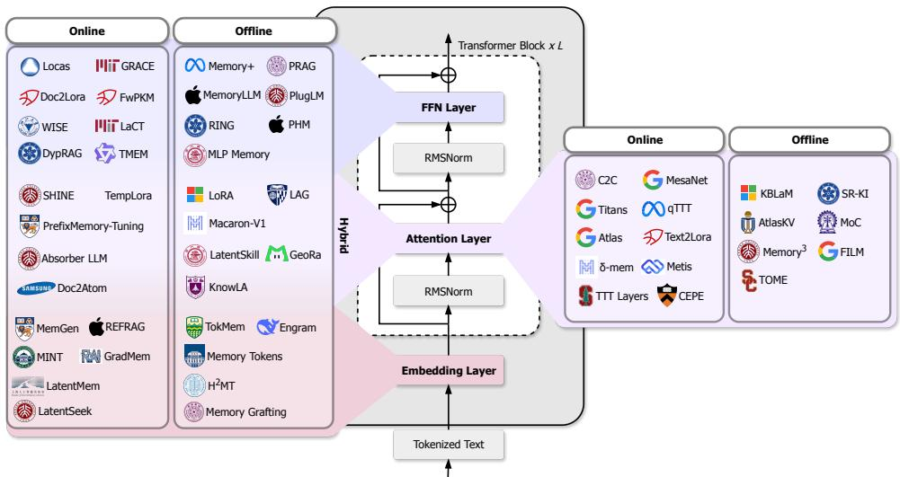
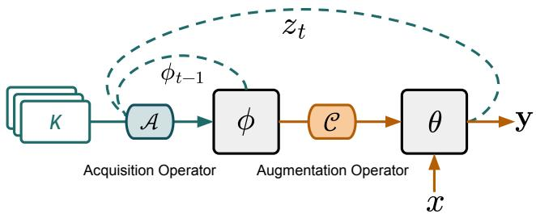
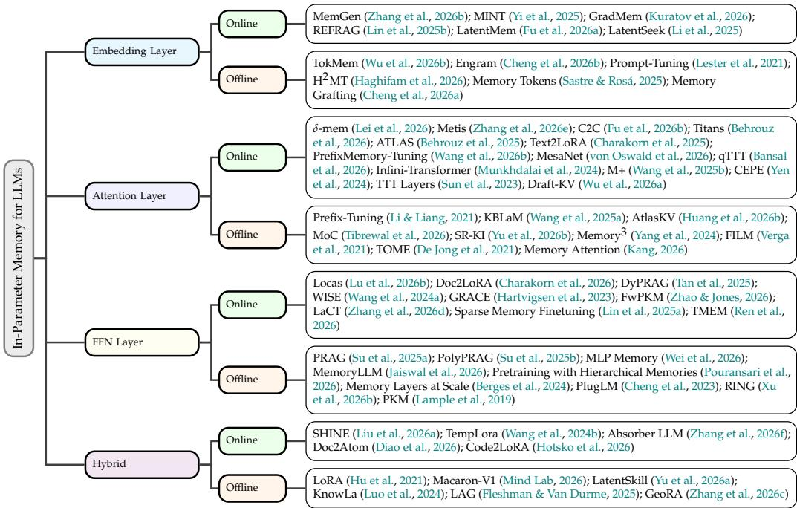

# Towards In-Parameter Memory Augmentation for Large Language Models

Haoyu Huang†∗, Zhongwei Xie†, Jiaxin Bai‡, Yisen Gao†, Hong Ting Tsang†, Wuganjing Song†, Huihao Jing†, Yufei Li†, Yangqiu Song†

†The Hong Kong University of Science and Technology,

‡Hong Kong Baptist University

Hong Kong SAR, China

Github Repository

Recently Large Language Models (LLMs) and LLM-based agents increasingly need to incorporate knowledge acquired after pretraining, e.g., domain facts, user preferences, documents, and interaction experience. In-context learning (ICL) and ICL-based agent harness remain flexible, but they consume context capacity and incur repeated discretized encoding cost that grows with context length. In-parameter memory offers a complementary substrate: reusable memory information is represented in model parameters, adapters, or other parameter-like objects that are composed into the forward pass at inference time. This survey focuses on methods that augment LLMs with such parametric memory at deployment: a memory-bearing parameter object is plugged into the forward pass during inference, whether it is acquired before or during deployment. We organize the landscape with two orthogonal axes: Parameter Placement, which includes Embedding, Attention, FFN layers, or Hybrid when two or more layers are used; and Parameter Acquisition Time, which distinguishes methods whose memory object is acquired during deployment (online) from those acquired before it (offline). We clarify boundaries, conduct comparisons, and discuss open directions in interference, safety, co-design with ICL, and recursive self-improvement.

  
Figure 1: A demonstration of the representative methods in the two-dimensional taxonomy.

## 1 Introduction

Large Language Models (LLMs) and LLM-based agents have demonstrated broad capabilities in natural language generation, reasoning, and tool use (Brown et al., 2020; Achiam et al., 2023). A persistent challenge is how to incorporate knowledge that is external to, or more recent than, pretraining, including new documents, domain-specific constraints, users’ preferences, and experience accumulated over agentic interactions (Lewis et al., 2020; Huang et al., 2026a; Xu & Yan, 2026; Han et al., 2026; Ni et al., 2026), which we term as memory for LLMs in this survey.

Currently most of the deployed systems expose this information as explicit textual tokens, which is also known as in-context learning (ICL) methods (Dong et al., 2024). ICL conditions a frozen model on textual demonstrations or retrieved documents as the memory, which is the most common paradigm used by various retrieval-augmented generation (RAG) methods (Gao et al., 2023; Fan et al., 2024; Brown et al., 2020; Lewis et al., 2020; Huang et al., 2025) and agents (Ying et al., 2026; DeepSeek-AI, 2026). Though these ICL-based methods for memory augmentations are explainable, inspectable and easy to revise, their compute and latency grow with the number of retrieved tokens, and long contexts can exhaust a finite window (Vaswani et al., 2017; Liu et al., 2024). Although sparse attention (Zhang et al., 2025; Lai et al., 2026; Liu et al., 2025; Yuan et al., 2025; Tang et al., 2024) and KV cache compression (Rehg, 2024; Kim et al., 2026; Cai et al., 2024) alleviate but do not remove this scaling.

In-parameter memory (IPM) (Fleshman & Van Durme, 2025; Huang et al., 2026b; Lei et al., 2026; Zhang et al., 2026e) provides a complementary memory representation and augmentation paradigm. Instead of exposing all relevant information as explicit textual tokens, the system composes a compressed parametric memory object into the forward pass at inference time. The backbone parameters θ may stay frozen, or the augmentation step may write into them; what matters is that a memory object ϕ is acquired and then composed at deployment. The memory object may be acquired before deployment (offline) or produced and revised during deployment (online). Compared with ICL-based methods, this paradigm can avoid the quadratic cost of long-context prefilling (McDermott et al., 2026) and reduce inference latency when memory is reused across queries. This motivates a significant shift from ICL-based to in-parameter memory augmentation (Back et al., 2026).

To highlight this ongoing shift, in this paper, we provide a focused overview and detailed discussion of the current research progress on in-parameter memory augmentation for LLMs. As shown in Figure 1, we organize the in-parameter memory augmentation methods along two orthogonal dimensions: (1) Parameter Placement asks which part of the transformer block receives the parametric memory, including Embedding Layers, Attention Layers, FFN Layers, or Hybrid when two or more of these are used together. (2) Parameter Acquisition Time asks whether the deployed memory object is formed before the model starts serving (offline) or while it is serving (online). Concurrent architecture-centric surveys (Zhoubian et al., 2026) cover memory broadly, including implicit computation-coupled memory (KV caches, SSMs, MoE) and parameter-efficient adaptation. We treat unmodified token-derived KV caches as token memory rather than in-parameter memory: they are a byproduct of prefilling, not an object produced by an independent acquisition operator A. We index the remaining composable objects by target-module placement, acquisition timing, and deployment lifecycle (Section 2).

Our contributions are:

• We organize in-parameter memory (IPM) methods along two axes: parameter placement and acquisition time, and give a detailed landscape of the current research progress.

• We formulate IPM methods by a memory object ϕ, an acquisition operator A, and an augmentation operator C with explicit boundaries.

• We discuss open directions for IPM in interference, safety-aware acquisition, codesign with ICL, and recursive self-improvement.

  
Figure 2: A demonstration of the operator formulation of in-parameter memory.

## 2 Formulation and Scope

## 2.1 Transformer Backbones and Memory-Able Sites

Although nowadays there are many variants of the transformer backbone, their basic building blocks are still almost the same (Xu et al., 2026a; Qiu et al., 2026; Team et al., 2026). The common transformer block composes an embedding layer, multi-head attention, a feed-forward network (FFN or FFN-based MoE, we use FFN to refer to both), residual connections, and normalization (Vaswani et al., 2017). In-parameter memory does not aim to replace this anatomy, but injects a memory object ϕ into one or more of its sites. Two lines of evidence show where such injection is natural. First, FFN layers behave as key-value memories, and attribution studies link specific neurons and layers to factual associations (Geva et al., 2021; Dai et al., 2022; Meng et al., 2022). Second, attention itself is an associative operator: ordinary self-attention accumulates token-derived key-value pairs in a growing cache, while linear-attention and fast-weight variants compress associations into a fixed-size state (Schlag et al., 2021). These observations motivate three placement families, defined by where IPM ϕ is stored or read:

• Embedding layer: ϕ enters as continuous prompt tokens, prefixes, or latent input states appended before the first block.

• Attention layer: ϕ participates in attention as keys/values, attention-side adapters, or matrix-valued associative states.

• FFN layer: ϕ is stored in feed-forward parameters or FFN-substituting projections.

A method is Hybrid when its deployed ϕ uses two or more of these families. The sites differ in read path, capacity, update cost, and compatibility with pretrained checkpoints, which is why placement is one important axis of the taxonomy.

## 2.2 An Operator Formulation of In-Parameter Memory

Let θ denote the backbone parameters and ϕ a memory-bearing parameter object. As shown in Figure 2, we characterize any in-parameter memory method by two operators: an acquisition operator A that produces ϕ, and an augmentation operator C that composes ϕ into the forward pass. Acquisition and augmentation are distinct. For example, in LoRA generation methods (Charakorn et al., 2025; 2026), A is the hypernetwork that emits adapter matrices from a document or task description, while C is the inference-time rule $W { \stackrel { \bullet } { \mapsto } } W + B A$ on the chosen modules. Placement in the taxonomy is the site of C, not of A.

A has two forms. One-shot acquisition maps a source K to IPM objects, $\phi = \mathcal { A } ( K )$ , which covers gradient optimization over continuous vectors (Lester et al., 2021; Wang et al., 2026b), one-pass hypernetworks (Charakorn et al., 2025; 2026), and knowledge encoders that emit KV pairs (Wang et al., 2025a; Huang et al., 2026b). Stateful acquisition rewrites the current IPM object from new evidence observed during deployment, $\phi _ { t } = \mathcal { A } \left( \phi _ { t - 1 } , z _ { t } \right)$ , which covers recurrent write rules such as the delta-rule (Lei et al., 2026) and the surprise-driven update (Behrouz et al., 2026). The K in one-shot operator is usually static external memory and that in stateful operator is usually internal memory that are generated by the model itself. Both are acquisition: the second simply conditions on the previous ϕ. The deployed model generates as

Table 1: Scope relative to neighboring paradigms. Parametric asks whether the memory takes continuous parameter form. Independent acquisition asks whether it is produced by an independent acquisition operator A rather than as a byproduct of running the model. Augmented at deployment asks whether it enters the forward pass at deployment as a distinct object. A paradigm is included only when all three hold.
<table><tr><td>Paradigm</td><td>Parametric</td><td>Independent Acquisition</td><td>Augmented at Deployment</td><td>Included</td></tr><tr><td>ICL-based RAG</td><td>X</td><td>X</td><td>√</td><td>x</td></tr><tr><td>Pluggable PEFT</td><td>√</td><td>√</td><td>√</td><td>√</td></tr><tr><td>Full Parameter SFT</td><td>√</td><td>√</td><td>x</td><td>x</td></tr><tr><td>Unmodified KV Cache</td><td>√</td><td>x</td><td>√</td><td>x</td></tr></table>

$$
\phi _ { t } = \mathcal { A } \mathopen { } \mathclose \bgroup \left( \phi _ { t - 1 } , z _ { t } \aftergroup \egroup \right) ,\tag{1}
$$

$$
y _ { t } \sim p _ { \mathcal { C } ( \theta , \phi _ { t } ) } ( y _ { t } \mid x _ { \leq t } ) ,\tag{2}
$$

with $\phi _ { 0 } = \mathcal { A } ( K )$ for one-shot methods and $z _ { t }$ the evidence observed at step t. C is the composition rule at the chosen site: augmenting ϕ to the frozen parameters $\theta ,$ adding it as a LoRA residual, reading it as extra keys/values in attention, adding it as virtual tokens (Zhang et al., 2026b), or directly updating latent representations (Li et al., 2025). For stateful methods, C runs on the current ϕt. And how often A fires to update ϕ varies by method: per token (Behrouz et al., 2026), per segment (Munkhdalai et al., 2024), or on demand (Kuratov et al., 2026; Li et al., 2025).

The two operators play different roles in what follows. A and C first decide whether a method is in scope (Section 2.3): ϕ must be parametric, produced by an independent A, and augmented at deployment. Methods that pass are then located by where C reads $\phi$ and when A forms it (Section 3).

## 2.3 Scope and Relation to Neighboring Paradigms

Table 1 applies the three tests to neighboring paradigms. Pluggable PEFT passes all three: the adapter is a continuous parameter object, trained by its own A, and still plugged into the forward pass at deployment (Hu et al., 2021; Li & Liang, 2021; Lester et al., 2021; Liu et al., 2022). Full-parameter SFT fails the last test, because the update is merged into θ before serving and leaves no distinct object for C to augment. An unmodified KV cache fails independent acquisition: its entries are a byproduct of prefilling discrete tokens, even though the stored tensors are continuous (Rehg, 2024; Kim et al., 2026; Cai et al., 2024). Encoded KV banks remain inside the boundary (Huang et al., 2026b; Wang et al., 2025a; Yu et al., 2026b; De Jong et al., 2021), because an encoder is an independent A and the LLM reads the resulting parameters rather than a raw token stream. A learned write rule that emits a parameter-like state is included on the same grounds (Lei et al., 2026; Feng et al., 2026; von Oswald et al., 2026; Bansal et al., 2026).

Relation to continual learning. Continual learning (CL) studies how to absorb new knowledge over a sequence of tasks while mitigating catastrophic forgetting (Shi et al., 2025). Its canonical mechanisms perform knowledge augmentation by offline training of the model parameters themselves, consolidating each new task before the model is served (Kirkpatrick et al., 2017). Recent LLM transfers converge toward IPM (Lin et al., 2025a; Xu et al., 2026b), which maybe acquire ϕ in an offline stage but augment it at inference, so they enter our taxonomy as offline-acquired methods. The dividing line between CL and IPM is whether ϕ is still augmented at deployment.

## 3 Two-Dimensional Taxonomy

To better understand and compare the properties of different IPM methods (Section 5), we located the methods that pass Table 1 along two axes: where C augments ϕ, and when

Table 2: The operational criteria and typical memory objects of different classes of methods in the two dimensions used to locate included methods.
<table><tr><td>Dimension</td><td>Class</td><td>Operational Criterion</td><td>Typical Memory Object</td></tr><tr><td rowspan="2">Parameter Acquisition Time</td><td>Online</td><td>φ is generated or updated while the model is serving.</td><td>Fast Weights; Online Neural Memory; Adapters; Soft Tokens.</td></tr><tr><td>Offline</td><td>φ is formed before serving and held fixed, but still augmented at deployment.</td><td>Encoded KV Banks; Soft Prompts; Adapters; Memory Tables.</td></tr><tr><td rowspan="4">Parameter Placement</td><td>Embedding Layer</td><td>φ is composed into the input embeddings.</td><td>Soft Prompts, Soft Tokens, Memory Tables.</td></tr><tr><td>Attention Layer</td><td>φ is composed inside attention.</td><td>Encoded KV Banks; Adapters; Fast Weights; Online Neural Memory; Soft Prompts.</td></tr><tr><td>FFN Layer</td><td>φ is composed inside the FFN.</td><td>Adapters; Memory Tables; Fast Weights; Online Neural Memory.</td></tr><tr><td>Hybrid</td><td>φ is composed at two or more of these sites.</td><td>Adapters, Online Neural Memory.</td></tr></table>

A forms it, which form the Parameter Placement and Parameter Acquisition Time two taxonomy dimensions. Table 2 states the operational criteria and typical memory objects in each dimension. Figure 3 draws the taxonomy tree and representative methods. In this section, we will discuss how we define these two dimensions. The analysis about the methods in each class will be conducted in Section 4.

## 3.1 Dimension I: Parameter Placement

As shown in Table 2, the parameter placement dimension is defined by the site at which C reads ϕ. And according to the families in Section 2.1, we can divide the parameter placement into four classes: embedding layers, attention layers, FFN layers, and Hybrid. And the typical memory objects for each class are also listed in Table 2. Different parameter placement corresponds to different memory objects. For example, the memory objects for the embedding layers are usually soft prompts (Lester et al., 2021; Yi et al., 2025), soft tokens (Zhang et al., 2026b; Wu et al., 2026b), and memory tables (Cheng et al., 2026b;a). And the memory objects for the attention layers are usually encoded KV banks (Fu et al., 2026b; Huang et al., 2026b), adapters (Charakorn et al., 2025), fast weights (Lei et al., 2026), online neural memory (Behrouz et al., 2026), and soft prompts (Wang et al., 2026b). And the memory objects for the FFN layers are usually adapters (Su et al., 2025b), memory tables (Xu et al., 2026b), online neural memory (Zhang et al., 2026d) and fast weights (Zhao & Jones, 2026). And the memory objects for the Hybrid are usually adapters (Mind Lab, 2026), online neural memory (Zhang et al., 2026f).

## 3.2 Dimension II: Parameter Acquisition Time

The parameter acquisition time records when the deployed ϕ is formed: online or offline. The reference is whether ϕ is formed during or before the models’ deployment. The offlineacquired IPM methods are usually based on one-shot acquisition operators, while the online-acquired IPM methods are usually based on stateful acquisition operators. Note that the acquisition time is not when the operator that produces it was trained. For example, a hypernetwork may be trained offline, yet the LoRA it emits for a deployment context is acquired online (Tan et al., 2025). The typical memory objects for each class are also listed in Table 2. Online objects are usually fast weights (Lei et al., 2026), online neural memory (Behrouz et al., 2026), adapters (Charakorn et al., 2025), and soft tokens (Zhang et al., 2026b). Their augmentation operators are usually various forward processes. Offline objects are usually encoded KV banks (Yu et al., 2026b), soft prompts (Liu et al., 2022), adapters (Hu et al., 2021), and memory tables (Cheng et al., 2026b). And their augmentation operators are usually their training processes.

  
Figure 3: Overall taxonomy and representative methods of IPM for LLMs.

## 4 Method Landscape

Figure 1 gives an introductory demonstration and Figure 3 lists the audited collection used throughout this section. We organize the narrative by placement (Level 1), then by acquisition time (Level 2), matching the taxonomy tree. In this section, we will discuss the details about the methods in each class.

## 4.1 Embedding Layer

Online. Most of the methods that augment online acquired IPM at embedding layers are based on soft tokens and soft prompts. MemGen (Zhang et al., 2026b) equips LLMs with a weaver to synthesize the current hidden state into latent memory tokens that are prepended to the frozen backbone’s input. GradMem (Kuratov et al., 2026) compresses a context into a few prefix memory tokens via test-time gradient descent on a reconstruction loss, also with the backbone frozen. MINT (Yi et al., 2025) maintains a bank of learnable soft prompts that is retrieved and updated online on test samples, adapting CLIP’s input prompts while it serves. REFRAG (Lin et al., 2025b) injects compressed chunk embeddings as inputside representations for efficient RAG decoding, selectively expanding chunks as needed. LatentMem (Fu et al., 2026a) gives each agent in a multi-agent system a memory composer that distills retrieved interaction trajectories into compact role-aware latent memory tokens. In all these cases the memory object is formed or updated during the inference time, so these methods are classified as online.

Offline. Prompt-tuning (Lester et al., 2021) optimizes continuous soft prompts before the deployment and prepend them at inference, so ϕ is composed offline. There are a line of methods using special tokens that are trained offline to integrate external memory. For example, TokMem (Wu et al., 2026b) trains procedural knowledge in specialized tokens offline and read at input. H2MT (Haghifam et al., 2026) organizes hierarchical memory tree offline and routes each query top-down to read the relevant nodes. MemoryTokens (Sastre & Rosa´, 2025) learns reversible sentence representations as a new token in the vocabulary. There are also a line of methods using memory tables or embedding tables that are trained offline for the models to look up. For example, Engram (Cheng et al., 2026b) implements conditional N-gram lookup from input token identities. Memory Grafting (Cheng et al., 2026a) builds a frozen N-gram memory table from an offline grafting model and composes it at inference through longest-match lookup and gated injection. In these cases, ϕ is fixed during the episode but still enters the forward path at inference.

## 4.2 Attention Layer

Online. There are a huge amount of test-time training (TTT) methods that augment onlineacquired IPM at attention layers, which adapt online neural memory as their memory objects. For example, Titans (Behrouz et al., 2026) and Atlas (Behrouz et al., 2025) learn attention-coupled neural memories at test time. MesaNet (von Oswald et al., 2026) and qTTT (Bansal et al., 2026) perform locally optimal or long-context TTT in attention-side state. Metis (Zhang et al., 2026e) pursues a memory-foundation model with online write or read. TTT Layers (Sun et al., 2023) treat the hidden state as a model trained at test time with attention-side recurrence. There are also some works adapting fast weights as their memory objects. δ-mem (Lei et al., 2026) maintains a compact online associative state whose readout corrects attention of a frozen backbone. Infini-Transformer (Munkhdalai et al., 2024) compresses past segments into a fixed-size associative memory matrix that each attention layer reads alongside the local cache. For KV banks as memory objects, these methods usually can obtain dense KV representations that are more than token-level memories. CEPE (Yen et al., 2024) encodes a long context chunk with a small encoder and lets the decoder read the encoded representations through added cross-attention layers. M+ (Wang et al., 2025b) composes a query-conditioned memory bank at test time to extend the effective context. C2C (Fu et al., 2026b) treats the KV caches encoded by another LLM as the parametric memory and employs a learned cache fuser projects the sharer’s KV cache into the receiver’s attention. PrefixMemory-Tuning (Wang et al., 2026b) moves the prefix out of the attention head into an external query-conditioned module, fixing prefix-tuning’s input-prefix tradeoff.

Offline. A typical offline-acquired IPM method at attention layers is prefix-tuning (Li & Liang, 2021), for it learns continuous KV representations at each attention layer. There are also more flexible methods (e.g., KBLaM (Wang et al., 2025a), AtlasKV (Huang et al., 2026b), SR-KI (Yu et al., 2026b)) that learns cross-attention heads (projectors) as the acquisition operator A to project the representations of sentences encoded by a small freeze encoder to the LLMs’ semantic space. They can obtain KV representations of new sentences on the fly. But their knowledge is organized offline, so they are classified as offline methods. MoC (Tibrewal et al., 2026) learns chapter-level memory modules offline that are attached at inference. Memory3 (Yang et al., 2024) converts a knowledge base into offline trained sparse attention key-value memories and retrieves them into self-attention at inference. Memory Attention (Kang, 2026) drops the value projection and builds each attention value as the contextual key plus a lookup from a layer-specific token embedding table.

## 4.3 FFN Layer

Online. The methods belonging to this class are usually based on hypernetworks to generate MLP LoRA adapters on the fly. Doc2LoRA (Charakorn et al., 2026) maps a document to LoRA adapters in one pass. The reported implementation adapts MLP down-projections and is therefore FFN. DyPRAG (Tan et al., 2025) dynamically generates parametric adapters from a retrieved document at test time for knowledge enhancement, where ϕ is materialized during the deployment. Locas (Lu et al., 2026b) and WISE (Wang et al., 2024a) provide locally supported or side-memory mechanisms for continual FFN-side updates at deployment. GRACE (Hartvigsen et al., 2023) wraps an FFN projection with a codebook of key-value adaptors, applying a stored value only when the layer activation falls near a cached key. Fw-PKM (Zhao & Jones, 2026) introduces fast-weight product-key memory on the feed-forward path. LaCT (Zhang et al., 2026d) revisits test-time training with FFN-side state updates.

Offline. For offline methods, they usually synthesize some QA pairs from some documents or knowledge bases and train LoRA adapters on the FFN layers with them. For example, PRAG and PolyPRAG (Su et al., 2025a;b) encode retrieved knowledge into FFN-side parameters offline and then plug them in at inference. Other methods like MLP Memory (Wei et al., 2026) pretrain an MLP at FFN layers to imitate a k-NN retriever’s behavior, which internalize retrieval patterns without explicit document access. Similarly, RING (Xu et al., 2026b) injects new corpora into mixture-of-memory experts and learns, via reinforcement, the routing-and-search policy that reads them at inference. MemoryLLM (Wei et al., 2026; Jaiswal et al., 2026) trains the FFN only on context-free token embeddings, so the whole layer collapses into a precomputable token-wise lookup. Sparse memory finetuning (Berges et al., 2024) writes new facts into the most selectively activated slots of a memory-layer model via masked gradient updates, leaving the addressable table to be read by top-k lookup at inference. These compose ϕ at deployment and are offline-acquired core.

## 4.4 Hybrid

Unlike the FFN-side methods above, Hybrid methods train linear layers at more than one site: not only inside the FFN, but also at other modules such as attention heads.

Online. Temp-LoRA (Wang et al., 2024b) trains temporary multi-site LoRA during inference. SHINE (Liu et al., 2026a) maps a context to per-layer LoRA adapters in one forward pass of an in-context hypernetwork, so later queries answer from those adapters without rereading the context. AbsorberLLM (Zhang et al., 2026f) synchronizes causal state for test-time training across sites. Doc2Atom (Diao et al., 2026) compiles documents into composable semantically typed memory atoms spanning multiple modules.

Offline. Standard LoRA (Hu et al., 2021) is hybrid when attention and FFN maps are adapted together. Macaron-V1 (Mind Lab, 2026) routes each turn to one specialist LoRA on a frozen base, so skills stay plug-in adapters. KnowLa (Luo et al., 2024) injects frozen knowledge-graph entity embeddings into hidden states through a small adapter trained alongside LoRA. LatentSkill (Yu et al., 2026a) compiles textual skills into LoRA adapters offline that are mounted on a frozen backbone at inference.

## 5 Property-Based Comparison

In this section, we will compare the methods in each class based on their properties, for example, task purpose, materialization, persistence, and memory write or read cost, which decide how such an IPM object can be used. And we also list these properties in Table 4 for each representative method. We also summarize each representative method’s parameter placement of C, the memory object, and the acquisition operator A in Table 3. Note that we use qualitative bands because the underlying papers rarely report comparable FLOPs or wall-clock numbers.

As the tables suggest, online rows are almost always per-request or per-token and ephemeral or session-scoped, where generated adapters and soft prompts pay a medium-cost onepass write for a fresh object, while recurrent fast weights and online neural memory pay a low-cost per-token write to keep a mutable state for long-context modeling. Offline rows are almost always pre-deployment and persistent, where they pay a high-cost one-time write to freeze knowledge into soft prompts, KV banks, or memory tables, and then read at low-cost cost. Methods with the same IPM object type also behaves differently by parameter acquisition time. Adapters are cheap when generated online, but expensive when trained offline. Encoded KV banks are composed per request in CEPE and M+, but precomputed in KBLaM and AtlasKV.

## 5.1 Trade-offs

Based on the above analysis, we can summarize the trade-offs between IPM methods. For the parameter acquisition time axis, online acquisition adapts immediately but pays higher write-time compute. Offline acquisition is more stable and validated, yet cannot absorb a new stream without an offline training process. For the parameter placement axis, embedding-side objects are the cheapest to compose, because they enter through the input stream with the backbone frozen, but their influence is indirect, mediated by every layer above. Attention-side objects are content-addressable: the query-key reads support both associative lookup over large banks and recurrently updated states, at the cost of coupling to head structure and attention budget. FFN-side objects write into the layers where factual associations are stored, so edits can directly overwrite specific behaviors. However, the read is position-wise, which means each token consults the memory independently, with no content-based selection among entries and sequential writes to shared weights interfere. Hybrid stacks compose objects across sites and are the most expressive, shaping both what the model reads and how it computes. However, observed behaviors can not be traced to a single component, so updates must be coordinated across heterogeneous objects.

Besides, ICL and ICL-based RAG remain preferable for the tasks needing exact quotation, provenance, targeted deletion, or human revision, which are trivial for a text store, hard once text is compressed and abstracted into ϕ.

## 6 Open Directions

The comparison above exposes some gaps in the current landscape. We highlight four open directions for the IPM paradigm.

Interference and forgetting. Sequential edits and recurrent delta-rule writes overwrite earlier associations, and the damage grows with the update sequence: edited weights increase in norm and disrupt general-ability directions, while a fixed state interferes along the current key (Gupta et al., 2025; Lyu et al., 2026; Zhang et al., 2026a; Lei et al., 2026; Hatamizadeh et al., 2026). Subspace projections, norm constraints, and erase or write gates slow this collapse, but they keep a growing record of past keys or gate only the current key, so conflict detection and fixed-capacity allocation over a long stream remain open (Wang et al., 2026c).

Safety-aware acquisition. One write from untrusted context is later retrieved as trusted knowledge, and current memory systems do not record provenance (Dash et al., 2026; Zou et al., 2026). When the write is parametric, IPM objects can implant the behavior in weights, and behavioral unlearning leaves traces, so update budgets, provenance-conditioned write gates, and privacy-aware consolidation remain open (Chen et al., 2026; Hong et al., 2025; Wang et al., 2026a).

Co-design with ICL. ICL keeps memory as textual tokens, which can represent more detailed information. Although compressed memory objects in IPM can lead to efficient augmentation, there are still cases that need fine-grained memory access. So the open direction is a co-design in which A decides what stays in context and what enters ϕ, and C reads both in one forward pass.

Model-native recursive self-improvement (RSI). Most recursive self-improvement today lives in the agent harness, where prompts (Fernando et al., 2023), skills (Liu et al., 2026b), knowledge bases (Tang et al., 2025), and tools (Lu et al., 2026a) are revised outside the model (Ni et al., 2026; DeepSeek-AI, 2026). A model-native version would let A write useful deployment experience into ϕ itself, so the backbone model improves in-parameter and the gap between offline training and online inference narrows.

## 7 Conclusion

This survey analyzes in-parameter memory augmentation for LLMs, which is a more efficient and model-native way to augment LLMs than the ICL paradigm. We organize in-parameter memory along parameter placement and acquisition time, and lay out the resulting landscape. We formulate the paradigm with a memory object, an acquisition operator, and a composition operator, and use them to draw explicit boundaries. We also discuss the open directions for the IPM paradigm to help future parametric memory systems.

## 8 Limitations

This survey has the following limitations. First, it only considers the IPM paradigm under text-modality. There are also plenty of works applying the IPM paradigm to other modalities, such as vision, audio, and video. Second, it does not include IPM designs built into newer LLM architectures, such as Mixture of Latent Experts (MLE), Multi-head Latent Attention (MLA), and Manifold-Constrained Hyper-Connections (mHC). Third, the comparison does not under numerical measurements. Write cost, read cost, and retention are qualitative bands inferred from mechanisms, because the source papers rarely share a benchmark or comparable measurements.

## References

Josh Achiam, Steven Adler, Sandhini Agarwal, Lama Ahmad, Ilge Akkaya, Florencia Leoni Aleman, Diogo Almeida, Janko Altenschmidt, Sam Altman, Shyamal Anadkat, et al. Gpt-4 technical report. arXiv preprint arXiv:2303.08774, 2023. URL https://arxiv.org/ abs/2303.08774.

Seungju Back, Dongwoo Lee, Naun Kang, Taehee Lee, SK Hong, Youngjune Gwon, and Sungjin Ahn. Understanding lora as knowledge memory: An empirical analysis. arXiv preprint arXiv:2603.01097, 2026.

Rachit Bansal, Aston Zhang, Rishabh Tiwari, Lovish Madaan, Venkata Sai Surya Subramanyam Duvvuri, Devvrit Khatri, David Brandfonbrener, David Alvarez-Melis, Prajjwal Bhargava, Mihir Kale, et al. Let’s (not) just put things in context: Test-time training for long-context llms. In International Conference on Learning Representations, volume 2026, pp. 112130–112153, 2026.

Ali Behrouz, Zeman Li, Praneeth Kacham, Majid Daliri, Yuan Deng, Peilin Zhong, Meisam Razaviyayn, and Vahab Mirrokni. Atlas: Learning to optimally memorize the context at test time. arXiv preprint arXiv:2505.23735, 2025.

Ali Behrouz, Peilin Zhong, and Vahab Mirrokni. Titans: Learning to memorize at test time. Advances in Neural Information Processing Systems, 38:113506–113543, 2026.

Vincent-Pierre Berges, Barlas Oguz, Daniel Haziza, Wen-tau Yih, Luke Zettlemoyer, and ˘ Gargi Ghosh. Memory layers at scale. arXiv preprint arXiv:2412.09764, 2024.

Tom B. Brown, Benjamin Mann, Nick Ryder, Melanie Subbiah, Jared Kaplan, Prafulla Dhariwal, Arvind Neelakantan, Pranav Shyam, Girish Sastry, Amanda Askell, et al. Language models are few-shot learners. In Advances in Neural Information Processing Systems, 2020.

Zefan Cai, Yichi Zhang, Bofei Gao, Yuliang Liu, Yucheng Li, Tianyu Liu, Keming Lu, Wayne Xiong, Yue Dong, Junjie Hu, et al. Pyramidkv: Dynamic kv cache compression based on pyramidal information funneling. arXiv preprint arXiv:2406.02069, 2024.

Rujikorn Charakorn, Edoardo Cetin, Yujin Tang, and Robert Tjarko Lange. Text-to-lora: Instant transformer adaption. arXiv preprint arXiv:2506.06105, 2025.

Rujikorn Charakorn, Edoardo Cetin, Shinnosuke Uesaka, and Robert Tjarko Lange. Doc-tolora: Learning to instantly internalize contexts. arXiv preprint arXiv:2602.15902, 2026.

Linzhi Chen, Yang Sun, Hongru Wei, and Yuqi Chen. Causal-guided detoxify backdoor attack of open-weight LoRA models. In Proceedings of the 33rd Annual Network and Distributed System Security Symposium, 2026. doi: 10.14722/ndss.2026.240168.

Runxi Cheng, Yuchen Guan, Yongxian Wei, Qianpu Sun, Qixiu Li, Sinan Du, Feng Xiong, Chun Yuan, Yan Lu, and Yeyun Gong. Memory grafting: Scaling language model pretraining via offline conditional memory. arXiv preprint arXiv:2605.20948, 2026a.

Xin Cheng, Yankai Lin, Xiuying Chen, Dongyan Zhao, and Rui Yan. Decouple knowledge from paramters for plug-and-play language modeling. In Findings of the Association for Computational Linguistics: ACL 2023, pp. 14288–14308, 2023.

Xin Cheng, Wangding Zeng, Damai Dai, Qinyu Chen, Bingxuan Wang, Zhenda Xie, Kezhao Huang, Xingkai Yu, Zhewen Hao, Han Zhang, et al. Conditional memory via scalable lookup: A new axis of sparsity for large language models. In Proceedings of the 64th Annual Meeting of the Association for Computational Linguistics (Volume 1: Long Papers), pp. 4968–4990, 2026b.

Damai Dai, Li Dong, Yaru Hao, Zhifang Sui, Baobao Chang, and Furu Wei. Knowledge neurons in pretrained transformers. In Proceedings of the 60th Annual Meeting of the Association for Computational Linguistics, pp. 8493–8502, 2022. doi: 10.18653/v1/2022. acl-long.581.

Pritam Dash, Tongyu Ge, Aditi Jain, Tanmay Shah, and Zhiwei Shang. From untrusted input to trusted memory: A systematic study of memory poisoning attacks in LLM agents. arXiv preprint arXiv:2606.04329, 2026.

Michiel De Jong, Yury Zemlyanskiy, Nicholas FitzGerald, Fei Sha, and William Cohen. Mention memory: incorporating textual knowledge into transformers through entity mention attention. arXiv preprint arXiv:2110.06176, 2021.

DeepSeek-AI. Deepseek harness: Everything is a plugin. https://github.com/ deepseek-ai/deepseek-harness, 2026.

Xingjian Diao, Wenbo Li, Yashas Malur Saidutta, Avinash Amballa, Lazar Valkov, and Srinivas Chappidi. Doc-to-atom: Learning to compile and compose memory atoms. arXiv preprint arXiv:2606.12400, 2026.

Qingxiu Dong, Lei Li, Damai Dai, Ce Zheng, Jingyuan Ma, Rui Li, Heming Xia, Jingjing Xu, Zhiyong Wu, Baobao Chang, Xu Sun, and Zhifang Sui. A survey on in-context learning. In Proceedings of the 2024 Conference on Empirical Methods in Natural Language Processing, pp. 1107–1128, 2024. doi: 10.18653/v1/2024.emnlp-main.64.

Wenqi Fan, Yujuan Ding, Liangbo Ning, Shijie Wang, Hengyun Li, Dawei Yin, Tat-Seng Chua, and Qing Li. A survey on rag meeting llms: Towards retrieval-augmented large language models. In Proceedings of the 30th ACM SIGKDD Conference on Knowledge Discovery and Data Mining, pp. 6491–6501, 2024.

Guhao Feng, Shengjie Luo, Kai Hua, Ge Zhang, Di He, Wenhao Huang, and Tianle Cai. In-place test-time training. arXiv preprint arXiv:2604.06169, 2026. URL https://arxiv. org/abs/2604.06169.

Chrisantha Fernando, Dylan Banarse, Henryk Michalewski, Simon Osindero, and Tim Rocktaschel. Promptbreeder: Self-referential self-improvement via prompt evolution.¨ arXiv preprint arXiv:2309.16797, 2023.

William Fleshman and Benjamin Van Durme. Lora-augmented generation (lag) for knowledge-intensive language tasks. arXiv preprint arXiv:2507.05346, 2025.

Muxin Fu, Xiangyuan Xue, Yafu Li, Zefeng He, Siyuan Huang, Xiaoye Qu, Yu Cheng, and Yang Yang. Latentmem: Customizing latent memory for multi-agent systems. arXiv preprint arXiv:2602.03036, 2026a.

Tianyu Fu, Zihan Min, Hanling Zhang, Jichao Yan, Guohao Dai, Wanli Ouyang, and Yu Wang. Cache-to-cache: Direct semantic communication between large language models. In International Conference on Learning Representations, volume 2026, pp. 43130–43158, 2026b.

Yunfan Gao, Yun Xiong, Xinyu Gao, Kangxiang Jia, Jinliu Pan, Yuxi Bi, Yi Dai, Jiawei Sun, Meng Wang, and Haofen Wang. Retrieval-augmented generation for large language models: A survey. arXiv preprint arXiv:2312.10997, 2023.

Mor Geva, Roei Schuster, Jonathan Berant, and Omer Levy. Transformer feed-forward layers are key-value memories. In Proceedings ofthe 2021 Conference on Empirical Methods in Natural Language Processing, pp. 5484–5495, 2021. doi: 10.18653/v1/2021.emnlp-main.446.

Akshat Gupta, Phudish Prateepamornkul, Maochuan Lu, Ahmed Alaa, Thomas Hartvigsen, and Gopala Anumanchipalli. Lifelong knowledge editing requires better regularization. In Findings of the Association for Computational Linguistics: EMNLP 2025, pp. 22653–22675, 2025. doi: 10.18653/v1/2025.findings-emnlp.1234.

Maryam Haghifam, Zifan He, Jason Cong, and Yizhou Sun. H2MT: Semantic hierarchyaware hierarchical memory transformer. arXiv preprint arXiv:2605.24930, 2026.

Tingxu Han, Yi Zhang, Wei Song, Chunrong Fang, Zhenyu Chen, Youcheng Sun, and Lijie Hu. Swe-skills-bench: Do agent skills actually help in real-world software engineering? arXiv preprint arXiv:2603.15401, 2026.

Tom Hartvigsen, Swami Sankaranarayanan, Hamid Palangi, Yoon Kim, and Marzyeh Ghassemi. Aging with grace: Lifelong model editing with discrete key-value adaptors. Advances in neural information processing systems, 36:47934–47959, 2023.

Ali Hatamizadeh, Yejin Choi, and Jan Kautz. Gated DeltaNet-2: Decoupling erase and write in linear attention. arXiv preprint arXiv:2605.22791, 2026.

Yihuai Hong, Lei Yu, Haiqin Yang, Shauli Ravfogel, and Mor Geva. Intrinsic test of unlearning using parametric knowledge traces. In Proceedings of the 2025 Conference on Empirical Methods in Natural Language Processing, pp. 19513–19535, 2025. doi: 10.18653/v1/2025.emnlp-main.985.

Liliana Hotsko, Yinxi Li, Yuntian Deng, and Pengyu Nie. Code2lora: Hypernetworkgenerated adapters for code language models under software evolution. arXiv preprint arXiv:2606.06492, 2026.

Edward J Hu, Yelong Shen, Phillip Wallis, Zeyuan Allen-Zhu, Yuanzhi Li, Shean Wang, Lu Wang, and Weizhu Chen. Lora: Low-rank adaptation of large language models. arXiv preprint arXiv:2106.09685, 2021.

Haoyu Huang, Yongfeng Huang, Junjie Yang, Zhenyu Pan, Yongqiang Chen, Kaili Ma, Hongzhi Chen, and James Cheng. Retrieval-augmented generation with hierarchical knowledge. In EMNLP (Findings), pp. 6044–6060, 2025.

Haoyu Huang, Jiaxin Bai, Shujie Liu, Yang Wei, Hong Ting Tsang, Yisen Gao, Zhongwei Xie, Yufei Li, and Yangqiu Song. Deeprefine: Agent-compiled knowledge refinement via reinforcement learning. arXiv preprint arXiv:2605.10488, 2026a.

Haoyu Huang, Hong Ting Tsang, Jiaxin Bai, Xi Peng, Gong Zhang, and Yangqiu Song. Atlaskv: Augmenting llms with billion-scale knowledge graphs in 20gb vram. In International Conference on Learning Representations, volume 2026, pp. 125035–125060, 2026b.

Ajay Jaiswal, Lauren Hannah, Han-Byul Kim, Duc Hoang, Arnav Kundu, Mehrdad Farajtabar, and Minsik Cho. Memoryllm: Plug-n-play interpretable feed-forward memory for transformers. arXiv preprint arXiv:2602.00398, 2026.

Jiale Kang. Memory attention. arXiv preprint arXiv:2609.28399, 2026.

Jang-Hyun Kim, Jinuk Kim, Sangwoo Kwon, Jae W Lee, Sangdoo Yun, and Hyun Oh Song. Kvzip: Query-agnostic kv cache compression with context reconstruction. Advances in Neural Information Processing Systems, 38:167563–167591, 2026.

James Kirkpatrick, Razvan Pascanu, Neil Rabinowitz, Joel Veness, Guillaume Desjardins, Andrei A Rusu, Kieran Milan, John Quan, Tiago Ramalho, Agnieszka Grabska-Barwinska, et al. Overcoming catastrophic forgetting in neural networks. Proceedings of the national academy ofsciences, 114(13):3521–3526, 2017.

Yuri Kuratov, Matvey Kairov, Aydar Bulatov, Ivan Rodkin, and Mikhail Burtsev. Gradmem: Learning to write context into memory with test-time gradient descent. arXiv preprint arXiv:2603.13875, 2026.

Xunhao Lai, Weiqi Xu, Yufeng Yang, Qiaorui Chen, Yang Xu, Lunbin Zeng, Xiaolong Li, Haohai Sun, Haichao Zhu, Vito Zhang, et al. Minimax sparse attention. arXiv preprint arXiv:2606.13392, 2026.

Guillaume Lample, Alexandre Sablayrolles, Marc’Aurelio Ranzato, Ludovic Denoyer, and Herve J ´ egou. Large memory layers with product keys. ´ Advances in Neural Information Processing Systems, 32, 2019.

Jingdi Lei, Di Zhang, Junxian Li, Weida Wang, Kaixuan Fan, Xiang Liu, Qihan Liu, Xiaoteng Ma, Baian Chen, and Soujanya Poria. δ-mem: Efficient online memory for large language models. arXiv preprint arXiv:2605.12357, 2026.

Brian Lester, Rami Al-Rfou, and Noah Constant. The power of scale for parameter-efficient prompt tuning. In Proceedings of the 2021 conference on empirical methods in natural language processing, pp. 3045–3059, 2021.

Patrick Lewis, Ethan Perez, Aleksandra Piktus, Fabio Petroni, Vladimir Karpukhin, Naman Goyal, Heinrich Kuttler, Mike Lewis, Wen-tau Yih, Tim Rocktaschel, et al. Retrievalaugmented generation for knowledge-intensive NLP tasks. In Advances in Neural Information Processing Systems, 2020.

Hengli Li, Chenxi Li, Tong Wu, Xuekai Zhu, Yuxuan Wang, Zhaoxin Yu, Eric Hanchen Jiang, Song-Chun Zhu, Zixia Jia, Ying Nian Wu, et al. Seek in the dark: Reasoning via test-time instance-level policy gradient in latent space. arXiv preprint arXiv:2505.13308, 2025.

Xiang Lisa Li and Percy Liang. Prefix-tuning: Optimizing continuous prompts for generation. In Proceedings of the 59th annual meeting of the associationfor computational linguistics and the 11th international joint conference on natural language processing (volume 1: Long papers), pp. 4582–4597, 2021.

Jessy Lin, Luke Zettlemoyer, Gargi Ghosh, Wen-Tau Yih, Aram Markosyan, Vincent-Pierre Berges, and Barlas Oguz. Continual learning via sparse memory finetuning. ˘ arXiv preprint arXiv:2510.15103, 2025a.

Xiaoqiang Lin, Aritra Ghosh, Bryan Kian Hsiang Low, Anshumali Shrivastava, and Vijai Mohan. Refrag: Rethinking rag based decoding. arXiv preprint arXiv:2509.01092, 2025b.

Aixin Liu, Aoxue Mei, Bangcai Lin, Bing Xue, Bingxuan Wang, Bingzheng Xu, Bochao Wu, Bowei Zhang, Chaofan Lin, Chen Dong, et al. Deepseek-v3. 2: Pushing the frontier of open large language models. arXiv preprint arXiv:2512.02556, 2025.

Nelson F. Liu, Kevin Lin, John Hewitt, Ashwin Paranjape, Michele Bevilacqua, Fabio Petroni, and Percy Liang. Lost in the middle: How language models use long contexts. Transactions ofthe Associationfor Computational Linguistics, 12:157–173, 2024. doi: 10.1162/tacl a 00638.

Xiao Liu, Kaixuan Ji, Yicheng Fu, Weng Lam Tam, Zhengxiao Du, Zhilin Yang, and Jie Tang. P-tuning v2: Prompt tuning can be comparable to fine-tuning universally across scales and tasks. In Proceedings of the 60th Annual Meeting of the Association for Computational Linguistics (Volume 1: Long Papers), pp. 61–79, 2022. doi: 10.18653/v1/2022.acl-long.5.

Yewei Liu, Xiyuan Wang, Yansheng Mao, Yoav Gelbery, Haggai Maron, and Muhan Zhang. Shine: A scalable in-context hypernetwork for mapping context to lora in a single pass. arXiv preprint arXiv:2602.06358, 2026a.

Yuxuan Liu, Zhaochen Su, Lingyun Xie, Yuhao Zhang, Qing Zong, Jiahe Guo, Zhongwei Xie, Yiyan Ji, Yauwai Yim, Hongyu Luo, et al. Skillrevise: Improving llm-authored agent skills via trace-conditioned skill revision. arXiv preprint arXiv:2606.01139, 2026b.

Jiaxuan Lu, Ziyu Kong, Yemin Wang, Rong Fu, Haiyuan Wan, Cheng Yang, Wenjie Lou, Haoran Sun, Lilong Wang, Yankai Jiang, et al. Beyond static tools: Test-time tool evolution for scientific reasoning. arXiv preprint arXiv:2601.07641, 2026a.

Sidi Lu, Zhenwen Liang, Dongyang Ma, Yan Wang, Haitao Mi, and Dong Yu. Locas: Your models are principled initializers of locally-supported parametric memories. arXiv preprint arXiv:2602.05085, 2026b.

Xindi Luo, Zequn Sun, Jing Zhao, Zhe Zhao, and Wei Hu. Knowla: Enhancing parameterefficient finetuning with knowledgeable adaptation. In Proceedings of the 2024 Conference of the North American Chapter of the Association for Computational Linguistics: Human Language Technologies (Volume 1: Long Papers), pp. 7153–7166, 2024.

Sicheng Lyu, Yu Gu, Xinyu Wang, Jerry Huang, Sitao Luan, Yufei Cui, Xiao-Wen Chang, and Peng Lu. EvoEdit: Evolving null-space alignment for robust and efficient knowledge editing. In Findings of the Association for Computational Linguistics: ACL 2026, pp. 1520–1540, 2026. doi: 10.18653/v1/2026.findings-acl.75.

Luke McDermott, Rahul Parhi, et al. Lifelong in-context learning with transformers requires parametric forms of attention. arXiv preprint arXiv:2606.25342, 2026.

Kevin Meng, David Bau, Alex Andonian, and Yonatan Belinkov. Locating and editing factual associations in gpt. Advances in neural information processing systems, 35:17359–17372, 2022.

Mind Lab. Introducing macaron-v1. Mind Lab: A Lab for Experiential Intelligence, 2026. https://macaron.im/mindlab/research/introducing-macaron-v1.

Tsendsuren Munkhdalai, Manaal Faruqui, and Siddharth Gopal. Leave no context behind: Efficient infinite context transformers with infini-attention. arXiv preprint arXiv:2404.07143, 2024.

Jingwei Ni, Yihao Liu, Xinpeng Liu, Yutao Sun, Mengyu Zhou, Pengyu Cheng, Dexin Wang, Erchao Zhao, Xiaoxi Jiang, and Guanjun Jiang. Trace2skill: Distill trajectory-local lessons into transferable agent skills. arXiv preprint arXiv:2603.25158, 2026.

Hadi Pouransari, David Grangier, C Thomas, Michael Kirchhof, and Oncel Tuzel. Pretraining with hierarchical memories: separating long-tail and common knowledge. In International Conference on Learning Representations, volume 2026, pp. 100596–100624, 2026.

Zihan Qiu, Zekun Wang, Xiao Li, Yanpeng Li, Yang Xu, Yixuan Wang, Huaqing Zhang, Rui Men, Bochao Mao, Chengruidong Zhang, et al. On the design of qwen3. 8-next architecture: Evaluation, efficiency, and training stability. arXiv preprint arXiv:2608.30320, 2026.

Isaac Rehg. Kv-compress: Paged kv-cache compression with variable compression rates per attention head. arXiv preprint arXiv:2410.00161, 2024.

Tao Ren, Weiyao Luo, Hui Yang, Rongzhi Zhu, Xiang Huang, Yuchuan Wu, Bingxue Chou, Jieping Ye, Jiafeng Liang, Yongbin Li, et al. Scaling self-evolving agents via parametric memory. arXiv preprint arXiv:2606.04536, 2026.

Ignacio Sastre and Aiala Rosa. Memory tokens: Large language models can generate ´ reversible sentence embeddings. In Proceedings of the First Workshop on Large Language Model Memorization (L2M2), pp. 183–189, 2025.

Imanol Schlag, Kazuki Irie, and Jurgen Schmidhuber. Linear transformers are secretly fast weight programmers. In Proceedings of the 38th International Conference on Machine Learning, volume 139, pp. 9355–9366, 2021. URL https://proceedings.mlr.press/v139/ schlag21a.html.

Haizhou Shi, Zihao Xu, Hengyi Wang, Weiyi Qin, Wenyuan Wang, Yibin Wang, Zifeng Wang, Sayna Ebrahimi, and Hao Wang. Continual learning of large language models: A comprehensive survey. ACM Computing Surveys, 58(5):1–42, 2025.

Weihang Su, Yichen Tang, Qingyao Ai, Junxi Yan, Changyue Wang, Hongning Wang, Ziyi Ye, Yujia Zhou, and Yiqun Liu. Parametric retrieval augmented generation. In Proceedings of the 48th International ACM SIGIR Conference on Research and Development in Information Retrieval, pp. 1240–1250, 2025a.

Zhan Su, Fengran Mo, Jinghan Zhang, Yuchen Hui, Jiaao Sun, and Jian-yun Nie. Parametric retrieval-augmented generation using latent routing of lora adapters. arXiv preprint arXiv:2511.17044, 2025b.

Yu Sun, Xinhao Li, Karan Dalal, Chloe Hsu, Sanmi Koyejo, Carlos Guestrin, Xiaolong Wang, Tatsunori Hashimoto, and Xinlei Chen. Learning to (learn at test time). arXiv preprint arXiv:2310.13807, 2023.

Yuqiao Tan, Shizhu He, Huanxuan Liao, Jun Zhao, and Kang Liu. Dynamic parametric retrieval augmented generation for test-time knowledge enhancement. arXiv preprint arXiv:2503.23895, 2025.

Jiaming Tang, Yilong Zhao, Kan Zhu, Guangxuan Xiao, Baris Kasikci, and Song Han. Quest: Query-aware sparsity for efficient long-context llm inference. arXiv preprint arXiv:2406.10774, 2024.

Xiangru Tang, Tianrui Qin, Tianhao Peng, Ziyang Zhou, Daniel Shao, Tingting Du, Xinming Wei, Peng Xia, Fang Wu, He Zhu, et al. Agent kb: Leveraging cross-domain experience for agentic problem solving. arXiv preprint arXiv:2507.06229, 2025.

Kimi Team, Tongtong Bai, Yifan Bai, Yiping Bao, Jianfeng Cai, Xinyuan Cai, Peizhou Cao, Yuxuan Cao, Ziwei Chai, Y Charles, et al. Kimi k3: Open frontier intelligence. arXiv preprint arXiv:2607.24653, 2026.

Tasmay Pankaj Tibrewal, Pritish Saha, Ankit Meda, Kunal Singh, and Pradeep Moturi. Mixture of chapters: Scaling learnt memory in transformers. arXiv preprint arXiv:2603.21096, 2026.

Ashish Vaswani, Noam Shazeer, Niki Parmar, Jakob Uszkoreit, Llion Jones, Aidan N. Gomez, Lukasz Kaiser, and Illia Polosukhin. Attention is all you need. In Advances in Neural Information Processing Systems, 2017.

Pat Verga, Haitian Sun, Livio Baldini Soares, and William Cohen. Adaptable and interpretable neural MemoryOver symbolic knowledge. In Kristina Toutanova, Anna Rumshisky, Luke Zettlemoyer, Dilek Hakkani-Tur, Iz Beltagy, Steven Bethard, Ryan Cotterell, Tanmoy Chakraborty, and Yichao Zhou (eds.), Proceedings of the 2021 Conference of the North American Chapter of the Association for Computational Linguistics: Human Language Technologies, pp. 3678–3691, Online, June 2021. Association for Computational Linguistics. doi: 10.18653/v1/2021.naacl-main.288. URL https://aclanthology.org/ 2021.naacl-main.288/.

Johannes von Oswald, Nino Scherrer, Seijin Kobayashi, Luca Versari, Songlin Yang, Maximilian Schlegel, Kaitlin Maile, Yanick Schimpf, Oliver Sieberling, Alexander Meulemans, et al. Mesanet: Sequence modeling by locally optimal test-time training. In International Conference on Learning Representations, volume 2026, pp. 26397–26447, 2026.

Bin Wang, Fan Wang, Pingping Wang, Jinyu Cong, Yang Yu, Yilong Yin, Zhongyi Han, and Benzheng Wei. Agentic unlearning: When LLM agent meets machine unlearning. arXiv preprint arXiv:2602.17692, 2026a.

Haonan Wang, Brian Chen, Siquan Li, Liang Xinhe, Hwee Lee, Kenji Kawaguchi, and Tianyang Hu. Prefixmemory-tuning: Modernizing prefix-tuning by decoupling the prefix from attention. In International Conference on Learning Representations, volume 2026, pp. 130687–130708, 2026b.

Peng Wang, Zexi Li, Ningyu Zhang, Ziwen Xu, Yunzhi Yao, Yong Jiang, Pengjun Xie, Fei Huang, and Huajun Chen. Wise: Rethinking the knowledge memory for lifelong model editing of large language models. Advances in Neural Information Processing Systems, 37: 53764–53797, 2024a.

Xi Wang, Taketomo Isazawa, Liana Mikaelyan, and James Hensman. Kblam: Knowledge base augmented language model. In International Conference on Learning Representations, volume 2025, pp. 51629–51658, 2025a.

Yan Wang, Dongyang Ma, and Deng Cai. With greater text comes greater necessity: Inference-time training helps long text generation. arXiv preprint arXiv:2401.11504, 2024b.

Yu Wang, Dmitry Krotov, Yuanzhe Hu, Yifan Gao, Wangchunshu Zhou, Julian McAuley, Dan Gutfreund, Rogerio Feris, and Zexue He. M+: Extending memoryllm with scalable long-term memory. arXiv preprint arXiv:2502.00592, 2025b.

Zheng Wang, Kaixuan Zhang, Wanfang Chen, Jingwen Zhang, and Xiaonan Lu. The labyrinth and the thread: Rethinking regularizations in sequential knowledge editing for large language models. arXiv preprint arXiv:2605.26670, 2026c.

Rubin Wei, Jiaqi Cao, Jiarui Wang, Jushi Kai, Qipeng Guo, Bowen Zhou, and Zhouhan Lin. Mlp memory: A retriever-pretrained memory for large language models. In International Conference on Learning Representations, volume 2026, pp. 132772–132795, 2026.

Linguan Wu, Shichang Meng, Tianxiang Jiang, Haoyu Yang, Peng Zhong, Fengming Zhu, Xi Peng, Linqi Song, Jacky Keung, and Jingyu Zhang. Draft-kv: Learning useful latent communication between language models, 2026a. Preprint.

Zijun Wu, Yongchang Hao, and Lili Mou. Tokmem: One-token procedural memory for large language models. In International Conference on Learning Representations, volume 2026, pp. 32460–32480, 2026b.

Anyi Xu, Bangcai Lin, Bing Xue, Bingxuan Wang, Bingzheng Xu, Bochao Wu, Bowei Zhang, Chaofan Lin, Chen Dong, Chenchen Ling, et al. Deepseek-v4: Towards highly efficient million-token context intelligence. arXiv preprint arXiv:2606.19348, 2026a.

Renjun Xu and Yang Yan. Agent skills for large language models: Architecture, acquisition, security, and the path forward. arXiv preprint arXiv:2602.12430, 2026.

Shicheng Xu, Liang Pang, Liyi Chen, Zihao Wei, Jingcheng Deng, Yan Gao, Yi Wu, Yao Hu, Huawei Shen, and Xueqi Cheng. Ring: Retrieval-internalized generation for continual large-scale knowledge injection. arXiv preprint arXiv:2608.01630, 2026b.

Hongkang Yang, Zehao Lin, Wenjin Wang, Hao Wu, Zhiyu Li, Bo Tang, Wenqiang Wei, Jinbo Wang, Zeyun Tang, Shichao Song, et al. Memory3: Language modeling with explicit memory. arXiv preprint arXiv:2407.01178, 2024.

Howard Yen, Tianyu Gao, and Danqi Chen. Long-context language modeling with parallel context encoding. In Proceedings of the 62nd Annual Meeting of the Association for Computational Linguistics (Volume 1: Long Papers), pp. 2588–2610, 2024.

Jiaming Yi, Ruirui Pan, Jishen Yang, and Xiulong Yang. Mint: Memory-infused prompt tuning at test-time for clip. arXiv preprint arXiv:2506.03190, 2025.

Zonghao Ying, Xiangfan Wu, Huiyu Wu, Xing Zheng, Huangsheng Cheng, Xiaorong Shi, and Jing Guo. Security assessment of deepseek harness with aig: Evaluating resistance to indirect prompt injection. arXiv preprint arXiv:2608.16393, 2026.

Aofan Yu, Chenyu Zhou, Tianyi Xu, Zihan Guo, Rong Shan, Zhihui Fu, Jun Wang, Weiwen Liu, Yong Yu, Weinan Zhang, et al. Latentskill: From in-context textual skills to in-weight latent skills for llm agents. arXiv preprint arXiv:2606.06087, 2026a.

Bohan Yu, Wei Huang, and Kang Liu. Sr-ki: Scalable and real-time knowledge integration into llms via supervised attention. In Proceedings of the AAAI Conference on Artificial Intelligence, volume 40, pp. 34486–34494, 2026b.

Jingyang Yuan, Huazuo Gao, Damai Dai, Junyu Luo, Liang Zhao, Zhengyan Zhang, Zhenda Xie, Yuxing Wei, Lean Wang, Zhiping Xiao, et al. Native sparse attention: Hardwarealigned and natively trainable sparse attention. In Proceedings ofthe 63rd Annual Meeting of the Association for Computational Linguistics (Volume 1: Long Papers), pp. 23078–23097, 2025.

Chi Zhang, Mengqi Zhang, Xiaotian Ye, Runxi Cheng, Zisheng Zhou, Ying Zhou, Pengjie Ren, and Zhumin Chen. Spectral characterization and mitigation of sequential knowledge editing collapse. In Proceedings of the 64th Annual Meeting of the Association for Computational Linguistics (Volume 1: Long Papers), pp. 30009–30032, 2026a. doi: 10.18653/v1/2026. acl-long.1384.

Guibin Zhang, Muxin Fu, and Shuicheng Yan. Memgen: Weaving generative latent memory for self-evolving agents. In International Conference on Learning Representations, volume 2026, pp. 22555–22588, 2026b.

Jiaying Zhang, Lei Shi, Jiguo Li, Jun Xu, Jiuchong Gao, Jinghua Hao, and Renqing He. Geora: Geometry-aware low-rank adaptation for rlvr. In Proceedings ofthe 64th Annual Meeting of the Association for Computational Linguistics (Volume 1: Long Papers), pp. 24207–24221, 2026c.

Jintao Zhang, Chendong Xiang, Haofeng Huang, Jia Wei, Haocheng Xi, Jun Zhu, and Jianfei Chen. Spargeattention: Accurate and training-free sparse attention accelerating any model inference. arXiv preprint arXiv:2502.18137, 2025.

Tianyuan Zhang, Sai Bi, Yicong Hong, Kai Zhang, Fujun Luan, Songlin Yang, Kalyan Sunkavalli, William Freeman, and Hao Tan. Test-time training done right. In International Conference on Learning Representations, volume 2026, pp. 157604–157638, 2026d.

Zeyu Zhang, Ziliang Guo, Yihang Sun, Xichong Zhang, Xixuan Hao, Zehao Lin, Yang Zhang, Xiaoyan Zhao, Tong Shen, Bo Tang, et al. Metis: Memory foundation model. arXiv preprint arXiv:2607.26760, 2026e.

Zhixin Zhang, Shabo Zhang, Chengcan Wu, Zeming Wei, and Meng Sun. Absorber llm: Harnessing causal synchronization for test-time training. arXiv preprint arXiv:2604.20915, 2026f.

Tianyu Zhao and Llion Jones. Fast-weight product key memory. arXiv preprint arXiv:2601.00671, 2026.

Sining Zhoubian, Dan Zhang, Evgeny Kharlamov, and Jie Tang. Memory for large language models. arXiv preprint arXiv:2607.25380, 2026.

Wei Zou, Mingwen Dong, Miguel Romero Calvo, Shuaichen Chang, Jiang Guo, Dongkyu Lee, Xing Niu, Xiaofei Ma, Yanjun Qi, and Jiarong Jiang. Poison once, exploit forever: Environment-injected memory poisoning attacks on web agents. arXiv preprint arXiv:2604.02623, 2026.

## A Comparison Tables

Table 3 and Table 4 are given in this appendix. Table 3 records, for every method in Figure 3, where ϕ is placed, what memory object it is, and which acquisition operator A produces it. Table 4 records how each of those objects is used at deployment: the task, whether it persists, and the qualitative write and read cost. Section 5 discusses both tables.

Table 3: Memory object and acquisition operator of every method in Figure 3. Memory objects use the seven types of Table 2. All rows are core; permanently merged comparators are excluded.
<table><tr><td>Method</td><td>Placement</td><td>Memory object</td><td>Acquisition operator A</td></tr><tr><td colspan="4">Embedding — Online</td></tr><tr><td>MemGen (Zhang et al., 2026b)</td><td>Embedding</td><td>Soft Tokens</td><td>RL-trained trigger + LoRA weaver</td></tr><tr><td>MINT (Yi et al., 2025)</td><td>Embedding</td><td>Soft Prompts</td><td>Test-time bank update</td></tr><tr><td>GradMem (Kuratov et al., 2026)</td><td>Embedding</td><td>Soft Tokens</td><td>Test-time gradient descent</td></tr><tr><td>REFRAG (Lin et al., 2025b)</td><td>Embedding</td><td>Soft Tokens</td><td>Selective expansion policy</td></tr><tr><td>LatentMem (Fu et al., 2026a)</td><td>Embedding</td><td>Soft Tokens</td><td>LMPO-trained composer</td></tr><tr><td>LatentSeek (Li et al., 2025)</td><td>Embedding</td><td>Soft Tokens</td><td>Test-time policy gradient</td></tr><tr><td>Embedding — Offline</td><td></td><td></td><td></td></tr><tr><td colspan="4">TokMem (Wu et al., 2026b)</td></tr><tr><td>Engram (Cheng et al., 2026b)</td><td>Embedding Embedding</td><td>Soft Tokens Memory Tables</td><td>Offline training Offline training</td></tr><tr><td>Prompt-Tuning (Lester et al., 2021)</td><td>Embedding</td><td>Soft Prompts</td><td>Gradient optimization</td></tr><tr><td>H²MT (Haghifam et al., 2026)</td><td>Embedding</td><td>Memory Tables</td><td>Bottom-up aggregation</td></tr><tr><td>Memory Tokens (Sastre &amp; Rosá, 2025)</td><td>Embedding</td><td>Soft Tokens</td><td>Gradient optimization</td></tr><tr><td>Memory Grafting (Cheng et al., 2026a)</td><td>Embedding</td><td>Memory Tables</td><td>Offline grafting</td></tr><tr><td colspan="4">Attention — Online</td></tr><tr><td>δ-mem (Lei et al., 2026)</td><td></td><td></td><td></td></tr><tr><td></td><td>Attention</td><td>Fast Weights</td><td>Gated delta rule</td></tr><tr><td>Metis (Zhang et al., 2026e) C2C (Fu et al., 2026b)</td><td>Attention</td><td>Online Neural Memory Encoded KV Banks</td><td>Online write/read</td></tr><tr><td>Titans (Behrouz et al., 2026)</td><td>Attention</td><td></td><td>Cache-to-cache transfer Surprise-driven update</td></tr><tr><td>ATLAS (Behrouz et al., 2025)</td><td>Attention Attention</td><td>Online Neural Memory Online Neural Memory</td><td>Context-aware update</td></tr><tr><td>Text2LoRA (Charakorn et al., 2025)</td><td>Attention</td><td>Adapters</td><td>One-pass hypernetwork</td></tr><tr><td>PrefixMemory-Tuning (Wang et al., 2026b)</td><td>Attention</td><td>Soft Prompts</td><td>Test-time prefix generation</td></tr><tr><td>MesaNet (von Oswald et al., 2026)</td><td>Attention</td><td>Online Neural Memory</td><td>Test-time training</td></tr><tr><td>qTTT (Bansal et al., 2026)</td><td>Attention</td><td>Online Neural Memory</td><td>Test-time training</td></tr><tr><td>Infini-Transformer (Munkhdalai et al., 2024)</td><td>Attention</td><td>Fast Weights</td><td>Compressive memory update</td></tr><tr><td>M+ (Wang et al., 2025b)</td><td>Attention</td><td>Encoded KV Banks</td><td>Test-time memory composition</td></tr><tr><td>CEPE (Yen et al., 2024)</td><td>Attention</td><td>Encoded KV Banks</td><td>Context encoder</td></tr><tr><td>TTT Layers (Sun et al., 2023)</td><td>Attention</td><td>Online Neural Memory</td><td>Test-time training</td></tr><tr><td>Draft-KV (Wu et al., 2026a)</td><td>Attention</td><td>Encoded KV Banks</td><td>Draft-then-verify</td></tr><tr><td colspan="4">Attention — Offline</td></tr><tr><td></td><td></td><td></td><td></td></tr><tr><td>Prefix-Tuning (Li &amp; Liang, 2021)</td><td>Attention</td><td>Soft Prompts</td><td>Gradient optimization</td></tr><tr><td>KBLaM (Wang et al., 2025a)</td><td>Attention</td><td>Encoded V Banks</td><td>Knowledge encoder</td></tr><tr><td>AtlasKV (Huang et al., 2026b)</td><td>Attention</td><td>Encoded KV Banks</td><td>Knowledge encoder</td></tr><tr><td>MoC (Tibrewal et al., 2026)</td><td>Attention</td><td>Memory Tables</td><td>Offline training</td></tr><tr><td>SR-KI (Yu et al., 2026b)</td><td>Attention</td><td>Encoded KV Banks</td><td>Offline training</td></tr><tr><td>Memory³ (Yang et al., 2024)</td><td>Attention</td><td>Encoded KV Banks</td><td>Sparse KV selection</td></tr><tr><td>FILM (Verga et al., 2021) TOME (De Jong et al., 2021)</td><td>Attention</td><td>Encoded KV Banks</td><td>Offline training</td></tr><tr><td>Memory Attention (Kang, 2026)</td><td>Attention Attention</td><td>Encoded KV Banks Memory Tables</td><td>Offline training Offline training</td></tr><tr><td colspan="4"></td></tr><tr><td>FFN — Online</td><td></td><td></td><td></td></tr><tr><td>Locas (Lu et al., 2026b)</td><td>FFN</td><td>Adapters</td><td>Continual online edit</td></tr><tr><td>Doc2LoRA (Charakorn et al., 2026)</td><td>FFN</td><td>Adapters</td><td>One-pass hypernetwork</td></tr><tr><td>DyPRAG (Tan et al., 2025) WISE (Wang et al., 2024a)</td><td>FFN</td><td>Adapters</td><td>Test-time parametric generation</td></tr><tr><td></td><td>FFN</td><td>Adapters</td><td>Side-memory edit</td></tr><tr><td>GRACE (Hartvigsen et al., 2023) FwPKM (Zhao &amp; Jones, 2026)</td><td>FFN</td><td>Adapters</td><td>Codebook update</td></tr><tr><td></td><td>FFN</td><td>Fast Weights</td><td>Outer-product write</td></tr><tr><td>LaCT (Zhang et ai., 2026d) Sparse Memory Finetuning (Lin et al., 2025a)</td><td>FFN</td><td>Online Neural Memory</td><td>Test-time training</td></tr><tr><td>TMEM (Ren et al., 2026)</td><td>FFN FFN</td><td>Memory Tables Memory Tables</td><td>Selective slot update Test-time memory write</td></tr><tr><td colspan="4">FFN — Offline</td></tr><tr><td></td><td></td><td></td><td></td></tr><tr><td>PRAG (Su et al., 2025a)</td><td>FFN</td><td>Adapters</td><td>Offline parametric RAG</td></tr><tr><td>PolyPRAG (Su et al., 2025b)</td><td>FFN</td><td>Adapters</td><td>Offline parametric RAG</td></tr><tr><td>MLP Memory (Wei et al., 2026)</td><td>FFN</td><td>Adapters</td><td>Offline training</td></tr><tr><td>MemoryLLM (Jaiswal et al., 2026)</td><td>FFN</td><td>Memory Tables</td><td>Context-free FFN training</td></tr><tr><td>Hierarchical Memories (Pouransari et al., 2026)</td><td>FFN</td><td>Memory Tables</td><td>Offline pretraining</td></tr><tr><td>Memory Layers at Scale (Berges et al., 2024)</td><td>FFN</td><td>Memory Tables</td><td>Offline training</td></tr><tr><td>PlugLM (Cheng et al., 2023)</td><td>FFN</td><td>Adapters</td><td>Offline training</td></tr><tr><td>RING (Xu et al., 2026b) PKM (Lample et al., 2019)</td><td>FFN FFN</td><td>Memory Tables</td><td>RL routing policy Offline training</td></tr><tr><td colspan="4"></td></tr><tr><td>Hybrid — Online</td><td></td><td></td><td></td></tr><tr><td>SHINE (Liu et al., 2026a)</td><td>Hybrid</td><td>Adapters</td><td>In-context hypernetwork</td></tr><tr><td>Temp-LoRA (Wang et al., 2024b)</td><td>Hybrid</td><td>Adapters</td><td>Inference-time training</td></tr><tr><td>Absorber LLM (Zhang et al., 2026f)</td><td>Hybrid</td><td>Online Neural Memory</td><td>Test-time sync</td></tr><tr><td>Doc2Atom (Diao et al., 2026)</td><td>Hybrid</td><td>Adapters</td><td>Document compiler</td></tr><tr><td colspan="4">Code2LoRA (Hotsko et al., 2026)</td></tr><tr><td>Hybrid — Offline</td><td>Hybrid</td><td>Adapters</td><td>Hypernetwork</td></tr><tr><td>LoRA (Hu et al., 2021)</td><td>Hybrid</td><td>Adapters</td><td>Gradient optimization</td></tr><tr><td>Macaron-V1 (Mind Lab, 2026)</td><td>Hybrid</td><td>Adapters</td><td>Offline training</td></tr><tr><td>LatentSkill (Yu et al., 2026a)</td><td>Hybrid</td><td>Adapters</td><td>Offline compilation</td></tr><tr><td>KnowLa (Luo et al., 2024)</td><td>Hybrid</td><td>Adapters</td><td>Gradient optimization</td></tr><tr><td>LAG (Fleshman &amp; Van Durme, 2025)</td><td>Hybrid</td><td>Adapters</td><td></td></tr><tr><td>GeoRA (Zhang et al., 2026c)</td><td>Hybrid</td><td>Adapters</td><td>Gradient optimization Gradient optimization</td></tr></table>

Table 4: Deployment properties of the methods in Table 3. Write/read cost are qualitative bands (L/M/H) inferred from the mechanism.
<table><tr><td rowspan=1 colspan=12>Method                                  Task purpose                    Material.  Persist. Write  Read</td><td></td></tr><tr><td rowspan=1 colspan=9>Embedding — Online</td><td rowspan=1 colspan=1></td><td rowspan=1 colspan=2></td><td rowspan=1 colspan=1></td></tr><tr><td rowspan=2 colspan=8>MemGen (Zhang et al., 2026b)                Agent self-evolutionMINT (Yi et al., 2025)                       Task adaptation</td><td rowspan=1 colspan=1>Per-request</td><td rowspan=1 colspan=1>Ephem.</td><td rowspan=2 colspan=1>MM</td><td rowspan=2 colspan=1>LL</td><td rowspan=2 colspan=1></td></tr><tr><td rowspan=1 colspan=1></td><td rowspan=1 colspan=1>Per-request</td><td rowspan=1 colspan=1>Ephem.</td></tr><tr><td rowspan=1 colspan=6>GradMem (Kuratov et al., 2026)</td><td rowspan=1 colspan=2>Long-context modeling</td><td rowspan=1 colspan=1>Per-request</td><td rowspan=1 colspan=1>Ephem.</td><td rowspan=1 colspan=1>M</td><td rowspan=1 colspan=1>L</td><td rowspan=1 colspan=1></td></tr><tr><td rowspan=2 colspan=6>REFRAG (Lin et al., 2025b)LatentMem (Fu et al., 2026a)</td><td rowspan=2 colspan=2>Knowledge injectionMulti-agent Communication</td><td rowspan=1 colspan=1>Per-request</td><td rowspan=1 colspan=1>Ephem.</td><td rowspan=1 colspan=1>M</td><td rowspan=1 colspan=1>L</td><td rowspan=1 colspan=1></td></tr><tr><td rowspan=1 colspan=1>Per-request</td><td rowspan=1 colspan=1>Ephem.</td><td rowspan=1 colspan=1>M</td><td rowspan=1 colspan=1>L</td><td rowspan=1 colspan=1></td></tr><tr><td rowspan=1 colspan=6>LatentSeek (Li et al., 2025)</td><td rowspan=1 colspan=2>Reasoning</td><td rowspan=1 colspan=1>Per-request</td><td rowspan=1 colspan=1>Ephem.</td><td rowspan=1 colspan=1>M</td><td rowspan=1 colspan=1>L</td><td rowspan=1 colspan=1></td></tr><tr><td rowspan=1 colspan=6>Embedding — Offline</td><td rowspan=1 colspan=2></td><td rowspan=1 colspan=1></td><td rowspan=1 colspan=1></td><td rowspan=1 colspan=1></td><td rowspan=1 colspan=1></td><td rowspan=1 colspan=1></td></tr><tr><td rowspan=1 colspan=5>TokMem (Wu et al., 2026b)</td><td rowspan=1 colspan=2></td><td rowspan=1 colspan=1>Knowledge injection</td><td rowspan=1 colspan=1>Pre-deploy</td><td rowspan=1 colspan=1>Persist.</td><td rowspan=1 colspan=1>H</td><td rowspan=1 colspan=1>L</td><td rowspan=1 colspan=1></td></tr><tr><td rowspan=1 colspan=6>Engram (Cheng et al., 2026b)</td><td rowspan=1 colspan=2>Language modeling</td><td rowspan=1 colspan=1>Pre-deploy</td><td rowspan=1 colspan=1>Persist.</td><td rowspan=1 colspan=1>H</td><td rowspan=1 colspan=1>L</td><td rowspan=1 colspan=1></td></tr><tr><td rowspan=1 colspan=6>Prompt-Tuning (Lester et al., 2021)</td><td rowspan=1 colspan=2>Task adaptation</td><td rowspan=1 colspan=1>Pre-deploy</td><td rowspan=1 colspan=1>Persist.</td><td rowspan=1 colspan=1>H</td><td rowspan=1 colspan=1>L</td><td rowspan=1 colspan=1></td></tr><tr><td rowspan=2 colspan=6>H²MT (Haghifam et al., 2026)Memory Tokens (Sastre &amp; Rosá, 2025)</td><td rowspan=1 colspan=2>Language modeling</td><td rowspan=1 colspan=1>Pre-deploy</td><td rowspan=1 colspan=1>Persist.</td><td rowspan=1 colspan=1>H</td><td rowspan=1 colspan=1>L</td><td rowspan=1 colspan=1></td></tr><tr><td rowspan=1 colspan=2>Sequence reconstruction</td><td rowspan=1 colspan=1>Pre-deploy</td><td rowspan=1 colspan=1>Persist.</td><td rowspan=1 colspan=1>H</td><td rowspan=1 colspan=1>L</td><td rowspan=1 colspan=1></td></tr><tr><td rowspan=1 colspan=8>Memory Grafting (Cheng et al., 2026a)         Language modeling</td><td rowspan=1 colspan=1>Pre-deploy</td><td rowspan=1 colspan=1>Persist.</td><td rowspan=1 colspan=1>H</td><td rowspan=1 colspan=1>L</td><td rowspan=1 colspan=1></td></tr><tr><td rowspan=1 colspan=8>Attention — Online</td><td rowspan=1 colspan=1></td><td rowspan=1 colspan=1></td><td rowspan=1 colspan=1></td><td rowspan=1 colspan=1></td><td rowspan=1 colspan=1></td></tr><tr><td rowspan=1 colspan=8>δ-mem (Lei et al., 2026)                     Long-context modeling</td><td rowspan=1 colspan=1>Per-token</td><td rowspan=1 colspan=1>Session</td><td rowspan=1 colspan=1>L</td><td rowspan=1 colspan=1>L</td><td rowspan=1 colspan=1></td></tr><tr><td rowspan=1 colspan=6>Metis (Żhang et al., 2026e)</td><td rowspan=1 colspan=2>Continual learning</td><td rowspan=1 colspan=1>Per-token</td><td rowspan=1 colspan=1>Session</td><td rowspan=1 colspan=1>L</td><td rowspan=1 colspan=1>L</td><td rowspan=1 colspan=1></td></tr><tr><td rowspan=1 colspan=6>C2C (Fu et al., 2026b)</td><td rowspan=1 colspan=2>Multi-agent Communication</td><td rowspan=1 colspan=1>Per-request</td><td rowspan=1 colspan=1>Ephem.</td><td rowspan=1 colspan=1>M</td><td rowspan=1 colspan=1>L</td><td rowspan=1 colspan=1></td></tr><tr><td rowspan=1 colspan=6>Titans (Behrouz et al., 2026)</td><td rowspan=1 colspan=2>Long-context modeling</td><td rowspan=1 colspan=1>Per-token</td><td rowspan=1 colspan=1>Session</td><td rowspan=1 colspan=1>L</td><td rowspan=1 colspan=1>L</td><td rowspan=1 colspan=1></td></tr><tr><td rowspan=1 colspan=6>ATLAS (Behrouz et al., 2025)</td><td rowspan=1 colspan=2>Long-context modeling</td><td rowspan=1 colspan=1>Per-token</td><td rowspan=1 colspan=1>Session</td><td rowspan=1 colspan=1>L</td><td rowspan=1 colspan=1>L</td><td rowspan=1 colspan=1></td></tr><tr><td rowspan=1 colspan=6>Text2LoRA (Charakorn et al., 2025)</td><td rowspan=1 colspan=2>Task adaptation</td><td rowspan=1 colspan=1>Per-request</td><td rowspan=1 colspan=1>Ephem.</td><td rowspan=1 colspan=1>M</td><td rowspan=1 colspan=1>L</td><td rowspan=1 colspan=1></td></tr><tr><td rowspan=1 colspan=6>PrefixMemory-Tuning (Wang et al., 2026b)</td><td rowspan=1 colspan=2>Task adaptation</td><td rowspan=1 colspan=1>Per-request</td><td rowspan=1 colspan=1>Ephem.</td><td rowspan=1 colspan=1>M</td><td rowspan=1 colspan=1>L</td><td rowspan=1 colspan=1></td></tr><tr><td rowspan=1 colspan=6>MesaNet (von Oswald et al., 2026)</td><td rowspan=1 colspan=2>Long-context modeling</td><td rowspan=1 colspan=1>Per-token</td><td rowspan=1 colspan=1>Session</td><td rowspan=1 colspan=1>L</td><td rowspan=1 colspan=1>L</td><td rowspan=1 colspan=1></td></tr><tr><td rowspan=1 colspan=6>qTTT (Bansal et al., 2026)</td><td rowspan=1 colspan=2>Long-context modeling</td><td rowspan=1 colspan=1>Per-token</td><td rowspan=1 colspan=1>Session</td><td rowspan=1 colspan=1>L</td><td rowspan=1 colspan=1>L</td><td rowspan=1 colspan=1></td></tr><tr><td rowspan=1 colspan=6>Infini-Transformer (Munkhdalai et al., 2024)</td><td rowspan=1 colspan=2>Long-context modeling</td><td rowspan=1 colspan=1>Per-token</td><td rowspan=1 colspan=1>Session</td><td rowspan=1 colspan=1>L</td><td rowspan=1 colspan=1>L</td><td rowspan=1 colspan=1></td></tr><tr><td rowspan=1 colspan=6>M+ (Wang et al., 2025b)</td><td rowspan=1 colspan=2>Long-context modeling</td><td rowspan=1 colspan=1>Per-request</td><td rowspan=1 colspan=1>Ephem.</td><td rowspan=1 colspan=1>M</td><td rowspan=1 colspan=1>L</td><td rowspan=1 colspan=1></td></tr><tr><td rowspan=1 colspan=6>CEPE (Yen et al., 2024)</td><td rowspan=1 colspan=2>Long-context modeling</td><td rowspan=1 colspan=1>Per-request</td><td rowspan=1 colspan=1>Ephem.</td><td rowspan=1 colspan=1>M</td><td rowspan=1 colspan=1>L</td><td rowspan=1 colspan=1></td></tr><tr><td rowspan=1 colspan=6>TTT Layers (Sun et al., 2023)</td><td rowspan=1 colspan=2>Long-context modeling</td><td rowspan=1 colspan=1>Per-token</td><td rowspan=1 colspan=1>Session</td><td rowspan=1 colspan=1>L</td><td rowspan=1 colspan=1>L</td><td rowspan=1 colspan=1></td></tr><tr><td rowspan=2 colspan=6>Draft-KV (Wu et al., 2026a)Attention — Offline</td><td rowspan=1 colspan=2>Multi-agent Communication</td><td rowspan=1 colspan=1>Per-request</td><td rowspan=1 colspan=1>Ephem.</td><td rowspan=1 colspan=1>M</td><td rowspan=1 colspan=1>L</td><td rowspan=1 colspan=1></td></tr><tr><td rowspan=1 colspan=2></td><td rowspan=1 colspan=1></td><td rowspan=1 colspan=1></td><td rowspan=1 colspan=1></td><td rowspan=1 colspan=1></td><td rowspan=1 colspan=1></td></tr><tr><td rowspan=1 colspan=6>Prefix-Tuning (Li &amp; Liang, 2021)</td><td rowspan=1 colspan=2>Task adaptation</td><td rowspan=1 colspan=1>Pre-deploy</td><td rowspan=1 colspan=1>Persist.</td><td rowspan=1 colspan=1>H</td><td rowspan=1 colspan=1></td><td rowspan=1 colspan=1></td></tr><tr><td rowspan=1 colspan=6>KBLaM (Wang et al., 2025a)</td><td rowspan=1 colspan=2>Knowledge injection</td><td rowspan=1 colspan=1>Pre-deploy</td><td rowspan=1 colspan=1>Persist.</td><td rowspan=1 colspan=1>H</td><td rowspan=1 colspan=1></td><td rowspan=1 colspan=1></td></tr><tr><td rowspan=1 colspan=6>AtlasKV (Huang et al., 2026b)</td><td rowspan=1 colspan=2>Knowledge injection</td><td rowspan=1 colspan=1>Pre-deploy</td><td rowspan=1 colspan=1>Persist.</td><td rowspan=1 colspan=1>H</td><td rowspan=1 colspan=1>L</td><td rowspan=1 colspan=1></td></tr><tr><td rowspan=1 colspan=6>MoC (Tibrewal et al., 2026)</td><td rowspan=1 colspan=2>Knowledge injection</td><td rowspan=1 colspan=1>Pre-deploy</td><td rowspan=1 colspan=1>Persist.</td><td rowspan=1 colspan=1>H</td><td rowspan=1 colspan=1>L</td><td rowspan=1 colspan=1></td></tr><tr><td rowspan=1 colspan=6>SR-KI (Yu et al., 2026b)</td><td rowspan=1 colspan=2>Knowledge injection</td><td rowspan=1 colspan=1>Pre-deploy</td><td rowspan=1 colspan=1>Persist.</td><td rowspan=1 colspan=1>H</td><td rowspan=1 colspan=1>L</td><td rowspan=1 colspan=1></td></tr><tr><td rowspan=1 colspan=6>Memory³ (Yang et al., 2024)</td><td rowspan=1 colspan=2>Knowledge injection</td><td rowspan=1 colspan=1>Pre-deploy</td><td rowspan=1 colspan=1>Persist.</td><td rowspan=1 colspan=1>H</td><td rowspan=1 colspan=1>L</td><td rowspan=1 colspan=1></td></tr><tr><td rowspan=1 colspan=6>FILM (Verga et al., 2021)</td><td rowspan=1 colspan=2>Knowledge injection</td><td rowspan=1 colspan=1>Pre-deploy</td><td rowspan=1 colspan=1>Persist.</td><td rowspan=1 colspan=1>H</td><td rowspan=1 colspan=1>L</td><td rowspan=1 colspan=1></td></tr><tr><td rowspan=1 colspan=6>TOME (De Jong et al., 2021)</td><td rowspan=1 colspan=2>Knowledge injection</td><td rowspan=1 colspan=1>Pre-deploy</td><td rowspan=1 colspan=1>Persist.</td><td rowspan=1 colspan=1>H</td><td rowspan=1 colspan=1>L</td><td rowspan=1 colspan=1></td></tr><tr><td rowspan=1 colspan=6>Memory Attention (Kang, 2026)</td><td rowspan=1 colspan=2>Language modeling</td><td rowspan=1 colspan=1>Pre-deploy</td><td rowspan=1 colspan=1>Persist.</td><td rowspan=1 colspan=1>H</td><td rowspan=1 colspan=1>L</td><td rowspan=1 colspan=1></td></tr><tr><td rowspan=1 colspan=6>FFN — Online</td><td rowspan=1 colspan=2></td><td rowspan=1 colspan=1></td><td rowspan=1 colspan=1></td><td rowspan=1 colspan=1></td><td rowspan=1 colspan=1></td><td rowspan=1 colspan=1></td></tr><tr><td rowspan=1 colspan=6>Locas (Lu et al., 2026b)</td><td rowspan=1 colspan=2>Lifelong editing</td><td rowspan=1 colspan=1>Per-request</td><td rowspan=1 colspan=1>Ephem.</td><td rowspan=1 colspan=1>M</td><td rowspan=1 colspan=1>L</td><td rowspan=1 colspan=1></td></tr><tr><td rowspan=1 colspan=6>Doc2LoRA (Charakorn et al., 2026)</td><td rowspan=1 colspan=2>Document QA</td><td rowspan=1 colspan=1>Per-request</td><td rowspan=1 colspan=1>Ephem.</td><td rowspan=1 colspan=1>M</td><td rowspan=1 colspan=1>L</td><td rowspan=1 colspan=1></td></tr><tr><td rowspan=1 colspan=6>DyPRAG (Tan et al., 2025)</td><td rowspan=1 colspan=2>Document QA</td><td rowspan=1 colspan=1>Per-request</td><td rowspan=1 colspan=1>Ephem.</td><td rowspan=1 colspan=1>M</td><td rowspan=1 colspan=1>L</td><td rowspan=1 colspan=1></td></tr><tr><td rowspan=1 colspan=6>WISE (Wang et al., 2024a)</td><td rowspan=1 colspan=2>Lifelong editing</td><td rowspan=1 colspan=1>Per-request</td><td rowspan=1 colspan=1>Ephem.</td><td rowspan=1 colspan=1>M</td><td rowspan=1 colspan=1>L</td><td rowspan=1 colspan=1></td></tr><tr><td rowspan=1 colspan=6>GRACE (Hartvigsen et al., 2023)</td><td rowspan=1 colspan=2>Lifelong editing</td><td rowspan=1 colspan=1>Per-request</td><td rowspan=1 colspan=1>Ephem.</td><td rowspan=1 colspan=1>M</td><td rowspan=1 colspan=1>L</td><td rowspan=1 colspan=1></td></tr><tr><td rowspan=1 colspan=6>FwPKM (Zhao &amp; Jones, 2026)</td><td rowspan=1 colspan=2>Language modeling</td><td rowspan=1 colspan=1>Per-token</td><td rowspan=1 colspan=1>Session</td><td rowspan=1 colspan=1>L</td><td rowspan=1 colspan=1>L</td><td rowspan=1 colspan=1></td></tr><tr><td rowspan=1 colspan=6>LaCT (Zhang et al., 2026d)</td><td rowspan=1 colspan=2>Long-context modeling</td><td rowspan=1 colspan=1>Per-token</td><td rowspan=1 colspan=1>Session</td><td rowspan=1 colspan=1>L</td><td rowspan=1 colspan=1>L</td><td rowspan=1 colspan=1></td></tr><tr><td rowspan=1 colspan=6>Sparse Memory Finetuning (Lin et al., 2025a)</td><td rowspan=1 colspan=2>Continual learning</td><td rowspan=1 colspan=1>Per-request</td><td rowspan=1 colspan=1>Ephem.</td><td rowspan=1 colspan=1>M</td><td rowspan=1 colspan=1>L</td><td rowspan=1 colspan=1></td></tr><tr><td rowspan=2 colspan=5>TMEM (Ren et al., 2026)FFN — Offline</td><td rowspan=1 colspan=2></td><td rowspan=1 colspan=1>Agent self-evolution</td><td rowspan=1 colspan=1>Per-request</td><td rowspan=1 colspan=1>Ephem.</td><td rowspan=1 colspan=1>M</td><td rowspan=1 colspan=1>L</td><td rowspan=1 colspan=1></td></tr><tr><td rowspan=1 colspan=2></td><td rowspan=1 colspan=2></td><td rowspan=1 colspan=1></td><td rowspan=1 colspan=1></td><td rowspan=1 colspan=1></td><td rowspan=1 colspan=1></td><td rowspan=1 colspan=1></td></tr><tr><td rowspan=1 colspan=4>PRAG (Su et al., 2025a)</td><td></td><td rowspan=1 colspan=1></td><td rowspan=1 colspan=2>Document QA</td><td rowspan=1 colspan=1>Pre-deploy</td><td rowspan=1 colspan=1>Persist.</td><td rowspan=1 colspan=1>H</td><td rowspan=1 colspan=1>L</td><td rowspan=1 colspan=1></td></tr><tr><td rowspan=1 colspan=3>PolyPRAG (Su et al., 2025b)</td><td rowspan=1 colspan=2></td><td rowspan=1 colspan=1></td><td rowspan=1 colspan=2>Document QA</td><td rowspan=1 colspan=1>Pre-deploy</td><td rowspan=1 colspan=1>Persist.</td><td rowspan=1 colspan=1>H</td><td rowspan=1 colspan=1>L</td><td rowspan=1 colspan=1></td></tr><tr><td rowspan=1 colspan=3>MLP Memory (Wei et al., 202</td><td rowspan=1 colspan=2>6)</td><td rowspan=1 colspan=1></td><td rowspan=1 colspan=2>Knowledge injection</td><td rowspan=1 colspan=1>Pre-deploy</td><td rowspan=1 colspan=1>Persist.</td><td rowspan=1 colspan=1>H</td><td rowspan=1 colspan=1>L</td><td rowspan=1 colspan=1></td></tr><tr><td rowspan=1 colspan=3>MemoryLLM (Jaiswal et al., 20</td><td rowspan=1 colspan=3>26)</td><td rowspan=1 colspan=2>Language modeling</td><td rowspan=1 colspan=1>Pre-deploy</td><td rowspan=1 colspan=1>Persist.</td><td rowspan=1 colspan=1>H</td><td rowspan=1 colspan=1>L</td><td rowspan=1 colspan=1></td></tr><tr><td rowspan=1 colspan=6>Hierarchical Memories (Pouransari et al., 2026)</td><td rowspan=1 colspan=2>Language modeling</td><td rowspan=1 colspan=1>Pre-deploy</td><td rowspan=1 colspan=1>Persist.</td><td rowspan=1 colspan=1>H</td><td rowspan=1 colspan=1>L</td><td rowspan=1 colspan=1></td></tr><tr><td rowspan=1 colspan=6>Memory Layers at Scale (Berges et al., 2024)</td><td rowspan=1 colspan=2>Language modeling</td><td rowspan=1 colspan=1>Pre-deploy</td><td rowspan=1 colspan=1>Persist.</td><td rowspan=1 colspan=1>H</td><td rowspan=1 colspan=1>L</td><td></td></tr><tr><td rowspan=1 colspan=6>PlugLM (Cheng et al., 2023)</td><td rowspan=1 colspan=2>Knowledge injection</td><td rowspan=1 colspan=1>Pre-deploy</td><td rowspan=1 colspan=1>Persist.</td><td rowspan=1 colspan=1>H</td><td rowspan=1 colspan=1>L</td><td></td></tr><tr><td rowspan=1 colspan=6>RING (Xu et al., 2026b)</td><td rowspan=1 colspan=2>Knowledge injection</td><td rowspan=1 colspan=1>Pre-deploy</td><td rowspan=1 colspan=1>Persist.</td><td rowspan=1 colspan=1>H</td><td rowspan=1 colspan=1>L</td><td></td></tr><tr><td rowspan=1 colspan=6>PKM (Lample et al., 2019)</td><td rowspan=1 colspan=2>Language modeling</td><td rowspan=1 colspan=1>Pre-deploy</td><td rowspan=1 colspan=1>Persist.</td><td rowspan=1 colspan=1>H</td><td rowspan=1 colspan=1>L</td><td></td></tr><tr><td rowspan=1 colspan=8>Hybrid — Online</td><td rowspan=1 colspan=1></td><td rowspan=1 colspan=1></td><td rowspan=1 colspan=1></td><td rowspan=1 colspan=1></td><td></td></tr><tr><td rowspan=1 colspan=3>SHINE (Liu et al., 2026a)</td><td></td><td rowspan=1 colspan=2></td><td rowspan=1 colspan=2>Task adaptation</td><td rowspan=1 colspan=1>Per-request</td><td rowspan=1 colspan=1>Ephem.</td><td rowspan=1 colspan=1>M</td><td rowspan=1 colspan=1>V</td><td></td></tr><tr><td rowspan=1 colspan=6>Temp-LoRA (Wang et al., 2024b)</td><td rowspan=1 colspan=2>Long-context modeling</td><td rowspan=1 colspan=1>Per-request</td><td rowspan=1 colspan=1>Ephem.</td><td rowspan=1 colspan=1>M</td><td rowspan=1 colspan=1>L</td><td></td></tr><tr><td rowspan=2 colspan=6>Absorber LLM (Zhang et al., 2026f)Doc2Atom (Diao et al., 2026)</td><td rowspan=1 colspan=2>Test-time training</td><td rowspan=1 colspan=1>Per-token</td><td rowspan=1 colspan=1>Session</td><td rowspan=1 colspan=1>L</td><td rowspan=1 colspan=1>L</td><td></td></tr><tr><td rowspan=1 colspan=2>Document QA</td><td rowspan=1 colspan=1>Per-request</td><td rowspan=1 colspan=1>Ephem.</td><td rowspan=1 colspan=1>M</td><td rowspan=1 colspan=1>L</td><td></td></tr><tr><td rowspan=1 colspan=6>Code2LoRA (Hotsko et al., 2026)</td><td rowspan=1 colspan=2>Task adaptation</td><td rowspan=1 colspan=1>Per-request</td><td rowspan=1 colspan=1>Ephem.</td><td rowspan=1 colspan=1>M</td><td rowspan=1 colspan=2>L</td></tr><tr><td rowspan=2 colspan=8>Hybrid — OfflineLoRA (Hu et al., 2021)                      Task adaptation</td><td rowspan=1 colspan=4></td><td rowspan=1 colspan=1></td></tr><tr><td rowspan=1 colspan=1>Pre-deploy</td><td rowspan=1 colspan=1>Persist.</td><td rowspan=1 colspan=1>H</td><td rowspan=1 colspan=2>L</td></tr><tr><td rowspan=2 colspan=8>Macaron-V1 (Mind Lab, 2026)                Task adaptationLatentSkill (Yu et al., 2026a)                  Task adaptation</td><td rowspan=1 colspan=1>Pre-deploy</td><td rowspan=1 colspan=1>Persist.</td><td rowspan=1 colspan=1>H</td><td rowspan=1 colspan=2>L</td></tr><tr><td rowspan=1 colspan=1>Pre-deploy</td><td rowspan=1 colspan=1>Persist.</td><td rowspan=1 colspan=1>H</td><td rowspan=1 colspan=2>L</td></tr><tr><td rowspan=2 colspan=6>KnowLa (Luo et al., 2024)LAG (Fleshman &amp; Van Durme, 2025)</td><td rowspan=1 colspan=2>Knowledge injection</td><td rowspan=1 colspan=1>Pre-deploy</td><td rowspan=1 colspan=1>Persist.</td><td rowspan=1 colspan=1>H</td><td rowspan=1 colspan=2>L</td></tr><tr><td rowspan=1 colspan=1>LAG (Fleshman</td><td rowspan=1 colspan=2>Knowledge injection</td><td rowspan=1 colspan=1>Pre-deploy</td><td rowspan=1 colspan=1>Persist.</td><td rowspan=1 colspan=1>H</td><td rowspan=1 colspan=2>L</td></tr><tr><td rowspan=1 colspan=6>GeoRÀ (Zhang et al., 2026c)</td><td rowspan=1 colspan=2>Task adaptation</td><td rowspan=1 colspan=1>Pre-deploy</td><td rowspan=1 colspan=1>Persist.</td><td rowspan=1 colspan=1>H</td><td rowspan=1 colspan=2>L</td></tr></table>